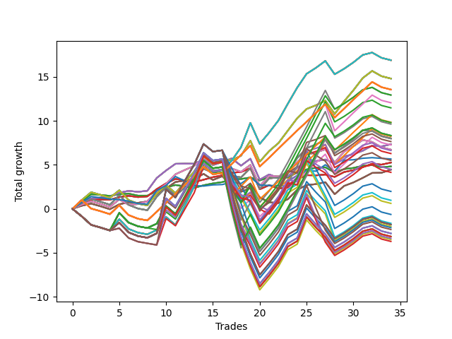

# Short Bulldog 003 
- Symbol: AAPL_Unlimited
- Date Range: 03/23/2022 - 07/08/2022
- Trading Period: 7:20-12:30
- Number of Trades: 34



| Name | Win Percent | Profit | Avg Profit / Trade | Avg Time / Trade |      | Name | Win Percent | Profit | Avg Profit / Trade | Avg Time / Trade |
| ---- | ----------- | ------ | ------------------ | ---------------- | ---- | ---- | ----------- | ------ | ------------------ | ---------------- |
| Sorted By <br> Profit | | | | | | Sorted By <br> Win Percentage ||||
| Seventy-One | 61.76 | 8455.00 | 248.68 | 110:03 |     | Sixty-Six | 76.47 | 3670.00 | 107.94 | 25:43 |
| Sixty-Three | 61.76 | 8455.00 | 248.68 | 110:03 |     | Fifty-Eight | 76.47 | 3670.00 | 107.94 | 25:43 |
| Fifty-Five | 61.76 | 8455.00 | 248.68 | 110:03 |     | Fifty | 76.47 | 3670.00 | 107.94 | 25:43 |
| Forty-Seven | 61.76 | 8455.00 | 248.68 | 110:03 |     | Forty-Two | 76.47 | 3670.00 | 107.94 | 25:43 |
| Seven | 61.76 | 8455.00 | 248.68 | 110:03 |     | Two | 76.47 | 3670.00 | 107.94 | 25:43 |
| Seventy | 64.71 | 7410.00 | 217.94 | 72:19 |     | Sixty-Five | 73.53 | 2630.00 | 77.35 | 19:10 |
| Sixty-Two | 64.71 | 7410.00 | 217.94 | 72:19 |     | Fifty-Seven | 73.53 | 2630.00 | 77.35 | 19:10 |
| Fifty-Four | 64.71 | 7410.00 | 217.94 | 72:19 |     | Forty-Nine | 73.53 | 2630.00 | 77.35 | 19:10 |
| Forty-Six | 64.71 | 7410.00 | 217.94 | 72:19 |     | Forty-One | 73.53 | 2630.00 | 77.35 | 19:10 |
| Six | 64.71 | 7410.00 | 217.94 | 72:19 |     | One | 73.53 | 2630.00 | 77.35 | 19:10 |
| One Hundred Twenty-Six | 67.65 | 6785.00 | 199.56 | 65:39 |     | Sixty-Seven | 73.53 | 2225.00 | 65.44 | 33:35 |
| One Hundred Twenty-One | 67.65 | 6785.00 | 199.56 | 65:39 |     | Fifty-Nine | 73.53 | 2225.00 | 65.44 | 33:35 |
| One Hundred Sixteen | 67.65 | 6785.00 | 199.56 | 65:39 |     | Fifty-One | 73.53 | 2225.00 | 65.44 | 33:35 |
| One Hundred Eleven | 67.65 | 6785.00 | 199.56 | 65:39 |     | Forty-Three | 73.53 | 2225.00 | 65.44 | 33:35 |
| Eighty-One | 67.65 | 6785.00 | 199.56 | 65:39 |     | Three | 73.53 | 2225.00 | 65.44 | 33:35 |
| One Hundred Seven | 55.88 | 6475.00 | 190.44 | 117:22 |     | Sixty-Four | 70.59 | 2410.00 | 70.88 | 11:41 |
| Ninety-Two | 55.88 | 6470.00 | 190.29 | 113:53 |     | Fifty-Six | 70.59 | 2410.00 | 70.88 | 11:41 |
| One Hundred One | 67.65 | 6035.00 | 177.50 | 65:18 |     | Forty-Eight | 70.59 | 2410.00 | 70.88 | 11:41 |
| Ninety-Seven | 50.00 | 5745.00 | 168.97 | 109:17 |     | Forty | 70.59 | 2410.00 | 70.88 | 11:41 |
| One Hundred Six | 64.71 | 4925.00 | 144.85 | 64:25 |     | Zero | 70.59 | 2410.00 | 70.88 | 11:41 |
| One Hundred Seventeen | 55.88 | 4905.00 | 144.26 | 120:41 |     | One Hundred Twenty-Six | 67.65 | 6785.00 | 199.56 | 65:39 |
| One Hundred Two | 55.88 | 4820.00 | 141.76 | 119:38 |     | One Hundred Twenty-One | 67.65 | 6785.00 | 199.56 | 65:39 |
| One Hundred Twenty-Seven | 55.88 | 4165.00 | 122.50 | 122:29 |     | One Hundred Sixteen | 67.65 | 6785.00 | 199.56 | 65:39 |
| One Hundred Twenty-Two | 55.88 | 4165.00 | 122.50 | 122:29 |     | One Hundred Eleven | 67.65 | 6785.00 | 199.56 | 65:39 |
| Eighty-Two | 55.88 | 4165.00 | 122.50 | 122:29 |     | Eighty-One | 67.65 | 6785.00 | 199.56 | 65:39 |
| Ninety-Six | 61.76 | 4120.00 | 121.18 | 61:28 |     | One Hundred One | 67.65 | 6035.00 | 177.50 | 65:18 |
| Sixty-Nine | 58.82 | 4005.00 | 117.79 | 54:29 |     | Seventy | 64.71 | 7410.00 | 217.94 | 72:19 |
| Sixty-One | 58.82 | 4005.00 | 117.79 | 54:29 |     | Sixty-Two | 64.71 | 7410.00 | 217.94 | 72:19 |
| Fifty-Three | 58.82 | 4005.00 | 117.79 | 54:29 |     | Fifty-Four | 64.71 | 7410.00 | 217.94 | 72:19 |
| Forty-Five | 58.82 | 4005.00 | 117.79 | 54:29 |     | Forty-Six | 64.71 | 7410.00 | 217.94 | 72:19 |
| Five | 58.82 | 4005.00 | 117.79 | 54:29 |     | Six | 64.71 | 7410.00 | 217.94 | 72:19 |
| One Hundred Twelve | 55.88 | 3990.00 | 117.35 | 122:21 |     | One Hundred Six | 64.71 | 4925.00 | 144.85 | 64:25 |
| One Hundred | 50.00 | 3825.00 | 112.50 | 131:34 |     | Sixty-Eight | 64.71 | 3365.00 | 98.97 | 45:30 |
| Sixty-Six | 76.47 | 3670.00 | 107.94 | 25:43 |     | Sixty | 64.71 | 3365.00 | 98.97 | 45:30 |
| Fifty-Eight | 76.47 | 3670.00 | 107.94 | 25:43 |     | Fifty-Two | 64.71 | 3365.00 | 98.97 | 45:30 |
| Fifty | 76.47 | 3670.00 | 107.94 | 25:43 |     | Forty-Four | 64.71 | 3365.00 | 98.97 | 45:30 |
| Forty-Two | 76.47 | 3670.00 | 107.94 | 25:43 |     | Four | 64.71 | 3365.00 | 98.97 | 45:30 |
| Two | 76.47 | 3670.00 | 107.94 | 25:43 |     | Seventy-One | 61.76 | 8455.00 | 248.68 | 110:03 |
| Ninety-One | 61.76 | 3635.00 | 106.91 | 61:18 |     | Sixty-Three | 61.76 | 8455.00 | 248.68 | 110:03 |
| Sixty-Eight | 64.71 | 3365.00 | 98.97 | 45:30 |     | Fifty-Five | 61.76 | 8455.00 | 248.68 | 110:03 |
| Sixty | 64.71 | 3365.00 | 98.97 | 45:30 |     | Forty-Seven | 61.76 | 8455.00 | 248.68 | 110:03 |
| Fifty-Two | 64.71 | 3365.00 | 98.97 | 45:30 |     | Seven | 61.76 | 8455.00 | 248.68 | 110:03 |
| Forty-Four | 64.71 | 3365.00 | 98.97 | 45:30 |     | Ninety-Six | 61.76 | 4120.00 | 121.18 | 61:28 |
| Four | 64.71 | 3365.00 | 98.97 | 45:30 |     | Ninety-One | 61.76 | 3635.00 | 106.91 | 61:18 |
| Ninety-Nine | 50.00 | 3320.00 | 97.65 | 130:27 |     | Sixty-Nine | 58.82 | 4005.00 | 117.79 | 54:29 |
| Ninety-Eight | 50.00 | 3145.00 | 92.50 | 127:27 |     | Sixty-One | 58.82 | 4005.00 | 117.79 | 54:29 |
| Seventy-Three | 47.06 | 2835.00 | 83.38 | 14:17 |     | Fifty-Three | 58.82 | 4005.00 | 117.79 | 54:29 |
| One Hundred Ten | 44.12 | 2755.00 | 81.03 | 142:24 |     | Forty-Five | 58.82 | 4005.00 | 117.79 | 54:29 |
| Sixty-Five | 73.53 | 2630.00 | 77.35 | 19:10 |     | Five | 58.82 | 4005.00 | 117.79 | 54:29 |
| Fifty-Seven | 73.53 | 2630.00 | 77.35 | 19:10 |     | One Hundred Seven | 55.88 | 6475.00 | 190.44 | 117:22 |
| Forty-Nine | 73.53 | 2630.00 | 77.35 | 19:10 |     | Ninety-Two | 55.88 | 6470.00 | 190.29 | 113:53 |
| Forty-One | 73.53 | 2630.00 | 77.35 | 19:10 |     | One Hundred Seventeen | 55.88 | 4905.00 | 144.26 | 120:41 |
| One | 73.53 | 2630.00 | 77.35 | 19:10 |     | One Hundred Two | 55.88 | 4820.00 | 141.76 | 119:38 |
| Sixty-Four | 70.59 | 2410.00 | 70.88 | 11:41 |     | One Hundred Twenty-Seven | 55.88 | 4165.00 | 122.50 | 122:29 |
| Fifty-Six | 70.59 | 2410.00 | 70.88 | 11:41 |     | One Hundred Twenty-Two | 55.88 | 4165.00 | 122.50 | 122:29 |
| Forty-Eight | 70.59 | 2410.00 | 70.88 | 11:41 |     | Eighty-Two | 55.88 | 4165.00 | 122.50 | 122:29 |
| Forty | 70.59 | 2410.00 | 70.88 | 11:41 |     | One Hundred Twelve | 55.88 | 3990.00 | 117.35 | 122:21 |
| Zero | 70.59 | 2410.00 | 70.88 | 11:41 |     | Ninety-Seven | 50.00 | 5745.00 | 168.97 | 109:17 |
| One Hundred Nine | 44.12 | 2250.00 | 66.18 | 141:17 |     | One Hundred | 50.00 | 3825.00 | 112.50 | 131:34 |
| Sixty-Seven | 73.53 | 2225.00 | 65.44 | 33:35 |     | Ninety-Nine | 50.00 | 3320.00 | 97.65 | 130:27 |
| Fifty-Nine | 73.53 | 2225.00 | 65.44 | 33:35 |     | Ninety-Eight | 50.00 | 3145.00 | 92.50 | 127:27 |
| Fifty-One | 73.53 | 2225.00 | 65.44 | 33:35 |     | Seventy-Three | 47.06 | 2835.00 | 83.38 | 14:17 |
| Forty-Three | 73.53 | 2225.00 | 65.44 | 33:35 |     | Ninety-Five | 47.06 | 990.00 | 29.12 | 143:57 |
| Three | 73.53 | 2225.00 | 65.44 | 33:35 |     | Ninety-Four | 47.06 | 485.00 | 14.26 | 142:50 |
| One Hundred Eight | 44.12 | 2075.00 | 61.03 | 138:17 |     | Ninety-Three | 47.06 | 310.00 | 9.12 | 139:50 |
| Ninety-Five | 47.06 | 990.00 | 29.12 | 143:57 |     | One Hundred Five | 47.06 | -320.00 | -9.41 | 151:19 |
| Ninety-Four | 47.06 | 485.00 | 14.26 | 142:50 |     | One Hundred Four | 47.06 | -825.00 | -24.26 | 150:12 |
| Ninety-Three | 47.06 | 310.00 | 9.12 | 139:50 |     | One Hundred Thirty | 47.06 | -895.00 | -26.32 | 154:25 |
| One Hundred Five | 47.06 | -320.00 | -9.41 | 151:19 |     | One Hundred Twenty-Five | 47.06 | -895.00 | -26.32 | 154:25 |
| One Hundred Four | 47.06 | -825.00 | -24.26 | 150:12 |     | Eighty-Five | 47.06 | -895.00 | -26.32 | 154:25 |
| One Hundred Thirty | 47.06 | -895.00 | -26.32 | 154:25 |     | One Hundred Three | 47.06 | -1000.00 | -29.41 | 147:12 |
| One Hundred Twenty-Five | 47.06 | -895.00 | -26.32 | 154:25 |     | One Hundred Fifteen | 47.06 | -1070.00 | -31.47 | 154:16 |
| Eighty-Five | 47.06 | -895.00 | -26.32 | 154:25 |     | One Hundred Twenty | 47.06 | -1175.00 | -34.56 | 151:00 |
| One Hundred Three | 47.06 | -1000.00 | -29.41 | 147:12 |     | One Hundred Twenty-Nine | 47.06 | -1400.00 | -41.18 | 153:18 |
| One Hundred Fifteen | 47.06 | -1070.00 | -31.47 | 154:16 |     | One Hundred Twenty-Four | 47.06 | -1400.00 | -41.18 | 153:18 |
| One Hundred Twenty | 47.06 | -1175.00 | -34.56 | 151:00 |     | Eighty-Four | 47.06 | -1400.00 | -41.18 | 153:18 |
| One Hundred Twenty-Nine | 47.06 | -1400.00 | -41.18 | 153:18 |     | One Hundred Twenty-Eight | 47.06 | -1575.00 | -46.32 | 150:18 |
| One Hundred Twenty-Four | 47.06 | -1400.00 | -41.18 | 153:18 |     | One Hundred Twenty-Three | 47.06 | -1575.00 | -46.32 | 150:18 |
| Eighty-Four | 47.06 | -1400.00 | -41.18 | 153:18 |     | One Hundred Fourteen | 47.06 | -1575.00 | -46.32 | 153:09 |
| One Hundred Twenty-Eight | 47.06 | -1575.00 | -46.32 | 150:18 |     | Eighty-Three | 47.06 | -1575.00 | -46.32 | 150:18 |
| One Hundred Twenty-Three | 47.06 | -1575.00 | -46.32 | 150:18 |     | One Hundred Ninteen | 47.06 | -1680.00 | -49.41 | 149:53 |
| One Hundred Fourteen | 47.06 | -1575.00 | -46.32 | 153:09 |     | One Hundred Thirteen | 47.06 | -1750.00 | -51.47 | 150:09 |
| Eighty-Three | 47.06 | -1575.00 | -46.32 | 150:18 |     | One Hundred Eighteen | 47.06 | -1855.00 | -54.56 | 146:53 |
| One Hundred Ninteen | 47.06 | -1680.00 | -49.41 | 149:53 |     | One Hundred Ten | 44.12 | 2755.00 | 81.03 | 142:24 |
| One Hundred Thirteen | 47.06 | -1750.00 | -51.47 | 150:09 |     | One Hundred Nine | 44.12 | 2250.00 | 66.18 | 141:17 |
| One Hundred Eighteen | 47.06 | -1855.00 | -54.56 | 146:53 |     | One Hundred Eight | 44.12 | 2075.00 | 61.03 | 138:17 |

## NO STOPLOSS

### Test Zero
* Sell when price hits the middle line of the 20p bollinger
* No Stoploss
* Results:
```
Total Trades: 34
Percent Up: 29.41
Percent Down: 70.59
Total Points Moved Down: 4.82
Potential Profit: 2410.00
Total Points Ups: 1.98 Count Ups: 10
Total Points Downs: 6.80 Count Downs: 24
```

<details><summary>Trades</summary>

<code>In: 2022-03-24 10:02:00		Out: 2022-03-24 10:09:20		Total Position Time: 07:20		Total Move Down: 0.88		Total to Date: 0.88</code> <br />
<code>In: 2022-03-24 10:03:00		Out: 2022-03-24 10:09:20		Total Position Time: 06:20		Total Move Down: 0.77		Total to Date: 1.65</code> <br />
<code>In: 2022-03-24 12:12:00		Out: 2022-03-24 12:32:50		Total Position Time: 20:50		Total Move Down: -0.07		Total to Date: 1.58</code> <br />
<code>In: 2022-03-24 12:13:00		Out: 2022-03-24 12:32:50		Total Position Time: 19:50		Total Move Down: -0.11		Total to Date: 1.47</code> <br />
<code>In: 2022-03-25 07:44:00		Out: 2022-03-25 07:51:25		Total Position Time: 07:25		Total Move Down: 0.19		Total to Date: 1.66</code> <br />
<code>In: 2022-03-29 10:50:00		Out: 2022-03-29 11:04:05		Total Position Time: 14:05		Total Move Down: 0.07		Total to Date: 1.73</code> <br />
<code>In: 2022-03-29 12:06:00		Out: 2022-03-29 12:25:30		Total Position Time: 19:30		Total Move Down: -0.23		Total to Date: 1.50</code> <br />
<code>In: 2022-03-29 12:10:00		Out: 2022-03-29 12:25:30		Total Position Time: 15:30		Total Move Down: -0.00		Total to Date: 1.50</code> <br />
<code>In: 2022-04-06 11:06:00		Out: 2022-04-06 11:07:50		Total Position Time: 01:50		Total Move Down: 0.52		Total to Date: 2.02</code> <br />
<code>In: 2022-04-21 08:29:00		Out: 2022-04-21 08:32:30		Total Position Time: 03:30		Total Move Down: 0.42		Total to Date: 2.44</code> <br />
<code>In: 2022-04-25 11:50:00		Out: 2022-04-25 11:59:15		Total Position Time: 09:15		Total Move Down: 0.27		Total to Date: 2.71</code> <br />
<code>In: 2022-04-27 09:25:00		Out: 2022-04-27 09:41:10		Total Position Time: 16:10		Total Move Down: -0.15		Total to Date: 2.56</code> <br />
<code>In: 2022-04-27 09:27:00		Out: 2022-04-27 09:41:10		Total Position Time: 14:10		Total Move Down: -0.18		Total to Date: 2.38</code> <br />
<code>In: 2022-04-27 09:30:00		Out: 2022-04-27 09:41:10		Total Position Time: 11:10		Total Move Down: 0.30		Total to Date: 2.68</code> <br />
<code>In: 2022-04-28 09:49:00		Out: 2022-04-28 09:57:10		Total Position Time: 08:10		Total Move Down: 0.21		Total to Date: 2.89</code> <br />
<code>In: 2022-05-03 08:10:00		Out: 2022-05-03 08:27:15		Total Position Time: 17:15		Total Move Down: 0.15		Total to Date: 3.04</code> <br />
<code>In: 2022-05-04 08:56:00		Out: 2022-05-04 09:04:40		Total Position Time: 08:40		Total Move Down: 0.33		Total to Date: 3.37</code> <br />
<code>In: 2022-05-04 09:24:00		Out: 2022-05-04 09:42:25		Total Position Time: 18:25		Total Move Down: 0.02		Total to Date: 3.39</code> <br />
<code>In: 2022-05-04 11:03:00		Out: 2022-05-04 11:06:30		Total Position Time: 03:30		Total Move Down: 0.17		Total to Date: 3.56</code> <br />
<code>In: 2022-05-04 11:49:00		Out: 2022-05-04 12:07:00		Total Position Time: 18:00		Total Move Down: -0.33		Total to Date: 3.23</code> <br />
<code>In: 2022-05-16 08:57:00		Out: 2022-05-16 09:05:45		Total Position Time: 08:45		Total Move Down: 0.36		Total to Date: 3.59</code> <br />
<code>In: 2022-05-16 11:07:00		Out: 2022-05-16 11:26:05		Total Position Time: 19:05		Total Move Down: -0.08		Total to Date: 3.51</code> <br />
<code>In: 2022-05-16 11:32:00		Out: 2022-05-16 11:44:55		Total Position Time: 12:55		Total Move Down: 0.06		Total to Date: 3.57</code> <br />
<code>In: 2022-05-25 07:36:00		Out: 2022-05-25 07:41:55		Total Position Time: 05:55		Total Move Down: 0.57		Total to Date: 4.14</code> <br />
<code>In: 2022-06-13 09:37:00		Out: 2022-06-13 09:44:50		Total Position Time: 07:50		Total Move Down: 0.34		Total to Date: 4.48</code> <br />
<code>In: 2022-06-15 09:04:00		Out: 2022-06-15 09:08:20		Total Position Time: 04:20		Total Move Down: 0.19		Total to Date: 4.67</code> <br />
<code>In: 2022-06-15 09:19:00		Out: 2022-06-15 09:29:05		Total Position Time: 10:05		Total Move Down: 0.05		Total to Date: 4.72</code> <br />
<code>In: 2022-06-15 11:40:00		Out: 2022-06-15 11:54:15		Total Position Time: 14:15		Total Move Down: -0.59		Total to Date: 4.13</code> <br />
<code>In: 2022-06-17 08:32:00		Out: 2022-06-17 08:38:40		Total Position Time: 06:40		Total Move Down: 0.39		Total to Date: 4.52</code> <br />
<code>In: 2022-06-17 10:11:00		Out: 2022-06-17 10:21:05		Total Position Time: 10:05		Total Move Down: 0.13		Total to Date: 4.65</code> <br />
<code>In: 2022-06-17 10:14:00		Out: 2022-06-17 10:21:05		Total Position Time: 07:05		Total Move Down: 0.25		Total to Date: 4.90</code> <br />
<code>In: 2022-06-30 08:49:00		Out: 2022-06-30 09:04:05		Total Position Time: 15:05		Total Move Down: 0.07		Total to Date: 4.97</code> <br />
<code>In: 2022-07-01 11:26:00		Out: 2022-07-01 11:54:10		Total Position Time: 28:10		Total Move Down: -0.24		Total to Date: 4.73</code> <br />
<code>In: 2022-07-01 11:48:00		Out: 2022-07-01 11:54:10		Total Position Time: 06:10		Total Move Down: 0.09		Total to Date: 4.82</code> <br />


</details>

### Test One
* Sell when the price hits the upper line of the 20p 1std bollinger
* No Stoploss
* Results:
```
Total Trades: 34
Percent Up: 26.47
Percent Down: 73.53
Total Points Moved Down: 5.26
Potential Profit: 2630.00
Total Points Ups: 3.71 Count Ups: 9
Total Points Downs: 8.97 Count Downs: 25
```

<details><summary>Trades</summary>

<code>In: 2022-03-24 10:02:00		Out: 2022-03-24 10:33:15		Total Position Time: 31:15		Total Move Down: 0.58		Total to Date: 0.58</code> <br />
<code>In: 2022-03-24 10:03:00		Out: 2022-03-24 10:33:15		Total Position Time: 30:15		Total Move Down: 0.47		Total to Date: 1.05</code> <br />
<code>In: 2022-03-24 12:12:00		Out: 2022-03-24 12:39:00		Total Position Time: 27:00		Total Move Down: 0.01		Total to Date: 1.06</code> <br />
<code>In: 2022-03-24 12:13:00		Out: 2022-03-24 12:39:00		Total Position Time: 26:00		Total Move Down: -0.03		Total to Date: 1.03</code> <br />
<code>In: 2022-03-25 07:44:00		Out: 2022-03-25 07:54:05		Total Position Time: 10:05		Total Move Down: 0.30		Total to Date: 1.33</code> <br />
<code>In: 2022-03-29 10:50:00		Out: 2022-03-29 11:06:05		Total Position Time: 16:05		Total Move Down: 0.15		Total to Date: 1.48</code> <br />
<code>In: 2022-03-29 12:06:00		Out: 2022-03-29 12:27:40		Total Position Time: 21:40		Total Move Down: -0.15		Total to Date: 1.33</code> <br />
<code>In: 2022-03-29 12:10:00		Out: 2022-03-29 12:27:40		Total Position Time: 17:40		Total Move Down: 0.08		Total to Date: 1.41</code> <br />
<code>In: 2022-04-06 11:06:00		Out: 2022-04-06 11:09:20		Total Position Time: 03:20		Total Move Down: 0.83		Total to Date: 2.24</code> <br />
<code>In: 2022-04-21 08:29:00		Out: 2022-04-21 08:33:45		Total Position Time: 04:45		Total Move Down: 0.65		Total to Date: 2.89</code> <br />
<code>In: 2022-04-25 11:50:00		Out: 2022-04-25 12:02:00		Total Position Time: 12:00		Total Move Down: 0.51		Total to Date: 3.40</code> <br />
<code>In: 2022-04-27 09:25:00		Out: 2022-04-27 09:50:25		Total Position Time: 25:25		Total Move Down: -0.17		Total to Date: 3.23</code> <br />
<code>In: 2022-04-27 09:27:00		Out: 2022-04-27 09:50:25		Total Position Time: 23:25		Total Move Down: -0.20		Total to Date: 3.03</code> <br />
<code>In: 2022-04-27 09:30:00		Out: 2022-04-27 09:50:25		Total Position Time: 20:25		Total Move Down: 0.28		Total to Date: 3.31</code> <br />
<code>In: 2022-04-28 09:49:00		Out: 2022-04-28 10:02:15		Total Position Time: 13:15		Total Move Down: 0.29		Total to Date: 3.60</code> <br />
<code>In: 2022-05-03 08:10:00		Out: 2022-05-03 08:36:05		Total Position Time: 26:05		Total Move Down: 0.20		Total to Date: 3.80</code> <br />
<code>In: 2022-05-04 08:56:00		Out: 2022-05-04 09:10:15		Total Position Time: 14:15		Total Move Down: 0.30		Total to Date: 4.10</code> <br />
<code>In: 2022-05-04 09:24:00		Out: 2022-05-04 09:46:30		Total Position Time: 22:30		Total Move Down: 0.09		Total to Date: 4.19</code> <br />
<code>In: 2022-05-04 11:03:00		Out: 2022-05-04 11:07:05		Total Position Time: 04:05		Total Move Down: 0.42		Total to Date: 4.61</code> <br />
<code>In: 2022-05-04 11:49:00		Out: 2022-05-04 12:47:00		Total Position Time: 58:00		Total Move Down: -2.39		Total to Date: 2.22</code> <br />
<code>In: 2022-05-16 08:57:00		Out: 2022-05-16 09:11:30		Total Position Time: 14:30		Total Move Down: 0.47		Total to Date: 2.69</code> <br />
<code>In: 2022-05-16 11:07:00		Out: 2022-05-16 11:48:45		Total Position Time: 41:45		Total Move Down: -0.38		Total to Date: 2.31</code> <br />
<code>In: 2022-05-16 11:32:00		Out: 2022-05-16 11:48:45		Total Position Time: 16:45		Total Move Down: 0.13		Total to Date: 2.44</code> <br />
<code>In: 2022-05-25 07:36:00		Out: 2022-05-25 07:43:30		Total Position Time: 07:30		Total Move Down: 0.91		Total to Date: 3.35</code> <br />
<code>In: 2022-06-13 09:37:00		Out: 2022-06-13 09:48:10		Total Position Time: 11:10		Total Move Down: 0.48		Total to Date: 3.83</code> <br />
<code>In: 2022-06-15 09:04:00		Out: 2022-06-15 09:33:30		Total Position Time: 29:30		Total Move Down: -0.02		Total to Date: 3.81</code> <br />
<code>In: 2022-06-15 09:19:00		Out: 2022-06-15 09:33:30		Total Position Time: 14:30		Total Move Down: 0.09		Total to Date: 3.90</code> <br />
<code>In: 2022-06-15 11:40:00		Out: 2022-06-15 11:58:05		Total Position Time: 18:05		Total Move Down: -0.27		Total to Date: 3.63</code> <br />
<code>In: 2022-06-17 08:32:00		Out: 2022-06-17 08:42:50		Total Position Time: 10:50		Total Move Down: 0.55		Total to Date: 4.18</code> <br />
<code>In: 2022-06-17 10:11:00		Out: 2022-06-17 10:26:30		Total Position Time: 15:30		Total Move Down: 0.22		Total to Date: 4.40</code> <br />
<code>In: 2022-06-17 10:14:00		Out: 2022-06-17 10:26:30		Total Position Time: 12:30		Total Move Down: 0.34		Total to Date: 4.74</code> <br />
<code>In: 2022-06-30 08:49:00		Out: 2022-06-30 09:05:45		Total Position Time: 16:45		Total Move Down: 0.39		Total to Date: 5.13</code> <br />
<code>In: 2022-07-01 11:26:00		Out: 2022-07-01 11:54:40		Total Position Time: 28:40		Total Move Down: -0.10		Total to Date: 5.03</code> <br />
<code>In: 2022-07-01 11:48:00		Out: 2022-07-01 11:54:40		Total Position Time: 06:40		Total Move Down: 0.23		Total to Date: 5.26</code> <br />


</details>

### Test Two
* Sell when the price hits the upper line of the 20p 2std bollinger
* No Stoploss
* Results:
```
Total Trades: 34
Percent Up: 23.53
Percent Down: 76.47
Total Points Moved Down: 7.34
Potential Profit: 3670.00
Total Points Ups: 4.87 Count Ups: 8
Total Points Downs: 12.21 Count Downs: 26
```

<details><summary>Trades</summary>

<code>In: 2022-03-24 10:02:00		Out: 2022-03-24 10:34:15		Total Position Time: 32:15		Total Move Down: 0.64		Total to Date: 0.64</code> <br />
<code>In: 2022-03-24 10:03:00		Out: 2022-03-24 10:34:15		Total Position Time: 31:15		Total Move Down: 0.53		Total to Date: 1.17</code> <br />
<code>In: 2022-03-24 12:12:00		Out: 2022-03-24 12:39:40		Total Position Time: 27:40		Total Move Down: 0.11		Total to Date: 1.28</code> <br />
<code>In: 2022-03-24 12:13:00		Out: 2022-03-24 12:39:40		Total Position Time: 26:40		Total Move Down: 0.07		Total to Date: 1.35</code> <br />
<code>In: 2022-03-25 07:44:00		Out: 2022-03-25 07:55:35		Total Position Time: 11:35		Total Move Down: 0.48		Total to Date: 1.83</code> <br />
<code>In: 2022-03-29 10:50:00		Out: 2022-03-29 11:07:05		Total Position Time: 17:05		Total Move Down: 0.21		Total to Date: 2.04</code> <br />
<code>In: 2022-03-29 12:06:00		Out: 2022-03-29 12:27:50		Total Position Time: 21:50		Total Move Down: -0.11		Total to Date: 1.93</code> <br />
<code>In: 2022-03-29 12:10:00		Out: 2022-03-29 12:27:50		Total Position Time: 17:50		Total Move Down: 0.12		Total to Date: 2.05</code> <br />
<code>In: 2022-04-06 11:06:00		Out: 2022-04-06 11:15:10		Total Position Time: 09:10		Total Move Down: 1.46		Total to Date: 3.51</code> <br />
<code>In: 2022-04-21 08:29:00		Out: 2022-04-21 08:45:05		Total Position Time: 16:05		Total Move Down: 0.85		Total to Date: 4.36</code> <br />
<code>In: 2022-04-25 11:50:00		Out: 2022-04-25 12:03:15		Total Position Time: 13:15		Total Move Down: 0.76		Total to Date: 5.12</code> <br />
<code>In: 2022-04-27 09:25:00		Out: 2022-04-27 09:53:40		Total Position Time: 28:40		Total Move Down: 0.02		Total to Date: 5.14</code> <br />
<code>In: 2022-04-27 09:27:00		Out: 2022-04-27 09:53:40		Total Position Time: 26:40		Total Move Down: -0.01		Total to Date: 5.13</code> <br />
<code>In: 2022-04-27 09:30:00		Out: 2022-04-27 09:53:40		Total Position Time: 23:40		Total Move Down: 0.47		Total to Date: 5.60</code> <br />
<code>In: 2022-04-28 09:49:00		Out: 2022-04-28 11:06:20		Total Position Time: 77:20		Total Move Down: -0.63		Total to Date: 4.97</code> <br />
<code>In: 2022-05-03 08:10:00		Out: 2022-05-03 08:37:20		Total Position Time: 27:20		Total Move Down: 0.36		Total to Date: 5.33</code> <br />
<code>In: 2022-05-04 08:56:00		Out: 2022-05-04 09:12:25		Total Position Time: 16:25		Total Move Down: 0.40		Total to Date: 5.73</code> <br />
<code>In: 2022-05-04 09:24:00		Out: 2022-05-04 10:55:15		Total Position Time: 91:15		Total Move Down: -0.82		Total to Date: 4.91</code> <br />
<code>In: 2022-05-04 11:03:00		Out: 2022-05-04 11:07:25		Total Position Time: 04:25		Total Move Down: 0.79		Total to Date: 5.70</code> <br />
<code>In: 2022-05-04 11:49:00		Out: 2022-05-04 12:47:00		Total Position Time: 58:00		Total Move Down: -2.39		Total to Date: 3.31</code> <br />
<code>In: 2022-05-16 08:57:00		Out: 2022-05-16 09:14:40		Total Position Time: 17:40		Total Move Down: 0.60		Total to Date: 3.91</code> <br />
<code>In: 2022-05-16 11:07:00		Out: 2022-05-16 11:48:45		Total Position Time: 41:45		Total Move Down: -0.38		Total to Date: 3.53</code> <br />
<code>In: 2022-05-16 11:32:00		Out: 2022-05-16 11:48:45		Total Position Time: 16:45		Total Move Down: 0.13		Total to Date: 3.66</code> <br />
<code>In: 2022-05-25 07:36:00		Out: 2022-05-25 07:48:05		Total Position Time: 12:05		Total Move Down: 1.02		Total to Date: 4.68</code> <br />
<code>In: 2022-06-13 09:37:00		Out: 2022-06-13 09:54:10		Total Position Time: 17:10		Total Move Down: 0.68		Total to Date: 5.36</code> <br />
<code>In: 2022-06-15 09:04:00		Out: 2022-06-15 09:34:20		Total Position Time: 30:20		Total Move Down: 0.07		Total to Date: 5.43</code> <br />
<code>In: 2022-06-15 09:19:00		Out: 2022-06-15 09:34:20		Total Position Time: 15:20		Total Move Down: 0.18		Total to Date: 5.61</code> <br />
<code>In: 2022-06-15 11:40:00		Out: 2022-06-15 12:13:05		Total Position Time: 33:05		Total Move Down: -0.44		Total to Date: 5.17</code> <br />
<code>In: 2022-06-17 08:32:00		Out: 2022-06-17 08:44:55		Total Position Time: 12:55		Total Move Down: 0.78		Total to Date: 5.95</code> <br />
<code>In: 2022-06-17 10:11:00		Out: 2022-06-17 10:28:10		Total Position Time: 17:10		Total Move Down: 0.27		Total to Date: 6.22</code> <br />
<code>In: 2022-06-17 10:14:00		Out: 2022-06-17 10:28:10		Total Position Time: 14:10		Total Move Down: 0.39		Total to Date: 6.61</code> <br />
<code>In: 2022-06-30 08:49:00		Out: 2022-06-30 09:06:25		Total Position Time: 17:25		Total Move Down: 0.58		Total to Date: 7.19</code> <br />
<code>In: 2022-07-01 11:26:00		Out: 2022-07-01 12:02:15		Total Position Time: 36:15		Total Move Down: -0.09		Total to Date: 7.10</code> <br />
<code>In: 2022-07-01 11:48:00		Out: 2022-07-01 12:02:15		Total Position Time: 14:15		Total Move Down: 0.24		Total to Date: 7.34</code> <br />


</details>

### Test Three
* Sell when price hits the middle line of the 50p bollinger
* No Stoploss
* Results:
```
Total Trades: 34
Percent Up: 26.47
Percent Down: 73.53
Total Points Moved Down: 4.45
Potential Profit: 2225.00
Total Points Ups: 7.02 Count Ups: 9
Total Points Downs: 11.47 Count Downs: 25
```

<details><summary>Trades</summary>

<code>In: 2022-03-24 10:02:00		Out: 2022-03-24 11:09:05		Total Position Time: 67:05		Total Move Down: 0.35		Total to Date: 0.35</code> <br />
<code>In: 2022-03-24 10:03:00		Out: 2022-03-24 11:09:05		Total Position Time: 66:05		Total Move Down: 0.24		Total to Date: 0.59</code> <br />
<code>In: 2022-03-24 12:12:00		Out: 2022-03-24 12:47:00		Total Position Time: 35:00		Total Move Down: -0.30		Total to Date: 0.29</code> <br />
<code>In: 2022-03-24 12:13:00		Out: 2022-03-24 12:47:00		Total Position Time: 34:00		Total Move Down: -0.34		Total to Date: -0.05</code> <br />
<code>In: 2022-03-25 07:44:00		Out: 2022-03-25 07:55:40		Total Position Time: 11:40		Total Move Down: 0.56		Total to Date: 0.51</code> <br />
<code>In: 2022-03-29 10:50:00		Out: 2022-03-29 11:18:35		Total Position Time: 28:35		Total Move Down: 0.24		Total to Date: 0.75</code> <br />
<code>In: 2022-03-29 12:06:00		Out: 2022-03-29 12:38:20		Total Position Time: 32:20		Total Move Down: -0.07		Total to Date: 0.68</code> <br />
<code>In: 2022-03-29 12:10:00		Out: 2022-03-29 12:38:20		Total Position Time: 28:20		Total Move Down: 0.16		Total to Date: 0.84</code> <br />
<code>In: 2022-04-06 11:06:00		Out: 2022-04-06 11:08:30		Total Position Time: 02:30		Total Move Down: 0.85		Total to Date: 1.69</code> <br />
<code>In: 2022-04-21 08:29:00		Out: 2022-04-21 08:40:30		Total Position Time: 11:30		Total Move Down: 0.63		Total to Date: 2.32</code> <br />
<code>In: 2022-04-25 11:50:00		Out: 2022-04-25 12:03:10		Total Position Time: 13:10		Total Move Down: 0.73		Total to Date: 3.05</code> <br />
<code>In: 2022-04-27 09:25:00		Out: 2022-04-27 09:55:40		Total Position Time: 30:40		Total Move Down: 0.17		Total to Date: 3.22</code> <br />
<code>In: 2022-04-27 09:27:00		Out: 2022-04-27 09:55:40		Total Position Time: 28:40		Total Move Down: 0.14		Total to Date: 3.36</code> <br />
<code>In: 2022-04-27 09:30:00		Out: 2022-04-27 09:55:40		Total Position Time: 25:40		Total Move Down: 0.62		Total to Date: 3.98</code> <br />
<code>In: 2022-04-28 09:49:00		Out: 2022-04-28 11:01:05		Total Position Time: 72:05		Total Move Down: -0.70		Total to Date: 3.28</code> <br />
<code>In: 2022-05-03 08:10:00		Out: 2022-05-03 08:46:00		Total Position Time: 36:00		Total Move Down: 0.43		Total to Date: 3.71</code> <br />
<code>In: 2022-05-04 08:56:00		Out: 2022-05-04 11:00:20		Total Position Time: 124:20		Total Move Down: -1.15		Total to Date: 2.56</code> <br />
<code>In: 2022-05-04 09:24:00		Out: 2022-05-04 11:00:20		Total Position Time: 96:20		Total Move Down: -0.62		Total to Date: 1.94</code> <br />
<code>In: 2022-05-04 11:03:00		Out: 2022-05-04 11:07:05		Total Position Time: 04:05		Total Move Down: 0.42		Total to Date: 2.36</code> <br />
<code>In: 2022-05-04 11:49:00		Out: 2022-05-04 12:47:00		Total Position Time: 58:00		Total Move Down: -2.39		Total to Date: -0.03</code> <br />
<code>In: 2022-05-16 08:57:00		Out: 2022-05-16 09:15:45		Total Position Time: 18:45		Total Move Down: 0.77		Total to Date: 0.74</code> <br />
<code>In: 2022-05-16 11:07:00		Out: 2022-05-16 11:49:00		Total Position Time: 42:00		Total Move Down: -0.08		Total to Date: 0.66</code> <br />
<code>In: 2022-05-16 11:32:00		Out: 2022-05-16 11:49:00		Total Position Time: 17:00		Total Move Down: 0.43		Total to Date: 1.09</code> <br />
<code>In: 2022-05-25 07:36:00		Out: 2022-05-25 07:48:40		Total Position Time: 12:40		Total Move Down: 1.07		Total to Date: 2.16</code> <br />
<code>In: 2022-06-13 09:37:00		Out: 2022-06-13 09:51:50		Total Position Time: 14:50		Total Move Down: 0.54		Total to Date: 2.70</code> <br />
<code>In: 2022-06-15 09:04:00		Out: 2022-06-15 09:34:25		Total Position Time: 30:25		Total Move Down: 0.11		Total to Date: 2.81</code> <br />
<code>In: 2022-06-15 09:19:00		Out: 2022-06-15 09:34:25		Total Position Time: 15:25		Total Move Down: 0.22		Total to Date: 3.03</code> <br />
<code>In: 2022-06-15 11:40:00		Out: 2022-06-15 12:43:05		Total Position Time: 63:05		Total Move Down: -1.37		Total to Date: 1.66</code> <br />
<code>In: 2022-06-17 08:32:00		Out: 2022-06-17 08:45:15		Total Position Time: 13:15		Total Move Down: 0.94		Total to Date: 2.60</code> <br />
<code>In: 2022-06-17 10:11:00		Out: 2022-06-17 10:31:45		Total Position Time: 20:45		Total Move Down: 0.40		Total to Date: 3.00</code> <br />
<code>In: 2022-06-17 10:14:00		Out: 2022-06-17 10:31:45		Total Position Time: 17:45		Total Move Down: 0.52		Total to Date: 3.52</code> <br />
<code>In: 2022-06-30 08:49:00		Out: 2022-06-30 09:06:20		Total Position Time: 17:20		Total Move Down: 0.56		Total to Date: 4.08</code> <br />
<code>In: 2022-07-01 11:26:00		Out: 2022-07-01 12:03:30		Total Position Time: 37:30		Total Move Down: 0.02		Total to Date: 4.10</code> <br />
<code>In: 2022-07-01 11:48:00		Out: 2022-07-01 12:03:30		Total Position Time: 15:30		Total Move Down: 0.35		Total to Date: 4.45</code> <br />


</details>

### Test Four
* Sell when the price hits the upper line of the 50p 1std bollinger
* No Stoploss
* Results:
```
Total Trades: 34
Percent Up: 35.29
Percent Down: 64.71
Total Points Moved Down: 6.73
Potential Profit: 3365.00
Total Points Ups: 8.23 Count Ups: 12
Total Points Downs: 14.96 Count Downs: 22
```

<details><summary>Trades</summary>

<code>In: 2022-03-24 10:02:00		Out: 2022-03-24 11:10:25		Total Position Time: 68:25		Total Move Down: 0.48		Total to Date: 0.48</code> <br />
<code>In: 2022-03-24 10:03:00		Out: 2022-03-24 11:10:25		Total Position Time: 67:25		Total Move Down: 0.37		Total to Date: 0.85</code> <br />
<code>In: 2022-03-24 12:12:00		Out: 2022-03-24 12:47:00		Total Position Time: 35:00		Total Move Down: -0.30		Total to Date: 0.55</code> <br />
<code>In: 2022-03-24 12:13:00		Out: 2022-03-24 12:47:00		Total Position Time: 34:00		Total Move Down: -0.34		Total to Date: 0.21</code> <br />
<code>In: 2022-03-25 07:44:00		Out: 2022-03-25 08:01:45		Total Position Time: 17:45		Total Move Down: 0.86		Total to Date: 1.07</code> <br />
<code>In: 2022-03-29 10:50:00		Out: 2022-03-29 12:43:05		Total Position Time: 113:05		Total Move Down: -0.61		Total to Date: 0.46</code> <br />
<code>In: 2022-03-29 12:06:00		Out: 2022-03-29 12:43:05		Total Position Time: 37:05		Total Move Down: 0.08		Total to Date: 0.54</code> <br />
<code>In: 2022-03-29 12:10:00		Out: 2022-03-29 12:43:05		Total Position Time: 33:05		Total Move Down: 0.31		Total to Date: 0.85</code> <br />
<code>In: 2022-04-06 11:06:00		Out: 2022-04-06 11:14:10		Total Position Time: 08:10		Total Move Down: 1.14		Total to Date: 1.99</code> <br />
<code>In: 2022-04-21 08:29:00		Out: 2022-04-21 08:45:05		Total Position Time: 16:05		Total Move Down: 0.85		Total to Date: 2.84</code> <br />
<code>In: 2022-04-25 11:50:00		Out: 2022-04-25 12:05:20		Total Position Time: 15:20		Total Move Down: 1.09		Total to Date: 3.93</code> <br />
<code>In: 2022-04-27 09:25:00		Out: 2022-04-27 10:01:15		Total Position Time: 36:15		Total Move Down: 0.49		Total to Date: 4.42</code> <br />
<code>In: 2022-04-27 09:27:00		Out: 2022-04-27 10:01:15		Total Position Time: 34:15		Total Move Down: 0.46		Total to Date: 4.88</code> <br />
<code>In: 2022-04-27 09:30:00		Out: 2022-04-27 10:01:15		Total Position Time: 31:15		Total Move Down: 0.94		Total to Date: 5.82</code> <br />
<code>In: 2022-04-28 09:49:00		Out: 2022-04-28 11:14:05		Total Position Time: 85:05		Total Move Down: -0.62		Total to Date: 5.20</code> <br />
<code>In: 2022-05-03 08:10:00		Out: 2022-05-03 09:07:10		Total Position Time: 57:10		Total Move Down: 0.31		Total to Date: 5.51</code> <br />
<code>In: 2022-05-04 08:56:00		Out: 2022-05-04 11:00:25		Total Position Time: 124:25		Total Move Down: -0.92		Total to Date: 4.59</code> <br />
<code>In: 2022-05-04 09:24:00		Out: 2022-05-04 11:00:25		Total Position Time: 96:25		Total Move Down: -0.39		Total to Date: 4.20</code> <br />
<code>In: 2022-05-04 11:03:00		Out: 2022-05-04 11:07:25		Total Position Time: 04:25		Total Move Down: 0.79		Total to Date: 4.99</code> <br />
<code>In: 2022-05-04 11:49:00		Out: 2022-05-04 12:47:00		Total Position Time: 58:00		Total Move Down: -2.39		Total to Date: 2.60</code> <br />
<code>In: 2022-05-16 08:57:00		Out: 2022-05-16 09:24:25		Total Position Time: 27:25		Total Move Down: 1.12		Total to Date: 3.72</code> <br />
<code>In: 2022-05-16 11:07:00		Out: 2022-05-16 11:55:05		Total Position Time: 48:05		Total Move Down: -0.03		Total to Date: 3.69</code> <br />
<code>In: 2022-05-16 11:32:00		Out: 2022-05-16 11:55:05		Total Position Time: 23:05		Total Move Down: 0.48		Total to Date: 4.17</code> <br />
<code>In: 2022-05-25 07:36:00		Out: 2022-05-25 08:04:05		Total Position Time: 28:05		Total Move Down: 1.16		Total to Date: 5.33</code> <br />
<code>In: 2022-06-13 09:37:00		Out: 2022-06-13 09:56:10		Total Position Time: 19:10		Total Move Down: 0.83		Total to Date: 6.16</code> <br />
<code>In: 2022-06-15 09:04:00		Out: 2022-06-15 09:38:40		Total Position Time: 34:40		Total Move Down: 0.25		Total to Date: 6.41</code> <br />
<code>In: 2022-06-15 09:19:00		Out: 2022-06-15 09:38:40		Total Position Time: 19:40		Total Move Down: 0.36		Total to Date: 6.77</code> <br />
<code>In: 2022-06-15 11:40:00		Out: 2022-06-15 12:47:00		Total Position Time: 67:00		Total Move Down: -1.52		Total to Date: 5.25</code> <br />
<code>In: 2022-06-17 08:32:00		Out: 2022-06-17 08:52:10		Total Position Time: 20:10		Total Move Down: 1.25		Total to Date: 6.50</code> <br />
<code>In: 2022-06-17 10:11:00		Out: 2022-06-17 10:45:35		Total Position Time: 34:35		Total Move Down: 0.61		Total to Date: 7.11</code> <br />
<code>In: 2022-06-17 10:14:00		Out: 2022-06-17 10:45:35		Total Position Time: 31:35		Total Move Down: 0.73		Total to Date: 7.84</code> <br />
<code>In: 2022-06-30 08:49:00		Out: 2022-06-30 10:10:15		Total Position Time: 81:15		Total Move Down: -0.24		Total to Date: 7.60</code> <br />
<code>In: 2022-07-01 11:26:00		Out: 2022-07-01 12:47:00		Total Position Time: 81:00		Total Move Down: -0.60		Total to Date: 7.00</code> <br />
<code>In: 2022-07-01 11:48:00		Out: 2022-07-01 12:47:00		Total Position Time: 59:00		Total Move Down: -0.27		Total to Date: 6.73</code> <br />


</details>

### Test Five
* Sell when the price hits the upper line of the 50p 2std bollinger
* No Stoploss
* Results:
```
Total Trades: 34
Percent Up: 41.18
Percent Down: 58.82
Total Points Moved Down: 8.01
Potential Profit: 4005.00
Total Points Ups: 9.45 Count Ups: 14
Total Points Downs: 17.46 Count Downs: 20
```

<details><summary>Trades</summary>

<code>In: 2022-03-24 10:02:00		Out: 2022-03-24 11:10:45		Total Position Time: 68:45		Total Move Down: 0.61		Total to Date: 0.61</code> <br />
<code>In: 2022-03-24 10:03:00		Out: 2022-03-24 11:10:45		Total Position Time: 67:45		Total Move Down: 0.50		Total to Date: 1.11</code> <br />
<code>In: 2022-03-24 12:12:00		Out: 2022-03-24 12:47:00		Total Position Time: 35:00		Total Move Down: -0.30		Total to Date: 0.81</code> <br />
<code>In: 2022-03-24 12:13:00		Out: 2022-03-24 12:47:00		Total Position Time: 34:00		Total Move Down: -0.34		Total to Date: 0.47</code> <br />
<code>In: 2022-03-25 07:44:00		Out: 2022-03-25 08:09:05		Total Position Time: 25:05		Total Move Down: 1.09		Total to Date: 1.56</code> <br />
<code>In: 2022-03-29 10:50:00		Out: 2022-03-29 12:47:00		Total Position Time: 117:00		Total Move Down: -1.11		Total to Date: 0.45</code> <br />
<code>In: 2022-03-29 12:06:00		Out: 2022-03-29 12:47:00		Total Position Time: 41:00		Total Move Down: -0.42		Total to Date: 0.03</code> <br />
<code>In: 2022-03-29 12:10:00		Out: 2022-03-29 12:47:00		Total Position Time: 37:00		Total Move Down: -0.19		Total to Date: -0.16</code> <br />
<code>In: 2022-04-06 11:06:00		Out: 2022-04-06 11:15:20		Total Position Time: 09:20		Total Move Down: 1.53		Total to Date: 1.37</code> <br />
<code>In: 2022-04-21 08:29:00		Out: 2022-04-21 08:47:05		Total Position Time: 18:05		Total Move Down: 1.07		Total to Date: 2.44</code> <br />
<code>In: 2022-04-25 11:50:00		Out: 2022-04-25 12:47:00		Total Position Time: 57:00		Total Move Down: -0.91		Total to Date: 1.53</code> <br />
<code>In: 2022-04-27 09:25:00		Out: 2022-04-27 10:01:50		Total Position Time: 36:50		Total Move Down: 0.87		Total to Date: 2.40</code> <br />
<code>In: 2022-04-27 09:27:00		Out: 2022-04-27 10:01:50		Total Position Time: 34:50		Total Move Down: 0.84		Total to Date: 3.24</code> <br />
<code>In: 2022-04-27 09:30:00		Out: 2022-04-27 10:01:50		Total Position Time: 31:50		Total Move Down: 1.32		Total to Date: 4.56</code> <br />
<code>In: 2022-04-28 09:49:00		Out: 2022-04-28 11:15:25		Total Position Time: 86:25		Total Move Down: -0.46		Total to Date: 4.10</code> <br />
<code>In: 2022-05-03 08:10:00		Out: 2022-05-03 09:56:10		Total Position Time: 106:10		Total Move Down: 0.35		Total to Date: 4.45</code> <br />
<code>In: 2022-05-04 08:56:00		Out: 2022-05-04 11:07:40		Total Position Time: 131:40		Total Move Down: -0.70		Total to Date: 3.75</code> <br />
<code>In: 2022-05-04 09:24:00		Out: 2022-05-04 11:07:40		Total Position Time: 103:40		Total Move Down: -0.17		Total to Date: 3.58</code> <br />
<code>In: 2022-05-04 11:03:00		Out: 2022-05-04 11:07:40		Total Position Time: 04:40		Total Move Down: 1.06		Total to Date: 4.64</code> <br />
<code>In: 2022-05-04 11:49:00		Out: 2022-05-04 12:47:00		Total Position Time: 58:00		Total Move Down: -2.39		Total to Date: 2.25</code> <br />
<code>In: 2022-05-16 08:57:00		Out: 2022-05-16 09:39:00		Total Position Time: 42:00		Total Move Down: 1.21		Total to Date: 3.46</code> <br />
<code>In: 2022-05-16 11:07:00		Out: 2022-05-16 12:10:10		Total Position Time: 63:10		Total Move Down: 0.12		Total to Date: 3.58</code> <br />
<code>In: 2022-05-16 11:32:00		Out: 2022-05-16 12:10:10		Total Position Time: 38:10		Total Move Down: 0.63		Total to Date: 4.21</code> <br />
<code>In: 2022-05-25 07:36:00		Out: 2022-05-25 08:04:55		Total Position Time: 28:55		Total Move Down: 1.57		Total to Date: 5.78</code> <br />
<code>In: 2022-06-13 09:37:00		Out: 2022-06-13 10:00:15		Total Position Time: 23:15		Total Move Down: 1.12		Total to Date: 6.90</code> <br />
<code>In: 2022-06-15 09:04:00		Out: 2022-06-15 09:41:40		Total Position Time: 37:40		Total Move Down: 0.42		Total to Date: 7.32</code> <br />
<code>In: 2022-06-15 09:19:00		Out: 2022-06-15 09:41:40		Total Position Time: 22:40		Total Move Down: 0.53		Total to Date: 7.85</code> <br />
<code>In: 2022-06-15 11:40:00		Out: 2022-06-15 12:47:00		Total Position Time: 67:00		Total Move Down: -1.52		Total to Date: 6.33</code> <br />
<code>In: 2022-06-17 08:32:00		Out: 2022-06-17 10:46:35		Total Position Time: 134:35		Total Move Down: 0.76		Total to Date: 7.09</code> <br />
<code>In: 2022-06-17 10:11:00		Out: 2022-06-17 10:46:35		Total Position Time: 35:35		Total Move Down: 0.87		Total to Date: 7.96</code> <br />
<code>In: 2022-06-17 10:14:00		Out: 2022-06-17 10:46:35		Total Position Time: 32:35		Total Move Down: 0.99		Total to Date: 8.95</code> <br />
<code>In: 2022-06-30 08:49:00		Out: 2022-06-30 10:11:50		Total Position Time: 82:50		Total Move Down: -0.07		Total to Date: 8.88</code> <br />
<code>In: 2022-07-01 11:26:00		Out: 2022-07-01 12:47:00		Total Position Time: 81:00		Total Move Down: -0.60		Total to Date: 8.28</code> <br />
<code>In: 2022-07-01 11:48:00		Out: 2022-07-01 12:47:00		Total Position Time: 59:00		Total Move Down: -0.27		Total to Date: 8.01</code> <br />


</details>

### Test Six
* Sell when the price hits the middle line of the 1std VWAP
* No Stoploss
* Results:
```
Total Trades: 34
Percent Up: 35.29
Percent Down: 64.71
Total Points Moved Down: 14.82
Potential Profit: 7410.00
Total Points Ups: 8.96 Count Ups: 12
Total Points Downs: 23.78 Count Downs: 22
```

<details><summary>Trades</summary>

<code>In: 2022-03-24 10:02:00		Out: 2022-03-24 10:09:25		Total Position Time: 07:25		Total Move Down: 1.00		Total to Date: 1.00</code> <br />
<code>In: 2022-03-24 10:03:00		Out: 2022-03-24 10:09:25		Total Position Time: 06:25		Total Move Down: 0.89		Total to Date: 1.89</code> <br />
<code>In: 2022-03-24 12:12:00		Out: 2022-03-24 12:47:00		Total Position Time: 35:00		Total Move Down: -0.30		Total to Date: 1.59</code> <br />
<code>In: 2022-03-24 12:13:00		Out: 2022-03-24 12:47:00		Total Position Time: 34:00		Total Move Down: -0.34		Total to Date: 1.25</code> <br />
<code>In: 2022-03-25 07:44:00		Out: 2022-03-25 08:01:45		Total Position Time: 17:45		Total Move Down: 0.86		Total to Date: 2.11</code> <br />
<code>In: 2022-03-29 10:50:00		Out: 2022-03-29 12:47:00		Total Position Time: 117:00		Total Move Down: -1.11		Total to Date: 1.00</code> <br />
<code>In: 2022-03-29 12:06:00		Out: 2022-03-29 12:47:00		Total Position Time: 41:00		Total Move Down: -0.42		Total to Date: 0.58</code> <br />
<code>In: 2022-03-29 12:10:00		Out: 2022-03-29 12:47:00		Total Position Time: 37:00		Total Move Down: -0.19		Total to Date: 0.39</code> <br />
<code>In: 2022-04-06 11:06:00		Out: 2022-04-06 11:14:50		Total Position Time: 08:50		Total Move Down: 1.33		Total to Date: 1.72</code> <br />
<code>In: 2022-04-21 08:29:00		Out: 2022-04-21 08:45:30		Total Position Time: 16:30		Total Move Down: 0.98		Total to Date: 2.70</code> <br />
<code>In: 2022-04-25 11:50:00		Out: 2022-04-25 12:47:00		Total Position Time: 57:00		Total Move Down: -0.91		Total to Date: 1.79</code> <br />
<code>In: 2022-04-27 09:25:00		Out: 2022-04-27 11:24:35		Total Position Time: 119:35		Total Move Down: 1.24		Total to Date: 3.03</code> <br />
<code>In: 2022-04-27 09:27:00		Out: 2022-04-27 11:24:35		Total Position Time: 117:35		Total Move Down: 1.21		Total to Date: 4.24</code> <br />
<code>In: 2022-04-27 09:30:00		Out: 2022-04-27 11:24:35		Total Position Time: 114:35		Total Move Down: 1.69		Total to Date: 5.93</code> <br />
<code>In: 2022-04-28 09:49:00		Out: 2022-04-28 12:47:00		Total Position Time: 178:00		Total Move Down: -0.87		Total to Date: 5.06</code> <br />
<code>In: 2022-05-03 08:10:00		Out: 2022-05-03 11:40:05		Total Position Time: 210:05		Total Move Down: 0.52		Total to Date: 5.58</code> <br />
<code>In: 2022-05-04 08:56:00		Out: 2022-05-04 11:30:50		Total Position Time: 154:50		Total Move Down: -0.04		Total to Date: 5.54</code> <br />
<code>In: 2022-05-04 09:24:00		Out: 2022-05-04 11:30:50		Total Position Time: 126:50		Total Move Down: 0.49		Total to Date: 6.03</code> <br />
<code>In: 2022-05-04 11:03:00		Out: 2022-05-04 11:30:50		Total Position Time: 27:50		Total Move Down: 1.72		Total to Date: 7.75</code> <br />
<code>In: 2022-05-04 11:49:00		Out: 2022-05-04 12:47:00		Total Position Time: 58:00		Total Move Down: -2.39		Total to Date: 5.36</code> <br />
<code>In: 2022-05-16 08:57:00		Out: 2022-05-16 09:39:00		Total Position Time: 42:00		Total Move Down: 1.21		Total to Date: 6.57</code> <br />
<code>In: 2022-05-16 11:07:00		Out: 2022-05-16 12:34:05		Total Position Time: 87:05		Total Move Down: 0.91		Total to Date: 7.48</code> <br />
<code>In: 2022-05-16 11:32:00		Out: 2022-05-16 12:34:05		Total Position Time: 62:05		Total Move Down: 1.42		Total to Date: 8.90</code> <br />
<code>In: 2022-05-25 07:36:00		Out: 2022-05-25 08:04:40		Total Position Time: 28:40		Total Move Down: 1.41		Total to Date: 10.31</code> <br />
<code>In: 2022-06-13 09:37:00		Out: 2022-06-13 09:58:15		Total Position Time: 21:15		Total Move Down: 1.05		Total to Date: 11.36</code> <br />
<code>In: 2022-06-15 09:04:00		Out: 2022-06-15 09:41:40		Total Position Time: 37:40		Total Move Down: 0.42		Total to Date: 11.78</code> <br />
<code>In: 2022-06-15 09:19:00		Out: 2022-06-15 09:41:40		Total Position Time: 22:40		Total Move Down: 0.53		Total to Date: 12.31</code> <br />
<code>In: 2022-06-15 11:40:00		Out: 2022-06-15 12:47:00		Total Position Time: 67:00		Total Move Down: -1.52		Total to Date: 10.79</code> <br />
<code>In: 2022-06-17 08:32:00		Out: 2022-06-17 09:01:30		Total Position Time: 29:30		Total Move Down: 1.43		Total to Date: 12.22</code> <br />
<code>In: 2022-06-17 10:11:00		Out: 2022-06-17 12:12:00		Total Position Time: 121:00		Total Move Down: 1.27		Total to Date: 13.49</code> <br />
<code>In: 2022-06-17 10:14:00		Out: 2022-06-17 12:12:00		Total Position Time: 118:00		Total Move Down: 1.39		Total to Date: 14.88</code> <br />
<code>In: 2022-06-30 08:49:00		Out: 2022-06-30 12:05:40		Total Position Time: 196:40		Total Move Down: 0.81		Total to Date: 15.69</code> <br />
<code>In: 2022-07-01 11:26:00		Out: 2022-07-01 12:47:00		Total Position Time: 81:00		Total Move Down: -0.60		Total to Date: 15.09</code> <br />
<code>In: 2022-07-01 11:48:00		Out: 2022-07-01 12:47:00		Total Position Time: 59:00		Total Move Down: -0.27		Total to Date: 14.82</code> <br />


</details>

### Test Seven
* Sell when the price hits the upper line of the 1std VWAP
* No Stoploss
* Results:
```
Total Trades: 34
Percent Up: 38.24
Percent Down: 61.76
Total Points Moved Down: 16.91
Potential Profit: 8455.00
Total Points Ups: 10.75 Count Ups: 13
Total Points Downs: 27.66 Count Downs: 21
```

<details><summary>Trades</summary>

<code>In: 2022-03-24 10:02:00		Out: 2022-03-24 12:47:00		Total Position Time: 165:00		Total Move Down: -0.86		Total to Date: -0.86</code> <br />
<code>In: 2022-03-24 10:03:00		Out: 2022-03-24 12:47:00		Total Position Time: 164:00		Total Move Down: -0.97		Total to Date: -1.83</code> <br />
<code>In: 2022-03-24 12:12:00		Out: 2022-03-24 12:47:00		Total Position Time: 35:00		Total Move Down: -0.30		Total to Date: -2.13</code> <br />
<code>In: 2022-03-24 12:13:00		Out: 2022-03-24 12:47:00		Total Position Time: 34:00		Total Move Down: -0.34		Total to Date: -2.47</code> <br />
<code>In: 2022-03-25 07:44:00		Out: 2022-03-25 08:09:50		Total Position Time: 25:50		Total Move Down: 1.29		Total to Date: -1.18</code> <br />
<code>In: 2022-03-29 10:50:00		Out: 2022-03-29 12:47:00		Total Position Time: 117:00		Total Move Down: -1.11		Total to Date: -2.29</code> <br />
<code>In: 2022-03-29 12:06:00		Out: 2022-03-29 12:47:00		Total Position Time: 41:00		Total Move Down: -0.42		Total to Date: -2.71</code> <br />
<code>In: 2022-03-29 12:10:00		Out: 2022-03-29 12:47:00		Total Position Time: 37:00		Total Move Down: -0.19		Total to Date: -2.90</code> <br />
<code>In: 2022-04-06 11:06:00		Out: 2022-04-06 12:47:00		Total Position Time: 101:00		Total Move Down: 0.49		Total to Date: -2.41</code> <br />
<code>In: 2022-04-21 08:29:00		Out: 2022-04-21 08:59:55		Total Position Time: 30:55		Total Move Down: 1.48		Total to Date: -0.93</code> <br />
<code>In: 2022-04-25 11:50:00		Out: 2022-04-25 12:47:00		Total Position Time: 57:00		Total Move Down: -0.91		Total to Date: -1.84</code> <br />
<code>In: 2022-04-27 09:25:00		Out: 2022-04-27 11:56:25		Total Position Time: 151:25		Total Move Down: 2.20		Total to Date: 0.36</code> <br />
<code>In: 2022-04-27 09:27:00		Out: 2022-04-27 11:56:25		Total Position Time: 149:25		Total Move Down: 2.17		Total to Date: 2.53</code> <br />
<code>In: 2022-04-27 09:30:00		Out: 2022-04-27 11:56:25		Total Position Time: 146:25		Total Move Down: 2.65		Total to Date: 5.18</code> <br />
<code>In: 2022-04-28 09:49:00		Out: 2022-04-28 12:47:00		Total Position Time: 178:00		Total Move Down: -0.87		Total to Date: 4.31</code> <br />
<code>In: 2022-05-03 08:10:00		Out: 2022-05-03 12:47:00		Total Position Time: 277:00		Total Move Down: 0.15		Total to Date: 4.46</code> <br />
<code>In: 2022-05-04 08:56:00		Out: 2022-05-04 11:35:05		Total Position Time: 159:05		Total Move Down: 1.01		Total to Date: 5.47</code> <br />
<code>In: 2022-05-04 09:24:00		Out: 2022-05-04 11:35:05		Total Position Time: 131:05		Total Move Down: 1.54		Total to Date: 7.01</code> <br />
<code>In: 2022-05-04 11:03:00		Out: 2022-05-04 11:35:05		Total Position Time: 32:05		Total Move Down: 2.77		Total to Date: 9.78</code> <br />
<code>In: 2022-05-04 11:49:00		Out: 2022-05-04 12:47:00		Total Position Time: 58:00		Total Move Down: -2.39		Total to Date: 7.39</code> <br />
<code>In: 2022-05-16 08:57:00		Out: 2022-05-16 12:47:00		Total Position Time: 230:00		Total Move Down: 1.28		Total to Date: 8.67</code> <br />
<code>In: 2022-05-16 11:07:00		Out: 2022-05-16 12:47:00		Total Position Time: 100:00		Total Move Down: 1.39		Total to Date: 10.06</code> <br />
<code>In: 2022-05-16 11:32:00		Out: 2022-05-16 12:47:00		Total Position Time: 75:00		Total Move Down: 1.90		Total to Date: 11.96</code> <br />
<code>In: 2022-05-25 07:36:00		Out: 2022-05-25 09:20:10		Total Position Time: 104:10		Total Move Down: 1.83		Total to Date: 13.79</code> <br />
<code>In: 2022-06-13 09:37:00		Out: 2022-06-13 10:27:50		Total Position Time: 50:50		Total Move Down: 1.57		Total to Date: 15.36</code> <br />
<code>In: 2022-06-15 09:04:00		Out: 2022-06-15 09:52:55		Total Position Time: 48:55		Total Move Down: 0.68		Total to Date: 16.04</code> <br />
<code>In: 2022-06-15 09:19:00		Out: 2022-06-15 09:52:55		Total Position Time: 33:55		Total Move Down: 0.79		Total to Date: 16.83</code> <br />
<code>In: 2022-06-15 11:40:00		Out: 2022-06-15 12:47:00		Total Position Time: 67:00		Total Move Down: -1.52		Total to Date: 15.31</code> <br />
<code>In: 2022-06-17 08:32:00		Out: 2022-06-17 12:47:00		Total Position Time: 255:00		Total Move Down: 0.62		Total to Date: 15.93</code> <br />
<code>In: 2022-06-17 10:11:00		Out: 2022-06-17 12:47:00		Total Position Time: 156:00		Total Move Down: 0.73		Total to Date: 16.66</code> <br />
<code>In: 2022-06-17 10:14:00		Out: 2022-06-17 12:47:00		Total Position Time: 153:00		Total Move Down: 0.85		Total to Date: 17.51</code> <br />
<code>In: 2022-06-30 08:49:00		Out: 2022-06-30 12:47:00		Total Position Time: 238:00		Total Move Down: 0.27		Total to Date: 17.78</code> <br />
<code>In: 2022-07-01 11:26:00		Out: 2022-07-01 12:47:00		Total Position Time: 81:00		Total Move Down: -0.60		Total to Date: 17.18</code> <br />
<code>In: 2022-07-01 11:48:00		Out: 2022-07-01 12:47:00		Total Position Time: 59:00		Total Move Down: -0.27		Total to Date: 16.91</code> <br />


</details>

## STOPLOSS OF 5

### Test Forty
* Sell when price hits the middle line of the 20p bollinger
* Stoploss is -5 points
* Results:
```
Total Trades: 34
Percent Up: 29.41
Percent Down: 70.59
Total Points Moved Down: 4.82
Potential Profit: 2410.00
Total Points Ups: 1.98 Count Ups: 10
Total Points Downs: 6.80 Count Downs: 24
```

<details><summary>Trades</summary>

<code>In: 2022-03-24 10:02:00		Out: 2022-03-24 10:09:20		Total Position Time: 07:20		Total Move Down: 0.88		Total to Date: 0.88</code> <br />
<code>In: 2022-03-24 10:03:00		Out: 2022-03-24 10:09:20		Total Position Time: 06:20		Total Move Down: 0.77		Total to Date: 1.65</code> <br />
<code>In: 2022-03-24 12:12:00		Out: 2022-03-24 12:32:50		Total Position Time: 20:50		Total Move Down: -0.07		Total to Date: 1.58</code> <br />
<code>In: 2022-03-24 12:13:00		Out: 2022-03-24 12:32:50		Total Position Time: 19:50		Total Move Down: -0.11		Total to Date: 1.47</code> <br />
<code>In: 2022-03-25 07:44:00		Out: 2022-03-25 07:51:25		Total Position Time: 07:25		Total Move Down: 0.19		Total to Date: 1.66</code> <br />
<code>In: 2022-03-29 10:50:00		Out: 2022-03-29 11:04:05		Total Position Time: 14:05		Total Move Down: 0.07		Total to Date: 1.73</code> <br />
<code>In: 2022-03-29 12:06:00		Out: 2022-03-29 12:25:30		Total Position Time: 19:30		Total Move Down: -0.23		Total to Date: 1.50</code> <br />
<code>In: 2022-03-29 12:10:00		Out: 2022-03-29 12:25:30		Total Position Time: 15:30		Total Move Down: -0.00		Total to Date: 1.50</code> <br />
<code>In: 2022-04-06 11:06:00		Out: 2022-04-06 11:07:50		Total Position Time: 01:50		Total Move Down: 0.52		Total to Date: 2.02</code> <br />
<code>In: 2022-04-21 08:29:00		Out: 2022-04-21 08:32:30		Total Position Time: 03:30		Total Move Down: 0.42		Total to Date: 2.44</code> <br />
<code>In: 2022-04-25 11:50:00		Out: 2022-04-25 11:59:15		Total Position Time: 09:15		Total Move Down: 0.27		Total to Date: 2.71</code> <br />
<code>In: 2022-04-27 09:25:00		Out: 2022-04-27 09:41:10		Total Position Time: 16:10		Total Move Down: -0.15		Total to Date: 2.56</code> <br />
<code>In: 2022-04-27 09:27:00		Out: 2022-04-27 09:41:10		Total Position Time: 14:10		Total Move Down: -0.18		Total to Date: 2.38</code> <br />
<code>In: 2022-04-27 09:30:00		Out: 2022-04-27 09:41:10		Total Position Time: 11:10		Total Move Down: 0.30		Total to Date: 2.68</code> <br />
<code>In: 2022-04-28 09:49:00		Out: 2022-04-28 09:57:10		Total Position Time: 08:10		Total Move Down: 0.21		Total to Date: 2.89</code> <br />
<code>In: 2022-05-03 08:10:00		Out: 2022-05-03 08:27:15		Total Position Time: 17:15		Total Move Down: 0.15		Total to Date: 3.04</code> <br />
<code>In: 2022-05-04 08:56:00		Out: 2022-05-04 09:04:40		Total Position Time: 08:40		Total Move Down: 0.33		Total to Date: 3.37</code> <br />
<code>In: 2022-05-04 09:24:00		Out: 2022-05-04 09:42:25		Total Position Time: 18:25		Total Move Down: 0.02		Total to Date: 3.39</code> <br />
<code>In: 2022-05-04 11:03:00		Out: 2022-05-04 11:06:30		Total Position Time: 03:30		Total Move Down: 0.17		Total to Date: 3.56</code> <br />
<code>In: 2022-05-04 11:49:00		Out: 2022-05-04 12:07:00		Total Position Time: 18:00		Total Move Down: -0.33		Total to Date: 3.23</code> <br />
<code>In: 2022-05-16 08:57:00		Out: 2022-05-16 09:05:45		Total Position Time: 08:45		Total Move Down: 0.36		Total to Date: 3.59</code> <br />
<code>In: 2022-05-16 11:07:00		Out: 2022-05-16 11:26:05		Total Position Time: 19:05		Total Move Down: -0.08		Total to Date: 3.51</code> <br />
<code>In: 2022-05-16 11:32:00		Out: 2022-05-16 11:44:55		Total Position Time: 12:55		Total Move Down: 0.06		Total to Date: 3.57</code> <br />
<code>In: 2022-05-25 07:36:00		Out: 2022-05-25 07:41:55		Total Position Time: 05:55		Total Move Down: 0.57		Total to Date: 4.14</code> <br />
<code>In: 2022-06-13 09:37:00		Out: 2022-06-13 09:44:50		Total Position Time: 07:50		Total Move Down: 0.34		Total to Date: 4.48</code> <br />
<code>In: 2022-06-15 09:04:00		Out: 2022-06-15 09:08:20		Total Position Time: 04:20		Total Move Down: 0.19		Total to Date: 4.67</code> <br />
<code>In: 2022-06-15 09:19:00		Out: 2022-06-15 09:29:05		Total Position Time: 10:05		Total Move Down: 0.05		Total to Date: 4.72</code> <br />
<code>In: 2022-06-15 11:40:00		Out: 2022-06-15 11:54:15		Total Position Time: 14:15		Total Move Down: -0.59		Total to Date: 4.13</code> <br />
<code>In: 2022-06-17 08:32:00		Out: 2022-06-17 08:38:40		Total Position Time: 06:40		Total Move Down: 0.39		Total to Date: 4.52</code> <br />
<code>In: 2022-06-17 10:11:00		Out: 2022-06-17 10:21:05		Total Position Time: 10:05		Total Move Down: 0.13		Total to Date: 4.65</code> <br />
<code>In: 2022-06-17 10:14:00		Out: 2022-06-17 10:21:05		Total Position Time: 07:05		Total Move Down: 0.25		Total to Date: 4.90</code> <br />
<code>In: 2022-06-30 08:49:00		Out: 2022-06-30 09:04:05		Total Position Time: 15:05		Total Move Down: 0.07		Total to Date: 4.97</code> <br />
<code>In: 2022-07-01 11:26:00		Out: 2022-07-01 11:54:10		Total Position Time: 28:10		Total Move Down: -0.24		Total to Date: 4.73</code> <br />
<code>In: 2022-07-01 11:48:00		Out: 2022-07-01 11:54:10		Total Position Time: 06:10		Total Move Down: 0.09		Total to Date: 4.82</code> <br />


</details>

### Test Forty-One
* Sell when the price hits the upper line of the 20p 1std bollinger
* Stoploss is -5 points
* Results:
```
Total Trades: 34
Percent Up: 26.47
Percent Down: 73.53
Total Points Moved Down: 5.26
Potential Profit: 2630.00
Total Points Ups: 3.71 Count Ups: 9
Total Points Downs: 8.97 Count Downs: 25
```

<details><summary>Trades</summary>

<code>In: 2022-03-24 10:02:00		Out: 2022-03-24 10:33:15		Total Position Time: 31:15		Total Move Down: 0.58		Total to Date: 0.58</code> <br />
<code>In: 2022-03-24 10:03:00		Out: 2022-03-24 10:33:15		Total Position Time: 30:15		Total Move Down: 0.47		Total to Date: 1.05</code> <br />
<code>In: 2022-03-24 12:12:00		Out: 2022-03-24 12:39:00		Total Position Time: 27:00		Total Move Down: 0.01		Total to Date: 1.06</code> <br />
<code>In: 2022-03-24 12:13:00		Out: 2022-03-24 12:39:00		Total Position Time: 26:00		Total Move Down: -0.03		Total to Date: 1.03</code> <br />
<code>In: 2022-03-25 07:44:00		Out: 2022-03-25 07:54:05		Total Position Time: 10:05		Total Move Down: 0.30		Total to Date: 1.33</code> <br />
<code>In: 2022-03-29 10:50:00		Out: 2022-03-29 11:06:05		Total Position Time: 16:05		Total Move Down: 0.15		Total to Date: 1.48</code> <br />
<code>In: 2022-03-29 12:06:00		Out: 2022-03-29 12:27:40		Total Position Time: 21:40		Total Move Down: -0.15		Total to Date: 1.33</code> <br />
<code>In: 2022-03-29 12:10:00		Out: 2022-03-29 12:27:40		Total Position Time: 17:40		Total Move Down: 0.08		Total to Date: 1.41</code> <br />
<code>In: 2022-04-06 11:06:00		Out: 2022-04-06 11:09:20		Total Position Time: 03:20		Total Move Down: 0.83		Total to Date: 2.24</code> <br />
<code>In: 2022-04-21 08:29:00		Out: 2022-04-21 08:33:45		Total Position Time: 04:45		Total Move Down: 0.65		Total to Date: 2.89</code> <br />
<code>In: 2022-04-25 11:50:00		Out: 2022-04-25 12:02:00		Total Position Time: 12:00		Total Move Down: 0.51		Total to Date: 3.40</code> <br />
<code>In: 2022-04-27 09:25:00		Out: 2022-04-27 09:50:25		Total Position Time: 25:25		Total Move Down: -0.17		Total to Date: 3.23</code> <br />
<code>In: 2022-04-27 09:27:00		Out: 2022-04-27 09:50:25		Total Position Time: 23:25		Total Move Down: -0.20		Total to Date: 3.03</code> <br />
<code>In: 2022-04-27 09:30:00		Out: 2022-04-27 09:50:25		Total Position Time: 20:25		Total Move Down: 0.28		Total to Date: 3.31</code> <br />
<code>In: 2022-04-28 09:49:00		Out: 2022-04-28 10:02:15		Total Position Time: 13:15		Total Move Down: 0.29		Total to Date: 3.60</code> <br />
<code>In: 2022-05-03 08:10:00		Out: 2022-05-03 08:36:05		Total Position Time: 26:05		Total Move Down: 0.20		Total to Date: 3.80</code> <br />
<code>In: 2022-05-04 08:56:00		Out: 2022-05-04 09:10:15		Total Position Time: 14:15		Total Move Down: 0.30		Total to Date: 4.10</code> <br />
<code>In: 2022-05-04 09:24:00		Out: 2022-05-04 09:46:30		Total Position Time: 22:30		Total Move Down: 0.09		Total to Date: 4.19</code> <br />
<code>In: 2022-05-04 11:03:00		Out: 2022-05-04 11:07:05		Total Position Time: 04:05		Total Move Down: 0.42		Total to Date: 4.61</code> <br />
<code>In: 2022-05-04 11:49:00		Out: 2022-05-04 12:47:00		Total Position Time: 58:00		Total Move Down: -2.39		Total to Date: 2.22</code> <br />
<code>In: 2022-05-16 08:57:00		Out: 2022-05-16 09:11:30		Total Position Time: 14:30		Total Move Down: 0.47		Total to Date: 2.69</code> <br />
<code>In: 2022-05-16 11:07:00		Out: 2022-05-16 11:48:45		Total Position Time: 41:45		Total Move Down: -0.38		Total to Date: 2.31</code> <br />
<code>In: 2022-05-16 11:32:00		Out: 2022-05-16 11:48:45		Total Position Time: 16:45		Total Move Down: 0.13		Total to Date: 2.44</code> <br />
<code>In: 2022-05-25 07:36:00		Out: 2022-05-25 07:43:30		Total Position Time: 07:30		Total Move Down: 0.91		Total to Date: 3.35</code> <br />
<code>In: 2022-06-13 09:37:00		Out: 2022-06-13 09:48:10		Total Position Time: 11:10		Total Move Down: 0.48		Total to Date: 3.83</code> <br />
<code>In: 2022-06-15 09:04:00		Out: 2022-06-15 09:33:30		Total Position Time: 29:30		Total Move Down: -0.02		Total to Date: 3.81</code> <br />
<code>In: 2022-06-15 09:19:00		Out: 2022-06-15 09:33:30		Total Position Time: 14:30		Total Move Down: 0.09		Total to Date: 3.90</code> <br />
<code>In: 2022-06-15 11:40:00		Out: 2022-06-15 11:58:05		Total Position Time: 18:05		Total Move Down: -0.27		Total to Date: 3.63</code> <br />
<code>In: 2022-06-17 08:32:00		Out: 2022-06-17 08:42:50		Total Position Time: 10:50		Total Move Down: 0.55		Total to Date: 4.18</code> <br />
<code>In: 2022-06-17 10:11:00		Out: 2022-06-17 10:26:30		Total Position Time: 15:30		Total Move Down: 0.22		Total to Date: 4.40</code> <br />
<code>In: 2022-06-17 10:14:00		Out: 2022-06-17 10:26:30		Total Position Time: 12:30		Total Move Down: 0.34		Total to Date: 4.74</code> <br />
<code>In: 2022-06-30 08:49:00		Out: 2022-06-30 09:05:45		Total Position Time: 16:45		Total Move Down: 0.39		Total to Date: 5.13</code> <br />
<code>In: 2022-07-01 11:26:00		Out: 2022-07-01 11:54:40		Total Position Time: 28:40		Total Move Down: -0.10		Total to Date: 5.03</code> <br />
<code>In: 2022-07-01 11:48:00		Out: 2022-07-01 11:54:40		Total Position Time: 06:40		Total Move Down: 0.23		Total to Date: 5.26</code> <br />


</details>

### Test Forty-Two
* Sell when the price hits the upper line of the 20p 2std bollinger
* Stoploss is -5 points
* Results:
```
Total Trades: 34
Percent Up: 23.53
Percent Down: 76.47
Total Points Moved Down: 7.34
Potential Profit: 3670.00
Total Points Ups: 4.87 Count Ups: 8
Total Points Downs: 12.21 Count Downs: 26
```

<details><summary>Trades</summary>

<code>In: 2022-03-24 10:02:00		Out: 2022-03-24 10:34:15		Total Position Time: 32:15		Total Move Down: 0.64		Total to Date: 0.64</code> <br />
<code>In: 2022-03-24 10:03:00		Out: 2022-03-24 10:34:15		Total Position Time: 31:15		Total Move Down: 0.53		Total to Date: 1.17</code> <br />
<code>In: 2022-03-24 12:12:00		Out: 2022-03-24 12:39:40		Total Position Time: 27:40		Total Move Down: 0.11		Total to Date: 1.28</code> <br />
<code>In: 2022-03-24 12:13:00		Out: 2022-03-24 12:39:40		Total Position Time: 26:40		Total Move Down: 0.07		Total to Date: 1.35</code> <br />
<code>In: 2022-03-25 07:44:00		Out: 2022-03-25 07:55:35		Total Position Time: 11:35		Total Move Down: 0.48		Total to Date: 1.83</code> <br />
<code>In: 2022-03-29 10:50:00		Out: 2022-03-29 11:07:05		Total Position Time: 17:05		Total Move Down: 0.21		Total to Date: 2.04</code> <br />
<code>In: 2022-03-29 12:06:00		Out: 2022-03-29 12:27:50		Total Position Time: 21:50		Total Move Down: -0.11		Total to Date: 1.93</code> <br />
<code>In: 2022-03-29 12:10:00		Out: 2022-03-29 12:27:50		Total Position Time: 17:50		Total Move Down: 0.12		Total to Date: 2.05</code> <br />
<code>In: 2022-04-06 11:06:00		Out: 2022-04-06 11:15:10		Total Position Time: 09:10		Total Move Down: 1.46		Total to Date: 3.51</code> <br />
<code>In: 2022-04-21 08:29:00		Out: 2022-04-21 08:45:05		Total Position Time: 16:05		Total Move Down: 0.85		Total to Date: 4.36</code> <br />
<code>In: 2022-04-25 11:50:00		Out: 2022-04-25 12:03:15		Total Position Time: 13:15		Total Move Down: 0.76		Total to Date: 5.12</code> <br />
<code>In: 2022-04-27 09:25:00		Out: 2022-04-27 09:53:40		Total Position Time: 28:40		Total Move Down: 0.02		Total to Date: 5.14</code> <br />
<code>In: 2022-04-27 09:27:00		Out: 2022-04-27 09:53:40		Total Position Time: 26:40		Total Move Down: -0.01		Total to Date: 5.13</code> <br />
<code>In: 2022-04-27 09:30:00		Out: 2022-04-27 09:53:40		Total Position Time: 23:40		Total Move Down: 0.47		Total to Date: 5.60</code> <br />
<code>In: 2022-04-28 09:49:00		Out: 2022-04-28 11:06:20		Total Position Time: 77:20		Total Move Down: -0.63		Total to Date: 4.97</code> <br />
<code>In: 2022-05-03 08:10:00		Out: 2022-05-03 08:37:20		Total Position Time: 27:20		Total Move Down: 0.36		Total to Date: 5.33</code> <br />
<code>In: 2022-05-04 08:56:00		Out: 2022-05-04 09:12:25		Total Position Time: 16:25		Total Move Down: 0.40		Total to Date: 5.73</code> <br />
<code>In: 2022-05-04 09:24:00		Out: 2022-05-04 10:55:15		Total Position Time: 91:15		Total Move Down: -0.82		Total to Date: 4.91</code> <br />
<code>In: 2022-05-04 11:03:00		Out: 2022-05-04 11:07:25		Total Position Time: 04:25		Total Move Down: 0.79		Total to Date: 5.70</code> <br />
<code>In: 2022-05-04 11:49:00		Out: 2022-05-04 12:47:00		Total Position Time: 58:00		Total Move Down: -2.39		Total to Date: 3.31</code> <br />
<code>In: 2022-05-16 08:57:00		Out: 2022-05-16 09:14:40		Total Position Time: 17:40		Total Move Down: 0.60		Total to Date: 3.91</code> <br />
<code>In: 2022-05-16 11:07:00		Out: 2022-05-16 11:48:45		Total Position Time: 41:45		Total Move Down: -0.38		Total to Date: 3.53</code> <br />
<code>In: 2022-05-16 11:32:00		Out: 2022-05-16 11:48:45		Total Position Time: 16:45		Total Move Down: 0.13		Total to Date: 3.66</code> <br />
<code>In: 2022-05-25 07:36:00		Out: 2022-05-25 07:48:05		Total Position Time: 12:05		Total Move Down: 1.02		Total to Date: 4.68</code> <br />
<code>In: 2022-06-13 09:37:00		Out: 2022-06-13 09:54:10		Total Position Time: 17:10		Total Move Down: 0.68		Total to Date: 5.36</code> <br />
<code>In: 2022-06-15 09:04:00		Out: 2022-06-15 09:34:20		Total Position Time: 30:20		Total Move Down: 0.07		Total to Date: 5.43</code> <br />
<code>In: 2022-06-15 09:19:00		Out: 2022-06-15 09:34:20		Total Position Time: 15:20		Total Move Down: 0.18		Total to Date: 5.61</code> <br />
<code>In: 2022-06-15 11:40:00		Out: 2022-06-15 12:13:05		Total Position Time: 33:05		Total Move Down: -0.44		Total to Date: 5.17</code> <br />
<code>In: 2022-06-17 08:32:00		Out: 2022-06-17 08:44:55		Total Position Time: 12:55		Total Move Down: 0.78		Total to Date: 5.95</code> <br />
<code>In: 2022-06-17 10:11:00		Out: 2022-06-17 10:28:10		Total Position Time: 17:10		Total Move Down: 0.27		Total to Date: 6.22</code> <br />
<code>In: 2022-06-17 10:14:00		Out: 2022-06-17 10:28:10		Total Position Time: 14:10		Total Move Down: 0.39		Total to Date: 6.61</code> <br />
<code>In: 2022-06-30 08:49:00		Out: 2022-06-30 09:06:25		Total Position Time: 17:25		Total Move Down: 0.58		Total to Date: 7.19</code> <br />
<code>In: 2022-07-01 11:26:00		Out: 2022-07-01 12:02:15		Total Position Time: 36:15		Total Move Down: -0.09		Total to Date: 7.10</code> <br />
<code>In: 2022-07-01 11:48:00		Out: 2022-07-01 12:02:15		Total Position Time: 14:15		Total Move Down: 0.24		Total to Date: 7.34</code> <br />


</details>

### Test Forty-Three
* Sell when price hits the middle line of the 50p bollinger
* Stoploss is -5 points
* Results:
```
Total Trades: 34
Percent Up: 26.47
Percent Down: 73.53
Total Points Moved Down: 4.45
Potential Profit: 2225.00
Total Points Ups: 7.02 Count Ups: 9
Total Points Downs: 11.47 Count Downs: 25
```

<details><summary>Trades</summary>

<code>In: 2022-03-24 10:02:00		Out: 2022-03-24 11:09:05		Total Position Time: 67:05		Total Move Down: 0.35		Total to Date: 0.35</code> <br />
<code>In: 2022-03-24 10:03:00		Out: 2022-03-24 11:09:05		Total Position Time: 66:05		Total Move Down: 0.24		Total to Date: 0.59</code> <br />
<code>In: 2022-03-24 12:12:00		Out: 2022-03-24 12:47:00		Total Position Time: 35:00		Total Move Down: -0.30		Total to Date: 0.29</code> <br />
<code>In: 2022-03-24 12:13:00		Out: 2022-03-24 12:47:00		Total Position Time: 34:00		Total Move Down: -0.34		Total to Date: -0.05</code> <br />
<code>In: 2022-03-25 07:44:00		Out: 2022-03-25 07:55:40		Total Position Time: 11:40		Total Move Down: 0.56		Total to Date: 0.51</code> <br />
<code>In: 2022-03-29 10:50:00		Out: 2022-03-29 11:18:35		Total Position Time: 28:35		Total Move Down: 0.24		Total to Date: 0.75</code> <br />
<code>In: 2022-03-29 12:06:00		Out: 2022-03-29 12:38:20		Total Position Time: 32:20		Total Move Down: -0.07		Total to Date: 0.68</code> <br />
<code>In: 2022-03-29 12:10:00		Out: 2022-03-29 12:38:20		Total Position Time: 28:20		Total Move Down: 0.16		Total to Date: 0.84</code> <br />
<code>In: 2022-04-06 11:06:00		Out: 2022-04-06 11:08:30		Total Position Time: 02:30		Total Move Down: 0.85		Total to Date: 1.69</code> <br />
<code>In: 2022-04-21 08:29:00		Out: 2022-04-21 08:40:30		Total Position Time: 11:30		Total Move Down: 0.63		Total to Date: 2.32</code> <br />
<code>In: 2022-04-25 11:50:00		Out: 2022-04-25 12:03:10		Total Position Time: 13:10		Total Move Down: 0.73		Total to Date: 3.05</code> <br />
<code>In: 2022-04-27 09:25:00		Out: 2022-04-27 09:55:40		Total Position Time: 30:40		Total Move Down: 0.17		Total to Date: 3.22</code> <br />
<code>In: 2022-04-27 09:27:00		Out: 2022-04-27 09:55:40		Total Position Time: 28:40		Total Move Down: 0.14		Total to Date: 3.36</code> <br />
<code>In: 2022-04-27 09:30:00		Out: 2022-04-27 09:55:40		Total Position Time: 25:40		Total Move Down: 0.62		Total to Date: 3.98</code> <br />
<code>In: 2022-04-28 09:49:00		Out: 2022-04-28 11:01:05		Total Position Time: 72:05		Total Move Down: -0.70		Total to Date: 3.28</code> <br />
<code>In: 2022-05-03 08:10:00		Out: 2022-05-03 08:46:00		Total Position Time: 36:00		Total Move Down: 0.43		Total to Date: 3.71</code> <br />
<code>In: 2022-05-04 08:56:00		Out: 2022-05-04 11:00:20		Total Position Time: 124:20		Total Move Down: -1.15		Total to Date: 2.56</code> <br />
<code>In: 2022-05-04 09:24:00		Out: 2022-05-04 11:00:20		Total Position Time: 96:20		Total Move Down: -0.62		Total to Date: 1.94</code> <br />
<code>In: 2022-05-04 11:03:00		Out: 2022-05-04 11:07:05		Total Position Time: 04:05		Total Move Down: 0.42		Total to Date: 2.36</code> <br />
<code>In: 2022-05-04 11:49:00		Out: 2022-05-04 12:47:00		Total Position Time: 58:00		Total Move Down: -2.39		Total to Date: -0.03</code> <br />
<code>In: 2022-05-16 08:57:00		Out: 2022-05-16 09:15:45		Total Position Time: 18:45		Total Move Down: 0.77		Total to Date: 0.74</code> <br />
<code>In: 2022-05-16 11:07:00		Out: 2022-05-16 11:49:00		Total Position Time: 42:00		Total Move Down: -0.08		Total to Date: 0.66</code> <br />
<code>In: 2022-05-16 11:32:00		Out: 2022-05-16 11:49:00		Total Position Time: 17:00		Total Move Down: 0.43		Total to Date: 1.09</code> <br />
<code>In: 2022-05-25 07:36:00		Out: 2022-05-25 07:48:40		Total Position Time: 12:40		Total Move Down: 1.07		Total to Date: 2.16</code> <br />
<code>In: 2022-06-13 09:37:00		Out: 2022-06-13 09:51:50		Total Position Time: 14:50		Total Move Down: 0.54		Total to Date: 2.70</code> <br />
<code>In: 2022-06-15 09:04:00		Out: 2022-06-15 09:34:25		Total Position Time: 30:25		Total Move Down: 0.11		Total to Date: 2.81</code> <br />
<code>In: 2022-06-15 09:19:00		Out: 2022-06-15 09:34:25		Total Position Time: 15:25		Total Move Down: 0.22		Total to Date: 3.03</code> <br />
<code>In: 2022-06-15 11:40:00		Out: 2022-06-15 12:43:05		Total Position Time: 63:05		Total Move Down: -1.37		Total to Date: 1.66</code> <br />
<code>In: 2022-06-17 08:32:00		Out: 2022-06-17 08:45:15		Total Position Time: 13:15		Total Move Down: 0.94		Total to Date: 2.60</code> <br />
<code>In: 2022-06-17 10:11:00		Out: 2022-06-17 10:31:45		Total Position Time: 20:45		Total Move Down: 0.40		Total to Date: 3.00</code> <br />
<code>In: 2022-06-17 10:14:00		Out: 2022-06-17 10:31:45		Total Position Time: 17:45		Total Move Down: 0.52		Total to Date: 3.52</code> <br />
<code>In: 2022-06-30 08:49:00		Out: 2022-06-30 09:06:20		Total Position Time: 17:20		Total Move Down: 0.56		Total to Date: 4.08</code> <br />
<code>In: 2022-07-01 11:26:00		Out: 2022-07-01 12:03:30		Total Position Time: 37:30		Total Move Down: 0.02		Total to Date: 4.10</code> <br />
<code>In: 2022-07-01 11:48:00		Out: 2022-07-01 12:03:30		Total Position Time: 15:30		Total Move Down: 0.35		Total to Date: 4.45</code> <br />


</details>

### Test Forty-Four
* Sell when the price hits the upper line of the 50p 1std bollinger
* Stoploss is -5 points
* Results:
```
Total Trades: 34
Percent Up: 35.29
Percent Down: 64.71
Total Points Moved Down: 6.73
Potential Profit: 3365.00
Total Points Ups: 8.23 Count Ups: 12
Total Points Downs: 14.96 Count Downs: 22
```

<details><summary>Trades</summary>

<code>In: 2022-03-24 10:02:00		Out: 2022-03-24 11:10:25		Total Position Time: 68:25		Total Move Down: 0.48		Total to Date: 0.48</code> <br />
<code>In: 2022-03-24 10:03:00		Out: 2022-03-24 11:10:25		Total Position Time: 67:25		Total Move Down: 0.37		Total to Date: 0.85</code> <br />
<code>In: 2022-03-24 12:12:00		Out: 2022-03-24 12:47:00		Total Position Time: 35:00		Total Move Down: -0.30		Total to Date: 0.55</code> <br />
<code>In: 2022-03-24 12:13:00		Out: 2022-03-24 12:47:00		Total Position Time: 34:00		Total Move Down: -0.34		Total to Date: 0.21</code> <br />
<code>In: 2022-03-25 07:44:00		Out: 2022-03-25 08:01:45		Total Position Time: 17:45		Total Move Down: 0.86		Total to Date: 1.07</code> <br />
<code>In: 2022-03-29 10:50:00		Out: 2022-03-29 12:43:05		Total Position Time: 113:05		Total Move Down: -0.61		Total to Date: 0.46</code> <br />
<code>In: 2022-03-29 12:06:00		Out: 2022-03-29 12:43:05		Total Position Time: 37:05		Total Move Down: 0.08		Total to Date: 0.54</code> <br />
<code>In: 2022-03-29 12:10:00		Out: 2022-03-29 12:43:05		Total Position Time: 33:05		Total Move Down: 0.31		Total to Date: 0.85</code> <br />
<code>In: 2022-04-06 11:06:00		Out: 2022-04-06 11:14:10		Total Position Time: 08:10		Total Move Down: 1.14		Total to Date: 1.99</code> <br />
<code>In: 2022-04-21 08:29:00		Out: 2022-04-21 08:45:05		Total Position Time: 16:05		Total Move Down: 0.85		Total to Date: 2.84</code> <br />
<code>In: 2022-04-25 11:50:00		Out: 2022-04-25 12:05:20		Total Position Time: 15:20		Total Move Down: 1.09		Total to Date: 3.93</code> <br />
<code>In: 2022-04-27 09:25:00		Out: 2022-04-27 10:01:15		Total Position Time: 36:15		Total Move Down: 0.49		Total to Date: 4.42</code> <br />
<code>In: 2022-04-27 09:27:00		Out: 2022-04-27 10:01:15		Total Position Time: 34:15		Total Move Down: 0.46		Total to Date: 4.88</code> <br />
<code>In: 2022-04-27 09:30:00		Out: 2022-04-27 10:01:15		Total Position Time: 31:15		Total Move Down: 0.94		Total to Date: 5.82</code> <br />
<code>In: 2022-04-28 09:49:00		Out: 2022-04-28 11:14:05		Total Position Time: 85:05		Total Move Down: -0.62		Total to Date: 5.20</code> <br />
<code>In: 2022-05-03 08:10:00		Out: 2022-05-03 09:07:10		Total Position Time: 57:10		Total Move Down: 0.31		Total to Date: 5.51</code> <br />
<code>In: 2022-05-04 08:56:00		Out: 2022-05-04 11:00:25		Total Position Time: 124:25		Total Move Down: -0.92		Total to Date: 4.59</code> <br />
<code>In: 2022-05-04 09:24:00		Out: 2022-05-04 11:00:25		Total Position Time: 96:25		Total Move Down: -0.39		Total to Date: 4.20</code> <br />
<code>In: 2022-05-04 11:03:00		Out: 2022-05-04 11:07:25		Total Position Time: 04:25		Total Move Down: 0.79		Total to Date: 4.99</code> <br />
<code>In: 2022-05-04 11:49:00		Out: 2022-05-04 12:47:00		Total Position Time: 58:00		Total Move Down: -2.39		Total to Date: 2.60</code> <br />
<code>In: 2022-05-16 08:57:00		Out: 2022-05-16 09:24:25		Total Position Time: 27:25		Total Move Down: 1.12		Total to Date: 3.72</code> <br />
<code>In: 2022-05-16 11:07:00		Out: 2022-05-16 11:55:05		Total Position Time: 48:05		Total Move Down: -0.03		Total to Date: 3.69</code> <br />
<code>In: 2022-05-16 11:32:00		Out: 2022-05-16 11:55:05		Total Position Time: 23:05		Total Move Down: 0.48		Total to Date: 4.17</code> <br />
<code>In: 2022-05-25 07:36:00		Out: 2022-05-25 08:04:05		Total Position Time: 28:05		Total Move Down: 1.16		Total to Date: 5.33</code> <br />
<code>In: 2022-06-13 09:37:00		Out: 2022-06-13 09:56:10		Total Position Time: 19:10		Total Move Down: 0.83		Total to Date: 6.16</code> <br />
<code>In: 2022-06-15 09:04:00		Out: 2022-06-15 09:38:40		Total Position Time: 34:40		Total Move Down: 0.25		Total to Date: 6.41</code> <br />
<code>In: 2022-06-15 09:19:00		Out: 2022-06-15 09:38:40		Total Position Time: 19:40		Total Move Down: 0.36		Total to Date: 6.77</code> <br />
<code>In: 2022-06-15 11:40:00		Out: 2022-06-15 12:47:00		Total Position Time: 67:00		Total Move Down: -1.52		Total to Date: 5.25</code> <br />
<code>In: 2022-06-17 08:32:00		Out: 2022-06-17 08:52:10		Total Position Time: 20:10		Total Move Down: 1.25		Total to Date: 6.50</code> <br />
<code>In: 2022-06-17 10:11:00		Out: 2022-06-17 10:45:35		Total Position Time: 34:35		Total Move Down: 0.61		Total to Date: 7.11</code> <br />
<code>In: 2022-06-17 10:14:00		Out: 2022-06-17 10:45:35		Total Position Time: 31:35		Total Move Down: 0.73		Total to Date: 7.84</code> <br />
<code>In: 2022-06-30 08:49:00		Out: 2022-06-30 10:10:15		Total Position Time: 81:15		Total Move Down: -0.24		Total to Date: 7.60</code> <br />
<code>In: 2022-07-01 11:26:00		Out: 2022-07-01 12:47:00		Total Position Time: 81:00		Total Move Down: -0.60		Total to Date: 7.00</code> <br />
<code>In: 2022-07-01 11:48:00		Out: 2022-07-01 12:47:00		Total Position Time: 59:00		Total Move Down: -0.27		Total to Date: 6.73</code> <br />


</details>

### Test Forty-Five
* Sell when the price hits the upper line of the 50p 2std bollinger
* Stoploss is -5 points
* Results:
```
Total Trades: 34
Percent Up: 41.18
Percent Down: 58.82
Total Points Moved Down: 8.01
Potential Profit: 4005.00
Total Points Ups: 9.45 Count Ups: 14
Total Points Downs: 17.46 Count Downs: 20
```

<details><summary>Trades</summary>

<code>In: 2022-03-24 10:02:00		Out: 2022-03-24 11:10:45		Total Position Time: 68:45		Total Move Down: 0.61		Total to Date: 0.61</code> <br />
<code>In: 2022-03-24 10:03:00		Out: 2022-03-24 11:10:45		Total Position Time: 67:45		Total Move Down: 0.50		Total to Date: 1.11</code> <br />
<code>In: 2022-03-24 12:12:00		Out: 2022-03-24 12:47:00		Total Position Time: 35:00		Total Move Down: -0.30		Total to Date: 0.81</code> <br />
<code>In: 2022-03-24 12:13:00		Out: 2022-03-24 12:47:00		Total Position Time: 34:00		Total Move Down: -0.34		Total to Date: 0.47</code> <br />
<code>In: 2022-03-25 07:44:00		Out: 2022-03-25 08:09:05		Total Position Time: 25:05		Total Move Down: 1.09		Total to Date: 1.56</code> <br />
<code>In: 2022-03-29 10:50:00		Out: 2022-03-29 12:47:00		Total Position Time: 117:00		Total Move Down: -1.11		Total to Date: 0.45</code> <br />
<code>In: 2022-03-29 12:06:00		Out: 2022-03-29 12:47:00		Total Position Time: 41:00		Total Move Down: -0.42		Total to Date: 0.03</code> <br />
<code>In: 2022-03-29 12:10:00		Out: 2022-03-29 12:47:00		Total Position Time: 37:00		Total Move Down: -0.19		Total to Date: -0.16</code> <br />
<code>In: 2022-04-06 11:06:00		Out: 2022-04-06 11:15:20		Total Position Time: 09:20		Total Move Down: 1.53		Total to Date: 1.37</code> <br />
<code>In: 2022-04-21 08:29:00		Out: 2022-04-21 08:47:05		Total Position Time: 18:05		Total Move Down: 1.07		Total to Date: 2.44</code> <br />
<code>In: 2022-04-25 11:50:00		Out: 2022-04-25 12:47:00		Total Position Time: 57:00		Total Move Down: -0.91		Total to Date: 1.53</code> <br />
<code>In: 2022-04-27 09:25:00		Out: 2022-04-27 10:01:50		Total Position Time: 36:50		Total Move Down: 0.87		Total to Date: 2.40</code> <br />
<code>In: 2022-04-27 09:27:00		Out: 2022-04-27 10:01:50		Total Position Time: 34:50		Total Move Down: 0.84		Total to Date: 3.24</code> <br />
<code>In: 2022-04-27 09:30:00		Out: 2022-04-27 10:01:50		Total Position Time: 31:50		Total Move Down: 1.32		Total to Date: 4.56</code> <br />
<code>In: 2022-04-28 09:49:00		Out: 2022-04-28 11:15:25		Total Position Time: 86:25		Total Move Down: -0.46		Total to Date: 4.10</code> <br />
<code>In: 2022-05-03 08:10:00		Out: 2022-05-03 09:56:10		Total Position Time: 106:10		Total Move Down: 0.35		Total to Date: 4.45</code> <br />
<code>In: 2022-05-04 08:56:00		Out: 2022-05-04 11:07:40		Total Position Time: 131:40		Total Move Down: -0.70		Total to Date: 3.75</code> <br />
<code>In: 2022-05-04 09:24:00		Out: 2022-05-04 11:07:40		Total Position Time: 103:40		Total Move Down: -0.17		Total to Date: 3.58</code> <br />
<code>In: 2022-05-04 11:03:00		Out: 2022-05-04 11:07:40		Total Position Time: 04:40		Total Move Down: 1.06		Total to Date: 4.64</code> <br />
<code>In: 2022-05-04 11:49:00		Out: 2022-05-04 12:47:00		Total Position Time: 58:00		Total Move Down: -2.39		Total to Date: 2.25</code> <br />
<code>In: 2022-05-16 08:57:00		Out: 2022-05-16 09:39:00		Total Position Time: 42:00		Total Move Down: 1.21		Total to Date: 3.46</code> <br />
<code>In: 2022-05-16 11:07:00		Out: 2022-05-16 12:10:10		Total Position Time: 63:10		Total Move Down: 0.12		Total to Date: 3.58</code> <br />
<code>In: 2022-05-16 11:32:00		Out: 2022-05-16 12:10:10		Total Position Time: 38:10		Total Move Down: 0.63		Total to Date: 4.21</code> <br />
<code>In: 2022-05-25 07:36:00		Out: 2022-05-25 08:04:55		Total Position Time: 28:55		Total Move Down: 1.57		Total to Date: 5.78</code> <br />
<code>In: 2022-06-13 09:37:00		Out: 2022-06-13 10:00:15		Total Position Time: 23:15		Total Move Down: 1.12		Total to Date: 6.90</code> <br />
<code>In: 2022-06-15 09:04:00		Out: 2022-06-15 09:41:40		Total Position Time: 37:40		Total Move Down: 0.42		Total to Date: 7.32</code> <br />
<code>In: 2022-06-15 09:19:00		Out: 2022-06-15 09:41:40		Total Position Time: 22:40		Total Move Down: 0.53		Total to Date: 7.85</code> <br />
<code>In: 2022-06-15 11:40:00		Out: 2022-06-15 12:47:00		Total Position Time: 67:00		Total Move Down: -1.52		Total to Date: 6.33</code> <br />
<code>In: 2022-06-17 08:32:00		Out: 2022-06-17 10:46:35		Total Position Time: 134:35		Total Move Down: 0.76		Total to Date: 7.09</code> <br />
<code>In: 2022-06-17 10:11:00		Out: 2022-06-17 10:46:35		Total Position Time: 35:35		Total Move Down: 0.87		Total to Date: 7.96</code> <br />
<code>In: 2022-06-17 10:14:00		Out: 2022-06-17 10:46:35		Total Position Time: 32:35		Total Move Down: 0.99		Total to Date: 8.95</code> <br />
<code>In: 2022-06-30 08:49:00		Out: 2022-06-30 10:11:50		Total Position Time: 82:50		Total Move Down: -0.07		Total to Date: 8.88</code> <br />
<code>In: 2022-07-01 11:26:00		Out: 2022-07-01 12:47:00		Total Position Time: 81:00		Total Move Down: -0.60		Total to Date: 8.28</code> <br />
<code>In: 2022-07-01 11:48:00		Out: 2022-07-01 12:47:00		Total Position Time: 59:00		Total Move Down: -0.27		Total to Date: 8.01</code> <br />


</details>

### Test Forty-Six
* Sell when the price hits the middle line of the 1std VWAP
* Stoploss is -5 points
* Results:
```
Total Trades: 34
Percent Up: 35.29
Percent Down: 64.71
Total Points Moved Down: 14.82
Potential Profit: 7410.00
Total Points Ups: 8.96 Count Ups: 12
Total Points Downs: 23.78 Count Downs: 22
```

<details><summary>Trades</summary>

<code>In: 2022-03-24 10:02:00		Out: 2022-03-24 10:09:25		Total Position Time: 07:25		Total Move Down: 1.00		Total to Date: 1.00</code> <br />
<code>In: 2022-03-24 10:03:00		Out: 2022-03-24 10:09:25		Total Position Time: 06:25		Total Move Down: 0.89		Total to Date: 1.89</code> <br />
<code>In: 2022-03-24 12:12:00		Out: 2022-03-24 12:47:00		Total Position Time: 35:00		Total Move Down: -0.30		Total to Date: 1.59</code> <br />
<code>In: 2022-03-24 12:13:00		Out: 2022-03-24 12:47:00		Total Position Time: 34:00		Total Move Down: -0.34		Total to Date: 1.25</code> <br />
<code>In: 2022-03-25 07:44:00		Out: 2022-03-25 08:01:45		Total Position Time: 17:45		Total Move Down: 0.86		Total to Date: 2.11</code> <br />
<code>In: 2022-03-29 10:50:00		Out: 2022-03-29 12:47:00		Total Position Time: 117:00		Total Move Down: -1.11		Total to Date: 1.00</code> <br />
<code>In: 2022-03-29 12:06:00		Out: 2022-03-29 12:47:00		Total Position Time: 41:00		Total Move Down: -0.42		Total to Date: 0.58</code> <br />
<code>In: 2022-03-29 12:10:00		Out: 2022-03-29 12:47:00		Total Position Time: 37:00		Total Move Down: -0.19		Total to Date: 0.39</code> <br />
<code>In: 2022-04-06 11:06:00		Out: 2022-04-06 11:14:50		Total Position Time: 08:50		Total Move Down: 1.33		Total to Date: 1.72</code> <br />
<code>In: 2022-04-21 08:29:00		Out: 2022-04-21 08:45:30		Total Position Time: 16:30		Total Move Down: 0.98		Total to Date: 2.70</code> <br />
<code>In: 2022-04-25 11:50:00		Out: 2022-04-25 12:47:00		Total Position Time: 57:00		Total Move Down: -0.91		Total to Date: 1.79</code> <br />
<code>In: 2022-04-27 09:25:00		Out: 2022-04-27 11:24:35		Total Position Time: 119:35		Total Move Down: 1.24		Total to Date: 3.03</code> <br />
<code>In: 2022-04-27 09:27:00		Out: 2022-04-27 11:24:35		Total Position Time: 117:35		Total Move Down: 1.21		Total to Date: 4.24</code> <br />
<code>In: 2022-04-27 09:30:00		Out: 2022-04-27 11:24:35		Total Position Time: 114:35		Total Move Down: 1.69		Total to Date: 5.93</code> <br />
<code>In: 2022-04-28 09:49:00		Out: 2022-04-28 12:47:00		Total Position Time: 178:00		Total Move Down: -0.87		Total to Date: 5.06</code> <br />
<code>In: 2022-05-03 08:10:00		Out: 2022-05-03 11:40:05		Total Position Time: 210:05		Total Move Down: 0.52		Total to Date: 5.58</code> <br />
<code>In: 2022-05-04 08:56:00		Out: 2022-05-04 11:30:50		Total Position Time: 154:50		Total Move Down: -0.04		Total to Date: 5.54</code> <br />
<code>In: 2022-05-04 09:24:00		Out: 2022-05-04 11:30:50		Total Position Time: 126:50		Total Move Down: 0.49		Total to Date: 6.03</code> <br />
<code>In: 2022-05-04 11:03:00		Out: 2022-05-04 11:30:50		Total Position Time: 27:50		Total Move Down: 1.72		Total to Date: 7.75</code> <br />
<code>In: 2022-05-04 11:49:00		Out: 2022-05-04 12:47:00		Total Position Time: 58:00		Total Move Down: -2.39		Total to Date: 5.36</code> <br />
<code>In: 2022-05-16 08:57:00		Out: 2022-05-16 09:39:00		Total Position Time: 42:00		Total Move Down: 1.21		Total to Date: 6.57</code> <br />
<code>In: 2022-05-16 11:07:00		Out: 2022-05-16 12:34:05		Total Position Time: 87:05		Total Move Down: 0.91		Total to Date: 7.48</code> <br />
<code>In: 2022-05-16 11:32:00		Out: 2022-05-16 12:34:05		Total Position Time: 62:05		Total Move Down: 1.42		Total to Date: 8.90</code> <br />
<code>In: 2022-05-25 07:36:00		Out: 2022-05-25 08:04:40		Total Position Time: 28:40		Total Move Down: 1.41		Total to Date: 10.31</code> <br />
<code>In: 2022-06-13 09:37:00		Out: 2022-06-13 09:58:15		Total Position Time: 21:15		Total Move Down: 1.05		Total to Date: 11.36</code> <br />
<code>In: 2022-06-15 09:04:00		Out: 2022-06-15 09:41:40		Total Position Time: 37:40		Total Move Down: 0.42		Total to Date: 11.78</code> <br />
<code>In: 2022-06-15 09:19:00		Out: 2022-06-15 09:41:40		Total Position Time: 22:40		Total Move Down: 0.53		Total to Date: 12.31</code> <br />
<code>In: 2022-06-15 11:40:00		Out: 2022-06-15 12:47:00		Total Position Time: 67:00		Total Move Down: -1.52		Total to Date: 10.79</code> <br />
<code>In: 2022-06-17 08:32:00		Out: 2022-06-17 09:01:30		Total Position Time: 29:30		Total Move Down: 1.43		Total to Date: 12.22</code> <br />
<code>In: 2022-06-17 10:11:00		Out: 2022-06-17 12:12:00		Total Position Time: 121:00		Total Move Down: 1.27		Total to Date: 13.49</code> <br />
<code>In: 2022-06-17 10:14:00		Out: 2022-06-17 12:12:00		Total Position Time: 118:00		Total Move Down: 1.39		Total to Date: 14.88</code> <br />
<code>In: 2022-06-30 08:49:00		Out: 2022-06-30 12:05:40		Total Position Time: 196:40		Total Move Down: 0.81		Total to Date: 15.69</code> <br />
<code>In: 2022-07-01 11:26:00		Out: 2022-07-01 12:47:00		Total Position Time: 81:00		Total Move Down: -0.60		Total to Date: 15.09</code> <br />
<code>In: 2022-07-01 11:48:00		Out: 2022-07-01 12:47:00		Total Position Time: 59:00		Total Move Down: -0.27		Total to Date: 14.82</code> <br />


</details>

### Test Forty-Seven
* Sell when the price hits the upper line of the 1std VWAP
* Stoploss is -5 points
* Results:
```
Total Trades: 34
Percent Up: 38.24
Percent Down: 61.76
Total Points Moved Down: 16.91
Potential Profit: 8455.00
Total Points Ups: 10.75 Count Ups: 13
Total Points Downs: 27.66 Count Downs: 21
```

<details><summary>Trades</summary>

<code>In: 2022-03-24 10:02:00		Out: 2022-03-24 12:47:00		Total Position Time: 165:00		Total Move Down: -0.86		Total to Date: -0.86</code> <br />
<code>In: 2022-03-24 10:03:00		Out: 2022-03-24 12:47:00		Total Position Time: 164:00		Total Move Down: -0.97		Total to Date: -1.83</code> <br />
<code>In: 2022-03-24 12:12:00		Out: 2022-03-24 12:47:00		Total Position Time: 35:00		Total Move Down: -0.30		Total to Date: -2.13</code> <br />
<code>In: 2022-03-24 12:13:00		Out: 2022-03-24 12:47:00		Total Position Time: 34:00		Total Move Down: -0.34		Total to Date: -2.47</code> <br />
<code>In: 2022-03-25 07:44:00		Out: 2022-03-25 08:09:50		Total Position Time: 25:50		Total Move Down: 1.29		Total to Date: -1.18</code> <br />
<code>In: 2022-03-29 10:50:00		Out: 2022-03-29 12:47:00		Total Position Time: 117:00		Total Move Down: -1.11		Total to Date: -2.29</code> <br />
<code>In: 2022-03-29 12:06:00		Out: 2022-03-29 12:47:00		Total Position Time: 41:00		Total Move Down: -0.42		Total to Date: -2.71</code> <br />
<code>In: 2022-03-29 12:10:00		Out: 2022-03-29 12:47:00		Total Position Time: 37:00		Total Move Down: -0.19		Total to Date: -2.90</code> <br />
<code>In: 2022-04-06 11:06:00		Out: 2022-04-06 12:47:00		Total Position Time: 101:00		Total Move Down: 0.49		Total to Date: -2.41</code> <br />
<code>In: 2022-04-21 08:29:00		Out: 2022-04-21 08:59:55		Total Position Time: 30:55		Total Move Down: 1.48		Total to Date: -0.93</code> <br />
<code>In: 2022-04-25 11:50:00		Out: 2022-04-25 12:47:00		Total Position Time: 57:00		Total Move Down: -0.91		Total to Date: -1.84</code> <br />
<code>In: 2022-04-27 09:25:00		Out: 2022-04-27 11:56:25		Total Position Time: 151:25		Total Move Down: 2.20		Total to Date: 0.36</code> <br />
<code>In: 2022-04-27 09:27:00		Out: 2022-04-27 11:56:25		Total Position Time: 149:25		Total Move Down: 2.17		Total to Date: 2.53</code> <br />
<code>In: 2022-04-27 09:30:00		Out: 2022-04-27 11:56:25		Total Position Time: 146:25		Total Move Down: 2.65		Total to Date: 5.18</code> <br />
<code>In: 2022-04-28 09:49:00		Out: 2022-04-28 12:47:00		Total Position Time: 178:00		Total Move Down: -0.87		Total to Date: 4.31</code> <br />
<code>In: 2022-05-03 08:10:00		Out: 2022-05-03 12:47:00		Total Position Time: 277:00		Total Move Down: 0.15		Total to Date: 4.46</code> <br />
<code>In: 2022-05-04 08:56:00		Out: 2022-05-04 11:35:05		Total Position Time: 159:05		Total Move Down: 1.01		Total to Date: 5.47</code> <br />
<code>In: 2022-05-04 09:24:00		Out: 2022-05-04 11:35:05		Total Position Time: 131:05		Total Move Down: 1.54		Total to Date: 7.01</code> <br />
<code>In: 2022-05-04 11:03:00		Out: 2022-05-04 11:35:05		Total Position Time: 32:05		Total Move Down: 2.77		Total to Date: 9.78</code> <br />
<code>In: 2022-05-04 11:49:00		Out: 2022-05-04 12:47:00		Total Position Time: 58:00		Total Move Down: -2.39		Total to Date: 7.39</code> <br />
<code>In: 2022-05-16 08:57:00		Out: 2022-05-16 12:47:00		Total Position Time: 230:00		Total Move Down: 1.28		Total to Date: 8.67</code> <br />
<code>In: 2022-05-16 11:07:00		Out: 2022-05-16 12:47:00		Total Position Time: 100:00		Total Move Down: 1.39		Total to Date: 10.06</code> <br />
<code>In: 2022-05-16 11:32:00		Out: 2022-05-16 12:47:00		Total Position Time: 75:00		Total Move Down: 1.90		Total to Date: 11.96</code> <br />
<code>In: 2022-05-25 07:36:00		Out: 2022-05-25 09:20:10		Total Position Time: 104:10		Total Move Down: 1.83		Total to Date: 13.79</code> <br />
<code>In: 2022-06-13 09:37:00		Out: 2022-06-13 10:27:50		Total Position Time: 50:50		Total Move Down: 1.57		Total to Date: 15.36</code> <br />
<code>In: 2022-06-15 09:04:00		Out: 2022-06-15 09:52:55		Total Position Time: 48:55		Total Move Down: 0.68		Total to Date: 16.04</code> <br />
<code>In: 2022-06-15 09:19:00		Out: 2022-06-15 09:52:55		Total Position Time: 33:55		Total Move Down: 0.79		Total to Date: 16.83</code> <br />
<code>In: 2022-06-15 11:40:00		Out: 2022-06-15 12:47:00		Total Position Time: 67:00		Total Move Down: -1.52		Total to Date: 15.31</code> <br />
<code>In: 2022-06-17 08:32:00		Out: 2022-06-17 12:47:00		Total Position Time: 255:00		Total Move Down: 0.62		Total to Date: 15.93</code> <br />
<code>In: 2022-06-17 10:11:00		Out: 2022-06-17 12:47:00		Total Position Time: 156:00		Total Move Down: 0.73		Total to Date: 16.66</code> <br />
<code>In: 2022-06-17 10:14:00		Out: 2022-06-17 12:47:00		Total Position Time: 153:00		Total Move Down: 0.85		Total to Date: 17.51</code> <br />
<code>In: 2022-06-30 08:49:00		Out: 2022-06-30 12:47:00		Total Position Time: 238:00		Total Move Down: 0.27		Total to Date: 17.78</code> <br />
<code>In: 2022-07-01 11:26:00		Out: 2022-07-01 12:47:00		Total Position Time: 81:00		Total Move Down: -0.60		Total to Date: 17.18</code> <br />
<code>In: 2022-07-01 11:48:00		Out: 2022-07-01 12:47:00		Total Position Time: 59:00		Total Move Down: -0.27		Total to Date: 16.91</code> <br />


</details>

## TRAIL STOP OF 5

### Test Forty-Eight
* Sell when price hits the middle line of the 20p bollinger
* Trailing Stop is -5 points
* Results:
```
Total Trades: 34
Percent Up: 29.41
Percent Down: 70.59
Total Points Moved Down: 4.82
Potential Profit: 2410.00
Total Points Ups: 1.98 Count Ups: 10
Total Points Downs: 6.80 Count Downs: 24
```

<details><summary>Trades</summary>

<code>In: 2022-03-24 10:02:00		Out: 2022-03-24 10:09:20		Total Position Time: 07:20		Total Move Down: 0.88		Total to Date: 0.88</code> <br />
<code>In: 2022-03-24 10:03:00		Out: 2022-03-24 10:09:20		Total Position Time: 06:20		Total Move Down: 0.77		Total to Date: 1.65</code> <br />
<code>In: 2022-03-24 12:12:00		Out: 2022-03-24 12:32:50		Total Position Time: 20:50		Total Move Down: -0.07		Total to Date: 1.58</code> <br />
<code>In: 2022-03-24 12:13:00		Out: 2022-03-24 12:32:50		Total Position Time: 19:50		Total Move Down: -0.11		Total to Date: 1.47</code> <br />
<code>In: 2022-03-25 07:44:00		Out: 2022-03-25 07:51:25		Total Position Time: 07:25		Total Move Down: 0.19		Total to Date: 1.66</code> <br />
<code>In: 2022-03-29 10:50:00		Out: 2022-03-29 11:04:05		Total Position Time: 14:05		Total Move Down: 0.07		Total to Date: 1.73</code> <br />
<code>In: 2022-03-29 12:06:00		Out: 2022-03-29 12:25:30		Total Position Time: 19:30		Total Move Down: -0.23		Total to Date: 1.50</code> <br />
<code>In: 2022-03-29 12:10:00		Out: 2022-03-29 12:25:30		Total Position Time: 15:30		Total Move Down: -0.00		Total to Date: 1.50</code> <br />
<code>In: 2022-04-06 11:06:00		Out: 2022-04-06 11:07:50		Total Position Time: 01:50		Total Move Down: 0.52		Total to Date: 2.02</code> <br />
<code>In: 2022-04-21 08:29:00		Out: 2022-04-21 08:32:30		Total Position Time: 03:30		Total Move Down: 0.42		Total to Date: 2.44</code> <br />
<code>In: 2022-04-25 11:50:00		Out: 2022-04-25 11:59:15		Total Position Time: 09:15		Total Move Down: 0.27		Total to Date: 2.71</code> <br />
<code>In: 2022-04-27 09:25:00		Out: 2022-04-27 09:41:10		Total Position Time: 16:10		Total Move Down: -0.15		Total to Date: 2.56</code> <br />
<code>In: 2022-04-27 09:27:00		Out: 2022-04-27 09:41:10		Total Position Time: 14:10		Total Move Down: -0.18		Total to Date: 2.38</code> <br />
<code>In: 2022-04-27 09:30:00		Out: 2022-04-27 09:41:10		Total Position Time: 11:10		Total Move Down: 0.30		Total to Date: 2.68</code> <br />
<code>In: 2022-04-28 09:49:00		Out: 2022-04-28 09:57:10		Total Position Time: 08:10		Total Move Down: 0.21		Total to Date: 2.89</code> <br />
<code>In: 2022-05-03 08:10:00		Out: 2022-05-03 08:27:15		Total Position Time: 17:15		Total Move Down: 0.15		Total to Date: 3.04</code> <br />
<code>In: 2022-05-04 08:56:00		Out: 2022-05-04 09:04:40		Total Position Time: 08:40		Total Move Down: 0.33		Total to Date: 3.37</code> <br />
<code>In: 2022-05-04 09:24:00		Out: 2022-05-04 09:42:25		Total Position Time: 18:25		Total Move Down: 0.02		Total to Date: 3.39</code> <br />
<code>In: 2022-05-04 11:03:00		Out: 2022-05-04 11:06:30		Total Position Time: 03:30		Total Move Down: 0.17		Total to Date: 3.56</code> <br />
<code>In: 2022-05-04 11:49:00		Out: 2022-05-04 12:07:00		Total Position Time: 18:00		Total Move Down: -0.33		Total to Date: 3.23</code> <br />
<code>In: 2022-05-16 08:57:00		Out: 2022-05-16 09:05:45		Total Position Time: 08:45		Total Move Down: 0.36		Total to Date: 3.59</code> <br />
<code>In: 2022-05-16 11:07:00		Out: 2022-05-16 11:26:05		Total Position Time: 19:05		Total Move Down: -0.08		Total to Date: 3.51</code> <br />
<code>In: 2022-05-16 11:32:00		Out: 2022-05-16 11:44:55		Total Position Time: 12:55		Total Move Down: 0.06		Total to Date: 3.57</code> <br />
<code>In: 2022-05-25 07:36:00		Out: 2022-05-25 07:41:55		Total Position Time: 05:55		Total Move Down: 0.57		Total to Date: 4.14</code> <br />
<code>In: 2022-06-13 09:37:00		Out: 2022-06-13 09:44:50		Total Position Time: 07:50		Total Move Down: 0.34		Total to Date: 4.48</code> <br />
<code>In: 2022-06-15 09:04:00		Out: 2022-06-15 09:08:20		Total Position Time: 04:20		Total Move Down: 0.19		Total to Date: 4.67</code> <br />
<code>In: 2022-06-15 09:19:00		Out: 2022-06-15 09:29:05		Total Position Time: 10:05		Total Move Down: 0.05		Total to Date: 4.72</code> <br />
<code>In: 2022-06-15 11:40:00		Out: 2022-06-15 11:54:15		Total Position Time: 14:15		Total Move Down: -0.59		Total to Date: 4.13</code> <br />
<code>In: 2022-06-17 08:32:00		Out: 2022-06-17 08:38:40		Total Position Time: 06:40		Total Move Down: 0.39		Total to Date: 4.52</code> <br />
<code>In: 2022-06-17 10:11:00		Out: 2022-06-17 10:21:05		Total Position Time: 10:05		Total Move Down: 0.13		Total to Date: 4.65</code> <br />
<code>In: 2022-06-17 10:14:00		Out: 2022-06-17 10:21:05		Total Position Time: 07:05		Total Move Down: 0.25		Total to Date: 4.90</code> <br />
<code>In: 2022-06-30 08:49:00		Out: 2022-06-30 09:04:05		Total Position Time: 15:05		Total Move Down: 0.07		Total to Date: 4.97</code> <br />
<code>In: 2022-07-01 11:26:00		Out: 2022-07-01 11:54:10		Total Position Time: 28:10		Total Move Down: -0.24		Total to Date: 4.73</code> <br />
<code>In: 2022-07-01 11:48:00		Out: 2022-07-01 11:54:10		Total Position Time: 06:10		Total Move Down: 0.09		Total to Date: 4.82</code> <br />


</details>

### Test Forty-Nine
* Sell when the price hits the upper line of the 20p 1std bollinger
* Trailing Stop is -5 points
* Results:
```
Total Trades: 34
Percent Up: 26.47
Percent Down: 73.53
Total Points Moved Down: 5.26
Potential Profit: 2630.00
Total Points Ups: 3.71 Count Ups: 9
Total Points Downs: 8.97 Count Downs: 25
```

<details><summary>Trades</summary>

<code>In: 2022-03-24 10:02:00		Out: 2022-03-24 10:33:15		Total Position Time: 31:15		Total Move Down: 0.58		Total to Date: 0.58</code> <br />
<code>In: 2022-03-24 10:03:00		Out: 2022-03-24 10:33:15		Total Position Time: 30:15		Total Move Down: 0.47		Total to Date: 1.05</code> <br />
<code>In: 2022-03-24 12:12:00		Out: 2022-03-24 12:39:00		Total Position Time: 27:00		Total Move Down: 0.01		Total to Date: 1.06</code> <br />
<code>In: 2022-03-24 12:13:00		Out: 2022-03-24 12:39:00		Total Position Time: 26:00		Total Move Down: -0.03		Total to Date: 1.03</code> <br />
<code>In: 2022-03-25 07:44:00		Out: 2022-03-25 07:54:05		Total Position Time: 10:05		Total Move Down: 0.30		Total to Date: 1.33</code> <br />
<code>In: 2022-03-29 10:50:00		Out: 2022-03-29 11:06:05		Total Position Time: 16:05		Total Move Down: 0.15		Total to Date: 1.48</code> <br />
<code>In: 2022-03-29 12:06:00		Out: 2022-03-29 12:27:40		Total Position Time: 21:40		Total Move Down: -0.15		Total to Date: 1.33</code> <br />
<code>In: 2022-03-29 12:10:00		Out: 2022-03-29 12:27:40		Total Position Time: 17:40		Total Move Down: 0.08		Total to Date: 1.41</code> <br />
<code>In: 2022-04-06 11:06:00		Out: 2022-04-06 11:09:20		Total Position Time: 03:20		Total Move Down: 0.83		Total to Date: 2.24</code> <br />
<code>In: 2022-04-21 08:29:00		Out: 2022-04-21 08:33:45		Total Position Time: 04:45		Total Move Down: 0.65		Total to Date: 2.89</code> <br />
<code>In: 2022-04-25 11:50:00		Out: 2022-04-25 12:02:00		Total Position Time: 12:00		Total Move Down: 0.51		Total to Date: 3.40</code> <br />
<code>In: 2022-04-27 09:25:00		Out: 2022-04-27 09:50:25		Total Position Time: 25:25		Total Move Down: -0.17		Total to Date: 3.23</code> <br />
<code>In: 2022-04-27 09:27:00		Out: 2022-04-27 09:50:25		Total Position Time: 23:25		Total Move Down: -0.20		Total to Date: 3.03</code> <br />
<code>In: 2022-04-27 09:30:00		Out: 2022-04-27 09:50:25		Total Position Time: 20:25		Total Move Down: 0.28		Total to Date: 3.31</code> <br />
<code>In: 2022-04-28 09:49:00		Out: 2022-04-28 10:02:15		Total Position Time: 13:15		Total Move Down: 0.29		Total to Date: 3.60</code> <br />
<code>In: 2022-05-03 08:10:00		Out: 2022-05-03 08:36:05		Total Position Time: 26:05		Total Move Down: 0.20		Total to Date: 3.80</code> <br />
<code>In: 2022-05-04 08:56:00		Out: 2022-05-04 09:10:15		Total Position Time: 14:15		Total Move Down: 0.30		Total to Date: 4.10</code> <br />
<code>In: 2022-05-04 09:24:00		Out: 2022-05-04 09:46:30		Total Position Time: 22:30		Total Move Down: 0.09		Total to Date: 4.19</code> <br />
<code>In: 2022-05-04 11:03:00		Out: 2022-05-04 11:07:05		Total Position Time: 04:05		Total Move Down: 0.42		Total to Date: 4.61</code> <br />
<code>In: 2022-05-04 11:49:00		Out: 2022-05-04 12:47:00		Total Position Time: 58:00		Total Move Down: -2.39		Total to Date: 2.22</code> <br />
<code>In: 2022-05-16 08:57:00		Out: 2022-05-16 09:11:30		Total Position Time: 14:30		Total Move Down: 0.47		Total to Date: 2.69</code> <br />
<code>In: 2022-05-16 11:07:00		Out: 2022-05-16 11:48:45		Total Position Time: 41:45		Total Move Down: -0.38		Total to Date: 2.31</code> <br />
<code>In: 2022-05-16 11:32:00		Out: 2022-05-16 11:48:45		Total Position Time: 16:45		Total Move Down: 0.13		Total to Date: 2.44</code> <br />
<code>In: 2022-05-25 07:36:00		Out: 2022-05-25 07:43:30		Total Position Time: 07:30		Total Move Down: 0.91		Total to Date: 3.35</code> <br />
<code>In: 2022-06-13 09:37:00		Out: 2022-06-13 09:48:10		Total Position Time: 11:10		Total Move Down: 0.48		Total to Date: 3.83</code> <br />
<code>In: 2022-06-15 09:04:00		Out: 2022-06-15 09:33:30		Total Position Time: 29:30		Total Move Down: -0.02		Total to Date: 3.81</code> <br />
<code>In: 2022-06-15 09:19:00		Out: 2022-06-15 09:33:30		Total Position Time: 14:30		Total Move Down: 0.09		Total to Date: 3.90</code> <br />
<code>In: 2022-06-15 11:40:00		Out: 2022-06-15 11:58:05		Total Position Time: 18:05		Total Move Down: -0.27		Total to Date: 3.63</code> <br />
<code>In: 2022-06-17 08:32:00		Out: 2022-06-17 08:42:50		Total Position Time: 10:50		Total Move Down: 0.55		Total to Date: 4.18</code> <br />
<code>In: 2022-06-17 10:11:00		Out: 2022-06-17 10:26:30		Total Position Time: 15:30		Total Move Down: 0.22		Total to Date: 4.40</code> <br />
<code>In: 2022-06-17 10:14:00		Out: 2022-06-17 10:26:30		Total Position Time: 12:30		Total Move Down: 0.34		Total to Date: 4.74</code> <br />
<code>In: 2022-06-30 08:49:00		Out: 2022-06-30 09:05:45		Total Position Time: 16:45		Total Move Down: 0.39		Total to Date: 5.13</code> <br />
<code>In: 2022-07-01 11:26:00		Out: 2022-07-01 11:54:40		Total Position Time: 28:40		Total Move Down: -0.10		Total to Date: 5.03</code> <br />
<code>In: 2022-07-01 11:48:00		Out: 2022-07-01 11:54:40		Total Position Time: 06:40		Total Move Down: 0.23		Total to Date: 5.26</code> <br />


</details>

### Test Fifty
* Sell when the price hits the upper line of the 20p 2std bollinger
* Trailing Stop is -5 points
* Results:
```
Total Trades: 34
Percent Up: 23.53
Percent Down: 76.47
Total Points Moved Down: 7.34
Potential Profit: 3670.00
Total Points Ups: 4.87 Count Ups: 8
Total Points Downs: 12.21 Count Downs: 26
```

<details><summary>Trades</summary>

<code>In: 2022-03-24 10:02:00		Out: 2022-03-24 10:34:15		Total Position Time: 32:15		Total Move Down: 0.64		Total to Date: 0.64</code> <br />
<code>In: 2022-03-24 10:03:00		Out: 2022-03-24 10:34:15		Total Position Time: 31:15		Total Move Down: 0.53		Total to Date: 1.17</code> <br />
<code>In: 2022-03-24 12:12:00		Out: 2022-03-24 12:39:40		Total Position Time: 27:40		Total Move Down: 0.11		Total to Date: 1.28</code> <br />
<code>In: 2022-03-24 12:13:00		Out: 2022-03-24 12:39:40		Total Position Time: 26:40		Total Move Down: 0.07		Total to Date: 1.35</code> <br />
<code>In: 2022-03-25 07:44:00		Out: 2022-03-25 07:55:35		Total Position Time: 11:35		Total Move Down: 0.48		Total to Date: 1.83</code> <br />
<code>In: 2022-03-29 10:50:00		Out: 2022-03-29 11:07:05		Total Position Time: 17:05		Total Move Down: 0.21		Total to Date: 2.04</code> <br />
<code>In: 2022-03-29 12:06:00		Out: 2022-03-29 12:27:50		Total Position Time: 21:50		Total Move Down: -0.11		Total to Date: 1.93</code> <br />
<code>In: 2022-03-29 12:10:00		Out: 2022-03-29 12:27:50		Total Position Time: 17:50		Total Move Down: 0.12		Total to Date: 2.05</code> <br />
<code>In: 2022-04-06 11:06:00		Out: 2022-04-06 11:15:10		Total Position Time: 09:10		Total Move Down: 1.46		Total to Date: 3.51</code> <br />
<code>In: 2022-04-21 08:29:00		Out: 2022-04-21 08:45:05		Total Position Time: 16:05		Total Move Down: 0.85		Total to Date: 4.36</code> <br />
<code>In: 2022-04-25 11:50:00		Out: 2022-04-25 12:03:15		Total Position Time: 13:15		Total Move Down: 0.76		Total to Date: 5.12</code> <br />
<code>In: 2022-04-27 09:25:00		Out: 2022-04-27 09:53:40		Total Position Time: 28:40		Total Move Down: 0.02		Total to Date: 5.14</code> <br />
<code>In: 2022-04-27 09:27:00		Out: 2022-04-27 09:53:40		Total Position Time: 26:40		Total Move Down: -0.01		Total to Date: 5.13</code> <br />
<code>In: 2022-04-27 09:30:00		Out: 2022-04-27 09:53:40		Total Position Time: 23:40		Total Move Down: 0.47		Total to Date: 5.60</code> <br />
<code>In: 2022-04-28 09:49:00		Out: 2022-04-28 11:06:20		Total Position Time: 77:20		Total Move Down: -0.63		Total to Date: 4.97</code> <br />
<code>In: 2022-05-03 08:10:00		Out: 2022-05-03 08:37:20		Total Position Time: 27:20		Total Move Down: 0.36		Total to Date: 5.33</code> <br />
<code>In: 2022-05-04 08:56:00		Out: 2022-05-04 09:12:25		Total Position Time: 16:25		Total Move Down: 0.40		Total to Date: 5.73</code> <br />
<code>In: 2022-05-04 09:24:00		Out: 2022-05-04 10:55:15		Total Position Time: 91:15		Total Move Down: -0.82		Total to Date: 4.91</code> <br />
<code>In: 2022-05-04 11:03:00		Out: 2022-05-04 11:07:25		Total Position Time: 04:25		Total Move Down: 0.79		Total to Date: 5.70</code> <br />
<code>In: 2022-05-04 11:49:00		Out: 2022-05-04 12:47:00		Total Position Time: 58:00		Total Move Down: -2.39		Total to Date: 3.31</code> <br />
<code>In: 2022-05-16 08:57:00		Out: 2022-05-16 09:14:40		Total Position Time: 17:40		Total Move Down: 0.60		Total to Date: 3.91</code> <br />
<code>In: 2022-05-16 11:07:00		Out: 2022-05-16 11:48:45		Total Position Time: 41:45		Total Move Down: -0.38		Total to Date: 3.53</code> <br />
<code>In: 2022-05-16 11:32:00		Out: 2022-05-16 11:48:45		Total Position Time: 16:45		Total Move Down: 0.13		Total to Date: 3.66</code> <br />
<code>In: 2022-05-25 07:36:00		Out: 2022-05-25 07:48:05		Total Position Time: 12:05		Total Move Down: 1.02		Total to Date: 4.68</code> <br />
<code>In: 2022-06-13 09:37:00		Out: 2022-06-13 09:54:10		Total Position Time: 17:10		Total Move Down: 0.68		Total to Date: 5.36</code> <br />
<code>In: 2022-06-15 09:04:00		Out: 2022-06-15 09:34:20		Total Position Time: 30:20		Total Move Down: 0.07		Total to Date: 5.43</code> <br />
<code>In: 2022-06-15 09:19:00		Out: 2022-06-15 09:34:20		Total Position Time: 15:20		Total Move Down: 0.18		Total to Date: 5.61</code> <br />
<code>In: 2022-06-15 11:40:00		Out: 2022-06-15 12:13:05		Total Position Time: 33:05		Total Move Down: -0.44		Total to Date: 5.17</code> <br />
<code>In: 2022-06-17 08:32:00		Out: 2022-06-17 08:44:55		Total Position Time: 12:55		Total Move Down: 0.78		Total to Date: 5.95</code> <br />
<code>In: 2022-06-17 10:11:00		Out: 2022-06-17 10:28:10		Total Position Time: 17:10		Total Move Down: 0.27		Total to Date: 6.22</code> <br />
<code>In: 2022-06-17 10:14:00		Out: 2022-06-17 10:28:10		Total Position Time: 14:10		Total Move Down: 0.39		Total to Date: 6.61</code> <br />
<code>In: 2022-06-30 08:49:00		Out: 2022-06-30 09:06:25		Total Position Time: 17:25		Total Move Down: 0.58		Total to Date: 7.19</code> <br />
<code>In: 2022-07-01 11:26:00		Out: 2022-07-01 12:02:15		Total Position Time: 36:15		Total Move Down: -0.09		Total to Date: 7.10</code> <br />
<code>In: 2022-07-01 11:48:00		Out: 2022-07-01 12:02:15		Total Position Time: 14:15		Total Move Down: 0.24		Total to Date: 7.34</code> <br />


</details>

### Test Fifty-One
* Sell when price hits the middle line of the 50p bollinger
* Trailing Stop is -5 points
* Results:
```
Total Trades: 34
Percent Up: 26.47
Percent Down: 73.53
Total Points Moved Down: 4.45
Potential Profit: 2225.00
Total Points Ups: 7.02 Count Ups: 9
Total Points Downs: 11.47 Count Downs: 25
```

<details><summary>Trades</summary>

<code>In: 2022-03-24 10:02:00		Out: 2022-03-24 11:09:05		Total Position Time: 67:05		Total Move Down: 0.35		Total to Date: 0.35</code> <br />
<code>In: 2022-03-24 10:03:00		Out: 2022-03-24 11:09:05		Total Position Time: 66:05		Total Move Down: 0.24		Total to Date: 0.59</code> <br />
<code>In: 2022-03-24 12:12:00		Out: 2022-03-24 12:47:00		Total Position Time: 35:00		Total Move Down: -0.30		Total to Date: 0.29</code> <br />
<code>In: 2022-03-24 12:13:00		Out: 2022-03-24 12:47:00		Total Position Time: 34:00		Total Move Down: -0.34		Total to Date: -0.05</code> <br />
<code>In: 2022-03-25 07:44:00		Out: 2022-03-25 07:55:40		Total Position Time: 11:40		Total Move Down: 0.56		Total to Date: 0.51</code> <br />
<code>In: 2022-03-29 10:50:00		Out: 2022-03-29 11:18:35		Total Position Time: 28:35		Total Move Down: 0.24		Total to Date: 0.75</code> <br />
<code>In: 2022-03-29 12:06:00		Out: 2022-03-29 12:38:20		Total Position Time: 32:20		Total Move Down: -0.07		Total to Date: 0.68</code> <br />
<code>In: 2022-03-29 12:10:00		Out: 2022-03-29 12:38:20		Total Position Time: 28:20		Total Move Down: 0.16		Total to Date: 0.84</code> <br />
<code>In: 2022-04-06 11:06:00		Out: 2022-04-06 11:08:30		Total Position Time: 02:30		Total Move Down: 0.85		Total to Date: 1.69</code> <br />
<code>In: 2022-04-21 08:29:00		Out: 2022-04-21 08:40:30		Total Position Time: 11:30		Total Move Down: 0.63		Total to Date: 2.32</code> <br />
<code>In: 2022-04-25 11:50:00		Out: 2022-04-25 12:03:10		Total Position Time: 13:10		Total Move Down: 0.73		Total to Date: 3.05</code> <br />
<code>In: 2022-04-27 09:25:00		Out: 2022-04-27 09:55:40		Total Position Time: 30:40		Total Move Down: 0.17		Total to Date: 3.22</code> <br />
<code>In: 2022-04-27 09:27:00		Out: 2022-04-27 09:55:40		Total Position Time: 28:40		Total Move Down: 0.14		Total to Date: 3.36</code> <br />
<code>In: 2022-04-27 09:30:00		Out: 2022-04-27 09:55:40		Total Position Time: 25:40		Total Move Down: 0.62		Total to Date: 3.98</code> <br />
<code>In: 2022-04-28 09:49:00		Out: 2022-04-28 11:01:05		Total Position Time: 72:05		Total Move Down: -0.70		Total to Date: 3.28</code> <br />
<code>In: 2022-05-03 08:10:00		Out: 2022-05-03 08:46:00		Total Position Time: 36:00		Total Move Down: 0.43		Total to Date: 3.71</code> <br />
<code>In: 2022-05-04 08:56:00		Out: 2022-05-04 11:00:20		Total Position Time: 124:20		Total Move Down: -1.15		Total to Date: 2.56</code> <br />
<code>In: 2022-05-04 09:24:00		Out: 2022-05-04 11:00:20		Total Position Time: 96:20		Total Move Down: -0.62		Total to Date: 1.94</code> <br />
<code>In: 2022-05-04 11:03:00		Out: 2022-05-04 11:07:05		Total Position Time: 04:05		Total Move Down: 0.42		Total to Date: 2.36</code> <br />
<code>In: 2022-05-04 11:49:00		Out: 2022-05-04 12:47:00		Total Position Time: 58:00		Total Move Down: -2.39		Total to Date: -0.03</code> <br />
<code>In: 2022-05-16 08:57:00		Out: 2022-05-16 09:15:45		Total Position Time: 18:45		Total Move Down: 0.77		Total to Date: 0.74</code> <br />
<code>In: 2022-05-16 11:07:00		Out: 2022-05-16 11:49:00		Total Position Time: 42:00		Total Move Down: -0.08		Total to Date: 0.66</code> <br />
<code>In: 2022-05-16 11:32:00		Out: 2022-05-16 11:49:00		Total Position Time: 17:00		Total Move Down: 0.43		Total to Date: 1.09</code> <br />
<code>In: 2022-05-25 07:36:00		Out: 2022-05-25 07:48:40		Total Position Time: 12:40		Total Move Down: 1.07		Total to Date: 2.16</code> <br />
<code>In: 2022-06-13 09:37:00		Out: 2022-06-13 09:51:50		Total Position Time: 14:50		Total Move Down: 0.54		Total to Date: 2.70</code> <br />
<code>In: 2022-06-15 09:04:00		Out: 2022-06-15 09:34:25		Total Position Time: 30:25		Total Move Down: 0.11		Total to Date: 2.81</code> <br />
<code>In: 2022-06-15 09:19:00		Out: 2022-06-15 09:34:25		Total Position Time: 15:25		Total Move Down: 0.22		Total to Date: 3.03</code> <br />
<code>In: 2022-06-15 11:40:00		Out: 2022-06-15 12:43:05		Total Position Time: 63:05		Total Move Down: -1.37		Total to Date: 1.66</code> <br />
<code>In: 2022-06-17 08:32:00		Out: 2022-06-17 08:45:15		Total Position Time: 13:15		Total Move Down: 0.94		Total to Date: 2.60</code> <br />
<code>In: 2022-06-17 10:11:00		Out: 2022-06-17 10:31:45		Total Position Time: 20:45		Total Move Down: 0.40		Total to Date: 3.00</code> <br />
<code>In: 2022-06-17 10:14:00		Out: 2022-06-17 10:31:45		Total Position Time: 17:45		Total Move Down: 0.52		Total to Date: 3.52</code> <br />
<code>In: 2022-06-30 08:49:00		Out: 2022-06-30 09:06:20		Total Position Time: 17:20		Total Move Down: 0.56		Total to Date: 4.08</code> <br />
<code>In: 2022-07-01 11:26:00		Out: 2022-07-01 12:03:30		Total Position Time: 37:30		Total Move Down: 0.02		Total to Date: 4.10</code> <br />
<code>In: 2022-07-01 11:48:00		Out: 2022-07-01 12:03:30		Total Position Time: 15:30		Total Move Down: 0.35		Total to Date: 4.45</code> <br />


</details>

### Test Fifty-Two
* Sell when the price hits the upper line of the 50p 1std bollinger
* Trailing Stop is -5 points
* Results:
```
Total Trades: 34
Percent Up: 35.29
Percent Down: 64.71
Total Points Moved Down: 6.73
Potential Profit: 3365.00
Total Points Ups: 8.23 Count Ups: 12
Total Points Downs: 14.96 Count Downs: 22
```

<details><summary>Trades</summary>

<code>In: 2022-03-24 10:02:00		Out: 2022-03-24 11:10:25		Total Position Time: 68:25		Total Move Down: 0.48		Total to Date: 0.48</code> <br />
<code>In: 2022-03-24 10:03:00		Out: 2022-03-24 11:10:25		Total Position Time: 67:25		Total Move Down: 0.37		Total to Date: 0.85</code> <br />
<code>In: 2022-03-24 12:12:00		Out: 2022-03-24 12:47:00		Total Position Time: 35:00		Total Move Down: -0.30		Total to Date: 0.55</code> <br />
<code>In: 2022-03-24 12:13:00		Out: 2022-03-24 12:47:00		Total Position Time: 34:00		Total Move Down: -0.34		Total to Date: 0.21</code> <br />
<code>In: 2022-03-25 07:44:00		Out: 2022-03-25 08:01:45		Total Position Time: 17:45		Total Move Down: 0.86		Total to Date: 1.07</code> <br />
<code>In: 2022-03-29 10:50:00		Out: 2022-03-29 12:43:05		Total Position Time: 113:05		Total Move Down: -0.61		Total to Date: 0.46</code> <br />
<code>In: 2022-03-29 12:06:00		Out: 2022-03-29 12:43:05		Total Position Time: 37:05		Total Move Down: 0.08		Total to Date: 0.54</code> <br />
<code>In: 2022-03-29 12:10:00		Out: 2022-03-29 12:43:05		Total Position Time: 33:05		Total Move Down: 0.31		Total to Date: 0.85</code> <br />
<code>In: 2022-04-06 11:06:00		Out: 2022-04-06 11:14:10		Total Position Time: 08:10		Total Move Down: 1.14		Total to Date: 1.99</code> <br />
<code>In: 2022-04-21 08:29:00		Out: 2022-04-21 08:45:05		Total Position Time: 16:05		Total Move Down: 0.85		Total to Date: 2.84</code> <br />
<code>In: 2022-04-25 11:50:00		Out: 2022-04-25 12:05:20		Total Position Time: 15:20		Total Move Down: 1.09		Total to Date: 3.93</code> <br />
<code>In: 2022-04-27 09:25:00		Out: 2022-04-27 10:01:15		Total Position Time: 36:15		Total Move Down: 0.49		Total to Date: 4.42</code> <br />
<code>In: 2022-04-27 09:27:00		Out: 2022-04-27 10:01:15		Total Position Time: 34:15		Total Move Down: 0.46		Total to Date: 4.88</code> <br />
<code>In: 2022-04-27 09:30:00		Out: 2022-04-27 10:01:15		Total Position Time: 31:15		Total Move Down: 0.94		Total to Date: 5.82</code> <br />
<code>In: 2022-04-28 09:49:00		Out: 2022-04-28 11:14:05		Total Position Time: 85:05		Total Move Down: -0.62		Total to Date: 5.20</code> <br />
<code>In: 2022-05-03 08:10:00		Out: 2022-05-03 09:07:10		Total Position Time: 57:10		Total Move Down: 0.31		Total to Date: 5.51</code> <br />
<code>In: 2022-05-04 08:56:00		Out: 2022-05-04 11:00:25		Total Position Time: 124:25		Total Move Down: -0.92		Total to Date: 4.59</code> <br />
<code>In: 2022-05-04 09:24:00		Out: 2022-05-04 11:00:25		Total Position Time: 96:25		Total Move Down: -0.39		Total to Date: 4.20</code> <br />
<code>In: 2022-05-04 11:03:00		Out: 2022-05-04 11:07:25		Total Position Time: 04:25		Total Move Down: 0.79		Total to Date: 4.99</code> <br />
<code>In: 2022-05-04 11:49:00		Out: 2022-05-04 12:47:00		Total Position Time: 58:00		Total Move Down: -2.39		Total to Date: 2.60</code> <br />
<code>In: 2022-05-16 08:57:00		Out: 2022-05-16 09:24:25		Total Position Time: 27:25		Total Move Down: 1.12		Total to Date: 3.72</code> <br />
<code>In: 2022-05-16 11:07:00		Out: 2022-05-16 11:55:05		Total Position Time: 48:05		Total Move Down: -0.03		Total to Date: 3.69</code> <br />
<code>In: 2022-05-16 11:32:00		Out: 2022-05-16 11:55:05		Total Position Time: 23:05		Total Move Down: 0.48		Total to Date: 4.17</code> <br />
<code>In: 2022-05-25 07:36:00		Out: 2022-05-25 08:04:05		Total Position Time: 28:05		Total Move Down: 1.16		Total to Date: 5.33</code> <br />
<code>In: 2022-06-13 09:37:00		Out: 2022-06-13 09:56:10		Total Position Time: 19:10		Total Move Down: 0.83		Total to Date: 6.16</code> <br />
<code>In: 2022-06-15 09:04:00		Out: 2022-06-15 09:38:40		Total Position Time: 34:40		Total Move Down: 0.25		Total to Date: 6.41</code> <br />
<code>In: 2022-06-15 09:19:00		Out: 2022-06-15 09:38:40		Total Position Time: 19:40		Total Move Down: 0.36		Total to Date: 6.77</code> <br />
<code>In: 2022-06-15 11:40:00		Out: 2022-06-15 12:47:00		Total Position Time: 67:00		Total Move Down: -1.52		Total to Date: 5.25</code> <br />
<code>In: 2022-06-17 08:32:00		Out: 2022-06-17 08:52:10		Total Position Time: 20:10		Total Move Down: 1.25		Total to Date: 6.50</code> <br />
<code>In: 2022-06-17 10:11:00		Out: 2022-06-17 10:45:35		Total Position Time: 34:35		Total Move Down: 0.61		Total to Date: 7.11</code> <br />
<code>In: 2022-06-17 10:14:00		Out: 2022-06-17 10:45:35		Total Position Time: 31:35		Total Move Down: 0.73		Total to Date: 7.84</code> <br />
<code>In: 2022-06-30 08:49:00		Out: 2022-06-30 10:10:15		Total Position Time: 81:15		Total Move Down: -0.24		Total to Date: 7.60</code> <br />
<code>In: 2022-07-01 11:26:00		Out: 2022-07-01 12:47:00		Total Position Time: 81:00		Total Move Down: -0.60		Total to Date: 7.00</code> <br />
<code>In: 2022-07-01 11:48:00		Out: 2022-07-01 12:47:00		Total Position Time: 59:00		Total Move Down: -0.27		Total to Date: 6.73</code> <br />


</details>

### Test Fifty-Three
* Sell when the price hits the upper line of the 50p 2std bollinger
* Trailing Stop is -5 points
* Results:
```
Total Trades: 34
Percent Up: 41.18
Percent Down: 58.82
Total Points Moved Down: 8.01
Potential Profit: 4005.00
Total Points Ups: 9.45 Count Ups: 14
Total Points Downs: 17.46 Count Downs: 20
```

<details><summary>Trades</summary>

<code>In: 2022-03-24 10:02:00		Out: 2022-03-24 11:10:45		Total Position Time: 68:45		Total Move Down: 0.61		Total to Date: 0.61</code> <br />
<code>In: 2022-03-24 10:03:00		Out: 2022-03-24 11:10:45		Total Position Time: 67:45		Total Move Down: 0.50		Total to Date: 1.11</code> <br />
<code>In: 2022-03-24 12:12:00		Out: 2022-03-24 12:47:00		Total Position Time: 35:00		Total Move Down: -0.30		Total to Date: 0.81</code> <br />
<code>In: 2022-03-24 12:13:00		Out: 2022-03-24 12:47:00		Total Position Time: 34:00		Total Move Down: -0.34		Total to Date: 0.47</code> <br />
<code>In: 2022-03-25 07:44:00		Out: 2022-03-25 08:09:05		Total Position Time: 25:05		Total Move Down: 1.09		Total to Date: 1.56</code> <br />
<code>In: 2022-03-29 10:50:00		Out: 2022-03-29 12:47:00		Total Position Time: 117:00		Total Move Down: -1.11		Total to Date: 0.45</code> <br />
<code>In: 2022-03-29 12:06:00		Out: 2022-03-29 12:47:00		Total Position Time: 41:00		Total Move Down: -0.42		Total to Date: 0.03</code> <br />
<code>In: 2022-03-29 12:10:00		Out: 2022-03-29 12:47:00		Total Position Time: 37:00		Total Move Down: -0.19		Total to Date: -0.16</code> <br />
<code>In: 2022-04-06 11:06:00		Out: 2022-04-06 11:15:20		Total Position Time: 09:20		Total Move Down: 1.53		Total to Date: 1.37</code> <br />
<code>In: 2022-04-21 08:29:00		Out: 2022-04-21 08:47:05		Total Position Time: 18:05		Total Move Down: 1.07		Total to Date: 2.44</code> <br />
<code>In: 2022-04-25 11:50:00		Out: 2022-04-25 12:47:00		Total Position Time: 57:00		Total Move Down: -0.91		Total to Date: 1.53</code> <br />
<code>In: 2022-04-27 09:25:00		Out: 2022-04-27 10:01:50		Total Position Time: 36:50		Total Move Down: 0.87		Total to Date: 2.40</code> <br />
<code>In: 2022-04-27 09:27:00		Out: 2022-04-27 10:01:50		Total Position Time: 34:50		Total Move Down: 0.84		Total to Date: 3.24</code> <br />
<code>In: 2022-04-27 09:30:00		Out: 2022-04-27 10:01:50		Total Position Time: 31:50		Total Move Down: 1.32		Total to Date: 4.56</code> <br />
<code>In: 2022-04-28 09:49:00		Out: 2022-04-28 11:15:25		Total Position Time: 86:25		Total Move Down: -0.46		Total to Date: 4.10</code> <br />
<code>In: 2022-05-03 08:10:00		Out: 2022-05-03 09:56:10		Total Position Time: 106:10		Total Move Down: 0.35		Total to Date: 4.45</code> <br />
<code>In: 2022-05-04 08:56:00		Out: 2022-05-04 11:07:40		Total Position Time: 131:40		Total Move Down: -0.70		Total to Date: 3.75</code> <br />
<code>In: 2022-05-04 09:24:00		Out: 2022-05-04 11:07:40		Total Position Time: 103:40		Total Move Down: -0.17		Total to Date: 3.58</code> <br />
<code>In: 2022-05-04 11:03:00		Out: 2022-05-04 11:07:40		Total Position Time: 04:40		Total Move Down: 1.06		Total to Date: 4.64</code> <br />
<code>In: 2022-05-04 11:49:00		Out: 2022-05-04 12:47:00		Total Position Time: 58:00		Total Move Down: -2.39		Total to Date: 2.25</code> <br />
<code>In: 2022-05-16 08:57:00		Out: 2022-05-16 09:39:00		Total Position Time: 42:00		Total Move Down: 1.21		Total to Date: 3.46</code> <br />
<code>In: 2022-05-16 11:07:00		Out: 2022-05-16 12:10:10		Total Position Time: 63:10		Total Move Down: 0.12		Total to Date: 3.58</code> <br />
<code>In: 2022-05-16 11:32:00		Out: 2022-05-16 12:10:10		Total Position Time: 38:10		Total Move Down: 0.63		Total to Date: 4.21</code> <br />
<code>In: 2022-05-25 07:36:00		Out: 2022-05-25 08:04:55		Total Position Time: 28:55		Total Move Down: 1.57		Total to Date: 5.78</code> <br />
<code>In: 2022-06-13 09:37:00		Out: 2022-06-13 10:00:15		Total Position Time: 23:15		Total Move Down: 1.12		Total to Date: 6.90</code> <br />
<code>In: 2022-06-15 09:04:00		Out: 2022-06-15 09:41:40		Total Position Time: 37:40		Total Move Down: 0.42		Total to Date: 7.32</code> <br />
<code>In: 2022-06-15 09:19:00		Out: 2022-06-15 09:41:40		Total Position Time: 22:40		Total Move Down: 0.53		Total to Date: 7.85</code> <br />
<code>In: 2022-06-15 11:40:00		Out: 2022-06-15 12:47:00		Total Position Time: 67:00		Total Move Down: -1.52		Total to Date: 6.33</code> <br />
<code>In: 2022-06-17 08:32:00		Out: 2022-06-17 10:46:35		Total Position Time: 134:35		Total Move Down: 0.76		Total to Date: 7.09</code> <br />
<code>In: 2022-06-17 10:11:00		Out: 2022-06-17 10:46:35		Total Position Time: 35:35		Total Move Down: 0.87		Total to Date: 7.96</code> <br />
<code>In: 2022-06-17 10:14:00		Out: 2022-06-17 10:46:35		Total Position Time: 32:35		Total Move Down: 0.99		Total to Date: 8.95</code> <br />
<code>In: 2022-06-30 08:49:00		Out: 2022-06-30 10:11:50		Total Position Time: 82:50		Total Move Down: -0.07		Total to Date: 8.88</code> <br />
<code>In: 2022-07-01 11:26:00		Out: 2022-07-01 12:47:00		Total Position Time: 81:00		Total Move Down: -0.60		Total to Date: 8.28</code> <br />
<code>In: 2022-07-01 11:48:00		Out: 2022-07-01 12:47:00		Total Position Time: 59:00		Total Move Down: -0.27		Total to Date: 8.01</code> <br />


</details>

### Test Fifty-Four
* Sell when the price hits the middle line of the 1std VWAP
* Trailing Stop is -5 points
* Results:
```
Total Trades: 34
Percent Up: 35.29
Percent Down: 64.71
Total Points Moved Down: 14.82
Potential Profit: 7410.00
Total Points Ups: 8.96 Count Ups: 12
Total Points Downs: 23.78 Count Downs: 22
```

<details><summary>Trades</summary>

<code>In: 2022-03-24 10:02:00		Out: 2022-03-24 10:09:25		Total Position Time: 07:25		Total Move Down: 1.00		Total to Date: 1.00</code> <br />
<code>In: 2022-03-24 10:03:00		Out: 2022-03-24 10:09:25		Total Position Time: 06:25		Total Move Down: 0.89		Total to Date: 1.89</code> <br />
<code>In: 2022-03-24 12:12:00		Out: 2022-03-24 12:47:00		Total Position Time: 35:00		Total Move Down: -0.30		Total to Date: 1.59</code> <br />
<code>In: 2022-03-24 12:13:00		Out: 2022-03-24 12:47:00		Total Position Time: 34:00		Total Move Down: -0.34		Total to Date: 1.25</code> <br />
<code>In: 2022-03-25 07:44:00		Out: 2022-03-25 08:01:45		Total Position Time: 17:45		Total Move Down: 0.86		Total to Date: 2.11</code> <br />
<code>In: 2022-03-29 10:50:00		Out: 2022-03-29 12:47:00		Total Position Time: 117:00		Total Move Down: -1.11		Total to Date: 1.00</code> <br />
<code>In: 2022-03-29 12:06:00		Out: 2022-03-29 12:47:00		Total Position Time: 41:00		Total Move Down: -0.42		Total to Date: 0.58</code> <br />
<code>In: 2022-03-29 12:10:00		Out: 2022-03-29 12:47:00		Total Position Time: 37:00		Total Move Down: -0.19		Total to Date: 0.39</code> <br />
<code>In: 2022-04-06 11:06:00		Out: 2022-04-06 11:14:50		Total Position Time: 08:50		Total Move Down: 1.33		Total to Date: 1.72</code> <br />
<code>In: 2022-04-21 08:29:00		Out: 2022-04-21 08:45:30		Total Position Time: 16:30		Total Move Down: 0.98		Total to Date: 2.70</code> <br />
<code>In: 2022-04-25 11:50:00		Out: 2022-04-25 12:47:00		Total Position Time: 57:00		Total Move Down: -0.91		Total to Date: 1.79</code> <br />
<code>In: 2022-04-27 09:25:00		Out: 2022-04-27 11:24:35		Total Position Time: 119:35		Total Move Down: 1.24		Total to Date: 3.03</code> <br />
<code>In: 2022-04-27 09:27:00		Out: 2022-04-27 11:24:35		Total Position Time: 117:35		Total Move Down: 1.21		Total to Date: 4.24</code> <br />
<code>In: 2022-04-27 09:30:00		Out: 2022-04-27 11:24:35		Total Position Time: 114:35		Total Move Down: 1.69		Total to Date: 5.93</code> <br />
<code>In: 2022-04-28 09:49:00		Out: 2022-04-28 12:47:00		Total Position Time: 178:00		Total Move Down: -0.87		Total to Date: 5.06</code> <br />
<code>In: 2022-05-03 08:10:00		Out: 2022-05-03 11:40:05		Total Position Time: 210:05		Total Move Down: 0.52		Total to Date: 5.58</code> <br />
<code>In: 2022-05-04 08:56:00		Out: 2022-05-04 11:30:50		Total Position Time: 154:50		Total Move Down: -0.04		Total to Date: 5.54</code> <br />
<code>In: 2022-05-04 09:24:00		Out: 2022-05-04 11:30:50		Total Position Time: 126:50		Total Move Down: 0.49		Total to Date: 6.03</code> <br />
<code>In: 2022-05-04 11:03:00		Out: 2022-05-04 11:30:50		Total Position Time: 27:50		Total Move Down: 1.72		Total to Date: 7.75</code> <br />
<code>In: 2022-05-04 11:49:00		Out: 2022-05-04 12:47:00		Total Position Time: 58:00		Total Move Down: -2.39		Total to Date: 5.36</code> <br />
<code>In: 2022-05-16 08:57:00		Out: 2022-05-16 09:39:00		Total Position Time: 42:00		Total Move Down: 1.21		Total to Date: 6.57</code> <br />
<code>In: 2022-05-16 11:07:00		Out: 2022-05-16 12:34:05		Total Position Time: 87:05		Total Move Down: 0.91		Total to Date: 7.48</code> <br />
<code>In: 2022-05-16 11:32:00		Out: 2022-05-16 12:34:05		Total Position Time: 62:05		Total Move Down: 1.42		Total to Date: 8.90</code> <br />
<code>In: 2022-05-25 07:36:00		Out: 2022-05-25 08:04:40		Total Position Time: 28:40		Total Move Down: 1.41		Total to Date: 10.31</code> <br />
<code>In: 2022-06-13 09:37:00		Out: 2022-06-13 09:58:15		Total Position Time: 21:15		Total Move Down: 1.05		Total to Date: 11.36</code> <br />
<code>In: 2022-06-15 09:04:00		Out: 2022-06-15 09:41:40		Total Position Time: 37:40		Total Move Down: 0.42		Total to Date: 11.78</code> <br />
<code>In: 2022-06-15 09:19:00		Out: 2022-06-15 09:41:40		Total Position Time: 22:40		Total Move Down: 0.53		Total to Date: 12.31</code> <br />
<code>In: 2022-06-15 11:40:00		Out: 2022-06-15 12:47:00		Total Position Time: 67:00		Total Move Down: -1.52		Total to Date: 10.79</code> <br />
<code>In: 2022-06-17 08:32:00		Out: 2022-06-17 09:01:30		Total Position Time: 29:30		Total Move Down: 1.43		Total to Date: 12.22</code> <br />
<code>In: 2022-06-17 10:11:00		Out: 2022-06-17 12:12:00		Total Position Time: 121:00		Total Move Down: 1.27		Total to Date: 13.49</code> <br />
<code>In: 2022-06-17 10:14:00		Out: 2022-06-17 12:12:00		Total Position Time: 118:00		Total Move Down: 1.39		Total to Date: 14.88</code> <br />
<code>In: 2022-06-30 08:49:00		Out: 2022-06-30 12:05:40		Total Position Time: 196:40		Total Move Down: 0.81		Total to Date: 15.69</code> <br />
<code>In: 2022-07-01 11:26:00		Out: 2022-07-01 12:47:00		Total Position Time: 81:00		Total Move Down: -0.60		Total to Date: 15.09</code> <br />
<code>In: 2022-07-01 11:48:00		Out: 2022-07-01 12:47:00		Total Position Time: 59:00		Total Move Down: -0.27		Total to Date: 14.82</code> <br />


</details>

### Test Fifty-Five
* Sell when the price hits the upper line of the 1std VWAP
* Trailing Stop is -5 points
* Results:
```
Total Trades: 34
Percent Up: 38.24
Percent Down: 61.76
Total Points Moved Down: 16.91
Potential Profit: 8455.00
Total Points Ups: 10.75 Count Ups: 13
Total Points Downs: 27.66 Count Downs: 21
```

<details><summary>Trades</summary>

<code>In: 2022-03-24 10:02:00		Out: 2022-03-24 12:47:00		Total Position Time: 165:00		Total Move Down: -0.86		Total to Date: -0.86</code> <br />
<code>In: 2022-03-24 10:03:00		Out: 2022-03-24 12:47:00		Total Position Time: 164:00		Total Move Down: -0.97		Total to Date: -1.83</code> <br />
<code>In: 2022-03-24 12:12:00		Out: 2022-03-24 12:47:00		Total Position Time: 35:00		Total Move Down: -0.30		Total to Date: -2.13</code> <br />
<code>In: 2022-03-24 12:13:00		Out: 2022-03-24 12:47:00		Total Position Time: 34:00		Total Move Down: -0.34		Total to Date: -2.47</code> <br />
<code>In: 2022-03-25 07:44:00		Out: 2022-03-25 08:09:50		Total Position Time: 25:50		Total Move Down: 1.29		Total to Date: -1.18</code> <br />
<code>In: 2022-03-29 10:50:00		Out: 2022-03-29 12:47:00		Total Position Time: 117:00		Total Move Down: -1.11		Total to Date: -2.29</code> <br />
<code>In: 2022-03-29 12:06:00		Out: 2022-03-29 12:47:00		Total Position Time: 41:00		Total Move Down: -0.42		Total to Date: -2.71</code> <br />
<code>In: 2022-03-29 12:10:00		Out: 2022-03-29 12:47:00		Total Position Time: 37:00		Total Move Down: -0.19		Total to Date: -2.90</code> <br />
<code>In: 2022-04-06 11:06:00		Out: 2022-04-06 12:47:00		Total Position Time: 101:00		Total Move Down: 0.49		Total to Date: -2.41</code> <br />
<code>In: 2022-04-21 08:29:00		Out: 2022-04-21 08:59:55		Total Position Time: 30:55		Total Move Down: 1.48		Total to Date: -0.93</code> <br />
<code>In: 2022-04-25 11:50:00		Out: 2022-04-25 12:47:00		Total Position Time: 57:00		Total Move Down: -0.91		Total to Date: -1.84</code> <br />
<code>In: 2022-04-27 09:25:00		Out: 2022-04-27 11:56:25		Total Position Time: 151:25		Total Move Down: 2.20		Total to Date: 0.36</code> <br />
<code>In: 2022-04-27 09:27:00		Out: 2022-04-27 11:56:25		Total Position Time: 149:25		Total Move Down: 2.17		Total to Date: 2.53</code> <br />
<code>In: 2022-04-27 09:30:00		Out: 2022-04-27 11:56:25		Total Position Time: 146:25		Total Move Down: 2.65		Total to Date: 5.18</code> <br />
<code>In: 2022-04-28 09:49:00		Out: 2022-04-28 12:47:00		Total Position Time: 178:00		Total Move Down: -0.87		Total to Date: 4.31</code> <br />
<code>In: 2022-05-03 08:10:00		Out: 2022-05-03 12:47:00		Total Position Time: 277:00		Total Move Down: 0.15		Total to Date: 4.46</code> <br />
<code>In: 2022-05-04 08:56:00		Out: 2022-05-04 11:35:05		Total Position Time: 159:05		Total Move Down: 1.01		Total to Date: 5.47</code> <br />
<code>In: 2022-05-04 09:24:00		Out: 2022-05-04 11:35:05		Total Position Time: 131:05		Total Move Down: 1.54		Total to Date: 7.01</code> <br />
<code>In: 2022-05-04 11:03:00		Out: 2022-05-04 11:35:05		Total Position Time: 32:05		Total Move Down: 2.77		Total to Date: 9.78</code> <br />
<code>In: 2022-05-04 11:49:00		Out: 2022-05-04 12:47:00		Total Position Time: 58:00		Total Move Down: -2.39		Total to Date: 7.39</code> <br />
<code>In: 2022-05-16 08:57:00		Out: 2022-05-16 12:47:00		Total Position Time: 230:00		Total Move Down: 1.28		Total to Date: 8.67</code> <br />
<code>In: 2022-05-16 11:07:00		Out: 2022-05-16 12:47:00		Total Position Time: 100:00		Total Move Down: 1.39		Total to Date: 10.06</code> <br />
<code>In: 2022-05-16 11:32:00		Out: 2022-05-16 12:47:00		Total Position Time: 75:00		Total Move Down: 1.90		Total to Date: 11.96</code> <br />
<code>In: 2022-05-25 07:36:00		Out: 2022-05-25 09:20:10		Total Position Time: 104:10		Total Move Down: 1.83		Total to Date: 13.79</code> <br />
<code>In: 2022-06-13 09:37:00		Out: 2022-06-13 10:27:50		Total Position Time: 50:50		Total Move Down: 1.57		Total to Date: 15.36</code> <br />
<code>In: 2022-06-15 09:04:00		Out: 2022-06-15 09:52:55		Total Position Time: 48:55		Total Move Down: 0.68		Total to Date: 16.04</code> <br />
<code>In: 2022-06-15 09:19:00		Out: 2022-06-15 09:52:55		Total Position Time: 33:55		Total Move Down: 0.79		Total to Date: 16.83</code> <br />
<code>In: 2022-06-15 11:40:00		Out: 2022-06-15 12:47:00		Total Position Time: 67:00		Total Move Down: -1.52		Total to Date: 15.31</code> <br />
<code>In: 2022-06-17 08:32:00		Out: 2022-06-17 12:47:00		Total Position Time: 255:00		Total Move Down: 0.62		Total to Date: 15.93</code> <br />
<code>In: 2022-06-17 10:11:00		Out: 2022-06-17 12:47:00		Total Position Time: 156:00		Total Move Down: 0.73		Total to Date: 16.66</code> <br />
<code>In: 2022-06-17 10:14:00		Out: 2022-06-17 12:47:00		Total Position Time: 153:00		Total Move Down: 0.85		Total to Date: 17.51</code> <br />
<code>In: 2022-06-30 08:49:00		Out: 2022-06-30 12:47:00		Total Position Time: 238:00		Total Move Down: 0.27		Total to Date: 17.78</code> <br />
<code>In: 2022-07-01 11:26:00		Out: 2022-07-01 12:47:00		Total Position Time: 81:00		Total Move Down: -0.60		Total to Date: 17.18</code> <br />
<code>In: 2022-07-01 11:48:00		Out: 2022-07-01 12:47:00		Total Position Time: 59:00		Total Move Down: -0.27		Total to Date: 16.91</code> <br />


</details>

## STOPLOSS OF 10

### Test Fifty-Six
* Sell when price hits the middle line of the 20p bollinger
* Stoploss is -10 points
* Results:
```
Total Trades: 34
Percent Up: 29.41
Percent Down: 70.59
Total Points Moved Down: 4.82
Potential Profit: 2410.00
Total Points Ups: 1.98 Count Ups: 10
Total Points Downs: 6.80 Count Downs: 24
```

<details><summary>Trades</summary>

<code>In: 2022-03-24 10:02:00		Out: 2022-03-24 10:09:20		Total Position Time: 07:20		Total Move Down: 0.88		Total to Date: 0.88</code> <br />
<code>In: 2022-03-24 10:03:00		Out: 2022-03-24 10:09:20		Total Position Time: 06:20		Total Move Down: 0.77		Total to Date: 1.65</code> <br />
<code>In: 2022-03-24 12:12:00		Out: 2022-03-24 12:32:50		Total Position Time: 20:50		Total Move Down: -0.07		Total to Date: 1.58</code> <br />
<code>In: 2022-03-24 12:13:00		Out: 2022-03-24 12:32:50		Total Position Time: 19:50		Total Move Down: -0.11		Total to Date: 1.47</code> <br />
<code>In: 2022-03-25 07:44:00		Out: 2022-03-25 07:51:25		Total Position Time: 07:25		Total Move Down: 0.19		Total to Date: 1.66</code> <br />
<code>In: 2022-03-29 10:50:00		Out: 2022-03-29 11:04:05		Total Position Time: 14:05		Total Move Down: 0.07		Total to Date: 1.73</code> <br />
<code>In: 2022-03-29 12:06:00		Out: 2022-03-29 12:25:30		Total Position Time: 19:30		Total Move Down: -0.23		Total to Date: 1.50</code> <br />
<code>In: 2022-03-29 12:10:00		Out: 2022-03-29 12:25:30		Total Position Time: 15:30		Total Move Down: -0.00		Total to Date: 1.50</code> <br />
<code>In: 2022-04-06 11:06:00		Out: 2022-04-06 11:07:50		Total Position Time: 01:50		Total Move Down: 0.52		Total to Date: 2.02</code> <br />
<code>In: 2022-04-21 08:29:00		Out: 2022-04-21 08:32:30		Total Position Time: 03:30		Total Move Down: 0.42		Total to Date: 2.44</code> <br />
<code>In: 2022-04-25 11:50:00		Out: 2022-04-25 11:59:15		Total Position Time: 09:15		Total Move Down: 0.27		Total to Date: 2.71</code> <br />
<code>In: 2022-04-27 09:25:00		Out: 2022-04-27 09:41:10		Total Position Time: 16:10		Total Move Down: -0.15		Total to Date: 2.56</code> <br />
<code>In: 2022-04-27 09:27:00		Out: 2022-04-27 09:41:10		Total Position Time: 14:10		Total Move Down: -0.18		Total to Date: 2.38</code> <br />
<code>In: 2022-04-27 09:30:00		Out: 2022-04-27 09:41:10		Total Position Time: 11:10		Total Move Down: 0.30		Total to Date: 2.68</code> <br />
<code>In: 2022-04-28 09:49:00		Out: 2022-04-28 09:57:10		Total Position Time: 08:10		Total Move Down: 0.21		Total to Date: 2.89</code> <br />
<code>In: 2022-05-03 08:10:00		Out: 2022-05-03 08:27:15		Total Position Time: 17:15		Total Move Down: 0.15		Total to Date: 3.04</code> <br />
<code>In: 2022-05-04 08:56:00		Out: 2022-05-04 09:04:40		Total Position Time: 08:40		Total Move Down: 0.33		Total to Date: 3.37</code> <br />
<code>In: 2022-05-04 09:24:00		Out: 2022-05-04 09:42:25		Total Position Time: 18:25		Total Move Down: 0.02		Total to Date: 3.39</code> <br />
<code>In: 2022-05-04 11:03:00		Out: 2022-05-04 11:06:30		Total Position Time: 03:30		Total Move Down: 0.17		Total to Date: 3.56</code> <br />
<code>In: 2022-05-04 11:49:00		Out: 2022-05-04 12:07:00		Total Position Time: 18:00		Total Move Down: -0.33		Total to Date: 3.23</code> <br />
<code>In: 2022-05-16 08:57:00		Out: 2022-05-16 09:05:45		Total Position Time: 08:45		Total Move Down: 0.36		Total to Date: 3.59</code> <br />
<code>In: 2022-05-16 11:07:00		Out: 2022-05-16 11:26:05		Total Position Time: 19:05		Total Move Down: -0.08		Total to Date: 3.51</code> <br />
<code>In: 2022-05-16 11:32:00		Out: 2022-05-16 11:44:55		Total Position Time: 12:55		Total Move Down: 0.06		Total to Date: 3.57</code> <br />
<code>In: 2022-05-25 07:36:00		Out: 2022-05-25 07:41:55		Total Position Time: 05:55		Total Move Down: 0.57		Total to Date: 4.14</code> <br />
<code>In: 2022-06-13 09:37:00		Out: 2022-06-13 09:44:50		Total Position Time: 07:50		Total Move Down: 0.34		Total to Date: 4.48</code> <br />
<code>In: 2022-06-15 09:04:00		Out: 2022-06-15 09:08:20		Total Position Time: 04:20		Total Move Down: 0.19		Total to Date: 4.67</code> <br />
<code>In: 2022-06-15 09:19:00		Out: 2022-06-15 09:29:05		Total Position Time: 10:05		Total Move Down: 0.05		Total to Date: 4.72</code> <br />
<code>In: 2022-06-15 11:40:00		Out: 2022-06-15 11:54:15		Total Position Time: 14:15		Total Move Down: -0.59		Total to Date: 4.13</code> <br />
<code>In: 2022-06-17 08:32:00		Out: 2022-06-17 08:38:40		Total Position Time: 06:40		Total Move Down: 0.39		Total to Date: 4.52</code> <br />
<code>In: 2022-06-17 10:11:00		Out: 2022-06-17 10:21:05		Total Position Time: 10:05		Total Move Down: 0.13		Total to Date: 4.65</code> <br />
<code>In: 2022-06-17 10:14:00		Out: 2022-06-17 10:21:05		Total Position Time: 07:05		Total Move Down: 0.25		Total to Date: 4.90</code> <br />
<code>In: 2022-06-30 08:49:00		Out: 2022-06-30 09:04:05		Total Position Time: 15:05		Total Move Down: 0.07		Total to Date: 4.97</code> <br />
<code>In: 2022-07-01 11:26:00		Out: 2022-07-01 11:54:10		Total Position Time: 28:10		Total Move Down: -0.24		Total to Date: 4.73</code> <br />
<code>In: 2022-07-01 11:48:00		Out: 2022-07-01 11:54:10		Total Position Time: 06:10		Total Move Down: 0.09		Total to Date: 4.82</code> <br />


</details>

### Test Fifty-Seven
* Sell when the price hits the upper line of the 20p 1std bollinger
* Stoploss is -10 points
* Results:
```
Total Trades: 34
Percent Up: 26.47
Percent Down: 73.53
Total Points Moved Down: 5.26
Potential Profit: 2630.00
Total Points Ups: 3.71 Count Ups: 9
Total Points Downs: 8.97 Count Downs: 25
```

<details><summary>Trades</summary>

<code>In: 2022-03-24 10:02:00		Out: 2022-03-24 10:33:15		Total Position Time: 31:15		Total Move Down: 0.58		Total to Date: 0.58</code> <br />
<code>In: 2022-03-24 10:03:00		Out: 2022-03-24 10:33:15		Total Position Time: 30:15		Total Move Down: 0.47		Total to Date: 1.05</code> <br />
<code>In: 2022-03-24 12:12:00		Out: 2022-03-24 12:39:00		Total Position Time: 27:00		Total Move Down: 0.01		Total to Date: 1.06</code> <br />
<code>In: 2022-03-24 12:13:00		Out: 2022-03-24 12:39:00		Total Position Time: 26:00		Total Move Down: -0.03		Total to Date: 1.03</code> <br />
<code>In: 2022-03-25 07:44:00		Out: 2022-03-25 07:54:05		Total Position Time: 10:05		Total Move Down: 0.30		Total to Date: 1.33</code> <br />
<code>In: 2022-03-29 10:50:00		Out: 2022-03-29 11:06:05		Total Position Time: 16:05		Total Move Down: 0.15		Total to Date: 1.48</code> <br />
<code>In: 2022-03-29 12:06:00		Out: 2022-03-29 12:27:40		Total Position Time: 21:40		Total Move Down: -0.15		Total to Date: 1.33</code> <br />
<code>In: 2022-03-29 12:10:00		Out: 2022-03-29 12:27:40		Total Position Time: 17:40		Total Move Down: 0.08		Total to Date: 1.41</code> <br />
<code>In: 2022-04-06 11:06:00		Out: 2022-04-06 11:09:20		Total Position Time: 03:20		Total Move Down: 0.83		Total to Date: 2.24</code> <br />
<code>In: 2022-04-21 08:29:00		Out: 2022-04-21 08:33:45		Total Position Time: 04:45		Total Move Down: 0.65		Total to Date: 2.89</code> <br />
<code>In: 2022-04-25 11:50:00		Out: 2022-04-25 12:02:00		Total Position Time: 12:00		Total Move Down: 0.51		Total to Date: 3.40</code> <br />
<code>In: 2022-04-27 09:25:00		Out: 2022-04-27 09:50:25		Total Position Time: 25:25		Total Move Down: -0.17		Total to Date: 3.23</code> <br />
<code>In: 2022-04-27 09:27:00		Out: 2022-04-27 09:50:25		Total Position Time: 23:25		Total Move Down: -0.20		Total to Date: 3.03</code> <br />
<code>In: 2022-04-27 09:30:00		Out: 2022-04-27 09:50:25		Total Position Time: 20:25		Total Move Down: 0.28		Total to Date: 3.31</code> <br />
<code>In: 2022-04-28 09:49:00		Out: 2022-04-28 10:02:15		Total Position Time: 13:15		Total Move Down: 0.29		Total to Date: 3.60</code> <br />
<code>In: 2022-05-03 08:10:00		Out: 2022-05-03 08:36:05		Total Position Time: 26:05		Total Move Down: 0.20		Total to Date: 3.80</code> <br />
<code>In: 2022-05-04 08:56:00		Out: 2022-05-04 09:10:15		Total Position Time: 14:15		Total Move Down: 0.30		Total to Date: 4.10</code> <br />
<code>In: 2022-05-04 09:24:00		Out: 2022-05-04 09:46:30		Total Position Time: 22:30		Total Move Down: 0.09		Total to Date: 4.19</code> <br />
<code>In: 2022-05-04 11:03:00		Out: 2022-05-04 11:07:05		Total Position Time: 04:05		Total Move Down: 0.42		Total to Date: 4.61</code> <br />
<code>In: 2022-05-04 11:49:00		Out: 2022-05-04 12:47:00		Total Position Time: 58:00		Total Move Down: -2.39		Total to Date: 2.22</code> <br />
<code>In: 2022-05-16 08:57:00		Out: 2022-05-16 09:11:30		Total Position Time: 14:30		Total Move Down: 0.47		Total to Date: 2.69</code> <br />
<code>In: 2022-05-16 11:07:00		Out: 2022-05-16 11:48:45		Total Position Time: 41:45		Total Move Down: -0.38		Total to Date: 2.31</code> <br />
<code>In: 2022-05-16 11:32:00		Out: 2022-05-16 11:48:45		Total Position Time: 16:45		Total Move Down: 0.13		Total to Date: 2.44</code> <br />
<code>In: 2022-05-25 07:36:00		Out: 2022-05-25 07:43:30		Total Position Time: 07:30		Total Move Down: 0.91		Total to Date: 3.35</code> <br />
<code>In: 2022-06-13 09:37:00		Out: 2022-06-13 09:48:10		Total Position Time: 11:10		Total Move Down: 0.48		Total to Date: 3.83</code> <br />
<code>In: 2022-06-15 09:04:00		Out: 2022-06-15 09:33:30		Total Position Time: 29:30		Total Move Down: -0.02		Total to Date: 3.81</code> <br />
<code>In: 2022-06-15 09:19:00		Out: 2022-06-15 09:33:30		Total Position Time: 14:30		Total Move Down: 0.09		Total to Date: 3.90</code> <br />
<code>In: 2022-06-15 11:40:00		Out: 2022-06-15 11:58:05		Total Position Time: 18:05		Total Move Down: -0.27		Total to Date: 3.63</code> <br />
<code>In: 2022-06-17 08:32:00		Out: 2022-06-17 08:42:50		Total Position Time: 10:50		Total Move Down: 0.55		Total to Date: 4.18</code> <br />
<code>In: 2022-06-17 10:11:00		Out: 2022-06-17 10:26:30		Total Position Time: 15:30		Total Move Down: 0.22		Total to Date: 4.40</code> <br />
<code>In: 2022-06-17 10:14:00		Out: 2022-06-17 10:26:30		Total Position Time: 12:30		Total Move Down: 0.34		Total to Date: 4.74</code> <br />
<code>In: 2022-06-30 08:49:00		Out: 2022-06-30 09:05:45		Total Position Time: 16:45		Total Move Down: 0.39		Total to Date: 5.13</code> <br />
<code>In: 2022-07-01 11:26:00		Out: 2022-07-01 11:54:40		Total Position Time: 28:40		Total Move Down: -0.10		Total to Date: 5.03</code> <br />
<code>In: 2022-07-01 11:48:00		Out: 2022-07-01 11:54:40		Total Position Time: 06:40		Total Move Down: 0.23		Total to Date: 5.26</code> <br />


</details>

### Test Fifty-Eight
* Sell when the price hits the upper line of the 20p 2std bollinger
* Stoploss is -10 points
* Results:
```
Total Trades: 34
Percent Up: 23.53
Percent Down: 76.47
Total Points Moved Down: 7.34
Potential Profit: 3670.00
Total Points Ups: 4.87 Count Ups: 8
Total Points Downs: 12.21 Count Downs: 26
```

<details><summary>Trades</summary>

<code>In: 2022-03-24 10:02:00		Out: 2022-03-24 10:34:15		Total Position Time: 32:15		Total Move Down: 0.64		Total to Date: 0.64</code> <br />
<code>In: 2022-03-24 10:03:00		Out: 2022-03-24 10:34:15		Total Position Time: 31:15		Total Move Down: 0.53		Total to Date: 1.17</code> <br />
<code>In: 2022-03-24 12:12:00		Out: 2022-03-24 12:39:40		Total Position Time: 27:40		Total Move Down: 0.11		Total to Date: 1.28</code> <br />
<code>In: 2022-03-24 12:13:00		Out: 2022-03-24 12:39:40		Total Position Time: 26:40		Total Move Down: 0.07		Total to Date: 1.35</code> <br />
<code>In: 2022-03-25 07:44:00		Out: 2022-03-25 07:55:35		Total Position Time: 11:35		Total Move Down: 0.48		Total to Date: 1.83</code> <br />
<code>In: 2022-03-29 10:50:00		Out: 2022-03-29 11:07:05		Total Position Time: 17:05		Total Move Down: 0.21		Total to Date: 2.04</code> <br />
<code>In: 2022-03-29 12:06:00		Out: 2022-03-29 12:27:50		Total Position Time: 21:50		Total Move Down: -0.11		Total to Date: 1.93</code> <br />
<code>In: 2022-03-29 12:10:00		Out: 2022-03-29 12:27:50		Total Position Time: 17:50		Total Move Down: 0.12		Total to Date: 2.05</code> <br />
<code>In: 2022-04-06 11:06:00		Out: 2022-04-06 11:15:10		Total Position Time: 09:10		Total Move Down: 1.46		Total to Date: 3.51</code> <br />
<code>In: 2022-04-21 08:29:00		Out: 2022-04-21 08:45:05		Total Position Time: 16:05		Total Move Down: 0.85		Total to Date: 4.36</code> <br />
<code>In: 2022-04-25 11:50:00		Out: 2022-04-25 12:03:15		Total Position Time: 13:15		Total Move Down: 0.76		Total to Date: 5.12</code> <br />
<code>In: 2022-04-27 09:25:00		Out: 2022-04-27 09:53:40		Total Position Time: 28:40		Total Move Down: 0.02		Total to Date: 5.14</code> <br />
<code>In: 2022-04-27 09:27:00		Out: 2022-04-27 09:53:40		Total Position Time: 26:40		Total Move Down: -0.01		Total to Date: 5.13</code> <br />
<code>In: 2022-04-27 09:30:00		Out: 2022-04-27 09:53:40		Total Position Time: 23:40		Total Move Down: 0.47		Total to Date: 5.60</code> <br />
<code>In: 2022-04-28 09:49:00		Out: 2022-04-28 11:06:20		Total Position Time: 77:20		Total Move Down: -0.63		Total to Date: 4.97</code> <br />
<code>In: 2022-05-03 08:10:00		Out: 2022-05-03 08:37:20		Total Position Time: 27:20		Total Move Down: 0.36		Total to Date: 5.33</code> <br />
<code>In: 2022-05-04 08:56:00		Out: 2022-05-04 09:12:25		Total Position Time: 16:25		Total Move Down: 0.40		Total to Date: 5.73</code> <br />
<code>In: 2022-05-04 09:24:00		Out: 2022-05-04 10:55:15		Total Position Time: 91:15		Total Move Down: -0.82		Total to Date: 4.91</code> <br />
<code>In: 2022-05-04 11:03:00		Out: 2022-05-04 11:07:25		Total Position Time: 04:25		Total Move Down: 0.79		Total to Date: 5.70</code> <br />
<code>In: 2022-05-04 11:49:00		Out: 2022-05-04 12:47:00		Total Position Time: 58:00		Total Move Down: -2.39		Total to Date: 3.31</code> <br />
<code>In: 2022-05-16 08:57:00		Out: 2022-05-16 09:14:40		Total Position Time: 17:40		Total Move Down: 0.60		Total to Date: 3.91</code> <br />
<code>In: 2022-05-16 11:07:00		Out: 2022-05-16 11:48:45		Total Position Time: 41:45		Total Move Down: -0.38		Total to Date: 3.53</code> <br />
<code>In: 2022-05-16 11:32:00		Out: 2022-05-16 11:48:45		Total Position Time: 16:45		Total Move Down: 0.13		Total to Date: 3.66</code> <br />
<code>In: 2022-05-25 07:36:00		Out: 2022-05-25 07:48:05		Total Position Time: 12:05		Total Move Down: 1.02		Total to Date: 4.68</code> <br />
<code>In: 2022-06-13 09:37:00		Out: 2022-06-13 09:54:10		Total Position Time: 17:10		Total Move Down: 0.68		Total to Date: 5.36</code> <br />
<code>In: 2022-06-15 09:04:00		Out: 2022-06-15 09:34:20		Total Position Time: 30:20		Total Move Down: 0.07		Total to Date: 5.43</code> <br />
<code>In: 2022-06-15 09:19:00		Out: 2022-06-15 09:34:20		Total Position Time: 15:20		Total Move Down: 0.18		Total to Date: 5.61</code> <br />
<code>In: 2022-06-15 11:40:00		Out: 2022-06-15 12:13:05		Total Position Time: 33:05		Total Move Down: -0.44		Total to Date: 5.17</code> <br />
<code>In: 2022-06-17 08:32:00		Out: 2022-06-17 08:44:55		Total Position Time: 12:55		Total Move Down: 0.78		Total to Date: 5.95</code> <br />
<code>In: 2022-06-17 10:11:00		Out: 2022-06-17 10:28:10		Total Position Time: 17:10		Total Move Down: 0.27		Total to Date: 6.22</code> <br />
<code>In: 2022-06-17 10:14:00		Out: 2022-06-17 10:28:10		Total Position Time: 14:10		Total Move Down: 0.39		Total to Date: 6.61</code> <br />
<code>In: 2022-06-30 08:49:00		Out: 2022-06-30 09:06:25		Total Position Time: 17:25		Total Move Down: 0.58		Total to Date: 7.19</code> <br />
<code>In: 2022-07-01 11:26:00		Out: 2022-07-01 12:02:15		Total Position Time: 36:15		Total Move Down: -0.09		Total to Date: 7.10</code> <br />
<code>In: 2022-07-01 11:48:00		Out: 2022-07-01 12:02:15		Total Position Time: 14:15		Total Move Down: 0.24		Total to Date: 7.34</code> <br />


</details>

### Test Fifty-Nine
* Sell when price hits the middle line of the 50p bollinger
* Stoploss is -10 points
* Results:
```
Total Trades: 34
Percent Up: 26.47
Percent Down: 73.53
Total Points Moved Down: 4.45
Potential Profit: 2225.00
Total Points Ups: 7.02 Count Ups: 9
Total Points Downs: 11.47 Count Downs: 25
```

<details><summary>Trades</summary>

<code>In: 2022-03-24 10:02:00		Out: 2022-03-24 11:09:05		Total Position Time: 67:05		Total Move Down: 0.35		Total to Date: 0.35</code> <br />
<code>In: 2022-03-24 10:03:00		Out: 2022-03-24 11:09:05		Total Position Time: 66:05		Total Move Down: 0.24		Total to Date: 0.59</code> <br />
<code>In: 2022-03-24 12:12:00		Out: 2022-03-24 12:47:00		Total Position Time: 35:00		Total Move Down: -0.30		Total to Date: 0.29</code> <br />
<code>In: 2022-03-24 12:13:00		Out: 2022-03-24 12:47:00		Total Position Time: 34:00		Total Move Down: -0.34		Total to Date: -0.05</code> <br />
<code>In: 2022-03-25 07:44:00		Out: 2022-03-25 07:55:40		Total Position Time: 11:40		Total Move Down: 0.56		Total to Date: 0.51</code> <br />
<code>In: 2022-03-29 10:50:00		Out: 2022-03-29 11:18:35		Total Position Time: 28:35		Total Move Down: 0.24		Total to Date: 0.75</code> <br />
<code>In: 2022-03-29 12:06:00		Out: 2022-03-29 12:38:20		Total Position Time: 32:20		Total Move Down: -0.07		Total to Date: 0.68</code> <br />
<code>In: 2022-03-29 12:10:00		Out: 2022-03-29 12:38:20		Total Position Time: 28:20		Total Move Down: 0.16		Total to Date: 0.84</code> <br />
<code>In: 2022-04-06 11:06:00		Out: 2022-04-06 11:08:30		Total Position Time: 02:30		Total Move Down: 0.85		Total to Date: 1.69</code> <br />
<code>In: 2022-04-21 08:29:00		Out: 2022-04-21 08:40:30		Total Position Time: 11:30		Total Move Down: 0.63		Total to Date: 2.32</code> <br />
<code>In: 2022-04-25 11:50:00		Out: 2022-04-25 12:03:10		Total Position Time: 13:10		Total Move Down: 0.73		Total to Date: 3.05</code> <br />
<code>In: 2022-04-27 09:25:00		Out: 2022-04-27 09:55:40		Total Position Time: 30:40		Total Move Down: 0.17		Total to Date: 3.22</code> <br />
<code>In: 2022-04-27 09:27:00		Out: 2022-04-27 09:55:40		Total Position Time: 28:40		Total Move Down: 0.14		Total to Date: 3.36</code> <br />
<code>In: 2022-04-27 09:30:00		Out: 2022-04-27 09:55:40		Total Position Time: 25:40		Total Move Down: 0.62		Total to Date: 3.98</code> <br />
<code>In: 2022-04-28 09:49:00		Out: 2022-04-28 11:01:05		Total Position Time: 72:05		Total Move Down: -0.70		Total to Date: 3.28</code> <br />
<code>In: 2022-05-03 08:10:00		Out: 2022-05-03 08:46:00		Total Position Time: 36:00		Total Move Down: 0.43		Total to Date: 3.71</code> <br />
<code>In: 2022-05-04 08:56:00		Out: 2022-05-04 11:00:20		Total Position Time: 124:20		Total Move Down: -1.15		Total to Date: 2.56</code> <br />
<code>In: 2022-05-04 09:24:00		Out: 2022-05-04 11:00:20		Total Position Time: 96:20		Total Move Down: -0.62		Total to Date: 1.94</code> <br />
<code>In: 2022-05-04 11:03:00		Out: 2022-05-04 11:07:05		Total Position Time: 04:05		Total Move Down: 0.42		Total to Date: 2.36</code> <br />
<code>In: 2022-05-04 11:49:00		Out: 2022-05-04 12:47:00		Total Position Time: 58:00		Total Move Down: -2.39		Total to Date: -0.03</code> <br />
<code>In: 2022-05-16 08:57:00		Out: 2022-05-16 09:15:45		Total Position Time: 18:45		Total Move Down: 0.77		Total to Date: 0.74</code> <br />
<code>In: 2022-05-16 11:07:00		Out: 2022-05-16 11:49:00		Total Position Time: 42:00		Total Move Down: -0.08		Total to Date: 0.66</code> <br />
<code>In: 2022-05-16 11:32:00		Out: 2022-05-16 11:49:00		Total Position Time: 17:00		Total Move Down: 0.43		Total to Date: 1.09</code> <br />
<code>In: 2022-05-25 07:36:00		Out: 2022-05-25 07:48:40		Total Position Time: 12:40		Total Move Down: 1.07		Total to Date: 2.16</code> <br />
<code>In: 2022-06-13 09:37:00		Out: 2022-06-13 09:51:50		Total Position Time: 14:50		Total Move Down: 0.54		Total to Date: 2.70</code> <br />
<code>In: 2022-06-15 09:04:00		Out: 2022-06-15 09:34:25		Total Position Time: 30:25		Total Move Down: 0.11		Total to Date: 2.81</code> <br />
<code>In: 2022-06-15 09:19:00		Out: 2022-06-15 09:34:25		Total Position Time: 15:25		Total Move Down: 0.22		Total to Date: 3.03</code> <br />
<code>In: 2022-06-15 11:40:00		Out: 2022-06-15 12:43:05		Total Position Time: 63:05		Total Move Down: -1.37		Total to Date: 1.66</code> <br />
<code>In: 2022-06-17 08:32:00		Out: 2022-06-17 08:45:15		Total Position Time: 13:15		Total Move Down: 0.94		Total to Date: 2.60</code> <br />
<code>In: 2022-06-17 10:11:00		Out: 2022-06-17 10:31:45		Total Position Time: 20:45		Total Move Down: 0.40		Total to Date: 3.00</code> <br />
<code>In: 2022-06-17 10:14:00		Out: 2022-06-17 10:31:45		Total Position Time: 17:45		Total Move Down: 0.52		Total to Date: 3.52</code> <br />
<code>In: 2022-06-30 08:49:00		Out: 2022-06-30 09:06:20		Total Position Time: 17:20		Total Move Down: 0.56		Total to Date: 4.08</code> <br />
<code>In: 2022-07-01 11:26:00		Out: 2022-07-01 12:03:30		Total Position Time: 37:30		Total Move Down: 0.02		Total to Date: 4.10</code> <br />
<code>In: 2022-07-01 11:48:00		Out: 2022-07-01 12:03:30		Total Position Time: 15:30		Total Move Down: 0.35		Total to Date: 4.45</code> <br />


</details>

### Test Sixty
* Sell when the price hits the upper line of the 50p 1std bollinger
* Stoploss is -10 points
* Results:
```
Total Trades: 34
Percent Up: 35.29
Percent Down: 64.71
Total Points Moved Down: 6.73
Potential Profit: 3365.00
Total Points Ups: 8.23 Count Ups: 12
Total Points Downs: 14.96 Count Downs: 22
```

<details><summary>Trades</summary>

<code>In: 2022-03-24 10:02:00		Out: 2022-03-24 11:10:25		Total Position Time: 68:25		Total Move Down: 0.48		Total to Date: 0.48</code> <br />
<code>In: 2022-03-24 10:03:00		Out: 2022-03-24 11:10:25		Total Position Time: 67:25		Total Move Down: 0.37		Total to Date: 0.85</code> <br />
<code>In: 2022-03-24 12:12:00		Out: 2022-03-24 12:47:00		Total Position Time: 35:00		Total Move Down: -0.30		Total to Date: 0.55</code> <br />
<code>In: 2022-03-24 12:13:00		Out: 2022-03-24 12:47:00		Total Position Time: 34:00		Total Move Down: -0.34		Total to Date: 0.21</code> <br />
<code>In: 2022-03-25 07:44:00		Out: 2022-03-25 08:01:45		Total Position Time: 17:45		Total Move Down: 0.86		Total to Date: 1.07</code> <br />
<code>In: 2022-03-29 10:50:00		Out: 2022-03-29 12:43:05		Total Position Time: 113:05		Total Move Down: -0.61		Total to Date: 0.46</code> <br />
<code>In: 2022-03-29 12:06:00		Out: 2022-03-29 12:43:05		Total Position Time: 37:05		Total Move Down: 0.08		Total to Date: 0.54</code> <br />
<code>In: 2022-03-29 12:10:00		Out: 2022-03-29 12:43:05		Total Position Time: 33:05		Total Move Down: 0.31		Total to Date: 0.85</code> <br />
<code>In: 2022-04-06 11:06:00		Out: 2022-04-06 11:14:10		Total Position Time: 08:10		Total Move Down: 1.14		Total to Date: 1.99</code> <br />
<code>In: 2022-04-21 08:29:00		Out: 2022-04-21 08:45:05		Total Position Time: 16:05		Total Move Down: 0.85		Total to Date: 2.84</code> <br />
<code>In: 2022-04-25 11:50:00		Out: 2022-04-25 12:05:20		Total Position Time: 15:20		Total Move Down: 1.09		Total to Date: 3.93</code> <br />
<code>In: 2022-04-27 09:25:00		Out: 2022-04-27 10:01:15		Total Position Time: 36:15		Total Move Down: 0.49		Total to Date: 4.42</code> <br />
<code>In: 2022-04-27 09:27:00		Out: 2022-04-27 10:01:15		Total Position Time: 34:15		Total Move Down: 0.46		Total to Date: 4.88</code> <br />
<code>In: 2022-04-27 09:30:00		Out: 2022-04-27 10:01:15		Total Position Time: 31:15		Total Move Down: 0.94		Total to Date: 5.82</code> <br />
<code>In: 2022-04-28 09:49:00		Out: 2022-04-28 11:14:05		Total Position Time: 85:05		Total Move Down: -0.62		Total to Date: 5.20</code> <br />
<code>In: 2022-05-03 08:10:00		Out: 2022-05-03 09:07:10		Total Position Time: 57:10		Total Move Down: 0.31		Total to Date: 5.51</code> <br />
<code>In: 2022-05-04 08:56:00		Out: 2022-05-04 11:00:25		Total Position Time: 124:25		Total Move Down: -0.92		Total to Date: 4.59</code> <br />
<code>In: 2022-05-04 09:24:00		Out: 2022-05-04 11:00:25		Total Position Time: 96:25		Total Move Down: -0.39		Total to Date: 4.20</code> <br />
<code>In: 2022-05-04 11:03:00		Out: 2022-05-04 11:07:25		Total Position Time: 04:25		Total Move Down: 0.79		Total to Date: 4.99</code> <br />
<code>In: 2022-05-04 11:49:00		Out: 2022-05-04 12:47:00		Total Position Time: 58:00		Total Move Down: -2.39		Total to Date: 2.60</code> <br />
<code>In: 2022-05-16 08:57:00		Out: 2022-05-16 09:24:25		Total Position Time: 27:25		Total Move Down: 1.12		Total to Date: 3.72</code> <br />
<code>In: 2022-05-16 11:07:00		Out: 2022-05-16 11:55:05		Total Position Time: 48:05		Total Move Down: -0.03		Total to Date: 3.69</code> <br />
<code>In: 2022-05-16 11:32:00		Out: 2022-05-16 11:55:05		Total Position Time: 23:05		Total Move Down: 0.48		Total to Date: 4.17</code> <br />
<code>In: 2022-05-25 07:36:00		Out: 2022-05-25 08:04:05		Total Position Time: 28:05		Total Move Down: 1.16		Total to Date: 5.33</code> <br />
<code>In: 2022-06-13 09:37:00		Out: 2022-06-13 09:56:10		Total Position Time: 19:10		Total Move Down: 0.83		Total to Date: 6.16</code> <br />
<code>In: 2022-06-15 09:04:00		Out: 2022-06-15 09:38:40		Total Position Time: 34:40		Total Move Down: 0.25		Total to Date: 6.41</code> <br />
<code>In: 2022-06-15 09:19:00		Out: 2022-06-15 09:38:40		Total Position Time: 19:40		Total Move Down: 0.36		Total to Date: 6.77</code> <br />
<code>In: 2022-06-15 11:40:00		Out: 2022-06-15 12:47:00		Total Position Time: 67:00		Total Move Down: -1.52		Total to Date: 5.25</code> <br />
<code>In: 2022-06-17 08:32:00		Out: 2022-06-17 08:52:10		Total Position Time: 20:10		Total Move Down: 1.25		Total to Date: 6.50</code> <br />
<code>In: 2022-06-17 10:11:00		Out: 2022-06-17 10:45:35		Total Position Time: 34:35		Total Move Down: 0.61		Total to Date: 7.11</code> <br />
<code>In: 2022-06-17 10:14:00		Out: 2022-06-17 10:45:35		Total Position Time: 31:35		Total Move Down: 0.73		Total to Date: 7.84</code> <br />
<code>In: 2022-06-30 08:49:00		Out: 2022-06-30 10:10:15		Total Position Time: 81:15		Total Move Down: -0.24		Total to Date: 7.60</code> <br />
<code>In: 2022-07-01 11:26:00		Out: 2022-07-01 12:47:00		Total Position Time: 81:00		Total Move Down: -0.60		Total to Date: 7.00</code> <br />
<code>In: 2022-07-01 11:48:00		Out: 2022-07-01 12:47:00		Total Position Time: 59:00		Total Move Down: -0.27		Total to Date: 6.73</code> <br />


</details>

### Test Sixty-One
* Sell when the price hits the upper line of the 50p 2std bollinger
* Stoploss is -10 points
* Results:
```
Total Trades: 34
Percent Up: 41.18
Percent Down: 58.82
Total Points Moved Down: 8.01
Potential Profit: 4005.00
Total Points Ups: 9.45 Count Ups: 14
Total Points Downs: 17.46 Count Downs: 20
```

<details><summary>Trades</summary>

<code>In: 2022-03-24 10:02:00		Out: 2022-03-24 11:10:45		Total Position Time: 68:45		Total Move Down: 0.61		Total to Date: 0.61</code> <br />
<code>In: 2022-03-24 10:03:00		Out: 2022-03-24 11:10:45		Total Position Time: 67:45		Total Move Down: 0.50		Total to Date: 1.11</code> <br />
<code>In: 2022-03-24 12:12:00		Out: 2022-03-24 12:47:00		Total Position Time: 35:00		Total Move Down: -0.30		Total to Date: 0.81</code> <br />
<code>In: 2022-03-24 12:13:00		Out: 2022-03-24 12:47:00		Total Position Time: 34:00		Total Move Down: -0.34		Total to Date: 0.47</code> <br />
<code>In: 2022-03-25 07:44:00		Out: 2022-03-25 08:09:05		Total Position Time: 25:05		Total Move Down: 1.09		Total to Date: 1.56</code> <br />
<code>In: 2022-03-29 10:50:00		Out: 2022-03-29 12:47:00		Total Position Time: 117:00		Total Move Down: -1.11		Total to Date: 0.45</code> <br />
<code>In: 2022-03-29 12:06:00		Out: 2022-03-29 12:47:00		Total Position Time: 41:00		Total Move Down: -0.42		Total to Date: 0.03</code> <br />
<code>In: 2022-03-29 12:10:00		Out: 2022-03-29 12:47:00		Total Position Time: 37:00		Total Move Down: -0.19		Total to Date: -0.16</code> <br />
<code>In: 2022-04-06 11:06:00		Out: 2022-04-06 11:15:20		Total Position Time: 09:20		Total Move Down: 1.53		Total to Date: 1.37</code> <br />
<code>In: 2022-04-21 08:29:00		Out: 2022-04-21 08:47:05		Total Position Time: 18:05		Total Move Down: 1.07		Total to Date: 2.44</code> <br />
<code>In: 2022-04-25 11:50:00		Out: 2022-04-25 12:47:00		Total Position Time: 57:00		Total Move Down: -0.91		Total to Date: 1.53</code> <br />
<code>In: 2022-04-27 09:25:00		Out: 2022-04-27 10:01:50		Total Position Time: 36:50		Total Move Down: 0.87		Total to Date: 2.40</code> <br />
<code>In: 2022-04-27 09:27:00		Out: 2022-04-27 10:01:50		Total Position Time: 34:50		Total Move Down: 0.84		Total to Date: 3.24</code> <br />
<code>In: 2022-04-27 09:30:00		Out: 2022-04-27 10:01:50		Total Position Time: 31:50		Total Move Down: 1.32		Total to Date: 4.56</code> <br />
<code>In: 2022-04-28 09:49:00		Out: 2022-04-28 11:15:25		Total Position Time: 86:25		Total Move Down: -0.46		Total to Date: 4.10</code> <br />
<code>In: 2022-05-03 08:10:00		Out: 2022-05-03 09:56:10		Total Position Time: 106:10		Total Move Down: 0.35		Total to Date: 4.45</code> <br />
<code>In: 2022-05-04 08:56:00		Out: 2022-05-04 11:07:40		Total Position Time: 131:40		Total Move Down: -0.70		Total to Date: 3.75</code> <br />
<code>In: 2022-05-04 09:24:00		Out: 2022-05-04 11:07:40		Total Position Time: 103:40		Total Move Down: -0.17		Total to Date: 3.58</code> <br />
<code>In: 2022-05-04 11:03:00		Out: 2022-05-04 11:07:40		Total Position Time: 04:40		Total Move Down: 1.06		Total to Date: 4.64</code> <br />
<code>In: 2022-05-04 11:49:00		Out: 2022-05-04 12:47:00		Total Position Time: 58:00		Total Move Down: -2.39		Total to Date: 2.25</code> <br />
<code>In: 2022-05-16 08:57:00		Out: 2022-05-16 09:39:00		Total Position Time: 42:00		Total Move Down: 1.21		Total to Date: 3.46</code> <br />
<code>In: 2022-05-16 11:07:00		Out: 2022-05-16 12:10:10		Total Position Time: 63:10		Total Move Down: 0.12		Total to Date: 3.58</code> <br />
<code>In: 2022-05-16 11:32:00		Out: 2022-05-16 12:10:10		Total Position Time: 38:10		Total Move Down: 0.63		Total to Date: 4.21</code> <br />
<code>In: 2022-05-25 07:36:00		Out: 2022-05-25 08:04:55		Total Position Time: 28:55		Total Move Down: 1.57		Total to Date: 5.78</code> <br />
<code>In: 2022-06-13 09:37:00		Out: 2022-06-13 10:00:15		Total Position Time: 23:15		Total Move Down: 1.12		Total to Date: 6.90</code> <br />
<code>In: 2022-06-15 09:04:00		Out: 2022-06-15 09:41:40		Total Position Time: 37:40		Total Move Down: 0.42		Total to Date: 7.32</code> <br />
<code>In: 2022-06-15 09:19:00		Out: 2022-06-15 09:41:40		Total Position Time: 22:40		Total Move Down: 0.53		Total to Date: 7.85</code> <br />
<code>In: 2022-06-15 11:40:00		Out: 2022-06-15 12:47:00		Total Position Time: 67:00		Total Move Down: -1.52		Total to Date: 6.33</code> <br />
<code>In: 2022-06-17 08:32:00		Out: 2022-06-17 10:46:35		Total Position Time: 134:35		Total Move Down: 0.76		Total to Date: 7.09</code> <br />
<code>In: 2022-06-17 10:11:00		Out: 2022-06-17 10:46:35		Total Position Time: 35:35		Total Move Down: 0.87		Total to Date: 7.96</code> <br />
<code>In: 2022-06-17 10:14:00		Out: 2022-06-17 10:46:35		Total Position Time: 32:35		Total Move Down: 0.99		Total to Date: 8.95</code> <br />
<code>In: 2022-06-30 08:49:00		Out: 2022-06-30 10:11:50		Total Position Time: 82:50		Total Move Down: -0.07		Total to Date: 8.88</code> <br />
<code>In: 2022-07-01 11:26:00		Out: 2022-07-01 12:47:00		Total Position Time: 81:00		Total Move Down: -0.60		Total to Date: 8.28</code> <br />
<code>In: 2022-07-01 11:48:00		Out: 2022-07-01 12:47:00		Total Position Time: 59:00		Total Move Down: -0.27		Total to Date: 8.01</code> <br />


</details>

### Test Sixty-Two
* Sell when the price hits the middle line of the 1std VWAP
* Stoploss is -10 points
* Results:
```
Total Trades: 34
Percent Up: 35.29
Percent Down: 64.71
Total Points Moved Down: 14.82
Potential Profit: 7410.00
Total Points Ups: 8.96 Count Ups: 12
Total Points Downs: 23.78 Count Downs: 22
```

<details><summary>Trades</summary>

<code>In: 2022-03-24 10:02:00		Out: 2022-03-24 10:09:25		Total Position Time: 07:25		Total Move Down: 1.00		Total to Date: 1.00</code> <br />
<code>In: 2022-03-24 10:03:00		Out: 2022-03-24 10:09:25		Total Position Time: 06:25		Total Move Down: 0.89		Total to Date: 1.89</code> <br />
<code>In: 2022-03-24 12:12:00		Out: 2022-03-24 12:47:00		Total Position Time: 35:00		Total Move Down: -0.30		Total to Date: 1.59</code> <br />
<code>In: 2022-03-24 12:13:00		Out: 2022-03-24 12:47:00		Total Position Time: 34:00		Total Move Down: -0.34		Total to Date: 1.25</code> <br />
<code>In: 2022-03-25 07:44:00		Out: 2022-03-25 08:01:45		Total Position Time: 17:45		Total Move Down: 0.86		Total to Date: 2.11</code> <br />
<code>In: 2022-03-29 10:50:00		Out: 2022-03-29 12:47:00		Total Position Time: 117:00		Total Move Down: -1.11		Total to Date: 1.00</code> <br />
<code>In: 2022-03-29 12:06:00		Out: 2022-03-29 12:47:00		Total Position Time: 41:00		Total Move Down: -0.42		Total to Date: 0.58</code> <br />
<code>In: 2022-03-29 12:10:00		Out: 2022-03-29 12:47:00		Total Position Time: 37:00		Total Move Down: -0.19		Total to Date: 0.39</code> <br />
<code>In: 2022-04-06 11:06:00		Out: 2022-04-06 11:14:50		Total Position Time: 08:50		Total Move Down: 1.33		Total to Date: 1.72</code> <br />
<code>In: 2022-04-21 08:29:00		Out: 2022-04-21 08:45:30		Total Position Time: 16:30		Total Move Down: 0.98		Total to Date: 2.70</code> <br />
<code>In: 2022-04-25 11:50:00		Out: 2022-04-25 12:47:00		Total Position Time: 57:00		Total Move Down: -0.91		Total to Date: 1.79</code> <br />
<code>In: 2022-04-27 09:25:00		Out: 2022-04-27 11:24:35		Total Position Time: 119:35		Total Move Down: 1.24		Total to Date: 3.03</code> <br />
<code>In: 2022-04-27 09:27:00		Out: 2022-04-27 11:24:35		Total Position Time: 117:35		Total Move Down: 1.21		Total to Date: 4.24</code> <br />
<code>In: 2022-04-27 09:30:00		Out: 2022-04-27 11:24:35		Total Position Time: 114:35		Total Move Down: 1.69		Total to Date: 5.93</code> <br />
<code>In: 2022-04-28 09:49:00		Out: 2022-04-28 12:47:00		Total Position Time: 178:00		Total Move Down: -0.87		Total to Date: 5.06</code> <br />
<code>In: 2022-05-03 08:10:00		Out: 2022-05-03 11:40:05		Total Position Time: 210:05		Total Move Down: 0.52		Total to Date: 5.58</code> <br />
<code>In: 2022-05-04 08:56:00		Out: 2022-05-04 11:30:50		Total Position Time: 154:50		Total Move Down: -0.04		Total to Date: 5.54</code> <br />
<code>In: 2022-05-04 09:24:00		Out: 2022-05-04 11:30:50		Total Position Time: 126:50		Total Move Down: 0.49		Total to Date: 6.03</code> <br />
<code>In: 2022-05-04 11:03:00		Out: 2022-05-04 11:30:50		Total Position Time: 27:50		Total Move Down: 1.72		Total to Date: 7.75</code> <br />
<code>In: 2022-05-04 11:49:00		Out: 2022-05-04 12:47:00		Total Position Time: 58:00		Total Move Down: -2.39		Total to Date: 5.36</code> <br />
<code>In: 2022-05-16 08:57:00		Out: 2022-05-16 09:39:00		Total Position Time: 42:00		Total Move Down: 1.21		Total to Date: 6.57</code> <br />
<code>In: 2022-05-16 11:07:00		Out: 2022-05-16 12:34:05		Total Position Time: 87:05		Total Move Down: 0.91		Total to Date: 7.48</code> <br />
<code>In: 2022-05-16 11:32:00		Out: 2022-05-16 12:34:05		Total Position Time: 62:05		Total Move Down: 1.42		Total to Date: 8.90</code> <br />
<code>In: 2022-05-25 07:36:00		Out: 2022-05-25 08:04:40		Total Position Time: 28:40		Total Move Down: 1.41		Total to Date: 10.31</code> <br />
<code>In: 2022-06-13 09:37:00		Out: 2022-06-13 09:58:15		Total Position Time: 21:15		Total Move Down: 1.05		Total to Date: 11.36</code> <br />
<code>In: 2022-06-15 09:04:00		Out: 2022-06-15 09:41:40		Total Position Time: 37:40		Total Move Down: 0.42		Total to Date: 11.78</code> <br />
<code>In: 2022-06-15 09:19:00		Out: 2022-06-15 09:41:40		Total Position Time: 22:40		Total Move Down: 0.53		Total to Date: 12.31</code> <br />
<code>In: 2022-06-15 11:40:00		Out: 2022-06-15 12:47:00		Total Position Time: 67:00		Total Move Down: -1.52		Total to Date: 10.79</code> <br />
<code>In: 2022-06-17 08:32:00		Out: 2022-06-17 09:01:30		Total Position Time: 29:30		Total Move Down: 1.43		Total to Date: 12.22</code> <br />
<code>In: 2022-06-17 10:11:00		Out: 2022-06-17 12:12:00		Total Position Time: 121:00		Total Move Down: 1.27		Total to Date: 13.49</code> <br />
<code>In: 2022-06-17 10:14:00		Out: 2022-06-17 12:12:00		Total Position Time: 118:00		Total Move Down: 1.39		Total to Date: 14.88</code> <br />
<code>In: 2022-06-30 08:49:00		Out: 2022-06-30 12:05:40		Total Position Time: 196:40		Total Move Down: 0.81		Total to Date: 15.69</code> <br />
<code>In: 2022-07-01 11:26:00		Out: 2022-07-01 12:47:00		Total Position Time: 81:00		Total Move Down: -0.60		Total to Date: 15.09</code> <br />
<code>In: 2022-07-01 11:48:00		Out: 2022-07-01 12:47:00		Total Position Time: 59:00		Total Move Down: -0.27		Total to Date: 14.82</code> <br />


</details>

### Test Sixty-Three
* Sell when the price hits the upper line of the 1std VWAP
* Stoploss is -10 points
* Results:
```
Total Trades: 34
Percent Up: 38.24
Percent Down: 61.76
Total Points Moved Down: 16.91
Potential Profit: 8455.00
Total Points Ups: 10.75 Count Ups: 13
Total Points Downs: 27.66 Count Downs: 21
```

<details><summary>Trades</summary>

<code>In: 2022-03-24 10:02:00		Out: 2022-03-24 12:47:00		Total Position Time: 165:00		Total Move Down: -0.86		Total to Date: -0.86</code> <br />
<code>In: 2022-03-24 10:03:00		Out: 2022-03-24 12:47:00		Total Position Time: 164:00		Total Move Down: -0.97		Total to Date: -1.83</code> <br />
<code>In: 2022-03-24 12:12:00		Out: 2022-03-24 12:47:00		Total Position Time: 35:00		Total Move Down: -0.30		Total to Date: -2.13</code> <br />
<code>In: 2022-03-24 12:13:00		Out: 2022-03-24 12:47:00		Total Position Time: 34:00		Total Move Down: -0.34		Total to Date: -2.47</code> <br />
<code>In: 2022-03-25 07:44:00		Out: 2022-03-25 08:09:50		Total Position Time: 25:50		Total Move Down: 1.29		Total to Date: -1.18</code> <br />
<code>In: 2022-03-29 10:50:00		Out: 2022-03-29 12:47:00		Total Position Time: 117:00		Total Move Down: -1.11		Total to Date: -2.29</code> <br />
<code>In: 2022-03-29 12:06:00		Out: 2022-03-29 12:47:00		Total Position Time: 41:00		Total Move Down: -0.42		Total to Date: -2.71</code> <br />
<code>In: 2022-03-29 12:10:00		Out: 2022-03-29 12:47:00		Total Position Time: 37:00		Total Move Down: -0.19		Total to Date: -2.90</code> <br />
<code>In: 2022-04-06 11:06:00		Out: 2022-04-06 12:47:00		Total Position Time: 101:00		Total Move Down: 0.49		Total to Date: -2.41</code> <br />
<code>In: 2022-04-21 08:29:00		Out: 2022-04-21 08:59:55		Total Position Time: 30:55		Total Move Down: 1.48		Total to Date: -0.93</code> <br />
<code>In: 2022-04-25 11:50:00		Out: 2022-04-25 12:47:00		Total Position Time: 57:00		Total Move Down: -0.91		Total to Date: -1.84</code> <br />
<code>In: 2022-04-27 09:25:00		Out: 2022-04-27 11:56:25		Total Position Time: 151:25		Total Move Down: 2.20		Total to Date: 0.36</code> <br />
<code>In: 2022-04-27 09:27:00		Out: 2022-04-27 11:56:25		Total Position Time: 149:25		Total Move Down: 2.17		Total to Date: 2.53</code> <br />
<code>In: 2022-04-27 09:30:00		Out: 2022-04-27 11:56:25		Total Position Time: 146:25		Total Move Down: 2.65		Total to Date: 5.18</code> <br />
<code>In: 2022-04-28 09:49:00		Out: 2022-04-28 12:47:00		Total Position Time: 178:00		Total Move Down: -0.87		Total to Date: 4.31</code> <br />
<code>In: 2022-05-03 08:10:00		Out: 2022-05-03 12:47:00		Total Position Time: 277:00		Total Move Down: 0.15		Total to Date: 4.46</code> <br />
<code>In: 2022-05-04 08:56:00		Out: 2022-05-04 11:35:05		Total Position Time: 159:05		Total Move Down: 1.01		Total to Date: 5.47</code> <br />
<code>In: 2022-05-04 09:24:00		Out: 2022-05-04 11:35:05		Total Position Time: 131:05		Total Move Down: 1.54		Total to Date: 7.01</code> <br />
<code>In: 2022-05-04 11:03:00		Out: 2022-05-04 11:35:05		Total Position Time: 32:05		Total Move Down: 2.77		Total to Date: 9.78</code> <br />
<code>In: 2022-05-04 11:49:00		Out: 2022-05-04 12:47:00		Total Position Time: 58:00		Total Move Down: -2.39		Total to Date: 7.39</code> <br />
<code>In: 2022-05-16 08:57:00		Out: 2022-05-16 12:47:00		Total Position Time: 230:00		Total Move Down: 1.28		Total to Date: 8.67</code> <br />
<code>In: 2022-05-16 11:07:00		Out: 2022-05-16 12:47:00		Total Position Time: 100:00		Total Move Down: 1.39		Total to Date: 10.06</code> <br />
<code>In: 2022-05-16 11:32:00		Out: 2022-05-16 12:47:00		Total Position Time: 75:00		Total Move Down: 1.90		Total to Date: 11.96</code> <br />
<code>In: 2022-05-25 07:36:00		Out: 2022-05-25 09:20:10		Total Position Time: 104:10		Total Move Down: 1.83		Total to Date: 13.79</code> <br />
<code>In: 2022-06-13 09:37:00		Out: 2022-06-13 10:27:50		Total Position Time: 50:50		Total Move Down: 1.57		Total to Date: 15.36</code> <br />
<code>In: 2022-06-15 09:04:00		Out: 2022-06-15 09:52:55		Total Position Time: 48:55		Total Move Down: 0.68		Total to Date: 16.04</code> <br />
<code>In: 2022-06-15 09:19:00		Out: 2022-06-15 09:52:55		Total Position Time: 33:55		Total Move Down: 0.79		Total to Date: 16.83</code> <br />
<code>In: 2022-06-15 11:40:00		Out: 2022-06-15 12:47:00		Total Position Time: 67:00		Total Move Down: -1.52		Total to Date: 15.31</code> <br />
<code>In: 2022-06-17 08:32:00		Out: 2022-06-17 12:47:00		Total Position Time: 255:00		Total Move Down: 0.62		Total to Date: 15.93</code> <br />
<code>In: 2022-06-17 10:11:00		Out: 2022-06-17 12:47:00		Total Position Time: 156:00		Total Move Down: 0.73		Total to Date: 16.66</code> <br />
<code>In: 2022-06-17 10:14:00		Out: 2022-06-17 12:47:00		Total Position Time: 153:00		Total Move Down: 0.85		Total to Date: 17.51</code> <br />
<code>In: 2022-06-30 08:49:00		Out: 2022-06-30 12:47:00		Total Position Time: 238:00		Total Move Down: 0.27		Total to Date: 17.78</code> <br />
<code>In: 2022-07-01 11:26:00		Out: 2022-07-01 12:47:00		Total Position Time: 81:00		Total Move Down: -0.60		Total to Date: 17.18</code> <br />
<code>In: 2022-07-01 11:48:00		Out: 2022-07-01 12:47:00		Total Position Time: 59:00		Total Move Down: -0.27		Total to Date: 16.91</code> <br />


</details>

## TRAIL STOP OF 10

### Test Sixty-Four
* Sell when price hits the middle line of the 20p bollinger
* Trailing Stop is -10 points
* Results:
```
Total Trades: 34
Percent Up: 29.41
Percent Down: 70.59
Total Points Moved Down: 4.82
Potential Profit: 2410.00
Total Points Ups: 1.98 Count Ups: 10
Total Points Downs: 6.80 Count Downs: 24
```

<details><summary>Trades</summary>

<code>In: 2022-03-24 10:02:00		Out: 2022-03-24 10:09:20		Total Position Time: 07:20		Total Move Down: 0.88		Total to Date: 0.88</code> <br />
<code>In: 2022-03-24 10:03:00		Out: 2022-03-24 10:09:20		Total Position Time: 06:20		Total Move Down: 0.77		Total to Date: 1.65</code> <br />
<code>In: 2022-03-24 12:12:00		Out: 2022-03-24 12:32:50		Total Position Time: 20:50		Total Move Down: -0.07		Total to Date: 1.58</code> <br />
<code>In: 2022-03-24 12:13:00		Out: 2022-03-24 12:32:50		Total Position Time: 19:50		Total Move Down: -0.11		Total to Date: 1.47</code> <br />
<code>In: 2022-03-25 07:44:00		Out: 2022-03-25 07:51:25		Total Position Time: 07:25		Total Move Down: 0.19		Total to Date: 1.66</code> <br />
<code>In: 2022-03-29 10:50:00		Out: 2022-03-29 11:04:05		Total Position Time: 14:05		Total Move Down: 0.07		Total to Date: 1.73</code> <br />
<code>In: 2022-03-29 12:06:00		Out: 2022-03-29 12:25:30		Total Position Time: 19:30		Total Move Down: -0.23		Total to Date: 1.50</code> <br />
<code>In: 2022-03-29 12:10:00		Out: 2022-03-29 12:25:30		Total Position Time: 15:30		Total Move Down: -0.00		Total to Date: 1.50</code> <br />
<code>In: 2022-04-06 11:06:00		Out: 2022-04-06 11:07:50		Total Position Time: 01:50		Total Move Down: 0.52		Total to Date: 2.02</code> <br />
<code>In: 2022-04-21 08:29:00		Out: 2022-04-21 08:32:30		Total Position Time: 03:30		Total Move Down: 0.42		Total to Date: 2.44</code> <br />
<code>In: 2022-04-25 11:50:00		Out: 2022-04-25 11:59:15		Total Position Time: 09:15		Total Move Down: 0.27		Total to Date: 2.71</code> <br />
<code>In: 2022-04-27 09:25:00		Out: 2022-04-27 09:41:10		Total Position Time: 16:10		Total Move Down: -0.15		Total to Date: 2.56</code> <br />
<code>In: 2022-04-27 09:27:00		Out: 2022-04-27 09:41:10		Total Position Time: 14:10		Total Move Down: -0.18		Total to Date: 2.38</code> <br />
<code>In: 2022-04-27 09:30:00		Out: 2022-04-27 09:41:10		Total Position Time: 11:10		Total Move Down: 0.30		Total to Date: 2.68</code> <br />
<code>In: 2022-04-28 09:49:00		Out: 2022-04-28 09:57:10		Total Position Time: 08:10		Total Move Down: 0.21		Total to Date: 2.89</code> <br />
<code>In: 2022-05-03 08:10:00		Out: 2022-05-03 08:27:15		Total Position Time: 17:15		Total Move Down: 0.15		Total to Date: 3.04</code> <br />
<code>In: 2022-05-04 08:56:00		Out: 2022-05-04 09:04:40		Total Position Time: 08:40		Total Move Down: 0.33		Total to Date: 3.37</code> <br />
<code>In: 2022-05-04 09:24:00		Out: 2022-05-04 09:42:25		Total Position Time: 18:25		Total Move Down: 0.02		Total to Date: 3.39</code> <br />
<code>In: 2022-05-04 11:03:00		Out: 2022-05-04 11:06:30		Total Position Time: 03:30		Total Move Down: 0.17		Total to Date: 3.56</code> <br />
<code>In: 2022-05-04 11:49:00		Out: 2022-05-04 12:07:00		Total Position Time: 18:00		Total Move Down: -0.33		Total to Date: 3.23</code> <br />
<code>In: 2022-05-16 08:57:00		Out: 2022-05-16 09:05:45		Total Position Time: 08:45		Total Move Down: 0.36		Total to Date: 3.59</code> <br />
<code>In: 2022-05-16 11:07:00		Out: 2022-05-16 11:26:05		Total Position Time: 19:05		Total Move Down: -0.08		Total to Date: 3.51</code> <br />
<code>In: 2022-05-16 11:32:00		Out: 2022-05-16 11:44:55		Total Position Time: 12:55		Total Move Down: 0.06		Total to Date: 3.57</code> <br />
<code>In: 2022-05-25 07:36:00		Out: 2022-05-25 07:41:55		Total Position Time: 05:55		Total Move Down: 0.57		Total to Date: 4.14</code> <br />
<code>In: 2022-06-13 09:37:00		Out: 2022-06-13 09:44:50		Total Position Time: 07:50		Total Move Down: 0.34		Total to Date: 4.48</code> <br />
<code>In: 2022-06-15 09:04:00		Out: 2022-06-15 09:08:20		Total Position Time: 04:20		Total Move Down: 0.19		Total to Date: 4.67</code> <br />
<code>In: 2022-06-15 09:19:00		Out: 2022-06-15 09:29:05		Total Position Time: 10:05		Total Move Down: 0.05		Total to Date: 4.72</code> <br />
<code>In: 2022-06-15 11:40:00		Out: 2022-06-15 11:54:15		Total Position Time: 14:15		Total Move Down: -0.59		Total to Date: 4.13</code> <br />
<code>In: 2022-06-17 08:32:00		Out: 2022-06-17 08:38:40		Total Position Time: 06:40		Total Move Down: 0.39		Total to Date: 4.52</code> <br />
<code>In: 2022-06-17 10:11:00		Out: 2022-06-17 10:21:05		Total Position Time: 10:05		Total Move Down: 0.13		Total to Date: 4.65</code> <br />
<code>In: 2022-06-17 10:14:00		Out: 2022-06-17 10:21:05		Total Position Time: 07:05		Total Move Down: 0.25		Total to Date: 4.90</code> <br />
<code>In: 2022-06-30 08:49:00		Out: 2022-06-30 09:04:05		Total Position Time: 15:05		Total Move Down: 0.07		Total to Date: 4.97</code> <br />
<code>In: 2022-07-01 11:26:00		Out: 2022-07-01 11:54:10		Total Position Time: 28:10		Total Move Down: -0.24		Total to Date: 4.73</code> <br />
<code>In: 2022-07-01 11:48:00		Out: 2022-07-01 11:54:10		Total Position Time: 06:10		Total Move Down: 0.09		Total to Date: 4.82</code> <br />


</details>

### Test Sixty-Five
* Sell when the price hits the upper line of the 20p 1std bollinger
* Trailing Stop is -10 points
* Results:
```
Total Trades: 34
Percent Up: 26.47
Percent Down: 73.53
Total Points Moved Down: 5.26
Potential Profit: 2630.00
Total Points Ups: 3.71 Count Ups: 9
Total Points Downs: 8.97 Count Downs: 25
```

<details><summary>Trades</summary>

<code>In: 2022-03-24 10:02:00		Out: 2022-03-24 10:33:15		Total Position Time: 31:15		Total Move Down: 0.58		Total to Date: 0.58</code> <br />
<code>In: 2022-03-24 10:03:00		Out: 2022-03-24 10:33:15		Total Position Time: 30:15		Total Move Down: 0.47		Total to Date: 1.05</code> <br />
<code>In: 2022-03-24 12:12:00		Out: 2022-03-24 12:39:00		Total Position Time: 27:00		Total Move Down: 0.01		Total to Date: 1.06</code> <br />
<code>In: 2022-03-24 12:13:00		Out: 2022-03-24 12:39:00		Total Position Time: 26:00		Total Move Down: -0.03		Total to Date: 1.03</code> <br />
<code>In: 2022-03-25 07:44:00		Out: 2022-03-25 07:54:05		Total Position Time: 10:05		Total Move Down: 0.30		Total to Date: 1.33</code> <br />
<code>In: 2022-03-29 10:50:00		Out: 2022-03-29 11:06:05		Total Position Time: 16:05		Total Move Down: 0.15		Total to Date: 1.48</code> <br />
<code>In: 2022-03-29 12:06:00		Out: 2022-03-29 12:27:40		Total Position Time: 21:40		Total Move Down: -0.15		Total to Date: 1.33</code> <br />
<code>In: 2022-03-29 12:10:00		Out: 2022-03-29 12:27:40		Total Position Time: 17:40		Total Move Down: 0.08		Total to Date: 1.41</code> <br />
<code>In: 2022-04-06 11:06:00		Out: 2022-04-06 11:09:20		Total Position Time: 03:20		Total Move Down: 0.83		Total to Date: 2.24</code> <br />
<code>In: 2022-04-21 08:29:00		Out: 2022-04-21 08:33:45		Total Position Time: 04:45		Total Move Down: 0.65		Total to Date: 2.89</code> <br />
<code>In: 2022-04-25 11:50:00		Out: 2022-04-25 12:02:00		Total Position Time: 12:00		Total Move Down: 0.51		Total to Date: 3.40</code> <br />
<code>In: 2022-04-27 09:25:00		Out: 2022-04-27 09:50:25		Total Position Time: 25:25		Total Move Down: -0.17		Total to Date: 3.23</code> <br />
<code>In: 2022-04-27 09:27:00		Out: 2022-04-27 09:50:25		Total Position Time: 23:25		Total Move Down: -0.20		Total to Date: 3.03</code> <br />
<code>In: 2022-04-27 09:30:00		Out: 2022-04-27 09:50:25		Total Position Time: 20:25		Total Move Down: 0.28		Total to Date: 3.31</code> <br />
<code>In: 2022-04-28 09:49:00		Out: 2022-04-28 10:02:15		Total Position Time: 13:15		Total Move Down: 0.29		Total to Date: 3.60</code> <br />
<code>In: 2022-05-03 08:10:00		Out: 2022-05-03 08:36:05		Total Position Time: 26:05		Total Move Down: 0.20		Total to Date: 3.80</code> <br />
<code>In: 2022-05-04 08:56:00		Out: 2022-05-04 09:10:15		Total Position Time: 14:15		Total Move Down: 0.30		Total to Date: 4.10</code> <br />
<code>In: 2022-05-04 09:24:00		Out: 2022-05-04 09:46:30		Total Position Time: 22:30		Total Move Down: 0.09		Total to Date: 4.19</code> <br />
<code>In: 2022-05-04 11:03:00		Out: 2022-05-04 11:07:05		Total Position Time: 04:05		Total Move Down: 0.42		Total to Date: 4.61</code> <br />
<code>In: 2022-05-04 11:49:00		Out: 2022-05-04 12:47:00		Total Position Time: 58:00		Total Move Down: -2.39		Total to Date: 2.22</code> <br />
<code>In: 2022-05-16 08:57:00		Out: 2022-05-16 09:11:30		Total Position Time: 14:30		Total Move Down: 0.47		Total to Date: 2.69</code> <br />
<code>In: 2022-05-16 11:07:00		Out: 2022-05-16 11:48:45		Total Position Time: 41:45		Total Move Down: -0.38		Total to Date: 2.31</code> <br />
<code>In: 2022-05-16 11:32:00		Out: 2022-05-16 11:48:45		Total Position Time: 16:45		Total Move Down: 0.13		Total to Date: 2.44</code> <br />
<code>In: 2022-05-25 07:36:00		Out: 2022-05-25 07:43:30		Total Position Time: 07:30		Total Move Down: 0.91		Total to Date: 3.35</code> <br />
<code>In: 2022-06-13 09:37:00		Out: 2022-06-13 09:48:10		Total Position Time: 11:10		Total Move Down: 0.48		Total to Date: 3.83</code> <br />
<code>In: 2022-06-15 09:04:00		Out: 2022-06-15 09:33:30		Total Position Time: 29:30		Total Move Down: -0.02		Total to Date: 3.81</code> <br />
<code>In: 2022-06-15 09:19:00		Out: 2022-06-15 09:33:30		Total Position Time: 14:30		Total Move Down: 0.09		Total to Date: 3.90</code> <br />
<code>In: 2022-06-15 11:40:00		Out: 2022-06-15 11:58:05		Total Position Time: 18:05		Total Move Down: -0.27		Total to Date: 3.63</code> <br />
<code>In: 2022-06-17 08:32:00		Out: 2022-06-17 08:42:50		Total Position Time: 10:50		Total Move Down: 0.55		Total to Date: 4.18</code> <br />
<code>In: 2022-06-17 10:11:00		Out: 2022-06-17 10:26:30		Total Position Time: 15:30		Total Move Down: 0.22		Total to Date: 4.40</code> <br />
<code>In: 2022-06-17 10:14:00		Out: 2022-06-17 10:26:30		Total Position Time: 12:30		Total Move Down: 0.34		Total to Date: 4.74</code> <br />
<code>In: 2022-06-30 08:49:00		Out: 2022-06-30 09:05:45		Total Position Time: 16:45		Total Move Down: 0.39		Total to Date: 5.13</code> <br />
<code>In: 2022-07-01 11:26:00		Out: 2022-07-01 11:54:40		Total Position Time: 28:40		Total Move Down: -0.10		Total to Date: 5.03</code> <br />
<code>In: 2022-07-01 11:48:00		Out: 2022-07-01 11:54:40		Total Position Time: 06:40		Total Move Down: 0.23		Total to Date: 5.26</code> <br />


</details>

### Test Sixty-Six
* Sell when the price hits the upper line of the 20p 2std bollinger
* Trailing Stop is -10 points
* Results:
```
Total Trades: 34
Percent Up: 23.53
Percent Down: 76.47
Total Points Moved Down: 7.34
Potential Profit: 3670.00
Total Points Ups: 4.87 Count Ups: 8
Total Points Downs: 12.21 Count Downs: 26
```

<details><summary>Trades</summary>

<code>In: 2022-03-24 10:02:00		Out: 2022-03-24 10:34:15		Total Position Time: 32:15		Total Move Down: 0.64		Total to Date: 0.64</code> <br />
<code>In: 2022-03-24 10:03:00		Out: 2022-03-24 10:34:15		Total Position Time: 31:15		Total Move Down: 0.53		Total to Date: 1.17</code> <br />
<code>In: 2022-03-24 12:12:00		Out: 2022-03-24 12:39:40		Total Position Time: 27:40		Total Move Down: 0.11		Total to Date: 1.28</code> <br />
<code>In: 2022-03-24 12:13:00		Out: 2022-03-24 12:39:40		Total Position Time: 26:40		Total Move Down: 0.07		Total to Date: 1.35</code> <br />
<code>In: 2022-03-25 07:44:00		Out: 2022-03-25 07:55:35		Total Position Time: 11:35		Total Move Down: 0.48		Total to Date: 1.83</code> <br />
<code>In: 2022-03-29 10:50:00		Out: 2022-03-29 11:07:05		Total Position Time: 17:05		Total Move Down: 0.21		Total to Date: 2.04</code> <br />
<code>In: 2022-03-29 12:06:00		Out: 2022-03-29 12:27:50		Total Position Time: 21:50		Total Move Down: -0.11		Total to Date: 1.93</code> <br />
<code>In: 2022-03-29 12:10:00		Out: 2022-03-29 12:27:50		Total Position Time: 17:50		Total Move Down: 0.12		Total to Date: 2.05</code> <br />
<code>In: 2022-04-06 11:06:00		Out: 2022-04-06 11:15:10		Total Position Time: 09:10		Total Move Down: 1.46		Total to Date: 3.51</code> <br />
<code>In: 2022-04-21 08:29:00		Out: 2022-04-21 08:45:05		Total Position Time: 16:05		Total Move Down: 0.85		Total to Date: 4.36</code> <br />
<code>In: 2022-04-25 11:50:00		Out: 2022-04-25 12:03:15		Total Position Time: 13:15		Total Move Down: 0.76		Total to Date: 5.12</code> <br />
<code>In: 2022-04-27 09:25:00		Out: 2022-04-27 09:53:40		Total Position Time: 28:40		Total Move Down: 0.02		Total to Date: 5.14</code> <br />
<code>In: 2022-04-27 09:27:00		Out: 2022-04-27 09:53:40		Total Position Time: 26:40		Total Move Down: -0.01		Total to Date: 5.13</code> <br />
<code>In: 2022-04-27 09:30:00		Out: 2022-04-27 09:53:40		Total Position Time: 23:40		Total Move Down: 0.47		Total to Date: 5.60</code> <br />
<code>In: 2022-04-28 09:49:00		Out: 2022-04-28 11:06:20		Total Position Time: 77:20		Total Move Down: -0.63		Total to Date: 4.97</code> <br />
<code>In: 2022-05-03 08:10:00		Out: 2022-05-03 08:37:20		Total Position Time: 27:20		Total Move Down: 0.36		Total to Date: 5.33</code> <br />
<code>In: 2022-05-04 08:56:00		Out: 2022-05-04 09:12:25		Total Position Time: 16:25		Total Move Down: 0.40		Total to Date: 5.73</code> <br />
<code>In: 2022-05-04 09:24:00		Out: 2022-05-04 10:55:15		Total Position Time: 91:15		Total Move Down: -0.82		Total to Date: 4.91</code> <br />
<code>In: 2022-05-04 11:03:00		Out: 2022-05-04 11:07:25		Total Position Time: 04:25		Total Move Down: 0.79		Total to Date: 5.70</code> <br />
<code>In: 2022-05-04 11:49:00		Out: 2022-05-04 12:47:00		Total Position Time: 58:00		Total Move Down: -2.39		Total to Date: 3.31</code> <br />
<code>In: 2022-05-16 08:57:00		Out: 2022-05-16 09:14:40		Total Position Time: 17:40		Total Move Down: 0.60		Total to Date: 3.91</code> <br />
<code>In: 2022-05-16 11:07:00		Out: 2022-05-16 11:48:45		Total Position Time: 41:45		Total Move Down: -0.38		Total to Date: 3.53</code> <br />
<code>In: 2022-05-16 11:32:00		Out: 2022-05-16 11:48:45		Total Position Time: 16:45		Total Move Down: 0.13		Total to Date: 3.66</code> <br />
<code>In: 2022-05-25 07:36:00		Out: 2022-05-25 07:48:05		Total Position Time: 12:05		Total Move Down: 1.02		Total to Date: 4.68</code> <br />
<code>In: 2022-06-13 09:37:00		Out: 2022-06-13 09:54:10		Total Position Time: 17:10		Total Move Down: 0.68		Total to Date: 5.36</code> <br />
<code>In: 2022-06-15 09:04:00		Out: 2022-06-15 09:34:20		Total Position Time: 30:20		Total Move Down: 0.07		Total to Date: 5.43</code> <br />
<code>In: 2022-06-15 09:19:00		Out: 2022-06-15 09:34:20		Total Position Time: 15:20		Total Move Down: 0.18		Total to Date: 5.61</code> <br />
<code>In: 2022-06-15 11:40:00		Out: 2022-06-15 12:13:05		Total Position Time: 33:05		Total Move Down: -0.44		Total to Date: 5.17</code> <br />
<code>In: 2022-06-17 08:32:00		Out: 2022-06-17 08:44:55		Total Position Time: 12:55		Total Move Down: 0.78		Total to Date: 5.95</code> <br />
<code>In: 2022-06-17 10:11:00		Out: 2022-06-17 10:28:10		Total Position Time: 17:10		Total Move Down: 0.27		Total to Date: 6.22</code> <br />
<code>In: 2022-06-17 10:14:00		Out: 2022-06-17 10:28:10		Total Position Time: 14:10		Total Move Down: 0.39		Total to Date: 6.61</code> <br />
<code>In: 2022-06-30 08:49:00		Out: 2022-06-30 09:06:25		Total Position Time: 17:25		Total Move Down: 0.58		Total to Date: 7.19</code> <br />
<code>In: 2022-07-01 11:26:00		Out: 2022-07-01 12:02:15		Total Position Time: 36:15		Total Move Down: -0.09		Total to Date: 7.10</code> <br />
<code>In: 2022-07-01 11:48:00		Out: 2022-07-01 12:02:15		Total Position Time: 14:15		Total Move Down: 0.24		Total to Date: 7.34</code> <br />


</details>

### Test Sixty-Seven
* Sell when price hits the middle line of the 50p bollinger
* Trailing Stop is -10 points
* Results:
```
Total Trades: 34
Percent Up: 26.47
Percent Down: 73.53
Total Points Moved Down: 4.45
Potential Profit: 2225.00
Total Points Ups: 7.02 Count Ups: 9
Total Points Downs: 11.47 Count Downs: 25
```

<details><summary>Trades</summary>

<code>In: 2022-03-24 10:02:00		Out: 2022-03-24 11:09:05		Total Position Time: 67:05		Total Move Down: 0.35		Total to Date: 0.35</code> <br />
<code>In: 2022-03-24 10:03:00		Out: 2022-03-24 11:09:05		Total Position Time: 66:05		Total Move Down: 0.24		Total to Date: 0.59</code> <br />
<code>In: 2022-03-24 12:12:00		Out: 2022-03-24 12:47:00		Total Position Time: 35:00		Total Move Down: -0.30		Total to Date: 0.29</code> <br />
<code>In: 2022-03-24 12:13:00		Out: 2022-03-24 12:47:00		Total Position Time: 34:00		Total Move Down: -0.34		Total to Date: -0.05</code> <br />
<code>In: 2022-03-25 07:44:00		Out: 2022-03-25 07:55:40		Total Position Time: 11:40		Total Move Down: 0.56		Total to Date: 0.51</code> <br />
<code>In: 2022-03-29 10:50:00		Out: 2022-03-29 11:18:35		Total Position Time: 28:35		Total Move Down: 0.24		Total to Date: 0.75</code> <br />
<code>In: 2022-03-29 12:06:00		Out: 2022-03-29 12:38:20		Total Position Time: 32:20		Total Move Down: -0.07		Total to Date: 0.68</code> <br />
<code>In: 2022-03-29 12:10:00		Out: 2022-03-29 12:38:20		Total Position Time: 28:20		Total Move Down: 0.16		Total to Date: 0.84</code> <br />
<code>In: 2022-04-06 11:06:00		Out: 2022-04-06 11:08:30		Total Position Time: 02:30		Total Move Down: 0.85		Total to Date: 1.69</code> <br />
<code>In: 2022-04-21 08:29:00		Out: 2022-04-21 08:40:30		Total Position Time: 11:30		Total Move Down: 0.63		Total to Date: 2.32</code> <br />
<code>In: 2022-04-25 11:50:00		Out: 2022-04-25 12:03:10		Total Position Time: 13:10		Total Move Down: 0.73		Total to Date: 3.05</code> <br />
<code>In: 2022-04-27 09:25:00		Out: 2022-04-27 09:55:40		Total Position Time: 30:40		Total Move Down: 0.17		Total to Date: 3.22</code> <br />
<code>In: 2022-04-27 09:27:00		Out: 2022-04-27 09:55:40		Total Position Time: 28:40		Total Move Down: 0.14		Total to Date: 3.36</code> <br />
<code>In: 2022-04-27 09:30:00		Out: 2022-04-27 09:55:40		Total Position Time: 25:40		Total Move Down: 0.62		Total to Date: 3.98</code> <br />
<code>In: 2022-04-28 09:49:00		Out: 2022-04-28 11:01:05		Total Position Time: 72:05		Total Move Down: -0.70		Total to Date: 3.28</code> <br />
<code>In: 2022-05-03 08:10:00		Out: 2022-05-03 08:46:00		Total Position Time: 36:00		Total Move Down: 0.43		Total to Date: 3.71</code> <br />
<code>In: 2022-05-04 08:56:00		Out: 2022-05-04 11:00:20		Total Position Time: 124:20		Total Move Down: -1.15		Total to Date: 2.56</code> <br />
<code>In: 2022-05-04 09:24:00		Out: 2022-05-04 11:00:20		Total Position Time: 96:20		Total Move Down: -0.62		Total to Date: 1.94</code> <br />
<code>In: 2022-05-04 11:03:00		Out: 2022-05-04 11:07:05		Total Position Time: 04:05		Total Move Down: 0.42		Total to Date: 2.36</code> <br />
<code>In: 2022-05-04 11:49:00		Out: 2022-05-04 12:47:00		Total Position Time: 58:00		Total Move Down: -2.39		Total to Date: -0.03</code> <br />
<code>In: 2022-05-16 08:57:00		Out: 2022-05-16 09:15:45		Total Position Time: 18:45		Total Move Down: 0.77		Total to Date: 0.74</code> <br />
<code>In: 2022-05-16 11:07:00		Out: 2022-05-16 11:49:00		Total Position Time: 42:00		Total Move Down: -0.08		Total to Date: 0.66</code> <br />
<code>In: 2022-05-16 11:32:00		Out: 2022-05-16 11:49:00		Total Position Time: 17:00		Total Move Down: 0.43		Total to Date: 1.09</code> <br />
<code>In: 2022-05-25 07:36:00		Out: 2022-05-25 07:48:40		Total Position Time: 12:40		Total Move Down: 1.07		Total to Date: 2.16</code> <br />
<code>In: 2022-06-13 09:37:00		Out: 2022-06-13 09:51:50		Total Position Time: 14:50		Total Move Down: 0.54		Total to Date: 2.70</code> <br />
<code>In: 2022-06-15 09:04:00		Out: 2022-06-15 09:34:25		Total Position Time: 30:25		Total Move Down: 0.11		Total to Date: 2.81</code> <br />
<code>In: 2022-06-15 09:19:00		Out: 2022-06-15 09:34:25		Total Position Time: 15:25		Total Move Down: 0.22		Total to Date: 3.03</code> <br />
<code>In: 2022-06-15 11:40:00		Out: 2022-06-15 12:43:05		Total Position Time: 63:05		Total Move Down: -1.37		Total to Date: 1.66</code> <br />
<code>In: 2022-06-17 08:32:00		Out: 2022-06-17 08:45:15		Total Position Time: 13:15		Total Move Down: 0.94		Total to Date: 2.60</code> <br />
<code>In: 2022-06-17 10:11:00		Out: 2022-06-17 10:31:45		Total Position Time: 20:45		Total Move Down: 0.40		Total to Date: 3.00</code> <br />
<code>In: 2022-06-17 10:14:00		Out: 2022-06-17 10:31:45		Total Position Time: 17:45		Total Move Down: 0.52		Total to Date: 3.52</code> <br />
<code>In: 2022-06-30 08:49:00		Out: 2022-06-30 09:06:20		Total Position Time: 17:20		Total Move Down: 0.56		Total to Date: 4.08</code> <br />
<code>In: 2022-07-01 11:26:00		Out: 2022-07-01 12:03:30		Total Position Time: 37:30		Total Move Down: 0.02		Total to Date: 4.10</code> <br />
<code>In: 2022-07-01 11:48:00		Out: 2022-07-01 12:03:30		Total Position Time: 15:30		Total Move Down: 0.35		Total to Date: 4.45</code> <br />


</details>

### Test Sixty-Eight
* Sell when the price hits the upper line of the 50p 1std bollinger
* Trailing Stop is -10 points
* Results:
```
Total Trades: 34
Percent Up: 35.29
Percent Down: 64.71
Total Points Moved Down: 6.73
Potential Profit: 3365.00
Total Points Ups: 8.23 Count Ups: 12
Total Points Downs: 14.96 Count Downs: 22
```

<details><summary>Trades</summary>

<code>In: 2022-03-24 10:02:00		Out: 2022-03-24 11:10:25		Total Position Time: 68:25		Total Move Down: 0.48		Total to Date: 0.48</code> <br />
<code>In: 2022-03-24 10:03:00		Out: 2022-03-24 11:10:25		Total Position Time: 67:25		Total Move Down: 0.37		Total to Date: 0.85</code> <br />
<code>In: 2022-03-24 12:12:00		Out: 2022-03-24 12:47:00		Total Position Time: 35:00		Total Move Down: -0.30		Total to Date: 0.55</code> <br />
<code>In: 2022-03-24 12:13:00		Out: 2022-03-24 12:47:00		Total Position Time: 34:00		Total Move Down: -0.34		Total to Date: 0.21</code> <br />
<code>In: 2022-03-25 07:44:00		Out: 2022-03-25 08:01:45		Total Position Time: 17:45		Total Move Down: 0.86		Total to Date: 1.07</code> <br />
<code>In: 2022-03-29 10:50:00		Out: 2022-03-29 12:43:05		Total Position Time: 113:05		Total Move Down: -0.61		Total to Date: 0.46</code> <br />
<code>In: 2022-03-29 12:06:00		Out: 2022-03-29 12:43:05		Total Position Time: 37:05		Total Move Down: 0.08		Total to Date: 0.54</code> <br />
<code>In: 2022-03-29 12:10:00		Out: 2022-03-29 12:43:05		Total Position Time: 33:05		Total Move Down: 0.31		Total to Date: 0.85</code> <br />
<code>In: 2022-04-06 11:06:00		Out: 2022-04-06 11:14:10		Total Position Time: 08:10		Total Move Down: 1.14		Total to Date: 1.99</code> <br />
<code>In: 2022-04-21 08:29:00		Out: 2022-04-21 08:45:05		Total Position Time: 16:05		Total Move Down: 0.85		Total to Date: 2.84</code> <br />
<code>In: 2022-04-25 11:50:00		Out: 2022-04-25 12:05:20		Total Position Time: 15:20		Total Move Down: 1.09		Total to Date: 3.93</code> <br />
<code>In: 2022-04-27 09:25:00		Out: 2022-04-27 10:01:15		Total Position Time: 36:15		Total Move Down: 0.49		Total to Date: 4.42</code> <br />
<code>In: 2022-04-27 09:27:00		Out: 2022-04-27 10:01:15		Total Position Time: 34:15		Total Move Down: 0.46		Total to Date: 4.88</code> <br />
<code>In: 2022-04-27 09:30:00		Out: 2022-04-27 10:01:15		Total Position Time: 31:15		Total Move Down: 0.94		Total to Date: 5.82</code> <br />
<code>In: 2022-04-28 09:49:00		Out: 2022-04-28 11:14:05		Total Position Time: 85:05		Total Move Down: -0.62		Total to Date: 5.20</code> <br />
<code>In: 2022-05-03 08:10:00		Out: 2022-05-03 09:07:10		Total Position Time: 57:10		Total Move Down: 0.31		Total to Date: 5.51</code> <br />
<code>In: 2022-05-04 08:56:00		Out: 2022-05-04 11:00:25		Total Position Time: 124:25		Total Move Down: -0.92		Total to Date: 4.59</code> <br />
<code>In: 2022-05-04 09:24:00		Out: 2022-05-04 11:00:25		Total Position Time: 96:25		Total Move Down: -0.39		Total to Date: 4.20</code> <br />
<code>In: 2022-05-04 11:03:00		Out: 2022-05-04 11:07:25		Total Position Time: 04:25		Total Move Down: 0.79		Total to Date: 4.99</code> <br />
<code>In: 2022-05-04 11:49:00		Out: 2022-05-04 12:47:00		Total Position Time: 58:00		Total Move Down: -2.39		Total to Date: 2.60</code> <br />
<code>In: 2022-05-16 08:57:00		Out: 2022-05-16 09:24:25		Total Position Time: 27:25		Total Move Down: 1.12		Total to Date: 3.72</code> <br />
<code>In: 2022-05-16 11:07:00		Out: 2022-05-16 11:55:05		Total Position Time: 48:05		Total Move Down: -0.03		Total to Date: 3.69</code> <br />
<code>In: 2022-05-16 11:32:00		Out: 2022-05-16 11:55:05		Total Position Time: 23:05		Total Move Down: 0.48		Total to Date: 4.17</code> <br />
<code>In: 2022-05-25 07:36:00		Out: 2022-05-25 08:04:05		Total Position Time: 28:05		Total Move Down: 1.16		Total to Date: 5.33</code> <br />
<code>In: 2022-06-13 09:37:00		Out: 2022-06-13 09:56:10		Total Position Time: 19:10		Total Move Down: 0.83		Total to Date: 6.16</code> <br />
<code>In: 2022-06-15 09:04:00		Out: 2022-06-15 09:38:40		Total Position Time: 34:40		Total Move Down: 0.25		Total to Date: 6.41</code> <br />
<code>In: 2022-06-15 09:19:00		Out: 2022-06-15 09:38:40		Total Position Time: 19:40		Total Move Down: 0.36		Total to Date: 6.77</code> <br />
<code>In: 2022-06-15 11:40:00		Out: 2022-06-15 12:47:00		Total Position Time: 67:00		Total Move Down: -1.52		Total to Date: 5.25</code> <br />
<code>In: 2022-06-17 08:32:00		Out: 2022-06-17 08:52:10		Total Position Time: 20:10		Total Move Down: 1.25		Total to Date: 6.50</code> <br />
<code>In: 2022-06-17 10:11:00		Out: 2022-06-17 10:45:35		Total Position Time: 34:35		Total Move Down: 0.61		Total to Date: 7.11</code> <br />
<code>In: 2022-06-17 10:14:00		Out: 2022-06-17 10:45:35		Total Position Time: 31:35		Total Move Down: 0.73		Total to Date: 7.84</code> <br />
<code>In: 2022-06-30 08:49:00		Out: 2022-06-30 10:10:15		Total Position Time: 81:15		Total Move Down: -0.24		Total to Date: 7.60</code> <br />
<code>In: 2022-07-01 11:26:00		Out: 2022-07-01 12:47:00		Total Position Time: 81:00		Total Move Down: -0.60		Total to Date: 7.00</code> <br />
<code>In: 2022-07-01 11:48:00		Out: 2022-07-01 12:47:00		Total Position Time: 59:00		Total Move Down: -0.27		Total to Date: 6.73</code> <br />


</details>

### Test Sixty-Nine
* Sell when the price hits the upper line of the 50p 2std bollinger
* Trailing Stop is -10 points
* Results:
```
Total Trades: 34
Percent Up: 41.18
Percent Down: 58.82
Total Points Moved Down: 8.01
Potential Profit: 4005.00
Total Points Ups: 9.45 Count Ups: 14
Total Points Downs: 17.46 Count Downs: 20
```

<details><summary>Trades</summary>

<code>In: 2022-03-24 10:02:00		Out: 2022-03-24 11:10:45		Total Position Time: 68:45		Total Move Down: 0.61		Total to Date: 0.61</code> <br />
<code>In: 2022-03-24 10:03:00		Out: 2022-03-24 11:10:45		Total Position Time: 67:45		Total Move Down: 0.50		Total to Date: 1.11</code> <br />
<code>In: 2022-03-24 12:12:00		Out: 2022-03-24 12:47:00		Total Position Time: 35:00		Total Move Down: -0.30		Total to Date: 0.81</code> <br />
<code>In: 2022-03-24 12:13:00		Out: 2022-03-24 12:47:00		Total Position Time: 34:00		Total Move Down: -0.34		Total to Date: 0.47</code> <br />
<code>In: 2022-03-25 07:44:00		Out: 2022-03-25 08:09:05		Total Position Time: 25:05		Total Move Down: 1.09		Total to Date: 1.56</code> <br />
<code>In: 2022-03-29 10:50:00		Out: 2022-03-29 12:47:00		Total Position Time: 117:00		Total Move Down: -1.11		Total to Date: 0.45</code> <br />
<code>In: 2022-03-29 12:06:00		Out: 2022-03-29 12:47:00		Total Position Time: 41:00		Total Move Down: -0.42		Total to Date: 0.03</code> <br />
<code>In: 2022-03-29 12:10:00		Out: 2022-03-29 12:47:00		Total Position Time: 37:00		Total Move Down: -0.19		Total to Date: -0.16</code> <br />
<code>In: 2022-04-06 11:06:00		Out: 2022-04-06 11:15:20		Total Position Time: 09:20		Total Move Down: 1.53		Total to Date: 1.37</code> <br />
<code>In: 2022-04-21 08:29:00		Out: 2022-04-21 08:47:05		Total Position Time: 18:05		Total Move Down: 1.07		Total to Date: 2.44</code> <br />
<code>In: 2022-04-25 11:50:00		Out: 2022-04-25 12:47:00		Total Position Time: 57:00		Total Move Down: -0.91		Total to Date: 1.53</code> <br />
<code>In: 2022-04-27 09:25:00		Out: 2022-04-27 10:01:50		Total Position Time: 36:50		Total Move Down: 0.87		Total to Date: 2.40</code> <br />
<code>In: 2022-04-27 09:27:00		Out: 2022-04-27 10:01:50		Total Position Time: 34:50		Total Move Down: 0.84		Total to Date: 3.24</code> <br />
<code>In: 2022-04-27 09:30:00		Out: 2022-04-27 10:01:50		Total Position Time: 31:50		Total Move Down: 1.32		Total to Date: 4.56</code> <br />
<code>In: 2022-04-28 09:49:00		Out: 2022-04-28 11:15:25		Total Position Time: 86:25		Total Move Down: -0.46		Total to Date: 4.10</code> <br />
<code>In: 2022-05-03 08:10:00		Out: 2022-05-03 09:56:10		Total Position Time: 106:10		Total Move Down: 0.35		Total to Date: 4.45</code> <br />
<code>In: 2022-05-04 08:56:00		Out: 2022-05-04 11:07:40		Total Position Time: 131:40		Total Move Down: -0.70		Total to Date: 3.75</code> <br />
<code>In: 2022-05-04 09:24:00		Out: 2022-05-04 11:07:40		Total Position Time: 103:40		Total Move Down: -0.17		Total to Date: 3.58</code> <br />
<code>In: 2022-05-04 11:03:00		Out: 2022-05-04 11:07:40		Total Position Time: 04:40		Total Move Down: 1.06		Total to Date: 4.64</code> <br />
<code>In: 2022-05-04 11:49:00		Out: 2022-05-04 12:47:00		Total Position Time: 58:00		Total Move Down: -2.39		Total to Date: 2.25</code> <br />
<code>In: 2022-05-16 08:57:00		Out: 2022-05-16 09:39:00		Total Position Time: 42:00		Total Move Down: 1.21		Total to Date: 3.46</code> <br />
<code>In: 2022-05-16 11:07:00		Out: 2022-05-16 12:10:10		Total Position Time: 63:10		Total Move Down: 0.12		Total to Date: 3.58</code> <br />
<code>In: 2022-05-16 11:32:00		Out: 2022-05-16 12:10:10		Total Position Time: 38:10		Total Move Down: 0.63		Total to Date: 4.21</code> <br />
<code>In: 2022-05-25 07:36:00		Out: 2022-05-25 08:04:55		Total Position Time: 28:55		Total Move Down: 1.57		Total to Date: 5.78</code> <br />
<code>In: 2022-06-13 09:37:00		Out: 2022-06-13 10:00:15		Total Position Time: 23:15		Total Move Down: 1.12		Total to Date: 6.90</code> <br />
<code>In: 2022-06-15 09:04:00		Out: 2022-06-15 09:41:40		Total Position Time: 37:40		Total Move Down: 0.42		Total to Date: 7.32</code> <br />
<code>In: 2022-06-15 09:19:00		Out: 2022-06-15 09:41:40		Total Position Time: 22:40		Total Move Down: 0.53		Total to Date: 7.85</code> <br />
<code>In: 2022-06-15 11:40:00		Out: 2022-06-15 12:47:00		Total Position Time: 67:00		Total Move Down: -1.52		Total to Date: 6.33</code> <br />
<code>In: 2022-06-17 08:32:00		Out: 2022-06-17 10:46:35		Total Position Time: 134:35		Total Move Down: 0.76		Total to Date: 7.09</code> <br />
<code>In: 2022-06-17 10:11:00		Out: 2022-06-17 10:46:35		Total Position Time: 35:35		Total Move Down: 0.87		Total to Date: 7.96</code> <br />
<code>In: 2022-06-17 10:14:00		Out: 2022-06-17 10:46:35		Total Position Time: 32:35		Total Move Down: 0.99		Total to Date: 8.95</code> <br />
<code>In: 2022-06-30 08:49:00		Out: 2022-06-30 10:11:50		Total Position Time: 82:50		Total Move Down: -0.07		Total to Date: 8.88</code> <br />
<code>In: 2022-07-01 11:26:00		Out: 2022-07-01 12:47:00		Total Position Time: 81:00		Total Move Down: -0.60		Total to Date: 8.28</code> <br />
<code>In: 2022-07-01 11:48:00		Out: 2022-07-01 12:47:00		Total Position Time: 59:00		Total Move Down: -0.27		Total to Date: 8.01</code> <br />


</details>

### Test Seventy
* Sell when the price hits the middle line of the 1std VWAP
* Trailing Stop is -10 points
* Results:
```
Total Trades: 34
Percent Up: 35.29
Percent Down: 64.71
Total Points Moved Down: 14.82
Potential Profit: 7410.00
Total Points Ups: 8.96 Count Ups: 12
Total Points Downs: 23.78 Count Downs: 22
```

<details><summary>Trades</summary>

<code>In: 2022-03-24 10:02:00		Out: 2022-03-24 10:09:25		Total Position Time: 07:25		Total Move Down: 1.00		Total to Date: 1.00</code> <br />
<code>In: 2022-03-24 10:03:00		Out: 2022-03-24 10:09:25		Total Position Time: 06:25		Total Move Down: 0.89		Total to Date: 1.89</code> <br />
<code>In: 2022-03-24 12:12:00		Out: 2022-03-24 12:47:00		Total Position Time: 35:00		Total Move Down: -0.30		Total to Date: 1.59</code> <br />
<code>In: 2022-03-24 12:13:00		Out: 2022-03-24 12:47:00		Total Position Time: 34:00		Total Move Down: -0.34		Total to Date: 1.25</code> <br />
<code>In: 2022-03-25 07:44:00		Out: 2022-03-25 08:01:45		Total Position Time: 17:45		Total Move Down: 0.86		Total to Date: 2.11</code> <br />
<code>In: 2022-03-29 10:50:00		Out: 2022-03-29 12:47:00		Total Position Time: 117:00		Total Move Down: -1.11		Total to Date: 1.00</code> <br />
<code>In: 2022-03-29 12:06:00		Out: 2022-03-29 12:47:00		Total Position Time: 41:00		Total Move Down: -0.42		Total to Date: 0.58</code> <br />
<code>In: 2022-03-29 12:10:00		Out: 2022-03-29 12:47:00		Total Position Time: 37:00		Total Move Down: -0.19		Total to Date: 0.39</code> <br />
<code>In: 2022-04-06 11:06:00		Out: 2022-04-06 11:14:50		Total Position Time: 08:50		Total Move Down: 1.33		Total to Date: 1.72</code> <br />
<code>In: 2022-04-21 08:29:00		Out: 2022-04-21 08:45:30		Total Position Time: 16:30		Total Move Down: 0.98		Total to Date: 2.70</code> <br />
<code>In: 2022-04-25 11:50:00		Out: 2022-04-25 12:47:00		Total Position Time: 57:00		Total Move Down: -0.91		Total to Date: 1.79</code> <br />
<code>In: 2022-04-27 09:25:00		Out: 2022-04-27 11:24:35		Total Position Time: 119:35		Total Move Down: 1.24		Total to Date: 3.03</code> <br />
<code>In: 2022-04-27 09:27:00		Out: 2022-04-27 11:24:35		Total Position Time: 117:35		Total Move Down: 1.21		Total to Date: 4.24</code> <br />
<code>In: 2022-04-27 09:30:00		Out: 2022-04-27 11:24:35		Total Position Time: 114:35		Total Move Down: 1.69		Total to Date: 5.93</code> <br />
<code>In: 2022-04-28 09:49:00		Out: 2022-04-28 12:47:00		Total Position Time: 178:00		Total Move Down: -0.87		Total to Date: 5.06</code> <br />
<code>In: 2022-05-03 08:10:00		Out: 2022-05-03 11:40:05		Total Position Time: 210:05		Total Move Down: 0.52		Total to Date: 5.58</code> <br />
<code>In: 2022-05-04 08:56:00		Out: 2022-05-04 11:30:50		Total Position Time: 154:50		Total Move Down: -0.04		Total to Date: 5.54</code> <br />
<code>In: 2022-05-04 09:24:00		Out: 2022-05-04 11:30:50		Total Position Time: 126:50		Total Move Down: 0.49		Total to Date: 6.03</code> <br />
<code>In: 2022-05-04 11:03:00		Out: 2022-05-04 11:30:50		Total Position Time: 27:50		Total Move Down: 1.72		Total to Date: 7.75</code> <br />
<code>In: 2022-05-04 11:49:00		Out: 2022-05-04 12:47:00		Total Position Time: 58:00		Total Move Down: -2.39		Total to Date: 5.36</code> <br />
<code>In: 2022-05-16 08:57:00		Out: 2022-05-16 09:39:00		Total Position Time: 42:00		Total Move Down: 1.21		Total to Date: 6.57</code> <br />
<code>In: 2022-05-16 11:07:00		Out: 2022-05-16 12:34:05		Total Position Time: 87:05		Total Move Down: 0.91		Total to Date: 7.48</code> <br />
<code>In: 2022-05-16 11:32:00		Out: 2022-05-16 12:34:05		Total Position Time: 62:05		Total Move Down: 1.42		Total to Date: 8.90</code> <br />
<code>In: 2022-05-25 07:36:00		Out: 2022-05-25 08:04:40		Total Position Time: 28:40		Total Move Down: 1.41		Total to Date: 10.31</code> <br />
<code>In: 2022-06-13 09:37:00		Out: 2022-06-13 09:58:15		Total Position Time: 21:15		Total Move Down: 1.05		Total to Date: 11.36</code> <br />
<code>In: 2022-06-15 09:04:00		Out: 2022-06-15 09:41:40		Total Position Time: 37:40		Total Move Down: 0.42		Total to Date: 11.78</code> <br />
<code>In: 2022-06-15 09:19:00		Out: 2022-06-15 09:41:40		Total Position Time: 22:40		Total Move Down: 0.53		Total to Date: 12.31</code> <br />
<code>In: 2022-06-15 11:40:00		Out: 2022-06-15 12:47:00		Total Position Time: 67:00		Total Move Down: -1.52		Total to Date: 10.79</code> <br />
<code>In: 2022-06-17 08:32:00		Out: 2022-06-17 09:01:30		Total Position Time: 29:30		Total Move Down: 1.43		Total to Date: 12.22</code> <br />
<code>In: 2022-06-17 10:11:00		Out: 2022-06-17 12:12:00		Total Position Time: 121:00		Total Move Down: 1.27		Total to Date: 13.49</code> <br />
<code>In: 2022-06-17 10:14:00		Out: 2022-06-17 12:12:00		Total Position Time: 118:00		Total Move Down: 1.39		Total to Date: 14.88</code> <br />
<code>In: 2022-06-30 08:49:00		Out: 2022-06-30 12:05:40		Total Position Time: 196:40		Total Move Down: 0.81		Total to Date: 15.69</code> <br />
<code>In: 2022-07-01 11:26:00		Out: 2022-07-01 12:47:00		Total Position Time: 81:00		Total Move Down: -0.60		Total to Date: 15.09</code> <br />
<code>In: 2022-07-01 11:48:00		Out: 2022-07-01 12:47:00		Total Position Time: 59:00		Total Move Down: -0.27		Total to Date: 14.82</code> <br />


</details>

### Test Seventy-One
* Sell when the price hits the upper line of the 1std VWAP
* Trailing Stop is -10 points
* Results:
```
Total Trades: 34
Percent Up: 38.24
Percent Down: 61.76
Total Points Moved Down: 16.91
Potential Profit: 8455.00
Total Points Ups: 10.75 Count Ups: 13
Total Points Downs: 27.66 Count Downs: 21
```

<details><summary>Trades</summary>

<code>In: 2022-03-24 10:02:00		Out: 2022-03-24 12:47:00		Total Position Time: 165:00		Total Move Down: -0.86		Total to Date: -0.86</code> <br />
<code>In: 2022-03-24 10:03:00		Out: 2022-03-24 12:47:00		Total Position Time: 164:00		Total Move Down: -0.97		Total to Date: -1.83</code> <br />
<code>In: 2022-03-24 12:12:00		Out: 2022-03-24 12:47:00		Total Position Time: 35:00		Total Move Down: -0.30		Total to Date: -2.13</code> <br />
<code>In: 2022-03-24 12:13:00		Out: 2022-03-24 12:47:00		Total Position Time: 34:00		Total Move Down: -0.34		Total to Date: -2.47</code> <br />
<code>In: 2022-03-25 07:44:00		Out: 2022-03-25 08:09:50		Total Position Time: 25:50		Total Move Down: 1.29		Total to Date: -1.18</code> <br />
<code>In: 2022-03-29 10:50:00		Out: 2022-03-29 12:47:00		Total Position Time: 117:00		Total Move Down: -1.11		Total to Date: -2.29</code> <br />
<code>In: 2022-03-29 12:06:00		Out: 2022-03-29 12:47:00		Total Position Time: 41:00		Total Move Down: -0.42		Total to Date: -2.71</code> <br />
<code>In: 2022-03-29 12:10:00		Out: 2022-03-29 12:47:00		Total Position Time: 37:00		Total Move Down: -0.19		Total to Date: -2.90</code> <br />
<code>In: 2022-04-06 11:06:00		Out: 2022-04-06 12:47:00		Total Position Time: 101:00		Total Move Down: 0.49		Total to Date: -2.41</code> <br />
<code>In: 2022-04-21 08:29:00		Out: 2022-04-21 08:59:55		Total Position Time: 30:55		Total Move Down: 1.48		Total to Date: -0.93</code> <br />
<code>In: 2022-04-25 11:50:00		Out: 2022-04-25 12:47:00		Total Position Time: 57:00		Total Move Down: -0.91		Total to Date: -1.84</code> <br />
<code>In: 2022-04-27 09:25:00		Out: 2022-04-27 11:56:25		Total Position Time: 151:25		Total Move Down: 2.20		Total to Date: 0.36</code> <br />
<code>In: 2022-04-27 09:27:00		Out: 2022-04-27 11:56:25		Total Position Time: 149:25		Total Move Down: 2.17		Total to Date: 2.53</code> <br />
<code>In: 2022-04-27 09:30:00		Out: 2022-04-27 11:56:25		Total Position Time: 146:25		Total Move Down: 2.65		Total to Date: 5.18</code> <br />
<code>In: 2022-04-28 09:49:00		Out: 2022-04-28 12:47:00		Total Position Time: 178:00		Total Move Down: -0.87		Total to Date: 4.31</code> <br />
<code>In: 2022-05-03 08:10:00		Out: 2022-05-03 12:47:00		Total Position Time: 277:00		Total Move Down: 0.15		Total to Date: 4.46</code> <br />
<code>In: 2022-05-04 08:56:00		Out: 2022-05-04 11:35:05		Total Position Time: 159:05		Total Move Down: 1.01		Total to Date: 5.47</code> <br />
<code>In: 2022-05-04 09:24:00		Out: 2022-05-04 11:35:05		Total Position Time: 131:05		Total Move Down: 1.54		Total to Date: 7.01</code> <br />
<code>In: 2022-05-04 11:03:00		Out: 2022-05-04 11:35:05		Total Position Time: 32:05		Total Move Down: 2.77		Total to Date: 9.78</code> <br />
<code>In: 2022-05-04 11:49:00		Out: 2022-05-04 12:47:00		Total Position Time: 58:00		Total Move Down: -2.39		Total to Date: 7.39</code> <br />
<code>In: 2022-05-16 08:57:00		Out: 2022-05-16 12:47:00		Total Position Time: 230:00		Total Move Down: 1.28		Total to Date: 8.67</code> <br />
<code>In: 2022-05-16 11:07:00		Out: 2022-05-16 12:47:00		Total Position Time: 100:00		Total Move Down: 1.39		Total to Date: 10.06</code> <br />
<code>In: 2022-05-16 11:32:00		Out: 2022-05-16 12:47:00		Total Position Time: 75:00		Total Move Down: 1.90		Total to Date: 11.96</code> <br />
<code>In: 2022-05-25 07:36:00		Out: 2022-05-25 09:20:10		Total Position Time: 104:10		Total Move Down: 1.83		Total to Date: 13.79</code> <br />
<code>In: 2022-06-13 09:37:00		Out: 2022-06-13 10:27:50		Total Position Time: 50:50		Total Move Down: 1.57		Total to Date: 15.36</code> <br />
<code>In: 2022-06-15 09:04:00		Out: 2022-06-15 09:52:55		Total Position Time: 48:55		Total Move Down: 0.68		Total to Date: 16.04</code> <br />
<code>In: 2022-06-15 09:19:00		Out: 2022-06-15 09:52:55		Total Position Time: 33:55		Total Move Down: 0.79		Total to Date: 16.83</code> <br />
<code>In: 2022-06-15 11:40:00		Out: 2022-06-15 12:47:00		Total Position Time: 67:00		Total Move Down: -1.52		Total to Date: 15.31</code> <br />
<code>In: 2022-06-17 08:32:00		Out: 2022-06-17 12:47:00		Total Position Time: 255:00		Total Move Down: 0.62		Total to Date: 15.93</code> <br />
<code>In: 2022-06-17 10:11:00		Out: 2022-06-17 12:47:00		Total Position Time: 156:00		Total Move Down: 0.73		Total to Date: 16.66</code> <br />
<code>In: 2022-06-17 10:14:00		Out: 2022-06-17 12:47:00		Total Position Time: 153:00		Total Move Down: 0.85		Total to Date: 17.51</code> <br />
<code>In: 2022-06-30 08:49:00		Out: 2022-06-30 12:47:00		Total Position Time: 238:00		Total Move Down: 0.27		Total to Date: 17.78</code> <br />
<code>In: 2022-07-01 11:26:00		Out: 2022-07-01 12:47:00		Total Position Time: 81:00		Total Move Down: -0.60		Total to Date: 17.18</code> <br />
<code>In: 2022-07-01 11:48:00		Out: 2022-07-01 12:47:00		Total Position Time: 59:00		Total Move Down: -0.27		Total to Date: 16.91</code> <br />


</details>

## SPECIAL EXIT CONDITIONS 

### Test Seventy-Three
* Sell when the linear regression slope changes to negative
* No Stoploss
* Results:
```
Total Trades: 34
Percent Up: 52.94
Percent Down: 47.06
Total Points Moved Down: 5.67
Potential Profit: 2835.00
Total Points Ups: 4.11 Count Ups: 18
Total Points Downs: 9.78 Count Downs: 16
```

<details><summary>Trades</summary>

<code>In: 2022-03-24 10:02:00		Out: 2022-03-24 10:09:05		Total Position Time: 07:05		Total Move Down: 0.75		Total to Date: 0.75</code> <br />
<code>In: 2022-03-24 10:03:00		Out: 2022-03-24 10:09:05		Total Position Time: 06:05		Total Move Down: 0.64		Total to Date: 1.39</code> <br />
<code>In: 2022-03-24 12:12:00		Out: 2022-03-24 12:23:05		Total Position Time: 11:05		Total Move Down: -0.12		Total to Date: 1.27</code> <br />
<code>In: 2022-03-24 12:13:00		Out: 2022-03-24 12:23:05		Total Position Time: 10:05		Total Move Down: -0.16		Total to Date: 1.11</code> <br />
<code>In: 2022-03-25 07:44:00		Out: 2022-03-25 07:49:05		Total Position Time: 05:05		Total Move Down: -0.06		Total to Date: 1.05</code> <br />
<code>In: 2022-03-29 10:50:00		Out: 2022-03-29 11:02:05		Total Position Time: 12:05		Total Move Down: -0.17		Total to Date: 0.88</code> <br />
<code>In: 2022-03-29 12:06:00		Out: 2022-03-29 12:21:05		Total Position Time: 15:05		Total Move Down: -0.29		Total to Date: 0.59</code> <br />
<code>In: 2022-03-29 12:10:00		Out: 2022-03-29 12:21:05		Total Position Time: 11:05		Total Move Down: -0.06		Total to Date: 0.53</code> <br />
<code>In: 2022-04-06 11:06:00		Out: 2022-04-06 11:24:05		Total Position Time: 18:05		Total Move Down: 1.55		Total to Date: 2.08</code> <br />
<code>In: 2022-04-21 08:29:00		Out: 2022-04-21 08:44:05		Total Position Time: 15:05		Total Move Down: 0.58		Total to Date: 2.66</code> <br />
<code>In: 2022-04-25 11:50:00		Out: 2022-04-25 12:13:05		Total Position Time: 23:05		Total Move Down: 1.01		Total to Date: 3.67</code> <br />
<code>In: 2022-04-27 09:25:00		Out: 2022-04-27 09:45:05		Total Position Time: 20:05		Total Move Down: -0.50		Total to Date: 3.17</code> <br />
<code>In: 2022-04-27 09:27:00		Out: 2022-04-27 09:45:05		Total Position Time: 18:05		Total Move Down: -0.53		Total to Date: 2.64</code> <br />
<code>In: 2022-04-27 09:30:00		Out: 2022-04-27 09:45:05		Total Position Time: 15:05		Total Move Down: -0.05		Total to Date: 2.59</code> <br />
<code>In: 2022-04-28 09:49:00		Out: 2022-04-28 10:02:05		Total Position Time: 13:05		Total Move Down: 0.13		Total to Date: 2.72</code> <br />
<code>In: 2022-05-03 08:10:00		Out: 2022-05-03 08:24:05		Total Position Time: 14:05		Total Move Down: 0.04		Total to Date: 2.76</code> <br />
<code>In: 2022-05-04 08:56:00		Out: 2022-05-04 09:11:05		Total Position Time: 15:05		Total Move Down: 0.27		Total to Date: 3.03</code> <br />
<code>In: 2022-05-04 09:24:00		Out: 2022-05-04 09:41:05		Total Position Time: 17:05		Total Move Down: -0.15		Total to Date: 2.88</code> <br />
<code>In: 2022-05-04 11:03:00		Out: 2022-05-04 11:18:05		Total Position Time: 15:05		Total Move Down: 0.72		Total to Date: 3.60</code> <br />
<code>In: 2022-05-04 11:49:00		Out: 2022-05-04 12:03:05		Total Position Time: 14:05		Total Move Down: -0.90		Total to Date: 2.70</code> <br />
<code>In: 2022-05-16 08:57:00		Out: 2022-05-16 09:04:05		Total Position Time: 07:05		Total Move Down: -0.04		Total to Date: 2.66</code> <br />
<code>In: 2022-05-16 11:07:00		Out: 2022-05-16 11:15:05		Total Position Time: 08:05		Total Move Down: -0.03		Total to Date: 2.63</code> <br />
<code>In: 2022-05-16 11:32:00		Out: 2022-05-16 11:41:05		Total Position Time: 09:05		Total Move Down: -0.07		Total to Date: 2.56</code> <br />
<code>In: 2022-05-25 07:36:00		Out: 2022-05-25 07:56:05		Total Position Time: 20:05		Total Move Down: 1.02		Total to Date: 3.58</code> <br />
<code>In: 2022-06-13 09:37:00		Out: 2022-06-13 09:55:05		Total Position Time: 18:05		Total Move Down: 0.79		Total to Date: 4.37</code> <br />
<code>In: 2022-06-15 09:04:00		Out: 2022-06-15 09:17:05		Total Position Time: 13:05		Total Move Down: -0.09		Total to Date: 4.28</code> <br />
<code>In: 2022-06-15 09:19:00		Out: 2022-06-15 09:52:05		Total Position Time: 33:05		Total Move Down: 0.73		Total to Date: 5.01</code> <br />
<code>In: 2022-06-15 11:40:00		Out: 2022-06-15 12:03:05		Total Position Time: 23:05		Total Move Down: -0.74		Total to Date: 4.27</code> <br />
<code>In: 2022-06-17 08:32:00		Out: 2022-06-17 09:00:05		Total Position Time: 28:05		Total Move Down: 1.26		Total to Date: 5.53</code> <br />
<code>In: 2022-06-17 10:11:00		Out: 2022-06-17 10:20:05		Total Position Time: 09:05		Total Move Down: 0.05		Total to Date: 5.58</code> <br />
<code>In: 2022-06-17 10:14:00		Out: 2022-06-17 10:20:05		Total Position Time: 06:05		Total Move Down: 0.17		Total to Date: 5.75</code> <br />
<code>In: 2022-06-30 08:49:00		Out: 2022-06-30 09:04:05		Total Position Time: 15:05		Total Move Down: 0.07		Total to Date: 5.82</code> <br />
<code>In: 2022-07-01 11:26:00		Out: 2022-07-01 11:34:05		Total Position Time: 08:05		Total Move Down: -0.08		Total to Date: 5.74</code> <br />
<code>In: 2022-07-01 11:48:00		Out: 2022-07-01 12:00:05		Total Position Time: 12:05		Total Move Down: -0.07		Total to Date: 5.67</code> <br />


</details>

## TAKE PROFIT

### Test Eighty-One
* Take Profit of 1 Point
* No Stoploss
* Results:
```
Total Trades: 34
Percent Up: 32.35
Percent Down: 67.65
Total Points Moved Down: 13.57
Potential Profit: 6785.00
Total Points Ups: 8.98 Count Ups: 11
Total Points Downs: 22.55 Count Downs: 23
```

<details><summary>Trades</summary>

<code>In: 2022-03-24 10:02:00		Out: 2022-03-24 10:09:25		Total Position Time: 07:25		Total Move Down: 1.00		Total to Date: 1.00</code> <br />
<code>In: 2022-03-24 10:03:00		Out: 2022-03-24 12:47:00		Total Position Time: 164:00		Total Move Down: -0.97		Total to Date: 0.03</code> <br />
<code>In: 2022-03-24 12:12:00		Out: 2022-03-24 12:47:00		Total Position Time: 35:00		Total Move Down: -0.30		Total to Date: -0.27</code> <br />
<code>In: 2022-03-24 12:13:00		Out: 2022-03-24 12:47:00		Total Position Time: 34:00		Total Move Down: -0.34		Total to Date: -0.61</code> <br />
<code>In: 2022-03-25 07:44:00		Out: 2022-03-25 08:08:40		Total Position Time: 24:40		Total Move Down: 1.01		Total to Date: 0.40</code> <br />
<code>In: 2022-03-29 10:50:00		Out: 2022-03-29 12:47:00		Total Position Time: 117:00		Total Move Down: -1.11		Total to Date: -0.71</code> <br />
<code>In: 2022-03-29 12:06:00		Out: 2022-03-29 12:47:00		Total Position Time: 41:00		Total Move Down: -0.42		Total to Date: -1.13</code> <br />
<code>In: 2022-03-29 12:10:00		Out: 2022-03-29 12:47:00		Total Position Time: 37:00		Total Move Down: -0.19		Total to Date: -1.32</code> <br />
<code>In: 2022-04-06 11:06:00		Out: 2022-04-06 11:09:45		Total Position Time: 03:45		Total Move Down: 0.98		Total to Date: -0.34</code> <br />
<code>In: 2022-04-21 08:29:00		Out: 2022-04-21 08:45:35		Total Position Time: 16:35		Total Move Down: 1.03		Total to Date: 0.69</code> <br />
<code>In: 2022-04-25 11:50:00		Out: 2022-04-25 12:04:05		Total Position Time: 14:05		Total Move Down: 1.00		Total to Date: 1.69</code> <br />
<code>In: 2022-04-27 09:25:00		Out: 2022-04-27 10:27:20		Total Position Time: 62:20		Total Move Down: 1.04		Total to Date: 2.73</code> <br />
<code>In: 2022-04-27 09:27:00		Out: 2022-04-27 10:27:25		Total Position Time: 60:25		Total Move Down: 1.01		Total to Date: 3.74</code> <br />
<code>In: 2022-04-27 09:30:00		Out: 2022-04-27 10:01:20		Total Position Time: 31:20		Total Move Down: 1.06		Total to Date: 4.80</code> <br />
<code>In: 2022-04-28 09:49:00		Out: 2022-04-28 12:47:00		Total Position Time: 178:00		Total Move Down: -0.87		Total to Date: 3.93</code> <br />
<code>In: 2022-05-03 08:10:00		Out: 2022-05-03 12:47:00		Total Position Time: 277:00		Total Move Down: 0.15		Total to Date: 4.08</code> <br />
<code>In: 2022-05-04 08:56:00		Out: 2022-05-04 11:35:05		Total Position Time: 159:05		Total Move Down: 1.01		Total to Date: 5.09</code> <br />
<code>In: 2022-05-04 09:24:00		Out: 2022-05-04 11:34:05		Total Position Time: 130:05		Total Move Down: 1.05		Total to Date: 6.14</code> <br />
<code>In: 2022-05-04 11:03:00		Out: 2022-05-04 11:07:40		Total Position Time: 04:40		Total Move Down: 1.06		Total to Date: 7.20</code> <br />
<code>In: 2022-05-04 11:49:00		Out: 2022-05-04 12:47:00		Total Position Time: 58:00		Total Move Down: -2.39		Total to Date: 4.81</code> <br />
<code>In: 2022-05-16 08:57:00		Out: 2022-05-16 09:24:05		Total Position Time: 27:05		Total Move Down: 1.00		Total to Date: 5.81</code> <br />
<code>In: 2022-05-16 11:07:00		Out: 2022-05-16 12:35:10		Total Position Time: 88:10		Total Move Down: 1.04		Total to Date: 6.85</code> <br />
<code>In: 2022-05-16 11:32:00		Out: 2022-05-16 12:14:25		Total Position Time: 42:25		Total Move Down: 1.04		Total to Date: 7.89</code> <br />
<code>In: 2022-05-25 07:36:00		Out: 2022-05-25 07:48:05		Total Position Time: 12:05		Total Move Down: 1.02		Total to Date: 8.91</code> <br />
<code>In: 2022-06-13 09:37:00		Out: 2022-06-13 09:58:05		Total Position Time: 21:05		Total Move Down: 0.99		Total to Date: 9.90</code> <br />
<code>In: 2022-06-15 09:04:00		Out: 2022-06-15 09:59:05		Total Position Time: 55:05		Total Move Down: 1.01		Total to Date: 10.91</code> <br />
<code>In: 2022-06-15 09:19:00		Out: 2022-06-15 09:56:45		Total Position Time: 37:45		Total Move Down: 0.99		Total to Date: 11.90</code> <br />
<code>In: 2022-06-15 11:40:00		Out: 2022-06-15 12:47:00		Total Position Time: 67:00		Total Move Down: -1.52		Total to Date: 10.38</code> <br />
<code>In: 2022-06-17 08:32:00		Out: 2022-06-17 08:51:20		Total Position Time: 19:20		Total Move Down: 1.01		Total to Date: 11.39</code> <br />
<code>In: 2022-06-17 10:11:00		Out: 2022-06-17 10:47:30		Total Position Time: 36:30		Total Move Down: 1.04		Total to Date: 12.43</code> <br />
<code>In: 2022-06-17 10:14:00		Out: 2022-06-17 10:46:35		Total Position Time: 32:35		Total Move Down: 0.99		Total to Date: 13.42</code> <br />
<code>In: 2022-06-30 08:49:00		Out: 2022-06-30 12:06:40		Total Position Time: 197:40		Total Move Down: 1.02		Total to Date: 14.44</code> <br />
<code>In: 2022-07-01 11:26:00		Out: 2022-07-01 12:47:00		Total Position Time: 81:00		Total Move Down: -0.60		Total to Date: 13.84</code> <br />
<code>In: 2022-07-01 11:48:00		Out: 2022-07-01 12:47:00		Total Position Time: 59:00		Total Move Down: -0.27		Total to Date: 13.57</code> <br />


</details>

### Test Eighty-Two
* Take Profit of 2 Point
* No Stoploss
* Results:
```
Total Trades: 34
Percent Up: 44.12
Percent Down: 55.88
Total Points Moved Down: 8.33
Potential Profit: 4165.00
Total Points Ups: 19.60 Count Ups: 15
Total Points Downs: 27.93 Count Downs: 19
```

<details><summary>Trades</summary>

<code>In: 2022-03-24 10:02:00		Out: 2022-03-24 12:47:00		Total Position Time: 165:00		Total Move Down: -0.86		Total to Date: -0.86</code> <br />
<code>In: 2022-03-24 10:03:00		Out: 2022-03-24 12:47:00		Total Position Time: 164:00		Total Move Down: -0.97		Total to Date: -1.83</code> <br />
<code>In: 2022-03-24 12:12:00		Out: 2022-03-24 12:47:00		Total Position Time: 35:00		Total Move Down: -0.30		Total to Date: -2.13</code> <br />
<code>In: 2022-03-24 12:13:00		Out: 2022-03-24 12:47:00		Total Position Time: 34:00		Total Move Down: -0.34		Total to Date: -2.47</code> <br />
<code>In: 2022-03-25 07:44:00		Out: 2022-03-25 08:27:00		Total Position Time: 43:00		Total Move Down: 2.01		Total to Date: -0.46</code> <br />
<code>In: 2022-03-29 10:50:00		Out: 2022-03-29 12:47:00		Total Position Time: 117:00		Total Move Down: -1.11		Total to Date: -1.57</code> <br />
<code>In: 2022-03-29 12:06:00		Out: 2022-03-29 12:47:00		Total Position Time: 41:00		Total Move Down: -0.42		Total to Date: -1.99</code> <br />
<code>In: 2022-03-29 12:10:00		Out: 2022-03-29 12:47:00		Total Position Time: 37:00		Total Move Down: -0.19		Total to Date: -2.18</code> <br />
<code>In: 2022-04-06 11:06:00		Out: 2022-04-06 12:47:00		Total Position Time: 101:00		Total Move Down: 0.49		Total to Date: -1.69</code> <br />
<code>In: 2022-04-21 08:29:00		Out: 2022-04-21 09:53:00		Total Position Time: 84:00		Total Move Down: 2.01		Total to Date: 0.32</code> <br />
<code>In: 2022-04-25 11:50:00		Out: 2022-04-25 12:47:00		Total Position Time: 57:00		Total Move Down: -0.91		Total to Date: -0.59</code> <br />
<code>In: 2022-04-27 09:25:00		Out: 2022-04-27 11:55:30		Total Position Time: 150:30		Total Move Down: 1.99		Total to Date: 1.40</code> <br />
<code>In: 2022-04-27 09:27:00		Out: 2022-04-27 11:55:35		Total Position Time: 148:35		Total Move Down: 2.03		Total to Date: 3.43</code> <br />
<code>In: 2022-04-27 09:30:00		Out: 2022-04-27 11:30:15		Total Position Time: 120:15		Total Move Down: 2.05		Total to Date: 5.48</code> <br />
<code>In: 2022-04-28 09:49:00		Out: 2022-04-28 12:47:00		Total Position Time: 178:00		Total Move Down: -0.87		Total to Date: 4.61</code> <br />
<code>In: 2022-05-03 08:10:00		Out: 2022-05-03 12:47:00		Total Position Time: 277:00		Total Move Down: 0.15		Total to Date: 4.76</code> <br />
<code>In: 2022-05-04 08:56:00		Out: 2022-05-04 12:47:00		Total Position Time: 231:00		Total Move Down: -4.69		Total to Date: 0.07</code> <br />
<code>In: 2022-05-04 09:24:00		Out: 2022-05-04 12:47:00		Total Position Time: 203:00		Total Move Down: -4.16		Total to Date: -4.09</code> <br />
<code>In: 2022-05-04 11:03:00		Out: 2022-05-04 11:32:25		Total Position Time: 29:25		Total Move Down: 1.99		Total to Date: -2.10</code> <br />
<code>In: 2022-05-04 11:49:00		Out: 2022-05-04 12:47:00		Total Position Time: 58:00		Total Move Down: -2.39		Total to Date: -4.49</code> <br />
<code>In: 2022-05-16 08:57:00		Out: 2022-05-16 12:47:00		Total Position Time: 230:00		Total Move Down: 1.28		Total to Date: -3.21</code> <br />
<code>In: 2022-05-16 11:07:00		Out: 2022-05-16 12:47:00		Total Position Time: 100:00		Total Move Down: 1.39		Total to Date: -1.82</code> <br />
<code>In: 2022-05-16 11:32:00		Out: 2022-05-16 12:47:00		Total Position Time: 75:00		Total Move Down: 1.90		Total to Date: 0.08</code> <br />
<code>In: 2022-05-25 07:36:00		Out: 2022-05-25 09:22:10		Total Position Time: 106:10		Total Move Down: 2.03		Total to Date: 2.11</code> <br />
<code>In: 2022-06-13 09:37:00		Out: 2022-06-13 11:57:35		Total Position Time: 140:35		Total Move Down: 1.99		Total to Date: 4.10</code> <br />
<code>In: 2022-06-15 09:04:00		Out: 2022-06-15 11:06:40		Total Position Time: 122:40		Total Move Down: 2.10		Total to Date: 6.20</code> <br />
<code>In: 2022-06-15 09:19:00		Out: 2022-06-15 11:06:35		Total Position Time: 107:35		Total Move Down: 2.05		Total to Date: 8.25</code> <br />
<code>In: 2022-06-15 11:40:00		Out: 2022-06-15 12:47:00		Total Position Time: 67:00		Total Move Down: -1.52		Total to Date: 6.73</code> <br />
<code>In: 2022-06-17 08:32:00		Out: 2022-06-17 12:47:00		Total Position Time: 255:00		Total Move Down: 0.62		Total to Date: 7.35</code> <br />
<code>In: 2022-06-17 10:11:00		Out: 2022-06-17 12:47:00		Total Position Time: 156:00		Total Move Down: 0.73		Total to Date: 8.08</code> <br />
<code>In: 2022-06-17 10:14:00		Out: 2022-06-17 12:47:00		Total Position Time: 153:00		Total Move Down: 0.85		Total to Date: 8.93</code> <br />
<code>In: 2022-06-30 08:49:00		Out: 2022-06-30 12:47:00		Total Position Time: 238:00		Total Move Down: 0.27		Total to Date: 9.20</code> <br />
<code>In: 2022-07-01 11:26:00		Out: 2022-07-01 12:47:00		Total Position Time: 81:00		Total Move Down: -0.60		Total to Date: 8.60</code> <br />
<code>In: 2022-07-01 11:48:00		Out: 2022-07-01 12:47:00		Total Position Time: 59:00		Total Move Down: -0.27		Total to Date: 8.33</code> <br />


</details>

### Test Eighty-Three
* Take Profit of 3 Point
* No Stoploss
* Results:
```
Total Trades: 34
Percent Up: 52.94
Percent Down: 47.06
Total Points Moved Down: -3.15
Potential Profit: -1575.00
Total Points Ups: 24.84 Count Ups: 18
Total Points Downs: 21.69 Count Downs: 16
```

<details><summary>Trades</summary>

<code>In: 2022-03-24 10:02:00		Out: 2022-03-24 12:47:00		Total Position Time: 165:00		Total Move Down: -0.86		Total to Date: -0.86</code> <br />
<code>In: 2022-03-24 10:03:00		Out: 2022-03-24 12:47:00		Total Position Time: 164:00		Total Move Down: -0.97		Total to Date: -1.83</code> <br />
<code>In: 2022-03-24 12:12:00		Out: 2022-03-24 12:47:00		Total Position Time: 35:00		Total Move Down: -0.30		Total to Date: -2.13</code> <br />
<code>In: 2022-03-24 12:13:00		Out: 2022-03-24 12:47:00		Total Position Time: 34:00		Total Move Down: -0.34		Total to Date: -2.47</code> <br />
<code>In: 2022-03-25 07:44:00		Out: 2022-03-25 12:47:00		Total Position Time: 303:00		Total Move Down: 0.90		Total to Date: -1.57</code> <br />
<code>In: 2022-03-29 10:50:00		Out: 2022-03-29 12:47:00		Total Position Time: 117:00		Total Move Down: -1.11		Total to Date: -2.68</code> <br />
<code>In: 2022-03-29 12:06:00		Out: 2022-03-29 12:47:00		Total Position Time: 41:00		Total Move Down: -0.42		Total to Date: -3.10</code> <br />
<code>In: 2022-03-29 12:10:00		Out: 2022-03-29 12:47:00		Total Position Time: 37:00		Total Move Down: -0.19		Total to Date: -3.29</code> <br />
<code>In: 2022-04-06 11:06:00		Out: 2022-04-06 12:47:00		Total Position Time: 101:00		Total Move Down: 0.49		Total to Date: -2.80</code> <br />
<code>In: 2022-04-21 08:29:00		Out: 2022-04-21 10:17:15		Total Position Time: 108:15		Total Move Down: 3.00		Total to Date: 0.20</code> <br />
<code>In: 2022-04-25 11:50:00		Out: 2022-04-25 12:47:00		Total Position Time: 57:00		Total Move Down: -0.91		Total to Date: -0.71</code> <br />
<code>In: 2022-04-27 09:25:00		Out: 2022-04-27 12:47:00		Total Position Time: 202:00		Total Move Down: 1.89		Total to Date: 1.18</code> <br />
<code>In: 2022-04-27 09:27:00		Out: 2022-04-27 12:47:00		Total Position Time: 200:00		Total Move Down: 1.86		Total to Date: 3.04</code> <br />
<code>In: 2022-04-27 09:30:00		Out: 2022-04-27 11:59:05		Total Position Time: 149:05		Total Move Down: 2.98		Total to Date: 6.02</code> <br />
<code>In: 2022-04-28 09:49:00		Out: 2022-04-28 12:47:00		Total Position Time: 178:00		Total Move Down: -0.87		Total to Date: 5.15</code> <br />
<code>In: 2022-05-03 08:10:00		Out: 2022-05-03 12:47:00		Total Position Time: 277:00		Total Move Down: 0.15		Total to Date: 5.30</code> <br />
<code>In: 2022-05-04 08:56:00		Out: 2022-05-04 12:47:00		Total Position Time: 231:00		Total Move Down: -4.69		Total to Date: 0.61</code> <br />
<code>In: 2022-05-04 09:24:00		Out: 2022-05-04 12:47:00		Total Position Time: 203:00		Total Move Down: -4.16		Total to Date: -3.55</code> <br />
<code>In: 2022-05-04 11:03:00		Out: 2022-05-04 12:47:00		Total Position Time: 104:00		Total Move Down: -2.93		Total to Date: -6.48</code> <br />
<code>In: 2022-05-04 11:49:00		Out: 2022-05-04 12:47:00		Total Position Time: 58:00		Total Move Down: -2.39		Total to Date: -8.87</code> <br />
<code>In: 2022-05-16 08:57:00		Out: 2022-05-16 12:47:00		Total Position Time: 230:00		Total Move Down: 1.28		Total to Date: -7.59</code> <br />
<code>In: 2022-05-16 11:07:00		Out: 2022-05-16 12:47:00		Total Position Time: 100:00		Total Move Down: 1.39		Total to Date: -6.20</code> <br />
<code>In: 2022-05-16 11:32:00		Out: 2022-05-16 12:47:00		Total Position Time: 75:00		Total Move Down: 1.90		Total to Date: -4.30</code> <br />
<code>In: 2022-05-25 07:36:00		Out: 2022-05-25 12:47:00		Total Position Time: 311:00		Total Move Down: 0.63		Total to Date: -3.67</code> <br />
<code>In: 2022-06-13 09:37:00		Out: 2022-06-13 12:47:00		Total Position Time: 190:00		Total Move Down: 2.75		Total to Date: -0.92</code> <br />
<code>In: 2022-06-15 09:04:00		Out: 2022-06-15 12:47:00		Total Position Time: 223:00		Total Move Down: -1.21		Total to Date: -2.13</code> <br />
<code>In: 2022-06-15 09:19:00		Out: 2022-06-15 12:47:00		Total Position Time: 208:00		Total Move Down: -1.10		Total to Date: -3.23</code> <br />
<code>In: 2022-06-15 11:40:00		Out: 2022-06-15 12:47:00		Total Position Time: 67:00		Total Move Down: -1.52		Total to Date: -4.75</code> <br />
<code>In: 2022-06-17 08:32:00		Out: 2022-06-17 12:47:00		Total Position Time: 255:00		Total Move Down: 0.62		Total to Date: -4.13</code> <br />
<code>In: 2022-06-17 10:11:00		Out: 2022-06-17 12:47:00		Total Position Time: 156:00		Total Move Down: 0.73		Total to Date: -3.40</code> <br />
<code>In: 2022-06-17 10:14:00		Out: 2022-06-17 12:47:00		Total Position Time: 153:00		Total Move Down: 0.85		Total to Date: -2.55</code> <br />
<code>In: 2022-06-30 08:49:00		Out: 2022-06-30 12:47:00		Total Position Time: 238:00		Total Move Down: 0.27		Total to Date: -2.28</code> <br />
<code>In: 2022-07-01 11:26:00		Out: 2022-07-01 12:47:00		Total Position Time: 81:00		Total Move Down: -0.60		Total to Date: -2.88</code> <br />
<code>In: 2022-07-01 11:48:00		Out: 2022-07-01 12:47:00		Total Position Time: 59:00		Total Move Down: -0.27		Total to Date: -3.15</code> <br />


</details>

### Test Eighty-Four
* Take Profit of 4 Point
* No Stoploss
* Results:
```
Total Trades: 34
Percent Up: 52.94
Percent Down: 47.06
Total Points Moved Down: -2.80
Potential Profit: -1400.00
Total Points Ups: 24.84 Count Ups: 18
Total Points Downs: 22.04 Count Downs: 16
```

<details><summary>Trades</summary>

<code>In: 2022-03-24 10:02:00		Out: 2022-03-24 12:47:00		Total Position Time: 165:00		Total Move Down: -0.86		Total to Date: -0.86</code> <br />
<code>In: 2022-03-24 10:03:00		Out: 2022-03-24 12:47:00		Total Position Time: 164:00		Total Move Down: -0.97		Total to Date: -1.83</code> <br />
<code>In: 2022-03-24 12:12:00		Out: 2022-03-24 12:47:00		Total Position Time: 35:00		Total Move Down: -0.30		Total to Date: -2.13</code> <br />
<code>In: 2022-03-24 12:13:00		Out: 2022-03-24 12:47:00		Total Position Time: 34:00		Total Move Down: -0.34		Total to Date: -2.47</code> <br />
<code>In: 2022-03-25 07:44:00		Out: 2022-03-25 12:47:00		Total Position Time: 303:00		Total Move Down: 0.90		Total to Date: -1.57</code> <br />
<code>In: 2022-03-29 10:50:00		Out: 2022-03-29 12:47:00		Total Position Time: 117:00		Total Move Down: -1.11		Total to Date: -2.68</code> <br />
<code>In: 2022-03-29 12:06:00		Out: 2022-03-29 12:47:00		Total Position Time: 41:00		Total Move Down: -0.42		Total to Date: -3.10</code> <br />
<code>In: 2022-03-29 12:10:00		Out: 2022-03-29 12:47:00		Total Position Time: 37:00		Total Move Down: -0.19		Total to Date: -3.29</code> <br />
<code>In: 2022-04-06 11:06:00		Out: 2022-04-06 12:47:00		Total Position Time: 101:00		Total Move Down: 0.49		Total to Date: -2.80</code> <br />
<code>In: 2022-04-21 08:29:00		Out: 2022-04-21 11:11:20		Total Position Time: 162:20		Total Move Down: 3.99		Total to Date: 1.19</code> <br />
<code>In: 2022-04-25 11:50:00		Out: 2022-04-25 12:47:00		Total Position Time: 57:00		Total Move Down: -0.91		Total to Date: 0.28</code> <br />
<code>In: 2022-04-27 09:25:00		Out: 2022-04-27 12:47:00		Total Position Time: 202:00		Total Move Down: 1.89		Total to Date: 2.17</code> <br />
<code>In: 2022-04-27 09:27:00		Out: 2022-04-27 12:47:00		Total Position Time: 200:00		Total Move Down: 1.86		Total to Date: 4.03</code> <br />
<code>In: 2022-04-27 09:30:00		Out: 2022-04-27 12:47:00		Total Position Time: 197:00		Total Move Down: 2.34		Total to Date: 6.37</code> <br />
<code>In: 2022-04-28 09:49:00		Out: 2022-04-28 12:47:00		Total Position Time: 178:00		Total Move Down: -0.87		Total to Date: 5.50</code> <br />
<code>In: 2022-05-03 08:10:00		Out: 2022-05-03 12:47:00		Total Position Time: 277:00		Total Move Down: 0.15		Total to Date: 5.65</code> <br />
<code>In: 2022-05-04 08:56:00		Out: 2022-05-04 12:47:00		Total Position Time: 231:00		Total Move Down: -4.69		Total to Date: 0.96</code> <br />
<code>In: 2022-05-04 09:24:00		Out: 2022-05-04 12:47:00		Total Position Time: 203:00		Total Move Down: -4.16		Total to Date: -3.20</code> <br />
<code>In: 2022-05-04 11:03:00		Out: 2022-05-04 12:47:00		Total Position Time: 104:00		Total Move Down: -2.93		Total to Date: -6.13</code> <br />
<code>In: 2022-05-04 11:49:00		Out: 2022-05-04 12:47:00		Total Position Time: 58:00		Total Move Down: -2.39		Total to Date: -8.52</code> <br />
<code>In: 2022-05-16 08:57:00		Out: 2022-05-16 12:47:00		Total Position Time: 230:00		Total Move Down: 1.28		Total to Date: -7.24</code> <br />
<code>In: 2022-05-16 11:07:00		Out: 2022-05-16 12:47:00		Total Position Time: 100:00		Total Move Down: 1.39		Total to Date: -5.85</code> <br />
<code>In: 2022-05-16 11:32:00		Out: 2022-05-16 12:47:00		Total Position Time: 75:00		Total Move Down: 1.90		Total to Date: -3.95</code> <br />
<code>In: 2022-05-25 07:36:00		Out: 2022-05-25 12:47:00		Total Position Time: 311:00		Total Move Down: 0.63		Total to Date: -3.32</code> <br />
<code>In: 2022-06-13 09:37:00		Out: 2022-06-13 12:47:00		Total Position Time: 190:00		Total Move Down: 2.75		Total to Date: -0.57</code> <br />
<code>In: 2022-06-15 09:04:00		Out: 2022-06-15 12:47:00		Total Position Time: 223:00		Total Move Down: -1.21		Total to Date: -1.78</code> <br />
<code>In: 2022-06-15 09:19:00		Out: 2022-06-15 12:47:00		Total Position Time: 208:00		Total Move Down: -1.10		Total to Date: -2.88</code> <br />
<code>In: 2022-06-15 11:40:00		Out: 2022-06-15 12:47:00		Total Position Time: 67:00		Total Move Down: -1.52		Total to Date: -4.40</code> <br />
<code>In: 2022-06-17 08:32:00		Out: 2022-06-17 12:47:00		Total Position Time: 255:00		Total Move Down: 0.62		Total to Date: -3.78</code> <br />
<code>In: 2022-06-17 10:11:00		Out: 2022-06-17 12:47:00		Total Position Time: 156:00		Total Move Down: 0.73		Total to Date: -3.05</code> <br />
<code>In: 2022-06-17 10:14:00		Out: 2022-06-17 12:47:00		Total Position Time: 153:00		Total Move Down: 0.85		Total to Date: -2.20</code> <br />
<code>In: 2022-06-30 08:49:00		Out: 2022-06-30 12:47:00		Total Position Time: 238:00		Total Move Down: 0.27		Total to Date: -1.93</code> <br />
<code>In: 2022-07-01 11:26:00		Out: 2022-07-01 12:47:00		Total Position Time: 81:00		Total Move Down: -0.60		Total to Date: -2.53</code> <br />
<code>In: 2022-07-01 11:48:00		Out: 2022-07-01 12:47:00		Total Position Time: 59:00		Total Move Down: -0.27		Total to Date: -2.80</code> <br />


</details>

### Test Eighty-Five
* Take Profit of 5 Point
* No Stoploss
* Results:
```
Total Trades: 34
Percent Up: 52.94
Percent Down: 47.06
Total Points Moved Down: -1.79
Potential Profit: -895.00
Total Points Ups: 24.84 Count Ups: 18
Total Points Downs: 23.05 Count Downs: 16
```

<details><summary>Trades</summary>

<code>In: 2022-03-24 10:02:00		Out: 2022-03-24 12:47:00		Total Position Time: 165:00		Total Move Down: -0.86		Total to Date: -0.86</code> <br />
<code>In: 2022-03-24 10:03:00		Out: 2022-03-24 12:47:00		Total Position Time: 164:00		Total Move Down: -0.97		Total to Date: -1.83</code> <br />
<code>In: 2022-03-24 12:12:00		Out: 2022-03-24 12:47:00		Total Position Time: 35:00		Total Move Down: -0.30		Total to Date: -2.13</code> <br />
<code>In: 2022-03-24 12:13:00		Out: 2022-03-24 12:47:00		Total Position Time: 34:00		Total Move Down: -0.34		Total to Date: -2.47</code> <br />
<code>In: 2022-03-25 07:44:00		Out: 2022-03-25 12:47:00		Total Position Time: 303:00		Total Move Down: 0.90		Total to Date: -1.57</code> <br />
<code>In: 2022-03-29 10:50:00		Out: 2022-03-29 12:47:00		Total Position Time: 117:00		Total Move Down: -1.11		Total to Date: -2.68</code> <br />
<code>In: 2022-03-29 12:06:00		Out: 2022-03-29 12:47:00		Total Position Time: 41:00		Total Move Down: -0.42		Total to Date: -3.10</code> <br />
<code>In: 2022-03-29 12:10:00		Out: 2022-03-29 12:47:00		Total Position Time: 37:00		Total Move Down: -0.19		Total to Date: -3.29</code> <br />
<code>In: 2022-04-06 11:06:00		Out: 2022-04-06 12:47:00		Total Position Time: 101:00		Total Move Down: 0.49		Total to Date: -2.80</code> <br />
<code>In: 2022-04-21 08:29:00		Out: 2022-04-21 11:49:20		Total Position Time: 200:20		Total Move Down: 5.00		Total to Date: 2.20</code> <br />
<code>In: 2022-04-25 11:50:00		Out: 2022-04-25 12:47:00		Total Position Time: 57:00		Total Move Down: -0.91		Total to Date: 1.29</code> <br />
<code>In: 2022-04-27 09:25:00		Out: 2022-04-27 12:47:00		Total Position Time: 202:00		Total Move Down: 1.89		Total to Date: 3.18</code> <br />
<code>In: 2022-04-27 09:27:00		Out: 2022-04-27 12:47:00		Total Position Time: 200:00		Total Move Down: 1.86		Total to Date: 5.04</code> <br />
<code>In: 2022-04-27 09:30:00		Out: 2022-04-27 12:47:00		Total Position Time: 197:00		Total Move Down: 2.34		Total to Date: 7.38</code> <br />
<code>In: 2022-04-28 09:49:00		Out: 2022-04-28 12:47:00		Total Position Time: 178:00		Total Move Down: -0.87		Total to Date: 6.51</code> <br />
<code>In: 2022-05-03 08:10:00		Out: 2022-05-03 12:47:00		Total Position Time: 277:00		Total Move Down: 0.15		Total to Date: 6.66</code> <br />
<code>In: 2022-05-04 08:56:00		Out: 2022-05-04 12:47:00		Total Position Time: 231:00		Total Move Down: -4.69		Total to Date: 1.97</code> <br />
<code>In: 2022-05-04 09:24:00		Out: 2022-05-04 12:47:00		Total Position Time: 203:00		Total Move Down: -4.16		Total to Date: -2.19</code> <br />
<code>In: 2022-05-04 11:03:00		Out: 2022-05-04 12:47:00		Total Position Time: 104:00		Total Move Down: -2.93		Total to Date: -5.12</code> <br />
<code>In: 2022-05-04 11:49:00		Out: 2022-05-04 12:47:00		Total Position Time: 58:00		Total Move Down: -2.39		Total to Date: -7.51</code> <br />
<code>In: 2022-05-16 08:57:00		Out: 2022-05-16 12:47:00		Total Position Time: 230:00		Total Move Down: 1.28		Total to Date: -6.23</code> <br />
<code>In: 2022-05-16 11:07:00		Out: 2022-05-16 12:47:00		Total Position Time: 100:00		Total Move Down: 1.39		Total to Date: -4.84</code> <br />
<code>In: 2022-05-16 11:32:00		Out: 2022-05-16 12:47:00		Total Position Time: 75:00		Total Move Down: 1.90		Total to Date: -2.94</code> <br />
<code>In: 2022-05-25 07:36:00		Out: 2022-05-25 12:47:00		Total Position Time: 311:00		Total Move Down: 0.63		Total to Date: -2.31</code> <br />
<code>In: 2022-06-13 09:37:00		Out: 2022-06-13 12:47:00		Total Position Time: 190:00		Total Move Down: 2.75		Total to Date: 0.44</code> <br />
<code>In: 2022-06-15 09:04:00		Out: 2022-06-15 12:47:00		Total Position Time: 223:00		Total Move Down: -1.21		Total to Date: -0.77</code> <br />
<code>In: 2022-06-15 09:19:00		Out: 2022-06-15 12:47:00		Total Position Time: 208:00		Total Move Down: -1.10		Total to Date: -1.87</code> <br />
<code>In: 2022-06-15 11:40:00		Out: 2022-06-15 12:47:00		Total Position Time: 67:00		Total Move Down: -1.52		Total to Date: -3.39</code> <br />
<code>In: 2022-06-17 08:32:00		Out: 2022-06-17 12:47:00		Total Position Time: 255:00		Total Move Down: 0.62		Total to Date: -2.77</code> <br />
<code>In: 2022-06-17 10:11:00		Out: 2022-06-17 12:47:00		Total Position Time: 156:00		Total Move Down: 0.73		Total to Date: -2.04</code> <br />
<code>In: 2022-06-17 10:14:00		Out: 2022-06-17 12:47:00		Total Position Time: 153:00		Total Move Down: 0.85		Total to Date: -1.19</code> <br />
<code>In: 2022-06-30 08:49:00		Out: 2022-06-30 12:47:00		Total Position Time: 238:00		Total Move Down: 0.27		Total to Date: -0.92</code> <br />
<code>In: 2022-07-01 11:26:00		Out: 2022-07-01 12:47:00		Total Position Time: 81:00		Total Move Down: -0.60		Total to Date: -1.52</code> <br />
<code>In: 2022-07-01 11:48:00		Out: 2022-07-01 12:47:00		Total Position Time: 59:00		Total Move Down: -0.27		Total to Date: -1.79</code> <br />


</details>

## TAKE PROFIT Stoploss of Two

### Test Ninety-One
* Take Profit of 1 Point
* Stoploss is -2 points
* Results:
```
Total Trades: 34
Percent Up: 38.24
Percent Down: 61.76
Total Points Moved Down: 7.27
Potential Profit: 3635.00
Total Points Ups: 13.22 Count Ups: 13
Total Points Downs: 20.49 Count Downs: 21
```

<details><summary>Trades</summary>

<code>In: 2022-03-24 10:02:00		Out: 2022-03-24 10:09:25		Total Position Time: 07:25		Total Move Down: 1.00		Total to Date: 1.00</code> <br />
<code>In: 2022-03-24 10:03:00		Out: 2022-03-24 12:47:00		Total Position Time: 164:00		Total Move Down: -0.97		Total to Date: 0.03</code> <br />
<code>In: 2022-03-24 12:12:00		Out: 2022-03-24 12:47:00		Total Position Time: 35:00		Total Move Down: -0.30		Total to Date: -0.27</code> <br />
<code>In: 2022-03-24 12:13:00		Out: 2022-03-24 12:47:00		Total Position Time: 34:00		Total Move Down: -0.34		Total to Date: -0.61</code> <br />
<code>In: 2022-03-25 07:44:00		Out: 2022-03-25 08:08:40		Total Position Time: 24:40		Total Move Down: 1.01		Total to Date: 0.40</code> <br />
<code>In: 2022-03-29 10:50:00		Out: 2022-03-29 12:47:00		Total Position Time: 117:00		Total Move Down: -1.11		Total to Date: -0.71</code> <br />
<code>In: 2022-03-29 12:06:00		Out: 2022-03-29 12:47:00		Total Position Time: 41:00		Total Move Down: -0.42		Total to Date: -1.13</code> <br />
<code>In: 2022-03-29 12:10:00		Out: 2022-03-29 12:47:00		Total Position Time: 37:00		Total Move Down: -0.19		Total to Date: -1.32</code> <br />
<code>In: 2022-04-06 11:06:00		Out: 2022-04-06 11:09:45		Total Position Time: 03:45		Total Move Down: 0.98		Total to Date: -0.34</code> <br />
<code>In: 2022-04-21 08:29:00		Out: 2022-04-21 08:45:35		Total Position Time: 16:35		Total Move Down: 1.03		Total to Date: 0.69</code> <br />
<code>In: 2022-04-25 11:50:00		Out: 2022-04-25 12:04:05		Total Position Time: 14:05		Total Move Down: 1.00		Total to Date: 1.69</code> <br />
<code>In: 2022-04-27 09:25:00		Out: 2022-04-27 10:27:20		Total Position Time: 62:20		Total Move Down: 1.04		Total to Date: 2.73</code> <br />
<code>In: 2022-04-27 09:27:00		Out: 2022-04-27 10:27:25		Total Position Time: 60:25		Total Move Down: 1.01		Total to Date: 3.74</code> <br />
<code>In: 2022-04-27 09:30:00		Out: 2022-04-27 10:01:20		Total Position Time: 31:20		Total Move Down: 1.06		Total to Date: 4.80</code> <br />
<code>In: 2022-04-28 09:49:00		Out: 2022-04-28 12:47:00		Total Position Time: 178:00		Total Move Down: -0.87		Total to Date: 3.93</code> <br />
<code>In: 2022-05-03 08:10:00		Out: 2022-05-03 12:47:00		Total Position Time: 277:00		Total Move Down: 0.15		Total to Date: 4.08</code> <br />
<code>In: 2022-05-04 08:56:00		Out: 2022-05-04 10:58:20		Total Position Time: 122:20		Total Move Down: -2.01		Total to Date: 2.07</code> <br />
<code>In: 2022-05-04 09:24:00		Out: 2022-05-04 11:01:05		Total Position Time: 97:05		Total Move Down: -2.02		Total to Date: 0.05</code> <br />
<code>In: 2022-05-04 11:03:00		Out: 2022-05-04 11:07:40		Total Position Time: 04:40		Total Move Down: 1.06		Total to Date: 1.11</code> <br />
<code>In: 2022-05-04 11:49:00		Out: 2022-05-04 12:30:50		Total Position Time: 41:50		Total Move Down: -1.99		Total to Date: -0.88</code> <br />
<code>In: 2022-05-16 08:57:00		Out: 2022-05-16 09:24:05		Total Position Time: 27:05		Total Move Down: 1.00		Total to Date: 0.12</code> <br />
<code>In: 2022-05-16 11:07:00		Out: 2022-05-16 12:35:10		Total Position Time: 88:10		Total Move Down: 1.04		Total to Date: 1.16</code> <br />
<code>In: 2022-05-16 11:32:00		Out: 2022-05-16 12:14:25		Total Position Time: 42:25		Total Move Down: 1.04		Total to Date: 2.20</code> <br />
<code>In: 2022-05-25 07:36:00		Out: 2022-05-25 07:48:05		Total Position Time: 12:05		Total Move Down: 1.02		Total to Date: 3.22</code> <br />
<code>In: 2022-06-13 09:37:00		Out: 2022-06-13 09:58:05		Total Position Time: 21:05		Total Move Down: 0.99		Total to Date: 4.21</code> <br />
<code>In: 2022-06-15 09:04:00		Out: 2022-06-15 09:59:05		Total Position Time: 55:05		Total Move Down: 1.01		Total to Date: 5.22</code> <br />
<code>In: 2022-06-15 09:19:00		Out: 2022-06-15 09:56:45		Total Position Time: 37:45		Total Move Down: 0.99		Total to Date: 6.21</code> <br />
<code>In: 2022-06-15 11:40:00		Out: 2022-06-15 11:45:05		Total Position Time: 05:05		Total Move Down: -2.13		Total to Date: 4.08</code> <br />
<code>In: 2022-06-17 08:32:00		Out: 2022-06-17 08:51:20		Total Position Time: 19:20		Total Move Down: 1.01		Total to Date: 5.09</code> <br />
<code>In: 2022-06-17 10:11:00		Out: 2022-06-17 10:47:30		Total Position Time: 36:30		Total Move Down: 1.04		Total to Date: 6.13</code> <br />
<code>In: 2022-06-17 10:14:00		Out: 2022-06-17 10:46:35		Total Position Time: 32:35		Total Move Down: 0.99		Total to Date: 7.12</code> <br />
<code>In: 2022-06-30 08:49:00		Out: 2022-06-30 12:06:40		Total Position Time: 197:40		Total Move Down: 1.02		Total to Date: 8.14</code> <br />
<code>In: 2022-07-01 11:26:00		Out: 2022-07-01 12:47:00		Total Position Time: 81:00		Total Move Down: -0.60		Total to Date: 7.54</code> <br />
<code>In: 2022-07-01 11:48:00		Out: 2022-07-01 12:47:00		Total Position Time: 59:00		Total Move Down: -0.27		Total to Date: 7.27</code> <br />


</details>

### Test Ninety-Two
* Take Profit of 2 Point
* Stoploss is -2 points
* Results:
```
Total Trades: 34
Percent Up: 44.12
Percent Down: 55.88
Total Points Moved Down: 12.94
Potential Profit: 6470.00
Total Points Ups: 14.99 Count Ups: 15
Total Points Downs: 27.93 Count Downs: 19
```

<details><summary>Trades</summary>

<code>In: 2022-03-24 10:02:00		Out: 2022-03-24 12:47:00		Total Position Time: 165:00		Total Move Down: -0.86		Total to Date: -0.86</code> <br />
<code>In: 2022-03-24 10:03:00		Out: 2022-03-24 12:47:00		Total Position Time: 164:00		Total Move Down: -0.97		Total to Date: -1.83</code> <br />
<code>In: 2022-03-24 12:12:00		Out: 2022-03-24 12:47:00		Total Position Time: 35:00		Total Move Down: -0.30		Total to Date: -2.13</code> <br />
<code>In: 2022-03-24 12:13:00		Out: 2022-03-24 12:47:00		Total Position Time: 34:00		Total Move Down: -0.34		Total to Date: -2.47</code> <br />
<code>In: 2022-03-25 07:44:00		Out: 2022-03-25 08:27:00		Total Position Time: 43:00		Total Move Down: 2.01		Total to Date: -0.46</code> <br />
<code>In: 2022-03-29 10:50:00		Out: 2022-03-29 12:47:00		Total Position Time: 117:00		Total Move Down: -1.11		Total to Date: -1.57</code> <br />
<code>In: 2022-03-29 12:06:00		Out: 2022-03-29 12:47:00		Total Position Time: 41:00		Total Move Down: -0.42		Total to Date: -1.99</code> <br />
<code>In: 2022-03-29 12:10:00		Out: 2022-03-29 12:47:00		Total Position Time: 37:00		Total Move Down: -0.19		Total to Date: -2.18</code> <br />
<code>In: 2022-04-06 11:06:00		Out: 2022-04-06 12:47:00		Total Position Time: 101:00		Total Move Down: 0.49		Total to Date: -1.69</code> <br />
<code>In: 2022-04-21 08:29:00		Out: 2022-04-21 09:53:00		Total Position Time: 84:00		Total Move Down: 2.01		Total to Date: 0.32</code> <br />
<code>In: 2022-04-25 11:50:00		Out: 2022-04-25 12:47:00		Total Position Time: 57:00		Total Move Down: -0.91		Total to Date: -0.59</code> <br />
<code>In: 2022-04-27 09:25:00		Out: 2022-04-27 11:55:30		Total Position Time: 150:30		Total Move Down: 1.99		Total to Date: 1.40</code> <br />
<code>In: 2022-04-27 09:27:00		Out: 2022-04-27 11:55:35		Total Position Time: 148:35		Total Move Down: 2.03		Total to Date: 3.43</code> <br />
<code>In: 2022-04-27 09:30:00		Out: 2022-04-27 11:30:15		Total Position Time: 120:15		Total Move Down: 2.05		Total to Date: 5.48</code> <br />
<code>In: 2022-04-28 09:49:00		Out: 2022-04-28 12:47:00		Total Position Time: 178:00		Total Move Down: -0.87		Total to Date: 4.61</code> <br />
<code>In: 2022-05-03 08:10:00		Out: 2022-05-03 12:47:00		Total Position Time: 277:00		Total Move Down: 0.15		Total to Date: 4.76</code> <br />
<code>In: 2022-05-04 08:56:00		Out: 2022-05-04 10:58:20		Total Position Time: 122:20		Total Move Down: -2.01		Total to Date: 2.75</code> <br />
<code>In: 2022-05-04 09:24:00		Out: 2022-05-04 11:01:05		Total Position Time: 97:05		Total Move Down: -2.02		Total to Date: 0.73</code> <br />
<code>In: 2022-05-04 11:03:00		Out: 2022-05-04 11:32:25		Total Position Time: 29:25		Total Move Down: 1.99		Total to Date: 2.72</code> <br />
<code>In: 2022-05-04 11:49:00		Out: 2022-05-04 12:30:50		Total Position Time: 41:50		Total Move Down: -1.99		Total to Date: 0.73</code> <br />
<code>In: 2022-05-16 08:57:00		Out: 2022-05-16 12:47:00		Total Position Time: 230:00		Total Move Down: 1.28		Total to Date: 2.01</code> <br />
<code>In: 2022-05-16 11:07:00		Out: 2022-05-16 12:47:00		Total Position Time: 100:00		Total Move Down: 1.39		Total to Date: 3.40</code> <br />
<code>In: 2022-05-16 11:32:00		Out: 2022-05-16 12:47:00		Total Position Time: 75:00		Total Move Down: 1.90		Total to Date: 5.30</code> <br />
<code>In: 2022-05-25 07:36:00		Out: 2022-05-25 09:22:10		Total Position Time: 106:10		Total Move Down: 2.03		Total to Date: 7.33</code> <br />
<code>In: 2022-06-13 09:37:00		Out: 2022-06-13 11:57:35		Total Position Time: 140:35		Total Move Down: 1.99		Total to Date: 9.32</code> <br />
<code>In: 2022-06-15 09:04:00		Out: 2022-06-15 11:06:40		Total Position Time: 122:40		Total Move Down: 2.10		Total to Date: 11.42</code> <br />
<code>In: 2022-06-15 09:19:00		Out: 2022-06-15 11:06:35		Total Position Time: 107:35		Total Move Down: 2.05		Total to Date: 13.47</code> <br />
<code>In: 2022-06-15 11:40:00		Out: 2022-06-15 11:45:05		Total Position Time: 05:05		Total Move Down: -2.13		Total to Date: 11.34</code> <br />
<code>In: 2022-06-17 08:32:00		Out: 2022-06-17 12:47:00		Total Position Time: 255:00		Total Move Down: 0.62		Total to Date: 11.96</code> <br />
<code>In: 2022-06-17 10:11:00		Out: 2022-06-17 12:47:00		Total Position Time: 156:00		Total Move Down: 0.73		Total to Date: 12.69</code> <br />
<code>In: 2022-06-17 10:14:00		Out: 2022-06-17 12:47:00		Total Position Time: 153:00		Total Move Down: 0.85		Total to Date: 13.54</code> <br />
<code>In: 2022-06-30 08:49:00		Out: 2022-06-30 12:47:00		Total Position Time: 238:00		Total Move Down: 0.27		Total to Date: 13.81</code> <br />
<code>In: 2022-07-01 11:26:00		Out: 2022-07-01 12:47:00		Total Position Time: 81:00		Total Move Down: -0.60		Total to Date: 13.21</code> <br />
<code>In: 2022-07-01 11:48:00		Out: 2022-07-01 12:47:00		Total Position Time: 59:00		Total Move Down: -0.27		Total to Date: 12.94</code> <br />


</details>

### Test Ninety-Three
* Take Profit of 3 Point
* Stoploss is -2 points
* Results:
```
Total Trades: 34
Percent Up: 52.94
Percent Down: 47.06
Total Points Moved Down: 0.62
Potential Profit: 310.00
Total Points Ups: 21.07 Count Ups: 18
Total Points Downs: 21.69 Count Downs: 16
```

<details><summary>Trades</summary>

<code>In: 2022-03-24 10:02:00		Out: 2022-03-24 12:47:00		Total Position Time: 165:00		Total Move Down: -0.86		Total to Date: -0.86</code> <br />
<code>In: 2022-03-24 10:03:00		Out: 2022-03-24 12:47:00		Total Position Time: 164:00		Total Move Down: -0.97		Total to Date: -1.83</code> <br />
<code>In: 2022-03-24 12:12:00		Out: 2022-03-24 12:47:00		Total Position Time: 35:00		Total Move Down: -0.30		Total to Date: -2.13</code> <br />
<code>In: 2022-03-24 12:13:00		Out: 2022-03-24 12:47:00		Total Position Time: 34:00		Total Move Down: -0.34		Total to Date: -2.47</code> <br />
<code>In: 2022-03-25 07:44:00		Out: 2022-03-25 12:47:00		Total Position Time: 303:00		Total Move Down: 0.90		Total to Date: -1.57</code> <br />
<code>In: 2022-03-29 10:50:00		Out: 2022-03-29 12:47:00		Total Position Time: 117:00		Total Move Down: -1.11		Total to Date: -2.68</code> <br />
<code>In: 2022-03-29 12:06:00		Out: 2022-03-29 12:47:00		Total Position Time: 41:00		Total Move Down: -0.42		Total to Date: -3.10</code> <br />
<code>In: 2022-03-29 12:10:00		Out: 2022-03-29 12:47:00		Total Position Time: 37:00		Total Move Down: -0.19		Total to Date: -3.29</code> <br />
<code>In: 2022-04-06 11:06:00		Out: 2022-04-06 12:47:00		Total Position Time: 101:00		Total Move Down: 0.49		Total to Date: -2.80</code> <br />
<code>In: 2022-04-21 08:29:00		Out: 2022-04-21 10:17:15		Total Position Time: 108:15		Total Move Down: 3.00		Total to Date: 0.20</code> <br />
<code>In: 2022-04-25 11:50:00		Out: 2022-04-25 12:47:00		Total Position Time: 57:00		Total Move Down: -0.91		Total to Date: -0.71</code> <br />
<code>In: 2022-04-27 09:25:00		Out: 2022-04-27 12:47:00		Total Position Time: 202:00		Total Move Down: 1.89		Total to Date: 1.18</code> <br />
<code>In: 2022-04-27 09:27:00		Out: 2022-04-27 12:47:00		Total Position Time: 200:00		Total Move Down: 1.86		Total to Date: 3.04</code> <br />
<code>In: 2022-04-27 09:30:00		Out: 2022-04-27 11:59:05		Total Position Time: 149:05		Total Move Down: 2.98		Total to Date: 6.02</code> <br />
<code>In: 2022-04-28 09:49:00		Out: 2022-04-28 12:47:00		Total Position Time: 178:00		Total Move Down: -0.87		Total to Date: 5.15</code> <br />
<code>In: 2022-05-03 08:10:00		Out: 2022-05-03 12:47:00		Total Position Time: 277:00		Total Move Down: 0.15		Total to Date: 5.30</code> <br />
<code>In: 2022-05-04 08:56:00		Out: 2022-05-04 10:58:20		Total Position Time: 122:20		Total Move Down: -2.01		Total to Date: 3.29</code> <br />
<code>In: 2022-05-04 09:24:00		Out: 2022-05-04 11:01:05		Total Position Time: 97:05		Total Move Down: -2.02		Total to Date: 1.27</code> <br />
<code>In: 2022-05-04 11:03:00		Out: 2022-05-04 12:16:10		Total Position Time: 73:10		Total Move Down: -2.04		Total to Date: -0.77</code> <br />
<code>In: 2022-05-04 11:49:00		Out: 2022-05-04 12:30:50		Total Position Time: 41:50		Total Move Down: -1.99		Total to Date: -2.76</code> <br />
<code>In: 2022-05-16 08:57:00		Out: 2022-05-16 12:47:00		Total Position Time: 230:00		Total Move Down: 1.28		Total to Date: -1.48</code> <br />
<code>In: 2022-05-16 11:07:00		Out: 2022-05-16 12:47:00		Total Position Time: 100:00		Total Move Down: 1.39		Total to Date: -0.09</code> <br />
<code>In: 2022-05-16 11:32:00		Out: 2022-05-16 12:47:00		Total Position Time: 75:00		Total Move Down: 1.90		Total to Date: 1.81</code> <br />
<code>In: 2022-05-25 07:36:00		Out: 2022-05-25 12:47:00		Total Position Time: 311:00		Total Move Down: 0.63		Total to Date: 2.44</code> <br />
<code>In: 2022-06-13 09:37:00		Out: 2022-06-13 12:47:00		Total Position Time: 190:00		Total Move Down: 2.75		Total to Date: 5.19</code> <br />
<code>In: 2022-06-15 09:04:00		Out: 2022-06-15 12:29:50		Total Position Time: 205:50		Total Move Down: -2.01		Total to Date: 3.18</code> <br />
<code>In: 2022-06-15 09:19:00		Out: 2022-06-15 12:32:10		Total Position Time: 193:10		Total Move Down: -2.03		Total to Date: 1.15</code> <br />
<code>In: 2022-06-15 11:40:00		Out: 2022-06-15 11:45:05		Total Position Time: 05:05		Total Move Down: -2.13		Total to Date: -0.98</code> <br />
<code>In: 2022-06-17 08:32:00		Out: 2022-06-17 12:47:00		Total Position Time: 255:00		Total Move Down: 0.62		Total to Date: -0.36</code> <br />
<code>In: 2022-06-17 10:11:00		Out: 2022-06-17 12:47:00		Total Position Time: 156:00		Total Move Down: 0.73		Total to Date: 0.37</code> <br />
<code>In: 2022-06-17 10:14:00		Out: 2022-06-17 12:47:00		Total Position Time: 153:00		Total Move Down: 0.85		Total to Date: 1.22</code> <br />
<code>In: 2022-06-30 08:49:00		Out: 2022-06-30 12:47:00		Total Position Time: 238:00		Total Move Down: 0.27		Total to Date: 1.49</code> <br />
<code>In: 2022-07-01 11:26:00		Out: 2022-07-01 12:47:00		Total Position Time: 81:00		Total Move Down: -0.60		Total to Date: 0.89</code> <br />
<code>In: 2022-07-01 11:48:00		Out: 2022-07-01 12:47:00		Total Position Time: 59:00		Total Move Down: -0.27		Total to Date: 0.62</code> <br />


</details>

### Test Ninety-Four
* Take Profit of 4 Point
* Stoploss is -2 points
* Results:
```
Total Trades: 34
Percent Up: 52.94
Percent Down: 47.06
Total Points Moved Down: 0.97
Potential Profit: 485.00
Total Points Ups: 21.07 Count Ups: 18
Total Points Downs: 22.04 Count Downs: 16
```

<details><summary>Trades</summary>

<code>In: 2022-03-24 10:02:00		Out: 2022-03-24 12:47:00		Total Position Time: 165:00		Total Move Down: -0.86		Total to Date: -0.86</code> <br />
<code>In: 2022-03-24 10:03:00		Out: 2022-03-24 12:47:00		Total Position Time: 164:00		Total Move Down: -0.97		Total to Date: -1.83</code> <br />
<code>In: 2022-03-24 12:12:00		Out: 2022-03-24 12:47:00		Total Position Time: 35:00		Total Move Down: -0.30		Total to Date: -2.13</code> <br />
<code>In: 2022-03-24 12:13:00		Out: 2022-03-24 12:47:00		Total Position Time: 34:00		Total Move Down: -0.34		Total to Date: -2.47</code> <br />
<code>In: 2022-03-25 07:44:00		Out: 2022-03-25 12:47:00		Total Position Time: 303:00		Total Move Down: 0.90		Total to Date: -1.57</code> <br />
<code>In: 2022-03-29 10:50:00		Out: 2022-03-29 12:47:00		Total Position Time: 117:00		Total Move Down: -1.11		Total to Date: -2.68</code> <br />
<code>In: 2022-03-29 12:06:00		Out: 2022-03-29 12:47:00		Total Position Time: 41:00		Total Move Down: -0.42		Total to Date: -3.10</code> <br />
<code>In: 2022-03-29 12:10:00		Out: 2022-03-29 12:47:00		Total Position Time: 37:00		Total Move Down: -0.19		Total to Date: -3.29</code> <br />
<code>In: 2022-04-06 11:06:00		Out: 2022-04-06 12:47:00		Total Position Time: 101:00		Total Move Down: 0.49		Total to Date: -2.80</code> <br />
<code>In: 2022-04-21 08:29:00		Out: 2022-04-21 11:11:20		Total Position Time: 162:20		Total Move Down: 3.99		Total to Date: 1.19</code> <br />
<code>In: 2022-04-25 11:50:00		Out: 2022-04-25 12:47:00		Total Position Time: 57:00		Total Move Down: -0.91		Total to Date: 0.28</code> <br />
<code>In: 2022-04-27 09:25:00		Out: 2022-04-27 12:47:00		Total Position Time: 202:00		Total Move Down: 1.89		Total to Date: 2.17</code> <br />
<code>In: 2022-04-27 09:27:00		Out: 2022-04-27 12:47:00		Total Position Time: 200:00		Total Move Down: 1.86		Total to Date: 4.03</code> <br />
<code>In: 2022-04-27 09:30:00		Out: 2022-04-27 12:47:00		Total Position Time: 197:00		Total Move Down: 2.34		Total to Date: 6.37</code> <br />
<code>In: 2022-04-28 09:49:00		Out: 2022-04-28 12:47:00		Total Position Time: 178:00		Total Move Down: -0.87		Total to Date: 5.50</code> <br />
<code>In: 2022-05-03 08:10:00		Out: 2022-05-03 12:47:00		Total Position Time: 277:00		Total Move Down: 0.15		Total to Date: 5.65</code> <br />
<code>In: 2022-05-04 08:56:00		Out: 2022-05-04 10:58:20		Total Position Time: 122:20		Total Move Down: -2.01		Total to Date: 3.64</code> <br />
<code>In: 2022-05-04 09:24:00		Out: 2022-05-04 11:01:05		Total Position Time: 97:05		Total Move Down: -2.02		Total to Date: 1.62</code> <br />
<code>In: 2022-05-04 11:03:00		Out: 2022-05-04 12:16:10		Total Position Time: 73:10		Total Move Down: -2.04		Total to Date: -0.42</code> <br />
<code>In: 2022-05-04 11:49:00		Out: 2022-05-04 12:30:50		Total Position Time: 41:50		Total Move Down: -1.99		Total to Date: -2.41</code> <br />
<code>In: 2022-05-16 08:57:00		Out: 2022-05-16 12:47:00		Total Position Time: 230:00		Total Move Down: 1.28		Total to Date: -1.13</code> <br />
<code>In: 2022-05-16 11:07:00		Out: 2022-05-16 12:47:00		Total Position Time: 100:00		Total Move Down: 1.39		Total to Date: 0.26</code> <br />
<code>In: 2022-05-16 11:32:00		Out: 2022-05-16 12:47:00		Total Position Time: 75:00		Total Move Down: 1.90		Total to Date: 2.16</code> <br />
<code>In: 2022-05-25 07:36:00		Out: 2022-05-25 12:47:00		Total Position Time: 311:00		Total Move Down: 0.63		Total to Date: 2.79</code> <br />
<code>In: 2022-06-13 09:37:00		Out: 2022-06-13 12:47:00		Total Position Time: 190:00		Total Move Down: 2.75		Total to Date: 5.54</code> <br />
<code>In: 2022-06-15 09:04:00		Out: 2022-06-15 12:29:50		Total Position Time: 205:50		Total Move Down: -2.01		Total to Date: 3.53</code> <br />
<code>In: 2022-06-15 09:19:00		Out: 2022-06-15 12:32:10		Total Position Time: 193:10		Total Move Down: -2.03		Total to Date: 1.50</code> <br />
<code>In: 2022-06-15 11:40:00		Out: 2022-06-15 11:45:05		Total Position Time: 05:05		Total Move Down: -2.13		Total to Date: -0.63</code> <br />
<code>In: 2022-06-17 08:32:00		Out: 2022-06-17 12:47:00		Total Position Time: 255:00		Total Move Down: 0.62		Total to Date: -0.01</code> <br />
<code>In: 2022-06-17 10:11:00		Out: 2022-06-17 12:47:00		Total Position Time: 156:00		Total Move Down: 0.73		Total to Date: 0.72</code> <br />
<code>In: 2022-06-17 10:14:00		Out: 2022-06-17 12:47:00		Total Position Time: 153:00		Total Move Down: 0.85		Total to Date: 1.57</code> <br />
<code>In: 2022-06-30 08:49:00		Out: 2022-06-30 12:47:00		Total Position Time: 238:00		Total Move Down: 0.27		Total to Date: 1.84</code> <br />
<code>In: 2022-07-01 11:26:00		Out: 2022-07-01 12:47:00		Total Position Time: 81:00		Total Move Down: -0.60		Total to Date: 1.24</code> <br />
<code>In: 2022-07-01 11:48:00		Out: 2022-07-01 12:47:00		Total Position Time: 59:00		Total Move Down: -0.27		Total to Date: 0.97</code> <br />


</details>

### Test Ninety-Five
* Take Profit of 5 Point
* Stoploss is -2 points
* Results:
```
Total Trades: 34
Percent Up: 52.94
Percent Down: 47.06
Total Points Moved Down: 1.98
Potential Profit: 990.00
Total Points Ups: 21.07 Count Ups: 18
Total Points Downs: 23.05 Count Downs: 16
```

<details><summary>Trades</summary>

<code>In: 2022-03-24 10:02:00		Out: 2022-03-24 12:47:00		Total Position Time: 165:00		Total Move Down: -0.86		Total to Date: -0.86</code> <br />
<code>In: 2022-03-24 10:03:00		Out: 2022-03-24 12:47:00		Total Position Time: 164:00		Total Move Down: -0.97		Total to Date: -1.83</code> <br />
<code>In: 2022-03-24 12:12:00		Out: 2022-03-24 12:47:00		Total Position Time: 35:00		Total Move Down: -0.30		Total to Date: -2.13</code> <br />
<code>In: 2022-03-24 12:13:00		Out: 2022-03-24 12:47:00		Total Position Time: 34:00		Total Move Down: -0.34		Total to Date: -2.47</code> <br />
<code>In: 2022-03-25 07:44:00		Out: 2022-03-25 12:47:00		Total Position Time: 303:00		Total Move Down: 0.90		Total to Date: -1.57</code> <br />
<code>In: 2022-03-29 10:50:00		Out: 2022-03-29 12:47:00		Total Position Time: 117:00		Total Move Down: -1.11		Total to Date: -2.68</code> <br />
<code>In: 2022-03-29 12:06:00		Out: 2022-03-29 12:47:00		Total Position Time: 41:00		Total Move Down: -0.42		Total to Date: -3.10</code> <br />
<code>In: 2022-03-29 12:10:00		Out: 2022-03-29 12:47:00		Total Position Time: 37:00		Total Move Down: -0.19		Total to Date: -3.29</code> <br />
<code>In: 2022-04-06 11:06:00		Out: 2022-04-06 12:47:00		Total Position Time: 101:00		Total Move Down: 0.49		Total to Date: -2.80</code> <br />
<code>In: 2022-04-21 08:29:00		Out: 2022-04-21 11:49:20		Total Position Time: 200:20		Total Move Down: 5.00		Total to Date: 2.20</code> <br />
<code>In: 2022-04-25 11:50:00		Out: 2022-04-25 12:47:00		Total Position Time: 57:00		Total Move Down: -0.91		Total to Date: 1.29</code> <br />
<code>In: 2022-04-27 09:25:00		Out: 2022-04-27 12:47:00		Total Position Time: 202:00		Total Move Down: 1.89		Total to Date: 3.18</code> <br />
<code>In: 2022-04-27 09:27:00		Out: 2022-04-27 12:47:00		Total Position Time: 200:00		Total Move Down: 1.86		Total to Date: 5.04</code> <br />
<code>In: 2022-04-27 09:30:00		Out: 2022-04-27 12:47:00		Total Position Time: 197:00		Total Move Down: 2.34		Total to Date: 7.38</code> <br />
<code>In: 2022-04-28 09:49:00		Out: 2022-04-28 12:47:00		Total Position Time: 178:00		Total Move Down: -0.87		Total to Date: 6.51</code> <br />
<code>In: 2022-05-03 08:10:00		Out: 2022-05-03 12:47:00		Total Position Time: 277:00		Total Move Down: 0.15		Total to Date: 6.66</code> <br />
<code>In: 2022-05-04 08:56:00		Out: 2022-05-04 10:58:20		Total Position Time: 122:20		Total Move Down: -2.01		Total to Date: 4.65</code> <br />
<code>In: 2022-05-04 09:24:00		Out: 2022-05-04 11:01:05		Total Position Time: 97:05		Total Move Down: -2.02		Total to Date: 2.63</code> <br />
<code>In: 2022-05-04 11:03:00		Out: 2022-05-04 12:16:10		Total Position Time: 73:10		Total Move Down: -2.04		Total to Date: 0.59</code> <br />
<code>In: 2022-05-04 11:49:00		Out: 2022-05-04 12:30:50		Total Position Time: 41:50		Total Move Down: -1.99		Total to Date: -1.40</code> <br />
<code>In: 2022-05-16 08:57:00		Out: 2022-05-16 12:47:00		Total Position Time: 230:00		Total Move Down: 1.28		Total to Date: -0.12</code> <br />
<code>In: 2022-05-16 11:07:00		Out: 2022-05-16 12:47:00		Total Position Time: 100:00		Total Move Down: 1.39		Total to Date: 1.27</code> <br />
<code>In: 2022-05-16 11:32:00		Out: 2022-05-16 12:47:00		Total Position Time: 75:00		Total Move Down: 1.90		Total to Date: 3.17</code> <br />
<code>In: 2022-05-25 07:36:00		Out: 2022-05-25 12:47:00		Total Position Time: 311:00		Total Move Down: 0.63		Total to Date: 3.80</code> <br />
<code>In: 2022-06-13 09:37:00		Out: 2022-06-13 12:47:00		Total Position Time: 190:00		Total Move Down: 2.75		Total to Date: 6.55</code> <br />
<code>In: 2022-06-15 09:04:00		Out: 2022-06-15 12:29:50		Total Position Time: 205:50		Total Move Down: -2.01		Total to Date: 4.54</code> <br />
<code>In: 2022-06-15 09:19:00		Out: 2022-06-15 12:32:10		Total Position Time: 193:10		Total Move Down: -2.03		Total to Date: 2.51</code> <br />
<code>In: 2022-06-15 11:40:00		Out: 2022-06-15 11:45:05		Total Position Time: 05:05		Total Move Down: -2.13		Total to Date: 0.38</code> <br />
<code>In: 2022-06-17 08:32:00		Out: 2022-06-17 12:47:00		Total Position Time: 255:00		Total Move Down: 0.62		Total to Date: 1.00</code> <br />
<code>In: 2022-06-17 10:11:00		Out: 2022-06-17 12:47:00		Total Position Time: 156:00		Total Move Down: 0.73		Total to Date: 1.73</code> <br />
<code>In: 2022-06-17 10:14:00		Out: 2022-06-17 12:47:00		Total Position Time: 153:00		Total Move Down: 0.85		Total to Date: 2.58</code> <br />
<code>In: 2022-06-30 08:49:00		Out: 2022-06-30 12:47:00		Total Position Time: 238:00		Total Move Down: 0.27		Total to Date: 2.85</code> <br />
<code>In: 2022-07-01 11:26:00		Out: 2022-07-01 12:47:00		Total Position Time: 81:00		Total Move Down: -0.60		Total to Date: 2.25</code> <br />
<code>In: 2022-07-01 11:48:00		Out: 2022-07-01 12:47:00		Total Position Time: 59:00		Total Move Down: -0.27		Total to Date: 1.98</code> <br />


</details>

## TAKE PROFIT Trailstop of Two

### Test Ninety-Six
* Take Profit of 1 Point
* Trailing stop is -2 points
* Results:
```
Total Trades: 34
Percent Up: 38.24
Percent Down: 61.76
Total Points Moved Down: 8.24
Potential Profit: 4120.00
Total Points Ups: 12.25 Count Ups: 13
Total Points Downs: 20.49 Count Downs: 21
```

<details><summary>Trades</summary>

<code>In: 2022-03-24 10:02:00		Out: 2022-03-24 10:09:25		Total Position Time: 07:25		Total Move Down: 1.00		Total to Date: 1.00</code> <br />
<code>In: 2022-03-24 10:03:00		Out: 2022-03-24 12:47:00		Total Position Time: 164:00		Total Move Down: -0.97		Total to Date: 0.03</code> <br />
<code>In: 2022-03-24 12:12:00		Out: 2022-03-24 12:47:00		Total Position Time: 35:00		Total Move Down: -0.30		Total to Date: -0.27</code> <br />
<code>In: 2022-03-24 12:13:00		Out: 2022-03-24 12:47:00		Total Position Time: 34:00		Total Move Down: -0.34		Total to Date: -0.61</code> <br />
<code>In: 2022-03-25 07:44:00		Out: 2022-03-25 08:08:40		Total Position Time: 24:40		Total Move Down: 1.01		Total to Date: 0.40</code> <br />
<code>In: 2022-03-29 10:50:00		Out: 2022-03-29 12:47:00		Total Position Time: 117:00		Total Move Down: -1.11		Total to Date: -0.71</code> <br />
<code>In: 2022-03-29 12:06:00		Out: 2022-03-29 12:47:00		Total Position Time: 41:00		Total Move Down: -0.42		Total to Date: -1.13</code> <br />
<code>In: 2022-03-29 12:10:00		Out: 2022-03-29 12:47:00		Total Position Time: 37:00		Total Move Down: -0.19		Total to Date: -1.32</code> <br />
<code>In: 2022-04-06 11:06:00		Out: 2022-04-06 11:09:45		Total Position Time: 03:45		Total Move Down: 0.98		Total to Date: -0.34</code> <br />
<code>In: 2022-04-21 08:29:00		Out: 2022-04-21 08:45:35		Total Position Time: 16:35		Total Move Down: 1.03		Total to Date: 0.69</code> <br />
<code>In: 2022-04-25 11:50:00		Out: 2022-04-25 12:04:05		Total Position Time: 14:05		Total Move Down: 1.00		Total to Date: 1.69</code> <br />
<code>In: 2022-04-27 09:25:00		Out: 2022-04-27 10:27:20		Total Position Time: 62:20		Total Move Down: 1.04		Total to Date: 2.73</code> <br />
<code>In: 2022-04-27 09:27:00		Out: 2022-04-27 10:27:25		Total Position Time: 60:25		Total Move Down: 1.01		Total to Date: 3.74</code> <br />
<code>In: 2022-04-27 09:30:00		Out: 2022-04-27 10:01:20		Total Position Time: 31:20		Total Move Down: 1.06		Total to Date: 4.80</code> <br />
<code>In: 2022-04-28 09:49:00		Out: 2022-04-28 12:47:00		Total Position Time: 178:00		Total Move Down: -0.87		Total to Date: 3.93</code> <br />
<code>In: 2022-05-03 08:10:00		Out: 2022-05-03 12:47:00		Total Position Time: 277:00		Total Move Down: 0.15		Total to Date: 4.08</code> <br />
<code>In: 2022-05-04 08:56:00		Out: 2022-05-04 10:35:00		Total Position Time: 99:00		Total Move Down: -1.48		Total to Date: 2.60</code> <br />
<code>In: 2022-05-04 09:24:00		Out: 2022-05-04 11:00:40		Total Position Time: 96:40		Total Move Down: -1.84		Total to Date: 0.76</code> <br />
<code>In: 2022-05-04 11:03:00		Out: 2022-05-04 11:07:40		Total Position Time: 04:40		Total Move Down: 1.06		Total to Date: 1.82</code> <br />
<code>In: 2022-05-04 11:49:00		Out: 2022-05-04 12:16:15		Total Position Time: 27:15		Total Move Down: -1.58		Total to Date: 0.24</code> <br />
<code>In: 2022-05-16 08:57:00		Out: 2022-05-16 09:24:05		Total Position Time: 27:05		Total Move Down: 1.00		Total to Date: 1.24</code> <br />
<code>In: 2022-05-16 11:07:00		Out: 2022-05-16 12:35:10		Total Position Time: 88:10		Total Move Down: 1.04		Total to Date: 2.28</code> <br />
<code>In: 2022-05-16 11:32:00		Out: 2022-05-16 12:14:25		Total Position Time: 42:25		Total Move Down: 1.04		Total to Date: 3.32</code> <br />
<code>In: 2022-05-25 07:36:00		Out: 2022-05-25 07:48:05		Total Position Time: 12:05		Total Move Down: 1.02		Total to Date: 4.34</code> <br />
<code>In: 2022-06-13 09:37:00		Out: 2022-06-13 09:58:05		Total Position Time: 21:05		Total Move Down: 0.99		Total to Date: 5.33</code> <br />
<code>In: 2022-06-15 09:04:00		Out: 2022-06-15 09:59:05		Total Position Time: 55:05		Total Move Down: 1.01		Total to Date: 6.34</code> <br />
<code>In: 2022-06-15 09:19:00		Out: 2022-06-15 09:56:45		Total Position Time: 37:45		Total Move Down: 0.99		Total to Date: 7.33</code> <br />
<code>In: 2022-06-15 11:40:00		Out: 2022-06-15 12:29:10		Total Position Time: 49:10		Total Move Down: -2.28		Total to Date: 5.05</code> <br />
<code>In: 2022-06-17 08:32:00		Out: 2022-06-17 08:51:20		Total Position Time: 19:20		Total Move Down: 1.01		Total to Date: 6.06</code> <br />
<code>In: 2022-06-17 10:11:00		Out: 2022-06-17 10:47:30		Total Position Time: 36:30		Total Move Down: 1.04		Total to Date: 7.10</code> <br />
<code>In: 2022-06-17 10:14:00		Out: 2022-06-17 10:46:35		Total Position Time: 32:35		Total Move Down: 0.99		Total to Date: 8.09</code> <br />
<code>In: 2022-06-30 08:49:00		Out: 2022-06-30 12:06:40		Total Position Time: 197:40		Total Move Down: 1.02		Total to Date: 9.11</code> <br />
<code>In: 2022-07-01 11:26:00		Out: 2022-07-01 12:47:00		Total Position Time: 81:00		Total Move Down: -0.60		Total to Date: 8.51</code> <br />
<code>In: 2022-07-01 11:48:00		Out: 2022-07-01 12:47:00		Total Position Time: 59:00		Total Move Down: -0.27		Total to Date: 8.24</code> <br />


</details>

### Test Ninety-Seven
* Take Profit of 2 Point
* Trailing stop is -2 points
* Results:
```
Total Trades: 34
Percent Up: 50.00
Percent Down: 50.00
Total Points Moved Down: 11.49
Potential Profit: 5745.00
Total Points Ups: 14.67 Count Ups: 17
Total Points Downs: 26.16 Count Downs: 17
```

<details><summary>Trades</summary>

<code>In: 2022-03-24 10:02:00		Out: 2022-03-24 12:47:00		Total Position Time: 165:00		Total Move Down: -0.86		Total to Date: -0.86</code> <br />
<code>In: 2022-03-24 10:03:00		Out: 2022-03-24 12:47:00		Total Position Time: 164:00		Total Move Down: -0.97		Total to Date: -1.83</code> <br />
<code>In: 2022-03-24 12:12:00		Out: 2022-03-24 12:47:00		Total Position Time: 35:00		Total Move Down: -0.30		Total to Date: -2.13</code> <br />
<code>In: 2022-03-24 12:13:00		Out: 2022-03-24 12:47:00		Total Position Time: 34:00		Total Move Down: -0.34		Total to Date: -2.47</code> <br />
<code>In: 2022-03-25 07:44:00		Out: 2022-03-25 08:27:00		Total Position Time: 43:00		Total Move Down: 2.01		Total to Date: -0.46</code> <br />
<code>In: 2022-03-29 10:50:00		Out: 2022-03-29 12:47:00		Total Position Time: 117:00		Total Move Down: -1.11		Total to Date: -1.57</code> <br />
<code>In: 2022-03-29 12:06:00		Out: 2022-03-29 12:47:00		Total Position Time: 41:00		Total Move Down: -0.42		Total to Date: -1.99</code> <br />
<code>In: 2022-03-29 12:10:00		Out: 2022-03-29 12:47:00		Total Position Time: 37:00		Total Move Down: -0.19		Total to Date: -2.18</code> <br />
<code>In: 2022-04-06 11:06:00		Out: 2022-04-06 11:34:30		Total Position Time: 28:30		Total Move Down: -0.18		Total to Date: -2.36</code> <br />
<code>In: 2022-04-21 08:29:00		Out: 2022-04-21 09:53:00		Total Position Time: 84:00		Total Move Down: 2.01		Total to Date: -0.35</code> <br />
<code>In: 2022-04-25 11:50:00		Out: 2022-04-25 12:35:35		Total Position Time: 45:35		Total Move Down: -0.82		Total to Date: -1.17</code> <br />
<code>In: 2022-04-27 09:25:00		Out: 2022-04-27 11:55:30		Total Position Time: 150:30		Total Move Down: 1.99		Total to Date: 0.82</code> <br />
<code>In: 2022-04-27 09:27:00		Out: 2022-04-27 11:55:35		Total Position Time: 148:35		Total Move Down: 2.03		Total to Date: 2.85</code> <br />
<code>In: 2022-04-27 09:30:00		Out: 2022-04-27 11:30:15		Total Position Time: 120:15		Total Move Down: 2.05		Total to Date: 4.90</code> <br />
<code>In: 2022-04-28 09:49:00		Out: 2022-04-28 12:47:00		Total Position Time: 178:00		Total Move Down: -0.87		Total to Date: 4.03</code> <br />
<code>In: 2022-05-03 08:10:00		Out: 2022-05-03 12:47:00		Total Position Time: 277:00		Total Move Down: 0.15		Total to Date: 4.18</code> <br />
<code>In: 2022-05-04 08:56:00		Out: 2022-05-04 10:35:00		Total Position Time: 99:00		Total Move Down: -1.48		Total to Date: 2.70</code> <br />
<code>In: 2022-05-04 09:24:00		Out: 2022-05-04 11:00:40		Total Position Time: 96:40		Total Move Down: -1.84		Total to Date: 0.86</code> <br />
<code>In: 2022-05-04 11:03:00		Out: 2022-05-04 11:32:25		Total Position Time: 29:25		Total Move Down: 1.99		Total to Date: 2.85</code> <br />
<code>In: 2022-05-04 11:49:00		Out: 2022-05-04 12:16:15		Total Position Time: 27:15		Total Move Down: -1.58		Total to Date: 1.27</code> <br />
<code>In: 2022-05-16 08:57:00		Out: 2022-05-16 11:28:45		Total Position Time: 151:45		Total Move Down: -0.56		Total to Date: 0.71</code> <br />
<code>In: 2022-05-16 11:07:00		Out: 2022-05-16 12:47:00		Total Position Time: 100:00		Total Move Down: 1.39		Total to Date: 2.10</code> <br />
<code>In: 2022-05-16 11:32:00		Out: 2022-05-16 12:47:00		Total Position Time: 75:00		Total Move Down: 1.90		Total to Date: 4.00</code> <br />
<code>In: 2022-05-25 07:36:00		Out: 2022-05-25 09:22:10		Total Position Time: 106:10		Total Move Down: 2.03		Total to Date: 6.03</code> <br />
<code>In: 2022-06-13 09:37:00		Out: 2022-06-13 11:57:35		Total Position Time: 140:35		Total Move Down: 1.99		Total to Date: 8.02</code> <br />
<code>In: 2022-06-15 09:04:00		Out: 2022-06-15 11:06:40		Total Position Time: 122:40		Total Move Down: 2.10		Total to Date: 10.12</code> <br />
<code>In: 2022-06-15 09:19:00		Out: 2022-06-15 11:06:35		Total Position Time: 107:35		Total Move Down: 2.05		Total to Date: 12.17</code> <br />
<code>In: 2022-06-15 11:40:00		Out: 2022-06-15 12:29:10		Total Position Time: 49:10		Total Move Down: -2.28		Total to Date: 9.89</code> <br />
<code>In: 2022-06-17 08:32:00		Out: 2022-06-17 12:47:00		Total Position Time: 255:00		Total Move Down: 0.62		Total to Date: 10.51</code> <br />
<code>In: 2022-06-17 10:11:00		Out: 2022-06-17 12:47:00		Total Position Time: 156:00		Total Move Down: 0.73		Total to Date: 11.24</code> <br />
<code>In: 2022-06-17 10:14:00		Out: 2022-06-17 12:47:00		Total Position Time: 153:00		Total Move Down: 0.85		Total to Date: 12.09</code> <br />
<code>In: 2022-06-30 08:49:00		Out: 2022-06-30 12:47:00		Total Position Time: 238:00		Total Move Down: 0.27		Total to Date: 12.36</code> <br />
<code>In: 2022-07-01 11:26:00		Out: 2022-07-01 12:47:00		Total Position Time: 81:00		Total Move Down: -0.60		Total to Date: 11.76</code> <br />
<code>In: 2022-07-01 11:48:00		Out: 2022-07-01 12:47:00		Total Position Time: 59:00		Total Move Down: -0.27		Total to Date: 11.49</code> <br />


</details>

### Test Ninety-Eight
* Take Profit of 3 Point
* Trailing stop is -2 points
* Results:
```
Total Trades: 34
Percent Up: 50.00
Percent Down: 50.00
Total Points Moved Down: 6.29
Potential Profit: 3145.00
Total Points Ups: 14.67 Count Ups: 17
Total Points Downs: 20.96 Count Downs: 17
```

<details><summary>Trades</summary>

<code>In: 2022-03-24 10:02:00		Out: 2022-03-24 12:47:00		Total Position Time: 165:00		Total Move Down: -0.86		Total to Date: -0.86</code> <br />
<code>In: 2022-03-24 10:03:00		Out: 2022-03-24 12:47:00		Total Position Time: 164:00		Total Move Down: -0.97		Total to Date: -1.83</code> <br />
<code>In: 2022-03-24 12:12:00		Out: 2022-03-24 12:47:00		Total Position Time: 35:00		Total Move Down: -0.30		Total to Date: -2.13</code> <br />
<code>In: 2022-03-24 12:13:00		Out: 2022-03-24 12:47:00		Total Position Time: 34:00		Total Move Down: -0.34		Total to Date: -2.47</code> <br />
<code>In: 2022-03-25 07:44:00		Out: 2022-03-25 12:00:05		Total Position Time: 256:05		Total Move Down: 0.26		Total to Date: -2.21</code> <br />
<code>In: 2022-03-29 10:50:00		Out: 2022-03-29 12:47:00		Total Position Time: 117:00		Total Move Down: -1.11		Total to Date: -3.32</code> <br />
<code>In: 2022-03-29 12:06:00		Out: 2022-03-29 12:47:00		Total Position Time: 41:00		Total Move Down: -0.42		Total to Date: -3.74</code> <br />
<code>In: 2022-03-29 12:10:00		Out: 2022-03-29 12:47:00		Total Position Time: 37:00		Total Move Down: -0.19		Total to Date: -3.93</code> <br />
<code>In: 2022-04-06 11:06:00		Out: 2022-04-06 11:34:30		Total Position Time: 28:30		Total Move Down: -0.18		Total to Date: -4.11</code> <br />
<code>In: 2022-04-21 08:29:00		Out: 2022-04-21 10:17:15		Total Position Time: 108:15		Total Move Down: 3.00		Total to Date: -1.11</code> <br />
<code>In: 2022-04-25 11:50:00		Out: 2022-04-25 12:35:35		Total Position Time: 45:35		Total Move Down: -0.82		Total to Date: -1.93</code> <br />
<code>In: 2022-04-27 09:25:00		Out: 2022-04-27 12:47:00		Total Position Time: 202:00		Total Move Down: 1.89		Total to Date: -0.04</code> <br />
<code>In: 2022-04-27 09:27:00		Out: 2022-04-27 12:47:00		Total Position Time: 200:00		Total Move Down: 1.86		Total to Date: 1.82</code> <br />
<code>In: 2022-04-27 09:30:00		Out: 2022-04-27 11:59:05		Total Position Time: 149:05		Total Move Down: 2.98		Total to Date: 4.80</code> <br />
<code>In: 2022-04-28 09:49:00		Out: 2022-04-28 12:47:00		Total Position Time: 178:00		Total Move Down: -0.87		Total to Date: 3.93</code> <br />
<code>In: 2022-05-03 08:10:00		Out: 2022-05-03 12:47:00		Total Position Time: 277:00		Total Move Down: 0.15		Total to Date: 4.08</code> <br />
<code>In: 2022-05-04 08:56:00		Out: 2022-05-04 10:35:00		Total Position Time: 99:00		Total Move Down: -1.48		Total to Date: 2.60</code> <br />
<code>In: 2022-05-04 09:24:00		Out: 2022-05-04 11:00:40		Total Position Time: 96:40		Total Move Down: -1.84		Total to Date: 0.76</code> <br />
<code>In: 2022-05-04 11:03:00		Out: 2022-05-04 11:43:40		Total Position Time: 40:40		Total Move Down: 0.79		Total to Date: 1.55</code> <br />
<code>In: 2022-05-04 11:49:00		Out: 2022-05-04 12:16:15		Total Position Time: 27:15		Total Move Down: -1.58		Total to Date: -0.03</code> <br />
<code>In: 2022-05-16 08:57:00		Out: 2022-05-16 11:28:45		Total Position Time: 151:45		Total Move Down: -0.56		Total to Date: -0.59</code> <br />
<code>In: 2022-05-16 11:07:00		Out: 2022-05-16 12:47:00		Total Position Time: 100:00		Total Move Down: 1.39		Total to Date: 0.80</code> <br />
<code>In: 2022-05-16 11:32:00		Out: 2022-05-16 12:47:00		Total Position Time: 75:00		Total Move Down: 1.90		Total to Date: 2.70</code> <br />
<code>In: 2022-05-25 07:36:00		Out: 2022-05-25 11:27:25		Total Position Time: 231:25		Total Move Down: 0.75		Total to Date: 3.45</code> <br />
<code>In: 2022-06-13 09:37:00		Out: 2022-06-13 12:47:00		Total Position Time: 190:00		Total Move Down: 2.75		Total to Date: 6.20</code> <br />
<code>In: 2022-06-15 09:04:00		Out: 2022-06-15 11:38:10		Total Position Time: 154:10		Total Move Down: 0.33		Total to Date: 6.53</code> <br />
<code>In: 2022-06-15 09:19:00		Out: 2022-06-15 11:38:10		Total Position Time: 139:10		Total Move Down: 0.44		Total to Date: 6.97</code> <br />
<code>In: 2022-06-15 11:40:00		Out: 2022-06-15 12:29:10		Total Position Time: 49:10		Total Move Down: -2.28		Total to Date: 4.69</code> <br />
<code>In: 2022-06-17 08:32:00		Out: 2022-06-17 12:47:00		Total Position Time: 255:00		Total Move Down: 0.62		Total to Date: 5.31</code> <br />
<code>In: 2022-06-17 10:11:00		Out: 2022-06-17 12:47:00		Total Position Time: 156:00		Total Move Down: 0.73		Total to Date: 6.04</code> <br />
<code>In: 2022-06-17 10:14:00		Out: 2022-06-17 12:47:00		Total Position Time: 153:00		Total Move Down: 0.85		Total to Date: 6.89</code> <br />
<code>In: 2022-06-30 08:49:00		Out: 2022-06-30 12:47:00		Total Position Time: 238:00		Total Move Down: 0.27		Total to Date: 7.16</code> <br />
<code>In: 2022-07-01 11:26:00		Out: 2022-07-01 12:47:00		Total Position Time: 81:00		Total Move Down: -0.60		Total to Date: 6.56</code> <br />
<code>In: 2022-07-01 11:48:00		Out: 2022-07-01 12:47:00		Total Position Time: 59:00		Total Move Down: -0.27		Total to Date: 6.29</code> <br />


</details>

### Test Ninety-Nine
* Take Profit of 4 Point
* Trailing stop is -2 points
* Results:
```
Total Trades: 34
Percent Up: 50.00
Percent Down: 50.00
Total Points Moved Down: 6.64
Potential Profit: 3320.00
Total Points Ups: 14.67 Count Ups: 17
Total Points Downs: 21.31 Count Downs: 17
```

<details><summary>Trades</summary>

<code>In: 2022-03-24 10:02:00		Out: 2022-03-24 12:47:00		Total Position Time: 165:00		Total Move Down: -0.86		Total to Date: -0.86</code> <br />
<code>In: 2022-03-24 10:03:00		Out: 2022-03-24 12:47:00		Total Position Time: 164:00		Total Move Down: -0.97		Total to Date: -1.83</code> <br />
<code>In: 2022-03-24 12:12:00		Out: 2022-03-24 12:47:00		Total Position Time: 35:00		Total Move Down: -0.30		Total to Date: -2.13</code> <br />
<code>In: 2022-03-24 12:13:00		Out: 2022-03-24 12:47:00		Total Position Time: 34:00		Total Move Down: -0.34		Total to Date: -2.47</code> <br />
<code>In: 2022-03-25 07:44:00		Out: 2022-03-25 12:00:05		Total Position Time: 256:05		Total Move Down: 0.26		Total to Date: -2.21</code> <br />
<code>In: 2022-03-29 10:50:00		Out: 2022-03-29 12:47:00		Total Position Time: 117:00		Total Move Down: -1.11		Total to Date: -3.32</code> <br />
<code>In: 2022-03-29 12:06:00		Out: 2022-03-29 12:47:00		Total Position Time: 41:00		Total Move Down: -0.42		Total to Date: -3.74</code> <br />
<code>In: 2022-03-29 12:10:00		Out: 2022-03-29 12:47:00		Total Position Time: 37:00		Total Move Down: -0.19		Total to Date: -3.93</code> <br />
<code>In: 2022-04-06 11:06:00		Out: 2022-04-06 11:34:30		Total Position Time: 28:30		Total Move Down: -0.18		Total to Date: -4.11</code> <br />
<code>In: 2022-04-21 08:29:00		Out: 2022-04-21 11:11:20		Total Position Time: 162:20		Total Move Down: 3.99		Total to Date: -0.12</code> <br />
<code>In: 2022-04-25 11:50:00		Out: 2022-04-25 12:35:35		Total Position Time: 45:35		Total Move Down: -0.82		Total to Date: -0.94</code> <br />
<code>In: 2022-04-27 09:25:00		Out: 2022-04-27 12:47:00		Total Position Time: 202:00		Total Move Down: 1.89		Total to Date: 0.95</code> <br />
<code>In: 2022-04-27 09:27:00		Out: 2022-04-27 12:47:00		Total Position Time: 200:00		Total Move Down: 1.86		Total to Date: 2.81</code> <br />
<code>In: 2022-04-27 09:30:00		Out: 2022-04-27 12:47:00		Total Position Time: 197:00		Total Move Down: 2.34		Total to Date: 5.15</code> <br />
<code>In: 2022-04-28 09:49:00		Out: 2022-04-28 12:47:00		Total Position Time: 178:00		Total Move Down: -0.87		Total to Date: 4.28</code> <br />
<code>In: 2022-05-03 08:10:00		Out: 2022-05-03 12:47:00		Total Position Time: 277:00		Total Move Down: 0.15		Total to Date: 4.43</code> <br />
<code>In: 2022-05-04 08:56:00		Out: 2022-05-04 10:35:00		Total Position Time: 99:00		Total Move Down: -1.48		Total to Date: 2.95</code> <br />
<code>In: 2022-05-04 09:24:00		Out: 2022-05-04 11:00:40		Total Position Time: 96:40		Total Move Down: -1.84		Total to Date: 1.11</code> <br />
<code>In: 2022-05-04 11:03:00		Out: 2022-05-04 11:43:40		Total Position Time: 40:40		Total Move Down: 0.79		Total to Date: 1.90</code> <br />
<code>In: 2022-05-04 11:49:00		Out: 2022-05-04 12:16:15		Total Position Time: 27:15		Total Move Down: -1.58		Total to Date: 0.32</code> <br />
<code>In: 2022-05-16 08:57:00		Out: 2022-05-16 11:28:45		Total Position Time: 151:45		Total Move Down: -0.56		Total to Date: -0.24</code> <br />
<code>In: 2022-05-16 11:07:00		Out: 2022-05-16 12:47:00		Total Position Time: 100:00		Total Move Down: 1.39		Total to Date: 1.15</code> <br />
<code>In: 2022-05-16 11:32:00		Out: 2022-05-16 12:47:00		Total Position Time: 75:00		Total Move Down: 1.90		Total to Date: 3.05</code> <br />
<code>In: 2022-05-25 07:36:00		Out: 2022-05-25 11:27:25		Total Position Time: 231:25		Total Move Down: 0.75		Total to Date: 3.80</code> <br />
<code>In: 2022-06-13 09:37:00		Out: 2022-06-13 12:47:00		Total Position Time: 190:00		Total Move Down: 2.75		Total to Date: 6.55</code> <br />
<code>In: 2022-06-15 09:04:00		Out: 2022-06-15 11:38:10		Total Position Time: 154:10		Total Move Down: 0.33		Total to Date: 6.88</code> <br />
<code>In: 2022-06-15 09:19:00		Out: 2022-06-15 11:38:10		Total Position Time: 139:10		Total Move Down: 0.44		Total to Date: 7.32</code> <br />
<code>In: 2022-06-15 11:40:00		Out: 2022-06-15 12:29:10		Total Position Time: 49:10		Total Move Down: -2.28		Total to Date: 5.04</code> <br />
<code>In: 2022-06-17 08:32:00		Out: 2022-06-17 12:47:00		Total Position Time: 255:00		Total Move Down: 0.62		Total to Date: 5.66</code> <br />
<code>In: 2022-06-17 10:11:00		Out: 2022-06-17 12:47:00		Total Position Time: 156:00		Total Move Down: 0.73		Total to Date: 6.39</code> <br />
<code>In: 2022-06-17 10:14:00		Out: 2022-06-17 12:47:00		Total Position Time: 153:00		Total Move Down: 0.85		Total to Date: 7.24</code> <br />
<code>In: 2022-06-30 08:49:00		Out: 2022-06-30 12:47:00		Total Position Time: 238:00		Total Move Down: 0.27		Total to Date: 7.51</code> <br />
<code>In: 2022-07-01 11:26:00		Out: 2022-07-01 12:47:00		Total Position Time: 81:00		Total Move Down: -0.60		Total to Date: 6.91</code> <br />
<code>In: 2022-07-01 11:48:00		Out: 2022-07-01 12:47:00		Total Position Time: 59:00		Total Move Down: -0.27		Total to Date: 6.64</code> <br />


</details>

### Test One Hundred
* Take Profit of 5 Point
* Trailing stop is -2 points
* Results:
```
Total Trades: 34
Percent Up: 50.00
Percent Down: 50.00
Total Points Moved Down: 7.65
Potential Profit: 3825.00
Total Points Ups: 14.67 Count Ups: 17
Total Points Downs: 22.32 Count Downs: 17
```

<details><summary>Trades</summary>

<code>In: 2022-03-24 10:02:00		Out: 2022-03-24 12:47:00		Total Position Time: 165:00		Total Move Down: -0.86		Total to Date: -0.86</code> <br />
<code>In: 2022-03-24 10:03:00		Out: 2022-03-24 12:47:00		Total Position Time: 164:00		Total Move Down: -0.97		Total to Date: -1.83</code> <br />
<code>In: 2022-03-24 12:12:00		Out: 2022-03-24 12:47:00		Total Position Time: 35:00		Total Move Down: -0.30		Total to Date: -2.13</code> <br />
<code>In: 2022-03-24 12:13:00		Out: 2022-03-24 12:47:00		Total Position Time: 34:00		Total Move Down: -0.34		Total to Date: -2.47</code> <br />
<code>In: 2022-03-25 07:44:00		Out: 2022-03-25 12:00:05		Total Position Time: 256:05		Total Move Down: 0.26		Total to Date: -2.21</code> <br />
<code>In: 2022-03-29 10:50:00		Out: 2022-03-29 12:47:00		Total Position Time: 117:00		Total Move Down: -1.11		Total to Date: -3.32</code> <br />
<code>In: 2022-03-29 12:06:00		Out: 2022-03-29 12:47:00		Total Position Time: 41:00		Total Move Down: -0.42		Total to Date: -3.74</code> <br />
<code>In: 2022-03-29 12:10:00		Out: 2022-03-29 12:47:00		Total Position Time: 37:00		Total Move Down: -0.19		Total to Date: -3.93</code> <br />
<code>In: 2022-04-06 11:06:00		Out: 2022-04-06 11:34:30		Total Position Time: 28:30		Total Move Down: -0.18		Total to Date: -4.11</code> <br />
<code>In: 2022-04-21 08:29:00		Out: 2022-04-21 11:49:20		Total Position Time: 200:20		Total Move Down: 5.00		Total to Date: 0.89</code> <br />
<code>In: 2022-04-25 11:50:00		Out: 2022-04-25 12:35:35		Total Position Time: 45:35		Total Move Down: -0.82		Total to Date: 0.07</code> <br />
<code>In: 2022-04-27 09:25:00		Out: 2022-04-27 12:47:00		Total Position Time: 202:00		Total Move Down: 1.89		Total to Date: 1.96</code> <br />
<code>In: 2022-04-27 09:27:00		Out: 2022-04-27 12:47:00		Total Position Time: 200:00		Total Move Down: 1.86		Total to Date: 3.82</code> <br />
<code>In: 2022-04-27 09:30:00		Out: 2022-04-27 12:47:00		Total Position Time: 197:00		Total Move Down: 2.34		Total to Date: 6.16</code> <br />
<code>In: 2022-04-28 09:49:00		Out: 2022-04-28 12:47:00		Total Position Time: 178:00		Total Move Down: -0.87		Total to Date: 5.29</code> <br />
<code>In: 2022-05-03 08:10:00		Out: 2022-05-03 12:47:00		Total Position Time: 277:00		Total Move Down: 0.15		Total to Date: 5.44</code> <br />
<code>In: 2022-05-04 08:56:00		Out: 2022-05-04 10:35:00		Total Position Time: 99:00		Total Move Down: -1.48		Total to Date: 3.96</code> <br />
<code>In: 2022-05-04 09:24:00		Out: 2022-05-04 11:00:40		Total Position Time: 96:40		Total Move Down: -1.84		Total to Date: 2.12</code> <br />
<code>In: 2022-05-04 11:03:00		Out: 2022-05-04 11:43:40		Total Position Time: 40:40		Total Move Down: 0.79		Total to Date: 2.91</code> <br />
<code>In: 2022-05-04 11:49:00		Out: 2022-05-04 12:16:15		Total Position Time: 27:15		Total Move Down: -1.58		Total to Date: 1.33</code> <br />
<code>In: 2022-05-16 08:57:00		Out: 2022-05-16 11:28:45		Total Position Time: 151:45		Total Move Down: -0.56		Total to Date: 0.77</code> <br />
<code>In: 2022-05-16 11:07:00		Out: 2022-05-16 12:47:00		Total Position Time: 100:00		Total Move Down: 1.39		Total to Date: 2.16</code> <br />
<code>In: 2022-05-16 11:32:00		Out: 2022-05-16 12:47:00		Total Position Time: 75:00		Total Move Down: 1.90		Total to Date: 4.06</code> <br />
<code>In: 2022-05-25 07:36:00		Out: 2022-05-25 11:27:25		Total Position Time: 231:25		Total Move Down: 0.75		Total to Date: 4.81</code> <br />
<code>In: 2022-06-13 09:37:00		Out: 2022-06-13 12:47:00		Total Position Time: 190:00		Total Move Down: 2.75		Total to Date: 7.56</code> <br />
<code>In: 2022-06-15 09:04:00		Out: 2022-06-15 11:38:10		Total Position Time: 154:10		Total Move Down: 0.33		Total to Date: 7.89</code> <br />
<code>In: 2022-06-15 09:19:00		Out: 2022-06-15 11:38:10		Total Position Time: 139:10		Total Move Down: 0.44		Total to Date: 8.33</code> <br />
<code>In: 2022-06-15 11:40:00		Out: 2022-06-15 12:29:10		Total Position Time: 49:10		Total Move Down: -2.28		Total to Date: 6.05</code> <br />
<code>In: 2022-06-17 08:32:00		Out: 2022-06-17 12:47:00		Total Position Time: 255:00		Total Move Down: 0.62		Total to Date: 6.67</code> <br />
<code>In: 2022-06-17 10:11:00		Out: 2022-06-17 12:47:00		Total Position Time: 156:00		Total Move Down: 0.73		Total to Date: 7.40</code> <br />
<code>In: 2022-06-17 10:14:00		Out: 2022-06-17 12:47:00		Total Position Time: 153:00		Total Move Down: 0.85		Total to Date: 8.25</code> <br />
<code>In: 2022-06-30 08:49:00		Out: 2022-06-30 12:47:00		Total Position Time: 238:00		Total Move Down: 0.27		Total to Date: 8.52</code> <br />
<code>In: 2022-07-01 11:26:00		Out: 2022-07-01 12:47:00		Total Position Time: 81:00		Total Move Down: -0.60		Total to Date: 7.92</code> <br />
<code>In: 2022-07-01 11:48:00		Out: 2022-07-01 12:47:00		Total Position Time: 59:00		Total Move Down: -0.27		Total to Date: 7.65</code> <br />


</details>

## TAKE PROFIT Stoploss of Three

### Test One Hundred One
* Take Profit of 1 Point
* Stoploss is -3 points
* Results:
```
Total Trades: 34
Percent Up: 32.35
Percent Down: 67.65
Total Points Moved Down: 12.07
Potential Profit: 6035.00
Total Points Ups: 10.48 Count Ups: 11
Total Points Downs: 22.55 Count Downs: 23
```

<details><summary>Trades</summary>

<code>In: 2022-03-24 10:02:00		Out: 2022-03-24 10:09:25		Total Position Time: 07:25		Total Move Down: 1.00		Total to Date: 1.00</code> <br />
<code>In: 2022-03-24 10:03:00		Out: 2022-03-24 12:47:00		Total Position Time: 164:00		Total Move Down: -0.97		Total to Date: 0.03</code> <br />
<code>In: 2022-03-24 12:12:00		Out: 2022-03-24 12:47:00		Total Position Time: 35:00		Total Move Down: -0.30		Total to Date: -0.27</code> <br />
<code>In: 2022-03-24 12:13:00		Out: 2022-03-24 12:47:00		Total Position Time: 34:00		Total Move Down: -0.34		Total to Date: -0.61</code> <br />
<code>In: 2022-03-25 07:44:00		Out: 2022-03-25 08:08:40		Total Position Time: 24:40		Total Move Down: 1.01		Total to Date: 0.40</code> <br />
<code>In: 2022-03-29 10:50:00		Out: 2022-03-29 12:47:00		Total Position Time: 117:00		Total Move Down: -1.11		Total to Date: -0.71</code> <br />
<code>In: 2022-03-29 12:06:00		Out: 2022-03-29 12:47:00		Total Position Time: 41:00		Total Move Down: -0.42		Total to Date: -1.13</code> <br />
<code>In: 2022-03-29 12:10:00		Out: 2022-03-29 12:47:00		Total Position Time: 37:00		Total Move Down: -0.19		Total to Date: -1.32</code> <br />
<code>In: 2022-04-06 11:06:00		Out: 2022-04-06 11:09:45		Total Position Time: 03:45		Total Move Down: 0.98		Total to Date: -0.34</code> <br />
<code>In: 2022-04-21 08:29:00		Out: 2022-04-21 08:45:35		Total Position Time: 16:35		Total Move Down: 1.03		Total to Date: 0.69</code> <br />
<code>In: 2022-04-25 11:50:00		Out: 2022-04-25 12:04:05		Total Position Time: 14:05		Total Move Down: 1.00		Total to Date: 1.69</code> <br />
<code>In: 2022-04-27 09:25:00		Out: 2022-04-27 10:27:20		Total Position Time: 62:20		Total Move Down: 1.04		Total to Date: 2.73</code> <br />
<code>In: 2022-04-27 09:27:00		Out: 2022-04-27 10:27:25		Total Position Time: 60:25		Total Move Down: 1.01		Total to Date: 3.74</code> <br />
<code>In: 2022-04-27 09:30:00		Out: 2022-04-27 10:01:20		Total Position Time: 31:20		Total Move Down: 1.06		Total to Date: 4.80</code> <br />
<code>In: 2022-04-28 09:49:00		Out: 2022-04-28 12:47:00		Total Position Time: 178:00		Total Move Down: -0.87		Total to Date: 3.93</code> <br />
<code>In: 2022-05-03 08:10:00		Out: 2022-05-03 12:47:00		Total Position Time: 277:00		Total Move Down: 0.15		Total to Date: 4.08</code> <br />
<code>In: 2022-05-04 08:56:00		Out: 2022-05-04 11:35:05		Total Position Time: 159:05		Total Move Down: 1.01		Total to Date: 5.09</code> <br />
<code>In: 2022-05-04 09:24:00		Out: 2022-05-04 11:34:05		Total Position Time: 130:05		Total Move Down: 1.05		Total to Date: 6.14</code> <br />
<code>In: 2022-05-04 11:03:00		Out: 2022-05-04 11:07:40		Total Position Time: 04:40		Total Move Down: 1.06		Total to Date: 7.20</code> <br />
<code>In: 2022-05-04 11:49:00		Out: 2022-05-04 12:47:00		Total Position Time: 58:00		Total Move Down: -2.39		Total to Date: 4.81</code> <br />
<code>In: 2022-05-16 08:57:00		Out: 2022-05-16 09:24:05		Total Position Time: 27:05		Total Move Down: 1.00		Total to Date: 5.81</code> <br />
<code>In: 2022-05-16 11:07:00		Out: 2022-05-16 12:35:10		Total Position Time: 88:10		Total Move Down: 1.04		Total to Date: 6.85</code> <br />
<code>In: 2022-05-16 11:32:00		Out: 2022-05-16 12:14:25		Total Position Time: 42:25		Total Move Down: 1.04		Total to Date: 7.89</code> <br />
<code>In: 2022-05-25 07:36:00		Out: 2022-05-25 07:48:05		Total Position Time: 12:05		Total Move Down: 1.02		Total to Date: 8.91</code> <br />
<code>In: 2022-06-13 09:37:00		Out: 2022-06-13 09:58:05		Total Position Time: 21:05		Total Move Down: 0.99		Total to Date: 9.90</code> <br />
<code>In: 2022-06-15 09:04:00		Out: 2022-06-15 09:59:05		Total Position Time: 55:05		Total Move Down: 1.01		Total to Date: 10.91</code> <br />
<code>In: 2022-06-15 09:19:00		Out: 2022-06-15 09:56:45		Total Position Time: 37:45		Total Move Down: 0.99		Total to Date: 11.90</code> <br />
<code>In: 2022-06-15 11:40:00		Out: 2022-06-15 12:35:20		Total Position Time: 55:20		Total Move Down: -3.02		Total to Date: 8.88</code> <br />
<code>In: 2022-06-17 08:32:00		Out: 2022-06-17 08:51:20		Total Position Time: 19:20		Total Move Down: 1.01		Total to Date: 9.89</code> <br />
<code>In: 2022-06-17 10:11:00		Out: 2022-06-17 10:47:30		Total Position Time: 36:30		Total Move Down: 1.04		Total to Date: 10.93</code> <br />
<code>In: 2022-06-17 10:14:00		Out: 2022-06-17 10:46:35		Total Position Time: 32:35		Total Move Down: 0.99		Total to Date: 11.92</code> <br />
<code>In: 2022-06-30 08:49:00		Out: 2022-06-30 12:06:40		Total Position Time: 197:40		Total Move Down: 1.02		Total to Date: 12.94</code> <br />
<code>In: 2022-07-01 11:26:00		Out: 2022-07-01 12:47:00		Total Position Time: 81:00		Total Move Down: -0.60		Total to Date: 12.34</code> <br />
<code>In: 2022-07-01 11:48:00		Out: 2022-07-01 12:47:00		Total Position Time: 59:00		Total Move Down: -0.27		Total to Date: 12.07</code> <br />


</details>

### Test One Hundred Two
* Take Profit of 2 Point
* Stoploss is -3 points
* Results:
```
Total Trades: 34
Percent Up: 44.12
Percent Down: 55.88
Total Points Moved Down: 9.64
Potential Profit: 4820.00
Total Points Ups: 18.29 Count Ups: 15
Total Points Downs: 27.93 Count Downs: 19
```

<details><summary>Trades</summary>

<code>In: 2022-03-24 10:02:00		Out: 2022-03-24 12:47:00		Total Position Time: 165:00		Total Move Down: -0.86		Total to Date: -0.86</code> <br />
<code>In: 2022-03-24 10:03:00		Out: 2022-03-24 12:47:00		Total Position Time: 164:00		Total Move Down: -0.97		Total to Date: -1.83</code> <br />
<code>In: 2022-03-24 12:12:00		Out: 2022-03-24 12:47:00		Total Position Time: 35:00		Total Move Down: -0.30		Total to Date: -2.13</code> <br />
<code>In: 2022-03-24 12:13:00		Out: 2022-03-24 12:47:00		Total Position Time: 34:00		Total Move Down: -0.34		Total to Date: -2.47</code> <br />
<code>In: 2022-03-25 07:44:00		Out: 2022-03-25 08:27:00		Total Position Time: 43:00		Total Move Down: 2.01		Total to Date: -0.46</code> <br />
<code>In: 2022-03-29 10:50:00		Out: 2022-03-29 12:47:00		Total Position Time: 117:00		Total Move Down: -1.11		Total to Date: -1.57</code> <br />
<code>In: 2022-03-29 12:06:00		Out: 2022-03-29 12:47:00		Total Position Time: 41:00		Total Move Down: -0.42		Total to Date: -1.99</code> <br />
<code>In: 2022-03-29 12:10:00		Out: 2022-03-29 12:47:00		Total Position Time: 37:00		Total Move Down: -0.19		Total to Date: -2.18</code> <br />
<code>In: 2022-04-06 11:06:00		Out: 2022-04-06 12:47:00		Total Position Time: 101:00		Total Move Down: 0.49		Total to Date: -1.69</code> <br />
<code>In: 2022-04-21 08:29:00		Out: 2022-04-21 09:53:00		Total Position Time: 84:00		Total Move Down: 2.01		Total to Date: 0.32</code> <br />
<code>In: 2022-04-25 11:50:00		Out: 2022-04-25 12:47:00		Total Position Time: 57:00		Total Move Down: -0.91		Total to Date: -0.59</code> <br />
<code>In: 2022-04-27 09:25:00		Out: 2022-04-27 11:55:30		Total Position Time: 150:30		Total Move Down: 1.99		Total to Date: 1.40</code> <br />
<code>In: 2022-04-27 09:27:00		Out: 2022-04-27 11:55:35		Total Position Time: 148:35		Total Move Down: 2.03		Total to Date: 3.43</code> <br />
<code>In: 2022-04-27 09:30:00		Out: 2022-04-27 11:30:15		Total Position Time: 120:15		Total Move Down: 2.05		Total to Date: 5.48</code> <br />
<code>In: 2022-04-28 09:49:00		Out: 2022-04-28 12:47:00		Total Position Time: 178:00		Total Move Down: -0.87		Total to Date: 4.61</code> <br />
<code>In: 2022-05-03 08:10:00		Out: 2022-05-03 12:47:00		Total Position Time: 277:00		Total Move Down: 0.15		Total to Date: 4.76</code> <br />
<code>In: 2022-05-04 08:56:00		Out: 2022-05-04 11:54:55		Total Position Time: 178:55		Total Move Down: -3.04		Total to Date: 1.72</code> <br />
<code>In: 2022-05-04 09:24:00		Out: 2022-05-04 12:13:35		Total Position Time: 169:35		Total Move Down: -3.00		Total to Date: -1.28</code> <br />
<code>In: 2022-05-04 11:03:00		Out: 2022-05-04 11:32:25		Total Position Time: 29:25		Total Move Down: 1.99		Total to Date: 0.71</code> <br />
<code>In: 2022-05-04 11:49:00		Out: 2022-05-04 12:47:00		Total Position Time: 58:00		Total Move Down: -2.39		Total to Date: -1.68</code> <br />
<code>In: 2022-05-16 08:57:00		Out: 2022-05-16 12:47:00		Total Position Time: 230:00		Total Move Down: 1.28		Total to Date: -0.40</code> <br />
<code>In: 2022-05-16 11:07:00		Out: 2022-05-16 12:47:00		Total Position Time: 100:00		Total Move Down: 1.39		Total to Date: 0.99</code> <br />
<code>In: 2022-05-16 11:32:00		Out: 2022-05-16 12:47:00		Total Position Time: 75:00		Total Move Down: 1.90		Total to Date: 2.89</code> <br />
<code>In: 2022-05-25 07:36:00		Out: 2022-05-25 09:22:10		Total Position Time: 106:10		Total Move Down: 2.03		Total to Date: 4.92</code> <br />
<code>In: 2022-06-13 09:37:00		Out: 2022-06-13 11:57:35		Total Position Time: 140:35		Total Move Down: 1.99		Total to Date: 6.91</code> <br />
<code>In: 2022-06-15 09:04:00		Out: 2022-06-15 11:06:40		Total Position Time: 122:40		Total Move Down: 2.10		Total to Date: 9.01</code> <br />
<code>In: 2022-06-15 09:19:00		Out: 2022-06-15 11:06:35		Total Position Time: 107:35		Total Move Down: 2.05		Total to Date: 11.06</code> <br />
<code>In: 2022-06-15 11:40:00		Out: 2022-06-15 12:35:20		Total Position Time: 55:20		Total Move Down: -3.02		Total to Date: 8.04</code> <br />
<code>In: 2022-06-17 08:32:00		Out: 2022-06-17 12:47:00		Total Position Time: 255:00		Total Move Down: 0.62		Total to Date: 8.66</code> <br />
<code>In: 2022-06-17 10:11:00		Out: 2022-06-17 12:47:00		Total Position Time: 156:00		Total Move Down: 0.73		Total to Date: 9.39</code> <br />
<code>In: 2022-06-17 10:14:00		Out: 2022-06-17 12:47:00		Total Position Time: 153:00		Total Move Down: 0.85		Total to Date: 10.24</code> <br />
<code>In: 2022-06-30 08:49:00		Out: 2022-06-30 12:47:00		Total Position Time: 238:00		Total Move Down: 0.27		Total to Date: 10.51</code> <br />
<code>In: 2022-07-01 11:26:00		Out: 2022-07-01 12:47:00		Total Position Time: 81:00		Total Move Down: -0.60		Total to Date: 9.91</code> <br />
<code>In: 2022-07-01 11:48:00		Out: 2022-07-01 12:47:00		Total Position Time: 59:00		Total Move Down: -0.27		Total to Date: 9.64</code> <br />


</details>

### Test One Hundred Three
* Take Profit of 3 Point
* Stoploss is -3 points
* Results:
```
Total Trades: 34
Percent Up: 52.94
Percent Down: 47.06
Total Points Moved Down: -2.00
Potential Profit: -1000.00
Total Points Ups: 23.69 Count Ups: 18
Total Points Downs: 21.69 Count Downs: 16
```

<details><summary>Trades</summary>

<code>In: 2022-03-24 10:02:00		Out: 2022-03-24 12:47:00		Total Position Time: 165:00		Total Move Down: -0.86		Total to Date: -0.86</code> <br />
<code>In: 2022-03-24 10:03:00		Out: 2022-03-24 12:47:00		Total Position Time: 164:00		Total Move Down: -0.97		Total to Date: -1.83</code> <br />
<code>In: 2022-03-24 12:12:00		Out: 2022-03-24 12:47:00		Total Position Time: 35:00		Total Move Down: -0.30		Total to Date: -2.13</code> <br />
<code>In: 2022-03-24 12:13:00		Out: 2022-03-24 12:47:00		Total Position Time: 34:00		Total Move Down: -0.34		Total to Date: -2.47</code> <br />
<code>In: 2022-03-25 07:44:00		Out: 2022-03-25 12:47:00		Total Position Time: 303:00		Total Move Down: 0.90		Total to Date: -1.57</code> <br />
<code>In: 2022-03-29 10:50:00		Out: 2022-03-29 12:47:00		Total Position Time: 117:00		Total Move Down: -1.11		Total to Date: -2.68</code> <br />
<code>In: 2022-03-29 12:06:00		Out: 2022-03-29 12:47:00		Total Position Time: 41:00		Total Move Down: -0.42		Total to Date: -3.10</code> <br />
<code>In: 2022-03-29 12:10:00		Out: 2022-03-29 12:47:00		Total Position Time: 37:00		Total Move Down: -0.19		Total to Date: -3.29</code> <br />
<code>In: 2022-04-06 11:06:00		Out: 2022-04-06 12:47:00		Total Position Time: 101:00		Total Move Down: 0.49		Total to Date: -2.80</code> <br />
<code>In: 2022-04-21 08:29:00		Out: 2022-04-21 10:17:15		Total Position Time: 108:15		Total Move Down: 3.00		Total to Date: 0.20</code> <br />
<code>In: 2022-04-25 11:50:00		Out: 2022-04-25 12:47:00		Total Position Time: 57:00		Total Move Down: -0.91		Total to Date: -0.71</code> <br />
<code>In: 2022-04-27 09:25:00		Out: 2022-04-27 12:47:00		Total Position Time: 202:00		Total Move Down: 1.89		Total to Date: 1.18</code> <br />
<code>In: 2022-04-27 09:27:00		Out: 2022-04-27 12:47:00		Total Position Time: 200:00		Total Move Down: 1.86		Total to Date: 3.04</code> <br />
<code>In: 2022-04-27 09:30:00		Out: 2022-04-27 11:59:05		Total Position Time: 149:05		Total Move Down: 2.98		Total to Date: 6.02</code> <br />
<code>In: 2022-04-28 09:49:00		Out: 2022-04-28 12:47:00		Total Position Time: 178:00		Total Move Down: -0.87		Total to Date: 5.15</code> <br />
<code>In: 2022-05-03 08:10:00		Out: 2022-05-03 12:47:00		Total Position Time: 277:00		Total Move Down: 0.15		Total to Date: 5.30</code> <br />
<code>In: 2022-05-04 08:56:00		Out: 2022-05-04 11:54:55		Total Position Time: 178:55		Total Move Down: -3.04		Total to Date: 2.26</code> <br />
<code>In: 2022-05-04 09:24:00		Out: 2022-05-04 12:13:35		Total Position Time: 169:35		Total Move Down: -3.00		Total to Date: -0.74</code> <br />
<code>In: 2022-05-04 11:03:00		Out: 2022-05-04 12:39:05		Total Position Time: 96:05		Total Move Down: -3.09		Total to Date: -3.83</code> <br />
<code>In: 2022-05-04 11:49:00		Out: 2022-05-04 12:47:00		Total Position Time: 58:00		Total Move Down: -2.39		Total to Date: -6.22</code> <br />
<code>In: 2022-05-16 08:57:00		Out: 2022-05-16 12:47:00		Total Position Time: 230:00		Total Move Down: 1.28		Total to Date: -4.94</code> <br />
<code>In: 2022-05-16 11:07:00		Out: 2022-05-16 12:47:00		Total Position Time: 100:00		Total Move Down: 1.39		Total to Date: -3.55</code> <br />
<code>In: 2022-05-16 11:32:00		Out: 2022-05-16 12:47:00		Total Position Time: 75:00		Total Move Down: 1.90		Total to Date: -1.65</code> <br />
<code>In: 2022-05-25 07:36:00		Out: 2022-05-25 12:47:00		Total Position Time: 311:00		Total Move Down: 0.63		Total to Date: -1.02</code> <br />
<code>In: 2022-06-13 09:37:00		Out: 2022-06-13 12:47:00		Total Position Time: 190:00		Total Move Down: 2.75		Total to Date: 1.73</code> <br />
<code>In: 2022-06-15 09:04:00		Out: 2022-06-15 12:47:00		Total Position Time: 223:00		Total Move Down: -1.21		Total to Date: 0.52</code> <br />
<code>In: 2022-06-15 09:19:00		Out: 2022-06-15 12:47:00		Total Position Time: 208:00		Total Move Down: -1.10		Total to Date: -0.58</code> <br />
<code>In: 2022-06-15 11:40:00		Out: 2022-06-15 12:35:20		Total Position Time: 55:20		Total Move Down: -3.02		Total to Date: -3.60</code> <br />
<code>In: 2022-06-17 08:32:00		Out: 2022-06-17 12:47:00		Total Position Time: 255:00		Total Move Down: 0.62		Total to Date: -2.98</code> <br />
<code>In: 2022-06-17 10:11:00		Out: 2022-06-17 12:47:00		Total Position Time: 156:00		Total Move Down: 0.73		Total to Date: -2.25</code> <br />
<code>In: 2022-06-17 10:14:00		Out: 2022-06-17 12:47:00		Total Position Time: 153:00		Total Move Down: 0.85		Total to Date: -1.40</code> <br />
<code>In: 2022-06-30 08:49:00		Out: 2022-06-30 12:47:00		Total Position Time: 238:00		Total Move Down: 0.27		Total to Date: -1.13</code> <br />
<code>In: 2022-07-01 11:26:00		Out: 2022-07-01 12:47:00		Total Position Time: 81:00		Total Move Down: -0.60		Total to Date: -1.73</code> <br />
<code>In: 2022-07-01 11:48:00		Out: 2022-07-01 12:47:00		Total Position Time: 59:00		Total Move Down: -0.27		Total to Date: -2.00</code> <br />


</details>

### Test One Hundred Four
* Take Profit of 4 Point
* Stoploss is -3 points
* Results:
```
Total Trades: 34
Percent Up: 52.94
Percent Down: 47.06
Total Points Moved Down: -1.65
Potential Profit: -825.00
Total Points Ups: 23.69 Count Ups: 18
Total Points Downs: 22.04 Count Downs: 16
```

<details><summary>Trades</summary>

<code>In: 2022-03-24 10:02:00		Out: 2022-03-24 12:47:00		Total Position Time: 165:00		Total Move Down: -0.86		Total to Date: -0.86</code> <br />
<code>In: 2022-03-24 10:03:00		Out: 2022-03-24 12:47:00		Total Position Time: 164:00		Total Move Down: -0.97		Total to Date: -1.83</code> <br />
<code>In: 2022-03-24 12:12:00		Out: 2022-03-24 12:47:00		Total Position Time: 35:00		Total Move Down: -0.30		Total to Date: -2.13</code> <br />
<code>In: 2022-03-24 12:13:00		Out: 2022-03-24 12:47:00		Total Position Time: 34:00		Total Move Down: -0.34		Total to Date: -2.47</code> <br />
<code>In: 2022-03-25 07:44:00		Out: 2022-03-25 12:47:00		Total Position Time: 303:00		Total Move Down: 0.90		Total to Date: -1.57</code> <br />
<code>In: 2022-03-29 10:50:00		Out: 2022-03-29 12:47:00		Total Position Time: 117:00		Total Move Down: -1.11		Total to Date: -2.68</code> <br />
<code>In: 2022-03-29 12:06:00		Out: 2022-03-29 12:47:00		Total Position Time: 41:00		Total Move Down: -0.42		Total to Date: -3.10</code> <br />
<code>In: 2022-03-29 12:10:00		Out: 2022-03-29 12:47:00		Total Position Time: 37:00		Total Move Down: -0.19		Total to Date: -3.29</code> <br />
<code>In: 2022-04-06 11:06:00		Out: 2022-04-06 12:47:00		Total Position Time: 101:00		Total Move Down: 0.49		Total to Date: -2.80</code> <br />
<code>In: 2022-04-21 08:29:00		Out: 2022-04-21 11:11:20		Total Position Time: 162:20		Total Move Down: 3.99		Total to Date: 1.19</code> <br />
<code>In: 2022-04-25 11:50:00		Out: 2022-04-25 12:47:00		Total Position Time: 57:00		Total Move Down: -0.91		Total to Date: 0.28</code> <br />
<code>In: 2022-04-27 09:25:00		Out: 2022-04-27 12:47:00		Total Position Time: 202:00		Total Move Down: 1.89		Total to Date: 2.17</code> <br />
<code>In: 2022-04-27 09:27:00		Out: 2022-04-27 12:47:00		Total Position Time: 200:00		Total Move Down: 1.86		Total to Date: 4.03</code> <br />
<code>In: 2022-04-27 09:30:00		Out: 2022-04-27 12:47:00		Total Position Time: 197:00		Total Move Down: 2.34		Total to Date: 6.37</code> <br />
<code>In: 2022-04-28 09:49:00		Out: 2022-04-28 12:47:00		Total Position Time: 178:00		Total Move Down: -0.87		Total to Date: 5.50</code> <br />
<code>In: 2022-05-03 08:10:00		Out: 2022-05-03 12:47:00		Total Position Time: 277:00		Total Move Down: 0.15		Total to Date: 5.65</code> <br />
<code>In: 2022-05-04 08:56:00		Out: 2022-05-04 11:54:55		Total Position Time: 178:55		Total Move Down: -3.04		Total to Date: 2.61</code> <br />
<code>In: 2022-05-04 09:24:00		Out: 2022-05-04 12:13:35		Total Position Time: 169:35		Total Move Down: -3.00		Total to Date: -0.39</code> <br />
<code>In: 2022-05-04 11:03:00		Out: 2022-05-04 12:39:05		Total Position Time: 96:05		Total Move Down: -3.09		Total to Date: -3.48</code> <br />
<code>In: 2022-05-04 11:49:00		Out: 2022-05-04 12:47:00		Total Position Time: 58:00		Total Move Down: -2.39		Total to Date: -5.87</code> <br />
<code>In: 2022-05-16 08:57:00		Out: 2022-05-16 12:47:00		Total Position Time: 230:00		Total Move Down: 1.28		Total to Date: -4.59</code> <br />
<code>In: 2022-05-16 11:07:00		Out: 2022-05-16 12:47:00		Total Position Time: 100:00		Total Move Down: 1.39		Total to Date: -3.20</code> <br />
<code>In: 2022-05-16 11:32:00		Out: 2022-05-16 12:47:00		Total Position Time: 75:00		Total Move Down: 1.90		Total to Date: -1.30</code> <br />
<code>In: 2022-05-25 07:36:00		Out: 2022-05-25 12:47:00		Total Position Time: 311:00		Total Move Down: 0.63		Total to Date: -0.67</code> <br />
<code>In: 2022-06-13 09:37:00		Out: 2022-06-13 12:47:00		Total Position Time: 190:00		Total Move Down: 2.75		Total to Date: 2.08</code> <br />
<code>In: 2022-06-15 09:04:00		Out: 2022-06-15 12:47:00		Total Position Time: 223:00		Total Move Down: -1.21		Total to Date: 0.87</code> <br />
<code>In: 2022-06-15 09:19:00		Out: 2022-06-15 12:47:00		Total Position Time: 208:00		Total Move Down: -1.10		Total to Date: -0.23</code> <br />
<code>In: 2022-06-15 11:40:00		Out: 2022-06-15 12:35:20		Total Position Time: 55:20		Total Move Down: -3.02		Total to Date: -3.25</code> <br />
<code>In: 2022-06-17 08:32:00		Out: 2022-06-17 12:47:00		Total Position Time: 255:00		Total Move Down: 0.62		Total to Date: -2.63</code> <br />
<code>In: 2022-06-17 10:11:00		Out: 2022-06-17 12:47:00		Total Position Time: 156:00		Total Move Down: 0.73		Total to Date: -1.90</code> <br />
<code>In: 2022-06-17 10:14:00		Out: 2022-06-17 12:47:00		Total Position Time: 153:00		Total Move Down: 0.85		Total to Date: -1.05</code> <br />
<code>In: 2022-06-30 08:49:00		Out: 2022-06-30 12:47:00		Total Position Time: 238:00		Total Move Down: 0.27		Total to Date: -0.78</code> <br />
<code>In: 2022-07-01 11:26:00		Out: 2022-07-01 12:47:00		Total Position Time: 81:00		Total Move Down: -0.60		Total to Date: -1.38</code> <br />
<code>In: 2022-07-01 11:48:00		Out: 2022-07-01 12:47:00		Total Position Time: 59:00		Total Move Down: -0.27		Total to Date: -1.65</code> <br />


</details>

### Test One Hundred Five
* Take Profit of 5 Point
* Stoploss is -3 points
* Results:
```
Total Trades: 34
Percent Up: 52.94
Percent Down: 47.06
Total Points Moved Down: -0.64
Potential Profit: -320.00
Total Points Ups: 23.69 Count Ups: 18
Total Points Downs: 23.05 Count Downs: 16
```

<details><summary>Trades</summary>

<code>In: 2022-03-24 10:02:00		Out: 2022-03-24 12:47:00		Total Position Time: 165:00		Total Move Down: -0.86		Total to Date: -0.86</code> <br />
<code>In: 2022-03-24 10:03:00		Out: 2022-03-24 12:47:00		Total Position Time: 164:00		Total Move Down: -0.97		Total to Date: -1.83</code> <br />
<code>In: 2022-03-24 12:12:00		Out: 2022-03-24 12:47:00		Total Position Time: 35:00		Total Move Down: -0.30		Total to Date: -2.13</code> <br />
<code>In: 2022-03-24 12:13:00		Out: 2022-03-24 12:47:00		Total Position Time: 34:00		Total Move Down: -0.34		Total to Date: -2.47</code> <br />
<code>In: 2022-03-25 07:44:00		Out: 2022-03-25 12:47:00		Total Position Time: 303:00		Total Move Down: 0.90		Total to Date: -1.57</code> <br />
<code>In: 2022-03-29 10:50:00		Out: 2022-03-29 12:47:00		Total Position Time: 117:00		Total Move Down: -1.11		Total to Date: -2.68</code> <br />
<code>In: 2022-03-29 12:06:00		Out: 2022-03-29 12:47:00		Total Position Time: 41:00		Total Move Down: -0.42		Total to Date: -3.10</code> <br />
<code>In: 2022-03-29 12:10:00		Out: 2022-03-29 12:47:00		Total Position Time: 37:00		Total Move Down: -0.19		Total to Date: -3.29</code> <br />
<code>In: 2022-04-06 11:06:00		Out: 2022-04-06 12:47:00		Total Position Time: 101:00		Total Move Down: 0.49		Total to Date: -2.80</code> <br />
<code>In: 2022-04-21 08:29:00		Out: 2022-04-21 11:49:20		Total Position Time: 200:20		Total Move Down: 5.00		Total to Date: 2.20</code> <br />
<code>In: 2022-04-25 11:50:00		Out: 2022-04-25 12:47:00		Total Position Time: 57:00		Total Move Down: -0.91		Total to Date: 1.29</code> <br />
<code>In: 2022-04-27 09:25:00		Out: 2022-04-27 12:47:00		Total Position Time: 202:00		Total Move Down: 1.89		Total to Date: 3.18</code> <br />
<code>In: 2022-04-27 09:27:00		Out: 2022-04-27 12:47:00		Total Position Time: 200:00		Total Move Down: 1.86		Total to Date: 5.04</code> <br />
<code>In: 2022-04-27 09:30:00		Out: 2022-04-27 12:47:00		Total Position Time: 197:00		Total Move Down: 2.34		Total to Date: 7.38</code> <br />
<code>In: 2022-04-28 09:49:00		Out: 2022-04-28 12:47:00		Total Position Time: 178:00		Total Move Down: -0.87		Total to Date: 6.51</code> <br />
<code>In: 2022-05-03 08:10:00		Out: 2022-05-03 12:47:00		Total Position Time: 277:00		Total Move Down: 0.15		Total to Date: 6.66</code> <br />
<code>In: 2022-05-04 08:56:00		Out: 2022-05-04 11:54:55		Total Position Time: 178:55		Total Move Down: -3.04		Total to Date: 3.62</code> <br />
<code>In: 2022-05-04 09:24:00		Out: 2022-05-04 12:13:35		Total Position Time: 169:35		Total Move Down: -3.00		Total to Date: 0.62</code> <br />
<code>In: 2022-05-04 11:03:00		Out: 2022-05-04 12:39:05		Total Position Time: 96:05		Total Move Down: -3.09		Total to Date: -2.47</code> <br />
<code>In: 2022-05-04 11:49:00		Out: 2022-05-04 12:47:00		Total Position Time: 58:00		Total Move Down: -2.39		Total to Date: -4.86</code> <br />
<code>In: 2022-05-16 08:57:00		Out: 2022-05-16 12:47:00		Total Position Time: 230:00		Total Move Down: 1.28		Total to Date: -3.58</code> <br />
<code>In: 2022-05-16 11:07:00		Out: 2022-05-16 12:47:00		Total Position Time: 100:00		Total Move Down: 1.39		Total to Date: -2.19</code> <br />
<code>In: 2022-05-16 11:32:00		Out: 2022-05-16 12:47:00		Total Position Time: 75:00		Total Move Down: 1.90		Total to Date: -0.29</code> <br />
<code>In: 2022-05-25 07:36:00		Out: 2022-05-25 12:47:00		Total Position Time: 311:00		Total Move Down: 0.63		Total to Date: 0.34</code> <br />
<code>In: 2022-06-13 09:37:00		Out: 2022-06-13 12:47:00		Total Position Time: 190:00		Total Move Down: 2.75		Total to Date: 3.09</code> <br />
<code>In: 2022-06-15 09:04:00		Out: 2022-06-15 12:47:00		Total Position Time: 223:00		Total Move Down: -1.21		Total to Date: 1.88</code> <br />
<code>In: 2022-06-15 09:19:00		Out: 2022-06-15 12:47:00		Total Position Time: 208:00		Total Move Down: -1.10		Total to Date: 0.78</code> <br />
<code>In: 2022-06-15 11:40:00		Out: 2022-06-15 12:35:20		Total Position Time: 55:20		Total Move Down: -3.02		Total to Date: -2.24</code> <br />
<code>In: 2022-06-17 08:32:00		Out: 2022-06-17 12:47:00		Total Position Time: 255:00		Total Move Down: 0.62		Total to Date: -1.62</code> <br />
<code>In: 2022-06-17 10:11:00		Out: 2022-06-17 12:47:00		Total Position Time: 156:00		Total Move Down: 0.73		Total to Date: -0.89</code> <br />
<code>In: 2022-06-17 10:14:00		Out: 2022-06-17 12:47:00		Total Position Time: 153:00		Total Move Down: 0.85		Total to Date: -0.04</code> <br />
<code>In: 2022-06-30 08:49:00		Out: 2022-06-30 12:47:00		Total Position Time: 238:00		Total Move Down: 0.27		Total to Date: 0.23</code> <br />
<code>In: 2022-07-01 11:26:00		Out: 2022-07-01 12:47:00		Total Position Time: 81:00		Total Move Down: -0.60		Total to Date: -0.37</code> <br />
<code>In: 2022-07-01 11:48:00		Out: 2022-07-01 12:47:00		Total Position Time: 59:00		Total Move Down: -0.27		Total to Date: -0.64</code> <br />


</details>

## TAKE PROFIT Trailstop of Three

### Test One Hundred Six
* Take Profit of 1 Point
* Trailing stop is -3 points
* Results:
```
Total Trades: 34
Percent Up: 35.29
Percent Down: 64.71
Total Points Moved Down: 9.85
Potential Profit: 4925.00
Total Points Ups: 11.69 Count Ups: 12
Total Points Downs: 21.54 Count Downs: 22
```

<details><summary>Trades</summary>

<code>In: 2022-03-24 10:02:00		Out: 2022-03-24 10:09:25		Total Position Time: 07:25		Total Move Down: 1.00		Total to Date: 1.00</code> <br />
<code>In: 2022-03-24 10:03:00		Out: 2022-03-24 12:47:00		Total Position Time: 164:00		Total Move Down: -0.97		Total to Date: 0.03</code> <br />
<code>In: 2022-03-24 12:12:00		Out: 2022-03-24 12:47:00		Total Position Time: 35:00		Total Move Down: -0.30		Total to Date: -0.27</code> <br />
<code>In: 2022-03-24 12:13:00		Out: 2022-03-24 12:47:00		Total Position Time: 34:00		Total Move Down: -0.34		Total to Date: -0.61</code> <br />
<code>In: 2022-03-25 07:44:00		Out: 2022-03-25 08:08:40		Total Position Time: 24:40		Total Move Down: 1.01		Total to Date: 0.40</code> <br />
<code>In: 2022-03-29 10:50:00		Out: 2022-03-29 12:47:00		Total Position Time: 117:00		Total Move Down: -1.11		Total to Date: -0.71</code> <br />
<code>In: 2022-03-29 12:06:00		Out: 2022-03-29 12:47:00		Total Position Time: 41:00		Total Move Down: -0.42		Total to Date: -1.13</code> <br />
<code>In: 2022-03-29 12:10:00		Out: 2022-03-29 12:47:00		Total Position Time: 37:00		Total Move Down: -0.19		Total to Date: -1.32</code> <br />
<code>In: 2022-04-06 11:06:00		Out: 2022-04-06 11:09:45		Total Position Time: 03:45		Total Move Down: 0.98		Total to Date: -0.34</code> <br />
<code>In: 2022-04-21 08:29:00		Out: 2022-04-21 08:45:35		Total Position Time: 16:35		Total Move Down: 1.03		Total to Date: 0.69</code> <br />
<code>In: 2022-04-25 11:50:00		Out: 2022-04-25 12:04:05		Total Position Time: 14:05		Total Move Down: 1.00		Total to Date: 1.69</code> <br />
<code>In: 2022-04-27 09:25:00		Out: 2022-04-27 10:27:20		Total Position Time: 62:20		Total Move Down: 1.04		Total to Date: 2.73</code> <br />
<code>In: 2022-04-27 09:27:00		Out: 2022-04-27 10:27:25		Total Position Time: 60:25		Total Move Down: 1.01		Total to Date: 3.74</code> <br />
<code>In: 2022-04-27 09:30:00		Out: 2022-04-27 10:01:20		Total Position Time: 31:20		Total Move Down: 1.06		Total to Date: 4.80</code> <br />
<code>In: 2022-04-28 09:49:00		Out: 2022-04-28 12:47:00		Total Position Time: 178:00		Total Move Down: -0.87		Total to Date: 3.93</code> <br />
<code>In: 2022-05-03 08:10:00		Out: 2022-05-03 12:47:00		Total Position Time: 277:00		Total Move Down: 0.15		Total to Date: 4.08</code> <br />
<code>In: 2022-05-04 08:56:00		Out: 2022-05-04 11:01:05		Total Position Time: 125:05		Total Move Down: -2.55		Total to Date: 1.53</code> <br />
<code>In: 2022-05-04 09:24:00		Out: 2022-05-04 11:34:05		Total Position Time: 130:05		Total Move Down: 1.05		Total to Date: 2.58</code> <br />
<code>In: 2022-05-04 11:03:00		Out: 2022-05-04 11:07:40		Total Position Time: 04:40		Total Move Down: 1.06		Total to Date: 3.64</code> <br />
<code>In: 2022-05-04 11:49:00		Out: 2022-05-04 12:39:05		Total Position Time: 50:05		Total Move Down: -2.55		Total to Date: 1.09</code> <br />
<code>In: 2022-05-16 08:57:00		Out: 2022-05-16 09:24:05		Total Position Time: 27:05		Total Move Down: 1.00		Total to Date: 2.09</code> <br />
<code>In: 2022-05-16 11:07:00		Out: 2022-05-16 12:35:10		Total Position Time: 88:10		Total Move Down: 1.04		Total to Date: 3.13</code> <br />
<code>In: 2022-05-16 11:32:00		Out: 2022-05-16 12:14:25		Total Position Time: 42:25		Total Move Down: 1.04		Total to Date: 4.17</code> <br />
<code>In: 2022-05-25 07:36:00		Out: 2022-05-25 07:48:05		Total Position Time: 12:05		Total Move Down: 1.02		Total to Date: 5.19</code> <br />
<code>In: 2022-06-13 09:37:00		Out: 2022-06-13 09:58:05		Total Position Time: 21:05		Total Move Down: 0.99		Total to Date: 6.18</code> <br />
<code>In: 2022-06-15 09:04:00		Out: 2022-06-15 09:59:05		Total Position Time: 55:05		Total Move Down: 1.01		Total to Date: 7.19</code> <br />
<code>In: 2022-06-15 09:19:00		Out: 2022-06-15 09:56:45		Total Position Time: 37:45		Total Move Down: 0.99		Total to Date: 8.18</code> <br />
<code>In: 2022-06-15 11:40:00		Out: 2022-06-15 12:47:00		Total Position Time: 67:00		Total Move Down: -1.52		Total to Date: 6.66</code> <br />
<code>In: 2022-06-17 08:32:00		Out: 2022-06-17 08:51:20		Total Position Time: 19:20		Total Move Down: 1.01		Total to Date: 7.67</code> <br />
<code>In: 2022-06-17 10:11:00		Out: 2022-06-17 10:47:30		Total Position Time: 36:30		Total Move Down: 1.04		Total to Date: 8.71</code> <br />
<code>In: 2022-06-17 10:14:00		Out: 2022-06-17 10:46:35		Total Position Time: 32:35		Total Move Down: 0.99		Total to Date: 9.70</code> <br />
<code>In: 2022-06-30 08:49:00		Out: 2022-06-30 12:06:40		Total Position Time: 197:40		Total Move Down: 1.02		Total to Date: 10.72</code> <br />
<code>In: 2022-07-01 11:26:00		Out: 2022-07-01 12:47:00		Total Position Time: 81:00		Total Move Down: -0.60		Total to Date: 10.12</code> <br />
<code>In: 2022-07-01 11:48:00		Out: 2022-07-01 12:47:00		Total Position Time: 59:00		Total Move Down: -0.27		Total to Date: 9.85</code> <br />


</details>

### Test One Hundred Seven
* Take Profit of 2 Point
* Trailing stop is -3 points
* Results:
```
Total Trades: 34
Percent Up: 44.12
Percent Down: 55.88
Total Points Moved Down: 12.95
Potential Profit: 6475.00
Total Points Ups: 14.98 Count Ups: 15
Total Points Downs: 27.93 Count Downs: 19
```

<details><summary>Trades</summary>

<code>In: 2022-03-24 10:02:00		Out: 2022-03-24 12:47:00		Total Position Time: 165:00		Total Move Down: -0.86		Total to Date: -0.86</code> <br />
<code>In: 2022-03-24 10:03:00		Out: 2022-03-24 12:47:00		Total Position Time: 164:00		Total Move Down: -0.97		Total to Date: -1.83</code> <br />
<code>In: 2022-03-24 12:12:00		Out: 2022-03-24 12:47:00		Total Position Time: 35:00		Total Move Down: -0.30		Total to Date: -2.13</code> <br />
<code>In: 2022-03-24 12:13:00		Out: 2022-03-24 12:47:00		Total Position Time: 34:00		Total Move Down: -0.34		Total to Date: -2.47</code> <br />
<code>In: 2022-03-25 07:44:00		Out: 2022-03-25 08:27:00		Total Position Time: 43:00		Total Move Down: 2.01		Total to Date: -0.46</code> <br />
<code>In: 2022-03-29 10:50:00		Out: 2022-03-29 12:47:00		Total Position Time: 117:00		Total Move Down: -1.11		Total to Date: -1.57</code> <br />
<code>In: 2022-03-29 12:06:00		Out: 2022-03-29 12:47:00		Total Position Time: 41:00		Total Move Down: -0.42		Total to Date: -1.99</code> <br />
<code>In: 2022-03-29 12:10:00		Out: 2022-03-29 12:47:00		Total Position Time: 37:00		Total Move Down: -0.19		Total to Date: -2.18</code> <br />
<code>In: 2022-04-06 11:06:00		Out: 2022-04-06 12:47:00		Total Position Time: 101:00		Total Move Down: 0.49		Total to Date: -1.69</code> <br />
<code>In: 2022-04-21 08:29:00		Out: 2022-04-21 09:53:00		Total Position Time: 84:00		Total Move Down: 2.01		Total to Date: 0.32</code> <br />
<code>In: 2022-04-25 11:50:00		Out: 2022-04-25 12:47:00		Total Position Time: 57:00		Total Move Down: -0.91		Total to Date: -0.59</code> <br />
<code>In: 2022-04-27 09:25:00		Out: 2022-04-27 11:55:30		Total Position Time: 150:30		Total Move Down: 1.99		Total to Date: 1.40</code> <br />
<code>In: 2022-04-27 09:27:00		Out: 2022-04-27 11:55:35		Total Position Time: 148:35		Total Move Down: 2.03		Total to Date: 3.43</code> <br />
<code>In: 2022-04-27 09:30:00		Out: 2022-04-27 11:30:15		Total Position Time: 120:15		Total Move Down: 2.05		Total to Date: 5.48</code> <br />
<code>In: 2022-04-28 09:49:00		Out: 2022-04-28 12:47:00		Total Position Time: 178:00		Total Move Down: -0.87		Total to Date: 4.61</code> <br />
<code>In: 2022-05-03 08:10:00		Out: 2022-05-03 12:47:00		Total Position Time: 277:00		Total Move Down: 0.15		Total to Date: 4.76</code> <br />
<code>In: 2022-05-04 08:56:00		Out: 2022-05-04 11:01:05		Total Position Time: 125:05		Total Move Down: -2.55		Total to Date: 2.21</code> <br />
<code>In: 2022-05-04 09:24:00		Out: 2022-05-04 11:47:00		Total Position Time: 143:00		Total Move Down: -1.52		Total to Date: 0.69</code> <br />
<code>In: 2022-05-04 11:03:00		Out: 2022-05-04 11:32:25		Total Position Time: 29:25		Total Move Down: 1.99		Total to Date: 2.68</code> <br />
<code>In: 2022-05-04 11:49:00		Out: 2022-05-04 12:39:05		Total Position Time: 50:05		Total Move Down: -2.55		Total to Date: 0.13</code> <br />
<code>In: 2022-05-16 08:57:00		Out: 2022-05-16 12:47:00		Total Position Time: 230:00		Total Move Down: 1.28		Total to Date: 1.41</code> <br />
<code>In: 2022-05-16 11:07:00		Out: 2022-05-16 12:47:00		Total Position Time: 100:00		Total Move Down: 1.39		Total to Date: 2.80</code> <br />
<code>In: 2022-05-16 11:32:00		Out: 2022-05-16 12:47:00		Total Position Time: 75:00		Total Move Down: 1.90		Total to Date: 4.70</code> <br />
<code>In: 2022-05-25 07:36:00		Out: 2022-05-25 09:22:10		Total Position Time: 106:10		Total Move Down: 2.03		Total to Date: 6.73</code> <br />
<code>In: 2022-06-13 09:37:00		Out: 2022-06-13 11:57:35		Total Position Time: 140:35		Total Move Down: 1.99		Total to Date: 8.72</code> <br />
<code>In: 2022-06-15 09:04:00		Out: 2022-06-15 11:06:40		Total Position Time: 122:40		Total Move Down: 2.10		Total to Date: 10.82</code> <br />
<code>In: 2022-06-15 09:19:00		Out: 2022-06-15 11:06:35		Total Position Time: 107:35		Total Move Down: 2.05		Total to Date: 12.87</code> <br />
<code>In: 2022-06-15 11:40:00		Out: 2022-06-15 12:47:00		Total Position Time: 67:00		Total Move Down: -1.52		Total to Date: 11.35</code> <br />
<code>In: 2022-06-17 08:32:00		Out: 2022-06-17 12:47:00		Total Position Time: 255:00		Total Move Down: 0.62		Total to Date: 11.97</code> <br />
<code>In: 2022-06-17 10:11:00		Out: 2022-06-17 12:47:00		Total Position Time: 156:00		Total Move Down: 0.73		Total to Date: 12.70</code> <br />
<code>In: 2022-06-17 10:14:00		Out: 2022-06-17 12:47:00		Total Position Time: 153:00		Total Move Down: 0.85		Total to Date: 13.55</code> <br />
<code>In: 2022-06-30 08:49:00		Out: 2022-06-30 12:47:00		Total Position Time: 238:00		Total Move Down: 0.27		Total to Date: 13.82</code> <br />
<code>In: 2022-07-01 11:26:00		Out: 2022-07-01 12:47:00		Total Position Time: 81:00		Total Move Down: -0.60		Total to Date: 13.22</code> <br />
<code>In: 2022-07-01 11:48:00		Out: 2022-07-01 12:47:00		Total Position Time: 59:00		Total Move Down: -0.27		Total to Date: 12.95</code> <br />


</details>

### Test One Hundred Eight
* Take Profit of 3 Point
* Trailing stop is -3 points
* Results:
```
Total Trades: 34
Percent Up: 55.88
Percent Down: 44.12
Total Points Moved Down: 4.15
Potential Profit: 2075.00
Total Points Ups: 16.91 Count Ups: 19
Total Points Downs: 21.06 Count Downs: 15
```

<details><summary>Trades</summary>

<code>In: 2022-03-24 10:02:00		Out: 2022-03-24 12:47:00		Total Position Time: 165:00		Total Move Down: -0.86		Total to Date: -0.86</code> <br />
<code>In: 2022-03-24 10:03:00		Out: 2022-03-24 12:47:00		Total Position Time: 164:00		Total Move Down: -0.97		Total to Date: -1.83</code> <br />
<code>In: 2022-03-24 12:12:00		Out: 2022-03-24 12:47:00		Total Position Time: 35:00		Total Move Down: -0.30		Total to Date: -2.13</code> <br />
<code>In: 2022-03-24 12:13:00		Out: 2022-03-24 12:47:00		Total Position Time: 34:00		Total Move Down: -0.34		Total to Date: -2.47</code> <br />
<code>In: 2022-03-25 07:44:00		Out: 2022-03-25 12:47:00		Total Position Time: 303:00		Total Move Down: 0.90		Total to Date: -1.57</code> <br />
<code>In: 2022-03-29 10:50:00		Out: 2022-03-29 12:47:00		Total Position Time: 117:00		Total Move Down: -1.11		Total to Date: -2.68</code> <br />
<code>In: 2022-03-29 12:06:00		Out: 2022-03-29 12:47:00		Total Position Time: 41:00		Total Move Down: -0.42		Total to Date: -3.10</code> <br />
<code>In: 2022-03-29 12:10:00		Out: 2022-03-29 12:47:00		Total Position Time: 37:00		Total Move Down: -0.19		Total to Date: -3.29</code> <br />
<code>In: 2022-04-06 11:06:00		Out: 2022-04-06 12:47:00		Total Position Time: 101:00		Total Move Down: 0.49		Total to Date: -2.80</code> <br />
<code>In: 2022-04-21 08:29:00		Out: 2022-04-21 10:17:15		Total Position Time: 108:15		Total Move Down: 3.00		Total to Date: 0.20</code> <br />
<code>In: 2022-04-25 11:50:00		Out: 2022-04-25 12:47:00		Total Position Time: 57:00		Total Move Down: -0.91		Total to Date: -0.71</code> <br />
<code>In: 2022-04-27 09:25:00		Out: 2022-04-27 12:47:00		Total Position Time: 202:00		Total Move Down: 1.89		Total to Date: 1.18</code> <br />
<code>In: 2022-04-27 09:27:00		Out: 2022-04-27 12:47:00		Total Position Time: 200:00		Total Move Down: 1.86		Total to Date: 3.04</code> <br />
<code>In: 2022-04-27 09:30:00		Out: 2022-04-27 11:59:05		Total Position Time: 149:05		Total Move Down: 2.98		Total to Date: 6.02</code> <br />
<code>In: 2022-04-28 09:49:00		Out: 2022-04-28 12:47:00		Total Position Time: 178:00		Total Move Down: -0.87		Total to Date: 5.15</code> <br />
<code>In: 2022-05-03 08:10:00		Out: 2022-05-03 12:47:00		Total Position Time: 277:00		Total Move Down: 0.15		Total to Date: 5.30</code> <br />
<code>In: 2022-05-04 08:56:00		Out: 2022-05-04 11:01:05		Total Position Time: 125:05		Total Move Down: -2.55		Total to Date: 2.75</code> <br />
<code>In: 2022-05-04 09:24:00		Out: 2022-05-04 11:47:00		Total Position Time: 143:00		Total Move Down: -1.52		Total to Date: 1.23</code> <br />
<code>In: 2022-05-04 11:03:00		Out: 2022-05-04 11:47:00		Total Position Time: 44:00		Total Move Down: -0.29		Total to Date: 0.94</code> <br />
<code>In: 2022-05-04 11:49:00		Out: 2022-05-04 12:39:05		Total Position Time: 50:05		Total Move Down: -2.55		Total to Date: -1.61</code> <br />
<code>In: 2022-05-16 08:57:00		Out: 2022-05-16 12:47:00		Total Position Time: 230:00		Total Move Down: 1.28		Total to Date: -0.33</code> <br />
<code>In: 2022-05-16 11:07:00		Out: 2022-05-16 12:47:00		Total Position Time: 100:00		Total Move Down: 1.39		Total to Date: 1.06</code> <br />
<code>In: 2022-05-16 11:32:00		Out: 2022-05-16 12:47:00		Total Position Time: 75:00		Total Move Down: 1.90		Total to Date: 2.96</code> <br />
<code>In: 2022-05-25 07:36:00		Out: 2022-05-25 12:04:10		Total Position Time: 268:10		Total Move Down: -0.23		Total to Date: 2.73</code> <br />
<code>In: 2022-06-13 09:37:00		Out: 2022-06-13 12:47:00		Total Position Time: 190:00		Total Move Down: 2.75		Total to Date: 5.48</code> <br />
<code>In: 2022-06-15 09:04:00		Out: 2022-06-15 11:41:05		Total Position Time: 157:05		Total Move Down: -0.76		Total to Date: 4.72</code> <br />
<code>In: 2022-06-15 09:19:00		Out: 2022-06-15 11:41:05		Total Position Time: 142:05		Total Move Down: -0.65		Total to Date: 4.07</code> <br />
<code>In: 2022-06-15 11:40:00		Out: 2022-06-15 12:47:00		Total Position Time: 67:00		Total Move Down: -1.52		Total to Date: 2.55</code> <br />
<code>In: 2022-06-17 08:32:00		Out: 2022-06-17 12:47:00		Total Position Time: 255:00		Total Move Down: 0.62		Total to Date: 3.17</code> <br />
<code>In: 2022-06-17 10:11:00		Out: 2022-06-17 12:47:00		Total Position Time: 156:00		Total Move Down: 0.73		Total to Date: 3.90</code> <br />
<code>In: 2022-06-17 10:14:00		Out: 2022-06-17 12:47:00		Total Position Time: 153:00		Total Move Down: 0.85		Total to Date: 4.75</code> <br />
<code>In: 2022-06-30 08:49:00		Out: 2022-06-30 12:47:00		Total Position Time: 238:00		Total Move Down: 0.27		Total to Date: 5.02</code> <br />
<code>In: 2022-07-01 11:26:00		Out: 2022-07-01 12:47:00		Total Position Time: 81:00		Total Move Down: -0.60		Total to Date: 4.42</code> <br />
<code>In: 2022-07-01 11:48:00		Out: 2022-07-01 12:47:00		Total Position Time: 59:00		Total Move Down: -0.27		Total to Date: 4.15</code> <br />


</details>

### Test One Hundred Nine
* Take Profit of 4 Point
* Trailing stop is -3 points
* Results:
```
Total Trades: 34
Percent Up: 55.88
Percent Down: 44.12
Total Points Moved Down: 4.50
Potential Profit: 2250.00
Total Points Ups: 16.91 Count Ups: 19
Total Points Downs: 21.41 Count Downs: 15
```

<details><summary>Trades</summary>

<code>In: 2022-03-24 10:02:00		Out: 2022-03-24 12:47:00		Total Position Time: 165:00		Total Move Down: -0.86		Total to Date: -0.86</code> <br />
<code>In: 2022-03-24 10:03:00		Out: 2022-03-24 12:47:00		Total Position Time: 164:00		Total Move Down: -0.97		Total to Date: -1.83</code> <br />
<code>In: 2022-03-24 12:12:00		Out: 2022-03-24 12:47:00		Total Position Time: 35:00		Total Move Down: -0.30		Total to Date: -2.13</code> <br />
<code>In: 2022-03-24 12:13:00		Out: 2022-03-24 12:47:00		Total Position Time: 34:00		Total Move Down: -0.34		Total to Date: -2.47</code> <br />
<code>In: 2022-03-25 07:44:00		Out: 2022-03-25 12:47:00		Total Position Time: 303:00		Total Move Down: 0.90		Total to Date: -1.57</code> <br />
<code>In: 2022-03-29 10:50:00		Out: 2022-03-29 12:47:00		Total Position Time: 117:00		Total Move Down: -1.11		Total to Date: -2.68</code> <br />
<code>In: 2022-03-29 12:06:00		Out: 2022-03-29 12:47:00		Total Position Time: 41:00		Total Move Down: -0.42		Total to Date: -3.10</code> <br />
<code>In: 2022-03-29 12:10:00		Out: 2022-03-29 12:47:00		Total Position Time: 37:00		Total Move Down: -0.19		Total to Date: -3.29</code> <br />
<code>In: 2022-04-06 11:06:00		Out: 2022-04-06 12:47:00		Total Position Time: 101:00		Total Move Down: 0.49		Total to Date: -2.80</code> <br />
<code>In: 2022-04-21 08:29:00		Out: 2022-04-21 11:11:20		Total Position Time: 162:20		Total Move Down: 3.99		Total to Date: 1.19</code> <br />
<code>In: 2022-04-25 11:50:00		Out: 2022-04-25 12:47:00		Total Position Time: 57:00		Total Move Down: -0.91		Total to Date: 0.28</code> <br />
<code>In: 2022-04-27 09:25:00		Out: 2022-04-27 12:47:00		Total Position Time: 202:00		Total Move Down: 1.89		Total to Date: 2.17</code> <br />
<code>In: 2022-04-27 09:27:00		Out: 2022-04-27 12:47:00		Total Position Time: 200:00		Total Move Down: 1.86		Total to Date: 4.03</code> <br />
<code>In: 2022-04-27 09:30:00		Out: 2022-04-27 12:47:00		Total Position Time: 197:00		Total Move Down: 2.34		Total to Date: 6.37</code> <br />
<code>In: 2022-04-28 09:49:00		Out: 2022-04-28 12:47:00		Total Position Time: 178:00		Total Move Down: -0.87		Total to Date: 5.50</code> <br />
<code>In: 2022-05-03 08:10:00		Out: 2022-05-03 12:47:00		Total Position Time: 277:00		Total Move Down: 0.15		Total to Date: 5.65</code> <br />
<code>In: 2022-05-04 08:56:00		Out: 2022-05-04 11:01:05		Total Position Time: 125:05		Total Move Down: -2.55		Total to Date: 3.10</code> <br />
<code>In: 2022-05-04 09:24:00		Out: 2022-05-04 11:47:00		Total Position Time: 143:00		Total Move Down: -1.52		Total to Date: 1.58</code> <br />
<code>In: 2022-05-04 11:03:00		Out: 2022-05-04 11:47:00		Total Position Time: 44:00		Total Move Down: -0.29		Total to Date: 1.29</code> <br />
<code>In: 2022-05-04 11:49:00		Out: 2022-05-04 12:39:05		Total Position Time: 50:05		Total Move Down: -2.55		Total to Date: -1.26</code> <br />
<code>In: 2022-05-16 08:57:00		Out: 2022-05-16 12:47:00		Total Position Time: 230:00		Total Move Down: 1.28		Total to Date: 0.02</code> <br />
<code>In: 2022-05-16 11:07:00		Out: 2022-05-16 12:47:00		Total Position Time: 100:00		Total Move Down: 1.39		Total to Date: 1.41</code> <br />
<code>In: 2022-05-16 11:32:00		Out: 2022-05-16 12:47:00		Total Position Time: 75:00		Total Move Down: 1.90		Total to Date: 3.31</code> <br />
<code>In: 2022-05-25 07:36:00		Out: 2022-05-25 12:04:10		Total Position Time: 268:10		Total Move Down: -0.23		Total to Date: 3.08</code> <br />
<code>In: 2022-06-13 09:37:00		Out: 2022-06-13 12:47:00		Total Position Time: 190:00		Total Move Down: 2.75		Total to Date: 5.83</code> <br />
<code>In: 2022-06-15 09:04:00		Out: 2022-06-15 11:41:05		Total Position Time: 157:05		Total Move Down: -0.76		Total to Date: 5.07</code> <br />
<code>In: 2022-06-15 09:19:00		Out: 2022-06-15 11:41:05		Total Position Time: 142:05		Total Move Down: -0.65		Total to Date: 4.42</code> <br />
<code>In: 2022-06-15 11:40:00		Out: 2022-06-15 12:47:00		Total Position Time: 67:00		Total Move Down: -1.52		Total to Date: 2.90</code> <br />
<code>In: 2022-06-17 08:32:00		Out: 2022-06-17 12:47:00		Total Position Time: 255:00		Total Move Down: 0.62		Total to Date: 3.52</code> <br />
<code>In: 2022-06-17 10:11:00		Out: 2022-06-17 12:47:00		Total Position Time: 156:00		Total Move Down: 0.73		Total to Date: 4.25</code> <br />
<code>In: 2022-06-17 10:14:00		Out: 2022-06-17 12:47:00		Total Position Time: 153:00		Total Move Down: 0.85		Total to Date: 5.10</code> <br />
<code>In: 2022-06-30 08:49:00		Out: 2022-06-30 12:47:00		Total Position Time: 238:00		Total Move Down: 0.27		Total to Date: 5.37</code> <br />
<code>In: 2022-07-01 11:26:00		Out: 2022-07-01 12:47:00		Total Position Time: 81:00		Total Move Down: -0.60		Total to Date: 4.77</code> <br />
<code>In: 2022-07-01 11:48:00		Out: 2022-07-01 12:47:00		Total Position Time: 59:00		Total Move Down: -0.27		Total to Date: 4.50</code> <br />


</details>

### Test One Hundred Ten
* Take Profit of 5 Point
* Trailing stop is -3 points
* Results:
```
Total Trades: 34
Percent Up: 55.88
Percent Down: 44.12
Total Points Moved Down: 5.51
Potential Profit: 2755.00
Total Points Ups: 16.91 Count Ups: 19
Total Points Downs: 22.42 Count Downs: 15
```

<details><summary>Trades</summary>

<code>In: 2022-03-24 10:02:00		Out: 2022-03-24 12:47:00		Total Position Time: 165:00		Total Move Down: -0.86		Total to Date: -0.86</code> <br />
<code>In: 2022-03-24 10:03:00		Out: 2022-03-24 12:47:00		Total Position Time: 164:00		Total Move Down: -0.97		Total to Date: -1.83</code> <br />
<code>In: 2022-03-24 12:12:00		Out: 2022-03-24 12:47:00		Total Position Time: 35:00		Total Move Down: -0.30		Total to Date: -2.13</code> <br />
<code>In: 2022-03-24 12:13:00		Out: 2022-03-24 12:47:00		Total Position Time: 34:00		Total Move Down: -0.34		Total to Date: -2.47</code> <br />
<code>In: 2022-03-25 07:44:00		Out: 2022-03-25 12:47:00		Total Position Time: 303:00		Total Move Down: 0.90		Total to Date: -1.57</code> <br />
<code>In: 2022-03-29 10:50:00		Out: 2022-03-29 12:47:00		Total Position Time: 117:00		Total Move Down: -1.11		Total to Date: -2.68</code> <br />
<code>In: 2022-03-29 12:06:00		Out: 2022-03-29 12:47:00		Total Position Time: 41:00		Total Move Down: -0.42		Total to Date: -3.10</code> <br />
<code>In: 2022-03-29 12:10:00		Out: 2022-03-29 12:47:00		Total Position Time: 37:00		Total Move Down: -0.19		Total to Date: -3.29</code> <br />
<code>In: 2022-04-06 11:06:00		Out: 2022-04-06 12:47:00		Total Position Time: 101:00		Total Move Down: 0.49		Total to Date: -2.80</code> <br />
<code>In: 2022-04-21 08:29:00		Out: 2022-04-21 11:49:20		Total Position Time: 200:20		Total Move Down: 5.00		Total to Date: 2.20</code> <br />
<code>In: 2022-04-25 11:50:00		Out: 2022-04-25 12:47:00		Total Position Time: 57:00		Total Move Down: -0.91		Total to Date: 1.29</code> <br />
<code>In: 2022-04-27 09:25:00		Out: 2022-04-27 12:47:00		Total Position Time: 202:00		Total Move Down: 1.89		Total to Date: 3.18</code> <br />
<code>In: 2022-04-27 09:27:00		Out: 2022-04-27 12:47:00		Total Position Time: 200:00		Total Move Down: 1.86		Total to Date: 5.04</code> <br />
<code>In: 2022-04-27 09:30:00		Out: 2022-04-27 12:47:00		Total Position Time: 197:00		Total Move Down: 2.34		Total to Date: 7.38</code> <br />
<code>In: 2022-04-28 09:49:00		Out: 2022-04-28 12:47:00		Total Position Time: 178:00		Total Move Down: -0.87		Total to Date: 6.51</code> <br />
<code>In: 2022-05-03 08:10:00		Out: 2022-05-03 12:47:00		Total Position Time: 277:00		Total Move Down: 0.15		Total to Date: 6.66</code> <br />
<code>In: 2022-05-04 08:56:00		Out: 2022-05-04 11:01:05		Total Position Time: 125:05		Total Move Down: -2.55		Total to Date: 4.11</code> <br />
<code>In: 2022-05-04 09:24:00		Out: 2022-05-04 11:47:00		Total Position Time: 143:00		Total Move Down: -1.52		Total to Date: 2.59</code> <br />
<code>In: 2022-05-04 11:03:00		Out: 2022-05-04 11:47:00		Total Position Time: 44:00		Total Move Down: -0.29		Total to Date: 2.30</code> <br />
<code>In: 2022-05-04 11:49:00		Out: 2022-05-04 12:39:05		Total Position Time: 50:05		Total Move Down: -2.55		Total to Date: -0.25</code> <br />
<code>In: 2022-05-16 08:57:00		Out: 2022-05-16 12:47:00		Total Position Time: 230:00		Total Move Down: 1.28		Total to Date: 1.03</code> <br />
<code>In: 2022-05-16 11:07:00		Out: 2022-05-16 12:47:00		Total Position Time: 100:00		Total Move Down: 1.39		Total to Date: 2.42</code> <br />
<code>In: 2022-05-16 11:32:00		Out: 2022-05-16 12:47:00		Total Position Time: 75:00		Total Move Down: 1.90		Total to Date: 4.32</code> <br />
<code>In: 2022-05-25 07:36:00		Out: 2022-05-25 12:04:10		Total Position Time: 268:10		Total Move Down: -0.23		Total to Date: 4.09</code> <br />
<code>In: 2022-06-13 09:37:00		Out: 2022-06-13 12:47:00		Total Position Time: 190:00		Total Move Down: 2.75		Total to Date: 6.84</code> <br />
<code>In: 2022-06-15 09:04:00		Out: 2022-06-15 11:41:05		Total Position Time: 157:05		Total Move Down: -0.76		Total to Date: 6.08</code> <br />
<code>In: 2022-06-15 09:19:00		Out: 2022-06-15 11:41:05		Total Position Time: 142:05		Total Move Down: -0.65		Total to Date: 5.43</code> <br />
<code>In: 2022-06-15 11:40:00		Out: 2022-06-15 12:47:00		Total Position Time: 67:00		Total Move Down: -1.52		Total to Date: 3.91</code> <br />
<code>In: 2022-06-17 08:32:00		Out: 2022-06-17 12:47:00		Total Position Time: 255:00		Total Move Down: 0.62		Total to Date: 4.53</code> <br />
<code>In: 2022-06-17 10:11:00		Out: 2022-06-17 12:47:00		Total Position Time: 156:00		Total Move Down: 0.73		Total to Date: 5.26</code> <br />
<code>In: 2022-06-17 10:14:00		Out: 2022-06-17 12:47:00		Total Position Time: 153:00		Total Move Down: 0.85		Total to Date: 6.11</code> <br />
<code>In: 2022-06-30 08:49:00		Out: 2022-06-30 12:47:00		Total Position Time: 238:00		Total Move Down: 0.27		Total to Date: 6.38</code> <br />
<code>In: 2022-07-01 11:26:00		Out: 2022-07-01 12:47:00		Total Position Time: 81:00		Total Move Down: -0.60		Total to Date: 5.78</code> <br />
<code>In: 2022-07-01 11:48:00		Out: 2022-07-01 12:47:00		Total Position Time: 59:00		Total Move Down: -0.27		Total to Date: 5.51</code> <br />


</details>

## TAKE PROFIT Stoploss of Five

### Test One Hundred Eleven
* Take Profit of 1 Point
* Stoploss is -5 points
* Results:
```
Total Trades: 34
Percent Up: 32.35
Percent Down: 67.65
Total Points Moved Down: 13.57
Potential Profit: 6785.00
Total Points Ups: 8.98 Count Ups: 11
Total Points Downs: 22.55 Count Downs: 23
```

<details><summary>Trades</summary>

<code>In: 2022-03-24 10:02:00		Out: 2022-03-24 10:09:25		Total Position Time: 07:25		Total Move Down: 1.00		Total to Date: 1.00</code> <br />
<code>In: 2022-03-24 10:03:00		Out: 2022-03-24 12:47:00		Total Position Time: 164:00		Total Move Down: -0.97		Total to Date: 0.03</code> <br />
<code>In: 2022-03-24 12:12:00		Out: 2022-03-24 12:47:00		Total Position Time: 35:00		Total Move Down: -0.30		Total to Date: -0.27</code> <br />
<code>In: 2022-03-24 12:13:00		Out: 2022-03-24 12:47:00		Total Position Time: 34:00		Total Move Down: -0.34		Total to Date: -0.61</code> <br />
<code>In: 2022-03-25 07:44:00		Out: 2022-03-25 08:08:40		Total Position Time: 24:40		Total Move Down: 1.01		Total to Date: 0.40</code> <br />
<code>In: 2022-03-29 10:50:00		Out: 2022-03-29 12:47:00		Total Position Time: 117:00		Total Move Down: -1.11		Total to Date: -0.71</code> <br />
<code>In: 2022-03-29 12:06:00		Out: 2022-03-29 12:47:00		Total Position Time: 41:00		Total Move Down: -0.42		Total to Date: -1.13</code> <br />
<code>In: 2022-03-29 12:10:00		Out: 2022-03-29 12:47:00		Total Position Time: 37:00		Total Move Down: -0.19		Total to Date: -1.32</code> <br />
<code>In: 2022-04-06 11:06:00		Out: 2022-04-06 11:09:45		Total Position Time: 03:45		Total Move Down: 0.98		Total to Date: -0.34</code> <br />
<code>In: 2022-04-21 08:29:00		Out: 2022-04-21 08:45:35		Total Position Time: 16:35		Total Move Down: 1.03		Total to Date: 0.69</code> <br />
<code>In: 2022-04-25 11:50:00		Out: 2022-04-25 12:04:05		Total Position Time: 14:05		Total Move Down: 1.00		Total to Date: 1.69</code> <br />
<code>In: 2022-04-27 09:25:00		Out: 2022-04-27 10:27:20		Total Position Time: 62:20		Total Move Down: 1.04		Total to Date: 2.73</code> <br />
<code>In: 2022-04-27 09:27:00		Out: 2022-04-27 10:27:25		Total Position Time: 60:25		Total Move Down: 1.01		Total to Date: 3.74</code> <br />
<code>In: 2022-04-27 09:30:00		Out: 2022-04-27 10:01:20		Total Position Time: 31:20		Total Move Down: 1.06		Total to Date: 4.80</code> <br />
<code>In: 2022-04-28 09:49:00		Out: 2022-04-28 12:47:00		Total Position Time: 178:00		Total Move Down: -0.87		Total to Date: 3.93</code> <br />
<code>In: 2022-05-03 08:10:00		Out: 2022-05-03 12:47:00		Total Position Time: 277:00		Total Move Down: 0.15		Total to Date: 4.08</code> <br />
<code>In: 2022-05-04 08:56:00		Out: 2022-05-04 11:35:05		Total Position Time: 159:05		Total Move Down: 1.01		Total to Date: 5.09</code> <br />
<code>In: 2022-05-04 09:24:00		Out: 2022-05-04 11:34:05		Total Position Time: 130:05		Total Move Down: 1.05		Total to Date: 6.14</code> <br />
<code>In: 2022-05-04 11:03:00		Out: 2022-05-04 11:07:40		Total Position Time: 04:40		Total Move Down: 1.06		Total to Date: 7.20</code> <br />
<code>In: 2022-05-04 11:49:00		Out: 2022-05-04 12:47:00		Total Position Time: 58:00		Total Move Down: -2.39		Total to Date: 4.81</code> <br />
<code>In: 2022-05-16 08:57:00		Out: 2022-05-16 09:24:05		Total Position Time: 27:05		Total Move Down: 1.00		Total to Date: 5.81</code> <br />
<code>In: 2022-05-16 11:07:00		Out: 2022-05-16 12:35:10		Total Position Time: 88:10		Total Move Down: 1.04		Total to Date: 6.85</code> <br />
<code>In: 2022-05-16 11:32:00		Out: 2022-05-16 12:14:25		Total Position Time: 42:25		Total Move Down: 1.04		Total to Date: 7.89</code> <br />
<code>In: 2022-05-25 07:36:00		Out: 2022-05-25 07:48:05		Total Position Time: 12:05		Total Move Down: 1.02		Total to Date: 8.91</code> <br />
<code>In: 2022-06-13 09:37:00		Out: 2022-06-13 09:58:05		Total Position Time: 21:05		Total Move Down: 0.99		Total to Date: 9.90</code> <br />
<code>In: 2022-06-15 09:04:00		Out: 2022-06-15 09:59:05		Total Position Time: 55:05		Total Move Down: 1.01		Total to Date: 10.91</code> <br />
<code>In: 2022-06-15 09:19:00		Out: 2022-06-15 09:56:45		Total Position Time: 37:45		Total Move Down: 0.99		Total to Date: 11.90</code> <br />
<code>In: 2022-06-15 11:40:00		Out: 2022-06-15 12:47:00		Total Position Time: 67:00		Total Move Down: -1.52		Total to Date: 10.38</code> <br />
<code>In: 2022-06-17 08:32:00		Out: 2022-06-17 08:51:20		Total Position Time: 19:20		Total Move Down: 1.01		Total to Date: 11.39</code> <br />
<code>In: 2022-06-17 10:11:00		Out: 2022-06-17 10:47:30		Total Position Time: 36:30		Total Move Down: 1.04		Total to Date: 12.43</code> <br />
<code>In: 2022-06-17 10:14:00		Out: 2022-06-17 10:46:35		Total Position Time: 32:35		Total Move Down: 0.99		Total to Date: 13.42</code> <br />
<code>In: 2022-06-30 08:49:00		Out: 2022-06-30 12:06:40		Total Position Time: 197:40		Total Move Down: 1.02		Total to Date: 14.44</code> <br />
<code>In: 2022-07-01 11:26:00		Out: 2022-07-01 12:47:00		Total Position Time: 81:00		Total Move Down: -0.60		Total to Date: 13.84</code> <br />
<code>In: 2022-07-01 11:48:00		Out: 2022-07-01 12:47:00		Total Position Time: 59:00		Total Move Down: -0.27		Total to Date: 13.57</code> <br />


</details>

### Test One Hundred Twelve
* Take Profit of 2 Point
* Stoploss is -5 points
* Results:
```
Total Trades: 34
Percent Up: 44.12
Percent Down: 55.88
Total Points Moved Down: 7.98
Potential Profit: 3990.00
Total Points Ups: 19.95 Count Ups: 15
Total Points Downs: 27.93 Count Downs: 19
```

<details><summary>Trades</summary>

<code>In: 2022-03-24 10:02:00		Out: 2022-03-24 12:47:00		Total Position Time: 165:00		Total Move Down: -0.86		Total to Date: -0.86</code> <br />
<code>In: 2022-03-24 10:03:00		Out: 2022-03-24 12:47:00		Total Position Time: 164:00		Total Move Down: -0.97		Total to Date: -1.83</code> <br />
<code>In: 2022-03-24 12:12:00		Out: 2022-03-24 12:47:00		Total Position Time: 35:00		Total Move Down: -0.30		Total to Date: -2.13</code> <br />
<code>In: 2022-03-24 12:13:00		Out: 2022-03-24 12:47:00		Total Position Time: 34:00		Total Move Down: -0.34		Total to Date: -2.47</code> <br />
<code>In: 2022-03-25 07:44:00		Out: 2022-03-25 08:27:00		Total Position Time: 43:00		Total Move Down: 2.01		Total to Date: -0.46</code> <br />
<code>In: 2022-03-29 10:50:00		Out: 2022-03-29 12:47:00		Total Position Time: 117:00		Total Move Down: -1.11		Total to Date: -1.57</code> <br />
<code>In: 2022-03-29 12:06:00		Out: 2022-03-29 12:47:00		Total Position Time: 41:00		Total Move Down: -0.42		Total to Date: -1.99</code> <br />
<code>In: 2022-03-29 12:10:00		Out: 2022-03-29 12:47:00		Total Position Time: 37:00		Total Move Down: -0.19		Total to Date: -2.18</code> <br />
<code>In: 2022-04-06 11:06:00		Out: 2022-04-06 12:47:00		Total Position Time: 101:00		Total Move Down: 0.49		Total to Date: -1.69</code> <br />
<code>In: 2022-04-21 08:29:00		Out: 2022-04-21 09:53:00		Total Position Time: 84:00		Total Move Down: 2.01		Total to Date: 0.32</code> <br />
<code>In: 2022-04-25 11:50:00		Out: 2022-04-25 12:47:00		Total Position Time: 57:00		Total Move Down: -0.91		Total to Date: -0.59</code> <br />
<code>In: 2022-04-27 09:25:00		Out: 2022-04-27 11:55:30		Total Position Time: 150:30		Total Move Down: 1.99		Total to Date: 1.40</code> <br />
<code>In: 2022-04-27 09:27:00		Out: 2022-04-27 11:55:35		Total Position Time: 148:35		Total Move Down: 2.03		Total to Date: 3.43</code> <br />
<code>In: 2022-04-27 09:30:00		Out: 2022-04-27 11:30:15		Total Position Time: 120:15		Total Move Down: 2.05		Total to Date: 5.48</code> <br />
<code>In: 2022-04-28 09:49:00		Out: 2022-04-28 12:47:00		Total Position Time: 178:00		Total Move Down: -0.87		Total to Date: 4.61</code> <br />
<code>In: 2022-05-03 08:10:00		Out: 2022-05-03 12:47:00		Total Position Time: 277:00		Total Move Down: 0.15		Total to Date: 4.76</code> <br />
<code>In: 2022-05-04 08:56:00		Out: 2022-05-04 12:42:10		Total Position Time: 226:10		Total Move Down: -5.04		Total to Date: -0.28</code> <br />
<code>In: 2022-05-04 09:24:00		Out: 2022-05-04 12:47:00		Total Position Time: 203:00		Total Move Down: -4.16		Total to Date: -4.44</code> <br />
<code>In: 2022-05-04 11:03:00		Out: 2022-05-04 11:32:25		Total Position Time: 29:25		Total Move Down: 1.99		Total to Date: -2.45</code> <br />
<code>In: 2022-05-04 11:49:00		Out: 2022-05-04 12:47:00		Total Position Time: 58:00		Total Move Down: -2.39		Total to Date: -4.84</code> <br />
<code>In: 2022-05-16 08:57:00		Out: 2022-05-16 12:47:00		Total Position Time: 230:00		Total Move Down: 1.28		Total to Date: -3.56</code> <br />
<code>In: 2022-05-16 11:07:00		Out: 2022-05-16 12:47:00		Total Position Time: 100:00		Total Move Down: 1.39		Total to Date: -2.17</code> <br />
<code>In: 2022-05-16 11:32:00		Out: 2022-05-16 12:47:00		Total Position Time: 75:00		Total Move Down: 1.90		Total to Date: -0.27</code> <br />
<code>In: 2022-05-25 07:36:00		Out: 2022-05-25 09:22:10		Total Position Time: 106:10		Total Move Down: 2.03		Total to Date: 1.76</code> <br />
<code>In: 2022-06-13 09:37:00		Out: 2022-06-13 11:57:35		Total Position Time: 140:35		Total Move Down: 1.99		Total to Date: 3.75</code> <br />
<code>In: 2022-06-15 09:04:00		Out: 2022-06-15 11:06:40		Total Position Time: 122:40		Total Move Down: 2.10		Total to Date: 5.85</code> <br />
<code>In: 2022-06-15 09:19:00		Out: 2022-06-15 11:06:35		Total Position Time: 107:35		Total Move Down: 2.05		Total to Date: 7.90</code> <br />
<code>In: 2022-06-15 11:40:00		Out: 2022-06-15 12:47:00		Total Position Time: 67:00		Total Move Down: -1.52		Total to Date: 6.38</code> <br />
<code>In: 2022-06-17 08:32:00		Out: 2022-06-17 12:47:00		Total Position Time: 255:00		Total Move Down: 0.62		Total to Date: 7.00</code> <br />
<code>In: 2022-06-17 10:11:00		Out: 2022-06-17 12:47:00		Total Position Time: 156:00		Total Move Down: 0.73		Total to Date: 7.73</code> <br />
<code>In: 2022-06-17 10:14:00		Out: 2022-06-17 12:47:00		Total Position Time: 153:00		Total Move Down: 0.85		Total to Date: 8.58</code> <br />
<code>In: 2022-06-30 08:49:00		Out: 2022-06-30 12:47:00		Total Position Time: 238:00		Total Move Down: 0.27		Total to Date: 8.85</code> <br />
<code>In: 2022-07-01 11:26:00		Out: 2022-07-01 12:47:00		Total Position Time: 81:00		Total Move Down: -0.60		Total to Date: 8.25</code> <br />
<code>In: 2022-07-01 11:48:00		Out: 2022-07-01 12:47:00		Total Position Time: 59:00		Total Move Down: -0.27		Total to Date: 7.98</code> <br />


</details>

### Test One Hundred Thirteen
* Take Profit of 3 Point
* Stoploss is -5 points
* Results:
```
Total Trades: 34
Percent Up: 52.94
Percent Down: 47.06
Total Points Moved Down: -3.50
Potential Profit: -1750.00
Total Points Ups: 25.19 Count Ups: 18
Total Points Downs: 21.69 Count Downs: 16
```

<details><summary>Trades</summary>

<code>In: 2022-03-24 10:02:00		Out: 2022-03-24 12:47:00		Total Position Time: 165:00		Total Move Down: -0.86		Total to Date: -0.86</code> <br />
<code>In: 2022-03-24 10:03:00		Out: 2022-03-24 12:47:00		Total Position Time: 164:00		Total Move Down: -0.97		Total to Date: -1.83</code> <br />
<code>In: 2022-03-24 12:12:00		Out: 2022-03-24 12:47:00		Total Position Time: 35:00		Total Move Down: -0.30		Total to Date: -2.13</code> <br />
<code>In: 2022-03-24 12:13:00		Out: 2022-03-24 12:47:00		Total Position Time: 34:00		Total Move Down: -0.34		Total to Date: -2.47</code> <br />
<code>In: 2022-03-25 07:44:00		Out: 2022-03-25 12:47:00		Total Position Time: 303:00		Total Move Down: 0.90		Total to Date: -1.57</code> <br />
<code>In: 2022-03-29 10:50:00		Out: 2022-03-29 12:47:00		Total Position Time: 117:00		Total Move Down: -1.11		Total to Date: -2.68</code> <br />
<code>In: 2022-03-29 12:06:00		Out: 2022-03-29 12:47:00		Total Position Time: 41:00		Total Move Down: -0.42		Total to Date: -3.10</code> <br />
<code>In: 2022-03-29 12:10:00		Out: 2022-03-29 12:47:00		Total Position Time: 37:00		Total Move Down: -0.19		Total to Date: -3.29</code> <br />
<code>In: 2022-04-06 11:06:00		Out: 2022-04-06 12:47:00		Total Position Time: 101:00		Total Move Down: 0.49		Total to Date: -2.80</code> <br />
<code>In: 2022-04-21 08:29:00		Out: 2022-04-21 10:17:15		Total Position Time: 108:15		Total Move Down: 3.00		Total to Date: 0.20</code> <br />
<code>In: 2022-04-25 11:50:00		Out: 2022-04-25 12:47:00		Total Position Time: 57:00		Total Move Down: -0.91		Total to Date: -0.71</code> <br />
<code>In: 2022-04-27 09:25:00		Out: 2022-04-27 12:47:00		Total Position Time: 202:00		Total Move Down: 1.89		Total to Date: 1.18</code> <br />
<code>In: 2022-04-27 09:27:00		Out: 2022-04-27 12:47:00		Total Position Time: 200:00		Total Move Down: 1.86		Total to Date: 3.04</code> <br />
<code>In: 2022-04-27 09:30:00		Out: 2022-04-27 11:59:05		Total Position Time: 149:05		Total Move Down: 2.98		Total to Date: 6.02</code> <br />
<code>In: 2022-04-28 09:49:00		Out: 2022-04-28 12:47:00		Total Position Time: 178:00		Total Move Down: -0.87		Total to Date: 5.15</code> <br />
<code>In: 2022-05-03 08:10:00		Out: 2022-05-03 12:47:00		Total Position Time: 277:00		Total Move Down: 0.15		Total to Date: 5.30</code> <br />
<code>In: 2022-05-04 08:56:00		Out: 2022-05-04 12:42:10		Total Position Time: 226:10		Total Move Down: -5.04		Total to Date: 0.26</code> <br />
<code>In: 2022-05-04 09:24:00		Out: 2022-05-04 12:47:00		Total Position Time: 203:00		Total Move Down: -4.16		Total to Date: -3.90</code> <br />
<code>In: 2022-05-04 11:03:00		Out: 2022-05-04 12:47:00		Total Position Time: 104:00		Total Move Down: -2.93		Total to Date: -6.83</code> <br />
<code>In: 2022-05-04 11:49:00		Out: 2022-05-04 12:47:00		Total Position Time: 58:00		Total Move Down: -2.39		Total to Date: -9.22</code> <br />
<code>In: 2022-05-16 08:57:00		Out: 2022-05-16 12:47:00		Total Position Time: 230:00		Total Move Down: 1.28		Total to Date: -7.94</code> <br />
<code>In: 2022-05-16 11:07:00		Out: 2022-05-16 12:47:00		Total Position Time: 100:00		Total Move Down: 1.39		Total to Date: -6.55</code> <br />
<code>In: 2022-05-16 11:32:00		Out: 2022-05-16 12:47:00		Total Position Time: 75:00		Total Move Down: 1.90		Total to Date: -4.65</code> <br />
<code>In: 2022-05-25 07:36:00		Out: 2022-05-25 12:47:00		Total Position Time: 311:00		Total Move Down: 0.63		Total to Date: -4.02</code> <br />
<code>In: 2022-06-13 09:37:00		Out: 2022-06-13 12:47:00		Total Position Time: 190:00		Total Move Down: 2.75		Total to Date: -1.27</code> <br />
<code>In: 2022-06-15 09:04:00		Out: 2022-06-15 12:47:00		Total Position Time: 223:00		Total Move Down: -1.21		Total to Date: -2.48</code> <br />
<code>In: 2022-06-15 09:19:00		Out: 2022-06-15 12:47:00		Total Position Time: 208:00		Total Move Down: -1.10		Total to Date: -3.58</code> <br />
<code>In: 2022-06-15 11:40:00		Out: 2022-06-15 12:47:00		Total Position Time: 67:00		Total Move Down: -1.52		Total to Date: -5.10</code> <br />
<code>In: 2022-06-17 08:32:00		Out: 2022-06-17 12:47:00		Total Position Time: 255:00		Total Move Down: 0.62		Total to Date: -4.48</code> <br />
<code>In: 2022-06-17 10:11:00		Out: 2022-06-17 12:47:00		Total Position Time: 156:00		Total Move Down: 0.73		Total to Date: -3.75</code> <br />
<code>In: 2022-06-17 10:14:00		Out: 2022-06-17 12:47:00		Total Position Time: 153:00		Total Move Down: 0.85		Total to Date: -2.90</code> <br />
<code>In: 2022-06-30 08:49:00		Out: 2022-06-30 12:47:00		Total Position Time: 238:00		Total Move Down: 0.27		Total to Date: -2.63</code> <br />
<code>In: 2022-07-01 11:26:00		Out: 2022-07-01 12:47:00		Total Position Time: 81:00		Total Move Down: -0.60		Total to Date: -3.23</code> <br />
<code>In: 2022-07-01 11:48:00		Out: 2022-07-01 12:47:00		Total Position Time: 59:00		Total Move Down: -0.27		Total to Date: -3.50</code> <br />


</details>

### Test One Hundred Fourteen
* Take Profit of 4 Point
* Stoploss is -5 points
* Results:
```
Total Trades: 34
Percent Up: 52.94
Percent Down: 47.06
Total Points Moved Down: -3.15
Potential Profit: -1575.00
Total Points Ups: 25.19 Count Ups: 18
Total Points Downs: 22.04 Count Downs: 16
```

<details><summary>Trades</summary>

<code>In: 2022-03-24 10:02:00		Out: 2022-03-24 12:47:00		Total Position Time: 165:00		Total Move Down: -0.86		Total to Date: -0.86</code> <br />
<code>In: 2022-03-24 10:03:00		Out: 2022-03-24 12:47:00		Total Position Time: 164:00		Total Move Down: -0.97		Total to Date: -1.83</code> <br />
<code>In: 2022-03-24 12:12:00		Out: 2022-03-24 12:47:00		Total Position Time: 35:00		Total Move Down: -0.30		Total to Date: -2.13</code> <br />
<code>In: 2022-03-24 12:13:00		Out: 2022-03-24 12:47:00		Total Position Time: 34:00		Total Move Down: -0.34		Total to Date: -2.47</code> <br />
<code>In: 2022-03-25 07:44:00		Out: 2022-03-25 12:47:00		Total Position Time: 303:00		Total Move Down: 0.90		Total to Date: -1.57</code> <br />
<code>In: 2022-03-29 10:50:00		Out: 2022-03-29 12:47:00		Total Position Time: 117:00		Total Move Down: -1.11		Total to Date: -2.68</code> <br />
<code>In: 2022-03-29 12:06:00		Out: 2022-03-29 12:47:00		Total Position Time: 41:00		Total Move Down: -0.42		Total to Date: -3.10</code> <br />
<code>In: 2022-03-29 12:10:00		Out: 2022-03-29 12:47:00		Total Position Time: 37:00		Total Move Down: -0.19		Total to Date: -3.29</code> <br />
<code>In: 2022-04-06 11:06:00		Out: 2022-04-06 12:47:00		Total Position Time: 101:00		Total Move Down: 0.49		Total to Date: -2.80</code> <br />
<code>In: 2022-04-21 08:29:00		Out: 2022-04-21 11:11:20		Total Position Time: 162:20		Total Move Down: 3.99		Total to Date: 1.19</code> <br />
<code>In: 2022-04-25 11:50:00		Out: 2022-04-25 12:47:00		Total Position Time: 57:00		Total Move Down: -0.91		Total to Date: 0.28</code> <br />
<code>In: 2022-04-27 09:25:00		Out: 2022-04-27 12:47:00		Total Position Time: 202:00		Total Move Down: 1.89		Total to Date: 2.17</code> <br />
<code>In: 2022-04-27 09:27:00		Out: 2022-04-27 12:47:00		Total Position Time: 200:00		Total Move Down: 1.86		Total to Date: 4.03</code> <br />
<code>In: 2022-04-27 09:30:00		Out: 2022-04-27 12:47:00		Total Position Time: 197:00		Total Move Down: 2.34		Total to Date: 6.37</code> <br />
<code>In: 2022-04-28 09:49:00		Out: 2022-04-28 12:47:00		Total Position Time: 178:00		Total Move Down: -0.87		Total to Date: 5.50</code> <br />
<code>In: 2022-05-03 08:10:00		Out: 2022-05-03 12:47:00		Total Position Time: 277:00		Total Move Down: 0.15		Total to Date: 5.65</code> <br />
<code>In: 2022-05-04 08:56:00		Out: 2022-05-04 12:42:10		Total Position Time: 226:10		Total Move Down: -5.04		Total to Date: 0.61</code> <br />
<code>In: 2022-05-04 09:24:00		Out: 2022-05-04 12:47:00		Total Position Time: 203:00		Total Move Down: -4.16		Total to Date: -3.55</code> <br />
<code>In: 2022-05-04 11:03:00		Out: 2022-05-04 12:47:00		Total Position Time: 104:00		Total Move Down: -2.93		Total to Date: -6.48</code> <br />
<code>In: 2022-05-04 11:49:00		Out: 2022-05-04 12:47:00		Total Position Time: 58:00		Total Move Down: -2.39		Total to Date: -8.87</code> <br />
<code>In: 2022-05-16 08:57:00		Out: 2022-05-16 12:47:00		Total Position Time: 230:00		Total Move Down: 1.28		Total to Date: -7.59</code> <br />
<code>In: 2022-05-16 11:07:00		Out: 2022-05-16 12:47:00		Total Position Time: 100:00		Total Move Down: 1.39		Total to Date: -6.20</code> <br />
<code>In: 2022-05-16 11:32:00		Out: 2022-05-16 12:47:00		Total Position Time: 75:00		Total Move Down: 1.90		Total to Date: -4.30</code> <br />
<code>In: 2022-05-25 07:36:00		Out: 2022-05-25 12:47:00		Total Position Time: 311:00		Total Move Down: 0.63		Total to Date: -3.67</code> <br />
<code>In: 2022-06-13 09:37:00		Out: 2022-06-13 12:47:00		Total Position Time: 190:00		Total Move Down: 2.75		Total to Date: -0.92</code> <br />
<code>In: 2022-06-15 09:04:00		Out: 2022-06-15 12:47:00		Total Position Time: 223:00		Total Move Down: -1.21		Total to Date: -2.13</code> <br />
<code>In: 2022-06-15 09:19:00		Out: 2022-06-15 12:47:00		Total Position Time: 208:00		Total Move Down: -1.10		Total to Date: -3.23</code> <br />
<code>In: 2022-06-15 11:40:00		Out: 2022-06-15 12:47:00		Total Position Time: 67:00		Total Move Down: -1.52		Total to Date: -4.75</code> <br />
<code>In: 2022-06-17 08:32:00		Out: 2022-06-17 12:47:00		Total Position Time: 255:00		Total Move Down: 0.62		Total to Date: -4.13</code> <br />
<code>In: 2022-06-17 10:11:00		Out: 2022-06-17 12:47:00		Total Position Time: 156:00		Total Move Down: 0.73		Total to Date: -3.40</code> <br />
<code>In: 2022-06-17 10:14:00		Out: 2022-06-17 12:47:00		Total Position Time: 153:00		Total Move Down: 0.85		Total to Date: -2.55</code> <br />
<code>In: 2022-06-30 08:49:00		Out: 2022-06-30 12:47:00		Total Position Time: 238:00		Total Move Down: 0.27		Total to Date: -2.28</code> <br />
<code>In: 2022-07-01 11:26:00		Out: 2022-07-01 12:47:00		Total Position Time: 81:00		Total Move Down: -0.60		Total to Date: -2.88</code> <br />
<code>In: 2022-07-01 11:48:00		Out: 2022-07-01 12:47:00		Total Position Time: 59:00		Total Move Down: -0.27		Total to Date: -3.15</code> <br />


</details>

### Test One Hundred Fifteen
* Take Profit of 5 Point
* Stoploss is -5 points
* Results:
```
Total Trades: 34
Percent Up: 52.94
Percent Down: 47.06
Total Points Moved Down: -2.14
Potential Profit: -1070.00
Total Points Ups: 25.19 Count Ups: 18
Total Points Downs: 23.05 Count Downs: 16
```

<details><summary>Trades</summary>

<code>In: 2022-03-24 10:02:00		Out: 2022-03-24 12:47:00		Total Position Time: 165:00		Total Move Down: -0.86		Total to Date: -0.86</code> <br />
<code>In: 2022-03-24 10:03:00		Out: 2022-03-24 12:47:00		Total Position Time: 164:00		Total Move Down: -0.97		Total to Date: -1.83</code> <br />
<code>In: 2022-03-24 12:12:00		Out: 2022-03-24 12:47:00		Total Position Time: 35:00		Total Move Down: -0.30		Total to Date: -2.13</code> <br />
<code>In: 2022-03-24 12:13:00		Out: 2022-03-24 12:47:00		Total Position Time: 34:00		Total Move Down: -0.34		Total to Date: -2.47</code> <br />
<code>In: 2022-03-25 07:44:00		Out: 2022-03-25 12:47:00		Total Position Time: 303:00		Total Move Down: 0.90		Total to Date: -1.57</code> <br />
<code>In: 2022-03-29 10:50:00		Out: 2022-03-29 12:47:00		Total Position Time: 117:00		Total Move Down: -1.11		Total to Date: -2.68</code> <br />
<code>In: 2022-03-29 12:06:00		Out: 2022-03-29 12:47:00		Total Position Time: 41:00		Total Move Down: -0.42		Total to Date: -3.10</code> <br />
<code>In: 2022-03-29 12:10:00		Out: 2022-03-29 12:47:00		Total Position Time: 37:00		Total Move Down: -0.19		Total to Date: -3.29</code> <br />
<code>In: 2022-04-06 11:06:00		Out: 2022-04-06 12:47:00		Total Position Time: 101:00		Total Move Down: 0.49		Total to Date: -2.80</code> <br />
<code>In: 2022-04-21 08:29:00		Out: 2022-04-21 11:49:20		Total Position Time: 200:20		Total Move Down: 5.00		Total to Date: 2.20</code> <br />
<code>In: 2022-04-25 11:50:00		Out: 2022-04-25 12:47:00		Total Position Time: 57:00		Total Move Down: -0.91		Total to Date: 1.29</code> <br />
<code>In: 2022-04-27 09:25:00		Out: 2022-04-27 12:47:00		Total Position Time: 202:00		Total Move Down: 1.89		Total to Date: 3.18</code> <br />
<code>In: 2022-04-27 09:27:00		Out: 2022-04-27 12:47:00		Total Position Time: 200:00		Total Move Down: 1.86		Total to Date: 5.04</code> <br />
<code>In: 2022-04-27 09:30:00		Out: 2022-04-27 12:47:00		Total Position Time: 197:00		Total Move Down: 2.34		Total to Date: 7.38</code> <br />
<code>In: 2022-04-28 09:49:00		Out: 2022-04-28 12:47:00		Total Position Time: 178:00		Total Move Down: -0.87		Total to Date: 6.51</code> <br />
<code>In: 2022-05-03 08:10:00		Out: 2022-05-03 12:47:00		Total Position Time: 277:00		Total Move Down: 0.15		Total to Date: 6.66</code> <br />
<code>In: 2022-05-04 08:56:00		Out: 2022-05-04 12:42:10		Total Position Time: 226:10		Total Move Down: -5.04		Total to Date: 1.62</code> <br />
<code>In: 2022-05-04 09:24:00		Out: 2022-05-04 12:47:00		Total Position Time: 203:00		Total Move Down: -4.16		Total to Date: -2.54</code> <br />
<code>In: 2022-05-04 11:03:00		Out: 2022-05-04 12:47:00		Total Position Time: 104:00		Total Move Down: -2.93		Total to Date: -5.47</code> <br />
<code>In: 2022-05-04 11:49:00		Out: 2022-05-04 12:47:00		Total Position Time: 58:00		Total Move Down: -2.39		Total to Date: -7.86</code> <br />
<code>In: 2022-05-16 08:57:00		Out: 2022-05-16 12:47:00		Total Position Time: 230:00		Total Move Down: 1.28		Total to Date: -6.58</code> <br />
<code>In: 2022-05-16 11:07:00		Out: 2022-05-16 12:47:00		Total Position Time: 100:00		Total Move Down: 1.39		Total to Date: -5.19</code> <br />
<code>In: 2022-05-16 11:32:00		Out: 2022-05-16 12:47:00		Total Position Time: 75:00		Total Move Down: 1.90		Total to Date: -3.29</code> <br />
<code>In: 2022-05-25 07:36:00		Out: 2022-05-25 12:47:00		Total Position Time: 311:00		Total Move Down: 0.63		Total to Date: -2.66</code> <br />
<code>In: 2022-06-13 09:37:00		Out: 2022-06-13 12:47:00		Total Position Time: 190:00		Total Move Down: 2.75		Total to Date: 0.09</code> <br />
<code>In: 2022-06-15 09:04:00		Out: 2022-06-15 12:47:00		Total Position Time: 223:00		Total Move Down: -1.21		Total to Date: -1.12</code> <br />
<code>In: 2022-06-15 09:19:00		Out: 2022-06-15 12:47:00		Total Position Time: 208:00		Total Move Down: -1.10		Total to Date: -2.22</code> <br />
<code>In: 2022-06-15 11:40:00		Out: 2022-06-15 12:47:00		Total Position Time: 67:00		Total Move Down: -1.52		Total to Date: -3.74</code> <br />
<code>In: 2022-06-17 08:32:00		Out: 2022-06-17 12:47:00		Total Position Time: 255:00		Total Move Down: 0.62		Total to Date: -3.12</code> <br />
<code>In: 2022-06-17 10:11:00		Out: 2022-06-17 12:47:00		Total Position Time: 156:00		Total Move Down: 0.73		Total to Date: -2.39</code> <br />
<code>In: 2022-06-17 10:14:00		Out: 2022-06-17 12:47:00		Total Position Time: 153:00		Total Move Down: 0.85		Total to Date: -1.54</code> <br />
<code>In: 2022-06-30 08:49:00		Out: 2022-06-30 12:47:00		Total Position Time: 238:00		Total Move Down: 0.27		Total to Date: -1.27</code> <br />
<code>In: 2022-07-01 11:26:00		Out: 2022-07-01 12:47:00		Total Position Time: 81:00		Total Move Down: -0.60		Total to Date: -1.87</code> <br />
<code>In: 2022-07-01 11:48:00		Out: 2022-07-01 12:47:00		Total Position Time: 59:00		Total Move Down: -0.27		Total to Date: -2.14</code> <br />


</details>

## TAKE PROFIT Trailstop of Five

### Test One Hundred Sixteen
* Take Profit of 1 Point
* Trailing stop is -5 points
* Results:
```
Total Trades: 34
Percent Up: 32.35
Percent Down: 67.65
Total Points Moved Down: 13.57
Potential Profit: 6785.00
Total Points Ups: 8.98 Count Ups: 11
Total Points Downs: 22.55 Count Downs: 23
```

<details><summary>Trades</summary>

<code>In: 2022-03-24 10:02:00		Out: 2022-03-24 10:09:25		Total Position Time: 07:25		Total Move Down: 1.00		Total to Date: 1.00</code> <br />
<code>In: 2022-03-24 10:03:00		Out: 2022-03-24 12:47:00		Total Position Time: 164:00		Total Move Down: -0.97		Total to Date: 0.03</code> <br />
<code>In: 2022-03-24 12:12:00		Out: 2022-03-24 12:47:00		Total Position Time: 35:00		Total Move Down: -0.30		Total to Date: -0.27</code> <br />
<code>In: 2022-03-24 12:13:00		Out: 2022-03-24 12:47:00		Total Position Time: 34:00		Total Move Down: -0.34		Total to Date: -0.61</code> <br />
<code>In: 2022-03-25 07:44:00		Out: 2022-03-25 08:08:40		Total Position Time: 24:40		Total Move Down: 1.01		Total to Date: 0.40</code> <br />
<code>In: 2022-03-29 10:50:00		Out: 2022-03-29 12:47:00		Total Position Time: 117:00		Total Move Down: -1.11		Total to Date: -0.71</code> <br />
<code>In: 2022-03-29 12:06:00		Out: 2022-03-29 12:47:00		Total Position Time: 41:00		Total Move Down: -0.42		Total to Date: -1.13</code> <br />
<code>In: 2022-03-29 12:10:00		Out: 2022-03-29 12:47:00		Total Position Time: 37:00		Total Move Down: -0.19		Total to Date: -1.32</code> <br />
<code>In: 2022-04-06 11:06:00		Out: 2022-04-06 11:09:45		Total Position Time: 03:45		Total Move Down: 0.98		Total to Date: -0.34</code> <br />
<code>In: 2022-04-21 08:29:00		Out: 2022-04-21 08:45:35		Total Position Time: 16:35		Total Move Down: 1.03		Total to Date: 0.69</code> <br />
<code>In: 2022-04-25 11:50:00		Out: 2022-04-25 12:04:05		Total Position Time: 14:05		Total Move Down: 1.00		Total to Date: 1.69</code> <br />
<code>In: 2022-04-27 09:25:00		Out: 2022-04-27 10:27:20		Total Position Time: 62:20		Total Move Down: 1.04		Total to Date: 2.73</code> <br />
<code>In: 2022-04-27 09:27:00		Out: 2022-04-27 10:27:25		Total Position Time: 60:25		Total Move Down: 1.01		Total to Date: 3.74</code> <br />
<code>In: 2022-04-27 09:30:00		Out: 2022-04-27 10:01:20		Total Position Time: 31:20		Total Move Down: 1.06		Total to Date: 4.80</code> <br />
<code>In: 2022-04-28 09:49:00		Out: 2022-04-28 12:47:00		Total Position Time: 178:00		Total Move Down: -0.87		Total to Date: 3.93</code> <br />
<code>In: 2022-05-03 08:10:00		Out: 2022-05-03 12:47:00		Total Position Time: 277:00		Total Move Down: 0.15		Total to Date: 4.08</code> <br />
<code>In: 2022-05-04 08:56:00		Out: 2022-05-04 11:35:05		Total Position Time: 159:05		Total Move Down: 1.01		Total to Date: 5.09</code> <br />
<code>In: 2022-05-04 09:24:00		Out: 2022-05-04 11:34:05		Total Position Time: 130:05		Total Move Down: 1.05		Total to Date: 6.14</code> <br />
<code>In: 2022-05-04 11:03:00		Out: 2022-05-04 11:07:40		Total Position Time: 04:40		Total Move Down: 1.06		Total to Date: 7.20</code> <br />
<code>In: 2022-05-04 11:49:00		Out: 2022-05-04 12:47:00		Total Position Time: 58:00		Total Move Down: -2.39		Total to Date: 4.81</code> <br />
<code>In: 2022-05-16 08:57:00		Out: 2022-05-16 09:24:05		Total Position Time: 27:05		Total Move Down: 1.00		Total to Date: 5.81</code> <br />
<code>In: 2022-05-16 11:07:00		Out: 2022-05-16 12:35:10		Total Position Time: 88:10		Total Move Down: 1.04		Total to Date: 6.85</code> <br />
<code>In: 2022-05-16 11:32:00		Out: 2022-05-16 12:14:25		Total Position Time: 42:25		Total Move Down: 1.04		Total to Date: 7.89</code> <br />
<code>In: 2022-05-25 07:36:00		Out: 2022-05-25 07:48:05		Total Position Time: 12:05		Total Move Down: 1.02		Total to Date: 8.91</code> <br />
<code>In: 2022-06-13 09:37:00		Out: 2022-06-13 09:58:05		Total Position Time: 21:05		Total Move Down: 0.99		Total to Date: 9.90</code> <br />
<code>In: 2022-06-15 09:04:00		Out: 2022-06-15 09:59:05		Total Position Time: 55:05		Total Move Down: 1.01		Total to Date: 10.91</code> <br />
<code>In: 2022-06-15 09:19:00		Out: 2022-06-15 09:56:45		Total Position Time: 37:45		Total Move Down: 0.99		Total to Date: 11.90</code> <br />
<code>In: 2022-06-15 11:40:00		Out: 2022-06-15 12:47:00		Total Position Time: 67:00		Total Move Down: -1.52		Total to Date: 10.38</code> <br />
<code>In: 2022-06-17 08:32:00		Out: 2022-06-17 08:51:20		Total Position Time: 19:20		Total Move Down: 1.01		Total to Date: 11.39</code> <br />
<code>In: 2022-06-17 10:11:00		Out: 2022-06-17 10:47:30		Total Position Time: 36:30		Total Move Down: 1.04		Total to Date: 12.43</code> <br />
<code>In: 2022-06-17 10:14:00		Out: 2022-06-17 10:46:35		Total Position Time: 32:35		Total Move Down: 0.99		Total to Date: 13.42</code> <br />
<code>In: 2022-06-30 08:49:00		Out: 2022-06-30 12:06:40		Total Position Time: 197:40		Total Move Down: 1.02		Total to Date: 14.44</code> <br />
<code>In: 2022-07-01 11:26:00		Out: 2022-07-01 12:47:00		Total Position Time: 81:00		Total Move Down: -0.60		Total to Date: 13.84</code> <br />
<code>In: 2022-07-01 11:48:00		Out: 2022-07-01 12:47:00		Total Position Time: 59:00		Total Move Down: -0.27		Total to Date: 13.57</code> <br />


</details>

### Test One Hundred Seventeen
* Take Profit of 2 Point
* Trailing stop is -5 points
* Results:
```
Total Trades: 34
Percent Up: 44.12
Percent Down: 55.88
Total Points Moved Down: 9.81
Potential Profit: 4905.00
Total Points Ups: 18.12 Count Ups: 15
Total Points Downs: 27.93 Count Downs: 19
```

<details><summary>Trades</summary>

<code>In: 2022-03-24 10:02:00		Out: 2022-03-24 12:47:00		Total Position Time: 165:00		Total Move Down: -0.86		Total to Date: -0.86</code> <br />
<code>In: 2022-03-24 10:03:00		Out: 2022-03-24 12:47:00		Total Position Time: 164:00		Total Move Down: -0.97		Total to Date: -1.83</code> <br />
<code>In: 2022-03-24 12:12:00		Out: 2022-03-24 12:47:00		Total Position Time: 35:00		Total Move Down: -0.30		Total to Date: -2.13</code> <br />
<code>In: 2022-03-24 12:13:00		Out: 2022-03-24 12:47:00		Total Position Time: 34:00		Total Move Down: -0.34		Total to Date: -2.47</code> <br />
<code>In: 2022-03-25 07:44:00		Out: 2022-03-25 08:27:00		Total Position Time: 43:00		Total Move Down: 2.01		Total to Date: -0.46</code> <br />
<code>In: 2022-03-29 10:50:00		Out: 2022-03-29 12:47:00		Total Position Time: 117:00		Total Move Down: -1.11		Total to Date: -1.57</code> <br />
<code>In: 2022-03-29 12:06:00		Out: 2022-03-29 12:47:00		Total Position Time: 41:00		Total Move Down: -0.42		Total to Date: -1.99</code> <br />
<code>In: 2022-03-29 12:10:00		Out: 2022-03-29 12:47:00		Total Position Time: 37:00		Total Move Down: -0.19		Total to Date: -2.18</code> <br />
<code>In: 2022-04-06 11:06:00		Out: 2022-04-06 12:47:00		Total Position Time: 101:00		Total Move Down: 0.49		Total to Date: -1.69</code> <br />
<code>In: 2022-04-21 08:29:00		Out: 2022-04-21 09:53:00		Total Position Time: 84:00		Total Move Down: 2.01		Total to Date: 0.32</code> <br />
<code>In: 2022-04-25 11:50:00		Out: 2022-04-25 12:47:00		Total Position Time: 57:00		Total Move Down: -0.91		Total to Date: -0.59</code> <br />
<code>In: 2022-04-27 09:25:00		Out: 2022-04-27 11:55:30		Total Position Time: 150:30		Total Move Down: 1.99		Total to Date: 1.40</code> <br />
<code>In: 2022-04-27 09:27:00		Out: 2022-04-27 11:55:35		Total Position Time: 148:35		Total Move Down: 2.03		Total to Date: 3.43</code> <br />
<code>In: 2022-04-27 09:30:00		Out: 2022-04-27 11:30:15		Total Position Time: 120:15		Total Move Down: 2.05		Total to Date: 5.48</code> <br />
<code>In: 2022-04-28 09:49:00		Out: 2022-04-28 12:47:00		Total Position Time: 178:00		Total Move Down: -0.87		Total to Date: 4.61</code> <br />
<code>In: 2022-05-03 08:10:00		Out: 2022-05-03 12:47:00		Total Position Time: 277:00		Total Move Down: 0.15		Total to Date: 4.76</code> <br />
<code>In: 2022-05-04 08:56:00		Out: 2022-05-04 12:16:20		Total Position Time: 200:20		Total Move Down: -3.95		Total to Date: 0.81</code> <br />
<code>In: 2022-05-04 09:24:00		Out: 2022-05-04 12:16:20		Total Position Time: 172:20		Total Move Down: -3.42		Total to Date: -2.61</code> <br />
<code>In: 2022-05-04 11:03:00		Out: 2022-05-04 11:32:25		Total Position Time: 29:25		Total Move Down: 1.99		Total to Date: -0.62</code> <br />
<code>In: 2022-05-04 11:49:00		Out: 2022-05-04 12:47:00		Total Position Time: 58:00		Total Move Down: -2.39		Total to Date: -3.01</code> <br />
<code>In: 2022-05-16 08:57:00		Out: 2022-05-16 12:47:00		Total Position Time: 230:00		Total Move Down: 1.28		Total to Date: -1.73</code> <br />
<code>In: 2022-05-16 11:07:00		Out: 2022-05-16 12:47:00		Total Position Time: 100:00		Total Move Down: 1.39		Total to Date: -0.34</code> <br />
<code>In: 2022-05-16 11:32:00		Out: 2022-05-16 12:47:00		Total Position Time: 75:00		Total Move Down: 1.90		Total to Date: 1.56</code> <br />
<code>In: 2022-05-25 07:36:00		Out: 2022-05-25 09:22:10		Total Position Time: 106:10		Total Move Down: 2.03		Total to Date: 3.59</code> <br />
<code>In: 2022-06-13 09:37:00		Out: 2022-06-13 11:57:35		Total Position Time: 140:35		Total Move Down: 1.99		Total to Date: 5.58</code> <br />
<code>In: 2022-06-15 09:04:00		Out: 2022-06-15 11:06:40		Total Position Time: 122:40		Total Move Down: 2.10		Total to Date: 7.68</code> <br />
<code>In: 2022-06-15 09:19:00		Out: 2022-06-15 11:06:35		Total Position Time: 107:35		Total Move Down: 2.05		Total to Date: 9.73</code> <br />
<code>In: 2022-06-15 11:40:00		Out: 2022-06-15 12:47:00		Total Position Time: 67:00		Total Move Down: -1.52		Total to Date: 8.21</code> <br />
<code>In: 2022-06-17 08:32:00		Out: 2022-06-17 12:47:00		Total Position Time: 255:00		Total Move Down: 0.62		Total to Date: 8.83</code> <br />
<code>In: 2022-06-17 10:11:00		Out: 2022-06-17 12:47:00		Total Position Time: 156:00		Total Move Down: 0.73		Total to Date: 9.56</code> <br />
<code>In: 2022-06-17 10:14:00		Out: 2022-06-17 12:47:00		Total Position Time: 153:00		Total Move Down: 0.85		Total to Date: 10.41</code> <br />
<code>In: 2022-06-30 08:49:00		Out: 2022-06-30 12:47:00		Total Position Time: 238:00		Total Move Down: 0.27		Total to Date: 10.68</code> <br />
<code>In: 2022-07-01 11:26:00		Out: 2022-07-01 12:47:00		Total Position Time: 81:00		Total Move Down: -0.60		Total to Date: 10.08</code> <br />
<code>In: 2022-07-01 11:48:00		Out: 2022-07-01 12:47:00		Total Position Time: 59:00		Total Move Down: -0.27		Total to Date: 9.81</code> <br />


</details>

### Test One Hundred Eighteen
* Take Profit of 3 Point
* Trailing stop is -5 points
* Results:
```
Total Trades: 34
Percent Up: 52.94
Percent Down: 47.06
Total Points Moved Down: -3.71
Potential Profit: -1855.00
Total Points Ups: 25.40 Count Ups: 18
Total Points Downs: 21.69 Count Downs: 16
```

<details><summary>Trades</summary>

<code>In: 2022-03-24 10:02:00		Out: 2022-03-24 12:47:00		Total Position Time: 165:00		Total Move Down: -0.86		Total to Date: -0.86</code> <br />
<code>In: 2022-03-24 10:03:00		Out: 2022-03-24 12:47:00		Total Position Time: 164:00		Total Move Down: -0.97		Total to Date: -1.83</code> <br />
<code>In: 2022-03-24 12:12:00		Out: 2022-03-24 12:47:00		Total Position Time: 35:00		Total Move Down: -0.30		Total to Date: -2.13</code> <br />
<code>In: 2022-03-24 12:13:00		Out: 2022-03-24 12:47:00		Total Position Time: 34:00		Total Move Down: -0.34		Total to Date: -2.47</code> <br />
<code>In: 2022-03-25 07:44:00		Out: 2022-03-25 12:47:00		Total Position Time: 303:00		Total Move Down: 0.90		Total to Date: -1.57</code> <br />
<code>In: 2022-03-29 10:50:00		Out: 2022-03-29 12:47:00		Total Position Time: 117:00		Total Move Down: -1.11		Total to Date: -2.68</code> <br />
<code>In: 2022-03-29 12:06:00		Out: 2022-03-29 12:47:00		Total Position Time: 41:00		Total Move Down: -0.42		Total to Date: -3.10</code> <br />
<code>In: 2022-03-29 12:10:00		Out: 2022-03-29 12:47:00		Total Position Time: 37:00		Total Move Down: -0.19		Total to Date: -3.29</code> <br />
<code>In: 2022-04-06 11:06:00		Out: 2022-04-06 12:47:00		Total Position Time: 101:00		Total Move Down: 0.49		Total to Date: -2.80</code> <br />
<code>In: 2022-04-21 08:29:00		Out: 2022-04-21 10:17:15		Total Position Time: 108:15		Total Move Down: 3.00		Total to Date: 0.20</code> <br />
<code>In: 2022-04-25 11:50:00		Out: 2022-04-25 12:47:00		Total Position Time: 57:00		Total Move Down: -0.91		Total to Date: -0.71</code> <br />
<code>In: 2022-04-27 09:25:00		Out: 2022-04-27 12:47:00		Total Position Time: 202:00		Total Move Down: 1.89		Total to Date: 1.18</code> <br />
<code>In: 2022-04-27 09:27:00		Out: 2022-04-27 12:47:00		Total Position Time: 200:00		Total Move Down: 1.86		Total to Date: 3.04</code> <br />
<code>In: 2022-04-27 09:30:00		Out: 2022-04-27 11:59:05		Total Position Time: 149:05		Total Move Down: 2.98		Total to Date: 6.02</code> <br />
<code>In: 2022-04-28 09:49:00		Out: 2022-04-28 12:47:00		Total Position Time: 178:00		Total Move Down: -0.87		Total to Date: 5.15</code> <br />
<code>In: 2022-05-03 08:10:00		Out: 2022-05-03 12:47:00		Total Position Time: 277:00		Total Move Down: 0.15		Total to Date: 5.30</code> <br />
<code>In: 2022-05-04 08:56:00		Out: 2022-05-04 12:16:20		Total Position Time: 200:20		Total Move Down: -3.95		Total to Date: 1.35</code> <br />
<code>In: 2022-05-04 09:24:00		Out: 2022-05-04 12:16:20		Total Position Time: 172:20		Total Move Down: -3.42		Total to Date: -2.07</code> <br />
<code>In: 2022-05-04 11:03:00		Out: 2022-05-04 12:16:20		Total Position Time: 73:20		Total Move Down: -2.19		Total to Date: -4.26</code> <br />
<code>In: 2022-05-04 11:49:00		Out: 2022-05-04 12:47:00		Total Position Time: 58:00		Total Move Down: -2.39		Total to Date: -6.65</code> <br />
<code>In: 2022-05-16 08:57:00		Out: 2022-05-16 12:47:00		Total Position Time: 230:00		Total Move Down: 1.28		Total to Date: -5.37</code> <br />
<code>In: 2022-05-16 11:07:00		Out: 2022-05-16 12:47:00		Total Position Time: 100:00		Total Move Down: 1.39		Total to Date: -3.98</code> <br />
<code>In: 2022-05-16 11:32:00		Out: 2022-05-16 12:47:00		Total Position Time: 75:00		Total Move Down: 1.90		Total to Date: -2.08</code> <br />
<code>In: 2022-05-25 07:36:00		Out: 2022-05-25 12:47:00		Total Position Time: 311:00		Total Move Down: 0.63		Total to Date: -1.45</code> <br />
<code>In: 2022-06-13 09:37:00		Out: 2022-06-13 12:47:00		Total Position Time: 190:00		Total Move Down: 2.75		Total to Date: 1.30</code> <br />
<code>In: 2022-06-15 09:04:00		Out: 2022-06-15 12:34:55		Total Position Time: 210:55		Total Move Down: -2.60		Total to Date: -1.30</code> <br />
<code>In: 2022-06-15 09:19:00		Out: 2022-06-15 12:34:55		Total Position Time: 195:55		Total Move Down: -2.49		Total to Date: -3.79</code> <br />
<code>In: 2022-06-15 11:40:00		Out: 2022-06-15 12:47:00		Total Position Time: 67:00		Total Move Down: -1.52		Total to Date: -5.31</code> <br />
<code>In: 2022-06-17 08:32:00		Out: 2022-06-17 12:47:00		Total Position Time: 255:00		Total Move Down: 0.62		Total to Date: -4.69</code> <br />
<code>In: 2022-06-17 10:11:00		Out: 2022-06-17 12:47:00		Total Position Time: 156:00		Total Move Down: 0.73		Total to Date: -3.96</code> <br />
<code>In: 2022-06-17 10:14:00		Out: 2022-06-17 12:47:00		Total Position Time: 153:00		Total Move Down: 0.85		Total to Date: -3.11</code> <br />
<code>In: 2022-06-30 08:49:00		Out: 2022-06-30 12:47:00		Total Position Time: 238:00		Total Move Down: 0.27		Total to Date: -2.84</code> <br />
<code>In: 2022-07-01 11:26:00		Out: 2022-07-01 12:47:00		Total Position Time: 81:00		Total Move Down: -0.60		Total to Date: -3.44</code> <br />
<code>In: 2022-07-01 11:48:00		Out: 2022-07-01 12:47:00		Total Position Time: 59:00		Total Move Down: -0.27		Total to Date: -3.71</code> <br />


</details>

### Test One Hundred Ninteen
* Take Profit of 4 Point
* Trailing stop is -5 points
* Results:
```
Total Trades: 34
Percent Up: 52.94
Percent Down: 47.06
Total Points Moved Down: -3.36
Potential Profit: -1680.00
Total Points Ups: 25.40 Count Ups: 18
Total Points Downs: 22.04 Count Downs: 16
```

<details><summary>Trades</summary>

<code>In: 2022-03-24 10:02:00		Out: 2022-03-24 12:47:00		Total Position Time: 165:00		Total Move Down: -0.86		Total to Date: -0.86</code> <br />
<code>In: 2022-03-24 10:03:00		Out: 2022-03-24 12:47:00		Total Position Time: 164:00		Total Move Down: -0.97		Total to Date: -1.83</code> <br />
<code>In: 2022-03-24 12:12:00		Out: 2022-03-24 12:47:00		Total Position Time: 35:00		Total Move Down: -0.30		Total to Date: -2.13</code> <br />
<code>In: 2022-03-24 12:13:00		Out: 2022-03-24 12:47:00		Total Position Time: 34:00		Total Move Down: -0.34		Total to Date: -2.47</code> <br />
<code>In: 2022-03-25 07:44:00		Out: 2022-03-25 12:47:00		Total Position Time: 303:00		Total Move Down: 0.90		Total to Date: -1.57</code> <br />
<code>In: 2022-03-29 10:50:00		Out: 2022-03-29 12:47:00		Total Position Time: 117:00		Total Move Down: -1.11		Total to Date: -2.68</code> <br />
<code>In: 2022-03-29 12:06:00		Out: 2022-03-29 12:47:00		Total Position Time: 41:00		Total Move Down: -0.42		Total to Date: -3.10</code> <br />
<code>In: 2022-03-29 12:10:00		Out: 2022-03-29 12:47:00		Total Position Time: 37:00		Total Move Down: -0.19		Total to Date: -3.29</code> <br />
<code>In: 2022-04-06 11:06:00		Out: 2022-04-06 12:47:00		Total Position Time: 101:00		Total Move Down: 0.49		Total to Date: -2.80</code> <br />
<code>In: 2022-04-21 08:29:00		Out: 2022-04-21 11:11:20		Total Position Time: 162:20		Total Move Down: 3.99		Total to Date: 1.19</code> <br />
<code>In: 2022-04-25 11:50:00		Out: 2022-04-25 12:47:00		Total Position Time: 57:00		Total Move Down: -0.91		Total to Date: 0.28</code> <br />
<code>In: 2022-04-27 09:25:00		Out: 2022-04-27 12:47:00		Total Position Time: 202:00		Total Move Down: 1.89		Total to Date: 2.17</code> <br />
<code>In: 2022-04-27 09:27:00		Out: 2022-04-27 12:47:00		Total Position Time: 200:00		Total Move Down: 1.86		Total to Date: 4.03</code> <br />
<code>In: 2022-04-27 09:30:00		Out: 2022-04-27 12:47:00		Total Position Time: 197:00		Total Move Down: 2.34		Total to Date: 6.37</code> <br />
<code>In: 2022-04-28 09:49:00		Out: 2022-04-28 12:47:00		Total Position Time: 178:00		Total Move Down: -0.87		Total to Date: 5.50</code> <br />
<code>In: 2022-05-03 08:10:00		Out: 2022-05-03 12:47:00		Total Position Time: 277:00		Total Move Down: 0.15		Total to Date: 5.65</code> <br />
<code>In: 2022-05-04 08:56:00		Out: 2022-05-04 12:16:20		Total Position Time: 200:20		Total Move Down: -3.95		Total to Date: 1.70</code> <br />
<code>In: 2022-05-04 09:24:00		Out: 2022-05-04 12:16:20		Total Position Time: 172:20		Total Move Down: -3.42		Total to Date: -1.72</code> <br />
<code>In: 2022-05-04 11:03:00		Out: 2022-05-04 12:16:20		Total Position Time: 73:20		Total Move Down: -2.19		Total to Date: -3.91</code> <br />
<code>In: 2022-05-04 11:49:00		Out: 2022-05-04 12:47:00		Total Position Time: 58:00		Total Move Down: -2.39		Total to Date: -6.30</code> <br />
<code>In: 2022-05-16 08:57:00		Out: 2022-05-16 12:47:00		Total Position Time: 230:00		Total Move Down: 1.28		Total to Date: -5.02</code> <br />
<code>In: 2022-05-16 11:07:00		Out: 2022-05-16 12:47:00		Total Position Time: 100:00		Total Move Down: 1.39		Total to Date: -3.63</code> <br />
<code>In: 2022-05-16 11:32:00		Out: 2022-05-16 12:47:00		Total Position Time: 75:00		Total Move Down: 1.90		Total to Date: -1.73</code> <br />
<code>In: 2022-05-25 07:36:00		Out: 2022-05-25 12:47:00		Total Position Time: 311:00		Total Move Down: 0.63		Total to Date: -1.10</code> <br />
<code>In: 2022-06-13 09:37:00		Out: 2022-06-13 12:47:00		Total Position Time: 190:00		Total Move Down: 2.75		Total to Date: 1.65</code> <br />
<code>In: 2022-06-15 09:04:00		Out: 2022-06-15 12:34:55		Total Position Time: 210:55		Total Move Down: -2.60		Total to Date: -0.95</code> <br />
<code>In: 2022-06-15 09:19:00		Out: 2022-06-15 12:34:55		Total Position Time: 195:55		Total Move Down: -2.49		Total to Date: -3.44</code> <br />
<code>In: 2022-06-15 11:40:00		Out: 2022-06-15 12:47:00		Total Position Time: 67:00		Total Move Down: -1.52		Total to Date: -4.96</code> <br />
<code>In: 2022-06-17 08:32:00		Out: 2022-06-17 12:47:00		Total Position Time: 255:00		Total Move Down: 0.62		Total to Date: -4.34</code> <br />
<code>In: 2022-06-17 10:11:00		Out: 2022-06-17 12:47:00		Total Position Time: 156:00		Total Move Down: 0.73		Total to Date: -3.61</code> <br />
<code>In: 2022-06-17 10:14:00		Out: 2022-06-17 12:47:00		Total Position Time: 153:00		Total Move Down: 0.85		Total to Date: -2.76</code> <br />
<code>In: 2022-06-30 08:49:00		Out: 2022-06-30 12:47:00		Total Position Time: 238:00		Total Move Down: 0.27		Total to Date: -2.49</code> <br />
<code>In: 2022-07-01 11:26:00		Out: 2022-07-01 12:47:00		Total Position Time: 81:00		Total Move Down: -0.60		Total to Date: -3.09</code> <br />
<code>In: 2022-07-01 11:48:00		Out: 2022-07-01 12:47:00		Total Position Time: 59:00		Total Move Down: -0.27		Total to Date: -3.36</code> <br />


</details>

### Test One Hundred Twenty
* Take Profit of 5 Point
* Trailing stop is -5 points
* Results:
```
Total Trades: 34
Percent Up: 52.94
Percent Down: 47.06
Total Points Moved Down: -2.35
Potential Profit: -1175.00
Total Points Ups: 25.40 Count Ups: 18
Total Points Downs: 23.05 Count Downs: 16
```

<details><summary>Trades</summary>

<code>In: 2022-03-24 10:02:00		Out: 2022-03-24 12:47:00		Total Position Time: 165:00		Total Move Down: -0.86		Total to Date: -0.86</code> <br />
<code>In: 2022-03-24 10:03:00		Out: 2022-03-24 12:47:00		Total Position Time: 164:00		Total Move Down: -0.97		Total to Date: -1.83</code> <br />
<code>In: 2022-03-24 12:12:00		Out: 2022-03-24 12:47:00		Total Position Time: 35:00		Total Move Down: -0.30		Total to Date: -2.13</code> <br />
<code>In: 2022-03-24 12:13:00		Out: 2022-03-24 12:47:00		Total Position Time: 34:00		Total Move Down: -0.34		Total to Date: -2.47</code> <br />
<code>In: 2022-03-25 07:44:00		Out: 2022-03-25 12:47:00		Total Position Time: 303:00		Total Move Down: 0.90		Total to Date: -1.57</code> <br />
<code>In: 2022-03-29 10:50:00		Out: 2022-03-29 12:47:00		Total Position Time: 117:00		Total Move Down: -1.11		Total to Date: -2.68</code> <br />
<code>In: 2022-03-29 12:06:00		Out: 2022-03-29 12:47:00		Total Position Time: 41:00		Total Move Down: -0.42		Total to Date: -3.10</code> <br />
<code>In: 2022-03-29 12:10:00		Out: 2022-03-29 12:47:00		Total Position Time: 37:00		Total Move Down: -0.19		Total to Date: -3.29</code> <br />
<code>In: 2022-04-06 11:06:00		Out: 2022-04-06 12:47:00		Total Position Time: 101:00		Total Move Down: 0.49		Total to Date: -2.80</code> <br />
<code>In: 2022-04-21 08:29:00		Out: 2022-04-21 11:49:20		Total Position Time: 200:20		Total Move Down: 5.00		Total to Date: 2.20</code> <br />
<code>In: 2022-04-25 11:50:00		Out: 2022-04-25 12:47:00		Total Position Time: 57:00		Total Move Down: -0.91		Total to Date: 1.29</code> <br />
<code>In: 2022-04-27 09:25:00		Out: 2022-04-27 12:47:00		Total Position Time: 202:00		Total Move Down: 1.89		Total to Date: 3.18</code> <br />
<code>In: 2022-04-27 09:27:00		Out: 2022-04-27 12:47:00		Total Position Time: 200:00		Total Move Down: 1.86		Total to Date: 5.04</code> <br />
<code>In: 2022-04-27 09:30:00		Out: 2022-04-27 12:47:00		Total Position Time: 197:00		Total Move Down: 2.34		Total to Date: 7.38</code> <br />
<code>In: 2022-04-28 09:49:00		Out: 2022-04-28 12:47:00		Total Position Time: 178:00		Total Move Down: -0.87		Total to Date: 6.51</code> <br />
<code>In: 2022-05-03 08:10:00		Out: 2022-05-03 12:47:00		Total Position Time: 277:00		Total Move Down: 0.15		Total to Date: 6.66</code> <br />
<code>In: 2022-05-04 08:56:00		Out: 2022-05-04 12:16:20		Total Position Time: 200:20		Total Move Down: -3.95		Total to Date: 2.71</code> <br />
<code>In: 2022-05-04 09:24:00		Out: 2022-05-04 12:16:20		Total Position Time: 172:20		Total Move Down: -3.42		Total to Date: -0.71</code> <br />
<code>In: 2022-05-04 11:03:00		Out: 2022-05-04 12:16:20		Total Position Time: 73:20		Total Move Down: -2.19		Total to Date: -2.90</code> <br />
<code>In: 2022-05-04 11:49:00		Out: 2022-05-04 12:47:00		Total Position Time: 58:00		Total Move Down: -2.39		Total to Date: -5.29</code> <br />
<code>In: 2022-05-16 08:57:00		Out: 2022-05-16 12:47:00		Total Position Time: 230:00		Total Move Down: 1.28		Total to Date: -4.01</code> <br />
<code>In: 2022-05-16 11:07:00		Out: 2022-05-16 12:47:00		Total Position Time: 100:00		Total Move Down: 1.39		Total to Date: -2.62</code> <br />
<code>In: 2022-05-16 11:32:00		Out: 2022-05-16 12:47:00		Total Position Time: 75:00		Total Move Down: 1.90		Total to Date: -0.72</code> <br />
<code>In: 2022-05-25 07:36:00		Out: 2022-05-25 12:47:00		Total Position Time: 311:00		Total Move Down: 0.63		Total to Date: -0.09</code> <br />
<code>In: 2022-06-13 09:37:00		Out: 2022-06-13 12:47:00		Total Position Time: 190:00		Total Move Down: 2.75		Total to Date: 2.66</code> <br />
<code>In: 2022-06-15 09:04:00		Out: 2022-06-15 12:34:55		Total Position Time: 210:55		Total Move Down: -2.60		Total to Date: 0.06</code> <br />
<code>In: 2022-06-15 09:19:00		Out: 2022-06-15 12:34:55		Total Position Time: 195:55		Total Move Down: -2.49		Total to Date: -2.43</code> <br />
<code>In: 2022-06-15 11:40:00		Out: 2022-06-15 12:47:00		Total Position Time: 67:00		Total Move Down: -1.52		Total to Date: -3.95</code> <br />
<code>In: 2022-06-17 08:32:00		Out: 2022-06-17 12:47:00		Total Position Time: 255:00		Total Move Down: 0.62		Total to Date: -3.33</code> <br />
<code>In: 2022-06-17 10:11:00		Out: 2022-06-17 12:47:00		Total Position Time: 156:00		Total Move Down: 0.73		Total to Date: -2.60</code> <br />
<code>In: 2022-06-17 10:14:00		Out: 2022-06-17 12:47:00		Total Position Time: 153:00		Total Move Down: 0.85		Total to Date: -1.75</code> <br />
<code>In: 2022-06-30 08:49:00		Out: 2022-06-30 12:47:00		Total Position Time: 238:00		Total Move Down: 0.27		Total to Date: -1.48</code> <br />
<code>In: 2022-07-01 11:26:00		Out: 2022-07-01 12:47:00		Total Position Time: 81:00		Total Move Down: -0.60		Total to Date: -2.08</code> <br />
<code>In: 2022-07-01 11:48:00		Out: 2022-07-01 12:47:00		Total Position Time: 59:00		Total Move Down: -0.27		Total to Date: -2.35</code> <br />


</details>

## TAKE PROFIT Stoploss of Ten

### Test One Hundred Twenty-One
* Take Profit of 1 Point
* Stoploss is -10 points
* Results:
```
Total Trades: 34
Percent Up: 32.35
Percent Down: 67.65
Total Points Moved Down: 13.57
Potential Profit: 6785.00
Total Points Ups: 8.98 Count Ups: 11
Total Points Downs: 22.55 Count Downs: 23
```

<details><summary>Trades</summary>

<code>In: 2022-03-24 10:02:00		Out: 2022-03-24 10:09:25		Total Position Time: 07:25		Total Move Down: 1.00		Total to Date: 1.00</code> <br />
<code>In: 2022-03-24 10:03:00		Out: 2022-03-24 12:47:00		Total Position Time: 164:00		Total Move Down: -0.97		Total to Date: 0.03</code> <br />
<code>In: 2022-03-24 12:12:00		Out: 2022-03-24 12:47:00		Total Position Time: 35:00		Total Move Down: -0.30		Total to Date: -0.27</code> <br />
<code>In: 2022-03-24 12:13:00		Out: 2022-03-24 12:47:00		Total Position Time: 34:00		Total Move Down: -0.34		Total to Date: -0.61</code> <br />
<code>In: 2022-03-25 07:44:00		Out: 2022-03-25 08:08:40		Total Position Time: 24:40		Total Move Down: 1.01		Total to Date: 0.40</code> <br />
<code>In: 2022-03-29 10:50:00		Out: 2022-03-29 12:47:00		Total Position Time: 117:00		Total Move Down: -1.11		Total to Date: -0.71</code> <br />
<code>In: 2022-03-29 12:06:00		Out: 2022-03-29 12:47:00		Total Position Time: 41:00		Total Move Down: -0.42		Total to Date: -1.13</code> <br />
<code>In: 2022-03-29 12:10:00		Out: 2022-03-29 12:47:00		Total Position Time: 37:00		Total Move Down: -0.19		Total to Date: -1.32</code> <br />
<code>In: 2022-04-06 11:06:00		Out: 2022-04-06 11:09:45		Total Position Time: 03:45		Total Move Down: 0.98		Total to Date: -0.34</code> <br />
<code>In: 2022-04-21 08:29:00		Out: 2022-04-21 08:45:35		Total Position Time: 16:35		Total Move Down: 1.03		Total to Date: 0.69</code> <br />
<code>In: 2022-04-25 11:50:00		Out: 2022-04-25 12:04:05		Total Position Time: 14:05		Total Move Down: 1.00		Total to Date: 1.69</code> <br />
<code>In: 2022-04-27 09:25:00		Out: 2022-04-27 10:27:20		Total Position Time: 62:20		Total Move Down: 1.04		Total to Date: 2.73</code> <br />
<code>In: 2022-04-27 09:27:00		Out: 2022-04-27 10:27:25		Total Position Time: 60:25		Total Move Down: 1.01		Total to Date: 3.74</code> <br />
<code>In: 2022-04-27 09:30:00		Out: 2022-04-27 10:01:20		Total Position Time: 31:20		Total Move Down: 1.06		Total to Date: 4.80</code> <br />
<code>In: 2022-04-28 09:49:00		Out: 2022-04-28 12:47:00		Total Position Time: 178:00		Total Move Down: -0.87		Total to Date: 3.93</code> <br />
<code>In: 2022-05-03 08:10:00		Out: 2022-05-03 12:47:00		Total Position Time: 277:00		Total Move Down: 0.15		Total to Date: 4.08</code> <br />
<code>In: 2022-05-04 08:56:00		Out: 2022-05-04 11:35:05		Total Position Time: 159:05		Total Move Down: 1.01		Total to Date: 5.09</code> <br />
<code>In: 2022-05-04 09:24:00		Out: 2022-05-04 11:34:05		Total Position Time: 130:05		Total Move Down: 1.05		Total to Date: 6.14</code> <br />
<code>In: 2022-05-04 11:03:00		Out: 2022-05-04 11:07:40		Total Position Time: 04:40		Total Move Down: 1.06		Total to Date: 7.20</code> <br />
<code>In: 2022-05-04 11:49:00		Out: 2022-05-04 12:47:00		Total Position Time: 58:00		Total Move Down: -2.39		Total to Date: 4.81</code> <br />
<code>In: 2022-05-16 08:57:00		Out: 2022-05-16 09:24:05		Total Position Time: 27:05		Total Move Down: 1.00		Total to Date: 5.81</code> <br />
<code>In: 2022-05-16 11:07:00		Out: 2022-05-16 12:35:10		Total Position Time: 88:10		Total Move Down: 1.04		Total to Date: 6.85</code> <br />
<code>In: 2022-05-16 11:32:00		Out: 2022-05-16 12:14:25		Total Position Time: 42:25		Total Move Down: 1.04		Total to Date: 7.89</code> <br />
<code>In: 2022-05-25 07:36:00		Out: 2022-05-25 07:48:05		Total Position Time: 12:05		Total Move Down: 1.02		Total to Date: 8.91</code> <br />
<code>In: 2022-06-13 09:37:00		Out: 2022-06-13 09:58:05		Total Position Time: 21:05		Total Move Down: 0.99		Total to Date: 9.90</code> <br />
<code>In: 2022-06-15 09:04:00		Out: 2022-06-15 09:59:05		Total Position Time: 55:05		Total Move Down: 1.01		Total to Date: 10.91</code> <br />
<code>In: 2022-06-15 09:19:00		Out: 2022-06-15 09:56:45		Total Position Time: 37:45		Total Move Down: 0.99		Total to Date: 11.90</code> <br />
<code>In: 2022-06-15 11:40:00		Out: 2022-06-15 12:47:00		Total Position Time: 67:00		Total Move Down: -1.52		Total to Date: 10.38</code> <br />
<code>In: 2022-06-17 08:32:00		Out: 2022-06-17 08:51:20		Total Position Time: 19:20		Total Move Down: 1.01		Total to Date: 11.39</code> <br />
<code>In: 2022-06-17 10:11:00		Out: 2022-06-17 10:47:30		Total Position Time: 36:30		Total Move Down: 1.04		Total to Date: 12.43</code> <br />
<code>In: 2022-06-17 10:14:00		Out: 2022-06-17 10:46:35		Total Position Time: 32:35		Total Move Down: 0.99		Total to Date: 13.42</code> <br />
<code>In: 2022-06-30 08:49:00		Out: 2022-06-30 12:06:40		Total Position Time: 197:40		Total Move Down: 1.02		Total to Date: 14.44</code> <br />
<code>In: 2022-07-01 11:26:00		Out: 2022-07-01 12:47:00		Total Position Time: 81:00		Total Move Down: -0.60		Total to Date: 13.84</code> <br />
<code>In: 2022-07-01 11:48:00		Out: 2022-07-01 12:47:00		Total Position Time: 59:00		Total Move Down: -0.27		Total to Date: 13.57</code> <br />


</details>

### Test One Hundred Twenty-Two
* Take Profit of 2 Point
* Stoploss is -10 points
* Results:
```
Total Trades: 34
Percent Up: 44.12
Percent Down: 55.88
Total Points Moved Down: 8.33
Potential Profit: 4165.00
Total Points Ups: 19.60 Count Ups: 15
Total Points Downs: 27.93 Count Downs: 19
```

<details><summary>Trades</summary>

<code>In: 2022-03-24 10:02:00		Out: 2022-03-24 12:47:00		Total Position Time: 165:00		Total Move Down: -0.86		Total to Date: -0.86</code> <br />
<code>In: 2022-03-24 10:03:00		Out: 2022-03-24 12:47:00		Total Position Time: 164:00		Total Move Down: -0.97		Total to Date: -1.83</code> <br />
<code>In: 2022-03-24 12:12:00		Out: 2022-03-24 12:47:00		Total Position Time: 35:00		Total Move Down: -0.30		Total to Date: -2.13</code> <br />
<code>In: 2022-03-24 12:13:00		Out: 2022-03-24 12:47:00		Total Position Time: 34:00		Total Move Down: -0.34		Total to Date: -2.47</code> <br />
<code>In: 2022-03-25 07:44:00		Out: 2022-03-25 08:27:00		Total Position Time: 43:00		Total Move Down: 2.01		Total to Date: -0.46</code> <br />
<code>In: 2022-03-29 10:50:00		Out: 2022-03-29 12:47:00		Total Position Time: 117:00		Total Move Down: -1.11		Total to Date: -1.57</code> <br />
<code>In: 2022-03-29 12:06:00		Out: 2022-03-29 12:47:00		Total Position Time: 41:00		Total Move Down: -0.42		Total to Date: -1.99</code> <br />
<code>In: 2022-03-29 12:10:00		Out: 2022-03-29 12:47:00		Total Position Time: 37:00		Total Move Down: -0.19		Total to Date: -2.18</code> <br />
<code>In: 2022-04-06 11:06:00		Out: 2022-04-06 12:47:00		Total Position Time: 101:00		Total Move Down: 0.49		Total to Date: -1.69</code> <br />
<code>In: 2022-04-21 08:29:00		Out: 2022-04-21 09:53:00		Total Position Time: 84:00		Total Move Down: 2.01		Total to Date: 0.32</code> <br />
<code>In: 2022-04-25 11:50:00		Out: 2022-04-25 12:47:00		Total Position Time: 57:00		Total Move Down: -0.91		Total to Date: -0.59</code> <br />
<code>In: 2022-04-27 09:25:00		Out: 2022-04-27 11:55:30		Total Position Time: 150:30		Total Move Down: 1.99		Total to Date: 1.40</code> <br />
<code>In: 2022-04-27 09:27:00		Out: 2022-04-27 11:55:35		Total Position Time: 148:35		Total Move Down: 2.03		Total to Date: 3.43</code> <br />
<code>In: 2022-04-27 09:30:00		Out: 2022-04-27 11:30:15		Total Position Time: 120:15		Total Move Down: 2.05		Total to Date: 5.48</code> <br />
<code>In: 2022-04-28 09:49:00		Out: 2022-04-28 12:47:00		Total Position Time: 178:00		Total Move Down: -0.87		Total to Date: 4.61</code> <br />
<code>In: 2022-05-03 08:10:00		Out: 2022-05-03 12:47:00		Total Position Time: 277:00		Total Move Down: 0.15		Total to Date: 4.76</code> <br />
<code>In: 2022-05-04 08:56:00		Out: 2022-05-04 12:47:00		Total Position Time: 231:00		Total Move Down: -4.69		Total to Date: 0.07</code> <br />
<code>In: 2022-05-04 09:24:00		Out: 2022-05-04 12:47:00		Total Position Time: 203:00		Total Move Down: -4.16		Total to Date: -4.09</code> <br />
<code>In: 2022-05-04 11:03:00		Out: 2022-05-04 11:32:25		Total Position Time: 29:25		Total Move Down: 1.99		Total to Date: -2.10</code> <br />
<code>In: 2022-05-04 11:49:00		Out: 2022-05-04 12:47:00		Total Position Time: 58:00		Total Move Down: -2.39		Total to Date: -4.49</code> <br />
<code>In: 2022-05-16 08:57:00		Out: 2022-05-16 12:47:00		Total Position Time: 230:00		Total Move Down: 1.28		Total to Date: -3.21</code> <br />
<code>In: 2022-05-16 11:07:00		Out: 2022-05-16 12:47:00		Total Position Time: 100:00		Total Move Down: 1.39		Total to Date: -1.82</code> <br />
<code>In: 2022-05-16 11:32:00		Out: 2022-05-16 12:47:00		Total Position Time: 75:00		Total Move Down: 1.90		Total to Date: 0.08</code> <br />
<code>In: 2022-05-25 07:36:00		Out: 2022-05-25 09:22:10		Total Position Time: 106:10		Total Move Down: 2.03		Total to Date: 2.11</code> <br />
<code>In: 2022-06-13 09:37:00		Out: 2022-06-13 11:57:35		Total Position Time: 140:35		Total Move Down: 1.99		Total to Date: 4.10</code> <br />
<code>In: 2022-06-15 09:04:00		Out: 2022-06-15 11:06:40		Total Position Time: 122:40		Total Move Down: 2.10		Total to Date: 6.20</code> <br />
<code>In: 2022-06-15 09:19:00		Out: 2022-06-15 11:06:35		Total Position Time: 107:35		Total Move Down: 2.05		Total to Date: 8.25</code> <br />
<code>In: 2022-06-15 11:40:00		Out: 2022-06-15 12:47:00		Total Position Time: 67:00		Total Move Down: -1.52		Total to Date: 6.73</code> <br />
<code>In: 2022-06-17 08:32:00		Out: 2022-06-17 12:47:00		Total Position Time: 255:00		Total Move Down: 0.62		Total to Date: 7.35</code> <br />
<code>In: 2022-06-17 10:11:00		Out: 2022-06-17 12:47:00		Total Position Time: 156:00		Total Move Down: 0.73		Total to Date: 8.08</code> <br />
<code>In: 2022-06-17 10:14:00		Out: 2022-06-17 12:47:00		Total Position Time: 153:00		Total Move Down: 0.85		Total to Date: 8.93</code> <br />
<code>In: 2022-06-30 08:49:00		Out: 2022-06-30 12:47:00		Total Position Time: 238:00		Total Move Down: 0.27		Total to Date: 9.20</code> <br />
<code>In: 2022-07-01 11:26:00		Out: 2022-07-01 12:47:00		Total Position Time: 81:00		Total Move Down: -0.60		Total to Date: 8.60</code> <br />
<code>In: 2022-07-01 11:48:00		Out: 2022-07-01 12:47:00		Total Position Time: 59:00		Total Move Down: -0.27		Total to Date: 8.33</code> <br />


</details>

### Test One Hundred Twenty-Three
* Take Profit of 3 Point
* Stoploss is -10 points
* Results:
```
Total Trades: 34
Percent Up: 52.94
Percent Down: 47.06
Total Points Moved Down: -3.15
Potential Profit: -1575.00
Total Points Ups: 24.84 Count Ups: 18
Total Points Downs: 21.69 Count Downs: 16
```

<details><summary>Trades</summary>

<code>In: 2022-03-24 10:02:00		Out: 2022-03-24 12:47:00		Total Position Time: 165:00		Total Move Down: -0.86		Total to Date: -0.86</code> <br />
<code>In: 2022-03-24 10:03:00		Out: 2022-03-24 12:47:00		Total Position Time: 164:00		Total Move Down: -0.97		Total to Date: -1.83</code> <br />
<code>In: 2022-03-24 12:12:00		Out: 2022-03-24 12:47:00		Total Position Time: 35:00		Total Move Down: -0.30		Total to Date: -2.13</code> <br />
<code>In: 2022-03-24 12:13:00		Out: 2022-03-24 12:47:00		Total Position Time: 34:00		Total Move Down: -0.34		Total to Date: -2.47</code> <br />
<code>In: 2022-03-25 07:44:00		Out: 2022-03-25 12:47:00		Total Position Time: 303:00		Total Move Down: 0.90		Total to Date: -1.57</code> <br />
<code>In: 2022-03-29 10:50:00		Out: 2022-03-29 12:47:00		Total Position Time: 117:00		Total Move Down: -1.11		Total to Date: -2.68</code> <br />
<code>In: 2022-03-29 12:06:00		Out: 2022-03-29 12:47:00		Total Position Time: 41:00		Total Move Down: -0.42		Total to Date: -3.10</code> <br />
<code>In: 2022-03-29 12:10:00		Out: 2022-03-29 12:47:00		Total Position Time: 37:00		Total Move Down: -0.19		Total to Date: -3.29</code> <br />
<code>In: 2022-04-06 11:06:00		Out: 2022-04-06 12:47:00		Total Position Time: 101:00		Total Move Down: 0.49		Total to Date: -2.80</code> <br />
<code>In: 2022-04-21 08:29:00		Out: 2022-04-21 10:17:15		Total Position Time: 108:15		Total Move Down: 3.00		Total to Date: 0.20</code> <br />
<code>In: 2022-04-25 11:50:00		Out: 2022-04-25 12:47:00		Total Position Time: 57:00		Total Move Down: -0.91		Total to Date: -0.71</code> <br />
<code>In: 2022-04-27 09:25:00		Out: 2022-04-27 12:47:00		Total Position Time: 202:00		Total Move Down: 1.89		Total to Date: 1.18</code> <br />
<code>In: 2022-04-27 09:27:00		Out: 2022-04-27 12:47:00		Total Position Time: 200:00		Total Move Down: 1.86		Total to Date: 3.04</code> <br />
<code>In: 2022-04-27 09:30:00		Out: 2022-04-27 11:59:05		Total Position Time: 149:05		Total Move Down: 2.98		Total to Date: 6.02</code> <br />
<code>In: 2022-04-28 09:49:00		Out: 2022-04-28 12:47:00		Total Position Time: 178:00		Total Move Down: -0.87		Total to Date: 5.15</code> <br />
<code>In: 2022-05-03 08:10:00		Out: 2022-05-03 12:47:00		Total Position Time: 277:00		Total Move Down: 0.15		Total to Date: 5.30</code> <br />
<code>In: 2022-05-04 08:56:00		Out: 2022-05-04 12:47:00		Total Position Time: 231:00		Total Move Down: -4.69		Total to Date: 0.61</code> <br />
<code>In: 2022-05-04 09:24:00		Out: 2022-05-04 12:47:00		Total Position Time: 203:00		Total Move Down: -4.16		Total to Date: -3.55</code> <br />
<code>In: 2022-05-04 11:03:00		Out: 2022-05-04 12:47:00		Total Position Time: 104:00		Total Move Down: -2.93		Total to Date: -6.48</code> <br />
<code>In: 2022-05-04 11:49:00		Out: 2022-05-04 12:47:00		Total Position Time: 58:00		Total Move Down: -2.39		Total to Date: -8.87</code> <br />
<code>In: 2022-05-16 08:57:00		Out: 2022-05-16 12:47:00		Total Position Time: 230:00		Total Move Down: 1.28		Total to Date: -7.59</code> <br />
<code>In: 2022-05-16 11:07:00		Out: 2022-05-16 12:47:00		Total Position Time: 100:00		Total Move Down: 1.39		Total to Date: -6.20</code> <br />
<code>In: 2022-05-16 11:32:00		Out: 2022-05-16 12:47:00		Total Position Time: 75:00		Total Move Down: 1.90		Total to Date: -4.30</code> <br />
<code>In: 2022-05-25 07:36:00		Out: 2022-05-25 12:47:00		Total Position Time: 311:00		Total Move Down: 0.63		Total to Date: -3.67</code> <br />
<code>In: 2022-06-13 09:37:00		Out: 2022-06-13 12:47:00		Total Position Time: 190:00		Total Move Down: 2.75		Total to Date: -0.92</code> <br />
<code>In: 2022-06-15 09:04:00		Out: 2022-06-15 12:47:00		Total Position Time: 223:00		Total Move Down: -1.21		Total to Date: -2.13</code> <br />
<code>In: 2022-06-15 09:19:00		Out: 2022-06-15 12:47:00		Total Position Time: 208:00		Total Move Down: -1.10		Total to Date: -3.23</code> <br />
<code>In: 2022-06-15 11:40:00		Out: 2022-06-15 12:47:00		Total Position Time: 67:00		Total Move Down: -1.52		Total to Date: -4.75</code> <br />
<code>In: 2022-06-17 08:32:00		Out: 2022-06-17 12:47:00		Total Position Time: 255:00		Total Move Down: 0.62		Total to Date: -4.13</code> <br />
<code>In: 2022-06-17 10:11:00		Out: 2022-06-17 12:47:00		Total Position Time: 156:00		Total Move Down: 0.73		Total to Date: -3.40</code> <br />
<code>In: 2022-06-17 10:14:00		Out: 2022-06-17 12:47:00		Total Position Time: 153:00		Total Move Down: 0.85		Total to Date: -2.55</code> <br />
<code>In: 2022-06-30 08:49:00		Out: 2022-06-30 12:47:00		Total Position Time: 238:00		Total Move Down: 0.27		Total to Date: -2.28</code> <br />
<code>In: 2022-07-01 11:26:00		Out: 2022-07-01 12:47:00		Total Position Time: 81:00		Total Move Down: -0.60		Total to Date: -2.88</code> <br />
<code>In: 2022-07-01 11:48:00		Out: 2022-07-01 12:47:00		Total Position Time: 59:00		Total Move Down: -0.27		Total to Date: -3.15</code> <br />


</details>

### Test One Hundred Twenty-Four
* Take Profit of 4 Point
* Stoploss is -10 points
* Results:
```
Total Trades: 34
Percent Up: 52.94
Percent Down: 47.06
Total Points Moved Down: -2.80
Potential Profit: -1400.00
Total Points Ups: 24.84 Count Ups: 18
Total Points Downs: 22.04 Count Downs: 16
```

<details><summary>Trades</summary>

<code>In: 2022-03-24 10:02:00		Out: 2022-03-24 12:47:00		Total Position Time: 165:00		Total Move Down: -0.86		Total to Date: -0.86</code> <br />
<code>In: 2022-03-24 10:03:00		Out: 2022-03-24 12:47:00		Total Position Time: 164:00		Total Move Down: -0.97		Total to Date: -1.83</code> <br />
<code>In: 2022-03-24 12:12:00		Out: 2022-03-24 12:47:00		Total Position Time: 35:00		Total Move Down: -0.30		Total to Date: -2.13</code> <br />
<code>In: 2022-03-24 12:13:00		Out: 2022-03-24 12:47:00		Total Position Time: 34:00		Total Move Down: -0.34		Total to Date: -2.47</code> <br />
<code>In: 2022-03-25 07:44:00		Out: 2022-03-25 12:47:00		Total Position Time: 303:00		Total Move Down: 0.90		Total to Date: -1.57</code> <br />
<code>In: 2022-03-29 10:50:00		Out: 2022-03-29 12:47:00		Total Position Time: 117:00		Total Move Down: -1.11		Total to Date: -2.68</code> <br />
<code>In: 2022-03-29 12:06:00		Out: 2022-03-29 12:47:00		Total Position Time: 41:00		Total Move Down: -0.42		Total to Date: -3.10</code> <br />
<code>In: 2022-03-29 12:10:00		Out: 2022-03-29 12:47:00		Total Position Time: 37:00		Total Move Down: -0.19		Total to Date: -3.29</code> <br />
<code>In: 2022-04-06 11:06:00		Out: 2022-04-06 12:47:00		Total Position Time: 101:00		Total Move Down: 0.49		Total to Date: -2.80</code> <br />
<code>In: 2022-04-21 08:29:00		Out: 2022-04-21 11:11:20		Total Position Time: 162:20		Total Move Down: 3.99		Total to Date: 1.19</code> <br />
<code>In: 2022-04-25 11:50:00		Out: 2022-04-25 12:47:00		Total Position Time: 57:00		Total Move Down: -0.91		Total to Date: 0.28</code> <br />
<code>In: 2022-04-27 09:25:00		Out: 2022-04-27 12:47:00		Total Position Time: 202:00		Total Move Down: 1.89		Total to Date: 2.17</code> <br />
<code>In: 2022-04-27 09:27:00		Out: 2022-04-27 12:47:00		Total Position Time: 200:00		Total Move Down: 1.86		Total to Date: 4.03</code> <br />
<code>In: 2022-04-27 09:30:00		Out: 2022-04-27 12:47:00		Total Position Time: 197:00		Total Move Down: 2.34		Total to Date: 6.37</code> <br />
<code>In: 2022-04-28 09:49:00		Out: 2022-04-28 12:47:00		Total Position Time: 178:00		Total Move Down: -0.87		Total to Date: 5.50</code> <br />
<code>In: 2022-05-03 08:10:00		Out: 2022-05-03 12:47:00		Total Position Time: 277:00		Total Move Down: 0.15		Total to Date: 5.65</code> <br />
<code>In: 2022-05-04 08:56:00		Out: 2022-05-04 12:47:00		Total Position Time: 231:00		Total Move Down: -4.69		Total to Date: 0.96</code> <br />
<code>In: 2022-05-04 09:24:00		Out: 2022-05-04 12:47:00		Total Position Time: 203:00		Total Move Down: -4.16		Total to Date: -3.20</code> <br />
<code>In: 2022-05-04 11:03:00		Out: 2022-05-04 12:47:00		Total Position Time: 104:00		Total Move Down: -2.93		Total to Date: -6.13</code> <br />
<code>In: 2022-05-04 11:49:00		Out: 2022-05-04 12:47:00		Total Position Time: 58:00		Total Move Down: -2.39		Total to Date: -8.52</code> <br />
<code>In: 2022-05-16 08:57:00		Out: 2022-05-16 12:47:00		Total Position Time: 230:00		Total Move Down: 1.28		Total to Date: -7.24</code> <br />
<code>In: 2022-05-16 11:07:00		Out: 2022-05-16 12:47:00		Total Position Time: 100:00		Total Move Down: 1.39		Total to Date: -5.85</code> <br />
<code>In: 2022-05-16 11:32:00		Out: 2022-05-16 12:47:00		Total Position Time: 75:00		Total Move Down: 1.90		Total to Date: -3.95</code> <br />
<code>In: 2022-05-25 07:36:00		Out: 2022-05-25 12:47:00		Total Position Time: 311:00		Total Move Down: 0.63		Total to Date: -3.32</code> <br />
<code>In: 2022-06-13 09:37:00		Out: 2022-06-13 12:47:00		Total Position Time: 190:00		Total Move Down: 2.75		Total to Date: -0.57</code> <br />
<code>In: 2022-06-15 09:04:00		Out: 2022-06-15 12:47:00		Total Position Time: 223:00		Total Move Down: -1.21		Total to Date: -1.78</code> <br />
<code>In: 2022-06-15 09:19:00		Out: 2022-06-15 12:47:00		Total Position Time: 208:00		Total Move Down: -1.10		Total to Date: -2.88</code> <br />
<code>In: 2022-06-15 11:40:00		Out: 2022-06-15 12:47:00		Total Position Time: 67:00		Total Move Down: -1.52		Total to Date: -4.40</code> <br />
<code>In: 2022-06-17 08:32:00		Out: 2022-06-17 12:47:00		Total Position Time: 255:00		Total Move Down: 0.62		Total to Date: -3.78</code> <br />
<code>In: 2022-06-17 10:11:00		Out: 2022-06-17 12:47:00		Total Position Time: 156:00		Total Move Down: 0.73		Total to Date: -3.05</code> <br />
<code>In: 2022-06-17 10:14:00		Out: 2022-06-17 12:47:00		Total Position Time: 153:00		Total Move Down: 0.85		Total to Date: -2.20</code> <br />
<code>In: 2022-06-30 08:49:00		Out: 2022-06-30 12:47:00		Total Position Time: 238:00		Total Move Down: 0.27		Total to Date: -1.93</code> <br />
<code>In: 2022-07-01 11:26:00		Out: 2022-07-01 12:47:00		Total Position Time: 81:00		Total Move Down: -0.60		Total to Date: -2.53</code> <br />
<code>In: 2022-07-01 11:48:00		Out: 2022-07-01 12:47:00		Total Position Time: 59:00		Total Move Down: -0.27		Total to Date: -2.80</code> <br />


</details>

### Test One Hundred Twenty-Five
* Take Profit of 5 Point
* Stoploss is -10 points
* Results:
```
Total Trades: 34
Percent Up: 52.94
Percent Down: 47.06
Total Points Moved Down: -1.79
Potential Profit: -895.00
Total Points Ups: 24.84 Count Ups: 18
Total Points Downs: 23.05 Count Downs: 16
```

<details><summary>Trades</summary>

<code>In: 2022-03-24 10:02:00		Out: 2022-03-24 12:47:00		Total Position Time: 165:00		Total Move Down: -0.86		Total to Date: -0.86</code> <br />
<code>In: 2022-03-24 10:03:00		Out: 2022-03-24 12:47:00		Total Position Time: 164:00		Total Move Down: -0.97		Total to Date: -1.83</code> <br />
<code>In: 2022-03-24 12:12:00		Out: 2022-03-24 12:47:00		Total Position Time: 35:00		Total Move Down: -0.30		Total to Date: -2.13</code> <br />
<code>In: 2022-03-24 12:13:00		Out: 2022-03-24 12:47:00		Total Position Time: 34:00		Total Move Down: -0.34		Total to Date: -2.47</code> <br />
<code>In: 2022-03-25 07:44:00		Out: 2022-03-25 12:47:00		Total Position Time: 303:00		Total Move Down: 0.90		Total to Date: -1.57</code> <br />
<code>In: 2022-03-29 10:50:00		Out: 2022-03-29 12:47:00		Total Position Time: 117:00		Total Move Down: -1.11		Total to Date: -2.68</code> <br />
<code>In: 2022-03-29 12:06:00		Out: 2022-03-29 12:47:00		Total Position Time: 41:00		Total Move Down: -0.42		Total to Date: -3.10</code> <br />
<code>In: 2022-03-29 12:10:00		Out: 2022-03-29 12:47:00		Total Position Time: 37:00		Total Move Down: -0.19		Total to Date: -3.29</code> <br />
<code>In: 2022-04-06 11:06:00		Out: 2022-04-06 12:47:00		Total Position Time: 101:00		Total Move Down: 0.49		Total to Date: -2.80</code> <br />
<code>In: 2022-04-21 08:29:00		Out: 2022-04-21 11:49:20		Total Position Time: 200:20		Total Move Down: 5.00		Total to Date: 2.20</code> <br />
<code>In: 2022-04-25 11:50:00		Out: 2022-04-25 12:47:00		Total Position Time: 57:00		Total Move Down: -0.91		Total to Date: 1.29</code> <br />
<code>In: 2022-04-27 09:25:00		Out: 2022-04-27 12:47:00		Total Position Time: 202:00		Total Move Down: 1.89		Total to Date: 3.18</code> <br />
<code>In: 2022-04-27 09:27:00		Out: 2022-04-27 12:47:00		Total Position Time: 200:00		Total Move Down: 1.86		Total to Date: 5.04</code> <br />
<code>In: 2022-04-27 09:30:00		Out: 2022-04-27 12:47:00		Total Position Time: 197:00		Total Move Down: 2.34		Total to Date: 7.38</code> <br />
<code>In: 2022-04-28 09:49:00		Out: 2022-04-28 12:47:00		Total Position Time: 178:00		Total Move Down: -0.87		Total to Date: 6.51</code> <br />
<code>In: 2022-05-03 08:10:00		Out: 2022-05-03 12:47:00		Total Position Time: 277:00		Total Move Down: 0.15		Total to Date: 6.66</code> <br />
<code>In: 2022-05-04 08:56:00		Out: 2022-05-04 12:47:00		Total Position Time: 231:00		Total Move Down: -4.69		Total to Date: 1.97</code> <br />
<code>In: 2022-05-04 09:24:00		Out: 2022-05-04 12:47:00		Total Position Time: 203:00		Total Move Down: -4.16		Total to Date: -2.19</code> <br />
<code>In: 2022-05-04 11:03:00		Out: 2022-05-04 12:47:00		Total Position Time: 104:00		Total Move Down: -2.93		Total to Date: -5.12</code> <br />
<code>In: 2022-05-04 11:49:00		Out: 2022-05-04 12:47:00		Total Position Time: 58:00		Total Move Down: -2.39		Total to Date: -7.51</code> <br />
<code>In: 2022-05-16 08:57:00		Out: 2022-05-16 12:47:00		Total Position Time: 230:00		Total Move Down: 1.28		Total to Date: -6.23</code> <br />
<code>In: 2022-05-16 11:07:00		Out: 2022-05-16 12:47:00		Total Position Time: 100:00		Total Move Down: 1.39		Total to Date: -4.84</code> <br />
<code>In: 2022-05-16 11:32:00		Out: 2022-05-16 12:47:00		Total Position Time: 75:00		Total Move Down: 1.90		Total to Date: -2.94</code> <br />
<code>In: 2022-05-25 07:36:00		Out: 2022-05-25 12:47:00		Total Position Time: 311:00		Total Move Down: 0.63		Total to Date: -2.31</code> <br />
<code>In: 2022-06-13 09:37:00		Out: 2022-06-13 12:47:00		Total Position Time: 190:00		Total Move Down: 2.75		Total to Date: 0.44</code> <br />
<code>In: 2022-06-15 09:04:00		Out: 2022-06-15 12:47:00		Total Position Time: 223:00		Total Move Down: -1.21		Total to Date: -0.77</code> <br />
<code>In: 2022-06-15 09:19:00		Out: 2022-06-15 12:47:00		Total Position Time: 208:00		Total Move Down: -1.10		Total to Date: -1.87</code> <br />
<code>In: 2022-06-15 11:40:00		Out: 2022-06-15 12:47:00		Total Position Time: 67:00		Total Move Down: -1.52		Total to Date: -3.39</code> <br />
<code>In: 2022-06-17 08:32:00		Out: 2022-06-17 12:47:00		Total Position Time: 255:00		Total Move Down: 0.62		Total to Date: -2.77</code> <br />
<code>In: 2022-06-17 10:11:00		Out: 2022-06-17 12:47:00		Total Position Time: 156:00		Total Move Down: 0.73		Total to Date: -2.04</code> <br />
<code>In: 2022-06-17 10:14:00		Out: 2022-06-17 12:47:00		Total Position Time: 153:00		Total Move Down: 0.85		Total to Date: -1.19</code> <br />
<code>In: 2022-06-30 08:49:00		Out: 2022-06-30 12:47:00		Total Position Time: 238:00		Total Move Down: 0.27		Total to Date: -0.92</code> <br />
<code>In: 2022-07-01 11:26:00		Out: 2022-07-01 12:47:00		Total Position Time: 81:00		Total Move Down: -0.60		Total to Date: -1.52</code> <br />
<code>In: 2022-07-01 11:48:00		Out: 2022-07-01 12:47:00		Total Position Time: 59:00		Total Move Down: -0.27		Total to Date: -1.79</code> <br />


</details>

## TAKE PROFIT Trailstop of Ten

### Test One Hundred Twenty-Six
* Take Profit of 1 Point
* Trailing stop is -10 points
* Results:
```
Total Trades: 34
Percent Up: 32.35
Percent Down: 67.65
Total Points Moved Down: 13.57
Potential Profit: 6785.00
Total Points Ups: 8.98 Count Ups: 11
Total Points Downs: 22.55 Count Downs: 23
```

<details><summary>Trades</summary>

<code>In: 2022-03-24 10:02:00		Out: 2022-03-24 10:09:25		Total Position Time: 07:25		Total Move Down: 1.00		Total to Date: 1.00</code> <br />
<code>In: 2022-03-24 10:03:00		Out: 2022-03-24 12:47:00		Total Position Time: 164:00		Total Move Down: -0.97		Total to Date: 0.03</code> <br />
<code>In: 2022-03-24 12:12:00		Out: 2022-03-24 12:47:00		Total Position Time: 35:00		Total Move Down: -0.30		Total to Date: -0.27</code> <br />
<code>In: 2022-03-24 12:13:00		Out: 2022-03-24 12:47:00		Total Position Time: 34:00		Total Move Down: -0.34		Total to Date: -0.61</code> <br />
<code>In: 2022-03-25 07:44:00		Out: 2022-03-25 08:08:40		Total Position Time: 24:40		Total Move Down: 1.01		Total to Date: 0.40</code> <br />
<code>In: 2022-03-29 10:50:00		Out: 2022-03-29 12:47:00		Total Position Time: 117:00		Total Move Down: -1.11		Total to Date: -0.71</code> <br />
<code>In: 2022-03-29 12:06:00		Out: 2022-03-29 12:47:00		Total Position Time: 41:00		Total Move Down: -0.42		Total to Date: -1.13</code> <br />
<code>In: 2022-03-29 12:10:00		Out: 2022-03-29 12:47:00		Total Position Time: 37:00		Total Move Down: -0.19		Total to Date: -1.32</code> <br />
<code>In: 2022-04-06 11:06:00		Out: 2022-04-06 11:09:45		Total Position Time: 03:45		Total Move Down: 0.98		Total to Date: -0.34</code> <br />
<code>In: 2022-04-21 08:29:00		Out: 2022-04-21 08:45:35		Total Position Time: 16:35		Total Move Down: 1.03		Total to Date: 0.69</code> <br />
<code>In: 2022-04-25 11:50:00		Out: 2022-04-25 12:04:05		Total Position Time: 14:05		Total Move Down: 1.00		Total to Date: 1.69</code> <br />
<code>In: 2022-04-27 09:25:00		Out: 2022-04-27 10:27:20		Total Position Time: 62:20		Total Move Down: 1.04		Total to Date: 2.73</code> <br />
<code>In: 2022-04-27 09:27:00		Out: 2022-04-27 10:27:25		Total Position Time: 60:25		Total Move Down: 1.01		Total to Date: 3.74</code> <br />
<code>In: 2022-04-27 09:30:00		Out: 2022-04-27 10:01:20		Total Position Time: 31:20		Total Move Down: 1.06		Total to Date: 4.80</code> <br />
<code>In: 2022-04-28 09:49:00		Out: 2022-04-28 12:47:00		Total Position Time: 178:00		Total Move Down: -0.87		Total to Date: 3.93</code> <br />
<code>In: 2022-05-03 08:10:00		Out: 2022-05-03 12:47:00		Total Position Time: 277:00		Total Move Down: 0.15		Total to Date: 4.08</code> <br />
<code>In: 2022-05-04 08:56:00		Out: 2022-05-04 11:35:05		Total Position Time: 159:05		Total Move Down: 1.01		Total to Date: 5.09</code> <br />
<code>In: 2022-05-04 09:24:00		Out: 2022-05-04 11:34:05		Total Position Time: 130:05		Total Move Down: 1.05		Total to Date: 6.14</code> <br />
<code>In: 2022-05-04 11:03:00		Out: 2022-05-04 11:07:40		Total Position Time: 04:40		Total Move Down: 1.06		Total to Date: 7.20</code> <br />
<code>In: 2022-05-04 11:49:00		Out: 2022-05-04 12:47:00		Total Position Time: 58:00		Total Move Down: -2.39		Total to Date: 4.81</code> <br />
<code>In: 2022-05-16 08:57:00		Out: 2022-05-16 09:24:05		Total Position Time: 27:05		Total Move Down: 1.00		Total to Date: 5.81</code> <br />
<code>In: 2022-05-16 11:07:00		Out: 2022-05-16 12:35:10		Total Position Time: 88:10		Total Move Down: 1.04		Total to Date: 6.85</code> <br />
<code>In: 2022-05-16 11:32:00		Out: 2022-05-16 12:14:25		Total Position Time: 42:25		Total Move Down: 1.04		Total to Date: 7.89</code> <br />
<code>In: 2022-05-25 07:36:00		Out: 2022-05-25 07:48:05		Total Position Time: 12:05		Total Move Down: 1.02		Total to Date: 8.91</code> <br />
<code>In: 2022-06-13 09:37:00		Out: 2022-06-13 09:58:05		Total Position Time: 21:05		Total Move Down: 0.99		Total to Date: 9.90</code> <br />
<code>In: 2022-06-15 09:04:00		Out: 2022-06-15 09:59:05		Total Position Time: 55:05		Total Move Down: 1.01		Total to Date: 10.91</code> <br />
<code>In: 2022-06-15 09:19:00		Out: 2022-06-15 09:56:45		Total Position Time: 37:45		Total Move Down: 0.99		Total to Date: 11.90</code> <br />
<code>In: 2022-06-15 11:40:00		Out: 2022-06-15 12:47:00		Total Position Time: 67:00		Total Move Down: -1.52		Total to Date: 10.38</code> <br />
<code>In: 2022-06-17 08:32:00		Out: 2022-06-17 08:51:20		Total Position Time: 19:20		Total Move Down: 1.01		Total to Date: 11.39</code> <br />
<code>In: 2022-06-17 10:11:00		Out: 2022-06-17 10:47:30		Total Position Time: 36:30		Total Move Down: 1.04		Total to Date: 12.43</code> <br />
<code>In: 2022-06-17 10:14:00		Out: 2022-06-17 10:46:35		Total Position Time: 32:35		Total Move Down: 0.99		Total to Date: 13.42</code> <br />
<code>In: 2022-06-30 08:49:00		Out: 2022-06-30 12:06:40		Total Position Time: 197:40		Total Move Down: 1.02		Total to Date: 14.44</code> <br />
<code>In: 2022-07-01 11:26:00		Out: 2022-07-01 12:47:00		Total Position Time: 81:00		Total Move Down: -0.60		Total to Date: 13.84</code> <br />
<code>In: 2022-07-01 11:48:00		Out: 2022-07-01 12:47:00		Total Position Time: 59:00		Total Move Down: -0.27		Total to Date: 13.57</code> <br />


</details>

### Test One Hundred Twenty-Seven
* Take Profit of 2 Point
* Trailing stop is -10 points
* Results:
```
Total Trades: 34
Percent Up: 44.12
Percent Down: 55.88
Total Points Moved Down: 8.33
Potential Profit: 4165.00
Total Points Ups: 19.60 Count Ups: 15
Total Points Downs: 27.93 Count Downs: 19
```

<details><summary>Trades</summary>

<code>In: 2022-03-24 10:02:00		Out: 2022-03-24 12:47:00		Total Position Time: 165:00		Total Move Down: -0.86		Total to Date: -0.86</code> <br />
<code>In: 2022-03-24 10:03:00		Out: 2022-03-24 12:47:00		Total Position Time: 164:00		Total Move Down: -0.97		Total to Date: -1.83</code> <br />
<code>In: 2022-03-24 12:12:00		Out: 2022-03-24 12:47:00		Total Position Time: 35:00		Total Move Down: -0.30		Total to Date: -2.13</code> <br />
<code>In: 2022-03-24 12:13:00		Out: 2022-03-24 12:47:00		Total Position Time: 34:00		Total Move Down: -0.34		Total to Date: -2.47</code> <br />
<code>In: 2022-03-25 07:44:00		Out: 2022-03-25 08:27:00		Total Position Time: 43:00		Total Move Down: 2.01		Total to Date: -0.46</code> <br />
<code>In: 2022-03-29 10:50:00		Out: 2022-03-29 12:47:00		Total Position Time: 117:00		Total Move Down: -1.11		Total to Date: -1.57</code> <br />
<code>In: 2022-03-29 12:06:00		Out: 2022-03-29 12:47:00		Total Position Time: 41:00		Total Move Down: -0.42		Total to Date: -1.99</code> <br />
<code>In: 2022-03-29 12:10:00		Out: 2022-03-29 12:47:00		Total Position Time: 37:00		Total Move Down: -0.19		Total to Date: -2.18</code> <br />
<code>In: 2022-04-06 11:06:00		Out: 2022-04-06 12:47:00		Total Position Time: 101:00		Total Move Down: 0.49		Total to Date: -1.69</code> <br />
<code>In: 2022-04-21 08:29:00		Out: 2022-04-21 09:53:00		Total Position Time: 84:00		Total Move Down: 2.01		Total to Date: 0.32</code> <br />
<code>In: 2022-04-25 11:50:00		Out: 2022-04-25 12:47:00		Total Position Time: 57:00		Total Move Down: -0.91		Total to Date: -0.59</code> <br />
<code>In: 2022-04-27 09:25:00		Out: 2022-04-27 11:55:30		Total Position Time: 150:30		Total Move Down: 1.99		Total to Date: 1.40</code> <br />
<code>In: 2022-04-27 09:27:00		Out: 2022-04-27 11:55:35		Total Position Time: 148:35		Total Move Down: 2.03		Total to Date: 3.43</code> <br />
<code>In: 2022-04-27 09:30:00		Out: 2022-04-27 11:30:15		Total Position Time: 120:15		Total Move Down: 2.05		Total to Date: 5.48</code> <br />
<code>In: 2022-04-28 09:49:00		Out: 2022-04-28 12:47:00		Total Position Time: 178:00		Total Move Down: -0.87		Total to Date: 4.61</code> <br />
<code>In: 2022-05-03 08:10:00		Out: 2022-05-03 12:47:00		Total Position Time: 277:00		Total Move Down: 0.15		Total to Date: 4.76</code> <br />
<code>In: 2022-05-04 08:56:00		Out: 2022-05-04 12:47:00		Total Position Time: 231:00		Total Move Down: -4.69		Total to Date: 0.07</code> <br />
<code>In: 2022-05-04 09:24:00		Out: 2022-05-04 12:47:00		Total Position Time: 203:00		Total Move Down: -4.16		Total to Date: -4.09</code> <br />
<code>In: 2022-05-04 11:03:00		Out: 2022-05-04 11:32:25		Total Position Time: 29:25		Total Move Down: 1.99		Total to Date: -2.10</code> <br />
<code>In: 2022-05-04 11:49:00		Out: 2022-05-04 12:47:00		Total Position Time: 58:00		Total Move Down: -2.39		Total to Date: -4.49</code> <br />
<code>In: 2022-05-16 08:57:00		Out: 2022-05-16 12:47:00		Total Position Time: 230:00		Total Move Down: 1.28		Total to Date: -3.21</code> <br />
<code>In: 2022-05-16 11:07:00		Out: 2022-05-16 12:47:00		Total Position Time: 100:00		Total Move Down: 1.39		Total to Date: -1.82</code> <br />
<code>In: 2022-05-16 11:32:00		Out: 2022-05-16 12:47:00		Total Position Time: 75:00		Total Move Down: 1.90		Total to Date: 0.08</code> <br />
<code>In: 2022-05-25 07:36:00		Out: 2022-05-25 09:22:10		Total Position Time: 106:10		Total Move Down: 2.03		Total to Date: 2.11</code> <br />
<code>In: 2022-06-13 09:37:00		Out: 2022-06-13 11:57:35		Total Position Time: 140:35		Total Move Down: 1.99		Total to Date: 4.10</code> <br />
<code>In: 2022-06-15 09:04:00		Out: 2022-06-15 11:06:40		Total Position Time: 122:40		Total Move Down: 2.10		Total to Date: 6.20</code> <br />
<code>In: 2022-06-15 09:19:00		Out: 2022-06-15 11:06:35		Total Position Time: 107:35		Total Move Down: 2.05		Total to Date: 8.25</code> <br />
<code>In: 2022-06-15 11:40:00		Out: 2022-06-15 12:47:00		Total Position Time: 67:00		Total Move Down: -1.52		Total to Date: 6.73</code> <br />
<code>In: 2022-06-17 08:32:00		Out: 2022-06-17 12:47:00		Total Position Time: 255:00		Total Move Down: 0.62		Total to Date: 7.35</code> <br />
<code>In: 2022-06-17 10:11:00		Out: 2022-06-17 12:47:00		Total Position Time: 156:00		Total Move Down: 0.73		Total to Date: 8.08</code> <br />
<code>In: 2022-06-17 10:14:00		Out: 2022-06-17 12:47:00		Total Position Time: 153:00		Total Move Down: 0.85		Total to Date: 8.93</code> <br />
<code>In: 2022-06-30 08:49:00		Out: 2022-06-30 12:47:00		Total Position Time: 238:00		Total Move Down: 0.27		Total to Date: 9.20</code> <br />
<code>In: 2022-07-01 11:26:00		Out: 2022-07-01 12:47:00		Total Position Time: 81:00		Total Move Down: -0.60		Total to Date: 8.60</code> <br />
<code>In: 2022-07-01 11:48:00		Out: 2022-07-01 12:47:00		Total Position Time: 59:00		Total Move Down: -0.27		Total to Date: 8.33</code> <br />


</details>

### Test One Hundred Twenty-Eight
* Take Profit of 3 Point
* Trailing stop is -10 points
* Results:
```
Total Trades: 34
Percent Up: 52.94
Percent Down: 47.06
Total Points Moved Down: -3.15
Potential Profit: -1575.00
Total Points Ups: 24.84 Count Ups: 18
Total Points Downs: 21.69 Count Downs: 16
```

<details><summary>Trades</summary>

<code>In: 2022-03-24 10:02:00		Out: 2022-03-24 12:47:00		Total Position Time: 165:00		Total Move Down: -0.86		Total to Date: -0.86</code> <br />
<code>In: 2022-03-24 10:03:00		Out: 2022-03-24 12:47:00		Total Position Time: 164:00		Total Move Down: -0.97		Total to Date: -1.83</code> <br />
<code>In: 2022-03-24 12:12:00		Out: 2022-03-24 12:47:00		Total Position Time: 35:00		Total Move Down: -0.30		Total to Date: -2.13</code> <br />
<code>In: 2022-03-24 12:13:00		Out: 2022-03-24 12:47:00		Total Position Time: 34:00		Total Move Down: -0.34		Total to Date: -2.47</code> <br />
<code>In: 2022-03-25 07:44:00		Out: 2022-03-25 12:47:00		Total Position Time: 303:00		Total Move Down: 0.90		Total to Date: -1.57</code> <br />
<code>In: 2022-03-29 10:50:00		Out: 2022-03-29 12:47:00		Total Position Time: 117:00		Total Move Down: -1.11		Total to Date: -2.68</code> <br />
<code>In: 2022-03-29 12:06:00		Out: 2022-03-29 12:47:00		Total Position Time: 41:00		Total Move Down: -0.42		Total to Date: -3.10</code> <br />
<code>In: 2022-03-29 12:10:00		Out: 2022-03-29 12:47:00		Total Position Time: 37:00		Total Move Down: -0.19		Total to Date: -3.29</code> <br />
<code>In: 2022-04-06 11:06:00		Out: 2022-04-06 12:47:00		Total Position Time: 101:00		Total Move Down: 0.49		Total to Date: -2.80</code> <br />
<code>In: 2022-04-21 08:29:00		Out: 2022-04-21 10:17:15		Total Position Time: 108:15		Total Move Down: 3.00		Total to Date: 0.20</code> <br />
<code>In: 2022-04-25 11:50:00		Out: 2022-04-25 12:47:00		Total Position Time: 57:00		Total Move Down: -0.91		Total to Date: -0.71</code> <br />
<code>In: 2022-04-27 09:25:00		Out: 2022-04-27 12:47:00		Total Position Time: 202:00		Total Move Down: 1.89		Total to Date: 1.18</code> <br />
<code>In: 2022-04-27 09:27:00		Out: 2022-04-27 12:47:00		Total Position Time: 200:00		Total Move Down: 1.86		Total to Date: 3.04</code> <br />
<code>In: 2022-04-27 09:30:00		Out: 2022-04-27 11:59:05		Total Position Time: 149:05		Total Move Down: 2.98		Total to Date: 6.02</code> <br />
<code>In: 2022-04-28 09:49:00		Out: 2022-04-28 12:47:00		Total Position Time: 178:00		Total Move Down: -0.87		Total to Date: 5.15</code> <br />
<code>In: 2022-05-03 08:10:00		Out: 2022-05-03 12:47:00		Total Position Time: 277:00		Total Move Down: 0.15		Total to Date: 5.30</code> <br />
<code>In: 2022-05-04 08:56:00		Out: 2022-05-04 12:47:00		Total Position Time: 231:00		Total Move Down: -4.69		Total to Date: 0.61</code> <br />
<code>In: 2022-05-04 09:24:00		Out: 2022-05-04 12:47:00		Total Position Time: 203:00		Total Move Down: -4.16		Total to Date: -3.55</code> <br />
<code>In: 2022-05-04 11:03:00		Out: 2022-05-04 12:47:00		Total Position Time: 104:00		Total Move Down: -2.93		Total to Date: -6.48</code> <br />
<code>In: 2022-05-04 11:49:00		Out: 2022-05-04 12:47:00		Total Position Time: 58:00		Total Move Down: -2.39		Total to Date: -8.87</code> <br />
<code>In: 2022-05-16 08:57:00		Out: 2022-05-16 12:47:00		Total Position Time: 230:00		Total Move Down: 1.28		Total to Date: -7.59</code> <br />
<code>In: 2022-05-16 11:07:00		Out: 2022-05-16 12:47:00		Total Position Time: 100:00		Total Move Down: 1.39		Total to Date: -6.20</code> <br />
<code>In: 2022-05-16 11:32:00		Out: 2022-05-16 12:47:00		Total Position Time: 75:00		Total Move Down: 1.90		Total to Date: -4.30</code> <br />
<code>In: 2022-05-25 07:36:00		Out: 2022-05-25 12:47:00		Total Position Time: 311:00		Total Move Down: 0.63		Total to Date: -3.67</code> <br />
<code>In: 2022-06-13 09:37:00		Out: 2022-06-13 12:47:00		Total Position Time: 190:00		Total Move Down: 2.75		Total to Date: -0.92</code> <br />
<code>In: 2022-06-15 09:04:00		Out: 2022-06-15 12:47:00		Total Position Time: 223:00		Total Move Down: -1.21		Total to Date: -2.13</code> <br />
<code>In: 2022-06-15 09:19:00		Out: 2022-06-15 12:47:00		Total Position Time: 208:00		Total Move Down: -1.10		Total to Date: -3.23</code> <br />
<code>In: 2022-06-15 11:40:00		Out: 2022-06-15 12:47:00		Total Position Time: 67:00		Total Move Down: -1.52		Total to Date: -4.75</code> <br />
<code>In: 2022-06-17 08:32:00		Out: 2022-06-17 12:47:00		Total Position Time: 255:00		Total Move Down: 0.62		Total to Date: -4.13</code> <br />
<code>In: 2022-06-17 10:11:00		Out: 2022-06-17 12:47:00		Total Position Time: 156:00		Total Move Down: 0.73		Total to Date: -3.40</code> <br />
<code>In: 2022-06-17 10:14:00		Out: 2022-06-17 12:47:00		Total Position Time: 153:00		Total Move Down: 0.85		Total to Date: -2.55</code> <br />
<code>In: 2022-06-30 08:49:00		Out: 2022-06-30 12:47:00		Total Position Time: 238:00		Total Move Down: 0.27		Total to Date: -2.28</code> <br />
<code>In: 2022-07-01 11:26:00		Out: 2022-07-01 12:47:00		Total Position Time: 81:00		Total Move Down: -0.60		Total to Date: -2.88</code> <br />
<code>In: 2022-07-01 11:48:00		Out: 2022-07-01 12:47:00		Total Position Time: 59:00		Total Move Down: -0.27		Total to Date: -3.15</code> <br />


</details>

### Test One Hundred Twenty-Nine
* Take Profit of 4 Point
* Trailing stop is -10 points
* Results:
```
Total Trades: 34
Percent Up: 52.94
Percent Down: 47.06
Total Points Moved Down: -2.80
Potential Profit: -1400.00
Total Points Ups: 24.84 Count Ups: 18
Total Points Downs: 22.04 Count Downs: 16
```

<details><summary>Trades</summary>

<code>In: 2022-03-24 10:02:00		Out: 2022-03-24 12:47:00		Total Position Time: 165:00		Total Move Down: -0.86		Total to Date: -0.86</code> <br />
<code>In: 2022-03-24 10:03:00		Out: 2022-03-24 12:47:00		Total Position Time: 164:00		Total Move Down: -0.97		Total to Date: -1.83</code> <br />
<code>In: 2022-03-24 12:12:00		Out: 2022-03-24 12:47:00		Total Position Time: 35:00		Total Move Down: -0.30		Total to Date: -2.13</code> <br />
<code>In: 2022-03-24 12:13:00		Out: 2022-03-24 12:47:00		Total Position Time: 34:00		Total Move Down: -0.34		Total to Date: -2.47</code> <br />
<code>In: 2022-03-25 07:44:00		Out: 2022-03-25 12:47:00		Total Position Time: 303:00		Total Move Down: 0.90		Total to Date: -1.57</code> <br />
<code>In: 2022-03-29 10:50:00		Out: 2022-03-29 12:47:00		Total Position Time: 117:00		Total Move Down: -1.11		Total to Date: -2.68</code> <br />
<code>In: 2022-03-29 12:06:00		Out: 2022-03-29 12:47:00		Total Position Time: 41:00		Total Move Down: -0.42		Total to Date: -3.10</code> <br />
<code>In: 2022-03-29 12:10:00		Out: 2022-03-29 12:47:00		Total Position Time: 37:00		Total Move Down: -0.19		Total to Date: -3.29</code> <br />
<code>In: 2022-04-06 11:06:00		Out: 2022-04-06 12:47:00		Total Position Time: 101:00		Total Move Down: 0.49		Total to Date: -2.80</code> <br />
<code>In: 2022-04-21 08:29:00		Out: 2022-04-21 11:11:20		Total Position Time: 162:20		Total Move Down: 3.99		Total to Date: 1.19</code> <br />
<code>In: 2022-04-25 11:50:00		Out: 2022-04-25 12:47:00		Total Position Time: 57:00		Total Move Down: -0.91		Total to Date: 0.28</code> <br />
<code>In: 2022-04-27 09:25:00		Out: 2022-04-27 12:47:00		Total Position Time: 202:00		Total Move Down: 1.89		Total to Date: 2.17</code> <br />
<code>In: 2022-04-27 09:27:00		Out: 2022-04-27 12:47:00		Total Position Time: 200:00		Total Move Down: 1.86		Total to Date: 4.03</code> <br />
<code>In: 2022-04-27 09:30:00		Out: 2022-04-27 12:47:00		Total Position Time: 197:00		Total Move Down: 2.34		Total to Date: 6.37</code> <br />
<code>In: 2022-04-28 09:49:00		Out: 2022-04-28 12:47:00		Total Position Time: 178:00		Total Move Down: -0.87		Total to Date: 5.50</code> <br />
<code>In: 2022-05-03 08:10:00		Out: 2022-05-03 12:47:00		Total Position Time: 277:00		Total Move Down: 0.15		Total to Date: 5.65</code> <br />
<code>In: 2022-05-04 08:56:00		Out: 2022-05-04 12:47:00		Total Position Time: 231:00		Total Move Down: -4.69		Total to Date: 0.96</code> <br />
<code>In: 2022-05-04 09:24:00		Out: 2022-05-04 12:47:00		Total Position Time: 203:00		Total Move Down: -4.16		Total to Date: -3.20</code> <br />
<code>In: 2022-05-04 11:03:00		Out: 2022-05-04 12:47:00		Total Position Time: 104:00		Total Move Down: -2.93		Total to Date: -6.13</code> <br />
<code>In: 2022-05-04 11:49:00		Out: 2022-05-04 12:47:00		Total Position Time: 58:00		Total Move Down: -2.39		Total to Date: -8.52</code> <br />
<code>In: 2022-05-16 08:57:00		Out: 2022-05-16 12:47:00		Total Position Time: 230:00		Total Move Down: 1.28		Total to Date: -7.24</code> <br />
<code>In: 2022-05-16 11:07:00		Out: 2022-05-16 12:47:00		Total Position Time: 100:00		Total Move Down: 1.39		Total to Date: -5.85</code> <br />
<code>In: 2022-05-16 11:32:00		Out: 2022-05-16 12:47:00		Total Position Time: 75:00		Total Move Down: 1.90		Total to Date: -3.95</code> <br />
<code>In: 2022-05-25 07:36:00		Out: 2022-05-25 12:47:00		Total Position Time: 311:00		Total Move Down: 0.63		Total to Date: -3.32</code> <br />
<code>In: 2022-06-13 09:37:00		Out: 2022-06-13 12:47:00		Total Position Time: 190:00		Total Move Down: 2.75		Total to Date: -0.57</code> <br />
<code>In: 2022-06-15 09:04:00		Out: 2022-06-15 12:47:00		Total Position Time: 223:00		Total Move Down: -1.21		Total to Date: -1.78</code> <br />
<code>In: 2022-06-15 09:19:00		Out: 2022-06-15 12:47:00		Total Position Time: 208:00		Total Move Down: -1.10		Total to Date: -2.88</code> <br />
<code>In: 2022-06-15 11:40:00		Out: 2022-06-15 12:47:00		Total Position Time: 67:00		Total Move Down: -1.52		Total to Date: -4.40</code> <br />
<code>In: 2022-06-17 08:32:00		Out: 2022-06-17 12:47:00		Total Position Time: 255:00		Total Move Down: 0.62		Total to Date: -3.78</code> <br />
<code>In: 2022-06-17 10:11:00		Out: 2022-06-17 12:47:00		Total Position Time: 156:00		Total Move Down: 0.73		Total to Date: -3.05</code> <br />
<code>In: 2022-06-17 10:14:00		Out: 2022-06-17 12:47:00		Total Position Time: 153:00		Total Move Down: 0.85		Total to Date: -2.20</code> <br />
<code>In: 2022-06-30 08:49:00		Out: 2022-06-30 12:47:00		Total Position Time: 238:00		Total Move Down: 0.27		Total to Date: -1.93</code> <br />
<code>In: 2022-07-01 11:26:00		Out: 2022-07-01 12:47:00		Total Position Time: 81:00		Total Move Down: -0.60		Total to Date: -2.53</code> <br />
<code>In: 2022-07-01 11:48:00		Out: 2022-07-01 12:47:00		Total Position Time: 59:00		Total Move Down: -0.27		Total to Date: -2.80</code> <br />


</details>

### Test One Hundred Thirty
* Take Profit of 5 Point
* Trailing stop is -10 points
* Results:
```
Total Trades: 34
Percent Up: 52.94
Percent Down: 47.06
Total Points Moved Down: -1.79
Potential Profit: -895.00
Total Points Ups: 24.84 Count Ups: 18
Total Points Downs: 23.05 Count Downs: 16
```

<details><summary>Trades</summary>

<code>In: 2022-03-24 10:02:00		Out: 2022-03-24 12:47:00		Total Position Time: 165:00		Total Move Down: -0.86		Total to Date: -0.86</code> <br />
<code>In: 2022-03-24 10:03:00		Out: 2022-03-24 12:47:00		Total Position Time: 164:00		Total Move Down: -0.97		Total to Date: -1.83</code> <br />
<code>In: 2022-03-24 12:12:00		Out: 2022-03-24 12:47:00		Total Position Time: 35:00		Total Move Down: -0.30		Total to Date: -2.13</code> <br />
<code>In: 2022-03-24 12:13:00		Out: 2022-03-24 12:47:00		Total Position Time: 34:00		Total Move Down: -0.34		Total to Date: -2.47</code> <br />
<code>In: 2022-03-25 07:44:00		Out: 2022-03-25 12:47:00		Total Position Time: 303:00		Total Move Down: 0.90		Total to Date: -1.57</code> <br />
<code>In: 2022-03-29 10:50:00		Out: 2022-03-29 12:47:00		Total Position Time: 117:00		Total Move Down: -1.11		Total to Date: -2.68</code> <br />
<code>In: 2022-03-29 12:06:00		Out: 2022-03-29 12:47:00		Total Position Time: 41:00		Total Move Down: -0.42		Total to Date: -3.10</code> <br />
<code>In: 2022-03-29 12:10:00		Out: 2022-03-29 12:47:00		Total Position Time: 37:00		Total Move Down: -0.19		Total to Date: -3.29</code> <br />
<code>In: 2022-04-06 11:06:00		Out: 2022-04-06 12:47:00		Total Position Time: 101:00		Total Move Down: 0.49		Total to Date: -2.80</code> <br />
<code>In: 2022-04-21 08:29:00		Out: 2022-04-21 11:49:20		Total Position Time: 200:20		Total Move Down: 5.00		Total to Date: 2.20</code> <br />
<code>In: 2022-04-25 11:50:00		Out: 2022-04-25 12:47:00		Total Position Time: 57:00		Total Move Down: -0.91		Total to Date: 1.29</code> <br />
<code>In: 2022-04-27 09:25:00		Out: 2022-04-27 12:47:00		Total Position Time: 202:00		Total Move Down: 1.89		Total to Date: 3.18</code> <br />
<code>In: 2022-04-27 09:27:00		Out: 2022-04-27 12:47:00		Total Position Time: 200:00		Total Move Down: 1.86		Total to Date: 5.04</code> <br />
<code>In: 2022-04-27 09:30:00		Out: 2022-04-27 12:47:00		Total Position Time: 197:00		Total Move Down: 2.34		Total to Date: 7.38</code> <br />
<code>In: 2022-04-28 09:49:00		Out: 2022-04-28 12:47:00		Total Position Time: 178:00		Total Move Down: -0.87		Total to Date: 6.51</code> <br />
<code>In: 2022-05-03 08:10:00		Out: 2022-05-03 12:47:00		Total Position Time: 277:00		Total Move Down: 0.15		Total to Date: 6.66</code> <br />
<code>In: 2022-05-04 08:56:00		Out: 2022-05-04 12:47:00		Total Position Time: 231:00		Total Move Down: -4.69		Total to Date: 1.97</code> <br />
<code>In: 2022-05-04 09:24:00		Out: 2022-05-04 12:47:00		Total Position Time: 203:00		Total Move Down: -4.16		Total to Date: -2.19</code> <br />
<code>In: 2022-05-04 11:03:00		Out: 2022-05-04 12:47:00		Total Position Time: 104:00		Total Move Down: -2.93		Total to Date: -5.12</code> <br />
<code>In: 2022-05-04 11:49:00		Out: 2022-05-04 12:47:00		Total Position Time: 58:00		Total Move Down: -2.39		Total to Date: -7.51</code> <br />
<code>In: 2022-05-16 08:57:00		Out: 2022-05-16 12:47:00		Total Position Time: 230:00		Total Move Down: 1.28		Total to Date: -6.23</code> <br />
<code>In: 2022-05-16 11:07:00		Out: 2022-05-16 12:47:00		Total Position Time: 100:00		Total Move Down: 1.39		Total to Date: -4.84</code> <br />
<code>In: 2022-05-16 11:32:00		Out: 2022-05-16 12:47:00		Total Position Time: 75:00		Total Move Down: 1.90		Total to Date: -2.94</code> <br />
<code>In: 2022-05-25 07:36:00		Out: 2022-05-25 12:47:00		Total Position Time: 311:00		Total Move Down: 0.63		Total to Date: -2.31</code> <br />
<code>In: 2022-06-13 09:37:00		Out: 2022-06-13 12:47:00		Total Position Time: 190:00		Total Move Down: 2.75		Total to Date: 0.44</code> <br />
<code>In: 2022-06-15 09:04:00		Out: 2022-06-15 12:47:00		Total Position Time: 223:00		Total Move Down: -1.21		Total to Date: -0.77</code> <br />
<code>In: 2022-06-15 09:19:00		Out: 2022-06-15 12:47:00		Total Position Time: 208:00		Total Move Down: -1.10		Total to Date: -1.87</code> <br />
<code>In: 2022-06-15 11:40:00		Out: 2022-06-15 12:47:00		Total Position Time: 67:00		Total Move Down: -1.52		Total to Date: -3.39</code> <br />
<code>In: 2022-06-17 08:32:00		Out: 2022-06-17 12:47:00		Total Position Time: 255:00		Total Move Down: 0.62		Total to Date: -2.77</code> <br />
<code>In: 2022-06-17 10:11:00		Out: 2022-06-17 12:47:00		Total Position Time: 156:00		Total Move Down: 0.73		Total to Date: -2.04</code> <br />
<code>In: 2022-06-17 10:14:00		Out: 2022-06-17 12:47:00		Total Position Time: 153:00		Total Move Down: 0.85		Total to Date: -1.19</code> <br />
<code>In: 2022-06-30 08:49:00		Out: 2022-06-30 12:47:00		Total Position Time: 238:00		Total Move Down: 0.27		Total to Date: -0.92</code> <br />
<code>In: 2022-07-01 11:26:00		Out: 2022-07-01 12:47:00		Total Position Time: 81:00		Total Move Down: -0.60		Total to Date: -1.52</code> <br />
<code>In: 2022-07-01 11:48:00		Out: 2022-07-01 12:47:00		Total Position Time: 59:00		Total Move Down: -0.27		Total to Date: -1.79</code> <br />


</details>