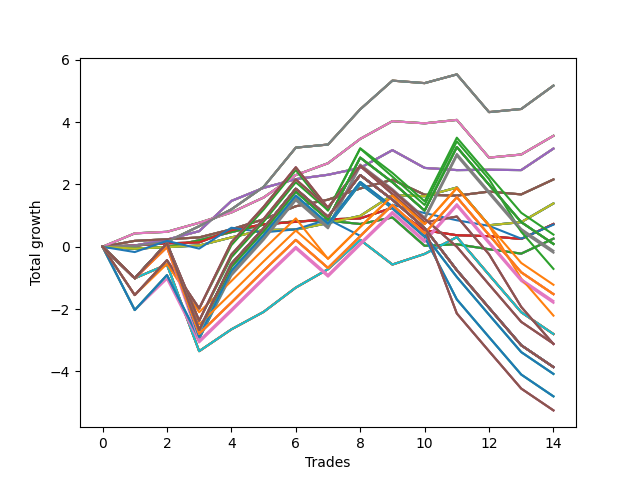

# Short Bulldog 004 
- Symbol: AAPL_Unlimited
- Date Range: 03/23/2022 - 07/08/2022
- Trading Period: 7:20-12:30
- Number of Trades: 14



| Name | Win Percent | Profit | Avg Profit / Trade | Avg Time / Trade |      | Name | Win Percent | Profit | Avg Profit / Trade | Avg Time / Trade |
| ---- | ----------- | ------ | ------------------ | ---------------- | ---- | ---- | ----------- | ------ | ------------------ | ---------------- |
| Sorted By <br> Profit | | | | | | Sorted By <br> Win Percentage ||||
| Sixty-Nine | 85.71 | 2585.00 | 184.64 | 46:02 |     | Sixty-Nine | 85.71 | 2585.00 | 184.64 | 46:02 |
| Sixty-One | 85.71 | 2585.00 | 184.64 | 46:02 |     | Sixty-One | 85.71 | 2585.00 | 184.64 | 46:02 |
| Fifty-Three | 85.71 | 2585.00 | 184.64 | 46:02 |     | Fifty-Three | 85.71 | 2585.00 | 184.64 | 46:02 |
| Forty-Five | 85.71 | 2585.00 | 184.64 | 46:02 |     | Forty-Five | 85.71 | 2585.00 | 184.64 | 46:02 |
| Five | 85.71 | 2585.00 | 184.64 | 46:02 |     | Five | 85.71 | 2585.00 | 184.64 | 46:02 |
| Sixty-Eight | 85.71 | 1780.00 | 127.14 | 23:39 |     | Sixty-Eight | 85.71 | 1780.00 | 127.14 | 23:39 |
| Sixty | 85.71 | 1780.00 | 127.14 | 23:39 |     | Sixty | 85.71 | 1780.00 | 127.14 | 23:39 |
| Fifty-Two | 85.71 | 1780.00 | 127.14 | 23:39 |     | Fifty-Two | 85.71 | 1780.00 | 127.14 | 23:39 |
| Forty-Four | 85.71 | 1780.00 | 127.14 | 23:39 |     | Forty-Four | 85.71 | 1780.00 | 127.14 | 23:39 |
| Four | 85.71 | 1780.00 | 127.14 | 23:39 |     | Four | 85.71 | 1780.00 | 127.14 | 23:39 |
| Sixty-Six | 78.57 | 1575.00 | 112.50 | 15:17 |     | Sixty-Six | 78.57 | 1575.00 | 112.50 | 15:17 |
| Fifty-Eight | 78.57 | 1575.00 | 112.50 | 15:17 |     | Fifty-Eight | 78.57 | 1575.00 | 112.50 | 15:17 |
| Fifty | 78.57 | 1575.00 | 112.50 | 15:17 |     | Fifty | 78.57 | 1575.00 | 112.50 | 15:17 |
| Forty-Two | 78.57 | 1575.00 | 112.50 | 15:17 |     | Forty-Two | 78.57 | 1575.00 | 112.50 | 15:17 |
| Two | 78.57 | 1575.00 | 112.50 | 15:17 |     | Two | 78.57 | 1575.00 | 112.50 | 15:17 |
| Sixty-Seven | 78.57 | 1080.00 | 77.14 | 12:54 |     | Sixty-Seven | 78.57 | 1080.00 | 77.14 | 12:54 |
| Fifty-Nine | 78.57 | 1080.00 | 77.14 | 12:54 |     | Fifty-Nine | 78.57 | 1080.00 | 77.14 | 12:54 |
| Fifty-One | 78.57 | 1080.00 | 77.14 | 12:54 |     | Fifty-One | 78.57 | 1080.00 | 77.14 | 12:54 |
| Forty-Three | 78.57 | 1080.00 | 77.14 | 12:54 |     | Forty-Three | 78.57 | 1080.00 | 77.14 | 12:54 |
| Three | 78.57 | 1080.00 | 77.14 | 12:54 |     | Three | 78.57 | 1080.00 | 77.14 | 12:54 |
| Seventy | 78.57 | 695.00 | 49.64 | 16:06 |     | Seventy | 78.57 | 695.00 | 49.64 | 16:06 |
| Sixty-Two | 78.57 | 695.00 | 49.64 | 16:06 |     | Sixty-Two | 78.57 | 695.00 | 49.64 | 16:06 |
| Fifty-Four | 78.57 | 695.00 | 49.64 | 16:06 |     | Fifty-Four | 78.57 | 695.00 | 49.64 | 16:06 |
| Forty-Six | 78.57 | 695.00 | 49.64 | 16:06 |     | Forty-Six | 78.57 | 695.00 | 49.64 | 16:06 |
| Six | 78.57 | 695.00 | 49.64 | 16:06 |     | Six | 78.57 | 695.00 | 49.64 | 16:06 |
| Sixty-Five | 71.43 | 365.00 | 26.07 | 10:57 |     | Sixty-Five | 71.43 | 365.00 | 26.07 | 10:57 |
| Fifty-Seven | 71.43 | 365.00 | 26.07 | 10:57 |     | Fifty-Seven | 71.43 | 365.00 | 26.07 | 10:57 |
| Forty-Nine | 71.43 | 365.00 | 26.07 | 10:57 |     | Forty-Nine | 71.43 | 365.00 | 26.07 | 10:57 |
| Forty-One | 71.43 | 365.00 | 26.07 | 10:57 |     | Forty-One | 71.43 | 365.00 | 26.07 | 10:57 |
| One | 71.43 | 365.00 | 26.07 | 10:57 |     | One | 71.43 | 365.00 | 26.07 | 10:57 |
| Seventy-Three | 42.86 | 355.00 | 25.36 | 08:43 |     | Sixty-Four | 64.29 | 130.00 | 9.29 | 05:48 |
| One Hundred Seven | 42.86 | 195.00 | 13.93 | 122:09 |     | Fifty-Six | 64.29 | 130.00 | 9.29 | 05:48 |
| Sixty-Four | 64.29 | 130.00 | 9.29 | 05:48 |     | Forty-Eight | 64.29 | 130.00 | 9.29 | 05:48 |
| Fifty-Six | 64.29 | 130.00 | 9.29 | 05:48 |     | Forty | 64.29 | 130.00 | 9.29 | 05:48 |
| Forty-Eight | 64.29 | 130.00 | 9.29 | 05:48 |     | Zero | 64.29 | 130.00 | 9.29 | 05:48 |
| Forty | 64.29 | 130.00 | 9.29 | 05:48 |     | Seventy-One | 57.14 | -1400.00 | -100.00 | 87:20 |
| Zero | 64.29 | 130.00 | 9.29 | 05:48 |     | Sixty-Three | 57.14 | -1400.00 | -100.00 | 87:20 |
| One Hundred Twenty-Seven | 42.86 | 45.00 | 3.21 | 123:19 |     | Fifty-Five | 57.14 | -1400.00 | -100.00 | 87:20 |
| One Hundred Twenty-Two | 42.86 | 45.00 | 3.21 | 123:19 |     | Forty-Seven | 57.14 | -1400.00 | -100.00 | 87:20 |
| One Hundred Seventeen | 42.86 | 45.00 | 3.21 | 123:19 |     | Seven | 57.14 | -1400.00 | -100.00 | 87:20 |
| One Hundred Twelve | 42.86 | 45.00 | 3.21 | 123:19 |     | One Hundred Six | 50.00 | -610.00 | -43.57 | 103:40 |
| Eighty-Two | 42.86 | 45.00 | 3.21 | 123:19 |     | One Hundred Twenty-Six | 50.00 | -760.00 | -54.29 | 104:50 |
| One Hundred Two | 42.86 | -65.00 | -4.64 | 123:08 |     | One Hundred Twenty-One | 50.00 | -760.00 | -54.29 | 104:50 |
| Ninety-Two | 42.86 | -95.00 | -6.79 | 115:55 |     | One Hundred Sixteen | 50.00 | -760.00 | -54.29 | 104:50 |
| Ninety-Seven | 42.86 | -355.00 | -25.36 | 104:21 |     | One Hundred Eleven | 50.00 | -760.00 | -54.29 | 104:50 |
| One Hundred Six | 50.00 | -610.00 | -43.57 | 103:40 |     | Eighty-One | 50.00 | -760.00 | -54.29 | 104:50 |
| One Hundred Twenty-Six | 50.00 | -760.00 | -54.29 | 104:50 |     | One Hundred One | 50.00 | -870.00 | -62.14 | 104:39 |
| One Hundred Twenty-One | 50.00 | -760.00 | -54.29 | 104:50 |     | Ninety-One | 50.00 | -900.00 | -64.29 | 97:26 |
| One Hundred Sixteen | 50.00 | -760.00 | -54.29 | 104:50 |     | Ninety-Six | 50.00 | -1105.00 | -78.93 | 86:25 |
| One Hundred Eleven | 50.00 | -760.00 | -54.29 | 104:50 |     | Seventy-Three | 42.86 | 355.00 | 25.36 | 08:43 |
| Eighty-One | 50.00 | -760.00 | -54.29 | 104:50 |     | One Hundred Seven | 42.86 | 195.00 | 13.93 | 122:09 |
| One Hundred One | 50.00 | -870.00 | -62.14 | 104:39 |     | One Hundred Twenty-Seven | 42.86 | 45.00 | 3.21 | 123:19 |
| Ninety-One | 50.00 | -900.00 | -64.29 | 97:26 |     | One Hundred Twenty-Two | 42.86 | 45.00 | 3.21 | 123:19 |
| Ninety-Six | 50.00 | -1105.00 | -78.93 | 86:25 |     | One Hundred Seventeen | 42.86 | 45.00 | 3.21 | 123:19 |
| Seventy-One | 57.14 | -1400.00 | -100.00 | 87:20 |     | One Hundred Twelve | 42.86 | 45.00 | 3.21 | 123:19 |
| Sixty-Three | 57.14 | -1400.00 | -100.00 | 87:20 |     | Eighty-Two | 42.86 | 45.00 | 3.21 | 123:19 |
| Fifty-Five | 57.14 | -1400.00 | -100.00 | 87:20 |     | One Hundred Two | 42.86 | -65.00 | -4.64 | 123:08 |
| Forty-Seven | 57.14 | -1400.00 | -100.00 | 87:20 |     | Ninety-Two | 42.86 | -95.00 | -6.79 | 115:55 |
| Seven | 57.14 | -1400.00 | -100.00 | 87:20 |     | Ninety-Seven | 42.86 | -355.00 | -25.36 | 104:21 |
| One Hundred Ten | 35.71 | -1555.00 | -111.07 | 127:11 |     | One Hundred | 42.86 | -1560.00 | -111.43 | 109:10 |
| One Hundred Nine | 35.71 | -1555.00 | -111.07 | 127:11 |     | Ninety-Nine | 42.86 | -1560.00 | -111.43 | 109:10 |
| One Hundred Eight | 35.71 | -1555.00 | -111.07 | 127:11 |     | Ninety-Eight | 42.86 | -1560.00 | -111.43 | 109:10 |
| One Hundred | 42.86 | -1560.00 | -111.43 | 109:10 |     | One Hundred Ten | 35.71 | -1555.00 | -111.07 | 127:11 |
| Ninety-Nine | 42.86 | -1560.00 | -111.43 | 109:10 |     | One Hundred Nine | 35.71 | -1555.00 | -111.07 | 127:11 |
| Ninety-Eight | 42.86 | -1560.00 | -111.43 | 109:10 |     | One Hundred Eight | 35.71 | -1555.00 | -111.07 | 127:11 |
| One Hundred Thirty | 35.71 | -1930.00 | -137.86 | 133:04 |     | One Hundred Thirty | 35.71 | -1930.00 | -137.86 | 133:04 |
| One Hundred Twenty-Nine | 35.71 | -1930.00 | -137.86 | 133:04 |     | One Hundred Twenty-Nine | 35.71 | -1930.00 | -137.86 | 133:04 |
| One Hundred Twenty-Eight | 35.71 | -1930.00 | -137.86 | 133:04 |     | One Hundred Twenty-Eight | 35.71 | -1930.00 | -137.86 | 133:04 |
| One Hundred Twenty-Five | 35.71 | -1930.00 | -137.86 | 133:04 |     | One Hundred Twenty-Five | 35.71 | -1930.00 | -137.86 | 133:04 |
| One Hundred Twenty-Four | 35.71 | -1930.00 | -137.86 | 133:04 |     | One Hundred Twenty-Four | 35.71 | -1930.00 | -137.86 | 133:04 |
| One Hundred Twenty-Three | 35.71 | -1930.00 | -137.86 | 133:04 |     | One Hundred Twenty-Three | 35.71 | -1930.00 | -137.86 | 133:04 |
| One Hundred Fifteen | 35.71 | -1930.00 | -137.86 | 133:04 |     | One Hundred Fifteen | 35.71 | -1930.00 | -137.86 | 133:04 |
| One Hundred Fourteen | 35.71 | -1930.00 | -137.86 | 133:04 |     | One Hundred Fourteen | 35.71 | -1930.00 | -137.86 | 133:04 |
| One Hundred Thirteen | 35.71 | -1930.00 | -137.86 | 133:04 |     | One Hundred Thirteen | 35.71 | -1930.00 | -137.86 | 133:04 |
| Eighty-Five | 35.71 | -1930.00 | -137.86 | 133:04 |     | Eighty-Five | 35.71 | -1930.00 | -137.86 | 133:04 |
| Eighty-Four | 35.71 | -1930.00 | -137.86 | 133:04 |     | Eighty-Four | 35.71 | -1930.00 | -137.86 | 133:04 |
| Eighty-Three | 35.71 | -1930.00 | -137.86 | 133:04 |     | Eighty-Three | 35.71 | -1930.00 | -137.86 | 133:04 |
| One Hundred Five | 35.71 | -2040.00 | -145.71 | 132:53 |     | One Hundred Five | 35.71 | -2040.00 | -145.71 | 132:53 |
| One Hundred Four | 35.71 | -2040.00 | -145.71 | 132:53 |     | One Hundred Four | 35.71 | -2040.00 | -145.71 | 132:53 |
| One Hundred Three | 35.71 | -2040.00 | -145.71 | 132:53 |     | One Hundred Three | 35.71 | -2040.00 | -145.71 | 132:53 |
| Ninety-Five | 35.71 | -2400.00 | -171.43 | 121:16 |     | Ninety-Five | 35.71 | -2400.00 | -171.43 | 121:16 |
| Ninety-Four | 35.71 | -2400.00 | -171.43 | 121:16 |     | Ninety-Four | 35.71 | -2400.00 | -171.43 | 121:16 |
| Ninety-Three | 35.71 | -2400.00 | -171.43 | 121:16 |     | Ninety-Three | 35.71 | -2400.00 | -171.43 | 121:16 |
| One Hundred Twenty | 35.71 | -2625.00 | -187.50 | 132:12 |     | One Hundred Twenty | 35.71 | -2625.00 | -187.50 | 132:12 |
| One Hundred Ninteen | 35.71 | -2625.00 | -187.50 | 132:12 |     | One Hundred Ninteen | 35.71 | -2625.00 | -187.50 | 132:12 |
| One Hundred Eighteen | 35.71 | -2625.00 | -187.50 | 132:12 |     | One Hundred Eighteen | 35.71 | -2625.00 | -187.50 | 132:12 |

## NO STOPLOSS

### Test Zero
* Sell when price hits the middle line of the 20p bollinger
* No Stoploss
* Results:
```
Total Trades: 14
Percent Up: 35.71
Percent Down: 64.29
Total Points Moved Down: 0.26
Potential Profit: 130.00
Total Points Ups: 1.38 Count Ups: 5
Total Points Downs: 1.64 Count Downs: 9
```

<details><summary>Trades</summary>

<code>In: 2022-04-06 08:54:00		Out: 2022-04-06 09:03:30		Total Position Time: 09:30		Total Move Down: -0.06		Total to Date: -0.06</code> <br />
<code>In: 2022-04-11 11:13:00		Out: 2022-04-11 11:14:10		Total Position Time: 01:10		Total Move Down: 0.05		Total to Date: -0.01</code> <br />
<code>In: 2022-04-25 09:29:00		Out: 2022-04-25 09:31:10		Total Position Time: 02:10		Total Move Down: 0.22		Total to Date: 0.21</code> <br />
<code>In: 2022-04-26 10:02:00		Out: 2022-04-26 10:03:10		Total Position Time: 01:10		Total Move Down: 0.26		Total to Date: 0.47</code> <br />
<code>In: 2022-05-09 10:34:00		Out: 2022-05-09 10:35:10		Total Position Time: 01:10		Total Move Down: 0.24		Total to Date: 0.71</code> <br />
<code>In: 2022-05-09 12:05:00		Out: 2022-05-09 12:09:15		Total Position Time: 04:15		Total Move Down: 0.11		Total to Date: 0.82</code> <br />
<code>In: 2022-05-17 09:49:00		Out: 2022-05-17 09:50:10		Total Position Time: 01:10		Total Move Down: 0.02		Total to Date: 0.84</code> <br />
<code>In: 2022-05-19 11:57:00		Out: 2022-05-19 12:09:40		Total Position Time: 12:40		Total Move Down: -0.11		Total to Date: 0.73</code> <br />
<code>In: 2022-05-24 11:42:00		Out: 2022-05-24 11:43:10		Total Position Time: 01:10		Total Move Down: 0.21		Total to Date: 0.94</code> <br />
<code>In: 2022-06-14 10:03:00		Out: 2022-06-14 10:29:45		Total Position Time: 26:45		Total Move Down: -0.91		Total to Date: 0.03</code> <br />
<code>In: 2022-06-15 09:07:00		Out: 2022-06-15 09:08:20		Total Position Time: 01:20		Total Move Down: 0.05		Total to Date: 0.08</code> <br />
<code>In: 2022-07-01 10:48:00		Out: 2022-07-01 11:04:25		Total Position Time: 16:25		Total Move Down: -0.16		Total to Date: -0.08</code> <br />
<code>In: 2022-07-06 11:01:00		Out: 2022-07-06 11:02:10		Total Position Time: 01:10		Total Move Down: -0.14		Total to Date: -0.22</code> <br />
<code>In: 2022-07-06 11:11:00		Out: 2022-07-06 11:12:10		Total Position Time: 01:10		Total Move Down: 0.48		Total to Date: 0.26</code> <br />


</details>

### Test One
* Sell when the price hits the upper line of the 20p 1std bollinger
* No Stoploss
* Results:
```
Total Trades: 14
Percent Up: 28.57
Percent Down: 71.43
Total Points Moved Down: 0.73
Potential Profit: 365.00
Total Points Ups: 1.00 Count Ups: 4
Total Points Downs: 1.73 Count Downs: 10
```

<details><summary>Trades</summary>

<code>In: 2022-04-06 08:54:00		Out: 2022-04-06 09:05:05		Total Position Time: 11:05		Total Move Down: 0.04		Total to Date: 0.04</code> <br />
<code>In: 2022-04-11 11:13:00		Out: 2022-04-11 11:14:15		Total Position Time: 01:15		Total Move Down: 0.07		Total to Date: 0.11</code> <br />
<code>In: 2022-04-25 09:29:00		Out: 2022-04-25 09:43:40		Total Position Time: 14:40		Total Move Down: 0.03		Total to Date: 0.14</code> <br />
<code>In: 2022-04-26 10:02:00		Out: 2022-04-26 10:05:55		Total Position Time: 03:55		Total Move Down: 0.39		Total to Date: 0.53</code> <br />
<code>In: 2022-05-09 10:34:00		Out: 2022-05-09 10:47:10		Total Position Time: 13:10		Total Move Down: 0.19		Total to Date: 0.72</code> <br />
<code>In: 2022-05-09 12:05:00		Out: 2022-05-09 12:17:30		Total Position Time: 12:30		Total Move Down: 0.08		Total to Date: 0.80</code> <br />
<code>In: 2022-05-17 09:49:00		Out: 2022-05-17 09:51:15		Total Position Time: 02:15		Total Move Down: 0.08		Total to Date: 0.88</code> <br />
<code>In: 2022-05-19 11:57:00		Out: 2022-05-19 12:09:55		Total Position Time: 12:55		Total Move Down: 0.03		Total to Date: 0.91</code> <br />
<code>In: 2022-05-24 11:42:00		Out: 2022-05-24 11:43:45		Total Position Time: 01:45		Total Move Down: 0.34		Total to Date: 1.25</code> <br />
<code>In: 2022-06-14 10:03:00		Out: 2022-06-14 10:34:05		Total Position Time: 31:05		Total Move Down: -0.72		Total to Date: 0.53</code> <br />
<code>In: 2022-06-15 09:07:00		Out: 2022-06-15 09:33:30		Total Position Time: 26:30		Total Move Down: -0.16		Total to Date: 0.37</code> <br />
<code>In: 2022-07-01 10:48:00		Out: 2022-07-01 11:07:55		Total Position Time: 19:55		Total Move Down: -0.03		Total to Date: 0.34</code> <br />
<code>In: 2022-07-06 11:01:00		Out: 2022-07-06 11:02:15		Total Position Time: 01:15		Total Move Down: -0.09		Total to Date: 0.25</code> <br />
<code>In: 2022-07-06 11:11:00		Out: 2022-07-06 11:12:10		Total Position Time: 01:10		Total Move Down: 0.48		Total to Date: 0.73</code> <br />


</details>

### Test Two
* Sell when the price hits the upper line of the 20p 2std bollinger
* No Stoploss
* Results:
```
Total Trades: 14
Percent Up: 21.43
Percent Down: 78.57
Total Points Moved Down: 3.15
Potential Profit: 1575.00
Total Points Ups: 0.65 Count Ups: 3
Total Points Downs: 3.80 Count Downs: 11
```

<details><summary>Trades</summary>

<code>In: 2022-04-06 08:54:00		Out: 2022-04-06 09:10:55		Total Position Time: 16:55		Total Move Down: 0.04		Total to Date: 0.04</code> <br />
<code>In: 2022-04-11 11:13:00		Out: 2022-04-11 11:14:30		Total Position Time: 01:30		Total Move Down: 0.19		Total to Date: 0.23</code> <br />
<code>In: 2022-04-25 09:29:00		Out: 2022-04-25 09:57:05		Total Position Time: 28:05		Total Move Down: 0.27		Total to Date: 0.50</code> <br />
<code>In: 2022-04-26 10:02:00		Out: 2022-04-26 10:32:20		Total Position Time: 30:20		Total Move Down: 0.97		Total to Date: 1.47</code> <br />
<code>In: 2022-05-09 10:34:00		Out: 2022-05-09 10:51:50		Total Position Time: 17:50		Total Move Down: 0.42		Total to Date: 1.89</code> <br />
<code>In: 2022-05-09 12:05:00		Out: 2022-05-09 12:20:05		Total Position Time: 15:05		Total Move Down: 0.28		Total to Date: 2.17</code> <br />
<code>In: 2022-05-17 09:49:00		Out: 2022-05-17 09:54:25		Total Position Time: 05:25		Total Move Down: 0.14		Total to Date: 2.31</code> <br />
<code>In: 2022-05-19 11:57:00		Out: 2022-05-19 12:10:15		Total Position Time: 13:15		Total Move Down: 0.22		Total to Date: 2.53</code> <br />
<code>In: 2022-05-24 11:42:00		Out: 2022-05-24 11:44:05		Total Position Time: 02:05		Total Move Down: 0.57		Total to Date: 3.10</code> <br />
<code>In: 2022-06-14 10:03:00		Out: 2022-06-14 10:36:05		Total Position Time: 33:05		Total Move Down: -0.57		Total to Date: 2.53</code> <br />
<code>In: 2022-06-15 09:07:00		Out: 2022-06-15 09:34:20		Total Position Time: 27:20		Total Move Down: -0.07		Total to Date: 2.46</code> <br />
<code>In: 2022-07-01 10:48:00		Out: 2022-07-01 11:08:25		Total Position Time: 20:25		Total Move Down: 0.01		Total to Date: 2.47</code> <br />
<code>In: 2022-07-06 11:01:00		Out: 2022-07-06 11:02:20		Total Position Time: 01:20		Total Move Down: -0.01		Total to Date: 2.46</code> <br />
<code>In: 2022-07-06 11:11:00		Out: 2022-07-06 11:12:25		Total Position Time: 01:25		Total Move Down: 0.69		Total to Date: 3.15</code> <br />


</details>

### Test Three
* Sell when price hits the middle line of the 50p bollinger
* No Stoploss
* Results:
```
Total Trades: 14
Percent Up: 21.43
Percent Down: 78.57
Total Points Moved Down: 2.16
Potential Profit: 1080.00
Total Points Ups: 0.60 Count Ups: 3
Total Points Downs: 2.76 Count Downs: 11
```

<details><summary>Trades</summary>

<code>In: 2022-04-06 08:54:00		Out: 2022-04-06 09:15:55		Total Position Time: 21:55		Total Move Down: 0.19		Total to Date: 0.19</code> <br />
<code>In: 2022-04-11 11:13:00		Out: 2022-04-11 11:14:10		Total Position Time: 01:10		Total Move Down: 0.05		Total to Date: 0.24</code> <br />
<code>In: 2022-04-25 09:29:00		Out: 2022-04-25 09:55:10		Total Position Time: 26:10		Total Move Down: 0.06		Total to Date: 0.30</code> <br />
<code>In: 2022-04-26 10:02:00		Out: 2022-04-26 10:03:10		Total Position Time: 01:10		Total Move Down: 0.26		Total to Date: 0.56</code> <br />
<code>In: 2022-05-09 10:34:00		Out: 2022-05-09 10:35:15		Total Position Time: 01:15		Total Move Down: 0.32		Total to Date: 0.88</code> <br />
<code>In: 2022-05-09 12:05:00		Out: 2022-05-09 12:20:15		Total Position Time: 15:15		Total Move Down: 0.42		Total to Date: 1.30</code> <br />
<code>In: 2022-05-17 09:49:00		Out: 2022-05-17 09:57:40		Total Position Time: 08:40		Total Move Down: 0.21		Total to Date: 1.51</code> <br />
<code>In: 2022-05-19 11:57:00		Out: 2022-05-19 12:13:35		Total Position Time: 16:35		Total Move Down: 0.36		Total to Date: 1.87</code> <br />
<code>In: 2022-05-24 11:42:00		Out: 2022-05-24 11:43:30		Total Position Time: 01:30		Total Move Down: 0.28		Total to Date: 2.15</code> <br />
<code>In: 2022-06-14 10:03:00		Out: 2022-06-14 10:37:10		Total Position Time: 34:10		Total Move Down: -0.48		Total to Date: 1.67</code> <br />
<code>In: 2022-06-15 09:07:00		Out: 2022-06-15 09:34:25		Total Position Time: 27:25		Total Move Down: -0.03		Total to Date: 1.64</code> <br />
<code>In: 2022-07-01 10:48:00		Out: 2022-07-01 11:11:05		Total Position Time: 23:05		Total Move Down: 0.13		Total to Date: 1.77</code> <br />
<code>In: 2022-07-06 11:01:00		Out: 2022-07-06 11:02:15		Total Position Time: 01:15		Total Move Down: -0.09		Total to Date: 1.68</code> <br />
<code>In: 2022-07-06 11:11:00		Out: 2022-07-06 11:12:10		Total Position Time: 01:10		Total Move Down: 0.48		Total to Date: 2.16</code> <br />


</details>

### Test Four
* Sell when the price hits the upper line of the 50p 1std bollinger
* No Stoploss
* Results:
```
Total Trades: 14
Percent Up: 14.29
Percent Down: 85.71
Total Points Moved Down: 3.56
Potential Profit: 1780.00
Total Points Ups: 1.28 Count Ups: 2
Total Points Downs: 4.84 Count Downs: 12
```

<details><summary>Trades</summary>

<code>In: 2022-04-06 08:54:00		Out: 2022-04-06 09:20:25		Total Position Time: 26:25		Total Move Down: 0.43		Total to Date: 0.43</code> <br />
<code>In: 2022-04-11 11:13:00		Out: 2022-04-11 11:14:10		Total Position Time: 01:10		Total Move Down: 0.05		Total to Date: 0.48</code> <br />
<code>In: 2022-04-25 09:29:00		Out: 2022-04-25 10:01:10		Total Position Time: 32:10		Total Move Down: 0.29		Total to Date: 0.77</code> <br />
<code>In: 2022-04-26 10:02:00		Out: 2022-04-26 10:05:35		Total Position Time: 03:35		Total Move Down: 0.33		Total to Date: 1.10</code> <br />
<code>In: 2022-05-09 10:34:00		Out: 2022-05-09 10:52:05		Total Position Time: 18:05		Total Move Down: 0.48		Total to Date: 1.58</code> <br />
<code>In: 2022-05-09 12:05:00		Out: 2022-05-09 12:24:05		Total Position Time: 19:05		Total Move Down: 0.72		Total to Date: 2.30</code> <br />
<code>In: 2022-05-17 09:49:00		Out: 2022-05-17 10:02:15		Total Position Time: 13:15		Total Move Down: 0.38		Total to Date: 2.68</code> <br />
<code>In: 2022-05-19 11:57:00		Out: 2022-05-19 12:18:20		Total Position Time: 21:20		Total Move Down: 0.78		Total to Date: 3.46</code> <br />
<code>In: 2022-05-24 11:42:00		Out: 2022-05-24 11:44:05		Total Position Time: 02:05		Total Move Down: 0.57		Total to Date: 4.03</code> <br />
<code>In: 2022-06-14 10:03:00		Out: 2022-06-14 10:43:45		Total Position Time: 40:45		Total Move Down: -0.07		Total to Date: 3.96</code> <br />
<code>In: 2022-06-15 09:07:00		Out: 2022-06-15 09:38:40		Total Position Time: 31:40		Total Move Down: 0.11		Total to Date: 4.07</code> <br />
<code>In: 2022-07-01 10:48:00		Out: 2022-07-01 12:47:00		Total Position Time: 119:00		Total Move Down: -1.21		Total to Date: 2.86</code> <br />
<code>In: 2022-07-06 11:01:00		Out: 2022-07-06 11:02:25		Total Position Time: 01:25		Total Move Down: 0.10		Total to Date: 2.96</code> <br />
<code>In: 2022-07-06 11:11:00		Out: 2022-07-06 11:12:15		Total Position Time: 01:15		Total Move Down: 0.60		Total to Date: 3.56</code> <br />


</details>

### Test Five
* Sell when the price hits the upper line of the 50p 2std bollinger
* No Stoploss
* Results:
```
Total Trades: 14
Percent Up: 14.29
Percent Down: 85.71
Total Points Moved Down: 5.17
Potential Profit: 2585.00
Total Points Ups: 1.29 Count Ups: 2
Total Points Downs: 6.46 Count Downs: 12
```

<details><summary>Trades</summary>

<code>In: 2022-04-06 08:54:00		Out: 2022-04-06 11:15:20		Total Position Time: 141:20		Total Move Down: 0.03		Total to Date: 0.03</code> <br />
<code>In: 2022-04-11 11:13:00		Out: 2022-04-11 11:14:25		Total Position Time: 01:25		Total Move Down: 0.13		Total to Date: 0.16</code> <br />
<code>In: 2022-04-25 09:29:00		Out: 2022-04-25 10:05:25		Total Position Time: 36:25		Total Move Down: 0.50		Total to Date: 0.66</code> <br />
<code>In: 2022-04-26 10:02:00		Out: 2022-04-26 10:10:25		Total Position Time: 08:25		Total Move Down: 0.54		Total to Date: 1.20</code> <br />
<code>In: 2022-05-09 10:34:00		Out: 2022-05-09 10:53:40		Total Position Time: 19:40		Total Move Down: 0.72		Total to Date: 1.92</code> <br />
<code>In: 2022-05-09 12:05:00		Out: 2022-05-09 12:46:55		Total Position Time: 41:55		Total Move Down: 1.26		Total to Date: 3.18</code> <br />
<code>In: 2022-05-17 09:49:00		Out: 2022-05-17 11:13:45		Total Position Time: 84:45		Total Move Down: 0.10		Total to Date: 3.28</code> <br />
<code>In: 2022-05-19 11:57:00		Out: 2022-05-19 12:23:55		Total Position Time: 26:55		Total Move Down: 1.13		Total to Date: 4.41</code> <br />
<code>In: 2022-05-24 11:42:00		Out: 2022-05-24 11:49:20		Total Position Time: 07:20		Total Move Down: 0.92		Total to Date: 5.33</code> <br />
<code>In: 2022-06-14 10:03:00		Out: 2022-06-14 11:48:20		Total Position Time: 105:20		Total Move Down: -0.08		Total to Date: 5.25</code> <br />
<code>In: 2022-06-15 09:07:00		Out: 2022-06-15 09:41:40		Total Position Time: 34:40		Total Move Down: 0.28		Total to Date: 5.53</code> <br />
<code>In: 2022-07-01 10:48:00		Out: 2022-07-01 12:47:00		Total Position Time: 119:00		Total Move Down: -1.21		Total to Date: 4.32</code> <br />
<code>In: 2022-07-06 11:01:00		Out: 2022-07-06 11:02:25		Total Position Time: 01:25		Total Move Down: 0.10		Total to Date: 4.42</code> <br />
<code>In: 2022-07-06 11:11:00		Out: 2022-07-06 11:26:55		Total Position Time: 15:55		Total Move Down: 0.75		Total to Date: 5.17</code> <br />


</details>

### Test Six
* Sell when the price hits the middle line of the 1std VWAP
* No Stoploss
* Results:
```
Total Trades: 14
Percent Up: 21.43
Percent Down: 78.57
Total Points Moved Down: 1.39
Potential Profit: 695.00
Total Points Ups: 1.31 Count Ups: 3
Total Points Downs: 2.70 Count Downs: 11
```

<details><summary>Trades</summary>

<code>In: 2022-04-06 08:54:00		Out: 2022-04-06 09:03:30		Total Position Time: 09:30		Total Move Down: -0.06		Total to Date: -0.06</code> <br />
<code>In: 2022-04-11 11:13:00		Out: 2022-04-11 11:14:10		Total Position Time: 01:10		Total Move Down: 0.05		Total to Date: -0.01</code> <br />
<code>In: 2022-04-25 09:29:00		Out: 2022-04-25 09:30:10		Total Position Time: 01:10		Total Move Down: 0.05		Total to Date: 0.04</code> <br />
<code>In: 2022-04-26 10:02:00		Out: 2022-04-26 10:03:10		Total Position Time: 01:10		Total Move Down: 0.26		Total to Date: 0.30</code> <br />
<code>In: 2022-05-09 10:34:00		Out: 2022-05-09 10:35:10		Total Position Time: 01:10		Total Move Down: 0.24		Total to Date: 0.54</code> <br />
<code>In: 2022-05-09 12:05:00		Out: 2022-05-09 12:06:10		Total Position Time: 01:10		Total Move Down: 0.01		Total to Date: 0.55</code> <br />
<code>In: 2022-05-17 09:49:00		Out: 2022-05-17 09:57:40		Total Position Time: 08:40		Total Move Down: 0.21		Total to Date: 0.76</code> <br />
<code>In: 2022-05-19 11:57:00		Out: 2022-05-19 11:58:10		Total Position Time: 01:10		Total Move Down: 0.23		Total to Date: 0.99</code> <br />
<code>In: 2022-05-24 11:42:00		Out: 2022-05-24 11:45:00		Total Position Time: 03:00		Total Move Down: 0.67		Total to Date: 1.66</code> <br />
<code>In: 2022-06-14 10:03:00		Out: 2022-06-14 10:43:55		Total Position Time: 40:55		Total Move Down: -0.04		Total to Date: 1.62</code> <br />
<code>In: 2022-06-15 09:07:00		Out: 2022-06-15 09:41:40		Total Position Time: 34:40		Total Move Down: 0.28		Total to Date: 1.90</code> <br />
<code>In: 2022-07-01 10:48:00		Out: 2022-07-01 12:47:00		Total Position Time: 119:00		Total Move Down: -1.21		Total to Date: 0.69</code> <br />
<code>In: 2022-07-06 11:01:00		Out: 2022-07-06 11:02:25		Total Position Time: 01:25		Total Move Down: 0.10		Total to Date: 0.79</code> <br />
<code>In: 2022-07-06 11:11:00		Out: 2022-07-06 11:12:15		Total Position Time: 01:15		Total Move Down: 0.60		Total to Date: 1.39</code> <br />


</details>

### Test Seven
* Sell when the price hits the upper line of the 1std VWAP
* No Stoploss
* Results:
```
Total Trades: 14
Percent Up: 42.86
Percent Down: 57.14
Total Points Moved Down: -2.80
Potential Profit: -1400.00
Total Points Ups: 7.69 Count Ups: 6
Total Points Downs: 4.89 Count Downs: 8
```

<details><summary>Trades</summary>

<code>In: 2022-04-06 08:54:00		Out: 2022-04-06 12:47:00		Total Position Time: 233:00		Total Move Down: -1.01		Total to Date: -1.01</code> <br />
<code>In: 2022-04-11 11:13:00		Out: 2022-04-11 12:16:15		Total Position Time: 63:15		Total Move Down: 0.44		Total to Date: -0.57</code> <br />
<code>In: 2022-04-25 09:29:00		Out: 2022-04-25 12:47:00		Total Position Time: 198:00		Total Move Down: -2.78		Total to Date: -3.35</code> <br />
<code>In: 2022-04-26 10:02:00		Out: 2022-04-26 10:16:30		Total Position Time: 14:30		Total Move Down: 0.70		Total to Date: -2.65</code> <br />
<code>In: 2022-05-09 10:34:00		Out: 2022-05-09 10:52:25		Total Position Time: 18:25		Total Move Down: 0.56		Total to Date: -2.09</code> <br />
<code>In: 2022-05-09 12:05:00		Out: 2022-05-09 12:25:05		Total Position Time: 20:05		Total Move Down: 0.78		Total to Date: -1.31</code> <br />
<code>In: 2022-05-17 09:49:00		Out: 2022-05-17 11:22:05		Total Position Time: 93:05		Total Move Down: 0.59		Total to Date: -0.72</code> <br />
<code>In: 2022-05-19 11:57:00		Out: 2022-05-19 12:21:05		Total Position Time: 24:05		Total Move Down: 0.94		Total to Date: 0.22</code> <br />
<code>In: 2022-05-24 11:42:00		Out: 2022-05-24 12:47:00		Total Position Time: 65:00		Total Move Down: -0.79		Total to Date: -0.57</code> <br />
<code>In: 2022-06-14 10:03:00		Out: 2022-06-14 12:09:25		Total Position Time: 126:25		Total Move Down: 0.34		Total to Date: -0.23</code> <br />
<code>In: 2022-06-15 09:07:00		Out: 2022-06-15 09:52:55		Total Position Time: 45:55		Total Move Down: 0.54		Total to Date: 0.31</code> <br />
<code>In: 2022-07-01 10:48:00		Out: 2022-07-01 12:47:00		Total Position Time: 119:00		Total Move Down: -1.21		Total to Date: -0.90</code> <br />
<code>In: 2022-07-06 11:01:00		Out: 2022-07-06 12:47:00		Total Position Time: 106:00		Total Move Down: -1.20		Total to Date: -2.10</code> <br />
<code>In: 2022-07-06 11:11:00		Out: 2022-07-06 12:47:00		Total Position Time: 96:00		Total Move Down: -0.70		Total to Date: -2.80</code> <br />


</details>

## STOPLOSS OF 5

### Test Forty
* Sell when price hits the middle line of the 20p bollinger
* Stoploss is -5 points
* Results:
```
Total Trades: 14
Percent Up: 35.71
Percent Down: 64.29
Total Points Moved Down: 0.26
Potential Profit: 130.00
Total Points Ups: 1.38 Count Ups: 5
Total Points Downs: 1.64 Count Downs: 9
```

<details><summary>Trades</summary>

<code>In: 2022-04-06 08:54:00		Out: 2022-04-06 09:03:30		Total Position Time: 09:30		Total Move Down: -0.06		Total to Date: -0.06</code> <br />
<code>In: 2022-04-11 11:13:00		Out: 2022-04-11 11:14:10		Total Position Time: 01:10		Total Move Down: 0.05		Total to Date: -0.01</code> <br />
<code>In: 2022-04-25 09:29:00		Out: 2022-04-25 09:31:10		Total Position Time: 02:10		Total Move Down: 0.22		Total to Date: 0.21</code> <br />
<code>In: 2022-04-26 10:02:00		Out: 2022-04-26 10:03:10		Total Position Time: 01:10		Total Move Down: 0.26		Total to Date: 0.47</code> <br />
<code>In: 2022-05-09 10:34:00		Out: 2022-05-09 10:35:10		Total Position Time: 01:10		Total Move Down: 0.24		Total to Date: 0.71</code> <br />
<code>In: 2022-05-09 12:05:00		Out: 2022-05-09 12:09:15		Total Position Time: 04:15		Total Move Down: 0.11		Total to Date: 0.82</code> <br />
<code>In: 2022-05-17 09:49:00		Out: 2022-05-17 09:50:10		Total Position Time: 01:10		Total Move Down: 0.02		Total to Date: 0.84</code> <br />
<code>In: 2022-05-19 11:57:00		Out: 2022-05-19 12:09:40		Total Position Time: 12:40		Total Move Down: -0.11		Total to Date: 0.73</code> <br />
<code>In: 2022-05-24 11:42:00		Out: 2022-05-24 11:43:10		Total Position Time: 01:10		Total Move Down: 0.21		Total to Date: 0.94</code> <br />
<code>In: 2022-06-14 10:03:00		Out: 2022-06-14 10:29:45		Total Position Time: 26:45		Total Move Down: -0.91		Total to Date: 0.03</code> <br />
<code>In: 2022-06-15 09:07:00		Out: 2022-06-15 09:08:20		Total Position Time: 01:20		Total Move Down: 0.05		Total to Date: 0.08</code> <br />
<code>In: 2022-07-01 10:48:00		Out: 2022-07-01 11:04:25		Total Position Time: 16:25		Total Move Down: -0.16		Total to Date: -0.08</code> <br />
<code>In: 2022-07-06 11:01:00		Out: 2022-07-06 11:02:10		Total Position Time: 01:10		Total Move Down: -0.14		Total to Date: -0.22</code> <br />
<code>In: 2022-07-06 11:11:00		Out: 2022-07-06 11:12:10		Total Position Time: 01:10		Total Move Down: 0.48		Total to Date: 0.26</code> <br />


</details>

### Test Forty-One
* Sell when the price hits the upper line of the 20p 1std bollinger
* Stoploss is -5 points
* Results:
```
Total Trades: 14
Percent Up: 28.57
Percent Down: 71.43
Total Points Moved Down: 0.73
Potential Profit: 365.00
Total Points Ups: 1.00 Count Ups: 4
Total Points Downs: 1.73 Count Downs: 10
```

<details><summary>Trades</summary>

<code>In: 2022-04-06 08:54:00		Out: 2022-04-06 09:05:05		Total Position Time: 11:05		Total Move Down: 0.04		Total to Date: 0.04</code> <br />
<code>In: 2022-04-11 11:13:00		Out: 2022-04-11 11:14:15		Total Position Time: 01:15		Total Move Down: 0.07		Total to Date: 0.11</code> <br />
<code>In: 2022-04-25 09:29:00		Out: 2022-04-25 09:43:40		Total Position Time: 14:40		Total Move Down: 0.03		Total to Date: 0.14</code> <br />
<code>In: 2022-04-26 10:02:00		Out: 2022-04-26 10:05:55		Total Position Time: 03:55		Total Move Down: 0.39		Total to Date: 0.53</code> <br />
<code>In: 2022-05-09 10:34:00		Out: 2022-05-09 10:47:10		Total Position Time: 13:10		Total Move Down: 0.19		Total to Date: 0.72</code> <br />
<code>In: 2022-05-09 12:05:00		Out: 2022-05-09 12:17:30		Total Position Time: 12:30		Total Move Down: 0.08		Total to Date: 0.80</code> <br />
<code>In: 2022-05-17 09:49:00		Out: 2022-05-17 09:51:15		Total Position Time: 02:15		Total Move Down: 0.08		Total to Date: 0.88</code> <br />
<code>In: 2022-05-19 11:57:00		Out: 2022-05-19 12:09:55		Total Position Time: 12:55		Total Move Down: 0.03		Total to Date: 0.91</code> <br />
<code>In: 2022-05-24 11:42:00		Out: 2022-05-24 11:43:45		Total Position Time: 01:45		Total Move Down: 0.34		Total to Date: 1.25</code> <br />
<code>In: 2022-06-14 10:03:00		Out: 2022-06-14 10:34:05		Total Position Time: 31:05		Total Move Down: -0.72		Total to Date: 0.53</code> <br />
<code>In: 2022-06-15 09:07:00		Out: 2022-06-15 09:33:30		Total Position Time: 26:30		Total Move Down: -0.16		Total to Date: 0.37</code> <br />
<code>In: 2022-07-01 10:48:00		Out: 2022-07-01 11:07:55		Total Position Time: 19:55		Total Move Down: -0.03		Total to Date: 0.34</code> <br />
<code>In: 2022-07-06 11:01:00		Out: 2022-07-06 11:02:15		Total Position Time: 01:15		Total Move Down: -0.09		Total to Date: 0.25</code> <br />
<code>In: 2022-07-06 11:11:00		Out: 2022-07-06 11:12:10		Total Position Time: 01:10		Total Move Down: 0.48		Total to Date: 0.73</code> <br />


</details>

### Test Forty-Two
* Sell when the price hits the upper line of the 20p 2std bollinger
* Stoploss is -5 points
* Results:
```
Total Trades: 14
Percent Up: 21.43
Percent Down: 78.57
Total Points Moved Down: 3.15
Potential Profit: 1575.00
Total Points Ups: 0.65 Count Ups: 3
Total Points Downs: 3.80 Count Downs: 11
```

<details><summary>Trades</summary>

<code>In: 2022-04-06 08:54:00		Out: 2022-04-06 09:10:55		Total Position Time: 16:55		Total Move Down: 0.04		Total to Date: 0.04</code> <br />
<code>In: 2022-04-11 11:13:00		Out: 2022-04-11 11:14:30		Total Position Time: 01:30		Total Move Down: 0.19		Total to Date: 0.23</code> <br />
<code>In: 2022-04-25 09:29:00		Out: 2022-04-25 09:57:05		Total Position Time: 28:05		Total Move Down: 0.27		Total to Date: 0.50</code> <br />
<code>In: 2022-04-26 10:02:00		Out: 2022-04-26 10:32:20		Total Position Time: 30:20		Total Move Down: 0.97		Total to Date: 1.47</code> <br />
<code>In: 2022-05-09 10:34:00		Out: 2022-05-09 10:51:50		Total Position Time: 17:50		Total Move Down: 0.42		Total to Date: 1.89</code> <br />
<code>In: 2022-05-09 12:05:00		Out: 2022-05-09 12:20:05		Total Position Time: 15:05		Total Move Down: 0.28		Total to Date: 2.17</code> <br />
<code>In: 2022-05-17 09:49:00		Out: 2022-05-17 09:54:25		Total Position Time: 05:25		Total Move Down: 0.14		Total to Date: 2.31</code> <br />
<code>In: 2022-05-19 11:57:00		Out: 2022-05-19 12:10:15		Total Position Time: 13:15		Total Move Down: 0.22		Total to Date: 2.53</code> <br />
<code>In: 2022-05-24 11:42:00		Out: 2022-05-24 11:44:05		Total Position Time: 02:05		Total Move Down: 0.57		Total to Date: 3.10</code> <br />
<code>In: 2022-06-14 10:03:00		Out: 2022-06-14 10:36:05		Total Position Time: 33:05		Total Move Down: -0.57		Total to Date: 2.53</code> <br />
<code>In: 2022-06-15 09:07:00		Out: 2022-06-15 09:34:20		Total Position Time: 27:20		Total Move Down: -0.07		Total to Date: 2.46</code> <br />
<code>In: 2022-07-01 10:48:00		Out: 2022-07-01 11:08:25		Total Position Time: 20:25		Total Move Down: 0.01		Total to Date: 2.47</code> <br />
<code>In: 2022-07-06 11:01:00		Out: 2022-07-06 11:02:20		Total Position Time: 01:20		Total Move Down: -0.01		Total to Date: 2.46</code> <br />
<code>In: 2022-07-06 11:11:00		Out: 2022-07-06 11:12:25		Total Position Time: 01:25		Total Move Down: 0.69		Total to Date: 3.15</code> <br />


</details>

### Test Forty-Three
* Sell when price hits the middle line of the 50p bollinger
* Stoploss is -5 points
* Results:
```
Total Trades: 14
Percent Up: 21.43
Percent Down: 78.57
Total Points Moved Down: 2.16
Potential Profit: 1080.00
Total Points Ups: 0.60 Count Ups: 3
Total Points Downs: 2.76 Count Downs: 11
```

<details><summary>Trades</summary>

<code>In: 2022-04-06 08:54:00		Out: 2022-04-06 09:15:55		Total Position Time: 21:55		Total Move Down: 0.19		Total to Date: 0.19</code> <br />
<code>In: 2022-04-11 11:13:00		Out: 2022-04-11 11:14:10		Total Position Time: 01:10		Total Move Down: 0.05		Total to Date: 0.24</code> <br />
<code>In: 2022-04-25 09:29:00		Out: 2022-04-25 09:55:10		Total Position Time: 26:10		Total Move Down: 0.06		Total to Date: 0.30</code> <br />
<code>In: 2022-04-26 10:02:00		Out: 2022-04-26 10:03:10		Total Position Time: 01:10		Total Move Down: 0.26		Total to Date: 0.56</code> <br />
<code>In: 2022-05-09 10:34:00		Out: 2022-05-09 10:35:15		Total Position Time: 01:15		Total Move Down: 0.32		Total to Date: 0.88</code> <br />
<code>In: 2022-05-09 12:05:00		Out: 2022-05-09 12:20:15		Total Position Time: 15:15		Total Move Down: 0.42		Total to Date: 1.30</code> <br />
<code>In: 2022-05-17 09:49:00		Out: 2022-05-17 09:57:40		Total Position Time: 08:40		Total Move Down: 0.21		Total to Date: 1.51</code> <br />
<code>In: 2022-05-19 11:57:00		Out: 2022-05-19 12:13:35		Total Position Time: 16:35		Total Move Down: 0.36		Total to Date: 1.87</code> <br />
<code>In: 2022-05-24 11:42:00		Out: 2022-05-24 11:43:30		Total Position Time: 01:30		Total Move Down: 0.28		Total to Date: 2.15</code> <br />
<code>In: 2022-06-14 10:03:00		Out: 2022-06-14 10:37:10		Total Position Time: 34:10		Total Move Down: -0.48		Total to Date: 1.67</code> <br />
<code>In: 2022-06-15 09:07:00		Out: 2022-06-15 09:34:25		Total Position Time: 27:25		Total Move Down: -0.03		Total to Date: 1.64</code> <br />
<code>In: 2022-07-01 10:48:00		Out: 2022-07-01 11:11:05		Total Position Time: 23:05		Total Move Down: 0.13		Total to Date: 1.77</code> <br />
<code>In: 2022-07-06 11:01:00		Out: 2022-07-06 11:02:15		Total Position Time: 01:15		Total Move Down: -0.09		Total to Date: 1.68</code> <br />
<code>In: 2022-07-06 11:11:00		Out: 2022-07-06 11:12:10		Total Position Time: 01:10		Total Move Down: 0.48		Total to Date: 2.16</code> <br />


</details>

### Test Forty-Four
* Sell when the price hits the upper line of the 50p 1std bollinger
* Stoploss is -5 points
* Results:
```
Total Trades: 14
Percent Up: 14.29
Percent Down: 85.71
Total Points Moved Down: 3.56
Potential Profit: 1780.00
Total Points Ups: 1.28 Count Ups: 2
Total Points Downs: 4.84 Count Downs: 12
```

<details><summary>Trades</summary>

<code>In: 2022-04-06 08:54:00		Out: 2022-04-06 09:20:25		Total Position Time: 26:25		Total Move Down: 0.43		Total to Date: 0.43</code> <br />
<code>In: 2022-04-11 11:13:00		Out: 2022-04-11 11:14:10		Total Position Time: 01:10		Total Move Down: 0.05		Total to Date: 0.48</code> <br />
<code>In: 2022-04-25 09:29:00		Out: 2022-04-25 10:01:10		Total Position Time: 32:10		Total Move Down: 0.29		Total to Date: 0.77</code> <br />
<code>In: 2022-04-26 10:02:00		Out: 2022-04-26 10:05:35		Total Position Time: 03:35		Total Move Down: 0.33		Total to Date: 1.10</code> <br />
<code>In: 2022-05-09 10:34:00		Out: 2022-05-09 10:52:05		Total Position Time: 18:05		Total Move Down: 0.48		Total to Date: 1.58</code> <br />
<code>In: 2022-05-09 12:05:00		Out: 2022-05-09 12:24:05		Total Position Time: 19:05		Total Move Down: 0.72		Total to Date: 2.30</code> <br />
<code>In: 2022-05-17 09:49:00		Out: 2022-05-17 10:02:15		Total Position Time: 13:15		Total Move Down: 0.38		Total to Date: 2.68</code> <br />
<code>In: 2022-05-19 11:57:00		Out: 2022-05-19 12:18:20		Total Position Time: 21:20		Total Move Down: 0.78		Total to Date: 3.46</code> <br />
<code>In: 2022-05-24 11:42:00		Out: 2022-05-24 11:44:05		Total Position Time: 02:05		Total Move Down: 0.57		Total to Date: 4.03</code> <br />
<code>In: 2022-06-14 10:03:00		Out: 2022-06-14 10:43:45		Total Position Time: 40:45		Total Move Down: -0.07		Total to Date: 3.96</code> <br />
<code>In: 2022-06-15 09:07:00		Out: 2022-06-15 09:38:40		Total Position Time: 31:40		Total Move Down: 0.11		Total to Date: 4.07</code> <br />
<code>In: 2022-07-01 10:48:00		Out: 2022-07-01 12:47:00		Total Position Time: 119:00		Total Move Down: -1.21		Total to Date: 2.86</code> <br />
<code>In: 2022-07-06 11:01:00		Out: 2022-07-06 11:02:25		Total Position Time: 01:25		Total Move Down: 0.10		Total to Date: 2.96</code> <br />
<code>In: 2022-07-06 11:11:00		Out: 2022-07-06 11:12:15		Total Position Time: 01:15		Total Move Down: 0.60		Total to Date: 3.56</code> <br />


</details>

### Test Forty-Five
* Sell when the price hits the upper line of the 50p 2std bollinger
* Stoploss is -5 points
* Results:
```
Total Trades: 14
Percent Up: 14.29
Percent Down: 85.71
Total Points Moved Down: 5.17
Potential Profit: 2585.00
Total Points Ups: 1.29 Count Ups: 2
Total Points Downs: 6.46 Count Downs: 12
```

<details><summary>Trades</summary>

<code>In: 2022-04-06 08:54:00		Out: 2022-04-06 11:15:20		Total Position Time: 141:20		Total Move Down: 0.03		Total to Date: 0.03</code> <br />
<code>In: 2022-04-11 11:13:00		Out: 2022-04-11 11:14:25		Total Position Time: 01:25		Total Move Down: 0.13		Total to Date: 0.16</code> <br />
<code>In: 2022-04-25 09:29:00		Out: 2022-04-25 10:05:25		Total Position Time: 36:25		Total Move Down: 0.50		Total to Date: 0.66</code> <br />
<code>In: 2022-04-26 10:02:00		Out: 2022-04-26 10:10:25		Total Position Time: 08:25		Total Move Down: 0.54		Total to Date: 1.20</code> <br />
<code>In: 2022-05-09 10:34:00		Out: 2022-05-09 10:53:40		Total Position Time: 19:40		Total Move Down: 0.72		Total to Date: 1.92</code> <br />
<code>In: 2022-05-09 12:05:00		Out: 2022-05-09 12:46:55		Total Position Time: 41:55		Total Move Down: 1.26		Total to Date: 3.18</code> <br />
<code>In: 2022-05-17 09:49:00		Out: 2022-05-17 11:13:45		Total Position Time: 84:45		Total Move Down: 0.10		Total to Date: 3.28</code> <br />
<code>In: 2022-05-19 11:57:00		Out: 2022-05-19 12:23:55		Total Position Time: 26:55		Total Move Down: 1.13		Total to Date: 4.41</code> <br />
<code>In: 2022-05-24 11:42:00		Out: 2022-05-24 11:49:20		Total Position Time: 07:20		Total Move Down: 0.92		Total to Date: 5.33</code> <br />
<code>In: 2022-06-14 10:03:00		Out: 2022-06-14 11:48:20		Total Position Time: 105:20		Total Move Down: -0.08		Total to Date: 5.25</code> <br />
<code>In: 2022-06-15 09:07:00		Out: 2022-06-15 09:41:40		Total Position Time: 34:40		Total Move Down: 0.28		Total to Date: 5.53</code> <br />
<code>In: 2022-07-01 10:48:00		Out: 2022-07-01 12:47:00		Total Position Time: 119:00		Total Move Down: -1.21		Total to Date: 4.32</code> <br />
<code>In: 2022-07-06 11:01:00		Out: 2022-07-06 11:02:25		Total Position Time: 01:25		Total Move Down: 0.10		Total to Date: 4.42</code> <br />
<code>In: 2022-07-06 11:11:00		Out: 2022-07-06 11:26:55		Total Position Time: 15:55		Total Move Down: 0.75		Total to Date: 5.17</code> <br />


</details>

### Test Forty-Six
* Sell when the price hits the middle line of the 1std VWAP
* Stoploss is -5 points
* Results:
```
Total Trades: 14
Percent Up: 21.43
Percent Down: 78.57
Total Points Moved Down: 1.39
Potential Profit: 695.00
Total Points Ups: 1.31 Count Ups: 3
Total Points Downs: 2.70 Count Downs: 11
```

<details><summary>Trades</summary>

<code>In: 2022-04-06 08:54:00		Out: 2022-04-06 09:03:30		Total Position Time: 09:30		Total Move Down: -0.06		Total to Date: -0.06</code> <br />
<code>In: 2022-04-11 11:13:00		Out: 2022-04-11 11:14:10		Total Position Time: 01:10		Total Move Down: 0.05		Total to Date: -0.01</code> <br />
<code>In: 2022-04-25 09:29:00		Out: 2022-04-25 09:30:10		Total Position Time: 01:10		Total Move Down: 0.05		Total to Date: 0.04</code> <br />
<code>In: 2022-04-26 10:02:00		Out: 2022-04-26 10:03:10		Total Position Time: 01:10		Total Move Down: 0.26		Total to Date: 0.30</code> <br />
<code>In: 2022-05-09 10:34:00		Out: 2022-05-09 10:35:10		Total Position Time: 01:10		Total Move Down: 0.24		Total to Date: 0.54</code> <br />
<code>In: 2022-05-09 12:05:00		Out: 2022-05-09 12:06:10		Total Position Time: 01:10		Total Move Down: 0.01		Total to Date: 0.55</code> <br />
<code>In: 2022-05-17 09:49:00		Out: 2022-05-17 09:57:40		Total Position Time: 08:40		Total Move Down: 0.21		Total to Date: 0.76</code> <br />
<code>In: 2022-05-19 11:57:00		Out: 2022-05-19 11:58:10		Total Position Time: 01:10		Total Move Down: 0.23		Total to Date: 0.99</code> <br />
<code>In: 2022-05-24 11:42:00		Out: 2022-05-24 11:45:00		Total Position Time: 03:00		Total Move Down: 0.67		Total to Date: 1.66</code> <br />
<code>In: 2022-06-14 10:03:00		Out: 2022-06-14 10:43:55		Total Position Time: 40:55		Total Move Down: -0.04		Total to Date: 1.62</code> <br />
<code>In: 2022-06-15 09:07:00		Out: 2022-06-15 09:41:40		Total Position Time: 34:40		Total Move Down: 0.28		Total to Date: 1.90</code> <br />
<code>In: 2022-07-01 10:48:00		Out: 2022-07-01 12:47:00		Total Position Time: 119:00		Total Move Down: -1.21		Total to Date: 0.69</code> <br />
<code>In: 2022-07-06 11:01:00		Out: 2022-07-06 11:02:25		Total Position Time: 01:25		Total Move Down: 0.10		Total to Date: 0.79</code> <br />
<code>In: 2022-07-06 11:11:00		Out: 2022-07-06 11:12:15		Total Position Time: 01:15		Total Move Down: 0.60		Total to Date: 1.39</code> <br />


</details>

### Test Forty-Seven
* Sell when the price hits the upper line of the 1std VWAP
* Stoploss is -5 points
* Results:
```
Total Trades: 14
Percent Up: 42.86
Percent Down: 57.14
Total Points Moved Down: -2.80
Potential Profit: -1400.00
Total Points Ups: 7.69 Count Ups: 6
Total Points Downs: 4.89 Count Downs: 8
```

<details><summary>Trades</summary>

<code>In: 2022-04-06 08:54:00		Out: 2022-04-06 12:47:00		Total Position Time: 233:00		Total Move Down: -1.01		Total to Date: -1.01</code> <br />
<code>In: 2022-04-11 11:13:00		Out: 2022-04-11 12:16:15		Total Position Time: 63:15		Total Move Down: 0.44		Total to Date: -0.57</code> <br />
<code>In: 2022-04-25 09:29:00		Out: 2022-04-25 12:47:00		Total Position Time: 198:00		Total Move Down: -2.78		Total to Date: -3.35</code> <br />
<code>In: 2022-04-26 10:02:00		Out: 2022-04-26 10:16:30		Total Position Time: 14:30		Total Move Down: 0.70		Total to Date: -2.65</code> <br />
<code>In: 2022-05-09 10:34:00		Out: 2022-05-09 10:52:25		Total Position Time: 18:25		Total Move Down: 0.56		Total to Date: -2.09</code> <br />
<code>In: 2022-05-09 12:05:00		Out: 2022-05-09 12:25:05		Total Position Time: 20:05		Total Move Down: 0.78		Total to Date: -1.31</code> <br />
<code>In: 2022-05-17 09:49:00		Out: 2022-05-17 11:22:05		Total Position Time: 93:05		Total Move Down: 0.59		Total to Date: -0.72</code> <br />
<code>In: 2022-05-19 11:57:00		Out: 2022-05-19 12:21:05		Total Position Time: 24:05		Total Move Down: 0.94		Total to Date: 0.22</code> <br />
<code>In: 2022-05-24 11:42:00		Out: 2022-05-24 12:47:00		Total Position Time: 65:00		Total Move Down: -0.79		Total to Date: -0.57</code> <br />
<code>In: 2022-06-14 10:03:00		Out: 2022-06-14 12:09:25		Total Position Time: 126:25		Total Move Down: 0.34		Total to Date: -0.23</code> <br />
<code>In: 2022-06-15 09:07:00		Out: 2022-06-15 09:52:55		Total Position Time: 45:55		Total Move Down: 0.54		Total to Date: 0.31</code> <br />
<code>In: 2022-07-01 10:48:00		Out: 2022-07-01 12:47:00		Total Position Time: 119:00		Total Move Down: -1.21		Total to Date: -0.90</code> <br />
<code>In: 2022-07-06 11:01:00		Out: 2022-07-06 12:47:00		Total Position Time: 106:00		Total Move Down: -1.20		Total to Date: -2.10</code> <br />
<code>In: 2022-07-06 11:11:00		Out: 2022-07-06 12:47:00		Total Position Time: 96:00		Total Move Down: -0.70		Total to Date: -2.80</code> <br />


</details>

## TRAIL STOP OF 5

### Test Forty-Eight
* Sell when price hits the middle line of the 20p bollinger
* Trailing Stop is -5 points
* Results:
```
Total Trades: 14
Percent Up: 35.71
Percent Down: 64.29
Total Points Moved Down: 0.26
Potential Profit: 130.00
Total Points Ups: 1.38 Count Ups: 5
Total Points Downs: 1.64 Count Downs: 9
```

<details><summary>Trades</summary>

<code>In: 2022-04-06 08:54:00		Out: 2022-04-06 09:03:30		Total Position Time: 09:30		Total Move Down: -0.06		Total to Date: -0.06</code> <br />
<code>In: 2022-04-11 11:13:00		Out: 2022-04-11 11:14:10		Total Position Time: 01:10		Total Move Down: 0.05		Total to Date: -0.01</code> <br />
<code>In: 2022-04-25 09:29:00		Out: 2022-04-25 09:31:10		Total Position Time: 02:10		Total Move Down: 0.22		Total to Date: 0.21</code> <br />
<code>In: 2022-04-26 10:02:00		Out: 2022-04-26 10:03:10		Total Position Time: 01:10		Total Move Down: 0.26		Total to Date: 0.47</code> <br />
<code>In: 2022-05-09 10:34:00		Out: 2022-05-09 10:35:10		Total Position Time: 01:10		Total Move Down: 0.24		Total to Date: 0.71</code> <br />
<code>In: 2022-05-09 12:05:00		Out: 2022-05-09 12:09:15		Total Position Time: 04:15		Total Move Down: 0.11		Total to Date: 0.82</code> <br />
<code>In: 2022-05-17 09:49:00		Out: 2022-05-17 09:50:10		Total Position Time: 01:10		Total Move Down: 0.02		Total to Date: 0.84</code> <br />
<code>In: 2022-05-19 11:57:00		Out: 2022-05-19 12:09:40		Total Position Time: 12:40		Total Move Down: -0.11		Total to Date: 0.73</code> <br />
<code>In: 2022-05-24 11:42:00		Out: 2022-05-24 11:43:10		Total Position Time: 01:10		Total Move Down: 0.21		Total to Date: 0.94</code> <br />
<code>In: 2022-06-14 10:03:00		Out: 2022-06-14 10:29:45		Total Position Time: 26:45		Total Move Down: -0.91		Total to Date: 0.03</code> <br />
<code>In: 2022-06-15 09:07:00		Out: 2022-06-15 09:08:20		Total Position Time: 01:20		Total Move Down: 0.05		Total to Date: 0.08</code> <br />
<code>In: 2022-07-01 10:48:00		Out: 2022-07-01 11:04:25		Total Position Time: 16:25		Total Move Down: -0.16		Total to Date: -0.08</code> <br />
<code>In: 2022-07-06 11:01:00		Out: 2022-07-06 11:02:10		Total Position Time: 01:10		Total Move Down: -0.14		Total to Date: -0.22</code> <br />
<code>In: 2022-07-06 11:11:00		Out: 2022-07-06 11:12:10		Total Position Time: 01:10		Total Move Down: 0.48		Total to Date: 0.26</code> <br />


</details>

### Test Forty-Nine
* Sell when the price hits the upper line of the 20p 1std bollinger
* Trailing Stop is -5 points
* Results:
```
Total Trades: 14
Percent Up: 28.57
Percent Down: 71.43
Total Points Moved Down: 0.73
Potential Profit: 365.00
Total Points Ups: 1.00 Count Ups: 4
Total Points Downs: 1.73 Count Downs: 10
```

<details><summary>Trades</summary>

<code>In: 2022-04-06 08:54:00		Out: 2022-04-06 09:05:05		Total Position Time: 11:05		Total Move Down: 0.04		Total to Date: 0.04</code> <br />
<code>In: 2022-04-11 11:13:00		Out: 2022-04-11 11:14:15		Total Position Time: 01:15		Total Move Down: 0.07		Total to Date: 0.11</code> <br />
<code>In: 2022-04-25 09:29:00		Out: 2022-04-25 09:43:40		Total Position Time: 14:40		Total Move Down: 0.03		Total to Date: 0.14</code> <br />
<code>In: 2022-04-26 10:02:00		Out: 2022-04-26 10:05:55		Total Position Time: 03:55		Total Move Down: 0.39		Total to Date: 0.53</code> <br />
<code>In: 2022-05-09 10:34:00		Out: 2022-05-09 10:47:10		Total Position Time: 13:10		Total Move Down: 0.19		Total to Date: 0.72</code> <br />
<code>In: 2022-05-09 12:05:00		Out: 2022-05-09 12:17:30		Total Position Time: 12:30		Total Move Down: 0.08		Total to Date: 0.80</code> <br />
<code>In: 2022-05-17 09:49:00		Out: 2022-05-17 09:51:15		Total Position Time: 02:15		Total Move Down: 0.08		Total to Date: 0.88</code> <br />
<code>In: 2022-05-19 11:57:00		Out: 2022-05-19 12:09:55		Total Position Time: 12:55		Total Move Down: 0.03		Total to Date: 0.91</code> <br />
<code>In: 2022-05-24 11:42:00		Out: 2022-05-24 11:43:45		Total Position Time: 01:45		Total Move Down: 0.34		Total to Date: 1.25</code> <br />
<code>In: 2022-06-14 10:03:00		Out: 2022-06-14 10:34:05		Total Position Time: 31:05		Total Move Down: -0.72		Total to Date: 0.53</code> <br />
<code>In: 2022-06-15 09:07:00		Out: 2022-06-15 09:33:30		Total Position Time: 26:30		Total Move Down: -0.16		Total to Date: 0.37</code> <br />
<code>In: 2022-07-01 10:48:00		Out: 2022-07-01 11:07:55		Total Position Time: 19:55		Total Move Down: -0.03		Total to Date: 0.34</code> <br />
<code>In: 2022-07-06 11:01:00		Out: 2022-07-06 11:02:15		Total Position Time: 01:15		Total Move Down: -0.09		Total to Date: 0.25</code> <br />
<code>In: 2022-07-06 11:11:00		Out: 2022-07-06 11:12:10		Total Position Time: 01:10		Total Move Down: 0.48		Total to Date: 0.73</code> <br />


</details>

### Test Fifty
* Sell when the price hits the upper line of the 20p 2std bollinger
* Trailing Stop is -5 points
* Results:
```
Total Trades: 14
Percent Up: 21.43
Percent Down: 78.57
Total Points Moved Down: 3.15
Potential Profit: 1575.00
Total Points Ups: 0.65 Count Ups: 3
Total Points Downs: 3.80 Count Downs: 11
```

<details><summary>Trades</summary>

<code>In: 2022-04-06 08:54:00		Out: 2022-04-06 09:10:55		Total Position Time: 16:55		Total Move Down: 0.04		Total to Date: 0.04</code> <br />
<code>In: 2022-04-11 11:13:00		Out: 2022-04-11 11:14:30		Total Position Time: 01:30		Total Move Down: 0.19		Total to Date: 0.23</code> <br />
<code>In: 2022-04-25 09:29:00		Out: 2022-04-25 09:57:05		Total Position Time: 28:05		Total Move Down: 0.27		Total to Date: 0.50</code> <br />
<code>In: 2022-04-26 10:02:00		Out: 2022-04-26 10:32:20		Total Position Time: 30:20		Total Move Down: 0.97		Total to Date: 1.47</code> <br />
<code>In: 2022-05-09 10:34:00		Out: 2022-05-09 10:51:50		Total Position Time: 17:50		Total Move Down: 0.42		Total to Date: 1.89</code> <br />
<code>In: 2022-05-09 12:05:00		Out: 2022-05-09 12:20:05		Total Position Time: 15:05		Total Move Down: 0.28		Total to Date: 2.17</code> <br />
<code>In: 2022-05-17 09:49:00		Out: 2022-05-17 09:54:25		Total Position Time: 05:25		Total Move Down: 0.14		Total to Date: 2.31</code> <br />
<code>In: 2022-05-19 11:57:00		Out: 2022-05-19 12:10:15		Total Position Time: 13:15		Total Move Down: 0.22		Total to Date: 2.53</code> <br />
<code>In: 2022-05-24 11:42:00		Out: 2022-05-24 11:44:05		Total Position Time: 02:05		Total Move Down: 0.57		Total to Date: 3.10</code> <br />
<code>In: 2022-06-14 10:03:00		Out: 2022-06-14 10:36:05		Total Position Time: 33:05		Total Move Down: -0.57		Total to Date: 2.53</code> <br />
<code>In: 2022-06-15 09:07:00		Out: 2022-06-15 09:34:20		Total Position Time: 27:20		Total Move Down: -0.07		Total to Date: 2.46</code> <br />
<code>In: 2022-07-01 10:48:00		Out: 2022-07-01 11:08:25		Total Position Time: 20:25		Total Move Down: 0.01		Total to Date: 2.47</code> <br />
<code>In: 2022-07-06 11:01:00		Out: 2022-07-06 11:02:20		Total Position Time: 01:20		Total Move Down: -0.01		Total to Date: 2.46</code> <br />
<code>In: 2022-07-06 11:11:00		Out: 2022-07-06 11:12:25		Total Position Time: 01:25		Total Move Down: 0.69		Total to Date: 3.15</code> <br />


</details>

### Test Fifty-One
* Sell when price hits the middle line of the 50p bollinger
* Trailing Stop is -5 points
* Results:
```
Total Trades: 14
Percent Up: 21.43
Percent Down: 78.57
Total Points Moved Down: 2.16
Potential Profit: 1080.00
Total Points Ups: 0.60 Count Ups: 3
Total Points Downs: 2.76 Count Downs: 11
```

<details><summary>Trades</summary>

<code>In: 2022-04-06 08:54:00		Out: 2022-04-06 09:15:55		Total Position Time: 21:55		Total Move Down: 0.19		Total to Date: 0.19</code> <br />
<code>In: 2022-04-11 11:13:00		Out: 2022-04-11 11:14:10		Total Position Time: 01:10		Total Move Down: 0.05		Total to Date: 0.24</code> <br />
<code>In: 2022-04-25 09:29:00		Out: 2022-04-25 09:55:10		Total Position Time: 26:10		Total Move Down: 0.06		Total to Date: 0.30</code> <br />
<code>In: 2022-04-26 10:02:00		Out: 2022-04-26 10:03:10		Total Position Time: 01:10		Total Move Down: 0.26		Total to Date: 0.56</code> <br />
<code>In: 2022-05-09 10:34:00		Out: 2022-05-09 10:35:15		Total Position Time: 01:15		Total Move Down: 0.32		Total to Date: 0.88</code> <br />
<code>In: 2022-05-09 12:05:00		Out: 2022-05-09 12:20:15		Total Position Time: 15:15		Total Move Down: 0.42		Total to Date: 1.30</code> <br />
<code>In: 2022-05-17 09:49:00		Out: 2022-05-17 09:57:40		Total Position Time: 08:40		Total Move Down: 0.21		Total to Date: 1.51</code> <br />
<code>In: 2022-05-19 11:57:00		Out: 2022-05-19 12:13:35		Total Position Time: 16:35		Total Move Down: 0.36		Total to Date: 1.87</code> <br />
<code>In: 2022-05-24 11:42:00		Out: 2022-05-24 11:43:30		Total Position Time: 01:30		Total Move Down: 0.28		Total to Date: 2.15</code> <br />
<code>In: 2022-06-14 10:03:00		Out: 2022-06-14 10:37:10		Total Position Time: 34:10		Total Move Down: -0.48		Total to Date: 1.67</code> <br />
<code>In: 2022-06-15 09:07:00		Out: 2022-06-15 09:34:25		Total Position Time: 27:25		Total Move Down: -0.03		Total to Date: 1.64</code> <br />
<code>In: 2022-07-01 10:48:00		Out: 2022-07-01 11:11:05		Total Position Time: 23:05		Total Move Down: 0.13		Total to Date: 1.77</code> <br />
<code>In: 2022-07-06 11:01:00		Out: 2022-07-06 11:02:15		Total Position Time: 01:15		Total Move Down: -0.09		Total to Date: 1.68</code> <br />
<code>In: 2022-07-06 11:11:00		Out: 2022-07-06 11:12:10		Total Position Time: 01:10		Total Move Down: 0.48		Total to Date: 2.16</code> <br />


</details>

### Test Fifty-Two
* Sell when the price hits the upper line of the 50p 1std bollinger
* Trailing Stop is -5 points
* Results:
```
Total Trades: 14
Percent Up: 14.29
Percent Down: 85.71
Total Points Moved Down: 3.56
Potential Profit: 1780.00
Total Points Ups: 1.28 Count Ups: 2
Total Points Downs: 4.84 Count Downs: 12
```

<details><summary>Trades</summary>

<code>In: 2022-04-06 08:54:00		Out: 2022-04-06 09:20:25		Total Position Time: 26:25		Total Move Down: 0.43		Total to Date: 0.43</code> <br />
<code>In: 2022-04-11 11:13:00		Out: 2022-04-11 11:14:10		Total Position Time: 01:10		Total Move Down: 0.05		Total to Date: 0.48</code> <br />
<code>In: 2022-04-25 09:29:00		Out: 2022-04-25 10:01:10		Total Position Time: 32:10		Total Move Down: 0.29		Total to Date: 0.77</code> <br />
<code>In: 2022-04-26 10:02:00		Out: 2022-04-26 10:05:35		Total Position Time: 03:35		Total Move Down: 0.33		Total to Date: 1.10</code> <br />
<code>In: 2022-05-09 10:34:00		Out: 2022-05-09 10:52:05		Total Position Time: 18:05		Total Move Down: 0.48		Total to Date: 1.58</code> <br />
<code>In: 2022-05-09 12:05:00		Out: 2022-05-09 12:24:05		Total Position Time: 19:05		Total Move Down: 0.72		Total to Date: 2.30</code> <br />
<code>In: 2022-05-17 09:49:00		Out: 2022-05-17 10:02:15		Total Position Time: 13:15		Total Move Down: 0.38		Total to Date: 2.68</code> <br />
<code>In: 2022-05-19 11:57:00		Out: 2022-05-19 12:18:20		Total Position Time: 21:20		Total Move Down: 0.78		Total to Date: 3.46</code> <br />
<code>In: 2022-05-24 11:42:00		Out: 2022-05-24 11:44:05		Total Position Time: 02:05		Total Move Down: 0.57		Total to Date: 4.03</code> <br />
<code>In: 2022-06-14 10:03:00		Out: 2022-06-14 10:43:45		Total Position Time: 40:45		Total Move Down: -0.07		Total to Date: 3.96</code> <br />
<code>In: 2022-06-15 09:07:00		Out: 2022-06-15 09:38:40		Total Position Time: 31:40		Total Move Down: 0.11		Total to Date: 4.07</code> <br />
<code>In: 2022-07-01 10:48:00		Out: 2022-07-01 12:47:00		Total Position Time: 119:00		Total Move Down: -1.21		Total to Date: 2.86</code> <br />
<code>In: 2022-07-06 11:01:00		Out: 2022-07-06 11:02:25		Total Position Time: 01:25		Total Move Down: 0.10		Total to Date: 2.96</code> <br />
<code>In: 2022-07-06 11:11:00		Out: 2022-07-06 11:12:15		Total Position Time: 01:15		Total Move Down: 0.60		Total to Date: 3.56</code> <br />


</details>

### Test Fifty-Three
* Sell when the price hits the upper line of the 50p 2std bollinger
* Trailing Stop is -5 points
* Results:
```
Total Trades: 14
Percent Up: 14.29
Percent Down: 85.71
Total Points Moved Down: 5.17
Potential Profit: 2585.00
Total Points Ups: 1.29 Count Ups: 2
Total Points Downs: 6.46 Count Downs: 12
```

<details><summary>Trades</summary>

<code>In: 2022-04-06 08:54:00		Out: 2022-04-06 11:15:20		Total Position Time: 141:20		Total Move Down: 0.03		Total to Date: 0.03</code> <br />
<code>In: 2022-04-11 11:13:00		Out: 2022-04-11 11:14:25		Total Position Time: 01:25		Total Move Down: 0.13		Total to Date: 0.16</code> <br />
<code>In: 2022-04-25 09:29:00		Out: 2022-04-25 10:05:25		Total Position Time: 36:25		Total Move Down: 0.50		Total to Date: 0.66</code> <br />
<code>In: 2022-04-26 10:02:00		Out: 2022-04-26 10:10:25		Total Position Time: 08:25		Total Move Down: 0.54		Total to Date: 1.20</code> <br />
<code>In: 2022-05-09 10:34:00		Out: 2022-05-09 10:53:40		Total Position Time: 19:40		Total Move Down: 0.72		Total to Date: 1.92</code> <br />
<code>In: 2022-05-09 12:05:00		Out: 2022-05-09 12:46:55		Total Position Time: 41:55		Total Move Down: 1.26		Total to Date: 3.18</code> <br />
<code>In: 2022-05-17 09:49:00		Out: 2022-05-17 11:13:45		Total Position Time: 84:45		Total Move Down: 0.10		Total to Date: 3.28</code> <br />
<code>In: 2022-05-19 11:57:00		Out: 2022-05-19 12:23:55		Total Position Time: 26:55		Total Move Down: 1.13		Total to Date: 4.41</code> <br />
<code>In: 2022-05-24 11:42:00		Out: 2022-05-24 11:49:20		Total Position Time: 07:20		Total Move Down: 0.92		Total to Date: 5.33</code> <br />
<code>In: 2022-06-14 10:03:00		Out: 2022-06-14 11:48:20		Total Position Time: 105:20		Total Move Down: -0.08		Total to Date: 5.25</code> <br />
<code>In: 2022-06-15 09:07:00		Out: 2022-06-15 09:41:40		Total Position Time: 34:40		Total Move Down: 0.28		Total to Date: 5.53</code> <br />
<code>In: 2022-07-01 10:48:00		Out: 2022-07-01 12:47:00		Total Position Time: 119:00		Total Move Down: -1.21		Total to Date: 4.32</code> <br />
<code>In: 2022-07-06 11:01:00		Out: 2022-07-06 11:02:25		Total Position Time: 01:25		Total Move Down: 0.10		Total to Date: 4.42</code> <br />
<code>In: 2022-07-06 11:11:00		Out: 2022-07-06 11:26:55		Total Position Time: 15:55		Total Move Down: 0.75		Total to Date: 5.17</code> <br />


</details>

### Test Fifty-Four
* Sell when the price hits the middle line of the 1std VWAP
* Trailing Stop is -5 points
* Results:
```
Total Trades: 14
Percent Up: 21.43
Percent Down: 78.57
Total Points Moved Down: 1.39
Potential Profit: 695.00
Total Points Ups: 1.31 Count Ups: 3
Total Points Downs: 2.70 Count Downs: 11
```

<details><summary>Trades</summary>

<code>In: 2022-04-06 08:54:00		Out: 2022-04-06 09:03:30		Total Position Time: 09:30		Total Move Down: -0.06		Total to Date: -0.06</code> <br />
<code>In: 2022-04-11 11:13:00		Out: 2022-04-11 11:14:10		Total Position Time: 01:10		Total Move Down: 0.05		Total to Date: -0.01</code> <br />
<code>In: 2022-04-25 09:29:00		Out: 2022-04-25 09:30:10		Total Position Time: 01:10		Total Move Down: 0.05		Total to Date: 0.04</code> <br />
<code>In: 2022-04-26 10:02:00		Out: 2022-04-26 10:03:10		Total Position Time: 01:10		Total Move Down: 0.26		Total to Date: 0.30</code> <br />
<code>In: 2022-05-09 10:34:00		Out: 2022-05-09 10:35:10		Total Position Time: 01:10		Total Move Down: 0.24		Total to Date: 0.54</code> <br />
<code>In: 2022-05-09 12:05:00		Out: 2022-05-09 12:06:10		Total Position Time: 01:10		Total Move Down: 0.01		Total to Date: 0.55</code> <br />
<code>In: 2022-05-17 09:49:00		Out: 2022-05-17 09:57:40		Total Position Time: 08:40		Total Move Down: 0.21		Total to Date: 0.76</code> <br />
<code>In: 2022-05-19 11:57:00		Out: 2022-05-19 11:58:10		Total Position Time: 01:10		Total Move Down: 0.23		Total to Date: 0.99</code> <br />
<code>In: 2022-05-24 11:42:00		Out: 2022-05-24 11:45:00		Total Position Time: 03:00		Total Move Down: 0.67		Total to Date: 1.66</code> <br />
<code>In: 2022-06-14 10:03:00		Out: 2022-06-14 10:43:55		Total Position Time: 40:55		Total Move Down: -0.04		Total to Date: 1.62</code> <br />
<code>In: 2022-06-15 09:07:00		Out: 2022-06-15 09:41:40		Total Position Time: 34:40		Total Move Down: 0.28		Total to Date: 1.90</code> <br />
<code>In: 2022-07-01 10:48:00		Out: 2022-07-01 12:47:00		Total Position Time: 119:00		Total Move Down: -1.21		Total to Date: 0.69</code> <br />
<code>In: 2022-07-06 11:01:00		Out: 2022-07-06 11:02:25		Total Position Time: 01:25		Total Move Down: 0.10		Total to Date: 0.79</code> <br />
<code>In: 2022-07-06 11:11:00		Out: 2022-07-06 11:12:15		Total Position Time: 01:15		Total Move Down: 0.60		Total to Date: 1.39</code> <br />


</details>

### Test Fifty-Five
* Sell when the price hits the upper line of the 1std VWAP
* Trailing Stop is -5 points
* Results:
```
Total Trades: 14
Percent Up: 42.86
Percent Down: 57.14
Total Points Moved Down: -2.80
Potential Profit: -1400.00
Total Points Ups: 7.69 Count Ups: 6
Total Points Downs: 4.89 Count Downs: 8
```

<details><summary>Trades</summary>

<code>In: 2022-04-06 08:54:00		Out: 2022-04-06 12:47:00		Total Position Time: 233:00		Total Move Down: -1.01		Total to Date: -1.01</code> <br />
<code>In: 2022-04-11 11:13:00		Out: 2022-04-11 12:16:15		Total Position Time: 63:15		Total Move Down: 0.44		Total to Date: -0.57</code> <br />
<code>In: 2022-04-25 09:29:00		Out: 2022-04-25 12:47:00		Total Position Time: 198:00		Total Move Down: -2.78		Total to Date: -3.35</code> <br />
<code>In: 2022-04-26 10:02:00		Out: 2022-04-26 10:16:30		Total Position Time: 14:30		Total Move Down: 0.70		Total to Date: -2.65</code> <br />
<code>In: 2022-05-09 10:34:00		Out: 2022-05-09 10:52:25		Total Position Time: 18:25		Total Move Down: 0.56		Total to Date: -2.09</code> <br />
<code>In: 2022-05-09 12:05:00		Out: 2022-05-09 12:25:05		Total Position Time: 20:05		Total Move Down: 0.78		Total to Date: -1.31</code> <br />
<code>In: 2022-05-17 09:49:00		Out: 2022-05-17 11:22:05		Total Position Time: 93:05		Total Move Down: 0.59		Total to Date: -0.72</code> <br />
<code>In: 2022-05-19 11:57:00		Out: 2022-05-19 12:21:05		Total Position Time: 24:05		Total Move Down: 0.94		Total to Date: 0.22</code> <br />
<code>In: 2022-05-24 11:42:00		Out: 2022-05-24 12:47:00		Total Position Time: 65:00		Total Move Down: -0.79		Total to Date: -0.57</code> <br />
<code>In: 2022-06-14 10:03:00		Out: 2022-06-14 12:09:25		Total Position Time: 126:25		Total Move Down: 0.34		Total to Date: -0.23</code> <br />
<code>In: 2022-06-15 09:07:00		Out: 2022-06-15 09:52:55		Total Position Time: 45:55		Total Move Down: 0.54		Total to Date: 0.31</code> <br />
<code>In: 2022-07-01 10:48:00		Out: 2022-07-01 12:47:00		Total Position Time: 119:00		Total Move Down: -1.21		Total to Date: -0.90</code> <br />
<code>In: 2022-07-06 11:01:00		Out: 2022-07-06 12:47:00		Total Position Time: 106:00		Total Move Down: -1.20		Total to Date: -2.10</code> <br />
<code>In: 2022-07-06 11:11:00		Out: 2022-07-06 12:47:00		Total Position Time: 96:00		Total Move Down: -0.70		Total to Date: -2.80</code> <br />


</details>

## STOPLOSS OF 10

### Test Fifty-Six
* Sell when price hits the middle line of the 20p bollinger
* Stoploss is -10 points
* Results:
```
Total Trades: 14
Percent Up: 35.71
Percent Down: 64.29
Total Points Moved Down: 0.26
Potential Profit: 130.00
Total Points Ups: 1.38 Count Ups: 5
Total Points Downs: 1.64 Count Downs: 9
```

<details><summary>Trades</summary>

<code>In: 2022-04-06 08:54:00		Out: 2022-04-06 09:03:30		Total Position Time: 09:30		Total Move Down: -0.06		Total to Date: -0.06</code> <br />
<code>In: 2022-04-11 11:13:00		Out: 2022-04-11 11:14:10		Total Position Time: 01:10		Total Move Down: 0.05		Total to Date: -0.01</code> <br />
<code>In: 2022-04-25 09:29:00		Out: 2022-04-25 09:31:10		Total Position Time: 02:10		Total Move Down: 0.22		Total to Date: 0.21</code> <br />
<code>In: 2022-04-26 10:02:00		Out: 2022-04-26 10:03:10		Total Position Time: 01:10		Total Move Down: 0.26		Total to Date: 0.47</code> <br />
<code>In: 2022-05-09 10:34:00		Out: 2022-05-09 10:35:10		Total Position Time: 01:10		Total Move Down: 0.24		Total to Date: 0.71</code> <br />
<code>In: 2022-05-09 12:05:00		Out: 2022-05-09 12:09:15		Total Position Time: 04:15		Total Move Down: 0.11		Total to Date: 0.82</code> <br />
<code>In: 2022-05-17 09:49:00		Out: 2022-05-17 09:50:10		Total Position Time: 01:10		Total Move Down: 0.02		Total to Date: 0.84</code> <br />
<code>In: 2022-05-19 11:57:00		Out: 2022-05-19 12:09:40		Total Position Time: 12:40		Total Move Down: -0.11		Total to Date: 0.73</code> <br />
<code>In: 2022-05-24 11:42:00		Out: 2022-05-24 11:43:10		Total Position Time: 01:10		Total Move Down: 0.21		Total to Date: 0.94</code> <br />
<code>In: 2022-06-14 10:03:00		Out: 2022-06-14 10:29:45		Total Position Time: 26:45		Total Move Down: -0.91		Total to Date: 0.03</code> <br />
<code>In: 2022-06-15 09:07:00		Out: 2022-06-15 09:08:20		Total Position Time: 01:20		Total Move Down: 0.05		Total to Date: 0.08</code> <br />
<code>In: 2022-07-01 10:48:00		Out: 2022-07-01 11:04:25		Total Position Time: 16:25		Total Move Down: -0.16		Total to Date: -0.08</code> <br />
<code>In: 2022-07-06 11:01:00		Out: 2022-07-06 11:02:10		Total Position Time: 01:10		Total Move Down: -0.14		Total to Date: -0.22</code> <br />
<code>In: 2022-07-06 11:11:00		Out: 2022-07-06 11:12:10		Total Position Time: 01:10		Total Move Down: 0.48		Total to Date: 0.26</code> <br />


</details>

### Test Fifty-Seven
* Sell when the price hits the upper line of the 20p 1std bollinger
* Stoploss is -10 points
* Results:
```
Total Trades: 14
Percent Up: 28.57
Percent Down: 71.43
Total Points Moved Down: 0.73
Potential Profit: 365.00
Total Points Ups: 1.00 Count Ups: 4
Total Points Downs: 1.73 Count Downs: 10
```

<details><summary>Trades</summary>

<code>In: 2022-04-06 08:54:00		Out: 2022-04-06 09:05:05		Total Position Time: 11:05		Total Move Down: 0.04		Total to Date: 0.04</code> <br />
<code>In: 2022-04-11 11:13:00		Out: 2022-04-11 11:14:15		Total Position Time: 01:15		Total Move Down: 0.07		Total to Date: 0.11</code> <br />
<code>In: 2022-04-25 09:29:00		Out: 2022-04-25 09:43:40		Total Position Time: 14:40		Total Move Down: 0.03		Total to Date: 0.14</code> <br />
<code>In: 2022-04-26 10:02:00		Out: 2022-04-26 10:05:55		Total Position Time: 03:55		Total Move Down: 0.39		Total to Date: 0.53</code> <br />
<code>In: 2022-05-09 10:34:00		Out: 2022-05-09 10:47:10		Total Position Time: 13:10		Total Move Down: 0.19		Total to Date: 0.72</code> <br />
<code>In: 2022-05-09 12:05:00		Out: 2022-05-09 12:17:30		Total Position Time: 12:30		Total Move Down: 0.08		Total to Date: 0.80</code> <br />
<code>In: 2022-05-17 09:49:00		Out: 2022-05-17 09:51:15		Total Position Time: 02:15		Total Move Down: 0.08		Total to Date: 0.88</code> <br />
<code>In: 2022-05-19 11:57:00		Out: 2022-05-19 12:09:55		Total Position Time: 12:55		Total Move Down: 0.03		Total to Date: 0.91</code> <br />
<code>In: 2022-05-24 11:42:00		Out: 2022-05-24 11:43:45		Total Position Time: 01:45		Total Move Down: 0.34		Total to Date: 1.25</code> <br />
<code>In: 2022-06-14 10:03:00		Out: 2022-06-14 10:34:05		Total Position Time: 31:05		Total Move Down: -0.72		Total to Date: 0.53</code> <br />
<code>In: 2022-06-15 09:07:00		Out: 2022-06-15 09:33:30		Total Position Time: 26:30		Total Move Down: -0.16		Total to Date: 0.37</code> <br />
<code>In: 2022-07-01 10:48:00		Out: 2022-07-01 11:07:55		Total Position Time: 19:55		Total Move Down: -0.03		Total to Date: 0.34</code> <br />
<code>In: 2022-07-06 11:01:00		Out: 2022-07-06 11:02:15		Total Position Time: 01:15		Total Move Down: -0.09		Total to Date: 0.25</code> <br />
<code>In: 2022-07-06 11:11:00		Out: 2022-07-06 11:12:10		Total Position Time: 01:10		Total Move Down: 0.48		Total to Date: 0.73</code> <br />


</details>

### Test Fifty-Eight
* Sell when the price hits the upper line of the 20p 2std bollinger
* Stoploss is -10 points
* Results:
```
Total Trades: 14
Percent Up: 21.43
Percent Down: 78.57
Total Points Moved Down: 3.15
Potential Profit: 1575.00
Total Points Ups: 0.65 Count Ups: 3
Total Points Downs: 3.80 Count Downs: 11
```

<details><summary>Trades</summary>

<code>In: 2022-04-06 08:54:00		Out: 2022-04-06 09:10:55		Total Position Time: 16:55		Total Move Down: 0.04		Total to Date: 0.04</code> <br />
<code>In: 2022-04-11 11:13:00		Out: 2022-04-11 11:14:30		Total Position Time: 01:30		Total Move Down: 0.19		Total to Date: 0.23</code> <br />
<code>In: 2022-04-25 09:29:00		Out: 2022-04-25 09:57:05		Total Position Time: 28:05		Total Move Down: 0.27		Total to Date: 0.50</code> <br />
<code>In: 2022-04-26 10:02:00		Out: 2022-04-26 10:32:20		Total Position Time: 30:20		Total Move Down: 0.97		Total to Date: 1.47</code> <br />
<code>In: 2022-05-09 10:34:00		Out: 2022-05-09 10:51:50		Total Position Time: 17:50		Total Move Down: 0.42		Total to Date: 1.89</code> <br />
<code>In: 2022-05-09 12:05:00		Out: 2022-05-09 12:20:05		Total Position Time: 15:05		Total Move Down: 0.28		Total to Date: 2.17</code> <br />
<code>In: 2022-05-17 09:49:00		Out: 2022-05-17 09:54:25		Total Position Time: 05:25		Total Move Down: 0.14		Total to Date: 2.31</code> <br />
<code>In: 2022-05-19 11:57:00		Out: 2022-05-19 12:10:15		Total Position Time: 13:15		Total Move Down: 0.22		Total to Date: 2.53</code> <br />
<code>In: 2022-05-24 11:42:00		Out: 2022-05-24 11:44:05		Total Position Time: 02:05		Total Move Down: 0.57		Total to Date: 3.10</code> <br />
<code>In: 2022-06-14 10:03:00		Out: 2022-06-14 10:36:05		Total Position Time: 33:05		Total Move Down: -0.57		Total to Date: 2.53</code> <br />
<code>In: 2022-06-15 09:07:00		Out: 2022-06-15 09:34:20		Total Position Time: 27:20		Total Move Down: -0.07		Total to Date: 2.46</code> <br />
<code>In: 2022-07-01 10:48:00		Out: 2022-07-01 11:08:25		Total Position Time: 20:25		Total Move Down: 0.01		Total to Date: 2.47</code> <br />
<code>In: 2022-07-06 11:01:00		Out: 2022-07-06 11:02:20		Total Position Time: 01:20		Total Move Down: -0.01		Total to Date: 2.46</code> <br />
<code>In: 2022-07-06 11:11:00		Out: 2022-07-06 11:12:25		Total Position Time: 01:25		Total Move Down: 0.69		Total to Date: 3.15</code> <br />


</details>

### Test Fifty-Nine
* Sell when price hits the middle line of the 50p bollinger
* Stoploss is -10 points
* Results:
```
Total Trades: 14
Percent Up: 21.43
Percent Down: 78.57
Total Points Moved Down: 2.16
Potential Profit: 1080.00
Total Points Ups: 0.60 Count Ups: 3
Total Points Downs: 2.76 Count Downs: 11
```

<details><summary>Trades</summary>

<code>In: 2022-04-06 08:54:00		Out: 2022-04-06 09:15:55		Total Position Time: 21:55		Total Move Down: 0.19		Total to Date: 0.19</code> <br />
<code>In: 2022-04-11 11:13:00		Out: 2022-04-11 11:14:10		Total Position Time: 01:10		Total Move Down: 0.05		Total to Date: 0.24</code> <br />
<code>In: 2022-04-25 09:29:00		Out: 2022-04-25 09:55:10		Total Position Time: 26:10		Total Move Down: 0.06		Total to Date: 0.30</code> <br />
<code>In: 2022-04-26 10:02:00		Out: 2022-04-26 10:03:10		Total Position Time: 01:10		Total Move Down: 0.26		Total to Date: 0.56</code> <br />
<code>In: 2022-05-09 10:34:00		Out: 2022-05-09 10:35:15		Total Position Time: 01:15		Total Move Down: 0.32		Total to Date: 0.88</code> <br />
<code>In: 2022-05-09 12:05:00		Out: 2022-05-09 12:20:15		Total Position Time: 15:15		Total Move Down: 0.42		Total to Date: 1.30</code> <br />
<code>In: 2022-05-17 09:49:00		Out: 2022-05-17 09:57:40		Total Position Time: 08:40		Total Move Down: 0.21		Total to Date: 1.51</code> <br />
<code>In: 2022-05-19 11:57:00		Out: 2022-05-19 12:13:35		Total Position Time: 16:35		Total Move Down: 0.36		Total to Date: 1.87</code> <br />
<code>In: 2022-05-24 11:42:00		Out: 2022-05-24 11:43:30		Total Position Time: 01:30		Total Move Down: 0.28		Total to Date: 2.15</code> <br />
<code>In: 2022-06-14 10:03:00		Out: 2022-06-14 10:37:10		Total Position Time: 34:10		Total Move Down: -0.48		Total to Date: 1.67</code> <br />
<code>In: 2022-06-15 09:07:00		Out: 2022-06-15 09:34:25		Total Position Time: 27:25		Total Move Down: -0.03		Total to Date: 1.64</code> <br />
<code>In: 2022-07-01 10:48:00		Out: 2022-07-01 11:11:05		Total Position Time: 23:05		Total Move Down: 0.13		Total to Date: 1.77</code> <br />
<code>In: 2022-07-06 11:01:00		Out: 2022-07-06 11:02:15		Total Position Time: 01:15		Total Move Down: -0.09		Total to Date: 1.68</code> <br />
<code>In: 2022-07-06 11:11:00		Out: 2022-07-06 11:12:10		Total Position Time: 01:10		Total Move Down: 0.48		Total to Date: 2.16</code> <br />


</details>

### Test Sixty
* Sell when the price hits the upper line of the 50p 1std bollinger
* Stoploss is -10 points
* Results:
```
Total Trades: 14
Percent Up: 14.29
Percent Down: 85.71
Total Points Moved Down: 3.56
Potential Profit: 1780.00
Total Points Ups: 1.28 Count Ups: 2
Total Points Downs: 4.84 Count Downs: 12
```

<details><summary>Trades</summary>

<code>In: 2022-04-06 08:54:00		Out: 2022-04-06 09:20:25		Total Position Time: 26:25		Total Move Down: 0.43		Total to Date: 0.43</code> <br />
<code>In: 2022-04-11 11:13:00		Out: 2022-04-11 11:14:10		Total Position Time: 01:10		Total Move Down: 0.05		Total to Date: 0.48</code> <br />
<code>In: 2022-04-25 09:29:00		Out: 2022-04-25 10:01:10		Total Position Time: 32:10		Total Move Down: 0.29		Total to Date: 0.77</code> <br />
<code>In: 2022-04-26 10:02:00		Out: 2022-04-26 10:05:35		Total Position Time: 03:35		Total Move Down: 0.33		Total to Date: 1.10</code> <br />
<code>In: 2022-05-09 10:34:00		Out: 2022-05-09 10:52:05		Total Position Time: 18:05		Total Move Down: 0.48		Total to Date: 1.58</code> <br />
<code>In: 2022-05-09 12:05:00		Out: 2022-05-09 12:24:05		Total Position Time: 19:05		Total Move Down: 0.72		Total to Date: 2.30</code> <br />
<code>In: 2022-05-17 09:49:00		Out: 2022-05-17 10:02:15		Total Position Time: 13:15		Total Move Down: 0.38		Total to Date: 2.68</code> <br />
<code>In: 2022-05-19 11:57:00		Out: 2022-05-19 12:18:20		Total Position Time: 21:20		Total Move Down: 0.78		Total to Date: 3.46</code> <br />
<code>In: 2022-05-24 11:42:00		Out: 2022-05-24 11:44:05		Total Position Time: 02:05		Total Move Down: 0.57		Total to Date: 4.03</code> <br />
<code>In: 2022-06-14 10:03:00		Out: 2022-06-14 10:43:45		Total Position Time: 40:45		Total Move Down: -0.07		Total to Date: 3.96</code> <br />
<code>In: 2022-06-15 09:07:00		Out: 2022-06-15 09:38:40		Total Position Time: 31:40		Total Move Down: 0.11		Total to Date: 4.07</code> <br />
<code>In: 2022-07-01 10:48:00		Out: 2022-07-01 12:47:00		Total Position Time: 119:00		Total Move Down: -1.21		Total to Date: 2.86</code> <br />
<code>In: 2022-07-06 11:01:00		Out: 2022-07-06 11:02:25		Total Position Time: 01:25		Total Move Down: 0.10		Total to Date: 2.96</code> <br />
<code>In: 2022-07-06 11:11:00		Out: 2022-07-06 11:12:15		Total Position Time: 01:15		Total Move Down: 0.60		Total to Date: 3.56</code> <br />


</details>

### Test Sixty-One
* Sell when the price hits the upper line of the 50p 2std bollinger
* Stoploss is -10 points
* Results:
```
Total Trades: 14
Percent Up: 14.29
Percent Down: 85.71
Total Points Moved Down: 5.17
Potential Profit: 2585.00
Total Points Ups: 1.29 Count Ups: 2
Total Points Downs: 6.46 Count Downs: 12
```

<details><summary>Trades</summary>

<code>In: 2022-04-06 08:54:00		Out: 2022-04-06 11:15:20		Total Position Time: 141:20		Total Move Down: 0.03		Total to Date: 0.03</code> <br />
<code>In: 2022-04-11 11:13:00		Out: 2022-04-11 11:14:25		Total Position Time: 01:25		Total Move Down: 0.13		Total to Date: 0.16</code> <br />
<code>In: 2022-04-25 09:29:00		Out: 2022-04-25 10:05:25		Total Position Time: 36:25		Total Move Down: 0.50		Total to Date: 0.66</code> <br />
<code>In: 2022-04-26 10:02:00		Out: 2022-04-26 10:10:25		Total Position Time: 08:25		Total Move Down: 0.54		Total to Date: 1.20</code> <br />
<code>In: 2022-05-09 10:34:00		Out: 2022-05-09 10:53:40		Total Position Time: 19:40		Total Move Down: 0.72		Total to Date: 1.92</code> <br />
<code>In: 2022-05-09 12:05:00		Out: 2022-05-09 12:46:55		Total Position Time: 41:55		Total Move Down: 1.26		Total to Date: 3.18</code> <br />
<code>In: 2022-05-17 09:49:00		Out: 2022-05-17 11:13:45		Total Position Time: 84:45		Total Move Down: 0.10		Total to Date: 3.28</code> <br />
<code>In: 2022-05-19 11:57:00		Out: 2022-05-19 12:23:55		Total Position Time: 26:55		Total Move Down: 1.13		Total to Date: 4.41</code> <br />
<code>In: 2022-05-24 11:42:00		Out: 2022-05-24 11:49:20		Total Position Time: 07:20		Total Move Down: 0.92		Total to Date: 5.33</code> <br />
<code>In: 2022-06-14 10:03:00		Out: 2022-06-14 11:48:20		Total Position Time: 105:20		Total Move Down: -0.08		Total to Date: 5.25</code> <br />
<code>In: 2022-06-15 09:07:00		Out: 2022-06-15 09:41:40		Total Position Time: 34:40		Total Move Down: 0.28		Total to Date: 5.53</code> <br />
<code>In: 2022-07-01 10:48:00		Out: 2022-07-01 12:47:00		Total Position Time: 119:00		Total Move Down: -1.21		Total to Date: 4.32</code> <br />
<code>In: 2022-07-06 11:01:00		Out: 2022-07-06 11:02:25		Total Position Time: 01:25		Total Move Down: 0.10		Total to Date: 4.42</code> <br />
<code>In: 2022-07-06 11:11:00		Out: 2022-07-06 11:26:55		Total Position Time: 15:55		Total Move Down: 0.75		Total to Date: 5.17</code> <br />


</details>

### Test Sixty-Two
* Sell when the price hits the middle line of the 1std VWAP
* Stoploss is -10 points
* Results:
```
Total Trades: 14
Percent Up: 21.43
Percent Down: 78.57
Total Points Moved Down: 1.39
Potential Profit: 695.00
Total Points Ups: 1.31 Count Ups: 3
Total Points Downs: 2.70 Count Downs: 11
```

<details><summary>Trades</summary>

<code>In: 2022-04-06 08:54:00		Out: 2022-04-06 09:03:30		Total Position Time: 09:30		Total Move Down: -0.06		Total to Date: -0.06</code> <br />
<code>In: 2022-04-11 11:13:00		Out: 2022-04-11 11:14:10		Total Position Time: 01:10		Total Move Down: 0.05		Total to Date: -0.01</code> <br />
<code>In: 2022-04-25 09:29:00		Out: 2022-04-25 09:30:10		Total Position Time: 01:10		Total Move Down: 0.05		Total to Date: 0.04</code> <br />
<code>In: 2022-04-26 10:02:00		Out: 2022-04-26 10:03:10		Total Position Time: 01:10		Total Move Down: 0.26		Total to Date: 0.30</code> <br />
<code>In: 2022-05-09 10:34:00		Out: 2022-05-09 10:35:10		Total Position Time: 01:10		Total Move Down: 0.24		Total to Date: 0.54</code> <br />
<code>In: 2022-05-09 12:05:00		Out: 2022-05-09 12:06:10		Total Position Time: 01:10		Total Move Down: 0.01		Total to Date: 0.55</code> <br />
<code>In: 2022-05-17 09:49:00		Out: 2022-05-17 09:57:40		Total Position Time: 08:40		Total Move Down: 0.21		Total to Date: 0.76</code> <br />
<code>In: 2022-05-19 11:57:00		Out: 2022-05-19 11:58:10		Total Position Time: 01:10		Total Move Down: 0.23		Total to Date: 0.99</code> <br />
<code>In: 2022-05-24 11:42:00		Out: 2022-05-24 11:45:00		Total Position Time: 03:00		Total Move Down: 0.67		Total to Date: 1.66</code> <br />
<code>In: 2022-06-14 10:03:00		Out: 2022-06-14 10:43:55		Total Position Time: 40:55		Total Move Down: -0.04		Total to Date: 1.62</code> <br />
<code>In: 2022-06-15 09:07:00		Out: 2022-06-15 09:41:40		Total Position Time: 34:40		Total Move Down: 0.28		Total to Date: 1.90</code> <br />
<code>In: 2022-07-01 10:48:00		Out: 2022-07-01 12:47:00		Total Position Time: 119:00		Total Move Down: -1.21		Total to Date: 0.69</code> <br />
<code>In: 2022-07-06 11:01:00		Out: 2022-07-06 11:02:25		Total Position Time: 01:25		Total Move Down: 0.10		Total to Date: 0.79</code> <br />
<code>In: 2022-07-06 11:11:00		Out: 2022-07-06 11:12:15		Total Position Time: 01:15		Total Move Down: 0.60		Total to Date: 1.39</code> <br />


</details>

### Test Sixty-Three
* Sell when the price hits the upper line of the 1std VWAP
* Stoploss is -10 points
* Results:
```
Total Trades: 14
Percent Up: 42.86
Percent Down: 57.14
Total Points Moved Down: -2.80
Potential Profit: -1400.00
Total Points Ups: 7.69 Count Ups: 6
Total Points Downs: 4.89 Count Downs: 8
```

<details><summary>Trades</summary>

<code>In: 2022-04-06 08:54:00		Out: 2022-04-06 12:47:00		Total Position Time: 233:00		Total Move Down: -1.01		Total to Date: -1.01</code> <br />
<code>In: 2022-04-11 11:13:00		Out: 2022-04-11 12:16:15		Total Position Time: 63:15		Total Move Down: 0.44		Total to Date: -0.57</code> <br />
<code>In: 2022-04-25 09:29:00		Out: 2022-04-25 12:47:00		Total Position Time: 198:00		Total Move Down: -2.78		Total to Date: -3.35</code> <br />
<code>In: 2022-04-26 10:02:00		Out: 2022-04-26 10:16:30		Total Position Time: 14:30		Total Move Down: 0.70		Total to Date: -2.65</code> <br />
<code>In: 2022-05-09 10:34:00		Out: 2022-05-09 10:52:25		Total Position Time: 18:25		Total Move Down: 0.56		Total to Date: -2.09</code> <br />
<code>In: 2022-05-09 12:05:00		Out: 2022-05-09 12:25:05		Total Position Time: 20:05		Total Move Down: 0.78		Total to Date: -1.31</code> <br />
<code>In: 2022-05-17 09:49:00		Out: 2022-05-17 11:22:05		Total Position Time: 93:05		Total Move Down: 0.59		Total to Date: -0.72</code> <br />
<code>In: 2022-05-19 11:57:00		Out: 2022-05-19 12:21:05		Total Position Time: 24:05		Total Move Down: 0.94		Total to Date: 0.22</code> <br />
<code>In: 2022-05-24 11:42:00		Out: 2022-05-24 12:47:00		Total Position Time: 65:00		Total Move Down: -0.79		Total to Date: -0.57</code> <br />
<code>In: 2022-06-14 10:03:00		Out: 2022-06-14 12:09:25		Total Position Time: 126:25		Total Move Down: 0.34		Total to Date: -0.23</code> <br />
<code>In: 2022-06-15 09:07:00		Out: 2022-06-15 09:52:55		Total Position Time: 45:55		Total Move Down: 0.54		Total to Date: 0.31</code> <br />
<code>In: 2022-07-01 10:48:00		Out: 2022-07-01 12:47:00		Total Position Time: 119:00		Total Move Down: -1.21		Total to Date: -0.90</code> <br />
<code>In: 2022-07-06 11:01:00		Out: 2022-07-06 12:47:00		Total Position Time: 106:00		Total Move Down: -1.20		Total to Date: -2.10</code> <br />
<code>In: 2022-07-06 11:11:00		Out: 2022-07-06 12:47:00		Total Position Time: 96:00		Total Move Down: -0.70		Total to Date: -2.80</code> <br />


</details>

## TRAIL STOP OF 10

### Test Sixty-Four
* Sell when price hits the middle line of the 20p bollinger
* Trailing Stop is -10 points
* Results:
```
Total Trades: 14
Percent Up: 35.71
Percent Down: 64.29
Total Points Moved Down: 0.26
Potential Profit: 130.00
Total Points Ups: 1.38 Count Ups: 5
Total Points Downs: 1.64 Count Downs: 9
```

<details><summary>Trades</summary>

<code>In: 2022-04-06 08:54:00		Out: 2022-04-06 09:03:30		Total Position Time: 09:30		Total Move Down: -0.06		Total to Date: -0.06</code> <br />
<code>In: 2022-04-11 11:13:00		Out: 2022-04-11 11:14:10		Total Position Time: 01:10		Total Move Down: 0.05		Total to Date: -0.01</code> <br />
<code>In: 2022-04-25 09:29:00		Out: 2022-04-25 09:31:10		Total Position Time: 02:10		Total Move Down: 0.22		Total to Date: 0.21</code> <br />
<code>In: 2022-04-26 10:02:00		Out: 2022-04-26 10:03:10		Total Position Time: 01:10		Total Move Down: 0.26		Total to Date: 0.47</code> <br />
<code>In: 2022-05-09 10:34:00		Out: 2022-05-09 10:35:10		Total Position Time: 01:10		Total Move Down: 0.24		Total to Date: 0.71</code> <br />
<code>In: 2022-05-09 12:05:00		Out: 2022-05-09 12:09:15		Total Position Time: 04:15		Total Move Down: 0.11		Total to Date: 0.82</code> <br />
<code>In: 2022-05-17 09:49:00		Out: 2022-05-17 09:50:10		Total Position Time: 01:10		Total Move Down: 0.02		Total to Date: 0.84</code> <br />
<code>In: 2022-05-19 11:57:00		Out: 2022-05-19 12:09:40		Total Position Time: 12:40		Total Move Down: -0.11		Total to Date: 0.73</code> <br />
<code>In: 2022-05-24 11:42:00		Out: 2022-05-24 11:43:10		Total Position Time: 01:10		Total Move Down: 0.21		Total to Date: 0.94</code> <br />
<code>In: 2022-06-14 10:03:00		Out: 2022-06-14 10:29:45		Total Position Time: 26:45		Total Move Down: -0.91		Total to Date: 0.03</code> <br />
<code>In: 2022-06-15 09:07:00		Out: 2022-06-15 09:08:20		Total Position Time: 01:20		Total Move Down: 0.05		Total to Date: 0.08</code> <br />
<code>In: 2022-07-01 10:48:00		Out: 2022-07-01 11:04:25		Total Position Time: 16:25		Total Move Down: -0.16		Total to Date: -0.08</code> <br />
<code>In: 2022-07-06 11:01:00		Out: 2022-07-06 11:02:10		Total Position Time: 01:10		Total Move Down: -0.14		Total to Date: -0.22</code> <br />
<code>In: 2022-07-06 11:11:00		Out: 2022-07-06 11:12:10		Total Position Time: 01:10		Total Move Down: 0.48		Total to Date: 0.26</code> <br />


</details>

### Test Sixty-Five
* Sell when the price hits the upper line of the 20p 1std bollinger
* Trailing Stop is -10 points
* Results:
```
Total Trades: 14
Percent Up: 28.57
Percent Down: 71.43
Total Points Moved Down: 0.73
Potential Profit: 365.00
Total Points Ups: 1.00 Count Ups: 4
Total Points Downs: 1.73 Count Downs: 10
```

<details><summary>Trades</summary>

<code>In: 2022-04-06 08:54:00		Out: 2022-04-06 09:05:05		Total Position Time: 11:05		Total Move Down: 0.04		Total to Date: 0.04</code> <br />
<code>In: 2022-04-11 11:13:00		Out: 2022-04-11 11:14:15		Total Position Time: 01:15		Total Move Down: 0.07		Total to Date: 0.11</code> <br />
<code>In: 2022-04-25 09:29:00		Out: 2022-04-25 09:43:40		Total Position Time: 14:40		Total Move Down: 0.03		Total to Date: 0.14</code> <br />
<code>In: 2022-04-26 10:02:00		Out: 2022-04-26 10:05:55		Total Position Time: 03:55		Total Move Down: 0.39		Total to Date: 0.53</code> <br />
<code>In: 2022-05-09 10:34:00		Out: 2022-05-09 10:47:10		Total Position Time: 13:10		Total Move Down: 0.19		Total to Date: 0.72</code> <br />
<code>In: 2022-05-09 12:05:00		Out: 2022-05-09 12:17:30		Total Position Time: 12:30		Total Move Down: 0.08		Total to Date: 0.80</code> <br />
<code>In: 2022-05-17 09:49:00		Out: 2022-05-17 09:51:15		Total Position Time: 02:15		Total Move Down: 0.08		Total to Date: 0.88</code> <br />
<code>In: 2022-05-19 11:57:00		Out: 2022-05-19 12:09:55		Total Position Time: 12:55		Total Move Down: 0.03		Total to Date: 0.91</code> <br />
<code>In: 2022-05-24 11:42:00		Out: 2022-05-24 11:43:45		Total Position Time: 01:45		Total Move Down: 0.34		Total to Date: 1.25</code> <br />
<code>In: 2022-06-14 10:03:00		Out: 2022-06-14 10:34:05		Total Position Time: 31:05		Total Move Down: -0.72		Total to Date: 0.53</code> <br />
<code>In: 2022-06-15 09:07:00		Out: 2022-06-15 09:33:30		Total Position Time: 26:30		Total Move Down: -0.16		Total to Date: 0.37</code> <br />
<code>In: 2022-07-01 10:48:00		Out: 2022-07-01 11:07:55		Total Position Time: 19:55		Total Move Down: -0.03		Total to Date: 0.34</code> <br />
<code>In: 2022-07-06 11:01:00		Out: 2022-07-06 11:02:15		Total Position Time: 01:15		Total Move Down: -0.09		Total to Date: 0.25</code> <br />
<code>In: 2022-07-06 11:11:00		Out: 2022-07-06 11:12:10		Total Position Time: 01:10		Total Move Down: 0.48		Total to Date: 0.73</code> <br />


</details>

### Test Sixty-Six
* Sell when the price hits the upper line of the 20p 2std bollinger
* Trailing Stop is -10 points
* Results:
```
Total Trades: 14
Percent Up: 21.43
Percent Down: 78.57
Total Points Moved Down: 3.15
Potential Profit: 1575.00
Total Points Ups: 0.65 Count Ups: 3
Total Points Downs: 3.80 Count Downs: 11
```

<details><summary>Trades</summary>

<code>In: 2022-04-06 08:54:00		Out: 2022-04-06 09:10:55		Total Position Time: 16:55		Total Move Down: 0.04		Total to Date: 0.04</code> <br />
<code>In: 2022-04-11 11:13:00		Out: 2022-04-11 11:14:30		Total Position Time: 01:30		Total Move Down: 0.19		Total to Date: 0.23</code> <br />
<code>In: 2022-04-25 09:29:00		Out: 2022-04-25 09:57:05		Total Position Time: 28:05		Total Move Down: 0.27		Total to Date: 0.50</code> <br />
<code>In: 2022-04-26 10:02:00		Out: 2022-04-26 10:32:20		Total Position Time: 30:20		Total Move Down: 0.97		Total to Date: 1.47</code> <br />
<code>In: 2022-05-09 10:34:00		Out: 2022-05-09 10:51:50		Total Position Time: 17:50		Total Move Down: 0.42		Total to Date: 1.89</code> <br />
<code>In: 2022-05-09 12:05:00		Out: 2022-05-09 12:20:05		Total Position Time: 15:05		Total Move Down: 0.28		Total to Date: 2.17</code> <br />
<code>In: 2022-05-17 09:49:00		Out: 2022-05-17 09:54:25		Total Position Time: 05:25		Total Move Down: 0.14		Total to Date: 2.31</code> <br />
<code>In: 2022-05-19 11:57:00		Out: 2022-05-19 12:10:15		Total Position Time: 13:15		Total Move Down: 0.22		Total to Date: 2.53</code> <br />
<code>In: 2022-05-24 11:42:00		Out: 2022-05-24 11:44:05		Total Position Time: 02:05		Total Move Down: 0.57		Total to Date: 3.10</code> <br />
<code>In: 2022-06-14 10:03:00		Out: 2022-06-14 10:36:05		Total Position Time: 33:05		Total Move Down: -0.57		Total to Date: 2.53</code> <br />
<code>In: 2022-06-15 09:07:00		Out: 2022-06-15 09:34:20		Total Position Time: 27:20		Total Move Down: -0.07		Total to Date: 2.46</code> <br />
<code>In: 2022-07-01 10:48:00		Out: 2022-07-01 11:08:25		Total Position Time: 20:25		Total Move Down: 0.01		Total to Date: 2.47</code> <br />
<code>In: 2022-07-06 11:01:00		Out: 2022-07-06 11:02:20		Total Position Time: 01:20		Total Move Down: -0.01		Total to Date: 2.46</code> <br />
<code>In: 2022-07-06 11:11:00		Out: 2022-07-06 11:12:25		Total Position Time: 01:25		Total Move Down: 0.69		Total to Date: 3.15</code> <br />


</details>

### Test Sixty-Seven
* Sell when price hits the middle line of the 50p bollinger
* Trailing Stop is -10 points
* Results:
```
Total Trades: 14
Percent Up: 21.43
Percent Down: 78.57
Total Points Moved Down: 2.16
Potential Profit: 1080.00
Total Points Ups: 0.60 Count Ups: 3
Total Points Downs: 2.76 Count Downs: 11
```

<details><summary>Trades</summary>

<code>In: 2022-04-06 08:54:00		Out: 2022-04-06 09:15:55		Total Position Time: 21:55		Total Move Down: 0.19		Total to Date: 0.19</code> <br />
<code>In: 2022-04-11 11:13:00		Out: 2022-04-11 11:14:10		Total Position Time: 01:10		Total Move Down: 0.05		Total to Date: 0.24</code> <br />
<code>In: 2022-04-25 09:29:00		Out: 2022-04-25 09:55:10		Total Position Time: 26:10		Total Move Down: 0.06		Total to Date: 0.30</code> <br />
<code>In: 2022-04-26 10:02:00		Out: 2022-04-26 10:03:10		Total Position Time: 01:10		Total Move Down: 0.26		Total to Date: 0.56</code> <br />
<code>In: 2022-05-09 10:34:00		Out: 2022-05-09 10:35:15		Total Position Time: 01:15		Total Move Down: 0.32		Total to Date: 0.88</code> <br />
<code>In: 2022-05-09 12:05:00		Out: 2022-05-09 12:20:15		Total Position Time: 15:15		Total Move Down: 0.42		Total to Date: 1.30</code> <br />
<code>In: 2022-05-17 09:49:00		Out: 2022-05-17 09:57:40		Total Position Time: 08:40		Total Move Down: 0.21		Total to Date: 1.51</code> <br />
<code>In: 2022-05-19 11:57:00		Out: 2022-05-19 12:13:35		Total Position Time: 16:35		Total Move Down: 0.36		Total to Date: 1.87</code> <br />
<code>In: 2022-05-24 11:42:00		Out: 2022-05-24 11:43:30		Total Position Time: 01:30		Total Move Down: 0.28		Total to Date: 2.15</code> <br />
<code>In: 2022-06-14 10:03:00		Out: 2022-06-14 10:37:10		Total Position Time: 34:10		Total Move Down: -0.48		Total to Date: 1.67</code> <br />
<code>In: 2022-06-15 09:07:00		Out: 2022-06-15 09:34:25		Total Position Time: 27:25		Total Move Down: -0.03		Total to Date: 1.64</code> <br />
<code>In: 2022-07-01 10:48:00		Out: 2022-07-01 11:11:05		Total Position Time: 23:05		Total Move Down: 0.13		Total to Date: 1.77</code> <br />
<code>In: 2022-07-06 11:01:00		Out: 2022-07-06 11:02:15		Total Position Time: 01:15		Total Move Down: -0.09		Total to Date: 1.68</code> <br />
<code>In: 2022-07-06 11:11:00		Out: 2022-07-06 11:12:10		Total Position Time: 01:10		Total Move Down: 0.48		Total to Date: 2.16</code> <br />


</details>

### Test Sixty-Eight
* Sell when the price hits the upper line of the 50p 1std bollinger
* Trailing Stop is -10 points
* Results:
```
Total Trades: 14
Percent Up: 14.29
Percent Down: 85.71
Total Points Moved Down: 3.56
Potential Profit: 1780.00
Total Points Ups: 1.28 Count Ups: 2
Total Points Downs: 4.84 Count Downs: 12
```

<details><summary>Trades</summary>

<code>In: 2022-04-06 08:54:00		Out: 2022-04-06 09:20:25		Total Position Time: 26:25		Total Move Down: 0.43		Total to Date: 0.43</code> <br />
<code>In: 2022-04-11 11:13:00		Out: 2022-04-11 11:14:10		Total Position Time: 01:10		Total Move Down: 0.05		Total to Date: 0.48</code> <br />
<code>In: 2022-04-25 09:29:00		Out: 2022-04-25 10:01:10		Total Position Time: 32:10		Total Move Down: 0.29		Total to Date: 0.77</code> <br />
<code>In: 2022-04-26 10:02:00		Out: 2022-04-26 10:05:35		Total Position Time: 03:35		Total Move Down: 0.33		Total to Date: 1.10</code> <br />
<code>In: 2022-05-09 10:34:00		Out: 2022-05-09 10:52:05		Total Position Time: 18:05		Total Move Down: 0.48		Total to Date: 1.58</code> <br />
<code>In: 2022-05-09 12:05:00		Out: 2022-05-09 12:24:05		Total Position Time: 19:05		Total Move Down: 0.72		Total to Date: 2.30</code> <br />
<code>In: 2022-05-17 09:49:00		Out: 2022-05-17 10:02:15		Total Position Time: 13:15		Total Move Down: 0.38		Total to Date: 2.68</code> <br />
<code>In: 2022-05-19 11:57:00		Out: 2022-05-19 12:18:20		Total Position Time: 21:20		Total Move Down: 0.78		Total to Date: 3.46</code> <br />
<code>In: 2022-05-24 11:42:00		Out: 2022-05-24 11:44:05		Total Position Time: 02:05		Total Move Down: 0.57		Total to Date: 4.03</code> <br />
<code>In: 2022-06-14 10:03:00		Out: 2022-06-14 10:43:45		Total Position Time: 40:45		Total Move Down: -0.07		Total to Date: 3.96</code> <br />
<code>In: 2022-06-15 09:07:00		Out: 2022-06-15 09:38:40		Total Position Time: 31:40		Total Move Down: 0.11		Total to Date: 4.07</code> <br />
<code>In: 2022-07-01 10:48:00		Out: 2022-07-01 12:47:00		Total Position Time: 119:00		Total Move Down: -1.21		Total to Date: 2.86</code> <br />
<code>In: 2022-07-06 11:01:00		Out: 2022-07-06 11:02:25		Total Position Time: 01:25		Total Move Down: 0.10		Total to Date: 2.96</code> <br />
<code>In: 2022-07-06 11:11:00		Out: 2022-07-06 11:12:15		Total Position Time: 01:15		Total Move Down: 0.60		Total to Date: 3.56</code> <br />


</details>

### Test Sixty-Nine
* Sell when the price hits the upper line of the 50p 2std bollinger
* Trailing Stop is -10 points
* Results:
```
Total Trades: 14
Percent Up: 14.29
Percent Down: 85.71
Total Points Moved Down: 5.17
Potential Profit: 2585.00
Total Points Ups: 1.29 Count Ups: 2
Total Points Downs: 6.46 Count Downs: 12
```

<details><summary>Trades</summary>

<code>In: 2022-04-06 08:54:00		Out: 2022-04-06 11:15:20		Total Position Time: 141:20		Total Move Down: 0.03		Total to Date: 0.03</code> <br />
<code>In: 2022-04-11 11:13:00		Out: 2022-04-11 11:14:25		Total Position Time: 01:25		Total Move Down: 0.13		Total to Date: 0.16</code> <br />
<code>In: 2022-04-25 09:29:00		Out: 2022-04-25 10:05:25		Total Position Time: 36:25		Total Move Down: 0.50		Total to Date: 0.66</code> <br />
<code>In: 2022-04-26 10:02:00		Out: 2022-04-26 10:10:25		Total Position Time: 08:25		Total Move Down: 0.54		Total to Date: 1.20</code> <br />
<code>In: 2022-05-09 10:34:00		Out: 2022-05-09 10:53:40		Total Position Time: 19:40		Total Move Down: 0.72		Total to Date: 1.92</code> <br />
<code>In: 2022-05-09 12:05:00		Out: 2022-05-09 12:46:55		Total Position Time: 41:55		Total Move Down: 1.26		Total to Date: 3.18</code> <br />
<code>In: 2022-05-17 09:49:00		Out: 2022-05-17 11:13:45		Total Position Time: 84:45		Total Move Down: 0.10		Total to Date: 3.28</code> <br />
<code>In: 2022-05-19 11:57:00		Out: 2022-05-19 12:23:55		Total Position Time: 26:55		Total Move Down: 1.13		Total to Date: 4.41</code> <br />
<code>In: 2022-05-24 11:42:00		Out: 2022-05-24 11:49:20		Total Position Time: 07:20		Total Move Down: 0.92		Total to Date: 5.33</code> <br />
<code>In: 2022-06-14 10:03:00		Out: 2022-06-14 11:48:20		Total Position Time: 105:20		Total Move Down: -0.08		Total to Date: 5.25</code> <br />
<code>In: 2022-06-15 09:07:00		Out: 2022-06-15 09:41:40		Total Position Time: 34:40		Total Move Down: 0.28		Total to Date: 5.53</code> <br />
<code>In: 2022-07-01 10:48:00		Out: 2022-07-01 12:47:00		Total Position Time: 119:00		Total Move Down: -1.21		Total to Date: 4.32</code> <br />
<code>In: 2022-07-06 11:01:00		Out: 2022-07-06 11:02:25		Total Position Time: 01:25		Total Move Down: 0.10		Total to Date: 4.42</code> <br />
<code>In: 2022-07-06 11:11:00		Out: 2022-07-06 11:26:55		Total Position Time: 15:55		Total Move Down: 0.75		Total to Date: 5.17</code> <br />


</details>

### Test Seventy
* Sell when the price hits the middle line of the 1std VWAP
* Trailing Stop is -10 points
* Results:
```
Total Trades: 14
Percent Up: 21.43
Percent Down: 78.57
Total Points Moved Down: 1.39
Potential Profit: 695.00
Total Points Ups: 1.31 Count Ups: 3
Total Points Downs: 2.70 Count Downs: 11
```

<details><summary>Trades</summary>

<code>In: 2022-04-06 08:54:00		Out: 2022-04-06 09:03:30		Total Position Time: 09:30		Total Move Down: -0.06		Total to Date: -0.06</code> <br />
<code>In: 2022-04-11 11:13:00		Out: 2022-04-11 11:14:10		Total Position Time: 01:10		Total Move Down: 0.05		Total to Date: -0.01</code> <br />
<code>In: 2022-04-25 09:29:00		Out: 2022-04-25 09:30:10		Total Position Time: 01:10		Total Move Down: 0.05		Total to Date: 0.04</code> <br />
<code>In: 2022-04-26 10:02:00		Out: 2022-04-26 10:03:10		Total Position Time: 01:10		Total Move Down: 0.26		Total to Date: 0.30</code> <br />
<code>In: 2022-05-09 10:34:00		Out: 2022-05-09 10:35:10		Total Position Time: 01:10		Total Move Down: 0.24		Total to Date: 0.54</code> <br />
<code>In: 2022-05-09 12:05:00		Out: 2022-05-09 12:06:10		Total Position Time: 01:10		Total Move Down: 0.01		Total to Date: 0.55</code> <br />
<code>In: 2022-05-17 09:49:00		Out: 2022-05-17 09:57:40		Total Position Time: 08:40		Total Move Down: 0.21		Total to Date: 0.76</code> <br />
<code>In: 2022-05-19 11:57:00		Out: 2022-05-19 11:58:10		Total Position Time: 01:10		Total Move Down: 0.23		Total to Date: 0.99</code> <br />
<code>In: 2022-05-24 11:42:00		Out: 2022-05-24 11:45:00		Total Position Time: 03:00		Total Move Down: 0.67		Total to Date: 1.66</code> <br />
<code>In: 2022-06-14 10:03:00		Out: 2022-06-14 10:43:55		Total Position Time: 40:55		Total Move Down: -0.04		Total to Date: 1.62</code> <br />
<code>In: 2022-06-15 09:07:00		Out: 2022-06-15 09:41:40		Total Position Time: 34:40		Total Move Down: 0.28		Total to Date: 1.90</code> <br />
<code>In: 2022-07-01 10:48:00		Out: 2022-07-01 12:47:00		Total Position Time: 119:00		Total Move Down: -1.21		Total to Date: 0.69</code> <br />
<code>In: 2022-07-06 11:01:00		Out: 2022-07-06 11:02:25		Total Position Time: 01:25		Total Move Down: 0.10		Total to Date: 0.79</code> <br />
<code>In: 2022-07-06 11:11:00		Out: 2022-07-06 11:12:15		Total Position Time: 01:15		Total Move Down: 0.60		Total to Date: 1.39</code> <br />


</details>

### Test Seventy-One
* Sell when the price hits the upper line of the 1std VWAP
* Trailing Stop is -10 points
* Results:
```
Total Trades: 14
Percent Up: 42.86
Percent Down: 57.14
Total Points Moved Down: -2.80
Potential Profit: -1400.00
Total Points Ups: 7.69 Count Ups: 6
Total Points Downs: 4.89 Count Downs: 8
```

<details><summary>Trades</summary>

<code>In: 2022-04-06 08:54:00		Out: 2022-04-06 12:47:00		Total Position Time: 233:00		Total Move Down: -1.01		Total to Date: -1.01</code> <br />
<code>In: 2022-04-11 11:13:00		Out: 2022-04-11 12:16:15		Total Position Time: 63:15		Total Move Down: 0.44		Total to Date: -0.57</code> <br />
<code>In: 2022-04-25 09:29:00		Out: 2022-04-25 12:47:00		Total Position Time: 198:00		Total Move Down: -2.78		Total to Date: -3.35</code> <br />
<code>In: 2022-04-26 10:02:00		Out: 2022-04-26 10:16:30		Total Position Time: 14:30		Total Move Down: 0.70		Total to Date: -2.65</code> <br />
<code>In: 2022-05-09 10:34:00		Out: 2022-05-09 10:52:25		Total Position Time: 18:25		Total Move Down: 0.56		Total to Date: -2.09</code> <br />
<code>In: 2022-05-09 12:05:00		Out: 2022-05-09 12:25:05		Total Position Time: 20:05		Total Move Down: 0.78		Total to Date: -1.31</code> <br />
<code>In: 2022-05-17 09:49:00		Out: 2022-05-17 11:22:05		Total Position Time: 93:05		Total Move Down: 0.59		Total to Date: -0.72</code> <br />
<code>In: 2022-05-19 11:57:00		Out: 2022-05-19 12:21:05		Total Position Time: 24:05		Total Move Down: 0.94		Total to Date: 0.22</code> <br />
<code>In: 2022-05-24 11:42:00		Out: 2022-05-24 12:47:00		Total Position Time: 65:00		Total Move Down: -0.79		Total to Date: -0.57</code> <br />
<code>In: 2022-06-14 10:03:00		Out: 2022-06-14 12:09:25		Total Position Time: 126:25		Total Move Down: 0.34		Total to Date: -0.23</code> <br />
<code>In: 2022-06-15 09:07:00		Out: 2022-06-15 09:52:55		Total Position Time: 45:55		Total Move Down: 0.54		Total to Date: 0.31</code> <br />
<code>In: 2022-07-01 10:48:00		Out: 2022-07-01 12:47:00		Total Position Time: 119:00		Total Move Down: -1.21		Total to Date: -0.90</code> <br />
<code>In: 2022-07-06 11:01:00		Out: 2022-07-06 12:47:00		Total Position Time: 106:00		Total Move Down: -1.20		Total to Date: -2.10</code> <br />
<code>In: 2022-07-06 11:11:00		Out: 2022-07-06 12:47:00		Total Position Time: 96:00		Total Move Down: -0.70		Total to Date: -2.80</code> <br />


</details>

## SPECIAL EXIT CONDITIONS 

### Test Seventy-Three
* Sell when the linear regression slope changes to negative
* No Stoploss
* Results:
```
Total Trades: 14
Percent Up: 57.14
Percent Down: 42.86
Total Points Moved Down: 0.71
Potential Profit: 355.00
Total Points Ups: 2.19 Count Ups: 8
Total Points Downs: 2.90 Count Downs: 6
```

<details><summary>Trades</summary>

<code>In: 2022-04-06 08:54:00		Out: 2022-04-06 08:57:05		Total Position Time: 03:05		Total Move Down: -0.17		Total to Date: -0.17</code> <br />
<code>In: 2022-04-11 11:13:00		Out: 2022-04-11 11:27:05		Total Position Time: 14:05		Total Move Down: 0.36		Total to Date: 0.19</code> <br />
<code>In: 2022-04-25 09:29:00		Out: 2022-04-25 09:35:05		Total Position Time: 06:05		Total Move Down: -0.25		Total to Date: -0.06</code> <br />
<code>In: 2022-04-26 10:02:00		Out: 2022-04-26 10:16:05		Total Position Time: 14:05		Total Move Down: 0.67		Total to Date: 0.61</code> <br />
<code>In: 2022-05-09 10:34:00		Out: 2022-05-09 10:44:05		Total Position Time: 10:05		Total Move Down: -0.15		Total to Date: 0.46</code> <br />
<code>In: 2022-05-09 12:05:00		Out: 2022-05-09 12:10:05		Total Position Time: 05:05		Total Move Down: 0.10		Total to Date: 0.56</code> <br />
<code>In: 2022-05-17 09:49:00		Out: 2022-05-17 10:02:05		Total Position Time: 13:05		Total Move Down: 0.32		Total to Date: 0.88</code> <br />
<code>In: 2022-05-19 11:57:00		Out: 2022-05-19 12:05:05		Total Position Time: 08:05		Total Move Down: -0.53		Total to Date: 0.35</code> <br />
<code>In: 2022-05-24 11:42:00		Out: 2022-05-24 11:55:05		Total Position Time: 13:05		Total Move Down: 1.00		Total to Date: 1.35</code> <br />
<code>In: 2022-06-14 10:03:00		Out: 2022-06-14 10:07:05		Total Position Time: 04:05		Total Move Down: -0.27		Total to Date: 1.08</code> <br />
<code>In: 2022-06-15 09:07:00		Out: 2022-06-15 09:17:05		Total Position Time: 10:05		Total Move Down: -0.23		Total to Date: 0.85</code> <br />
<code>In: 2022-07-01 10:48:00		Out: 2022-07-01 10:52:05		Total Position Time: 04:05		Total Move Down: -0.18		Total to Date: 0.67</code> <br />
<code>In: 2022-07-06 11:01:00		Out: 2022-07-06 11:05:05		Total Position Time: 04:05		Total Move Down: -0.41		Total to Date: 0.26</code> <br />
<code>In: 2022-07-06 11:11:00		Out: 2022-07-06 11:24:05		Total Position Time: 13:05		Total Move Down: 0.45		Total to Date: 0.71</code> <br />


</details>

## TAKE PROFIT

### Test Eighty-One
* Take Profit of 1 Point
* No Stoploss
* Results:
```
Total Trades: 14
Percent Up: 50.00
Percent Down: 50.00
Total Points Moved Down: -1.52
Potential Profit: -760.00
Total Points Ups: 8.71 Count Ups: 7
Total Points Downs: 7.19 Count Downs: 7
```

<details><summary>Trades</summary>

<code>In: 2022-04-06 08:54:00		Out: 2022-04-06 12:47:00		Total Position Time: 233:00		Total Move Down: -1.01		Total to Date: -1.01</code> <br />
<code>In: 2022-04-11 11:13:00		Out: 2022-04-11 12:35:10		Total Position Time: 82:10		Total Move Down: 1.00		Total to Date: -0.01</code> <br />
<code>In: 2022-04-25 09:29:00		Out: 2022-04-25 12:47:00		Total Position Time: 198:00		Total Move Down: -2.78		Total to Date: -2.79</code> <br />
<code>In: 2022-04-26 10:02:00		Out: 2022-04-26 11:00:40		Total Position Time: 58:40		Total Move Down: 1.00		Total to Date: -1.79</code> <br />
<code>In: 2022-05-09 10:34:00		Out: 2022-05-09 11:32:10		Total Position Time: 58:10		Total Move Down: 1.02		Total to Date: -0.77</code> <br />
<code>In: 2022-05-09 12:05:00		Out: 2022-05-09 12:32:15		Total Position Time: 27:15		Total Move Down: 0.99		Total to Date: 0.22</code> <br />
<code>In: 2022-05-17 09:49:00		Out: 2022-05-17 12:47:00		Total Position Time: 178:00		Total Move Down: -0.90		Total to Date: -0.68</code> <br />
<code>In: 2022-05-19 11:57:00		Out: 2022-05-19 12:22:15		Total Position Time: 25:15		Total Move Down: 1.02		Total to Date: 0.34</code> <br />
<code>In: 2022-05-24 11:42:00		Out: 2022-05-24 11:49:35		Total Position Time: 07:35		Total Move Down: 1.00		Total to Date: 1.34</code> <br />
<code>In: 2022-06-14 10:03:00		Out: 2022-06-14 12:47:00		Total Position Time: 164:00		Total Move Down: -0.91		Total to Date: 0.43</code> <br />
<code>In: 2022-06-15 09:07:00		Out: 2022-06-15 11:01:40		Total Position Time: 114:40		Total Move Down: 1.16		Total to Date: 1.59</code> <br />
<code>In: 2022-07-01 10:48:00		Out: 2022-07-01 12:47:00		Total Position Time: 119:00		Total Move Down: -1.21		Total to Date: 0.38</code> <br />
<code>In: 2022-07-06 11:01:00		Out: 2022-07-06 12:47:00		Total Position Time: 106:00		Total Move Down: -1.20		Total to Date: -0.82</code> <br />
<code>In: 2022-07-06 11:11:00		Out: 2022-07-06 12:47:00		Total Position Time: 96:00		Total Move Down: -0.70		Total to Date: -1.52</code> <br />


</details>

### Test Eighty-Two
* Take Profit of 2 Point
* No Stoploss
* Results:
```
Total Trades: 14
Percent Up: 57.14
Percent Down: 42.86
Total Points Moved Down: 0.09
Potential Profit: 45.00
Total Points Ups: 9.50 Count Ups: 8
Total Points Downs: 9.59 Count Downs: 6
```

<details><summary>Trades</summary>

<code>In: 2022-04-06 08:54:00		Out: 2022-04-06 12:47:00		Total Position Time: 233:00		Total Move Down: -1.01		Total to Date: -1.01</code> <br />
<code>In: 2022-04-11 11:13:00		Out: 2022-04-11 12:47:00		Total Position Time: 94:00		Total Move Down: 1.12		Total to Date: 0.11</code> <br />
<code>In: 2022-04-25 09:29:00		Out: 2022-04-25 12:47:00		Total Position Time: 198:00		Total Move Down: -2.78		Total to Date: -2.67</code> <br />
<code>In: 2022-04-26 10:02:00		Out: 2022-04-26 12:15:25		Total Position Time: 133:25		Total Move Down: 2.03		Total to Date: -0.64</code> <br />
<code>In: 2022-05-09 10:34:00		Out: 2022-05-09 12:47:00		Total Position Time: 133:00		Total Move Down: 1.14		Total to Date: 0.50</code> <br />
<code>In: 2022-05-09 12:05:00		Out: 2022-05-09 12:47:00		Total Position Time: 42:00		Total Move Down: 1.27		Total to Date: 1.77</code> <br />
<code>In: 2022-05-17 09:49:00		Out: 2022-05-17 12:47:00		Total Position Time: 178:00		Total Move Down: -0.90		Total to Date: 0.87</code> <br />
<code>In: 2022-05-19 11:57:00		Out: 2022-05-19 12:42:15		Total Position Time: 45:15		Total Move Down: 1.99		Total to Date: 2.86</code> <br />
<code>In: 2022-05-24 11:42:00		Out: 2022-05-24 12:47:00		Total Position Time: 65:00		Total Move Down: -0.79		Total to Date: 2.07</code> <br />
<code>In: 2022-06-14 10:03:00		Out: 2022-06-14 12:47:00		Total Position Time: 164:00		Total Move Down: -0.91		Total to Date: 1.16</code> <br />
<code>In: 2022-06-15 09:07:00		Out: 2022-06-15 11:06:55		Total Position Time: 119:55		Total Move Down: 2.04		Total to Date: 3.20</code> <br />
<code>In: 2022-07-01 10:48:00		Out: 2022-07-01 12:47:00		Total Position Time: 119:00		Total Move Down: -1.21		Total to Date: 1.99</code> <br />
<code>In: 2022-07-06 11:01:00		Out: 2022-07-06 12:47:00		Total Position Time: 106:00		Total Move Down: -1.20		Total to Date: 0.79</code> <br />
<code>In: 2022-07-06 11:11:00		Out: 2022-07-06 12:47:00		Total Position Time: 96:00		Total Move Down: -0.70		Total to Date: 0.09</code> <br />


</details>

### Test Eighty-Three
* Take Profit of 3 Point
* No Stoploss
* Results:
```
Total Trades: 14
Percent Up: 64.29
Percent Down: 35.71
Total Points Moved Down: -3.86
Potential Profit: -1930.00
Total Points Ups: 10.85 Count Ups: 9
Total Points Downs: 6.99 Count Downs: 5
```

<details><summary>Trades</summary>

<code>In: 2022-04-06 08:54:00		Out: 2022-04-06 12:47:00		Total Position Time: 233:00		Total Move Down: -1.01		Total to Date: -1.01</code> <br />
<code>In: 2022-04-11 11:13:00		Out: 2022-04-11 12:47:00		Total Position Time: 94:00		Total Move Down: 1.12		Total to Date: 0.11</code> <br />
<code>In: 2022-04-25 09:29:00		Out: 2022-04-25 12:47:00		Total Position Time: 198:00		Total Move Down: -2.78		Total to Date: -2.67</code> <br />
<code>In: 2022-04-26 10:02:00		Out: 2022-04-26 12:47:00		Total Position Time: 165:00		Total Move Down: 2.12		Total to Date: -0.55</code> <br />
<code>In: 2022-05-09 10:34:00		Out: 2022-05-09 12:47:00		Total Position Time: 133:00		Total Move Down: 1.14		Total to Date: 0.59</code> <br />
<code>In: 2022-05-09 12:05:00		Out: 2022-05-09 12:47:00		Total Position Time: 42:00		Total Move Down: 1.27		Total to Date: 1.86</code> <br />
<code>In: 2022-05-17 09:49:00		Out: 2022-05-17 12:47:00		Total Position Time: 178:00		Total Move Down: -0.90		Total to Date: 0.96</code> <br />
<code>In: 2022-05-19 11:57:00		Out: 2022-05-19 12:47:00		Total Position Time: 50:00		Total Move Down: 1.34		Total to Date: 2.30</code> <br />
<code>In: 2022-05-24 11:42:00		Out: 2022-05-24 12:47:00		Total Position Time: 65:00		Total Move Down: -0.79		Total to Date: 1.51</code> <br />
<code>In: 2022-06-14 10:03:00		Out: 2022-06-14 12:47:00		Total Position Time: 164:00		Total Move Down: -0.91		Total to Date: 0.60</code> <br />
<code>In: 2022-06-15 09:07:00		Out: 2022-06-15 12:47:00		Total Position Time: 220:00		Total Move Down: -1.35		Total to Date: -0.75</code> <br />
<code>In: 2022-07-01 10:48:00		Out: 2022-07-01 12:47:00		Total Position Time: 119:00		Total Move Down: -1.21		Total to Date: -1.96</code> <br />
<code>In: 2022-07-06 11:01:00		Out: 2022-07-06 12:47:00		Total Position Time: 106:00		Total Move Down: -1.20		Total to Date: -3.16</code> <br />
<code>In: 2022-07-06 11:11:00		Out: 2022-07-06 12:47:00		Total Position Time: 96:00		Total Move Down: -0.70		Total to Date: -3.86</code> <br />


</details>

### Test Eighty-Four
* Take Profit of 4 Point
* No Stoploss
* Results:
```
Total Trades: 14
Percent Up: 64.29
Percent Down: 35.71
Total Points Moved Down: -3.86
Potential Profit: -1930.00
Total Points Ups: 10.85 Count Ups: 9
Total Points Downs: 6.99 Count Downs: 5
```

<details><summary>Trades</summary>

<code>In: 2022-04-06 08:54:00		Out: 2022-04-06 12:47:00		Total Position Time: 233:00		Total Move Down: -1.01		Total to Date: -1.01</code> <br />
<code>In: 2022-04-11 11:13:00		Out: 2022-04-11 12:47:00		Total Position Time: 94:00		Total Move Down: 1.12		Total to Date: 0.11</code> <br />
<code>In: 2022-04-25 09:29:00		Out: 2022-04-25 12:47:00		Total Position Time: 198:00		Total Move Down: -2.78		Total to Date: -2.67</code> <br />
<code>In: 2022-04-26 10:02:00		Out: 2022-04-26 12:47:00		Total Position Time: 165:00		Total Move Down: 2.12		Total to Date: -0.55</code> <br />
<code>In: 2022-05-09 10:34:00		Out: 2022-05-09 12:47:00		Total Position Time: 133:00		Total Move Down: 1.14		Total to Date: 0.59</code> <br />
<code>In: 2022-05-09 12:05:00		Out: 2022-05-09 12:47:00		Total Position Time: 42:00		Total Move Down: 1.27		Total to Date: 1.86</code> <br />
<code>In: 2022-05-17 09:49:00		Out: 2022-05-17 12:47:00		Total Position Time: 178:00		Total Move Down: -0.90		Total to Date: 0.96</code> <br />
<code>In: 2022-05-19 11:57:00		Out: 2022-05-19 12:47:00		Total Position Time: 50:00		Total Move Down: 1.34		Total to Date: 2.30</code> <br />
<code>In: 2022-05-24 11:42:00		Out: 2022-05-24 12:47:00		Total Position Time: 65:00		Total Move Down: -0.79		Total to Date: 1.51</code> <br />
<code>In: 2022-06-14 10:03:00		Out: 2022-06-14 12:47:00		Total Position Time: 164:00		Total Move Down: -0.91		Total to Date: 0.60</code> <br />
<code>In: 2022-06-15 09:07:00		Out: 2022-06-15 12:47:00		Total Position Time: 220:00		Total Move Down: -1.35		Total to Date: -0.75</code> <br />
<code>In: 2022-07-01 10:48:00		Out: 2022-07-01 12:47:00		Total Position Time: 119:00		Total Move Down: -1.21		Total to Date: -1.96</code> <br />
<code>In: 2022-07-06 11:01:00		Out: 2022-07-06 12:47:00		Total Position Time: 106:00		Total Move Down: -1.20		Total to Date: -3.16</code> <br />
<code>In: 2022-07-06 11:11:00		Out: 2022-07-06 12:47:00		Total Position Time: 96:00		Total Move Down: -0.70		Total to Date: -3.86</code> <br />


</details>

### Test Eighty-Five
* Take Profit of 5 Point
* No Stoploss
* Results:
```
Total Trades: 14
Percent Up: 64.29
Percent Down: 35.71
Total Points Moved Down: -3.86
Potential Profit: -1930.00
Total Points Ups: 10.85 Count Ups: 9
Total Points Downs: 6.99 Count Downs: 5
```

<details><summary>Trades</summary>

<code>In: 2022-04-06 08:54:00		Out: 2022-04-06 12:47:00		Total Position Time: 233:00		Total Move Down: -1.01		Total to Date: -1.01</code> <br />
<code>In: 2022-04-11 11:13:00		Out: 2022-04-11 12:47:00		Total Position Time: 94:00		Total Move Down: 1.12		Total to Date: 0.11</code> <br />
<code>In: 2022-04-25 09:29:00		Out: 2022-04-25 12:47:00		Total Position Time: 198:00		Total Move Down: -2.78		Total to Date: -2.67</code> <br />
<code>In: 2022-04-26 10:02:00		Out: 2022-04-26 12:47:00		Total Position Time: 165:00		Total Move Down: 2.12		Total to Date: -0.55</code> <br />
<code>In: 2022-05-09 10:34:00		Out: 2022-05-09 12:47:00		Total Position Time: 133:00		Total Move Down: 1.14		Total to Date: 0.59</code> <br />
<code>In: 2022-05-09 12:05:00		Out: 2022-05-09 12:47:00		Total Position Time: 42:00		Total Move Down: 1.27		Total to Date: 1.86</code> <br />
<code>In: 2022-05-17 09:49:00		Out: 2022-05-17 12:47:00		Total Position Time: 178:00		Total Move Down: -0.90		Total to Date: 0.96</code> <br />
<code>In: 2022-05-19 11:57:00		Out: 2022-05-19 12:47:00		Total Position Time: 50:00		Total Move Down: 1.34		Total to Date: 2.30</code> <br />
<code>In: 2022-05-24 11:42:00		Out: 2022-05-24 12:47:00		Total Position Time: 65:00		Total Move Down: -0.79		Total to Date: 1.51</code> <br />
<code>In: 2022-06-14 10:03:00		Out: 2022-06-14 12:47:00		Total Position Time: 164:00		Total Move Down: -0.91		Total to Date: 0.60</code> <br />
<code>In: 2022-06-15 09:07:00		Out: 2022-06-15 12:47:00		Total Position Time: 220:00		Total Move Down: -1.35		Total to Date: -0.75</code> <br />
<code>In: 2022-07-01 10:48:00		Out: 2022-07-01 12:47:00		Total Position Time: 119:00		Total Move Down: -1.21		Total to Date: -1.96</code> <br />
<code>In: 2022-07-06 11:01:00		Out: 2022-07-06 12:47:00		Total Position Time: 106:00		Total Move Down: -1.20		Total to Date: -3.16</code> <br />
<code>In: 2022-07-06 11:11:00		Out: 2022-07-06 12:47:00		Total Position Time: 96:00		Total Move Down: -0.70		Total to Date: -3.86</code> <br />


</details>

## TAKE PROFIT Stoploss of Two

### Test Ninety-One
* Take Profit of 1 Point
* Stoploss is -2 points
* Results:
```
Total Trades: 14
Percent Up: 50.00
Percent Down: 50.00
Total Points Moved Down: -1.80
Potential Profit: -900.00
Total Points Ups: 8.99 Count Ups: 7
Total Points Downs: 7.19 Count Downs: 7
```

<details><summary>Trades</summary>

<code>In: 2022-04-06 08:54:00		Out: 2022-04-06 12:00:50		Total Position Time: 186:50		Total Move Down: -2.03		Total to Date: -2.03</code> <br />
<code>In: 2022-04-11 11:13:00		Out: 2022-04-11 12:35:10		Total Position Time: 82:10		Total Move Down: 1.00		Total to Date: -1.03</code> <br />
<code>In: 2022-04-25 09:29:00		Out: 2022-04-25 11:49:30		Total Position Time: 140:30		Total Move Down: -2.04		Total to Date: -3.07</code> <br />
<code>In: 2022-04-26 10:02:00		Out: 2022-04-26 11:00:40		Total Position Time: 58:40		Total Move Down: 1.00		Total to Date: -2.07</code> <br />
<code>In: 2022-05-09 10:34:00		Out: 2022-05-09 11:32:10		Total Position Time: 58:10		Total Move Down: 1.02		Total to Date: -1.05</code> <br />
<code>In: 2022-05-09 12:05:00		Out: 2022-05-09 12:32:15		Total Position Time: 27:15		Total Move Down: 0.99		Total to Date: -0.06</code> <br />
<code>In: 2022-05-17 09:49:00		Out: 2022-05-17 12:47:00		Total Position Time: 178:00		Total Move Down: -0.90		Total to Date: -0.96</code> <br />
<code>In: 2022-05-19 11:57:00		Out: 2022-05-19 12:22:15		Total Position Time: 25:15		Total Move Down: 1.02		Total to Date: 0.06</code> <br />
<code>In: 2022-05-24 11:42:00		Out: 2022-05-24 11:49:35		Total Position Time: 07:35		Total Move Down: 1.00		Total to Date: 1.06</code> <br />
<code>In: 2022-06-14 10:03:00		Out: 2022-06-14 12:47:00		Total Position Time: 164:00		Total Move Down: -0.91		Total to Date: 0.15</code> <br />
<code>In: 2022-06-15 09:07:00		Out: 2022-06-15 11:01:40		Total Position Time: 114:40		Total Move Down: 1.16		Total to Date: 1.31</code> <br />
<code>In: 2022-07-01 10:48:00		Out: 2022-07-01 12:47:00		Total Position Time: 119:00		Total Move Down: -1.21		Total to Date: 0.10</code> <br />
<code>In: 2022-07-06 11:01:00		Out: 2022-07-06 12:47:00		Total Position Time: 106:00		Total Move Down: -1.20		Total to Date: -1.10</code> <br />
<code>In: 2022-07-06 11:11:00		Out: 2022-07-06 12:47:00		Total Position Time: 96:00		Total Move Down: -0.70		Total to Date: -1.80</code> <br />


</details>

### Test Ninety-Two
* Take Profit of 2 Point
* Stoploss is -2 points
* Results:
```
Total Trades: 14
Percent Up: 57.14
Percent Down: 42.86
Total Points Moved Down: -0.19
Potential Profit: -95.00
Total Points Ups: 9.78 Count Ups: 8
Total Points Downs: 9.59 Count Downs: 6
```

<details><summary>Trades</summary>

<code>In: 2022-04-06 08:54:00		Out: 2022-04-06 12:00:50		Total Position Time: 186:50		Total Move Down: -2.03		Total to Date: -2.03</code> <br />
<code>In: 2022-04-11 11:13:00		Out: 2022-04-11 12:47:00		Total Position Time: 94:00		Total Move Down: 1.12		Total to Date: -0.91</code> <br />
<code>In: 2022-04-25 09:29:00		Out: 2022-04-25 11:49:30		Total Position Time: 140:30		Total Move Down: -2.04		Total to Date: -2.95</code> <br />
<code>In: 2022-04-26 10:02:00		Out: 2022-04-26 12:15:25		Total Position Time: 133:25		Total Move Down: 2.03		Total to Date: -0.92</code> <br />
<code>In: 2022-05-09 10:34:00		Out: 2022-05-09 12:47:00		Total Position Time: 133:00		Total Move Down: 1.14		Total to Date: 0.22</code> <br />
<code>In: 2022-05-09 12:05:00		Out: 2022-05-09 12:47:00		Total Position Time: 42:00		Total Move Down: 1.27		Total to Date: 1.49</code> <br />
<code>In: 2022-05-17 09:49:00		Out: 2022-05-17 12:47:00		Total Position Time: 178:00		Total Move Down: -0.90		Total to Date: 0.59</code> <br />
<code>In: 2022-05-19 11:57:00		Out: 2022-05-19 12:42:15		Total Position Time: 45:15		Total Move Down: 1.99		Total to Date: 2.58</code> <br />
<code>In: 2022-05-24 11:42:00		Out: 2022-05-24 12:47:00		Total Position Time: 65:00		Total Move Down: -0.79		Total to Date: 1.79</code> <br />
<code>In: 2022-06-14 10:03:00		Out: 2022-06-14 12:47:00		Total Position Time: 164:00		Total Move Down: -0.91		Total to Date: 0.88</code> <br />
<code>In: 2022-06-15 09:07:00		Out: 2022-06-15 11:06:55		Total Position Time: 119:55		Total Move Down: 2.04		Total to Date: 2.92</code> <br />
<code>In: 2022-07-01 10:48:00		Out: 2022-07-01 12:47:00		Total Position Time: 119:00		Total Move Down: -1.21		Total to Date: 1.71</code> <br />
<code>In: 2022-07-06 11:01:00		Out: 2022-07-06 12:47:00		Total Position Time: 106:00		Total Move Down: -1.20		Total to Date: 0.51</code> <br />
<code>In: 2022-07-06 11:11:00		Out: 2022-07-06 12:47:00		Total Position Time: 96:00		Total Move Down: -0.70		Total to Date: -0.19</code> <br />


</details>

### Test Ninety-Three
* Take Profit of 3 Point
* Stoploss is -2 points
* Results:
```
Total Trades: 14
Percent Up: 64.29
Percent Down: 35.71
Total Points Moved Down: -4.80
Potential Profit: -2400.00
Total Points Ups: 11.79 Count Ups: 9
Total Points Downs: 6.99 Count Downs: 5
```

<details><summary>Trades</summary>

<code>In: 2022-04-06 08:54:00		Out: 2022-04-06 12:00:50		Total Position Time: 186:50		Total Move Down: -2.03		Total to Date: -2.03</code> <br />
<code>In: 2022-04-11 11:13:00		Out: 2022-04-11 12:47:00		Total Position Time: 94:00		Total Move Down: 1.12		Total to Date: -0.91</code> <br />
<code>In: 2022-04-25 09:29:00		Out: 2022-04-25 11:49:30		Total Position Time: 140:30		Total Move Down: -2.04		Total to Date: -2.95</code> <br />
<code>In: 2022-04-26 10:02:00		Out: 2022-04-26 12:47:00		Total Position Time: 165:00		Total Move Down: 2.12		Total to Date: -0.83</code> <br />
<code>In: 2022-05-09 10:34:00		Out: 2022-05-09 12:47:00		Total Position Time: 133:00		Total Move Down: 1.14		Total to Date: 0.31</code> <br />
<code>In: 2022-05-09 12:05:00		Out: 2022-05-09 12:47:00		Total Position Time: 42:00		Total Move Down: 1.27		Total to Date: 1.58</code> <br />
<code>In: 2022-05-17 09:49:00		Out: 2022-05-17 12:47:00		Total Position Time: 178:00		Total Move Down: -0.90		Total to Date: 0.68</code> <br />
<code>In: 2022-05-19 11:57:00		Out: 2022-05-19 12:47:00		Total Position Time: 50:00		Total Move Down: 1.34		Total to Date: 2.02</code> <br />
<code>In: 2022-05-24 11:42:00		Out: 2022-05-24 12:47:00		Total Position Time: 65:00		Total Move Down: -0.79		Total to Date: 1.23</code> <br />
<code>In: 2022-06-14 10:03:00		Out: 2022-06-14 12:47:00		Total Position Time: 164:00		Total Move Down: -0.91		Total to Date: 0.32</code> <br />
<code>In: 2022-06-15 09:07:00		Out: 2022-06-15 11:45:35		Total Position Time: 158:35		Total Move Down: -2.01		Total to Date: -1.69</code> <br />
<code>In: 2022-07-01 10:48:00		Out: 2022-07-01 12:47:00		Total Position Time: 119:00		Total Move Down: -1.21		Total to Date: -2.90</code> <br />
<code>In: 2022-07-06 11:01:00		Out: 2022-07-06 12:47:00		Total Position Time: 106:00		Total Move Down: -1.20		Total to Date: -4.10</code> <br />
<code>In: 2022-07-06 11:11:00		Out: 2022-07-06 12:47:00		Total Position Time: 96:00		Total Move Down: -0.70		Total to Date: -4.80</code> <br />


</details>

### Test Ninety-Four
* Take Profit of 4 Point
* Stoploss is -2 points
* Results:
```
Total Trades: 14
Percent Up: 64.29
Percent Down: 35.71
Total Points Moved Down: -4.80
Potential Profit: -2400.00
Total Points Ups: 11.79 Count Ups: 9
Total Points Downs: 6.99 Count Downs: 5
```

<details><summary>Trades</summary>

<code>In: 2022-04-06 08:54:00		Out: 2022-04-06 12:00:50		Total Position Time: 186:50		Total Move Down: -2.03		Total to Date: -2.03</code> <br />
<code>In: 2022-04-11 11:13:00		Out: 2022-04-11 12:47:00		Total Position Time: 94:00		Total Move Down: 1.12		Total to Date: -0.91</code> <br />
<code>In: 2022-04-25 09:29:00		Out: 2022-04-25 11:49:30		Total Position Time: 140:30		Total Move Down: -2.04		Total to Date: -2.95</code> <br />
<code>In: 2022-04-26 10:02:00		Out: 2022-04-26 12:47:00		Total Position Time: 165:00		Total Move Down: 2.12		Total to Date: -0.83</code> <br />
<code>In: 2022-05-09 10:34:00		Out: 2022-05-09 12:47:00		Total Position Time: 133:00		Total Move Down: 1.14		Total to Date: 0.31</code> <br />
<code>In: 2022-05-09 12:05:00		Out: 2022-05-09 12:47:00		Total Position Time: 42:00		Total Move Down: 1.27		Total to Date: 1.58</code> <br />
<code>In: 2022-05-17 09:49:00		Out: 2022-05-17 12:47:00		Total Position Time: 178:00		Total Move Down: -0.90		Total to Date: 0.68</code> <br />
<code>In: 2022-05-19 11:57:00		Out: 2022-05-19 12:47:00		Total Position Time: 50:00		Total Move Down: 1.34		Total to Date: 2.02</code> <br />
<code>In: 2022-05-24 11:42:00		Out: 2022-05-24 12:47:00		Total Position Time: 65:00		Total Move Down: -0.79		Total to Date: 1.23</code> <br />
<code>In: 2022-06-14 10:03:00		Out: 2022-06-14 12:47:00		Total Position Time: 164:00		Total Move Down: -0.91		Total to Date: 0.32</code> <br />
<code>In: 2022-06-15 09:07:00		Out: 2022-06-15 11:45:35		Total Position Time: 158:35		Total Move Down: -2.01		Total to Date: -1.69</code> <br />
<code>In: 2022-07-01 10:48:00		Out: 2022-07-01 12:47:00		Total Position Time: 119:00		Total Move Down: -1.21		Total to Date: -2.90</code> <br />
<code>In: 2022-07-06 11:01:00		Out: 2022-07-06 12:47:00		Total Position Time: 106:00		Total Move Down: -1.20		Total to Date: -4.10</code> <br />
<code>In: 2022-07-06 11:11:00		Out: 2022-07-06 12:47:00		Total Position Time: 96:00		Total Move Down: -0.70		Total to Date: -4.80</code> <br />


</details>

### Test Ninety-Five
* Take Profit of 5 Point
* Stoploss is -2 points
* Results:
```
Total Trades: 14
Percent Up: 64.29
Percent Down: 35.71
Total Points Moved Down: -4.80
Potential Profit: -2400.00
Total Points Ups: 11.79 Count Ups: 9
Total Points Downs: 6.99 Count Downs: 5
```

<details><summary>Trades</summary>

<code>In: 2022-04-06 08:54:00		Out: 2022-04-06 12:00:50		Total Position Time: 186:50		Total Move Down: -2.03		Total to Date: -2.03</code> <br />
<code>In: 2022-04-11 11:13:00		Out: 2022-04-11 12:47:00		Total Position Time: 94:00		Total Move Down: 1.12		Total to Date: -0.91</code> <br />
<code>In: 2022-04-25 09:29:00		Out: 2022-04-25 11:49:30		Total Position Time: 140:30		Total Move Down: -2.04		Total to Date: -2.95</code> <br />
<code>In: 2022-04-26 10:02:00		Out: 2022-04-26 12:47:00		Total Position Time: 165:00		Total Move Down: 2.12		Total to Date: -0.83</code> <br />
<code>In: 2022-05-09 10:34:00		Out: 2022-05-09 12:47:00		Total Position Time: 133:00		Total Move Down: 1.14		Total to Date: 0.31</code> <br />
<code>In: 2022-05-09 12:05:00		Out: 2022-05-09 12:47:00		Total Position Time: 42:00		Total Move Down: 1.27		Total to Date: 1.58</code> <br />
<code>In: 2022-05-17 09:49:00		Out: 2022-05-17 12:47:00		Total Position Time: 178:00		Total Move Down: -0.90		Total to Date: 0.68</code> <br />
<code>In: 2022-05-19 11:57:00		Out: 2022-05-19 12:47:00		Total Position Time: 50:00		Total Move Down: 1.34		Total to Date: 2.02</code> <br />
<code>In: 2022-05-24 11:42:00		Out: 2022-05-24 12:47:00		Total Position Time: 65:00		Total Move Down: -0.79		Total to Date: 1.23</code> <br />
<code>In: 2022-06-14 10:03:00		Out: 2022-06-14 12:47:00		Total Position Time: 164:00		Total Move Down: -0.91		Total to Date: 0.32</code> <br />
<code>In: 2022-06-15 09:07:00		Out: 2022-06-15 11:45:35		Total Position Time: 158:35		Total Move Down: -2.01		Total to Date: -1.69</code> <br />
<code>In: 2022-07-01 10:48:00		Out: 2022-07-01 12:47:00		Total Position Time: 119:00		Total Move Down: -1.21		Total to Date: -2.90</code> <br />
<code>In: 2022-07-06 11:01:00		Out: 2022-07-06 12:47:00		Total Position Time: 106:00		Total Move Down: -1.20		Total to Date: -4.10</code> <br />
<code>In: 2022-07-06 11:11:00		Out: 2022-07-06 12:47:00		Total Position Time: 96:00		Total Move Down: -0.70		Total to Date: -4.80</code> <br />


</details>

## TAKE PROFIT Trailstop of Two

### Test Ninety-Six
* Take Profit of 1 Point
* Trailing stop is -2 points
* Results:
```
Total Trades: 14
Percent Up: 50.00
Percent Down: 50.00
Total Points Moved Down: -2.21
Potential Profit: -1105.00
Total Points Ups: 9.40 Count Ups: 7
Total Points Downs: 7.19 Count Downs: 7
```

<details><summary>Trades</summary>

<code>In: 2022-04-06 08:54:00		Out: 2022-04-06 11:02:10		Total Position Time: 128:10		Total Move Down: -1.55		Total to Date: -1.55</code> <br />
<code>In: 2022-04-11 11:13:00		Out: 2022-04-11 12:35:10		Total Position Time: 82:10		Total Move Down: 1.00		Total to Date: -0.55</code> <br />
<code>In: 2022-04-25 09:29:00		Out: 2022-04-25 11:46:15		Total Position Time: 137:15		Total Move Down: -1.55		Total to Date: -2.10</code> <br />
<code>In: 2022-04-26 10:02:00		Out: 2022-04-26 11:00:40		Total Position Time: 58:40		Total Move Down: 1.00		Total to Date: -1.10</code> <br />
<code>In: 2022-05-09 10:34:00		Out: 2022-05-09 11:32:10		Total Position Time: 58:10		Total Move Down: 1.02		Total to Date: -0.08</code> <br />
<code>In: 2022-05-09 12:05:00		Out: 2022-05-09 12:32:15		Total Position Time: 27:15		Total Move Down: 0.99		Total to Date: 0.91</code> <br />
<code>In: 2022-05-17 09:49:00		Out: 2022-05-17 12:02:10		Total Position Time: 133:10		Total Move Down: -1.30		Total to Date: -0.39</code> <br />
<code>In: 2022-05-19 11:57:00		Out: 2022-05-19 12:22:15		Total Position Time: 25:15		Total Move Down: 1.02		Total to Date: 0.63</code> <br />
<code>In: 2022-05-24 11:42:00		Out: 2022-05-24 11:49:35		Total Position Time: 07:35		Total Move Down: 1.00		Total to Date: 1.63</code> <br />
<code>In: 2022-06-14 10:03:00		Out: 2022-06-14 12:47:00		Total Position Time: 164:00		Total Move Down: -0.91		Total to Date: 0.72</code> <br />
<code>In: 2022-06-15 09:07:00		Out: 2022-06-15 11:01:40		Total Position Time: 114:40		Total Move Down: 1.16		Total to Date: 1.88</code> <br />
<code>In: 2022-07-01 10:48:00		Out: 2022-07-01 12:47:00		Total Position Time: 119:00		Total Move Down: -1.21		Total to Date: 0.67</code> <br />
<code>In: 2022-07-06 11:01:00		Out: 2022-07-06 12:23:20		Total Position Time: 82:20		Total Move Down: -1.69		Total to Date: -1.02</code> <br />
<code>In: 2022-07-06 11:11:00		Out: 2022-07-06 12:23:20		Total Position Time: 72:20		Total Move Down: -1.19		Total to Date: -2.21</code> <br />


</details>

### Test Ninety-Seven
* Take Profit of 2 Point
* Trailing stop is -2 points
* Results:
```
Total Trades: 14
Percent Up: 57.14
Percent Down: 42.86
Total Points Moved Down: -0.71
Potential Profit: -355.00
Total Points Ups: 10.30 Count Ups: 8
Total Points Downs: 9.59 Count Downs: 6
```

<details><summary>Trades</summary>

<code>In: 2022-04-06 08:54:00		Out: 2022-04-06 11:02:10		Total Position Time: 128:10		Total Move Down: -1.55		Total to Date: -1.55</code> <br />
<code>In: 2022-04-11 11:13:00		Out: 2022-04-11 12:47:00		Total Position Time: 94:00		Total Move Down: 1.12		Total to Date: -0.43</code> <br />
<code>In: 2022-04-25 09:29:00		Out: 2022-04-25 11:46:15		Total Position Time: 137:15		Total Move Down: -1.55		Total to Date: -1.98</code> <br />
<code>In: 2022-04-26 10:02:00		Out: 2022-04-26 12:15:25		Total Position Time: 133:25		Total Move Down: 2.03		Total to Date: 0.05</code> <br />
<code>In: 2022-05-09 10:34:00		Out: 2022-05-09 12:47:00		Total Position Time: 133:00		Total Move Down: 1.14		Total to Date: 1.19</code> <br />
<code>In: 2022-05-09 12:05:00		Out: 2022-05-09 12:47:00		Total Position Time: 42:00		Total Move Down: 1.27		Total to Date: 2.46</code> <br />
<code>In: 2022-05-17 09:49:00		Out: 2022-05-17 12:02:10		Total Position Time: 133:10		Total Move Down: -1.30		Total to Date: 1.16</code> <br />
<code>In: 2022-05-19 11:57:00		Out: 2022-05-19 12:42:15		Total Position Time: 45:15		Total Move Down: 1.99		Total to Date: 3.15</code> <br />
<code>In: 2022-05-24 11:42:00		Out: 2022-05-24 12:39:05		Total Position Time: 57:05		Total Move Down: -0.90		Total to Date: 2.25</code> <br />
<code>In: 2022-06-14 10:03:00		Out: 2022-06-14 12:47:00		Total Position Time: 164:00		Total Move Down: -0.91		Total to Date: 1.34</code> <br />
<code>In: 2022-06-15 09:07:00		Out: 2022-06-15 11:06:55		Total Position Time: 119:55		Total Move Down: 2.04		Total to Date: 3.38</code> <br />
<code>In: 2022-07-01 10:48:00		Out: 2022-07-01 12:47:00		Total Position Time: 119:00		Total Move Down: -1.21		Total to Date: 2.17</code> <br />
<code>In: 2022-07-06 11:01:00		Out: 2022-07-06 12:23:20		Total Position Time: 82:20		Total Move Down: -1.69		Total to Date: 0.48</code> <br />
<code>In: 2022-07-06 11:11:00		Out: 2022-07-06 12:23:20		Total Position Time: 72:20		Total Move Down: -1.19		Total to Date: -0.71</code> <br />


</details>

### Test Ninety-Eight
* Take Profit of 3 Point
* Trailing stop is -2 points
* Results:
```
Total Trades: 14
Percent Up: 57.14
Percent Down: 42.86
Total Points Moved Down: -3.12
Potential Profit: -1560.00
Total Points Ups: 10.30 Count Ups: 8
Total Points Downs: 7.18 Count Downs: 6
```

<details><summary>Trades</summary>

<code>In: 2022-04-06 08:54:00		Out: 2022-04-06 11:02:10		Total Position Time: 128:10		Total Move Down: -1.55		Total to Date: -1.55</code> <br />
<code>In: 2022-04-11 11:13:00		Out: 2022-04-11 12:47:00		Total Position Time: 94:00		Total Move Down: 1.12		Total to Date: -0.43</code> <br />
<code>In: 2022-04-25 09:29:00		Out: 2022-04-25 11:46:15		Total Position Time: 137:15		Total Move Down: -1.55		Total to Date: -1.98</code> <br />
<code>In: 2022-04-26 10:02:00		Out: 2022-04-26 12:47:00		Total Position Time: 165:00		Total Move Down: 2.12		Total to Date: 0.14</code> <br />
<code>In: 2022-05-09 10:34:00		Out: 2022-05-09 12:47:00		Total Position Time: 133:00		Total Move Down: 1.14		Total to Date: 1.28</code> <br />
<code>In: 2022-05-09 12:05:00		Out: 2022-05-09 12:47:00		Total Position Time: 42:00		Total Move Down: 1.27		Total to Date: 2.55</code> <br />
<code>In: 2022-05-17 09:49:00		Out: 2022-05-17 12:02:10		Total Position Time: 133:10		Total Move Down: -1.30		Total to Date: 1.25</code> <br />
<code>In: 2022-05-19 11:57:00		Out: 2022-05-19 12:47:00		Total Position Time: 50:00		Total Move Down: 1.34		Total to Date: 2.59</code> <br />
<code>In: 2022-05-24 11:42:00		Out: 2022-05-24 12:39:05		Total Position Time: 57:05		Total Move Down: -0.90		Total to Date: 1.69</code> <br />
<code>In: 2022-06-14 10:03:00		Out: 2022-06-14 12:47:00		Total Position Time: 164:00		Total Move Down: -0.91		Total to Date: 0.78</code> <br />
<code>In: 2022-06-15 09:07:00		Out: 2022-06-15 11:38:10		Total Position Time: 151:10		Total Move Down: 0.19		Total to Date: 0.97</code> <br />
<code>In: 2022-07-01 10:48:00		Out: 2022-07-01 12:47:00		Total Position Time: 119:00		Total Move Down: -1.21		Total to Date: -0.24</code> <br />
<code>In: 2022-07-06 11:01:00		Out: 2022-07-06 12:23:20		Total Position Time: 82:20		Total Move Down: -1.69		Total to Date: -1.93</code> <br />
<code>In: 2022-07-06 11:11:00		Out: 2022-07-06 12:23:20		Total Position Time: 72:20		Total Move Down: -1.19		Total to Date: -3.12</code> <br />


</details>

### Test Ninety-Nine
* Take Profit of 4 Point
* Trailing stop is -2 points
* Results:
```
Total Trades: 14
Percent Up: 57.14
Percent Down: 42.86
Total Points Moved Down: -3.12
Potential Profit: -1560.00
Total Points Ups: 10.30 Count Ups: 8
Total Points Downs: 7.18 Count Downs: 6
```

<details><summary>Trades</summary>

<code>In: 2022-04-06 08:54:00		Out: 2022-04-06 11:02:10		Total Position Time: 128:10		Total Move Down: -1.55		Total to Date: -1.55</code> <br />
<code>In: 2022-04-11 11:13:00		Out: 2022-04-11 12:47:00		Total Position Time: 94:00		Total Move Down: 1.12		Total to Date: -0.43</code> <br />
<code>In: 2022-04-25 09:29:00		Out: 2022-04-25 11:46:15		Total Position Time: 137:15		Total Move Down: -1.55		Total to Date: -1.98</code> <br />
<code>In: 2022-04-26 10:02:00		Out: 2022-04-26 12:47:00		Total Position Time: 165:00		Total Move Down: 2.12		Total to Date: 0.14</code> <br />
<code>In: 2022-05-09 10:34:00		Out: 2022-05-09 12:47:00		Total Position Time: 133:00		Total Move Down: 1.14		Total to Date: 1.28</code> <br />
<code>In: 2022-05-09 12:05:00		Out: 2022-05-09 12:47:00		Total Position Time: 42:00		Total Move Down: 1.27		Total to Date: 2.55</code> <br />
<code>In: 2022-05-17 09:49:00		Out: 2022-05-17 12:02:10		Total Position Time: 133:10		Total Move Down: -1.30		Total to Date: 1.25</code> <br />
<code>In: 2022-05-19 11:57:00		Out: 2022-05-19 12:47:00		Total Position Time: 50:00		Total Move Down: 1.34		Total to Date: 2.59</code> <br />
<code>In: 2022-05-24 11:42:00		Out: 2022-05-24 12:39:05		Total Position Time: 57:05		Total Move Down: -0.90		Total to Date: 1.69</code> <br />
<code>In: 2022-06-14 10:03:00		Out: 2022-06-14 12:47:00		Total Position Time: 164:00		Total Move Down: -0.91		Total to Date: 0.78</code> <br />
<code>In: 2022-06-15 09:07:00		Out: 2022-06-15 11:38:10		Total Position Time: 151:10		Total Move Down: 0.19		Total to Date: 0.97</code> <br />
<code>In: 2022-07-01 10:48:00		Out: 2022-07-01 12:47:00		Total Position Time: 119:00		Total Move Down: -1.21		Total to Date: -0.24</code> <br />
<code>In: 2022-07-06 11:01:00		Out: 2022-07-06 12:23:20		Total Position Time: 82:20		Total Move Down: -1.69		Total to Date: -1.93</code> <br />
<code>In: 2022-07-06 11:11:00		Out: 2022-07-06 12:23:20		Total Position Time: 72:20		Total Move Down: -1.19		Total to Date: -3.12</code> <br />


</details>

### Test One Hundred
* Take Profit of 5 Point
* Trailing stop is -2 points
* Results:
```
Total Trades: 14
Percent Up: 57.14
Percent Down: 42.86
Total Points Moved Down: -3.12
Potential Profit: -1560.00
Total Points Ups: 10.30 Count Ups: 8
Total Points Downs: 7.18 Count Downs: 6
```

<details><summary>Trades</summary>

<code>In: 2022-04-06 08:54:00		Out: 2022-04-06 11:02:10		Total Position Time: 128:10		Total Move Down: -1.55		Total to Date: -1.55</code> <br />
<code>In: 2022-04-11 11:13:00		Out: 2022-04-11 12:47:00		Total Position Time: 94:00		Total Move Down: 1.12		Total to Date: -0.43</code> <br />
<code>In: 2022-04-25 09:29:00		Out: 2022-04-25 11:46:15		Total Position Time: 137:15		Total Move Down: -1.55		Total to Date: -1.98</code> <br />
<code>In: 2022-04-26 10:02:00		Out: 2022-04-26 12:47:00		Total Position Time: 165:00		Total Move Down: 2.12		Total to Date: 0.14</code> <br />
<code>In: 2022-05-09 10:34:00		Out: 2022-05-09 12:47:00		Total Position Time: 133:00		Total Move Down: 1.14		Total to Date: 1.28</code> <br />
<code>In: 2022-05-09 12:05:00		Out: 2022-05-09 12:47:00		Total Position Time: 42:00		Total Move Down: 1.27		Total to Date: 2.55</code> <br />
<code>In: 2022-05-17 09:49:00		Out: 2022-05-17 12:02:10		Total Position Time: 133:10		Total Move Down: -1.30		Total to Date: 1.25</code> <br />
<code>In: 2022-05-19 11:57:00		Out: 2022-05-19 12:47:00		Total Position Time: 50:00		Total Move Down: 1.34		Total to Date: 2.59</code> <br />
<code>In: 2022-05-24 11:42:00		Out: 2022-05-24 12:39:05		Total Position Time: 57:05		Total Move Down: -0.90		Total to Date: 1.69</code> <br />
<code>In: 2022-06-14 10:03:00		Out: 2022-06-14 12:47:00		Total Position Time: 164:00		Total Move Down: -0.91		Total to Date: 0.78</code> <br />
<code>In: 2022-06-15 09:07:00		Out: 2022-06-15 11:38:10		Total Position Time: 151:10		Total Move Down: 0.19		Total to Date: 0.97</code> <br />
<code>In: 2022-07-01 10:48:00		Out: 2022-07-01 12:47:00		Total Position Time: 119:00		Total Move Down: -1.21		Total to Date: -0.24</code> <br />
<code>In: 2022-07-06 11:01:00		Out: 2022-07-06 12:23:20		Total Position Time: 82:20		Total Move Down: -1.69		Total to Date: -1.93</code> <br />
<code>In: 2022-07-06 11:11:00		Out: 2022-07-06 12:23:20		Total Position Time: 72:20		Total Move Down: -1.19		Total to Date: -3.12</code> <br />


</details>

## TAKE PROFIT Stoploss of Three

### Test One Hundred One
* Take Profit of 1 Point
* Stoploss is -3 points
* Results:
```
Total Trades: 14
Percent Up: 50.00
Percent Down: 50.00
Total Points Moved Down: -1.74
Potential Profit: -870.00
Total Points Ups: 8.93 Count Ups: 7
Total Points Downs: 7.19 Count Downs: 7
```

<details><summary>Trades</summary>

<code>In: 2022-04-06 08:54:00		Out: 2022-04-06 12:47:00		Total Position Time: 233:00		Total Move Down: -1.01		Total to Date: -1.01</code> <br />
<code>In: 2022-04-11 11:13:00		Out: 2022-04-11 12:35:10		Total Position Time: 82:10		Total Move Down: 1.00		Total to Date: -0.01</code> <br />
<code>In: 2022-04-25 09:29:00		Out: 2022-04-25 12:44:30		Total Position Time: 195:30		Total Move Down: -3.00		Total to Date: -3.01</code> <br />
<code>In: 2022-04-26 10:02:00		Out: 2022-04-26 11:00:40		Total Position Time: 58:40		Total Move Down: 1.00		Total to Date: -2.01</code> <br />
<code>In: 2022-05-09 10:34:00		Out: 2022-05-09 11:32:10		Total Position Time: 58:10		Total Move Down: 1.02		Total to Date: -0.99</code> <br />
<code>In: 2022-05-09 12:05:00		Out: 2022-05-09 12:32:15		Total Position Time: 27:15		Total Move Down: 0.99		Total to Date: 0.00</code> <br />
<code>In: 2022-05-17 09:49:00		Out: 2022-05-17 12:47:00		Total Position Time: 178:00		Total Move Down: -0.90		Total to Date: -0.90</code> <br />
<code>In: 2022-05-19 11:57:00		Out: 2022-05-19 12:22:15		Total Position Time: 25:15		Total Move Down: 1.02		Total to Date: 0.12</code> <br />
<code>In: 2022-05-24 11:42:00		Out: 2022-05-24 11:49:35		Total Position Time: 07:35		Total Move Down: 1.00		Total to Date: 1.12</code> <br />
<code>In: 2022-06-14 10:03:00		Out: 2022-06-14 12:47:00		Total Position Time: 164:00		Total Move Down: -0.91		Total to Date: 0.21</code> <br />
<code>In: 2022-06-15 09:07:00		Out: 2022-06-15 11:01:40		Total Position Time: 114:40		Total Move Down: 1.16		Total to Date: 1.37</code> <br />
<code>In: 2022-07-01 10:48:00		Out: 2022-07-01 12:47:00		Total Position Time: 119:00		Total Move Down: -1.21		Total to Date: 0.16</code> <br />
<code>In: 2022-07-06 11:01:00		Out: 2022-07-06 12:47:00		Total Position Time: 106:00		Total Move Down: -1.20		Total to Date: -1.04</code> <br />
<code>In: 2022-07-06 11:11:00		Out: 2022-07-06 12:47:00		Total Position Time: 96:00		Total Move Down: -0.70		Total to Date: -1.74</code> <br />


</details>

### Test One Hundred Two
* Take Profit of 2 Point
* Stoploss is -3 points
* Results:
```
Total Trades: 14
Percent Up: 57.14
Percent Down: 42.86
Total Points Moved Down: -0.13
Potential Profit: -65.00
Total Points Ups: 9.72 Count Ups: 8
Total Points Downs: 9.59 Count Downs: 6
```

<details><summary>Trades</summary>

<code>In: 2022-04-06 08:54:00		Out: 2022-04-06 12:47:00		Total Position Time: 233:00		Total Move Down: -1.01		Total to Date: -1.01</code> <br />
<code>In: 2022-04-11 11:13:00		Out: 2022-04-11 12:47:00		Total Position Time: 94:00		Total Move Down: 1.12		Total to Date: 0.11</code> <br />
<code>In: 2022-04-25 09:29:00		Out: 2022-04-25 12:44:30		Total Position Time: 195:30		Total Move Down: -3.00		Total to Date: -2.89</code> <br />
<code>In: 2022-04-26 10:02:00		Out: 2022-04-26 12:15:25		Total Position Time: 133:25		Total Move Down: 2.03		Total to Date: -0.86</code> <br />
<code>In: 2022-05-09 10:34:00		Out: 2022-05-09 12:47:00		Total Position Time: 133:00		Total Move Down: 1.14		Total to Date: 0.28</code> <br />
<code>In: 2022-05-09 12:05:00		Out: 2022-05-09 12:47:00		Total Position Time: 42:00		Total Move Down: 1.27		Total to Date: 1.55</code> <br />
<code>In: 2022-05-17 09:49:00		Out: 2022-05-17 12:47:00		Total Position Time: 178:00		Total Move Down: -0.90		Total to Date: 0.65</code> <br />
<code>In: 2022-05-19 11:57:00		Out: 2022-05-19 12:42:15		Total Position Time: 45:15		Total Move Down: 1.99		Total to Date: 2.64</code> <br />
<code>In: 2022-05-24 11:42:00		Out: 2022-05-24 12:47:00		Total Position Time: 65:00		Total Move Down: -0.79		Total to Date: 1.85</code> <br />
<code>In: 2022-06-14 10:03:00		Out: 2022-06-14 12:47:00		Total Position Time: 164:00		Total Move Down: -0.91		Total to Date: 0.94</code> <br />
<code>In: 2022-06-15 09:07:00		Out: 2022-06-15 11:06:55		Total Position Time: 119:55		Total Move Down: 2.04		Total to Date: 2.98</code> <br />
<code>In: 2022-07-01 10:48:00		Out: 2022-07-01 12:47:00		Total Position Time: 119:00		Total Move Down: -1.21		Total to Date: 1.77</code> <br />
<code>In: 2022-07-06 11:01:00		Out: 2022-07-06 12:47:00		Total Position Time: 106:00		Total Move Down: -1.20		Total to Date: 0.57</code> <br />
<code>In: 2022-07-06 11:11:00		Out: 2022-07-06 12:47:00		Total Position Time: 96:00		Total Move Down: -0.70		Total to Date: -0.13</code> <br />


</details>

### Test One Hundred Three
* Take Profit of 3 Point
* Stoploss is -3 points
* Results:
```
Total Trades: 14
Percent Up: 64.29
Percent Down: 35.71
Total Points Moved Down: -4.08
Potential Profit: -2040.00
Total Points Ups: 11.07 Count Ups: 9
Total Points Downs: 6.99 Count Downs: 5
```

<details><summary>Trades</summary>

<code>In: 2022-04-06 08:54:00		Out: 2022-04-06 12:47:00		Total Position Time: 233:00		Total Move Down: -1.01		Total to Date: -1.01</code> <br />
<code>In: 2022-04-11 11:13:00		Out: 2022-04-11 12:47:00		Total Position Time: 94:00		Total Move Down: 1.12		Total to Date: 0.11</code> <br />
<code>In: 2022-04-25 09:29:00		Out: 2022-04-25 12:44:30		Total Position Time: 195:30		Total Move Down: -3.00		Total to Date: -2.89</code> <br />
<code>In: 2022-04-26 10:02:00		Out: 2022-04-26 12:47:00		Total Position Time: 165:00		Total Move Down: 2.12		Total to Date: -0.77</code> <br />
<code>In: 2022-05-09 10:34:00		Out: 2022-05-09 12:47:00		Total Position Time: 133:00		Total Move Down: 1.14		Total to Date: 0.37</code> <br />
<code>In: 2022-05-09 12:05:00		Out: 2022-05-09 12:47:00		Total Position Time: 42:00		Total Move Down: 1.27		Total to Date: 1.64</code> <br />
<code>In: 2022-05-17 09:49:00		Out: 2022-05-17 12:47:00		Total Position Time: 178:00		Total Move Down: -0.90		Total to Date: 0.74</code> <br />
<code>In: 2022-05-19 11:57:00		Out: 2022-05-19 12:47:00		Total Position Time: 50:00		Total Move Down: 1.34		Total to Date: 2.08</code> <br />
<code>In: 2022-05-24 11:42:00		Out: 2022-05-24 12:47:00		Total Position Time: 65:00		Total Move Down: -0.79		Total to Date: 1.29</code> <br />
<code>In: 2022-06-14 10:03:00		Out: 2022-06-14 12:47:00		Total Position Time: 164:00		Total Move Down: -0.91		Total to Date: 0.38</code> <br />
<code>In: 2022-06-15 09:07:00		Out: 2022-06-15 12:47:00		Total Position Time: 220:00		Total Move Down: -1.35		Total to Date: -0.97</code> <br />
<code>In: 2022-07-01 10:48:00		Out: 2022-07-01 12:47:00		Total Position Time: 119:00		Total Move Down: -1.21		Total to Date: -2.18</code> <br />
<code>In: 2022-07-06 11:01:00		Out: 2022-07-06 12:47:00		Total Position Time: 106:00		Total Move Down: -1.20		Total to Date: -3.38</code> <br />
<code>In: 2022-07-06 11:11:00		Out: 2022-07-06 12:47:00		Total Position Time: 96:00		Total Move Down: -0.70		Total to Date: -4.08</code> <br />


</details>

### Test One Hundred Four
* Take Profit of 4 Point
* Stoploss is -3 points
* Results:
```
Total Trades: 14
Percent Up: 64.29
Percent Down: 35.71
Total Points Moved Down: -4.08
Potential Profit: -2040.00
Total Points Ups: 11.07 Count Ups: 9
Total Points Downs: 6.99 Count Downs: 5
```

<details><summary>Trades</summary>

<code>In: 2022-04-06 08:54:00		Out: 2022-04-06 12:47:00		Total Position Time: 233:00		Total Move Down: -1.01		Total to Date: -1.01</code> <br />
<code>In: 2022-04-11 11:13:00		Out: 2022-04-11 12:47:00		Total Position Time: 94:00		Total Move Down: 1.12		Total to Date: 0.11</code> <br />
<code>In: 2022-04-25 09:29:00		Out: 2022-04-25 12:44:30		Total Position Time: 195:30		Total Move Down: -3.00		Total to Date: -2.89</code> <br />
<code>In: 2022-04-26 10:02:00		Out: 2022-04-26 12:47:00		Total Position Time: 165:00		Total Move Down: 2.12		Total to Date: -0.77</code> <br />
<code>In: 2022-05-09 10:34:00		Out: 2022-05-09 12:47:00		Total Position Time: 133:00		Total Move Down: 1.14		Total to Date: 0.37</code> <br />
<code>In: 2022-05-09 12:05:00		Out: 2022-05-09 12:47:00		Total Position Time: 42:00		Total Move Down: 1.27		Total to Date: 1.64</code> <br />
<code>In: 2022-05-17 09:49:00		Out: 2022-05-17 12:47:00		Total Position Time: 178:00		Total Move Down: -0.90		Total to Date: 0.74</code> <br />
<code>In: 2022-05-19 11:57:00		Out: 2022-05-19 12:47:00		Total Position Time: 50:00		Total Move Down: 1.34		Total to Date: 2.08</code> <br />
<code>In: 2022-05-24 11:42:00		Out: 2022-05-24 12:47:00		Total Position Time: 65:00		Total Move Down: -0.79		Total to Date: 1.29</code> <br />
<code>In: 2022-06-14 10:03:00		Out: 2022-06-14 12:47:00		Total Position Time: 164:00		Total Move Down: -0.91		Total to Date: 0.38</code> <br />
<code>In: 2022-06-15 09:07:00		Out: 2022-06-15 12:47:00		Total Position Time: 220:00		Total Move Down: -1.35		Total to Date: -0.97</code> <br />
<code>In: 2022-07-01 10:48:00		Out: 2022-07-01 12:47:00		Total Position Time: 119:00		Total Move Down: -1.21		Total to Date: -2.18</code> <br />
<code>In: 2022-07-06 11:01:00		Out: 2022-07-06 12:47:00		Total Position Time: 106:00		Total Move Down: -1.20		Total to Date: -3.38</code> <br />
<code>In: 2022-07-06 11:11:00		Out: 2022-07-06 12:47:00		Total Position Time: 96:00		Total Move Down: -0.70		Total to Date: -4.08</code> <br />


</details>

### Test One Hundred Five
* Take Profit of 5 Point
* Stoploss is -3 points
* Results:
```
Total Trades: 14
Percent Up: 64.29
Percent Down: 35.71
Total Points Moved Down: -4.08
Potential Profit: -2040.00
Total Points Ups: 11.07 Count Ups: 9
Total Points Downs: 6.99 Count Downs: 5
```

<details><summary>Trades</summary>

<code>In: 2022-04-06 08:54:00		Out: 2022-04-06 12:47:00		Total Position Time: 233:00		Total Move Down: -1.01		Total to Date: -1.01</code> <br />
<code>In: 2022-04-11 11:13:00		Out: 2022-04-11 12:47:00		Total Position Time: 94:00		Total Move Down: 1.12		Total to Date: 0.11</code> <br />
<code>In: 2022-04-25 09:29:00		Out: 2022-04-25 12:44:30		Total Position Time: 195:30		Total Move Down: -3.00		Total to Date: -2.89</code> <br />
<code>In: 2022-04-26 10:02:00		Out: 2022-04-26 12:47:00		Total Position Time: 165:00		Total Move Down: 2.12		Total to Date: -0.77</code> <br />
<code>In: 2022-05-09 10:34:00		Out: 2022-05-09 12:47:00		Total Position Time: 133:00		Total Move Down: 1.14		Total to Date: 0.37</code> <br />
<code>In: 2022-05-09 12:05:00		Out: 2022-05-09 12:47:00		Total Position Time: 42:00		Total Move Down: 1.27		Total to Date: 1.64</code> <br />
<code>In: 2022-05-17 09:49:00		Out: 2022-05-17 12:47:00		Total Position Time: 178:00		Total Move Down: -0.90		Total to Date: 0.74</code> <br />
<code>In: 2022-05-19 11:57:00		Out: 2022-05-19 12:47:00		Total Position Time: 50:00		Total Move Down: 1.34		Total to Date: 2.08</code> <br />
<code>In: 2022-05-24 11:42:00		Out: 2022-05-24 12:47:00		Total Position Time: 65:00		Total Move Down: -0.79		Total to Date: 1.29</code> <br />
<code>In: 2022-06-14 10:03:00		Out: 2022-06-14 12:47:00		Total Position Time: 164:00		Total Move Down: -0.91		Total to Date: 0.38</code> <br />
<code>In: 2022-06-15 09:07:00		Out: 2022-06-15 12:47:00		Total Position Time: 220:00		Total Move Down: -1.35		Total to Date: -0.97</code> <br />
<code>In: 2022-07-01 10:48:00		Out: 2022-07-01 12:47:00		Total Position Time: 119:00		Total Move Down: -1.21		Total to Date: -2.18</code> <br />
<code>In: 2022-07-06 11:01:00		Out: 2022-07-06 12:47:00		Total Position Time: 106:00		Total Move Down: -1.20		Total to Date: -3.38</code> <br />
<code>In: 2022-07-06 11:11:00		Out: 2022-07-06 12:47:00		Total Position Time: 96:00		Total Move Down: -0.70		Total to Date: -4.08</code> <br />


</details>

## TAKE PROFIT Trailstop of Three

### Test One Hundred Six
* Take Profit of 1 Point
* Trailing stop is -3 points
* Results:
```
Total Trades: 14
Percent Up: 50.00
Percent Down: 50.00
Total Points Moved Down: -1.22
Potential Profit: -610.00
Total Points Ups: 8.41 Count Ups: 7
Total Points Downs: 7.19 Count Downs: 7
```

<details><summary>Trades</summary>

<code>In: 2022-04-06 08:54:00		Out: 2022-04-06 12:47:00		Total Position Time: 233:00		Total Move Down: -1.01		Total to Date: -1.01</code> <br />
<code>In: 2022-04-11 11:13:00		Out: 2022-04-11 12:35:10		Total Position Time: 82:10		Total Move Down: 1.00		Total to Date: -0.01</code> <br />
<code>In: 2022-04-25 09:29:00		Out: 2022-04-25 12:30:40		Total Position Time: 181:40		Total Move Down: -2.48		Total to Date: -2.49</code> <br />
<code>In: 2022-04-26 10:02:00		Out: 2022-04-26 11:00:40		Total Position Time: 58:40		Total Move Down: 1.00		Total to Date: -1.49</code> <br />
<code>In: 2022-05-09 10:34:00		Out: 2022-05-09 11:32:10		Total Position Time: 58:10		Total Move Down: 1.02		Total to Date: -0.47</code> <br />
<code>In: 2022-05-09 12:05:00		Out: 2022-05-09 12:32:15		Total Position Time: 27:15		Total Move Down: 0.99		Total to Date: 0.52</code> <br />
<code>In: 2022-05-17 09:49:00		Out: 2022-05-17 12:47:00		Total Position Time: 178:00		Total Move Down: -0.90		Total to Date: -0.38</code> <br />
<code>In: 2022-05-19 11:57:00		Out: 2022-05-19 12:22:15		Total Position Time: 25:15		Total Move Down: 1.02		Total to Date: 0.64</code> <br />
<code>In: 2022-05-24 11:42:00		Out: 2022-05-24 11:49:35		Total Position Time: 07:35		Total Move Down: 1.00		Total to Date: 1.64</code> <br />
<code>In: 2022-06-14 10:03:00		Out: 2022-06-14 12:47:00		Total Position Time: 164:00		Total Move Down: -0.91		Total to Date: 0.73</code> <br />
<code>In: 2022-06-15 09:07:00		Out: 2022-06-15 11:01:40		Total Position Time: 114:40		Total Move Down: 1.16		Total to Date: 1.89</code> <br />
<code>In: 2022-07-01 10:48:00		Out: 2022-07-01 12:47:00		Total Position Time: 119:00		Total Move Down: -1.21		Total to Date: 0.68</code> <br />
<code>In: 2022-07-06 11:01:00		Out: 2022-07-06 12:47:00		Total Position Time: 106:00		Total Move Down: -1.20		Total to Date: -0.52</code> <br />
<code>In: 2022-07-06 11:11:00		Out: 2022-07-06 12:47:00		Total Position Time: 96:00		Total Move Down: -0.70		Total to Date: -1.22</code> <br />


</details>

### Test One Hundred Seven
* Take Profit of 2 Point
* Trailing stop is -3 points
* Results:
```
Total Trades: 14
Percent Up: 57.14
Percent Down: 42.86
Total Points Moved Down: 0.39
Potential Profit: 195.00
Total Points Ups: 9.20 Count Ups: 8
Total Points Downs: 9.59 Count Downs: 6
```

<details><summary>Trades</summary>

<code>In: 2022-04-06 08:54:00		Out: 2022-04-06 12:47:00		Total Position Time: 233:00		Total Move Down: -1.01		Total to Date: -1.01</code> <br />
<code>In: 2022-04-11 11:13:00		Out: 2022-04-11 12:47:00		Total Position Time: 94:00		Total Move Down: 1.12		Total to Date: 0.11</code> <br />
<code>In: 2022-04-25 09:29:00		Out: 2022-04-25 12:30:40		Total Position Time: 181:40		Total Move Down: -2.48		Total to Date: -2.37</code> <br />
<code>In: 2022-04-26 10:02:00		Out: 2022-04-26 12:15:25		Total Position Time: 133:25		Total Move Down: 2.03		Total to Date: -0.34</code> <br />
<code>In: 2022-05-09 10:34:00		Out: 2022-05-09 12:47:00		Total Position Time: 133:00		Total Move Down: 1.14		Total to Date: 0.80</code> <br />
<code>In: 2022-05-09 12:05:00		Out: 2022-05-09 12:47:00		Total Position Time: 42:00		Total Move Down: 1.27		Total to Date: 2.07</code> <br />
<code>In: 2022-05-17 09:49:00		Out: 2022-05-17 12:47:00		Total Position Time: 178:00		Total Move Down: -0.90		Total to Date: 1.17</code> <br />
<code>In: 2022-05-19 11:57:00		Out: 2022-05-19 12:42:15		Total Position Time: 45:15		Total Move Down: 1.99		Total to Date: 3.16</code> <br />
<code>In: 2022-05-24 11:42:00		Out: 2022-05-24 12:47:00		Total Position Time: 65:00		Total Move Down: -0.79		Total to Date: 2.37</code> <br />
<code>In: 2022-06-14 10:03:00		Out: 2022-06-14 12:47:00		Total Position Time: 164:00		Total Move Down: -0.91		Total to Date: 1.46</code> <br />
<code>In: 2022-06-15 09:07:00		Out: 2022-06-15 11:06:55		Total Position Time: 119:55		Total Move Down: 2.04		Total to Date: 3.50</code> <br />
<code>In: 2022-07-01 10:48:00		Out: 2022-07-01 12:47:00		Total Position Time: 119:00		Total Move Down: -1.21		Total to Date: 2.29</code> <br />
<code>In: 2022-07-06 11:01:00		Out: 2022-07-06 12:47:00		Total Position Time: 106:00		Total Move Down: -1.20		Total to Date: 1.09</code> <br />
<code>In: 2022-07-06 11:11:00		Out: 2022-07-06 12:47:00		Total Position Time: 96:00		Total Move Down: -0.70		Total to Date: 0.39</code> <br />


</details>

### Test One Hundred Eight
* Take Profit of 3 Point
* Trailing stop is -3 points
* Results:
```
Total Trades: 14
Percent Up: 64.29
Percent Down: 35.71
Total Points Moved Down: -3.11
Potential Profit: -1555.00
Total Points Ups: 10.10 Count Ups: 9
Total Points Downs: 6.99 Count Downs: 5
```

<details><summary>Trades</summary>

<code>In: 2022-04-06 08:54:00		Out: 2022-04-06 12:47:00		Total Position Time: 233:00		Total Move Down: -1.01		Total to Date: -1.01</code> <br />
<code>In: 2022-04-11 11:13:00		Out: 2022-04-11 12:47:00		Total Position Time: 94:00		Total Move Down: 1.12		Total to Date: 0.11</code> <br />
<code>In: 2022-04-25 09:29:00		Out: 2022-04-25 12:30:40		Total Position Time: 181:40		Total Move Down: -2.48		Total to Date: -2.37</code> <br />
<code>In: 2022-04-26 10:02:00		Out: 2022-04-26 12:47:00		Total Position Time: 165:00		Total Move Down: 2.12		Total to Date: -0.25</code> <br />
<code>In: 2022-05-09 10:34:00		Out: 2022-05-09 12:47:00		Total Position Time: 133:00		Total Move Down: 1.14		Total to Date: 0.89</code> <br />
<code>In: 2022-05-09 12:05:00		Out: 2022-05-09 12:47:00		Total Position Time: 42:00		Total Move Down: 1.27		Total to Date: 2.16</code> <br />
<code>In: 2022-05-17 09:49:00		Out: 2022-05-17 12:47:00		Total Position Time: 178:00		Total Move Down: -0.90		Total to Date: 1.26</code> <br />
<code>In: 2022-05-19 11:57:00		Out: 2022-05-19 12:47:00		Total Position Time: 50:00		Total Move Down: 1.34		Total to Date: 2.60</code> <br />
<code>In: 2022-05-24 11:42:00		Out: 2022-05-24 12:47:00		Total Position Time: 65:00		Total Move Down: -0.79		Total to Date: 1.81</code> <br />
<code>In: 2022-06-14 10:03:00		Out: 2022-06-14 12:47:00		Total Position Time: 164:00		Total Move Down: -0.91		Total to Date: 0.90</code> <br />
<code>In: 2022-06-15 09:07:00		Out: 2022-06-15 11:41:05		Total Position Time: 154:05		Total Move Down: -0.90		Total to Date: 0.00</code> <br />
<code>In: 2022-07-01 10:48:00		Out: 2022-07-01 12:47:00		Total Position Time: 119:00		Total Move Down: -1.21		Total to Date: -1.21</code> <br />
<code>In: 2022-07-06 11:01:00		Out: 2022-07-06 12:47:00		Total Position Time: 106:00		Total Move Down: -1.20		Total to Date: -2.41</code> <br />
<code>In: 2022-07-06 11:11:00		Out: 2022-07-06 12:47:00		Total Position Time: 96:00		Total Move Down: -0.70		Total to Date: -3.11</code> <br />


</details>

### Test One Hundred Nine
* Take Profit of 4 Point
* Trailing stop is -3 points
* Results:
```
Total Trades: 14
Percent Up: 64.29
Percent Down: 35.71
Total Points Moved Down: -3.11
Potential Profit: -1555.00
Total Points Ups: 10.10 Count Ups: 9
Total Points Downs: 6.99 Count Downs: 5
```

<details><summary>Trades</summary>

<code>In: 2022-04-06 08:54:00		Out: 2022-04-06 12:47:00		Total Position Time: 233:00		Total Move Down: -1.01		Total to Date: -1.01</code> <br />
<code>In: 2022-04-11 11:13:00		Out: 2022-04-11 12:47:00		Total Position Time: 94:00		Total Move Down: 1.12		Total to Date: 0.11</code> <br />
<code>In: 2022-04-25 09:29:00		Out: 2022-04-25 12:30:40		Total Position Time: 181:40		Total Move Down: -2.48		Total to Date: -2.37</code> <br />
<code>In: 2022-04-26 10:02:00		Out: 2022-04-26 12:47:00		Total Position Time: 165:00		Total Move Down: 2.12		Total to Date: -0.25</code> <br />
<code>In: 2022-05-09 10:34:00		Out: 2022-05-09 12:47:00		Total Position Time: 133:00		Total Move Down: 1.14		Total to Date: 0.89</code> <br />
<code>In: 2022-05-09 12:05:00		Out: 2022-05-09 12:47:00		Total Position Time: 42:00		Total Move Down: 1.27		Total to Date: 2.16</code> <br />
<code>In: 2022-05-17 09:49:00		Out: 2022-05-17 12:47:00		Total Position Time: 178:00		Total Move Down: -0.90		Total to Date: 1.26</code> <br />
<code>In: 2022-05-19 11:57:00		Out: 2022-05-19 12:47:00		Total Position Time: 50:00		Total Move Down: 1.34		Total to Date: 2.60</code> <br />
<code>In: 2022-05-24 11:42:00		Out: 2022-05-24 12:47:00		Total Position Time: 65:00		Total Move Down: -0.79		Total to Date: 1.81</code> <br />
<code>In: 2022-06-14 10:03:00		Out: 2022-06-14 12:47:00		Total Position Time: 164:00		Total Move Down: -0.91		Total to Date: 0.90</code> <br />
<code>In: 2022-06-15 09:07:00		Out: 2022-06-15 11:41:05		Total Position Time: 154:05		Total Move Down: -0.90		Total to Date: 0.00</code> <br />
<code>In: 2022-07-01 10:48:00		Out: 2022-07-01 12:47:00		Total Position Time: 119:00		Total Move Down: -1.21		Total to Date: -1.21</code> <br />
<code>In: 2022-07-06 11:01:00		Out: 2022-07-06 12:47:00		Total Position Time: 106:00		Total Move Down: -1.20		Total to Date: -2.41</code> <br />
<code>In: 2022-07-06 11:11:00		Out: 2022-07-06 12:47:00		Total Position Time: 96:00		Total Move Down: -0.70		Total to Date: -3.11</code> <br />


</details>

### Test One Hundred Ten
* Take Profit of 5 Point
* Trailing stop is -3 points
* Results:
```
Total Trades: 14
Percent Up: 64.29
Percent Down: 35.71
Total Points Moved Down: -3.11
Potential Profit: -1555.00
Total Points Ups: 10.10 Count Ups: 9
Total Points Downs: 6.99 Count Downs: 5
```

<details><summary>Trades</summary>

<code>In: 2022-04-06 08:54:00		Out: 2022-04-06 12:47:00		Total Position Time: 233:00		Total Move Down: -1.01		Total to Date: -1.01</code> <br />
<code>In: 2022-04-11 11:13:00		Out: 2022-04-11 12:47:00		Total Position Time: 94:00		Total Move Down: 1.12		Total to Date: 0.11</code> <br />
<code>In: 2022-04-25 09:29:00		Out: 2022-04-25 12:30:40		Total Position Time: 181:40		Total Move Down: -2.48		Total to Date: -2.37</code> <br />
<code>In: 2022-04-26 10:02:00		Out: 2022-04-26 12:47:00		Total Position Time: 165:00		Total Move Down: 2.12		Total to Date: -0.25</code> <br />
<code>In: 2022-05-09 10:34:00		Out: 2022-05-09 12:47:00		Total Position Time: 133:00		Total Move Down: 1.14		Total to Date: 0.89</code> <br />
<code>In: 2022-05-09 12:05:00		Out: 2022-05-09 12:47:00		Total Position Time: 42:00		Total Move Down: 1.27		Total to Date: 2.16</code> <br />
<code>In: 2022-05-17 09:49:00		Out: 2022-05-17 12:47:00		Total Position Time: 178:00		Total Move Down: -0.90		Total to Date: 1.26</code> <br />
<code>In: 2022-05-19 11:57:00		Out: 2022-05-19 12:47:00		Total Position Time: 50:00		Total Move Down: 1.34		Total to Date: 2.60</code> <br />
<code>In: 2022-05-24 11:42:00		Out: 2022-05-24 12:47:00		Total Position Time: 65:00		Total Move Down: -0.79		Total to Date: 1.81</code> <br />
<code>In: 2022-06-14 10:03:00		Out: 2022-06-14 12:47:00		Total Position Time: 164:00		Total Move Down: -0.91		Total to Date: 0.90</code> <br />
<code>In: 2022-06-15 09:07:00		Out: 2022-06-15 11:41:05		Total Position Time: 154:05		Total Move Down: -0.90		Total to Date: 0.00</code> <br />
<code>In: 2022-07-01 10:48:00		Out: 2022-07-01 12:47:00		Total Position Time: 119:00		Total Move Down: -1.21		Total to Date: -1.21</code> <br />
<code>In: 2022-07-06 11:01:00		Out: 2022-07-06 12:47:00		Total Position Time: 106:00		Total Move Down: -1.20		Total to Date: -2.41</code> <br />
<code>In: 2022-07-06 11:11:00		Out: 2022-07-06 12:47:00		Total Position Time: 96:00		Total Move Down: -0.70		Total to Date: -3.11</code> <br />


</details>

## TAKE PROFIT Stoploss of Five

### Test One Hundred Eleven
* Take Profit of 1 Point
* Stoploss is -5 points
* Results:
```
Total Trades: 14
Percent Up: 50.00
Percent Down: 50.00
Total Points Moved Down: -1.52
Potential Profit: -760.00
Total Points Ups: 8.71 Count Ups: 7
Total Points Downs: 7.19 Count Downs: 7
```

<details><summary>Trades</summary>

<code>In: 2022-04-06 08:54:00		Out: 2022-04-06 12:47:00		Total Position Time: 233:00		Total Move Down: -1.01		Total to Date: -1.01</code> <br />
<code>In: 2022-04-11 11:13:00		Out: 2022-04-11 12:35:10		Total Position Time: 82:10		Total Move Down: 1.00		Total to Date: -0.01</code> <br />
<code>In: 2022-04-25 09:29:00		Out: 2022-04-25 12:47:00		Total Position Time: 198:00		Total Move Down: -2.78		Total to Date: -2.79</code> <br />
<code>In: 2022-04-26 10:02:00		Out: 2022-04-26 11:00:40		Total Position Time: 58:40		Total Move Down: 1.00		Total to Date: -1.79</code> <br />
<code>In: 2022-05-09 10:34:00		Out: 2022-05-09 11:32:10		Total Position Time: 58:10		Total Move Down: 1.02		Total to Date: -0.77</code> <br />
<code>In: 2022-05-09 12:05:00		Out: 2022-05-09 12:32:15		Total Position Time: 27:15		Total Move Down: 0.99		Total to Date: 0.22</code> <br />
<code>In: 2022-05-17 09:49:00		Out: 2022-05-17 12:47:00		Total Position Time: 178:00		Total Move Down: -0.90		Total to Date: -0.68</code> <br />
<code>In: 2022-05-19 11:57:00		Out: 2022-05-19 12:22:15		Total Position Time: 25:15		Total Move Down: 1.02		Total to Date: 0.34</code> <br />
<code>In: 2022-05-24 11:42:00		Out: 2022-05-24 11:49:35		Total Position Time: 07:35		Total Move Down: 1.00		Total to Date: 1.34</code> <br />
<code>In: 2022-06-14 10:03:00		Out: 2022-06-14 12:47:00		Total Position Time: 164:00		Total Move Down: -0.91		Total to Date: 0.43</code> <br />
<code>In: 2022-06-15 09:07:00		Out: 2022-06-15 11:01:40		Total Position Time: 114:40		Total Move Down: 1.16		Total to Date: 1.59</code> <br />
<code>In: 2022-07-01 10:48:00		Out: 2022-07-01 12:47:00		Total Position Time: 119:00		Total Move Down: -1.21		Total to Date: 0.38</code> <br />
<code>In: 2022-07-06 11:01:00		Out: 2022-07-06 12:47:00		Total Position Time: 106:00		Total Move Down: -1.20		Total to Date: -0.82</code> <br />
<code>In: 2022-07-06 11:11:00		Out: 2022-07-06 12:47:00		Total Position Time: 96:00		Total Move Down: -0.70		Total to Date: -1.52</code> <br />


</details>

### Test One Hundred Twelve
* Take Profit of 2 Point
* Stoploss is -5 points
* Results:
```
Total Trades: 14
Percent Up: 57.14
Percent Down: 42.86
Total Points Moved Down: 0.09
Potential Profit: 45.00
Total Points Ups: 9.50 Count Ups: 8
Total Points Downs: 9.59 Count Downs: 6
```

<details><summary>Trades</summary>

<code>In: 2022-04-06 08:54:00		Out: 2022-04-06 12:47:00		Total Position Time: 233:00		Total Move Down: -1.01		Total to Date: -1.01</code> <br />
<code>In: 2022-04-11 11:13:00		Out: 2022-04-11 12:47:00		Total Position Time: 94:00		Total Move Down: 1.12		Total to Date: 0.11</code> <br />
<code>In: 2022-04-25 09:29:00		Out: 2022-04-25 12:47:00		Total Position Time: 198:00		Total Move Down: -2.78		Total to Date: -2.67</code> <br />
<code>In: 2022-04-26 10:02:00		Out: 2022-04-26 12:15:25		Total Position Time: 133:25		Total Move Down: 2.03		Total to Date: -0.64</code> <br />
<code>In: 2022-05-09 10:34:00		Out: 2022-05-09 12:47:00		Total Position Time: 133:00		Total Move Down: 1.14		Total to Date: 0.50</code> <br />
<code>In: 2022-05-09 12:05:00		Out: 2022-05-09 12:47:00		Total Position Time: 42:00		Total Move Down: 1.27		Total to Date: 1.77</code> <br />
<code>In: 2022-05-17 09:49:00		Out: 2022-05-17 12:47:00		Total Position Time: 178:00		Total Move Down: -0.90		Total to Date: 0.87</code> <br />
<code>In: 2022-05-19 11:57:00		Out: 2022-05-19 12:42:15		Total Position Time: 45:15		Total Move Down: 1.99		Total to Date: 2.86</code> <br />
<code>In: 2022-05-24 11:42:00		Out: 2022-05-24 12:47:00		Total Position Time: 65:00		Total Move Down: -0.79		Total to Date: 2.07</code> <br />
<code>In: 2022-06-14 10:03:00		Out: 2022-06-14 12:47:00		Total Position Time: 164:00		Total Move Down: -0.91		Total to Date: 1.16</code> <br />
<code>In: 2022-06-15 09:07:00		Out: 2022-06-15 11:06:55		Total Position Time: 119:55		Total Move Down: 2.04		Total to Date: 3.20</code> <br />
<code>In: 2022-07-01 10:48:00		Out: 2022-07-01 12:47:00		Total Position Time: 119:00		Total Move Down: -1.21		Total to Date: 1.99</code> <br />
<code>In: 2022-07-06 11:01:00		Out: 2022-07-06 12:47:00		Total Position Time: 106:00		Total Move Down: -1.20		Total to Date: 0.79</code> <br />
<code>In: 2022-07-06 11:11:00		Out: 2022-07-06 12:47:00		Total Position Time: 96:00		Total Move Down: -0.70		Total to Date: 0.09</code> <br />


</details>

### Test One Hundred Thirteen
* Take Profit of 3 Point
* Stoploss is -5 points
* Results:
```
Total Trades: 14
Percent Up: 64.29
Percent Down: 35.71
Total Points Moved Down: -3.86
Potential Profit: -1930.00
Total Points Ups: 10.85 Count Ups: 9
Total Points Downs: 6.99 Count Downs: 5
```

<details><summary>Trades</summary>

<code>In: 2022-04-06 08:54:00		Out: 2022-04-06 12:47:00		Total Position Time: 233:00		Total Move Down: -1.01		Total to Date: -1.01</code> <br />
<code>In: 2022-04-11 11:13:00		Out: 2022-04-11 12:47:00		Total Position Time: 94:00		Total Move Down: 1.12		Total to Date: 0.11</code> <br />
<code>In: 2022-04-25 09:29:00		Out: 2022-04-25 12:47:00		Total Position Time: 198:00		Total Move Down: -2.78		Total to Date: -2.67</code> <br />
<code>In: 2022-04-26 10:02:00		Out: 2022-04-26 12:47:00		Total Position Time: 165:00		Total Move Down: 2.12		Total to Date: -0.55</code> <br />
<code>In: 2022-05-09 10:34:00		Out: 2022-05-09 12:47:00		Total Position Time: 133:00		Total Move Down: 1.14		Total to Date: 0.59</code> <br />
<code>In: 2022-05-09 12:05:00		Out: 2022-05-09 12:47:00		Total Position Time: 42:00		Total Move Down: 1.27		Total to Date: 1.86</code> <br />
<code>In: 2022-05-17 09:49:00		Out: 2022-05-17 12:47:00		Total Position Time: 178:00		Total Move Down: -0.90		Total to Date: 0.96</code> <br />
<code>In: 2022-05-19 11:57:00		Out: 2022-05-19 12:47:00		Total Position Time: 50:00		Total Move Down: 1.34		Total to Date: 2.30</code> <br />
<code>In: 2022-05-24 11:42:00		Out: 2022-05-24 12:47:00		Total Position Time: 65:00		Total Move Down: -0.79		Total to Date: 1.51</code> <br />
<code>In: 2022-06-14 10:03:00		Out: 2022-06-14 12:47:00		Total Position Time: 164:00		Total Move Down: -0.91		Total to Date: 0.60</code> <br />
<code>In: 2022-06-15 09:07:00		Out: 2022-06-15 12:47:00		Total Position Time: 220:00		Total Move Down: -1.35		Total to Date: -0.75</code> <br />
<code>In: 2022-07-01 10:48:00		Out: 2022-07-01 12:47:00		Total Position Time: 119:00		Total Move Down: -1.21		Total to Date: -1.96</code> <br />
<code>In: 2022-07-06 11:01:00		Out: 2022-07-06 12:47:00		Total Position Time: 106:00		Total Move Down: -1.20		Total to Date: -3.16</code> <br />
<code>In: 2022-07-06 11:11:00		Out: 2022-07-06 12:47:00		Total Position Time: 96:00		Total Move Down: -0.70		Total to Date: -3.86</code> <br />


</details>

### Test One Hundred Fourteen
* Take Profit of 4 Point
* Stoploss is -5 points
* Results:
```
Total Trades: 14
Percent Up: 64.29
Percent Down: 35.71
Total Points Moved Down: -3.86
Potential Profit: -1930.00
Total Points Ups: 10.85 Count Ups: 9
Total Points Downs: 6.99 Count Downs: 5
```

<details><summary>Trades</summary>

<code>In: 2022-04-06 08:54:00		Out: 2022-04-06 12:47:00		Total Position Time: 233:00		Total Move Down: -1.01		Total to Date: -1.01</code> <br />
<code>In: 2022-04-11 11:13:00		Out: 2022-04-11 12:47:00		Total Position Time: 94:00		Total Move Down: 1.12		Total to Date: 0.11</code> <br />
<code>In: 2022-04-25 09:29:00		Out: 2022-04-25 12:47:00		Total Position Time: 198:00		Total Move Down: -2.78		Total to Date: -2.67</code> <br />
<code>In: 2022-04-26 10:02:00		Out: 2022-04-26 12:47:00		Total Position Time: 165:00		Total Move Down: 2.12		Total to Date: -0.55</code> <br />
<code>In: 2022-05-09 10:34:00		Out: 2022-05-09 12:47:00		Total Position Time: 133:00		Total Move Down: 1.14		Total to Date: 0.59</code> <br />
<code>In: 2022-05-09 12:05:00		Out: 2022-05-09 12:47:00		Total Position Time: 42:00		Total Move Down: 1.27		Total to Date: 1.86</code> <br />
<code>In: 2022-05-17 09:49:00		Out: 2022-05-17 12:47:00		Total Position Time: 178:00		Total Move Down: -0.90		Total to Date: 0.96</code> <br />
<code>In: 2022-05-19 11:57:00		Out: 2022-05-19 12:47:00		Total Position Time: 50:00		Total Move Down: 1.34		Total to Date: 2.30</code> <br />
<code>In: 2022-05-24 11:42:00		Out: 2022-05-24 12:47:00		Total Position Time: 65:00		Total Move Down: -0.79		Total to Date: 1.51</code> <br />
<code>In: 2022-06-14 10:03:00		Out: 2022-06-14 12:47:00		Total Position Time: 164:00		Total Move Down: -0.91		Total to Date: 0.60</code> <br />
<code>In: 2022-06-15 09:07:00		Out: 2022-06-15 12:47:00		Total Position Time: 220:00		Total Move Down: -1.35		Total to Date: -0.75</code> <br />
<code>In: 2022-07-01 10:48:00		Out: 2022-07-01 12:47:00		Total Position Time: 119:00		Total Move Down: -1.21		Total to Date: -1.96</code> <br />
<code>In: 2022-07-06 11:01:00		Out: 2022-07-06 12:47:00		Total Position Time: 106:00		Total Move Down: -1.20		Total to Date: -3.16</code> <br />
<code>In: 2022-07-06 11:11:00		Out: 2022-07-06 12:47:00		Total Position Time: 96:00		Total Move Down: -0.70		Total to Date: -3.86</code> <br />


</details>

### Test One Hundred Fifteen
* Take Profit of 5 Point
* Stoploss is -5 points
* Results:
```
Total Trades: 14
Percent Up: 64.29
Percent Down: 35.71
Total Points Moved Down: -3.86
Potential Profit: -1930.00
Total Points Ups: 10.85 Count Ups: 9
Total Points Downs: 6.99 Count Downs: 5
```

<details><summary>Trades</summary>

<code>In: 2022-04-06 08:54:00		Out: 2022-04-06 12:47:00		Total Position Time: 233:00		Total Move Down: -1.01		Total to Date: -1.01</code> <br />
<code>In: 2022-04-11 11:13:00		Out: 2022-04-11 12:47:00		Total Position Time: 94:00		Total Move Down: 1.12		Total to Date: 0.11</code> <br />
<code>In: 2022-04-25 09:29:00		Out: 2022-04-25 12:47:00		Total Position Time: 198:00		Total Move Down: -2.78		Total to Date: -2.67</code> <br />
<code>In: 2022-04-26 10:02:00		Out: 2022-04-26 12:47:00		Total Position Time: 165:00		Total Move Down: 2.12		Total to Date: -0.55</code> <br />
<code>In: 2022-05-09 10:34:00		Out: 2022-05-09 12:47:00		Total Position Time: 133:00		Total Move Down: 1.14		Total to Date: 0.59</code> <br />
<code>In: 2022-05-09 12:05:00		Out: 2022-05-09 12:47:00		Total Position Time: 42:00		Total Move Down: 1.27		Total to Date: 1.86</code> <br />
<code>In: 2022-05-17 09:49:00		Out: 2022-05-17 12:47:00		Total Position Time: 178:00		Total Move Down: -0.90		Total to Date: 0.96</code> <br />
<code>In: 2022-05-19 11:57:00		Out: 2022-05-19 12:47:00		Total Position Time: 50:00		Total Move Down: 1.34		Total to Date: 2.30</code> <br />
<code>In: 2022-05-24 11:42:00		Out: 2022-05-24 12:47:00		Total Position Time: 65:00		Total Move Down: -0.79		Total to Date: 1.51</code> <br />
<code>In: 2022-06-14 10:03:00		Out: 2022-06-14 12:47:00		Total Position Time: 164:00		Total Move Down: -0.91		Total to Date: 0.60</code> <br />
<code>In: 2022-06-15 09:07:00		Out: 2022-06-15 12:47:00		Total Position Time: 220:00		Total Move Down: -1.35		Total to Date: -0.75</code> <br />
<code>In: 2022-07-01 10:48:00		Out: 2022-07-01 12:47:00		Total Position Time: 119:00		Total Move Down: -1.21		Total to Date: -1.96</code> <br />
<code>In: 2022-07-06 11:01:00		Out: 2022-07-06 12:47:00		Total Position Time: 106:00		Total Move Down: -1.20		Total to Date: -3.16</code> <br />
<code>In: 2022-07-06 11:11:00		Out: 2022-07-06 12:47:00		Total Position Time: 96:00		Total Move Down: -0.70		Total to Date: -3.86</code> <br />


</details>

## TAKE PROFIT Trailstop of Five

### Test One Hundred Sixteen
* Take Profit of 1 Point
* Trailing stop is -5 points
* Results:
```
Total Trades: 14
Percent Up: 50.00
Percent Down: 50.00
Total Points Moved Down: -1.52
Potential Profit: -760.00
Total Points Ups: 8.71 Count Ups: 7
Total Points Downs: 7.19 Count Downs: 7
```

<details><summary>Trades</summary>

<code>In: 2022-04-06 08:54:00		Out: 2022-04-06 12:47:00		Total Position Time: 233:00		Total Move Down: -1.01		Total to Date: -1.01</code> <br />
<code>In: 2022-04-11 11:13:00		Out: 2022-04-11 12:35:10		Total Position Time: 82:10		Total Move Down: 1.00		Total to Date: -0.01</code> <br />
<code>In: 2022-04-25 09:29:00		Out: 2022-04-25 12:47:00		Total Position Time: 198:00		Total Move Down: -2.78		Total to Date: -2.79</code> <br />
<code>In: 2022-04-26 10:02:00		Out: 2022-04-26 11:00:40		Total Position Time: 58:40		Total Move Down: 1.00		Total to Date: -1.79</code> <br />
<code>In: 2022-05-09 10:34:00		Out: 2022-05-09 11:32:10		Total Position Time: 58:10		Total Move Down: 1.02		Total to Date: -0.77</code> <br />
<code>In: 2022-05-09 12:05:00		Out: 2022-05-09 12:32:15		Total Position Time: 27:15		Total Move Down: 0.99		Total to Date: 0.22</code> <br />
<code>In: 2022-05-17 09:49:00		Out: 2022-05-17 12:47:00		Total Position Time: 178:00		Total Move Down: -0.90		Total to Date: -0.68</code> <br />
<code>In: 2022-05-19 11:57:00		Out: 2022-05-19 12:22:15		Total Position Time: 25:15		Total Move Down: 1.02		Total to Date: 0.34</code> <br />
<code>In: 2022-05-24 11:42:00		Out: 2022-05-24 11:49:35		Total Position Time: 07:35		Total Move Down: 1.00		Total to Date: 1.34</code> <br />
<code>In: 2022-06-14 10:03:00		Out: 2022-06-14 12:47:00		Total Position Time: 164:00		Total Move Down: -0.91		Total to Date: 0.43</code> <br />
<code>In: 2022-06-15 09:07:00		Out: 2022-06-15 11:01:40		Total Position Time: 114:40		Total Move Down: 1.16		Total to Date: 1.59</code> <br />
<code>In: 2022-07-01 10:48:00		Out: 2022-07-01 12:47:00		Total Position Time: 119:00		Total Move Down: -1.21		Total to Date: 0.38</code> <br />
<code>In: 2022-07-06 11:01:00		Out: 2022-07-06 12:47:00		Total Position Time: 106:00		Total Move Down: -1.20		Total to Date: -0.82</code> <br />
<code>In: 2022-07-06 11:11:00		Out: 2022-07-06 12:47:00		Total Position Time: 96:00		Total Move Down: -0.70		Total to Date: -1.52</code> <br />


</details>

### Test One Hundred Seventeen
* Take Profit of 2 Point
* Trailing stop is -5 points
* Results:
```
Total Trades: 14
Percent Up: 57.14
Percent Down: 42.86
Total Points Moved Down: 0.09
Potential Profit: 45.00
Total Points Ups: 9.50 Count Ups: 8
Total Points Downs: 9.59 Count Downs: 6
```

<details><summary>Trades</summary>

<code>In: 2022-04-06 08:54:00		Out: 2022-04-06 12:47:00		Total Position Time: 233:00		Total Move Down: -1.01		Total to Date: -1.01</code> <br />
<code>In: 2022-04-11 11:13:00		Out: 2022-04-11 12:47:00		Total Position Time: 94:00		Total Move Down: 1.12		Total to Date: 0.11</code> <br />
<code>In: 2022-04-25 09:29:00		Out: 2022-04-25 12:47:00		Total Position Time: 198:00		Total Move Down: -2.78		Total to Date: -2.67</code> <br />
<code>In: 2022-04-26 10:02:00		Out: 2022-04-26 12:15:25		Total Position Time: 133:25		Total Move Down: 2.03		Total to Date: -0.64</code> <br />
<code>In: 2022-05-09 10:34:00		Out: 2022-05-09 12:47:00		Total Position Time: 133:00		Total Move Down: 1.14		Total to Date: 0.50</code> <br />
<code>In: 2022-05-09 12:05:00		Out: 2022-05-09 12:47:00		Total Position Time: 42:00		Total Move Down: 1.27		Total to Date: 1.77</code> <br />
<code>In: 2022-05-17 09:49:00		Out: 2022-05-17 12:47:00		Total Position Time: 178:00		Total Move Down: -0.90		Total to Date: 0.87</code> <br />
<code>In: 2022-05-19 11:57:00		Out: 2022-05-19 12:42:15		Total Position Time: 45:15		Total Move Down: 1.99		Total to Date: 2.86</code> <br />
<code>In: 2022-05-24 11:42:00		Out: 2022-05-24 12:47:00		Total Position Time: 65:00		Total Move Down: -0.79		Total to Date: 2.07</code> <br />
<code>In: 2022-06-14 10:03:00		Out: 2022-06-14 12:47:00		Total Position Time: 164:00		Total Move Down: -0.91		Total to Date: 1.16</code> <br />
<code>In: 2022-06-15 09:07:00		Out: 2022-06-15 11:06:55		Total Position Time: 119:55		Total Move Down: 2.04		Total to Date: 3.20</code> <br />
<code>In: 2022-07-01 10:48:00		Out: 2022-07-01 12:47:00		Total Position Time: 119:00		Total Move Down: -1.21		Total to Date: 1.99</code> <br />
<code>In: 2022-07-06 11:01:00		Out: 2022-07-06 12:47:00		Total Position Time: 106:00		Total Move Down: -1.20		Total to Date: 0.79</code> <br />
<code>In: 2022-07-06 11:11:00		Out: 2022-07-06 12:47:00		Total Position Time: 96:00		Total Move Down: -0.70		Total to Date: 0.09</code> <br />


</details>

### Test One Hundred Eighteen
* Take Profit of 3 Point
* Trailing stop is -5 points
* Results:
```
Total Trades: 14
Percent Up: 64.29
Percent Down: 35.71
Total Points Moved Down: -5.25
Potential Profit: -2625.00
Total Points Ups: 12.24 Count Ups: 9
Total Points Downs: 6.99 Count Downs: 5
```

<details><summary>Trades</summary>

<code>In: 2022-04-06 08:54:00		Out: 2022-04-06 12:47:00		Total Position Time: 233:00		Total Move Down: -1.01		Total to Date: -1.01</code> <br />
<code>In: 2022-04-11 11:13:00		Out: 2022-04-11 12:47:00		Total Position Time: 94:00		Total Move Down: 1.12		Total to Date: 0.11</code> <br />
<code>In: 2022-04-25 09:29:00		Out: 2022-04-25 12:47:00		Total Position Time: 198:00		Total Move Down: -2.78		Total to Date: -2.67</code> <br />
<code>In: 2022-04-26 10:02:00		Out: 2022-04-26 12:47:00		Total Position Time: 165:00		Total Move Down: 2.12		Total to Date: -0.55</code> <br />
<code>In: 2022-05-09 10:34:00		Out: 2022-05-09 12:47:00		Total Position Time: 133:00		Total Move Down: 1.14		Total to Date: 0.59</code> <br />
<code>In: 2022-05-09 12:05:00		Out: 2022-05-09 12:47:00		Total Position Time: 42:00		Total Move Down: 1.27		Total to Date: 1.86</code> <br />
<code>In: 2022-05-17 09:49:00		Out: 2022-05-17 12:47:00		Total Position Time: 178:00		Total Move Down: -0.90		Total to Date: 0.96</code> <br />
<code>In: 2022-05-19 11:57:00		Out: 2022-05-19 12:47:00		Total Position Time: 50:00		Total Move Down: 1.34		Total to Date: 2.30</code> <br />
<code>In: 2022-05-24 11:42:00		Out: 2022-05-24 12:47:00		Total Position Time: 65:00		Total Move Down: -0.79		Total to Date: 1.51</code> <br />
<code>In: 2022-06-14 10:03:00		Out: 2022-06-14 12:47:00		Total Position Time: 164:00		Total Move Down: -0.91		Total to Date: 0.60</code> <br />
<code>In: 2022-06-15 09:07:00		Out: 2022-06-15 12:34:55		Total Position Time: 207:55		Total Move Down: -2.74		Total to Date: -2.14</code> <br />
<code>In: 2022-07-01 10:48:00		Out: 2022-07-01 12:47:00		Total Position Time: 119:00		Total Move Down: -1.21		Total to Date: -3.35</code> <br />
<code>In: 2022-07-06 11:01:00		Out: 2022-07-06 12:47:00		Total Position Time: 106:00		Total Move Down: -1.20		Total to Date: -4.55</code> <br />
<code>In: 2022-07-06 11:11:00		Out: 2022-07-06 12:47:00		Total Position Time: 96:00		Total Move Down: -0.70		Total to Date: -5.25</code> <br />


</details>

### Test One Hundred Ninteen
* Take Profit of 4 Point
* Trailing stop is -5 points
* Results:
```
Total Trades: 14
Percent Up: 64.29
Percent Down: 35.71
Total Points Moved Down: -5.25
Potential Profit: -2625.00
Total Points Ups: 12.24 Count Ups: 9
Total Points Downs: 6.99 Count Downs: 5
```

<details><summary>Trades</summary>

<code>In: 2022-04-06 08:54:00		Out: 2022-04-06 12:47:00		Total Position Time: 233:00		Total Move Down: -1.01		Total to Date: -1.01</code> <br />
<code>In: 2022-04-11 11:13:00		Out: 2022-04-11 12:47:00		Total Position Time: 94:00		Total Move Down: 1.12		Total to Date: 0.11</code> <br />
<code>In: 2022-04-25 09:29:00		Out: 2022-04-25 12:47:00		Total Position Time: 198:00		Total Move Down: -2.78		Total to Date: -2.67</code> <br />
<code>In: 2022-04-26 10:02:00		Out: 2022-04-26 12:47:00		Total Position Time: 165:00		Total Move Down: 2.12		Total to Date: -0.55</code> <br />
<code>In: 2022-05-09 10:34:00		Out: 2022-05-09 12:47:00		Total Position Time: 133:00		Total Move Down: 1.14		Total to Date: 0.59</code> <br />
<code>In: 2022-05-09 12:05:00		Out: 2022-05-09 12:47:00		Total Position Time: 42:00		Total Move Down: 1.27		Total to Date: 1.86</code> <br />
<code>In: 2022-05-17 09:49:00		Out: 2022-05-17 12:47:00		Total Position Time: 178:00		Total Move Down: -0.90		Total to Date: 0.96</code> <br />
<code>In: 2022-05-19 11:57:00		Out: 2022-05-19 12:47:00		Total Position Time: 50:00		Total Move Down: 1.34		Total to Date: 2.30</code> <br />
<code>In: 2022-05-24 11:42:00		Out: 2022-05-24 12:47:00		Total Position Time: 65:00		Total Move Down: -0.79		Total to Date: 1.51</code> <br />
<code>In: 2022-06-14 10:03:00		Out: 2022-06-14 12:47:00		Total Position Time: 164:00		Total Move Down: -0.91		Total to Date: 0.60</code> <br />
<code>In: 2022-06-15 09:07:00		Out: 2022-06-15 12:34:55		Total Position Time: 207:55		Total Move Down: -2.74		Total to Date: -2.14</code> <br />
<code>In: 2022-07-01 10:48:00		Out: 2022-07-01 12:47:00		Total Position Time: 119:00		Total Move Down: -1.21		Total to Date: -3.35</code> <br />
<code>In: 2022-07-06 11:01:00		Out: 2022-07-06 12:47:00		Total Position Time: 106:00		Total Move Down: -1.20		Total to Date: -4.55</code> <br />
<code>In: 2022-07-06 11:11:00		Out: 2022-07-06 12:47:00		Total Position Time: 96:00		Total Move Down: -0.70		Total to Date: -5.25</code> <br />


</details>

### Test One Hundred Twenty
* Take Profit of 5 Point
* Trailing stop is -5 points
* Results:
```
Total Trades: 14
Percent Up: 64.29
Percent Down: 35.71
Total Points Moved Down: -5.25
Potential Profit: -2625.00
Total Points Ups: 12.24 Count Ups: 9
Total Points Downs: 6.99 Count Downs: 5
```

<details><summary>Trades</summary>

<code>In: 2022-04-06 08:54:00		Out: 2022-04-06 12:47:00		Total Position Time: 233:00		Total Move Down: -1.01		Total to Date: -1.01</code> <br />
<code>In: 2022-04-11 11:13:00		Out: 2022-04-11 12:47:00		Total Position Time: 94:00		Total Move Down: 1.12		Total to Date: 0.11</code> <br />
<code>In: 2022-04-25 09:29:00		Out: 2022-04-25 12:47:00		Total Position Time: 198:00		Total Move Down: -2.78		Total to Date: -2.67</code> <br />
<code>In: 2022-04-26 10:02:00		Out: 2022-04-26 12:47:00		Total Position Time: 165:00		Total Move Down: 2.12		Total to Date: -0.55</code> <br />
<code>In: 2022-05-09 10:34:00		Out: 2022-05-09 12:47:00		Total Position Time: 133:00		Total Move Down: 1.14		Total to Date: 0.59</code> <br />
<code>In: 2022-05-09 12:05:00		Out: 2022-05-09 12:47:00		Total Position Time: 42:00		Total Move Down: 1.27		Total to Date: 1.86</code> <br />
<code>In: 2022-05-17 09:49:00		Out: 2022-05-17 12:47:00		Total Position Time: 178:00		Total Move Down: -0.90		Total to Date: 0.96</code> <br />
<code>In: 2022-05-19 11:57:00		Out: 2022-05-19 12:47:00		Total Position Time: 50:00		Total Move Down: 1.34		Total to Date: 2.30</code> <br />
<code>In: 2022-05-24 11:42:00		Out: 2022-05-24 12:47:00		Total Position Time: 65:00		Total Move Down: -0.79		Total to Date: 1.51</code> <br />
<code>In: 2022-06-14 10:03:00		Out: 2022-06-14 12:47:00		Total Position Time: 164:00		Total Move Down: -0.91		Total to Date: 0.60</code> <br />
<code>In: 2022-06-15 09:07:00		Out: 2022-06-15 12:34:55		Total Position Time: 207:55		Total Move Down: -2.74		Total to Date: -2.14</code> <br />
<code>In: 2022-07-01 10:48:00		Out: 2022-07-01 12:47:00		Total Position Time: 119:00		Total Move Down: -1.21		Total to Date: -3.35</code> <br />
<code>In: 2022-07-06 11:01:00		Out: 2022-07-06 12:47:00		Total Position Time: 106:00		Total Move Down: -1.20		Total to Date: -4.55</code> <br />
<code>In: 2022-07-06 11:11:00		Out: 2022-07-06 12:47:00		Total Position Time: 96:00		Total Move Down: -0.70		Total to Date: -5.25</code> <br />


</details>

## TAKE PROFIT Stoploss of Ten

### Test One Hundred Twenty-One
* Take Profit of 1 Point
* Stoploss is -10 points
* Results:
```
Total Trades: 14
Percent Up: 50.00
Percent Down: 50.00
Total Points Moved Down: -1.52
Potential Profit: -760.00
Total Points Ups: 8.71 Count Ups: 7
Total Points Downs: 7.19 Count Downs: 7
```

<details><summary>Trades</summary>

<code>In: 2022-04-06 08:54:00		Out: 2022-04-06 12:47:00		Total Position Time: 233:00		Total Move Down: -1.01		Total to Date: -1.01</code> <br />
<code>In: 2022-04-11 11:13:00		Out: 2022-04-11 12:35:10		Total Position Time: 82:10		Total Move Down: 1.00		Total to Date: -0.01</code> <br />
<code>In: 2022-04-25 09:29:00		Out: 2022-04-25 12:47:00		Total Position Time: 198:00		Total Move Down: -2.78		Total to Date: -2.79</code> <br />
<code>In: 2022-04-26 10:02:00		Out: 2022-04-26 11:00:40		Total Position Time: 58:40		Total Move Down: 1.00		Total to Date: -1.79</code> <br />
<code>In: 2022-05-09 10:34:00		Out: 2022-05-09 11:32:10		Total Position Time: 58:10		Total Move Down: 1.02		Total to Date: -0.77</code> <br />
<code>In: 2022-05-09 12:05:00		Out: 2022-05-09 12:32:15		Total Position Time: 27:15		Total Move Down: 0.99		Total to Date: 0.22</code> <br />
<code>In: 2022-05-17 09:49:00		Out: 2022-05-17 12:47:00		Total Position Time: 178:00		Total Move Down: -0.90		Total to Date: -0.68</code> <br />
<code>In: 2022-05-19 11:57:00		Out: 2022-05-19 12:22:15		Total Position Time: 25:15		Total Move Down: 1.02		Total to Date: 0.34</code> <br />
<code>In: 2022-05-24 11:42:00		Out: 2022-05-24 11:49:35		Total Position Time: 07:35		Total Move Down: 1.00		Total to Date: 1.34</code> <br />
<code>In: 2022-06-14 10:03:00		Out: 2022-06-14 12:47:00		Total Position Time: 164:00		Total Move Down: -0.91		Total to Date: 0.43</code> <br />
<code>In: 2022-06-15 09:07:00		Out: 2022-06-15 11:01:40		Total Position Time: 114:40		Total Move Down: 1.16		Total to Date: 1.59</code> <br />
<code>In: 2022-07-01 10:48:00		Out: 2022-07-01 12:47:00		Total Position Time: 119:00		Total Move Down: -1.21		Total to Date: 0.38</code> <br />
<code>In: 2022-07-06 11:01:00		Out: 2022-07-06 12:47:00		Total Position Time: 106:00		Total Move Down: -1.20		Total to Date: -0.82</code> <br />
<code>In: 2022-07-06 11:11:00		Out: 2022-07-06 12:47:00		Total Position Time: 96:00		Total Move Down: -0.70		Total to Date: -1.52</code> <br />


</details>

### Test One Hundred Twenty-Two
* Take Profit of 2 Point
* Stoploss is -10 points
* Results:
```
Total Trades: 14
Percent Up: 57.14
Percent Down: 42.86
Total Points Moved Down: 0.09
Potential Profit: 45.00
Total Points Ups: 9.50 Count Ups: 8
Total Points Downs: 9.59 Count Downs: 6
```

<details><summary>Trades</summary>

<code>In: 2022-04-06 08:54:00		Out: 2022-04-06 12:47:00		Total Position Time: 233:00		Total Move Down: -1.01		Total to Date: -1.01</code> <br />
<code>In: 2022-04-11 11:13:00		Out: 2022-04-11 12:47:00		Total Position Time: 94:00		Total Move Down: 1.12		Total to Date: 0.11</code> <br />
<code>In: 2022-04-25 09:29:00		Out: 2022-04-25 12:47:00		Total Position Time: 198:00		Total Move Down: -2.78		Total to Date: -2.67</code> <br />
<code>In: 2022-04-26 10:02:00		Out: 2022-04-26 12:15:25		Total Position Time: 133:25		Total Move Down: 2.03		Total to Date: -0.64</code> <br />
<code>In: 2022-05-09 10:34:00		Out: 2022-05-09 12:47:00		Total Position Time: 133:00		Total Move Down: 1.14		Total to Date: 0.50</code> <br />
<code>In: 2022-05-09 12:05:00		Out: 2022-05-09 12:47:00		Total Position Time: 42:00		Total Move Down: 1.27		Total to Date: 1.77</code> <br />
<code>In: 2022-05-17 09:49:00		Out: 2022-05-17 12:47:00		Total Position Time: 178:00		Total Move Down: -0.90		Total to Date: 0.87</code> <br />
<code>In: 2022-05-19 11:57:00		Out: 2022-05-19 12:42:15		Total Position Time: 45:15		Total Move Down: 1.99		Total to Date: 2.86</code> <br />
<code>In: 2022-05-24 11:42:00		Out: 2022-05-24 12:47:00		Total Position Time: 65:00		Total Move Down: -0.79		Total to Date: 2.07</code> <br />
<code>In: 2022-06-14 10:03:00		Out: 2022-06-14 12:47:00		Total Position Time: 164:00		Total Move Down: -0.91		Total to Date: 1.16</code> <br />
<code>In: 2022-06-15 09:07:00		Out: 2022-06-15 11:06:55		Total Position Time: 119:55		Total Move Down: 2.04		Total to Date: 3.20</code> <br />
<code>In: 2022-07-01 10:48:00		Out: 2022-07-01 12:47:00		Total Position Time: 119:00		Total Move Down: -1.21		Total to Date: 1.99</code> <br />
<code>In: 2022-07-06 11:01:00		Out: 2022-07-06 12:47:00		Total Position Time: 106:00		Total Move Down: -1.20		Total to Date: 0.79</code> <br />
<code>In: 2022-07-06 11:11:00		Out: 2022-07-06 12:47:00		Total Position Time: 96:00		Total Move Down: -0.70		Total to Date: 0.09</code> <br />


</details>

### Test One Hundred Twenty-Three
* Take Profit of 3 Point
* Stoploss is -10 points
* Results:
```
Total Trades: 14
Percent Up: 64.29
Percent Down: 35.71
Total Points Moved Down: -3.86
Potential Profit: -1930.00
Total Points Ups: 10.85 Count Ups: 9
Total Points Downs: 6.99 Count Downs: 5
```

<details><summary>Trades</summary>

<code>In: 2022-04-06 08:54:00		Out: 2022-04-06 12:47:00		Total Position Time: 233:00		Total Move Down: -1.01		Total to Date: -1.01</code> <br />
<code>In: 2022-04-11 11:13:00		Out: 2022-04-11 12:47:00		Total Position Time: 94:00		Total Move Down: 1.12		Total to Date: 0.11</code> <br />
<code>In: 2022-04-25 09:29:00		Out: 2022-04-25 12:47:00		Total Position Time: 198:00		Total Move Down: -2.78		Total to Date: -2.67</code> <br />
<code>In: 2022-04-26 10:02:00		Out: 2022-04-26 12:47:00		Total Position Time: 165:00		Total Move Down: 2.12		Total to Date: -0.55</code> <br />
<code>In: 2022-05-09 10:34:00		Out: 2022-05-09 12:47:00		Total Position Time: 133:00		Total Move Down: 1.14		Total to Date: 0.59</code> <br />
<code>In: 2022-05-09 12:05:00		Out: 2022-05-09 12:47:00		Total Position Time: 42:00		Total Move Down: 1.27		Total to Date: 1.86</code> <br />
<code>In: 2022-05-17 09:49:00		Out: 2022-05-17 12:47:00		Total Position Time: 178:00		Total Move Down: -0.90		Total to Date: 0.96</code> <br />
<code>In: 2022-05-19 11:57:00		Out: 2022-05-19 12:47:00		Total Position Time: 50:00		Total Move Down: 1.34		Total to Date: 2.30</code> <br />
<code>In: 2022-05-24 11:42:00		Out: 2022-05-24 12:47:00		Total Position Time: 65:00		Total Move Down: -0.79		Total to Date: 1.51</code> <br />
<code>In: 2022-06-14 10:03:00		Out: 2022-06-14 12:47:00		Total Position Time: 164:00		Total Move Down: -0.91		Total to Date: 0.60</code> <br />
<code>In: 2022-06-15 09:07:00		Out: 2022-06-15 12:47:00		Total Position Time: 220:00		Total Move Down: -1.35		Total to Date: -0.75</code> <br />
<code>In: 2022-07-01 10:48:00		Out: 2022-07-01 12:47:00		Total Position Time: 119:00		Total Move Down: -1.21		Total to Date: -1.96</code> <br />
<code>In: 2022-07-06 11:01:00		Out: 2022-07-06 12:47:00		Total Position Time: 106:00		Total Move Down: -1.20		Total to Date: -3.16</code> <br />
<code>In: 2022-07-06 11:11:00		Out: 2022-07-06 12:47:00		Total Position Time: 96:00		Total Move Down: -0.70		Total to Date: -3.86</code> <br />


</details>

### Test One Hundred Twenty-Four
* Take Profit of 4 Point
* Stoploss is -10 points
* Results:
```
Total Trades: 14
Percent Up: 64.29
Percent Down: 35.71
Total Points Moved Down: -3.86
Potential Profit: -1930.00
Total Points Ups: 10.85 Count Ups: 9
Total Points Downs: 6.99 Count Downs: 5
```

<details><summary>Trades</summary>

<code>In: 2022-04-06 08:54:00		Out: 2022-04-06 12:47:00		Total Position Time: 233:00		Total Move Down: -1.01		Total to Date: -1.01</code> <br />
<code>In: 2022-04-11 11:13:00		Out: 2022-04-11 12:47:00		Total Position Time: 94:00		Total Move Down: 1.12		Total to Date: 0.11</code> <br />
<code>In: 2022-04-25 09:29:00		Out: 2022-04-25 12:47:00		Total Position Time: 198:00		Total Move Down: -2.78		Total to Date: -2.67</code> <br />
<code>In: 2022-04-26 10:02:00		Out: 2022-04-26 12:47:00		Total Position Time: 165:00		Total Move Down: 2.12		Total to Date: -0.55</code> <br />
<code>In: 2022-05-09 10:34:00		Out: 2022-05-09 12:47:00		Total Position Time: 133:00		Total Move Down: 1.14		Total to Date: 0.59</code> <br />
<code>In: 2022-05-09 12:05:00		Out: 2022-05-09 12:47:00		Total Position Time: 42:00		Total Move Down: 1.27		Total to Date: 1.86</code> <br />
<code>In: 2022-05-17 09:49:00		Out: 2022-05-17 12:47:00		Total Position Time: 178:00		Total Move Down: -0.90		Total to Date: 0.96</code> <br />
<code>In: 2022-05-19 11:57:00		Out: 2022-05-19 12:47:00		Total Position Time: 50:00		Total Move Down: 1.34		Total to Date: 2.30</code> <br />
<code>In: 2022-05-24 11:42:00		Out: 2022-05-24 12:47:00		Total Position Time: 65:00		Total Move Down: -0.79		Total to Date: 1.51</code> <br />
<code>In: 2022-06-14 10:03:00		Out: 2022-06-14 12:47:00		Total Position Time: 164:00		Total Move Down: -0.91		Total to Date: 0.60</code> <br />
<code>In: 2022-06-15 09:07:00		Out: 2022-06-15 12:47:00		Total Position Time: 220:00		Total Move Down: -1.35		Total to Date: -0.75</code> <br />
<code>In: 2022-07-01 10:48:00		Out: 2022-07-01 12:47:00		Total Position Time: 119:00		Total Move Down: -1.21		Total to Date: -1.96</code> <br />
<code>In: 2022-07-06 11:01:00		Out: 2022-07-06 12:47:00		Total Position Time: 106:00		Total Move Down: -1.20		Total to Date: -3.16</code> <br />
<code>In: 2022-07-06 11:11:00		Out: 2022-07-06 12:47:00		Total Position Time: 96:00		Total Move Down: -0.70		Total to Date: -3.86</code> <br />


</details>

### Test One Hundred Twenty-Five
* Take Profit of 5 Point
* Stoploss is -10 points
* Results:
```
Total Trades: 14
Percent Up: 64.29
Percent Down: 35.71
Total Points Moved Down: -3.86
Potential Profit: -1930.00
Total Points Ups: 10.85 Count Ups: 9
Total Points Downs: 6.99 Count Downs: 5
```

<details><summary>Trades</summary>

<code>In: 2022-04-06 08:54:00		Out: 2022-04-06 12:47:00		Total Position Time: 233:00		Total Move Down: -1.01		Total to Date: -1.01</code> <br />
<code>In: 2022-04-11 11:13:00		Out: 2022-04-11 12:47:00		Total Position Time: 94:00		Total Move Down: 1.12		Total to Date: 0.11</code> <br />
<code>In: 2022-04-25 09:29:00		Out: 2022-04-25 12:47:00		Total Position Time: 198:00		Total Move Down: -2.78		Total to Date: -2.67</code> <br />
<code>In: 2022-04-26 10:02:00		Out: 2022-04-26 12:47:00		Total Position Time: 165:00		Total Move Down: 2.12		Total to Date: -0.55</code> <br />
<code>In: 2022-05-09 10:34:00		Out: 2022-05-09 12:47:00		Total Position Time: 133:00		Total Move Down: 1.14		Total to Date: 0.59</code> <br />
<code>In: 2022-05-09 12:05:00		Out: 2022-05-09 12:47:00		Total Position Time: 42:00		Total Move Down: 1.27		Total to Date: 1.86</code> <br />
<code>In: 2022-05-17 09:49:00		Out: 2022-05-17 12:47:00		Total Position Time: 178:00		Total Move Down: -0.90		Total to Date: 0.96</code> <br />
<code>In: 2022-05-19 11:57:00		Out: 2022-05-19 12:47:00		Total Position Time: 50:00		Total Move Down: 1.34		Total to Date: 2.30</code> <br />
<code>In: 2022-05-24 11:42:00		Out: 2022-05-24 12:47:00		Total Position Time: 65:00		Total Move Down: -0.79		Total to Date: 1.51</code> <br />
<code>In: 2022-06-14 10:03:00		Out: 2022-06-14 12:47:00		Total Position Time: 164:00		Total Move Down: -0.91		Total to Date: 0.60</code> <br />
<code>In: 2022-06-15 09:07:00		Out: 2022-06-15 12:47:00		Total Position Time: 220:00		Total Move Down: -1.35		Total to Date: -0.75</code> <br />
<code>In: 2022-07-01 10:48:00		Out: 2022-07-01 12:47:00		Total Position Time: 119:00		Total Move Down: -1.21		Total to Date: -1.96</code> <br />
<code>In: 2022-07-06 11:01:00		Out: 2022-07-06 12:47:00		Total Position Time: 106:00		Total Move Down: -1.20		Total to Date: -3.16</code> <br />
<code>In: 2022-07-06 11:11:00		Out: 2022-07-06 12:47:00		Total Position Time: 96:00		Total Move Down: -0.70		Total to Date: -3.86</code> <br />


</details>

## TAKE PROFIT Trailstop of Ten

### Test One Hundred Twenty-Six
* Take Profit of 1 Point
* Trailing stop is -10 points
* Results:
```
Total Trades: 14
Percent Up: 50.00
Percent Down: 50.00
Total Points Moved Down: -1.52
Potential Profit: -760.00
Total Points Ups: 8.71 Count Ups: 7
Total Points Downs: 7.19 Count Downs: 7
```

<details><summary>Trades</summary>

<code>In: 2022-04-06 08:54:00		Out: 2022-04-06 12:47:00		Total Position Time: 233:00		Total Move Down: -1.01		Total to Date: -1.01</code> <br />
<code>In: 2022-04-11 11:13:00		Out: 2022-04-11 12:35:10		Total Position Time: 82:10		Total Move Down: 1.00		Total to Date: -0.01</code> <br />
<code>In: 2022-04-25 09:29:00		Out: 2022-04-25 12:47:00		Total Position Time: 198:00		Total Move Down: -2.78		Total to Date: -2.79</code> <br />
<code>In: 2022-04-26 10:02:00		Out: 2022-04-26 11:00:40		Total Position Time: 58:40		Total Move Down: 1.00		Total to Date: -1.79</code> <br />
<code>In: 2022-05-09 10:34:00		Out: 2022-05-09 11:32:10		Total Position Time: 58:10		Total Move Down: 1.02		Total to Date: -0.77</code> <br />
<code>In: 2022-05-09 12:05:00		Out: 2022-05-09 12:32:15		Total Position Time: 27:15		Total Move Down: 0.99		Total to Date: 0.22</code> <br />
<code>In: 2022-05-17 09:49:00		Out: 2022-05-17 12:47:00		Total Position Time: 178:00		Total Move Down: -0.90		Total to Date: -0.68</code> <br />
<code>In: 2022-05-19 11:57:00		Out: 2022-05-19 12:22:15		Total Position Time: 25:15		Total Move Down: 1.02		Total to Date: 0.34</code> <br />
<code>In: 2022-05-24 11:42:00		Out: 2022-05-24 11:49:35		Total Position Time: 07:35		Total Move Down: 1.00		Total to Date: 1.34</code> <br />
<code>In: 2022-06-14 10:03:00		Out: 2022-06-14 12:47:00		Total Position Time: 164:00		Total Move Down: -0.91		Total to Date: 0.43</code> <br />
<code>In: 2022-06-15 09:07:00		Out: 2022-06-15 11:01:40		Total Position Time: 114:40		Total Move Down: 1.16		Total to Date: 1.59</code> <br />
<code>In: 2022-07-01 10:48:00		Out: 2022-07-01 12:47:00		Total Position Time: 119:00		Total Move Down: -1.21		Total to Date: 0.38</code> <br />
<code>In: 2022-07-06 11:01:00		Out: 2022-07-06 12:47:00		Total Position Time: 106:00		Total Move Down: -1.20		Total to Date: -0.82</code> <br />
<code>In: 2022-07-06 11:11:00		Out: 2022-07-06 12:47:00		Total Position Time: 96:00		Total Move Down: -0.70		Total to Date: -1.52</code> <br />


</details>

### Test One Hundred Twenty-Seven
* Take Profit of 2 Point
* Trailing stop is -10 points
* Results:
```
Total Trades: 14
Percent Up: 57.14
Percent Down: 42.86
Total Points Moved Down: 0.09
Potential Profit: 45.00
Total Points Ups: 9.50 Count Ups: 8
Total Points Downs: 9.59 Count Downs: 6
```

<details><summary>Trades</summary>

<code>In: 2022-04-06 08:54:00		Out: 2022-04-06 12:47:00		Total Position Time: 233:00		Total Move Down: -1.01		Total to Date: -1.01</code> <br />
<code>In: 2022-04-11 11:13:00		Out: 2022-04-11 12:47:00		Total Position Time: 94:00		Total Move Down: 1.12		Total to Date: 0.11</code> <br />
<code>In: 2022-04-25 09:29:00		Out: 2022-04-25 12:47:00		Total Position Time: 198:00		Total Move Down: -2.78		Total to Date: -2.67</code> <br />
<code>In: 2022-04-26 10:02:00		Out: 2022-04-26 12:15:25		Total Position Time: 133:25		Total Move Down: 2.03		Total to Date: -0.64</code> <br />
<code>In: 2022-05-09 10:34:00		Out: 2022-05-09 12:47:00		Total Position Time: 133:00		Total Move Down: 1.14		Total to Date: 0.50</code> <br />
<code>In: 2022-05-09 12:05:00		Out: 2022-05-09 12:47:00		Total Position Time: 42:00		Total Move Down: 1.27		Total to Date: 1.77</code> <br />
<code>In: 2022-05-17 09:49:00		Out: 2022-05-17 12:47:00		Total Position Time: 178:00		Total Move Down: -0.90		Total to Date: 0.87</code> <br />
<code>In: 2022-05-19 11:57:00		Out: 2022-05-19 12:42:15		Total Position Time: 45:15		Total Move Down: 1.99		Total to Date: 2.86</code> <br />
<code>In: 2022-05-24 11:42:00		Out: 2022-05-24 12:47:00		Total Position Time: 65:00		Total Move Down: -0.79		Total to Date: 2.07</code> <br />
<code>In: 2022-06-14 10:03:00		Out: 2022-06-14 12:47:00		Total Position Time: 164:00		Total Move Down: -0.91		Total to Date: 1.16</code> <br />
<code>In: 2022-06-15 09:07:00		Out: 2022-06-15 11:06:55		Total Position Time: 119:55		Total Move Down: 2.04		Total to Date: 3.20</code> <br />
<code>In: 2022-07-01 10:48:00		Out: 2022-07-01 12:47:00		Total Position Time: 119:00		Total Move Down: -1.21		Total to Date: 1.99</code> <br />
<code>In: 2022-07-06 11:01:00		Out: 2022-07-06 12:47:00		Total Position Time: 106:00		Total Move Down: -1.20		Total to Date: 0.79</code> <br />
<code>In: 2022-07-06 11:11:00		Out: 2022-07-06 12:47:00		Total Position Time: 96:00		Total Move Down: -0.70		Total to Date: 0.09</code> <br />


</details>

### Test One Hundred Twenty-Eight
* Take Profit of 3 Point
* Trailing stop is -10 points
* Results:
```
Total Trades: 14
Percent Up: 64.29
Percent Down: 35.71
Total Points Moved Down: -3.86
Potential Profit: -1930.00
Total Points Ups: 10.85 Count Ups: 9
Total Points Downs: 6.99 Count Downs: 5
```

<details><summary>Trades</summary>

<code>In: 2022-04-06 08:54:00		Out: 2022-04-06 12:47:00		Total Position Time: 233:00		Total Move Down: -1.01		Total to Date: -1.01</code> <br />
<code>In: 2022-04-11 11:13:00		Out: 2022-04-11 12:47:00		Total Position Time: 94:00		Total Move Down: 1.12		Total to Date: 0.11</code> <br />
<code>In: 2022-04-25 09:29:00		Out: 2022-04-25 12:47:00		Total Position Time: 198:00		Total Move Down: -2.78		Total to Date: -2.67</code> <br />
<code>In: 2022-04-26 10:02:00		Out: 2022-04-26 12:47:00		Total Position Time: 165:00		Total Move Down: 2.12		Total to Date: -0.55</code> <br />
<code>In: 2022-05-09 10:34:00		Out: 2022-05-09 12:47:00		Total Position Time: 133:00		Total Move Down: 1.14		Total to Date: 0.59</code> <br />
<code>In: 2022-05-09 12:05:00		Out: 2022-05-09 12:47:00		Total Position Time: 42:00		Total Move Down: 1.27		Total to Date: 1.86</code> <br />
<code>In: 2022-05-17 09:49:00		Out: 2022-05-17 12:47:00		Total Position Time: 178:00		Total Move Down: -0.90		Total to Date: 0.96</code> <br />
<code>In: 2022-05-19 11:57:00		Out: 2022-05-19 12:47:00		Total Position Time: 50:00		Total Move Down: 1.34		Total to Date: 2.30</code> <br />
<code>In: 2022-05-24 11:42:00		Out: 2022-05-24 12:47:00		Total Position Time: 65:00		Total Move Down: -0.79		Total to Date: 1.51</code> <br />
<code>In: 2022-06-14 10:03:00		Out: 2022-06-14 12:47:00		Total Position Time: 164:00		Total Move Down: -0.91		Total to Date: 0.60</code> <br />
<code>In: 2022-06-15 09:07:00		Out: 2022-06-15 12:47:00		Total Position Time: 220:00		Total Move Down: -1.35		Total to Date: -0.75</code> <br />
<code>In: 2022-07-01 10:48:00		Out: 2022-07-01 12:47:00		Total Position Time: 119:00		Total Move Down: -1.21		Total to Date: -1.96</code> <br />
<code>In: 2022-07-06 11:01:00		Out: 2022-07-06 12:47:00		Total Position Time: 106:00		Total Move Down: -1.20		Total to Date: -3.16</code> <br />
<code>In: 2022-07-06 11:11:00		Out: 2022-07-06 12:47:00		Total Position Time: 96:00		Total Move Down: -0.70		Total to Date: -3.86</code> <br />


</details>

### Test One Hundred Twenty-Nine
* Take Profit of 4 Point
* Trailing stop is -10 points
* Results:
```
Total Trades: 14
Percent Up: 64.29
Percent Down: 35.71
Total Points Moved Down: -3.86
Potential Profit: -1930.00
Total Points Ups: 10.85 Count Ups: 9
Total Points Downs: 6.99 Count Downs: 5
```

<details><summary>Trades</summary>

<code>In: 2022-04-06 08:54:00		Out: 2022-04-06 12:47:00		Total Position Time: 233:00		Total Move Down: -1.01		Total to Date: -1.01</code> <br />
<code>In: 2022-04-11 11:13:00		Out: 2022-04-11 12:47:00		Total Position Time: 94:00		Total Move Down: 1.12		Total to Date: 0.11</code> <br />
<code>In: 2022-04-25 09:29:00		Out: 2022-04-25 12:47:00		Total Position Time: 198:00		Total Move Down: -2.78		Total to Date: -2.67</code> <br />
<code>In: 2022-04-26 10:02:00		Out: 2022-04-26 12:47:00		Total Position Time: 165:00		Total Move Down: 2.12		Total to Date: -0.55</code> <br />
<code>In: 2022-05-09 10:34:00		Out: 2022-05-09 12:47:00		Total Position Time: 133:00		Total Move Down: 1.14		Total to Date: 0.59</code> <br />
<code>In: 2022-05-09 12:05:00		Out: 2022-05-09 12:47:00		Total Position Time: 42:00		Total Move Down: 1.27		Total to Date: 1.86</code> <br />
<code>In: 2022-05-17 09:49:00		Out: 2022-05-17 12:47:00		Total Position Time: 178:00		Total Move Down: -0.90		Total to Date: 0.96</code> <br />
<code>In: 2022-05-19 11:57:00		Out: 2022-05-19 12:47:00		Total Position Time: 50:00		Total Move Down: 1.34		Total to Date: 2.30</code> <br />
<code>In: 2022-05-24 11:42:00		Out: 2022-05-24 12:47:00		Total Position Time: 65:00		Total Move Down: -0.79		Total to Date: 1.51</code> <br />
<code>In: 2022-06-14 10:03:00		Out: 2022-06-14 12:47:00		Total Position Time: 164:00		Total Move Down: -0.91		Total to Date: 0.60</code> <br />
<code>In: 2022-06-15 09:07:00		Out: 2022-06-15 12:47:00		Total Position Time: 220:00		Total Move Down: -1.35		Total to Date: -0.75</code> <br />
<code>In: 2022-07-01 10:48:00		Out: 2022-07-01 12:47:00		Total Position Time: 119:00		Total Move Down: -1.21		Total to Date: -1.96</code> <br />
<code>In: 2022-07-06 11:01:00		Out: 2022-07-06 12:47:00		Total Position Time: 106:00		Total Move Down: -1.20		Total to Date: -3.16</code> <br />
<code>In: 2022-07-06 11:11:00		Out: 2022-07-06 12:47:00		Total Position Time: 96:00		Total Move Down: -0.70		Total to Date: -3.86</code> <br />


</details>

### Test One Hundred Thirty
* Take Profit of 5 Point
* Trailing stop is -10 points
* Results:
```
Total Trades: 14
Percent Up: 64.29
Percent Down: 35.71
Total Points Moved Down: -3.86
Potential Profit: -1930.00
Total Points Ups: 10.85 Count Ups: 9
Total Points Downs: 6.99 Count Downs: 5
```

<details><summary>Trades</summary>

<code>In: 2022-04-06 08:54:00		Out: 2022-04-06 12:47:00		Total Position Time: 233:00		Total Move Down: -1.01		Total to Date: -1.01</code> <br />
<code>In: 2022-04-11 11:13:00		Out: 2022-04-11 12:47:00		Total Position Time: 94:00		Total Move Down: 1.12		Total to Date: 0.11</code> <br />
<code>In: 2022-04-25 09:29:00		Out: 2022-04-25 12:47:00		Total Position Time: 198:00		Total Move Down: -2.78		Total to Date: -2.67</code> <br />
<code>In: 2022-04-26 10:02:00		Out: 2022-04-26 12:47:00		Total Position Time: 165:00		Total Move Down: 2.12		Total to Date: -0.55</code> <br />
<code>In: 2022-05-09 10:34:00		Out: 2022-05-09 12:47:00		Total Position Time: 133:00		Total Move Down: 1.14		Total to Date: 0.59</code> <br />
<code>In: 2022-05-09 12:05:00		Out: 2022-05-09 12:47:00		Total Position Time: 42:00		Total Move Down: 1.27		Total to Date: 1.86</code> <br />
<code>In: 2022-05-17 09:49:00		Out: 2022-05-17 12:47:00		Total Position Time: 178:00		Total Move Down: -0.90		Total to Date: 0.96</code> <br />
<code>In: 2022-05-19 11:57:00		Out: 2022-05-19 12:47:00		Total Position Time: 50:00		Total Move Down: 1.34		Total to Date: 2.30</code> <br />
<code>In: 2022-05-24 11:42:00		Out: 2022-05-24 12:47:00		Total Position Time: 65:00		Total Move Down: -0.79		Total to Date: 1.51</code> <br />
<code>In: 2022-06-14 10:03:00		Out: 2022-06-14 12:47:00		Total Position Time: 164:00		Total Move Down: -0.91		Total to Date: 0.60</code> <br />
<code>In: 2022-06-15 09:07:00		Out: 2022-06-15 12:47:00		Total Position Time: 220:00		Total Move Down: -1.35		Total to Date: -0.75</code> <br />
<code>In: 2022-07-01 10:48:00		Out: 2022-07-01 12:47:00		Total Position Time: 119:00		Total Move Down: -1.21		Total to Date: -1.96</code> <br />
<code>In: 2022-07-06 11:01:00		Out: 2022-07-06 12:47:00		Total Position Time: 106:00		Total Move Down: -1.20		Total to Date: -3.16</code> <br />
<code>In: 2022-07-06 11:11:00		Out: 2022-07-06 12:47:00		Total Position Time: 96:00		Total Move Down: -0.70		Total to Date: -3.86</code> <br />


</details>