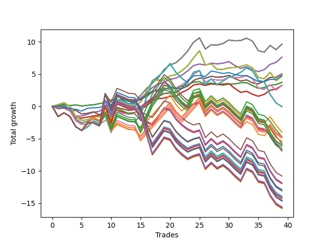

# Short Pointer One (1226) 
- Symbol: AAPL_Unlimited
- Date Range: 03/23/2022 - 07/08/2022
- Trading Period: 7:20-12:30
- Number of Trades: 39



| Name | Win Percent | Profit | Avg Profit / Trade | Avg Time / Trade |      | Name | Win Percent | Profit | Avg Profit / Trade | Avg Time / Trade |
| ---- | ----------- | ------ | ------------------ | ---------------- | ---- | ---- | ----------- | ------ | ------------------ | ---------------- |
| Sorted By <br> Profit | | | | | | Sorted By <br> Win Percentage ||||
| Sixty-Nine | 69.23 | 4820.00 | 123.59 | 42:23 |     | Sixty-Four | 74.36 | 1860.00 | 47.69 | 06:30 |
| Sixty-One | 69.23 | 4820.00 | 123.59 | 42:23 |     | Fifty-Six | 74.36 | 1860.00 | 47.69 | 06:30 |
| Fifty-Three | 69.23 | 4820.00 | 123.59 | 42:23 |     | Forty-Eight | 74.36 | 1860.00 | 47.69 | 06:30 |
| Forty-Five | 69.23 | 4820.00 | 123.59 | 42:23 |     | Forty | 74.36 | 1860.00 | 47.69 | 06:30 |
| Five | 69.23 | 4820.00 | 123.59 | 42:23 |     | Zero | 74.36 | 1860.00 | 47.69 | 06:30 |
| Sixty-Six | 71.79 | 3810.00 | 97.69 | 20:09 |     | Sixty-Six | 71.79 | 3810.00 | 97.69 | 20:09 |
| Fifty-Eight | 71.79 | 3810.00 | 97.69 | 20:09 |     | Fifty-Eight | 71.79 | 3810.00 | 97.69 | 20:09 |
| Fifty | 71.79 | 3810.00 | 97.69 | 20:09 |     | Fifty | 71.79 | 3810.00 | 97.69 | 20:09 |
| Forty-Two | 71.79 | 3810.00 | 97.69 | 20:09 |     | Forty-Two | 71.79 | 3810.00 | 97.69 | 20:09 |
| Two | 71.79 | 3810.00 | 97.69 | 20:09 |     | Two | 71.79 | 3810.00 | 97.69 | 20:09 |
| Sixty-Seven | 69.23 | 2505.00 | 64.23 | 18:59 |     | Sixty-Nine | 69.23 | 4820.00 | 123.59 | 42:23 |
| Fifty-Nine | 69.23 | 2505.00 | 64.23 | 18:59 |     | Sixty-One | 69.23 | 4820.00 | 123.59 | 42:23 |
| Fifty-One | 69.23 | 2505.00 | 64.23 | 18:59 |     | Fifty-Three | 69.23 | 4820.00 | 123.59 | 42:23 |
| Forty-Three | 69.23 | 2505.00 | 64.23 | 18:59 |     | Forty-Five | 69.23 | 4820.00 | 123.59 | 42:23 |
| Three | 69.23 | 2505.00 | 64.23 | 18:59 |     | Five | 69.23 | 4820.00 | 123.59 | 42:23 |
| Seventy-Three | 56.41 | 2375.00 | 60.90 | 11:23 |     | Sixty-Seven | 69.23 | 2505.00 | 64.23 | 18:59 |
| Seventy | 66.67 | 2340.00 | 60.00 | 47:13 |     | Fifty-Nine | 69.23 | 2505.00 | 64.23 | 18:59 |
| Sixty-Two | 66.67 | 2340.00 | 60.00 | 47:13 |     | Fifty-One | 69.23 | 2505.00 | 64.23 | 18:59 |
| Fifty-Four | 66.67 | 2340.00 | 60.00 | 47:13 |     | Forty-Three | 69.23 | 2505.00 | 64.23 | 18:59 |
| Forty-Six | 66.67 | 2340.00 | 60.00 | 47:13 |     | Three | 69.23 | 2505.00 | 64.23 | 18:59 |
| Six | 66.67 | 2340.00 | 60.00 | 47:13 |     | Seventy | 66.67 | 2340.00 | 60.00 | 47:13 |
| Sixty-Four | 74.36 | 1860.00 | 47.69 | 06:30 |     | Sixty-Two | 66.67 | 2340.00 | 60.00 | 47:13 |
| Fifty-Six | 74.36 | 1860.00 | 47.69 | 06:30 |     | Fifty-Four | 66.67 | 2340.00 | 60.00 | 47:13 |
| Forty-Eight | 74.36 | 1860.00 | 47.69 | 06:30 |     | Forty-Six | 66.67 | 2340.00 | 60.00 | 47:13 |
| Forty | 74.36 | 1860.00 | 47.69 | 06:30 |     | Six | 66.67 | 2340.00 | 60.00 | 47:13 |
| Zero | 74.36 | 1860.00 | 47.69 | 06:30 |     | Sixty-Five | 66.67 | 1620.00 | 41.54 | 15:14 |
| Sixty-Eight | 61.54 | 1625.00 | 41.67 | 34:57 |     | Fifty-Seven | 66.67 | 1620.00 | 41.54 | 15:14 |
| Sixty | 61.54 | 1625.00 | 41.67 | 34:57 |     | Forty-Nine | 66.67 | 1620.00 | 41.54 | 15:14 |
| Fifty-Two | 61.54 | 1625.00 | 41.67 | 34:57 |     | Forty-One | 66.67 | 1620.00 | 41.54 | 15:14 |
| Forty-Four | 61.54 | 1625.00 | 41.67 | 34:57 |     | One | 66.67 | 1620.00 | 41.54 | 15:14 |
| Four | 61.54 | 1625.00 | 41.67 | 34:57 |     | Sixty-Eight | 61.54 | 1625.00 | 41.67 | 34:57 |
| Sixty-Five | 66.67 | 1620.00 | 41.54 | 15:14 |     | Sixty | 61.54 | 1625.00 | 41.67 | 34:57 |
| Fifty-Seven | 66.67 | 1620.00 | 41.54 | 15:14 |     | Fifty-Two | 61.54 | 1625.00 | 41.67 | 34:57 |
| Forty-Nine | 66.67 | 1620.00 | 41.54 | 15:14 |     | Forty-Four | 61.54 | 1625.00 | 41.67 | 34:57 |
| Forty-One | 66.67 | 1620.00 | 41.54 | 15:14 |     | Four | 61.54 | 1625.00 | 41.67 | 34:57 |
| One | 66.67 | 1620.00 | 41.54 | 15:14 |     | Seventy-Three | 56.41 | 2375.00 | 60.90 | 11:23 |
| Seventy-One | 48.72 | -20.00 | -0.51 | 91:29 |     | Seventy-One | 48.72 | -20.00 | -0.51 | 91:29 |
| Sixty-Three | 48.72 | -20.00 | -0.51 | 91:29 |     | Sixty-Three | 48.72 | -20.00 | -0.51 | 91:29 |
| Fifty-Five | 48.72 | -20.00 | -0.51 | 91:29 |     | Fifty-Five | 48.72 | -20.00 | -0.51 | 91:29 |
| Forty-Seven | 48.72 | -20.00 | -0.51 | 91:29 |     | Forty-Seven | 48.72 | -20.00 | -0.51 | 91:29 |
| Seven | 48.72 | -20.00 | -0.51 | 91:29 |     | Seven | 48.72 | -20.00 | -0.51 | 91:29 |
| Ninety-Six | 43.59 | -1990.00 | -51.03 | 76:59 |     | Ninety-Six | 43.59 | -1990.00 | -51.03 | 76:59 |
| Ninety-Seven | 33.33 | -2340.00 | -60.00 | 103:30 |     | One Hundred Twenty-Six | 43.59 | -2345.00 | -60.13 | 91:45 |
| One Hundred Twenty-Six | 43.59 | -2345.00 | -60.13 | 91:45 |     | One Hundred Twenty-One | 43.59 | -2345.00 | -60.13 | 91:45 |
| One Hundred Twenty-One | 43.59 | -2345.00 | -60.13 | 91:45 |     | One Hundred Sixteen | 43.59 | -2345.00 | -60.13 | 91:45 |
| One Hundred Sixteen | 43.59 | -2345.00 | -60.13 | 91:45 |     | One Hundred Eleven | 43.59 | -2345.00 | -60.13 | 91:45 |
| One Hundred Eleven | 43.59 | -2345.00 | -60.13 | 91:45 |     | One Hundred One | 43.59 | -2345.00 | -60.13 | 91:45 |
| One Hundred One | 43.59 | -2345.00 | -60.13 | 91:45 |     | Eighty-One | 43.59 | -2345.00 | -60.13 | 91:45 |
| Eighty-One | 43.59 | -2345.00 | -60.13 | 91:45 |     | Ninety-One | 43.59 | -2445.00 | -62.69 | 82:20 |
| Ninety-One | 43.59 | -2445.00 | -62.69 | 82:20 |     | One Hundred Six | 43.59 | -2705.00 | -69.36 | 87:26 |
| One Hundred Six | 43.59 | -2705.00 | -69.36 | 87:26 |     | Ninety-Seven | 33.33 | -2340.00 | -60.00 | 103:30 |
| One Hundred | 33.33 | -2855.00 | -73.21 | 111:47 |     | One Hundred | 33.33 | -2855.00 | -73.21 | 111:47 |
| One Hundred Twenty-Seven | 33.33 | -2985.00 | -76.54 | 122:17 |     | One Hundred Twenty-Seven | 33.33 | -2985.00 | -76.54 | 122:17 |
| One Hundred Twenty-Two | 33.33 | -2985.00 | -76.54 | 122:17 |     | One Hundred Twenty-Two | 33.33 | -2985.00 | -76.54 | 122:17 |
| One Hundred Seventeen | 33.33 | -2985.00 | -76.54 | 122:17 |     | One Hundred Seventeen | 33.33 | -2985.00 | -76.54 | 122:17 |
| One Hundred Twelve | 33.33 | -2985.00 | -76.54 | 122:17 |     | One Hundred Twelve | 33.33 | -2985.00 | -76.54 | 122:17 |
| One Hundred Two | 33.33 | -2985.00 | -76.54 | 122:17 |     | One Hundred Two | 33.33 | -2985.00 | -76.54 | 122:17 |
| Eighty-Two | 33.33 | -2985.00 | -76.54 | 122:17 |     | Eighty-Two | 33.33 | -2985.00 | -76.54 | 122:17 |
| Ninety-Two | 33.33 | -3140.00 | -80.51 | 111:07 |     | Ninety-Two | 33.33 | -3140.00 | -80.51 | 111:07 |
| One Hundred Seven | 33.33 | -3310.00 | -84.87 | 116:10 |     | One Hundred Seven | 33.33 | -3310.00 | -84.87 | 116:10 |
| Ninety-Nine | 33.33 | -3360.00 | -86.15 | 110:45 |     | Ninety-Nine | 33.33 | -3360.00 | -86.15 | 110:45 |
| Ninety-Eight | 33.33 | -3440.00 | -88.21 | 108:19 |     | Ninety-Eight | 33.33 | -3440.00 | -88.21 | 108:19 |
| One Hundred Ten | 25.64 | -5395.00 | -138.33 | 125:33 |     | Ninety-Five | 28.21 | -6445.00 | -165.26 | 123:04 |
| One Hundred Nine | 25.64 | -5900.00 | -151.28 | 124:31 |     | One Hundred Twenty | 28.21 | -6540.00 | -167.69 | 134:16 |
| One Hundred Eight | 25.64 | -5980.00 | -153.33 | 122:06 |     | Ninety-Four | 28.21 | -6950.00 | -178.21 | 122:02 |
| Ninety-Five | 28.21 | -6445.00 | -165.26 | 123:04 |     | Ninety-Three | 28.21 | -7030.00 | -180.26 | 119:36 |
| One Hundred Twenty | 28.21 | -6540.00 | -167.69 | 134:16 |     | One Hundred Ninteen | 28.21 | -7045.00 | -180.64 | 133:15 |
| Ninety-Four | 28.21 | -6950.00 | -178.21 | 122:02 |     | One Hundred Eighteen | 28.21 | -7125.00 | -182.69 | 130:49 |
| Ninety-Three | 28.21 | -7030.00 | -180.26 | 119:36 |     | One Hundred Thirty | 28.21 | -7280.00 | -186.67 | 135:51 |
| One Hundred Ninteen | 28.21 | -7045.00 | -180.64 | 133:15 |     | One Hundred Twenty-Five | 28.21 | -7280.00 | -186.67 | 135:51 |
| One Hundred Eighteen | 28.21 | -7125.00 | -182.69 | 130:49 |     | One Hundred Fifteen | 28.21 | -7280.00 | -186.67 | 135:51 |
| One Hundred Thirty | 28.21 | -7280.00 | -186.67 | 135:51 |     | Eighty-Five | 28.21 | -7280.00 | -186.67 | 135:51 |
| One Hundred Twenty-Five | 28.21 | -7280.00 | -186.67 | 135:51 |     | One Hundred Five | 28.21 | -7325.00 | -187.82 | 135:17 |
| One Hundred Fifteen | 28.21 | -7280.00 | -186.67 | 135:51 |     | One Hundred Twenty-Nine | 28.21 | -7785.00 | -199.62 | 134:49 |
| Eighty-Five | 28.21 | -7280.00 | -186.67 | 135:51 |     | One Hundred Twenty-Four | 28.21 | -7785.00 | -199.62 | 134:49 |
| One Hundred Five | 28.21 | -7325.00 | -187.82 | 135:17 |     | One Hundred Fourteen | 28.21 | -7785.00 | -199.62 | 134:49 |
| One Hundred Twenty-Nine | 28.21 | -7785.00 | -199.62 | 134:49 |     | Eighty-Four | 28.21 | -7785.00 | -199.62 | 134:49 |
| One Hundred Twenty-Four | 28.21 | -7785.00 | -199.62 | 134:49 |     | One Hundred Four | 28.21 | -7830.00 | -200.77 | 134:16 |
| One Hundred Fourteen | 28.21 | -7785.00 | -199.62 | 134:49 |     | One Hundred Twenty-Eight | 28.21 | -7865.00 | -201.67 | 132:23 |
| Eighty-Four | 28.21 | -7785.00 | -199.62 | 134:49 |     | One Hundred Twenty-Three | 28.21 | -7865.00 | -201.67 | 132:23 |
| One Hundred Four | 28.21 | -7830.00 | -200.77 | 134:16 |     | One Hundred Thirteen | 28.21 | -7865.00 | -201.67 | 132:23 |
| One Hundred Twenty-Eight | 28.21 | -7865.00 | -201.67 | 132:23 |     | Eighty-Three | 28.21 | -7865.00 | -201.67 | 132:23 |
| One Hundred Twenty-Three | 28.21 | -7865.00 | -201.67 | 132:23 |     | One Hundred Three | 28.21 | -7910.00 | -202.82 | 131:50 |
| One Hundred Thirteen | 28.21 | -7865.00 | -201.67 | 132:23 |     | One Hundred Ten | 25.64 | -5395.00 | -138.33 | 125:33 |
| Eighty-Three | 28.21 | -7865.00 | -201.67 | 132:23 |     | One Hundred Nine | 25.64 | -5900.00 | -151.28 | 124:31 |
| One Hundred Three | 28.21 | -7910.00 | -202.82 | 131:50 |     | One Hundred Eight | 25.64 | -5980.00 | -153.33 | 122:06 |

## NO STOPLOSS

### Test Zero
* Sell when price hits the middle line of the 20p bollinger
* No Stoploss
* Results:
```
Total Trades: 39
Percent Up: 25.64
Percent Down: 74.36
Total Points Moved Down: 3.72
Potential Profit: 1860.00
Total Points Ups: 2.26 Count Ups: 10
Total Points Downs: 5.98 Count Downs: 29
```

<details><summary>Trades</summary>

<code>In: 2022-03-24 10:04:00		Out: 2022-03-24 10:09:20		Total Position Time: 05:20		Total Move Down: 0.17		Total to Date: 0.17</code> <br />
<code>In: 2022-04-01 11:37:00		Out: 2022-04-01 11:39:30		Total Position Time: 02:30		Total Move Down: 0.14		Total to Date: 0.31</code> <br />
<code>In: 2022-04-04 11:50:00		Out: 2022-04-04 12:13:55		Total Position Time: 23:55		Total Move Down: -0.17		Total to Date: 0.14</code> <br />
<code>In: 2022-04-07 11:30:00		Out: 2022-04-07 11:31:10		Total Position Time: 01:10		Total Move Down: 0.09		Total to Date: 0.23</code> <br />
<code>In: 2022-04-07 12:04:00		Out: 2022-04-07 12:20:15		Total Position Time: 16:15		Total Move Down: -0.17		Total to Date: 0.06</code> <br />
<code>In: 2022-04-11 11:12:00		Out: 2022-04-11 11:13:10		Total Position Time: 01:10		Total Move Down: 0.11		Total to Date: 0.17</code> <br />
<code>In: 2022-04-20 10:50:00		Out: 2022-04-20 10:51:10		Total Position Time: 01:10		Total Move Down: 0.08		Total to Date: 0.25</code> <br />
<code>In: 2022-04-20 12:20:00		Out: 2022-04-20 12:22:40		Total Position Time: 02:40		Total Move Down: 0.17		Total to Date: 0.42</code> <br />
<code>In: 2022-04-21 08:30:00		Out: 2022-04-21 08:32:30		Total Position Time: 02:30		Total Move Down: 0.20		Total to Date: 0.62</code> <br />
<code>In: 2022-04-25 09:28:00		Out: 2022-04-25 09:31:10		Total Position Time: 03:10		Total Move Down: 0.39		Total to Date: 1.01</code> <br />
<code>In: 2022-04-27 09:46:00		Out: 2022-04-27 09:48:15		Total Position Time: 02:15		Total Move Down: -0.08		Total to Date: 0.93</code> <br />
<code>In: 2022-04-28 10:16:00		Out: 2022-04-28 10:19:05		Total Position Time: 03:05		Total Move Down: 0.25		Total to Date: 1.18</code> <br />
<code>In: 2022-04-28 10:31:00		Out: 2022-04-28 10:44:15		Total Position Time: 13:15		Total Move Down: -0.21		Total to Date: 0.97</code> <br />
<code>In: 2022-04-28 10:53:00		Out: 2022-04-28 10:54:10		Total Position Time: 01:10		Total Move Down: 0.06		Total to Date: 1.03</code> <br />
<code>In: 2022-05-03 07:37:00		Out: 2022-05-03 07:39:05		Total Position Time: 02:05		Total Move Down: 0.23		Total to Date: 1.26</code> <br />
<code>In: 2022-05-04 11:03:00		Out: 2022-05-04 11:06:30		Total Position Time: 03:30		Total Move Down: 0.17		Total to Date: 1.43</code> <br />
<code>In: 2022-05-04 11:07:00		Out: 2022-05-04 11:08:10		Total Position Time: 01:10		Total Move Down: 0.85		Total to Date: 2.28</code> <br />
<code>In: 2022-05-09 10:33:00		Out: 2022-05-09 10:34:40		Total Position Time: 01:40		Total Move Down: 0.32		Total to Date: 2.60</code> <br />
<code>In: 2022-05-09 12:04:00		Out: 2022-05-09 12:09:15		Total Position Time: 05:15		Total Move Down: 0.13		Total to Date: 2.73</code> <br />
<code>In: 2022-05-17 11:12:00		Out: 2022-05-17 11:13:10		Total Position Time: 01:10		Total Move Down: 0.11		Total to Date: 2.84</code> <br />
<code>In: 2022-05-24 10:48:00		Out: 2022-05-24 10:58:25		Total Position Time: 10:25		Total Move Down: -0.02		Total to Date: 2.82</code> <br />
<code>In: 2022-05-24 11:14:00		Out: 2022-05-24 11:15:55		Total Position Time: 01:55		Total Move Down: 0.28		Total to Date: 3.10</code> <br />
<code>In: 2022-05-24 11:41:00		Out: 2022-05-24 11:42:20		Total Position Time: 01:20		Total Move Down: 0.27		Total to Date: 3.37</code> <br />
<code>In: 2022-05-25 07:37:00		Out: 2022-05-25 07:41:55		Total Position Time: 04:55		Total Move Down: 0.37		Total to Date: 3.74</code> <br />
<code>In: 2022-05-31 09:46:00		Out: 2022-05-31 09:57:30		Total Position Time: 11:30		Total Move Down: 0.08		Total to Date: 3.82</code> <br />
<code>In: 2022-06-02 08:06:00		Out: 2022-06-02 08:25:20		Total Position Time: 19:20		Total Move Down: -0.40		Total to Date: 3.42</code> <br />
<code>In: 2022-06-03 10:06:00		Out: 2022-06-03 10:08:30		Total Position Time: 02:30		Total Move Down: 0.18		Total to Date: 3.60</code> <br />
<code>In: 2022-06-07 10:12:00		Out: 2022-06-07 10:34:15		Total Position Time: 22:15		Total Move Down: -0.17		Total to Date: 3.43</code> <br />
<code>In: 2022-06-10 11:51:00		Out: 2022-06-10 12:03:25		Total Position Time: 12:25		Total Move Down: -0.14		Total to Date: 3.29</code> <br />
<code>In: 2022-06-14 08:47:00		Out: 2022-06-14 08:51:40		Total Position Time: 04:40		Total Move Down: 0.16		Total to Date: 3.45</code> <br />
<code>In: 2022-06-14 09:58:00		Out: 2022-06-14 10:03:35		Total Position Time: 05:35		Total Move Down: 0.03		Total to Date: 3.48</code> <br />
<code>In: 2022-06-14 10:02:00		Out: 2022-06-14 10:03:35		Total Position Time: 01:35		Total Move Down: 0.17		Total to Date: 3.65</code> <br />
<code>In: 2022-06-16 10:14:00		Out: 2022-06-16 10:19:50		Total Position Time: 05:50		Total Move Down: 0.02		Total to Date: 3.67</code> <br />
<code>In: 2022-06-23 12:30:00		Out: 2022-06-23 12:47:00		Total Position Time: 17:00		Total Move Down: -0.46		Total to Date: 3.21</code> <br />
<code>In: 2022-07-01 10:35:00		Out: 2022-07-01 11:04:25		Total Position Time: 29:25		Total Move Down: -0.44		Total to Date: 2.77</code> <br />
<code>In: 2022-07-01 11:52:00		Out: 2022-07-01 11:54:10		Total Position Time: 02:10		Total Move Down: 0.15		Total to Date: 2.92</code> <br />
<code>In: 2022-07-05 07:43:00		Out: 2022-07-05 07:46:55		Total Position Time: 03:55		Total Move Down: 0.37		Total to Date: 3.29</code> <br />
<code>In: 2022-07-05 10:44:00		Out: 2022-07-05 10:45:10		Total Position Time: 01:10		Total Move Down: 0.07		Total to Date: 3.36</code> <br />
<code>In: 2022-07-06 11:10:00		Out: 2022-07-06 11:11:10		Total Position Time: 01:10		Total Move Down: 0.36		Total to Date: 3.72</code> <br />


</details>

### Test One
* Sell when the price hits the upper line of the 20p 1std bollinger
* No Stoploss
* Results:
```
Total Trades: 39
Percent Up: 33.33
Percent Down: 66.67
Total Points Moved Down: 3.24
Potential Profit: 1620.00
Total Points Ups: 4.75 Count Ups: 13
Total Points Downs: 7.99 Count Downs: 26
```

<details><summary>Trades</summary>

<code>In: 2022-03-24 10:04:00		Out: 2022-03-24 10:33:15		Total Position Time: 29:15		Total Move Down: -0.13		Total to Date: -0.13</code> <br />
<code>In: 2022-04-01 11:37:00		Out: 2022-04-01 11:53:30		Total Position Time: 16:30		Total Move Down: 0.01		Total to Date: -0.12</code> <br />
<code>In: 2022-04-04 11:50:00		Out: 2022-04-04 12:42:50		Total Position Time: 52:50		Total Move Down: -0.58		Total to Date: -0.70</code> <br />
<code>In: 2022-04-07 11:30:00		Out: 2022-04-07 12:27:40		Total Position Time: 57:40		Total Move Down: -1.07		Total to Date: -1.77</code> <br />
<code>In: 2022-04-07 12:04:00		Out: 2022-04-07 12:27:40		Total Position Time: 23:40		Total Move Down: -0.05		Total to Date: -1.82</code> <br />
<code>In: 2022-04-11 11:12:00		Out: 2022-04-11 11:14:15		Total Position Time: 02:15		Total Move Down: 0.16		Total to Date: -1.66</code> <br />
<code>In: 2022-04-20 10:50:00		Out: 2022-04-20 10:54:05		Total Position Time: 04:05		Total Move Down: 0.18		Total to Date: -1.48</code> <br />
<code>In: 2022-04-20 12:20:00		Out: 2022-04-20 12:33:05		Total Position Time: 13:05		Total Move Down: 0.09		Total to Date: -1.39</code> <br />
<code>In: 2022-04-21 08:30:00		Out: 2022-04-21 08:33:45		Total Position Time: 03:45		Total Move Down: 0.43		Total to Date: -0.96</code> <br />
<code>In: 2022-04-25 09:28:00		Out: 2022-04-25 09:43:40		Total Position Time: 15:40		Total Move Down: 0.20		Total to Date: -0.76</code> <br />
<code>In: 2022-04-27 09:46:00		Out: 2022-04-27 09:50:25		Total Position Time: 04:25		Total Move Down: 0.12		Total to Date: -0.64</code> <br />
<code>In: 2022-04-28 10:16:00		Out: 2022-04-28 10:56:05		Total Position Time: 40:05		Total Move Down: -0.21		Total to Date: -0.85</code> <br />
<code>In: 2022-04-28 10:31:00		Out: 2022-04-28 10:56:05		Total Position Time: 25:05		Total Move Down: -0.23		Total to Date: -1.08</code> <br />
<code>In: 2022-04-28 10:53:00		Out: 2022-04-28 10:56:05		Total Position Time: 03:05		Total Move Down: 0.13		Total to Date: -0.95</code> <br />
<code>In: 2022-05-03 07:37:00		Out: 2022-05-03 07:42:15		Total Position Time: 05:15		Total Move Down: 0.56		Total to Date: -0.39</code> <br />
<code>In: 2022-05-04 11:03:00		Out: 2022-05-04 11:07:05		Total Position Time: 04:05		Total Move Down: 0.42		Total to Date: 0.03</code> <br />
<code>In: 2022-05-04 11:07:00		Out: 2022-05-04 11:08:10		Total Position Time: 01:10		Total Move Down: 0.85		Total to Date: 0.88</code> <br />
<code>In: 2022-05-09 10:33:00		Out: 2022-05-09 10:47:10		Total Position Time: 14:10		Total Move Down: 0.31		Total to Date: 1.19</code> <br />
<code>In: 2022-05-09 12:04:00		Out: 2022-05-09 12:17:30		Total Position Time: 13:30		Total Move Down: 0.10		Total to Date: 1.29</code> <br />
<code>In: 2022-05-17 11:12:00		Out: 2022-05-17 11:13:15		Total Position Time: 01:15		Total Move Down: 0.26		Total to Date: 1.55</code> <br />
<code>In: 2022-05-24 10:48:00		Out: 2022-05-24 11:01:20		Total Position Time: 13:20		Total Move Down: -0.00		Total to Date: 1.55</code> <br />
<code>In: 2022-05-24 11:14:00		Out: 2022-05-24 11:20:25		Total Position Time: 06:25		Total Move Down: 0.60		Total to Date: 2.15</code> <br />
<code>In: 2022-05-24 11:41:00		Out: 2022-05-24 11:43:45		Total Position Time: 02:45		Total Move Down: 0.44		Total to Date: 2.59</code> <br />
<code>In: 2022-05-25 07:37:00		Out: 2022-05-25 07:43:30		Total Position Time: 06:30		Total Move Down: 0.71		Total to Date: 3.30</code> <br />
<code>In: 2022-05-31 09:46:00		Out: 2022-05-31 09:59:10		Total Position Time: 13:10		Total Move Down: 0.18		Total to Date: 3.48</code> <br />
<code>In: 2022-06-02 08:06:00		Out: 2022-06-02 08:27:20		Total Position Time: 21:20		Total Move Down: -0.24		Total to Date: 3.24</code> <br />
<code>In: 2022-06-03 10:06:00		Out: 2022-06-03 10:13:20		Total Position Time: 07:20		Total Move Down: 0.25		Total to Date: 3.49</code> <br />
<code>In: 2022-06-07 10:12:00		Out: 2022-06-07 10:34:30		Total Position Time: 22:30		Total Move Down: -0.11		Total to Date: 3.38</code> <br />
<code>In: 2022-06-10 11:51:00		Out: 2022-06-10 12:05:10		Total Position Time: 14:10		Total Move Down: 0.06		Total to Date: 3.44</code> <br />
<code>In: 2022-06-14 08:47:00		Out: 2022-06-14 09:02:10		Total Position Time: 15:10		Total Move Down: 0.09		Total to Date: 3.53</code> <br />
<code>In: 2022-06-14 09:58:00		Out: 2022-06-14 10:34:05		Total Position Time: 36:05		Total Move Down: -0.75		Total to Date: 2.78</code> <br />
<code>In: 2022-06-14 10:02:00		Out: 2022-06-14 10:34:05		Total Position Time: 32:05		Total Move Down: -0.61		Total to Date: 2.17</code> <br />
<code>In: 2022-06-16 10:14:00		Out: 2022-06-16 10:20:35		Total Position Time: 06:35		Total Move Down: 0.17		Total to Date: 2.34</code> <br />
<code>In: 2022-06-23 12:30:00		Out: 2022-06-23 12:47:00		Total Position Time: 17:00		Total Move Down: -0.46		Total to Date: 1.88</code> <br />
<code>In: 2022-07-01 10:35:00		Out: 2022-07-01 11:07:55		Total Position Time: 32:55		Total Move Down: -0.31		Total to Date: 1.57</code> <br />
<code>In: 2022-07-01 11:52:00		Out: 2022-07-01 11:54:40		Total Position Time: 02:40		Total Move Down: 0.29		Total to Date: 1.86</code> <br />
<code>In: 2022-07-05 07:43:00		Out: 2022-07-05 07:51:30		Total Position Time: 08:30		Total Move Down: 0.64		Total to Date: 2.50</code> <br />
<code>In: 2022-07-05 10:44:00		Out: 2022-07-05 10:47:25		Total Position Time: 03:25		Total Move Down: 0.19		Total to Date: 2.69</code> <br />
<code>In: 2022-07-06 11:10:00		Out: 2022-07-06 11:11:50		Total Position Time: 01:50		Total Move Down: 0.55		Total to Date: 3.24</code> <br />


</details>

### Test Two
* Sell when the price hits the upper line of the 20p 2std bollinger
* No Stoploss
* Results:
```
Total Trades: 39
Percent Up: 28.21
Percent Down: 71.79
Total Points Moved Down: 7.62
Potential Profit: 3810.00
Total Points Ups: 3.99 Count Ups: 11
Total Points Downs: 11.61 Count Downs: 28
```

<details><summary>Trades</summary>

<code>In: 2022-03-24 10:04:00		Out: 2022-03-24 10:34:15		Total Position Time: 30:15		Total Move Down: -0.07		Total to Date: -0.07</code> <br />
<code>In: 2022-04-01 11:37:00		Out: 2022-04-01 11:54:00		Total Position Time: 17:00		Total Move Down: 0.08		Total to Date: 0.01</code> <br />
<code>In: 2022-04-04 11:50:00		Out: 2022-04-04 12:45:00		Total Position Time: 55:00		Total Move Down: -0.52		Total to Date: -0.51</code> <br />
<code>In: 2022-04-07 11:30:00		Out: 2022-04-07 12:28:30		Total Position Time: 58:30		Total Move Down: -1.01		Total to Date: -1.52</code> <br />
<code>In: 2022-04-07 12:04:00		Out: 2022-04-07 12:28:30		Total Position Time: 24:30		Total Move Down: 0.01		Total to Date: -1.51</code> <br />
<code>In: 2022-04-11 11:12:00		Out: 2022-04-11 11:14:30		Total Position Time: 02:30		Total Move Down: 0.28		Total to Date: -1.23</code> <br />
<code>In: 2022-04-20 10:50:00		Out: 2022-04-20 11:03:15		Total Position Time: 13:15		Total Move Down: 0.33		Total to Date: -0.90</code> <br />
<code>In: 2022-04-20 12:20:00		Out: 2022-04-20 12:35:15		Total Position Time: 15:15		Total Move Down: 0.15		Total to Date: -0.75</code> <br />
<code>In: 2022-04-21 08:30:00		Out: 2022-04-21 08:45:05		Total Position Time: 15:05		Total Move Down: 0.63		Total to Date: -0.12</code> <br />
<code>In: 2022-04-25 09:28:00		Out: 2022-04-25 09:57:05		Total Position Time: 29:05		Total Move Down: 0.44		Total to Date: 0.32</code> <br />
<code>In: 2022-04-27 09:46:00		Out: 2022-04-27 09:53:40		Total Position Time: 07:40		Total Move Down: 0.31		Total to Date: 0.63</code> <br />
<code>In: 2022-04-28 10:16:00		Out: 2022-04-28 11:06:20		Total Position Time: 50:20		Total Move Down: -0.14		Total to Date: 0.49</code> <br />
<code>In: 2022-04-28 10:31:00		Out: 2022-04-28 11:06:20		Total Position Time: 35:20		Total Move Down: -0.16		Total to Date: 0.33</code> <br />
<code>In: 2022-04-28 10:53:00		Out: 2022-04-28 11:06:20		Total Position Time: 13:20		Total Move Down: 0.20		Total to Date: 0.53</code> <br />
<code>In: 2022-05-03 07:37:00		Out: 2022-05-03 07:45:10		Total Position Time: 08:10		Total Move Down: 0.74		Total to Date: 1.27</code> <br />
<code>In: 2022-05-04 11:03:00		Out: 2022-05-04 11:07:25		Total Position Time: 04:25		Total Move Down: 0.79		Total to Date: 2.06</code> <br />
<code>In: 2022-05-04 11:07:00		Out: 2022-05-04 11:08:10		Total Position Time: 01:10		Total Move Down: 0.85		Total to Date: 2.91</code> <br />
<code>In: 2022-05-09 10:33:00		Out: 2022-05-09 10:51:50		Total Position Time: 18:50		Total Move Down: 0.54		Total to Date: 3.45</code> <br />
<code>In: 2022-05-09 12:04:00		Out: 2022-05-09 12:20:05		Total Position Time: 16:05		Total Move Down: 0.30		Total to Date: 3.75</code> <br />
<code>In: 2022-05-17 11:12:00		Out: 2022-05-17 11:13:30		Total Position Time: 01:30		Total Move Down: 0.44		Total to Date: 4.19</code> <br />
<code>In: 2022-05-24 10:48:00		Out: 2022-05-24 11:01:40		Total Position Time: 13:40		Total Move Down: 0.18		Total to Date: 4.37</code> <br />
<code>In: 2022-05-24 11:14:00		Out: 2022-05-24 11:44:05		Total Position Time: 30:05		Total Move Down: 0.45		Total to Date: 4.82</code> <br />
<code>In: 2022-05-24 11:41:00		Out: 2022-05-24 11:44:05		Total Position Time: 03:05		Total Move Down: 0.67		Total to Date: 5.49</code> <br />
<code>In: 2022-05-25 07:37:00		Out: 2022-05-25 07:48:05		Total Position Time: 11:05		Total Move Down: 0.82		Total to Date: 6.31</code> <br />
<code>In: 2022-05-31 09:46:00		Out: 2022-05-31 09:59:55		Total Position Time: 13:55		Total Move Down: 0.25		Total to Date: 6.56</code> <br />
<code>In: 2022-06-02 08:06:00		Out: 2022-06-02 08:29:05		Total Position Time: 23:05		Total Move Down: -0.18		Total to Date: 6.38</code> <br />
<code>In: 2022-06-03 10:06:00		Out: 2022-06-03 10:15:10		Total Position Time: 09:10		Total Move Down: 0.31		Total to Date: 6.69</code> <br />
<code>In: 2022-06-07 10:12:00		Out: 2022-06-07 10:38:35		Total Position Time: 26:35		Total Move Down: -0.12		Total to Date: 6.57</code> <br />
<code>In: 2022-06-10 11:51:00		Out: 2022-06-10 12:43:15		Total Position Time: 52:15		Total Move Down: 0.12		Total to Date: 6.69</code> <br />
<code>In: 2022-06-14 08:47:00		Out: 2022-06-14 09:03:00		Total Position Time: 16:00		Total Move Down: 0.24		Total to Date: 6.93</code> <br />
<code>In: 2022-06-14 09:58:00		Out: 2022-06-14 10:36:05		Total Position Time: 38:05		Total Move Down: -0.60		Total to Date: 6.33</code> <br />
<code>In: 2022-06-14 10:02:00		Out: 2022-06-14 10:36:05		Total Position Time: 34:05		Total Move Down: -0.46		Total to Date: 5.87</code> <br />
<code>In: 2022-06-16 10:14:00		Out: 2022-06-16 10:21:35		Total Position Time: 07:35		Total Move Down: 0.25		Total to Date: 6.12</code> <br />
<code>In: 2022-06-23 12:30:00		Out: 2022-06-23 12:47:00		Total Position Time: 17:00		Total Move Down: -0.46		Total to Date: 5.66</code> <br />
<code>In: 2022-07-01 10:35:00		Out: 2022-07-01 11:08:25		Total Position Time: 33:25		Total Move Down: -0.27		Total to Date: 5.39</code> <br />
<code>In: 2022-07-01 11:52:00		Out: 2022-07-01 12:02:15		Total Position Time: 10:15		Total Move Down: 0.30		Total to Date: 5.69</code> <br />
<code>In: 2022-07-05 07:43:00		Out: 2022-07-05 08:05:50		Total Position Time: 22:50		Total Move Down: 0.82		Total to Date: 6.51</code> <br />
<code>In: 2022-07-05 10:44:00		Out: 2022-07-05 10:48:25		Total Position Time: 04:25		Total Move Down: 0.30		Total to Date: 6.81</code> <br />
<code>In: 2022-07-06 11:10:00		Out: 2022-07-06 11:12:25		Total Position Time: 02:25		Total Move Down: 0.81		Total to Date: 7.62</code> <br />


</details>

### Test Three
* Sell when price hits the middle line of the 50p bollinger
* No Stoploss
* Results:
```
Total Trades: 39
Percent Up: 30.77
Percent Down: 69.23
Total Points Moved Down: 5.01
Potential Profit: 2505.00
Total Points Ups: 3.94 Count Ups: 12
Total Points Downs: 8.95 Count Downs: 27
```

<details><summary>Trades</summary>

<code>In: 2022-03-24 10:04:00		Out: 2022-03-24 11:09:05		Total Position Time: 65:05		Total Move Down: -0.36		Total to Date: -0.36</code> <br />
<code>In: 2022-04-01 11:37:00		Out: 2022-04-01 11:55:35		Total Position Time: 18:35		Total Move Down: 0.11		Total to Date: -0.25</code> <br />
<code>In: 2022-04-04 11:50:00		Out: 2022-04-04 12:45:15		Total Position Time: 55:15		Total Move Down: -0.45		Total to Date: -0.70</code> <br />
<code>In: 2022-04-07 11:30:00		Out: 2022-04-07 11:36:05		Total Position Time: 06:05		Total Move Down: 0.10		Total to Date: -0.60</code> <br />
<code>In: 2022-04-07 12:04:00		Out: 2022-04-07 12:47:00		Total Position Time: 43:00		Total Move Down: -0.58		Total to Date: -1.18</code> <br />
<code>In: 2022-04-11 11:12:00		Out: 2022-04-11 11:13:10		Total Position Time: 01:10		Total Move Down: 0.11		Total to Date: -1.07</code> <br />
<code>In: 2022-04-20 10:50:00		Out: 2022-04-20 10:55:30		Total Position Time: 05:30		Total Move Down: 0.22		Total to Date: -0.85</code> <br />
<code>In: 2022-04-20 12:20:00		Out: 2022-04-20 12:47:00		Total Position Time: 27:00		Total Move Down: -0.44		Total to Date: -1.29</code> <br />
<code>In: 2022-04-21 08:30:00		Out: 2022-04-21 08:40:30		Total Position Time: 10:30		Total Move Down: 0.41		Total to Date: -0.88</code> <br />
<code>In: 2022-04-25 09:28:00		Out: 2022-04-25 09:55:10		Total Position Time: 27:10		Total Move Down: 0.23		Total to Date: -0.65</code> <br />
<code>In: 2022-04-27 09:46:00		Out: 2022-04-27 09:55:40		Total Position Time: 09:40		Total Move Down: 0.46		Total to Date: -0.19</code> <br />
<code>In: 2022-04-28 10:16:00		Out: 2022-04-28 11:01:05		Total Position Time: 45:05		Total Move Down: -0.21		Total to Date: -0.40</code> <br />
<code>In: 2022-04-28 10:31:00		Out: 2022-04-28 11:01:05		Total Position Time: 30:05		Total Move Down: -0.23		Total to Date: -0.63</code> <br />
<code>In: 2022-04-28 10:53:00		Out: 2022-04-28 11:01:05		Total Position Time: 08:05		Total Move Down: 0.13		Total to Date: -0.50</code> <br />
<code>In: 2022-05-03 07:37:00		Out: 2022-05-03 07:40:40		Total Position Time: 03:40		Total Move Down: 0.33		Total to Date: -0.17</code> <br />
<code>In: 2022-05-04 11:03:00		Out: 2022-05-04 11:07:05		Total Position Time: 04:05		Total Move Down: 0.42		Total to Date: 0.25</code> <br />
<code>In: 2022-05-04 11:07:00		Out: 2022-05-04 11:08:10		Total Position Time: 01:10		Total Move Down: 0.85		Total to Date: 1.10</code> <br />
<code>In: 2022-05-09 10:33:00		Out: 2022-05-09 10:35:15		Total Position Time: 02:15		Total Move Down: 0.44		Total to Date: 1.54</code> <br />
<code>In: 2022-05-09 12:04:00		Out: 2022-05-09 12:20:15		Total Position Time: 16:15		Total Move Down: 0.44		Total to Date: 1.98</code> <br />
<code>In: 2022-05-17 11:12:00		Out: 2022-05-17 11:13:10		Total Position Time: 01:10		Total Move Down: 0.11		Total to Date: 2.09</code> <br />
<code>In: 2022-05-24 10:48:00		Out: 2022-05-24 11:20:20		Total Position Time: 32:20		Total Move Down: 0.10		Total to Date: 2.19</code> <br />
<code>In: 2022-05-24 11:14:00		Out: 2022-05-24 11:20:20		Total Position Time: 06:20		Total Move Down: 0.57		Total to Date: 2.76</code> <br />
<code>In: 2022-05-24 11:41:00		Out: 2022-05-24 11:43:30		Total Position Time: 02:30		Total Move Down: 0.38		Total to Date: 3.14</code> <br />
<code>In: 2022-05-25 07:37:00		Out: 2022-05-25 07:48:40		Total Position Time: 11:40		Total Move Down: 0.87		Total to Date: 4.01</code> <br />
<code>In: 2022-05-31 09:46:00		Out: 2022-05-31 10:02:05		Total Position Time: 16:05		Total Move Down: 0.37		Total to Date: 4.38</code> <br />
<code>In: 2022-06-02 08:06:00		Out: 2022-06-02 08:31:45		Total Position Time: 25:45		Total Move Down: -0.03		Total to Date: 4.35</code> <br />
<code>In: 2022-06-03 10:06:00		Out: 2022-06-03 10:15:10		Total Position Time: 09:10		Total Move Down: 0.31		Total to Date: 4.66</code> <br />
<code>In: 2022-06-07 10:12:00		Out: 2022-06-07 10:55:10		Total Position Time: 43:10		Total Move Down: -0.15		Total to Date: 4.51</code> <br />
<code>In: 2022-06-10 11:51:00		Out: 2022-06-10 12:05:10		Total Position Time: 14:10		Total Move Down: 0.06		Total to Date: 4.57</code> <br />
<code>In: 2022-06-14 08:47:00		Out: 2022-06-14 09:03:00		Total Position Time: 16:00		Total Move Down: 0.24		Total to Date: 4.81</code> <br />
<code>In: 2022-06-14 09:58:00		Out: 2022-06-14 10:37:10		Total Position Time: 39:10		Total Move Down: -0.51		Total to Date: 4.30</code> <br />
<code>In: 2022-06-14 10:02:00		Out: 2022-06-14 10:37:10		Total Position Time: 35:10		Total Move Down: -0.37		Total to Date: 3.93</code> <br />
<code>In: 2022-06-16 10:14:00		Out: 2022-06-16 10:20:35		Total Position Time: 06:35		Total Move Down: 0.17		Total to Date: 4.10</code> <br />
<code>In: 2022-06-23 12:30:00		Out: 2022-06-23 12:47:00		Total Position Time: 17:00		Total Move Down: -0.46		Total to Date: 3.64</code> <br />
<code>In: 2022-07-01 10:35:00		Out: 2022-07-01 11:11:05		Total Position Time: 36:05		Total Move Down: -0.15		Total to Date: 3.49</code> <br />
<code>In: 2022-07-01 11:52:00		Out: 2022-07-01 12:03:30		Total Position Time: 11:30		Total Move Down: 0.41		Total to Date: 3.90</code> <br />
<code>In: 2022-07-05 07:43:00		Out: 2022-07-05 07:51:15		Total Position Time: 08:15		Total Move Down: 0.58		Total to Date: 4.48</code> <br />
<code>In: 2022-07-05 10:44:00		Out: 2022-07-05 11:11:10		Total Position Time: 27:10		Total Move Down: 0.03		Total to Date: 4.51</code> <br />
<code>In: 2022-07-06 11:10:00		Out: 2022-07-06 11:11:40		Total Position Time: 01:40		Total Move Down: 0.50		Total to Date: 5.01</code> <br />


</details>

### Test Four
* Sell when the price hits the upper line of the 50p 1std bollinger
* No Stoploss
* Results:
```
Total Trades: 39
Percent Up: 38.46
Percent Down: 61.54
Total Points Moved Down: 3.25
Potential Profit: 1625.00
Total Points Ups: 8.73 Count Ups: 15
Total Points Downs: 11.98 Count Downs: 24
```

<details><summary>Trades</summary>

<code>In: 2022-03-24 10:04:00		Out: 2022-03-24 11:10:25		Total Position Time: 66:25		Total Move Down: -0.23		Total to Date: -0.23</code> <br />
<code>In: 2022-04-01 11:37:00		Out: 2022-04-01 12:11:10		Total Position Time: 34:10		Total Move Down: 0.16		Total to Date: -0.07</code> <br />
<code>In: 2022-04-04 11:50:00		Out: 2022-04-04 12:47:00		Total Position Time: 57:00		Total Move Down: -0.55		Total to Date: -0.62</code> <br />
<code>In: 2022-04-07 11:30:00		Out: 2022-04-07 12:47:00		Total Position Time: 77:00		Total Move Down: -1.60		Total to Date: -2.22</code> <br />
<code>In: 2022-04-07 12:04:00		Out: 2022-04-07 12:47:00		Total Position Time: 43:00		Total Move Down: -0.58		Total to Date: -2.80</code> <br />
<code>In: 2022-04-11 11:12:00		Out: 2022-04-11 11:13:10		Total Position Time: 01:10		Total Move Down: 0.11		Total to Date: -2.69</code> <br />
<code>In: 2022-04-20 10:50:00		Out: 2022-04-20 11:03:15		Total Position Time: 13:15		Total Move Down: 0.33		Total to Date: -2.36</code> <br />
<code>In: 2022-04-20 12:20:00		Out: 2022-04-20 12:47:00		Total Position Time: 27:00		Total Move Down: -0.44		Total to Date: -2.80</code> <br />
<code>In: 2022-04-21 08:30:00		Out: 2022-04-21 08:45:05		Total Position Time: 15:05		Total Move Down: 0.63		Total to Date: -2.17</code> <br />
<code>In: 2022-04-25 09:28:00		Out: 2022-04-25 10:01:10		Total Position Time: 33:10		Total Move Down: 0.46		Total to Date: -1.71</code> <br />
<code>In: 2022-04-27 09:46:00		Out: 2022-04-27 10:01:15		Total Position Time: 15:15		Total Move Down: 0.78		Total to Date: -0.93</code> <br />
<code>In: 2022-04-28 10:16:00		Out: 2022-04-28 11:14:05		Total Position Time: 58:05		Total Move Down: -0.13		Total to Date: -1.06</code> <br />
<code>In: 2022-04-28 10:31:00		Out: 2022-04-28 11:14:05		Total Position Time: 43:05		Total Move Down: -0.15		Total to Date: -1.21</code> <br />
<code>In: 2022-04-28 10:53:00		Out: 2022-04-28 11:14:05		Total Position Time: 21:05		Total Move Down: 0.21		Total to Date: -1.00</code> <br />
<code>In: 2022-05-03 07:37:00		Out: 2022-05-03 07:43:20		Total Position Time: 06:20		Total Move Down: 0.61		Total to Date: -0.39</code> <br />
<code>In: 2022-05-04 11:03:00		Out: 2022-05-04 11:07:25		Total Position Time: 04:25		Total Move Down: 0.79		Total to Date: 0.40</code> <br />
<code>In: 2022-05-04 11:07:00		Out: 2022-05-04 11:08:10		Total Position Time: 01:10		Total Move Down: 0.85		Total to Date: 1.25</code> <br />
<code>In: 2022-05-09 10:33:00		Out: 2022-05-09 10:52:05		Total Position Time: 19:05		Total Move Down: 0.60		Total to Date: 1.85</code> <br />
<code>In: 2022-05-09 12:04:00		Out: 2022-05-09 12:24:05		Total Position Time: 20:05		Total Move Down: 0.74		Total to Date: 2.59</code> <br />
<code>In: 2022-05-17 11:12:00		Out: 2022-05-17 11:13:25		Total Position Time: 01:25		Total Move Down: 0.30		Total to Date: 2.89</code> <br />
<code>In: 2022-05-24 10:48:00		Out: 2022-05-24 11:44:05		Total Position Time: 56:05		Total Move Down: -0.02		Total to Date: 2.87</code> <br />
<code>In: 2022-05-24 11:14:00		Out: 2022-05-24 11:44:05		Total Position Time: 30:05		Total Move Down: 0.45		Total to Date: 3.32</code> <br />
<code>In: 2022-05-24 11:41:00		Out: 2022-05-24 11:44:05		Total Position Time: 03:05		Total Move Down: 0.67		Total to Date: 3.99</code> <br />
<code>In: 2022-05-25 07:37:00		Out: 2022-05-25 08:04:05		Total Position Time: 27:05		Total Move Down: 0.96		Total to Date: 4.95</code> <br />
<code>In: 2022-05-31 09:46:00		Out: 2022-05-31 10:03:05		Total Position Time: 17:05		Total Move Down: 0.59		Total to Date: 5.54</code> <br />
<code>In: 2022-06-02 08:06:00		Out: 2022-06-02 10:11:20		Total Position Time: 125:20		Total Move Down: -1.82		Total to Date: 3.72</code> <br />
<code>In: 2022-06-03 10:06:00		Out: 2022-06-03 10:17:55		Total Position Time: 11:55		Total Move Down: 0.49		Total to Date: 4.21</code> <br />
<code>In: 2022-06-07 10:12:00		Out: 2022-06-07 11:00:25		Total Position Time: 48:25		Total Move Down: -0.13		Total to Date: 4.08</code> <br />
<code>In: 2022-06-10 11:51:00		Out: 2022-06-10 12:42:40		Total Position Time: 51:40		Total Move Down: 0.02		Total to Date: 4.10</code> <br />
<code>In: 2022-06-14 08:47:00		Out: 2022-06-14 09:07:10		Total Position Time: 20:10		Total Move Down: 0.44		Total to Date: 4.54</code> <br />
<code>In: 2022-06-14 09:58:00		Out: 2022-06-14 10:43:45		Total Position Time: 45:45		Total Move Down: -0.10		Total to Date: 4.44</code> <br />
<code>In: 2022-06-14 10:02:00		Out: 2022-06-14 10:43:45		Total Position Time: 41:45		Total Move Down: 0.04		Total to Date: 4.48</code> <br />
<code>In: 2022-06-16 10:14:00		Out: 2022-06-16 10:23:50		Total Position Time: 09:50		Total Move Down: 0.30		Total to Date: 4.78</code> <br />
<code>In: 2022-06-23 12:30:00		Out: 2022-06-23 12:47:00		Total Position Time: 17:00		Total Move Down: -0.46		Total to Date: 4.32</code> <br />
<code>In: 2022-07-01 10:35:00		Out: 2022-07-01 12:47:00		Total Position Time: 132:00		Total Move Down: -1.49		Total to Date: 2.83</code> <br />
<code>In: 2022-07-01 11:52:00		Out: 2022-07-01 12:47:00		Total Position Time: 55:00		Total Move Down: -0.21		Total to Date: 2.62</code> <br />
<code>In: 2022-07-05 07:43:00		Out: 2022-07-05 08:01:05		Total Position Time: 18:05		Total Move Down: 0.73		Total to Date: 3.35</code> <br />
<code>In: 2022-07-05 10:44:00		Out: 2022-07-05 12:17:30		Total Position Time: 93:30		Total Move Down: -0.82		Total to Date: 2.53</code> <br />
<code>In: 2022-07-06 11:10:00		Out: 2022-07-06 11:12:15		Total Position Time: 02:15		Total Move Down: 0.72		Total to Date: 3.25</code> <br />


</details>

### Test Five
* Sell when the price hits the upper line of the 50p 2std bollinger
* No Stoploss
* Results:
```
Total Trades: 39
Percent Up: 30.77
Percent Down: 69.23
Total Points Moved Down: 9.64
Potential Profit: 4820.00
Total Points Ups: 7.99 Count Ups: 12
Total Points Downs: 17.63 Count Downs: 27
```

<details><summary>Trades</summary>

<code>In: 2022-03-24 10:04:00		Out: 2022-03-24 11:10:45		Total Position Time: 66:45		Total Move Down: -0.10		Total to Date: -0.10</code> <br />
<code>In: 2022-04-01 11:37:00		Out: 2022-04-01 12:12:15		Total Position Time: 35:15		Total Move Down: 0.28		Total to Date: 0.18</code> <br />
<code>In: 2022-04-04 11:50:00		Out: 2022-04-04 12:47:00		Total Position Time: 57:00		Total Move Down: -0.55		Total to Date: -0.37</code> <br />
<code>In: 2022-04-07 11:30:00		Out: 2022-04-07 12:47:00		Total Position Time: 77:00		Total Move Down: -1.60		Total to Date: -1.97</code> <br />
<code>In: 2022-04-07 12:04:00		Out: 2022-04-07 12:47:00		Total Position Time: 43:00		Total Move Down: -0.58		Total to Date: -2.55</code> <br />
<code>In: 2022-04-11 11:12:00		Out: 2022-04-11 11:14:25		Total Position Time: 02:25		Total Move Down: 0.22		Total to Date: -2.33</code> <br />
<code>In: 2022-04-20 10:50:00		Out: 2022-04-20 11:19:30		Total Position Time: 29:30		Total Move Down: 0.43		Total to Date: -1.90</code> <br />
<code>In: 2022-04-20 12:20:00		Out: 2022-04-20 12:47:00		Total Position Time: 27:00		Total Move Down: -0.44		Total to Date: -2.34</code> <br />
<code>In: 2022-04-21 08:30:00		Out: 2022-04-21 08:47:05		Total Position Time: 17:05		Total Move Down: 0.85		Total to Date: -1.49</code> <br />
<code>In: 2022-04-25 09:28:00		Out: 2022-04-25 10:05:25		Total Position Time: 37:25		Total Move Down: 0.67		Total to Date: -0.82</code> <br />
<code>In: 2022-04-27 09:46:00		Out: 2022-04-27 10:01:50		Total Position Time: 15:50		Total Move Down: 1.16		Total to Date: 0.34</code> <br />
<code>In: 2022-04-28 10:16:00		Out: 2022-04-28 11:15:25		Total Position Time: 59:25		Total Move Down: 0.03		Total to Date: 0.37</code> <br />
<code>In: 2022-04-28 10:31:00		Out: 2022-04-28 11:15:25		Total Position Time: 44:25		Total Move Down: 0.01		Total to Date: 0.38</code> <br />
<code>In: 2022-04-28 10:53:00		Out: 2022-04-28 11:15:25		Total Position Time: 22:25		Total Move Down: 0.37		Total to Date: 0.75</code> <br />
<code>In: 2022-05-03 07:37:00		Out: 2022-05-03 07:46:50		Total Position Time: 09:50		Total Move Down: 0.94		Total to Date: 1.69</code> <br />
<code>In: 2022-05-04 11:03:00		Out: 2022-05-04 11:07:40		Total Position Time: 04:40		Total Move Down: 1.06		Total to Date: 2.75</code> <br />
<code>In: 2022-05-04 11:07:00		Out: 2022-05-04 11:08:10		Total Position Time: 01:10		Total Move Down: 0.85		Total to Date: 3.60</code> <br />
<code>In: 2022-05-09 10:33:00		Out: 2022-05-09 10:53:40		Total Position Time: 20:40		Total Move Down: 0.84		Total to Date: 4.44</code> <br />
<code>In: 2022-05-09 12:04:00		Out: 2022-05-09 12:46:55		Total Position Time: 42:55		Total Move Down: 1.28		Total to Date: 5.72</code> <br />
<code>In: 2022-05-17 11:12:00		Out: 2022-05-17 11:13:45		Total Position Time: 01:45		Total Move Down: 0.70		Total to Date: 6.42</code> <br />
<code>In: 2022-05-24 10:48:00		Out: 2022-05-24 11:49:20		Total Position Time: 61:20		Total Move Down: 0.33		Total to Date: 6.75</code> <br />
<code>In: 2022-05-24 11:14:00		Out: 2022-05-24 11:49:20		Total Position Time: 35:20		Total Move Down: 0.80		Total to Date: 7.55</code> <br />
<code>In: 2022-05-24 11:41:00		Out: 2022-05-24 11:49:20		Total Position Time: 08:20		Total Move Down: 1.02		Total to Date: 8.57</code> <br />
<code>In: 2022-05-25 07:37:00		Out: 2022-05-25 08:04:55		Total Position Time: 27:55		Total Move Down: 1.37		Total to Date: 9.94</code> <br />
<code>In: 2022-05-31 09:46:00		Out: 2022-05-31 10:28:50		Total Position Time: 42:50		Total Move Down: 0.67		Total to Date: 10.61</code> <br />
<code>In: 2022-06-02 08:06:00		Out: 2022-06-02 10:11:55		Total Position Time: 125:55		Total Move Down: -1.73		Total to Date: 8.88</code> <br />
<code>In: 2022-06-03 10:06:00		Out: 2022-06-03 10:18:30		Total Position Time: 12:30		Total Move Down: 0.66		Total to Date: 9.54</code> <br />
<code>In: 2022-06-07 10:12:00		Out: 2022-06-07 11:00:40		Total Position Time: 48:40		Total Move Down: -0.06		Total to Date: 9.48</code> <br />
<code>In: 2022-06-10 11:51:00		Out: 2022-06-10 12:45:25		Total Position Time: 54:25		Total Move Down: 0.25		Total to Date: 9.73</code> <br />
<code>In: 2022-06-14 08:47:00		Out: 2022-06-14 09:14:40		Total Position Time: 27:40		Total Move Down: 0.54		Total to Date: 10.27</code> <br />
<code>In: 2022-06-14 09:58:00		Out: 2022-06-14 11:48:20		Total Position Time: 110:20		Total Move Down: -0.11		Total to Date: 10.16</code> <br />
<code>In: 2022-06-14 10:02:00		Out: 2022-06-14 11:48:20		Total Position Time: 106:20		Total Move Down: 0.03		Total to Date: 10.19</code> <br />
<code>In: 2022-06-16 10:14:00		Out: 2022-06-16 10:45:10		Total Position Time: 31:10		Total Move Down: 0.37		Total to Date: 10.56</code> <br />
<code>In: 2022-06-23 12:30:00		Out: 2022-06-23 12:47:00		Total Position Time: 17:00		Total Move Down: -0.46		Total to Date: 10.10</code> <br />
<code>In: 2022-07-01 10:35:00		Out: 2022-07-01 12:47:00		Total Position Time: 132:00		Total Move Down: -1.49		Total to Date: 8.61</code> <br />
<code>In: 2022-07-01 11:52:00		Out: 2022-07-01 12:47:00		Total Position Time: 55:00		Total Move Down: -0.21		Total to Date: 8.40</code> <br />
<code>In: 2022-07-05 07:43:00		Out: 2022-07-05 08:12:00		Total Position Time: 29:00		Total Move Down: 1.03		Total to Date: 9.43</code> <br />
<code>In: 2022-07-05 10:44:00		Out: 2022-07-05 12:19:10		Total Position Time: 95:10		Total Move Down: -0.66		Total to Date: 8.77</code> <br />
<code>In: 2022-07-06 11:10:00		Out: 2022-07-06 11:26:55		Total Position Time: 16:55		Total Move Down: 0.87		Total to Date: 9.64</code> <br />


</details>

### Test Six
* Sell when the price hits the middle line of the 1std VWAP
* No Stoploss
* Results:
```
Total Trades: 39
Percent Up: 33.33
Percent Down: 66.67
Total Points Moved Down: 4.68
Potential Profit: 2340.00
Total Points Ups: 10.13 Count Ups: 13
Total Points Downs: 14.81 Count Downs: 26
```

<details><summary>Trades</summary>

<code>In: 2022-03-24 10:04:00		Out: 2022-03-24 10:09:25		Total Position Time: 05:25		Total Move Down: 0.29		Total to Date: 0.29</code> <br />
<code>In: 2022-04-01 11:37:00		Out: 2022-04-01 12:11:30		Total Position Time: 34:30		Total Move Down: 0.27		Total to Date: 0.56</code> <br />
<code>In: 2022-04-04 11:50:00		Out: 2022-04-04 12:47:00		Total Position Time: 57:00		Total Move Down: -0.55		Total to Date: 0.01</code> <br />
<code>In: 2022-04-07 11:30:00		Out: 2022-04-07 12:47:00		Total Position Time: 77:00		Total Move Down: -1.60		Total to Date: -1.59</code> <br />
<code>In: 2022-04-07 12:04:00		Out: 2022-04-07 12:47:00		Total Position Time: 43:00		Total Move Down: -0.58		Total to Date: -2.17</code> <br />
<code>In: 2022-04-11 11:12:00		Out: 2022-04-11 11:13:10		Total Position Time: 01:10		Total Move Down: 0.11		Total to Date: -2.06</code> <br />
<code>In: 2022-04-20 10:50:00		Out: 2022-04-20 11:19:25		Total Position Time: 29:25		Total Move Down: 0.40		Total to Date: -1.66</code> <br />
<code>In: 2022-04-20 12:20:00		Out: 2022-04-20 12:21:35		Total Position Time: 01:35		Total Move Down: 0.08		Total to Date: -1.58</code> <br />
<code>In: 2022-04-21 08:30:00		Out: 2022-04-21 08:45:30		Total Position Time: 15:30		Total Move Down: 0.76		Total to Date: -0.82</code> <br />
<code>In: 2022-04-25 09:28:00		Out: 2022-04-25 09:29:10		Total Position Time: 01:10		Total Move Down: 0.21		Total to Date: -0.61</code> <br />
<code>In: 2022-04-27 09:46:00		Out: 2022-04-27 11:24:35		Total Position Time: 98:35		Total Move Down: 1.53		Total to Date: 0.92</code> <br />
<code>In: 2022-04-28 10:16:00		Out: 2022-04-28 12:47:00		Total Position Time: 151:00		Total Move Down: -0.38		Total to Date: 0.54</code> <br />
<code>In: 2022-04-28 10:31:00		Out: 2022-04-28 12:47:00		Total Position Time: 136:00		Total Move Down: -0.40		Total to Date: 0.14</code> <br />
<code>In: 2022-04-28 10:53:00		Out: 2022-04-28 12:47:00		Total Position Time: 114:00		Total Move Down: -0.04		Total to Date: 0.10</code> <br />
<code>In: 2022-05-03 07:37:00		Out: 2022-05-03 07:42:15		Total Position Time: 05:15		Total Move Down: 0.56		Total to Date: 0.66</code> <br />
<code>In: 2022-05-04 11:03:00		Out: 2022-05-04 11:30:50		Total Position Time: 27:50		Total Move Down: 1.72		Total to Date: 2.38</code> <br />
<code>In: 2022-05-04 11:07:00		Out: 2022-05-04 11:30:50		Total Position Time: 23:50		Total Move Down: 1.56		Total to Date: 3.94</code> <br />
<code>In: 2022-05-09 10:33:00		Out: 2022-05-09 10:34:10		Total Position Time: 01:10		Total Move Down: 0.14		Total to Date: 4.08</code> <br />
<code>In: 2022-05-09 12:04:00		Out: 2022-05-09 12:05:10		Total Position Time: 01:10		Total Move Down: -0.05		Total to Date: 4.03</code> <br />
<code>In: 2022-05-17 11:12:00		Out: 2022-05-17 11:13:45		Total Position Time: 01:45		Total Move Down: 0.70		Total to Date: 4.73</code> <br />
<code>In: 2022-05-24 10:48:00		Out: 2022-05-24 11:01:40		Total Position Time: 13:40		Total Move Down: 0.18		Total to Date: 4.91</code> <br />
<code>In: 2022-05-24 11:14:00		Out: 2022-05-24 11:20:25		Total Position Time: 06:25		Total Move Down: 0.60		Total to Date: 5.51</code> <br />
<code>In: 2022-05-24 11:41:00		Out: 2022-05-24 11:45:00		Total Position Time: 04:00		Total Move Down: 0.77		Total to Date: 6.28</code> <br />
<code>In: 2022-05-25 07:37:00		Out: 2022-05-25 08:04:40		Total Position Time: 27:40		Total Move Down: 1.21		Total to Date: 7.49</code> <br />
<code>In: 2022-05-31 09:46:00		Out: 2022-05-31 11:48:40		Total Position Time: 122:40		Total Move Down: 1.13		Total to Date: 8.62</code> <br />
<code>In: 2022-06-02 08:06:00		Out: 2022-06-02 12:47:00		Total Position Time: 281:00		Total Move Down: -2.21		Total to Date: 6.41</code> <br />
<code>In: 2022-06-03 10:06:00		Out: 2022-06-03 10:08:25		Total Position Time: 02:25		Total Move Down: 0.16		Total to Date: 6.57</code> <br />
<code>In: 2022-06-07 10:12:00		Out: 2022-06-07 12:47:00		Total Position Time: 155:00		Total Move Down: -0.85		Total to Date: 5.72</code> <br />
<code>In: 2022-06-10 11:51:00		Out: 2022-06-10 12:04:35		Total Position Time: 13:35		Total Move Down: 0.02		Total to Date: 5.74</code> <br />
<code>In: 2022-06-14 08:47:00		Out: 2022-06-14 09:03:00		Total Position Time: 16:00		Total Move Down: 0.24		Total to Date: 5.98</code> <br />
<code>In: 2022-06-14 09:58:00		Out: 2022-06-14 10:03:35		Total Position Time: 05:35		Total Move Down: 0.03		Total to Date: 6.01</code> <br />
<code>In: 2022-06-14 10:02:00		Out: 2022-06-14 10:03:35		Total Position Time: 01:35		Total Move Down: 0.17		Total to Date: 6.18</code> <br />
<code>In: 2022-06-16 10:14:00		Out: 2022-06-16 10:21:35		Total Position Time: 07:35		Total Move Down: 0.25		Total to Date: 6.43</code> <br />
<code>In: 2022-06-23 12:30:00		Out: 2022-06-23 12:47:00		Total Position Time: 17:00		Total Move Down: -0.46		Total to Date: 5.97</code> <br />
<code>In: 2022-07-01 10:35:00		Out: 2022-07-01 12:47:00		Total Position Time: 132:00		Total Move Down: -1.49		Total to Date: 4.48</code> <br />
<code>In: 2022-07-01 11:52:00		Out: 2022-07-01 12:47:00		Total Position Time: 55:00		Total Move Down: -0.21		Total to Date: 4.27</code> <br />
<code>In: 2022-07-05 07:43:00		Out: 2022-07-05 08:11:50		Total Position Time: 28:50		Total Move Down: 1.00		Total to Date: 5.27</code> <br />
<code>In: 2022-07-05 10:44:00		Out: 2022-07-05 12:47:00		Total Position Time: 123:00		Total Move Down: -1.31		Total to Date: 3.96</code> <br />
<code>In: 2022-07-06 11:10:00		Out: 2022-07-06 11:12:15		Total Position Time: 02:15		Total Move Down: 0.72		Total to Date: 4.68</code> <br />


</details>

### Test Seven
* Sell when the price hits the upper line of the 1std VWAP
* No Stoploss
* Results:
```
Total Trades: 39
Percent Up: 51.28
Percent Down: 48.72
Total Points Moved Down: -0.04
Potential Profit: -20.00
Total Points Ups: 20.21 Count Ups: 20
Total Points Downs: 20.17 Count Downs: 19
```

<details><summary>Trades</summary>

<code>In: 2022-03-24 10:04:00		Out: 2022-03-24 12:47:00		Total Position Time: 163:00		Total Move Down: -1.57		Total to Date: -1.57</code> <br />
<code>In: 2022-04-01 11:37:00		Out: 2022-04-01 12:47:00		Total Position Time: 70:00		Total Move Down: 0.57		Total to Date: -1.00</code> <br />
<code>In: 2022-04-04 11:50:00		Out: 2022-04-04 12:47:00		Total Position Time: 57:00		Total Move Down: -0.55		Total to Date: -1.55</code> <br />
<code>In: 2022-04-07 11:30:00		Out: 2022-04-07 12:47:00		Total Position Time: 77:00		Total Move Down: -1.60		Total to Date: -3.15</code> <br />
<code>In: 2022-04-07 12:04:00		Out: 2022-04-07 12:47:00		Total Position Time: 43:00		Total Move Down: -0.58		Total to Date: -3.73</code> <br />
<code>In: 2022-04-11 11:12:00		Out: 2022-04-11 12:16:15		Total Position Time: 64:15		Total Move Down: 0.53		Total to Date: -3.20</code> <br />
<code>In: 2022-04-20 10:50:00		Out: 2022-04-20 11:52:05		Total Position Time: 62:05		Total Move Down: 0.97		Total to Date: -2.23</code> <br />
<code>In: 2022-04-20 12:20:00		Out: 2022-04-20 12:47:00		Total Position Time: 27:00		Total Move Down: -0.44		Total to Date: -2.67</code> <br />
<code>In: 2022-04-21 08:30:00		Out: 2022-04-21 08:59:55		Total Position Time: 29:55		Total Move Down: 1.26		Total to Date: -1.41</code> <br />
<code>In: 2022-04-25 09:28:00		Out: 2022-04-25 12:47:00		Total Position Time: 199:00		Total Move Down: -2.61		Total to Date: -4.02</code> <br />
<code>In: 2022-04-27 09:46:00		Out: 2022-04-27 11:56:25		Total Position Time: 130:25		Total Move Down: 2.49		Total to Date: -1.53</code> <br />
<code>In: 2022-04-28 10:16:00		Out: 2022-04-28 12:47:00		Total Position Time: 151:00		Total Move Down: -0.38		Total to Date: -1.91</code> <br />
<code>In: 2022-04-28 10:31:00		Out: 2022-04-28 12:47:00		Total Position Time: 136:00		Total Move Down: -0.40		Total to Date: -2.31</code> <br />
<code>In: 2022-04-28 10:53:00		Out: 2022-04-28 12:47:00		Total Position Time: 114:00		Total Move Down: -0.04		Total to Date: -2.35</code> <br />
<code>In: 2022-05-03 07:37:00		Out: 2022-05-03 07:46:50		Total Position Time: 09:50		Total Move Down: 0.94		Total to Date: -1.41</code> <br />
<code>In: 2022-05-04 11:03:00		Out: 2022-05-04 11:35:05		Total Position Time: 32:05		Total Move Down: 2.77		Total to Date: 1.36</code> <br />
<code>In: 2022-05-04 11:07:00		Out: 2022-05-04 11:35:05		Total Position Time: 28:05		Total Move Down: 2.61		Total to Date: 3.97</code> <br />
<code>In: 2022-05-09 10:33:00		Out: 2022-05-09 10:52:25		Total Position Time: 19:25		Total Move Down: 0.68		Total to Date: 4.65</code> <br />
<code>In: 2022-05-09 12:04:00		Out: 2022-05-09 12:25:05		Total Position Time: 21:05		Total Move Down: 0.80		Total to Date: 5.45</code> <br />
<code>In: 2022-05-17 11:12:00		Out: 2022-05-17 11:22:05		Total Position Time: 10:05		Total Move Down: 1.19		Total to Date: 6.64</code> <br />
<code>In: 2022-05-24 10:48:00		Out: 2022-05-24 12:47:00		Total Position Time: 119:00		Total Move Down: -1.38		Total to Date: 5.26</code> <br />
<code>In: 2022-05-24 11:14:00		Out: 2022-05-24 12:47:00		Total Position Time: 93:00		Total Move Down: -0.91		Total to Date: 4.35</code> <br />
<code>In: 2022-05-24 11:41:00		Out: 2022-05-24 12:47:00		Total Position Time: 66:00		Total Move Down: -0.69		Total to Date: 3.66</code> <br />
<code>In: 2022-05-25 07:37:00		Out: 2022-05-25 09:20:10		Total Position Time: 103:10		Total Move Down: 1.63		Total to Date: 5.29</code> <br />
<code>In: 2022-05-31 09:46:00		Out: 2022-05-31 12:47:00		Total Position Time: 181:00		Total Move Down: 0.26		Total to Date: 5.55</code> <br />
<code>In: 2022-06-02 08:06:00		Out: 2022-06-02 12:47:00		Total Position Time: 281:00		Total Move Down: -2.21		Total to Date: 3.34</code> <br />
<code>In: 2022-06-03 10:06:00		Out: 2022-06-03 10:23:55		Total Position Time: 17:55		Total Move Down: 0.91		Total to Date: 4.25</code> <br />
<code>In: 2022-06-07 10:12:00		Out: 2022-06-07 12:47:00		Total Position Time: 155:00		Total Move Down: -0.85		Total to Date: 3.40</code> <br />
<code>In: 2022-06-10 11:51:00		Out: 2022-06-10 12:47:00		Total Position Time: 56:00		Total Move Down: 0.51		Total to Date: 3.91</code> <br />
<code>In: 2022-06-14 08:47:00		Out: 2022-06-14 09:15:25		Total Position Time: 28:25		Total Move Down: 0.60		Total to Date: 4.51</code> <br />
<code>In: 2022-06-14 09:58:00		Out: 2022-06-14 12:09:25		Total Position Time: 131:25		Total Move Down: 0.31		Total to Date: 4.82</code> <br />
<code>In: 2022-06-14 10:02:00		Out: 2022-06-14 12:09:25		Total Position Time: 127:25		Total Move Down: 0.45		Total to Date: 5.27</code> <br />
<code>In: 2022-06-16 10:14:00		Out: 2022-06-16 10:50:30		Total Position Time: 36:30		Total Move Down: 0.69		Total to Date: 5.96</code> <br />
<code>In: 2022-06-23 12:30:00		Out: 2022-06-23 12:47:00		Total Position Time: 17:00		Total Move Down: -0.46		Total to Date: 5.50</code> <br />
<code>In: 2022-07-01 10:35:00		Out: 2022-07-01 12:47:00		Total Position Time: 132:00		Total Move Down: -1.49		Total to Date: 4.01</code> <br />
<code>In: 2022-07-01 11:52:00		Out: 2022-07-01 12:47:00		Total Position Time: 55:00		Total Move Down: -0.21		Total to Date: 3.80</code> <br />
<code>In: 2022-07-05 07:43:00		Out: 2022-07-05 12:47:00		Total Position Time: 304:00		Total Move Down: -1.95		Total to Date: 1.85</code> <br />
<code>In: 2022-07-05 10:44:00		Out: 2022-07-05 12:47:00		Total Position Time: 123:00		Total Move Down: -1.31		Total to Date: 0.54</code> <br />
<code>In: 2022-07-06 11:10:00		Out: 2022-07-06 12:47:00		Total Position Time: 97:00		Total Move Down: -0.58		Total to Date: -0.04</code> <br />


</details>

## STOPLOSS OF 5

### Test Forty
* Sell when price hits the middle line of the 20p bollinger
* Stoploss is -5 points
* Results:
```
Total Trades: 39
Percent Up: 25.64
Percent Down: 74.36
Total Points Moved Down: 3.72
Potential Profit: 1860.00
Total Points Ups: 2.26 Count Ups: 10
Total Points Downs: 5.98 Count Downs: 29
```

<details><summary>Trades</summary>

<code>In: 2022-03-24 10:04:00		Out: 2022-03-24 10:09:20		Total Position Time: 05:20		Total Move Down: 0.17		Total to Date: 0.17</code> <br />
<code>In: 2022-04-01 11:37:00		Out: 2022-04-01 11:39:30		Total Position Time: 02:30		Total Move Down: 0.14		Total to Date: 0.31</code> <br />
<code>In: 2022-04-04 11:50:00		Out: 2022-04-04 12:13:55		Total Position Time: 23:55		Total Move Down: -0.17		Total to Date: 0.14</code> <br />
<code>In: 2022-04-07 11:30:00		Out: 2022-04-07 11:31:10		Total Position Time: 01:10		Total Move Down: 0.09		Total to Date: 0.23</code> <br />
<code>In: 2022-04-07 12:04:00		Out: 2022-04-07 12:20:15		Total Position Time: 16:15		Total Move Down: -0.17		Total to Date: 0.06</code> <br />
<code>In: 2022-04-11 11:12:00		Out: 2022-04-11 11:13:10		Total Position Time: 01:10		Total Move Down: 0.11		Total to Date: 0.17</code> <br />
<code>In: 2022-04-20 10:50:00		Out: 2022-04-20 10:51:10		Total Position Time: 01:10		Total Move Down: 0.08		Total to Date: 0.25</code> <br />
<code>In: 2022-04-20 12:20:00		Out: 2022-04-20 12:22:40		Total Position Time: 02:40		Total Move Down: 0.17		Total to Date: 0.42</code> <br />
<code>In: 2022-04-21 08:30:00		Out: 2022-04-21 08:32:30		Total Position Time: 02:30		Total Move Down: 0.20		Total to Date: 0.62</code> <br />
<code>In: 2022-04-25 09:28:00		Out: 2022-04-25 09:31:10		Total Position Time: 03:10		Total Move Down: 0.39		Total to Date: 1.01</code> <br />
<code>In: 2022-04-27 09:46:00		Out: 2022-04-27 09:48:15		Total Position Time: 02:15		Total Move Down: -0.08		Total to Date: 0.93</code> <br />
<code>In: 2022-04-28 10:16:00		Out: 2022-04-28 10:19:05		Total Position Time: 03:05		Total Move Down: 0.25		Total to Date: 1.18</code> <br />
<code>In: 2022-04-28 10:31:00		Out: 2022-04-28 10:44:15		Total Position Time: 13:15		Total Move Down: -0.21		Total to Date: 0.97</code> <br />
<code>In: 2022-04-28 10:53:00		Out: 2022-04-28 10:54:10		Total Position Time: 01:10		Total Move Down: 0.06		Total to Date: 1.03</code> <br />
<code>In: 2022-05-03 07:37:00		Out: 2022-05-03 07:39:05		Total Position Time: 02:05		Total Move Down: 0.23		Total to Date: 1.26</code> <br />
<code>In: 2022-05-04 11:03:00		Out: 2022-05-04 11:06:30		Total Position Time: 03:30		Total Move Down: 0.17		Total to Date: 1.43</code> <br />
<code>In: 2022-05-04 11:07:00		Out: 2022-05-04 11:08:10		Total Position Time: 01:10		Total Move Down: 0.85		Total to Date: 2.28</code> <br />
<code>In: 2022-05-09 10:33:00		Out: 2022-05-09 10:34:40		Total Position Time: 01:40		Total Move Down: 0.32		Total to Date: 2.60</code> <br />
<code>In: 2022-05-09 12:04:00		Out: 2022-05-09 12:09:15		Total Position Time: 05:15		Total Move Down: 0.13		Total to Date: 2.73</code> <br />
<code>In: 2022-05-17 11:12:00		Out: 2022-05-17 11:13:10		Total Position Time: 01:10		Total Move Down: 0.11		Total to Date: 2.84</code> <br />
<code>In: 2022-05-24 10:48:00		Out: 2022-05-24 10:58:25		Total Position Time: 10:25		Total Move Down: -0.02		Total to Date: 2.82</code> <br />
<code>In: 2022-05-24 11:14:00		Out: 2022-05-24 11:15:55		Total Position Time: 01:55		Total Move Down: 0.28		Total to Date: 3.10</code> <br />
<code>In: 2022-05-24 11:41:00		Out: 2022-05-24 11:42:20		Total Position Time: 01:20		Total Move Down: 0.27		Total to Date: 3.37</code> <br />
<code>In: 2022-05-25 07:37:00		Out: 2022-05-25 07:41:55		Total Position Time: 04:55		Total Move Down: 0.37		Total to Date: 3.74</code> <br />
<code>In: 2022-05-31 09:46:00		Out: 2022-05-31 09:57:30		Total Position Time: 11:30		Total Move Down: 0.08		Total to Date: 3.82</code> <br />
<code>In: 2022-06-02 08:06:00		Out: 2022-06-02 08:25:20		Total Position Time: 19:20		Total Move Down: -0.40		Total to Date: 3.42</code> <br />
<code>In: 2022-06-03 10:06:00		Out: 2022-06-03 10:08:30		Total Position Time: 02:30		Total Move Down: 0.18		Total to Date: 3.60</code> <br />
<code>In: 2022-06-07 10:12:00		Out: 2022-06-07 10:34:15		Total Position Time: 22:15		Total Move Down: -0.17		Total to Date: 3.43</code> <br />
<code>In: 2022-06-10 11:51:00		Out: 2022-06-10 12:03:25		Total Position Time: 12:25		Total Move Down: -0.14		Total to Date: 3.29</code> <br />
<code>In: 2022-06-14 08:47:00		Out: 2022-06-14 08:51:40		Total Position Time: 04:40		Total Move Down: 0.16		Total to Date: 3.45</code> <br />
<code>In: 2022-06-14 09:58:00		Out: 2022-06-14 10:03:35		Total Position Time: 05:35		Total Move Down: 0.03		Total to Date: 3.48</code> <br />
<code>In: 2022-06-14 10:02:00		Out: 2022-06-14 10:03:35		Total Position Time: 01:35		Total Move Down: 0.17		Total to Date: 3.65</code> <br />
<code>In: 2022-06-16 10:14:00		Out: 2022-06-16 10:19:50		Total Position Time: 05:50		Total Move Down: 0.02		Total to Date: 3.67</code> <br />
<code>In: 2022-06-23 12:30:00		Out: 2022-06-23 12:47:00		Total Position Time: 17:00		Total Move Down: -0.46		Total to Date: 3.21</code> <br />
<code>In: 2022-07-01 10:35:00		Out: 2022-07-01 11:04:25		Total Position Time: 29:25		Total Move Down: -0.44		Total to Date: 2.77</code> <br />
<code>In: 2022-07-01 11:52:00		Out: 2022-07-01 11:54:10		Total Position Time: 02:10		Total Move Down: 0.15		Total to Date: 2.92</code> <br />
<code>In: 2022-07-05 07:43:00		Out: 2022-07-05 07:46:55		Total Position Time: 03:55		Total Move Down: 0.37		Total to Date: 3.29</code> <br />
<code>In: 2022-07-05 10:44:00		Out: 2022-07-05 10:45:10		Total Position Time: 01:10		Total Move Down: 0.07		Total to Date: 3.36</code> <br />
<code>In: 2022-07-06 11:10:00		Out: 2022-07-06 11:11:10		Total Position Time: 01:10		Total Move Down: 0.36		Total to Date: 3.72</code> <br />


</details>

### Test Forty-One
* Sell when the price hits the upper line of the 20p 1std bollinger
* Stoploss is -5 points
* Results:
```
Total Trades: 39
Percent Up: 33.33
Percent Down: 66.67
Total Points Moved Down: 3.24
Potential Profit: 1620.00
Total Points Ups: 4.75 Count Ups: 13
Total Points Downs: 7.99 Count Downs: 26
```

<details><summary>Trades</summary>

<code>In: 2022-03-24 10:04:00		Out: 2022-03-24 10:33:15		Total Position Time: 29:15		Total Move Down: -0.13		Total to Date: -0.13</code> <br />
<code>In: 2022-04-01 11:37:00		Out: 2022-04-01 11:53:30		Total Position Time: 16:30		Total Move Down: 0.01		Total to Date: -0.12</code> <br />
<code>In: 2022-04-04 11:50:00		Out: 2022-04-04 12:42:50		Total Position Time: 52:50		Total Move Down: -0.58		Total to Date: -0.70</code> <br />
<code>In: 2022-04-07 11:30:00		Out: 2022-04-07 12:27:40		Total Position Time: 57:40		Total Move Down: -1.07		Total to Date: -1.77</code> <br />
<code>In: 2022-04-07 12:04:00		Out: 2022-04-07 12:27:40		Total Position Time: 23:40		Total Move Down: -0.05		Total to Date: -1.82</code> <br />
<code>In: 2022-04-11 11:12:00		Out: 2022-04-11 11:14:15		Total Position Time: 02:15		Total Move Down: 0.16		Total to Date: -1.66</code> <br />
<code>In: 2022-04-20 10:50:00		Out: 2022-04-20 10:54:05		Total Position Time: 04:05		Total Move Down: 0.18		Total to Date: -1.48</code> <br />
<code>In: 2022-04-20 12:20:00		Out: 2022-04-20 12:33:05		Total Position Time: 13:05		Total Move Down: 0.09		Total to Date: -1.39</code> <br />
<code>In: 2022-04-21 08:30:00		Out: 2022-04-21 08:33:45		Total Position Time: 03:45		Total Move Down: 0.43		Total to Date: -0.96</code> <br />
<code>In: 2022-04-25 09:28:00		Out: 2022-04-25 09:43:40		Total Position Time: 15:40		Total Move Down: 0.20		Total to Date: -0.76</code> <br />
<code>In: 2022-04-27 09:46:00		Out: 2022-04-27 09:50:25		Total Position Time: 04:25		Total Move Down: 0.12		Total to Date: -0.64</code> <br />
<code>In: 2022-04-28 10:16:00		Out: 2022-04-28 10:56:05		Total Position Time: 40:05		Total Move Down: -0.21		Total to Date: -0.85</code> <br />
<code>In: 2022-04-28 10:31:00		Out: 2022-04-28 10:56:05		Total Position Time: 25:05		Total Move Down: -0.23		Total to Date: -1.08</code> <br />
<code>In: 2022-04-28 10:53:00		Out: 2022-04-28 10:56:05		Total Position Time: 03:05		Total Move Down: 0.13		Total to Date: -0.95</code> <br />
<code>In: 2022-05-03 07:37:00		Out: 2022-05-03 07:42:15		Total Position Time: 05:15		Total Move Down: 0.56		Total to Date: -0.39</code> <br />
<code>In: 2022-05-04 11:03:00		Out: 2022-05-04 11:07:05		Total Position Time: 04:05		Total Move Down: 0.42		Total to Date: 0.03</code> <br />
<code>In: 2022-05-04 11:07:00		Out: 2022-05-04 11:08:10		Total Position Time: 01:10		Total Move Down: 0.85		Total to Date: 0.88</code> <br />
<code>In: 2022-05-09 10:33:00		Out: 2022-05-09 10:47:10		Total Position Time: 14:10		Total Move Down: 0.31		Total to Date: 1.19</code> <br />
<code>In: 2022-05-09 12:04:00		Out: 2022-05-09 12:17:30		Total Position Time: 13:30		Total Move Down: 0.10		Total to Date: 1.29</code> <br />
<code>In: 2022-05-17 11:12:00		Out: 2022-05-17 11:13:15		Total Position Time: 01:15		Total Move Down: 0.26		Total to Date: 1.55</code> <br />
<code>In: 2022-05-24 10:48:00		Out: 2022-05-24 11:01:20		Total Position Time: 13:20		Total Move Down: -0.00		Total to Date: 1.55</code> <br />
<code>In: 2022-05-24 11:14:00		Out: 2022-05-24 11:20:25		Total Position Time: 06:25		Total Move Down: 0.60		Total to Date: 2.15</code> <br />
<code>In: 2022-05-24 11:41:00		Out: 2022-05-24 11:43:45		Total Position Time: 02:45		Total Move Down: 0.44		Total to Date: 2.59</code> <br />
<code>In: 2022-05-25 07:37:00		Out: 2022-05-25 07:43:30		Total Position Time: 06:30		Total Move Down: 0.71		Total to Date: 3.30</code> <br />
<code>In: 2022-05-31 09:46:00		Out: 2022-05-31 09:59:10		Total Position Time: 13:10		Total Move Down: 0.18		Total to Date: 3.48</code> <br />
<code>In: 2022-06-02 08:06:00		Out: 2022-06-02 08:27:20		Total Position Time: 21:20		Total Move Down: -0.24		Total to Date: 3.24</code> <br />
<code>In: 2022-06-03 10:06:00		Out: 2022-06-03 10:13:20		Total Position Time: 07:20		Total Move Down: 0.25		Total to Date: 3.49</code> <br />
<code>In: 2022-06-07 10:12:00		Out: 2022-06-07 10:34:30		Total Position Time: 22:30		Total Move Down: -0.11		Total to Date: 3.38</code> <br />
<code>In: 2022-06-10 11:51:00		Out: 2022-06-10 12:05:10		Total Position Time: 14:10		Total Move Down: 0.06		Total to Date: 3.44</code> <br />
<code>In: 2022-06-14 08:47:00		Out: 2022-06-14 09:02:10		Total Position Time: 15:10		Total Move Down: 0.09		Total to Date: 3.53</code> <br />
<code>In: 2022-06-14 09:58:00		Out: 2022-06-14 10:34:05		Total Position Time: 36:05		Total Move Down: -0.75		Total to Date: 2.78</code> <br />
<code>In: 2022-06-14 10:02:00		Out: 2022-06-14 10:34:05		Total Position Time: 32:05		Total Move Down: -0.61		Total to Date: 2.17</code> <br />
<code>In: 2022-06-16 10:14:00		Out: 2022-06-16 10:20:35		Total Position Time: 06:35		Total Move Down: 0.17		Total to Date: 2.34</code> <br />
<code>In: 2022-06-23 12:30:00		Out: 2022-06-23 12:47:00		Total Position Time: 17:00		Total Move Down: -0.46		Total to Date: 1.88</code> <br />
<code>In: 2022-07-01 10:35:00		Out: 2022-07-01 11:07:55		Total Position Time: 32:55		Total Move Down: -0.31		Total to Date: 1.57</code> <br />
<code>In: 2022-07-01 11:52:00		Out: 2022-07-01 11:54:40		Total Position Time: 02:40		Total Move Down: 0.29		Total to Date: 1.86</code> <br />
<code>In: 2022-07-05 07:43:00		Out: 2022-07-05 07:51:30		Total Position Time: 08:30		Total Move Down: 0.64		Total to Date: 2.50</code> <br />
<code>In: 2022-07-05 10:44:00		Out: 2022-07-05 10:47:25		Total Position Time: 03:25		Total Move Down: 0.19		Total to Date: 2.69</code> <br />
<code>In: 2022-07-06 11:10:00		Out: 2022-07-06 11:11:50		Total Position Time: 01:50		Total Move Down: 0.55		Total to Date: 3.24</code> <br />


</details>

### Test Forty-Two
* Sell when the price hits the upper line of the 20p 2std bollinger
* Stoploss is -5 points
* Results:
```
Total Trades: 39
Percent Up: 28.21
Percent Down: 71.79
Total Points Moved Down: 7.62
Potential Profit: 3810.00
Total Points Ups: 3.99 Count Ups: 11
Total Points Downs: 11.61 Count Downs: 28
```

<details><summary>Trades</summary>

<code>In: 2022-03-24 10:04:00		Out: 2022-03-24 10:34:15		Total Position Time: 30:15		Total Move Down: -0.07		Total to Date: -0.07</code> <br />
<code>In: 2022-04-01 11:37:00		Out: 2022-04-01 11:54:00		Total Position Time: 17:00		Total Move Down: 0.08		Total to Date: 0.01</code> <br />
<code>In: 2022-04-04 11:50:00		Out: 2022-04-04 12:45:00		Total Position Time: 55:00		Total Move Down: -0.52		Total to Date: -0.51</code> <br />
<code>In: 2022-04-07 11:30:00		Out: 2022-04-07 12:28:30		Total Position Time: 58:30		Total Move Down: -1.01		Total to Date: -1.52</code> <br />
<code>In: 2022-04-07 12:04:00		Out: 2022-04-07 12:28:30		Total Position Time: 24:30		Total Move Down: 0.01		Total to Date: -1.51</code> <br />
<code>In: 2022-04-11 11:12:00		Out: 2022-04-11 11:14:30		Total Position Time: 02:30		Total Move Down: 0.28		Total to Date: -1.23</code> <br />
<code>In: 2022-04-20 10:50:00		Out: 2022-04-20 11:03:15		Total Position Time: 13:15		Total Move Down: 0.33		Total to Date: -0.90</code> <br />
<code>In: 2022-04-20 12:20:00		Out: 2022-04-20 12:35:15		Total Position Time: 15:15		Total Move Down: 0.15		Total to Date: -0.75</code> <br />
<code>In: 2022-04-21 08:30:00		Out: 2022-04-21 08:45:05		Total Position Time: 15:05		Total Move Down: 0.63		Total to Date: -0.12</code> <br />
<code>In: 2022-04-25 09:28:00		Out: 2022-04-25 09:57:05		Total Position Time: 29:05		Total Move Down: 0.44		Total to Date: 0.32</code> <br />
<code>In: 2022-04-27 09:46:00		Out: 2022-04-27 09:53:40		Total Position Time: 07:40		Total Move Down: 0.31		Total to Date: 0.63</code> <br />
<code>In: 2022-04-28 10:16:00		Out: 2022-04-28 11:06:20		Total Position Time: 50:20		Total Move Down: -0.14		Total to Date: 0.49</code> <br />
<code>In: 2022-04-28 10:31:00		Out: 2022-04-28 11:06:20		Total Position Time: 35:20		Total Move Down: -0.16		Total to Date: 0.33</code> <br />
<code>In: 2022-04-28 10:53:00		Out: 2022-04-28 11:06:20		Total Position Time: 13:20		Total Move Down: 0.20		Total to Date: 0.53</code> <br />
<code>In: 2022-05-03 07:37:00		Out: 2022-05-03 07:45:10		Total Position Time: 08:10		Total Move Down: 0.74		Total to Date: 1.27</code> <br />
<code>In: 2022-05-04 11:03:00		Out: 2022-05-04 11:07:25		Total Position Time: 04:25		Total Move Down: 0.79		Total to Date: 2.06</code> <br />
<code>In: 2022-05-04 11:07:00		Out: 2022-05-04 11:08:10		Total Position Time: 01:10		Total Move Down: 0.85		Total to Date: 2.91</code> <br />
<code>In: 2022-05-09 10:33:00		Out: 2022-05-09 10:51:50		Total Position Time: 18:50		Total Move Down: 0.54		Total to Date: 3.45</code> <br />
<code>In: 2022-05-09 12:04:00		Out: 2022-05-09 12:20:05		Total Position Time: 16:05		Total Move Down: 0.30		Total to Date: 3.75</code> <br />
<code>In: 2022-05-17 11:12:00		Out: 2022-05-17 11:13:30		Total Position Time: 01:30		Total Move Down: 0.44		Total to Date: 4.19</code> <br />
<code>In: 2022-05-24 10:48:00		Out: 2022-05-24 11:01:40		Total Position Time: 13:40		Total Move Down: 0.18		Total to Date: 4.37</code> <br />
<code>In: 2022-05-24 11:14:00		Out: 2022-05-24 11:44:05		Total Position Time: 30:05		Total Move Down: 0.45		Total to Date: 4.82</code> <br />
<code>In: 2022-05-24 11:41:00		Out: 2022-05-24 11:44:05		Total Position Time: 03:05		Total Move Down: 0.67		Total to Date: 5.49</code> <br />
<code>In: 2022-05-25 07:37:00		Out: 2022-05-25 07:48:05		Total Position Time: 11:05		Total Move Down: 0.82		Total to Date: 6.31</code> <br />
<code>In: 2022-05-31 09:46:00		Out: 2022-05-31 09:59:55		Total Position Time: 13:55		Total Move Down: 0.25		Total to Date: 6.56</code> <br />
<code>In: 2022-06-02 08:06:00		Out: 2022-06-02 08:29:05		Total Position Time: 23:05		Total Move Down: -0.18		Total to Date: 6.38</code> <br />
<code>In: 2022-06-03 10:06:00		Out: 2022-06-03 10:15:10		Total Position Time: 09:10		Total Move Down: 0.31		Total to Date: 6.69</code> <br />
<code>In: 2022-06-07 10:12:00		Out: 2022-06-07 10:38:35		Total Position Time: 26:35		Total Move Down: -0.12		Total to Date: 6.57</code> <br />
<code>In: 2022-06-10 11:51:00		Out: 2022-06-10 12:43:15		Total Position Time: 52:15		Total Move Down: 0.12		Total to Date: 6.69</code> <br />
<code>In: 2022-06-14 08:47:00		Out: 2022-06-14 09:03:00		Total Position Time: 16:00		Total Move Down: 0.24		Total to Date: 6.93</code> <br />
<code>In: 2022-06-14 09:58:00		Out: 2022-06-14 10:36:05		Total Position Time: 38:05		Total Move Down: -0.60		Total to Date: 6.33</code> <br />
<code>In: 2022-06-14 10:02:00		Out: 2022-06-14 10:36:05		Total Position Time: 34:05		Total Move Down: -0.46		Total to Date: 5.87</code> <br />
<code>In: 2022-06-16 10:14:00		Out: 2022-06-16 10:21:35		Total Position Time: 07:35		Total Move Down: 0.25		Total to Date: 6.12</code> <br />
<code>In: 2022-06-23 12:30:00		Out: 2022-06-23 12:47:00		Total Position Time: 17:00		Total Move Down: -0.46		Total to Date: 5.66</code> <br />
<code>In: 2022-07-01 10:35:00		Out: 2022-07-01 11:08:25		Total Position Time: 33:25		Total Move Down: -0.27		Total to Date: 5.39</code> <br />
<code>In: 2022-07-01 11:52:00		Out: 2022-07-01 12:02:15		Total Position Time: 10:15		Total Move Down: 0.30		Total to Date: 5.69</code> <br />
<code>In: 2022-07-05 07:43:00		Out: 2022-07-05 08:05:50		Total Position Time: 22:50		Total Move Down: 0.82		Total to Date: 6.51</code> <br />
<code>In: 2022-07-05 10:44:00		Out: 2022-07-05 10:48:25		Total Position Time: 04:25		Total Move Down: 0.30		Total to Date: 6.81</code> <br />
<code>In: 2022-07-06 11:10:00		Out: 2022-07-06 11:12:25		Total Position Time: 02:25		Total Move Down: 0.81		Total to Date: 7.62</code> <br />


</details>

### Test Forty-Three
* Sell when price hits the middle line of the 50p bollinger
* Stoploss is -5 points
* Results:
```
Total Trades: 39
Percent Up: 30.77
Percent Down: 69.23
Total Points Moved Down: 5.01
Potential Profit: 2505.00
Total Points Ups: 3.94 Count Ups: 12
Total Points Downs: 8.95 Count Downs: 27
```

<details><summary>Trades</summary>

<code>In: 2022-03-24 10:04:00		Out: 2022-03-24 11:09:05		Total Position Time: 65:05		Total Move Down: -0.36		Total to Date: -0.36</code> <br />
<code>In: 2022-04-01 11:37:00		Out: 2022-04-01 11:55:35		Total Position Time: 18:35		Total Move Down: 0.11		Total to Date: -0.25</code> <br />
<code>In: 2022-04-04 11:50:00		Out: 2022-04-04 12:45:15		Total Position Time: 55:15		Total Move Down: -0.45		Total to Date: -0.70</code> <br />
<code>In: 2022-04-07 11:30:00		Out: 2022-04-07 11:36:05		Total Position Time: 06:05		Total Move Down: 0.10		Total to Date: -0.60</code> <br />
<code>In: 2022-04-07 12:04:00		Out: 2022-04-07 12:47:00		Total Position Time: 43:00		Total Move Down: -0.58		Total to Date: -1.18</code> <br />
<code>In: 2022-04-11 11:12:00		Out: 2022-04-11 11:13:10		Total Position Time: 01:10		Total Move Down: 0.11		Total to Date: -1.07</code> <br />
<code>In: 2022-04-20 10:50:00		Out: 2022-04-20 10:55:30		Total Position Time: 05:30		Total Move Down: 0.22		Total to Date: -0.85</code> <br />
<code>In: 2022-04-20 12:20:00		Out: 2022-04-20 12:47:00		Total Position Time: 27:00		Total Move Down: -0.44		Total to Date: -1.29</code> <br />
<code>In: 2022-04-21 08:30:00		Out: 2022-04-21 08:40:30		Total Position Time: 10:30		Total Move Down: 0.41		Total to Date: -0.88</code> <br />
<code>In: 2022-04-25 09:28:00		Out: 2022-04-25 09:55:10		Total Position Time: 27:10		Total Move Down: 0.23		Total to Date: -0.65</code> <br />
<code>In: 2022-04-27 09:46:00		Out: 2022-04-27 09:55:40		Total Position Time: 09:40		Total Move Down: 0.46		Total to Date: -0.19</code> <br />
<code>In: 2022-04-28 10:16:00		Out: 2022-04-28 11:01:05		Total Position Time: 45:05		Total Move Down: -0.21		Total to Date: -0.40</code> <br />
<code>In: 2022-04-28 10:31:00		Out: 2022-04-28 11:01:05		Total Position Time: 30:05		Total Move Down: -0.23		Total to Date: -0.63</code> <br />
<code>In: 2022-04-28 10:53:00		Out: 2022-04-28 11:01:05		Total Position Time: 08:05		Total Move Down: 0.13		Total to Date: -0.50</code> <br />
<code>In: 2022-05-03 07:37:00		Out: 2022-05-03 07:40:40		Total Position Time: 03:40		Total Move Down: 0.33		Total to Date: -0.17</code> <br />
<code>In: 2022-05-04 11:03:00		Out: 2022-05-04 11:07:05		Total Position Time: 04:05		Total Move Down: 0.42		Total to Date: 0.25</code> <br />
<code>In: 2022-05-04 11:07:00		Out: 2022-05-04 11:08:10		Total Position Time: 01:10		Total Move Down: 0.85		Total to Date: 1.10</code> <br />
<code>In: 2022-05-09 10:33:00		Out: 2022-05-09 10:35:15		Total Position Time: 02:15		Total Move Down: 0.44		Total to Date: 1.54</code> <br />
<code>In: 2022-05-09 12:04:00		Out: 2022-05-09 12:20:15		Total Position Time: 16:15		Total Move Down: 0.44		Total to Date: 1.98</code> <br />
<code>In: 2022-05-17 11:12:00		Out: 2022-05-17 11:13:10		Total Position Time: 01:10		Total Move Down: 0.11		Total to Date: 2.09</code> <br />
<code>In: 2022-05-24 10:48:00		Out: 2022-05-24 11:20:20		Total Position Time: 32:20		Total Move Down: 0.10		Total to Date: 2.19</code> <br />
<code>In: 2022-05-24 11:14:00		Out: 2022-05-24 11:20:20		Total Position Time: 06:20		Total Move Down: 0.57		Total to Date: 2.76</code> <br />
<code>In: 2022-05-24 11:41:00		Out: 2022-05-24 11:43:30		Total Position Time: 02:30		Total Move Down: 0.38		Total to Date: 3.14</code> <br />
<code>In: 2022-05-25 07:37:00		Out: 2022-05-25 07:48:40		Total Position Time: 11:40		Total Move Down: 0.87		Total to Date: 4.01</code> <br />
<code>In: 2022-05-31 09:46:00		Out: 2022-05-31 10:02:05		Total Position Time: 16:05		Total Move Down: 0.37		Total to Date: 4.38</code> <br />
<code>In: 2022-06-02 08:06:00		Out: 2022-06-02 08:31:45		Total Position Time: 25:45		Total Move Down: -0.03		Total to Date: 4.35</code> <br />
<code>In: 2022-06-03 10:06:00		Out: 2022-06-03 10:15:10		Total Position Time: 09:10		Total Move Down: 0.31		Total to Date: 4.66</code> <br />
<code>In: 2022-06-07 10:12:00		Out: 2022-06-07 10:55:10		Total Position Time: 43:10		Total Move Down: -0.15		Total to Date: 4.51</code> <br />
<code>In: 2022-06-10 11:51:00		Out: 2022-06-10 12:05:10		Total Position Time: 14:10		Total Move Down: 0.06		Total to Date: 4.57</code> <br />
<code>In: 2022-06-14 08:47:00		Out: 2022-06-14 09:03:00		Total Position Time: 16:00		Total Move Down: 0.24		Total to Date: 4.81</code> <br />
<code>In: 2022-06-14 09:58:00		Out: 2022-06-14 10:37:10		Total Position Time: 39:10		Total Move Down: -0.51		Total to Date: 4.30</code> <br />
<code>In: 2022-06-14 10:02:00		Out: 2022-06-14 10:37:10		Total Position Time: 35:10		Total Move Down: -0.37		Total to Date: 3.93</code> <br />
<code>In: 2022-06-16 10:14:00		Out: 2022-06-16 10:20:35		Total Position Time: 06:35		Total Move Down: 0.17		Total to Date: 4.10</code> <br />
<code>In: 2022-06-23 12:30:00		Out: 2022-06-23 12:47:00		Total Position Time: 17:00		Total Move Down: -0.46		Total to Date: 3.64</code> <br />
<code>In: 2022-07-01 10:35:00		Out: 2022-07-01 11:11:05		Total Position Time: 36:05		Total Move Down: -0.15		Total to Date: 3.49</code> <br />
<code>In: 2022-07-01 11:52:00		Out: 2022-07-01 12:03:30		Total Position Time: 11:30		Total Move Down: 0.41		Total to Date: 3.90</code> <br />
<code>In: 2022-07-05 07:43:00		Out: 2022-07-05 07:51:15		Total Position Time: 08:15		Total Move Down: 0.58		Total to Date: 4.48</code> <br />
<code>In: 2022-07-05 10:44:00		Out: 2022-07-05 11:11:10		Total Position Time: 27:10		Total Move Down: 0.03		Total to Date: 4.51</code> <br />
<code>In: 2022-07-06 11:10:00		Out: 2022-07-06 11:11:40		Total Position Time: 01:40		Total Move Down: 0.50		Total to Date: 5.01</code> <br />


</details>

### Test Forty-Four
* Sell when the price hits the upper line of the 50p 1std bollinger
* Stoploss is -5 points
* Results:
```
Total Trades: 39
Percent Up: 38.46
Percent Down: 61.54
Total Points Moved Down: 3.25
Potential Profit: 1625.00
Total Points Ups: 8.73 Count Ups: 15
Total Points Downs: 11.98 Count Downs: 24
```

<details><summary>Trades</summary>

<code>In: 2022-03-24 10:04:00		Out: 2022-03-24 11:10:25		Total Position Time: 66:25		Total Move Down: -0.23		Total to Date: -0.23</code> <br />
<code>In: 2022-04-01 11:37:00		Out: 2022-04-01 12:11:10		Total Position Time: 34:10		Total Move Down: 0.16		Total to Date: -0.07</code> <br />
<code>In: 2022-04-04 11:50:00		Out: 2022-04-04 12:47:00		Total Position Time: 57:00		Total Move Down: -0.55		Total to Date: -0.62</code> <br />
<code>In: 2022-04-07 11:30:00		Out: 2022-04-07 12:47:00		Total Position Time: 77:00		Total Move Down: -1.60		Total to Date: -2.22</code> <br />
<code>In: 2022-04-07 12:04:00		Out: 2022-04-07 12:47:00		Total Position Time: 43:00		Total Move Down: -0.58		Total to Date: -2.80</code> <br />
<code>In: 2022-04-11 11:12:00		Out: 2022-04-11 11:13:10		Total Position Time: 01:10		Total Move Down: 0.11		Total to Date: -2.69</code> <br />
<code>In: 2022-04-20 10:50:00		Out: 2022-04-20 11:03:15		Total Position Time: 13:15		Total Move Down: 0.33		Total to Date: -2.36</code> <br />
<code>In: 2022-04-20 12:20:00		Out: 2022-04-20 12:47:00		Total Position Time: 27:00		Total Move Down: -0.44		Total to Date: -2.80</code> <br />
<code>In: 2022-04-21 08:30:00		Out: 2022-04-21 08:45:05		Total Position Time: 15:05		Total Move Down: 0.63		Total to Date: -2.17</code> <br />
<code>In: 2022-04-25 09:28:00		Out: 2022-04-25 10:01:10		Total Position Time: 33:10		Total Move Down: 0.46		Total to Date: -1.71</code> <br />
<code>In: 2022-04-27 09:46:00		Out: 2022-04-27 10:01:15		Total Position Time: 15:15		Total Move Down: 0.78		Total to Date: -0.93</code> <br />
<code>In: 2022-04-28 10:16:00		Out: 2022-04-28 11:14:05		Total Position Time: 58:05		Total Move Down: -0.13		Total to Date: -1.06</code> <br />
<code>In: 2022-04-28 10:31:00		Out: 2022-04-28 11:14:05		Total Position Time: 43:05		Total Move Down: -0.15		Total to Date: -1.21</code> <br />
<code>In: 2022-04-28 10:53:00		Out: 2022-04-28 11:14:05		Total Position Time: 21:05		Total Move Down: 0.21		Total to Date: -1.00</code> <br />
<code>In: 2022-05-03 07:37:00		Out: 2022-05-03 07:43:20		Total Position Time: 06:20		Total Move Down: 0.61		Total to Date: -0.39</code> <br />
<code>In: 2022-05-04 11:03:00		Out: 2022-05-04 11:07:25		Total Position Time: 04:25		Total Move Down: 0.79		Total to Date: 0.40</code> <br />
<code>In: 2022-05-04 11:07:00		Out: 2022-05-04 11:08:10		Total Position Time: 01:10		Total Move Down: 0.85		Total to Date: 1.25</code> <br />
<code>In: 2022-05-09 10:33:00		Out: 2022-05-09 10:52:05		Total Position Time: 19:05		Total Move Down: 0.60		Total to Date: 1.85</code> <br />
<code>In: 2022-05-09 12:04:00		Out: 2022-05-09 12:24:05		Total Position Time: 20:05		Total Move Down: 0.74		Total to Date: 2.59</code> <br />
<code>In: 2022-05-17 11:12:00		Out: 2022-05-17 11:13:25		Total Position Time: 01:25		Total Move Down: 0.30		Total to Date: 2.89</code> <br />
<code>In: 2022-05-24 10:48:00		Out: 2022-05-24 11:44:05		Total Position Time: 56:05		Total Move Down: -0.02		Total to Date: 2.87</code> <br />
<code>In: 2022-05-24 11:14:00		Out: 2022-05-24 11:44:05		Total Position Time: 30:05		Total Move Down: 0.45		Total to Date: 3.32</code> <br />
<code>In: 2022-05-24 11:41:00		Out: 2022-05-24 11:44:05		Total Position Time: 03:05		Total Move Down: 0.67		Total to Date: 3.99</code> <br />
<code>In: 2022-05-25 07:37:00		Out: 2022-05-25 08:04:05		Total Position Time: 27:05		Total Move Down: 0.96		Total to Date: 4.95</code> <br />
<code>In: 2022-05-31 09:46:00		Out: 2022-05-31 10:03:05		Total Position Time: 17:05		Total Move Down: 0.59		Total to Date: 5.54</code> <br />
<code>In: 2022-06-02 08:06:00		Out: 2022-06-02 10:11:20		Total Position Time: 125:20		Total Move Down: -1.82		Total to Date: 3.72</code> <br />
<code>In: 2022-06-03 10:06:00		Out: 2022-06-03 10:17:55		Total Position Time: 11:55		Total Move Down: 0.49		Total to Date: 4.21</code> <br />
<code>In: 2022-06-07 10:12:00		Out: 2022-06-07 11:00:25		Total Position Time: 48:25		Total Move Down: -0.13		Total to Date: 4.08</code> <br />
<code>In: 2022-06-10 11:51:00		Out: 2022-06-10 12:42:40		Total Position Time: 51:40		Total Move Down: 0.02		Total to Date: 4.10</code> <br />
<code>In: 2022-06-14 08:47:00		Out: 2022-06-14 09:07:10		Total Position Time: 20:10		Total Move Down: 0.44		Total to Date: 4.54</code> <br />
<code>In: 2022-06-14 09:58:00		Out: 2022-06-14 10:43:45		Total Position Time: 45:45		Total Move Down: -0.10		Total to Date: 4.44</code> <br />
<code>In: 2022-06-14 10:02:00		Out: 2022-06-14 10:43:45		Total Position Time: 41:45		Total Move Down: 0.04		Total to Date: 4.48</code> <br />
<code>In: 2022-06-16 10:14:00		Out: 2022-06-16 10:23:50		Total Position Time: 09:50		Total Move Down: 0.30		Total to Date: 4.78</code> <br />
<code>In: 2022-06-23 12:30:00		Out: 2022-06-23 12:47:00		Total Position Time: 17:00		Total Move Down: -0.46		Total to Date: 4.32</code> <br />
<code>In: 2022-07-01 10:35:00		Out: 2022-07-01 12:47:00		Total Position Time: 132:00		Total Move Down: -1.49		Total to Date: 2.83</code> <br />
<code>In: 2022-07-01 11:52:00		Out: 2022-07-01 12:47:00		Total Position Time: 55:00		Total Move Down: -0.21		Total to Date: 2.62</code> <br />
<code>In: 2022-07-05 07:43:00		Out: 2022-07-05 08:01:05		Total Position Time: 18:05		Total Move Down: 0.73		Total to Date: 3.35</code> <br />
<code>In: 2022-07-05 10:44:00		Out: 2022-07-05 12:17:30		Total Position Time: 93:30		Total Move Down: -0.82		Total to Date: 2.53</code> <br />
<code>In: 2022-07-06 11:10:00		Out: 2022-07-06 11:12:15		Total Position Time: 02:15		Total Move Down: 0.72		Total to Date: 3.25</code> <br />


</details>

### Test Forty-Five
* Sell when the price hits the upper line of the 50p 2std bollinger
* Stoploss is -5 points
* Results:
```
Total Trades: 39
Percent Up: 30.77
Percent Down: 69.23
Total Points Moved Down: 9.64
Potential Profit: 4820.00
Total Points Ups: 7.99 Count Ups: 12
Total Points Downs: 17.63 Count Downs: 27
```

<details><summary>Trades</summary>

<code>In: 2022-03-24 10:04:00		Out: 2022-03-24 11:10:45		Total Position Time: 66:45		Total Move Down: -0.10		Total to Date: -0.10</code> <br />
<code>In: 2022-04-01 11:37:00		Out: 2022-04-01 12:12:15		Total Position Time: 35:15		Total Move Down: 0.28		Total to Date: 0.18</code> <br />
<code>In: 2022-04-04 11:50:00		Out: 2022-04-04 12:47:00		Total Position Time: 57:00		Total Move Down: -0.55		Total to Date: -0.37</code> <br />
<code>In: 2022-04-07 11:30:00		Out: 2022-04-07 12:47:00		Total Position Time: 77:00		Total Move Down: -1.60		Total to Date: -1.97</code> <br />
<code>In: 2022-04-07 12:04:00		Out: 2022-04-07 12:47:00		Total Position Time: 43:00		Total Move Down: -0.58		Total to Date: -2.55</code> <br />
<code>In: 2022-04-11 11:12:00		Out: 2022-04-11 11:14:25		Total Position Time: 02:25		Total Move Down: 0.22		Total to Date: -2.33</code> <br />
<code>In: 2022-04-20 10:50:00		Out: 2022-04-20 11:19:30		Total Position Time: 29:30		Total Move Down: 0.43		Total to Date: -1.90</code> <br />
<code>In: 2022-04-20 12:20:00		Out: 2022-04-20 12:47:00		Total Position Time: 27:00		Total Move Down: -0.44		Total to Date: -2.34</code> <br />
<code>In: 2022-04-21 08:30:00		Out: 2022-04-21 08:47:05		Total Position Time: 17:05		Total Move Down: 0.85		Total to Date: -1.49</code> <br />
<code>In: 2022-04-25 09:28:00		Out: 2022-04-25 10:05:25		Total Position Time: 37:25		Total Move Down: 0.67		Total to Date: -0.82</code> <br />
<code>In: 2022-04-27 09:46:00		Out: 2022-04-27 10:01:50		Total Position Time: 15:50		Total Move Down: 1.16		Total to Date: 0.34</code> <br />
<code>In: 2022-04-28 10:16:00		Out: 2022-04-28 11:15:25		Total Position Time: 59:25		Total Move Down: 0.03		Total to Date: 0.37</code> <br />
<code>In: 2022-04-28 10:31:00		Out: 2022-04-28 11:15:25		Total Position Time: 44:25		Total Move Down: 0.01		Total to Date: 0.38</code> <br />
<code>In: 2022-04-28 10:53:00		Out: 2022-04-28 11:15:25		Total Position Time: 22:25		Total Move Down: 0.37		Total to Date: 0.75</code> <br />
<code>In: 2022-05-03 07:37:00		Out: 2022-05-03 07:46:50		Total Position Time: 09:50		Total Move Down: 0.94		Total to Date: 1.69</code> <br />
<code>In: 2022-05-04 11:03:00		Out: 2022-05-04 11:07:40		Total Position Time: 04:40		Total Move Down: 1.06		Total to Date: 2.75</code> <br />
<code>In: 2022-05-04 11:07:00		Out: 2022-05-04 11:08:10		Total Position Time: 01:10		Total Move Down: 0.85		Total to Date: 3.60</code> <br />
<code>In: 2022-05-09 10:33:00		Out: 2022-05-09 10:53:40		Total Position Time: 20:40		Total Move Down: 0.84		Total to Date: 4.44</code> <br />
<code>In: 2022-05-09 12:04:00		Out: 2022-05-09 12:46:55		Total Position Time: 42:55		Total Move Down: 1.28		Total to Date: 5.72</code> <br />
<code>In: 2022-05-17 11:12:00		Out: 2022-05-17 11:13:45		Total Position Time: 01:45		Total Move Down: 0.70		Total to Date: 6.42</code> <br />
<code>In: 2022-05-24 10:48:00		Out: 2022-05-24 11:49:20		Total Position Time: 61:20		Total Move Down: 0.33		Total to Date: 6.75</code> <br />
<code>In: 2022-05-24 11:14:00		Out: 2022-05-24 11:49:20		Total Position Time: 35:20		Total Move Down: 0.80		Total to Date: 7.55</code> <br />
<code>In: 2022-05-24 11:41:00		Out: 2022-05-24 11:49:20		Total Position Time: 08:20		Total Move Down: 1.02		Total to Date: 8.57</code> <br />
<code>In: 2022-05-25 07:37:00		Out: 2022-05-25 08:04:55		Total Position Time: 27:55		Total Move Down: 1.37		Total to Date: 9.94</code> <br />
<code>In: 2022-05-31 09:46:00		Out: 2022-05-31 10:28:50		Total Position Time: 42:50		Total Move Down: 0.67		Total to Date: 10.61</code> <br />
<code>In: 2022-06-02 08:06:00		Out: 2022-06-02 10:11:55		Total Position Time: 125:55		Total Move Down: -1.73		Total to Date: 8.88</code> <br />
<code>In: 2022-06-03 10:06:00		Out: 2022-06-03 10:18:30		Total Position Time: 12:30		Total Move Down: 0.66		Total to Date: 9.54</code> <br />
<code>In: 2022-06-07 10:12:00		Out: 2022-06-07 11:00:40		Total Position Time: 48:40		Total Move Down: -0.06		Total to Date: 9.48</code> <br />
<code>In: 2022-06-10 11:51:00		Out: 2022-06-10 12:45:25		Total Position Time: 54:25		Total Move Down: 0.25		Total to Date: 9.73</code> <br />
<code>In: 2022-06-14 08:47:00		Out: 2022-06-14 09:14:40		Total Position Time: 27:40		Total Move Down: 0.54		Total to Date: 10.27</code> <br />
<code>In: 2022-06-14 09:58:00		Out: 2022-06-14 11:48:20		Total Position Time: 110:20		Total Move Down: -0.11		Total to Date: 10.16</code> <br />
<code>In: 2022-06-14 10:02:00		Out: 2022-06-14 11:48:20		Total Position Time: 106:20		Total Move Down: 0.03		Total to Date: 10.19</code> <br />
<code>In: 2022-06-16 10:14:00		Out: 2022-06-16 10:45:10		Total Position Time: 31:10		Total Move Down: 0.37		Total to Date: 10.56</code> <br />
<code>In: 2022-06-23 12:30:00		Out: 2022-06-23 12:47:00		Total Position Time: 17:00		Total Move Down: -0.46		Total to Date: 10.10</code> <br />
<code>In: 2022-07-01 10:35:00		Out: 2022-07-01 12:47:00		Total Position Time: 132:00		Total Move Down: -1.49		Total to Date: 8.61</code> <br />
<code>In: 2022-07-01 11:52:00		Out: 2022-07-01 12:47:00		Total Position Time: 55:00		Total Move Down: -0.21		Total to Date: 8.40</code> <br />
<code>In: 2022-07-05 07:43:00		Out: 2022-07-05 08:12:00		Total Position Time: 29:00		Total Move Down: 1.03		Total to Date: 9.43</code> <br />
<code>In: 2022-07-05 10:44:00		Out: 2022-07-05 12:19:10		Total Position Time: 95:10		Total Move Down: -0.66		Total to Date: 8.77</code> <br />
<code>In: 2022-07-06 11:10:00		Out: 2022-07-06 11:26:55		Total Position Time: 16:55		Total Move Down: 0.87		Total to Date: 9.64</code> <br />


</details>

### Test Forty-Six
* Sell when the price hits the middle line of the 1std VWAP
* Stoploss is -5 points
* Results:
```
Total Trades: 39
Percent Up: 33.33
Percent Down: 66.67
Total Points Moved Down: 4.68
Potential Profit: 2340.00
Total Points Ups: 10.13 Count Ups: 13
Total Points Downs: 14.81 Count Downs: 26
```

<details><summary>Trades</summary>

<code>In: 2022-03-24 10:04:00		Out: 2022-03-24 10:09:25		Total Position Time: 05:25		Total Move Down: 0.29		Total to Date: 0.29</code> <br />
<code>In: 2022-04-01 11:37:00		Out: 2022-04-01 12:11:30		Total Position Time: 34:30		Total Move Down: 0.27		Total to Date: 0.56</code> <br />
<code>In: 2022-04-04 11:50:00		Out: 2022-04-04 12:47:00		Total Position Time: 57:00		Total Move Down: -0.55		Total to Date: 0.01</code> <br />
<code>In: 2022-04-07 11:30:00		Out: 2022-04-07 12:47:00		Total Position Time: 77:00		Total Move Down: -1.60		Total to Date: -1.59</code> <br />
<code>In: 2022-04-07 12:04:00		Out: 2022-04-07 12:47:00		Total Position Time: 43:00		Total Move Down: -0.58		Total to Date: -2.17</code> <br />
<code>In: 2022-04-11 11:12:00		Out: 2022-04-11 11:13:10		Total Position Time: 01:10		Total Move Down: 0.11		Total to Date: -2.06</code> <br />
<code>In: 2022-04-20 10:50:00		Out: 2022-04-20 11:19:25		Total Position Time: 29:25		Total Move Down: 0.40		Total to Date: -1.66</code> <br />
<code>In: 2022-04-20 12:20:00		Out: 2022-04-20 12:21:35		Total Position Time: 01:35		Total Move Down: 0.08		Total to Date: -1.58</code> <br />
<code>In: 2022-04-21 08:30:00		Out: 2022-04-21 08:45:30		Total Position Time: 15:30		Total Move Down: 0.76		Total to Date: -0.82</code> <br />
<code>In: 2022-04-25 09:28:00		Out: 2022-04-25 09:29:10		Total Position Time: 01:10		Total Move Down: 0.21		Total to Date: -0.61</code> <br />
<code>In: 2022-04-27 09:46:00		Out: 2022-04-27 11:24:35		Total Position Time: 98:35		Total Move Down: 1.53		Total to Date: 0.92</code> <br />
<code>In: 2022-04-28 10:16:00		Out: 2022-04-28 12:47:00		Total Position Time: 151:00		Total Move Down: -0.38		Total to Date: 0.54</code> <br />
<code>In: 2022-04-28 10:31:00		Out: 2022-04-28 12:47:00		Total Position Time: 136:00		Total Move Down: -0.40		Total to Date: 0.14</code> <br />
<code>In: 2022-04-28 10:53:00		Out: 2022-04-28 12:47:00		Total Position Time: 114:00		Total Move Down: -0.04		Total to Date: 0.10</code> <br />
<code>In: 2022-05-03 07:37:00		Out: 2022-05-03 07:42:15		Total Position Time: 05:15		Total Move Down: 0.56		Total to Date: 0.66</code> <br />
<code>In: 2022-05-04 11:03:00		Out: 2022-05-04 11:30:50		Total Position Time: 27:50		Total Move Down: 1.72		Total to Date: 2.38</code> <br />
<code>In: 2022-05-04 11:07:00		Out: 2022-05-04 11:30:50		Total Position Time: 23:50		Total Move Down: 1.56		Total to Date: 3.94</code> <br />
<code>In: 2022-05-09 10:33:00		Out: 2022-05-09 10:34:10		Total Position Time: 01:10		Total Move Down: 0.14		Total to Date: 4.08</code> <br />
<code>In: 2022-05-09 12:04:00		Out: 2022-05-09 12:05:10		Total Position Time: 01:10		Total Move Down: -0.05		Total to Date: 4.03</code> <br />
<code>In: 2022-05-17 11:12:00		Out: 2022-05-17 11:13:45		Total Position Time: 01:45		Total Move Down: 0.70		Total to Date: 4.73</code> <br />
<code>In: 2022-05-24 10:48:00		Out: 2022-05-24 11:01:40		Total Position Time: 13:40		Total Move Down: 0.18		Total to Date: 4.91</code> <br />
<code>In: 2022-05-24 11:14:00		Out: 2022-05-24 11:20:25		Total Position Time: 06:25		Total Move Down: 0.60		Total to Date: 5.51</code> <br />
<code>In: 2022-05-24 11:41:00		Out: 2022-05-24 11:45:00		Total Position Time: 04:00		Total Move Down: 0.77		Total to Date: 6.28</code> <br />
<code>In: 2022-05-25 07:37:00		Out: 2022-05-25 08:04:40		Total Position Time: 27:40		Total Move Down: 1.21		Total to Date: 7.49</code> <br />
<code>In: 2022-05-31 09:46:00		Out: 2022-05-31 11:48:40		Total Position Time: 122:40		Total Move Down: 1.13		Total to Date: 8.62</code> <br />
<code>In: 2022-06-02 08:06:00		Out: 2022-06-02 12:47:00		Total Position Time: 281:00		Total Move Down: -2.21		Total to Date: 6.41</code> <br />
<code>In: 2022-06-03 10:06:00		Out: 2022-06-03 10:08:25		Total Position Time: 02:25		Total Move Down: 0.16		Total to Date: 6.57</code> <br />
<code>In: 2022-06-07 10:12:00		Out: 2022-06-07 12:47:00		Total Position Time: 155:00		Total Move Down: -0.85		Total to Date: 5.72</code> <br />
<code>In: 2022-06-10 11:51:00		Out: 2022-06-10 12:04:35		Total Position Time: 13:35		Total Move Down: 0.02		Total to Date: 5.74</code> <br />
<code>In: 2022-06-14 08:47:00		Out: 2022-06-14 09:03:00		Total Position Time: 16:00		Total Move Down: 0.24		Total to Date: 5.98</code> <br />
<code>In: 2022-06-14 09:58:00		Out: 2022-06-14 10:03:35		Total Position Time: 05:35		Total Move Down: 0.03		Total to Date: 6.01</code> <br />
<code>In: 2022-06-14 10:02:00		Out: 2022-06-14 10:03:35		Total Position Time: 01:35		Total Move Down: 0.17		Total to Date: 6.18</code> <br />
<code>In: 2022-06-16 10:14:00		Out: 2022-06-16 10:21:35		Total Position Time: 07:35		Total Move Down: 0.25		Total to Date: 6.43</code> <br />
<code>In: 2022-06-23 12:30:00		Out: 2022-06-23 12:47:00		Total Position Time: 17:00		Total Move Down: -0.46		Total to Date: 5.97</code> <br />
<code>In: 2022-07-01 10:35:00		Out: 2022-07-01 12:47:00		Total Position Time: 132:00		Total Move Down: -1.49		Total to Date: 4.48</code> <br />
<code>In: 2022-07-01 11:52:00		Out: 2022-07-01 12:47:00		Total Position Time: 55:00		Total Move Down: -0.21		Total to Date: 4.27</code> <br />
<code>In: 2022-07-05 07:43:00		Out: 2022-07-05 08:11:50		Total Position Time: 28:50		Total Move Down: 1.00		Total to Date: 5.27</code> <br />
<code>In: 2022-07-05 10:44:00		Out: 2022-07-05 12:47:00		Total Position Time: 123:00		Total Move Down: -1.31		Total to Date: 3.96</code> <br />
<code>In: 2022-07-06 11:10:00		Out: 2022-07-06 11:12:15		Total Position Time: 02:15		Total Move Down: 0.72		Total to Date: 4.68</code> <br />


</details>

### Test Forty-Seven
* Sell when the price hits the upper line of the 1std VWAP
* Stoploss is -5 points
* Results:
```
Total Trades: 39
Percent Up: 51.28
Percent Down: 48.72
Total Points Moved Down: -0.04
Potential Profit: -20.00
Total Points Ups: 20.21 Count Ups: 20
Total Points Downs: 20.17 Count Downs: 19
```

<details><summary>Trades</summary>

<code>In: 2022-03-24 10:04:00		Out: 2022-03-24 12:47:00		Total Position Time: 163:00		Total Move Down: -1.57		Total to Date: -1.57</code> <br />
<code>In: 2022-04-01 11:37:00		Out: 2022-04-01 12:47:00		Total Position Time: 70:00		Total Move Down: 0.57		Total to Date: -1.00</code> <br />
<code>In: 2022-04-04 11:50:00		Out: 2022-04-04 12:47:00		Total Position Time: 57:00		Total Move Down: -0.55		Total to Date: -1.55</code> <br />
<code>In: 2022-04-07 11:30:00		Out: 2022-04-07 12:47:00		Total Position Time: 77:00		Total Move Down: -1.60		Total to Date: -3.15</code> <br />
<code>In: 2022-04-07 12:04:00		Out: 2022-04-07 12:47:00		Total Position Time: 43:00		Total Move Down: -0.58		Total to Date: -3.73</code> <br />
<code>In: 2022-04-11 11:12:00		Out: 2022-04-11 12:16:15		Total Position Time: 64:15		Total Move Down: 0.53		Total to Date: -3.20</code> <br />
<code>In: 2022-04-20 10:50:00		Out: 2022-04-20 11:52:05		Total Position Time: 62:05		Total Move Down: 0.97		Total to Date: -2.23</code> <br />
<code>In: 2022-04-20 12:20:00		Out: 2022-04-20 12:47:00		Total Position Time: 27:00		Total Move Down: -0.44		Total to Date: -2.67</code> <br />
<code>In: 2022-04-21 08:30:00		Out: 2022-04-21 08:59:55		Total Position Time: 29:55		Total Move Down: 1.26		Total to Date: -1.41</code> <br />
<code>In: 2022-04-25 09:28:00		Out: 2022-04-25 12:47:00		Total Position Time: 199:00		Total Move Down: -2.61		Total to Date: -4.02</code> <br />
<code>In: 2022-04-27 09:46:00		Out: 2022-04-27 11:56:25		Total Position Time: 130:25		Total Move Down: 2.49		Total to Date: -1.53</code> <br />
<code>In: 2022-04-28 10:16:00		Out: 2022-04-28 12:47:00		Total Position Time: 151:00		Total Move Down: -0.38		Total to Date: -1.91</code> <br />
<code>In: 2022-04-28 10:31:00		Out: 2022-04-28 12:47:00		Total Position Time: 136:00		Total Move Down: -0.40		Total to Date: -2.31</code> <br />
<code>In: 2022-04-28 10:53:00		Out: 2022-04-28 12:47:00		Total Position Time: 114:00		Total Move Down: -0.04		Total to Date: -2.35</code> <br />
<code>In: 2022-05-03 07:37:00		Out: 2022-05-03 07:46:50		Total Position Time: 09:50		Total Move Down: 0.94		Total to Date: -1.41</code> <br />
<code>In: 2022-05-04 11:03:00		Out: 2022-05-04 11:35:05		Total Position Time: 32:05		Total Move Down: 2.77		Total to Date: 1.36</code> <br />
<code>In: 2022-05-04 11:07:00		Out: 2022-05-04 11:35:05		Total Position Time: 28:05		Total Move Down: 2.61		Total to Date: 3.97</code> <br />
<code>In: 2022-05-09 10:33:00		Out: 2022-05-09 10:52:25		Total Position Time: 19:25		Total Move Down: 0.68		Total to Date: 4.65</code> <br />
<code>In: 2022-05-09 12:04:00		Out: 2022-05-09 12:25:05		Total Position Time: 21:05		Total Move Down: 0.80		Total to Date: 5.45</code> <br />
<code>In: 2022-05-17 11:12:00		Out: 2022-05-17 11:22:05		Total Position Time: 10:05		Total Move Down: 1.19		Total to Date: 6.64</code> <br />
<code>In: 2022-05-24 10:48:00		Out: 2022-05-24 12:47:00		Total Position Time: 119:00		Total Move Down: -1.38		Total to Date: 5.26</code> <br />
<code>In: 2022-05-24 11:14:00		Out: 2022-05-24 12:47:00		Total Position Time: 93:00		Total Move Down: -0.91		Total to Date: 4.35</code> <br />
<code>In: 2022-05-24 11:41:00		Out: 2022-05-24 12:47:00		Total Position Time: 66:00		Total Move Down: -0.69		Total to Date: 3.66</code> <br />
<code>In: 2022-05-25 07:37:00		Out: 2022-05-25 09:20:10		Total Position Time: 103:10		Total Move Down: 1.63		Total to Date: 5.29</code> <br />
<code>In: 2022-05-31 09:46:00		Out: 2022-05-31 12:47:00		Total Position Time: 181:00		Total Move Down: 0.26		Total to Date: 5.55</code> <br />
<code>In: 2022-06-02 08:06:00		Out: 2022-06-02 12:47:00		Total Position Time: 281:00		Total Move Down: -2.21		Total to Date: 3.34</code> <br />
<code>In: 2022-06-03 10:06:00		Out: 2022-06-03 10:23:55		Total Position Time: 17:55		Total Move Down: 0.91		Total to Date: 4.25</code> <br />
<code>In: 2022-06-07 10:12:00		Out: 2022-06-07 12:47:00		Total Position Time: 155:00		Total Move Down: -0.85		Total to Date: 3.40</code> <br />
<code>In: 2022-06-10 11:51:00		Out: 2022-06-10 12:47:00		Total Position Time: 56:00		Total Move Down: 0.51		Total to Date: 3.91</code> <br />
<code>In: 2022-06-14 08:47:00		Out: 2022-06-14 09:15:25		Total Position Time: 28:25		Total Move Down: 0.60		Total to Date: 4.51</code> <br />
<code>In: 2022-06-14 09:58:00		Out: 2022-06-14 12:09:25		Total Position Time: 131:25		Total Move Down: 0.31		Total to Date: 4.82</code> <br />
<code>In: 2022-06-14 10:02:00		Out: 2022-06-14 12:09:25		Total Position Time: 127:25		Total Move Down: 0.45		Total to Date: 5.27</code> <br />
<code>In: 2022-06-16 10:14:00		Out: 2022-06-16 10:50:30		Total Position Time: 36:30		Total Move Down: 0.69		Total to Date: 5.96</code> <br />
<code>In: 2022-06-23 12:30:00		Out: 2022-06-23 12:47:00		Total Position Time: 17:00		Total Move Down: -0.46		Total to Date: 5.50</code> <br />
<code>In: 2022-07-01 10:35:00		Out: 2022-07-01 12:47:00		Total Position Time: 132:00		Total Move Down: -1.49		Total to Date: 4.01</code> <br />
<code>In: 2022-07-01 11:52:00		Out: 2022-07-01 12:47:00		Total Position Time: 55:00		Total Move Down: -0.21		Total to Date: 3.80</code> <br />
<code>In: 2022-07-05 07:43:00		Out: 2022-07-05 12:47:00		Total Position Time: 304:00		Total Move Down: -1.95		Total to Date: 1.85</code> <br />
<code>In: 2022-07-05 10:44:00		Out: 2022-07-05 12:47:00		Total Position Time: 123:00		Total Move Down: -1.31		Total to Date: 0.54</code> <br />
<code>In: 2022-07-06 11:10:00		Out: 2022-07-06 12:47:00		Total Position Time: 97:00		Total Move Down: -0.58		Total to Date: -0.04</code> <br />


</details>

## TRAIL STOP OF 5

### Test Forty-Eight
* Sell when price hits the middle line of the 20p bollinger
* Trailing Stop is -5 points
* Results:
```
Total Trades: 39
Percent Up: 25.64
Percent Down: 74.36
Total Points Moved Down: 3.72
Potential Profit: 1860.00
Total Points Ups: 2.26 Count Ups: 10
Total Points Downs: 5.98 Count Downs: 29
```

<details><summary>Trades</summary>

<code>In: 2022-03-24 10:04:00		Out: 2022-03-24 10:09:20		Total Position Time: 05:20		Total Move Down: 0.17		Total to Date: 0.17</code> <br />
<code>In: 2022-04-01 11:37:00		Out: 2022-04-01 11:39:30		Total Position Time: 02:30		Total Move Down: 0.14		Total to Date: 0.31</code> <br />
<code>In: 2022-04-04 11:50:00		Out: 2022-04-04 12:13:55		Total Position Time: 23:55		Total Move Down: -0.17		Total to Date: 0.14</code> <br />
<code>In: 2022-04-07 11:30:00		Out: 2022-04-07 11:31:10		Total Position Time: 01:10		Total Move Down: 0.09		Total to Date: 0.23</code> <br />
<code>In: 2022-04-07 12:04:00		Out: 2022-04-07 12:20:15		Total Position Time: 16:15		Total Move Down: -0.17		Total to Date: 0.06</code> <br />
<code>In: 2022-04-11 11:12:00		Out: 2022-04-11 11:13:10		Total Position Time: 01:10		Total Move Down: 0.11		Total to Date: 0.17</code> <br />
<code>In: 2022-04-20 10:50:00		Out: 2022-04-20 10:51:10		Total Position Time: 01:10		Total Move Down: 0.08		Total to Date: 0.25</code> <br />
<code>In: 2022-04-20 12:20:00		Out: 2022-04-20 12:22:40		Total Position Time: 02:40		Total Move Down: 0.17		Total to Date: 0.42</code> <br />
<code>In: 2022-04-21 08:30:00		Out: 2022-04-21 08:32:30		Total Position Time: 02:30		Total Move Down: 0.20		Total to Date: 0.62</code> <br />
<code>In: 2022-04-25 09:28:00		Out: 2022-04-25 09:31:10		Total Position Time: 03:10		Total Move Down: 0.39		Total to Date: 1.01</code> <br />
<code>In: 2022-04-27 09:46:00		Out: 2022-04-27 09:48:15		Total Position Time: 02:15		Total Move Down: -0.08		Total to Date: 0.93</code> <br />
<code>In: 2022-04-28 10:16:00		Out: 2022-04-28 10:19:05		Total Position Time: 03:05		Total Move Down: 0.25		Total to Date: 1.18</code> <br />
<code>In: 2022-04-28 10:31:00		Out: 2022-04-28 10:44:15		Total Position Time: 13:15		Total Move Down: -0.21		Total to Date: 0.97</code> <br />
<code>In: 2022-04-28 10:53:00		Out: 2022-04-28 10:54:10		Total Position Time: 01:10		Total Move Down: 0.06		Total to Date: 1.03</code> <br />
<code>In: 2022-05-03 07:37:00		Out: 2022-05-03 07:39:05		Total Position Time: 02:05		Total Move Down: 0.23		Total to Date: 1.26</code> <br />
<code>In: 2022-05-04 11:03:00		Out: 2022-05-04 11:06:30		Total Position Time: 03:30		Total Move Down: 0.17		Total to Date: 1.43</code> <br />
<code>In: 2022-05-04 11:07:00		Out: 2022-05-04 11:08:10		Total Position Time: 01:10		Total Move Down: 0.85		Total to Date: 2.28</code> <br />
<code>In: 2022-05-09 10:33:00		Out: 2022-05-09 10:34:40		Total Position Time: 01:40		Total Move Down: 0.32		Total to Date: 2.60</code> <br />
<code>In: 2022-05-09 12:04:00		Out: 2022-05-09 12:09:15		Total Position Time: 05:15		Total Move Down: 0.13		Total to Date: 2.73</code> <br />
<code>In: 2022-05-17 11:12:00		Out: 2022-05-17 11:13:10		Total Position Time: 01:10		Total Move Down: 0.11		Total to Date: 2.84</code> <br />
<code>In: 2022-05-24 10:48:00		Out: 2022-05-24 10:58:25		Total Position Time: 10:25		Total Move Down: -0.02		Total to Date: 2.82</code> <br />
<code>In: 2022-05-24 11:14:00		Out: 2022-05-24 11:15:55		Total Position Time: 01:55		Total Move Down: 0.28		Total to Date: 3.10</code> <br />
<code>In: 2022-05-24 11:41:00		Out: 2022-05-24 11:42:20		Total Position Time: 01:20		Total Move Down: 0.27		Total to Date: 3.37</code> <br />
<code>In: 2022-05-25 07:37:00		Out: 2022-05-25 07:41:55		Total Position Time: 04:55		Total Move Down: 0.37		Total to Date: 3.74</code> <br />
<code>In: 2022-05-31 09:46:00		Out: 2022-05-31 09:57:30		Total Position Time: 11:30		Total Move Down: 0.08		Total to Date: 3.82</code> <br />
<code>In: 2022-06-02 08:06:00		Out: 2022-06-02 08:25:20		Total Position Time: 19:20		Total Move Down: -0.40		Total to Date: 3.42</code> <br />
<code>In: 2022-06-03 10:06:00		Out: 2022-06-03 10:08:30		Total Position Time: 02:30		Total Move Down: 0.18		Total to Date: 3.60</code> <br />
<code>In: 2022-06-07 10:12:00		Out: 2022-06-07 10:34:15		Total Position Time: 22:15		Total Move Down: -0.17		Total to Date: 3.43</code> <br />
<code>In: 2022-06-10 11:51:00		Out: 2022-06-10 12:03:25		Total Position Time: 12:25		Total Move Down: -0.14		Total to Date: 3.29</code> <br />
<code>In: 2022-06-14 08:47:00		Out: 2022-06-14 08:51:40		Total Position Time: 04:40		Total Move Down: 0.16		Total to Date: 3.45</code> <br />
<code>In: 2022-06-14 09:58:00		Out: 2022-06-14 10:03:35		Total Position Time: 05:35		Total Move Down: 0.03		Total to Date: 3.48</code> <br />
<code>In: 2022-06-14 10:02:00		Out: 2022-06-14 10:03:35		Total Position Time: 01:35		Total Move Down: 0.17		Total to Date: 3.65</code> <br />
<code>In: 2022-06-16 10:14:00		Out: 2022-06-16 10:19:50		Total Position Time: 05:50		Total Move Down: 0.02		Total to Date: 3.67</code> <br />
<code>In: 2022-06-23 12:30:00		Out: 2022-06-23 12:47:00		Total Position Time: 17:00		Total Move Down: -0.46		Total to Date: 3.21</code> <br />
<code>In: 2022-07-01 10:35:00		Out: 2022-07-01 11:04:25		Total Position Time: 29:25		Total Move Down: -0.44		Total to Date: 2.77</code> <br />
<code>In: 2022-07-01 11:52:00		Out: 2022-07-01 11:54:10		Total Position Time: 02:10		Total Move Down: 0.15		Total to Date: 2.92</code> <br />
<code>In: 2022-07-05 07:43:00		Out: 2022-07-05 07:46:55		Total Position Time: 03:55		Total Move Down: 0.37		Total to Date: 3.29</code> <br />
<code>In: 2022-07-05 10:44:00		Out: 2022-07-05 10:45:10		Total Position Time: 01:10		Total Move Down: 0.07		Total to Date: 3.36</code> <br />
<code>In: 2022-07-06 11:10:00		Out: 2022-07-06 11:11:10		Total Position Time: 01:10		Total Move Down: 0.36		Total to Date: 3.72</code> <br />


</details>

### Test Forty-Nine
* Sell when the price hits the upper line of the 20p 1std bollinger
* Trailing Stop is -5 points
* Results:
```
Total Trades: 39
Percent Up: 33.33
Percent Down: 66.67
Total Points Moved Down: 3.24
Potential Profit: 1620.00
Total Points Ups: 4.75 Count Ups: 13
Total Points Downs: 7.99 Count Downs: 26
```

<details><summary>Trades</summary>

<code>In: 2022-03-24 10:04:00		Out: 2022-03-24 10:33:15		Total Position Time: 29:15		Total Move Down: -0.13		Total to Date: -0.13</code> <br />
<code>In: 2022-04-01 11:37:00		Out: 2022-04-01 11:53:30		Total Position Time: 16:30		Total Move Down: 0.01		Total to Date: -0.12</code> <br />
<code>In: 2022-04-04 11:50:00		Out: 2022-04-04 12:42:50		Total Position Time: 52:50		Total Move Down: -0.58		Total to Date: -0.70</code> <br />
<code>In: 2022-04-07 11:30:00		Out: 2022-04-07 12:27:40		Total Position Time: 57:40		Total Move Down: -1.07		Total to Date: -1.77</code> <br />
<code>In: 2022-04-07 12:04:00		Out: 2022-04-07 12:27:40		Total Position Time: 23:40		Total Move Down: -0.05		Total to Date: -1.82</code> <br />
<code>In: 2022-04-11 11:12:00		Out: 2022-04-11 11:14:15		Total Position Time: 02:15		Total Move Down: 0.16		Total to Date: -1.66</code> <br />
<code>In: 2022-04-20 10:50:00		Out: 2022-04-20 10:54:05		Total Position Time: 04:05		Total Move Down: 0.18		Total to Date: -1.48</code> <br />
<code>In: 2022-04-20 12:20:00		Out: 2022-04-20 12:33:05		Total Position Time: 13:05		Total Move Down: 0.09		Total to Date: -1.39</code> <br />
<code>In: 2022-04-21 08:30:00		Out: 2022-04-21 08:33:45		Total Position Time: 03:45		Total Move Down: 0.43		Total to Date: -0.96</code> <br />
<code>In: 2022-04-25 09:28:00		Out: 2022-04-25 09:43:40		Total Position Time: 15:40		Total Move Down: 0.20		Total to Date: -0.76</code> <br />
<code>In: 2022-04-27 09:46:00		Out: 2022-04-27 09:50:25		Total Position Time: 04:25		Total Move Down: 0.12		Total to Date: -0.64</code> <br />
<code>In: 2022-04-28 10:16:00		Out: 2022-04-28 10:56:05		Total Position Time: 40:05		Total Move Down: -0.21		Total to Date: -0.85</code> <br />
<code>In: 2022-04-28 10:31:00		Out: 2022-04-28 10:56:05		Total Position Time: 25:05		Total Move Down: -0.23		Total to Date: -1.08</code> <br />
<code>In: 2022-04-28 10:53:00		Out: 2022-04-28 10:56:05		Total Position Time: 03:05		Total Move Down: 0.13		Total to Date: -0.95</code> <br />
<code>In: 2022-05-03 07:37:00		Out: 2022-05-03 07:42:15		Total Position Time: 05:15		Total Move Down: 0.56		Total to Date: -0.39</code> <br />
<code>In: 2022-05-04 11:03:00		Out: 2022-05-04 11:07:05		Total Position Time: 04:05		Total Move Down: 0.42		Total to Date: 0.03</code> <br />
<code>In: 2022-05-04 11:07:00		Out: 2022-05-04 11:08:10		Total Position Time: 01:10		Total Move Down: 0.85		Total to Date: 0.88</code> <br />
<code>In: 2022-05-09 10:33:00		Out: 2022-05-09 10:47:10		Total Position Time: 14:10		Total Move Down: 0.31		Total to Date: 1.19</code> <br />
<code>In: 2022-05-09 12:04:00		Out: 2022-05-09 12:17:30		Total Position Time: 13:30		Total Move Down: 0.10		Total to Date: 1.29</code> <br />
<code>In: 2022-05-17 11:12:00		Out: 2022-05-17 11:13:15		Total Position Time: 01:15		Total Move Down: 0.26		Total to Date: 1.55</code> <br />
<code>In: 2022-05-24 10:48:00		Out: 2022-05-24 11:01:20		Total Position Time: 13:20		Total Move Down: -0.00		Total to Date: 1.55</code> <br />
<code>In: 2022-05-24 11:14:00		Out: 2022-05-24 11:20:25		Total Position Time: 06:25		Total Move Down: 0.60		Total to Date: 2.15</code> <br />
<code>In: 2022-05-24 11:41:00		Out: 2022-05-24 11:43:45		Total Position Time: 02:45		Total Move Down: 0.44		Total to Date: 2.59</code> <br />
<code>In: 2022-05-25 07:37:00		Out: 2022-05-25 07:43:30		Total Position Time: 06:30		Total Move Down: 0.71		Total to Date: 3.30</code> <br />
<code>In: 2022-05-31 09:46:00		Out: 2022-05-31 09:59:10		Total Position Time: 13:10		Total Move Down: 0.18		Total to Date: 3.48</code> <br />
<code>In: 2022-06-02 08:06:00		Out: 2022-06-02 08:27:20		Total Position Time: 21:20		Total Move Down: -0.24		Total to Date: 3.24</code> <br />
<code>In: 2022-06-03 10:06:00		Out: 2022-06-03 10:13:20		Total Position Time: 07:20		Total Move Down: 0.25		Total to Date: 3.49</code> <br />
<code>In: 2022-06-07 10:12:00		Out: 2022-06-07 10:34:30		Total Position Time: 22:30		Total Move Down: -0.11		Total to Date: 3.38</code> <br />
<code>In: 2022-06-10 11:51:00		Out: 2022-06-10 12:05:10		Total Position Time: 14:10		Total Move Down: 0.06		Total to Date: 3.44</code> <br />
<code>In: 2022-06-14 08:47:00		Out: 2022-06-14 09:02:10		Total Position Time: 15:10		Total Move Down: 0.09		Total to Date: 3.53</code> <br />
<code>In: 2022-06-14 09:58:00		Out: 2022-06-14 10:34:05		Total Position Time: 36:05		Total Move Down: -0.75		Total to Date: 2.78</code> <br />
<code>In: 2022-06-14 10:02:00		Out: 2022-06-14 10:34:05		Total Position Time: 32:05		Total Move Down: -0.61		Total to Date: 2.17</code> <br />
<code>In: 2022-06-16 10:14:00		Out: 2022-06-16 10:20:35		Total Position Time: 06:35		Total Move Down: 0.17		Total to Date: 2.34</code> <br />
<code>In: 2022-06-23 12:30:00		Out: 2022-06-23 12:47:00		Total Position Time: 17:00		Total Move Down: -0.46		Total to Date: 1.88</code> <br />
<code>In: 2022-07-01 10:35:00		Out: 2022-07-01 11:07:55		Total Position Time: 32:55		Total Move Down: -0.31		Total to Date: 1.57</code> <br />
<code>In: 2022-07-01 11:52:00		Out: 2022-07-01 11:54:40		Total Position Time: 02:40		Total Move Down: 0.29		Total to Date: 1.86</code> <br />
<code>In: 2022-07-05 07:43:00		Out: 2022-07-05 07:51:30		Total Position Time: 08:30		Total Move Down: 0.64		Total to Date: 2.50</code> <br />
<code>In: 2022-07-05 10:44:00		Out: 2022-07-05 10:47:25		Total Position Time: 03:25		Total Move Down: 0.19		Total to Date: 2.69</code> <br />
<code>In: 2022-07-06 11:10:00		Out: 2022-07-06 11:11:50		Total Position Time: 01:50		Total Move Down: 0.55		Total to Date: 3.24</code> <br />


</details>

### Test Fifty
* Sell when the price hits the upper line of the 20p 2std bollinger
* Trailing Stop is -5 points
* Results:
```
Total Trades: 39
Percent Up: 28.21
Percent Down: 71.79
Total Points Moved Down: 7.62
Potential Profit: 3810.00
Total Points Ups: 3.99 Count Ups: 11
Total Points Downs: 11.61 Count Downs: 28
```

<details><summary>Trades</summary>

<code>In: 2022-03-24 10:04:00		Out: 2022-03-24 10:34:15		Total Position Time: 30:15		Total Move Down: -0.07		Total to Date: -0.07</code> <br />
<code>In: 2022-04-01 11:37:00		Out: 2022-04-01 11:54:00		Total Position Time: 17:00		Total Move Down: 0.08		Total to Date: 0.01</code> <br />
<code>In: 2022-04-04 11:50:00		Out: 2022-04-04 12:45:00		Total Position Time: 55:00		Total Move Down: -0.52		Total to Date: -0.51</code> <br />
<code>In: 2022-04-07 11:30:00		Out: 2022-04-07 12:28:30		Total Position Time: 58:30		Total Move Down: -1.01		Total to Date: -1.52</code> <br />
<code>In: 2022-04-07 12:04:00		Out: 2022-04-07 12:28:30		Total Position Time: 24:30		Total Move Down: 0.01		Total to Date: -1.51</code> <br />
<code>In: 2022-04-11 11:12:00		Out: 2022-04-11 11:14:30		Total Position Time: 02:30		Total Move Down: 0.28		Total to Date: -1.23</code> <br />
<code>In: 2022-04-20 10:50:00		Out: 2022-04-20 11:03:15		Total Position Time: 13:15		Total Move Down: 0.33		Total to Date: -0.90</code> <br />
<code>In: 2022-04-20 12:20:00		Out: 2022-04-20 12:35:15		Total Position Time: 15:15		Total Move Down: 0.15		Total to Date: -0.75</code> <br />
<code>In: 2022-04-21 08:30:00		Out: 2022-04-21 08:45:05		Total Position Time: 15:05		Total Move Down: 0.63		Total to Date: -0.12</code> <br />
<code>In: 2022-04-25 09:28:00		Out: 2022-04-25 09:57:05		Total Position Time: 29:05		Total Move Down: 0.44		Total to Date: 0.32</code> <br />
<code>In: 2022-04-27 09:46:00		Out: 2022-04-27 09:53:40		Total Position Time: 07:40		Total Move Down: 0.31		Total to Date: 0.63</code> <br />
<code>In: 2022-04-28 10:16:00		Out: 2022-04-28 11:06:20		Total Position Time: 50:20		Total Move Down: -0.14		Total to Date: 0.49</code> <br />
<code>In: 2022-04-28 10:31:00		Out: 2022-04-28 11:06:20		Total Position Time: 35:20		Total Move Down: -0.16		Total to Date: 0.33</code> <br />
<code>In: 2022-04-28 10:53:00		Out: 2022-04-28 11:06:20		Total Position Time: 13:20		Total Move Down: 0.20		Total to Date: 0.53</code> <br />
<code>In: 2022-05-03 07:37:00		Out: 2022-05-03 07:45:10		Total Position Time: 08:10		Total Move Down: 0.74		Total to Date: 1.27</code> <br />
<code>In: 2022-05-04 11:03:00		Out: 2022-05-04 11:07:25		Total Position Time: 04:25		Total Move Down: 0.79		Total to Date: 2.06</code> <br />
<code>In: 2022-05-04 11:07:00		Out: 2022-05-04 11:08:10		Total Position Time: 01:10		Total Move Down: 0.85		Total to Date: 2.91</code> <br />
<code>In: 2022-05-09 10:33:00		Out: 2022-05-09 10:51:50		Total Position Time: 18:50		Total Move Down: 0.54		Total to Date: 3.45</code> <br />
<code>In: 2022-05-09 12:04:00		Out: 2022-05-09 12:20:05		Total Position Time: 16:05		Total Move Down: 0.30		Total to Date: 3.75</code> <br />
<code>In: 2022-05-17 11:12:00		Out: 2022-05-17 11:13:30		Total Position Time: 01:30		Total Move Down: 0.44		Total to Date: 4.19</code> <br />
<code>In: 2022-05-24 10:48:00		Out: 2022-05-24 11:01:40		Total Position Time: 13:40		Total Move Down: 0.18		Total to Date: 4.37</code> <br />
<code>In: 2022-05-24 11:14:00		Out: 2022-05-24 11:44:05		Total Position Time: 30:05		Total Move Down: 0.45		Total to Date: 4.82</code> <br />
<code>In: 2022-05-24 11:41:00		Out: 2022-05-24 11:44:05		Total Position Time: 03:05		Total Move Down: 0.67		Total to Date: 5.49</code> <br />
<code>In: 2022-05-25 07:37:00		Out: 2022-05-25 07:48:05		Total Position Time: 11:05		Total Move Down: 0.82		Total to Date: 6.31</code> <br />
<code>In: 2022-05-31 09:46:00		Out: 2022-05-31 09:59:55		Total Position Time: 13:55		Total Move Down: 0.25		Total to Date: 6.56</code> <br />
<code>In: 2022-06-02 08:06:00		Out: 2022-06-02 08:29:05		Total Position Time: 23:05		Total Move Down: -0.18		Total to Date: 6.38</code> <br />
<code>In: 2022-06-03 10:06:00		Out: 2022-06-03 10:15:10		Total Position Time: 09:10		Total Move Down: 0.31		Total to Date: 6.69</code> <br />
<code>In: 2022-06-07 10:12:00		Out: 2022-06-07 10:38:35		Total Position Time: 26:35		Total Move Down: -0.12		Total to Date: 6.57</code> <br />
<code>In: 2022-06-10 11:51:00		Out: 2022-06-10 12:43:15		Total Position Time: 52:15		Total Move Down: 0.12		Total to Date: 6.69</code> <br />
<code>In: 2022-06-14 08:47:00		Out: 2022-06-14 09:03:00		Total Position Time: 16:00		Total Move Down: 0.24		Total to Date: 6.93</code> <br />
<code>In: 2022-06-14 09:58:00		Out: 2022-06-14 10:36:05		Total Position Time: 38:05		Total Move Down: -0.60		Total to Date: 6.33</code> <br />
<code>In: 2022-06-14 10:02:00		Out: 2022-06-14 10:36:05		Total Position Time: 34:05		Total Move Down: -0.46		Total to Date: 5.87</code> <br />
<code>In: 2022-06-16 10:14:00		Out: 2022-06-16 10:21:35		Total Position Time: 07:35		Total Move Down: 0.25		Total to Date: 6.12</code> <br />
<code>In: 2022-06-23 12:30:00		Out: 2022-06-23 12:47:00		Total Position Time: 17:00		Total Move Down: -0.46		Total to Date: 5.66</code> <br />
<code>In: 2022-07-01 10:35:00		Out: 2022-07-01 11:08:25		Total Position Time: 33:25		Total Move Down: -0.27		Total to Date: 5.39</code> <br />
<code>In: 2022-07-01 11:52:00		Out: 2022-07-01 12:02:15		Total Position Time: 10:15		Total Move Down: 0.30		Total to Date: 5.69</code> <br />
<code>In: 2022-07-05 07:43:00		Out: 2022-07-05 08:05:50		Total Position Time: 22:50		Total Move Down: 0.82		Total to Date: 6.51</code> <br />
<code>In: 2022-07-05 10:44:00		Out: 2022-07-05 10:48:25		Total Position Time: 04:25		Total Move Down: 0.30		Total to Date: 6.81</code> <br />
<code>In: 2022-07-06 11:10:00		Out: 2022-07-06 11:12:25		Total Position Time: 02:25		Total Move Down: 0.81		Total to Date: 7.62</code> <br />


</details>

### Test Fifty-One
* Sell when price hits the middle line of the 50p bollinger
* Trailing Stop is -5 points
* Results:
```
Total Trades: 39
Percent Up: 30.77
Percent Down: 69.23
Total Points Moved Down: 5.01
Potential Profit: 2505.00
Total Points Ups: 3.94 Count Ups: 12
Total Points Downs: 8.95 Count Downs: 27
```

<details><summary>Trades</summary>

<code>In: 2022-03-24 10:04:00		Out: 2022-03-24 11:09:05		Total Position Time: 65:05		Total Move Down: -0.36		Total to Date: -0.36</code> <br />
<code>In: 2022-04-01 11:37:00		Out: 2022-04-01 11:55:35		Total Position Time: 18:35		Total Move Down: 0.11		Total to Date: -0.25</code> <br />
<code>In: 2022-04-04 11:50:00		Out: 2022-04-04 12:45:15		Total Position Time: 55:15		Total Move Down: -0.45		Total to Date: -0.70</code> <br />
<code>In: 2022-04-07 11:30:00		Out: 2022-04-07 11:36:05		Total Position Time: 06:05		Total Move Down: 0.10		Total to Date: -0.60</code> <br />
<code>In: 2022-04-07 12:04:00		Out: 2022-04-07 12:47:00		Total Position Time: 43:00		Total Move Down: -0.58		Total to Date: -1.18</code> <br />
<code>In: 2022-04-11 11:12:00		Out: 2022-04-11 11:13:10		Total Position Time: 01:10		Total Move Down: 0.11		Total to Date: -1.07</code> <br />
<code>In: 2022-04-20 10:50:00		Out: 2022-04-20 10:55:30		Total Position Time: 05:30		Total Move Down: 0.22		Total to Date: -0.85</code> <br />
<code>In: 2022-04-20 12:20:00		Out: 2022-04-20 12:47:00		Total Position Time: 27:00		Total Move Down: -0.44		Total to Date: -1.29</code> <br />
<code>In: 2022-04-21 08:30:00		Out: 2022-04-21 08:40:30		Total Position Time: 10:30		Total Move Down: 0.41		Total to Date: -0.88</code> <br />
<code>In: 2022-04-25 09:28:00		Out: 2022-04-25 09:55:10		Total Position Time: 27:10		Total Move Down: 0.23		Total to Date: -0.65</code> <br />
<code>In: 2022-04-27 09:46:00		Out: 2022-04-27 09:55:40		Total Position Time: 09:40		Total Move Down: 0.46		Total to Date: -0.19</code> <br />
<code>In: 2022-04-28 10:16:00		Out: 2022-04-28 11:01:05		Total Position Time: 45:05		Total Move Down: -0.21		Total to Date: -0.40</code> <br />
<code>In: 2022-04-28 10:31:00		Out: 2022-04-28 11:01:05		Total Position Time: 30:05		Total Move Down: -0.23		Total to Date: -0.63</code> <br />
<code>In: 2022-04-28 10:53:00		Out: 2022-04-28 11:01:05		Total Position Time: 08:05		Total Move Down: 0.13		Total to Date: -0.50</code> <br />
<code>In: 2022-05-03 07:37:00		Out: 2022-05-03 07:40:40		Total Position Time: 03:40		Total Move Down: 0.33		Total to Date: -0.17</code> <br />
<code>In: 2022-05-04 11:03:00		Out: 2022-05-04 11:07:05		Total Position Time: 04:05		Total Move Down: 0.42		Total to Date: 0.25</code> <br />
<code>In: 2022-05-04 11:07:00		Out: 2022-05-04 11:08:10		Total Position Time: 01:10		Total Move Down: 0.85		Total to Date: 1.10</code> <br />
<code>In: 2022-05-09 10:33:00		Out: 2022-05-09 10:35:15		Total Position Time: 02:15		Total Move Down: 0.44		Total to Date: 1.54</code> <br />
<code>In: 2022-05-09 12:04:00		Out: 2022-05-09 12:20:15		Total Position Time: 16:15		Total Move Down: 0.44		Total to Date: 1.98</code> <br />
<code>In: 2022-05-17 11:12:00		Out: 2022-05-17 11:13:10		Total Position Time: 01:10		Total Move Down: 0.11		Total to Date: 2.09</code> <br />
<code>In: 2022-05-24 10:48:00		Out: 2022-05-24 11:20:20		Total Position Time: 32:20		Total Move Down: 0.10		Total to Date: 2.19</code> <br />
<code>In: 2022-05-24 11:14:00		Out: 2022-05-24 11:20:20		Total Position Time: 06:20		Total Move Down: 0.57		Total to Date: 2.76</code> <br />
<code>In: 2022-05-24 11:41:00		Out: 2022-05-24 11:43:30		Total Position Time: 02:30		Total Move Down: 0.38		Total to Date: 3.14</code> <br />
<code>In: 2022-05-25 07:37:00		Out: 2022-05-25 07:48:40		Total Position Time: 11:40		Total Move Down: 0.87		Total to Date: 4.01</code> <br />
<code>In: 2022-05-31 09:46:00		Out: 2022-05-31 10:02:05		Total Position Time: 16:05		Total Move Down: 0.37		Total to Date: 4.38</code> <br />
<code>In: 2022-06-02 08:06:00		Out: 2022-06-02 08:31:45		Total Position Time: 25:45		Total Move Down: -0.03		Total to Date: 4.35</code> <br />
<code>In: 2022-06-03 10:06:00		Out: 2022-06-03 10:15:10		Total Position Time: 09:10		Total Move Down: 0.31		Total to Date: 4.66</code> <br />
<code>In: 2022-06-07 10:12:00		Out: 2022-06-07 10:55:10		Total Position Time: 43:10		Total Move Down: -0.15		Total to Date: 4.51</code> <br />
<code>In: 2022-06-10 11:51:00		Out: 2022-06-10 12:05:10		Total Position Time: 14:10		Total Move Down: 0.06		Total to Date: 4.57</code> <br />
<code>In: 2022-06-14 08:47:00		Out: 2022-06-14 09:03:00		Total Position Time: 16:00		Total Move Down: 0.24		Total to Date: 4.81</code> <br />
<code>In: 2022-06-14 09:58:00		Out: 2022-06-14 10:37:10		Total Position Time: 39:10		Total Move Down: -0.51		Total to Date: 4.30</code> <br />
<code>In: 2022-06-14 10:02:00		Out: 2022-06-14 10:37:10		Total Position Time: 35:10		Total Move Down: -0.37		Total to Date: 3.93</code> <br />
<code>In: 2022-06-16 10:14:00		Out: 2022-06-16 10:20:35		Total Position Time: 06:35		Total Move Down: 0.17		Total to Date: 4.10</code> <br />
<code>In: 2022-06-23 12:30:00		Out: 2022-06-23 12:47:00		Total Position Time: 17:00		Total Move Down: -0.46		Total to Date: 3.64</code> <br />
<code>In: 2022-07-01 10:35:00		Out: 2022-07-01 11:11:05		Total Position Time: 36:05		Total Move Down: -0.15		Total to Date: 3.49</code> <br />
<code>In: 2022-07-01 11:52:00		Out: 2022-07-01 12:03:30		Total Position Time: 11:30		Total Move Down: 0.41		Total to Date: 3.90</code> <br />
<code>In: 2022-07-05 07:43:00		Out: 2022-07-05 07:51:15		Total Position Time: 08:15		Total Move Down: 0.58		Total to Date: 4.48</code> <br />
<code>In: 2022-07-05 10:44:00		Out: 2022-07-05 11:11:10		Total Position Time: 27:10		Total Move Down: 0.03		Total to Date: 4.51</code> <br />
<code>In: 2022-07-06 11:10:00		Out: 2022-07-06 11:11:40		Total Position Time: 01:40		Total Move Down: 0.50		Total to Date: 5.01</code> <br />


</details>

### Test Fifty-Two
* Sell when the price hits the upper line of the 50p 1std bollinger
* Trailing Stop is -5 points
* Results:
```
Total Trades: 39
Percent Up: 38.46
Percent Down: 61.54
Total Points Moved Down: 3.25
Potential Profit: 1625.00
Total Points Ups: 8.73 Count Ups: 15
Total Points Downs: 11.98 Count Downs: 24
```

<details><summary>Trades</summary>

<code>In: 2022-03-24 10:04:00		Out: 2022-03-24 11:10:25		Total Position Time: 66:25		Total Move Down: -0.23		Total to Date: -0.23</code> <br />
<code>In: 2022-04-01 11:37:00		Out: 2022-04-01 12:11:10		Total Position Time: 34:10		Total Move Down: 0.16		Total to Date: -0.07</code> <br />
<code>In: 2022-04-04 11:50:00		Out: 2022-04-04 12:47:00		Total Position Time: 57:00		Total Move Down: -0.55		Total to Date: -0.62</code> <br />
<code>In: 2022-04-07 11:30:00		Out: 2022-04-07 12:47:00		Total Position Time: 77:00		Total Move Down: -1.60		Total to Date: -2.22</code> <br />
<code>In: 2022-04-07 12:04:00		Out: 2022-04-07 12:47:00		Total Position Time: 43:00		Total Move Down: -0.58		Total to Date: -2.80</code> <br />
<code>In: 2022-04-11 11:12:00		Out: 2022-04-11 11:13:10		Total Position Time: 01:10		Total Move Down: 0.11		Total to Date: -2.69</code> <br />
<code>In: 2022-04-20 10:50:00		Out: 2022-04-20 11:03:15		Total Position Time: 13:15		Total Move Down: 0.33		Total to Date: -2.36</code> <br />
<code>In: 2022-04-20 12:20:00		Out: 2022-04-20 12:47:00		Total Position Time: 27:00		Total Move Down: -0.44		Total to Date: -2.80</code> <br />
<code>In: 2022-04-21 08:30:00		Out: 2022-04-21 08:45:05		Total Position Time: 15:05		Total Move Down: 0.63		Total to Date: -2.17</code> <br />
<code>In: 2022-04-25 09:28:00		Out: 2022-04-25 10:01:10		Total Position Time: 33:10		Total Move Down: 0.46		Total to Date: -1.71</code> <br />
<code>In: 2022-04-27 09:46:00		Out: 2022-04-27 10:01:15		Total Position Time: 15:15		Total Move Down: 0.78		Total to Date: -0.93</code> <br />
<code>In: 2022-04-28 10:16:00		Out: 2022-04-28 11:14:05		Total Position Time: 58:05		Total Move Down: -0.13		Total to Date: -1.06</code> <br />
<code>In: 2022-04-28 10:31:00		Out: 2022-04-28 11:14:05		Total Position Time: 43:05		Total Move Down: -0.15		Total to Date: -1.21</code> <br />
<code>In: 2022-04-28 10:53:00		Out: 2022-04-28 11:14:05		Total Position Time: 21:05		Total Move Down: 0.21		Total to Date: -1.00</code> <br />
<code>In: 2022-05-03 07:37:00		Out: 2022-05-03 07:43:20		Total Position Time: 06:20		Total Move Down: 0.61		Total to Date: -0.39</code> <br />
<code>In: 2022-05-04 11:03:00		Out: 2022-05-04 11:07:25		Total Position Time: 04:25		Total Move Down: 0.79		Total to Date: 0.40</code> <br />
<code>In: 2022-05-04 11:07:00		Out: 2022-05-04 11:08:10		Total Position Time: 01:10		Total Move Down: 0.85		Total to Date: 1.25</code> <br />
<code>In: 2022-05-09 10:33:00		Out: 2022-05-09 10:52:05		Total Position Time: 19:05		Total Move Down: 0.60		Total to Date: 1.85</code> <br />
<code>In: 2022-05-09 12:04:00		Out: 2022-05-09 12:24:05		Total Position Time: 20:05		Total Move Down: 0.74		Total to Date: 2.59</code> <br />
<code>In: 2022-05-17 11:12:00		Out: 2022-05-17 11:13:25		Total Position Time: 01:25		Total Move Down: 0.30		Total to Date: 2.89</code> <br />
<code>In: 2022-05-24 10:48:00		Out: 2022-05-24 11:44:05		Total Position Time: 56:05		Total Move Down: -0.02		Total to Date: 2.87</code> <br />
<code>In: 2022-05-24 11:14:00		Out: 2022-05-24 11:44:05		Total Position Time: 30:05		Total Move Down: 0.45		Total to Date: 3.32</code> <br />
<code>In: 2022-05-24 11:41:00		Out: 2022-05-24 11:44:05		Total Position Time: 03:05		Total Move Down: 0.67		Total to Date: 3.99</code> <br />
<code>In: 2022-05-25 07:37:00		Out: 2022-05-25 08:04:05		Total Position Time: 27:05		Total Move Down: 0.96		Total to Date: 4.95</code> <br />
<code>In: 2022-05-31 09:46:00		Out: 2022-05-31 10:03:05		Total Position Time: 17:05		Total Move Down: 0.59		Total to Date: 5.54</code> <br />
<code>In: 2022-06-02 08:06:00		Out: 2022-06-02 10:11:20		Total Position Time: 125:20		Total Move Down: -1.82		Total to Date: 3.72</code> <br />
<code>In: 2022-06-03 10:06:00		Out: 2022-06-03 10:17:55		Total Position Time: 11:55		Total Move Down: 0.49		Total to Date: 4.21</code> <br />
<code>In: 2022-06-07 10:12:00		Out: 2022-06-07 11:00:25		Total Position Time: 48:25		Total Move Down: -0.13		Total to Date: 4.08</code> <br />
<code>In: 2022-06-10 11:51:00		Out: 2022-06-10 12:42:40		Total Position Time: 51:40		Total Move Down: 0.02		Total to Date: 4.10</code> <br />
<code>In: 2022-06-14 08:47:00		Out: 2022-06-14 09:07:10		Total Position Time: 20:10		Total Move Down: 0.44		Total to Date: 4.54</code> <br />
<code>In: 2022-06-14 09:58:00		Out: 2022-06-14 10:43:45		Total Position Time: 45:45		Total Move Down: -0.10		Total to Date: 4.44</code> <br />
<code>In: 2022-06-14 10:02:00		Out: 2022-06-14 10:43:45		Total Position Time: 41:45		Total Move Down: 0.04		Total to Date: 4.48</code> <br />
<code>In: 2022-06-16 10:14:00		Out: 2022-06-16 10:23:50		Total Position Time: 09:50		Total Move Down: 0.30		Total to Date: 4.78</code> <br />
<code>In: 2022-06-23 12:30:00		Out: 2022-06-23 12:47:00		Total Position Time: 17:00		Total Move Down: -0.46		Total to Date: 4.32</code> <br />
<code>In: 2022-07-01 10:35:00		Out: 2022-07-01 12:47:00		Total Position Time: 132:00		Total Move Down: -1.49		Total to Date: 2.83</code> <br />
<code>In: 2022-07-01 11:52:00		Out: 2022-07-01 12:47:00		Total Position Time: 55:00		Total Move Down: -0.21		Total to Date: 2.62</code> <br />
<code>In: 2022-07-05 07:43:00		Out: 2022-07-05 08:01:05		Total Position Time: 18:05		Total Move Down: 0.73		Total to Date: 3.35</code> <br />
<code>In: 2022-07-05 10:44:00		Out: 2022-07-05 12:17:30		Total Position Time: 93:30		Total Move Down: -0.82		Total to Date: 2.53</code> <br />
<code>In: 2022-07-06 11:10:00		Out: 2022-07-06 11:12:15		Total Position Time: 02:15		Total Move Down: 0.72		Total to Date: 3.25</code> <br />


</details>

### Test Fifty-Three
* Sell when the price hits the upper line of the 50p 2std bollinger
* Trailing Stop is -5 points
* Results:
```
Total Trades: 39
Percent Up: 30.77
Percent Down: 69.23
Total Points Moved Down: 9.64
Potential Profit: 4820.00
Total Points Ups: 7.99 Count Ups: 12
Total Points Downs: 17.63 Count Downs: 27
```

<details><summary>Trades</summary>

<code>In: 2022-03-24 10:04:00		Out: 2022-03-24 11:10:45		Total Position Time: 66:45		Total Move Down: -0.10		Total to Date: -0.10</code> <br />
<code>In: 2022-04-01 11:37:00		Out: 2022-04-01 12:12:15		Total Position Time: 35:15		Total Move Down: 0.28		Total to Date: 0.18</code> <br />
<code>In: 2022-04-04 11:50:00		Out: 2022-04-04 12:47:00		Total Position Time: 57:00		Total Move Down: -0.55		Total to Date: -0.37</code> <br />
<code>In: 2022-04-07 11:30:00		Out: 2022-04-07 12:47:00		Total Position Time: 77:00		Total Move Down: -1.60		Total to Date: -1.97</code> <br />
<code>In: 2022-04-07 12:04:00		Out: 2022-04-07 12:47:00		Total Position Time: 43:00		Total Move Down: -0.58		Total to Date: -2.55</code> <br />
<code>In: 2022-04-11 11:12:00		Out: 2022-04-11 11:14:25		Total Position Time: 02:25		Total Move Down: 0.22		Total to Date: -2.33</code> <br />
<code>In: 2022-04-20 10:50:00		Out: 2022-04-20 11:19:30		Total Position Time: 29:30		Total Move Down: 0.43		Total to Date: -1.90</code> <br />
<code>In: 2022-04-20 12:20:00		Out: 2022-04-20 12:47:00		Total Position Time: 27:00		Total Move Down: -0.44		Total to Date: -2.34</code> <br />
<code>In: 2022-04-21 08:30:00		Out: 2022-04-21 08:47:05		Total Position Time: 17:05		Total Move Down: 0.85		Total to Date: -1.49</code> <br />
<code>In: 2022-04-25 09:28:00		Out: 2022-04-25 10:05:25		Total Position Time: 37:25		Total Move Down: 0.67		Total to Date: -0.82</code> <br />
<code>In: 2022-04-27 09:46:00		Out: 2022-04-27 10:01:50		Total Position Time: 15:50		Total Move Down: 1.16		Total to Date: 0.34</code> <br />
<code>In: 2022-04-28 10:16:00		Out: 2022-04-28 11:15:25		Total Position Time: 59:25		Total Move Down: 0.03		Total to Date: 0.37</code> <br />
<code>In: 2022-04-28 10:31:00		Out: 2022-04-28 11:15:25		Total Position Time: 44:25		Total Move Down: 0.01		Total to Date: 0.38</code> <br />
<code>In: 2022-04-28 10:53:00		Out: 2022-04-28 11:15:25		Total Position Time: 22:25		Total Move Down: 0.37		Total to Date: 0.75</code> <br />
<code>In: 2022-05-03 07:37:00		Out: 2022-05-03 07:46:50		Total Position Time: 09:50		Total Move Down: 0.94		Total to Date: 1.69</code> <br />
<code>In: 2022-05-04 11:03:00		Out: 2022-05-04 11:07:40		Total Position Time: 04:40		Total Move Down: 1.06		Total to Date: 2.75</code> <br />
<code>In: 2022-05-04 11:07:00		Out: 2022-05-04 11:08:10		Total Position Time: 01:10		Total Move Down: 0.85		Total to Date: 3.60</code> <br />
<code>In: 2022-05-09 10:33:00		Out: 2022-05-09 10:53:40		Total Position Time: 20:40		Total Move Down: 0.84		Total to Date: 4.44</code> <br />
<code>In: 2022-05-09 12:04:00		Out: 2022-05-09 12:46:55		Total Position Time: 42:55		Total Move Down: 1.28		Total to Date: 5.72</code> <br />
<code>In: 2022-05-17 11:12:00		Out: 2022-05-17 11:13:45		Total Position Time: 01:45		Total Move Down: 0.70		Total to Date: 6.42</code> <br />
<code>In: 2022-05-24 10:48:00		Out: 2022-05-24 11:49:20		Total Position Time: 61:20		Total Move Down: 0.33		Total to Date: 6.75</code> <br />
<code>In: 2022-05-24 11:14:00		Out: 2022-05-24 11:49:20		Total Position Time: 35:20		Total Move Down: 0.80		Total to Date: 7.55</code> <br />
<code>In: 2022-05-24 11:41:00		Out: 2022-05-24 11:49:20		Total Position Time: 08:20		Total Move Down: 1.02		Total to Date: 8.57</code> <br />
<code>In: 2022-05-25 07:37:00		Out: 2022-05-25 08:04:55		Total Position Time: 27:55		Total Move Down: 1.37		Total to Date: 9.94</code> <br />
<code>In: 2022-05-31 09:46:00		Out: 2022-05-31 10:28:50		Total Position Time: 42:50		Total Move Down: 0.67		Total to Date: 10.61</code> <br />
<code>In: 2022-06-02 08:06:00		Out: 2022-06-02 10:11:55		Total Position Time: 125:55		Total Move Down: -1.73		Total to Date: 8.88</code> <br />
<code>In: 2022-06-03 10:06:00		Out: 2022-06-03 10:18:30		Total Position Time: 12:30		Total Move Down: 0.66		Total to Date: 9.54</code> <br />
<code>In: 2022-06-07 10:12:00		Out: 2022-06-07 11:00:40		Total Position Time: 48:40		Total Move Down: -0.06		Total to Date: 9.48</code> <br />
<code>In: 2022-06-10 11:51:00		Out: 2022-06-10 12:45:25		Total Position Time: 54:25		Total Move Down: 0.25		Total to Date: 9.73</code> <br />
<code>In: 2022-06-14 08:47:00		Out: 2022-06-14 09:14:40		Total Position Time: 27:40		Total Move Down: 0.54		Total to Date: 10.27</code> <br />
<code>In: 2022-06-14 09:58:00		Out: 2022-06-14 11:48:20		Total Position Time: 110:20		Total Move Down: -0.11		Total to Date: 10.16</code> <br />
<code>In: 2022-06-14 10:02:00		Out: 2022-06-14 11:48:20		Total Position Time: 106:20		Total Move Down: 0.03		Total to Date: 10.19</code> <br />
<code>In: 2022-06-16 10:14:00		Out: 2022-06-16 10:45:10		Total Position Time: 31:10		Total Move Down: 0.37		Total to Date: 10.56</code> <br />
<code>In: 2022-06-23 12:30:00		Out: 2022-06-23 12:47:00		Total Position Time: 17:00		Total Move Down: -0.46		Total to Date: 10.10</code> <br />
<code>In: 2022-07-01 10:35:00		Out: 2022-07-01 12:47:00		Total Position Time: 132:00		Total Move Down: -1.49		Total to Date: 8.61</code> <br />
<code>In: 2022-07-01 11:52:00		Out: 2022-07-01 12:47:00		Total Position Time: 55:00		Total Move Down: -0.21		Total to Date: 8.40</code> <br />
<code>In: 2022-07-05 07:43:00		Out: 2022-07-05 08:12:00		Total Position Time: 29:00		Total Move Down: 1.03		Total to Date: 9.43</code> <br />
<code>In: 2022-07-05 10:44:00		Out: 2022-07-05 12:19:10		Total Position Time: 95:10		Total Move Down: -0.66		Total to Date: 8.77</code> <br />
<code>In: 2022-07-06 11:10:00		Out: 2022-07-06 11:26:55		Total Position Time: 16:55		Total Move Down: 0.87		Total to Date: 9.64</code> <br />


</details>

### Test Fifty-Four
* Sell when the price hits the middle line of the 1std VWAP
* Trailing Stop is -5 points
* Results:
```
Total Trades: 39
Percent Up: 33.33
Percent Down: 66.67
Total Points Moved Down: 4.68
Potential Profit: 2340.00
Total Points Ups: 10.13 Count Ups: 13
Total Points Downs: 14.81 Count Downs: 26
```

<details><summary>Trades</summary>

<code>In: 2022-03-24 10:04:00		Out: 2022-03-24 10:09:25		Total Position Time: 05:25		Total Move Down: 0.29		Total to Date: 0.29</code> <br />
<code>In: 2022-04-01 11:37:00		Out: 2022-04-01 12:11:30		Total Position Time: 34:30		Total Move Down: 0.27		Total to Date: 0.56</code> <br />
<code>In: 2022-04-04 11:50:00		Out: 2022-04-04 12:47:00		Total Position Time: 57:00		Total Move Down: -0.55		Total to Date: 0.01</code> <br />
<code>In: 2022-04-07 11:30:00		Out: 2022-04-07 12:47:00		Total Position Time: 77:00		Total Move Down: -1.60		Total to Date: -1.59</code> <br />
<code>In: 2022-04-07 12:04:00		Out: 2022-04-07 12:47:00		Total Position Time: 43:00		Total Move Down: -0.58		Total to Date: -2.17</code> <br />
<code>In: 2022-04-11 11:12:00		Out: 2022-04-11 11:13:10		Total Position Time: 01:10		Total Move Down: 0.11		Total to Date: -2.06</code> <br />
<code>In: 2022-04-20 10:50:00		Out: 2022-04-20 11:19:25		Total Position Time: 29:25		Total Move Down: 0.40		Total to Date: -1.66</code> <br />
<code>In: 2022-04-20 12:20:00		Out: 2022-04-20 12:21:35		Total Position Time: 01:35		Total Move Down: 0.08		Total to Date: -1.58</code> <br />
<code>In: 2022-04-21 08:30:00		Out: 2022-04-21 08:45:30		Total Position Time: 15:30		Total Move Down: 0.76		Total to Date: -0.82</code> <br />
<code>In: 2022-04-25 09:28:00		Out: 2022-04-25 09:29:10		Total Position Time: 01:10		Total Move Down: 0.21		Total to Date: -0.61</code> <br />
<code>In: 2022-04-27 09:46:00		Out: 2022-04-27 11:24:35		Total Position Time: 98:35		Total Move Down: 1.53		Total to Date: 0.92</code> <br />
<code>In: 2022-04-28 10:16:00		Out: 2022-04-28 12:47:00		Total Position Time: 151:00		Total Move Down: -0.38		Total to Date: 0.54</code> <br />
<code>In: 2022-04-28 10:31:00		Out: 2022-04-28 12:47:00		Total Position Time: 136:00		Total Move Down: -0.40		Total to Date: 0.14</code> <br />
<code>In: 2022-04-28 10:53:00		Out: 2022-04-28 12:47:00		Total Position Time: 114:00		Total Move Down: -0.04		Total to Date: 0.10</code> <br />
<code>In: 2022-05-03 07:37:00		Out: 2022-05-03 07:42:15		Total Position Time: 05:15		Total Move Down: 0.56		Total to Date: 0.66</code> <br />
<code>In: 2022-05-04 11:03:00		Out: 2022-05-04 11:30:50		Total Position Time: 27:50		Total Move Down: 1.72		Total to Date: 2.38</code> <br />
<code>In: 2022-05-04 11:07:00		Out: 2022-05-04 11:30:50		Total Position Time: 23:50		Total Move Down: 1.56		Total to Date: 3.94</code> <br />
<code>In: 2022-05-09 10:33:00		Out: 2022-05-09 10:34:10		Total Position Time: 01:10		Total Move Down: 0.14		Total to Date: 4.08</code> <br />
<code>In: 2022-05-09 12:04:00		Out: 2022-05-09 12:05:10		Total Position Time: 01:10		Total Move Down: -0.05		Total to Date: 4.03</code> <br />
<code>In: 2022-05-17 11:12:00		Out: 2022-05-17 11:13:45		Total Position Time: 01:45		Total Move Down: 0.70		Total to Date: 4.73</code> <br />
<code>In: 2022-05-24 10:48:00		Out: 2022-05-24 11:01:40		Total Position Time: 13:40		Total Move Down: 0.18		Total to Date: 4.91</code> <br />
<code>In: 2022-05-24 11:14:00		Out: 2022-05-24 11:20:25		Total Position Time: 06:25		Total Move Down: 0.60		Total to Date: 5.51</code> <br />
<code>In: 2022-05-24 11:41:00		Out: 2022-05-24 11:45:00		Total Position Time: 04:00		Total Move Down: 0.77		Total to Date: 6.28</code> <br />
<code>In: 2022-05-25 07:37:00		Out: 2022-05-25 08:04:40		Total Position Time: 27:40		Total Move Down: 1.21		Total to Date: 7.49</code> <br />
<code>In: 2022-05-31 09:46:00		Out: 2022-05-31 11:48:40		Total Position Time: 122:40		Total Move Down: 1.13		Total to Date: 8.62</code> <br />
<code>In: 2022-06-02 08:06:00		Out: 2022-06-02 12:47:00		Total Position Time: 281:00		Total Move Down: -2.21		Total to Date: 6.41</code> <br />
<code>In: 2022-06-03 10:06:00		Out: 2022-06-03 10:08:25		Total Position Time: 02:25		Total Move Down: 0.16		Total to Date: 6.57</code> <br />
<code>In: 2022-06-07 10:12:00		Out: 2022-06-07 12:47:00		Total Position Time: 155:00		Total Move Down: -0.85		Total to Date: 5.72</code> <br />
<code>In: 2022-06-10 11:51:00		Out: 2022-06-10 12:04:35		Total Position Time: 13:35		Total Move Down: 0.02		Total to Date: 5.74</code> <br />
<code>In: 2022-06-14 08:47:00		Out: 2022-06-14 09:03:00		Total Position Time: 16:00		Total Move Down: 0.24		Total to Date: 5.98</code> <br />
<code>In: 2022-06-14 09:58:00		Out: 2022-06-14 10:03:35		Total Position Time: 05:35		Total Move Down: 0.03		Total to Date: 6.01</code> <br />
<code>In: 2022-06-14 10:02:00		Out: 2022-06-14 10:03:35		Total Position Time: 01:35		Total Move Down: 0.17		Total to Date: 6.18</code> <br />
<code>In: 2022-06-16 10:14:00		Out: 2022-06-16 10:21:35		Total Position Time: 07:35		Total Move Down: 0.25		Total to Date: 6.43</code> <br />
<code>In: 2022-06-23 12:30:00		Out: 2022-06-23 12:47:00		Total Position Time: 17:00		Total Move Down: -0.46		Total to Date: 5.97</code> <br />
<code>In: 2022-07-01 10:35:00		Out: 2022-07-01 12:47:00		Total Position Time: 132:00		Total Move Down: -1.49		Total to Date: 4.48</code> <br />
<code>In: 2022-07-01 11:52:00		Out: 2022-07-01 12:47:00		Total Position Time: 55:00		Total Move Down: -0.21		Total to Date: 4.27</code> <br />
<code>In: 2022-07-05 07:43:00		Out: 2022-07-05 08:11:50		Total Position Time: 28:50		Total Move Down: 1.00		Total to Date: 5.27</code> <br />
<code>In: 2022-07-05 10:44:00		Out: 2022-07-05 12:47:00		Total Position Time: 123:00		Total Move Down: -1.31		Total to Date: 3.96</code> <br />
<code>In: 2022-07-06 11:10:00		Out: 2022-07-06 11:12:15		Total Position Time: 02:15		Total Move Down: 0.72		Total to Date: 4.68</code> <br />


</details>

### Test Fifty-Five
* Sell when the price hits the upper line of the 1std VWAP
* Trailing Stop is -5 points
* Results:
```
Total Trades: 39
Percent Up: 51.28
Percent Down: 48.72
Total Points Moved Down: -0.04
Potential Profit: -20.00
Total Points Ups: 20.21 Count Ups: 20
Total Points Downs: 20.17 Count Downs: 19
```

<details><summary>Trades</summary>

<code>In: 2022-03-24 10:04:00		Out: 2022-03-24 12:47:00		Total Position Time: 163:00		Total Move Down: -1.57		Total to Date: -1.57</code> <br />
<code>In: 2022-04-01 11:37:00		Out: 2022-04-01 12:47:00		Total Position Time: 70:00		Total Move Down: 0.57		Total to Date: -1.00</code> <br />
<code>In: 2022-04-04 11:50:00		Out: 2022-04-04 12:47:00		Total Position Time: 57:00		Total Move Down: -0.55		Total to Date: -1.55</code> <br />
<code>In: 2022-04-07 11:30:00		Out: 2022-04-07 12:47:00		Total Position Time: 77:00		Total Move Down: -1.60		Total to Date: -3.15</code> <br />
<code>In: 2022-04-07 12:04:00		Out: 2022-04-07 12:47:00		Total Position Time: 43:00		Total Move Down: -0.58		Total to Date: -3.73</code> <br />
<code>In: 2022-04-11 11:12:00		Out: 2022-04-11 12:16:15		Total Position Time: 64:15		Total Move Down: 0.53		Total to Date: -3.20</code> <br />
<code>In: 2022-04-20 10:50:00		Out: 2022-04-20 11:52:05		Total Position Time: 62:05		Total Move Down: 0.97		Total to Date: -2.23</code> <br />
<code>In: 2022-04-20 12:20:00		Out: 2022-04-20 12:47:00		Total Position Time: 27:00		Total Move Down: -0.44		Total to Date: -2.67</code> <br />
<code>In: 2022-04-21 08:30:00		Out: 2022-04-21 08:59:55		Total Position Time: 29:55		Total Move Down: 1.26		Total to Date: -1.41</code> <br />
<code>In: 2022-04-25 09:28:00		Out: 2022-04-25 12:47:00		Total Position Time: 199:00		Total Move Down: -2.61		Total to Date: -4.02</code> <br />
<code>In: 2022-04-27 09:46:00		Out: 2022-04-27 11:56:25		Total Position Time: 130:25		Total Move Down: 2.49		Total to Date: -1.53</code> <br />
<code>In: 2022-04-28 10:16:00		Out: 2022-04-28 12:47:00		Total Position Time: 151:00		Total Move Down: -0.38		Total to Date: -1.91</code> <br />
<code>In: 2022-04-28 10:31:00		Out: 2022-04-28 12:47:00		Total Position Time: 136:00		Total Move Down: -0.40		Total to Date: -2.31</code> <br />
<code>In: 2022-04-28 10:53:00		Out: 2022-04-28 12:47:00		Total Position Time: 114:00		Total Move Down: -0.04		Total to Date: -2.35</code> <br />
<code>In: 2022-05-03 07:37:00		Out: 2022-05-03 07:46:50		Total Position Time: 09:50		Total Move Down: 0.94		Total to Date: -1.41</code> <br />
<code>In: 2022-05-04 11:03:00		Out: 2022-05-04 11:35:05		Total Position Time: 32:05		Total Move Down: 2.77		Total to Date: 1.36</code> <br />
<code>In: 2022-05-04 11:07:00		Out: 2022-05-04 11:35:05		Total Position Time: 28:05		Total Move Down: 2.61		Total to Date: 3.97</code> <br />
<code>In: 2022-05-09 10:33:00		Out: 2022-05-09 10:52:25		Total Position Time: 19:25		Total Move Down: 0.68		Total to Date: 4.65</code> <br />
<code>In: 2022-05-09 12:04:00		Out: 2022-05-09 12:25:05		Total Position Time: 21:05		Total Move Down: 0.80		Total to Date: 5.45</code> <br />
<code>In: 2022-05-17 11:12:00		Out: 2022-05-17 11:22:05		Total Position Time: 10:05		Total Move Down: 1.19		Total to Date: 6.64</code> <br />
<code>In: 2022-05-24 10:48:00		Out: 2022-05-24 12:47:00		Total Position Time: 119:00		Total Move Down: -1.38		Total to Date: 5.26</code> <br />
<code>In: 2022-05-24 11:14:00		Out: 2022-05-24 12:47:00		Total Position Time: 93:00		Total Move Down: -0.91		Total to Date: 4.35</code> <br />
<code>In: 2022-05-24 11:41:00		Out: 2022-05-24 12:47:00		Total Position Time: 66:00		Total Move Down: -0.69		Total to Date: 3.66</code> <br />
<code>In: 2022-05-25 07:37:00		Out: 2022-05-25 09:20:10		Total Position Time: 103:10		Total Move Down: 1.63		Total to Date: 5.29</code> <br />
<code>In: 2022-05-31 09:46:00		Out: 2022-05-31 12:47:00		Total Position Time: 181:00		Total Move Down: 0.26		Total to Date: 5.55</code> <br />
<code>In: 2022-06-02 08:06:00		Out: 2022-06-02 12:47:00		Total Position Time: 281:00		Total Move Down: -2.21		Total to Date: 3.34</code> <br />
<code>In: 2022-06-03 10:06:00		Out: 2022-06-03 10:23:55		Total Position Time: 17:55		Total Move Down: 0.91		Total to Date: 4.25</code> <br />
<code>In: 2022-06-07 10:12:00		Out: 2022-06-07 12:47:00		Total Position Time: 155:00		Total Move Down: -0.85		Total to Date: 3.40</code> <br />
<code>In: 2022-06-10 11:51:00		Out: 2022-06-10 12:47:00		Total Position Time: 56:00		Total Move Down: 0.51		Total to Date: 3.91</code> <br />
<code>In: 2022-06-14 08:47:00		Out: 2022-06-14 09:15:25		Total Position Time: 28:25		Total Move Down: 0.60		Total to Date: 4.51</code> <br />
<code>In: 2022-06-14 09:58:00		Out: 2022-06-14 12:09:25		Total Position Time: 131:25		Total Move Down: 0.31		Total to Date: 4.82</code> <br />
<code>In: 2022-06-14 10:02:00		Out: 2022-06-14 12:09:25		Total Position Time: 127:25		Total Move Down: 0.45		Total to Date: 5.27</code> <br />
<code>In: 2022-06-16 10:14:00		Out: 2022-06-16 10:50:30		Total Position Time: 36:30		Total Move Down: 0.69		Total to Date: 5.96</code> <br />
<code>In: 2022-06-23 12:30:00		Out: 2022-06-23 12:47:00		Total Position Time: 17:00		Total Move Down: -0.46		Total to Date: 5.50</code> <br />
<code>In: 2022-07-01 10:35:00		Out: 2022-07-01 12:47:00		Total Position Time: 132:00		Total Move Down: -1.49		Total to Date: 4.01</code> <br />
<code>In: 2022-07-01 11:52:00		Out: 2022-07-01 12:47:00		Total Position Time: 55:00		Total Move Down: -0.21		Total to Date: 3.80</code> <br />
<code>In: 2022-07-05 07:43:00		Out: 2022-07-05 12:47:00		Total Position Time: 304:00		Total Move Down: -1.95		Total to Date: 1.85</code> <br />
<code>In: 2022-07-05 10:44:00		Out: 2022-07-05 12:47:00		Total Position Time: 123:00		Total Move Down: -1.31		Total to Date: 0.54</code> <br />
<code>In: 2022-07-06 11:10:00		Out: 2022-07-06 12:47:00		Total Position Time: 97:00		Total Move Down: -0.58		Total to Date: -0.04</code> <br />


</details>

## STOPLOSS OF 10

### Test Fifty-Six
* Sell when price hits the middle line of the 20p bollinger
* Stoploss is -10 points
* Results:
```
Total Trades: 39
Percent Up: 25.64
Percent Down: 74.36
Total Points Moved Down: 3.72
Potential Profit: 1860.00
Total Points Ups: 2.26 Count Ups: 10
Total Points Downs: 5.98 Count Downs: 29
```

<details><summary>Trades</summary>

<code>In: 2022-03-24 10:04:00		Out: 2022-03-24 10:09:20		Total Position Time: 05:20		Total Move Down: 0.17		Total to Date: 0.17</code> <br />
<code>In: 2022-04-01 11:37:00		Out: 2022-04-01 11:39:30		Total Position Time: 02:30		Total Move Down: 0.14		Total to Date: 0.31</code> <br />
<code>In: 2022-04-04 11:50:00		Out: 2022-04-04 12:13:55		Total Position Time: 23:55		Total Move Down: -0.17		Total to Date: 0.14</code> <br />
<code>In: 2022-04-07 11:30:00		Out: 2022-04-07 11:31:10		Total Position Time: 01:10		Total Move Down: 0.09		Total to Date: 0.23</code> <br />
<code>In: 2022-04-07 12:04:00		Out: 2022-04-07 12:20:15		Total Position Time: 16:15		Total Move Down: -0.17		Total to Date: 0.06</code> <br />
<code>In: 2022-04-11 11:12:00		Out: 2022-04-11 11:13:10		Total Position Time: 01:10		Total Move Down: 0.11		Total to Date: 0.17</code> <br />
<code>In: 2022-04-20 10:50:00		Out: 2022-04-20 10:51:10		Total Position Time: 01:10		Total Move Down: 0.08		Total to Date: 0.25</code> <br />
<code>In: 2022-04-20 12:20:00		Out: 2022-04-20 12:22:40		Total Position Time: 02:40		Total Move Down: 0.17		Total to Date: 0.42</code> <br />
<code>In: 2022-04-21 08:30:00		Out: 2022-04-21 08:32:30		Total Position Time: 02:30		Total Move Down: 0.20		Total to Date: 0.62</code> <br />
<code>In: 2022-04-25 09:28:00		Out: 2022-04-25 09:31:10		Total Position Time: 03:10		Total Move Down: 0.39		Total to Date: 1.01</code> <br />
<code>In: 2022-04-27 09:46:00		Out: 2022-04-27 09:48:15		Total Position Time: 02:15		Total Move Down: -0.08		Total to Date: 0.93</code> <br />
<code>In: 2022-04-28 10:16:00		Out: 2022-04-28 10:19:05		Total Position Time: 03:05		Total Move Down: 0.25		Total to Date: 1.18</code> <br />
<code>In: 2022-04-28 10:31:00		Out: 2022-04-28 10:44:15		Total Position Time: 13:15		Total Move Down: -0.21		Total to Date: 0.97</code> <br />
<code>In: 2022-04-28 10:53:00		Out: 2022-04-28 10:54:10		Total Position Time: 01:10		Total Move Down: 0.06		Total to Date: 1.03</code> <br />
<code>In: 2022-05-03 07:37:00		Out: 2022-05-03 07:39:05		Total Position Time: 02:05		Total Move Down: 0.23		Total to Date: 1.26</code> <br />
<code>In: 2022-05-04 11:03:00		Out: 2022-05-04 11:06:30		Total Position Time: 03:30		Total Move Down: 0.17		Total to Date: 1.43</code> <br />
<code>In: 2022-05-04 11:07:00		Out: 2022-05-04 11:08:10		Total Position Time: 01:10		Total Move Down: 0.85		Total to Date: 2.28</code> <br />
<code>In: 2022-05-09 10:33:00		Out: 2022-05-09 10:34:40		Total Position Time: 01:40		Total Move Down: 0.32		Total to Date: 2.60</code> <br />
<code>In: 2022-05-09 12:04:00		Out: 2022-05-09 12:09:15		Total Position Time: 05:15		Total Move Down: 0.13		Total to Date: 2.73</code> <br />
<code>In: 2022-05-17 11:12:00		Out: 2022-05-17 11:13:10		Total Position Time: 01:10		Total Move Down: 0.11		Total to Date: 2.84</code> <br />
<code>In: 2022-05-24 10:48:00		Out: 2022-05-24 10:58:25		Total Position Time: 10:25		Total Move Down: -0.02		Total to Date: 2.82</code> <br />
<code>In: 2022-05-24 11:14:00		Out: 2022-05-24 11:15:55		Total Position Time: 01:55		Total Move Down: 0.28		Total to Date: 3.10</code> <br />
<code>In: 2022-05-24 11:41:00		Out: 2022-05-24 11:42:20		Total Position Time: 01:20		Total Move Down: 0.27		Total to Date: 3.37</code> <br />
<code>In: 2022-05-25 07:37:00		Out: 2022-05-25 07:41:55		Total Position Time: 04:55		Total Move Down: 0.37		Total to Date: 3.74</code> <br />
<code>In: 2022-05-31 09:46:00		Out: 2022-05-31 09:57:30		Total Position Time: 11:30		Total Move Down: 0.08		Total to Date: 3.82</code> <br />
<code>In: 2022-06-02 08:06:00		Out: 2022-06-02 08:25:20		Total Position Time: 19:20		Total Move Down: -0.40		Total to Date: 3.42</code> <br />
<code>In: 2022-06-03 10:06:00		Out: 2022-06-03 10:08:30		Total Position Time: 02:30		Total Move Down: 0.18		Total to Date: 3.60</code> <br />
<code>In: 2022-06-07 10:12:00		Out: 2022-06-07 10:34:15		Total Position Time: 22:15		Total Move Down: -0.17		Total to Date: 3.43</code> <br />
<code>In: 2022-06-10 11:51:00		Out: 2022-06-10 12:03:25		Total Position Time: 12:25		Total Move Down: -0.14		Total to Date: 3.29</code> <br />
<code>In: 2022-06-14 08:47:00		Out: 2022-06-14 08:51:40		Total Position Time: 04:40		Total Move Down: 0.16		Total to Date: 3.45</code> <br />
<code>In: 2022-06-14 09:58:00		Out: 2022-06-14 10:03:35		Total Position Time: 05:35		Total Move Down: 0.03		Total to Date: 3.48</code> <br />
<code>In: 2022-06-14 10:02:00		Out: 2022-06-14 10:03:35		Total Position Time: 01:35		Total Move Down: 0.17		Total to Date: 3.65</code> <br />
<code>In: 2022-06-16 10:14:00		Out: 2022-06-16 10:19:50		Total Position Time: 05:50		Total Move Down: 0.02		Total to Date: 3.67</code> <br />
<code>In: 2022-06-23 12:30:00		Out: 2022-06-23 12:47:00		Total Position Time: 17:00		Total Move Down: -0.46		Total to Date: 3.21</code> <br />
<code>In: 2022-07-01 10:35:00		Out: 2022-07-01 11:04:25		Total Position Time: 29:25		Total Move Down: -0.44		Total to Date: 2.77</code> <br />
<code>In: 2022-07-01 11:52:00		Out: 2022-07-01 11:54:10		Total Position Time: 02:10		Total Move Down: 0.15		Total to Date: 2.92</code> <br />
<code>In: 2022-07-05 07:43:00		Out: 2022-07-05 07:46:55		Total Position Time: 03:55		Total Move Down: 0.37		Total to Date: 3.29</code> <br />
<code>In: 2022-07-05 10:44:00		Out: 2022-07-05 10:45:10		Total Position Time: 01:10		Total Move Down: 0.07		Total to Date: 3.36</code> <br />
<code>In: 2022-07-06 11:10:00		Out: 2022-07-06 11:11:10		Total Position Time: 01:10		Total Move Down: 0.36		Total to Date: 3.72</code> <br />


</details>

### Test Fifty-Seven
* Sell when the price hits the upper line of the 20p 1std bollinger
* Stoploss is -10 points
* Results:
```
Total Trades: 39
Percent Up: 33.33
Percent Down: 66.67
Total Points Moved Down: 3.24
Potential Profit: 1620.00
Total Points Ups: 4.75 Count Ups: 13
Total Points Downs: 7.99 Count Downs: 26
```

<details><summary>Trades</summary>

<code>In: 2022-03-24 10:04:00		Out: 2022-03-24 10:33:15		Total Position Time: 29:15		Total Move Down: -0.13		Total to Date: -0.13</code> <br />
<code>In: 2022-04-01 11:37:00		Out: 2022-04-01 11:53:30		Total Position Time: 16:30		Total Move Down: 0.01		Total to Date: -0.12</code> <br />
<code>In: 2022-04-04 11:50:00		Out: 2022-04-04 12:42:50		Total Position Time: 52:50		Total Move Down: -0.58		Total to Date: -0.70</code> <br />
<code>In: 2022-04-07 11:30:00		Out: 2022-04-07 12:27:40		Total Position Time: 57:40		Total Move Down: -1.07		Total to Date: -1.77</code> <br />
<code>In: 2022-04-07 12:04:00		Out: 2022-04-07 12:27:40		Total Position Time: 23:40		Total Move Down: -0.05		Total to Date: -1.82</code> <br />
<code>In: 2022-04-11 11:12:00		Out: 2022-04-11 11:14:15		Total Position Time: 02:15		Total Move Down: 0.16		Total to Date: -1.66</code> <br />
<code>In: 2022-04-20 10:50:00		Out: 2022-04-20 10:54:05		Total Position Time: 04:05		Total Move Down: 0.18		Total to Date: -1.48</code> <br />
<code>In: 2022-04-20 12:20:00		Out: 2022-04-20 12:33:05		Total Position Time: 13:05		Total Move Down: 0.09		Total to Date: -1.39</code> <br />
<code>In: 2022-04-21 08:30:00		Out: 2022-04-21 08:33:45		Total Position Time: 03:45		Total Move Down: 0.43		Total to Date: -0.96</code> <br />
<code>In: 2022-04-25 09:28:00		Out: 2022-04-25 09:43:40		Total Position Time: 15:40		Total Move Down: 0.20		Total to Date: -0.76</code> <br />
<code>In: 2022-04-27 09:46:00		Out: 2022-04-27 09:50:25		Total Position Time: 04:25		Total Move Down: 0.12		Total to Date: -0.64</code> <br />
<code>In: 2022-04-28 10:16:00		Out: 2022-04-28 10:56:05		Total Position Time: 40:05		Total Move Down: -0.21		Total to Date: -0.85</code> <br />
<code>In: 2022-04-28 10:31:00		Out: 2022-04-28 10:56:05		Total Position Time: 25:05		Total Move Down: -0.23		Total to Date: -1.08</code> <br />
<code>In: 2022-04-28 10:53:00		Out: 2022-04-28 10:56:05		Total Position Time: 03:05		Total Move Down: 0.13		Total to Date: -0.95</code> <br />
<code>In: 2022-05-03 07:37:00		Out: 2022-05-03 07:42:15		Total Position Time: 05:15		Total Move Down: 0.56		Total to Date: -0.39</code> <br />
<code>In: 2022-05-04 11:03:00		Out: 2022-05-04 11:07:05		Total Position Time: 04:05		Total Move Down: 0.42		Total to Date: 0.03</code> <br />
<code>In: 2022-05-04 11:07:00		Out: 2022-05-04 11:08:10		Total Position Time: 01:10		Total Move Down: 0.85		Total to Date: 0.88</code> <br />
<code>In: 2022-05-09 10:33:00		Out: 2022-05-09 10:47:10		Total Position Time: 14:10		Total Move Down: 0.31		Total to Date: 1.19</code> <br />
<code>In: 2022-05-09 12:04:00		Out: 2022-05-09 12:17:30		Total Position Time: 13:30		Total Move Down: 0.10		Total to Date: 1.29</code> <br />
<code>In: 2022-05-17 11:12:00		Out: 2022-05-17 11:13:15		Total Position Time: 01:15		Total Move Down: 0.26		Total to Date: 1.55</code> <br />
<code>In: 2022-05-24 10:48:00		Out: 2022-05-24 11:01:20		Total Position Time: 13:20		Total Move Down: -0.00		Total to Date: 1.55</code> <br />
<code>In: 2022-05-24 11:14:00		Out: 2022-05-24 11:20:25		Total Position Time: 06:25		Total Move Down: 0.60		Total to Date: 2.15</code> <br />
<code>In: 2022-05-24 11:41:00		Out: 2022-05-24 11:43:45		Total Position Time: 02:45		Total Move Down: 0.44		Total to Date: 2.59</code> <br />
<code>In: 2022-05-25 07:37:00		Out: 2022-05-25 07:43:30		Total Position Time: 06:30		Total Move Down: 0.71		Total to Date: 3.30</code> <br />
<code>In: 2022-05-31 09:46:00		Out: 2022-05-31 09:59:10		Total Position Time: 13:10		Total Move Down: 0.18		Total to Date: 3.48</code> <br />
<code>In: 2022-06-02 08:06:00		Out: 2022-06-02 08:27:20		Total Position Time: 21:20		Total Move Down: -0.24		Total to Date: 3.24</code> <br />
<code>In: 2022-06-03 10:06:00		Out: 2022-06-03 10:13:20		Total Position Time: 07:20		Total Move Down: 0.25		Total to Date: 3.49</code> <br />
<code>In: 2022-06-07 10:12:00		Out: 2022-06-07 10:34:30		Total Position Time: 22:30		Total Move Down: -0.11		Total to Date: 3.38</code> <br />
<code>In: 2022-06-10 11:51:00		Out: 2022-06-10 12:05:10		Total Position Time: 14:10		Total Move Down: 0.06		Total to Date: 3.44</code> <br />
<code>In: 2022-06-14 08:47:00		Out: 2022-06-14 09:02:10		Total Position Time: 15:10		Total Move Down: 0.09		Total to Date: 3.53</code> <br />
<code>In: 2022-06-14 09:58:00		Out: 2022-06-14 10:34:05		Total Position Time: 36:05		Total Move Down: -0.75		Total to Date: 2.78</code> <br />
<code>In: 2022-06-14 10:02:00		Out: 2022-06-14 10:34:05		Total Position Time: 32:05		Total Move Down: -0.61		Total to Date: 2.17</code> <br />
<code>In: 2022-06-16 10:14:00		Out: 2022-06-16 10:20:35		Total Position Time: 06:35		Total Move Down: 0.17		Total to Date: 2.34</code> <br />
<code>In: 2022-06-23 12:30:00		Out: 2022-06-23 12:47:00		Total Position Time: 17:00		Total Move Down: -0.46		Total to Date: 1.88</code> <br />
<code>In: 2022-07-01 10:35:00		Out: 2022-07-01 11:07:55		Total Position Time: 32:55		Total Move Down: -0.31		Total to Date: 1.57</code> <br />
<code>In: 2022-07-01 11:52:00		Out: 2022-07-01 11:54:40		Total Position Time: 02:40		Total Move Down: 0.29		Total to Date: 1.86</code> <br />
<code>In: 2022-07-05 07:43:00		Out: 2022-07-05 07:51:30		Total Position Time: 08:30		Total Move Down: 0.64		Total to Date: 2.50</code> <br />
<code>In: 2022-07-05 10:44:00		Out: 2022-07-05 10:47:25		Total Position Time: 03:25		Total Move Down: 0.19		Total to Date: 2.69</code> <br />
<code>In: 2022-07-06 11:10:00		Out: 2022-07-06 11:11:50		Total Position Time: 01:50		Total Move Down: 0.55		Total to Date: 3.24</code> <br />


</details>

### Test Fifty-Eight
* Sell when the price hits the upper line of the 20p 2std bollinger
* Stoploss is -10 points
* Results:
```
Total Trades: 39
Percent Up: 28.21
Percent Down: 71.79
Total Points Moved Down: 7.62
Potential Profit: 3810.00
Total Points Ups: 3.99 Count Ups: 11
Total Points Downs: 11.61 Count Downs: 28
```

<details><summary>Trades</summary>

<code>In: 2022-03-24 10:04:00		Out: 2022-03-24 10:34:15		Total Position Time: 30:15		Total Move Down: -0.07		Total to Date: -0.07</code> <br />
<code>In: 2022-04-01 11:37:00		Out: 2022-04-01 11:54:00		Total Position Time: 17:00		Total Move Down: 0.08		Total to Date: 0.01</code> <br />
<code>In: 2022-04-04 11:50:00		Out: 2022-04-04 12:45:00		Total Position Time: 55:00		Total Move Down: -0.52		Total to Date: -0.51</code> <br />
<code>In: 2022-04-07 11:30:00		Out: 2022-04-07 12:28:30		Total Position Time: 58:30		Total Move Down: -1.01		Total to Date: -1.52</code> <br />
<code>In: 2022-04-07 12:04:00		Out: 2022-04-07 12:28:30		Total Position Time: 24:30		Total Move Down: 0.01		Total to Date: -1.51</code> <br />
<code>In: 2022-04-11 11:12:00		Out: 2022-04-11 11:14:30		Total Position Time: 02:30		Total Move Down: 0.28		Total to Date: -1.23</code> <br />
<code>In: 2022-04-20 10:50:00		Out: 2022-04-20 11:03:15		Total Position Time: 13:15		Total Move Down: 0.33		Total to Date: -0.90</code> <br />
<code>In: 2022-04-20 12:20:00		Out: 2022-04-20 12:35:15		Total Position Time: 15:15		Total Move Down: 0.15		Total to Date: -0.75</code> <br />
<code>In: 2022-04-21 08:30:00		Out: 2022-04-21 08:45:05		Total Position Time: 15:05		Total Move Down: 0.63		Total to Date: -0.12</code> <br />
<code>In: 2022-04-25 09:28:00		Out: 2022-04-25 09:57:05		Total Position Time: 29:05		Total Move Down: 0.44		Total to Date: 0.32</code> <br />
<code>In: 2022-04-27 09:46:00		Out: 2022-04-27 09:53:40		Total Position Time: 07:40		Total Move Down: 0.31		Total to Date: 0.63</code> <br />
<code>In: 2022-04-28 10:16:00		Out: 2022-04-28 11:06:20		Total Position Time: 50:20		Total Move Down: -0.14		Total to Date: 0.49</code> <br />
<code>In: 2022-04-28 10:31:00		Out: 2022-04-28 11:06:20		Total Position Time: 35:20		Total Move Down: -0.16		Total to Date: 0.33</code> <br />
<code>In: 2022-04-28 10:53:00		Out: 2022-04-28 11:06:20		Total Position Time: 13:20		Total Move Down: 0.20		Total to Date: 0.53</code> <br />
<code>In: 2022-05-03 07:37:00		Out: 2022-05-03 07:45:10		Total Position Time: 08:10		Total Move Down: 0.74		Total to Date: 1.27</code> <br />
<code>In: 2022-05-04 11:03:00		Out: 2022-05-04 11:07:25		Total Position Time: 04:25		Total Move Down: 0.79		Total to Date: 2.06</code> <br />
<code>In: 2022-05-04 11:07:00		Out: 2022-05-04 11:08:10		Total Position Time: 01:10		Total Move Down: 0.85		Total to Date: 2.91</code> <br />
<code>In: 2022-05-09 10:33:00		Out: 2022-05-09 10:51:50		Total Position Time: 18:50		Total Move Down: 0.54		Total to Date: 3.45</code> <br />
<code>In: 2022-05-09 12:04:00		Out: 2022-05-09 12:20:05		Total Position Time: 16:05		Total Move Down: 0.30		Total to Date: 3.75</code> <br />
<code>In: 2022-05-17 11:12:00		Out: 2022-05-17 11:13:30		Total Position Time: 01:30		Total Move Down: 0.44		Total to Date: 4.19</code> <br />
<code>In: 2022-05-24 10:48:00		Out: 2022-05-24 11:01:40		Total Position Time: 13:40		Total Move Down: 0.18		Total to Date: 4.37</code> <br />
<code>In: 2022-05-24 11:14:00		Out: 2022-05-24 11:44:05		Total Position Time: 30:05		Total Move Down: 0.45		Total to Date: 4.82</code> <br />
<code>In: 2022-05-24 11:41:00		Out: 2022-05-24 11:44:05		Total Position Time: 03:05		Total Move Down: 0.67		Total to Date: 5.49</code> <br />
<code>In: 2022-05-25 07:37:00		Out: 2022-05-25 07:48:05		Total Position Time: 11:05		Total Move Down: 0.82		Total to Date: 6.31</code> <br />
<code>In: 2022-05-31 09:46:00		Out: 2022-05-31 09:59:55		Total Position Time: 13:55		Total Move Down: 0.25		Total to Date: 6.56</code> <br />
<code>In: 2022-06-02 08:06:00		Out: 2022-06-02 08:29:05		Total Position Time: 23:05		Total Move Down: -0.18		Total to Date: 6.38</code> <br />
<code>In: 2022-06-03 10:06:00		Out: 2022-06-03 10:15:10		Total Position Time: 09:10		Total Move Down: 0.31		Total to Date: 6.69</code> <br />
<code>In: 2022-06-07 10:12:00		Out: 2022-06-07 10:38:35		Total Position Time: 26:35		Total Move Down: -0.12		Total to Date: 6.57</code> <br />
<code>In: 2022-06-10 11:51:00		Out: 2022-06-10 12:43:15		Total Position Time: 52:15		Total Move Down: 0.12		Total to Date: 6.69</code> <br />
<code>In: 2022-06-14 08:47:00		Out: 2022-06-14 09:03:00		Total Position Time: 16:00		Total Move Down: 0.24		Total to Date: 6.93</code> <br />
<code>In: 2022-06-14 09:58:00		Out: 2022-06-14 10:36:05		Total Position Time: 38:05		Total Move Down: -0.60		Total to Date: 6.33</code> <br />
<code>In: 2022-06-14 10:02:00		Out: 2022-06-14 10:36:05		Total Position Time: 34:05		Total Move Down: -0.46		Total to Date: 5.87</code> <br />
<code>In: 2022-06-16 10:14:00		Out: 2022-06-16 10:21:35		Total Position Time: 07:35		Total Move Down: 0.25		Total to Date: 6.12</code> <br />
<code>In: 2022-06-23 12:30:00		Out: 2022-06-23 12:47:00		Total Position Time: 17:00		Total Move Down: -0.46		Total to Date: 5.66</code> <br />
<code>In: 2022-07-01 10:35:00		Out: 2022-07-01 11:08:25		Total Position Time: 33:25		Total Move Down: -0.27		Total to Date: 5.39</code> <br />
<code>In: 2022-07-01 11:52:00		Out: 2022-07-01 12:02:15		Total Position Time: 10:15		Total Move Down: 0.30		Total to Date: 5.69</code> <br />
<code>In: 2022-07-05 07:43:00		Out: 2022-07-05 08:05:50		Total Position Time: 22:50		Total Move Down: 0.82		Total to Date: 6.51</code> <br />
<code>In: 2022-07-05 10:44:00		Out: 2022-07-05 10:48:25		Total Position Time: 04:25		Total Move Down: 0.30		Total to Date: 6.81</code> <br />
<code>In: 2022-07-06 11:10:00		Out: 2022-07-06 11:12:25		Total Position Time: 02:25		Total Move Down: 0.81		Total to Date: 7.62</code> <br />


</details>

### Test Fifty-Nine
* Sell when price hits the middle line of the 50p bollinger
* Stoploss is -10 points
* Results:
```
Total Trades: 39
Percent Up: 30.77
Percent Down: 69.23
Total Points Moved Down: 5.01
Potential Profit: 2505.00
Total Points Ups: 3.94 Count Ups: 12
Total Points Downs: 8.95 Count Downs: 27
```

<details><summary>Trades</summary>

<code>In: 2022-03-24 10:04:00		Out: 2022-03-24 11:09:05		Total Position Time: 65:05		Total Move Down: -0.36		Total to Date: -0.36</code> <br />
<code>In: 2022-04-01 11:37:00		Out: 2022-04-01 11:55:35		Total Position Time: 18:35		Total Move Down: 0.11		Total to Date: -0.25</code> <br />
<code>In: 2022-04-04 11:50:00		Out: 2022-04-04 12:45:15		Total Position Time: 55:15		Total Move Down: -0.45		Total to Date: -0.70</code> <br />
<code>In: 2022-04-07 11:30:00		Out: 2022-04-07 11:36:05		Total Position Time: 06:05		Total Move Down: 0.10		Total to Date: -0.60</code> <br />
<code>In: 2022-04-07 12:04:00		Out: 2022-04-07 12:47:00		Total Position Time: 43:00		Total Move Down: -0.58		Total to Date: -1.18</code> <br />
<code>In: 2022-04-11 11:12:00		Out: 2022-04-11 11:13:10		Total Position Time: 01:10		Total Move Down: 0.11		Total to Date: -1.07</code> <br />
<code>In: 2022-04-20 10:50:00		Out: 2022-04-20 10:55:30		Total Position Time: 05:30		Total Move Down: 0.22		Total to Date: -0.85</code> <br />
<code>In: 2022-04-20 12:20:00		Out: 2022-04-20 12:47:00		Total Position Time: 27:00		Total Move Down: -0.44		Total to Date: -1.29</code> <br />
<code>In: 2022-04-21 08:30:00		Out: 2022-04-21 08:40:30		Total Position Time: 10:30		Total Move Down: 0.41		Total to Date: -0.88</code> <br />
<code>In: 2022-04-25 09:28:00		Out: 2022-04-25 09:55:10		Total Position Time: 27:10		Total Move Down: 0.23		Total to Date: -0.65</code> <br />
<code>In: 2022-04-27 09:46:00		Out: 2022-04-27 09:55:40		Total Position Time: 09:40		Total Move Down: 0.46		Total to Date: -0.19</code> <br />
<code>In: 2022-04-28 10:16:00		Out: 2022-04-28 11:01:05		Total Position Time: 45:05		Total Move Down: -0.21		Total to Date: -0.40</code> <br />
<code>In: 2022-04-28 10:31:00		Out: 2022-04-28 11:01:05		Total Position Time: 30:05		Total Move Down: -0.23		Total to Date: -0.63</code> <br />
<code>In: 2022-04-28 10:53:00		Out: 2022-04-28 11:01:05		Total Position Time: 08:05		Total Move Down: 0.13		Total to Date: -0.50</code> <br />
<code>In: 2022-05-03 07:37:00		Out: 2022-05-03 07:40:40		Total Position Time: 03:40		Total Move Down: 0.33		Total to Date: -0.17</code> <br />
<code>In: 2022-05-04 11:03:00		Out: 2022-05-04 11:07:05		Total Position Time: 04:05		Total Move Down: 0.42		Total to Date: 0.25</code> <br />
<code>In: 2022-05-04 11:07:00		Out: 2022-05-04 11:08:10		Total Position Time: 01:10		Total Move Down: 0.85		Total to Date: 1.10</code> <br />
<code>In: 2022-05-09 10:33:00		Out: 2022-05-09 10:35:15		Total Position Time: 02:15		Total Move Down: 0.44		Total to Date: 1.54</code> <br />
<code>In: 2022-05-09 12:04:00		Out: 2022-05-09 12:20:15		Total Position Time: 16:15		Total Move Down: 0.44		Total to Date: 1.98</code> <br />
<code>In: 2022-05-17 11:12:00		Out: 2022-05-17 11:13:10		Total Position Time: 01:10		Total Move Down: 0.11		Total to Date: 2.09</code> <br />
<code>In: 2022-05-24 10:48:00		Out: 2022-05-24 11:20:20		Total Position Time: 32:20		Total Move Down: 0.10		Total to Date: 2.19</code> <br />
<code>In: 2022-05-24 11:14:00		Out: 2022-05-24 11:20:20		Total Position Time: 06:20		Total Move Down: 0.57		Total to Date: 2.76</code> <br />
<code>In: 2022-05-24 11:41:00		Out: 2022-05-24 11:43:30		Total Position Time: 02:30		Total Move Down: 0.38		Total to Date: 3.14</code> <br />
<code>In: 2022-05-25 07:37:00		Out: 2022-05-25 07:48:40		Total Position Time: 11:40		Total Move Down: 0.87		Total to Date: 4.01</code> <br />
<code>In: 2022-05-31 09:46:00		Out: 2022-05-31 10:02:05		Total Position Time: 16:05		Total Move Down: 0.37		Total to Date: 4.38</code> <br />
<code>In: 2022-06-02 08:06:00		Out: 2022-06-02 08:31:45		Total Position Time: 25:45		Total Move Down: -0.03		Total to Date: 4.35</code> <br />
<code>In: 2022-06-03 10:06:00		Out: 2022-06-03 10:15:10		Total Position Time: 09:10		Total Move Down: 0.31		Total to Date: 4.66</code> <br />
<code>In: 2022-06-07 10:12:00		Out: 2022-06-07 10:55:10		Total Position Time: 43:10		Total Move Down: -0.15		Total to Date: 4.51</code> <br />
<code>In: 2022-06-10 11:51:00		Out: 2022-06-10 12:05:10		Total Position Time: 14:10		Total Move Down: 0.06		Total to Date: 4.57</code> <br />
<code>In: 2022-06-14 08:47:00		Out: 2022-06-14 09:03:00		Total Position Time: 16:00		Total Move Down: 0.24		Total to Date: 4.81</code> <br />
<code>In: 2022-06-14 09:58:00		Out: 2022-06-14 10:37:10		Total Position Time: 39:10		Total Move Down: -0.51		Total to Date: 4.30</code> <br />
<code>In: 2022-06-14 10:02:00		Out: 2022-06-14 10:37:10		Total Position Time: 35:10		Total Move Down: -0.37		Total to Date: 3.93</code> <br />
<code>In: 2022-06-16 10:14:00		Out: 2022-06-16 10:20:35		Total Position Time: 06:35		Total Move Down: 0.17		Total to Date: 4.10</code> <br />
<code>In: 2022-06-23 12:30:00		Out: 2022-06-23 12:47:00		Total Position Time: 17:00		Total Move Down: -0.46		Total to Date: 3.64</code> <br />
<code>In: 2022-07-01 10:35:00		Out: 2022-07-01 11:11:05		Total Position Time: 36:05		Total Move Down: -0.15		Total to Date: 3.49</code> <br />
<code>In: 2022-07-01 11:52:00		Out: 2022-07-01 12:03:30		Total Position Time: 11:30		Total Move Down: 0.41		Total to Date: 3.90</code> <br />
<code>In: 2022-07-05 07:43:00		Out: 2022-07-05 07:51:15		Total Position Time: 08:15		Total Move Down: 0.58		Total to Date: 4.48</code> <br />
<code>In: 2022-07-05 10:44:00		Out: 2022-07-05 11:11:10		Total Position Time: 27:10		Total Move Down: 0.03		Total to Date: 4.51</code> <br />
<code>In: 2022-07-06 11:10:00		Out: 2022-07-06 11:11:40		Total Position Time: 01:40		Total Move Down: 0.50		Total to Date: 5.01</code> <br />


</details>

### Test Sixty
* Sell when the price hits the upper line of the 50p 1std bollinger
* Stoploss is -10 points
* Results:
```
Total Trades: 39
Percent Up: 38.46
Percent Down: 61.54
Total Points Moved Down: 3.25
Potential Profit: 1625.00
Total Points Ups: 8.73 Count Ups: 15
Total Points Downs: 11.98 Count Downs: 24
```

<details><summary>Trades</summary>

<code>In: 2022-03-24 10:04:00		Out: 2022-03-24 11:10:25		Total Position Time: 66:25		Total Move Down: -0.23		Total to Date: -0.23</code> <br />
<code>In: 2022-04-01 11:37:00		Out: 2022-04-01 12:11:10		Total Position Time: 34:10		Total Move Down: 0.16		Total to Date: -0.07</code> <br />
<code>In: 2022-04-04 11:50:00		Out: 2022-04-04 12:47:00		Total Position Time: 57:00		Total Move Down: -0.55		Total to Date: -0.62</code> <br />
<code>In: 2022-04-07 11:30:00		Out: 2022-04-07 12:47:00		Total Position Time: 77:00		Total Move Down: -1.60		Total to Date: -2.22</code> <br />
<code>In: 2022-04-07 12:04:00		Out: 2022-04-07 12:47:00		Total Position Time: 43:00		Total Move Down: -0.58		Total to Date: -2.80</code> <br />
<code>In: 2022-04-11 11:12:00		Out: 2022-04-11 11:13:10		Total Position Time: 01:10		Total Move Down: 0.11		Total to Date: -2.69</code> <br />
<code>In: 2022-04-20 10:50:00		Out: 2022-04-20 11:03:15		Total Position Time: 13:15		Total Move Down: 0.33		Total to Date: -2.36</code> <br />
<code>In: 2022-04-20 12:20:00		Out: 2022-04-20 12:47:00		Total Position Time: 27:00		Total Move Down: -0.44		Total to Date: -2.80</code> <br />
<code>In: 2022-04-21 08:30:00		Out: 2022-04-21 08:45:05		Total Position Time: 15:05		Total Move Down: 0.63		Total to Date: -2.17</code> <br />
<code>In: 2022-04-25 09:28:00		Out: 2022-04-25 10:01:10		Total Position Time: 33:10		Total Move Down: 0.46		Total to Date: -1.71</code> <br />
<code>In: 2022-04-27 09:46:00		Out: 2022-04-27 10:01:15		Total Position Time: 15:15		Total Move Down: 0.78		Total to Date: -0.93</code> <br />
<code>In: 2022-04-28 10:16:00		Out: 2022-04-28 11:14:05		Total Position Time: 58:05		Total Move Down: -0.13		Total to Date: -1.06</code> <br />
<code>In: 2022-04-28 10:31:00		Out: 2022-04-28 11:14:05		Total Position Time: 43:05		Total Move Down: -0.15		Total to Date: -1.21</code> <br />
<code>In: 2022-04-28 10:53:00		Out: 2022-04-28 11:14:05		Total Position Time: 21:05		Total Move Down: 0.21		Total to Date: -1.00</code> <br />
<code>In: 2022-05-03 07:37:00		Out: 2022-05-03 07:43:20		Total Position Time: 06:20		Total Move Down: 0.61		Total to Date: -0.39</code> <br />
<code>In: 2022-05-04 11:03:00		Out: 2022-05-04 11:07:25		Total Position Time: 04:25		Total Move Down: 0.79		Total to Date: 0.40</code> <br />
<code>In: 2022-05-04 11:07:00		Out: 2022-05-04 11:08:10		Total Position Time: 01:10		Total Move Down: 0.85		Total to Date: 1.25</code> <br />
<code>In: 2022-05-09 10:33:00		Out: 2022-05-09 10:52:05		Total Position Time: 19:05		Total Move Down: 0.60		Total to Date: 1.85</code> <br />
<code>In: 2022-05-09 12:04:00		Out: 2022-05-09 12:24:05		Total Position Time: 20:05		Total Move Down: 0.74		Total to Date: 2.59</code> <br />
<code>In: 2022-05-17 11:12:00		Out: 2022-05-17 11:13:25		Total Position Time: 01:25		Total Move Down: 0.30		Total to Date: 2.89</code> <br />
<code>In: 2022-05-24 10:48:00		Out: 2022-05-24 11:44:05		Total Position Time: 56:05		Total Move Down: -0.02		Total to Date: 2.87</code> <br />
<code>In: 2022-05-24 11:14:00		Out: 2022-05-24 11:44:05		Total Position Time: 30:05		Total Move Down: 0.45		Total to Date: 3.32</code> <br />
<code>In: 2022-05-24 11:41:00		Out: 2022-05-24 11:44:05		Total Position Time: 03:05		Total Move Down: 0.67		Total to Date: 3.99</code> <br />
<code>In: 2022-05-25 07:37:00		Out: 2022-05-25 08:04:05		Total Position Time: 27:05		Total Move Down: 0.96		Total to Date: 4.95</code> <br />
<code>In: 2022-05-31 09:46:00		Out: 2022-05-31 10:03:05		Total Position Time: 17:05		Total Move Down: 0.59		Total to Date: 5.54</code> <br />
<code>In: 2022-06-02 08:06:00		Out: 2022-06-02 10:11:20		Total Position Time: 125:20		Total Move Down: -1.82		Total to Date: 3.72</code> <br />
<code>In: 2022-06-03 10:06:00		Out: 2022-06-03 10:17:55		Total Position Time: 11:55		Total Move Down: 0.49		Total to Date: 4.21</code> <br />
<code>In: 2022-06-07 10:12:00		Out: 2022-06-07 11:00:25		Total Position Time: 48:25		Total Move Down: -0.13		Total to Date: 4.08</code> <br />
<code>In: 2022-06-10 11:51:00		Out: 2022-06-10 12:42:40		Total Position Time: 51:40		Total Move Down: 0.02		Total to Date: 4.10</code> <br />
<code>In: 2022-06-14 08:47:00		Out: 2022-06-14 09:07:10		Total Position Time: 20:10		Total Move Down: 0.44		Total to Date: 4.54</code> <br />
<code>In: 2022-06-14 09:58:00		Out: 2022-06-14 10:43:45		Total Position Time: 45:45		Total Move Down: -0.10		Total to Date: 4.44</code> <br />
<code>In: 2022-06-14 10:02:00		Out: 2022-06-14 10:43:45		Total Position Time: 41:45		Total Move Down: 0.04		Total to Date: 4.48</code> <br />
<code>In: 2022-06-16 10:14:00		Out: 2022-06-16 10:23:50		Total Position Time: 09:50		Total Move Down: 0.30		Total to Date: 4.78</code> <br />
<code>In: 2022-06-23 12:30:00		Out: 2022-06-23 12:47:00		Total Position Time: 17:00		Total Move Down: -0.46		Total to Date: 4.32</code> <br />
<code>In: 2022-07-01 10:35:00		Out: 2022-07-01 12:47:00		Total Position Time: 132:00		Total Move Down: -1.49		Total to Date: 2.83</code> <br />
<code>In: 2022-07-01 11:52:00		Out: 2022-07-01 12:47:00		Total Position Time: 55:00		Total Move Down: -0.21		Total to Date: 2.62</code> <br />
<code>In: 2022-07-05 07:43:00		Out: 2022-07-05 08:01:05		Total Position Time: 18:05		Total Move Down: 0.73		Total to Date: 3.35</code> <br />
<code>In: 2022-07-05 10:44:00		Out: 2022-07-05 12:17:30		Total Position Time: 93:30		Total Move Down: -0.82		Total to Date: 2.53</code> <br />
<code>In: 2022-07-06 11:10:00		Out: 2022-07-06 11:12:15		Total Position Time: 02:15		Total Move Down: 0.72		Total to Date: 3.25</code> <br />


</details>

### Test Sixty-One
* Sell when the price hits the upper line of the 50p 2std bollinger
* Stoploss is -10 points
* Results:
```
Total Trades: 39
Percent Up: 30.77
Percent Down: 69.23
Total Points Moved Down: 9.64
Potential Profit: 4820.00
Total Points Ups: 7.99 Count Ups: 12
Total Points Downs: 17.63 Count Downs: 27
```

<details><summary>Trades</summary>

<code>In: 2022-03-24 10:04:00		Out: 2022-03-24 11:10:45		Total Position Time: 66:45		Total Move Down: -0.10		Total to Date: -0.10</code> <br />
<code>In: 2022-04-01 11:37:00		Out: 2022-04-01 12:12:15		Total Position Time: 35:15		Total Move Down: 0.28		Total to Date: 0.18</code> <br />
<code>In: 2022-04-04 11:50:00		Out: 2022-04-04 12:47:00		Total Position Time: 57:00		Total Move Down: -0.55		Total to Date: -0.37</code> <br />
<code>In: 2022-04-07 11:30:00		Out: 2022-04-07 12:47:00		Total Position Time: 77:00		Total Move Down: -1.60		Total to Date: -1.97</code> <br />
<code>In: 2022-04-07 12:04:00		Out: 2022-04-07 12:47:00		Total Position Time: 43:00		Total Move Down: -0.58		Total to Date: -2.55</code> <br />
<code>In: 2022-04-11 11:12:00		Out: 2022-04-11 11:14:25		Total Position Time: 02:25		Total Move Down: 0.22		Total to Date: -2.33</code> <br />
<code>In: 2022-04-20 10:50:00		Out: 2022-04-20 11:19:30		Total Position Time: 29:30		Total Move Down: 0.43		Total to Date: -1.90</code> <br />
<code>In: 2022-04-20 12:20:00		Out: 2022-04-20 12:47:00		Total Position Time: 27:00		Total Move Down: -0.44		Total to Date: -2.34</code> <br />
<code>In: 2022-04-21 08:30:00		Out: 2022-04-21 08:47:05		Total Position Time: 17:05		Total Move Down: 0.85		Total to Date: -1.49</code> <br />
<code>In: 2022-04-25 09:28:00		Out: 2022-04-25 10:05:25		Total Position Time: 37:25		Total Move Down: 0.67		Total to Date: -0.82</code> <br />
<code>In: 2022-04-27 09:46:00		Out: 2022-04-27 10:01:50		Total Position Time: 15:50		Total Move Down: 1.16		Total to Date: 0.34</code> <br />
<code>In: 2022-04-28 10:16:00		Out: 2022-04-28 11:15:25		Total Position Time: 59:25		Total Move Down: 0.03		Total to Date: 0.37</code> <br />
<code>In: 2022-04-28 10:31:00		Out: 2022-04-28 11:15:25		Total Position Time: 44:25		Total Move Down: 0.01		Total to Date: 0.38</code> <br />
<code>In: 2022-04-28 10:53:00		Out: 2022-04-28 11:15:25		Total Position Time: 22:25		Total Move Down: 0.37		Total to Date: 0.75</code> <br />
<code>In: 2022-05-03 07:37:00		Out: 2022-05-03 07:46:50		Total Position Time: 09:50		Total Move Down: 0.94		Total to Date: 1.69</code> <br />
<code>In: 2022-05-04 11:03:00		Out: 2022-05-04 11:07:40		Total Position Time: 04:40		Total Move Down: 1.06		Total to Date: 2.75</code> <br />
<code>In: 2022-05-04 11:07:00		Out: 2022-05-04 11:08:10		Total Position Time: 01:10		Total Move Down: 0.85		Total to Date: 3.60</code> <br />
<code>In: 2022-05-09 10:33:00		Out: 2022-05-09 10:53:40		Total Position Time: 20:40		Total Move Down: 0.84		Total to Date: 4.44</code> <br />
<code>In: 2022-05-09 12:04:00		Out: 2022-05-09 12:46:55		Total Position Time: 42:55		Total Move Down: 1.28		Total to Date: 5.72</code> <br />
<code>In: 2022-05-17 11:12:00		Out: 2022-05-17 11:13:45		Total Position Time: 01:45		Total Move Down: 0.70		Total to Date: 6.42</code> <br />
<code>In: 2022-05-24 10:48:00		Out: 2022-05-24 11:49:20		Total Position Time: 61:20		Total Move Down: 0.33		Total to Date: 6.75</code> <br />
<code>In: 2022-05-24 11:14:00		Out: 2022-05-24 11:49:20		Total Position Time: 35:20		Total Move Down: 0.80		Total to Date: 7.55</code> <br />
<code>In: 2022-05-24 11:41:00		Out: 2022-05-24 11:49:20		Total Position Time: 08:20		Total Move Down: 1.02		Total to Date: 8.57</code> <br />
<code>In: 2022-05-25 07:37:00		Out: 2022-05-25 08:04:55		Total Position Time: 27:55		Total Move Down: 1.37		Total to Date: 9.94</code> <br />
<code>In: 2022-05-31 09:46:00		Out: 2022-05-31 10:28:50		Total Position Time: 42:50		Total Move Down: 0.67		Total to Date: 10.61</code> <br />
<code>In: 2022-06-02 08:06:00		Out: 2022-06-02 10:11:55		Total Position Time: 125:55		Total Move Down: -1.73		Total to Date: 8.88</code> <br />
<code>In: 2022-06-03 10:06:00		Out: 2022-06-03 10:18:30		Total Position Time: 12:30		Total Move Down: 0.66		Total to Date: 9.54</code> <br />
<code>In: 2022-06-07 10:12:00		Out: 2022-06-07 11:00:40		Total Position Time: 48:40		Total Move Down: -0.06		Total to Date: 9.48</code> <br />
<code>In: 2022-06-10 11:51:00		Out: 2022-06-10 12:45:25		Total Position Time: 54:25		Total Move Down: 0.25		Total to Date: 9.73</code> <br />
<code>In: 2022-06-14 08:47:00		Out: 2022-06-14 09:14:40		Total Position Time: 27:40		Total Move Down: 0.54		Total to Date: 10.27</code> <br />
<code>In: 2022-06-14 09:58:00		Out: 2022-06-14 11:48:20		Total Position Time: 110:20		Total Move Down: -0.11		Total to Date: 10.16</code> <br />
<code>In: 2022-06-14 10:02:00		Out: 2022-06-14 11:48:20		Total Position Time: 106:20		Total Move Down: 0.03		Total to Date: 10.19</code> <br />
<code>In: 2022-06-16 10:14:00		Out: 2022-06-16 10:45:10		Total Position Time: 31:10		Total Move Down: 0.37		Total to Date: 10.56</code> <br />
<code>In: 2022-06-23 12:30:00		Out: 2022-06-23 12:47:00		Total Position Time: 17:00		Total Move Down: -0.46		Total to Date: 10.10</code> <br />
<code>In: 2022-07-01 10:35:00		Out: 2022-07-01 12:47:00		Total Position Time: 132:00		Total Move Down: -1.49		Total to Date: 8.61</code> <br />
<code>In: 2022-07-01 11:52:00		Out: 2022-07-01 12:47:00		Total Position Time: 55:00		Total Move Down: -0.21		Total to Date: 8.40</code> <br />
<code>In: 2022-07-05 07:43:00		Out: 2022-07-05 08:12:00		Total Position Time: 29:00		Total Move Down: 1.03		Total to Date: 9.43</code> <br />
<code>In: 2022-07-05 10:44:00		Out: 2022-07-05 12:19:10		Total Position Time: 95:10		Total Move Down: -0.66		Total to Date: 8.77</code> <br />
<code>In: 2022-07-06 11:10:00		Out: 2022-07-06 11:26:55		Total Position Time: 16:55		Total Move Down: 0.87		Total to Date: 9.64</code> <br />


</details>

### Test Sixty-Two
* Sell when the price hits the middle line of the 1std VWAP
* Stoploss is -10 points
* Results:
```
Total Trades: 39
Percent Up: 33.33
Percent Down: 66.67
Total Points Moved Down: 4.68
Potential Profit: 2340.00
Total Points Ups: 10.13 Count Ups: 13
Total Points Downs: 14.81 Count Downs: 26
```

<details><summary>Trades</summary>

<code>In: 2022-03-24 10:04:00		Out: 2022-03-24 10:09:25		Total Position Time: 05:25		Total Move Down: 0.29		Total to Date: 0.29</code> <br />
<code>In: 2022-04-01 11:37:00		Out: 2022-04-01 12:11:30		Total Position Time: 34:30		Total Move Down: 0.27		Total to Date: 0.56</code> <br />
<code>In: 2022-04-04 11:50:00		Out: 2022-04-04 12:47:00		Total Position Time: 57:00		Total Move Down: -0.55		Total to Date: 0.01</code> <br />
<code>In: 2022-04-07 11:30:00		Out: 2022-04-07 12:47:00		Total Position Time: 77:00		Total Move Down: -1.60		Total to Date: -1.59</code> <br />
<code>In: 2022-04-07 12:04:00		Out: 2022-04-07 12:47:00		Total Position Time: 43:00		Total Move Down: -0.58		Total to Date: -2.17</code> <br />
<code>In: 2022-04-11 11:12:00		Out: 2022-04-11 11:13:10		Total Position Time: 01:10		Total Move Down: 0.11		Total to Date: -2.06</code> <br />
<code>In: 2022-04-20 10:50:00		Out: 2022-04-20 11:19:25		Total Position Time: 29:25		Total Move Down: 0.40		Total to Date: -1.66</code> <br />
<code>In: 2022-04-20 12:20:00		Out: 2022-04-20 12:21:35		Total Position Time: 01:35		Total Move Down: 0.08		Total to Date: -1.58</code> <br />
<code>In: 2022-04-21 08:30:00		Out: 2022-04-21 08:45:30		Total Position Time: 15:30		Total Move Down: 0.76		Total to Date: -0.82</code> <br />
<code>In: 2022-04-25 09:28:00		Out: 2022-04-25 09:29:10		Total Position Time: 01:10		Total Move Down: 0.21		Total to Date: -0.61</code> <br />
<code>In: 2022-04-27 09:46:00		Out: 2022-04-27 11:24:35		Total Position Time: 98:35		Total Move Down: 1.53		Total to Date: 0.92</code> <br />
<code>In: 2022-04-28 10:16:00		Out: 2022-04-28 12:47:00		Total Position Time: 151:00		Total Move Down: -0.38		Total to Date: 0.54</code> <br />
<code>In: 2022-04-28 10:31:00		Out: 2022-04-28 12:47:00		Total Position Time: 136:00		Total Move Down: -0.40		Total to Date: 0.14</code> <br />
<code>In: 2022-04-28 10:53:00		Out: 2022-04-28 12:47:00		Total Position Time: 114:00		Total Move Down: -0.04		Total to Date: 0.10</code> <br />
<code>In: 2022-05-03 07:37:00		Out: 2022-05-03 07:42:15		Total Position Time: 05:15		Total Move Down: 0.56		Total to Date: 0.66</code> <br />
<code>In: 2022-05-04 11:03:00		Out: 2022-05-04 11:30:50		Total Position Time: 27:50		Total Move Down: 1.72		Total to Date: 2.38</code> <br />
<code>In: 2022-05-04 11:07:00		Out: 2022-05-04 11:30:50		Total Position Time: 23:50		Total Move Down: 1.56		Total to Date: 3.94</code> <br />
<code>In: 2022-05-09 10:33:00		Out: 2022-05-09 10:34:10		Total Position Time: 01:10		Total Move Down: 0.14		Total to Date: 4.08</code> <br />
<code>In: 2022-05-09 12:04:00		Out: 2022-05-09 12:05:10		Total Position Time: 01:10		Total Move Down: -0.05		Total to Date: 4.03</code> <br />
<code>In: 2022-05-17 11:12:00		Out: 2022-05-17 11:13:45		Total Position Time: 01:45		Total Move Down: 0.70		Total to Date: 4.73</code> <br />
<code>In: 2022-05-24 10:48:00		Out: 2022-05-24 11:01:40		Total Position Time: 13:40		Total Move Down: 0.18		Total to Date: 4.91</code> <br />
<code>In: 2022-05-24 11:14:00		Out: 2022-05-24 11:20:25		Total Position Time: 06:25		Total Move Down: 0.60		Total to Date: 5.51</code> <br />
<code>In: 2022-05-24 11:41:00		Out: 2022-05-24 11:45:00		Total Position Time: 04:00		Total Move Down: 0.77		Total to Date: 6.28</code> <br />
<code>In: 2022-05-25 07:37:00		Out: 2022-05-25 08:04:40		Total Position Time: 27:40		Total Move Down: 1.21		Total to Date: 7.49</code> <br />
<code>In: 2022-05-31 09:46:00		Out: 2022-05-31 11:48:40		Total Position Time: 122:40		Total Move Down: 1.13		Total to Date: 8.62</code> <br />
<code>In: 2022-06-02 08:06:00		Out: 2022-06-02 12:47:00		Total Position Time: 281:00		Total Move Down: -2.21		Total to Date: 6.41</code> <br />
<code>In: 2022-06-03 10:06:00		Out: 2022-06-03 10:08:25		Total Position Time: 02:25		Total Move Down: 0.16		Total to Date: 6.57</code> <br />
<code>In: 2022-06-07 10:12:00		Out: 2022-06-07 12:47:00		Total Position Time: 155:00		Total Move Down: -0.85		Total to Date: 5.72</code> <br />
<code>In: 2022-06-10 11:51:00		Out: 2022-06-10 12:04:35		Total Position Time: 13:35		Total Move Down: 0.02		Total to Date: 5.74</code> <br />
<code>In: 2022-06-14 08:47:00		Out: 2022-06-14 09:03:00		Total Position Time: 16:00		Total Move Down: 0.24		Total to Date: 5.98</code> <br />
<code>In: 2022-06-14 09:58:00		Out: 2022-06-14 10:03:35		Total Position Time: 05:35		Total Move Down: 0.03		Total to Date: 6.01</code> <br />
<code>In: 2022-06-14 10:02:00		Out: 2022-06-14 10:03:35		Total Position Time: 01:35		Total Move Down: 0.17		Total to Date: 6.18</code> <br />
<code>In: 2022-06-16 10:14:00		Out: 2022-06-16 10:21:35		Total Position Time: 07:35		Total Move Down: 0.25		Total to Date: 6.43</code> <br />
<code>In: 2022-06-23 12:30:00		Out: 2022-06-23 12:47:00		Total Position Time: 17:00		Total Move Down: -0.46		Total to Date: 5.97</code> <br />
<code>In: 2022-07-01 10:35:00		Out: 2022-07-01 12:47:00		Total Position Time: 132:00		Total Move Down: -1.49		Total to Date: 4.48</code> <br />
<code>In: 2022-07-01 11:52:00		Out: 2022-07-01 12:47:00		Total Position Time: 55:00		Total Move Down: -0.21		Total to Date: 4.27</code> <br />
<code>In: 2022-07-05 07:43:00		Out: 2022-07-05 08:11:50		Total Position Time: 28:50		Total Move Down: 1.00		Total to Date: 5.27</code> <br />
<code>In: 2022-07-05 10:44:00		Out: 2022-07-05 12:47:00		Total Position Time: 123:00		Total Move Down: -1.31		Total to Date: 3.96</code> <br />
<code>In: 2022-07-06 11:10:00		Out: 2022-07-06 11:12:15		Total Position Time: 02:15		Total Move Down: 0.72		Total to Date: 4.68</code> <br />


</details>

### Test Sixty-Three
* Sell when the price hits the upper line of the 1std VWAP
* Stoploss is -10 points
* Results:
```
Total Trades: 39
Percent Up: 51.28
Percent Down: 48.72
Total Points Moved Down: -0.04
Potential Profit: -20.00
Total Points Ups: 20.21 Count Ups: 20
Total Points Downs: 20.17 Count Downs: 19
```

<details><summary>Trades</summary>

<code>In: 2022-03-24 10:04:00		Out: 2022-03-24 12:47:00		Total Position Time: 163:00		Total Move Down: -1.57		Total to Date: -1.57</code> <br />
<code>In: 2022-04-01 11:37:00		Out: 2022-04-01 12:47:00		Total Position Time: 70:00		Total Move Down: 0.57		Total to Date: -1.00</code> <br />
<code>In: 2022-04-04 11:50:00		Out: 2022-04-04 12:47:00		Total Position Time: 57:00		Total Move Down: -0.55		Total to Date: -1.55</code> <br />
<code>In: 2022-04-07 11:30:00		Out: 2022-04-07 12:47:00		Total Position Time: 77:00		Total Move Down: -1.60		Total to Date: -3.15</code> <br />
<code>In: 2022-04-07 12:04:00		Out: 2022-04-07 12:47:00		Total Position Time: 43:00		Total Move Down: -0.58		Total to Date: -3.73</code> <br />
<code>In: 2022-04-11 11:12:00		Out: 2022-04-11 12:16:15		Total Position Time: 64:15		Total Move Down: 0.53		Total to Date: -3.20</code> <br />
<code>In: 2022-04-20 10:50:00		Out: 2022-04-20 11:52:05		Total Position Time: 62:05		Total Move Down: 0.97		Total to Date: -2.23</code> <br />
<code>In: 2022-04-20 12:20:00		Out: 2022-04-20 12:47:00		Total Position Time: 27:00		Total Move Down: -0.44		Total to Date: -2.67</code> <br />
<code>In: 2022-04-21 08:30:00		Out: 2022-04-21 08:59:55		Total Position Time: 29:55		Total Move Down: 1.26		Total to Date: -1.41</code> <br />
<code>In: 2022-04-25 09:28:00		Out: 2022-04-25 12:47:00		Total Position Time: 199:00		Total Move Down: -2.61		Total to Date: -4.02</code> <br />
<code>In: 2022-04-27 09:46:00		Out: 2022-04-27 11:56:25		Total Position Time: 130:25		Total Move Down: 2.49		Total to Date: -1.53</code> <br />
<code>In: 2022-04-28 10:16:00		Out: 2022-04-28 12:47:00		Total Position Time: 151:00		Total Move Down: -0.38		Total to Date: -1.91</code> <br />
<code>In: 2022-04-28 10:31:00		Out: 2022-04-28 12:47:00		Total Position Time: 136:00		Total Move Down: -0.40		Total to Date: -2.31</code> <br />
<code>In: 2022-04-28 10:53:00		Out: 2022-04-28 12:47:00		Total Position Time: 114:00		Total Move Down: -0.04		Total to Date: -2.35</code> <br />
<code>In: 2022-05-03 07:37:00		Out: 2022-05-03 07:46:50		Total Position Time: 09:50		Total Move Down: 0.94		Total to Date: -1.41</code> <br />
<code>In: 2022-05-04 11:03:00		Out: 2022-05-04 11:35:05		Total Position Time: 32:05		Total Move Down: 2.77		Total to Date: 1.36</code> <br />
<code>In: 2022-05-04 11:07:00		Out: 2022-05-04 11:35:05		Total Position Time: 28:05		Total Move Down: 2.61		Total to Date: 3.97</code> <br />
<code>In: 2022-05-09 10:33:00		Out: 2022-05-09 10:52:25		Total Position Time: 19:25		Total Move Down: 0.68		Total to Date: 4.65</code> <br />
<code>In: 2022-05-09 12:04:00		Out: 2022-05-09 12:25:05		Total Position Time: 21:05		Total Move Down: 0.80		Total to Date: 5.45</code> <br />
<code>In: 2022-05-17 11:12:00		Out: 2022-05-17 11:22:05		Total Position Time: 10:05		Total Move Down: 1.19		Total to Date: 6.64</code> <br />
<code>In: 2022-05-24 10:48:00		Out: 2022-05-24 12:47:00		Total Position Time: 119:00		Total Move Down: -1.38		Total to Date: 5.26</code> <br />
<code>In: 2022-05-24 11:14:00		Out: 2022-05-24 12:47:00		Total Position Time: 93:00		Total Move Down: -0.91		Total to Date: 4.35</code> <br />
<code>In: 2022-05-24 11:41:00		Out: 2022-05-24 12:47:00		Total Position Time: 66:00		Total Move Down: -0.69		Total to Date: 3.66</code> <br />
<code>In: 2022-05-25 07:37:00		Out: 2022-05-25 09:20:10		Total Position Time: 103:10		Total Move Down: 1.63		Total to Date: 5.29</code> <br />
<code>In: 2022-05-31 09:46:00		Out: 2022-05-31 12:47:00		Total Position Time: 181:00		Total Move Down: 0.26		Total to Date: 5.55</code> <br />
<code>In: 2022-06-02 08:06:00		Out: 2022-06-02 12:47:00		Total Position Time: 281:00		Total Move Down: -2.21		Total to Date: 3.34</code> <br />
<code>In: 2022-06-03 10:06:00		Out: 2022-06-03 10:23:55		Total Position Time: 17:55		Total Move Down: 0.91		Total to Date: 4.25</code> <br />
<code>In: 2022-06-07 10:12:00		Out: 2022-06-07 12:47:00		Total Position Time: 155:00		Total Move Down: -0.85		Total to Date: 3.40</code> <br />
<code>In: 2022-06-10 11:51:00		Out: 2022-06-10 12:47:00		Total Position Time: 56:00		Total Move Down: 0.51		Total to Date: 3.91</code> <br />
<code>In: 2022-06-14 08:47:00		Out: 2022-06-14 09:15:25		Total Position Time: 28:25		Total Move Down: 0.60		Total to Date: 4.51</code> <br />
<code>In: 2022-06-14 09:58:00		Out: 2022-06-14 12:09:25		Total Position Time: 131:25		Total Move Down: 0.31		Total to Date: 4.82</code> <br />
<code>In: 2022-06-14 10:02:00		Out: 2022-06-14 12:09:25		Total Position Time: 127:25		Total Move Down: 0.45		Total to Date: 5.27</code> <br />
<code>In: 2022-06-16 10:14:00		Out: 2022-06-16 10:50:30		Total Position Time: 36:30		Total Move Down: 0.69		Total to Date: 5.96</code> <br />
<code>In: 2022-06-23 12:30:00		Out: 2022-06-23 12:47:00		Total Position Time: 17:00		Total Move Down: -0.46		Total to Date: 5.50</code> <br />
<code>In: 2022-07-01 10:35:00		Out: 2022-07-01 12:47:00		Total Position Time: 132:00		Total Move Down: -1.49		Total to Date: 4.01</code> <br />
<code>In: 2022-07-01 11:52:00		Out: 2022-07-01 12:47:00		Total Position Time: 55:00		Total Move Down: -0.21		Total to Date: 3.80</code> <br />
<code>In: 2022-07-05 07:43:00		Out: 2022-07-05 12:47:00		Total Position Time: 304:00		Total Move Down: -1.95		Total to Date: 1.85</code> <br />
<code>In: 2022-07-05 10:44:00		Out: 2022-07-05 12:47:00		Total Position Time: 123:00		Total Move Down: -1.31		Total to Date: 0.54</code> <br />
<code>In: 2022-07-06 11:10:00		Out: 2022-07-06 12:47:00		Total Position Time: 97:00		Total Move Down: -0.58		Total to Date: -0.04</code> <br />


</details>

## TRAIL STOP OF 10

### Test Sixty-Four
* Sell when price hits the middle line of the 20p bollinger
* Trailing Stop is -10 points
* Results:
```
Total Trades: 39
Percent Up: 25.64
Percent Down: 74.36
Total Points Moved Down: 3.72
Potential Profit: 1860.00
Total Points Ups: 2.26 Count Ups: 10
Total Points Downs: 5.98 Count Downs: 29
```

<details><summary>Trades</summary>

<code>In: 2022-03-24 10:04:00		Out: 2022-03-24 10:09:20		Total Position Time: 05:20		Total Move Down: 0.17		Total to Date: 0.17</code> <br />
<code>In: 2022-04-01 11:37:00		Out: 2022-04-01 11:39:30		Total Position Time: 02:30		Total Move Down: 0.14		Total to Date: 0.31</code> <br />
<code>In: 2022-04-04 11:50:00		Out: 2022-04-04 12:13:55		Total Position Time: 23:55		Total Move Down: -0.17		Total to Date: 0.14</code> <br />
<code>In: 2022-04-07 11:30:00		Out: 2022-04-07 11:31:10		Total Position Time: 01:10		Total Move Down: 0.09		Total to Date: 0.23</code> <br />
<code>In: 2022-04-07 12:04:00		Out: 2022-04-07 12:20:15		Total Position Time: 16:15		Total Move Down: -0.17		Total to Date: 0.06</code> <br />
<code>In: 2022-04-11 11:12:00		Out: 2022-04-11 11:13:10		Total Position Time: 01:10		Total Move Down: 0.11		Total to Date: 0.17</code> <br />
<code>In: 2022-04-20 10:50:00		Out: 2022-04-20 10:51:10		Total Position Time: 01:10		Total Move Down: 0.08		Total to Date: 0.25</code> <br />
<code>In: 2022-04-20 12:20:00		Out: 2022-04-20 12:22:40		Total Position Time: 02:40		Total Move Down: 0.17		Total to Date: 0.42</code> <br />
<code>In: 2022-04-21 08:30:00		Out: 2022-04-21 08:32:30		Total Position Time: 02:30		Total Move Down: 0.20		Total to Date: 0.62</code> <br />
<code>In: 2022-04-25 09:28:00		Out: 2022-04-25 09:31:10		Total Position Time: 03:10		Total Move Down: 0.39		Total to Date: 1.01</code> <br />
<code>In: 2022-04-27 09:46:00		Out: 2022-04-27 09:48:15		Total Position Time: 02:15		Total Move Down: -0.08		Total to Date: 0.93</code> <br />
<code>In: 2022-04-28 10:16:00		Out: 2022-04-28 10:19:05		Total Position Time: 03:05		Total Move Down: 0.25		Total to Date: 1.18</code> <br />
<code>In: 2022-04-28 10:31:00		Out: 2022-04-28 10:44:15		Total Position Time: 13:15		Total Move Down: -0.21		Total to Date: 0.97</code> <br />
<code>In: 2022-04-28 10:53:00		Out: 2022-04-28 10:54:10		Total Position Time: 01:10		Total Move Down: 0.06		Total to Date: 1.03</code> <br />
<code>In: 2022-05-03 07:37:00		Out: 2022-05-03 07:39:05		Total Position Time: 02:05		Total Move Down: 0.23		Total to Date: 1.26</code> <br />
<code>In: 2022-05-04 11:03:00		Out: 2022-05-04 11:06:30		Total Position Time: 03:30		Total Move Down: 0.17		Total to Date: 1.43</code> <br />
<code>In: 2022-05-04 11:07:00		Out: 2022-05-04 11:08:10		Total Position Time: 01:10		Total Move Down: 0.85		Total to Date: 2.28</code> <br />
<code>In: 2022-05-09 10:33:00		Out: 2022-05-09 10:34:40		Total Position Time: 01:40		Total Move Down: 0.32		Total to Date: 2.60</code> <br />
<code>In: 2022-05-09 12:04:00		Out: 2022-05-09 12:09:15		Total Position Time: 05:15		Total Move Down: 0.13		Total to Date: 2.73</code> <br />
<code>In: 2022-05-17 11:12:00		Out: 2022-05-17 11:13:10		Total Position Time: 01:10		Total Move Down: 0.11		Total to Date: 2.84</code> <br />
<code>In: 2022-05-24 10:48:00		Out: 2022-05-24 10:58:25		Total Position Time: 10:25		Total Move Down: -0.02		Total to Date: 2.82</code> <br />
<code>In: 2022-05-24 11:14:00		Out: 2022-05-24 11:15:55		Total Position Time: 01:55		Total Move Down: 0.28		Total to Date: 3.10</code> <br />
<code>In: 2022-05-24 11:41:00		Out: 2022-05-24 11:42:20		Total Position Time: 01:20		Total Move Down: 0.27		Total to Date: 3.37</code> <br />
<code>In: 2022-05-25 07:37:00		Out: 2022-05-25 07:41:55		Total Position Time: 04:55		Total Move Down: 0.37		Total to Date: 3.74</code> <br />
<code>In: 2022-05-31 09:46:00		Out: 2022-05-31 09:57:30		Total Position Time: 11:30		Total Move Down: 0.08		Total to Date: 3.82</code> <br />
<code>In: 2022-06-02 08:06:00		Out: 2022-06-02 08:25:20		Total Position Time: 19:20		Total Move Down: -0.40		Total to Date: 3.42</code> <br />
<code>In: 2022-06-03 10:06:00		Out: 2022-06-03 10:08:30		Total Position Time: 02:30		Total Move Down: 0.18		Total to Date: 3.60</code> <br />
<code>In: 2022-06-07 10:12:00		Out: 2022-06-07 10:34:15		Total Position Time: 22:15		Total Move Down: -0.17		Total to Date: 3.43</code> <br />
<code>In: 2022-06-10 11:51:00		Out: 2022-06-10 12:03:25		Total Position Time: 12:25		Total Move Down: -0.14		Total to Date: 3.29</code> <br />
<code>In: 2022-06-14 08:47:00		Out: 2022-06-14 08:51:40		Total Position Time: 04:40		Total Move Down: 0.16		Total to Date: 3.45</code> <br />
<code>In: 2022-06-14 09:58:00		Out: 2022-06-14 10:03:35		Total Position Time: 05:35		Total Move Down: 0.03		Total to Date: 3.48</code> <br />
<code>In: 2022-06-14 10:02:00		Out: 2022-06-14 10:03:35		Total Position Time: 01:35		Total Move Down: 0.17		Total to Date: 3.65</code> <br />
<code>In: 2022-06-16 10:14:00		Out: 2022-06-16 10:19:50		Total Position Time: 05:50		Total Move Down: 0.02		Total to Date: 3.67</code> <br />
<code>In: 2022-06-23 12:30:00		Out: 2022-06-23 12:47:00		Total Position Time: 17:00		Total Move Down: -0.46		Total to Date: 3.21</code> <br />
<code>In: 2022-07-01 10:35:00		Out: 2022-07-01 11:04:25		Total Position Time: 29:25		Total Move Down: -0.44		Total to Date: 2.77</code> <br />
<code>In: 2022-07-01 11:52:00		Out: 2022-07-01 11:54:10		Total Position Time: 02:10		Total Move Down: 0.15		Total to Date: 2.92</code> <br />
<code>In: 2022-07-05 07:43:00		Out: 2022-07-05 07:46:55		Total Position Time: 03:55		Total Move Down: 0.37		Total to Date: 3.29</code> <br />
<code>In: 2022-07-05 10:44:00		Out: 2022-07-05 10:45:10		Total Position Time: 01:10		Total Move Down: 0.07		Total to Date: 3.36</code> <br />
<code>In: 2022-07-06 11:10:00		Out: 2022-07-06 11:11:10		Total Position Time: 01:10		Total Move Down: 0.36		Total to Date: 3.72</code> <br />


</details>

### Test Sixty-Five
* Sell when the price hits the upper line of the 20p 1std bollinger
* Trailing Stop is -10 points
* Results:
```
Total Trades: 39
Percent Up: 33.33
Percent Down: 66.67
Total Points Moved Down: 3.24
Potential Profit: 1620.00
Total Points Ups: 4.75 Count Ups: 13
Total Points Downs: 7.99 Count Downs: 26
```

<details><summary>Trades</summary>

<code>In: 2022-03-24 10:04:00		Out: 2022-03-24 10:33:15		Total Position Time: 29:15		Total Move Down: -0.13		Total to Date: -0.13</code> <br />
<code>In: 2022-04-01 11:37:00		Out: 2022-04-01 11:53:30		Total Position Time: 16:30		Total Move Down: 0.01		Total to Date: -0.12</code> <br />
<code>In: 2022-04-04 11:50:00		Out: 2022-04-04 12:42:50		Total Position Time: 52:50		Total Move Down: -0.58		Total to Date: -0.70</code> <br />
<code>In: 2022-04-07 11:30:00		Out: 2022-04-07 12:27:40		Total Position Time: 57:40		Total Move Down: -1.07		Total to Date: -1.77</code> <br />
<code>In: 2022-04-07 12:04:00		Out: 2022-04-07 12:27:40		Total Position Time: 23:40		Total Move Down: -0.05		Total to Date: -1.82</code> <br />
<code>In: 2022-04-11 11:12:00		Out: 2022-04-11 11:14:15		Total Position Time: 02:15		Total Move Down: 0.16		Total to Date: -1.66</code> <br />
<code>In: 2022-04-20 10:50:00		Out: 2022-04-20 10:54:05		Total Position Time: 04:05		Total Move Down: 0.18		Total to Date: -1.48</code> <br />
<code>In: 2022-04-20 12:20:00		Out: 2022-04-20 12:33:05		Total Position Time: 13:05		Total Move Down: 0.09		Total to Date: -1.39</code> <br />
<code>In: 2022-04-21 08:30:00		Out: 2022-04-21 08:33:45		Total Position Time: 03:45		Total Move Down: 0.43		Total to Date: -0.96</code> <br />
<code>In: 2022-04-25 09:28:00		Out: 2022-04-25 09:43:40		Total Position Time: 15:40		Total Move Down: 0.20		Total to Date: -0.76</code> <br />
<code>In: 2022-04-27 09:46:00		Out: 2022-04-27 09:50:25		Total Position Time: 04:25		Total Move Down: 0.12		Total to Date: -0.64</code> <br />
<code>In: 2022-04-28 10:16:00		Out: 2022-04-28 10:56:05		Total Position Time: 40:05		Total Move Down: -0.21		Total to Date: -0.85</code> <br />
<code>In: 2022-04-28 10:31:00		Out: 2022-04-28 10:56:05		Total Position Time: 25:05		Total Move Down: -0.23		Total to Date: -1.08</code> <br />
<code>In: 2022-04-28 10:53:00		Out: 2022-04-28 10:56:05		Total Position Time: 03:05		Total Move Down: 0.13		Total to Date: -0.95</code> <br />
<code>In: 2022-05-03 07:37:00		Out: 2022-05-03 07:42:15		Total Position Time: 05:15		Total Move Down: 0.56		Total to Date: -0.39</code> <br />
<code>In: 2022-05-04 11:03:00		Out: 2022-05-04 11:07:05		Total Position Time: 04:05		Total Move Down: 0.42		Total to Date: 0.03</code> <br />
<code>In: 2022-05-04 11:07:00		Out: 2022-05-04 11:08:10		Total Position Time: 01:10		Total Move Down: 0.85		Total to Date: 0.88</code> <br />
<code>In: 2022-05-09 10:33:00		Out: 2022-05-09 10:47:10		Total Position Time: 14:10		Total Move Down: 0.31		Total to Date: 1.19</code> <br />
<code>In: 2022-05-09 12:04:00		Out: 2022-05-09 12:17:30		Total Position Time: 13:30		Total Move Down: 0.10		Total to Date: 1.29</code> <br />
<code>In: 2022-05-17 11:12:00		Out: 2022-05-17 11:13:15		Total Position Time: 01:15		Total Move Down: 0.26		Total to Date: 1.55</code> <br />
<code>In: 2022-05-24 10:48:00		Out: 2022-05-24 11:01:20		Total Position Time: 13:20		Total Move Down: -0.00		Total to Date: 1.55</code> <br />
<code>In: 2022-05-24 11:14:00		Out: 2022-05-24 11:20:25		Total Position Time: 06:25		Total Move Down: 0.60		Total to Date: 2.15</code> <br />
<code>In: 2022-05-24 11:41:00		Out: 2022-05-24 11:43:45		Total Position Time: 02:45		Total Move Down: 0.44		Total to Date: 2.59</code> <br />
<code>In: 2022-05-25 07:37:00		Out: 2022-05-25 07:43:30		Total Position Time: 06:30		Total Move Down: 0.71		Total to Date: 3.30</code> <br />
<code>In: 2022-05-31 09:46:00		Out: 2022-05-31 09:59:10		Total Position Time: 13:10		Total Move Down: 0.18		Total to Date: 3.48</code> <br />
<code>In: 2022-06-02 08:06:00		Out: 2022-06-02 08:27:20		Total Position Time: 21:20		Total Move Down: -0.24		Total to Date: 3.24</code> <br />
<code>In: 2022-06-03 10:06:00		Out: 2022-06-03 10:13:20		Total Position Time: 07:20		Total Move Down: 0.25		Total to Date: 3.49</code> <br />
<code>In: 2022-06-07 10:12:00		Out: 2022-06-07 10:34:30		Total Position Time: 22:30		Total Move Down: -0.11		Total to Date: 3.38</code> <br />
<code>In: 2022-06-10 11:51:00		Out: 2022-06-10 12:05:10		Total Position Time: 14:10		Total Move Down: 0.06		Total to Date: 3.44</code> <br />
<code>In: 2022-06-14 08:47:00		Out: 2022-06-14 09:02:10		Total Position Time: 15:10		Total Move Down: 0.09		Total to Date: 3.53</code> <br />
<code>In: 2022-06-14 09:58:00		Out: 2022-06-14 10:34:05		Total Position Time: 36:05		Total Move Down: -0.75		Total to Date: 2.78</code> <br />
<code>In: 2022-06-14 10:02:00		Out: 2022-06-14 10:34:05		Total Position Time: 32:05		Total Move Down: -0.61		Total to Date: 2.17</code> <br />
<code>In: 2022-06-16 10:14:00		Out: 2022-06-16 10:20:35		Total Position Time: 06:35		Total Move Down: 0.17		Total to Date: 2.34</code> <br />
<code>In: 2022-06-23 12:30:00		Out: 2022-06-23 12:47:00		Total Position Time: 17:00		Total Move Down: -0.46		Total to Date: 1.88</code> <br />
<code>In: 2022-07-01 10:35:00		Out: 2022-07-01 11:07:55		Total Position Time: 32:55		Total Move Down: -0.31		Total to Date: 1.57</code> <br />
<code>In: 2022-07-01 11:52:00		Out: 2022-07-01 11:54:40		Total Position Time: 02:40		Total Move Down: 0.29		Total to Date: 1.86</code> <br />
<code>In: 2022-07-05 07:43:00		Out: 2022-07-05 07:51:30		Total Position Time: 08:30		Total Move Down: 0.64		Total to Date: 2.50</code> <br />
<code>In: 2022-07-05 10:44:00		Out: 2022-07-05 10:47:25		Total Position Time: 03:25		Total Move Down: 0.19		Total to Date: 2.69</code> <br />
<code>In: 2022-07-06 11:10:00		Out: 2022-07-06 11:11:50		Total Position Time: 01:50		Total Move Down: 0.55		Total to Date: 3.24</code> <br />


</details>

### Test Sixty-Six
* Sell when the price hits the upper line of the 20p 2std bollinger
* Trailing Stop is -10 points
* Results:
```
Total Trades: 39
Percent Up: 28.21
Percent Down: 71.79
Total Points Moved Down: 7.62
Potential Profit: 3810.00
Total Points Ups: 3.99 Count Ups: 11
Total Points Downs: 11.61 Count Downs: 28
```

<details><summary>Trades</summary>

<code>In: 2022-03-24 10:04:00		Out: 2022-03-24 10:34:15		Total Position Time: 30:15		Total Move Down: -0.07		Total to Date: -0.07</code> <br />
<code>In: 2022-04-01 11:37:00		Out: 2022-04-01 11:54:00		Total Position Time: 17:00		Total Move Down: 0.08		Total to Date: 0.01</code> <br />
<code>In: 2022-04-04 11:50:00		Out: 2022-04-04 12:45:00		Total Position Time: 55:00		Total Move Down: -0.52		Total to Date: -0.51</code> <br />
<code>In: 2022-04-07 11:30:00		Out: 2022-04-07 12:28:30		Total Position Time: 58:30		Total Move Down: -1.01		Total to Date: -1.52</code> <br />
<code>In: 2022-04-07 12:04:00		Out: 2022-04-07 12:28:30		Total Position Time: 24:30		Total Move Down: 0.01		Total to Date: -1.51</code> <br />
<code>In: 2022-04-11 11:12:00		Out: 2022-04-11 11:14:30		Total Position Time: 02:30		Total Move Down: 0.28		Total to Date: -1.23</code> <br />
<code>In: 2022-04-20 10:50:00		Out: 2022-04-20 11:03:15		Total Position Time: 13:15		Total Move Down: 0.33		Total to Date: -0.90</code> <br />
<code>In: 2022-04-20 12:20:00		Out: 2022-04-20 12:35:15		Total Position Time: 15:15		Total Move Down: 0.15		Total to Date: -0.75</code> <br />
<code>In: 2022-04-21 08:30:00		Out: 2022-04-21 08:45:05		Total Position Time: 15:05		Total Move Down: 0.63		Total to Date: -0.12</code> <br />
<code>In: 2022-04-25 09:28:00		Out: 2022-04-25 09:57:05		Total Position Time: 29:05		Total Move Down: 0.44		Total to Date: 0.32</code> <br />
<code>In: 2022-04-27 09:46:00		Out: 2022-04-27 09:53:40		Total Position Time: 07:40		Total Move Down: 0.31		Total to Date: 0.63</code> <br />
<code>In: 2022-04-28 10:16:00		Out: 2022-04-28 11:06:20		Total Position Time: 50:20		Total Move Down: -0.14		Total to Date: 0.49</code> <br />
<code>In: 2022-04-28 10:31:00		Out: 2022-04-28 11:06:20		Total Position Time: 35:20		Total Move Down: -0.16		Total to Date: 0.33</code> <br />
<code>In: 2022-04-28 10:53:00		Out: 2022-04-28 11:06:20		Total Position Time: 13:20		Total Move Down: 0.20		Total to Date: 0.53</code> <br />
<code>In: 2022-05-03 07:37:00		Out: 2022-05-03 07:45:10		Total Position Time: 08:10		Total Move Down: 0.74		Total to Date: 1.27</code> <br />
<code>In: 2022-05-04 11:03:00		Out: 2022-05-04 11:07:25		Total Position Time: 04:25		Total Move Down: 0.79		Total to Date: 2.06</code> <br />
<code>In: 2022-05-04 11:07:00		Out: 2022-05-04 11:08:10		Total Position Time: 01:10		Total Move Down: 0.85		Total to Date: 2.91</code> <br />
<code>In: 2022-05-09 10:33:00		Out: 2022-05-09 10:51:50		Total Position Time: 18:50		Total Move Down: 0.54		Total to Date: 3.45</code> <br />
<code>In: 2022-05-09 12:04:00		Out: 2022-05-09 12:20:05		Total Position Time: 16:05		Total Move Down: 0.30		Total to Date: 3.75</code> <br />
<code>In: 2022-05-17 11:12:00		Out: 2022-05-17 11:13:30		Total Position Time: 01:30		Total Move Down: 0.44		Total to Date: 4.19</code> <br />
<code>In: 2022-05-24 10:48:00		Out: 2022-05-24 11:01:40		Total Position Time: 13:40		Total Move Down: 0.18		Total to Date: 4.37</code> <br />
<code>In: 2022-05-24 11:14:00		Out: 2022-05-24 11:44:05		Total Position Time: 30:05		Total Move Down: 0.45		Total to Date: 4.82</code> <br />
<code>In: 2022-05-24 11:41:00		Out: 2022-05-24 11:44:05		Total Position Time: 03:05		Total Move Down: 0.67		Total to Date: 5.49</code> <br />
<code>In: 2022-05-25 07:37:00		Out: 2022-05-25 07:48:05		Total Position Time: 11:05		Total Move Down: 0.82		Total to Date: 6.31</code> <br />
<code>In: 2022-05-31 09:46:00		Out: 2022-05-31 09:59:55		Total Position Time: 13:55		Total Move Down: 0.25		Total to Date: 6.56</code> <br />
<code>In: 2022-06-02 08:06:00		Out: 2022-06-02 08:29:05		Total Position Time: 23:05		Total Move Down: -0.18		Total to Date: 6.38</code> <br />
<code>In: 2022-06-03 10:06:00		Out: 2022-06-03 10:15:10		Total Position Time: 09:10		Total Move Down: 0.31		Total to Date: 6.69</code> <br />
<code>In: 2022-06-07 10:12:00		Out: 2022-06-07 10:38:35		Total Position Time: 26:35		Total Move Down: -0.12		Total to Date: 6.57</code> <br />
<code>In: 2022-06-10 11:51:00		Out: 2022-06-10 12:43:15		Total Position Time: 52:15		Total Move Down: 0.12		Total to Date: 6.69</code> <br />
<code>In: 2022-06-14 08:47:00		Out: 2022-06-14 09:03:00		Total Position Time: 16:00		Total Move Down: 0.24		Total to Date: 6.93</code> <br />
<code>In: 2022-06-14 09:58:00		Out: 2022-06-14 10:36:05		Total Position Time: 38:05		Total Move Down: -0.60		Total to Date: 6.33</code> <br />
<code>In: 2022-06-14 10:02:00		Out: 2022-06-14 10:36:05		Total Position Time: 34:05		Total Move Down: -0.46		Total to Date: 5.87</code> <br />
<code>In: 2022-06-16 10:14:00		Out: 2022-06-16 10:21:35		Total Position Time: 07:35		Total Move Down: 0.25		Total to Date: 6.12</code> <br />
<code>In: 2022-06-23 12:30:00		Out: 2022-06-23 12:47:00		Total Position Time: 17:00		Total Move Down: -0.46		Total to Date: 5.66</code> <br />
<code>In: 2022-07-01 10:35:00		Out: 2022-07-01 11:08:25		Total Position Time: 33:25		Total Move Down: -0.27		Total to Date: 5.39</code> <br />
<code>In: 2022-07-01 11:52:00		Out: 2022-07-01 12:02:15		Total Position Time: 10:15		Total Move Down: 0.30		Total to Date: 5.69</code> <br />
<code>In: 2022-07-05 07:43:00		Out: 2022-07-05 08:05:50		Total Position Time: 22:50		Total Move Down: 0.82		Total to Date: 6.51</code> <br />
<code>In: 2022-07-05 10:44:00		Out: 2022-07-05 10:48:25		Total Position Time: 04:25		Total Move Down: 0.30		Total to Date: 6.81</code> <br />
<code>In: 2022-07-06 11:10:00		Out: 2022-07-06 11:12:25		Total Position Time: 02:25		Total Move Down: 0.81		Total to Date: 7.62</code> <br />


</details>

### Test Sixty-Seven
* Sell when price hits the middle line of the 50p bollinger
* Trailing Stop is -10 points
* Results:
```
Total Trades: 39
Percent Up: 30.77
Percent Down: 69.23
Total Points Moved Down: 5.01
Potential Profit: 2505.00
Total Points Ups: 3.94 Count Ups: 12
Total Points Downs: 8.95 Count Downs: 27
```

<details><summary>Trades</summary>

<code>In: 2022-03-24 10:04:00		Out: 2022-03-24 11:09:05		Total Position Time: 65:05		Total Move Down: -0.36		Total to Date: -0.36</code> <br />
<code>In: 2022-04-01 11:37:00		Out: 2022-04-01 11:55:35		Total Position Time: 18:35		Total Move Down: 0.11		Total to Date: -0.25</code> <br />
<code>In: 2022-04-04 11:50:00		Out: 2022-04-04 12:45:15		Total Position Time: 55:15		Total Move Down: -0.45		Total to Date: -0.70</code> <br />
<code>In: 2022-04-07 11:30:00		Out: 2022-04-07 11:36:05		Total Position Time: 06:05		Total Move Down: 0.10		Total to Date: -0.60</code> <br />
<code>In: 2022-04-07 12:04:00		Out: 2022-04-07 12:47:00		Total Position Time: 43:00		Total Move Down: -0.58		Total to Date: -1.18</code> <br />
<code>In: 2022-04-11 11:12:00		Out: 2022-04-11 11:13:10		Total Position Time: 01:10		Total Move Down: 0.11		Total to Date: -1.07</code> <br />
<code>In: 2022-04-20 10:50:00		Out: 2022-04-20 10:55:30		Total Position Time: 05:30		Total Move Down: 0.22		Total to Date: -0.85</code> <br />
<code>In: 2022-04-20 12:20:00		Out: 2022-04-20 12:47:00		Total Position Time: 27:00		Total Move Down: -0.44		Total to Date: -1.29</code> <br />
<code>In: 2022-04-21 08:30:00		Out: 2022-04-21 08:40:30		Total Position Time: 10:30		Total Move Down: 0.41		Total to Date: -0.88</code> <br />
<code>In: 2022-04-25 09:28:00		Out: 2022-04-25 09:55:10		Total Position Time: 27:10		Total Move Down: 0.23		Total to Date: -0.65</code> <br />
<code>In: 2022-04-27 09:46:00		Out: 2022-04-27 09:55:40		Total Position Time: 09:40		Total Move Down: 0.46		Total to Date: -0.19</code> <br />
<code>In: 2022-04-28 10:16:00		Out: 2022-04-28 11:01:05		Total Position Time: 45:05		Total Move Down: -0.21		Total to Date: -0.40</code> <br />
<code>In: 2022-04-28 10:31:00		Out: 2022-04-28 11:01:05		Total Position Time: 30:05		Total Move Down: -0.23		Total to Date: -0.63</code> <br />
<code>In: 2022-04-28 10:53:00		Out: 2022-04-28 11:01:05		Total Position Time: 08:05		Total Move Down: 0.13		Total to Date: -0.50</code> <br />
<code>In: 2022-05-03 07:37:00		Out: 2022-05-03 07:40:40		Total Position Time: 03:40		Total Move Down: 0.33		Total to Date: -0.17</code> <br />
<code>In: 2022-05-04 11:03:00		Out: 2022-05-04 11:07:05		Total Position Time: 04:05		Total Move Down: 0.42		Total to Date: 0.25</code> <br />
<code>In: 2022-05-04 11:07:00		Out: 2022-05-04 11:08:10		Total Position Time: 01:10		Total Move Down: 0.85		Total to Date: 1.10</code> <br />
<code>In: 2022-05-09 10:33:00		Out: 2022-05-09 10:35:15		Total Position Time: 02:15		Total Move Down: 0.44		Total to Date: 1.54</code> <br />
<code>In: 2022-05-09 12:04:00		Out: 2022-05-09 12:20:15		Total Position Time: 16:15		Total Move Down: 0.44		Total to Date: 1.98</code> <br />
<code>In: 2022-05-17 11:12:00		Out: 2022-05-17 11:13:10		Total Position Time: 01:10		Total Move Down: 0.11		Total to Date: 2.09</code> <br />
<code>In: 2022-05-24 10:48:00		Out: 2022-05-24 11:20:20		Total Position Time: 32:20		Total Move Down: 0.10		Total to Date: 2.19</code> <br />
<code>In: 2022-05-24 11:14:00		Out: 2022-05-24 11:20:20		Total Position Time: 06:20		Total Move Down: 0.57		Total to Date: 2.76</code> <br />
<code>In: 2022-05-24 11:41:00		Out: 2022-05-24 11:43:30		Total Position Time: 02:30		Total Move Down: 0.38		Total to Date: 3.14</code> <br />
<code>In: 2022-05-25 07:37:00		Out: 2022-05-25 07:48:40		Total Position Time: 11:40		Total Move Down: 0.87		Total to Date: 4.01</code> <br />
<code>In: 2022-05-31 09:46:00		Out: 2022-05-31 10:02:05		Total Position Time: 16:05		Total Move Down: 0.37		Total to Date: 4.38</code> <br />
<code>In: 2022-06-02 08:06:00		Out: 2022-06-02 08:31:45		Total Position Time: 25:45		Total Move Down: -0.03		Total to Date: 4.35</code> <br />
<code>In: 2022-06-03 10:06:00		Out: 2022-06-03 10:15:10		Total Position Time: 09:10		Total Move Down: 0.31		Total to Date: 4.66</code> <br />
<code>In: 2022-06-07 10:12:00		Out: 2022-06-07 10:55:10		Total Position Time: 43:10		Total Move Down: -0.15		Total to Date: 4.51</code> <br />
<code>In: 2022-06-10 11:51:00		Out: 2022-06-10 12:05:10		Total Position Time: 14:10		Total Move Down: 0.06		Total to Date: 4.57</code> <br />
<code>In: 2022-06-14 08:47:00		Out: 2022-06-14 09:03:00		Total Position Time: 16:00		Total Move Down: 0.24		Total to Date: 4.81</code> <br />
<code>In: 2022-06-14 09:58:00		Out: 2022-06-14 10:37:10		Total Position Time: 39:10		Total Move Down: -0.51		Total to Date: 4.30</code> <br />
<code>In: 2022-06-14 10:02:00		Out: 2022-06-14 10:37:10		Total Position Time: 35:10		Total Move Down: -0.37		Total to Date: 3.93</code> <br />
<code>In: 2022-06-16 10:14:00		Out: 2022-06-16 10:20:35		Total Position Time: 06:35		Total Move Down: 0.17		Total to Date: 4.10</code> <br />
<code>In: 2022-06-23 12:30:00		Out: 2022-06-23 12:47:00		Total Position Time: 17:00		Total Move Down: -0.46		Total to Date: 3.64</code> <br />
<code>In: 2022-07-01 10:35:00		Out: 2022-07-01 11:11:05		Total Position Time: 36:05		Total Move Down: -0.15		Total to Date: 3.49</code> <br />
<code>In: 2022-07-01 11:52:00		Out: 2022-07-01 12:03:30		Total Position Time: 11:30		Total Move Down: 0.41		Total to Date: 3.90</code> <br />
<code>In: 2022-07-05 07:43:00		Out: 2022-07-05 07:51:15		Total Position Time: 08:15		Total Move Down: 0.58		Total to Date: 4.48</code> <br />
<code>In: 2022-07-05 10:44:00		Out: 2022-07-05 11:11:10		Total Position Time: 27:10		Total Move Down: 0.03		Total to Date: 4.51</code> <br />
<code>In: 2022-07-06 11:10:00		Out: 2022-07-06 11:11:40		Total Position Time: 01:40		Total Move Down: 0.50		Total to Date: 5.01</code> <br />


</details>

### Test Sixty-Eight
* Sell when the price hits the upper line of the 50p 1std bollinger
* Trailing Stop is -10 points
* Results:
```
Total Trades: 39
Percent Up: 38.46
Percent Down: 61.54
Total Points Moved Down: 3.25
Potential Profit: 1625.00
Total Points Ups: 8.73 Count Ups: 15
Total Points Downs: 11.98 Count Downs: 24
```

<details><summary>Trades</summary>

<code>In: 2022-03-24 10:04:00		Out: 2022-03-24 11:10:25		Total Position Time: 66:25		Total Move Down: -0.23		Total to Date: -0.23</code> <br />
<code>In: 2022-04-01 11:37:00		Out: 2022-04-01 12:11:10		Total Position Time: 34:10		Total Move Down: 0.16		Total to Date: -0.07</code> <br />
<code>In: 2022-04-04 11:50:00		Out: 2022-04-04 12:47:00		Total Position Time: 57:00		Total Move Down: -0.55		Total to Date: -0.62</code> <br />
<code>In: 2022-04-07 11:30:00		Out: 2022-04-07 12:47:00		Total Position Time: 77:00		Total Move Down: -1.60		Total to Date: -2.22</code> <br />
<code>In: 2022-04-07 12:04:00		Out: 2022-04-07 12:47:00		Total Position Time: 43:00		Total Move Down: -0.58		Total to Date: -2.80</code> <br />
<code>In: 2022-04-11 11:12:00		Out: 2022-04-11 11:13:10		Total Position Time: 01:10		Total Move Down: 0.11		Total to Date: -2.69</code> <br />
<code>In: 2022-04-20 10:50:00		Out: 2022-04-20 11:03:15		Total Position Time: 13:15		Total Move Down: 0.33		Total to Date: -2.36</code> <br />
<code>In: 2022-04-20 12:20:00		Out: 2022-04-20 12:47:00		Total Position Time: 27:00		Total Move Down: -0.44		Total to Date: -2.80</code> <br />
<code>In: 2022-04-21 08:30:00		Out: 2022-04-21 08:45:05		Total Position Time: 15:05		Total Move Down: 0.63		Total to Date: -2.17</code> <br />
<code>In: 2022-04-25 09:28:00		Out: 2022-04-25 10:01:10		Total Position Time: 33:10		Total Move Down: 0.46		Total to Date: -1.71</code> <br />
<code>In: 2022-04-27 09:46:00		Out: 2022-04-27 10:01:15		Total Position Time: 15:15		Total Move Down: 0.78		Total to Date: -0.93</code> <br />
<code>In: 2022-04-28 10:16:00		Out: 2022-04-28 11:14:05		Total Position Time: 58:05		Total Move Down: -0.13		Total to Date: -1.06</code> <br />
<code>In: 2022-04-28 10:31:00		Out: 2022-04-28 11:14:05		Total Position Time: 43:05		Total Move Down: -0.15		Total to Date: -1.21</code> <br />
<code>In: 2022-04-28 10:53:00		Out: 2022-04-28 11:14:05		Total Position Time: 21:05		Total Move Down: 0.21		Total to Date: -1.00</code> <br />
<code>In: 2022-05-03 07:37:00		Out: 2022-05-03 07:43:20		Total Position Time: 06:20		Total Move Down: 0.61		Total to Date: -0.39</code> <br />
<code>In: 2022-05-04 11:03:00		Out: 2022-05-04 11:07:25		Total Position Time: 04:25		Total Move Down: 0.79		Total to Date: 0.40</code> <br />
<code>In: 2022-05-04 11:07:00		Out: 2022-05-04 11:08:10		Total Position Time: 01:10		Total Move Down: 0.85		Total to Date: 1.25</code> <br />
<code>In: 2022-05-09 10:33:00		Out: 2022-05-09 10:52:05		Total Position Time: 19:05		Total Move Down: 0.60		Total to Date: 1.85</code> <br />
<code>In: 2022-05-09 12:04:00		Out: 2022-05-09 12:24:05		Total Position Time: 20:05		Total Move Down: 0.74		Total to Date: 2.59</code> <br />
<code>In: 2022-05-17 11:12:00		Out: 2022-05-17 11:13:25		Total Position Time: 01:25		Total Move Down: 0.30		Total to Date: 2.89</code> <br />
<code>In: 2022-05-24 10:48:00		Out: 2022-05-24 11:44:05		Total Position Time: 56:05		Total Move Down: -0.02		Total to Date: 2.87</code> <br />
<code>In: 2022-05-24 11:14:00		Out: 2022-05-24 11:44:05		Total Position Time: 30:05		Total Move Down: 0.45		Total to Date: 3.32</code> <br />
<code>In: 2022-05-24 11:41:00		Out: 2022-05-24 11:44:05		Total Position Time: 03:05		Total Move Down: 0.67		Total to Date: 3.99</code> <br />
<code>In: 2022-05-25 07:37:00		Out: 2022-05-25 08:04:05		Total Position Time: 27:05		Total Move Down: 0.96		Total to Date: 4.95</code> <br />
<code>In: 2022-05-31 09:46:00		Out: 2022-05-31 10:03:05		Total Position Time: 17:05		Total Move Down: 0.59		Total to Date: 5.54</code> <br />
<code>In: 2022-06-02 08:06:00		Out: 2022-06-02 10:11:20		Total Position Time: 125:20		Total Move Down: -1.82		Total to Date: 3.72</code> <br />
<code>In: 2022-06-03 10:06:00		Out: 2022-06-03 10:17:55		Total Position Time: 11:55		Total Move Down: 0.49		Total to Date: 4.21</code> <br />
<code>In: 2022-06-07 10:12:00		Out: 2022-06-07 11:00:25		Total Position Time: 48:25		Total Move Down: -0.13		Total to Date: 4.08</code> <br />
<code>In: 2022-06-10 11:51:00		Out: 2022-06-10 12:42:40		Total Position Time: 51:40		Total Move Down: 0.02		Total to Date: 4.10</code> <br />
<code>In: 2022-06-14 08:47:00		Out: 2022-06-14 09:07:10		Total Position Time: 20:10		Total Move Down: 0.44		Total to Date: 4.54</code> <br />
<code>In: 2022-06-14 09:58:00		Out: 2022-06-14 10:43:45		Total Position Time: 45:45		Total Move Down: -0.10		Total to Date: 4.44</code> <br />
<code>In: 2022-06-14 10:02:00		Out: 2022-06-14 10:43:45		Total Position Time: 41:45		Total Move Down: 0.04		Total to Date: 4.48</code> <br />
<code>In: 2022-06-16 10:14:00		Out: 2022-06-16 10:23:50		Total Position Time: 09:50		Total Move Down: 0.30		Total to Date: 4.78</code> <br />
<code>In: 2022-06-23 12:30:00		Out: 2022-06-23 12:47:00		Total Position Time: 17:00		Total Move Down: -0.46		Total to Date: 4.32</code> <br />
<code>In: 2022-07-01 10:35:00		Out: 2022-07-01 12:47:00		Total Position Time: 132:00		Total Move Down: -1.49		Total to Date: 2.83</code> <br />
<code>In: 2022-07-01 11:52:00		Out: 2022-07-01 12:47:00		Total Position Time: 55:00		Total Move Down: -0.21		Total to Date: 2.62</code> <br />
<code>In: 2022-07-05 07:43:00		Out: 2022-07-05 08:01:05		Total Position Time: 18:05		Total Move Down: 0.73		Total to Date: 3.35</code> <br />
<code>In: 2022-07-05 10:44:00		Out: 2022-07-05 12:17:30		Total Position Time: 93:30		Total Move Down: -0.82		Total to Date: 2.53</code> <br />
<code>In: 2022-07-06 11:10:00		Out: 2022-07-06 11:12:15		Total Position Time: 02:15		Total Move Down: 0.72		Total to Date: 3.25</code> <br />


</details>

### Test Sixty-Nine
* Sell when the price hits the upper line of the 50p 2std bollinger
* Trailing Stop is -10 points
* Results:
```
Total Trades: 39
Percent Up: 30.77
Percent Down: 69.23
Total Points Moved Down: 9.64
Potential Profit: 4820.00
Total Points Ups: 7.99 Count Ups: 12
Total Points Downs: 17.63 Count Downs: 27
```

<details><summary>Trades</summary>

<code>In: 2022-03-24 10:04:00		Out: 2022-03-24 11:10:45		Total Position Time: 66:45		Total Move Down: -0.10		Total to Date: -0.10</code> <br />
<code>In: 2022-04-01 11:37:00		Out: 2022-04-01 12:12:15		Total Position Time: 35:15		Total Move Down: 0.28		Total to Date: 0.18</code> <br />
<code>In: 2022-04-04 11:50:00		Out: 2022-04-04 12:47:00		Total Position Time: 57:00		Total Move Down: -0.55		Total to Date: -0.37</code> <br />
<code>In: 2022-04-07 11:30:00		Out: 2022-04-07 12:47:00		Total Position Time: 77:00		Total Move Down: -1.60		Total to Date: -1.97</code> <br />
<code>In: 2022-04-07 12:04:00		Out: 2022-04-07 12:47:00		Total Position Time: 43:00		Total Move Down: -0.58		Total to Date: -2.55</code> <br />
<code>In: 2022-04-11 11:12:00		Out: 2022-04-11 11:14:25		Total Position Time: 02:25		Total Move Down: 0.22		Total to Date: -2.33</code> <br />
<code>In: 2022-04-20 10:50:00		Out: 2022-04-20 11:19:30		Total Position Time: 29:30		Total Move Down: 0.43		Total to Date: -1.90</code> <br />
<code>In: 2022-04-20 12:20:00		Out: 2022-04-20 12:47:00		Total Position Time: 27:00		Total Move Down: -0.44		Total to Date: -2.34</code> <br />
<code>In: 2022-04-21 08:30:00		Out: 2022-04-21 08:47:05		Total Position Time: 17:05		Total Move Down: 0.85		Total to Date: -1.49</code> <br />
<code>In: 2022-04-25 09:28:00		Out: 2022-04-25 10:05:25		Total Position Time: 37:25		Total Move Down: 0.67		Total to Date: -0.82</code> <br />
<code>In: 2022-04-27 09:46:00		Out: 2022-04-27 10:01:50		Total Position Time: 15:50		Total Move Down: 1.16		Total to Date: 0.34</code> <br />
<code>In: 2022-04-28 10:16:00		Out: 2022-04-28 11:15:25		Total Position Time: 59:25		Total Move Down: 0.03		Total to Date: 0.37</code> <br />
<code>In: 2022-04-28 10:31:00		Out: 2022-04-28 11:15:25		Total Position Time: 44:25		Total Move Down: 0.01		Total to Date: 0.38</code> <br />
<code>In: 2022-04-28 10:53:00		Out: 2022-04-28 11:15:25		Total Position Time: 22:25		Total Move Down: 0.37		Total to Date: 0.75</code> <br />
<code>In: 2022-05-03 07:37:00		Out: 2022-05-03 07:46:50		Total Position Time: 09:50		Total Move Down: 0.94		Total to Date: 1.69</code> <br />
<code>In: 2022-05-04 11:03:00		Out: 2022-05-04 11:07:40		Total Position Time: 04:40		Total Move Down: 1.06		Total to Date: 2.75</code> <br />
<code>In: 2022-05-04 11:07:00		Out: 2022-05-04 11:08:10		Total Position Time: 01:10		Total Move Down: 0.85		Total to Date: 3.60</code> <br />
<code>In: 2022-05-09 10:33:00		Out: 2022-05-09 10:53:40		Total Position Time: 20:40		Total Move Down: 0.84		Total to Date: 4.44</code> <br />
<code>In: 2022-05-09 12:04:00		Out: 2022-05-09 12:46:55		Total Position Time: 42:55		Total Move Down: 1.28		Total to Date: 5.72</code> <br />
<code>In: 2022-05-17 11:12:00		Out: 2022-05-17 11:13:45		Total Position Time: 01:45		Total Move Down: 0.70		Total to Date: 6.42</code> <br />
<code>In: 2022-05-24 10:48:00		Out: 2022-05-24 11:49:20		Total Position Time: 61:20		Total Move Down: 0.33		Total to Date: 6.75</code> <br />
<code>In: 2022-05-24 11:14:00		Out: 2022-05-24 11:49:20		Total Position Time: 35:20		Total Move Down: 0.80		Total to Date: 7.55</code> <br />
<code>In: 2022-05-24 11:41:00		Out: 2022-05-24 11:49:20		Total Position Time: 08:20		Total Move Down: 1.02		Total to Date: 8.57</code> <br />
<code>In: 2022-05-25 07:37:00		Out: 2022-05-25 08:04:55		Total Position Time: 27:55		Total Move Down: 1.37		Total to Date: 9.94</code> <br />
<code>In: 2022-05-31 09:46:00		Out: 2022-05-31 10:28:50		Total Position Time: 42:50		Total Move Down: 0.67		Total to Date: 10.61</code> <br />
<code>In: 2022-06-02 08:06:00		Out: 2022-06-02 10:11:55		Total Position Time: 125:55		Total Move Down: -1.73		Total to Date: 8.88</code> <br />
<code>In: 2022-06-03 10:06:00		Out: 2022-06-03 10:18:30		Total Position Time: 12:30		Total Move Down: 0.66		Total to Date: 9.54</code> <br />
<code>In: 2022-06-07 10:12:00		Out: 2022-06-07 11:00:40		Total Position Time: 48:40		Total Move Down: -0.06		Total to Date: 9.48</code> <br />
<code>In: 2022-06-10 11:51:00		Out: 2022-06-10 12:45:25		Total Position Time: 54:25		Total Move Down: 0.25		Total to Date: 9.73</code> <br />
<code>In: 2022-06-14 08:47:00		Out: 2022-06-14 09:14:40		Total Position Time: 27:40		Total Move Down: 0.54		Total to Date: 10.27</code> <br />
<code>In: 2022-06-14 09:58:00		Out: 2022-06-14 11:48:20		Total Position Time: 110:20		Total Move Down: -0.11		Total to Date: 10.16</code> <br />
<code>In: 2022-06-14 10:02:00		Out: 2022-06-14 11:48:20		Total Position Time: 106:20		Total Move Down: 0.03		Total to Date: 10.19</code> <br />
<code>In: 2022-06-16 10:14:00		Out: 2022-06-16 10:45:10		Total Position Time: 31:10		Total Move Down: 0.37		Total to Date: 10.56</code> <br />
<code>In: 2022-06-23 12:30:00		Out: 2022-06-23 12:47:00		Total Position Time: 17:00		Total Move Down: -0.46		Total to Date: 10.10</code> <br />
<code>In: 2022-07-01 10:35:00		Out: 2022-07-01 12:47:00		Total Position Time: 132:00		Total Move Down: -1.49		Total to Date: 8.61</code> <br />
<code>In: 2022-07-01 11:52:00		Out: 2022-07-01 12:47:00		Total Position Time: 55:00		Total Move Down: -0.21		Total to Date: 8.40</code> <br />
<code>In: 2022-07-05 07:43:00		Out: 2022-07-05 08:12:00		Total Position Time: 29:00		Total Move Down: 1.03		Total to Date: 9.43</code> <br />
<code>In: 2022-07-05 10:44:00		Out: 2022-07-05 12:19:10		Total Position Time: 95:10		Total Move Down: -0.66		Total to Date: 8.77</code> <br />
<code>In: 2022-07-06 11:10:00		Out: 2022-07-06 11:26:55		Total Position Time: 16:55		Total Move Down: 0.87		Total to Date: 9.64</code> <br />


</details>

### Test Seventy
* Sell when the price hits the middle line of the 1std VWAP
* Trailing Stop is -10 points
* Results:
```
Total Trades: 39
Percent Up: 33.33
Percent Down: 66.67
Total Points Moved Down: 4.68
Potential Profit: 2340.00
Total Points Ups: 10.13 Count Ups: 13
Total Points Downs: 14.81 Count Downs: 26
```

<details><summary>Trades</summary>

<code>In: 2022-03-24 10:04:00		Out: 2022-03-24 10:09:25		Total Position Time: 05:25		Total Move Down: 0.29		Total to Date: 0.29</code> <br />
<code>In: 2022-04-01 11:37:00		Out: 2022-04-01 12:11:30		Total Position Time: 34:30		Total Move Down: 0.27		Total to Date: 0.56</code> <br />
<code>In: 2022-04-04 11:50:00		Out: 2022-04-04 12:47:00		Total Position Time: 57:00		Total Move Down: -0.55		Total to Date: 0.01</code> <br />
<code>In: 2022-04-07 11:30:00		Out: 2022-04-07 12:47:00		Total Position Time: 77:00		Total Move Down: -1.60		Total to Date: -1.59</code> <br />
<code>In: 2022-04-07 12:04:00		Out: 2022-04-07 12:47:00		Total Position Time: 43:00		Total Move Down: -0.58		Total to Date: -2.17</code> <br />
<code>In: 2022-04-11 11:12:00		Out: 2022-04-11 11:13:10		Total Position Time: 01:10		Total Move Down: 0.11		Total to Date: -2.06</code> <br />
<code>In: 2022-04-20 10:50:00		Out: 2022-04-20 11:19:25		Total Position Time: 29:25		Total Move Down: 0.40		Total to Date: -1.66</code> <br />
<code>In: 2022-04-20 12:20:00		Out: 2022-04-20 12:21:35		Total Position Time: 01:35		Total Move Down: 0.08		Total to Date: -1.58</code> <br />
<code>In: 2022-04-21 08:30:00		Out: 2022-04-21 08:45:30		Total Position Time: 15:30		Total Move Down: 0.76		Total to Date: -0.82</code> <br />
<code>In: 2022-04-25 09:28:00		Out: 2022-04-25 09:29:10		Total Position Time: 01:10		Total Move Down: 0.21		Total to Date: -0.61</code> <br />
<code>In: 2022-04-27 09:46:00		Out: 2022-04-27 11:24:35		Total Position Time: 98:35		Total Move Down: 1.53		Total to Date: 0.92</code> <br />
<code>In: 2022-04-28 10:16:00		Out: 2022-04-28 12:47:00		Total Position Time: 151:00		Total Move Down: -0.38		Total to Date: 0.54</code> <br />
<code>In: 2022-04-28 10:31:00		Out: 2022-04-28 12:47:00		Total Position Time: 136:00		Total Move Down: -0.40		Total to Date: 0.14</code> <br />
<code>In: 2022-04-28 10:53:00		Out: 2022-04-28 12:47:00		Total Position Time: 114:00		Total Move Down: -0.04		Total to Date: 0.10</code> <br />
<code>In: 2022-05-03 07:37:00		Out: 2022-05-03 07:42:15		Total Position Time: 05:15		Total Move Down: 0.56		Total to Date: 0.66</code> <br />
<code>In: 2022-05-04 11:03:00		Out: 2022-05-04 11:30:50		Total Position Time: 27:50		Total Move Down: 1.72		Total to Date: 2.38</code> <br />
<code>In: 2022-05-04 11:07:00		Out: 2022-05-04 11:30:50		Total Position Time: 23:50		Total Move Down: 1.56		Total to Date: 3.94</code> <br />
<code>In: 2022-05-09 10:33:00		Out: 2022-05-09 10:34:10		Total Position Time: 01:10		Total Move Down: 0.14		Total to Date: 4.08</code> <br />
<code>In: 2022-05-09 12:04:00		Out: 2022-05-09 12:05:10		Total Position Time: 01:10		Total Move Down: -0.05		Total to Date: 4.03</code> <br />
<code>In: 2022-05-17 11:12:00		Out: 2022-05-17 11:13:45		Total Position Time: 01:45		Total Move Down: 0.70		Total to Date: 4.73</code> <br />
<code>In: 2022-05-24 10:48:00		Out: 2022-05-24 11:01:40		Total Position Time: 13:40		Total Move Down: 0.18		Total to Date: 4.91</code> <br />
<code>In: 2022-05-24 11:14:00		Out: 2022-05-24 11:20:25		Total Position Time: 06:25		Total Move Down: 0.60		Total to Date: 5.51</code> <br />
<code>In: 2022-05-24 11:41:00		Out: 2022-05-24 11:45:00		Total Position Time: 04:00		Total Move Down: 0.77		Total to Date: 6.28</code> <br />
<code>In: 2022-05-25 07:37:00		Out: 2022-05-25 08:04:40		Total Position Time: 27:40		Total Move Down: 1.21		Total to Date: 7.49</code> <br />
<code>In: 2022-05-31 09:46:00		Out: 2022-05-31 11:48:40		Total Position Time: 122:40		Total Move Down: 1.13		Total to Date: 8.62</code> <br />
<code>In: 2022-06-02 08:06:00		Out: 2022-06-02 12:47:00		Total Position Time: 281:00		Total Move Down: -2.21		Total to Date: 6.41</code> <br />
<code>In: 2022-06-03 10:06:00		Out: 2022-06-03 10:08:25		Total Position Time: 02:25		Total Move Down: 0.16		Total to Date: 6.57</code> <br />
<code>In: 2022-06-07 10:12:00		Out: 2022-06-07 12:47:00		Total Position Time: 155:00		Total Move Down: -0.85		Total to Date: 5.72</code> <br />
<code>In: 2022-06-10 11:51:00		Out: 2022-06-10 12:04:35		Total Position Time: 13:35		Total Move Down: 0.02		Total to Date: 5.74</code> <br />
<code>In: 2022-06-14 08:47:00		Out: 2022-06-14 09:03:00		Total Position Time: 16:00		Total Move Down: 0.24		Total to Date: 5.98</code> <br />
<code>In: 2022-06-14 09:58:00		Out: 2022-06-14 10:03:35		Total Position Time: 05:35		Total Move Down: 0.03		Total to Date: 6.01</code> <br />
<code>In: 2022-06-14 10:02:00		Out: 2022-06-14 10:03:35		Total Position Time: 01:35		Total Move Down: 0.17		Total to Date: 6.18</code> <br />
<code>In: 2022-06-16 10:14:00		Out: 2022-06-16 10:21:35		Total Position Time: 07:35		Total Move Down: 0.25		Total to Date: 6.43</code> <br />
<code>In: 2022-06-23 12:30:00		Out: 2022-06-23 12:47:00		Total Position Time: 17:00		Total Move Down: -0.46		Total to Date: 5.97</code> <br />
<code>In: 2022-07-01 10:35:00		Out: 2022-07-01 12:47:00		Total Position Time: 132:00		Total Move Down: -1.49		Total to Date: 4.48</code> <br />
<code>In: 2022-07-01 11:52:00		Out: 2022-07-01 12:47:00		Total Position Time: 55:00		Total Move Down: -0.21		Total to Date: 4.27</code> <br />
<code>In: 2022-07-05 07:43:00		Out: 2022-07-05 08:11:50		Total Position Time: 28:50		Total Move Down: 1.00		Total to Date: 5.27</code> <br />
<code>In: 2022-07-05 10:44:00		Out: 2022-07-05 12:47:00		Total Position Time: 123:00		Total Move Down: -1.31		Total to Date: 3.96</code> <br />
<code>In: 2022-07-06 11:10:00		Out: 2022-07-06 11:12:15		Total Position Time: 02:15		Total Move Down: 0.72		Total to Date: 4.68</code> <br />


</details>

### Test Seventy-One
* Sell when the price hits the upper line of the 1std VWAP
* Trailing Stop is -10 points
* Results:
```
Total Trades: 39
Percent Up: 51.28
Percent Down: 48.72
Total Points Moved Down: -0.04
Potential Profit: -20.00
Total Points Ups: 20.21 Count Ups: 20
Total Points Downs: 20.17 Count Downs: 19
```

<details><summary>Trades</summary>

<code>In: 2022-03-24 10:04:00		Out: 2022-03-24 12:47:00		Total Position Time: 163:00		Total Move Down: -1.57		Total to Date: -1.57</code> <br />
<code>In: 2022-04-01 11:37:00		Out: 2022-04-01 12:47:00		Total Position Time: 70:00		Total Move Down: 0.57		Total to Date: -1.00</code> <br />
<code>In: 2022-04-04 11:50:00		Out: 2022-04-04 12:47:00		Total Position Time: 57:00		Total Move Down: -0.55		Total to Date: -1.55</code> <br />
<code>In: 2022-04-07 11:30:00		Out: 2022-04-07 12:47:00		Total Position Time: 77:00		Total Move Down: -1.60		Total to Date: -3.15</code> <br />
<code>In: 2022-04-07 12:04:00		Out: 2022-04-07 12:47:00		Total Position Time: 43:00		Total Move Down: -0.58		Total to Date: -3.73</code> <br />
<code>In: 2022-04-11 11:12:00		Out: 2022-04-11 12:16:15		Total Position Time: 64:15		Total Move Down: 0.53		Total to Date: -3.20</code> <br />
<code>In: 2022-04-20 10:50:00		Out: 2022-04-20 11:52:05		Total Position Time: 62:05		Total Move Down: 0.97		Total to Date: -2.23</code> <br />
<code>In: 2022-04-20 12:20:00		Out: 2022-04-20 12:47:00		Total Position Time: 27:00		Total Move Down: -0.44		Total to Date: -2.67</code> <br />
<code>In: 2022-04-21 08:30:00		Out: 2022-04-21 08:59:55		Total Position Time: 29:55		Total Move Down: 1.26		Total to Date: -1.41</code> <br />
<code>In: 2022-04-25 09:28:00		Out: 2022-04-25 12:47:00		Total Position Time: 199:00		Total Move Down: -2.61		Total to Date: -4.02</code> <br />
<code>In: 2022-04-27 09:46:00		Out: 2022-04-27 11:56:25		Total Position Time: 130:25		Total Move Down: 2.49		Total to Date: -1.53</code> <br />
<code>In: 2022-04-28 10:16:00		Out: 2022-04-28 12:47:00		Total Position Time: 151:00		Total Move Down: -0.38		Total to Date: -1.91</code> <br />
<code>In: 2022-04-28 10:31:00		Out: 2022-04-28 12:47:00		Total Position Time: 136:00		Total Move Down: -0.40		Total to Date: -2.31</code> <br />
<code>In: 2022-04-28 10:53:00		Out: 2022-04-28 12:47:00		Total Position Time: 114:00		Total Move Down: -0.04		Total to Date: -2.35</code> <br />
<code>In: 2022-05-03 07:37:00		Out: 2022-05-03 07:46:50		Total Position Time: 09:50		Total Move Down: 0.94		Total to Date: -1.41</code> <br />
<code>In: 2022-05-04 11:03:00		Out: 2022-05-04 11:35:05		Total Position Time: 32:05		Total Move Down: 2.77		Total to Date: 1.36</code> <br />
<code>In: 2022-05-04 11:07:00		Out: 2022-05-04 11:35:05		Total Position Time: 28:05		Total Move Down: 2.61		Total to Date: 3.97</code> <br />
<code>In: 2022-05-09 10:33:00		Out: 2022-05-09 10:52:25		Total Position Time: 19:25		Total Move Down: 0.68		Total to Date: 4.65</code> <br />
<code>In: 2022-05-09 12:04:00		Out: 2022-05-09 12:25:05		Total Position Time: 21:05		Total Move Down: 0.80		Total to Date: 5.45</code> <br />
<code>In: 2022-05-17 11:12:00		Out: 2022-05-17 11:22:05		Total Position Time: 10:05		Total Move Down: 1.19		Total to Date: 6.64</code> <br />
<code>In: 2022-05-24 10:48:00		Out: 2022-05-24 12:47:00		Total Position Time: 119:00		Total Move Down: -1.38		Total to Date: 5.26</code> <br />
<code>In: 2022-05-24 11:14:00		Out: 2022-05-24 12:47:00		Total Position Time: 93:00		Total Move Down: -0.91		Total to Date: 4.35</code> <br />
<code>In: 2022-05-24 11:41:00		Out: 2022-05-24 12:47:00		Total Position Time: 66:00		Total Move Down: -0.69		Total to Date: 3.66</code> <br />
<code>In: 2022-05-25 07:37:00		Out: 2022-05-25 09:20:10		Total Position Time: 103:10		Total Move Down: 1.63		Total to Date: 5.29</code> <br />
<code>In: 2022-05-31 09:46:00		Out: 2022-05-31 12:47:00		Total Position Time: 181:00		Total Move Down: 0.26		Total to Date: 5.55</code> <br />
<code>In: 2022-06-02 08:06:00		Out: 2022-06-02 12:47:00		Total Position Time: 281:00		Total Move Down: -2.21		Total to Date: 3.34</code> <br />
<code>In: 2022-06-03 10:06:00		Out: 2022-06-03 10:23:55		Total Position Time: 17:55		Total Move Down: 0.91		Total to Date: 4.25</code> <br />
<code>In: 2022-06-07 10:12:00		Out: 2022-06-07 12:47:00		Total Position Time: 155:00		Total Move Down: -0.85		Total to Date: 3.40</code> <br />
<code>In: 2022-06-10 11:51:00		Out: 2022-06-10 12:47:00		Total Position Time: 56:00		Total Move Down: 0.51		Total to Date: 3.91</code> <br />
<code>In: 2022-06-14 08:47:00		Out: 2022-06-14 09:15:25		Total Position Time: 28:25		Total Move Down: 0.60		Total to Date: 4.51</code> <br />
<code>In: 2022-06-14 09:58:00		Out: 2022-06-14 12:09:25		Total Position Time: 131:25		Total Move Down: 0.31		Total to Date: 4.82</code> <br />
<code>In: 2022-06-14 10:02:00		Out: 2022-06-14 12:09:25		Total Position Time: 127:25		Total Move Down: 0.45		Total to Date: 5.27</code> <br />
<code>In: 2022-06-16 10:14:00		Out: 2022-06-16 10:50:30		Total Position Time: 36:30		Total Move Down: 0.69		Total to Date: 5.96</code> <br />
<code>In: 2022-06-23 12:30:00		Out: 2022-06-23 12:47:00		Total Position Time: 17:00		Total Move Down: -0.46		Total to Date: 5.50</code> <br />
<code>In: 2022-07-01 10:35:00		Out: 2022-07-01 12:47:00		Total Position Time: 132:00		Total Move Down: -1.49		Total to Date: 4.01</code> <br />
<code>In: 2022-07-01 11:52:00		Out: 2022-07-01 12:47:00		Total Position Time: 55:00		Total Move Down: -0.21		Total to Date: 3.80</code> <br />
<code>In: 2022-07-05 07:43:00		Out: 2022-07-05 12:47:00		Total Position Time: 304:00		Total Move Down: -1.95		Total to Date: 1.85</code> <br />
<code>In: 2022-07-05 10:44:00		Out: 2022-07-05 12:47:00		Total Position Time: 123:00		Total Move Down: -1.31		Total to Date: 0.54</code> <br />
<code>In: 2022-07-06 11:10:00		Out: 2022-07-06 12:47:00		Total Position Time: 97:00		Total Move Down: -0.58		Total to Date: -0.04</code> <br />


</details>

## SPECIAL EXIT CONDITIONS 

### Test Seventy-Three
* Sell when the linear regression slope changes to negative
* No Stoploss
* Results:
```
Total Trades: 39
Percent Up: 43.59
Percent Down: 56.41
Total Points Moved Down: 4.75
Potential Profit: 2375.00
Total Points Ups: 3.70 Count Ups: 17
Total Points Downs: 8.45 Count Downs: 22
```

<details><summary>Trades</summary>

<code>In: 2022-03-24 10:04:00		Out: 2022-03-24 10:09:05		Total Position Time: 05:05		Total Move Down: 0.04		Total to Date: 0.04</code> <br />
<code>In: 2022-04-01 11:37:00		Out: 2022-04-01 11:43:05		Total Position Time: 06:05		Total Move Down: -0.16		Total to Date: -0.12</code> <br />
<code>In: 2022-04-04 11:50:00		Out: 2022-04-04 12:01:05		Total Position Time: 11:05		Total Move Down: -0.20		Total to Date: -0.32</code> <br />
<code>In: 2022-04-07 11:30:00		Out: 2022-04-07 11:42:05		Total Position Time: 12:05		Total Move Down: -0.12		Total to Date: -0.44</code> <br />
<code>In: 2022-04-07 12:04:00		Out: 2022-04-07 12:12:05		Total Position Time: 08:05		Total Move Down: -0.29		Total to Date: -0.73</code> <br />
<code>In: 2022-04-11 11:12:00		Out: 2022-04-11 11:27:05		Total Position Time: 15:05		Total Move Down: 0.45		Total to Date: -0.28</code> <br />
<code>In: 2022-04-20 10:50:00		Out: 2022-04-20 11:00:05		Total Position Time: 10:05		Total Move Down: 0.05		Total to Date: -0.23</code> <br />
<code>In: 2022-04-20 12:20:00		Out: 2022-04-20 12:29:05		Total Position Time: 09:05		Total Move Down: 0.05		Total to Date: -0.18</code> <br />
<code>In: 2022-04-21 08:30:00		Out: 2022-04-21 08:44:05		Total Position Time: 14:05		Total Move Down: 0.36		Total to Date: 0.18</code> <br />
<code>In: 2022-04-25 09:28:00		Out: 2022-04-25 09:35:05		Total Position Time: 07:05		Total Move Down: -0.08		Total to Date: 0.10</code> <br />
<code>In: 2022-04-27 09:46:00		Out: 2022-04-27 10:01:05		Total Position Time: 15:05		Total Move Down: 0.63		Total to Date: 0.73</code> <br />
<code>In: 2022-04-28 10:16:00		Out: 2022-04-28 10:19:05		Total Position Time: 03:05		Total Move Down: 0.25		Total to Date: 0.98</code> <br />
<code>In: 2022-04-28 10:31:00		Out: 2022-04-28 10:40:05		Total Position Time: 09:05		Total Move Down: -0.58		Total to Date: 0.40</code> <br />
<code>In: 2022-04-28 10:53:00		Out: 2022-04-28 10:56:05		Total Position Time: 03:05		Total Move Down: 0.13		Total to Date: 0.53</code> <br />
<code>In: 2022-05-03 07:37:00		Out: 2022-05-03 07:51:05		Total Position Time: 14:05		Total Move Down: 0.58		Total to Date: 1.11</code> <br />
<code>In: 2022-05-04 11:03:00		Out: 2022-05-04 11:18:05		Total Position Time: 15:05		Total Move Down: 0.72		Total to Date: 1.83</code> <br />
<code>In: 2022-05-04 11:07:00		Out: 2022-05-04 11:18:05		Total Position Time: 11:05		Total Move Down: 0.56		Total to Date: 2.39</code> <br />
<code>In: 2022-05-09 10:33:00		Out: 2022-05-09 10:44:05		Total Position Time: 11:05		Total Move Down: -0.03		Total to Date: 2.36</code> <br />
<code>In: 2022-05-09 12:04:00		Out: 2022-05-09 12:10:05		Total Position Time: 06:05		Total Move Down: 0.12		Total to Date: 2.48</code> <br />
<code>In: 2022-05-17 11:12:00		Out: 2022-05-17 11:27:05		Total Position Time: 15:05		Total Move Down: 0.56		Total to Date: 3.04</code> <br />
<code>In: 2022-05-24 10:48:00		Out: 2022-05-24 10:53:05		Total Position Time: 05:05		Total Move Down: -0.28		Total to Date: 2.76</code> <br />
<code>In: 2022-05-24 11:14:00		Out: 2022-05-24 11:26:05		Total Position Time: 12:05		Total Move Down: 0.03		Total to Date: 2.79</code> <br />
<code>In: 2022-05-24 11:41:00		Out: 2022-05-24 11:55:05		Total Position Time: 14:05		Total Move Down: 1.10		Total to Date: 3.89</code> <br />
<code>In: 2022-05-25 07:37:00		Out: 2022-05-25 07:56:05		Total Position Time: 19:05		Total Move Down: 0.82		Total to Date: 4.71</code> <br />
<code>In: 2022-05-31 09:46:00		Out: 2022-05-31 09:59:05		Total Position Time: 13:05		Total Move Down: 0.09		Total to Date: 4.80</code> <br />
<code>In: 2022-06-02 08:06:00		Out: 2022-06-02 08:29:05		Total Position Time: 23:05		Total Move Down: -0.18		Total to Date: 4.62</code> <br />
<code>In: 2022-06-03 10:06:00		Out: 2022-06-03 10:28:05		Total Position Time: 22:05		Total Move Down: 0.85		Total to Date: 5.47</code> <br />
<code>In: 2022-06-07 10:12:00		Out: 2022-06-07 10:24:05		Total Position Time: 12:05		Total Move Down: -0.17		Total to Date: 5.30</code> <br />
<code>In: 2022-06-10 11:51:00		Out: 2022-06-10 12:14:05		Total Position Time: 23:05		Total Move Down: -0.21		Total to Date: 5.09</code> <br />
<code>In: 2022-06-14 08:47:00		Out: 2022-06-14 08:52:05		Total Position Time: 05:05		Total Move Down: 0.14		Total to Date: 5.23</code> <br />
<code>In: 2022-06-14 09:58:00		Out: 2022-06-14 10:07:05		Total Position Time: 09:05		Total Move Down: -0.30		Total to Date: 4.93</code> <br />
<code>In: 2022-06-14 10:02:00		Out: 2022-06-14 10:07:05		Total Position Time: 05:05		Total Move Down: -0.16		Total to Date: 4.77</code> <br />
<code>In: 2022-06-16 10:14:00		Out: 2022-06-16 10:17:05		Total Position Time: 03:05		Total Move Down: -0.03		Total to Date: 4.74</code> <br />
<code>In: 2022-06-23 12:30:00		Out: 2022-06-23 12:43:05		Total Position Time: 13:05		Total Move Down: -0.44		Total to Date: 4.30</code> <br />
<code>In: 2022-07-01 10:35:00		Out: 2022-07-01 10:52:05		Total Position Time: 17:05		Total Move Down: -0.46		Total to Date: 3.84</code> <br />
<code>In: 2022-07-01 11:52:00		Out: 2022-07-01 12:00:05		Total Position Time: 08:05		Total Move Down: -0.01		Total to Date: 3.83</code> <br />
<code>In: 2022-07-05 07:43:00		Out: 2022-07-05 07:58:05		Total Position Time: 15:05		Total Move Down: 0.34		Total to Date: 4.17</code> <br />
<code>In: 2022-07-05 10:44:00		Out: 2022-07-05 10:54:05		Total Position Time: 10:05		Total Move Down: 0.01		Total to Date: 4.18</code> <br />
<code>In: 2022-07-06 11:10:00		Out: 2022-07-06 11:24:05		Total Position Time: 14:05		Total Move Down: 0.57		Total to Date: 4.75</code> <br />


</details>

## TAKE PROFIT

### Test Eighty-One
* Take Profit of 1 Point
* No Stoploss
* Results:
```
Total Trades: 39
Percent Up: 56.41
Percent Down: 43.59
Total Points Moved Down: -4.69
Potential Profit: -2345.00
Total Points Ups: 21.03 Count Ups: 22
Total Points Downs: 16.34 Count Downs: 17
```

<details><summary>Trades</summary>

<code>In: 2022-03-24 10:04:00		Out: 2022-03-24 12:47:00		Total Position Time: 163:00		Total Move Down: -1.57		Total to Date: -1.57</code> <br />
<code>In: 2022-04-01 11:37:00		Out: 2022-04-01 12:47:00		Total Position Time: 70:00		Total Move Down: 0.57		Total to Date: -1.00</code> <br />
<code>In: 2022-04-04 11:50:00		Out: 2022-04-04 12:47:00		Total Position Time: 57:00		Total Move Down: -0.55		Total to Date: -1.55</code> <br />
<code>In: 2022-04-07 11:30:00		Out: 2022-04-07 12:47:00		Total Position Time: 77:00		Total Move Down: -1.60		Total to Date: -3.15</code> <br />
<code>In: 2022-04-07 12:04:00		Out: 2022-04-07 12:47:00		Total Position Time: 43:00		Total Move Down: -0.58		Total to Date: -3.73</code> <br />
<code>In: 2022-04-11 11:12:00		Out: 2022-04-11 12:34:35		Total Position Time: 82:35		Total Move Down: 1.00		Total to Date: -2.73</code> <br />
<code>In: 2022-04-20 10:50:00		Out: 2022-04-20 11:52:55		Total Position Time: 62:55		Total Move Down: 1.00		Total to Date: -1.73</code> <br />
<code>In: 2022-04-20 12:20:00		Out: 2022-04-20 12:47:00		Total Position Time: 27:00		Total Move Down: -0.44		Total to Date: -2.17</code> <br />
<code>In: 2022-04-21 08:30:00		Out: 2022-04-21 08:51:55		Total Position Time: 21:55		Total Move Down: 1.00		Total to Date: -1.17</code> <br />
<code>In: 2022-04-25 09:28:00		Out: 2022-04-25 12:47:00		Total Position Time: 199:00		Total Move Down: -2.61		Total to Date: -3.78</code> <br />
<code>In: 2022-04-27 09:46:00		Out: 2022-04-27 10:01:40		Total Position Time: 15:40		Total Move Down: 0.99		Total to Date: -2.79</code> <br />
<code>In: 2022-04-28 10:16:00		Out: 2022-04-28 12:47:00		Total Position Time: 151:00		Total Move Down: -0.38		Total to Date: -3.17</code> <br />
<code>In: 2022-04-28 10:31:00		Out: 2022-04-28 12:47:00		Total Position Time: 136:00		Total Move Down: -0.40		Total to Date: -3.57</code> <br />
<code>In: 2022-04-28 10:53:00		Out: 2022-04-28 12:47:00		Total Position Time: 114:00		Total Move Down: -0.04		Total to Date: -3.61</code> <br />
<code>In: 2022-05-03 07:37:00		Out: 2022-05-03 12:47:00		Total Position Time: 310:00		Total Move Down: -1.00		Total to Date: -4.61</code> <br />
<code>In: 2022-05-04 11:03:00		Out: 2022-05-04 11:07:40		Total Position Time: 04:40		Total Move Down: 1.06		Total to Date: -3.55</code> <br />
<code>In: 2022-05-04 11:07:00		Out: 2022-05-04 11:08:15		Total Position Time: 01:15		Total Move Down: 1.02		Total to Date: -2.53</code> <br />
<code>In: 2022-05-09 10:33:00		Out: 2022-05-09 11:28:15		Total Position Time: 55:15		Total Move Down: 1.02		Total to Date: -1.51</code> <br />
<code>In: 2022-05-09 12:04:00		Out: 2022-05-09 12:32:15		Total Position Time: 28:15		Total Move Down: 1.01		Total to Date: -0.50</code> <br />
<code>In: 2022-05-17 11:12:00		Out: 2022-05-17 11:21:20		Total Position Time: 09:20		Total Move Down: 1.09		Total to Date: 0.59</code> <br />
<code>In: 2022-05-24 10:48:00		Out: 2022-05-24 12:47:00		Total Position Time: 119:00		Total Move Down: -1.38		Total to Date: -0.79</code> <br />
<code>In: 2022-05-24 11:14:00		Out: 2022-05-24 12:47:00		Total Position Time: 93:00		Total Move Down: -0.91		Total to Date: -1.70</code> <br />
<code>In: 2022-05-24 11:41:00		Out: 2022-05-24 11:49:20		Total Position Time: 08:20		Total Move Down: 1.02		Total to Date: -0.68</code> <br />
<code>In: 2022-05-25 07:37:00		Out: 2022-05-25 07:57:20		Total Position Time: 20:20		Total Move Down: 1.00		Total to Date: 0.32</code> <br />
<code>In: 2022-05-31 09:46:00		Out: 2022-05-31 11:47:05		Total Position Time: 121:05		Total Move Down: 1.04		Total to Date: 1.36</code> <br />
<code>In: 2022-06-02 08:06:00		Out: 2022-06-02 12:47:00		Total Position Time: 281:00		Total Move Down: -2.21		Total to Date: -0.85</code> <br />
<code>In: 2022-06-03 10:06:00		Out: 2022-06-03 10:30:20		Total Position Time: 24:20		Total Move Down: 1.00		Total to Date: 0.15</code> <br />
<code>In: 2022-06-07 10:12:00		Out: 2022-06-07 12:47:00		Total Position Time: 155:00		Total Move Down: -0.85		Total to Date: -0.70</code> <br />
<code>In: 2022-06-10 11:51:00		Out: 2022-06-10 12:47:00		Total Position Time: 56:00		Total Move Down: 0.51		Total to Date: -0.19</code> <br />
<code>In: 2022-06-14 08:47:00		Out: 2022-06-14 12:47:00		Total Position Time: 240:00		Total Move Down: -0.72		Total to Date: -0.91</code> <br />
<code>In: 2022-06-14 09:58:00		Out: 2022-06-14 12:47:00		Total Position Time: 169:00		Total Move Down: -0.94		Total to Date: -1.85</code> <br />
<code>In: 2022-06-14 10:02:00		Out: 2022-06-14 12:47:00		Total Position Time: 165:00		Total Move Down: -0.80		Total to Date: -2.65</code> <br />
<code>In: 2022-06-16 10:14:00		Out: 2022-06-16 10:59:00		Total Position Time: 45:00		Total Move Down: 1.01		Total to Date: -1.64</code> <br />
<code>In: 2022-06-23 12:30:00		Out: 2022-06-23 12:47:00		Total Position Time: 17:00		Total Move Down: -0.46		Total to Date: -2.10</code> <br />
<code>In: 2022-07-01 10:35:00		Out: 2022-07-01 12:47:00		Total Position Time: 132:00		Total Move Down: -1.49		Total to Date: -3.59</code> <br />
<code>In: 2022-07-01 11:52:00		Out: 2022-07-01 12:47:00		Total Position Time: 55:00		Total Move Down: -0.21		Total to Date: -3.80</code> <br />
<code>In: 2022-07-05 07:43:00		Out: 2022-07-05 08:11:50		Total Position Time: 28:50		Total Move Down: 1.00		Total to Date: -2.80</code> <br />
<code>In: 2022-07-05 10:44:00		Out: 2022-07-05 12:47:00		Total Position Time: 123:00		Total Move Down: -1.31		Total to Date: -4.11</code> <br />
<code>In: 2022-07-06 11:10:00		Out: 2022-07-06 12:47:00		Total Position Time: 97:00		Total Move Down: -0.58		Total to Date: -4.69</code> <br />


</details>

### Test Eighty-Two
* Take Profit of 2 Point
* No Stoploss
* Results:
```
Total Trades: 39
Percent Up: 66.67
Percent Down: 33.33
Total Points Moved Down: -5.97
Potential Profit: -2985.00
Total Points Ups: 24.02 Count Ups: 26
Total Points Downs: 18.05 Count Downs: 13
```

<details><summary>Trades</summary>

<code>In: 2022-03-24 10:04:00		Out: 2022-03-24 12:47:00		Total Position Time: 163:00		Total Move Down: -1.57		Total to Date: -1.57</code> <br />
<code>In: 2022-04-01 11:37:00		Out: 2022-04-01 12:47:00		Total Position Time: 70:00		Total Move Down: 0.57		Total to Date: -1.00</code> <br />
<code>In: 2022-04-04 11:50:00		Out: 2022-04-04 12:47:00		Total Position Time: 57:00		Total Move Down: -0.55		Total to Date: -1.55</code> <br />
<code>In: 2022-04-07 11:30:00		Out: 2022-04-07 12:47:00		Total Position Time: 77:00		Total Move Down: -1.60		Total to Date: -3.15</code> <br />
<code>In: 2022-04-07 12:04:00		Out: 2022-04-07 12:47:00		Total Position Time: 43:00		Total Move Down: -0.58		Total to Date: -3.73</code> <br />
<code>In: 2022-04-11 11:12:00		Out: 2022-04-11 12:47:00		Total Position Time: 95:00		Total Move Down: 1.21		Total to Date: -2.52</code> <br />
<code>In: 2022-04-20 10:50:00		Out: 2022-04-20 12:47:00		Total Position Time: 117:00		Total Move Down: -0.05		Total to Date: -2.57</code> <br />
<code>In: 2022-04-20 12:20:00		Out: 2022-04-20 12:47:00		Total Position Time: 27:00		Total Move Down: -0.44		Total to Date: -3.01</code> <br />
<code>In: 2022-04-21 08:30:00		Out: 2022-04-21 10:01:40		Total Position Time: 91:40		Total Move Down: 2.02		Total to Date: -0.99</code> <br />
<code>In: 2022-04-25 09:28:00		Out: 2022-04-25 12:47:00		Total Position Time: 199:00		Total Move Down: -2.61		Total to Date: -3.60</code> <br />
<code>In: 2022-04-27 09:46:00		Out: 2022-04-27 11:38:40		Total Position Time: 112:40		Total Move Down: 2.05		Total to Date: -1.55</code> <br />
<code>In: 2022-04-28 10:16:00		Out: 2022-04-28 12:47:00		Total Position Time: 151:00		Total Move Down: -0.38		Total to Date: -1.93</code> <br />
<code>In: 2022-04-28 10:31:00		Out: 2022-04-28 12:47:00		Total Position Time: 136:00		Total Move Down: -0.40		Total to Date: -2.33</code> <br />
<code>In: 2022-04-28 10:53:00		Out: 2022-04-28 12:47:00		Total Position Time: 114:00		Total Move Down: -0.04		Total to Date: -2.37</code> <br />
<code>In: 2022-05-03 07:37:00		Out: 2022-05-03 12:47:00		Total Position Time: 310:00		Total Move Down: -1.00		Total to Date: -3.37</code> <br />
<code>In: 2022-05-04 11:03:00		Out: 2022-05-04 11:32:25		Total Position Time: 29:25		Total Move Down: 1.99		Total to Date: -1.38</code> <br />
<code>In: 2022-05-04 11:07:00		Out: 2022-05-04 11:34:05		Total Position Time: 27:05		Total Move Down: 2.12		Total to Date: 0.74</code> <br />
<code>In: 2022-05-09 10:33:00		Out: 2022-05-09 12:47:00		Total Position Time: 134:00		Total Move Down: 1.26		Total to Date: 2.00</code> <br />
<code>In: 2022-05-09 12:04:00		Out: 2022-05-09 12:47:00		Total Position Time: 43:00		Total Move Down: 1.29		Total to Date: 3.29</code> <br />
<code>In: 2022-05-17 11:12:00		Out: 2022-05-17 12:47:00		Total Position Time: 95:00		Total Move Down: -0.30		Total to Date: 2.99</code> <br />
<code>In: 2022-05-24 10:48:00		Out: 2022-05-24 12:47:00		Total Position Time: 119:00		Total Move Down: -1.38		Total to Date: 1.61</code> <br />
<code>In: 2022-05-24 11:14:00		Out: 2022-05-24 12:47:00		Total Position Time: 93:00		Total Move Down: -0.91		Total to Date: 0.70</code> <br />
<code>In: 2022-05-24 11:41:00		Out: 2022-05-24 12:47:00		Total Position Time: 66:00		Total Move Down: -0.69		Total to Date: 0.01</code> <br />
<code>In: 2022-05-25 07:37:00		Out: 2022-05-25 09:27:15		Total Position Time: 110:15		Total Move Down: 2.00		Total to Date: 2.01</code> <br />
<code>In: 2022-05-31 09:46:00		Out: 2022-05-31 12:47:00		Total Position Time: 181:00		Total Move Down: 0.26		Total to Date: 2.27</code> <br />
<code>In: 2022-06-02 08:06:00		Out: 2022-06-02 12:47:00		Total Position Time: 281:00		Total Move Down: -2.21		Total to Date: 0.06</code> <br />
<code>In: 2022-06-03 10:06:00		Out: 2022-06-03 12:47:00		Total Position Time: 161:00		Total Move Down: 0.90		Total to Date: 0.96</code> <br />
<code>In: 2022-06-07 10:12:00		Out: 2022-06-07 12:47:00		Total Position Time: 155:00		Total Move Down: -0.85		Total to Date: 0.11</code> <br />
<code>In: 2022-06-10 11:51:00		Out: 2022-06-10 12:47:00		Total Position Time: 56:00		Total Move Down: 0.51		Total to Date: 0.62</code> <br />
<code>In: 2022-06-14 08:47:00		Out: 2022-06-14 12:47:00		Total Position Time: 240:00		Total Move Down: -0.72		Total to Date: -0.10</code> <br />
<code>In: 2022-06-14 09:58:00		Out: 2022-06-14 12:47:00		Total Position Time: 169:00		Total Move Down: -0.94		Total to Date: -1.04</code> <br />
<code>In: 2022-06-14 10:02:00		Out: 2022-06-14 12:47:00		Total Position Time: 165:00		Total Move Down: -0.80		Total to Date: -1.84</code> <br />
<code>In: 2022-06-16 10:14:00		Out: 2022-06-16 12:47:00		Total Position Time: 153:00		Total Move Down: 1.87		Total to Date: 0.03</code> <br />
<code>In: 2022-06-23 12:30:00		Out: 2022-06-23 12:47:00		Total Position Time: 17:00		Total Move Down: -0.46		Total to Date: -0.43</code> <br />
<code>In: 2022-07-01 10:35:00		Out: 2022-07-01 12:47:00		Total Position Time: 132:00		Total Move Down: -1.49		Total to Date: -1.92</code> <br />
<code>In: 2022-07-01 11:52:00		Out: 2022-07-01 12:47:00		Total Position Time: 55:00		Total Move Down: -0.21		Total to Date: -2.13</code> <br />
<code>In: 2022-07-05 07:43:00		Out: 2022-07-05 12:47:00		Total Position Time: 304:00		Total Move Down: -1.95		Total to Date: -4.08</code> <br />
<code>In: 2022-07-05 10:44:00		Out: 2022-07-05 12:47:00		Total Position Time: 123:00		Total Move Down: -1.31		Total to Date: -5.39</code> <br />
<code>In: 2022-07-06 11:10:00		Out: 2022-07-06 12:47:00		Total Position Time: 97:00		Total Move Down: -0.58		Total to Date: -5.97</code> <br />


</details>

### Test Eighty-Three
* Take Profit of 3 Point
* No Stoploss
* Results:
```
Total Trades: 39
Percent Up: 71.79
Percent Down: 28.21
Total Points Moved Down: -15.73
Potential Profit: -7865.00
Total Points Ups: 30.04 Count Ups: 28
Total Points Downs: 14.31 Count Downs: 11
```

<details><summary>Trades</summary>

<code>In: 2022-03-24 10:04:00		Out: 2022-03-24 12:47:00		Total Position Time: 163:00		Total Move Down: -1.57		Total to Date: -1.57</code> <br />
<code>In: 2022-04-01 11:37:00		Out: 2022-04-01 12:47:00		Total Position Time: 70:00		Total Move Down: 0.57		Total to Date: -1.00</code> <br />
<code>In: 2022-04-04 11:50:00		Out: 2022-04-04 12:47:00		Total Position Time: 57:00		Total Move Down: -0.55		Total to Date: -1.55</code> <br />
<code>In: 2022-04-07 11:30:00		Out: 2022-04-07 12:47:00		Total Position Time: 77:00		Total Move Down: -1.60		Total to Date: -3.15</code> <br />
<code>In: 2022-04-07 12:04:00		Out: 2022-04-07 12:47:00		Total Position Time: 43:00		Total Move Down: -0.58		Total to Date: -3.73</code> <br />
<code>In: 2022-04-11 11:12:00		Out: 2022-04-11 12:47:00		Total Position Time: 95:00		Total Move Down: 1.21		Total to Date: -2.52</code> <br />
<code>In: 2022-04-20 10:50:00		Out: 2022-04-20 12:47:00		Total Position Time: 117:00		Total Move Down: -0.05		Total to Date: -2.57</code> <br />
<code>In: 2022-04-20 12:20:00		Out: 2022-04-20 12:47:00		Total Position Time: 27:00		Total Move Down: -0.44		Total to Date: -3.01</code> <br />
<code>In: 2022-04-21 08:30:00		Out: 2022-04-21 10:18:50		Total Position Time: 108:50		Total Move Down: 3.00		Total to Date: -0.01</code> <br />
<code>In: 2022-04-25 09:28:00		Out: 2022-04-25 12:47:00		Total Position Time: 199:00		Total Move Down: -2.61		Total to Date: -2.62</code> <br />
<code>In: 2022-04-27 09:46:00		Out: 2022-04-27 12:08:40		Total Position Time: 142:40		Total Move Down: 3.01		Total to Date: 0.39</code> <br />
<code>In: 2022-04-28 10:16:00		Out: 2022-04-28 12:47:00		Total Position Time: 151:00		Total Move Down: -0.38		Total to Date: 0.01</code> <br />
<code>In: 2022-04-28 10:31:00		Out: 2022-04-28 12:47:00		Total Position Time: 136:00		Total Move Down: -0.40		Total to Date: -0.39</code> <br />
<code>In: 2022-04-28 10:53:00		Out: 2022-04-28 12:47:00		Total Position Time: 114:00		Total Move Down: -0.04		Total to Date: -0.43</code> <br />
<code>In: 2022-05-03 07:37:00		Out: 2022-05-03 12:47:00		Total Position Time: 310:00		Total Move Down: -1.00		Total to Date: -1.43</code> <br />
<code>In: 2022-05-04 11:03:00		Out: 2022-05-04 12:47:00		Total Position Time: 104:00		Total Move Down: -2.93		Total to Date: -4.36</code> <br />
<code>In: 2022-05-04 11:07:00		Out: 2022-05-04 12:47:00		Total Position Time: 100:00		Total Move Down: -3.09		Total to Date: -7.45</code> <br />
<code>In: 2022-05-09 10:33:00		Out: 2022-05-09 12:47:00		Total Position Time: 134:00		Total Move Down: 1.26		Total to Date: -6.19</code> <br />
<code>In: 2022-05-09 12:04:00		Out: 2022-05-09 12:47:00		Total Position Time: 43:00		Total Move Down: 1.29		Total to Date: -4.90</code> <br />
<code>In: 2022-05-17 11:12:00		Out: 2022-05-17 12:47:00		Total Position Time: 95:00		Total Move Down: -0.30		Total to Date: -5.20</code> <br />
<code>In: 2022-05-24 10:48:00		Out: 2022-05-24 12:47:00		Total Position Time: 119:00		Total Move Down: -1.38		Total to Date: -6.58</code> <br />
<code>In: 2022-05-24 11:14:00		Out: 2022-05-24 12:47:00		Total Position Time: 93:00		Total Move Down: -0.91		Total to Date: -7.49</code> <br />
<code>In: 2022-05-24 11:41:00		Out: 2022-05-24 12:47:00		Total Position Time: 66:00		Total Move Down: -0.69		Total to Date: -8.18</code> <br />
<code>In: 2022-05-25 07:37:00		Out: 2022-05-25 12:47:00		Total Position Time: 310:00		Total Move Down: 0.43		Total to Date: -7.75</code> <br />
<code>In: 2022-05-31 09:46:00		Out: 2022-05-31 12:47:00		Total Position Time: 181:00		Total Move Down: 0.26		Total to Date: -7.49</code> <br />
<code>In: 2022-06-02 08:06:00		Out: 2022-06-02 12:47:00		Total Position Time: 281:00		Total Move Down: -2.21		Total to Date: -9.70</code> <br />
<code>In: 2022-06-03 10:06:00		Out: 2022-06-03 12:47:00		Total Position Time: 161:00		Total Move Down: 0.90		Total to Date: -8.80</code> <br />
<code>In: 2022-06-07 10:12:00		Out: 2022-06-07 12:47:00		Total Position Time: 155:00		Total Move Down: -0.85		Total to Date: -9.65</code> <br />
<code>In: 2022-06-10 11:51:00		Out: 2022-06-10 12:47:00		Total Position Time: 56:00		Total Move Down: 0.51		Total to Date: -9.14</code> <br />
<code>In: 2022-06-14 08:47:00		Out: 2022-06-14 12:47:00		Total Position Time: 240:00		Total Move Down: -0.72		Total to Date: -9.86</code> <br />
<code>In: 2022-06-14 09:58:00		Out: 2022-06-14 12:47:00		Total Position Time: 169:00		Total Move Down: -0.94		Total to Date: -10.80</code> <br />
<code>In: 2022-06-14 10:02:00		Out: 2022-06-14 12:47:00		Total Position Time: 165:00		Total Move Down: -0.80		Total to Date: -11.60</code> <br />
<code>In: 2022-06-16 10:14:00		Out: 2022-06-16 12:47:00		Total Position Time: 153:00		Total Move Down: 1.87		Total to Date: -9.73</code> <br />
<code>In: 2022-06-23 12:30:00		Out: 2022-06-23 12:47:00		Total Position Time: 17:00		Total Move Down: -0.46		Total to Date: -10.19</code> <br />
<code>In: 2022-07-01 10:35:00		Out: 2022-07-01 12:47:00		Total Position Time: 132:00		Total Move Down: -1.49		Total to Date: -11.68</code> <br />
<code>In: 2022-07-01 11:52:00		Out: 2022-07-01 12:47:00		Total Position Time: 55:00		Total Move Down: -0.21		Total to Date: -11.89</code> <br />
<code>In: 2022-07-05 07:43:00		Out: 2022-07-05 12:47:00		Total Position Time: 304:00		Total Move Down: -1.95		Total to Date: -13.84</code> <br />
<code>In: 2022-07-05 10:44:00		Out: 2022-07-05 12:47:00		Total Position Time: 123:00		Total Move Down: -1.31		Total to Date: -15.15</code> <br />
<code>In: 2022-07-06 11:10:00		Out: 2022-07-06 12:47:00		Total Position Time: 97:00		Total Move Down: -0.58		Total to Date: -15.73</code> <br />


</details>

### Test Eighty-Four
* Take Profit of 4 Point
* No Stoploss
* Results:
```
Total Trades: 39
Percent Up: 71.79
Percent Down: 28.21
Total Points Moved Down: -15.57
Potential Profit: -7785.00
Total Points Ups: 30.04 Count Ups: 28
Total Points Downs: 14.47 Count Downs: 11
```

<details><summary>Trades</summary>

<code>In: 2022-03-24 10:04:00		Out: 2022-03-24 12:47:00		Total Position Time: 163:00		Total Move Down: -1.57		Total to Date: -1.57</code> <br />
<code>In: 2022-04-01 11:37:00		Out: 2022-04-01 12:47:00		Total Position Time: 70:00		Total Move Down: 0.57		Total to Date: -1.00</code> <br />
<code>In: 2022-04-04 11:50:00		Out: 2022-04-04 12:47:00		Total Position Time: 57:00		Total Move Down: -0.55		Total to Date: -1.55</code> <br />
<code>In: 2022-04-07 11:30:00		Out: 2022-04-07 12:47:00		Total Position Time: 77:00		Total Move Down: -1.60		Total to Date: -3.15</code> <br />
<code>In: 2022-04-07 12:04:00		Out: 2022-04-07 12:47:00		Total Position Time: 43:00		Total Move Down: -0.58		Total to Date: -3.73</code> <br />
<code>In: 2022-04-11 11:12:00		Out: 2022-04-11 12:47:00		Total Position Time: 95:00		Total Move Down: 1.21		Total to Date: -2.52</code> <br />
<code>In: 2022-04-20 10:50:00		Out: 2022-04-20 12:47:00		Total Position Time: 117:00		Total Move Down: -0.05		Total to Date: -2.57</code> <br />
<code>In: 2022-04-20 12:20:00		Out: 2022-04-20 12:47:00		Total Position Time: 27:00		Total Move Down: -0.44		Total to Date: -3.01</code> <br />
<code>In: 2022-04-21 08:30:00		Out: 2022-04-21 11:15:05		Total Position Time: 165:05		Total Move Down: 3.99		Total to Date: 0.98</code> <br />
<code>In: 2022-04-25 09:28:00		Out: 2022-04-25 12:47:00		Total Position Time: 199:00		Total Move Down: -2.61		Total to Date: -1.63</code> <br />
<code>In: 2022-04-27 09:46:00		Out: 2022-04-27 12:47:00		Total Position Time: 181:00		Total Move Down: 2.18		Total to Date: 0.55</code> <br />
<code>In: 2022-04-28 10:16:00		Out: 2022-04-28 12:47:00		Total Position Time: 151:00		Total Move Down: -0.38		Total to Date: 0.17</code> <br />
<code>In: 2022-04-28 10:31:00		Out: 2022-04-28 12:47:00		Total Position Time: 136:00		Total Move Down: -0.40		Total to Date: -0.23</code> <br />
<code>In: 2022-04-28 10:53:00		Out: 2022-04-28 12:47:00		Total Position Time: 114:00		Total Move Down: -0.04		Total to Date: -0.27</code> <br />
<code>In: 2022-05-03 07:37:00		Out: 2022-05-03 12:47:00		Total Position Time: 310:00		Total Move Down: -1.00		Total to Date: -1.27</code> <br />
<code>In: 2022-05-04 11:03:00		Out: 2022-05-04 12:47:00		Total Position Time: 104:00		Total Move Down: -2.93		Total to Date: -4.20</code> <br />
<code>In: 2022-05-04 11:07:00		Out: 2022-05-04 12:47:00		Total Position Time: 100:00		Total Move Down: -3.09		Total to Date: -7.29</code> <br />
<code>In: 2022-05-09 10:33:00		Out: 2022-05-09 12:47:00		Total Position Time: 134:00		Total Move Down: 1.26		Total to Date: -6.03</code> <br />
<code>In: 2022-05-09 12:04:00		Out: 2022-05-09 12:47:00		Total Position Time: 43:00		Total Move Down: 1.29		Total to Date: -4.74</code> <br />
<code>In: 2022-05-17 11:12:00		Out: 2022-05-17 12:47:00		Total Position Time: 95:00		Total Move Down: -0.30		Total to Date: -5.04</code> <br />
<code>In: 2022-05-24 10:48:00		Out: 2022-05-24 12:47:00		Total Position Time: 119:00		Total Move Down: -1.38		Total to Date: -6.42</code> <br />
<code>In: 2022-05-24 11:14:00		Out: 2022-05-24 12:47:00		Total Position Time: 93:00		Total Move Down: -0.91		Total to Date: -7.33</code> <br />
<code>In: 2022-05-24 11:41:00		Out: 2022-05-24 12:47:00		Total Position Time: 66:00		Total Move Down: -0.69		Total to Date: -8.02</code> <br />
<code>In: 2022-05-25 07:37:00		Out: 2022-05-25 12:47:00		Total Position Time: 310:00		Total Move Down: 0.43		Total to Date: -7.59</code> <br />
<code>In: 2022-05-31 09:46:00		Out: 2022-05-31 12:47:00		Total Position Time: 181:00		Total Move Down: 0.26		Total to Date: -7.33</code> <br />
<code>In: 2022-06-02 08:06:00		Out: 2022-06-02 12:47:00		Total Position Time: 281:00		Total Move Down: -2.21		Total to Date: -9.54</code> <br />
<code>In: 2022-06-03 10:06:00		Out: 2022-06-03 12:47:00		Total Position Time: 161:00		Total Move Down: 0.90		Total to Date: -8.64</code> <br />
<code>In: 2022-06-07 10:12:00		Out: 2022-06-07 12:47:00		Total Position Time: 155:00		Total Move Down: -0.85		Total to Date: -9.49</code> <br />
<code>In: 2022-06-10 11:51:00		Out: 2022-06-10 12:47:00		Total Position Time: 56:00		Total Move Down: 0.51		Total to Date: -8.98</code> <br />
<code>In: 2022-06-14 08:47:00		Out: 2022-06-14 12:47:00		Total Position Time: 240:00		Total Move Down: -0.72		Total to Date: -9.70</code> <br />
<code>In: 2022-06-14 09:58:00		Out: 2022-06-14 12:47:00		Total Position Time: 169:00		Total Move Down: -0.94		Total to Date: -10.64</code> <br />
<code>In: 2022-06-14 10:02:00		Out: 2022-06-14 12:47:00		Total Position Time: 165:00		Total Move Down: -0.80		Total to Date: -11.44</code> <br />
<code>In: 2022-06-16 10:14:00		Out: 2022-06-16 12:47:00		Total Position Time: 153:00		Total Move Down: 1.87		Total to Date: -9.57</code> <br />
<code>In: 2022-06-23 12:30:00		Out: 2022-06-23 12:47:00		Total Position Time: 17:00		Total Move Down: -0.46		Total to Date: -10.03</code> <br />
<code>In: 2022-07-01 10:35:00		Out: 2022-07-01 12:47:00		Total Position Time: 132:00		Total Move Down: -1.49		Total to Date: -11.52</code> <br />
<code>In: 2022-07-01 11:52:00		Out: 2022-07-01 12:47:00		Total Position Time: 55:00		Total Move Down: -0.21		Total to Date: -11.73</code> <br />
<code>In: 2022-07-05 07:43:00		Out: 2022-07-05 12:47:00		Total Position Time: 304:00		Total Move Down: -1.95		Total to Date: -13.68</code> <br />
<code>In: 2022-07-05 10:44:00		Out: 2022-07-05 12:47:00		Total Position Time: 123:00		Total Move Down: -1.31		Total to Date: -14.99</code> <br />
<code>In: 2022-07-06 11:10:00		Out: 2022-07-06 12:47:00		Total Position Time: 97:00		Total Move Down: -0.58		Total to Date: -15.57</code> <br />


</details>

### Test Eighty-Five
* Take Profit of 5 Point
* No Stoploss
* Results:
```
Total Trades: 39
Percent Up: 71.79
Percent Down: 28.21
Total Points Moved Down: -14.56
Potential Profit: -7280.00
Total Points Ups: 30.04 Count Ups: 28
Total Points Downs: 15.48 Count Downs: 11
```

<details><summary>Trades</summary>

<code>In: 2022-03-24 10:04:00		Out: 2022-03-24 12:47:00		Total Position Time: 163:00		Total Move Down: -1.57		Total to Date: -1.57</code> <br />
<code>In: 2022-04-01 11:37:00		Out: 2022-04-01 12:47:00		Total Position Time: 70:00		Total Move Down: 0.57		Total to Date: -1.00</code> <br />
<code>In: 2022-04-04 11:50:00		Out: 2022-04-04 12:47:00		Total Position Time: 57:00		Total Move Down: -0.55		Total to Date: -1.55</code> <br />
<code>In: 2022-04-07 11:30:00		Out: 2022-04-07 12:47:00		Total Position Time: 77:00		Total Move Down: -1.60		Total to Date: -3.15</code> <br />
<code>In: 2022-04-07 12:04:00		Out: 2022-04-07 12:47:00		Total Position Time: 43:00		Total Move Down: -0.58		Total to Date: -3.73</code> <br />
<code>In: 2022-04-11 11:12:00		Out: 2022-04-11 12:47:00		Total Position Time: 95:00		Total Move Down: 1.21		Total to Date: -2.52</code> <br />
<code>In: 2022-04-20 10:50:00		Out: 2022-04-20 12:47:00		Total Position Time: 117:00		Total Move Down: -0.05		Total to Date: -2.57</code> <br />
<code>In: 2022-04-20 12:20:00		Out: 2022-04-20 12:47:00		Total Position Time: 27:00		Total Move Down: -0.44		Total to Date: -3.01</code> <br />
<code>In: 2022-04-21 08:30:00		Out: 2022-04-21 11:55:20		Total Position Time: 205:20		Total Move Down: 5.00		Total to Date: 1.99</code> <br />
<code>In: 2022-04-25 09:28:00		Out: 2022-04-25 12:47:00		Total Position Time: 199:00		Total Move Down: -2.61		Total to Date: -0.62</code> <br />
<code>In: 2022-04-27 09:46:00		Out: 2022-04-27 12:47:00		Total Position Time: 181:00		Total Move Down: 2.18		Total to Date: 1.56</code> <br />
<code>In: 2022-04-28 10:16:00		Out: 2022-04-28 12:47:00		Total Position Time: 151:00		Total Move Down: -0.38		Total to Date: 1.18</code> <br />
<code>In: 2022-04-28 10:31:00		Out: 2022-04-28 12:47:00		Total Position Time: 136:00		Total Move Down: -0.40		Total to Date: 0.78</code> <br />
<code>In: 2022-04-28 10:53:00		Out: 2022-04-28 12:47:00		Total Position Time: 114:00		Total Move Down: -0.04		Total to Date: 0.74</code> <br />
<code>In: 2022-05-03 07:37:00		Out: 2022-05-03 12:47:00		Total Position Time: 310:00		Total Move Down: -1.00		Total to Date: -0.26</code> <br />
<code>In: 2022-05-04 11:03:00		Out: 2022-05-04 12:47:00		Total Position Time: 104:00		Total Move Down: -2.93		Total to Date: -3.19</code> <br />
<code>In: 2022-05-04 11:07:00		Out: 2022-05-04 12:47:00		Total Position Time: 100:00		Total Move Down: -3.09		Total to Date: -6.28</code> <br />
<code>In: 2022-05-09 10:33:00		Out: 2022-05-09 12:47:00		Total Position Time: 134:00		Total Move Down: 1.26		Total to Date: -5.02</code> <br />
<code>In: 2022-05-09 12:04:00		Out: 2022-05-09 12:47:00		Total Position Time: 43:00		Total Move Down: 1.29		Total to Date: -3.73</code> <br />
<code>In: 2022-05-17 11:12:00		Out: 2022-05-17 12:47:00		Total Position Time: 95:00		Total Move Down: -0.30		Total to Date: -4.03</code> <br />
<code>In: 2022-05-24 10:48:00		Out: 2022-05-24 12:47:00		Total Position Time: 119:00		Total Move Down: -1.38		Total to Date: -5.41</code> <br />
<code>In: 2022-05-24 11:14:00		Out: 2022-05-24 12:47:00		Total Position Time: 93:00		Total Move Down: -0.91		Total to Date: -6.32</code> <br />
<code>In: 2022-05-24 11:41:00		Out: 2022-05-24 12:47:00		Total Position Time: 66:00		Total Move Down: -0.69		Total to Date: -7.01</code> <br />
<code>In: 2022-05-25 07:37:00		Out: 2022-05-25 12:47:00		Total Position Time: 310:00		Total Move Down: 0.43		Total to Date: -6.58</code> <br />
<code>In: 2022-05-31 09:46:00		Out: 2022-05-31 12:47:00		Total Position Time: 181:00		Total Move Down: 0.26		Total to Date: -6.32</code> <br />
<code>In: 2022-06-02 08:06:00		Out: 2022-06-02 12:47:00		Total Position Time: 281:00		Total Move Down: -2.21		Total to Date: -8.53</code> <br />
<code>In: 2022-06-03 10:06:00		Out: 2022-06-03 12:47:00		Total Position Time: 161:00		Total Move Down: 0.90		Total to Date: -7.63</code> <br />
<code>In: 2022-06-07 10:12:00		Out: 2022-06-07 12:47:00		Total Position Time: 155:00		Total Move Down: -0.85		Total to Date: -8.48</code> <br />
<code>In: 2022-06-10 11:51:00		Out: 2022-06-10 12:47:00		Total Position Time: 56:00		Total Move Down: 0.51		Total to Date: -7.97</code> <br />
<code>In: 2022-06-14 08:47:00		Out: 2022-06-14 12:47:00		Total Position Time: 240:00		Total Move Down: -0.72		Total to Date: -8.69</code> <br />
<code>In: 2022-06-14 09:58:00		Out: 2022-06-14 12:47:00		Total Position Time: 169:00		Total Move Down: -0.94		Total to Date: -9.63</code> <br />
<code>In: 2022-06-14 10:02:00		Out: 2022-06-14 12:47:00		Total Position Time: 165:00		Total Move Down: -0.80		Total to Date: -10.43</code> <br />
<code>In: 2022-06-16 10:14:00		Out: 2022-06-16 12:47:00		Total Position Time: 153:00		Total Move Down: 1.87		Total to Date: -8.56</code> <br />
<code>In: 2022-06-23 12:30:00		Out: 2022-06-23 12:47:00		Total Position Time: 17:00		Total Move Down: -0.46		Total to Date: -9.02</code> <br />
<code>In: 2022-07-01 10:35:00		Out: 2022-07-01 12:47:00		Total Position Time: 132:00		Total Move Down: -1.49		Total to Date: -10.51</code> <br />
<code>In: 2022-07-01 11:52:00		Out: 2022-07-01 12:47:00		Total Position Time: 55:00		Total Move Down: -0.21		Total to Date: -10.72</code> <br />
<code>In: 2022-07-05 07:43:00		Out: 2022-07-05 12:47:00		Total Position Time: 304:00		Total Move Down: -1.95		Total to Date: -12.67</code> <br />
<code>In: 2022-07-05 10:44:00		Out: 2022-07-05 12:47:00		Total Position Time: 123:00		Total Move Down: -1.31		Total to Date: -13.98</code> <br />
<code>In: 2022-07-06 11:10:00		Out: 2022-07-06 12:47:00		Total Position Time: 97:00		Total Move Down: -0.58		Total to Date: -14.56</code> <br />


</details>

## TAKE PROFIT Stoploss of Two

### Test Ninety-One
* Take Profit of 1 Point
* Stoploss is -2 points
* Results:
```
Total Trades: 39
Percent Up: 56.41
Percent Down: 43.59
Total Points Moved Down: -4.89
Potential Profit: -2445.00
Total Points Ups: 21.23 Count Ups: 22
Total Points Downs: 16.34 Count Downs: 17
```

<details><summary>Trades</summary>

<code>In: 2022-03-24 10:04:00		Out: 2022-03-24 12:47:00		Total Position Time: 163:00		Total Move Down: -1.57		Total to Date: -1.57</code> <br />
<code>In: 2022-04-01 11:37:00		Out: 2022-04-01 12:47:00		Total Position Time: 70:00		Total Move Down: 0.57		Total to Date: -1.00</code> <br />
<code>In: 2022-04-04 11:50:00		Out: 2022-04-04 12:47:00		Total Position Time: 57:00		Total Move Down: -0.55		Total to Date: -1.55</code> <br />
<code>In: 2022-04-07 11:30:00		Out: 2022-04-07 12:47:00		Total Position Time: 77:00		Total Move Down: -1.60		Total to Date: -3.15</code> <br />
<code>In: 2022-04-07 12:04:00		Out: 2022-04-07 12:47:00		Total Position Time: 43:00		Total Move Down: -0.58		Total to Date: -3.73</code> <br />
<code>In: 2022-04-11 11:12:00		Out: 2022-04-11 12:34:35		Total Position Time: 82:35		Total Move Down: 1.00		Total to Date: -2.73</code> <br />
<code>In: 2022-04-20 10:50:00		Out: 2022-04-20 11:52:55		Total Position Time: 62:55		Total Move Down: 1.00		Total to Date: -1.73</code> <br />
<code>In: 2022-04-20 12:20:00		Out: 2022-04-20 12:47:00		Total Position Time: 27:00		Total Move Down: -0.44		Total to Date: -2.17</code> <br />
<code>In: 2022-04-21 08:30:00		Out: 2022-04-21 08:51:55		Total Position Time: 21:55		Total Move Down: 1.00		Total to Date: -1.17</code> <br />
<code>In: 2022-04-25 09:28:00		Out: 2022-04-25 12:25:05		Total Position Time: 177:05		Total Move Down: -1.99		Total to Date: -3.16</code> <br />
<code>In: 2022-04-27 09:46:00		Out: 2022-04-27 10:01:40		Total Position Time: 15:40		Total Move Down: 0.99		Total to Date: -2.17</code> <br />
<code>In: 2022-04-28 10:16:00		Out: 2022-04-28 12:47:00		Total Position Time: 151:00		Total Move Down: -0.38		Total to Date: -2.55</code> <br />
<code>In: 2022-04-28 10:31:00		Out: 2022-04-28 12:47:00		Total Position Time: 136:00		Total Move Down: -0.40		Total to Date: -2.95</code> <br />
<code>In: 2022-04-28 10:53:00		Out: 2022-04-28 12:47:00		Total Position Time: 114:00		Total Move Down: -0.04		Total to Date: -2.99</code> <br />
<code>In: 2022-05-03 07:37:00		Out: 2022-05-03 10:14:40		Total Position Time: 157:40		Total Move Down: -2.02		Total to Date: -5.01</code> <br />
<code>In: 2022-05-04 11:03:00		Out: 2022-05-04 11:07:40		Total Position Time: 04:40		Total Move Down: 1.06		Total to Date: -3.95</code> <br />
<code>In: 2022-05-04 11:07:00		Out: 2022-05-04 11:08:15		Total Position Time: 01:15		Total Move Down: 1.02		Total to Date: -2.93</code> <br />
<code>In: 2022-05-09 10:33:00		Out: 2022-05-09 11:28:15		Total Position Time: 55:15		Total Move Down: 1.02		Total to Date: -1.91</code> <br />
<code>In: 2022-05-09 12:04:00		Out: 2022-05-09 12:32:15		Total Position Time: 28:15		Total Move Down: 1.01		Total to Date: -0.90</code> <br />
<code>In: 2022-05-17 11:12:00		Out: 2022-05-17 11:21:20		Total Position Time: 09:20		Total Move Down: 1.09		Total to Date: 0.19</code> <br />
<code>In: 2022-05-24 10:48:00		Out: 2022-05-24 12:47:00		Total Position Time: 119:00		Total Move Down: -1.38		Total to Date: -1.19</code> <br />
<code>In: 2022-05-24 11:14:00		Out: 2022-05-24 12:47:00		Total Position Time: 93:00		Total Move Down: -0.91		Total to Date: -2.10</code> <br />
<code>In: 2022-05-24 11:41:00		Out: 2022-05-24 11:49:20		Total Position Time: 08:20		Total Move Down: 1.02		Total to Date: -1.08</code> <br />
<code>In: 2022-05-25 07:37:00		Out: 2022-05-25 07:57:20		Total Position Time: 20:20		Total Move Down: 1.00		Total to Date: -0.08</code> <br />
<code>In: 2022-05-31 09:46:00		Out: 2022-05-31 11:47:05		Total Position Time: 121:05		Total Move Down: 1.04		Total to Date: 0.96</code> <br />
<code>In: 2022-06-02 08:06:00		Out: 2022-06-02 09:33:45		Total Position Time: 87:45		Total Move Down: -2.01		Total to Date: -1.05</code> <br />
<code>In: 2022-06-03 10:06:00		Out: 2022-06-03 10:30:20		Total Position Time: 24:20		Total Move Down: 1.00		Total to Date: -0.05</code> <br />
<code>In: 2022-06-07 10:12:00		Out: 2022-06-07 12:47:00		Total Position Time: 155:00		Total Move Down: -0.85		Total to Date: -0.90</code> <br />
<code>In: 2022-06-10 11:51:00		Out: 2022-06-10 12:47:00		Total Position Time: 56:00		Total Move Down: 0.51		Total to Date: -0.39</code> <br />
<code>In: 2022-06-14 08:47:00		Out: 2022-06-14 12:47:00		Total Position Time: 240:00		Total Move Down: -0.72		Total to Date: -1.11</code> <br />
<code>In: 2022-06-14 09:58:00		Out: 2022-06-14 12:47:00		Total Position Time: 169:00		Total Move Down: -0.94		Total to Date: -2.05</code> <br />
<code>In: 2022-06-14 10:02:00		Out: 2022-06-14 12:47:00		Total Position Time: 165:00		Total Move Down: -0.80		Total to Date: -2.85</code> <br />
<code>In: 2022-06-16 10:14:00		Out: 2022-06-16 10:59:00		Total Position Time: 45:00		Total Move Down: 1.01		Total to Date: -1.84</code> <br />
<code>In: 2022-06-23 12:30:00		Out: 2022-06-23 12:47:00		Total Position Time: 17:00		Total Move Down: -0.46		Total to Date: -2.30</code> <br />
<code>In: 2022-07-01 10:35:00		Out: 2022-07-01 12:47:00		Total Position Time: 132:00		Total Move Down: -1.49		Total to Date: -3.79</code> <br />
<code>In: 2022-07-01 11:52:00		Out: 2022-07-01 12:47:00		Total Position Time: 55:00		Total Move Down: -0.21		Total to Date: -4.00</code> <br />
<code>In: 2022-07-05 07:43:00		Out: 2022-07-05 08:11:50		Total Position Time: 28:50		Total Move Down: 1.00		Total to Date: -3.00</code> <br />
<code>In: 2022-07-05 10:44:00		Out: 2022-07-05 12:47:00		Total Position Time: 123:00		Total Move Down: -1.31		Total to Date: -4.31</code> <br />
<code>In: 2022-07-06 11:10:00		Out: 2022-07-06 12:47:00		Total Position Time: 97:00		Total Move Down: -0.58		Total to Date: -4.89</code> <br />


</details>

### Test Ninety-Two
* Take Profit of 2 Point
* Stoploss is -2 points
* Results:
```
Total Trades: 39
Percent Up: 66.67
Percent Down: 33.33
Total Points Moved Down: -6.28
Potential Profit: -3140.00
Total Points Ups: 24.33 Count Ups: 26
Total Points Downs: 18.05 Count Downs: 13
```

<details><summary>Trades</summary>

<code>In: 2022-03-24 10:04:00		Out: 2022-03-24 12:47:00		Total Position Time: 163:00		Total Move Down: -1.57		Total to Date: -1.57</code> <br />
<code>In: 2022-04-01 11:37:00		Out: 2022-04-01 12:47:00		Total Position Time: 70:00		Total Move Down: 0.57		Total to Date: -1.00</code> <br />
<code>In: 2022-04-04 11:50:00		Out: 2022-04-04 12:47:00		Total Position Time: 57:00		Total Move Down: -0.55		Total to Date: -1.55</code> <br />
<code>In: 2022-04-07 11:30:00		Out: 2022-04-07 12:47:00		Total Position Time: 77:00		Total Move Down: -1.60		Total to Date: -3.15</code> <br />
<code>In: 2022-04-07 12:04:00		Out: 2022-04-07 12:47:00		Total Position Time: 43:00		Total Move Down: -0.58		Total to Date: -3.73</code> <br />
<code>In: 2022-04-11 11:12:00		Out: 2022-04-11 12:47:00		Total Position Time: 95:00		Total Move Down: 1.21		Total to Date: -2.52</code> <br />
<code>In: 2022-04-20 10:50:00		Out: 2022-04-20 12:47:00		Total Position Time: 117:00		Total Move Down: -0.05		Total to Date: -2.57</code> <br />
<code>In: 2022-04-20 12:20:00		Out: 2022-04-20 12:47:00		Total Position Time: 27:00		Total Move Down: -0.44		Total to Date: -3.01</code> <br />
<code>In: 2022-04-21 08:30:00		Out: 2022-04-21 10:01:40		Total Position Time: 91:40		Total Move Down: 2.02		Total to Date: -0.99</code> <br />
<code>In: 2022-04-25 09:28:00		Out: 2022-04-25 12:25:05		Total Position Time: 177:05		Total Move Down: -1.99		Total to Date: -2.98</code> <br />
<code>In: 2022-04-27 09:46:00		Out: 2022-04-27 11:38:40		Total Position Time: 112:40		Total Move Down: 2.05		Total to Date: -0.93</code> <br />
<code>In: 2022-04-28 10:16:00		Out: 2022-04-28 12:47:00		Total Position Time: 151:00		Total Move Down: -0.38		Total to Date: -1.31</code> <br />
<code>In: 2022-04-28 10:31:00		Out: 2022-04-28 12:47:00		Total Position Time: 136:00		Total Move Down: -0.40		Total to Date: -1.71</code> <br />
<code>In: 2022-04-28 10:53:00		Out: 2022-04-28 12:47:00		Total Position Time: 114:00		Total Move Down: -0.04		Total to Date: -1.75</code> <br />
<code>In: 2022-05-03 07:37:00		Out: 2022-05-03 10:14:40		Total Position Time: 157:40		Total Move Down: -2.02		Total to Date: -3.77</code> <br />
<code>In: 2022-05-04 11:03:00		Out: 2022-05-04 11:32:25		Total Position Time: 29:25		Total Move Down: 1.99		Total to Date: -1.78</code> <br />
<code>In: 2022-05-04 11:07:00		Out: 2022-05-04 11:34:05		Total Position Time: 27:05		Total Move Down: 2.12		Total to Date: 0.34</code> <br />
<code>In: 2022-05-09 10:33:00		Out: 2022-05-09 12:47:00		Total Position Time: 134:00		Total Move Down: 1.26		Total to Date: 1.60</code> <br />
<code>In: 2022-05-09 12:04:00		Out: 2022-05-09 12:47:00		Total Position Time: 43:00		Total Move Down: 1.29		Total to Date: 2.89</code> <br />
<code>In: 2022-05-17 11:12:00		Out: 2022-05-17 12:47:00		Total Position Time: 95:00		Total Move Down: -0.30		Total to Date: 2.59</code> <br />
<code>In: 2022-05-24 10:48:00		Out: 2022-05-24 12:47:00		Total Position Time: 119:00		Total Move Down: -1.38		Total to Date: 1.21</code> <br />
<code>In: 2022-05-24 11:14:00		Out: 2022-05-24 12:47:00		Total Position Time: 93:00		Total Move Down: -0.91		Total to Date: 0.30</code> <br />
<code>In: 2022-05-24 11:41:00		Out: 2022-05-24 12:47:00		Total Position Time: 66:00		Total Move Down: -0.69		Total to Date: -0.39</code> <br />
<code>In: 2022-05-25 07:37:00		Out: 2022-05-25 09:27:15		Total Position Time: 110:15		Total Move Down: 2.00		Total to Date: 1.61</code> <br />
<code>In: 2022-05-31 09:46:00		Out: 2022-05-31 12:47:00		Total Position Time: 181:00		Total Move Down: 0.26		Total to Date: 1.87</code> <br />
<code>In: 2022-06-02 08:06:00		Out: 2022-06-02 09:33:45		Total Position Time: 87:45		Total Move Down: -2.01		Total to Date: -0.14</code> <br />
<code>In: 2022-06-03 10:06:00		Out: 2022-06-03 12:47:00		Total Position Time: 161:00		Total Move Down: 0.90		Total to Date: 0.76</code> <br />
<code>In: 2022-06-07 10:12:00		Out: 2022-06-07 12:47:00		Total Position Time: 155:00		Total Move Down: -0.85		Total to Date: -0.09</code> <br />
<code>In: 2022-06-10 11:51:00		Out: 2022-06-10 12:47:00		Total Position Time: 56:00		Total Move Down: 0.51		Total to Date: 0.42</code> <br />
<code>In: 2022-06-14 08:47:00		Out: 2022-06-14 12:47:00		Total Position Time: 240:00		Total Move Down: -0.72		Total to Date: -0.30</code> <br />
<code>In: 2022-06-14 09:58:00		Out: 2022-06-14 12:47:00		Total Position Time: 169:00		Total Move Down: -0.94		Total to Date: -1.24</code> <br />
<code>In: 2022-06-14 10:02:00		Out: 2022-06-14 12:47:00		Total Position Time: 165:00		Total Move Down: -0.80		Total to Date: -2.04</code> <br />
<code>In: 2022-06-16 10:14:00		Out: 2022-06-16 12:47:00		Total Position Time: 153:00		Total Move Down: 1.87		Total to Date: -0.17</code> <br />
<code>In: 2022-06-23 12:30:00		Out: 2022-06-23 12:47:00		Total Position Time: 17:00		Total Move Down: -0.46		Total to Date: -0.63</code> <br />
<code>In: 2022-07-01 10:35:00		Out: 2022-07-01 12:47:00		Total Position Time: 132:00		Total Move Down: -1.49		Total to Date: -2.12</code> <br />
<code>In: 2022-07-01 11:52:00		Out: 2022-07-01 12:47:00		Total Position Time: 55:00		Total Move Down: -0.21		Total to Date: -2.33</code> <br />
<code>In: 2022-07-05 07:43:00		Out: 2022-07-05 11:39:30		Total Position Time: 236:30		Total Move Down: -2.06		Total to Date: -4.39</code> <br />
<code>In: 2022-07-05 10:44:00		Out: 2022-07-05 12:47:00		Total Position Time: 123:00		Total Move Down: -1.31		Total to Date: -5.70</code> <br />
<code>In: 2022-07-06 11:10:00		Out: 2022-07-06 12:47:00		Total Position Time: 97:00		Total Move Down: -0.58		Total to Date: -6.28</code> <br />


</details>

### Test Ninety-Three
* Take Profit of 3 Point
* Stoploss is -2 points
* Results:
```
Total Trades: 39
Percent Up: 71.79
Percent Down: 28.21
Total Points Moved Down: -14.06
Potential Profit: -7030.00
Total Points Ups: 28.37 Count Ups: 28
Total Points Downs: 14.31 Count Downs: 11
```

<details><summary>Trades</summary>

<code>In: 2022-03-24 10:04:00		Out: 2022-03-24 12:47:00		Total Position Time: 163:00		Total Move Down: -1.57		Total to Date: -1.57</code> <br />
<code>In: 2022-04-01 11:37:00		Out: 2022-04-01 12:47:00		Total Position Time: 70:00		Total Move Down: 0.57		Total to Date: -1.00</code> <br />
<code>In: 2022-04-04 11:50:00		Out: 2022-04-04 12:47:00		Total Position Time: 57:00		Total Move Down: -0.55		Total to Date: -1.55</code> <br />
<code>In: 2022-04-07 11:30:00		Out: 2022-04-07 12:47:00		Total Position Time: 77:00		Total Move Down: -1.60		Total to Date: -3.15</code> <br />
<code>In: 2022-04-07 12:04:00		Out: 2022-04-07 12:47:00		Total Position Time: 43:00		Total Move Down: -0.58		Total to Date: -3.73</code> <br />
<code>In: 2022-04-11 11:12:00		Out: 2022-04-11 12:47:00		Total Position Time: 95:00		Total Move Down: 1.21		Total to Date: -2.52</code> <br />
<code>In: 2022-04-20 10:50:00		Out: 2022-04-20 12:47:00		Total Position Time: 117:00		Total Move Down: -0.05		Total to Date: -2.57</code> <br />
<code>In: 2022-04-20 12:20:00		Out: 2022-04-20 12:47:00		Total Position Time: 27:00		Total Move Down: -0.44		Total to Date: -3.01</code> <br />
<code>In: 2022-04-21 08:30:00		Out: 2022-04-21 10:18:50		Total Position Time: 108:50		Total Move Down: 3.00		Total to Date: -0.01</code> <br />
<code>In: 2022-04-25 09:28:00		Out: 2022-04-25 12:25:05		Total Position Time: 177:05		Total Move Down: -1.99		Total to Date: -2.00</code> <br />
<code>In: 2022-04-27 09:46:00		Out: 2022-04-27 12:08:40		Total Position Time: 142:40		Total Move Down: 3.01		Total to Date: 1.01</code> <br />
<code>In: 2022-04-28 10:16:00		Out: 2022-04-28 12:47:00		Total Position Time: 151:00		Total Move Down: -0.38		Total to Date: 0.63</code> <br />
<code>In: 2022-04-28 10:31:00		Out: 2022-04-28 12:47:00		Total Position Time: 136:00		Total Move Down: -0.40		Total to Date: 0.23</code> <br />
<code>In: 2022-04-28 10:53:00		Out: 2022-04-28 12:47:00		Total Position Time: 114:00		Total Move Down: -0.04		Total to Date: 0.19</code> <br />
<code>In: 2022-05-03 07:37:00		Out: 2022-05-03 10:14:40		Total Position Time: 157:40		Total Move Down: -2.02		Total to Date: -1.83</code> <br />
<code>In: 2022-05-04 11:03:00		Out: 2022-05-04 12:16:10		Total Position Time: 73:10		Total Move Down: -2.04		Total to Date: -3.87</code> <br />
<code>In: 2022-05-04 11:07:00		Out: 2022-05-04 12:14:15		Total Position Time: 67:15		Total Move Down: -2.00		Total to Date: -5.87</code> <br />
<code>In: 2022-05-09 10:33:00		Out: 2022-05-09 12:47:00		Total Position Time: 134:00		Total Move Down: 1.26		Total to Date: -4.61</code> <br />
<code>In: 2022-05-09 12:04:00		Out: 2022-05-09 12:47:00		Total Position Time: 43:00		Total Move Down: 1.29		Total to Date: -3.32</code> <br />
<code>In: 2022-05-17 11:12:00		Out: 2022-05-17 12:47:00		Total Position Time: 95:00		Total Move Down: -0.30		Total to Date: -3.62</code> <br />
<code>In: 2022-05-24 10:48:00		Out: 2022-05-24 12:47:00		Total Position Time: 119:00		Total Move Down: -1.38		Total to Date: -5.00</code> <br />
<code>In: 2022-05-24 11:14:00		Out: 2022-05-24 12:47:00		Total Position Time: 93:00		Total Move Down: -0.91		Total to Date: -5.91</code> <br />
<code>In: 2022-05-24 11:41:00		Out: 2022-05-24 12:47:00		Total Position Time: 66:00		Total Move Down: -0.69		Total to Date: -6.60</code> <br />
<code>In: 2022-05-25 07:37:00		Out: 2022-05-25 12:47:00		Total Position Time: 310:00		Total Move Down: 0.43		Total to Date: -6.17</code> <br />
<code>In: 2022-05-31 09:46:00		Out: 2022-05-31 12:47:00		Total Position Time: 181:00		Total Move Down: 0.26		Total to Date: -5.91</code> <br />
<code>In: 2022-06-02 08:06:00		Out: 2022-06-02 09:33:45		Total Position Time: 87:45		Total Move Down: -2.01		Total to Date: -7.92</code> <br />
<code>In: 2022-06-03 10:06:00		Out: 2022-06-03 12:47:00		Total Position Time: 161:00		Total Move Down: 0.90		Total to Date: -7.02</code> <br />
<code>In: 2022-06-07 10:12:00		Out: 2022-06-07 12:47:00		Total Position Time: 155:00		Total Move Down: -0.85		Total to Date: -7.87</code> <br />
<code>In: 2022-06-10 11:51:00		Out: 2022-06-10 12:47:00		Total Position Time: 56:00		Total Move Down: 0.51		Total to Date: -7.36</code> <br />
<code>In: 2022-06-14 08:47:00		Out: 2022-06-14 12:47:00		Total Position Time: 240:00		Total Move Down: -0.72		Total to Date: -8.08</code> <br />
<code>In: 2022-06-14 09:58:00		Out: 2022-06-14 12:47:00		Total Position Time: 169:00		Total Move Down: -0.94		Total to Date: -9.02</code> <br />
<code>In: 2022-06-14 10:02:00		Out: 2022-06-14 12:47:00		Total Position Time: 165:00		Total Move Down: -0.80		Total to Date: -9.82</code> <br />
<code>In: 2022-06-16 10:14:00		Out: 2022-06-16 12:47:00		Total Position Time: 153:00		Total Move Down: 1.87		Total to Date: -7.95</code> <br />
<code>In: 2022-06-23 12:30:00		Out: 2022-06-23 12:47:00		Total Position Time: 17:00		Total Move Down: -0.46		Total to Date: -8.41</code> <br />
<code>In: 2022-07-01 10:35:00		Out: 2022-07-01 12:47:00		Total Position Time: 132:00		Total Move Down: -1.49		Total to Date: -9.90</code> <br />
<code>In: 2022-07-01 11:52:00		Out: 2022-07-01 12:47:00		Total Position Time: 55:00		Total Move Down: -0.21		Total to Date: -10.11</code> <br />
<code>In: 2022-07-05 07:43:00		Out: 2022-07-05 11:39:30		Total Position Time: 236:30		Total Move Down: -2.06		Total to Date: -12.17</code> <br />
<code>In: 2022-07-05 10:44:00		Out: 2022-07-05 12:47:00		Total Position Time: 123:00		Total Move Down: -1.31		Total to Date: -13.48</code> <br />
<code>In: 2022-07-06 11:10:00		Out: 2022-07-06 12:47:00		Total Position Time: 97:00		Total Move Down: -0.58		Total to Date: -14.06</code> <br />


</details>

### Test Ninety-Four
* Take Profit of 4 Point
* Stoploss is -2 points
* Results:
```
Total Trades: 39
Percent Up: 71.79
Percent Down: 28.21
Total Points Moved Down: -13.90
Potential Profit: -6950.00
Total Points Ups: 28.37 Count Ups: 28
Total Points Downs: 14.47 Count Downs: 11
```

<details><summary>Trades</summary>

<code>In: 2022-03-24 10:04:00		Out: 2022-03-24 12:47:00		Total Position Time: 163:00		Total Move Down: -1.57		Total to Date: -1.57</code> <br />
<code>In: 2022-04-01 11:37:00		Out: 2022-04-01 12:47:00		Total Position Time: 70:00		Total Move Down: 0.57		Total to Date: -1.00</code> <br />
<code>In: 2022-04-04 11:50:00		Out: 2022-04-04 12:47:00		Total Position Time: 57:00		Total Move Down: -0.55		Total to Date: -1.55</code> <br />
<code>In: 2022-04-07 11:30:00		Out: 2022-04-07 12:47:00		Total Position Time: 77:00		Total Move Down: -1.60		Total to Date: -3.15</code> <br />
<code>In: 2022-04-07 12:04:00		Out: 2022-04-07 12:47:00		Total Position Time: 43:00		Total Move Down: -0.58		Total to Date: -3.73</code> <br />
<code>In: 2022-04-11 11:12:00		Out: 2022-04-11 12:47:00		Total Position Time: 95:00		Total Move Down: 1.21		Total to Date: -2.52</code> <br />
<code>In: 2022-04-20 10:50:00		Out: 2022-04-20 12:47:00		Total Position Time: 117:00		Total Move Down: -0.05		Total to Date: -2.57</code> <br />
<code>In: 2022-04-20 12:20:00		Out: 2022-04-20 12:47:00		Total Position Time: 27:00		Total Move Down: -0.44		Total to Date: -3.01</code> <br />
<code>In: 2022-04-21 08:30:00		Out: 2022-04-21 11:15:05		Total Position Time: 165:05		Total Move Down: 3.99		Total to Date: 0.98</code> <br />
<code>In: 2022-04-25 09:28:00		Out: 2022-04-25 12:25:05		Total Position Time: 177:05		Total Move Down: -1.99		Total to Date: -1.01</code> <br />
<code>In: 2022-04-27 09:46:00		Out: 2022-04-27 12:47:00		Total Position Time: 181:00		Total Move Down: 2.18		Total to Date: 1.17</code> <br />
<code>In: 2022-04-28 10:16:00		Out: 2022-04-28 12:47:00		Total Position Time: 151:00		Total Move Down: -0.38		Total to Date: 0.79</code> <br />
<code>In: 2022-04-28 10:31:00		Out: 2022-04-28 12:47:00		Total Position Time: 136:00		Total Move Down: -0.40		Total to Date: 0.39</code> <br />
<code>In: 2022-04-28 10:53:00		Out: 2022-04-28 12:47:00		Total Position Time: 114:00		Total Move Down: -0.04		Total to Date: 0.35</code> <br />
<code>In: 2022-05-03 07:37:00		Out: 2022-05-03 10:14:40		Total Position Time: 157:40		Total Move Down: -2.02		Total to Date: -1.67</code> <br />
<code>In: 2022-05-04 11:03:00		Out: 2022-05-04 12:16:10		Total Position Time: 73:10		Total Move Down: -2.04		Total to Date: -3.71</code> <br />
<code>In: 2022-05-04 11:07:00		Out: 2022-05-04 12:14:15		Total Position Time: 67:15		Total Move Down: -2.00		Total to Date: -5.71</code> <br />
<code>In: 2022-05-09 10:33:00		Out: 2022-05-09 12:47:00		Total Position Time: 134:00		Total Move Down: 1.26		Total to Date: -4.45</code> <br />
<code>In: 2022-05-09 12:04:00		Out: 2022-05-09 12:47:00		Total Position Time: 43:00		Total Move Down: 1.29		Total to Date: -3.16</code> <br />
<code>In: 2022-05-17 11:12:00		Out: 2022-05-17 12:47:00		Total Position Time: 95:00		Total Move Down: -0.30		Total to Date: -3.46</code> <br />
<code>In: 2022-05-24 10:48:00		Out: 2022-05-24 12:47:00		Total Position Time: 119:00		Total Move Down: -1.38		Total to Date: -4.84</code> <br />
<code>In: 2022-05-24 11:14:00		Out: 2022-05-24 12:47:00		Total Position Time: 93:00		Total Move Down: -0.91		Total to Date: -5.75</code> <br />
<code>In: 2022-05-24 11:41:00		Out: 2022-05-24 12:47:00		Total Position Time: 66:00		Total Move Down: -0.69		Total to Date: -6.44</code> <br />
<code>In: 2022-05-25 07:37:00		Out: 2022-05-25 12:47:00		Total Position Time: 310:00		Total Move Down: 0.43		Total to Date: -6.01</code> <br />
<code>In: 2022-05-31 09:46:00		Out: 2022-05-31 12:47:00		Total Position Time: 181:00		Total Move Down: 0.26		Total to Date: -5.75</code> <br />
<code>In: 2022-06-02 08:06:00		Out: 2022-06-02 09:33:45		Total Position Time: 87:45		Total Move Down: -2.01		Total to Date: -7.76</code> <br />
<code>In: 2022-06-03 10:06:00		Out: 2022-06-03 12:47:00		Total Position Time: 161:00		Total Move Down: 0.90		Total to Date: -6.86</code> <br />
<code>In: 2022-06-07 10:12:00		Out: 2022-06-07 12:47:00		Total Position Time: 155:00		Total Move Down: -0.85		Total to Date: -7.71</code> <br />
<code>In: 2022-06-10 11:51:00		Out: 2022-06-10 12:47:00		Total Position Time: 56:00		Total Move Down: 0.51		Total to Date: -7.20</code> <br />
<code>In: 2022-06-14 08:47:00		Out: 2022-06-14 12:47:00		Total Position Time: 240:00		Total Move Down: -0.72		Total to Date: -7.92</code> <br />
<code>In: 2022-06-14 09:58:00		Out: 2022-06-14 12:47:00		Total Position Time: 169:00		Total Move Down: -0.94		Total to Date: -8.86</code> <br />
<code>In: 2022-06-14 10:02:00		Out: 2022-06-14 12:47:00		Total Position Time: 165:00		Total Move Down: -0.80		Total to Date: -9.66</code> <br />
<code>In: 2022-06-16 10:14:00		Out: 2022-06-16 12:47:00		Total Position Time: 153:00		Total Move Down: 1.87		Total to Date: -7.79</code> <br />
<code>In: 2022-06-23 12:30:00		Out: 2022-06-23 12:47:00		Total Position Time: 17:00		Total Move Down: -0.46		Total to Date: -8.25</code> <br />
<code>In: 2022-07-01 10:35:00		Out: 2022-07-01 12:47:00		Total Position Time: 132:00		Total Move Down: -1.49		Total to Date: -9.74</code> <br />
<code>In: 2022-07-01 11:52:00		Out: 2022-07-01 12:47:00		Total Position Time: 55:00		Total Move Down: -0.21		Total to Date: -9.95</code> <br />
<code>In: 2022-07-05 07:43:00		Out: 2022-07-05 11:39:30		Total Position Time: 236:30		Total Move Down: -2.06		Total to Date: -12.01</code> <br />
<code>In: 2022-07-05 10:44:00		Out: 2022-07-05 12:47:00		Total Position Time: 123:00		Total Move Down: -1.31		Total to Date: -13.32</code> <br />
<code>In: 2022-07-06 11:10:00		Out: 2022-07-06 12:47:00		Total Position Time: 97:00		Total Move Down: -0.58		Total to Date: -13.90</code> <br />


</details>

### Test Ninety-Five
* Take Profit of 5 Point
* Stoploss is -2 points
* Results:
```
Total Trades: 39
Percent Up: 71.79
Percent Down: 28.21
Total Points Moved Down: -12.89
Potential Profit: -6445.00
Total Points Ups: 28.37 Count Ups: 28
Total Points Downs: 15.48 Count Downs: 11
```

<details><summary>Trades</summary>

<code>In: 2022-03-24 10:04:00		Out: 2022-03-24 12:47:00		Total Position Time: 163:00		Total Move Down: -1.57		Total to Date: -1.57</code> <br />
<code>In: 2022-04-01 11:37:00		Out: 2022-04-01 12:47:00		Total Position Time: 70:00		Total Move Down: 0.57		Total to Date: -1.00</code> <br />
<code>In: 2022-04-04 11:50:00		Out: 2022-04-04 12:47:00		Total Position Time: 57:00		Total Move Down: -0.55		Total to Date: -1.55</code> <br />
<code>In: 2022-04-07 11:30:00		Out: 2022-04-07 12:47:00		Total Position Time: 77:00		Total Move Down: -1.60		Total to Date: -3.15</code> <br />
<code>In: 2022-04-07 12:04:00		Out: 2022-04-07 12:47:00		Total Position Time: 43:00		Total Move Down: -0.58		Total to Date: -3.73</code> <br />
<code>In: 2022-04-11 11:12:00		Out: 2022-04-11 12:47:00		Total Position Time: 95:00		Total Move Down: 1.21		Total to Date: -2.52</code> <br />
<code>In: 2022-04-20 10:50:00		Out: 2022-04-20 12:47:00		Total Position Time: 117:00		Total Move Down: -0.05		Total to Date: -2.57</code> <br />
<code>In: 2022-04-20 12:20:00		Out: 2022-04-20 12:47:00		Total Position Time: 27:00		Total Move Down: -0.44		Total to Date: -3.01</code> <br />
<code>In: 2022-04-21 08:30:00		Out: 2022-04-21 11:55:20		Total Position Time: 205:20		Total Move Down: 5.00		Total to Date: 1.99</code> <br />
<code>In: 2022-04-25 09:28:00		Out: 2022-04-25 12:25:05		Total Position Time: 177:05		Total Move Down: -1.99		Total to Date: 0.00</code> <br />
<code>In: 2022-04-27 09:46:00		Out: 2022-04-27 12:47:00		Total Position Time: 181:00		Total Move Down: 2.18		Total to Date: 2.18</code> <br />
<code>In: 2022-04-28 10:16:00		Out: 2022-04-28 12:47:00		Total Position Time: 151:00		Total Move Down: -0.38		Total to Date: 1.80</code> <br />
<code>In: 2022-04-28 10:31:00		Out: 2022-04-28 12:47:00		Total Position Time: 136:00		Total Move Down: -0.40		Total to Date: 1.40</code> <br />
<code>In: 2022-04-28 10:53:00		Out: 2022-04-28 12:47:00		Total Position Time: 114:00		Total Move Down: -0.04		Total to Date: 1.36</code> <br />
<code>In: 2022-05-03 07:37:00		Out: 2022-05-03 10:14:40		Total Position Time: 157:40		Total Move Down: -2.02		Total to Date: -0.66</code> <br />
<code>In: 2022-05-04 11:03:00		Out: 2022-05-04 12:16:10		Total Position Time: 73:10		Total Move Down: -2.04		Total to Date: -2.70</code> <br />
<code>In: 2022-05-04 11:07:00		Out: 2022-05-04 12:14:15		Total Position Time: 67:15		Total Move Down: -2.00		Total to Date: -4.70</code> <br />
<code>In: 2022-05-09 10:33:00		Out: 2022-05-09 12:47:00		Total Position Time: 134:00		Total Move Down: 1.26		Total to Date: -3.44</code> <br />
<code>In: 2022-05-09 12:04:00		Out: 2022-05-09 12:47:00		Total Position Time: 43:00		Total Move Down: 1.29		Total to Date: -2.15</code> <br />
<code>In: 2022-05-17 11:12:00		Out: 2022-05-17 12:47:00		Total Position Time: 95:00		Total Move Down: -0.30		Total to Date: -2.45</code> <br />
<code>In: 2022-05-24 10:48:00		Out: 2022-05-24 12:47:00		Total Position Time: 119:00		Total Move Down: -1.38		Total to Date: -3.83</code> <br />
<code>In: 2022-05-24 11:14:00		Out: 2022-05-24 12:47:00		Total Position Time: 93:00		Total Move Down: -0.91		Total to Date: -4.74</code> <br />
<code>In: 2022-05-24 11:41:00		Out: 2022-05-24 12:47:00		Total Position Time: 66:00		Total Move Down: -0.69		Total to Date: -5.43</code> <br />
<code>In: 2022-05-25 07:37:00		Out: 2022-05-25 12:47:00		Total Position Time: 310:00		Total Move Down: 0.43		Total to Date: -5.00</code> <br />
<code>In: 2022-05-31 09:46:00		Out: 2022-05-31 12:47:00		Total Position Time: 181:00		Total Move Down: 0.26		Total to Date: -4.74</code> <br />
<code>In: 2022-06-02 08:06:00		Out: 2022-06-02 09:33:45		Total Position Time: 87:45		Total Move Down: -2.01		Total to Date: -6.75</code> <br />
<code>In: 2022-06-03 10:06:00		Out: 2022-06-03 12:47:00		Total Position Time: 161:00		Total Move Down: 0.90		Total to Date: -5.85</code> <br />
<code>In: 2022-06-07 10:12:00		Out: 2022-06-07 12:47:00		Total Position Time: 155:00		Total Move Down: -0.85		Total to Date: -6.70</code> <br />
<code>In: 2022-06-10 11:51:00		Out: 2022-06-10 12:47:00		Total Position Time: 56:00		Total Move Down: 0.51		Total to Date: -6.19</code> <br />
<code>In: 2022-06-14 08:47:00		Out: 2022-06-14 12:47:00		Total Position Time: 240:00		Total Move Down: -0.72		Total to Date: -6.91</code> <br />
<code>In: 2022-06-14 09:58:00		Out: 2022-06-14 12:47:00		Total Position Time: 169:00		Total Move Down: -0.94		Total to Date: -7.85</code> <br />
<code>In: 2022-06-14 10:02:00		Out: 2022-06-14 12:47:00		Total Position Time: 165:00		Total Move Down: -0.80		Total to Date: -8.65</code> <br />
<code>In: 2022-06-16 10:14:00		Out: 2022-06-16 12:47:00		Total Position Time: 153:00		Total Move Down: 1.87		Total to Date: -6.78</code> <br />
<code>In: 2022-06-23 12:30:00		Out: 2022-06-23 12:47:00		Total Position Time: 17:00		Total Move Down: -0.46		Total to Date: -7.24</code> <br />
<code>In: 2022-07-01 10:35:00		Out: 2022-07-01 12:47:00		Total Position Time: 132:00		Total Move Down: -1.49		Total to Date: -8.73</code> <br />
<code>In: 2022-07-01 11:52:00		Out: 2022-07-01 12:47:00		Total Position Time: 55:00		Total Move Down: -0.21		Total to Date: -8.94</code> <br />
<code>In: 2022-07-05 07:43:00		Out: 2022-07-05 11:39:30		Total Position Time: 236:30		Total Move Down: -2.06		Total to Date: -11.00</code> <br />
<code>In: 2022-07-05 10:44:00		Out: 2022-07-05 12:47:00		Total Position Time: 123:00		Total Move Down: -1.31		Total to Date: -12.31</code> <br />
<code>In: 2022-07-06 11:10:00		Out: 2022-07-06 12:47:00		Total Position Time: 97:00		Total Move Down: -0.58		Total to Date: -12.89</code> <br />


</details>

## TAKE PROFIT Trailstop of Two

### Test Ninety-Six
* Take Profit of 1 Point
* Trailing stop is -2 points
* Results:
```
Total Trades: 39
Percent Up: 56.41
Percent Down: 43.59
Total Points Moved Down: -3.98
Potential Profit: -1990.00
Total Points Ups: 20.32 Count Ups: 22
Total Points Downs: 16.34 Count Downs: 17
```

<details><summary>Trades</summary>

<code>In: 2022-03-24 10:04:00		Out: 2022-03-24 12:47:00		Total Position Time: 163:00		Total Move Down: -1.57		Total to Date: -1.57</code> <br />
<code>In: 2022-04-01 11:37:00		Out: 2022-04-01 12:47:00		Total Position Time: 70:00		Total Move Down: 0.57		Total to Date: -1.00</code> <br />
<code>In: 2022-04-04 11:50:00		Out: 2022-04-04 12:47:00		Total Position Time: 57:00		Total Move Down: -0.55		Total to Date: -1.55</code> <br />
<code>In: 2022-04-07 11:30:00		Out: 2022-04-07 12:47:00		Total Position Time: 77:00		Total Move Down: -1.60		Total to Date: -3.15</code> <br />
<code>In: 2022-04-07 12:04:00		Out: 2022-04-07 12:47:00		Total Position Time: 43:00		Total Move Down: -0.58		Total to Date: -3.73</code> <br />
<code>In: 2022-04-11 11:12:00		Out: 2022-04-11 12:34:35		Total Position Time: 82:35		Total Move Down: 1.00		Total to Date: -2.73</code> <br />
<code>In: 2022-04-20 10:50:00		Out: 2022-04-20 11:52:55		Total Position Time: 62:55		Total Move Down: 1.00		Total to Date: -1.73</code> <br />
<code>In: 2022-04-20 12:20:00		Out: 2022-04-20 12:47:00		Total Position Time: 27:00		Total Move Down: -0.44		Total to Date: -2.17</code> <br />
<code>In: 2022-04-21 08:30:00		Out: 2022-04-21 08:51:55		Total Position Time: 21:55		Total Move Down: 1.00		Total to Date: -1.17</code> <br />
<code>In: 2022-04-25 09:28:00		Out: 2022-04-25 11:46:15		Total Position Time: 138:15		Total Move Down: -1.38		Total to Date: -2.55</code> <br />
<code>In: 2022-04-27 09:46:00		Out: 2022-04-27 10:01:40		Total Position Time: 15:40		Total Move Down: 0.99		Total to Date: -1.56</code> <br />
<code>In: 2022-04-28 10:16:00		Out: 2022-04-28 12:47:00		Total Position Time: 151:00		Total Move Down: -0.38		Total to Date: -1.94</code> <br />
<code>In: 2022-04-28 10:31:00		Out: 2022-04-28 12:47:00		Total Position Time: 136:00		Total Move Down: -0.40		Total to Date: -2.34</code> <br />
<code>In: 2022-04-28 10:53:00		Out: 2022-04-28 12:47:00		Total Position Time: 114:00		Total Move Down: -0.04		Total to Date: -2.38</code> <br />
<code>In: 2022-05-03 07:37:00		Out: 2022-05-03 08:08:05		Total Position Time: 31:05		Total Move Down: -1.03		Total to Date: -3.41</code> <br />
<code>In: 2022-05-04 11:03:00		Out: 2022-05-04 11:07:40		Total Position Time: 04:40		Total Move Down: 1.06		Total to Date: -2.35</code> <br />
<code>In: 2022-05-04 11:07:00		Out: 2022-05-04 11:08:15		Total Position Time: 01:15		Total Move Down: 1.02		Total to Date: -1.33</code> <br />
<code>In: 2022-05-09 10:33:00		Out: 2022-05-09 11:28:15		Total Position Time: 55:15		Total Move Down: 1.02		Total to Date: -0.31</code> <br />
<code>In: 2022-05-09 12:04:00		Out: 2022-05-09 12:32:15		Total Position Time: 28:15		Total Move Down: 1.01		Total to Date: 0.70</code> <br />
<code>In: 2022-05-17 11:12:00		Out: 2022-05-17 11:21:20		Total Position Time: 09:20		Total Move Down: 1.09		Total to Date: 1.79</code> <br />
<code>In: 2022-05-24 10:48:00		Out: 2022-05-24 12:39:05		Total Position Time: 111:05		Total Move Down: -1.49		Total to Date: 0.30</code> <br />
<code>In: 2022-05-24 11:14:00		Out: 2022-05-24 12:39:05		Total Position Time: 85:05		Total Move Down: -1.02		Total to Date: -0.72</code> <br />
<code>In: 2022-05-24 11:41:00		Out: 2022-05-24 11:49:20		Total Position Time: 08:20		Total Move Down: 1.02		Total to Date: 0.30</code> <br />
<code>In: 2022-05-25 07:37:00		Out: 2022-05-25 07:57:20		Total Position Time: 20:20		Total Move Down: 1.00		Total to Date: 1.30</code> <br />
<code>In: 2022-05-31 09:46:00		Out: 2022-05-31 11:47:05		Total Position Time: 121:05		Total Move Down: 1.04		Total to Date: 2.34</code> <br />
<code>In: 2022-06-02 08:06:00		Out: 2022-06-02 09:30:05		Total Position Time: 84:05		Total Move Down: -1.99		Total to Date: 0.35</code> <br />
<code>In: 2022-06-03 10:06:00		Out: 2022-06-03 10:30:20		Total Position Time: 24:20		Total Move Down: 1.00		Total to Date: 1.35</code> <br />
<code>In: 2022-06-07 10:12:00		Out: 2022-06-07 12:47:00		Total Position Time: 155:00		Total Move Down: -0.85		Total to Date: 0.50</code> <br />
<code>In: 2022-06-10 11:51:00		Out: 2022-06-10 12:47:00		Total Position Time: 56:00		Total Move Down: 0.51		Total to Date: 1.01</code> <br />
<code>In: 2022-06-14 08:47:00		Out: 2022-06-14 12:47:00		Total Position Time: 240:00		Total Move Down: -0.72		Total to Date: 0.29</code> <br />
<code>In: 2022-06-14 09:58:00		Out: 2022-06-14 12:47:00		Total Position Time: 169:00		Total Move Down: -0.94		Total to Date: -0.65</code> <br />
<code>In: 2022-06-14 10:02:00		Out: 2022-06-14 12:47:00		Total Position Time: 165:00		Total Move Down: -0.80		Total to Date: -1.45</code> <br />
<code>In: 2022-06-16 10:14:00		Out: 2022-06-16 10:59:00		Total Position Time: 45:00		Total Move Down: 1.01		Total to Date: -0.44</code> <br />
<code>In: 2022-06-23 12:30:00		Out: 2022-06-23 12:47:00		Total Position Time: 17:00		Total Move Down: -0.46		Total to Date: -0.90</code> <br />
<code>In: 2022-07-01 10:35:00		Out: 2022-07-01 12:47:00		Total Position Time: 132:00		Total Move Down: -1.49		Total to Date: -2.39</code> <br />
<code>In: 2022-07-01 11:52:00		Out: 2022-07-01 12:47:00		Total Position Time: 55:00		Total Move Down: -0.21		Total to Date: -2.60</code> <br />
<code>In: 2022-07-05 07:43:00		Out: 2022-07-05 08:11:50		Total Position Time: 28:50		Total Move Down: 1.00		Total to Date: -1.60</code> <br />
<code>In: 2022-07-05 10:44:00		Out: 2022-07-05 12:47:00		Total Position Time: 123:00		Total Move Down: -1.31		Total to Date: -2.91</code> <br />
<code>In: 2022-07-06 11:10:00		Out: 2022-07-06 12:23:20		Total Position Time: 73:20		Total Move Down: -1.07		Total to Date: -3.98</code> <br />


</details>

### Test Ninety-Seven
* Take Profit of 2 Point
* Trailing stop is -2 points
* Results:
```
Total Trades: 39
Percent Up: 66.67
Percent Down: 33.33
Total Points Moved Down: -4.68
Potential Profit: -2340.00
Total Points Ups: 22.73 Count Ups: 26
Total Points Downs: 18.05 Count Downs: 13
```

<details><summary>Trades</summary>

<code>In: 2022-03-24 10:04:00		Out: 2022-03-24 12:47:00		Total Position Time: 163:00		Total Move Down: -1.57		Total to Date: -1.57</code> <br />
<code>In: 2022-04-01 11:37:00		Out: 2022-04-01 12:47:00		Total Position Time: 70:00		Total Move Down: 0.57		Total to Date: -1.00</code> <br />
<code>In: 2022-04-04 11:50:00		Out: 2022-04-04 12:47:00		Total Position Time: 57:00		Total Move Down: -0.55		Total to Date: -1.55</code> <br />
<code>In: 2022-04-07 11:30:00		Out: 2022-04-07 12:47:00		Total Position Time: 77:00		Total Move Down: -1.60		Total to Date: -3.15</code> <br />
<code>In: 2022-04-07 12:04:00		Out: 2022-04-07 12:47:00		Total Position Time: 43:00		Total Move Down: -0.58		Total to Date: -3.73</code> <br />
<code>In: 2022-04-11 11:12:00		Out: 2022-04-11 12:47:00		Total Position Time: 95:00		Total Move Down: 1.21		Total to Date: -2.52</code> <br />
<code>In: 2022-04-20 10:50:00		Out: 2022-04-20 12:47:00		Total Position Time: 117:00		Total Move Down: -0.05		Total to Date: -2.57</code> <br />
<code>In: 2022-04-20 12:20:00		Out: 2022-04-20 12:47:00		Total Position Time: 27:00		Total Move Down: -0.44		Total to Date: -3.01</code> <br />
<code>In: 2022-04-21 08:30:00		Out: 2022-04-21 10:01:40		Total Position Time: 91:40		Total Move Down: 2.02		Total to Date: -0.99</code> <br />
<code>In: 2022-04-25 09:28:00		Out: 2022-04-25 11:46:15		Total Position Time: 138:15		Total Move Down: -1.38		Total to Date: -2.37</code> <br />
<code>In: 2022-04-27 09:46:00		Out: 2022-04-27 11:38:40		Total Position Time: 112:40		Total Move Down: 2.05		Total to Date: -0.32</code> <br />
<code>In: 2022-04-28 10:16:00		Out: 2022-04-28 12:47:00		Total Position Time: 151:00		Total Move Down: -0.38		Total to Date: -0.70</code> <br />
<code>In: 2022-04-28 10:31:00		Out: 2022-04-28 12:47:00		Total Position Time: 136:00		Total Move Down: -0.40		Total to Date: -1.10</code> <br />
<code>In: 2022-04-28 10:53:00		Out: 2022-04-28 12:47:00		Total Position Time: 114:00		Total Move Down: -0.04		Total to Date: -1.14</code> <br />
<code>In: 2022-05-03 07:37:00		Out: 2022-05-03 08:08:05		Total Position Time: 31:05		Total Move Down: -1.03		Total to Date: -2.17</code> <br />
<code>In: 2022-05-04 11:03:00		Out: 2022-05-04 11:32:25		Total Position Time: 29:25		Total Move Down: 1.99		Total to Date: -0.18</code> <br />
<code>In: 2022-05-04 11:07:00		Out: 2022-05-04 11:34:05		Total Position Time: 27:05		Total Move Down: 2.12		Total to Date: 1.94</code> <br />
<code>In: 2022-05-09 10:33:00		Out: 2022-05-09 12:47:00		Total Position Time: 134:00		Total Move Down: 1.26		Total to Date: 3.20</code> <br />
<code>In: 2022-05-09 12:04:00		Out: 2022-05-09 12:47:00		Total Position Time: 43:00		Total Move Down: 1.29		Total to Date: 4.49</code> <br />
<code>In: 2022-05-17 11:12:00		Out: 2022-05-17 12:02:10		Total Position Time: 50:10		Total Move Down: -0.70		Total to Date: 3.79</code> <br />
<code>In: 2022-05-24 10:48:00		Out: 2022-05-24 12:39:05		Total Position Time: 111:05		Total Move Down: -1.49		Total to Date: 2.30</code> <br />
<code>In: 2022-05-24 11:14:00		Out: 2022-05-24 12:39:05		Total Position Time: 85:05		Total Move Down: -1.02		Total to Date: 1.28</code> <br />
<code>In: 2022-05-24 11:41:00		Out: 2022-05-24 12:39:05		Total Position Time: 58:05		Total Move Down: -0.80		Total to Date: 0.48</code> <br />
<code>In: 2022-05-25 07:37:00		Out: 2022-05-25 09:27:15		Total Position Time: 110:15		Total Move Down: 2.00		Total to Date: 2.48</code> <br />
<code>In: 2022-05-31 09:46:00		Out: 2022-05-31 12:47:00		Total Position Time: 181:00		Total Move Down: 0.26		Total to Date: 2.74</code> <br />
<code>In: 2022-06-02 08:06:00		Out: 2022-06-02 09:30:05		Total Position Time: 84:05		Total Move Down: -1.99		Total to Date: 0.75</code> <br />
<code>In: 2022-06-03 10:06:00		Out: 2022-06-03 12:47:00		Total Position Time: 161:00		Total Move Down: 0.90		Total to Date: 1.65</code> <br />
<code>In: 2022-06-07 10:12:00		Out: 2022-06-07 12:47:00		Total Position Time: 155:00		Total Move Down: -0.85		Total to Date: 0.80</code> <br />
<code>In: 2022-06-10 11:51:00		Out: 2022-06-10 12:47:00		Total Position Time: 56:00		Total Move Down: 0.51		Total to Date: 1.31</code> <br />
<code>In: 2022-06-14 08:47:00		Out: 2022-06-14 12:47:00		Total Position Time: 240:00		Total Move Down: -0.72		Total to Date: 0.59</code> <br />
<code>In: 2022-06-14 09:58:00		Out: 2022-06-14 12:47:00		Total Position Time: 169:00		Total Move Down: -0.94		Total to Date: -0.35</code> <br />
<code>In: 2022-06-14 10:02:00		Out: 2022-06-14 12:47:00		Total Position Time: 165:00		Total Move Down: -0.80		Total to Date: -1.15</code> <br />
<code>In: 2022-06-16 10:14:00		Out: 2022-06-16 12:47:00		Total Position Time: 153:00		Total Move Down: 1.87		Total to Date: 0.72</code> <br />
<code>In: 2022-06-23 12:30:00		Out: 2022-06-23 12:47:00		Total Position Time: 17:00		Total Move Down: -0.46		Total to Date: 0.26</code> <br />
<code>In: 2022-07-01 10:35:00		Out: 2022-07-01 12:47:00		Total Position Time: 132:00		Total Move Down: -1.49		Total to Date: -1.23</code> <br />
<code>In: 2022-07-01 11:52:00		Out: 2022-07-01 12:47:00		Total Position Time: 55:00		Total Move Down: -0.21		Total to Date: -1.44</code> <br />
<code>In: 2022-07-05 07:43:00		Out: 2022-07-05 11:03:20		Total Position Time: 200:20		Total Move Down: -0.86		Total to Date: -2.30</code> <br />
<code>In: 2022-07-05 10:44:00		Out: 2022-07-05 12:47:00		Total Position Time: 123:00		Total Move Down: -1.31		Total to Date: -3.61</code> <br />
<code>In: 2022-07-06 11:10:00		Out: 2022-07-06 12:23:20		Total Position Time: 73:20		Total Move Down: -1.07		Total to Date: -4.68</code> <br />


</details>

### Test Ninety-Eight
* Take Profit of 3 Point
* Trailing stop is -2 points
* Results:
```
Total Trades: 39
Percent Up: 66.67
Percent Down: 33.33
Total Points Moved Down: -6.88
Potential Profit: -3440.00
Total Points Ups: 22.73 Count Ups: 26
Total Points Downs: 15.85 Count Downs: 13
```

<details><summary>Trades</summary>

<code>In: 2022-03-24 10:04:00		Out: 2022-03-24 12:47:00		Total Position Time: 163:00		Total Move Down: -1.57		Total to Date: -1.57</code> <br />
<code>In: 2022-04-01 11:37:00		Out: 2022-04-01 12:47:00		Total Position Time: 70:00		Total Move Down: 0.57		Total to Date: -1.00</code> <br />
<code>In: 2022-04-04 11:50:00		Out: 2022-04-04 12:47:00		Total Position Time: 57:00		Total Move Down: -0.55		Total to Date: -1.55</code> <br />
<code>In: 2022-04-07 11:30:00		Out: 2022-04-07 12:47:00		Total Position Time: 77:00		Total Move Down: -1.60		Total to Date: -3.15</code> <br />
<code>In: 2022-04-07 12:04:00		Out: 2022-04-07 12:47:00		Total Position Time: 43:00		Total Move Down: -0.58		Total to Date: -3.73</code> <br />
<code>In: 2022-04-11 11:12:00		Out: 2022-04-11 12:47:00		Total Position Time: 95:00		Total Move Down: 1.21		Total to Date: -2.52</code> <br />
<code>In: 2022-04-20 10:50:00		Out: 2022-04-20 12:47:00		Total Position Time: 117:00		Total Move Down: -0.05		Total to Date: -2.57</code> <br />
<code>In: 2022-04-20 12:20:00		Out: 2022-04-20 12:47:00		Total Position Time: 27:00		Total Move Down: -0.44		Total to Date: -3.01</code> <br />
<code>In: 2022-04-21 08:30:00		Out: 2022-04-21 10:18:50		Total Position Time: 108:50		Total Move Down: 3.00		Total to Date: -0.01</code> <br />
<code>In: 2022-04-25 09:28:00		Out: 2022-04-25 11:46:15		Total Position Time: 138:15		Total Move Down: -1.38		Total to Date: -1.39</code> <br />
<code>In: 2022-04-27 09:46:00		Out: 2022-04-27 12:08:40		Total Position Time: 142:40		Total Move Down: 3.01		Total to Date: 1.62</code> <br />
<code>In: 2022-04-28 10:16:00		Out: 2022-04-28 12:47:00		Total Position Time: 151:00		Total Move Down: -0.38		Total to Date: 1.24</code> <br />
<code>In: 2022-04-28 10:31:00		Out: 2022-04-28 12:47:00		Total Position Time: 136:00		Total Move Down: -0.40		Total to Date: 0.84</code> <br />
<code>In: 2022-04-28 10:53:00		Out: 2022-04-28 12:47:00		Total Position Time: 114:00		Total Move Down: -0.04		Total to Date: 0.80</code> <br />
<code>In: 2022-05-03 07:37:00		Out: 2022-05-03 08:08:05		Total Position Time: 31:05		Total Move Down: -1.03		Total to Date: -0.23</code> <br />
<code>In: 2022-05-04 11:03:00		Out: 2022-05-04 11:43:40		Total Position Time: 40:40		Total Move Down: 0.79		Total to Date: 0.56</code> <br />
<code>In: 2022-05-04 11:07:00		Out: 2022-05-04 11:43:40		Total Position Time: 36:40		Total Move Down: 0.63		Total to Date: 1.19</code> <br />
<code>In: 2022-05-09 10:33:00		Out: 2022-05-09 12:47:00		Total Position Time: 134:00		Total Move Down: 1.26		Total to Date: 2.45</code> <br />
<code>In: 2022-05-09 12:04:00		Out: 2022-05-09 12:47:00		Total Position Time: 43:00		Total Move Down: 1.29		Total to Date: 3.74</code> <br />
<code>In: 2022-05-17 11:12:00		Out: 2022-05-17 12:02:10		Total Position Time: 50:10		Total Move Down: -0.70		Total to Date: 3.04</code> <br />
<code>In: 2022-05-24 10:48:00		Out: 2022-05-24 12:39:05		Total Position Time: 111:05		Total Move Down: -1.49		Total to Date: 1.55</code> <br />
<code>In: 2022-05-24 11:14:00		Out: 2022-05-24 12:39:05		Total Position Time: 85:05		Total Move Down: -1.02		Total to Date: 0.53</code> <br />
<code>In: 2022-05-24 11:41:00		Out: 2022-05-24 12:39:05		Total Position Time: 58:05		Total Move Down: -0.80		Total to Date: -0.27</code> <br />
<code>In: 2022-05-25 07:37:00		Out: 2022-05-25 11:27:25		Total Position Time: 230:25		Total Move Down: 0.55		Total to Date: 0.28</code> <br />
<code>In: 2022-05-31 09:46:00		Out: 2022-05-31 12:47:00		Total Position Time: 181:00		Total Move Down: 0.26		Total to Date: 0.54</code> <br />
<code>In: 2022-06-02 08:06:00		Out: 2022-06-02 09:30:05		Total Position Time: 84:05		Total Move Down: -1.99		Total to Date: -1.45</code> <br />
<code>In: 2022-06-03 10:06:00		Out: 2022-06-03 12:47:00		Total Position Time: 161:00		Total Move Down: 0.90		Total to Date: -0.55</code> <br />
<code>In: 2022-06-07 10:12:00		Out: 2022-06-07 12:47:00		Total Position Time: 155:00		Total Move Down: -0.85		Total to Date: -1.40</code> <br />
<code>In: 2022-06-10 11:51:00		Out: 2022-06-10 12:47:00		Total Position Time: 56:00		Total Move Down: 0.51		Total to Date: -0.89</code> <br />
<code>In: 2022-06-14 08:47:00		Out: 2022-06-14 12:47:00		Total Position Time: 240:00		Total Move Down: -0.72		Total to Date: -1.61</code> <br />
<code>In: 2022-06-14 09:58:00		Out: 2022-06-14 12:47:00		Total Position Time: 169:00		Total Move Down: -0.94		Total to Date: -2.55</code> <br />
<code>In: 2022-06-14 10:02:00		Out: 2022-06-14 12:47:00		Total Position Time: 165:00		Total Move Down: -0.80		Total to Date: -3.35</code> <br />
<code>In: 2022-06-16 10:14:00		Out: 2022-06-16 12:47:00		Total Position Time: 153:00		Total Move Down: 1.87		Total to Date: -1.48</code> <br />
<code>In: 2022-06-23 12:30:00		Out: 2022-06-23 12:47:00		Total Position Time: 17:00		Total Move Down: -0.46		Total to Date: -1.94</code> <br />
<code>In: 2022-07-01 10:35:00		Out: 2022-07-01 12:47:00		Total Position Time: 132:00		Total Move Down: -1.49		Total to Date: -3.43</code> <br />
<code>In: 2022-07-01 11:52:00		Out: 2022-07-01 12:47:00		Total Position Time: 55:00		Total Move Down: -0.21		Total to Date: -3.64</code> <br />
<code>In: 2022-07-05 07:43:00		Out: 2022-07-05 11:03:20		Total Position Time: 200:20		Total Move Down: -0.86		Total to Date: -4.50</code> <br />
<code>In: 2022-07-05 10:44:00		Out: 2022-07-05 12:47:00		Total Position Time: 123:00		Total Move Down: -1.31		Total to Date: -5.81</code> <br />
<code>In: 2022-07-06 11:10:00		Out: 2022-07-06 12:23:20		Total Position Time: 73:20		Total Move Down: -1.07		Total to Date: -6.88</code> <br />


</details>

### Test Ninety-Nine
* Take Profit of 4 Point
* Trailing stop is -2 points
* Results:
```
Total Trades: 39
Percent Up: 66.67
Percent Down: 33.33
Total Points Moved Down: -6.72
Potential Profit: -3360.00
Total Points Ups: 22.73 Count Ups: 26
Total Points Downs: 16.01 Count Downs: 13
```

<details><summary>Trades</summary>

<code>In: 2022-03-24 10:04:00		Out: 2022-03-24 12:47:00		Total Position Time: 163:00		Total Move Down: -1.57		Total to Date: -1.57</code> <br />
<code>In: 2022-04-01 11:37:00		Out: 2022-04-01 12:47:00		Total Position Time: 70:00		Total Move Down: 0.57		Total to Date: -1.00</code> <br />
<code>In: 2022-04-04 11:50:00		Out: 2022-04-04 12:47:00		Total Position Time: 57:00		Total Move Down: -0.55		Total to Date: -1.55</code> <br />
<code>In: 2022-04-07 11:30:00		Out: 2022-04-07 12:47:00		Total Position Time: 77:00		Total Move Down: -1.60		Total to Date: -3.15</code> <br />
<code>In: 2022-04-07 12:04:00		Out: 2022-04-07 12:47:00		Total Position Time: 43:00		Total Move Down: -0.58		Total to Date: -3.73</code> <br />
<code>In: 2022-04-11 11:12:00		Out: 2022-04-11 12:47:00		Total Position Time: 95:00		Total Move Down: 1.21		Total to Date: -2.52</code> <br />
<code>In: 2022-04-20 10:50:00		Out: 2022-04-20 12:47:00		Total Position Time: 117:00		Total Move Down: -0.05		Total to Date: -2.57</code> <br />
<code>In: 2022-04-20 12:20:00		Out: 2022-04-20 12:47:00		Total Position Time: 27:00		Total Move Down: -0.44		Total to Date: -3.01</code> <br />
<code>In: 2022-04-21 08:30:00		Out: 2022-04-21 11:15:05		Total Position Time: 165:05		Total Move Down: 3.99		Total to Date: 0.98</code> <br />
<code>In: 2022-04-25 09:28:00		Out: 2022-04-25 11:46:15		Total Position Time: 138:15		Total Move Down: -1.38		Total to Date: -0.40</code> <br />
<code>In: 2022-04-27 09:46:00		Out: 2022-04-27 12:47:00		Total Position Time: 181:00		Total Move Down: 2.18		Total to Date: 1.78</code> <br />
<code>In: 2022-04-28 10:16:00		Out: 2022-04-28 12:47:00		Total Position Time: 151:00		Total Move Down: -0.38		Total to Date: 1.40</code> <br />
<code>In: 2022-04-28 10:31:00		Out: 2022-04-28 12:47:00		Total Position Time: 136:00		Total Move Down: -0.40		Total to Date: 1.00</code> <br />
<code>In: 2022-04-28 10:53:00		Out: 2022-04-28 12:47:00		Total Position Time: 114:00		Total Move Down: -0.04		Total to Date: 0.96</code> <br />
<code>In: 2022-05-03 07:37:00		Out: 2022-05-03 08:08:05		Total Position Time: 31:05		Total Move Down: -1.03		Total to Date: -0.07</code> <br />
<code>In: 2022-05-04 11:03:00		Out: 2022-05-04 11:43:40		Total Position Time: 40:40		Total Move Down: 0.79		Total to Date: 0.72</code> <br />
<code>In: 2022-05-04 11:07:00		Out: 2022-05-04 11:43:40		Total Position Time: 36:40		Total Move Down: 0.63		Total to Date: 1.35</code> <br />
<code>In: 2022-05-09 10:33:00		Out: 2022-05-09 12:47:00		Total Position Time: 134:00		Total Move Down: 1.26		Total to Date: 2.61</code> <br />
<code>In: 2022-05-09 12:04:00		Out: 2022-05-09 12:47:00		Total Position Time: 43:00		Total Move Down: 1.29		Total to Date: 3.90</code> <br />
<code>In: 2022-05-17 11:12:00		Out: 2022-05-17 12:02:10		Total Position Time: 50:10		Total Move Down: -0.70		Total to Date: 3.20</code> <br />
<code>In: 2022-05-24 10:48:00		Out: 2022-05-24 12:39:05		Total Position Time: 111:05		Total Move Down: -1.49		Total to Date: 1.71</code> <br />
<code>In: 2022-05-24 11:14:00		Out: 2022-05-24 12:39:05		Total Position Time: 85:05		Total Move Down: -1.02		Total to Date: 0.69</code> <br />
<code>In: 2022-05-24 11:41:00		Out: 2022-05-24 12:39:05		Total Position Time: 58:05		Total Move Down: -0.80		Total to Date: -0.11</code> <br />
<code>In: 2022-05-25 07:37:00		Out: 2022-05-25 11:27:25		Total Position Time: 230:25		Total Move Down: 0.55		Total to Date: 0.44</code> <br />
<code>In: 2022-05-31 09:46:00		Out: 2022-05-31 12:47:00		Total Position Time: 181:00		Total Move Down: 0.26		Total to Date: 0.70</code> <br />
<code>In: 2022-06-02 08:06:00		Out: 2022-06-02 09:30:05		Total Position Time: 84:05		Total Move Down: -1.99		Total to Date: -1.29</code> <br />
<code>In: 2022-06-03 10:06:00		Out: 2022-06-03 12:47:00		Total Position Time: 161:00		Total Move Down: 0.90		Total to Date: -0.39</code> <br />
<code>In: 2022-06-07 10:12:00		Out: 2022-06-07 12:47:00		Total Position Time: 155:00		Total Move Down: -0.85		Total to Date: -1.24</code> <br />
<code>In: 2022-06-10 11:51:00		Out: 2022-06-10 12:47:00		Total Position Time: 56:00		Total Move Down: 0.51		Total to Date: -0.73</code> <br />
<code>In: 2022-06-14 08:47:00		Out: 2022-06-14 12:47:00		Total Position Time: 240:00		Total Move Down: -0.72		Total to Date: -1.45</code> <br />
<code>In: 2022-06-14 09:58:00		Out: 2022-06-14 12:47:00		Total Position Time: 169:00		Total Move Down: -0.94		Total to Date: -2.39</code> <br />
<code>In: 2022-06-14 10:02:00		Out: 2022-06-14 12:47:00		Total Position Time: 165:00		Total Move Down: -0.80		Total to Date: -3.19</code> <br />
<code>In: 2022-06-16 10:14:00		Out: 2022-06-16 12:47:00		Total Position Time: 153:00		Total Move Down: 1.87		Total to Date: -1.32</code> <br />
<code>In: 2022-06-23 12:30:00		Out: 2022-06-23 12:47:00		Total Position Time: 17:00		Total Move Down: -0.46		Total to Date: -1.78</code> <br />
<code>In: 2022-07-01 10:35:00		Out: 2022-07-01 12:47:00		Total Position Time: 132:00		Total Move Down: -1.49		Total to Date: -3.27</code> <br />
<code>In: 2022-07-01 11:52:00		Out: 2022-07-01 12:47:00		Total Position Time: 55:00		Total Move Down: -0.21		Total to Date: -3.48</code> <br />
<code>In: 2022-07-05 07:43:00		Out: 2022-07-05 11:03:20		Total Position Time: 200:20		Total Move Down: -0.86		Total to Date: -4.34</code> <br />
<code>In: 2022-07-05 10:44:00		Out: 2022-07-05 12:47:00		Total Position Time: 123:00		Total Move Down: -1.31		Total to Date: -5.65</code> <br />
<code>In: 2022-07-06 11:10:00		Out: 2022-07-06 12:23:20		Total Position Time: 73:20		Total Move Down: -1.07		Total to Date: -6.72</code> <br />


</details>

### Test One Hundred
* Take Profit of 5 Point
* Trailing stop is -2 points
* Results:
```
Total Trades: 39
Percent Up: 66.67
Percent Down: 33.33
Total Points Moved Down: -5.71
Potential Profit: -2855.00
Total Points Ups: 22.73 Count Ups: 26
Total Points Downs: 17.02 Count Downs: 13
```

<details><summary>Trades</summary>

<code>In: 2022-03-24 10:04:00		Out: 2022-03-24 12:47:00		Total Position Time: 163:00		Total Move Down: -1.57		Total to Date: -1.57</code> <br />
<code>In: 2022-04-01 11:37:00		Out: 2022-04-01 12:47:00		Total Position Time: 70:00		Total Move Down: 0.57		Total to Date: -1.00</code> <br />
<code>In: 2022-04-04 11:50:00		Out: 2022-04-04 12:47:00		Total Position Time: 57:00		Total Move Down: -0.55		Total to Date: -1.55</code> <br />
<code>In: 2022-04-07 11:30:00		Out: 2022-04-07 12:47:00		Total Position Time: 77:00		Total Move Down: -1.60		Total to Date: -3.15</code> <br />
<code>In: 2022-04-07 12:04:00		Out: 2022-04-07 12:47:00		Total Position Time: 43:00		Total Move Down: -0.58		Total to Date: -3.73</code> <br />
<code>In: 2022-04-11 11:12:00		Out: 2022-04-11 12:47:00		Total Position Time: 95:00		Total Move Down: 1.21		Total to Date: -2.52</code> <br />
<code>In: 2022-04-20 10:50:00		Out: 2022-04-20 12:47:00		Total Position Time: 117:00		Total Move Down: -0.05		Total to Date: -2.57</code> <br />
<code>In: 2022-04-20 12:20:00		Out: 2022-04-20 12:47:00		Total Position Time: 27:00		Total Move Down: -0.44		Total to Date: -3.01</code> <br />
<code>In: 2022-04-21 08:30:00		Out: 2022-04-21 11:55:20		Total Position Time: 205:20		Total Move Down: 5.00		Total to Date: 1.99</code> <br />
<code>In: 2022-04-25 09:28:00		Out: 2022-04-25 11:46:15		Total Position Time: 138:15		Total Move Down: -1.38		Total to Date: 0.61</code> <br />
<code>In: 2022-04-27 09:46:00		Out: 2022-04-27 12:47:00		Total Position Time: 181:00		Total Move Down: 2.18		Total to Date: 2.79</code> <br />
<code>In: 2022-04-28 10:16:00		Out: 2022-04-28 12:47:00		Total Position Time: 151:00		Total Move Down: -0.38		Total to Date: 2.41</code> <br />
<code>In: 2022-04-28 10:31:00		Out: 2022-04-28 12:47:00		Total Position Time: 136:00		Total Move Down: -0.40		Total to Date: 2.01</code> <br />
<code>In: 2022-04-28 10:53:00		Out: 2022-04-28 12:47:00		Total Position Time: 114:00		Total Move Down: -0.04		Total to Date: 1.97</code> <br />
<code>In: 2022-05-03 07:37:00		Out: 2022-05-03 08:08:05		Total Position Time: 31:05		Total Move Down: -1.03		Total to Date: 0.94</code> <br />
<code>In: 2022-05-04 11:03:00		Out: 2022-05-04 11:43:40		Total Position Time: 40:40		Total Move Down: 0.79		Total to Date: 1.73</code> <br />
<code>In: 2022-05-04 11:07:00		Out: 2022-05-04 11:43:40		Total Position Time: 36:40		Total Move Down: 0.63		Total to Date: 2.36</code> <br />
<code>In: 2022-05-09 10:33:00		Out: 2022-05-09 12:47:00		Total Position Time: 134:00		Total Move Down: 1.26		Total to Date: 3.62</code> <br />
<code>In: 2022-05-09 12:04:00		Out: 2022-05-09 12:47:00		Total Position Time: 43:00		Total Move Down: 1.29		Total to Date: 4.91</code> <br />
<code>In: 2022-05-17 11:12:00		Out: 2022-05-17 12:02:10		Total Position Time: 50:10		Total Move Down: -0.70		Total to Date: 4.21</code> <br />
<code>In: 2022-05-24 10:48:00		Out: 2022-05-24 12:39:05		Total Position Time: 111:05		Total Move Down: -1.49		Total to Date: 2.72</code> <br />
<code>In: 2022-05-24 11:14:00		Out: 2022-05-24 12:39:05		Total Position Time: 85:05		Total Move Down: -1.02		Total to Date: 1.70</code> <br />
<code>In: 2022-05-24 11:41:00		Out: 2022-05-24 12:39:05		Total Position Time: 58:05		Total Move Down: -0.80		Total to Date: 0.90</code> <br />
<code>In: 2022-05-25 07:37:00		Out: 2022-05-25 11:27:25		Total Position Time: 230:25		Total Move Down: 0.55		Total to Date: 1.45</code> <br />
<code>In: 2022-05-31 09:46:00		Out: 2022-05-31 12:47:00		Total Position Time: 181:00		Total Move Down: 0.26		Total to Date: 1.71</code> <br />
<code>In: 2022-06-02 08:06:00		Out: 2022-06-02 09:30:05		Total Position Time: 84:05		Total Move Down: -1.99		Total to Date: -0.28</code> <br />
<code>In: 2022-06-03 10:06:00		Out: 2022-06-03 12:47:00		Total Position Time: 161:00		Total Move Down: 0.90		Total to Date: 0.62</code> <br />
<code>In: 2022-06-07 10:12:00		Out: 2022-06-07 12:47:00		Total Position Time: 155:00		Total Move Down: -0.85		Total to Date: -0.23</code> <br />
<code>In: 2022-06-10 11:51:00		Out: 2022-06-10 12:47:00		Total Position Time: 56:00		Total Move Down: 0.51		Total to Date: 0.28</code> <br />
<code>In: 2022-06-14 08:47:00		Out: 2022-06-14 12:47:00		Total Position Time: 240:00		Total Move Down: -0.72		Total to Date: -0.44</code> <br />
<code>In: 2022-06-14 09:58:00		Out: 2022-06-14 12:47:00		Total Position Time: 169:00		Total Move Down: -0.94		Total to Date: -1.38</code> <br />
<code>In: 2022-06-14 10:02:00		Out: 2022-06-14 12:47:00		Total Position Time: 165:00		Total Move Down: -0.80		Total to Date: -2.18</code> <br />
<code>In: 2022-06-16 10:14:00		Out: 2022-06-16 12:47:00		Total Position Time: 153:00		Total Move Down: 1.87		Total to Date: -0.31</code> <br />
<code>In: 2022-06-23 12:30:00		Out: 2022-06-23 12:47:00		Total Position Time: 17:00		Total Move Down: -0.46		Total to Date: -0.77</code> <br />
<code>In: 2022-07-01 10:35:00		Out: 2022-07-01 12:47:00		Total Position Time: 132:00		Total Move Down: -1.49		Total to Date: -2.26</code> <br />
<code>In: 2022-07-01 11:52:00		Out: 2022-07-01 12:47:00		Total Position Time: 55:00		Total Move Down: -0.21		Total to Date: -2.47</code> <br />
<code>In: 2022-07-05 07:43:00		Out: 2022-07-05 11:03:20		Total Position Time: 200:20		Total Move Down: -0.86		Total to Date: -3.33</code> <br />
<code>In: 2022-07-05 10:44:00		Out: 2022-07-05 12:47:00		Total Position Time: 123:00		Total Move Down: -1.31		Total to Date: -4.64</code> <br />
<code>In: 2022-07-06 11:10:00		Out: 2022-07-06 12:23:20		Total Position Time: 73:20		Total Move Down: -1.07		Total to Date: -5.71</code> <br />


</details>

## TAKE PROFIT Stoploss of Three

### Test One Hundred One
* Take Profit of 1 Point
* Stoploss is -3 points
* Results:
```
Total Trades: 39
Percent Up: 56.41
Percent Down: 43.59
Total Points Moved Down: -4.69
Potential Profit: -2345.00
Total Points Ups: 21.03 Count Ups: 22
Total Points Downs: 16.34 Count Downs: 17
```

<details><summary>Trades</summary>

<code>In: 2022-03-24 10:04:00		Out: 2022-03-24 12:47:00		Total Position Time: 163:00		Total Move Down: -1.57		Total to Date: -1.57</code> <br />
<code>In: 2022-04-01 11:37:00		Out: 2022-04-01 12:47:00		Total Position Time: 70:00		Total Move Down: 0.57		Total to Date: -1.00</code> <br />
<code>In: 2022-04-04 11:50:00		Out: 2022-04-04 12:47:00		Total Position Time: 57:00		Total Move Down: -0.55		Total to Date: -1.55</code> <br />
<code>In: 2022-04-07 11:30:00		Out: 2022-04-07 12:47:00		Total Position Time: 77:00		Total Move Down: -1.60		Total to Date: -3.15</code> <br />
<code>In: 2022-04-07 12:04:00		Out: 2022-04-07 12:47:00		Total Position Time: 43:00		Total Move Down: -0.58		Total to Date: -3.73</code> <br />
<code>In: 2022-04-11 11:12:00		Out: 2022-04-11 12:34:35		Total Position Time: 82:35		Total Move Down: 1.00		Total to Date: -2.73</code> <br />
<code>In: 2022-04-20 10:50:00		Out: 2022-04-20 11:52:55		Total Position Time: 62:55		Total Move Down: 1.00		Total to Date: -1.73</code> <br />
<code>In: 2022-04-20 12:20:00		Out: 2022-04-20 12:47:00		Total Position Time: 27:00		Total Move Down: -0.44		Total to Date: -2.17</code> <br />
<code>In: 2022-04-21 08:30:00		Out: 2022-04-21 08:51:55		Total Position Time: 21:55		Total Move Down: 1.00		Total to Date: -1.17</code> <br />
<code>In: 2022-04-25 09:28:00		Out: 2022-04-25 12:47:00		Total Position Time: 199:00		Total Move Down: -2.61		Total to Date: -3.78</code> <br />
<code>In: 2022-04-27 09:46:00		Out: 2022-04-27 10:01:40		Total Position Time: 15:40		Total Move Down: 0.99		Total to Date: -2.79</code> <br />
<code>In: 2022-04-28 10:16:00		Out: 2022-04-28 12:47:00		Total Position Time: 151:00		Total Move Down: -0.38		Total to Date: -3.17</code> <br />
<code>In: 2022-04-28 10:31:00		Out: 2022-04-28 12:47:00		Total Position Time: 136:00		Total Move Down: -0.40		Total to Date: -3.57</code> <br />
<code>In: 2022-04-28 10:53:00		Out: 2022-04-28 12:47:00		Total Position Time: 114:00		Total Move Down: -0.04		Total to Date: -3.61</code> <br />
<code>In: 2022-05-03 07:37:00		Out: 2022-05-03 12:47:00		Total Position Time: 310:00		Total Move Down: -1.00		Total to Date: -4.61</code> <br />
<code>In: 2022-05-04 11:03:00		Out: 2022-05-04 11:07:40		Total Position Time: 04:40		Total Move Down: 1.06		Total to Date: -3.55</code> <br />
<code>In: 2022-05-04 11:07:00		Out: 2022-05-04 11:08:15		Total Position Time: 01:15		Total Move Down: 1.02		Total to Date: -2.53</code> <br />
<code>In: 2022-05-09 10:33:00		Out: 2022-05-09 11:28:15		Total Position Time: 55:15		Total Move Down: 1.02		Total to Date: -1.51</code> <br />
<code>In: 2022-05-09 12:04:00		Out: 2022-05-09 12:32:15		Total Position Time: 28:15		Total Move Down: 1.01		Total to Date: -0.50</code> <br />
<code>In: 2022-05-17 11:12:00		Out: 2022-05-17 11:21:20		Total Position Time: 09:20		Total Move Down: 1.09		Total to Date: 0.59</code> <br />
<code>In: 2022-05-24 10:48:00		Out: 2022-05-24 12:47:00		Total Position Time: 119:00		Total Move Down: -1.38		Total to Date: -0.79</code> <br />
<code>In: 2022-05-24 11:14:00		Out: 2022-05-24 12:47:00		Total Position Time: 93:00		Total Move Down: -0.91		Total to Date: -1.70</code> <br />
<code>In: 2022-05-24 11:41:00		Out: 2022-05-24 11:49:20		Total Position Time: 08:20		Total Move Down: 1.02		Total to Date: -0.68</code> <br />
<code>In: 2022-05-25 07:37:00		Out: 2022-05-25 07:57:20		Total Position Time: 20:20		Total Move Down: 1.00		Total to Date: 0.32</code> <br />
<code>In: 2022-05-31 09:46:00		Out: 2022-05-31 11:47:05		Total Position Time: 121:05		Total Move Down: 1.04		Total to Date: 1.36</code> <br />
<code>In: 2022-06-02 08:06:00		Out: 2022-06-02 12:47:00		Total Position Time: 281:00		Total Move Down: -2.21		Total to Date: -0.85</code> <br />
<code>In: 2022-06-03 10:06:00		Out: 2022-06-03 10:30:20		Total Position Time: 24:20		Total Move Down: 1.00		Total to Date: 0.15</code> <br />
<code>In: 2022-06-07 10:12:00		Out: 2022-06-07 12:47:00		Total Position Time: 155:00		Total Move Down: -0.85		Total to Date: -0.70</code> <br />
<code>In: 2022-06-10 11:51:00		Out: 2022-06-10 12:47:00		Total Position Time: 56:00		Total Move Down: 0.51		Total to Date: -0.19</code> <br />
<code>In: 2022-06-14 08:47:00		Out: 2022-06-14 12:47:00		Total Position Time: 240:00		Total Move Down: -0.72		Total to Date: -0.91</code> <br />
<code>In: 2022-06-14 09:58:00		Out: 2022-06-14 12:47:00		Total Position Time: 169:00		Total Move Down: -0.94		Total to Date: -1.85</code> <br />
<code>In: 2022-06-14 10:02:00		Out: 2022-06-14 12:47:00		Total Position Time: 165:00		Total Move Down: -0.80		Total to Date: -2.65</code> <br />
<code>In: 2022-06-16 10:14:00		Out: 2022-06-16 10:59:00		Total Position Time: 45:00		Total Move Down: 1.01		Total to Date: -1.64</code> <br />
<code>In: 2022-06-23 12:30:00		Out: 2022-06-23 12:47:00		Total Position Time: 17:00		Total Move Down: -0.46		Total to Date: -2.10</code> <br />
<code>In: 2022-07-01 10:35:00		Out: 2022-07-01 12:47:00		Total Position Time: 132:00		Total Move Down: -1.49		Total to Date: -3.59</code> <br />
<code>In: 2022-07-01 11:52:00		Out: 2022-07-01 12:47:00		Total Position Time: 55:00		Total Move Down: -0.21		Total to Date: -3.80</code> <br />
<code>In: 2022-07-05 07:43:00		Out: 2022-07-05 08:11:50		Total Position Time: 28:50		Total Move Down: 1.00		Total to Date: -2.80</code> <br />
<code>In: 2022-07-05 10:44:00		Out: 2022-07-05 12:47:00		Total Position Time: 123:00		Total Move Down: -1.31		Total to Date: -4.11</code> <br />
<code>In: 2022-07-06 11:10:00		Out: 2022-07-06 12:47:00		Total Position Time: 97:00		Total Move Down: -0.58		Total to Date: -4.69</code> <br />


</details>

### Test One Hundred Two
* Take Profit of 2 Point
* Stoploss is -3 points
* Results:
```
Total Trades: 39
Percent Up: 66.67
Percent Down: 33.33
Total Points Moved Down: -5.97
Potential Profit: -2985.00
Total Points Ups: 24.02 Count Ups: 26
Total Points Downs: 18.05 Count Downs: 13
```

<details><summary>Trades</summary>

<code>In: 2022-03-24 10:04:00		Out: 2022-03-24 12:47:00		Total Position Time: 163:00		Total Move Down: -1.57		Total to Date: -1.57</code> <br />
<code>In: 2022-04-01 11:37:00		Out: 2022-04-01 12:47:00		Total Position Time: 70:00		Total Move Down: 0.57		Total to Date: -1.00</code> <br />
<code>In: 2022-04-04 11:50:00		Out: 2022-04-04 12:47:00		Total Position Time: 57:00		Total Move Down: -0.55		Total to Date: -1.55</code> <br />
<code>In: 2022-04-07 11:30:00		Out: 2022-04-07 12:47:00		Total Position Time: 77:00		Total Move Down: -1.60		Total to Date: -3.15</code> <br />
<code>In: 2022-04-07 12:04:00		Out: 2022-04-07 12:47:00		Total Position Time: 43:00		Total Move Down: -0.58		Total to Date: -3.73</code> <br />
<code>In: 2022-04-11 11:12:00		Out: 2022-04-11 12:47:00		Total Position Time: 95:00		Total Move Down: 1.21		Total to Date: -2.52</code> <br />
<code>In: 2022-04-20 10:50:00		Out: 2022-04-20 12:47:00		Total Position Time: 117:00		Total Move Down: -0.05		Total to Date: -2.57</code> <br />
<code>In: 2022-04-20 12:20:00		Out: 2022-04-20 12:47:00		Total Position Time: 27:00		Total Move Down: -0.44		Total to Date: -3.01</code> <br />
<code>In: 2022-04-21 08:30:00		Out: 2022-04-21 10:01:40		Total Position Time: 91:40		Total Move Down: 2.02		Total to Date: -0.99</code> <br />
<code>In: 2022-04-25 09:28:00		Out: 2022-04-25 12:47:00		Total Position Time: 199:00		Total Move Down: -2.61		Total to Date: -3.60</code> <br />
<code>In: 2022-04-27 09:46:00		Out: 2022-04-27 11:38:40		Total Position Time: 112:40		Total Move Down: 2.05		Total to Date: -1.55</code> <br />
<code>In: 2022-04-28 10:16:00		Out: 2022-04-28 12:47:00		Total Position Time: 151:00		Total Move Down: -0.38		Total to Date: -1.93</code> <br />
<code>In: 2022-04-28 10:31:00		Out: 2022-04-28 12:47:00		Total Position Time: 136:00		Total Move Down: -0.40		Total to Date: -2.33</code> <br />
<code>In: 2022-04-28 10:53:00		Out: 2022-04-28 12:47:00		Total Position Time: 114:00		Total Move Down: -0.04		Total to Date: -2.37</code> <br />
<code>In: 2022-05-03 07:37:00		Out: 2022-05-03 12:47:00		Total Position Time: 310:00		Total Move Down: -1.00		Total to Date: -3.37</code> <br />
<code>In: 2022-05-04 11:03:00		Out: 2022-05-04 11:32:25		Total Position Time: 29:25		Total Move Down: 1.99		Total to Date: -1.38</code> <br />
<code>In: 2022-05-04 11:07:00		Out: 2022-05-04 11:34:05		Total Position Time: 27:05		Total Move Down: 2.12		Total to Date: 0.74</code> <br />
<code>In: 2022-05-09 10:33:00		Out: 2022-05-09 12:47:00		Total Position Time: 134:00		Total Move Down: 1.26		Total to Date: 2.00</code> <br />
<code>In: 2022-05-09 12:04:00		Out: 2022-05-09 12:47:00		Total Position Time: 43:00		Total Move Down: 1.29		Total to Date: 3.29</code> <br />
<code>In: 2022-05-17 11:12:00		Out: 2022-05-17 12:47:00		Total Position Time: 95:00		Total Move Down: -0.30		Total to Date: 2.99</code> <br />
<code>In: 2022-05-24 10:48:00		Out: 2022-05-24 12:47:00		Total Position Time: 119:00		Total Move Down: -1.38		Total to Date: 1.61</code> <br />
<code>In: 2022-05-24 11:14:00		Out: 2022-05-24 12:47:00		Total Position Time: 93:00		Total Move Down: -0.91		Total to Date: 0.70</code> <br />
<code>In: 2022-05-24 11:41:00		Out: 2022-05-24 12:47:00		Total Position Time: 66:00		Total Move Down: -0.69		Total to Date: 0.01</code> <br />
<code>In: 2022-05-25 07:37:00		Out: 2022-05-25 09:27:15		Total Position Time: 110:15		Total Move Down: 2.00		Total to Date: 2.01</code> <br />
<code>In: 2022-05-31 09:46:00		Out: 2022-05-31 12:47:00		Total Position Time: 181:00		Total Move Down: 0.26		Total to Date: 2.27</code> <br />
<code>In: 2022-06-02 08:06:00		Out: 2022-06-02 12:47:00		Total Position Time: 281:00		Total Move Down: -2.21		Total to Date: 0.06</code> <br />
<code>In: 2022-06-03 10:06:00		Out: 2022-06-03 12:47:00		Total Position Time: 161:00		Total Move Down: 0.90		Total to Date: 0.96</code> <br />
<code>In: 2022-06-07 10:12:00		Out: 2022-06-07 12:47:00		Total Position Time: 155:00		Total Move Down: -0.85		Total to Date: 0.11</code> <br />
<code>In: 2022-06-10 11:51:00		Out: 2022-06-10 12:47:00		Total Position Time: 56:00		Total Move Down: 0.51		Total to Date: 0.62</code> <br />
<code>In: 2022-06-14 08:47:00		Out: 2022-06-14 12:47:00		Total Position Time: 240:00		Total Move Down: -0.72		Total to Date: -0.10</code> <br />
<code>In: 2022-06-14 09:58:00		Out: 2022-06-14 12:47:00		Total Position Time: 169:00		Total Move Down: -0.94		Total to Date: -1.04</code> <br />
<code>In: 2022-06-14 10:02:00		Out: 2022-06-14 12:47:00		Total Position Time: 165:00		Total Move Down: -0.80		Total to Date: -1.84</code> <br />
<code>In: 2022-06-16 10:14:00		Out: 2022-06-16 12:47:00		Total Position Time: 153:00		Total Move Down: 1.87		Total to Date: 0.03</code> <br />
<code>In: 2022-06-23 12:30:00		Out: 2022-06-23 12:47:00		Total Position Time: 17:00		Total Move Down: -0.46		Total to Date: -0.43</code> <br />
<code>In: 2022-07-01 10:35:00		Out: 2022-07-01 12:47:00		Total Position Time: 132:00		Total Move Down: -1.49		Total to Date: -1.92</code> <br />
<code>In: 2022-07-01 11:52:00		Out: 2022-07-01 12:47:00		Total Position Time: 55:00		Total Move Down: -0.21		Total to Date: -2.13</code> <br />
<code>In: 2022-07-05 07:43:00		Out: 2022-07-05 12:47:00		Total Position Time: 304:00		Total Move Down: -1.95		Total to Date: -4.08</code> <br />
<code>In: 2022-07-05 10:44:00		Out: 2022-07-05 12:47:00		Total Position Time: 123:00		Total Move Down: -1.31		Total to Date: -5.39</code> <br />
<code>In: 2022-07-06 11:10:00		Out: 2022-07-06 12:47:00		Total Position Time: 97:00		Total Move Down: -0.58		Total to Date: -5.97</code> <br />


</details>

### Test One Hundred Three
* Take Profit of 3 Point
* Stoploss is -3 points
* Results:
```
Total Trades: 39
Percent Up: 71.79
Percent Down: 28.21
Total Points Moved Down: -15.82
Potential Profit: -7910.00
Total Points Ups: 30.13 Count Ups: 28
Total Points Downs: 14.31 Count Downs: 11
```

<details><summary>Trades</summary>

<code>In: 2022-03-24 10:04:00		Out: 2022-03-24 12:47:00		Total Position Time: 163:00		Total Move Down: -1.57		Total to Date: -1.57</code> <br />
<code>In: 2022-04-01 11:37:00		Out: 2022-04-01 12:47:00		Total Position Time: 70:00		Total Move Down: 0.57		Total to Date: -1.00</code> <br />
<code>In: 2022-04-04 11:50:00		Out: 2022-04-04 12:47:00		Total Position Time: 57:00		Total Move Down: -0.55		Total to Date: -1.55</code> <br />
<code>In: 2022-04-07 11:30:00		Out: 2022-04-07 12:47:00		Total Position Time: 77:00		Total Move Down: -1.60		Total to Date: -3.15</code> <br />
<code>In: 2022-04-07 12:04:00		Out: 2022-04-07 12:47:00		Total Position Time: 43:00		Total Move Down: -0.58		Total to Date: -3.73</code> <br />
<code>In: 2022-04-11 11:12:00		Out: 2022-04-11 12:47:00		Total Position Time: 95:00		Total Move Down: 1.21		Total to Date: -2.52</code> <br />
<code>In: 2022-04-20 10:50:00		Out: 2022-04-20 12:47:00		Total Position Time: 117:00		Total Move Down: -0.05		Total to Date: -2.57</code> <br />
<code>In: 2022-04-20 12:20:00		Out: 2022-04-20 12:47:00		Total Position Time: 27:00		Total Move Down: -0.44		Total to Date: -3.01</code> <br />
<code>In: 2022-04-21 08:30:00		Out: 2022-04-21 10:18:50		Total Position Time: 108:50		Total Move Down: 3.00		Total to Date: -0.01</code> <br />
<code>In: 2022-04-25 09:28:00		Out: 2022-04-25 12:47:00		Total Position Time: 199:00		Total Move Down: -2.61		Total to Date: -2.62</code> <br />
<code>In: 2022-04-27 09:46:00		Out: 2022-04-27 12:08:40		Total Position Time: 142:40		Total Move Down: 3.01		Total to Date: 0.39</code> <br />
<code>In: 2022-04-28 10:16:00		Out: 2022-04-28 12:47:00		Total Position Time: 151:00		Total Move Down: -0.38		Total to Date: 0.01</code> <br />
<code>In: 2022-04-28 10:31:00		Out: 2022-04-28 12:47:00		Total Position Time: 136:00		Total Move Down: -0.40		Total to Date: -0.39</code> <br />
<code>In: 2022-04-28 10:53:00		Out: 2022-04-28 12:47:00		Total Position Time: 114:00		Total Move Down: -0.04		Total to Date: -0.43</code> <br />
<code>In: 2022-05-03 07:37:00		Out: 2022-05-03 12:47:00		Total Position Time: 310:00		Total Move Down: -1.00		Total to Date: -1.43</code> <br />
<code>In: 2022-05-04 11:03:00		Out: 2022-05-04 12:39:05		Total Position Time: 96:05		Total Move Down: -3.09		Total to Date: -4.52</code> <br />
<code>In: 2022-05-04 11:07:00		Out: 2022-05-04 12:33:15		Total Position Time: 86:15		Total Move Down: -3.02		Total to Date: -7.54</code> <br />
<code>In: 2022-05-09 10:33:00		Out: 2022-05-09 12:47:00		Total Position Time: 134:00		Total Move Down: 1.26		Total to Date: -6.28</code> <br />
<code>In: 2022-05-09 12:04:00		Out: 2022-05-09 12:47:00		Total Position Time: 43:00		Total Move Down: 1.29		Total to Date: -4.99</code> <br />
<code>In: 2022-05-17 11:12:00		Out: 2022-05-17 12:47:00		Total Position Time: 95:00		Total Move Down: -0.30		Total to Date: -5.29</code> <br />
<code>In: 2022-05-24 10:48:00		Out: 2022-05-24 12:47:00		Total Position Time: 119:00		Total Move Down: -1.38		Total to Date: -6.67</code> <br />
<code>In: 2022-05-24 11:14:00		Out: 2022-05-24 12:47:00		Total Position Time: 93:00		Total Move Down: -0.91		Total to Date: -7.58</code> <br />
<code>In: 2022-05-24 11:41:00		Out: 2022-05-24 12:47:00		Total Position Time: 66:00		Total Move Down: -0.69		Total to Date: -8.27</code> <br />
<code>In: 2022-05-25 07:37:00		Out: 2022-05-25 12:47:00		Total Position Time: 310:00		Total Move Down: 0.43		Total to Date: -7.84</code> <br />
<code>In: 2022-05-31 09:46:00		Out: 2022-05-31 12:47:00		Total Position Time: 181:00		Total Move Down: 0.26		Total to Date: -7.58</code> <br />
<code>In: 2022-06-02 08:06:00		Out: 2022-06-02 12:47:00		Total Position Time: 281:00		Total Move Down: -2.21		Total to Date: -9.79</code> <br />
<code>In: 2022-06-03 10:06:00		Out: 2022-06-03 12:47:00		Total Position Time: 161:00		Total Move Down: 0.90		Total to Date: -8.89</code> <br />
<code>In: 2022-06-07 10:12:00		Out: 2022-06-07 12:47:00		Total Position Time: 155:00		Total Move Down: -0.85		Total to Date: -9.74</code> <br />
<code>In: 2022-06-10 11:51:00		Out: 2022-06-10 12:47:00		Total Position Time: 56:00		Total Move Down: 0.51		Total to Date: -9.23</code> <br />
<code>In: 2022-06-14 08:47:00		Out: 2022-06-14 12:47:00		Total Position Time: 240:00		Total Move Down: -0.72		Total to Date: -9.95</code> <br />
<code>In: 2022-06-14 09:58:00		Out: 2022-06-14 12:47:00		Total Position Time: 169:00		Total Move Down: -0.94		Total to Date: -10.89</code> <br />
<code>In: 2022-06-14 10:02:00		Out: 2022-06-14 12:47:00		Total Position Time: 165:00		Total Move Down: -0.80		Total to Date: -11.69</code> <br />
<code>In: 2022-06-16 10:14:00		Out: 2022-06-16 12:47:00		Total Position Time: 153:00		Total Move Down: 1.87		Total to Date: -9.82</code> <br />
<code>In: 2022-06-23 12:30:00		Out: 2022-06-23 12:47:00		Total Position Time: 17:00		Total Move Down: -0.46		Total to Date: -10.28</code> <br />
<code>In: 2022-07-01 10:35:00		Out: 2022-07-01 12:47:00		Total Position Time: 132:00		Total Move Down: -1.49		Total to Date: -11.77</code> <br />
<code>In: 2022-07-01 11:52:00		Out: 2022-07-01 12:47:00		Total Position Time: 55:00		Total Move Down: -0.21		Total to Date: -11.98</code> <br />
<code>In: 2022-07-05 07:43:00		Out: 2022-07-05 12:47:00		Total Position Time: 304:00		Total Move Down: -1.95		Total to Date: -13.93</code> <br />
<code>In: 2022-07-05 10:44:00		Out: 2022-07-05 12:47:00		Total Position Time: 123:00		Total Move Down: -1.31		Total to Date: -15.24</code> <br />
<code>In: 2022-07-06 11:10:00		Out: 2022-07-06 12:47:00		Total Position Time: 97:00		Total Move Down: -0.58		Total to Date: -15.82</code> <br />


</details>

### Test One Hundred Four
* Take Profit of 4 Point
* Stoploss is -3 points
* Results:
```
Total Trades: 39
Percent Up: 71.79
Percent Down: 28.21
Total Points Moved Down: -15.66
Potential Profit: -7830.00
Total Points Ups: 30.13 Count Ups: 28
Total Points Downs: 14.47 Count Downs: 11
```

<details><summary>Trades</summary>

<code>In: 2022-03-24 10:04:00		Out: 2022-03-24 12:47:00		Total Position Time: 163:00		Total Move Down: -1.57		Total to Date: -1.57</code> <br />
<code>In: 2022-04-01 11:37:00		Out: 2022-04-01 12:47:00		Total Position Time: 70:00		Total Move Down: 0.57		Total to Date: -1.00</code> <br />
<code>In: 2022-04-04 11:50:00		Out: 2022-04-04 12:47:00		Total Position Time: 57:00		Total Move Down: -0.55		Total to Date: -1.55</code> <br />
<code>In: 2022-04-07 11:30:00		Out: 2022-04-07 12:47:00		Total Position Time: 77:00		Total Move Down: -1.60		Total to Date: -3.15</code> <br />
<code>In: 2022-04-07 12:04:00		Out: 2022-04-07 12:47:00		Total Position Time: 43:00		Total Move Down: -0.58		Total to Date: -3.73</code> <br />
<code>In: 2022-04-11 11:12:00		Out: 2022-04-11 12:47:00		Total Position Time: 95:00		Total Move Down: 1.21		Total to Date: -2.52</code> <br />
<code>In: 2022-04-20 10:50:00		Out: 2022-04-20 12:47:00		Total Position Time: 117:00		Total Move Down: -0.05		Total to Date: -2.57</code> <br />
<code>In: 2022-04-20 12:20:00		Out: 2022-04-20 12:47:00		Total Position Time: 27:00		Total Move Down: -0.44		Total to Date: -3.01</code> <br />
<code>In: 2022-04-21 08:30:00		Out: 2022-04-21 11:15:05		Total Position Time: 165:05		Total Move Down: 3.99		Total to Date: 0.98</code> <br />
<code>In: 2022-04-25 09:28:00		Out: 2022-04-25 12:47:00		Total Position Time: 199:00		Total Move Down: -2.61		Total to Date: -1.63</code> <br />
<code>In: 2022-04-27 09:46:00		Out: 2022-04-27 12:47:00		Total Position Time: 181:00		Total Move Down: 2.18		Total to Date: 0.55</code> <br />
<code>In: 2022-04-28 10:16:00		Out: 2022-04-28 12:47:00		Total Position Time: 151:00		Total Move Down: -0.38		Total to Date: 0.17</code> <br />
<code>In: 2022-04-28 10:31:00		Out: 2022-04-28 12:47:00		Total Position Time: 136:00		Total Move Down: -0.40		Total to Date: -0.23</code> <br />
<code>In: 2022-04-28 10:53:00		Out: 2022-04-28 12:47:00		Total Position Time: 114:00		Total Move Down: -0.04		Total to Date: -0.27</code> <br />
<code>In: 2022-05-03 07:37:00		Out: 2022-05-03 12:47:00		Total Position Time: 310:00		Total Move Down: -1.00		Total to Date: -1.27</code> <br />
<code>In: 2022-05-04 11:03:00		Out: 2022-05-04 12:39:05		Total Position Time: 96:05		Total Move Down: -3.09		Total to Date: -4.36</code> <br />
<code>In: 2022-05-04 11:07:00		Out: 2022-05-04 12:33:15		Total Position Time: 86:15		Total Move Down: -3.02		Total to Date: -7.38</code> <br />
<code>In: 2022-05-09 10:33:00		Out: 2022-05-09 12:47:00		Total Position Time: 134:00		Total Move Down: 1.26		Total to Date: -6.12</code> <br />
<code>In: 2022-05-09 12:04:00		Out: 2022-05-09 12:47:00		Total Position Time: 43:00		Total Move Down: 1.29		Total to Date: -4.83</code> <br />
<code>In: 2022-05-17 11:12:00		Out: 2022-05-17 12:47:00		Total Position Time: 95:00		Total Move Down: -0.30		Total to Date: -5.13</code> <br />
<code>In: 2022-05-24 10:48:00		Out: 2022-05-24 12:47:00		Total Position Time: 119:00		Total Move Down: -1.38		Total to Date: -6.51</code> <br />
<code>In: 2022-05-24 11:14:00		Out: 2022-05-24 12:47:00		Total Position Time: 93:00		Total Move Down: -0.91		Total to Date: -7.42</code> <br />
<code>In: 2022-05-24 11:41:00		Out: 2022-05-24 12:47:00		Total Position Time: 66:00		Total Move Down: -0.69		Total to Date: -8.11</code> <br />
<code>In: 2022-05-25 07:37:00		Out: 2022-05-25 12:47:00		Total Position Time: 310:00		Total Move Down: 0.43		Total to Date: -7.68</code> <br />
<code>In: 2022-05-31 09:46:00		Out: 2022-05-31 12:47:00		Total Position Time: 181:00		Total Move Down: 0.26		Total to Date: -7.42</code> <br />
<code>In: 2022-06-02 08:06:00		Out: 2022-06-02 12:47:00		Total Position Time: 281:00		Total Move Down: -2.21		Total to Date: -9.63</code> <br />
<code>In: 2022-06-03 10:06:00		Out: 2022-06-03 12:47:00		Total Position Time: 161:00		Total Move Down: 0.90		Total to Date: -8.73</code> <br />
<code>In: 2022-06-07 10:12:00		Out: 2022-06-07 12:47:00		Total Position Time: 155:00		Total Move Down: -0.85		Total to Date: -9.58</code> <br />
<code>In: 2022-06-10 11:51:00		Out: 2022-06-10 12:47:00		Total Position Time: 56:00		Total Move Down: 0.51		Total to Date: -9.07</code> <br />
<code>In: 2022-06-14 08:47:00		Out: 2022-06-14 12:47:00		Total Position Time: 240:00		Total Move Down: -0.72		Total to Date: -9.79</code> <br />
<code>In: 2022-06-14 09:58:00		Out: 2022-06-14 12:47:00		Total Position Time: 169:00		Total Move Down: -0.94		Total to Date: -10.73</code> <br />
<code>In: 2022-06-14 10:02:00		Out: 2022-06-14 12:47:00		Total Position Time: 165:00		Total Move Down: -0.80		Total to Date: -11.53</code> <br />
<code>In: 2022-06-16 10:14:00		Out: 2022-06-16 12:47:00		Total Position Time: 153:00		Total Move Down: 1.87		Total to Date: -9.66</code> <br />
<code>In: 2022-06-23 12:30:00		Out: 2022-06-23 12:47:00		Total Position Time: 17:00		Total Move Down: -0.46		Total to Date: -10.12</code> <br />
<code>In: 2022-07-01 10:35:00		Out: 2022-07-01 12:47:00		Total Position Time: 132:00		Total Move Down: -1.49		Total to Date: -11.61</code> <br />
<code>In: 2022-07-01 11:52:00		Out: 2022-07-01 12:47:00		Total Position Time: 55:00		Total Move Down: -0.21		Total to Date: -11.82</code> <br />
<code>In: 2022-07-05 07:43:00		Out: 2022-07-05 12:47:00		Total Position Time: 304:00		Total Move Down: -1.95		Total to Date: -13.77</code> <br />
<code>In: 2022-07-05 10:44:00		Out: 2022-07-05 12:47:00		Total Position Time: 123:00		Total Move Down: -1.31		Total to Date: -15.08</code> <br />
<code>In: 2022-07-06 11:10:00		Out: 2022-07-06 12:47:00		Total Position Time: 97:00		Total Move Down: -0.58		Total to Date: -15.66</code> <br />


</details>

### Test One Hundred Five
* Take Profit of 5 Point
* Stoploss is -3 points
* Results:
```
Total Trades: 39
Percent Up: 71.79
Percent Down: 28.21
Total Points Moved Down: -14.65
Potential Profit: -7325.00
Total Points Ups: 30.13 Count Ups: 28
Total Points Downs: 15.48 Count Downs: 11
```

<details><summary>Trades</summary>

<code>In: 2022-03-24 10:04:00		Out: 2022-03-24 12:47:00		Total Position Time: 163:00		Total Move Down: -1.57		Total to Date: -1.57</code> <br />
<code>In: 2022-04-01 11:37:00		Out: 2022-04-01 12:47:00		Total Position Time: 70:00		Total Move Down: 0.57		Total to Date: -1.00</code> <br />
<code>In: 2022-04-04 11:50:00		Out: 2022-04-04 12:47:00		Total Position Time: 57:00		Total Move Down: -0.55		Total to Date: -1.55</code> <br />
<code>In: 2022-04-07 11:30:00		Out: 2022-04-07 12:47:00		Total Position Time: 77:00		Total Move Down: -1.60		Total to Date: -3.15</code> <br />
<code>In: 2022-04-07 12:04:00		Out: 2022-04-07 12:47:00		Total Position Time: 43:00		Total Move Down: -0.58		Total to Date: -3.73</code> <br />
<code>In: 2022-04-11 11:12:00		Out: 2022-04-11 12:47:00		Total Position Time: 95:00		Total Move Down: 1.21		Total to Date: -2.52</code> <br />
<code>In: 2022-04-20 10:50:00		Out: 2022-04-20 12:47:00		Total Position Time: 117:00		Total Move Down: -0.05		Total to Date: -2.57</code> <br />
<code>In: 2022-04-20 12:20:00		Out: 2022-04-20 12:47:00		Total Position Time: 27:00		Total Move Down: -0.44		Total to Date: -3.01</code> <br />
<code>In: 2022-04-21 08:30:00		Out: 2022-04-21 11:55:20		Total Position Time: 205:20		Total Move Down: 5.00		Total to Date: 1.99</code> <br />
<code>In: 2022-04-25 09:28:00		Out: 2022-04-25 12:47:00		Total Position Time: 199:00		Total Move Down: -2.61		Total to Date: -0.62</code> <br />
<code>In: 2022-04-27 09:46:00		Out: 2022-04-27 12:47:00		Total Position Time: 181:00		Total Move Down: 2.18		Total to Date: 1.56</code> <br />
<code>In: 2022-04-28 10:16:00		Out: 2022-04-28 12:47:00		Total Position Time: 151:00		Total Move Down: -0.38		Total to Date: 1.18</code> <br />
<code>In: 2022-04-28 10:31:00		Out: 2022-04-28 12:47:00		Total Position Time: 136:00		Total Move Down: -0.40		Total to Date: 0.78</code> <br />
<code>In: 2022-04-28 10:53:00		Out: 2022-04-28 12:47:00		Total Position Time: 114:00		Total Move Down: -0.04		Total to Date: 0.74</code> <br />
<code>In: 2022-05-03 07:37:00		Out: 2022-05-03 12:47:00		Total Position Time: 310:00		Total Move Down: -1.00		Total to Date: -0.26</code> <br />
<code>In: 2022-05-04 11:03:00		Out: 2022-05-04 12:39:05		Total Position Time: 96:05		Total Move Down: -3.09		Total to Date: -3.35</code> <br />
<code>In: 2022-05-04 11:07:00		Out: 2022-05-04 12:33:15		Total Position Time: 86:15		Total Move Down: -3.02		Total to Date: -6.37</code> <br />
<code>In: 2022-05-09 10:33:00		Out: 2022-05-09 12:47:00		Total Position Time: 134:00		Total Move Down: 1.26		Total to Date: -5.11</code> <br />
<code>In: 2022-05-09 12:04:00		Out: 2022-05-09 12:47:00		Total Position Time: 43:00		Total Move Down: 1.29		Total to Date: -3.82</code> <br />
<code>In: 2022-05-17 11:12:00		Out: 2022-05-17 12:47:00		Total Position Time: 95:00		Total Move Down: -0.30		Total to Date: -4.12</code> <br />
<code>In: 2022-05-24 10:48:00		Out: 2022-05-24 12:47:00		Total Position Time: 119:00		Total Move Down: -1.38		Total to Date: -5.50</code> <br />
<code>In: 2022-05-24 11:14:00		Out: 2022-05-24 12:47:00		Total Position Time: 93:00		Total Move Down: -0.91		Total to Date: -6.41</code> <br />
<code>In: 2022-05-24 11:41:00		Out: 2022-05-24 12:47:00		Total Position Time: 66:00		Total Move Down: -0.69		Total to Date: -7.10</code> <br />
<code>In: 2022-05-25 07:37:00		Out: 2022-05-25 12:47:00		Total Position Time: 310:00		Total Move Down: 0.43		Total to Date: -6.67</code> <br />
<code>In: 2022-05-31 09:46:00		Out: 2022-05-31 12:47:00		Total Position Time: 181:00		Total Move Down: 0.26		Total to Date: -6.41</code> <br />
<code>In: 2022-06-02 08:06:00		Out: 2022-06-02 12:47:00		Total Position Time: 281:00		Total Move Down: -2.21		Total to Date: -8.62</code> <br />
<code>In: 2022-06-03 10:06:00		Out: 2022-06-03 12:47:00		Total Position Time: 161:00		Total Move Down: 0.90		Total to Date: -7.72</code> <br />
<code>In: 2022-06-07 10:12:00		Out: 2022-06-07 12:47:00		Total Position Time: 155:00		Total Move Down: -0.85		Total to Date: -8.57</code> <br />
<code>In: 2022-06-10 11:51:00		Out: 2022-06-10 12:47:00		Total Position Time: 56:00		Total Move Down: 0.51		Total to Date: -8.06</code> <br />
<code>In: 2022-06-14 08:47:00		Out: 2022-06-14 12:47:00		Total Position Time: 240:00		Total Move Down: -0.72		Total to Date: -8.78</code> <br />
<code>In: 2022-06-14 09:58:00		Out: 2022-06-14 12:47:00		Total Position Time: 169:00		Total Move Down: -0.94		Total to Date: -9.72</code> <br />
<code>In: 2022-06-14 10:02:00		Out: 2022-06-14 12:47:00		Total Position Time: 165:00		Total Move Down: -0.80		Total to Date: -10.52</code> <br />
<code>In: 2022-06-16 10:14:00		Out: 2022-06-16 12:47:00		Total Position Time: 153:00		Total Move Down: 1.87		Total to Date: -8.65</code> <br />
<code>In: 2022-06-23 12:30:00		Out: 2022-06-23 12:47:00		Total Position Time: 17:00		Total Move Down: -0.46		Total to Date: -9.11</code> <br />
<code>In: 2022-07-01 10:35:00		Out: 2022-07-01 12:47:00		Total Position Time: 132:00		Total Move Down: -1.49		Total to Date: -10.60</code> <br />
<code>In: 2022-07-01 11:52:00		Out: 2022-07-01 12:47:00		Total Position Time: 55:00		Total Move Down: -0.21		Total to Date: -10.81</code> <br />
<code>In: 2022-07-05 07:43:00		Out: 2022-07-05 12:47:00		Total Position Time: 304:00		Total Move Down: -1.95		Total to Date: -12.76</code> <br />
<code>In: 2022-07-05 10:44:00		Out: 2022-07-05 12:47:00		Total Position Time: 123:00		Total Move Down: -1.31		Total to Date: -14.07</code> <br />
<code>In: 2022-07-06 11:10:00		Out: 2022-07-06 12:47:00		Total Position Time: 97:00		Total Move Down: -0.58		Total to Date: -14.65</code> <br />


</details>

## TAKE PROFIT Trailstop of Three

### Test One Hundred Six
* Take Profit of 1 Point
* Trailing stop is -3 points
* Results:
```
Total Trades: 39
Percent Up: 56.41
Percent Down: 43.59
Total Points Moved Down: -5.41
Potential Profit: -2705.00
Total Points Ups: 21.75 Count Ups: 22
Total Points Downs: 16.34 Count Downs: 17
```

<details><summary>Trades</summary>

<code>In: 2022-03-24 10:04:00		Out: 2022-03-24 12:47:00		Total Position Time: 163:00		Total Move Down: -1.57		Total to Date: -1.57</code> <br />
<code>In: 2022-04-01 11:37:00		Out: 2022-04-01 12:47:00		Total Position Time: 70:00		Total Move Down: 0.57		Total to Date: -1.00</code> <br />
<code>In: 2022-04-04 11:50:00		Out: 2022-04-04 12:47:00		Total Position Time: 57:00		Total Move Down: -0.55		Total to Date: -1.55</code> <br />
<code>In: 2022-04-07 11:30:00		Out: 2022-04-07 12:47:00		Total Position Time: 77:00		Total Move Down: -1.60		Total to Date: -3.15</code> <br />
<code>In: 2022-04-07 12:04:00		Out: 2022-04-07 12:47:00		Total Position Time: 43:00		Total Move Down: -0.58		Total to Date: -3.73</code> <br />
<code>In: 2022-04-11 11:12:00		Out: 2022-04-11 12:34:35		Total Position Time: 82:35		Total Move Down: 1.00		Total to Date: -2.73</code> <br />
<code>In: 2022-04-20 10:50:00		Out: 2022-04-20 11:52:55		Total Position Time: 62:55		Total Move Down: 1.00		Total to Date: -1.73</code> <br />
<code>In: 2022-04-20 12:20:00		Out: 2022-04-20 12:47:00		Total Position Time: 27:00		Total Move Down: -0.44		Total to Date: -2.17</code> <br />
<code>In: 2022-04-21 08:30:00		Out: 2022-04-21 08:51:55		Total Position Time: 21:55		Total Move Down: 1.00		Total to Date: -1.17</code> <br />
<code>In: 2022-04-25 09:28:00		Out: 2022-04-25 12:30:40		Total Position Time: 182:40		Total Move Down: -2.31		Total to Date: -3.48</code> <br />
<code>In: 2022-04-27 09:46:00		Out: 2022-04-27 10:01:40		Total Position Time: 15:40		Total Move Down: 0.99		Total to Date: -2.49</code> <br />
<code>In: 2022-04-28 10:16:00		Out: 2022-04-28 12:47:00		Total Position Time: 151:00		Total Move Down: -0.38		Total to Date: -2.87</code> <br />
<code>In: 2022-04-28 10:31:00		Out: 2022-04-28 12:47:00		Total Position Time: 136:00		Total Move Down: -0.40		Total to Date: -3.27</code> <br />
<code>In: 2022-04-28 10:53:00		Out: 2022-04-28 12:47:00		Total Position Time: 114:00		Total Move Down: -0.04		Total to Date: -3.31</code> <br />
<code>In: 2022-05-03 07:37:00		Out: 2022-05-03 10:14:40		Total Position Time: 157:40		Total Move Down: -2.02		Total to Date: -5.33</code> <br />
<code>In: 2022-05-04 11:03:00		Out: 2022-05-04 11:07:40		Total Position Time: 04:40		Total Move Down: 1.06		Total to Date: -4.27</code> <br />
<code>In: 2022-05-04 11:07:00		Out: 2022-05-04 11:08:15		Total Position Time: 01:15		Total Move Down: 1.02		Total to Date: -3.25</code> <br />
<code>In: 2022-05-09 10:33:00		Out: 2022-05-09 11:28:15		Total Position Time: 55:15		Total Move Down: 1.02		Total to Date: -2.23</code> <br />
<code>In: 2022-05-09 12:04:00		Out: 2022-05-09 12:32:15		Total Position Time: 28:15		Total Move Down: 1.01		Total to Date: -1.22</code> <br />
<code>In: 2022-05-17 11:12:00		Out: 2022-05-17 11:21:20		Total Position Time: 09:20		Total Move Down: 1.09		Total to Date: -0.13</code> <br />
<code>In: 2022-05-24 10:48:00		Out: 2022-05-24 12:47:00		Total Position Time: 119:00		Total Move Down: -1.38		Total to Date: -1.51</code> <br />
<code>In: 2022-05-24 11:14:00		Out: 2022-05-24 12:47:00		Total Position Time: 93:00		Total Move Down: -0.91		Total to Date: -2.42</code> <br />
<code>In: 2022-05-24 11:41:00		Out: 2022-05-24 11:49:20		Total Position Time: 08:20		Total Move Down: 1.02		Total to Date: -1.40</code> <br />
<code>In: 2022-05-25 07:37:00		Out: 2022-05-25 07:57:20		Total Position Time: 20:20		Total Move Down: 1.00		Total to Date: -0.40</code> <br />
<code>In: 2022-05-31 09:46:00		Out: 2022-05-31 11:47:05		Total Position Time: 121:05		Total Move Down: 1.04		Total to Date: 0.64</code> <br />
<code>In: 2022-06-02 08:06:00		Out: 2022-06-02 12:47:00		Total Position Time: 281:00		Total Move Down: -2.21		Total to Date: -1.57</code> <br />
<code>In: 2022-06-03 10:06:00		Out: 2022-06-03 10:30:20		Total Position Time: 24:20		Total Move Down: 1.00		Total to Date: -0.57</code> <br />
<code>In: 2022-06-07 10:12:00		Out: 2022-06-07 12:47:00		Total Position Time: 155:00		Total Move Down: -0.85		Total to Date: -1.42</code> <br />
<code>In: 2022-06-10 11:51:00		Out: 2022-06-10 12:47:00		Total Position Time: 56:00		Total Move Down: 0.51		Total to Date: -0.91</code> <br />
<code>In: 2022-06-14 08:47:00		Out: 2022-06-14 12:47:00		Total Position Time: 240:00		Total Move Down: -0.72		Total to Date: -1.63</code> <br />
<code>In: 2022-06-14 09:58:00		Out: 2022-06-14 12:47:00		Total Position Time: 169:00		Total Move Down: -0.94		Total to Date: -2.57</code> <br />
<code>In: 2022-06-14 10:02:00		Out: 2022-06-14 12:47:00		Total Position Time: 165:00		Total Move Down: -0.80		Total to Date: -3.37</code> <br />
<code>In: 2022-06-16 10:14:00		Out: 2022-06-16 10:59:00		Total Position Time: 45:00		Total Move Down: 1.01		Total to Date: -2.36</code> <br />
<code>In: 2022-06-23 12:30:00		Out: 2022-06-23 12:47:00		Total Position Time: 17:00		Total Move Down: -0.46		Total to Date: -2.82</code> <br />
<code>In: 2022-07-01 10:35:00		Out: 2022-07-01 12:47:00		Total Position Time: 132:00		Total Move Down: -1.49		Total to Date: -4.31</code> <br />
<code>In: 2022-07-01 11:52:00		Out: 2022-07-01 12:47:00		Total Position Time: 55:00		Total Move Down: -0.21		Total to Date: -4.52</code> <br />
<code>In: 2022-07-05 07:43:00		Out: 2022-07-05 08:11:50		Total Position Time: 28:50		Total Move Down: 1.00		Total to Date: -3.52</code> <br />
<code>In: 2022-07-05 10:44:00		Out: 2022-07-05 12:47:00		Total Position Time: 123:00		Total Move Down: -1.31		Total to Date: -4.83</code> <br />
<code>In: 2022-07-06 11:10:00		Out: 2022-07-06 12:47:00		Total Position Time: 97:00		Total Move Down: -0.58		Total to Date: -5.41</code> <br />


</details>

### Test One Hundred Seven
* Take Profit of 2 Point
* Trailing stop is -3 points
* Results:
```
Total Trades: 39
Percent Up: 66.67
Percent Down: 33.33
Total Points Moved Down: -6.62
Potential Profit: -3310.00
Total Points Ups: 24.67 Count Ups: 26
Total Points Downs: 18.05 Count Downs: 13
```

<details><summary>Trades</summary>

<code>In: 2022-03-24 10:04:00		Out: 2022-03-24 12:47:00		Total Position Time: 163:00		Total Move Down: -1.57		Total to Date: -1.57</code> <br />
<code>In: 2022-04-01 11:37:00		Out: 2022-04-01 12:47:00		Total Position Time: 70:00		Total Move Down: 0.57		Total to Date: -1.00</code> <br />
<code>In: 2022-04-04 11:50:00		Out: 2022-04-04 12:47:00		Total Position Time: 57:00		Total Move Down: -0.55		Total to Date: -1.55</code> <br />
<code>In: 2022-04-07 11:30:00		Out: 2022-04-07 12:47:00		Total Position Time: 77:00		Total Move Down: -1.60		Total to Date: -3.15</code> <br />
<code>In: 2022-04-07 12:04:00		Out: 2022-04-07 12:47:00		Total Position Time: 43:00		Total Move Down: -0.58		Total to Date: -3.73</code> <br />
<code>In: 2022-04-11 11:12:00		Out: 2022-04-11 12:47:00		Total Position Time: 95:00		Total Move Down: 1.21		Total to Date: -2.52</code> <br />
<code>In: 2022-04-20 10:50:00		Out: 2022-04-20 12:47:00		Total Position Time: 117:00		Total Move Down: -0.05		Total to Date: -2.57</code> <br />
<code>In: 2022-04-20 12:20:00		Out: 2022-04-20 12:47:00		Total Position Time: 27:00		Total Move Down: -0.44		Total to Date: -3.01</code> <br />
<code>In: 2022-04-21 08:30:00		Out: 2022-04-21 10:01:40		Total Position Time: 91:40		Total Move Down: 2.02		Total to Date: -0.99</code> <br />
<code>In: 2022-04-25 09:28:00		Out: 2022-04-25 12:30:40		Total Position Time: 182:40		Total Move Down: -2.31		Total to Date: -3.30</code> <br />
<code>In: 2022-04-27 09:46:00		Out: 2022-04-27 11:38:40		Total Position Time: 112:40		Total Move Down: 2.05		Total to Date: -1.25</code> <br />
<code>In: 2022-04-28 10:16:00		Out: 2022-04-28 12:47:00		Total Position Time: 151:00		Total Move Down: -0.38		Total to Date: -1.63</code> <br />
<code>In: 2022-04-28 10:31:00		Out: 2022-04-28 12:47:00		Total Position Time: 136:00		Total Move Down: -0.40		Total to Date: -2.03</code> <br />
<code>In: 2022-04-28 10:53:00		Out: 2022-04-28 12:47:00		Total Position Time: 114:00		Total Move Down: -0.04		Total to Date: -2.07</code> <br />
<code>In: 2022-05-03 07:37:00		Out: 2022-05-03 10:14:40		Total Position Time: 157:40		Total Move Down: -2.02		Total to Date: -4.09</code> <br />
<code>In: 2022-05-04 11:03:00		Out: 2022-05-04 11:32:25		Total Position Time: 29:25		Total Move Down: 1.99		Total to Date: -2.10</code> <br />
<code>In: 2022-05-04 11:07:00		Out: 2022-05-04 11:34:05		Total Position Time: 27:05		Total Move Down: 2.12		Total to Date: 0.02</code> <br />
<code>In: 2022-05-09 10:33:00		Out: 2022-05-09 12:47:00		Total Position Time: 134:00		Total Move Down: 1.26		Total to Date: 1.28</code> <br />
<code>In: 2022-05-09 12:04:00		Out: 2022-05-09 12:47:00		Total Position Time: 43:00		Total Move Down: 1.29		Total to Date: 2.57</code> <br />
<code>In: 2022-05-17 11:12:00		Out: 2022-05-17 12:47:00		Total Position Time: 95:00		Total Move Down: -0.30		Total to Date: 2.27</code> <br />
<code>In: 2022-05-24 10:48:00		Out: 2022-05-24 12:47:00		Total Position Time: 119:00		Total Move Down: -1.38		Total to Date: 0.89</code> <br />
<code>In: 2022-05-24 11:14:00		Out: 2022-05-24 12:47:00		Total Position Time: 93:00		Total Move Down: -0.91		Total to Date: -0.02</code> <br />
<code>In: 2022-05-24 11:41:00		Out: 2022-05-24 12:47:00		Total Position Time: 66:00		Total Move Down: -0.69		Total to Date: -0.71</code> <br />
<code>In: 2022-05-25 07:37:00		Out: 2022-05-25 09:27:15		Total Position Time: 110:15		Total Move Down: 2.00		Total to Date: 1.29</code> <br />
<code>In: 2022-05-31 09:46:00		Out: 2022-05-31 12:47:00		Total Position Time: 181:00		Total Move Down: 0.26		Total to Date: 1.55</code> <br />
<code>In: 2022-06-02 08:06:00		Out: 2022-06-02 12:47:00		Total Position Time: 281:00		Total Move Down: -2.21		Total to Date: -0.66</code> <br />
<code>In: 2022-06-03 10:06:00		Out: 2022-06-03 12:47:00		Total Position Time: 161:00		Total Move Down: 0.90		Total to Date: 0.24</code> <br />
<code>In: 2022-06-07 10:12:00		Out: 2022-06-07 12:47:00		Total Position Time: 155:00		Total Move Down: -0.85		Total to Date: -0.61</code> <br />
<code>In: 2022-06-10 11:51:00		Out: 2022-06-10 12:47:00		Total Position Time: 56:00		Total Move Down: 0.51		Total to Date: -0.10</code> <br />
<code>In: 2022-06-14 08:47:00		Out: 2022-06-14 12:47:00		Total Position Time: 240:00		Total Move Down: -0.72		Total to Date: -0.82</code> <br />
<code>In: 2022-06-14 09:58:00		Out: 2022-06-14 12:47:00		Total Position Time: 169:00		Total Move Down: -0.94		Total to Date: -1.76</code> <br />
<code>In: 2022-06-14 10:02:00		Out: 2022-06-14 12:47:00		Total Position Time: 165:00		Total Move Down: -0.80		Total to Date: -2.56</code> <br />
<code>In: 2022-06-16 10:14:00		Out: 2022-06-16 12:47:00		Total Position Time: 153:00		Total Move Down: 1.87		Total to Date: -0.69</code> <br />
<code>In: 2022-06-23 12:30:00		Out: 2022-06-23 12:47:00		Total Position Time: 17:00		Total Move Down: -0.46		Total to Date: -1.15</code> <br />
<code>In: 2022-07-01 10:35:00		Out: 2022-07-01 12:47:00		Total Position Time: 132:00		Total Move Down: -1.49		Total to Date: -2.64</code> <br />
<code>In: 2022-07-01 11:52:00		Out: 2022-07-01 12:47:00		Total Position Time: 55:00		Total Move Down: -0.21		Total to Date: -2.85</code> <br />
<code>In: 2022-07-05 07:43:00		Out: 2022-07-05 11:37:05		Total Position Time: 234:05		Total Move Down: -1.88		Total to Date: -4.73</code> <br />
<code>In: 2022-07-05 10:44:00		Out: 2022-07-05 12:47:00		Total Position Time: 123:00		Total Move Down: -1.31		Total to Date: -6.04</code> <br />
<code>In: 2022-07-06 11:10:00		Out: 2022-07-06 12:47:00		Total Position Time: 97:00		Total Move Down: -0.58		Total to Date: -6.62</code> <br />


</details>

### Test One Hundred Eight
* Take Profit of 3 Point
* Trailing stop is -3 points
* Results:
```
Total Trades: 39
Percent Up: 74.36
Percent Down: 25.64
Total Points Moved Down: -11.96
Potential Profit: -5980.00
Total Points Ups: 25.84 Count Ups: 29
Total Points Downs: 13.88 Count Downs: 10
```

<details><summary>Trades</summary>

<code>In: 2022-03-24 10:04:00		Out: 2022-03-24 12:47:00		Total Position Time: 163:00		Total Move Down: -1.57		Total to Date: -1.57</code> <br />
<code>In: 2022-04-01 11:37:00		Out: 2022-04-01 12:47:00		Total Position Time: 70:00		Total Move Down: 0.57		Total to Date: -1.00</code> <br />
<code>In: 2022-04-04 11:50:00		Out: 2022-04-04 12:47:00		Total Position Time: 57:00		Total Move Down: -0.55		Total to Date: -1.55</code> <br />
<code>In: 2022-04-07 11:30:00		Out: 2022-04-07 12:47:00		Total Position Time: 77:00		Total Move Down: -1.60		Total to Date: -3.15</code> <br />
<code>In: 2022-04-07 12:04:00		Out: 2022-04-07 12:47:00		Total Position Time: 43:00		Total Move Down: -0.58		Total to Date: -3.73</code> <br />
<code>In: 2022-04-11 11:12:00		Out: 2022-04-11 12:47:00		Total Position Time: 95:00		Total Move Down: 1.21		Total to Date: -2.52</code> <br />
<code>In: 2022-04-20 10:50:00		Out: 2022-04-20 12:47:00		Total Position Time: 117:00		Total Move Down: -0.05		Total to Date: -2.57</code> <br />
<code>In: 2022-04-20 12:20:00		Out: 2022-04-20 12:47:00		Total Position Time: 27:00		Total Move Down: -0.44		Total to Date: -3.01</code> <br />
<code>In: 2022-04-21 08:30:00		Out: 2022-04-21 10:18:50		Total Position Time: 108:50		Total Move Down: 3.00		Total to Date: -0.01</code> <br />
<code>In: 2022-04-25 09:28:00		Out: 2022-04-25 12:30:40		Total Position Time: 182:40		Total Move Down: -2.31		Total to Date: -2.32</code> <br />
<code>In: 2022-04-27 09:46:00		Out: 2022-04-27 12:08:40		Total Position Time: 142:40		Total Move Down: 3.01		Total to Date: 0.69</code> <br />
<code>In: 2022-04-28 10:16:00		Out: 2022-04-28 12:47:00		Total Position Time: 151:00		Total Move Down: -0.38		Total to Date: 0.31</code> <br />
<code>In: 2022-04-28 10:31:00		Out: 2022-04-28 12:47:00		Total Position Time: 136:00		Total Move Down: -0.40		Total to Date: -0.09</code> <br />
<code>In: 2022-04-28 10:53:00		Out: 2022-04-28 12:47:00		Total Position Time: 114:00		Total Move Down: -0.04		Total to Date: -0.13</code> <br />
<code>In: 2022-05-03 07:37:00		Out: 2022-05-03 10:14:40		Total Position Time: 157:40		Total Move Down: -2.02		Total to Date: -2.15</code> <br />
<code>In: 2022-05-04 11:03:00		Out: 2022-05-04 11:47:00		Total Position Time: 44:00		Total Move Down: -0.29		Total to Date: -2.44</code> <br />
<code>In: 2022-05-04 11:07:00		Out: 2022-05-04 11:47:00		Total Position Time: 40:00		Total Move Down: -0.45		Total to Date: -2.89</code> <br />
<code>In: 2022-05-09 10:33:00		Out: 2022-05-09 12:47:00		Total Position Time: 134:00		Total Move Down: 1.26		Total to Date: -1.63</code> <br />
<code>In: 2022-05-09 12:04:00		Out: 2022-05-09 12:47:00		Total Position Time: 43:00		Total Move Down: 1.29		Total to Date: -0.34</code> <br />
<code>In: 2022-05-17 11:12:00		Out: 2022-05-17 12:47:00		Total Position Time: 95:00		Total Move Down: -0.30		Total to Date: -0.64</code> <br />
<code>In: 2022-05-24 10:48:00		Out: 2022-05-24 12:47:00		Total Position Time: 119:00		Total Move Down: -1.38		Total to Date: -2.02</code> <br />
<code>In: 2022-05-24 11:14:00		Out: 2022-05-24 12:47:00		Total Position Time: 93:00		Total Move Down: -0.91		Total to Date: -2.93</code> <br />
<code>In: 2022-05-24 11:41:00		Out: 2022-05-24 12:47:00		Total Position Time: 66:00		Total Move Down: -0.69		Total to Date: -3.62</code> <br />
<code>In: 2022-05-25 07:37:00		Out: 2022-05-25 12:04:10		Total Position Time: 267:10		Total Move Down: -0.43		Total to Date: -4.05</code> <br />
<code>In: 2022-05-31 09:46:00		Out: 2022-05-31 12:47:00		Total Position Time: 181:00		Total Move Down: 0.26		Total to Date: -3.79</code> <br />
<code>In: 2022-06-02 08:06:00		Out: 2022-06-02 12:47:00		Total Position Time: 281:00		Total Move Down: -2.21		Total to Date: -6.00</code> <br />
<code>In: 2022-06-03 10:06:00		Out: 2022-06-03 12:47:00		Total Position Time: 161:00		Total Move Down: 0.90		Total to Date: -5.10</code> <br />
<code>In: 2022-06-07 10:12:00		Out: 2022-06-07 12:47:00		Total Position Time: 155:00		Total Move Down: -0.85		Total to Date: -5.95</code> <br />
<code>In: 2022-06-10 11:51:00		Out: 2022-06-10 12:47:00		Total Position Time: 56:00		Total Move Down: 0.51		Total to Date: -5.44</code> <br />
<code>In: 2022-06-14 08:47:00		Out: 2022-06-14 12:47:00		Total Position Time: 240:00		Total Move Down: -0.72		Total to Date: -6.16</code> <br />
<code>In: 2022-06-14 09:58:00		Out: 2022-06-14 12:47:00		Total Position Time: 169:00		Total Move Down: -0.94		Total to Date: -7.10</code> <br />
<code>In: 2022-06-14 10:02:00		Out: 2022-06-14 12:47:00		Total Position Time: 165:00		Total Move Down: -0.80		Total to Date: -7.90</code> <br />
<code>In: 2022-06-16 10:14:00		Out: 2022-06-16 12:47:00		Total Position Time: 153:00		Total Move Down: 1.87		Total to Date: -6.03</code> <br />
<code>In: 2022-06-23 12:30:00		Out: 2022-06-23 12:47:00		Total Position Time: 17:00		Total Move Down: -0.46		Total to Date: -6.49</code> <br />
<code>In: 2022-07-01 10:35:00		Out: 2022-07-01 12:47:00		Total Position Time: 132:00		Total Move Down: -1.49		Total to Date: -7.98</code> <br />
<code>In: 2022-07-01 11:52:00		Out: 2022-07-01 12:47:00		Total Position Time: 55:00		Total Move Down: -0.21		Total to Date: -8.19</code> <br />
<code>In: 2022-07-05 07:43:00		Out: 2022-07-05 11:37:05		Total Position Time: 234:05		Total Move Down: -1.88		Total to Date: -10.07</code> <br />
<code>In: 2022-07-05 10:44:00		Out: 2022-07-05 12:47:00		Total Position Time: 123:00		Total Move Down: -1.31		Total to Date: -11.38</code> <br />
<code>In: 2022-07-06 11:10:00		Out: 2022-07-06 12:47:00		Total Position Time: 97:00		Total Move Down: -0.58		Total to Date: -11.96</code> <br />


</details>

### Test One Hundred Nine
* Take Profit of 4 Point
* Trailing stop is -3 points
* Results:
```
Total Trades: 39
Percent Up: 74.36
Percent Down: 25.64
Total Points Moved Down: -11.80
Potential Profit: -5900.00
Total Points Ups: 25.84 Count Ups: 29
Total Points Downs: 14.04 Count Downs: 10
```

<details><summary>Trades</summary>

<code>In: 2022-03-24 10:04:00		Out: 2022-03-24 12:47:00		Total Position Time: 163:00		Total Move Down: -1.57		Total to Date: -1.57</code> <br />
<code>In: 2022-04-01 11:37:00		Out: 2022-04-01 12:47:00		Total Position Time: 70:00		Total Move Down: 0.57		Total to Date: -1.00</code> <br />
<code>In: 2022-04-04 11:50:00		Out: 2022-04-04 12:47:00		Total Position Time: 57:00		Total Move Down: -0.55		Total to Date: -1.55</code> <br />
<code>In: 2022-04-07 11:30:00		Out: 2022-04-07 12:47:00		Total Position Time: 77:00		Total Move Down: -1.60		Total to Date: -3.15</code> <br />
<code>In: 2022-04-07 12:04:00		Out: 2022-04-07 12:47:00		Total Position Time: 43:00		Total Move Down: -0.58		Total to Date: -3.73</code> <br />
<code>In: 2022-04-11 11:12:00		Out: 2022-04-11 12:47:00		Total Position Time: 95:00		Total Move Down: 1.21		Total to Date: -2.52</code> <br />
<code>In: 2022-04-20 10:50:00		Out: 2022-04-20 12:47:00		Total Position Time: 117:00		Total Move Down: -0.05		Total to Date: -2.57</code> <br />
<code>In: 2022-04-20 12:20:00		Out: 2022-04-20 12:47:00		Total Position Time: 27:00		Total Move Down: -0.44		Total to Date: -3.01</code> <br />
<code>In: 2022-04-21 08:30:00		Out: 2022-04-21 11:15:05		Total Position Time: 165:05		Total Move Down: 3.99		Total to Date: 0.98</code> <br />
<code>In: 2022-04-25 09:28:00		Out: 2022-04-25 12:30:40		Total Position Time: 182:40		Total Move Down: -2.31		Total to Date: -1.33</code> <br />
<code>In: 2022-04-27 09:46:00		Out: 2022-04-27 12:47:00		Total Position Time: 181:00		Total Move Down: 2.18		Total to Date: 0.85</code> <br />
<code>In: 2022-04-28 10:16:00		Out: 2022-04-28 12:47:00		Total Position Time: 151:00		Total Move Down: -0.38		Total to Date: 0.47</code> <br />
<code>In: 2022-04-28 10:31:00		Out: 2022-04-28 12:47:00		Total Position Time: 136:00		Total Move Down: -0.40		Total to Date: 0.07</code> <br />
<code>In: 2022-04-28 10:53:00		Out: 2022-04-28 12:47:00		Total Position Time: 114:00		Total Move Down: -0.04		Total to Date: 0.03</code> <br />
<code>In: 2022-05-03 07:37:00		Out: 2022-05-03 10:14:40		Total Position Time: 157:40		Total Move Down: -2.02		Total to Date: -1.99</code> <br />
<code>In: 2022-05-04 11:03:00		Out: 2022-05-04 11:47:00		Total Position Time: 44:00		Total Move Down: -0.29		Total to Date: -2.28</code> <br />
<code>In: 2022-05-04 11:07:00		Out: 2022-05-04 11:47:00		Total Position Time: 40:00		Total Move Down: -0.45		Total to Date: -2.73</code> <br />
<code>In: 2022-05-09 10:33:00		Out: 2022-05-09 12:47:00		Total Position Time: 134:00		Total Move Down: 1.26		Total to Date: -1.47</code> <br />
<code>In: 2022-05-09 12:04:00		Out: 2022-05-09 12:47:00		Total Position Time: 43:00		Total Move Down: 1.29		Total to Date: -0.18</code> <br />
<code>In: 2022-05-17 11:12:00		Out: 2022-05-17 12:47:00		Total Position Time: 95:00		Total Move Down: -0.30		Total to Date: -0.48</code> <br />
<code>In: 2022-05-24 10:48:00		Out: 2022-05-24 12:47:00		Total Position Time: 119:00		Total Move Down: -1.38		Total to Date: -1.86</code> <br />
<code>In: 2022-05-24 11:14:00		Out: 2022-05-24 12:47:00		Total Position Time: 93:00		Total Move Down: -0.91		Total to Date: -2.77</code> <br />
<code>In: 2022-05-24 11:41:00		Out: 2022-05-24 12:47:00		Total Position Time: 66:00		Total Move Down: -0.69		Total to Date: -3.46</code> <br />
<code>In: 2022-05-25 07:37:00		Out: 2022-05-25 12:04:10		Total Position Time: 267:10		Total Move Down: -0.43		Total to Date: -3.89</code> <br />
<code>In: 2022-05-31 09:46:00		Out: 2022-05-31 12:47:00		Total Position Time: 181:00		Total Move Down: 0.26		Total to Date: -3.63</code> <br />
<code>In: 2022-06-02 08:06:00		Out: 2022-06-02 12:47:00		Total Position Time: 281:00		Total Move Down: -2.21		Total to Date: -5.84</code> <br />
<code>In: 2022-06-03 10:06:00		Out: 2022-06-03 12:47:00		Total Position Time: 161:00		Total Move Down: 0.90		Total to Date: -4.94</code> <br />
<code>In: 2022-06-07 10:12:00		Out: 2022-06-07 12:47:00		Total Position Time: 155:00		Total Move Down: -0.85		Total to Date: -5.79</code> <br />
<code>In: 2022-06-10 11:51:00		Out: 2022-06-10 12:47:00		Total Position Time: 56:00		Total Move Down: 0.51		Total to Date: -5.28</code> <br />
<code>In: 2022-06-14 08:47:00		Out: 2022-06-14 12:47:00		Total Position Time: 240:00		Total Move Down: -0.72		Total to Date: -6.00</code> <br />
<code>In: 2022-06-14 09:58:00		Out: 2022-06-14 12:47:00		Total Position Time: 169:00		Total Move Down: -0.94		Total to Date: -6.94</code> <br />
<code>In: 2022-06-14 10:02:00		Out: 2022-06-14 12:47:00		Total Position Time: 165:00		Total Move Down: -0.80		Total to Date: -7.74</code> <br />
<code>In: 2022-06-16 10:14:00		Out: 2022-06-16 12:47:00		Total Position Time: 153:00		Total Move Down: 1.87		Total to Date: -5.87</code> <br />
<code>In: 2022-06-23 12:30:00		Out: 2022-06-23 12:47:00		Total Position Time: 17:00		Total Move Down: -0.46		Total to Date: -6.33</code> <br />
<code>In: 2022-07-01 10:35:00		Out: 2022-07-01 12:47:00		Total Position Time: 132:00		Total Move Down: -1.49		Total to Date: -7.82</code> <br />
<code>In: 2022-07-01 11:52:00		Out: 2022-07-01 12:47:00		Total Position Time: 55:00		Total Move Down: -0.21		Total to Date: -8.03</code> <br />
<code>In: 2022-07-05 07:43:00		Out: 2022-07-05 11:37:05		Total Position Time: 234:05		Total Move Down: -1.88		Total to Date: -9.91</code> <br />
<code>In: 2022-07-05 10:44:00		Out: 2022-07-05 12:47:00		Total Position Time: 123:00		Total Move Down: -1.31		Total to Date: -11.22</code> <br />
<code>In: 2022-07-06 11:10:00		Out: 2022-07-06 12:47:00		Total Position Time: 97:00		Total Move Down: -0.58		Total to Date: -11.80</code> <br />


</details>

### Test One Hundred Ten
* Take Profit of 5 Point
* Trailing stop is -3 points
* Results:
```
Total Trades: 39
Percent Up: 74.36
Percent Down: 25.64
Total Points Moved Down: -10.79
Potential Profit: -5395.00
Total Points Ups: 25.84 Count Ups: 29
Total Points Downs: 15.05 Count Downs: 10
```

<details><summary>Trades</summary>

<code>In: 2022-03-24 10:04:00		Out: 2022-03-24 12:47:00		Total Position Time: 163:00		Total Move Down: -1.57		Total to Date: -1.57</code> <br />
<code>In: 2022-04-01 11:37:00		Out: 2022-04-01 12:47:00		Total Position Time: 70:00		Total Move Down: 0.57		Total to Date: -1.00</code> <br />
<code>In: 2022-04-04 11:50:00		Out: 2022-04-04 12:47:00		Total Position Time: 57:00		Total Move Down: -0.55		Total to Date: -1.55</code> <br />
<code>In: 2022-04-07 11:30:00		Out: 2022-04-07 12:47:00		Total Position Time: 77:00		Total Move Down: -1.60		Total to Date: -3.15</code> <br />
<code>In: 2022-04-07 12:04:00		Out: 2022-04-07 12:47:00		Total Position Time: 43:00		Total Move Down: -0.58		Total to Date: -3.73</code> <br />
<code>In: 2022-04-11 11:12:00		Out: 2022-04-11 12:47:00		Total Position Time: 95:00		Total Move Down: 1.21		Total to Date: -2.52</code> <br />
<code>In: 2022-04-20 10:50:00		Out: 2022-04-20 12:47:00		Total Position Time: 117:00		Total Move Down: -0.05		Total to Date: -2.57</code> <br />
<code>In: 2022-04-20 12:20:00		Out: 2022-04-20 12:47:00		Total Position Time: 27:00		Total Move Down: -0.44		Total to Date: -3.01</code> <br />
<code>In: 2022-04-21 08:30:00		Out: 2022-04-21 11:55:20		Total Position Time: 205:20		Total Move Down: 5.00		Total to Date: 1.99</code> <br />
<code>In: 2022-04-25 09:28:00		Out: 2022-04-25 12:30:40		Total Position Time: 182:40		Total Move Down: -2.31		Total to Date: -0.32</code> <br />
<code>In: 2022-04-27 09:46:00		Out: 2022-04-27 12:47:00		Total Position Time: 181:00		Total Move Down: 2.18		Total to Date: 1.86</code> <br />
<code>In: 2022-04-28 10:16:00		Out: 2022-04-28 12:47:00		Total Position Time: 151:00		Total Move Down: -0.38		Total to Date: 1.48</code> <br />
<code>In: 2022-04-28 10:31:00		Out: 2022-04-28 12:47:00		Total Position Time: 136:00		Total Move Down: -0.40		Total to Date: 1.08</code> <br />
<code>In: 2022-04-28 10:53:00		Out: 2022-04-28 12:47:00		Total Position Time: 114:00		Total Move Down: -0.04		Total to Date: 1.04</code> <br />
<code>In: 2022-05-03 07:37:00		Out: 2022-05-03 10:14:40		Total Position Time: 157:40		Total Move Down: -2.02		Total to Date: -0.98</code> <br />
<code>In: 2022-05-04 11:03:00		Out: 2022-05-04 11:47:00		Total Position Time: 44:00		Total Move Down: -0.29		Total to Date: -1.27</code> <br />
<code>In: 2022-05-04 11:07:00		Out: 2022-05-04 11:47:00		Total Position Time: 40:00		Total Move Down: -0.45		Total to Date: -1.72</code> <br />
<code>In: 2022-05-09 10:33:00		Out: 2022-05-09 12:47:00		Total Position Time: 134:00		Total Move Down: 1.26		Total to Date: -0.46</code> <br />
<code>In: 2022-05-09 12:04:00		Out: 2022-05-09 12:47:00		Total Position Time: 43:00		Total Move Down: 1.29		Total to Date: 0.83</code> <br />
<code>In: 2022-05-17 11:12:00		Out: 2022-05-17 12:47:00		Total Position Time: 95:00		Total Move Down: -0.30		Total to Date: 0.53</code> <br />
<code>In: 2022-05-24 10:48:00		Out: 2022-05-24 12:47:00		Total Position Time: 119:00		Total Move Down: -1.38		Total to Date: -0.85</code> <br />
<code>In: 2022-05-24 11:14:00		Out: 2022-05-24 12:47:00		Total Position Time: 93:00		Total Move Down: -0.91		Total to Date: -1.76</code> <br />
<code>In: 2022-05-24 11:41:00		Out: 2022-05-24 12:47:00		Total Position Time: 66:00		Total Move Down: -0.69		Total to Date: -2.45</code> <br />
<code>In: 2022-05-25 07:37:00		Out: 2022-05-25 12:04:10		Total Position Time: 267:10		Total Move Down: -0.43		Total to Date: -2.88</code> <br />
<code>In: 2022-05-31 09:46:00		Out: 2022-05-31 12:47:00		Total Position Time: 181:00		Total Move Down: 0.26		Total to Date: -2.62</code> <br />
<code>In: 2022-06-02 08:06:00		Out: 2022-06-02 12:47:00		Total Position Time: 281:00		Total Move Down: -2.21		Total to Date: -4.83</code> <br />
<code>In: 2022-06-03 10:06:00		Out: 2022-06-03 12:47:00		Total Position Time: 161:00		Total Move Down: 0.90		Total to Date: -3.93</code> <br />
<code>In: 2022-06-07 10:12:00		Out: 2022-06-07 12:47:00		Total Position Time: 155:00		Total Move Down: -0.85		Total to Date: -4.78</code> <br />
<code>In: 2022-06-10 11:51:00		Out: 2022-06-10 12:47:00		Total Position Time: 56:00		Total Move Down: 0.51		Total to Date: -4.27</code> <br />
<code>In: 2022-06-14 08:47:00		Out: 2022-06-14 12:47:00		Total Position Time: 240:00		Total Move Down: -0.72		Total to Date: -4.99</code> <br />
<code>In: 2022-06-14 09:58:00		Out: 2022-06-14 12:47:00		Total Position Time: 169:00		Total Move Down: -0.94		Total to Date: -5.93</code> <br />
<code>In: 2022-06-14 10:02:00		Out: 2022-06-14 12:47:00		Total Position Time: 165:00		Total Move Down: -0.80		Total to Date: -6.73</code> <br />
<code>In: 2022-06-16 10:14:00		Out: 2022-06-16 12:47:00		Total Position Time: 153:00		Total Move Down: 1.87		Total to Date: -4.86</code> <br />
<code>In: 2022-06-23 12:30:00		Out: 2022-06-23 12:47:00		Total Position Time: 17:00		Total Move Down: -0.46		Total to Date: -5.32</code> <br />
<code>In: 2022-07-01 10:35:00		Out: 2022-07-01 12:47:00		Total Position Time: 132:00		Total Move Down: -1.49		Total to Date: -6.81</code> <br />
<code>In: 2022-07-01 11:52:00		Out: 2022-07-01 12:47:00		Total Position Time: 55:00		Total Move Down: -0.21		Total to Date: -7.02</code> <br />
<code>In: 2022-07-05 07:43:00		Out: 2022-07-05 11:37:05		Total Position Time: 234:05		Total Move Down: -1.88		Total to Date: -8.90</code> <br />
<code>In: 2022-07-05 10:44:00		Out: 2022-07-05 12:47:00		Total Position Time: 123:00		Total Move Down: -1.31		Total to Date: -10.21</code> <br />
<code>In: 2022-07-06 11:10:00		Out: 2022-07-06 12:47:00		Total Position Time: 97:00		Total Move Down: -0.58		Total to Date: -10.79</code> <br />


</details>

## TAKE PROFIT Stoploss of Five

### Test One Hundred Eleven
* Take Profit of 1 Point
* Stoploss is -5 points
* Results:
```
Total Trades: 39
Percent Up: 56.41
Percent Down: 43.59
Total Points Moved Down: -4.69
Potential Profit: -2345.00
Total Points Ups: 21.03 Count Ups: 22
Total Points Downs: 16.34 Count Downs: 17
```

<details><summary>Trades</summary>

<code>In: 2022-03-24 10:04:00		Out: 2022-03-24 12:47:00		Total Position Time: 163:00		Total Move Down: -1.57		Total to Date: -1.57</code> <br />
<code>In: 2022-04-01 11:37:00		Out: 2022-04-01 12:47:00		Total Position Time: 70:00		Total Move Down: 0.57		Total to Date: -1.00</code> <br />
<code>In: 2022-04-04 11:50:00		Out: 2022-04-04 12:47:00		Total Position Time: 57:00		Total Move Down: -0.55		Total to Date: -1.55</code> <br />
<code>In: 2022-04-07 11:30:00		Out: 2022-04-07 12:47:00		Total Position Time: 77:00		Total Move Down: -1.60		Total to Date: -3.15</code> <br />
<code>In: 2022-04-07 12:04:00		Out: 2022-04-07 12:47:00		Total Position Time: 43:00		Total Move Down: -0.58		Total to Date: -3.73</code> <br />
<code>In: 2022-04-11 11:12:00		Out: 2022-04-11 12:34:35		Total Position Time: 82:35		Total Move Down: 1.00		Total to Date: -2.73</code> <br />
<code>In: 2022-04-20 10:50:00		Out: 2022-04-20 11:52:55		Total Position Time: 62:55		Total Move Down: 1.00		Total to Date: -1.73</code> <br />
<code>In: 2022-04-20 12:20:00		Out: 2022-04-20 12:47:00		Total Position Time: 27:00		Total Move Down: -0.44		Total to Date: -2.17</code> <br />
<code>In: 2022-04-21 08:30:00		Out: 2022-04-21 08:51:55		Total Position Time: 21:55		Total Move Down: 1.00		Total to Date: -1.17</code> <br />
<code>In: 2022-04-25 09:28:00		Out: 2022-04-25 12:47:00		Total Position Time: 199:00		Total Move Down: -2.61		Total to Date: -3.78</code> <br />
<code>In: 2022-04-27 09:46:00		Out: 2022-04-27 10:01:40		Total Position Time: 15:40		Total Move Down: 0.99		Total to Date: -2.79</code> <br />
<code>In: 2022-04-28 10:16:00		Out: 2022-04-28 12:47:00		Total Position Time: 151:00		Total Move Down: -0.38		Total to Date: -3.17</code> <br />
<code>In: 2022-04-28 10:31:00		Out: 2022-04-28 12:47:00		Total Position Time: 136:00		Total Move Down: -0.40		Total to Date: -3.57</code> <br />
<code>In: 2022-04-28 10:53:00		Out: 2022-04-28 12:47:00		Total Position Time: 114:00		Total Move Down: -0.04		Total to Date: -3.61</code> <br />
<code>In: 2022-05-03 07:37:00		Out: 2022-05-03 12:47:00		Total Position Time: 310:00		Total Move Down: -1.00		Total to Date: -4.61</code> <br />
<code>In: 2022-05-04 11:03:00		Out: 2022-05-04 11:07:40		Total Position Time: 04:40		Total Move Down: 1.06		Total to Date: -3.55</code> <br />
<code>In: 2022-05-04 11:07:00		Out: 2022-05-04 11:08:15		Total Position Time: 01:15		Total Move Down: 1.02		Total to Date: -2.53</code> <br />
<code>In: 2022-05-09 10:33:00		Out: 2022-05-09 11:28:15		Total Position Time: 55:15		Total Move Down: 1.02		Total to Date: -1.51</code> <br />
<code>In: 2022-05-09 12:04:00		Out: 2022-05-09 12:32:15		Total Position Time: 28:15		Total Move Down: 1.01		Total to Date: -0.50</code> <br />
<code>In: 2022-05-17 11:12:00		Out: 2022-05-17 11:21:20		Total Position Time: 09:20		Total Move Down: 1.09		Total to Date: 0.59</code> <br />
<code>In: 2022-05-24 10:48:00		Out: 2022-05-24 12:47:00		Total Position Time: 119:00		Total Move Down: -1.38		Total to Date: -0.79</code> <br />
<code>In: 2022-05-24 11:14:00		Out: 2022-05-24 12:47:00		Total Position Time: 93:00		Total Move Down: -0.91		Total to Date: -1.70</code> <br />
<code>In: 2022-05-24 11:41:00		Out: 2022-05-24 11:49:20		Total Position Time: 08:20		Total Move Down: 1.02		Total to Date: -0.68</code> <br />
<code>In: 2022-05-25 07:37:00		Out: 2022-05-25 07:57:20		Total Position Time: 20:20		Total Move Down: 1.00		Total to Date: 0.32</code> <br />
<code>In: 2022-05-31 09:46:00		Out: 2022-05-31 11:47:05		Total Position Time: 121:05		Total Move Down: 1.04		Total to Date: 1.36</code> <br />
<code>In: 2022-06-02 08:06:00		Out: 2022-06-02 12:47:00		Total Position Time: 281:00		Total Move Down: -2.21		Total to Date: -0.85</code> <br />
<code>In: 2022-06-03 10:06:00		Out: 2022-06-03 10:30:20		Total Position Time: 24:20		Total Move Down: 1.00		Total to Date: 0.15</code> <br />
<code>In: 2022-06-07 10:12:00		Out: 2022-06-07 12:47:00		Total Position Time: 155:00		Total Move Down: -0.85		Total to Date: -0.70</code> <br />
<code>In: 2022-06-10 11:51:00		Out: 2022-06-10 12:47:00		Total Position Time: 56:00		Total Move Down: 0.51		Total to Date: -0.19</code> <br />
<code>In: 2022-06-14 08:47:00		Out: 2022-06-14 12:47:00		Total Position Time: 240:00		Total Move Down: -0.72		Total to Date: -0.91</code> <br />
<code>In: 2022-06-14 09:58:00		Out: 2022-06-14 12:47:00		Total Position Time: 169:00		Total Move Down: -0.94		Total to Date: -1.85</code> <br />
<code>In: 2022-06-14 10:02:00		Out: 2022-06-14 12:47:00		Total Position Time: 165:00		Total Move Down: -0.80		Total to Date: -2.65</code> <br />
<code>In: 2022-06-16 10:14:00		Out: 2022-06-16 10:59:00		Total Position Time: 45:00		Total Move Down: 1.01		Total to Date: -1.64</code> <br />
<code>In: 2022-06-23 12:30:00		Out: 2022-06-23 12:47:00		Total Position Time: 17:00		Total Move Down: -0.46		Total to Date: -2.10</code> <br />
<code>In: 2022-07-01 10:35:00		Out: 2022-07-01 12:47:00		Total Position Time: 132:00		Total Move Down: -1.49		Total to Date: -3.59</code> <br />
<code>In: 2022-07-01 11:52:00		Out: 2022-07-01 12:47:00		Total Position Time: 55:00		Total Move Down: -0.21		Total to Date: -3.80</code> <br />
<code>In: 2022-07-05 07:43:00		Out: 2022-07-05 08:11:50		Total Position Time: 28:50		Total Move Down: 1.00		Total to Date: -2.80</code> <br />
<code>In: 2022-07-05 10:44:00		Out: 2022-07-05 12:47:00		Total Position Time: 123:00		Total Move Down: -1.31		Total to Date: -4.11</code> <br />
<code>In: 2022-07-06 11:10:00		Out: 2022-07-06 12:47:00		Total Position Time: 97:00		Total Move Down: -0.58		Total to Date: -4.69</code> <br />


</details>

### Test One Hundred Twelve
* Take Profit of 2 Point
* Stoploss is -5 points
* Results:
```
Total Trades: 39
Percent Up: 66.67
Percent Down: 33.33
Total Points Moved Down: -5.97
Potential Profit: -2985.00
Total Points Ups: 24.02 Count Ups: 26
Total Points Downs: 18.05 Count Downs: 13
```

<details><summary>Trades</summary>

<code>In: 2022-03-24 10:04:00		Out: 2022-03-24 12:47:00		Total Position Time: 163:00		Total Move Down: -1.57		Total to Date: -1.57</code> <br />
<code>In: 2022-04-01 11:37:00		Out: 2022-04-01 12:47:00		Total Position Time: 70:00		Total Move Down: 0.57		Total to Date: -1.00</code> <br />
<code>In: 2022-04-04 11:50:00		Out: 2022-04-04 12:47:00		Total Position Time: 57:00		Total Move Down: -0.55		Total to Date: -1.55</code> <br />
<code>In: 2022-04-07 11:30:00		Out: 2022-04-07 12:47:00		Total Position Time: 77:00		Total Move Down: -1.60		Total to Date: -3.15</code> <br />
<code>In: 2022-04-07 12:04:00		Out: 2022-04-07 12:47:00		Total Position Time: 43:00		Total Move Down: -0.58		Total to Date: -3.73</code> <br />
<code>In: 2022-04-11 11:12:00		Out: 2022-04-11 12:47:00		Total Position Time: 95:00		Total Move Down: 1.21		Total to Date: -2.52</code> <br />
<code>In: 2022-04-20 10:50:00		Out: 2022-04-20 12:47:00		Total Position Time: 117:00		Total Move Down: -0.05		Total to Date: -2.57</code> <br />
<code>In: 2022-04-20 12:20:00		Out: 2022-04-20 12:47:00		Total Position Time: 27:00		Total Move Down: -0.44		Total to Date: -3.01</code> <br />
<code>In: 2022-04-21 08:30:00		Out: 2022-04-21 10:01:40		Total Position Time: 91:40		Total Move Down: 2.02		Total to Date: -0.99</code> <br />
<code>In: 2022-04-25 09:28:00		Out: 2022-04-25 12:47:00		Total Position Time: 199:00		Total Move Down: -2.61		Total to Date: -3.60</code> <br />
<code>In: 2022-04-27 09:46:00		Out: 2022-04-27 11:38:40		Total Position Time: 112:40		Total Move Down: 2.05		Total to Date: -1.55</code> <br />
<code>In: 2022-04-28 10:16:00		Out: 2022-04-28 12:47:00		Total Position Time: 151:00		Total Move Down: -0.38		Total to Date: -1.93</code> <br />
<code>In: 2022-04-28 10:31:00		Out: 2022-04-28 12:47:00		Total Position Time: 136:00		Total Move Down: -0.40		Total to Date: -2.33</code> <br />
<code>In: 2022-04-28 10:53:00		Out: 2022-04-28 12:47:00		Total Position Time: 114:00		Total Move Down: -0.04		Total to Date: -2.37</code> <br />
<code>In: 2022-05-03 07:37:00		Out: 2022-05-03 12:47:00		Total Position Time: 310:00		Total Move Down: -1.00		Total to Date: -3.37</code> <br />
<code>In: 2022-05-04 11:03:00		Out: 2022-05-04 11:32:25		Total Position Time: 29:25		Total Move Down: 1.99		Total to Date: -1.38</code> <br />
<code>In: 2022-05-04 11:07:00		Out: 2022-05-04 11:34:05		Total Position Time: 27:05		Total Move Down: 2.12		Total to Date: 0.74</code> <br />
<code>In: 2022-05-09 10:33:00		Out: 2022-05-09 12:47:00		Total Position Time: 134:00		Total Move Down: 1.26		Total to Date: 2.00</code> <br />
<code>In: 2022-05-09 12:04:00		Out: 2022-05-09 12:47:00		Total Position Time: 43:00		Total Move Down: 1.29		Total to Date: 3.29</code> <br />
<code>In: 2022-05-17 11:12:00		Out: 2022-05-17 12:47:00		Total Position Time: 95:00		Total Move Down: -0.30		Total to Date: 2.99</code> <br />
<code>In: 2022-05-24 10:48:00		Out: 2022-05-24 12:47:00		Total Position Time: 119:00		Total Move Down: -1.38		Total to Date: 1.61</code> <br />
<code>In: 2022-05-24 11:14:00		Out: 2022-05-24 12:47:00		Total Position Time: 93:00		Total Move Down: -0.91		Total to Date: 0.70</code> <br />
<code>In: 2022-05-24 11:41:00		Out: 2022-05-24 12:47:00		Total Position Time: 66:00		Total Move Down: -0.69		Total to Date: 0.01</code> <br />
<code>In: 2022-05-25 07:37:00		Out: 2022-05-25 09:27:15		Total Position Time: 110:15		Total Move Down: 2.00		Total to Date: 2.01</code> <br />
<code>In: 2022-05-31 09:46:00		Out: 2022-05-31 12:47:00		Total Position Time: 181:00		Total Move Down: 0.26		Total to Date: 2.27</code> <br />
<code>In: 2022-06-02 08:06:00		Out: 2022-06-02 12:47:00		Total Position Time: 281:00		Total Move Down: -2.21		Total to Date: 0.06</code> <br />
<code>In: 2022-06-03 10:06:00		Out: 2022-06-03 12:47:00		Total Position Time: 161:00		Total Move Down: 0.90		Total to Date: 0.96</code> <br />
<code>In: 2022-06-07 10:12:00		Out: 2022-06-07 12:47:00		Total Position Time: 155:00		Total Move Down: -0.85		Total to Date: 0.11</code> <br />
<code>In: 2022-06-10 11:51:00		Out: 2022-06-10 12:47:00		Total Position Time: 56:00		Total Move Down: 0.51		Total to Date: 0.62</code> <br />
<code>In: 2022-06-14 08:47:00		Out: 2022-06-14 12:47:00		Total Position Time: 240:00		Total Move Down: -0.72		Total to Date: -0.10</code> <br />
<code>In: 2022-06-14 09:58:00		Out: 2022-06-14 12:47:00		Total Position Time: 169:00		Total Move Down: -0.94		Total to Date: -1.04</code> <br />
<code>In: 2022-06-14 10:02:00		Out: 2022-06-14 12:47:00		Total Position Time: 165:00		Total Move Down: -0.80		Total to Date: -1.84</code> <br />
<code>In: 2022-06-16 10:14:00		Out: 2022-06-16 12:47:00		Total Position Time: 153:00		Total Move Down: 1.87		Total to Date: 0.03</code> <br />
<code>In: 2022-06-23 12:30:00		Out: 2022-06-23 12:47:00		Total Position Time: 17:00		Total Move Down: -0.46		Total to Date: -0.43</code> <br />
<code>In: 2022-07-01 10:35:00		Out: 2022-07-01 12:47:00		Total Position Time: 132:00		Total Move Down: -1.49		Total to Date: -1.92</code> <br />
<code>In: 2022-07-01 11:52:00		Out: 2022-07-01 12:47:00		Total Position Time: 55:00		Total Move Down: -0.21		Total to Date: -2.13</code> <br />
<code>In: 2022-07-05 07:43:00		Out: 2022-07-05 12:47:00		Total Position Time: 304:00		Total Move Down: -1.95		Total to Date: -4.08</code> <br />
<code>In: 2022-07-05 10:44:00		Out: 2022-07-05 12:47:00		Total Position Time: 123:00		Total Move Down: -1.31		Total to Date: -5.39</code> <br />
<code>In: 2022-07-06 11:10:00		Out: 2022-07-06 12:47:00		Total Position Time: 97:00		Total Move Down: -0.58		Total to Date: -5.97</code> <br />


</details>

### Test One Hundred Thirteen
* Take Profit of 3 Point
* Stoploss is -5 points
* Results:
```
Total Trades: 39
Percent Up: 71.79
Percent Down: 28.21
Total Points Moved Down: -15.73
Potential Profit: -7865.00
Total Points Ups: 30.04 Count Ups: 28
Total Points Downs: 14.31 Count Downs: 11
```

<details><summary>Trades</summary>

<code>In: 2022-03-24 10:04:00		Out: 2022-03-24 12:47:00		Total Position Time: 163:00		Total Move Down: -1.57		Total to Date: -1.57</code> <br />
<code>In: 2022-04-01 11:37:00		Out: 2022-04-01 12:47:00		Total Position Time: 70:00		Total Move Down: 0.57		Total to Date: -1.00</code> <br />
<code>In: 2022-04-04 11:50:00		Out: 2022-04-04 12:47:00		Total Position Time: 57:00		Total Move Down: -0.55		Total to Date: -1.55</code> <br />
<code>In: 2022-04-07 11:30:00		Out: 2022-04-07 12:47:00		Total Position Time: 77:00		Total Move Down: -1.60		Total to Date: -3.15</code> <br />
<code>In: 2022-04-07 12:04:00		Out: 2022-04-07 12:47:00		Total Position Time: 43:00		Total Move Down: -0.58		Total to Date: -3.73</code> <br />
<code>In: 2022-04-11 11:12:00		Out: 2022-04-11 12:47:00		Total Position Time: 95:00		Total Move Down: 1.21		Total to Date: -2.52</code> <br />
<code>In: 2022-04-20 10:50:00		Out: 2022-04-20 12:47:00		Total Position Time: 117:00		Total Move Down: -0.05		Total to Date: -2.57</code> <br />
<code>In: 2022-04-20 12:20:00		Out: 2022-04-20 12:47:00		Total Position Time: 27:00		Total Move Down: -0.44		Total to Date: -3.01</code> <br />
<code>In: 2022-04-21 08:30:00		Out: 2022-04-21 10:18:50		Total Position Time: 108:50		Total Move Down: 3.00		Total to Date: -0.01</code> <br />
<code>In: 2022-04-25 09:28:00		Out: 2022-04-25 12:47:00		Total Position Time: 199:00		Total Move Down: -2.61		Total to Date: -2.62</code> <br />
<code>In: 2022-04-27 09:46:00		Out: 2022-04-27 12:08:40		Total Position Time: 142:40		Total Move Down: 3.01		Total to Date: 0.39</code> <br />
<code>In: 2022-04-28 10:16:00		Out: 2022-04-28 12:47:00		Total Position Time: 151:00		Total Move Down: -0.38		Total to Date: 0.01</code> <br />
<code>In: 2022-04-28 10:31:00		Out: 2022-04-28 12:47:00		Total Position Time: 136:00		Total Move Down: -0.40		Total to Date: -0.39</code> <br />
<code>In: 2022-04-28 10:53:00		Out: 2022-04-28 12:47:00		Total Position Time: 114:00		Total Move Down: -0.04		Total to Date: -0.43</code> <br />
<code>In: 2022-05-03 07:37:00		Out: 2022-05-03 12:47:00		Total Position Time: 310:00		Total Move Down: -1.00		Total to Date: -1.43</code> <br />
<code>In: 2022-05-04 11:03:00		Out: 2022-05-04 12:47:00		Total Position Time: 104:00		Total Move Down: -2.93		Total to Date: -4.36</code> <br />
<code>In: 2022-05-04 11:07:00		Out: 2022-05-04 12:47:00		Total Position Time: 100:00		Total Move Down: -3.09		Total to Date: -7.45</code> <br />
<code>In: 2022-05-09 10:33:00		Out: 2022-05-09 12:47:00		Total Position Time: 134:00		Total Move Down: 1.26		Total to Date: -6.19</code> <br />
<code>In: 2022-05-09 12:04:00		Out: 2022-05-09 12:47:00		Total Position Time: 43:00		Total Move Down: 1.29		Total to Date: -4.90</code> <br />
<code>In: 2022-05-17 11:12:00		Out: 2022-05-17 12:47:00		Total Position Time: 95:00		Total Move Down: -0.30		Total to Date: -5.20</code> <br />
<code>In: 2022-05-24 10:48:00		Out: 2022-05-24 12:47:00		Total Position Time: 119:00		Total Move Down: -1.38		Total to Date: -6.58</code> <br />
<code>In: 2022-05-24 11:14:00		Out: 2022-05-24 12:47:00		Total Position Time: 93:00		Total Move Down: -0.91		Total to Date: -7.49</code> <br />
<code>In: 2022-05-24 11:41:00		Out: 2022-05-24 12:47:00		Total Position Time: 66:00		Total Move Down: -0.69		Total to Date: -8.18</code> <br />
<code>In: 2022-05-25 07:37:00		Out: 2022-05-25 12:47:00		Total Position Time: 310:00		Total Move Down: 0.43		Total to Date: -7.75</code> <br />
<code>In: 2022-05-31 09:46:00		Out: 2022-05-31 12:47:00		Total Position Time: 181:00		Total Move Down: 0.26		Total to Date: -7.49</code> <br />
<code>In: 2022-06-02 08:06:00		Out: 2022-06-02 12:47:00		Total Position Time: 281:00		Total Move Down: -2.21		Total to Date: -9.70</code> <br />
<code>In: 2022-06-03 10:06:00		Out: 2022-06-03 12:47:00		Total Position Time: 161:00		Total Move Down: 0.90		Total to Date: -8.80</code> <br />
<code>In: 2022-06-07 10:12:00		Out: 2022-06-07 12:47:00		Total Position Time: 155:00		Total Move Down: -0.85		Total to Date: -9.65</code> <br />
<code>In: 2022-06-10 11:51:00		Out: 2022-06-10 12:47:00		Total Position Time: 56:00		Total Move Down: 0.51		Total to Date: -9.14</code> <br />
<code>In: 2022-06-14 08:47:00		Out: 2022-06-14 12:47:00		Total Position Time: 240:00		Total Move Down: -0.72		Total to Date: -9.86</code> <br />
<code>In: 2022-06-14 09:58:00		Out: 2022-06-14 12:47:00		Total Position Time: 169:00		Total Move Down: -0.94		Total to Date: -10.80</code> <br />
<code>In: 2022-06-14 10:02:00		Out: 2022-06-14 12:47:00		Total Position Time: 165:00		Total Move Down: -0.80		Total to Date: -11.60</code> <br />
<code>In: 2022-06-16 10:14:00		Out: 2022-06-16 12:47:00		Total Position Time: 153:00		Total Move Down: 1.87		Total to Date: -9.73</code> <br />
<code>In: 2022-06-23 12:30:00		Out: 2022-06-23 12:47:00		Total Position Time: 17:00		Total Move Down: -0.46		Total to Date: -10.19</code> <br />
<code>In: 2022-07-01 10:35:00		Out: 2022-07-01 12:47:00		Total Position Time: 132:00		Total Move Down: -1.49		Total to Date: -11.68</code> <br />
<code>In: 2022-07-01 11:52:00		Out: 2022-07-01 12:47:00		Total Position Time: 55:00		Total Move Down: -0.21		Total to Date: -11.89</code> <br />
<code>In: 2022-07-05 07:43:00		Out: 2022-07-05 12:47:00		Total Position Time: 304:00		Total Move Down: -1.95		Total to Date: -13.84</code> <br />
<code>In: 2022-07-05 10:44:00		Out: 2022-07-05 12:47:00		Total Position Time: 123:00		Total Move Down: -1.31		Total to Date: -15.15</code> <br />
<code>In: 2022-07-06 11:10:00		Out: 2022-07-06 12:47:00		Total Position Time: 97:00		Total Move Down: -0.58		Total to Date: -15.73</code> <br />


</details>

### Test One Hundred Fourteen
* Take Profit of 4 Point
* Stoploss is -5 points
* Results:
```
Total Trades: 39
Percent Up: 71.79
Percent Down: 28.21
Total Points Moved Down: -15.57
Potential Profit: -7785.00
Total Points Ups: 30.04 Count Ups: 28
Total Points Downs: 14.47 Count Downs: 11
```

<details><summary>Trades</summary>

<code>In: 2022-03-24 10:04:00		Out: 2022-03-24 12:47:00		Total Position Time: 163:00		Total Move Down: -1.57		Total to Date: -1.57</code> <br />
<code>In: 2022-04-01 11:37:00		Out: 2022-04-01 12:47:00		Total Position Time: 70:00		Total Move Down: 0.57		Total to Date: -1.00</code> <br />
<code>In: 2022-04-04 11:50:00		Out: 2022-04-04 12:47:00		Total Position Time: 57:00		Total Move Down: -0.55		Total to Date: -1.55</code> <br />
<code>In: 2022-04-07 11:30:00		Out: 2022-04-07 12:47:00		Total Position Time: 77:00		Total Move Down: -1.60		Total to Date: -3.15</code> <br />
<code>In: 2022-04-07 12:04:00		Out: 2022-04-07 12:47:00		Total Position Time: 43:00		Total Move Down: -0.58		Total to Date: -3.73</code> <br />
<code>In: 2022-04-11 11:12:00		Out: 2022-04-11 12:47:00		Total Position Time: 95:00		Total Move Down: 1.21		Total to Date: -2.52</code> <br />
<code>In: 2022-04-20 10:50:00		Out: 2022-04-20 12:47:00		Total Position Time: 117:00		Total Move Down: -0.05		Total to Date: -2.57</code> <br />
<code>In: 2022-04-20 12:20:00		Out: 2022-04-20 12:47:00		Total Position Time: 27:00		Total Move Down: -0.44		Total to Date: -3.01</code> <br />
<code>In: 2022-04-21 08:30:00		Out: 2022-04-21 11:15:05		Total Position Time: 165:05		Total Move Down: 3.99		Total to Date: 0.98</code> <br />
<code>In: 2022-04-25 09:28:00		Out: 2022-04-25 12:47:00		Total Position Time: 199:00		Total Move Down: -2.61		Total to Date: -1.63</code> <br />
<code>In: 2022-04-27 09:46:00		Out: 2022-04-27 12:47:00		Total Position Time: 181:00		Total Move Down: 2.18		Total to Date: 0.55</code> <br />
<code>In: 2022-04-28 10:16:00		Out: 2022-04-28 12:47:00		Total Position Time: 151:00		Total Move Down: -0.38		Total to Date: 0.17</code> <br />
<code>In: 2022-04-28 10:31:00		Out: 2022-04-28 12:47:00		Total Position Time: 136:00		Total Move Down: -0.40		Total to Date: -0.23</code> <br />
<code>In: 2022-04-28 10:53:00		Out: 2022-04-28 12:47:00		Total Position Time: 114:00		Total Move Down: -0.04		Total to Date: -0.27</code> <br />
<code>In: 2022-05-03 07:37:00		Out: 2022-05-03 12:47:00		Total Position Time: 310:00		Total Move Down: -1.00		Total to Date: -1.27</code> <br />
<code>In: 2022-05-04 11:03:00		Out: 2022-05-04 12:47:00		Total Position Time: 104:00		Total Move Down: -2.93		Total to Date: -4.20</code> <br />
<code>In: 2022-05-04 11:07:00		Out: 2022-05-04 12:47:00		Total Position Time: 100:00		Total Move Down: -3.09		Total to Date: -7.29</code> <br />
<code>In: 2022-05-09 10:33:00		Out: 2022-05-09 12:47:00		Total Position Time: 134:00		Total Move Down: 1.26		Total to Date: -6.03</code> <br />
<code>In: 2022-05-09 12:04:00		Out: 2022-05-09 12:47:00		Total Position Time: 43:00		Total Move Down: 1.29		Total to Date: -4.74</code> <br />
<code>In: 2022-05-17 11:12:00		Out: 2022-05-17 12:47:00		Total Position Time: 95:00		Total Move Down: -0.30		Total to Date: -5.04</code> <br />
<code>In: 2022-05-24 10:48:00		Out: 2022-05-24 12:47:00		Total Position Time: 119:00		Total Move Down: -1.38		Total to Date: -6.42</code> <br />
<code>In: 2022-05-24 11:14:00		Out: 2022-05-24 12:47:00		Total Position Time: 93:00		Total Move Down: -0.91		Total to Date: -7.33</code> <br />
<code>In: 2022-05-24 11:41:00		Out: 2022-05-24 12:47:00		Total Position Time: 66:00		Total Move Down: -0.69		Total to Date: -8.02</code> <br />
<code>In: 2022-05-25 07:37:00		Out: 2022-05-25 12:47:00		Total Position Time: 310:00		Total Move Down: 0.43		Total to Date: -7.59</code> <br />
<code>In: 2022-05-31 09:46:00		Out: 2022-05-31 12:47:00		Total Position Time: 181:00		Total Move Down: 0.26		Total to Date: -7.33</code> <br />
<code>In: 2022-06-02 08:06:00		Out: 2022-06-02 12:47:00		Total Position Time: 281:00		Total Move Down: -2.21		Total to Date: -9.54</code> <br />
<code>In: 2022-06-03 10:06:00		Out: 2022-06-03 12:47:00		Total Position Time: 161:00		Total Move Down: 0.90		Total to Date: -8.64</code> <br />
<code>In: 2022-06-07 10:12:00		Out: 2022-06-07 12:47:00		Total Position Time: 155:00		Total Move Down: -0.85		Total to Date: -9.49</code> <br />
<code>In: 2022-06-10 11:51:00		Out: 2022-06-10 12:47:00		Total Position Time: 56:00		Total Move Down: 0.51		Total to Date: -8.98</code> <br />
<code>In: 2022-06-14 08:47:00		Out: 2022-06-14 12:47:00		Total Position Time: 240:00		Total Move Down: -0.72		Total to Date: -9.70</code> <br />
<code>In: 2022-06-14 09:58:00		Out: 2022-06-14 12:47:00		Total Position Time: 169:00		Total Move Down: -0.94		Total to Date: -10.64</code> <br />
<code>In: 2022-06-14 10:02:00		Out: 2022-06-14 12:47:00		Total Position Time: 165:00		Total Move Down: -0.80		Total to Date: -11.44</code> <br />
<code>In: 2022-06-16 10:14:00		Out: 2022-06-16 12:47:00		Total Position Time: 153:00		Total Move Down: 1.87		Total to Date: -9.57</code> <br />
<code>In: 2022-06-23 12:30:00		Out: 2022-06-23 12:47:00		Total Position Time: 17:00		Total Move Down: -0.46		Total to Date: -10.03</code> <br />
<code>In: 2022-07-01 10:35:00		Out: 2022-07-01 12:47:00		Total Position Time: 132:00		Total Move Down: -1.49		Total to Date: -11.52</code> <br />
<code>In: 2022-07-01 11:52:00		Out: 2022-07-01 12:47:00		Total Position Time: 55:00		Total Move Down: -0.21		Total to Date: -11.73</code> <br />
<code>In: 2022-07-05 07:43:00		Out: 2022-07-05 12:47:00		Total Position Time: 304:00		Total Move Down: -1.95		Total to Date: -13.68</code> <br />
<code>In: 2022-07-05 10:44:00		Out: 2022-07-05 12:47:00		Total Position Time: 123:00		Total Move Down: -1.31		Total to Date: -14.99</code> <br />
<code>In: 2022-07-06 11:10:00		Out: 2022-07-06 12:47:00		Total Position Time: 97:00		Total Move Down: -0.58		Total to Date: -15.57</code> <br />


</details>

### Test One Hundred Fifteen
* Take Profit of 5 Point
* Stoploss is -5 points
* Results:
```
Total Trades: 39
Percent Up: 71.79
Percent Down: 28.21
Total Points Moved Down: -14.56
Potential Profit: -7280.00
Total Points Ups: 30.04 Count Ups: 28
Total Points Downs: 15.48 Count Downs: 11
```

<details><summary>Trades</summary>

<code>In: 2022-03-24 10:04:00		Out: 2022-03-24 12:47:00		Total Position Time: 163:00		Total Move Down: -1.57		Total to Date: -1.57</code> <br />
<code>In: 2022-04-01 11:37:00		Out: 2022-04-01 12:47:00		Total Position Time: 70:00		Total Move Down: 0.57		Total to Date: -1.00</code> <br />
<code>In: 2022-04-04 11:50:00		Out: 2022-04-04 12:47:00		Total Position Time: 57:00		Total Move Down: -0.55		Total to Date: -1.55</code> <br />
<code>In: 2022-04-07 11:30:00		Out: 2022-04-07 12:47:00		Total Position Time: 77:00		Total Move Down: -1.60		Total to Date: -3.15</code> <br />
<code>In: 2022-04-07 12:04:00		Out: 2022-04-07 12:47:00		Total Position Time: 43:00		Total Move Down: -0.58		Total to Date: -3.73</code> <br />
<code>In: 2022-04-11 11:12:00		Out: 2022-04-11 12:47:00		Total Position Time: 95:00		Total Move Down: 1.21		Total to Date: -2.52</code> <br />
<code>In: 2022-04-20 10:50:00		Out: 2022-04-20 12:47:00		Total Position Time: 117:00		Total Move Down: -0.05		Total to Date: -2.57</code> <br />
<code>In: 2022-04-20 12:20:00		Out: 2022-04-20 12:47:00		Total Position Time: 27:00		Total Move Down: -0.44		Total to Date: -3.01</code> <br />
<code>In: 2022-04-21 08:30:00		Out: 2022-04-21 11:55:20		Total Position Time: 205:20		Total Move Down: 5.00		Total to Date: 1.99</code> <br />
<code>In: 2022-04-25 09:28:00		Out: 2022-04-25 12:47:00		Total Position Time: 199:00		Total Move Down: -2.61		Total to Date: -0.62</code> <br />
<code>In: 2022-04-27 09:46:00		Out: 2022-04-27 12:47:00		Total Position Time: 181:00		Total Move Down: 2.18		Total to Date: 1.56</code> <br />
<code>In: 2022-04-28 10:16:00		Out: 2022-04-28 12:47:00		Total Position Time: 151:00		Total Move Down: -0.38		Total to Date: 1.18</code> <br />
<code>In: 2022-04-28 10:31:00		Out: 2022-04-28 12:47:00		Total Position Time: 136:00		Total Move Down: -0.40		Total to Date: 0.78</code> <br />
<code>In: 2022-04-28 10:53:00		Out: 2022-04-28 12:47:00		Total Position Time: 114:00		Total Move Down: -0.04		Total to Date: 0.74</code> <br />
<code>In: 2022-05-03 07:37:00		Out: 2022-05-03 12:47:00		Total Position Time: 310:00		Total Move Down: -1.00		Total to Date: -0.26</code> <br />
<code>In: 2022-05-04 11:03:00		Out: 2022-05-04 12:47:00		Total Position Time: 104:00		Total Move Down: -2.93		Total to Date: -3.19</code> <br />
<code>In: 2022-05-04 11:07:00		Out: 2022-05-04 12:47:00		Total Position Time: 100:00		Total Move Down: -3.09		Total to Date: -6.28</code> <br />
<code>In: 2022-05-09 10:33:00		Out: 2022-05-09 12:47:00		Total Position Time: 134:00		Total Move Down: 1.26		Total to Date: -5.02</code> <br />
<code>In: 2022-05-09 12:04:00		Out: 2022-05-09 12:47:00		Total Position Time: 43:00		Total Move Down: 1.29		Total to Date: -3.73</code> <br />
<code>In: 2022-05-17 11:12:00		Out: 2022-05-17 12:47:00		Total Position Time: 95:00		Total Move Down: -0.30		Total to Date: -4.03</code> <br />
<code>In: 2022-05-24 10:48:00		Out: 2022-05-24 12:47:00		Total Position Time: 119:00		Total Move Down: -1.38		Total to Date: -5.41</code> <br />
<code>In: 2022-05-24 11:14:00		Out: 2022-05-24 12:47:00		Total Position Time: 93:00		Total Move Down: -0.91		Total to Date: -6.32</code> <br />
<code>In: 2022-05-24 11:41:00		Out: 2022-05-24 12:47:00		Total Position Time: 66:00		Total Move Down: -0.69		Total to Date: -7.01</code> <br />
<code>In: 2022-05-25 07:37:00		Out: 2022-05-25 12:47:00		Total Position Time: 310:00		Total Move Down: 0.43		Total to Date: -6.58</code> <br />
<code>In: 2022-05-31 09:46:00		Out: 2022-05-31 12:47:00		Total Position Time: 181:00		Total Move Down: 0.26		Total to Date: -6.32</code> <br />
<code>In: 2022-06-02 08:06:00		Out: 2022-06-02 12:47:00		Total Position Time: 281:00		Total Move Down: -2.21		Total to Date: -8.53</code> <br />
<code>In: 2022-06-03 10:06:00		Out: 2022-06-03 12:47:00		Total Position Time: 161:00		Total Move Down: 0.90		Total to Date: -7.63</code> <br />
<code>In: 2022-06-07 10:12:00		Out: 2022-06-07 12:47:00		Total Position Time: 155:00		Total Move Down: -0.85		Total to Date: -8.48</code> <br />
<code>In: 2022-06-10 11:51:00		Out: 2022-06-10 12:47:00		Total Position Time: 56:00		Total Move Down: 0.51		Total to Date: -7.97</code> <br />
<code>In: 2022-06-14 08:47:00		Out: 2022-06-14 12:47:00		Total Position Time: 240:00		Total Move Down: -0.72		Total to Date: -8.69</code> <br />
<code>In: 2022-06-14 09:58:00		Out: 2022-06-14 12:47:00		Total Position Time: 169:00		Total Move Down: -0.94		Total to Date: -9.63</code> <br />
<code>In: 2022-06-14 10:02:00		Out: 2022-06-14 12:47:00		Total Position Time: 165:00		Total Move Down: -0.80		Total to Date: -10.43</code> <br />
<code>In: 2022-06-16 10:14:00		Out: 2022-06-16 12:47:00		Total Position Time: 153:00		Total Move Down: 1.87		Total to Date: -8.56</code> <br />
<code>In: 2022-06-23 12:30:00		Out: 2022-06-23 12:47:00		Total Position Time: 17:00		Total Move Down: -0.46		Total to Date: -9.02</code> <br />
<code>In: 2022-07-01 10:35:00		Out: 2022-07-01 12:47:00		Total Position Time: 132:00		Total Move Down: -1.49		Total to Date: -10.51</code> <br />
<code>In: 2022-07-01 11:52:00		Out: 2022-07-01 12:47:00		Total Position Time: 55:00		Total Move Down: -0.21		Total to Date: -10.72</code> <br />
<code>In: 2022-07-05 07:43:00		Out: 2022-07-05 12:47:00		Total Position Time: 304:00		Total Move Down: -1.95		Total to Date: -12.67</code> <br />
<code>In: 2022-07-05 10:44:00		Out: 2022-07-05 12:47:00		Total Position Time: 123:00		Total Move Down: -1.31		Total to Date: -13.98</code> <br />
<code>In: 2022-07-06 11:10:00		Out: 2022-07-06 12:47:00		Total Position Time: 97:00		Total Move Down: -0.58		Total to Date: -14.56</code> <br />


</details>

## TAKE PROFIT Trailstop of Five

### Test One Hundred Sixteen
* Take Profit of 1 Point
* Trailing stop is -5 points
* Results:
```
Total Trades: 39
Percent Up: 56.41
Percent Down: 43.59
Total Points Moved Down: -4.69
Potential Profit: -2345.00
Total Points Ups: 21.03 Count Ups: 22
Total Points Downs: 16.34 Count Downs: 17
```

<details><summary>Trades</summary>

<code>In: 2022-03-24 10:04:00		Out: 2022-03-24 12:47:00		Total Position Time: 163:00		Total Move Down: -1.57		Total to Date: -1.57</code> <br />
<code>In: 2022-04-01 11:37:00		Out: 2022-04-01 12:47:00		Total Position Time: 70:00		Total Move Down: 0.57		Total to Date: -1.00</code> <br />
<code>In: 2022-04-04 11:50:00		Out: 2022-04-04 12:47:00		Total Position Time: 57:00		Total Move Down: -0.55		Total to Date: -1.55</code> <br />
<code>In: 2022-04-07 11:30:00		Out: 2022-04-07 12:47:00		Total Position Time: 77:00		Total Move Down: -1.60		Total to Date: -3.15</code> <br />
<code>In: 2022-04-07 12:04:00		Out: 2022-04-07 12:47:00		Total Position Time: 43:00		Total Move Down: -0.58		Total to Date: -3.73</code> <br />
<code>In: 2022-04-11 11:12:00		Out: 2022-04-11 12:34:35		Total Position Time: 82:35		Total Move Down: 1.00		Total to Date: -2.73</code> <br />
<code>In: 2022-04-20 10:50:00		Out: 2022-04-20 11:52:55		Total Position Time: 62:55		Total Move Down: 1.00		Total to Date: -1.73</code> <br />
<code>In: 2022-04-20 12:20:00		Out: 2022-04-20 12:47:00		Total Position Time: 27:00		Total Move Down: -0.44		Total to Date: -2.17</code> <br />
<code>In: 2022-04-21 08:30:00		Out: 2022-04-21 08:51:55		Total Position Time: 21:55		Total Move Down: 1.00		Total to Date: -1.17</code> <br />
<code>In: 2022-04-25 09:28:00		Out: 2022-04-25 12:47:00		Total Position Time: 199:00		Total Move Down: -2.61		Total to Date: -3.78</code> <br />
<code>In: 2022-04-27 09:46:00		Out: 2022-04-27 10:01:40		Total Position Time: 15:40		Total Move Down: 0.99		Total to Date: -2.79</code> <br />
<code>In: 2022-04-28 10:16:00		Out: 2022-04-28 12:47:00		Total Position Time: 151:00		Total Move Down: -0.38		Total to Date: -3.17</code> <br />
<code>In: 2022-04-28 10:31:00		Out: 2022-04-28 12:47:00		Total Position Time: 136:00		Total Move Down: -0.40		Total to Date: -3.57</code> <br />
<code>In: 2022-04-28 10:53:00		Out: 2022-04-28 12:47:00		Total Position Time: 114:00		Total Move Down: -0.04		Total to Date: -3.61</code> <br />
<code>In: 2022-05-03 07:37:00		Out: 2022-05-03 12:47:00		Total Position Time: 310:00		Total Move Down: -1.00		Total to Date: -4.61</code> <br />
<code>In: 2022-05-04 11:03:00		Out: 2022-05-04 11:07:40		Total Position Time: 04:40		Total Move Down: 1.06		Total to Date: -3.55</code> <br />
<code>In: 2022-05-04 11:07:00		Out: 2022-05-04 11:08:15		Total Position Time: 01:15		Total Move Down: 1.02		Total to Date: -2.53</code> <br />
<code>In: 2022-05-09 10:33:00		Out: 2022-05-09 11:28:15		Total Position Time: 55:15		Total Move Down: 1.02		Total to Date: -1.51</code> <br />
<code>In: 2022-05-09 12:04:00		Out: 2022-05-09 12:32:15		Total Position Time: 28:15		Total Move Down: 1.01		Total to Date: -0.50</code> <br />
<code>In: 2022-05-17 11:12:00		Out: 2022-05-17 11:21:20		Total Position Time: 09:20		Total Move Down: 1.09		Total to Date: 0.59</code> <br />
<code>In: 2022-05-24 10:48:00		Out: 2022-05-24 12:47:00		Total Position Time: 119:00		Total Move Down: -1.38		Total to Date: -0.79</code> <br />
<code>In: 2022-05-24 11:14:00		Out: 2022-05-24 12:47:00		Total Position Time: 93:00		Total Move Down: -0.91		Total to Date: -1.70</code> <br />
<code>In: 2022-05-24 11:41:00		Out: 2022-05-24 11:49:20		Total Position Time: 08:20		Total Move Down: 1.02		Total to Date: -0.68</code> <br />
<code>In: 2022-05-25 07:37:00		Out: 2022-05-25 07:57:20		Total Position Time: 20:20		Total Move Down: 1.00		Total to Date: 0.32</code> <br />
<code>In: 2022-05-31 09:46:00		Out: 2022-05-31 11:47:05		Total Position Time: 121:05		Total Move Down: 1.04		Total to Date: 1.36</code> <br />
<code>In: 2022-06-02 08:06:00		Out: 2022-06-02 12:47:00		Total Position Time: 281:00		Total Move Down: -2.21		Total to Date: -0.85</code> <br />
<code>In: 2022-06-03 10:06:00		Out: 2022-06-03 10:30:20		Total Position Time: 24:20		Total Move Down: 1.00		Total to Date: 0.15</code> <br />
<code>In: 2022-06-07 10:12:00		Out: 2022-06-07 12:47:00		Total Position Time: 155:00		Total Move Down: -0.85		Total to Date: -0.70</code> <br />
<code>In: 2022-06-10 11:51:00		Out: 2022-06-10 12:47:00		Total Position Time: 56:00		Total Move Down: 0.51		Total to Date: -0.19</code> <br />
<code>In: 2022-06-14 08:47:00		Out: 2022-06-14 12:47:00		Total Position Time: 240:00		Total Move Down: -0.72		Total to Date: -0.91</code> <br />
<code>In: 2022-06-14 09:58:00		Out: 2022-06-14 12:47:00		Total Position Time: 169:00		Total Move Down: -0.94		Total to Date: -1.85</code> <br />
<code>In: 2022-06-14 10:02:00		Out: 2022-06-14 12:47:00		Total Position Time: 165:00		Total Move Down: -0.80		Total to Date: -2.65</code> <br />
<code>In: 2022-06-16 10:14:00		Out: 2022-06-16 10:59:00		Total Position Time: 45:00		Total Move Down: 1.01		Total to Date: -1.64</code> <br />
<code>In: 2022-06-23 12:30:00		Out: 2022-06-23 12:47:00		Total Position Time: 17:00		Total Move Down: -0.46		Total to Date: -2.10</code> <br />
<code>In: 2022-07-01 10:35:00		Out: 2022-07-01 12:47:00		Total Position Time: 132:00		Total Move Down: -1.49		Total to Date: -3.59</code> <br />
<code>In: 2022-07-01 11:52:00		Out: 2022-07-01 12:47:00		Total Position Time: 55:00		Total Move Down: -0.21		Total to Date: -3.80</code> <br />
<code>In: 2022-07-05 07:43:00		Out: 2022-07-05 08:11:50		Total Position Time: 28:50		Total Move Down: 1.00		Total to Date: -2.80</code> <br />
<code>In: 2022-07-05 10:44:00		Out: 2022-07-05 12:47:00		Total Position Time: 123:00		Total Move Down: -1.31		Total to Date: -4.11</code> <br />
<code>In: 2022-07-06 11:10:00		Out: 2022-07-06 12:47:00		Total Position Time: 97:00		Total Move Down: -0.58		Total to Date: -4.69</code> <br />


</details>

### Test One Hundred Seventeen
* Take Profit of 2 Point
* Trailing stop is -5 points
* Results:
```
Total Trades: 39
Percent Up: 66.67
Percent Down: 33.33
Total Points Moved Down: -5.97
Potential Profit: -2985.00
Total Points Ups: 24.02 Count Ups: 26
Total Points Downs: 18.05 Count Downs: 13
```

<details><summary>Trades</summary>

<code>In: 2022-03-24 10:04:00		Out: 2022-03-24 12:47:00		Total Position Time: 163:00		Total Move Down: -1.57		Total to Date: -1.57</code> <br />
<code>In: 2022-04-01 11:37:00		Out: 2022-04-01 12:47:00		Total Position Time: 70:00		Total Move Down: 0.57		Total to Date: -1.00</code> <br />
<code>In: 2022-04-04 11:50:00		Out: 2022-04-04 12:47:00		Total Position Time: 57:00		Total Move Down: -0.55		Total to Date: -1.55</code> <br />
<code>In: 2022-04-07 11:30:00		Out: 2022-04-07 12:47:00		Total Position Time: 77:00		Total Move Down: -1.60		Total to Date: -3.15</code> <br />
<code>In: 2022-04-07 12:04:00		Out: 2022-04-07 12:47:00		Total Position Time: 43:00		Total Move Down: -0.58		Total to Date: -3.73</code> <br />
<code>In: 2022-04-11 11:12:00		Out: 2022-04-11 12:47:00		Total Position Time: 95:00		Total Move Down: 1.21		Total to Date: -2.52</code> <br />
<code>In: 2022-04-20 10:50:00		Out: 2022-04-20 12:47:00		Total Position Time: 117:00		Total Move Down: -0.05		Total to Date: -2.57</code> <br />
<code>In: 2022-04-20 12:20:00		Out: 2022-04-20 12:47:00		Total Position Time: 27:00		Total Move Down: -0.44		Total to Date: -3.01</code> <br />
<code>In: 2022-04-21 08:30:00		Out: 2022-04-21 10:01:40		Total Position Time: 91:40		Total Move Down: 2.02		Total to Date: -0.99</code> <br />
<code>In: 2022-04-25 09:28:00		Out: 2022-04-25 12:47:00		Total Position Time: 199:00		Total Move Down: -2.61		Total to Date: -3.60</code> <br />
<code>In: 2022-04-27 09:46:00		Out: 2022-04-27 11:38:40		Total Position Time: 112:40		Total Move Down: 2.05		Total to Date: -1.55</code> <br />
<code>In: 2022-04-28 10:16:00		Out: 2022-04-28 12:47:00		Total Position Time: 151:00		Total Move Down: -0.38		Total to Date: -1.93</code> <br />
<code>In: 2022-04-28 10:31:00		Out: 2022-04-28 12:47:00		Total Position Time: 136:00		Total Move Down: -0.40		Total to Date: -2.33</code> <br />
<code>In: 2022-04-28 10:53:00		Out: 2022-04-28 12:47:00		Total Position Time: 114:00		Total Move Down: -0.04		Total to Date: -2.37</code> <br />
<code>In: 2022-05-03 07:37:00		Out: 2022-05-03 12:47:00		Total Position Time: 310:00		Total Move Down: -1.00		Total to Date: -3.37</code> <br />
<code>In: 2022-05-04 11:03:00		Out: 2022-05-04 11:32:25		Total Position Time: 29:25		Total Move Down: 1.99		Total to Date: -1.38</code> <br />
<code>In: 2022-05-04 11:07:00		Out: 2022-05-04 11:34:05		Total Position Time: 27:05		Total Move Down: 2.12		Total to Date: 0.74</code> <br />
<code>In: 2022-05-09 10:33:00		Out: 2022-05-09 12:47:00		Total Position Time: 134:00		Total Move Down: 1.26		Total to Date: 2.00</code> <br />
<code>In: 2022-05-09 12:04:00		Out: 2022-05-09 12:47:00		Total Position Time: 43:00		Total Move Down: 1.29		Total to Date: 3.29</code> <br />
<code>In: 2022-05-17 11:12:00		Out: 2022-05-17 12:47:00		Total Position Time: 95:00		Total Move Down: -0.30		Total to Date: 2.99</code> <br />
<code>In: 2022-05-24 10:48:00		Out: 2022-05-24 12:47:00		Total Position Time: 119:00		Total Move Down: -1.38		Total to Date: 1.61</code> <br />
<code>In: 2022-05-24 11:14:00		Out: 2022-05-24 12:47:00		Total Position Time: 93:00		Total Move Down: -0.91		Total to Date: 0.70</code> <br />
<code>In: 2022-05-24 11:41:00		Out: 2022-05-24 12:47:00		Total Position Time: 66:00		Total Move Down: -0.69		Total to Date: 0.01</code> <br />
<code>In: 2022-05-25 07:37:00		Out: 2022-05-25 09:27:15		Total Position Time: 110:15		Total Move Down: 2.00		Total to Date: 2.01</code> <br />
<code>In: 2022-05-31 09:46:00		Out: 2022-05-31 12:47:00		Total Position Time: 181:00		Total Move Down: 0.26		Total to Date: 2.27</code> <br />
<code>In: 2022-06-02 08:06:00		Out: 2022-06-02 12:47:00		Total Position Time: 281:00		Total Move Down: -2.21		Total to Date: 0.06</code> <br />
<code>In: 2022-06-03 10:06:00		Out: 2022-06-03 12:47:00		Total Position Time: 161:00		Total Move Down: 0.90		Total to Date: 0.96</code> <br />
<code>In: 2022-06-07 10:12:00		Out: 2022-06-07 12:47:00		Total Position Time: 155:00		Total Move Down: -0.85		Total to Date: 0.11</code> <br />
<code>In: 2022-06-10 11:51:00		Out: 2022-06-10 12:47:00		Total Position Time: 56:00		Total Move Down: 0.51		Total to Date: 0.62</code> <br />
<code>In: 2022-06-14 08:47:00		Out: 2022-06-14 12:47:00		Total Position Time: 240:00		Total Move Down: -0.72		Total to Date: -0.10</code> <br />
<code>In: 2022-06-14 09:58:00		Out: 2022-06-14 12:47:00		Total Position Time: 169:00		Total Move Down: -0.94		Total to Date: -1.04</code> <br />
<code>In: 2022-06-14 10:02:00		Out: 2022-06-14 12:47:00		Total Position Time: 165:00		Total Move Down: -0.80		Total to Date: -1.84</code> <br />
<code>In: 2022-06-16 10:14:00		Out: 2022-06-16 12:47:00		Total Position Time: 153:00		Total Move Down: 1.87		Total to Date: 0.03</code> <br />
<code>In: 2022-06-23 12:30:00		Out: 2022-06-23 12:47:00		Total Position Time: 17:00		Total Move Down: -0.46		Total to Date: -0.43</code> <br />
<code>In: 2022-07-01 10:35:00		Out: 2022-07-01 12:47:00		Total Position Time: 132:00		Total Move Down: -1.49		Total to Date: -1.92</code> <br />
<code>In: 2022-07-01 11:52:00		Out: 2022-07-01 12:47:00		Total Position Time: 55:00		Total Move Down: -0.21		Total to Date: -2.13</code> <br />
<code>In: 2022-07-05 07:43:00		Out: 2022-07-05 12:47:00		Total Position Time: 304:00		Total Move Down: -1.95		Total to Date: -4.08</code> <br />
<code>In: 2022-07-05 10:44:00		Out: 2022-07-05 12:47:00		Total Position Time: 123:00		Total Move Down: -1.31		Total to Date: -5.39</code> <br />
<code>In: 2022-07-06 11:10:00		Out: 2022-07-06 12:47:00		Total Position Time: 97:00		Total Move Down: -0.58		Total to Date: -5.97</code> <br />


</details>

### Test One Hundred Eighteen
* Take Profit of 3 Point
* Trailing stop is -5 points
* Results:
```
Total Trades: 39
Percent Up: 71.79
Percent Down: 28.21
Total Points Moved Down: -14.25
Potential Profit: -7125.00
Total Points Ups: 28.56 Count Ups: 28
Total Points Downs: 14.31 Count Downs: 11
```

<details><summary>Trades</summary>

<code>In: 2022-03-24 10:04:00		Out: 2022-03-24 12:47:00		Total Position Time: 163:00		Total Move Down: -1.57		Total to Date: -1.57</code> <br />
<code>In: 2022-04-01 11:37:00		Out: 2022-04-01 12:47:00		Total Position Time: 70:00		Total Move Down: 0.57		Total to Date: -1.00</code> <br />
<code>In: 2022-04-04 11:50:00		Out: 2022-04-04 12:47:00		Total Position Time: 57:00		Total Move Down: -0.55		Total to Date: -1.55</code> <br />
<code>In: 2022-04-07 11:30:00		Out: 2022-04-07 12:47:00		Total Position Time: 77:00		Total Move Down: -1.60		Total to Date: -3.15</code> <br />
<code>In: 2022-04-07 12:04:00		Out: 2022-04-07 12:47:00		Total Position Time: 43:00		Total Move Down: -0.58		Total to Date: -3.73</code> <br />
<code>In: 2022-04-11 11:12:00		Out: 2022-04-11 12:47:00		Total Position Time: 95:00		Total Move Down: 1.21		Total to Date: -2.52</code> <br />
<code>In: 2022-04-20 10:50:00		Out: 2022-04-20 12:47:00		Total Position Time: 117:00		Total Move Down: -0.05		Total to Date: -2.57</code> <br />
<code>In: 2022-04-20 12:20:00		Out: 2022-04-20 12:47:00		Total Position Time: 27:00		Total Move Down: -0.44		Total to Date: -3.01</code> <br />
<code>In: 2022-04-21 08:30:00		Out: 2022-04-21 10:18:50		Total Position Time: 108:50		Total Move Down: 3.00		Total to Date: -0.01</code> <br />
<code>In: 2022-04-25 09:28:00		Out: 2022-04-25 12:47:00		Total Position Time: 199:00		Total Move Down: -2.61		Total to Date: -2.62</code> <br />
<code>In: 2022-04-27 09:46:00		Out: 2022-04-27 12:08:40		Total Position Time: 142:40		Total Move Down: 3.01		Total to Date: 0.39</code> <br />
<code>In: 2022-04-28 10:16:00		Out: 2022-04-28 12:47:00		Total Position Time: 151:00		Total Move Down: -0.38		Total to Date: 0.01</code> <br />
<code>In: 2022-04-28 10:31:00		Out: 2022-04-28 12:47:00		Total Position Time: 136:00		Total Move Down: -0.40		Total to Date: -0.39</code> <br />
<code>In: 2022-04-28 10:53:00		Out: 2022-04-28 12:47:00		Total Position Time: 114:00		Total Move Down: -0.04		Total to Date: -0.43</code> <br />
<code>In: 2022-05-03 07:37:00		Out: 2022-05-03 12:47:00		Total Position Time: 310:00		Total Move Down: -1.00		Total to Date: -1.43</code> <br />
<code>In: 2022-05-04 11:03:00		Out: 2022-05-04 12:16:20		Total Position Time: 73:20		Total Move Down: -2.19		Total to Date: -3.62</code> <br />
<code>In: 2022-05-04 11:07:00		Out: 2022-05-04 12:16:20		Total Position Time: 69:20		Total Move Down: -2.35		Total to Date: -5.97</code> <br />
<code>In: 2022-05-09 10:33:00		Out: 2022-05-09 12:47:00		Total Position Time: 134:00		Total Move Down: 1.26		Total to Date: -4.71</code> <br />
<code>In: 2022-05-09 12:04:00		Out: 2022-05-09 12:47:00		Total Position Time: 43:00		Total Move Down: 1.29		Total to Date: -3.42</code> <br />
<code>In: 2022-05-17 11:12:00		Out: 2022-05-17 12:47:00		Total Position Time: 95:00		Total Move Down: -0.30		Total to Date: -3.72</code> <br />
<code>In: 2022-05-24 10:48:00		Out: 2022-05-24 12:47:00		Total Position Time: 119:00		Total Move Down: -1.38		Total to Date: -5.10</code> <br />
<code>In: 2022-05-24 11:14:00		Out: 2022-05-24 12:47:00		Total Position Time: 93:00		Total Move Down: -0.91		Total to Date: -6.01</code> <br />
<code>In: 2022-05-24 11:41:00		Out: 2022-05-24 12:47:00		Total Position Time: 66:00		Total Move Down: -0.69		Total to Date: -6.70</code> <br />
<code>In: 2022-05-25 07:37:00		Out: 2022-05-25 12:47:00		Total Position Time: 310:00		Total Move Down: 0.43		Total to Date: -6.27</code> <br />
<code>In: 2022-05-31 09:46:00		Out: 2022-05-31 12:47:00		Total Position Time: 181:00		Total Move Down: 0.26		Total to Date: -6.01</code> <br />
<code>In: 2022-06-02 08:06:00		Out: 2022-06-02 12:47:00		Total Position Time: 281:00		Total Move Down: -2.21		Total to Date: -8.22</code> <br />
<code>In: 2022-06-03 10:06:00		Out: 2022-06-03 12:47:00		Total Position Time: 161:00		Total Move Down: 0.90		Total to Date: -7.32</code> <br />
<code>In: 2022-06-07 10:12:00		Out: 2022-06-07 12:47:00		Total Position Time: 155:00		Total Move Down: -0.85		Total to Date: -8.17</code> <br />
<code>In: 2022-06-10 11:51:00		Out: 2022-06-10 12:47:00		Total Position Time: 56:00		Total Move Down: 0.51		Total to Date: -7.66</code> <br />
<code>In: 2022-06-14 08:47:00		Out: 2022-06-14 12:47:00		Total Position Time: 240:00		Total Move Down: -0.72		Total to Date: -8.38</code> <br />
<code>In: 2022-06-14 09:58:00		Out: 2022-06-14 12:47:00		Total Position Time: 169:00		Total Move Down: -0.94		Total to Date: -9.32</code> <br />
<code>In: 2022-06-14 10:02:00		Out: 2022-06-14 12:47:00		Total Position Time: 165:00		Total Move Down: -0.80		Total to Date: -10.12</code> <br />
<code>In: 2022-06-16 10:14:00		Out: 2022-06-16 12:47:00		Total Position Time: 153:00		Total Move Down: 1.87		Total to Date: -8.25</code> <br />
<code>In: 2022-06-23 12:30:00		Out: 2022-06-23 12:47:00		Total Position Time: 17:00		Total Move Down: -0.46		Total to Date: -8.71</code> <br />
<code>In: 2022-07-01 10:35:00		Out: 2022-07-01 12:47:00		Total Position Time: 132:00		Total Move Down: -1.49		Total to Date: -10.20</code> <br />
<code>In: 2022-07-01 11:52:00		Out: 2022-07-01 12:47:00		Total Position Time: 55:00		Total Move Down: -0.21		Total to Date: -10.41</code> <br />
<code>In: 2022-07-05 07:43:00		Out: 2022-07-05 12:47:00		Total Position Time: 304:00		Total Move Down: -1.95		Total to Date: -12.36</code> <br />
<code>In: 2022-07-05 10:44:00		Out: 2022-07-05 12:47:00		Total Position Time: 123:00		Total Move Down: -1.31		Total to Date: -13.67</code> <br />
<code>In: 2022-07-06 11:10:00		Out: 2022-07-06 12:47:00		Total Position Time: 97:00		Total Move Down: -0.58		Total to Date: -14.25</code> <br />


</details>

### Test One Hundred Ninteen
* Take Profit of 4 Point
* Trailing stop is -5 points
* Results:
```
Total Trades: 39
Percent Up: 71.79
Percent Down: 28.21
Total Points Moved Down: -14.09
Potential Profit: -7045.00
Total Points Ups: 28.56 Count Ups: 28
Total Points Downs: 14.47 Count Downs: 11
```

<details><summary>Trades</summary>

<code>In: 2022-03-24 10:04:00		Out: 2022-03-24 12:47:00		Total Position Time: 163:00		Total Move Down: -1.57		Total to Date: -1.57</code> <br />
<code>In: 2022-04-01 11:37:00		Out: 2022-04-01 12:47:00		Total Position Time: 70:00		Total Move Down: 0.57		Total to Date: -1.00</code> <br />
<code>In: 2022-04-04 11:50:00		Out: 2022-04-04 12:47:00		Total Position Time: 57:00		Total Move Down: -0.55		Total to Date: -1.55</code> <br />
<code>In: 2022-04-07 11:30:00		Out: 2022-04-07 12:47:00		Total Position Time: 77:00		Total Move Down: -1.60		Total to Date: -3.15</code> <br />
<code>In: 2022-04-07 12:04:00		Out: 2022-04-07 12:47:00		Total Position Time: 43:00		Total Move Down: -0.58		Total to Date: -3.73</code> <br />
<code>In: 2022-04-11 11:12:00		Out: 2022-04-11 12:47:00		Total Position Time: 95:00		Total Move Down: 1.21		Total to Date: -2.52</code> <br />
<code>In: 2022-04-20 10:50:00		Out: 2022-04-20 12:47:00		Total Position Time: 117:00		Total Move Down: -0.05		Total to Date: -2.57</code> <br />
<code>In: 2022-04-20 12:20:00		Out: 2022-04-20 12:47:00		Total Position Time: 27:00		Total Move Down: -0.44		Total to Date: -3.01</code> <br />
<code>In: 2022-04-21 08:30:00		Out: 2022-04-21 11:15:05		Total Position Time: 165:05		Total Move Down: 3.99		Total to Date: 0.98</code> <br />
<code>In: 2022-04-25 09:28:00		Out: 2022-04-25 12:47:00		Total Position Time: 199:00		Total Move Down: -2.61		Total to Date: -1.63</code> <br />
<code>In: 2022-04-27 09:46:00		Out: 2022-04-27 12:47:00		Total Position Time: 181:00		Total Move Down: 2.18		Total to Date: 0.55</code> <br />
<code>In: 2022-04-28 10:16:00		Out: 2022-04-28 12:47:00		Total Position Time: 151:00		Total Move Down: -0.38		Total to Date: 0.17</code> <br />
<code>In: 2022-04-28 10:31:00		Out: 2022-04-28 12:47:00		Total Position Time: 136:00		Total Move Down: -0.40		Total to Date: -0.23</code> <br />
<code>In: 2022-04-28 10:53:00		Out: 2022-04-28 12:47:00		Total Position Time: 114:00		Total Move Down: -0.04		Total to Date: -0.27</code> <br />
<code>In: 2022-05-03 07:37:00		Out: 2022-05-03 12:47:00		Total Position Time: 310:00		Total Move Down: -1.00		Total to Date: -1.27</code> <br />
<code>In: 2022-05-04 11:03:00		Out: 2022-05-04 12:16:20		Total Position Time: 73:20		Total Move Down: -2.19		Total to Date: -3.46</code> <br />
<code>In: 2022-05-04 11:07:00		Out: 2022-05-04 12:16:20		Total Position Time: 69:20		Total Move Down: -2.35		Total to Date: -5.81</code> <br />
<code>In: 2022-05-09 10:33:00		Out: 2022-05-09 12:47:00		Total Position Time: 134:00		Total Move Down: 1.26		Total to Date: -4.55</code> <br />
<code>In: 2022-05-09 12:04:00		Out: 2022-05-09 12:47:00		Total Position Time: 43:00		Total Move Down: 1.29		Total to Date: -3.26</code> <br />
<code>In: 2022-05-17 11:12:00		Out: 2022-05-17 12:47:00		Total Position Time: 95:00		Total Move Down: -0.30		Total to Date: -3.56</code> <br />
<code>In: 2022-05-24 10:48:00		Out: 2022-05-24 12:47:00		Total Position Time: 119:00		Total Move Down: -1.38		Total to Date: -4.94</code> <br />
<code>In: 2022-05-24 11:14:00		Out: 2022-05-24 12:47:00		Total Position Time: 93:00		Total Move Down: -0.91		Total to Date: -5.85</code> <br />
<code>In: 2022-05-24 11:41:00		Out: 2022-05-24 12:47:00		Total Position Time: 66:00		Total Move Down: -0.69		Total to Date: -6.54</code> <br />
<code>In: 2022-05-25 07:37:00		Out: 2022-05-25 12:47:00		Total Position Time: 310:00		Total Move Down: 0.43		Total to Date: -6.11</code> <br />
<code>In: 2022-05-31 09:46:00		Out: 2022-05-31 12:47:00		Total Position Time: 181:00		Total Move Down: 0.26		Total to Date: -5.85</code> <br />
<code>In: 2022-06-02 08:06:00		Out: 2022-06-02 12:47:00		Total Position Time: 281:00		Total Move Down: -2.21		Total to Date: -8.06</code> <br />
<code>In: 2022-06-03 10:06:00		Out: 2022-06-03 12:47:00		Total Position Time: 161:00		Total Move Down: 0.90		Total to Date: -7.16</code> <br />
<code>In: 2022-06-07 10:12:00		Out: 2022-06-07 12:47:00		Total Position Time: 155:00		Total Move Down: -0.85		Total to Date: -8.01</code> <br />
<code>In: 2022-06-10 11:51:00		Out: 2022-06-10 12:47:00		Total Position Time: 56:00		Total Move Down: 0.51		Total to Date: -7.50</code> <br />
<code>In: 2022-06-14 08:47:00		Out: 2022-06-14 12:47:00		Total Position Time: 240:00		Total Move Down: -0.72		Total to Date: -8.22</code> <br />
<code>In: 2022-06-14 09:58:00		Out: 2022-06-14 12:47:00		Total Position Time: 169:00		Total Move Down: -0.94		Total to Date: -9.16</code> <br />
<code>In: 2022-06-14 10:02:00		Out: 2022-06-14 12:47:00		Total Position Time: 165:00		Total Move Down: -0.80		Total to Date: -9.96</code> <br />
<code>In: 2022-06-16 10:14:00		Out: 2022-06-16 12:47:00		Total Position Time: 153:00		Total Move Down: 1.87		Total to Date: -8.09</code> <br />
<code>In: 2022-06-23 12:30:00		Out: 2022-06-23 12:47:00		Total Position Time: 17:00		Total Move Down: -0.46		Total to Date: -8.55</code> <br />
<code>In: 2022-07-01 10:35:00		Out: 2022-07-01 12:47:00		Total Position Time: 132:00		Total Move Down: -1.49		Total to Date: -10.04</code> <br />
<code>In: 2022-07-01 11:52:00		Out: 2022-07-01 12:47:00		Total Position Time: 55:00		Total Move Down: -0.21		Total to Date: -10.25</code> <br />
<code>In: 2022-07-05 07:43:00		Out: 2022-07-05 12:47:00		Total Position Time: 304:00		Total Move Down: -1.95		Total to Date: -12.20</code> <br />
<code>In: 2022-07-05 10:44:00		Out: 2022-07-05 12:47:00		Total Position Time: 123:00		Total Move Down: -1.31		Total to Date: -13.51</code> <br />
<code>In: 2022-07-06 11:10:00		Out: 2022-07-06 12:47:00		Total Position Time: 97:00		Total Move Down: -0.58		Total to Date: -14.09</code> <br />


</details>

### Test One Hundred Twenty
* Take Profit of 5 Point
* Trailing stop is -5 points
* Results:
```
Total Trades: 39
Percent Up: 71.79
Percent Down: 28.21
Total Points Moved Down: -13.08
Potential Profit: -6540.00
Total Points Ups: 28.56 Count Ups: 28
Total Points Downs: 15.48 Count Downs: 11
```

<details><summary>Trades</summary>

<code>In: 2022-03-24 10:04:00		Out: 2022-03-24 12:47:00		Total Position Time: 163:00		Total Move Down: -1.57		Total to Date: -1.57</code> <br />
<code>In: 2022-04-01 11:37:00		Out: 2022-04-01 12:47:00		Total Position Time: 70:00		Total Move Down: 0.57		Total to Date: -1.00</code> <br />
<code>In: 2022-04-04 11:50:00		Out: 2022-04-04 12:47:00		Total Position Time: 57:00		Total Move Down: -0.55		Total to Date: -1.55</code> <br />
<code>In: 2022-04-07 11:30:00		Out: 2022-04-07 12:47:00		Total Position Time: 77:00		Total Move Down: -1.60		Total to Date: -3.15</code> <br />
<code>In: 2022-04-07 12:04:00		Out: 2022-04-07 12:47:00		Total Position Time: 43:00		Total Move Down: -0.58		Total to Date: -3.73</code> <br />
<code>In: 2022-04-11 11:12:00		Out: 2022-04-11 12:47:00		Total Position Time: 95:00		Total Move Down: 1.21		Total to Date: -2.52</code> <br />
<code>In: 2022-04-20 10:50:00		Out: 2022-04-20 12:47:00		Total Position Time: 117:00		Total Move Down: -0.05		Total to Date: -2.57</code> <br />
<code>In: 2022-04-20 12:20:00		Out: 2022-04-20 12:47:00		Total Position Time: 27:00		Total Move Down: -0.44		Total to Date: -3.01</code> <br />
<code>In: 2022-04-21 08:30:00		Out: 2022-04-21 11:55:20		Total Position Time: 205:20		Total Move Down: 5.00		Total to Date: 1.99</code> <br />
<code>In: 2022-04-25 09:28:00		Out: 2022-04-25 12:47:00		Total Position Time: 199:00		Total Move Down: -2.61		Total to Date: -0.62</code> <br />
<code>In: 2022-04-27 09:46:00		Out: 2022-04-27 12:47:00		Total Position Time: 181:00		Total Move Down: 2.18		Total to Date: 1.56</code> <br />
<code>In: 2022-04-28 10:16:00		Out: 2022-04-28 12:47:00		Total Position Time: 151:00		Total Move Down: -0.38		Total to Date: 1.18</code> <br />
<code>In: 2022-04-28 10:31:00		Out: 2022-04-28 12:47:00		Total Position Time: 136:00		Total Move Down: -0.40		Total to Date: 0.78</code> <br />
<code>In: 2022-04-28 10:53:00		Out: 2022-04-28 12:47:00		Total Position Time: 114:00		Total Move Down: -0.04		Total to Date: 0.74</code> <br />
<code>In: 2022-05-03 07:37:00		Out: 2022-05-03 12:47:00		Total Position Time: 310:00		Total Move Down: -1.00		Total to Date: -0.26</code> <br />
<code>In: 2022-05-04 11:03:00		Out: 2022-05-04 12:16:20		Total Position Time: 73:20		Total Move Down: -2.19		Total to Date: -2.45</code> <br />
<code>In: 2022-05-04 11:07:00		Out: 2022-05-04 12:16:20		Total Position Time: 69:20		Total Move Down: -2.35		Total to Date: -4.80</code> <br />
<code>In: 2022-05-09 10:33:00		Out: 2022-05-09 12:47:00		Total Position Time: 134:00		Total Move Down: 1.26		Total to Date: -3.54</code> <br />
<code>In: 2022-05-09 12:04:00		Out: 2022-05-09 12:47:00		Total Position Time: 43:00		Total Move Down: 1.29		Total to Date: -2.25</code> <br />
<code>In: 2022-05-17 11:12:00		Out: 2022-05-17 12:47:00		Total Position Time: 95:00		Total Move Down: -0.30		Total to Date: -2.55</code> <br />
<code>In: 2022-05-24 10:48:00		Out: 2022-05-24 12:47:00		Total Position Time: 119:00		Total Move Down: -1.38		Total to Date: -3.93</code> <br />
<code>In: 2022-05-24 11:14:00		Out: 2022-05-24 12:47:00		Total Position Time: 93:00		Total Move Down: -0.91		Total to Date: -4.84</code> <br />
<code>In: 2022-05-24 11:41:00		Out: 2022-05-24 12:47:00		Total Position Time: 66:00		Total Move Down: -0.69		Total to Date: -5.53</code> <br />
<code>In: 2022-05-25 07:37:00		Out: 2022-05-25 12:47:00		Total Position Time: 310:00		Total Move Down: 0.43		Total to Date: -5.10</code> <br />
<code>In: 2022-05-31 09:46:00		Out: 2022-05-31 12:47:00		Total Position Time: 181:00		Total Move Down: 0.26		Total to Date: -4.84</code> <br />
<code>In: 2022-06-02 08:06:00		Out: 2022-06-02 12:47:00		Total Position Time: 281:00		Total Move Down: -2.21		Total to Date: -7.05</code> <br />
<code>In: 2022-06-03 10:06:00		Out: 2022-06-03 12:47:00		Total Position Time: 161:00		Total Move Down: 0.90		Total to Date: -6.15</code> <br />
<code>In: 2022-06-07 10:12:00		Out: 2022-06-07 12:47:00		Total Position Time: 155:00		Total Move Down: -0.85		Total to Date: -7.00</code> <br />
<code>In: 2022-06-10 11:51:00		Out: 2022-06-10 12:47:00		Total Position Time: 56:00		Total Move Down: 0.51		Total to Date: -6.49</code> <br />
<code>In: 2022-06-14 08:47:00		Out: 2022-06-14 12:47:00		Total Position Time: 240:00		Total Move Down: -0.72		Total to Date: -7.21</code> <br />
<code>In: 2022-06-14 09:58:00		Out: 2022-06-14 12:47:00		Total Position Time: 169:00		Total Move Down: -0.94		Total to Date: -8.15</code> <br />
<code>In: 2022-06-14 10:02:00		Out: 2022-06-14 12:47:00		Total Position Time: 165:00		Total Move Down: -0.80		Total to Date: -8.95</code> <br />
<code>In: 2022-06-16 10:14:00		Out: 2022-06-16 12:47:00		Total Position Time: 153:00		Total Move Down: 1.87		Total to Date: -7.08</code> <br />
<code>In: 2022-06-23 12:30:00		Out: 2022-06-23 12:47:00		Total Position Time: 17:00		Total Move Down: -0.46		Total to Date: -7.54</code> <br />
<code>In: 2022-07-01 10:35:00		Out: 2022-07-01 12:47:00		Total Position Time: 132:00		Total Move Down: -1.49		Total to Date: -9.03</code> <br />
<code>In: 2022-07-01 11:52:00		Out: 2022-07-01 12:47:00		Total Position Time: 55:00		Total Move Down: -0.21		Total to Date: -9.24</code> <br />
<code>In: 2022-07-05 07:43:00		Out: 2022-07-05 12:47:00		Total Position Time: 304:00		Total Move Down: -1.95		Total to Date: -11.19</code> <br />
<code>In: 2022-07-05 10:44:00		Out: 2022-07-05 12:47:00		Total Position Time: 123:00		Total Move Down: -1.31		Total to Date: -12.50</code> <br />
<code>In: 2022-07-06 11:10:00		Out: 2022-07-06 12:47:00		Total Position Time: 97:00		Total Move Down: -0.58		Total to Date: -13.08</code> <br />


</details>

## TAKE PROFIT Stoploss of Ten

### Test One Hundred Twenty-One
* Take Profit of 1 Point
* Stoploss is -10 points
* Results:
```
Total Trades: 39
Percent Up: 56.41
Percent Down: 43.59
Total Points Moved Down: -4.69
Potential Profit: -2345.00
Total Points Ups: 21.03 Count Ups: 22
Total Points Downs: 16.34 Count Downs: 17
```

<details><summary>Trades</summary>

<code>In: 2022-03-24 10:04:00		Out: 2022-03-24 12:47:00		Total Position Time: 163:00		Total Move Down: -1.57		Total to Date: -1.57</code> <br />
<code>In: 2022-04-01 11:37:00		Out: 2022-04-01 12:47:00		Total Position Time: 70:00		Total Move Down: 0.57		Total to Date: -1.00</code> <br />
<code>In: 2022-04-04 11:50:00		Out: 2022-04-04 12:47:00		Total Position Time: 57:00		Total Move Down: -0.55		Total to Date: -1.55</code> <br />
<code>In: 2022-04-07 11:30:00		Out: 2022-04-07 12:47:00		Total Position Time: 77:00		Total Move Down: -1.60		Total to Date: -3.15</code> <br />
<code>In: 2022-04-07 12:04:00		Out: 2022-04-07 12:47:00		Total Position Time: 43:00		Total Move Down: -0.58		Total to Date: -3.73</code> <br />
<code>In: 2022-04-11 11:12:00		Out: 2022-04-11 12:34:35		Total Position Time: 82:35		Total Move Down: 1.00		Total to Date: -2.73</code> <br />
<code>In: 2022-04-20 10:50:00		Out: 2022-04-20 11:52:55		Total Position Time: 62:55		Total Move Down: 1.00		Total to Date: -1.73</code> <br />
<code>In: 2022-04-20 12:20:00		Out: 2022-04-20 12:47:00		Total Position Time: 27:00		Total Move Down: -0.44		Total to Date: -2.17</code> <br />
<code>In: 2022-04-21 08:30:00		Out: 2022-04-21 08:51:55		Total Position Time: 21:55		Total Move Down: 1.00		Total to Date: -1.17</code> <br />
<code>In: 2022-04-25 09:28:00		Out: 2022-04-25 12:47:00		Total Position Time: 199:00		Total Move Down: -2.61		Total to Date: -3.78</code> <br />
<code>In: 2022-04-27 09:46:00		Out: 2022-04-27 10:01:40		Total Position Time: 15:40		Total Move Down: 0.99		Total to Date: -2.79</code> <br />
<code>In: 2022-04-28 10:16:00		Out: 2022-04-28 12:47:00		Total Position Time: 151:00		Total Move Down: -0.38		Total to Date: -3.17</code> <br />
<code>In: 2022-04-28 10:31:00		Out: 2022-04-28 12:47:00		Total Position Time: 136:00		Total Move Down: -0.40		Total to Date: -3.57</code> <br />
<code>In: 2022-04-28 10:53:00		Out: 2022-04-28 12:47:00		Total Position Time: 114:00		Total Move Down: -0.04		Total to Date: -3.61</code> <br />
<code>In: 2022-05-03 07:37:00		Out: 2022-05-03 12:47:00		Total Position Time: 310:00		Total Move Down: -1.00		Total to Date: -4.61</code> <br />
<code>In: 2022-05-04 11:03:00		Out: 2022-05-04 11:07:40		Total Position Time: 04:40		Total Move Down: 1.06		Total to Date: -3.55</code> <br />
<code>In: 2022-05-04 11:07:00		Out: 2022-05-04 11:08:15		Total Position Time: 01:15		Total Move Down: 1.02		Total to Date: -2.53</code> <br />
<code>In: 2022-05-09 10:33:00		Out: 2022-05-09 11:28:15		Total Position Time: 55:15		Total Move Down: 1.02		Total to Date: -1.51</code> <br />
<code>In: 2022-05-09 12:04:00		Out: 2022-05-09 12:32:15		Total Position Time: 28:15		Total Move Down: 1.01		Total to Date: -0.50</code> <br />
<code>In: 2022-05-17 11:12:00		Out: 2022-05-17 11:21:20		Total Position Time: 09:20		Total Move Down: 1.09		Total to Date: 0.59</code> <br />
<code>In: 2022-05-24 10:48:00		Out: 2022-05-24 12:47:00		Total Position Time: 119:00		Total Move Down: -1.38		Total to Date: -0.79</code> <br />
<code>In: 2022-05-24 11:14:00		Out: 2022-05-24 12:47:00		Total Position Time: 93:00		Total Move Down: -0.91		Total to Date: -1.70</code> <br />
<code>In: 2022-05-24 11:41:00		Out: 2022-05-24 11:49:20		Total Position Time: 08:20		Total Move Down: 1.02		Total to Date: -0.68</code> <br />
<code>In: 2022-05-25 07:37:00		Out: 2022-05-25 07:57:20		Total Position Time: 20:20		Total Move Down: 1.00		Total to Date: 0.32</code> <br />
<code>In: 2022-05-31 09:46:00		Out: 2022-05-31 11:47:05		Total Position Time: 121:05		Total Move Down: 1.04		Total to Date: 1.36</code> <br />
<code>In: 2022-06-02 08:06:00		Out: 2022-06-02 12:47:00		Total Position Time: 281:00		Total Move Down: -2.21		Total to Date: -0.85</code> <br />
<code>In: 2022-06-03 10:06:00		Out: 2022-06-03 10:30:20		Total Position Time: 24:20		Total Move Down: 1.00		Total to Date: 0.15</code> <br />
<code>In: 2022-06-07 10:12:00		Out: 2022-06-07 12:47:00		Total Position Time: 155:00		Total Move Down: -0.85		Total to Date: -0.70</code> <br />
<code>In: 2022-06-10 11:51:00		Out: 2022-06-10 12:47:00		Total Position Time: 56:00		Total Move Down: 0.51		Total to Date: -0.19</code> <br />
<code>In: 2022-06-14 08:47:00		Out: 2022-06-14 12:47:00		Total Position Time: 240:00		Total Move Down: -0.72		Total to Date: -0.91</code> <br />
<code>In: 2022-06-14 09:58:00		Out: 2022-06-14 12:47:00		Total Position Time: 169:00		Total Move Down: -0.94		Total to Date: -1.85</code> <br />
<code>In: 2022-06-14 10:02:00		Out: 2022-06-14 12:47:00		Total Position Time: 165:00		Total Move Down: -0.80		Total to Date: -2.65</code> <br />
<code>In: 2022-06-16 10:14:00		Out: 2022-06-16 10:59:00		Total Position Time: 45:00		Total Move Down: 1.01		Total to Date: -1.64</code> <br />
<code>In: 2022-06-23 12:30:00		Out: 2022-06-23 12:47:00		Total Position Time: 17:00		Total Move Down: -0.46		Total to Date: -2.10</code> <br />
<code>In: 2022-07-01 10:35:00		Out: 2022-07-01 12:47:00		Total Position Time: 132:00		Total Move Down: -1.49		Total to Date: -3.59</code> <br />
<code>In: 2022-07-01 11:52:00		Out: 2022-07-01 12:47:00		Total Position Time: 55:00		Total Move Down: -0.21		Total to Date: -3.80</code> <br />
<code>In: 2022-07-05 07:43:00		Out: 2022-07-05 08:11:50		Total Position Time: 28:50		Total Move Down: 1.00		Total to Date: -2.80</code> <br />
<code>In: 2022-07-05 10:44:00		Out: 2022-07-05 12:47:00		Total Position Time: 123:00		Total Move Down: -1.31		Total to Date: -4.11</code> <br />
<code>In: 2022-07-06 11:10:00		Out: 2022-07-06 12:47:00		Total Position Time: 97:00		Total Move Down: -0.58		Total to Date: -4.69</code> <br />


</details>

### Test One Hundred Twenty-Two
* Take Profit of 2 Point
* Stoploss is -10 points
* Results:
```
Total Trades: 39
Percent Up: 66.67
Percent Down: 33.33
Total Points Moved Down: -5.97
Potential Profit: -2985.00
Total Points Ups: 24.02 Count Ups: 26
Total Points Downs: 18.05 Count Downs: 13
```

<details><summary>Trades</summary>

<code>In: 2022-03-24 10:04:00		Out: 2022-03-24 12:47:00		Total Position Time: 163:00		Total Move Down: -1.57		Total to Date: -1.57</code> <br />
<code>In: 2022-04-01 11:37:00		Out: 2022-04-01 12:47:00		Total Position Time: 70:00		Total Move Down: 0.57		Total to Date: -1.00</code> <br />
<code>In: 2022-04-04 11:50:00		Out: 2022-04-04 12:47:00		Total Position Time: 57:00		Total Move Down: -0.55		Total to Date: -1.55</code> <br />
<code>In: 2022-04-07 11:30:00		Out: 2022-04-07 12:47:00		Total Position Time: 77:00		Total Move Down: -1.60		Total to Date: -3.15</code> <br />
<code>In: 2022-04-07 12:04:00		Out: 2022-04-07 12:47:00		Total Position Time: 43:00		Total Move Down: -0.58		Total to Date: -3.73</code> <br />
<code>In: 2022-04-11 11:12:00		Out: 2022-04-11 12:47:00		Total Position Time: 95:00		Total Move Down: 1.21		Total to Date: -2.52</code> <br />
<code>In: 2022-04-20 10:50:00		Out: 2022-04-20 12:47:00		Total Position Time: 117:00		Total Move Down: -0.05		Total to Date: -2.57</code> <br />
<code>In: 2022-04-20 12:20:00		Out: 2022-04-20 12:47:00		Total Position Time: 27:00		Total Move Down: -0.44		Total to Date: -3.01</code> <br />
<code>In: 2022-04-21 08:30:00		Out: 2022-04-21 10:01:40		Total Position Time: 91:40		Total Move Down: 2.02		Total to Date: -0.99</code> <br />
<code>In: 2022-04-25 09:28:00		Out: 2022-04-25 12:47:00		Total Position Time: 199:00		Total Move Down: -2.61		Total to Date: -3.60</code> <br />
<code>In: 2022-04-27 09:46:00		Out: 2022-04-27 11:38:40		Total Position Time: 112:40		Total Move Down: 2.05		Total to Date: -1.55</code> <br />
<code>In: 2022-04-28 10:16:00		Out: 2022-04-28 12:47:00		Total Position Time: 151:00		Total Move Down: -0.38		Total to Date: -1.93</code> <br />
<code>In: 2022-04-28 10:31:00		Out: 2022-04-28 12:47:00		Total Position Time: 136:00		Total Move Down: -0.40		Total to Date: -2.33</code> <br />
<code>In: 2022-04-28 10:53:00		Out: 2022-04-28 12:47:00		Total Position Time: 114:00		Total Move Down: -0.04		Total to Date: -2.37</code> <br />
<code>In: 2022-05-03 07:37:00		Out: 2022-05-03 12:47:00		Total Position Time: 310:00		Total Move Down: -1.00		Total to Date: -3.37</code> <br />
<code>In: 2022-05-04 11:03:00		Out: 2022-05-04 11:32:25		Total Position Time: 29:25		Total Move Down: 1.99		Total to Date: -1.38</code> <br />
<code>In: 2022-05-04 11:07:00		Out: 2022-05-04 11:34:05		Total Position Time: 27:05		Total Move Down: 2.12		Total to Date: 0.74</code> <br />
<code>In: 2022-05-09 10:33:00		Out: 2022-05-09 12:47:00		Total Position Time: 134:00		Total Move Down: 1.26		Total to Date: 2.00</code> <br />
<code>In: 2022-05-09 12:04:00		Out: 2022-05-09 12:47:00		Total Position Time: 43:00		Total Move Down: 1.29		Total to Date: 3.29</code> <br />
<code>In: 2022-05-17 11:12:00		Out: 2022-05-17 12:47:00		Total Position Time: 95:00		Total Move Down: -0.30		Total to Date: 2.99</code> <br />
<code>In: 2022-05-24 10:48:00		Out: 2022-05-24 12:47:00		Total Position Time: 119:00		Total Move Down: -1.38		Total to Date: 1.61</code> <br />
<code>In: 2022-05-24 11:14:00		Out: 2022-05-24 12:47:00		Total Position Time: 93:00		Total Move Down: -0.91		Total to Date: 0.70</code> <br />
<code>In: 2022-05-24 11:41:00		Out: 2022-05-24 12:47:00		Total Position Time: 66:00		Total Move Down: -0.69		Total to Date: 0.01</code> <br />
<code>In: 2022-05-25 07:37:00		Out: 2022-05-25 09:27:15		Total Position Time: 110:15		Total Move Down: 2.00		Total to Date: 2.01</code> <br />
<code>In: 2022-05-31 09:46:00		Out: 2022-05-31 12:47:00		Total Position Time: 181:00		Total Move Down: 0.26		Total to Date: 2.27</code> <br />
<code>In: 2022-06-02 08:06:00		Out: 2022-06-02 12:47:00		Total Position Time: 281:00		Total Move Down: -2.21		Total to Date: 0.06</code> <br />
<code>In: 2022-06-03 10:06:00		Out: 2022-06-03 12:47:00		Total Position Time: 161:00		Total Move Down: 0.90		Total to Date: 0.96</code> <br />
<code>In: 2022-06-07 10:12:00		Out: 2022-06-07 12:47:00		Total Position Time: 155:00		Total Move Down: -0.85		Total to Date: 0.11</code> <br />
<code>In: 2022-06-10 11:51:00		Out: 2022-06-10 12:47:00		Total Position Time: 56:00		Total Move Down: 0.51		Total to Date: 0.62</code> <br />
<code>In: 2022-06-14 08:47:00		Out: 2022-06-14 12:47:00		Total Position Time: 240:00		Total Move Down: -0.72		Total to Date: -0.10</code> <br />
<code>In: 2022-06-14 09:58:00		Out: 2022-06-14 12:47:00		Total Position Time: 169:00		Total Move Down: -0.94		Total to Date: -1.04</code> <br />
<code>In: 2022-06-14 10:02:00		Out: 2022-06-14 12:47:00		Total Position Time: 165:00		Total Move Down: -0.80		Total to Date: -1.84</code> <br />
<code>In: 2022-06-16 10:14:00		Out: 2022-06-16 12:47:00		Total Position Time: 153:00		Total Move Down: 1.87		Total to Date: 0.03</code> <br />
<code>In: 2022-06-23 12:30:00		Out: 2022-06-23 12:47:00		Total Position Time: 17:00		Total Move Down: -0.46		Total to Date: -0.43</code> <br />
<code>In: 2022-07-01 10:35:00		Out: 2022-07-01 12:47:00		Total Position Time: 132:00		Total Move Down: -1.49		Total to Date: -1.92</code> <br />
<code>In: 2022-07-01 11:52:00		Out: 2022-07-01 12:47:00		Total Position Time: 55:00		Total Move Down: -0.21		Total to Date: -2.13</code> <br />
<code>In: 2022-07-05 07:43:00		Out: 2022-07-05 12:47:00		Total Position Time: 304:00		Total Move Down: -1.95		Total to Date: -4.08</code> <br />
<code>In: 2022-07-05 10:44:00		Out: 2022-07-05 12:47:00		Total Position Time: 123:00		Total Move Down: -1.31		Total to Date: -5.39</code> <br />
<code>In: 2022-07-06 11:10:00		Out: 2022-07-06 12:47:00		Total Position Time: 97:00		Total Move Down: -0.58		Total to Date: -5.97</code> <br />


</details>

### Test One Hundred Twenty-Three
* Take Profit of 3 Point
* Stoploss is -10 points
* Results:
```
Total Trades: 39
Percent Up: 71.79
Percent Down: 28.21
Total Points Moved Down: -15.73
Potential Profit: -7865.00
Total Points Ups: 30.04 Count Ups: 28
Total Points Downs: 14.31 Count Downs: 11
```

<details><summary>Trades</summary>

<code>In: 2022-03-24 10:04:00		Out: 2022-03-24 12:47:00		Total Position Time: 163:00		Total Move Down: -1.57		Total to Date: -1.57</code> <br />
<code>In: 2022-04-01 11:37:00		Out: 2022-04-01 12:47:00		Total Position Time: 70:00		Total Move Down: 0.57		Total to Date: -1.00</code> <br />
<code>In: 2022-04-04 11:50:00		Out: 2022-04-04 12:47:00		Total Position Time: 57:00		Total Move Down: -0.55		Total to Date: -1.55</code> <br />
<code>In: 2022-04-07 11:30:00		Out: 2022-04-07 12:47:00		Total Position Time: 77:00		Total Move Down: -1.60		Total to Date: -3.15</code> <br />
<code>In: 2022-04-07 12:04:00		Out: 2022-04-07 12:47:00		Total Position Time: 43:00		Total Move Down: -0.58		Total to Date: -3.73</code> <br />
<code>In: 2022-04-11 11:12:00		Out: 2022-04-11 12:47:00		Total Position Time: 95:00		Total Move Down: 1.21		Total to Date: -2.52</code> <br />
<code>In: 2022-04-20 10:50:00		Out: 2022-04-20 12:47:00		Total Position Time: 117:00		Total Move Down: -0.05		Total to Date: -2.57</code> <br />
<code>In: 2022-04-20 12:20:00		Out: 2022-04-20 12:47:00		Total Position Time: 27:00		Total Move Down: -0.44		Total to Date: -3.01</code> <br />
<code>In: 2022-04-21 08:30:00		Out: 2022-04-21 10:18:50		Total Position Time: 108:50		Total Move Down: 3.00		Total to Date: -0.01</code> <br />
<code>In: 2022-04-25 09:28:00		Out: 2022-04-25 12:47:00		Total Position Time: 199:00		Total Move Down: -2.61		Total to Date: -2.62</code> <br />
<code>In: 2022-04-27 09:46:00		Out: 2022-04-27 12:08:40		Total Position Time: 142:40		Total Move Down: 3.01		Total to Date: 0.39</code> <br />
<code>In: 2022-04-28 10:16:00		Out: 2022-04-28 12:47:00		Total Position Time: 151:00		Total Move Down: -0.38		Total to Date: 0.01</code> <br />
<code>In: 2022-04-28 10:31:00		Out: 2022-04-28 12:47:00		Total Position Time: 136:00		Total Move Down: -0.40		Total to Date: -0.39</code> <br />
<code>In: 2022-04-28 10:53:00		Out: 2022-04-28 12:47:00		Total Position Time: 114:00		Total Move Down: -0.04		Total to Date: -0.43</code> <br />
<code>In: 2022-05-03 07:37:00		Out: 2022-05-03 12:47:00		Total Position Time: 310:00		Total Move Down: -1.00		Total to Date: -1.43</code> <br />
<code>In: 2022-05-04 11:03:00		Out: 2022-05-04 12:47:00		Total Position Time: 104:00		Total Move Down: -2.93		Total to Date: -4.36</code> <br />
<code>In: 2022-05-04 11:07:00		Out: 2022-05-04 12:47:00		Total Position Time: 100:00		Total Move Down: -3.09		Total to Date: -7.45</code> <br />
<code>In: 2022-05-09 10:33:00		Out: 2022-05-09 12:47:00		Total Position Time: 134:00		Total Move Down: 1.26		Total to Date: -6.19</code> <br />
<code>In: 2022-05-09 12:04:00		Out: 2022-05-09 12:47:00		Total Position Time: 43:00		Total Move Down: 1.29		Total to Date: -4.90</code> <br />
<code>In: 2022-05-17 11:12:00		Out: 2022-05-17 12:47:00		Total Position Time: 95:00		Total Move Down: -0.30		Total to Date: -5.20</code> <br />
<code>In: 2022-05-24 10:48:00		Out: 2022-05-24 12:47:00		Total Position Time: 119:00		Total Move Down: -1.38		Total to Date: -6.58</code> <br />
<code>In: 2022-05-24 11:14:00		Out: 2022-05-24 12:47:00		Total Position Time: 93:00		Total Move Down: -0.91		Total to Date: -7.49</code> <br />
<code>In: 2022-05-24 11:41:00		Out: 2022-05-24 12:47:00		Total Position Time: 66:00		Total Move Down: -0.69		Total to Date: -8.18</code> <br />
<code>In: 2022-05-25 07:37:00		Out: 2022-05-25 12:47:00		Total Position Time: 310:00		Total Move Down: 0.43		Total to Date: -7.75</code> <br />
<code>In: 2022-05-31 09:46:00		Out: 2022-05-31 12:47:00		Total Position Time: 181:00		Total Move Down: 0.26		Total to Date: -7.49</code> <br />
<code>In: 2022-06-02 08:06:00		Out: 2022-06-02 12:47:00		Total Position Time: 281:00		Total Move Down: -2.21		Total to Date: -9.70</code> <br />
<code>In: 2022-06-03 10:06:00		Out: 2022-06-03 12:47:00		Total Position Time: 161:00		Total Move Down: 0.90		Total to Date: -8.80</code> <br />
<code>In: 2022-06-07 10:12:00		Out: 2022-06-07 12:47:00		Total Position Time: 155:00		Total Move Down: -0.85		Total to Date: -9.65</code> <br />
<code>In: 2022-06-10 11:51:00		Out: 2022-06-10 12:47:00		Total Position Time: 56:00		Total Move Down: 0.51		Total to Date: -9.14</code> <br />
<code>In: 2022-06-14 08:47:00		Out: 2022-06-14 12:47:00		Total Position Time: 240:00		Total Move Down: -0.72		Total to Date: -9.86</code> <br />
<code>In: 2022-06-14 09:58:00		Out: 2022-06-14 12:47:00		Total Position Time: 169:00		Total Move Down: -0.94		Total to Date: -10.80</code> <br />
<code>In: 2022-06-14 10:02:00		Out: 2022-06-14 12:47:00		Total Position Time: 165:00		Total Move Down: -0.80		Total to Date: -11.60</code> <br />
<code>In: 2022-06-16 10:14:00		Out: 2022-06-16 12:47:00		Total Position Time: 153:00		Total Move Down: 1.87		Total to Date: -9.73</code> <br />
<code>In: 2022-06-23 12:30:00		Out: 2022-06-23 12:47:00		Total Position Time: 17:00		Total Move Down: -0.46		Total to Date: -10.19</code> <br />
<code>In: 2022-07-01 10:35:00		Out: 2022-07-01 12:47:00		Total Position Time: 132:00		Total Move Down: -1.49		Total to Date: -11.68</code> <br />
<code>In: 2022-07-01 11:52:00		Out: 2022-07-01 12:47:00		Total Position Time: 55:00		Total Move Down: -0.21		Total to Date: -11.89</code> <br />
<code>In: 2022-07-05 07:43:00		Out: 2022-07-05 12:47:00		Total Position Time: 304:00		Total Move Down: -1.95		Total to Date: -13.84</code> <br />
<code>In: 2022-07-05 10:44:00		Out: 2022-07-05 12:47:00		Total Position Time: 123:00		Total Move Down: -1.31		Total to Date: -15.15</code> <br />
<code>In: 2022-07-06 11:10:00		Out: 2022-07-06 12:47:00		Total Position Time: 97:00		Total Move Down: -0.58		Total to Date: -15.73</code> <br />


</details>

### Test One Hundred Twenty-Four
* Take Profit of 4 Point
* Stoploss is -10 points
* Results:
```
Total Trades: 39
Percent Up: 71.79
Percent Down: 28.21
Total Points Moved Down: -15.57
Potential Profit: -7785.00
Total Points Ups: 30.04 Count Ups: 28
Total Points Downs: 14.47 Count Downs: 11
```

<details><summary>Trades</summary>

<code>In: 2022-03-24 10:04:00		Out: 2022-03-24 12:47:00		Total Position Time: 163:00		Total Move Down: -1.57		Total to Date: -1.57</code> <br />
<code>In: 2022-04-01 11:37:00		Out: 2022-04-01 12:47:00		Total Position Time: 70:00		Total Move Down: 0.57		Total to Date: -1.00</code> <br />
<code>In: 2022-04-04 11:50:00		Out: 2022-04-04 12:47:00		Total Position Time: 57:00		Total Move Down: -0.55		Total to Date: -1.55</code> <br />
<code>In: 2022-04-07 11:30:00		Out: 2022-04-07 12:47:00		Total Position Time: 77:00		Total Move Down: -1.60		Total to Date: -3.15</code> <br />
<code>In: 2022-04-07 12:04:00		Out: 2022-04-07 12:47:00		Total Position Time: 43:00		Total Move Down: -0.58		Total to Date: -3.73</code> <br />
<code>In: 2022-04-11 11:12:00		Out: 2022-04-11 12:47:00		Total Position Time: 95:00		Total Move Down: 1.21		Total to Date: -2.52</code> <br />
<code>In: 2022-04-20 10:50:00		Out: 2022-04-20 12:47:00		Total Position Time: 117:00		Total Move Down: -0.05		Total to Date: -2.57</code> <br />
<code>In: 2022-04-20 12:20:00		Out: 2022-04-20 12:47:00		Total Position Time: 27:00		Total Move Down: -0.44		Total to Date: -3.01</code> <br />
<code>In: 2022-04-21 08:30:00		Out: 2022-04-21 11:15:05		Total Position Time: 165:05		Total Move Down: 3.99		Total to Date: 0.98</code> <br />
<code>In: 2022-04-25 09:28:00		Out: 2022-04-25 12:47:00		Total Position Time: 199:00		Total Move Down: -2.61		Total to Date: -1.63</code> <br />
<code>In: 2022-04-27 09:46:00		Out: 2022-04-27 12:47:00		Total Position Time: 181:00		Total Move Down: 2.18		Total to Date: 0.55</code> <br />
<code>In: 2022-04-28 10:16:00		Out: 2022-04-28 12:47:00		Total Position Time: 151:00		Total Move Down: -0.38		Total to Date: 0.17</code> <br />
<code>In: 2022-04-28 10:31:00		Out: 2022-04-28 12:47:00		Total Position Time: 136:00		Total Move Down: -0.40		Total to Date: -0.23</code> <br />
<code>In: 2022-04-28 10:53:00		Out: 2022-04-28 12:47:00		Total Position Time: 114:00		Total Move Down: -0.04		Total to Date: -0.27</code> <br />
<code>In: 2022-05-03 07:37:00		Out: 2022-05-03 12:47:00		Total Position Time: 310:00		Total Move Down: -1.00		Total to Date: -1.27</code> <br />
<code>In: 2022-05-04 11:03:00		Out: 2022-05-04 12:47:00		Total Position Time: 104:00		Total Move Down: -2.93		Total to Date: -4.20</code> <br />
<code>In: 2022-05-04 11:07:00		Out: 2022-05-04 12:47:00		Total Position Time: 100:00		Total Move Down: -3.09		Total to Date: -7.29</code> <br />
<code>In: 2022-05-09 10:33:00		Out: 2022-05-09 12:47:00		Total Position Time: 134:00		Total Move Down: 1.26		Total to Date: -6.03</code> <br />
<code>In: 2022-05-09 12:04:00		Out: 2022-05-09 12:47:00		Total Position Time: 43:00		Total Move Down: 1.29		Total to Date: -4.74</code> <br />
<code>In: 2022-05-17 11:12:00		Out: 2022-05-17 12:47:00		Total Position Time: 95:00		Total Move Down: -0.30		Total to Date: -5.04</code> <br />
<code>In: 2022-05-24 10:48:00		Out: 2022-05-24 12:47:00		Total Position Time: 119:00		Total Move Down: -1.38		Total to Date: -6.42</code> <br />
<code>In: 2022-05-24 11:14:00		Out: 2022-05-24 12:47:00		Total Position Time: 93:00		Total Move Down: -0.91		Total to Date: -7.33</code> <br />
<code>In: 2022-05-24 11:41:00		Out: 2022-05-24 12:47:00		Total Position Time: 66:00		Total Move Down: -0.69		Total to Date: -8.02</code> <br />
<code>In: 2022-05-25 07:37:00		Out: 2022-05-25 12:47:00		Total Position Time: 310:00		Total Move Down: 0.43		Total to Date: -7.59</code> <br />
<code>In: 2022-05-31 09:46:00		Out: 2022-05-31 12:47:00		Total Position Time: 181:00		Total Move Down: 0.26		Total to Date: -7.33</code> <br />
<code>In: 2022-06-02 08:06:00		Out: 2022-06-02 12:47:00		Total Position Time: 281:00		Total Move Down: -2.21		Total to Date: -9.54</code> <br />
<code>In: 2022-06-03 10:06:00		Out: 2022-06-03 12:47:00		Total Position Time: 161:00		Total Move Down: 0.90		Total to Date: -8.64</code> <br />
<code>In: 2022-06-07 10:12:00		Out: 2022-06-07 12:47:00		Total Position Time: 155:00		Total Move Down: -0.85		Total to Date: -9.49</code> <br />
<code>In: 2022-06-10 11:51:00		Out: 2022-06-10 12:47:00		Total Position Time: 56:00		Total Move Down: 0.51		Total to Date: -8.98</code> <br />
<code>In: 2022-06-14 08:47:00		Out: 2022-06-14 12:47:00		Total Position Time: 240:00		Total Move Down: -0.72		Total to Date: -9.70</code> <br />
<code>In: 2022-06-14 09:58:00		Out: 2022-06-14 12:47:00		Total Position Time: 169:00		Total Move Down: -0.94		Total to Date: -10.64</code> <br />
<code>In: 2022-06-14 10:02:00		Out: 2022-06-14 12:47:00		Total Position Time: 165:00		Total Move Down: -0.80		Total to Date: -11.44</code> <br />
<code>In: 2022-06-16 10:14:00		Out: 2022-06-16 12:47:00		Total Position Time: 153:00		Total Move Down: 1.87		Total to Date: -9.57</code> <br />
<code>In: 2022-06-23 12:30:00		Out: 2022-06-23 12:47:00		Total Position Time: 17:00		Total Move Down: -0.46		Total to Date: -10.03</code> <br />
<code>In: 2022-07-01 10:35:00		Out: 2022-07-01 12:47:00		Total Position Time: 132:00		Total Move Down: -1.49		Total to Date: -11.52</code> <br />
<code>In: 2022-07-01 11:52:00		Out: 2022-07-01 12:47:00		Total Position Time: 55:00		Total Move Down: -0.21		Total to Date: -11.73</code> <br />
<code>In: 2022-07-05 07:43:00		Out: 2022-07-05 12:47:00		Total Position Time: 304:00		Total Move Down: -1.95		Total to Date: -13.68</code> <br />
<code>In: 2022-07-05 10:44:00		Out: 2022-07-05 12:47:00		Total Position Time: 123:00		Total Move Down: -1.31		Total to Date: -14.99</code> <br />
<code>In: 2022-07-06 11:10:00		Out: 2022-07-06 12:47:00		Total Position Time: 97:00		Total Move Down: -0.58		Total to Date: -15.57</code> <br />


</details>

### Test One Hundred Twenty-Five
* Take Profit of 5 Point
* Stoploss is -10 points
* Results:
```
Total Trades: 39
Percent Up: 71.79
Percent Down: 28.21
Total Points Moved Down: -14.56
Potential Profit: -7280.00
Total Points Ups: 30.04 Count Ups: 28
Total Points Downs: 15.48 Count Downs: 11
```

<details><summary>Trades</summary>

<code>In: 2022-03-24 10:04:00		Out: 2022-03-24 12:47:00		Total Position Time: 163:00		Total Move Down: -1.57		Total to Date: -1.57</code> <br />
<code>In: 2022-04-01 11:37:00		Out: 2022-04-01 12:47:00		Total Position Time: 70:00		Total Move Down: 0.57		Total to Date: -1.00</code> <br />
<code>In: 2022-04-04 11:50:00		Out: 2022-04-04 12:47:00		Total Position Time: 57:00		Total Move Down: -0.55		Total to Date: -1.55</code> <br />
<code>In: 2022-04-07 11:30:00		Out: 2022-04-07 12:47:00		Total Position Time: 77:00		Total Move Down: -1.60		Total to Date: -3.15</code> <br />
<code>In: 2022-04-07 12:04:00		Out: 2022-04-07 12:47:00		Total Position Time: 43:00		Total Move Down: -0.58		Total to Date: -3.73</code> <br />
<code>In: 2022-04-11 11:12:00		Out: 2022-04-11 12:47:00		Total Position Time: 95:00		Total Move Down: 1.21		Total to Date: -2.52</code> <br />
<code>In: 2022-04-20 10:50:00		Out: 2022-04-20 12:47:00		Total Position Time: 117:00		Total Move Down: -0.05		Total to Date: -2.57</code> <br />
<code>In: 2022-04-20 12:20:00		Out: 2022-04-20 12:47:00		Total Position Time: 27:00		Total Move Down: -0.44		Total to Date: -3.01</code> <br />
<code>In: 2022-04-21 08:30:00		Out: 2022-04-21 11:55:20		Total Position Time: 205:20		Total Move Down: 5.00		Total to Date: 1.99</code> <br />
<code>In: 2022-04-25 09:28:00		Out: 2022-04-25 12:47:00		Total Position Time: 199:00		Total Move Down: -2.61		Total to Date: -0.62</code> <br />
<code>In: 2022-04-27 09:46:00		Out: 2022-04-27 12:47:00		Total Position Time: 181:00		Total Move Down: 2.18		Total to Date: 1.56</code> <br />
<code>In: 2022-04-28 10:16:00		Out: 2022-04-28 12:47:00		Total Position Time: 151:00		Total Move Down: -0.38		Total to Date: 1.18</code> <br />
<code>In: 2022-04-28 10:31:00		Out: 2022-04-28 12:47:00		Total Position Time: 136:00		Total Move Down: -0.40		Total to Date: 0.78</code> <br />
<code>In: 2022-04-28 10:53:00		Out: 2022-04-28 12:47:00		Total Position Time: 114:00		Total Move Down: -0.04		Total to Date: 0.74</code> <br />
<code>In: 2022-05-03 07:37:00		Out: 2022-05-03 12:47:00		Total Position Time: 310:00		Total Move Down: -1.00		Total to Date: -0.26</code> <br />
<code>In: 2022-05-04 11:03:00		Out: 2022-05-04 12:47:00		Total Position Time: 104:00		Total Move Down: -2.93		Total to Date: -3.19</code> <br />
<code>In: 2022-05-04 11:07:00		Out: 2022-05-04 12:47:00		Total Position Time: 100:00		Total Move Down: -3.09		Total to Date: -6.28</code> <br />
<code>In: 2022-05-09 10:33:00		Out: 2022-05-09 12:47:00		Total Position Time: 134:00		Total Move Down: 1.26		Total to Date: -5.02</code> <br />
<code>In: 2022-05-09 12:04:00		Out: 2022-05-09 12:47:00		Total Position Time: 43:00		Total Move Down: 1.29		Total to Date: -3.73</code> <br />
<code>In: 2022-05-17 11:12:00		Out: 2022-05-17 12:47:00		Total Position Time: 95:00		Total Move Down: -0.30		Total to Date: -4.03</code> <br />
<code>In: 2022-05-24 10:48:00		Out: 2022-05-24 12:47:00		Total Position Time: 119:00		Total Move Down: -1.38		Total to Date: -5.41</code> <br />
<code>In: 2022-05-24 11:14:00		Out: 2022-05-24 12:47:00		Total Position Time: 93:00		Total Move Down: -0.91		Total to Date: -6.32</code> <br />
<code>In: 2022-05-24 11:41:00		Out: 2022-05-24 12:47:00		Total Position Time: 66:00		Total Move Down: -0.69		Total to Date: -7.01</code> <br />
<code>In: 2022-05-25 07:37:00		Out: 2022-05-25 12:47:00		Total Position Time: 310:00		Total Move Down: 0.43		Total to Date: -6.58</code> <br />
<code>In: 2022-05-31 09:46:00		Out: 2022-05-31 12:47:00		Total Position Time: 181:00		Total Move Down: 0.26		Total to Date: -6.32</code> <br />
<code>In: 2022-06-02 08:06:00		Out: 2022-06-02 12:47:00		Total Position Time: 281:00		Total Move Down: -2.21		Total to Date: -8.53</code> <br />
<code>In: 2022-06-03 10:06:00		Out: 2022-06-03 12:47:00		Total Position Time: 161:00		Total Move Down: 0.90		Total to Date: -7.63</code> <br />
<code>In: 2022-06-07 10:12:00		Out: 2022-06-07 12:47:00		Total Position Time: 155:00		Total Move Down: -0.85		Total to Date: -8.48</code> <br />
<code>In: 2022-06-10 11:51:00		Out: 2022-06-10 12:47:00		Total Position Time: 56:00		Total Move Down: 0.51		Total to Date: -7.97</code> <br />
<code>In: 2022-06-14 08:47:00		Out: 2022-06-14 12:47:00		Total Position Time: 240:00		Total Move Down: -0.72		Total to Date: -8.69</code> <br />
<code>In: 2022-06-14 09:58:00		Out: 2022-06-14 12:47:00		Total Position Time: 169:00		Total Move Down: -0.94		Total to Date: -9.63</code> <br />
<code>In: 2022-06-14 10:02:00		Out: 2022-06-14 12:47:00		Total Position Time: 165:00		Total Move Down: -0.80		Total to Date: -10.43</code> <br />
<code>In: 2022-06-16 10:14:00		Out: 2022-06-16 12:47:00		Total Position Time: 153:00		Total Move Down: 1.87		Total to Date: -8.56</code> <br />
<code>In: 2022-06-23 12:30:00		Out: 2022-06-23 12:47:00		Total Position Time: 17:00		Total Move Down: -0.46		Total to Date: -9.02</code> <br />
<code>In: 2022-07-01 10:35:00		Out: 2022-07-01 12:47:00		Total Position Time: 132:00		Total Move Down: -1.49		Total to Date: -10.51</code> <br />
<code>In: 2022-07-01 11:52:00		Out: 2022-07-01 12:47:00		Total Position Time: 55:00		Total Move Down: -0.21		Total to Date: -10.72</code> <br />
<code>In: 2022-07-05 07:43:00		Out: 2022-07-05 12:47:00		Total Position Time: 304:00		Total Move Down: -1.95		Total to Date: -12.67</code> <br />
<code>In: 2022-07-05 10:44:00		Out: 2022-07-05 12:47:00		Total Position Time: 123:00		Total Move Down: -1.31		Total to Date: -13.98</code> <br />
<code>In: 2022-07-06 11:10:00		Out: 2022-07-06 12:47:00		Total Position Time: 97:00		Total Move Down: -0.58		Total to Date: -14.56</code> <br />


</details>

## TAKE PROFIT Trailstop of Ten

### Test One Hundred Twenty-Six
* Take Profit of 1 Point
* Trailing stop is -10 points
* Results:
```
Total Trades: 39
Percent Up: 56.41
Percent Down: 43.59
Total Points Moved Down: -4.69
Potential Profit: -2345.00
Total Points Ups: 21.03 Count Ups: 22
Total Points Downs: 16.34 Count Downs: 17
```

<details><summary>Trades</summary>

<code>In: 2022-03-24 10:04:00		Out: 2022-03-24 12:47:00		Total Position Time: 163:00		Total Move Down: -1.57		Total to Date: -1.57</code> <br />
<code>In: 2022-04-01 11:37:00		Out: 2022-04-01 12:47:00		Total Position Time: 70:00		Total Move Down: 0.57		Total to Date: -1.00</code> <br />
<code>In: 2022-04-04 11:50:00		Out: 2022-04-04 12:47:00		Total Position Time: 57:00		Total Move Down: -0.55		Total to Date: -1.55</code> <br />
<code>In: 2022-04-07 11:30:00		Out: 2022-04-07 12:47:00		Total Position Time: 77:00		Total Move Down: -1.60		Total to Date: -3.15</code> <br />
<code>In: 2022-04-07 12:04:00		Out: 2022-04-07 12:47:00		Total Position Time: 43:00		Total Move Down: -0.58		Total to Date: -3.73</code> <br />
<code>In: 2022-04-11 11:12:00		Out: 2022-04-11 12:34:35		Total Position Time: 82:35		Total Move Down: 1.00		Total to Date: -2.73</code> <br />
<code>In: 2022-04-20 10:50:00		Out: 2022-04-20 11:52:55		Total Position Time: 62:55		Total Move Down: 1.00		Total to Date: -1.73</code> <br />
<code>In: 2022-04-20 12:20:00		Out: 2022-04-20 12:47:00		Total Position Time: 27:00		Total Move Down: -0.44		Total to Date: -2.17</code> <br />
<code>In: 2022-04-21 08:30:00		Out: 2022-04-21 08:51:55		Total Position Time: 21:55		Total Move Down: 1.00		Total to Date: -1.17</code> <br />
<code>In: 2022-04-25 09:28:00		Out: 2022-04-25 12:47:00		Total Position Time: 199:00		Total Move Down: -2.61		Total to Date: -3.78</code> <br />
<code>In: 2022-04-27 09:46:00		Out: 2022-04-27 10:01:40		Total Position Time: 15:40		Total Move Down: 0.99		Total to Date: -2.79</code> <br />
<code>In: 2022-04-28 10:16:00		Out: 2022-04-28 12:47:00		Total Position Time: 151:00		Total Move Down: -0.38		Total to Date: -3.17</code> <br />
<code>In: 2022-04-28 10:31:00		Out: 2022-04-28 12:47:00		Total Position Time: 136:00		Total Move Down: -0.40		Total to Date: -3.57</code> <br />
<code>In: 2022-04-28 10:53:00		Out: 2022-04-28 12:47:00		Total Position Time: 114:00		Total Move Down: -0.04		Total to Date: -3.61</code> <br />
<code>In: 2022-05-03 07:37:00		Out: 2022-05-03 12:47:00		Total Position Time: 310:00		Total Move Down: -1.00		Total to Date: -4.61</code> <br />
<code>In: 2022-05-04 11:03:00		Out: 2022-05-04 11:07:40		Total Position Time: 04:40		Total Move Down: 1.06		Total to Date: -3.55</code> <br />
<code>In: 2022-05-04 11:07:00		Out: 2022-05-04 11:08:15		Total Position Time: 01:15		Total Move Down: 1.02		Total to Date: -2.53</code> <br />
<code>In: 2022-05-09 10:33:00		Out: 2022-05-09 11:28:15		Total Position Time: 55:15		Total Move Down: 1.02		Total to Date: -1.51</code> <br />
<code>In: 2022-05-09 12:04:00		Out: 2022-05-09 12:32:15		Total Position Time: 28:15		Total Move Down: 1.01		Total to Date: -0.50</code> <br />
<code>In: 2022-05-17 11:12:00		Out: 2022-05-17 11:21:20		Total Position Time: 09:20		Total Move Down: 1.09		Total to Date: 0.59</code> <br />
<code>In: 2022-05-24 10:48:00		Out: 2022-05-24 12:47:00		Total Position Time: 119:00		Total Move Down: -1.38		Total to Date: -0.79</code> <br />
<code>In: 2022-05-24 11:14:00		Out: 2022-05-24 12:47:00		Total Position Time: 93:00		Total Move Down: -0.91		Total to Date: -1.70</code> <br />
<code>In: 2022-05-24 11:41:00		Out: 2022-05-24 11:49:20		Total Position Time: 08:20		Total Move Down: 1.02		Total to Date: -0.68</code> <br />
<code>In: 2022-05-25 07:37:00		Out: 2022-05-25 07:57:20		Total Position Time: 20:20		Total Move Down: 1.00		Total to Date: 0.32</code> <br />
<code>In: 2022-05-31 09:46:00		Out: 2022-05-31 11:47:05		Total Position Time: 121:05		Total Move Down: 1.04		Total to Date: 1.36</code> <br />
<code>In: 2022-06-02 08:06:00		Out: 2022-06-02 12:47:00		Total Position Time: 281:00		Total Move Down: -2.21		Total to Date: -0.85</code> <br />
<code>In: 2022-06-03 10:06:00		Out: 2022-06-03 10:30:20		Total Position Time: 24:20		Total Move Down: 1.00		Total to Date: 0.15</code> <br />
<code>In: 2022-06-07 10:12:00		Out: 2022-06-07 12:47:00		Total Position Time: 155:00		Total Move Down: -0.85		Total to Date: -0.70</code> <br />
<code>In: 2022-06-10 11:51:00		Out: 2022-06-10 12:47:00		Total Position Time: 56:00		Total Move Down: 0.51		Total to Date: -0.19</code> <br />
<code>In: 2022-06-14 08:47:00		Out: 2022-06-14 12:47:00		Total Position Time: 240:00		Total Move Down: -0.72		Total to Date: -0.91</code> <br />
<code>In: 2022-06-14 09:58:00		Out: 2022-06-14 12:47:00		Total Position Time: 169:00		Total Move Down: -0.94		Total to Date: -1.85</code> <br />
<code>In: 2022-06-14 10:02:00		Out: 2022-06-14 12:47:00		Total Position Time: 165:00		Total Move Down: -0.80		Total to Date: -2.65</code> <br />
<code>In: 2022-06-16 10:14:00		Out: 2022-06-16 10:59:00		Total Position Time: 45:00		Total Move Down: 1.01		Total to Date: -1.64</code> <br />
<code>In: 2022-06-23 12:30:00		Out: 2022-06-23 12:47:00		Total Position Time: 17:00		Total Move Down: -0.46		Total to Date: -2.10</code> <br />
<code>In: 2022-07-01 10:35:00		Out: 2022-07-01 12:47:00		Total Position Time: 132:00		Total Move Down: -1.49		Total to Date: -3.59</code> <br />
<code>In: 2022-07-01 11:52:00		Out: 2022-07-01 12:47:00		Total Position Time: 55:00		Total Move Down: -0.21		Total to Date: -3.80</code> <br />
<code>In: 2022-07-05 07:43:00		Out: 2022-07-05 08:11:50		Total Position Time: 28:50		Total Move Down: 1.00		Total to Date: -2.80</code> <br />
<code>In: 2022-07-05 10:44:00		Out: 2022-07-05 12:47:00		Total Position Time: 123:00		Total Move Down: -1.31		Total to Date: -4.11</code> <br />
<code>In: 2022-07-06 11:10:00		Out: 2022-07-06 12:47:00		Total Position Time: 97:00		Total Move Down: -0.58		Total to Date: -4.69</code> <br />


</details>

### Test One Hundred Twenty-Seven
* Take Profit of 2 Point
* Trailing stop is -10 points
* Results:
```
Total Trades: 39
Percent Up: 66.67
Percent Down: 33.33
Total Points Moved Down: -5.97
Potential Profit: -2985.00
Total Points Ups: 24.02 Count Ups: 26
Total Points Downs: 18.05 Count Downs: 13
```

<details><summary>Trades</summary>

<code>In: 2022-03-24 10:04:00		Out: 2022-03-24 12:47:00		Total Position Time: 163:00		Total Move Down: -1.57		Total to Date: -1.57</code> <br />
<code>In: 2022-04-01 11:37:00		Out: 2022-04-01 12:47:00		Total Position Time: 70:00		Total Move Down: 0.57		Total to Date: -1.00</code> <br />
<code>In: 2022-04-04 11:50:00		Out: 2022-04-04 12:47:00		Total Position Time: 57:00		Total Move Down: -0.55		Total to Date: -1.55</code> <br />
<code>In: 2022-04-07 11:30:00		Out: 2022-04-07 12:47:00		Total Position Time: 77:00		Total Move Down: -1.60		Total to Date: -3.15</code> <br />
<code>In: 2022-04-07 12:04:00		Out: 2022-04-07 12:47:00		Total Position Time: 43:00		Total Move Down: -0.58		Total to Date: -3.73</code> <br />
<code>In: 2022-04-11 11:12:00		Out: 2022-04-11 12:47:00		Total Position Time: 95:00		Total Move Down: 1.21		Total to Date: -2.52</code> <br />
<code>In: 2022-04-20 10:50:00		Out: 2022-04-20 12:47:00		Total Position Time: 117:00		Total Move Down: -0.05		Total to Date: -2.57</code> <br />
<code>In: 2022-04-20 12:20:00		Out: 2022-04-20 12:47:00		Total Position Time: 27:00		Total Move Down: -0.44		Total to Date: -3.01</code> <br />
<code>In: 2022-04-21 08:30:00		Out: 2022-04-21 10:01:40		Total Position Time: 91:40		Total Move Down: 2.02		Total to Date: -0.99</code> <br />
<code>In: 2022-04-25 09:28:00		Out: 2022-04-25 12:47:00		Total Position Time: 199:00		Total Move Down: -2.61		Total to Date: -3.60</code> <br />
<code>In: 2022-04-27 09:46:00		Out: 2022-04-27 11:38:40		Total Position Time: 112:40		Total Move Down: 2.05		Total to Date: -1.55</code> <br />
<code>In: 2022-04-28 10:16:00		Out: 2022-04-28 12:47:00		Total Position Time: 151:00		Total Move Down: -0.38		Total to Date: -1.93</code> <br />
<code>In: 2022-04-28 10:31:00		Out: 2022-04-28 12:47:00		Total Position Time: 136:00		Total Move Down: -0.40		Total to Date: -2.33</code> <br />
<code>In: 2022-04-28 10:53:00		Out: 2022-04-28 12:47:00		Total Position Time: 114:00		Total Move Down: -0.04		Total to Date: -2.37</code> <br />
<code>In: 2022-05-03 07:37:00		Out: 2022-05-03 12:47:00		Total Position Time: 310:00		Total Move Down: -1.00		Total to Date: -3.37</code> <br />
<code>In: 2022-05-04 11:03:00		Out: 2022-05-04 11:32:25		Total Position Time: 29:25		Total Move Down: 1.99		Total to Date: -1.38</code> <br />
<code>In: 2022-05-04 11:07:00		Out: 2022-05-04 11:34:05		Total Position Time: 27:05		Total Move Down: 2.12		Total to Date: 0.74</code> <br />
<code>In: 2022-05-09 10:33:00		Out: 2022-05-09 12:47:00		Total Position Time: 134:00		Total Move Down: 1.26		Total to Date: 2.00</code> <br />
<code>In: 2022-05-09 12:04:00		Out: 2022-05-09 12:47:00		Total Position Time: 43:00		Total Move Down: 1.29		Total to Date: 3.29</code> <br />
<code>In: 2022-05-17 11:12:00		Out: 2022-05-17 12:47:00		Total Position Time: 95:00		Total Move Down: -0.30		Total to Date: 2.99</code> <br />
<code>In: 2022-05-24 10:48:00		Out: 2022-05-24 12:47:00		Total Position Time: 119:00		Total Move Down: -1.38		Total to Date: 1.61</code> <br />
<code>In: 2022-05-24 11:14:00		Out: 2022-05-24 12:47:00		Total Position Time: 93:00		Total Move Down: -0.91		Total to Date: 0.70</code> <br />
<code>In: 2022-05-24 11:41:00		Out: 2022-05-24 12:47:00		Total Position Time: 66:00		Total Move Down: -0.69		Total to Date: 0.01</code> <br />
<code>In: 2022-05-25 07:37:00		Out: 2022-05-25 09:27:15		Total Position Time: 110:15		Total Move Down: 2.00		Total to Date: 2.01</code> <br />
<code>In: 2022-05-31 09:46:00		Out: 2022-05-31 12:47:00		Total Position Time: 181:00		Total Move Down: 0.26		Total to Date: 2.27</code> <br />
<code>In: 2022-06-02 08:06:00		Out: 2022-06-02 12:47:00		Total Position Time: 281:00		Total Move Down: -2.21		Total to Date: 0.06</code> <br />
<code>In: 2022-06-03 10:06:00		Out: 2022-06-03 12:47:00		Total Position Time: 161:00		Total Move Down: 0.90		Total to Date: 0.96</code> <br />
<code>In: 2022-06-07 10:12:00		Out: 2022-06-07 12:47:00		Total Position Time: 155:00		Total Move Down: -0.85		Total to Date: 0.11</code> <br />
<code>In: 2022-06-10 11:51:00		Out: 2022-06-10 12:47:00		Total Position Time: 56:00		Total Move Down: 0.51		Total to Date: 0.62</code> <br />
<code>In: 2022-06-14 08:47:00		Out: 2022-06-14 12:47:00		Total Position Time: 240:00		Total Move Down: -0.72		Total to Date: -0.10</code> <br />
<code>In: 2022-06-14 09:58:00		Out: 2022-06-14 12:47:00		Total Position Time: 169:00		Total Move Down: -0.94		Total to Date: -1.04</code> <br />
<code>In: 2022-06-14 10:02:00		Out: 2022-06-14 12:47:00		Total Position Time: 165:00		Total Move Down: -0.80		Total to Date: -1.84</code> <br />
<code>In: 2022-06-16 10:14:00		Out: 2022-06-16 12:47:00		Total Position Time: 153:00		Total Move Down: 1.87		Total to Date: 0.03</code> <br />
<code>In: 2022-06-23 12:30:00		Out: 2022-06-23 12:47:00		Total Position Time: 17:00		Total Move Down: -0.46		Total to Date: -0.43</code> <br />
<code>In: 2022-07-01 10:35:00		Out: 2022-07-01 12:47:00		Total Position Time: 132:00		Total Move Down: -1.49		Total to Date: -1.92</code> <br />
<code>In: 2022-07-01 11:52:00		Out: 2022-07-01 12:47:00		Total Position Time: 55:00		Total Move Down: -0.21		Total to Date: -2.13</code> <br />
<code>In: 2022-07-05 07:43:00		Out: 2022-07-05 12:47:00		Total Position Time: 304:00		Total Move Down: -1.95		Total to Date: -4.08</code> <br />
<code>In: 2022-07-05 10:44:00		Out: 2022-07-05 12:47:00		Total Position Time: 123:00		Total Move Down: -1.31		Total to Date: -5.39</code> <br />
<code>In: 2022-07-06 11:10:00		Out: 2022-07-06 12:47:00		Total Position Time: 97:00		Total Move Down: -0.58		Total to Date: -5.97</code> <br />


</details>

### Test One Hundred Twenty-Eight
* Take Profit of 3 Point
* Trailing stop is -10 points
* Results:
```
Total Trades: 39
Percent Up: 71.79
Percent Down: 28.21
Total Points Moved Down: -15.73
Potential Profit: -7865.00
Total Points Ups: 30.04 Count Ups: 28
Total Points Downs: 14.31 Count Downs: 11
```

<details><summary>Trades</summary>

<code>In: 2022-03-24 10:04:00		Out: 2022-03-24 12:47:00		Total Position Time: 163:00		Total Move Down: -1.57		Total to Date: -1.57</code> <br />
<code>In: 2022-04-01 11:37:00		Out: 2022-04-01 12:47:00		Total Position Time: 70:00		Total Move Down: 0.57		Total to Date: -1.00</code> <br />
<code>In: 2022-04-04 11:50:00		Out: 2022-04-04 12:47:00		Total Position Time: 57:00		Total Move Down: -0.55		Total to Date: -1.55</code> <br />
<code>In: 2022-04-07 11:30:00		Out: 2022-04-07 12:47:00		Total Position Time: 77:00		Total Move Down: -1.60		Total to Date: -3.15</code> <br />
<code>In: 2022-04-07 12:04:00		Out: 2022-04-07 12:47:00		Total Position Time: 43:00		Total Move Down: -0.58		Total to Date: -3.73</code> <br />
<code>In: 2022-04-11 11:12:00		Out: 2022-04-11 12:47:00		Total Position Time: 95:00		Total Move Down: 1.21		Total to Date: -2.52</code> <br />
<code>In: 2022-04-20 10:50:00		Out: 2022-04-20 12:47:00		Total Position Time: 117:00		Total Move Down: -0.05		Total to Date: -2.57</code> <br />
<code>In: 2022-04-20 12:20:00		Out: 2022-04-20 12:47:00		Total Position Time: 27:00		Total Move Down: -0.44		Total to Date: -3.01</code> <br />
<code>In: 2022-04-21 08:30:00		Out: 2022-04-21 10:18:50		Total Position Time: 108:50		Total Move Down: 3.00		Total to Date: -0.01</code> <br />
<code>In: 2022-04-25 09:28:00		Out: 2022-04-25 12:47:00		Total Position Time: 199:00		Total Move Down: -2.61		Total to Date: -2.62</code> <br />
<code>In: 2022-04-27 09:46:00		Out: 2022-04-27 12:08:40		Total Position Time: 142:40		Total Move Down: 3.01		Total to Date: 0.39</code> <br />
<code>In: 2022-04-28 10:16:00		Out: 2022-04-28 12:47:00		Total Position Time: 151:00		Total Move Down: -0.38		Total to Date: 0.01</code> <br />
<code>In: 2022-04-28 10:31:00		Out: 2022-04-28 12:47:00		Total Position Time: 136:00		Total Move Down: -0.40		Total to Date: -0.39</code> <br />
<code>In: 2022-04-28 10:53:00		Out: 2022-04-28 12:47:00		Total Position Time: 114:00		Total Move Down: -0.04		Total to Date: -0.43</code> <br />
<code>In: 2022-05-03 07:37:00		Out: 2022-05-03 12:47:00		Total Position Time: 310:00		Total Move Down: -1.00		Total to Date: -1.43</code> <br />
<code>In: 2022-05-04 11:03:00		Out: 2022-05-04 12:47:00		Total Position Time: 104:00		Total Move Down: -2.93		Total to Date: -4.36</code> <br />
<code>In: 2022-05-04 11:07:00		Out: 2022-05-04 12:47:00		Total Position Time: 100:00		Total Move Down: -3.09		Total to Date: -7.45</code> <br />
<code>In: 2022-05-09 10:33:00		Out: 2022-05-09 12:47:00		Total Position Time: 134:00		Total Move Down: 1.26		Total to Date: -6.19</code> <br />
<code>In: 2022-05-09 12:04:00		Out: 2022-05-09 12:47:00		Total Position Time: 43:00		Total Move Down: 1.29		Total to Date: -4.90</code> <br />
<code>In: 2022-05-17 11:12:00		Out: 2022-05-17 12:47:00		Total Position Time: 95:00		Total Move Down: -0.30		Total to Date: -5.20</code> <br />
<code>In: 2022-05-24 10:48:00		Out: 2022-05-24 12:47:00		Total Position Time: 119:00		Total Move Down: -1.38		Total to Date: -6.58</code> <br />
<code>In: 2022-05-24 11:14:00		Out: 2022-05-24 12:47:00		Total Position Time: 93:00		Total Move Down: -0.91		Total to Date: -7.49</code> <br />
<code>In: 2022-05-24 11:41:00		Out: 2022-05-24 12:47:00		Total Position Time: 66:00		Total Move Down: -0.69		Total to Date: -8.18</code> <br />
<code>In: 2022-05-25 07:37:00		Out: 2022-05-25 12:47:00		Total Position Time: 310:00		Total Move Down: 0.43		Total to Date: -7.75</code> <br />
<code>In: 2022-05-31 09:46:00		Out: 2022-05-31 12:47:00		Total Position Time: 181:00		Total Move Down: 0.26		Total to Date: -7.49</code> <br />
<code>In: 2022-06-02 08:06:00		Out: 2022-06-02 12:47:00		Total Position Time: 281:00		Total Move Down: -2.21		Total to Date: -9.70</code> <br />
<code>In: 2022-06-03 10:06:00		Out: 2022-06-03 12:47:00		Total Position Time: 161:00		Total Move Down: 0.90		Total to Date: -8.80</code> <br />
<code>In: 2022-06-07 10:12:00		Out: 2022-06-07 12:47:00		Total Position Time: 155:00		Total Move Down: -0.85		Total to Date: -9.65</code> <br />
<code>In: 2022-06-10 11:51:00		Out: 2022-06-10 12:47:00		Total Position Time: 56:00		Total Move Down: 0.51		Total to Date: -9.14</code> <br />
<code>In: 2022-06-14 08:47:00		Out: 2022-06-14 12:47:00		Total Position Time: 240:00		Total Move Down: -0.72		Total to Date: -9.86</code> <br />
<code>In: 2022-06-14 09:58:00		Out: 2022-06-14 12:47:00		Total Position Time: 169:00		Total Move Down: -0.94		Total to Date: -10.80</code> <br />
<code>In: 2022-06-14 10:02:00		Out: 2022-06-14 12:47:00		Total Position Time: 165:00		Total Move Down: -0.80		Total to Date: -11.60</code> <br />
<code>In: 2022-06-16 10:14:00		Out: 2022-06-16 12:47:00		Total Position Time: 153:00		Total Move Down: 1.87		Total to Date: -9.73</code> <br />
<code>In: 2022-06-23 12:30:00		Out: 2022-06-23 12:47:00		Total Position Time: 17:00		Total Move Down: -0.46		Total to Date: -10.19</code> <br />
<code>In: 2022-07-01 10:35:00		Out: 2022-07-01 12:47:00		Total Position Time: 132:00		Total Move Down: -1.49		Total to Date: -11.68</code> <br />
<code>In: 2022-07-01 11:52:00		Out: 2022-07-01 12:47:00		Total Position Time: 55:00		Total Move Down: -0.21		Total to Date: -11.89</code> <br />
<code>In: 2022-07-05 07:43:00		Out: 2022-07-05 12:47:00		Total Position Time: 304:00		Total Move Down: -1.95		Total to Date: -13.84</code> <br />
<code>In: 2022-07-05 10:44:00		Out: 2022-07-05 12:47:00		Total Position Time: 123:00		Total Move Down: -1.31		Total to Date: -15.15</code> <br />
<code>In: 2022-07-06 11:10:00		Out: 2022-07-06 12:47:00		Total Position Time: 97:00		Total Move Down: -0.58		Total to Date: -15.73</code> <br />


</details>

### Test One Hundred Twenty-Nine
* Take Profit of 4 Point
* Trailing stop is -10 points
* Results:
```
Total Trades: 39
Percent Up: 71.79
Percent Down: 28.21
Total Points Moved Down: -15.57
Potential Profit: -7785.00
Total Points Ups: 30.04 Count Ups: 28
Total Points Downs: 14.47 Count Downs: 11
```

<details><summary>Trades</summary>

<code>In: 2022-03-24 10:04:00		Out: 2022-03-24 12:47:00		Total Position Time: 163:00		Total Move Down: -1.57		Total to Date: -1.57</code> <br />
<code>In: 2022-04-01 11:37:00		Out: 2022-04-01 12:47:00		Total Position Time: 70:00		Total Move Down: 0.57		Total to Date: -1.00</code> <br />
<code>In: 2022-04-04 11:50:00		Out: 2022-04-04 12:47:00		Total Position Time: 57:00		Total Move Down: -0.55		Total to Date: -1.55</code> <br />
<code>In: 2022-04-07 11:30:00		Out: 2022-04-07 12:47:00		Total Position Time: 77:00		Total Move Down: -1.60		Total to Date: -3.15</code> <br />
<code>In: 2022-04-07 12:04:00		Out: 2022-04-07 12:47:00		Total Position Time: 43:00		Total Move Down: -0.58		Total to Date: -3.73</code> <br />
<code>In: 2022-04-11 11:12:00		Out: 2022-04-11 12:47:00		Total Position Time: 95:00		Total Move Down: 1.21		Total to Date: -2.52</code> <br />
<code>In: 2022-04-20 10:50:00		Out: 2022-04-20 12:47:00		Total Position Time: 117:00		Total Move Down: -0.05		Total to Date: -2.57</code> <br />
<code>In: 2022-04-20 12:20:00		Out: 2022-04-20 12:47:00		Total Position Time: 27:00		Total Move Down: -0.44		Total to Date: -3.01</code> <br />
<code>In: 2022-04-21 08:30:00		Out: 2022-04-21 11:15:05		Total Position Time: 165:05		Total Move Down: 3.99		Total to Date: 0.98</code> <br />
<code>In: 2022-04-25 09:28:00		Out: 2022-04-25 12:47:00		Total Position Time: 199:00		Total Move Down: -2.61		Total to Date: -1.63</code> <br />
<code>In: 2022-04-27 09:46:00		Out: 2022-04-27 12:47:00		Total Position Time: 181:00		Total Move Down: 2.18		Total to Date: 0.55</code> <br />
<code>In: 2022-04-28 10:16:00		Out: 2022-04-28 12:47:00		Total Position Time: 151:00		Total Move Down: -0.38		Total to Date: 0.17</code> <br />
<code>In: 2022-04-28 10:31:00		Out: 2022-04-28 12:47:00		Total Position Time: 136:00		Total Move Down: -0.40		Total to Date: -0.23</code> <br />
<code>In: 2022-04-28 10:53:00		Out: 2022-04-28 12:47:00		Total Position Time: 114:00		Total Move Down: -0.04		Total to Date: -0.27</code> <br />
<code>In: 2022-05-03 07:37:00		Out: 2022-05-03 12:47:00		Total Position Time: 310:00		Total Move Down: -1.00		Total to Date: -1.27</code> <br />
<code>In: 2022-05-04 11:03:00		Out: 2022-05-04 12:47:00		Total Position Time: 104:00		Total Move Down: -2.93		Total to Date: -4.20</code> <br />
<code>In: 2022-05-04 11:07:00		Out: 2022-05-04 12:47:00		Total Position Time: 100:00		Total Move Down: -3.09		Total to Date: -7.29</code> <br />
<code>In: 2022-05-09 10:33:00		Out: 2022-05-09 12:47:00		Total Position Time: 134:00		Total Move Down: 1.26		Total to Date: -6.03</code> <br />
<code>In: 2022-05-09 12:04:00		Out: 2022-05-09 12:47:00		Total Position Time: 43:00		Total Move Down: 1.29		Total to Date: -4.74</code> <br />
<code>In: 2022-05-17 11:12:00		Out: 2022-05-17 12:47:00		Total Position Time: 95:00		Total Move Down: -0.30		Total to Date: -5.04</code> <br />
<code>In: 2022-05-24 10:48:00		Out: 2022-05-24 12:47:00		Total Position Time: 119:00		Total Move Down: -1.38		Total to Date: -6.42</code> <br />
<code>In: 2022-05-24 11:14:00		Out: 2022-05-24 12:47:00		Total Position Time: 93:00		Total Move Down: -0.91		Total to Date: -7.33</code> <br />
<code>In: 2022-05-24 11:41:00		Out: 2022-05-24 12:47:00		Total Position Time: 66:00		Total Move Down: -0.69		Total to Date: -8.02</code> <br />
<code>In: 2022-05-25 07:37:00		Out: 2022-05-25 12:47:00		Total Position Time: 310:00		Total Move Down: 0.43		Total to Date: -7.59</code> <br />
<code>In: 2022-05-31 09:46:00		Out: 2022-05-31 12:47:00		Total Position Time: 181:00		Total Move Down: 0.26		Total to Date: -7.33</code> <br />
<code>In: 2022-06-02 08:06:00		Out: 2022-06-02 12:47:00		Total Position Time: 281:00		Total Move Down: -2.21		Total to Date: -9.54</code> <br />
<code>In: 2022-06-03 10:06:00		Out: 2022-06-03 12:47:00		Total Position Time: 161:00		Total Move Down: 0.90		Total to Date: -8.64</code> <br />
<code>In: 2022-06-07 10:12:00		Out: 2022-06-07 12:47:00		Total Position Time: 155:00		Total Move Down: -0.85		Total to Date: -9.49</code> <br />
<code>In: 2022-06-10 11:51:00		Out: 2022-06-10 12:47:00		Total Position Time: 56:00		Total Move Down: 0.51		Total to Date: -8.98</code> <br />
<code>In: 2022-06-14 08:47:00		Out: 2022-06-14 12:47:00		Total Position Time: 240:00		Total Move Down: -0.72		Total to Date: -9.70</code> <br />
<code>In: 2022-06-14 09:58:00		Out: 2022-06-14 12:47:00		Total Position Time: 169:00		Total Move Down: -0.94		Total to Date: -10.64</code> <br />
<code>In: 2022-06-14 10:02:00		Out: 2022-06-14 12:47:00		Total Position Time: 165:00		Total Move Down: -0.80		Total to Date: -11.44</code> <br />
<code>In: 2022-06-16 10:14:00		Out: 2022-06-16 12:47:00		Total Position Time: 153:00		Total Move Down: 1.87		Total to Date: -9.57</code> <br />
<code>In: 2022-06-23 12:30:00		Out: 2022-06-23 12:47:00		Total Position Time: 17:00		Total Move Down: -0.46		Total to Date: -10.03</code> <br />
<code>In: 2022-07-01 10:35:00		Out: 2022-07-01 12:47:00		Total Position Time: 132:00		Total Move Down: -1.49		Total to Date: -11.52</code> <br />
<code>In: 2022-07-01 11:52:00		Out: 2022-07-01 12:47:00		Total Position Time: 55:00		Total Move Down: -0.21		Total to Date: -11.73</code> <br />
<code>In: 2022-07-05 07:43:00		Out: 2022-07-05 12:47:00		Total Position Time: 304:00		Total Move Down: -1.95		Total to Date: -13.68</code> <br />
<code>In: 2022-07-05 10:44:00		Out: 2022-07-05 12:47:00		Total Position Time: 123:00		Total Move Down: -1.31		Total to Date: -14.99</code> <br />
<code>In: 2022-07-06 11:10:00		Out: 2022-07-06 12:47:00		Total Position Time: 97:00		Total Move Down: -0.58		Total to Date: -15.57</code> <br />


</details>

### Test One Hundred Thirty
* Take Profit of 5 Point
* Trailing stop is -10 points
* Results:
```
Total Trades: 39
Percent Up: 71.79
Percent Down: 28.21
Total Points Moved Down: -14.56
Potential Profit: -7280.00
Total Points Ups: 30.04 Count Ups: 28
Total Points Downs: 15.48 Count Downs: 11
```

<details><summary>Trades</summary>

<code>In: 2022-03-24 10:04:00		Out: 2022-03-24 12:47:00		Total Position Time: 163:00		Total Move Down: -1.57		Total to Date: -1.57</code> <br />
<code>In: 2022-04-01 11:37:00		Out: 2022-04-01 12:47:00		Total Position Time: 70:00		Total Move Down: 0.57		Total to Date: -1.00</code> <br />
<code>In: 2022-04-04 11:50:00		Out: 2022-04-04 12:47:00		Total Position Time: 57:00		Total Move Down: -0.55		Total to Date: -1.55</code> <br />
<code>In: 2022-04-07 11:30:00		Out: 2022-04-07 12:47:00		Total Position Time: 77:00		Total Move Down: -1.60		Total to Date: -3.15</code> <br />
<code>In: 2022-04-07 12:04:00		Out: 2022-04-07 12:47:00		Total Position Time: 43:00		Total Move Down: -0.58		Total to Date: -3.73</code> <br />
<code>In: 2022-04-11 11:12:00		Out: 2022-04-11 12:47:00		Total Position Time: 95:00		Total Move Down: 1.21		Total to Date: -2.52</code> <br />
<code>In: 2022-04-20 10:50:00		Out: 2022-04-20 12:47:00		Total Position Time: 117:00		Total Move Down: -0.05		Total to Date: -2.57</code> <br />
<code>In: 2022-04-20 12:20:00		Out: 2022-04-20 12:47:00		Total Position Time: 27:00		Total Move Down: -0.44		Total to Date: -3.01</code> <br />
<code>In: 2022-04-21 08:30:00		Out: 2022-04-21 11:55:20		Total Position Time: 205:20		Total Move Down: 5.00		Total to Date: 1.99</code> <br />
<code>In: 2022-04-25 09:28:00		Out: 2022-04-25 12:47:00		Total Position Time: 199:00		Total Move Down: -2.61		Total to Date: -0.62</code> <br />
<code>In: 2022-04-27 09:46:00		Out: 2022-04-27 12:47:00		Total Position Time: 181:00		Total Move Down: 2.18		Total to Date: 1.56</code> <br />
<code>In: 2022-04-28 10:16:00		Out: 2022-04-28 12:47:00		Total Position Time: 151:00		Total Move Down: -0.38		Total to Date: 1.18</code> <br />
<code>In: 2022-04-28 10:31:00		Out: 2022-04-28 12:47:00		Total Position Time: 136:00		Total Move Down: -0.40		Total to Date: 0.78</code> <br />
<code>In: 2022-04-28 10:53:00		Out: 2022-04-28 12:47:00		Total Position Time: 114:00		Total Move Down: -0.04		Total to Date: 0.74</code> <br />
<code>In: 2022-05-03 07:37:00		Out: 2022-05-03 12:47:00		Total Position Time: 310:00		Total Move Down: -1.00		Total to Date: -0.26</code> <br />
<code>In: 2022-05-04 11:03:00		Out: 2022-05-04 12:47:00		Total Position Time: 104:00		Total Move Down: -2.93		Total to Date: -3.19</code> <br />
<code>In: 2022-05-04 11:07:00		Out: 2022-05-04 12:47:00		Total Position Time: 100:00		Total Move Down: -3.09		Total to Date: -6.28</code> <br />
<code>In: 2022-05-09 10:33:00		Out: 2022-05-09 12:47:00		Total Position Time: 134:00		Total Move Down: 1.26		Total to Date: -5.02</code> <br />
<code>In: 2022-05-09 12:04:00		Out: 2022-05-09 12:47:00		Total Position Time: 43:00		Total Move Down: 1.29		Total to Date: -3.73</code> <br />
<code>In: 2022-05-17 11:12:00		Out: 2022-05-17 12:47:00		Total Position Time: 95:00		Total Move Down: -0.30		Total to Date: -4.03</code> <br />
<code>In: 2022-05-24 10:48:00		Out: 2022-05-24 12:47:00		Total Position Time: 119:00		Total Move Down: -1.38		Total to Date: -5.41</code> <br />
<code>In: 2022-05-24 11:14:00		Out: 2022-05-24 12:47:00		Total Position Time: 93:00		Total Move Down: -0.91		Total to Date: -6.32</code> <br />
<code>In: 2022-05-24 11:41:00		Out: 2022-05-24 12:47:00		Total Position Time: 66:00		Total Move Down: -0.69		Total to Date: -7.01</code> <br />
<code>In: 2022-05-25 07:37:00		Out: 2022-05-25 12:47:00		Total Position Time: 310:00		Total Move Down: 0.43		Total to Date: -6.58</code> <br />
<code>In: 2022-05-31 09:46:00		Out: 2022-05-31 12:47:00		Total Position Time: 181:00		Total Move Down: 0.26		Total to Date: -6.32</code> <br />
<code>In: 2022-06-02 08:06:00		Out: 2022-06-02 12:47:00		Total Position Time: 281:00		Total Move Down: -2.21		Total to Date: -8.53</code> <br />
<code>In: 2022-06-03 10:06:00		Out: 2022-06-03 12:47:00		Total Position Time: 161:00		Total Move Down: 0.90		Total to Date: -7.63</code> <br />
<code>In: 2022-06-07 10:12:00		Out: 2022-06-07 12:47:00		Total Position Time: 155:00		Total Move Down: -0.85		Total to Date: -8.48</code> <br />
<code>In: 2022-06-10 11:51:00		Out: 2022-06-10 12:47:00		Total Position Time: 56:00		Total Move Down: 0.51		Total to Date: -7.97</code> <br />
<code>In: 2022-06-14 08:47:00		Out: 2022-06-14 12:47:00		Total Position Time: 240:00		Total Move Down: -0.72		Total to Date: -8.69</code> <br />
<code>In: 2022-06-14 09:58:00		Out: 2022-06-14 12:47:00		Total Position Time: 169:00		Total Move Down: -0.94		Total to Date: -9.63</code> <br />
<code>In: 2022-06-14 10:02:00		Out: 2022-06-14 12:47:00		Total Position Time: 165:00		Total Move Down: -0.80		Total to Date: -10.43</code> <br />
<code>In: 2022-06-16 10:14:00		Out: 2022-06-16 12:47:00		Total Position Time: 153:00		Total Move Down: 1.87		Total to Date: -8.56</code> <br />
<code>In: 2022-06-23 12:30:00		Out: 2022-06-23 12:47:00		Total Position Time: 17:00		Total Move Down: -0.46		Total to Date: -9.02</code> <br />
<code>In: 2022-07-01 10:35:00		Out: 2022-07-01 12:47:00		Total Position Time: 132:00		Total Move Down: -1.49		Total to Date: -10.51</code> <br />
<code>In: 2022-07-01 11:52:00		Out: 2022-07-01 12:47:00		Total Position Time: 55:00		Total Move Down: -0.21		Total to Date: -10.72</code> <br />
<code>In: 2022-07-05 07:43:00		Out: 2022-07-05 12:47:00		Total Position Time: 304:00		Total Move Down: -1.95		Total to Date: -12.67</code> <br />
<code>In: 2022-07-05 10:44:00		Out: 2022-07-05 12:47:00		Total Position Time: 123:00		Total Move Down: -1.31		Total to Date: -13.98</code> <br />
<code>In: 2022-07-06 11:10:00		Out: 2022-07-06 12:47:00		Total Position Time: 97:00		Total Move Down: -0.58		Total to Date: -14.56</code> <br />


</details>