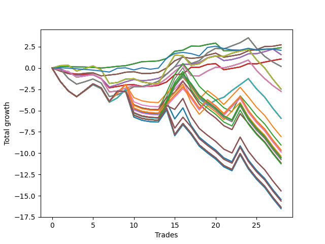

# Short Pointer Two (1227) 
- Symbol: AAPL_Unlimited
- Date Range: 03/23/2022 - 07/08/2022
- Trading Period: 7:20-12:30
- Number of Trades: 28



| Name | Win Percent | Profit | Avg Profit / Trade | Avg Time / Trade |      | Name | Win Percent | Profit | Avg Profit / Trade | Avg Time / Trade |
| ---- | ----------- | ------ | ------------------ | ---------------- | ---- | ---- | ----------- | ------ | ------------------ | ---------------- |
| Sorted By <br> Profit | | | | | | Sorted By <br> Win Percentage ||||
| Sixty-Seven | 75.00 | 1365.00 | 48.75 | 20:20 |     | Sixty-Seven | 75.00 | 1365.00 | 48.75 | 20:20 |
| Fifty-Nine | 75.00 | 1365.00 | 48.75 | 20:20 |     | Fifty-Nine | 75.00 | 1365.00 | 48.75 | 20:20 |
| Fifty-One | 75.00 | 1365.00 | 48.75 | 20:20 |     | Fifty-One | 75.00 | 1365.00 | 48.75 | 20:20 |
| Forty-Three | 75.00 | 1365.00 | 48.75 | 20:20 |     | Forty-Three | 75.00 | 1365.00 | 48.75 | 20:20 |
| Three | 75.00 | 1365.00 | 48.75 | 20:20 |     | Three | 75.00 | 1365.00 | 48.75 | 20:20 |
| Sixty-Four | 75.00 | 1195.00 | 42.68 | 05:30 |     | Sixty-Four | 75.00 | 1195.00 | 42.68 | 05:30 |
| Fifty-Six | 75.00 | 1195.00 | 42.68 | 05:30 |     | Fifty-Six | 75.00 | 1195.00 | 42.68 | 05:30 |
| Forty-Eight | 75.00 | 1195.00 | 42.68 | 05:30 |     | Forty-Eight | 75.00 | 1195.00 | 42.68 | 05:30 |
| Forty | 75.00 | 1195.00 | 42.68 | 05:30 |     | Forty | 75.00 | 1195.00 | 42.68 | 05:30 |
| Zero | 75.00 | 1195.00 | 42.68 | 05:30 |     | Zero | 75.00 | 1195.00 | 42.68 | 05:30 |
| Seventy-Three | 46.43 | 1040.00 | 37.14 | 08:15 |     | Sixty-Six | 71.43 | 785.00 | 28.04 | 24:06 |
| Sixty-Six | 71.43 | 785.00 | 28.04 | 24:06 |     | Fifty-Eight | 71.43 | 785.00 | 28.04 | 24:06 |
| Fifty-Eight | 71.43 | 785.00 | 28.04 | 24:06 |     | Fifty | 71.43 | 785.00 | 28.04 | 24:06 |
| Fifty | 71.43 | 785.00 | 28.04 | 24:06 |     | Forty-Two | 71.43 | 785.00 | 28.04 | 24:06 |
| Forty-Two | 71.43 | 785.00 | 28.04 | 24:06 |     | Two | 71.43 | 785.00 | 28.04 | 24:06 |
| Two | 71.43 | 785.00 | 28.04 | 24:06 |     | Sixty-Five | 60.71 | 530.00 | 18.93 | 16:25 |
| Sixty-Five | 60.71 | 530.00 | 18.93 | 16:25 |     | Fifty-Seven | 60.71 | 530.00 | 18.93 | 16:25 |
| Fifty-Seven | 60.71 | 530.00 | 18.93 | 16:25 |     | Forty-Nine | 60.71 | 530.00 | 18.93 | 16:25 |
| Forty-Nine | 60.71 | 530.00 | 18.93 | 16:25 |     | Forty-One | 60.71 | 530.00 | 18.93 | 16:25 |
| Forty-One | 60.71 | 530.00 | 18.93 | 16:25 |     | One | 60.71 | 530.00 | 18.93 | 16:25 |
| One | 60.71 | 530.00 | 18.93 | 16:25 |     | Sixty-Nine | 60.71 | 95.00 | 3.39 | 56:28 |
| Sixty-Nine | 60.71 | 95.00 | 3.39 | 56:28 |     | Sixty-One | 60.71 | 95.00 | 3.39 | 56:28 |
| Sixty-One | 60.71 | 95.00 | 3.39 | 56:28 |     | Fifty-Three | 60.71 | 95.00 | 3.39 | 56:28 |
| Fifty-Three | 60.71 | 95.00 | 3.39 | 56:28 |     | Forty-Five | 60.71 | 95.00 | 3.39 | 56:28 |
| Forty-Five | 60.71 | 95.00 | 3.39 | 56:28 |     | Five | 60.71 | 95.00 | 3.39 | 56:28 |
| Five | 60.71 | 95.00 | 3.39 | 56:28 |     | Seventy | 53.57 | -1235.00 | -44.11 | 58:33 |
| Seventy | 53.57 | -1235.00 | -44.11 | 58:33 |     | Sixty-Two | 53.57 | -1235.00 | -44.11 | 58:33 |
| Sixty-Two | 53.57 | -1235.00 | -44.11 | 58:33 |     | Fifty-Four | 53.57 | -1235.00 | -44.11 | 58:33 |
| Fifty-Four | 53.57 | -1235.00 | -44.11 | 58:33 |     | Forty-Six | 53.57 | -1235.00 | -44.11 | 58:33 |
| Forty-Six | 53.57 | -1235.00 | -44.11 | 58:33 |     | Six | 53.57 | -1235.00 | -44.11 | 58:33 |
| Six | 53.57 | -1235.00 | -44.11 | 58:33 |     | Sixty-Eight | 53.57 | -1370.00 | -48.93 | 45:34 |
| Sixty-Eight | 53.57 | -1370.00 | -48.93 | 45:34 |     | Sixty | 53.57 | -1370.00 | -48.93 | 45:34 |
| Sixty | 53.57 | -1370.00 | -48.93 | 45:34 |     | Fifty-Two | 53.57 | -1370.00 | -48.93 | 45:34 |
| Fifty-Two | 53.57 | -1370.00 | -48.93 | 45:34 |     | Forty-Four | 53.57 | -1370.00 | -48.93 | 45:34 |
| Forty-Four | 53.57 | -1370.00 | -48.93 | 45:34 |     | Four | 53.57 | -1370.00 | -48.93 | 45:34 |
| Four | 53.57 | -1370.00 | -48.93 | 45:34 |     | Seventy-Three | 46.43 | 1040.00 | 37.14 | 08:15 |
| Seventy-One | 42.86 | -2950.00 | -105.36 | 109:43 |     | Seventy-One | 42.86 | -2950.00 | -105.36 | 109:43 |
| Sixty-Three | 42.86 | -2950.00 | -105.36 | 109:43 |     | Sixty-Three | 42.86 | -2950.00 | -105.36 | 109:43 |
| Fifty-Five | 42.86 | -2950.00 | -105.36 | 109:43 |     | Fifty-Five | 42.86 | -2950.00 | -105.36 | 109:43 |
| Forty-Seven | 42.86 | -2950.00 | -105.36 | 109:43 |     | Forty-Seven | 42.86 | -2950.00 | -105.36 | 109:43 |
| Seven | 42.86 | -2950.00 | -105.36 | 109:43 |     | Seven | 42.86 | -2950.00 | -105.36 | 109:43 |
| Ninety-Six | 35.71 | -4025.00 | -143.75 | 109:13 |     | Ninety-Six | 35.71 | -4025.00 | -143.75 | 109:13 |
| Ninety-Seven | 25.00 | -4525.00 | -161.61 | 120:52 |     | One Hundred Twenty-Six | 35.71 | -4825.00 | -172.32 | 122:41 |
| One Hundred Twenty-Six | 35.71 | -4825.00 | -172.32 | 122:41 |     | One Hundred Twenty-One | 35.71 | -4825.00 | -172.32 | 122:41 |
| One Hundred Twenty-One | 35.71 | -4825.00 | -172.32 | 122:41 |     | One Hundred Sixteen | 35.71 | -4825.00 | -172.32 | 122:41 |
| One Hundred Sixteen | 35.71 | -4825.00 | -172.32 | 122:41 |     | One Hundred Eleven | 35.71 | -4825.00 | -172.32 | 122:41 |
| One Hundred Eleven | 35.71 | -4825.00 | -172.32 | 122:41 |     | Eighty-One | 35.71 | -4825.00 | -172.32 | 122:41 |
| Eighty-One | 35.71 | -4825.00 | -172.32 | 122:41 |     | Ninety-One | 35.71 | -4915.00 | -175.54 | 112:48 |
| Ninety-One | 35.71 | -4915.00 | -175.54 | 112:48 |     | One Hundred One | 35.71 | -4935.00 | -176.25 | 122:36 |
| One Hundred One | 35.71 | -4935.00 | -176.25 | 122:36 |     | One Hundred Six | 35.71 | -5180.00 | -185.00 | 114:16 |
| One Hundred Six | 35.71 | -5180.00 | -185.00 | 114:16 |     | Ninety-Seven | 25.00 | -4525.00 | -161.61 | 120:52 |
| One Hundred Twenty-Seven | 25.00 | -5270.00 | -188.21 | 134:37 |     | One Hundred Twenty-Seven | 25.00 | -5270.00 | -188.21 | 134:37 |
| One Hundred Twenty-Two | 25.00 | -5270.00 | -188.21 | 134:37 |     | One Hundred Twenty-Two | 25.00 | -5270.00 | -188.21 | 134:37 |
| One Hundred Seventeen | 25.00 | -5270.00 | -188.21 | 134:37 |     | One Hundred Seventeen | 25.00 | -5270.00 | -188.21 | 134:37 |
| One Hundred Twelve | 25.00 | -5270.00 | -188.21 | 134:37 |     | One Hundred Twelve | 25.00 | -5270.00 | -188.21 | 134:37 |
| Eighty-Two | 25.00 | -5270.00 | -188.21 | 134:37 |     | Eighty-Two | 25.00 | -5270.00 | -188.21 | 134:37 |
| Ninety-Two | 25.00 | -5360.00 | -191.43 | 124:43 |     | Ninety-Two | 25.00 | -5360.00 | -191.43 | 124:43 |
| One Hundred Two | 25.00 | -5380.00 | -192.14 | 134:31 |     | One Hundred Two | 25.00 | -5380.00 | -192.14 | 134:31 |
| One Hundred | 25.00 | -5575.00 | -199.11 | 123:35 |     | One Hundred | 25.00 | -5575.00 | -199.11 | 123:35 |
| Ninety-Nine | 25.00 | -5575.00 | -199.11 | 123:35 |     | Ninety-Nine | 25.00 | -5575.00 | -199.11 | 123:35 |
| Ninety-Eight | 25.00 | -5575.00 | -199.11 | 123:35 |     | Ninety-Eight | 25.00 | -5575.00 | -199.11 | 123:35 |
| One Hundred Seven | 25.00 | -5625.00 | -200.89 | 126:12 |     | One Hundred Seven | 25.00 | -5625.00 | -200.89 | 126:12 |
| One Hundred Ten | 21.43 | -7215.00 | -257.68 | 129:03 |     | One Hundred Ten | 21.43 | -7215.00 | -257.68 | 129:03 |
| One Hundred Nine | 21.43 | -7215.00 | -257.68 | 129:03 |     | One Hundred Nine | 21.43 | -7215.00 | -257.68 | 129:03 |
| One Hundred Eight | 21.43 | -7215.00 | -257.68 | 129:03 |     | One Hundred Eight | 21.43 | -7215.00 | -257.68 | 129:03 |
| Ninety-Five | 21.43 | -7725.00 | -275.89 | 128:33 |     | Ninety-Five | 21.43 | -7725.00 | -275.89 | 128:33 |
| Ninety-Four | 21.43 | -7725.00 | -275.89 | 128:33 |     | Ninety-Four | 21.43 | -7725.00 | -275.89 | 128:33 |
| Ninety-Three | 21.43 | -7725.00 | -275.89 | 128:33 |     | Ninety-Three | 21.43 | -7725.00 | -275.89 | 128:33 |
| One Hundred Twenty | 21.43 | -7810.00 | -278.93 | 138:30 |     | One Hundred Twenty | 21.43 | -7810.00 | -278.93 | 138:30 |
| One Hundred Ninteen | 21.43 | -7810.00 | -278.93 | 138:30 |     | One Hundred Ninteen | 21.43 | -7810.00 | -278.93 | 138:30 |
| One Hundred Eighteen | 21.43 | -7810.00 | -278.93 | 138:30 |     | One Hundred Eighteen | 21.43 | -7810.00 | -278.93 | 138:30 |
| One Hundred Thirty | 21.43 | -8180.00 | -292.14 | 139:36 |     | One Hundred Thirty | 21.43 | -8180.00 | -292.14 | 139:36 |
| One Hundred Twenty-Nine | 21.43 | -8180.00 | -292.14 | 139:36 |     | One Hundred Twenty-Nine | 21.43 | -8180.00 | -292.14 | 139:36 |
| One Hundred Twenty-Eight | 21.43 | -8180.00 | -292.14 | 139:36 |     | One Hundred Twenty-Eight | 21.43 | -8180.00 | -292.14 | 139:36 |
| One Hundred Twenty-Five | 21.43 | -8180.00 | -292.14 | 139:36 |     | One Hundred Twenty-Five | 21.43 | -8180.00 | -292.14 | 139:36 |
| One Hundred Twenty-Four | 21.43 | -8180.00 | -292.14 | 139:36 |     | One Hundred Twenty-Four | 21.43 | -8180.00 | -292.14 | 139:36 |
| One Hundred Twenty-Three | 21.43 | -8180.00 | -292.14 | 139:36 |     | One Hundred Twenty-Three | 21.43 | -8180.00 | -292.14 | 139:36 |
| One Hundred Fifteen | 21.43 | -8180.00 | -292.14 | 139:36 |     | One Hundred Fifteen | 21.43 | -8180.00 | -292.14 | 139:36 |
| One Hundred Fourteen | 21.43 | -8180.00 | -292.14 | 139:36 |     | One Hundred Fourteen | 21.43 | -8180.00 | -292.14 | 139:36 |
| One Hundred Thirteen | 21.43 | -8180.00 | -292.14 | 139:36 |     | One Hundred Thirteen | 21.43 | -8180.00 | -292.14 | 139:36 |
| Eighty-Five | 21.43 | -8180.00 | -292.14 | 139:36 |     | Eighty-Five | 21.43 | -8180.00 | -292.14 | 139:36 |
| Eighty-Four | 21.43 | -8180.00 | -292.14 | 139:36 |     | Eighty-Four | 21.43 | -8180.00 | -292.14 | 139:36 |
| Eighty-Three | 21.43 | -8180.00 | -292.14 | 139:36 |     | Eighty-Three | 21.43 | -8180.00 | -292.14 | 139:36 |
| One Hundred Five | 21.43 | -8255.00 | -294.82 | 139:01 |     | One Hundred Five | 21.43 | -8255.00 | -294.82 | 139:01 |
| One Hundred Four | 21.43 | -8255.00 | -294.82 | 139:01 |     | One Hundred Four | 21.43 | -8255.00 | -294.82 | 139:01 |
| One Hundred Three | 21.43 | -8255.00 | -294.82 | 139:01 |     | One Hundred Three | 21.43 | -8255.00 | -294.82 | 139:01 |

## NO STOPLOSS

### Test Zero
* Sell when price hits the middle line of the 20p bollinger
* No Stoploss
* Results:
```
Total Trades: 28
Percent Up: 25.00
Percent Down: 75.00
Total Points Moved Down: 2.39
Potential Profit: 1195.00
Total Points Ups: 1.27 Count Ups: 7
Total Points Downs: 3.66 Count Downs: 21
```

<details><summary>Trades</summary>

<code>In: 2022-03-24 10:04:00		Out: 2022-03-24 10:09:20		Total Position Time: 05:20		Total Move Down: 0.17		Total to Date: 0.17</code> <br />
<code>In: 2022-03-28 10:02:00		Out: 2022-03-28 10:10:05		Total Position Time: 08:05		Total Move Down: 0.01		Total to Date: 0.18</code> <br />
<code>In: 2022-03-28 11:13:00		Out: 2022-03-28 11:20:10		Total Position Time: 07:10		Total Move Down: -0.05		Total to Date: 0.13</code> <br />
<code>In: 2022-03-31 08:45:00		Out: 2022-03-31 08:58:25		Total Position Time: 13:25		Total Move Down: -0.01		Total to Date: 0.12</code> <br />
<code>In: 2022-03-31 09:03:00		Out: 2022-03-31 09:04:10		Total Position Time: 01:10		Total Move Down: -0.04		Total to Date: 0.08</code> <br />
<code>In: 2022-04-04 11:57:00		Out: 2022-04-04 12:13:55		Total Position Time: 16:55		Total Move Down: -0.08		Total to Date: -0.00</code> <br />
<code>In: 2022-04-07 11:30:00		Out: 2022-04-07 11:31:10		Total Position Time: 01:10		Total Move Down: 0.09		Total to Date: 0.09</code> <br />
<code>In: 2022-04-11 11:12:00		Out: 2022-04-11 11:13:10		Total Position Time: 01:10		Total Move Down: 0.11		Total to Date: 0.20</code> <br />
<code>In: 2022-04-20 10:50:00		Out: 2022-04-20 10:51:10		Total Position Time: 01:10		Total Move Down: 0.08		Total to Date: 0.28</code> <br />
<code>In: 2022-04-25 09:29:00		Out: 2022-04-25 09:31:10		Total Position Time: 02:10		Total Move Down: 0.22		Total to Date: 0.50</code> <br />
<code>In: 2022-04-28 10:16:00		Out: 2022-04-28 10:19:05		Total Position Time: 03:05		Total Move Down: 0.25		Total to Date: 0.75</code> <br />
<code>In: 2022-04-28 10:42:00		Out: 2022-04-28 10:44:15		Total Position Time: 02:15		Total Move Down: 0.03		Total to Date: 0.78</code> <br />
<code>In: 2022-04-28 10:53:00		Out: 2022-04-28 10:54:10		Total Position Time: 01:10		Total Move Down: 0.06		Total to Date: 0.84</code> <br />
<code>In: 2022-05-03 10:48:00		Out: 2022-05-03 10:50:55		Total Position Time: 02:55		Total Move Down: 0.28		Total to Date: 1.12</code> <br />
<code>In: 2022-05-04 11:07:00		Out: 2022-05-04 11:08:10		Total Position Time: 01:10		Total Move Down: 0.85		Total to Date: 1.97</code> <br />
<code>In: 2022-05-09 12:04:00		Out: 2022-05-09 12:09:15		Total Position Time: 05:15		Total Move Down: 0.13		Total to Date: 2.10</code> <br />
<code>In: 2022-05-23 07:51:00		Out: 2022-05-23 07:52:10		Total Position Time: 01:10		Total Move Down: 0.48		Total to Date: 2.58</code> <br />
<code>In: 2022-05-24 10:48:00		Out: 2022-05-24 10:58:25		Total Position Time: 10:25		Total Move Down: -0.02		Total to Date: 2.56</code> <br />
<code>In: 2022-05-24 11:42:00		Out: 2022-05-24 11:43:10		Total Position Time: 01:10		Total Move Down: 0.21		Total to Date: 2.77</code> <br />
<code>In: 2022-06-14 08:47:00		Out: 2022-06-14 08:51:40		Total Position Time: 04:40		Total Move Down: 0.16		Total to Date: 2.93</code> <br />
<code>In: 2022-06-14 10:03:00		Out: 2022-06-14 10:29:45		Total Position Time: 26:45		Total Move Down: -0.91		Total to Date: 2.02</code> <br />
<code>In: 2022-06-14 11:26:00		Out: 2022-06-14 11:30:50		Total Position Time: 04:50		Total Move Down: 0.03		Total to Date: 2.05</code> <br />
<code>In: 2022-06-16 10:14:00		Out: 2022-06-16 10:19:50		Total Position Time: 05:50		Total Move Down: 0.02		Total to Date: 2.07</code> <br />
<code>In: 2022-07-01 08:20:00		Out: 2022-07-01 08:23:50		Total Position Time: 03:50		Total Move Down: 0.20		Total to Date: 2.27</code> <br />
<code>In: 2022-07-01 10:48:00		Out: 2022-07-01 11:04:25		Total Position Time: 16:25		Total Move Down: -0.16		Total to Date: 2.11</code> <br />
<code>In: 2022-07-01 11:02:00		Out: 2022-07-01 11:04:25		Total Position Time: 02:25		Total Move Down: 0.08		Total to Date: 2.19</code> <br />
<code>In: 2022-07-05 10:44:00		Out: 2022-07-05 10:45:10		Total Position Time: 01:10		Total Move Down: 0.07		Total to Date: 2.26</code> <br />
<code>In: 2022-07-05 11:07:00		Out: 2022-07-05 11:09:05		Total Position Time: 02:05		Total Move Down: 0.13		Total to Date: 2.39</code> <br />


</details>

### Test One
* Sell when the price hits the upper line of the 20p 1std bollinger
* No Stoploss
* Results:
```
Total Trades: 28
Percent Up: 39.29
Percent Down: 60.71
Total Points Moved Down: 1.06
Potential Profit: 530.00
Total Points Ups: 3.28 Count Ups: 11
Total Points Downs: 4.34 Count Downs: 17
```

<details><summary>Trades</summary>

<code>In: 2022-03-24 10:04:00		Out: 2022-03-24 10:33:15		Total Position Time: 29:15		Total Move Down: -0.13		Total to Date: -0.13</code> <br />
<code>In: 2022-03-28 10:02:00		Out: 2022-03-28 10:52:25		Total Position Time: 50:25		Total Move Down: -0.47		Total to Date: -0.60</code> <br />
<code>In: 2022-03-28 11:13:00		Out: 2022-03-28 11:35:30		Total Position Time: 22:30		Total Move Down: -0.10		Total to Date: -0.70</code> <br />
<code>In: 2022-03-31 08:45:00		Out: 2022-03-31 09:14:50		Total Position Time: 29:50		Total Move Down: -0.05		Total to Date: -0.75</code> <br />
<code>In: 2022-03-31 09:03:00		Out: 2022-03-31 09:14:50		Total Position Time: 11:50		Total Move Down: -0.01		Total to Date: -0.76</code> <br />
<code>In: 2022-04-04 11:57:00		Out: 2022-04-04 12:42:50		Total Position Time: 45:50		Total Move Down: -0.49		Total to Date: -1.25</code> <br />
<code>In: 2022-04-07 11:30:00		Out: 2022-04-07 12:27:40		Total Position Time: 57:40		Total Move Down: -1.07		Total to Date: -2.32</code> <br />
<code>In: 2022-04-11 11:12:00		Out: 2022-04-11 11:14:15		Total Position Time: 02:15		Total Move Down: 0.16		Total to Date: -2.16</code> <br />
<code>In: 2022-04-20 10:50:00		Out: 2022-04-20 10:54:05		Total Position Time: 04:05		Total Move Down: 0.18		Total to Date: -1.98</code> <br />
<code>In: 2022-04-25 09:29:00		Out: 2022-04-25 09:43:40		Total Position Time: 14:40		Total Move Down: 0.03		Total to Date: -1.95</code> <br />
<code>In: 2022-04-28 10:16:00		Out: 2022-04-28 10:56:05		Total Position Time: 40:05		Total Move Down: -0.21		Total to Date: -2.16</code> <br />
<code>In: 2022-04-28 10:42:00		Out: 2022-04-28 10:56:05		Total Position Time: 14:05		Total Move Down: 0.01		Total to Date: -2.15</code> <br />
<code>In: 2022-04-28 10:53:00		Out: 2022-04-28 10:56:05		Total Position Time: 03:05		Total Move Down: 0.13		Total to Date: -2.02</code> <br />
<code>In: 2022-05-03 10:48:00		Out: 2022-05-03 10:53:55		Total Position Time: 05:55		Total Move Down: 0.38		Total to Date: -1.64</code> <br />
<code>In: 2022-05-04 11:07:00		Out: 2022-05-04 11:08:10		Total Position Time: 01:10		Total Move Down: 0.85		Total to Date: -0.79</code> <br />
<code>In: 2022-05-09 12:04:00		Out: 2022-05-09 12:17:30		Total Position Time: 13:30		Total Move Down: 0.10		Total to Date: -0.69</code> <br />
<code>In: 2022-05-23 07:51:00		Out: 2022-05-23 07:53:00		Total Position Time: 02:00		Total Move Down: 0.78		Total to Date: 0.09</code> <br />
<code>In: 2022-05-24 10:48:00		Out: 2022-05-24 11:01:20		Total Position Time: 13:20		Total Move Down: -0.00		Total to Date: 0.09</code> <br />
<code>In: 2022-05-24 11:42:00		Out: 2022-05-24 11:43:45		Total Position Time: 01:45		Total Move Down: 0.34		Total to Date: 0.43</code> <br />
<code>In: 2022-06-14 08:47:00		Out: 2022-06-14 09:02:10		Total Position Time: 15:10		Total Move Down: 0.09		Total to Date: 0.52</code> <br />
<code>In: 2022-06-14 10:03:00		Out: 2022-06-14 10:34:05		Total Position Time: 31:05		Total Move Down: -0.72		Total to Date: -0.20</code> <br />
<code>In: 2022-06-14 11:26:00		Out: 2022-06-14 11:32:05		Total Position Time: 06:05		Total Move Down: 0.16		Total to Date: -0.04</code> <br />
<code>In: 2022-06-16 10:14:00		Out: 2022-06-16 10:20:35		Total Position Time: 06:35		Total Move Down: 0.17		Total to Date: 0.13</code> <br />
<code>In: 2022-07-01 08:20:00		Out: 2022-07-01 08:24:30		Total Position Time: 04:30		Total Move Down: 0.39		Total to Date: 0.52</code> <br />
<code>In: 2022-07-01 10:48:00		Out: 2022-07-01 11:07:55		Total Position Time: 19:55		Total Move Down: -0.03		Total to Date: 0.49</code> <br />
<code>In: 2022-07-01 11:02:00		Out: 2022-07-01 11:07:55		Total Position Time: 05:55		Total Move Down: 0.21		Total to Date: 0.70</code> <br />
<code>In: 2022-07-05 10:44:00		Out: 2022-07-05 10:47:25		Total Position Time: 03:25		Total Move Down: 0.19		Total to Date: 0.89</code> <br />
<code>In: 2022-07-05 11:07:00		Out: 2022-07-05 11:11:10		Total Position Time: 04:10		Total Move Down: 0.17		Total to Date: 1.06</code> <br />


</details>

### Test Two
* Sell when the price hits the upper line of the 20p 2std bollinger
* No Stoploss
* Results:
```
Total Trades: 28
Percent Up: 28.57
Percent Down: 71.43
Total Points Moved Down: 1.57
Potential Profit: 785.00
Total Points Ups: 3.66 Count Ups: 8
Total Points Downs: 5.23 Count Downs: 20
```

<details><summary>Trades</summary>

<code>In: 2022-03-24 10:04:00		Out: 2022-03-24 10:34:15		Total Position Time: 30:15		Total Move Down: -0.07		Total to Date: -0.07</code> <br />
<code>In: 2022-03-28 10:02:00		Out: 2022-03-28 10:54:15		Total Position Time: 52:15		Total Move Down: -0.45		Total to Date: -0.52</code> <br />
<code>In: 2022-03-28 11:13:00		Out: 2022-03-28 12:13:00		Total Position Time: 60:00		Total Move Down: -0.33		Total to Date: -0.85</code> <br />
<code>In: 2022-03-31 08:45:00		Out: 2022-03-31 09:20:00		Total Position Time: 35:00		Total Move Down: 0.01		Total to Date: -0.84</code> <br />
<code>In: 2022-03-31 09:03:00		Out: 2022-03-31 09:20:00		Total Position Time: 17:00		Total Move Down: 0.05		Total to Date: -0.79</code> <br />
<code>In: 2022-04-04 11:57:00		Out: 2022-04-04 12:45:00		Total Position Time: 48:00		Total Move Down: -0.43		Total to Date: -1.22</code> <br />
<code>In: 2022-04-07 11:30:00		Out: 2022-04-07 12:28:30		Total Position Time: 58:30		Total Move Down: -1.01		Total to Date: -2.23</code> <br />
<code>In: 2022-04-11 11:12:00		Out: 2022-04-11 11:14:30		Total Position Time: 02:30		Total Move Down: 0.28		Total to Date: -1.95</code> <br />
<code>In: 2022-04-20 10:50:00		Out: 2022-04-20 11:03:15		Total Position Time: 13:15		Total Move Down: 0.33		Total to Date: -1.62</code> <br />
<code>In: 2022-04-25 09:29:00		Out: 2022-04-25 09:57:05		Total Position Time: 28:05		Total Move Down: 0.27		Total to Date: -1.35</code> <br />
<code>In: 2022-04-28 10:16:00		Out: 2022-04-28 11:06:20		Total Position Time: 50:20		Total Move Down: -0.14		Total to Date: -1.49</code> <br />
<code>In: 2022-04-28 10:42:00		Out: 2022-04-28 11:06:20		Total Position Time: 24:20		Total Move Down: 0.08		Total to Date: -1.41</code> <br />
<code>In: 2022-04-28 10:53:00		Out: 2022-04-28 11:06:20		Total Position Time: 13:20		Total Move Down: 0.20		Total to Date: -1.21</code> <br />
<code>In: 2022-05-03 10:48:00		Out: 2022-05-03 10:54:10		Total Position Time: 06:10		Total Move Down: 0.50		Total to Date: -0.71</code> <br />
<code>In: 2022-05-04 11:07:00		Out: 2022-05-04 11:08:10		Total Position Time: 01:10		Total Move Down: 0.85		Total to Date: 0.14</code> <br />
<code>In: 2022-05-09 12:04:00		Out: 2022-05-09 12:20:05		Total Position Time: 16:05		Total Move Down: 0.30		Total to Date: 0.44</code> <br />
<code>In: 2022-05-23 07:51:00		Out: 2022-05-23 08:27:55		Total Position Time: 36:55		Total Move Down: 0.01		Total to Date: 0.45</code> <br />
<code>In: 2022-05-24 10:48:00		Out: 2022-05-24 11:01:40		Total Position Time: 13:40		Total Move Down: 0.18		Total to Date: 0.63</code> <br />
<code>In: 2022-05-24 11:42:00		Out: 2022-05-24 11:44:05		Total Position Time: 02:05		Total Move Down: 0.57		Total to Date: 1.20</code> <br />
<code>In: 2022-06-14 08:47:00		Out: 2022-06-14 09:03:00		Total Position Time: 16:00		Total Move Down: 0.24		Total to Date: 1.44</code> <br />
<code>In: 2022-06-14 10:03:00		Out: 2022-06-14 10:36:05		Total Position Time: 33:05		Total Move Down: -0.57		Total to Date: 0.87</code> <br />
<code>In: 2022-06-14 11:26:00		Out: 2022-06-14 11:42:50		Total Position Time: 16:50		Total Move Down: 0.13		Total to Date: 1.00</code> <br />
<code>In: 2022-06-16 10:14:00		Out: 2022-06-16 10:21:35		Total Position Time: 07:35		Total Move Down: 0.25		Total to Date: 1.25</code> <br />
<code>In: 2022-07-01 08:20:00		Out: 2022-07-01 08:27:15		Total Position Time: 07:15		Total Move Down: 0.42		Total to Date: 1.67</code> <br />
<code>In: 2022-07-01 10:48:00		Out: 2022-07-01 11:08:25		Total Position Time: 20:25		Total Move Down: 0.01		Total to Date: 1.68</code> <br />
<code>In: 2022-07-01 11:02:00		Out: 2022-07-01 11:08:25		Total Position Time: 06:25		Total Move Down: 0.25		Total to Date: 1.93</code> <br />
<code>In: 2022-07-05 10:44:00		Out: 2022-07-05 10:48:25		Total Position Time: 04:25		Total Move Down: 0.30		Total to Date: 2.23</code> <br />
<code>In: 2022-07-05 11:07:00		Out: 2022-07-05 12:01:20		Total Position Time: 54:20		Total Move Down: -0.66		Total to Date: 1.57</code> <br />


</details>

### Test Three
* Sell when price hits the middle line of the 50p bollinger
* No Stoploss
* Results:
```
Total Trades: 28
Percent Up: 25.00
Percent Down: 75.00
Total Points Moved Down: 2.73
Potential Profit: 1365.00
Total Points Ups: 1.97 Count Ups: 7
Total Points Downs: 4.70 Count Downs: 21
```

<details><summary>Trades</summary>

<code>In: 2022-03-24 10:04:00		Out: 2022-03-24 11:09:05		Total Position Time: 65:05		Total Move Down: -0.36		Total to Date: -0.36</code> <br />
<code>In: 2022-03-28 10:02:00		Out: 2022-03-28 10:55:10		Total Position Time: 53:10		Total Move Down: -0.30		Total to Date: -0.66</code> <br />
<code>In: 2022-03-28 11:13:00		Out: 2022-03-28 11:35:35		Total Position Time: 22:35		Total Move Down: -0.10		Total to Date: -0.76</code> <br />
<code>In: 2022-03-31 08:45:00		Out: 2022-03-31 08:46:35		Total Position Time: 01:35		Total Move Down: 0.15		Total to Date: -0.61</code> <br />
<code>In: 2022-03-31 09:03:00		Out: 2022-03-31 09:19:55		Total Position Time: 16:55		Total Move Down: 0.05		Total to Date: -0.56</code> <br />
<code>In: 2022-04-04 11:57:00		Out: 2022-04-04 12:45:15		Total Position Time: 48:15		Total Move Down: -0.36		Total to Date: -0.92</code> <br />
<code>In: 2022-04-07 11:30:00		Out: 2022-04-07 11:36:05		Total Position Time: 06:05		Total Move Down: 0.10		Total to Date: -0.82</code> <br />
<code>In: 2022-04-11 11:12:00		Out: 2022-04-11 11:13:10		Total Position Time: 01:10		Total Move Down: 0.11		Total to Date: -0.71</code> <br />
<code>In: 2022-04-20 10:50:00		Out: 2022-04-20 10:55:30		Total Position Time: 05:30		Total Move Down: 0.22		Total to Date: -0.49</code> <br />
<code>In: 2022-04-25 09:29:00		Out: 2022-04-25 09:55:10		Total Position Time: 26:10		Total Move Down: 0.06		Total to Date: -0.43</code> <br />
<code>In: 2022-04-28 10:16:00		Out: 2022-04-28 11:01:05		Total Position Time: 45:05		Total Move Down: -0.21		Total to Date: -0.64</code> <br />
<code>In: 2022-04-28 10:42:00		Out: 2022-04-28 11:01:05		Total Position Time: 19:05		Total Move Down: 0.01		Total to Date: -0.63</code> <br />
<code>In: 2022-04-28 10:53:00		Out: 2022-04-28 11:01:05		Total Position Time: 08:05		Total Move Down: 0.13		Total to Date: -0.50</code> <br />
<code>In: 2022-05-03 10:48:00		Out: 2022-05-03 10:54:10		Total Position Time: 06:10		Total Move Down: 0.50		Total to Date: -0.00</code> <br />
<code>In: 2022-05-04 11:07:00		Out: 2022-05-04 11:08:10		Total Position Time: 01:10		Total Move Down: 0.85		Total to Date: 0.85</code> <br />
<code>In: 2022-05-09 12:04:00		Out: 2022-05-09 12:20:15		Total Position Time: 16:15		Total Move Down: 0.44		Total to Date: 1.29</code> <br />
<code>In: 2022-05-23 07:51:00		Out: 2022-05-23 08:48:25		Total Position Time: 57:25		Total Move Down: -0.16		Total to Date: 1.13</code> <br />
<code>In: 2022-05-24 10:48:00		Out: 2022-05-24 11:20:20		Total Position Time: 32:20		Total Move Down: 0.10		Total to Date: 1.23</code> <br />
<code>In: 2022-05-24 11:42:00		Out: 2022-05-24 11:43:30		Total Position Time: 01:30		Total Move Down: 0.28		Total to Date: 1.51</code> <br />
<code>In: 2022-06-14 08:47:00		Out: 2022-06-14 09:03:00		Total Position Time: 16:00		Total Move Down: 0.24		Total to Date: 1.75</code> <br />
<code>In: 2022-06-14 10:03:00		Out: 2022-06-14 10:37:10		Total Position Time: 34:10		Total Move Down: -0.48		Total to Date: 1.27</code> <br />
<code>In: 2022-06-14 11:26:00		Out: 2022-06-14 11:32:05		Total Position Time: 06:05		Total Move Down: 0.16		Total to Date: 1.43</code> <br />
<code>In: 2022-06-16 10:14:00		Out: 2022-06-16 10:20:35		Total Position Time: 06:35		Total Move Down: 0.17		Total to Date: 1.60</code> <br />
<code>In: 2022-07-01 08:20:00		Out: 2022-07-01 08:29:45		Total Position Time: 09:45		Total Move Down: 0.43		Total to Date: 2.03</code> <br />
<code>In: 2022-07-01 10:48:00		Out: 2022-07-01 11:11:05		Total Position Time: 23:05		Total Move Down: 0.13		Total to Date: 2.16</code> <br />
<code>In: 2022-07-01 11:02:00		Out: 2022-07-01 11:11:05		Total Position Time: 09:05		Total Move Down: 0.37		Total to Date: 2.53</code> <br />
<code>In: 2022-07-05 10:44:00		Out: 2022-07-05 11:11:10		Total Position Time: 27:10		Total Move Down: 0.03		Total to Date: 2.56</code> <br />
<code>In: 2022-07-05 11:07:00		Out: 2022-07-05 11:11:10		Total Position Time: 04:10		Total Move Down: 0.17		Total to Date: 2.73</code> <br />


</details>

### Test Four
* Sell when the price hits the upper line of the 50p 1std bollinger
* No Stoploss
* Results:
```
Total Trades: 28
Percent Up: 46.43
Percent Down: 53.57
Total Points Moved Down: -2.74
Potential Profit: -1370.00
Total Points Ups: 8.29 Count Ups: 13
Total Points Downs: 5.55 Count Downs: 15
```

<details><summary>Trades</summary>

<code>In: 2022-03-24 10:04:00		Out: 2022-03-24 11:10:25		Total Position Time: 66:25		Total Move Down: -0.23		Total to Date: -0.23</code> <br />
<code>In: 2022-03-28 10:02:00		Out: 2022-03-28 10:56:45		Total Position Time: 54:45		Total Move Down: -0.19		Total to Date: -0.42</code> <br />
<code>In: 2022-03-28 11:13:00		Out: 2022-03-28 12:47:00		Total Position Time: 94:00		Total Move Down: -0.66		Total to Date: -1.08</code> <br />
<code>In: 2022-03-31 08:45:00		Out: 2022-03-31 09:21:50		Total Position Time: 36:50		Total Move Down: 0.15		Total to Date: -0.93</code> <br />
<code>In: 2022-03-31 09:03:00		Out: 2022-03-31 09:21:50		Total Position Time: 18:50		Total Move Down: 0.19		Total to Date: -0.74</code> <br />
<code>In: 2022-04-04 11:57:00		Out: 2022-04-04 12:47:00		Total Position Time: 50:00		Total Move Down: -0.46		Total to Date: -1.20</code> <br />
<code>In: 2022-04-07 11:30:00		Out: 2022-04-07 12:47:00		Total Position Time: 77:00		Total Move Down: -1.60		Total to Date: -2.80</code> <br />
<code>In: 2022-04-11 11:12:00		Out: 2022-04-11 11:13:10		Total Position Time: 01:10		Total Move Down: 0.11		Total to Date: -2.69</code> <br />
<code>In: 2022-04-20 10:50:00		Out: 2022-04-20 11:03:15		Total Position Time: 13:15		Total Move Down: 0.33		Total to Date: -2.36</code> <br />
<code>In: 2022-04-25 09:29:00		Out: 2022-04-25 10:01:10		Total Position Time: 32:10		Total Move Down: 0.29		Total to Date: -2.07</code> <br />
<code>In: 2022-04-28 10:16:00		Out: 2022-04-28 11:14:05		Total Position Time: 58:05		Total Move Down: -0.13		Total to Date: -2.20</code> <br />
<code>In: 2022-04-28 10:42:00		Out: 2022-04-28 11:14:05		Total Position Time: 32:05		Total Move Down: 0.09		Total to Date: -2.11</code> <br />
<code>In: 2022-04-28 10:53:00		Out: 2022-04-28 11:14:05		Total Position Time: 21:05		Total Move Down: 0.21		Total to Date: -1.90</code> <br />
<code>In: 2022-05-03 10:48:00		Out: 2022-05-03 11:01:05		Total Position Time: 13:05		Total Move Down: 0.66		Total to Date: -1.24</code> <br />
<code>In: 2022-05-04 11:07:00		Out: 2022-05-04 11:08:10		Total Position Time: 01:10		Total Move Down: 0.85		Total to Date: -0.39</code> <br />
<code>In: 2022-05-09 12:04:00		Out: 2022-05-09 12:24:05		Total Position Time: 20:05		Total Move Down: 0.74		Total to Date: 0.35</code> <br />
<code>In: 2022-05-23 07:51:00		Out: 2022-05-23 09:48:05		Total Position Time: 117:05		Total Move Down: -1.25		Total to Date: -0.90</code> <br />
<code>In: 2022-05-24 10:48:00		Out: 2022-05-24 11:44:05		Total Position Time: 56:05		Total Move Down: -0.02		Total to Date: -0.92</code> <br />
<code>In: 2022-05-24 11:42:00		Out: 2022-05-24 11:44:05		Total Position Time: 02:05		Total Move Down: 0.57		Total to Date: -0.35</code> <br />
<code>In: 2022-06-14 08:47:00		Out: 2022-06-14 09:07:10		Total Position Time: 20:10		Total Move Down: 0.44		Total to Date: 0.09</code> <br />
<code>In: 2022-06-14 10:03:00		Out: 2022-06-14 10:43:45		Total Position Time: 40:45		Total Move Down: -0.07		Total to Date: 0.02</code> <br />
<code>In: 2022-06-14 11:26:00		Out: 2022-06-14 11:46:25		Total Position Time: 20:25		Total Move Down: 0.23		Total to Date: 0.25</code> <br />
<code>In: 2022-06-16 10:14:00		Out: 2022-06-16 10:23:50		Total Position Time: 09:50		Total Move Down: 0.30		Total to Date: 0.55</code> <br />
<code>In: 2022-07-01 08:20:00		Out: 2022-07-01 08:51:40		Total Position Time: 31:40		Total Move Down: 0.39		Total to Date: 0.94</code> <br />
<code>In: 2022-07-01 10:48:00		Out: 2022-07-01 12:47:00		Total Position Time: 119:00		Total Move Down: -1.21		Total to Date: -0.27</code> <br />
<code>In: 2022-07-01 11:02:00		Out: 2022-07-01 12:47:00		Total Position Time: 105:00		Total Move Down: -0.97		Total to Date: -1.24</code> <br />
<code>In: 2022-07-05 10:44:00		Out: 2022-07-05 12:17:30		Total Position Time: 93:30		Total Move Down: -0.82		Total to Date: -2.06</code> <br />
<code>In: 2022-07-05 11:07:00		Out: 2022-07-05 12:17:30		Total Position Time: 70:30		Total Move Down: -0.68		Total to Date: -2.74</code> <br />


</details>

### Test Five
* Sell when the price hits the upper line of the 50p 2std bollinger
* No Stoploss
* Results:
```
Total Trades: 28
Percent Up: 39.29
Percent Down: 60.71
Total Points Moved Down: 0.19
Potential Profit: 95.00
Total Points Ups: 8.27 Count Ups: 11
Total Points Downs: 8.46 Count Downs: 17
```

<details><summary>Trades</summary>

<code>In: 2022-03-24 10:04:00		Out: 2022-03-24 11:10:45		Total Position Time: 66:45		Total Move Down: -0.10		Total to Date: -0.10</code> <br />
<code>In: 2022-03-28 10:02:00		Out: 2022-03-28 12:47:00		Total Position Time: 165:00		Total Move Down: -1.13		Total to Date: -1.23</code> <br />
<code>In: 2022-03-28 11:13:00		Out: 2022-03-28 12:47:00		Total Position Time: 94:00		Total Move Down: -0.66		Total to Date: -1.89</code> <br />
<code>In: 2022-03-31 08:45:00		Out: 2022-03-31 09:25:00		Total Position Time: 40:00		Total Move Down: 0.28		Total to Date: -1.61</code> <br />
<code>In: 2022-03-31 09:03:00		Out: 2022-03-31 09:25:00		Total Position Time: 22:00		Total Move Down: 0.32		Total to Date: -1.29</code> <br />
<code>In: 2022-04-04 11:57:00		Out: 2022-04-04 12:47:00		Total Position Time: 50:00		Total Move Down: -0.46		Total to Date: -1.75</code> <br />
<code>In: 2022-04-07 11:30:00		Out: 2022-04-07 12:47:00		Total Position Time: 77:00		Total Move Down: -1.60		Total to Date: -3.35</code> <br />
<code>In: 2022-04-11 11:12:00		Out: 2022-04-11 11:14:25		Total Position Time: 02:25		Total Move Down: 0.22		Total to Date: -3.13</code> <br />
<code>In: 2022-04-20 10:50:00		Out: 2022-04-20 11:19:30		Total Position Time: 29:30		Total Move Down: 0.43		Total to Date: -2.70</code> <br />
<code>In: 2022-04-25 09:29:00		Out: 2022-04-25 10:05:25		Total Position Time: 36:25		Total Move Down: 0.50		Total to Date: -2.20</code> <br />
<code>In: 2022-04-28 10:16:00		Out: 2022-04-28 11:15:25		Total Position Time: 59:25		Total Move Down: 0.03		Total to Date: -2.17</code> <br />
<code>In: 2022-04-28 10:42:00		Out: 2022-04-28 11:15:25		Total Position Time: 33:25		Total Move Down: 0.25		Total to Date: -1.92</code> <br />
<code>In: 2022-04-28 10:53:00		Out: 2022-04-28 11:15:25		Total Position Time: 22:25		Total Move Down: 0.37		Total to Date: -1.55</code> <br />
<code>In: 2022-05-03 10:48:00		Out: 2022-05-03 11:01:35		Total Position Time: 13:35		Total Move Down: 0.83		Total to Date: -0.72</code> <br />
<code>In: 2022-05-04 11:07:00		Out: 2022-05-04 11:08:10		Total Position Time: 01:10		Total Move Down: 0.85		Total to Date: 0.13</code> <br />
<code>In: 2022-05-09 12:04:00		Out: 2022-05-09 12:46:55		Total Position Time: 42:55		Total Move Down: 1.28		Total to Date: 1.41</code> <br />
<code>In: 2022-05-23 07:51:00		Out: 2022-05-23 10:16:25		Total Position Time: 145:25		Total Move Down: -0.88		Total to Date: 0.53</code> <br />
<code>In: 2022-05-24 10:48:00		Out: 2022-05-24 11:49:20		Total Position Time: 61:20		Total Move Down: 0.33		Total to Date: 0.86</code> <br />
<code>In: 2022-05-24 11:42:00		Out: 2022-05-24 11:49:20		Total Position Time: 07:20		Total Move Down: 0.92		Total to Date: 1.78</code> <br />
<code>In: 2022-06-14 08:47:00		Out: 2022-06-14 09:14:40		Total Position Time: 27:40		Total Move Down: 0.54		Total to Date: 2.32</code> <br />
<code>In: 2022-06-14 10:03:00		Out: 2022-06-14 11:48:20		Total Position Time: 105:20		Total Move Down: -0.08		Total to Date: 2.24</code> <br />
<code>In: 2022-06-14 11:26:00		Out: 2022-06-14 11:48:20		Total Position Time: 22:20		Total Move Down: 0.37		Total to Date: 2.61</code> <br />
<code>In: 2022-06-16 10:14:00		Out: 2022-06-16 10:45:10		Total Position Time: 31:10		Total Move Down: 0.37		Total to Date: 2.98</code> <br />
<code>In: 2022-07-01 08:20:00		Out: 2022-07-01 08:53:30		Total Position Time: 33:30		Total Move Down: 0.57		Total to Date: 3.55</code> <br />
<code>In: 2022-07-01 10:48:00		Out: 2022-07-01 12:47:00		Total Position Time: 119:00		Total Move Down: -1.21		Total to Date: 2.34</code> <br />
<code>In: 2022-07-01 11:02:00		Out: 2022-07-01 12:47:00		Total Position Time: 105:00		Total Move Down: -0.97		Total to Date: 1.37</code> <br />
<code>In: 2022-07-05 10:44:00		Out: 2022-07-05 12:19:10		Total Position Time: 95:10		Total Move Down: -0.66		Total to Date: 0.71</code> <br />
<code>In: 2022-07-05 11:07:00		Out: 2022-07-05 12:19:10		Total Position Time: 72:10		Total Move Down: -0.52		Total to Date: 0.19</code> <br />


</details>

### Test Six
* Sell when the price hits the middle line of the 1std VWAP
* No Stoploss
* Results:
```
Total Trades: 28
Percent Up: 46.43
Percent Down: 53.57
Total Points Moved Down: -2.47
Potential Profit: -1235.00
Total Points Ups: 9.19 Count Ups: 13
Total Points Downs: 6.72 Count Downs: 15
```

<details><summary>Trades</summary>

<code>In: 2022-03-24 10:04:00		Out: 2022-03-24 10:09:25		Total Position Time: 05:25		Total Move Down: 0.29		Total to Date: 0.29</code> <br />
<code>In: 2022-03-28 10:02:00		Out: 2022-03-28 10:04:05		Total Position Time: 02:05		Total Move Down: 0.02		Total to Date: 0.31</code> <br />
<code>In: 2022-03-28 11:13:00		Out: 2022-03-28 12:47:00		Total Position Time: 94:00		Total Move Down: -0.66		Total to Date: -0.35</code> <br />
<code>In: 2022-03-31 08:45:00		Out: 2022-03-31 09:25:00		Total Position Time: 40:00		Total Move Down: 0.28		Total to Date: -0.07</code> <br />
<code>In: 2022-03-31 09:03:00		Out: 2022-03-31 09:25:00		Total Position Time: 22:00		Total Move Down: 0.32		Total to Date: 0.25</code> <br />
<code>In: 2022-04-04 11:57:00		Out: 2022-04-04 12:47:00		Total Position Time: 50:00		Total Move Down: -0.46		Total to Date: -0.21</code> <br />
<code>In: 2022-04-07 11:30:00		Out: 2022-04-07 12:47:00		Total Position Time: 77:00		Total Move Down: -1.60		Total to Date: -1.81</code> <br />
<code>In: 2022-04-11 11:12:00		Out: 2022-04-11 11:13:10		Total Position Time: 01:10		Total Move Down: 0.11		Total to Date: -1.70</code> <br />
<code>In: 2022-04-20 10:50:00		Out: 2022-04-20 11:19:25		Total Position Time: 29:25		Total Move Down: 0.40		Total to Date: -1.30</code> <br />
<code>In: 2022-04-25 09:29:00		Out: 2022-04-25 09:30:10		Total Position Time: 01:10		Total Move Down: 0.05		Total to Date: -1.25</code> <br />
<code>In: 2022-04-28 10:16:00		Out: 2022-04-28 12:47:00		Total Position Time: 151:00		Total Move Down: -0.38		Total to Date: -1.63</code> <br />
<code>In: 2022-04-28 10:42:00		Out: 2022-04-28 12:47:00		Total Position Time: 125:00		Total Move Down: -0.16		Total to Date: -1.79</code> <br />
<code>In: 2022-04-28 10:53:00		Out: 2022-04-28 12:47:00		Total Position Time: 114:00		Total Move Down: -0.04		Total to Date: -1.83</code> <br />
<code>In: 2022-05-03 10:48:00		Out: 2022-05-03 11:40:05		Total Position Time: 52:05		Total Move Down: 1.78		Total to Date: -0.05</code> <br />
<code>In: 2022-05-04 11:07:00		Out: 2022-05-04 11:30:50		Total Position Time: 23:50		Total Move Down: 1.56		Total to Date: 1.51</code> <br />
<code>In: 2022-05-09 12:04:00		Out: 2022-05-09 12:05:10		Total Position Time: 01:10		Total Move Down: -0.05		Total to Date: 1.46</code> <br />
<code>In: 2022-05-23 07:51:00		Out: 2022-05-23 12:47:00		Total Position Time: 296:00		Total Move Down: -1.14		Total to Date: 0.32</code> <br />
<code>In: 2022-05-24 10:48:00		Out: 2022-05-24 11:01:40		Total Position Time: 13:40		Total Move Down: 0.18		Total to Date: 0.50</code> <br />
<code>In: 2022-05-24 11:42:00		Out: 2022-05-24 11:45:00		Total Position Time: 03:00		Total Move Down: 0.67		Total to Date: 1.17</code> <br />
<code>In: 2022-06-14 08:47:00		Out: 2022-06-14 09:03:00		Total Position Time: 16:00		Total Move Down: 0.24		Total to Date: 1.41</code> <br />
<code>In: 2022-06-14 10:03:00		Out: 2022-06-14 10:43:55		Total Position Time: 40:55		Total Move Down: -0.04		Total to Date: 1.37</code> <br />
<code>In: 2022-06-14 11:26:00		Out: 2022-06-14 11:48:20		Total Position Time: 22:20		Total Move Down: 0.37		Total to Date: 1.74</code> <br />
<code>In: 2022-06-16 10:14:00		Out: 2022-06-16 10:21:35		Total Position Time: 07:35		Total Move Down: 0.25		Total to Date: 1.99</code> <br />
<code>In: 2022-07-01 08:20:00		Out: 2022-07-01 08:23:50		Total Position Time: 03:50		Total Move Down: 0.20		Total to Date: 2.19</code> <br />
<code>In: 2022-07-01 10:48:00		Out: 2022-07-01 12:47:00		Total Position Time: 119:00		Total Move Down: -1.21		Total to Date: 0.98</code> <br />
<code>In: 2022-07-01 11:02:00		Out: 2022-07-01 12:47:00		Total Position Time: 105:00		Total Move Down: -0.97		Total to Date: 0.01</code> <br />
<code>In: 2022-07-05 10:44:00		Out: 2022-07-05 12:47:00		Total Position Time: 123:00		Total Move Down: -1.31		Total to Date: -1.30</code> <br />
<code>In: 2022-07-05 11:07:00		Out: 2022-07-05 12:47:00		Total Position Time: 100:00		Total Move Down: -1.17		Total to Date: -2.47</code> <br />


</details>

### Test Seven
* Sell when the price hits the upper line of the 1std VWAP
* No Stoploss
* Results:
```
Total Trades: 28
Percent Up: 57.14
Percent Down: 42.86
Total Points Moved Down: -5.90
Potential Profit: -2950.00
Total Points Ups: 16.75 Count Ups: 16
Total Points Downs: 10.85 Count Downs: 12
```

<details><summary>Trades</summary>

<code>In: 2022-03-24 10:04:00		Out: 2022-03-24 12:47:00		Total Position Time: 163:00		Total Move Down: -1.57		Total to Date: -1.57</code> <br />
<code>In: 2022-03-28 10:02:00		Out: 2022-03-28 12:47:00		Total Position Time: 165:00		Total Move Down: -1.13		Total to Date: -2.70</code> <br />
<code>In: 2022-03-28 11:13:00		Out: 2022-03-28 12:47:00		Total Position Time: 94:00		Total Move Down: -0.66		Total to Date: -3.36</code> <br />
<code>In: 2022-03-31 08:45:00		Out: 2022-03-31 12:33:50		Total Position Time: 228:50		Total Move Down: 0.68		Total to Date: -2.68</code> <br />
<code>In: 2022-03-31 09:03:00		Out: 2022-03-31 12:33:50		Total Position Time: 210:50		Total Move Down: 0.72		Total to Date: -1.96</code> <br />
<code>In: 2022-04-04 11:57:00		Out: 2022-04-04 12:47:00		Total Position Time: 50:00		Total Move Down: -0.46		Total to Date: -2.42</code> <br />
<code>In: 2022-04-07 11:30:00		Out: 2022-04-07 12:47:00		Total Position Time: 77:00		Total Move Down: -1.60		Total to Date: -4.02</code> <br />
<code>In: 2022-04-11 11:12:00		Out: 2022-04-11 12:16:15		Total Position Time: 64:15		Total Move Down: 0.53		Total to Date: -3.49</code> <br />
<code>In: 2022-04-20 10:50:00		Out: 2022-04-20 11:52:05		Total Position Time: 62:05		Total Move Down: 0.97		Total to Date: -2.52</code> <br />
<code>In: 2022-04-25 09:29:00		Out: 2022-04-25 12:47:00		Total Position Time: 198:00		Total Move Down: -2.78		Total to Date: -5.30</code> <br />
<code>In: 2022-04-28 10:16:00		Out: 2022-04-28 12:47:00		Total Position Time: 151:00		Total Move Down: -0.38		Total to Date: -5.68</code> <br />
<code>In: 2022-04-28 10:42:00		Out: 2022-04-28 12:47:00		Total Position Time: 125:00		Total Move Down: -0.16		Total to Date: -5.84</code> <br />
<code>In: 2022-04-28 10:53:00		Out: 2022-04-28 12:47:00		Total Position Time: 114:00		Total Move Down: -0.04		Total to Date: -5.88</code> <br />
<code>In: 2022-05-03 10:48:00		Out: 2022-05-03 12:47:00		Total Position Time: 119:00		Total Move Down: 1.41		Total to Date: -4.47</code> <br />
<code>In: 2022-05-04 11:07:00		Out: 2022-05-04 11:35:05		Total Position Time: 28:05		Total Move Down: 2.61		Total to Date: -1.86</code> <br />
<code>In: 2022-05-09 12:04:00		Out: 2022-05-09 12:25:05		Total Position Time: 21:05		Total Move Down: 0.80		Total to Date: -1.06</code> <br />
<code>In: 2022-05-23 07:51:00		Out: 2022-05-23 12:47:00		Total Position Time: 296:00		Total Move Down: -1.14		Total to Date: -2.20</code> <br />
<code>In: 2022-05-24 10:48:00		Out: 2022-05-24 12:47:00		Total Position Time: 119:00		Total Move Down: -1.38		Total to Date: -3.58</code> <br />
<code>In: 2022-05-24 11:42:00		Out: 2022-05-24 12:47:00		Total Position Time: 65:00		Total Move Down: -0.79		Total to Date: -4.37</code> <br />
<code>In: 2022-06-14 08:47:00		Out: 2022-06-14 09:15:25		Total Position Time: 28:25		Total Move Down: 0.60		Total to Date: -3.77</code> <br />
<code>In: 2022-06-14 10:03:00		Out: 2022-06-14 12:09:25		Total Position Time: 126:25		Total Move Down: 0.34		Total to Date: -3.43</code> <br />
<code>In: 2022-06-14 11:26:00		Out: 2022-06-14 12:09:25		Total Position Time: 43:25		Total Move Down: 0.79		Total to Date: -2.64</code> <br />
<code>In: 2022-06-16 10:14:00		Out: 2022-06-16 10:50:30		Total Position Time: 36:30		Total Move Down: 0.69		Total to Date: -1.95</code> <br />
<code>In: 2022-07-01 08:20:00		Out: 2022-07-01 08:59:25		Total Position Time: 39:25		Total Move Down: 0.71		Total to Date: -1.24</code> <br />
<code>In: 2022-07-01 10:48:00		Out: 2022-07-01 12:47:00		Total Position Time: 119:00		Total Move Down: -1.21		Total to Date: -2.45</code> <br />
<code>In: 2022-07-01 11:02:00		Out: 2022-07-01 12:47:00		Total Position Time: 105:00		Total Move Down: -0.97		Total to Date: -3.42</code> <br />
<code>In: 2022-07-05 10:44:00		Out: 2022-07-05 12:47:00		Total Position Time: 123:00		Total Move Down: -1.31		Total to Date: -4.73</code> <br />
<code>In: 2022-07-05 11:07:00		Out: 2022-07-05 12:47:00		Total Position Time: 100:00		Total Move Down: -1.17		Total to Date: -5.90</code> <br />


</details>

## STOPLOSS OF 5

### Test Forty
* Sell when price hits the middle line of the 20p bollinger
* Stoploss is -5 points
* Results:
```
Total Trades: 28
Percent Up: 25.00
Percent Down: 75.00
Total Points Moved Down: 2.39
Potential Profit: 1195.00
Total Points Ups: 1.27 Count Ups: 7
Total Points Downs: 3.66 Count Downs: 21
```

<details><summary>Trades</summary>

<code>In: 2022-03-24 10:04:00		Out: 2022-03-24 10:09:20		Total Position Time: 05:20		Total Move Down: 0.17		Total to Date: 0.17</code> <br />
<code>In: 2022-03-28 10:02:00		Out: 2022-03-28 10:10:05		Total Position Time: 08:05		Total Move Down: 0.01		Total to Date: 0.18</code> <br />
<code>In: 2022-03-28 11:13:00		Out: 2022-03-28 11:20:10		Total Position Time: 07:10		Total Move Down: -0.05		Total to Date: 0.13</code> <br />
<code>In: 2022-03-31 08:45:00		Out: 2022-03-31 08:58:25		Total Position Time: 13:25		Total Move Down: -0.01		Total to Date: 0.12</code> <br />
<code>In: 2022-03-31 09:03:00		Out: 2022-03-31 09:04:10		Total Position Time: 01:10		Total Move Down: -0.04		Total to Date: 0.08</code> <br />
<code>In: 2022-04-04 11:57:00		Out: 2022-04-04 12:13:55		Total Position Time: 16:55		Total Move Down: -0.08		Total to Date: -0.00</code> <br />
<code>In: 2022-04-07 11:30:00		Out: 2022-04-07 11:31:10		Total Position Time: 01:10		Total Move Down: 0.09		Total to Date: 0.09</code> <br />
<code>In: 2022-04-11 11:12:00		Out: 2022-04-11 11:13:10		Total Position Time: 01:10		Total Move Down: 0.11		Total to Date: 0.20</code> <br />
<code>In: 2022-04-20 10:50:00		Out: 2022-04-20 10:51:10		Total Position Time: 01:10		Total Move Down: 0.08		Total to Date: 0.28</code> <br />
<code>In: 2022-04-25 09:29:00		Out: 2022-04-25 09:31:10		Total Position Time: 02:10		Total Move Down: 0.22		Total to Date: 0.50</code> <br />
<code>In: 2022-04-28 10:16:00		Out: 2022-04-28 10:19:05		Total Position Time: 03:05		Total Move Down: 0.25		Total to Date: 0.75</code> <br />
<code>In: 2022-04-28 10:42:00		Out: 2022-04-28 10:44:15		Total Position Time: 02:15		Total Move Down: 0.03		Total to Date: 0.78</code> <br />
<code>In: 2022-04-28 10:53:00		Out: 2022-04-28 10:54:10		Total Position Time: 01:10		Total Move Down: 0.06		Total to Date: 0.84</code> <br />
<code>In: 2022-05-03 10:48:00		Out: 2022-05-03 10:50:55		Total Position Time: 02:55		Total Move Down: 0.28		Total to Date: 1.12</code> <br />
<code>In: 2022-05-04 11:07:00		Out: 2022-05-04 11:08:10		Total Position Time: 01:10		Total Move Down: 0.85		Total to Date: 1.97</code> <br />
<code>In: 2022-05-09 12:04:00		Out: 2022-05-09 12:09:15		Total Position Time: 05:15		Total Move Down: 0.13		Total to Date: 2.10</code> <br />
<code>In: 2022-05-23 07:51:00		Out: 2022-05-23 07:52:10		Total Position Time: 01:10		Total Move Down: 0.48		Total to Date: 2.58</code> <br />
<code>In: 2022-05-24 10:48:00		Out: 2022-05-24 10:58:25		Total Position Time: 10:25		Total Move Down: -0.02		Total to Date: 2.56</code> <br />
<code>In: 2022-05-24 11:42:00		Out: 2022-05-24 11:43:10		Total Position Time: 01:10		Total Move Down: 0.21		Total to Date: 2.77</code> <br />
<code>In: 2022-06-14 08:47:00		Out: 2022-06-14 08:51:40		Total Position Time: 04:40		Total Move Down: 0.16		Total to Date: 2.93</code> <br />
<code>In: 2022-06-14 10:03:00		Out: 2022-06-14 10:29:45		Total Position Time: 26:45		Total Move Down: -0.91		Total to Date: 2.02</code> <br />
<code>In: 2022-06-14 11:26:00		Out: 2022-06-14 11:30:50		Total Position Time: 04:50		Total Move Down: 0.03		Total to Date: 2.05</code> <br />
<code>In: 2022-06-16 10:14:00		Out: 2022-06-16 10:19:50		Total Position Time: 05:50		Total Move Down: 0.02		Total to Date: 2.07</code> <br />
<code>In: 2022-07-01 08:20:00		Out: 2022-07-01 08:23:50		Total Position Time: 03:50		Total Move Down: 0.20		Total to Date: 2.27</code> <br />
<code>In: 2022-07-01 10:48:00		Out: 2022-07-01 11:04:25		Total Position Time: 16:25		Total Move Down: -0.16		Total to Date: 2.11</code> <br />
<code>In: 2022-07-01 11:02:00		Out: 2022-07-01 11:04:25		Total Position Time: 02:25		Total Move Down: 0.08		Total to Date: 2.19</code> <br />
<code>In: 2022-07-05 10:44:00		Out: 2022-07-05 10:45:10		Total Position Time: 01:10		Total Move Down: 0.07		Total to Date: 2.26</code> <br />
<code>In: 2022-07-05 11:07:00		Out: 2022-07-05 11:09:05		Total Position Time: 02:05		Total Move Down: 0.13		Total to Date: 2.39</code> <br />


</details>

### Test Forty-One
* Sell when the price hits the upper line of the 20p 1std bollinger
* Stoploss is -5 points
* Results:
```
Total Trades: 28
Percent Up: 39.29
Percent Down: 60.71
Total Points Moved Down: 1.06
Potential Profit: 530.00
Total Points Ups: 3.28 Count Ups: 11
Total Points Downs: 4.34 Count Downs: 17
```

<details><summary>Trades</summary>

<code>In: 2022-03-24 10:04:00		Out: 2022-03-24 10:33:15		Total Position Time: 29:15		Total Move Down: -0.13		Total to Date: -0.13</code> <br />
<code>In: 2022-03-28 10:02:00		Out: 2022-03-28 10:52:25		Total Position Time: 50:25		Total Move Down: -0.47		Total to Date: -0.60</code> <br />
<code>In: 2022-03-28 11:13:00		Out: 2022-03-28 11:35:30		Total Position Time: 22:30		Total Move Down: -0.10		Total to Date: -0.70</code> <br />
<code>In: 2022-03-31 08:45:00		Out: 2022-03-31 09:14:50		Total Position Time: 29:50		Total Move Down: -0.05		Total to Date: -0.75</code> <br />
<code>In: 2022-03-31 09:03:00		Out: 2022-03-31 09:14:50		Total Position Time: 11:50		Total Move Down: -0.01		Total to Date: -0.76</code> <br />
<code>In: 2022-04-04 11:57:00		Out: 2022-04-04 12:42:50		Total Position Time: 45:50		Total Move Down: -0.49		Total to Date: -1.25</code> <br />
<code>In: 2022-04-07 11:30:00		Out: 2022-04-07 12:27:40		Total Position Time: 57:40		Total Move Down: -1.07		Total to Date: -2.32</code> <br />
<code>In: 2022-04-11 11:12:00		Out: 2022-04-11 11:14:15		Total Position Time: 02:15		Total Move Down: 0.16		Total to Date: -2.16</code> <br />
<code>In: 2022-04-20 10:50:00		Out: 2022-04-20 10:54:05		Total Position Time: 04:05		Total Move Down: 0.18		Total to Date: -1.98</code> <br />
<code>In: 2022-04-25 09:29:00		Out: 2022-04-25 09:43:40		Total Position Time: 14:40		Total Move Down: 0.03		Total to Date: -1.95</code> <br />
<code>In: 2022-04-28 10:16:00		Out: 2022-04-28 10:56:05		Total Position Time: 40:05		Total Move Down: -0.21		Total to Date: -2.16</code> <br />
<code>In: 2022-04-28 10:42:00		Out: 2022-04-28 10:56:05		Total Position Time: 14:05		Total Move Down: 0.01		Total to Date: -2.15</code> <br />
<code>In: 2022-04-28 10:53:00		Out: 2022-04-28 10:56:05		Total Position Time: 03:05		Total Move Down: 0.13		Total to Date: -2.02</code> <br />
<code>In: 2022-05-03 10:48:00		Out: 2022-05-03 10:53:55		Total Position Time: 05:55		Total Move Down: 0.38		Total to Date: -1.64</code> <br />
<code>In: 2022-05-04 11:07:00		Out: 2022-05-04 11:08:10		Total Position Time: 01:10		Total Move Down: 0.85		Total to Date: -0.79</code> <br />
<code>In: 2022-05-09 12:04:00		Out: 2022-05-09 12:17:30		Total Position Time: 13:30		Total Move Down: 0.10		Total to Date: -0.69</code> <br />
<code>In: 2022-05-23 07:51:00		Out: 2022-05-23 07:53:00		Total Position Time: 02:00		Total Move Down: 0.78		Total to Date: 0.09</code> <br />
<code>In: 2022-05-24 10:48:00		Out: 2022-05-24 11:01:20		Total Position Time: 13:20		Total Move Down: -0.00		Total to Date: 0.09</code> <br />
<code>In: 2022-05-24 11:42:00		Out: 2022-05-24 11:43:45		Total Position Time: 01:45		Total Move Down: 0.34		Total to Date: 0.43</code> <br />
<code>In: 2022-06-14 08:47:00		Out: 2022-06-14 09:02:10		Total Position Time: 15:10		Total Move Down: 0.09		Total to Date: 0.52</code> <br />
<code>In: 2022-06-14 10:03:00		Out: 2022-06-14 10:34:05		Total Position Time: 31:05		Total Move Down: -0.72		Total to Date: -0.20</code> <br />
<code>In: 2022-06-14 11:26:00		Out: 2022-06-14 11:32:05		Total Position Time: 06:05		Total Move Down: 0.16		Total to Date: -0.04</code> <br />
<code>In: 2022-06-16 10:14:00		Out: 2022-06-16 10:20:35		Total Position Time: 06:35		Total Move Down: 0.17		Total to Date: 0.13</code> <br />
<code>In: 2022-07-01 08:20:00		Out: 2022-07-01 08:24:30		Total Position Time: 04:30		Total Move Down: 0.39		Total to Date: 0.52</code> <br />
<code>In: 2022-07-01 10:48:00		Out: 2022-07-01 11:07:55		Total Position Time: 19:55		Total Move Down: -0.03		Total to Date: 0.49</code> <br />
<code>In: 2022-07-01 11:02:00		Out: 2022-07-01 11:07:55		Total Position Time: 05:55		Total Move Down: 0.21		Total to Date: 0.70</code> <br />
<code>In: 2022-07-05 10:44:00		Out: 2022-07-05 10:47:25		Total Position Time: 03:25		Total Move Down: 0.19		Total to Date: 0.89</code> <br />
<code>In: 2022-07-05 11:07:00		Out: 2022-07-05 11:11:10		Total Position Time: 04:10		Total Move Down: 0.17		Total to Date: 1.06</code> <br />


</details>

### Test Forty-Two
* Sell when the price hits the upper line of the 20p 2std bollinger
* Stoploss is -5 points
* Results:
```
Total Trades: 28
Percent Up: 28.57
Percent Down: 71.43
Total Points Moved Down: 1.57
Potential Profit: 785.00
Total Points Ups: 3.66 Count Ups: 8
Total Points Downs: 5.23 Count Downs: 20
```

<details><summary>Trades</summary>

<code>In: 2022-03-24 10:04:00		Out: 2022-03-24 10:34:15		Total Position Time: 30:15		Total Move Down: -0.07		Total to Date: -0.07</code> <br />
<code>In: 2022-03-28 10:02:00		Out: 2022-03-28 10:54:15		Total Position Time: 52:15		Total Move Down: -0.45		Total to Date: -0.52</code> <br />
<code>In: 2022-03-28 11:13:00		Out: 2022-03-28 12:13:00		Total Position Time: 60:00		Total Move Down: -0.33		Total to Date: -0.85</code> <br />
<code>In: 2022-03-31 08:45:00		Out: 2022-03-31 09:20:00		Total Position Time: 35:00		Total Move Down: 0.01		Total to Date: -0.84</code> <br />
<code>In: 2022-03-31 09:03:00		Out: 2022-03-31 09:20:00		Total Position Time: 17:00		Total Move Down: 0.05		Total to Date: -0.79</code> <br />
<code>In: 2022-04-04 11:57:00		Out: 2022-04-04 12:45:00		Total Position Time: 48:00		Total Move Down: -0.43		Total to Date: -1.22</code> <br />
<code>In: 2022-04-07 11:30:00		Out: 2022-04-07 12:28:30		Total Position Time: 58:30		Total Move Down: -1.01		Total to Date: -2.23</code> <br />
<code>In: 2022-04-11 11:12:00		Out: 2022-04-11 11:14:30		Total Position Time: 02:30		Total Move Down: 0.28		Total to Date: -1.95</code> <br />
<code>In: 2022-04-20 10:50:00		Out: 2022-04-20 11:03:15		Total Position Time: 13:15		Total Move Down: 0.33		Total to Date: -1.62</code> <br />
<code>In: 2022-04-25 09:29:00		Out: 2022-04-25 09:57:05		Total Position Time: 28:05		Total Move Down: 0.27		Total to Date: -1.35</code> <br />
<code>In: 2022-04-28 10:16:00		Out: 2022-04-28 11:06:20		Total Position Time: 50:20		Total Move Down: -0.14		Total to Date: -1.49</code> <br />
<code>In: 2022-04-28 10:42:00		Out: 2022-04-28 11:06:20		Total Position Time: 24:20		Total Move Down: 0.08		Total to Date: -1.41</code> <br />
<code>In: 2022-04-28 10:53:00		Out: 2022-04-28 11:06:20		Total Position Time: 13:20		Total Move Down: 0.20		Total to Date: -1.21</code> <br />
<code>In: 2022-05-03 10:48:00		Out: 2022-05-03 10:54:10		Total Position Time: 06:10		Total Move Down: 0.50		Total to Date: -0.71</code> <br />
<code>In: 2022-05-04 11:07:00		Out: 2022-05-04 11:08:10		Total Position Time: 01:10		Total Move Down: 0.85		Total to Date: 0.14</code> <br />
<code>In: 2022-05-09 12:04:00		Out: 2022-05-09 12:20:05		Total Position Time: 16:05		Total Move Down: 0.30		Total to Date: 0.44</code> <br />
<code>In: 2022-05-23 07:51:00		Out: 2022-05-23 08:27:55		Total Position Time: 36:55		Total Move Down: 0.01		Total to Date: 0.45</code> <br />
<code>In: 2022-05-24 10:48:00		Out: 2022-05-24 11:01:40		Total Position Time: 13:40		Total Move Down: 0.18		Total to Date: 0.63</code> <br />
<code>In: 2022-05-24 11:42:00		Out: 2022-05-24 11:44:05		Total Position Time: 02:05		Total Move Down: 0.57		Total to Date: 1.20</code> <br />
<code>In: 2022-06-14 08:47:00		Out: 2022-06-14 09:03:00		Total Position Time: 16:00		Total Move Down: 0.24		Total to Date: 1.44</code> <br />
<code>In: 2022-06-14 10:03:00		Out: 2022-06-14 10:36:05		Total Position Time: 33:05		Total Move Down: -0.57		Total to Date: 0.87</code> <br />
<code>In: 2022-06-14 11:26:00		Out: 2022-06-14 11:42:50		Total Position Time: 16:50		Total Move Down: 0.13		Total to Date: 1.00</code> <br />
<code>In: 2022-06-16 10:14:00		Out: 2022-06-16 10:21:35		Total Position Time: 07:35		Total Move Down: 0.25		Total to Date: 1.25</code> <br />
<code>In: 2022-07-01 08:20:00		Out: 2022-07-01 08:27:15		Total Position Time: 07:15		Total Move Down: 0.42		Total to Date: 1.67</code> <br />
<code>In: 2022-07-01 10:48:00		Out: 2022-07-01 11:08:25		Total Position Time: 20:25		Total Move Down: 0.01		Total to Date: 1.68</code> <br />
<code>In: 2022-07-01 11:02:00		Out: 2022-07-01 11:08:25		Total Position Time: 06:25		Total Move Down: 0.25		Total to Date: 1.93</code> <br />
<code>In: 2022-07-05 10:44:00		Out: 2022-07-05 10:48:25		Total Position Time: 04:25		Total Move Down: 0.30		Total to Date: 2.23</code> <br />
<code>In: 2022-07-05 11:07:00		Out: 2022-07-05 12:01:20		Total Position Time: 54:20		Total Move Down: -0.66		Total to Date: 1.57</code> <br />


</details>

### Test Forty-Three
* Sell when price hits the middle line of the 50p bollinger
* Stoploss is -5 points
* Results:
```
Total Trades: 28
Percent Up: 25.00
Percent Down: 75.00
Total Points Moved Down: 2.73
Potential Profit: 1365.00
Total Points Ups: 1.97 Count Ups: 7
Total Points Downs: 4.70 Count Downs: 21
```

<details><summary>Trades</summary>

<code>In: 2022-03-24 10:04:00		Out: 2022-03-24 11:09:05		Total Position Time: 65:05		Total Move Down: -0.36		Total to Date: -0.36</code> <br />
<code>In: 2022-03-28 10:02:00		Out: 2022-03-28 10:55:10		Total Position Time: 53:10		Total Move Down: -0.30		Total to Date: -0.66</code> <br />
<code>In: 2022-03-28 11:13:00		Out: 2022-03-28 11:35:35		Total Position Time: 22:35		Total Move Down: -0.10		Total to Date: -0.76</code> <br />
<code>In: 2022-03-31 08:45:00		Out: 2022-03-31 08:46:35		Total Position Time: 01:35		Total Move Down: 0.15		Total to Date: -0.61</code> <br />
<code>In: 2022-03-31 09:03:00		Out: 2022-03-31 09:19:55		Total Position Time: 16:55		Total Move Down: 0.05		Total to Date: -0.56</code> <br />
<code>In: 2022-04-04 11:57:00		Out: 2022-04-04 12:45:15		Total Position Time: 48:15		Total Move Down: -0.36		Total to Date: -0.92</code> <br />
<code>In: 2022-04-07 11:30:00		Out: 2022-04-07 11:36:05		Total Position Time: 06:05		Total Move Down: 0.10		Total to Date: -0.82</code> <br />
<code>In: 2022-04-11 11:12:00		Out: 2022-04-11 11:13:10		Total Position Time: 01:10		Total Move Down: 0.11		Total to Date: -0.71</code> <br />
<code>In: 2022-04-20 10:50:00		Out: 2022-04-20 10:55:30		Total Position Time: 05:30		Total Move Down: 0.22		Total to Date: -0.49</code> <br />
<code>In: 2022-04-25 09:29:00		Out: 2022-04-25 09:55:10		Total Position Time: 26:10		Total Move Down: 0.06		Total to Date: -0.43</code> <br />
<code>In: 2022-04-28 10:16:00		Out: 2022-04-28 11:01:05		Total Position Time: 45:05		Total Move Down: -0.21		Total to Date: -0.64</code> <br />
<code>In: 2022-04-28 10:42:00		Out: 2022-04-28 11:01:05		Total Position Time: 19:05		Total Move Down: 0.01		Total to Date: -0.63</code> <br />
<code>In: 2022-04-28 10:53:00		Out: 2022-04-28 11:01:05		Total Position Time: 08:05		Total Move Down: 0.13		Total to Date: -0.50</code> <br />
<code>In: 2022-05-03 10:48:00		Out: 2022-05-03 10:54:10		Total Position Time: 06:10		Total Move Down: 0.50		Total to Date: -0.00</code> <br />
<code>In: 2022-05-04 11:07:00		Out: 2022-05-04 11:08:10		Total Position Time: 01:10		Total Move Down: 0.85		Total to Date: 0.85</code> <br />
<code>In: 2022-05-09 12:04:00		Out: 2022-05-09 12:20:15		Total Position Time: 16:15		Total Move Down: 0.44		Total to Date: 1.29</code> <br />
<code>In: 2022-05-23 07:51:00		Out: 2022-05-23 08:48:25		Total Position Time: 57:25		Total Move Down: -0.16		Total to Date: 1.13</code> <br />
<code>In: 2022-05-24 10:48:00		Out: 2022-05-24 11:20:20		Total Position Time: 32:20		Total Move Down: 0.10		Total to Date: 1.23</code> <br />
<code>In: 2022-05-24 11:42:00		Out: 2022-05-24 11:43:30		Total Position Time: 01:30		Total Move Down: 0.28		Total to Date: 1.51</code> <br />
<code>In: 2022-06-14 08:47:00		Out: 2022-06-14 09:03:00		Total Position Time: 16:00		Total Move Down: 0.24		Total to Date: 1.75</code> <br />
<code>In: 2022-06-14 10:03:00		Out: 2022-06-14 10:37:10		Total Position Time: 34:10		Total Move Down: -0.48		Total to Date: 1.27</code> <br />
<code>In: 2022-06-14 11:26:00		Out: 2022-06-14 11:32:05		Total Position Time: 06:05		Total Move Down: 0.16		Total to Date: 1.43</code> <br />
<code>In: 2022-06-16 10:14:00		Out: 2022-06-16 10:20:35		Total Position Time: 06:35		Total Move Down: 0.17		Total to Date: 1.60</code> <br />
<code>In: 2022-07-01 08:20:00		Out: 2022-07-01 08:29:45		Total Position Time: 09:45		Total Move Down: 0.43		Total to Date: 2.03</code> <br />
<code>In: 2022-07-01 10:48:00		Out: 2022-07-01 11:11:05		Total Position Time: 23:05		Total Move Down: 0.13		Total to Date: 2.16</code> <br />
<code>In: 2022-07-01 11:02:00		Out: 2022-07-01 11:11:05		Total Position Time: 09:05		Total Move Down: 0.37		Total to Date: 2.53</code> <br />
<code>In: 2022-07-05 10:44:00		Out: 2022-07-05 11:11:10		Total Position Time: 27:10		Total Move Down: 0.03		Total to Date: 2.56</code> <br />
<code>In: 2022-07-05 11:07:00		Out: 2022-07-05 11:11:10		Total Position Time: 04:10		Total Move Down: 0.17		Total to Date: 2.73</code> <br />


</details>

### Test Forty-Four
* Sell when the price hits the upper line of the 50p 1std bollinger
* Stoploss is -5 points
* Results:
```
Total Trades: 28
Percent Up: 46.43
Percent Down: 53.57
Total Points Moved Down: -2.74
Potential Profit: -1370.00
Total Points Ups: 8.29 Count Ups: 13
Total Points Downs: 5.55 Count Downs: 15
```

<details><summary>Trades</summary>

<code>In: 2022-03-24 10:04:00		Out: 2022-03-24 11:10:25		Total Position Time: 66:25		Total Move Down: -0.23		Total to Date: -0.23</code> <br />
<code>In: 2022-03-28 10:02:00		Out: 2022-03-28 10:56:45		Total Position Time: 54:45		Total Move Down: -0.19		Total to Date: -0.42</code> <br />
<code>In: 2022-03-28 11:13:00		Out: 2022-03-28 12:47:00		Total Position Time: 94:00		Total Move Down: -0.66		Total to Date: -1.08</code> <br />
<code>In: 2022-03-31 08:45:00		Out: 2022-03-31 09:21:50		Total Position Time: 36:50		Total Move Down: 0.15		Total to Date: -0.93</code> <br />
<code>In: 2022-03-31 09:03:00		Out: 2022-03-31 09:21:50		Total Position Time: 18:50		Total Move Down: 0.19		Total to Date: -0.74</code> <br />
<code>In: 2022-04-04 11:57:00		Out: 2022-04-04 12:47:00		Total Position Time: 50:00		Total Move Down: -0.46		Total to Date: -1.20</code> <br />
<code>In: 2022-04-07 11:30:00		Out: 2022-04-07 12:47:00		Total Position Time: 77:00		Total Move Down: -1.60		Total to Date: -2.80</code> <br />
<code>In: 2022-04-11 11:12:00		Out: 2022-04-11 11:13:10		Total Position Time: 01:10		Total Move Down: 0.11		Total to Date: -2.69</code> <br />
<code>In: 2022-04-20 10:50:00		Out: 2022-04-20 11:03:15		Total Position Time: 13:15		Total Move Down: 0.33		Total to Date: -2.36</code> <br />
<code>In: 2022-04-25 09:29:00		Out: 2022-04-25 10:01:10		Total Position Time: 32:10		Total Move Down: 0.29		Total to Date: -2.07</code> <br />
<code>In: 2022-04-28 10:16:00		Out: 2022-04-28 11:14:05		Total Position Time: 58:05		Total Move Down: -0.13		Total to Date: -2.20</code> <br />
<code>In: 2022-04-28 10:42:00		Out: 2022-04-28 11:14:05		Total Position Time: 32:05		Total Move Down: 0.09		Total to Date: -2.11</code> <br />
<code>In: 2022-04-28 10:53:00		Out: 2022-04-28 11:14:05		Total Position Time: 21:05		Total Move Down: 0.21		Total to Date: -1.90</code> <br />
<code>In: 2022-05-03 10:48:00		Out: 2022-05-03 11:01:05		Total Position Time: 13:05		Total Move Down: 0.66		Total to Date: -1.24</code> <br />
<code>In: 2022-05-04 11:07:00		Out: 2022-05-04 11:08:10		Total Position Time: 01:10		Total Move Down: 0.85		Total to Date: -0.39</code> <br />
<code>In: 2022-05-09 12:04:00		Out: 2022-05-09 12:24:05		Total Position Time: 20:05		Total Move Down: 0.74		Total to Date: 0.35</code> <br />
<code>In: 2022-05-23 07:51:00		Out: 2022-05-23 09:48:05		Total Position Time: 117:05		Total Move Down: -1.25		Total to Date: -0.90</code> <br />
<code>In: 2022-05-24 10:48:00		Out: 2022-05-24 11:44:05		Total Position Time: 56:05		Total Move Down: -0.02		Total to Date: -0.92</code> <br />
<code>In: 2022-05-24 11:42:00		Out: 2022-05-24 11:44:05		Total Position Time: 02:05		Total Move Down: 0.57		Total to Date: -0.35</code> <br />
<code>In: 2022-06-14 08:47:00		Out: 2022-06-14 09:07:10		Total Position Time: 20:10		Total Move Down: 0.44		Total to Date: 0.09</code> <br />
<code>In: 2022-06-14 10:03:00		Out: 2022-06-14 10:43:45		Total Position Time: 40:45		Total Move Down: -0.07		Total to Date: 0.02</code> <br />
<code>In: 2022-06-14 11:26:00		Out: 2022-06-14 11:46:25		Total Position Time: 20:25		Total Move Down: 0.23		Total to Date: 0.25</code> <br />
<code>In: 2022-06-16 10:14:00		Out: 2022-06-16 10:23:50		Total Position Time: 09:50		Total Move Down: 0.30		Total to Date: 0.55</code> <br />
<code>In: 2022-07-01 08:20:00		Out: 2022-07-01 08:51:40		Total Position Time: 31:40		Total Move Down: 0.39		Total to Date: 0.94</code> <br />
<code>In: 2022-07-01 10:48:00		Out: 2022-07-01 12:47:00		Total Position Time: 119:00		Total Move Down: -1.21		Total to Date: -0.27</code> <br />
<code>In: 2022-07-01 11:02:00		Out: 2022-07-01 12:47:00		Total Position Time: 105:00		Total Move Down: -0.97		Total to Date: -1.24</code> <br />
<code>In: 2022-07-05 10:44:00		Out: 2022-07-05 12:17:30		Total Position Time: 93:30		Total Move Down: -0.82		Total to Date: -2.06</code> <br />
<code>In: 2022-07-05 11:07:00		Out: 2022-07-05 12:17:30		Total Position Time: 70:30		Total Move Down: -0.68		Total to Date: -2.74</code> <br />


</details>

### Test Forty-Five
* Sell when the price hits the upper line of the 50p 2std bollinger
* Stoploss is -5 points
* Results:
```
Total Trades: 28
Percent Up: 39.29
Percent Down: 60.71
Total Points Moved Down: 0.19
Potential Profit: 95.00
Total Points Ups: 8.27 Count Ups: 11
Total Points Downs: 8.46 Count Downs: 17
```

<details><summary>Trades</summary>

<code>In: 2022-03-24 10:04:00		Out: 2022-03-24 11:10:45		Total Position Time: 66:45		Total Move Down: -0.10		Total to Date: -0.10</code> <br />
<code>In: 2022-03-28 10:02:00		Out: 2022-03-28 12:47:00		Total Position Time: 165:00		Total Move Down: -1.13		Total to Date: -1.23</code> <br />
<code>In: 2022-03-28 11:13:00		Out: 2022-03-28 12:47:00		Total Position Time: 94:00		Total Move Down: -0.66		Total to Date: -1.89</code> <br />
<code>In: 2022-03-31 08:45:00		Out: 2022-03-31 09:25:00		Total Position Time: 40:00		Total Move Down: 0.28		Total to Date: -1.61</code> <br />
<code>In: 2022-03-31 09:03:00		Out: 2022-03-31 09:25:00		Total Position Time: 22:00		Total Move Down: 0.32		Total to Date: -1.29</code> <br />
<code>In: 2022-04-04 11:57:00		Out: 2022-04-04 12:47:00		Total Position Time: 50:00		Total Move Down: -0.46		Total to Date: -1.75</code> <br />
<code>In: 2022-04-07 11:30:00		Out: 2022-04-07 12:47:00		Total Position Time: 77:00		Total Move Down: -1.60		Total to Date: -3.35</code> <br />
<code>In: 2022-04-11 11:12:00		Out: 2022-04-11 11:14:25		Total Position Time: 02:25		Total Move Down: 0.22		Total to Date: -3.13</code> <br />
<code>In: 2022-04-20 10:50:00		Out: 2022-04-20 11:19:30		Total Position Time: 29:30		Total Move Down: 0.43		Total to Date: -2.70</code> <br />
<code>In: 2022-04-25 09:29:00		Out: 2022-04-25 10:05:25		Total Position Time: 36:25		Total Move Down: 0.50		Total to Date: -2.20</code> <br />
<code>In: 2022-04-28 10:16:00		Out: 2022-04-28 11:15:25		Total Position Time: 59:25		Total Move Down: 0.03		Total to Date: -2.17</code> <br />
<code>In: 2022-04-28 10:42:00		Out: 2022-04-28 11:15:25		Total Position Time: 33:25		Total Move Down: 0.25		Total to Date: -1.92</code> <br />
<code>In: 2022-04-28 10:53:00		Out: 2022-04-28 11:15:25		Total Position Time: 22:25		Total Move Down: 0.37		Total to Date: -1.55</code> <br />
<code>In: 2022-05-03 10:48:00		Out: 2022-05-03 11:01:35		Total Position Time: 13:35		Total Move Down: 0.83		Total to Date: -0.72</code> <br />
<code>In: 2022-05-04 11:07:00		Out: 2022-05-04 11:08:10		Total Position Time: 01:10		Total Move Down: 0.85		Total to Date: 0.13</code> <br />
<code>In: 2022-05-09 12:04:00		Out: 2022-05-09 12:46:55		Total Position Time: 42:55		Total Move Down: 1.28		Total to Date: 1.41</code> <br />
<code>In: 2022-05-23 07:51:00		Out: 2022-05-23 10:16:25		Total Position Time: 145:25		Total Move Down: -0.88		Total to Date: 0.53</code> <br />
<code>In: 2022-05-24 10:48:00		Out: 2022-05-24 11:49:20		Total Position Time: 61:20		Total Move Down: 0.33		Total to Date: 0.86</code> <br />
<code>In: 2022-05-24 11:42:00		Out: 2022-05-24 11:49:20		Total Position Time: 07:20		Total Move Down: 0.92		Total to Date: 1.78</code> <br />
<code>In: 2022-06-14 08:47:00		Out: 2022-06-14 09:14:40		Total Position Time: 27:40		Total Move Down: 0.54		Total to Date: 2.32</code> <br />
<code>In: 2022-06-14 10:03:00		Out: 2022-06-14 11:48:20		Total Position Time: 105:20		Total Move Down: -0.08		Total to Date: 2.24</code> <br />
<code>In: 2022-06-14 11:26:00		Out: 2022-06-14 11:48:20		Total Position Time: 22:20		Total Move Down: 0.37		Total to Date: 2.61</code> <br />
<code>In: 2022-06-16 10:14:00		Out: 2022-06-16 10:45:10		Total Position Time: 31:10		Total Move Down: 0.37		Total to Date: 2.98</code> <br />
<code>In: 2022-07-01 08:20:00		Out: 2022-07-01 08:53:30		Total Position Time: 33:30		Total Move Down: 0.57		Total to Date: 3.55</code> <br />
<code>In: 2022-07-01 10:48:00		Out: 2022-07-01 12:47:00		Total Position Time: 119:00		Total Move Down: -1.21		Total to Date: 2.34</code> <br />
<code>In: 2022-07-01 11:02:00		Out: 2022-07-01 12:47:00		Total Position Time: 105:00		Total Move Down: -0.97		Total to Date: 1.37</code> <br />
<code>In: 2022-07-05 10:44:00		Out: 2022-07-05 12:19:10		Total Position Time: 95:10		Total Move Down: -0.66		Total to Date: 0.71</code> <br />
<code>In: 2022-07-05 11:07:00		Out: 2022-07-05 12:19:10		Total Position Time: 72:10		Total Move Down: -0.52		Total to Date: 0.19</code> <br />


</details>

### Test Forty-Six
* Sell when the price hits the middle line of the 1std VWAP
* Stoploss is -5 points
* Results:
```
Total Trades: 28
Percent Up: 46.43
Percent Down: 53.57
Total Points Moved Down: -2.47
Potential Profit: -1235.00
Total Points Ups: 9.19 Count Ups: 13
Total Points Downs: 6.72 Count Downs: 15
```

<details><summary>Trades</summary>

<code>In: 2022-03-24 10:04:00		Out: 2022-03-24 10:09:25		Total Position Time: 05:25		Total Move Down: 0.29		Total to Date: 0.29</code> <br />
<code>In: 2022-03-28 10:02:00		Out: 2022-03-28 10:04:05		Total Position Time: 02:05		Total Move Down: 0.02		Total to Date: 0.31</code> <br />
<code>In: 2022-03-28 11:13:00		Out: 2022-03-28 12:47:00		Total Position Time: 94:00		Total Move Down: -0.66		Total to Date: -0.35</code> <br />
<code>In: 2022-03-31 08:45:00		Out: 2022-03-31 09:25:00		Total Position Time: 40:00		Total Move Down: 0.28		Total to Date: -0.07</code> <br />
<code>In: 2022-03-31 09:03:00		Out: 2022-03-31 09:25:00		Total Position Time: 22:00		Total Move Down: 0.32		Total to Date: 0.25</code> <br />
<code>In: 2022-04-04 11:57:00		Out: 2022-04-04 12:47:00		Total Position Time: 50:00		Total Move Down: -0.46		Total to Date: -0.21</code> <br />
<code>In: 2022-04-07 11:30:00		Out: 2022-04-07 12:47:00		Total Position Time: 77:00		Total Move Down: -1.60		Total to Date: -1.81</code> <br />
<code>In: 2022-04-11 11:12:00		Out: 2022-04-11 11:13:10		Total Position Time: 01:10		Total Move Down: 0.11		Total to Date: -1.70</code> <br />
<code>In: 2022-04-20 10:50:00		Out: 2022-04-20 11:19:25		Total Position Time: 29:25		Total Move Down: 0.40		Total to Date: -1.30</code> <br />
<code>In: 2022-04-25 09:29:00		Out: 2022-04-25 09:30:10		Total Position Time: 01:10		Total Move Down: 0.05		Total to Date: -1.25</code> <br />
<code>In: 2022-04-28 10:16:00		Out: 2022-04-28 12:47:00		Total Position Time: 151:00		Total Move Down: -0.38		Total to Date: -1.63</code> <br />
<code>In: 2022-04-28 10:42:00		Out: 2022-04-28 12:47:00		Total Position Time: 125:00		Total Move Down: -0.16		Total to Date: -1.79</code> <br />
<code>In: 2022-04-28 10:53:00		Out: 2022-04-28 12:47:00		Total Position Time: 114:00		Total Move Down: -0.04		Total to Date: -1.83</code> <br />
<code>In: 2022-05-03 10:48:00		Out: 2022-05-03 11:40:05		Total Position Time: 52:05		Total Move Down: 1.78		Total to Date: -0.05</code> <br />
<code>In: 2022-05-04 11:07:00		Out: 2022-05-04 11:30:50		Total Position Time: 23:50		Total Move Down: 1.56		Total to Date: 1.51</code> <br />
<code>In: 2022-05-09 12:04:00		Out: 2022-05-09 12:05:10		Total Position Time: 01:10		Total Move Down: -0.05		Total to Date: 1.46</code> <br />
<code>In: 2022-05-23 07:51:00		Out: 2022-05-23 12:47:00		Total Position Time: 296:00		Total Move Down: -1.14		Total to Date: 0.32</code> <br />
<code>In: 2022-05-24 10:48:00		Out: 2022-05-24 11:01:40		Total Position Time: 13:40		Total Move Down: 0.18		Total to Date: 0.50</code> <br />
<code>In: 2022-05-24 11:42:00		Out: 2022-05-24 11:45:00		Total Position Time: 03:00		Total Move Down: 0.67		Total to Date: 1.17</code> <br />
<code>In: 2022-06-14 08:47:00		Out: 2022-06-14 09:03:00		Total Position Time: 16:00		Total Move Down: 0.24		Total to Date: 1.41</code> <br />
<code>In: 2022-06-14 10:03:00		Out: 2022-06-14 10:43:55		Total Position Time: 40:55		Total Move Down: -0.04		Total to Date: 1.37</code> <br />
<code>In: 2022-06-14 11:26:00		Out: 2022-06-14 11:48:20		Total Position Time: 22:20		Total Move Down: 0.37		Total to Date: 1.74</code> <br />
<code>In: 2022-06-16 10:14:00		Out: 2022-06-16 10:21:35		Total Position Time: 07:35		Total Move Down: 0.25		Total to Date: 1.99</code> <br />
<code>In: 2022-07-01 08:20:00		Out: 2022-07-01 08:23:50		Total Position Time: 03:50		Total Move Down: 0.20		Total to Date: 2.19</code> <br />
<code>In: 2022-07-01 10:48:00		Out: 2022-07-01 12:47:00		Total Position Time: 119:00		Total Move Down: -1.21		Total to Date: 0.98</code> <br />
<code>In: 2022-07-01 11:02:00		Out: 2022-07-01 12:47:00		Total Position Time: 105:00		Total Move Down: -0.97		Total to Date: 0.01</code> <br />
<code>In: 2022-07-05 10:44:00		Out: 2022-07-05 12:47:00		Total Position Time: 123:00		Total Move Down: -1.31		Total to Date: -1.30</code> <br />
<code>In: 2022-07-05 11:07:00		Out: 2022-07-05 12:47:00		Total Position Time: 100:00		Total Move Down: -1.17		Total to Date: -2.47</code> <br />


</details>

### Test Forty-Seven
* Sell when the price hits the upper line of the 1std VWAP
* Stoploss is -5 points
* Results:
```
Total Trades: 28
Percent Up: 57.14
Percent Down: 42.86
Total Points Moved Down: -5.90
Potential Profit: -2950.00
Total Points Ups: 16.75 Count Ups: 16
Total Points Downs: 10.85 Count Downs: 12
```

<details><summary>Trades</summary>

<code>In: 2022-03-24 10:04:00		Out: 2022-03-24 12:47:00		Total Position Time: 163:00		Total Move Down: -1.57		Total to Date: -1.57</code> <br />
<code>In: 2022-03-28 10:02:00		Out: 2022-03-28 12:47:00		Total Position Time: 165:00		Total Move Down: -1.13		Total to Date: -2.70</code> <br />
<code>In: 2022-03-28 11:13:00		Out: 2022-03-28 12:47:00		Total Position Time: 94:00		Total Move Down: -0.66		Total to Date: -3.36</code> <br />
<code>In: 2022-03-31 08:45:00		Out: 2022-03-31 12:33:50		Total Position Time: 228:50		Total Move Down: 0.68		Total to Date: -2.68</code> <br />
<code>In: 2022-03-31 09:03:00		Out: 2022-03-31 12:33:50		Total Position Time: 210:50		Total Move Down: 0.72		Total to Date: -1.96</code> <br />
<code>In: 2022-04-04 11:57:00		Out: 2022-04-04 12:47:00		Total Position Time: 50:00		Total Move Down: -0.46		Total to Date: -2.42</code> <br />
<code>In: 2022-04-07 11:30:00		Out: 2022-04-07 12:47:00		Total Position Time: 77:00		Total Move Down: -1.60		Total to Date: -4.02</code> <br />
<code>In: 2022-04-11 11:12:00		Out: 2022-04-11 12:16:15		Total Position Time: 64:15		Total Move Down: 0.53		Total to Date: -3.49</code> <br />
<code>In: 2022-04-20 10:50:00		Out: 2022-04-20 11:52:05		Total Position Time: 62:05		Total Move Down: 0.97		Total to Date: -2.52</code> <br />
<code>In: 2022-04-25 09:29:00		Out: 2022-04-25 12:47:00		Total Position Time: 198:00		Total Move Down: -2.78		Total to Date: -5.30</code> <br />
<code>In: 2022-04-28 10:16:00		Out: 2022-04-28 12:47:00		Total Position Time: 151:00		Total Move Down: -0.38		Total to Date: -5.68</code> <br />
<code>In: 2022-04-28 10:42:00		Out: 2022-04-28 12:47:00		Total Position Time: 125:00		Total Move Down: -0.16		Total to Date: -5.84</code> <br />
<code>In: 2022-04-28 10:53:00		Out: 2022-04-28 12:47:00		Total Position Time: 114:00		Total Move Down: -0.04		Total to Date: -5.88</code> <br />
<code>In: 2022-05-03 10:48:00		Out: 2022-05-03 12:47:00		Total Position Time: 119:00		Total Move Down: 1.41		Total to Date: -4.47</code> <br />
<code>In: 2022-05-04 11:07:00		Out: 2022-05-04 11:35:05		Total Position Time: 28:05		Total Move Down: 2.61		Total to Date: -1.86</code> <br />
<code>In: 2022-05-09 12:04:00		Out: 2022-05-09 12:25:05		Total Position Time: 21:05		Total Move Down: 0.80		Total to Date: -1.06</code> <br />
<code>In: 2022-05-23 07:51:00		Out: 2022-05-23 12:47:00		Total Position Time: 296:00		Total Move Down: -1.14		Total to Date: -2.20</code> <br />
<code>In: 2022-05-24 10:48:00		Out: 2022-05-24 12:47:00		Total Position Time: 119:00		Total Move Down: -1.38		Total to Date: -3.58</code> <br />
<code>In: 2022-05-24 11:42:00		Out: 2022-05-24 12:47:00		Total Position Time: 65:00		Total Move Down: -0.79		Total to Date: -4.37</code> <br />
<code>In: 2022-06-14 08:47:00		Out: 2022-06-14 09:15:25		Total Position Time: 28:25		Total Move Down: 0.60		Total to Date: -3.77</code> <br />
<code>In: 2022-06-14 10:03:00		Out: 2022-06-14 12:09:25		Total Position Time: 126:25		Total Move Down: 0.34		Total to Date: -3.43</code> <br />
<code>In: 2022-06-14 11:26:00		Out: 2022-06-14 12:09:25		Total Position Time: 43:25		Total Move Down: 0.79		Total to Date: -2.64</code> <br />
<code>In: 2022-06-16 10:14:00		Out: 2022-06-16 10:50:30		Total Position Time: 36:30		Total Move Down: 0.69		Total to Date: -1.95</code> <br />
<code>In: 2022-07-01 08:20:00		Out: 2022-07-01 08:59:25		Total Position Time: 39:25		Total Move Down: 0.71		Total to Date: -1.24</code> <br />
<code>In: 2022-07-01 10:48:00		Out: 2022-07-01 12:47:00		Total Position Time: 119:00		Total Move Down: -1.21		Total to Date: -2.45</code> <br />
<code>In: 2022-07-01 11:02:00		Out: 2022-07-01 12:47:00		Total Position Time: 105:00		Total Move Down: -0.97		Total to Date: -3.42</code> <br />
<code>In: 2022-07-05 10:44:00		Out: 2022-07-05 12:47:00		Total Position Time: 123:00		Total Move Down: -1.31		Total to Date: -4.73</code> <br />
<code>In: 2022-07-05 11:07:00		Out: 2022-07-05 12:47:00		Total Position Time: 100:00		Total Move Down: -1.17		Total to Date: -5.90</code> <br />


</details>

## TRAIL STOP OF 5

### Test Forty-Eight
* Sell when price hits the middle line of the 20p bollinger
* Trailing Stop is -5 points
* Results:
```
Total Trades: 28
Percent Up: 25.00
Percent Down: 75.00
Total Points Moved Down: 2.39
Potential Profit: 1195.00
Total Points Ups: 1.27 Count Ups: 7
Total Points Downs: 3.66 Count Downs: 21
```

<details><summary>Trades</summary>

<code>In: 2022-03-24 10:04:00		Out: 2022-03-24 10:09:20		Total Position Time: 05:20		Total Move Down: 0.17		Total to Date: 0.17</code> <br />
<code>In: 2022-03-28 10:02:00		Out: 2022-03-28 10:10:05		Total Position Time: 08:05		Total Move Down: 0.01		Total to Date: 0.18</code> <br />
<code>In: 2022-03-28 11:13:00		Out: 2022-03-28 11:20:10		Total Position Time: 07:10		Total Move Down: -0.05		Total to Date: 0.13</code> <br />
<code>In: 2022-03-31 08:45:00		Out: 2022-03-31 08:58:25		Total Position Time: 13:25		Total Move Down: -0.01		Total to Date: 0.12</code> <br />
<code>In: 2022-03-31 09:03:00		Out: 2022-03-31 09:04:10		Total Position Time: 01:10		Total Move Down: -0.04		Total to Date: 0.08</code> <br />
<code>In: 2022-04-04 11:57:00		Out: 2022-04-04 12:13:55		Total Position Time: 16:55		Total Move Down: -0.08		Total to Date: -0.00</code> <br />
<code>In: 2022-04-07 11:30:00		Out: 2022-04-07 11:31:10		Total Position Time: 01:10		Total Move Down: 0.09		Total to Date: 0.09</code> <br />
<code>In: 2022-04-11 11:12:00		Out: 2022-04-11 11:13:10		Total Position Time: 01:10		Total Move Down: 0.11		Total to Date: 0.20</code> <br />
<code>In: 2022-04-20 10:50:00		Out: 2022-04-20 10:51:10		Total Position Time: 01:10		Total Move Down: 0.08		Total to Date: 0.28</code> <br />
<code>In: 2022-04-25 09:29:00		Out: 2022-04-25 09:31:10		Total Position Time: 02:10		Total Move Down: 0.22		Total to Date: 0.50</code> <br />
<code>In: 2022-04-28 10:16:00		Out: 2022-04-28 10:19:05		Total Position Time: 03:05		Total Move Down: 0.25		Total to Date: 0.75</code> <br />
<code>In: 2022-04-28 10:42:00		Out: 2022-04-28 10:44:15		Total Position Time: 02:15		Total Move Down: 0.03		Total to Date: 0.78</code> <br />
<code>In: 2022-04-28 10:53:00		Out: 2022-04-28 10:54:10		Total Position Time: 01:10		Total Move Down: 0.06		Total to Date: 0.84</code> <br />
<code>In: 2022-05-03 10:48:00		Out: 2022-05-03 10:50:55		Total Position Time: 02:55		Total Move Down: 0.28		Total to Date: 1.12</code> <br />
<code>In: 2022-05-04 11:07:00		Out: 2022-05-04 11:08:10		Total Position Time: 01:10		Total Move Down: 0.85		Total to Date: 1.97</code> <br />
<code>In: 2022-05-09 12:04:00		Out: 2022-05-09 12:09:15		Total Position Time: 05:15		Total Move Down: 0.13		Total to Date: 2.10</code> <br />
<code>In: 2022-05-23 07:51:00		Out: 2022-05-23 07:52:10		Total Position Time: 01:10		Total Move Down: 0.48		Total to Date: 2.58</code> <br />
<code>In: 2022-05-24 10:48:00		Out: 2022-05-24 10:58:25		Total Position Time: 10:25		Total Move Down: -0.02		Total to Date: 2.56</code> <br />
<code>In: 2022-05-24 11:42:00		Out: 2022-05-24 11:43:10		Total Position Time: 01:10		Total Move Down: 0.21		Total to Date: 2.77</code> <br />
<code>In: 2022-06-14 08:47:00		Out: 2022-06-14 08:51:40		Total Position Time: 04:40		Total Move Down: 0.16		Total to Date: 2.93</code> <br />
<code>In: 2022-06-14 10:03:00		Out: 2022-06-14 10:29:45		Total Position Time: 26:45		Total Move Down: -0.91		Total to Date: 2.02</code> <br />
<code>In: 2022-06-14 11:26:00		Out: 2022-06-14 11:30:50		Total Position Time: 04:50		Total Move Down: 0.03		Total to Date: 2.05</code> <br />
<code>In: 2022-06-16 10:14:00		Out: 2022-06-16 10:19:50		Total Position Time: 05:50		Total Move Down: 0.02		Total to Date: 2.07</code> <br />
<code>In: 2022-07-01 08:20:00		Out: 2022-07-01 08:23:50		Total Position Time: 03:50		Total Move Down: 0.20		Total to Date: 2.27</code> <br />
<code>In: 2022-07-01 10:48:00		Out: 2022-07-01 11:04:25		Total Position Time: 16:25		Total Move Down: -0.16		Total to Date: 2.11</code> <br />
<code>In: 2022-07-01 11:02:00		Out: 2022-07-01 11:04:25		Total Position Time: 02:25		Total Move Down: 0.08		Total to Date: 2.19</code> <br />
<code>In: 2022-07-05 10:44:00		Out: 2022-07-05 10:45:10		Total Position Time: 01:10		Total Move Down: 0.07		Total to Date: 2.26</code> <br />
<code>In: 2022-07-05 11:07:00		Out: 2022-07-05 11:09:05		Total Position Time: 02:05		Total Move Down: 0.13		Total to Date: 2.39</code> <br />


</details>

### Test Forty-Nine
* Sell when the price hits the upper line of the 20p 1std bollinger
* Trailing Stop is -5 points
* Results:
```
Total Trades: 28
Percent Up: 39.29
Percent Down: 60.71
Total Points Moved Down: 1.06
Potential Profit: 530.00
Total Points Ups: 3.28 Count Ups: 11
Total Points Downs: 4.34 Count Downs: 17
```

<details><summary>Trades</summary>

<code>In: 2022-03-24 10:04:00		Out: 2022-03-24 10:33:15		Total Position Time: 29:15		Total Move Down: -0.13		Total to Date: -0.13</code> <br />
<code>In: 2022-03-28 10:02:00		Out: 2022-03-28 10:52:25		Total Position Time: 50:25		Total Move Down: -0.47		Total to Date: -0.60</code> <br />
<code>In: 2022-03-28 11:13:00		Out: 2022-03-28 11:35:30		Total Position Time: 22:30		Total Move Down: -0.10		Total to Date: -0.70</code> <br />
<code>In: 2022-03-31 08:45:00		Out: 2022-03-31 09:14:50		Total Position Time: 29:50		Total Move Down: -0.05		Total to Date: -0.75</code> <br />
<code>In: 2022-03-31 09:03:00		Out: 2022-03-31 09:14:50		Total Position Time: 11:50		Total Move Down: -0.01		Total to Date: -0.76</code> <br />
<code>In: 2022-04-04 11:57:00		Out: 2022-04-04 12:42:50		Total Position Time: 45:50		Total Move Down: -0.49		Total to Date: -1.25</code> <br />
<code>In: 2022-04-07 11:30:00		Out: 2022-04-07 12:27:40		Total Position Time: 57:40		Total Move Down: -1.07		Total to Date: -2.32</code> <br />
<code>In: 2022-04-11 11:12:00		Out: 2022-04-11 11:14:15		Total Position Time: 02:15		Total Move Down: 0.16		Total to Date: -2.16</code> <br />
<code>In: 2022-04-20 10:50:00		Out: 2022-04-20 10:54:05		Total Position Time: 04:05		Total Move Down: 0.18		Total to Date: -1.98</code> <br />
<code>In: 2022-04-25 09:29:00		Out: 2022-04-25 09:43:40		Total Position Time: 14:40		Total Move Down: 0.03		Total to Date: -1.95</code> <br />
<code>In: 2022-04-28 10:16:00		Out: 2022-04-28 10:56:05		Total Position Time: 40:05		Total Move Down: -0.21		Total to Date: -2.16</code> <br />
<code>In: 2022-04-28 10:42:00		Out: 2022-04-28 10:56:05		Total Position Time: 14:05		Total Move Down: 0.01		Total to Date: -2.15</code> <br />
<code>In: 2022-04-28 10:53:00		Out: 2022-04-28 10:56:05		Total Position Time: 03:05		Total Move Down: 0.13		Total to Date: -2.02</code> <br />
<code>In: 2022-05-03 10:48:00		Out: 2022-05-03 10:53:55		Total Position Time: 05:55		Total Move Down: 0.38		Total to Date: -1.64</code> <br />
<code>In: 2022-05-04 11:07:00		Out: 2022-05-04 11:08:10		Total Position Time: 01:10		Total Move Down: 0.85		Total to Date: -0.79</code> <br />
<code>In: 2022-05-09 12:04:00		Out: 2022-05-09 12:17:30		Total Position Time: 13:30		Total Move Down: 0.10		Total to Date: -0.69</code> <br />
<code>In: 2022-05-23 07:51:00		Out: 2022-05-23 07:53:00		Total Position Time: 02:00		Total Move Down: 0.78		Total to Date: 0.09</code> <br />
<code>In: 2022-05-24 10:48:00		Out: 2022-05-24 11:01:20		Total Position Time: 13:20		Total Move Down: -0.00		Total to Date: 0.09</code> <br />
<code>In: 2022-05-24 11:42:00		Out: 2022-05-24 11:43:45		Total Position Time: 01:45		Total Move Down: 0.34		Total to Date: 0.43</code> <br />
<code>In: 2022-06-14 08:47:00		Out: 2022-06-14 09:02:10		Total Position Time: 15:10		Total Move Down: 0.09		Total to Date: 0.52</code> <br />
<code>In: 2022-06-14 10:03:00		Out: 2022-06-14 10:34:05		Total Position Time: 31:05		Total Move Down: -0.72		Total to Date: -0.20</code> <br />
<code>In: 2022-06-14 11:26:00		Out: 2022-06-14 11:32:05		Total Position Time: 06:05		Total Move Down: 0.16		Total to Date: -0.04</code> <br />
<code>In: 2022-06-16 10:14:00		Out: 2022-06-16 10:20:35		Total Position Time: 06:35		Total Move Down: 0.17		Total to Date: 0.13</code> <br />
<code>In: 2022-07-01 08:20:00		Out: 2022-07-01 08:24:30		Total Position Time: 04:30		Total Move Down: 0.39		Total to Date: 0.52</code> <br />
<code>In: 2022-07-01 10:48:00		Out: 2022-07-01 11:07:55		Total Position Time: 19:55		Total Move Down: -0.03		Total to Date: 0.49</code> <br />
<code>In: 2022-07-01 11:02:00		Out: 2022-07-01 11:07:55		Total Position Time: 05:55		Total Move Down: 0.21		Total to Date: 0.70</code> <br />
<code>In: 2022-07-05 10:44:00		Out: 2022-07-05 10:47:25		Total Position Time: 03:25		Total Move Down: 0.19		Total to Date: 0.89</code> <br />
<code>In: 2022-07-05 11:07:00		Out: 2022-07-05 11:11:10		Total Position Time: 04:10		Total Move Down: 0.17		Total to Date: 1.06</code> <br />


</details>

### Test Fifty
* Sell when the price hits the upper line of the 20p 2std bollinger
* Trailing Stop is -5 points
* Results:
```
Total Trades: 28
Percent Up: 28.57
Percent Down: 71.43
Total Points Moved Down: 1.57
Potential Profit: 785.00
Total Points Ups: 3.66 Count Ups: 8
Total Points Downs: 5.23 Count Downs: 20
```

<details><summary>Trades</summary>

<code>In: 2022-03-24 10:04:00		Out: 2022-03-24 10:34:15		Total Position Time: 30:15		Total Move Down: -0.07		Total to Date: -0.07</code> <br />
<code>In: 2022-03-28 10:02:00		Out: 2022-03-28 10:54:15		Total Position Time: 52:15		Total Move Down: -0.45		Total to Date: -0.52</code> <br />
<code>In: 2022-03-28 11:13:00		Out: 2022-03-28 12:13:00		Total Position Time: 60:00		Total Move Down: -0.33		Total to Date: -0.85</code> <br />
<code>In: 2022-03-31 08:45:00		Out: 2022-03-31 09:20:00		Total Position Time: 35:00		Total Move Down: 0.01		Total to Date: -0.84</code> <br />
<code>In: 2022-03-31 09:03:00		Out: 2022-03-31 09:20:00		Total Position Time: 17:00		Total Move Down: 0.05		Total to Date: -0.79</code> <br />
<code>In: 2022-04-04 11:57:00		Out: 2022-04-04 12:45:00		Total Position Time: 48:00		Total Move Down: -0.43		Total to Date: -1.22</code> <br />
<code>In: 2022-04-07 11:30:00		Out: 2022-04-07 12:28:30		Total Position Time: 58:30		Total Move Down: -1.01		Total to Date: -2.23</code> <br />
<code>In: 2022-04-11 11:12:00		Out: 2022-04-11 11:14:30		Total Position Time: 02:30		Total Move Down: 0.28		Total to Date: -1.95</code> <br />
<code>In: 2022-04-20 10:50:00		Out: 2022-04-20 11:03:15		Total Position Time: 13:15		Total Move Down: 0.33		Total to Date: -1.62</code> <br />
<code>In: 2022-04-25 09:29:00		Out: 2022-04-25 09:57:05		Total Position Time: 28:05		Total Move Down: 0.27		Total to Date: -1.35</code> <br />
<code>In: 2022-04-28 10:16:00		Out: 2022-04-28 11:06:20		Total Position Time: 50:20		Total Move Down: -0.14		Total to Date: -1.49</code> <br />
<code>In: 2022-04-28 10:42:00		Out: 2022-04-28 11:06:20		Total Position Time: 24:20		Total Move Down: 0.08		Total to Date: -1.41</code> <br />
<code>In: 2022-04-28 10:53:00		Out: 2022-04-28 11:06:20		Total Position Time: 13:20		Total Move Down: 0.20		Total to Date: -1.21</code> <br />
<code>In: 2022-05-03 10:48:00		Out: 2022-05-03 10:54:10		Total Position Time: 06:10		Total Move Down: 0.50		Total to Date: -0.71</code> <br />
<code>In: 2022-05-04 11:07:00		Out: 2022-05-04 11:08:10		Total Position Time: 01:10		Total Move Down: 0.85		Total to Date: 0.14</code> <br />
<code>In: 2022-05-09 12:04:00		Out: 2022-05-09 12:20:05		Total Position Time: 16:05		Total Move Down: 0.30		Total to Date: 0.44</code> <br />
<code>In: 2022-05-23 07:51:00		Out: 2022-05-23 08:27:55		Total Position Time: 36:55		Total Move Down: 0.01		Total to Date: 0.45</code> <br />
<code>In: 2022-05-24 10:48:00		Out: 2022-05-24 11:01:40		Total Position Time: 13:40		Total Move Down: 0.18		Total to Date: 0.63</code> <br />
<code>In: 2022-05-24 11:42:00		Out: 2022-05-24 11:44:05		Total Position Time: 02:05		Total Move Down: 0.57		Total to Date: 1.20</code> <br />
<code>In: 2022-06-14 08:47:00		Out: 2022-06-14 09:03:00		Total Position Time: 16:00		Total Move Down: 0.24		Total to Date: 1.44</code> <br />
<code>In: 2022-06-14 10:03:00		Out: 2022-06-14 10:36:05		Total Position Time: 33:05		Total Move Down: -0.57		Total to Date: 0.87</code> <br />
<code>In: 2022-06-14 11:26:00		Out: 2022-06-14 11:42:50		Total Position Time: 16:50		Total Move Down: 0.13		Total to Date: 1.00</code> <br />
<code>In: 2022-06-16 10:14:00		Out: 2022-06-16 10:21:35		Total Position Time: 07:35		Total Move Down: 0.25		Total to Date: 1.25</code> <br />
<code>In: 2022-07-01 08:20:00		Out: 2022-07-01 08:27:15		Total Position Time: 07:15		Total Move Down: 0.42		Total to Date: 1.67</code> <br />
<code>In: 2022-07-01 10:48:00		Out: 2022-07-01 11:08:25		Total Position Time: 20:25		Total Move Down: 0.01		Total to Date: 1.68</code> <br />
<code>In: 2022-07-01 11:02:00		Out: 2022-07-01 11:08:25		Total Position Time: 06:25		Total Move Down: 0.25		Total to Date: 1.93</code> <br />
<code>In: 2022-07-05 10:44:00		Out: 2022-07-05 10:48:25		Total Position Time: 04:25		Total Move Down: 0.30		Total to Date: 2.23</code> <br />
<code>In: 2022-07-05 11:07:00		Out: 2022-07-05 12:01:20		Total Position Time: 54:20		Total Move Down: -0.66		Total to Date: 1.57</code> <br />


</details>

### Test Fifty-One
* Sell when price hits the middle line of the 50p bollinger
* Trailing Stop is -5 points
* Results:
```
Total Trades: 28
Percent Up: 25.00
Percent Down: 75.00
Total Points Moved Down: 2.73
Potential Profit: 1365.00
Total Points Ups: 1.97 Count Ups: 7
Total Points Downs: 4.70 Count Downs: 21
```

<details><summary>Trades</summary>

<code>In: 2022-03-24 10:04:00		Out: 2022-03-24 11:09:05		Total Position Time: 65:05		Total Move Down: -0.36		Total to Date: -0.36</code> <br />
<code>In: 2022-03-28 10:02:00		Out: 2022-03-28 10:55:10		Total Position Time: 53:10		Total Move Down: -0.30		Total to Date: -0.66</code> <br />
<code>In: 2022-03-28 11:13:00		Out: 2022-03-28 11:35:35		Total Position Time: 22:35		Total Move Down: -0.10		Total to Date: -0.76</code> <br />
<code>In: 2022-03-31 08:45:00		Out: 2022-03-31 08:46:35		Total Position Time: 01:35		Total Move Down: 0.15		Total to Date: -0.61</code> <br />
<code>In: 2022-03-31 09:03:00		Out: 2022-03-31 09:19:55		Total Position Time: 16:55		Total Move Down: 0.05		Total to Date: -0.56</code> <br />
<code>In: 2022-04-04 11:57:00		Out: 2022-04-04 12:45:15		Total Position Time: 48:15		Total Move Down: -0.36		Total to Date: -0.92</code> <br />
<code>In: 2022-04-07 11:30:00		Out: 2022-04-07 11:36:05		Total Position Time: 06:05		Total Move Down: 0.10		Total to Date: -0.82</code> <br />
<code>In: 2022-04-11 11:12:00		Out: 2022-04-11 11:13:10		Total Position Time: 01:10		Total Move Down: 0.11		Total to Date: -0.71</code> <br />
<code>In: 2022-04-20 10:50:00		Out: 2022-04-20 10:55:30		Total Position Time: 05:30		Total Move Down: 0.22		Total to Date: -0.49</code> <br />
<code>In: 2022-04-25 09:29:00		Out: 2022-04-25 09:55:10		Total Position Time: 26:10		Total Move Down: 0.06		Total to Date: -0.43</code> <br />
<code>In: 2022-04-28 10:16:00		Out: 2022-04-28 11:01:05		Total Position Time: 45:05		Total Move Down: -0.21		Total to Date: -0.64</code> <br />
<code>In: 2022-04-28 10:42:00		Out: 2022-04-28 11:01:05		Total Position Time: 19:05		Total Move Down: 0.01		Total to Date: -0.63</code> <br />
<code>In: 2022-04-28 10:53:00		Out: 2022-04-28 11:01:05		Total Position Time: 08:05		Total Move Down: 0.13		Total to Date: -0.50</code> <br />
<code>In: 2022-05-03 10:48:00		Out: 2022-05-03 10:54:10		Total Position Time: 06:10		Total Move Down: 0.50		Total to Date: -0.00</code> <br />
<code>In: 2022-05-04 11:07:00		Out: 2022-05-04 11:08:10		Total Position Time: 01:10		Total Move Down: 0.85		Total to Date: 0.85</code> <br />
<code>In: 2022-05-09 12:04:00		Out: 2022-05-09 12:20:15		Total Position Time: 16:15		Total Move Down: 0.44		Total to Date: 1.29</code> <br />
<code>In: 2022-05-23 07:51:00		Out: 2022-05-23 08:48:25		Total Position Time: 57:25		Total Move Down: -0.16		Total to Date: 1.13</code> <br />
<code>In: 2022-05-24 10:48:00		Out: 2022-05-24 11:20:20		Total Position Time: 32:20		Total Move Down: 0.10		Total to Date: 1.23</code> <br />
<code>In: 2022-05-24 11:42:00		Out: 2022-05-24 11:43:30		Total Position Time: 01:30		Total Move Down: 0.28		Total to Date: 1.51</code> <br />
<code>In: 2022-06-14 08:47:00		Out: 2022-06-14 09:03:00		Total Position Time: 16:00		Total Move Down: 0.24		Total to Date: 1.75</code> <br />
<code>In: 2022-06-14 10:03:00		Out: 2022-06-14 10:37:10		Total Position Time: 34:10		Total Move Down: -0.48		Total to Date: 1.27</code> <br />
<code>In: 2022-06-14 11:26:00		Out: 2022-06-14 11:32:05		Total Position Time: 06:05		Total Move Down: 0.16		Total to Date: 1.43</code> <br />
<code>In: 2022-06-16 10:14:00		Out: 2022-06-16 10:20:35		Total Position Time: 06:35		Total Move Down: 0.17		Total to Date: 1.60</code> <br />
<code>In: 2022-07-01 08:20:00		Out: 2022-07-01 08:29:45		Total Position Time: 09:45		Total Move Down: 0.43		Total to Date: 2.03</code> <br />
<code>In: 2022-07-01 10:48:00		Out: 2022-07-01 11:11:05		Total Position Time: 23:05		Total Move Down: 0.13		Total to Date: 2.16</code> <br />
<code>In: 2022-07-01 11:02:00		Out: 2022-07-01 11:11:05		Total Position Time: 09:05		Total Move Down: 0.37		Total to Date: 2.53</code> <br />
<code>In: 2022-07-05 10:44:00		Out: 2022-07-05 11:11:10		Total Position Time: 27:10		Total Move Down: 0.03		Total to Date: 2.56</code> <br />
<code>In: 2022-07-05 11:07:00		Out: 2022-07-05 11:11:10		Total Position Time: 04:10		Total Move Down: 0.17		Total to Date: 2.73</code> <br />


</details>

### Test Fifty-Two
* Sell when the price hits the upper line of the 50p 1std bollinger
* Trailing Stop is -5 points
* Results:
```
Total Trades: 28
Percent Up: 46.43
Percent Down: 53.57
Total Points Moved Down: -2.74
Potential Profit: -1370.00
Total Points Ups: 8.29 Count Ups: 13
Total Points Downs: 5.55 Count Downs: 15
```

<details><summary>Trades</summary>

<code>In: 2022-03-24 10:04:00		Out: 2022-03-24 11:10:25		Total Position Time: 66:25		Total Move Down: -0.23		Total to Date: -0.23</code> <br />
<code>In: 2022-03-28 10:02:00		Out: 2022-03-28 10:56:45		Total Position Time: 54:45		Total Move Down: -0.19		Total to Date: -0.42</code> <br />
<code>In: 2022-03-28 11:13:00		Out: 2022-03-28 12:47:00		Total Position Time: 94:00		Total Move Down: -0.66		Total to Date: -1.08</code> <br />
<code>In: 2022-03-31 08:45:00		Out: 2022-03-31 09:21:50		Total Position Time: 36:50		Total Move Down: 0.15		Total to Date: -0.93</code> <br />
<code>In: 2022-03-31 09:03:00		Out: 2022-03-31 09:21:50		Total Position Time: 18:50		Total Move Down: 0.19		Total to Date: -0.74</code> <br />
<code>In: 2022-04-04 11:57:00		Out: 2022-04-04 12:47:00		Total Position Time: 50:00		Total Move Down: -0.46		Total to Date: -1.20</code> <br />
<code>In: 2022-04-07 11:30:00		Out: 2022-04-07 12:47:00		Total Position Time: 77:00		Total Move Down: -1.60		Total to Date: -2.80</code> <br />
<code>In: 2022-04-11 11:12:00		Out: 2022-04-11 11:13:10		Total Position Time: 01:10		Total Move Down: 0.11		Total to Date: -2.69</code> <br />
<code>In: 2022-04-20 10:50:00		Out: 2022-04-20 11:03:15		Total Position Time: 13:15		Total Move Down: 0.33		Total to Date: -2.36</code> <br />
<code>In: 2022-04-25 09:29:00		Out: 2022-04-25 10:01:10		Total Position Time: 32:10		Total Move Down: 0.29		Total to Date: -2.07</code> <br />
<code>In: 2022-04-28 10:16:00		Out: 2022-04-28 11:14:05		Total Position Time: 58:05		Total Move Down: -0.13		Total to Date: -2.20</code> <br />
<code>In: 2022-04-28 10:42:00		Out: 2022-04-28 11:14:05		Total Position Time: 32:05		Total Move Down: 0.09		Total to Date: -2.11</code> <br />
<code>In: 2022-04-28 10:53:00		Out: 2022-04-28 11:14:05		Total Position Time: 21:05		Total Move Down: 0.21		Total to Date: -1.90</code> <br />
<code>In: 2022-05-03 10:48:00		Out: 2022-05-03 11:01:05		Total Position Time: 13:05		Total Move Down: 0.66		Total to Date: -1.24</code> <br />
<code>In: 2022-05-04 11:07:00		Out: 2022-05-04 11:08:10		Total Position Time: 01:10		Total Move Down: 0.85		Total to Date: -0.39</code> <br />
<code>In: 2022-05-09 12:04:00		Out: 2022-05-09 12:24:05		Total Position Time: 20:05		Total Move Down: 0.74		Total to Date: 0.35</code> <br />
<code>In: 2022-05-23 07:51:00		Out: 2022-05-23 09:48:05		Total Position Time: 117:05		Total Move Down: -1.25		Total to Date: -0.90</code> <br />
<code>In: 2022-05-24 10:48:00		Out: 2022-05-24 11:44:05		Total Position Time: 56:05		Total Move Down: -0.02		Total to Date: -0.92</code> <br />
<code>In: 2022-05-24 11:42:00		Out: 2022-05-24 11:44:05		Total Position Time: 02:05		Total Move Down: 0.57		Total to Date: -0.35</code> <br />
<code>In: 2022-06-14 08:47:00		Out: 2022-06-14 09:07:10		Total Position Time: 20:10		Total Move Down: 0.44		Total to Date: 0.09</code> <br />
<code>In: 2022-06-14 10:03:00		Out: 2022-06-14 10:43:45		Total Position Time: 40:45		Total Move Down: -0.07		Total to Date: 0.02</code> <br />
<code>In: 2022-06-14 11:26:00		Out: 2022-06-14 11:46:25		Total Position Time: 20:25		Total Move Down: 0.23		Total to Date: 0.25</code> <br />
<code>In: 2022-06-16 10:14:00		Out: 2022-06-16 10:23:50		Total Position Time: 09:50		Total Move Down: 0.30		Total to Date: 0.55</code> <br />
<code>In: 2022-07-01 08:20:00		Out: 2022-07-01 08:51:40		Total Position Time: 31:40		Total Move Down: 0.39		Total to Date: 0.94</code> <br />
<code>In: 2022-07-01 10:48:00		Out: 2022-07-01 12:47:00		Total Position Time: 119:00		Total Move Down: -1.21		Total to Date: -0.27</code> <br />
<code>In: 2022-07-01 11:02:00		Out: 2022-07-01 12:47:00		Total Position Time: 105:00		Total Move Down: -0.97		Total to Date: -1.24</code> <br />
<code>In: 2022-07-05 10:44:00		Out: 2022-07-05 12:17:30		Total Position Time: 93:30		Total Move Down: -0.82		Total to Date: -2.06</code> <br />
<code>In: 2022-07-05 11:07:00		Out: 2022-07-05 12:17:30		Total Position Time: 70:30		Total Move Down: -0.68		Total to Date: -2.74</code> <br />


</details>

### Test Fifty-Three
* Sell when the price hits the upper line of the 50p 2std bollinger
* Trailing Stop is -5 points
* Results:
```
Total Trades: 28
Percent Up: 39.29
Percent Down: 60.71
Total Points Moved Down: 0.19
Potential Profit: 95.00
Total Points Ups: 8.27 Count Ups: 11
Total Points Downs: 8.46 Count Downs: 17
```

<details><summary>Trades</summary>

<code>In: 2022-03-24 10:04:00		Out: 2022-03-24 11:10:45		Total Position Time: 66:45		Total Move Down: -0.10		Total to Date: -0.10</code> <br />
<code>In: 2022-03-28 10:02:00		Out: 2022-03-28 12:47:00		Total Position Time: 165:00		Total Move Down: -1.13		Total to Date: -1.23</code> <br />
<code>In: 2022-03-28 11:13:00		Out: 2022-03-28 12:47:00		Total Position Time: 94:00		Total Move Down: -0.66		Total to Date: -1.89</code> <br />
<code>In: 2022-03-31 08:45:00		Out: 2022-03-31 09:25:00		Total Position Time: 40:00		Total Move Down: 0.28		Total to Date: -1.61</code> <br />
<code>In: 2022-03-31 09:03:00		Out: 2022-03-31 09:25:00		Total Position Time: 22:00		Total Move Down: 0.32		Total to Date: -1.29</code> <br />
<code>In: 2022-04-04 11:57:00		Out: 2022-04-04 12:47:00		Total Position Time: 50:00		Total Move Down: -0.46		Total to Date: -1.75</code> <br />
<code>In: 2022-04-07 11:30:00		Out: 2022-04-07 12:47:00		Total Position Time: 77:00		Total Move Down: -1.60		Total to Date: -3.35</code> <br />
<code>In: 2022-04-11 11:12:00		Out: 2022-04-11 11:14:25		Total Position Time: 02:25		Total Move Down: 0.22		Total to Date: -3.13</code> <br />
<code>In: 2022-04-20 10:50:00		Out: 2022-04-20 11:19:30		Total Position Time: 29:30		Total Move Down: 0.43		Total to Date: -2.70</code> <br />
<code>In: 2022-04-25 09:29:00		Out: 2022-04-25 10:05:25		Total Position Time: 36:25		Total Move Down: 0.50		Total to Date: -2.20</code> <br />
<code>In: 2022-04-28 10:16:00		Out: 2022-04-28 11:15:25		Total Position Time: 59:25		Total Move Down: 0.03		Total to Date: -2.17</code> <br />
<code>In: 2022-04-28 10:42:00		Out: 2022-04-28 11:15:25		Total Position Time: 33:25		Total Move Down: 0.25		Total to Date: -1.92</code> <br />
<code>In: 2022-04-28 10:53:00		Out: 2022-04-28 11:15:25		Total Position Time: 22:25		Total Move Down: 0.37		Total to Date: -1.55</code> <br />
<code>In: 2022-05-03 10:48:00		Out: 2022-05-03 11:01:35		Total Position Time: 13:35		Total Move Down: 0.83		Total to Date: -0.72</code> <br />
<code>In: 2022-05-04 11:07:00		Out: 2022-05-04 11:08:10		Total Position Time: 01:10		Total Move Down: 0.85		Total to Date: 0.13</code> <br />
<code>In: 2022-05-09 12:04:00		Out: 2022-05-09 12:46:55		Total Position Time: 42:55		Total Move Down: 1.28		Total to Date: 1.41</code> <br />
<code>In: 2022-05-23 07:51:00		Out: 2022-05-23 10:16:25		Total Position Time: 145:25		Total Move Down: -0.88		Total to Date: 0.53</code> <br />
<code>In: 2022-05-24 10:48:00		Out: 2022-05-24 11:49:20		Total Position Time: 61:20		Total Move Down: 0.33		Total to Date: 0.86</code> <br />
<code>In: 2022-05-24 11:42:00		Out: 2022-05-24 11:49:20		Total Position Time: 07:20		Total Move Down: 0.92		Total to Date: 1.78</code> <br />
<code>In: 2022-06-14 08:47:00		Out: 2022-06-14 09:14:40		Total Position Time: 27:40		Total Move Down: 0.54		Total to Date: 2.32</code> <br />
<code>In: 2022-06-14 10:03:00		Out: 2022-06-14 11:48:20		Total Position Time: 105:20		Total Move Down: -0.08		Total to Date: 2.24</code> <br />
<code>In: 2022-06-14 11:26:00		Out: 2022-06-14 11:48:20		Total Position Time: 22:20		Total Move Down: 0.37		Total to Date: 2.61</code> <br />
<code>In: 2022-06-16 10:14:00		Out: 2022-06-16 10:45:10		Total Position Time: 31:10		Total Move Down: 0.37		Total to Date: 2.98</code> <br />
<code>In: 2022-07-01 08:20:00		Out: 2022-07-01 08:53:30		Total Position Time: 33:30		Total Move Down: 0.57		Total to Date: 3.55</code> <br />
<code>In: 2022-07-01 10:48:00		Out: 2022-07-01 12:47:00		Total Position Time: 119:00		Total Move Down: -1.21		Total to Date: 2.34</code> <br />
<code>In: 2022-07-01 11:02:00		Out: 2022-07-01 12:47:00		Total Position Time: 105:00		Total Move Down: -0.97		Total to Date: 1.37</code> <br />
<code>In: 2022-07-05 10:44:00		Out: 2022-07-05 12:19:10		Total Position Time: 95:10		Total Move Down: -0.66		Total to Date: 0.71</code> <br />
<code>In: 2022-07-05 11:07:00		Out: 2022-07-05 12:19:10		Total Position Time: 72:10		Total Move Down: -0.52		Total to Date: 0.19</code> <br />


</details>

### Test Fifty-Four
* Sell when the price hits the middle line of the 1std VWAP
* Trailing Stop is -5 points
* Results:
```
Total Trades: 28
Percent Up: 46.43
Percent Down: 53.57
Total Points Moved Down: -2.47
Potential Profit: -1235.00
Total Points Ups: 9.19 Count Ups: 13
Total Points Downs: 6.72 Count Downs: 15
```

<details><summary>Trades</summary>

<code>In: 2022-03-24 10:04:00		Out: 2022-03-24 10:09:25		Total Position Time: 05:25		Total Move Down: 0.29		Total to Date: 0.29</code> <br />
<code>In: 2022-03-28 10:02:00		Out: 2022-03-28 10:04:05		Total Position Time: 02:05		Total Move Down: 0.02		Total to Date: 0.31</code> <br />
<code>In: 2022-03-28 11:13:00		Out: 2022-03-28 12:47:00		Total Position Time: 94:00		Total Move Down: -0.66		Total to Date: -0.35</code> <br />
<code>In: 2022-03-31 08:45:00		Out: 2022-03-31 09:25:00		Total Position Time: 40:00		Total Move Down: 0.28		Total to Date: -0.07</code> <br />
<code>In: 2022-03-31 09:03:00		Out: 2022-03-31 09:25:00		Total Position Time: 22:00		Total Move Down: 0.32		Total to Date: 0.25</code> <br />
<code>In: 2022-04-04 11:57:00		Out: 2022-04-04 12:47:00		Total Position Time: 50:00		Total Move Down: -0.46		Total to Date: -0.21</code> <br />
<code>In: 2022-04-07 11:30:00		Out: 2022-04-07 12:47:00		Total Position Time: 77:00		Total Move Down: -1.60		Total to Date: -1.81</code> <br />
<code>In: 2022-04-11 11:12:00		Out: 2022-04-11 11:13:10		Total Position Time: 01:10		Total Move Down: 0.11		Total to Date: -1.70</code> <br />
<code>In: 2022-04-20 10:50:00		Out: 2022-04-20 11:19:25		Total Position Time: 29:25		Total Move Down: 0.40		Total to Date: -1.30</code> <br />
<code>In: 2022-04-25 09:29:00		Out: 2022-04-25 09:30:10		Total Position Time: 01:10		Total Move Down: 0.05		Total to Date: -1.25</code> <br />
<code>In: 2022-04-28 10:16:00		Out: 2022-04-28 12:47:00		Total Position Time: 151:00		Total Move Down: -0.38		Total to Date: -1.63</code> <br />
<code>In: 2022-04-28 10:42:00		Out: 2022-04-28 12:47:00		Total Position Time: 125:00		Total Move Down: -0.16		Total to Date: -1.79</code> <br />
<code>In: 2022-04-28 10:53:00		Out: 2022-04-28 12:47:00		Total Position Time: 114:00		Total Move Down: -0.04		Total to Date: -1.83</code> <br />
<code>In: 2022-05-03 10:48:00		Out: 2022-05-03 11:40:05		Total Position Time: 52:05		Total Move Down: 1.78		Total to Date: -0.05</code> <br />
<code>In: 2022-05-04 11:07:00		Out: 2022-05-04 11:30:50		Total Position Time: 23:50		Total Move Down: 1.56		Total to Date: 1.51</code> <br />
<code>In: 2022-05-09 12:04:00		Out: 2022-05-09 12:05:10		Total Position Time: 01:10		Total Move Down: -0.05		Total to Date: 1.46</code> <br />
<code>In: 2022-05-23 07:51:00		Out: 2022-05-23 12:47:00		Total Position Time: 296:00		Total Move Down: -1.14		Total to Date: 0.32</code> <br />
<code>In: 2022-05-24 10:48:00		Out: 2022-05-24 11:01:40		Total Position Time: 13:40		Total Move Down: 0.18		Total to Date: 0.50</code> <br />
<code>In: 2022-05-24 11:42:00		Out: 2022-05-24 11:45:00		Total Position Time: 03:00		Total Move Down: 0.67		Total to Date: 1.17</code> <br />
<code>In: 2022-06-14 08:47:00		Out: 2022-06-14 09:03:00		Total Position Time: 16:00		Total Move Down: 0.24		Total to Date: 1.41</code> <br />
<code>In: 2022-06-14 10:03:00		Out: 2022-06-14 10:43:55		Total Position Time: 40:55		Total Move Down: -0.04		Total to Date: 1.37</code> <br />
<code>In: 2022-06-14 11:26:00		Out: 2022-06-14 11:48:20		Total Position Time: 22:20		Total Move Down: 0.37		Total to Date: 1.74</code> <br />
<code>In: 2022-06-16 10:14:00		Out: 2022-06-16 10:21:35		Total Position Time: 07:35		Total Move Down: 0.25		Total to Date: 1.99</code> <br />
<code>In: 2022-07-01 08:20:00		Out: 2022-07-01 08:23:50		Total Position Time: 03:50		Total Move Down: 0.20		Total to Date: 2.19</code> <br />
<code>In: 2022-07-01 10:48:00		Out: 2022-07-01 12:47:00		Total Position Time: 119:00		Total Move Down: -1.21		Total to Date: 0.98</code> <br />
<code>In: 2022-07-01 11:02:00		Out: 2022-07-01 12:47:00		Total Position Time: 105:00		Total Move Down: -0.97		Total to Date: 0.01</code> <br />
<code>In: 2022-07-05 10:44:00		Out: 2022-07-05 12:47:00		Total Position Time: 123:00		Total Move Down: -1.31		Total to Date: -1.30</code> <br />
<code>In: 2022-07-05 11:07:00		Out: 2022-07-05 12:47:00		Total Position Time: 100:00		Total Move Down: -1.17		Total to Date: -2.47</code> <br />


</details>

### Test Fifty-Five
* Sell when the price hits the upper line of the 1std VWAP
* Trailing Stop is -5 points
* Results:
```
Total Trades: 28
Percent Up: 57.14
Percent Down: 42.86
Total Points Moved Down: -5.90
Potential Profit: -2950.00
Total Points Ups: 16.75 Count Ups: 16
Total Points Downs: 10.85 Count Downs: 12
```

<details><summary>Trades</summary>

<code>In: 2022-03-24 10:04:00		Out: 2022-03-24 12:47:00		Total Position Time: 163:00		Total Move Down: -1.57		Total to Date: -1.57</code> <br />
<code>In: 2022-03-28 10:02:00		Out: 2022-03-28 12:47:00		Total Position Time: 165:00		Total Move Down: -1.13		Total to Date: -2.70</code> <br />
<code>In: 2022-03-28 11:13:00		Out: 2022-03-28 12:47:00		Total Position Time: 94:00		Total Move Down: -0.66		Total to Date: -3.36</code> <br />
<code>In: 2022-03-31 08:45:00		Out: 2022-03-31 12:33:50		Total Position Time: 228:50		Total Move Down: 0.68		Total to Date: -2.68</code> <br />
<code>In: 2022-03-31 09:03:00		Out: 2022-03-31 12:33:50		Total Position Time: 210:50		Total Move Down: 0.72		Total to Date: -1.96</code> <br />
<code>In: 2022-04-04 11:57:00		Out: 2022-04-04 12:47:00		Total Position Time: 50:00		Total Move Down: -0.46		Total to Date: -2.42</code> <br />
<code>In: 2022-04-07 11:30:00		Out: 2022-04-07 12:47:00		Total Position Time: 77:00		Total Move Down: -1.60		Total to Date: -4.02</code> <br />
<code>In: 2022-04-11 11:12:00		Out: 2022-04-11 12:16:15		Total Position Time: 64:15		Total Move Down: 0.53		Total to Date: -3.49</code> <br />
<code>In: 2022-04-20 10:50:00		Out: 2022-04-20 11:52:05		Total Position Time: 62:05		Total Move Down: 0.97		Total to Date: -2.52</code> <br />
<code>In: 2022-04-25 09:29:00		Out: 2022-04-25 12:47:00		Total Position Time: 198:00		Total Move Down: -2.78		Total to Date: -5.30</code> <br />
<code>In: 2022-04-28 10:16:00		Out: 2022-04-28 12:47:00		Total Position Time: 151:00		Total Move Down: -0.38		Total to Date: -5.68</code> <br />
<code>In: 2022-04-28 10:42:00		Out: 2022-04-28 12:47:00		Total Position Time: 125:00		Total Move Down: -0.16		Total to Date: -5.84</code> <br />
<code>In: 2022-04-28 10:53:00		Out: 2022-04-28 12:47:00		Total Position Time: 114:00		Total Move Down: -0.04		Total to Date: -5.88</code> <br />
<code>In: 2022-05-03 10:48:00		Out: 2022-05-03 12:47:00		Total Position Time: 119:00		Total Move Down: 1.41		Total to Date: -4.47</code> <br />
<code>In: 2022-05-04 11:07:00		Out: 2022-05-04 11:35:05		Total Position Time: 28:05		Total Move Down: 2.61		Total to Date: -1.86</code> <br />
<code>In: 2022-05-09 12:04:00		Out: 2022-05-09 12:25:05		Total Position Time: 21:05		Total Move Down: 0.80		Total to Date: -1.06</code> <br />
<code>In: 2022-05-23 07:51:00		Out: 2022-05-23 12:47:00		Total Position Time: 296:00		Total Move Down: -1.14		Total to Date: -2.20</code> <br />
<code>In: 2022-05-24 10:48:00		Out: 2022-05-24 12:47:00		Total Position Time: 119:00		Total Move Down: -1.38		Total to Date: -3.58</code> <br />
<code>In: 2022-05-24 11:42:00		Out: 2022-05-24 12:47:00		Total Position Time: 65:00		Total Move Down: -0.79		Total to Date: -4.37</code> <br />
<code>In: 2022-06-14 08:47:00		Out: 2022-06-14 09:15:25		Total Position Time: 28:25		Total Move Down: 0.60		Total to Date: -3.77</code> <br />
<code>In: 2022-06-14 10:03:00		Out: 2022-06-14 12:09:25		Total Position Time: 126:25		Total Move Down: 0.34		Total to Date: -3.43</code> <br />
<code>In: 2022-06-14 11:26:00		Out: 2022-06-14 12:09:25		Total Position Time: 43:25		Total Move Down: 0.79		Total to Date: -2.64</code> <br />
<code>In: 2022-06-16 10:14:00		Out: 2022-06-16 10:50:30		Total Position Time: 36:30		Total Move Down: 0.69		Total to Date: -1.95</code> <br />
<code>In: 2022-07-01 08:20:00		Out: 2022-07-01 08:59:25		Total Position Time: 39:25		Total Move Down: 0.71		Total to Date: -1.24</code> <br />
<code>In: 2022-07-01 10:48:00		Out: 2022-07-01 12:47:00		Total Position Time: 119:00		Total Move Down: -1.21		Total to Date: -2.45</code> <br />
<code>In: 2022-07-01 11:02:00		Out: 2022-07-01 12:47:00		Total Position Time: 105:00		Total Move Down: -0.97		Total to Date: -3.42</code> <br />
<code>In: 2022-07-05 10:44:00		Out: 2022-07-05 12:47:00		Total Position Time: 123:00		Total Move Down: -1.31		Total to Date: -4.73</code> <br />
<code>In: 2022-07-05 11:07:00		Out: 2022-07-05 12:47:00		Total Position Time: 100:00		Total Move Down: -1.17		Total to Date: -5.90</code> <br />


</details>

## STOPLOSS OF 10

### Test Fifty-Six
* Sell when price hits the middle line of the 20p bollinger
* Stoploss is -10 points
* Results:
```
Total Trades: 28
Percent Up: 25.00
Percent Down: 75.00
Total Points Moved Down: 2.39
Potential Profit: 1195.00
Total Points Ups: 1.27 Count Ups: 7
Total Points Downs: 3.66 Count Downs: 21
```

<details><summary>Trades</summary>

<code>In: 2022-03-24 10:04:00		Out: 2022-03-24 10:09:20		Total Position Time: 05:20		Total Move Down: 0.17		Total to Date: 0.17</code> <br />
<code>In: 2022-03-28 10:02:00		Out: 2022-03-28 10:10:05		Total Position Time: 08:05		Total Move Down: 0.01		Total to Date: 0.18</code> <br />
<code>In: 2022-03-28 11:13:00		Out: 2022-03-28 11:20:10		Total Position Time: 07:10		Total Move Down: -0.05		Total to Date: 0.13</code> <br />
<code>In: 2022-03-31 08:45:00		Out: 2022-03-31 08:58:25		Total Position Time: 13:25		Total Move Down: -0.01		Total to Date: 0.12</code> <br />
<code>In: 2022-03-31 09:03:00		Out: 2022-03-31 09:04:10		Total Position Time: 01:10		Total Move Down: -0.04		Total to Date: 0.08</code> <br />
<code>In: 2022-04-04 11:57:00		Out: 2022-04-04 12:13:55		Total Position Time: 16:55		Total Move Down: -0.08		Total to Date: -0.00</code> <br />
<code>In: 2022-04-07 11:30:00		Out: 2022-04-07 11:31:10		Total Position Time: 01:10		Total Move Down: 0.09		Total to Date: 0.09</code> <br />
<code>In: 2022-04-11 11:12:00		Out: 2022-04-11 11:13:10		Total Position Time: 01:10		Total Move Down: 0.11		Total to Date: 0.20</code> <br />
<code>In: 2022-04-20 10:50:00		Out: 2022-04-20 10:51:10		Total Position Time: 01:10		Total Move Down: 0.08		Total to Date: 0.28</code> <br />
<code>In: 2022-04-25 09:29:00		Out: 2022-04-25 09:31:10		Total Position Time: 02:10		Total Move Down: 0.22		Total to Date: 0.50</code> <br />
<code>In: 2022-04-28 10:16:00		Out: 2022-04-28 10:19:05		Total Position Time: 03:05		Total Move Down: 0.25		Total to Date: 0.75</code> <br />
<code>In: 2022-04-28 10:42:00		Out: 2022-04-28 10:44:15		Total Position Time: 02:15		Total Move Down: 0.03		Total to Date: 0.78</code> <br />
<code>In: 2022-04-28 10:53:00		Out: 2022-04-28 10:54:10		Total Position Time: 01:10		Total Move Down: 0.06		Total to Date: 0.84</code> <br />
<code>In: 2022-05-03 10:48:00		Out: 2022-05-03 10:50:55		Total Position Time: 02:55		Total Move Down: 0.28		Total to Date: 1.12</code> <br />
<code>In: 2022-05-04 11:07:00		Out: 2022-05-04 11:08:10		Total Position Time: 01:10		Total Move Down: 0.85		Total to Date: 1.97</code> <br />
<code>In: 2022-05-09 12:04:00		Out: 2022-05-09 12:09:15		Total Position Time: 05:15		Total Move Down: 0.13		Total to Date: 2.10</code> <br />
<code>In: 2022-05-23 07:51:00		Out: 2022-05-23 07:52:10		Total Position Time: 01:10		Total Move Down: 0.48		Total to Date: 2.58</code> <br />
<code>In: 2022-05-24 10:48:00		Out: 2022-05-24 10:58:25		Total Position Time: 10:25		Total Move Down: -0.02		Total to Date: 2.56</code> <br />
<code>In: 2022-05-24 11:42:00		Out: 2022-05-24 11:43:10		Total Position Time: 01:10		Total Move Down: 0.21		Total to Date: 2.77</code> <br />
<code>In: 2022-06-14 08:47:00		Out: 2022-06-14 08:51:40		Total Position Time: 04:40		Total Move Down: 0.16		Total to Date: 2.93</code> <br />
<code>In: 2022-06-14 10:03:00		Out: 2022-06-14 10:29:45		Total Position Time: 26:45		Total Move Down: -0.91		Total to Date: 2.02</code> <br />
<code>In: 2022-06-14 11:26:00		Out: 2022-06-14 11:30:50		Total Position Time: 04:50		Total Move Down: 0.03		Total to Date: 2.05</code> <br />
<code>In: 2022-06-16 10:14:00		Out: 2022-06-16 10:19:50		Total Position Time: 05:50		Total Move Down: 0.02		Total to Date: 2.07</code> <br />
<code>In: 2022-07-01 08:20:00		Out: 2022-07-01 08:23:50		Total Position Time: 03:50		Total Move Down: 0.20		Total to Date: 2.27</code> <br />
<code>In: 2022-07-01 10:48:00		Out: 2022-07-01 11:04:25		Total Position Time: 16:25		Total Move Down: -0.16		Total to Date: 2.11</code> <br />
<code>In: 2022-07-01 11:02:00		Out: 2022-07-01 11:04:25		Total Position Time: 02:25		Total Move Down: 0.08		Total to Date: 2.19</code> <br />
<code>In: 2022-07-05 10:44:00		Out: 2022-07-05 10:45:10		Total Position Time: 01:10		Total Move Down: 0.07		Total to Date: 2.26</code> <br />
<code>In: 2022-07-05 11:07:00		Out: 2022-07-05 11:09:05		Total Position Time: 02:05		Total Move Down: 0.13		Total to Date: 2.39</code> <br />


</details>

### Test Fifty-Seven
* Sell when the price hits the upper line of the 20p 1std bollinger
* Stoploss is -10 points
* Results:
```
Total Trades: 28
Percent Up: 39.29
Percent Down: 60.71
Total Points Moved Down: 1.06
Potential Profit: 530.00
Total Points Ups: 3.28 Count Ups: 11
Total Points Downs: 4.34 Count Downs: 17
```

<details><summary>Trades</summary>

<code>In: 2022-03-24 10:04:00		Out: 2022-03-24 10:33:15		Total Position Time: 29:15		Total Move Down: -0.13		Total to Date: -0.13</code> <br />
<code>In: 2022-03-28 10:02:00		Out: 2022-03-28 10:52:25		Total Position Time: 50:25		Total Move Down: -0.47		Total to Date: -0.60</code> <br />
<code>In: 2022-03-28 11:13:00		Out: 2022-03-28 11:35:30		Total Position Time: 22:30		Total Move Down: -0.10		Total to Date: -0.70</code> <br />
<code>In: 2022-03-31 08:45:00		Out: 2022-03-31 09:14:50		Total Position Time: 29:50		Total Move Down: -0.05		Total to Date: -0.75</code> <br />
<code>In: 2022-03-31 09:03:00		Out: 2022-03-31 09:14:50		Total Position Time: 11:50		Total Move Down: -0.01		Total to Date: -0.76</code> <br />
<code>In: 2022-04-04 11:57:00		Out: 2022-04-04 12:42:50		Total Position Time: 45:50		Total Move Down: -0.49		Total to Date: -1.25</code> <br />
<code>In: 2022-04-07 11:30:00		Out: 2022-04-07 12:27:40		Total Position Time: 57:40		Total Move Down: -1.07		Total to Date: -2.32</code> <br />
<code>In: 2022-04-11 11:12:00		Out: 2022-04-11 11:14:15		Total Position Time: 02:15		Total Move Down: 0.16		Total to Date: -2.16</code> <br />
<code>In: 2022-04-20 10:50:00		Out: 2022-04-20 10:54:05		Total Position Time: 04:05		Total Move Down: 0.18		Total to Date: -1.98</code> <br />
<code>In: 2022-04-25 09:29:00		Out: 2022-04-25 09:43:40		Total Position Time: 14:40		Total Move Down: 0.03		Total to Date: -1.95</code> <br />
<code>In: 2022-04-28 10:16:00		Out: 2022-04-28 10:56:05		Total Position Time: 40:05		Total Move Down: -0.21		Total to Date: -2.16</code> <br />
<code>In: 2022-04-28 10:42:00		Out: 2022-04-28 10:56:05		Total Position Time: 14:05		Total Move Down: 0.01		Total to Date: -2.15</code> <br />
<code>In: 2022-04-28 10:53:00		Out: 2022-04-28 10:56:05		Total Position Time: 03:05		Total Move Down: 0.13		Total to Date: -2.02</code> <br />
<code>In: 2022-05-03 10:48:00		Out: 2022-05-03 10:53:55		Total Position Time: 05:55		Total Move Down: 0.38		Total to Date: -1.64</code> <br />
<code>In: 2022-05-04 11:07:00		Out: 2022-05-04 11:08:10		Total Position Time: 01:10		Total Move Down: 0.85		Total to Date: -0.79</code> <br />
<code>In: 2022-05-09 12:04:00		Out: 2022-05-09 12:17:30		Total Position Time: 13:30		Total Move Down: 0.10		Total to Date: -0.69</code> <br />
<code>In: 2022-05-23 07:51:00		Out: 2022-05-23 07:53:00		Total Position Time: 02:00		Total Move Down: 0.78		Total to Date: 0.09</code> <br />
<code>In: 2022-05-24 10:48:00		Out: 2022-05-24 11:01:20		Total Position Time: 13:20		Total Move Down: -0.00		Total to Date: 0.09</code> <br />
<code>In: 2022-05-24 11:42:00		Out: 2022-05-24 11:43:45		Total Position Time: 01:45		Total Move Down: 0.34		Total to Date: 0.43</code> <br />
<code>In: 2022-06-14 08:47:00		Out: 2022-06-14 09:02:10		Total Position Time: 15:10		Total Move Down: 0.09		Total to Date: 0.52</code> <br />
<code>In: 2022-06-14 10:03:00		Out: 2022-06-14 10:34:05		Total Position Time: 31:05		Total Move Down: -0.72		Total to Date: -0.20</code> <br />
<code>In: 2022-06-14 11:26:00		Out: 2022-06-14 11:32:05		Total Position Time: 06:05		Total Move Down: 0.16		Total to Date: -0.04</code> <br />
<code>In: 2022-06-16 10:14:00		Out: 2022-06-16 10:20:35		Total Position Time: 06:35		Total Move Down: 0.17		Total to Date: 0.13</code> <br />
<code>In: 2022-07-01 08:20:00		Out: 2022-07-01 08:24:30		Total Position Time: 04:30		Total Move Down: 0.39		Total to Date: 0.52</code> <br />
<code>In: 2022-07-01 10:48:00		Out: 2022-07-01 11:07:55		Total Position Time: 19:55		Total Move Down: -0.03		Total to Date: 0.49</code> <br />
<code>In: 2022-07-01 11:02:00		Out: 2022-07-01 11:07:55		Total Position Time: 05:55		Total Move Down: 0.21		Total to Date: 0.70</code> <br />
<code>In: 2022-07-05 10:44:00		Out: 2022-07-05 10:47:25		Total Position Time: 03:25		Total Move Down: 0.19		Total to Date: 0.89</code> <br />
<code>In: 2022-07-05 11:07:00		Out: 2022-07-05 11:11:10		Total Position Time: 04:10		Total Move Down: 0.17		Total to Date: 1.06</code> <br />


</details>

### Test Fifty-Eight
* Sell when the price hits the upper line of the 20p 2std bollinger
* Stoploss is -10 points
* Results:
```
Total Trades: 28
Percent Up: 28.57
Percent Down: 71.43
Total Points Moved Down: 1.57
Potential Profit: 785.00
Total Points Ups: 3.66 Count Ups: 8
Total Points Downs: 5.23 Count Downs: 20
```

<details><summary>Trades</summary>

<code>In: 2022-03-24 10:04:00		Out: 2022-03-24 10:34:15		Total Position Time: 30:15		Total Move Down: -0.07		Total to Date: -0.07</code> <br />
<code>In: 2022-03-28 10:02:00		Out: 2022-03-28 10:54:15		Total Position Time: 52:15		Total Move Down: -0.45		Total to Date: -0.52</code> <br />
<code>In: 2022-03-28 11:13:00		Out: 2022-03-28 12:13:00		Total Position Time: 60:00		Total Move Down: -0.33		Total to Date: -0.85</code> <br />
<code>In: 2022-03-31 08:45:00		Out: 2022-03-31 09:20:00		Total Position Time: 35:00		Total Move Down: 0.01		Total to Date: -0.84</code> <br />
<code>In: 2022-03-31 09:03:00		Out: 2022-03-31 09:20:00		Total Position Time: 17:00		Total Move Down: 0.05		Total to Date: -0.79</code> <br />
<code>In: 2022-04-04 11:57:00		Out: 2022-04-04 12:45:00		Total Position Time: 48:00		Total Move Down: -0.43		Total to Date: -1.22</code> <br />
<code>In: 2022-04-07 11:30:00		Out: 2022-04-07 12:28:30		Total Position Time: 58:30		Total Move Down: -1.01		Total to Date: -2.23</code> <br />
<code>In: 2022-04-11 11:12:00		Out: 2022-04-11 11:14:30		Total Position Time: 02:30		Total Move Down: 0.28		Total to Date: -1.95</code> <br />
<code>In: 2022-04-20 10:50:00		Out: 2022-04-20 11:03:15		Total Position Time: 13:15		Total Move Down: 0.33		Total to Date: -1.62</code> <br />
<code>In: 2022-04-25 09:29:00		Out: 2022-04-25 09:57:05		Total Position Time: 28:05		Total Move Down: 0.27		Total to Date: -1.35</code> <br />
<code>In: 2022-04-28 10:16:00		Out: 2022-04-28 11:06:20		Total Position Time: 50:20		Total Move Down: -0.14		Total to Date: -1.49</code> <br />
<code>In: 2022-04-28 10:42:00		Out: 2022-04-28 11:06:20		Total Position Time: 24:20		Total Move Down: 0.08		Total to Date: -1.41</code> <br />
<code>In: 2022-04-28 10:53:00		Out: 2022-04-28 11:06:20		Total Position Time: 13:20		Total Move Down: 0.20		Total to Date: -1.21</code> <br />
<code>In: 2022-05-03 10:48:00		Out: 2022-05-03 10:54:10		Total Position Time: 06:10		Total Move Down: 0.50		Total to Date: -0.71</code> <br />
<code>In: 2022-05-04 11:07:00		Out: 2022-05-04 11:08:10		Total Position Time: 01:10		Total Move Down: 0.85		Total to Date: 0.14</code> <br />
<code>In: 2022-05-09 12:04:00		Out: 2022-05-09 12:20:05		Total Position Time: 16:05		Total Move Down: 0.30		Total to Date: 0.44</code> <br />
<code>In: 2022-05-23 07:51:00		Out: 2022-05-23 08:27:55		Total Position Time: 36:55		Total Move Down: 0.01		Total to Date: 0.45</code> <br />
<code>In: 2022-05-24 10:48:00		Out: 2022-05-24 11:01:40		Total Position Time: 13:40		Total Move Down: 0.18		Total to Date: 0.63</code> <br />
<code>In: 2022-05-24 11:42:00		Out: 2022-05-24 11:44:05		Total Position Time: 02:05		Total Move Down: 0.57		Total to Date: 1.20</code> <br />
<code>In: 2022-06-14 08:47:00		Out: 2022-06-14 09:03:00		Total Position Time: 16:00		Total Move Down: 0.24		Total to Date: 1.44</code> <br />
<code>In: 2022-06-14 10:03:00		Out: 2022-06-14 10:36:05		Total Position Time: 33:05		Total Move Down: -0.57		Total to Date: 0.87</code> <br />
<code>In: 2022-06-14 11:26:00		Out: 2022-06-14 11:42:50		Total Position Time: 16:50		Total Move Down: 0.13		Total to Date: 1.00</code> <br />
<code>In: 2022-06-16 10:14:00		Out: 2022-06-16 10:21:35		Total Position Time: 07:35		Total Move Down: 0.25		Total to Date: 1.25</code> <br />
<code>In: 2022-07-01 08:20:00		Out: 2022-07-01 08:27:15		Total Position Time: 07:15		Total Move Down: 0.42		Total to Date: 1.67</code> <br />
<code>In: 2022-07-01 10:48:00		Out: 2022-07-01 11:08:25		Total Position Time: 20:25		Total Move Down: 0.01		Total to Date: 1.68</code> <br />
<code>In: 2022-07-01 11:02:00		Out: 2022-07-01 11:08:25		Total Position Time: 06:25		Total Move Down: 0.25		Total to Date: 1.93</code> <br />
<code>In: 2022-07-05 10:44:00		Out: 2022-07-05 10:48:25		Total Position Time: 04:25		Total Move Down: 0.30		Total to Date: 2.23</code> <br />
<code>In: 2022-07-05 11:07:00		Out: 2022-07-05 12:01:20		Total Position Time: 54:20		Total Move Down: -0.66		Total to Date: 1.57</code> <br />


</details>

### Test Fifty-Nine
* Sell when price hits the middle line of the 50p bollinger
* Stoploss is -10 points
* Results:
```
Total Trades: 28
Percent Up: 25.00
Percent Down: 75.00
Total Points Moved Down: 2.73
Potential Profit: 1365.00
Total Points Ups: 1.97 Count Ups: 7
Total Points Downs: 4.70 Count Downs: 21
```

<details><summary>Trades</summary>

<code>In: 2022-03-24 10:04:00		Out: 2022-03-24 11:09:05		Total Position Time: 65:05		Total Move Down: -0.36		Total to Date: -0.36</code> <br />
<code>In: 2022-03-28 10:02:00		Out: 2022-03-28 10:55:10		Total Position Time: 53:10		Total Move Down: -0.30		Total to Date: -0.66</code> <br />
<code>In: 2022-03-28 11:13:00		Out: 2022-03-28 11:35:35		Total Position Time: 22:35		Total Move Down: -0.10		Total to Date: -0.76</code> <br />
<code>In: 2022-03-31 08:45:00		Out: 2022-03-31 08:46:35		Total Position Time: 01:35		Total Move Down: 0.15		Total to Date: -0.61</code> <br />
<code>In: 2022-03-31 09:03:00		Out: 2022-03-31 09:19:55		Total Position Time: 16:55		Total Move Down: 0.05		Total to Date: -0.56</code> <br />
<code>In: 2022-04-04 11:57:00		Out: 2022-04-04 12:45:15		Total Position Time: 48:15		Total Move Down: -0.36		Total to Date: -0.92</code> <br />
<code>In: 2022-04-07 11:30:00		Out: 2022-04-07 11:36:05		Total Position Time: 06:05		Total Move Down: 0.10		Total to Date: -0.82</code> <br />
<code>In: 2022-04-11 11:12:00		Out: 2022-04-11 11:13:10		Total Position Time: 01:10		Total Move Down: 0.11		Total to Date: -0.71</code> <br />
<code>In: 2022-04-20 10:50:00		Out: 2022-04-20 10:55:30		Total Position Time: 05:30		Total Move Down: 0.22		Total to Date: -0.49</code> <br />
<code>In: 2022-04-25 09:29:00		Out: 2022-04-25 09:55:10		Total Position Time: 26:10		Total Move Down: 0.06		Total to Date: -0.43</code> <br />
<code>In: 2022-04-28 10:16:00		Out: 2022-04-28 11:01:05		Total Position Time: 45:05		Total Move Down: -0.21		Total to Date: -0.64</code> <br />
<code>In: 2022-04-28 10:42:00		Out: 2022-04-28 11:01:05		Total Position Time: 19:05		Total Move Down: 0.01		Total to Date: -0.63</code> <br />
<code>In: 2022-04-28 10:53:00		Out: 2022-04-28 11:01:05		Total Position Time: 08:05		Total Move Down: 0.13		Total to Date: -0.50</code> <br />
<code>In: 2022-05-03 10:48:00		Out: 2022-05-03 10:54:10		Total Position Time: 06:10		Total Move Down: 0.50		Total to Date: -0.00</code> <br />
<code>In: 2022-05-04 11:07:00		Out: 2022-05-04 11:08:10		Total Position Time: 01:10		Total Move Down: 0.85		Total to Date: 0.85</code> <br />
<code>In: 2022-05-09 12:04:00		Out: 2022-05-09 12:20:15		Total Position Time: 16:15		Total Move Down: 0.44		Total to Date: 1.29</code> <br />
<code>In: 2022-05-23 07:51:00		Out: 2022-05-23 08:48:25		Total Position Time: 57:25		Total Move Down: -0.16		Total to Date: 1.13</code> <br />
<code>In: 2022-05-24 10:48:00		Out: 2022-05-24 11:20:20		Total Position Time: 32:20		Total Move Down: 0.10		Total to Date: 1.23</code> <br />
<code>In: 2022-05-24 11:42:00		Out: 2022-05-24 11:43:30		Total Position Time: 01:30		Total Move Down: 0.28		Total to Date: 1.51</code> <br />
<code>In: 2022-06-14 08:47:00		Out: 2022-06-14 09:03:00		Total Position Time: 16:00		Total Move Down: 0.24		Total to Date: 1.75</code> <br />
<code>In: 2022-06-14 10:03:00		Out: 2022-06-14 10:37:10		Total Position Time: 34:10		Total Move Down: -0.48		Total to Date: 1.27</code> <br />
<code>In: 2022-06-14 11:26:00		Out: 2022-06-14 11:32:05		Total Position Time: 06:05		Total Move Down: 0.16		Total to Date: 1.43</code> <br />
<code>In: 2022-06-16 10:14:00		Out: 2022-06-16 10:20:35		Total Position Time: 06:35		Total Move Down: 0.17		Total to Date: 1.60</code> <br />
<code>In: 2022-07-01 08:20:00		Out: 2022-07-01 08:29:45		Total Position Time: 09:45		Total Move Down: 0.43		Total to Date: 2.03</code> <br />
<code>In: 2022-07-01 10:48:00		Out: 2022-07-01 11:11:05		Total Position Time: 23:05		Total Move Down: 0.13		Total to Date: 2.16</code> <br />
<code>In: 2022-07-01 11:02:00		Out: 2022-07-01 11:11:05		Total Position Time: 09:05		Total Move Down: 0.37		Total to Date: 2.53</code> <br />
<code>In: 2022-07-05 10:44:00		Out: 2022-07-05 11:11:10		Total Position Time: 27:10		Total Move Down: 0.03		Total to Date: 2.56</code> <br />
<code>In: 2022-07-05 11:07:00		Out: 2022-07-05 11:11:10		Total Position Time: 04:10		Total Move Down: 0.17		Total to Date: 2.73</code> <br />


</details>

### Test Sixty
* Sell when the price hits the upper line of the 50p 1std bollinger
* Stoploss is -10 points
* Results:
```
Total Trades: 28
Percent Up: 46.43
Percent Down: 53.57
Total Points Moved Down: -2.74
Potential Profit: -1370.00
Total Points Ups: 8.29 Count Ups: 13
Total Points Downs: 5.55 Count Downs: 15
```

<details><summary>Trades</summary>

<code>In: 2022-03-24 10:04:00		Out: 2022-03-24 11:10:25		Total Position Time: 66:25		Total Move Down: -0.23		Total to Date: -0.23</code> <br />
<code>In: 2022-03-28 10:02:00		Out: 2022-03-28 10:56:45		Total Position Time: 54:45		Total Move Down: -0.19		Total to Date: -0.42</code> <br />
<code>In: 2022-03-28 11:13:00		Out: 2022-03-28 12:47:00		Total Position Time: 94:00		Total Move Down: -0.66		Total to Date: -1.08</code> <br />
<code>In: 2022-03-31 08:45:00		Out: 2022-03-31 09:21:50		Total Position Time: 36:50		Total Move Down: 0.15		Total to Date: -0.93</code> <br />
<code>In: 2022-03-31 09:03:00		Out: 2022-03-31 09:21:50		Total Position Time: 18:50		Total Move Down: 0.19		Total to Date: -0.74</code> <br />
<code>In: 2022-04-04 11:57:00		Out: 2022-04-04 12:47:00		Total Position Time: 50:00		Total Move Down: -0.46		Total to Date: -1.20</code> <br />
<code>In: 2022-04-07 11:30:00		Out: 2022-04-07 12:47:00		Total Position Time: 77:00		Total Move Down: -1.60		Total to Date: -2.80</code> <br />
<code>In: 2022-04-11 11:12:00		Out: 2022-04-11 11:13:10		Total Position Time: 01:10		Total Move Down: 0.11		Total to Date: -2.69</code> <br />
<code>In: 2022-04-20 10:50:00		Out: 2022-04-20 11:03:15		Total Position Time: 13:15		Total Move Down: 0.33		Total to Date: -2.36</code> <br />
<code>In: 2022-04-25 09:29:00		Out: 2022-04-25 10:01:10		Total Position Time: 32:10		Total Move Down: 0.29		Total to Date: -2.07</code> <br />
<code>In: 2022-04-28 10:16:00		Out: 2022-04-28 11:14:05		Total Position Time: 58:05		Total Move Down: -0.13		Total to Date: -2.20</code> <br />
<code>In: 2022-04-28 10:42:00		Out: 2022-04-28 11:14:05		Total Position Time: 32:05		Total Move Down: 0.09		Total to Date: -2.11</code> <br />
<code>In: 2022-04-28 10:53:00		Out: 2022-04-28 11:14:05		Total Position Time: 21:05		Total Move Down: 0.21		Total to Date: -1.90</code> <br />
<code>In: 2022-05-03 10:48:00		Out: 2022-05-03 11:01:05		Total Position Time: 13:05		Total Move Down: 0.66		Total to Date: -1.24</code> <br />
<code>In: 2022-05-04 11:07:00		Out: 2022-05-04 11:08:10		Total Position Time: 01:10		Total Move Down: 0.85		Total to Date: -0.39</code> <br />
<code>In: 2022-05-09 12:04:00		Out: 2022-05-09 12:24:05		Total Position Time: 20:05		Total Move Down: 0.74		Total to Date: 0.35</code> <br />
<code>In: 2022-05-23 07:51:00		Out: 2022-05-23 09:48:05		Total Position Time: 117:05		Total Move Down: -1.25		Total to Date: -0.90</code> <br />
<code>In: 2022-05-24 10:48:00		Out: 2022-05-24 11:44:05		Total Position Time: 56:05		Total Move Down: -0.02		Total to Date: -0.92</code> <br />
<code>In: 2022-05-24 11:42:00		Out: 2022-05-24 11:44:05		Total Position Time: 02:05		Total Move Down: 0.57		Total to Date: -0.35</code> <br />
<code>In: 2022-06-14 08:47:00		Out: 2022-06-14 09:07:10		Total Position Time: 20:10		Total Move Down: 0.44		Total to Date: 0.09</code> <br />
<code>In: 2022-06-14 10:03:00		Out: 2022-06-14 10:43:45		Total Position Time: 40:45		Total Move Down: -0.07		Total to Date: 0.02</code> <br />
<code>In: 2022-06-14 11:26:00		Out: 2022-06-14 11:46:25		Total Position Time: 20:25		Total Move Down: 0.23		Total to Date: 0.25</code> <br />
<code>In: 2022-06-16 10:14:00		Out: 2022-06-16 10:23:50		Total Position Time: 09:50		Total Move Down: 0.30		Total to Date: 0.55</code> <br />
<code>In: 2022-07-01 08:20:00		Out: 2022-07-01 08:51:40		Total Position Time: 31:40		Total Move Down: 0.39		Total to Date: 0.94</code> <br />
<code>In: 2022-07-01 10:48:00		Out: 2022-07-01 12:47:00		Total Position Time: 119:00		Total Move Down: -1.21		Total to Date: -0.27</code> <br />
<code>In: 2022-07-01 11:02:00		Out: 2022-07-01 12:47:00		Total Position Time: 105:00		Total Move Down: -0.97		Total to Date: -1.24</code> <br />
<code>In: 2022-07-05 10:44:00		Out: 2022-07-05 12:17:30		Total Position Time: 93:30		Total Move Down: -0.82		Total to Date: -2.06</code> <br />
<code>In: 2022-07-05 11:07:00		Out: 2022-07-05 12:17:30		Total Position Time: 70:30		Total Move Down: -0.68		Total to Date: -2.74</code> <br />


</details>

### Test Sixty-One
* Sell when the price hits the upper line of the 50p 2std bollinger
* Stoploss is -10 points
* Results:
```
Total Trades: 28
Percent Up: 39.29
Percent Down: 60.71
Total Points Moved Down: 0.19
Potential Profit: 95.00
Total Points Ups: 8.27 Count Ups: 11
Total Points Downs: 8.46 Count Downs: 17
```

<details><summary>Trades</summary>

<code>In: 2022-03-24 10:04:00		Out: 2022-03-24 11:10:45		Total Position Time: 66:45		Total Move Down: -0.10		Total to Date: -0.10</code> <br />
<code>In: 2022-03-28 10:02:00		Out: 2022-03-28 12:47:00		Total Position Time: 165:00		Total Move Down: -1.13		Total to Date: -1.23</code> <br />
<code>In: 2022-03-28 11:13:00		Out: 2022-03-28 12:47:00		Total Position Time: 94:00		Total Move Down: -0.66		Total to Date: -1.89</code> <br />
<code>In: 2022-03-31 08:45:00		Out: 2022-03-31 09:25:00		Total Position Time: 40:00		Total Move Down: 0.28		Total to Date: -1.61</code> <br />
<code>In: 2022-03-31 09:03:00		Out: 2022-03-31 09:25:00		Total Position Time: 22:00		Total Move Down: 0.32		Total to Date: -1.29</code> <br />
<code>In: 2022-04-04 11:57:00		Out: 2022-04-04 12:47:00		Total Position Time: 50:00		Total Move Down: -0.46		Total to Date: -1.75</code> <br />
<code>In: 2022-04-07 11:30:00		Out: 2022-04-07 12:47:00		Total Position Time: 77:00		Total Move Down: -1.60		Total to Date: -3.35</code> <br />
<code>In: 2022-04-11 11:12:00		Out: 2022-04-11 11:14:25		Total Position Time: 02:25		Total Move Down: 0.22		Total to Date: -3.13</code> <br />
<code>In: 2022-04-20 10:50:00		Out: 2022-04-20 11:19:30		Total Position Time: 29:30		Total Move Down: 0.43		Total to Date: -2.70</code> <br />
<code>In: 2022-04-25 09:29:00		Out: 2022-04-25 10:05:25		Total Position Time: 36:25		Total Move Down: 0.50		Total to Date: -2.20</code> <br />
<code>In: 2022-04-28 10:16:00		Out: 2022-04-28 11:15:25		Total Position Time: 59:25		Total Move Down: 0.03		Total to Date: -2.17</code> <br />
<code>In: 2022-04-28 10:42:00		Out: 2022-04-28 11:15:25		Total Position Time: 33:25		Total Move Down: 0.25		Total to Date: -1.92</code> <br />
<code>In: 2022-04-28 10:53:00		Out: 2022-04-28 11:15:25		Total Position Time: 22:25		Total Move Down: 0.37		Total to Date: -1.55</code> <br />
<code>In: 2022-05-03 10:48:00		Out: 2022-05-03 11:01:35		Total Position Time: 13:35		Total Move Down: 0.83		Total to Date: -0.72</code> <br />
<code>In: 2022-05-04 11:07:00		Out: 2022-05-04 11:08:10		Total Position Time: 01:10		Total Move Down: 0.85		Total to Date: 0.13</code> <br />
<code>In: 2022-05-09 12:04:00		Out: 2022-05-09 12:46:55		Total Position Time: 42:55		Total Move Down: 1.28		Total to Date: 1.41</code> <br />
<code>In: 2022-05-23 07:51:00		Out: 2022-05-23 10:16:25		Total Position Time: 145:25		Total Move Down: -0.88		Total to Date: 0.53</code> <br />
<code>In: 2022-05-24 10:48:00		Out: 2022-05-24 11:49:20		Total Position Time: 61:20		Total Move Down: 0.33		Total to Date: 0.86</code> <br />
<code>In: 2022-05-24 11:42:00		Out: 2022-05-24 11:49:20		Total Position Time: 07:20		Total Move Down: 0.92		Total to Date: 1.78</code> <br />
<code>In: 2022-06-14 08:47:00		Out: 2022-06-14 09:14:40		Total Position Time: 27:40		Total Move Down: 0.54		Total to Date: 2.32</code> <br />
<code>In: 2022-06-14 10:03:00		Out: 2022-06-14 11:48:20		Total Position Time: 105:20		Total Move Down: -0.08		Total to Date: 2.24</code> <br />
<code>In: 2022-06-14 11:26:00		Out: 2022-06-14 11:48:20		Total Position Time: 22:20		Total Move Down: 0.37		Total to Date: 2.61</code> <br />
<code>In: 2022-06-16 10:14:00		Out: 2022-06-16 10:45:10		Total Position Time: 31:10		Total Move Down: 0.37		Total to Date: 2.98</code> <br />
<code>In: 2022-07-01 08:20:00		Out: 2022-07-01 08:53:30		Total Position Time: 33:30		Total Move Down: 0.57		Total to Date: 3.55</code> <br />
<code>In: 2022-07-01 10:48:00		Out: 2022-07-01 12:47:00		Total Position Time: 119:00		Total Move Down: -1.21		Total to Date: 2.34</code> <br />
<code>In: 2022-07-01 11:02:00		Out: 2022-07-01 12:47:00		Total Position Time: 105:00		Total Move Down: -0.97		Total to Date: 1.37</code> <br />
<code>In: 2022-07-05 10:44:00		Out: 2022-07-05 12:19:10		Total Position Time: 95:10		Total Move Down: -0.66		Total to Date: 0.71</code> <br />
<code>In: 2022-07-05 11:07:00		Out: 2022-07-05 12:19:10		Total Position Time: 72:10		Total Move Down: -0.52		Total to Date: 0.19</code> <br />


</details>

### Test Sixty-Two
* Sell when the price hits the middle line of the 1std VWAP
* Stoploss is -10 points
* Results:
```
Total Trades: 28
Percent Up: 46.43
Percent Down: 53.57
Total Points Moved Down: -2.47
Potential Profit: -1235.00
Total Points Ups: 9.19 Count Ups: 13
Total Points Downs: 6.72 Count Downs: 15
```

<details><summary>Trades</summary>

<code>In: 2022-03-24 10:04:00		Out: 2022-03-24 10:09:25		Total Position Time: 05:25		Total Move Down: 0.29		Total to Date: 0.29</code> <br />
<code>In: 2022-03-28 10:02:00		Out: 2022-03-28 10:04:05		Total Position Time: 02:05		Total Move Down: 0.02		Total to Date: 0.31</code> <br />
<code>In: 2022-03-28 11:13:00		Out: 2022-03-28 12:47:00		Total Position Time: 94:00		Total Move Down: -0.66		Total to Date: -0.35</code> <br />
<code>In: 2022-03-31 08:45:00		Out: 2022-03-31 09:25:00		Total Position Time: 40:00		Total Move Down: 0.28		Total to Date: -0.07</code> <br />
<code>In: 2022-03-31 09:03:00		Out: 2022-03-31 09:25:00		Total Position Time: 22:00		Total Move Down: 0.32		Total to Date: 0.25</code> <br />
<code>In: 2022-04-04 11:57:00		Out: 2022-04-04 12:47:00		Total Position Time: 50:00		Total Move Down: -0.46		Total to Date: -0.21</code> <br />
<code>In: 2022-04-07 11:30:00		Out: 2022-04-07 12:47:00		Total Position Time: 77:00		Total Move Down: -1.60		Total to Date: -1.81</code> <br />
<code>In: 2022-04-11 11:12:00		Out: 2022-04-11 11:13:10		Total Position Time: 01:10		Total Move Down: 0.11		Total to Date: -1.70</code> <br />
<code>In: 2022-04-20 10:50:00		Out: 2022-04-20 11:19:25		Total Position Time: 29:25		Total Move Down: 0.40		Total to Date: -1.30</code> <br />
<code>In: 2022-04-25 09:29:00		Out: 2022-04-25 09:30:10		Total Position Time: 01:10		Total Move Down: 0.05		Total to Date: -1.25</code> <br />
<code>In: 2022-04-28 10:16:00		Out: 2022-04-28 12:47:00		Total Position Time: 151:00		Total Move Down: -0.38		Total to Date: -1.63</code> <br />
<code>In: 2022-04-28 10:42:00		Out: 2022-04-28 12:47:00		Total Position Time: 125:00		Total Move Down: -0.16		Total to Date: -1.79</code> <br />
<code>In: 2022-04-28 10:53:00		Out: 2022-04-28 12:47:00		Total Position Time: 114:00		Total Move Down: -0.04		Total to Date: -1.83</code> <br />
<code>In: 2022-05-03 10:48:00		Out: 2022-05-03 11:40:05		Total Position Time: 52:05		Total Move Down: 1.78		Total to Date: -0.05</code> <br />
<code>In: 2022-05-04 11:07:00		Out: 2022-05-04 11:30:50		Total Position Time: 23:50		Total Move Down: 1.56		Total to Date: 1.51</code> <br />
<code>In: 2022-05-09 12:04:00		Out: 2022-05-09 12:05:10		Total Position Time: 01:10		Total Move Down: -0.05		Total to Date: 1.46</code> <br />
<code>In: 2022-05-23 07:51:00		Out: 2022-05-23 12:47:00		Total Position Time: 296:00		Total Move Down: -1.14		Total to Date: 0.32</code> <br />
<code>In: 2022-05-24 10:48:00		Out: 2022-05-24 11:01:40		Total Position Time: 13:40		Total Move Down: 0.18		Total to Date: 0.50</code> <br />
<code>In: 2022-05-24 11:42:00		Out: 2022-05-24 11:45:00		Total Position Time: 03:00		Total Move Down: 0.67		Total to Date: 1.17</code> <br />
<code>In: 2022-06-14 08:47:00		Out: 2022-06-14 09:03:00		Total Position Time: 16:00		Total Move Down: 0.24		Total to Date: 1.41</code> <br />
<code>In: 2022-06-14 10:03:00		Out: 2022-06-14 10:43:55		Total Position Time: 40:55		Total Move Down: -0.04		Total to Date: 1.37</code> <br />
<code>In: 2022-06-14 11:26:00		Out: 2022-06-14 11:48:20		Total Position Time: 22:20		Total Move Down: 0.37		Total to Date: 1.74</code> <br />
<code>In: 2022-06-16 10:14:00		Out: 2022-06-16 10:21:35		Total Position Time: 07:35		Total Move Down: 0.25		Total to Date: 1.99</code> <br />
<code>In: 2022-07-01 08:20:00		Out: 2022-07-01 08:23:50		Total Position Time: 03:50		Total Move Down: 0.20		Total to Date: 2.19</code> <br />
<code>In: 2022-07-01 10:48:00		Out: 2022-07-01 12:47:00		Total Position Time: 119:00		Total Move Down: -1.21		Total to Date: 0.98</code> <br />
<code>In: 2022-07-01 11:02:00		Out: 2022-07-01 12:47:00		Total Position Time: 105:00		Total Move Down: -0.97		Total to Date: 0.01</code> <br />
<code>In: 2022-07-05 10:44:00		Out: 2022-07-05 12:47:00		Total Position Time: 123:00		Total Move Down: -1.31		Total to Date: -1.30</code> <br />
<code>In: 2022-07-05 11:07:00		Out: 2022-07-05 12:47:00		Total Position Time: 100:00		Total Move Down: -1.17		Total to Date: -2.47</code> <br />


</details>

### Test Sixty-Three
* Sell when the price hits the upper line of the 1std VWAP
* Stoploss is -10 points
* Results:
```
Total Trades: 28
Percent Up: 57.14
Percent Down: 42.86
Total Points Moved Down: -5.90
Potential Profit: -2950.00
Total Points Ups: 16.75 Count Ups: 16
Total Points Downs: 10.85 Count Downs: 12
```

<details><summary>Trades</summary>

<code>In: 2022-03-24 10:04:00		Out: 2022-03-24 12:47:00		Total Position Time: 163:00		Total Move Down: -1.57		Total to Date: -1.57</code> <br />
<code>In: 2022-03-28 10:02:00		Out: 2022-03-28 12:47:00		Total Position Time: 165:00		Total Move Down: -1.13		Total to Date: -2.70</code> <br />
<code>In: 2022-03-28 11:13:00		Out: 2022-03-28 12:47:00		Total Position Time: 94:00		Total Move Down: -0.66		Total to Date: -3.36</code> <br />
<code>In: 2022-03-31 08:45:00		Out: 2022-03-31 12:33:50		Total Position Time: 228:50		Total Move Down: 0.68		Total to Date: -2.68</code> <br />
<code>In: 2022-03-31 09:03:00		Out: 2022-03-31 12:33:50		Total Position Time: 210:50		Total Move Down: 0.72		Total to Date: -1.96</code> <br />
<code>In: 2022-04-04 11:57:00		Out: 2022-04-04 12:47:00		Total Position Time: 50:00		Total Move Down: -0.46		Total to Date: -2.42</code> <br />
<code>In: 2022-04-07 11:30:00		Out: 2022-04-07 12:47:00		Total Position Time: 77:00		Total Move Down: -1.60		Total to Date: -4.02</code> <br />
<code>In: 2022-04-11 11:12:00		Out: 2022-04-11 12:16:15		Total Position Time: 64:15		Total Move Down: 0.53		Total to Date: -3.49</code> <br />
<code>In: 2022-04-20 10:50:00		Out: 2022-04-20 11:52:05		Total Position Time: 62:05		Total Move Down: 0.97		Total to Date: -2.52</code> <br />
<code>In: 2022-04-25 09:29:00		Out: 2022-04-25 12:47:00		Total Position Time: 198:00		Total Move Down: -2.78		Total to Date: -5.30</code> <br />
<code>In: 2022-04-28 10:16:00		Out: 2022-04-28 12:47:00		Total Position Time: 151:00		Total Move Down: -0.38		Total to Date: -5.68</code> <br />
<code>In: 2022-04-28 10:42:00		Out: 2022-04-28 12:47:00		Total Position Time: 125:00		Total Move Down: -0.16		Total to Date: -5.84</code> <br />
<code>In: 2022-04-28 10:53:00		Out: 2022-04-28 12:47:00		Total Position Time: 114:00		Total Move Down: -0.04		Total to Date: -5.88</code> <br />
<code>In: 2022-05-03 10:48:00		Out: 2022-05-03 12:47:00		Total Position Time: 119:00		Total Move Down: 1.41		Total to Date: -4.47</code> <br />
<code>In: 2022-05-04 11:07:00		Out: 2022-05-04 11:35:05		Total Position Time: 28:05		Total Move Down: 2.61		Total to Date: -1.86</code> <br />
<code>In: 2022-05-09 12:04:00		Out: 2022-05-09 12:25:05		Total Position Time: 21:05		Total Move Down: 0.80		Total to Date: -1.06</code> <br />
<code>In: 2022-05-23 07:51:00		Out: 2022-05-23 12:47:00		Total Position Time: 296:00		Total Move Down: -1.14		Total to Date: -2.20</code> <br />
<code>In: 2022-05-24 10:48:00		Out: 2022-05-24 12:47:00		Total Position Time: 119:00		Total Move Down: -1.38		Total to Date: -3.58</code> <br />
<code>In: 2022-05-24 11:42:00		Out: 2022-05-24 12:47:00		Total Position Time: 65:00		Total Move Down: -0.79		Total to Date: -4.37</code> <br />
<code>In: 2022-06-14 08:47:00		Out: 2022-06-14 09:15:25		Total Position Time: 28:25		Total Move Down: 0.60		Total to Date: -3.77</code> <br />
<code>In: 2022-06-14 10:03:00		Out: 2022-06-14 12:09:25		Total Position Time: 126:25		Total Move Down: 0.34		Total to Date: -3.43</code> <br />
<code>In: 2022-06-14 11:26:00		Out: 2022-06-14 12:09:25		Total Position Time: 43:25		Total Move Down: 0.79		Total to Date: -2.64</code> <br />
<code>In: 2022-06-16 10:14:00		Out: 2022-06-16 10:50:30		Total Position Time: 36:30		Total Move Down: 0.69		Total to Date: -1.95</code> <br />
<code>In: 2022-07-01 08:20:00		Out: 2022-07-01 08:59:25		Total Position Time: 39:25		Total Move Down: 0.71		Total to Date: -1.24</code> <br />
<code>In: 2022-07-01 10:48:00		Out: 2022-07-01 12:47:00		Total Position Time: 119:00		Total Move Down: -1.21		Total to Date: -2.45</code> <br />
<code>In: 2022-07-01 11:02:00		Out: 2022-07-01 12:47:00		Total Position Time: 105:00		Total Move Down: -0.97		Total to Date: -3.42</code> <br />
<code>In: 2022-07-05 10:44:00		Out: 2022-07-05 12:47:00		Total Position Time: 123:00		Total Move Down: -1.31		Total to Date: -4.73</code> <br />
<code>In: 2022-07-05 11:07:00		Out: 2022-07-05 12:47:00		Total Position Time: 100:00		Total Move Down: -1.17		Total to Date: -5.90</code> <br />


</details>

## TRAIL STOP OF 10

### Test Sixty-Four
* Sell when price hits the middle line of the 20p bollinger
* Trailing Stop is -10 points
* Results:
```
Total Trades: 28
Percent Up: 25.00
Percent Down: 75.00
Total Points Moved Down: 2.39
Potential Profit: 1195.00
Total Points Ups: 1.27 Count Ups: 7
Total Points Downs: 3.66 Count Downs: 21
```

<details><summary>Trades</summary>

<code>In: 2022-03-24 10:04:00		Out: 2022-03-24 10:09:20		Total Position Time: 05:20		Total Move Down: 0.17		Total to Date: 0.17</code> <br />
<code>In: 2022-03-28 10:02:00		Out: 2022-03-28 10:10:05		Total Position Time: 08:05		Total Move Down: 0.01		Total to Date: 0.18</code> <br />
<code>In: 2022-03-28 11:13:00		Out: 2022-03-28 11:20:10		Total Position Time: 07:10		Total Move Down: -0.05		Total to Date: 0.13</code> <br />
<code>In: 2022-03-31 08:45:00		Out: 2022-03-31 08:58:25		Total Position Time: 13:25		Total Move Down: -0.01		Total to Date: 0.12</code> <br />
<code>In: 2022-03-31 09:03:00		Out: 2022-03-31 09:04:10		Total Position Time: 01:10		Total Move Down: -0.04		Total to Date: 0.08</code> <br />
<code>In: 2022-04-04 11:57:00		Out: 2022-04-04 12:13:55		Total Position Time: 16:55		Total Move Down: -0.08		Total to Date: -0.00</code> <br />
<code>In: 2022-04-07 11:30:00		Out: 2022-04-07 11:31:10		Total Position Time: 01:10		Total Move Down: 0.09		Total to Date: 0.09</code> <br />
<code>In: 2022-04-11 11:12:00		Out: 2022-04-11 11:13:10		Total Position Time: 01:10		Total Move Down: 0.11		Total to Date: 0.20</code> <br />
<code>In: 2022-04-20 10:50:00		Out: 2022-04-20 10:51:10		Total Position Time: 01:10		Total Move Down: 0.08		Total to Date: 0.28</code> <br />
<code>In: 2022-04-25 09:29:00		Out: 2022-04-25 09:31:10		Total Position Time: 02:10		Total Move Down: 0.22		Total to Date: 0.50</code> <br />
<code>In: 2022-04-28 10:16:00		Out: 2022-04-28 10:19:05		Total Position Time: 03:05		Total Move Down: 0.25		Total to Date: 0.75</code> <br />
<code>In: 2022-04-28 10:42:00		Out: 2022-04-28 10:44:15		Total Position Time: 02:15		Total Move Down: 0.03		Total to Date: 0.78</code> <br />
<code>In: 2022-04-28 10:53:00		Out: 2022-04-28 10:54:10		Total Position Time: 01:10		Total Move Down: 0.06		Total to Date: 0.84</code> <br />
<code>In: 2022-05-03 10:48:00		Out: 2022-05-03 10:50:55		Total Position Time: 02:55		Total Move Down: 0.28		Total to Date: 1.12</code> <br />
<code>In: 2022-05-04 11:07:00		Out: 2022-05-04 11:08:10		Total Position Time: 01:10		Total Move Down: 0.85		Total to Date: 1.97</code> <br />
<code>In: 2022-05-09 12:04:00		Out: 2022-05-09 12:09:15		Total Position Time: 05:15		Total Move Down: 0.13		Total to Date: 2.10</code> <br />
<code>In: 2022-05-23 07:51:00		Out: 2022-05-23 07:52:10		Total Position Time: 01:10		Total Move Down: 0.48		Total to Date: 2.58</code> <br />
<code>In: 2022-05-24 10:48:00		Out: 2022-05-24 10:58:25		Total Position Time: 10:25		Total Move Down: -0.02		Total to Date: 2.56</code> <br />
<code>In: 2022-05-24 11:42:00		Out: 2022-05-24 11:43:10		Total Position Time: 01:10		Total Move Down: 0.21		Total to Date: 2.77</code> <br />
<code>In: 2022-06-14 08:47:00		Out: 2022-06-14 08:51:40		Total Position Time: 04:40		Total Move Down: 0.16		Total to Date: 2.93</code> <br />
<code>In: 2022-06-14 10:03:00		Out: 2022-06-14 10:29:45		Total Position Time: 26:45		Total Move Down: -0.91		Total to Date: 2.02</code> <br />
<code>In: 2022-06-14 11:26:00		Out: 2022-06-14 11:30:50		Total Position Time: 04:50		Total Move Down: 0.03		Total to Date: 2.05</code> <br />
<code>In: 2022-06-16 10:14:00		Out: 2022-06-16 10:19:50		Total Position Time: 05:50		Total Move Down: 0.02		Total to Date: 2.07</code> <br />
<code>In: 2022-07-01 08:20:00		Out: 2022-07-01 08:23:50		Total Position Time: 03:50		Total Move Down: 0.20		Total to Date: 2.27</code> <br />
<code>In: 2022-07-01 10:48:00		Out: 2022-07-01 11:04:25		Total Position Time: 16:25		Total Move Down: -0.16		Total to Date: 2.11</code> <br />
<code>In: 2022-07-01 11:02:00		Out: 2022-07-01 11:04:25		Total Position Time: 02:25		Total Move Down: 0.08		Total to Date: 2.19</code> <br />
<code>In: 2022-07-05 10:44:00		Out: 2022-07-05 10:45:10		Total Position Time: 01:10		Total Move Down: 0.07		Total to Date: 2.26</code> <br />
<code>In: 2022-07-05 11:07:00		Out: 2022-07-05 11:09:05		Total Position Time: 02:05		Total Move Down: 0.13		Total to Date: 2.39</code> <br />


</details>

### Test Sixty-Five
* Sell when the price hits the upper line of the 20p 1std bollinger
* Trailing Stop is -10 points
* Results:
```
Total Trades: 28
Percent Up: 39.29
Percent Down: 60.71
Total Points Moved Down: 1.06
Potential Profit: 530.00
Total Points Ups: 3.28 Count Ups: 11
Total Points Downs: 4.34 Count Downs: 17
```

<details><summary>Trades</summary>

<code>In: 2022-03-24 10:04:00		Out: 2022-03-24 10:33:15		Total Position Time: 29:15		Total Move Down: -0.13		Total to Date: -0.13</code> <br />
<code>In: 2022-03-28 10:02:00		Out: 2022-03-28 10:52:25		Total Position Time: 50:25		Total Move Down: -0.47		Total to Date: -0.60</code> <br />
<code>In: 2022-03-28 11:13:00		Out: 2022-03-28 11:35:30		Total Position Time: 22:30		Total Move Down: -0.10		Total to Date: -0.70</code> <br />
<code>In: 2022-03-31 08:45:00		Out: 2022-03-31 09:14:50		Total Position Time: 29:50		Total Move Down: -0.05		Total to Date: -0.75</code> <br />
<code>In: 2022-03-31 09:03:00		Out: 2022-03-31 09:14:50		Total Position Time: 11:50		Total Move Down: -0.01		Total to Date: -0.76</code> <br />
<code>In: 2022-04-04 11:57:00		Out: 2022-04-04 12:42:50		Total Position Time: 45:50		Total Move Down: -0.49		Total to Date: -1.25</code> <br />
<code>In: 2022-04-07 11:30:00		Out: 2022-04-07 12:27:40		Total Position Time: 57:40		Total Move Down: -1.07		Total to Date: -2.32</code> <br />
<code>In: 2022-04-11 11:12:00		Out: 2022-04-11 11:14:15		Total Position Time: 02:15		Total Move Down: 0.16		Total to Date: -2.16</code> <br />
<code>In: 2022-04-20 10:50:00		Out: 2022-04-20 10:54:05		Total Position Time: 04:05		Total Move Down: 0.18		Total to Date: -1.98</code> <br />
<code>In: 2022-04-25 09:29:00		Out: 2022-04-25 09:43:40		Total Position Time: 14:40		Total Move Down: 0.03		Total to Date: -1.95</code> <br />
<code>In: 2022-04-28 10:16:00		Out: 2022-04-28 10:56:05		Total Position Time: 40:05		Total Move Down: -0.21		Total to Date: -2.16</code> <br />
<code>In: 2022-04-28 10:42:00		Out: 2022-04-28 10:56:05		Total Position Time: 14:05		Total Move Down: 0.01		Total to Date: -2.15</code> <br />
<code>In: 2022-04-28 10:53:00		Out: 2022-04-28 10:56:05		Total Position Time: 03:05		Total Move Down: 0.13		Total to Date: -2.02</code> <br />
<code>In: 2022-05-03 10:48:00		Out: 2022-05-03 10:53:55		Total Position Time: 05:55		Total Move Down: 0.38		Total to Date: -1.64</code> <br />
<code>In: 2022-05-04 11:07:00		Out: 2022-05-04 11:08:10		Total Position Time: 01:10		Total Move Down: 0.85		Total to Date: -0.79</code> <br />
<code>In: 2022-05-09 12:04:00		Out: 2022-05-09 12:17:30		Total Position Time: 13:30		Total Move Down: 0.10		Total to Date: -0.69</code> <br />
<code>In: 2022-05-23 07:51:00		Out: 2022-05-23 07:53:00		Total Position Time: 02:00		Total Move Down: 0.78		Total to Date: 0.09</code> <br />
<code>In: 2022-05-24 10:48:00		Out: 2022-05-24 11:01:20		Total Position Time: 13:20		Total Move Down: -0.00		Total to Date: 0.09</code> <br />
<code>In: 2022-05-24 11:42:00		Out: 2022-05-24 11:43:45		Total Position Time: 01:45		Total Move Down: 0.34		Total to Date: 0.43</code> <br />
<code>In: 2022-06-14 08:47:00		Out: 2022-06-14 09:02:10		Total Position Time: 15:10		Total Move Down: 0.09		Total to Date: 0.52</code> <br />
<code>In: 2022-06-14 10:03:00		Out: 2022-06-14 10:34:05		Total Position Time: 31:05		Total Move Down: -0.72		Total to Date: -0.20</code> <br />
<code>In: 2022-06-14 11:26:00		Out: 2022-06-14 11:32:05		Total Position Time: 06:05		Total Move Down: 0.16		Total to Date: -0.04</code> <br />
<code>In: 2022-06-16 10:14:00		Out: 2022-06-16 10:20:35		Total Position Time: 06:35		Total Move Down: 0.17		Total to Date: 0.13</code> <br />
<code>In: 2022-07-01 08:20:00		Out: 2022-07-01 08:24:30		Total Position Time: 04:30		Total Move Down: 0.39		Total to Date: 0.52</code> <br />
<code>In: 2022-07-01 10:48:00		Out: 2022-07-01 11:07:55		Total Position Time: 19:55		Total Move Down: -0.03		Total to Date: 0.49</code> <br />
<code>In: 2022-07-01 11:02:00		Out: 2022-07-01 11:07:55		Total Position Time: 05:55		Total Move Down: 0.21		Total to Date: 0.70</code> <br />
<code>In: 2022-07-05 10:44:00		Out: 2022-07-05 10:47:25		Total Position Time: 03:25		Total Move Down: 0.19		Total to Date: 0.89</code> <br />
<code>In: 2022-07-05 11:07:00		Out: 2022-07-05 11:11:10		Total Position Time: 04:10		Total Move Down: 0.17		Total to Date: 1.06</code> <br />


</details>

### Test Sixty-Six
* Sell when the price hits the upper line of the 20p 2std bollinger
* Trailing Stop is -10 points
* Results:
```
Total Trades: 28
Percent Up: 28.57
Percent Down: 71.43
Total Points Moved Down: 1.57
Potential Profit: 785.00
Total Points Ups: 3.66 Count Ups: 8
Total Points Downs: 5.23 Count Downs: 20
```

<details><summary>Trades</summary>

<code>In: 2022-03-24 10:04:00		Out: 2022-03-24 10:34:15		Total Position Time: 30:15		Total Move Down: -0.07		Total to Date: -0.07</code> <br />
<code>In: 2022-03-28 10:02:00		Out: 2022-03-28 10:54:15		Total Position Time: 52:15		Total Move Down: -0.45		Total to Date: -0.52</code> <br />
<code>In: 2022-03-28 11:13:00		Out: 2022-03-28 12:13:00		Total Position Time: 60:00		Total Move Down: -0.33		Total to Date: -0.85</code> <br />
<code>In: 2022-03-31 08:45:00		Out: 2022-03-31 09:20:00		Total Position Time: 35:00		Total Move Down: 0.01		Total to Date: -0.84</code> <br />
<code>In: 2022-03-31 09:03:00		Out: 2022-03-31 09:20:00		Total Position Time: 17:00		Total Move Down: 0.05		Total to Date: -0.79</code> <br />
<code>In: 2022-04-04 11:57:00		Out: 2022-04-04 12:45:00		Total Position Time: 48:00		Total Move Down: -0.43		Total to Date: -1.22</code> <br />
<code>In: 2022-04-07 11:30:00		Out: 2022-04-07 12:28:30		Total Position Time: 58:30		Total Move Down: -1.01		Total to Date: -2.23</code> <br />
<code>In: 2022-04-11 11:12:00		Out: 2022-04-11 11:14:30		Total Position Time: 02:30		Total Move Down: 0.28		Total to Date: -1.95</code> <br />
<code>In: 2022-04-20 10:50:00		Out: 2022-04-20 11:03:15		Total Position Time: 13:15		Total Move Down: 0.33		Total to Date: -1.62</code> <br />
<code>In: 2022-04-25 09:29:00		Out: 2022-04-25 09:57:05		Total Position Time: 28:05		Total Move Down: 0.27		Total to Date: -1.35</code> <br />
<code>In: 2022-04-28 10:16:00		Out: 2022-04-28 11:06:20		Total Position Time: 50:20		Total Move Down: -0.14		Total to Date: -1.49</code> <br />
<code>In: 2022-04-28 10:42:00		Out: 2022-04-28 11:06:20		Total Position Time: 24:20		Total Move Down: 0.08		Total to Date: -1.41</code> <br />
<code>In: 2022-04-28 10:53:00		Out: 2022-04-28 11:06:20		Total Position Time: 13:20		Total Move Down: 0.20		Total to Date: -1.21</code> <br />
<code>In: 2022-05-03 10:48:00		Out: 2022-05-03 10:54:10		Total Position Time: 06:10		Total Move Down: 0.50		Total to Date: -0.71</code> <br />
<code>In: 2022-05-04 11:07:00		Out: 2022-05-04 11:08:10		Total Position Time: 01:10		Total Move Down: 0.85		Total to Date: 0.14</code> <br />
<code>In: 2022-05-09 12:04:00		Out: 2022-05-09 12:20:05		Total Position Time: 16:05		Total Move Down: 0.30		Total to Date: 0.44</code> <br />
<code>In: 2022-05-23 07:51:00		Out: 2022-05-23 08:27:55		Total Position Time: 36:55		Total Move Down: 0.01		Total to Date: 0.45</code> <br />
<code>In: 2022-05-24 10:48:00		Out: 2022-05-24 11:01:40		Total Position Time: 13:40		Total Move Down: 0.18		Total to Date: 0.63</code> <br />
<code>In: 2022-05-24 11:42:00		Out: 2022-05-24 11:44:05		Total Position Time: 02:05		Total Move Down: 0.57		Total to Date: 1.20</code> <br />
<code>In: 2022-06-14 08:47:00		Out: 2022-06-14 09:03:00		Total Position Time: 16:00		Total Move Down: 0.24		Total to Date: 1.44</code> <br />
<code>In: 2022-06-14 10:03:00		Out: 2022-06-14 10:36:05		Total Position Time: 33:05		Total Move Down: -0.57		Total to Date: 0.87</code> <br />
<code>In: 2022-06-14 11:26:00		Out: 2022-06-14 11:42:50		Total Position Time: 16:50		Total Move Down: 0.13		Total to Date: 1.00</code> <br />
<code>In: 2022-06-16 10:14:00		Out: 2022-06-16 10:21:35		Total Position Time: 07:35		Total Move Down: 0.25		Total to Date: 1.25</code> <br />
<code>In: 2022-07-01 08:20:00		Out: 2022-07-01 08:27:15		Total Position Time: 07:15		Total Move Down: 0.42		Total to Date: 1.67</code> <br />
<code>In: 2022-07-01 10:48:00		Out: 2022-07-01 11:08:25		Total Position Time: 20:25		Total Move Down: 0.01		Total to Date: 1.68</code> <br />
<code>In: 2022-07-01 11:02:00		Out: 2022-07-01 11:08:25		Total Position Time: 06:25		Total Move Down: 0.25		Total to Date: 1.93</code> <br />
<code>In: 2022-07-05 10:44:00		Out: 2022-07-05 10:48:25		Total Position Time: 04:25		Total Move Down: 0.30		Total to Date: 2.23</code> <br />
<code>In: 2022-07-05 11:07:00		Out: 2022-07-05 12:01:20		Total Position Time: 54:20		Total Move Down: -0.66		Total to Date: 1.57</code> <br />


</details>

### Test Sixty-Seven
* Sell when price hits the middle line of the 50p bollinger
* Trailing Stop is -10 points
* Results:
```
Total Trades: 28
Percent Up: 25.00
Percent Down: 75.00
Total Points Moved Down: 2.73
Potential Profit: 1365.00
Total Points Ups: 1.97 Count Ups: 7
Total Points Downs: 4.70 Count Downs: 21
```

<details><summary>Trades</summary>

<code>In: 2022-03-24 10:04:00		Out: 2022-03-24 11:09:05		Total Position Time: 65:05		Total Move Down: -0.36		Total to Date: -0.36</code> <br />
<code>In: 2022-03-28 10:02:00		Out: 2022-03-28 10:55:10		Total Position Time: 53:10		Total Move Down: -0.30		Total to Date: -0.66</code> <br />
<code>In: 2022-03-28 11:13:00		Out: 2022-03-28 11:35:35		Total Position Time: 22:35		Total Move Down: -0.10		Total to Date: -0.76</code> <br />
<code>In: 2022-03-31 08:45:00		Out: 2022-03-31 08:46:35		Total Position Time: 01:35		Total Move Down: 0.15		Total to Date: -0.61</code> <br />
<code>In: 2022-03-31 09:03:00		Out: 2022-03-31 09:19:55		Total Position Time: 16:55		Total Move Down: 0.05		Total to Date: -0.56</code> <br />
<code>In: 2022-04-04 11:57:00		Out: 2022-04-04 12:45:15		Total Position Time: 48:15		Total Move Down: -0.36		Total to Date: -0.92</code> <br />
<code>In: 2022-04-07 11:30:00		Out: 2022-04-07 11:36:05		Total Position Time: 06:05		Total Move Down: 0.10		Total to Date: -0.82</code> <br />
<code>In: 2022-04-11 11:12:00		Out: 2022-04-11 11:13:10		Total Position Time: 01:10		Total Move Down: 0.11		Total to Date: -0.71</code> <br />
<code>In: 2022-04-20 10:50:00		Out: 2022-04-20 10:55:30		Total Position Time: 05:30		Total Move Down: 0.22		Total to Date: -0.49</code> <br />
<code>In: 2022-04-25 09:29:00		Out: 2022-04-25 09:55:10		Total Position Time: 26:10		Total Move Down: 0.06		Total to Date: -0.43</code> <br />
<code>In: 2022-04-28 10:16:00		Out: 2022-04-28 11:01:05		Total Position Time: 45:05		Total Move Down: -0.21		Total to Date: -0.64</code> <br />
<code>In: 2022-04-28 10:42:00		Out: 2022-04-28 11:01:05		Total Position Time: 19:05		Total Move Down: 0.01		Total to Date: -0.63</code> <br />
<code>In: 2022-04-28 10:53:00		Out: 2022-04-28 11:01:05		Total Position Time: 08:05		Total Move Down: 0.13		Total to Date: -0.50</code> <br />
<code>In: 2022-05-03 10:48:00		Out: 2022-05-03 10:54:10		Total Position Time: 06:10		Total Move Down: 0.50		Total to Date: -0.00</code> <br />
<code>In: 2022-05-04 11:07:00		Out: 2022-05-04 11:08:10		Total Position Time: 01:10		Total Move Down: 0.85		Total to Date: 0.85</code> <br />
<code>In: 2022-05-09 12:04:00		Out: 2022-05-09 12:20:15		Total Position Time: 16:15		Total Move Down: 0.44		Total to Date: 1.29</code> <br />
<code>In: 2022-05-23 07:51:00		Out: 2022-05-23 08:48:25		Total Position Time: 57:25		Total Move Down: -0.16		Total to Date: 1.13</code> <br />
<code>In: 2022-05-24 10:48:00		Out: 2022-05-24 11:20:20		Total Position Time: 32:20		Total Move Down: 0.10		Total to Date: 1.23</code> <br />
<code>In: 2022-05-24 11:42:00		Out: 2022-05-24 11:43:30		Total Position Time: 01:30		Total Move Down: 0.28		Total to Date: 1.51</code> <br />
<code>In: 2022-06-14 08:47:00		Out: 2022-06-14 09:03:00		Total Position Time: 16:00		Total Move Down: 0.24		Total to Date: 1.75</code> <br />
<code>In: 2022-06-14 10:03:00		Out: 2022-06-14 10:37:10		Total Position Time: 34:10		Total Move Down: -0.48		Total to Date: 1.27</code> <br />
<code>In: 2022-06-14 11:26:00		Out: 2022-06-14 11:32:05		Total Position Time: 06:05		Total Move Down: 0.16		Total to Date: 1.43</code> <br />
<code>In: 2022-06-16 10:14:00		Out: 2022-06-16 10:20:35		Total Position Time: 06:35		Total Move Down: 0.17		Total to Date: 1.60</code> <br />
<code>In: 2022-07-01 08:20:00		Out: 2022-07-01 08:29:45		Total Position Time: 09:45		Total Move Down: 0.43		Total to Date: 2.03</code> <br />
<code>In: 2022-07-01 10:48:00		Out: 2022-07-01 11:11:05		Total Position Time: 23:05		Total Move Down: 0.13		Total to Date: 2.16</code> <br />
<code>In: 2022-07-01 11:02:00		Out: 2022-07-01 11:11:05		Total Position Time: 09:05		Total Move Down: 0.37		Total to Date: 2.53</code> <br />
<code>In: 2022-07-05 10:44:00		Out: 2022-07-05 11:11:10		Total Position Time: 27:10		Total Move Down: 0.03		Total to Date: 2.56</code> <br />
<code>In: 2022-07-05 11:07:00		Out: 2022-07-05 11:11:10		Total Position Time: 04:10		Total Move Down: 0.17		Total to Date: 2.73</code> <br />


</details>

### Test Sixty-Eight
* Sell when the price hits the upper line of the 50p 1std bollinger
* Trailing Stop is -10 points
* Results:
```
Total Trades: 28
Percent Up: 46.43
Percent Down: 53.57
Total Points Moved Down: -2.74
Potential Profit: -1370.00
Total Points Ups: 8.29 Count Ups: 13
Total Points Downs: 5.55 Count Downs: 15
```

<details><summary>Trades</summary>

<code>In: 2022-03-24 10:04:00		Out: 2022-03-24 11:10:25		Total Position Time: 66:25		Total Move Down: -0.23		Total to Date: -0.23</code> <br />
<code>In: 2022-03-28 10:02:00		Out: 2022-03-28 10:56:45		Total Position Time: 54:45		Total Move Down: -0.19		Total to Date: -0.42</code> <br />
<code>In: 2022-03-28 11:13:00		Out: 2022-03-28 12:47:00		Total Position Time: 94:00		Total Move Down: -0.66		Total to Date: -1.08</code> <br />
<code>In: 2022-03-31 08:45:00		Out: 2022-03-31 09:21:50		Total Position Time: 36:50		Total Move Down: 0.15		Total to Date: -0.93</code> <br />
<code>In: 2022-03-31 09:03:00		Out: 2022-03-31 09:21:50		Total Position Time: 18:50		Total Move Down: 0.19		Total to Date: -0.74</code> <br />
<code>In: 2022-04-04 11:57:00		Out: 2022-04-04 12:47:00		Total Position Time: 50:00		Total Move Down: -0.46		Total to Date: -1.20</code> <br />
<code>In: 2022-04-07 11:30:00		Out: 2022-04-07 12:47:00		Total Position Time: 77:00		Total Move Down: -1.60		Total to Date: -2.80</code> <br />
<code>In: 2022-04-11 11:12:00		Out: 2022-04-11 11:13:10		Total Position Time: 01:10		Total Move Down: 0.11		Total to Date: -2.69</code> <br />
<code>In: 2022-04-20 10:50:00		Out: 2022-04-20 11:03:15		Total Position Time: 13:15		Total Move Down: 0.33		Total to Date: -2.36</code> <br />
<code>In: 2022-04-25 09:29:00		Out: 2022-04-25 10:01:10		Total Position Time: 32:10		Total Move Down: 0.29		Total to Date: -2.07</code> <br />
<code>In: 2022-04-28 10:16:00		Out: 2022-04-28 11:14:05		Total Position Time: 58:05		Total Move Down: -0.13		Total to Date: -2.20</code> <br />
<code>In: 2022-04-28 10:42:00		Out: 2022-04-28 11:14:05		Total Position Time: 32:05		Total Move Down: 0.09		Total to Date: -2.11</code> <br />
<code>In: 2022-04-28 10:53:00		Out: 2022-04-28 11:14:05		Total Position Time: 21:05		Total Move Down: 0.21		Total to Date: -1.90</code> <br />
<code>In: 2022-05-03 10:48:00		Out: 2022-05-03 11:01:05		Total Position Time: 13:05		Total Move Down: 0.66		Total to Date: -1.24</code> <br />
<code>In: 2022-05-04 11:07:00		Out: 2022-05-04 11:08:10		Total Position Time: 01:10		Total Move Down: 0.85		Total to Date: -0.39</code> <br />
<code>In: 2022-05-09 12:04:00		Out: 2022-05-09 12:24:05		Total Position Time: 20:05		Total Move Down: 0.74		Total to Date: 0.35</code> <br />
<code>In: 2022-05-23 07:51:00		Out: 2022-05-23 09:48:05		Total Position Time: 117:05		Total Move Down: -1.25		Total to Date: -0.90</code> <br />
<code>In: 2022-05-24 10:48:00		Out: 2022-05-24 11:44:05		Total Position Time: 56:05		Total Move Down: -0.02		Total to Date: -0.92</code> <br />
<code>In: 2022-05-24 11:42:00		Out: 2022-05-24 11:44:05		Total Position Time: 02:05		Total Move Down: 0.57		Total to Date: -0.35</code> <br />
<code>In: 2022-06-14 08:47:00		Out: 2022-06-14 09:07:10		Total Position Time: 20:10		Total Move Down: 0.44		Total to Date: 0.09</code> <br />
<code>In: 2022-06-14 10:03:00		Out: 2022-06-14 10:43:45		Total Position Time: 40:45		Total Move Down: -0.07		Total to Date: 0.02</code> <br />
<code>In: 2022-06-14 11:26:00		Out: 2022-06-14 11:46:25		Total Position Time: 20:25		Total Move Down: 0.23		Total to Date: 0.25</code> <br />
<code>In: 2022-06-16 10:14:00		Out: 2022-06-16 10:23:50		Total Position Time: 09:50		Total Move Down: 0.30		Total to Date: 0.55</code> <br />
<code>In: 2022-07-01 08:20:00		Out: 2022-07-01 08:51:40		Total Position Time: 31:40		Total Move Down: 0.39		Total to Date: 0.94</code> <br />
<code>In: 2022-07-01 10:48:00		Out: 2022-07-01 12:47:00		Total Position Time: 119:00		Total Move Down: -1.21		Total to Date: -0.27</code> <br />
<code>In: 2022-07-01 11:02:00		Out: 2022-07-01 12:47:00		Total Position Time: 105:00		Total Move Down: -0.97		Total to Date: -1.24</code> <br />
<code>In: 2022-07-05 10:44:00		Out: 2022-07-05 12:17:30		Total Position Time: 93:30		Total Move Down: -0.82		Total to Date: -2.06</code> <br />
<code>In: 2022-07-05 11:07:00		Out: 2022-07-05 12:17:30		Total Position Time: 70:30		Total Move Down: -0.68		Total to Date: -2.74</code> <br />


</details>

### Test Sixty-Nine
* Sell when the price hits the upper line of the 50p 2std bollinger
* Trailing Stop is -10 points
* Results:
```
Total Trades: 28
Percent Up: 39.29
Percent Down: 60.71
Total Points Moved Down: 0.19
Potential Profit: 95.00
Total Points Ups: 8.27 Count Ups: 11
Total Points Downs: 8.46 Count Downs: 17
```

<details><summary>Trades</summary>

<code>In: 2022-03-24 10:04:00		Out: 2022-03-24 11:10:45		Total Position Time: 66:45		Total Move Down: -0.10		Total to Date: -0.10</code> <br />
<code>In: 2022-03-28 10:02:00		Out: 2022-03-28 12:47:00		Total Position Time: 165:00		Total Move Down: -1.13		Total to Date: -1.23</code> <br />
<code>In: 2022-03-28 11:13:00		Out: 2022-03-28 12:47:00		Total Position Time: 94:00		Total Move Down: -0.66		Total to Date: -1.89</code> <br />
<code>In: 2022-03-31 08:45:00		Out: 2022-03-31 09:25:00		Total Position Time: 40:00		Total Move Down: 0.28		Total to Date: -1.61</code> <br />
<code>In: 2022-03-31 09:03:00		Out: 2022-03-31 09:25:00		Total Position Time: 22:00		Total Move Down: 0.32		Total to Date: -1.29</code> <br />
<code>In: 2022-04-04 11:57:00		Out: 2022-04-04 12:47:00		Total Position Time: 50:00		Total Move Down: -0.46		Total to Date: -1.75</code> <br />
<code>In: 2022-04-07 11:30:00		Out: 2022-04-07 12:47:00		Total Position Time: 77:00		Total Move Down: -1.60		Total to Date: -3.35</code> <br />
<code>In: 2022-04-11 11:12:00		Out: 2022-04-11 11:14:25		Total Position Time: 02:25		Total Move Down: 0.22		Total to Date: -3.13</code> <br />
<code>In: 2022-04-20 10:50:00		Out: 2022-04-20 11:19:30		Total Position Time: 29:30		Total Move Down: 0.43		Total to Date: -2.70</code> <br />
<code>In: 2022-04-25 09:29:00		Out: 2022-04-25 10:05:25		Total Position Time: 36:25		Total Move Down: 0.50		Total to Date: -2.20</code> <br />
<code>In: 2022-04-28 10:16:00		Out: 2022-04-28 11:15:25		Total Position Time: 59:25		Total Move Down: 0.03		Total to Date: -2.17</code> <br />
<code>In: 2022-04-28 10:42:00		Out: 2022-04-28 11:15:25		Total Position Time: 33:25		Total Move Down: 0.25		Total to Date: -1.92</code> <br />
<code>In: 2022-04-28 10:53:00		Out: 2022-04-28 11:15:25		Total Position Time: 22:25		Total Move Down: 0.37		Total to Date: -1.55</code> <br />
<code>In: 2022-05-03 10:48:00		Out: 2022-05-03 11:01:35		Total Position Time: 13:35		Total Move Down: 0.83		Total to Date: -0.72</code> <br />
<code>In: 2022-05-04 11:07:00		Out: 2022-05-04 11:08:10		Total Position Time: 01:10		Total Move Down: 0.85		Total to Date: 0.13</code> <br />
<code>In: 2022-05-09 12:04:00		Out: 2022-05-09 12:46:55		Total Position Time: 42:55		Total Move Down: 1.28		Total to Date: 1.41</code> <br />
<code>In: 2022-05-23 07:51:00		Out: 2022-05-23 10:16:25		Total Position Time: 145:25		Total Move Down: -0.88		Total to Date: 0.53</code> <br />
<code>In: 2022-05-24 10:48:00		Out: 2022-05-24 11:49:20		Total Position Time: 61:20		Total Move Down: 0.33		Total to Date: 0.86</code> <br />
<code>In: 2022-05-24 11:42:00		Out: 2022-05-24 11:49:20		Total Position Time: 07:20		Total Move Down: 0.92		Total to Date: 1.78</code> <br />
<code>In: 2022-06-14 08:47:00		Out: 2022-06-14 09:14:40		Total Position Time: 27:40		Total Move Down: 0.54		Total to Date: 2.32</code> <br />
<code>In: 2022-06-14 10:03:00		Out: 2022-06-14 11:48:20		Total Position Time: 105:20		Total Move Down: -0.08		Total to Date: 2.24</code> <br />
<code>In: 2022-06-14 11:26:00		Out: 2022-06-14 11:48:20		Total Position Time: 22:20		Total Move Down: 0.37		Total to Date: 2.61</code> <br />
<code>In: 2022-06-16 10:14:00		Out: 2022-06-16 10:45:10		Total Position Time: 31:10		Total Move Down: 0.37		Total to Date: 2.98</code> <br />
<code>In: 2022-07-01 08:20:00		Out: 2022-07-01 08:53:30		Total Position Time: 33:30		Total Move Down: 0.57		Total to Date: 3.55</code> <br />
<code>In: 2022-07-01 10:48:00		Out: 2022-07-01 12:47:00		Total Position Time: 119:00		Total Move Down: -1.21		Total to Date: 2.34</code> <br />
<code>In: 2022-07-01 11:02:00		Out: 2022-07-01 12:47:00		Total Position Time: 105:00		Total Move Down: -0.97		Total to Date: 1.37</code> <br />
<code>In: 2022-07-05 10:44:00		Out: 2022-07-05 12:19:10		Total Position Time: 95:10		Total Move Down: -0.66		Total to Date: 0.71</code> <br />
<code>In: 2022-07-05 11:07:00		Out: 2022-07-05 12:19:10		Total Position Time: 72:10		Total Move Down: -0.52		Total to Date: 0.19</code> <br />


</details>

### Test Seventy
* Sell when the price hits the middle line of the 1std VWAP
* Trailing Stop is -10 points
* Results:
```
Total Trades: 28
Percent Up: 46.43
Percent Down: 53.57
Total Points Moved Down: -2.47
Potential Profit: -1235.00
Total Points Ups: 9.19 Count Ups: 13
Total Points Downs: 6.72 Count Downs: 15
```

<details><summary>Trades</summary>

<code>In: 2022-03-24 10:04:00		Out: 2022-03-24 10:09:25		Total Position Time: 05:25		Total Move Down: 0.29		Total to Date: 0.29</code> <br />
<code>In: 2022-03-28 10:02:00		Out: 2022-03-28 10:04:05		Total Position Time: 02:05		Total Move Down: 0.02		Total to Date: 0.31</code> <br />
<code>In: 2022-03-28 11:13:00		Out: 2022-03-28 12:47:00		Total Position Time: 94:00		Total Move Down: -0.66		Total to Date: -0.35</code> <br />
<code>In: 2022-03-31 08:45:00		Out: 2022-03-31 09:25:00		Total Position Time: 40:00		Total Move Down: 0.28		Total to Date: -0.07</code> <br />
<code>In: 2022-03-31 09:03:00		Out: 2022-03-31 09:25:00		Total Position Time: 22:00		Total Move Down: 0.32		Total to Date: 0.25</code> <br />
<code>In: 2022-04-04 11:57:00		Out: 2022-04-04 12:47:00		Total Position Time: 50:00		Total Move Down: -0.46		Total to Date: -0.21</code> <br />
<code>In: 2022-04-07 11:30:00		Out: 2022-04-07 12:47:00		Total Position Time: 77:00		Total Move Down: -1.60		Total to Date: -1.81</code> <br />
<code>In: 2022-04-11 11:12:00		Out: 2022-04-11 11:13:10		Total Position Time: 01:10		Total Move Down: 0.11		Total to Date: -1.70</code> <br />
<code>In: 2022-04-20 10:50:00		Out: 2022-04-20 11:19:25		Total Position Time: 29:25		Total Move Down: 0.40		Total to Date: -1.30</code> <br />
<code>In: 2022-04-25 09:29:00		Out: 2022-04-25 09:30:10		Total Position Time: 01:10		Total Move Down: 0.05		Total to Date: -1.25</code> <br />
<code>In: 2022-04-28 10:16:00		Out: 2022-04-28 12:47:00		Total Position Time: 151:00		Total Move Down: -0.38		Total to Date: -1.63</code> <br />
<code>In: 2022-04-28 10:42:00		Out: 2022-04-28 12:47:00		Total Position Time: 125:00		Total Move Down: -0.16		Total to Date: -1.79</code> <br />
<code>In: 2022-04-28 10:53:00		Out: 2022-04-28 12:47:00		Total Position Time: 114:00		Total Move Down: -0.04		Total to Date: -1.83</code> <br />
<code>In: 2022-05-03 10:48:00		Out: 2022-05-03 11:40:05		Total Position Time: 52:05		Total Move Down: 1.78		Total to Date: -0.05</code> <br />
<code>In: 2022-05-04 11:07:00		Out: 2022-05-04 11:30:50		Total Position Time: 23:50		Total Move Down: 1.56		Total to Date: 1.51</code> <br />
<code>In: 2022-05-09 12:04:00		Out: 2022-05-09 12:05:10		Total Position Time: 01:10		Total Move Down: -0.05		Total to Date: 1.46</code> <br />
<code>In: 2022-05-23 07:51:00		Out: 2022-05-23 12:47:00		Total Position Time: 296:00		Total Move Down: -1.14		Total to Date: 0.32</code> <br />
<code>In: 2022-05-24 10:48:00		Out: 2022-05-24 11:01:40		Total Position Time: 13:40		Total Move Down: 0.18		Total to Date: 0.50</code> <br />
<code>In: 2022-05-24 11:42:00		Out: 2022-05-24 11:45:00		Total Position Time: 03:00		Total Move Down: 0.67		Total to Date: 1.17</code> <br />
<code>In: 2022-06-14 08:47:00		Out: 2022-06-14 09:03:00		Total Position Time: 16:00		Total Move Down: 0.24		Total to Date: 1.41</code> <br />
<code>In: 2022-06-14 10:03:00		Out: 2022-06-14 10:43:55		Total Position Time: 40:55		Total Move Down: -0.04		Total to Date: 1.37</code> <br />
<code>In: 2022-06-14 11:26:00		Out: 2022-06-14 11:48:20		Total Position Time: 22:20		Total Move Down: 0.37		Total to Date: 1.74</code> <br />
<code>In: 2022-06-16 10:14:00		Out: 2022-06-16 10:21:35		Total Position Time: 07:35		Total Move Down: 0.25		Total to Date: 1.99</code> <br />
<code>In: 2022-07-01 08:20:00		Out: 2022-07-01 08:23:50		Total Position Time: 03:50		Total Move Down: 0.20		Total to Date: 2.19</code> <br />
<code>In: 2022-07-01 10:48:00		Out: 2022-07-01 12:47:00		Total Position Time: 119:00		Total Move Down: -1.21		Total to Date: 0.98</code> <br />
<code>In: 2022-07-01 11:02:00		Out: 2022-07-01 12:47:00		Total Position Time: 105:00		Total Move Down: -0.97		Total to Date: 0.01</code> <br />
<code>In: 2022-07-05 10:44:00		Out: 2022-07-05 12:47:00		Total Position Time: 123:00		Total Move Down: -1.31		Total to Date: -1.30</code> <br />
<code>In: 2022-07-05 11:07:00		Out: 2022-07-05 12:47:00		Total Position Time: 100:00		Total Move Down: -1.17		Total to Date: -2.47</code> <br />


</details>

### Test Seventy-One
* Sell when the price hits the upper line of the 1std VWAP
* Trailing Stop is -10 points
* Results:
```
Total Trades: 28
Percent Up: 57.14
Percent Down: 42.86
Total Points Moved Down: -5.90
Potential Profit: -2950.00
Total Points Ups: 16.75 Count Ups: 16
Total Points Downs: 10.85 Count Downs: 12
```

<details><summary>Trades</summary>

<code>In: 2022-03-24 10:04:00		Out: 2022-03-24 12:47:00		Total Position Time: 163:00		Total Move Down: -1.57		Total to Date: -1.57</code> <br />
<code>In: 2022-03-28 10:02:00		Out: 2022-03-28 12:47:00		Total Position Time: 165:00		Total Move Down: -1.13		Total to Date: -2.70</code> <br />
<code>In: 2022-03-28 11:13:00		Out: 2022-03-28 12:47:00		Total Position Time: 94:00		Total Move Down: -0.66		Total to Date: -3.36</code> <br />
<code>In: 2022-03-31 08:45:00		Out: 2022-03-31 12:33:50		Total Position Time: 228:50		Total Move Down: 0.68		Total to Date: -2.68</code> <br />
<code>In: 2022-03-31 09:03:00		Out: 2022-03-31 12:33:50		Total Position Time: 210:50		Total Move Down: 0.72		Total to Date: -1.96</code> <br />
<code>In: 2022-04-04 11:57:00		Out: 2022-04-04 12:47:00		Total Position Time: 50:00		Total Move Down: -0.46		Total to Date: -2.42</code> <br />
<code>In: 2022-04-07 11:30:00		Out: 2022-04-07 12:47:00		Total Position Time: 77:00		Total Move Down: -1.60		Total to Date: -4.02</code> <br />
<code>In: 2022-04-11 11:12:00		Out: 2022-04-11 12:16:15		Total Position Time: 64:15		Total Move Down: 0.53		Total to Date: -3.49</code> <br />
<code>In: 2022-04-20 10:50:00		Out: 2022-04-20 11:52:05		Total Position Time: 62:05		Total Move Down: 0.97		Total to Date: -2.52</code> <br />
<code>In: 2022-04-25 09:29:00		Out: 2022-04-25 12:47:00		Total Position Time: 198:00		Total Move Down: -2.78		Total to Date: -5.30</code> <br />
<code>In: 2022-04-28 10:16:00		Out: 2022-04-28 12:47:00		Total Position Time: 151:00		Total Move Down: -0.38		Total to Date: -5.68</code> <br />
<code>In: 2022-04-28 10:42:00		Out: 2022-04-28 12:47:00		Total Position Time: 125:00		Total Move Down: -0.16		Total to Date: -5.84</code> <br />
<code>In: 2022-04-28 10:53:00		Out: 2022-04-28 12:47:00		Total Position Time: 114:00		Total Move Down: -0.04		Total to Date: -5.88</code> <br />
<code>In: 2022-05-03 10:48:00		Out: 2022-05-03 12:47:00		Total Position Time: 119:00		Total Move Down: 1.41		Total to Date: -4.47</code> <br />
<code>In: 2022-05-04 11:07:00		Out: 2022-05-04 11:35:05		Total Position Time: 28:05		Total Move Down: 2.61		Total to Date: -1.86</code> <br />
<code>In: 2022-05-09 12:04:00		Out: 2022-05-09 12:25:05		Total Position Time: 21:05		Total Move Down: 0.80		Total to Date: -1.06</code> <br />
<code>In: 2022-05-23 07:51:00		Out: 2022-05-23 12:47:00		Total Position Time: 296:00		Total Move Down: -1.14		Total to Date: -2.20</code> <br />
<code>In: 2022-05-24 10:48:00		Out: 2022-05-24 12:47:00		Total Position Time: 119:00		Total Move Down: -1.38		Total to Date: -3.58</code> <br />
<code>In: 2022-05-24 11:42:00		Out: 2022-05-24 12:47:00		Total Position Time: 65:00		Total Move Down: -0.79		Total to Date: -4.37</code> <br />
<code>In: 2022-06-14 08:47:00		Out: 2022-06-14 09:15:25		Total Position Time: 28:25		Total Move Down: 0.60		Total to Date: -3.77</code> <br />
<code>In: 2022-06-14 10:03:00		Out: 2022-06-14 12:09:25		Total Position Time: 126:25		Total Move Down: 0.34		Total to Date: -3.43</code> <br />
<code>In: 2022-06-14 11:26:00		Out: 2022-06-14 12:09:25		Total Position Time: 43:25		Total Move Down: 0.79		Total to Date: -2.64</code> <br />
<code>In: 2022-06-16 10:14:00		Out: 2022-06-16 10:50:30		Total Position Time: 36:30		Total Move Down: 0.69		Total to Date: -1.95</code> <br />
<code>In: 2022-07-01 08:20:00		Out: 2022-07-01 08:59:25		Total Position Time: 39:25		Total Move Down: 0.71		Total to Date: -1.24</code> <br />
<code>In: 2022-07-01 10:48:00		Out: 2022-07-01 12:47:00		Total Position Time: 119:00		Total Move Down: -1.21		Total to Date: -2.45</code> <br />
<code>In: 2022-07-01 11:02:00		Out: 2022-07-01 12:47:00		Total Position Time: 105:00		Total Move Down: -0.97		Total to Date: -3.42</code> <br />
<code>In: 2022-07-05 10:44:00		Out: 2022-07-05 12:47:00		Total Position Time: 123:00		Total Move Down: -1.31		Total to Date: -4.73</code> <br />
<code>In: 2022-07-05 11:07:00		Out: 2022-07-05 12:47:00		Total Position Time: 100:00		Total Move Down: -1.17		Total to Date: -5.90</code> <br />


</details>

## SPECIAL EXIT CONDITIONS 

### Test Seventy-Three
* Sell when the linear regression slope changes to negative
* No Stoploss
* Results:
```
Total Trades: 28
Percent Up: 53.57
Percent Down: 46.43
Total Points Moved Down: 2.08
Potential Profit: 1040.00
Total Points Ups: 2.14 Count Ups: 15
Total Points Downs: 4.22 Count Downs: 13
```

<details><summary>Trades</summary>

<code>In: 2022-03-24 10:04:00		Out: 2022-03-24 10:09:05		Total Position Time: 05:05		Total Move Down: 0.04		Total to Date: 0.04</code> <br />
<code>In: 2022-03-28 10:02:00		Out: 2022-03-28 10:08:05		Total Position Time: 06:05		Total Move Down: -0.05		Total to Date: -0.01</code> <br />
<code>In: 2022-03-28 11:13:00		Out: 2022-03-28 11:16:05		Total Position Time: 03:05		Total Move Down: -0.08		Total to Date: -0.09</code> <br />
<code>In: 2022-03-31 08:45:00		Out: 2022-03-31 08:55:05		Total Position Time: 10:05		Total Move Down: -0.07		Total to Date: -0.16</code> <br />
<code>In: 2022-03-31 09:03:00		Out: 2022-03-31 09:09:05		Total Position Time: 06:05		Total Move Down: -0.08		Total to Date: -0.24</code> <br />
<code>In: 2022-04-04 11:57:00		Out: 2022-04-04 12:01:05		Total Position Time: 04:05		Total Move Down: -0.11		Total to Date: -0.35</code> <br />
<code>In: 2022-04-07 11:30:00		Out: 2022-04-07 11:42:05		Total Position Time: 12:05		Total Move Down: -0.12		Total to Date: -0.47</code> <br />
<code>In: 2022-04-11 11:12:00		Out: 2022-04-11 11:27:05		Total Position Time: 15:05		Total Move Down: 0.45		Total to Date: -0.02</code> <br />
<code>In: 2022-04-20 10:50:00		Out: 2022-04-20 11:00:05		Total Position Time: 10:05		Total Move Down: 0.05		Total to Date: 0.03</code> <br />
<code>In: 2022-04-25 09:29:00		Out: 2022-04-25 09:35:05		Total Position Time: 06:05		Total Move Down: -0.25		Total to Date: -0.22</code> <br />
<code>In: 2022-04-28 10:16:00		Out: 2022-04-28 10:19:05		Total Position Time: 03:05		Total Move Down: 0.25		Total to Date: 0.03</code> <br />
<code>In: 2022-04-28 10:42:00		Out: 2022-04-28 10:45:05		Total Position Time: 03:05		Total Move Down: -0.17		Total to Date: -0.14</code> <br />
<code>In: 2022-04-28 10:53:00		Out: 2022-04-28 10:56:05		Total Position Time: 03:05		Total Move Down: 0.13		Total to Date: -0.01</code> <br />
<code>In: 2022-05-03 10:48:00		Out: 2022-05-03 11:25:05		Total Position Time: 37:05		Total Move Down: 1.17		Total to Date: 1.16</code> <br />
<code>In: 2022-05-04 11:07:00		Out: 2022-05-04 11:18:05		Total Position Time: 11:05		Total Move Down: 0.56		Total to Date: 1.72</code> <br />
<code>In: 2022-05-09 12:04:00		Out: 2022-05-09 12:10:05		Total Position Time: 06:05		Total Move Down: 0.12		Total to Date: 1.84</code> <br />
<code>In: 2022-05-23 07:51:00		Out: 2022-05-23 08:04:05		Total Position Time: 13:05		Total Move Down: -0.14		Total to Date: 1.70</code> <br />
<code>In: 2022-05-24 10:48:00		Out: 2022-05-24 10:53:05		Total Position Time: 05:05		Total Move Down: -0.28		Total to Date: 1.42</code> <br />
<code>In: 2022-05-24 11:42:00		Out: 2022-05-24 11:55:05		Total Position Time: 13:05		Total Move Down: 1.00		Total to Date: 2.42</code> <br />
<code>In: 2022-06-14 08:47:00		Out: 2022-06-14 08:52:05		Total Position Time: 05:05		Total Move Down: 0.14		Total to Date: 2.56</code> <br />
<code>In: 2022-06-14 10:03:00		Out: 2022-06-14 10:07:05		Total Position Time: 04:05		Total Move Down: -0.27		Total to Date: 2.29</code> <br />
<code>In: 2022-06-14 11:26:00		Out: 2022-06-14 11:29:05		Total Position Time: 03:05		Total Move Down: -0.15		Total to Date: 2.14</code> <br />
<code>In: 2022-06-16 10:14:00		Out: 2022-06-16 10:17:05		Total Position Time: 03:05		Total Move Down: -0.03		Total to Date: 2.11</code> <br />
<code>In: 2022-07-01 08:20:00		Out: 2022-07-01 08:33:05		Total Position Time: 13:05		Total Move Down: 0.21		Total to Date: 2.32</code> <br />
<code>In: 2022-07-01 10:48:00		Out: 2022-07-01 10:52:05		Total Position Time: 04:05		Total Move Down: -0.18		Total to Date: 2.14</code> <br />
<code>In: 2022-07-01 11:02:00		Out: 2022-07-01 11:05:05		Total Position Time: 03:05		Total Move Down: 0.09		Total to Date: 2.23</code> <br />
<code>In: 2022-07-05 10:44:00		Out: 2022-07-05 10:54:05		Total Position Time: 10:05		Total Move Down: 0.01		Total to Date: 2.24</code> <br />
<code>In: 2022-07-05 11:07:00		Out: 2022-07-05 11:20:05		Total Position Time: 13:05		Total Move Down: -0.16		Total to Date: 2.08</code> <br />


</details>

## TAKE PROFIT

### Test Eighty-One
* Take Profit of 1 Point
* No Stoploss
* Results:
```
Total Trades: 28
Percent Up: 64.29
Percent Down: 35.71
Total Points Moved Down: -9.65
Potential Profit: -4825.00
Total Points Ups: 19.25 Count Ups: 18
Total Points Downs: 9.60 Count Downs: 10
```

<details><summary>Trades</summary>

<code>In: 2022-03-24 10:04:00		Out: 2022-03-24 12:47:00		Total Position Time: 163:00		Total Move Down: -1.57		Total to Date: -1.57</code> <br />
<code>In: 2022-03-28 10:02:00		Out: 2022-03-28 12:47:00		Total Position Time: 165:00		Total Move Down: -1.13		Total to Date: -2.70</code> <br />
<code>In: 2022-03-28 11:13:00		Out: 2022-03-28 12:47:00		Total Position Time: 94:00		Total Move Down: -0.66		Total to Date: -3.36</code> <br />
<code>In: 2022-03-31 08:45:00		Out: 2022-03-31 12:47:00		Total Position Time: 242:00		Total Move Down: 0.73		Total to Date: -2.63</code> <br />
<code>In: 2022-03-31 09:03:00		Out: 2022-03-31 12:47:00		Total Position Time: 224:00		Total Move Down: 0.77		Total to Date: -1.86</code> <br />
<code>In: 2022-04-04 11:57:00		Out: 2022-04-04 12:47:00		Total Position Time: 50:00		Total Move Down: -0.46		Total to Date: -2.32</code> <br />
<code>In: 2022-04-07 11:30:00		Out: 2022-04-07 12:47:00		Total Position Time: 77:00		Total Move Down: -1.60		Total to Date: -3.92</code> <br />
<code>In: 2022-04-11 11:12:00		Out: 2022-04-11 12:34:35		Total Position Time: 82:35		Total Move Down: 1.00		Total to Date: -2.92</code> <br />
<code>In: 2022-04-20 10:50:00		Out: 2022-04-20 11:52:55		Total Position Time: 62:55		Total Move Down: 1.00		Total to Date: -1.92</code> <br />
<code>In: 2022-04-25 09:29:00		Out: 2022-04-25 12:47:00		Total Position Time: 198:00		Total Move Down: -2.78		Total to Date: -4.70</code> <br />
<code>In: 2022-04-28 10:16:00		Out: 2022-04-28 12:47:00		Total Position Time: 151:00		Total Move Down: -0.38		Total to Date: -5.08</code> <br />
<code>In: 2022-04-28 10:42:00		Out: 2022-04-28 12:47:00		Total Position Time: 125:00		Total Move Down: -0.16		Total to Date: -5.24</code> <br />
<code>In: 2022-04-28 10:53:00		Out: 2022-04-28 12:47:00		Total Position Time: 114:00		Total Move Down: -0.04		Total to Date: -5.28</code> <br />
<code>In: 2022-05-03 10:48:00		Out: 2022-05-03 11:12:05		Total Position Time: 24:05		Total Move Down: 1.05		Total to Date: -4.23</code> <br />
<code>In: 2022-05-04 11:07:00		Out: 2022-05-04 11:08:15		Total Position Time: 01:15		Total Move Down: 1.02		Total to Date: -3.21</code> <br />
<code>In: 2022-05-09 12:04:00		Out: 2022-05-09 12:32:15		Total Position Time: 28:15		Total Move Down: 1.01		Total to Date: -2.20</code> <br />
<code>In: 2022-05-23 07:51:00		Out: 2022-05-23 12:47:00		Total Position Time: 296:00		Total Move Down: -1.14		Total to Date: -3.34</code> <br />
<code>In: 2022-05-24 10:48:00		Out: 2022-05-24 12:47:00		Total Position Time: 119:00		Total Move Down: -1.38		Total to Date: -4.72</code> <br />
<code>In: 2022-05-24 11:42:00		Out: 2022-05-24 11:49:35		Total Position Time: 07:35		Total Move Down: 1.00		Total to Date: -3.72</code> <br />
<code>In: 2022-06-14 08:47:00		Out: 2022-06-14 12:47:00		Total Position Time: 240:00		Total Move Down: -0.72		Total to Date: -4.44</code> <br />
<code>In: 2022-06-14 10:03:00		Out: 2022-06-14 12:47:00		Total Position Time: 164:00		Total Move Down: -0.91		Total to Date: -5.35</code> <br />
<code>In: 2022-06-14 11:26:00		Out: 2022-06-14 12:13:45		Total Position Time: 47:45		Total Move Down: 1.01		Total to Date: -4.34</code> <br />
<code>In: 2022-06-16 10:14:00		Out: 2022-06-16 10:59:00		Total Position Time: 45:00		Total Move Down: 1.01		Total to Date: -3.33</code> <br />
<code>In: 2022-07-01 08:20:00		Out: 2022-07-01 12:47:00		Total Position Time: 267:00		Total Move Down: -1.66		Total to Date: -4.99</code> <br />
<code>In: 2022-07-01 10:48:00		Out: 2022-07-01 12:47:00		Total Position Time: 119:00		Total Move Down: -1.21		Total to Date: -6.20</code> <br />
<code>In: 2022-07-01 11:02:00		Out: 2022-07-01 12:47:00		Total Position Time: 105:00		Total Move Down: -0.97		Total to Date: -7.17</code> <br />
<code>In: 2022-07-05 10:44:00		Out: 2022-07-05 12:47:00		Total Position Time: 123:00		Total Move Down: -1.31		Total to Date: -8.48</code> <br />
<code>In: 2022-07-05 11:07:00		Out: 2022-07-05 12:47:00		Total Position Time: 100:00		Total Move Down: -1.17		Total to Date: -9.65</code> <br />


</details>

### Test Eighty-Two
* Take Profit of 2 Point
* No Stoploss
* Results:
```
Total Trades: 28
Percent Up: 75.00
Percent Down: 25.00
Total Points Moved Down: -10.54
Potential Profit: -5270.00
Total Points Ups: 20.55 Count Ups: 21
Total Points Downs: 10.01 Count Downs: 7
```

<details><summary>Trades</summary>

<code>In: 2022-03-24 10:04:00		Out: 2022-03-24 12:47:00		Total Position Time: 163:00		Total Move Down: -1.57		Total to Date: -1.57</code> <br />
<code>In: 2022-03-28 10:02:00		Out: 2022-03-28 12:47:00		Total Position Time: 165:00		Total Move Down: -1.13		Total to Date: -2.70</code> <br />
<code>In: 2022-03-28 11:13:00		Out: 2022-03-28 12:47:00		Total Position Time: 94:00		Total Move Down: -0.66		Total to Date: -3.36</code> <br />
<code>In: 2022-03-31 08:45:00		Out: 2022-03-31 12:47:00		Total Position Time: 242:00		Total Move Down: 0.73		Total to Date: -2.63</code> <br />
<code>In: 2022-03-31 09:03:00		Out: 2022-03-31 12:47:00		Total Position Time: 224:00		Total Move Down: 0.77		Total to Date: -1.86</code> <br />
<code>In: 2022-04-04 11:57:00		Out: 2022-04-04 12:47:00		Total Position Time: 50:00		Total Move Down: -0.46		Total to Date: -2.32</code> <br />
<code>In: 2022-04-07 11:30:00		Out: 2022-04-07 12:47:00		Total Position Time: 77:00		Total Move Down: -1.60		Total to Date: -3.92</code> <br />
<code>In: 2022-04-11 11:12:00		Out: 2022-04-11 12:47:00		Total Position Time: 95:00		Total Move Down: 1.21		Total to Date: -2.71</code> <br />
<code>In: 2022-04-20 10:50:00		Out: 2022-04-20 12:47:00		Total Position Time: 117:00		Total Move Down: -0.05		Total to Date: -2.76</code> <br />
<code>In: 2022-04-25 09:29:00		Out: 2022-04-25 12:47:00		Total Position Time: 198:00		Total Move Down: -2.78		Total to Date: -5.54</code> <br />
<code>In: 2022-04-28 10:16:00		Out: 2022-04-28 12:47:00		Total Position Time: 151:00		Total Move Down: -0.38		Total to Date: -5.92</code> <br />
<code>In: 2022-04-28 10:42:00		Out: 2022-04-28 12:47:00		Total Position Time: 125:00		Total Move Down: -0.16		Total to Date: -6.08</code> <br />
<code>In: 2022-04-28 10:53:00		Out: 2022-04-28 12:47:00		Total Position Time: 114:00		Total Move Down: -0.04		Total to Date: -6.12</code> <br />
<code>In: 2022-05-03 10:48:00		Out: 2022-05-03 11:40:15		Total Position Time: 52:15		Total Move Down: 2.02		Total to Date: -4.10</code> <br />
<code>In: 2022-05-04 11:07:00		Out: 2022-05-04 11:34:05		Total Position Time: 27:05		Total Move Down: 2.12		Total to Date: -1.98</code> <br />
<code>In: 2022-05-09 12:04:00		Out: 2022-05-09 12:47:00		Total Position Time: 43:00		Total Move Down: 1.29		Total to Date: -0.69</code> <br />
<code>In: 2022-05-23 07:51:00		Out: 2022-05-23 12:47:00		Total Position Time: 296:00		Total Move Down: -1.14		Total to Date: -1.83</code> <br />
<code>In: 2022-05-24 10:48:00		Out: 2022-05-24 12:47:00		Total Position Time: 119:00		Total Move Down: -1.38		Total to Date: -3.21</code> <br />
<code>In: 2022-05-24 11:42:00		Out: 2022-05-24 12:47:00		Total Position Time: 65:00		Total Move Down: -0.79		Total to Date: -4.00</code> <br />
<code>In: 2022-06-14 08:47:00		Out: 2022-06-14 12:47:00		Total Position Time: 240:00		Total Move Down: -0.72		Total to Date: -4.72</code> <br />
<code>In: 2022-06-14 10:03:00		Out: 2022-06-14 12:47:00		Total Position Time: 164:00		Total Move Down: -0.91		Total to Date: -5.63</code> <br />
<code>In: 2022-06-14 11:26:00		Out: 2022-06-14 12:47:00		Total Position Time: 81:00		Total Move Down: -0.46		Total to Date: -6.09</code> <br />
<code>In: 2022-06-16 10:14:00		Out: 2022-06-16 12:47:00		Total Position Time: 153:00		Total Move Down: 1.87		Total to Date: -4.22</code> <br />
<code>In: 2022-07-01 08:20:00		Out: 2022-07-01 12:47:00		Total Position Time: 267:00		Total Move Down: -1.66		Total to Date: -5.88</code> <br />
<code>In: 2022-07-01 10:48:00		Out: 2022-07-01 12:47:00		Total Position Time: 119:00		Total Move Down: -1.21		Total to Date: -7.09</code> <br />
<code>In: 2022-07-01 11:02:00		Out: 2022-07-01 12:47:00		Total Position Time: 105:00		Total Move Down: -0.97		Total to Date: -8.06</code> <br />
<code>In: 2022-07-05 10:44:00		Out: 2022-07-05 12:47:00		Total Position Time: 123:00		Total Move Down: -1.31		Total to Date: -9.37</code> <br />
<code>In: 2022-07-05 11:07:00		Out: 2022-07-05 12:47:00		Total Position Time: 100:00		Total Move Down: -1.17		Total to Date: -10.54</code> <br />


</details>

### Test Eighty-Three
* Take Profit of 3 Point
* No Stoploss
* Results:
```
Total Trades: 28
Percent Up: 78.57
Percent Down: 21.43
Total Points Moved Down: -16.36
Potential Profit: -8180.00
Total Points Ups: 23.64 Count Ups: 22
Total Points Downs: 7.28 Count Downs: 6
```

<details><summary>Trades</summary>

<code>In: 2022-03-24 10:04:00		Out: 2022-03-24 12:47:00		Total Position Time: 163:00		Total Move Down: -1.57		Total to Date: -1.57</code> <br />
<code>In: 2022-03-28 10:02:00		Out: 2022-03-28 12:47:00		Total Position Time: 165:00		Total Move Down: -1.13		Total to Date: -2.70</code> <br />
<code>In: 2022-03-28 11:13:00		Out: 2022-03-28 12:47:00		Total Position Time: 94:00		Total Move Down: -0.66		Total to Date: -3.36</code> <br />
<code>In: 2022-03-31 08:45:00		Out: 2022-03-31 12:47:00		Total Position Time: 242:00		Total Move Down: 0.73		Total to Date: -2.63</code> <br />
<code>In: 2022-03-31 09:03:00		Out: 2022-03-31 12:47:00		Total Position Time: 224:00		Total Move Down: 0.77		Total to Date: -1.86</code> <br />
<code>In: 2022-04-04 11:57:00		Out: 2022-04-04 12:47:00		Total Position Time: 50:00		Total Move Down: -0.46		Total to Date: -2.32</code> <br />
<code>In: 2022-04-07 11:30:00		Out: 2022-04-07 12:47:00		Total Position Time: 77:00		Total Move Down: -1.60		Total to Date: -3.92</code> <br />
<code>In: 2022-04-11 11:12:00		Out: 2022-04-11 12:47:00		Total Position Time: 95:00		Total Move Down: 1.21		Total to Date: -2.71</code> <br />
<code>In: 2022-04-20 10:50:00		Out: 2022-04-20 12:47:00		Total Position Time: 117:00		Total Move Down: -0.05		Total to Date: -2.76</code> <br />
<code>In: 2022-04-25 09:29:00		Out: 2022-04-25 12:47:00		Total Position Time: 198:00		Total Move Down: -2.78		Total to Date: -5.54</code> <br />
<code>In: 2022-04-28 10:16:00		Out: 2022-04-28 12:47:00		Total Position Time: 151:00		Total Move Down: -0.38		Total to Date: -5.92</code> <br />
<code>In: 2022-04-28 10:42:00		Out: 2022-04-28 12:47:00		Total Position Time: 125:00		Total Move Down: -0.16		Total to Date: -6.08</code> <br />
<code>In: 2022-04-28 10:53:00		Out: 2022-04-28 12:47:00		Total Position Time: 114:00		Total Move Down: -0.04		Total to Date: -6.12</code> <br />
<code>In: 2022-05-03 10:48:00		Out: 2022-05-03 12:47:00		Total Position Time: 119:00		Total Move Down: 1.41		Total to Date: -4.71</code> <br />
<code>In: 2022-05-04 11:07:00		Out: 2022-05-04 12:47:00		Total Position Time: 100:00		Total Move Down: -3.09		Total to Date: -7.80</code> <br />
<code>In: 2022-05-09 12:04:00		Out: 2022-05-09 12:47:00		Total Position Time: 43:00		Total Move Down: 1.29		Total to Date: -6.51</code> <br />
<code>In: 2022-05-23 07:51:00		Out: 2022-05-23 12:47:00		Total Position Time: 296:00		Total Move Down: -1.14		Total to Date: -7.65</code> <br />
<code>In: 2022-05-24 10:48:00		Out: 2022-05-24 12:47:00		Total Position Time: 119:00		Total Move Down: -1.38		Total to Date: -9.03</code> <br />
<code>In: 2022-05-24 11:42:00		Out: 2022-05-24 12:47:00		Total Position Time: 65:00		Total Move Down: -0.79		Total to Date: -9.82</code> <br />
<code>In: 2022-06-14 08:47:00		Out: 2022-06-14 12:47:00		Total Position Time: 240:00		Total Move Down: -0.72		Total to Date: -10.54</code> <br />
<code>In: 2022-06-14 10:03:00		Out: 2022-06-14 12:47:00		Total Position Time: 164:00		Total Move Down: -0.91		Total to Date: -11.45</code> <br />
<code>In: 2022-06-14 11:26:00		Out: 2022-06-14 12:47:00		Total Position Time: 81:00		Total Move Down: -0.46		Total to Date: -11.91</code> <br />
<code>In: 2022-06-16 10:14:00		Out: 2022-06-16 12:47:00		Total Position Time: 153:00		Total Move Down: 1.87		Total to Date: -10.04</code> <br />
<code>In: 2022-07-01 08:20:00		Out: 2022-07-01 12:47:00		Total Position Time: 267:00		Total Move Down: -1.66		Total to Date: -11.70</code> <br />
<code>In: 2022-07-01 10:48:00		Out: 2022-07-01 12:47:00		Total Position Time: 119:00		Total Move Down: -1.21		Total to Date: -12.91</code> <br />
<code>In: 2022-07-01 11:02:00		Out: 2022-07-01 12:47:00		Total Position Time: 105:00		Total Move Down: -0.97		Total to Date: -13.88</code> <br />
<code>In: 2022-07-05 10:44:00		Out: 2022-07-05 12:47:00		Total Position Time: 123:00		Total Move Down: -1.31		Total to Date: -15.19</code> <br />
<code>In: 2022-07-05 11:07:00		Out: 2022-07-05 12:47:00		Total Position Time: 100:00		Total Move Down: -1.17		Total to Date: -16.36</code> <br />


</details>

### Test Eighty-Four
* Take Profit of 4 Point
* No Stoploss
* Results:
```
Total Trades: 28
Percent Up: 78.57
Percent Down: 21.43
Total Points Moved Down: -16.36
Potential Profit: -8180.00
Total Points Ups: 23.64 Count Ups: 22
Total Points Downs: 7.28 Count Downs: 6
```

<details><summary>Trades</summary>

<code>In: 2022-03-24 10:04:00		Out: 2022-03-24 12:47:00		Total Position Time: 163:00		Total Move Down: -1.57		Total to Date: -1.57</code> <br />
<code>In: 2022-03-28 10:02:00		Out: 2022-03-28 12:47:00		Total Position Time: 165:00		Total Move Down: -1.13		Total to Date: -2.70</code> <br />
<code>In: 2022-03-28 11:13:00		Out: 2022-03-28 12:47:00		Total Position Time: 94:00		Total Move Down: -0.66		Total to Date: -3.36</code> <br />
<code>In: 2022-03-31 08:45:00		Out: 2022-03-31 12:47:00		Total Position Time: 242:00		Total Move Down: 0.73		Total to Date: -2.63</code> <br />
<code>In: 2022-03-31 09:03:00		Out: 2022-03-31 12:47:00		Total Position Time: 224:00		Total Move Down: 0.77		Total to Date: -1.86</code> <br />
<code>In: 2022-04-04 11:57:00		Out: 2022-04-04 12:47:00		Total Position Time: 50:00		Total Move Down: -0.46		Total to Date: -2.32</code> <br />
<code>In: 2022-04-07 11:30:00		Out: 2022-04-07 12:47:00		Total Position Time: 77:00		Total Move Down: -1.60		Total to Date: -3.92</code> <br />
<code>In: 2022-04-11 11:12:00		Out: 2022-04-11 12:47:00		Total Position Time: 95:00		Total Move Down: 1.21		Total to Date: -2.71</code> <br />
<code>In: 2022-04-20 10:50:00		Out: 2022-04-20 12:47:00		Total Position Time: 117:00		Total Move Down: -0.05		Total to Date: -2.76</code> <br />
<code>In: 2022-04-25 09:29:00		Out: 2022-04-25 12:47:00		Total Position Time: 198:00		Total Move Down: -2.78		Total to Date: -5.54</code> <br />
<code>In: 2022-04-28 10:16:00		Out: 2022-04-28 12:47:00		Total Position Time: 151:00		Total Move Down: -0.38		Total to Date: -5.92</code> <br />
<code>In: 2022-04-28 10:42:00		Out: 2022-04-28 12:47:00		Total Position Time: 125:00		Total Move Down: -0.16		Total to Date: -6.08</code> <br />
<code>In: 2022-04-28 10:53:00		Out: 2022-04-28 12:47:00		Total Position Time: 114:00		Total Move Down: -0.04		Total to Date: -6.12</code> <br />
<code>In: 2022-05-03 10:48:00		Out: 2022-05-03 12:47:00		Total Position Time: 119:00		Total Move Down: 1.41		Total to Date: -4.71</code> <br />
<code>In: 2022-05-04 11:07:00		Out: 2022-05-04 12:47:00		Total Position Time: 100:00		Total Move Down: -3.09		Total to Date: -7.80</code> <br />
<code>In: 2022-05-09 12:04:00		Out: 2022-05-09 12:47:00		Total Position Time: 43:00		Total Move Down: 1.29		Total to Date: -6.51</code> <br />
<code>In: 2022-05-23 07:51:00		Out: 2022-05-23 12:47:00		Total Position Time: 296:00		Total Move Down: -1.14		Total to Date: -7.65</code> <br />
<code>In: 2022-05-24 10:48:00		Out: 2022-05-24 12:47:00		Total Position Time: 119:00		Total Move Down: -1.38		Total to Date: -9.03</code> <br />
<code>In: 2022-05-24 11:42:00		Out: 2022-05-24 12:47:00		Total Position Time: 65:00		Total Move Down: -0.79		Total to Date: -9.82</code> <br />
<code>In: 2022-06-14 08:47:00		Out: 2022-06-14 12:47:00		Total Position Time: 240:00		Total Move Down: -0.72		Total to Date: -10.54</code> <br />
<code>In: 2022-06-14 10:03:00		Out: 2022-06-14 12:47:00		Total Position Time: 164:00		Total Move Down: -0.91		Total to Date: -11.45</code> <br />
<code>In: 2022-06-14 11:26:00		Out: 2022-06-14 12:47:00		Total Position Time: 81:00		Total Move Down: -0.46		Total to Date: -11.91</code> <br />
<code>In: 2022-06-16 10:14:00		Out: 2022-06-16 12:47:00		Total Position Time: 153:00		Total Move Down: 1.87		Total to Date: -10.04</code> <br />
<code>In: 2022-07-01 08:20:00		Out: 2022-07-01 12:47:00		Total Position Time: 267:00		Total Move Down: -1.66		Total to Date: -11.70</code> <br />
<code>In: 2022-07-01 10:48:00		Out: 2022-07-01 12:47:00		Total Position Time: 119:00		Total Move Down: -1.21		Total to Date: -12.91</code> <br />
<code>In: 2022-07-01 11:02:00		Out: 2022-07-01 12:47:00		Total Position Time: 105:00		Total Move Down: -0.97		Total to Date: -13.88</code> <br />
<code>In: 2022-07-05 10:44:00		Out: 2022-07-05 12:47:00		Total Position Time: 123:00		Total Move Down: -1.31		Total to Date: -15.19</code> <br />
<code>In: 2022-07-05 11:07:00		Out: 2022-07-05 12:47:00		Total Position Time: 100:00		Total Move Down: -1.17		Total to Date: -16.36</code> <br />


</details>

### Test Eighty-Five
* Take Profit of 5 Point
* No Stoploss
* Results:
```
Total Trades: 28
Percent Up: 78.57
Percent Down: 21.43
Total Points Moved Down: -16.36
Potential Profit: -8180.00
Total Points Ups: 23.64 Count Ups: 22
Total Points Downs: 7.28 Count Downs: 6
```

<details><summary>Trades</summary>

<code>In: 2022-03-24 10:04:00		Out: 2022-03-24 12:47:00		Total Position Time: 163:00		Total Move Down: -1.57		Total to Date: -1.57</code> <br />
<code>In: 2022-03-28 10:02:00		Out: 2022-03-28 12:47:00		Total Position Time: 165:00		Total Move Down: -1.13		Total to Date: -2.70</code> <br />
<code>In: 2022-03-28 11:13:00		Out: 2022-03-28 12:47:00		Total Position Time: 94:00		Total Move Down: -0.66		Total to Date: -3.36</code> <br />
<code>In: 2022-03-31 08:45:00		Out: 2022-03-31 12:47:00		Total Position Time: 242:00		Total Move Down: 0.73		Total to Date: -2.63</code> <br />
<code>In: 2022-03-31 09:03:00		Out: 2022-03-31 12:47:00		Total Position Time: 224:00		Total Move Down: 0.77		Total to Date: -1.86</code> <br />
<code>In: 2022-04-04 11:57:00		Out: 2022-04-04 12:47:00		Total Position Time: 50:00		Total Move Down: -0.46		Total to Date: -2.32</code> <br />
<code>In: 2022-04-07 11:30:00		Out: 2022-04-07 12:47:00		Total Position Time: 77:00		Total Move Down: -1.60		Total to Date: -3.92</code> <br />
<code>In: 2022-04-11 11:12:00		Out: 2022-04-11 12:47:00		Total Position Time: 95:00		Total Move Down: 1.21		Total to Date: -2.71</code> <br />
<code>In: 2022-04-20 10:50:00		Out: 2022-04-20 12:47:00		Total Position Time: 117:00		Total Move Down: -0.05		Total to Date: -2.76</code> <br />
<code>In: 2022-04-25 09:29:00		Out: 2022-04-25 12:47:00		Total Position Time: 198:00		Total Move Down: -2.78		Total to Date: -5.54</code> <br />
<code>In: 2022-04-28 10:16:00		Out: 2022-04-28 12:47:00		Total Position Time: 151:00		Total Move Down: -0.38		Total to Date: -5.92</code> <br />
<code>In: 2022-04-28 10:42:00		Out: 2022-04-28 12:47:00		Total Position Time: 125:00		Total Move Down: -0.16		Total to Date: -6.08</code> <br />
<code>In: 2022-04-28 10:53:00		Out: 2022-04-28 12:47:00		Total Position Time: 114:00		Total Move Down: -0.04		Total to Date: -6.12</code> <br />
<code>In: 2022-05-03 10:48:00		Out: 2022-05-03 12:47:00		Total Position Time: 119:00		Total Move Down: 1.41		Total to Date: -4.71</code> <br />
<code>In: 2022-05-04 11:07:00		Out: 2022-05-04 12:47:00		Total Position Time: 100:00		Total Move Down: -3.09		Total to Date: -7.80</code> <br />
<code>In: 2022-05-09 12:04:00		Out: 2022-05-09 12:47:00		Total Position Time: 43:00		Total Move Down: 1.29		Total to Date: -6.51</code> <br />
<code>In: 2022-05-23 07:51:00		Out: 2022-05-23 12:47:00		Total Position Time: 296:00		Total Move Down: -1.14		Total to Date: -7.65</code> <br />
<code>In: 2022-05-24 10:48:00		Out: 2022-05-24 12:47:00		Total Position Time: 119:00		Total Move Down: -1.38		Total to Date: -9.03</code> <br />
<code>In: 2022-05-24 11:42:00		Out: 2022-05-24 12:47:00		Total Position Time: 65:00		Total Move Down: -0.79		Total to Date: -9.82</code> <br />
<code>In: 2022-06-14 08:47:00		Out: 2022-06-14 12:47:00		Total Position Time: 240:00		Total Move Down: -0.72		Total to Date: -10.54</code> <br />
<code>In: 2022-06-14 10:03:00		Out: 2022-06-14 12:47:00		Total Position Time: 164:00		Total Move Down: -0.91		Total to Date: -11.45</code> <br />
<code>In: 2022-06-14 11:26:00		Out: 2022-06-14 12:47:00		Total Position Time: 81:00		Total Move Down: -0.46		Total to Date: -11.91</code> <br />
<code>In: 2022-06-16 10:14:00		Out: 2022-06-16 12:47:00		Total Position Time: 153:00		Total Move Down: 1.87		Total to Date: -10.04</code> <br />
<code>In: 2022-07-01 08:20:00		Out: 2022-07-01 12:47:00		Total Position Time: 267:00		Total Move Down: -1.66		Total to Date: -11.70</code> <br />
<code>In: 2022-07-01 10:48:00		Out: 2022-07-01 12:47:00		Total Position Time: 119:00		Total Move Down: -1.21		Total to Date: -12.91</code> <br />
<code>In: 2022-07-01 11:02:00		Out: 2022-07-01 12:47:00		Total Position Time: 105:00		Total Move Down: -0.97		Total to Date: -13.88</code> <br />
<code>In: 2022-07-05 10:44:00		Out: 2022-07-05 12:47:00		Total Position Time: 123:00		Total Move Down: -1.31		Total to Date: -15.19</code> <br />
<code>In: 2022-07-05 11:07:00		Out: 2022-07-05 12:47:00		Total Position Time: 100:00		Total Move Down: -1.17		Total to Date: -16.36</code> <br />


</details>

## TAKE PROFIT Stoploss of Two

### Test Ninety-One
* Take Profit of 1 Point
* Stoploss is -2 points
* Results:
```
Total Trades: 28
Percent Up: 64.29
Percent Down: 35.71
Total Points Moved Down: -9.83
Potential Profit: -4915.00
Total Points Ups: 19.43 Count Ups: 18
Total Points Downs: 9.60 Count Downs: 10
```

<details><summary>Trades</summary>

<code>In: 2022-03-24 10:04:00		Out: 2022-03-24 12:47:00		Total Position Time: 163:00		Total Move Down: -1.57		Total to Date: -1.57</code> <br />
<code>In: 2022-03-28 10:02:00		Out: 2022-03-28 12:47:00		Total Position Time: 165:00		Total Move Down: -1.13		Total to Date: -2.70</code> <br />
<code>In: 2022-03-28 11:13:00		Out: 2022-03-28 12:47:00		Total Position Time: 94:00		Total Move Down: -0.66		Total to Date: -3.36</code> <br />
<code>In: 2022-03-31 08:45:00		Out: 2022-03-31 12:47:00		Total Position Time: 242:00		Total Move Down: 0.73		Total to Date: -2.63</code> <br />
<code>In: 2022-03-31 09:03:00		Out: 2022-03-31 12:47:00		Total Position Time: 224:00		Total Move Down: 0.77		Total to Date: -1.86</code> <br />
<code>In: 2022-04-04 11:57:00		Out: 2022-04-04 12:47:00		Total Position Time: 50:00		Total Move Down: -0.46		Total to Date: -2.32</code> <br />
<code>In: 2022-04-07 11:30:00		Out: 2022-04-07 12:47:00		Total Position Time: 77:00		Total Move Down: -1.60		Total to Date: -3.92</code> <br />
<code>In: 2022-04-11 11:12:00		Out: 2022-04-11 12:34:35		Total Position Time: 82:35		Total Move Down: 1.00		Total to Date: -2.92</code> <br />
<code>In: 2022-04-20 10:50:00		Out: 2022-04-20 11:52:55		Total Position Time: 62:55		Total Move Down: 1.00		Total to Date: -1.92</code> <br />
<code>In: 2022-04-25 09:29:00		Out: 2022-04-25 11:49:30		Total Position Time: 140:30		Total Move Down: -2.04		Total to Date: -3.96</code> <br />
<code>In: 2022-04-28 10:16:00		Out: 2022-04-28 12:47:00		Total Position Time: 151:00		Total Move Down: -0.38		Total to Date: -4.34</code> <br />
<code>In: 2022-04-28 10:42:00		Out: 2022-04-28 12:47:00		Total Position Time: 125:00		Total Move Down: -0.16		Total to Date: -4.50</code> <br />
<code>In: 2022-04-28 10:53:00		Out: 2022-04-28 12:47:00		Total Position Time: 114:00		Total Move Down: -0.04		Total to Date: -4.54</code> <br />
<code>In: 2022-05-03 10:48:00		Out: 2022-05-03 11:12:05		Total Position Time: 24:05		Total Move Down: 1.05		Total to Date: -3.49</code> <br />
<code>In: 2022-05-04 11:07:00		Out: 2022-05-04 11:08:15		Total Position Time: 01:15		Total Move Down: 1.02		Total to Date: -2.47</code> <br />
<code>In: 2022-05-09 12:04:00		Out: 2022-05-09 12:32:15		Total Position Time: 28:15		Total Move Down: 1.01		Total to Date: -1.46</code> <br />
<code>In: 2022-05-23 07:51:00		Out: 2022-05-23 09:07:40		Total Position Time: 76:40		Total Move Down: -2.06		Total to Date: -3.52</code> <br />
<code>In: 2022-05-24 10:48:00		Out: 2022-05-24 12:47:00		Total Position Time: 119:00		Total Move Down: -1.38		Total to Date: -4.90</code> <br />
<code>In: 2022-05-24 11:42:00		Out: 2022-05-24 11:49:35		Total Position Time: 07:35		Total Move Down: 1.00		Total to Date: -3.90</code> <br />
<code>In: 2022-06-14 08:47:00		Out: 2022-06-14 12:47:00		Total Position Time: 240:00		Total Move Down: -0.72		Total to Date: -4.62</code> <br />
<code>In: 2022-06-14 10:03:00		Out: 2022-06-14 12:47:00		Total Position Time: 164:00		Total Move Down: -0.91		Total to Date: -5.53</code> <br />
<code>In: 2022-06-14 11:26:00		Out: 2022-06-14 12:13:45		Total Position Time: 47:45		Total Move Down: 1.01		Total to Date: -4.52</code> <br />
<code>In: 2022-06-16 10:14:00		Out: 2022-06-16 10:59:00		Total Position Time: 45:00		Total Move Down: 1.01		Total to Date: -3.51</code> <br />
<code>In: 2022-07-01 08:20:00		Out: 2022-07-01 12:47:00		Total Position Time: 267:00		Total Move Down: -1.66		Total to Date: -5.17</code> <br />
<code>In: 2022-07-01 10:48:00		Out: 2022-07-01 12:47:00		Total Position Time: 119:00		Total Move Down: -1.21		Total to Date: -6.38</code> <br />
<code>In: 2022-07-01 11:02:00		Out: 2022-07-01 12:47:00		Total Position Time: 105:00		Total Move Down: -0.97		Total to Date: -7.35</code> <br />
<code>In: 2022-07-05 10:44:00		Out: 2022-07-05 12:47:00		Total Position Time: 123:00		Total Move Down: -1.31		Total to Date: -8.66</code> <br />
<code>In: 2022-07-05 11:07:00		Out: 2022-07-05 12:47:00		Total Position Time: 100:00		Total Move Down: -1.17		Total to Date: -9.83</code> <br />


</details>

### Test Ninety-Two
* Take Profit of 2 Point
* Stoploss is -2 points
* Results:
```
Total Trades: 28
Percent Up: 75.00
Percent Down: 25.00
Total Points Moved Down: -10.72
Potential Profit: -5360.00
Total Points Ups: 20.73 Count Ups: 21
Total Points Downs: 10.01 Count Downs: 7
```

<details><summary>Trades</summary>

<code>In: 2022-03-24 10:04:00		Out: 2022-03-24 12:47:00		Total Position Time: 163:00		Total Move Down: -1.57		Total to Date: -1.57</code> <br />
<code>In: 2022-03-28 10:02:00		Out: 2022-03-28 12:47:00		Total Position Time: 165:00		Total Move Down: -1.13		Total to Date: -2.70</code> <br />
<code>In: 2022-03-28 11:13:00		Out: 2022-03-28 12:47:00		Total Position Time: 94:00		Total Move Down: -0.66		Total to Date: -3.36</code> <br />
<code>In: 2022-03-31 08:45:00		Out: 2022-03-31 12:47:00		Total Position Time: 242:00		Total Move Down: 0.73		Total to Date: -2.63</code> <br />
<code>In: 2022-03-31 09:03:00		Out: 2022-03-31 12:47:00		Total Position Time: 224:00		Total Move Down: 0.77		Total to Date: -1.86</code> <br />
<code>In: 2022-04-04 11:57:00		Out: 2022-04-04 12:47:00		Total Position Time: 50:00		Total Move Down: -0.46		Total to Date: -2.32</code> <br />
<code>In: 2022-04-07 11:30:00		Out: 2022-04-07 12:47:00		Total Position Time: 77:00		Total Move Down: -1.60		Total to Date: -3.92</code> <br />
<code>In: 2022-04-11 11:12:00		Out: 2022-04-11 12:47:00		Total Position Time: 95:00		Total Move Down: 1.21		Total to Date: -2.71</code> <br />
<code>In: 2022-04-20 10:50:00		Out: 2022-04-20 12:47:00		Total Position Time: 117:00		Total Move Down: -0.05		Total to Date: -2.76</code> <br />
<code>In: 2022-04-25 09:29:00		Out: 2022-04-25 11:49:30		Total Position Time: 140:30		Total Move Down: -2.04		Total to Date: -4.80</code> <br />
<code>In: 2022-04-28 10:16:00		Out: 2022-04-28 12:47:00		Total Position Time: 151:00		Total Move Down: -0.38		Total to Date: -5.18</code> <br />
<code>In: 2022-04-28 10:42:00		Out: 2022-04-28 12:47:00		Total Position Time: 125:00		Total Move Down: -0.16		Total to Date: -5.34</code> <br />
<code>In: 2022-04-28 10:53:00		Out: 2022-04-28 12:47:00		Total Position Time: 114:00		Total Move Down: -0.04		Total to Date: -5.38</code> <br />
<code>In: 2022-05-03 10:48:00		Out: 2022-05-03 11:40:15		Total Position Time: 52:15		Total Move Down: 2.02		Total to Date: -3.36</code> <br />
<code>In: 2022-05-04 11:07:00		Out: 2022-05-04 11:34:05		Total Position Time: 27:05		Total Move Down: 2.12		Total to Date: -1.24</code> <br />
<code>In: 2022-05-09 12:04:00		Out: 2022-05-09 12:47:00		Total Position Time: 43:00		Total Move Down: 1.29		Total to Date: 0.05</code> <br />
<code>In: 2022-05-23 07:51:00		Out: 2022-05-23 09:07:40		Total Position Time: 76:40		Total Move Down: -2.06		Total to Date: -2.01</code> <br />
<code>In: 2022-05-24 10:48:00		Out: 2022-05-24 12:47:00		Total Position Time: 119:00		Total Move Down: -1.38		Total to Date: -3.39</code> <br />
<code>In: 2022-05-24 11:42:00		Out: 2022-05-24 12:47:00		Total Position Time: 65:00		Total Move Down: -0.79		Total to Date: -4.18</code> <br />
<code>In: 2022-06-14 08:47:00		Out: 2022-06-14 12:47:00		Total Position Time: 240:00		Total Move Down: -0.72		Total to Date: -4.90</code> <br />
<code>In: 2022-06-14 10:03:00		Out: 2022-06-14 12:47:00		Total Position Time: 164:00		Total Move Down: -0.91		Total to Date: -5.81</code> <br />
<code>In: 2022-06-14 11:26:00		Out: 2022-06-14 12:47:00		Total Position Time: 81:00		Total Move Down: -0.46		Total to Date: -6.27</code> <br />
<code>In: 2022-06-16 10:14:00		Out: 2022-06-16 12:47:00		Total Position Time: 153:00		Total Move Down: 1.87		Total to Date: -4.40</code> <br />
<code>In: 2022-07-01 08:20:00		Out: 2022-07-01 12:47:00		Total Position Time: 267:00		Total Move Down: -1.66		Total to Date: -6.06</code> <br />
<code>In: 2022-07-01 10:48:00		Out: 2022-07-01 12:47:00		Total Position Time: 119:00		Total Move Down: -1.21		Total to Date: -7.27</code> <br />
<code>In: 2022-07-01 11:02:00		Out: 2022-07-01 12:47:00		Total Position Time: 105:00		Total Move Down: -0.97		Total to Date: -8.24</code> <br />
<code>In: 2022-07-05 10:44:00		Out: 2022-07-05 12:47:00		Total Position Time: 123:00		Total Move Down: -1.31		Total to Date: -9.55</code> <br />
<code>In: 2022-07-05 11:07:00		Out: 2022-07-05 12:47:00		Total Position Time: 100:00		Total Move Down: -1.17		Total to Date: -10.72</code> <br />


</details>

### Test Ninety-Three
* Take Profit of 3 Point
* Stoploss is -2 points
* Results:
```
Total Trades: 28
Percent Up: 78.57
Percent Down: 21.43
Total Points Moved Down: -15.45
Potential Profit: -7725.00
Total Points Ups: 22.73 Count Ups: 22
Total Points Downs: 7.28 Count Downs: 6
```

<details><summary>Trades</summary>

<code>In: 2022-03-24 10:04:00		Out: 2022-03-24 12:47:00		Total Position Time: 163:00		Total Move Down: -1.57		Total to Date: -1.57</code> <br />
<code>In: 2022-03-28 10:02:00		Out: 2022-03-28 12:47:00		Total Position Time: 165:00		Total Move Down: -1.13		Total to Date: -2.70</code> <br />
<code>In: 2022-03-28 11:13:00		Out: 2022-03-28 12:47:00		Total Position Time: 94:00		Total Move Down: -0.66		Total to Date: -3.36</code> <br />
<code>In: 2022-03-31 08:45:00		Out: 2022-03-31 12:47:00		Total Position Time: 242:00		Total Move Down: 0.73		Total to Date: -2.63</code> <br />
<code>In: 2022-03-31 09:03:00		Out: 2022-03-31 12:47:00		Total Position Time: 224:00		Total Move Down: 0.77		Total to Date: -1.86</code> <br />
<code>In: 2022-04-04 11:57:00		Out: 2022-04-04 12:47:00		Total Position Time: 50:00		Total Move Down: -0.46		Total to Date: -2.32</code> <br />
<code>In: 2022-04-07 11:30:00		Out: 2022-04-07 12:47:00		Total Position Time: 77:00		Total Move Down: -1.60		Total to Date: -3.92</code> <br />
<code>In: 2022-04-11 11:12:00		Out: 2022-04-11 12:47:00		Total Position Time: 95:00		Total Move Down: 1.21		Total to Date: -2.71</code> <br />
<code>In: 2022-04-20 10:50:00		Out: 2022-04-20 12:47:00		Total Position Time: 117:00		Total Move Down: -0.05		Total to Date: -2.76</code> <br />
<code>In: 2022-04-25 09:29:00		Out: 2022-04-25 11:49:30		Total Position Time: 140:30		Total Move Down: -2.04		Total to Date: -4.80</code> <br />
<code>In: 2022-04-28 10:16:00		Out: 2022-04-28 12:47:00		Total Position Time: 151:00		Total Move Down: -0.38		Total to Date: -5.18</code> <br />
<code>In: 2022-04-28 10:42:00		Out: 2022-04-28 12:47:00		Total Position Time: 125:00		Total Move Down: -0.16		Total to Date: -5.34</code> <br />
<code>In: 2022-04-28 10:53:00		Out: 2022-04-28 12:47:00		Total Position Time: 114:00		Total Move Down: -0.04		Total to Date: -5.38</code> <br />
<code>In: 2022-05-03 10:48:00		Out: 2022-05-03 12:47:00		Total Position Time: 119:00		Total Move Down: 1.41		Total to Date: -3.97</code> <br />
<code>In: 2022-05-04 11:07:00		Out: 2022-05-04 12:14:15		Total Position Time: 67:15		Total Move Down: -2.00		Total to Date: -5.97</code> <br />
<code>In: 2022-05-09 12:04:00		Out: 2022-05-09 12:47:00		Total Position Time: 43:00		Total Move Down: 1.29		Total to Date: -4.68</code> <br />
<code>In: 2022-05-23 07:51:00		Out: 2022-05-23 09:07:40		Total Position Time: 76:40		Total Move Down: -2.06		Total to Date: -6.74</code> <br />
<code>In: 2022-05-24 10:48:00		Out: 2022-05-24 12:47:00		Total Position Time: 119:00		Total Move Down: -1.38		Total to Date: -8.12</code> <br />
<code>In: 2022-05-24 11:42:00		Out: 2022-05-24 12:47:00		Total Position Time: 65:00		Total Move Down: -0.79		Total to Date: -8.91</code> <br />
<code>In: 2022-06-14 08:47:00		Out: 2022-06-14 12:47:00		Total Position Time: 240:00		Total Move Down: -0.72		Total to Date: -9.63</code> <br />
<code>In: 2022-06-14 10:03:00		Out: 2022-06-14 12:47:00		Total Position Time: 164:00		Total Move Down: -0.91		Total to Date: -10.54</code> <br />
<code>In: 2022-06-14 11:26:00		Out: 2022-06-14 12:47:00		Total Position Time: 81:00		Total Move Down: -0.46		Total to Date: -11.00</code> <br />
<code>In: 2022-06-16 10:14:00		Out: 2022-06-16 12:47:00		Total Position Time: 153:00		Total Move Down: 1.87		Total to Date: -9.13</code> <br />
<code>In: 2022-07-01 08:20:00		Out: 2022-07-01 12:47:00		Total Position Time: 267:00		Total Move Down: -1.66		Total to Date: -10.79</code> <br />
<code>In: 2022-07-01 10:48:00		Out: 2022-07-01 12:47:00		Total Position Time: 119:00		Total Move Down: -1.21		Total to Date: -12.00</code> <br />
<code>In: 2022-07-01 11:02:00		Out: 2022-07-01 12:47:00		Total Position Time: 105:00		Total Move Down: -0.97		Total to Date: -12.97</code> <br />
<code>In: 2022-07-05 10:44:00		Out: 2022-07-05 12:47:00		Total Position Time: 123:00		Total Move Down: -1.31		Total to Date: -14.28</code> <br />
<code>In: 2022-07-05 11:07:00		Out: 2022-07-05 12:47:00		Total Position Time: 100:00		Total Move Down: -1.17		Total to Date: -15.45</code> <br />


</details>

### Test Ninety-Four
* Take Profit of 4 Point
* Stoploss is -2 points
* Results:
```
Total Trades: 28
Percent Up: 78.57
Percent Down: 21.43
Total Points Moved Down: -15.45
Potential Profit: -7725.00
Total Points Ups: 22.73 Count Ups: 22
Total Points Downs: 7.28 Count Downs: 6
```

<details><summary>Trades</summary>

<code>In: 2022-03-24 10:04:00		Out: 2022-03-24 12:47:00		Total Position Time: 163:00		Total Move Down: -1.57		Total to Date: -1.57</code> <br />
<code>In: 2022-03-28 10:02:00		Out: 2022-03-28 12:47:00		Total Position Time: 165:00		Total Move Down: -1.13		Total to Date: -2.70</code> <br />
<code>In: 2022-03-28 11:13:00		Out: 2022-03-28 12:47:00		Total Position Time: 94:00		Total Move Down: -0.66		Total to Date: -3.36</code> <br />
<code>In: 2022-03-31 08:45:00		Out: 2022-03-31 12:47:00		Total Position Time: 242:00		Total Move Down: 0.73		Total to Date: -2.63</code> <br />
<code>In: 2022-03-31 09:03:00		Out: 2022-03-31 12:47:00		Total Position Time: 224:00		Total Move Down: 0.77		Total to Date: -1.86</code> <br />
<code>In: 2022-04-04 11:57:00		Out: 2022-04-04 12:47:00		Total Position Time: 50:00		Total Move Down: -0.46		Total to Date: -2.32</code> <br />
<code>In: 2022-04-07 11:30:00		Out: 2022-04-07 12:47:00		Total Position Time: 77:00		Total Move Down: -1.60		Total to Date: -3.92</code> <br />
<code>In: 2022-04-11 11:12:00		Out: 2022-04-11 12:47:00		Total Position Time: 95:00		Total Move Down: 1.21		Total to Date: -2.71</code> <br />
<code>In: 2022-04-20 10:50:00		Out: 2022-04-20 12:47:00		Total Position Time: 117:00		Total Move Down: -0.05		Total to Date: -2.76</code> <br />
<code>In: 2022-04-25 09:29:00		Out: 2022-04-25 11:49:30		Total Position Time: 140:30		Total Move Down: -2.04		Total to Date: -4.80</code> <br />
<code>In: 2022-04-28 10:16:00		Out: 2022-04-28 12:47:00		Total Position Time: 151:00		Total Move Down: -0.38		Total to Date: -5.18</code> <br />
<code>In: 2022-04-28 10:42:00		Out: 2022-04-28 12:47:00		Total Position Time: 125:00		Total Move Down: -0.16		Total to Date: -5.34</code> <br />
<code>In: 2022-04-28 10:53:00		Out: 2022-04-28 12:47:00		Total Position Time: 114:00		Total Move Down: -0.04		Total to Date: -5.38</code> <br />
<code>In: 2022-05-03 10:48:00		Out: 2022-05-03 12:47:00		Total Position Time: 119:00		Total Move Down: 1.41		Total to Date: -3.97</code> <br />
<code>In: 2022-05-04 11:07:00		Out: 2022-05-04 12:14:15		Total Position Time: 67:15		Total Move Down: -2.00		Total to Date: -5.97</code> <br />
<code>In: 2022-05-09 12:04:00		Out: 2022-05-09 12:47:00		Total Position Time: 43:00		Total Move Down: 1.29		Total to Date: -4.68</code> <br />
<code>In: 2022-05-23 07:51:00		Out: 2022-05-23 09:07:40		Total Position Time: 76:40		Total Move Down: -2.06		Total to Date: -6.74</code> <br />
<code>In: 2022-05-24 10:48:00		Out: 2022-05-24 12:47:00		Total Position Time: 119:00		Total Move Down: -1.38		Total to Date: -8.12</code> <br />
<code>In: 2022-05-24 11:42:00		Out: 2022-05-24 12:47:00		Total Position Time: 65:00		Total Move Down: -0.79		Total to Date: -8.91</code> <br />
<code>In: 2022-06-14 08:47:00		Out: 2022-06-14 12:47:00		Total Position Time: 240:00		Total Move Down: -0.72		Total to Date: -9.63</code> <br />
<code>In: 2022-06-14 10:03:00		Out: 2022-06-14 12:47:00		Total Position Time: 164:00		Total Move Down: -0.91		Total to Date: -10.54</code> <br />
<code>In: 2022-06-14 11:26:00		Out: 2022-06-14 12:47:00		Total Position Time: 81:00		Total Move Down: -0.46		Total to Date: -11.00</code> <br />
<code>In: 2022-06-16 10:14:00		Out: 2022-06-16 12:47:00		Total Position Time: 153:00		Total Move Down: 1.87		Total to Date: -9.13</code> <br />
<code>In: 2022-07-01 08:20:00		Out: 2022-07-01 12:47:00		Total Position Time: 267:00		Total Move Down: -1.66		Total to Date: -10.79</code> <br />
<code>In: 2022-07-01 10:48:00		Out: 2022-07-01 12:47:00		Total Position Time: 119:00		Total Move Down: -1.21		Total to Date: -12.00</code> <br />
<code>In: 2022-07-01 11:02:00		Out: 2022-07-01 12:47:00		Total Position Time: 105:00		Total Move Down: -0.97		Total to Date: -12.97</code> <br />
<code>In: 2022-07-05 10:44:00		Out: 2022-07-05 12:47:00		Total Position Time: 123:00		Total Move Down: -1.31		Total to Date: -14.28</code> <br />
<code>In: 2022-07-05 11:07:00		Out: 2022-07-05 12:47:00		Total Position Time: 100:00		Total Move Down: -1.17		Total to Date: -15.45</code> <br />


</details>

### Test Ninety-Five
* Take Profit of 5 Point
* Stoploss is -2 points
* Results:
```
Total Trades: 28
Percent Up: 78.57
Percent Down: 21.43
Total Points Moved Down: -15.45
Potential Profit: -7725.00
Total Points Ups: 22.73 Count Ups: 22
Total Points Downs: 7.28 Count Downs: 6
```

<details><summary>Trades</summary>

<code>In: 2022-03-24 10:04:00		Out: 2022-03-24 12:47:00		Total Position Time: 163:00		Total Move Down: -1.57		Total to Date: -1.57</code> <br />
<code>In: 2022-03-28 10:02:00		Out: 2022-03-28 12:47:00		Total Position Time: 165:00		Total Move Down: -1.13		Total to Date: -2.70</code> <br />
<code>In: 2022-03-28 11:13:00		Out: 2022-03-28 12:47:00		Total Position Time: 94:00		Total Move Down: -0.66		Total to Date: -3.36</code> <br />
<code>In: 2022-03-31 08:45:00		Out: 2022-03-31 12:47:00		Total Position Time: 242:00		Total Move Down: 0.73		Total to Date: -2.63</code> <br />
<code>In: 2022-03-31 09:03:00		Out: 2022-03-31 12:47:00		Total Position Time: 224:00		Total Move Down: 0.77		Total to Date: -1.86</code> <br />
<code>In: 2022-04-04 11:57:00		Out: 2022-04-04 12:47:00		Total Position Time: 50:00		Total Move Down: -0.46		Total to Date: -2.32</code> <br />
<code>In: 2022-04-07 11:30:00		Out: 2022-04-07 12:47:00		Total Position Time: 77:00		Total Move Down: -1.60		Total to Date: -3.92</code> <br />
<code>In: 2022-04-11 11:12:00		Out: 2022-04-11 12:47:00		Total Position Time: 95:00		Total Move Down: 1.21		Total to Date: -2.71</code> <br />
<code>In: 2022-04-20 10:50:00		Out: 2022-04-20 12:47:00		Total Position Time: 117:00		Total Move Down: -0.05		Total to Date: -2.76</code> <br />
<code>In: 2022-04-25 09:29:00		Out: 2022-04-25 11:49:30		Total Position Time: 140:30		Total Move Down: -2.04		Total to Date: -4.80</code> <br />
<code>In: 2022-04-28 10:16:00		Out: 2022-04-28 12:47:00		Total Position Time: 151:00		Total Move Down: -0.38		Total to Date: -5.18</code> <br />
<code>In: 2022-04-28 10:42:00		Out: 2022-04-28 12:47:00		Total Position Time: 125:00		Total Move Down: -0.16		Total to Date: -5.34</code> <br />
<code>In: 2022-04-28 10:53:00		Out: 2022-04-28 12:47:00		Total Position Time: 114:00		Total Move Down: -0.04		Total to Date: -5.38</code> <br />
<code>In: 2022-05-03 10:48:00		Out: 2022-05-03 12:47:00		Total Position Time: 119:00		Total Move Down: 1.41		Total to Date: -3.97</code> <br />
<code>In: 2022-05-04 11:07:00		Out: 2022-05-04 12:14:15		Total Position Time: 67:15		Total Move Down: -2.00		Total to Date: -5.97</code> <br />
<code>In: 2022-05-09 12:04:00		Out: 2022-05-09 12:47:00		Total Position Time: 43:00		Total Move Down: 1.29		Total to Date: -4.68</code> <br />
<code>In: 2022-05-23 07:51:00		Out: 2022-05-23 09:07:40		Total Position Time: 76:40		Total Move Down: -2.06		Total to Date: -6.74</code> <br />
<code>In: 2022-05-24 10:48:00		Out: 2022-05-24 12:47:00		Total Position Time: 119:00		Total Move Down: -1.38		Total to Date: -8.12</code> <br />
<code>In: 2022-05-24 11:42:00		Out: 2022-05-24 12:47:00		Total Position Time: 65:00		Total Move Down: -0.79		Total to Date: -8.91</code> <br />
<code>In: 2022-06-14 08:47:00		Out: 2022-06-14 12:47:00		Total Position Time: 240:00		Total Move Down: -0.72		Total to Date: -9.63</code> <br />
<code>In: 2022-06-14 10:03:00		Out: 2022-06-14 12:47:00		Total Position Time: 164:00		Total Move Down: -0.91		Total to Date: -10.54</code> <br />
<code>In: 2022-06-14 11:26:00		Out: 2022-06-14 12:47:00		Total Position Time: 81:00		Total Move Down: -0.46		Total to Date: -11.00</code> <br />
<code>In: 2022-06-16 10:14:00		Out: 2022-06-16 12:47:00		Total Position Time: 153:00		Total Move Down: 1.87		Total to Date: -9.13</code> <br />
<code>In: 2022-07-01 08:20:00		Out: 2022-07-01 12:47:00		Total Position Time: 267:00		Total Move Down: -1.66		Total to Date: -10.79</code> <br />
<code>In: 2022-07-01 10:48:00		Out: 2022-07-01 12:47:00		Total Position Time: 119:00		Total Move Down: -1.21		Total to Date: -12.00</code> <br />
<code>In: 2022-07-01 11:02:00		Out: 2022-07-01 12:47:00		Total Position Time: 105:00		Total Move Down: -0.97		Total to Date: -12.97</code> <br />
<code>In: 2022-07-05 10:44:00		Out: 2022-07-05 12:47:00		Total Position Time: 123:00		Total Move Down: -1.31		Total to Date: -14.28</code> <br />
<code>In: 2022-07-05 11:07:00		Out: 2022-07-05 12:47:00		Total Position Time: 100:00		Total Move Down: -1.17		Total to Date: -15.45</code> <br />


</details>

## TAKE PROFIT Trailstop of Two

### Test Ninety-Six
* Take Profit of 1 Point
* Trailing stop is -2 points
* Results:
```
Total Trades: 28
Percent Up: 64.29
Percent Down: 35.71
Total Points Moved Down: -8.05
Potential Profit: -4025.00
Total Points Ups: 17.65 Count Ups: 18
Total Points Downs: 9.60 Count Downs: 10
```

<details><summary>Trades</summary>

<code>In: 2022-03-24 10:04:00		Out: 2022-03-24 12:47:00		Total Position Time: 163:00		Total Move Down: -1.57		Total to Date: -1.57</code> <br />
<code>In: 2022-03-28 10:02:00		Out: 2022-03-28 12:47:00		Total Position Time: 165:00		Total Move Down: -1.13		Total to Date: -2.70</code> <br />
<code>In: 2022-03-28 11:13:00		Out: 2022-03-28 12:47:00		Total Position Time: 94:00		Total Move Down: -0.66		Total to Date: -3.36</code> <br />
<code>In: 2022-03-31 08:45:00		Out: 2022-03-31 12:47:00		Total Position Time: 242:00		Total Move Down: 0.73		Total to Date: -2.63</code> <br />
<code>In: 2022-03-31 09:03:00		Out: 2022-03-31 12:47:00		Total Position Time: 224:00		Total Move Down: 0.77		Total to Date: -1.86</code> <br />
<code>In: 2022-04-04 11:57:00		Out: 2022-04-04 12:47:00		Total Position Time: 50:00		Total Move Down: -0.46		Total to Date: -2.32</code> <br />
<code>In: 2022-04-07 11:30:00		Out: 2022-04-07 12:47:00		Total Position Time: 77:00		Total Move Down: -1.60		Total to Date: -3.92</code> <br />
<code>In: 2022-04-11 11:12:00		Out: 2022-04-11 12:34:35		Total Position Time: 82:35		Total Move Down: 1.00		Total to Date: -2.92</code> <br />
<code>In: 2022-04-20 10:50:00		Out: 2022-04-20 11:52:55		Total Position Time: 62:55		Total Move Down: 1.00		Total to Date: -1.92</code> <br />
<code>In: 2022-04-25 09:29:00		Out: 2022-04-25 11:46:15		Total Position Time: 137:15		Total Move Down: -1.55		Total to Date: -3.47</code> <br />
<code>In: 2022-04-28 10:16:00		Out: 2022-04-28 12:47:00		Total Position Time: 151:00		Total Move Down: -0.38		Total to Date: -3.85</code> <br />
<code>In: 2022-04-28 10:42:00		Out: 2022-04-28 12:47:00		Total Position Time: 125:00		Total Move Down: -0.16		Total to Date: -4.01</code> <br />
<code>In: 2022-04-28 10:53:00		Out: 2022-04-28 12:47:00		Total Position Time: 114:00		Total Move Down: -0.04		Total to Date: -4.05</code> <br />
<code>In: 2022-05-03 10:48:00		Out: 2022-05-03 11:12:05		Total Position Time: 24:05		Total Move Down: 1.05		Total to Date: -3.00</code> <br />
<code>In: 2022-05-04 11:07:00		Out: 2022-05-04 11:08:15		Total Position Time: 01:15		Total Move Down: 1.02		Total to Date: -1.98</code> <br />
<code>In: 2022-05-09 12:04:00		Out: 2022-05-09 12:32:15		Total Position Time: 28:15		Total Move Down: 1.01		Total to Date: -0.97</code> <br />
<code>In: 2022-05-23 07:51:00		Out: 2022-05-23 09:00:40		Total Position Time: 69:40		Total Move Down: -1.19		Total to Date: -2.16</code> <br />
<code>In: 2022-05-24 10:48:00		Out: 2022-05-24 12:39:05		Total Position Time: 111:05		Total Move Down: -1.49		Total to Date: -3.65</code> <br />
<code>In: 2022-05-24 11:42:00		Out: 2022-05-24 11:49:35		Total Position Time: 07:35		Total Move Down: 1.00		Total to Date: -2.65</code> <br />
<code>In: 2022-06-14 08:47:00		Out: 2022-06-14 12:47:00		Total Position Time: 240:00		Total Move Down: -0.72		Total to Date: -3.37</code> <br />
<code>In: 2022-06-14 10:03:00		Out: 2022-06-14 12:47:00		Total Position Time: 164:00		Total Move Down: -0.91		Total to Date: -4.28</code> <br />
<code>In: 2022-06-14 11:26:00		Out: 2022-06-14 12:13:45		Total Position Time: 47:45		Total Move Down: 1.01		Total to Date: -3.27</code> <br />
<code>In: 2022-06-16 10:14:00		Out: 2022-06-16 10:59:00		Total Position Time: 45:00		Total Move Down: 1.01		Total to Date: -2.26</code> <br />
<code>In: 2022-07-01 08:20:00		Out: 2022-07-01 11:25:00		Total Position Time: 185:00		Total Move Down: -1.13		Total to Date: -3.39</code> <br />
<code>In: 2022-07-01 10:48:00		Out: 2022-07-01 12:47:00		Total Position Time: 119:00		Total Move Down: -1.21		Total to Date: -4.60</code> <br />
<code>In: 2022-07-01 11:02:00		Out: 2022-07-01 12:47:00		Total Position Time: 105:00		Total Move Down: -0.97		Total to Date: -5.57</code> <br />
<code>In: 2022-07-05 10:44:00		Out: 2022-07-05 12:47:00		Total Position Time: 123:00		Total Move Down: -1.31		Total to Date: -6.88</code> <br />
<code>In: 2022-07-05 11:07:00		Out: 2022-07-05 12:47:00		Total Position Time: 100:00		Total Move Down: -1.17		Total to Date: -8.05</code> <br />


</details>

### Test Ninety-Seven
* Take Profit of 2 Point
* Trailing stop is -2 points
* Results:
```
Total Trades: 28
Percent Up: 75.00
Percent Down: 25.00
Total Points Moved Down: -9.05
Potential Profit: -4525.00
Total Points Ups: 19.06 Count Ups: 21
Total Points Downs: 10.01 Count Downs: 7
```

<details><summary>Trades</summary>

<code>In: 2022-03-24 10:04:00		Out: 2022-03-24 12:47:00		Total Position Time: 163:00		Total Move Down: -1.57		Total to Date: -1.57</code> <br />
<code>In: 2022-03-28 10:02:00		Out: 2022-03-28 12:47:00		Total Position Time: 165:00		Total Move Down: -1.13		Total to Date: -2.70</code> <br />
<code>In: 2022-03-28 11:13:00		Out: 2022-03-28 12:47:00		Total Position Time: 94:00		Total Move Down: -0.66		Total to Date: -3.36</code> <br />
<code>In: 2022-03-31 08:45:00		Out: 2022-03-31 12:47:00		Total Position Time: 242:00		Total Move Down: 0.73		Total to Date: -2.63</code> <br />
<code>In: 2022-03-31 09:03:00		Out: 2022-03-31 12:47:00		Total Position Time: 224:00		Total Move Down: 0.77		Total to Date: -1.86</code> <br />
<code>In: 2022-04-04 11:57:00		Out: 2022-04-04 12:47:00		Total Position Time: 50:00		Total Move Down: -0.46		Total to Date: -2.32</code> <br />
<code>In: 2022-04-07 11:30:00		Out: 2022-04-07 12:47:00		Total Position Time: 77:00		Total Move Down: -1.60		Total to Date: -3.92</code> <br />
<code>In: 2022-04-11 11:12:00		Out: 2022-04-11 12:47:00		Total Position Time: 95:00		Total Move Down: 1.21		Total to Date: -2.71</code> <br />
<code>In: 2022-04-20 10:50:00		Out: 2022-04-20 12:47:00		Total Position Time: 117:00		Total Move Down: -0.05		Total to Date: -2.76</code> <br />
<code>In: 2022-04-25 09:29:00		Out: 2022-04-25 11:46:15		Total Position Time: 137:15		Total Move Down: -1.55		Total to Date: -4.31</code> <br />
<code>In: 2022-04-28 10:16:00		Out: 2022-04-28 12:47:00		Total Position Time: 151:00		Total Move Down: -0.38		Total to Date: -4.69</code> <br />
<code>In: 2022-04-28 10:42:00		Out: 2022-04-28 12:47:00		Total Position Time: 125:00		Total Move Down: -0.16		Total to Date: -4.85</code> <br />
<code>In: 2022-04-28 10:53:00		Out: 2022-04-28 12:47:00		Total Position Time: 114:00		Total Move Down: -0.04		Total to Date: -4.89</code> <br />
<code>In: 2022-05-03 10:48:00		Out: 2022-05-03 11:40:15		Total Position Time: 52:15		Total Move Down: 2.02		Total to Date: -2.87</code> <br />
<code>In: 2022-05-04 11:07:00		Out: 2022-05-04 11:34:05		Total Position Time: 27:05		Total Move Down: 2.12		Total to Date: -0.75</code> <br />
<code>In: 2022-05-09 12:04:00		Out: 2022-05-09 12:47:00		Total Position Time: 43:00		Total Move Down: 1.29		Total to Date: 0.54</code> <br />
<code>In: 2022-05-23 07:51:00		Out: 2022-05-23 09:00:40		Total Position Time: 69:40		Total Move Down: -1.19		Total to Date: -0.65</code> <br />
<code>In: 2022-05-24 10:48:00		Out: 2022-05-24 12:39:05		Total Position Time: 111:05		Total Move Down: -1.49		Total to Date: -2.14</code> <br />
<code>In: 2022-05-24 11:42:00		Out: 2022-05-24 12:39:05		Total Position Time: 57:05		Total Move Down: -0.90		Total to Date: -3.04</code> <br />
<code>In: 2022-06-14 08:47:00		Out: 2022-06-14 12:47:00		Total Position Time: 240:00		Total Move Down: -0.72		Total to Date: -3.76</code> <br />
<code>In: 2022-06-14 10:03:00		Out: 2022-06-14 12:47:00		Total Position Time: 164:00		Total Move Down: -0.91		Total to Date: -4.67</code> <br />
<code>In: 2022-06-14 11:26:00		Out: 2022-06-14 12:47:00		Total Position Time: 81:00		Total Move Down: -0.46		Total to Date: -5.13</code> <br />
<code>In: 2022-06-16 10:14:00		Out: 2022-06-16 12:47:00		Total Position Time: 153:00		Total Move Down: 1.87		Total to Date: -3.26</code> <br />
<code>In: 2022-07-01 08:20:00		Out: 2022-07-01 11:25:00		Total Position Time: 185:00		Total Move Down: -1.13		Total to Date: -4.39</code> <br />
<code>In: 2022-07-01 10:48:00		Out: 2022-07-01 12:47:00		Total Position Time: 119:00		Total Move Down: -1.21		Total to Date: -5.60</code> <br />
<code>In: 2022-07-01 11:02:00		Out: 2022-07-01 12:47:00		Total Position Time: 105:00		Total Move Down: -0.97		Total to Date: -6.57</code> <br />
<code>In: 2022-07-05 10:44:00		Out: 2022-07-05 12:47:00		Total Position Time: 123:00		Total Move Down: -1.31		Total to Date: -7.88</code> <br />
<code>In: 2022-07-05 11:07:00		Out: 2022-07-05 12:47:00		Total Position Time: 100:00		Total Move Down: -1.17		Total to Date: -9.05</code> <br />


</details>

### Test Ninety-Eight
* Take Profit of 3 Point
* Trailing stop is -2 points
* Results:
```
Total Trades: 28
Percent Up: 75.00
Percent Down: 25.00
Total Points Moved Down: -11.15
Potential Profit: -5575.00
Total Points Ups: 19.06 Count Ups: 21
Total Points Downs: 7.91 Count Downs: 7
```

<details><summary>Trades</summary>

<code>In: 2022-03-24 10:04:00		Out: 2022-03-24 12:47:00		Total Position Time: 163:00		Total Move Down: -1.57		Total to Date: -1.57</code> <br />
<code>In: 2022-03-28 10:02:00		Out: 2022-03-28 12:47:00		Total Position Time: 165:00		Total Move Down: -1.13		Total to Date: -2.70</code> <br />
<code>In: 2022-03-28 11:13:00		Out: 2022-03-28 12:47:00		Total Position Time: 94:00		Total Move Down: -0.66		Total to Date: -3.36</code> <br />
<code>In: 2022-03-31 08:45:00		Out: 2022-03-31 12:47:00		Total Position Time: 242:00		Total Move Down: 0.73		Total to Date: -2.63</code> <br />
<code>In: 2022-03-31 09:03:00		Out: 2022-03-31 12:47:00		Total Position Time: 224:00		Total Move Down: 0.77		Total to Date: -1.86</code> <br />
<code>In: 2022-04-04 11:57:00		Out: 2022-04-04 12:47:00		Total Position Time: 50:00		Total Move Down: -0.46		Total to Date: -2.32</code> <br />
<code>In: 2022-04-07 11:30:00		Out: 2022-04-07 12:47:00		Total Position Time: 77:00		Total Move Down: -1.60		Total to Date: -3.92</code> <br />
<code>In: 2022-04-11 11:12:00		Out: 2022-04-11 12:47:00		Total Position Time: 95:00		Total Move Down: 1.21		Total to Date: -2.71</code> <br />
<code>In: 2022-04-20 10:50:00		Out: 2022-04-20 12:47:00		Total Position Time: 117:00		Total Move Down: -0.05		Total to Date: -2.76</code> <br />
<code>In: 2022-04-25 09:29:00		Out: 2022-04-25 11:46:15		Total Position Time: 137:15		Total Move Down: -1.55		Total to Date: -4.31</code> <br />
<code>In: 2022-04-28 10:16:00		Out: 2022-04-28 12:47:00		Total Position Time: 151:00		Total Move Down: -0.38		Total to Date: -4.69</code> <br />
<code>In: 2022-04-28 10:42:00		Out: 2022-04-28 12:47:00		Total Position Time: 125:00		Total Move Down: -0.16		Total to Date: -4.85</code> <br />
<code>In: 2022-04-28 10:53:00		Out: 2022-04-28 12:47:00		Total Position Time: 114:00		Total Move Down: -0.04		Total to Date: -4.89</code> <br />
<code>In: 2022-05-03 10:48:00		Out: 2022-05-03 12:47:00		Total Position Time: 119:00		Total Move Down: 1.41		Total to Date: -3.48</code> <br />
<code>In: 2022-05-04 11:07:00		Out: 2022-05-04 11:43:40		Total Position Time: 36:40		Total Move Down: 0.63		Total to Date: -2.85</code> <br />
<code>In: 2022-05-09 12:04:00		Out: 2022-05-09 12:47:00		Total Position Time: 43:00		Total Move Down: 1.29		Total to Date: -1.56</code> <br />
<code>In: 2022-05-23 07:51:00		Out: 2022-05-23 09:00:40		Total Position Time: 69:40		Total Move Down: -1.19		Total to Date: -2.75</code> <br />
<code>In: 2022-05-24 10:48:00		Out: 2022-05-24 12:39:05		Total Position Time: 111:05		Total Move Down: -1.49		Total to Date: -4.24</code> <br />
<code>In: 2022-05-24 11:42:00		Out: 2022-05-24 12:39:05		Total Position Time: 57:05		Total Move Down: -0.90		Total to Date: -5.14</code> <br />
<code>In: 2022-06-14 08:47:00		Out: 2022-06-14 12:47:00		Total Position Time: 240:00		Total Move Down: -0.72		Total to Date: -5.86</code> <br />
<code>In: 2022-06-14 10:03:00		Out: 2022-06-14 12:47:00		Total Position Time: 164:00		Total Move Down: -0.91		Total to Date: -6.77</code> <br />
<code>In: 2022-06-14 11:26:00		Out: 2022-06-14 12:47:00		Total Position Time: 81:00		Total Move Down: -0.46		Total to Date: -7.23</code> <br />
<code>In: 2022-06-16 10:14:00		Out: 2022-06-16 12:47:00		Total Position Time: 153:00		Total Move Down: 1.87		Total to Date: -5.36</code> <br />
<code>In: 2022-07-01 08:20:00		Out: 2022-07-01 11:25:00		Total Position Time: 185:00		Total Move Down: -1.13		Total to Date: -6.49</code> <br />
<code>In: 2022-07-01 10:48:00		Out: 2022-07-01 12:47:00		Total Position Time: 119:00		Total Move Down: -1.21		Total to Date: -7.70</code> <br />
<code>In: 2022-07-01 11:02:00		Out: 2022-07-01 12:47:00		Total Position Time: 105:00		Total Move Down: -0.97		Total to Date: -8.67</code> <br />
<code>In: 2022-07-05 10:44:00		Out: 2022-07-05 12:47:00		Total Position Time: 123:00		Total Move Down: -1.31		Total to Date: -9.98</code> <br />
<code>In: 2022-07-05 11:07:00		Out: 2022-07-05 12:47:00		Total Position Time: 100:00		Total Move Down: -1.17		Total to Date: -11.15</code> <br />


</details>

### Test Ninety-Nine
* Take Profit of 4 Point
* Trailing stop is -2 points
* Results:
```
Total Trades: 28
Percent Up: 75.00
Percent Down: 25.00
Total Points Moved Down: -11.15
Potential Profit: -5575.00
Total Points Ups: 19.06 Count Ups: 21
Total Points Downs: 7.91 Count Downs: 7
```

<details><summary>Trades</summary>

<code>In: 2022-03-24 10:04:00		Out: 2022-03-24 12:47:00		Total Position Time: 163:00		Total Move Down: -1.57		Total to Date: -1.57</code> <br />
<code>In: 2022-03-28 10:02:00		Out: 2022-03-28 12:47:00		Total Position Time: 165:00		Total Move Down: -1.13		Total to Date: -2.70</code> <br />
<code>In: 2022-03-28 11:13:00		Out: 2022-03-28 12:47:00		Total Position Time: 94:00		Total Move Down: -0.66		Total to Date: -3.36</code> <br />
<code>In: 2022-03-31 08:45:00		Out: 2022-03-31 12:47:00		Total Position Time: 242:00		Total Move Down: 0.73		Total to Date: -2.63</code> <br />
<code>In: 2022-03-31 09:03:00		Out: 2022-03-31 12:47:00		Total Position Time: 224:00		Total Move Down: 0.77		Total to Date: -1.86</code> <br />
<code>In: 2022-04-04 11:57:00		Out: 2022-04-04 12:47:00		Total Position Time: 50:00		Total Move Down: -0.46		Total to Date: -2.32</code> <br />
<code>In: 2022-04-07 11:30:00		Out: 2022-04-07 12:47:00		Total Position Time: 77:00		Total Move Down: -1.60		Total to Date: -3.92</code> <br />
<code>In: 2022-04-11 11:12:00		Out: 2022-04-11 12:47:00		Total Position Time: 95:00		Total Move Down: 1.21		Total to Date: -2.71</code> <br />
<code>In: 2022-04-20 10:50:00		Out: 2022-04-20 12:47:00		Total Position Time: 117:00		Total Move Down: -0.05		Total to Date: -2.76</code> <br />
<code>In: 2022-04-25 09:29:00		Out: 2022-04-25 11:46:15		Total Position Time: 137:15		Total Move Down: -1.55		Total to Date: -4.31</code> <br />
<code>In: 2022-04-28 10:16:00		Out: 2022-04-28 12:47:00		Total Position Time: 151:00		Total Move Down: -0.38		Total to Date: -4.69</code> <br />
<code>In: 2022-04-28 10:42:00		Out: 2022-04-28 12:47:00		Total Position Time: 125:00		Total Move Down: -0.16		Total to Date: -4.85</code> <br />
<code>In: 2022-04-28 10:53:00		Out: 2022-04-28 12:47:00		Total Position Time: 114:00		Total Move Down: -0.04		Total to Date: -4.89</code> <br />
<code>In: 2022-05-03 10:48:00		Out: 2022-05-03 12:47:00		Total Position Time: 119:00		Total Move Down: 1.41		Total to Date: -3.48</code> <br />
<code>In: 2022-05-04 11:07:00		Out: 2022-05-04 11:43:40		Total Position Time: 36:40		Total Move Down: 0.63		Total to Date: -2.85</code> <br />
<code>In: 2022-05-09 12:04:00		Out: 2022-05-09 12:47:00		Total Position Time: 43:00		Total Move Down: 1.29		Total to Date: -1.56</code> <br />
<code>In: 2022-05-23 07:51:00		Out: 2022-05-23 09:00:40		Total Position Time: 69:40		Total Move Down: -1.19		Total to Date: -2.75</code> <br />
<code>In: 2022-05-24 10:48:00		Out: 2022-05-24 12:39:05		Total Position Time: 111:05		Total Move Down: -1.49		Total to Date: -4.24</code> <br />
<code>In: 2022-05-24 11:42:00		Out: 2022-05-24 12:39:05		Total Position Time: 57:05		Total Move Down: -0.90		Total to Date: -5.14</code> <br />
<code>In: 2022-06-14 08:47:00		Out: 2022-06-14 12:47:00		Total Position Time: 240:00		Total Move Down: -0.72		Total to Date: -5.86</code> <br />
<code>In: 2022-06-14 10:03:00		Out: 2022-06-14 12:47:00		Total Position Time: 164:00		Total Move Down: -0.91		Total to Date: -6.77</code> <br />
<code>In: 2022-06-14 11:26:00		Out: 2022-06-14 12:47:00		Total Position Time: 81:00		Total Move Down: -0.46		Total to Date: -7.23</code> <br />
<code>In: 2022-06-16 10:14:00		Out: 2022-06-16 12:47:00		Total Position Time: 153:00		Total Move Down: 1.87		Total to Date: -5.36</code> <br />
<code>In: 2022-07-01 08:20:00		Out: 2022-07-01 11:25:00		Total Position Time: 185:00		Total Move Down: -1.13		Total to Date: -6.49</code> <br />
<code>In: 2022-07-01 10:48:00		Out: 2022-07-01 12:47:00		Total Position Time: 119:00		Total Move Down: -1.21		Total to Date: -7.70</code> <br />
<code>In: 2022-07-01 11:02:00		Out: 2022-07-01 12:47:00		Total Position Time: 105:00		Total Move Down: -0.97		Total to Date: -8.67</code> <br />
<code>In: 2022-07-05 10:44:00		Out: 2022-07-05 12:47:00		Total Position Time: 123:00		Total Move Down: -1.31		Total to Date: -9.98</code> <br />
<code>In: 2022-07-05 11:07:00		Out: 2022-07-05 12:47:00		Total Position Time: 100:00		Total Move Down: -1.17		Total to Date: -11.15</code> <br />


</details>

### Test One Hundred
* Take Profit of 5 Point
* Trailing stop is -2 points
* Results:
```
Total Trades: 28
Percent Up: 75.00
Percent Down: 25.00
Total Points Moved Down: -11.15
Potential Profit: -5575.00
Total Points Ups: 19.06 Count Ups: 21
Total Points Downs: 7.91 Count Downs: 7
```

<details><summary>Trades</summary>

<code>In: 2022-03-24 10:04:00		Out: 2022-03-24 12:47:00		Total Position Time: 163:00		Total Move Down: -1.57		Total to Date: -1.57</code> <br />
<code>In: 2022-03-28 10:02:00		Out: 2022-03-28 12:47:00		Total Position Time: 165:00		Total Move Down: -1.13		Total to Date: -2.70</code> <br />
<code>In: 2022-03-28 11:13:00		Out: 2022-03-28 12:47:00		Total Position Time: 94:00		Total Move Down: -0.66		Total to Date: -3.36</code> <br />
<code>In: 2022-03-31 08:45:00		Out: 2022-03-31 12:47:00		Total Position Time: 242:00		Total Move Down: 0.73		Total to Date: -2.63</code> <br />
<code>In: 2022-03-31 09:03:00		Out: 2022-03-31 12:47:00		Total Position Time: 224:00		Total Move Down: 0.77		Total to Date: -1.86</code> <br />
<code>In: 2022-04-04 11:57:00		Out: 2022-04-04 12:47:00		Total Position Time: 50:00		Total Move Down: -0.46		Total to Date: -2.32</code> <br />
<code>In: 2022-04-07 11:30:00		Out: 2022-04-07 12:47:00		Total Position Time: 77:00		Total Move Down: -1.60		Total to Date: -3.92</code> <br />
<code>In: 2022-04-11 11:12:00		Out: 2022-04-11 12:47:00		Total Position Time: 95:00		Total Move Down: 1.21		Total to Date: -2.71</code> <br />
<code>In: 2022-04-20 10:50:00		Out: 2022-04-20 12:47:00		Total Position Time: 117:00		Total Move Down: -0.05		Total to Date: -2.76</code> <br />
<code>In: 2022-04-25 09:29:00		Out: 2022-04-25 11:46:15		Total Position Time: 137:15		Total Move Down: -1.55		Total to Date: -4.31</code> <br />
<code>In: 2022-04-28 10:16:00		Out: 2022-04-28 12:47:00		Total Position Time: 151:00		Total Move Down: -0.38		Total to Date: -4.69</code> <br />
<code>In: 2022-04-28 10:42:00		Out: 2022-04-28 12:47:00		Total Position Time: 125:00		Total Move Down: -0.16		Total to Date: -4.85</code> <br />
<code>In: 2022-04-28 10:53:00		Out: 2022-04-28 12:47:00		Total Position Time: 114:00		Total Move Down: -0.04		Total to Date: -4.89</code> <br />
<code>In: 2022-05-03 10:48:00		Out: 2022-05-03 12:47:00		Total Position Time: 119:00		Total Move Down: 1.41		Total to Date: -3.48</code> <br />
<code>In: 2022-05-04 11:07:00		Out: 2022-05-04 11:43:40		Total Position Time: 36:40		Total Move Down: 0.63		Total to Date: -2.85</code> <br />
<code>In: 2022-05-09 12:04:00		Out: 2022-05-09 12:47:00		Total Position Time: 43:00		Total Move Down: 1.29		Total to Date: -1.56</code> <br />
<code>In: 2022-05-23 07:51:00		Out: 2022-05-23 09:00:40		Total Position Time: 69:40		Total Move Down: -1.19		Total to Date: -2.75</code> <br />
<code>In: 2022-05-24 10:48:00		Out: 2022-05-24 12:39:05		Total Position Time: 111:05		Total Move Down: -1.49		Total to Date: -4.24</code> <br />
<code>In: 2022-05-24 11:42:00		Out: 2022-05-24 12:39:05		Total Position Time: 57:05		Total Move Down: -0.90		Total to Date: -5.14</code> <br />
<code>In: 2022-06-14 08:47:00		Out: 2022-06-14 12:47:00		Total Position Time: 240:00		Total Move Down: -0.72		Total to Date: -5.86</code> <br />
<code>In: 2022-06-14 10:03:00		Out: 2022-06-14 12:47:00		Total Position Time: 164:00		Total Move Down: -0.91		Total to Date: -6.77</code> <br />
<code>In: 2022-06-14 11:26:00		Out: 2022-06-14 12:47:00		Total Position Time: 81:00		Total Move Down: -0.46		Total to Date: -7.23</code> <br />
<code>In: 2022-06-16 10:14:00		Out: 2022-06-16 12:47:00		Total Position Time: 153:00		Total Move Down: 1.87		Total to Date: -5.36</code> <br />
<code>In: 2022-07-01 08:20:00		Out: 2022-07-01 11:25:00		Total Position Time: 185:00		Total Move Down: -1.13		Total to Date: -6.49</code> <br />
<code>In: 2022-07-01 10:48:00		Out: 2022-07-01 12:47:00		Total Position Time: 119:00		Total Move Down: -1.21		Total to Date: -7.70</code> <br />
<code>In: 2022-07-01 11:02:00		Out: 2022-07-01 12:47:00		Total Position Time: 105:00		Total Move Down: -0.97		Total to Date: -8.67</code> <br />
<code>In: 2022-07-05 10:44:00		Out: 2022-07-05 12:47:00		Total Position Time: 123:00		Total Move Down: -1.31		Total to Date: -9.98</code> <br />
<code>In: 2022-07-05 11:07:00		Out: 2022-07-05 12:47:00		Total Position Time: 100:00		Total Move Down: -1.17		Total to Date: -11.15</code> <br />


</details>

## TAKE PROFIT Stoploss of Three

### Test One Hundred One
* Take Profit of 1 Point
* Stoploss is -3 points
* Results:
```
Total Trades: 28
Percent Up: 64.29
Percent Down: 35.71
Total Points Moved Down: -9.87
Potential Profit: -4935.00
Total Points Ups: 19.47 Count Ups: 18
Total Points Downs: 9.60 Count Downs: 10
```

<details><summary>Trades</summary>

<code>In: 2022-03-24 10:04:00		Out: 2022-03-24 12:47:00		Total Position Time: 163:00		Total Move Down: -1.57		Total to Date: -1.57</code> <br />
<code>In: 2022-03-28 10:02:00		Out: 2022-03-28 12:47:00		Total Position Time: 165:00		Total Move Down: -1.13		Total to Date: -2.70</code> <br />
<code>In: 2022-03-28 11:13:00		Out: 2022-03-28 12:47:00		Total Position Time: 94:00		Total Move Down: -0.66		Total to Date: -3.36</code> <br />
<code>In: 2022-03-31 08:45:00		Out: 2022-03-31 12:47:00		Total Position Time: 242:00		Total Move Down: 0.73		Total to Date: -2.63</code> <br />
<code>In: 2022-03-31 09:03:00		Out: 2022-03-31 12:47:00		Total Position Time: 224:00		Total Move Down: 0.77		Total to Date: -1.86</code> <br />
<code>In: 2022-04-04 11:57:00		Out: 2022-04-04 12:47:00		Total Position Time: 50:00		Total Move Down: -0.46		Total to Date: -2.32</code> <br />
<code>In: 2022-04-07 11:30:00		Out: 2022-04-07 12:47:00		Total Position Time: 77:00		Total Move Down: -1.60		Total to Date: -3.92</code> <br />
<code>In: 2022-04-11 11:12:00		Out: 2022-04-11 12:34:35		Total Position Time: 82:35		Total Move Down: 1.00		Total to Date: -2.92</code> <br />
<code>In: 2022-04-20 10:50:00		Out: 2022-04-20 11:52:55		Total Position Time: 62:55		Total Move Down: 1.00		Total to Date: -1.92</code> <br />
<code>In: 2022-04-25 09:29:00		Out: 2022-04-25 12:44:30		Total Position Time: 195:30		Total Move Down: -3.00		Total to Date: -4.92</code> <br />
<code>In: 2022-04-28 10:16:00		Out: 2022-04-28 12:47:00		Total Position Time: 151:00		Total Move Down: -0.38		Total to Date: -5.30</code> <br />
<code>In: 2022-04-28 10:42:00		Out: 2022-04-28 12:47:00		Total Position Time: 125:00		Total Move Down: -0.16		Total to Date: -5.46</code> <br />
<code>In: 2022-04-28 10:53:00		Out: 2022-04-28 12:47:00		Total Position Time: 114:00		Total Move Down: -0.04		Total to Date: -5.50</code> <br />
<code>In: 2022-05-03 10:48:00		Out: 2022-05-03 11:12:05		Total Position Time: 24:05		Total Move Down: 1.05		Total to Date: -4.45</code> <br />
<code>In: 2022-05-04 11:07:00		Out: 2022-05-04 11:08:15		Total Position Time: 01:15		Total Move Down: 1.02		Total to Date: -3.43</code> <br />
<code>In: 2022-05-09 12:04:00		Out: 2022-05-09 12:32:15		Total Position Time: 28:15		Total Move Down: 1.01		Total to Date: -2.42</code> <br />
<code>In: 2022-05-23 07:51:00		Out: 2022-05-23 12:47:00		Total Position Time: 296:00		Total Move Down: -1.14		Total to Date: -3.56</code> <br />
<code>In: 2022-05-24 10:48:00		Out: 2022-05-24 12:47:00		Total Position Time: 119:00		Total Move Down: -1.38		Total to Date: -4.94</code> <br />
<code>In: 2022-05-24 11:42:00		Out: 2022-05-24 11:49:35		Total Position Time: 07:35		Total Move Down: 1.00		Total to Date: -3.94</code> <br />
<code>In: 2022-06-14 08:47:00		Out: 2022-06-14 12:47:00		Total Position Time: 240:00		Total Move Down: -0.72		Total to Date: -4.66</code> <br />
<code>In: 2022-06-14 10:03:00		Out: 2022-06-14 12:47:00		Total Position Time: 164:00		Total Move Down: -0.91		Total to Date: -5.57</code> <br />
<code>In: 2022-06-14 11:26:00		Out: 2022-06-14 12:13:45		Total Position Time: 47:45		Total Move Down: 1.01		Total to Date: -4.56</code> <br />
<code>In: 2022-06-16 10:14:00		Out: 2022-06-16 10:59:00		Total Position Time: 45:00		Total Move Down: 1.01		Total to Date: -3.55</code> <br />
<code>In: 2022-07-01 08:20:00		Out: 2022-07-01 12:47:00		Total Position Time: 267:00		Total Move Down: -1.66		Total to Date: -5.21</code> <br />
<code>In: 2022-07-01 10:48:00		Out: 2022-07-01 12:47:00		Total Position Time: 119:00		Total Move Down: -1.21		Total to Date: -6.42</code> <br />
<code>In: 2022-07-01 11:02:00		Out: 2022-07-01 12:47:00		Total Position Time: 105:00		Total Move Down: -0.97		Total to Date: -7.39</code> <br />
<code>In: 2022-07-05 10:44:00		Out: 2022-07-05 12:47:00		Total Position Time: 123:00		Total Move Down: -1.31		Total to Date: -8.70</code> <br />
<code>In: 2022-07-05 11:07:00		Out: 2022-07-05 12:47:00		Total Position Time: 100:00		Total Move Down: -1.17		Total to Date: -9.87</code> <br />


</details>

### Test One Hundred Two
* Take Profit of 2 Point
* Stoploss is -3 points
* Results:
```
Total Trades: 28
Percent Up: 75.00
Percent Down: 25.00
Total Points Moved Down: -10.76
Potential Profit: -5380.00
Total Points Ups: 20.77 Count Ups: 21
Total Points Downs: 10.01 Count Downs: 7
```

<details><summary>Trades</summary>

<code>In: 2022-03-24 10:04:00		Out: 2022-03-24 12:47:00		Total Position Time: 163:00		Total Move Down: -1.57		Total to Date: -1.57</code> <br />
<code>In: 2022-03-28 10:02:00		Out: 2022-03-28 12:47:00		Total Position Time: 165:00		Total Move Down: -1.13		Total to Date: -2.70</code> <br />
<code>In: 2022-03-28 11:13:00		Out: 2022-03-28 12:47:00		Total Position Time: 94:00		Total Move Down: -0.66		Total to Date: -3.36</code> <br />
<code>In: 2022-03-31 08:45:00		Out: 2022-03-31 12:47:00		Total Position Time: 242:00		Total Move Down: 0.73		Total to Date: -2.63</code> <br />
<code>In: 2022-03-31 09:03:00		Out: 2022-03-31 12:47:00		Total Position Time: 224:00		Total Move Down: 0.77		Total to Date: -1.86</code> <br />
<code>In: 2022-04-04 11:57:00		Out: 2022-04-04 12:47:00		Total Position Time: 50:00		Total Move Down: -0.46		Total to Date: -2.32</code> <br />
<code>In: 2022-04-07 11:30:00		Out: 2022-04-07 12:47:00		Total Position Time: 77:00		Total Move Down: -1.60		Total to Date: -3.92</code> <br />
<code>In: 2022-04-11 11:12:00		Out: 2022-04-11 12:47:00		Total Position Time: 95:00		Total Move Down: 1.21		Total to Date: -2.71</code> <br />
<code>In: 2022-04-20 10:50:00		Out: 2022-04-20 12:47:00		Total Position Time: 117:00		Total Move Down: -0.05		Total to Date: -2.76</code> <br />
<code>In: 2022-04-25 09:29:00		Out: 2022-04-25 12:44:30		Total Position Time: 195:30		Total Move Down: -3.00		Total to Date: -5.76</code> <br />
<code>In: 2022-04-28 10:16:00		Out: 2022-04-28 12:47:00		Total Position Time: 151:00		Total Move Down: -0.38		Total to Date: -6.14</code> <br />
<code>In: 2022-04-28 10:42:00		Out: 2022-04-28 12:47:00		Total Position Time: 125:00		Total Move Down: -0.16		Total to Date: -6.30</code> <br />
<code>In: 2022-04-28 10:53:00		Out: 2022-04-28 12:47:00		Total Position Time: 114:00		Total Move Down: -0.04		Total to Date: -6.34</code> <br />
<code>In: 2022-05-03 10:48:00		Out: 2022-05-03 11:40:15		Total Position Time: 52:15		Total Move Down: 2.02		Total to Date: -4.32</code> <br />
<code>In: 2022-05-04 11:07:00		Out: 2022-05-04 11:34:05		Total Position Time: 27:05		Total Move Down: 2.12		Total to Date: -2.20</code> <br />
<code>In: 2022-05-09 12:04:00		Out: 2022-05-09 12:47:00		Total Position Time: 43:00		Total Move Down: 1.29		Total to Date: -0.91</code> <br />
<code>In: 2022-05-23 07:51:00		Out: 2022-05-23 12:47:00		Total Position Time: 296:00		Total Move Down: -1.14		Total to Date: -2.05</code> <br />
<code>In: 2022-05-24 10:48:00		Out: 2022-05-24 12:47:00		Total Position Time: 119:00		Total Move Down: -1.38		Total to Date: -3.43</code> <br />
<code>In: 2022-05-24 11:42:00		Out: 2022-05-24 12:47:00		Total Position Time: 65:00		Total Move Down: -0.79		Total to Date: -4.22</code> <br />
<code>In: 2022-06-14 08:47:00		Out: 2022-06-14 12:47:00		Total Position Time: 240:00		Total Move Down: -0.72		Total to Date: -4.94</code> <br />
<code>In: 2022-06-14 10:03:00		Out: 2022-06-14 12:47:00		Total Position Time: 164:00		Total Move Down: -0.91		Total to Date: -5.85</code> <br />
<code>In: 2022-06-14 11:26:00		Out: 2022-06-14 12:47:00		Total Position Time: 81:00		Total Move Down: -0.46		Total to Date: -6.31</code> <br />
<code>In: 2022-06-16 10:14:00		Out: 2022-06-16 12:47:00		Total Position Time: 153:00		Total Move Down: 1.87		Total to Date: -4.44</code> <br />
<code>In: 2022-07-01 08:20:00		Out: 2022-07-01 12:47:00		Total Position Time: 267:00		Total Move Down: -1.66		Total to Date: -6.10</code> <br />
<code>In: 2022-07-01 10:48:00		Out: 2022-07-01 12:47:00		Total Position Time: 119:00		Total Move Down: -1.21		Total to Date: -7.31</code> <br />
<code>In: 2022-07-01 11:02:00		Out: 2022-07-01 12:47:00		Total Position Time: 105:00		Total Move Down: -0.97		Total to Date: -8.28</code> <br />
<code>In: 2022-07-05 10:44:00		Out: 2022-07-05 12:47:00		Total Position Time: 123:00		Total Move Down: -1.31		Total to Date: -9.59</code> <br />
<code>In: 2022-07-05 11:07:00		Out: 2022-07-05 12:47:00		Total Position Time: 100:00		Total Move Down: -1.17		Total to Date: -10.76</code> <br />


</details>

### Test One Hundred Three
* Take Profit of 3 Point
* Stoploss is -3 points
* Results:
```
Total Trades: 28
Percent Up: 78.57
Percent Down: 21.43
Total Points Moved Down: -16.51
Potential Profit: -8255.00
Total Points Ups: 23.79 Count Ups: 22
Total Points Downs: 7.28 Count Downs: 6
```

<details><summary>Trades</summary>

<code>In: 2022-03-24 10:04:00		Out: 2022-03-24 12:47:00		Total Position Time: 163:00		Total Move Down: -1.57		Total to Date: -1.57</code> <br />
<code>In: 2022-03-28 10:02:00		Out: 2022-03-28 12:47:00		Total Position Time: 165:00		Total Move Down: -1.13		Total to Date: -2.70</code> <br />
<code>In: 2022-03-28 11:13:00		Out: 2022-03-28 12:47:00		Total Position Time: 94:00		Total Move Down: -0.66		Total to Date: -3.36</code> <br />
<code>In: 2022-03-31 08:45:00		Out: 2022-03-31 12:47:00		Total Position Time: 242:00		Total Move Down: 0.73		Total to Date: -2.63</code> <br />
<code>In: 2022-03-31 09:03:00		Out: 2022-03-31 12:47:00		Total Position Time: 224:00		Total Move Down: 0.77		Total to Date: -1.86</code> <br />
<code>In: 2022-04-04 11:57:00		Out: 2022-04-04 12:47:00		Total Position Time: 50:00		Total Move Down: -0.46		Total to Date: -2.32</code> <br />
<code>In: 2022-04-07 11:30:00		Out: 2022-04-07 12:47:00		Total Position Time: 77:00		Total Move Down: -1.60		Total to Date: -3.92</code> <br />
<code>In: 2022-04-11 11:12:00		Out: 2022-04-11 12:47:00		Total Position Time: 95:00		Total Move Down: 1.21		Total to Date: -2.71</code> <br />
<code>In: 2022-04-20 10:50:00		Out: 2022-04-20 12:47:00		Total Position Time: 117:00		Total Move Down: -0.05		Total to Date: -2.76</code> <br />
<code>In: 2022-04-25 09:29:00		Out: 2022-04-25 12:44:30		Total Position Time: 195:30		Total Move Down: -3.00		Total to Date: -5.76</code> <br />
<code>In: 2022-04-28 10:16:00		Out: 2022-04-28 12:47:00		Total Position Time: 151:00		Total Move Down: -0.38		Total to Date: -6.14</code> <br />
<code>In: 2022-04-28 10:42:00		Out: 2022-04-28 12:47:00		Total Position Time: 125:00		Total Move Down: -0.16		Total to Date: -6.30</code> <br />
<code>In: 2022-04-28 10:53:00		Out: 2022-04-28 12:47:00		Total Position Time: 114:00		Total Move Down: -0.04		Total to Date: -6.34</code> <br />
<code>In: 2022-05-03 10:48:00		Out: 2022-05-03 12:47:00		Total Position Time: 119:00		Total Move Down: 1.41		Total to Date: -4.93</code> <br />
<code>In: 2022-05-04 11:07:00		Out: 2022-05-04 12:33:15		Total Position Time: 86:15		Total Move Down: -3.02		Total to Date: -7.95</code> <br />
<code>In: 2022-05-09 12:04:00		Out: 2022-05-09 12:47:00		Total Position Time: 43:00		Total Move Down: 1.29		Total to Date: -6.66</code> <br />
<code>In: 2022-05-23 07:51:00		Out: 2022-05-23 12:47:00		Total Position Time: 296:00		Total Move Down: -1.14		Total to Date: -7.80</code> <br />
<code>In: 2022-05-24 10:48:00		Out: 2022-05-24 12:47:00		Total Position Time: 119:00		Total Move Down: -1.38		Total to Date: -9.18</code> <br />
<code>In: 2022-05-24 11:42:00		Out: 2022-05-24 12:47:00		Total Position Time: 65:00		Total Move Down: -0.79		Total to Date: -9.97</code> <br />
<code>In: 2022-06-14 08:47:00		Out: 2022-06-14 12:47:00		Total Position Time: 240:00		Total Move Down: -0.72		Total to Date: -10.69</code> <br />
<code>In: 2022-06-14 10:03:00		Out: 2022-06-14 12:47:00		Total Position Time: 164:00		Total Move Down: -0.91		Total to Date: -11.60</code> <br />
<code>In: 2022-06-14 11:26:00		Out: 2022-06-14 12:47:00		Total Position Time: 81:00		Total Move Down: -0.46		Total to Date: -12.06</code> <br />
<code>In: 2022-06-16 10:14:00		Out: 2022-06-16 12:47:00		Total Position Time: 153:00		Total Move Down: 1.87		Total to Date: -10.19</code> <br />
<code>In: 2022-07-01 08:20:00		Out: 2022-07-01 12:47:00		Total Position Time: 267:00		Total Move Down: -1.66		Total to Date: -11.85</code> <br />
<code>In: 2022-07-01 10:48:00		Out: 2022-07-01 12:47:00		Total Position Time: 119:00		Total Move Down: -1.21		Total to Date: -13.06</code> <br />
<code>In: 2022-07-01 11:02:00		Out: 2022-07-01 12:47:00		Total Position Time: 105:00		Total Move Down: -0.97		Total to Date: -14.03</code> <br />
<code>In: 2022-07-05 10:44:00		Out: 2022-07-05 12:47:00		Total Position Time: 123:00		Total Move Down: -1.31		Total to Date: -15.34</code> <br />
<code>In: 2022-07-05 11:07:00		Out: 2022-07-05 12:47:00		Total Position Time: 100:00		Total Move Down: -1.17		Total to Date: -16.51</code> <br />


</details>

### Test One Hundred Four
* Take Profit of 4 Point
* Stoploss is -3 points
* Results:
```
Total Trades: 28
Percent Up: 78.57
Percent Down: 21.43
Total Points Moved Down: -16.51
Potential Profit: -8255.00
Total Points Ups: 23.79 Count Ups: 22
Total Points Downs: 7.28 Count Downs: 6
```

<details><summary>Trades</summary>

<code>In: 2022-03-24 10:04:00		Out: 2022-03-24 12:47:00		Total Position Time: 163:00		Total Move Down: -1.57		Total to Date: -1.57</code> <br />
<code>In: 2022-03-28 10:02:00		Out: 2022-03-28 12:47:00		Total Position Time: 165:00		Total Move Down: -1.13		Total to Date: -2.70</code> <br />
<code>In: 2022-03-28 11:13:00		Out: 2022-03-28 12:47:00		Total Position Time: 94:00		Total Move Down: -0.66		Total to Date: -3.36</code> <br />
<code>In: 2022-03-31 08:45:00		Out: 2022-03-31 12:47:00		Total Position Time: 242:00		Total Move Down: 0.73		Total to Date: -2.63</code> <br />
<code>In: 2022-03-31 09:03:00		Out: 2022-03-31 12:47:00		Total Position Time: 224:00		Total Move Down: 0.77		Total to Date: -1.86</code> <br />
<code>In: 2022-04-04 11:57:00		Out: 2022-04-04 12:47:00		Total Position Time: 50:00		Total Move Down: -0.46		Total to Date: -2.32</code> <br />
<code>In: 2022-04-07 11:30:00		Out: 2022-04-07 12:47:00		Total Position Time: 77:00		Total Move Down: -1.60		Total to Date: -3.92</code> <br />
<code>In: 2022-04-11 11:12:00		Out: 2022-04-11 12:47:00		Total Position Time: 95:00		Total Move Down: 1.21		Total to Date: -2.71</code> <br />
<code>In: 2022-04-20 10:50:00		Out: 2022-04-20 12:47:00		Total Position Time: 117:00		Total Move Down: -0.05		Total to Date: -2.76</code> <br />
<code>In: 2022-04-25 09:29:00		Out: 2022-04-25 12:44:30		Total Position Time: 195:30		Total Move Down: -3.00		Total to Date: -5.76</code> <br />
<code>In: 2022-04-28 10:16:00		Out: 2022-04-28 12:47:00		Total Position Time: 151:00		Total Move Down: -0.38		Total to Date: -6.14</code> <br />
<code>In: 2022-04-28 10:42:00		Out: 2022-04-28 12:47:00		Total Position Time: 125:00		Total Move Down: -0.16		Total to Date: -6.30</code> <br />
<code>In: 2022-04-28 10:53:00		Out: 2022-04-28 12:47:00		Total Position Time: 114:00		Total Move Down: -0.04		Total to Date: -6.34</code> <br />
<code>In: 2022-05-03 10:48:00		Out: 2022-05-03 12:47:00		Total Position Time: 119:00		Total Move Down: 1.41		Total to Date: -4.93</code> <br />
<code>In: 2022-05-04 11:07:00		Out: 2022-05-04 12:33:15		Total Position Time: 86:15		Total Move Down: -3.02		Total to Date: -7.95</code> <br />
<code>In: 2022-05-09 12:04:00		Out: 2022-05-09 12:47:00		Total Position Time: 43:00		Total Move Down: 1.29		Total to Date: -6.66</code> <br />
<code>In: 2022-05-23 07:51:00		Out: 2022-05-23 12:47:00		Total Position Time: 296:00		Total Move Down: -1.14		Total to Date: -7.80</code> <br />
<code>In: 2022-05-24 10:48:00		Out: 2022-05-24 12:47:00		Total Position Time: 119:00		Total Move Down: -1.38		Total to Date: -9.18</code> <br />
<code>In: 2022-05-24 11:42:00		Out: 2022-05-24 12:47:00		Total Position Time: 65:00		Total Move Down: -0.79		Total to Date: -9.97</code> <br />
<code>In: 2022-06-14 08:47:00		Out: 2022-06-14 12:47:00		Total Position Time: 240:00		Total Move Down: -0.72		Total to Date: -10.69</code> <br />
<code>In: 2022-06-14 10:03:00		Out: 2022-06-14 12:47:00		Total Position Time: 164:00		Total Move Down: -0.91		Total to Date: -11.60</code> <br />
<code>In: 2022-06-14 11:26:00		Out: 2022-06-14 12:47:00		Total Position Time: 81:00		Total Move Down: -0.46		Total to Date: -12.06</code> <br />
<code>In: 2022-06-16 10:14:00		Out: 2022-06-16 12:47:00		Total Position Time: 153:00		Total Move Down: 1.87		Total to Date: -10.19</code> <br />
<code>In: 2022-07-01 08:20:00		Out: 2022-07-01 12:47:00		Total Position Time: 267:00		Total Move Down: -1.66		Total to Date: -11.85</code> <br />
<code>In: 2022-07-01 10:48:00		Out: 2022-07-01 12:47:00		Total Position Time: 119:00		Total Move Down: -1.21		Total to Date: -13.06</code> <br />
<code>In: 2022-07-01 11:02:00		Out: 2022-07-01 12:47:00		Total Position Time: 105:00		Total Move Down: -0.97		Total to Date: -14.03</code> <br />
<code>In: 2022-07-05 10:44:00		Out: 2022-07-05 12:47:00		Total Position Time: 123:00		Total Move Down: -1.31		Total to Date: -15.34</code> <br />
<code>In: 2022-07-05 11:07:00		Out: 2022-07-05 12:47:00		Total Position Time: 100:00		Total Move Down: -1.17		Total to Date: -16.51</code> <br />


</details>

### Test One Hundred Five
* Take Profit of 5 Point
* Stoploss is -3 points
* Results:
```
Total Trades: 28
Percent Up: 78.57
Percent Down: 21.43
Total Points Moved Down: -16.51
Potential Profit: -8255.00
Total Points Ups: 23.79 Count Ups: 22
Total Points Downs: 7.28 Count Downs: 6
```

<details><summary>Trades</summary>

<code>In: 2022-03-24 10:04:00		Out: 2022-03-24 12:47:00		Total Position Time: 163:00		Total Move Down: -1.57		Total to Date: -1.57</code> <br />
<code>In: 2022-03-28 10:02:00		Out: 2022-03-28 12:47:00		Total Position Time: 165:00		Total Move Down: -1.13		Total to Date: -2.70</code> <br />
<code>In: 2022-03-28 11:13:00		Out: 2022-03-28 12:47:00		Total Position Time: 94:00		Total Move Down: -0.66		Total to Date: -3.36</code> <br />
<code>In: 2022-03-31 08:45:00		Out: 2022-03-31 12:47:00		Total Position Time: 242:00		Total Move Down: 0.73		Total to Date: -2.63</code> <br />
<code>In: 2022-03-31 09:03:00		Out: 2022-03-31 12:47:00		Total Position Time: 224:00		Total Move Down: 0.77		Total to Date: -1.86</code> <br />
<code>In: 2022-04-04 11:57:00		Out: 2022-04-04 12:47:00		Total Position Time: 50:00		Total Move Down: -0.46		Total to Date: -2.32</code> <br />
<code>In: 2022-04-07 11:30:00		Out: 2022-04-07 12:47:00		Total Position Time: 77:00		Total Move Down: -1.60		Total to Date: -3.92</code> <br />
<code>In: 2022-04-11 11:12:00		Out: 2022-04-11 12:47:00		Total Position Time: 95:00		Total Move Down: 1.21		Total to Date: -2.71</code> <br />
<code>In: 2022-04-20 10:50:00		Out: 2022-04-20 12:47:00		Total Position Time: 117:00		Total Move Down: -0.05		Total to Date: -2.76</code> <br />
<code>In: 2022-04-25 09:29:00		Out: 2022-04-25 12:44:30		Total Position Time: 195:30		Total Move Down: -3.00		Total to Date: -5.76</code> <br />
<code>In: 2022-04-28 10:16:00		Out: 2022-04-28 12:47:00		Total Position Time: 151:00		Total Move Down: -0.38		Total to Date: -6.14</code> <br />
<code>In: 2022-04-28 10:42:00		Out: 2022-04-28 12:47:00		Total Position Time: 125:00		Total Move Down: -0.16		Total to Date: -6.30</code> <br />
<code>In: 2022-04-28 10:53:00		Out: 2022-04-28 12:47:00		Total Position Time: 114:00		Total Move Down: -0.04		Total to Date: -6.34</code> <br />
<code>In: 2022-05-03 10:48:00		Out: 2022-05-03 12:47:00		Total Position Time: 119:00		Total Move Down: 1.41		Total to Date: -4.93</code> <br />
<code>In: 2022-05-04 11:07:00		Out: 2022-05-04 12:33:15		Total Position Time: 86:15		Total Move Down: -3.02		Total to Date: -7.95</code> <br />
<code>In: 2022-05-09 12:04:00		Out: 2022-05-09 12:47:00		Total Position Time: 43:00		Total Move Down: 1.29		Total to Date: -6.66</code> <br />
<code>In: 2022-05-23 07:51:00		Out: 2022-05-23 12:47:00		Total Position Time: 296:00		Total Move Down: -1.14		Total to Date: -7.80</code> <br />
<code>In: 2022-05-24 10:48:00		Out: 2022-05-24 12:47:00		Total Position Time: 119:00		Total Move Down: -1.38		Total to Date: -9.18</code> <br />
<code>In: 2022-05-24 11:42:00		Out: 2022-05-24 12:47:00		Total Position Time: 65:00		Total Move Down: -0.79		Total to Date: -9.97</code> <br />
<code>In: 2022-06-14 08:47:00		Out: 2022-06-14 12:47:00		Total Position Time: 240:00		Total Move Down: -0.72		Total to Date: -10.69</code> <br />
<code>In: 2022-06-14 10:03:00		Out: 2022-06-14 12:47:00		Total Position Time: 164:00		Total Move Down: -0.91		Total to Date: -11.60</code> <br />
<code>In: 2022-06-14 11:26:00		Out: 2022-06-14 12:47:00		Total Position Time: 81:00		Total Move Down: -0.46		Total to Date: -12.06</code> <br />
<code>In: 2022-06-16 10:14:00		Out: 2022-06-16 12:47:00		Total Position Time: 153:00		Total Move Down: 1.87		Total to Date: -10.19</code> <br />
<code>In: 2022-07-01 08:20:00		Out: 2022-07-01 12:47:00		Total Position Time: 267:00		Total Move Down: -1.66		Total to Date: -11.85</code> <br />
<code>In: 2022-07-01 10:48:00		Out: 2022-07-01 12:47:00		Total Position Time: 119:00		Total Move Down: -1.21		Total to Date: -13.06</code> <br />
<code>In: 2022-07-01 11:02:00		Out: 2022-07-01 12:47:00		Total Position Time: 105:00		Total Move Down: -0.97		Total to Date: -14.03</code> <br />
<code>In: 2022-07-05 10:44:00		Out: 2022-07-05 12:47:00		Total Position Time: 123:00		Total Move Down: -1.31		Total to Date: -15.34</code> <br />
<code>In: 2022-07-05 11:07:00		Out: 2022-07-05 12:47:00		Total Position Time: 100:00		Total Move Down: -1.17		Total to Date: -16.51</code> <br />


</details>

## TAKE PROFIT Trailstop of Three

### Test One Hundred Six
* Take Profit of 1 Point
* Trailing stop is -3 points
* Results:
```
Total Trades: 28
Percent Up: 64.29
Percent Down: 35.71
Total Points Moved Down: -10.36
Potential Profit: -5180.00
Total Points Ups: 19.96 Count Ups: 18
Total Points Downs: 9.60 Count Downs: 10
```

<details><summary>Trades</summary>

<code>In: 2022-03-24 10:04:00		Out: 2022-03-24 12:47:00		Total Position Time: 163:00		Total Move Down: -1.57		Total to Date: -1.57</code> <br />
<code>In: 2022-03-28 10:02:00		Out: 2022-03-28 12:47:00		Total Position Time: 165:00		Total Move Down: -1.13		Total to Date: -2.70</code> <br />
<code>In: 2022-03-28 11:13:00		Out: 2022-03-28 12:47:00		Total Position Time: 94:00		Total Move Down: -0.66		Total to Date: -3.36</code> <br />
<code>In: 2022-03-31 08:45:00		Out: 2022-03-31 12:47:00		Total Position Time: 242:00		Total Move Down: 0.73		Total to Date: -2.63</code> <br />
<code>In: 2022-03-31 09:03:00		Out: 2022-03-31 12:47:00		Total Position Time: 224:00		Total Move Down: 0.77		Total to Date: -1.86</code> <br />
<code>In: 2022-04-04 11:57:00		Out: 2022-04-04 12:47:00		Total Position Time: 50:00		Total Move Down: -0.46		Total to Date: -2.32</code> <br />
<code>In: 2022-04-07 11:30:00		Out: 2022-04-07 12:47:00		Total Position Time: 77:00		Total Move Down: -1.60		Total to Date: -3.92</code> <br />
<code>In: 2022-04-11 11:12:00		Out: 2022-04-11 12:34:35		Total Position Time: 82:35		Total Move Down: 1.00		Total to Date: -2.92</code> <br />
<code>In: 2022-04-20 10:50:00		Out: 2022-04-20 11:52:55		Total Position Time: 62:55		Total Move Down: 1.00		Total to Date: -1.92</code> <br />
<code>In: 2022-04-25 09:29:00		Out: 2022-04-25 12:30:40		Total Position Time: 181:40		Total Move Down: -2.48		Total to Date: -4.40</code> <br />
<code>In: 2022-04-28 10:16:00		Out: 2022-04-28 12:47:00		Total Position Time: 151:00		Total Move Down: -0.38		Total to Date: -4.78</code> <br />
<code>In: 2022-04-28 10:42:00		Out: 2022-04-28 12:47:00		Total Position Time: 125:00		Total Move Down: -0.16		Total to Date: -4.94</code> <br />
<code>In: 2022-04-28 10:53:00		Out: 2022-04-28 12:47:00		Total Position Time: 114:00		Total Move Down: -0.04		Total to Date: -4.98</code> <br />
<code>In: 2022-05-03 10:48:00		Out: 2022-05-03 11:12:05		Total Position Time: 24:05		Total Move Down: 1.05		Total to Date: -3.93</code> <br />
<code>In: 2022-05-04 11:07:00		Out: 2022-05-04 11:08:15		Total Position Time: 01:15		Total Move Down: 1.02		Total to Date: -2.91</code> <br />
<code>In: 2022-05-09 12:04:00		Out: 2022-05-09 12:32:15		Total Position Time: 28:15		Total Move Down: 1.01		Total to Date: -1.90</code> <br />
<code>In: 2022-05-23 07:51:00		Out: 2022-05-23 09:07:50		Total Position Time: 76:50		Total Move Down: -2.15		Total to Date: -4.05</code> <br />
<code>In: 2022-05-24 10:48:00		Out: 2022-05-24 12:47:00		Total Position Time: 119:00		Total Move Down: -1.38		Total to Date: -5.43</code> <br />
<code>In: 2022-05-24 11:42:00		Out: 2022-05-24 11:49:35		Total Position Time: 07:35		Total Move Down: 1.00		Total to Date: -4.43</code> <br />
<code>In: 2022-06-14 08:47:00		Out: 2022-06-14 12:47:00		Total Position Time: 240:00		Total Move Down: -0.72		Total to Date: -5.15</code> <br />
<code>In: 2022-06-14 10:03:00		Out: 2022-06-14 12:47:00		Total Position Time: 164:00		Total Move Down: -0.91		Total to Date: -6.06</code> <br />
<code>In: 2022-06-14 11:26:00		Out: 2022-06-14 12:13:45		Total Position Time: 47:45		Total Move Down: 1.01		Total to Date: -5.05</code> <br />
<code>In: 2022-06-16 10:14:00		Out: 2022-06-16 10:59:00		Total Position Time: 45:00		Total Move Down: 1.01		Total to Date: -4.04</code> <br />
<code>In: 2022-07-01 08:20:00		Out: 2022-07-01 12:47:00		Total Position Time: 267:00		Total Move Down: -1.66		Total to Date: -5.70</code> <br />
<code>In: 2022-07-01 10:48:00		Out: 2022-07-01 12:47:00		Total Position Time: 119:00		Total Move Down: -1.21		Total to Date: -6.91</code> <br />
<code>In: 2022-07-01 11:02:00		Out: 2022-07-01 12:47:00		Total Position Time: 105:00		Total Move Down: -0.97		Total to Date: -7.88</code> <br />
<code>In: 2022-07-05 10:44:00		Out: 2022-07-05 12:47:00		Total Position Time: 123:00		Total Move Down: -1.31		Total to Date: -9.19</code> <br />
<code>In: 2022-07-05 11:07:00		Out: 2022-07-05 12:47:00		Total Position Time: 100:00		Total Move Down: -1.17		Total to Date: -10.36</code> <br />


</details>

### Test One Hundred Seven
* Take Profit of 2 Point
* Trailing stop is -3 points
* Results:
```
Total Trades: 28
Percent Up: 75.00
Percent Down: 25.00
Total Points Moved Down: -11.25
Potential Profit: -5625.00
Total Points Ups: 21.26 Count Ups: 21
Total Points Downs: 10.01 Count Downs: 7
```

<details><summary>Trades</summary>

<code>In: 2022-03-24 10:04:00		Out: 2022-03-24 12:47:00		Total Position Time: 163:00		Total Move Down: -1.57		Total to Date: -1.57</code> <br />
<code>In: 2022-03-28 10:02:00		Out: 2022-03-28 12:47:00		Total Position Time: 165:00		Total Move Down: -1.13		Total to Date: -2.70</code> <br />
<code>In: 2022-03-28 11:13:00		Out: 2022-03-28 12:47:00		Total Position Time: 94:00		Total Move Down: -0.66		Total to Date: -3.36</code> <br />
<code>In: 2022-03-31 08:45:00		Out: 2022-03-31 12:47:00		Total Position Time: 242:00		Total Move Down: 0.73		Total to Date: -2.63</code> <br />
<code>In: 2022-03-31 09:03:00		Out: 2022-03-31 12:47:00		Total Position Time: 224:00		Total Move Down: 0.77		Total to Date: -1.86</code> <br />
<code>In: 2022-04-04 11:57:00		Out: 2022-04-04 12:47:00		Total Position Time: 50:00		Total Move Down: -0.46		Total to Date: -2.32</code> <br />
<code>In: 2022-04-07 11:30:00		Out: 2022-04-07 12:47:00		Total Position Time: 77:00		Total Move Down: -1.60		Total to Date: -3.92</code> <br />
<code>In: 2022-04-11 11:12:00		Out: 2022-04-11 12:47:00		Total Position Time: 95:00		Total Move Down: 1.21		Total to Date: -2.71</code> <br />
<code>In: 2022-04-20 10:50:00		Out: 2022-04-20 12:47:00		Total Position Time: 117:00		Total Move Down: -0.05		Total to Date: -2.76</code> <br />
<code>In: 2022-04-25 09:29:00		Out: 2022-04-25 12:30:40		Total Position Time: 181:40		Total Move Down: -2.48		Total to Date: -5.24</code> <br />
<code>In: 2022-04-28 10:16:00		Out: 2022-04-28 12:47:00		Total Position Time: 151:00		Total Move Down: -0.38		Total to Date: -5.62</code> <br />
<code>In: 2022-04-28 10:42:00		Out: 2022-04-28 12:47:00		Total Position Time: 125:00		Total Move Down: -0.16		Total to Date: -5.78</code> <br />
<code>In: 2022-04-28 10:53:00		Out: 2022-04-28 12:47:00		Total Position Time: 114:00		Total Move Down: -0.04		Total to Date: -5.82</code> <br />
<code>In: 2022-05-03 10:48:00		Out: 2022-05-03 11:40:15		Total Position Time: 52:15		Total Move Down: 2.02		Total to Date: -3.80</code> <br />
<code>In: 2022-05-04 11:07:00		Out: 2022-05-04 11:34:05		Total Position Time: 27:05		Total Move Down: 2.12		Total to Date: -1.68</code> <br />
<code>In: 2022-05-09 12:04:00		Out: 2022-05-09 12:47:00		Total Position Time: 43:00		Total Move Down: 1.29		Total to Date: -0.39</code> <br />
<code>In: 2022-05-23 07:51:00		Out: 2022-05-23 09:07:50		Total Position Time: 76:50		Total Move Down: -2.15		Total to Date: -2.54</code> <br />
<code>In: 2022-05-24 10:48:00		Out: 2022-05-24 12:47:00		Total Position Time: 119:00		Total Move Down: -1.38		Total to Date: -3.92</code> <br />
<code>In: 2022-05-24 11:42:00		Out: 2022-05-24 12:47:00		Total Position Time: 65:00		Total Move Down: -0.79		Total to Date: -4.71</code> <br />
<code>In: 2022-06-14 08:47:00		Out: 2022-06-14 12:47:00		Total Position Time: 240:00		Total Move Down: -0.72		Total to Date: -5.43</code> <br />
<code>In: 2022-06-14 10:03:00		Out: 2022-06-14 12:47:00		Total Position Time: 164:00		Total Move Down: -0.91		Total to Date: -6.34</code> <br />
<code>In: 2022-06-14 11:26:00		Out: 2022-06-14 12:47:00		Total Position Time: 81:00		Total Move Down: -0.46		Total to Date: -6.80</code> <br />
<code>In: 2022-06-16 10:14:00		Out: 2022-06-16 12:47:00		Total Position Time: 153:00		Total Move Down: 1.87		Total to Date: -4.93</code> <br />
<code>In: 2022-07-01 08:20:00		Out: 2022-07-01 12:47:00		Total Position Time: 267:00		Total Move Down: -1.66		Total to Date: -6.59</code> <br />
<code>In: 2022-07-01 10:48:00		Out: 2022-07-01 12:47:00		Total Position Time: 119:00		Total Move Down: -1.21		Total to Date: -7.80</code> <br />
<code>In: 2022-07-01 11:02:00		Out: 2022-07-01 12:47:00		Total Position Time: 105:00		Total Move Down: -0.97		Total to Date: -8.77</code> <br />
<code>In: 2022-07-05 10:44:00		Out: 2022-07-05 12:47:00		Total Position Time: 123:00		Total Move Down: -1.31		Total to Date: -10.08</code> <br />
<code>In: 2022-07-05 11:07:00		Out: 2022-07-05 12:47:00		Total Position Time: 100:00		Total Move Down: -1.17		Total to Date: -11.25</code> <br />


</details>

### Test One Hundred Eight
* Take Profit of 3 Point
* Trailing stop is -3 points
* Results:
```
Total Trades: 28
Percent Up: 78.57
Percent Down: 21.43
Total Points Moved Down: -14.43
Potential Profit: -7215.00
Total Points Ups: 21.71 Count Ups: 22
Total Points Downs: 7.28 Count Downs: 6
```

<details><summary>Trades</summary>

<code>In: 2022-03-24 10:04:00		Out: 2022-03-24 12:47:00		Total Position Time: 163:00		Total Move Down: -1.57		Total to Date: -1.57</code> <br />
<code>In: 2022-03-28 10:02:00		Out: 2022-03-28 12:47:00		Total Position Time: 165:00		Total Move Down: -1.13		Total to Date: -2.70</code> <br />
<code>In: 2022-03-28 11:13:00		Out: 2022-03-28 12:47:00		Total Position Time: 94:00		Total Move Down: -0.66		Total to Date: -3.36</code> <br />
<code>In: 2022-03-31 08:45:00		Out: 2022-03-31 12:47:00		Total Position Time: 242:00		Total Move Down: 0.73		Total to Date: -2.63</code> <br />
<code>In: 2022-03-31 09:03:00		Out: 2022-03-31 12:47:00		Total Position Time: 224:00		Total Move Down: 0.77		Total to Date: -1.86</code> <br />
<code>In: 2022-04-04 11:57:00		Out: 2022-04-04 12:47:00		Total Position Time: 50:00		Total Move Down: -0.46		Total to Date: -2.32</code> <br />
<code>In: 2022-04-07 11:30:00		Out: 2022-04-07 12:47:00		Total Position Time: 77:00		Total Move Down: -1.60		Total to Date: -3.92</code> <br />
<code>In: 2022-04-11 11:12:00		Out: 2022-04-11 12:47:00		Total Position Time: 95:00		Total Move Down: 1.21		Total to Date: -2.71</code> <br />
<code>In: 2022-04-20 10:50:00		Out: 2022-04-20 12:47:00		Total Position Time: 117:00		Total Move Down: -0.05		Total to Date: -2.76</code> <br />
<code>In: 2022-04-25 09:29:00		Out: 2022-04-25 12:30:40		Total Position Time: 181:40		Total Move Down: -2.48		Total to Date: -5.24</code> <br />
<code>In: 2022-04-28 10:16:00		Out: 2022-04-28 12:47:00		Total Position Time: 151:00		Total Move Down: -0.38		Total to Date: -5.62</code> <br />
<code>In: 2022-04-28 10:42:00		Out: 2022-04-28 12:47:00		Total Position Time: 125:00		Total Move Down: -0.16		Total to Date: -5.78</code> <br />
<code>In: 2022-04-28 10:53:00		Out: 2022-04-28 12:47:00		Total Position Time: 114:00		Total Move Down: -0.04		Total to Date: -5.82</code> <br />
<code>In: 2022-05-03 10:48:00		Out: 2022-05-03 12:47:00		Total Position Time: 119:00		Total Move Down: 1.41		Total to Date: -4.41</code> <br />
<code>In: 2022-05-04 11:07:00		Out: 2022-05-04 11:47:00		Total Position Time: 40:00		Total Move Down: -0.45		Total to Date: -4.86</code> <br />
<code>In: 2022-05-09 12:04:00		Out: 2022-05-09 12:47:00		Total Position Time: 43:00		Total Move Down: 1.29		Total to Date: -3.57</code> <br />
<code>In: 2022-05-23 07:51:00		Out: 2022-05-23 09:07:50		Total Position Time: 76:50		Total Move Down: -2.15		Total to Date: -5.72</code> <br />
<code>In: 2022-05-24 10:48:00		Out: 2022-05-24 12:47:00		Total Position Time: 119:00		Total Move Down: -1.38		Total to Date: -7.10</code> <br />
<code>In: 2022-05-24 11:42:00		Out: 2022-05-24 12:47:00		Total Position Time: 65:00		Total Move Down: -0.79		Total to Date: -7.89</code> <br />
<code>In: 2022-06-14 08:47:00		Out: 2022-06-14 12:47:00		Total Position Time: 240:00		Total Move Down: -0.72		Total to Date: -8.61</code> <br />
<code>In: 2022-06-14 10:03:00		Out: 2022-06-14 12:47:00		Total Position Time: 164:00		Total Move Down: -0.91		Total to Date: -9.52</code> <br />
<code>In: 2022-06-14 11:26:00		Out: 2022-06-14 12:47:00		Total Position Time: 81:00		Total Move Down: -0.46		Total to Date: -9.98</code> <br />
<code>In: 2022-06-16 10:14:00		Out: 2022-06-16 12:47:00		Total Position Time: 153:00		Total Move Down: 1.87		Total to Date: -8.11</code> <br />
<code>In: 2022-07-01 08:20:00		Out: 2022-07-01 12:47:00		Total Position Time: 267:00		Total Move Down: -1.66		Total to Date: -9.77</code> <br />
<code>In: 2022-07-01 10:48:00		Out: 2022-07-01 12:47:00		Total Position Time: 119:00		Total Move Down: -1.21		Total to Date: -10.98</code> <br />
<code>In: 2022-07-01 11:02:00		Out: 2022-07-01 12:47:00		Total Position Time: 105:00		Total Move Down: -0.97		Total to Date: -11.95</code> <br />
<code>In: 2022-07-05 10:44:00		Out: 2022-07-05 12:47:00		Total Position Time: 123:00		Total Move Down: -1.31		Total to Date: -13.26</code> <br />
<code>In: 2022-07-05 11:07:00		Out: 2022-07-05 12:47:00		Total Position Time: 100:00		Total Move Down: -1.17		Total to Date: -14.43</code> <br />


</details>

### Test One Hundred Nine
* Take Profit of 4 Point
* Trailing stop is -3 points
* Results:
```
Total Trades: 28
Percent Up: 78.57
Percent Down: 21.43
Total Points Moved Down: -14.43
Potential Profit: -7215.00
Total Points Ups: 21.71 Count Ups: 22
Total Points Downs: 7.28 Count Downs: 6
```

<details><summary>Trades</summary>

<code>In: 2022-03-24 10:04:00		Out: 2022-03-24 12:47:00		Total Position Time: 163:00		Total Move Down: -1.57		Total to Date: -1.57</code> <br />
<code>In: 2022-03-28 10:02:00		Out: 2022-03-28 12:47:00		Total Position Time: 165:00		Total Move Down: -1.13		Total to Date: -2.70</code> <br />
<code>In: 2022-03-28 11:13:00		Out: 2022-03-28 12:47:00		Total Position Time: 94:00		Total Move Down: -0.66		Total to Date: -3.36</code> <br />
<code>In: 2022-03-31 08:45:00		Out: 2022-03-31 12:47:00		Total Position Time: 242:00		Total Move Down: 0.73		Total to Date: -2.63</code> <br />
<code>In: 2022-03-31 09:03:00		Out: 2022-03-31 12:47:00		Total Position Time: 224:00		Total Move Down: 0.77		Total to Date: -1.86</code> <br />
<code>In: 2022-04-04 11:57:00		Out: 2022-04-04 12:47:00		Total Position Time: 50:00		Total Move Down: -0.46		Total to Date: -2.32</code> <br />
<code>In: 2022-04-07 11:30:00		Out: 2022-04-07 12:47:00		Total Position Time: 77:00		Total Move Down: -1.60		Total to Date: -3.92</code> <br />
<code>In: 2022-04-11 11:12:00		Out: 2022-04-11 12:47:00		Total Position Time: 95:00		Total Move Down: 1.21		Total to Date: -2.71</code> <br />
<code>In: 2022-04-20 10:50:00		Out: 2022-04-20 12:47:00		Total Position Time: 117:00		Total Move Down: -0.05		Total to Date: -2.76</code> <br />
<code>In: 2022-04-25 09:29:00		Out: 2022-04-25 12:30:40		Total Position Time: 181:40		Total Move Down: -2.48		Total to Date: -5.24</code> <br />
<code>In: 2022-04-28 10:16:00		Out: 2022-04-28 12:47:00		Total Position Time: 151:00		Total Move Down: -0.38		Total to Date: -5.62</code> <br />
<code>In: 2022-04-28 10:42:00		Out: 2022-04-28 12:47:00		Total Position Time: 125:00		Total Move Down: -0.16		Total to Date: -5.78</code> <br />
<code>In: 2022-04-28 10:53:00		Out: 2022-04-28 12:47:00		Total Position Time: 114:00		Total Move Down: -0.04		Total to Date: -5.82</code> <br />
<code>In: 2022-05-03 10:48:00		Out: 2022-05-03 12:47:00		Total Position Time: 119:00		Total Move Down: 1.41		Total to Date: -4.41</code> <br />
<code>In: 2022-05-04 11:07:00		Out: 2022-05-04 11:47:00		Total Position Time: 40:00		Total Move Down: -0.45		Total to Date: -4.86</code> <br />
<code>In: 2022-05-09 12:04:00		Out: 2022-05-09 12:47:00		Total Position Time: 43:00		Total Move Down: 1.29		Total to Date: -3.57</code> <br />
<code>In: 2022-05-23 07:51:00		Out: 2022-05-23 09:07:50		Total Position Time: 76:50		Total Move Down: -2.15		Total to Date: -5.72</code> <br />
<code>In: 2022-05-24 10:48:00		Out: 2022-05-24 12:47:00		Total Position Time: 119:00		Total Move Down: -1.38		Total to Date: -7.10</code> <br />
<code>In: 2022-05-24 11:42:00		Out: 2022-05-24 12:47:00		Total Position Time: 65:00		Total Move Down: -0.79		Total to Date: -7.89</code> <br />
<code>In: 2022-06-14 08:47:00		Out: 2022-06-14 12:47:00		Total Position Time: 240:00		Total Move Down: -0.72		Total to Date: -8.61</code> <br />
<code>In: 2022-06-14 10:03:00		Out: 2022-06-14 12:47:00		Total Position Time: 164:00		Total Move Down: -0.91		Total to Date: -9.52</code> <br />
<code>In: 2022-06-14 11:26:00		Out: 2022-06-14 12:47:00		Total Position Time: 81:00		Total Move Down: -0.46		Total to Date: -9.98</code> <br />
<code>In: 2022-06-16 10:14:00		Out: 2022-06-16 12:47:00		Total Position Time: 153:00		Total Move Down: 1.87		Total to Date: -8.11</code> <br />
<code>In: 2022-07-01 08:20:00		Out: 2022-07-01 12:47:00		Total Position Time: 267:00		Total Move Down: -1.66		Total to Date: -9.77</code> <br />
<code>In: 2022-07-01 10:48:00		Out: 2022-07-01 12:47:00		Total Position Time: 119:00		Total Move Down: -1.21		Total to Date: -10.98</code> <br />
<code>In: 2022-07-01 11:02:00		Out: 2022-07-01 12:47:00		Total Position Time: 105:00		Total Move Down: -0.97		Total to Date: -11.95</code> <br />
<code>In: 2022-07-05 10:44:00		Out: 2022-07-05 12:47:00		Total Position Time: 123:00		Total Move Down: -1.31		Total to Date: -13.26</code> <br />
<code>In: 2022-07-05 11:07:00		Out: 2022-07-05 12:47:00		Total Position Time: 100:00		Total Move Down: -1.17		Total to Date: -14.43</code> <br />


</details>

### Test One Hundred Ten
* Take Profit of 5 Point
* Trailing stop is -3 points
* Results:
```
Total Trades: 28
Percent Up: 78.57
Percent Down: 21.43
Total Points Moved Down: -14.43
Potential Profit: -7215.00
Total Points Ups: 21.71 Count Ups: 22
Total Points Downs: 7.28 Count Downs: 6
```

<details><summary>Trades</summary>

<code>In: 2022-03-24 10:04:00		Out: 2022-03-24 12:47:00		Total Position Time: 163:00		Total Move Down: -1.57		Total to Date: -1.57</code> <br />
<code>In: 2022-03-28 10:02:00		Out: 2022-03-28 12:47:00		Total Position Time: 165:00		Total Move Down: -1.13		Total to Date: -2.70</code> <br />
<code>In: 2022-03-28 11:13:00		Out: 2022-03-28 12:47:00		Total Position Time: 94:00		Total Move Down: -0.66		Total to Date: -3.36</code> <br />
<code>In: 2022-03-31 08:45:00		Out: 2022-03-31 12:47:00		Total Position Time: 242:00		Total Move Down: 0.73		Total to Date: -2.63</code> <br />
<code>In: 2022-03-31 09:03:00		Out: 2022-03-31 12:47:00		Total Position Time: 224:00		Total Move Down: 0.77		Total to Date: -1.86</code> <br />
<code>In: 2022-04-04 11:57:00		Out: 2022-04-04 12:47:00		Total Position Time: 50:00		Total Move Down: -0.46		Total to Date: -2.32</code> <br />
<code>In: 2022-04-07 11:30:00		Out: 2022-04-07 12:47:00		Total Position Time: 77:00		Total Move Down: -1.60		Total to Date: -3.92</code> <br />
<code>In: 2022-04-11 11:12:00		Out: 2022-04-11 12:47:00		Total Position Time: 95:00		Total Move Down: 1.21		Total to Date: -2.71</code> <br />
<code>In: 2022-04-20 10:50:00		Out: 2022-04-20 12:47:00		Total Position Time: 117:00		Total Move Down: -0.05		Total to Date: -2.76</code> <br />
<code>In: 2022-04-25 09:29:00		Out: 2022-04-25 12:30:40		Total Position Time: 181:40		Total Move Down: -2.48		Total to Date: -5.24</code> <br />
<code>In: 2022-04-28 10:16:00		Out: 2022-04-28 12:47:00		Total Position Time: 151:00		Total Move Down: -0.38		Total to Date: -5.62</code> <br />
<code>In: 2022-04-28 10:42:00		Out: 2022-04-28 12:47:00		Total Position Time: 125:00		Total Move Down: -0.16		Total to Date: -5.78</code> <br />
<code>In: 2022-04-28 10:53:00		Out: 2022-04-28 12:47:00		Total Position Time: 114:00		Total Move Down: -0.04		Total to Date: -5.82</code> <br />
<code>In: 2022-05-03 10:48:00		Out: 2022-05-03 12:47:00		Total Position Time: 119:00		Total Move Down: 1.41		Total to Date: -4.41</code> <br />
<code>In: 2022-05-04 11:07:00		Out: 2022-05-04 11:47:00		Total Position Time: 40:00		Total Move Down: -0.45		Total to Date: -4.86</code> <br />
<code>In: 2022-05-09 12:04:00		Out: 2022-05-09 12:47:00		Total Position Time: 43:00		Total Move Down: 1.29		Total to Date: -3.57</code> <br />
<code>In: 2022-05-23 07:51:00		Out: 2022-05-23 09:07:50		Total Position Time: 76:50		Total Move Down: -2.15		Total to Date: -5.72</code> <br />
<code>In: 2022-05-24 10:48:00		Out: 2022-05-24 12:47:00		Total Position Time: 119:00		Total Move Down: -1.38		Total to Date: -7.10</code> <br />
<code>In: 2022-05-24 11:42:00		Out: 2022-05-24 12:47:00		Total Position Time: 65:00		Total Move Down: -0.79		Total to Date: -7.89</code> <br />
<code>In: 2022-06-14 08:47:00		Out: 2022-06-14 12:47:00		Total Position Time: 240:00		Total Move Down: -0.72		Total to Date: -8.61</code> <br />
<code>In: 2022-06-14 10:03:00		Out: 2022-06-14 12:47:00		Total Position Time: 164:00		Total Move Down: -0.91		Total to Date: -9.52</code> <br />
<code>In: 2022-06-14 11:26:00		Out: 2022-06-14 12:47:00		Total Position Time: 81:00		Total Move Down: -0.46		Total to Date: -9.98</code> <br />
<code>In: 2022-06-16 10:14:00		Out: 2022-06-16 12:47:00		Total Position Time: 153:00		Total Move Down: 1.87		Total to Date: -8.11</code> <br />
<code>In: 2022-07-01 08:20:00		Out: 2022-07-01 12:47:00		Total Position Time: 267:00		Total Move Down: -1.66		Total to Date: -9.77</code> <br />
<code>In: 2022-07-01 10:48:00		Out: 2022-07-01 12:47:00		Total Position Time: 119:00		Total Move Down: -1.21		Total to Date: -10.98</code> <br />
<code>In: 2022-07-01 11:02:00		Out: 2022-07-01 12:47:00		Total Position Time: 105:00		Total Move Down: -0.97		Total to Date: -11.95</code> <br />
<code>In: 2022-07-05 10:44:00		Out: 2022-07-05 12:47:00		Total Position Time: 123:00		Total Move Down: -1.31		Total to Date: -13.26</code> <br />
<code>In: 2022-07-05 11:07:00		Out: 2022-07-05 12:47:00		Total Position Time: 100:00		Total Move Down: -1.17		Total to Date: -14.43</code> <br />


</details>

## TAKE PROFIT Stoploss of Five

### Test One Hundred Eleven
* Take Profit of 1 Point
* Stoploss is -5 points
* Results:
```
Total Trades: 28
Percent Up: 64.29
Percent Down: 35.71
Total Points Moved Down: -9.65
Potential Profit: -4825.00
Total Points Ups: 19.25 Count Ups: 18
Total Points Downs: 9.60 Count Downs: 10
```

<details><summary>Trades</summary>

<code>In: 2022-03-24 10:04:00		Out: 2022-03-24 12:47:00		Total Position Time: 163:00		Total Move Down: -1.57		Total to Date: -1.57</code> <br />
<code>In: 2022-03-28 10:02:00		Out: 2022-03-28 12:47:00		Total Position Time: 165:00		Total Move Down: -1.13		Total to Date: -2.70</code> <br />
<code>In: 2022-03-28 11:13:00		Out: 2022-03-28 12:47:00		Total Position Time: 94:00		Total Move Down: -0.66		Total to Date: -3.36</code> <br />
<code>In: 2022-03-31 08:45:00		Out: 2022-03-31 12:47:00		Total Position Time: 242:00		Total Move Down: 0.73		Total to Date: -2.63</code> <br />
<code>In: 2022-03-31 09:03:00		Out: 2022-03-31 12:47:00		Total Position Time: 224:00		Total Move Down: 0.77		Total to Date: -1.86</code> <br />
<code>In: 2022-04-04 11:57:00		Out: 2022-04-04 12:47:00		Total Position Time: 50:00		Total Move Down: -0.46		Total to Date: -2.32</code> <br />
<code>In: 2022-04-07 11:30:00		Out: 2022-04-07 12:47:00		Total Position Time: 77:00		Total Move Down: -1.60		Total to Date: -3.92</code> <br />
<code>In: 2022-04-11 11:12:00		Out: 2022-04-11 12:34:35		Total Position Time: 82:35		Total Move Down: 1.00		Total to Date: -2.92</code> <br />
<code>In: 2022-04-20 10:50:00		Out: 2022-04-20 11:52:55		Total Position Time: 62:55		Total Move Down: 1.00		Total to Date: -1.92</code> <br />
<code>In: 2022-04-25 09:29:00		Out: 2022-04-25 12:47:00		Total Position Time: 198:00		Total Move Down: -2.78		Total to Date: -4.70</code> <br />
<code>In: 2022-04-28 10:16:00		Out: 2022-04-28 12:47:00		Total Position Time: 151:00		Total Move Down: -0.38		Total to Date: -5.08</code> <br />
<code>In: 2022-04-28 10:42:00		Out: 2022-04-28 12:47:00		Total Position Time: 125:00		Total Move Down: -0.16		Total to Date: -5.24</code> <br />
<code>In: 2022-04-28 10:53:00		Out: 2022-04-28 12:47:00		Total Position Time: 114:00		Total Move Down: -0.04		Total to Date: -5.28</code> <br />
<code>In: 2022-05-03 10:48:00		Out: 2022-05-03 11:12:05		Total Position Time: 24:05		Total Move Down: 1.05		Total to Date: -4.23</code> <br />
<code>In: 2022-05-04 11:07:00		Out: 2022-05-04 11:08:15		Total Position Time: 01:15		Total Move Down: 1.02		Total to Date: -3.21</code> <br />
<code>In: 2022-05-09 12:04:00		Out: 2022-05-09 12:32:15		Total Position Time: 28:15		Total Move Down: 1.01		Total to Date: -2.20</code> <br />
<code>In: 2022-05-23 07:51:00		Out: 2022-05-23 12:47:00		Total Position Time: 296:00		Total Move Down: -1.14		Total to Date: -3.34</code> <br />
<code>In: 2022-05-24 10:48:00		Out: 2022-05-24 12:47:00		Total Position Time: 119:00		Total Move Down: -1.38		Total to Date: -4.72</code> <br />
<code>In: 2022-05-24 11:42:00		Out: 2022-05-24 11:49:35		Total Position Time: 07:35		Total Move Down: 1.00		Total to Date: -3.72</code> <br />
<code>In: 2022-06-14 08:47:00		Out: 2022-06-14 12:47:00		Total Position Time: 240:00		Total Move Down: -0.72		Total to Date: -4.44</code> <br />
<code>In: 2022-06-14 10:03:00		Out: 2022-06-14 12:47:00		Total Position Time: 164:00		Total Move Down: -0.91		Total to Date: -5.35</code> <br />
<code>In: 2022-06-14 11:26:00		Out: 2022-06-14 12:13:45		Total Position Time: 47:45		Total Move Down: 1.01		Total to Date: -4.34</code> <br />
<code>In: 2022-06-16 10:14:00		Out: 2022-06-16 10:59:00		Total Position Time: 45:00		Total Move Down: 1.01		Total to Date: -3.33</code> <br />
<code>In: 2022-07-01 08:20:00		Out: 2022-07-01 12:47:00		Total Position Time: 267:00		Total Move Down: -1.66		Total to Date: -4.99</code> <br />
<code>In: 2022-07-01 10:48:00		Out: 2022-07-01 12:47:00		Total Position Time: 119:00		Total Move Down: -1.21		Total to Date: -6.20</code> <br />
<code>In: 2022-07-01 11:02:00		Out: 2022-07-01 12:47:00		Total Position Time: 105:00		Total Move Down: -0.97		Total to Date: -7.17</code> <br />
<code>In: 2022-07-05 10:44:00		Out: 2022-07-05 12:47:00		Total Position Time: 123:00		Total Move Down: -1.31		Total to Date: -8.48</code> <br />
<code>In: 2022-07-05 11:07:00		Out: 2022-07-05 12:47:00		Total Position Time: 100:00		Total Move Down: -1.17		Total to Date: -9.65</code> <br />


</details>

### Test One Hundred Twelve
* Take Profit of 2 Point
* Stoploss is -5 points
* Results:
```
Total Trades: 28
Percent Up: 75.00
Percent Down: 25.00
Total Points Moved Down: -10.54
Potential Profit: -5270.00
Total Points Ups: 20.55 Count Ups: 21
Total Points Downs: 10.01 Count Downs: 7
```

<details><summary>Trades</summary>

<code>In: 2022-03-24 10:04:00		Out: 2022-03-24 12:47:00		Total Position Time: 163:00		Total Move Down: -1.57		Total to Date: -1.57</code> <br />
<code>In: 2022-03-28 10:02:00		Out: 2022-03-28 12:47:00		Total Position Time: 165:00		Total Move Down: -1.13		Total to Date: -2.70</code> <br />
<code>In: 2022-03-28 11:13:00		Out: 2022-03-28 12:47:00		Total Position Time: 94:00		Total Move Down: -0.66		Total to Date: -3.36</code> <br />
<code>In: 2022-03-31 08:45:00		Out: 2022-03-31 12:47:00		Total Position Time: 242:00		Total Move Down: 0.73		Total to Date: -2.63</code> <br />
<code>In: 2022-03-31 09:03:00		Out: 2022-03-31 12:47:00		Total Position Time: 224:00		Total Move Down: 0.77		Total to Date: -1.86</code> <br />
<code>In: 2022-04-04 11:57:00		Out: 2022-04-04 12:47:00		Total Position Time: 50:00		Total Move Down: -0.46		Total to Date: -2.32</code> <br />
<code>In: 2022-04-07 11:30:00		Out: 2022-04-07 12:47:00		Total Position Time: 77:00		Total Move Down: -1.60		Total to Date: -3.92</code> <br />
<code>In: 2022-04-11 11:12:00		Out: 2022-04-11 12:47:00		Total Position Time: 95:00		Total Move Down: 1.21		Total to Date: -2.71</code> <br />
<code>In: 2022-04-20 10:50:00		Out: 2022-04-20 12:47:00		Total Position Time: 117:00		Total Move Down: -0.05		Total to Date: -2.76</code> <br />
<code>In: 2022-04-25 09:29:00		Out: 2022-04-25 12:47:00		Total Position Time: 198:00		Total Move Down: -2.78		Total to Date: -5.54</code> <br />
<code>In: 2022-04-28 10:16:00		Out: 2022-04-28 12:47:00		Total Position Time: 151:00		Total Move Down: -0.38		Total to Date: -5.92</code> <br />
<code>In: 2022-04-28 10:42:00		Out: 2022-04-28 12:47:00		Total Position Time: 125:00		Total Move Down: -0.16		Total to Date: -6.08</code> <br />
<code>In: 2022-04-28 10:53:00		Out: 2022-04-28 12:47:00		Total Position Time: 114:00		Total Move Down: -0.04		Total to Date: -6.12</code> <br />
<code>In: 2022-05-03 10:48:00		Out: 2022-05-03 11:40:15		Total Position Time: 52:15		Total Move Down: 2.02		Total to Date: -4.10</code> <br />
<code>In: 2022-05-04 11:07:00		Out: 2022-05-04 11:34:05		Total Position Time: 27:05		Total Move Down: 2.12		Total to Date: -1.98</code> <br />
<code>In: 2022-05-09 12:04:00		Out: 2022-05-09 12:47:00		Total Position Time: 43:00		Total Move Down: 1.29		Total to Date: -0.69</code> <br />
<code>In: 2022-05-23 07:51:00		Out: 2022-05-23 12:47:00		Total Position Time: 296:00		Total Move Down: -1.14		Total to Date: -1.83</code> <br />
<code>In: 2022-05-24 10:48:00		Out: 2022-05-24 12:47:00		Total Position Time: 119:00		Total Move Down: -1.38		Total to Date: -3.21</code> <br />
<code>In: 2022-05-24 11:42:00		Out: 2022-05-24 12:47:00		Total Position Time: 65:00		Total Move Down: -0.79		Total to Date: -4.00</code> <br />
<code>In: 2022-06-14 08:47:00		Out: 2022-06-14 12:47:00		Total Position Time: 240:00		Total Move Down: -0.72		Total to Date: -4.72</code> <br />
<code>In: 2022-06-14 10:03:00		Out: 2022-06-14 12:47:00		Total Position Time: 164:00		Total Move Down: -0.91		Total to Date: -5.63</code> <br />
<code>In: 2022-06-14 11:26:00		Out: 2022-06-14 12:47:00		Total Position Time: 81:00		Total Move Down: -0.46		Total to Date: -6.09</code> <br />
<code>In: 2022-06-16 10:14:00		Out: 2022-06-16 12:47:00		Total Position Time: 153:00		Total Move Down: 1.87		Total to Date: -4.22</code> <br />
<code>In: 2022-07-01 08:20:00		Out: 2022-07-01 12:47:00		Total Position Time: 267:00		Total Move Down: -1.66		Total to Date: -5.88</code> <br />
<code>In: 2022-07-01 10:48:00		Out: 2022-07-01 12:47:00		Total Position Time: 119:00		Total Move Down: -1.21		Total to Date: -7.09</code> <br />
<code>In: 2022-07-01 11:02:00		Out: 2022-07-01 12:47:00		Total Position Time: 105:00		Total Move Down: -0.97		Total to Date: -8.06</code> <br />
<code>In: 2022-07-05 10:44:00		Out: 2022-07-05 12:47:00		Total Position Time: 123:00		Total Move Down: -1.31		Total to Date: -9.37</code> <br />
<code>In: 2022-07-05 11:07:00		Out: 2022-07-05 12:47:00		Total Position Time: 100:00		Total Move Down: -1.17		Total to Date: -10.54</code> <br />


</details>

### Test One Hundred Thirteen
* Take Profit of 3 Point
* Stoploss is -5 points
* Results:
```
Total Trades: 28
Percent Up: 78.57
Percent Down: 21.43
Total Points Moved Down: -16.36
Potential Profit: -8180.00
Total Points Ups: 23.64 Count Ups: 22
Total Points Downs: 7.28 Count Downs: 6
```

<details><summary>Trades</summary>

<code>In: 2022-03-24 10:04:00		Out: 2022-03-24 12:47:00		Total Position Time: 163:00		Total Move Down: -1.57		Total to Date: -1.57</code> <br />
<code>In: 2022-03-28 10:02:00		Out: 2022-03-28 12:47:00		Total Position Time: 165:00		Total Move Down: -1.13		Total to Date: -2.70</code> <br />
<code>In: 2022-03-28 11:13:00		Out: 2022-03-28 12:47:00		Total Position Time: 94:00		Total Move Down: -0.66		Total to Date: -3.36</code> <br />
<code>In: 2022-03-31 08:45:00		Out: 2022-03-31 12:47:00		Total Position Time: 242:00		Total Move Down: 0.73		Total to Date: -2.63</code> <br />
<code>In: 2022-03-31 09:03:00		Out: 2022-03-31 12:47:00		Total Position Time: 224:00		Total Move Down: 0.77		Total to Date: -1.86</code> <br />
<code>In: 2022-04-04 11:57:00		Out: 2022-04-04 12:47:00		Total Position Time: 50:00		Total Move Down: -0.46		Total to Date: -2.32</code> <br />
<code>In: 2022-04-07 11:30:00		Out: 2022-04-07 12:47:00		Total Position Time: 77:00		Total Move Down: -1.60		Total to Date: -3.92</code> <br />
<code>In: 2022-04-11 11:12:00		Out: 2022-04-11 12:47:00		Total Position Time: 95:00		Total Move Down: 1.21		Total to Date: -2.71</code> <br />
<code>In: 2022-04-20 10:50:00		Out: 2022-04-20 12:47:00		Total Position Time: 117:00		Total Move Down: -0.05		Total to Date: -2.76</code> <br />
<code>In: 2022-04-25 09:29:00		Out: 2022-04-25 12:47:00		Total Position Time: 198:00		Total Move Down: -2.78		Total to Date: -5.54</code> <br />
<code>In: 2022-04-28 10:16:00		Out: 2022-04-28 12:47:00		Total Position Time: 151:00		Total Move Down: -0.38		Total to Date: -5.92</code> <br />
<code>In: 2022-04-28 10:42:00		Out: 2022-04-28 12:47:00		Total Position Time: 125:00		Total Move Down: -0.16		Total to Date: -6.08</code> <br />
<code>In: 2022-04-28 10:53:00		Out: 2022-04-28 12:47:00		Total Position Time: 114:00		Total Move Down: -0.04		Total to Date: -6.12</code> <br />
<code>In: 2022-05-03 10:48:00		Out: 2022-05-03 12:47:00		Total Position Time: 119:00		Total Move Down: 1.41		Total to Date: -4.71</code> <br />
<code>In: 2022-05-04 11:07:00		Out: 2022-05-04 12:47:00		Total Position Time: 100:00		Total Move Down: -3.09		Total to Date: -7.80</code> <br />
<code>In: 2022-05-09 12:04:00		Out: 2022-05-09 12:47:00		Total Position Time: 43:00		Total Move Down: 1.29		Total to Date: -6.51</code> <br />
<code>In: 2022-05-23 07:51:00		Out: 2022-05-23 12:47:00		Total Position Time: 296:00		Total Move Down: -1.14		Total to Date: -7.65</code> <br />
<code>In: 2022-05-24 10:48:00		Out: 2022-05-24 12:47:00		Total Position Time: 119:00		Total Move Down: -1.38		Total to Date: -9.03</code> <br />
<code>In: 2022-05-24 11:42:00		Out: 2022-05-24 12:47:00		Total Position Time: 65:00		Total Move Down: -0.79		Total to Date: -9.82</code> <br />
<code>In: 2022-06-14 08:47:00		Out: 2022-06-14 12:47:00		Total Position Time: 240:00		Total Move Down: -0.72		Total to Date: -10.54</code> <br />
<code>In: 2022-06-14 10:03:00		Out: 2022-06-14 12:47:00		Total Position Time: 164:00		Total Move Down: -0.91		Total to Date: -11.45</code> <br />
<code>In: 2022-06-14 11:26:00		Out: 2022-06-14 12:47:00		Total Position Time: 81:00		Total Move Down: -0.46		Total to Date: -11.91</code> <br />
<code>In: 2022-06-16 10:14:00		Out: 2022-06-16 12:47:00		Total Position Time: 153:00		Total Move Down: 1.87		Total to Date: -10.04</code> <br />
<code>In: 2022-07-01 08:20:00		Out: 2022-07-01 12:47:00		Total Position Time: 267:00		Total Move Down: -1.66		Total to Date: -11.70</code> <br />
<code>In: 2022-07-01 10:48:00		Out: 2022-07-01 12:47:00		Total Position Time: 119:00		Total Move Down: -1.21		Total to Date: -12.91</code> <br />
<code>In: 2022-07-01 11:02:00		Out: 2022-07-01 12:47:00		Total Position Time: 105:00		Total Move Down: -0.97		Total to Date: -13.88</code> <br />
<code>In: 2022-07-05 10:44:00		Out: 2022-07-05 12:47:00		Total Position Time: 123:00		Total Move Down: -1.31		Total to Date: -15.19</code> <br />
<code>In: 2022-07-05 11:07:00		Out: 2022-07-05 12:47:00		Total Position Time: 100:00		Total Move Down: -1.17		Total to Date: -16.36</code> <br />


</details>

### Test One Hundred Fourteen
* Take Profit of 4 Point
* Stoploss is -5 points
* Results:
```
Total Trades: 28
Percent Up: 78.57
Percent Down: 21.43
Total Points Moved Down: -16.36
Potential Profit: -8180.00
Total Points Ups: 23.64 Count Ups: 22
Total Points Downs: 7.28 Count Downs: 6
```

<details><summary>Trades</summary>

<code>In: 2022-03-24 10:04:00		Out: 2022-03-24 12:47:00		Total Position Time: 163:00		Total Move Down: -1.57		Total to Date: -1.57</code> <br />
<code>In: 2022-03-28 10:02:00		Out: 2022-03-28 12:47:00		Total Position Time: 165:00		Total Move Down: -1.13		Total to Date: -2.70</code> <br />
<code>In: 2022-03-28 11:13:00		Out: 2022-03-28 12:47:00		Total Position Time: 94:00		Total Move Down: -0.66		Total to Date: -3.36</code> <br />
<code>In: 2022-03-31 08:45:00		Out: 2022-03-31 12:47:00		Total Position Time: 242:00		Total Move Down: 0.73		Total to Date: -2.63</code> <br />
<code>In: 2022-03-31 09:03:00		Out: 2022-03-31 12:47:00		Total Position Time: 224:00		Total Move Down: 0.77		Total to Date: -1.86</code> <br />
<code>In: 2022-04-04 11:57:00		Out: 2022-04-04 12:47:00		Total Position Time: 50:00		Total Move Down: -0.46		Total to Date: -2.32</code> <br />
<code>In: 2022-04-07 11:30:00		Out: 2022-04-07 12:47:00		Total Position Time: 77:00		Total Move Down: -1.60		Total to Date: -3.92</code> <br />
<code>In: 2022-04-11 11:12:00		Out: 2022-04-11 12:47:00		Total Position Time: 95:00		Total Move Down: 1.21		Total to Date: -2.71</code> <br />
<code>In: 2022-04-20 10:50:00		Out: 2022-04-20 12:47:00		Total Position Time: 117:00		Total Move Down: -0.05		Total to Date: -2.76</code> <br />
<code>In: 2022-04-25 09:29:00		Out: 2022-04-25 12:47:00		Total Position Time: 198:00		Total Move Down: -2.78		Total to Date: -5.54</code> <br />
<code>In: 2022-04-28 10:16:00		Out: 2022-04-28 12:47:00		Total Position Time: 151:00		Total Move Down: -0.38		Total to Date: -5.92</code> <br />
<code>In: 2022-04-28 10:42:00		Out: 2022-04-28 12:47:00		Total Position Time: 125:00		Total Move Down: -0.16		Total to Date: -6.08</code> <br />
<code>In: 2022-04-28 10:53:00		Out: 2022-04-28 12:47:00		Total Position Time: 114:00		Total Move Down: -0.04		Total to Date: -6.12</code> <br />
<code>In: 2022-05-03 10:48:00		Out: 2022-05-03 12:47:00		Total Position Time: 119:00		Total Move Down: 1.41		Total to Date: -4.71</code> <br />
<code>In: 2022-05-04 11:07:00		Out: 2022-05-04 12:47:00		Total Position Time: 100:00		Total Move Down: -3.09		Total to Date: -7.80</code> <br />
<code>In: 2022-05-09 12:04:00		Out: 2022-05-09 12:47:00		Total Position Time: 43:00		Total Move Down: 1.29		Total to Date: -6.51</code> <br />
<code>In: 2022-05-23 07:51:00		Out: 2022-05-23 12:47:00		Total Position Time: 296:00		Total Move Down: -1.14		Total to Date: -7.65</code> <br />
<code>In: 2022-05-24 10:48:00		Out: 2022-05-24 12:47:00		Total Position Time: 119:00		Total Move Down: -1.38		Total to Date: -9.03</code> <br />
<code>In: 2022-05-24 11:42:00		Out: 2022-05-24 12:47:00		Total Position Time: 65:00		Total Move Down: -0.79		Total to Date: -9.82</code> <br />
<code>In: 2022-06-14 08:47:00		Out: 2022-06-14 12:47:00		Total Position Time: 240:00		Total Move Down: -0.72		Total to Date: -10.54</code> <br />
<code>In: 2022-06-14 10:03:00		Out: 2022-06-14 12:47:00		Total Position Time: 164:00		Total Move Down: -0.91		Total to Date: -11.45</code> <br />
<code>In: 2022-06-14 11:26:00		Out: 2022-06-14 12:47:00		Total Position Time: 81:00		Total Move Down: -0.46		Total to Date: -11.91</code> <br />
<code>In: 2022-06-16 10:14:00		Out: 2022-06-16 12:47:00		Total Position Time: 153:00		Total Move Down: 1.87		Total to Date: -10.04</code> <br />
<code>In: 2022-07-01 08:20:00		Out: 2022-07-01 12:47:00		Total Position Time: 267:00		Total Move Down: -1.66		Total to Date: -11.70</code> <br />
<code>In: 2022-07-01 10:48:00		Out: 2022-07-01 12:47:00		Total Position Time: 119:00		Total Move Down: -1.21		Total to Date: -12.91</code> <br />
<code>In: 2022-07-01 11:02:00		Out: 2022-07-01 12:47:00		Total Position Time: 105:00		Total Move Down: -0.97		Total to Date: -13.88</code> <br />
<code>In: 2022-07-05 10:44:00		Out: 2022-07-05 12:47:00		Total Position Time: 123:00		Total Move Down: -1.31		Total to Date: -15.19</code> <br />
<code>In: 2022-07-05 11:07:00		Out: 2022-07-05 12:47:00		Total Position Time: 100:00		Total Move Down: -1.17		Total to Date: -16.36</code> <br />


</details>

### Test One Hundred Fifteen
* Take Profit of 5 Point
* Stoploss is -5 points
* Results:
```
Total Trades: 28
Percent Up: 78.57
Percent Down: 21.43
Total Points Moved Down: -16.36
Potential Profit: -8180.00
Total Points Ups: 23.64 Count Ups: 22
Total Points Downs: 7.28 Count Downs: 6
```

<details><summary>Trades</summary>

<code>In: 2022-03-24 10:04:00		Out: 2022-03-24 12:47:00		Total Position Time: 163:00		Total Move Down: -1.57		Total to Date: -1.57</code> <br />
<code>In: 2022-03-28 10:02:00		Out: 2022-03-28 12:47:00		Total Position Time: 165:00		Total Move Down: -1.13		Total to Date: -2.70</code> <br />
<code>In: 2022-03-28 11:13:00		Out: 2022-03-28 12:47:00		Total Position Time: 94:00		Total Move Down: -0.66		Total to Date: -3.36</code> <br />
<code>In: 2022-03-31 08:45:00		Out: 2022-03-31 12:47:00		Total Position Time: 242:00		Total Move Down: 0.73		Total to Date: -2.63</code> <br />
<code>In: 2022-03-31 09:03:00		Out: 2022-03-31 12:47:00		Total Position Time: 224:00		Total Move Down: 0.77		Total to Date: -1.86</code> <br />
<code>In: 2022-04-04 11:57:00		Out: 2022-04-04 12:47:00		Total Position Time: 50:00		Total Move Down: -0.46		Total to Date: -2.32</code> <br />
<code>In: 2022-04-07 11:30:00		Out: 2022-04-07 12:47:00		Total Position Time: 77:00		Total Move Down: -1.60		Total to Date: -3.92</code> <br />
<code>In: 2022-04-11 11:12:00		Out: 2022-04-11 12:47:00		Total Position Time: 95:00		Total Move Down: 1.21		Total to Date: -2.71</code> <br />
<code>In: 2022-04-20 10:50:00		Out: 2022-04-20 12:47:00		Total Position Time: 117:00		Total Move Down: -0.05		Total to Date: -2.76</code> <br />
<code>In: 2022-04-25 09:29:00		Out: 2022-04-25 12:47:00		Total Position Time: 198:00		Total Move Down: -2.78		Total to Date: -5.54</code> <br />
<code>In: 2022-04-28 10:16:00		Out: 2022-04-28 12:47:00		Total Position Time: 151:00		Total Move Down: -0.38		Total to Date: -5.92</code> <br />
<code>In: 2022-04-28 10:42:00		Out: 2022-04-28 12:47:00		Total Position Time: 125:00		Total Move Down: -0.16		Total to Date: -6.08</code> <br />
<code>In: 2022-04-28 10:53:00		Out: 2022-04-28 12:47:00		Total Position Time: 114:00		Total Move Down: -0.04		Total to Date: -6.12</code> <br />
<code>In: 2022-05-03 10:48:00		Out: 2022-05-03 12:47:00		Total Position Time: 119:00		Total Move Down: 1.41		Total to Date: -4.71</code> <br />
<code>In: 2022-05-04 11:07:00		Out: 2022-05-04 12:47:00		Total Position Time: 100:00		Total Move Down: -3.09		Total to Date: -7.80</code> <br />
<code>In: 2022-05-09 12:04:00		Out: 2022-05-09 12:47:00		Total Position Time: 43:00		Total Move Down: 1.29		Total to Date: -6.51</code> <br />
<code>In: 2022-05-23 07:51:00		Out: 2022-05-23 12:47:00		Total Position Time: 296:00		Total Move Down: -1.14		Total to Date: -7.65</code> <br />
<code>In: 2022-05-24 10:48:00		Out: 2022-05-24 12:47:00		Total Position Time: 119:00		Total Move Down: -1.38		Total to Date: -9.03</code> <br />
<code>In: 2022-05-24 11:42:00		Out: 2022-05-24 12:47:00		Total Position Time: 65:00		Total Move Down: -0.79		Total to Date: -9.82</code> <br />
<code>In: 2022-06-14 08:47:00		Out: 2022-06-14 12:47:00		Total Position Time: 240:00		Total Move Down: -0.72		Total to Date: -10.54</code> <br />
<code>In: 2022-06-14 10:03:00		Out: 2022-06-14 12:47:00		Total Position Time: 164:00		Total Move Down: -0.91		Total to Date: -11.45</code> <br />
<code>In: 2022-06-14 11:26:00		Out: 2022-06-14 12:47:00		Total Position Time: 81:00		Total Move Down: -0.46		Total to Date: -11.91</code> <br />
<code>In: 2022-06-16 10:14:00		Out: 2022-06-16 12:47:00		Total Position Time: 153:00		Total Move Down: 1.87		Total to Date: -10.04</code> <br />
<code>In: 2022-07-01 08:20:00		Out: 2022-07-01 12:47:00		Total Position Time: 267:00		Total Move Down: -1.66		Total to Date: -11.70</code> <br />
<code>In: 2022-07-01 10:48:00		Out: 2022-07-01 12:47:00		Total Position Time: 119:00		Total Move Down: -1.21		Total to Date: -12.91</code> <br />
<code>In: 2022-07-01 11:02:00		Out: 2022-07-01 12:47:00		Total Position Time: 105:00		Total Move Down: -0.97		Total to Date: -13.88</code> <br />
<code>In: 2022-07-05 10:44:00		Out: 2022-07-05 12:47:00		Total Position Time: 123:00		Total Move Down: -1.31		Total to Date: -15.19</code> <br />
<code>In: 2022-07-05 11:07:00		Out: 2022-07-05 12:47:00		Total Position Time: 100:00		Total Move Down: -1.17		Total to Date: -16.36</code> <br />


</details>

## TAKE PROFIT Trailstop of Five

### Test One Hundred Sixteen
* Take Profit of 1 Point
* Trailing stop is -5 points
* Results:
```
Total Trades: 28
Percent Up: 64.29
Percent Down: 35.71
Total Points Moved Down: -9.65
Potential Profit: -4825.00
Total Points Ups: 19.25 Count Ups: 18
Total Points Downs: 9.60 Count Downs: 10
```

<details><summary>Trades</summary>

<code>In: 2022-03-24 10:04:00		Out: 2022-03-24 12:47:00		Total Position Time: 163:00		Total Move Down: -1.57		Total to Date: -1.57</code> <br />
<code>In: 2022-03-28 10:02:00		Out: 2022-03-28 12:47:00		Total Position Time: 165:00		Total Move Down: -1.13		Total to Date: -2.70</code> <br />
<code>In: 2022-03-28 11:13:00		Out: 2022-03-28 12:47:00		Total Position Time: 94:00		Total Move Down: -0.66		Total to Date: -3.36</code> <br />
<code>In: 2022-03-31 08:45:00		Out: 2022-03-31 12:47:00		Total Position Time: 242:00		Total Move Down: 0.73		Total to Date: -2.63</code> <br />
<code>In: 2022-03-31 09:03:00		Out: 2022-03-31 12:47:00		Total Position Time: 224:00		Total Move Down: 0.77		Total to Date: -1.86</code> <br />
<code>In: 2022-04-04 11:57:00		Out: 2022-04-04 12:47:00		Total Position Time: 50:00		Total Move Down: -0.46		Total to Date: -2.32</code> <br />
<code>In: 2022-04-07 11:30:00		Out: 2022-04-07 12:47:00		Total Position Time: 77:00		Total Move Down: -1.60		Total to Date: -3.92</code> <br />
<code>In: 2022-04-11 11:12:00		Out: 2022-04-11 12:34:35		Total Position Time: 82:35		Total Move Down: 1.00		Total to Date: -2.92</code> <br />
<code>In: 2022-04-20 10:50:00		Out: 2022-04-20 11:52:55		Total Position Time: 62:55		Total Move Down: 1.00		Total to Date: -1.92</code> <br />
<code>In: 2022-04-25 09:29:00		Out: 2022-04-25 12:47:00		Total Position Time: 198:00		Total Move Down: -2.78		Total to Date: -4.70</code> <br />
<code>In: 2022-04-28 10:16:00		Out: 2022-04-28 12:47:00		Total Position Time: 151:00		Total Move Down: -0.38		Total to Date: -5.08</code> <br />
<code>In: 2022-04-28 10:42:00		Out: 2022-04-28 12:47:00		Total Position Time: 125:00		Total Move Down: -0.16		Total to Date: -5.24</code> <br />
<code>In: 2022-04-28 10:53:00		Out: 2022-04-28 12:47:00		Total Position Time: 114:00		Total Move Down: -0.04		Total to Date: -5.28</code> <br />
<code>In: 2022-05-03 10:48:00		Out: 2022-05-03 11:12:05		Total Position Time: 24:05		Total Move Down: 1.05		Total to Date: -4.23</code> <br />
<code>In: 2022-05-04 11:07:00		Out: 2022-05-04 11:08:15		Total Position Time: 01:15		Total Move Down: 1.02		Total to Date: -3.21</code> <br />
<code>In: 2022-05-09 12:04:00		Out: 2022-05-09 12:32:15		Total Position Time: 28:15		Total Move Down: 1.01		Total to Date: -2.20</code> <br />
<code>In: 2022-05-23 07:51:00		Out: 2022-05-23 12:47:00		Total Position Time: 296:00		Total Move Down: -1.14		Total to Date: -3.34</code> <br />
<code>In: 2022-05-24 10:48:00		Out: 2022-05-24 12:47:00		Total Position Time: 119:00		Total Move Down: -1.38		Total to Date: -4.72</code> <br />
<code>In: 2022-05-24 11:42:00		Out: 2022-05-24 11:49:35		Total Position Time: 07:35		Total Move Down: 1.00		Total to Date: -3.72</code> <br />
<code>In: 2022-06-14 08:47:00		Out: 2022-06-14 12:47:00		Total Position Time: 240:00		Total Move Down: -0.72		Total to Date: -4.44</code> <br />
<code>In: 2022-06-14 10:03:00		Out: 2022-06-14 12:47:00		Total Position Time: 164:00		Total Move Down: -0.91		Total to Date: -5.35</code> <br />
<code>In: 2022-06-14 11:26:00		Out: 2022-06-14 12:13:45		Total Position Time: 47:45		Total Move Down: 1.01		Total to Date: -4.34</code> <br />
<code>In: 2022-06-16 10:14:00		Out: 2022-06-16 10:59:00		Total Position Time: 45:00		Total Move Down: 1.01		Total to Date: -3.33</code> <br />
<code>In: 2022-07-01 08:20:00		Out: 2022-07-01 12:47:00		Total Position Time: 267:00		Total Move Down: -1.66		Total to Date: -4.99</code> <br />
<code>In: 2022-07-01 10:48:00		Out: 2022-07-01 12:47:00		Total Position Time: 119:00		Total Move Down: -1.21		Total to Date: -6.20</code> <br />
<code>In: 2022-07-01 11:02:00		Out: 2022-07-01 12:47:00		Total Position Time: 105:00		Total Move Down: -0.97		Total to Date: -7.17</code> <br />
<code>In: 2022-07-05 10:44:00		Out: 2022-07-05 12:47:00		Total Position Time: 123:00		Total Move Down: -1.31		Total to Date: -8.48</code> <br />
<code>In: 2022-07-05 11:07:00		Out: 2022-07-05 12:47:00		Total Position Time: 100:00		Total Move Down: -1.17		Total to Date: -9.65</code> <br />


</details>

### Test One Hundred Seventeen
* Take Profit of 2 Point
* Trailing stop is -5 points
* Results:
```
Total Trades: 28
Percent Up: 75.00
Percent Down: 25.00
Total Points Moved Down: -10.54
Potential Profit: -5270.00
Total Points Ups: 20.55 Count Ups: 21
Total Points Downs: 10.01 Count Downs: 7
```

<details><summary>Trades</summary>

<code>In: 2022-03-24 10:04:00		Out: 2022-03-24 12:47:00		Total Position Time: 163:00		Total Move Down: -1.57		Total to Date: -1.57</code> <br />
<code>In: 2022-03-28 10:02:00		Out: 2022-03-28 12:47:00		Total Position Time: 165:00		Total Move Down: -1.13		Total to Date: -2.70</code> <br />
<code>In: 2022-03-28 11:13:00		Out: 2022-03-28 12:47:00		Total Position Time: 94:00		Total Move Down: -0.66		Total to Date: -3.36</code> <br />
<code>In: 2022-03-31 08:45:00		Out: 2022-03-31 12:47:00		Total Position Time: 242:00		Total Move Down: 0.73		Total to Date: -2.63</code> <br />
<code>In: 2022-03-31 09:03:00		Out: 2022-03-31 12:47:00		Total Position Time: 224:00		Total Move Down: 0.77		Total to Date: -1.86</code> <br />
<code>In: 2022-04-04 11:57:00		Out: 2022-04-04 12:47:00		Total Position Time: 50:00		Total Move Down: -0.46		Total to Date: -2.32</code> <br />
<code>In: 2022-04-07 11:30:00		Out: 2022-04-07 12:47:00		Total Position Time: 77:00		Total Move Down: -1.60		Total to Date: -3.92</code> <br />
<code>In: 2022-04-11 11:12:00		Out: 2022-04-11 12:47:00		Total Position Time: 95:00		Total Move Down: 1.21		Total to Date: -2.71</code> <br />
<code>In: 2022-04-20 10:50:00		Out: 2022-04-20 12:47:00		Total Position Time: 117:00		Total Move Down: -0.05		Total to Date: -2.76</code> <br />
<code>In: 2022-04-25 09:29:00		Out: 2022-04-25 12:47:00		Total Position Time: 198:00		Total Move Down: -2.78		Total to Date: -5.54</code> <br />
<code>In: 2022-04-28 10:16:00		Out: 2022-04-28 12:47:00		Total Position Time: 151:00		Total Move Down: -0.38		Total to Date: -5.92</code> <br />
<code>In: 2022-04-28 10:42:00		Out: 2022-04-28 12:47:00		Total Position Time: 125:00		Total Move Down: -0.16		Total to Date: -6.08</code> <br />
<code>In: 2022-04-28 10:53:00		Out: 2022-04-28 12:47:00		Total Position Time: 114:00		Total Move Down: -0.04		Total to Date: -6.12</code> <br />
<code>In: 2022-05-03 10:48:00		Out: 2022-05-03 11:40:15		Total Position Time: 52:15		Total Move Down: 2.02		Total to Date: -4.10</code> <br />
<code>In: 2022-05-04 11:07:00		Out: 2022-05-04 11:34:05		Total Position Time: 27:05		Total Move Down: 2.12		Total to Date: -1.98</code> <br />
<code>In: 2022-05-09 12:04:00		Out: 2022-05-09 12:47:00		Total Position Time: 43:00		Total Move Down: 1.29		Total to Date: -0.69</code> <br />
<code>In: 2022-05-23 07:51:00		Out: 2022-05-23 12:47:00		Total Position Time: 296:00		Total Move Down: -1.14		Total to Date: -1.83</code> <br />
<code>In: 2022-05-24 10:48:00		Out: 2022-05-24 12:47:00		Total Position Time: 119:00		Total Move Down: -1.38		Total to Date: -3.21</code> <br />
<code>In: 2022-05-24 11:42:00		Out: 2022-05-24 12:47:00		Total Position Time: 65:00		Total Move Down: -0.79		Total to Date: -4.00</code> <br />
<code>In: 2022-06-14 08:47:00		Out: 2022-06-14 12:47:00		Total Position Time: 240:00		Total Move Down: -0.72		Total to Date: -4.72</code> <br />
<code>In: 2022-06-14 10:03:00		Out: 2022-06-14 12:47:00		Total Position Time: 164:00		Total Move Down: -0.91		Total to Date: -5.63</code> <br />
<code>In: 2022-06-14 11:26:00		Out: 2022-06-14 12:47:00		Total Position Time: 81:00		Total Move Down: -0.46		Total to Date: -6.09</code> <br />
<code>In: 2022-06-16 10:14:00		Out: 2022-06-16 12:47:00		Total Position Time: 153:00		Total Move Down: 1.87		Total to Date: -4.22</code> <br />
<code>In: 2022-07-01 08:20:00		Out: 2022-07-01 12:47:00		Total Position Time: 267:00		Total Move Down: -1.66		Total to Date: -5.88</code> <br />
<code>In: 2022-07-01 10:48:00		Out: 2022-07-01 12:47:00		Total Position Time: 119:00		Total Move Down: -1.21		Total to Date: -7.09</code> <br />
<code>In: 2022-07-01 11:02:00		Out: 2022-07-01 12:47:00		Total Position Time: 105:00		Total Move Down: -0.97		Total to Date: -8.06</code> <br />
<code>In: 2022-07-05 10:44:00		Out: 2022-07-05 12:47:00		Total Position Time: 123:00		Total Move Down: -1.31		Total to Date: -9.37</code> <br />
<code>In: 2022-07-05 11:07:00		Out: 2022-07-05 12:47:00		Total Position Time: 100:00		Total Move Down: -1.17		Total to Date: -10.54</code> <br />


</details>

### Test One Hundred Eighteen
* Take Profit of 3 Point
* Trailing stop is -5 points
* Results:
```
Total Trades: 28
Percent Up: 78.57
Percent Down: 21.43
Total Points Moved Down: -15.62
Potential Profit: -7810.00
Total Points Ups: 22.90 Count Ups: 22
Total Points Downs: 7.28 Count Downs: 6
```

<details><summary>Trades</summary>

<code>In: 2022-03-24 10:04:00		Out: 2022-03-24 12:47:00		Total Position Time: 163:00		Total Move Down: -1.57		Total to Date: -1.57</code> <br />
<code>In: 2022-03-28 10:02:00		Out: 2022-03-28 12:47:00		Total Position Time: 165:00		Total Move Down: -1.13		Total to Date: -2.70</code> <br />
<code>In: 2022-03-28 11:13:00		Out: 2022-03-28 12:47:00		Total Position Time: 94:00		Total Move Down: -0.66		Total to Date: -3.36</code> <br />
<code>In: 2022-03-31 08:45:00		Out: 2022-03-31 12:47:00		Total Position Time: 242:00		Total Move Down: 0.73		Total to Date: -2.63</code> <br />
<code>In: 2022-03-31 09:03:00		Out: 2022-03-31 12:47:00		Total Position Time: 224:00		Total Move Down: 0.77		Total to Date: -1.86</code> <br />
<code>In: 2022-04-04 11:57:00		Out: 2022-04-04 12:47:00		Total Position Time: 50:00		Total Move Down: -0.46		Total to Date: -2.32</code> <br />
<code>In: 2022-04-07 11:30:00		Out: 2022-04-07 12:47:00		Total Position Time: 77:00		Total Move Down: -1.60		Total to Date: -3.92</code> <br />
<code>In: 2022-04-11 11:12:00		Out: 2022-04-11 12:47:00		Total Position Time: 95:00		Total Move Down: 1.21		Total to Date: -2.71</code> <br />
<code>In: 2022-04-20 10:50:00		Out: 2022-04-20 12:47:00		Total Position Time: 117:00		Total Move Down: -0.05		Total to Date: -2.76</code> <br />
<code>In: 2022-04-25 09:29:00		Out: 2022-04-25 12:47:00		Total Position Time: 198:00		Total Move Down: -2.78		Total to Date: -5.54</code> <br />
<code>In: 2022-04-28 10:16:00		Out: 2022-04-28 12:47:00		Total Position Time: 151:00		Total Move Down: -0.38		Total to Date: -5.92</code> <br />
<code>In: 2022-04-28 10:42:00		Out: 2022-04-28 12:47:00		Total Position Time: 125:00		Total Move Down: -0.16		Total to Date: -6.08</code> <br />
<code>In: 2022-04-28 10:53:00		Out: 2022-04-28 12:47:00		Total Position Time: 114:00		Total Move Down: -0.04		Total to Date: -6.12</code> <br />
<code>In: 2022-05-03 10:48:00		Out: 2022-05-03 12:47:00		Total Position Time: 119:00		Total Move Down: 1.41		Total to Date: -4.71</code> <br />
<code>In: 2022-05-04 11:07:00		Out: 2022-05-04 12:16:20		Total Position Time: 69:20		Total Move Down: -2.35		Total to Date: -7.06</code> <br />
<code>In: 2022-05-09 12:04:00		Out: 2022-05-09 12:47:00		Total Position Time: 43:00		Total Move Down: 1.29		Total to Date: -5.77</code> <br />
<code>In: 2022-05-23 07:51:00		Out: 2022-05-23 12:47:00		Total Position Time: 296:00		Total Move Down: -1.14		Total to Date: -6.91</code> <br />
<code>In: 2022-05-24 10:48:00		Out: 2022-05-24 12:47:00		Total Position Time: 119:00		Total Move Down: -1.38		Total to Date: -8.29</code> <br />
<code>In: 2022-05-24 11:42:00		Out: 2022-05-24 12:47:00		Total Position Time: 65:00		Total Move Down: -0.79		Total to Date: -9.08</code> <br />
<code>In: 2022-06-14 08:47:00		Out: 2022-06-14 12:47:00		Total Position Time: 240:00		Total Move Down: -0.72		Total to Date: -9.80</code> <br />
<code>In: 2022-06-14 10:03:00		Out: 2022-06-14 12:47:00		Total Position Time: 164:00		Total Move Down: -0.91		Total to Date: -10.71</code> <br />
<code>In: 2022-06-14 11:26:00		Out: 2022-06-14 12:47:00		Total Position Time: 81:00		Total Move Down: -0.46		Total to Date: -11.17</code> <br />
<code>In: 2022-06-16 10:14:00		Out: 2022-06-16 12:47:00		Total Position Time: 153:00		Total Move Down: 1.87		Total to Date: -9.30</code> <br />
<code>In: 2022-07-01 08:20:00		Out: 2022-07-01 12:47:00		Total Position Time: 267:00		Total Move Down: -1.66		Total to Date: -10.96</code> <br />
<code>In: 2022-07-01 10:48:00		Out: 2022-07-01 12:47:00		Total Position Time: 119:00		Total Move Down: -1.21		Total to Date: -12.17</code> <br />
<code>In: 2022-07-01 11:02:00		Out: 2022-07-01 12:47:00		Total Position Time: 105:00		Total Move Down: -0.97		Total to Date: -13.14</code> <br />
<code>In: 2022-07-05 10:44:00		Out: 2022-07-05 12:47:00		Total Position Time: 123:00		Total Move Down: -1.31		Total to Date: -14.45</code> <br />
<code>In: 2022-07-05 11:07:00		Out: 2022-07-05 12:47:00		Total Position Time: 100:00		Total Move Down: -1.17		Total to Date: -15.62</code> <br />


</details>

### Test One Hundred Ninteen
* Take Profit of 4 Point
* Trailing stop is -5 points
* Results:
```
Total Trades: 28
Percent Up: 78.57
Percent Down: 21.43
Total Points Moved Down: -15.62
Potential Profit: -7810.00
Total Points Ups: 22.90 Count Ups: 22
Total Points Downs: 7.28 Count Downs: 6
```

<details><summary>Trades</summary>

<code>In: 2022-03-24 10:04:00		Out: 2022-03-24 12:47:00		Total Position Time: 163:00		Total Move Down: -1.57		Total to Date: -1.57</code> <br />
<code>In: 2022-03-28 10:02:00		Out: 2022-03-28 12:47:00		Total Position Time: 165:00		Total Move Down: -1.13		Total to Date: -2.70</code> <br />
<code>In: 2022-03-28 11:13:00		Out: 2022-03-28 12:47:00		Total Position Time: 94:00		Total Move Down: -0.66		Total to Date: -3.36</code> <br />
<code>In: 2022-03-31 08:45:00		Out: 2022-03-31 12:47:00		Total Position Time: 242:00		Total Move Down: 0.73		Total to Date: -2.63</code> <br />
<code>In: 2022-03-31 09:03:00		Out: 2022-03-31 12:47:00		Total Position Time: 224:00		Total Move Down: 0.77		Total to Date: -1.86</code> <br />
<code>In: 2022-04-04 11:57:00		Out: 2022-04-04 12:47:00		Total Position Time: 50:00		Total Move Down: -0.46		Total to Date: -2.32</code> <br />
<code>In: 2022-04-07 11:30:00		Out: 2022-04-07 12:47:00		Total Position Time: 77:00		Total Move Down: -1.60		Total to Date: -3.92</code> <br />
<code>In: 2022-04-11 11:12:00		Out: 2022-04-11 12:47:00		Total Position Time: 95:00		Total Move Down: 1.21		Total to Date: -2.71</code> <br />
<code>In: 2022-04-20 10:50:00		Out: 2022-04-20 12:47:00		Total Position Time: 117:00		Total Move Down: -0.05		Total to Date: -2.76</code> <br />
<code>In: 2022-04-25 09:29:00		Out: 2022-04-25 12:47:00		Total Position Time: 198:00		Total Move Down: -2.78		Total to Date: -5.54</code> <br />
<code>In: 2022-04-28 10:16:00		Out: 2022-04-28 12:47:00		Total Position Time: 151:00		Total Move Down: -0.38		Total to Date: -5.92</code> <br />
<code>In: 2022-04-28 10:42:00		Out: 2022-04-28 12:47:00		Total Position Time: 125:00		Total Move Down: -0.16		Total to Date: -6.08</code> <br />
<code>In: 2022-04-28 10:53:00		Out: 2022-04-28 12:47:00		Total Position Time: 114:00		Total Move Down: -0.04		Total to Date: -6.12</code> <br />
<code>In: 2022-05-03 10:48:00		Out: 2022-05-03 12:47:00		Total Position Time: 119:00		Total Move Down: 1.41		Total to Date: -4.71</code> <br />
<code>In: 2022-05-04 11:07:00		Out: 2022-05-04 12:16:20		Total Position Time: 69:20		Total Move Down: -2.35		Total to Date: -7.06</code> <br />
<code>In: 2022-05-09 12:04:00		Out: 2022-05-09 12:47:00		Total Position Time: 43:00		Total Move Down: 1.29		Total to Date: -5.77</code> <br />
<code>In: 2022-05-23 07:51:00		Out: 2022-05-23 12:47:00		Total Position Time: 296:00		Total Move Down: -1.14		Total to Date: -6.91</code> <br />
<code>In: 2022-05-24 10:48:00		Out: 2022-05-24 12:47:00		Total Position Time: 119:00		Total Move Down: -1.38		Total to Date: -8.29</code> <br />
<code>In: 2022-05-24 11:42:00		Out: 2022-05-24 12:47:00		Total Position Time: 65:00		Total Move Down: -0.79		Total to Date: -9.08</code> <br />
<code>In: 2022-06-14 08:47:00		Out: 2022-06-14 12:47:00		Total Position Time: 240:00		Total Move Down: -0.72		Total to Date: -9.80</code> <br />
<code>In: 2022-06-14 10:03:00		Out: 2022-06-14 12:47:00		Total Position Time: 164:00		Total Move Down: -0.91		Total to Date: -10.71</code> <br />
<code>In: 2022-06-14 11:26:00		Out: 2022-06-14 12:47:00		Total Position Time: 81:00		Total Move Down: -0.46		Total to Date: -11.17</code> <br />
<code>In: 2022-06-16 10:14:00		Out: 2022-06-16 12:47:00		Total Position Time: 153:00		Total Move Down: 1.87		Total to Date: -9.30</code> <br />
<code>In: 2022-07-01 08:20:00		Out: 2022-07-01 12:47:00		Total Position Time: 267:00		Total Move Down: -1.66		Total to Date: -10.96</code> <br />
<code>In: 2022-07-01 10:48:00		Out: 2022-07-01 12:47:00		Total Position Time: 119:00		Total Move Down: -1.21		Total to Date: -12.17</code> <br />
<code>In: 2022-07-01 11:02:00		Out: 2022-07-01 12:47:00		Total Position Time: 105:00		Total Move Down: -0.97		Total to Date: -13.14</code> <br />
<code>In: 2022-07-05 10:44:00		Out: 2022-07-05 12:47:00		Total Position Time: 123:00		Total Move Down: -1.31		Total to Date: -14.45</code> <br />
<code>In: 2022-07-05 11:07:00		Out: 2022-07-05 12:47:00		Total Position Time: 100:00		Total Move Down: -1.17		Total to Date: -15.62</code> <br />


</details>

### Test One Hundred Twenty
* Take Profit of 5 Point
* Trailing stop is -5 points
* Results:
```
Total Trades: 28
Percent Up: 78.57
Percent Down: 21.43
Total Points Moved Down: -15.62
Potential Profit: -7810.00
Total Points Ups: 22.90 Count Ups: 22
Total Points Downs: 7.28 Count Downs: 6
```

<details><summary>Trades</summary>

<code>In: 2022-03-24 10:04:00		Out: 2022-03-24 12:47:00		Total Position Time: 163:00		Total Move Down: -1.57		Total to Date: -1.57</code> <br />
<code>In: 2022-03-28 10:02:00		Out: 2022-03-28 12:47:00		Total Position Time: 165:00		Total Move Down: -1.13		Total to Date: -2.70</code> <br />
<code>In: 2022-03-28 11:13:00		Out: 2022-03-28 12:47:00		Total Position Time: 94:00		Total Move Down: -0.66		Total to Date: -3.36</code> <br />
<code>In: 2022-03-31 08:45:00		Out: 2022-03-31 12:47:00		Total Position Time: 242:00		Total Move Down: 0.73		Total to Date: -2.63</code> <br />
<code>In: 2022-03-31 09:03:00		Out: 2022-03-31 12:47:00		Total Position Time: 224:00		Total Move Down: 0.77		Total to Date: -1.86</code> <br />
<code>In: 2022-04-04 11:57:00		Out: 2022-04-04 12:47:00		Total Position Time: 50:00		Total Move Down: -0.46		Total to Date: -2.32</code> <br />
<code>In: 2022-04-07 11:30:00		Out: 2022-04-07 12:47:00		Total Position Time: 77:00		Total Move Down: -1.60		Total to Date: -3.92</code> <br />
<code>In: 2022-04-11 11:12:00		Out: 2022-04-11 12:47:00		Total Position Time: 95:00		Total Move Down: 1.21		Total to Date: -2.71</code> <br />
<code>In: 2022-04-20 10:50:00		Out: 2022-04-20 12:47:00		Total Position Time: 117:00		Total Move Down: -0.05		Total to Date: -2.76</code> <br />
<code>In: 2022-04-25 09:29:00		Out: 2022-04-25 12:47:00		Total Position Time: 198:00		Total Move Down: -2.78		Total to Date: -5.54</code> <br />
<code>In: 2022-04-28 10:16:00		Out: 2022-04-28 12:47:00		Total Position Time: 151:00		Total Move Down: -0.38		Total to Date: -5.92</code> <br />
<code>In: 2022-04-28 10:42:00		Out: 2022-04-28 12:47:00		Total Position Time: 125:00		Total Move Down: -0.16		Total to Date: -6.08</code> <br />
<code>In: 2022-04-28 10:53:00		Out: 2022-04-28 12:47:00		Total Position Time: 114:00		Total Move Down: -0.04		Total to Date: -6.12</code> <br />
<code>In: 2022-05-03 10:48:00		Out: 2022-05-03 12:47:00		Total Position Time: 119:00		Total Move Down: 1.41		Total to Date: -4.71</code> <br />
<code>In: 2022-05-04 11:07:00		Out: 2022-05-04 12:16:20		Total Position Time: 69:20		Total Move Down: -2.35		Total to Date: -7.06</code> <br />
<code>In: 2022-05-09 12:04:00		Out: 2022-05-09 12:47:00		Total Position Time: 43:00		Total Move Down: 1.29		Total to Date: -5.77</code> <br />
<code>In: 2022-05-23 07:51:00		Out: 2022-05-23 12:47:00		Total Position Time: 296:00		Total Move Down: -1.14		Total to Date: -6.91</code> <br />
<code>In: 2022-05-24 10:48:00		Out: 2022-05-24 12:47:00		Total Position Time: 119:00		Total Move Down: -1.38		Total to Date: -8.29</code> <br />
<code>In: 2022-05-24 11:42:00		Out: 2022-05-24 12:47:00		Total Position Time: 65:00		Total Move Down: -0.79		Total to Date: -9.08</code> <br />
<code>In: 2022-06-14 08:47:00		Out: 2022-06-14 12:47:00		Total Position Time: 240:00		Total Move Down: -0.72		Total to Date: -9.80</code> <br />
<code>In: 2022-06-14 10:03:00		Out: 2022-06-14 12:47:00		Total Position Time: 164:00		Total Move Down: -0.91		Total to Date: -10.71</code> <br />
<code>In: 2022-06-14 11:26:00		Out: 2022-06-14 12:47:00		Total Position Time: 81:00		Total Move Down: -0.46		Total to Date: -11.17</code> <br />
<code>In: 2022-06-16 10:14:00		Out: 2022-06-16 12:47:00		Total Position Time: 153:00		Total Move Down: 1.87		Total to Date: -9.30</code> <br />
<code>In: 2022-07-01 08:20:00		Out: 2022-07-01 12:47:00		Total Position Time: 267:00		Total Move Down: -1.66		Total to Date: -10.96</code> <br />
<code>In: 2022-07-01 10:48:00		Out: 2022-07-01 12:47:00		Total Position Time: 119:00		Total Move Down: -1.21		Total to Date: -12.17</code> <br />
<code>In: 2022-07-01 11:02:00		Out: 2022-07-01 12:47:00		Total Position Time: 105:00		Total Move Down: -0.97		Total to Date: -13.14</code> <br />
<code>In: 2022-07-05 10:44:00		Out: 2022-07-05 12:47:00		Total Position Time: 123:00		Total Move Down: -1.31		Total to Date: -14.45</code> <br />
<code>In: 2022-07-05 11:07:00		Out: 2022-07-05 12:47:00		Total Position Time: 100:00		Total Move Down: -1.17		Total to Date: -15.62</code> <br />


</details>

## TAKE PROFIT Stoploss of Ten

### Test One Hundred Twenty-One
* Take Profit of 1 Point
* Stoploss is -10 points
* Results:
```
Total Trades: 28
Percent Up: 64.29
Percent Down: 35.71
Total Points Moved Down: -9.65
Potential Profit: -4825.00
Total Points Ups: 19.25 Count Ups: 18
Total Points Downs: 9.60 Count Downs: 10
```

<details><summary>Trades</summary>

<code>In: 2022-03-24 10:04:00		Out: 2022-03-24 12:47:00		Total Position Time: 163:00		Total Move Down: -1.57		Total to Date: -1.57</code> <br />
<code>In: 2022-03-28 10:02:00		Out: 2022-03-28 12:47:00		Total Position Time: 165:00		Total Move Down: -1.13		Total to Date: -2.70</code> <br />
<code>In: 2022-03-28 11:13:00		Out: 2022-03-28 12:47:00		Total Position Time: 94:00		Total Move Down: -0.66		Total to Date: -3.36</code> <br />
<code>In: 2022-03-31 08:45:00		Out: 2022-03-31 12:47:00		Total Position Time: 242:00		Total Move Down: 0.73		Total to Date: -2.63</code> <br />
<code>In: 2022-03-31 09:03:00		Out: 2022-03-31 12:47:00		Total Position Time: 224:00		Total Move Down: 0.77		Total to Date: -1.86</code> <br />
<code>In: 2022-04-04 11:57:00		Out: 2022-04-04 12:47:00		Total Position Time: 50:00		Total Move Down: -0.46		Total to Date: -2.32</code> <br />
<code>In: 2022-04-07 11:30:00		Out: 2022-04-07 12:47:00		Total Position Time: 77:00		Total Move Down: -1.60		Total to Date: -3.92</code> <br />
<code>In: 2022-04-11 11:12:00		Out: 2022-04-11 12:34:35		Total Position Time: 82:35		Total Move Down: 1.00		Total to Date: -2.92</code> <br />
<code>In: 2022-04-20 10:50:00		Out: 2022-04-20 11:52:55		Total Position Time: 62:55		Total Move Down: 1.00		Total to Date: -1.92</code> <br />
<code>In: 2022-04-25 09:29:00		Out: 2022-04-25 12:47:00		Total Position Time: 198:00		Total Move Down: -2.78		Total to Date: -4.70</code> <br />
<code>In: 2022-04-28 10:16:00		Out: 2022-04-28 12:47:00		Total Position Time: 151:00		Total Move Down: -0.38		Total to Date: -5.08</code> <br />
<code>In: 2022-04-28 10:42:00		Out: 2022-04-28 12:47:00		Total Position Time: 125:00		Total Move Down: -0.16		Total to Date: -5.24</code> <br />
<code>In: 2022-04-28 10:53:00		Out: 2022-04-28 12:47:00		Total Position Time: 114:00		Total Move Down: -0.04		Total to Date: -5.28</code> <br />
<code>In: 2022-05-03 10:48:00		Out: 2022-05-03 11:12:05		Total Position Time: 24:05		Total Move Down: 1.05		Total to Date: -4.23</code> <br />
<code>In: 2022-05-04 11:07:00		Out: 2022-05-04 11:08:15		Total Position Time: 01:15		Total Move Down: 1.02		Total to Date: -3.21</code> <br />
<code>In: 2022-05-09 12:04:00		Out: 2022-05-09 12:32:15		Total Position Time: 28:15		Total Move Down: 1.01		Total to Date: -2.20</code> <br />
<code>In: 2022-05-23 07:51:00		Out: 2022-05-23 12:47:00		Total Position Time: 296:00		Total Move Down: -1.14		Total to Date: -3.34</code> <br />
<code>In: 2022-05-24 10:48:00		Out: 2022-05-24 12:47:00		Total Position Time: 119:00		Total Move Down: -1.38		Total to Date: -4.72</code> <br />
<code>In: 2022-05-24 11:42:00		Out: 2022-05-24 11:49:35		Total Position Time: 07:35		Total Move Down: 1.00		Total to Date: -3.72</code> <br />
<code>In: 2022-06-14 08:47:00		Out: 2022-06-14 12:47:00		Total Position Time: 240:00		Total Move Down: -0.72		Total to Date: -4.44</code> <br />
<code>In: 2022-06-14 10:03:00		Out: 2022-06-14 12:47:00		Total Position Time: 164:00		Total Move Down: -0.91		Total to Date: -5.35</code> <br />
<code>In: 2022-06-14 11:26:00		Out: 2022-06-14 12:13:45		Total Position Time: 47:45		Total Move Down: 1.01		Total to Date: -4.34</code> <br />
<code>In: 2022-06-16 10:14:00		Out: 2022-06-16 10:59:00		Total Position Time: 45:00		Total Move Down: 1.01		Total to Date: -3.33</code> <br />
<code>In: 2022-07-01 08:20:00		Out: 2022-07-01 12:47:00		Total Position Time: 267:00		Total Move Down: -1.66		Total to Date: -4.99</code> <br />
<code>In: 2022-07-01 10:48:00		Out: 2022-07-01 12:47:00		Total Position Time: 119:00		Total Move Down: -1.21		Total to Date: -6.20</code> <br />
<code>In: 2022-07-01 11:02:00		Out: 2022-07-01 12:47:00		Total Position Time: 105:00		Total Move Down: -0.97		Total to Date: -7.17</code> <br />
<code>In: 2022-07-05 10:44:00		Out: 2022-07-05 12:47:00		Total Position Time: 123:00		Total Move Down: -1.31		Total to Date: -8.48</code> <br />
<code>In: 2022-07-05 11:07:00		Out: 2022-07-05 12:47:00		Total Position Time: 100:00		Total Move Down: -1.17		Total to Date: -9.65</code> <br />


</details>

### Test One Hundred Twenty-Two
* Take Profit of 2 Point
* Stoploss is -10 points
* Results:
```
Total Trades: 28
Percent Up: 75.00
Percent Down: 25.00
Total Points Moved Down: -10.54
Potential Profit: -5270.00
Total Points Ups: 20.55 Count Ups: 21
Total Points Downs: 10.01 Count Downs: 7
```

<details><summary>Trades</summary>

<code>In: 2022-03-24 10:04:00		Out: 2022-03-24 12:47:00		Total Position Time: 163:00		Total Move Down: -1.57		Total to Date: -1.57</code> <br />
<code>In: 2022-03-28 10:02:00		Out: 2022-03-28 12:47:00		Total Position Time: 165:00		Total Move Down: -1.13		Total to Date: -2.70</code> <br />
<code>In: 2022-03-28 11:13:00		Out: 2022-03-28 12:47:00		Total Position Time: 94:00		Total Move Down: -0.66		Total to Date: -3.36</code> <br />
<code>In: 2022-03-31 08:45:00		Out: 2022-03-31 12:47:00		Total Position Time: 242:00		Total Move Down: 0.73		Total to Date: -2.63</code> <br />
<code>In: 2022-03-31 09:03:00		Out: 2022-03-31 12:47:00		Total Position Time: 224:00		Total Move Down: 0.77		Total to Date: -1.86</code> <br />
<code>In: 2022-04-04 11:57:00		Out: 2022-04-04 12:47:00		Total Position Time: 50:00		Total Move Down: -0.46		Total to Date: -2.32</code> <br />
<code>In: 2022-04-07 11:30:00		Out: 2022-04-07 12:47:00		Total Position Time: 77:00		Total Move Down: -1.60		Total to Date: -3.92</code> <br />
<code>In: 2022-04-11 11:12:00		Out: 2022-04-11 12:47:00		Total Position Time: 95:00		Total Move Down: 1.21		Total to Date: -2.71</code> <br />
<code>In: 2022-04-20 10:50:00		Out: 2022-04-20 12:47:00		Total Position Time: 117:00		Total Move Down: -0.05		Total to Date: -2.76</code> <br />
<code>In: 2022-04-25 09:29:00		Out: 2022-04-25 12:47:00		Total Position Time: 198:00		Total Move Down: -2.78		Total to Date: -5.54</code> <br />
<code>In: 2022-04-28 10:16:00		Out: 2022-04-28 12:47:00		Total Position Time: 151:00		Total Move Down: -0.38		Total to Date: -5.92</code> <br />
<code>In: 2022-04-28 10:42:00		Out: 2022-04-28 12:47:00		Total Position Time: 125:00		Total Move Down: -0.16		Total to Date: -6.08</code> <br />
<code>In: 2022-04-28 10:53:00		Out: 2022-04-28 12:47:00		Total Position Time: 114:00		Total Move Down: -0.04		Total to Date: -6.12</code> <br />
<code>In: 2022-05-03 10:48:00		Out: 2022-05-03 11:40:15		Total Position Time: 52:15		Total Move Down: 2.02		Total to Date: -4.10</code> <br />
<code>In: 2022-05-04 11:07:00		Out: 2022-05-04 11:34:05		Total Position Time: 27:05		Total Move Down: 2.12		Total to Date: -1.98</code> <br />
<code>In: 2022-05-09 12:04:00		Out: 2022-05-09 12:47:00		Total Position Time: 43:00		Total Move Down: 1.29		Total to Date: -0.69</code> <br />
<code>In: 2022-05-23 07:51:00		Out: 2022-05-23 12:47:00		Total Position Time: 296:00		Total Move Down: -1.14		Total to Date: -1.83</code> <br />
<code>In: 2022-05-24 10:48:00		Out: 2022-05-24 12:47:00		Total Position Time: 119:00		Total Move Down: -1.38		Total to Date: -3.21</code> <br />
<code>In: 2022-05-24 11:42:00		Out: 2022-05-24 12:47:00		Total Position Time: 65:00		Total Move Down: -0.79		Total to Date: -4.00</code> <br />
<code>In: 2022-06-14 08:47:00		Out: 2022-06-14 12:47:00		Total Position Time: 240:00		Total Move Down: -0.72		Total to Date: -4.72</code> <br />
<code>In: 2022-06-14 10:03:00		Out: 2022-06-14 12:47:00		Total Position Time: 164:00		Total Move Down: -0.91		Total to Date: -5.63</code> <br />
<code>In: 2022-06-14 11:26:00		Out: 2022-06-14 12:47:00		Total Position Time: 81:00		Total Move Down: -0.46		Total to Date: -6.09</code> <br />
<code>In: 2022-06-16 10:14:00		Out: 2022-06-16 12:47:00		Total Position Time: 153:00		Total Move Down: 1.87		Total to Date: -4.22</code> <br />
<code>In: 2022-07-01 08:20:00		Out: 2022-07-01 12:47:00		Total Position Time: 267:00		Total Move Down: -1.66		Total to Date: -5.88</code> <br />
<code>In: 2022-07-01 10:48:00		Out: 2022-07-01 12:47:00		Total Position Time: 119:00		Total Move Down: -1.21		Total to Date: -7.09</code> <br />
<code>In: 2022-07-01 11:02:00		Out: 2022-07-01 12:47:00		Total Position Time: 105:00		Total Move Down: -0.97		Total to Date: -8.06</code> <br />
<code>In: 2022-07-05 10:44:00		Out: 2022-07-05 12:47:00		Total Position Time: 123:00		Total Move Down: -1.31		Total to Date: -9.37</code> <br />
<code>In: 2022-07-05 11:07:00		Out: 2022-07-05 12:47:00		Total Position Time: 100:00		Total Move Down: -1.17		Total to Date: -10.54</code> <br />


</details>

### Test One Hundred Twenty-Three
* Take Profit of 3 Point
* Stoploss is -10 points
* Results:
```
Total Trades: 28
Percent Up: 78.57
Percent Down: 21.43
Total Points Moved Down: -16.36
Potential Profit: -8180.00
Total Points Ups: 23.64 Count Ups: 22
Total Points Downs: 7.28 Count Downs: 6
```

<details><summary>Trades</summary>

<code>In: 2022-03-24 10:04:00		Out: 2022-03-24 12:47:00		Total Position Time: 163:00		Total Move Down: -1.57		Total to Date: -1.57</code> <br />
<code>In: 2022-03-28 10:02:00		Out: 2022-03-28 12:47:00		Total Position Time: 165:00		Total Move Down: -1.13		Total to Date: -2.70</code> <br />
<code>In: 2022-03-28 11:13:00		Out: 2022-03-28 12:47:00		Total Position Time: 94:00		Total Move Down: -0.66		Total to Date: -3.36</code> <br />
<code>In: 2022-03-31 08:45:00		Out: 2022-03-31 12:47:00		Total Position Time: 242:00		Total Move Down: 0.73		Total to Date: -2.63</code> <br />
<code>In: 2022-03-31 09:03:00		Out: 2022-03-31 12:47:00		Total Position Time: 224:00		Total Move Down: 0.77		Total to Date: -1.86</code> <br />
<code>In: 2022-04-04 11:57:00		Out: 2022-04-04 12:47:00		Total Position Time: 50:00		Total Move Down: -0.46		Total to Date: -2.32</code> <br />
<code>In: 2022-04-07 11:30:00		Out: 2022-04-07 12:47:00		Total Position Time: 77:00		Total Move Down: -1.60		Total to Date: -3.92</code> <br />
<code>In: 2022-04-11 11:12:00		Out: 2022-04-11 12:47:00		Total Position Time: 95:00		Total Move Down: 1.21		Total to Date: -2.71</code> <br />
<code>In: 2022-04-20 10:50:00		Out: 2022-04-20 12:47:00		Total Position Time: 117:00		Total Move Down: -0.05		Total to Date: -2.76</code> <br />
<code>In: 2022-04-25 09:29:00		Out: 2022-04-25 12:47:00		Total Position Time: 198:00		Total Move Down: -2.78		Total to Date: -5.54</code> <br />
<code>In: 2022-04-28 10:16:00		Out: 2022-04-28 12:47:00		Total Position Time: 151:00		Total Move Down: -0.38		Total to Date: -5.92</code> <br />
<code>In: 2022-04-28 10:42:00		Out: 2022-04-28 12:47:00		Total Position Time: 125:00		Total Move Down: -0.16		Total to Date: -6.08</code> <br />
<code>In: 2022-04-28 10:53:00		Out: 2022-04-28 12:47:00		Total Position Time: 114:00		Total Move Down: -0.04		Total to Date: -6.12</code> <br />
<code>In: 2022-05-03 10:48:00		Out: 2022-05-03 12:47:00		Total Position Time: 119:00		Total Move Down: 1.41		Total to Date: -4.71</code> <br />
<code>In: 2022-05-04 11:07:00		Out: 2022-05-04 12:47:00		Total Position Time: 100:00		Total Move Down: -3.09		Total to Date: -7.80</code> <br />
<code>In: 2022-05-09 12:04:00		Out: 2022-05-09 12:47:00		Total Position Time: 43:00		Total Move Down: 1.29		Total to Date: -6.51</code> <br />
<code>In: 2022-05-23 07:51:00		Out: 2022-05-23 12:47:00		Total Position Time: 296:00		Total Move Down: -1.14		Total to Date: -7.65</code> <br />
<code>In: 2022-05-24 10:48:00		Out: 2022-05-24 12:47:00		Total Position Time: 119:00		Total Move Down: -1.38		Total to Date: -9.03</code> <br />
<code>In: 2022-05-24 11:42:00		Out: 2022-05-24 12:47:00		Total Position Time: 65:00		Total Move Down: -0.79		Total to Date: -9.82</code> <br />
<code>In: 2022-06-14 08:47:00		Out: 2022-06-14 12:47:00		Total Position Time: 240:00		Total Move Down: -0.72		Total to Date: -10.54</code> <br />
<code>In: 2022-06-14 10:03:00		Out: 2022-06-14 12:47:00		Total Position Time: 164:00		Total Move Down: -0.91		Total to Date: -11.45</code> <br />
<code>In: 2022-06-14 11:26:00		Out: 2022-06-14 12:47:00		Total Position Time: 81:00		Total Move Down: -0.46		Total to Date: -11.91</code> <br />
<code>In: 2022-06-16 10:14:00		Out: 2022-06-16 12:47:00		Total Position Time: 153:00		Total Move Down: 1.87		Total to Date: -10.04</code> <br />
<code>In: 2022-07-01 08:20:00		Out: 2022-07-01 12:47:00		Total Position Time: 267:00		Total Move Down: -1.66		Total to Date: -11.70</code> <br />
<code>In: 2022-07-01 10:48:00		Out: 2022-07-01 12:47:00		Total Position Time: 119:00		Total Move Down: -1.21		Total to Date: -12.91</code> <br />
<code>In: 2022-07-01 11:02:00		Out: 2022-07-01 12:47:00		Total Position Time: 105:00		Total Move Down: -0.97		Total to Date: -13.88</code> <br />
<code>In: 2022-07-05 10:44:00		Out: 2022-07-05 12:47:00		Total Position Time: 123:00		Total Move Down: -1.31		Total to Date: -15.19</code> <br />
<code>In: 2022-07-05 11:07:00		Out: 2022-07-05 12:47:00		Total Position Time: 100:00		Total Move Down: -1.17		Total to Date: -16.36</code> <br />


</details>

### Test One Hundred Twenty-Four
* Take Profit of 4 Point
* Stoploss is -10 points
* Results:
```
Total Trades: 28
Percent Up: 78.57
Percent Down: 21.43
Total Points Moved Down: -16.36
Potential Profit: -8180.00
Total Points Ups: 23.64 Count Ups: 22
Total Points Downs: 7.28 Count Downs: 6
```

<details><summary>Trades</summary>

<code>In: 2022-03-24 10:04:00		Out: 2022-03-24 12:47:00		Total Position Time: 163:00		Total Move Down: -1.57		Total to Date: -1.57</code> <br />
<code>In: 2022-03-28 10:02:00		Out: 2022-03-28 12:47:00		Total Position Time: 165:00		Total Move Down: -1.13		Total to Date: -2.70</code> <br />
<code>In: 2022-03-28 11:13:00		Out: 2022-03-28 12:47:00		Total Position Time: 94:00		Total Move Down: -0.66		Total to Date: -3.36</code> <br />
<code>In: 2022-03-31 08:45:00		Out: 2022-03-31 12:47:00		Total Position Time: 242:00		Total Move Down: 0.73		Total to Date: -2.63</code> <br />
<code>In: 2022-03-31 09:03:00		Out: 2022-03-31 12:47:00		Total Position Time: 224:00		Total Move Down: 0.77		Total to Date: -1.86</code> <br />
<code>In: 2022-04-04 11:57:00		Out: 2022-04-04 12:47:00		Total Position Time: 50:00		Total Move Down: -0.46		Total to Date: -2.32</code> <br />
<code>In: 2022-04-07 11:30:00		Out: 2022-04-07 12:47:00		Total Position Time: 77:00		Total Move Down: -1.60		Total to Date: -3.92</code> <br />
<code>In: 2022-04-11 11:12:00		Out: 2022-04-11 12:47:00		Total Position Time: 95:00		Total Move Down: 1.21		Total to Date: -2.71</code> <br />
<code>In: 2022-04-20 10:50:00		Out: 2022-04-20 12:47:00		Total Position Time: 117:00		Total Move Down: -0.05		Total to Date: -2.76</code> <br />
<code>In: 2022-04-25 09:29:00		Out: 2022-04-25 12:47:00		Total Position Time: 198:00		Total Move Down: -2.78		Total to Date: -5.54</code> <br />
<code>In: 2022-04-28 10:16:00		Out: 2022-04-28 12:47:00		Total Position Time: 151:00		Total Move Down: -0.38		Total to Date: -5.92</code> <br />
<code>In: 2022-04-28 10:42:00		Out: 2022-04-28 12:47:00		Total Position Time: 125:00		Total Move Down: -0.16		Total to Date: -6.08</code> <br />
<code>In: 2022-04-28 10:53:00		Out: 2022-04-28 12:47:00		Total Position Time: 114:00		Total Move Down: -0.04		Total to Date: -6.12</code> <br />
<code>In: 2022-05-03 10:48:00		Out: 2022-05-03 12:47:00		Total Position Time: 119:00		Total Move Down: 1.41		Total to Date: -4.71</code> <br />
<code>In: 2022-05-04 11:07:00		Out: 2022-05-04 12:47:00		Total Position Time: 100:00		Total Move Down: -3.09		Total to Date: -7.80</code> <br />
<code>In: 2022-05-09 12:04:00		Out: 2022-05-09 12:47:00		Total Position Time: 43:00		Total Move Down: 1.29		Total to Date: -6.51</code> <br />
<code>In: 2022-05-23 07:51:00		Out: 2022-05-23 12:47:00		Total Position Time: 296:00		Total Move Down: -1.14		Total to Date: -7.65</code> <br />
<code>In: 2022-05-24 10:48:00		Out: 2022-05-24 12:47:00		Total Position Time: 119:00		Total Move Down: -1.38		Total to Date: -9.03</code> <br />
<code>In: 2022-05-24 11:42:00		Out: 2022-05-24 12:47:00		Total Position Time: 65:00		Total Move Down: -0.79		Total to Date: -9.82</code> <br />
<code>In: 2022-06-14 08:47:00		Out: 2022-06-14 12:47:00		Total Position Time: 240:00		Total Move Down: -0.72		Total to Date: -10.54</code> <br />
<code>In: 2022-06-14 10:03:00		Out: 2022-06-14 12:47:00		Total Position Time: 164:00		Total Move Down: -0.91		Total to Date: -11.45</code> <br />
<code>In: 2022-06-14 11:26:00		Out: 2022-06-14 12:47:00		Total Position Time: 81:00		Total Move Down: -0.46		Total to Date: -11.91</code> <br />
<code>In: 2022-06-16 10:14:00		Out: 2022-06-16 12:47:00		Total Position Time: 153:00		Total Move Down: 1.87		Total to Date: -10.04</code> <br />
<code>In: 2022-07-01 08:20:00		Out: 2022-07-01 12:47:00		Total Position Time: 267:00		Total Move Down: -1.66		Total to Date: -11.70</code> <br />
<code>In: 2022-07-01 10:48:00		Out: 2022-07-01 12:47:00		Total Position Time: 119:00		Total Move Down: -1.21		Total to Date: -12.91</code> <br />
<code>In: 2022-07-01 11:02:00		Out: 2022-07-01 12:47:00		Total Position Time: 105:00		Total Move Down: -0.97		Total to Date: -13.88</code> <br />
<code>In: 2022-07-05 10:44:00		Out: 2022-07-05 12:47:00		Total Position Time: 123:00		Total Move Down: -1.31		Total to Date: -15.19</code> <br />
<code>In: 2022-07-05 11:07:00		Out: 2022-07-05 12:47:00		Total Position Time: 100:00		Total Move Down: -1.17		Total to Date: -16.36</code> <br />


</details>

### Test One Hundred Twenty-Five
* Take Profit of 5 Point
* Stoploss is -10 points
* Results:
```
Total Trades: 28
Percent Up: 78.57
Percent Down: 21.43
Total Points Moved Down: -16.36
Potential Profit: -8180.00
Total Points Ups: 23.64 Count Ups: 22
Total Points Downs: 7.28 Count Downs: 6
```

<details><summary>Trades</summary>

<code>In: 2022-03-24 10:04:00		Out: 2022-03-24 12:47:00		Total Position Time: 163:00		Total Move Down: -1.57		Total to Date: -1.57</code> <br />
<code>In: 2022-03-28 10:02:00		Out: 2022-03-28 12:47:00		Total Position Time: 165:00		Total Move Down: -1.13		Total to Date: -2.70</code> <br />
<code>In: 2022-03-28 11:13:00		Out: 2022-03-28 12:47:00		Total Position Time: 94:00		Total Move Down: -0.66		Total to Date: -3.36</code> <br />
<code>In: 2022-03-31 08:45:00		Out: 2022-03-31 12:47:00		Total Position Time: 242:00		Total Move Down: 0.73		Total to Date: -2.63</code> <br />
<code>In: 2022-03-31 09:03:00		Out: 2022-03-31 12:47:00		Total Position Time: 224:00		Total Move Down: 0.77		Total to Date: -1.86</code> <br />
<code>In: 2022-04-04 11:57:00		Out: 2022-04-04 12:47:00		Total Position Time: 50:00		Total Move Down: -0.46		Total to Date: -2.32</code> <br />
<code>In: 2022-04-07 11:30:00		Out: 2022-04-07 12:47:00		Total Position Time: 77:00		Total Move Down: -1.60		Total to Date: -3.92</code> <br />
<code>In: 2022-04-11 11:12:00		Out: 2022-04-11 12:47:00		Total Position Time: 95:00		Total Move Down: 1.21		Total to Date: -2.71</code> <br />
<code>In: 2022-04-20 10:50:00		Out: 2022-04-20 12:47:00		Total Position Time: 117:00		Total Move Down: -0.05		Total to Date: -2.76</code> <br />
<code>In: 2022-04-25 09:29:00		Out: 2022-04-25 12:47:00		Total Position Time: 198:00		Total Move Down: -2.78		Total to Date: -5.54</code> <br />
<code>In: 2022-04-28 10:16:00		Out: 2022-04-28 12:47:00		Total Position Time: 151:00		Total Move Down: -0.38		Total to Date: -5.92</code> <br />
<code>In: 2022-04-28 10:42:00		Out: 2022-04-28 12:47:00		Total Position Time: 125:00		Total Move Down: -0.16		Total to Date: -6.08</code> <br />
<code>In: 2022-04-28 10:53:00		Out: 2022-04-28 12:47:00		Total Position Time: 114:00		Total Move Down: -0.04		Total to Date: -6.12</code> <br />
<code>In: 2022-05-03 10:48:00		Out: 2022-05-03 12:47:00		Total Position Time: 119:00		Total Move Down: 1.41		Total to Date: -4.71</code> <br />
<code>In: 2022-05-04 11:07:00		Out: 2022-05-04 12:47:00		Total Position Time: 100:00		Total Move Down: -3.09		Total to Date: -7.80</code> <br />
<code>In: 2022-05-09 12:04:00		Out: 2022-05-09 12:47:00		Total Position Time: 43:00		Total Move Down: 1.29		Total to Date: -6.51</code> <br />
<code>In: 2022-05-23 07:51:00		Out: 2022-05-23 12:47:00		Total Position Time: 296:00		Total Move Down: -1.14		Total to Date: -7.65</code> <br />
<code>In: 2022-05-24 10:48:00		Out: 2022-05-24 12:47:00		Total Position Time: 119:00		Total Move Down: -1.38		Total to Date: -9.03</code> <br />
<code>In: 2022-05-24 11:42:00		Out: 2022-05-24 12:47:00		Total Position Time: 65:00		Total Move Down: -0.79		Total to Date: -9.82</code> <br />
<code>In: 2022-06-14 08:47:00		Out: 2022-06-14 12:47:00		Total Position Time: 240:00		Total Move Down: -0.72		Total to Date: -10.54</code> <br />
<code>In: 2022-06-14 10:03:00		Out: 2022-06-14 12:47:00		Total Position Time: 164:00		Total Move Down: -0.91		Total to Date: -11.45</code> <br />
<code>In: 2022-06-14 11:26:00		Out: 2022-06-14 12:47:00		Total Position Time: 81:00		Total Move Down: -0.46		Total to Date: -11.91</code> <br />
<code>In: 2022-06-16 10:14:00		Out: 2022-06-16 12:47:00		Total Position Time: 153:00		Total Move Down: 1.87		Total to Date: -10.04</code> <br />
<code>In: 2022-07-01 08:20:00		Out: 2022-07-01 12:47:00		Total Position Time: 267:00		Total Move Down: -1.66		Total to Date: -11.70</code> <br />
<code>In: 2022-07-01 10:48:00		Out: 2022-07-01 12:47:00		Total Position Time: 119:00		Total Move Down: -1.21		Total to Date: -12.91</code> <br />
<code>In: 2022-07-01 11:02:00		Out: 2022-07-01 12:47:00		Total Position Time: 105:00		Total Move Down: -0.97		Total to Date: -13.88</code> <br />
<code>In: 2022-07-05 10:44:00		Out: 2022-07-05 12:47:00		Total Position Time: 123:00		Total Move Down: -1.31		Total to Date: -15.19</code> <br />
<code>In: 2022-07-05 11:07:00		Out: 2022-07-05 12:47:00		Total Position Time: 100:00		Total Move Down: -1.17		Total to Date: -16.36</code> <br />


</details>

## TAKE PROFIT Trailstop of Ten

### Test One Hundred Twenty-Six
* Take Profit of 1 Point
* Trailing stop is -10 points
* Results:
```
Total Trades: 28
Percent Up: 64.29
Percent Down: 35.71
Total Points Moved Down: -9.65
Potential Profit: -4825.00
Total Points Ups: 19.25 Count Ups: 18
Total Points Downs: 9.60 Count Downs: 10
```

<details><summary>Trades</summary>

<code>In: 2022-03-24 10:04:00		Out: 2022-03-24 12:47:00		Total Position Time: 163:00		Total Move Down: -1.57		Total to Date: -1.57</code> <br />
<code>In: 2022-03-28 10:02:00		Out: 2022-03-28 12:47:00		Total Position Time: 165:00		Total Move Down: -1.13		Total to Date: -2.70</code> <br />
<code>In: 2022-03-28 11:13:00		Out: 2022-03-28 12:47:00		Total Position Time: 94:00		Total Move Down: -0.66		Total to Date: -3.36</code> <br />
<code>In: 2022-03-31 08:45:00		Out: 2022-03-31 12:47:00		Total Position Time: 242:00		Total Move Down: 0.73		Total to Date: -2.63</code> <br />
<code>In: 2022-03-31 09:03:00		Out: 2022-03-31 12:47:00		Total Position Time: 224:00		Total Move Down: 0.77		Total to Date: -1.86</code> <br />
<code>In: 2022-04-04 11:57:00		Out: 2022-04-04 12:47:00		Total Position Time: 50:00		Total Move Down: -0.46		Total to Date: -2.32</code> <br />
<code>In: 2022-04-07 11:30:00		Out: 2022-04-07 12:47:00		Total Position Time: 77:00		Total Move Down: -1.60		Total to Date: -3.92</code> <br />
<code>In: 2022-04-11 11:12:00		Out: 2022-04-11 12:34:35		Total Position Time: 82:35		Total Move Down: 1.00		Total to Date: -2.92</code> <br />
<code>In: 2022-04-20 10:50:00		Out: 2022-04-20 11:52:55		Total Position Time: 62:55		Total Move Down: 1.00		Total to Date: -1.92</code> <br />
<code>In: 2022-04-25 09:29:00		Out: 2022-04-25 12:47:00		Total Position Time: 198:00		Total Move Down: -2.78		Total to Date: -4.70</code> <br />
<code>In: 2022-04-28 10:16:00		Out: 2022-04-28 12:47:00		Total Position Time: 151:00		Total Move Down: -0.38		Total to Date: -5.08</code> <br />
<code>In: 2022-04-28 10:42:00		Out: 2022-04-28 12:47:00		Total Position Time: 125:00		Total Move Down: -0.16		Total to Date: -5.24</code> <br />
<code>In: 2022-04-28 10:53:00		Out: 2022-04-28 12:47:00		Total Position Time: 114:00		Total Move Down: -0.04		Total to Date: -5.28</code> <br />
<code>In: 2022-05-03 10:48:00		Out: 2022-05-03 11:12:05		Total Position Time: 24:05		Total Move Down: 1.05		Total to Date: -4.23</code> <br />
<code>In: 2022-05-04 11:07:00		Out: 2022-05-04 11:08:15		Total Position Time: 01:15		Total Move Down: 1.02		Total to Date: -3.21</code> <br />
<code>In: 2022-05-09 12:04:00		Out: 2022-05-09 12:32:15		Total Position Time: 28:15		Total Move Down: 1.01		Total to Date: -2.20</code> <br />
<code>In: 2022-05-23 07:51:00		Out: 2022-05-23 12:47:00		Total Position Time: 296:00		Total Move Down: -1.14		Total to Date: -3.34</code> <br />
<code>In: 2022-05-24 10:48:00		Out: 2022-05-24 12:47:00		Total Position Time: 119:00		Total Move Down: -1.38		Total to Date: -4.72</code> <br />
<code>In: 2022-05-24 11:42:00		Out: 2022-05-24 11:49:35		Total Position Time: 07:35		Total Move Down: 1.00		Total to Date: -3.72</code> <br />
<code>In: 2022-06-14 08:47:00		Out: 2022-06-14 12:47:00		Total Position Time: 240:00		Total Move Down: -0.72		Total to Date: -4.44</code> <br />
<code>In: 2022-06-14 10:03:00		Out: 2022-06-14 12:47:00		Total Position Time: 164:00		Total Move Down: -0.91		Total to Date: -5.35</code> <br />
<code>In: 2022-06-14 11:26:00		Out: 2022-06-14 12:13:45		Total Position Time: 47:45		Total Move Down: 1.01		Total to Date: -4.34</code> <br />
<code>In: 2022-06-16 10:14:00		Out: 2022-06-16 10:59:00		Total Position Time: 45:00		Total Move Down: 1.01		Total to Date: -3.33</code> <br />
<code>In: 2022-07-01 08:20:00		Out: 2022-07-01 12:47:00		Total Position Time: 267:00		Total Move Down: -1.66		Total to Date: -4.99</code> <br />
<code>In: 2022-07-01 10:48:00		Out: 2022-07-01 12:47:00		Total Position Time: 119:00		Total Move Down: -1.21		Total to Date: -6.20</code> <br />
<code>In: 2022-07-01 11:02:00		Out: 2022-07-01 12:47:00		Total Position Time: 105:00		Total Move Down: -0.97		Total to Date: -7.17</code> <br />
<code>In: 2022-07-05 10:44:00		Out: 2022-07-05 12:47:00		Total Position Time: 123:00		Total Move Down: -1.31		Total to Date: -8.48</code> <br />
<code>In: 2022-07-05 11:07:00		Out: 2022-07-05 12:47:00		Total Position Time: 100:00		Total Move Down: -1.17		Total to Date: -9.65</code> <br />


</details>

### Test One Hundred Twenty-Seven
* Take Profit of 2 Point
* Trailing stop is -10 points
* Results:
```
Total Trades: 28
Percent Up: 75.00
Percent Down: 25.00
Total Points Moved Down: -10.54
Potential Profit: -5270.00
Total Points Ups: 20.55 Count Ups: 21
Total Points Downs: 10.01 Count Downs: 7
```

<details><summary>Trades</summary>

<code>In: 2022-03-24 10:04:00		Out: 2022-03-24 12:47:00		Total Position Time: 163:00		Total Move Down: -1.57		Total to Date: -1.57</code> <br />
<code>In: 2022-03-28 10:02:00		Out: 2022-03-28 12:47:00		Total Position Time: 165:00		Total Move Down: -1.13		Total to Date: -2.70</code> <br />
<code>In: 2022-03-28 11:13:00		Out: 2022-03-28 12:47:00		Total Position Time: 94:00		Total Move Down: -0.66		Total to Date: -3.36</code> <br />
<code>In: 2022-03-31 08:45:00		Out: 2022-03-31 12:47:00		Total Position Time: 242:00		Total Move Down: 0.73		Total to Date: -2.63</code> <br />
<code>In: 2022-03-31 09:03:00		Out: 2022-03-31 12:47:00		Total Position Time: 224:00		Total Move Down: 0.77		Total to Date: -1.86</code> <br />
<code>In: 2022-04-04 11:57:00		Out: 2022-04-04 12:47:00		Total Position Time: 50:00		Total Move Down: -0.46		Total to Date: -2.32</code> <br />
<code>In: 2022-04-07 11:30:00		Out: 2022-04-07 12:47:00		Total Position Time: 77:00		Total Move Down: -1.60		Total to Date: -3.92</code> <br />
<code>In: 2022-04-11 11:12:00		Out: 2022-04-11 12:47:00		Total Position Time: 95:00		Total Move Down: 1.21		Total to Date: -2.71</code> <br />
<code>In: 2022-04-20 10:50:00		Out: 2022-04-20 12:47:00		Total Position Time: 117:00		Total Move Down: -0.05		Total to Date: -2.76</code> <br />
<code>In: 2022-04-25 09:29:00		Out: 2022-04-25 12:47:00		Total Position Time: 198:00		Total Move Down: -2.78		Total to Date: -5.54</code> <br />
<code>In: 2022-04-28 10:16:00		Out: 2022-04-28 12:47:00		Total Position Time: 151:00		Total Move Down: -0.38		Total to Date: -5.92</code> <br />
<code>In: 2022-04-28 10:42:00		Out: 2022-04-28 12:47:00		Total Position Time: 125:00		Total Move Down: -0.16		Total to Date: -6.08</code> <br />
<code>In: 2022-04-28 10:53:00		Out: 2022-04-28 12:47:00		Total Position Time: 114:00		Total Move Down: -0.04		Total to Date: -6.12</code> <br />
<code>In: 2022-05-03 10:48:00		Out: 2022-05-03 11:40:15		Total Position Time: 52:15		Total Move Down: 2.02		Total to Date: -4.10</code> <br />
<code>In: 2022-05-04 11:07:00		Out: 2022-05-04 11:34:05		Total Position Time: 27:05		Total Move Down: 2.12		Total to Date: -1.98</code> <br />
<code>In: 2022-05-09 12:04:00		Out: 2022-05-09 12:47:00		Total Position Time: 43:00		Total Move Down: 1.29		Total to Date: -0.69</code> <br />
<code>In: 2022-05-23 07:51:00		Out: 2022-05-23 12:47:00		Total Position Time: 296:00		Total Move Down: -1.14		Total to Date: -1.83</code> <br />
<code>In: 2022-05-24 10:48:00		Out: 2022-05-24 12:47:00		Total Position Time: 119:00		Total Move Down: -1.38		Total to Date: -3.21</code> <br />
<code>In: 2022-05-24 11:42:00		Out: 2022-05-24 12:47:00		Total Position Time: 65:00		Total Move Down: -0.79		Total to Date: -4.00</code> <br />
<code>In: 2022-06-14 08:47:00		Out: 2022-06-14 12:47:00		Total Position Time: 240:00		Total Move Down: -0.72		Total to Date: -4.72</code> <br />
<code>In: 2022-06-14 10:03:00		Out: 2022-06-14 12:47:00		Total Position Time: 164:00		Total Move Down: -0.91		Total to Date: -5.63</code> <br />
<code>In: 2022-06-14 11:26:00		Out: 2022-06-14 12:47:00		Total Position Time: 81:00		Total Move Down: -0.46		Total to Date: -6.09</code> <br />
<code>In: 2022-06-16 10:14:00		Out: 2022-06-16 12:47:00		Total Position Time: 153:00		Total Move Down: 1.87		Total to Date: -4.22</code> <br />
<code>In: 2022-07-01 08:20:00		Out: 2022-07-01 12:47:00		Total Position Time: 267:00		Total Move Down: -1.66		Total to Date: -5.88</code> <br />
<code>In: 2022-07-01 10:48:00		Out: 2022-07-01 12:47:00		Total Position Time: 119:00		Total Move Down: -1.21		Total to Date: -7.09</code> <br />
<code>In: 2022-07-01 11:02:00		Out: 2022-07-01 12:47:00		Total Position Time: 105:00		Total Move Down: -0.97		Total to Date: -8.06</code> <br />
<code>In: 2022-07-05 10:44:00		Out: 2022-07-05 12:47:00		Total Position Time: 123:00		Total Move Down: -1.31		Total to Date: -9.37</code> <br />
<code>In: 2022-07-05 11:07:00		Out: 2022-07-05 12:47:00		Total Position Time: 100:00		Total Move Down: -1.17		Total to Date: -10.54</code> <br />


</details>

### Test One Hundred Twenty-Eight
* Take Profit of 3 Point
* Trailing stop is -10 points
* Results:
```
Total Trades: 28
Percent Up: 78.57
Percent Down: 21.43
Total Points Moved Down: -16.36
Potential Profit: -8180.00
Total Points Ups: 23.64 Count Ups: 22
Total Points Downs: 7.28 Count Downs: 6
```

<details><summary>Trades</summary>

<code>In: 2022-03-24 10:04:00		Out: 2022-03-24 12:47:00		Total Position Time: 163:00		Total Move Down: -1.57		Total to Date: -1.57</code> <br />
<code>In: 2022-03-28 10:02:00		Out: 2022-03-28 12:47:00		Total Position Time: 165:00		Total Move Down: -1.13		Total to Date: -2.70</code> <br />
<code>In: 2022-03-28 11:13:00		Out: 2022-03-28 12:47:00		Total Position Time: 94:00		Total Move Down: -0.66		Total to Date: -3.36</code> <br />
<code>In: 2022-03-31 08:45:00		Out: 2022-03-31 12:47:00		Total Position Time: 242:00		Total Move Down: 0.73		Total to Date: -2.63</code> <br />
<code>In: 2022-03-31 09:03:00		Out: 2022-03-31 12:47:00		Total Position Time: 224:00		Total Move Down: 0.77		Total to Date: -1.86</code> <br />
<code>In: 2022-04-04 11:57:00		Out: 2022-04-04 12:47:00		Total Position Time: 50:00		Total Move Down: -0.46		Total to Date: -2.32</code> <br />
<code>In: 2022-04-07 11:30:00		Out: 2022-04-07 12:47:00		Total Position Time: 77:00		Total Move Down: -1.60		Total to Date: -3.92</code> <br />
<code>In: 2022-04-11 11:12:00		Out: 2022-04-11 12:47:00		Total Position Time: 95:00		Total Move Down: 1.21		Total to Date: -2.71</code> <br />
<code>In: 2022-04-20 10:50:00		Out: 2022-04-20 12:47:00		Total Position Time: 117:00		Total Move Down: -0.05		Total to Date: -2.76</code> <br />
<code>In: 2022-04-25 09:29:00		Out: 2022-04-25 12:47:00		Total Position Time: 198:00		Total Move Down: -2.78		Total to Date: -5.54</code> <br />
<code>In: 2022-04-28 10:16:00		Out: 2022-04-28 12:47:00		Total Position Time: 151:00		Total Move Down: -0.38		Total to Date: -5.92</code> <br />
<code>In: 2022-04-28 10:42:00		Out: 2022-04-28 12:47:00		Total Position Time: 125:00		Total Move Down: -0.16		Total to Date: -6.08</code> <br />
<code>In: 2022-04-28 10:53:00		Out: 2022-04-28 12:47:00		Total Position Time: 114:00		Total Move Down: -0.04		Total to Date: -6.12</code> <br />
<code>In: 2022-05-03 10:48:00		Out: 2022-05-03 12:47:00		Total Position Time: 119:00		Total Move Down: 1.41		Total to Date: -4.71</code> <br />
<code>In: 2022-05-04 11:07:00		Out: 2022-05-04 12:47:00		Total Position Time: 100:00		Total Move Down: -3.09		Total to Date: -7.80</code> <br />
<code>In: 2022-05-09 12:04:00		Out: 2022-05-09 12:47:00		Total Position Time: 43:00		Total Move Down: 1.29		Total to Date: -6.51</code> <br />
<code>In: 2022-05-23 07:51:00		Out: 2022-05-23 12:47:00		Total Position Time: 296:00		Total Move Down: -1.14		Total to Date: -7.65</code> <br />
<code>In: 2022-05-24 10:48:00		Out: 2022-05-24 12:47:00		Total Position Time: 119:00		Total Move Down: -1.38		Total to Date: -9.03</code> <br />
<code>In: 2022-05-24 11:42:00		Out: 2022-05-24 12:47:00		Total Position Time: 65:00		Total Move Down: -0.79		Total to Date: -9.82</code> <br />
<code>In: 2022-06-14 08:47:00		Out: 2022-06-14 12:47:00		Total Position Time: 240:00		Total Move Down: -0.72		Total to Date: -10.54</code> <br />
<code>In: 2022-06-14 10:03:00		Out: 2022-06-14 12:47:00		Total Position Time: 164:00		Total Move Down: -0.91		Total to Date: -11.45</code> <br />
<code>In: 2022-06-14 11:26:00		Out: 2022-06-14 12:47:00		Total Position Time: 81:00		Total Move Down: -0.46		Total to Date: -11.91</code> <br />
<code>In: 2022-06-16 10:14:00		Out: 2022-06-16 12:47:00		Total Position Time: 153:00		Total Move Down: 1.87		Total to Date: -10.04</code> <br />
<code>In: 2022-07-01 08:20:00		Out: 2022-07-01 12:47:00		Total Position Time: 267:00		Total Move Down: -1.66		Total to Date: -11.70</code> <br />
<code>In: 2022-07-01 10:48:00		Out: 2022-07-01 12:47:00		Total Position Time: 119:00		Total Move Down: -1.21		Total to Date: -12.91</code> <br />
<code>In: 2022-07-01 11:02:00		Out: 2022-07-01 12:47:00		Total Position Time: 105:00		Total Move Down: -0.97		Total to Date: -13.88</code> <br />
<code>In: 2022-07-05 10:44:00		Out: 2022-07-05 12:47:00		Total Position Time: 123:00		Total Move Down: -1.31		Total to Date: -15.19</code> <br />
<code>In: 2022-07-05 11:07:00		Out: 2022-07-05 12:47:00		Total Position Time: 100:00		Total Move Down: -1.17		Total to Date: -16.36</code> <br />


</details>

### Test One Hundred Twenty-Nine
* Take Profit of 4 Point
* Trailing stop is -10 points
* Results:
```
Total Trades: 28
Percent Up: 78.57
Percent Down: 21.43
Total Points Moved Down: -16.36
Potential Profit: -8180.00
Total Points Ups: 23.64 Count Ups: 22
Total Points Downs: 7.28 Count Downs: 6
```

<details><summary>Trades</summary>

<code>In: 2022-03-24 10:04:00		Out: 2022-03-24 12:47:00		Total Position Time: 163:00		Total Move Down: -1.57		Total to Date: -1.57</code> <br />
<code>In: 2022-03-28 10:02:00		Out: 2022-03-28 12:47:00		Total Position Time: 165:00		Total Move Down: -1.13		Total to Date: -2.70</code> <br />
<code>In: 2022-03-28 11:13:00		Out: 2022-03-28 12:47:00		Total Position Time: 94:00		Total Move Down: -0.66		Total to Date: -3.36</code> <br />
<code>In: 2022-03-31 08:45:00		Out: 2022-03-31 12:47:00		Total Position Time: 242:00		Total Move Down: 0.73		Total to Date: -2.63</code> <br />
<code>In: 2022-03-31 09:03:00		Out: 2022-03-31 12:47:00		Total Position Time: 224:00		Total Move Down: 0.77		Total to Date: -1.86</code> <br />
<code>In: 2022-04-04 11:57:00		Out: 2022-04-04 12:47:00		Total Position Time: 50:00		Total Move Down: -0.46		Total to Date: -2.32</code> <br />
<code>In: 2022-04-07 11:30:00		Out: 2022-04-07 12:47:00		Total Position Time: 77:00		Total Move Down: -1.60		Total to Date: -3.92</code> <br />
<code>In: 2022-04-11 11:12:00		Out: 2022-04-11 12:47:00		Total Position Time: 95:00		Total Move Down: 1.21		Total to Date: -2.71</code> <br />
<code>In: 2022-04-20 10:50:00		Out: 2022-04-20 12:47:00		Total Position Time: 117:00		Total Move Down: -0.05		Total to Date: -2.76</code> <br />
<code>In: 2022-04-25 09:29:00		Out: 2022-04-25 12:47:00		Total Position Time: 198:00		Total Move Down: -2.78		Total to Date: -5.54</code> <br />
<code>In: 2022-04-28 10:16:00		Out: 2022-04-28 12:47:00		Total Position Time: 151:00		Total Move Down: -0.38		Total to Date: -5.92</code> <br />
<code>In: 2022-04-28 10:42:00		Out: 2022-04-28 12:47:00		Total Position Time: 125:00		Total Move Down: -0.16		Total to Date: -6.08</code> <br />
<code>In: 2022-04-28 10:53:00		Out: 2022-04-28 12:47:00		Total Position Time: 114:00		Total Move Down: -0.04		Total to Date: -6.12</code> <br />
<code>In: 2022-05-03 10:48:00		Out: 2022-05-03 12:47:00		Total Position Time: 119:00		Total Move Down: 1.41		Total to Date: -4.71</code> <br />
<code>In: 2022-05-04 11:07:00		Out: 2022-05-04 12:47:00		Total Position Time: 100:00		Total Move Down: -3.09		Total to Date: -7.80</code> <br />
<code>In: 2022-05-09 12:04:00		Out: 2022-05-09 12:47:00		Total Position Time: 43:00		Total Move Down: 1.29		Total to Date: -6.51</code> <br />
<code>In: 2022-05-23 07:51:00		Out: 2022-05-23 12:47:00		Total Position Time: 296:00		Total Move Down: -1.14		Total to Date: -7.65</code> <br />
<code>In: 2022-05-24 10:48:00		Out: 2022-05-24 12:47:00		Total Position Time: 119:00		Total Move Down: -1.38		Total to Date: -9.03</code> <br />
<code>In: 2022-05-24 11:42:00		Out: 2022-05-24 12:47:00		Total Position Time: 65:00		Total Move Down: -0.79		Total to Date: -9.82</code> <br />
<code>In: 2022-06-14 08:47:00		Out: 2022-06-14 12:47:00		Total Position Time: 240:00		Total Move Down: -0.72		Total to Date: -10.54</code> <br />
<code>In: 2022-06-14 10:03:00		Out: 2022-06-14 12:47:00		Total Position Time: 164:00		Total Move Down: -0.91		Total to Date: -11.45</code> <br />
<code>In: 2022-06-14 11:26:00		Out: 2022-06-14 12:47:00		Total Position Time: 81:00		Total Move Down: -0.46		Total to Date: -11.91</code> <br />
<code>In: 2022-06-16 10:14:00		Out: 2022-06-16 12:47:00		Total Position Time: 153:00		Total Move Down: 1.87		Total to Date: -10.04</code> <br />
<code>In: 2022-07-01 08:20:00		Out: 2022-07-01 12:47:00		Total Position Time: 267:00		Total Move Down: -1.66		Total to Date: -11.70</code> <br />
<code>In: 2022-07-01 10:48:00		Out: 2022-07-01 12:47:00		Total Position Time: 119:00		Total Move Down: -1.21		Total to Date: -12.91</code> <br />
<code>In: 2022-07-01 11:02:00		Out: 2022-07-01 12:47:00		Total Position Time: 105:00		Total Move Down: -0.97		Total to Date: -13.88</code> <br />
<code>In: 2022-07-05 10:44:00		Out: 2022-07-05 12:47:00		Total Position Time: 123:00		Total Move Down: -1.31		Total to Date: -15.19</code> <br />
<code>In: 2022-07-05 11:07:00		Out: 2022-07-05 12:47:00		Total Position Time: 100:00		Total Move Down: -1.17		Total to Date: -16.36</code> <br />


</details>

### Test One Hundred Thirty
* Take Profit of 5 Point
* Trailing stop is -10 points
* Results:
```
Total Trades: 28
Percent Up: 78.57
Percent Down: 21.43
Total Points Moved Down: -16.36
Potential Profit: -8180.00
Total Points Ups: 23.64 Count Ups: 22
Total Points Downs: 7.28 Count Downs: 6
```

<details><summary>Trades</summary>

<code>In: 2022-03-24 10:04:00		Out: 2022-03-24 12:47:00		Total Position Time: 163:00		Total Move Down: -1.57		Total to Date: -1.57</code> <br />
<code>In: 2022-03-28 10:02:00		Out: 2022-03-28 12:47:00		Total Position Time: 165:00		Total Move Down: -1.13		Total to Date: -2.70</code> <br />
<code>In: 2022-03-28 11:13:00		Out: 2022-03-28 12:47:00		Total Position Time: 94:00		Total Move Down: -0.66		Total to Date: -3.36</code> <br />
<code>In: 2022-03-31 08:45:00		Out: 2022-03-31 12:47:00		Total Position Time: 242:00		Total Move Down: 0.73		Total to Date: -2.63</code> <br />
<code>In: 2022-03-31 09:03:00		Out: 2022-03-31 12:47:00		Total Position Time: 224:00		Total Move Down: 0.77		Total to Date: -1.86</code> <br />
<code>In: 2022-04-04 11:57:00		Out: 2022-04-04 12:47:00		Total Position Time: 50:00		Total Move Down: -0.46		Total to Date: -2.32</code> <br />
<code>In: 2022-04-07 11:30:00		Out: 2022-04-07 12:47:00		Total Position Time: 77:00		Total Move Down: -1.60		Total to Date: -3.92</code> <br />
<code>In: 2022-04-11 11:12:00		Out: 2022-04-11 12:47:00		Total Position Time: 95:00		Total Move Down: 1.21		Total to Date: -2.71</code> <br />
<code>In: 2022-04-20 10:50:00		Out: 2022-04-20 12:47:00		Total Position Time: 117:00		Total Move Down: -0.05		Total to Date: -2.76</code> <br />
<code>In: 2022-04-25 09:29:00		Out: 2022-04-25 12:47:00		Total Position Time: 198:00		Total Move Down: -2.78		Total to Date: -5.54</code> <br />
<code>In: 2022-04-28 10:16:00		Out: 2022-04-28 12:47:00		Total Position Time: 151:00		Total Move Down: -0.38		Total to Date: -5.92</code> <br />
<code>In: 2022-04-28 10:42:00		Out: 2022-04-28 12:47:00		Total Position Time: 125:00		Total Move Down: -0.16		Total to Date: -6.08</code> <br />
<code>In: 2022-04-28 10:53:00		Out: 2022-04-28 12:47:00		Total Position Time: 114:00		Total Move Down: -0.04		Total to Date: -6.12</code> <br />
<code>In: 2022-05-03 10:48:00		Out: 2022-05-03 12:47:00		Total Position Time: 119:00		Total Move Down: 1.41		Total to Date: -4.71</code> <br />
<code>In: 2022-05-04 11:07:00		Out: 2022-05-04 12:47:00		Total Position Time: 100:00		Total Move Down: -3.09		Total to Date: -7.80</code> <br />
<code>In: 2022-05-09 12:04:00		Out: 2022-05-09 12:47:00		Total Position Time: 43:00		Total Move Down: 1.29		Total to Date: -6.51</code> <br />
<code>In: 2022-05-23 07:51:00		Out: 2022-05-23 12:47:00		Total Position Time: 296:00		Total Move Down: -1.14		Total to Date: -7.65</code> <br />
<code>In: 2022-05-24 10:48:00		Out: 2022-05-24 12:47:00		Total Position Time: 119:00		Total Move Down: -1.38		Total to Date: -9.03</code> <br />
<code>In: 2022-05-24 11:42:00		Out: 2022-05-24 12:47:00		Total Position Time: 65:00		Total Move Down: -0.79		Total to Date: -9.82</code> <br />
<code>In: 2022-06-14 08:47:00		Out: 2022-06-14 12:47:00		Total Position Time: 240:00		Total Move Down: -0.72		Total to Date: -10.54</code> <br />
<code>In: 2022-06-14 10:03:00		Out: 2022-06-14 12:47:00		Total Position Time: 164:00		Total Move Down: -0.91		Total to Date: -11.45</code> <br />
<code>In: 2022-06-14 11:26:00		Out: 2022-06-14 12:47:00		Total Position Time: 81:00		Total Move Down: -0.46		Total to Date: -11.91</code> <br />
<code>In: 2022-06-16 10:14:00		Out: 2022-06-16 12:47:00		Total Position Time: 153:00		Total Move Down: 1.87		Total to Date: -10.04</code> <br />
<code>In: 2022-07-01 08:20:00		Out: 2022-07-01 12:47:00		Total Position Time: 267:00		Total Move Down: -1.66		Total to Date: -11.70</code> <br />
<code>In: 2022-07-01 10:48:00		Out: 2022-07-01 12:47:00		Total Position Time: 119:00		Total Move Down: -1.21		Total to Date: -12.91</code> <br />
<code>In: 2022-07-01 11:02:00		Out: 2022-07-01 12:47:00		Total Position Time: 105:00		Total Move Down: -0.97		Total to Date: -13.88</code> <br />
<code>In: 2022-07-05 10:44:00		Out: 2022-07-05 12:47:00		Total Position Time: 123:00		Total Move Down: -1.31		Total to Date: -15.19</code> <br />
<code>In: 2022-07-05 11:07:00		Out: 2022-07-05 12:47:00		Total Position Time: 100:00		Total Move Down: -1.17		Total to Date: -16.36</code> <br />


</details>