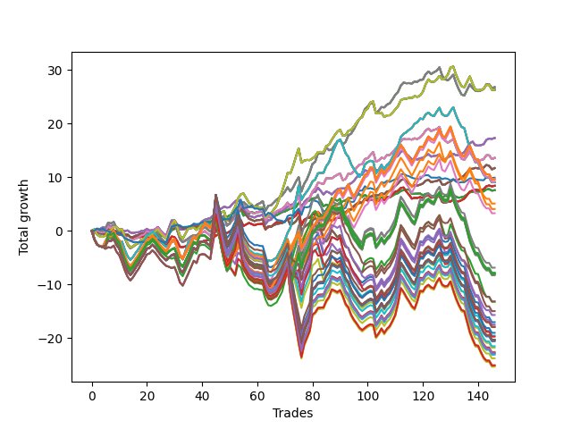

# Short Pointer Three (1231) 
- Symbol: AAPL_Unlimited
- Date Range: 03/23/2022 - 07/08/2022
- Trading Period: 7:20-12:30
- Number of Trades: 146



| Name | Win Percent | Profit | Avg Profit / Trade | Avg Time / Trade |      | Name | Win Percent | Profit | Avg Profit / Trade | Avg Time / Trade |
| ---- | ----------- | ------ | ------------------ | ---------------- | ---- | ---- | ----------- | ------ | ------------------ | ---------------- |
| Sorted By <br> Profit | | | | | | Sorted By <br> Win Percentage ||||
| Sixty-Nine | 67.12 | 13375.00 | 91.61 | 50:12 |     | Seventy | 69.18 | 13135.00 | 89.97 | 56:27 |
| Sixty-One | 67.12 | 13375.00 | 91.61 | 50:12 |     | Sixty-Two | 69.18 | 13135.00 | 89.97 | 56:27 |
| Fifty-Three | 67.12 | 13375.00 | 91.61 | 50:12 |     | Fifty-Four | 69.18 | 13135.00 | 89.97 | 56:27 |
| Forty-Five | 67.12 | 13375.00 | 91.61 | 50:12 |     | Forty-Six | 69.18 | 13135.00 | 89.97 | 56:27 |
| Five | 67.12 | 13375.00 | 91.61 | 50:12 |     | Six | 69.18 | 13135.00 | 89.97 | 56:27 |
| Seventy | 69.18 | 13135.00 | 89.97 | 56:27 |     | Sixty-Six | 69.18 | 8640.00 | 59.18 | 24:12 |
| Sixty-Two | 69.18 | 13135.00 | 89.97 | 56:27 |     | Fifty-Eight | 69.18 | 8640.00 | 59.18 | 24:12 |
| Fifty-Four | 69.18 | 13135.00 | 89.97 | 56:27 |     | Fifty | 69.18 | 8640.00 | 59.18 | 24:12 |
| Forty-Six | 69.18 | 13135.00 | 89.97 | 56:27 |     | Forty-Two | 69.18 | 8640.00 | 59.18 | 24:12 |
| Six | 69.18 | 13135.00 | 89.97 | 56:27 |     | Two | 69.18 | 8640.00 | 59.18 | 24:12 |
| Sixty-Six | 69.18 | 8640.00 | 59.18 | 24:12 |     | Sixty-Four | 69.18 | 3780.00 | 25.89 | 09:13 |
| Fifty-Eight | 69.18 | 8640.00 | 59.18 | 24:12 |     | Fifty-Six | 69.18 | 3780.00 | 25.89 | 09:13 |
| Fifty | 69.18 | 8640.00 | 59.18 | 24:12 |     | Forty-Eight | 69.18 | 3780.00 | 25.89 | 09:13 |
| Forty-Two | 69.18 | 8640.00 | 59.18 | 24:12 |     | Forty | 69.18 | 3780.00 | 25.89 | 09:13 |
| Two | 69.18 | 8640.00 | 59.18 | 24:12 |     | Zero | 69.18 | 3780.00 | 25.89 | 09:13 |
| Sixty-Eight | 65.75 | 6790.00 | 46.51 | 38:52 |     | Sixty-Nine | 67.12 | 13375.00 | 91.61 | 50:12 |
| Sixty | 65.75 | 6790.00 | 46.51 | 38:52 |     | Sixty-One | 67.12 | 13375.00 | 91.61 | 50:12 |
| Fifty-Two | 65.75 | 6790.00 | 46.51 | 38:52 |     | Fifty-Three | 67.12 | 13375.00 | 91.61 | 50:12 |
| Forty-Four | 65.75 | 6790.00 | 46.51 | 38:52 |     | Forty-Five | 67.12 | 13375.00 | 91.61 | 50:12 |
| Four | 65.75 | 6790.00 | 46.51 | 38:52 |     | Five | 67.12 | 13375.00 | 91.61 | 50:12 |
| Sixty-Seven | 65.07 | 5840.00 | 40.00 | 23:31 |     | Sixty-Eight | 65.75 | 6790.00 | 46.51 | 38:52 |
| Fifty-Nine | 65.07 | 5840.00 | 40.00 | 23:31 |     | Sixty | 65.75 | 6790.00 | 46.51 | 38:52 |
| Fifty-One | 65.07 | 5840.00 | 40.00 | 23:31 |     | Fifty-Two | 65.75 | 6790.00 | 46.51 | 38:52 |
| Forty-Three | 65.07 | 5840.00 | 40.00 | 23:31 |     | Forty-Four | 65.75 | 6790.00 | 46.51 | 38:52 |
| Three | 65.07 | 5840.00 | 40.00 | 23:31 |     | Four | 65.75 | 6790.00 | 46.51 | 38:52 |
| Seventy-Three | 47.95 | 4950.00 | 33.90 | 12:04 |     | Sixty-Seven | 65.07 | 5840.00 | 40.00 | 23:31 |
| One Hundred Twenty-Six | 55.48 | 4815.00 | 32.98 | 102:46 |     | Fifty-Nine | 65.07 | 5840.00 | 40.00 | 23:31 |
| One Hundred Twenty-One | 55.48 | 4815.00 | 32.98 | 102:46 |     | Fifty-One | 65.07 | 5840.00 | 40.00 | 23:31 |
| One Hundred Sixteen | 55.48 | 4815.00 | 32.98 | 102:46 |     | Forty-Three | 65.07 | 5840.00 | 40.00 | 23:31 |
| One Hundred Eleven | 55.48 | 4815.00 | 32.98 | 102:46 |     | Three | 65.07 | 5840.00 | 40.00 | 23:31 |
| Eighty-One | 55.48 | 4815.00 | 32.98 | 102:46 |     | Sixty-Five | 65.07 | 4195.00 | 28.73 | 17:25 |
| One Hundred One | 55.48 | 4560.00 | 31.23 | 101:46 |     | Fifty-Seven | 65.07 | 4195.00 | 28.73 | 17:25 |
| Seventy-One | 56.16 | 4520.00 | 30.96 | 114:44 |     | Forty-Nine | 65.07 | 4195.00 | 28.73 | 17:25 |
| Sixty-Three | 56.16 | 4520.00 | 30.96 | 114:44 |     | Forty-One | 65.07 | 4195.00 | 28.73 | 17:25 |
| Fifty-Five | 56.16 | 4520.00 | 30.96 | 114:44 |     | One | 65.07 | 4195.00 | 28.73 | 17:25 |
| Forty-Seven | 56.16 | 4520.00 | 30.96 | 114:44 |     | Seventy-One | 56.16 | 4520.00 | 30.96 | 114:44 |
| Seven | 56.16 | 4520.00 | 30.96 | 114:44 |     | Sixty-Three | 56.16 | 4520.00 | 30.96 | 114:44 |
| Sixty-Five | 65.07 | 4195.00 | 28.73 | 17:25 |     | Fifty-Five | 56.16 | 4520.00 | 30.96 | 114:44 |
| Fifty-Seven | 65.07 | 4195.00 | 28.73 | 17:25 |     | Forty-Seven | 56.16 | 4520.00 | 30.96 | 114:44 |
| Forty-Nine | 65.07 | 4195.00 | 28.73 | 17:25 |     | Seven | 56.16 | 4520.00 | 30.96 | 114:44 |
| Forty-One | 65.07 | 4195.00 | 28.73 | 17:25 |     | One Hundred Twenty-Six | 55.48 | 4815.00 | 32.98 | 102:46 |
| One | 65.07 | 4195.00 | 28.73 | 17:25 |     | One Hundred Twenty-One | 55.48 | 4815.00 | 32.98 | 102:46 |
| Sixty-Four | 69.18 | 3780.00 | 25.89 | 09:13 |     | One Hundred Sixteen | 55.48 | 4815.00 | 32.98 | 102:46 |
| Fifty-Six | 69.18 | 3780.00 | 25.89 | 09:13 |     | One Hundred Eleven | 55.48 | 4815.00 | 32.98 | 102:46 |
| Forty-Eight | 69.18 | 3780.00 | 25.89 | 09:13 |     | Eighty-One | 55.48 | 4815.00 | 32.98 | 102:46 |
| Forty | 69.18 | 3780.00 | 25.89 | 09:13 |     | One Hundred One | 55.48 | 4560.00 | 31.23 | 101:46 |
| Zero | 69.18 | 3780.00 | 25.89 | 09:13 |     | One Hundred Six | 54.79 | 2540.00 | 17.40 | 98:24 |
| One Hundred Six | 54.79 | 2540.00 | 17.40 | 98:24 |     | Ninety-One | 53.42 | 1640.00 | 11.23 | 94:10 |
| Ninety-Six | 52.74 | 2030.00 | 13.90 | 88:22 |     | Ninety-Six | 52.74 | 2030.00 | 13.90 | 88:22 |
| Ninety-One | 53.42 | 1640.00 | 11.23 | 94:10 |     | Seventy-Three | 47.95 | 4950.00 | 33.90 | 12:04 |
| One Hundred Two | 46.58 | -3430.00 | -23.49 | 139:49 |     | One Hundred Two | 46.58 | -3430.00 | -23.49 | 139:49 |
| One Hundred Seventeen | 46.58 | -3900.00 | -26.71 | 141:40 |     | One Hundred Seventeen | 46.58 | -3900.00 | -26.71 | 141:40 |
| Ninety-Two | 45.21 | -3965.00 | -27.16 | 130:47 |     | One Hundred Twenty-Seven | 46.58 | -4015.00 | -27.50 | 142:03 |
| One Hundred Seven | 45.89 | -3970.00 | -27.19 | 133:31 |     | One Hundred Twenty-Two | 46.58 | -4015.00 | -27.50 | 142:03 |
| One Hundred Twenty-Seven | 46.58 | -4015.00 | -27.50 | 142:03 |     | Eighty-Two | 46.58 | -4015.00 | -27.50 | 142:03 |
| One Hundred Twenty-Two | 46.58 | -4015.00 | -27.50 | 142:03 |     | One Hundred Twelve | 46.58 | -4140.00 | -28.36 | 142:00 |
| Eighty-Two | 46.58 | -4015.00 | -27.50 | 142:03 |     | One Hundred Seven | 45.89 | -3970.00 | -27.19 | 133:31 |
| One Hundred Twelve | 46.58 | -4140.00 | -28.36 | 142:00 |     | Ninety-Two | 45.21 | -3965.00 | -27.16 | 130:47 |
| One Hundred Ten | 43.15 | -6580.00 | -45.07 | 143:22 |     | One Hundred Twenty | 44.52 | -8930.00 | -61.16 | 152:25 |
| Ninety-Seven | 39.73 | -6595.00 | -45.17 | 115:36 |     | One Hundred Five | 44.52 | -9495.00 | -65.03 | 150:56 |
| One Hundred | 39.73 | -7475.00 | -51.20 | 122:55 |     | One Hundred Thirty | 44.52 | -10155.00 | -69.55 | 153:25 |
| One Hundred Nine | 43.15 | -7835.00 | -53.66 | 142:32 |     | One Hundred Twenty-Five | 44.52 | -10155.00 | -69.55 | 153:25 |
| Ninety-Five | 43.15 | -8505.00 | -58.25 | 141:29 |     | Eighty-Five | 44.52 | -10155.00 | -69.55 | 153:25 |
| Ninety-Nine | 39.73 | -8730.00 | -59.79 | 122:05 |     | One Hundred Ninteen | 44.52 | -10185.00 | -69.76 | 151:35 |
| One Hundred Twenty | 44.52 | -8930.00 | -61.16 | 152:25 |     | One Hundred Fifteen | 44.52 | -10280.00 | -70.41 | 153:22 |
| One Hundred Eight | 43.15 | -8955.00 | -61.34 | 141:32 |     | One Hundred Four | 44.52 | -10750.00 | -73.63 | 150:06 |
| One Hundred Five | 44.52 | -9495.00 | -65.03 | 150:56 |     | One Hundred Eighteen | 44.52 | -11305.00 | -77.43 | 150:35 |
| Ninety-Four | 43.15 | -9760.00 | -66.85 | 140:39 |     | One Hundred Twenty-Nine | 44.52 | -11410.00 | -78.15 | 152:35 |
| Ninety-Eight | 39.73 | -9850.00 | -67.47 | 121:05 |     | One Hundred Twenty-Four | 44.52 | -11410.00 | -78.15 | 152:35 |
| One Hundred Thirty | 44.52 | -10155.00 | -69.55 | 153:25 |     | Eighty-Four | 44.52 | -11410.00 | -78.15 | 152:35 |
| One Hundred Twenty-Five | 44.52 | -10155.00 | -69.55 | 153:25 |     | One Hundred Fourteen | 44.52 | -11535.00 | -79.01 | 152:32 |
| Eighty-Five | 44.52 | -10155.00 | -69.55 | 153:25 |     | One Hundred Three | 44.52 | -11870.00 | -81.30 | 149:06 |
| One Hundred Ninteen | 44.52 | -10185.00 | -69.76 | 151:35 |     | One Hundred Twenty-Eight | 44.52 | -12530.00 | -85.82 | 151:35 |
| One Hundred Fifteen | 44.52 | -10280.00 | -70.41 | 153:22 |     | One Hundred Twenty-Three | 44.52 | -12530.00 | -85.82 | 151:35 |
| One Hundred Four | 44.52 | -10750.00 | -73.63 | 150:06 |     | Eighty-Three | 44.52 | -12530.00 | -85.82 | 151:35 |
| Ninety-Three | 43.15 | -10880.00 | -74.52 | 139:39 |     | One Hundred Thirteen | 44.52 | -12655.00 | -86.68 | 151:32 |
| One Hundred Eighteen | 44.52 | -11305.00 | -77.43 | 150:35 |     | One Hundred Ten | 43.15 | -6580.00 | -45.07 | 143:22 |
| One Hundred Twenty-Nine | 44.52 | -11410.00 | -78.15 | 152:35 |     | One Hundred Nine | 43.15 | -7835.00 | -53.66 | 142:32 |
| One Hundred Twenty-Four | 44.52 | -11410.00 | -78.15 | 152:35 |     | Ninety-Five | 43.15 | -8505.00 | -58.25 | 141:29 |
| Eighty-Four | 44.52 | -11410.00 | -78.15 | 152:35 |     | One Hundred Eight | 43.15 | -8955.00 | -61.34 | 141:32 |
| One Hundred Fourteen | 44.52 | -11535.00 | -79.01 | 152:32 |     | Ninety-Four | 43.15 | -9760.00 | -66.85 | 140:39 |
| One Hundred Three | 44.52 | -11870.00 | -81.30 | 149:06 |     | Ninety-Three | 43.15 | -10880.00 | -74.52 | 139:39 |
| One Hundred Twenty-Eight | 44.52 | -12530.00 | -85.82 | 151:35 |     | Ninety-Seven | 39.73 | -6595.00 | -45.17 | 115:36 |
| One Hundred Twenty-Three | 44.52 | -12530.00 | -85.82 | 151:35 |     | One Hundred | 39.73 | -7475.00 | -51.20 | 122:55 |
| Eighty-Three | 44.52 | -12530.00 | -85.82 | 151:35 |     | Ninety-Nine | 39.73 | -8730.00 | -59.79 | 122:05 |
| One Hundred Thirteen | 44.52 | -12655.00 | -86.68 | 151:32 |     | Ninety-Eight | 39.73 | -9850.00 | -67.47 | 121:05 |

## NO STOPLOSS

### Test Zero
* Sell when price hits the middle line of the 20p bollinger
* No Stoploss
* Results:
```
Total Trades: 146
Percent Up: 30.82
Percent Down: 69.18
Total Points Moved Down: 7.56
Potential Profit: 3780.00
Total Points Ups: 13.88 Count Ups: 45
Total Points Downs: 21.44 Count Downs: 101
```

<details><summary>Trades</summary>

<code>In: 2022-03-24 10:04:00		Out: 2022-03-24 10:09:20		Total Position Time: 05:20		Total Move Down: 0.17		Total to Date: 0.17</code> <br />
<code>In: 2022-03-24 11:07:00		Out: 2022-03-24 11:08:10		Total Position Time: 01:10		Total Move Down: 0.17		Total to Date: 0.34</code> <br />
<code>In: 2022-03-24 12:14:00		Out: 2022-03-24 12:32:50		Total Position Time: 18:50		Total Move Down: -0.15		Total to Date: 0.19</code> <br />
<code>In: 2022-03-24 12:29:00		Out: 2022-03-24 12:32:50		Total Position Time: 03:50		Total Move Down: 0.17		Total to Date: 0.36</code> <br />
<code>In: 2022-03-25 07:26:00		Out: 2022-03-25 07:51:25		Total Position Time: 25:25		Total Move Down: -0.42		Total to Date: -0.06</code> <br />
<code>In: 2022-03-25 07:44:00		Out: 2022-03-25 07:51:25		Total Position Time: 07:25		Total Move Down: 0.19		Total to Date: 0.13</code> <br />
<code>In: 2022-03-25 10:56:00		Out: 2022-03-25 11:17:45		Total Position Time: 21:45		Total Move Down: -0.31		Total to Date: -0.18</code> <br />
<code>In: 2022-03-25 11:34:00		Out: 2022-03-25 11:35:30		Total Position Time: 01:30		Total Move Down: 0.12		Total to Date: -0.06</code> <br />
<code>In: 2022-03-28 10:02:00		Out: 2022-03-28 10:10:05		Total Position Time: 08:05		Total Move Down: 0.01		Total to Date: -0.05</code> <br />
<code>In: 2022-03-28 11:13:00		Out: 2022-03-28 11:20:10		Total Position Time: 07:10		Total Move Down: -0.05		Total to Date: -0.10</code> <br />
<code>In: 2022-03-29 08:23:00		Out: 2022-03-29 08:40:35		Total Position Time: 17:35		Total Move Down: -0.23		Total to Date: -0.33</code> <br />
<code>In: 2022-03-29 10:46:00		Out: 2022-03-29 11:04:05		Total Position Time: 18:05		Total Move Down: -0.34		Total to Date: -0.67</code> <br />
<code>In: 2022-03-29 10:51:00		Out: 2022-03-29 11:04:05		Total Position Time: 13:05		Total Move Down: -0.01		Total to Date: -0.68</code> <br />
<code>In: 2022-03-29 11:55:00		Out: 2022-03-29 12:25:30		Total Position Time: 30:30		Total Move Down: -0.51		Total to Date: -1.19</code> <br />
<code>In: 2022-03-31 07:38:00		Out: 2022-03-31 07:54:45		Total Position Time: 16:45		Total Move Down: -0.13		Total to Date: -1.32</code> <br />
<code>In: 2022-03-31 08:44:00		Out: 2022-03-31 08:58:25		Total Position Time: 14:25		Total Move Down: 0.10		Total to Date: -1.22</code> <br />
<code>In: 2022-03-31 08:45:00		Out: 2022-03-31 08:58:25		Total Position Time: 13:25		Total Move Down: -0.01		Total to Date: -1.23</code> <br />
<code>In: 2022-03-31 09:02:00		Out: 2022-03-31 09:03:10		Total Position Time: 01:10		Total Move Down: 0.23		Total to Date: -1.00</code> <br />
<code>In: 2022-03-31 09:03:00		Out: 2022-03-31 09:04:10		Total Position Time: 01:10		Total Move Down: -0.04		Total to Date: -1.04</code> <br />
<code>In: 2022-03-31 12:05:00		Out: 2022-03-31 12:12:15		Total Position Time: 07:15		Total Move Down: 0.14		Total to Date: -0.90</code> <br />
<code>In: 2022-04-01 11:08:00		Out: 2022-04-01 11:25:05		Total Position Time: 17:05		Total Move Down: -0.04		Total to Date: -0.94</code> <br />
<code>In: 2022-04-01 11:37:00		Out: 2022-04-01 11:39:30		Total Position Time: 02:30		Total Move Down: 0.14		Total to Date: -0.80</code> <br />
<code>In: 2022-04-04 09:18:00		Out: 2022-04-04 09:26:30		Total Position Time: 08:30		Total Move Down: 0.14		Total to Date: -0.66</code> <br />
<code>In: 2022-04-04 11:01:00		Out: 2022-04-04 11:06:55		Total Position Time: 05:55		Total Move Down: 0.14		Total to Date: -0.52</code> <br />
<code>In: 2022-04-04 11:32:00		Out: 2022-04-04 12:13:55		Total Position Time: 41:55		Total Move Down: -0.33		Total to Date: -0.85</code> <br />
<code>In: 2022-04-04 11:50:00		Out: 2022-04-04 12:13:55		Total Position Time: 23:55		Total Move Down: -0.17		Total to Date: -1.02</code> <br />
<code>In: 2022-04-04 11:57:00		Out: 2022-04-04 12:13:55		Total Position Time: 16:55		Total Move Down: -0.08		Total to Date: -1.10</code> <br />
<code>In: 2022-04-06 11:06:00		Out: 2022-04-06 11:07:50		Total Position Time: 01:50		Total Move Down: 0.52		Total to Date: -0.58</code> <br />
<code>In: 2022-04-06 11:07:00		Out: 2022-04-06 11:08:10		Total Position Time: 01:10		Total Move Down: 0.68		Total to Date: 0.10</code> <br />
<code>In: 2022-04-06 11:37:00		Out: 2022-04-06 11:49:25		Total Position Time: 12:25		Total Move Down: 0.27		Total to Date: 0.37</code> <br />
<code>In: 2022-04-07 11:29:00		Out: 2022-04-07 11:30:10		Total Position Time: 01:10		Total Move Down: 0.27		Total to Date: 0.64</code> <br />
<code>In: 2022-04-07 11:30:00		Out: 2022-04-07 11:31:10		Total Position Time: 01:10		Total Move Down: 0.09		Total to Date: 0.73</code> <br />
<code>In: 2022-04-07 12:04:00		Out: 2022-04-07 12:20:15		Total Position Time: 16:15		Total Move Down: -0.17		Total to Date: 0.56</code> <br />
<code>In: 2022-04-08 09:24:00		Out: 2022-04-08 09:31:30		Total Position Time: 07:30		Total Move Down: 0.08		Total to Date: 0.64</code> <br />
<code>In: 2022-04-08 09:24:00		Out: 2022-04-08 09:31:30		Total Position Time: 07:30		Total Move Down: 0.08		Total to Date: 0.72</code> <br />
<code>In: 2022-04-11 08:56:00		Out: 2022-04-11 09:01:10		Total Position Time: 05:10		Total Move Down: 0.17		Total to Date: 0.89</code> <br />
<code>In: 2022-04-11 11:12:00		Out: 2022-04-11 11:13:10		Total Position Time: 01:10		Total Move Down: 0.11		Total to Date: 1.00</code> <br />
<code>In: 2022-04-13 09:27:00		Out: 2022-04-13 09:55:45		Total Position Time: 28:45		Total Move Down: -0.23		Total to Date: 0.77</code> <br />
<code>In: 2022-04-18 11:28:00		Out: 2022-04-18 11:40:55		Total Position Time: 12:55		Total Move Down: 0.06		Total to Date: 0.83</code> <br />
<code>In: 2022-04-20 10:49:00		Out: 2022-04-20 10:50:10		Total Position Time: 01:10		Total Move Down: 0.29		Total to Date: 1.12</code> <br />
<code>In: 2022-04-20 10:50:00		Out: 2022-04-20 10:51:10		Total Position Time: 01:10		Total Move Down: 0.08		Total to Date: 1.20</code> <br />
<code>In: 2022-04-20 12:20:00		Out: 2022-04-20 12:22:40		Total Position Time: 02:40		Total Move Down: 0.17		Total to Date: 1.37</code> <br />
<code>In: 2022-04-20 12:28:00		Out: 2022-04-20 12:32:55		Total Position Time: 04:55		Total Move Down: 0.03		Total to Date: 1.40</code> <br />
<code>In: 2022-04-21 07:34:00		Out: 2022-04-21 07:41:00		Total Position Time: 07:00		Total Move Down: 0.27		Total to Date: 1.67</code> <br />
<code>In: 2022-04-21 08:30:00		Out: 2022-04-21 08:32:30		Total Position Time: 02:30		Total Move Down: 0.20		Total to Date: 1.87</code> <br />
<code>In: 2022-04-25 09:28:00		Out: 2022-04-25 09:31:10		Total Position Time: 03:10		Total Move Down: 0.39		Total to Date: 2.26</code> <br />
<code>In: 2022-04-25 09:29:00		Out: 2022-04-25 09:31:10		Total Position Time: 02:10		Total Move Down: 0.22		Total to Date: 2.48</code> <br />
<code>In: 2022-04-25 10:18:00		Out: 2022-04-25 10:27:05		Total Position Time: 09:05		Total Move Down: 0.16		Total to Date: 2.64</code> <br />
<code>In: 2022-04-25 11:26:00		Out: 2022-04-25 11:40:00		Total Position Time: 14:00		Total Move Down: -0.05		Total to Date: 2.59</code> <br />
<code>In: 2022-04-27 08:04:00		Out: 2022-04-27 08:10:10		Total Position Time: 06:10		Total Move Down: 0.28		Total to Date: 2.87</code> <br />
<code>In: 2022-04-27 08:37:00		Out: 2022-04-27 08:40:30		Total Position Time: 03:30		Total Move Down: 0.36		Total to Date: 3.23</code> <br />
<code>In: 2022-04-27 08:38:00		Out: 2022-04-27 08:40:30		Total Position Time: 02:30		Total Move Down: 0.23		Total to Date: 3.46</code> <br />
<code>In: 2022-04-27 09:46:00		Out: 2022-04-27 09:48:15		Total Position Time: 02:15		Total Move Down: -0.08		Total to Date: 3.38</code> <br />
<code>In: 2022-04-28 07:24:00		Out: 2022-04-28 07:27:00		Total Position Time: 03:00		Total Move Down: 0.72		Total to Date: 4.10</code> <br />
<code>In: 2022-04-28 08:01:00		Out: 2022-04-28 08:23:15		Total Position Time: 22:15		Total Move Down: -1.27		Total to Date: 2.83</code> <br />
<code>In: 2022-04-28 09:49:00		Out: 2022-04-28 09:57:10		Total Position Time: 08:10		Total Move Down: 0.21		Total to Date: 3.04</code> <br />
<code>In: 2022-04-28 09:50:00		Out: 2022-04-28 09:57:10		Total Position Time: 07:10		Total Move Down: 0.20		Total to Date: 3.24</code> <br />
<code>In: 2022-04-28 10:16:00		Out: 2022-04-28 10:19:05		Total Position Time: 03:05		Total Move Down: 0.25		Total to Date: 3.49</code> <br />
<code>In: 2022-04-28 10:31:00		Out: 2022-04-28 10:44:15		Total Position Time: 13:15		Total Move Down: -0.21		Total to Date: 3.28</code> <br />
<code>In: 2022-04-28 10:41:00		Out: 2022-04-28 10:44:15		Total Position Time: 03:15		Total Move Down: 0.22		Total to Date: 3.50</code> <br />
<code>In: 2022-04-28 10:42:00		Out: 2022-04-28 10:44:15		Total Position Time: 02:15		Total Move Down: 0.03		Total to Date: 3.53</code> <br />
<code>In: 2022-04-28 10:53:00		Out: 2022-04-28 10:54:10		Total Position Time: 01:10		Total Move Down: 0.06		Total to Date: 3.59</code> <br />
<code>In: 2022-05-02 12:18:00		Out: 2022-05-02 12:40:35		Total Position Time: 22:35		Total Move Down: -1.23		Total to Date: 2.36</code> <br />
<code>In: 2022-05-03 07:37:00		Out: 2022-05-03 07:39:05		Total Position Time: 02:05		Total Move Down: 0.23		Total to Date: 2.59</code> <br />
<code>In: 2022-05-03 08:11:00		Out: 2022-05-03 08:27:15		Total Position Time: 16:15		Total Move Down: -0.12		Total to Date: 2.47</code> <br />
<code>In: 2022-05-03 08:57:00		Out: 2022-05-03 09:06:05		Total Position Time: 09:05		Total Move Down: 0.21		Total to Date: 2.68</code> <br />
<code>In: 2022-05-03 08:58:00		Out: 2022-05-03 09:06:05		Total Position Time: 08:05		Total Move Down: 0.23		Total to Date: 2.91</code> <br />
<code>In: 2022-05-03 10:19:00		Out: 2022-05-03 10:24:10		Total Position Time: 05:10		Total Move Down: 0.28		Total to Date: 3.19</code> <br />
<code>In: 2022-05-03 10:20:00		Out: 2022-05-03 10:24:10		Total Position Time: 04:10		Total Move Down: 0.29		Total to Date: 3.48</code> <br />
<code>In: 2022-05-03 10:41:00		Out: 2022-05-03 10:50:55		Total Position Time: 09:55		Total Move Down: 0.12		Total to Date: 3.60</code> <br />
<code>In: 2022-05-03 10:48:00		Out: 2022-05-03 10:50:55		Total Position Time: 02:55		Total Move Down: 0.28		Total to Date: 3.88</code> <br />
<code>In: 2022-05-04 08:57:00		Out: 2022-05-04 09:04:40		Total Position Time: 07:40		Total Move Down: 0.27		Total to Date: 4.15</code> <br />
<code>In: 2022-05-04 10:41:00		Out: 2022-05-04 10:50:05		Total Position Time: 09:05		Total Move Down: 0.07		Total to Date: 4.22</code> <br />
<code>In: 2022-05-04 11:03:00		Out: 2022-05-04 11:06:30		Total Position Time: 03:30		Total Move Down: 0.17		Total to Date: 4.39</code> <br />
<code>In: 2022-05-04 11:07:00		Out: 2022-05-04 11:08:10		Total Position Time: 01:10		Total Move Down: 0.85		Total to Date: 5.24</code> <br />
<code>In: 2022-05-04 11:50:00		Out: 2022-05-04 12:07:00		Total Position Time: 17:00		Total Move Down: -0.62		Total to Date: 4.62</code> <br />
<code>In: 2022-05-09 07:51:00		Out: 2022-05-09 07:54:05		Total Position Time: 03:05		Total Move Down: 0.59		Total to Date: 5.21</code> <br />
<code>In: 2022-05-09 10:33:00		Out: 2022-05-09 10:34:40		Total Position Time: 01:40		Total Move Down: 0.32		Total to Date: 5.53</code> <br />
<code>In: 2022-05-09 12:04:00		Out: 2022-05-09 12:09:15		Total Position Time: 05:15		Total Move Down: 0.13		Total to Date: 5.66</code> <br />
<code>In: 2022-05-11 08:42:00		Out: 2022-05-11 08:47:05		Total Position Time: 05:05		Total Move Down: 0.37		Total to Date: 6.03</code> <br />
<code>In: 2022-05-13 12:16:00		Out: 2022-05-13 12:26:05		Total Position Time: 10:05		Total Move Down: 0.05		Total to Date: 6.08</code> <br />
<code>In: 2022-05-16 07:23:00		Out: 2022-05-16 07:32:15		Total Position Time: 09:15		Total Move Down: 0.24		Total to Date: 6.32</code> <br />
<code>In: 2022-05-16 08:42:00		Out: 2022-05-16 09:05:45		Total Position Time: 23:45		Total Move Down: -0.84		Total to Date: 5.48</code> <br />
<code>In: 2022-05-16 08:43:00		Out: 2022-05-16 09:05:45		Total Position Time: 22:45		Total Move Down: -0.90		Total to Date: 4.58</code> <br />
<code>In: 2022-05-16 08:58:00		Out: 2022-05-16 09:05:45		Total Position Time: 07:45		Total Move Down: 0.30		Total to Date: 4.88</code> <br />
<code>In: 2022-05-16 10:16:00		Out: 2022-05-16 10:37:10		Total Position Time: 21:10		Total Move Down: -0.24		Total to Date: 4.64</code> <br />
<code>In: 2022-05-16 11:11:00		Out: 2022-05-16 11:26:05		Total Position Time: 15:05		Total Move Down: -0.07		Total to Date: 4.57</code> <br />
<code>In: 2022-05-17 11:11:00		Out: 2022-05-17 11:12:15		Total Position Time: 01:15		Total Move Down: 0.18		Total to Date: 4.75</code> <br />
<code>In: 2022-05-17 11:12:00		Out: 2022-05-17 11:13:10		Total Position Time: 01:10		Total Move Down: 0.11		Total to Date: 4.86</code> <br />
<code>In: 2022-05-17 12:06:00		Out: 2022-05-17 12:10:50		Total Position Time: 04:50		Total Move Down: 0.18		Total to Date: 5.04</code> <br />
<code>In: 2022-05-23 07:51:00		Out: 2022-05-23 07:52:10		Total Position Time: 01:10		Total Move Down: 0.48		Total to Date: 5.52</code> <br />
<code>In: 2022-05-24 08:52:00		Out: 2022-05-24 09:02:55		Total Position Time: 10:55		Total Move Down: 0.14		Total to Date: 5.66</code> <br />
<code>In: 2022-05-24 09:18:00		Out: 2022-05-24 09:21:30		Total Position Time: 03:30		Total Move Down: 0.43		Total to Date: 6.09</code> <br />
<code>In: 2022-05-24 10:48:00		Out: 2022-05-24 10:58:25		Total Position Time: 10:25		Total Move Down: -0.02		Total to Date: 6.07</code> <br />
<code>In: 2022-05-24 11:14:00		Out: 2022-05-24 11:15:55		Total Position Time: 01:55		Total Move Down: 0.28		Total to Date: 6.35</code> <br />
<code>In: 2022-05-24 11:41:00		Out: 2022-05-24 11:42:20		Total Position Time: 01:20		Total Move Down: 0.27		Total to Date: 6.62</code> <br />
<code>In: 2022-05-24 11:42:00		Out: 2022-05-24 11:43:10		Total Position Time: 01:10		Total Move Down: 0.21		Total to Date: 6.83</code> <br />
<code>In: 2022-05-25 07:21:00		Out: 2022-05-25 07:41:55		Total Position Time: 20:55		Total Move Down: -0.52		Total to Date: 6.31</code> <br />
<code>In: 2022-05-25 07:37:00		Out: 2022-05-25 07:41:55		Total Position Time: 04:55		Total Move Down: 0.37		Total to Date: 6.68</code> <br />
<code>In: 2022-05-25 11:59:00		Out: 2022-05-25 12:18:05		Total Position Time: 19:05		Total Move Down: -0.38		Total to Date: 6.30</code> <br />
<code>In: 2022-05-31 09:46:00		Out: 2022-05-31 09:57:30		Total Position Time: 11:30		Total Move Down: 0.08		Total to Date: 6.38</code> <br />
<code>In: 2022-06-01 11:30:00		Out: 2022-06-01 11:40:05		Total Position Time: 10:05		Total Move Down: 0.11		Total to Date: 6.49</code> <br />
<code>In: 2022-06-02 08:06:00		Out: 2022-06-02 08:25:20		Total Position Time: 19:20		Total Move Down: -0.40		Total to Date: 6.09</code> <br />
<code>In: 2022-06-03 09:59:00		Out: 2022-06-03 10:08:30		Total Position Time: 09:30		Total Move Down: -0.05		Total to Date: 6.04</code> <br />
<code>In: 2022-06-03 10:06:00		Out: 2022-06-03 10:08:30		Total Position Time: 02:30		Total Move Down: 0.18		Total to Date: 6.22</code> <br />
<code>In: 2022-06-07 10:12:00		Out: 2022-06-07 10:34:15		Total Position Time: 22:15		Total Move Down: -0.17		Total to Date: 6.05</code> <br />
<code>In: 2022-06-10 10:53:00		Out: 2022-06-10 10:55:15		Total Position Time: 02:15		Total Move Down: 0.31		Total to Date: 6.36</code> <br />
<code>In: 2022-06-10 11:51:00		Out: 2022-06-10 12:03:25		Total Position Time: 12:25		Total Move Down: -0.14		Total to Date: 6.22</code> <br />
<code>In: 2022-06-10 12:00:00		Out: 2022-06-10 12:03:25		Total Position Time: 03:25		Total Move Down: 0.33		Total to Date: 6.55</code> <br />
<code>In: 2022-06-10 12:30:00		Out: 2022-06-10 12:31:10		Total Position Time: 01:10		Total Move Down: 0.31		Total to Date: 6.86</code> <br />
<code>In: 2022-06-13 08:27:00		Out: 2022-06-13 08:37:10		Total Position Time: 10:10		Total Move Down: 0.16		Total to Date: 7.02</code> <br />
<code>In: 2022-06-13 09:41:00		Out: 2022-06-13 09:44:50		Total Position Time: 03:50		Total Move Down: 0.40		Total to Date: 7.42</code> <br />
<code>In: 2022-06-14 08:47:00		Out: 2022-06-14 08:51:40		Total Position Time: 04:40		Total Move Down: 0.16		Total to Date: 7.58</code> <br />
<code>In: 2022-06-14 09:58:00		Out: 2022-06-14 10:03:35		Total Position Time: 05:35		Total Move Down: 0.03		Total to Date: 7.61</code> <br />
<code>In: 2022-06-14 10:02:00		Out: 2022-06-14 10:03:35		Total Position Time: 01:35		Total Move Down: 0.17		Total to Date: 7.78</code> <br />
<code>In: 2022-06-14 10:03:00		Out: 2022-06-14 10:29:45		Total Position Time: 26:45		Total Move Down: -0.91		Total to Date: 6.87</code> <br />
<code>In: 2022-06-14 11:26:00		Out: 2022-06-14 11:30:50		Total Position Time: 04:50		Total Move Down: 0.03		Total to Date: 6.90</code> <br />
<code>In: 2022-06-16 09:32:00		Out: 2022-06-16 09:42:10		Total Position Time: 10:10		Total Move Down: 0.03		Total to Date: 6.93</code> <br />
<code>In: 2022-06-16 10:14:00		Out: 2022-06-16 10:19:50		Total Position Time: 05:50		Total Move Down: 0.02		Total to Date: 6.95</code> <br />
<code>In: 2022-06-17 08:21:00		Out: 2022-06-17 08:38:40		Total Position Time: 17:40		Total Move Down: -0.33		Total to Date: 6.62</code> <br />
<code>In: 2022-06-17 10:14:00		Out: 2022-06-17 10:21:05		Total Position Time: 07:05		Total Move Down: 0.25		Total to Date: 6.87</code> <br />
<code>In: 2022-06-17 11:20:00		Out: 2022-06-17 11:29:00		Total Position Time: 09:00		Total Move Down: 0.07		Total to Date: 6.94</code> <br />
<code>In: 2022-06-23 12:30:00		Out: 2022-06-23 12:47:00		Total Position Time: 17:00		Total Move Down: -0.46		Total to Date: 6.48</code> <br />
<code>In: 2022-06-24 11:52:00		Out: 2022-06-24 12:01:35		Total Position Time: 09:35		Total Move Down: 0.05		Total to Date: 6.53</code> <br />
<code>In: 2022-06-27 08:48:00		Out: 2022-06-27 08:56:40		Total Position Time: 08:40		Total Move Down: 0.09		Total to Date: 6.62</code> <br />
<code>In: 2022-06-29 11:08:00		Out: 2022-06-29 11:18:05		Total Position Time: 10:05		Total Move Down: 0.09		Total to Date: 6.71</code> <br />
<code>In: 2022-06-30 08:12:00		Out: 2022-06-30 08:36:00		Total Position Time: 24:00		Total Move Down: -0.55		Total to Date: 6.16</code> <br />
<code>In: 2022-06-30 08:30:00		Out: 2022-06-30 08:36:00		Total Position Time: 06:00		Total Move Down: 0.38		Total to Date: 6.54</code> <br />
<code>In: 2022-06-30 08:51:00		Out: 2022-06-30 09:04:05		Total Position Time: 13:05		Total Move Down: -0.12		Total to Date: 6.42</code> <br />
<code>In: 2022-06-30 09:29:00		Out: 2022-06-30 09:38:05		Total Position Time: 09:05		Total Move Down: 0.15		Total to Date: 6.57</code> <br />
<code>In: 2022-07-01 08:20:00		Out: 2022-07-01 08:23:50		Total Position Time: 03:50		Total Move Down: 0.20		Total to Date: 6.77</code> <br />
<code>In: 2022-07-01 10:35:00		Out: 2022-07-01 11:04:25		Total Position Time: 29:25		Total Move Down: -0.44		Total to Date: 6.33</code> <br />
<code>In: 2022-07-01 10:48:00		Out: 2022-07-01 11:04:25		Total Position Time: 16:25		Total Move Down: -0.16		Total to Date: 6.17</code> <br />
<code>In: 2022-07-01 11:02:00		Out: 2022-07-01 11:04:25		Total Position Time: 02:25		Total Move Down: 0.08		Total to Date: 6.25</code> <br />
<code>In: 2022-07-01 11:52:00		Out: 2022-07-01 11:54:10		Total Position Time: 02:10		Total Move Down: 0.15		Total to Date: 6.40</code> <br />
<code>In: 2022-07-05 07:43:00		Out: 2022-07-05 07:46:55		Total Position Time: 03:55		Total Move Down: 0.37		Total to Date: 6.77</code> <br />
<code>In: 2022-07-05 07:44:00		Out: 2022-07-05 07:46:55		Total Position Time: 02:55		Total Move Down: 0.40		Total to Date: 7.17</code> <br />
<code>In: 2022-07-05 10:44:00		Out: 2022-07-05 10:45:10		Total Position Time: 01:10		Total Move Down: 0.07		Total to Date: 7.24</code> <br />
<code>In: 2022-07-05 11:07:00		Out: 2022-07-05 11:09:05		Total Position Time: 02:05		Total Move Down: 0.13		Total to Date: 7.37</code> <br />
<code>In: 2022-07-05 12:31:00		Out: 2022-07-05 12:45:55		Total Position Time: 14:55		Total Move Down: -0.09		Total to Date: 7.28</code> <br />
<code>In: 2022-07-06 10:11:00		Out: 2022-07-06 10:21:35		Total Position Time: 10:35		Total Move Down: 0.07		Total to Date: 7.35</code> <br />
<code>In: 2022-07-06 10:49:00		Out: 2022-07-06 11:00:05		Total Position Time: 11:05		Total Move Down: -0.01		Total to Date: 7.34</code> <br />
<code>In: 2022-07-06 11:10:00		Out: 2022-07-06 11:11:10		Total Position Time: 01:10		Total Move Down: 0.36		Total to Date: 7.70</code> <br />
<code>In: 2022-07-06 11:48:00		Out: 2022-07-06 12:00:50		Total Position Time: 12:50		Total Move Down: 0.07		Total to Date: 7.77</code> <br />
<code>In: 2022-07-08 10:34:00		Out: 2022-07-08 10:59:05		Total Position Time: 25:05		Total Move Down: -0.28		Total to Date: 7.49</code> <br />
<code>In: 2022-07-08 11:40:00		Out: 2022-07-08 11:49:05		Total Position Time: 09:05		Total Move Down: 0.07		Total to Date: 7.56</code> <br />


</details>

### Test One
* Sell when the price hits the upper line of the 20p 1std bollinger
* No Stoploss
* Results:
```
Total Trades: 146
Percent Up: 34.93
Percent Down: 65.07
Total Points Moved Down: 8.39
Potential Profit: 4195.00
Total Points Ups: 19.73 Count Ups: 51
Total Points Downs: 28.12 Count Downs: 95
```

<details><summary>Trades</summary>

<code>In: 2022-03-24 10:04:00		Out: 2022-03-24 10:33:15		Total Position Time: 29:15		Total Move Down: -0.13		Total to Date: -0.13</code> <br />
<code>In: 2022-03-24 11:07:00		Out: 2022-03-24 11:09:05		Total Position Time: 02:05		Total Move Down: 0.24		Total to Date: 0.11</code> <br />
<code>In: 2022-03-24 12:14:00		Out: 2022-03-24 12:39:00		Total Position Time: 25:00		Total Move Down: -0.07		Total to Date: 0.04</code> <br />
<code>In: 2022-03-24 12:29:00		Out: 2022-03-24 12:39:00		Total Position Time: 10:00		Total Move Down: 0.25		Total to Date: 0.29</code> <br />
<code>In: 2022-03-25 07:26:00		Out: 2022-03-25 07:54:05		Total Position Time: 28:05		Total Move Down: -0.31		Total to Date: -0.02</code> <br />
<code>In: 2022-03-25 07:44:00		Out: 2022-03-25 07:54:05		Total Position Time: 10:05		Total Move Down: 0.30		Total to Date: 0.28</code> <br />
<code>In: 2022-03-25 10:56:00		Out: 2022-03-25 11:19:05		Total Position Time: 23:05		Total Move Down: -0.25		Total to Date: 0.03</code> <br />
<code>In: 2022-03-25 11:34:00		Out: 2022-03-25 11:49:05		Total Position Time: 15:05		Total Move Down: 0.10		Total to Date: 0.13</code> <br />
<code>In: 2022-03-28 10:02:00		Out: 2022-03-28 10:52:25		Total Position Time: 50:25		Total Move Down: -0.47		Total to Date: -0.34</code> <br />
<code>In: 2022-03-28 11:13:00		Out: 2022-03-28 11:35:30		Total Position Time: 22:30		Total Move Down: -0.10		Total to Date: -0.44</code> <br />
<code>In: 2022-03-29 08:23:00		Out: 2022-03-29 08:41:15		Total Position Time: 18:15		Total Move Down: -0.11		Total to Date: -0.55</code> <br />
<code>In: 2022-03-29 10:46:00		Out: 2022-03-29 11:06:05		Total Position Time: 20:05		Total Move Down: -0.26		Total to Date: -0.81</code> <br />
<code>In: 2022-03-29 10:51:00		Out: 2022-03-29 11:06:05		Total Position Time: 15:05		Total Move Down: 0.07		Total to Date: -0.74</code> <br />
<code>In: 2022-03-29 11:55:00		Out: 2022-03-29 12:27:40		Total Position Time: 32:40		Total Move Down: -0.43		Total to Date: -1.17</code> <br />
<code>In: 2022-03-31 07:38:00		Out: 2022-03-31 08:01:30		Total Position Time: 23:30		Total Move Down: -0.11		Total to Date: -1.28</code> <br />
<code>In: 2022-03-31 08:44:00		Out: 2022-03-31 09:14:50		Total Position Time: 30:50		Total Move Down: 0.06		Total to Date: -1.22</code> <br />
<code>In: 2022-03-31 08:45:00		Out: 2022-03-31 09:14:50		Total Position Time: 29:50		Total Move Down: -0.05		Total to Date: -1.27</code> <br />
<code>In: 2022-03-31 09:02:00		Out: 2022-03-31 09:14:50		Total Position Time: 12:50		Total Move Down: 0.18		Total to Date: -1.09</code> <br />
<code>In: 2022-03-31 09:03:00		Out: 2022-03-31 09:14:50		Total Position Time: 11:50		Total Move Down: -0.01		Total to Date: -1.10</code> <br />
<code>In: 2022-03-31 12:05:00		Out: 2022-03-31 12:16:05		Total Position Time: 11:05		Total Move Down: 0.25		Total to Date: -0.85</code> <br />
<code>In: 2022-04-01 11:08:00		Out: 2022-04-01 11:53:30		Total Position Time: 45:30		Total Move Down: -0.39		Total to Date: -1.24</code> <br />
<code>In: 2022-04-01 11:37:00		Out: 2022-04-01 11:53:30		Total Position Time: 16:30		Total Move Down: 0.01		Total to Date: -1.23</code> <br />
<code>In: 2022-04-04 09:18:00		Out: 2022-04-04 09:32:35		Total Position Time: 14:35		Total Move Down: 0.11		Total to Date: -1.12</code> <br />
<code>In: 2022-04-04 11:01:00		Out: 2022-04-04 11:07:20		Total Position Time: 06:20		Total Move Down: 0.28		Total to Date: -0.84</code> <br />
<code>In: 2022-04-04 11:32:00		Out: 2022-04-04 12:42:50		Total Position Time: 70:50		Total Move Down: -0.74		Total to Date: -1.58</code> <br />
<code>In: 2022-04-04 11:50:00		Out: 2022-04-04 12:42:50		Total Position Time: 52:50		Total Move Down: -0.58		Total to Date: -2.16</code> <br />
<code>In: 2022-04-04 11:57:00		Out: 2022-04-04 12:42:50		Total Position Time: 45:50		Total Move Down: -0.49		Total to Date: -2.65</code> <br />
<code>In: 2022-04-06 11:06:00		Out: 2022-04-06 11:09:20		Total Position Time: 03:20		Total Move Down: 0.83		Total to Date: -1.82</code> <br />
<code>In: 2022-04-06 11:07:00		Out: 2022-04-06 11:09:20		Total Position Time: 02:20		Total Move Down: 0.76		Total to Date: -1.06</code> <br />
<code>In: 2022-04-06 11:37:00		Out: 2022-04-06 12:13:35		Total Position Time: 36:35		Total Move Down: -0.10		Total to Date: -1.16</code> <br />
<code>In: 2022-04-07 11:29:00		Out: 2022-04-07 12:27:40		Total Position Time: 58:40		Total Move Down: -0.76		Total to Date: -1.92</code> <br />
<code>In: 2022-04-07 11:30:00		Out: 2022-04-07 12:27:40		Total Position Time: 57:40		Total Move Down: -1.07		Total to Date: -2.99</code> <br />
<code>In: 2022-04-07 12:04:00		Out: 2022-04-07 12:27:40		Total Position Time: 23:40		Total Move Down: -0.05		Total to Date: -3.04</code> <br />
<code>In: 2022-04-08 09:24:00		Out: 2022-04-08 09:37:35		Total Position Time: 13:35		Total Move Down: 0.15		Total to Date: -2.89</code> <br />
<code>In: 2022-04-08 09:24:00		Out: 2022-04-08 09:37:35		Total Position Time: 13:35		Total Move Down: 0.15		Total to Date: -2.74</code> <br />
<code>In: 2022-04-11 08:56:00		Out: 2022-04-11 09:02:15		Total Position Time: 06:15		Total Move Down: 0.25		Total to Date: -2.49</code> <br />
<code>In: 2022-04-11 11:12:00		Out: 2022-04-11 11:14:15		Total Position Time: 02:15		Total Move Down: 0.16		Total to Date: -2.33</code> <br />
<code>In: 2022-04-13 09:27:00		Out: 2022-04-13 09:58:35		Total Position Time: 31:35		Total Move Down: -0.16		Total to Date: -2.49</code> <br />
<code>In: 2022-04-18 11:28:00		Out: 2022-04-18 11:44:10		Total Position Time: 16:10		Total Move Down: 0.09		Total to Date: -2.40</code> <br />
<code>In: 2022-04-20 10:49:00		Out: 2022-04-20 10:54:05		Total Position Time: 05:05		Total Move Down: 0.40		Total to Date: -2.00</code> <br />
<code>In: 2022-04-20 10:50:00		Out: 2022-04-20 10:54:05		Total Position Time: 04:05		Total Move Down: 0.18		Total to Date: -1.82</code> <br />
<code>In: 2022-04-20 12:20:00		Out: 2022-04-20 12:33:05		Total Position Time: 13:05		Total Move Down: 0.09		Total to Date: -1.73</code> <br />
<code>In: 2022-04-20 12:28:00		Out: 2022-04-20 12:33:05		Total Position Time: 05:05		Total Move Down: 0.10		Total to Date: -1.63</code> <br />
<code>In: 2022-04-21 07:34:00		Out: 2022-04-21 07:47:25		Total Position Time: 13:25		Total Move Down: 0.31		Total to Date: -1.32</code> <br />
<code>In: 2022-04-21 08:30:00		Out: 2022-04-21 08:33:45		Total Position Time: 03:45		Total Move Down: 0.43		Total to Date: -0.89</code> <br />
<code>In: 2022-04-25 09:28:00		Out: 2022-04-25 09:43:40		Total Position Time: 15:40		Total Move Down: 0.20		Total to Date: -0.69</code> <br />
<code>In: 2022-04-25 09:29:00		Out: 2022-04-25 09:43:40		Total Position Time: 14:40		Total Move Down: 0.03		Total to Date: -0.66</code> <br />
<code>In: 2022-04-25 10:18:00		Out: 2022-04-25 10:28:10		Total Position Time: 10:10		Total Move Down: 0.31		Total to Date: -0.35</code> <br />
<code>In: 2022-04-25 11:26:00		Out: 2022-04-25 11:44:50		Total Position Time: 18:50		Total Move Down: -0.06		Total to Date: -0.41</code> <br />
<code>In: 2022-04-27 08:04:00		Out: 2022-04-27 08:20:25		Total Position Time: 16:25		Total Move Down: 0.26		Total to Date: -0.15</code> <br />
<code>In: 2022-04-27 08:37:00		Out: 2022-04-27 08:45:20		Total Position Time: 08:20		Total Move Down: 0.52		Total to Date: 0.37</code> <br />
<code>In: 2022-04-27 08:38:00		Out: 2022-04-27 08:45:20		Total Position Time: 07:20		Total Move Down: 0.39		Total to Date: 0.76</code> <br />
<code>In: 2022-04-27 09:46:00		Out: 2022-04-27 09:50:25		Total Position Time: 04:25		Total Move Down: 0.12		Total to Date: 0.88</code> <br />
<code>In: 2022-04-28 07:24:00		Out: 2022-04-28 07:29:40		Total Position Time: 05:40		Total Move Down: 1.14		Total to Date: 2.02</code> <br />
<code>In: 2022-04-28 08:01:00		Out: 2022-04-28 08:26:35		Total Position Time: 25:35		Total Move Down: -1.12		Total to Date: 0.90</code> <br />
<code>In: 2022-04-28 09:49:00		Out: 2022-04-28 10:02:15		Total Position Time: 13:15		Total Move Down: 0.29		Total to Date: 1.19</code> <br />
<code>In: 2022-04-28 09:50:00		Out: 2022-04-28 10:02:15		Total Position Time: 12:15		Total Move Down: 0.28		Total to Date: 1.47</code> <br />
<code>In: 2022-04-28 10:16:00		Out: 2022-04-28 10:56:05		Total Position Time: 40:05		Total Move Down: -0.21		Total to Date: 1.26</code> <br />
<code>In: 2022-04-28 10:31:00		Out: 2022-04-28 10:56:05		Total Position Time: 25:05		Total Move Down: -0.23		Total to Date: 1.03</code> <br />
<code>In: 2022-04-28 10:41:00		Out: 2022-04-28 10:56:05		Total Position Time: 15:05		Total Move Down: 0.20		Total to Date: 1.23</code> <br />
<code>In: 2022-04-28 10:42:00		Out: 2022-04-28 10:56:05		Total Position Time: 14:05		Total Move Down: 0.01		Total to Date: 1.24</code> <br />
<code>In: 2022-04-28 10:53:00		Out: 2022-04-28 10:56:05		Total Position Time: 03:05		Total Move Down: 0.13		Total to Date: 1.37</code> <br />
<code>In: 2022-05-02 12:18:00		Out: 2022-05-02 12:45:05		Total Position Time: 27:05		Total Move Down: -1.12		Total to Date: 0.25</code> <br />
<code>In: 2022-05-03 07:37:00		Out: 2022-05-03 07:42:15		Total Position Time: 05:15		Total Move Down: 0.56		Total to Date: 0.81</code> <br />
<code>In: 2022-05-03 08:11:00		Out: 2022-05-03 08:36:05		Total Position Time: 25:05		Total Move Down: -0.07		Total to Date: 0.74</code> <br />
<code>In: 2022-05-03 08:57:00		Out: 2022-05-03 09:07:05		Total Position Time: 10:05		Total Move Down: 0.43		Total to Date: 1.17</code> <br />
<code>In: 2022-05-03 08:58:00		Out: 2022-05-03 09:07:05		Total Position Time: 09:05		Total Move Down: 0.45		Total to Date: 1.62</code> <br />
<code>In: 2022-05-03 10:19:00		Out: 2022-05-03 10:53:55		Total Position Time: 34:55		Total Move Down: -0.05		Total to Date: 1.57</code> <br />
<code>In: 2022-05-03 10:20:00		Out: 2022-05-03 10:53:55		Total Position Time: 33:55		Total Move Down: -0.04		Total to Date: 1.53</code> <br />
<code>In: 2022-05-03 10:41:00		Out: 2022-05-03 10:53:55		Total Position Time: 12:55		Total Move Down: 0.22		Total to Date: 1.75</code> <br />
<code>In: 2022-05-03 10:48:00		Out: 2022-05-03 10:53:55		Total Position Time: 05:55		Total Move Down: 0.38		Total to Date: 2.13</code> <br />
<code>In: 2022-05-04 08:57:00		Out: 2022-05-04 09:10:15		Total Position Time: 13:15		Total Move Down: 0.24		Total to Date: 2.37</code> <br />
<code>In: 2022-05-04 10:41:00		Out: 2022-05-04 10:54:25		Total Position Time: 13:25		Total Move Down: 0.07		Total to Date: 2.44</code> <br />
<code>In: 2022-05-04 11:03:00		Out: 2022-05-04 11:07:05		Total Position Time: 04:05		Total Move Down: 0.42		Total to Date: 2.86</code> <br />
<code>In: 2022-05-04 11:07:00		Out: 2022-05-04 11:08:10		Total Position Time: 01:10		Total Move Down: 0.85		Total to Date: 3.71</code> <br />
<code>In: 2022-05-04 11:50:00		Out: 2022-05-04 12:47:00		Total Position Time: 57:00		Total Move Down: -2.68		Total to Date: 1.03</code> <br />
<code>In: 2022-05-09 07:51:00		Out: 2022-05-09 07:56:10		Total Position Time: 05:10		Total Move Down: 1.02		Total to Date: 2.05</code> <br />
<code>In: 2022-05-09 10:33:00		Out: 2022-05-09 10:47:10		Total Position Time: 14:10		Total Move Down: 0.31		Total to Date: 2.36</code> <br />
<code>In: 2022-05-09 12:04:00		Out: 2022-05-09 12:17:30		Total Position Time: 13:30		Total Move Down: 0.10		Total to Date: 2.46</code> <br />
<code>In: 2022-05-11 08:42:00		Out: 2022-05-11 08:50:15		Total Position Time: 08:15		Total Move Down: 0.59		Total to Date: 3.05</code> <br />
<code>In: 2022-05-13 12:16:00		Out: 2022-05-13 12:33:00		Total Position Time: 17:00		Total Move Down: 0.05		Total to Date: 3.10</code> <br />
<code>In: 2022-05-16 07:23:00		Out: 2022-05-16 07:34:05		Total Position Time: 11:05		Total Move Down: 0.43		Total to Date: 3.53</code> <br />
<code>In: 2022-05-16 08:42:00		Out: 2022-05-16 09:11:30		Total Position Time: 29:30		Total Move Down: -0.73		Total to Date: 2.80</code> <br />
<code>In: 2022-05-16 08:43:00		Out: 2022-05-16 09:11:30		Total Position Time: 28:30		Total Move Down: -0.79		Total to Date: 2.01</code> <br />
<code>In: 2022-05-16 08:58:00		Out: 2022-05-16 09:11:30		Total Position Time: 13:30		Total Move Down: 0.41		Total to Date: 2.42</code> <br />
<code>In: 2022-05-16 10:16:00		Out: 2022-05-16 10:42:25		Total Position Time: 26:25		Total Move Down: -0.22		Total to Date: 2.20</code> <br />
<code>In: 2022-05-16 11:11:00		Out: 2022-05-16 11:48:45		Total Position Time: 37:45		Total Move Down: -0.37		Total to Date: 1.83</code> <br />
<code>In: 2022-05-17 11:11:00		Out: 2022-05-17 11:13:15		Total Position Time: 02:15		Total Move Down: 0.34		Total to Date: 2.17</code> <br />
<code>In: 2022-05-17 11:12:00		Out: 2022-05-17 11:13:15		Total Position Time: 01:15		Total Move Down: 0.26		Total to Date: 2.43</code> <br />
<code>In: 2022-05-17 12:06:00		Out: 2022-05-17 12:32:25		Total Position Time: 26:25		Total Move Down: 0.02		Total to Date: 2.45</code> <br />
<code>In: 2022-05-23 07:51:00		Out: 2022-05-23 07:53:00		Total Position Time: 02:00		Total Move Down: 0.78		Total to Date: 3.23</code> <br />
<code>In: 2022-05-24 08:52:00		Out: 2022-05-24 09:06:05		Total Position Time: 14:05		Total Move Down: 0.15		Total to Date: 3.38</code> <br />
<code>In: 2022-05-24 09:18:00		Out: 2022-05-24 09:26:55		Total Position Time: 08:55		Total Move Down: 0.61		Total to Date: 3.99</code> <br />
<code>In: 2022-05-24 10:48:00		Out: 2022-05-24 11:01:20		Total Position Time: 13:20		Total Move Down: -0.00		Total to Date: 3.99</code> <br />
<code>In: 2022-05-24 11:14:00		Out: 2022-05-24 11:20:25		Total Position Time: 06:25		Total Move Down: 0.60		Total to Date: 4.59</code> <br />
<code>In: 2022-05-24 11:41:00		Out: 2022-05-24 11:43:45		Total Position Time: 02:45		Total Move Down: 0.44		Total to Date: 5.03</code> <br />
<code>In: 2022-05-24 11:42:00		Out: 2022-05-24 11:43:45		Total Position Time: 01:45		Total Move Down: 0.34		Total to Date: 5.37</code> <br />
<code>In: 2022-05-25 07:21:00		Out: 2022-05-25 07:43:30		Total Position Time: 22:30		Total Move Down: -0.18		Total to Date: 5.19</code> <br />
<code>In: 2022-05-25 07:37:00		Out: 2022-05-25 07:43:30		Total Position Time: 06:30		Total Move Down: 0.71		Total to Date: 5.90</code> <br />
<code>In: 2022-05-25 11:59:00		Out: 2022-05-25 12:20:25		Total Position Time: 21:25		Total Move Down: -0.27		Total to Date: 5.63</code> <br />
<code>In: 2022-05-31 09:46:00		Out: 2022-05-31 09:59:10		Total Position Time: 13:10		Total Move Down: 0.18		Total to Date: 5.81</code> <br />
<code>In: 2022-06-01 11:30:00		Out: 2022-06-01 11:46:10		Total Position Time: 16:10		Total Move Down: 0.02		Total to Date: 5.83</code> <br />
<code>In: 2022-06-02 08:06:00		Out: 2022-06-02 08:27:20		Total Position Time: 21:20		Total Move Down: -0.24		Total to Date: 5.59</code> <br />
<code>In: 2022-06-03 09:59:00		Out: 2022-06-03 10:13:20		Total Position Time: 14:20		Total Move Down: 0.02		Total to Date: 5.61</code> <br />
<code>In: 2022-06-03 10:06:00		Out: 2022-06-03 10:13:20		Total Position Time: 07:20		Total Move Down: 0.25		Total to Date: 5.86</code> <br />
<code>In: 2022-06-07 10:12:00		Out: 2022-06-07 10:34:30		Total Position Time: 22:30		Total Move Down: -0.11		Total to Date: 5.75</code> <br />
<code>In: 2022-06-10 10:53:00		Out: 2022-06-10 10:58:20		Total Position Time: 05:20		Total Move Down: 0.44		Total to Date: 6.19</code> <br />
<code>In: 2022-06-10 11:51:00		Out: 2022-06-10 12:05:10		Total Position Time: 14:10		Total Move Down: 0.06		Total to Date: 6.25</code> <br />
<code>In: 2022-06-10 12:00:00		Out: 2022-06-10 12:05:10		Total Position Time: 05:10		Total Move Down: 0.53		Total to Date: 6.78</code> <br />
<code>In: 2022-06-10 12:30:00		Out: 2022-06-10 12:42:25		Total Position Time: 12:25		Total Move Down: 0.51		Total to Date: 7.29</code> <br />
<code>In: 2022-06-13 08:27:00		Out: 2022-06-13 08:46:30		Total Position Time: 19:30		Total Move Down: 0.15		Total to Date: 7.44</code> <br />
<code>In: 2022-06-13 09:41:00		Out: 2022-06-13 09:48:10		Total Position Time: 07:10		Total Move Down: 0.54		Total to Date: 7.98</code> <br />
<code>In: 2022-06-14 08:47:00		Out: 2022-06-14 09:02:10		Total Position Time: 15:10		Total Move Down: 0.09		Total to Date: 8.07</code> <br />
<code>In: 2022-06-14 09:58:00		Out: 2022-06-14 10:34:05		Total Position Time: 36:05		Total Move Down: -0.75		Total to Date: 7.32</code> <br />
<code>In: 2022-06-14 10:02:00		Out: 2022-06-14 10:34:05		Total Position Time: 32:05		Total Move Down: -0.61		Total to Date: 6.71</code> <br />
<code>In: 2022-06-14 10:03:00		Out: 2022-06-14 10:34:05		Total Position Time: 31:05		Total Move Down: -0.72		Total to Date: 5.99</code> <br />
<code>In: 2022-06-14 11:26:00		Out: 2022-06-14 11:32:05		Total Position Time: 06:05		Total Move Down: 0.16		Total to Date: 6.15</code> <br />
<code>In: 2022-06-16 09:32:00		Out: 2022-06-16 09:52:10		Total Position Time: 20:10		Total Move Down: -0.03		Total to Date: 6.12</code> <br />
<code>In: 2022-06-16 10:14:00		Out: 2022-06-16 10:20:35		Total Position Time: 06:35		Total Move Down: 0.17		Total to Date: 6.29</code> <br />
<code>In: 2022-06-17 08:21:00		Out: 2022-06-17 08:42:50		Total Position Time: 21:50		Total Move Down: -0.17		Total to Date: 6.12</code> <br />
<code>In: 2022-06-17 10:14:00		Out: 2022-06-17 10:26:30		Total Position Time: 12:30		Total Move Down: 0.34		Total to Date: 6.46</code> <br />
<code>In: 2022-06-17 11:20:00		Out: 2022-06-17 11:30:05		Total Position Time: 10:05		Total Move Down: 0.17		Total to Date: 6.63</code> <br />
<code>In: 2022-06-23 12:30:00		Out: 2022-06-23 12:47:00		Total Position Time: 17:00		Total Move Down: -0.46		Total to Date: 6.17</code> <br />
<code>In: 2022-06-24 11:52:00		Out: 2022-06-24 12:04:05		Total Position Time: 12:05		Total Move Down: 0.09		Total to Date: 6.26</code> <br />
<code>In: 2022-06-27 08:48:00		Out: 2022-06-27 09:02:00		Total Position Time: 14:00		Total Move Down: 0.08		Total to Date: 6.34</code> <br />
<code>In: 2022-06-29 11:08:00		Out: 2022-06-29 11:20:40		Total Position Time: 12:40		Total Move Down: 0.13		Total to Date: 6.47</code> <br />
<code>In: 2022-06-30 08:12:00		Out: 2022-06-30 09:05:45		Total Position Time: 53:45		Total Move Down: -1.10		Total to Date: 5.37</code> <br />
<code>In: 2022-06-30 08:30:00		Out: 2022-06-30 09:05:45		Total Position Time: 35:45		Total Move Down: -0.17		Total to Date: 5.20</code> <br />
<code>In: 2022-06-30 08:51:00		Out: 2022-06-30 09:05:45		Total Position Time: 14:45		Total Move Down: 0.20		Total to Date: 5.40</code> <br />
<code>In: 2022-06-30 09:29:00		Out: 2022-06-30 09:49:55		Total Position Time: 20:55		Total Move Down: 0.04		Total to Date: 5.44</code> <br />
<code>In: 2022-07-01 08:20:00		Out: 2022-07-01 08:24:30		Total Position Time: 04:30		Total Move Down: 0.39		Total to Date: 5.83</code> <br />
<code>In: 2022-07-01 10:35:00		Out: 2022-07-01 11:07:55		Total Position Time: 32:55		Total Move Down: -0.31		Total to Date: 5.52</code> <br />
<code>In: 2022-07-01 10:48:00		Out: 2022-07-01 11:07:55		Total Position Time: 19:55		Total Move Down: -0.03		Total to Date: 5.49</code> <br />
<code>In: 2022-07-01 11:02:00		Out: 2022-07-01 11:07:55		Total Position Time: 05:55		Total Move Down: 0.21		Total to Date: 5.70</code> <br />
<code>In: 2022-07-01 11:52:00		Out: 2022-07-01 11:54:40		Total Position Time: 02:40		Total Move Down: 0.29		Total to Date: 5.99</code> <br />
<code>In: 2022-07-05 07:43:00		Out: 2022-07-05 07:51:30		Total Position Time: 08:30		Total Move Down: 0.64		Total to Date: 6.63</code> <br />
<code>In: 2022-07-05 07:44:00		Out: 2022-07-05 07:51:30		Total Position Time: 07:30		Total Move Down: 0.67		Total to Date: 7.30</code> <br />
<code>In: 2022-07-05 10:44:00		Out: 2022-07-05 10:47:25		Total Position Time: 03:25		Total Move Down: 0.19		Total to Date: 7.49</code> <br />
<code>In: 2022-07-05 11:07:00		Out: 2022-07-05 11:11:10		Total Position Time: 04:10		Total Move Down: 0.17		Total to Date: 7.66</code> <br />
<code>In: 2022-07-05 12:31:00		Out: 2022-07-05 12:47:00		Total Position Time: 16:00		Total Move Down: -0.09		Total to Date: 7.57</code> <br />
<code>In: 2022-07-06 10:11:00		Out: 2022-07-06 10:27:10		Total Position Time: 16:10		Total Move Down: 0.04		Total to Date: 7.61</code> <br />
<code>In: 2022-07-06 10:49:00		Out: 2022-07-06 11:00:40		Total Position Time: 11:40		Total Move Down: 0.13		Total to Date: 7.74</code> <br />
<code>In: 2022-07-06 11:10:00		Out: 2022-07-06 11:11:50		Total Position Time: 01:50		Total Move Down: 0.55		Total to Date: 8.29</code> <br />
<code>In: 2022-07-06 11:48:00		Out: 2022-07-06 12:01:25		Total Position Time: 13:25		Total Move Down: 0.15		Total to Date: 8.44</code> <br />
<code>In: 2022-07-08 10:34:00		Out: 2022-07-08 11:01:45		Total Position Time: 27:45		Total Move Down: -0.16		Total to Date: 8.28</code> <br />
<code>In: 2022-07-08 11:40:00		Out: 2022-07-08 11:53:40		Total Position Time: 13:40		Total Move Down: 0.11		Total to Date: 8.39</code> <br />


</details>

### Test Two
* Sell when the price hits the upper line of the 20p 2std bollinger
* No Stoploss
* Results:
```
Total Trades: 146
Percent Up: 30.82
Percent Down: 69.18
Total Points Moved Down: 17.28
Potential Profit: 8640.00
Total Points Ups: 20.35 Count Ups: 45
Total Points Downs: 37.63 Count Downs: 101
```

<details><summary>Trades</summary>

<code>In: 2022-03-24 10:04:00		Out: 2022-03-24 10:34:15		Total Position Time: 30:15		Total Move Down: -0.07		Total to Date: -0.07</code> <br />
<code>In: 2022-03-24 11:07:00		Out: 2022-03-24 11:10:15		Total Position Time: 03:15		Total Move Down: 0.35		Total to Date: 0.28</code> <br />
<code>In: 2022-03-24 12:14:00		Out: 2022-03-24 12:39:40		Total Position Time: 25:40		Total Move Down: 0.03		Total to Date: 0.31</code> <br />
<code>In: 2022-03-24 12:29:00		Out: 2022-03-24 12:39:40		Total Position Time: 10:40		Total Move Down: 0.35		Total to Date: 0.66</code> <br />
<code>In: 2022-03-25 07:26:00		Out: 2022-03-25 07:55:35		Total Position Time: 29:35		Total Move Down: -0.13		Total to Date: 0.53</code> <br />
<code>In: 2022-03-25 07:44:00		Out: 2022-03-25 07:55:35		Total Position Time: 11:35		Total Move Down: 0.48		Total to Date: 1.01</code> <br />
<code>In: 2022-03-25 10:56:00		Out: 2022-03-25 11:19:55		Total Position Time: 23:55		Total Move Down: -0.18		Total to Date: 0.83</code> <br />
<code>In: 2022-03-25 11:34:00		Out: 2022-03-25 12:02:00		Total Position Time: 28:00		Total Move Down: 0.24		Total to Date: 1.07</code> <br />
<code>In: 2022-03-28 10:02:00		Out: 2022-03-28 10:54:15		Total Position Time: 52:15		Total Move Down: -0.45		Total to Date: 0.62</code> <br />
<code>In: 2022-03-28 11:13:00		Out: 2022-03-28 12:13:00		Total Position Time: 60:00		Total Move Down: -0.33		Total to Date: 0.29</code> <br />
<code>In: 2022-03-29 08:23:00		Out: 2022-03-29 08:57:40		Total Position Time: 34:40		Total Move Down: -0.14		Total to Date: 0.15</code> <br />
<code>In: 2022-03-29 10:46:00		Out: 2022-03-29 11:07:05		Total Position Time: 21:05		Total Move Down: -0.20		Total to Date: -0.05</code> <br />
<code>In: 2022-03-29 10:51:00		Out: 2022-03-29 11:07:05		Total Position Time: 16:05		Total Move Down: 0.13		Total to Date: 0.08</code> <br />
<code>In: 2022-03-29 11:55:00		Out: 2022-03-29 12:27:50		Total Position Time: 32:50		Total Move Down: -0.39		Total to Date: -0.31</code> <br />
<code>In: 2022-03-31 07:38:00		Out: 2022-03-31 08:03:10		Total Position Time: 25:10		Total Move Down: -0.10		Total to Date: -0.41</code> <br />
<code>In: 2022-03-31 08:44:00		Out: 2022-03-31 09:20:00		Total Position Time: 36:00		Total Move Down: 0.12		Total to Date: -0.29</code> <br />
<code>In: 2022-03-31 08:45:00		Out: 2022-03-31 09:20:00		Total Position Time: 35:00		Total Move Down: 0.01		Total to Date: -0.28</code> <br />
<code>In: 2022-03-31 09:02:00		Out: 2022-03-31 09:20:00		Total Position Time: 18:00		Total Move Down: 0.24		Total to Date: -0.04</code> <br />
<code>In: 2022-03-31 09:03:00		Out: 2022-03-31 09:20:00		Total Position Time: 17:00		Total Move Down: 0.05		Total to Date: 0.01</code> <br />
<code>In: 2022-03-31 12:05:00		Out: 2022-03-31 12:18:15		Total Position Time: 13:15		Total Move Down: 0.35		Total to Date: 0.36</code> <br />
<code>In: 2022-04-01 11:08:00		Out: 2022-04-01 11:54:00		Total Position Time: 46:00		Total Move Down: -0.32		Total to Date: 0.04</code> <br />
<code>In: 2022-04-01 11:37:00		Out: 2022-04-01 11:54:00		Total Position Time: 17:00		Total Move Down: 0.08		Total to Date: 0.12</code> <br />
<code>In: 2022-04-04 09:18:00		Out: 2022-04-04 09:35:30		Total Position Time: 17:30		Total Move Down: 0.17		Total to Date: 0.29</code> <br />
<code>In: 2022-04-04 11:01:00		Out: 2022-04-04 11:09:55		Total Position Time: 08:55		Total Move Down: 0.43		Total to Date: 0.72</code> <br />
<code>In: 2022-04-04 11:32:00		Out: 2022-04-04 12:45:00		Total Position Time: 73:00		Total Move Down: -0.68		Total to Date: 0.04</code> <br />
<code>In: 2022-04-04 11:50:00		Out: 2022-04-04 12:45:00		Total Position Time: 55:00		Total Move Down: -0.52		Total to Date: -0.48</code> <br />
<code>In: 2022-04-04 11:57:00		Out: 2022-04-04 12:45:00		Total Position Time: 48:00		Total Move Down: -0.43		Total to Date: -0.91</code> <br />
<code>In: 2022-04-06 11:06:00		Out: 2022-04-06 11:15:10		Total Position Time: 09:10		Total Move Down: 1.46		Total to Date: 0.55</code> <br />
<code>In: 2022-04-06 11:07:00		Out: 2022-04-06 11:15:10		Total Position Time: 08:10		Total Move Down: 1.39		Total to Date: 1.94</code> <br />
<code>In: 2022-04-06 11:37:00		Out: 2022-04-06 12:18:05		Total Position Time: 41:05		Total Move Down: -0.01		Total to Date: 1.93</code> <br />
<code>In: 2022-04-07 11:29:00		Out: 2022-04-07 12:28:30		Total Position Time: 59:30		Total Move Down: -0.70		Total to Date: 1.23</code> <br />
<code>In: 2022-04-07 11:30:00		Out: 2022-04-07 12:28:30		Total Position Time: 58:30		Total Move Down: -1.01		Total to Date: 0.22</code> <br />
<code>In: 2022-04-07 12:04:00		Out: 2022-04-07 12:28:30		Total Position Time: 24:30		Total Move Down: 0.01		Total to Date: 0.23</code> <br />
<code>In: 2022-04-08 09:24:00		Out: 2022-04-08 09:47:25		Total Position Time: 23:25		Total Move Down: 0.14		Total to Date: 0.37</code> <br />
<code>In: 2022-04-08 09:24:00		Out: 2022-04-08 09:47:25		Total Position Time: 23:25		Total Move Down: 0.14		Total to Date: 0.51</code> <br />
<code>In: 2022-04-11 08:56:00		Out: 2022-04-11 09:13:50		Total Position Time: 17:50		Total Move Down: 0.32		Total to Date: 0.83</code> <br />
<code>In: 2022-04-11 11:12:00		Out: 2022-04-11 11:14:30		Total Position Time: 02:30		Total Move Down: 0.28		Total to Date: 1.11</code> <br />
<code>In: 2022-04-13 09:27:00		Out: 2022-04-13 10:02:00		Total Position Time: 35:00		Total Move Down: -0.10		Total to Date: 1.01</code> <br />
<code>In: 2022-04-18 11:28:00		Out: 2022-04-18 11:46:05		Total Position Time: 18:05		Total Move Down: 0.18		Total to Date: 1.19</code> <br />
<code>In: 2022-04-20 10:49:00		Out: 2022-04-20 11:03:15		Total Position Time: 14:15		Total Move Down: 0.55		Total to Date: 1.74</code> <br />
<code>In: 2022-04-20 10:50:00		Out: 2022-04-20 11:03:15		Total Position Time: 13:15		Total Move Down: 0.33		Total to Date: 2.07</code> <br />
<code>In: 2022-04-20 12:20:00		Out: 2022-04-20 12:35:15		Total Position Time: 15:15		Total Move Down: 0.15		Total to Date: 2.22</code> <br />
<code>In: 2022-04-20 12:28:00		Out: 2022-04-20 12:35:15		Total Position Time: 07:15		Total Move Down: 0.16		Total to Date: 2.38</code> <br />
<code>In: 2022-04-21 07:34:00		Out: 2022-04-21 07:47:55		Total Position Time: 13:55		Total Move Down: 0.44		Total to Date: 2.82</code> <br />
<code>In: 2022-04-21 08:30:00		Out: 2022-04-21 08:45:05		Total Position Time: 15:05		Total Move Down: 0.63		Total to Date: 3.45</code> <br />
<code>In: 2022-04-25 09:28:00		Out: 2022-04-25 09:57:05		Total Position Time: 29:05		Total Move Down: 0.44		Total to Date: 3.89</code> <br />
<code>In: 2022-04-25 09:29:00		Out: 2022-04-25 09:57:05		Total Position Time: 28:05		Total Move Down: 0.27		Total to Date: 4.16</code> <br />
<code>In: 2022-04-25 10:18:00		Out: 2022-04-25 10:50:40		Total Position Time: 32:40		Total Move Down: 0.34		Total to Date: 4.50</code> <br />
<code>In: 2022-04-25 11:26:00		Out: 2022-04-25 12:03:15		Total Position Time: 37:15		Total Move Down: -0.16		Total to Date: 4.34</code> <br />
<code>In: 2022-04-27 08:04:00		Out: 2022-04-27 08:52:25		Total Position Time: 48:25		Total Move Down: 0.05		Total to Date: 4.39</code> <br />
<code>In: 2022-04-27 08:37:00		Out: 2022-04-27 08:52:25		Total Position Time: 15:25		Total Move Down: 0.62		Total to Date: 5.01</code> <br />
<code>In: 2022-04-27 08:38:00		Out: 2022-04-27 08:52:25		Total Position Time: 14:25		Total Move Down: 0.49		Total to Date: 5.50</code> <br />
<code>In: 2022-04-27 09:46:00		Out: 2022-04-27 09:53:40		Total Position Time: 07:40		Total Move Down: 0.31		Total to Date: 5.81</code> <br />
<code>In: 2022-04-28 07:24:00		Out: 2022-04-28 08:28:30		Total Position Time: 64:30		Total Move Down: -0.80		Total to Date: 5.01</code> <br />
<code>In: 2022-04-28 08:01:00		Out: 2022-04-28 08:28:30		Total Position Time: 27:30		Total Move Down: -0.96		Total to Date: 4.05</code> <br />
<code>In: 2022-04-28 09:49:00		Out: 2022-04-28 11:06:20		Total Position Time: 77:20		Total Move Down: -0.63		Total to Date: 3.42</code> <br />
<code>In: 2022-04-28 09:50:00		Out: 2022-04-28 11:06:20		Total Position Time: 76:20		Total Move Down: -0.64		Total to Date: 2.78</code> <br />
<code>In: 2022-04-28 10:16:00		Out: 2022-04-28 11:06:20		Total Position Time: 50:20		Total Move Down: -0.14		Total to Date: 2.64</code> <br />
<code>In: 2022-04-28 10:31:00		Out: 2022-04-28 11:06:20		Total Position Time: 35:20		Total Move Down: -0.16		Total to Date: 2.48</code> <br />
<code>In: 2022-04-28 10:41:00		Out: 2022-04-28 11:06:20		Total Position Time: 25:20		Total Move Down: 0.27		Total to Date: 2.75</code> <br />
<code>In: 2022-04-28 10:42:00		Out: 2022-04-28 11:06:20		Total Position Time: 24:20		Total Move Down: 0.08		Total to Date: 2.83</code> <br />
<code>In: 2022-04-28 10:53:00		Out: 2022-04-28 11:06:20		Total Position Time: 13:20		Total Move Down: 0.20		Total to Date: 3.03</code> <br />
<code>In: 2022-05-02 12:18:00		Out: 2022-05-02 12:47:00		Total Position Time: 29:00		Total Move Down: -1.80		Total to Date: 1.23</code> <br />
<code>In: 2022-05-03 07:37:00		Out: 2022-05-03 07:45:10		Total Position Time: 08:10		Total Move Down: 0.74		Total to Date: 1.97</code> <br />
<code>In: 2022-05-03 08:11:00		Out: 2022-05-03 08:37:20		Total Position Time: 26:20		Total Move Down: 0.09		Total to Date: 2.06</code> <br />
<code>In: 2022-05-03 08:57:00		Out: 2022-05-03 09:08:50		Total Position Time: 11:50		Total Move Down: 0.71		Total to Date: 2.77</code> <br />
<code>In: 2022-05-03 08:58:00		Out: 2022-05-03 09:08:50		Total Position Time: 10:50		Total Move Down: 0.73		Total to Date: 3.50</code> <br />
<code>In: 2022-05-03 10:19:00		Out: 2022-05-03 10:54:10		Total Position Time: 35:10		Total Move Down: 0.07		Total to Date: 3.57</code> <br />
<code>In: 2022-05-03 10:20:00		Out: 2022-05-03 10:54:10		Total Position Time: 34:10		Total Move Down: 0.08		Total to Date: 3.65</code> <br />
<code>In: 2022-05-03 10:41:00		Out: 2022-05-03 10:54:10		Total Position Time: 13:10		Total Move Down: 0.34		Total to Date: 3.99</code> <br />
<code>In: 2022-05-03 10:48:00		Out: 2022-05-03 10:54:10		Total Position Time: 06:10		Total Move Down: 0.50		Total to Date: 4.49</code> <br />
<code>In: 2022-05-04 08:57:00		Out: 2022-05-04 09:12:25		Total Position Time: 15:25		Total Move Down: 0.34		Total to Date: 4.83</code> <br />
<code>In: 2022-05-04 10:41:00		Out: 2022-05-04 10:55:15		Total Position Time: 14:15		Total Move Down: 0.10		Total to Date: 4.93</code> <br />
<code>In: 2022-05-04 11:03:00		Out: 2022-05-04 11:07:25		Total Position Time: 04:25		Total Move Down: 0.79		Total to Date: 5.72</code> <br />
<code>In: 2022-05-04 11:07:00		Out: 2022-05-04 11:08:10		Total Position Time: 01:10		Total Move Down: 0.85		Total to Date: 6.57</code> <br />
<code>In: 2022-05-04 11:50:00		Out: 2022-05-04 12:47:00		Total Position Time: 57:00		Total Move Down: -2.68		Total to Date: 3.89</code> <br />
<code>In: 2022-05-09 07:51:00		Out: 2022-05-09 08:00:15		Total Position Time: 09:15		Total Move Down: 1.44		Total to Date: 5.33</code> <br />
<code>In: 2022-05-09 10:33:00		Out: 2022-05-09 10:51:50		Total Position Time: 18:50		Total Move Down: 0.54		Total to Date: 5.87</code> <br />
<code>In: 2022-05-09 12:04:00		Out: 2022-05-09 12:20:05		Total Position Time: 16:05		Total Move Down: 0.30		Total to Date: 6.17</code> <br />
<code>In: 2022-05-11 08:42:00		Out: 2022-05-11 08:53:45		Total Position Time: 11:45		Total Move Down: 0.97		Total to Date: 7.14</code> <br />
<code>In: 2022-05-13 12:16:00		Out: 2022-05-13 12:33:05		Total Position Time: 17:05		Total Move Down: 0.11		Total to Date: 7.25</code> <br />
<code>In: 2022-05-16 07:23:00		Out: 2022-05-16 07:34:45		Total Position Time: 11:45		Total Move Down: 0.78		Total to Date: 8.03</code> <br />
<code>In: 2022-05-16 08:42:00		Out: 2022-05-16 09:14:40		Total Position Time: 32:40		Total Move Down: -0.60		Total to Date: 7.43</code> <br />
<code>In: 2022-05-16 08:43:00		Out: 2022-05-16 09:14:40		Total Position Time: 31:40		Total Move Down: -0.66		Total to Date: 6.77</code> <br />
<code>In: 2022-05-16 08:58:00		Out: 2022-05-16 09:14:40		Total Position Time: 16:40		Total Move Down: 0.54		Total to Date: 7.31</code> <br />
<code>In: 2022-05-16 10:16:00		Out: 2022-05-16 10:42:35		Total Position Time: 26:35		Total Move Down: -0.17		Total to Date: 7.14</code> <br />
<code>In: 2022-05-16 11:11:00		Out: 2022-05-16 11:48:45		Total Position Time: 37:45		Total Move Down: -0.37		Total to Date: 6.77</code> <br />
<code>In: 2022-05-17 11:11:00		Out: 2022-05-17 11:13:30		Total Position Time: 02:30		Total Move Down: 0.52		Total to Date: 7.29</code> <br />
<code>In: 2022-05-17 11:12:00		Out: 2022-05-17 11:13:30		Total Position Time: 01:30		Total Move Down: 0.44		Total to Date: 7.73</code> <br />
<code>In: 2022-05-17 12:06:00		Out: 2022-05-17 12:32:50		Total Position Time: 26:50		Total Move Down: 0.15		Total to Date: 7.88</code> <br />
<code>In: 2022-05-23 07:51:00		Out: 2022-05-23 08:27:55		Total Position Time: 36:55		Total Move Down: 0.01		Total to Date: 7.89</code> <br />
<code>In: 2022-05-24 08:52:00		Out: 2022-05-24 09:31:15		Total Position Time: 39:15		Total Move Down: -0.00		Total to Date: 7.89</code> <br />
<code>In: 2022-05-24 09:18:00		Out: 2022-05-24 09:31:15		Total Position Time: 13:15		Total Move Down: 0.77		Total to Date: 8.66</code> <br />
<code>In: 2022-05-24 10:48:00		Out: 2022-05-24 11:01:40		Total Position Time: 13:40		Total Move Down: 0.18		Total to Date: 8.84</code> <br />
<code>In: 2022-05-24 11:14:00		Out: 2022-05-24 11:44:05		Total Position Time: 30:05		Total Move Down: 0.45		Total to Date: 9.29</code> <br />
<code>In: 2022-05-24 11:41:00		Out: 2022-05-24 11:44:05		Total Position Time: 03:05		Total Move Down: 0.67		Total to Date: 9.96</code> <br />
<code>In: 2022-05-24 11:42:00		Out: 2022-05-24 11:44:05		Total Position Time: 02:05		Total Move Down: 0.57		Total to Date: 10.53</code> <br />
<code>In: 2022-05-25 07:21:00		Out: 2022-05-25 07:48:05		Total Position Time: 27:05		Total Move Down: -0.07		Total to Date: 10.46</code> <br />
<code>In: 2022-05-25 07:37:00		Out: 2022-05-25 07:48:05		Total Position Time: 11:05		Total Move Down: 0.82		Total to Date: 11.28</code> <br />
<code>In: 2022-05-25 11:59:00		Out: 2022-05-25 12:33:10		Total Position Time: 34:10		Total Move Down: -0.19		Total to Date: 11.09</code> <br />
<code>In: 2022-05-31 09:46:00		Out: 2022-05-31 09:59:55		Total Position Time: 13:55		Total Move Down: 0.25		Total to Date: 11.34</code> <br />
<code>In: 2022-06-01 11:30:00		Out: 2022-06-01 11:46:35		Total Position Time: 16:35		Total Move Down: 0.10		Total to Date: 11.44</code> <br />
<code>In: 2022-06-02 08:06:00		Out: 2022-06-02 08:29:05		Total Position Time: 23:05		Total Move Down: -0.18		Total to Date: 11.26</code> <br />
<code>In: 2022-06-03 09:59:00		Out: 2022-06-03 10:15:10		Total Position Time: 16:10		Total Move Down: 0.08		Total to Date: 11.34</code> <br />
<code>In: 2022-06-03 10:06:00		Out: 2022-06-03 10:15:10		Total Position Time: 09:10		Total Move Down: 0.31		Total to Date: 11.65</code> <br />
<code>In: 2022-06-07 10:12:00		Out: 2022-06-07 10:38:35		Total Position Time: 26:35		Total Move Down: -0.12		Total to Date: 11.53</code> <br />
<code>In: 2022-06-10 10:53:00		Out: 2022-06-10 11:13:25		Total Position Time: 20:25		Total Move Down: 0.71		Total to Date: 12.24</code> <br />
<code>In: 2022-06-10 11:51:00		Out: 2022-06-10 12:43:15		Total Position Time: 52:15		Total Move Down: 0.12		Total to Date: 12.36</code> <br />
<code>In: 2022-06-10 12:00:00		Out: 2022-06-10 12:43:15		Total Position Time: 43:15		Total Move Down: 0.59		Total to Date: 12.95</code> <br />
<code>In: 2022-06-10 12:30:00		Out: 2022-06-10 12:43:15		Total Position Time: 13:15		Total Move Down: 0.71		Total to Date: 13.66</code> <br />
<code>In: 2022-06-13 08:27:00		Out: 2022-06-13 08:47:05		Total Position Time: 20:05		Total Move Down: 0.30		Total to Date: 13.96</code> <br />
<code>In: 2022-06-13 09:41:00		Out: 2022-06-13 09:54:10		Total Position Time: 13:10		Total Move Down: 0.74		Total to Date: 14.70</code> <br />
<code>In: 2022-06-14 08:47:00		Out: 2022-06-14 09:03:00		Total Position Time: 16:00		Total Move Down: 0.24		Total to Date: 14.94</code> <br />
<code>In: 2022-06-14 09:58:00		Out: 2022-06-14 10:36:05		Total Position Time: 38:05		Total Move Down: -0.60		Total to Date: 14.34</code> <br />
<code>In: 2022-06-14 10:02:00		Out: 2022-06-14 10:36:05		Total Position Time: 34:05		Total Move Down: -0.46		Total to Date: 13.88</code> <br />
<code>In: 2022-06-14 10:03:00		Out: 2022-06-14 10:36:05		Total Position Time: 33:05		Total Move Down: -0.57		Total to Date: 13.31</code> <br />
<code>In: 2022-06-14 11:26:00		Out: 2022-06-14 11:42:50		Total Position Time: 16:50		Total Move Down: 0.13		Total to Date: 13.44</code> <br />
<code>In: 2022-06-16 09:32:00		Out: 2022-06-16 10:21:35		Total Position Time: 49:35		Total Move Down: -0.17		Total to Date: 13.27</code> <br />
<code>In: 2022-06-16 10:14:00		Out: 2022-06-16 10:21:35		Total Position Time: 07:35		Total Move Down: 0.25		Total to Date: 13.52</code> <br />
<code>In: 2022-06-17 08:21:00		Out: 2022-06-17 08:44:55		Total Position Time: 23:55		Total Move Down: 0.06		Total to Date: 13.58</code> <br />
<code>In: 2022-06-17 10:14:00		Out: 2022-06-17 10:28:10		Total Position Time: 14:10		Total Move Down: 0.39		Total to Date: 13.97</code> <br />
<code>In: 2022-06-17 11:20:00		Out: 2022-06-17 11:30:20		Total Position Time: 10:20		Total Move Down: 0.31		Total to Date: 14.28</code> <br />
<code>In: 2022-06-23 12:30:00		Out: 2022-06-23 12:47:00		Total Position Time: 17:00		Total Move Down: -0.46		Total to Date: 13.82</code> <br />
<code>In: 2022-06-24 11:52:00		Out: 2022-06-24 12:05:40		Total Position Time: 13:40		Total Move Down: 0.12		Total to Date: 13.94</code> <br />
<code>In: 2022-06-27 08:48:00		Out: 2022-06-27 09:02:05		Total Position Time: 14:05		Total Move Down: 0.08		Total to Date: 14.02</code> <br />
<code>In: 2022-06-29 11:08:00		Out: 2022-06-29 11:22:15		Total Position Time: 14:15		Total Move Down: 0.15		Total to Date: 14.17</code> <br />
<code>In: 2022-06-30 08:12:00		Out: 2022-06-30 09:06:25		Total Position Time: 54:25		Total Move Down: -0.91		Total to Date: 13.26</code> <br />
<code>In: 2022-06-30 08:30:00		Out: 2022-06-30 09:06:25		Total Position Time: 36:25		Total Move Down: 0.02		Total to Date: 13.28</code> <br />
<code>In: 2022-06-30 08:51:00		Out: 2022-06-30 09:06:25		Total Position Time: 15:25		Total Move Down: 0.39		Total to Date: 13.67</code> <br />
<code>In: 2022-06-30 09:29:00		Out: 2022-06-30 10:06:05		Total Position Time: 37:05		Total Move Down: 0.26		Total to Date: 13.93</code> <br />
<code>In: 2022-07-01 08:20:00		Out: 2022-07-01 08:27:15		Total Position Time: 07:15		Total Move Down: 0.42		Total to Date: 14.35</code> <br />
<code>In: 2022-07-01 10:35:00		Out: 2022-07-01 11:08:25		Total Position Time: 33:25		Total Move Down: -0.27		Total to Date: 14.08</code> <br />
<code>In: 2022-07-01 10:48:00		Out: 2022-07-01 11:08:25		Total Position Time: 20:25		Total Move Down: 0.01		Total to Date: 14.09</code> <br />
<code>In: 2022-07-01 11:02:00		Out: 2022-07-01 11:08:25		Total Position Time: 06:25		Total Move Down: 0.25		Total to Date: 14.34</code> <br />
<code>In: 2022-07-01 11:52:00		Out: 2022-07-01 12:02:15		Total Position Time: 10:15		Total Move Down: 0.30		Total to Date: 14.64</code> <br />
<code>In: 2022-07-05 07:43:00		Out: 2022-07-05 08:05:50		Total Position Time: 22:50		Total Move Down: 0.82		Total to Date: 15.46</code> <br />
<code>In: 2022-07-05 07:44:00		Out: 2022-07-05 08:05:50		Total Position Time: 21:50		Total Move Down: 0.85		Total to Date: 16.31</code> <br />
<code>In: 2022-07-05 10:44:00		Out: 2022-07-05 10:48:25		Total Position Time: 04:25		Total Move Down: 0.30		Total to Date: 16.61</code> <br />
<code>In: 2022-07-05 11:07:00		Out: 2022-07-05 12:01:20		Total Position Time: 54:20		Total Move Down: -0.66		Total to Date: 15.95</code> <br />
<code>In: 2022-07-05 12:31:00		Out: 2022-07-05 12:47:00		Total Position Time: 16:00		Total Move Down: -0.09		Total to Date: 15.86</code> <br />
<code>In: 2022-07-06 10:11:00		Out: 2022-07-06 10:27:35		Total Position Time: 16:35		Total Move Down: 0.09		Total to Date: 15.95</code> <br />
<code>In: 2022-07-06 10:49:00		Out: 2022-07-06 11:01:00		Total Position Time: 12:00		Total Move Down: 0.17		Total to Date: 16.12</code> <br />
<code>In: 2022-07-06 11:10:00		Out: 2022-07-06 11:12:25		Total Position Time: 02:25		Total Move Down: 0.81		Total to Date: 16.93</code> <br />
<code>In: 2022-07-06 11:48:00		Out: 2022-07-06 12:01:40		Total Position Time: 13:40		Total Move Down: 0.26		Total to Date: 17.19</code> <br />
<code>In: 2022-07-08 10:34:00		Out: 2022-07-08 11:02:10		Total Position Time: 28:10		Total Move Down: -0.07		Total to Date: 17.12</code> <br />
<code>In: 2022-07-08 11:40:00		Out: 2022-07-08 11:54:10		Total Position Time: 14:10		Total Move Down: 0.16		Total to Date: 17.28</code> <br />


</details>

### Test Three
* Sell when price hits the middle line of the 50p bollinger
* No Stoploss
* Results:
```
Total Trades: 146
Percent Up: 34.93
Percent Down: 65.07
Total Points Moved Down: 11.68
Potential Profit: 5840.00
Total Points Ups: 19.59 Count Ups: 51
Total Points Downs: 31.27 Count Downs: 95
```

<details><summary>Trades</summary>

<code>In: 2022-03-24 10:04:00		Out: 2022-03-24 11:09:05		Total Position Time: 65:05		Total Move Down: -0.36		Total to Date: -0.36</code> <br />
<code>In: 2022-03-24 11:07:00		Out: 2022-03-24 11:09:05		Total Position Time: 02:05		Total Move Down: 0.24		Total to Date: -0.12</code> <br />
<code>In: 2022-03-24 12:14:00		Out: 2022-03-24 12:47:00		Total Position Time: 33:00		Total Move Down: -0.38		Total to Date: -0.50</code> <br />
<code>In: 2022-03-24 12:29:00		Out: 2022-03-24 12:47:00		Total Position Time: 18:00		Total Move Down: -0.06		Total to Date: -0.56</code> <br />
<code>In: 2022-03-25 07:26:00		Out: 2022-03-25 07:55:40		Total Position Time: 29:40		Total Move Down: -0.05		Total to Date: -0.61</code> <br />
<code>In: 2022-03-25 07:44:00		Out: 2022-03-25 07:55:40		Total Position Time: 11:40		Total Move Down: 0.56		Total to Date: -0.05</code> <br />
<code>In: 2022-03-25 10:56:00		Out: 2022-03-25 11:49:20		Total Position Time: 53:20		Total Move Down: -0.36		Total to Date: -0.41</code> <br />
<code>In: 2022-03-25 11:34:00		Out: 2022-03-25 11:49:20		Total Position Time: 15:20		Total Move Down: 0.12		Total to Date: -0.29</code> <br />
<code>In: 2022-03-28 10:02:00		Out: 2022-03-28 10:55:10		Total Position Time: 53:10		Total Move Down: -0.30		Total to Date: -0.59</code> <br />
<code>In: 2022-03-28 11:13:00		Out: 2022-03-28 11:35:35		Total Position Time: 22:35		Total Move Down: -0.10		Total to Date: -0.69</code> <br />
<code>In: 2022-03-29 08:23:00		Out: 2022-03-29 08:57:55		Total Position Time: 34:55		Total Move Down: -0.11		Total to Date: -0.80</code> <br />
<code>In: 2022-03-29 10:46:00		Out: 2022-03-29 11:18:35		Total Position Time: 32:35		Total Move Down: -0.17		Total to Date: -0.97</code> <br />
<code>In: 2022-03-29 10:51:00		Out: 2022-03-29 11:18:35		Total Position Time: 27:35		Total Move Down: 0.16		Total to Date: -0.81</code> <br />
<code>In: 2022-03-29 11:55:00		Out: 2022-03-29 12:38:20		Total Position Time: 43:20		Total Move Down: -0.35		Total to Date: -1.16</code> <br />
<code>In: 2022-03-31 07:38:00		Out: 2022-03-31 08:08:25		Total Position Time: 30:25		Total Move Down: 0.02		Total to Date: -1.14</code> <br />
<code>In: 2022-03-31 08:44:00		Out: 2022-03-31 08:45:25		Total Position Time: 01:25		Total Move Down: 0.25		Total to Date: -0.89</code> <br />
<code>In: 2022-03-31 08:45:00		Out: 2022-03-31 08:46:35		Total Position Time: 01:35		Total Move Down: 0.15		Total to Date: -0.74</code> <br />
<code>In: 2022-03-31 09:02:00		Out: 2022-03-31 09:19:55		Total Position Time: 17:55		Total Move Down: 0.24		Total to Date: -0.50</code> <br />
<code>In: 2022-03-31 09:03:00		Out: 2022-03-31 09:19:55		Total Position Time: 16:55		Total Move Down: 0.05		Total to Date: -0.45</code> <br />
<code>In: 2022-03-31 12:05:00		Out: 2022-03-31 12:19:40		Total Position Time: 14:40		Total Move Down: 0.40		Total to Date: -0.05</code> <br />
<code>In: 2022-04-01 11:08:00		Out: 2022-04-01 11:55:35		Total Position Time: 47:35		Total Move Down: -0.29		Total to Date: -0.34</code> <br />
<code>In: 2022-04-01 11:37:00		Out: 2022-04-01 11:55:35		Total Position Time: 18:35		Total Move Down: 0.11		Total to Date: -0.23</code> <br />
<code>In: 2022-04-04 09:18:00		Out: 2022-04-04 09:36:05		Total Position Time: 18:05		Total Move Down: 0.21		Total to Date: -0.02</code> <br />
<code>In: 2022-04-04 11:01:00		Out: 2022-04-04 11:07:15		Total Position Time: 06:15		Total Move Down: 0.24		Total to Date: 0.22</code> <br />
<code>In: 2022-04-04 11:32:00		Out: 2022-04-04 12:45:15		Total Position Time: 73:15		Total Move Down: -0.61		Total to Date: -0.39</code> <br />
<code>In: 2022-04-04 11:50:00		Out: 2022-04-04 12:45:15		Total Position Time: 55:15		Total Move Down: -0.45		Total to Date: -0.84</code> <br />
<code>In: 2022-04-04 11:57:00		Out: 2022-04-04 12:45:15		Total Position Time: 48:15		Total Move Down: -0.36		Total to Date: -1.20</code> <br />
<code>In: 2022-04-06 11:06:00		Out: 2022-04-06 11:08:30		Total Position Time: 02:30		Total Move Down: 0.85		Total to Date: -0.35</code> <br />
<code>In: 2022-04-06 11:07:00		Out: 2022-04-06 11:08:30		Total Position Time: 01:30		Total Move Down: 0.78		Total to Date: 0.43</code> <br />
<code>In: 2022-04-06 11:37:00		Out: 2022-04-06 12:18:05		Total Position Time: 41:05		Total Move Down: -0.01		Total to Date: 0.42</code> <br />
<code>In: 2022-04-07 11:29:00		Out: 2022-04-07 11:36:05		Total Position Time: 07:05		Total Move Down: 0.41		Total to Date: 0.83</code> <br />
<code>In: 2022-04-07 11:30:00		Out: 2022-04-07 11:36:05		Total Position Time: 06:05		Total Move Down: 0.10		Total to Date: 0.93</code> <br />
<code>In: 2022-04-07 12:04:00		Out: 2022-04-07 12:47:00		Total Position Time: 43:00		Total Move Down: -0.58		Total to Date: 0.35</code> <br />
<code>In: 2022-04-08 09:24:00		Out: 2022-04-08 09:47:20		Total Position Time: 23:20		Total Move Down: 0.15		Total to Date: 0.50</code> <br />
<code>In: 2022-04-08 09:24:00		Out: 2022-04-08 09:47:20		Total Position Time: 23:20		Total Move Down: 0.15		Total to Date: 0.65</code> <br />
<code>In: 2022-04-11 08:56:00		Out: 2022-04-11 09:13:10		Total Position Time: 17:10		Total Move Down: 0.25		Total to Date: 0.90</code> <br />
<code>In: 2022-04-11 11:12:00		Out: 2022-04-11 11:13:10		Total Position Time: 01:10		Total Move Down: 0.11		Total to Date: 1.01</code> <br />
<code>In: 2022-04-13 09:27:00		Out: 2022-04-13 10:20:55		Total Position Time: 53:55		Total Move Down: -0.22		Total to Date: 0.79</code> <br />
<code>In: 2022-04-18 11:28:00		Out: 2022-04-18 11:41:15		Total Position Time: 13:15		Total Move Down: 0.17		Total to Date: 0.96</code> <br />
<code>In: 2022-04-20 10:49:00		Out: 2022-04-20 10:55:30		Total Position Time: 06:30		Total Move Down: 0.44		Total to Date: 1.40</code> <br />
<code>In: 2022-04-20 10:50:00		Out: 2022-04-20 10:55:30		Total Position Time: 05:30		Total Move Down: 0.22		Total to Date: 1.62</code> <br />
<code>In: 2022-04-20 12:20:00		Out: 2022-04-20 12:47:00		Total Position Time: 27:00		Total Move Down: -0.44		Total to Date: 1.18</code> <br />
<code>In: 2022-04-20 12:28:00		Out: 2022-04-20 12:47:00		Total Position Time: 19:00		Total Move Down: -0.43		Total to Date: 0.75</code> <br />
<code>In: 2022-04-21 07:34:00		Out: 2022-04-21 07:47:55		Total Position Time: 13:55		Total Move Down: 0.44		Total to Date: 1.19</code> <br />
<code>In: 2022-04-21 08:30:00		Out: 2022-04-21 08:40:30		Total Position Time: 10:30		Total Move Down: 0.41		Total to Date: 1.60</code> <br />
<code>In: 2022-04-25 09:28:00		Out: 2022-04-25 09:55:10		Total Position Time: 27:10		Total Move Down: 0.23		Total to Date: 1.83</code> <br />
<code>In: 2022-04-25 09:29:00		Out: 2022-04-25 09:55:10		Total Position Time: 26:10		Total Move Down: 0.06		Total to Date: 1.89</code> <br />
<code>In: 2022-04-25 10:18:00		Out: 2022-04-25 10:27:50		Total Position Time: 09:50		Total Move Down: 0.26		Total to Date: 2.15</code> <br />
<code>In: 2022-04-25 11:26:00		Out: 2022-04-25 12:03:10		Total Position Time: 37:10		Total Move Down: -0.19		Total to Date: 1.96</code> <br />
<code>In: 2022-04-27 08:04:00		Out: 2022-04-27 08:45:20		Total Position Time: 41:20		Total Move Down: -0.05		Total to Date: 1.91</code> <br />
<code>In: 2022-04-27 08:37:00		Out: 2022-04-27 08:45:20		Total Position Time: 08:20		Total Move Down: 0.52		Total to Date: 2.43</code> <br />
<code>In: 2022-04-27 08:38:00		Out: 2022-04-27 08:45:20		Total Position Time: 07:20		Total Move Down: 0.39		Total to Date: 2.82</code> <br />
<code>In: 2022-04-27 09:46:00		Out: 2022-04-27 09:55:40		Total Position Time: 09:40		Total Move Down: 0.46		Total to Date: 3.28</code> <br />
<code>In: 2022-04-28 07:24:00		Out: 2022-04-28 07:27:10		Total Position Time: 03:10		Total Move Down: 0.94		Total to Date: 4.22</code> <br />
<code>In: 2022-04-28 08:01:00		Out: 2022-04-28 08:32:15		Total Position Time: 31:15		Total Move Down: -0.56		Total to Date: 3.66</code> <br />
<code>In: 2022-04-28 09:49:00		Out: 2022-04-28 11:01:05		Total Position Time: 72:05		Total Move Down: -0.70		Total to Date: 2.96</code> <br />
<code>In: 2022-04-28 09:50:00		Out: 2022-04-28 11:01:05		Total Position Time: 71:05		Total Move Down: -0.71		Total to Date: 2.25</code> <br />
<code>In: 2022-04-28 10:16:00		Out: 2022-04-28 11:01:05		Total Position Time: 45:05		Total Move Down: -0.21		Total to Date: 2.04</code> <br />
<code>In: 2022-04-28 10:31:00		Out: 2022-04-28 11:01:05		Total Position Time: 30:05		Total Move Down: -0.23		Total to Date: 1.81</code> <br />
<code>In: 2022-04-28 10:41:00		Out: 2022-04-28 11:01:05		Total Position Time: 20:05		Total Move Down: 0.20		Total to Date: 2.01</code> <br />
<code>In: 2022-04-28 10:42:00		Out: 2022-04-28 11:01:05		Total Position Time: 19:05		Total Move Down: 0.01		Total to Date: 2.02</code> <br />
<code>In: 2022-04-28 10:53:00		Out: 2022-04-28 11:01:05		Total Position Time: 08:05		Total Move Down: 0.13		Total to Date: 2.15</code> <br />
<code>In: 2022-05-02 12:18:00		Out: 2022-05-02 12:47:00		Total Position Time: 29:00		Total Move Down: -1.80		Total to Date: 0.35</code> <br />
<code>In: 2022-05-03 07:37:00		Out: 2022-05-03 07:40:40		Total Position Time: 03:40		Total Move Down: 0.33		Total to Date: 0.68</code> <br />
<code>In: 2022-05-03 08:11:00		Out: 2022-05-03 08:46:00		Total Position Time: 35:00		Total Move Down: 0.16		Total to Date: 0.84</code> <br />
<code>In: 2022-05-03 08:57:00		Out: 2022-05-03 09:06:05		Total Position Time: 09:05		Total Move Down: 0.21		Total to Date: 1.05</code> <br />
<code>In: 2022-05-03 08:58:00		Out: 2022-05-03 09:06:05		Total Position Time: 08:05		Total Move Down: 0.23		Total to Date: 1.28</code> <br />
<code>In: 2022-05-03 10:19:00		Out: 2022-05-03 10:54:10		Total Position Time: 35:10		Total Move Down: 0.07		Total to Date: 1.35</code> <br />
<code>In: 2022-05-03 10:20:00		Out: 2022-05-03 10:54:10		Total Position Time: 34:10		Total Move Down: 0.08		Total to Date: 1.43</code> <br />
<code>In: 2022-05-03 10:41:00		Out: 2022-05-03 10:54:10		Total Position Time: 13:10		Total Move Down: 0.34		Total to Date: 1.77</code> <br />
<code>In: 2022-05-03 10:48:00		Out: 2022-05-03 10:54:10		Total Position Time: 06:10		Total Move Down: 0.50		Total to Date: 2.27</code> <br />
<code>In: 2022-05-04 08:57:00		Out: 2022-05-04 11:00:20		Total Position Time: 123:20		Total Move Down: -1.21		Total to Date: 1.06</code> <br />
<code>In: 2022-05-04 10:41:00		Out: 2022-05-04 11:00:20		Total Position Time: 19:20		Total Move Down: 0.30		Total to Date: 1.36</code> <br />
<code>In: 2022-05-04 11:03:00		Out: 2022-05-04 11:07:05		Total Position Time: 04:05		Total Move Down: 0.42		Total to Date: 1.78</code> <br />
<code>In: 2022-05-04 11:07:00		Out: 2022-05-04 11:08:10		Total Position Time: 01:10		Total Move Down: 0.85		Total to Date: 2.63</code> <br />
<code>In: 2022-05-04 11:50:00		Out: 2022-05-04 12:47:00		Total Position Time: 57:00		Total Move Down: -2.68		Total to Date: -0.05</code> <br />
<code>In: 2022-05-09 07:51:00		Out: 2022-05-09 07:54:10		Total Position Time: 03:10		Total Move Down: 0.70		Total to Date: 0.65</code> <br />
<code>In: 2022-05-09 10:33:00		Out: 2022-05-09 10:35:15		Total Position Time: 02:15		Total Move Down: 0.44		Total to Date: 1.09</code> <br />
<code>In: 2022-05-09 12:04:00		Out: 2022-05-09 12:20:15		Total Position Time: 16:15		Total Move Down: 0.44		Total to Date: 1.53</code> <br />
<code>In: 2022-05-11 08:42:00		Out: 2022-05-11 08:51:00		Total Position Time: 09:00		Total Move Down: 0.76		Total to Date: 2.29</code> <br />
<code>In: 2022-05-13 12:16:00		Out: 2022-05-13 12:34:40		Total Position Time: 18:40		Total Move Down: 0.48		Total to Date: 2.77</code> <br />
<code>In: 2022-05-16 07:23:00		Out: 2022-05-16 07:34:25		Total Position Time: 11:25		Total Move Down: 0.64		Total to Date: 3.41</code> <br />
<code>In: 2022-05-16 08:42:00		Out: 2022-05-16 09:15:45		Total Position Time: 33:45		Total Move Down: -0.43		Total to Date: 2.98</code> <br />
<code>In: 2022-05-16 08:43:00		Out: 2022-05-16 09:15:45		Total Position Time: 32:45		Total Move Down: -0.49		Total to Date: 2.49</code> <br />
<code>In: 2022-05-16 08:58:00		Out: 2022-05-16 09:15:45		Total Position Time: 17:45		Total Move Down: 0.71		Total to Date: 3.20</code> <br />
<code>In: 2022-05-16 10:16:00		Out: 2022-05-16 10:53:40		Total Position Time: 37:40		Total Move Down: -0.12		Total to Date: 3.08</code> <br />
<code>In: 2022-05-16 11:11:00		Out: 2022-05-16 11:49:00		Total Position Time: 38:00		Total Move Down: -0.07		Total to Date: 3.01</code> <br />
<code>In: 2022-05-17 11:11:00		Out: 2022-05-17 11:12:50		Total Position Time: 01:50		Total Move Down: 0.23		Total to Date: 3.24</code> <br />
<code>In: 2022-05-17 11:12:00		Out: 2022-05-17 11:13:10		Total Position Time: 01:10		Total Move Down: 0.11		Total to Date: 3.35</code> <br />
<code>In: 2022-05-17 12:06:00		Out: 2022-05-17 12:32:50		Total Position Time: 26:50		Total Move Down: 0.15		Total to Date: 3.50</code> <br />
<code>In: 2022-05-23 07:51:00		Out: 2022-05-23 08:48:25		Total Position Time: 57:25		Total Move Down: -0.16		Total to Date: 3.34</code> <br />
<code>In: 2022-05-24 08:52:00		Out: 2022-05-24 09:30:25		Total Position Time: 38:25		Total Move Down: -0.12		Total to Date: 3.22</code> <br />
<code>In: 2022-05-24 09:18:00		Out: 2022-05-24 09:30:25		Total Position Time: 12:25		Total Move Down: 0.65		Total to Date: 3.87</code> <br />
<code>In: 2022-05-24 10:48:00		Out: 2022-05-24 11:20:20		Total Position Time: 32:20		Total Move Down: 0.10		Total to Date: 3.97</code> <br />
<code>In: 2022-05-24 11:14:00		Out: 2022-05-24 11:20:20		Total Position Time: 06:20		Total Move Down: 0.57		Total to Date: 4.54</code> <br />
<code>In: 2022-05-24 11:41:00		Out: 2022-05-24 11:43:30		Total Position Time: 02:30		Total Move Down: 0.38		Total to Date: 4.92</code> <br />
<code>In: 2022-05-24 11:42:00		Out: 2022-05-24 11:43:30		Total Position Time: 01:30		Total Move Down: 0.28		Total to Date: 5.20</code> <br />
<code>In: 2022-05-25 07:21:00		Out: 2022-05-25 07:48:40		Total Position Time: 27:40		Total Move Down: -0.02		Total to Date: 5.18</code> <br />
<code>In: 2022-05-25 07:37:00		Out: 2022-05-25 07:48:40		Total Position Time: 11:40		Total Move Down: 0.87		Total to Date: 6.05</code> <br />
<code>In: 2022-05-25 11:59:00		Out: 2022-05-25 12:34:15		Total Position Time: 35:15		Total Move Down: -0.19		Total to Date: 5.86</code> <br />
<code>In: 2022-05-31 09:46:00		Out: 2022-05-31 10:02:05		Total Position Time: 16:05		Total Move Down: 0.37		Total to Date: 6.23</code> <br />
<code>In: 2022-06-01 11:30:00		Out: 2022-06-01 11:51:15		Total Position Time: 21:15		Total Move Down: 0.39		Total to Date: 6.62</code> <br />
<code>In: 2022-06-02 08:06:00		Out: 2022-06-02 08:31:45		Total Position Time: 25:45		Total Move Down: -0.03		Total to Date: 6.59</code> <br />
<code>In: 2022-06-03 09:59:00		Out: 2022-06-03 10:15:10		Total Position Time: 16:10		Total Move Down: 0.08		Total to Date: 6.67</code> <br />
<code>In: 2022-06-03 10:06:00		Out: 2022-06-03 10:15:10		Total Position Time: 09:10		Total Move Down: 0.31		Total to Date: 6.98</code> <br />
<code>In: 2022-06-07 10:12:00		Out: 2022-06-07 10:55:10		Total Position Time: 43:10		Total Move Down: -0.15		Total to Date: 6.83</code> <br />
<code>In: 2022-06-10 10:53:00		Out: 2022-06-10 11:01:10		Total Position Time: 08:10		Total Move Down: 0.51		Total to Date: 7.34</code> <br />
<code>In: 2022-06-10 11:51:00		Out: 2022-06-10 12:05:10		Total Position Time: 14:10		Total Move Down: 0.06		Total to Date: 7.40</code> <br />
<code>In: 2022-06-10 12:00:00		Out: 2022-06-10 12:05:10		Total Position Time: 05:10		Total Move Down: 0.53		Total to Date: 7.93</code> <br />
<code>In: 2022-06-10 12:30:00		Out: 2022-06-10 12:33:05		Total Position Time: 03:05		Total Move Down: 0.43		Total to Date: 8.36</code> <br />
<code>In: 2022-06-13 08:27:00		Out: 2022-06-13 08:51:55		Total Position Time: 24:55		Total Move Down: 0.45		Total to Date: 8.81</code> <br />
<code>In: 2022-06-13 09:41:00		Out: 2022-06-13 09:51:50		Total Position Time: 10:50		Total Move Down: 0.60		Total to Date: 9.41</code> <br />
<code>In: 2022-06-14 08:47:00		Out: 2022-06-14 09:03:00		Total Position Time: 16:00		Total Move Down: 0.24		Total to Date: 9.65</code> <br />
<code>In: 2022-06-14 09:58:00		Out: 2022-06-14 10:37:10		Total Position Time: 39:10		Total Move Down: -0.51		Total to Date: 9.14</code> <br />
<code>In: 2022-06-14 10:02:00		Out: 2022-06-14 10:37:10		Total Position Time: 35:10		Total Move Down: -0.37		Total to Date: 8.77</code> <br />
<code>In: 2022-06-14 10:03:00		Out: 2022-06-14 10:37:10		Total Position Time: 34:10		Total Move Down: -0.48		Total to Date: 8.29</code> <br />
<code>In: 2022-06-14 11:26:00		Out: 2022-06-14 11:32:05		Total Position Time: 06:05		Total Move Down: 0.16		Total to Date: 8.45</code> <br />
<code>In: 2022-06-16 09:32:00		Out: 2022-06-16 10:06:30		Total Position Time: 34:30		Total Move Down: -0.03		Total to Date: 8.42</code> <br />
<code>In: 2022-06-16 10:14:00		Out: 2022-06-16 10:20:35		Total Position Time: 06:35		Total Move Down: 0.17		Total to Date: 8.59</code> <br />
<code>In: 2022-06-17 08:21:00		Out: 2022-06-17 08:45:15		Total Position Time: 24:15		Total Move Down: 0.22		Total to Date: 8.81</code> <br />
<code>In: 2022-06-17 10:14:00		Out: 2022-06-17 10:31:45		Total Position Time: 17:45		Total Move Down: 0.52		Total to Date: 9.33</code> <br />
<code>In: 2022-06-17 11:20:00		Out: 2022-06-17 11:30:05		Total Position Time: 10:05		Total Move Down: 0.17		Total to Date: 9.50</code> <br />
<code>In: 2022-06-23 12:30:00		Out: 2022-06-23 12:47:00		Total Position Time: 17:00		Total Move Down: -0.46		Total to Date: 9.04</code> <br />
<code>In: 2022-06-24 11:52:00		Out: 2022-06-24 12:09:55		Total Position Time: 17:55		Total Move Down: 0.15		Total to Date: 9.19</code> <br />
<code>In: 2022-06-27 08:48:00		Out: 2022-06-27 09:02:05		Total Position Time: 14:05		Total Move Down: 0.08		Total to Date: 9.27</code> <br />
<code>In: 2022-06-29 11:08:00		Out: 2022-06-29 11:31:05		Total Position Time: 23:05		Total Move Down: 0.27		Total to Date: 9.54</code> <br />
<code>In: 2022-06-30 08:12:00		Out: 2022-06-30 09:06:20		Total Position Time: 54:20		Total Move Down: -0.93		Total to Date: 8.61</code> <br />
<code>In: 2022-06-30 08:30:00		Out: 2022-06-30 09:06:20		Total Position Time: 36:20		Total Move Down: -0.00		Total to Date: 8.61</code> <br />
<code>In: 2022-06-30 08:51:00		Out: 2022-06-30 09:06:20		Total Position Time: 15:20		Total Move Down: 0.37		Total to Date: 8.98</code> <br />
<code>In: 2022-06-30 09:29:00		Out: 2022-06-30 10:05:55		Total Position Time: 36:55		Total Move Down: 0.16		Total to Date: 9.14</code> <br />
<code>In: 2022-07-01 08:20:00		Out: 2022-07-01 08:29:45		Total Position Time: 09:45		Total Move Down: 0.43		Total to Date: 9.57</code> <br />
<code>In: 2022-07-01 10:35:00		Out: 2022-07-01 11:11:05		Total Position Time: 36:05		Total Move Down: -0.15		Total to Date: 9.42</code> <br />
<code>In: 2022-07-01 10:48:00		Out: 2022-07-01 11:11:05		Total Position Time: 23:05		Total Move Down: 0.13		Total to Date: 9.55</code> <br />
<code>In: 2022-07-01 11:02:00		Out: 2022-07-01 11:11:05		Total Position Time: 09:05		Total Move Down: 0.37		Total to Date: 9.92</code> <br />
<code>In: 2022-07-01 11:52:00		Out: 2022-07-01 12:03:30		Total Position Time: 11:30		Total Move Down: 0.41		Total to Date: 10.33</code> <br />
<code>In: 2022-07-05 07:43:00		Out: 2022-07-05 07:51:15		Total Position Time: 08:15		Total Move Down: 0.58		Total to Date: 10.91</code> <br />
<code>In: 2022-07-05 07:44:00		Out: 2022-07-05 07:51:15		Total Position Time: 07:15		Total Move Down: 0.61		Total to Date: 11.52</code> <br />
<code>In: 2022-07-05 10:44:00		Out: 2022-07-05 11:11:10		Total Position Time: 27:10		Total Move Down: 0.03		Total to Date: 11.55</code> <br />
<code>In: 2022-07-05 11:07:00		Out: 2022-07-05 11:11:10		Total Position Time: 04:10		Total Move Down: 0.17		Total to Date: 11.72</code> <br />
<code>In: 2022-07-05 12:31:00		Out: 2022-07-05 12:47:00		Total Position Time: 16:00		Total Move Down: -0.09		Total to Date: 11.63</code> <br />
<code>In: 2022-07-06 10:11:00		Out: 2022-07-06 11:00:40		Total Position Time: 49:40		Total Move Down: -0.00		Total to Date: 11.63</code> <br />
<code>In: 2022-07-06 10:49:00		Out: 2022-07-06 11:00:40		Total Position Time: 11:40		Total Move Down: 0.13		Total to Date: 11.76</code> <br />
<code>In: 2022-07-06 11:10:00		Out: 2022-07-06 11:11:40		Total Position Time: 01:40		Total Move Down: 0.50		Total to Date: 12.26</code> <br />
<code>In: 2022-07-06 11:48:00		Out: 2022-07-06 12:44:40		Total Position Time: 56:40		Total Move Down: -0.15		Total to Date: 12.11</code> <br />
<code>In: 2022-07-08 10:34:00		Out: 2022-07-08 11:54:55		Total Position Time: 80:55		Total Move Down: -0.67		Total to Date: 11.44</code> <br />
<code>In: 2022-07-08 11:40:00		Out: 2022-07-08 11:54:55		Total Position Time: 14:55		Total Move Down: 0.24		Total to Date: 11.68</code> <br />


</details>

### Test Four
* Sell when the price hits the upper line of the 50p 1std bollinger
* No Stoploss
* Results:
```
Total Trades: 146
Percent Up: 34.25
Percent Down: 65.75
Total Points Moved Down: 13.58
Potential Profit: 6790.00
Total Points Ups: 30.43 Count Ups: 50
Total Points Downs: 44.01 Count Downs: 96
```

<details><summary>Trades</summary>

<code>In: 2022-03-24 10:04:00		Out: 2022-03-24 11:10:25		Total Position Time: 66:25		Total Move Down: -0.23		Total to Date: -0.23</code> <br />
<code>In: 2022-03-24 11:07:00		Out: 2022-03-24 11:10:25		Total Position Time: 03:25		Total Move Down: 0.37		Total to Date: 0.14</code> <br />
<code>In: 2022-03-24 12:14:00		Out: 2022-03-24 12:47:00		Total Position Time: 33:00		Total Move Down: -0.38		Total to Date: -0.24</code> <br />
<code>In: 2022-03-24 12:29:00		Out: 2022-03-24 12:47:00		Total Position Time: 18:00		Total Move Down: -0.06		Total to Date: -0.30</code> <br />
<code>In: 2022-03-25 07:26:00		Out: 2022-03-25 08:01:45		Total Position Time: 35:45		Total Move Down: 0.25		Total to Date: -0.05</code> <br />
<code>In: 2022-03-25 07:44:00		Out: 2022-03-25 08:01:45		Total Position Time: 17:45		Total Move Down: 0.86		Total to Date: 0.81</code> <br />
<code>In: 2022-03-25 10:56:00		Out: 2022-03-25 12:02:00		Total Position Time: 66:00		Total Move Down: -0.24		Total to Date: 0.57</code> <br />
<code>In: 2022-03-25 11:34:00		Out: 2022-03-25 12:02:00		Total Position Time: 28:00		Total Move Down: 0.24		Total to Date: 0.81</code> <br />
<code>In: 2022-03-28 10:02:00		Out: 2022-03-28 10:56:45		Total Position Time: 54:45		Total Move Down: -0.19		Total to Date: 0.62</code> <br />
<code>In: 2022-03-28 11:13:00		Out: 2022-03-28 12:47:00		Total Position Time: 94:00		Total Move Down: -0.66		Total to Date: -0.04</code> <br />
<code>In: 2022-03-29 08:23:00		Out: 2022-03-29 09:01:35		Total Position Time: 38:35		Total Move Down: 0.08		Total to Date: 0.04</code> <br />
<code>In: 2022-03-29 10:46:00		Out: 2022-03-29 12:43:05		Total Position Time: 117:05		Total Move Down: -1.02		Total to Date: -0.98</code> <br />
<code>In: 2022-03-29 10:51:00		Out: 2022-03-29 12:43:05		Total Position Time: 112:05		Total Move Down: -0.69		Total to Date: -1.67</code> <br />
<code>In: 2022-03-29 11:55:00		Out: 2022-03-29 12:43:05		Total Position Time: 48:05		Total Move Down: -0.20		Total to Date: -1.87</code> <br />
<code>In: 2022-03-31 07:38:00		Out: 2022-03-31 08:15:40		Total Position Time: 37:40		Total Move Down: 0.22		Total to Date: -1.65</code> <br />
<code>In: 2022-03-31 08:44:00		Out: 2022-03-31 09:21:50		Total Position Time: 37:50		Total Move Down: 0.26		Total to Date: -1.39</code> <br />
<code>In: 2022-03-31 08:45:00		Out: 2022-03-31 09:21:50		Total Position Time: 36:50		Total Move Down: 0.15		Total to Date: -1.24</code> <br />
<code>In: 2022-03-31 09:02:00		Out: 2022-03-31 09:21:50		Total Position Time: 19:50		Total Move Down: 0.38		Total to Date: -0.86</code> <br />
<code>In: 2022-03-31 09:03:00		Out: 2022-03-31 09:21:50		Total Position Time: 18:50		Total Move Down: 0.19		Total to Date: -0.67</code> <br />
<code>In: 2022-03-31 12:05:00		Out: 2022-03-31 12:21:30		Total Position Time: 16:30		Total Move Down: 0.63		Total to Date: -0.04</code> <br />
<code>In: 2022-04-01 11:08:00		Out: 2022-04-01 12:11:10		Total Position Time: 63:10		Total Move Down: -0.24		Total to Date: -0.28</code> <br />
<code>In: 2022-04-01 11:37:00		Out: 2022-04-01 12:11:10		Total Position Time: 34:10		Total Move Down: 0.16		Total to Date: -0.12</code> <br />
<code>In: 2022-04-04 09:18:00		Out: 2022-04-04 09:39:05		Total Position Time: 21:05		Total Move Down: 0.36		Total to Date: 0.24</code> <br />
<code>In: 2022-04-04 11:01:00		Out: 2022-04-04 11:09:30		Total Position Time: 08:30		Total Move Down: 0.34		Total to Date: 0.58</code> <br />
<code>In: 2022-04-04 11:32:00		Out: 2022-04-04 12:47:00		Total Position Time: 75:00		Total Move Down: -0.71		Total to Date: -0.13</code> <br />
<code>In: 2022-04-04 11:50:00		Out: 2022-04-04 12:47:00		Total Position Time: 57:00		Total Move Down: -0.55		Total to Date: -0.68</code> <br />
<code>In: 2022-04-04 11:57:00		Out: 2022-04-04 12:47:00		Total Position Time: 50:00		Total Move Down: -0.46		Total to Date: -1.14</code> <br />
<code>In: 2022-04-06 11:06:00		Out: 2022-04-06 11:14:10		Total Position Time: 08:10		Total Move Down: 1.14		Total to Date: 0.00</code> <br />
<code>In: 2022-04-06 11:07:00		Out: 2022-04-06 11:14:10		Total Position Time: 07:10		Total Move Down: 1.07		Total to Date: 1.07</code> <br />
<code>In: 2022-04-06 11:37:00		Out: 2022-04-06 12:21:05		Total Position Time: 44:05		Total Move Down: 0.31		Total to Date: 1.38</code> <br />
<code>In: 2022-04-07 11:29:00		Out: 2022-04-07 12:47:00		Total Position Time: 78:00		Total Move Down: -1.29		Total to Date: 0.09</code> <br />
<code>In: 2022-04-07 11:30:00		Out: 2022-04-07 12:47:00		Total Position Time: 77:00		Total Move Down: -1.60		Total to Date: -1.51</code> <br />
<code>In: 2022-04-07 12:04:00		Out: 2022-04-07 12:47:00		Total Position Time: 43:00		Total Move Down: -0.58		Total to Date: -2.09</code> <br />
<code>In: 2022-04-08 09:24:00		Out: 2022-04-08 09:51:25		Total Position Time: 27:25		Total Move Down: 0.26		Total to Date: -1.83</code> <br />
<code>In: 2022-04-08 09:24:00		Out: 2022-04-08 09:51:25		Total Position Time: 27:25		Total Move Down: 0.26		Total to Date: -1.57</code> <br />
<code>In: 2022-04-11 08:56:00		Out: 2022-04-11 09:26:00		Total Position Time: 30:00		Total Move Down: 0.31		Total to Date: -1.26</code> <br />
<code>In: 2022-04-11 11:12:00		Out: 2022-04-11 11:13:10		Total Position Time: 01:10		Total Move Down: 0.11		Total to Date: -1.15</code> <br />
<code>In: 2022-04-13 09:27:00		Out: 2022-04-13 10:26:00		Total Position Time: 59:00		Total Move Down: -0.12		Total to Date: -1.27</code> <br />
<code>In: 2022-04-18 11:28:00		Out: 2022-04-18 12:01:05		Total Position Time: 33:05		Total Move Down: 0.33		Total to Date: -0.94</code> <br />
<code>In: 2022-04-20 10:49:00		Out: 2022-04-20 11:03:15		Total Position Time: 14:15		Total Move Down: 0.55		Total to Date: -0.39</code> <br />
<code>In: 2022-04-20 10:50:00		Out: 2022-04-20 11:03:15		Total Position Time: 13:15		Total Move Down: 0.33		Total to Date: -0.06</code> <br />
<code>In: 2022-04-20 12:20:00		Out: 2022-04-20 12:47:00		Total Position Time: 27:00		Total Move Down: -0.44		Total to Date: -0.50</code> <br />
<code>In: 2022-04-20 12:28:00		Out: 2022-04-20 12:47:00		Total Position Time: 19:00		Total Move Down: -0.43		Total to Date: -0.93</code> <br />
<code>In: 2022-04-21 07:34:00		Out: 2022-04-21 08:45:05		Total Position Time: 71:05		Total Move Down: 0.25		Total to Date: -0.68</code> <br />
<code>In: 2022-04-21 08:30:00		Out: 2022-04-21 08:45:05		Total Position Time: 15:05		Total Move Down: 0.63		Total to Date: -0.05</code> <br />
<code>In: 2022-04-25 09:28:00		Out: 2022-04-25 10:01:10		Total Position Time: 33:10		Total Move Down: 0.46		Total to Date: 0.41</code> <br />
<code>In: 2022-04-25 09:29:00		Out: 2022-04-25 10:01:10		Total Position Time: 32:10		Total Move Down: 0.29		Total to Date: 0.70</code> <br />
<code>In: 2022-04-25 10:18:00		Out: 2022-04-25 10:51:35		Total Position Time: 33:35		Total Move Down: 0.43		Total to Date: 1.13</code> <br />
<code>In: 2022-04-25 11:26:00		Out: 2022-04-25 12:05:20		Total Position Time: 39:20		Total Move Down: 0.17		Total to Date: 1.30</code> <br />
<code>In: 2022-04-27 08:04:00		Out: 2022-04-27 08:52:55		Total Position Time: 48:55		Total Move Down: 0.07		Total to Date: 1.37</code> <br />
<code>In: 2022-04-27 08:37:00		Out: 2022-04-27 08:52:55		Total Position Time: 15:55		Total Move Down: 0.64		Total to Date: 2.01</code> <br />
<code>In: 2022-04-27 08:38:00		Out: 2022-04-27 08:52:55		Total Position Time: 14:55		Total Move Down: 0.51		Total to Date: 2.52</code> <br />
<code>In: 2022-04-27 09:46:00		Out: 2022-04-27 10:01:15		Total Position Time: 15:15		Total Move Down: 0.78		Total to Date: 3.30</code> <br />
<code>In: 2022-04-28 07:24:00		Out: 2022-04-28 07:33:30		Total Position Time: 09:30		Total Move Down: 1.41		Total to Date: 4.71</code> <br />
<code>In: 2022-04-28 08:01:00		Out: 2022-04-28 08:39:35		Total Position Time: 38:35		Total Move Down: 0.05		Total to Date: 4.76</code> <br />
<code>In: 2022-04-28 09:49:00		Out: 2022-04-28 11:14:05		Total Position Time: 85:05		Total Move Down: -0.62		Total to Date: 4.14</code> <br />
<code>In: 2022-04-28 09:50:00		Out: 2022-04-28 11:14:05		Total Position Time: 84:05		Total Move Down: -0.63		Total to Date: 3.51</code> <br />
<code>In: 2022-04-28 10:16:00		Out: 2022-04-28 11:14:05		Total Position Time: 58:05		Total Move Down: -0.13		Total to Date: 3.38</code> <br />
<code>In: 2022-04-28 10:31:00		Out: 2022-04-28 11:14:05		Total Position Time: 43:05		Total Move Down: -0.15		Total to Date: 3.23</code> <br />
<code>In: 2022-04-28 10:41:00		Out: 2022-04-28 11:14:05		Total Position Time: 33:05		Total Move Down: 0.28		Total to Date: 3.51</code> <br />
<code>In: 2022-04-28 10:42:00		Out: 2022-04-28 11:14:05		Total Position Time: 32:05		Total Move Down: 0.09		Total to Date: 3.60</code> <br />
<code>In: 2022-04-28 10:53:00		Out: 2022-04-28 11:14:05		Total Position Time: 21:05		Total Move Down: 0.21		Total to Date: 3.81</code> <br />
<code>In: 2022-05-02 12:18:00		Out: 2022-05-02 12:47:00		Total Position Time: 29:00		Total Move Down: -1.80		Total to Date: 2.01</code> <br />
<code>In: 2022-05-03 07:37:00		Out: 2022-05-03 07:43:20		Total Position Time: 06:20		Total Move Down: 0.61		Total to Date: 2.62</code> <br />
<code>In: 2022-05-03 08:11:00		Out: 2022-05-03 09:07:10		Total Position Time: 56:10		Total Move Down: 0.04		Total to Date: 2.66</code> <br />
<code>In: 2022-05-03 08:57:00		Out: 2022-05-03 09:07:10		Total Position Time: 10:10		Total Move Down: 0.47		Total to Date: 3.13</code> <br />
<code>In: 2022-05-03 08:58:00		Out: 2022-05-03 09:07:10		Total Position Time: 09:10		Total Move Down: 0.49		Total to Date: 3.62</code> <br />
<code>In: 2022-05-03 10:19:00		Out: 2022-05-03 11:01:05		Total Position Time: 42:05		Total Move Down: 0.23		Total to Date: 3.85</code> <br />
<code>In: 2022-05-03 10:20:00		Out: 2022-05-03 11:01:05		Total Position Time: 41:05		Total Move Down: 0.24		Total to Date: 4.09</code> <br />
<code>In: 2022-05-03 10:41:00		Out: 2022-05-03 11:01:05		Total Position Time: 20:05		Total Move Down: 0.50		Total to Date: 4.59</code> <br />
<code>In: 2022-05-03 10:48:00		Out: 2022-05-03 11:01:05		Total Position Time: 13:05		Total Move Down: 0.66		Total to Date: 5.25</code> <br />
<code>In: 2022-05-04 08:57:00		Out: 2022-05-04 11:00:25		Total Position Time: 123:25		Total Move Down: -0.98		Total to Date: 4.27</code> <br />
<code>In: 2022-05-04 10:41:00		Out: 2022-05-04 11:00:25		Total Position Time: 19:25		Total Move Down: 0.53		Total to Date: 4.80</code> <br />
<code>In: 2022-05-04 11:03:00		Out: 2022-05-04 11:07:25		Total Position Time: 04:25		Total Move Down: 0.79		Total to Date: 5.59</code> <br />
<code>In: 2022-05-04 11:07:00		Out: 2022-05-04 11:08:10		Total Position Time: 01:10		Total Move Down: 0.85		Total to Date: 6.44</code> <br />
<code>In: 2022-05-04 11:50:00		Out: 2022-05-04 12:47:00		Total Position Time: 57:00		Total Move Down: -2.68		Total to Date: 3.76</code> <br />
<code>In: 2022-05-09 07:51:00		Out: 2022-05-09 07:56:25		Total Position Time: 05:25		Total Move Down: 1.06		Total to Date: 4.82</code> <br />
<code>In: 2022-05-09 10:33:00		Out: 2022-05-09 10:52:05		Total Position Time: 19:05		Total Move Down: 0.60		Total to Date: 5.42</code> <br />
<code>In: 2022-05-09 12:04:00		Out: 2022-05-09 12:24:05		Total Position Time: 20:05		Total Move Down: 0.74		Total to Date: 6.16</code> <br />
<code>In: 2022-05-11 08:42:00		Out: 2022-05-11 09:00:40		Total Position Time: 18:40		Total Move Down: 1.13		Total to Date: 7.29</code> <br />
<code>In: 2022-05-13 12:16:00		Out: 2022-05-13 12:42:25		Total Position Time: 26:25		Total Move Down: 0.61		Total to Date: 7.90</code> <br />
<code>In: 2022-05-16 07:23:00		Out: 2022-05-16 07:44:35		Total Position Time: 21:35		Total Move Down: 1.04		Total to Date: 8.94</code> <br />
<code>In: 2022-05-16 08:42:00		Out: 2022-05-16 09:24:25		Total Position Time: 42:25		Total Move Down: -0.08		Total to Date: 8.86</code> <br />
<code>In: 2022-05-16 08:43:00		Out: 2022-05-16 09:24:25		Total Position Time: 41:25		Total Move Down: -0.14		Total to Date: 8.72</code> <br />
<code>In: 2022-05-16 08:58:00		Out: 2022-05-16 09:24:25		Total Position Time: 26:25		Total Move Down: 1.06		Total to Date: 9.78</code> <br />
<code>In: 2022-05-16 10:16:00		Out: 2022-05-16 11:01:20		Total Position Time: 45:20		Total Move Down: -0.01		Total to Date: 9.77</code> <br />
<code>In: 2022-05-16 11:11:00		Out: 2022-05-16 11:55:05		Total Position Time: 44:05		Total Move Down: -0.02		Total to Date: 9.75</code> <br />
<code>In: 2022-05-17 11:11:00		Out: 2022-05-17 11:13:25		Total Position Time: 02:25		Total Move Down: 0.38		Total to Date: 10.13</code> <br />
<code>In: 2022-05-17 11:12:00		Out: 2022-05-17 11:13:25		Total Position Time: 01:25		Total Move Down: 0.30		Total to Date: 10.43</code> <br />
<code>In: 2022-05-17 12:06:00		Out: 2022-05-17 12:39:40		Total Position Time: 33:40		Total Move Down: 0.25		Total to Date: 10.68</code> <br />
<code>In: 2022-05-23 07:51:00		Out: 2022-05-23 09:48:05		Total Position Time: 117:05		Total Move Down: -1.25		Total to Date: 9.43</code> <br />
<code>In: 2022-05-24 08:52:00		Out: 2022-05-24 09:32:55		Total Position Time: 40:55		Total Move Down: 0.23		Total to Date: 9.66</code> <br />
<code>In: 2022-05-24 09:18:00		Out: 2022-05-24 09:32:55		Total Position Time: 14:55		Total Move Down: 1.00		Total to Date: 10.66</code> <br />
<code>In: 2022-05-24 10:48:00		Out: 2022-05-24 11:44:05		Total Position Time: 56:05		Total Move Down: -0.02		Total to Date: 10.64</code> <br />
<code>In: 2022-05-24 11:14:00		Out: 2022-05-24 11:44:05		Total Position Time: 30:05		Total Move Down: 0.45		Total to Date: 11.09</code> <br />
<code>In: 2022-05-24 11:41:00		Out: 2022-05-24 11:44:05		Total Position Time: 03:05		Total Move Down: 0.67		Total to Date: 11.76</code> <br />
<code>In: 2022-05-24 11:42:00		Out: 2022-05-24 11:44:05		Total Position Time: 02:05		Total Move Down: 0.57		Total to Date: 12.33</code> <br />
<code>In: 2022-05-25 07:21:00		Out: 2022-05-25 08:04:05		Total Position Time: 43:05		Total Move Down: 0.07		Total to Date: 12.40</code> <br />
<code>In: 2022-05-25 07:37:00		Out: 2022-05-25 08:04:05		Total Position Time: 27:05		Total Move Down: 0.96		Total to Date: 13.36</code> <br />
<code>In: 2022-05-25 11:59:00		Out: 2022-05-25 12:36:30		Total Position Time: 37:30		Total Move Down: 0.17		Total to Date: 13.53</code> <br />
<code>In: 2022-05-31 09:46:00		Out: 2022-05-31 10:03:05		Total Position Time: 17:05		Total Move Down: 0.59		Total to Date: 14.12</code> <br />
<code>In: 2022-06-01 11:30:00		Out: 2022-06-01 12:03:15		Total Position Time: 33:15		Total Move Down: 0.55		Total to Date: 14.67</code> <br />
<code>In: 2022-06-02 08:06:00		Out: 2022-06-02 10:11:20		Total Position Time: 125:20		Total Move Down: -1.82		Total to Date: 12.85</code> <br />
<code>In: 2022-06-03 09:59:00		Out: 2022-06-03 10:17:55		Total Position Time: 18:55		Total Move Down: 0.26		Total to Date: 13.11</code> <br />
<code>In: 2022-06-03 10:06:00		Out: 2022-06-03 10:17:55		Total Position Time: 11:55		Total Move Down: 0.49		Total to Date: 13.60</code> <br />
<code>In: 2022-06-07 10:12:00		Out: 2022-06-07 11:00:25		Total Position Time: 48:25		Total Move Down: -0.13		Total to Date: 13.47</code> <br />
<code>In: 2022-06-10 10:53:00		Out: 2022-06-10 11:12:55		Total Position Time: 19:55		Total Move Down: 0.64		Total to Date: 14.11</code> <br />
<code>In: 2022-06-10 11:51:00		Out: 2022-06-10 12:42:40		Total Position Time: 51:40		Total Move Down: 0.02		Total to Date: 14.13</code> <br />
<code>In: 2022-06-10 12:00:00		Out: 2022-06-10 12:42:40		Total Position Time: 42:40		Total Move Down: 0.49		Total to Date: 14.62</code> <br />
<code>In: 2022-06-10 12:30:00		Out: 2022-06-10 12:42:40		Total Position Time: 12:40		Total Move Down: 0.61		Total to Date: 15.23</code> <br />
<code>In: 2022-06-13 08:27:00		Out: 2022-06-13 09:04:10		Total Position Time: 37:10		Total Move Down: 0.56		Total to Date: 15.79</code> <br />
<code>In: 2022-06-13 09:41:00		Out: 2022-06-13 09:56:10		Total Position Time: 15:10		Total Move Down: 0.89		Total to Date: 16.68</code> <br />
<code>In: 2022-06-14 08:47:00		Out: 2022-06-14 09:07:10		Total Position Time: 20:10		Total Move Down: 0.44		Total to Date: 17.12</code> <br />
<code>In: 2022-06-14 09:58:00		Out: 2022-06-14 10:43:45		Total Position Time: 45:45		Total Move Down: -0.10		Total to Date: 17.02</code> <br />
<code>In: 2022-06-14 10:02:00		Out: 2022-06-14 10:43:45		Total Position Time: 41:45		Total Move Down: 0.04		Total to Date: 17.06</code> <br />
<code>In: 2022-06-14 10:03:00		Out: 2022-06-14 10:43:45		Total Position Time: 40:45		Total Move Down: -0.07		Total to Date: 16.99</code> <br />
<code>In: 2022-06-14 11:26:00		Out: 2022-06-14 11:46:25		Total Position Time: 20:25		Total Move Down: 0.23		Total to Date: 17.22</code> <br />
<code>In: 2022-06-16 09:32:00		Out: 2022-06-16 10:23:50		Total Position Time: 51:50		Total Move Down: -0.12		Total to Date: 17.10</code> <br />
<code>In: 2022-06-16 10:14:00		Out: 2022-06-16 10:23:50		Total Position Time: 09:50		Total Move Down: 0.30		Total to Date: 17.40</code> <br />
<code>In: 2022-06-17 08:21:00		Out: 2022-06-17 08:52:10		Total Position Time: 31:10		Total Move Down: 0.53		Total to Date: 17.93</code> <br />
<code>In: 2022-06-17 10:14:00		Out: 2022-06-17 10:45:35		Total Position Time: 31:35		Total Move Down: 0.73		Total to Date: 18.66</code> <br />
<code>In: 2022-06-17 11:20:00		Out: 2022-06-17 11:33:05		Total Position Time: 13:05		Total Move Down: 0.38		Total to Date: 19.04</code> <br />
<code>In: 2022-06-23 12:30:00		Out: 2022-06-23 12:47:00		Total Position Time: 17:00		Total Move Down: -0.46		Total to Date: 18.58</code> <br />
<code>In: 2022-06-24 11:52:00		Out: 2022-06-24 12:12:00		Total Position Time: 20:00		Total Move Down: 0.22		Total to Date: 18.80</code> <br />
<code>In: 2022-06-27 08:48:00		Out: 2022-06-27 09:16:55		Total Position Time: 28:55		Total Move Down: 0.13		Total to Date: 18.93</code> <br />
<code>In: 2022-06-29 11:08:00		Out: 2022-06-29 11:38:05		Total Position Time: 30:05		Total Move Down: 0.43		Total to Date: 19.36</code> <br />
<code>In: 2022-06-30 08:12:00		Out: 2022-06-30 10:10:15		Total Position Time: 118:15		Total Move Down: -1.73		Total to Date: 17.63</code> <br />
<code>In: 2022-06-30 08:30:00		Out: 2022-06-30 10:10:15		Total Position Time: 100:15		Total Move Down: -0.80		Total to Date: 16.83</code> <br />
<code>In: 2022-06-30 08:51:00		Out: 2022-06-30 10:10:15		Total Position Time: 79:15		Total Move Down: -0.43		Total to Date: 16.40</code> <br />
<code>In: 2022-06-30 09:29:00		Out: 2022-06-30 10:10:15		Total Position Time: 41:15		Total Move Down: 0.32		Total to Date: 16.72</code> <br />
<code>In: 2022-07-01 08:20:00		Out: 2022-07-01 08:51:40		Total Position Time: 31:40		Total Move Down: 0.39		Total to Date: 17.11</code> <br />
<code>In: 2022-07-01 10:35:00		Out: 2022-07-01 12:47:00		Total Position Time: 132:00		Total Move Down: -1.49		Total to Date: 15.62</code> <br />
<code>In: 2022-07-01 10:48:00		Out: 2022-07-01 12:47:00		Total Position Time: 119:00		Total Move Down: -1.21		Total to Date: 14.41</code> <br />
<code>In: 2022-07-01 11:02:00		Out: 2022-07-01 12:47:00		Total Position Time: 105:00		Total Move Down: -0.97		Total to Date: 13.44</code> <br />
<code>In: 2022-07-01 11:52:00		Out: 2022-07-01 12:47:00		Total Position Time: 55:00		Total Move Down: -0.21		Total to Date: 13.23</code> <br />
<code>In: 2022-07-05 07:43:00		Out: 2022-07-05 08:01:05		Total Position Time: 18:05		Total Move Down: 0.73		Total to Date: 13.96</code> <br />
<code>In: 2022-07-05 07:44:00		Out: 2022-07-05 08:01:05		Total Position Time: 17:05		Total Move Down: 0.76		Total to Date: 14.72</code> <br />
<code>In: 2022-07-05 10:44:00		Out: 2022-07-05 12:17:30		Total Position Time: 93:30		Total Move Down: -0.82		Total to Date: 13.90</code> <br />
<code>In: 2022-07-05 11:07:00		Out: 2022-07-05 12:17:30		Total Position Time: 70:30		Total Move Down: -0.68		Total to Date: 13.22</code> <br />
<code>In: 2022-07-05 12:31:00		Out: 2022-07-05 12:47:00		Total Position Time: 16:00		Total Move Down: -0.09		Total to Date: 13.13</code> <br />
<code>In: 2022-07-06 10:11:00		Out: 2022-07-06 11:01:00		Total Position Time: 50:00		Total Move Down: 0.04		Total to Date: 13.17</code> <br />
<code>In: 2022-07-06 10:49:00		Out: 2022-07-06 11:01:00		Total Position Time: 12:00		Total Move Down: 0.17		Total to Date: 13.34</code> <br />
<code>In: 2022-07-06 11:10:00		Out: 2022-07-06 11:12:15		Total Position Time: 02:15		Total Move Down: 0.72		Total to Date: 14.06</code> <br />
<code>In: 2022-07-06 11:48:00		Out: 2022-07-06 12:46:40		Total Position Time: 58:40		Total Move Down: -0.01		Total to Date: 14.05</code> <br />
<code>In: 2022-07-08 10:34:00		Out: 2022-07-08 12:09:30		Total Position Time: 95:30		Total Move Down: -0.69		Total to Date: 13.36</code> <br />
<code>In: 2022-07-08 11:40:00		Out: 2022-07-08 12:09:30		Total Position Time: 29:30		Total Move Down: 0.22		Total to Date: 13.58</code> <br />


</details>

### Test Five
* Sell when the price hits the upper line of the 50p 2std bollinger
* No Stoploss
* Results:
```
Total Trades: 146
Percent Up: 32.88
Percent Down: 67.12
Total Points Moved Down: 26.75
Potential Profit: 13375.00
Total Points Ups: 33.26 Count Ups: 48
Total Points Downs: 60.01 Count Downs: 98
```

<details><summary>Trades</summary>

<code>In: 2022-03-24 10:04:00		Out: 2022-03-24 11:10:45		Total Position Time: 66:45		Total Move Down: -0.10		Total to Date: -0.10</code> <br />
<code>In: 2022-03-24 11:07:00		Out: 2022-03-24 11:10:45		Total Position Time: 03:45		Total Move Down: 0.50		Total to Date: 0.40</code> <br />
<code>In: 2022-03-24 12:14:00		Out: 2022-03-24 12:47:00		Total Position Time: 33:00		Total Move Down: -0.38		Total to Date: 0.02</code> <br />
<code>In: 2022-03-24 12:29:00		Out: 2022-03-24 12:47:00		Total Position Time: 18:00		Total Move Down: -0.06		Total to Date: -0.04</code> <br />
<code>In: 2022-03-25 07:26:00		Out: 2022-03-25 08:09:05		Total Position Time: 43:05		Total Move Down: 0.48		Total to Date: 0.44</code> <br />
<code>In: 2022-03-25 07:44:00		Out: 2022-03-25 08:09:05		Total Position Time: 25:05		Total Move Down: 1.09		Total to Date: 1.53</code> <br />
<code>In: 2022-03-25 10:56:00		Out: 2022-03-25 12:02:20		Total Position Time: 66:20		Total Move Down: -0.18		Total to Date: 1.35</code> <br />
<code>In: 2022-03-25 11:34:00		Out: 2022-03-25 12:02:20		Total Position Time: 28:20		Total Move Down: 0.30		Total to Date: 1.65</code> <br />
<code>In: 2022-03-28 10:02:00		Out: 2022-03-28 12:47:00		Total Position Time: 165:00		Total Move Down: -1.13		Total to Date: 0.52</code> <br />
<code>In: 2022-03-28 11:13:00		Out: 2022-03-28 12:47:00		Total Position Time: 94:00		Total Move Down: -0.66		Total to Date: -0.14</code> <br />
<code>In: 2022-03-29 08:23:00		Out: 2022-03-29 09:02:20		Total Position Time: 39:20		Total Move Down: 0.29		Total to Date: 0.15</code> <br />
<code>In: 2022-03-29 10:46:00		Out: 2022-03-29 12:47:00		Total Position Time: 121:00		Total Move Down: -1.52		Total to Date: -1.37</code> <br />
<code>In: 2022-03-29 10:51:00		Out: 2022-03-29 12:47:00		Total Position Time: 116:00		Total Move Down: -1.19		Total to Date: -2.56</code> <br />
<code>In: 2022-03-29 11:55:00		Out: 2022-03-29 12:47:00		Total Position Time: 52:00		Total Move Down: -0.70		Total to Date: -3.26</code> <br />
<code>In: 2022-03-31 07:38:00		Out: 2022-03-31 08:29:05		Total Position Time: 51:05		Total Move Down: 0.31		Total to Date: -2.95</code> <br />
<code>In: 2022-03-31 08:44:00		Out: 2022-03-31 09:25:00		Total Position Time: 41:00		Total Move Down: 0.39		Total to Date: -2.56</code> <br />
<code>In: 2022-03-31 08:45:00		Out: 2022-03-31 09:25:00		Total Position Time: 40:00		Total Move Down: 0.28		Total to Date: -2.28</code> <br />
<code>In: 2022-03-31 09:02:00		Out: 2022-03-31 09:25:00		Total Position Time: 23:00		Total Move Down: 0.51		Total to Date: -1.77</code> <br />
<code>In: 2022-03-31 09:03:00		Out: 2022-03-31 09:25:00		Total Position Time: 22:00		Total Move Down: 0.32		Total to Date: -1.45</code> <br />
<code>In: 2022-03-31 12:05:00		Out: 2022-03-31 12:33:50		Total Position Time: 28:50		Total Move Down: 0.92		Total to Date: -0.53</code> <br />
<code>In: 2022-04-01 11:08:00		Out: 2022-04-01 12:12:15		Total Position Time: 64:15		Total Move Down: -0.12		Total to Date: -0.65</code> <br />
<code>In: 2022-04-01 11:37:00		Out: 2022-04-01 12:12:15		Total Position Time: 35:15		Total Move Down: 0.28		Total to Date: -0.37</code> <br />
<code>In: 2022-04-04 09:18:00		Out: 2022-04-04 09:39:35		Total Position Time: 21:35		Total Move Down: 0.48		Total to Date: 0.11</code> <br />
<code>In: 2022-04-04 11:01:00		Out: 2022-04-04 12:47:00		Total Position Time: 106:00		Total Move Down: -0.70		Total to Date: -0.59</code> <br />
<code>In: 2022-04-04 11:32:00		Out: 2022-04-04 12:47:00		Total Position Time: 75:00		Total Move Down: -0.71		Total to Date: -1.30</code> <br />
<code>In: 2022-04-04 11:50:00		Out: 2022-04-04 12:47:00		Total Position Time: 57:00		Total Move Down: -0.55		Total to Date: -1.85</code> <br />
<code>In: 2022-04-04 11:57:00		Out: 2022-04-04 12:47:00		Total Position Time: 50:00		Total Move Down: -0.46		Total to Date: -2.31</code> <br />
<code>In: 2022-04-06 11:06:00		Out: 2022-04-06 11:15:20		Total Position Time: 09:20		Total Move Down: 1.53		Total to Date: -0.78</code> <br />
<code>In: 2022-04-06 11:07:00		Out: 2022-04-06 11:15:20		Total Position Time: 08:20		Total Move Down: 1.46		Total to Date: 0.68</code> <br />
<code>In: 2022-04-06 11:37:00		Out: 2022-04-06 12:25:35		Total Position Time: 48:35		Total Move Down: 0.69		Total to Date: 1.37</code> <br />
<code>In: 2022-04-07 11:29:00		Out: 2022-04-07 12:47:00		Total Position Time: 78:00		Total Move Down: -1.29		Total to Date: 0.08</code> <br />
<code>In: 2022-04-07 11:30:00		Out: 2022-04-07 12:47:00		Total Position Time: 77:00		Total Move Down: -1.60		Total to Date: -1.52</code> <br />
<code>In: 2022-04-07 12:04:00		Out: 2022-04-07 12:47:00		Total Position Time: 43:00		Total Move Down: -0.58		Total to Date: -2.10</code> <br />
<code>In: 2022-04-08 09:24:00		Out: 2022-04-08 10:04:05		Total Position Time: 40:05		Total Move Down: 0.32		Total to Date: -1.78</code> <br />
<code>In: 2022-04-08 09:24:00		Out: 2022-04-08 10:04:05		Total Position Time: 40:05		Total Move Down: 0.32		Total to Date: -1.46</code> <br />
<code>In: 2022-04-11 08:56:00		Out: 2022-04-11 09:27:15		Total Position Time: 31:15		Total Move Down: 0.43		Total to Date: -1.03</code> <br />
<code>In: 2022-04-11 11:12:00		Out: 2022-04-11 11:14:25		Total Position Time: 02:25		Total Move Down: 0.22		Total to Date: -0.81</code> <br />
<code>In: 2022-04-13 09:27:00		Out: 2022-04-13 10:27:15		Total Position Time: 60:15		Total Move Down: -0.05		Total to Date: -0.86</code> <br />
<code>In: 2022-04-18 11:28:00		Out: 2022-04-18 12:09:30		Total Position Time: 41:30		Total Move Down: 0.50		Total to Date: -0.36</code> <br />
<code>In: 2022-04-20 10:49:00		Out: 2022-04-20 11:19:30		Total Position Time: 30:30		Total Move Down: 0.65		Total to Date: 0.29</code> <br />
<code>In: 2022-04-20 10:50:00		Out: 2022-04-20 11:19:30		Total Position Time: 29:30		Total Move Down: 0.43		Total to Date: 0.72</code> <br />
<code>In: 2022-04-20 12:20:00		Out: 2022-04-20 12:47:00		Total Position Time: 27:00		Total Move Down: -0.44		Total to Date: 0.28</code> <br />
<code>In: 2022-04-20 12:28:00		Out: 2022-04-20 12:47:00		Total Position Time: 19:00		Total Move Down: -0.43		Total to Date: -0.15</code> <br />
<code>In: 2022-04-21 07:34:00		Out: 2022-04-21 08:47:05		Total Position Time: 73:05		Total Move Down: 0.47		Total to Date: 0.32</code> <br />
<code>In: 2022-04-21 08:30:00		Out: 2022-04-21 08:47:05		Total Position Time: 17:05		Total Move Down: 0.85		Total to Date: 1.17</code> <br />
<code>In: 2022-04-25 09:28:00		Out: 2022-04-25 10:05:25		Total Position Time: 37:25		Total Move Down: 0.67		Total to Date: 1.84</code> <br />
<code>In: 2022-04-25 09:29:00		Out: 2022-04-25 10:05:25		Total Position Time: 36:25		Total Move Down: 0.50		Total to Date: 2.34</code> <br />
<code>In: 2022-04-25 10:18:00		Out: 2022-04-25 11:01:25		Total Position Time: 43:25		Total Move Down: 0.46		Total to Date: 2.80</code> <br />
<code>In: 2022-04-25 11:26:00		Out: 2022-04-25 12:47:00		Total Position Time: 81:00		Total Move Down: -1.83		Total to Date: 0.97</code> <br />
<code>In: 2022-04-27 08:04:00		Out: 2022-04-27 08:54:15		Total Position Time: 50:15		Total Move Down: 0.36		Total to Date: 1.33</code> <br />
<code>In: 2022-04-27 08:37:00		Out: 2022-04-27 08:54:15		Total Position Time: 17:15		Total Move Down: 0.93		Total to Date: 2.26</code> <br />
<code>In: 2022-04-27 08:38:00		Out: 2022-04-27 08:54:15		Total Position Time: 16:15		Total Move Down: 0.80		Total to Date: 3.06</code> <br />
<code>In: 2022-04-27 09:46:00		Out: 2022-04-27 10:01:50		Total Position Time: 15:50		Total Move Down: 1.16		Total to Date: 4.22</code> <br />
<code>In: 2022-04-28 07:24:00		Out: 2022-04-28 08:57:40		Total Position Time: 93:40		Total Move Down: 0.65		Total to Date: 4.87</code> <br />
<code>In: 2022-04-28 08:01:00		Out: 2022-04-28 08:57:40		Total Position Time: 56:40		Total Move Down: 0.49		Total to Date: 5.36</code> <br />
<code>In: 2022-04-28 09:49:00		Out: 2022-04-28 11:15:25		Total Position Time: 86:25		Total Move Down: -0.46		Total to Date: 4.90</code> <br />
<code>In: 2022-04-28 09:50:00		Out: 2022-04-28 11:15:25		Total Position Time: 85:25		Total Move Down: -0.47		Total to Date: 4.43</code> <br />
<code>In: 2022-04-28 10:16:00		Out: 2022-04-28 11:15:25		Total Position Time: 59:25		Total Move Down: 0.03		Total to Date: 4.46</code> <br />
<code>In: 2022-04-28 10:31:00		Out: 2022-04-28 11:15:25		Total Position Time: 44:25		Total Move Down: 0.01		Total to Date: 4.47</code> <br />
<code>In: 2022-04-28 10:41:00		Out: 2022-04-28 11:15:25		Total Position Time: 34:25		Total Move Down: 0.44		Total to Date: 4.91</code> <br />
<code>In: 2022-04-28 10:42:00		Out: 2022-04-28 11:15:25		Total Position Time: 33:25		Total Move Down: 0.25		Total to Date: 5.16</code> <br />
<code>In: 2022-04-28 10:53:00		Out: 2022-04-28 11:15:25		Total Position Time: 22:25		Total Move Down: 0.37		Total to Date: 5.53</code> <br />
<code>In: 2022-05-02 12:18:00		Out: 2022-05-02 12:47:00		Total Position Time: 29:00		Total Move Down: -1.80		Total to Date: 3.73</code> <br />
<code>In: 2022-05-03 07:37:00		Out: 2022-05-03 07:46:50		Total Position Time: 09:50		Total Move Down: 0.94		Total to Date: 4.67</code> <br />
<code>In: 2022-05-03 08:11:00		Out: 2022-05-03 09:56:10		Total Position Time: 105:10		Total Move Down: 0.08		Total to Date: 4.75</code> <br />
<code>In: 2022-05-03 08:57:00		Out: 2022-05-03 09:56:10		Total Position Time: 59:10		Total Move Down: 0.51		Total to Date: 5.26</code> <br />
<code>In: 2022-05-03 08:58:00		Out: 2022-05-03 09:56:10		Total Position Time: 58:10		Total Move Down: 0.53		Total to Date: 5.79</code> <br />
<code>In: 2022-05-03 10:19:00		Out: 2022-05-03 11:01:35		Total Position Time: 42:35		Total Move Down: 0.40		Total to Date: 6.19</code> <br />
<code>In: 2022-05-03 10:20:00		Out: 2022-05-03 11:01:35		Total Position Time: 41:35		Total Move Down: 0.41		Total to Date: 6.60</code> <br />
<code>In: 2022-05-03 10:41:00		Out: 2022-05-03 11:01:35		Total Position Time: 20:35		Total Move Down: 0.67		Total to Date: 7.27</code> <br />
<code>In: 2022-05-03 10:48:00		Out: 2022-05-03 11:01:35		Total Position Time: 13:35		Total Move Down: 0.83		Total to Date: 8.10</code> <br />
<code>In: 2022-05-04 08:57:00		Out: 2022-05-04 11:07:40		Total Position Time: 130:40		Total Move Down: -0.76		Total to Date: 7.34</code> <br />
<code>In: 2022-05-04 10:41:00		Out: 2022-05-04 11:07:40		Total Position Time: 26:40		Total Move Down: 0.75		Total to Date: 8.09</code> <br />
<code>In: 2022-05-04 11:03:00		Out: 2022-05-04 11:07:40		Total Position Time: 04:40		Total Move Down: 1.06		Total to Date: 9.15</code> <br />
<code>In: 2022-05-04 11:07:00		Out: 2022-05-04 11:08:10		Total Position Time: 01:10		Total Move Down: 0.85		Total to Date: 10.00</code> <br />
<code>In: 2022-05-04 11:50:00		Out: 2022-05-04 12:47:00		Total Position Time: 57:00		Total Move Down: -2.68		Total to Date: 7.32</code> <br />
<code>In: 2022-05-09 07:51:00		Out: 2022-05-09 08:00:15		Total Position Time: 09:15		Total Move Down: 1.44		Total to Date: 8.76</code> <br />
<code>In: 2022-05-09 10:33:00		Out: 2022-05-09 10:53:40		Total Position Time: 20:40		Total Move Down: 0.84		Total to Date: 9.60</code> <br />
<code>In: 2022-05-09 12:04:00		Out: 2022-05-09 12:46:55		Total Position Time: 42:55		Total Move Down: 1.28		Total to Date: 10.88</code> <br />
<code>In: 2022-05-11 08:42:00		Out: 2022-05-11 09:11:05		Total Position Time: 29:05		Total Move Down: 1.57		Total to Date: 12.45</code> <br />
<code>In: 2022-05-13 12:16:00		Out: 2022-05-13 12:47:00		Total Position Time: 31:00		Total Move Down: 0.42		Total to Date: 12.87</code> <br />
<code>In: 2022-05-16 07:23:00		Out: 2022-05-16 07:55:25		Total Position Time: 32:25		Total Move Down: 1.55		Total to Date: 14.42</code> <br />
<code>In: 2022-05-16 08:42:00		Out: 2022-05-16 09:39:00		Total Position Time: 57:00		Total Move Down: 0.01		Total to Date: 14.43</code> <br />
<code>In: 2022-05-16 08:43:00		Out: 2022-05-16 09:39:00		Total Position Time: 56:00		Total Move Down: -0.05		Total to Date: 14.38</code> <br />
<code>In: 2022-05-16 08:58:00		Out: 2022-05-16 09:39:00		Total Position Time: 41:00		Total Move Down: 1.15		Total to Date: 15.53</code> <br />
<code>In: 2022-05-16 10:16:00		Out: 2022-05-16 12:10:10		Total Position Time: 114:10		Total Move Down: -0.53		Total to Date: 15.00</code> <br />
<code>In: 2022-05-16 11:11:00		Out: 2022-05-16 12:10:10		Total Position Time: 59:10		Total Move Down: 0.13		Total to Date: 15.13</code> <br />
<code>In: 2022-05-17 11:11:00		Out: 2022-05-17 11:13:45		Total Position Time: 02:45		Total Move Down: 0.78		Total to Date: 15.91</code> <br />
<code>In: 2022-05-17 11:12:00		Out: 2022-05-17 11:13:45		Total Position Time: 01:45		Total Move Down: 0.70		Total to Date: 16.61</code> <br />
<code>In: 2022-05-17 12:06:00		Out: 2022-05-17 12:40:35		Total Position Time: 34:35		Total Move Down: 0.37		Total to Date: 16.98</code> <br />
<code>In: 2022-05-23 07:51:00		Out: 2022-05-23 10:16:25		Total Position Time: 145:25		Total Move Down: -0.88		Total to Date: 16.10</code> <br />
<code>In: 2022-05-24 08:52:00		Out: 2022-05-24 09:36:50		Total Position Time: 44:50		Total Move Down: 0.45		Total to Date: 16.55</code> <br />
<code>In: 2022-05-24 09:18:00		Out: 2022-05-24 09:36:50		Total Position Time: 18:50		Total Move Down: 1.22		Total to Date: 17.77</code> <br />
<code>In: 2022-05-24 10:48:00		Out: 2022-05-24 11:49:20		Total Position Time: 61:20		Total Move Down: 0.33		Total to Date: 18.10</code> <br />
<code>In: 2022-05-24 11:14:00		Out: 2022-05-24 11:49:20		Total Position Time: 35:20		Total Move Down: 0.80		Total to Date: 18.90</code> <br />
<code>In: 2022-05-24 11:41:00		Out: 2022-05-24 11:49:20		Total Position Time: 08:20		Total Move Down: 1.02		Total to Date: 19.92</code> <br />
<code>In: 2022-05-24 11:42:00		Out: 2022-05-24 11:49:20		Total Position Time: 07:20		Total Move Down: 0.92		Total to Date: 20.84</code> <br />
<code>In: 2022-05-25 07:21:00		Out: 2022-05-25 08:04:55		Total Position Time: 43:55		Total Move Down: 0.48		Total to Date: 21.32</code> <br />
<code>In: 2022-05-25 07:37:00		Out: 2022-05-25 08:04:55		Total Position Time: 27:55		Total Move Down: 1.37		Total to Date: 22.69</code> <br />
<code>In: 2022-05-25 11:59:00		Out: 2022-05-25 12:40:15		Total Position Time: 41:15		Total Move Down: 0.46		Total to Date: 23.15</code> <br />
<code>In: 2022-05-31 09:46:00		Out: 2022-05-31 10:28:50		Total Position Time: 42:50		Total Move Down: 0.67		Total to Date: 23.82</code> <br />
<code>In: 2022-06-01 11:30:00		Out: 2022-06-01 12:47:00		Total Position Time: 77:00		Total Move Down: -0.14		Total to Date: 23.68</code> <br />
<code>In: 2022-06-02 08:06:00		Out: 2022-06-02 10:11:55		Total Position Time: 125:55		Total Move Down: -1.73		Total to Date: 21.95</code> <br />
<code>In: 2022-06-03 09:59:00		Out: 2022-06-03 10:18:30		Total Position Time: 19:30		Total Move Down: 0.43		Total to Date: 22.38</code> <br />
<code>In: 2022-06-03 10:06:00		Out: 2022-06-03 10:18:30		Total Position Time: 12:30		Total Move Down: 0.66		Total to Date: 23.04</code> <br />
<code>In: 2022-06-07 10:12:00		Out: 2022-06-07 11:00:40		Total Position Time: 48:40		Total Move Down: -0.06		Total to Date: 22.98</code> <br />
<code>In: 2022-06-10 10:53:00		Out: 2022-06-10 12:45:25		Total Position Time: 112:25		Total Move Down: 0.53		Total to Date: 23.51</code> <br />
<code>In: 2022-06-10 11:51:00		Out: 2022-06-10 12:45:25		Total Position Time: 54:25		Total Move Down: 0.25		Total to Date: 23.76</code> <br />
<code>In: 2022-06-10 12:00:00		Out: 2022-06-10 12:45:25		Total Position Time: 45:25		Total Move Down: 0.72		Total to Date: 24.48</code> <br />
<code>In: 2022-06-10 12:30:00		Out: 2022-06-10 12:45:25		Total Position Time: 15:25		Total Move Down: 0.84		Total to Date: 25.32</code> <br />
<code>In: 2022-06-13 08:27:00		Out: 2022-06-13 10:00:15		Total Position Time: 93:15		Total Move Down: 0.55		Total to Date: 25.87</code> <br />
<code>In: 2022-06-13 09:41:00		Out: 2022-06-13 10:00:15		Total Position Time: 19:15		Total Move Down: 1.18		Total to Date: 27.05</code> <br />
<code>In: 2022-06-14 08:47:00		Out: 2022-06-14 09:14:40		Total Position Time: 27:40		Total Move Down: 0.54		Total to Date: 27.59</code> <br />
<code>In: 2022-06-14 09:58:00		Out: 2022-06-14 11:48:20		Total Position Time: 110:20		Total Move Down: -0.11		Total to Date: 27.48</code> <br />
<code>In: 2022-06-14 10:02:00		Out: 2022-06-14 11:48:20		Total Position Time: 106:20		Total Move Down: 0.03		Total to Date: 27.51</code> <br />
<code>In: 2022-06-14 10:03:00		Out: 2022-06-14 11:48:20		Total Position Time: 105:20		Total Move Down: -0.08		Total to Date: 27.43</code> <br />
<code>In: 2022-06-14 11:26:00		Out: 2022-06-14 11:48:20		Total Position Time: 22:20		Total Move Down: 0.37		Total to Date: 27.80</code> <br />
<code>In: 2022-06-16 09:32:00		Out: 2022-06-16 10:45:10		Total Position Time: 73:10		Total Move Down: -0.05		Total to Date: 27.75</code> <br />
<code>In: 2022-06-16 10:14:00		Out: 2022-06-16 10:45:10		Total Position Time: 31:10		Total Move Down: 0.37		Total to Date: 28.12</code> <br />
<code>In: 2022-06-17 08:21:00		Out: 2022-06-17 10:46:35		Total Position Time: 145:35		Total Move Down: 0.04		Total to Date: 28.16</code> <br />
<code>In: 2022-06-17 10:14:00		Out: 2022-06-17 10:46:35		Total Position Time: 32:35		Total Move Down: 0.99		Total to Date: 29.15</code> <br />
<code>In: 2022-06-17 11:20:00		Out: 2022-06-17 11:51:40		Total Position Time: 31:40		Total Move Down: 0.52		Total to Date: 29.67</code> <br />
<code>In: 2022-06-23 12:30:00		Out: 2022-06-23 12:47:00		Total Position Time: 17:00		Total Move Down: -0.46		Total to Date: 29.21</code> <br />
<code>In: 2022-06-24 11:52:00		Out: 2022-06-24 12:13:40		Total Position Time: 21:40		Total Move Down: 0.32		Total to Date: 29.53</code> <br />
<code>In: 2022-06-27 08:48:00		Out: 2022-06-27 09:24:40		Total Position Time: 36:40		Total Move Down: 0.27		Total to Date: 29.80</code> <br />
<code>In: 2022-06-29 11:08:00		Out: 2022-06-29 11:41:15		Total Position Time: 33:15		Total Move Down: 0.65		Total to Date: 30.45</code> <br />
<code>In: 2022-06-30 08:12:00		Out: 2022-06-30 10:11:50		Total Position Time: 119:50		Total Move Down: -1.56		Total to Date: 28.89</code> <br />
<code>In: 2022-06-30 08:30:00		Out: 2022-06-30 10:11:50		Total Position Time: 101:50		Total Move Down: -0.63		Total to Date: 28.26</code> <br />
<code>In: 2022-06-30 08:51:00		Out: 2022-06-30 10:11:50		Total Position Time: 80:50		Total Move Down: -0.26		Total to Date: 28.00</code> <br />
<code>In: 2022-06-30 09:29:00		Out: 2022-06-30 10:11:50		Total Position Time: 42:50		Total Move Down: 0.49		Total to Date: 28.49</code> <br />
<code>In: 2022-07-01 08:20:00		Out: 2022-07-01 08:53:30		Total Position Time: 33:30		Total Move Down: 0.57		Total to Date: 29.06</code> <br />
<code>In: 2022-07-01 10:35:00		Out: 2022-07-01 12:47:00		Total Position Time: 132:00		Total Move Down: -1.49		Total to Date: 27.57</code> <br />
<code>In: 2022-07-01 10:48:00		Out: 2022-07-01 12:47:00		Total Position Time: 119:00		Total Move Down: -1.21		Total to Date: 26.36</code> <br />
<code>In: 2022-07-01 11:02:00		Out: 2022-07-01 12:47:00		Total Position Time: 105:00		Total Move Down: -0.97		Total to Date: 25.39</code> <br />
<code>In: 2022-07-01 11:52:00		Out: 2022-07-01 12:47:00		Total Position Time: 55:00		Total Move Down: -0.21		Total to Date: 25.18</code> <br />
<code>In: 2022-07-05 07:43:00		Out: 2022-07-05 08:12:00		Total Position Time: 29:00		Total Move Down: 1.03		Total to Date: 26.21</code> <br />
<code>In: 2022-07-05 07:44:00		Out: 2022-07-05 08:12:00		Total Position Time: 28:00		Total Move Down: 1.06		Total to Date: 27.27</code> <br />
<code>In: 2022-07-05 10:44:00		Out: 2022-07-05 12:19:10		Total Position Time: 95:10		Total Move Down: -0.66		Total to Date: 26.61</code> <br />
<code>In: 2022-07-05 11:07:00		Out: 2022-07-05 12:19:10		Total Position Time: 72:10		Total Move Down: -0.52		Total to Date: 26.09</code> <br />
<code>In: 2022-07-05 12:31:00		Out: 2022-07-05 12:47:00		Total Position Time: 16:00		Total Move Down: -0.09		Total to Date: 26.00</code> <br />
<code>In: 2022-07-06 10:11:00		Out: 2022-07-06 11:02:25		Total Position Time: 51:25		Total Move Down: 0.14		Total to Date: 26.14</code> <br />
<code>In: 2022-07-06 10:49:00		Out: 2022-07-06 11:02:25		Total Position Time: 13:25		Total Move Down: 0.27		Total to Date: 26.41</code> <br />
<code>In: 2022-07-06 11:10:00		Out: 2022-07-06 11:26:55		Total Position Time: 16:55		Total Move Down: 0.87		Total to Date: 27.28</code> <br />
<code>In: 2022-07-06 11:48:00		Out: 2022-07-06 12:47:00		Total Position Time: 59:00		Total Move Down: -0.00		Total to Date: 27.28</code> <br />
<code>In: 2022-07-08 10:34:00		Out: 2022-07-08 12:24:55		Total Position Time: 110:55		Total Move Down: -0.72		Total to Date: 26.56</code> <br />
<code>In: 2022-07-08 11:40:00		Out: 2022-07-08 12:24:55		Total Position Time: 44:55		Total Move Down: 0.19		Total to Date: 26.75</code> <br />


</details>

### Test Six
* Sell when the price hits the middle line of the 1std VWAP
* No Stoploss
* Results:
```
Total Trades: 146
Percent Up: 30.82
Percent Down: 69.18
Total Points Moved Down: 26.27
Potential Profit: 13135.00
Total Points Ups: 33.29 Count Ups: 45
Total Points Downs: 59.56 Count Downs: 101
```

<details><summary>Trades</summary>

<code>In: 2022-03-24 10:04:00		Out: 2022-03-24 10:09:25		Total Position Time: 05:25		Total Move Down: 0.29		Total to Date: 0.29</code> <br />
<code>In: 2022-03-24 11:07:00		Out: 2022-03-24 12:47:00		Total Position Time: 100:00		Total Move Down: -0.97		Total to Date: -0.68</code> <br />
<code>In: 2022-03-24 12:14:00		Out: 2022-03-24 12:47:00		Total Position Time: 33:00		Total Move Down: -0.38		Total to Date: -1.06</code> <br />
<code>In: 2022-03-24 12:29:00		Out: 2022-03-24 12:47:00		Total Position Time: 18:00		Total Move Down: -0.06		Total to Date: -1.12</code> <br />
<code>In: 2022-03-25 07:26:00		Out: 2022-03-25 08:01:45		Total Position Time: 35:45		Total Move Down: 0.25		Total to Date: -0.87</code> <br />
<code>In: 2022-03-25 07:44:00		Out: 2022-03-25 08:01:45		Total Position Time: 17:45		Total Move Down: 0.86		Total to Date: -0.01</code> <br />
<code>In: 2022-03-25 10:56:00		Out: 2022-03-25 12:17:45		Total Position Time: 81:45		Total Move Down: 0.13		Total to Date: 0.12</code> <br />
<code>In: 2022-03-25 11:34:00		Out: 2022-03-25 12:17:45		Total Position Time: 43:45		Total Move Down: 0.61		Total to Date: 0.73</code> <br />
<code>In: 2022-03-28 10:02:00		Out: 2022-03-28 10:04:05		Total Position Time: 02:05		Total Move Down: 0.02		Total to Date: 0.75</code> <br />
<code>In: 2022-03-28 11:13:00		Out: 2022-03-28 12:47:00		Total Position Time: 94:00		Total Move Down: -0.66		Total to Date: 0.09</code> <br />
<code>In: 2022-03-29 08:23:00		Out: 2022-03-29 09:02:15		Total Position Time: 39:15		Total Move Down: 0.24		Total to Date: 0.33</code> <br />
<code>In: 2022-03-29 10:46:00		Out: 2022-03-29 12:47:00		Total Position Time: 121:00		Total Move Down: -1.52		Total to Date: -1.19</code> <br />
<code>In: 2022-03-29 10:51:00		Out: 2022-03-29 12:47:00		Total Position Time: 116:00		Total Move Down: -1.19		Total to Date: -2.38</code> <br />
<code>In: 2022-03-29 11:55:00		Out: 2022-03-29 12:47:00		Total Position Time: 52:00		Total Move Down: -0.70		Total to Date: -3.08</code> <br />
<code>In: 2022-03-31 07:38:00		Out: 2022-03-31 08:15:35		Total Position Time: 37:35		Total Move Down: 0.21		Total to Date: -2.87</code> <br />
<code>In: 2022-03-31 08:44:00		Out: 2022-03-31 09:25:00		Total Position Time: 41:00		Total Move Down: 0.39		Total to Date: -2.48</code> <br />
<code>In: 2022-03-31 08:45:00		Out: 2022-03-31 09:25:00		Total Position Time: 40:00		Total Move Down: 0.28		Total to Date: -2.20</code> <br />
<code>In: 2022-03-31 09:02:00		Out: 2022-03-31 09:25:00		Total Position Time: 23:00		Total Move Down: 0.51		Total to Date: -1.69</code> <br />
<code>In: 2022-03-31 09:03:00		Out: 2022-03-31 09:25:00		Total Position Time: 22:00		Total Move Down: 0.32		Total to Date: -1.37</code> <br />
<code>In: 2022-03-31 12:05:00		Out: 2022-03-31 12:20:30		Total Position Time: 15:30		Total Move Down: 0.50		Total to Date: -0.87</code> <br />
<code>In: 2022-04-01 11:08:00		Out: 2022-04-01 11:09:10		Total Position Time: 01:10		Total Move Down: -0.06		Total to Date: -0.93</code> <br />
<code>In: 2022-04-01 11:37:00		Out: 2022-04-01 12:11:30		Total Position Time: 34:30		Total Move Down: 0.27		Total to Date: -0.66</code> <br />
<code>In: 2022-04-04 09:18:00		Out: 2022-04-04 09:46:40		Total Position Time: 28:40		Total Move Down: 0.59		Total to Date: -0.07</code> <br />
<code>In: 2022-04-04 11:01:00		Out: 2022-04-04 11:09:20		Total Position Time: 08:20		Total Move Down: 0.32		Total to Date: 0.25</code> <br />
<code>In: 2022-04-04 11:32:00		Out: 2022-04-04 12:47:00		Total Position Time: 75:00		Total Move Down: -0.71		Total to Date: -0.46</code> <br />
<code>In: 2022-04-04 11:50:00		Out: 2022-04-04 12:47:00		Total Position Time: 57:00		Total Move Down: -0.55		Total to Date: -1.01</code> <br />
<code>In: 2022-04-04 11:57:00		Out: 2022-04-04 12:47:00		Total Position Time: 50:00		Total Move Down: -0.46		Total to Date: -1.47</code> <br />
<code>In: 2022-04-06 11:06:00		Out: 2022-04-06 11:14:50		Total Position Time: 08:50		Total Move Down: 1.33		Total to Date: -0.14</code> <br />
<code>In: 2022-04-06 11:07:00		Out: 2022-04-06 11:14:50		Total Position Time: 07:50		Total Move Down: 1.26		Total to Date: 1.12</code> <br />
<code>In: 2022-04-06 11:37:00		Out: 2022-04-06 12:27:25		Total Position Time: 50:25		Total Move Down: 0.87		Total to Date: 1.99</code> <br />
<code>In: 2022-04-07 11:29:00		Out: 2022-04-07 12:47:00		Total Position Time: 78:00		Total Move Down: -1.29		Total to Date: 0.70</code> <br />
<code>In: 2022-04-07 11:30:00		Out: 2022-04-07 12:47:00		Total Position Time: 77:00		Total Move Down: -1.60		Total to Date: -0.90</code> <br />
<code>In: 2022-04-07 12:04:00		Out: 2022-04-07 12:47:00		Total Position Time: 43:00		Total Move Down: -0.58		Total to Date: -1.48</code> <br />
<code>In: 2022-04-08 09:24:00		Out: 2022-04-08 10:33:50		Total Position Time: 69:50		Total Move Down: 0.96		Total to Date: -0.52</code> <br />
<code>In: 2022-04-08 09:24:00		Out: 2022-04-08 10:33:50		Total Position Time: 69:50		Total Move Down: 0.96		Total to Date: 0.44</code> <br />
<code>In: 2022-04-11 08:56:00		Out: 2022-04-11 08:57:10		Total Position Time: 01:10		Total Move Down: 0.05		Total to Date: 0.49</code> <br />
<code>In: 2022-04-11 11:12:00		Out: 2022-04-11 11:13:10		Total Position Time: 01:10		Total Move Down: 0.11		Total to Date: 0.60</code> <br />
<code>In: 2022-04-13 09:27:00		Out: 2022-04-13 12:47:00		Total Position Time: 200:00		Total Move Down: -0.43		Total to Date: 0.17</code> <br />
<code>In: 2022-04-18 11:28:00		Out: 2022-04-18 12:19:45		Total Position Time: 51:45		Total Move Down: 0.51		Total to Date: 0.68</code> <br />
<code>In: 2022-04-20 10:49:00		Out: 2022-04-20 11:19:25		Total Position Time: 30:25		Total Move Down: 0.62		Total to Date: 1.30</code> <br />
<code>In: 2022-04-20 10:50:00		Out: 2022-04-20 11:19:25		Total Position Time: 29:25		Total Move Down: 0.40		Total to Date: 1.70</code> <br />
<code>In: 2022-04-20 12:20:00		Out: 2022-04-20 12:21:35		Total Position Time: 01:35		Total Move Down: 0.08		Total to Date: 1.78</code> <br />
<code>In: 2022-04-20 12:28:00		Out: 2022-04-20 12:29:10		Total Position Time: 01:10		Total Move Down: 0.05		Total to Date: 1.83</code> <br />
<code>In: 2022-04-21 07:34:00		Out: 2022-04-21 07:48:55		Total Position Time: 14:55		Total Move Down: 0.58		Total to Date: 2.41</code> <br />
<code>In: 2022-04-21 08:30:00		Out: 2022-04-21 08:45:30		Total Position Time: 15:30		Total Move Down: 0.76		Total to Date: 3.17</code> <br />
<code>In: 2022-04-25 09:28:00		Out: 2022-04-25 09:29:10		Total Position Time: 01:10		Total Move Down: 0.21		Total to Date: 3.38</code> <br />
<code>In: 2022-04-25 09:29:00		Out: 2022-04-25 09:30:10		Total Position Time: 01:10		Total Move Down: 0.05		Total to Date: 3.43</code> <br />
<code>In: 2022-04-25 10:18:00		Out: 2022-04-25 10:27:50		Total Position Time: 09:50		Total Move Down: 0.26		Total to Date: 3.69</code> <br />
<code>In: 2022-04-25 11:26:00		Out: 2022-04-25 12:47:00		Total Position Time: 81:00		Total Move Down: -1.83		Total to Date: 1.86</code> <br />
<code>In: 2022-04-27 08:04:00		Out: 2022-04-27 09:01:30		Total Position Time: 57:30		Total Move Down: 0.54		Total to Date: 2.40</code> <br />
<code>In: 2022-04-27 08:37:00		Out: 2022-04-27 09:01:30		Total Position Time: 24:30		Total Move Down: 1.11		Total to Date: 3.51</code> <br />
<code>In: 2022-04-27 08:38:00		Out: 2022-04-27 09:01:30		Total Position Time: 23:30		Total Move Down: 0.98		Total to Date: 4.49</code> <br />
<code>In: 2022-04-27 09:46:00		Out: 2022-04-27 11:24:35		Total Position Time: 98:35		Total Move Down: 1.53		Total to Date: 6.02</code> <br />
<code>In: 2022-04-28 07:24:00		Out: 2022-04-28 07:27:05		Total Position Time: 03:05		Total Move Down: 0.77		Total to Date: 6.79</code> <br />
<code>In: 2022-04-28 08:01:00		Out: 2022-04-28 08:50:35		Total Position Time: 49:35		Total Move Down: 0.18		Total to Date: 6.97</code> <br />
<code>In: 2022-04-28 09:49:00		Out: 2022-04-28 12:47:00		Total Position Time: 178:00		Total Move Down: -0.87		Total to Date: 6.10</code> <br />
<code>In: 2022-04-28 09:50:00		Out: 2022-04-28 12:47:00		Total Position Time: 177:00		Total Move Down: -0.88		Total to Date: 5.22</code> <br />
<code>In: 2022-04-28 10:16:00		Out: 2022-04-28 12:47:00		Total Position Time: 151:00		Total Move Down: -0.38		Total to Date: 4.84</code> <br />
<code>In: 2022-04-28 10:31:00		Out: 2022-04-28 12:47:00		Total Position Time: 136:00		Total Move Down: -0.40		Total to Date: 4.44</code> <br />
<code>In: 2022-04-28 10:41:00		Out: 2022-04-28 12:47:00		Total Position Time: 126:00		Total Move Down: 0.03		Total to Date: 4.47</code> <br />
<code>In: 2022-04-28 10:42:00		Out: 2022-04-28 12:47:00		Total Position Time: 125:00		Total Move Down: -0.16		Total to Date: 4.31</code> <br />
<code>In: 2022-04-28 10:53:00		Out: 2022-04-28 12:47:00		Total Position Time: 114:00		Total Move Down: -0.04		Total to Date: 4.27</code> <br />
<code>In: 2022-05-02 12:18:00		Out: 2022-05-02 12:47:00		Total Position Time: 29:00		Total Move Down: -1.80		Total to Date: 2.47</code> <br />
<code>In: 2022-05-03 07:37:00		Out: 2022-05-03 07:42:15		Total Position Time: 05:15		Total Move Down: 0.56		Total to Date: 3.03</code> <br />
<code>In: 2022-05-03 08:11:00		Out: 2022-05-03 11:40:05		Total Position Time: 209:05		Total Move Down: 0.25		Total to Date: 3.28</code> <br />
<code>In: 2022-05-03 08:57:00		Out: 2022-05-03 11:40:05		Total Position Time: 163:05		Total Move Down: 0.68		Total to Date: 3.96</code> <br />
<code>In: 2022-05-03 08:58:00		Out: 2022-05-03 11:40:05		Total Position Time: 162:05		Total Move Down: 0.70		Total to Date: 4.66</code> <br />
<code>In: 2022-05-03 10:19:00		Out: 2022-05-03 11:40:05		Total Position Time: 81:05		Total Move Down: 1.35		Total to Date: 6.01</code> <br />
<code>In: 2022-05-03 10:20:00		Out: 2022-05-03 11:40:05		Total Position Time: 80:05		Total Move Down: 1.36		Total to Date: 7.37</code> <br />
<code>In: 2022-05-03 10:41:00		Out: 2022-05-03 11:40:05		Total Position Time: 59:05		Total Move Down: 1.62		Total to Date: 8.99</code> <br />
<code>In: 2022-05-03 10:48:00		Out: 2022-05-03 11:40:05		Total Position Time: 52:05		Total Move Down: 1.78		Total to Date: 10.77</code> <br />
<code>In: 2022-05-04 08:57:00		Out: 2022-05-04 11:30:50		Total Position Time: 153:50		Total Move Down: -0.10		Total to Date: 10.67</code> <br />
<code>In: 2022-05-04 10:41:00		Out: 2022-05-04 11:30:50		Total Position Time: 49:50		Total Move Down: 1.41		Total to Date: 12.08</code> <br />
<code>In: 2022-05-04 11:03:00		Out: 2022-05-04 11:30:50		Total Position Time: 27:50		Total Move Down: 1.72		Total to Date: 13.80</code> <br />
<code>In: 2022-05-04 11:07:00		Out: 2022-05-04 11:30:50		Total Position Time: 23:50		Total Move Down: 1.56		Total to Date: 15.36</code> <br />
<code>In: 2022-05-04 11:50:00		Out: 2022-05-04 12:47:00		Total Position Time: 57:00		Total Move Down: -2.68		Total to Date: 12.68</code> <br />
<code>In: 2022-05-09 07:51:00		Out: 2022-05-09 07:52:10		Total Position Time: 01:10		Total Move Down: 0.39		Total to Date: 13.07</code> <br />
<code>In: 2022-05-09 10:33:00		Out: 2022-05-09 10:34:10		Total Position Time: 01:10		Total Move Down: 0.14		Total to Date: 13.21</code> <br />
<code>In: 2022-05-09 12:04:00		Out: 2022-05-09 12:05:10		Total Position Time: 01:10		Total Move Down: -0.05		Total to Date: 13.16</code> <br />
<code>In: 2022-05-11 08:42:00		Out: 2022-05-11 08:46:50		Total Position Time: 04:50		Total Move Down: 0.32		Total to Date: 13.48</code> <br />
<code>In: 2022-05-13 12:16:00		Out: 2022-05-13 12:47:00		Total Position Time: 31:00		Total Move Down: 0.42		Total to Date: 13.90</code> <br />
<code>In: 2022-05-16 07:23:00		Out: 2022-05-16 07:34:45		Total Position Time: 11:45		Total Move Down: 0.78		Total to Date: 14.68</code> <br />
<code>In: 2022-05-16 08:42:00		Out: 2022-05-16 09:39:00		Total Position Time: 57:00		Total Move Down: 0.01		Total to Date: 14.69</code> <br />
<code>In: 2022-05-16 08:43:00		Out: 2022-05-16 09:39:00		Total Position Time: 56:00		Total Move Down: -0.05		Total to Date: 14.64</code> <br />
<code>In: 2022-05-16 08:58:00		Out: 2022-05-16 09:39:00		Total Position Time: 41:00		Total Move Down: 1.15		Total to Date: 15.79</code> <br />
<code>In: 2022-05-16 10:16:00		Out: 2022-05-16 12:34:05		Total Position Time: 138:05		Total Move Down: 0.26		Total to Date: 16.05</code> <br />
<code>In: 2022-05-16 11:11:00		Out: 2022-05-16 12:34:05		Total Position Time: 83:05		Total Move Down: 0.92		Total to Date: 16.97</code> <br />
<code>In: 2022-05-17 11:11:00		Out: 2022-05-17 11:13:45		Total Position Time: 02:45		Total Move Down: 0.78		Total to Date: 17.75</code> <br />
<code>In: 2022-05-17 11:12:00		Out: 2022-05-17 11:13:45		Total Position Time: 01:45		Total Move Down: 0.70		Total to Date: 18.45</code> <br />
<code>In: 2022-05-17 12:06:00		Out: 2022-05-17 12:47:00		Total Position Time: 41:00		Total Move Down: 0.39		Total to Date: 18.84</code> <br />
<code>In: 2022-05-23 07:51:00		Out: 2022-05-23 12:47:00		Total Position Time: 296:00		Total Move Down: -1.14		Total to Date: 17.70</code> <br />
<code>In: 2022-05-24 08:52:00		Out: 2022-05-24 08:54:55		Total Position Time: 02:55		Total Move Down: 0.10		Total to Date: 17.80</code> <br />
<code>In: 2022-05-24 09:18:00		Out: 2022-05-24 09:31:20		Total Position Time: 13:20		Total Move Down: 0.82		Total to Date: 18.62</code> <br />
<code>In: 2022-05-24 10:48:00		Out: 2022-05-24 11:01:40		Total Position Time: 13:40		Total Move Down: 0.18		Total to Date: 18.80</code> <br />
<code>In: 2022-05-24 11:14:00		Out: 2022-05-24 11:20:25		Total Position Time: 06:25		Total Move Down: 0.60		Total to Date: 19.40</code> <br />
<code>In: 2022-05-24 11:41:00		Out: 2022-05-24 11:45:00		Total Position Time: 04:00		Total Move Down: 0.77		Total to Date: 20.17</code> <br />
<code>In: 2022-05-24 11:42:00		Out: 2022-05-24 11:45:00		Total Position Time: 03:00		Total Move Down: 0.67		Total to Date: 20.84</code> <br />
<code>In: 2022-05-25 07:21:00		Out: 2022-05-25 08:04:40		Total Position Time: 43:40		Total Move Down: 0.32		Total to Date: 21.16</code> <br />
<code>In: 2022-05-25 07:37:00		Out: 2022-05-25 08:04:40		Total Position Time: 27:40		Total Move Down: 1.21		Total to Date: 22.37</code> <br />
<code>In: 2022-05-25 11:59:00		Out: 2022-05-25 12:47:00		Total Position Time: 48:00		Total Move Down: 0.40		Total to Date: 22.77</code> <br />
<code>In: 2022-05-31 09:46:00		Out: 2022-05-31 11:48:40		Total Position Time: 122:40		Total Move Down: 1.13		Total to Date: 23.90</code> <br />
<code>In: 2022-06-01 11:30:00		Out: 2022-06-01 11:50:10		Total Position Time: 20:10		Total Move Down: 0.19		Total to Date: 24.09</code> <br />
<code>In: 2022-06-02 08:06:00		Out: 2022-06-02 12:47:00		Total Position Time: 281:00		Total Move Down: -2.21		Total to Date: 21.88</code> <br />
<code>In: 2022-06-03 09:59:00		Out: 2022-06-03 10:00:10		Total Position Time: 01:10		Total Move Down: -0.01		Total to Date: 21.87</code> <br />
<code>In: 2022-06-03 10:06:00		Out: 2022-06-03 10:08:25		Total Position Time: 02:25		Total Move Down: 0.16		Total to Date: 22.03</code> <br />
<code>In: 2022-06-07 10:12:00		Out: 2022-06-07 12:47:00		Total Position Time: 155:00		Total Move Down: -0.85		Total to Date: 21.18</code> <br />
<code>In: 2022-06-10 10:53:00		Out: 2022-06-10 10:55:15		Total Position Time: 02:15		Total Move Down: 0.31		Total to Date: 21.49</code> <br />
<code>In: 2022-06-10 11:51:00		Out: 2022-06-10 12:04:35		Total Position Time: 13:35		Total Move Down: 0.02		Total to Date: 21.51</code> <br />
<code>In: 2022-06-10 12:00:00		Out: 2022-06-10 12:04:35		Total Position Time: 04:35		Total Move Down: 0.49		Total to Date: 22.00</code> <br />
<code>In: 2022-06-10 12:30:00		Out: 2022-06-10 12:42:40		Total Position Time: 12:40		Total Move Down: 0.61		Total to Date: 22.61</code> <br />
<code>In: 2022-06-13 08:27:00		Out: 2022-06-13 08:52:25		Total Position Time: 25:25		Total Move Down: 0.60		Total to Date: 23.21</code> <br />
<code>In: 2022-06-13 09:41:00		Out: 2022-06-13 09:58:15		Total Position Time: 17:15		Total Move Down: 1.11		Total to Date: 24.32</code> <br />
<code>In: 2022-06-14 08:47:00		Out: 2022-06-14 09:03:00		Total Position Time: 16:00		Total Move Down: 0.24		Total to Date: 24.56</code> <br />
<code>In: 2022-06-14 09:58:00		Out: 2022-06-14 10:03:35		Total Position Time: 05:35		Total Move Down: 0.03		Total to Date: 24.59</code> <br />
<code>In: 2022-06-14 10:02:00		Out: 2022-06-14 10:03:35		Total Position Time: 01:35		Total Move Down: 0.17		Total to Date: 24.76</code> <br />
<code>In: 2022-06-14 10:03:00		Out: 2022-06-14 10:43:55		Total Position Time: 40:55		Total Move Down: -0.04		Total to Date: 24.72</code> <br />
<code>In: 2022-06-14 11:26:00		Out: 2022-06-14 11:48:20		Total Position Time: 22:20		Total Move Down: 0.37		Total to Date: 25.09</code> <br />
<code>In: 2022-06-16 09:32:00		Out: 2022-06-16 09:33:25		Total Position Time: 01:25		Total Move Down: -0.15		Total to Date: 24.94</code> <br />
<code>In: 2022-06-16 10:14:00		Out: 2022-06-16 10:21:35		Total Position Time: 07:35		Total Move Down: 0.25		Total to Date: 25.19</code> <br />
<code>In: 2022-06-17 08:21:00		Out: 2022-06-17 09:01:30		Total Position Time: 40:30		Total Move Down: 0.71		Total to Date: 25.90</code> <br />
<code>In: 2022-06-17 10:14:00		Out: 2022-06-17 12:12:00		Total Position Time: 118:00		Total Move Down: 1.39		Total to Date: 27.29</code> <br />
<code>In: 2022-06-17 11:20:00		Out: 2022-06-17 12:12:00		Total Position Time: 52:00		Total Move Down: 0.91		Total to Date: 28.20</code> <br />
<code>In: 2022-06-23 12:30:00		Out: 2022-06-23 12:47:00		Total Position Time: 17:00		Total Move Down: -0.46		Total to Date: 27.74</code> <br />
<code>In: 2022-06-24 11:52:00		Out: 2022-06-24 11:54:00		Total Position Time: 02:00		Total Move Down: -0.00		Total to Date: 27.74</code> <br />
<code>In: 2022-06-27 08:48:00		Out: 2022-06-27 09:26:55		Total Position Time: 38:55		Total Move Down: 0.45		Total to Date: 28.19</code> <br />
<code>In: 2022-06-29 11:08:00		Out: 2022-06-29 11:42:10		Total Position Time: 34:10		Total Move Down: 0.65		Total to Date: 28.84</code> <br />
<code>In: 2022-06-30 08:12:00		Out: 2022-06-30 12:05:40		Total Position Time: 233:40		Total Move Down: -0.68		Total to Date: 28.16</code> <br />
<code>In: 2022-06-30 08:30:00		Out: 2022-06-30 12:05:40		Total Position Time: 215:40		Total Move Down: 0.25		Total to Date: 28.41</code> <br />
<code>In: 2022-06-30 08:51:00		Out: 2022-06-30 12:05:40		Total Position Time: 194:40		Total Move Down: 0.62		Total to Date: 29.03</code> <br />
<code>In: 2022-06-30 09:29:00		Out: 2022-06-30 12:05:40		Total Position Time: 156:40		Total Move Down: 1.37		Total to Date: 30.40</code> <br />
<code>In: 2022-07-01 08:20:00		Out: 2022-07-01 08:23:50		Total Position Time: 03:50		Total Move Down: 0.20		Total to Date: 30.60</code> <br />
<code>In: 2022-07-01 10:35:00		Out: 2022-07-01 12:47:00		Total Position Time: 132:00		Total Move Down: -1.49		Total to Date: 29.11</code> <br />
<code>In: 2022-07-01 10:48:00		Out: 2022-07-01 12:47:00		Total Position Time: 119:00		Total Move Down: -1.21		Total to Date: 27.90</code> <br />
<code>In: 2022-07-01 11:02:00		Out: 2022-07-01 12:47:00		Total Position Time: 105:00		Total Move Down: -0.97		Total to Date: 26.93</code> <br />
<code>In: 2022-07-01 11:52:00		Out: 2022-07-01 12:47:00		Total Position Time: 55:00		Total Move Down: -0.21		Total to Date: 26.72</code> <br />
<code>In: 2022-07-05 07:43:00		Out: 2022-07-05 08:11:50		Total Position Time: 28:50		Total Move Down: 1.00		Total to Date: 27.72</code> <br />
<code>In: 2022-07-05 07:44:00		Out: 2022-07-05 08:11:50		Total Position Time: 27:50		Total Move Down: 1.03		Total to Date: 28.75</code> <br />
<code>In: 2022-07-05 10:44:00		Out: 2022-07-05 12:47:00		Total Position Time: 123:00		Total Move Down: -1.31		Total to Date: 27.44</code> <br />
<code>In: 2022-07-05 11:07:00		Out: 2022-07-05 12:47:00		Total Position Time: 100:00		Total Move Down: -1.17		Total to Date: 26.27</code> <br />
<code>In: 2022-07-05 12:31:00		Out: 2022-07-05 12:47:00		Total Position Time: 16:00		Total Move Down: -0.09		Total to Date: 26.18</code> <br />
<code>In: 2022-07-06 10:11:00		Out: 2022-07-06 10:27:35		Total Position Time: 16:35		Total Move Down: 0.09		Total to Date: 26.27</code> <br />
<code>In: 2022-07-06 10:49:00		Out: 2022-07-06 11:01:00		Total Position Time: 12:00		Total Move Down: 0.17		Total to Date: 26.44</code> <br />
<code>In: 2022-07-06 11:10:00		Out: 2022-07-06 11:12:15		Total Position Time: 02:15		Total Move Down: 0.72		Total to Date: 27.16</code> <br />
<code>In: 2022-07-06 11:48:00		Out: 2022-07-06 12:47:00		Total Position Time: 59:00		Total Move Down: -0.00		Total to Date: 27.16</code> <br />
<code>In: 2022-07-08 10:34:00		Out: 2022-07-08 12:47:00		Total Position Time: 133:00		Total Move Down: -0.90		Total to Date: 26.26</code> <br />
<code>In: 2022-07-08 11:40:00		Out: 2022-07-08 12:47:00		Total Position Time: 67:00		Total Move Down: 0.01		Total to Date: 26.27</code> <br />


</details>

### Test Seven
* Sell when the price hits the upper line of the 1std VWAP
* No Stoploss
* Results:
```
Total Trades: 146
Percent Up: 43.84
Percent Down: 56.16
Total Points Moved Down: 9.04
Potential Profit: 4520.00
Total Points Ups: 62.48 Count Ups: 64
Total Points Downs: 71.52 Count Downs: 82
```

<details><summary>Trades</summary>

<code>In: 2022-03-24 10:04:00		Out: 2022-03-24 12:47:00		Total Position Time: 163:00		Total Move Down: -1.57		Total to Date: -1.57</code> <br />
<code>In: 2022-03-24 11:07:00		Out: 2022-03-24 12:47:00		Total Position Time: 100:00		Total Move Down: -0.97		Total to Date: -2.54</code> <br />
<code>In: 2022-03-24 12:14:00		Out: 2022-03-24 12:47:00		Total Position Time: 33:00		Total Move Down: -0.38		Total to Date: -2.92</code> <br />
<code>In: 2022-03-24 12:29:00		Out: 2022-03-24 12:47:00		Total Position Time: 18:00		Total Move Down: -0.06		Total to Date: -2.98</code> <br />
<code>In: 2022-03-25 07:26:00		Out: 2022-03-25 08:09:50		Total Position Time: 43:50		Total Move Down: 0.68		Total to Date: -2.30</code> <br />
<code>In: 2022-03-25 07:44:00		Out: 2022-03-25 08:09:50		Total Position Time: 25:50		Total Move Down: 1.29		Total to Date: -1.01</code> <br />
<code>In: 2022-03-25 10:56:00		Out: 2022-03-25 12:47:00		Total Position Time: 111:00		Total Move Down: -0.08		Total to Date: -1.09</code> <br />
<code>In: 2022-03-25 11:34:00		Out: 2022-03-25 12:47:00		Total Position Time: 73:00		Total Move Down: 0.40		Total to Date: -0.69</code> <br />
<code>In: 2022-03-28 10:02:00		Out: 2022-03-28 12:47:00		Total Position Time: 165:00		Total Move Down: -1.13		Total to Date: -1.82</code> <br />
<code>In: 2022-03-28 11:13:00		Out: 2022-03-28 12:47:00		Total Position Time: 94:00		Total Move Down: -0.66		Total to Date: -2.48</code> <br />
<code>In: 2022-03-29 08:23:00		Out: 2022-03-29 09:31:15		Total Position Time: 68:15		Total Move Down: 0.48		Total to Date: -2.00</code> <br />
<code>In: 2022-03-29 10:46:00		Out: 2022-03-29 12:47:00		Total Position Time: 121:00		Total Move Down: -1.52		Total to Date: -3.52</code> <br />
<code>In: 2022-03-29 10:51:00		Out: 2022-03-29 12:47:00		Total Position Time: 116:00		Total Move Down: -1.19		Total to Date: -4.71</code> <br />
<code>In: 2022-03-29 11:55:00		Out: 2022-03-29 12:47:00		Total Position Time: 52:00		Total Move Down: -0.70		Total to Date: -5.41</code> <br />
<code>In: 2022-03-31 07:38:00		Out: 2022-03-31 12:33:50		Total Position Time: 295:50		Total Move Down: 0.54		Total to Date: -4.87</code> <br />
<code>In: 2022-03-31 08:44:00		Out: 2022-03-31 12:33:50		Total Position Time: 229:50		Total Move Down: 0.79		Total to Date: -4.08</code> <br />
<code>In: 2022-03-31 08:45:00		Out: 2022-03-31 12:33:50		Total Position Time: 228:50		Total Move Down: 0.68		Total to Date: -3.40</code> <br />
<code>In: 2022-03-31 09:02:00		Out: 2022-03-31 12:33:50		Total Position Time: 211:50		Total Move Down: 0.91		Total to Date: -2.49</code> <br />
<code>In: 2022-03-31 09:03:00		Out: 2022-03-31 12:33:50		Total Position Time: 210:50		Total Move Down: 0.72		Total to Date: -1.77</code> <br />
<code>In: 2022-03-31 12:05:00		Out: 2022-03-31 12:33:50		Total Position Time: 28:50		Total Move Down: 0.92		Total to Date: -0.85</code> <br />
<code>In: 2022-04-01 11:08:00		Out: 2022-04-01 12:47:00		Total Position Time: 99:00		Total Move Down: 0.17		Total to Date: -0.68</code> <br />
<code>In: 2022-04-01 11:37:00		Out: 2022-04-01 12:47:00		Total Position Time: 70:00		Total Move Down: 0.57		Total to Date: -0.11</code> <br />
<code>In: 2022-04-04 09:18:00		Out: 2022-04-04 12:47:00		Total Position Time: 209:00		Total Move Down: -0.46		Total to Date: -0.57</code> <br />
<code>In: 2022-04-04 11:01:00		Out: 2022-04-04 12:47:00		Total Position Time: 106:00		Total Move Down: -0.70		Total to Date: -1.27</code> <br />
<code>In: 2022-04-04 11:32:00		Out: 2022-04-04 12:47:00		Total Position Time: 75:00		Total Move Down: -0.71		Total to Date: -1.98</code> <br />
<code>In: 2022-04-04 11:50:00		Out: 2022-04-04 12:47:00		Total Position Time: 57:00		Total Move Down: -0.55		Total to Date: -2.53</code> <br />
<code>In: 2022-04-04 11:57:00		Out: 2022-04-04 12:47:00		Total Position Time: 50:00		Total Move Down: -0.46		Total to Date: -2.99</code> <br />
<code>In: 2022-04-06 11:06:00		Out: 2022-04-06 12:47:00		Total Position Time: 101:00		Total Move Down: 0.49		Total to Date: -2.50</code> <br />
<code>In: 2022-04-06 11:07:00		Out: 2022-04-06 12:47:00		Total Position Time: 100:00		Total Move Down: 0.42		Total to Date: -2.08</code> <br />
<code>In: 2022-04-06 11:37:00		Out: 2022-04-06 12:47:00		Total Position Time: 70:00		Total Move Down: 0.22		Total to Date: -1.86</code> <br />
<code>In: 2022-04-07 11:29:00		Out: 2022-04-07 12:47:00		Total Position Time: 78:00		Total Move Down: -1.29		Total to Date: -3.15</code> <br />
<code>In: 2022-04-07 11:30:00		Out: 2022-04-07 12:47:00		Total Position Time: 77:00		Total Move Down: -1.60		Total to Date: -4.75</code> <br />
<code>In: 2022-04-07 12:04:00		Out: 2022-04-07 12:47:00		Total Position Time: 43:00		Total Move Down: -0.58		Total to Date: -5.33</code> <br />
<code>In: 2022-04-08 09:24:00		Out: 2022-04-08 11:02:40		Total Position Time: 98:40		Total Move Down: 1.59		Total to Date: -3.74</code> <br />
<code>In: 2022-04-08 09:24:00		Out: 2022-04-08 11:02:40		Total Position Time: 98:40		Total Move Down: 1.59		Total to Date: -2.15</code> <br />
<code>In: 2022-04-11 08:56:00		Out: 2022-04-11 12:16:15		Total Position Time: 200:15		Total Move Down: 0.52		Total to Date: -1.63</code> <br />
<code>In: 2022-04-11 11:12:00		Out: 2022-04-11 12:16:15		Total Position Time: 64:15		Total Move Down: 0.53		Total to Date: -1.10</code> <br />
<code>In: 2022-04-13 09:27:00		Out: 2022-04-13 12:47:00		Total Position Time: 200:00		Total Move Down: -0.43		Total to Date: -1.53</code> <br />
<code>In: 2022-04-18 11:28:00		Out: 2022-04-18 12:37:05		Total Position Time: 69:05		Total Move Down: 1.17		Total to Date: -0.36</code> <br />
<code>In: 2022-04-20 10:49:00		Out: 2022-04-20 11:52:05		Total Position Time: 63:05		Total Move Down: 1.19		Total to Date: 0.83</code> <br />
<code>In: 2022-04-20 10:50:00		Out: 2022-04-20 11:52:05		Total Position Time: 62:05		Total Move Down: 0.97		Total to Date: 1.80</code> <br />
<code>In: 2022-04-20 12:20:00		Out: 2022-04-20 12:47:00		Total Position Time: 27:00		Total Move Down: -0.44		Total to Date: 1.36</code> <br />
<code>In: 2022-04-20 12:28:00		Out: 2022-04-20 12:47:00		Total Position Time: 19:00		Total Move Down: -0.43		Total to Date: 0.93</code> <br />
<code>In: 2022-04-21 07:34:00		Out: 2022-04-21 08:59:55		Total Position Time: 85:55		Total Move Down: 0.88		Total to Date: 1.81</code> <br />
<code>In: 2022-04-21 08:30:00		Out: 2022-04-21 08:59:55		Total Position Time: 29:55		Total Move Down: 1.26		Total to Date: 3.07</code> <br />
<code>In: 2022-04-25 09:28:00		Out: 2022-04-25 12:47:00		Total Position Time: 199:00		Total Move Down: -2.61		Total to Date: 0.46</code> <br />
<code>In: 2022-04-25 09:29:00		Out: 2022-04-25 12:47:00		Total Position Time: 198:00		Total Move Down: -2.78		Total to Date: -2.32</code> <br />
<code>In: 2022-04-25 10:18:00		Out: 2022-04-25 12:47:00		Total Position Time: 149:00		Total Move Down: -2.44		Total to Date: -4.76</code> <br />
<code>In: 2022-04-25 11:26:00		Out: 2022-04-25 12:47:00		Total Position Time: 81:00		Total Move Down: -1.83		Total to Date: -6.59</code> <br />
<code>In: 2022-04-27 08:04:00		Out: 2022-04-27 11:56:25		Total Position Time: 232:25		Total Move Down: 1.00		Total to Date: -5.59</code> <br />
<code>In: 2022-04-27 08:37:00		Out: 2022-04-27 11:56:25		Total Position Time: 199:25		Total Move Down: 1.57		Total to Date: -4.02</code> <br />
<code>In: 2022-04-27 08:38:00		Out: 2022-04-27 11:56:25		Total Position Time: 198:25		Total Move Down: 1.44		Total to Date: -2.58</code> <br />
<code>In: 2022-04-27 09:46:00		Out: 2022-04-27 11:56:25		Total Position Time: 130:25		Total Move Down: 2.49		Total to Date: -0.09</code> <br />
<code>In: 2022-04-28 07:24:00		Out: 2022-04-28 07:31:15		Total Position Time: 07:15		Total Move Down: 1.24		Total to Date: 1.15</code> <br />
<code>In: 2022-04-28 08:01:00		Out: 2022-04-28 12:47:00		Total Position Time: 286:00		Total Move Down: -3.10		Total to Date: -1.95</code> <br />
<code>In: 2022-04-28 09:49:00		Out: 2022-04-28 12:47:00		Total Position Time: 178:00		Total Move Down: -0.87		Total to Date: -2.82</code> <br />
<code>In: 2022-04-28 09:50:00		Out: 2022-04-28 12:47:00		Total Position Time: 177:00		Total Move Down: -0.88		Total to Date: -3.70</code> <br />
<code>In: 2022-04-28 10:16:00		Out: 2022-04-28 12:47:00		Total Position Time: 151:00		Total Move Down: -0.38		Total to Date: -4.08</code> <br />
<code>In: 2022-04-28 10:31:00		Out: 2022-04-28 12:47:00		Total Position Time: 136:00		Total Move Down: -0.40		Total to Date: -4.48</code> <br />
<code>In: 2022-04-28 10:41:00		Out: 2022-04-28 12:47:00		Total Position Time: 126:00		Total Move Down: 0.03		Total to Date: -4.45</code> <br />
<code>In: 2022-04-28 10:42:00		Out: 2022-04-28 12:47:00		Total Position Time: 125:00		Total Move Down: -0.16		Total to Date: -4.61</code> <br />
<code>In: 2022-04-28 10:53:00		Out: 2022-04-28 12:47:00		Total Position Time: 114:00		Total Move Down: -0.04		Total to Date: -4.65</code> <br />
<code>In: 2022-05-02 12:18:00		Out: 2022-05-02 12:47:00		Total Position Time: 29:00		Total Move Down: -1.80		Total to Date: -6.45</code> <br />
<code>In: 2022-05-03 07:37:00		Out: 2022-05-03 07:46:50		Total Position Time: 09:50		Total Move Down: 0.94		Total to Date: -5.51</code> <br />
<code>In: 2022-05-03 08:11:00		Out: 2022-05-03 12:47:00		Total Position Time: 276:00		Total Move Down: -0.12		Total to Date: -5.63</code> <br />
<code>In: 2022-05-03 08:57:00		Out: 2022-05-03 12:47:00		Total Position Time: 230:00		Total Move Down: 0.31		Total to Date: -5.32</code> <br />
<code>In: 2022-05-03 08:58:00		Out: 2022-05-03 12:47:00		Total Position Time: 229:00		Total Move Down: 0.33		Total to Date: -4.99</code> <br />
<code>In: 2022-05-03 10:19:00		Out: 2022-05-03 12:47:00		Total Position Time: 148:00		Total Move Down: 0.98		Total to Date: -4.01</code> <br />
<code>In: 2022-05-03 10:20:00		Out: 2022-05-03 12:47:00		Total Position Time: 147:00		Total Move Down: 0.99		Total to Date: -3.02</code> <br />
<code>In: 2022-05-03 10:41:00		Out: 2022-05-03 12:47:00		Total Position Time: 126:00		Total Move Down: 1.25		Total to Date: -1.77</code> <br />
<code>In: 2022-05-03 10:48:00		Out: 2022-05-03 12:47:00		Total Position Time: 119:00		Total Move Down: 1.41		Total to Date: -0.36</code> <br />
<code>In: 2022-05-04 08:57:00		Out: 2022-05-04 11:35:05		Total Position Time: 158:05		Total Move Down: 0.95		Total to Date: 0.59</code> <br />
<code>In: 2022-05-04 10:41:00		Out: 2022-05-04 11:35:05		Total Position Time: 54:05		Total Move Down: 2.46		Total to Date: 3.05</code> <br />
<code>In: 2022-05-04 11:03:00		Out: 2022-05-04 11:35:05		Total Position Time: 32:05		Total Move Down: 2.77		Total to Date: 5.82</code> <br />
<code>In: 2022-05-04 11:07:00		Out: 2022-05-04 11:35:05		Total Position Time: 28:05		Total Move Down: 2.61		Total to Date: 8.43</code> <br />
<code>In: 2022-05-04 11:50:00		Out: 2022-05-04 12:47:00		Total Position Time: 57:00		Total Move Down: -2.68		Total to Date: 5.75</code> <br />
<code>In: 2022-05-09 07:51:00		Out: 2022-05-09 07:55:10		Total Position Time: 04:10		Total Move Down: 0.91		Total to Date: 6.66</code> <br />
<code>In: 2022-05-09 10:33:00		Out: 2022-05-09 10:52:25		Total Position Time: 19:25		Total Move Down: 0.68		Total to Date: 7.34</code> <br />
<code>In: 2022-05-09 12:04:00		Out: 2022-05-09 12:25:05		Total Position Time: 21:05		Total Move Down: 0.80		Total to Date: 8.14</code> <br />
<code>In: 2022-05-11 08:42:00		Out: 2022-05-11 08:56:35		Total Position Time: 14:35		Total Move Down: 1.03		Total to Date: 9.17</code> <br />
<code>In: 2022-05-13 12:16:00		Out: 2022-05-13 12:47:00		Total Position Time: 31:00		Total Move Down: 0.42		Total to Date: 9.59</code> <br />
<code>In: 2022-05-16 07:23:00		Out: 2022-05-16 07:46:00		Total Position Time: 23:00		Total Move Down: 1.12		Total to Date: 10.71</code> <br />
<code>In: 2022-05-16 08:42:00		Out: 2022-05-16 12:47:00		Total Position Time: 245:00		Total Move Down: 0.08		Total to Date: 10.79</code> <br />
<code>In: 2022-05-16 08:43:00		Out: 2022-05-16 12:47:00		Total Position Time: 244:00		Total Move Down: 0.02		Total to Date: 10.81</code> <br />
<code>In: 2022-05-16 08:58:00		Out: 2022-05-16 12:47:00		Total Position Time: 229:00		Total Move Down: 1.22		Total to Date: 12.03</code> <br />
<code>In: 2022-05-16 10:16:00		Out: 2022-05-16 12:47:00		Total Position Time: 151:00		Total Move Down: 0.74		Total to Date: 12.77</code> <br />
<code>In: 2022-05-16 11:11:00		Out: 2022-05-16 12:47:00		Total Position Time: 96:00		Total Move Down: 1.40		Total to Date: 14.17</code> <br />
<code>In: 2022-05-17 11:11:00		Out: 2022-05-17 11:22:05		Total Position Time: 11:05		Total Move Down: 1.27		Total to Date: 15.44</code> <br />
<code>In: 2022-05-17 11:12:00		Out: 2022-05-17 11:22:05		Total Position Time: 10:05		Total Move Down: 1.19		Total to Date: 16.63</code> <br />
<code>In: 2022-05-17 12:06:00		Out: 2022-05-17 12:47:00		Total Position Time: 41:00		Total Move Down: 0.39		Total to Date: 17.02</code> <br />
<code>In: 2022-05-23 07:51:00		Out: 2022-05-23 12:47:00		Total Position Time: 296:00		Total Move Down: -1.14		Total to Date: 15.88</code> <br />
<code>In: 2022-05-24 08:52:00		Out: 2022-05-24 12:47:00		Total Position Time: 235:00		Total Move Down: -1.43		Total to Date: 14.45</code> <br />
<code>In: 2022-05-24 09:18:00		Out: 2022-05-24 12:47:00		Total Position Time: 209:00		Total Move Down: -0.66		Total to Date: 13.79</code> <br />
<code>In: 2022-05-24 10:48:00		Out: 2022-05-24 12:47:00		Total Position Time: 119:00		Total Move Down: -1.38		Total to Date: 12.41</code> <br />
<code>In: 2022-05-24 11:14:00		Out: 2022-05-24 12:47:00		Total Position Time: 93:00		Total Move Down: -0.91		Total to Date: 11.50</code> <br />
<code>In: 2022-05-24 11:41:00		Out: 2022-05-24 12:47:00		Total Position Time: 66:00		Total Move Down: -0.69		Total to Date: 10.81</code> <br />
<code>In: 2022-05-24 11:42:00		Out: 2022-05-24 12:47:00		Total Position Time: 65:00		Total Move Down: -0.79		Total to Date: 10.02</code> <br />
<code>In: 2022-05-25 07:21:00		Out: 2022-05-25 09:20:10		Total Position Time: 119:10		Total Move Down: 0.74		Total to Date: 10.76</code> <br />
<code>In: 2022-05-25 07:37:00		Out: 2022-05-25 09:20:10		Total Position Time: 103:10		Total Move Down: 1.63		Total to Date: 12.39</code> <br />
<code>In: 2022-05-25 11:59:00		Out: 2022-05-25 12:47:00		Total Position Time: 48:00		Total Move Down: 0.40		Total to Date: 12.79</code> <br />
<code>In: 2022-05-31 09:46:00		Out: 2022-05-31 12:47:00		Total Position Time: 181:00		Total Move Down: 0.26		Total to Date: 13.05</code> <br />
<code>In: 2022-06-01 11:30:00		Out: 2022-06-01 12:47:00		Total Position Time: 77:00		Total Move Down: -0.14		Total to Date: 12.91</code> <br />
<code>In: 2022-06-02 08:06:00		Out: 2022-06-02 12:47:00		Total Position Time: 281:00		Total Move Down: -2.21		Total to Date: 10.70</code> <br />
<code>In: 2022-06-03 09:59:00		Out: 2022-06-03 10:23:55		Total Position Time: 24:55		Total Move Down: 0.68		Total to Date: 11.38</code> <br />
<code>In: 2022-06-03 10:06:00		Out: 2022-06-03 10:23:55		Total Position Time: 17:55		Total Move Down: 0.91		Total to Date: 12.29</code> <br />
<code>In: 2022-06-07 10:12:00		Out: 2022-06-07 12:47:00		Total Position Time: 155:00		Total Move Down: -0.85		Total to Date: 11.44</code> <br />
<code>In: 2022-06-10 10:53:00		Out: 2022-06-10 12:47:00		Total Position Time: 114:00		Total Move Down: 0.79		Total to Date: 12.23</code> <br />
<code>In: 2022-06-10 11:51:00		Out: 2022-06-10 12:47:00		Total Position Time: 56:00		Total Move Down: 0.51		Total to Date: 12.74</code> <br />
<code>In: 2022-06-10 12:00:00		Out: 2022-06-10 12:47:00		Total Position Time: 47:00		Total Move Down: 0.98		Total to Date: 13.72</code> <br />
<code>In: 2022-06-10 12:30:00		Out: 2022-06-10 12:47:00		Total Position Time: 17:00		Total Move Down: 1.10		Total to Date: 14.82</code> <br />
<code>In: 2022-06-13 08:27:00		Out: 2022-06-13 10:27:50		Total Position Time: 120:50		Total Move Down: 1.00		Total to Date: 15.82</code> <br />
<code>In: 2022-06-13 09:41:00		Out: 2022-06-13 10:27:50		Total Position Time: 46:50		Total Move Down: 1.63		Total to Date: 17.45</code> <br />
<code>In: 2022-06-14 08:47:00		Out: 2022-06-14 09:15:25		Total Position Time: 28:25		Total Move Down: 0.60		Total to Date: 18.05</code> <br />
<code>In: 2022-06-14 09:58:00		Out: 2022-06-14 12:09:25		Total Position Time: 131:25		Total Move Down: 0.31		Total to Date: 18.36</code> <br />
<code>In: 2022-06-14 10:02:00		Out: 2022-06-14 12:09:25		Total Position Time: 127:25		Total Move Down: 0.45		Total to Date: 18.81</code> <br />
<code>In: 2022-06-14 10:03:00		Out: 2022-06-14 12:09:25		Total Position Time: 126:25		Total Move Down: 0.34		Total to Date: 19.15</code> <br />
<code>In: 2022-06-14 11:26:00		Out: 2022-06-14 12:09:25		Total Position Time: 43:25		Total Move Down: 0.79		Total to Date: 19.94</code> <br />
<code>In: 2022-06-16 09:32:00		Out: 2022-06-16 10:50:30		Total Position Time: 78:30		Total Move Down: 0.27		Total to Date: 20.21</code> <br />
<code>In: 2022-06-16 10:14:00		Out: 2022-06-16 10:50:30		Total Position Time: 36:30		Total Move Down: 0.69		Total to Date: 20.90</code> <br />
<code>In: 2022-06-17 08:21:00		Out: 2022-06-17 12:47:00		Total Position Time: 266:00		Total Move Down: -0.10		Total to Date: 20.80</code> <br />
<code>In: 2022-06-17 10:14:00		Out: 2022-06-17 12:47:00		Total Position Time: 153:00		Total Move Down: 0.85		Total to Date: 21.65</code> <br />
<code>In: 2022-06-17 11:20:00		Out: 2022-06-17 12:47:00		Total Position Time: 87:00		Total Move Down: 0.37		Total to Date: 22.02</code> <br />
<code>In: 2022-06-23 12:30:00		Out: 2022-06-23 12:47:00		Total Position Time: 17:00		Total Move Down: -0.46		Total to Date: 21.56</code> <br />
<code>In: 2022-06-24 11:52:00		Out: 2022-06-24 12:47:00		Total Position Time: 55:00		Total Move Down: -0.22		Total to Date: 21.34</code> <br />
<code>In: 2022-06-27 08:48:00		Out: 2022-06-27 10:32:20		Total Position Time: 104:20		Total Move Down: 0.84		Total to Date: 22.18</code> <br />
<code>In: 2022-06-29 11:08:00		Out: 2022-06-29 12:47:00		Total Position Time: 99:00		Total Move Down: 0.73		Total to Date: 22.91</code> <br />
<code>In: 2022-06-30 08:12:00		Out: 2022-06-30 12:47:00		Total Position Time: 275:00		Total Move Down: -1.22		Total to Date: 21.69</code> <br />
<code>In: 2022-06-30 08:30:00		Out: 2022-06-30 12:47:00		Total Position Time: 257:00		Total Move Down: -0.29		Total to Date: 21.40</code> <br />
<code>In: 2022-06-30 08:51:00		Out: 2022-06-30 12:47:00		Total Position Time: 236:00		Total Move Down: 0.08		Total to Date: 21.48</code> <br />
<code>In: 2022-06-30 09:29:00		Out: 2022-06-30 12:47:00		Total Position Time: 198:00		Total Move Down: 0.83		Total to Date: 22.31</code> <br />
<code>In: 2022-07-01 08:20:00		Out: 2022-07-01 08:59:25		Total Position Time: 39:25		Total Move Down: 0.71		Total to Date: 23.02</code> <br />
<code>In: 2022-07-01 10:35:00		Out: 2022-07-01 12:47:00		Total Position Time: 132:00		Total Move Down: -1.49		Total to Date: 21.53</code> <br />
<code>In: 2022-07-01 10:48:00		Out: 2022-07-01 12:47:00		Total Position Time: 119:00		Total Move Down: -1.21		Total to Date: 20.32</code> <br />
<code>In: 2022-07-01 11:02:00		Out: 2022-07-01 12:47:00		Total Position Time: 105:00		Total Move Down: -0.97		Total to Date: 19.35</code> <br />
<code>In: 2022-07-01 11:52:00		Out: 2022-07-01 12:47:00		Total Position Time: 55:00		Total Move Down: -0.21		Total to Date: 19.14</code> <br />
<code>In: 2022-07-05 07:43:00		Out: 2022-07-05 12:47:00		Total Position Time: 304:00		Total Move Down: -1.95		Total to Date: 17.19</code> <br />
<code>In: 2022-07-05 07:44:00		Out: 2022-07-05 12:47:00		Total Position Time: 303:00		Total Move Down: -1.92		Total to Date: 15.27</code> <br />
<code>In: 2022-07-05 10:44:00		Out: 2022-07-05 12:47:00		Total Position Time: 123:00		Total Move Down: -1.31		Total to Date: 13.96</code> <br />
<code>In: 2022-07-05 11:07:00		Out: 2022-07-05 12:47:00		Total Position Time: 100:00		Total Move Down: -1.17		Total to Date: 12.79</code> <br />
<code>In: 2022-07-05 12:31:00		Out: 2022-07-05 12:47:00		Total Position Time: 16:00		Total Move Down: -0.09		Total to Date: 12.70</code> <br />
<code>In: 2022-07-06 10:11:00		Out: 2022-07-06 12:47:00		Total Position Time: 156:00		Total Move Down: -1.16		Total to Date: 11.54</code> <br />
<code>In: 2022-07-06 10:49:00		Out: 2022-07-06 12:47:00		Total Position Time: 118:00		Total Move Down: -1.03		Total to Date: 10.51</code> <br />
<code>In: 2022-07-06 11:10:00		Out: 2022-07-06 12:47:00		Total Position Time: 97:00		Total Move Down: -0.58		Total to Date: 9.93</code> <br />
<code>In: 2022-07-06 11:48:00		Out: 2022-07-06 12:47:00		Total Position Time: 59:00		Total Move Down: -0.00		Total to Date: 9.93</code> <br />
<code>In: 2022-07-08 10:34:00		Out: 2022-07-08 12:47:00		Total Position Time: 133:00		Total Move Down: -0.90		Total to Date: 9.03</code> <br />
<code>In: 2022-07-08 11:40:00		Out: 2022-07-08 12:47:00		Total Position Time: 67:00		Total Move Down: 0.01		Total to Date: 9.04</code> <br />


</details>

## STOPLOSS OF 5

### Test Forty
* Sell when price hits the middle line of the 20p bollinger
* Stoploss is -5 points
* Results:
```
Total Trades: 146
Percent Up: 30.82
Percent Down: 69.18
Total Points Moved Down: 7.56
Potential Profit: 3780.00
Total Points Ups: 13.88 Count Ups: 45
Total Points Downs: 21.44 Count Downs: 101
```

<details><summary>Trades</summary>

<code>In: 2022-03-24 10:04:00		Out: 2022-03-24 10:09:20		Total Position Time: 05:20		Total Move Down: 0.17		Total to Date: 0.17</code> <br />
<code>In: 2022-03-24 11:07:00		Out: 2022-03-24 11:08:10		Total Position Time: 01:10		Total Move Down: 0.17		Total to Date: 0.34</code> <br />
<code>In: 2022-03-24 12:14:00		Out: 2022-03-24 12:32:50		Total Position Time: 18:50		Total Move Down: -0.15		Total to Date: 0.19</code> <br />
<code>In: 2022-03-24 12:29:00		Out: 2022-03-24 12:32:50		Total Position Time: 03:50		Total Move Down: 0.17		Total to Date: 0.36</code> <br />
<code>In: 2022-03-25 07:26:00		Out: 2022-03-25 07:51:25		Total Position Time: 25:25		Total Move Down: -0.42		Total to Date: -0.06</code> <br />
<code>In: 2022-03-25 07:44:00		Out: 2022-03-25 07:51:25		Total Position Time: 07:25		Total Move Down: 0.19		Total to Date: 0.13</code> <br />
<code>In: 2022-03-25 10:56:00		Out: 2022-03-25 11:17:45		Total Position Time: 21:45		Total Move Down: -0.31		Total to Date: -0.18</code> <br />
<code>In: 2022-03-25 11:34:00		Out: 2022-03-25 11:35:30		Total Position Time: 01:30		Total Move Down: 0.12		Total to Date: -0.06</code> <br />
<code>In: 2022-03-28 10:02:00		Out: 2022-03-28 10:10:05		Total Position Time: 08:05		Total Move Down: 0.01		Total to Date: -0.05</code> <br />
<code>In: 2022-03-28 11:13:00		Out: 2022-03-28 11:20:10		Total Position Time: 07:10		Total Move Down: -0.05		Total to Date: -0.10</code> <br />
<code>In: 2022-03-29 08:23:00		Out: 2022-03-29 08:40:35		Total Position Time: 17:35		Total Move Down: -0.23		Total to Date: -0.33</code> <br />
<code>In: 2022-03-29 10:46:00		Out: 2022-03-29 11:04:05		Total Position Time: 18:05		Total Move Down: -0.34		Total to Date: -0.67</code> <br />
<code>In: 2022-03-29 10:51:00		Out: 2022-03-29 11:04:05		Total Position Time: 13:05		Total Move Down: -0.01		Total to Date: -0.68</code> <br />
<code>In: 2022-03-29 11:55:00		Out: 2022-03-29 12:25:30		Total Position Time: 30:30		Total Move Down: -0.51		Total to Date: -1.19</code> <br />
<code>In: 2022-03-31 07:38:00		Out: 2022-03-31 07:54:45		Total Position Time: 16:45		Total Move Down: -0.13		Total to Date: -1.32</code> <br />
<code>In: 2022-03-31 08:44:00		Out: 2022-03-31 08:58:25		Total Position Time: 14:25		Total Move Down: 0.10		Total to Date: -1.22</code> <br />
<code>In: 2022-03-31 08:45:00		Out: 2022-03-31 08:58:25		Total Position Time: 13:25		Total Move Down: -0.01		Total to Date: -1.23</code> <br />
<code>In: 2022-03-31 09:02:00		Out: 2022-03-31 09:03:10		Total Position Time: 01:10		Total Move Down: 0.23		Total to Date: -1.00</code> <br />
<code>In: 2022-03-31 09:03:00		Out: 2022-03-31 09:04:10		Total Position Time: 01:10		Total Move Down: -0.04		Total to Date: -1.04</code> <br />
<code>In: 2022-03-31 12:05:00		Out: 2022-03-31 12:12:15		Total Position Time: 07:15		Total Move Down: 0.14		Total to Date: -0.90</code> <br />
<code>In: 2022-04-01 11:08:00		Out: 2022-04-01 11:25:05		Total Position Time: 17:05		Total Move Down: -0.04		Total to Date: -0.94</code> <br />
<code>In: 2022-04-01 11:37:00		Out: 2022-04-01 11:39:30		Total Position Time: 02:30		Total Move Down: 0.14		Total to Date: -0.80</code> <br />
<code>In: 2022-04-04 09:18:00		Out: 2022-04-04 09:26:30		Total Position Time: 08:30		Total Move Down: 0.14		Total to Date: -0.66</code> <br />
<code>In: 2022-04-04 11:01:00		Out: 2022-04-04 11:06:55		Total Position Time: 05:55		Total Move Down: 0.14		Total to Date: -0.52</code> <br />
<code>In: 2022-04-04 11:32:00		Out: 2022-04-04 12:13:55		Total Position Time: 41:55		Total Move Down: -0.33		Total to Date: -0.85</code> <br />
<code>In: 2022-04-04 11:50:00		Out: 2022-04-04 12:13:55		Total Position Time: 23:55		Total Move Down: -0.17		Total to Date: -1.02</code> <br />
<code>In: 2022-04-04 11:57:00		Out: 2022-04-04 12:13:55		Total Position Time: 16:55		Total Move Down: -0.08		Total to Date: -1.10</code> <br />
<code>In: 2022-04-06 11:06:00		Out: 2022-04-06 11:07:50		Total Position Time: 01:50		Total Move Down: 0.52		Total to Date: -0.58</code> <br />
<code>In: 2022-04-06 11:07:00		Out: 2022-04-06 11:08:10		Total Position Time: 01:10		Total Move Down: 0.68		Total to Date: 0.10</code> <br />
<code>In: 2022-04-06 11:37:00		Out: 2022-04-06 11:49:25		Total Position Time: 12:25		Total Move Down: 0.27		Total to Date: 0.37</code> <br />
<code>In: 2022-04-07 11:29:00		Out: 2022-04-07 11:30:10		Total Position Time: 01:10		Total Move Down: 0.27		Total to Date: 0.64</code> <br />
<code>In: 2022-04-07 11:30:00		Out: 2022-04-07 11:31:10		Total Position Time: 01:10		Total Move Down: 0.09		Total to Date: 0.73</code> <br />
<code>In: 2022-04-07 12:04:00		Out: 2022-04-07 12:20:15		Total Position Time: 16:15		Total Move Down: -0.17		Total to Date: 0.56</code> <br />
<code>In: 2022-04-08 09:24:00		Out: 2022-04-08 09:31:30		Total Position Time: 07:30		Total Move Down: 0.08		Total to Date: 0.64</code> <br />
<code>In: 2022-04-08 09:24:00		Out: 2022-04-08 09:31:30		Total Position Time: 07:30		Total Move Down: 0.08		Total to Date: 0.72</code> <br />
<code>In: 2022-04-11 08:56:00		Out: 2022-04-11 09:01:10		Total Position Time: 05:10		Total Move Down: 0.17		Total to Date: 0.89</code> <br />
<code>In: 2022-04-11 11:12:00		Out: 2022-04-11 11:13:10		Total Position Time: 01:10		Total Move Down: 0.11		Total to Date: 1.00</code> <br />
<code>In: 2022-04-13 09:27:00		Out: 2022-04-13 09:55:45		Total Position Time: 28:45		Total Move Down: -0.23		Total to Date: 0.77</code> <br />
<code>In: 2022-04-18 11:28:00		Out: 2022-04-18 11:40:55		Total Position Time: 12:55		Total Move Down: 0.06		Total to Date: 0.83</code> <br />
<code>In: 2022-04-20 10:49:00		Out: 2022-04-20 10:50:10		Total Position Time: 01:10		Total Move Down: 0.29		Total to Date: 1.12</code> <br />
<code>In: 2022-04-20 10:50:00		Out: 2022-04-20 10:51:10		Total Position Time: 01:10		Total Move Down: 0.08		Total to Date: 1.20</code> <br />
<code>In: 2022-04-20 12:20:00		Out: 2022-04-20 12:22:40		Total Position Time: 02:40		Total Move Down: 0.17		Total to Date: 1.37</code> <br />
<code>In: 2022-04-20 12:28:00		Out: 2022-04-20 12:32:55		Total Position Time: 04:55		Total Move Down: 0.03		Total to Date: 1.40</code> <br />
<code>In: 2022-04-21 07:34:00		Out: 2022-04-21 07:41:00		Total Position Time: 07:00		Total Move Down: 0.27		Total to Date: 1.67</code> <br />
<code>In: 2022-04-21 08:30:00		Out: 2022-04-21 08:32:30		Total Position Time: 02:30		Total Move Down: 0.20		Total to Date: 1.87</code> <br />
<code>In: 2022-04-25 09:28:00		Out: 2022-04-25 09:31:10		Total Position Time: 03:10		Total Move Down: 0.39		Total to Date: 2.26</code> <br />
<code>In: 2022-04-25 09:29:00		Out: 2022-04-25 09:31:10		Total Position Time: 02:10		Total Move Down: 0.22		Total to Date: 2.48</code> <br />
<code>In: 2022-04-25 10:18:00		Out: 2022-04-25 10:27:05		Total Position Time: 09:05		Total Move Down: 0.16		Total to Date: 2.64</code> <br />
<code>In: 2022-04-25 11:26:00		Out: 2022-04-25 11:40:00		Total Position Time: 14:00		Total Move Down: -0.05		Total to Date: 2.59</code> <br />
<code>In: 2022-04-27 08:04:00		Out: 2022-04-27 08:10:10		Total Position Time: 06:10		Total Move Down: 0.28		Total to Date: 2.87</code> <br />
<code>In: 2022-04-27 08:37:00		Out: 2022-04-27 08:40:30		Total Position Time: 03:30		Total Move Down: 0.36		Total to Date: 3.23</code> <br />
<code>In: 2022-04-27 08:38:00		Out: 2022-04-27 08:40:30		Total Position Time: 02:30		Total Move Down: 0.23		Total to Date: 3.46</code> <br />
<code>In: 2022-04-27 09:46:00		Out: 2022-04-27 09:48:15		Total Position Time: 02:15		Total Move Down: -0.08		Total to Date: 3.38</code> <br />
<code>In: 2022-04-28 07:24:00		Out: 2022-04-28 07:27:00		Total Position Time: 03:00		Total Move Down: 0.72		Total to Date: 4.10</code> <br />
<code>In: 2022-04-28 08:01:00		Out: 2022-04-28 08:23:15		Total Position Time: 22:15		Total Move Down: -1.27		Total to Date: 2.83</code> <br />
<code>In: 2022-04-28 09:49:00		Out: 2022-04-28 09:57:10		Total Position Time: 08:10		Total Move Down: 0.21		Total to Date: 3.04</code> <br />
<code>In: 2022-04-28 09:50:00		Out: 2022-04-28 09:57:10		Total Position Time: 07:10		Total Move Down: 0.20		Total to Date: 3.24</code> <br />
<code>In: 2022-04-28 10:16:00		Out: 2022-04-28 10:19:05		Total Position Time: 03:05		Total Move Down: 0.25		Total to Date: 3.49</code> <br />
<code>In: 2022-04-28 10:31:00		Out: 2022-04-28 10:44:15		Total Position Time: 13:15		Total Move Down: -0.21		Total to Date: 3.28</code> <br />
<code>In: 2022-04-28 10:41:00		Out: 2022-04-28 10:44:15		Total Position Time: 03:15		Total Move Down: 0.22		Total to Date: 3.50</code> <br />
<code>In: 2022-04-28 10:42:00		Out: 2022-04-28 10:44:15		Total Position Time: 02:15		Total Move Down: 0.03		Total to Date: 3.53</code> <br />
<code>In: 2022-04-28 10:53:00		Out: 2022-04-28 10:54:10		Total Position Time: 01:10		Total Move Down: 0.06		Total to Date: 3.59</code> <br />
<code>In: 2022-05-02 12:18:00		Out: 2022-05-02 12:40:35		Total Position Time: 22:35		Total Move Down: -1.23		Total to Date: 2.36</code> <br />
<code>In: 2022-05-03 07:37:00		Out: 2022-05-03 07:39:05		Total Position Time: 02:05		Total Move Down: 0.23		Total to Date: 2.59</code> <br />
<code>In: 2022-05-03 08:11:00		Out: 2022-05-03 08:27:15		Total Position Time: 16:15		Total Move Down: -0.12		Total to Date: 2.47</code> <br />
<code>In: 2022-05-03 08:57:00		Out: 2022-05-03 09:06:05		Total Position Time: 09:05		Total Move Down: 0.21		Total to Date: 2.68</code> <br />
<code>In: 2022-05-03 08:58:00		Out: 2022-05-03 09:06:05		Total Position Time: 08:05		Total Move Down: 0.23		Total to Date: 2.91</code> <br />
<code>In: 2022-05-03 10:19:00		Out: 2022-05-03 10:24:10		Total Position Time: 05:10		Total Move Down: 0.28		Total to Date: 3.19</code> <br />
<code>In: 2022-05-03 10:20:00		Out: 2022-05-03 10:24:10		Total Position Time: 04:10		Total Move Down: 0.29		Total to Date: 3.48</code> <br />
<code>In: 2022-05-03 10:41:00		Out: 2022-05-03 10:50:55		Total Position Time: 09:55		Total Move Down: 0.12		Total to Date: 3.60</code> <br />
<code>In: 2022-05-03 10:48:00		Out: 2022-05-03 10:50:55		Total Position Time: 02:55		Total Move Down: 0.28		Total to Date: 3.88</code> <br />
<code>In: 2022-05-04 08:57:00		Out: 2022-05-04 09:04:40		Total Position Time: 07:40		Total Move Down: 0.27		Total to Date: 4.15</code> <br />
<code>In: 2022-05-04 10:41:00		Out: 2022-05-04 10:50:05		Total Position Time: 09:05		Total Move Down: 0.07		Total to Date: 4.22</code> <br />
<code>In: 2022-05-04 11:03:00		Out: 2022-05-04 11:06:30		Total Position Time: 03:30		Total Move Down: 0.17		Total to Date: 4.39</code> <br />
<code>In: 2022-05-04 11:07:00		Out: 2022-05-04 11:08:10		Total Position Time: 01:10		Total Move Down: 0.85		Total to Date: 5.24</code> <br />
<code>In: 2022-05-04 11:50:00		Out: 2022-05-04 12:07:00		Total Position Time: 17:00		Total Move Down: -0.62		Total to Date: 4.62</code> <br />
<code>In: 2022-05-09 07:51:00		Out: 2022-05-09 07:54:05		Total Position Time: 03:05		Total Move Down: 0.59		Total to Date: 5.21</code> <br />
<code>In: 2022-05-09 10:33:00		Out: 2022-05-09 10:34:40		Total Position Time: 01:40		Total Move Down: 0.32		Total to Date: 5.53</code> <br />
<code>In: 2022-05-09 12:04:00		Out: 2022-05-09 12:09:15		Total Position Time: 05:15		Total Move Down: 0.13		Total to Date: 5.66</code> <br />
<code>In: 2022-05-11 08:42:00		Out: 2022-05-11 08:47:05		Total Position Time: 05:05		Total Move Down: 0.37		Total to Date: 6.03</code> <br />
<code>In: 2022-05-13 12:16:00		Out: 2022-05-13 12:26:05		Total Position Time: 10:05		Total Move Down: 0.05		Total to Date: 6.08</code> <br />
<code>In: 2022-05-16 07:23:00		Out: 2022-05-16 07:32:15		Total Position Time: 09:15		Total Move Down: 0.24		Total to Date: 6.32</code> <br />
<code>In: 2022-05-16 08:42:00		Out: 2022-05-16 09:05:45		Total Position Time: 23:45		Total Move Down: -0.84		Total to Date: 5.48</code> <br />
<code>In: 2022-05-16 08:43:00		Out: 2022-05-16 09:05:45		Total Position Time: 22:45		Total Move Down: -0.90		Total to Date: 4.58</code> <br />
<code>In: 2022-05-16 08:58:00		Out: 2022-05-16 09:05:45		Total Position Time: 07:45		Total Move Down: 0.30		Total to Date: 4.88</code> <br />
<code>In: 2022-05-16 10:16:00		Out: 2022-05-16 10:37:10		Total Position Time: 21:10		Total Move Down: -0.24		Total to Date: 4.64</code> <br />
<code>In: 2022-05-16 11:11:00		Out: 2022-05-16 11:26:05		Total Position Time: 15:05		Total Move Down: -0.07		Total to Date: 4.57</code> <br />
<code>In: 2022-05-17 11:11:00		Out: 2022-05-17 11:12:15		Total Position Time: 01:15		Total Move Down: 0.18		Total to Date: 4.75</code> <br />
<code>In: 2022-05-17 11:12:00		Out: 2022-05-17 11:13:10		Total Position Time: 01:10		Total Move Down: 0.11		Total to Date: 4.86</code> <br />
<code>In: 2022-05-17 12:06:00		Out: 2022-05-17 12:10:50		Total Position Time: 04:50		Total Move Down: 0.18		Total to Date: 5.04</code> <br />
<code>In: 2022-05-23 07:51:00		Out: 2022-05-23 07:52:10		Total Position Time: 01:10		Total Move Down: 0.48		Total to Date: 5.52</code> <br />
<code>In: 2022-05-24 08:52:00		Out: 2022-05-24 09:02:55		Total Position Time: 10:55		Total Move Down: 0.14		Total to Date: 5.66</code> <br />
<code>In: 2022-05-24 09:18:00		Out: 2022-05-24 09:21:30		Total Position Time: 03:30		Total Move Down: 0.43		Total to Date: 6.09</code> <br />
<code>In: 2022-05-24 10:48:00		Out: 2022-05-24 10:58:25		Total Position Time: 10:25		Total Move Down: -0.02		Total to Date: 6.07</code> <br />
<code>In: 2022-05-24 11:14:00		Out: 2022-05-24 11:15:55		Total Position Time: 01:55		Total Move Down: 0.28		Total to Date: 6.35</code> <br />
<code>In: 2022-05-24 11:41:00		Out: 2022-05-24 11:42:20		Total Position Time: 01:20		Total Move Down: 0.27		Total to Date: 6.62</code> <br />
<code>In: 2022-05-24 11:42:00		Out: 2022-05-24 11:43:10		Total Position Time: 01:10		Total Move Down: 0.21		Total to Date: 6.83</code> <br />
<code>In: 2022-05-25 07:21:00		Out: 2022-05-25 07:41:55		Total Position Time: 20:55		Total Move Down: -0.52		Total to Date: 6.31</code> <br />
<code>In: 2022-05-25 07:37:00		Out: 2022-05-25 07:41:55		Total Position Time: 04:55		Total Move Down: 0.37		Total to Date: 6.68</code> <br />
<code>In: 2022-05-25 11:59:00		Out: 2022-05-25 12:18:05		Total Position Time: 19:05		Total Move Down: -0.38		Total to Date: 6.30</code> <br />
<code>In: 2022-05-31 09:46:00		Out: 2022-05-31 09:57:30		Total Position Time: 11:30		Total Move Down: 0.08		Total to Date: 6.38</code> <br />
<code>In: 2022-06-01 11:30:00		Out: 2022-06-01 11:40:05		Total Position Time: 10:05		Total Move Down: 0.11		Total to Date: 6.49</code> <br />
<code>In: 2022-06-02 08:06:00		Out: 2022-06-02 08:25:20		Total Position Time: 19:20		Total Move Down: -0.40		Total to Date: 6.09</code> <br />
<code>In: 2022-06-03 09:59:00		Out: 2022-06-03 10:08:30		Total Position Time: 09:30		Total Move Down: -0.05		Total to Date: 6.04</code> <br />
<code>In: 2022-06-03 10:06:00		Out: 2022-06-03 10:08:30		Total Position Time: 02:30		Total Move Down: 0.18		Total to Date: 6.22</code> <br />
<code>In: 2022-06-07 10:12:00		Out: 2022-06-07 10:34:15		Total Position Time: 22:15		Total Move Down: -0.17		Total to Date: 6.05</code> <br />
<code>In: 2022-06-10 10:53:00		Out: 2022-06-10 10:55:15		Total Position Time: 02:15		Total Move Down: 0.31		Total to Date: 6.36</code> <br />
<code>In: 2022-06-10 11:51:00		Out: 2022-06-10 12:03:25		Total Position Time: 12:25		Total Move Down: -0.14		Total to Date: 6.22</code> <br />
<code>In: 2022-06-10 12:00:00		Out: 2022-06-10 12:03:25		Total Position Time: 03:25		Total Move Down: 0.33		Total to Date: 6.55</code> <br />
<code>In: 2022-06-10 12:30:00		Out: 2022-06-10 12:31:10		Total Position Time: 01:10		Total Move Down: 0.31		Total to Date: 6.86</code> <br />
<code>In: 2022-06-13 08:27:00		Out: 2022-06-13 08:37:10		Total Position Time: 10:10		Total Move Down: 0.16		Total to Date: 7.02</code> <br />
<code>In: 2022-06-13 09:41:00		Out: 2022-06-13 09:44:50		Total Position Time: 03:50		Total Move Down: 0.40		Total to Date: 7.42</code> <br />
<code>In: 2022-06-14 08:47:00		Out: 2022-06-14 08:51:40		Total Position Time: 04:40		Total Move Down: 0.16		Total to Date: 7.58</code> <br />
<code>In: 2022-06-14 09:58:00		Out: 2022-06-14 10:03:35		Total Position Time: 05:35		Total Move Down: 0.03		Total to Date: 7.61</code> <br />
<code>In: 2022-06-14 10:02:00		Out: 2022-06-14 10:03:35		Total Position Time: 01:35		Total Move Down: 0.17		Total to Date: 7.78</code> <br />
<code>In: 2022-06-14 10:03:00		Out: 2022-06-14 10:29:45		Total Position Time: 26:45		Total Move Down: -0.91		Total to Date: 6.87</code> <br />
<code>In: 2022-06-14 11:26:00		Out: 2022-06-14 11:30:50		Total Position Time: 04:50		Total Move Down: 0.03		Total to Date: 6.90</code> <br />
<code>In: 2022-06-16 09:32:00		Out: 2022-06-16 09:42:10		Total Position Time: 10:10		Total Move Down: 0.03		Total to Date: 6.93</code> <br />
<code>In: 2022-06-16 10:14:00		Out: 2022-06-16 10:19:50		Total Position Time: 05:50		Total Move Down: 0.02		Total to Date: 6.95</code> <br />
<code>In: 2022-06-17 08:21:00		Out: 2022-06-17 08:38:40		Total Position Time: 17:40		Total Move Down: -0.33		Total to Date: 6.62</code> <br />
<code>In: 2022-06-17 10:14:00		Out: 2022-06-17 10:21:05		Total Position Time: 07:05		Total Move Down: 0.25		Total to Date: 6.87</code> <br />
<code>In: 2022-06-17 11:20:00		Out: 2022-06-17 11:29:00		Total Position Time: 09:00		Total Move Down: 0.07		Total to Date: 6.94</code> <br />
<code>In: 2022-06-23 12:30:00		Out: 2022-06-23 12:47:00		Total Position Time: 17:00		Total Move Down: -0.46		Total to Date: 6.48</code> <br />
<code>In: 2022-06-24 11:52:00		Out: 2022-06-24 12:01:35		Total Position Time: 09:35		Total Move Down: 0.05		Total to Date: 6.53</code> <br />
<code>In: 2022-06-27 08:48:00		Out: 2022-06-27 08:56:40		Total Position Time: 08:40		Total Move Down: 0.09		Total to Date: 6.62</code> <br />
<code>In: 2022-06-29 11:08:00		Out: 2022-06-29 11:18:05		Total Position Time: 10:05		Total Move Down: 0.09		Total to Date: 6.71</code> <br />
<code>In: 2022-06-30 08:12:00		Out: 2022-06-30 08:36:00		Total Position Time: 24:00		Total Move Down: -0.55		Total to Date: 6.16</code> <br />
<code>In: 2022-06-30 08:30:00		Out: 2022-06-30 08:36:00		Total Position Time: 06:00		Total Move Down: 0.38		Total to Date: 6.54</code> <br />
<code>In: 2022-06-30 08:51:00		Out: 2022-06-30 09:04:05		Total Position Time: 13:05		Total Move Down: -0.12		Total to Date: 6.42</code> <br />
<code>In: 2022-06-30 09:29:00		Out: 2022-06-30 09:38:05		Total Position Time: 09:05		Total Move Down: 0.15		Total to Date: 6.57</code> <br />
<code>In: 2022-07-01 08:20:00		Out: 2022-07-01 08:23:50		Total Position Time: 03:50		Total Move Down: 0.20		Total to Date: 6.77</code> <br />
<code>In: 2022-07-01 10:35:00		Out: 2022-07-01 11:04:25		Total Position Time: 29:25		Total Move Down: -0.44		Total to Date: 6.33</code> <br />
<code>In: 2022-07-01 10:48:00		Out: 2022-07-01 11:04:25		Total Position Time: 16:25		Total Move Down: -0.16		Total to Date: 6.17</code> <br />
<code>In: 2022-07-01 11:02:00		Out: 2022-07-01 11:04:25		Total Position Time: 02:25		Total Move Down: 0.08		Total to Date: 6.25</code> <br />
<code>In: 2022-07-01 11:52:00		Out: 2022-07-01 11:54:10		Total Position Time: 02:10		Total Move Down: 0.15		Total to Date: 6.40</code> <br />
<code>In: 2022-07-05 07:43:00		Out: 2022-07-05 07:46:55		Total Position Time: 03:55		Total Move Down: 0.37		Total to Date: 6.77</code> <br />
<code>In: 2022-07-05 07:44:00		Out: 2022-07-05 07:46:55		Total Position Time: 02:55		Total Move Down: 0.40		Total to Date: 7.17</code> <br />
<code>In: 2022-07-05 10:44:00		Out: 2022-07-05 10:45:10		Total Position Time: 01:10		Total Move Down: 0.07		Total to Date: 7.24</code> <br />
<code>In: 2022-07-05 11:07:00		Out: 2022-07-05 11:09:05		Total Position Time: 02:05		Total Move Down: 0.13		Total to Date: 7.37</code> <br />
<code>In: 2022-07-05 12:31:00		Out: 2022-07-05 12:45:55		Total Position Time: 14:55		Total Move Down: -0.09		Total to Date: 7.28</code> <br />
<code>In: 2022-07-06 10:11:00		Out: 2022-07-06 10:21:35		Total Position Time: 10:35		Total Move Down: 0.07		Total to Date: 7.35</code> <br />
<code>In: 2022-07-06 10:49:00		Out: 2022-07-06 11:00:05		Total Position Time: 11:05		Total Move Down: -0.01		Total to Date: 7.34</code> <br />
<code>In: 2022-07-06 11:10:00		Out: 2022-07-06 11:11:10		Total Position Time: 01:10		Total Move Down: 0.36		Total to Date: 7.70</code> <br />
<code>In: 2022-07-06 11:48:00		Out: 2022-07-06 12:00:50		Total Position Time: 12:50		Total Move Down: 0.07		Total to Date: 7.77</code> <br />
<code>In: 2022-07-08 10:34:00		Out: 2022-07-08 10:59:05		Total Position Time: 25:05		Total Move Down: -0.28		Total to Date: 7.49</code> <br />
<code>In: 2022-07-08 11:40:00		Out: 2022-07-08 11:49:05		Total Position Time: 09:05		Total Move Down: 0.07		Total to Date: 7.56</code> <br />


</details>

### Test Forty-One
* Sell when the price hits the upper line of the 20p 1std bollinger
* Stoploss is -5 points
* Results:
```
Total Trades: 146
Percent Up: 34.93
Percent Down: 65.07
Total Points Moved Down: 8.39
Potential Profit: 4195.00
Total Points Ups: 19.73 Count Ups: 51
Total Points Downs: 28.12 Count Downs: 95
```

<details><summary>Trades</summary>

<code>In: 2022-03-24 10:04:00		Out: 2022-03-24 10:33:15		Total Position Time: 29:15		Total Move Down: -0.13		Total to Date: -0.13</code> <br />
<code>In: 2022-03-24 11:07:00		Out: 2022-03-24 11:09:05		Total Position Time: 02:05		Total Move Down: 0.24		Total to Date: 0.11</code> <br />
<code>In: 2022-03-24 12:14:00		Out: 2022-03-24 12:39:00		Total Position Time: 25:00		Total Move Down: -0.07		Total to Date: 0.04</code> <br />
<code>In: 2022-03-24 12:29:00		Out: 2022-03-24 12:39:00		Total Position Time: 10:00		Total Move Down: 0.25		Total to Date: 0.29</code> <br />
<code>In: 2022-03-25 07:26:00		Out: 2022-03-25 07:54:05		Total Position Time: 28:05		Total Move Down: -0.31		Total to Date: -0.02</code> <br />
<code>In: 2022-03-25 07:44:00		Out: 2022-03-25 07:54:05		Total Position Time: 10:05		Total Move Down: 0.30		Total to Date: 0.28</code> <br />
<code>In: 2022-03-25 10:56:00		Out: 2022-03-25 11:19:05		Total Position Time: 23:05		Total Move Down: -0.25		Total to Date: 0.03</code> <br />
<code>In: 2022-03-25 11:34:00		Out: 2022-03-25 11:49:05		Total Position Time: 15:05		Total Move Down: 0.10		Total to Date: 0.13</code> <br />
<code>In: 2022-03-28 10:02:00		Out: 2022-03-28 10:52:25		Total Position Time: 50:25		Total Move Down: -0.47		Total to Date: -0.34</code> <br />
<code>In: 2022-03-28 11:13:00		Out: 2022-03-28 11:35:30		Total Position Time: 22:30		Total Move Down: -0.10		Total to Date: -0.44</code> <br />
<code>In: 2022-03-29 08:23:00		Out: 2022-03-29 08:41:15		Total Position Time: 18:15		Total Move Down: -0.11		Total to Date: -0.55</code> <br />
<code>In: 2022-03-29 10:46:00		Out: 2022-03-29 11:06:05		Total Position Time: 20:05		Total Move Down: -0.26		Total to Date: -0.81</code> <br />
<code>In: 2022-03-29 10:51:00		Out: 2022-03-29 11:06:05		Total Position Time: 15:05		Total Move Down: 0.07		Total to Date: -0.74</code> <br />
<code>In: 2022-03-29 11:55:00		Out: 2022-03-29 12:27:40		Total Position Time: 32:40		Total Move Down: -0.43		Total to Date: -1.17</code> <br />
<code>In: 2022-03-31 07:38:00		Out: 2022-03-31 08:01:30		Total Position Time: 23:30		Total Move Down: -0.11		Total to Date: -1.28</code> <br />
<code>In: 2022-03-31 08:44:00		Out: 2022-03-31 09:14:50		Total Position Time: 30:50		Total Move Down: 0.06		Total to Date: -1.22</code> <br />
<code>In: 2022-03-31 08:45:00		Out: 2022-03-31 09:14:50		Total Position Time: 29:50		Total Move Down: -0.05		Total to Date: -1.27</code> <br />
<code>In: 2022-03-31 09:02:00		Out: 2022-03-31 09:14:50		Total Position Time: 12:50		Total Move Down: 0.18		Total to Date: -1.09</code> <br />
<code>In: 2022-03-31 09:03:00		Out: 2022-03-31 09:14:50		Total Position Time: 11:50		Total Move Down: -0.01		Total to Date: -1.10</code> <br />
<code>In: 2022-03-31 12:05:00		Out: 2022-03-31 12:16:05		Total Position Time: 11:05		Total Move Down: 0.25		Total to Date: -0.85</code> <br />
<code>In: 2022-04-01 11:08:00		Out: 2022-04-01 11:53:30		Total Position Time: 45:30		Total Move Down: -0.39		Total to Date: -1.24</code> <br />
<code>In: 2022-04-01 11:37:00		Out: 2022-04-01 11:53:30		Total Position Time: 16:30		Total Move Down: 0.01		Total to Date: -1.23</code> <br />
<code>In: 2022-04-04 09:18:00		Out: 2022-04-04 09:32:35		Total Position Time: 14:35		Total Move Down: 0.11		Total to Date: -1.12</code> <br />
<code>In: 2022-04-04 11:01:00		Out: 2022-04-04 11:07:20		Total Position Time: 06:20		Total Move Down: 0.28		Total to Date: -0.84</code> <br />
<code>In: 2022-04-04 11:32:00		Out: 2022-04-04 12:42:50		Total Position Time: 70:50		Total Move Down: -0.74		Total to Date: -1.58</code> <br />
<code>In: 2022-04-04 11:50:00		Out: 2022-04-04 12:42:50		Total Position Time: 52:50		Total Move Down: -0.58		Total to Date: -2.16</code> <br />
<code>In: 2022-04-04 11:57:00		Out: 2022-04-04 12:42:50		Total Position Time: 45:50		Total Move Down: -0.49		Total to Date: -2.65</code> <br />
<code>In: 2022-04-06 11:06:00		Out: 2022-04-06 11:09:20		Total Position Time: 03:20		Total Move Down: 0.83		Total to Date: -1.82</code> <br />
<code>In: 2022-04-06 11:07:00		Out: 2022-04-06 11:09:20		Total Position Time: 02:20		Total Move Down: 0.76		Total to Date: -1.06</code> <br />
<code>In: 2022-04-06 11:37:00		Out: 2022-04-06 12:13:35		Total Position Time: 36:35		Total Move Down: -0.10		Total to Date: -1.16</code> <br />
<code>In: 2022-04-07 11:29:00		Out: 2022-04-07 12:27:40		Total Position Time: 58:40		Total Move Down: -0.76		Total to Date: -1.92</code> <br />
<code>In: 2022-04-07 11:30:00		Out: 2022-04-07 12:27:40		Total Position Time: 57:40		Total Move Down: -1.07		Total to Date: -2.99</code> <br />
<code>In: 2022-04-07 12:04:00		Out: 2022-04-07 12:27:40		Total Position Time: 23:40		Total Move Down: -0.05		Total to Date: -3.04</code> <br />
<code>In: 2022-04-08 09:24:00		Out: 2022-04-08 09:37:35		Total Position Time: 13:35		Total Move Down: 0.15		Total to Date: -2.89</code> <br />
<code>In: 2022-04-08 09:24:00		Out: 2022-04-08 09:37:35		Total Position Time: 13:35		Total Move Down: 0.15		Total to Date: -2.74</code> <br />
<code>In: 2022-04-11 08:56:00		Out: 2022-04-11 09:02:15		Total Position Time: 06:15		Total Move Down: 0.25		Total to Date: -2.49</code> <br />
<code>In: 2022-04-11 11:12:00		Out: 2022-04-11 11:14:15		Total Position Time: 02:15		Total Move Down: 0.16		Total to Date: -2.33</code> <br />
<code>In: 2022-04-13 09:27:00		Out: 2022-04-13 09:58:35		Total Position Time: 31:35		Total Move Down: -0.16		Total to Date: -2.49</code> <br />
<code>In: 2022-04-18 11:28:00		Out: 2022-04-18 11:44:10		Total Position Time: 16:10		Total Move Down: 0.09		Total to Date: -2.40</code> <br />
<code>In: 2022-04-20 10:49:00		Out: 2022-04-20 10:54:05		Total Position Time: 05:05		Total Move Down: 0.40		Total to Date: -2.00</code> <br />
<code>In: 2022-04-20 10:50:00		Out: 2022-04-20 10:54:05		Total Position Time: 04:05		Total Move Down: 0.18		Total to Date: -1.82</code> <br />
<code>In: 2022-04-20 12:20:00		Out: 2022-04-20 12:33:05		Total Position Time: 13:05		Total Move Down: 0.09		Total to Date: -1.73</code> <br />
<code>In: 2022-04-20 12:28:00		Out: 2022-04-20 12:33:05		Total Position Time: 05:05		Total Move Down: 0.10		Total to Date: -1.63</code> <br />
<code>In: 2022-04-21 07:34:00		Out: 2022-04-21 07:47:25		Total Position Time: 13:25		Total Move Down: 0.31		Total to Date: -1.32</code> <br />
<code>In: 2022-04-21 08:30:00		Out: 2022-04-21 08:33:45		Total Position Time: 03:45		Total Move Down: 0.43		Total to Date: -0.89</code> <br />
<code>In: 2022-04-25 09:28:00		Out: 2022-04-25 09:43:40		Total Position Time: 15:40		Total Move Down: 0.20		Total to Date: -0.69</code> <br />
<code>In: 2022-04-25 09:29:00		Out: 2022-04-25 09:43:40		Total Position Time: 14:40		Total Move Down: 0.03		Total to Date: -0.66</code> <br />
<code>In: 2022-04-25 10:18:00		Out: 2022-04-25 10:28:10		Total Position Time: 10:10		Total Move Down: 0.31		Total to Date: -0.35</code> <br />
<code>In: 2022-04-25 11:26:00		Out: 2022-04-25 11:44:50		Total Position Time: 18:50		Total Move Down: -0.06		Total to Date: -0.41</code> <br />
<code>In: 2022-04-27 08:04:00		Out: 2022-04-27 08:20:25		Total Position Time: 16:25		Total Move Down: 0.26		Total to Date: -0.15</code> <br />
<code>In: 2022-04-27 08:37:00		Out: 2022-04-27 08:45:20		Total Position Time: 08:20		Total Move Down: 0.52		Total to Date: 0.37</code> <br />
<code>In: 2022-04-27 08:38:00		Out: 2022-04-27 08:45:20		Total Position Time: 07:20		Total Move Down: 0.39		Total to Date: 0.76</code> <br />
<code>In: 2022-04-27 09:46:00		Out: 2022-04-27 09:50:25		Total Position Time: 04:25		Total Move Down: 0.12		Total to Date: 0.88</code> <br />
<code>In: 2022-04-28 07:24:00		Out: 2022-04-28 07:29:40		Total Position Time: 05:40		Total Move Down: 1.14		Total to Date: 2.02</code> <br />
<code>In: 2022-04-28 08:01:00		Out: 2022-04-28 08:26:35		Total Position Time: 25:35		Total Move Down: -1.12		Total to Date: 0.90</code> <br />
<code>In: 2022-04-28 09:49:00		Out: 2022-04-28 10:02:15		Total Position Time: 13:15		Total Move Down: 0.29		Total to Date: 1.19</code> <br />
<code>In: 2022-04-28 09:50:00		Out: 2022-04-28 10:02:15		Total Position Time: 12:15		Total Move Down: 0.28		Total to Date: 1.47</code> <br />
<code>In: 2022-04-28 10:16:00		Out: 2022-04-28 10:56:05		Total Position Time: 40:05		Total Move Down: -0.21		Total to Date: 1.26</code> <br />
<code>In: 2022-04-28 10:31:00		Out: 2022-04-28 10:56:05		Total Position Time: 25:05		Total Move Down: -0.23		Total to Date: 1.03</code> <br />
<code>In: 2022-04-28 10:41:00		Out: 2022-04-28 10:56:05		Total Position Time: 15:05		Total Move Down: 0.20		Total to Date: 1.23</code> <br />
<code>In: 2022-04-28 10:42:00		Out: 2022-04-28 10:56:05		Total Position Time: 14:05		Total Move Down: 0.01		Total to Date: 1.24</code> <br />
<code>In: 2022-04-28 10:53:00		Out: 2022-04-28 10:56:05		Total Position Time: 03:05		Total Move Down: 0.13		Total to Date: 1.37</code> <br />
<code>In: 2022-05-02 12:18:00		Out: 2022-05-02 12:45:05		Total Position Time: 27:05		Total Move Down: -1.12		Total to Date: 0.25</code> <br />
<code>In: 2022-05-03 07:37:00		Out: 2022-05-03 07:42:15		Total Position Time: 05:15		Total Move Down: 0.56		Total to Date: 0.81</code> <br />
<code>In: 2022-05-03 08:11:00		Out: 2022-05-03 08:36:05		Total Position Time: 25:05		Total Move Down: -0.07		Total to Date: 0.74</code> <br />
<code>In: 2022-05-03 08:57:00		Out: 2022-05-03 09:07:05		Total Position Time: 10:05		Total Move Down: 0.43		Total to Date: 1.17</code> <br />
<code>In: 2022-05-03 08:58:00		Out: 2022-05-03 09:07:05		Total Position Time: 09:05		Total Move Down: 0.45		Total to Date: 1.62</code> <br />
<code>In: 2022-05-03 10:19:00		Out: 2022-05-03 10:53:55		Total Position Time: 34:55		Total Move Down: -0.05		Total to Date: 1.57</code> <br />
<code>In: 2022-05-03 10:20:00		Out: 2022-05-03 10:53:55		Total Position Time: 33:55		Total Move Down: -0.04		Total to Date: 1.53</code> <br />
<code>In: 2022-05-03 10:41:00		Out: 2022-05-03 10:53:55		Total Position Time: 12:55		Total Move Down: 0.22		Total to Date: 1.75</code> <br />
<code>In: 2022-05-03 10:48:00		Out: 2022-05-03 10:53:55		Total Position Time: 05:55		Total Move Down: 0.38		Total to Date: 2.13</code> <br />
<code>In: 2022-05-04 08:57:00		Out: 2022-05-04 09:10:15		Total Position Time: 13:15		Total Move Down: 0.24		Total to Date: 2.37</code> <br />
<code>In: 2022-05-04 10:41:00		Out: 2022-05-04 10:54:25		Total Position Time: 13:25		Total Move Down: 0.07		Total to Date: 2.44</code> <br />
<code>In: 2022-05-04 11:03:00		Out: 2022-05-04 11:07:05		Total Position Time: 04:05		Total Move Down: 0.42		Total to Date: 2.86</code> <br />
<code>In: 2022-05-04 11:07:00		Out: 2022-05-04 11:08:10		Total Position Time: 01:10		Total Move Down: 0.85		Total to Date: 3.71</code> <br />
<code>In: 2022-05-04 11:50:00		Out: 2022-05-04 12:47:00		Total Position Time: 57:00		Total Move Down: -2.68		Total to Date: 1.03</code> <br />
<code>In: 2022-05-09 07:51:00		Out: 2022-05-09 07:56:10		Total Position Time: 05:10		Total Move Down: 1.02		Total to Date: 2.05</code> <br />
<code>In: 2022-05-09 10:33:00		Out: 2022-05-09 10:47:10		Total Position Time: 14:10		Total Move Down: 0.31		Total to Date: 2.36</code> <br />
<code>In: 2022-05-09 12:04:00		Out: 2022-05-09 12:17:30		Total Position Time: 13:30		Total Move Down: 0.10		Total to Date: 2.46</code> <br />
<code>In: 2022-05-11 08:42:00		Out: 2022-05-11 08:50:15		Total Position Time: 08:15		Total Move Down: 0.59		Total to Date: 3.05</code> <br />
<code>In: 2022-05-13 12:16:00		Out: 2022-05-13 12:33:00		Total Position Time: 17:00		Total Move Down: 0.05		Total to Date: 3.10</code> <br />
<code>In: 2022-05-16 07:23:00		Out: 2022-05-16 07:34:05		Total Position Time: 11:05		Total Move Down: 0.43		Total to Date: 3.53</code> <br />
<code>In: 2022-05-16 08:42:00		Out: 2022-05-16 09:11:30		Total Position Time: 29:30		Total Move Down: -0.73		Total to Date: 2.80</code> <br />
<code>In: 2022-05-16 08:43:00		Out: 2022-05-16 09:11:30		Total Position Time: 28:30		Total Move Down: -0.79		Total to Date: 2.01</code> <br />
<code>In: 2022-05-16 08:58:00		Out: 2022-05-16 09:11:30		Total Position Time: 13:30		Total Move Down: 0.41		Total to Date: 2.42</code> <br />
<code>In: 2022-05-16 10:16:00		Out: 2022-05-16 10:42:25		Total Position Time: 26:25		Total Move Down: -0.22		Total to Date: 2.20</code> <br />
<code>In: 2022-05-16 11:11:00		Out: 2022-05-16 11:48:45		Total Position Time: 37:45		Total Move Down: -0.37		Total to Date: 1.83</code> <br />
<code>In: 2022-05-17 11:11:00		Out: 2022-05-17 11:13:15		Total Position Time: 02:15		Total Move Down: 0.34		Total to Date: 2.17</code> <br />
<code>In: 2022-05-17 11:12:00		Out: 2022-05-17 11:13:15		Total Position Time: 01:15		Total Move Down: 0.26		Total to Date: 2.43</code> <br />
<code>In: 2022-05-17 12:06:00		Out: 2022-05-17 12:32:25		Total Position Time: 26:25		Total Move Down: 0.02		Total to Date: 2.45</code> <br />
<code>In: 2022-05-23 07:51:00		Out: 2022-05-23 07:53:00		Total Position Time: 02:00		Total Move Down: 0.78		Total to Date: 3.23</code> <br />
<code>In: 2022-05-24 08:52:00		Out: 2022-05-24 09:06:05		Total Position Time: 14:05		Total Move Down: 0.15		Total to Date: 3.38</code> <br />
<code>In: 2022-05-24 09:18:00		Out: 2022-05-24 09:26:55		Total Position Time: 08:55		Total Move Down: 0.61		Total to Date: 3.99</code> <br />
<code>In: 2022-05-24 10:48:00		Out: 2022-05-24 11:01:20		Total Position Time: 13:20		Total Move Down: -0.00		Total to Date: 3.99</code> <br />
<code>In: 2022-05-24 11:14:00		Out: 2022-05-24 11:20:25		Total Position Time: 06:25		Total Move Down: 0.60		Total to Date: 4.59</code> <br />
<code>In: 2022-05-24 11:41:00		Out: 2022-05-24 11:43:45		Total Position Time: 02:45		Total Move Down: 0.44		Total to Date: 5.03</code> <br />
<code>In: 2022-05-24 11:42:00		Out: 2022-05-24 11:43:45		Total Position Time: 01:45		Total Move Down: 0.34		Total to Date: 5.37</code> <br />
<code>In: 2022-05-25 07:21:00		Out: 2022-05-25 07:43:30		Total Position Time: 22:30		Total Move Down: -0.18		Total to Date: 5.19</code> <br />
<code>In: 2022-05-25 07:37:00		Out: 2022-05-25 07:43:30		Total Position Time: 06:30		Total Move Down: 0.71		Total to Date: 5.90</code> <br />
<code>In: 2022-05-25 11:59:00		Out: 2022-05-25 12:20:25		Total Position Time: 21:25		Total Move Down: -0.27		Total to Date: 5.63</code> <br />
<code>In: 2022-05-31 09:46:00		Out: 2022-05-31 09:59:10		Total Position Time: 13:10		Total Move Down: 0.18		Total to Date: 5.81</code> <br />
<code>In: 2022-06-01 11:30:00		Out: 2022-06-01 11:46:10		Total Position Time: 16:10		Total Move Down: 0.02		Total to Date: 5.83</code> <br />
<code>In: 2022-06-02 08:06:00		Out: 2022-06-02 08:27:20		Total Position Time: 21:20		Total Move Down: -0.24		Total to Date: 5.59</code> <br />
<code>In: 2022-06-03 09:59:00		Out: 2022-06-03 10:13:20		Total Position Time: 14:20		Total Move Down: 0.02		Total to Date: 5.61</code> <br />
<code>In: 2022-06-03 10:06:00		Out: 2022-06-03 10:13:20		Total Position Time: 07:20		Total Move Down: 0.25		Total to Date: 5.86</code> <br />
<code>In: 2022-06-07 10:12:00		Out: 2022-06-07 10:34:30		Total Position Time: 22:30		Total Move Down: -0.11		Total to Date: 5.75</code> <br />
<code>In: 2022-06-10 10:53:00		Out: 2022-06-10 10:58:20		Total Position Time: 05:20		Total Move Down: 0.44		Total to Date: 6.19</code> <br />
<code>In: 2022-06-10 11:51:00		Out: 2022-06-10 12:05:10		Total Position Time: 14:10		Total Move Down: 0.06		Total to Date: 6.25</code> <br />
<code>In: 2022-06-10 12:00:00		Out: 2022-06-10 12:05:10		Total Position Time: 05:10		Total Move Down: 0.53		Total to Date: 6.78</code> <br />
<code>In: 2022-06-10 12:30:00		Out: 2022-06-10 12:42:25		Total Position Time: 12:25		Total Move Down: 0.51		Total to Date: 7.29</code> <br />
<code>In: 2022-06-13 08:27:00		Out: 2022-06-13 08:46:30		Total Position Time: 19:30		Total Move Down: 0.15		Total to Date: 7.44</code> <br />
<code>In: 2022-06-13 09:41:00		Out: 2022-06-13 09:48:10		Total Position Time: 07:10		Total Move Down: 0.54		Total to Date: 7.98</code> <br />
<code>In: 2022-06-14 08:47:00		Out: 2022-06-14 09:02:10		Total Position Time: 15:10		Total Move Down: 0.09		Total to Date: 8.07</code> <br />
<code>In: 2022-06-14 09:58:00		Out: 2022-06-14 10:34:05		Total Position Time: 36:05		Total Move Down: -0.75		Total to Date: 7.32</code> <br />
<code>In: 2022-06-14 10:02:00		Out: 2022-06-14 10:34:05		Total Position Time: 32:05		Total Move Down: -0.61		Total to Date: 6.71</code> <br />
<code>In: 2022-06-14 10:03:00		Out: 2022-06-14 10:34:05		Total Position Time: 31:05		Total Move Down: -0.72		Total to Date: 5.99</code> <br />
<code>In: 2022-06-14 11:26:00		Out: 2022-06-14 11:32:05		Total Position Time: 06:05		Total Move Down: 0.16		Total to Date: 6.15</code> <br />
<code>In: 2022-06-16 09:32:00		Out: 2022-06-16 09:52:10		Total Position Time: 20:10		Total Move Down: -0.03		Total to Date: 6.12</code> <br />
<code>In: 2022-06-16 10:14:00		Out: 2022-06-16 10:20:35		Total Position Time: 06:35		Total Move Down: 0.17		Total to Date: 6.29</code> <br />
<code>In: 2022-06-17 08:21:00		Out: 2022-06-17 08:42:50		Total Position Time: 21:50		Total Move Down: -0.17		Total to Date: 6.12</code> <br />
<code>In: 2022-06-17 10:14:00		Out: 2022-06-17 10:26:30		Total Position Time: 12:30		Total Move Down: 0.34		Total to Date: 6.46</code> <br />
<code>In: 2022-06-17 11:20:00		Out: 2022-06-17 11:30:05		Total Position Time: 10:05		Total Move Down: 0.17		Total to Date: 6.63</code> <br />
<code>In: 2022-06-23 12:30:00		Out: 2022-06-23 12:47:00		Total Position Time: 17:00		Total Move Down: -0.46		Total to Date: 6.17</code> <br />
<code>In: 2022-06-24 11:52:00		Out: 2022-06-24 12:04:05		Total Position Time: 12:05		Total Move Down: 0.09		Total to Date: 6.26</code> <br />
<code>In: 2022-06-27 08:48:00		Out: 2022-06-27 09:02:00		Total Position Time: 14:00		Total Move Down: 0.08		Total to Date: 6.34</code> <br />
<code>In: 2022-06-29 11:08:00		Out: 2022-06-29 11:20:40		Total Position Time: 12:40		Total Move Down: 0.13		Total to Date: 6.47</code> <br />
<code>In: 2022-06-30 08:12:00		Out: 2022-06-30 09:05:45		Total Position Time: 53:45		Total Move Down: -1.10		Total to Date: 5.37</code> <br />
<code>In: 2022-06-30 08:30:00		Out: 2022-06-30 09:05:45		Total Position Time: 35:45		Total Move Down: -0.17		Total to Date: 5.20</code> <br />
<code>In: 2022-06-30 08:51:00		Out: 2022-06-30 09:05:45		Total Position Time: 14:45		Total Move Down: 0.20		Total to Date: 5.40</code> <br />
<code>In: 2022-06-30 09:29:00		Out: 2022-06-30 09:49:55		Total Position Time: 20:55		Total Move Down: 0.04		Total to Date: 5.44</code> <br />
<code>In: 2022-07-01 08:20:00		Out: 2022-07-01 08:24:30		Total Position Time: 04:30		Total Move Down: 0.39		Total to Date: 5.83</code> <br />
<code>In: 2022-07-01 10:35:00		Out: 2022-07-01 11:07:55		Total Position Time: 32:55		Total Move Down: -0.31		Total to Date: 5.52</code> <br />
<code>In: 2022-07-01 10:48:00		Out: 2022-07-01 11:07:55		Total Position Time: 19:55		Total Move Down: -0.03		Total to Date: 5.49</code> <br />
<code>In: 2022-07-01 11:02:00		Out: 2022-07-01 11:07:55		Total Position Time: 05:55		Total Move Down: 0.21		Total to Date: 5.70</code> <br />
<code>In: 2022-07-01 11:52:00		Out: 2022-07-01 11:54:40		Total Position Time: 02:40		Total Move Down: 0.29		Total to Date: 5.99</code> <br />
<code>In: 2022-07-05 07:43:00		Out: 2022-07-05 07:51:30		Total Position Time: 08:30		Total Move Down: 0.64		Total to Date: 6.63</code> <br />
<code>In: 2022-07-05 07:44:00		Out: 2022-07-05 07:51:30		Total Position Time: 07:30		Total Move Down: 0.67		Total to Date: 7.30</code> <br />
<code>In: 2022-07-05 10:44:00		Out: 2022-07-05 10:47:25		Total Position Time: 03:25		Total Move Down: 0.19		Total to Date: 7.49</code> <br />
<code>In: 2022-07-05 11:07:00		Out: 2022-07-05 11:11:10		Total Position Time: 04:10		Total Move Down: 0.17		Total to Date: 7.66</code> <br />
<code>In: 2022-07-05 12:31:00		Out: 2022-07-05 12:47:00		Total Position Time: 16:00		Total Move Down: -0.09		Total to Date: 7.57</code> <br />
<code>In: 2022-07-06 10:11:00		Out: 2022-07-06 10:27:10		Total Position Time: 16:10		Total Move Down: 0.04		Total to Date: 7.61</code> <br />
<code>In: 2022-07-06 10:49:00		Out: 2022-07-06 11:00:40		Total Position Time: 11:40		Total Move Down: 0.13		Total to Date: 7.74</code> <br />
<code>In: 2022-07-06 11:10:00		Out: 2022-07-06 11:11:50		Total Position Time: 01:50		Total Move Down: 0.55		Total to Date: 8.29</code> <br />
<code>In: 2022-07-06 11:48:00		Out: 2022-07-06 12:01:25		Total Position Time: 13:25		Total Move Down: 0.15		Total to Date: 8.44</code> <br />
<code>In: 2022-07-08 10:34:00		Out: 2022-07-08 11:01:45		Total Position Time: 27:45		Total Move Down: -0.16		Total to Date: 8.28</code> <br />
<code>In: 2022-07-08 11:40:00		Out: 2022-07-08 11:53:40		Total Position Time: 13:40		Total Move Down: 0.11		Total to Date: 8.39</code> <br />


</details>

### Test Forty-Two
* Sell when the price hits the upper line of the 20p 2std bollinger
* Stoploss is -5 points
* Results:
```
Total Trades: 146
Percent Up: 30.82
Percent Down: 69.18
Total Points Moved Down: 17.28
Potential Profit: 8640.00
Total Points Ups: 20.35 Count Ups: 45
Total Points Downs: 37.63 Count Downs: 101
```

<details><summary>Trades</summary>

<code>In: 2022-03-24 10:04:00		Out: 2022-03-24 10:34:15		Total Position Time: 30:15		Total Move Down: -0.07		Total to Date: -0.07</code> <br />
<code>In: 2022-03-24 11:07:00		Out: 2022-03-24 11:10:15		Total Position Time: 03:15		Total Move Down: 0.35		Total to Date: 0.28</code> <br />
<code>In: 2022-03-24 12:14:00		Out: 2022-03-24 12:39:40		Total Position Time: 25:40		Total Move Down: 0.03		Total to Date: 0.31</code> <br />
<code>In: 2022-03-24 12:29:00		Out: 2022-03-24 12:39:40		Total Position Time: 10:40		Total Move Down: 0.35		Total to Date: 0.66</code> <br />
<code>In: 2022-03-25 07:26:00		Out: 2022-03-25 07:55:35		Total Position Time: 29:35		Total Move Down: -0.13		Total to Date: 0.53</code> <br />
<code>In: 2022-03-25 07:44:00		Out: 2022-03-25 07:55:35		Total Position Time: 11:35		Total Move Down: 0.48		Total to Date: 1.01</code> <br />
<code>In: 2022-03-25 10:56:00		Out: 2022-03-25 11:19:55		Total Position Time: 23:55		Total Move Down: -0.18		Total to Date: 0.83</code> <br />
<code>In: 2022-03-25 11:34:00		Out: 2022-03-25 12:02:00		Total Position Time: 28:00		Total Move Down: 0.24		Total to Date: 1.07</code> <br />
<code>In: 2022-03-28 10:02:00		Out: 2022-03-28 10:54:15		Total Position Time: 52:15		Total Move Down: -0.45		Total to Date: 0.62</code> <br />
<code>In: 2022-03-28 11:13:00		Out: 2022-03-28 12:13:00		Total Position Time: 60:00		Total Move Down: -0.33		Total to Date: 0.29</code> <br />
<code>In: 2022-03-29 08:23:00		Out: 2022-03-29 08:57:40		Total Position Time: 34:40		Total Move Down: -0.14		Total to Date: 0.15</code> <br />
<code>In: 2022-03-29 10:46:00		Out: 2022-03-29 11:07:05		Total Position Time: 21:05		Total Move Down: -0.20		Total to Date: -0.05</code> <br />
<code>In: 2022-03-29 10:51:00		Out: 2022-03-29 11:07:05		Total Position Time: 16:05		Total Move Down: 0.13		Total to Date: 0.08</code> <br />
<code>In: 2022-03-29 11:55:00		Out: 2022-03-29 12:27:50		Total Position Time: 32:50		Total Move Down: -0.39		Total to Date: -0.31</code> <br />
<code>In: 2022-03-31 07:38:00		Out: 2022-03-31 08:03:10		Total Position Time: 25:10		Total Move Down: -0.10		Total to Date: -0.41</code> <br />
<code>In: 2022-03-31 08:44:00		Out: 2022-03-31 09:20:00		Total Position Time: 36:00		Total Move Down: 0.12		Total to Date: -0.29</code> <br />
<code>In: 2022-03-31 08:45:00		Out: 2022-03-31 09:20:00		Total Position Time: 35:00		Total Move Down: 0.01		Total to Date: -0.28</code> <br />
<code>In: 2022-03-31 09:02:00		Out: 2022-03-31 09:20:00		Total Position Time: 18:00		Total Move Down: 0.24		Total to Date: -0.04</code> <br />
<code>In: 2022-03-31 09:03:00		Out: 2022-03-31 09:20:00		Total Position Time: 17:00		Total Move Down: 0.05		Total to Date: 0.01</code> <br />
<code>In: 2022-03-31 12:05:00		Out: 2022-03-31 12:18:15		Total Position Time: 13:15		Total Move Down: 0.35		Total to Date: 0.36</code> <br />
<code>In: 2022-04-01 11:08:00		Out: 2022-04-01 11:54:00		Total Position Time: 46:00		Total Move Down: -0.32		Total to Date: 0.04</code> <br />
<code>In: 2022-04-01 11:37:00		Out: 2022-04-01 11:54:00		Total Position Time: 17:00		Total Move Down: 0.08		Total to Date: 0.12</code> <br />
<code>In: 2022-04-04 09:18:00		Out: 2022-04-04 09:35:30		Total Position Time: 17:30		Total Move Down: 0.17		Total to Date: 0.29</code> <br />
<code>In: 2022-04-04 11:01:00		Out: 2022-04-04 11:09:55		Total Position Time: 08:55		Total Move Down: 0.43		Total to Date: 0.72</code> <br />
<code>In: 2022-04-04 11:32:00		Out: 2022-04-04 12:45:00		Total Position Time: 73:00		Total Move Down: -0.68		Total to Date: 0.04</code> <br />
<code>In: 2022-04-04 11:50:00		Out: 2022-04-04 12:45:00		Total Position Time: 55:00		Total Move Down: -0.52		Total to Date: -0.48</code> <br />
<code>In: 2022-04-04 11:57:00		Out: 2022-04-04 12:45:00		Total Position Time: 48:00		Total Move Down: -0.43		Total to Date: -0.91</code> <br />
<code>In: 2022-04-06 11:06:00		Out: 2022-04-06 11:15:10		Total Position Time: 09:10		Total Move Down: 1.46		Total to Date: 0.55</code> <br />
<code>In: 2022-04-06 11:07:00		Out: 2022-04-06 11:15:10		Total Position Time: 08:10		Total Move Down: 1.39		Total to Date: 1.94</code> <br />
<code>In: 2022-04-06 11:37:00		Out: 2022-04-06 12:18:05		Total Position Time: 41:05		Total Move Down: -0.01		Total to Date: 1.93</code> <br />
<code>In: 2022-04-07 11:29:00		Out: 2022-04-07 12:28:30		Total Position Time: 59:30		Total Move Down: -0.70		Total to Date: 1.23</code> <br />
<code>In: 2022-04-07 11:30:00		Out: 2022-04-07 12:28:30		Total Position Time: 58:30		Total Move Down: -1.01		Total to Date: 0.22</code> <br />
<code>In: 2022-04-07 12:04:00		Out: 2022-04-07 12:28:30		Total Position Time: 24:30		Total Move Down: 0.01		Total to Date: 0.23</code> <br />
<code>In: 2022-04-08 09:24:00		Out: 2022-04-08 09:47:25		Total Position Time: 23:25		Total Move Down: 0.14		Total to Date: 0.37</code> <br />
<code>In: 2022-04-08 09:24:00		Out: 2022-04-08 09:47:25		Total Position Time: 23:25		Total Move Down: 0.14		Total to Date: 0.51</code> <br />
<code>In: 2022-04-11 08:56:00		Out: 2022-04-11 09:13:50		Total Position Time: 17:50		Total Move Down: 0.32		Total to Date: 0.83</code> <br />
<code>In: 2022-04-11 11:12:00		Out: 2022-04-11 11:14:30		Total Position Time: 02:30		Total Move Down: 0.28		Total to Date: 1.11</code> <br />
<code>In: 2022-04-13 09:27:00		Out: 2022-04-13 10:02:00		Total Position Time: 35:00		Total Move Down: -0.10		Total to Date: 1.01</code> <br />
<code>In: 2022-04-18 11:28:00		Out: 2022-04-18 11:46:05		Total Position Time: 18:05		Total Move Down: 0.18		Total to Date: 1.19</code> <br />
<code>In: 2022-04-20 10:49:00		Out: 2022-04-20 11:03:15		Total Position Time: 14:15		Total Move Down: 0.55		Total to Date: 1.74</code> <br />
<code>In: 2022-04-20 10:50:00		Out: 2022-04-20 11:03:15		Total Position Time: 13:15		Total Move Down: 0.33		Total to Date: 2.07</code> <br />
<code>In: 2022-04-20 12:20:00		Out: 2022-04-20 12:35:15		Total Position Time: 15:15		Total Move Down: 0.15		Total to Date: 2.22</code> <br />
<code>In: 2022-04-20 12:28:00		Out: 2022-04-20 12:35:15		Total Position Time: 07:15		Total Move Down: 0.16		Total to Date: 2.38</code> <br />
<code>In: 2022-04-21 07:34:00		Out: 2022-04-21 07:47:55		Total Position Time: 13:55		Total Move Down: 0.44		Total to Date: 2.82</code> <br />
<code>In: 2022-04-21 08:30:00		Out: 2022-04-21 08:45:05		Total Position Time: 15:05		Total Move Down: 0.63		Total to Date: 3.45</code> <br />
<code>In: 2022-04-25 09:28:00		Out: 2022-04-25 09:57:05		Total Position Time: 29:05		Total Move Down: 0.44		Total to Date: 3.89</code> <br />
<code>In: 2022-04-25 09:29:00		Out: 2022-04-25 09:57:05		Total Position Time: 28:05		Total Move Down: 0.27		Total to Date: 4.16</code> <br />
<code>In: 2022-04-25 10:18:00		Out: 2022-04-25 10:50:40		Total Position Time: 32:40		Total Move Down: 0.34		Total to Date: 4.50</code> <br />
<code>In: 2022-04-25 11:26:00		Out: 2022-04-25 12:03:15		Total Position Time: 37:15		Total Move Down: -0.16		Total to Date: 4.34</code> <br />
<code>In: 2022-04-27 08:04:00		Out: 2022-04-27 08:52:25		Total Position Time: 48:25		Total Move Down: 0.05		Total to Date: 4.39</code> <br />
<code>In: 2022-04-27 08:37:00		Out: 2022-04-27 08:52:25		Total Position Time: 15:25		Total Move Down: 0.62		Total to Date: 5.01</code> <br />
<code>In: 2022-04-27 08:38:00		Out: 2022-04-27 08:52:25		Total Position Time: 14:25		Total Move Down: 0.49		Total to Date: 5.50</code> <br />
<code>In: 2022-04-27 09:46:00		Out: 2022-04-27 09:53:40		Total Position Time: 07:40		Total Move Down: 0.31		Total to Date: 5.81</code> <br />
<code>In: 2022-04-28 07:24:00		Out: 2022-04-28 08:28:30		Total Position Time: 64:30		Total Move Down: -0.80		Total to Date: 5.01</code> <br />
<code>In: 2022-04-28 08:01:00		Out: 2022-04-28 08:28:30		Total Position Time: 27:30		Total Move Down: -0.96		Total to Date: 4.05</code> <br />
<code>In: 2022-04-28 09:49:00		Out: 2022-04-28 11:06:20		Total Position Time: 77:20		Total Move Down: -0.63		Total to Date: 3.42</code> <br />
<code>In: 2022-04-28 09:50:00		Out: 2022-04-28 11:06:20		Total Position Time: 76:20		Total Move Down: -0.64		Total to Date: 2.78</code> <br />
<code>In: 2022-04-28 10:16:00		Out: 2022-04-28 11:06:20		Total Position Time: 50:20		Total Move Down: -0.14		Total to Date: 2.64</code> <br />
<code>In: 2022-04-28 10:31:00		Out: 2022-04-28 11:06:20		Total Position Time: 35:20		Total Move Down: -0.16		Total to Date: 2.48</code> <br />
<code>In: 2022-04-28 10:41:00		Out: 2022-04-28 11:06:20		Total Position Time: 25:20		Total Move Down: 0.27		Total to Date: 2.75</code> <br />
<code>In: 2022-04-28 10:42:00		Out: 2022-04-28 11:06:20		Total Position Time: 24:20		Total Move Down: 0.08		Total to Date: 2.83</code> <br />
<code>In: 2022-04-28 10:53:00		Out: 2022-04-28 11:06:20		Total Position Time: 13:20		Total Move Down: 0.20		Total to Date: 3.03</code> <br />
<code>In: 2022-05-02 12:18:00		Out: 2022-05-02 12:47:00		Total Position Time: 29:00		Total Move Down: -1.80		Total to Date: 1.23</code> <br />
<code>In: 2022-05-03 07:37:00		Out: 2022-05-03 07:45:10		Total Position Time: 08:10		Total Move Down: 0.74		Total to Date: 1.97</code> <br />
<code>In: 2022-05-03 08:11:00		Out: 2022-05-03 08:37:20		Total Position Time: 26:20		Total Move Down: 0.09		Total to Date: 2.06</code> <br />
<code>In: 2022-05-03 08:57:00		Out: 2022-05-03 09:08:50		Total Position Time: 11:50		Total Move Down: 0.71		Total to Date: 2.77</code> <br />
<code>In: 2022-05-03 08:58:00		Out: 2022-05-03 09:08:50		Total Position Time: 10:50		Total Move Down: 0.73		Total to Date: 3.50</code> <br />
<code>In: 2022-05-03 10:19:00		Out: 2022-05-03 10:54:10		Total Position Time: 35:10		Total Move Down: 0.07		Total to Date: 3.57</code> <br />
<code>In: 2022-05-03 10:20:00		Out: 2022-05-03 10:54:10		Total Position Time: 34:10		Total Move Down: 0.08		Total to Date: 3.65</code> <br />
<code>In: 2022-05-03 10:41:00		Out: 2022-05-03 10:54:10		Total Position Time: 13:10		Total Move Down: 0.34		Total to Date: 3.99</code> <br />
<code>In: 2022-05-03 10:48:00		Out: 2022-05-03 10:54:10		Total Position Time: 06:10		Total Move Down: 0.50		Total to Date: 4.49</code> <br />
<code>In: 2022-05-04 08:57:00		Out: 2022-05-04 09:12:25		Total Position Time: 15:25		Total Move Down: 0.34		Total to Date: 4.83</code> <br />
<code>In: 2022-05-04 10:41:00		Out: 2022-05-04 10:55:15		Total Position Time: 14:15		Total Move Down: 0.10		Total to Date: 4.93</code> <br />
<code>In: 2022-05-04 11:03:00		Out: 2022-05-04 11:07:25		Total Position Time: 04:25		Total Move Down: 0.79		Total to Date: 5.72</code> <br />
<code>In: 2022-05-04 11:07:00		Out: 2022-05-04 11:08:10		Total Position Time: 01:10		Total Move Down: 0.85		Total to Date: 6.57</code> <br />
<code>In: 2022-05-04 11:50:00		Out: 2022-05-04 12:47:00		Total Position Time: 57:00		Total Move Down: -2.68		Total to Date: 3.89</code> <br />
<code>In: 2022-05-09 07:51:00		Out: 2022-05-09 08:00:15		Total Position Time: 09:15		Total Move Down: 1.44		Total to Date: 5.33</code> <br />
<code>In: 2022-05-09 10:33:00		Out: 2022-05-09 10:51:50		Total Position Time: 18:50		Total Move Down: 0.54		Total to Date: 5.87</code> <br />
<code>In: 2022-05-09 12:04:00		Out: 2022-05-09 12:20:05		Total Position Time: 16:05		Total Move Down: 0.30		Total to Date: 6.17</code> <br />
<code>In: 2022-05-11 08:42:00		Out: 2022-05-11 08:53:45		Total Position Time: 11:45		Total Move Down: 0.97		Total to Date: 7.14</code> <br />
<code>In: 2022-05-13 12:16:00		Out: 2022-05-13 12:33:05		Total Position Time: 17:05		Total Move Down: 0.11		Total to Date: 7.25</code> <br />
<code>In: 2022-05-16 07:23:00		Out: 2022-05-16 07:34:45		Total Position Time: 11:45		Total Move Down: 0.78		Total to Date: 8.03</code> <br />
<code>In: 2022-05-16 08:42:00		Out: 2022-05-16 09:14:40		Total Position Time: 32:40		Total Move Down: -0.60		Total to Date: 7.43</code> <br />
<code>In: 2022-05-16 08:43:00		Out: 2022-05-16 09:14:40		Total Position Time: 31:40		Total Move Down: -0.66		Total to Date: 6.77</code> <br />
<code>In: 2022-05-16 08:58:00		Out: 2022-05-16 09:14:40		Total Position Time: 16:40		Total Move Down: 0.54		Total to Date: 7.31</code> <br />
<code>In: 2022-05-16 10:16:00		Out: 2022-05-16 10:42:35		Total Position Time: 26:35		Total Move Down: -0.17		Total to Date: 7.14</code> <br />
<code>In: 2022-05-16 11:11:00		Out: 2022-05-16 11:48:45		Total Position Time: 37:45		Total Move Down: -0.37		Total to Date: 6.77</code> <br />
<code>In: 2022-05-17 11:11:00		Out: 2022-05-17 11:13:30		Total Position Time: 02:30		Total Move Down: 0.52		Total to Date: 7.29</code> <br />
<code>In: 2022-05-17 11:12:00		Out: 2022-05-17 11:13:30		Total Position Time: 01:30		Total Move Down: 0.44		Total to Date: 7.73</code> <br />
<code>In: 2022-05-17 12:06:00		Out: 2022-05-17 12:32:50		Total Position Time: 26:50		Total Move Down: 0.15		Total to Date: 7.88</code> <br />
<code>In: 2022-05-23 07:51:00		Out: 2022-05-23 08:27:55		Total Position Time: 36:55		Total Move Down: 0.01		Total to Date: 7.89</code> <br />
<code>In: 2022-05-24 08:52:00		Out: 2022-05-24 09:31:15		Total Position Time: 39:15		Total Move Down: -0.00		Total to Date: 7.89</code> <br />
<code>In: 2022-05-24 09:18:00		Out: 2022-05-24 09:31:15		Total Position Time: 13:15		Total Move Down: 0.77		Total to Date: 8.66</code> <br />
<code>In: 2022-05-24 10:48:00		Out: 2022-05-24 11:01:40		Total Position Time: 13:40		Total Move Down: 0.18		Total to Date: 8.84</code> <br />
<code>In: 2022-05-24 11:14:00		Out: 2022-05-24 11:44:05		Total Position Time: 30:05		Total Move Down: 0.45		Total to Date: 9.29</code> <br />
<code>In: 2022-05-24 11:41:00		Out: 2022-05-24 11:44:05		Total Position Time: 03:05		Total Move Down: 0.67		Total to Date: 9.96</code> <br />
<code>In: 2022-05-24 11:42:00		Out: 2022-05-24 11:44:05		Total Position Time: 02:05		Total Move Down: 0.57		Total to Date: 10.53</code> <br />
<code>In: 2022-05-25 07:21:00		Out: 2022-05-25 07:48:05		Total Position Time: 27:05		Total Move Down: -0.07		Total to Date: 10.46</code> <br />
<code>In: 2022-05-25 07:37:00		Out: 2022-05-25 07:48:05		Total Position Time: 11:05		Total Move Down: 0.82		Total to Date: 11.28</code> <br />
<code>In: 2022-05-25 11:59:00		Out: 2022-05-25 12:33:10		Total Position Time: 34:10		Total Move Down: -0.19		Total to Date: 11.09</code> <br />
<code>In: 2022-05-31 09:46:00		Out: 2022-05-31 09:59:55		Total Position Time: 13:55		Total Move Down: 0.25		Total to Date: 11.34</code> <br />
<code>In: 2022-06-01 11:30:00		Out: 2022-06-01 11:46:35		Total Position Time: 16:35		Total Move Down: 0.10		Total to Date: 11.44</code> <br />
<code>In: 2022-06-02 08:06:00		Out: 2022-06-02 08:29:05		Total Position Time: 23:05		Total Move Down: -0.18		Total to Date: 11.26</code> <br />
<code>In: 2022-06-03 09:59:00		Out: 2022-06-03 10:15:10		Total Position Time: 16:10		Total Move Down: 0.08		Total to Date: 11.34</code> <br />
<code>In: 2022-06-03 10:06:00		Out: 2022-06-03 10:15:10		Total Position Time: 09:10		Total Move Down: 0.31		Total to Date: 11.65</code> <br />
<code>In: 2022-06-07 10:12:00		Out: 2022-06-07 10:38:35		Total Position Time: 26:35		Total Move Down: -0.12		Total to Date: 11.53</code> <br />
<code>In: 2022-06-10 10:53:00		Out: 2022-06-10 11:13:25		Total Position Time: 20:25		Total Move Down: 0.71		Total to Date: 12.24</code> <br />
<code>In: 2022-06-10 11:51:00		Out: 2022-06-10 12:43:15		Total Position Time: 52:15		Total Move Down: 0.12		Total to Date: 12.36</code> <br />
<code>In: 2022-06-10 12:00:00		Out: 2022-06-10 12:43:15		Total Position Time: 43:15		Total Move Down: 0.59		Total to Date: 12.95</code> <br />
<code>In: 2022-06-10 12:30:00		Out: 2022-06-10 12:43:15		Total Position Time: 13:15		Total Move Down: 0.71		Total to Date: 13.66</code> <br />
<code>In: 2022-06-13 08:27:00		Out: 2022-06-13 08:47:05		Total Position Time: 20:05		Total Move Down: 0.30		Total to Date: 13.96</code> <br />
<code>In: 2022-06-13 09:41:00		Out: 2022-06-13 09:54:10		Total Position Time: 13:10		Total Move Down: 0.74		Total to Date: 14.70</code> <br />
<code>In: 2022-06-14 08:47:00		Out: 2022-06-14 09:03:00		Total Position Time: 16:00		Total Move Down: 0.24		Total to Date: 14.94</code> <br />
<code>In: 2022-06-14 09:58:00		Out: 2022-06-14 10:36:05		Total Position Time: 38:05		Total Move Down: -0.60		Total to Date: 14.34</code> <br />
<code>In: 2022-06-14 10:02:00		Out: 2022-06-14 10:36:05		Total Position Time: 34:05		Total Move Down: -0.46		Total to Date: 13.88</code> <br />
<code>In: 2022-06-14 10:03:00		Out: 2022-06-14 10:36:05		Total Position Time: 33:05		Total Move Down: -0.57		Total to Date: 13.31</code> <br />
<code>In: 2022-06-14 11:26:00		Out: 2022-06-14 11:42:50		Total Position Time: 16:50		Total Move Down: 0.13		Total to Date: 13.44</code> <br />
<code>In: 2022-06-16 09:32:00		Out: 2022-06-16 10:21:35		Total Position Time: 49:35		Total Move Down: -0.17		Total to Date: 13.27</code> <br />
<code>In: 2022-06-16 10:14:00		Out: 2022-06-16 10:21:35		Total Position Time: 07:35		Total Move Down: 0.25		Total to Date: 13.52</code> <br />
<code>In: 2022-06-17 08:21:00		Out: 2022-06-17 08:44:55		Total Position Time: 23:55		Total Move Down: 0.06		Total to Date: 13.58</code> <br />
<code>In: 2022-06-17 10:14:00		Out: 2022-06-17 10:28:10		Total Position Time: 14:10		Total Move Down: 0.39		Total to Date: 13.97</code> <br />
<code>In: 2022-06-17 11:20:00		Out: 2022-06-17 11:30:20		Total Position Time: 10:20		Total Move Down: 0.31		Total to Date: 14.28</code> <br />
<code>In: 2022-06-23 12:30:00		Out: 2022-06-23 12:47:00		Total Position Time: 17:00		Total Move Down: -0.46		Total to Date: 13.82</code> <br />
<code>In: 2022-06-24 11:52:00		Out: 2022-06-24 12:05:40		Total Position Time: 13:40		Total Move Down: 0.12		Total to Date: 13.94</code> <br />
<code>In: 2022-06-27 08:48:00		Out: 2022-06-27 09:02:05		Total Position Time: 14:05		Total Move Down: 0.08		Total to Date: 14.02</code> <br />
<code>In: 2022-06-29 11:08:00		Out: 2022-06-29 11:22:15		Total Position Time: 14:15		Total Move Down: 0.15		Total to Date: 14.17</code> <br />
<code>In: 2022-06-30 08:12:00		Out: 2022-06-30 09:06:25		Total Position Time: 54:25		Total Move Down: -0.91		Total to Date: 13.26</code> <br />
<code>In: 2022-06-30 08:30:00		Out: 2022-06-30 09:06:25		Total Position Time: 36:25		Total Move Down: 0.02		Total to Date: 13.28</code> <br />
<code>In: 2022-06-30 08:51:00		Out: 2022-06-30 09:06:25		Total Position Time: 15:25		Total Move Down: 0.39		Total to Date: 13.67</code> <br />
<code>In: 2022-06-30 09:29:00		Out: 2022-06-30 10:06:05		Total Position Time: 37:05		Total Move Down: 0.26		Total to Date: 13.93</code> <br />
<code>In: 2022-07-01 08:20:00		Out: 2022-07-01 08:27:15		Total Position Time: 07:15		Total Move Down: 0.42		Total to Date: 14.35</code> <br />
<code>In: 2022-07-01 10:35:00		Out: 2022-07-01 11:08:25		Total Position Time: 33:25		Total Move Down: -0.27		Total to Date: 14.08</code> <br />
<code>In: 2022-07-01 10:48:00		Out: 2022-07-01 11:08:25		Total Position Time: 20:25		Total Move Down: 0.01		Total to Date: 14.09</code> <br />
<code>In: 2022-07-01 11:02:00		Out: 2022-07-01 11:08:25		Total Position Time: 06:25		Total Move Down: 0.25		Total to Date: 14.34</code> <br />
<code>In: 2022-07-01 11:52:00		Out: 2022-07-01 12:02:15		Total Position Time: 10:15		Total Move Down: 0.30		Total to Date: 14.64</code> <br />
<code>In: 2022-07-05 07:43:00		Out: 2022-07-05 08:05:50		Total Position Time: 22:50		Total Move Down: 0.82		Total to Date: 15.46</code> <br />
<code>In: 2022-07-05 07:44:00		Out: 2022-07-05 08:05:50		Total Position Time: 21:50		Total Move Down: 0.85		Total to Date: 16.31</code> <br />
<code>In: 2022-07-05 10:44:00		Out: 2022-07-05 10:48:25		Total Position Time: 04:25		Total Move Down: 0.30		Total to Date: 16.61</code> <br />
<code>In: 2022-07-05 11:07:00		Out: 2022-07-05 12:01:20		Total Position Time: 54:20		Total Move Down: -0.66		Total to Date: 15.95</code> <br />
<code>In: 2022-07-05 12:31:00		Out: 2022-07-05 12:47:00		Total Position Time: 16:00		Total Move Down: -0.09		Total to Date: 15.86</code> <br />
<code>In: 2022-07-06 10:11:00		Out: 2022-07-06 10:27:35		Total Position Time: 16:35		Total Move Down: 0.09		Total to Date: 15.95</code> <br />
<code>In: 2022-07-06 10:49:00		Out: 2022-07-06 11:01:00		Total Position Time: 12:00		Total Move Down: 0.17		Total to Date: 16.12</code> <br />
<code>In: 2022-07-06 11:10:00		Out: 2022-07-06 11:12:25		Total Position Time: 02:25		Total Move Down: 0.81		Total to Date: 16.93</code> <br />
<code>In: 2022-07-06 11:48:00		Out: 2022-07-06 12:01:40		Total Position Time: 13:40		Total Move Down: 0.26		Total to Date: 17.19</code> <br />
<code>In: 2022-07-08 10:34:00		Out: 2022-07-08 11:02:10		Total Position Time: 28:10		Total Move Down: -0.07		Total to Date: 17.12</code> <br />
<code>In: 2022-07-08 11:40:00		Out: 2022-07-08 11:54:10		Total Position Time: 14:10		Total Move Down: 0.16		Total to Date: 17.28</code> <br />


</details>

### Test Forty-Three
* Sell when price hits the middle line of the 50p bollinger
* Stoploss is -5 points
* Results:
```
Total Trades: 146
Percent Up: 34.93
Percent Down: 65.07
Total Points Moved Down: 11.68
Potential Profit: 5840.00
Total Points Ups: 19.59 Count Ups: 51
Total Points Downs: 31.27 Count Downs: 95
```

<details><summary>Trades</summary>

<code>In: 2022-03-24 10:04:00		Out: 2022-03-24 11:09:05		Total Position Time: 65:05		Total Move Down: -0.36		Total to Date: -0.36</code> <br />
<code>In: 2022-03-24 11:07:00		Out: 2022-03-24 11:09:05		Total Position Time: 02:05		Total Move Down: 0.24		Total to Date: -0.12</code> <br />
<code>In: 2022-03-24 12:14:00		Out: 2022-03-24 12:47:00		Total Position Time: 33:00		Total Move Down: -0.38		Total to Date: -0.50</code> <br />
<code>In: 2022-03-24 12:29:00		Out: 2022-03-24 12:47:00		Total Position Time: 18:00		Total Move Down: -0.06		Total to Date: -0.56</code> <br />
<code>In: 2022-03-25 07:26:00		Out: 2022-03-25 07:55:40		Total Position Time: 29:40		Total Move Down: -0.05		Total to Date: -0.61</code> <br />
<code>In: 2022-03-25 07:44:00		Out: 2022-03-25 07:55:40		Total Position Time: 11:40		Total Move Down: 0.56		Total to Date: -0.05</code> <br />
<code>In: 2022-03-25 10:56:00		Out: 2022-03-25 11:49:20		Total Position Time: 53:20		Total Move Down: -0.36		Total to Date: -0.41</code> <br />
<code>In: 2022-03-25 11:34:00		Out: 2022-03-25 11:49:20		Total Position Time: 15:20		Total Move Down: 0.12		Total to Date: -0.29</code> <br />
<code>In: 2022-03-28 10:02:00		Out: 2022-03-28 10:55:10		Total Position Time: 53:10		Total Move Down: -0.30		Total to Date: -0.59</code> <br />
<code>In: 2022-03-28 11:13:00		Out: 2022-03-28 11:35:35		Total Position Time: 22:35		Total Move Down: -0.10		Total to Date: -0.69</code> <br />
<code>In: 2022-03-29 08:23:00		Out: 2022-03-29 08:57:55		Total Position Time: 34:55		Total Move Down: -0.11		Total to Date: -0.80</code> <br />
<code>In: 2022-03-29 10:46:00		Out: 2022-03-29 11:18:35		Total Position Time: 32:35		Total Move Down: -0.17		Total to Date: -0.97</code> <br />
<code>In: 2022-03-29 10:51:00		Out: 2022-03-29 11:18:35		Total Position Time: 27:35		Total Move Down: 0.16		Total to Date: -0.81</code> <br />
<code>In: 2022-03-29 11:55:00		Out: 2022-03-29 12:38:20		Total Position Time: 43:20		Total Move Down: -0.35		Total to Date: -1.16</code> <br />
<code>In: 2022-03-31 07:38:00		Out: 2022-03-31 08:08:25		Total Position Time: 30:25		Total Move Down: 0.02		Total to Date: -1.14</code> <br />
<code>In: 2022-03-31 08:44:00		Out: 2022-03-31 08:45:25		Total Position Time: 01:25		Total Move Down: 0.25		Total to Date: -0.89</code> <br />
<code>In: 2022-03-31 08:45:00		Out: 2022-03-31 08:46:35		Total Position Time: 01:35		Total Move Down: 0.15		Total to Date: -0.74</code> <br />
<code>In: 2022-03-31 09:02:00		Out: 2022-03-31 09:19:55		Total Position Time: 17:55		Total Move Down: 0.24		Total to Date: -0.50</code> <br />
<code>In: 2022-03-31 09:03:00		Out: 2022-03-31 09:19:55		Total Position Time: 16:55		Total Move Down: 0.05		Total to Date: -0.45</code> <br />
<code>In: 2022-03-31 12:05:00		Out: 2022-03-31 12:19:40		Total Position Time: 14:40		Total Move Down: 0.40		Total to Date: -0.05</code> <br />
<code>In: 2022-04-01 11:08:00		Out: 2022-04-01 11:55:35		Total Position Time: 47:35		Total Move Down: -0.29		Total to Date: -0.34</code> <br />
<code>In: 2022-04-01 11:37:00		Out: 2022-04-01 11:55:35		Total Position Time: 18:35		Total Move Down: 0.11		Total to Date: -0.23</code> <br />
<code>In: 2022-04-04 09:18:00		Out: 2022-04-04 09:36:05		Total Position Time: 18:05		Total Move Down: 0.21		Total to Date: -0.02</code> <br />
<code>In: 2022-04-04 11:01:00		Out: 2022-04-04 11:07:15		Total Position Time: 06:15		Total Move Down: 0.24		Total to Date: 0.22</code> <br />
<code>In: 2022-04-04 11:32:00		Out: 2022-04-04 12:45:15		Total Position Time: 73:15		Total Move Down: -0.61		Total to Date: -0.39</code> <br />
<code>In: 2022-04-04 11:50:00		Out: 2022-04-04 12:45:15		Total Position Time: 55:15		Total Move Down: -0.45		Total to Date: -0.84</code> <br />
<code>In: 2022-04-04 11:57:00		Out: 2022-04-04 12:45:15		Total Position Time: 48:15		Total Move Down: -0.36		Total to Date: -1.20</code> <br />
<code>In: 2022-04-06 11:06:00		Out: 2022-04-06 11:08:30		Total Position Time: 02:30		Total Move Down: 0.85		Total to Date: -0.35</code> <br />
<code>In: 2022-04-06 11:07:00		Out: 2022-04-06 11:08:30		Total Position Time: 01:30		Total Move Down: 0.78		Total to Date: 0.43</code> <br />
<code>In: 2022-04-06 11:37:00		Out: 2022-04-06 12:18:05		Total Position Time: 41:05		Total Move Down: -0.01		Total to Date: 0.42</code> <br />
<code>In: 2022-04-07 11:29:00		Out: 2022-04-07 11:36:05		Total Position Time: 07:05		Total Move Down: 0.41		Total to Date: 0.83</code> <br />
<code>In: 2022-04-07 11:30:00		Out: 2022-04-07 11:36:05		Total Position Time: 06:05		Total Move Down: 0.10		Total to Date: 0.93</code> <br />
<code>In: 2022-04-07 12:04:00		Out: 2022-04-07 12:47:00		Total Position Time: 43:00		Total Move Down: -0.58		Total to Date: 0.35</code> <br />
<code>In: 2022-04-08 09:24:00		Out: 2022-04-08 09:47:20		Total Position Time: 23:20		Total Move Down: 0.15		Total to Date: 0.50</code> <br />
<code>In: 2022-04-08 09:24:00		Out: 2022-04-08 09:47:20		Total Position Time: 23:20		Total Move Down: 0.15		Total to Date: 0.65</code> <br />
<code>In: 2022-04-11 08:56:00		Out: 2022-04-11 09:13:10		Total Position Time: 17:10		Total Move Down: 0.25		Total to Date: 0.90</code> <br />
<code>In: 2022-04-11 11:12:00		Out: 2022-04-11 11:13:10		Total Position Time: 01:10		Total Move Down: 0.11		Total to Date: 1.01</code> <br />
<code>In: 2022-04-13 09:27:00		Out: 2022-04-13 10:20:55		Total Position Time: 53:55		Total Move Down: -0.22		Total to Date: 0.79</code> <br />
<code>In: 2022-04-18 11:28:00		Out: 2022-04-18 11:41:15		Total Position Time: 13:15		Total Move Down: 0.17		Total to Date: 0.96</code> <br />
<code>In: 2022-04-20 10:49:00		Out: 2022-04-20 10:55:30		Total Position Time: 06:30		Total Move Down: 0.44		Total to Date: 1.40</code> <br />
<code>In: 2022-04-20 10:50:00		Out: 2022-04-20 10:55:30		Total Position Time: 05:30		Total Move Down: 0.22		Total to Date: 1.62</code> <br />
<code>In: 2022-04-20 12:20:00		Out: 2022-04-20 12:47:00		Total Position Time: 27:00		Total Move Down: -0.44		Total to Date: 1.18</code> <br />
<code>In: 2022-04-20 12:28:00		Out: 2022-04-20 12:47:00		Total Position Time: 19:00		Total Move Down: -0.43		Total to Date: 0.75</code> <br />
<code>In: 2022-04-21 07:34:00		Out: 2022-04-21 07:47:55		Total Position Time: 13:55		Total Move Down: 0.44		Total to Date: 1.19</code> <br />
<code>In: 2022-04-21 08:30:00		Out: 2022-04-21 08:40:30		Total Position Time: 10:30		Total Move Down: 0.41		Total to Date: 1.60</code> <br />
<code>In: 2022-04-25 09:28:00		Out: 2022-04-25 09:55:10		Total Position Time: 27:10		Total Move Down: 0.23		Total to Date: 1.83</code> <br />
<code>In: 2022-04-25 09:29:00		Out: 2022-04-25 09:55:10		Total Position Time: 26:10		Total Move Down: 0.06		Total to Date: 1.89</code> <br />
<code>In: 2022-04-25 10:18:00		Out: 2022-04-25 10:27:50		Total Position Time: 09:50		Total Move Down: 0.26		Total to Date: 2.15</code> <br />
<code>In: 2022-04-25 11:26:00		Out: 2022-04-25 12:03:10		Total Position Time: 37:10		Total Move Down: -0.19		Total to Date: 1.96</code> <br />
<code>In: 2022-04-27 08:04:00		Out: 2022-04-27 08:45:20		Total Position Time: 41:20		Total Move Down: -0.05		Total to Date: 1.91</code> <br />
<code>In: 2022-04-27 08:37:00		Out: 2022-04-27 08:45:20		Total Position Time: 08:20		Total Move Down: 0.52		Total to Date: 2.43</code> <br />
<code>In: 2022-04-27 08:38:00		Out: 2022-04-27 08:45:20		Total Position Time: 07:20		Total Move Down: 0.39		Total to Date: 2.82</code> <br />
<code>In: 2022-04-27 09:46:00		Out: 2022-04-27 09:55:40		Total Position Time: 09:40		Total Move Down: 0.46		Total to Date: 3.28</code> <br />
<code>In: 2022-04-28 07:24:00		Out: 2022-04-28 07:27:10		Total Position Time: 03:10		Total Move Down: 0.94		Total to Date: 4.22</code> <br />
<code>In: 2022-04-28 08:01:00		Out: 2022-04-28 08:32:15		Total Position Time: 31:15		Total Move Down: -0.56		Total to Date: 3.66</code> <br />
<code>In: 2022-04-28 09:49:00		Out: 2022-04-28 11:01:05		Total Position Time: 72:05		Total Move Down: -0.70		Total to Date: 2.96</code> <br />
<code>In: 2022-04-28 09:50:00		Out: 2022-04-28 11:01:05		Total Position Time: 71:05		Total Move Down: -0.71		Total to Date: 2.25</code> <br />
<code>In: 2022-04-28 10:16:00		Out: 2022-04-28 11:01:05		Total Position Time: 45:05		Total Move Down: -0.21		Total to Date: 2.04</code> <br />
<code>In: 2022-04-28 10:31:00		Out: 2022-04-28 11:01:05		Total Position Time: 30:05		Total Move Down: -0.23		Total to Date: 1.81</code> <br />
<code>In: 2022-04-28 10:41:00		Out: 2022-04-28 11:01:05		Total Position Time: 20:05		Total Move Down: 0.20		Total to Date: 2.01</code> <br />
<code>In: 2022-04-28 10:42:00		Out: 2022-04-28 11:01:05		Total Position Time: 19:05		Total Move Down: 0.01		Total to Date: 2.02</code> <br />
<code>In: 2022-04-28 10:53:00		Out: 2022-04-28 11:01:05		Total Position Time: 08:05		Total Move Down: 0.13		Total to Date: 2.15</code> <br />
<code>In: 2022-05-02 12:18:00		Out: 2022-05-02 12:47:00		Total Position Time: 29:00		Total Move Down: -1.80		Total to Date: 0.35</code> <br />
<code>In: 2022-05-03 07:37:00		Out: 2022-05-03 07:40:40		Total Position Time: 03:40		Total Move Down: 0.33		Total to Date: 0.68</code> <br />
<code>In: 2022-05-03 08:11:00		Out: 2022-05-03 08:46:00		Total Position Time: 35:00		Total Move Down: 0.16		Total to Date: 0.84</code> <br />
<code>In: 2022-05-03 08:57:00		Out: 2022-05-03 09:06:05		Total Position Time: 09:05		Total Move Down: 0.21		Total to Date: 1.05</code> <br />
<code>In: 2022-05-03 08:58:00		Out: 2022-05-03 09:06:05		Total Position Time: 08:05		Total Move Down: 0.23		Total to Date: 1.28</code> <br />
<code>In: 2022-05-03 10:19:00		Out: 2022-05-03 10:54:10		Total Position Time: 35:10		Total Move Down: 0.07		Total to Date: 1.35</code> <br />
<code>In: 2022-05-03 10:20:00		Out: 2022-05-03 10:54:10		Total Position Time: 34:10		Total Move Down: 0.08		Total to Date: 1.43</code> <br />
<code>In: 2022-05-03 10:41:00		Out: 2022-05-03 10:54:10		Total Position Time: 13:10		Total Move Down: 0.34		Total to Date: 1.77</code> <br />
<code>In: 2022-05-03 10:48:00		Out: 2022-05-03 10:54:10		Total Position Time: 06:10		Total Move Down: 0.50		Total to Date: 2.27</code> <br />
<code>In: 2022-05-04 08:57:00		Out: 2022-05-04 11:00:20		Total Position Time: 123:20		Total Move Down: -1.21		Total to Date: 1.06</code> <br />
<code>In: 2022-05-04 10:41:00		Out: 2022-05-04 11:00:20		Total Position Time: 19:20		Total Move Down: 0.30		Total to Date: 1.36</code> <br />
<code>In: 2022-05-04 11:03:00		Out: 2022-05-04 11:07:05		Total Position Time: 04:05		Total Move Down: 0.42		Total to Date: 1.78</code> <br />
<code>In: 2022-05-04 11:07:00		Out: 2022-05-04 11:08:10		Total Position Time: 01:10		Total Move Down: 0.85		Total to Date: 2.63</code> <br />
<code>In: 2022-05-04 11:50:00		Out: 2022-05-04 12:47:00		Total Position Time: 57:00		Total Move Down: -2.68		Total to Date: -0.05</code> <br />
<code>In: 2022-05-09 07:51:00		Out: 2022-05-09 07:54:10		Total Position Time: 03:10		Total Move Down: 0.70		Total to Date: 0.65</code> <br />
<code>In: 2022-05-09 10:33:00		Out: 2022-05-09 10:35:15		Total Position Time: 02:15		Total Move Down: 0.44		Total to Date: 1.09</code> <br />
<code>In: 2022-05-09 12:04:00		Out: 2022-05-09 12:20:15		Total Position Time: 16:15		Total Move Down: 0.44		Total to Date: 1.53</code> <br />
<code>In: 2022-05-11 08:42:00		Out: 2022-05-11 08:51:00		Total Position Time: 09:00		Total Move Down: 0.76		Total to Date: 2.29</code> <br />
<code>In: 2022-05-13 12:16:00		Out: 2022-05-13 12:34:40		Total Position Time: 18:40		Total Move Down: 0.48		Total to Date: 2.77</code> <br />
<code>In: 2022-05-16 07:23:00		Out: 2022-05-16 07:34:25		Total Position Time: 11:25		Total Move Down: 0.64		Total to Date: 3.41</code> <br />
<code>In: 2022-05-16 08:42:00		Out: 2022-05-16 09:15:45		Total Position Time: 33:45		Total Move Down: -0.43		Total to Date: 2.98</code> <br />
<code>In: 2022-05-16 08:43:00		Out: 2022-05-16 09:15:45		Total Position Time: 32:45		Total Move Down: -0.49		Total to Date: 2.49</code> <br />
<code>In: 2022-05-16 08:58:00		Out: 2022-05-16 09:15:45		Total Position Time: 17:45		Total Move Down: 0.71		Total to Date: 3.20</code> <br />
<code>In: 2022-05-16 10:16:00		Out: 2022-05-16 10:53:40		Total Position Time: 37:40		Total Move Down: -0.12		Total to Date: 3.08</code> <br />
<code>In: 2022-05-16 11:11:00		Out: 2022-05-16 11:49:00		Total Position Time: 38:00		Total Move Down: -0.07		Total to Date: 3.01</code> <br />
<code>In: 2022-05-17 11:11:00		Out: 2022-05-17 11:12:50		Total Position Time: 01:50		Total Move Down: 0.23		Total to Date: 3.24</code> <br />
<code>In: 2022-05-17 11:12:00		Out: 2022-05-17 11:13:10		Total Position Time: 01:10		Total Move Down: 0.11		Total to Date: 3.35</code> <br />
<code>In: 2022-05-17 12:06:00		Out: 2022-05-17 12:32:50		Total Position Time: 26:50		Total Move Down: 0.15		Total to Date: 3.50</code> <br />
<code>In: 2022-05-23 07:51:00		Out: 2022-05-23 08:48:25		Total Position Time: 57:25		Total Move Down: -0.16		Total to Date: 3.34</code> <br />
<code>In: 2022-05-24 08:52:00		Out: 2022-05-24 09:30:25		Total Position Time: 38:25		Total Move Down: -0.12		Total to Date: 3.22</code> <br />
<code>In: 2022-05-24 09:18:00		Out: 2022-05-24 09:30:25		Total Position Time: 12:25		Total Move Down: 0.65		Total to Date: 3.87</code> <br />
<code>In: 2022-05-24 10:48:00		Out: 2022-05-24 11:20:20		Total Position Time: 32:20		Total Move Down: 0.10		Total to Date: 3.97</code> <br />
<code>In: 2022-05-24 11:14:00		Out: 2022-05-24 11:20:20		Total Position Time: 06:20		Total Move Down: 0.57		Total to Date: 4.54</code> <br />
<code>In: 2022-05-24 11:41:00		Out: 2022-05-24 11:43:30		Total Position Time: 02:30		Total Move Down: 0.38		Total to Date: 4.92</code> <br />
<code>In: 2022-05-24 11:42:00		Out: 2022-05-24 11:43:30		Total Position Time: 01:30		Total Move Down: 0.28		Total to Date: 5.20</code> <br />
<code>In: 2022-05-25 07:21:00		Out: 2022-05-25 07:48:40		Total Position Time: 27:40		Total Move Down: -0.02		Total to Date: 5.18</code> <br />
<code>In: 2022-05-25 07:37:00		Out: 2022-05-25 07:48:40		Total Position Time: 11:40		Total Move Down: 0.87		Total to Date: 6.05</code> <br />
<code>In: 2022-05-25 11:59:00		Out: 2022-05-25 12:34:15		Total Position Time: 35:15		Total Move Down: -0.19		Total to Date: 5.86</code> <br />
<code>In: 2022-05-31 09:46:00		Out: 2022-05-31 10:02:05		Total Position Time: 16:05		Total Move Down: 0.37		Total to Date: 6.23</code> <br />
<code>In: 2022-06-01 11:30:00		Out: 2022-06-01 11:51:15		Total Position Time: 21:15		Total Move Down: 0.39		Total to Date: 6.62</code> <br />
<code>In: 2022-06-02 08:06:00		Out: 2022-06-02 08:31:45		Total Position Time: 25:45		Total Move Down: -0.03		Total to Date: 6.59</code> <br />
<code>In: 2022-06-03 09:59:00		Out: 2022-06-03 10:15:10		Total Position Time: 16:10		Total Move Down: 0.08		Total to Date: 6.67</code> <br />
<code>In: 2022-06-03 10:06:00		Out: 2022-06-03 10:15:10		Total Position Time: 09:10		Total Move Down: 0.31		Total to Date: 6.98</code> <br />
<code>In: 2022-06-07 10:12:00		Out: 2022-06-07 10:55:10		Total Position Time: 43:10		Total Move Down: -0.15		Total to Date: 6.83</code> <br />
<code>In: 2022-06-10 10:53:00		Out: 2022-06-10 11:01:10		Total Position Time: 08:10		Total Move Down: 0.51		Total to Date: 7.34</code> <br />
<code>In: 2022-06-10 11:51:00		Out: 2022-06-10 12:05:10		Total Position Time: 14:10		Total Move Down: 0.06		Total to Date: 7.40</code> <br />
<code>In: 2022-06-10 12:00:00		Out: 2022-06-10 12:05:10		Total Position Time: 05:10		Total Move Down: 0.53		Total to Date: 7.93</code> <br />
<code>In: 2022-06-10 12:30:00		Out: 2022-06-10 12:33:05		Total Position Time: 03:05		Total Move Down: 0.43		Total to Date: 8.36</code> <br />
<code>In: 2022-06-13 08:27:00		Out: 2022-06-13 08:51:55		Total Position Time: 24:55		Total Move Down: 0.45		Total to Date: 8.81</code> <br />
<code>In: 2022-06-13 09:41:00		Out: 2022-06-13 09:51:50		Total Position Time: 10:50		Total Move Down: 0.60		Total to Date: 9.41</code> <br />
<code>In: 2022-06-14 08:47:00		Out: 2022-06-14 09:03:00		Total Position Time: 16:00		Total Move Down: 0.24		Total to Date: 9.65</code> <br />
<code>In: 2022-06-14 09:58:00		Out: 2022-06-14 10:37:10		Total Position Time: 39:10		Total Move Down: -0.51		Total to Date: 9.14</code> <br />
<code>In: 2022-06-14 10:02:00		Out: 2022-06-14 10:37:10		Total Position Time: 35:10		Total Move Down: -0.37		Total to Date: 8.77</code> <br />
<code>In: 2022-06-14 10:03:00		Out: 2022-06-14 10:37:10		Total Position Time: 34:10		Total Move Down: -0.48		Total to Date: 8.29</code> <br />
<code>In: 2022-06-14 11:26:00		Out: 2022-06-14 11:32:05		Total Position Time: 06:05		Total Move Down: 0.16		Total to Date: 8.45</code> <br />
<code>In: 2022-06-16 09:32:00		Out: 2022-06-16 10:06:30		Total Position Time: 34:30		Total Move Down: -0.03		Total to Date: 8.42</code> <br />
<code>In: 2022-06-16 10:14:00		Out: 2022-06-16 10:20:35		Total Position Time: 06:35		Total Move Down: 0.17		Total to Date: 8.59</code> <br />
<code>In: 2022-06-17 08:21:00		Out: 2022-06-17 08:45:15		Total Position Time: 24:15		Total Move Down: 0.22		Total to Date: 8.81</code> <br />
<code>In: 2022-06-17 10:14:00		Out: 2022-06-17 10:31:45		Total Position Time: 17:45		Total Move Down: 0.52		Total to Date: 9.33</code> <br />
<code>In: 2022-06-17 11:20:00		Out: 2022-06-17 11:30:05		Total Position Time: 10:05		Total Move Down: 0.17		Total to Date: 9.50</code> <br />
<code>In: 2022-06-23 12:30:00		Out: 2022-06-23 12:47:00		Total Position Time: 17:00		Total Move Down: -0.46		Total to Date: 9.04</code> <br />
<code>In: 2022-06-24 11:52:00		Out: 2022-06-24 12:09:55		Total Position Time: 17:55		Total Move Down: 0.15		Total to Date: 9.19</code> <br />
<code>In: 2022-06-27 08:48:00		Out: 2022-06-27 09:02:05		Total Position Time: 14:05		Total Move Down: 0.08		Total to Date: 9.27</code> <br />
<code>In: 2022-06-29 11:08:00		Out: 2022-06-29 11:31:05		Total Position Time: 23:05		Total Move Down: 0.27		Total to Date: 9.54</code> <br />
<code>In: 2022-06-30 08:12:00		Out: 2022-06-30 09:06:20		Total Position Time: 54:20		Total Move Down: -0.93		Total to Date: 8.61</code> <br />
<code>In: 2022-06-30 08:30:00		Out: 2022-06-30 09:06:20		Total Position Time: 36:20		Total Move Down: -0.00		Total to Date: 8.61</code> <br />
<code>In: 2022-06-30 08:51:00		Out: 2022-06-30 09:06:20		Total Position Time: 15:20		Total Move Down: 0.37		Total to Date: 8.98</code> <br />
<code>In: 2022-06-30 09:29:00		Out: 2022-06-30 10:05:55		Total Position Time: 36:55		Total Move Down: 0.16		Total to Date: 9.14</code> <br />
<code>In: 2022-07-01 08:20:00		Out: 2022-07-01 08:29:45		Total Position Time: 09:45		Total Move Down: 0.43		Total to Date: 9.57</code> <br />
<code>In: 2022-07-01 10:35:00		Out: 2022-07-01 11:11:05		Total Position Time: 36:05		Total Move Down: -0.15		Total to Date: 9.42</code> <br />
<code>In: 2022-07-01 10:48:00		Out: 2022-07-01 11:11:05		Total Position Time: 23:05		Total Move Down: 0.13		Total to Date: 9.55</code> <br />
<code>In: 2022-07-01 11:02:00		Out: 2022-07-01 11:11:05		Total Position Time: 09:05		Total Move Down: 0.37		Total to Date: 9.92</code> <br />
<code>In: 2022-07-01 11:52:00		Out: 2022-07-01 12:03:30		Total Position Time: 11:30		Total Move Down: 0.41		Total to Date: 10.33</code> <br />
<code>In: 2022-07-05 07:43:00		Out: 2022-07-05 07:51:15		Total Position Time: 08:15		Total Move Down: 0.58		Total to Date: 10.91</code> <br />
<code>In: 2022-07-05 07:44:00		Out: 2022-07-05 07:51:15		Total Position Time: 07:15		Total Move Down: 0.61		Total to Date: 11.52</code> <br />
<code>In: 2022-07-05 10:44:00		Out: 2022-07-05 11:11:10		Total Position Time: 27:10		Total Move Down: 0.03		Total to Date: 11.55</code> <br />
<code>In: 2022-07-05 11:07:00		Out: 2022-07-05 11:11:10		Total Position Time: 04:10		Total Move Down: 0.17		Total to Date: 11.72</code> <br />
<code>In: 2022-07-05 12:31:00		Out: 2022-07-05 12:47:00		Total Position Time: 16:00		Total Move Down: -0.09		Total to Date: 11.63</code> <br />
<code>In: 2022-07-06 10:11:00		Out: 2022-07-06 11:00:40		Total Position Time: 49:40		Total Move Down: -0.00		Total to Date: 11.63</code> <br />
<code>In: 2022-07-06 10:49:00		Out: 2022-07-06 11:00:40		Total Position Time: 11:40		Total Move Down: 0.13		Total to Date: 11.76</code> <br />
<code>In: 2022-07-06 11:10:00		Out: 2022-07-06 11:11:40		Total Position Time: 01:40		Total Move Down: 0.50		Total to Date: 12.26</code> <br />
<code>In: 2022-07-06 11:48:00		Out: 2022-07-06 12:44:40		Total Position Time: 56:40		Total Move Down: -0.15		Total to Date: 12.11</code> <br />
<code>In: 2022-07-08 10:34:00		Out: 2022-07-08 11:54:55		Total Position Time: 80:55		Total Move Down: -0.67		Total to Date: 11.44</code> <br />
<code>In: 2022-07-08 11:40:00		Out: 2022-07-08 11:54:55		Total Position Time: 14:55		Total Move Down: 0.24		Total to Date: 11.68</code> <br />


</details>

### Test Forty-Four
* Sell when the price hits the upper line of the 50p 1std bollinger
* Stoploss is -5 points
* Results:
```
Total Trades: 146
Percent Up: 34.25
Percent Down: 65.75
Total Points Moved Down: 13.58
Potential Profit: 6790.00
Total Points Ups: 30.43 Count Ups: 50
Total Points Downs: 44.01 Count Downs: 96
```

<details><summary>Trades</summary>

<code>In: 2022-03-24 10:04:00		Out: 2022-03-24 11:10:25		Total Position Time: 66:25		Total Move Down: -0.23		Total to Date: -0.23</code> <br />
<code>In: 2022-03-24 11:07:00		Out: 2022-03-24 11:10:25		Total Position Time: 03:25		Total Move Down: 0.37		Total to Date: 0.14</code> <br />
<code>In: 2022-03-24 12:14:00		Out: 2022-03-24 12:47:00		Total Position Time: 33:00		Total Move Down: -0.38		Total to Date: -0.24</code> <br />
<code>In: 2022-03-24 12:29:00		Out: 2022-03-24 12:47:00		Total Position Time: 18:00		Total Move Down: -0.06		Total to Date: -0.30</code> <br />
<code>In: 2022-03-25 07:26:00		Out: 2022-03-25 08:01:45		Total Position Time: 35:45		Total Move Down: 0.25		Total to Date: -0.05</code> <br />
<code>In: 2022-03-25 07:44:00		Out: 2022-03-25 08:01:45		Total Position Time: 17:45		Total Move Down: 0.86		Total to Date: 0.81</code> <br />
<code>In: 2022-03-25 10:56:00		Out: 2022-03-25 12:02:00		Total Position Time: 66:00		Total Move Down: -0.24		Total to Date: 0.57</code> <br />
<code>In: 2022-03-25 11:34:00		Out: 2022-03-25 12:02:00		Total Position Time: 28:00		Total Move Down: 0.24		Total to Date: 0.81</code> <br />
<code>In: 2022-03-28 10:02:00		Out: 2022-03-28 10:56:45		Total Position Time: 54:45		Total Move Down: -0.19		Total to Date: 0.62</code> <br />
<code>In: 2022-03-28 11:13:00		Out: 2022-03-28 12:47:00		Total Position Time: 94:00		Total Move Down: -0.66		Total to Date: -0.04</code> <br />
<code>In: 2022-03-29 08:23:00		Out: 2022-03-29 09:01:35		Total Position Time: 38:35		Total Move Down: 0.08		Total to Date: 0.04</code> <br />
<code>In: 2022-03-29 10:46:00		Out: 2022-03-29 12:43:05		Total Position Time: 117:05		Total Move Down: -1.02		Total to Date: -0.98</code> <br />
<code>In: 2022-03-29 10:51:00		Out: 2022-03-29 12:43:05		Total Position Time: 112:05		Total Move Down: -0.69		Total to Date: -1.67</code> <br />
<code>In: 2022-03-29 11:55:00		Out: 2022-03-29 12:43:05		Total Position Time: 48:05		Total Move Down: -0.20		Total to Date: -1.87</code> <br />
<code>In: 2022-03-31 07:38:00		Out: 2022-03-31 08:15:40		Total Position Time: 37:40		Total Move Down: 0.22		Total to Date: -1.65</code> <br />
<code>In: 2022-03-31 08:44:00		Out: 2022-03-31 09:21:50		Total Position Time: 37:50		Total Move Down: 0.26		Total to Date: -1.39</code> <br />
<code>In: 2022-03-31 08:45:00		Out: 2022-03-31 09:21:50		Total Position Time: 36:50		Total Move Down: 0.15		Total to Date: -1.24</code> <br />
<code>In: 2022-03-31 09:02:00		Out: 2022-03-31 09:21:50		Total Position Time: 19:50		Total Move Down: 0.38		Total to Date: -0.86</code> <br />
<code>In: 2022-03-31 09:03:00		Out: 2022-03-31 09:21:50		Total Position Time: 18:50		Total Move Down: 0.19		Total to Date: -0.67</code> <br />
<code>In: 2022-03-31 12:05:00		Out: 2022-03-31 12:21:30		Total Position Time: 16:30		Total Move Down: 0.63		Total to Date: -0.04</code> <br />
<code>In: 2022-04-01 11:08:00		Out: 2022-04-01 12:11:10		Total Position Time: 63:10		Total Move Down: -0.24		Total to Date: -0.28</code> <br />
<code>In: 2022-04-01 11:37:00		Out: 2022-04-01 12:11:10		Total Position Time: 34:10		Total Move Down: 0.16		Total to Date: -0.12</code> <br />
<code>In: 2022-04-04 09:18:00		Out: 2022-04-04 09:39:05		Total Position Time: 21:05		Total Move Down: 0.36		Total to Date: 0.24</code> <br />
<code>In: 2022-04-04 11:01:00		Out: 2022-04-04 11:09:30		Total Position Time: 08:30		Total Move Down: 0.34		Total to Date: 0.58</code> <br />
<code>In: 2022-04-04 11:32:00		Out: 2022-04-04 12:47:00		Total Position Time: 75:00		Total Move Down: -0.71		Total to Date: -0.13</code> <br />
<code>In: 2022-04-04 11:50:00		Out: 2022-04-04 12:47:00		Total Position Time: 57:00		Total Move Down: -0.55		Total to Date: -0.68</code> <br />
<code>In: 2022-04-04 11:57:00		Out: 2022-04-04 12:47:00		Total Position Time: 50:00		Total Move Down: -0.46		Total to Date: -1.14</code> <br />
<code>In: 2022-04-06 11:06:00		Out: 2022-04-06 11:14:10		Total Position Time: 08:10		Total Move Down: 1.14		Total to Date: 0.00</code> <br />
<code>In: 2022-04-06 11:07:00		Out: 2022-04-06 11:14:10		Total Position Time: 07:10		Total Move Down: 1.07		Total to Date: 1.07</code> <br />
<code>In: 2022-04-06 11:37:00		Out: 2022-04-06 12:21:05		Total Position Time: 44:05		Total Move Down: 0.31		Total to Date: 1.38</code> <br />
<code>In: 2022-04-07 11:29:00		Out: 2022-04-07 12:47:00		Total Position Time: 78:00		Total Move Down: -1.29		Total to Date: 0.09</code> <br />
<code>In: 2022-04-07 11:30:00		Out: 2022-04-07 12:47:00		Total Position Time: 77:00		Total Move Down: -1.60		Total to Date: -1.51</code> <br />
<code>In: 2022-04-07 12:04:00		Out: 2022-04-07 12:47:00		Total Position Time: 43:00		Total Move Down: -0.58		Total to Date: -2.09</code> <br />
<code>In: 2022-04-08 09:24:00		Out: 2022-04-08 09:51:25		Total Position Time: 27:25		Total Move Down: 0.26		Total to Date: -1.83</code> <br />
<code>In: 2022-04-08 09:24:00		Out: 2022-04-08 09:51:25		Total Position Time: 27:25		Total Move Down: 0.26		Total to Date: -1.57</code> <br />
<code>In: 2022-04-11 08:56:00		Out: 2022-04-11 09:26:00		Total Position Time: 30:00		Total Move Down: 0.31		Total to Date: -1.26</code> <br />
<code>In: 2022-04-11 11:12:00		Out: 2022-04-11 11:13:10		Total Position Time: 01:10		Total Move Down: 0.11		Total to Date: -1.15</code> <br />
<code>In: 2022-04-13 09:27:00		Out: 2022-04-13 10:26:00		Total Position Time: 59:00		Total Move Down: -0.12		Total to Date: -1.27</code> <br />
<code>In: 2022-04-18 11:28:00		Out: 2022-04-18 12:01:05		Total Position Time: 33:05		Total Move Down: 0.33		Total to Date: -0.94</code> <br />
<code>In: 2022-04-20 10:49:00		Out: 2022-04-20 11:03:15		Total Position Time: 14:15		Total Move Down: 0.55		Total to Date: -0.39</code> <br />
<code>In: 2022-04-20 10:50:00		Out: 2022-04-20 11:03:15		Total Position Time: 13:15		Total Move Down: 0.33		Total to Date: -0.06</code> <br />
<code>In: 2022-04-20 12:20:00		Out: 2022-04-20 12:47:00		Total Position Time: 27:00		Total Move Down: -0.44		Total to Date: -0.50</code> <br />
<code>In: 2022-04-20 12:28:00		Out: 2022-04-20 12:47:00		Total Position Time: 19:00		Total Move Down: -0.43		Total to Date: -0.93</code> <br />
<code>In: 2022-04-21 07:34:00		Out: 2022-04-21 08:45:05		Total Position Time: 71:05		Total Move Down: 0.25		Total to Date: -0.68</code> <br />
<code>In: 2022-04-21 08:30:00		Out: 2022-04-21 08:45:05		Total Position Time: 15:05		Total Move Down: 0.63		Total to Date: -0.05</code> <br />
<code>In: 2022-04-25 09:28:00		Out: 2022-04-25 10:01:10		Total Position Time: 33:10		Total Move Down: 0.46		Total to Date: 0.41</code> <br />
<code>In: 2022-04-25 09:29:00		Out: 2022-04-25 10:01:10		Total Position Time: 32:10		Total Move Down: 0.29		Total to Date: 0.70</code> <br />
<code>In: 2022-04-25 10:18:00		Out: 2022-04-25 10:51:35		Total Position Time: 33:35		Total Move Down: 0.43		Total to Date: 1.13</code> <br />
<code>In: 2022-04-25 11:26:00		Out: 2022-04-25 12:05:20		Total Position Time: 39:20		Total Move Down: 0.17		Total to Date: 1.30</code> <br />
<code>In: 2022-04-27 08:04:00		Out: 2022-04-27 08:52:55		Total Position Time: 48:55		Total Move Down: 0.07		Total to Date: 1.37</code> <br />
<code>In: 2022-04-27 08:37:00		Out: 2022-04-27 08:52:55		Total Position Time: 15:55		Total Move Down: 0.64		Total to Date: 2.01</code> <br />
<code>In: 2022-04-27 08:38:00		Out: 2022-04-27 08:52:55		Total Position Time: 14:55		Total Move Down: 0.51		Total to Date: 2.52</code> <br />
<code>In: 2022-04-27 09:46:00		Out: 2022-04-27 10:01:15		Total Position Time: 15:15		Total Move Down: 0.78		Total to Date: 3.30</code> <br />
<code>In: 2022-04-28 07:24:00		Out: 2022-04-28 07:33:30		Total Position Time: 09:30		Total Move Down: 1.41		Total to Date: 4.71</code> <br />
<code>In: 2022-04-28 08:01:00		Out: 2022-04-28 08:39:35		Total Position Time: 38:35		Total Move Down: 0.05		Total to Date: 4.76</code> <br />
<code>In: 2022-04-28 09:49:00		Out: 2022-04-28 11:14:05		Total Position Time: 85:05		Total Move Down: -0.62		Total to Date: 4.14</code> <br />
<code>In: 2022-04-28 09:50:00		Out: 2022-04-28 11:14:05		Total Position Time: 84:05		Total Move Down: -0.63		Total to Date: 3.51</code> <br />
<code>In: 2022-04-28 10:16:00		Out: 2022-04-28 11:14:05		Total Position Time: 58:05		Total Move Down: -0.13		Total to Date: 3.38</code> <br />
<code>In: 2022-04-28 10:31:00		Out: 2022-04-28 11:14:05		Total Position Time: 43:05		Total Move Down: -0.15		Total to Date: 3.23</code> <br />
<code>In: 2022-04-28 10:41:00		Out: 2022-04-28 11:14:05		Total Position Time: 33:05		Total Move Down: 0.28		Total to Date: 3.51</code> <br />
<code>In: 2022-04-28 10:42:00		Out: 2022-04-28 11:14:05		Total Position Time: 32:05		Total Move Down: 0.09		Total to Date: 3.60</code> <br />
<code>In: 2022-04-28 10:53:00		Out: 2022-04-28 11:14:05		Total Position Time: 21:05		Total Move Down: 0.21		Total to Date: 3.81</code> <br />
<code>In: 2022-05-02 12:18:00		Out: 2022-05-02 12:47:00		Total Position Time: 29:00		Total Move Down: -1.80		Total to Date: 2.01</code> <br />
<code>In: 2022-05-03 07:37:00		Out: 2022-05-03 07:43:20		Total Position Time: 06:20		Total Move Down: 0.61		Total to Date: 2.62</code> <br />
<code>In: 2022-05-03 08:11:00		Out: 2022-05-03 09:07:10		Total Position Time: 56:10		Total Move Down: 0.04		Total to Date: 2.66</code> <br />
<code>In: 2022-05-03 08:57:00		Out: 2022-05-03 09:07:10		Total Position Time: 10:10		Total Move Down: 0.47		Total to Date: 3.13</code> <br />
<code>In: 2022-05-03 08:58:00		Out: 2022-05-03 09:07:10		Total Position Time: 09:10		Total Move Down: 0.49		Total to Date: 3.62</code> <br />
<code>In: 2022-05-03 10:19:00		Out: 2022-05-03 11:01:05		Total Position Time: 42:05		Total Move Down: 0.23		Total to Date: 3.85</code> <br />
<code>In: 2022-05-03 10:20:00		Out: 2022-05-03 11:01:05		Total Position Time: 41:05		Total Move Down: 0.24		Total to Date: 4.09</code> <br />
<code>In: 2022-05-03 10:41:00		Out: 2022-05-03 11:01:05		Total Position Time: 20:05		Total Move Down: 0.50		Total to Date: 4.59</code> <br />
<code>In: 2022-05-03 10:48:00		Out: 2022-05-03 11:01:05		Total Position Time: 13:05		Total Move Down: 0.66		Total to Date: 5.25</code> <br />
<code>In: 2022-05-04 08:57:00		Out: 2022-05-04 11:00:25		Total Position Time: 123:25		Total Move Down: -0.98		Total to Date: 4.27</code> <br />
<code>In: 2022-05-04 10:41:00		Out: 2022-05-04 11:00:25		Total Position Time: 19:25		Total Move Down: 0.53		Total to Date: 4.80</code> <br />
<code>In: 2022-05-04 11:03:00		Out: 2022-05-04 11:07:25		Total Position Time: 04:25		Total Move Down: 0.79		Total to Date: 5.59</code> <br />
<code>In: 2022-05-04 11:07:00		Out: 2022-05-04 11:08:10		Total Position Time: 01:10		Total Move Down: 0.85		Total to Date: 6.44</code> <br />
<code>In: 2022-05-04 11:50:00		Out: 2022-05-04 12:47:00		Total Position Time: 57:00		Total Move Down: -2.68		Total to Date: 3.76</code> <br />
<code>In: 2022-05-09 07:51:00		Out: 2022-05-09 07:56:25		Total Position Time: 05:25		Total Move Down: 1.06		Total to Date: 4.82</code> <br />
<code>In: 2022-05-09 10:33:00		Out: 2022-05-09 10:52:05		Total Position Time: 19:05		Total Move Down: 0.60		Total to Date: 5.42</code> <br />
<code>In: 2022-05-09 12:04:00		Out: 2022-05-09 12:24:05		Total Position Time: 20:05		Total Move Down: 0.74		Total to Date: 6.16</code> <br />
<code>In: 2022-05-11 08:42:00		Out: 2022-05-11 09:00:40		Total Position Time: 18:40		Total Move Down: 1.13		Total to Date: 7.29</code> <br />
<code>In: 2022-05-13 12:16:00		Out: 2022-05-13 12:42:25		Total Position Time: 26:25		Total Move Down: 0.61		Total to Date: 7.90</code> <br />
<code>In: 2022-05-16 07:23:00		Out: 2022-05-16 07:44:35		Total Position Time: 21:35		Total Move Down: 1.04		Total to Date: 8.94</code> <br />
<code>In: 2022-05-16 08:42:00		Out: 2022-05-16 09:24:25		Total Position Time: 42:25		Total Move Down: -0.08		Total to Date: 8.86</code> <br />
<code>In: 2022-05-16 08:43:00		Out: 2022-05-16 09:24:25		Total Position Time: 41:25		Total Move Down: -0.14		Total to Date: 8.72</code> <br />
<code>In: 2022-05-16 08:58:00		Out: 2022-05-16 09:24:25		Total Position Time: 26:25		Total Move Down: 1.06		Total to Date: 9.78</code> <br />
<code>In: 2022-05-16 10:16:00		Out: 2022-05-16 11:01:20		Total Position Time: 45:20		Total Move Down: -0.01		Total to Date: 9.77</code> <br />
<code>In: 2022-05-16 11:11:00		Out: 2022-05-16 11:55:05		Total Position Time: 44:05		Total Move Down: -0.02		Total to Date: 9.75</code> <br />
<code>In: 2022-05-17 11:11:00		Out: 2022-05-17 11:13:25		Total Position Time: 02:25		Total Move Down: 0.38		Total to Date: 10.13</code> <br />
<code>In: 2022-05-17 11:12:00		Out: 2022-05-17 11:13:25		Total Position Time: 01:25		Total Move Down: 0.30		Total to Date: 10.43</code> <br />
<code>In: 2022-05-17 12:06:00		Out: 2022-05-17 12:39:40		Total Position Time: 33:40		Total Move Down: 0.25		Total to Date: 10.68</code> <br />
<code>In: 2022-05-23 07:51:00		Out: 2022-05-23 09:48:05		Total Position Time: 117:05		Total Move Down: -1.25		Total to Date: 9.43</code> <br />
<code>In: 2022-05-24 08:52:00		Out: 2022-05-24 09:32:55		Total Position Time: 40:55		Total Move Down: 0.23		Total to Date: 9.66</code> <br />
<code>In: 2022-05-24 09:18:00		Out: 2022-05-24 09:32:55		Total Position Time: 14:55		Total Move Down: 1.00		Total to Date: 10.66</code> <br />
<code>In: 2022-05-24 10:48:00		Out: 2022-05-24 11:44:05		Total Position Time: 56:05		Total Move Down: -0.02		Total to Date: 10.64</code> <br />
<code>In: 2022-05-24 11:14:00		Out: 2022-05-24 11:44:05		Total Position Time: 30:05		Total Move Down: 0.45		Total to Date: 11.09</code> <br />
<code>In: 2022-05-24 11:41:00		Out: 2022-05-24 11:44:05		Total Position Time: 03:05		Total Move Down: 0.67		Total to Date: 11.76</code> <br />
<code>In: 2022-05-24 11:42:00		Out: 2022-05-24 11:44:05		Total Position Time: 02:05		Total Move Down: 0.57		Total to Date: 12.33</code> <br />
<code>In: 2022-05-25 07:21:00		Out: 2022-05-25 08:04:05		Total Position Time: 43:05		Total Move Down: 0.07		Total to Date: 12.40</code> <br />
<code>In: 2022-05-25 07:37:00		Out: 2022-05-25 08:04:05		Total Position Time: 27:05		Total Move Down: 0.96		Total to Date: 13.36</code> <br />
<code>In: 2022-05-25 11:59:00		Out: 2022-05-25 12:36:30		Total Position Time: 37:30		Total Move Down: 0.17		Total to Date: 13.53</code> <br />
<code>In: 2022-05-31 09:46:00		Out: 2022-05-31 10:03:05		Total Position Time: 17:05		Total Move Down: 0.59		Total to Date: 14.12</code> <br />
<code>In: 2022-06-01 11:30:00		Out: 2022-06-01 12:03:15		Total Position Time: 33:15		Total Move Down: 0.55		Total to Date: 14.67</code> <br />
<code>In: 2022-06-02 08:06:00		Out: 2022-06-02 10:11:20		Total Position Time: 125:20		Total Move Down: -1.82		Total to Date: 12.85</code> <br />
<code>In: 2022-06-03 09:59:00		Out: 2022-06-03 10:17:55		Total Position Time: 18:55		Total Move Down: 0.26		Total to Date: 13.11</code> <br />
<code>In: 2022-06-03 10:06:00		Out: 2022-06-03 10:17:55		Total Position Time: 11:55		Total Move Down: 0.49		Total to Date: 13.60</code> <br />
<code>In: 2022-06-07 10:12:00		Out: 2022-06-07 11:00:25		Total Position Time: 48:25		Total Move Down: -0.13		Total to Date: 13.47</code> <br />
<code>In: 2022-06-10 10:53:00		Out: 2022-06-10 11:12:55		Total Position Time: 19:55		Total Move Down: 0.64		Total to Date: 14.11</code> <br />
<code>In: 2022-06-10 11:51:00		Out: 2022-06-10 12:42:40		Total Position Time: 51:40		Total Move Down: 0.02		Total to Date: 14.13</code> <br />
<code>In: 2022-06-10 12:00:00		Out: 2022-06-10 12:42:40		Total Position Time: 42:40		Total Move Down: 0.49		Total to Date: 14.62</code> <br />
<code>In: 2022-06-10 12:30:00		Out: 2022-06-10 12:42:40		Total Position Time: 12:40		Total Move Down: 0.61		Total to Date: 15.23</code> <br />
<code>In: 2022-06-13 08:27:00		Out: 2022-06-13 09:04:10		Total Position Time: 37:10		Total Move Down: 0.56		Total to Date: 15.79</code> <br />
<code>In: 2022-06-13 09:41:00		Out: 2022-06-13 09:56:10		Total Position Time: 15:10		Total Move Down: 0.89		Total to Date: 16.68</code> <br />
<code>In: 2022-06-14 08:47:00		Out: 2022-06-14 09:07:10		Total Position Time: 20:10		Total Move Down: 0.44		Total to Date: 17.12</code> <br />
<code>In: 2022-06-14 09:58:00		Out: 2022-06-14 10:43:45		Total Position Time: 45:45		Total Move Down: -0.10		Total to Date: 17.02</code> <br />
<code>In: 2022-06-14 10:02:00		Out: 2022-06-14 10:43:45		Total Position Time: 41:45		Total Move Down: 0.04		Total to Date: 17.06</code> <br />
<code>In: 2022-06-14 10:03:00		Out: 2022-06-14 10:43:45		Total Position Time: 40:45		Total Move Down: -0.07		Total to Date: 16.99</code> <br />
<code>In: 2022-06-14 11:26:00		Out: 2022-06-14 11:46:25		Total Position Time: 20:25		Total Move Down: 0.23		Total to Date: 17.22</code> <br />
<code>In: 2022-06-16 09:32:00		Out: 2022-06-16 10:23:50		Total Position Time: 51:50		Total Move Down: -0.12		Total to Date: 17.10</code> <br />
<code>In: 2022-06-16 10:14:00		Out: 2022-06-16 10:23:50		Total Position Time: 09:50		Total Move Down: 0.30		Total to Date: 17.40</code> <br />
<code>In: 2022-06-17 08:21:00		Out: 2022-06-17 08:52:10		Total Position Time: 31:10		Total Move Down: 0.53		Total to Date: 17.93</code> <br />
<code>In: 2022-06-17 10:14:00		Out: 2022-06-17 10:45:35		Total Position Time: 31:35		Total Move Down: 0.73		Total to Date: 18.66</code> <br />
<code>In: 2022-06-17 11:20:00		Out: 2022-06-17 11:33:05		Total Position Time: 13:05		Total Move Down: 0.38		Total to Date: 19.04</code> <br />
<code>In: 2022-06-23 12:30:00		Out: 2022-06-23 12:47:00		Total Position Time: 17:00		Total Move Down: -0.46		Total to Date: 18.58</code> <br />
<code>In: 2022-06-24 11:52:00		Out: 2022-06-24 12:12:00		Total Position Time: 20:00		Total Move Down: 0.22		Total to Date: 18.80</code> <br />
<code>In: 2022-06-27 08:48:00		Out: 2022-06-27 09:16:55		Total Position Time: 28:55		Total Move Down: 0.13		Total to Date: 18.93</code> <br />
<code>In: 2022-06-29 11:08:00		Out: 2022-06-29 11:38:05		Total Position Time: 30:05		Total Move Down: 0.43		Total to Date: 19.36</code> <br />
<code>In: 2022-06-30 08:12:00		Out: 2022-06-30 10:10:15		Total Position Time: 118:15		Total Move Down: -1.73		Total to Date: 17.63</code> <br />
<code>In: 2022-06-30 08:30:00		Out: 2022-06-30 10:10:15		Total Position Time: 100:15		Total Move Down: -0.80		Total to Date: 16.83</code> <br />
<code>In: 2022-06-30 08:51:00		Out: 2022-06-30 10:10:15		Total Position Time: 79:15		Total Move Down: -0.43		Total to Date: 16.40</code> <br />
<code>In: 2022-06-30 09:29:00		Out: 2022-06-30 10:10:15		Total Position Time: 41:15		Total Move Down: 0.32		Total to Date: 16.72</code> <br />
<code>In: 2022-07-01 08:20:00		Out: 2022-07-01 08:51:40		Total Position Time: 31:40		Total Move Down: 0.39		Total to Date: 17.11</code> <br />
<code>In: 2022-07-01 10:35:00		Out: 2022-07-01 12:47:00		Total Position Time: 132:00		Total Move Down: -1.49		Total to Date: 15.62</code> <br />
<code>In: 2022-07-01 10:48:00		Out: 2022-07-01 12:47:00		Total Position Time: 119:00		Total Move Down: -1.21		Total to Date: 14.41</code> <br />
<code>In: 2022-07-01 11:02:00		Out: 2022-07-01 12:47:00		Total Position Time: 105:00		Total Move Down: -0.97		Total to Date: 13.44</code> <br />
<code>In: 2022-07-01 11:52:00		Out: 2022-07-01 12:47:00		Total Position Time: 55:00		Total Move Down: -0.21		Total to Date: 13.23</code> <br />
<code>In: 2022-07-05 07:43:00		Out: 2022-07-05 08:01:05		Total Position Time: 18:05		Total Move Down: 0.73		Total to Date: 13.96</code> <br />
<code>In: 2022-07-05 07:44:00		Out: 2022-07-05 08:01:05		Total Position Time: 17:05		Total Move Down: 0.76		Total to Date: 14.72</code> <br />
<code>In: 2022-07-05 10:44:00		Out: 2022-07-05 12:17:30		Total Position Time: 93:30		Total Move Down: -0.82		Total to Date: 13.90</code> <br />
<code>In: 2022-07-05 11:07:00		Out: 2022-07-05 12:17:30		Total Position Time: 70:30		Total Move Down: -0.68		Total to Date: 13.22</code> <br />
<code>In: 2022-07-05 12:31:00		Out: 2022-07-05 12:47:00		Total Position Time: 16:00		Total Move Down: -0.09		Total to Date: 13.13</code> <br />
<code>In: 2022-07-06 10:11:00		Out: 2022-07-06 11:01:00		Total Position Time: 50:00		Total Move Down: 0.04		Total to Date: 13.17</code> <br />
<code>In: 2022-07-06 10:49:00		Out: 2022-07-06 11:01:00		Total Position Time: 12:00		Total Move Down: 0.17		Total to Date: 13.34</code> <br />
<code>In: 2022-07-06 11:10:00		Out: 2022-07-06 11:12:15		Total Position Time: 02:15		Total Move Down: 0.72		Total to Date: 14.06</code> <br />
<code>In: 2022-07-06 11:48:00		Out: 2022-07-06 12:46:40		Total Position Time: 58:40		Total Move Down: -0.01		Total to Date: 14.05</code> <br />
<code>In: 2022-07-08 10:34:00		Out: 2022-07-08 12:09:30		Total Position Time: 95:30		Total Move Down: -0.69		Total to Date: 13.36</code> <br />
<code>In: 2022-07-08 11:40:00		Out: 2022-07-08 12:09:30		Total Position Time: 29:30		Total Move Down: 0.22		Total to Date: 13.58</code> <br />


</details>

### Test Forty-Five
* Sell when the price hits the upper line of the 50p 2std bollinger
* Stoploss is -5 points
* Results:
```
Total Trades: 146
Percent Up: 32.88
Percent Down: 67.12
Total Points Moved Down: 26.75
Potential Profit: 13375.00
Total Points Ups: 33.26 Count Ups: 48
Total Points Downs: 60.01 Count Downs: 98
```

<details><summary>Trades</summary>

<code>In: 2022-03-24 10:04:00		Out: 2022-03-24 11:10:45		Total Position Time: 66:45		Total Move Down: -0.10		Total to Date: -0.10</code> <br />
<code>In: 2022-03-24 11:07:00		Out: 2022-03-24 11:10:45		Total Position Time: 03:45		Total Move Down: 0.50		Total to Date: 0.40</code> <br />
<code>In: 2022-03-24 12:14:00		Out: 2022-03-24 12:47:00		Total Position Time: 33:00		Total Move Down: -0.38		Total to Date: 0.02</code> <br />
<code>In: 2022-03-24 12:29:00		Out: 2022-03-24 12:47:00		Total Position Time: 18:00		Total Move Down: -0.06		Total to Date: -0.04</code> <br />
<code>In: 2022-03-25 07:26:00		Out: 2022-03-25 08:09:05		Total Position Time: 43:05		Total Move Down: 0.48		Total to Date: 0.44</code> <br />
<code>In: 2022-03-25 07:44:00		Out: 2022-03-25 08:09:05		Total Position Time: 25:05		Total Move Down: 1.09		Total to Date: 1.53</code> <br />
<code>In: 2022-03-25 10:56:00		Out: 2022-03-25 12:02:20		Total Position Time: 66:20		Total Move Down: -0.18		Total to Date: 1.35</code> <br />
<code>In: 2022-03-25 11:34:00		Out: 2022-03-25 12:02:20		Total Position Time: 28:20		Total Move Down: 0.30		Total to Date: 1.65</code> <br />
<code>In: 2022-03-28 10:02:00		Out: 2022-03-28 12:47:00		Total Position Time: 165:00		Total Move Down: -1.13		Total to Date: 0.52</code> <br />
<code>In: 2022-03-28 11:13:00		Out: 2022-03-28 12:47:00		Total Position Time: 94:00		Total Move Down: -0.66		Total to Date: -0.14</code> <br />
<code>In: 2022-03-29 08:23:00		Out: 2022-03-29 09:02:20		Total Position Time: 39:20		Total Move Down: 0.29		Total to Date: 0.15</code> <br />
<code>In: 2022-03-29 10:46:00		Out: 2022-03-29 12:47:00		Total Position Time: 121:00		Total Move Down: -1.52		Total to Date: -1.37</code> <br />
<code>In: 2022-03-29 10:51:00		Out: 2022-03-29 12:47:00		Total Position Time: 116:00		Total Move Down: -1.19		Total to Date: -2.56</code> <br />
<code>In: 2022-03-29 11:55:00		Out: 2022-03-29 12:47:00		Total Position Time: 52:00		Total Move Down: -0.70		Total to Date: -3.26</code> <br />
<code>In: 2022-03-31 07:38:00		Out: 2022-03-31 08:29:05		Total Position Time: 51:05		Total Move Down: 0.31		Total to Date: -2.95</code> <br />
<code>In: 2022-03-31 08:44:00		Out: 2022-03-31 09:25:00		Total Position Time: 41:00		Total Move Down: 0.39		Total to Date: -2.56</code> <br />
<code>In: 2022-03-31 08:45:00		Out: 2022-03-31 09:25:00		Total Position Time: 40:00		Total Move Down: 0.28		Total to Date: -2.28</code> <br />
<code>In: 2022-03-31 09:02:00		Out: 2022-03-31 09:25:00		Total Position Time: 23:00		Total Move Down: 0.51		Total to Date: -1.77</code> <br />
<code>In: 2022-03-31 09:03:00		Out: 2022-03-31 09:25:00		Total Position Time: 22:00		Total Move Down: 0.32		Total to Date: -1.45</code> <br />
<code>In: 2022-03-31 12:05:00		Out: 2022-03-31 12:33:50		Total Position Time: 28:50		Total Move Down: 0.92		Total to Date: -0.53</code> <br />
<code>In: 2022-04-01 11:08:00		Out: 2022-04-01 12:12:15		Total Position Time: 64:15		Total Move Down: -0.12		Total to Date: -0.65</code> <br />
<code>In: 2022-04-01 11:37:00		Out: 2022-04-01 12:12:15		Total Position Time: 35:15		Total Move Down: 0.28		Total to Date: -0.37</code> <br />
<code>In: 2022-04-04 09:18:00		Out: 2022-04-04 09:39:35		Total Position Time: 21:35		Total Move Down: 0.48		Total to Date: 0.11</code> <br />
<code>In: 2022-04-04 11:01:00		Out: 2022-04-04 12:47:00		Total Position Time: 106:00		Total Move Down: -0.70		Total to Date: -0.59</code> <br />
<code>In: 2022-04-04 11:32:00		Out: 2022-04-04 12:47:00		Total Position Time: 75:00		Total Move Down: -0.71		Total to Date: -1.30</code> <br />
<code>In: 2022-04-04 11:50:00		Out: 2022-04-04 12:47:00		Total Position Time: 57:00		Total Move Down: -0.55		Total to Date: -1.85</code> <br />
<code>In: 2022-04-04 11:57:00		Out: 2022-04-04 12:47:00		Total Position Time: 50:00		Total Move Down: -0.46		Total to Date: -2.31</code> <br />
<code>In: 2022-04-06 11:06:00		Out: 2022-04-06 11:15:20		Total Position Time: 09:20		Total Move Down: 1.53		Total to Date: -0.78</code> <br />
<code>In: 2022-04-06 11:07:00		Out: 2022-04-06 11:15:20		Total Position Time: 08:20		Total Move Down: 1.46		Total to Date: 0.68</code> <br />
<code>In: 2022-04-06 11:37:00		Out: 2022-04-06 12:25:35		Total Position Time: 48:35		Total Move Down: 0.69		Total to Date: 1.37</code> <br />
<code>In: 2022-04-07 11:29:00		Out: 2022-04-07 12:47:00		Total Position Time: 78:00		Total Move Down: -1.29		Total to Date: 0.08</code> <br />
<code>In: 2022-04-07 11:30:00		Out: 2022-04-07 12:47:00		Total Position Time: 77:00		Total Move Down: -1.60		Total to Date: -1.52</code> <br />
<code>In: 2022-04-07 12:04:00		Out: 2022-04-07 12:47:00		Total Position Time: 43:00		Total Move Down: -0.58		Total to Date: -2.10</code> <br />
<code>In: 2022-04-08 09:24:00		Out: 2022-04-08 10:04:05		Total Position Time: 40:05		Total Move Down: 0.32		Total to Date: -1.78</code> <br />
<code>In: 2022-04-08 09:24:00		Out: 2022-04-08 10:04:05		Total Position Time: 40:05		Total Move Down: 0.32		Total to Date: -1.46</code> <br />
<code>In: 2022-04-11 08:56:00		Out: 2022-04-11 09:27:15		Total Position Time: 31:15		Total Move Down: 0.43		Total to Date: -1.03</code> <br />
<code>In: 2022-04-11 11:12:00		Out: 2022-04-11 11:14:25		Total Position Time: 02:25		Total Move Down: 0.22		Total to Date: -0.81</code> <br />
<code>In: 2022-04-13 09:27:00		Out: 2022-04-13 10:27:15		Total Position Time: 60:15		Total Move Down: -0.05		Total to Date: -0.86</code> <br />
<code>In: 2022-04-18 11:28:00		Out: 2022-04-18 12:09:30		Total Position Time: 41:30		Total Move Down: 0.50		Total to Date: -0.36</code> <br />
<code>In: 2022-04-20 10:49:00		Out: 2022-04-20 11:19:30		Total Position Time: 30:30		Total Move Down: 0.65		Total to Date: 0.29</code> <br />
<code>In: 2022-04-20 10:50:00		Out: 2022-04-20 11:19:30		Total Position Time: 29:30		Total Move Down: 0.43		Total to Date: 0.72</code> <br />
<code>In: 2022-04-20 12:20:00		Out: 2022-04-20 12:47:00		Total Position Time: 27:00		Total Move Down: -0.44		Total to Date: 0.28</code> <br />
<code>In: 2022-04-20 12:28:00		Out: 2022-04-20 12:47:00		Total Position Time: 19:00		Total Move Down: -0.43		Total to Date: -0.15</code> <br />
<code>In: 2022-04-21 07:34:00		Out: 2022-04-21 08:47:05		Total Position Time: 73:05		Total Move Down: 0.47		Total to Date: 0.32</code> <br />
<code>In: 2022-04-21 08:30:00		Out: 2022-04-21 08:47:05		Total Position Time: 17:05		Total Move Down: 0.85		Total to Date: 1.17</code> <br />
<code>In: 2022-04-25 09:28:00		Out: 2022-04-25 10:05:25		Total Position Time: 37:25		Total Move Down: 0.67		Total to Date: 1.84</code> <br />
<code>In: 2022-04-25 09:29:00		Out: 2022-04-25 10:05:25		Total Position Time: 36:25		Total Move Down: 0.50		Total to Date: 2.34</code> <br />
<code>In: 2022-04-25 10:18:00		Out: 2022-04-25 11:01:25		Total Position Time: 43:25		Total Move Down: 0.46		Total to Date: 2.80</code> <br />
<code>In: 2022-04-25 11:26:00		Out: 2022-04-25 12:47:00		Total Position Time: 81:00		Total Move Down: -1.83		Total to Date: 0.97</code> <br />
<code>In: 2022-04-27 08:04:00		Out: 2022-04-27 08:54:15		Total Position Time: 50:15		Total Move Down: 0.36		Total to Date: 1.33</code> <br />
<code>In: 2022-04-27 08:37:00		Out: 2022-04-27 08:54:15		Total Position Time: 17:15		Total Move Down: 0.93		Total to Date: 2.26</code> <br />
<code>In: 2022-04-27 08:38:00		Out: 2022-04-27 08:54:15		Total Position Time: 16:15		Total Move Down: 0.80		Total to Date: 3.06</code> <br />
<code>In: 2022-04-27 09:46:00		Out: 2022-04-27 10:01:50		Total Position Time: 15:50		Total Move Down: 1.16		Total to Date: 4.22</code> <br />
<code>In: 2022-04-28 07:24:00		Out: 2022-04-28 08:57:40		Total Position Time: 93:40		Total Move Down: 0.65		Total to Date: 4.87</code> <br />
<code>In: 2022-04-28 08:01:00		Out: 2022-04-28 08:57:40		Total Position Time: 56:40		Total Move Down: 0.49		Total to Date: 5.36</code> <br />
<code>In: 2022-04-28 09:49:00		Out: 2022-04-28 11:15:25		Total Position Time: 86:25		Total Move Down: -0.46		Total to Date: 4.90</code> <br />
<code>In: 2022-04-28 09:50:00		Out: 2022-04-28 11:15:25		Total Position Time: 85:25		Total Move Down: -0.47		Total to Date: 4.43</code> <br />
<code>In: 2022-04-28 10:16:00		Out: 2022-04-28 11:15:25		Total Position Time: 59:25		Total Move Down: 0.03		Total to Date: 4.46</code> <br />
<code>In: 2022-04-28 10:31:00		Out: 2022-04-28 11:15:25		Total Position Time: 44:25		Total Move Down: 0.01		Total to Date: 4.47</code> <br />
<code>In: 2022-04-28 10:41:00		Out: 2022-04-28 11:15:25		Total Position Time: 34:25		Total Move Down: 0.44		Total to Date: 4.91</code> <br />
<code>In: 2022-04-28 10:42:00		Out: 2022-04-28 11:15:25		Total Position Time: 33:25		Total Move Down: 0.25		Total to Date: 5.16</code> <br />
<code>In: 2022-04-28 10:53:00		Out: 2022-04-28 11:15:25		Total Position Time: 22:25		Total Move Down: 0.37		Total to Date: 5.53</code> <br />
<code>In: 2022-05-02 12:18:00		Out: 2022-05-02 12:47:00		Total Position Time: 29:00		Total Move Down: -1.80		Total to Date: 3.73</code> <br />
<code>In: 2022-05-03 07:37:00		Out: 2022-05-03 07:46:50		Total Position Time: 09:50		Total Move Down: 0.94		Total to Date: 4.67</code> <br />
<code>In: 2022-05-03 08:11:00		Out: 2022-05-03 09:56:10		Total Position Time: 105:10		Total Move Down: 0.08		Total to Date: 4.75</code> <br />
<code>In: 2022-05-03 08:57:00		Out: 2022-05-03 09:56:10		Total Position Time: 59:10		Total Move Down: 0.51		Total to Date: 5.26</code> <br />
<code>In: 2022-05-03 08:58:00		Out: 2022-05-03 09:56:10		Total Position Time: 58:10		Total Move Down: 0.53		Total to Date: 5.79</code> <br />
<code>In: 2022-05-03 10:19:00		Out: 2022-05-03 11:01:35		Total Position Time: 42:35		Total Move Down: 0.40		Total to Date: 6.19</code> <br />
<code>In: 2022-05-03 10:20:00		Out: 2022-05-03 11:01:35		Total Position Time: 41:35		Total Move Down: 0.41		Total to Date: 6.60</code> <br />
<code>In: 2022-05-03 10:41:00		Out: 2022-05-03 11:01:35		Total Position Time: 20:35		Total Move Down: 0.67		Total to Date: 7.27</code> <br />
<code>In: 2022-05-03 10:48:00		Out: 2022-05-03 11:01:35		Total Position Time: 13:35		Total Move Down: 0.83		Total to Date: 8.10</code> <br />
<code>In: 2022-05-04 08:57:00		Out: 2022-05-04 11:07:40		Total Position Time: 130:40		Total Move Down: -0.76		Total to Date: 7.34</code> <br />
<code>In: 2022-05-04 10:41:00		Out: 2022-05-04 11:07:40		Total Position Time: 26:40		Total Move Down: 0.75		Total to Date: 8.09</code> <br />
<code>In: 2022-05-04 11:03:00		Out: 2022-05-04 11:07:40		Total Position Time: 04:40		Total Move Down: 1.06		Total to Date: 9.15</code> <br />
<code>In: 2022-05-04 11:07:00		Out: 2022-05-04 11:08:10		Total Position Time: 01:10		Total Move Down: 0.85		Total to Date: 10.00</code> <br />
<code>In: 2022-05-04 11:50:00		Out: 2022-05-04 12:47:00		Total Position Time: 57:00		Total Move Down: -2.68		Total to Date: 7.32</code> <br />
<code>In: 2022-05-09 07:51:00		Out: 2022-05-09 08:00:15		Total Position Time: 09:15		Total Move Down: 1.44		Total to Date: 8.76</code> <br />
<code>In: 2022-05-09 10:33:00		Out: 2022-05-09 10:53:40		Total Position Time: 20:40		Total Move Down: 0.84		Total to Date: 9.60</code> <br />
<code>In: 2022-05-09 12:04:00		Out: 2022-05-09 12:46:55		Total Position Time: 42:55		Total Move Down: 1.28		Total to Date: 10.88</code> <br />
<code>In: 2022-05-11 08:42:00		Out: 2022-05-11 09:11:05		Total Position Time: 29:05		Total Move Down: 1.57		Total to Date: 12.45</code> <br />
<code>In: 2022-05-13 12:16:00		Out: 2022-05-13 12:47:00		Total Position Time: 31:00		Total Move Down: 0.42		Total to Date: 12.87</code> <br />
<code>In: 2022-05-16 07:23:00		Out: 2022-05-16 07:55:25		Total Position Time: 32:25		Total Move Down: 1.55		Total to Date: 14.42</code> <br />
<code>In: 2022-05-16 08:42:00		Out: 2022-05-16 09:39:00		Total Position Time: 57:00		Total Move Down: 0.01		Total to Date: 14.43</code> <br />
<code>In: 2022-05-16 08:43:00		Out: 2022-05-16 09:39:00		Total Position Time: 56:00		Total Move Down: -0.05		Total to Date: 14.38</code> <br />
<code>In: 2022-05-16 08:58:00		Out: 2022-05-16 09:39:00		Total Position Time: 41:00		Total Move Down: 1.15		Total to Date: 15.53</code> <br />
<code>In: 2022-05-16 10:16:00		Out: 2022-05-16 12:10:10		Total Position Time: 114:10		Total Move Down: -0.53		Total to Date: 15.00</code> <br />
<code>In: 2022-05-16 11:11:00		Out: 2022-05-16 12:10:10		Total Position Time: 59:10		Total Move Down: 0.13		Total to Date: 15.13</code> <br />
<code>In: 2022-05-17 11:11:00		Out: 2022-05-17 11:13:45		Total Position Time: 02:45		Total Move Down: 0.78		Total to Date: 15.91</code> <br />
<code>In: 2022-05-17 11:12:00		Out: 2022-05-17 11:13:45		Total Position Time: 01:45		Total Move Down: 0.70		Total to Date: 16.61</code> <br />
<code>In: 2022-05-17 12:06:00		Out: 2022-05-17 12:40:35		Total Position Time: 34:35		Total Move Down: 0.37		Total to Date: 16.98</code> <br />
<code>In: 2022-05-23 07:51:00		Out: 2022-05-23 10:16:25		Total Position Time: 145:25		Total Move Down: -0.88		Total to Date: 16.10</code> <br />
<code>In: 2022-05-24 08:52:00		Out: 2022-05-24 09:36:50		Total Position Time: 44:50		Total Move Down: 0.45		Total to Date: 16.55</code> <br />
<code>In: 2022-05-24 09:18:00		Out: 2022-05-24 09:36:50		Total Position Time: 18:50		Total Move Down: 1.22		Total to Date: 17.77</code> <br />
<code>In: 2022-05-24 10:48:00		Out: 2022-05-24 11:49:20		Total Position Time: 61:20		Total Move Down: 0.33		Total to Date: 18.10</code> <br />
<code>In: 2022-05-24 11:14:00		Out: 2022-05-24 11:49:20		Total Position Time: 35:20		Total Move Down: 0.80		Total to Date: 18.90</code> <br />
<code>In: 2022-05-24 11:41:00		Out: 2022-05-24 11:49:20		Total Position Time: 08:20		Total Move Down: 1.02		Total to Date: 19.92</code> <br />
<code>In: 2022-05-24 11:42:00		Out: 2022-05-24 11:49:20		Total Position Time: 07:20		Total Move Down: 0.92		Total to Date: 20.84</code> <br />
<code>In: 2022-05-25 07:21:00		Out: 2022-05-25 08:04:55		Total Position Time: 43:55		Total Move Down: 0.48		Total to Date: 21.32</code> <br />
<code>In: 2022-05-25 07:37:00		Out: 2022-05-25 08:04:55		Total Position Time: 27:55		Total Move Down: 1.37		Total to Date: 22.69</code> <br />
<code>In: 2022-05-25 11:59:00		Out: 2022-05-25 12:40:15		Total Position Time: 41:15		Total Move Down: 0.46		Total to Date: 23.15</code> <br />
<code>In: 2022-05-31 09:46:00		Out: 2022-05-31 10:28:50		Total Position Time: 42:50		Total Move Down: 0.67		Total to Date: 23.82</code> <br />
<code>In: 2022-06-01 11:30:00		Out: 2022-06-01 12:47:00		Total Position Time: 77:00		Total Move Down: -0.14		Total to Date: 23.68</code> <br />
<code>In: 2022-06-02 08:06:00		Out: 2022-06-02 10:11:55		Total Position Time: 125:55		Total Move Down: -1.73		Total to Date: 21.95</code> <br />
<code>In: 2022-06-03 09:59:00		Out: 2022-06-03 10:18:30		Total Position Time: 19:30		Total Move Down: 0.43		Total to Date: 22.38</code> <br />
<code>In: 2022-06-03 10:06:00		Out: 2022-06-03 10:18:30		Total Position Time: 12:30		Total Move Down: 0.66		Total to Date: 23.04</code> <br />
<code>In: 2022-06-07 10:12:00		Out: 2022-06-07 11:00:40		Total Position Time: 48:40		Total Move Down: -0.06		Total to Date: 22.98</code> <br />
<code>In: 2022-06-10 10:53:00		Out: 2022-06-10 12:45:25		Total Position Time: 112:25		Total Move Down: 0.53		Total to Date: 23.51</code> <br />
<code>In: 2022-06-10 11:51:00		Out: 2022-06-10 12:45:25		Total Position Time: 54:25		Total Move Down: 0.25		Total to Date: 23.76</code> <br />
<code>In: 2022-06-10 12:00:00		Out: 2022-06-10 12:45:25		Total Position Time: 45:25		Total Move Down: 0.72		Total to Date: 24.48</code> <br />
<code>In: 2022-06-10 12:30:00		Out: 2022-06-10 12:45:25		Total Position Time: 15:25		Total Move Down: 0.84		Total to Date: 25.32</code> <br />
<code>In: 2022-06-13 08:27:00		Out: 2022-06-13 10:00:15		Total Position Time: 93:15		Total Move Down: 0.55		Total to Date: 25.87</code> <br />
<code>In: 2022-06-13 09:41:00		Out: 2022-06-13 10:00:15		Total Position Time: 19:15		Total Move Down: 1.18		Total to Date: 27.05</code> <br />
<code>In: 2022-06-14 08:47:00		Out: 2022-06-14 09:14:40		Total Position Time: 27:40		Total Move Down: 0.54		Total to Date: 27.59</code> <br />
<code>In: 2022-06-14 09:58:00		Out: 2022-06-14 11:48:20		Total Position Time: 110:20		Total Move Down: -0.11		Total to Date: 27.48</code> <br />
<code>In: 2022-06-14 10:02:00		Out: 2022-06-14 11:48:20		Total Position Time: 106:20		Total Move Down: 0.03		Total to Date: 27.51</code> <br />
<code>In: 2022-06-14 10:03:00		Out: 2022-06-14 11:48:20		Total Position Time: 105:20		Total Move Down: -0.08		Total to Date: 27.43</code> <br />
<code>In: 2022-06-14 11:26:00		Out: 2022-06-14 11:48:20		Total Position Time: 22:20		Total Move Down: 0.37		Total to Date: 27.80</code> <br />
<code>In: 2022-06-16 09:32:00		Out: 2022-06-16 10:45:10		Total Position Time: 73:10		Total Move Down: -0.05		Total to Date: 27.75</code> <br />
<code>In: 2022-06-16 10:14:00		Out: 2022-06-16 10:45:10		Total Position Time: 31:10		Total Move Down: 0.37		Total to Date: 28.12</code> <br />
<code>In: 2022-06-17 08:21:00		Out: 2022-06-17 10:46:35		Total Position Time: 145:35		Total Move Down: 0.04		Total to Date: 28.16</code> <br />
<code>In: 2022-06-17 10:14:00		Out: 2022-06-17 10:46:35		Total Position Time: 32:35		Total Move Down: 0.99		Total to Date: 29.15</code> <br />
<code>In: 2022-06-17 11:20:00		Out: 2022-06-17 11:51:40		Total Position Time: 31:40		Total Move Down: 0.52		Total to Date: 29.67</code> <br />
<code>In: 2022-06-23 12:30:00		Out: 2022-06-23 12:47:00		Total Position Time: 17:00		Total Move Down: -0.46		Total to Date: 29.21</code> <br />
<code>In: 2022-06-24 11:52:00		Out: 2022-06-24 12:13:40		Total Position Time: 21:40		Total Move Down: 0.32		Total to Date: 29.53</code> <br />
<code>In: 2022-06-27 08:48:00		Out: 2022-06-27 09:24:40		Total Position Time: 36:40		Total Move Down: 0.27		Total to Date: 29.80</code> <br />
<code>In: 2022-06-29 11:08:00		Out: 2022-06-29 11:41:15		Total Position Time: 33:15		Total Move Down: 0.65		Total to Date: 30.45</code> <br />
<code>In: 2022-06-30 08:12:00		Out: 2022-06-30 10:11:50		Total Position Time: 119:50		Total Move Down: -1.56		Total to Date: 28.89</code> <br />
<code>In: 2022-06-30 08:30:00		Out: 2022-06-30 10:11:50		Total Position Time: 101:50		Total Move Down: -0.63		Total to Date: 28.26</code> <br />
<code>In: 2022-06-30 08:51:00		Out: 2022-06-30 10:11:50		Total Position Time: 80:50		Total Move Down: -0.26		Total to Date: 28.00</code> <br />
<code>In: 2022-06-30 09:29:00		Out: 2022-06-30 10:11:50		Total Position Time: 42:50		Total Move Down: 0.49		Total to Date: 28.49</code> <br />
<code>In: 2022-07-01 08:20:00		Out: 2022-07-01 08:53:30		Total Position Time: 33:30		Total Move Down: 0.57		Total to Date: 29.06</code> <br />
<code>In: 2022-07-01 10:35:00		Out: 2022-07-01 12:47:00		Total Position Time: 132:00		Total Move Down: -1.49		Total to Date: 27.57</code> <br />
<code>In: 2022-07-01 10:48:00		Out: 2022-07-01 12:47:00		Total Position Time: 119:00		Total Move Down: -1.21		Total to Date: 26.36</code> <br />
<code>In: 2022-07-01 11:02:00		Out: 2022-07-01 12:47:00		Total Position Time: 105:00		Total Move Down: -0.97		Total to Date: 25.39</code> <br />
<code>In: 2022-07-01 11:52:00		Out: 2022-07-01 12:47:00		Total Position Time: 55:00		Total Move Down: -0.21		Total to Date: 25.18</code> <br />
<code>In: 2022-07-05 07:43:00		Out: 2022-07-05 08:12:00		Total Position Time: 29:00		Total Move Down: 1.03		Total to Date: 26.21</code> <br />
<code>In: 2022-07-05 07:44:00		Out: 2022-07-05 08:12:00		Total Position Time: 28:00		Total Move Down: 1.06		Total to Date: 27.27</code> <br />
<code>In: 2022-07-05 10:44:00		Out: 2022-07-05 12:19:10		Total Position Time: 95:10		Total Move Down: -0.66		Total to Date: 26.61</code> <br />
<code>In: 2022-07-05 11:07:00		Out: 2022-07-05 12:19:10		Total Position Time: 72:10		Total Move Down: -0.52		Total to Date: 26.09</code> <br />
<code>In: 2022-07-05 12:31:00		Out: 2022-07-05 12:47:00		Total Position Time: 16:00		Total Move Down: -0.09		Total to Date: 26.00</code> <br />
<code>In: 2022-07-06 10:11:00		Out: 2022-07-06 11:02:25		Total Position Time: 51:25		Total Move Down: 0.14		Total to Date: 26.14</code> <br />
<code>In: 2022-07-06 10:49:00		Out: 2022-07-06 11:02:25		Total Position Time: 13:25		Total Move Down: 0.27		Total to Date: 26.41</code> <br />
<code>In: 2022-07-06 11:10:00		Out: 2022-07-06 11:26:55		Total Position Time: 16:55		Total Move Down: 0.87		Total to Date: 27.28</code> <br />
<code>In: 2022-07-06 11:48:00		Out: 2022-07-06 12:47:00		Total Position Time: 59:00		Total Move Down: -0.00		Total to Date: 27.28</code> <br />
<code>In: 2022-07-08 10:34:00		Out: 2022-07-08 12:24:55		Total Position Time: 110:55		Total Move Down: -0.72		Total to Date: 26.56</code> <br />
<code>In: 2022-07-08 11:40:00		Out: 2022-07-08 12:24:55		Total Position Time: 44:55		Total Move Down: 0.19		Total to Date: 26.75</code> <br />


</details>

### Test Forty-Six
* Sell when the price hits the middle line of the 1std VWAP
* Stoploss is -5 points
* Results:
```
Total Trades: 146
Percent Up: 30.82
Percent Down: 69.18
Total Points Moved Down: 26.27
Potential Profit: 13135.00
Total Points Ups: 33.29 Count Ups: 45
Total Points Downs: 59.56 Count Downs: 101
```

<details><summary>Trades</summary>

<code>In: 2022-03-24 10:04:00		Out: 2022-03-24 10:09:25		Total Position Time: 05:25		Total Move Down: 0.29		Total to Date: 0.29</code> <br />
<code>In: 2022-03-24 11:07:00		Out: 2022-03-24 12:47:00		Total Position Time: 100:00		Total Move Down: -0.97		Total to Date: -0.68</code> <br />
<code>In: 2022-03-24 12:14:00		Out: 2022-03-24 12:47:00		Total Position Time: 33:00		Total Move Down: -0.38		Total to Date: -1.06</code> <br />
<code>In: 2022-03-24 12:29:00		Out: 2022-03-24 12:47:00		Total Position Time: 18:00		Total Move Down: -0.06		Total to Date: -1.12</code> <br />
<code>In: 2022-03-25 07:26:00		Out: 2022-03-25 08:01:45		Total Position Time: 35:45		Total Move Down: 0.25		Total to Date: -0.87</code> <br />
<code>In: 2022-03-25 07:44:00		Out: 2022-03-25 08:01:45		Total Position Time: 17:45		Total Move Down: 0.86		Total to Date: -0.01</code> <br />
<code>In: 2022-03-25 10:56:00		Out: 2022-03-25 12:17:45		Total Position Time: 81:45		Total Move Down: 0.13		Total to Date: 0.12</code> <br />
<code>In: 2022-03-25 11:34:00		Out: 2022-03-25 12:17:45		Total Position Time: 43:45		Total Move Down: 0.61		Total to Date: 0.73</code> <br />
<code>In: 2022-03-28 10:02:00		Out: 2022-03-28 10:04:05		Total Position Time: 02:05		Total Move Down: 0.02		Total to Date: 0.75</code> <br />
<code>In: 2022-03-28 11:13:00		Out: 2022-03-28 12:47:00		Total Position Time: 94:00		Total Move Down: -0.66		Total to Date: 0.09</code> <br />
<code>In: 2022-03-29 08:23:00		Out: 2022-03-29 09:02:15		Total Position Time: 39:15		Total Move Down: 0.24		Total to Date: 0.33</code> <br />
<code>In: 2022-03-29 10:46:00		Out: 2022-03-29 12:47:00		Total Position Time: 121:00		Total Move Down: -1.52		Total to Date: -1.19</code> <br />
<code>In: 2022-03-29 10:51:00		Out: 2022-03-29 12:47:00		Total Position Time: 116:00		Total Move Down: -1.19		Total to Date: -2.38</code> <br />
<code>In: 2022-03-29 11:55:00		Out: 2022-03-29 12:47:00		Total Position Time: 52:00		Total Move Down: -0.70		Total to Date: -3.08</code> <br />
<code>In: 2022-03-31 07:38:00		Out: 2022-03-31 08:15:35		Total Position Time: 37:35		Total Move Down: 0.21		Total to Date: -2.87</code> <br />
<code>In: 2022-03-31 08:44:00		Out: 2022-03-31 09:25:00		Total Position Time: 41:00		Total Move Down: 0.39		Total to Date: -2.48</code> <br />
<code>In: 2022-03-31 08:45:00		Out: 2022-03-31 09:25:00		Total Position Time: 40:00		Total Move Down: 0.28		Total to Date: -2.20</code> <br />
<code>In: 2022-03-31 09:02:00		Out: 2022-03-31 09:25:00		Total Position Time: 23:00		Total Move Down: 0.51		Total to Date: -1.69</code> <br />
<code>In: 2022-03-31 09:03:00		Out: 2022-03-31 09:25:00		Total Position Time: 22:00		Total Move Down: 0.32		Total to Date: -1.37</code> <br />
<code>In: 2022-03-31 12:05:00		Out: 2022-03-31 12:20:30		Total Position Time: 15:30		Total Move Down: 0.50		Total to Date: -0.87</code> <br />
<code>In: 2022-04-01 11:08:00		Out: 2022-04-01 11:09:10		Total Position Time: 01:10		Total Move Down: -0.06		Total to Date: -0.93</code> <br />
<code>In: 2022-04-01 11:37:00		Out: 2022-04-01 12:11:30		Total Position Time: 34:30		Total Move Down: 0.27		Total to Date: -0.66</code> <br />
<code>In: 2022-04-04 09:18:00		Out: 2022-04-04 09:46:40		Total Position Time: 28:40		Total Move Down: 0.59		Total to Date: -0.07</code> <br />
<code>In: 2022-04-04 11:01:00		Out: 2022-04-04 11:09:20		Total Position Time: 08:20		Total Move Down: 0.32		Total to Date: 0.25</code> <br />
<code>In: 2022-04-04 11:32:00		Out: 2022-04-04 12:47:00		Total Position Time: 75:00		Total Move Down: -0.71		Total to Date: -0.46</code> <br />
<code>In: 2022-04-04 11:50:00		Out: 2022-04-04 12:47:00		Total Position Time: 57:00		Total Move Down: -0.55		Total to Date: -1.01</code> <br />
<code>In: 2022-04-04 11:57:00		Out: 2022-04-04 12:47:00		Total Position Time: 50:00		Total Move Down: -0.46		Total to Date: -1.47</code> <br />
<code>In: 2022-04-06 11:06:00		Out: 2022-04-06 11:14:50		Total Position Time: 08:50		Total Move Down: 1.33		Total to Date: -0.14</code> <br />
<code>In: 2022-04-06 11:07:00		Out: 2022-04-06 11:14:50		Total Position Time: 07:50		Total Move Down: 1.26		Total to Date: 1.12</code> <br />
<code>In: 2022-04-06 11:37:00		Out: 2022-04-06 12:27:25		Total Position Time: 50:25		Total Move Down: 0.87		Total to Date: 1.99</code> <br />
<code>In: 2022-04-07 11:29:00		Out: 2022-04-07 12:47:00		Total Position Time: 78:00		Total Move Down: -1.29		Total to Date: 0.70</code> <br />
<code>In: 2022-04-07 11:30:00		Out: 2022-04-07 12:47:00		Total Position Time: 77:00		Total Move Down: -1.60		Total to Date: -0.90</code> <br />
<code>In: 2022-04-07 12:04:00		Out: 2022-04-07 12:47:00		Total Position Time: 43:00		Total Move Down: -0.58		Total to Date: -1.48</code> <br />
<code>In: 2022-04-08 09:24:00		Out: 2022-04-08 10:33:50		Total Position Time: 69:50		Total Move Down: 0.96		Total to Date: -0.52</code> <br />
<code>In: 2022-04-08 09:24:00		Out: 2022-04-08 10:33:50		Total Position Time: 69:50		Total Move Down: 0.96		Total to Date: 0.44</code> <br />
<code>In: 2022-04-11 08:56:00		Out: 2022-04-11 08:57:10		Total Position Time: 01:10		Total Move Down: 0.05		Total to Date: 0.49</code> <br />
<code>In: 2022-04-11 11:12:00		Out: 2022-04-11 11:13:10		Total Position Time: 01:10		Total Move Down: 0.11		Total to Date: 0.60</code> <br />
<code>In: 2022-04-13 09:27:00		Out: 2022-04-13 12:47:00		Total Position Time: 200:00		Total Move Down: -0.43		Total to Date: 0.17</code> <br />
<code>In: 2022-04-18 11:28:00		Out: 2022-04-18 12:19:45		Total Position Time: 51:45		Total Move Down: 0.51		Total to Date: 0.68</code> <br />
<code>In: 2022-04-20 10:49:00		Out: 2022-04-20 11:19:25		Total Position Time: 30:25		Total Move Down: 0.62		Total to Date: 1.30</code> <br />
<code>In: 2022-04-20 10:50:00		Out: 2022-04-20 11:19:25		Total Position Time: 29:25		Total Move Down: 0.40		Total to Date: 1.70</code> <br />
<code>In: 2022-04-20 12:20:00		Out: 2022-04-20 12:21:35		Total Position Time: 01:35		Total Move Down: 0.08		Total to Date: 1.78</code> <br />
<code>In: 2022-04-20 12:28:00		Out: 2022-04-20 12:29:10		Total Position Time: 01:10		Total Move Down: 0.05		Total to Date: 1.83</code> <br />
<code>In: 2022-04-21 07:34:00		Out: 2022-04-21 07:48:55		Total Position Time: 14:55		Total Move Down: 0.58		Total to Date: 2.41</code> <br />
<code>In: 2022-04-21 08:30:00		Out: 2022-04-21 08:45:30		Total Position Time: 15:30		Total Move Down: 0.76		Total to Date: 3.17</code> <br />
<code>In: 2022-04-25 09:28:00		Out: 2022-04-25 09:29:10		Total Position Time: 01:10		Total Move Down: 0.21		Total to Date: 3.38</code> <br />
<code>In: 2022-04-25 09:29:00		Out: 2022-04-25 09:30:10		Total Position Time: 01:10		Total Move Down: 0.05		Total to Date: 3.43</code> <br />
<code>In: 2022-04-25 10:18:00		Out: 2022-04-25 10:27:50		Total Position Time: 09:50		Total Move Down: 0.26		Total to Date: 3.69</code> <br />
<code>In: 2022-04-25 11:26:00		Out: 2022-04-25 12:47:00		Total Position Time: 81:00		Total Move Down: -1.83		Total to Date: 1.86</code> <br />
<code>In: 2022-04-27 08:04:00		Out: 2022-04-27 09:01:30		Total Position Time: 57:30		Total Move Down: 0.54		Total to Date: 2.40</code> <br />
<code>In: 2022-04-27 08:37:00		Out: 2022-04-27 09:01:30		Total Position Time: 24:30		Total Move Down: 1.11		Total to Date: 3.51</code> <br />
<code>In: 2022-04-27 08:38:00		Out: 2022-04-27 09:01:30		Total Position Time: 23:30		Total Move Down: 0.98		Total to Date: 4.49</code> <br />
<code>In: 2022-04-27 09:46:00		Out: 2022-04-27 11:24:35		Total Position Time: 98:35		Total Move Down: 1.53		Total to Date: 6.02</code> <br />
<code>In: 2022-04-28 07:24:00		Out: 2022-04-28 07:27:05		Total Position Time: 03:05		Total Move Down: 0.77		Total to Date: 6.79</code> <br />
<code>In: 2022-04-28 08:01:00		Out: 2022-04-28 08:50:35		Total Position Time: 49:35		Total Move Down: 0.18		Total to Date: 6.97</code> <br />
<code>In: 2022-04-28 09:49:00		Out: 2022-04-28 12:47:00		Total Position Time: 178:00		Total Move Down: -0.87		Total to Date: 6.10</code> <br />
<code>In: 2022-04-28 09:50:00		Out: 2022-04-28 12:47:00		Total Position Time: 177:00		Total Move Down: -0.88		Total to Date: 5.22</code> <br />
<code>In: 2022-04-28 10:16:00		Out: 2022-04-28 12:47:00		Total Position Time: 151:00		Total Move Down: -0.38		Total to Date: 4.84</code> <br />
<code>In: 2022-04-28 10:31:00		Out: 2022-04-28 12:47:00		Total Position Time: 136:00		Total Move Down: -0.40		Total to Date: 4.44</code> <br />
<code>In: 2022-04-28 10:41:00		Out: 2022-04-28 12:47:00		Total Position Time: 126:00		Total Move Down: 0.03		Total to Date: 4.47</code> <br />
<code>In: 2022-04-28 10:42:00		Out: 2022-04-28 12:47:00		Total Position Time: 125:00		Total Move Down: -0.16		Total to Date: 4.31</code> <br />
<code>In: 2022-04-28 10:53:00		Out: 2022-04-28 12:47:00		Total Position Time: 114:00		Total Move Down: -0.04		Total to Date: 4.27</code> <br />
<code>In: 2022-05-02 12:18:00		Out: 2022-05-02 12:47:00		Total Position Time: 29:00		Total Move Down: -1.80		Total to Date: 2.47</code> <br />
<code>In: 2022-05-03 07:37:00		Out: 2022-05-03 07:42:15		Total Position Time: 05:15		Total Move Down: 0.56		Total to Date: 3.03</code> <br />
<code>In: 2022-05-03 08:11:00		Out: 2022-05-03 11:40:05		Total Position Time: 209:05		Total Move Down: 0.25		Total to Date: 3.28</code> <br />
<code>In: 2022-05-03 08:57:00		Out: 2022-05-03 11:40:05		Total Position Time: 163:05		Total Move Down: 0.68		Total to Date: 3.96</code> <br />
<code>In: 2022-05-03 08:58:00		Out: 2022-05-03 11:40:05		Total Position Time: 162:05		Total Move Down: 0.70		Total to Date: 4.66</code> <br />
<code>In: 2022-05-03 10:19:00		Out: 2022-05-03 11:40:05		Total Position Time: 81:05		Total Move Down: 1.35		Total to Date: 6.01</code> <br />
<code>In: 2022-05-03 10:20:00		Out: 2022-05-03 11:40:05		Total Position Time: 80:05		Total Move Down: 1.36		Total to Date: 7.37</code> <br />
<code>In: 2022-05-03 10:41:00		Out: 2022-05-03 11:40:05		Total Position Time: 59:05		Total Move Down: 1.62		Total to Date: 8.99</code> <br />
<code>In: 2022-05-03 10:48:00		Out: 2022-05-03 11:40:05		Total Position Time: 52:05		Total Move Down: 1.78		Total to Date: 10.77</code> <br />
<code>In: 2022-05-04 08:57:00		Out: 2022-05-04 11:30:50		Total Position Time: 153:50		Total Move Down: -0.10		Total to Date: 10.67</code> <br />
<code>In: 2022-05-04 10:41:00		Out: 2022-05-04 11:30:50		Total Position Time: 49:50		Total Move Down: 1.41		Total to Date: 12.08</code> <br />
<code>In: 2022-05-04 11:03:00		Out: 2022-05-04 11:30:50		Total Position Time: 27:50		Total Move Down: 1.72		Total to Date: 13.80</code> <br />
<code>In: 2022-05-04 11:07:00		Out: 2022-05-04 11:30:50		Total Position Time: 23:50		Total Move Down: 1.56		Total to Date: 15.36</code> <br />
<code>In: 2022-05-04 11:50:00		Out: 2022-05-04 12:47:00		Total Position Time: 57:00		Total Move Down: -2.68		Total to Date: 12.68</code> <br />
<code>In: 2022-05-09 07:51:00		Out: 2022-05-09 07:52:10		Total Position Time: 01:10		Total Move Down: 0.39		Total to Date: 13.07</code> <br />
<code>In: 2022-05-09 10:33:00		Out: 2022-05-09 10:34:10		Total Position Time: 01:10		Total Move Down: 0.14		Total to Date: 13.21</code> <br />
<code>In: 2022-05-09 12:04:00		Out: 2022-05-09 12:05:10		Total Position Time: 01:10		Total Move Down: -0.05		Total to Date: 13.16</code> <br />
<code>In: 2022-05-11 08:42:00		Out: 2022-05-11 08:46:50		Total Position Time: 04:50		Total Move Down: 0.32		Total to Date: 13.48</code> <br />
<code>In: 2022-05-13 12:16:00		Out: 2022-05-13 12:47:00		Total Position Time: 31:00		Total Move Down: 0.42		Total to Date: 13.90</code> <br />
<code>In: 2022-05-16 07:23:00		Out: 2022-05-16 07:34:45		Total Position Time: 11:45		Total Move Down: 0.78		Total to Date: 14.68</code> <br />
<code>In: 2022-05-16 08:42:00		Out: 2022-05-16 09:39:00		Total Position Time: 57:00		Total Move Down: 0.01		Total to Date: 14.69</code> <br />
<code>In: 2022-05-16 08:43:00		Out: 2022-05-16 09:39:00		Total Position Time: 56:00		Total Move Down: -0.05		Total to Date: 14.64</code> <br />
<code>In: 2022-05-16 08:58:00		Out: 2022-05-16 09:39:00		Total Position Time: 41:00		Total Move Down: 1.15		Total to Date: 15.79</code> <br />
<code>In: 2022-05-16 10:16:00		Out: 2022-05-16 12:34:05		Total Position Time: 138:05		Total Move Down: 0.26		Total to Date: 16.05</code> <br />
<code>In: 2022-05-16 11:11:00		Out: 2022-05-16 12:34:05		Total Position Time: 83:05		Total Move Down: 0.92		Total to Date: 16.97</code> <br />
<code>In: 2022-05-17 11:11:00		Out: 2022-05-17 11:13:45		Total Position Time: 02:45		Total Move Down: 0.78		Total to Date: 17.75</code> <br />
<code>In: 2022-05-17 11:12:00		Out: 2022-05-17 11:13:45		Total Position Time: 01:45		Total Move Down: 0.70		Total to Date: 18.45</code> <br />
<code>In: 2022-05-17 12:06:00		Out: 2022-05-17 12:47:00		Total Position Time: 41:00		Total Move Down: 0.39		Total to Date: 18.84</code> <br />
<code>In: 2022-05-23 07:51:00		Out: 2022-05-23 12:47:00		Total Position Time: 296:00		Total Move Down: -1.14		Total to Date: 17.70</code> <br />
<code>In: 2022-05-24 08:52:00		Out: 2022-05-24 08:54:55		Total Position Time: 02:55		Total Move Down: 0.10		Total to Date: 17.80</code> <br />
<code>In: 2022-05-24 09:18:00		Out: 2022-05-24 09:31:20		Total Position Time: 13:20		Total Move Down: 0.82		Total to Date: 18.62</code> <br />
<code>In: 2022-05-24 10:48:00		Out: 2022-05-24 11:01:40		Total Position Time: 13:40		Total Move Down: 0.18		Total to Date: 18.80</code> <br />
<code>In: 2022-05-24 11:14:00		Out: 2022-05-24 11:20:25		Total Position Time: 06:25		Total Move Down: 0.60		Total to Date: 19.40</code> <br />
<code>In: 2022-05-24 11:41:00		Out: 2022-05-24 11:45:00		Total Position Time: 04:00		Total Move Down: 0.77		Total to Date: 20.17</code> <br />
<code>In: 2022-05-24 11:42:00		Out: 2022-05-24 11:45:00		Total Position Time: 03:00		Total Move Down: 0.67		Total to Date: 20.84</code> <br />
<code>In: 2022-05-25 07:21:00		Out: 2022-05-25 08:04:40		Total Position Time: 43:40		Total Move Down: 0.32		Total to Date: 21.16</code> <br />
<code>In: 2022-05-25 07:37:00		Out: 2022-05-25 08:04:40		Total Position Time: 27:40		Total Move Down: 1.21		Total to Date: 22.37</code> <br />
<code>In: 2022-05-25 11:59:00		Out: 2022-05-25 12:47:00		Total Position Time: 48:00		Total Move Down: 0.40		Total to Date: 22.77</code> <br />
<code>In: 2022-05-31 09:46:00		Out: 2022-05-31 11:48:40		Total Position Time: 122:40		Total Move Down: 1.13		Total to Date: 23.90</code> <br />
<code>In: 2022-06-01 11:30:00		Out: 2022-06-01 11:50:10		Total Position Time: 20:10		Total Move Down: 0.19		Total to Date: 24.09</code> <br />
<code>In: 2022-06-02 08:06:00		Out: 2022-06-02 12:47:00		Total Position Time: 281:00		Total Move Down: -2.21		Total to Date: 21.88</code> <br />
<code>In: 2022-06-03 09:59:00		Out: 2022-06-03 10:00:10		Total Position Time: 01:10		Total Move Down: -0.01		Total to Date: 21.87</code> <br />
<code>In: 2022-06-03 10:06:00		Out: 2022-06-03 10:08:25		Total Position Time: 02:25		Total Move Down: 0.16		Total to Date: 22.03</code> <br />
<code>In: 2022-06-07 10:12:00		Out: 2022-06-07 12:47:00		Total Position Time: 155:00		Total Move Down: -0.85		Total to Date: 21.18</code> <br />
<code>In: 2022-06-10 10:53:00		Out: 2022-06-10 10:55:15		Total Position Time: 02:15		Total Move Down: 0.31		Total to Date: 21.49</code> <br />
<code>In: 2022-06-10 11:51:00		Out: 2022-06-10 12:04:35		Total Position Time: 13:35		Total Move Down: 0.02		Total to Date: 21.51</code> <br />
<code>In: 2022-06-10 12:00:00		Out: 2022-06-10 12:04:35		Total Position Time: 04:35		Total Move Down: 0.49		Total to Date: 22.00</code> <br />
<code>In: 2022-06-10 12:30:00		Out: 2022-06-10 12:42:40		Total Position Time: 12:40		Total Move Down: 0.61		Total to Date: 22.61</code> <br />
<code>In: 2022-06-13 08:27:00		Out: 2022-06-13 08:52:25		Total Position Time: 25:25		Total Move Down: 0.60		Total to Date: 23.21</code> <br />
<code>In: 2022-06-13 09:41:00		Out: 2022-06-13 09:58:15		Total Position Time: 17:15		Total Move Down: 1.11		Total to Date: 24.32</code> <br />
<code>In: 2022-06-14 08:47:00		Out: 2022-06-14 09:03:00		Total Position Time: 16:00		Total Move Down: 0.24		Total to Date: 24.56</code> <br />
<code>In: 2022-06-14 09:58:00		Out: 2022-06-14 10:03:35		Total Position Time: 05:35		Total Move Down: 0.03		Total to Date: 24.59</code> <br />
<code>In: 2022-06-14 10:02:00		Out: 2022-06-14 10:03:35		Total Position Time: 01:35		Total Move Down: 0.17		Total to Date: 24.76</code> <br />
<code>In: 2022-06-14 10:03:00		Out: 2022-06-14 10:43:55		Total Position Time: 40:55		Total Move Down: -0.04		Total to Date: 24.72</code> <br />
<code>In: 2022-06-14 11:26:00		Out: 2022-06-14 11:48:20		Total Position Time: 22:20		Total Move Down: 0.37		Total to Date: 25.09</code> <br />
<code>In: 2022-06-16 09:32:00		Out: 2022-06-16 09:33:25		Total Position Time: 01:25		Total Move Down: -0.15		Total to Date: 24.94</code> <br />
<code>In: 2022-06-16 10:14:00		Out: 2022-06-16 10:21:35		Total Position Time: 07:35		Total Move Down: 0.25		Total to Date: 25.19</code> <br />
<code>In: 2022-06-17 08:21:00		Out: 2022-06-17 09:01:30		Total Position Time: 40:30		Total Move Down: 0.71		Total to Date: 25.90</code> <br />
<code>In: 2022-06-17 10:14:00		Out: 2022-06-17 12:12:00		Total Position Time: 118:00		Total Move Down: 1.39		Total to Date: 27.29</code> <br />
<code>In: 2022-06-17 11:20:00		Out: 2022-06-17 12:12:00		Total Position Time: 52:00		Total Move Down: 0.91		Total to Date: 28.20</code> <br />
<code>In: 2022-06-23 12:30:00		Out: 2022-06-23 12:47:00		Total Position Time: 17:00		Total Move Down: -0.46		Total to Date: 27.74</code> <br />
<code>In: 2022-06-24 11:52:00		Out: 2022-06-24 11:54:00		Total Position Time: 02:00		Total Move Down: -0.00		Total to Date: 27.74</code> <br />
<code>In: 2022-06-27 08:48:00		Out: 2022-06-27 09:26:55		Total Position Time: 38:55		Total Move Down: 0.45		Total to Date: 28.19</code> <br />
<code>In: 2022-06-29 11:08:00		Out: 2022-06-29 11:42:10		Total Position Time: 34:10		Total Move Down: 0.65		Total to Date: 28.84</code> <br />
<code>In: 2022-06-30 08:12:00		Out: 2022-06-30 12:05:40		Total Position Time: 233:40		Total Move Down: -0.68		Total to Date: 28.16</code> <br />
<code>In: 2022-06-30 08:30:00		Out: 2022-06-30 12:05:40		Total Position Time: 215:40		Total Move Down: 0.25		Total to Date: 28.41</code> <br />
<code>In: 2022-06-30 08:51:00		Out: 2022-06-30 12:05:40		Total Position Time: 194:40		Total Move Down: 0.62		Total to Date: 29.03</code> <br />
<code>In: 2022-06-30 09:29:00		Out: 2022-06-30 12:05:40		Total Position Time: 156:40		Total Move Down: 1.37		Total to Date: 30.40</code> <br />
<code>In: 2022-07-01 08:20:00		Out: 2022-07-01 08:23:50		Total Position Time: 03:50		Total Move Down: 0.20		Total to Date: 30.60</code> <br />
<code>In: 2022-07-01 10:35:00		Out: 2022-07-01 12:47:00		Total Position Time: 132:00		Total Move Down: -1.49		Total to Date: 29.11</code> <br />
<code>In: 2022-07-01 10:48:00		Out: 2022-07-01 12:47:00		Total Position Time: 119:00		Total Move Down: -1.21		Total to Date: 27.90</code> <br />
<code>In: 2022-07-01 11:02:00		Out: 2022-07-01 12:47:00		Total Position Time: 105:00		Total Move Down: -0.97		Total to Date: 26.93</code> <br />
<code>In: 2022-07-01 11:52:00		Out: 2022-07-01 12:47:00		Total Position Time: 55:00		Total Move Down: -0.21		Total to Date: 26.72</code> <br />
<code>In: 2022-07-05 07:43:00		Out: 2022-07-05 08:11:50		Total Position Time: 28:50		Total Move Down: 1.00		Total to Date: 27.72</code> <br />
<code>In: 2022-07-05 07:44:00		Out: 2022-07-05 08:11:50		Total Position Time: 27:50		Total Move Down: 1.03		Total to Date: 28.75</code> <br />
<code>In: 2022-07-05 10:44:00		Out: 2022-07-05 12:47:00		Total Position Time: 123:00		Total Move Down: -1.31		Total to Date: 27.44</code> <br />
<code>In: 2022-07-05 11:07:00		Out: 2022-07-05 12:47:00		Total Position Time: 100:00		Total Move Down: -1.17		Total to Date: 26.27</code> <br />
<code>In: 2022-07-05 12:31:00		Out: 2022-07-05 12:47:00		Total Position Time: 16:00		Total Move Down: -0.09		Total to Date: 26.18</code> <br />
<code>In: 2022-07-06 10:11:00		Out: 2022-07-06 10:27:35		Total Position Time: 16:35		Total Move Down: 0.09		Total to Date: 26.27</code> <br />
<code>In: 2022-07-06 10:49:00		Out: 2022-07-06 11:01:00		Total Position Time: 12:00		Total Move Down: 0.17		Total to Date: 26.44</code> <br />
<code>In: 2022-07-06 11:10:00		Out: 2022-07-06 11:12:15		Total Position Time: 02:15		Total Move Down: 0.72		Total to Date: 27.16</code> <br />
<code>In: 2022-07-06 11:48:00		Out: 2022-07-06 12:47:00		Total Position Time: 59:00		Total Move Down: -0.00		Total to Date: 27.16</code> <br />
<code>In: 2022-07-08 10:34:00		Out: 2022-07-08 12:47:00		Total Position Time: 133:00		Total Move Down: -0.90		Total to Date: 26.26</code> <br />
<code>In: 2022-07-08 11:40:00		Out: 2022-07-08 12:47:00		Total Position Time: 67:00		Total Move Down: 0.01		Total to Date: 26.27</code> <br />


</details>

### Test Forty-Seven
* Sell when the price hits the upper line of the 1std VWAP
* Stoploss is -5 points
* Results:
```
Total Trades: 146
Percent Up: 43.84
Percent Down: 56.16
Total Points Moved Down: 9.04
Potential Profit: 4520.00
Total Points Ups: 62.48 Count Ups: 64
Total Points Downs: 71.52 Count Downs: 82
```

<details><summary>Trades</summary>

<code>In: 2022-03-24 10:04:00		Out: 2022-03-24 12:47:00		Total Position Time: 163:00		Total Move Down: -1.57		Total to Date: -1.57</code> <br />
<code>In: 2022-03-24 11:07:00		Out: 2022-03-24 12:47:00		Total Position Time: 100:00		Total Move Down: -0.97		Total to Date: -2.54</code> <br />
<code>In: 2022-03-24 12:14:00		Out: 2022-03-24 12:47:00		Total Position Time: 33:00		Total Move Down: -0.38		Total to Date: -2.92</code> <br />
<code>In: 2022-03-24 12:29:00		Out: 2022-03-24 12:47:00		Total Position Time: 18:00		Total Move Down: -0.06		Total to Date: -2.98</code> <br />
<code>In: 2022-03-25 07:26:00		Out: 2022-03-25 08:09:50		Total Position Time: 43:50		Total Move Down: 0.68		Total to Date: -2.30</code> <br />
<code>In: 2022-03-25 07:44:00		Out: 2022-03-25 08:09:50		Total Position Time: 25:50		Total Move Down: 1.29		Total to Date: -1.01</code> <br />
<code>In: 2022-03-25 10:56:00		Out: 2022-03-25 12:47:00		Total Position Time: 111:00		Total Move Down: -0.08		Total to Date: -1.09</code> <br />
<code>In: 2022-03-25 11:34:00		Out: 2022-03-25 12:47:00		Total Position Time: 73:00		Total Move Down: 0.40		Total to Date: -0.69</code> <br />
<code>In: 2022-03-28 10:02:00		Out: 2022-03-28 12:47:00		Total Position Time: 165:00		Total Move Down: -1.13		Total to Date: -1.82</code> <br />
<code>In: 2022-03-28 11:13:00		Out: 2022-03-28 12:47:00		Total Position Time: 94:00		Total Move Down: -0.66		Total to Date: -2.48</code> <br />
<code>In: 2022-03-29 08:23:00		Out: 2022-03-29 09:31:15		Total Position Time: 68:15		Total Move Down: 0.48		Total to Date: -2.00</code> <br />
<code>In: 2022-03-29 10:46:00		Out: 2022-03-29 12:47:00		Total Position Time: 121:00		Total Move Down: -1.52		Total to Date: -3.52</code> <br />
<code>In: 2022-03-29 10:51:00		Out: 2022-03-29 12:47:00		Total Position Time: 116:00		Total Move Down: -1.19		Total to Date: -4.71</code> <br />
<code>In: 2022-03-29 11:55:00		Out: 2022-03-29 12:47:00		Total Position Time: 52:00		Total Move Down: -0.70		Total to Date: -5.41</code> <br />
<code>In: 2022-03-31 07:38:00		Out: 2022-03-31 12:33:50		Total Position Time: 295:50		Total Move Down: 0.54		Total to Date: -4.87</code> <br />
<code>In: 2022-03-31 08:44:00		Out: 2022-03-31 12:33:50		Total Position Time: 229:50		Total Move Down: 0.79		Total to Date: -4.08</code> <br />
<code>In: 2022-03-31 08:45:00		Out: 2022-03-31 12:33:50		Total Position Time: 228:50		Total Move Down: 0.68		Total to Date: -3.40</code> <br />
<code>In: 2022-03-31 09:02:00		Out: 2022-03-31 12:33:50		Total Position Time: 211:50		Total Move Down: 0.91		Total to Date: -2.49</code> <br />
<code>In: 2022-03-31 09:03:00		Out: 2022-03-31 12:33:50		Total Position Time: 210:50		Total Move Down: 0.72		Total to Date: -1.77</code> <br />
<code>In: 2022-03-31 12:05:00		Out: 2022-03-31 12:33:50		Total Position Time: 28:50		Total Move Down: 0.92		Total to Date: -0.85</code> <br />
<code>In: 2022-04-01 11:08:00		Out: 2022-04-01 12:47:00		Total Position Time: 99:00		Total Move Down: 0.17		Total to Date: -0.68</code> <br />
<code>In: 2022-04-01 11:37:00		Out: 2022-04-01 12:47:00		Total Position Time: 70:00		Total Move Down: 0.57		Total to Date: -0.11</code> <br />
<code>In: 2022-04-04 09:18:00		Out: 2022-04-04 12:47:00		Total Position Time: 209:00		Total Move Down: -0.46		Total to Date: -0.57</code> <br />
<code>In: 2022-04-04 11:01:00		Out: 2022-04-04 12:47:00		Total Position Time: 106:00		Total Move Down: -0.70		Total to Date: -1.27</code> <br />
<code>In: 2022-04-04 11:32:00		Out: 2022-04-04 12:47:00		Total Position Time: 75:00		Total Move Down: -0.71		Total to Date: -1.98</code> <br />
<code>In: 2022-04-04 11:50:00		Out: 2022-04-04 12:47:00		Total Position Time: 57:00		Total Move Down: -0.55		Total to Date: -2.53</code> <br />
<code>In: 2022-04-04 11:57:00		Out: 2022-04-04 12:47:00		Total Position Time: 50:00		Total Move Down: -0.46		Total to Date: -2.99</code> <br />
<code>In: 2022-04-06 11:06:00		Out: 2022-04-06 12:47:00		Total Position Time: 101:00		Total Move Down: 0.49		Total to Date: -2.50</code> <br />
<code>In: 2022-04-06 11:07:00		Out: 2022-04-06 12:47:00		Total Position Time: 100:00		Total Move Down: 0.42		Total to Date: -2.08</code> <br />
<code>In: 2022-04-06 11:37:00		Out: 2022-04-06 12:47:00		Total Position Time: 70:00		Total Move Down: 0.22		Total to Date: -1.86</code> <br />
<code>In: 2022-04-07 11:29:00		Out: 2022-04-07 12:47:00		Total Position Time: 78:00		Total Move Down: -1.29		Total to Date: -3.15</code> <br />
<code>In: 2022-04-07 11:30:00		Out: 2022-04-07 12:47:00		Total Position Time: 77:00		Total Move Down: -1.60		Total to Date: -4.75</code> <br />
<code>In: 2022-04-07 12:04:00		Out: 2022-04-07 12:47:00		Total Position Time: 43:00		Total Move Down: -0.58		Total to Date: -5.33</code> <br />
<code>In: 2022-04-08 09:24:00		Out: 2022-04-08 11:02:40		Total Position Time: 98:40		Total Move Down: 1.59		Total to Date: -3.74</code> <br />
<code>In: 2022-04-08 09:24:00		Out: 2022-04-08 11:02:40		Total Position Time: 98:40		Total Move Down: 1.59		Total to Date: -2.15</code> <br />
<code>In: 2022-04-11 08:56:00		Out: 2022-04-11 12:16:15		Total Position Time: 200:15		Total Move Down: 0.52		Total to Date: -1.63</code> <br />
<code>In: 2022-04-11 11:12:00		Out: 2022-04-11 12:16:15		Total Position Time: 64:15		Total Move Down: 0.53		Total to Date: -1.10</code> <br />
<code>In: 2022-04-13 09:27:00		Out: 2022-04-13 12:47:00		Total Position Time: 200:00		Total Move Down: -0.43		Total to Date: -1.53</code> <br />
<code>In: 2022-04-18 11:28:00		Out: 2022-04-18 12:37:05		Total Position Time: 69:05		Total Move Down: 1.17		Total to Date: -0.36</code> <br />
<code>In: 2022-04-20 10:49:00		Out: 2022-04-20 11:52:05		Total Position Time: 63:05		Total Move Down: 1.19		Total to Date: 0.83</code> <br />
<code>In: 2022-04-20 10:50:00		Out: 2022-04-20 11:52:05		Total Position Time: 62:05		Total Move Down: 0.97		Total to Date: 1.80</code> <br />
<code>In: 2022-04-20 12:20:00		Out: 2022-04-20 12:47:00		Total Position Time: 27:00		Total Move Down: -0.44		Total to Date: 1.36</code> <br />
<code>In: 2022-04-20 12:28:00		Out: 2022-04-20 12:47:00		Total Position Time: 19:00		Total Move Down: -0.43		Total to Date: 0.93</code> <br />
<code>In: 2022-04-21 07:34:00		Out: 2022-04-21 08:59:55		Total Position Time: 85:55		Total Move Down: 0.88		Total to Date: 1.81</code> <br />
<code>In: 2022-04-21 08:30:00		Out: 2022-04-21 08:59:55		Total Position Time: 29:55		Total Move Down: 1.26		Total to Date: 3.07</code> <br />
<code>In: 2022-04-25 09:28:00		Out: 2022-04-25 12:47:00		Total Position Time: 199:00		Total Move Down: -2.61		Total to Date: 0.46</code> <br />
<code>In: 2022-04-25 09:29:00		Out: 2022-04-25 12:47:00		Total Position Time: 198:00		Total Move Down: -2.78		Total to Date: -2.32</code> <br />
<code>In: 2022-04-25 10:18:00		Out: 2022-04-25 12:47:00		Total Position Time: 149:00		Total Move Down: -2.44		Total to Date: -4.76</code> <br />
<code>In: 2022-04-25 11:26:00		Out: 2022-04-25 12:47:00		Total Position Time: 81:00		Total Move Down: -1.83		Total to Date: -6.59</code> <br />
<code>In: 2022-04-27 08:04:00		Out: 2022-04-27 11:56:25		Total Position Time: 232:25		Total Move Down: 1.00		Total to Date: -5.59</code> <br />
<code>In: 2022-04-27 08:37:00		Out: 2022-04-27 11:56:25		Total Position Time: 199:25		Total Move Down: 1.57		Total to Date: -4.02</code> <br />
<code>In: 2022-04-27 08:38:00		Out: 2022-04-27 11:56:25		Total Position Time: 198:25		Total Move Down: 1.44		Total to Date: -2.58</code> <br />
<code>In: 2022-04-27 09:46:00		Out: 2022-04-27 11:56:25		Total Position Time: 130:25		Total Move Down: 2.49		Total to Date: -0.09</code> <br />
<code>In: 2022-04-28 07:24:00		Out: 2022-04-28 07:31:15		Total Position Time: 07:15		Total Move Down: 1.24		Total to Date: 1.15</code> <br />
<code>In: 2022-04-28 08:01:00		Out: 2022-04-28 12:47:00		Total Position Time: 286:00		Total Move Down: -3.10		Total to Date: -1.95</code> <br />
<code>In: 2022-04-28 09:49:00		Out: 2022-04-28 12:47:00		Total Position Time: 178:00		Total Move Down: -0.87		Total to Date: -2.82</code> <br />
<code>In: 2022-04-28 09:50:00		Out: 2022-04-28 12:47:00		Total Position Time: 177:00		Total Move Down: -0.88		Total to Date: -3.70</code> <br />
<code>In: 2022-04-28 10:16:00		Out: 2022-04-28 12:47:00		Total Position Time: 151:00		Total Move Down: -0.38		Total to Date: -4.08</code> <br />
<code>In: 2022-04-28 10:31:00		Out: 2022-04-28 12:47:00		Total Position Time: 136:00		Total Move Down: -0.40		Total to Date: -4.48</code> <br />
<code>In: 2022-04-28 10:41:00		Out: 2022-04-28 12:47:00		Total Position Time: 126:00		Total Move Down: 0.03		Total to Date: -4.45</code> <br />
<code>In: 2022-04-28 10:42:00		Out: 2022-04-28 12:47:00		Total Position Time: 125:00		Total Move Down: -0.16		Total to Date: -4.61</code> <br />
<code>In: 2022-04-28 10:53:00		Out: 2022-04-28 12:47:00		Total Position Time: 114:00		Total Move Down: -0.04		Total to Date: -4.65</code> <br />
<code>In: 2022-05-02 12:18:00		Out: 2022-05-02 12:47:00		Total Position Time: 29:00		Total Move Down: -1.80		Total to Date: -6.45</code> <br />
<code>In: 2022-05-03 07:37:00		Out: 2022-05-03 07:46:50		Total Position Time: 09:50		Total Move Down: 0.94		Total to Date: -5.51</code> <br />
<code>In: 2022-05-03 08:11:00		Out: 2022-05-03 12:47:00		Total Position Time: 276:00		Total Move Down: -0.12		Total to Date: -5.63</code> <br />
<code>In: 2022-05-03 08:57:00		Out: 2022-05-03 12:47:00		Total Position Time: 230:00		Total Move Down: 0.31		Total to Date: -5.32</code> <br />
<code>In: 2022-05-03 08:58:00		Out: 2022-05-03 12:47:00		Total Position Time: 229:00		Total Move Down: 0.33		Total to Date: -4.99</code> <br />
<code>In: 2022-05-03 10:19:00		Out: 2022-05-03 12:47:00		Total Position Time: 148:00		Total Move Down: 0.98		Total to Date: -4.01</code> <br />
<code>In: 2022-05-03 10:20:00		Out: 2022-05-03 12:47:00		Total Position Time: 147:00		Total Move Down: 0.99		Total to Date: -3.02</code> <br />
<code>In: 2022-05-03 10:41:00		Out: 2022-05-03 12:47:00		Total Position Time: 126:00		Total Move Down: 1.25		Total to Date: -1.77</code> <br />
<code>In: 2022-05-03 10:48:00		Out: 2022-05-03 12:47:00		Total Position Time: 119:00		Total Move Down: 1.41		Total to Date: -0.36</code> <br />
<code>In: 2022-05-04 08:57:00		Out: 2022-05-04 11:35:05		Total Position Time: 158:05		Total Move Down: 0.95		Total to Date: 0.59</code> <br />
<code>In: 2022-05-04 10:41:00		Out: 2022-05-04 11:35:05		Total Position Time: 54:05		Total Move Down: 2.46		Total to Date: 3.05</code> <br />
<code>In: 2022-05-04 11:03:00		Out: 2022-05-04 11:35:05		Total Position Time: 32:05		Total Move Down: 2.77		Total to Date: 5.82</code> <br />
<code>In: 2022-05-04 11:07:00		Out: 2022-05-04 11:35:05		Total Position Time: 28:05		Total Move Down: 2.61		Total to Date: 8.43</code> <br />
<code>In: 2022-05-04 11:50:00		Out: 2022-05-04 12:47:00		Total Position Time: 57:00		Total Move Down: -2.68		Total to Date: 5.75</code> <br />
<code>In: 2022-05-09 07:51:00		Out: 2022-05-09 07:55:10		Total Position Time: 04:10		Total Move Down: 0.91		Total to Date: 6.66</code> <br />
<code>In: 2022-05-09 10:33:00		Out: 2022-05-09 10:52:25		Total Position Time: 19:25		Total Move Down: 0.68		Total to Date: 7.34</code> <br />
<code>In: 2022-05-09 12:04:00		Out: 2022-05-09 12:25:05		Total Position Time: 21:05		Total Move Down: 0.80		Total to Date: 8.14</code> <br />
<code>In: 2022-05-11 08:42:00		Out: 2022-05-11 08:56:35		Total Position Time: 14:35		Total Move Down: 1.03		Total to Date: 9.17</code> <br />
<code>In: 2022-05-13 12:16:00		Out: 2022-05-13 12:47:00		Total Position Time: 31:00		Total Move Down: 0.42		Total to Date: 9.59</code> <br />
<code>In: 2022-05-16 07:23:00		Out: 2022-05-16 07:46:00		Total Position Time: 23:00		Total Move Down: 1.12		Total to Date: 10.71</code> <br />
<code>In: 2022-05-16 08:42:00		Out: 2022-05-16 12:47:00		Total Position Time: 245:00		Total Move Down: 0.08		Total to Date: 10.79</code> <br />
<code>In: 2022-05-16 08:43:00		Out: 2022-05-16 12:47:00		Total Position Time: 244:00		Total Move Down: 0.02		Total to Date: 10.81</code> <br />
<code>In: 2022-05-16 08:58:00		Out: 2022-05-16 12:47:00		Total Position Time: 229:00		Total Move Down: 1.22		Total to Date: 12.03</code> <br />
<code>In: 2022-05-16 10:16:00		Out: 2022-05-16 12:47:00		Total Position Time: 151:00		Total Move Down: 0.74		Total to Date: 12.77</code> <br />
<code>In: 2022-05-16 11:11:00		Out: 2022-05-16 12:47:00		Total Position Time: 96:00		Total Move Down: 1.40		Total to Date: 14.17</code> <br />
<code>In: 2022-05-17 11:11:00		Out: 2022-05-17 11:22:05		Total Position Time: 11:05		Total Move Down: 1.27		Total to Date: 15.44</code> <br />
<code>In: 2022-05-17 11:12:00		Out: 2022-05-17 11:22:05		Total Position Time: 10:05		Total Move Down: 1.19		Total to Date: 16.63</code> <br />
<code>In: 2022-05-17 12:06:00		Out: 2022-05-17 12:47:00		Total Position Time: 41:00		Total Move Down: 0.39		Total to Date: 17.02</code> <br />
<code>In: 2022-05-23 07:51:00		Out: 2022-05-23 12:47:00		Total Position Time: 296:00		Total Move Down: -1.14		Total to Date: 15.88</code> <br />
<code>In: 2022-05-24 08:52:00		Out: 2022-05-24 12:47:00		Total Position Time: 235:00		Total Move Down: -1.43		Total to Date: 14.45</code> <br />
<code>In: 2022-05-24 09:18:00		Out: 2022-05-24 12:47:00		Total Position Time: 209:00		Total Move Down: -0.66		Total to Date: 13.79</code> <br />
<code>In: 2022-05-24 10:48:00		Out: 2022-05-24 12:47:00		Total Position Time: 119:00		Total Move Down: -1.38		Total to Date: 12.41</code> <br />
<code>In: 2022-05-24 11:14:00		Out: 2022-05-24 12:47:00		Total Position Time: 93:00		Total Move Down: -0.91		Total to Date: 11.50</code> <br />
<code>In: 2022-05-24 11:41:00		Out: 2022-05-24 12:47:00		Total Position Time: 66:00		Total Move Down: -0.69		Total to Date: 10.81</code> <br />
<code>In: 2022-05-24 11:42:00		Out: 2022-05-24 12:47:00		Total Position Time: 65:00		Total Move Down: -0.79		Total to Date: 10.02</code> <br />
<code>In: 2022-05-25 07:21:00		Out: 2022-05-25 09:20:10		Total Position Time: 119:10		Total Move Down: 0.74		Total to Date: 10.76</code> <br />
<code>In: 2022-05-25 07:37:00		Out: 2022-05-25 09:20:10		Total Position Time: 103:10		Total Move Down: 1.63		Total to Date: 12.39</code> <br />
<code>In: 2022-05-25 11:59:00		Out: 2022-05-25 12:47:00		Total Position Time: 48:00		Total Move Down: 0.40		Total to Date: 12.79</code> <br />
<code>In: 2022-05-31 09:46:00		Out: 2022-05-31 12:47:00		Total Position Time: 181:00		Total Move Down: 0.26		Total to Date: 13.05</code> <br />
<code>In: 2022-06-01 11:30:00		Out: 2022-06-01 12:47:00		Total Position Time: 77:00		Total Move Down: -0.14		Total to Date: 12.91</code> <br />
<code>In: 2022-06-02 08:06:00		Out: 2022-06-02 12:47:00		Total Position Time: 281:00		Total Move Down: -2.21		Total to Date: 10.70</code> <br />
<code>In: 2022-06-03 09:59:00		Out: 2022-06-03 10:23:55		Total Position Time: 24:55		Total Move Down: 0.68		Total to Date: 11.38</code> <br />
<code>In: 2022-06-03 10:06:00		Out: 2022-06-03 10:23:55		Total Position Time: 17:55		Total Move Down: 0.91		Total to Date: 12.29</code> <br />
<code>In: 2022-06-07 10:12:00		Out: 2022-06-07 12:47:00		Total Position Time: 155:00		Total Move Down: -0.85		Total to Date: 11.44</code> <br />
<code>In: 2022-06-10 10:53:00		Out: 2022-06-10 12:47:00		Total Position Time: 114:00		Total Move Down: 0.79		Total to Date: 12.23</code> <br />
<code>In: 2022-06-10 11:51:00		Out: 2022-06-10 12:47:00		Total Position Time: 56:00		Total Move Down: 0.51		Total to Date: 12.74</code> <br />
<code>In: 2022-06-10 12:00:00		Out: 2022-06-10 12:47:00		Total Position Time: 47:00		Total Move Down: 0.98		Total to Date: 13.72</code> <br />
<code>In: 2022-06-10 12:30:00		Out: 2022-06-10 12:47:00		Total Position Time: 17:00		Total Move Down: 1.10		Total to Date: 14.82</code> <br />
<code>In: 2022-06-13 08:27:00		Out: 2022-06-13 10:27:50		Total Position Time: 120:50		Total Move Down: 1.00		Total to Date: 15.82</code> <br />
<code>In: 2022-06-13 09:41:00		Out: 2022-06-13 10:27:50		Total Position Time: 46:50		Total Move Down: 1.63		Total to Date: 17.45</code> <br />
<code>In: 2022-06-14 08:47:00		Out: 2022-06-14 09:15:25		Total Position Time: 28:25		Total Move Down: 0.60		Total to Date: 18.05</code> <br />
<code>In: 2022-06-14 09:58:00		Out: 2022-06-14 12:09:25		Total Position Time: 131:25		Total Move Down: 0.31		Total to Date: 18.36</code> <br />
<code>In: 2022-06-14 10:02:00		Out: 2022-06-14 12:09:25		Total Position Time: 127:25		Total Move Down: 0.45		Total to Date: 18.81</code> <br />
<code>In: 2022-06-14 10:03:00		Out: 2022-06-14 12:09:25		Total Position Time: 126:25		Total Move Down: 0.34		Total to Date: 19.15</code> <br />
<code>In: 2022-06-14 11:26:00		Out: 2022-06-14 12:09:25		Total Position Time: 43:25		Total Move Down: 0.79		Total to Date: 19.94</code> <br />
<code>In: 2022-06-16 09:32:00		Out: 2022-06-16 10:50:30		Total Position Time: 78:30		Total Move Down: 0.27		Total to Date: 20.21</code> <br />
<code>In: 2022-06-16 10:14:00		Out: 2022-06-16 10:50:30		Total Position Time: 36:30		Total Move Down: 0.69		Total to Date: 20.90</code> <br />
<code>In: 2022-06-17 08:21:00		Out: 2022-06-17 12:47:00		Total Position Time: 266:00		Total Move Down: -0.10		Total to Date: 20.80</code> <br />
<code>In: 2022-06-17 10:14:00		Out: 2022-06-17 12:47:00		Total Position Time: 153:00		Total Move Down: 0.85		Total to Date: 21.65</code> <br />
<code>In: 2022-06-17 11:20:00		Out: 2022-06-17 12:47:00		Total Position Time: 87:00		Total Move Down: 0.37		Total to Date: 22.02</code> <br />
<code>In: 2022-06-23 12:30:00		Out: 2022-06-23 12:47:00		Total Position Time: 17:00		Total Move Down: -0.46		Total to Date: 21.56</code> <br />
<code>In: 2022-06-24 11:52:00		Out: 2022-06-24 12:47:00		Total Position Time: 55:00		Total Move Down: -0.22		Total to Date: 21.34</code> <br />
<code>In: 2022-06-27 08:48:00		Out: 2022-06-27 10:32:20		Total Position Time: 104:20		Total Move Down: 0.84		Total to Date: 22.18</code> <br />
<code>In: 2022-06-29 11:08:00		Out: 2022-06-29 12:47:00		Total Position Time: 99:00		Total Move Down: 0.73		Total to Date: 22.91</code> <br />
<code>In: 2022-06-30 08:12:00		Out: 2022-06-30 12:47:00		Total Position Time: 275:00		Total Move Down: -1.22		Total to Date: 21.69</code> <br />
<code>In: 2022-06-30 08:30:00		Out: 2022-06-30 12:47:00		Total Position Time: 257:00		Total Move Down: -0.29		Total to Date: 21.40</code> <br />
<code>In: 2022-06-30 08:51:00		Out: 2022-06-30 12:47:00		Total Position Time: 236:00		Total Move Down: 0.08		Total to Date: 21.48</code> <br />
<code>In: 2022-06-30 09:29:00		Out: 2022-06-30 12:47:00		Total Position Time: 198:00		Total Move Down: 0.83		Total to Date: 22.31</code> <br />
<code>In: 2022-07-01 08:20:00		Out: 2022-07-01 08:59:25		Total Position Time: 39:25		Total Move Down: 0.71		Total to Date: 23.02</code> <br />
<code>In: 2022-07-01 10:35:00		Out: 2022-07-01 12:47:00		Total Position Time: 132:00		Total Move Down: -1.49		Total to Date: 21.53</code> <br />
<code>In: 2022-07-01 10:48:00		Out: 2022-07-01 12:47:00		Total Position Time: 119:00		Total Move Down: -1.21		Total to Date: 20.32</code> <br />
<code>In: 2022-07-01 11:02:00		Out: 2022-07-01 12:47:00		Total Position Time: 105:00		Total Move Down: -0.97		Total to Date: 19.35</code> <br />
<code>In: 2022-07-01 11:52:00		Out: 2022-07-01 12:47:00		Total Position Time: 55:00		Total Move Down: -0.21		Total to Date: 19.14</code> <br />
<code>In: 2022-07-05 07:43:00		Out: 2022-07-05 12:47:00		Total Position Time: 304:00		Total Move Down: -1.95		Total to Date: 17.19</code> <br />
<code>In: 2022-07-05 07:44:00		Out: 2022-07-05 12:47:00		Total Position Time: 303:00		Total Move Down: -1.92		Total to Date: 15.27</code> <br />
<code>In: 2022-07-05 10:44:00		Out: 2022-07-05 12:47:00		Total Position Time: 123:00		Total Move Down: -1.31		Total to Date: 13.96</code> <br />
<code>In: 2022-07-05 11:07:00		Out: 2022-07-05 12:47:00		Total Position Time: 100:00		Total Move Down: -1.17		Total to Date: 12.79</code> <br />
<code>In: 2022-07-05 12:31:00		Out: 2022-07-05 12:47:00		Total Position Time: 16:00		Total Move Down: -0.09		Total to Date: 12.70</code> <br />
<code>In: 2022-07-06 10:11:00		Out: 2022-07-06 12:47:00		Total Position Time: 156:00		Total Move Down: -1.16		Total to Date: 11.54</code> <br />
<code>In: 2022-07-06 10:49:00		Out: 2022-07-06 12:47:00		Total Position Time: 118:00		Total Move Down: -1.03		Total to Date: 10.51</code> <br />
<code>In: 2022-07-06 11:10:00		Out: 2022-07-06 12:47:00		Total Position Time: 97:00		Total Move Down: -0.58		Total to Date: 9.93</code> <br />
<code>In: 2022-07-06 11:48:00		Out: 2022-07-06 12:47:00		Total Position Time: 59:00		Total Move Down: -0.00		Total to Date: 9.93</code> <br />
<code>In: 2022-07-08 10:34:00		Out: 2022-07-08 12:47:00		Total Position Time: 133:00		Total Move Down: -0.90		Total to Date: 9.03</code> <br />
<code>In: 2022-07-08 11:40:00		Out: 2022-07-08 12:47:00		Total Position Time: 67:00		Total Move Down: 0.01		Total to Date: 9.04</code> <br />


</details>

## TRAIL STOP OF 5

### Test Forty-Eight
* Sell when price hits the middle line of the 20p bollinger
* Trailing Stop is -5 points
* Results:
```
Total Trades: 146
Percent Up: 30.82
Percent Down: 69.18
Total Points Moved Down: 7.56
Potential Profit: 3780.00
Total Points Ups: 13.88 Count Ups: 45
Total Points Downs: 21.44 Count Downs: 101
```

<details><summary>Trades</summary>

<code>In: 2022-03-24 10:04:00		Out: 2022-03-24 10:09:20		Total Position Time: 05:20		Total Move Down: 0.17		Total to Date: 0.17</code> <br />
<code>In: 2022-03-24 11:07:00		Out: 2022-03-24 11:08:10		Total Position Time: 01:10		Total Move Down: 0.17		Total to Date: 0.34</code> <br />
<code>In: 2022-03-24 12:14:00		Out: 2022-03-24 12:32:50		Total Position Time: 18:50		Total Move Down: -0.15		Total to Date: 0.19</code> <br />
<code>In: 2022-03-24 12:29:00		Out: 2022-03-24 12:32:50		Total Position Time: 03:50		Total Move Down: 0.17		Total to Date: 0.36</code> <br />
<code>In: 2022-03-25 07:26:00		Out: 2022-03-25 07:51:25		Total Position Time: 25:25		Total Move Down: -0.42		Total to Date: -0.06</code> <br />
<code>In: 2022-03-25 07:44:00		Out: 2022-03-25 07:51:25		Total Position Time: 07:25		Total Move Down: 0.19		Total to Date: 0.13</code> <br />
<code>In: 2022-03-25 10:56:00		Out: 2022-03-25 11:17:45		Total Position Time: 21:45		Total Move Down: -0.31		Total to Date: -0.18</code> <br />
<code>In: 2022-03-25 11:34:00		Out: 2022-03-25 11:35:30		Total Position Time: 01:30		Total Move Down: 0.12		Total to Date: -0.06</code> <br />
<code>In: 2022-03-28 10:02:00		Out: 2022-03-28 10:10:05		Total Position Time: 08:05		Total Move Down: 0.01		Total to Date: -0.05</code> <br />
<code>In: 2022-03-28 11:13:00		Out: 2022-03-28 11:20:10		Total Position Time: 07:10		Total Move Down: -0.05		Total to Date: -0.10</code> <br />
<code>In: 2022-03-29 08:23:00		Out: 2022-03-29 08:40:35		Total Position Time: 17:35		Total Move Down: -0.23		Total to Date: -0.33</code> <br />
<code>In: 2022-03-29 10:46:00		Out: 2022-03-29 11:04:05		Total Position Time: 18:05		Total Move Down: -0.34		Total to Date: -0.67</code> <br />
<code>In: 2022-03-29 10:51:00		Out: 2022-03-29 11:04:05		Total Position Time: 13:05		Total Move Down: -0.01		Total to Date: -0.68</code> <br />
<code>In: 2022-03-29 11:55:00		Out: 2022-03-29 12:25:30		Total Position Time: 30:30		Total Move Down: -0.51		Total to Date: -1.19</code> <br />
<code>In: 2022-03-31 07:38:00		Out: 2022-03-31 07:54:45		Total Position Time: 16:45		Total Move Down: -0.13		Total to Date: -1.32</code> <br />
<code>In: 2022-03-31 08:44:00		Out: 2022-03-31 08:58:25		Total Position Time: 14:25		Total Move Down: 0.10		Total to Date: -1.22</code> <br />
<code>In: 2022-03-31 08:45:00		Out: 2022-03-31 08:58:25		Total Position Time: 13:25		Total Move Down: -0.01		Total to Date: -1.23</code> <br />
<code>In: 2022-03-31 09:02:00		Out: 2022-03-31 09:03:10		Total Position Time: 01:10		Total Move Down: 0.23		Total to Date: -1.00</code> <br />
<code>In: 2022-03-31 09:03:00		Out: 2022-03-31 09:04:10		Total Position Time: 01:10		Total Move Down: -0.04		Total to Date: -1.04</code> <br />
<code>In: 2022-03-31 12:05:00		Out: 2022-03-31 12:12:15		Total Position Time: 07:15		Total Move Down: 0.14		Total to Date: -0.90</code> <br />
<code>In: 2022-04-01 11:08:00		Out: 2022-04-01 11:25:05		Total Position Time: 17:05		Total Move Down: -0.04		Total to Date: -0.94</code> <br />
<code>In: 2022-04-01 11:37:00		Out: 2022-04-01 11:39:30		Total Position Time: 02:30		Total Move Down: 0.14		Total to Date: -0.80</code> <br />
<code>In: 2022-04-04 09:18:00		Out: 2022-04-04 09:26:30		Total Position Time: 08:30		Total Move Down: 0.14		Total to Date: -0.66</code> <br />
<code>In: 2022-04-04 11:01:00		Out: 2022-04-04 11:06:55		Total Position Time: 05:55		Total Move Down: 0.14		Total to Date: -0.52</code> <br />
<code>In: 2022-04-04 11:32:00		Out: 2022-04-04 12:13:55		Total Position Time: 41:55		Total Move Down: -0.33		Total to Date: -0.85</code> <br />
<code>In: 2022-04-04 11:50:00		Out: 2022-04-04 12:13:55		Total Position Time: 23:55		Total Move Down: -0.17		Total to Date: -1.02</code> <br />
<code>In: 2022-04-04 11:57:00		Out: 2022-04-04 12:13:55		Total Position Time: 16:55		Total Move Down: -0.08		Total to Date: -1.10</code> <br />
<code>In: 2022-04-06 11:06:00		Out: 2022-04-06 11:07:50		Total Position Time: 01:50		Total Move Down: 0.52		Total to Date: -0.58</code> <br />
<code>In: 2022-04-06 11:07:00		Out: 2022-04-06 11:08:10		Total Position Time: 01:10		Total Move Down: 0.68		Total to Date: 0.10</code> <br />
<code>In: 2022-04-06 11:37:00		Out: 2022-04-06 11:49:25		Total Position Time: 12:25		Total Move Down: 0.27		Total to Date: 0.37</code> <br />
<code>In: 2022-04-07 11:29:00		Out: 2022-04-07 11:30:10		Total Position Time: 01:10		Total Move Down: 0.27		Total to Date: 0.64</code> <br />
<code>In: 2022-04-07 11:30:00		Out: 2022-04-07 11:31:10		Total Position Time: 01:10		Total Move Down: 0.09		Total to Date: 0.73</code> <br />
<code>In: 2022-04-07 12:04:00		Out: 2022-04-07 12:20:15		Total Position Time: 16:15		Total Move Down: -0.17		Total to Date: 0.56</code> <br />
<code>In: 2022-04-08 09:24:00		Out: 2022-04-08 09:31:30		Total Position Time: 07:30		Total Move Down: 0.08		Total to Date: 0.64</code> <br />
<code>In: 2022-04-08 09:24:00		Out: 2022-04-08 09:31:30		Total Position Time: 07:30		Total Move Down: 0.08		Total to Date: 0.72</code> <br />
<code>In: 2022-04-11 08:56:00		Out: 2022-04-11 09:01:10		Total Position Time: 05:10		Total Move Down: 0.17		Total to Date: 0.89</code> <br />
<code>In: 2022-04-11 11:12:00		Out: 2022-04-11 11:13:10		Total Position Time: 01:10		Total Move Down: 0.11		Total to Date: 1.00</code> <br />
<code>In: 2022-04-13 09:27:00		Out: 2022-04-13 09:55:45		Total Position Time: 28:45		Total Move Down: -0.23		Total to Date: 0.77</code> <br />
<code>In: 2022-04-18 11:28:00		Out: 2022-04-18 11:40:55		Total Position Time: 12:55		Total Move Down: 0.06		Total to Date: 0.83</code> <br />
<code>In: 2022-04-20 10:49:00		Out: 2022-04-20 10:50:10		Total Position Time: 01:10		Total Move Down: 0.29		Total to Date: 1.12</code> <br />
<code>In: 2022-04-20 10:50:00		Out: 2022-04-20 10:51:10		Total Position Time: 01:10		Total Move Down: 0.08		Total to Date: 1.20</code> <br />
<code>In: 2022-04-20 12:20:00		Out: 2022-04-20 12:22:40		Total Position Time: 02:40		Total Move Down: 0.17		Total to Date: 1.37</code> <br />
<code>In: 2022-04-20 12:28:00		Out: 2022-04-20 12:32:55		Total Position Time: 04:55		Total Move Down: 0.03		Total to Date: 1.40</code> <br />
<code>In: 2022-04-21 07:34:00		Out: 2022-04-21 07:41:00		Total Position Time: 07:00		Total Move Down: 0.27		Total to Date: 1.67</code> <br />
<code>In: 2022-04-21 08:30:00		Out: 2022-04-21 08:32:30		Total Position Time: 02:30		Total Move Down: 0.20		Total to Date: 1.87</code> <br />
<code>In: 2022-04-25 09:28:00		Out: 2022-04-25 09:31:10		Total Position Time: 03:10		Total Move Down: 0.39		Total to Date: 2.26</code> <br />
<code>In: 2022-04-25 09:29:00		Out: 2022-04-25 09:31:10		Total Position Time: 02:10		Total Move Down: 0.22		Total to Date: 2.48</code> <br />
<code>In: 2022-04-25 10:18:00		Out: 2022-04-25 10:27:05		Total Position Time: 09:05		Total Move Down: 0.16		Total to Date: 2.64</code> <br />
<code>In: 2022-04-25 11:26:00		Out: 2022-04-25 11:40:00		Total Position Time: 14:00		Total Move Down: -0.05		Total to Date: 2.59</code> <br />
<code>In: 2022-04-27 08:04:00		Out: 2022-04-27 08:10:10		Total Position Time: 06:10		Total Move Down: 0.28		Total to Date: 2.87</code> <br />
<code>In: 2022-04-27 08:37:00		Out: 2022-04-27 08:40:30		Total Position Time: 03:30		Total Move Down: 0.36		Total to Date: 3.23</code> <br />
<code>In: 2022-04-27 08:38:00		Out: 2022-04-27 08:40:30		Total Position Time: 02:30		Total Move Down: 0.23		Total to Date: 3.46</code> <br />
<code>In: 2022-04-27 09:46:00		Out: 2022-04-27 09:48:15		Total Position Time: 02:15		Total Move Down: -0.08		Total to Date: 3.38</code> <br />
<code>In: 2022-04-28 07:24:00		Out: 2022-04-28 07:27:00		Total Position Time: 03:00		Total Move Down: 0.72		Total to Date: 4.10</code> <br />
<code>In: 2022-04-28 08:01:00		Out: 2022-04-28 08:23:15		Total Position Time: 22:15		Total Move Down: -1.27		Total to Date: 2.83</code> <br />
<code>In: 2022-04-28 09:49:00		Out: 2022-04-28 09:57:10		Total Position Time: 08:10		Total Move Down: 0.21		Total to Date: 3.04</code> <br />
<code>In: 2022-04-28 09:50:00		Out: 2022-04-28 09:57:10		Total Position Time: 07:10		Total Move Down: 0.20		Total to Date: 3.24</code> <br />
<code>In: 2022-04-28 10:16:00		Out: 2022-04-28 10:19:05		Total Position Time: 03:05		Total Move Down: 0.25		Total to Date: 3.49</code> <br />
<code>In: 2022-04-28 10:31:00		Out: 2022-04-28 10:44:15		Total Position Time: 13:15		Total Move Down: -0.21		Total to Date: 3.28</code> <br />
<code>In: 2022-04-28 10:41:00		Out: 2022-04-28 10:44:15		Total Position Time: 03:15		Total Move Down: 0.22		Total to Date: 3.50</code> <br />
<code>In: 2022-04-28 10:42:00		Out: 2022-04-28 10:44:15		Total Position Time: 02:15		Total Move Down: 0.03		Total to Date: 3.53</code> <br />
<code>In: 2022-04-28 10:53:00		Out: 2022-04-28 10:54:10		Total Position Time: 01:10		Total Move Down: 0.06		Total to Date: 3.59</code> <br />
<code>In: 2022-05-02 12:18:00		Out: 2022-05-02 12:40:35		Total Position Time: 22:35		Total Move Down: -1.23		Total to Date: 2.36</code> <br />
<code>In: 2022-05-03 07:37:00		Out: 2022-05-03 07:39:05		Total Position Time: 02:05		Total Move Down: 0.23		Total to Date: 2.59</code> <br />
<code>In: 2022-05-03 08:11:00		Out: 2022-05-03 08:27:15		Total Position Time: 16:15		Total Move Down: -0.12		Total to Date: 2.47</code> <br />
<code>In: 2022-05-03 08:57:00		Out: 2022-05-03 09:06:05		Total Position Time: 09:05		Total Move Down: 0.21		Total to Date: 2.68</code> <br />
<code>In: 2022-05-03 08:58:00		Out: 2022-05-03 09:06:05		Total Position Time: 08:05		Total Move Down: 0.23		Total to Date: 2.91</code> <br />
<code>In: 2022-05-03 10:19:00		Out: 2022-05-03 10:24:10		Total Position Time: 05:10		Total Move Down: 0.28		Total to Date: 3.19</code> <br />
<code>In: 2022-05-03 10:20:00		Out: 2022-05-03 10:24:10		Total Position Time: 04:10		Total Move Down: 0.29		Total to Date: 3.48</code> <br />
<code>In: 2022-05-03 10:41:00		Out: 2022-05-03 10:50:55		Total Position Time: 09:55		Total Move Down: 0.12		Total to Date: 3.60</code> <br />
<code>In: 2022-05-03 10:48:00		Out: 2022-05-03 10:50:55		Total Position Time: 02:55		Total Move Down: 0.28		Total to Date: 3.88</code> <br />
<code>In: 2022-05-04 08:57:00		Out: 2022-05-04 09:04:40		Total Position Time: 07:40		Total Move Down: 0.27		Total to Date: 4.15</code> <br />
<code>In: 2022-05-04 10:41:00		Out: 2022-05-04 10:50:05		Total Position Time: 09:05		Total Move Down: 0.07		Total to Date: 4.22</code> <br />
<code>In: 2022-05-04 11:03:00		Out: 2022-05-04 11:06:30		Total Position Time: 03:30		Total Move Down: 0.17		Total to Date: 4.39</code> <br />
<code>In: 2022-05-04 11:07:00		Out: 2022-05-04 11:08:10		Total Position Time: 01:10		Total Move Down: 0.85		Total to Date: 5.24</code> <br />
<code>In: 2022-05-04 11:50:00		Out: 2022-05-04 12:07:00		Total Position Time: 17:00		Total Move Down: -0.62		Total to Date: 4.62</code> <br />
<code>In: 2022-05-09 07:51:00		Out: 2022-05-09 07:54:05		Total Position Time: 03:05		Total Move Down: 0.59		Total to Date: 5.21</code> <br />
<code>In: 2022-05-09 10:33:00		Out: 2022-05-09 10:34:40		Total Position Time: 01:40		Total Move Down: 0.32		Total to Date: 5.53</code> <br />
<code>In: 2022-05-09 12:04:00		Out: 2022-05-09 12:09:15		Total Position Time: 05:15		Total Move Down: 0.13		Total to Date: 5.66</code> <br />
<code>In: 2022-05-11 08:42:00		Out: 2022-05-11 08:47:05		Total Position Time: 05:05		Total Move Down: 0.37		Total to Date: 6.03</code> <br />
<code>In: 2022-05-13 12:16:00		Out: 2022-05-13 12:26:05		Total Position Time: 10:05		Total Move Down: 0.05		Total to Date: 6.08</code> <br />
<code>In: 2022-05-16 07:23:00		Out: 2022-05-16 07:32:15		Total Position Time: 09:15		Total Move Down: 0.24		Total to Date: 6.32</code> <br />
<code>In: 2022-05-16 08:42:00		Out: 2022-05-16 09:05:45		Total Position Time: 23:45		Total Move Down: -0.84		Total to Date: 5.48</code> <br />
<code>In: 2022-05-16 08:43:00		Out: 2022-05-16 09:05:45		Total Position Time: 22:45		Total Move Down: -0.90		Total to Date: 4.58</code> <br />
<code>In: 2022-05-16 08:58:00		Out: 2022-05-16 09:05:45		Total Position Time: 07:45		Total Move Down: 0.30		Total to Date: 4.88</code> <br />
<code>In: 2022-05-16 10:16:00		Out: 2022-05-16 10:37:10		Total Position Time: 21:10		Total Move Down: -0.24		Total to Date: 4.64</code> <br />
<code>In: 2022-05-16 11:11:00		Out: 2022-05-16 11:26:05		Total Position Time: 15:05		Total Move Down: -0.07		Total to Date: 4.57</code> <br />
<code>In: 2022-05-17 11:11:00		Out: 2022-05-17 11:12:15		Total Position Time: 01:15		Total Move Down: 0.18		Total to Date: 4.75</code> <br />
<code>In: 2022-05-17 11:12:00		Out: 2022-05-17 11:13:10		Total Position Time: 01:10		Total Move Down: 0.11		Total to Date: 4.86</code> <br />
<code>In: 2022-05-17 12:06:00		Out: 2022-05-17 12:10:50		Total Position Time: 04:50		Total Move Down: 0.18		Total to Date: 5.04</code> <br />
<code>In: 2022-05-23 07:51:00		Out: 2022-05-23 07:52:10		Total Position Time: 01:10		Total Move Down: 0.48		Total to Date: 5.52</code> <br />
<code>In: 2022-05-24 08:52:00		Out: 2022-05-24 09:02:55		Total Position Time: 10:55		Total Move Down: 0.14		Total to Date: 5.66</code> <br />
<code>In: 2022-05-24 09:18:00		Out: 2022-05-24 09:21:30		Total Position Time: 03:30		Total Move Down: 0.43		Total to Date: 6.09</code> <br />
<code>In: 2022-05-24 10:48:00		Out: 2022-05-24 10:58:25		Total Position Time: 10:25		Total Move Down: -0.02		Total to Date: 6.07</code> <br />
<code>In: 2022-05-24 11:14:00		Out: 2022-05-24 11:15:55		Total Position Time: 01:55		Total Move Down: 0.28		Total to Date: 6.35</code> <br />
<code>In: 2022-05-24 11:41:00		Out: 2022-05-24 11:42:20		Total Position Time: 01:20		Total Move Down: 0.27		Total to Date: 6.62</code> <br />
<code>In: 2022-05-24 11:42:00		Out: 2022-05-24 11:43:10		Total Position Time: 01:10		Total Move Down: 0.21		Total to Date: 6.83</code> <br />
<code>In: 2022-05-25 07:21:00		Out: 2022-05-25 07:41:55		Total Position Time: 20:55		Total Move Down: -0.52		Total to Date: 6.31</code> <br />
<code>In: 2022-05-25 07:37:00		Out: 2022-05-25 07:41:55		Total Position Time: 04:55		Total Move Down: 0.37		Total to Date: 6.68</code> <br />
<code>In: 2022-05-25 11:59:00		Out: 2022-05-25 12:18:05		Total Position Time: 19:05		Total Move Down: -0.38		Total to Date: 6.30</code> <br />
<code>In: 2022-05-31 09:46:00		Out: 2022-05-31 09:57:30		Total Position Time: 11:30		Total Move Down: 0.08		Total to Date: 6.38</code> <br />
<code>In: 2022-06-01 11:30:00		Out: 2022-06-01 11:40:05		Total Position Time: 10:05		Total Move Down: 0.11		Total to Date: 6.49</code> <br />
<code>In: 2022-06-02 08:06:00		Out: 2022-06-02 08:25:20		Total Position Time: 19:20		Total Move Down: -0.40		Total to Date: 6.09</code> <br />
<code>In: 2022-06-03 09:59:00		Out: 2022-06-03 10:08:30		Total Position Time: 09:30		Total Move Down: -0.05		Total to Date: 6.04</code> <br />
<code>In: 2022-06-03 10:06:00		Out: 2022-06-03 10:08:30		Total Position Time: 02:30		Total Move Down: 0.18		Total to Date: 6.22</code> <br />
<code>In: 2022-06-07 10:12:00		Out: 2022-06-07 10:34:15		Total Position Time: 22:15		Total Move Down: -0.17		Total to Date: 6.05</code> <br />
<code>In: 2022-06-10 10:53:00		Out: 2022-06-10 10:55:15		Total Position Time: 02:15		Total Move Down: 0.31		Total to Date: 6.36</code> <br />
<code>In: 2022-06-10 11:51:00		Out: 2022-06-10 12:03:25		Total Position Time: 12:25		Total Move Down: -0.14		Total to Date: 6.22</code> <br />
<code>In: 2022-06-10 12:00:00		Out: 2022-06-10 12:03:25		Total Position Time: 03:25		Total Move Down: 0.33		Total to Date: 6.55</code> <br />
<code>In: 2022-06-10 12:30:00		Out: 2022-06-10 12:31:10		Total Position Time: 01:10		Total Move Down: 0.31		Total to Date: 6.86</code> <br />
<code>In: 2022-06-13 08:27:00		Out: 2022-06-13 08:37:10		Total Position Time: 10:10		Total Move Down: 0.16		Total to Date: 7.02</code> <br />
<code>In: 2022-06-13 09:41:00		Out: 2022-06-13 09:44:50		Total Position Time: 03:50		Total Move Down: 0.40		Total to Date: 7.42</code> <br />
<code>In: 2022-06-14 08:47:00		Out: 2022-06-14 08:51:40		Total Position Time: 04:40		Total Move Down: 0.16		Total to Date: 7.58</code> <br />
<code>In: 2022-06-14 09:58:00		Out: 2022-06-14 10:03:35		Total Position Time: 05:35		Total Move Down: 0.03		Total to Date: 7.61</code> <br />
<code>In: 2022-06-14 10:02:00		Out: 2022-06-14 10:03:35		Total Position Time: 01:35		Total Move Down: 0.17		Total to Date: 7.78</code> <br />
<code>In: 2022-06-14 10:03:00		Out: 2022-06-14 10:29:45		Total Position Time: 26:45		Total Move Down: -0.91		Total to Date: 6.87</code> <br />
<code>In: 2022-06-14 11:26:00		Out: 2022-06-14 11:30:50		Total Position Time: 04:50		Total Move Down: 0.03		Total to Date: 6.90</code> <br />
<code>In: 2022-06-16 09:32:00		Out: 2022-06-16 09:42:10		Total Position Time: 10:10		Total Move Down: 0.03		Total to Date: 6.93</code> <br />
<code>In: 2022-06-16 10:14:00		Out: 2022-06-16 10:19:50		Total Position Time: 05:50		Total Move Down: 0.02		Total to Date: 6.95</code> <br />
<code>In: 2022-06-17 08:21:00		Out: 2022-06-17 08:38:40		Total Position Time: 17:40		Total Move Down: -0.33		Total to Date: 6.62</code> <br />
<code>In: 2022-06-17 10:14:00		Out: 2022-06-17 10:21:05		Total Position Time: 07:05		Total Move Down: 0.25		Total to Date: 6.87</code> <br />
<code>In: 2022-06-17 11:20:00		Out: 2022-06-17 11:29:00		Total Position Time: 09:00		Total Move Down: 0.07		Total to Date: 6.94</code> <br />
<code>In: 2022-06-23 12:30:00		Out: 2022-06-23 12:47:00		Total Position Time: 17:00		Total Move Down: -0.46		Total to Date: 6.48</code> <br />
<code>In: 2022-06-24 11:52:00		Out: 2022-06-24 12:01:35		Total Position Time: 09:35		Total Move Down: 0.05		Total to Date: 6.53</code> <br />
<code>In: 2022-06-27 08:48:00		Out: 2022-06-27 08:56:40		Total Position Time: 08:40		Total Move Down: 0.09		Total to Date: 6.62</code> <br />
<code>In: 2022-06-29 11:08:00		Out: 2022-06-29 11:18:05		Total Position Time: 10:05		Total Move Down: 0.09		Total to Date: 6.71</code> <br />
<code>In: 2022-06-30 08:12:00		Out: 2022-06-30 08:36:00		Total Position Time: 24:00		Total Move Down: -0.55		Total to Date: 6.16</code> <br />
<code>In: 2022-06-30 08:30:00		Out: 2022-06-30 08:36:00		Total Position Time: 06:00		Total Move Down: 0.38		Total to Date: 6.54</code> <br />
<code>In: 2022-06-30 08:51:00		Out: 2022-06-30 09:04:05		Total Position Time: 13:05		Total Move Down: -0.12		Total to Date: 6.42</code> <br />
<code>In: 2022-06-30 09:29:00		Out: 2022-06-30 09:38:05		Total Position Time: 09:05		Total Move Down: 0.15		Total to Date: 6.57</code> <br />
<code>In: 2022-07-01 08:20:00		Out: 2022-07-01 08:23:50		Total Position Time: 03:50		Total Move Down: 0.20		Total to Date: 6.77</code> <br />
<code>In: 2022-07-01 10:35:00		Out: 2022-07-01 11:04:25		Total Position Time: 29:25		Total Move Down: -0.44		Total to Date: 6.33</code> <br />
<code>In: 2022-07-01 10:48:00		Out: 2022-07-01 11:04:25		Total Position Time: 16:25		Total Move Down: -0.16		Total to Date: 6.17</code> <br />
<code>In: 2022-07-01 11:02:00		Out: 2022-07-01 11:04:25		Total Position Time: 02:25		Total Move Down: 0.08		Total to Date: 6.25</code> <br />
<code>In: 2022-07-01 11:52:00		Out: 2022-07-01 11:54:10		Total Position Time: 02:10		Total Move Down: 0.15		Total to Date: 6.40</code> <br />
<code>In: 2022-07-05 07:43:00		Out: 2022-07-05 07:46:55		Total Position Time: 03:55		Total Move Down: 0.37		Total to Date: 6.77</code> <br />
<code>In: 2022-07-05 07:44:00		Out: 2022-07-05 07:46:55		Total Position Time: 02:55		Total Move Down: 0.40		Total to Date: 7.17</code> <br />
<code>In: 2022-07-05 10:44:00		Out: 2022-07-05 10:45:10		Total Position Time: 01:10		Total Move Down: 0.07		Total to Date: 7.24</code> <br />
<code>In: 2022-07-05 11:07:00		Out: 2022-07-05 11:09:05		Total Position Time: 02:05		Total Move Down: 0.13		Total to Date: 7.37</code> <br />
<code>In: 2022-07-05 12:31:00		Out: 2022-07-05 12:45:55		Total Position Time: 14:55		Total Move Down: -0.09		Total to Date: 7.28</code> <br />
<code>In: 2022-07-06 10:11:00		Out: 2022-07-06 10:21:35		Total Position Time: 10:35		Total Move Down: 0.07		Total to Date: 7.35</code> <br />
<code>In: 2022-07-06 10:49:00		Out: 2022-07-06 11:00:05		Total Position Time: 11:05		Total Move Down: -0.01		Total to Date: 7.34</code> <br />
<code>In: 2022-07-06 11:10:00		Out: 2022-07-06 11:11:10		Total Position Time: 01:10		Total Move Down: 0.36		Total to Date: 7.70</code> <br />
<code>In: 2022-07-06 11:48:00		Out: 2022-07-06 12:00:50		Total Position Time: 12:50		Total Move Down: 0.07		Total to Date: 7.77</code> <br />
<code>In: 2022-07-08 10:34:00		Out: 2022-07-08 10:59:05		Total Position Time: 25:05		Total Move Down: -0.28		Total to Date: 7.49</code> <br />
<code>In: 2022-07-08 11:40:00		Out: 2022-07-08 11:49:05		Total Position Time: 09:05		Total Move Down: 0.07		Total to Date: 7.56</code> <br />


</details>

### Test Forty-Nine
* Sell when the price hits the upper line of the 20p 1std bollinger
* Trailing Stop is -5 points
* Results:
```
Total Trades: 146
Percent Up: 34.93
Percent Down: 65.07
Total Points Moved Down: 8.39
Potential Profit: 4195.00
Total Points Ups: 19.73 Count Ups: 51
Total Points Downs: 28.12 Count Downs: 95
```

<details><summary>Trades</summary>

<code>In: 2022-03-24 10:04:00		Out: 2022-03-24 10:33:15		Total Position Time: 29:15		Total Move Down: -0.13		Total to Date: -0.13</code> <br />
<code>In: 2022-03-24 11:07:00		Out: 2022-03-24 11:09:05		Total Position Time: 02:05		Total Move Down: 0.24		Total to Date: 0.11</code> <br />
<code>In: 2022-03-24 12:14:00		Out: 2022-03-24 12:39:00		Total Position Time: 25:00		Total Move Down: -0.07		Total to Date: 0.04</code> <br />
<code>In: 2022-03-24 12:29:00		Out: 2022-03-24 12:39:00		Total Position Time: 10:00		Total Move Down: 0.25		Total to Date: 0.29</code> <br />
<code>In: 2022-03-25 07:26:00		Out: 2022-03-25 07:54:05		Total Position Time: 28:05		Total Move Down: -0.31		Total to Date: -0.02</code> <br />
<code>In: 2022-03-25 07:44:00		Out: 2022-03-25 07:54:05		Total Position Time: 10:05		Total Move Down: 0.30		Total to Date: 0.28</code> <br />
<code>In: 2022-03-25 10:56:00		Out: 2022-03-25 11:19:05		Total Position Time: 23:05		Total Move Down: -0.25		Total to Date: 0.03</code> <br />
<code>In: 2022-03-25 11:34:00		Out: 2022-03-25 11:49:05		Total Position Time: 15:05		Total Move Down: 0.10		Total to Date: 0.13</code> <br />
<code>In: 2022-03-28 10:02:00		Out: 2022-03-28 10:52:25		Total Position Time: 50:25		Total Move Down: -0.47		Total to Date: -0.34</code> <br />
<code>In: 2022-03-28 11:13:00		Out: 2022-03-28 11:35:30		Total Position Time: 22:30		Total Move Down: -0.10		Total to Date: -0.44</code> <br />
<code>In: 2022-03-29 08:23:00		Out: 2022-03-29 08:41:15		Total Position Time: 18:15		Total Move Down: -0.11		Total to Date: -0.55</code> <br />
<code>In: 2022-03-29 10:46:00		Out: 2022-03-29 11:06:05		Total Position Time: 20:05		Total Move Down: -0.26		Total to Date: -0.81</code> <br />
<code>In: 2022-03-29 10:51:00		Out: 2022-03-29 11:06:05		Total Position Time: 15:05		Total Move Down: 0.07		Total to Date: -0.74</code> <br />
<code>In: 2022-03-29 11:55:00		Out: 2022-03-29 12:27:40		Total Position Time: 32:40		Total Move Down: -0.43		Total to Date: -1.17</code> <br />
<code>In: 2022-03-31 07:38:00		Out: 2022-03-31 08:01:30		Total Position Time: 23:30		Total Move Down: -0.11		Total to Date: -1.28</code> <br />
<code>In: 2022-03-31 08:44:00		Out: 2022-03-31 09:14:50		Total Position Time: 30:50		Total Move Down: 0.06		Total to Date: -1.22</code> <br />
<code>In: 2022-03-31 08:45:00		Out: 2022-03-31 09:14:50		Total Position Time: 29:50		Total Move Down: -0.05		Total to Date: -1.27</code> <br />
<code>In: 2022-03-31 09:02:00		Out: 2022-03-31 09:14:50		Total Position Time: 12:50		Total Move Down: 0.18		Total to Date: -1.09</code> <br />
<code>In: 2022-03-31 09:03:00		Out: 2022-03-31 09:14:50		Total Position Time: 11:50		Total Move Down: -0.01		Total to Date: -1.10</code> <br />
<code>In: 2022-03-31 12:05:00		Out: 2022-03-31 12:16:05		Total Position Time: 11:05		Total Move Down: 0.25		Total to Date: -0.85</code> <br />
<code>In: 2022-04-01 11:08:00		Out: 2022-04-01 11:53:30		Total Position Time: 45:30		Total Move Down: -0.39		Total to Date: -1.24</code> <br />
<code>In: 2022-04-01 11:37:00		Out: 2022-04-01 11:53:30		Total Position Time: 16:30		Total Move Down: 0.01		Total to Date: -1.23</code> <br />
<code>In: 2022-04-04 09:18:00		Out: 2022-04-04 09:32:35		Total Position Time: 14:35		Total Move Down: 0.11		Total to Date: -1.12</code> <br />
<code>In: 2022-04-04 11:01:00		Out: 2022-04-04 11:07:20		Total Position Time: 06:20		Total Move Down: 0.28		Total to Date: -0.84</code> <br />
<code>In: 2022-04-04 11:32:00		Out: 2022-04-04 12:42:50		Total Position Time: 70:50		Total Move Down: -0.74		Total to Date: -1.58</code> <br />
<code>In: 2022-04-04 11:50:00		Out: 2022-04-04 12:42:50		Total Position Time: 52:50		Total Move Down: -0.58		Total to Date: -2.16</code> <br />
<code>In: 2022-04-04 11:57:00		Out: 2022-04-04 12:42:50		Total Position Time: 45:50		Total Move Down: -0.49		Total to Date: -2.65</code> <br />
<code>In: 2022-04-06 11:06:00		Out: 2022-04-06 11:09:20		Total Position Time: 03:20		Total Move Down: 0.83		Total to Date: -1.82</code> <br />
<code>In: 2022-04-06 11:07:00		Out: 2022-04-06 11:09:20		Total Position Time: 02:20		Total Move Down: 0.76		Total to Date: -1.06</code> <br />
<code>In: 2022-04-06 11:37:00		Out: 2022-04-06 12:13:35		Total Position Time: 36:35		Total Move Down: -0.10		Total to Date: -1.16</code> <br />
<code>In: 2022-04-07 11:29:00		Out: 2022-04-07 12:27:40		Total Position Time: 58:40		Total Move Down: -0.76		Total to Date: -1.92</code> <br />
<code>In: 2022-04-07 11:30:00		Out: 2022-04-07 12:27:40		Total Position Time: 57:40		Total Move Down: -1.07		Total to Date: -2.99</code> <br />
<code>In: 2022-04-07 12:04:00		Out: 2022-04-07 12:27:40		Total Position Time: 23:40		Total Move Down: -0.05		Total to Date: -3.04</code> <br />
<code>In: 2022-04-08 09:24:00		Out: 2022-04-08 09:37:35		Total Position Time: 13:35		Total Move Down: 0.15		Total to Date: -2.89</code> <br />
<code>In: 2022-04-08 09:24:00		Out: 2022-04-08 09:37:35		Total Position Time: 13:35		Total Move Down: 0.15		Total to Date: -2.74</code> <br />
<code>In: 2022-04-11 08:56:00		Out: 2022-04-11 09:02:15		Total Position Time: 06:15		Total Move Down: 0.25		Total to Date: -2.49</code> <br />
<code>In: 2022-04-11 11:12:00		Out: 2022-04-11 11:14:15		Total Position Time: 02:15		Total Move Down: 0.16		Total to Date: -2.33</code> <br />
<code>In: 2022-04-13 09:27:00		Out: 2022-04-13 09:58:35		Total Position Time: 31:35		Total Move Down: -0.16		Total to Date: -2.49</code> <br />
<code>In: 2022-04-18 11:28:00		Out: 2022-04-18 11:44:10		Total Position Time: 16:10		Total Move Down: 0.09		Total to Date: -2.40</code> <br />
<code>In: 2022-04-20 10:49:00		Out: 2022-04-20 10:54:05		Total Position Time: 05:05		Total Move Down: 0.40		Total to Date: -2.00</code> <br />
<code>In: 2022-04-20 10:50:00		Out: 2022-04-20 10:54:05		Total Position Time: 04:05		Total Move Down: 0.18		Total to Date: -1.82</code> <br />
<code>In: 2022-04-20 12:20:00		Out: 2022-04-20 12:33:05		Total Position Time: 13:05		Total Move Down: 0.09		Total to Date: -1.73</code> <br />
<code>In: 2022-04-20 12:28:00		Out: 2022-04-20 12:33:05		Total Position Time: 05:05		Total Move Down: 0.10		Total to Date: -1.63</code> <br />
<code>In: 2022-04-21 07:34:00		Out: 2022-04-21 07:47:25		Total Position Time: 13:25		Total Move Down: 0.31		Total to Date: -1.32</code> <br />
<code>In: 2022-04-21 08:30:00		Out: 2022-04-21 08:33:45		Total Position Time: 03:45		Total Move Down: 0.43		Total to Date: -0.89</code> <br />
<code>In: 2022-04-25 09:28:00		Out: 2022-04-25 09:43:40		Total Position Time: 15:40		Total Move Down: 0.20		Total to Date: -0.69</code> <br />
<code>In: 2022-04-25 09:29:00		Out: 2022-04-25 09:43:40		Total Position Time: 14:40		Total Move Down: 0.03		Total to Date: -0.66</code> <br />
<code>In: 2022-04-25 10:18:00		Out: 2022-04-25 10:28:10		Total Position Time: 10:10		Total Move Down: 0.31		Total to Date: -0.35</code> <br />
<code>In: 2022-04-25 11:26:00		Out: 2022-04-25 11:44:50		Total Position Time: 18:50		Total Move Down: -0.06		Total to Date: -0.41</code> <br />
<code>In: 2022-04-27 08:04:00		Out: 2022-04-27 08:20:25		Total Position Time: 16:25		Total Move Down: 0.26		Total to Date: -0.15</code> <br />
<code>In: 2022-04-27 08:37:00		Out: 2022-04-27 08:45:20		Total Position Time: 08:20		Total Move Down: 0.52		Total to Date: 0.37</code> <br />
<code>In: 2022-04-27 08:38:00		Out: 2022-04-27 08:45:20		Total Position Time: 07:20		Total Move Down: 0.39		Total to Date: 0.76</code> <br />
<code>In: 2022-04-27 09:46:00		Out: 2022-04-27 09:50:25		Total Position Time: 04:25		Total Move Down: 0.12		Total to Date: 0.88</code> <br />
<code>In: 2022-04-28 07:24:00		Out: 2022-04-28 07:29:40		Total Position Time: 05:40		Total Move Down: 1.14		Total to Date: 2.02</code> <br />
<code>In: 2022-04-28 08:01:00		Out: 2022-04-28 08:26:35		Total Position Time: 25:35		Total Move Down: -1.12		Total to Date: 0.90</code> <br />
<code>In: 2022-04-28 09:49:00		Out: 2022-04-28 10:02:15		Total Position Time: 13:15		Total Move Down: 0.29		Total to Date: 1.19</code> <br />
<code>In: 2022-04-28 09:50:00		Out: 2022-04-28 10:02:15		Total Position Time: 12:15		Total Move Down: 0.28		Total to Date: 1.47</code> <br />
<code>In: 2022-04-28 10:16:00		Out: 2022-04-28 10:56:05		Total Position Time: 40:05		Total Move Down: -0.21		Total to Date: 1.26</code> <br />
<code>In: 2022-04-28 10:31:00		Out: 2022-04-28 10:56:05		Total Position Time: 25:05		Total Move Down: -0.23		Total to Date: 1.03</code> <br />
<code>In: 2022-04-28 10:41:00		Out: 2022-04-28 10:56:05		Total Position Time: 15:05		Total Move Down: 0.20		Total to Date: 1.23</code> <br />
<code>In: 2022-04-28 10:42:00		Out: 2022-04-28 10:56:05		Total Position Time: 14:05		Total Move Down: 0.01		Total to Date: 1.24</code> <br />
<code>In: 2022-04-28 10:53:00		Out: 2022-04-28 10:56:05		Total Position Time: 03:05		Total Move Down: 0.13		Total to Date: 1.37</code> <br />
<code>In: 2022-05-02 12:18:00		Out: 2022-05-02 12:45:05		Total Position Time: 27:05		Total Move Down: -1.12		Total to Date: 0.25</code> <br />
<code>In: 2022-05-03 07:37:00		Out: 2022-05-03 07:42:15		Total Position Time: 05:15		Total Move Down: 0.56		Total to Date: 0.81</code> <br />
<code>In: 2022-05-03 08:11:00		Out: 2022-05-03 08:36:05		Total Position Time: 25:05		Total Move Down: -0.07		Total to Date: 0.74</code> <br />
<code>In: 2022-05-03 08:57:00		Out: 2022-05-03 09:07:05		Total Position Time: 10:05		Total Move Down: 0.43		Total to Date: 1.17</code> <br />
<code>In: 2022-05-03 08:58:00		Out: 2022-05-03 09:07:05		Total Position Time: 09:05		Total Move Down: 0.45		Total to Date: 1.62</code> <br />
<code>In: 2022-05-03 10:19:00		Out: 2022-05-03 10:53:55		Total Position Time: 34:55		Total Move Down: -0.05		Total to Date: 1.57</code> <br />
<code>In: 2022-05-03 10:20:00		Out: 2022-05-03 10:53:55		Total Position Time: 33:55		Total Move Down: -0.04		Total to Date: 1.53</code> <br />
<code>In: 2022-05-03 10:41:00		Out: 2022-05-03 10:53:55		Total Position Time: 12:55		Total Move Down: 0.22		Total to Date: 1.75</code> <br />
<code>In: 2022-05-03 10:48:00		Out: 2022-05-03 10:53:55		Total Position Time: 05:55		Total Move Down: 0.38		Total to Date: 2.13</code> <br />
<code>In: 2022-05-04 08:57:00		Out: 2022-05-04 09:10:15		Total Position Time: 13:15		Total Move Down: 0.24		Total to Date: 2.37</code> <br />
<code>In: 2022-05-04 10:41:00		Out: 2022-05-04 10:54:25		Total Position Time: 13:25		Total Move Down: 0.07		Total to Date: 2.44</code> <br />
<code>In: 2022-05-04 11:03:00		Out: 2022-05-04 11:07:05		Total Position Time: 04:05		Total Move Down: 0.42		Total to Date: 2.86</code> <br />
<code>In: 2022-05-04 11:07:00		Out: 2022-05-04 11:08:10		Total Position Time: 01:10		Total Move Down: 0.85		Total to Date: 3.71</code> <br />
<code>In: 2022-05-04 11:50:00		Out: 2022-05-04 12:47:00		Total Position Time: 57:00		Total Move Down: -2.68		Total to Date: 1.03</code> <br />
<code>In: 2022-05-09 07:51:00		Out: 2022-05-09 07:56:10		Total Position Time: 05:10		Total Move Down: 1.02		Total to Date: 2.05</code> <br />
<code>In: 2022-05-09 10:33:00		Out: 2022-05-09 10:47:10		Total Position Time: 14:10		Total Move Down: 0.31		Total to Date: 2.36</code> <br />
<code>In: 2022-05-09 12:04:00		Out: 2022-05-09 12:17:30		Total Position Time: 13:30		Total Move Down: 0.10		Total to Date: 2.46</code> <br />
<code>In: 2022-05-11 08:42:00		Out: 2022-05-11 08:50:15		Total Position Time: 08:15		Total Move Down: 0.59		Total to Date: 3.05</code> <br />
<code>In: 2022-05-13 12:16:00		Out: 2022-05-13 12:33:00		Total Position Time: 17:00		Total Move Down: 0.05		Total to Date: 3.10</code> <br />
<code>In: 2022-05-16 07:23:00		Out: 2022-05-16 07:34:05		Total Position Time: 11:05		Total Move Down: 0.43		Total to Date: 3.53</code> <br />
<code>In: 2022-05-16 08:42:00		Out: 2022-05-16 09:11:30		Total Position Time: 29:30		Total Move Down: -0.73		Total to Date: 2.80</code> <br />
<code>In: 2022-05-16 08:43:00		Out: 2022-05-16 09:11:30		Total Position Time: 28:30		Total Move Down: -0.79		Total to Date: 2.01</code> <br />
<code>In: 2022-05-16 08:58:00		Out: 2022-05-16 09:11:30		Total Position Time: 13:30		Total Move Down: 0.41		Total to Date: 2.42</code> <br />
<code>In: 2022-05-16 10:16:00		Out: 2022-05-16 10:42:25		Total Position Time: 26:25		Total Move Down: -0.22		Total to Date: 2.20</code> <br />
<code>In: 2022-05-16 11:11:00		Out: 2022-05-16 11:48:45		Total Position Time: 37:45		Total Move Down: -0.37		Total to Date: 1.83</code> <br />
<code>In: 2022-05-17 11:11:00		Out: 2022-05-17 11:13:15		Total Position Time: 02:15		Total Move Down: 0.34		Total to Date: 2.17</code> <br />
<code>In: 2022-05-17 11:12:00		Out: 2022-05-17 11:13:15		Total Position Time: 01:15		Total Move Down: 0.26		Total to Date: 2.43</code> <br />
<code>In: 2022-05-17 12:06:00		Out: 2022-05-17 12:32:25		Total Position Time: 26:25		Total Move Down: 0.02		Total to Date: 2.45</code> <br />
<code>In: 2022-05-23 07:51:00		Out: 2022-05-23 07:53:00		Total Position Time: 02:00		Total Move Down: 0.78		Total to Date: 3.23</code> <br />
<code>In: 2022-05-24 08:52:00		Out: 2022-05-24 09:06:05		Total Position Time: 14:05		Total Move Down: 0.15		Total to Date: 3.38</code> <br />
<code>In: 2022-05-24 09:18:00		Out: 2022-05-24 09:26:55		Total Position Time: 08:55		Total Move Down: 0.61		Total to Date: 3.99</code> <br />
<code>In: 2022-05-24 10:48:00		Out: 2022-05-24 11:01:20		Total Position Time: 13:20		Total Move Down: -0.00		Total to Date: 3.99</code> <br />
<code>In: 2022-05-24 11:14:00		Out: 2022-05-24 11:20:25		Total Position Time: 06:25		Total Move Down: 0.60		Total to Date: 4.59</code> <br />
<code>In: 2022-05-24 11:41:00		Out: 2022-05-24 11:43:45		Total Position Time: 02:45		Total Move Down: 0.44		Total to Date: 5.03</code> <br />
<code>In: 2022-05-24 11:42:00		Out: 2022-05-24 11:43:45		Total Position Time: 01:45		Total Move Down: 0.34		Total to Date: 5.37</code> <br />
<code>In: 2022-05-25 07:21:00		Out: 2022-05-25 07:43:30		Total Position Time: 22:30		Total Move Down: -0.18		Total to Date: 5.19</code> <br />
<code>In: 2022-05-25 07:37:00		Out: 2022-05-25 07:43:30		Total Position Time: 06:30		Total Move Down: 0.71		Total to Date: 5.90</code> <br />
<code>In: 2022-05-25 11:59:00		Out: 2022-05-25 12:20:25		Total Position Time: 21:25		Total Move Down: -0.27		Total to Date: 5.63</code> <br />
<code>In: 2022-05-31 09:46:00		Out: 2022-05-31 09:59:10		Total Position Time: 13:10		Total Move Down: 0.18		Total to Date: 5.81</code> <br />
<code>In: 2022-06-01 11:30:00		Out: 2022-06-01 11:46:10		Total Position Time: 16:10		Total Move Down: 0.02		Total to Date: 5.83</code> <br />
<code>In: 2022-06-02 08:06:00		Out: 2022-06-02 08:27:20		Total Position Time: 21:20		Total Move Down: -0.24		Total to Date: 5.59</code> <br />
<code>In: 2022-06-03 09:59:00		Out: 2022-06-03 10:13:20		Total Position Time: 14:20		Total Move Down: 0.02		Total to Date: 5.61</code> <br />
<code>In: 2022-06-03 10:06:00		Out: 2022-06-03 10:13:20		Total Position Time: 07:20		Total Move Down: 0.25		Total to Date: 5.86</code> <br />
<code>In: 2022-06-07 10:12:00		Out: 2022-06-07 10:34:30		Total Position Time: 22:30		Total Move Down: -0.11		Total to Date: 5.75</code> <br />
<code>In: 2022-06-10 10:53:00		Out: 2022-06-10 10:58:20		Total Position Time: 05:20		Total Move Down: 0.44		Total to Date: 6.19</code> <br />
<code>In: 2022-06-10 11:51:00		Out: 2022-06-10 12:05:10		Total Position Time: 14:10		Total Move Down: 0.06		Total to Date: 6.25</code> <br />
<code>In: 2022-06-10 12:00:00		Out: 2022-06-10 12:05:10		Total Position Time: 05:10		Total Move Down: 0.53		Total to Date: 6.78</code> <br />
<code>In: 2022-06-10 12:30:00		Out: 2022-06-10 12:42:25		Total Position Time: 12:25		Total Move Down: 0.51		Total to Date: 7.29</code> <br />
<code>In: 2022-06-13 08:27:00		Out: 2022-06-13 08:46:30		Total Position Time: 19:30		Total Move Down: 0.15		Total to Date: 7.44</code> <br />
<code>In: 2022-06-13 09:41:00		Out: 2022-06-13 09:48:10		Total Position Time: 07:10		Total Move Down: 0.54		Total to Date: 7.98</code> <br />
<code>In: 2022-06-14 08:47:00		Out: 2022-06-14 09:02:10		Total Position Time: 15:10		Total Move Down: 0.09		Total to Date: 8.07</code> <br />
<code>In: 2022-06-14 09:58:00		Out: 2022-06-14 10:34:05		Total Position Time: 36:05		Total Move Down: -0.75		Total to Date: 7.32</code> <br />
<code>In: 2022-06-14 10:02:00		Out: 2022-06-14 10:34:05		Total Position Time: 32:05		Total Move Down: -0.61		Total to Date: 6.71</code> <br />
<code>In: 2022-06-14 10:03:00		Out: 2022-06-14 10:34:05		Total Position Time: 31:05		Total Move Down: -0.72		Total to Date: 5.99</code> <br />
<code>In: 2022-06-14 11:26:00		Out: 2022-06-14 11:32:05		Total Position Time: 06:05		Total Move Down: 0.16		Total to Date: 6.15</code> <br />
<code>In: 2022-06-16 09:32:00		Out: 2022-06-16 09:52:10		Total Position Time: 20:10		Total Move Down: -0.03		Total to Date: 6.12</code> <br />
<code>In: 2022-06-16 10:14:00		Out: 2022-06-16 10:20:35		Total Position Time: 06:35		Total Move Down: 0.17		Total to Date: 6.29</code> <br />
<code>In: 2022-06-17 08:21:00		Out: 2022-06-17 08:42:50		Total Position Time: 21:50		Total Move Down: -0.17		Total to Date: 6.12</code> <br />
<code>In: 2022-06-17 10:14:00		Out: 2022-06-17 10:26:30		Total Position Time: 12:30		Total Move Down: 0.34		Total to Date: 6.46</code> <br />
<code>In: 2022-06-17 11:20:00		Out: 2022-06-17 11:30:05		Total Position Time: 10:05		Total Move Down: 0.17		Total to Date: 6.63</code> <br />
<code>In: 2022-06-23 12:30:00		Out: 2022-06-23 12:47:00		Total Position Time: 17:00		Total Move Down: -0.46		Total to Date: 6.17</code> <br />
<code>In: 2022-06-24 11:52:00		Out: 2022-06-24 12:04:05		Total Position Time: 12:05		Total Move Down: 0.09		Total to Date: 6.26</code> <br />
<code>In: 2022-06-27 08:48:00		Out: 2022-06-27 09:02:00		Total Position Time: 14:00		Total Move Down: 0.08		Total to Date: 6.34</code> <br />
<code>In: 2022-06-29 11:08:00		Out: 2022-06-29 11:20:40		Total Position Time: 12:40		Total Move Down: 0.13		Total to Date: 6.47</code> <br />
<code>In: 2022-06-30 08:12:00		Out: 2022-06-30 09:05:45		Total Position Time: 53:45		Total Move Down: -1.10		Total to Date: 5.37</code> <br />
<code>In: 2022-06-30 08:30:00		Out: 2022-06-30 09:05:45		Total Position Time: 35:45		Total Move Down: -0.17		Total to Date: 5.20</code> <br />
<code>In: 2022-06-30 08:51:00		Out: 2022-06-30 09:05:45		Total Position Time: 14:45		Total Move Down: 0.20		Total to Date: 5.40</code> <br />
<code>In: 2022-06-30 09:29:00		Out: 2022-06-30 09:49:55		Total Position Time: 20:55		Total Move Down: 0.04		Total to Date: 5.44</code> <br />
<code>In: 2022-07-01 08:20:00		Out: 2022-07-01 08:24:30		Total Position Time: 04:30		Total Move Down: 0.39		Total to Date: 5.83</code> <br />
<code>In: 2022-07-01 10:35:00		Out: 2022-07-01 11:07:55		Total Position Time: 32:55		Total Move Down: -0.31		Total to Date: 5.52</code> <br />
<code>In: 2022-07-01 10:48:00		Out: 2022-07-01 11:07:55		Total Position Time: 19:55		Total Move Down: -0.03		Total to Date: 5.49</code> <br />
<code>In: 2022-07-01 11:02:00		Out: 2022-07-01 11:07:55		Total Position Time: 05:55		Total Move Down: 0.21		Total to Date: 5.70</code> <br />
<code>In: 2022-07-01 11:52:00		Out: 2022-07-01 11:54:40		Total Position Time: 02:40		Total Move Down: 0.29		Total to Date: 5.99</code> <br />
<code>In: 2022-07-05 07:43:00		Out: 2022-07-05 07:51:30		Total Position Time: 08:30		Total Move Down: 0.64		Total to Date: 6.63</code> <br />
<code>In: 2022-07-05 07:44:00		Out: 2022-07-05 07:51:30		Total Position Time: 07:30		Total Move Down: 0.67		Total to Date: 7.30</code> <br />
<code>In: 2022-07-05 10:44:00		Out: 2022-07-05 10:47:25		Total Position Time: 03:25		Total Move Down: 0.19		Total to Date: 7.49</code> <br />
<code>In: 2022-07-05 11:07:00		Out: 2022-07-05 11:11:10		Total Position Time: 04:10		Total Move Down: 0.17		Total to Date: 7.66</code> <br />
<code>In: 2022-07-05 12:31:00		Out: 2022-07-05 12:47:00		Total Position Time: 16:00		Total Move Down: -0.09		Total to Date: 7.57</code> <br />
<code>In: 2022-07-06 10:11:00		Out: 2022-07-06 10:27:10		Total Position Time: 16:10		Total Move Down: 0.04		Total to Date: 7.61</code> <br />
<code>In: 2022-07-06 10:49:00		Out: 2022-07-06 11:00:40		Total Position Time: 11:40		Total Move Down: 0.13		Total to Date: 7.74</code> <br />
<code>In: 2022-07-06 11:10:00		Out: 2022-07-06 11:11:50		Total Position Time: 01:50		Total Move Down: 0.55		Total to Date: 8.29</code> <br />
<code>In: 2022-07-06 11:48:00		Out: 2022-07-06 12:01:25		Total Position Time: 13:25		Total Move Down: 0.15		Total to Date: 8.44</code> <br />
<code>In: 2022-07-08 10:34:00		Out: 2022-07-08 11:01:45		Total Position Time: 27:45		Total Move Down: -0.16		Total to Date: 8.28</code> <br />
<code>In: 2022-07-08 11:40:00		Out: 2022-07-08 11:53:40		Total Position Time: 13:40		Total Move Down: 0.11		Total to Date: 8.39</code> <br />


</details>

### Test Fifty
* Sell when the price hits the upper line of the 20p 2std bollinger
* Trailing Stop is -5 points
* Results:
```
Total Trades: 146
Percent Up: 30.82
Percent Down: 69.18
Total Points Moved Down: 17.28
Potential Profit: 8640.00
Total Points Ups: 20.35 Count Ups: 45
Total Points Downs: 37.63 Count Downs: 101
```

<details><summary>Trades</summary>

<code>In: 2022-03-24 10:04:00		Out: 2022-03-24 10:34:15		Total Position Time: 30:15		Total Move Down: -0.07		Total to Date: -0.07</code> <br />
<code>In: 2022-03-24 11:07:00		Out: 2022-03-24 11:10:15		Total Position Time: 03:15		Total Move Down: 0.35		Total to Date: 0.28</code> <br />
<code>In: 2022-03-24 12:14:00		Out: 2022-03-24 12:39:40		Total Position Time: 25:40		Total Move Down: 0.03		Total to Date: 0.31</code> <br />
<code>In: 2022-03-24 12:29:00		Out: 2022-03-24 12:39:40		Total Position Time: 10:40		Total Move Down: 0.35		Total to Date: 0.66</code> <br />
<code>In: 2022-03-25 07:26:00		Out: 2022-03-25 07:55:35		Total Position Time: 29:35		Total Move Down: -0.13		Total to Date: 0.53</code> <br />
<code>In: 2022-03-25 07:44:00		Out: 2022-03-25 07:55:35		Total Position Time: 11:35		Total Move Down: 0.48		Total to Date: 1.01</code> <br />
<code>In: 2022-03-25 10:56:00		Out: 2022-03-25 11:19:55		Total Position Time: 23:55		Total Move Down: -0.18		Total to Date: 0.83</code> <br />
<code>In: 2022-03-25 11:34:00		Out: 2022-03-25 12:02:00		Total Position Time: 28:00		Total Move Down: 0.24		Total to Date: 1.07</code> <br />
<code>In: 2022-03-28 10:02:00		Out: 2022-03-28 10:54:15		Total Position Time: 52:15		Total Move Down: -0.45		Total to Date: 0.62</code> <br />
<code>In: 2022-03-28 11:13:00		Out: 2022-03-28 12:13:00		Total Position Time: 60:00		Total Move Down: -0.33		Total to Date: 0.29</code> <br />
<code>In: 2022-03-29 08:23:00		Out: 2022-03-29 08:57:40		Total Position Time: 34:40		Total Move Down: -0.14		Total to Date: 0.15</code> <br />
<code>In: 2022-03-29 10:46:00		Out: 2022-03-29 11:07:05		Total Position Time: 21:05		Total Move Down: -0.20		Total to Date: -0.05</code> <br />
<code>In: 2022-03-29 10:51:00		Out: 2022-03-29 11:07:05		Total Position Time: 16:05		Total Move Down: 0.13		Total to Date: 0.08</code> <br />
<code>In: 2022-03-29 11:55:00		Out: 2022-03-29 12:27:50		Total Position Time: 32:50		Total Move Down: -0.39		Total to Date: -0.31</code> <br />
<code>In: 2022-03-31 07:38:00		Out: 2022-03-31 08:03:10		Total Position Time: 25:10		Total Move Down: -0.10		Total to Date: -0.41</code> <br />
<code>In: 2022-03-31 08:44:00		Out: 2022-03-31 09:20:00		Total Position Time: 36:00		Total Move Down: 0.12		Total to Date: -0.29</code> <br />
<code>In: 2022-03-31 08:45:00		Out: 2022-03-31 09:20:00		Total Position Time: 35:00		Total Move Down: 0.01		Total to Date: -0.28</code> <br />
<code>In: 2022-03-31 09:02:00		Out: 2022-03-31 09:20:00		Total Position Time: 18:00		Total Move Down: 0.24		Total to Date: -0.04</code> <br />
<code>In: 2022-03-31 09:03:00		Out: 2022-03-31 09:20:00		Total Position Time: 17:00		Total Move Down: 0.05		Total to Date: 0.01</code> <br />
<code>In: 2022-03-31 12:05:00		Out: 2022-03-31 12:18:15		Total Position Time: 13:15		Total Move Down: 0.35		Total to Date: 0.36</code> <br />
<code>In: 2022-04-01 11:08:00		Out: 2022-04-01 11:54:00		Total Position Time: 46:00		Total Move Down: -0.32		Total to Date: 0.04</code> <br />
<code>In: 2022-04-01 11:37:00		Out: 2022-04-01 11:54:00		Total Position Time: 17:00		Total Move Down: 0.08		Total to Date: 0.12</code> <br />
<code>In: 2022-04-04 09:18:00		Out: 2022-04-04 09:35:30		Total Position Time: 17:30		Total Move Down: 0.17		Total to Date: 0.29</code> <br />
<code>In: 2022-04-04 11:01:00		Out: 2022-04-04 11:09:55		Total Position Time: 08:55		Total Move Down: 0.43		Total to Date: 0.72</code> <br />
<code>In: 2022-04-04 11:32:00		Out: 2022-04-04 12:45:00		Total Position Time: 73:00		Total Move Down: -0.68		Total to Date: 0.04</code> <br />
<code>In: 2022-04-04 11:50:00		Out: 2022-04-04 12:45:00		Total Position Time: 55:00		Total Move Down: -0.52		Total to Date: -0.48</code> <br />
<code>In: 2022-04-04 11:57:00		Out: 2022-04-04 12:45:00		Total Position Time: 48:00		Total Move Down: -0.43		Total to Date: -0.91</code> <br />
<code>In: 2022-04-06 11:06:00		Out: 2022-04-06 11:15:10		Total Position Time: 09:10		Total Move Down: 1.46		Total to Date: 0.55</code> <br />
<code>In: 2022-04-06 11:07:00		Out: 2022-04-06 11:15:10		Total Position Time: 08:10		Total Move Down: 1.39		Total to Date: 1.94</code> <br />
<code>In: 2022-04-06 11:37:00		Out: 2022-04-06 12:18:05		Total Position Time: 41:05		Total Move Down: -0.01		Total to Date: 1.93</code> <br />
<code>In: 2022-04-07 11:29:00		Out: 2022-04-07 12:28:30		Total Position Time: 59:30		Total Move Down: -0.70		Total to Date: 1.23</code> <br />
<code>In: 2022-04-07 11:30:00		Out: 2022-04-07 12:28:30		Total Position Time: 58:30		Total Move Down: -1.01		Total to Date: 0.22</code> <br />
<code>In: 2022-04-07 12:04:00		Out: 2022-04-07 12:28:30		Total Position Time: 24:30		Total Move Down: 0.01		Total to Date: 0.23</code> <br />
<code>In: 2022-04-08 09:24:00		Out: 2022-04-08 09:47:25		Total Position Time: 23:25		Total Move Down: 0.14		Total to Date: 0.37</code> <br />
<code>In: 2022-04-08 09:24:00		Out: 2022-04-08 09:47:25		Total Position Time: 23:25		Total Move Down: 0.14		Total to Date: 0.51</code> <br />
<code>In: 2022-04-11 08:56:00		Out: 2022-04-11 09:13:50		Total Position Time: 17:50		Total Move Down: 0.32		Total to Date: 0.83</code> <br />
<code>In: 2022-04-11 11:12:00		Out: 2022-04-11 11:14:30		Total Position Time: 02:30		Total Move Down: 0.28		Total to Date: 1.11</code> <br />
<code>In: 2022-04-13 09:27:00		Out: 2022-04-13 10:02:00		Total Position Time: 35:00		Total Move Down: -0.10		Total to Date: 1.01</code> <br />
<code>In: 2022-04-18 11:28:00		Out: 2022-04-18 11:46:05		Total Position Time: 18:05		Total Move Down: 0.18		Total to Date: 1.19</code> <br />
<code>In: 2022-04-20 10:49:00		Out: 2022-04-20 11:03:15		Total Position Time: 14:15		Total Move Down: 0.55		Total to Date: 1.74</code> <br />
<code>In: 2022-04-20 10:50:00		Out: 2022-04-20 11:03:15		Total Position Time: 13:15		Total Move Down: 0.33		Total to Date: 2.07</code> <br />
<code>In: 2022-04-20 12:20:00		Out: 2022-04-20 12:35:15		Total Position Time: 15:15		Total Move Down: 0.15		Total to Date: 2.22</code> <br />
<code>In: 2022-04-20 12:28:00		Out: 2022-04-20 12:35:15		Total Position Time: 07:15		Total Move Down: 0.16		Total to Date: 2.38</code> <br />
<code>In: 2022-04-21 07:34:00		Out: 2022-04-21 07:47:55		Total Position Time: 13:55		Total Move Down: 0.44		Total to Date: 2.82</code> <br />
<code>In: 2022-04-21 08:30:00		Out: 2022-04-21 08:45:05		Total Position Time: 15:05		Total Move Down: 0.63		Total to Date: 3.45</code> <br />
<code>In: 2022-04-25 09:28:00		Out: 2022-04-25 09:57:05		Total Position Time: 29:05		Total Move Down: 0.44		Total to Date: 3.89</code> <br />
<code>In: 2022-04-25 09:29:00		Out: 2022-04-25 09:57:05		Total Position Time: 28:05		Total Move Down: 0.27		Total to Date: 4.16</code> <br />
<code>In: 2022-04-25 10:18:00		Out: 2022-04-25 10:50:40		Total Position Time: 32:40		Total Move Down: 0.34		Total to Date: 4.50</code> <br />
<code>In: 2022-04-25 11:26:00		Out: 2022-04-25 12:03:15		Total Position Time: 37:15		Total Move Down: -0.16		Total to Date: 4.34</code> <br />
<code>In: 2022-04-27 08:04:00		Out: 2022-04-27 08:52:25		Total Position Time: 48:25		Total Move Down: 0.05		Total to Date: 4.39</code> <br />
<code>In: 2022-04-27 08:37:00		Out: 2022-04-27 08:52:25		Total Position Time: 15:25		Total Move Down: 0.62		Total to Date: 5.01</code> <br />
<code>In: 2022-04-27 08:38:00		Out: 2022-04-27 08:52:25		Total Position Time: 14:25		Total Move Down: 0.49		Total to Date: 5.50</code> <br />
<code>In: 2022-04-27 09:46:00		Out: 2022-04-27 09:53:40		Total Position Time: 07:40		Total Move Down: 0.31		Total to Date: 5.81</code> <br />
<code>In: 2022-04-28 07:24:00		Out: 2022-04-28 08:28:30		Total Position Time: 64:30		Total Move Down: -0.80		Total to Date: 5.01</code> <br />
<code>In: 2022-04-28 08:01:00		Out: 2022-04-28 08:28:30		Total Position Time: 27:30		Total Move Down: -0.96		Total to Date: 4.05</code> <br />
<code>In: 2022-04-28 09:49:00		Out: 2022-04-28 11:06:20		Total Position Time: 77:20		Total Move Down: -0.63		Total to Date: 3.42</code> <br />
<code>In: 2022-04-28 09:50:00		Out: 2022-04-28 11:06:20		Total Position Time: 76:20		Total Move Down: -0.64		Total to Date: 2.78</code> <br />
<code>In: 2022-04-28 10:16:00		Out: 2022-04-28 11:06:20		Total Position Time: 50:20		Total Move Down: -0.14		Total to Date: 2.64</code> <br />
<code>In: 2022-04-28 10:31:00		Out: 2022-04-28 11:06:20		Total Position Time: 35:20		Total Move Down: -0.16		Total to Date: 2.48</code> <br />
<code>In: 2022-04-28 10:41:00		Out: 2022-04-28 11:06:20		Total Position Time: 25:20		Total Move Down: 0.27		Total to Date: 2.75</code> <br />
<code>In: 2022-04-28 10:42:00		Out: 2022-04-28 11:06:20		Total Position Time: 24:20		Total Move Down: 0.08		Total to Date: 2.83</code> <br />
<code>In: 2022-04-28 10:53:00		Out: 2022-04-28 11:06:20		Total Position Time: 13:20		Total Move Down: 0.20		Total to Date: 3.03</code> <br />
<code>In: 2022-05-02 12:18:00		Out: 2022-05-02 12:47:00		Total Position Time: 29:00		Total Move Down: -1.80		Total to Date: 1.23</code> <br />
<code>In: 2022-05-03 07:37:00		Out: 2022-05-03 07:45:10		Total Position Time: 08:10		Total Move Down: 0.74		Total to Date: 1.97</code> <br />
<code>In: 2022-05-03 08:11:00		Out: 2022-05-03 08:37:20		Total Position Time: 26:20		Total Move Down: 0.09		Total to Date: 2.06</code> <br />
<code>In: 2022-05-03 08:57:00		Out: 2022-05-03 09:08:50		Total Position Time: 11:50		Total Move Down: 0.71		Total to Date: 2.77</code> <br />
<code>In: 2022-05-03 08:58:00		Out: 2022-05-03 09:08:50		Total Position Time: 10:50		Total Move Down: 0.73		Total to Date: 3.50</code> <br />
<code>In: 2022-05-03 10:19:00		Out: 2022-05-03 10:54:10		Total Position Time: 35:10		Total Move Down: 0.07		Total to Date: 3.57</code> <br />
<code>In: 2022-05-03 10:20:00		Out: 2022-05-03 10:54:10		Total Position Time: 34:10		Total Move Down: 0.08		Total to Date: 3.65</code> <br />
<code>In: 2022-05-03 10:41:00		Out: 2022-05-03 10:54:10		Total Position Time: 13:10		Total Move Down: 0.34		Total to Date: 3.99</code> <br />
<code>In: 2022-05-03 10:48:00		Out: 2022-05-03 10:54:10		Total Position Time: 06:10		Total Move Down: 0.50		Total to Date: 4.49</code> <br />
<code>In: 2022-05-04 08:57:00		Out: 2022-05-04 09:12:25		Total Position Time: 15:25		Total Move Down: 0.34		Total to Date: 4.83</code> <br />
<code>In: 2022-05-04 10:41:00		Out: 2022-05-04 10:55:15		Total Position Time: 14:15		Total Move Down: 0.10		Total to Date: 4.93</code> <br />
<code>In: 2022-05-04 11:03:00		Out: 2022-05-04 11:07:25		Total Position Time: 04:25		Total Move Down: 0.79		Total to Date: 5.72</code> <br />
<code>In: 2022-05-04 11:07:00		Out: 2022-05-04 11:08:10		Total Position Time: 01:10		Total Move Down: 0.85		Total to Date: 6.57</code> <br />
<code>In: 2022-05-04 11:50:00		Out: 2022-05-04 12:47:00		Total Position Time: 57:00		Total Move Down: -2.68		Total to Date: 3.89</code> <br />
<code>In: 2022-05-09 07:51:00		Out: 2022-05-09 08:00:15		Total Position Time: 09:15		Total Move Down: 1.44		Total to Date: 5.33</code> <br />
<code>In: 2022-05-09 10:33:00		Out: 2022-05-09 10:51:50		Total Position Time: 18:50		Total Move Down: 0.54		Total to Date: 5.87</code> <br />
<code>In: 2022-05-09 12:04:00		Out: 2022-05-09 12:20:05		Total Position Time: 16:05		Total Move Down: 0.30		Total to Date: 6.17</code> <br />
<code>In: 2022-05-11 08:42:00		Out: 2022-05-11 08:53:45		Total Position Time: 11:45		Total Move Down: 0.97		Total to Date: 7.14</code> <br />
<code>In: 2022-05-13 12:16:00		Out: 2022-05-13 12:33:05		Total Position Time: 17:05		Total Move Down: 0.11		Total to Date: 7.25</code> <br />
<code>In: 2022-05-16 07:23:00		Out: 2022-05-16 07:34:45		Total Position Time: 11:45		Total Move Down: 0.78		Total to Date: 8.03</code> <br />
<code>In: 2022-05-16 08:42:00		Out: 2022-05-16 09:14:40		Total Position Time: 32:40		Total Move Down: -0.60		Total to Date: 7.43</code> <br />
<code>In: 2022-05-16 08:43:00		Out: 2022-05-16 09:14:40		Total Position Time: 31:40		Total Move Down: -0.66		Total to Date: 6.77</code> <br />
<code>In: 2022-05-16 08:58:00		Out: 2022-05-16 09:14:40		Total Position Time: 16:40		Total Move Down: 0.54		Total to Date: 7.31</code> <br />
<code>In: 2022-05-16 10:16:00		Out: 2022-05-16 10:42:35		Total Position Time: 26:35		Total Move Down: -0.17		Total to Date: 7.14</code> <br />
<code>In: 2022-05-16 11:11:00		Out: 2022-05-16 11:48:45		Total Position Time: 37:45		Total Move Down: -0.37		Total to Date: 6.77</code> <br />
<code>In: 2022-05-17 11:11:00		Out: 2022-05-17 11:13:30		Total Position Time: 02:30		Total Move Down: 0.52		Total to Date: 7.29</code> <br />
<code>In: 2022-05-17 11:12:00		Out: 2022-05-17 11:13:30		Total Position Time: 01:30		Total Move Down: 0.44		Total to Date: 7.73</code> <br />
<code>In: 2022-05-17 12:06:00		Out: 2022-05-17 12:32:50		Total Position Time: 26:50		Total Move Down: 0.15		Total to Date: 7.88</code> <br />
<code>In: 2022-05-23 07:51:00		Out: 2022-05-23 08:27:55		Total Position Time: 36:55		Total Move Down: 0.01		Total to Date: 7.89</code> <br />
<code>In: 2022-05-24 08:52:00		Out: 2022-05-24 09:31:15		Total Position Time: 39:15		Total Move Down: -0.00		Total to Date: 7.89</code> <br />
<code>In: 2022-05-24 09:18:00		Out: 2022-05-24 09:31:15		Total Position Time: 13:15		Total Move Down: 0.77		Total to Date: 8.66</code> <br />
<code>In: 2022-05-24 10:48:00		Out: 2022-05-24 11:01:40		Total Position Time: 13:40		Total Move Down: 0.18		Total to Date: 8.84</code> <br />
<code>In: 2022-05-24 11:14:00		Out: 2022-05-24 11:44:05		Total Position Time: 30:05		Total Move Down: 0.45		Total to Date: 9.29</code> <br />
<code>In: 2022-05-24 11:41:00		Out: 2022-05-24 11:44:05		Total Position Time: 03:05		Total Move Down: 0.67		Total to Date: 9.96</code> <br />
<code>In: 2022-05-24 11:42:00		Out: 2022-05-24 11:44:05		Total Position Time: 02:05		Total Move Down: 0.57		Total to Date: 10.53</code> <br />
<code>In: 2022-05-25 07:21:00		Out: 2022-05-25 07:48:05		Total Position Time: 27:05		Total Move Down: -0.07		Total to Date: 10.46</code> <br />
<code>In: 2022-05-25 07:37:00		Out: 2022-05-25 07:48:05		Total Position Time: 11:05		Total Move Down: 0.82		Total to Date: 11.28</code> <br />
<code>In: 2022-05-25 11:59:00		Out: 2022-05-25 12:33:10		Total Position Time: 34:10		Total Move Down: -0.19		Total to Date: 11.09</code> <br />
<code>In: 2022-05-31 09:46:00		Out: 2022-05-31 09:59:55		Total Position Time: 13:55		Total Move Down: 0.25		Total to Date: 11.34</code> <br />
<code>In: 2022-06-01 11:30:00		Out: 2022-06-01 11:46:35		Total Position Time: 16:35		Total Move Down: 0.10		Total to Date: 11.44</code> <br />
<code>In: 2022-06-02 08:06:00		Out: 2022-06-02 08:29:05		Total Position Time: 23:05		Total Move Down: -0.18		Total to Date: 11.26</code> <br />
<code>In: 2022-06-03 09:59:00		Out: 2022-06-03 10:15:10		Total Position Time: 16:10		Total Move Down: 0.08		Total to Date: 11.34</code> <br />
<code>In: 2022-06-03 10:06:00		Out: 2022-06-03 10:15:10		Total Position Time: 09:10		Total Move Down: 0.31		Total to Date: 11.65</code> <br />
<code>In: 2022-06-07 10:12:00		Out: 2022-06-07 10:38:35		Total Position Time: 26:35		Total Move Down: -0.12		Total to Date: 11.53</code> <br />
<code>In: 2022-06-10 10:53:00		Out: 2022-06-10 11:13:25		Total Position Time: 20:25		Total Move Down: 0.71		Total to Date: 12.24</code> <br />
<code>In: 2022-06-10 11:51:00		Out: 2022-06-10 12:43:15		Total Position Time: 52:15		Total Move Down: 0.12		Total to Date: 12.36</code> <br />
<code>In: 2022-06-10 12:00:00		Out: 2022-06-10 12:43:15		Total Position Time: 43:15		Total Move Down: 0.59		Total to Date: 12.95</code> <br />
<code>In: 2022-06-10 12:30:00		Out: 2022-06-10 12:43:15		Total Position Time: 13:15		Total Move Down: 0.71		Total to Date: 13.66</code> <br />
<code>In: 2022-06-13 08:27:00		Out: 2022-06-13 08:47:05		Total Position Time: 20:05		Total Move Down: 0.30		Total to Date: 13.96</code> <br />
<code>In: 2022-06-13 09:41:00		Out: 2022-06-13 09:54:10		Total Position Time: 13:10		Total Move Down: 0.74		Total to Date: 14.70</code> <br />
<code>In: 2022-06-14 08:47:00		Out: 2022-06-14 09:03:00		Total Position Time: 16:00		Total Move Down: 0.24		Total to Date: 14.94</code> <br />
<code>In: 2022-06-14 09:58:00		Out: 2022-06-14 10:36:05		Total Position Time: 38:05		Total Move Down: -0.60		Total to Date: 14.34</code> <br />
<code>In: 2022-06-14 10:02:00		Out: 2022-06-14 10:36:05		Total Position Time: 34:05		Total Move Down: -0.46		Total to Date: 13.88</code> <br />
<code>In: 2022-06-14 10:03:00		Out: 2022-06-14 10:36:05		Total Position Time: 33:05		Total Move Down: -0.57		Total to Date: 13.31</code> <br />
<code>In: 2022-06-14 11:26:00		Out: 2022-06-14 11:42:50		Total Position Time: 16:50		Total Move Down: 0.13		Total to Date: 13.44</code> <br />
<code>In: 2022-06-16 09:32:00		Out: 2022-06-16 10:21:35		Total Position Time: 49:35		Total Move Down: -0.17		Total to Date: 13.27</code> <br />
<code>In: 2022-06-16 10:14:00		Out: 2022-06-16 10:21:35		Total Position Time: 07:35		Total Move Down: 0.25		Total to Date: 13.52</code> <br />
<code>In: 2022-06-17 08:21:00		Out: 2022-06-17 08:44:55		Total Position Time: 23:55		Total Move Down: 0.06		Total to Date: 13.58</code> <br />
<code>In: 2022-06-17 10:14:00		Out: 2022-06-17 10:28:10		Total Position Time: 14:10		Total Move Down: 0.39		Total to Date: 13.97</code> <br />
<code>In: 2022-06-17 11:20:00		Out: 2022-06-17 11:30:20		Total Position Time: 10:20		Total Move Down: 0.31		Total to Date: 14.28</code> <br />
<code>In: 2022-06-23 12:30:00		Out: 2022-06-23 12:47:00		Total Position Time: 17:00		Total Move Down: -0.46		Total to Date: 13.82</code> <br />
<code>In: 2022-06-24 11:52:00		Out: 2022-06-24 12:05:40		Total Position Time: 13:40		Total Move Down: 0.12		Total to Date: 13.94</code> <br />
<code>In: 2022-06-27 08:48:00		Out: 2022-06-27 09:02:05		Total Position Time: 14:05		Total Move Down: 0.08		Total to Date: 14.02</code> <br />
<code>In: 2022-06-29 11:08:00		Out: 2022-06-29 11:22:15		Total Position Time: 14:15		Total Move Down: 0.15		Total to Date: 14.17</code> <br />
<code>In: 2022-06-30 08:12:00		Out: 2022-06-30 09:06:25		Total Position Time: 54:25		Total Move Down: -0.91		Total to Date: 13.26</code> <br />
<code>In: 2022-06-30 08:30:00		Out: 2022-06-30 09:06:25		Total Position Time: 36:25		Total Move Down: 0.02		Total to Date: 13.28</code> <br />
<code>In: 2022-06-30 08:51:00		Out: 2022-06-30 09:06:25		Total Position Time: 15:25		Total Move Down: 0.39		Total to Date: 13.67</code> <br />
<code>In: 2022-06-30 09:29:00		Out: 2022-06-30 10:06:05		Total Position Time: 37:05		Total Move Down: 0.26		Total to Date: 13.93</code> <br />
<code>In: 2022-07-01 08:20:00		Out: 2022-07-01 08:27:15		Total Position Time: 07:15		Total Move Down: 0.42		Total to Date: 14.35</code> <br />
<code>In: 2022-07-01 10:35:00		Out: 2022-07-01 11:08:25		Total Position Time: 33:25		Total Move Down: -0.27		Total to Date: 14.08</code> <br />
<code>In: 2022-07-01 10:48:00		Out: 2022-07-01 11:08:25		Total Position Time: 20:25		Total Move Down: 0.01		Total to Date: 14.09</code> <br />
<code>In: 2022-07-01 11:02:00		Out: 2022-07-01 11:08:25		Total Position Time: 06:25		Total Move Down: 0.25		Total to Date: 14.34</code> <br />
<code>In: 2022-07-01 11:52:00		Out: 2022-07-01 12:02:15		Total Position Time: 10:15		Total Move Down: 0.30		Total to Date: 14.64</code> <br />
<code>In: 2022-07-05 07:43:00		Out: 2022-07-05 08:05:50		Total Position Time: 22:50		Total Move Down: 0.82		Total to Date: 15.46</code> <br />
<code>In: 2022-07-05 07:44:00		Out: 2022-07-05 08:05:50		Total Position Time: 21:50		Total Move Down: 0.85		Total to Date: 16.31</code> <br />
<code>In: 2022-07-05 10:44:00		Out: 2022-07-05 10:48:25		Total Position Time: 04:25		Total Move Down: 0.30		Total to Date: 16.61</code> <br />
<code>In: 2022-07-05 11:07:00		Out: 2022-07-05 12:01:20		Total Position Time: 54:20		Total Move Down: -0.66		Total to Date: 15.95</code> <br />
<code>In: 2022-07-05 12:31:00		Out: 2022-07-05 12:47:00		Total Position Time: 16:00		Total Move Down: -0.09		Total to Date: 15.86</code> <br />
<code>In: 2022-07-06 10:11:00		Out: 2022-07-06 10:27:35		Total Position Time: 16:35		Total Move Down: 0.09		Total to Date: 15.95</code> <br />
<code>In: 2022-07-06 10:49:00		Out: 2022-07-06 11:01:00		Total Position Time: 12:00		Total Move Down: 0.17		Total to Date: 16.12</code> <br />
<code>In: 2022-07-06 11:10:00		Out: 2022-07-06 11:12:25		Total Position Time: 02:25		Total Move Down: 0.81		Total to Date: 16.93</code> <br />
<code>In: 2022-07-06 11:48:00		Out: 2022-07-06 12:01:40		Total Position Time: 13:40		Total Move Down: 0.26		Total to Date: 17.19</code> <br />
<code>In: 2022-07-08 10:34:00		Out: 2022-07-08 11:02:10		Total Position Time: 28:10		Total Move Down: -0.07		Total to Date: 17.12</code> <br />
<code>In: 2022-07-08 11:40:00		Out: 2022-07-08 11:54:10		Total Position Time: 14:10		Total Move Down: 0.16		Total to Date: 17.28</code> <br />


</details>

### Test Fifty-One
* Sell when price hits the middle line of the 50p bollinger
* Trailing Stop is -5 points
* Results:
```
Total Trades: 146
Percent Up: 34.93
Percent Down: 65.07
Total Points Moved Down: 11.68
Potential Profit: 5840.00
Total Points Ups: 19.59 Count Ups: 51
Total Points Downs: 31.27 Count Downs: 95
```

<details><summary>Trades</summary>

<code>In: 2022-03-24 10:04:00		Out: 2022-03-24 11:09:05		Total Position Time: 65:05		Total Move Down: -0.36		Total to Date: -0.36</code> <br />
<code>In: 2022-03-24 11:07:00		Out: 2022-03-24 11:09:05		Total Position Time: 02:05		Total Move Down: 0.24		Total to Date: -0.12</code> <br />
<code>In: 2022-03-24 12:14:00		Out: 2022-03-24 12:47:00		Total Position Time: 33:00		Total Move Down: -0.38		Total to Date: -0.50</code> <br />
<code>In: 2022-03-24 12:29:00		Out: 2022-03-24 12:47:00		Total Position Time: 18:00		Total Move Down: -0.06		Total to Date: -0.56</code> <br />
<code>In: 2022-03-25 07:26:00		Out: 2022-03-25 07:55:40		Total Position Time: 29:40		Total Move Down: -0.05		Total to Date: -0.61</code> <br />
<code>In: 2022-03-25 07:44:00		Out: 2022-03-25 07:55:40		Total Position Time: 11:40		Total Move Down: 0.56		Total to Date: -0.05</code> <br />
<code>In: 2022-03-25 10:56:00		Out: 2022-03-25 11:49:20		Total Position Time: 53:20		Total Move Down: -0.36		Total to Date: -0.41</code> <br />
<code>In: 2022-03-25 11:34:00		Out: 2022-03-25 11:49:20		Total Position Time: 15:20		Total Move Down: 0.12		Total to Date: -0.29</code> <br />
<code>In: 2022-03-28 10:02:00		Out: 2022-03-28 10:55:10		Total Position Time: 53:10		Total Move Down: -0.30		Total to Date: -0.59</code> <br />
<code>In: 2022-03-28 11:13:00		Out: 2022-03-28 11:35:35		Total Position Time: 22:35		Total Move Down: -0.10		Total to Date: -0.69</code> <br />
<code>In: 2022-03-29 08:23:00		Out: 2022-03-29 08:57:55		Total Position Time: 34:55		Total Move Down: -0.11		Total to Date: -0.80</code> <br />
<code>In: 2022-03-29 10:46:00		Out: 2022-03-29 11:18:35		Total Position Time: 32:35		Total Move Down: -0.17		Total to Date: -0.97</code> <br />
<code>In: 2022-03-29 10:51:00		Out: 2022-03-29 11:18:35		Total Position Time: 27:35		Total Move Down: 0.16		Total to Date: -0.81</code> <br />
<code>In: 2022-03-29 11:55:00		Out: 2022-03-29 12:38:20		Total Position Time: 43:20		Total Move Down: -0.35		Total to Date: -1.16</code> <br />
<code>In: 2022-03-31 07:38:00		Out: 2022-03-31 08:08:25		Total Position Time: 30:25		Total Move Down: 0.02		Total to Date: -1.14</code> <br />
<code>In: 2022-03-31 08:44:00		Out: 2022-03-31 08:45:25		Total Position Time: 01:25		Total Move Down: 0.25		Total to Date: -0.89</code> <br />
<code>In: 2022-03-31 08:45:00		Out: 2022-03-31 08:46:35		Total Position Time: 01:35		Total Move Down: 0.15		Total to Date: -0.74</code> <br />
<code>In: 2022-03-31 09:02:00		Out: 2022-03-31 09:19:55		Total Position Time: 17:55		Total Move Down: 0.24		Total to Date: -0.50</code> <br />
<code>In: 2022-03-31 09:03:00		Out: 2022-03-31 09:19:55		Total Position Time: 16:55		Total Move Down: 0.05		Total to Date: -0.45</code> <br />
<code>In: 2022-03-31 12:05:00		Out: 2022-03-31 12:19:40		Total Position Time: 14:40		Total Move Down: 0.40		Total to Date: -0.05</code> <br />
<code>In: 2022-04-01 11:08:00		Out: 2022-04-01 11:55:35		Total Position Time: 47:35		Total Move Down: -0.29		Total to Date: -0.34</code> <br />
<code>In: 2022-04-01 11:37:00		Out: 2022-04-01 11:55:35		Total Position Time: 18:35		Total Move Down: 0.11		Total to Date: -0.23</code> <br />
<code>In: 2022-04-04 09:18:00		Out: 2022-04-04 09:36:05		Total Position Time: 18:05		Total Move Down: 0.21		Total to Date: -0.02</code> <br />
<code>In: 2022-04-04 11:01:00		Out: 2022-04-04 11:07:15		Total Position Time: 06:15		Total Move Down: 0.24		Total to Date: 0.22</code> <br />
<code>In: 2022-04-04 11:32:00		Out: 2022-04-04 12:45:15		Total Position Time: 73:15		Total Move Down: -0.61		Total to Date: -0.39</code> <br />
<code>In: 2022-04-04 11:50:00		Out: 2022-04-04 12:45:15		Total Position Time: 55:15		Total Move Down: -0.45		Total to Date: -0.84</code> <br />
<code>In: 2022-04-04 11:57:00		Out: 2022-04-04 12:45:15		Total Position Time: 48:15		Total Move Down: -0.36		Total to Date: -1.20</code> <br />
<code>In: 2022-04-06 11:06:00		Out: 2022-04-06 11:08:30		Total Position Time: 02:30		Total Move Down: 0.85		Total to Date: -0.35</code> <br />
<code>In: 2022-04-06 11:07:00		Out: 2022-04-06 11:08:30		Total Position Time: 01:30		Total Move Down: 0.78		Total to Date: 0.43</code> <br />
<code>In: 2022-04-06 11:37:00		Out: 2022-04-06 12:18:05		Total Position Time: 41:05		Total Move Down: -0.01		Total to Date: 0.42</code> <br />
<code>In: 2022-04-07 11:29:00		Out: 2022-04-07 11:36:05		Total Position Time: 07:05		Total Move Down: 0.41		Total to Date: 0.83</code> <br />
<code>In: 2022-04-07 11:30:00		Out: 2022-04-07 11:36:05		Total Position Time: 06:05		Total Move Down: 0.10		Total to Date: 0.93</code> <br />
<code>In: 2022-04-07 12:04:00		Out: 2022-04-07 12:47:00		Total Position Time: 43:00		Total Move Down: -0.58		Total to Date: 0.35</code> <br />
<code>In: 2022-04-08 09:24:00		Out: 2022-04-08 09:47:20		Total Position Time: 23:20		Total Move Down: 0.15		Total to Date: 0.50</code> <br />
<code>In: 2022-04-08 09:24:00		Out: 2022-04-08 09:47:20		Total Position Time: 23:20		Total Move Down: 0.15		Total to Date: 0.65</code> <br />
<code>In: 2022-04-11 08:56:00		Out: 2022-04-11 09:13:10		Total Position Time: 17:10		Total Move Down: 0.25		Total to Date: 0.90</code> <br />
<code>In: 2022-04-11 11:12:00		Out: 2022-04-11 11:13:10		Total Position Time: 01:10		Total Move Down: 0.11		Total to Date: 1.01</code> <br />
<code>In: 2022-04-13 09:27:00		Out: 2022-04-13 10:20:55		Total Position Time: 53:55		Total Move Down: -0.22		Total to Date: 0.79</code> <br />
<code>In: 2022-04-18 11:28:00		Out: 2022-04-18 11:41:15		Total Position Time: 13:15		Total Move Down: 0.17		Total to Date: 0.96</code> <br />
<code>In: 2022-04-20 10:49:00		Out: 2022-04-20 10:55:30		Total Position Time: 06:30		Total Move Down: 0.44		Total to Date: 1.40</code> <br />
<code>In: 2022-04-20 10:50:00		Out: 2022-04-20 10:55:30		Total Position Time: 05:30		Total Move Down: 0.22		Total to Date: 1.62</code> <br />
<code>In: 2022-04-20 12:20:00		Out: 2022-04-20 12:47:00		Total Position Time: 27:00		Total Move Down: -0.44		Total to Date: 1.18</code> <br />
<code>In: 2022-04-20 12:28:00		Out: 2022-04-20 12:47:00		Total Position Time: 19:00		Total Move Down: -0.43		Total to Date: 0.75</code> <br />
<code>In: 2022-04-21 07:34:00		Out: 2022-04-21 07:47:55		Total Position Time: 13:55		Total Move Down: 0.44		Total to Date: 1.19</code> <br />
<code>In: 2022-04-21 08:30:00		Out: 2022-04-21 08:40:30		Total Position Time: 10:30		Total Move Down: 0.41		Total to Date: 1.60</code> <br />
<code>In: 2022-04-25 09:28:00		Out: 2022-04-25 09:55:10		Total Position Time: 27:10		Total Move Down: 0.23		Total to Date: 1.83</code> <br />
<code>In: 2022-04-25 09:29:00		Out: 2022-04-25 09:55:10		Total Position Time: 26:10		Total Move Down: 0.06		Total to Date: 1.89</code> <br />
<code>In: 2022-04-25 10:18:00		Out: 2022-04-25 10:27:50		Total Position Time: 09:50		Total Move Down: 0.26		Total to Date: 2.15</code> <br />
<code>In: 2022-04-25 11:26:00		Out: 2022-04-25 12:03:10		Total Position Time: 37:10		Total Move Down: -0.19		Total to Date: 1.96</code> <br />
<code>In: 2022-04-27 08:04:00		Out: 2022-04-27 08:45:20		Total Position Time: 41:20		Total Move Down: -0.05		Total to Date: 1.91</code> <br />
<code>In: 2022-04-27 08:37:00		Out: 2022-04-27 08:45:20		Total Position Time: 08:20		Total Move Down: 0.52		Total to Date: 2.43</code> <br />
<code>In: 2022-04-27 08:38:00		Out: 2022-04-27 08:45:20		Total Position Time: 07:20		Total Move Down: 0.39		Total to Date: 2.82</code> <br />
<code>In: 2022-04-27 09:46:00		Out: 2022-04-27 09:55:40		Total Position Time: 09:40		Total Move Down: 0.46		Total to Date: 3.28</code> <br />
<code>In: 2022-04-28 07:24:00		Out: 2022-04-28 07:27:10		Total Position Time: 03:10		Total Move Down: 0.94		Total to Date: 4.22</code> <br />
<code>In: 2022-04-28 08:01:00		Out: 2022-04-28 08:32:15		Total Position Time: 31:15		Total Move Down: -0.56		Total to Date: 3.66</code> <br />
<code>In: 2022-04-28 09:49:00		Out: 2022-04-28 11:01:05		Total Position Time: 72:05		Total Move Down: -0.70		Total to Date: 2.96</code> <br />
<code>In: 2022-04-28 09:50:00		Out: 2022-04-28 11:01:05		Total Position Time: 71:05		Total Move Down: -0.71		Total to Date: 2.25</code> <br />
<code>In: 2022-04-28 10:16:00		Out: 2022-04-28 11:01:05		Total Position Time: 45:05		Total Move Down: -0.21		Total to Date: 2.04</code> <br />
<code>In: 2022-04-28 10:31:00		Out: 2022-04-28 11:01:05		Total Position Time: 30:05		Total Move Down: -0.23		Total to Date: 1.81</code> <br />
<code>In: 2022-04-28 10:41:00		Out: 2022-04-28 11:01:05		Total Position Time: 20:05		Total Move Down: 0.20		Total to Date: 2.01</code> <br />
<code>In: 2022-04-28 10:42:00		Out: 2022-04-28 11:01:05		Total Position Time: 19:05		Total Move Down: 0.01		Total to Date: 2.02</code> <br />
<code>In: 2022-04-28 10:53:00		Out: 2022-04-28 11:01:05		Total Position Time: 08:05		Total Move Down: 0.13		Total to Date: 2.15</code> <br />
<code>In: 2022-05-02 12:18:00		Out: 2022-05-02 12:47:00		Total Position Time: 29:00		Total Move Down: -1.80		Total to Date: 0.35</code> <br />
<code>In: 2022-05-03 07:37:00		Out: 2022-05-03 07:40:40		Total Position Time: 03:40		Total Move Down: 0.33		Total to Date: 0.68</code> <br />
<code>In: 2022-05-03 08:11:00		Out: 2022-05-03 08:46:00		Total Position Time: 35:00		Total Move Down: 0.16		Total to Date: 0.84</code> <br />
<code>In: 2022-05-03 08:57:00		Out: 2022-05-03 09:06:05		Total Position Time: 09:05		Total Move Down: 0.21		Total to Date: 1.05</code> <br />
<code>In: 2022-05-03 08:58:00		Out: 2022-05-03 09:06:05		Total Position Time: 08:05		Total Move Down: 0.23		Total to Date: 1.28</code> <br />
<code>In: 2022-05-03 10:19:00		Out: 2022-05-03 10:54:10		Total Position Time: 35:10		Total Move Down: 0.07		Total to Date: 1.35</code> <br />
<code>In: 2022-05-03 10:20:00		Out: 2022-05-03 10:54:10		Total Position Time: 34:10		Total Move Down: 0.08		Total to Date: 1.43</code> <br />
<code>In: 2022-05-03 10:41:00		Out: 2022-05-03 10:54:10		Total Position Time: 13:10		Total Move Down: 0.34		Total to Date: 1.77</code> <br />
<code>In: 2022-05-03 10:48:00		Out: 2022-05-03 10:54:10		Total Position Time: 06:10		Total Move Down: 0.50		Total to Date: 2.27</code> <br />
<code>In: 2022-05-04 08:57:00		Out: 2022-05-04 11:00:20		Total Position Time: 123:20		Total Move Down: -1.21		Total to Date: 1.06</code> <br />
<code>In: 2022-05-04 10:41:00		Out: 2022-05-04 11:00:20		Total Position Time: 19:20		Total Move Down: 0.30		Total to Date: 1.36</code> <br />
<code>In: 2022-05-04 11:03:00		Out: 2022-05-04 11:07:05		Total Position Time: 04:05		Total Move Down: 0.42		Total to Date: 1.78</code> <br />
<code>In: 2022-05-04 11:07:00		Out: 2022-05-04 11:08:10		Total Position Time: 01:10		Total Move Down: 0.85		Total to Date: 2.63</code> <br />
<code>In: 2022-05-04 11:50:00		Out: 2022-05-04 12:47:00		Total Position Time: 57:00		Total Move Down: -2.68		Total to Date: -0.05</code> <br />
<code>In: 2022-05-09 07:51:00		Out: 2022-05-09 07:54:10		Total Position Time: 03:10		Total Move Down: 0.70		Total to Date: 0.65</code> <br />
<code>In: 2022-05-09 10:33:00		Out: 2022-05-09 10:35:15		Total Position Time: 02:15		Total Move Down: 0.44		Total to Date: 1.09</code> <br />
<code>In: 2022-05-09 12:04:00		Out: 2022-05-09 12:20:15		Total Position Time: 16:15		Total Move Down: 0.44		Total to Date: 1.53</code> <br />
<code>In: 2022-05-11 08:42:00		Out: 2022-05-11 08:51:00		Total Position Time: 09:00		Total Move Down: 0.76		Total to Date: 2.29</code> <br />
<code>In: 2022-05-13 12:16:00		Out: 2022-05-13 12:34:40		Total Position Time: 18:40		Total Move Down: 0.48		Total to Date: 2.77</code> <br />
<code>In: 2022-05-16 07:23:00		Out: 2022-05-16 07:34:25		Total Position Time: 11:25		Total Move Down: 0.64		Total to Date: 3.41</code> <br />
<code>In: 2022-05-16 08:42:00		Out: 2022-05-16 09:15:45		Total Position Time: 33:45		Total Move Down: -0.43		Total to Date: 2.98</code> <br />
<code>In: 2022-05-16 08:43:00		Out: 2022-05-16 09:15:45		Total Position Time: 32:45		Total Move Down: -0.49		Total to Date: 2.49</code> <br />
<code>In: 2022-05-16 08:58:00		Out: 2022-05-16 09:15:45		Total Position Time: 17:45		Total Move Down: 0.71		Total to Date: 3.20</code> <br />
<code>In: 2022-05-16 10:16:00		Out: 2022-05-16 10:53:40		Total Position Time: 37:40		Total Move Down: -0.12		Total to Date: 3.08</code> <br />
<code>In: 2022-05-16 11:11:00		Out: 2022-05-16 11:49:00		Total Position Time: 38:00		Total Move Down: -0.07		Total to Date: 3.01</code> <br />
<code>In: 2022-05-17 11:11:00		Out: 2022-05-17 11:12:50		Total Position Time: 01:50		Total Move Down: 0.23		Total to Date: 3.24</code> <br />
<code>In: 2022-05-17 11:12:00		Out: 2022-05-17 11:13:10		Total Position Time: 01:10		Total Move Down: 0.11		Total to Date: 3.35</code> <br />
<code>In: 2022-05-17 12:06:00		Out: 2022-05-17 12:32:50		Total Position Time: 26:50		Total Move Down: 0.15		Total to Date: 3.50</code> <br />
<code>In: 2022-05-23 07:51:00		Out: 2022-05-23 08:48:25		Total Position Time: 57:25		Total Move Down: -0.16		Total to Date: 3.34</code> <br />
<code>In: 2022-05-24 08:52:00		Out: 2022-05-24 09:30:25		Total Position Time: 38:25		Total Move Down: -0.12		Total to Date: 3.22</code> <br />
<code>In: 2022-05-24 09:18:00		Out: 2022-05-24 09:30:25		Total Position Time: 12:25		Total Move Down: 0.65		Total to Date: 3.87</code> <br />
<code>In: 2022-05-24 10:48:00		Out: 2022-05-24 11:20:20		Total Position Time: 32:20		Total Move Down: 0.10		Total to Date: 3.97</code> <br />
<code>In: 2022-05-24 11:14:00		Out: 2022-05-24 11:20:20		Total Position Time: 06:20		Total Move Down: 0.57		Total to Date: 4.54</code> <br />
<code>In: 2022-05-24 11:41:00		Out: 2022-05-24 11:43:30		Total Position Time: 02:30		Total Move Down: 0.38		Total to Date: 4.92</code> <br />
<code>In: 2022-05-24 11:42:00		Out: 2022-05-24 11:43:30		Total Position Time: 01:30		Total Move Down: 0.28		Total to Date: 5.20</code> <br />
<code>In: 2022-05-25 07:21:00		Out: 2022-05-25 07:48:40		Total Position Time: 27:40		Total Move Down: -0.02		Total to Date: 5.18</code> <br />
<code>In: 2022-05-25 07:37:00		Out: 2022-05-25 07:48:40		Total Position Time: 11:40		Total Move Down: 0.87		Total to Date: 6.05</code> <br />
<code>In: 2022-05-25 11:59:00		Out: 2022-05-25 12:34:15		Total Position Time: 35:15		Total Move Down: -0.19		Total to Date: 5.86</code> <br />
<code>In: 2022-05-31 09:46:00		Out: 2022-05-31 10:02:05		Total Position Time: 16:05		Total Move Down: 0.37		Total to Date: 6.23</code> <br />
<code>In: 2022-06-01 11:30:00		Out: 2022-06-01 11:51:15		Total Position Time: 21:15		Total Move Down: 0.39		Total to Date: 6.62</code> <br />
<code>In: 2022-06-02 08:06:00		Out: 2022-06-02 08:31:45		Total Position Time: 25:45		Total Move Down: -0.03		Total to Date: 6.59</code> <br />
<code>In: 2022-06-03 09:59:00		Out: 2022-06-03 10:15:10		Total Position Time: 16:10		Total Move Down: 0.08		Total to Date: 6.67</code> <br />
<code>In: 2022-06-03 10:06:00		Out: 2022-06-03 10:15:10		Total Position Time: 09:10		Total Move Down: 0.31		Total to Date: 6.98</code> <br />
<code>In: 2022-06-07 10:12:00		Out: 2022-06-07 10:55:10		Total Position Time: 43:10		Total Move Down: -0.15		Total to Date: 6.83</code> <br />
<code>In: 2022-06-10 10:53:00		Out: 2022-06-10 11:01:10		Total Position Time: 08:10		Total Move Down: 0.51		Total to Date: 7.34</code> <br />
<code>In: 2022-06-10 11:51:00		Out: 2022-06-10 12:05:10		Total Position Time: 14:10		Total Move Down: 0.06		Total to Date: 7.40</code> <br />
<code>In: 2022-06-10 12:00:00		Out: 2022-06-10 12:05:10		Total Position Time: 05:10		Total Move Down: 0.53		Total to Date: 7.93</code> <br />
<code>In: 2022-06-10 12:30:00		Out: 2022-06-10 12:33:05		Total Position Time: 03:05		Total Move Down: 0.43		Total to Date: 8.36</code> <br />
<code>In: 2022-06-13 08:27:00		Out: 2022-06-13 08:51:55		Total Position Time: 24:55		Total Move Down: 0.45		Total to Date: 8.81</code> <br />
<code>In: 2022-06-13 09:41:00		Out: 2022-06-13 09:51:50		Total Position Time: 10:50		Total Move Down: 0.60		Total to Date: 9.41</code> <br />
<code>In: 2022-06-14 08:47:00		Out: 2022-06-14 09:03:00		Total Position Time: 16:00		Total Move Down: 0.24		Total to Date: 9.65</code> <br />
<code>In: 2022-06-14 09:58:00		Out: 2022-06-14 10:37:10		Total Position Time: 39:10		Total Move Down: -0.51		Total to Date: 9.14</code> <br />
<code>In: 2022-06-14 10:02:00		Out: 2022-06-14 10:37:10		Total Position Time: 35:10		Total Move Down: -0.37		Total to Date: 8.77</code> <br />
<code>In: 2022-06-14 10:03:00		Out: 2022-06-14 10:37:10		Total Position Time: 34:10		Total Move Down: -0.48		Total to Date: 8.29</code> <br />
<code>In: 2022-06-14 11:26:00		Out: 2022-06-14 11:32:05		Total Position Time: 06:05		Total Move Down: 0.16		Total to Date: 8.45</code> <br />
<code>In: 2022-06-16 09:32:00		Out: 2022-06-16 10:06:30		Total Position Time: 34:30		Total Move Down: -0.03		Total to Date: 8.42</code> <br />
<code>In: 2022-06-16 10:14:00		Out: 2022-06-16 10:20:35		Total Position Time: 06:35		Total Move Down: 0.17		Total to Date: 8.59</code> <br />
<code>In: 2022-06-17 08:21:00		Out: 2022-06-17 08:45:15		Total Position Time: 24:15		Total Move Down: 0.22		Total to Date: 8.81</code> <br />
<code>In: 2022-06-17 10:14:00		Out: 2022-06-17 10:31:45		Total Position Time: 17:45		Total Move Down: 0.52		Total to Date: 9.33</code> <br />
<code>In: 2022-06-17 11:20:00		Out: 2022-06-17 11:30:05		Total Position Time: 10:05		Total Move Down: 0.17		Total to Date: 9.50</code> <br />
<code>In: 2022-06-23 12:30:00		Out: 2022-06-23 12:47:00		Total Position Time: 17:00		Total Move Down: -0.46		Total to Date: 9.04</code> <br />
<code>In: 2022-06-24 11:52:00		Out: 2022-06-24 12:09:55		Total Position Time: 17:55		Total Move Down: 0.15		Total to Date: 9.19</code> <br />
<code>In: 2022-06-27 08:48:00		Out: 2022-06-27 09:02:05		Total Position Time: 14:05		Total Move Down: 0.08		Total to Date: 9.27</code> <br />
<code>In: 2022-06-29 11:08:00		Out: 2022-06-29 11:31:05		Total Position Time: 23:05		Total Move Down: 0.27		Total to Date: 9.54</code> <br />
<code>In: 2022-06-30 08:12:00		Out: 2022-06-30 09:06:20		Total Position Time: 54:20		Total Move Down: -0.93		Total to Date: 8.61</code> <br />
<code>In: 2022-06-30 08:30:00		Out: 2022-06-30 09:06:20		Total Position Time: 36:20		Total Move Down: -0.00		Total to Date: 8.61</code> <br />
<code>In: 2022-06-30 08:51:00		Out: 2022-06-30 09:06:20		Total Position Time: 15:20		Total Move Down: 0.37		Total to Date: 8.98</code> <br />
<code>In: 2022-06-30 09:29:00		Out: 2022-06-30 10:05:55		Total Position Time: 36:55		Total Move Down: 0.16		Total to Date: 9.14</code> <br />
<code>In: 2022-07-01 08:20:00		Out: 2022-07-01 08:29:45		Total Position Time: 09:45		Total Move Down: 0.43		Total to Date: 9.57</code> <br />
<code>In: 2022-07-01 10:35:00		Out: 2022-07-01 11:11:05		Total Position Time: 36:05		Total Move Down: -0.15		Total to Date: 9.42</code> <br />
<code>In: 2022-07-01 10:48:00		Out: 2022-07-01 11:11:05		Total Position Time: 23:05		Total Move Down: 0.13		Total to Date: 9.55</code> <br />
<code>In: 2022-07-01 11:02:00		Out: 2022-07-01 11:11:05		Total Position Time: 09:05		Total Move Down: 0.37		Total to Date: 9.92</code> <br />
<code>In: 2022-07-01 11:52:00		Out: 2022-07-01 12:03:30		Total Position Time: 11:30		Total Move Down: 0.41		Total to Date: 10.33</code> <br />
<code>In: 2022-07-05 07:43:00		Out: 2022-07-05 07:51:15		Total Position Time: 08:15		Total Move Down: 0.58		Total to Date: 10.91</code> <br />
<code>In: 2022-07-05 07:44:00		Out: 2022-07-05 07:51:15		Total Position Time: 07:15		Total Move Down: 0.61		Total to Date: 11.52</code> <br />
<code>In: 2022-07-05 10:44:00		Out: 2022-07-05 11:11:10		Total Position Time: 27:10		Total Move Down: 0.03		Total to Date: 11.55</code> <br />
<code>In: 2022-07-05 11:07:00		Out: 2022-07-05 11:11:10		Total Position Time: 04:10		Total Move Down: 0.17		Total to Date: 11.72</code> <br />
<code>In: 2022-07-05 12:31:00		Out: 2022-07-05 12:47:00		Total Position Time: 16:00		Total Move Down: -0.09		Total to Date: 11.63</code> <br />
<code>In: 2022-07-06 10:11:00		Out: 2022-07-06 11:00:40		Total Position Time: 49:40		Total Move Down: -0.00		Total to Date: 11.63</code> <br />
<code>In: 2022-07-06 10:49:00		Out: 2022-07-06 11:00:40		Total Position Time: 11:40		Total Move Down: 0.13		Total to Date: 11.76</code> <br />
<code>In: 2022-07-06 11:10:00		Out: 2022-07-06 11:11:40		Total Position Time: 01:40		Total Move Down: 0.50		Total to Date: 12.26</code> <br />
<code>In: 2022-07-06 11:48:00		Out: 2022-07-06 12:44:40		Total Position Time: 56:40		Total Move Down: -0.15		Total to Date: 12.11</code> <br />
<code>In: 2022-07-08 10:34:00		Out: 2022-07-08 11:54:55		Total Position Time: 80:55		Total Move Down: -0.67		Total to Date: 11.44</code> <br />
<code>In: 2022-07-08 11:40:00		Out: 2022-07-08 11:54:55		Total Position Time: 14:55		Total Move Down: 0.24		Total to Date: 11.68</code> <br />


</details>

### Test Fifty-Two
* Sell when the price hits the upper line of the 50p 1std bollinger
* Trailing Stop is -5 points
* Results:
```
Total Trades: 146
Percent Up: 34.25
Percent Down: 65.75
Total Points Moved Down: 13.58
Potential Profit: 6790.00
Total Points Ups: 30.43 Count Ups: 50
Total Points Downs: 44.01 Count Downs: 96
```

<details><summary>Trades</summary>

<code>In: 2022-03-24 10:04:00		Out: 2022-03-24 11:10:25		Total Position Time: 66:25		Total Move Down: -0.23		Total to Date: -0.23</code> <br />
<code>In: 2022-03-24 11:07:00		Out: 2022-03-24 11:10:25		Total Position Time: 03:25		Total Move Down: 0.37		Total to Date: 0.14</code> <br />
<code>In: 2022-03-24 12:14:00		Out: 2022-03-24 12:47:00		Total Position Time: 33:00		Total Move Down: -0.38		Total to Date: -0.24</code> <br />
<code>In: 2022-03-24 12:29:00		Out: 2022-03-24 12:47:00		Total Position Time: 18:00		Total Move Down: -0.06		Total to Date: -0.30</code> <br />
<code>In: 2022-03-25 07:26:00		Out: 2022-03-25 08:01:45		Total Position Time: 35:45		Total Move Down: 0.25		Total to Date: -0.05</code> <br />
<code>In: 2022-03-25 07:44:00		Out: 2022-03-25 08:01:45		Total Position Time: 17:45		Total Move Down: 0.86		Total to Date: 0.81</code> <br />
<code>In: 2022-03-25 10:56:00		Out: 2022-03-25 12:02:00		Total Position Time: 66:00		Total Move Down: -0.24		Total to Date: 0.57</code> <br />
<code>In: 2022-03-25 11:34:00		Out: 2022-03-25 12:02:00		Total Position Time: 28:00		Total Move Down: 0.24		Total to Date: 0.81</code> <br />
<code>In: 2022-03-28 10:02:00		Out: 2022-03-28 10:56:45		Total Position Time: 54:45		Total Move Down: -0.19		Total to Date: 0.62</code> <br />
<code>In: 2022-03-28 11:13:00		Out: 2022-03-28 12:47:00		Total Position Time: 94:00		Total Move Down: -0.66		Total to Date: -0.04</code> <br />
<code>In: 2022-03-29 08:23:00		Out: 2022-03-29 09:01:35		Total Position Time: 38:35		Total Move Down: 0.08		Total to Date: 0.04</code> <br />
<code>In: 2022-03-29 10:46:00		Out: 2022-03-29 12:43:05		Total Position Time: 117:05		Total Move Down: -1.02		Total to Date: -0.98</code> <br />
<code>In: 2022-03-29 10:51:00		Out: 2022-03-29 12:43:05		Total Position Time: 112:05		Total Move Down: -0.69		Total to Date: -1.67</code> <br />
<code>In: 2022-03-29 11:55:00		Out: 2022-03-29 12:43:05		Total Position Time: 48:05		Total Move Down: -0.20		Total to Date: -1.87</code> <br />
<code>In: 2022-03-31 07:38:00		Out: 2022-03-31 08:15:40		Total Position Time: 37:40		Total Move Down: 0.22		Total to Date: -1.65</code> <br />
<code>In: 2022-03-31 08:44:00		Out: 2022-03-31 09:21:50		Total Position Time: 37:50		Total Move Down: 0.26		Total to Date: -1.39</code> <br />
<code>In: 2022-03-31 08:45:00		Out: 2022-03-31 09:21:50		Total Position Time: 36:50		Total Move Down: 0.15		Total to Date: -1.24</code> <br />
<code>In: 2022-03-31 09:02:00		Out: 2022-03-31 09:21:50		Total Position Time: 19:50		Total Move Down: 0.38		Total to Date: -0.86</code> <br />
<code>In: 2022-03-31 09:03:00		Out: 2022-03-31 09:21:50		Total Position Time: 18:50		Total Move Down: 0.19		Total to Date: -0.67</code> <br />
<code>In: 2022-03-31 12:05:00		Out: 2022-03-31 12:21:30		Total Position Time: 16:30		Total Move Down: 0.63		Total to Date: -0.04</code> <br />
<code>In: 2022-04-01 11:08:00		Out: 2022-04-01 12:11:10		Total Position Time: 63:10		Total Move Down: -0.24		Total to Date: -0.28</code> <br />
<code>In: 2022-04-01 11:37:00		Out: 2022-04-01 12:11:10		Total Position Time: 34:10		Total Move Down: 0.16		Total to Date: -0.12</code> <br />
<code>In: 2022-04-04 09:18:00		Out: 2022-04-04 09:39:05		Total Position Time: 21:05		Total Move Down: 0.36		Total to Date: 0.24</code> <br />
<code>In: 2022-04-04 11:01:00		Out: 2022-04-04 11:09:30		Total Position Time: 08:30		Total Move Down: 0.34		Total to Date: 0.58</code> <br />
<code>In: 2022-04-04 11:32:00		Out: 2022-04-04 12:47:00		Total Position Time: 75:00		Total Move Down: -0.71		Total to Date: -0.13</code> <br />
<code>In: 2022-04-04 11:50:00		Out: 2022-04-04 12:47:00		Total Position Time: 57:00		Total Move Down: -0.55		Total to Date: -0.68</code> <br />
<code>In: 2022-04-04 11:57:00		Out: 2022-04-04 12:47:00		Total Position Time: 50:00		Total Move Down: -0.46		Total to Date: -1.14</code> <br />
<code>In: 2022-04-06 11:06:00		Out: 2022-04-06 11:14:10		Total Position Time: 08:10		Total Move Down: 1.14		Total to Date: 0.00</code> <br />
<code>In: 2022-04-06 11:07:00		Out: 2022-04-06 11:14:10		Total Position Time: 07:10		Total Move Down: 1.07		Total to Date: 1.07</code> <br />
<code>In: 2022-04-06 11:37:00		Out: 2022-04-06 12:21:05		Total Position Time: 44:05		Total Move Down: 0.31		Total to Date: 1.38</code> <br />
<code>In: 2022-04-07 11:29:00		Out: 2022-04-07 12:47:00		Total Position Time: 78:00		Total Move Down: -1.29		Total to Date: 0.09</code> <br />
<code>In: 2022-04-07 11:30:00		Out: 2022-04-07 12:47:00		Total Position Time: 77:00		Total Move Down: -1.60		Total to Date: -1.51</code> <br />
<code>In: 2022-04-07 12:04:00		Out: 2022-04-07 12:47:00		Total Position Time: 43:00		Total Move Down: -0.58		Total to Date: -2.09</code> <br />
<code>In: 2022-04-08 09:24:00		Out: 2022-04-08 09:51:25		Total Position Time: 27:25		Total Move Down: 0.26		Total to Date: -1.83</code> <br />
<code>In: 2022-04-08 09:24:00		Out: 2022-04-08 09:51:25		Total Position Time: 27:25		Total Move Down: 0.26		Total to Date: -1.57</code> <br />
<code>In: 2022-04-11 08:56:00		Out: 2022-04-11 09:26:00		Total Position Time: 30:00		Total Move Down: 0.31		Total to Date: -1.26</code> <br />
<code>In: 2022-04-11 11:12:00		Out: 2022-04-11 11:13:10		Total Position Time: 01:10		Total Move Down: 0.11		Total to Date: -1.15</code> <br />
<code>In: 2022-04-13 09:27:00		Out: 2022-04-13 10:26:00		Total Position Time: 59:00		Total Move Down: -0.12		Total to Date: -1.27</code> <br />
<code>In: 2022-04-18 11:28:00		Out: 2022-04-18 12:01:05		Total Position Time: 33:05		Total Move Down: 0.33		Total to Date: -0.94</code> <br />
<code>In: 2022-04-20 10:49:00		Out: 2022-04-20 11:03:15		Total Position Time: 14:15		Total Move Down: 0.55		Total to Date: -0.39</code> <br />
<code>In: 2022-04-20 10:50:00		Out: 2022-04-20 11:03:15		Total Position Time: 13:15		Total Move Down: 0.33		Total to Date: -0.06</code> <br />
<code>In: 2022-04-20 12:20:00		Out: 2022-04-20 12:47:00		Total Position Time: 27:00		Total Move Down: -0.44		Total to Date: -0.50</code> <br />
<code>In: 2022-04-20 12:28:00		Out: 2022-04-20 12:47:00		Total Position Time: 19:00		Total Move Down: -0.43		Total to Date: -0.93</code> <br />
<code>In: 2022-04-21 07:34:00		Out: 2022-04-21 08:45:05		Total Position Time: 71:05		Total Move Down: 0.25		Total to Date: -0.68</code> <br />
<code>In: 2022-04-21 08:30:00		Out: 2022-04-21 08:45:05		Total Position Time: 15:05		Total Move Down: 0.63		Total to Date: -0.05</code> <br />
<code>In: 2022-04-25 09:28:00		Out: 2022-04-25 10:01:10		Total Position Time: 33:10		Total Move Down: 0.46		Total to Date: 0.41</code> <br />
<code>In: 2022-04-25 09:29:00		Out: 2022-04-25 10:01:10		Total Position Time: 32:10		Total Move Down: 0.29		Total to Date: 0.70</code> <br />
<code>In: 2022-04-25 10:18:00		Out: 2022-04-25 10:51:35		Total Position Time: 33:35		Total Move Down: 0.43		Total to Date: 1.13</code> <br />
<code>In: 2022-04-25 11:26:00		Out: 2022-04-25 12:05:20		Total Position Time: 39:20		Total Move Down: 0.17		Total to Date: 1.30</code> <br />
<code>In: 2022-04-27 08:04:00		Out: 2022-04-27 08:52:55		Total Position Time: 48:55		Total Move Down: 0.07		Total to Date: 1.37</code> <br />
<code>In: 2022-04-27 08:37:00		Out: 2022-04-27 08:52:55		Total Position Time: 15:55		Total Move Down: 0.64		Total to Date: 2.01</code> <br />
<code>In: 2022-04-27 08:38:00		Out: 2022-04-27 08:52:55		Total Position Time: 14:55		Total Move Down: 0.51		Total to Date: 2.52</code> <br />
<code>In: 2022-04-27 09:46:00		Out: 2022-04-27 10:01:15		Total Position Time: 15:15		Total Move Down: 0.78		Total to Date: 3.30</code> <br />
<code>In: 2022-04-28 07:24:00		Out: 2022-04-28 07:33:30		Total Position Time: 09:30		Total Move Down: 1.41		Total to Date: 4.71</code> <br />
<code>In: 2022-04-28 08:01:00		Out: 2022-04-28 08:39:35		Total Position Time: 38:35		Total Move Down: 0.05		Total to Date: 4.76</code> <br />
<code>In: 2022-04-28 09:49:00		Out: 2022-04-28 11:14:05		Total Position Time: 85:05		Total Move Down: -0.62		Total to Date: 4.14</code> <br />
<code>In: 2022-04-28 09:50:00		Out: 2022-04-28 11:14:05		Total Position Time: 84:05		Total Move Down: -0.63		Total to Date: 3.51</code> <br />
<code>In: 2022-04-28 10:16:00		Out: 2022-04-28 11:14:05		Total Position Time: 58:05		Total Move Down: -0.13		Total to Date: 3.38</code> <br />
<code>In: 2022-04-28 10:31:00		Out: 2022-04-28 11:14:05		Total Position Time: 43:05		Total Move Down: -0.15		Total to Date: 3.23</code> <br />
<code>In: 2022-04-28 10:41:00		Out: 2022-04-28 11:14:05		Total Position Time: 33:05		Total Move Down: 0.28		Total to Date: 3.51</code> <br />
<code>In: 2022-04-28 10:42:00		Out: 2022-04-28 11:14:05		Total Position Time: 32:05		Total Move Down: 0.09		Total to Date: 3.60</code> <br />
<code>In: 2022-04-28 10:53:00		Out: 2022-04-28 11:14:05		Total Position Time: 21:05		Total Move Down: 0.21		Total to Date: 3.81</code> <br />
<code>In: 2022-05-02 12:18:00		Out: 2022-05-02 12:47:00		Total Position Time: 29:00		Total Move Down: -1.80		Total to Date: 2.01</code> <br />
<code>In: 2022-05-03 07:37:00		Out: 2022-05-03 07:43:20		Total Position Time: 06:20		Total Move Down: 0.61		Total to Date: 2.62</code> <br />
<code>In: 2022-05-03 08:11:00		Out: 2022-05-03 09:07:10		Total Position Time: 56:10		Total Move Down: 0.04		Total to Date: 2.66</code> <br />
<code>In: 2022-05-03 08:57:00		Out: 2022-05-03 09:07:10		Total Position Time: 10:10		Total Move Down: 0.47		Total to Date: 3.13</code> <br />
<code>In: 2022-05-03 08:58:00		Out: 2022-05-03 09:07:10		Total Position Time: 09:10		Total Move Down: 0.49		Total to Date: 3.62</code> <br />
<code>In: 2022-05-03 10:19:00		Out: 2022-05-03 11:01:05		Total Position Time: 42:05		Total Move Down: 0.23		Total to Date: 3.85</code> <br />
<code>In: 2022-05-03 10:20:00		Out: 2022-05-03 11:01:05		Total Position Time: 41:05		Total Move Down: 0.24		Total to Date: 4.09</code> <br />
<code>In: 2022-05-03 10:41:00		Out: 2022-05-03 11:01:05		Total Position Time: 20:05		Total Move Down: 0.50		Total to Date: 4.59</code> <br />
<code>In: 2022-05-03 10:48:00		Out: 2022-05-03 11:01:05		Total Position Time: 13:05		Total Move Down: 0.66		Total to Date: 5.25</code> <br />
<code>In: 2022-05-04 08:57:00		Out: 2022-05-04 11:00:25		Total Position Time: 123:25		Total Move Down: -0.98		Total to Date: 4.27</code> <br />
<code>In: 2022-05-04 10:41:00		Out: 2022-05-04 11:00:25		Total Position Time: 19:25		Total Move Down: 0.53		Total to Date: 4.80</code> <br />
<code>In: 2022-05-04 11:03:00		Out: 2022-05-04 11:07:25		Total Position Time: 04:25		Total Move Down: 0.79		Total to Date: 5.59</code> <br />
<code>In: 2022-05-04 11:07:00		Out: 2022-05-04 11:08:10		Total Position Time: 01:10		Total Move Down: 0.85		Total to Date: 6.44</code> <br />
<code>In: 2022-05-04 11:50:00		Out: 2022-05-04 12:47:00		Total Position Time: 57:00		Total Move Down: -2.68		Total to Date: 3.76</code> <br />
<code>In: 2022-05-09 07:51:00		Out: 2022-05-09 07:56:25		Total Position Time: 05:25		Total Move Down: 1.06		Total to Date: 4.82</code> <br />
<code>In: 2022-05-09 10:33:00		Out: 2022-05-09 10:52:05		Total Position Time: 19:05		Total Move Down: 0.60		Total to Date: 5.42</code> <br />
<code>In: 2022-05-09 12:04:00		Out: 2022-05-09 12:24:05		Total Position Time: 20:05		Total Move Down: 0.74		Total to Date: 6.16</code> <br />
<code>In: 2022-05-11 08:42:00		Out: 2022-05-11 09:00:40		Total Position Time: 18:40		Total Move Down: 1.13		Total to Date: 7.29</code> <br />
<code>In: 2022-05-13 12:16:00		Out: 2022-05-13 12:42:25		Total Position Time: 26:25		Total Move Down: 0.61		Total to Date: 7.90</code> <br />
<code>In: 2022-05-16 07:23:00		Out: 2022-05-16 07:44:35		Total Position Time: 21:35		Total Move Down: 1.04		Total to Date: 8.94</code> <br />
<code>In: 2022-05-16 08:42:00		Out: 2022-05-16 09:24:25		Total Position Time: 42:25		Total Move Down: -0.08		Total to Date: 8.86</code> <br />
<code>In: 2022-05-16 08:43:00		Out: 2022-05-16 09:24:25		Total Position Time: 41:25		Total Move Down: -0.14		Total to Date: 8.72</code> <br />
<code>In: 2022-05-16 08:58:00		Out: 2022-05-16 09:24:25		Total Position Time: 26:25		Total Move Down: 1.06		Total to Date: 9.78</code> <br />
<code>In: 2022-05-16 10:16:00		Out: 2022-05-16 11:01:20		Total Position Time: 45:20		Total Move Down: -0.01		Total to Date: 9.77</code> <br />
<code>In: 2022-05-16 11:11:00		Out: 2022-05-16 11:55:05		Total Position Time: 44:05		Total Move Down: -0.02		Total to Date: 9.75</code> <br />
<code>In: 2022-05-17 11:11:00		Out: 2022-05-17 11:13:25		Total Position Time: 02:25		Total Move Down: 0.38		Total to Date: 10.13</code> <br />
<code>In: 2022-05-17 11:12:00		Out: 2022-05-17 11:13:25		Total Position Time: 01:25		Total Move Down: 0.30		Total to Date: 10.43</code> <br />
<code>In: 2022-05-17 12:06:00		Out: 2022-05-17 12:39:40		Total Position Time: 33:40		Total Move Down: 0.25		Total to Date: 10.68</code> <br />
<code>In: 2022-05-23 07:51:00		Out: 2022-05-23 09:48:05		Total Position Time: 117:05		Total Move Down: -1.25		Total to Date: 9.43</code> <br />
<code>In: 2022-05-24 08:52:00		Out: 2022-05-24 09:32:55		Total Position Time: 40:55		Total Move Down: 0.23		Total to Date: 9.66</code> <br />
<code>In: 2022-05-24 09:18:00		Out: 2022-05-24 09:32:55		Total Position Time: 14:55		Total Move Down: 1.00		Total to Date: 10.66</code> <br />
<code>In: 2022-05-24 10:48:00		Out: 2022-05-24 11:44:05		Total Position Time: 56:05		Total Move Down: -0.02		Total to Date: 10.64</code> <br />
<code>In: 2022-05-24 11:14:00		Out: 2022-05-24 11:44:05		Total Position Time: 30:05		Total Move Down: 0.45		Total to Date: 11.09</code> <br />
<code>In: 2022-05-24 11:41:00		Out: 2022-05-24 11:44:05		Total Position Time: 03:05		Total Move Down: 0.67		Total to Date: 11.76</code> <br />
<code>In: 2022-05-24 11:42:00		Out: 2022-05-24 11:44:05		Total Position Time: 02:05		Total Move Down: 0.57		Total to Date: 12.33</code> <br />
<code>In: 2022-05-25 07:21:00		Out: 2022-05-25 08:04:05		Total Position Time: 43:05		Total Move Down: 0.07		Total to Date: 12.40</code> <br />
<code>In: 2022-05-25 07:37:00		Out: 2022-05-25 08:04:05		Total Position Time: 27:05		Total Move Down: 0.96		Total to Date: 13.36</code> <br />
<code>In: 2022-05-25 11:59:00		Out: 2022-05-25 12:36:30		Total Position Time: 37:30		Total Move Down: 0.17		Total to Date: 13.53</code> <br />
<code>In: 2022-05-31 09:46:00		Out: 2022-05-31 10:03:05		Total Position Time: 17:05		Total Move Down: 0.59		Total to Date: 14.12</code> <br />
<code>In: 2022-06-01 11:30:00		Out: 2022-06-01 12:03:15		Total Position Time: 33:15		Total Move Down: 0.55		Total to Date: 14.67</code> <br />
<code>In: 2022-06-02 08:06:00		Out: 2022-06-02 10:11:20		Total Position Time: 125:20		Total Move Down: -1.82		Total to Date: 12.85</code> <br />
<code>In: 2022-06-03 09:59:00		Out: 2022-06-03 10:17:55		Total Position Time: 18:55		Total Move Down: 0.26		Total to Date: 13.11</code> <br />
<code>In: 2022-06-03 10:06:00		Out: 2022-06-03 10:17:55		Total Position Time: 11:55		Total Move Down: 0.49		Total to Date: 13.60</code> <br />
<code>In: 2022-06-07 10:12:00		Out: 2022-06-07 11:00:25		Total Position Time: 48:25		Total Move Down: -0.13		Total to Date: 13.47</code> <br />
<code>In: 2022-06-10 10:53:00		Out: 2022-06-10 11:12:55		Total Position Time: 19:55		Total Move Down: 0.64		Total to Date: 14.11</code> <br />
<code>In: 2022-06-10 11:51:00		Out: 2022-06-10 12:42:40		Total Position Time: 51:40		Total Move Down: 0.02		Total to Date: 14.13</code> <br />
<code>In: 2022-06-10 12:00:00		Out: 2022-06-10 12:42:40		Total Position Time: 42:40		Total Move Down: 0.49		Total to Date: 14.62</code> <br />
<code>In: 2022-06-10 12:30:00		Out: 2022-06-10 12:42:40		Total Position Time: 12:40		Total Move Down: 0.61		Total to Date: 15.23</code> <br />
<code>In: 2022-06-13 08:27:00		Out: 2022-06-13 09:04:10		Total Position Time: 37:10		Total Move Down: 0.56		Total to Date: 15.79</code> <br />
<code>In: 2022-06-13 09:41:00		Out: 2022-06-13 09:56:10		Total Position Time: 15:10		Total Move Down: 0.89		Total to Date: 16.68</code> <br />
<code>In: 2022-06-14 08:47:00		Out: 2022-06-14 09:07:10		Total Position Time: 20:10		Total Move Down: 0.44		Total to Date: 17.12</code> <br />
<code>In: 2022-06-14 09:58:00		Out: 2022-06-14 10:43:45		Total Position Time: 45:45		Total Move Down: -0.10		Total to Date: 17.02</code> <br />
<code>In: 2022-06-14 10:02:00		Out: 2022-06-14 10:43:45		Total Position Time: 41:45		Total Move Down: 0.04		Total to Date: 17.06</code> <br />
<code>In: 2022-06-14 10:03:00		Out: 2022-06-14 10:43:45		Total Position Time: 40:45		Total Move Down: -0.07		Total to Date: 16.99</code> <br />
<code>In: 2022-06-14 11:26:00		Out: 2022-06-14 11:46:25		Total Position Time: 20:25		Total Move Down: 0.23		Total to Date: 17.22</code> <br />
<code>In: 2022-06-16 09:32:00		Out: 2022-06-16 10:23:50		Total Position Time: 51:50		Total Move Down: -0.12		Total to Date: 17.10</code> <br />
<code>In: 2022-06-16 10:14:00		Out: 2022-06-16 10:23:50		Total Position Time: 09:50		Total Move Down: 0.30		Total to Date: 17.40</code> <br />
<code>In: 2022-06-17 08:21:00		Out: 2022-06-17 08:52:10		Total Position Time: 31:10		Total Move Down: 0.53		Total to Date: 17.93</code> <br />
<code>In: 2022-06-17 10:14:00		Out: 2022-06-17 10:45:35		Total Position Time: 31:35		Total Move Down: 0.73		Total to Date: 18.66</code> <br />
<code>In: 2022-06-17 11:20:00		Out: 2022-06-17 11:33:05		Total Position Time: 13:05		Total Move Down: 0.38		Total to Date: 19.04</code> <br />
<code>In: 2022-06-23 12:30:00		Out: 2022-06-23 12:47:00		Total Position Time: 17:00		Total Move Down: -0.46		Total to Date: 18.58</code> <br />
<code>In: 2022-06-24 11:52:00		Out: 2022-06-24 12:12:00		Total Position Time: 20:00		Total Move Down: 0.22		Total to Date: 18.80</code> <br />
<code>In: 2022-06-27 08:48:00		Out: 2022-06-27 09:16:55		Total Position Time: 28:55		Total Move Down: 0.13		Total to Date: 18.93</code> <br />
<code>In: 2022-06-29 11:08:00		Out: 2022-06-29 11:38:05		Total Position Time: 30:05		Total Move Down: 0.43		Total to Date: 19.36</code> <br />
<code>In: 2022-06-30 08:12:00		Out: 2022-06-30 10:10:15		Total Position Time: 118:15		Total Move Down: -1.73		Total to Date: 17.63</code> <br />
<code>In: 2022-06-30 08:30:00		Out: 2022-06-30 10:10:15		Total Position Time: 100:15		Total Move Down: -0.80		Total to Date: 16.83</code> <br />
<code>In: 2022-06-30 08:51:00		Out: 2022-06-30 10:10:15		Total Position Time: 79:15		Total Move Down: -0.43		Total to Date: 16.40</code> <br />
<code>In: 2022-06-30 09:29:00		Out: 2022-06-30 10:10:15		Total Position Time: 41:15		Total Move Down: 0.32		Total to Date: 16.72</code> <br />
<code>In: 2022-07-01 08:20:00		Out: 2022-07-01 08:51:40		Total Position Time: 31:40		Total Move Down: 0.39		Total to Date: 17.11</code> <br />
<code>In: 2022-07-01 10:35:00		Out: 2022-07-01 12:47:00		Total Position Time: 132:00		Total Move Down: -1.49		Total to Date: 15.62</code> <br />
<code>In: 2022-07-01 10:48:00		Out: 2022-07-01 12:47:00		Total Position Time: 119:00		Total Move Down: -1.21		Total to Date: 14.41</code> <br />
<code>In: 2022-07-01 11:02:00		Out: 2022-07-01 12:47:00		Total Position Time: 105:00		Total Move Down: -0.97		Total to Date: 13.44</code> <br />
<code>In: 2022-07-01 11:52:00		Out: 2022-07-01 12:47:00		Total Position Time: 55:00		Total Move Down: -0.21		Total to Date: 13.23</code> <br />
<code>In: 2022-07-05 07:43:00		Out: 2022-07-05 08:01:05		Total Position Time: 18:05		Total Move Down: 0.73		Total to Date: 13.96</code> <br />
<code>In: 2022-07-05 07:44:00		Out: 2022-07-05 08:01:05		Total Position Time: 17:05		Total Move Down: 0.76		Total to Date: 14.72</code> <br />
<code>In: 2022-07-05 10:44:00		Out: 2022-07-05 12:17:30		Total Position Time: 93:30		Total Move Down: -0.82		Total to Date: 13.90</code> <br />
<code>In: 2022-07-05 11:07:00		Out: 2022-07-05 12:17:30		Total Position Time: 70:30		Total Move Down: -0.68		Total to Date: 13.22</code> <br />
<code>In: 2022-07-05 12:31:00		Out: 2022-07-05 12:47:00		Total Position Time: 16:00		Total Move Down: -0.09		Total to Date: 13.13</code> <br />
<code>In: 2022-07-06 10:11:00		Out: 2022-07-06 11:01:00		Total Position Time: 50:00		Total Move Down: 0.04		Total to Date: 13.17</code> <br />
<code>In: 2022-07-06 10:49:00		Out: 2022-07-06 11:01:00		Total Position Time: 12:00		Total Move Down: 0.17		Total to Date: 13.34</code> <br />
<code>In: 2022-07-06 11:10:00		Out: 2022-07-06 11:12:15		Total Position Time: 02:15		Total Move Down: 0.72		Total to Date: 14.06</code> <br />
<code>In: 2022-07-06 11:48:00		Out: 2022-07-06 12:46:40		Total Position Time: 58:40		Total Move Down: -0.01		Total to Date: 14.05</code> <br />
<code>In: 2022-07-08 10:34:00		Out: 2022-07-08 12:09:30		Total Position Time: 95:30		Total Move Down: -0.69		Total to Date: 13.36</code> <br />
<code>In: 2022-07-08 11:40:00		Out: 2022-07-08 12:09:30		Total Position Time: 29:30		Total Move Down: 0.22		Total to Date: 13.58</code> <br />


</details>

### Test Fifty-Three
* Sell when the price hits the upper line of the 50p 2std bollinger
* Trailing Stop is -5 points
* Results:
```
Total Trades: 146
Percent Up: 32.88
Percent Down: 67.12
Total Points Moved Down: 26.75
Potential Profit: 13375.00
Total Points Ups: 33.26 Count Ups: 48
Total Points Downs: 60.01 Count Downs: 98
```

<details><summary>Trades</summary>

<code>In: 2022-03-24 10:04:00		Out: 2022-03-24 11:10:45		Total Position Time: 66:45		Total Move Down: -0.10		Total to Date: -0.10</code> <br />
<code>In: 2022-03-24 11:07:00		Out: 2022-03-24 11:10:45		Total Position Time: 03:45		Total Move Down: 0.50		Total to Date: 0.40</code> <br />
<code>In: 2022-03-24 12:14:00		Out: 2022-03-24 12:47:00		Total Position Time: 33:00		Total Move Down: -0.38		Total to Date: 0.02</code> <br />
<code>In: 2022-03-24 12:29:00		Out: 2022-03-24 12:47:00		Total Position Time: 18:00		Total Move Down: -0.06		Total to Date: -0.04</code> <br />
<code>In: 2022-03-25 07:26:00		Out: 2022-03-25 08:09:05		Total Position Time: 43:05		Total Move Down: 0.48		Total to Date: 0.44</code> <br />
<code>In: 2022-03-25 07:44:00		Out: 2022-03-25 08:09:05		Total Position Time: 25:05		Total Move Down: 1.09		Total to Date: 1.53</code> <br />
<code>In: 2022-03-25 10:56:00		Out: 2022-03-25 12:02:20		Total Position Time: 66:20		Total Move Down: -0.18		Total to Date: 1.35</code> <br />
<code>In: 2022-03-25 11:34:00		Out: 2022-03-25 12:02:20		Total Position Time: 28:20		Total Move Down: 0.30		Total to Date: 1.65</code> <br />
<code>In: 2022-03-28 10:02:00		Out: 2022-03-28 12:47:00		Total Position Time: 165:00		Total Move Down: -1.13		Total to Date: 0.52</code> <br />
<code>In: 2022-03-28 11:13:00		Out: 2022-03-28 12:47:00		Total Position Time: 94:00		Total Move Down: -0.66		Total to Date: -0.14</code> <br />
<code>In: 2022-03-29 08:23:00		Out: 2022-03-29 09:02:20		Total Position Time: 39:20		Total Move Down: 0.29		Total to Date: 0.15</code> <br />
<code>In: 2022-03-29 10:46:00		Out: 2022-03-29 12:47:00		Total Position Time: 121:00		Total Move Down: -1.52		Total to Date: -1.37</code> <br />
<code>In: 2022-03-29 10:51:00		Out: 2022-03-29 12:47:00		Total Position Time: 116:00		Total Move Down: -1.19		Total to Date: -2.56</code> <br />
<code>In: 2022-03-29 11:55:00		Out: 2022-03-29 12:47:00		Total Position Time: 52:00		Total Move Down: -0.70		Total to Date: -3.26</code> <br />
<code>In: 2022-03-31 07:38:00		Out: 2022-03-31 08:29:05		Total Position Time: 51:05		Total Move Down: 0.31		Total to Date: -2.95</code> <br />
<code>In: 2022-03-31 08:44:00		Out: 2022-03-31 09:25:00		Total Position Time: 41:00		Total Move Down: 0.39		Total to Date: -2.56</code> <br />
<code>In: 2022-03-31 08:45:00		Out: 2022-03-31 09:25:00		Total Position Time: 40:00		Total Move Down: 0.28		Total to Date: -2.28</code> <br />
<code>In: 2022-03-31 09:02:00		Out: 2022-03-31 09:25:00		Total Position Time: 23:00		Total Move Down: 0.51		Total to Date: -1.77</code> <br />
<code>In: 2022-03-31 09:03:00		Out: 2022-03-31 09:25:00		Total Position Time: 22:00		Total Move Down: 0.32		Total to Date: -1.45</code> <br />
<code>In: 2022-03-31 12:05:00		Out: 2022-03-31 12:33:50		Total Position Time: 28:50		Total Move Down: 0.92		Total to Date: -0.53</code> <br />
<code>In: 2022-04-01 11:08:00		Out: 2022-04-01 12:12:15		Total Position Time: 64:15		Total Move Down: -0.12		Total to Date: -0.65</code> <br />
<code>In: 2022-04-01 11:37:00		Out: 2022-04-01 12:12:15		Total Position Time: 35:15		Total Move Down: 0.28		Total to Date: -0.37</code> <br />
<code>In: 2022-04-04 09:18:00		Out: 2022-04-04 09:39:35		Total Position Time: 21:35		Total Move Down: 0.48		Total to Date: 0.11</code> <br />
<code>In: 2022-04-04 11:01:00		Out: 2022-04-04 12:47:00		Total Position Time: 106:00		Total Move Down: -0.70		Total to Date: -0.59</code> <br />
<code>In: 2022-04-04 11:32:00		Out: 2022-04-04 12:47:00		Total Position Time: 75:00		Total Move Down: -0.71		Total to Date: -1.30</code> <br />
<code>In: 2022-04-04 11:50:00		Out: 2022-04-04 12:47:00		Total Position Time: 57:00		Total Move Down: -0.55		Total to Date: -1.85</code> <br />
<code>In: 2022-04-04 11:57:00		Out: 2022-04-04 12:47:00		Total Position Time: 50:00		Total Move Down: -0.46		Total to Date: -2.31</code> <br />
<code>In: 2022-04-06 11:06:00		Out: 2022-04-06 11:15:20		Total Position Time: 09:20		Total Move Down: 1.53		Total to Date: -0.78</code> <br />
<code>In: 2022-04-06 11:07:00		Out: 2022-04-06 11:15:20		Total Position Time: 08:20		Total Move Down: 1.46		Total to Date: 0.68</code> <br />
<code>In: 2022-04-06 11:37:00		Out: 2022-04-06 12:25:35		Total Position Time: 48:35		Total Move Down: 0.69		Total to Date: 1.37</code> <br />
<code>In: 2022-04-07 11:29:00		Out: 2022-04-07 12:47:00		Total Position Time: 78:00		Total Move Down: -1.29		Total to Date: 0.08</code> <br />
<code>In: 2022-04-07 11:30:00		Out: 2022-04-07 12:47:00		Total Position Time: 77:00		Total Move Down: -1.60		Total to Date: -1.52</code> <br />
<code>In: 2022-04-07 12:04:00		Out: 2022-04-07 12:47:00		Total Position Time: 43:00		Total Move Down: -0.58		Total to Date: -2.10</code> <br />
<code>In: 2022-04-08 09:24:00		Out: 2022-04-08 10:04:05		Total Position Time: 40:05		Total Move Down: 0.32		Total to Date: -1.78</code> <br />
<code>In: 2022-04-08 09:24:00		Out: 2022-04-08 10:04:05		Total Position Time: 40:05		Total Move Down: 0.32		Total to Date: -1.46</code> <br />
<code>In: 2022-04-11 08:56:00		Out: 2022-04-11 09:27:15		Total Position Time: 31:15		Total Move Down: 0.43		Total to Date: -1.03</code> <br />
<code>In: 2022-04-11 11:12:00		Out: 2022-04-11 11:14:25		Total Position Time: 02:25		Total Move Down: 0.22		Total to Date: -0.81</code> <br />
<code>In: 2022-04-13 09:27:00		Out: 2022-04-13 10:27:15		Total Position Time: 60:15		Total Move Down: -0.05		Total to Date: -0.86</code> <br />
<code>In: 2022-04-18 11:28:00		Out: 2022-04-18 12:09:30		Total Position Time: 41:30		Total Move Down: 0.50		Total to Date: -0.36</code> <br />
<code>In: 2022-04-20 10:49:00		Out: 2022-04-20 11:19:30		Total Position Time: 30:30		Total Move Down: 0.65		Total to Date: 0.29</code> <br />
<code>In: 2022-04-20 10:50:00		Out: 2022-04-20 11:19:30		Total Position Time: 29:30		Total Move Down: 0.43		Total to Date: 0.72</code> <br />
<code>In: 2022-04-20 12:20:00		Out: 2022-04-20 12:47:00		Total Position Time: 27:00		Total Move Down: -0.44		Total to Date: 0.28</code> <br />
<code>In: 2022-04-20 12:28:00		Out: 2022-04-20 12:47:00		Total Position Time: 19:00		Total Move Down: -0.43		Total to Date: -0.15</code> <br />
<code>In: 2022-04-21 07:34:00		Out: 2022-04-21 08:47:05		Total Position Time: 73:05		Total Move Down: 0.47		Total to Date: 0.32</code> <br />
<code>In: 2022-04-21 08:30:00		Out: 2022-04-21 08:47:05		Total Position Time: 17:05		Total Move Down: 0.85		Total to Date: 1.17</code> <br />
<code>In: 2022-04-25 09:28:00		Out: 2022-04-25 10:05:25		Total Position Time: 37:25		Total Move Down: 0.67		Total to Date: 1.84</code> <br />
<code>In: 2022-04-25 09:29:00		Out: 2022-04-25 10:05:25		Total Position Time: 36:25		Total Move Down: 0.50		Total to Date: 2.34</code> <br />
<code>In: 2022-04-25 10:18:00		Out: 2022-04-25 11:01:25		Total Position Time: 43:25		Total Move Down: 0.46		Total to Date: 2.80</code> <br />
<code>In: 2022-04-25 11:26:00		Out: 2022-04-25 12:47:00		Total Position Time: 81:00		Total Move Down: -1.83		Total to Date: 0.97</code> <br />
<code>In: 2022-04-27 08:04:00		Out: 2022-04-27 08:54:15		Total Position Time: 50:15		Total Move Down: 0.36		Total to Date: 1.33</code> <br />
<code>In: 2022-04-27 08:37:00		Out: 2022-04-27 08:54:15		Total Position Time: 17:15		Total Move Down: 0.93		Total to Date: 2.26</code> <br />
<code>In: 2022-04-27 08:38:00		Out: 2022-04-27 08:54:15		Total Position Time: 16:15		Total Move Down: 0.80		Total to Date: 3.06</code> <br />
<code>In: 2022-04-27 09:46:00		Out: 2022-04-27 10:01:50		Total Position Time: 15:50		Total Move Down: 1.16		Total to Date: 4.22</code> <br />
<code>In: 2022-04-28 07:24:00		Out: 2022-04-28 08:57:40		Total Position Time: 93:40		Total Move Down: 0.65		Total to Date: 4.87</code> <br />
<code>In: 2022-04-28 08:01:00		Out: 2022-04-28 08:57:40		Total Position Time: 56:40		Total Move Down: 0.49		Total to Date: 5.36</code> <br />
<code>In: 2022-04-28 09:49:00		Out: 2022-04-28 11:15:25		Total Position Time: 86:25		Total Move Down: -0.46		Total to Date: 4.90</code> <br />
<code>In: 2022-04-28 09:50:00		Out: 2022-04-28 11:15:25		Total Position Time: 85:25		Total Move Down: -0.47		Total to Date: 4.43</code> <br />
<code>In: 2022-04-28 10:16:00		Out: 2022-04-28 11:15:25		Total Position Time: 59:25		Total Move Down: 0.03		Total to Date: 4.46</code> <br />
<code>In: 2022-04-28 10:31:00		Out: 2022-04-28 11:15:25		Total Position Time: 44:25		Total Move Down: 0.01		Total to Date: 4.47</code> <br />
<code>In: 2022-04-28 10:41:00		Out: 2022-04-28 11:15:25		Total Position Time: 34:25		Total Move Down: 0.44		Total to Date: 4.91</code> <br />
<code>In: 2022-04-28 10:42:00		Out: 2022-04-28 11:15:25		Total Position Time: 33:25		Total Move Down: 0.25		Total to Date: 5.16</code> <br />
<code>In: 2022-04-28 10:53:00		Out: 2022-04-28 11:15:25		Total Position Time: 22:25		Total Move Down: 0.37		Total to Date: 5.53</code> <br />
<code>In: 2022-05-02 12:18:00		Out: 2022-05-02 12:47:00		Total Position Time: 29:00		Total Move Down: -1.80		Total to Date: 3.73</code> <br />
<code>In: 2022-05-03 07:37:00		Out: 2022-05-03 07:46:50		Total Position Time: 09:50		Total Move Down: 0.94		Total to Date: 4.67</code> <br />
<code>In: 2022-05-03 08:11:00		Out: 2022-05-03 09:56:10		Total Position Time: 105:10		Total Move Down: 0.08		Total to Date: 4.75</code> <br />
<code>In: 2022-05-03 08:57:00		Out: 2022-05-03 09:56:10		Total Position Time: 59:10		Total Move Down: 0.51		Total to Date: 5.26</code> <br />
<code>In: 2022-05-03 08:58:00		Out: 2022-05-03 09:56:10		Total Position Time: 58:10		Total Move Down: 0.53		Total to Date: 5.79</code> <br />
<code>In: 2022-05-03 10:19:00		Out: 2022-05-03 11:01:35		Total Position Time: 42:35		Total Move Down: 0.40		Total to Date: 6.19</code> <br />
<code>In: 2022-05-03 10:20:00		Out: 2022-05-03 11:01:35		Total Position Time: 41:35		Total Move Down: 0.41		Total to Date: 6.60</code> <br />
<code>In: 2022-05-03 10:41:00		Out: 2022-05-03 11:01:35		Total Position Time: 20:35		Total Move Down: 0.67		Total to Date: 7.27</code> <br />
<code>In: 2022-05-03 10:48:00		Out: 2022-05-03 11:01:35		Total Position Time: 13:35		Total Move Down: 0.83		Total to Date: 8.10</code> <br />
<code>In: 2022-05-04 08:57:00		Out: 2022-05-04 11:07:40		Total Position Time: 130:40		Total Move Down: -0.76		Total to Date: 7.34</code> <br />
<code>In: 2022-05-04 10:41:00		Out: 2022-05-04 11:07:40		Total Position Time: 26:40		Total Move Down: 0.75		Total to Date: 8.09</code> <br />
<code>In: 2022-05-04 11:03:00		Out: 2022-05-04 11:07:40		Total Position Time: 04:40		Total Move Down: 1.06		Total to Date: 9.15</code> <br />
<code>In: 2022-05-04 11:07:00		Out: 2022-05-04 11:08:10		Total Position Time: 01:10		Total Move Down: 0.85		Total to Date: 10.00</code> <br />
<code>In: 2022-05-04 11:50:00		Out: 2022-05-04 12:47:00		Total Position Time: 57:00		Total Move Down: -2.68		Total to Date: 7.32</code> <br />
<code>In: 2022-05-09 07:51:00		Out: 2022-05-09 08:00:15		Total Position Time: 09:15		Total Move Down: 1.44		Total to Date: 8.76</code> <br />
<code>In: 2022-05-09 10:33:00		Out: 2022-05-09 10:53:40		Total Position Time: 20:40		Total Move Down: 0.84		Total to Date: 9.60</code> <br />
<code>In: 2022-05-09 12:04:00		Out: 2022-05-09 12:46:55		Total Position Time: 42:55		Total Move Down: 1.28		Total to Date: 10.88</code> <br />
<code>In: 2022-05-11 08:42:00		Out: 2022-05-11 09:11:05		Total Position Time: 29:05		Total Move Down: 1.57		Total to Date: 12.45</code> <br />
<code>In: 2022-05-13 12:16:00		Out: 2022-05-13 12:47:00		Total Position Time: 31:00		Total Move Down: 0.42		Total to Date: 12.87</code> <br />
<code>In: 2022-05-16 07:23:00		Out: 2022-05-16 07:55:25		Total Position Time: 32:25		Total Move Down: 1.55		Total to Date: 14.42</code> <br />
<code>In: 2022-05-16 08:42:00		Out: 2022-05-16 09:39:00		Total Position Time: 57:00		Total Move Down: 0.01		Total to Date: 14.43</code> <br />
<code>In: 2022-05-16 08:43:00		Out: 2022-05-16 09:39:00		Total Position Time: 56:00		Total Move Down: -0.05		Total to Date: 14.38</code> <br />
<code>In: 2022-05-16 08:58:00		Out: 2022-05-16 09:39:00		Total Position Time: 41:00		Total Move Down: 1.15		Total to Date: 15.53</code> <br />
<code>In: 2022-05-16 10:16:00		Out: 2022-05-16 12:10:10		Total Position Time: 114:10		Total Move Down: -0.53		Total to Date: 15.00</code> <br />
<code>In: 2022-05-16 11:11:00		Out: 2022-05-16 12:10:10		Total Position Time: 59:10		Total Move Down: 0.13		Total to Date: 15.13</code> <br />
<code>In: 2022-05-17 11:11:00		Out: 2022-05-17 11:13:45		Total Position Time: 02:45		Total Move Down: 0.78		Total to Date: 15.91</code> <br />
<code>In: 2022-05-17 11:12:00		Out: 2022-05-17 11:13:45		Total Position Time: 01:45		Total Move Down: 0.70		Total to Date: 16.61</code> <br />
<code>In: 2022-05-17 12:06:00		Out: 2022-05-17 12:40:35		Total Position Time: 34:35		Total Move Down: 0.37		Total to Date: 16.98</code> <br />
<code>In: 2022-05-23 07:51:00		Out: 2022-05-23 10:16:25		Total Position Time: 145:25		Total Move Down: -0.88		Total to Date: 16.10</code> <br />
<code>In: 2022-05-24 08:52:00		Out: 2022-05-24 09:36:50		Total Position Time: 44:50		Total Move Down: 0.45		Total to Date: 16.55</code> <br />
<code>In: 2022-05-24 09:18:00		Out: 2022-05-24 09:36:50		Total Position Time: 18:50		Total Move Down: 1.22		Total to Date: 17.77</code> <br />
<code>In: 2022-05-24 10:48:00		Out: 2022-05-24 11:49:20		Total Position Time: 61:20		Total Move Down: 0.33		Total to Date: 18.10</code> <br />
<code>In: 2022-05-24 11:14:00		Out: 2022-05-24 11:49:20		Total Position Time: 35:20		Total Move Down: 0.80		Total to Date: 18.90</code> <br />
<code>In: 2022-05-24 11:41:00		Out: 2022-05-24 11:49:20		Total Position Time: 08:20		Total Move Down: 1.02		Total to Date: 19.92</code> <br />
<code>In: 2022-05-24 11:42:00		Out: 2022-05-24 11:49:20		Total Position Time: 07:20		Total Move Down: 0.92		Total to Date: 20.84</code> <br />
<code>In: 2022-05-25 07:21:00		Out: 2022-05-25 08:04:55		Total Position Time: 43:55		Total Move Down: 0.48		Total to Date: 21.32</code> <br />
<code>In: 2022-05-25 07:37:00		Out: 2022-05-25 08:04:55		Total Position Time: 27:55		Total Move Down: 1.37		Total to Date: 22.69</code> <br />
<code>In: 2022-05-25 11:59:00		Out: 2022-05-25 12:40:15		Total Position Time: 41:15		Total Move Down: 0.46		Total to Date: 23.15</code> <br />
<code>In: 2022-05-31 09:46:00		Out: 2022-05-31 10:28:50		Total Position Time: 42:50		Total Move Down: 0.67		Total to Date: 23.82</code> <br />
<code>In: 2022-06-01 11:30:00		Out: 2022-06-01 12:47:00		Total Position Time: 77:00		Total Move Down: -0.14		Total to Date: 23.68</code> <br />
<code>In: 2022-06-02 08:06:00		Out: 2022-06-02 10:11:55		Total Position Time: 125:55		Total Move Down: -1.73		Total to Date: 21.95</code> <br />
<code>In: 2022-06-03 09:59:00		Out: 2022-06-03 10:18:30		Total Position Time: 19:30		Total Move Down: 0.43		Total to Date: 22.38</code> <br />
<code>In: 2022-06-03 10:06:00		Out: 2022-06-03 10:18:30		Total Position Time: 12:30		Total Move Down: 0.66		Total to Date: 23.04</code> <br />
<code>In: 2022-06-07 10:12:00		Out: 2022-06-07 11:00:40		Total Position Time: 48:40		Total Move Down: -0.06		Total to Date: 22.98</code> <br />
<code>In: 2022-06-10 10:53:00		Out: 2022-06-10 12:45:25		Total Position Time: 112:25		Total Move Down: 0.53		Total to Date: 23.51</code> <br />
<code>In: 2022-06-10 11:51:00		Out: 2022-06-10 12:45:25		Total Position Time: 54:25		Total Move Down: 0.25		Total to Date: 23.76</code> <br />
<code>In: 2022-06-10 12:00:00		Out: 2022-06-10 12:45:25		Total Position Time: 45:25		Total Move Down: 0.72		Total to Date: 24.48</code> <br />
<code>In: 2022-06-10 12:30:00		Out: 2022-06-10 12:45:25		Total Position Time: 15:25		Total Move Down: 0.84		Total to Date: 25.32</code> <br />
<code>In: 2022-06-13 08:27:00		Out: 2022-06-13 10:00:15		Total Position Time: 93:15		Total Move Down: 0.55		Total to Date: 25.87</code> <br />
<code>In: 2022-06-13 09:41:00		Out: 2022-06-13 10:00:15		Total Position Time: 19:15		Total Move Down: 1.18		Total to Date: 27.05</code> <br />
<code>In: 2022-06-14 08:47:00		Out: 2022-06-14 09:14:40		Total Position Time: 27:40		Total Move Down: 0.54		Total to Date: 27.59</code> <br />
<code>In: 2022-06-14 09:58:00		Out: 2022-06-14 11:48:20		Total Position Time: 110:20		Total Move Down: -0.11		Total to Date: 27.48</code> <br />
<code>In: 2022-06-14 10:02:00		Out: 2022-06-14 11:48:20		Total Position Time: 106:20		Total Move Down: 0.03		Total to Date: 27.51</code> <br />
<code>In: 2022-06-14 10:03:00		Out: 2022-06-14 11:48:20		Total Position Time: 105:20		Total Move Down: -0.08		Total to Date: 27.43</code> <br />
<code>In: 2022-06-14 11:26:00		Out: 2022-06-14 11:48:20		Total Position Time: 22:20		Total Move Down: 0.37		Total to Date: 27.80</code> <br />
<code>In: 2022-06-16 09:32:00		Out: 2022-06-16 10:45:10		Total Position Time: 73:10		Total Move Down: -0.05		Total to Date: 27.75</code> <br />
<code>In: 2022-06-16 10:14:00		Out: 2022-06-16 10:45:10		Total Position Time: 31:10		Total Move Down: 0.37		Total to Date: 28.12</code> <br />
<code>In: 2022-06-17 08:21:00		Out: 2022-06-17 10:46:35		Total Position Time: 145:35		Total Move Down: 0.04		Total to Date: 28.16</code> <br />
<code>In: 2022-06-17 10:14:00		Out: 2022-06-17 10:46:35		Total Position Time: 32:35		Total Move Down: 0.99		Total to Date: 29.15</code> <br />
<code>In: 2022-06-17 11:20:00		Out: 2022-06-17 11:51:40		Total Position Time: 31:40		Total Move Down: 0.52		Total to Date: 29.67</code> <br />
<code>In: 2022-06-23 12:30:00		Out: 2022-06-23 12:47:00		Total Position Time: 17:00		Total Move Down: -0.46		Total to Date: 29.21</code> <br />
<code>In: 2022-06-24 11:52:00		Out: 2022-06-24 12:13:40		Total Position Time: 21:40		Total Move Down: 0.32		Total to Date: 29.53</code> <br />
<code>In: 2022-06-27 08:48:00		Out: 2022-06-27 09:24:40		Total Position Time: 36:40		Total Move Down: 0.27		Total to Date: 29.80</code> <br />
<code>In: 2022-06-29 11:08:00		Out: 2022-06-29 11:41:15		Total Position Time: 33:15		Total Move Down: 0.65		Total to Date: 30.45</code> <br />
<code>In: 2022-06-30 08:12:00		Out: 2022-06-30 10:11:50		Total Position Time: 119:50		Total Move Down: -1.56		Total to Date: 28.89</code> <br />
<code>In: 2022-06-30 08:30:00		Out: 2022-06-30 10:11:50		Total Position Time: 101:50		Total Move Down: -0.63		Total to Date: 28.26</code> <br />
<code>In: 2022-06-30 08:51:00		Out: 2022-06-30 10:11:50		Total Position Time: 80:50		Total Move Down: -0.26		Total to Date: 28.00</code> <br />
<code>In: 2022-06-30 09:29:00		Out: 2022-06-30 10:11:50		Total Position Time: 42:50		Total Move Down: 0.49		Total to Date: 28.49</code> <br />
<code>In: 2022-07-01 08:20:00		Out: 2022-07-01 08:53:30		Total Position Time: 33:30		Total Move Down: 0.57		Total to Date: 29.06</code> <br />
<code>In: 2022-07-01 10:35:00		Out: 2022-07-01 12:47:00		Total Position Time: 132:00		Total Move Down: -1.49		Total to Date: 27.57</code> <br />
<code>In: 2022-07-01 10:48:00		Out: 2022-07-01 12:47:00		Total Position Time: 119:00		Total Move Down: -1.21		Total to Date: 26.36</code> <br />
<code>In: 2022-07-01 11:02:00		Out: 2022-07-01 12:47:00		Total Position Time: 105:00		Total Move Down: -0.97		Total to Date: 25.39</code> <br />
<code>In: 2022-07-01 11:52:00		Out: 2022-07-01 12:47:00		Total Position Time: 55:00		Total Move Down: -0.21		Total to Date: 25.18</code> <br />
<code>In: 2022-07-05 07:43:00		Out: 2022-07-05 08:12:00		Total Position Time: 29:00		Total Move Down: 1.03		Total to Date: 26.21</code> <br />
<code>In: 2022-07-05 07:44:00		Out: 2022-07-05 08:12:00		Total Position Time: 28:00		Total Move Down: 1.06		Total to Date: 27.27</code> <br />
<code>In: 2022-07-05 10:44:00		Out: 2022-07-05 12:19:10		Total Position Time: 95:10		Total Move Down: -0.66		Total to Date: 26.61</code> <br />
<code>In: 2022-07-05 11:07:00		Out: 2022-07-05 12:19:10		Total Position Time: 72:10		Total Move Down: -0.52		Total to Date: 26.09</code> <br />
<code>In: 2022-07-05 12:31:00		Out: 2022-07-05 12:47:00		Total Position Time: 16:00		Total Move Down: -0.09		Total to Date: 26.00</code> <br />
<code>In: 2022-07-06 10:11:00		Out: 2022-07-06 11:02:25		Total Position Time: 51:25		Total Move Down: 0.14		Total to Date: 26.14</code> <br />
<code>In: 2022-07-06 10:49:00		Out: 2022-07-06 11:02:25		Total Position Time: 13:25		Total Move Down: 0.27		Total to Date: 26.41</code> <br />
<code>In: 2022-07-06 11:10:00		Out: 2022-07-06 11:26:55		Total Position Time: 16:55		Total Move Down: 0.87		Total to Date: 27.28</code> <br />
<code>In: 2022-07-06 11:48:00		Out: 2022-07-06 12:47:00		Total Position Time: 59:00		Total Move Down: -0.00		Total to Date: 27.28</code> <br />
<code>In: 2022-07-08 10:34:00		Out: 2022-07-08 12:24:55		Total Position Time: 110:55		Total Move Down: -0.72		Total to Date: 26.56</code> <br />
<code>In: 2022-07-08 11:40:00		Out: 2022-07-08 12:24:55		Total Position Time: 44:55		Total Move Down: 0.19		Total to Date: 26.75</code> <br />


</details>

### Test Fifty-Four
* Sell when the price hits the middle line of the 1std VWAP
* Trailing Stop is -5 points
* Results:
```
Total Trades: 146
Percent Up: 30.82
Percent Down: 69.18
Total Points Moved Down: 26.27
Potential Profit: 13135.00
Total Points Ups: 33.29 Count Ups: 45
Total Points Downs: 59.56 Count Downs: 101
```

<details><summary>Trades</summary>

<code>In: 2022-03-24 10:04:00		Out: 2022-03-24 10:09:25		Total Position Time: 05:25		Total Move Down: 0.29		Total to Date: 0.29</code> <br />
<code>In: 2022-03-24 11:07:00		Out: 2022-03-24 12:47:00		Total Position Time: 100:00		Total Move Down: -0.97		Total to Date: -0.68</code> <br />
<code>In: 2022-03-24 12:14:00		Out: 2022-03-24 12:47:00		Total Position Time: 33:00		Total Move Down: -0.38		Total to Date: -1.06</code> <br />
<code>In: 2022-03-24 12:29:00		Out: 2022-03-24 12:47:00		Total Position Time: 18:00		Total Move Down: -0.06		Total to Date: -1.12</code> <br />
<code>In: 2022-03-25 07:26:00		Out: 2022-03-25 08:01:45		Total Position Time: 35:45		Total Move Down: 0.25		Total to Date: -0.87</code> <br />
<code>In: 2022-03-25 07:44:00		Out: 2022-03-25 08:01:45		Total Position Time: 17:45		Total Move Down: 0.86		Total to Date: -0.01</code> <br />
<code>In: 2022-03-25 10:56:00		Out: 2022-03-25 12:17:45		Total Position Time: 81:45		Total Move Down: 0.13		Total to Date: 0.12</code> <br />
<code>In: 2022-03-25 11:34:00		Out: 2022-03-25 12:17:45		Total Position Time: 43:45		Total Move Down: 0.61		Total to Date: 0.73</code> <br />
<code>In: 2022-03-28 10:02:00		Out: 2022-03-28 10:04:05		Total Position Time: 02:05		Total Move Down: 0.02		Total to Date: 0.75</code> <br />
<code>In: 2022-03-28 11:13:00		Out: 2022-03-28 12:47:00		Total Position Time: 94:00		Total Move Down: -0.66		Total to Date: 0.09</code> <br />
<code>In: 2022-03-29 08:23:00		Out: 2022-03-29 09:02:15		Total Position Time: 39:15		Total Move Down: 0.24		Total to Date: 0.33</code> <br />
<code>In: 2022-03-29 10:46:00		Out: 2022-03-29 12:47:00		Total Position Time: 121:00		Total Move Down: -1.52		Total to Date: -1.19</code> <br />
<code>In: 2022-03-29 10:51:00		Out: 2022-03-29 12:47:00		Total Position Time: 116:00		Total Move Down: -1.19		Total to Date: -2.38</code> <br />
<code>In: 2022-03-29 11:55:00		Out: 2022-03-29 12:47:00		Total Position Time: 52:00		Total Move Down: -0.70		Total to Date: -3.08</code> <br />
<code>In: 2022-03-31 07:38:00		Out: 2022-03-31 08:15:35		Total Position Time: 37:35		Total Move Down: 0.21		Total to Date: -2.87</code> <br />
<code>In: 2022-03-31 08:44:00		Out: 2022-03-31 09:25:00		Total Position Time: 41:00		Total Move Down: 0.39		Total to Date: -2.48</code> <br />
<code>In: 2022-03-31 08:45:00		Out: 2022-03-31 09:25:00		Total Position Time: 40:00		Total Move Down: 0.28		Total to Date: -2.20</code> <br />
<code>In: 2022-03-31 09:02:00		Out: 2022-03-31 09:25:00		Total Position Time: 23:00		Total Move Down: 0.51		Total to Date: -1.69</code> <br />
<code>In: 2022-03-31 09:03:00		Out: 2022-03-31 09:25:00		Total Position Time: 22:00		Total Move Down: 0.32		Total to Date: -1.37</code> <br />
<code>In: 2022-03-31 12:05:00		Out: 2022-03-31 12:20:30		Total Position Time: 15:30		Total Move Down: 0.50		Total to Date: -0.87</code> <br />
<code>In: 2022-04-01 11:08:00		Out: 2022-04-01 11:09:10		Total Position Time: 01:10		Total Move Down: -0.06		Total to Date: -0.93</code> <br />
<code>In: 2022-04-01 11:37:00		Out: 2022-04-01 12:11:30		Total Position Time: 34:30		Total Move Down: 0.27		Total to Date: -0.66</code> <br />
<code>In: 2022-04-04 09:18:00		Out: 2022-04-04 09:46:40		Total Position Time: 28:40		Total Move Down: 0.59		Total to Date: -0.07</code> <br />
<code>In: 2022-04-04 11:01:00		Out: 2022-04-04 11:09:20		Total Position Time: 08:20		Total Move Down: 0.32		Total to Date: 0.25</code> <br />
<code>In: 2022-04-04 11:32:00		Out: 2022-04-04 12:47:00		Total Position Time: 75:00		Total Move Down: -0.71		Total to Date: -0.46</code> <br />
<code>In: 2022-04-04 11:50:00		Out: 2022-04-04 12:47:00		Total Position Time: 57:00		Total Move Down: -0.55		Total to Date: -1.01</code> <br />
<code>In: 2022-04-04 11:57:00		Out: 2022-04-04 12:47:00		Total Position Time: 50:00		Total Move Down: -0.46		Total to Date: -1.47</code> <br />
<code>In: 2022-04-06 11:06:00		Out: 2022-04-06 11:14:50		Total Position Time: 08:50		Total Move Down: 1.33		Total to Date: -0.14</code> <br />
<code>In: 2022-04-06 11:07:00		Out: 2022-04-06 11:14:50		Total Position Time: 07:50		Total Move Down: 1.26		Total to Date: 1.12</code> <br />
<code>In: 2022-04-06 11:37:00		Out: 2022-04-06 12:27:25		Total Position Time: 50:25		Total Move Down: 0.87		Total to Date: 1.99</code> <br />
<code>In: 2022-04-07 11:29:00		Out: 2022-04-07 12:47:00		Total Position Time: 78:00		Total Move Down: -1.29		Total to Date: 0.70</code> <br />
<code>In: 2022-04-07 11:30:00		Out: 2022-04-07 12:47:00		Total Position Time: 77:00		Total Move Down: -1.60		Total to Date: -0.90</code> <br />
<code>In: 2022-04-07 12:04:00		Out: 2022-04-07 12:47:00		Total Position Time: 43:00		Total Move Down: -0.58		Total to Date: -1.48</code> <br />
<code>In: 2022-04-08 09:24:00		Out: 2022-04-08 10:33:50		Total Position Time: 69:50		Total Move Down: 0.96		Total to Date: -0.52</code> <br />
<code>In: 2022-04-08 09:24:00		Out: 2022-04-08 10:33:50		Total Position Time: 69:50		Total Move Down: 0.96		Total to Date: 0.44</code> <br />
<code>In: 2022-04-11 08:56:00		Out: 2022-04-11 08:57:10		Total Position Time: 01:10		Total Move Down: 0.05		Total to Date: 0.49</code> <br />
<code>In: 2022-04-11 11:12:00		Out: 2022-04-11 11:13:10		Total Position Time: 01:10		Total Move Down: 0.11		Total to Date: 0.60</code> <br />
<code>In: 2022-04-13 09:27:00		Out: 2022-04-13 12:47:00		Total Position Time: 200:00		Total Move Down: -0.43		Total to Date: 0.17</code> <br />
<code>In: 2022-04-18 11:28:00		Out: 2022-04-18 12:19:45		Total Position Time: 51:45		Total Move Down: 0.51		Total to Date: 0.68</code> <br />
<code>In: 2022-04-20 10:49:00		Out: 2022-04-20 11:19:25		Total Position Time: 30:25		Total Move Down: 0.62		Total to Date: 1.30</code> <br />
<code>In: 2022-04-20 10:50:00		Out: 2022-04-20 11:19:25		Total Position Time: 29:25		Total Move Down: 0.40		Total to Date: 1.70</code> <br />
<code>In: 2022-04-20 12:20:00		Out: 2022-04-20 12:21:35		Total Position Time: 01:35		Total Move Down: 0.08		Total to Date: 1.78</code> <br />
<code>In: 2022-04-20 12:28:00		Out: 2022-04-20 12:29:10		Total Position Time: 01:10		Total Move Down: 0.05		Total to Date: 1.83</code> <br />
<code>In: 2022-04-21 07:34:00		Out: 2022-04-21 07:48:55		Total Position Time: 14:55		Total Move Down: 0.58		Total to Date: 2.41</code> <br />
<code>In: 2022-04-21 08:30:00		Out: 2022-04-21 08:45:30		Total Position Time: 15:30		Total Move Down: 0.76		Total to Date: 3.17</code> <br />
<code>In: 2022-04-25 09:28:00		Out: 2022-04-25 09:29:10		Total Position Time: 01:10		Total Move Down: 0.21		Total to Date: 3.38</code> <br />
<code>In: 2022-04-25 09:29:00		Out: 2022-04-25 09:30:10		Total Position Time: 01:10		Total Move Down: 0.05		Total to Date: 3.43</code> <br />
<code>In: 2022-04-25 10:18:00		Out: 2022-04-25 10:27:50		Total Position Time: 09:50		Total Move Down: 0.26		Total to Date: 3.69</code> <br />
<code>In: 2022-04-25 11:26:00		Out: 2022-04-25 12:47:00		Total Position Time: 81:00		Total Move Down: -1.83		Total to Date: 1.86</code> <br />
<code>In: 2022-04-27 08:04:00		Out: 2022-04-27 09:01:30		Total Position Time: 57:30		Total Move Down: 0.54		Total to Date: 2.40</code> <br />
<code>In: 2022-04-27 08:37:00		Out: 2022-04-27 09:01:30		Total Position Time: 24:30		Total Move Down: 1.11		Total to Date: 3.51</code> <br />
<code>In: 2022-04-27 08:38:00		Out: 2022-04-27 09:01:30		Total Position Time: 23:30		Total Move Down: 0.98		Total to Date: 4.49</code> <br />
<code>In: 2022-04-27 09:46:00		Out: 2022-04-27 11:24:35		Total Position Time: 98:35		Total Move Down: 1.53		Total to Date: 6.02</code> <br />
<code>In: 2022-04-28 07:24:00		Out: 2022-04-28 07:27:05		Total Position Time: 03:05		Total Move Down: 0.77		Total to Date: 6.79</code> <br />
<code>In: 2022-04-28 08:01:00		Out: 2022-04-28 08:50:35		Total Position Time: 49:35		Total Move Down: 0.18		Total to Date: 6.97</code> <br />
<code>In: 2022-04-28 09:49:00		Out: 2022-04-28 12:47:00		Total Position Time: 178:00		Total Move Down: -0.87		Total to Date: 6.10</code> <br />
<code>In: 2022-04-28 09:50:00		Out: 2022-04-28 12:47:00		Total Position Time: 177:00		Total Move Down: -0.88		Total to Date: 5.22</code> <br />
<code>In: 2022-04-28 10:16:00		Out: 2022-04-28 12:47:00		Total Position Time: 151:00		Total Move Down: -0.38		Total to Date: 4.84</code> <br />
<code>In: 2022-04-28 10:31:00		Out: 2022-04-28 12:47:00		Total Position Time: 136:00		Total Move Down: -0.40		Total to Date: 4.44</code> <br />
<code>In: 2022-04-28 10:41:00		Out: 2022-04-28 12:47:00		Total Position Time: 126:00		Total Move Down: 0.03		Total to Date: 4.47</code> <br />
<code>In: 2022-04-28 10:42:00		Out: 2022-04-28 12:47:00		Total Position Time: 125:00		Total Move Down: -0.16		Total to Date: 4.31</code> <br />
<code>In: 2022-04-28 10:53:00		Out: 2022-04-28 12:47:00		Total Position Time: 114:00		Total Move Down: -0.04		Total to Date: 4.27</code> <br />
<code>In: 2022-05-02 12:18:00		Out: 2022-05-02 12:47:00		Total Position Time: 29:00		Total Move Down: -1.80		Total to Date: 2.47</code> <br />
<code>In: 2022-05-03 07:37:00		Out: 2022-05-03 07:42:15		Total Position Time: 05:15		Total Move Down: 0.56		Total to Date: 3.03</code> <br />
<code>In: 2022-05-03 08:11:00		Out: 2022-05-03 11:40:05		Total Position Time: 209:05		Total Move Down: 0.25		Total to Date: 3.28</code> <br />
<code>In: 2022-05-03 08:57:00		Out: 2022-05-03 11:40:05		Total Position Time: 163:05		Total Move Down: 0.68		Total to Date: 3.96</code> <br />
<code>In: 2022-05-03 08:58:00		Out: 2022-05-03 11:40:05		Total Position Time: 162:05		Total Move Down: 0.70		Total to Date: 4.66</code> <br />
<code>In: 2022-05-03 10:19:00		Out: 2022-05-03 11:40:05		Total Position Time: 81:05		Total Move Down: 1.35		Total to Date: 6.01</code> <br />
<code>In: 2022-05-03 10:20:00		Out: 2022-05-03 11:40:05		Total Position Time: 80:05		Total Move Down: 1.36		Total to Date: 7.37</code> <br />
<code>In: 2022-05-03 10:41:00		Out: 2022-05-03 11:40:05		Total Position Time: 59:05		Total Move Down: 1.62		Total to Date: 8.99</code> <br />
<code>In: 2022-05-03 10:48:00		Out: 2022-05-03 11:40:05		Total Position Time: 52:05		Total Move Down: 1.78		Total to Date: 10.77</code> <br />
<code>In: 2022-05-04 08:57:00		Out: 2022-05-04 11:30:50		Total Position Time: 153:50		Total Move Down: -0.10		Total to Date: 10.67</code> <br />
<code>In: 2022-05-04 10:41:00		Out: 2022-05-04 11:30:50		Total Position Time: 49:50		Total Move Down: 1.41		Total to Date: 12.08</code> <br />
<code>In: 2022-05-04 11:03:00		Out: 2022-05-04 11:30:50		Total Position Time: 27:50		Total Move Down: 1.72		Total to Date: 13.80</code> <br />
<code>In: 2022-05-04 11:07:00		Out: 2022-05-04 11:30:50		Total Position Time: 23:50		Total Move Down: 1.56		Total to Date: 15.36</code> <br />
<code>In: 2022-05-04 11:50:00		Out: 2022-05-04 12:47:00		Total Position Time: 57:00		Total Move Down: -2.68		Total to Date: 12.68</code> <br />
<code>In: 2022-05-09 07:51:00		Out: 2022-05-09 07:52:10		Total Position Time: 01:10		Total Move Down: 0.39		Total to Date: 13.07</code> <br />
<code>In: 2022-05-09 10:33:00		Out: 2022-05-09 10:34:10		Total Position Time: 01:10		Total Move Down: 0.14		Total to Date: 13.21</code> <br />
<code>In: 2022-05-09 12:04:00		Out: 2022-05-09 12:05:10		Total Position Time: 01:10		Total Move Down: -0.05		Total to Date: 13.16</code> <br />
<code>In: 2022-05-11 08:42:00		Out: 2022-05-11 08:46:50		Total Position Time: 04:50		Total Move Down: 0.32		Total to Date: 13.48</code> <br />
<code>In: 2022-05-13 12:16:00		Out: 2022-05-13 12:47:00		Total Position Time: 31:00		Total Move Down: 0.42		Total to Date: 13.90</code> <br />
<code>In: 2022-05-16 07:23:00		Out: 2022-05-16 07:34:45		Total Position Time: 11:45		Total Move Down: 0.78		Total to Date: 14.68</code> <br />
<code>In: 2022-05-16 08:42:00		Out: 2022-05-16 09:39:00		Total Position Time: 57:00		Total Move Down: 0.01		Total to Date: 14.69</code> <br />
<code>In: 2022-05-16 08:43:00		Out: 2022-05-16 09:39:00		Total Position Time: 56:00		Total Move Down: -0.05		Total to Date: 14.64</code> <br />
<code>In: 2022-05-16 08:58:00		Out: 2022-05-16 09:39:00		Total Position Time: 41:00		Total Move Down: 1.15		Total to Date: 15.79</code> <br />
<code>In: 2022-05-16 10:16:00		Out: 2022-05-16 12:34:05		Total Position Time: 138:05		Total Move Down: 0.26		Total to Date: 16.05</code> <br />
<code>In: 2022-05-16 11:11:00		Out: 2022-05-16 12:34:05		Total Position Time: 83:05		Total Move Down: 0.92		Total to Date: 16.97</code> <br />
<code>In: 2022-05-17 11:11:00		Out: 2022-05-17 11:13:45		Total Position Time: 02:45		Total Move Down: 0.78		Total to Date: 17.75</code> <br />
<code>In: 2022-05-17 11:12:00		Out: 2022-05-17 11:13:45		Total Position Time: 01:45		Total Move Down: 0.70		Total to Date: 18.45</code> <br />
<code>In: 2022-05-17 12:06:00		Out: 2022-05-17 12:47:00		Total Position Time: 41:00		Total Move Down: 0.39		Total to Date: 18.84</code> <br />
<code>In: 2022-05-23 07:51:00		Out: 2022-05-23 12:47:00		Total Position Time: 296:00		Total Move Down: -1.14		Total to Date: 17.70</code> <br />
<code>In: 2022-05-24 08:52:00		Out: 2022-05-24 08:54:55		Total Position Time: 02:55		Total Move Down: 0.10		Total to Date: 17.80</code> <br />
<code>In: 2022-05-24 09:18:00		Out: 2022-05-24 09:31:20		Total Position Time: 13:20		Total Move Down: 0.82		Total to Date: 18.62</code> <br />
<code>In: 2022-05-24 10:48:00		Out: 2022-05-24 11:01:40		Total Position Time: 13:40		Total Move Down: 0.18		Total to Date: 18.80</code> <br />
<code>In: 2022-05-24 11:14:00		Out: 2022-05-24 11:20:25		Total Position Time: 06:25		Total Move Down: 0.60		Total to Date: 19.40</code> <br />
<code>In: 2022-05-24 11:41:00		Out: 2022-05-24 11:45:00		Total Position Time: 04:00		Total Move Down: 0.77		Total to Date: 20.17</code> <br />
<code>In: 2022-05-24 11:42:00		Out: 2022-05-24 11:45:00		Total Position Time: 03:00		Total Move Down: 0.67		Total to Date: 20.84</code> <br />
<code>In: 2022-05-25 07:21:00		Out: 2022-05-25 08:04:40		Total Position Time: 43:40		Total Move Down: 0.32		Total to Date: 21.16</code> <br />
<code>In: 2022-05-25 07:37:00		Out: 2022-05-25 08:04:40		Total Position Time: 27:40		Total Move Down: 1.21		Total to Date: 22.37</code> <br />
<code>In: 2022-05-25 11:59:00		Out: 2022-05-25 12:47:00		Total Position Time: 48:00		Total Move Down: 0.40		Total to Date: 22.77</code> <br />
<code>In: 2022-05-31 09:46:00		Out: 2022-05-31 11:48:40		Total Position Time: 122:40		Total Move Down: 1.13		Total to Date: 23.90</code> <br />
<code>In: 2022-06-01 11:30:00		Out: 2022-06-01 11:50:10		Total Position Time: 20:10		Total Move Down: 0.19		Total to Date: 24.09</code> <br />
<code>In: 2022-06-02 08:06:00		Out: 2022-06-02 12:47:00		Total Position Time: 281:00		Total Move Down: -2.21		Total to Date: 21.88</code> <br />
<code>In: 2022-06-03 09:59:00		Out: 2022-06-03 10:00:10		Total Position Time: 01:10		Total Move Down: -0.01		Total to Date: 21.87</code> <br />
<code>In: 2022-06-03 10:06:00		Out: 2022-06-03 10:08:25		Total Position Time: 02:25		Total Move Down: 0.16		Total to Date: 22.03</code> <br />
<code>In: 2022-06-07 10:12:00		Out: 2022-06-07 12:47:00		Total Position Time: 155:00		Total Move Down: -0.85		Total to Date: 21.18</code> <br />
<code>In: 2022-06-10 10:53:00		Out: 2022-06-10 10:55:15		Total Position Time: 02:15		Total Move Down: 0.31		Total to Date: 21.49</code> <br />
<code>In: 2022-06-10 11:51:00		Out: 2022-06-10 12:04:35		Total Position Time: 13:35		Total Move Down: 0.02		Total to Date: 21.51</code> <br />
<code>In: 2022-06-10 12:00:00		Out: 2022-06-10 12:04:35		Total Position Time: 04:35		Total Move Down: 0.49		Total to Date: 22.00</code> <br />
<code>In: 2022-06-10 12:30:00		Out: 2022-06-10 12:42:40		Total Position Time: 12:40		Total Move Down: 0.61		Total to Date: 22.61</code> <br />
<code>In: 2022-06-13 08:27:00		Out: 2022-06-13 08:52:25		Total Position Time: 25:25		Total Move Down: 0.60		Total to Date: 23.21</code> <br />
<code>In: 2022-06-13 09:41:00		Out: 2022-06-13 09:58:15		Total Position Time: 17:15		Total Move Down: 1.11		Total to Date: 24.32</code> <br />
<code>In: 2022-06-14 08:47:00		Out: 2022-06-14 09:03:00		Total Position Time: 16:00		Total Move Down: 0.24		Total to Date: 24.56</code> <br />
<code>In: 2022-06-14 09:58:00		Out: 2022-06-14 10:03:35		Total Position Time: 05:35		Total Move Down: 0.03		Total to Date: 24.59</code> <br />
<code>In: 2022-06-14 10:02:00		Out: 2022-06-14 10:03:35		Total Position Time: 01:35		Total Move Down: 0.17		Total to Date: 24.76</code> <br />
<code>In: 2022-06-14 10:03:00		Out: 2022-06-14 10:43:55		Total Position Time: 40:55		Total Move Down: -0.04		Total to Date: 24.72</code> <br />
<code>In: 2022-06-14 11:26:00		Out: 2022-06-14 11:48:20		Total Position Time: 22:20		Total Move Down: 0.37		Total to Date: 25.09</code> <br />
<code>In: 2022-06-16 09:32:00		Out: 2022-06-16 09:33:25		Total Position Time: 01:25		Total Move Down: -0.15		Total to Date: 24.94</code> <br />
<code>In: 2022-06-16 10:14:00		Out: 2022-06-16 10:21:35		Total Position Time: 07:35		Total Move Down: 0.25		Total to Date: 25.19</code> <br />
<code>In: 2022-06-17 08:21:00		Out: 2022-06-17 09:01:30		Total Position Time: 40:30		Total Move Down: 0.71		Total to Date: 25.90</code> <br />
<code>In: 2022-06-17 10:14:00		Out: 2022-06-17 12:12:00		Total Position Time: 118:00		Total Move Down: 1.39		Total to Date: 27.29</code> <br />
<code>In: 2022-06-17 11:20:00		Out: 2022-06-17 12:12:00		Total Position Time: 52:00		Total Move Down: 0.91		Total to Date: 28.20</code> <br />
<code>In: 2022-06-23 12:30:00		Out: 2022-06-23 12:47:00		Total Position Time: 17:00		Total Move Down: -0.46		Total to Date: 27.74</code> <br />
<code>In: 2022-06-24 11:52:00		Out: 2022-06-24 11:54:00		Total Position Time: 02:00		Total Move Down: -0.00		Total to Date: 27.74</code> <br />
<code>In: 2022-06-27 08:48:00		Out: 2022-06-27 09:26:55		Total Position Time: 38:55		Total Move Down: 0.45		Total to Date: 28.19</code> <br />
<code>In: 2022-06-29 11:08:00		Out: 2022-06-29 11:42:10		Total Position Time: 34:10		Total Move Down: 0.65		Total to Date: 28.84</code> <br />
<code>In: 2022-06-30 08:12:00		Out: 2022-06-30 12:05:40		Total Position Time: 233:40		Total Move Down: -0.68		Total to Date: 28.16</code> <br />
<code>In: 2022-06-30 08:30:00		Out: 2022-06-30 12:05:40		Total Position Time: 215:40		Total Move Down: 0.25		Total to Date: 28.41</code> <br />
<code>In: 2022-06-30 08:51:00		Out: 2022-06-30 12:05:40		Total Position Time: 194:40		Total Move Down: 0.62		Total to Date: 29.03</code> <br />
<code>In: 2022-06-30 09:29:00		Out: 2022-06-30 12:05:40		Total Position Time: 156:40		Total Move Down: 1.37		Total to Date: 30.40</code> <br />
<code>In: 2022-07-01 08:20:00		Out: 2022-07-01 08:23:50		Total Position Time: 03:50		Total Move Down: 0.20		Total to Date: 30.60</code> <br />
<code>In: 2022-07-01 10:35:00		Out: 2022-07-01 12:47:00		Total Position Time: 132:00		Total Move Down: -1.49		Total to Date: 29.11</code> <br />
<code>In: 2022-07-01 10:48:00		Out: 2022-07-01 12:47:00		Total Position Time: 119:00		Total Move Down: -1.21		Total to Date: 27.90</code> <br />
<code>In: 2022-07-01 11:02:00		Out: 2022-07-01 12:47:00		Total Position Time: 105:00		Total Move Down: -0.97		Total to Date: 26.93</code> <br />
<code>In: 2022-07-01 11:52:00		Out: 2022-07-01 12:47:00		Total Position Time: 55:00		Total Move Down: -0.21		Total to Date: 26.72</code> <br />
<code>In: 2022-07-05 07:43:00		Out: 2022-07-05 08:11:50		Total Position Time: 28:50		Total Move Down: 1.00		Total to Date: 27.72</code> <br />
<code>In: 2022-07-05 07:44:00		Out: 2022-07-05 08:11:50		Total Position Time: 27:50		Total Move Down: 1.03		Total to Date: 28.75</code> <br />
<code>In: 2022-07-05 10:44:00		Out: 2022-07-05 12:47:00		Total Position Time: 123:00		Total Move Down: -1.31		Total to Date: 27.44</code> <br />
<code>In: 2022-07-05 11:07:00		Out: 2022-07-05 12:47:00		Total Position Time: 100:00		Total Move Down: -1.17		Total to Date: 26.27</code> <br />
<code>In: 2022-07-05 12:31:00		Out: 2022-07-05 12:47:00		Total Position Time: 16:00		Total Move Down: -0.09		Total to Date: 26.18</code> <br />
<code>In: 2022-07-06 10:11:00		Out: 2022-07-06 10:27:35		Total Position Time: 16:35		Total Move Down: 0.09		Total to Date: 26.27</code> <br />
<code>In: 2022-07-06 10:49:00		Out: 2022-07-06 11:01:00		Total Position Time: 12:00		Total Move Down: 0.17		Total to Date: 26.44</code> <br />
<code>In: 2022-07-06 11:10:00		Out: 2022-07-06 11:12:15		Total Position Time: 02:15		Total Move Down: 0.72		Total to Date: 27.16</code> <br />
<code>In: 2022-07-06 11:48:00		Out: 2022-07-06 12:47:00		Total Position Time: 59:00		Total Move Down: -0.00		Total to Date: 27.16</code> <br />
<code>In: 2022-07-08 10:34:00		Out: 2022-07-08 12:47:00		Total Position Time: 133:00		Total Move Down: -0.90		Total to Date: 26.26</code> <br />
<code>In: 2022-07-08 11:40:00		Out: 2022-07-08 12:47:00		Total Position Time: 67:00		Total Move Down: 0.01		Total to Date: 26.27</code> <br />


</details>

### Test Fifty-Five
* Sell when the price hits the upper line of the 1std VWAP
* Trailing Stop is -5 points
* Results:
```
Total Trades: 146
Percent Up: 43.84
Percent Down: 56.16
Total Points Moved Down: 9.04
Potential Profit: 4520.00
Total Points Ups: 62.48 Count Ups: 64
Total Points Downs: 71.52 Count Downs: 82
```

<details><summary>Trades</summary>

<code>In: 2022-03-24 10:04:00		Out: 2022-03-24 12:47:00		Total Position Time: 163:00		Total Move Down: -1.57		Total to Date: -1.57</code> <br />
<code>In: 2022-03-24 11:07:00		Out: 2022-03-24 12:47:00		Total Position Time: 100:00		Total Move Down: -0.97		Total to Date: -2.54</code> <br />
<code>In: 2022-03-24 12:14:00		Out: 2022-03-24 12:47:00		Total Position Time: 33:00		Total Move Down: -0.38		Total to Date: -2.92</code> <br />
<code>In: 2022-03-24 12:29:00		Out: 2022-03-24 12:47:00		Total Position Time: 18:00		Total Move Down: -0.06		Total to Date: -2.98</code> <br />
<code>In: 2022-03-25 07:26:00		Out: 2022-03-25 08:09:50		Total Position Time: 43:50		Total Move Down: 0.68		Total to Date: -2.30</code> <br />
<code>In: 2022-03-25 07:44:00		Out: 2022-03-25 08:09:50		Total Position Time: 25:50		Total Move Down: 1.29		Total to Date: -1.01</code> <br />
<code>In: 2022-03-25 10:56:00		Out: 2022-03-25 12:47:00		Total Position Time: 111:00		Total Move Down: -0.08		Total to Date: -1.09</code> <br />
<code>In: 2022-03-25 11:34:00		Out: 2022-03-25 12:47:00		Total Position Time: 73:00		Total Move Down: 0.40		Total to Date: -0.69</code> <br />
<code>In: 2022-03-28 10:02:00		Out: 2022-03-28 12:47:00		Total Position Time: 165:00		Total Move Down: -1.13		Total to Date: -1.82</code> <br />
<code>In: 2022-03-28 11:13:00		Out: 2022-03-28 12:47:00		Total Position Time: 94:00		Total Move Down: -0.66		Total to Date: -2.48</code> <br />
<code>In: 2022-03-29 08:23:00		Out: 2022-03-29 09:31:15		Total Position Time: 68:15		Total Move Down: 0.48		Total to Date: -2.00</code> <br />
<code>In: 2022-03-29 10:46:00		Out: 2022-03-29 12:47:00		Total Position Time: 121:00		Total Move Down: -1.52		Total to Date: -3.52</code> <br />
<code>In: 2022-03-29 10:51:00		Out: 2022-03-29 12:47:00		Total Position Time: 116:00		Total Move Down: -1.19		Total to Date: -4.71</code> <br />
<code>In: 2022-03-29 11:55:00		Out: 2022-03-29 12:47:00		Total Position Time: 52:00		Total Move Down: -0.70		Total to Date: -5.41</code> <br />
<code>In: 2022-03-31 07:38:00		Out: 2022-03-31 12:33:50		Total Position Time: 295:50		Total Move Down: 0.54		Total to Date: -4.87</code> <br />
<code>In: 2022-03-31 08:44:00		Out: 2022-03-31 12:33:50		Total Position Time: 229:50		Total Move Down: 0.79		Total to Date: -4.08</code> <br />
<code>In: 2022-03-31 08:45:00		Out: 2022-03-31 12:33:50		Total Position Time: 228:50		Total Move Down: 0.68		Total to Date: -3.40</code> <br />
<code>In: 2022-03-31 09:02:00		Out: 2022-03-31 12:33:50		Total Position Time: 211:50		Total Move Down: 0.91		Total to Date: -2.49</code> <br />
<code>In: 2022-03-31 09:03:00		Out: 2022-03-31 12:33:50		Total Position Time: 210:50		Total Move Down: 0.72		Total to Date: -1.77</code> <br />
<code>In: 2022-03-31 12:05:00		Out: 2022-03-31 12:33:50		Total Position Time: 28:50		Total Move Down: 0.92		Total to Date: -0.85</code> <br />
<code>In: 2022-04-01 11:08:00		Out: 2022-04-01 12:47:00		Total Position Time: 99:00		Total Move Down: 0.17		Total to Date: -0.68</code> <br />
<code>In: 2022-04-01 11:37:00		Out: 2022-04-01 12:47:00		Total Position Time: 70:00		Total Move Down: 0.57		Total to Date: -0.11</code> <br />
<code>In: 2022-04-04 09:18:00		Out: 2022-04-04 12:47:00		Total Position Time: 209:00		Total Move Down: -0.46		Total to Date: -0.57</code> <br />
<code>In: 2022-04-04 11:01:00		Out: 2022-04-04 12:47:00		Total Position Time: 106:00		Total Move Down: -0.70		Total to Date: -1.27</code> <br />
<code>In: 2022-04-04 11:32:00		Out: 2022-04-04 12:47:00		Total Position Time: 75:00		Total Move Down: -0.71		Total to Date: -1.98</code> <br />
<code>In: 2022-04-04 11:50:00		Out: 2022-04-04 12:47:00		Total Position Time: 57:00		Total Move Down: -0.55		Total to Date: -2.53</code> <br />
<code>In: 2022-04-04 11:57:00		Out: 2022-04-04 12:47:00		Total Position Time: 50:00		Total Move Down: -0.46		Total to Date: -2.99</code> <br />
<code>In: 2022-04-06 11:06:00		Out: 2022-04-06 12:47:00		Total Position Time: 101:00		Total Move Down: 0.49		Total to Date: -2.50</code> <br />
<code>In: 2022-04-06 11:07:00		Out: 2022-04-06 12:47:00		Total Position Time: 100:00		Total Move Down: 0.42		Total to Date: -2.08</code> <br />
<code>In: 2022-04-06 11:37:00		Out: 2022-04-06 12:47:00		Total Position Time: 70:00		Total Move Down: 0.22		Total to Date: -1.86</code> <br />
<code>In: 2022-04-07 11:29:00		Out: 2022-04-07 12:47:00		Total Position Time: 78:00		Total Move Down: -1.29		Total to Date: -3.15</code> <br />
<code>In: 2022-04-07 11:30:00		Out: 2022-04-07 12:47:00		Total Position Time: 77:00		Total Move Down: -1.60		Total to Date: -4.75</code> <br />
<code>In: 2022-04-07 12:04:00		Out: 2022-04-07 12:47:00		Total Position Time: 43:00		Total Move Down: -0.58		Total to Date: -5.33</code> <br />
<code>In: 2022-04-08 09:24:00		Out: 2022-04-08 11:02:40		Total Position Time: 98:40		Total Move Down: 1.59		Total to Date: -3.74</code> <br />
<code>In: 2022-04-08 09:24:00		Out: 2022-04-08 11:02:40		Total Position Time: 98:40		Total Move Down: 1.59		Total to Date: -2.15</code> <br />
<code>In: 2022-04-11 08:56:00		Out: 2022-04-11 12:16:15		Total Position Time: 200:15		Total Move Down: 0.52		Total to Date: -1.63</code> <br />
<code>In: 2022-04-11 11:12:00		Out: 2022-04-11 12:16:15		Total Position Time: 64:15		Total Move Down: 0.53		Total to Date: -1.10</code> <br />
<code>In: 2022-04-13 09:27:00		Out: 2022-04-13 12:47:00		Total Position Time: 200:00		Total Move Down: -0.43		Total to Date: -1.53</code> <br />
<code>In: 2022-04-18 11:28:00		Out: 2022-04-18 12:37:05		Total Position Time: 69:05		Total Move Down: 1.17		Total to Date: -0.36</code> <br />
<code>In: 2022-04-20 10:49:00		Out: 2022-04-20 11:52:05		Total Position Time: 63:05		Total Move Down: 1.19		Total to Date: 0.83</code> <br />
<code>In: 2022-04-20 10:50:00		Out: 2022-04-20 11:52:05		Total Position Time: 62:05		Total Move Down: 0.97		Total to Date: 1.80</code> <br />
<code>In: 2022-04-20 12:20:00		Out: 2022-04-20 12:47:00		Total Position Time: 27:00		Total Move Down: -0.44		Total to Date: 1.36</code> <br />
<code>In: 2022-04-20 12:28:00		Out: 2022-04-20 12:47:00		Total Position Time: 19:00		Total Move Down: -0.43		Total to Date: 0.93</code> <br />
<code>In: 2022-04-21 07:34:00		Out: 2022-04-21 08:59:55		Total Position Time: 85:55		Total Move Down: 0.88		Total to Date: 1.81</code> <br />
<code>In: 2022-04-21 08:30:00		Out: 2022-04-21 08:59:55		Total Position Time: 29:55		Total Move Down: 1.26		Total to Date: 3.07</code> <br />
<code>In: 2022-04-25 09:28:00		Out: 2022-04-25 12:47:00		Total Position Time: 199:00		Total Move Down: -2.61		Total to Date: 0.46</code> <br />
<code>In: 2022-04-25 09:29:00		Out: 2022-04-25 12:47:00		Total Position Time: 198:00		Total Move Down: -2.78		Total to Date: -2.32</code> <br />
<code>In: 2022-04-25 10:18:00		Out: 2022-04-25 12:47:00		Total Position Time: 149:00		Total Move Down: -2.44		Total to Date: -4.76</code> <br />
<code>In: 2022-04-25 11:26:00		Out: 2022-04-25 12:47:00		Total Position Time: 81:00		Total Move Down: -1.83		Total to Date: -6.59</code> <br />
<code>In: 2022-04-27 08:04:00		Out: 2022-04-27 11:56:25		Total Position Time: 232:25		Total Move Down: 1.00		Total to Date: -5.59</code> <br />
<code>In: 2022-04-27 08:37:00		Out: 2022-04-27 11:56:25		Total Position Time: 199:25		Total Move Down: 1.57		Total to Date: -4.02</code> <br />
<code>In: 2022-04-27 08:38:00		Out: 2022-04-27 11:56:25		Total Position Time: 198:25		Total Move Down: 1.44		Total to Date: -2.58</code> <br />
<code>In: 2022-04-27 09:46:00		Out: 2022-04-27 11:56:25		Total Position Time: 130:25		Total Move Down: 2.49		Total to Date: -0.09</code> <br />
<code>In: 2022-04-28 07:24:00		Out: 2022-04-28 07:31:15		Total Position Time: 07:15		Total Move Down: 1.24		Total to Date: 1.15</code> <br />
<code>In: 2022-04-28 08:01:00		Out: 2022-04-28 12:47:00		Total Position Time: 286:00		Total Move Down: -3.10		Total to Date: -1.95</code> <br />
<code>In: 2022-04-28 09:49:00		Out: 2022-04-28 12:47:00		Total Position Time: 178:00		Total Move Down: -0.87		Total to Date: -2.82</code> <br />
<code>In: 2022-04-28 09:50:00		Out: 2022-04-28 12:47:00		Total Position Time: 177:00		Total Move Down: -0.88		Total to Date: -3.70</code> <br />
<code>In: 2022-04-28 10:16:00		Out: 2022-04-28 12:47:00		Total Position Time: 151:00		Total Move Down: -0.38		Total to Date: -4.08</code> <br />
<code>In: 2022-04-28 10:31:00		Out: 2022-04-28 12:47:00		Total Position Time: 136:00		Total Move Down: -0.40		Total to Date: -4.48</code> <br />
<code>In: 2022-04-28 10:41:00		Out: 2022-04-28 12:47:00		Total Position Time: 126:00		Total Move Down: 0.03		Total to Date: -4.45</code> <br />
<code>In: 2022-04-28 10:42:00		Out: 2022-04-28 12:47:00		Total Position Time: 125:00		Total Move Down: -0.16		Total to Date: -4.61</code> <br />
<code>In: 2022-04-28 10:53:00		Out: 2022-04-28 12:47:00		Total Position Time: 114:00		Total Move Down: -0.04		Total to Date: -4.65</code> <br />
<code>In: 2022-05-02 12:18:00		Out: 2022-05-02 12:47:00		Total Position Time: 29:00		Total Move Down: -1.80		Total to Date: -6.45</code> <br />
<code>In: 2022-05-03 07:37:00		Out: 2022-05-03 07:46:50		Total Position Time: 09:50		Total Move Down: 0.94		Total to Date: -5.51</code> <br />
<code>In: 2022-05-03 08:11:00		Out: 2022-05-03 12:47:00		Total Position Time: 276:00		Total Move Down: -0.12		Total to Date: -5.63</code> <br />
<code>In: 2022-05-03 08:57:00		Out: 2022-05-03 12:47:00		Total Position Time: 230:00		Total Move Down: 0.31		Total to Date: -5.32</code> <br />
<code>In: 2022-05-03 08:58:00		Out: 2022-05-03 12:47:00		Total Position Time: 229:00		Total Move Down: 0.33		Total to Date: -4.99</code> <br />
<code>In: 2022-05-03 10:19:00		Out: 2022-05-03 12:47:00		Total Position Time: 148:00		Total Move Down: 0.98		Total to Date: -4.01</code> <br />
<code>In: 2022-05-03 10:20:00		Out: 2022-05-03 12:47:00		Total Position Time: 147:00		Total Move Down: 0.99		Total to Date: -3.02</code> <br />
<code>In: 2022-05-03 10:41:00		Out: 2022-05-03 12:47:00		Total Position Time: 126:00		Total Move Down: 1.25		Total to Date: -1.77</code> <br />
<code>In: 2022-05-03 10:48:00		Out: 2022-05-03 12:47:00		Total Position Time: 119:00		Total Move Down: 1.41		Total to Date: -0.36</code> <br />
<code>In: 2022-05-04 08:57:00		Out: 2022-05-04 11:35:05		Total Position Time: 158:05		Total Move Down: 0.95		Total to Date: 0.59</code> <br />
<code>In: 2022-05-04 10:41:00		Out: 2022-05-04 11:35:05		Total Position Time: 54:05		Total Move Down: 2.46		Total to Date: 3.05</code> <br />
<code>In: 2022-05-04 11:03:00		Out: 2022-05-04 11:35:05		Total Position Time: 32:05		Total Move Down: 2.77		Total to Date: 5.82</code> <br />
<code>In: 2022-05-04 11:07:00		Out: 2022-05-04 11:35:05		Total Position Time: 28:05		Total Move Down: 2.61		Total to Date: 8.43</code> <br />
<code>In: 2022-05-04 11:50:00		Out: 2022-05-04 12:47:00		Total Position Time: 57:00		Total Move Down: -2.68		Total to Date: 5.75</code> <br />
<code>In: 2022-05-09 07:51:00		Out: 2022-05-09 07:55:10		Total Position Time: 04:10		Total Move Down: 0.91		Total to Date: 6.66</code> <br />
<code>In: 2022-05-09 10:33:00		Out: 2022-05-09 10:52:25		Total Position Time: 19:25		Total Move Down: 0.68		Total to Date: 7.34</code> <br />
<code>In: 2022-05-09 12:04:00		Out: 2022-05-09 12:25:05		Total Position Time: 21:05		Total Move Down: 0.80		Total to Date: 8.14</code> <br />
<code>In: 2022-05-11 08:42:00		Out: 2022-05-11 08:56:35		Total Position Time: 14:35		Total Move Down: 1.03		Total to Date: 9.17</code> <br />
<code>In: 2022-05-13 12:16:00		Out: 2022-05-13 12:47:00		Total Position Time: 31:00		Total Move Down: 0.42		Total to Date: 9.59</code> <br />
<code>In: 2022-05-16 07:23:00		Out: 2022-05-16 07:46:00		Total Position Time: 23:00		Total Move Down: 1.12		Total to Date: 10.71</code> <br />
<code>In: 2022-05-16 08:42:00		Out: 2022-05-16 12:47:00		Total Position Time: 245:00		Total Move Down: 0.08		Total to Date: 10.79</code> <br />
<code>In: 2022-05-16 08:43:00		Out: 2022-05-16 12:47:00		Total Position Time: 244:00		Total Move Down: 0.02		Total to Date: 10.81</code> <br />
<code>In: 2022-05-16 08:58:00		Out: 2022-05-16 12:47:00		Total Position Time: 229:00		Total Move Down: 1.22		Total to Date: 12.03</code> <br />
<code>In: 2022-05-16 10:16:00		Out: 2022-05-16 12:47:00		Total Position Time: 151:00		Total Move Down: 0.74		Total to Date: 12.77</code> <br />
<code>In: 2022-05-16 11:11:00		Out: 2022-05-16 12:47:00		Total Position Time: 96:00		Total Move Down: 1.40		Total to Date: 14.17</code> <br />
<code>In: 2022-05-17 11:11:00		Out: 2022-05-17 11:22:05		Total Position Time: 11:05		Total Move Down: 1.27		Total to Date: 15.44</code> <br />
<code>In: 2022-05-17 11:12:00		Out: 2022-05-17 11:22:05		Total Position Time: 10:05		Total Move Down: 1.19		Total to Date: 16.63</code> <br />
<code>In: 2022-05-17 12:06:00		Out: 2022-05-17 12:47:00		Total Position Time: 41:00		Total Move Down: 0.39		Total to Date: 17.02</code> <br />
<code>In: 2022-05-23 07:51:00		Out: 2022-05-23 12:47:00		Total Position Time: 296:00		Total Move Down: -1.14		Total to Date: 15.88</code> <br />
<code>In: 2022-05-24 08:52:00		Out: 2022-05-24 12:47:00		Total Position Time: 235:00		Total Move Down: -1.43		Total to Date: 14.45</code> <br />
<code>In: 2022-05-24 09:18:00		Out: 2022-05-24 12:47:00		Total Position Time: 209:00		Total Move Down: -0.66		Total to Date: 13.79</code> <br />
<code>In: 2022-05-24 10:48:00		Out: 2022-05-24 12:47:00		Total Position Time: 119:00		Total Move Down: -1.38		Total to Date: 12.41</code> <br />
<code>In: 2022-05-24 11:14:00		Out: 2022-05-24 12:47:00		Total Position Time: 93:00		Total Move Down: -0.91		Total to Date: 11.50</code> <br />
<code>In: 2022-05-24 11:41:00		Out: 2022-05-24 12:47:00		Total Position Time: 66:00		Total Move Down: -0.69		Total to Date: 10.81</code> <br />
<code>In: 2022-05-24 11:42:00		Out: 2022-05-24 12:47:00		Total Position Time: 65:00		Total Move Down: -0.79		Total to Date: 10.02</code> <br />
<code>In: 2022-05-25 07:21:00		Out: 2022-05-25 09:20:10		Total Position Time: 119:10		Total Move Down: 0.74		Total to Date: 10.76</code> <br />
<code>In: 2022-05-25 07:37:00		Out: 2022-05-25 09:20:10		Total Position Time: 103:10		Total Move Down: 1.63		Total to Date: 12.39</code> <br />
<code>In: 2022-05-25 11:59:00		Out: 2022-05-25 12:47:00		Total Position Time: 48:00		Total Move Down: 0.40		Total to Date: 12.79</code> <br />
<code>In: 2022-05-31 09:46:00		Out: 2022-05-31 12:47:00		Total Position Time: 181:00		Total Move Down: 0.26		Total to Date: 13.05</code> <br />
<code>In: 2022-06-01 11:30:00		Out: 2022-06-01 12:47:00		Total Position Time: 77:00		Total Move Down: -0.14		Total to Date: 12.91</code> <br />
<code>In: 2022-06-02 08:06:00		Out: 2022-06-02 12:47:00		Total Position Time: 281:00		Total Move Down: -2.21		Total to Date: 10.70</code> <br />
<code>In: 2022-06-03 09:59:00		Out: 2022-06-03 10:23:55		Total Position Time: 24:55		Total Move Down: 0.68		Total to Date: 11.38</code> <br />
<code>In: 2022-06-03 10:06:00		Out: 2022-06-03 10:23:55		Total Position Time: 17:55		Total Move Down: 0.91		Total to Date: 12.29</code> <br />
<code>In: 2022-06-07 10:12:00		Out: 2022-06-07 12:47:00		Total Position Time: 155:00		Total Move Down: -0.85		Total to Date: 11.44</code> <br />
<code>In: 2022-06-10 10:53:00		Out: 2022-06-10 12:47:00		Total Position Time: 114:00		Total Move Down: 0.79		Total to Date: 12.23</code> <br />
<code>In: 2022-06-10 11:51:00		Out: 2022-06-10 12:47:00		Total Position Time: 56:00		Total Move Down: 0.51		Total to Date: 12.74</code> <br />
<code>In: 2022-06-10 12:00:00		Out: 2022-06-10 12:47:00		Total Position Time: 47:00		Total Move Down: 0.98		Total to Date: 13.72</code> <br />
<code>In: 2022-06-10 12:30:00		Out: 2022-06-10 12:47:00		Total Position Time: 17:00		Total Move Down: 1.10		Total to Date: 14.82</code> <br />
<code>In: 2022-06-13 08:27:00		Out: 2022-06-13 10:27:50		Total Position Time: 120:50		Total Move Down: 1.00		Total to Date: 15.82</code> <br />
<code>In: 2022-06-13 09:41:00		Out: 2022-06-13 10:27:50		Total Position Time: 46:50		Total Move Down: 1.63		Total to Date: 17.45</code> <br />
<code>In: 2022-06-14 08:47:00		Out: 2022-06-14 09:15:25		Total Position Time: 28:25		Total Move Down: 0.60		Total to Date: 18.05</code> <br />
<code>In: 2022-06-14 09:58:00		Out: 2022-06-14 12:09:25		Total Position Time: 131:25		Total Move Down: 0.31		Total to Date: 18.36</code> <br />
<code>In: 2022-06-14 10:02:00		Out: 2022-06-14 12:09:25		Total Position Time: 127:25		Total Move Down: 0.45		Total to Date: 18.81</code> <br />
<code>In: 2022-06-14 10:03:00		Out: 2022-06-14 12:09:25		Total Position Time: 126:25		Total Move Down: 0.34		Total to Date: 19.15</code> <br />
<code>In: 2022-06-14 11:26:00		Out: 2022-06-14 12:09:25		Total Position Time: 43:25		Total Move Down: 0.79		Total to Date: 19.94</code> <br />
<code>In: 2022-06-16 09:32:00		Out: 2022-06-16 10:50:30		Total Position Time: 78:30		Total Move Down: 0.27		Total to Date: 20.21</code> <br />
<code>In: 2022-06-16 10:14:00		Out: 2022-06-16 10:50:30		Total Position Time: 36:30		Total Move Down: 0.69		Total to Date: 20.90</code> <br />
<code>In: 2022-06-17 08:21:00		Out: 2022-06-17 12:47:00		Total Position Time: 266:00		Total Move Down: -0.10		Total to Date: 20.80</code> <br />
<code>In: 2022-06-17 10:14:00		Out: 2022-06-17 12:47:00		Total Position Time: 153:00		Total Move Down: 0.85		Total to Date: 21.65</code> <br />
<code>In: 2022-06-17 11:20:00		Out: 2022-06-17 12:47:00		Total Position Time: 87:00		Total Move Down: 0.37		Total to Date: 22.02</code> <br />
<code>In: 2022-06-23 12:30:00		Out: 2022-06-23 12:47:00		Total Position Time: 17:00		Total Move Down: -0.46		Total to Date: 21.56</code> <br />
<code>In: 2022-06-24 11:52:00		Out: 2022-06-24 12:47:00		Total Position Time: 55:00		Total Move Down: -0.22		Total to Date: 21.34</code> <br />
<code>In: 2022-06-27 08:48:00		Out: 2022-06-27 10:32:20		Total Position Time: 104:20		Total Move Down: 0.84		Total to Date: 22.18</code> <br />
<code>In: 2022-06-29 11:08:00		Out: 2022-06-29 12:47:00		Total Position Time: 99:00		Total Move Down: 0.73		Total to Date: 22.91</code> <br />
<code>In: 2022-06-30 08:12:00		Out: 2022-06-30 12:47:00		Total Position Time: 275:00		Total Move Down: -1.22		Total to Date: 21.69</code> <br />
<code>In: 2022-06-30 08:30:00		Out: 2022-06-30 12:47:00		Total Position Time: 257:00		Total Move Down: -0.29		Total to Date: 21.40</code> <br />
<code>In: 2022-06-30 08:51:00		Out: 2022-06-30 12:47:00		Total Position Time: 236:00		Total Move Down: 0.08		Total to Date: 21.48</code> <br />
<code>In: 2022-06-30 09:29:00		Out: 2022-06-30 12:47:00		Total Position Time: 198:00		Total Move Down: 0.83		Total to Date: 22.31</code> <br />
<code>In: 2022-07-01 08:20:00		Out: 2022-07-01 08:59:25		Total Position Time: 39:25		Total Move Down: 0.71		Total to Date: 23.02</code> <br />
<code>In: 2022-07-01 10:35:00		Out: 2022-07-01 12:47:00		Total Position Time: 132:00		Total Move Down: -1.49		Total to Date: 21.53</code> <br />
<code>In: 2022-07-01 10:48:00		Out: 2022-07-01 12:47:00		Total Position Time: 119:00		Total Move Down: -1.21		Total to Date: 20.32</code> <br />
<code>In: 2022-07-01 11:02:00		Out: 2022-07-01 12:47:00		Total Position Time: 105:00		Total Move Down: -0.97		Total to Date: 19.35</code> <br />
<code>In: 2022-07-01 11:52:00		Out: 2022-07-01 12:47:00		Total Position Time: 55:00		Total Move Down: -0.21		Total to Date: 19.14</code> <br />
<code>In: 2022-07-05 07:43:00		Out: 2022-07-05 12:47:00		Total Position Time: 304:00		Total Move Down: -1.95		Total to Date: 17.19</code> <br />
<code>In: 2022-07-05 07:44:00		Out: 2022-07-05 12:47:00		Total Position Time: 303:00		Total Move Down: -1.92		Total to Date: 15.27</code> <br />
<code>In: 2022-07-05 10:44:00		Out: 2022-07-05 12:47:00		Total Position Time: 123:00		Total Move Down: -1.31		Total to Date: 13.96</code> <br />
<code>In: 2022-07-05 11:07:00		Out: 2022-07-05 12:47:00		Total Position Time: 100:00		Total Move Down: -1.17		Total to Date: 12.79</code> <br />
<code>In: 2022-07-05 12:31:00		Out: 2022-07-05 12:47:00		Total Position Time: 16:00		Total Move Down: -0.09		Total to Date: 12.70</code> <br />
<code>In: 2022-07-06 10:11:00		Out: 2022-07-06 12:47:00		Total Position Time: 156:00		Total Move Down: -1.16		Total to Date: 11.54</code> <br />
<code>In: 2022-07-06 10:49:00		Out: 2022-07-06 12:47:00		Total Position Time: 118:00		Total Move Down: -1.03		Total to Date: 10.51</code> <br />
<code>In: 2022-07-06 11:10:00		Out: 2022-07-06 12:47:00		Total Position Time: 97:00		Total Move Down: -0.58		Total to Date: 9.93</code> <br />
<code>In: 2022-07-06 11:48:00		Out: 2022-07-06 12:47:00		Total Position Time: 59:00		Total Move Down: -0.00		Total to Date: 9.93</code> <br />
<code>In: 2022-07-08 10:34:00		Out: 2022-07-08 12:47:00		Total Position Time: 133:00		Total Move Down: -0.90		Total to Date: 9.03</code> <br />
<code>In: 2022-07-08 11:40:00		Out: 2022-07-08 12:47:00		Total Position Time: 67:00		Total Move Down: 0.01		Total to Date: 9.04</code> <br />


</details>

## STOPLOSS OF 10

### Test Fifty-Six
* Sell when price hits the middle line of the 20p bollinger
* Stoploss is -10 points
* Results:
```
Total Trades: 146
Percent Up: 30.82
Percent Down: 69.18
Total Points Moved Down: 7.56
Potential Profit: 3780.00
Total Points Ups: 13.88 Count Ups: 45
Total Points Downs: 21.44 Count Downs: 101
```

<details><summary>Trades</summary>

<code>In: 2022-03-24 10:04:00		Out: 2022-03-24 10:09:20		Total Position Time: 05:20		Total Move Down: 0.17		Total to Date: 0.17</code> <br />
<code>In: 2022-03-24 11:07:00		Out: 2022-03-24 11:08:10		Total Position Time: 01:10		Total Move Down: 0.17		Total to Date: 0.34</code> <br />
<code>In: 2022-03-24 12:14:00		Out: 2022-03-24 12:32:50		Total Position Time: 18:50		Total Move Down: -0.15		Total to Date: 0.19</code> <br />
<code>In: 2022-03-24 12:29:00		Out: 2022-03-24 12:32:50		Total Position Time: 03:50		Total Move Down: 0.17		Total to Date: 0.36</code> <br />
<code>In: 2022-03-25 07:26:00		Out: 2022-03-25 07:51:25		Total Position Time: 25:25		Total Move Down: -0.42		Total to Date: -0.06</code> <br />
<code>In: 2022-03-25 07:44:00		Out: 2022-03-25 07:51:25		Total Position Time: 07:25		Total Move Down: 0.19		Total to Date: 0.13</code> <br />
<code>In: 2022-03-25 10:56:00		Out: 2022-03-25 11:17:45		Total Position Time: 21:45		Total Move Down: -0.31		Total to Date: -0.18</code> <br />
<code>In: 2022-03-25 11:34:00		Out: 2022-03-25 11:35:30		Total Position Time: 01:30		Total Move Down: 0.12		Total to Date: -0.06</code> <br />
<code>In: 2022-03-28 10:02:00		Out: 2022-03-28 10:10:05		Total Position Time: 08:05		Total Move Down: 0.01		Total to Date: -0.05</code> <br />
<code>In: 2022-03-28 11:13:00		Out: 2022-03-28 11:20:10		Total Position Time: 07:10		Total Move Down: -0.05		Total to Date: -0.10</code> <br />
<code>In: 2022-03-29 08:23:00		Out: 2022-03-29 08:40:35		Total Position Time: 17:35		Total Move Down: -0.23		Total to Date: -0.33</code> <br />
<code>In: 2022-03-29 10:46:00		Out: 2022-03-29 11:04:05		Total Position Time: 18:05		Total Move Down: -0.34		Total to Date: -0.67</code> <br />
<code>In: 2022-03-29 10:51:00		Out: 2022-03-29 11:04:05		Total Position Time: 13:05		Total Move Down: -0.01		Total to Date: -0.68</code> <br />
<code>In: 2022-03-29 11:55:00		Out: 2022-03-29 12:25:30		Total Position Time: 30:30		Total Move Down: -0.51		Total to Date: -1.19</code> <br />
<code>In: 2022-03-31 07:38:00		Out: 2022-03-31 07:54:45		Total Position Time: 16:45		Total Move Down: -0.13		Total to Date: -1.32</code> <br />
<code>In: 2022-03-31 08:44:00		Out: 2022-03-31 08:58:25		Total Position Time: 14:25		Total Move Down: 0.10		Total to Date: -1.22</code> <br />
<code>In: 2022-03-31 08:45:00		Out: 2022-03-31 08:58:25		Total Position Time: 13:25		Total Move Down: -0.01		Total to Date: -1.23</code> <br />
<code>In: 2022-03-31 09:02:00		Out: 2022-03-31 09:03:10		Total Position Time: 01:10		Total Move Down: 0.23		Total to Date: -1.00</code> <br />
<code>In: 2022-03-31 09:03:00		Out: 2022-03-31 09:04:10		Total Position Time: 01:10		Total Move Down: -0.04		Total to Date: -1.04</code> <br />
<code>In: 2022-03-31 12:05:00		Out: 2022-03-31 12:12:15		Total Position Time: 07:15		Total Move Down: 0.14		Total to Date: -0.90</code> <br />
<code>In: 2022-04-01 11:08:00		Out: 2022-04-01 11:25:05		Total Position Time: 17:05		Total Move Down: -0.04		Total to Date: -0.94</code> <br />
<code>In: 2022-04-01 11:37:00		Out: 2022-04-01 11:39:30		Total Position Time: 02:30		Total Move Down: 0.14		Total to Date: -0.80</code> <br />
<code>In: 2022-04-04 09:18:00		Out: 2022-04-04 09:26:30		Total Position Time: 08:30		Total Move Down: 0.14		Total to Date: -0.66</code> <br />
<code>In: 2022-04-04 11:01:00		Out: 2022-04-04 11:06:55		Total Position Time: 05:55		Total Move Down: 0.14		Total to Date: -0.52</code> <br />
<code>In: 2022-04-04 11:32:00		Out: 2022-04-04 12:13:55		Total Position Time: 41:55		Total Move Down: -0.33		Total to Date: -0.85</code> <br />
<code>In: 2022-04-04 11:50:00		Out: 2022-04-04 12:13:55		Total Position Time: 23:55		Total Move Down: -0.17		Total to Date: -1.02</code> <br />
<code>In: 2022-04-04 11:57:00		Out: 2022-04-04 12:13:55		Total Position Time: 16:55		Total Move Down: -0.08		Total to Date: -1.10</code> <br />
<code>In: 2022-04-06 11:06:00		Out: 2022-04-06 11:07:50		Total Position Time: 01:50		Total Move Down: 0.52		Total to Date: -0.58</code> <br />
<code>In: 2022-04-06 11:07:00		Out: 2022-04-06 11:08:10		Total Position Time: 01:10		Total Move Down: 0.68		Total to Date: 0.10</code> <br />
<code>In: 2022-04-06 11:37:00		Out: 2022-04-06 11:49:25		Total Position Time: 12:25		Total Move Down: 0.27		Total to Date: 0.37</code> <br />
<code>In: 2022-04-07 11:29:00		Out: 2022-04-07 11:30:10		Total Position Time: 01:10		Total Move Down: 0.27		Total to Date: 0.64</code> <br />
<code>In: 2022-04-07 11:30:00		Out: 2022-04-07 11:31:10		Total Position Time: 01:10		Total Move Down: 0.09		Total to Date: 0.73</code> <br />
<code>In: 2022-04-07 12:04:00		Out: 2022-04-07 12:20:15		Total Position Time: 16:15		Total Move Down: -0.17		Total to Date: 0.56</code> <br />
<code>In: 2022-04-08 09:24:00		Out: 2022-04-08 09:31:30		Total Position Time: 07:30		Total Move Down: 0.08		Total to Date: 0.64</code> <br />
<code>In: 2022-04-08 09:24:00		Out: 2022-04-08 09:31:30		Total Position Time: 07:30		Total Move Down: 0.08		Total to Date: 0.72</code> <br />
<code>In: 2022-04-11 08:56:00		Out: 2022-04-11 09:01:10		Total Position Time: 05:10		Total Move Down: 0.17		Total to Date: 0.89</code> <br />
<code>In: 2022-04-11 11:12:00		Out: 2022-04-11 11:13:10		Total Position Time: 01:10		Total Move Down: 0.11		Total to Date: 1.00</code> <br />
<code>In: 2022-04-13 09:27:00		Out: 2022-04-13 09:55:45		Total Position Time: 28:45		Total Move Down: -0.23		Total to Date: 0.77</code> <br />
<code>In: 2022-04-18 11:28:00		Out: 2022-04-18 11:40:55		Total Position Time: 12:55		Total Move Down: 0.06		Total to Date: 0.83</code> <br />
<code>In: 2022-04-20 10:49:00		Out: 2022-04-20 10:50:10		Total Position Time: 01:10		Total Move Down: 0.29		Total to Date: 1.12</code> <br />
<code>In: 2022-04-20 10:50:00		Out: 2022-04-20 10:51:10		Total Position Time: 01:10		Total Move Down: 0.08		Total to Date: 1.20</code> <br />
<code>In: 2022-04-20 12:20:00		Out: 2022-04-20 12:22:40		Total Position Time: 02:40		Total Move Down: 0.17		Total to Date: 1.37</code> <br />
<code>In: 2022-04-20 12:28:00		Out: 2022-04-20 12:32:55		Total Position Time: 04:55		Total Move Down: 0.03		Total to Date: 1.40</code> <br />
<code>In: 2022-04-21 07:34:00		Out: 2022-04-21 07:41:00		Total Position Time: 07:00		Total Move Down: 0.27		Total to Date: 1.67</code> <br />
<code>In: 2022-04-21 08:30:00		Out: 2022-04-21 08:32:30		Total Position Time: 02:30		Total Move Down: 0.20		Total to Date: 1.87</code> <br />
<code>In: 2022-04-25 09:28:00		Out: 2022-04-25 09:31:10		Total Position Time: 03:10		Total Move Down: 0.39		Total to Date: 2.26</code> <br />
<code>In: 2022-04-25 09:29:00		Out: 2022-04-25 09:31:10		Total Position Time: 02:10		Total Move Down: 0.22		Total to Date: 2.48</code> <br />
<code>In: 2022-04-25 10:18:00		Out: 2022-04-25 10:27:05		Total Position Time: 09:05		Total Move Down: 0.16		Total to Date: 2.64</code> <br />
<code>In: 2022-04-25 11:26:00		Out: 2022-04-25 11:40:00		Total Position Time: 14:00		Total Move Down: -0.05		Total to Date: 2.59</code> <br />
<code>In: 2022-04-27 08:04:00		Out: 2022-04-27 08:10:10		Total Position Time: 06:10		Total Move Down: 0.28		Total to Date: 2.87</code> <br />
<code>In: 2022-04-27 08:37:00		Out: 2022-04-27 08:40:30		Total Position Time: 03:30		Total Move Down: 0.36		Total to Date: 3.23</code> <br />
<code>In: 2022-04-27 08:38:00		Out: 2022-04-27 08:40:30		Total Position Time: 02:30		Total Move Down: 0.23		Total to Date: 3.46</code> <br />
<code>In: 2022-04-27 09:46:00		Out: 2022-04-27 09:48:15		Total Position Time: 02:15		Total Move Down: -0.08		Total to Date: 3.38</code> <br />
<code>In: 2022-04-28 07:24:00		Out: 2022-04-28 07:27:00		Total Position Time: 03:00		Total Move Down: 0.72		Total to Date: 4.10</code> <br />
<code>In: 2022-04-28 08:01:00		Out: 2022-04-28 08:23:15		Total Position Time: 22:15		Total Move Down: -1.27		Total to Date: 2.83</code> <br />
<code>In: 2022-04-28 09:49:00		Out: 2022-04-28 09:57:10		Total Position Time: 08:10		Total Move Down: 0.21		Total to Date: 3.04</code> <br />
<code>In: 2022-04-28 09:50:00		Out: 2022-04-28 09:57:10		Total Position Time: 07:10		Total Move Down: 0.20		Total to Date: 3.24</code> <br />
<code>In: 2022-04-28 10:16:00		Out: 2022-04-28 10:19:05		Total Position Time: 03:05		Total Move Down: 0.25		Total to Date: 3.49</code> <br />
<code>In: 2022-04-28 10:31:00		Out: 2022-04-28 10:44:15		Total Position Time: 13:15		Total Move Down: -0.21		Total to Date: 3.28</code> <br />
<code>In: 2022-04-28 10:41:00		Out: 2022-04-28 10:44:15		Total Position Time: 03:15		Total Move Down: 0.22		Total to Date: 3.50</code> <br />
<code>In: 2022-04-28 10:42:00		Out: 2022-04-28 10:44:15		Total Position Time: 02:15		Total Move Down: 0.03		Total to Date: 3.53</code> <br />
<code>In: 2022-04-28 10:53:00		Out: 2022-04-28 10:54:10		Total Position Time: 01:10		Total Move Down: 0.06		Total to Date: 3.59</code> <br />
<code>In: 2022-05-02 12:18:00		Out: 2022-05-02 12:40:35		Total Position Time: 22:35		Total Move Down: -1.23		Total to Date: 2.36</code> <br />
<code>In: 2022-05-03 07:37:00		Out: 2022-05-03 07:39:05		Total Position Time: 02:05		Total Move Down: 0.23		Total to Date: 2.59</code> <br />
<code>In: 2022-05-03 08:11:00		Out: 2022-05-03 08:27:15		Total Position Time: 16:15		Total Move Down: -0.12		Total to Date: 2.47</code> <br />
<code>In: 2022-05-03 08:57:00		Out: 2022-05-03 09:06:05		Total Position Time: 09:05		Total Move Down: 0.21		Total to Date: 2.68</code> <br />
<code>In: 2022-05-03 08:58:00		Out: 2022-05-03 09:06:05		Total Position Time: 08:05		Total Move Down: 0.23		Total to Date: 2.91</code> <br />
<code>In: 2022-05-03 10:19:00		Out: 2022-05-03 10:24:10		Total Position Time: 05:10		Total Move Down: 0.28		Total to Date: 3.19</code> <br />
<code>In: 2022-05-03 10:20:00		Out: 2022-05-03 10:24:10		Total Position Time: 04:10		Total Move Down: 0.29		Total to Date: 3.48</code> <br />
<code>In: 2022-05-03 10:41:00		Out: 2022-05-03 10:50:55		Total Position Time: 09:55		Total Move Down: 0.12		Total to Date: 3.60</code> <br />
<code>In: 2022-05-03 10:48:00		Out: 2022-05-03 10:50:55		Total Position Time: 02:55		Total Move Down: 0.28		Total to Date: 3.88</code> <br />
<code>In: 2022-05-04 08:57:00		Out: 2022-05-04 09:04:40		Total Position Time: 07:40		Total Move Down: 0.27		Total to Date: 4.15</code> <br />
<code>In: 2022-05-04 10:41:00		Out: 2022-05-04 10:50:05		Total Position Time: 09:05		Total Move Down: 0.07		Total to Date: 4.22</code> <br />
<code>In: 2022-05-04 11:03:00		Out: 2022-05-04 11:06:30		Total Position Time: 03:30		Total Move Down: 0.17		Total to Date: 4.39</code> <br />
<code>In: 2022-05-04 11:07:00		Out: 2022-05-04 11:08:10		Total Position Time: 01:10		Total Move Down: 0.85		Total to Date: 5.24</code> <br />
<code>In: 2022-05-04 11:50:00		Out: 2022-05-04 12:07:00		Total Position Time: 17:00		Total Move Down: -0.62		Total to Date: 4.62</code> <br />
<code>In: 2022-05-09 07:51:00		Out: 2022-05-09 07:54:05		Total Position Time: 03:05		Total Move Down: 0.59		Total to Date: 5.21</code> <br />
<code>In: 2022-05-09 10:33:00		Out: 2022-05-09 10:34:40		Total Position Time: 01:40		Total Move Down: 0.32		Total to Date: 5.53</code> <br />
<code>In: 2022-05-09 12:04:00		Out: 2022-05-09 12:09:15		Total Position Time: 05:15		Total Move Down: 0.13		Total to Date: 5.66</code> <br />
<code>In: 2022-05-11 08:42:00		Out: 2022-05-11 08:47:05		Total Position Time: 05:05		Total Move Down: 0.37		Total to Date: 6.03</code> <br />
<code>In: 2022-05-13 12:16:00		Out: 2022-05-13 12:26:05		Total Position Time: 10:05		Total Move Down: 0.05		Total to Date: 6.08</code> <br />
<code>In: 2022-05-16 07:23:00		Out: 2022-05-16 07:32:15		Total Position Time: 09:15		Total Move Down: 0.24		Total to Date: 6.32</code> <br />
<code>In: 2022-05-16 08:42:00		Out: 2022-05-16 09:05:45		Total Position Time: 23:45		Total Move Down: -0.84		Total to Date: 5.48</code> <br />
<code>In: 2022-05-16 08:43:00		Out: 2022-05-16 09:05:45		Total Position Time: 22:45		Total Move Down: -0.90		Total to Date: 4.58</code> <br />
<code>In: 2022-05-16 08:58:00		Out: 2022-05-16 09:05:45		Total Position Time: 07:45		Total Move Down: 0.30		Total to Date: 4.88</code> <br />
<code>In: 2022-05-16 10:16:00		Out: 2022-05-16 10:37:10		Total Position Time: 21:10		Total Move Down: -0.24		Total to Date: 4.64</code> <br />
<code>In: 2022-05-16 11:11:00		Out: 2022-05-16 11:26:05		Total Position Time: 15:05		Total Move Down: -0.07		Total to Date: 4.57</code> <br />
<code>In: 2022-05-17 11:11:00		Out: 2022-05-17 11:12:15		Total Position Time: 01:15		Total Move Down: 0.18		Total to Date: 4.75</code> <br />
<code>In: 2022-05-17 11:12:00		Out: 2022-05-17 11:13:10		Total Position Time: 01:10		Total Move Down: 0.11		Total to Date: 4.86</code> <br />
<code>In: 2022-05-17 12:06:00		Out: 2022-05-17 12:10:50		Total Position Time: 04:50		Total Move Down: 0.18		Total to Date: 5.04</code> <br />
<code>In: 2022-05-23 07:51:00		Out: 2022-05-23 07:52:10		Total Position Time: 01:10		Total Move Down: 0.48		Total to Date: 5.52</code> <br />
<code>In: 2022-05-24 08:52:00		Out: 2022-05-24 09:02:55		Total Position Time: 10:55		Total Move Down: 0.14		Total to Date: 5.66</code> <br />
<code>In: 2022-05-24 09:18:00		Out: 2022-05-24 09:21:30		Total Position Time: 03:30		Total Move Down: 0.43		Total to Date: 6.09</code> <br />
<code>In: 2022-05-24 10:48:00		Out: 2022-05-24 10:58:25		Total Position Time: 10:25		Total Move Down: -0.02		Total to Date: 6.07</code> <br />
<code>In: 2022-05-24 11:14:00		Out: 2022-05-24 11:15:55		Total Position Time: 01:55		Total Move Down: 0.28		Total to Date: 6.35</code> <br />
<code>In: 2022-05-24 11:41:00		Out: 2022-05-24 11:42:20		Total Position Time: 01:20		Total Move Down: 0.27		Total to Date: 6.62</code> <br />
<code>In: 2022-05-24 11:42:00		Out: 2022-05-24 11:43:10		Total Position Time: 01:10		Total Move Down: 0.21		Total to Date: 6.83</code> <br />
<code>In: 2022-05-25 07:21:00		Out: 2022-05-25 07:41:55		Total Position Time: 20:55		Total Move Down: -0.52		Total to Date: 6.31</code> <br />
<code>In: 2022-05-25 07:37:00		Out: 2022-05-25 07:41:55		Total Position Time: 04:55		Total Move Down: 0.37		Total to Date: 6.68</code> <br />
<code>In: 2022-05-25 11:59:00		Out: 2022-05-25 12:18:05		Total Position Time: 19:05		Total Move Down: -0.38		Total to Date: 6.30</code> <br />
<code>In: 2022-05-31 09:46:00		Out: 2022-05-31 09:57:30		Total Position Time: 11:30		Total Move Down: 0.08		Total to Date: 6.38</code> <br />
<code>In: 2022-06-01 11:30:00		Out: 2022-06-01 11:40:05		Total Position Time: 10:05		Total Move Down: 0.11		Total to Date: 6.49</code> <br />
<code>In: 2022-06-02 08:06:00		Out: 2022-06-02 08:25:20		Total Position Time: 19:20		Total Move Down: -0.40		Total to Date: 6.09</code> <br />
<code>In: 2022-06-03 09:59:00		Out: 2022-06-03 10:08:30		Total Position Time: 09:30		Total Move Down: -0.05		Total to Date: 6.04</code> <br />
<code>In: 2022-06-03 10:06:00		Out: 2022-06-03 10:08:30		Total Position Time: 02:30		Total Move Down: 0.18		Total to Date: 6.22</code> <br />
<code>In: 2022-06-07 10:12:00		Out: 2022-06-07 10:34:15		Total Position Time: 22:15		Total Move Down: -0.17		Total to Date: 6.05</code> <br />
<code>In: 2022-06-10 10:53:00		Out: 2022-06-10 10:55:15		Total Position Time: 02:15		Total Move Down: 0.31		Total to Date: 6.36</code> <br />
<code>In: 2022-06-10 11:51:00		Out: 2022-06-10 12:03:25		Total Position Time: 12:25		Total Move Down: -0.14		Total to Date: 6.22</code> <br />
<code>In: 2022-06-10 12:00:00		Out: 2022-06-10 12:03:25		Total Position Time: 03:25		Total Move Down: 0.33		Total to Date: 6.55</code> <br />
<code>In: 2022-06-10 12:30:00		Out: 2022-06-10 12:31:10		Total Position Time: 01:10		Total Move Down: 0.31		Total to Date: 6.86</code> <br />
<code>In: 2022-06-13 08:27:00		Out: 2022-06-13 08:37:10		Total Position Time: 10:10		Total Move Down: 0.16		Total to Date: 7.02</code> <br />
<code>In: 2022-06-13 09:41:00		Out: 2022-06-13 09:44:50		Total Position Time: 03:50		Total Move Down: 0.40		Total to Date: 7.42</code> <br />
<code>In: 2022-06-14 08:47:00		Out: 2022-06-14 08:51:40		Total Position Time: 04:40		Total Move Down: 0.16		Total to Date: 7.58</code> <br />
<code>In: 2022-06-14 09:58:00		Out: 2022-06-14 10:03:35		Total Position Time: 05:35		Total Move Down: 0.03		Total to Date: 7.61</code> <br />
<code>In: 2022-06-14 10:02:00		Out: 2022-06-14 10:03:35		Total Position Time: 01:35		Total Move Down: 0.17		Total to Date: 7.78</code> <br />
<code>In: 2022-06-14 10:03:00		Out: 2022-06-14 10:29:45		Total Position Time: 26:45		Total Move Down: -0.91		Total to Date: 6.87</code> <br />
<code>In: 2022-06-14 11:26:00		Out: 2022-06-14 11:30:50		Total Position Time: 04:50		Total Move Down: 0.03		Total to Date: 6.90</code> <br />
<code>In: 2022-06-16 09:32:00		Out: 2022-06-16 09:42:10		Total Position Time: 10:10		Total Move Down: 0.03		Total to Date: 6.93</code> <br />
<code>In: 2022-06-16 10:14:00		Out: 2022-06-16 10:19:50		Total Position Time: 05:50		Total Move Down: 0.02		Total to Date: 6.95</code> <br />
<code>In: 2022-06-17 08:21:00		Out: 2022-06-17 08:38:40		Total Position Time: 17:40		Total Move Down: -0.33		Total to Date: 6.62</code> <br />
<code>In: 2022-06-17 10:14:00		Out: 2022-06-17 10:21:05		Total Position Time: 07:05		Total Move Down: 0.25		Total to Date: 6.87</code> <br />
<code>In: 2022-06-17 11:20:00		Out: 2022-06-17 11:29:00		Total Position Time: 09:00		Total Move Down: 0.07		Total to Date: 6.94</code> <br />
<code>In: 2022-06-23 12:30:00		Out: 2022-06-23 12:47:00		Total Position Time: 17:00		Total Move Down: -0.46		Total to Date: 6.48</code> <br />
<code>In: 2022-06-24 11:52:00		Out: 2022-06-24 12:01:35		Total Position Time: 09:35		Total Move Down: 0.05		Total to Date: 6.53</code> <br />
<code>In: 2022-06-27 08:48:00		Out: 2022-06-27 08:56:40		Total Position Time: 08:40		Total Move Down: 0.09		Total to Date: 6.62</code> <br />
<code>In: 2022-06-29 11:08:00		Out: 2022-06-29 11:18:05		Total Position Time: 10:05		Total Move Down: 0.09		Total to Date: 6.71</code> <br />
<code>In: 2022-06-30 08:12:00		Out: 2022-06-30 08:36:00		Total Position Time: 24:00		Total Move Down: -0.55		Total to Date: 6.16</code> <br />
<code>In: 2022-06-30 08:30:00		Out: 2022-06-30 08:36:00		Total Position Time: 06:00		Total Move Down: 0.38		Total to Date: 6.54</code> <br />
<code>In: 2022-06-30 08:51:00		Out: 2022-06-30 09:04:05		Total Position Time: 13:05		Total Move Down: -0.12		Total to Date: 6.42</code> <br />
<code>In: 2022-06-30 09:29:00		Out: 2022-06-30 09:38:05		Total Position Time: 09:05		Total Move Down: 0.15		Total to Date: 6.57</code> <br />
<code>In: 2022-07-01 08:20:00		Out: 2022-07-01 08:23:50		Total Position Time: 03:50		Total Move Down: 0.20		Total to Date: 6.77</code> <br />
<code>In: 2022-07-01 10:35:00		Out: 2022-07-01 11:04:25		Total Position Time: 29:25		Total Move Down: -0.44		Total to Date: 6.33</code> <br />
<code>In: 2022-07-01 10:48:00		Out: 2022-07-01 11:04:25		Total Position Time: 16:25		Total Move Down: -0.16		Total to Date: 6.17</code> <br />
<code>In: 2022-07-01 11:02:00		Out: 2022-07-01 11:04:25		Total Position Time: 02:25		Total Move Down: 0.08		Total to Date: 6.25</code> <br />
<code>In: 2022-07-01 11:52:00		Out: 2022-07-01 11:54:10		Total Position Time: 02:10		Total Move Down: 0.15		Total to Date: 6.40</code> <br />
<code>In: 2022-07-05 07:43:00		Out: 2022-07-05 07:46:55		Total Position Time: 03:55		Total Move Down: 0.37		Total to Date: 6.77</code> <br />
<code>In: 2022-07-05 07:44:00		Out: 2022-07-05 07:46:55		Total Position Time: 02:55		Total Move Down: 0.40		Total to Date: 7.17</code> <br />
<code>In: 2022-07-05 10:44:00		Out: 2022-07-05 10:45:10		Total Position Time: 01:10		Total Move Down: 0.07		Total to Date: 7.24</code> <br />
<code>In: 2022-07-05 11:07:00		Out: 2022-07-05 11:09:05		Total Position Time: 02:05		Total Move Down: 0.13		Total to Date: 7.37</code> <br />
<code>In: 2022-07-05 12:31:00		Out: 2022-07-05 12:45:55		Total Position Time: 14:55		Total Move Down: -0.09		Total to Date: 7.28</code> <br />
<code>In: 2022-07-06 10:11:00		Out: 2022-07-06 10:21:35		Total Position Time: 10:35		Total Move Down: 0.07		Total to Date: 7.35</code> <br />
<code>In: 2022-07-06 10:49:00		Out: 2022-07-06 11:00:05		Total Position Time: 11:05		Total Move Down: -0.01		Total to Date: 7.34</code> <br />
<code>In: 2022-07-06 11:10:00		Out: 2022-07-06 11:11:10		Total Position Time: 01:10		Total Move Down: 0.36		Total to Date: 7.70</code> <br />
<code>In: 2022-07-06 11:48:00		Out: 2022-07-06 12:00:50		Total Position Time: 12:50		Total Move Down: 0.07		Total to Date: 7.77</code> <br />
<code>In: 2022-07-08 10:34:00		Out: 2022-07-08 10:59:05		Total Position Time: 25:05		Total Move Down: -0.28		Total to Date: 7.49</code> <br />
<code>In: 2022-07-08 11:40:00		Out: 2022-07-08 11:49:05		Total Position Time: 09:05		Total Move Down: 0.07		Total to Date: 7.56</code> <br />


</details>

### Test Fifty-Seven
* Sell when the price hits the upper line of the 20p 1std bollinger
* Stoploss is -10 points
* Results:
```
Total Trades: 146
Percent Up: 34.93
Percent Down: 65.07
Total Points Moved Down: 8.39
Potential Profit: 4195.00
Total Points Ups: 19.73 Count Ups: 51
Total Points Downs: 28.12 Count Downs: 95
```

<details><summary>Trades</summary>

<code>In: 2022-03-24 10:04:00		Out: 2022-03-24 10:33:15		Total Position Time: 29:15		Total Move Down: -0.13		Total to Date: -0.13</code> <br />
<code>In: 2022-03-24 11:07:00		Out: 2022-03-24 11:09:05		Total Position Time: 02:05		Total Move Down: 0.24		Total to Date: 0.11</code> <br />
<code>In: 2022-03-24 12:14:00		Out: 2022-03-24 12:39:00		Total Position Time: 25:00		Total Move Down: -0.07		Total to Date: 0.04</code> <br />
<code>In: 2022-03-24 12:29:00		Out: 2022-03-24 12:39:00		Total Position Time: 10:00		Total Move Down: 0.25		Total to Date: 0.29</code> <br />
<code>In: 2022-03-25 07:26:00		Out: 2022-03-25 07:54:05		Total Position Time: 28:05		Total Move Down: -0.31		Total to Date: -0.02</code> <br />
<code>In: 2022-03-25 07:44:00		Out: 2022-03-25 07:54:05		Total Position Time: 10:05		Total Move Down: 0.30		Total to Date: 0.28</code> <br />
<code>In: 2022-03-25 10:56:00		Out: 2022-03-25 11:19:05		Total Position Time: 23:05		Total Move Down: -0.25		Total to Date: 0.03</code> <br />
<code>In: 2022-03-25 11:34:00		Out: 2022-03-25 11:49:05		Total Position Time: 15:05		Total Move Down: 0.10		Total to Date: 0.13</code> <br />
<code>In: 2022-03-28 10:02:00		Out: 2022-03-28 10:52:25		Total Position Time: 50:25		Total Move Down: -0.47		Total to Date: -0.34</code> <br />
<code>In: 2022-03-28 11:13:00		Out: 2022-03-28 11:35:30		Total Position Time: 22:30		Total Move Down: -0.10		Total to Date: -0.44</code> <br />
<code>In: 2022-03-29 08:23:00		Out: 2022-03-29 08:41:15		Total Position Time: 18:15		Total Move Down: -0.11		Total to Date: -0.55</code> <br />
<code>In: 2022-03-29 10:46:00		Out: 2022-03-29 11:06:05		Total Position Time: 20:05		Total Move Down: -0.26		Total to Date: -0.81</code> <br />
<code>In: 2022-03-29 10:51:00		Out: 2022-03-29 11:06:05		Total Position Time: 15:05		Total Move Down: 0.07		Total to Date: -0.74</code> <br />
<code>In: 2022-03-29 11:55:00		Out: 2022-03-29 12:27:40		Total Position Time: 32:40		Total Move Down: -0.43		Total to Date: -1.17</code> <br />
<code>In: 2022-03-31 07:38:00		Out: 2022-03-31 08:01:30		Total Position Time: 23:30		Total Move Down: -0.11		Total to Date: -1.28</code> <br />
<code>In: 2022-03-31 08:44:00		Out: 2022-03-31 09:14:50		Total Position Time: 30:50		Total Move Down: 0.06		Total to Date: -1.22</code> <br />
<code>In: 2022-03-31 08:45:00		Out: 2022-03-31 09:14:50		Total Position Time: 29:50		Total Move Down: -0.05		Total to Date: -1.27</code> <br />
<code>In: 2022-03-31 09:02:00		Out: 2022-03-31 09:14:50		Total Position Time: 12:50		Total Move Down: 0.18		Total to Date: -1.09</code> <br />
<code>In: 2022-03-31 09:03:00		Out: 2022-03-31 09:14:50		Total Position Time: 11:50		Total Move Down: -0.01		Total to Date: -1.10</code> <br />
<code>In: 2022-03-31 12:05:00		Out: 2022-03-31 12:16:05		Total Position Time: 11:05		Total Move Down: 0.25		Total to Date: -0.85</code> <br />
<code>In: 2022-04-01 11:08:00		Out: 2022-04-01 11:53:30		Total Position Time: 45:30		Total Move Down: -0.39		Total to Date: -1.24</code> <br />
<code>In: 2022-04-01 11:37:00		Out: 2022-04-01 11:53:30		Total Position Time: 16:30		Total Move Down: 0.01		Total to Date: -1.23</code> <br />
<code>In: 2022-04-04 09:18:00		Out: 2022-04-04 09:32:35		Total Position Time: 14:35		Total Move Down: 0.11		Total to Date: -1.12</code> <br />
<code>In: 2022-04-04 11:01:00		Out: 2022-04-04 11:07:20		Total Position Time: 06:20		Total Move Down: 0.28		Total to Date: -0.84</code> <br />
<code>In: 2022-04-04 11:32:00		Out: 2022-04-04 12:42:50		Total Position Time: 70:50		Total Move Down: -0.74		Total to Date: -1.58</code> <br />
<code>In: 2022-04-04 11:50:00		Out: 2022-04-04 12:42:50		Total Position Time: 52:50		Total Move Down: -0.58		Total to Date: -2.16</code> <br />
<code>In: 2022-04-04 11:57:00		Out: 2022-04-04 12:42:50		Total Position Time: 45:50		Total Move Down: -0.49		Total to Date: -2.65</code> <br />
<code>In: 2022-04-06 11:06:00		Out: 2022-04-06 11:09:20		Total Position Time: 03:20		Total Move Down: 0.83		Total to Date: -1.82</code> <br />
<code>In: 2022-04-06 11:07:00		Out: 2022-04-06 11:09:20		Total Position Time: 02:20		Total Move Down: 0.76		Total to Date: -1.06</code> <br />
<code>In: 2022-04-06 11:37:00		Out: 2022-04-06 12:13:35		Total Position Time: 36:35		Total Move Down: -0.10		Total to Date: -1.16</code> <br />
<code>In: 2022-04-07 11:29:00		Out: 2022-04-07 12:27:40		Total Position Time: 58:40		Total Move Down: -0.76		Total to Date: -1.92</code> <br />
<code>In: 2022-04-07 11:30:00		Out: 2022-04-07 12:27:40		Total Position Time: 57:40		Total Move Down: -1.07		Total to Date: -2.99</code> <br />
<code>In: 2022-04-07 12:04:00		Out: 2022-04-07 12:27:40		Total Position Time: 23:40		Total Move Down: -0.05		Total to Date: -3.04</code> <br />
<code>In: 2022-04-08 09:24:00		Out: 2022-04-08 09:37:35		Total Position Time: 13:35		Total Move Down: 0.15		Total to Date: -2.89</code> <br />
<code>In: 2022-04-08 09:24:00		Out: 2022-04-08 09:37:35		Total Position Time: 13:35		Total Move Down: 0.15		Total to Date: -2.74</code> <br />
<code>In: 2022-04-11 08:56:00		Out: 2022-04-11 09:02:15		Total Position Time: 06:15		Total Move Down: 0.25		Total to Date: -2.49</code> <br />
<code>In: 2022-04-11 11:12:00		Out: 2022-04-11 11:14:15		Total Position Time: 02:15		Total Move Down: 0.16		Total to Date: -2.33</code> <br />
<code>In: 2022-04-13 09:27:00		Out: 2022-04-13 09:58:35		Total Position Time: 31:35		Total Move Down: -0.16		Total to Date: -2.49</code> <br />
<code>In: 2022-04-18 11:28:00		Out: 2022-04-18 11:44:10		Total Position Time: 16:10		Total Move Down: 0.09		Total to Date: -2.40</code> <br />
<code>In: 2022-04-20 10:49:00		Out: 2022-04-20 10:54:05		Total Position Time: 05:05		Total Move Down: 0.40		Total to Date: -2.00</code> <br />
<code>In: 2022-04-20 10:50:00		Out: 2022-04-20 10:54:05		Total Position Time: 04:05		Total Move Down: 0.18		Total to Date: -1.82</code> <br />
<code>In: 2022-04-20 12:20:00		Out: 2022-04-20 12:33:05		Total Position Time: 13:05		Total Move Down: 0.09		Total to Date: -1.73</code> <br />
<code>In: 2022-04-20 12:28:00		Out: 2022-04-20 12:33:05		Total Position Time: 05:05		Total Move Down: 0.10		Total to Date: -1.63</code> <br />
<code>In: 2022-04-21 07:34:00		Out: 2022-04-21 07:47:25		Total Position Time: 13:25		Total Move Down: 0.31		Total to Date: -1.32</code> <br />
<code>In: 2022-04-21 08:30:00		Out: 2022-04-21 08:33:45		Total Position Time: 03:45		Total Move Down: 0.43		Total to Date: -0.89</code> <br />
<code>In: 2022-04-25 09:28:00		Out: 2022-04-25 09:43:40		Total Position Time: 15:40		Total Move Down: 0.20		Total to Date: -0.69</code> <br />
<code>In: 2022-04-25 09:29:00		Out: 2022-04-25 09:43:40		Total Position Time: 14:40		Total Move Down: 0.03		Total to Date: -0.66</code> <br />
<code>In: 2022-04-25 10:18:00		Out: 2022-04-25 10:28:10		Total Position Time: 10:10		Total Move Down: 0.31		Total to Date: -0.35</code> <br />
<code>In: 2022-04-25 11:26:00		Out: 2022-04-25 11:44:50		Total Position Time: 18:50		Total Move Down: -0.06		Total to Date: -0.41</code> <br />
<code>In: 2022-04-27 08:04:00		Out: 2022-04-27 08:20:25		Total Position Time: 16:25		Total Move Down: 0.26		Total to Date: -0.15</code> <br />
<code>In: 2022-04-27 08:37:00		Out: 2022-04-27 08:45:20		Total Position Time: 08:20		Total Move Down: 0.52		Total to Date: 0.37</code> <br />
<code>In: 2022-04-27 08:38:00		Out: 2022-04-27 08:45:20		Total Position Time: 07:20		Total Move Down: 0.39		Total to Date: 0.76</code> <br />
<code>In: 2022-04-27 09:46:00		Out: 2022-04-27 09:50:25		Total Position Time: 04:25		Total Move Down: 0.12		Total to Date: 0.88</code> <br />
<code>In: 2022-04-28 07:24:00		Out: 2022-04-28 07:29:40		Total Position Time: 05:40		Total Move Down: 1.14		Total to Date: 2.02</code> <br />
<code>In: 2022-04-28 08:01:00		Out: 2022-04-28 08:26:35		Total Position Time: 25:35		Total Move Down: -1.12		Total to Date: 0.90</code> <br />
<code>In: 2022-04-28 09:49:00		Out: 2022-04-28 10:02:15		Total Position Time: 13:15		Total Move Down: 0.29		Total to Date: 1.19</code> <br />
<code>In: 2022-04-28 09:50:00		Out: 2022-04-28 10:02:15		Total Position Time: 12:15		Total Move Down: 0.28		Total to Date: 1.47</code> <br />
<code>In: 2022-04-28 10:16:00		Out: 2022-04-28 10:56:05		Total Position Time: 40:05		Total Move Down: -0.21		Total to Date: 1.26</code> <br />
<code>In: 2022-04-28 10:31:00		Out: 2022-04-28 10:56:05		Total Position Time: 25:05		Total Move Down: -0.23		Total to Date: 1.03</code> <br />
<code>In: 2022-04-28 10:41:00		Out: 2022-04-28 10:56:05		Total Position Time: 15:05		Total Move Down: 0.20		Total to Date: 1.23</code> <br />
<code>In: 2022-04-28 10:42:00		Out: 2022-04-28 10:56:05		Total Position Time: 14:05		Total Move Down: 0.01		Total to Date: 1.24</code> <br />
<code>In: 2022-04-28 10:53:00		Out: 2022-04-28 10:56:05		Total Position Time: 03:05		Total Move Down: 0.13		Total to Date: 1.37</code> <br />
<code>In: 2022-05-02 12:18:00		Out: 2022-05-02 12:45:05		Total Position Time: 27:05		Total Move Down: -1.12		Total to Date: 0.25</code> <br />
<code>In: 2022-05-03 07:37:00		Out: 2022-05-03 07:42:15		Total Position Time: 05:15		Total Move Down: 0.56		Total to Date: 0.81</code> <br />
<code>In: 2022-05-03 08:11:00		Out: 2022-05-03 08:36:05		Total Position Time: 25:05		Total Move Down: -0.07		Total to Date: 0.74</code> <br />
<code>In: 2022-05-03 08:57:00		Out: 2022-05-03 09:07:05		Total Position Time: 10:05		Total Move Down: 0.43		Total to Date: 1.17</code> <br />
<code>In: 2022-05-03 08:58:00		Out: 2022-05-03 09:07:05		Total Position Time: 09:05		Total Move Down: 0.45		Total to Date: 1.62</code> <br />
<code>In: 2022-05-03 10:19:00		Out: 2022-05-03 10:53:55		Total Position Time: 34:55		Total Move Down: -0.05		Total to Date: 1.57</code> <br />
<code>In: 2022-05-03 10:20:00		Out: 2022-05-03 10:53:55		Total Position Time: 33:55		Total Move Down: -0.04		Total to Date: 1.53</code> <br />
<code>In: 2022-05-03 10:41:00		Out: 2022-05-03 10:53:55		Total Position Time: 12:55		Total Move Down: 0.22		Total to Date: 1.75</code> <br />
<code>In: 2022-05-03 10:48:00		Out: 2022-05-03 10:53:55		Total Position Time: 05:55		Total Move Down: 0.38		Total to Date: 2.13</code> <br />
<code>In: 2022-05-04 08:57:00		Out: 2022-05-04 09:10:15		Total Position Time: 13:15		Total Move Down: 0.24		Total to Date: 2.37</code> <br />
<code>In: 2022-05-04 10:41:00		Out: 2022-05-04 10:54:25		Total Position Time: 13:25		Total Move Down: 0.07		Total to Date: 2.44</code> <br />
<code>In: 2022-05-04 11:03:00		Out: 2022-05-04 11:07:05		Total Position Time: 04:05		Total Move Down: 0.42		Total to Date: 2.86</code> <br />
<code>In: 2022-05-04 11:07:00		Out: 2022-05-04 11:08:10		Total Position Time: 01:10		Total Move Down: 0.85		Total to Date: 3.71</code> <br />
<code>In: 2022-05-04 11:50:00		Out: 2022-05-04 12:47:00		Total Position Time: 57:00		Total Move Down: -2.68		Total to Date: 1.03</code> <br />
<code>In: 2022-05-09 07:51:00		Out: 2022-05-09 07:56:10		Total Position Time: 05:10		Total Move Down: 1.02		Total to Date: 2.05</code> <br />
<code>In: 2022-05-09 10:33:00		Out: 2022-05-09 10:47:10		Total Position Time: 14:10		Total Move Down: 0.31		Total to Date: 2.36</code> <br />
<code>In: 2022-05-09 12:04:00		Out: 2022-05-09 12:17:30		Total Position Time: 13:30		Total Move Down: 0.10		Total to Date: 2.46</code> <br />
<code>In: 2022-05-11 08:42:00		Out: 2022-05-11 08:50:15		Total Position Time: 08:15		Total Move Down: 0.59		Total to Date: 3.05</code> <br />
<code>In: 2022-05-13 12:16:00		Out: 2022-05-13 12:33:00		Total Position Time: 17:00		Total Move Down: 0.05		Total to Date: 3.10</code> <br />
<code>In: 2022-05-16 07:23:00		Out: 2022-05-16 07:34:05		Total Position Time: 11:05		Total Move Down: 0.43		Total to Date: 3.53</code> <br />
<code>In: 2022-05-16 08:42:00		Out: 2022-05-16 09:11:30		Total Position Time: 29:30		Total Move Down: -0.73		Total to Date: 2.80</code> <br />
<code>In: 2022-05-16 08:43:00		Out: 2022-05-16 09:11:30		Total Position Time: 28:30		Total Move Down: -0.79		Total to Date: 2.01</code> <br />
<code>In: 2022-05-16 08:58:00		Out: 2022-05-16 09:11:30		Total Position Time: 13:30		Total Move Down: 0.41		Total to Date: 2.42</code> <br />
<code>In: 2022-05-16 10:16:00		Out: 2022-05-16 10:42:25		Total Position Time: 26:25		Total Move Down: -0.22		Total to Date: 2.20</code> <br />
<code>In: 2022-05-16 11:11:00		Out: 2022-05-16 11:48:45		Total Position Time: 37:45		Total Move Down: -0.37		Total to Date: 1.83</code> <br />
<code>In: 2022-05-17 11:11:00		Out: 2022-05-17 11:13:15		Total Position Time: 02:15		Total Move Down: 0.34		Total to Date: 2.17</code> <br />
<code>In: 2022-05-17 11:12:00		Out: 2022-05-17 11:13:15		Total Position Time: 01:15		Total Move Down: 0.26		Total to Date: 2.43</code> <br />
<code>In: 2022-05-17 12:06:00		Out: 2022-05-17 12:32:25		Total Position Time: 26:25		Total Move Down: 0.02		Total to Date: 2.45</code> <br />
<code>In: 2022-05-23 07:51:00		Out: 2022-05-23 07:53:00		Total Position Time: 02:00		Total Move Down: 0.78		Total to Date: 3.23</code> <br />
<code>In: 2022-05-24 08:52:00		Out: 2022-05-24 09:06:05		Total Position Time: 14:05		Total Move Down: 0.15		Total to Date: 3.38</code> <br />
<code>In: 2022-05-24 09:18:00		Out: 2022-05-24 09:26:55		Total Position Time: 08:55		Total Move Down: 0.61		Total to Date: 3.99</code> <br />
<code>In: 2022-05-24 10:48:00		Out: 2022-05-24 11:01:20		Total Position Time: 13:20		Total Move Down: -0.00		Total to Date: 3.99</code> <br />
<code>In: 2022-05-24 11:14:00		Out: 2022-05-24 11:20:25		Total Position Time: 06:25		Total Move Down: 0.60		Total to Date: 4.59</code> <br />
<code>In: 2022-05-24 11:41:00		Out: 2022-05-24 11:43:45		Total Position Time: 02:45		Total Move Down: 0.44		Total to Date: 5.03</code> <br />
<code>In: 2022-05-24 11:42:00		Out: 2022-05-24 11:43:45		Total Position Time: 01:45		Total Move Down: 0.34		Total to Date: 5.37</code> <br />
<code>In: 2022-05-25 07:21:00		Out: 2022-05-25 07:43:30		Total Position Time: 22:30		Total Move Down: -0.18		Total to Date: 5.19</code> <br />
<code>In: 2022-05-25 07:37:00		Out: 2022-05-25 07:43:30		Total Position Time: 06:30		Total Move Down: 0.71		Total to Date: 5.90</code> <br />
<code>In: 2022-05-25 11:59:00		Out: 2022-05-25 12:20:25		Total Position Time: 21:25		Total Move Down: -0.27		Total to Date: 5.63</code> <br />
<code>In: 2022-05-31 09:46:00		Out: 2022-05-31 09:59:10		Total Position Time: 13:10		Total Move Down: 0.18		Total to Date: 5.81</code> <br />
<code>In: 2022-06-01 11:30:00		Out: 2022-06-01 11:46:10		Total Position Time: 16:10		Total Move Down: 0.02		Total to Date: 5.83</code> <br />
<code>In: 2022-06-02 08:06:00		Out: 2022-06-02 08:27:20		Total Position Time: 21:20		Total Move Down: -0.24		Total to Date: 5.59</code> <br />
<code>In: 2022-06-03 09:59:00		Out: 2022-06-03 10:13:20		Total Position Time: 14:20		Total Move Down: 0.02		Total to Date: 5.61</code> <br />
<code>In: 2022-06-03 10:06:00		Out: 2022-06-03 10:13:20		Total Position Time: 07:20		Total Move Down: 0.25		Total to Date: 5.86</code> <br />
<code>In: 2022-06-07 10:12:00		Out: 2022-06-07 10:34:30		Total Position Time: 22:30		Total Move Down: -0.11		Total to Date: 5.75</code> <br />
<code>In: 2022-06-10 10:53:00		Out: 2022-06-10 10:58:20		Total Position Time: 05:20		Total Move Down: 0.44		Total to Date: 6.19</code> <br />
<code>In: 2022-06-10 11:51:00		Out: 2022-06-10 12:05:10		Total Position Time: 14:10		Total Move Down: 0.06		Total to Date: 6.25</code> <br />
<code>In: 2022-06-10 12:00:00		Out: 2022-06-10 12:05:10		Total Position Time: 05:10		Total Move Down: 0.53		Total to Date: 6.78</code> <br />
<code>In: 2022-06-10 12:30:00		Out: 2022-06-10 12:42:25		Total Position Time: 12:25		Total Move Down: 0.51		Total to Date: 7.29</code> <br />
<code>In: 2022-06-13 08:27:00		Out: 2022-06-13 08:46:30		Total Position Time: 19:30		Total Move Down: 0.15		Total to Date: 7.44</code> <br />
<code>In: 2022-06-13 09:41:00		Out: 2022-06-13 09:48:10		Total Position Time: 07:10		Total Move Down: 0.54		Total to Date: 7.98</code> <br />
<code>In: 2022-06-14 08:47:00		Out: 2022-06-14 09:02:10		Total Position Time: 15:10		Total Move Down: 0.09		Total to Date: 8.07</code> <br />
<code>In: 2022-06-14 09:58:00		Out: 2022-06-14 10:34:05		Total Position Time: 36:05		Total Move Down: -0.75		Total to Date: 7.32</code> <br />
<code>In: 2022-06-14 10:02:00		Out: 2022-06-14 10:34:05		Total Position Time: 32:05		Total Move Down: -0.61		Total to Date: 6.71</code> <br />
<code>In: 2022-06-14 10:03:00		Out: 2022-06-14 10:34:05		Total Position Time: 31:05		Total Move Down: -0.72		Total to Date: 5.99</code> <br />
<code>In: 2022-06-14 11:26:00		Out: 2022-06-14 11:32:05		Total Position Time: 06:05		Total Move Down: 0.16		Total to Date: 6.15</code> <br />
<code>In: 2022-06-16 09:32:00		Out: 2022-06-16 09:52:10		Total Position Time: 20:10		Total Move Down: -0.03		Total to Date: 6.12</code> <br />
<code>In: 2022-06-16 10:14:00		Out: 2022-06-16 10:20:35		Total Position Time: 06:35		Total Move Down: 0.17		Total to Date: 6.29</code> <br />
<code>In: 2022-06-17 08:21:00		Out: 2022-06-17 08:42:50		Total Position Time: 21:50		Total Move Down: -0.17		Total to Date: 6.12</code> <br />
<code>In: 2022-06-17 10:14:00		Out: 2022-06-17 10:26:30		Total Position Time: 12:30		Total Move Down: 0.34		Total to Date: 6.46</code> <br />
<code>In: 2022-06-17 11:20:00		Out: 2022-06-17 11:30:05		Total Position Time: 10:05		Total Move Down: 0.17		Total to Date: 6.63</code> <br />
<code>In: 2022-06-23 12:30:00		Out: 2022-06-23 12:47:00		Total Position Time: 17:00		Total Move Down: -0.46		Total to Date: 6.17</code> <br />
<code>In: 2022-06-24 11:52:00		Out: 2022-06-24 12:04:05		Total Position Time: 12:05		Total Move Down: 0.09		Total to Date: 6.26</code> <br />
<code>In: 2022-06-27 08:48:00		Out: 2022-06-27 09:02:00		Total Position Time: 14:00		Total Move Down: 0.08		Total to Date: 6.34</code> <br />
<code>In: 2022-06-29 11:08:00		Out: 2022-06-29 11:20:40		Total Position Time: 12:40		Total Move Down: 0.13		Total to Date: 6.47</code> <br />
<code>In: 2022-06-30 08:12:00		Out: 2022-06-30 09:05:45		Total Position Time: 53:45		Total Move Down: -1.10		Total to Date: 5.37</code> <br />
<code>In: 2022-06-30 08:30:00		Out: 2022-06-30 09:05:45		Total Position Time: 35:45		Total Move Down: -0.17		Total to Date: 5.20</code> <br />
<code>In: 2022-06-30 08:51:00		Out: 2022-06-30 09:05:45		Total Position Time: 14:45		Total Move Down: 0.20		Total to Date: 5.40</code> <br />
<code>In: 2022-06-30 09:29:00		Out: 2022-06-30 09:49:55		Total Position Time: 20:55		Total Move Down: 0.04		Total to Date: 5.44</code> <br />
<code>In: 2022-07-01 08:20:00		Out: 2022-07-01 08:24:30		Total Position Time: 04:30		Total Move Down: 0.39		Total to Date: 5.83</code> <br />
<code>In: 2022-07-01 10:35:00		Out: 2022-07-01 11:07:55		Total Position Time: 32:55		Total Move Down: -0.31		Total to Date: 5.52</code> <br />
<code>In: 2022-07-01 10:48:00		Out: 2022-07-01 11:07:55		Total Position Time: 19:55		Total Move Down: -0.03		Total to Date: 5.49</code> <br />
<code>In: 2022-07-01 11:02:00		Out: 2022-07-01 11:07:55		Total Position Time: 05:55		Total Move Down: 0.21		Total to Date: 5.70</code> <br />
<code>In: 2022-07-01 11:52:00		Out: 2022-07-01 11:54:40		Total Position Time: 02:40		Total Move Down: 0.29		Total to Date: 5.99</code> <br />
<code>In: 2022-07-05 07:43:00		Out: 2022-07-05 07:51:30		Total Position Time: 08:30		Total Move Down: 0.64		Total to Date: 6.63</code> <br />
<code>In: 2022-07-05 07:44:00		Out: 2022-07-05 07:51:30		Total Position Time: 07:30		Total Move Down: 0.67		Total to Date: 7.30</code> <br />
<code>In: 2022-07-05 10:44:00		Out: 2022-07-05 10:47:25		Total Position Time: 03:25		Total Move Down: 0.19		Total to Date: 7.49</code> <br />
<code>In: 2022-07-05 11:07:00		Out: 2022-07-05 11:11:10		Total Position Time: 04:10		Total Move Down: 0.17		Total to Date: 7.66</code> <br />
<code>In: 2022-07-05 12:31:00		Out: 2022-07-05 12:47:00		Total Position Time: 16:00		Total Move Down: -0.09		Total to Date: 7.57</code> <br />
<code>In: 2022-07-06 10:11:00		Out: 2022-07-06 10:27:10		Total Position Time: 16:10		Total Move Down: 0.04		Total to Date: 7.61</code> <br />
<code>In: 2022-07-06 10:49:00		Out: 2022-07-06 11:00:40		Total Position Time: 11:40		Total Move Down: 0.13		Total to Date: 7.74</code> <br />
<code>In: 2022-07-06 11:10:00		Out: 2022-07-06 11:11:50		Total Position Time: 01:50		Total Move Down: 0.55		Total to Date: 8.29</code> <br />
<code>In: 2022-07-06 11:48:00		Out: 2022-07-06 12:01:25		Total Position Time: 13:25		Total Move Down: 0.15		Total to Date: 8.44</code> <br />
<code>In: 2022-07-08 10:34:00		Out: 2022-07-08 11:01:45		Total Position Time: 27:45		Total Move Down: -0.16		Total to Date: 8.28</code> <br />
<code>In: 2022-07-08 11:40:00		Out: 2022-07-08 11:53:40		Total Position Time: 13:40		Total Move Down: 0.11		Total to Date: 8.39</code> <br />


</details>

### Test Fifty-Eight
* Sell when the price hits the upper line of the 20p 2std bollinger
* Stoploss is -10 points
* Results:
```
Total Trades: 146
Percent Up: 30.82
Percent Down: 69.18
Total Points Moved Down: 17.28
Potential Profit: 8640.00
Total Points Ups: 20.35 Count Ups: 45
Total Points Downs: 37.63 Count Downs: 101
```

<details><summary>Trades</summary>

<code>In: 2022-03-24 10:04:00		Out: 2022-03-24 10:34:15		Total Position Time: 30:15		Total Move Down: -0.07		Total to Date: -0.07</code> <br />
<code>In: 2022-03-24 11:07:00		Out: 2022-03-24 11:10:15		Total Position Time: 03:15		Total Move Down: 0.35		Total to Date: 0.28</code> <br />
<code>In: 2022-03-24 12:14:00		Out: 2022-03-24 12:39:40		Total Position Time: 25:40		Total Move Down: 0.03		Total to Date: 0.31</code> <br />
<code>In: 2022-03-24 12:29:00		Out: 2022-03-24 12:39:40		Total Position Time: 10:40		Total Move Down: 0.35		Total to Date: 0.66</code> <br />
<code>In: 2022-03-25 07:26:00		Out: 2022-03-25 07:55:35		Total Position Time: 29:35		Total Move Down: -0.13		Total to Date: 0.53</code> <br />
<code>In: 2022-03-25 07:44:00		Out: 2022-03-25 07:55:35		Total Position Time: 11:35		Total Move Down: 0.48		Total to Date: 1.01</code> <br />
<code>In: 2022-03-25 10:56:00		Out: 2022-03-25 11:19:55		Total Position Time: 23:55		Total Move Down: -0.18		Total to Date: 0.83</code> <br />
<code>In: 2022-03-25 11:34:00		Out: 2022-03-25 12:02:00		Total Position Time: 28:00		Total Move Down: 0.24		Total to Date: 1.07</code> <br />
<code>In: 2022-03-28 10:02:00		Out: 2022-03-28 10:54:15		Total Position Time: 52:15		Total Move Down: -0.45		Total to Date: 0.62</code> <br />
<code>In: 2022-03-28 11:13:00		Out: 2022-03-28 12:13:00		Total Position Time: 60:00		Total Move Down: -0.33		Total to Date: 0.29</code> <br />
<code>In: 2022-03-29 08:23:00		Out: 2022-03-29 08:57:40		Total Position Time: 34:40		Total Move Down: -0.14		Total to Date: 0.15</code> <br />
<code>In: 2022-03-29 10:46:00		Out: 2022-03-29 11:07:05		Total Position Time: 21:05		Total Move Down: -0.20		Total to Date: -0.05</code> <br />
<code>In: 2022-03-29 10:51:00		Out: 2022-03-29 11:07:05		Total Position Time: 16:05		Total Move Down: 0.13		Total to Date: 0.08</code> <br />
<code>In: 2022-03-29 11:55:00		Out: 2022-03-29 12:27:50		Total Position Time: 32:50		Total Move Down: -0.39		Total to Date: -0.31</code> <br />
<code>In: 2022-03-31 07:38:00		Out: 2022-03-31 08:03:10		Total Position Time: 25:10		Total Move Down: -0.10		Total to Date: -0.41</code> <br />
<code>In: 2022-03-31 08:44:00		Out: 2022-03-31 09:20:00		Total Position Time: 36:00		Total Move Down: 0.12		Total to Date: -0.29</code> <br />
<code>In: 2022-03-31 08:45:00		Out: 2022-03-31 09:20:00		Total Position Time: 35:00		Total Move Down: 0.01		Total to Date: -0.28</code> <br />
<code>In: 2022-03-31 09:02:00		Out: 2022-03-31 09:20:00		Total Position Time: 18:00		Total Move Down: 0.24		Total to Date: -0.04</code> <br />
<code>In: 2022-03-31 09:03:00		Out: 2022-03-31 09:20:00		Total Position Time: 17:00		Total Move Down: 0.05		Total to Date: 0.01</code> <br />
<code>In: 2022-03-31 12:05:00		Out: 2022-03-31 12:18:15		Total Position Time: 13:15		Total Move Down: 0.35		Total to Date: 0.36</code> <br />
<code>In: 2022-04-01 11:08:00		Out: 2022-04-01 11:54:00		Total Position Time: 46:00		Total Move Down: -0.32		Total to Date: 0.04</code> <br />
<code>In: 2022-04-01 11:37:00		Out: 2022-04-01 11:54:00		Total Position Time: 17:00		Total Move Down: 0.08		Total to Date: 0.12</code> <br />
<code>In: 2022-04-04 09:18:00		Out: 2022-04-04 09:35:30		Total Position Time: 17:30		Total Move Down: 0.17		Total to Date: 0.29</code> <br />
<code>In: 2022-04-04 11:01:00		Out: 2022-04-04 11:09:55		Total Position Time: 08:55		Total Move Down: 0.43		Total to Date: 0.72</code> <br />
<code>In: 2022-04-04 11:32:00		Out: 2022-04-04 12:45:00		Total Position Time: 73:00		Total Move Down: -0.68		Total to Date: 0.04</code> <br />
<code>In: 2022-04-04 11:50:00		Out: 2022-04-04 12:45:00		Total Position Time: 55:00		Total Move Down: -0.52		Total to Date: -0.48</code> <br />
<code>In: 2022-04-04 11:57:00		Out: 2022-04-04 12:45:00		Total Position Time: 48:00		Total Move Down: -0.43		Total to Date: -0.91</code> <br />
<code>In: 2022-04-06 11:06:00		Out: 2022-04-06 11:15:10		Total Position Time: 09:10		Total Move Down: 1.46		Total to Date: 0.55</code> <br />
<code>In: 2022-04-06 11:07:00		Out: 2022-04-06 11:15:10		Total Position Time: 08:10		Total Move Down: 1.39		Total to Date: 1.94</code> <br />
<code>In: 2022-04-06 11:37:00		Out: 2022-04-06 12:18:05		Total Position Time: 41:05		Total Move Down: -0.01		Total to Date: 1.93</code> <br />
<code>In: 2022-04-07 11:29:00		Out: 2022-04-07 12:28:30		Total Position Time: 59:30		Total Move Down: -0.70		Total to Date: 1.23</code> <br />
<code>In: 2022-04-07 11:30:00		Out: 2022-04-07 12:28:30		Total Position Time: 58:30		Total Move Down: -1.01		Total to Date: 0.22</code> <br />
<code>In: 2022-04-07 12:04:00		Out: 2022-04-07 12:28:30		Total Position Time: 24:30		Total Move Down: 0.01		Total to Date: 0.23</code> <br />
<code>In: 2022-04-08 09:24:00		Out: 2022-04-08 09:47:25		Total Position Time: 23:25		Total Move Down: 0.14		Total to Date: 0.37</code> <br />
<code>In: 2022-04-08 09:24:00		Out: 2022-04-08 09:47:25		Total Position Time: 23:25		Total Move Down: 0.14		Total to Date: 0.51</code> <br />
<code>In: 2022-04-11 08:56:00		Out: 2022-04-11 09:13:50		Total Position Time: 17:50		Total Move Down: 0.32		Total to Date: 0.83</code> <br />
<code>In: 2022-04-11 11:12:00		Out: 2022-04-11 11:14:30		Total Position Time: 02:30		Total Move Down: 0.28		Total to Date: 1.11</code> <br />
<code>In: 2022-04-13 09:27:00		Out: 2022-04-13 10:02:00		Total Position Time: 35:00		Total Move Down: -0.10		Total to Date: 1.01</code> <br />
<code>In: 2022-04-18 11:28:00		Out: 2022-04-18 11:46:05		Total Position Time: 18:05		Total Move Down: 0.18		Total to Date: 1.19</code> <br />
<code>In: 2022-04-20 10:49:00		Out: 2022-04-20 11:03:15		Total Position Time: 14:15		Total Move Down: 0.55		Total to Date: 1.74</code> <br />
<code>In: 2022-04-20 10:50:00		Out: 2022-04-20 11:03:15		Total Position Time: 13:15		Total Move Down: 0.33		Total to Date: 2.07</code> <br />
<code>In: 2022-04-20 12:20:00		Out: 2022-04-20 12:35:15		Total Position Time: 15:15		Total Move Down: 0.15		Total to Date: 2.22</code> <br />
<code>In: 2022-04-20 12:28:00		Out: 2022-04-20 12:35:15		Total Position Time: 07:15		Total Move Down: 0.16		Total to Date: 2.38</code> <br />
<code>In: 2022-04-21 07:34:00		Out: 2022-04-21 07:47:55		Total Position Time: 13:55		Total Move Down: 0.44		Total to Date: 2.82</code> <br />
<code>In: 2022-04-21 08:30:00		Out: 2022-04-21 08:45:05		Total Position Time: 15:05		Total Move Down: 0.63		Total to Date: 3.45</code> <br />
<code>In: 2022-04-25 09:28:00		Out: 2022-04-25 09:57:05		Total Position Time: 29:05		Total Move Down: 0.44		Total to Date: 3.89</code> <br />
<code>In: 2022-04-25 09:29:00		Out: 2022-04-25 09:57:05		Total Position Time: 28:05		Total Move Down: 0.27		Total to Date: 4.16</code> <br />
<code>In: 2022-04-25 10:18:00		Out: 2022-04-25 10:50:40		Total Position Time: 32:40		Total Move Down: 0.34		Total to Date: 4.50</code> <br />
<code>In: 2022-04-25 11:26:00		Out: 2022-04-25 12:03:15		Total Position Time: 37:15		Total Move Down: -0.16		Total to Date: 4.34</code> <br />
<code>In: 2022-04-27 08:04:00		Out: 2022-04-27 08:52:25		Total Position Time: 48:25		Total Move Down: 0.05		Total to Date: 4.39</code> <br />
<code>In: 2022-04-27 08:37:00		Out: 2022-04-27 08:52:25		Total Position Time: 15:25		Total Move Down: 0.62		Total to Date: 5.01</code> <br />
<code>In: 2022-04-27 08:38:00		Out: 2022-04-27 08:52:25		Total Position Time: 14:25		Total Move Down: 0.49		Total to Date: 5.50</code> <br />
<code>In: 2022-04-27 09:46:00		Out: 2022-04-27 09:53:40		Total Position Time: 07:40		Total Move Down: 0.31		Total to Date: 5.81</code> <br />
<code>In: 2022-04-28 07:24:00		Out: 2022-04-28 08:28:30		Total Position Time: 64:30		Total Move Down: -0.80		Total to Date: 5.01</code> <br />
<code>In: 2022-04-28 08:01:00		Out: 2022-04-28 08:28:30		Total Position Time: 27:30		Total Move Down: -0.96		Total to Date: 4.05</code> <br />
<code>In: 2022-04-28 09:49:00		Out: 2022-04-28 11:06:20		Total Position Time: 77:20		Total Move Down: -0.63		Total to Date: 3.42</code> <br />
<code>In: 2022-04-28 09:50:00		Out: 2022-04-28 11:06:20		Total Position Time: 76:20		Total Move Down: -0.64		Total to Date: 2.78</code> <br />
<code>In: 2022-04-28 10:16:00		Out: 2022-04-28 11:06:20		Total Position Time: 50:20		Total Move Down: -0.14		Total to Date: 2.64</code> <br />
<code>In: 2022-04-28 10:31:00		Out: 2022-04-28 11:06:20		Total Position Time: 35:20		Total Move Down: -0.16		Total to Date: 2.48</code> <br />
<code>In: 2022-04-28 10:41:00		Out: 2022-04-28 11:06:20		Total Position Time: 25:20		Total Move Down: 0.27		Total to Date: 2.75</code> <br />
<code>In: 2022-04-28 10:42:00		Out: 2022-04-28 11:06:20		Total Position Time: 24:20		Total Move Down: 0.08		Total to Date: 2.83</code> <br />
<code>In: 2022-04-28 10:53:00		Out: 2022-04-28 11:06:20		Total Position Time: 13:20		Total Move Down: 0.20		Total to Date: 3.03</code> <br />
<code>In: 2022-05-02 12:18:00		Out: 2022-05-02 12:47:00		Total Position Time: 29:00		Total Move Down: -1.80		Total to Date: 1.23</code> <br />
<code>In: 2022-05-03 07:37:00		Out: 2022-05-03 07:45:10		Total Position Time: 08:10		Total Move Down: 0.74		Total to Date: 1.97</code> <br />
<code>In: 2022-05-03 08:11:00		Out: 2022-05-03 08:37:20		Total Position Time: 26:20		Total Move Down: 0.09		Total to Date: 2.06</code> <br />
<code>In: 2022-05-03 08:57:00		Out: 2022-05-03 09:08:50		Total Position Time: 11:50		Total Move Down: 0.71		Total to Date: 2.77</code> <br />
<code>In: 2022-05-03 08:58:00		Out: 2022-05-03 09:08:50		Total Position Time: 10:50		Total Move Down: 0.73		Total to Date: 3.50</code> <br />
<code>In: 2022-05-03 10:19:00		Out: 2022-05-03 10:54:10		Total Position Time: 35:10		Total Move Down: 0.07		Total to Date: 3.57</code> <br />
<code>In: 2022-05-03 10:20:00		Out: 2022-05-03 10:54:10		Total Position Time: 34:10		Total Move Down: 0.08		Total to Date: 3.65</code> <br />
<code>In: 2022-05-03 10:41:00		Out: 2022-05-03 10:54:10		Total Position Time: 13:10		Total Move Down: 0.34		Total to Date: 3.99</code> <br />
<code>In: 2022-05-03 10:48:00		Out: 2022-05-03 10:54:10		Total Position Time: 06:10		Total Move Down: 0.50		Total to Date: 4.49</code> <br />
<code>In: 2022-05-04 08:57:00		Out: 2022-05-04 09:12:25		Total Position Time: 15:25		Total Move Down: 0.34		Total to Date: 4.83</code> <br />
<code>In: 2022-05-04 10:41:00		Out: 2022-05-04 10:55:15		Total Position Time: 14:15		Total Move Down: 0.10		Total to Date: 4.93</code> <br />
<code>In: 2022-05-04 11:03:00		Out: 2022-05-04 11:07:25		Total Position Time: 04:25		Total Move Down: 0.79		Total to Date: 5.72</code> <br />
<code>In: 2022-05-04 11:07:00		Out: 2022-05-04 11:08:10		Total Position Time: 01:10		Total Move Down: 0.85		Total to Date: 6.57</code> <br />
<code>In: 2022-05-04 11:50:00		Out: 2022-05-04 12:47:00		Total Position Time: 57:00		Total Move Down: -2.68		Total to Date: 3.89</code> <br />
<code>In: 2022-05-09 07:51:00		Out: 2022-05-09 08:00:15		Total Position Time: 09:15		Total Move Down: 1.44		Total to Date: 5.33</code> <br />
<code>In: 2022-05-09 10:33:00		Out: 2022-05-09 10:51:50		Total Position Time: 18:50		Total Move Down: 0.54		Total to Date: 5.87</code> <br />
<code>In: 2022-05-09 12:04:00		Out: 2022-05-09 12:20:05		Total Position Time: 16:05		Total Move Down: 0.30		Total to Date: 6.17</code> <br />
<code>In: 2022-05-11 08:42:00		Out: 2022-05-11 08:53:45		Total Position Time: 11:45		Total Move Down: 0.97		Total to Date: 7.14</code> <br />
<code>In: 2022-05-13 12:16:00		Out: 2022-05-13 12:33:05		Total Position Time: 17:05		Total Move Down: 0.11		Total to Date: 7.25</code> <br />
<code>In: 2022-05-16 07:23:00		Out: 2022-05-16 07:34:45		Total Position Time: 11:45		Total Move Down: 0.78		Total to Date: 8.03</code> <br />
<code>In: 2022-05-16 08:42:00		Out: 2022-05-16 09:14:40		Total Position Time: 32:40		Total Move Down: -0.60		Total to Date: 7.43</code> <br />
<code>In: 2022-05-16 08:43:00		Out: 2022-05-16 09:14:40		Total Position Time: 31:40		Total Move Down: -0.66		Total to Date: 6.77</code> <br />
<code>In: 2022-05-16 08:58:00		Out: 2022-05-16 09:14:40		Total Position Time: 16:40		Total Move Down: 0.54		Total to Date: 7.31</code> <br />
<code>In: 2022-05-16 10:16:00		Out: 2022-05-16 10:42:35		Total Position Time: 26:35		Total Move Down: -0.17		Total to Date: 7.14</code> <br />
<code>In: 2022-05-16 11:11:00		Out: 2022-05-16 11:48:45		Total Position Time: 37:45		Total Move Down: -0.37		Total to Date: 6.77</code> <br />
<code>In: 2022-05-17 11:11:00		Out: 2022-05-17 11:13:30		Total Position Time: 02:30		Total Move Down: 0.52		Total to Date: 7.29</code> <br />
<code>In: 2022-05-17 11:12:00		Out: 2022-05-17 11:13:30		Total Position Time: 01:30		Total Move Down: 0.44		Total to Date: 7.73</code> <br />
<code>In: 2022-05-17 12:06:00		Out: 2022-05-17 12:32:50		Total Position Time: 26:50		Total Move Down: 0.15		Total to Date: 7.88</code> <br />
<code>In: 2022-05-23 07:51:00		Out: 2022-05-23 08:27:55		Total Position Time: 36:55		Total Move Down: 0.01		Total to Date: 7.89</code> <br />
<code>In: 2022-05-24 08:52:00		Out: 2022-05-24 09:31:15		Total Position Time: 39:15		Total Move Down: -0.00		Total to Date: 7.89</code> <br />
<code>In: 2022-05-24 09:18:00		Out: 2022-05-24 09:31:15		Total Position Time: 13:15		Total Move Down: 0.77		Total to Date: 8.66</code> <br />
<code>In: 2022-05-24 10:48:00		Out: 2022-05-24 11:01:40		Total Position Time: 13:40		Total Move Down: 0.18		Total to Date: 8.84</code> <br />
<code>In: 2022-05-24 11:14:00		Out: 2022-05-24 11:44:05		Total Position Time: 30:05		Total Move Down: 0.45		Total to Date: 9.29</code> <br />
<code>In: 2022-05-24 11:41:00		Out: 2022-05-24 11:44:05		Total Position Time: 03:05		Total Move Down: 0.67		Total to Date: 9.96</code> <br />
<code>In: 2022-05-24 11:42:00		Out: 2022-05-24 11:44:05		Total Position Time: 02:05		Total Move Down: 0.57		Total to Date: 10.53</code> <br />
<code>In: 2022-05-25 07:21:00		Out: 2022-05-25 07:48:05		Total Position Time: 27:05		Total Move Down: -0.07		Total to Date: 10.46</code> <br />
<code>In: 2022-05-25 07:37:00		Out: 2022-05-25 07:48:05		Total Position Time: 11:05		Total Move Down: 0.82		Total to Date: 11.28</code> <br />
<code>In: 2022-05-25 11:59:00		Out: 2022-05-25 12:33:10		Total Position Time: 34:10		Total Move Down: -0.19		Total to Date: 11.09</code> <br />
<code>In: 2022-05-31 09:46:00		Out: 2022-05-31 09:59:55		Total Position Time: 13:55		Total Move Down: 0.25		Total to Date: 11.34</code> <br />
<code>In: 2022-06-01 11:30:00		Out: 2022-06-01 11:46:35		Total Position Time: 16:35		Total Move Down: 0.10		Total to Date: 11.44</code> <br />
<code>In: 2022-06-02 08:06:00		Out: 2022-06-02 08:29:05		Total Position Time: 23:05		Total Move Down: -0.18		Total to Date: 11.26</code> <br />
<code>In: 2022-06-03 09:59:00		Out: 2022-06-03 10:15:10		Total Position Time: 16:10		Total Move Down: 0.08		Total to Date: 11.34</code> <br />
<code>In: 2022-06-03 10:06:00		Out: 2022-06-03 10:15:10		Total Position Time: 09:10		Total Move Down: 0.31		Total to Date: 11.65</code> <br />
<code>In: 2022-06-07 10:12:00		Out: 2022-06-07 10:38:35		Total Position Time: 26:35		Total Move Down: -0.12		Total to Date: 11.53</code> <br />
<code>In: 2022-06-10 10:53:00		Out: 2022-06-10 11:13:25		Total Position Time: 20:25		Total Move Down: 0.71		Total to Date: 12.24</code> <br />
<code>In: 2022-06-10 11:51:00		Out: 2022-06-10 12:43:15		Total Position Time: 52:15		Total Move Down: 0.12		Total to Date: 12.36</code> <br />
<code>In: 2022-06-10 12:00:00		Out: 2022-06-10 12:43:15		Total Position Time: 43:15		Total Move Down: 0.59		Total to Date: 12.95</code> <br />
<code>In: 2022-06-10 12:30:00		Out: 2022-06-10 12:43:15		Total Position Time: 13:15		Total Move Down: 0.71		Total to Date: 13.66</code> <br />
<code>In: 2022-06-13 08:27:00		Out: 2022-06-13 08:47:05		Total Position Time: 20:05		Total Move Down: 0.30		Total to Date: 13.96</code> <br />
<code>In: 2022-06-13 09:41:00		Out: 2022-06-13 09:54:10		Total Position Time: 13:10		Total Move Down: 0.74		Total to Date: 14.70</code> <br />
<code>In: 2022-06-14 08:47:00		Out: 2022-06-14 09:03:00		Total Position Time: 16:00		Total Move Down: 0.24		Total to Date: 14.94</code> <br />
<code>In: 2022-06-14 09:58:00		Out: 2022-06-14 10:36:05		Total Position Time: 38:05		Total Move Down: -0.60		Total to Date: 14.34</code> <br />
<code>In: 2022-06-14 10:02:00		Out: 2022-06-14 10:36:05		Total Position Time: 34:05		Total Move Down: -0.46		Total to Date: 13.88</code> <br />
<code>In: 2022-06-14 10:03:00		Out: 2022-06-14 10:36:05		Total Position Time: 33:05		Total Move Down: -0.57		Total to Date: 13.31</code> <br />
<code>In: 2022-06-14 11:26:00		Out: 2022-06-14 11:42:50		Total Position Time: 16:50		Total Move Down: 0.13		Total to Date: 13.44</code> <br />
<code>In: 2022-06-16 09:32:00		Out: 2022-06-16 10:21:35		Total Position Time: 49:35		Total Move Down: -0.17		Total to Date: 13.27</code> <br />
<code>In: 2022-06-16 10:14:00		Out: 2022-06-16 10:21:35		Total Position Time: 07:35		Total Move Down: 0.25		Total to Date: 13.52</code> <br />
<code>In: 2022-06-17 08:21:00		Out: 2022-06-17 08:44:55		Total Position Time: 23:55		Total Move Down: 0.06		Total to Date: 13.58</code> <br />
<code>In: 2022-06-17 10:14:00		Out: 2022-06-17 10:28:10		Total Position Time: 14:10		Total Move Down: 0.39		Total to Date: 13.97</code> <br />
<code>In: 2022-06-17 11:20:00		Out: 2022-06-17 11:30:20		Total Position Time: 10:20		Total Move Down: 0.31		Total to Date: 14.28</code> <br />
<code>In: 2022-06-23 12:30:00		Out: 2022-06-23 12:47:00		Total Position Time: 17:00		Total Move Down: -0.46		Total to Date: 13.82</code> <br />
<code>In: 2022-06-24 11:52:00		Out: 2022-06-24 12:05:40		Total Position Time: 13:40		Total Move Down: 0.12		Total to Date: 13.94</code> <br />
<code>In: 2022-06-27 08:48:00		Out: 2022-06-27 09:02:05		Total Position Time: 14:05		Total Move Down: 0.08		Total to Date: 14.02</code> <br />
<code>In: 2022-06-29 11:08:00		Out: 2022-06-29 11:22:15		Total Position Time: 14:15		Total Move Down: 0.15		Total to Date: 14.17</code> <br />
<code>In: 2022-06-30 08:12:00		Out: 2022-06-30 09:06:25		Total Position Time: 54:25		Total Move Down: -0.91		Total to Date: 13.26</code> <br />
<code>In: 2022-06-30 08:30:00		Out: 2022-06-30 09:06:25		Total Position Time: 36:25		Total Move Down: 0.02		Total to Date: 13.28</code> <br />
<code>In: 2022-06-30 08:51:00		Out: 2022-06-30 09:06:25		Total Position Time: 15:25		Total Move Down: 0.39		Total to Date: 13.67</code> <br />
<code>In: 2022-06-30 09:29:00		Out: 2022-06-30 10:06:05		Total Position Time: 37:05		Total Move Down: 0.26		Total to Date: 13.93</code> <br />
<code>In: 2022-07-01 08:20:00		Out: 2022-07-01 08:27:15		Total Position Time: 07:15		Total Move Down: 0.42		Total to Date: 14.35</code> <br />
<code>In: 2022-07-01 10:35:00		Out: 2022-07-01 11:08:25		Total Position Time: 33:25		Total Move Down: -0.27		Total to Date: 14.08</code> <br />
<code>In: 2022-07-01 10:48:00		Out: 2022-07-01 11:08:25		Total Position Time: 20:25		Total Move Down: 0.01		Total to Date: 14.09</code> <br />
<code>In: 2022-07-01 11:02:00		Out: 2022-07-01 11:08:25		Total Position Time: 06:25		Total Move Down: 0.25		Total to Date: 14.34</code> <br />
<code>In: 2022-07-01 11:52:00		Out: 2022-07-01 12:02:15		Total Position Time: 10:15		Total Move Down: 0.30		Total to Date: 14.64</code> <br />
<code>In: 2022-07-05 07:43:00		Out: 2022-07-05 08:05:50		Total Position Time: 22:50		Total Move Down: 0.82		Total to Date: 15.46</code> <br />
<code>In: 2022-07-05 07:44:00		Out: 2022-07-05 08:05:50		Total Position Time: 21:50		Total Move Down: 0.85		Total to Date: 16.31</code> <br />
<code>In: 2022-07-05 10:44:00		Out: 2022-07-05 10:48:25		Total Position Time: 04:25		Total Move Down: 0.30		Total to Date: 16.61</code> <br />
<code>In: 2022-07-05 11:07:00		Out: 2022-07-05 12:01:20		Total Position Time: 54:20		Total Move Down: -0.66		Total to Date: 15.95</code> <br />
<code>In: 2022-07-05 12:31:00		Out: 2022-07-05 12:47:00		Total Position Time: 16:00		Total Move Down: -0.09		Total to Date: 15.86</code> <br />
<code>In: 2022-07-06 10:11:00		Out: 2022-07-06 10:27:35		Total Position Time: 16:35		Total Move Down: 0.09		Total to Date: 15.95</code> <br />
<code>In: 2022-07-06 10:49:00		Out: 2022-07-06 11:01:00		Total Position Time: 12:00		Total Move Down: 0.17		Total to Date: 16.12</code> <br />
<code>In: 2022-07-06 11:10:00		Out: 2022-07-06 11:12:25		Total Position Time: 02:25		Total Move Down: 0.81		Total to Date: 16.93</code> <br />
<code>In: 2022-07-06 11:48:00		Out: 2022-07-06 12:01:40		Total Position Time: 13:40		Total Move Down: 0.26		Total to Date: 17.19</code> <br />
<code>In: 2022-07-08 10:34:00		Out: 2022-07-08 11:02:10		Total Position Time: 28:10		Total Move Down: -0.07		Total to Date: 17.12</code> <br />
<code>In: 2022-07-08 11:40:00		Out: 2022-07-08 11:54:10		Total Position Time: 14:10		Total Move Down: 0.16		Total to Date: 17.28</code> <br />


</details>

### Test Fifty-Nine
* Sell when price hits the middle line of the 50p bollinger
* Stoploss is -10 points
* Results:
```
Total Trades: 146
Percent Up: 34.93
Percent Down: 65.07
Total Points Moved Down: 11.68
Potential Profit: 5840.00
Total Points Ups: 19.59 Count Ups: 51
Total Points Downs: 31.27 Count Downs: 95
```

<details><summary>Trades</summary>

<code>In: 2022-03-24 10:04:00		Out: 2022-03-24 11:09:05		Total Position Time: 65:05		Total Move Down: -0.36		Total to Date: -0.36</code> <br />
<code>In: 2022-03-24 11:07:00		Out: 2022-03-24 11:09:05		Total Position Time: 02:05		Total Move Down: 0.24		Total to Date: -0.12</code> <br />
<code>In: 2022-03-24 12:14:00		Out: 2022-03-24 12:47:00		Total Position Time: 33:00		Total Move Down: -0.38		Total to Date: -0.50</code> <br />
<code>In: 2022-03-24 12:29:00		Out: 2022-03-24 12:47:00		Total Position Time: 18:00		Total Move Down: -0.06		Total to Date: -0.56</code> <br />
<code>In: 2022-03-25 07:26:00		Out: 2022-03-25 07:55:40		Total Position Time: 29:40		Total Move Down: -0.05		Total to Date: -0.61</code> <br />
<code>In: 2022-03-25 07:44:00		Out: 2022-03-25 07:55:40		Total Position Time: 11:40		Total Move Down: 0.56		Total to Date: -0.05</code> <br />
<code>In: 2022-03-25 10:56:00		Out: 2022-03-25 11:49:20		Total Position Time: 53:20		Total Move Down: -0.36		Total to Date: -0.41</code> <br />
<code>In: 2022-03-25 11:34:00		Out: 2022-03-25 11:49:20		Total Position Time: 15:20		Total Move Down: 0.12		Total to Date: -0.29</code> <br />
<code>In: 2022-03-28 10:02:00		Out: 2022-03-28 10:55:10		Total Position Time: 53:10		Total Move Down: -0.30		Total to Date: -0.59</code> <br />
<code>In: 2022-03-28 11:13:00		Out: 2022-03-28 11:35:35		Total Position Time: 22:35		Total Move Down: -0.10		Total to Date: -0.69</code> <br />
<code>In: 2022-03-29 08:23:00		Out: 2022-03-29 08:57:55		Total Position Time: 34:55		Total Move Down: -0.11		Total to Date: -0.80</code> <br />
<code>In: 2022-03-29 10:46:00		Out: 2022-03-29 11:18:35		Total Position Time: 32:35		Total Move Down: -0.17		Total to Date: -0.97</code> <br />
<code>In: 2022-03-29 10:51:00		Out: 2022-03-29 11:18:35		Total Position Time: 27:35		Total Move Down: 0.16		Total to Date: -0.81</code> <br />
<code>In: 2022-03-29 11:55:00		Out: 2022-03-29 12:38:20		Total Position Time: 43:20		Total Move Down: -0.35		Total to Date: -1.16</code> <br />
<code>In: 2022-03-31 07:38:00		Out: 2022-03-31 08:08:25		Total Position Time: 30:25		Total Move Down: 0.02		Total to Date: -1.14</code> <br />
<code>In: 2022-03-31 08:44:00		Out: 2022-03-31 08:45:25		Total Position Time: 01:25		Total Move Down: 0.25		Total to Date: -0.89</code> <br />
<code>In: 2022-03-31 08:45:00		Out: 2022-03-31 08:46:35		Total Position Time: 01:35		Total Move Down: 0.15		Total to Date: -0.74</code> <br />
<code>In: 2022-03-31 09:02:00		Out: 2022-03-31 09:19:55		Total Position Time: 17:55		Total Move Down: 0.24		Total to Date: -0.50</code> <br />
<code>In: 2022-03-31 09:03:00		Out: 2022-03-31 09:19:55		Total Position Time: 16:55		Total Move Down: 0.05		Total to Date: -0.45</code> <br />
<code>In: 2022-03-31 12:05:00		Out: 2022-03-31 12:19:40		Total Position Time: 14:40		Total Move Down: 0.40		Total to Date: -0.05</code> <br />
<code>In: 2022-04-01 11:08:00		Out: 2022-04-01 11:55:35		Total Position Time: 47:35		Total Move Down: -0.29		Total to Date: -0.34</code> <br />
<code>In: 2022-04-01 11:37:00		Out: 2022-04-01 11:55:35		Total Position Time: 18:35		Total Move Down: 0.11		Total to Date: -0.23</code> <br />
<code>In: 2022-04-04 09:18:00		Out: 2022-04-04 09:36:05		Total Position Time: 18:05		Total Move Down: 0.21		Total to Date: -0.02</code> <br />
<code>In: 2022-04-04 11:01:00		Out: 2022-04-04 11:07:15		Total Position Time: 06:15		Total Move Down: 0.24		Total to Date: 0.22</code> <br />
<code>In: 2022-04-04 11:32:00		Out: 2022-04-04 12:45:15		Total Position Time: 73:15		Total Move Down: -0.61		Total to Date: -0.39</code> <br />
<code>In: 2022-04-04 11:50:00		Out: 2022-04-04 12:45:15		Total Position Time: 55:15		Total Move Down: -0.45		Total to Date: -0.84</code> <br />
<code>In: 2022-04-04 11:57:00		Out: 2022-04-04 12:45:15		Total Position Time: 48:15		Total Move Down: -0.36		Total to Date: -1.20</code> <br />
<code>In: 2022-04-06 11:06:00		Out: 2022-04-06 11:08:30		Total Position Time: 02:30		Total Move Down: 0.85		Total to Date: -0.35</code> <br />
<code>In: 2022-04-06 11:07:00		Out: 2022-04-06 11:08:30		Total Position Time: 01:30		Total Move Down: 0.78		Total to Date: 0.43</code> <br />
<code>In: 2022-04-06 11:37:00		Out: 2022-04-06 12:18:05		Total Position Time: 41:05		Total Move Down: -0.01		Total to Date: 0.42</code> <br />
<code>In: 2022-04-07 11:29:00		Out: 2022-04-07 11:36:05		Total Position Time: 07:05		Total Move Down: 0.41		Total to Date: 0.83</code> <br />
<code>In: 2022-04-07 11:30:00		Out: 2022-04-07 11:36:05		Total Position Time: 06:05		Total Move Down: 0.10		Total to Date: 0.93</code> <br />
<code>In: 2022-04-07 12:04:00		Out: 2022-04-07 12:47:00		Total Position Time: 43:00		Total Move Down: -0.58		Total to Date: 0.35</code> <br />
<code>In: 2022-04-08 09:24:00		Out: 2022-04-08 09:47:20		Total Position Time: 23:20		Total Move Down: 0.15		Total to Date: 0.50</code> <br />
<code>In: 2022-04-08 09:24:00		Out: 2022-04-08 09:47:20		Total Position Time: 23:20		Total Move Down: 0.15		Total to Date: 0.65</code> <br />
<code>In: 2022-04-11 08:56:00		Out: 2022-04-11 09:13:10		Total Position Time: 17:10		Total Move Down: 0.25		Total to Date: 0.90</code> <br />
<code>In: 2022-04-11 11:12:00		Out: 2022-04-11 11:13:10		Total Position Time: 01:10		Total Move Down: 0.11		Total to Date: 1.01</code> <br />
<code>In: 2022-04-13 09:27:00		Out: 2022-04-13 10:20:55		Total Position Time: 53:55		Total Move Down: -0.22		Total to Date: 0.79</code> <br />
<code>In: 2022-04-18 11:28:00		Out: 2022-04-18 11:41:15		Total Position Time: 13:15		Total Move Down: 0.17		Total to Date: 0.96</code> <br />
<code>In: 2022-04-20 10:49:00		Out: 2022-04-20 10:55:30		Total Position Time: 06:30		Total Move Down: 0.44		Total to Date: 1.40</code> <br />
<code>In: 2022-04-20 10:50:00		Out: 2022-04-20 10:55:30		Total Position Time: 05:30		Total Move Down: 0.22		Total to Date: 1.62</code> <br />
<code>In: 2022-04-20 12:20:00		Out: 2022-04-20 12:47:00		Total Position Time: 27:00		Total Move Down: -0.44		Total to Date: 1.18</code> <br />
<code>In: 2022-04-20 12:28:00		Out: 2022-04-20 12:47:00		Total Position Time: 19:00		Total Move Down: -0.43		Total to Date: 0.75</code> <br />
<code>In: 2022-04-21 07:34:00		Out: 2022-04-21 07:47:55		Total Position Time: 13:55		Total Move Down: 0.44		Total to Date: 1.19</code> <br />
<code>In: 2022-04-21 08:30:00		Out: 2022-04-21 08:40:30		Total Position Time: 10:30		Total Move Down: 0.41		Total to Date: 1.60</code> <br />
<code>In: 2022-04-25 09:28:00		Out: 2022-04-25 09:55:10		Total Position Time: 27:10		Total Move Down: 0.23		Total to Date: 1.83</code> <br />
<code>In: 2022-04-25 09:29:00		Out: 2022-04-25 09:55:10		Total Position Time: 26:10		Total Move Down: 0.06		Total to Date: 1.89</code> <br />
<code>In: 2022-04-25 10:18:00		Out: 2022-04-25 10:27:50		Total Position Time: 09:50		Total Move Down: 0.26		Total to Date: 2.15</code> <br />
<code>In: 2022-04-25 11:26:00		Out: 2022-04-25 12:03:10		Total Position Time: 37:10		Total Move Down: -0.19		Total to Date: 1.96</code> <br />
<code>In: 2022-04-27 08:04:00		Out: 2022-04-27 08:45:20		Total Position Time: 41:20		Total Move Down: -0.05		Total to Date: 1.91</code> <br />
<code>In: 2022-04-27 08:37:00		Out: 2022-04-27 08:45:20		Total Position Time: 08:20		Total Move Down: 0.52		Total to Date: 2.43</code> <br />
<code>In: 2022-04-27 08:38:00		Out: 2022-04-27 08:45:20		Total Position Time: 07:20		Total Move Down: 0.39		Total to Date: 2.82</code> <br />
<code>In: 2022-04-27 09:46:00		Out: 2022-04-27 09:55:40		Total Position Time: 09:40		Total Move Down: 0.46		Total to Date: 3.28</code> <br />
<code>In: 2022-04-28 07:24:00		Out: 2022-04-28 07:27:10		Total Position Time: 03:10		Total Move Down: 0.94		Total to Date: 4.22</code> <br />
<code>In: 2022-04-28 08:01:00		Out: 2022-04-28 08:32:15		Total Position Time: 31:15		Total Move Down: -0.56		Total to Date: 3.66</code> <br />
<code>In: 2022-04-28 09:49:00		Out: 2022-04-28 11:01:05		Total Position Time: 72:05		Total Move Down: -0.70		Total to Date: 2.96</code> <br />
<code>In: 2022-04-28 09:50:00		Out: 2022-04-28 11:01:05		Total Position Time: 71:05		Total Move Down: -0.71		Total to Date: 2.25</code> <br />
<code>In: 2022-04-28 10:16:00		Out: 2022-04-28 11:01:05		Total Position Time: 45:05		Total Move Down: -0.21		Total to Date: 2.04</code> <br />
<code>In: 2022-04-28 10:31:00		Out: 2022-04-28 11:01:05		Total Position Time: 30:05		Total Move Down: -0.23		Total to Date: 1.81</code> <br />
<code>In: 2022-04-28 10:41:00		Out: 2022-04-28 11:01:05		Total Position Time: 20:05		Total Move Down: 0.20		Total to Date: 2.01</code> <br />
<code>In: 2022-04-28 10:42:00		Out: 2022-04-28 11:01:05		Total Position Time: 19:05		Total Move Down: 0.01		Total to Date: 2.02</code> <br />
<code>In: 2022-04-28 10:53:00		Out: 2022-04-28 11:01:05		Total Position Time: 08:05		Total Move Down: 0.13		Total to Date: 2.15</code> <br />
<code>In: 2022-05-02 12:18:00		Out: 2022-05-02 12:47:00		Total Position Time: 29:00		Total Move Down: -1.80		Total to Date: 0.35</code> <br />
<code>In: 2022-05-03 07:37:00		Out: 2022-05-03 07:40:40		Total Position Time: 03:40		Total Move Down: 0.33		Total to Date: 0.68</code> <br />
<code>In: 2022-05-03 08:11:00		Out: 2022-05-03 08:46:00		Total Position Time: 35:00		Total Move Down: 0.16		Total to Date: 0.84</code> <br />
<code>In: 2022-05-03 08:57:00		Out: 2022-05-03 09:06:05		Total Position Time: 09:05		Total Move Down: 0.21		Total to Date: 1.05</code> <br />
<code>In: 2022-05-03 08:58:00		Out: 2022-05-03 09:06:05		Total Position Time: 08:05		Total Move Down: 0.23		Total to Date: 1.28</code> <br />
<code>In: 2022-05-03 10:19:00		Out: 2022-05-03 10:54:10		Total Position Time: 35:10		Total Move Down: 0.07		Total to Date: 1.35</code> <br />
<code>In: 2022-05-03 10:20:00		Out: 2022-05-03 10:54:10		Total Position Time: 34:10		Total Move Down: 0.08		Total to Date: 1.43</code> <br />
<code>In: 2022-05-03 10:41:00		Out: 2022-05-03 10:54:10		Total Position Time: 13:10		Total Move Down: 0.34		Total to Date: 1.77</code> <br />
<code>In: 2022-05-03 10:48:00		Out: 2022-05-03 10:54:10		Total Position Time: 06:10		Total Move Down: 0.50		Total to Date: 2.27</code> <br />
<code>In: 2022-05-04 08:57:00		Out: 2022-05-04 11:00:20		Total Position Time: 123:20		Total Move Down: -1.21		Total to Date: 1.06</code> <br />
<code>In: 2022-05-04 10:41:00		Out: 2022-05-04 11:00:20		Total Position Time: 19:20		Total Move Down: 0.30		Total to Date: 1.36</code> <br />
<code>In: 2022-05-04 11:03:00		Out: 2022-05-04 11:07:05		Total Position Time: 04:05		Total Move Down: 0.42		Total to Date: 1.78</code> <br />
<code>In: 2022-05-04 11:07:00		Out: 2022-05-04 11:08:10		Total Position Time: 01:10		Total Move Down: 0.85		Total to Date: 2.63</code> <br />
<code>In: 2022-05-04 11:50:00		Out: 2022-05-04 12:47:00		Total Position Time: 57:00		Total Move Down: -2.68		Total to Date: -0.05</code> <br />
<code>In: 2022-05-09 07:51:00		Out: 2022-05-09 07:54:10		Total Position Time: 03:10		Total Move Down: 0.70		Total to Date: 0.65</code> <br />
<code>In: 2022-05-09 10:33:00		Out: 2022-05-09 10:35:15		Total Position Time: 02:15		Total Move Down: 0.44		Total to Date: 1.09</code> <br />
<code>In: 2022-05-09 12:04:00		Out: 2022-05-09 12:20:15		Total Position Time: 16:15		Total Move Down: 0.44		Total to Date: 1.53</code> <br />
<code>In: 2022-05-11 08:42:00		Out: 2022-05-11 08:51:00		Total Position Time: 09:00		Total Move Down: 0.76		Total to Date: 2.29</code> <br />
<code>In: 2022-05-13 12:16:00		Out: 2022-05-13 12:34:40		Total Position Time: 18:40		Total Move Down: 0.48		Total to Date: 2.77</code> <br />
<code>In: 2022-05-16 07:23:00		Out: 2022-05-16 07:34:25		Total Position Time: 11:25		Total Move Down: 0.64		Total to Date: 3.41</code> <br />
<code>In: 2022-05-16 08:42:00		Out: 2022-05-16 09:15:45		Total Position Time: 33:45		Total Move Down: -0.43		Total to Date: 2.98</code> <br />
<code>In: 2022-05-16 08:43:00		Out: 2022-05-16 09:15:45		Total Position Time: 32:45		Total Move Down: -0.49		Total to Date: 2.49</code> <br />
<code>In: 2022-05-16 08:58:00		Out: 2022-05-16 09:15:45		Total Position Time: 17:45		Total Move Down: 0.71		Total to Date: 3.20</code> <br />
<code>In: 2022-05-16 10:16:00		Out: 2022-05-16 10:53:40		Total Position Time: 37:40		Total Move Down: -0.12		Total to Date: 3.08</code> <br />
<code>In: 2022-05-16 11:11:00		Out: 2022-05-16 11:49:00		Total Position Time: 38:00		Total Move Down: -0.07		Total to Date: 3.01</code> <br />
<code>In: 2022-05-17 11:11:00		Out: 2022-05-17 11:12:50		Total Position Time: 01:50		Total Move Down: 0.23		Total to Date: 3.24</code> <br />
<code>In: 2022-05-17 11:12:00		Out: 2022-05-17 11:13:10		Total Position Time: 01:10		Total Move Down: 0.11		Total to Date: 3.35</code> <br />
<code>In: 2022-05-17 12:06:00		Out: 2022-05-17 12:32:50		Total Position Time: 26:50		Total Move Down: 0.15		Total to Date: 3.50</code> <br />
<code>In: 2022-05-23 07:51:00		Out: 2022-05-23 08:48:25		Total Position Time: 57:25		Total Move Down: -0.16		Total to Date: 3.34</code> <br />
<code>In: 2022-05-24 08:52:00		Out: 2022-05-24 09:30:25		Total Position Time: 38:25		Total Move Down: -0.12		Total to Date: 3.22</code> <br />
<code>In: 2022-05-24 09:18:00		Out: 2022-05-24 09:30:25		Total Position Time: 12:25		Total Move Down: 0.65		Total to Date: 3.87</code> <br />
<code>In: 2022-05-24 10:48:00		Out: 2022-05-24 11:20:20		Total Position Time: 32:20		Total Move Down: 0.10		Total to Date: 3.97</code> <br />
<code>In: 2022-05-24 11:14:00		Out: 2022-05-24 11:20:20		Total Position Time: 06:20		Total Move Down: 0.57		Total to Date: 4.54</code> <br />
<code>In: 2022-05-24 11:41:00		Out: 2022-05-24 11:43:30		Total Position Time: 02:30		Total Move Down: 0.38		Total to Date: 4.92</code> <br />
<code>In: 2022-05-24 11:42:00		Out: 2022-05-24 11:43:30		Total Position Time: 01:30		Total Move Down: 0.28		Total to Date: 5.20</code> <br />
<code>In: 2022-05-25 07:21:00		Out: 2022-05-25 07:48:40		Total Position Time: 27:40		Total Move Down: -0.02		Total to Date: 5.18</code> <br />
<code>In: 2022-05-25 07:37:00		Out: 2022-05-25 07:48:40		Total Position Time: 11:40		Total Move Down: 0.87		Total to Date: 6.05</code> <br />
<code>In: 2022-05-25 11:59:00		Out: 2022-05-25 12:34:15		Total Position Time: 35:15		Total Move Down: -0.19		Total to Date: 5.86</code> <br />
<code>In: 2022-05-31 09:46:00		Out: 2022-05-31 10:02:05		Total Position Time: 16:05		Total Move Down: 0.37		Total to Date: 6.23</code> <br />
<code>In: 2022-06-01 11:30:00		Out: 2022-06-01 11:51:15		Total Position Time: 21:15		Total Move Down: 0.39		Total to Date: 6.62</code> <br />
<code>In: 2022-06-02 08:06:00		Out: 2022-06-02 08:31:45		Total Position Time: 25:45		Total Move Down: -0.03		Total to Date: 6.59</code> <br />
<code>In: 2022-06-03 09:59:00		Out: 2022-06-03 10:15:10		Total Position Time: 16:10		Total Move Down: 0.08		Total to Date: 6.67</code> <br />
<code>In: 2022-06-03 10:06:00		Out: 2022-06-03 10:15:10		Total Position Time: 09:10		Total Move Down: 0.31		Total to Date: 6.98</code> <br />
<code>In: 2022-06-07 10:12:00		Out: 2022-06-07 10:55:10		Total Position Time: 43:10		Total Move Down: -0.15		Total to Date: 6.83</code> <br />
<code>In: 2022-06-10 10:53:00		Out: 2022-06-10 11:01:10		Total Position Time: 08:10		Total Move Down: 0.51		Total to Date: 7.34</code> <br />
<code>In: 2022-06-10 11:51:00		Out: 2022-06-10 12:05:10		Total Position Time: 14:10		Total Move Down: 0.06		Total to Date: 7.40</code> <br />
<code>In: 2022-06-10 12:00:00		Out: 2022-06-10 12:05:10		Total Position Time: 05:10		Total Move Down: 0.53		Total to Date: 7.93</code> <br />
<code>In: 2022-06-10 12:30:00		Out: 2022-06-10 12:33:05		Total Position Time: 03:05		Total Move Down: 0.43		Total to Date: 8.36</code> <br />
<code>In: 2022-06-13 08:27:00		Out: 2022-06-13 08:51:55		Total Position Time: 24:55		Total Move Down: 0.45		Total to Date: 8.81</code> <br />
<code>In: 2022-06-13 09:41:00		Out: 2022-06-13 09:51:50		Total Position Time: 10:50		Total Move Down: 0.60		Total to Date: 9.41</code> <br />
<code>In: 2022-06-14 08:47:00		Out: 2022-06-14 09:03:00		Total Position Time: 16:00		Total Move Down: 0.24		Total to Date: 9.65</code> <br />
<code>In: 2022-06-14 09:58:00		Out: 2022-06-14 10:37:10		Total Position Time: 39:10		Total Move Down: -0.51		Total to Date: 9.14</code> <br />
<code>In: 2022-06-14 10:02:00		Out: 2022-06-14 10:37:10		Total Position Time: 35:10		Total Move Down: -0.37		Total to Date: 8.77</code> <br />
<code>In: 2022-06-14 10:03:00		Out: 2022-06-14 10:37:10		Total Position Time: 34:10		Total Move Down: -0.48		Total to Date: 8.29</code> <br />
<code>In: 2022-06-14 11:26:00		Out: 2022-06-14 11:32:05		Total Position Time: 06:05		Total Move Down: 0.16		Total to Date: 8.45</code> <br />
<code>In: 2022-06-16 09:32:00		Out: 2022-06-16 10:06:30		Total Position Time: 34:30		Total Move Down: -0.03		Total to Date: 8.42</code> <br />
<code>In: 2022-06-16 10:14:00		Out: 2022-06-16 10:20:35		Total Position Time: 06:35		Total Move Down: 0.17		Total to Date: 8.59</code> <br />
<code>In: 2022-06-17 08:21:00		Out: 2022-06-17 08:45:15		Total Position Time: 24:15		Total Move Down: 0.22		Total to Date: 8.81</code> <br />
<code>In: 2022-06-17 10:14:00		Out: 2022-06-17 10:31:45		Total Position Time: 17:45		Total Move Down: 0.52		Total to Date: 9.33</code> <br />
<code>In: 2022-06-17 11:20:00		Out: 2022-06-17 11:30:05		Total Position Time: 10:05		Total Move Down: 0.17		Total to Date: 9.50</code> <br />
<code>In: 2022-06-23 12:30:00		Out: 2022-06-23 12:47:00		Total Position Time: 17:00		Total Move Down: -0.46		Total to Date: 9.04</code> <br />
<code>In: 2022-06-24 11:52:00		Out: 2022-06-24 12:09:55		Total Position Time: 17:55		Total Move Down: 0.15		Total to Date: 9.19</code> <br />
<code>In: 2022-06-27 08:48:00		Out: 2022-06-27 09:02:05		Total Position Time: 14:05		Total Move Down: 0.08		Total to Date: 9.27</code> <br />
<code>In: 2022-06-29 11:08:00		Out: 2022-06-29 11:31:05		Total Position Time: 23:05		Total Move Down: 0.27		Total to Date: 9.54</code> <br />
<code>In: 2022-06-30 08:12:00		Out: 2022-06-30 09:06:20		Total Position Time: 54:20		Total Move Down: -0.93		Total to Date: 8.61</code> <br />
<code>In: 2022-06-30 08:30:00		Out: 2022-06-30 09:06:20		Total Position Time: 36:20		Total Move Down: -0.00		Total to Date: 8.61</code> <br />
<code>In: 2022-06-30 08:51:00		Out: 2022-06-30 09:06:20		Total Position Time: 15:20		Total Move Down: 0.37		Total to Date: 8.98</code> <br />
<code>In: 2022-06-30 09:29:00		Out: 2022-06-30 10:05:55		Total Position Time: 36:55		Total Move Down: 0.16		Total to Date: 9.14</code> <br />
<code>In: 2022-07-01 08:20:00		Out: 2022-07-01 08:29:45		Total Position Time: 09:45		Total Move Down: 0.43		Total to Date: 9.57</code> <br />
<code>In: 2022-07-01 10:35:00		Out: 2022-07-01 11:11:05		Total Position Time: 36:05		Total Move Down: -0.15		Total to Date: 9.42</code> <br />
<code>In: 2022-07-01 10:48:00		Out: 2022-07-01 11:11:05		Total Position Time: 23:05		Total Move Down: 0.13		Total to Date: 9.55</code> <br />
<code>In: 2022-07-01 11:02:00		Out: 2022-07-01 11:11:05		Total Position Time: 09:05		Total Move Down: 0.37		Total to Date: 9.92</code> <br />
<code>In: 2022-07-01 11:52:00		Out: 2022-07-01 12:03:30		Total Position Time: 11:30		Total Move Down: 0.41		Total to Date: 10.33</code> <br />
<code>In: 2022-07-05 07:43:00		Out: 2022-07-05 07:51:15		Total Position Time: 08:15		Total Move Down: 0.58		Total to Date: 10.91</code> <br />
<code>In: 2022-07-05 07:44:00		Out: 2022-07-05 07:51:15		Total Position Time: 07:15		Total Move Down: 0.61		Total to Date: 11.52</code> <br />
<code>In: 2022-07-05 10:44:00		Out: 2022-07-05 11:11:10		Total Position Time: 27:10		Total Move Down: 0.03		Total to Date: 11.55</code> <br />
<code>In: 2022-07-05 11:07:00		Out: 2022-07-05 11:11:10		Total Position Time: 04:10		Total Move Down: 0.17		Total to Date: 11.72</code> <br />
<code>In: 2022-07-05 12:31:00		Out: 2022-07-05 12:47:00		Total Position Time: 16:00		Total Move Down: -0.09		Total to Date: 11.63</code> <br />
<code>In: 2022-07-06 10:11:00		Out: 2022-07-06 11:00:40		Total Position Time: 49:40		Total Move Down: -0.00		Total to Date: 11.63</code> <br />
<code>In: 2022-07-06 10:49:00		Out: 2022-07-06 11:00:40		Total Position Time: 11:40		Total Move Down: 0.13		Total to Date: 11.76</code> <br />
<code>In: 2022-07-06 11:10:00		Out: 2022-07-06 11:11:40		Total Position Time: 01:40		Total Move Down: 0.50		Total to Date: 12.26</code> <br />
<code>In: 2022-07-06 11:48:00		Out: 2022-07-06 12:44:40		Total Position Time: 56:40		Total Move Down: -0.15		Total to Date: 12.11</code> <br />
<code>In: 2022-07-08 10:34:00		Out: 2022-07-08 11:54:55		Total Position Time: 80:55		Total Move Down: -0.67		Total to Date: 11.44</code> <br />
<code>In: 2022-07-08 11:40:00		Out: 2022-07-08 11:54:55		Total Position Time: 14:55		Total Move Down: 0.24		Total to Date: 11.68</code> <br />


</details>

### Test Sixty
* Sell when the price hits the upper line of the 50p 1std bollinger
* Stoploss is -10 points
* Results:
```
Total Trades: 146
Percent Up: 34.25
Percent Down: 65.75
Total Points Moved Down: 13.58
Potential Profit: 6790.00
Total Points Ups: 30.43 Count Ups: 50
Total Points Downs: 44.01 Count Downs: 96
```

<details><summary>Trades</summary>

<code>In: 2022-03-24 10:04:00		Out: 2022-03-24 11:10:25		Total Position Time: 66:25		Total Move Down: -0.23		Total to Date: -0.23</code> <br />
<code>In: 2022-03-24 11:07:00		Out: 2022-03-24 11:10:25		Total Position Time: 03:25		Total Move Down: 0.37		Total to Date: 0.14</code> <br />
<code>In: 2022-03-24 12:14:00		Out: 2022-03-24 12:47:00		Total Position Time: 33:00		Total Move Down: -0.38		Total to Date: -0.24</code> <br />
<code>In: 2022-03-24 12:29:00		Out: 2022-03-24 12:47:00		Total Position Time: 18:00		Total Move Down: -0.06		Total to Date: -0.30</code> <br />
<code>In: 2022-03-25 07:26:00		Out: 2022-03-25 08:01:45		Total Position Time: 35:45		Total Move Down: 0.25		Total to Date: -0.05</code> <br />
<code>In: 2022-03-25 07:44:00		Out: 2022-03-25 08:01:45		Total Position Time: 17:45		Total Move Down: 0.86		Total to Date: 0.81</code> <br />
<code>In: 2022-03-25 10:56:00		Out: 2022-03-25 12:02:00		Total Position Time: 66:00		Total Move Down: -0.24		Total to Date: 0.57</code> <br />
<code>In: 2022-03-25 11:34:00		Out: 2022-03-25 12:02:00		Total Position Time: 28:00		Total Move Down: 0.24		Total to Date: 0.81</code> <br />
<code>In: 2022-03-28 10:02:00		Out: 2022-03-28 10:56:45		Total Position Time: 54:45		Total Move Down: -0.19		Total to Date: 0.62</code> <br />
<code>In: 2022-03-28 11:13:00		Out: 2022-03-28 12:47:00		Total Position Time: 94:00		Total Move Down: -0.66		Total to Date: -0.04</code> <br />
<code>In: 2022-03-29 08:23:00		Out: 2022-03-29 09:01:35		Total Position Time: 38:35		Total Move Down: 0.08		Total to Date: 0.04</code> <br />
<code>In: 2022-03-29 10:46:00		Out: 2022-03-29 12:43:05		Total Position Time: 117:05		Total Move Down: -1.02		Total to Date: -0.98</code> <br />
<code>In: 2022-03-29 10:51:00		Out: 2022-03-29 12:43:05		Total Position Time: 112:05		Total Move Down: -0.69		Total to Date: -1.67</code> <br />
<code>In: 2022-03-29 11:55:00		Out: 2022-03-29 12:43:05		Total Position Time: 48:05		Total Move Down: -0.20		Total to Date: -1.87</code> <br />
<code>In: 2022-03-31 07:38:00		Out: 2022-03-31 08:15:40		Total Position Time: 37:40		Total Move Down: 0.22		Total to Date: -1.65</code> <br />
<code>In: 2022-03-31 08:44:00		Out: 2022-03-31 09:21:50		Total Position Time: 37:50		Total Move Down: 0.26		Total to Date: -1.39</code> <br />
<code>In: 2022-03-31 08:45:00		Out: 2022-03-31 09:21:50		Total Position Time: 36:50		Total Move Down: 0.15		Total to Date: -1.24</code> <br />
<code>In: 2022-03-31 09:02:00		Out: 2022-03-31 09:21:50		Total Position Time: 19:50		Total Move Down: 0.38		Total to Date: -0.86</code> <br />
<code>In: 2022-03-31 09:03:00		Out: 2022-03-31 09:21:50		Total Position Time: 18:50		Total Move Down: 0.19		Total to Date: -0.67</code> <br />
<code>In: 2022-03-31 12:05:00		Out: 2022-03-31 12:21:30		Total Position Time: 16:30		Total Move Down: 0.63		Total to Date: -0.04</code> <br />
<code>In: 2022-04-01 11:08:00		Out: 2022-04-01 12:11:10		Total Position Time: 63:10		Total Move Down: -0.24		Total to Date: -0.28</code> <br />
<code>In: 2022-04-01 11:37:00		Out: 2022-04-01 12:11:10		Total Position Time: 34:10		Total Move Down: 0.16		Total to Date: -0.12</code> <br />
<code>In: 2022-04-04 09:18:00		Out: 2022-04-04 09:39:05		Total Position Time: 21:05		Total Move Down: 0.36		Total to Date: 0.24</code> <br />
<code>In: 2022-04-04 11:01:00		Out: 2022-04-04 11:09:30		Total Position Time: 08:30		Total Move Down: 0.34		Total to Date: 0.58</code> <br />
<code>In: 2022-04-04 11:32:00		Out: 2022-04-04 12:47:00		Total Position Time: 75:00		Total Move Down: -0.71		Total to Date: -0.13</code> <br />
<code>In: 2022-04-04 11:50:00		Out: 2022-04-04 12:47:00		Total Position Time: 57:00		Total Move Down: -0.55		Total to Date: -0.68</code> <br />
<code>In: 2022-04-04 11:57:00		Out: 2022-04-04 12:47:00		Total Position Time: 50:00		Total Move Down: -0.46		Total to Date: -1.14</code> <br />
<code>In: 2022-04-06 11:06:00		Out: 2022-04-06 11:14:10		Total Position Time: 08:10		Total Move Down: 1.14		Total to Date: 0.00</code> <br />
<code>In: 2022-04-06 11:07:00		Out: 2022-04-06 11:14:10		Total Position Time: 07:10		Total Move Down: 1.07		Total to Date: 1.07</code> <br />
<code>In: 2022-04-06 11:37:00		Out: 2022-04-06 12:21:05		Total Position Time: 44:05		Total Move Down: 0.31		Total to Date: 1.38</code> <br />
<code>In: 2022-04-07 11:29:00		Out: 2022-04-07 12:47:00		Total Position Time: 78:00		Total Move Down: -1.29		Total to Date: 0.09</code> <br />
<code>In: 2022-04-07 11:30:00		Out: 2022-04-07 12:47:00		Total Position Time: 77:00		Total Move Down: -1.60		Total to Date: -1.51</code> <br />
<code>In: 2022-04-07 12:04:00		Out: 2022-04-07 12:47:00		Total Position Time: 43:00		Total Move Down: -0.58		Total to Date: -2.09</code> <br />
<code>In: 2022-04-08 09:24:00		Out: 2022-04-08 09:51:25		Total Position Time: 27:25		Total Move Down: 0.26		Total to Date: -1.83</code> <br />
<code>In: 2022-04-08 09:24:00		Out: 2022-04-08 09:51:25		Total Position Time: 27:25		Total Move Down: 0.26		Total to Date: -1.57</code> <br />
<code>In: 2022-04-11 08:56:00		Out: 2022-04-11 09:26:00		Total Position Time: 30:00		Total Move Down: 0.31		Total to Date: -1.26</code> <br />
<code>In: 2022-04-11 11:12:00		Out: 2022-04-11 11:13:10		Total Position Time: 01:10		Total Move Down: 0.11		Total to Date: -1.15</code> <br />
<code>In: 2022-04-13 09:27:00		Out: 2022-04-13 10:26:00		Total Position Time: 59:00		Total Move Down: -0.12		Total to Date: -1.27</code> <br />
<code>In: 2022-04-18 11:28:00		Out: 2022-04-18 12:01:05		Total Position Time: 33:05		Total Move Down: 0.33		Total to Date: -0.94</code> <br />
<code>In: 2022-04-20 10:49:00		Out: 2022-04-20 11:03:15		Total Position Time: 14:15		Total Move Down: 0.55		Total to Date: -0.39</code> <br />
<code>In: 2022-04-20 10:50:00		Out: 2022-04-20 11:03:15		Total Position Time: 13:15		Total Move Down: 0.33		Total to Date: -0.06</code> <br />
<code>In: 2022-04-20 12:20:00		Out: 2022-04-20 12:47:00		Total Position Time: 27:00		Total Move Down: -0.44		Total to Date: -0.50</code> <br />
<code>In: 2022-04-20 12:28:00		Out: 2022-04-20 12:47:00		Total Position Time: 19:00		Total Move Down: -0.43		Total to Date: -0.93</code> <br />
<code>In: 2022-04-21 07:34:00		Out: 2022-04-21 08:45:05		Total Position Time: 71:05		Total Move Down: 0.25		Total to Date: -0.68</code> <br />
<code>In: 2022-04-21 08:30:00		Out: 2022-04-21 08:45:05		Total Position Time: 15:05		Total Move Down: 0.63		Total to Date: -0.05</code> <br />
<code>In: 2022-04-25 09:28:00		Out: 2022-04-25 10:01:10		Total Position Time: 33:10		Total Move Down: 0.46		Total to Date: 0.41</code> <br />
<code>In: 2022-04-25 09:29:00		Out: 2022-04-25 10:01:10		Total Position Time: 32:10		Total Move Down: 0.29		Total to Date: 0.70</code> <br />
<code>In: 2022-04-25 10:18:00		Out: 2022-04-25 10:51:35		Total Position Time: 33:35		Total Move Down: 0.43		Total to Date: 1.13</code> <br />
<code>In: 2022-04-25 11:26:00		Out: 2022-04-25 12:05:20		Total Position Time: 39:20		Total Move Down: 0.17		Total to Date: 1.30</code> <br />
<code>In: 2022-04-27 08:04:00		Out: 2022-04-27 08:52:55		Total Position Time: 48:55		Total Move Down: 0.07		Total to Date: 1.37</code> <br />
<code>In: 2022-04-27 08:37:00		Out: 2022-04-27 08:52:55		Total Position Time: 15:55		Total Move Down: 0.64		Total to Date: 2.01</code> <br />
<code>In: 2022-04-27 08:38:00		Out: 2022-04-27 08:52:55		Total Position Time: 14:55		Total Move Down: 0.51		Total to Date: 2.52</code> <br />
<code>In: 2022-04-27 09:46:00		Out: 2022-04-27 10:01:15		Total Position Time: 15:15		Total Move Down: 0.78		Total to Date: 3.30</code> <br />
<code>In: 2022-04-28 07:24:00		Out: 2022-04-28 07:33:30		Total Position Time: 09:30		Total Move Down: 1.41		Total to Date: 4.71</code> <br />
<code>In: 2022-04-28 08:01:00		Out: 2022-04-28 08:39:35		Total Position Time: 38:35		Total Move Down: 0.05		Total to Date: 4.76</code> <br />
<code>In: 2022-04-28 09:49:00		Out: 2022-04-28 11:14:05		Total Position Time: 85:05		Total Move Down: -0.62		Total to Date: 4.14</code> <br />
<code>In: 2022-04-28 09:50:00		Out: 2022-04-28 11:14:05		Total Position Time: 84:05		Total Move Down: -0.63		Total to Date: 3.51</code> <br />
<code>In: 2022-04-28 10:16:00		Out: 2022-04-28 11:14:05		Total Position Time: 58:05		Total Move Down: -0.13		Total to Date: 3.38</code> <br />
<code>In: 2022-04-28 10:31:00		Out: 2022-04-28 11:14:05		Total Position Time: 43:05		Total Move Down: -0.15		Total to Date: 3.23</code> <br />
<code>In: 2022-04-28 10:41:00		Out: 2022-04-28 11:14:05		Total Position Time: 33:05		Total Move Down: 0.28		Total to Date: 3.51</code> <br />
<code>In: 2022-04-28 10:42:00		Out: 2022-04-28 11:14:05		Total Position Time: 32:05		Total Move Down: 0.09		Total to Date: 3.60</code> <br />
<code>In: 2022-04-28 10:53:00		Out: 2022-04-28 11:14:05		Total Position Time: 21:05		Total Move Down: 0.21		Total to Date: 3.81</code> <br />
<code>In: 2022-05-02 12:18:00		Out: 2022-05-02 12:47:00		Total Position Time: 29:00		Total Move Down: -1.80		Total to Date: 2.01</code> <br />
<code>In: 2022-05-03 07:37:00		Out: 2022-05-03 07:43:20		Total Position Time: 06:20		Total Move Down: 0.61		Total to Date: 2.62</code> <br />
<code>In: 2022-05-03 08:11:00		Out: 2022-05-03 09:07:10		Total Position Time: 56:10		Total Move Down: 0.04		Total to Date: 2.66</code> <br />
<code>In: 2022-05-03 08:57:00		Out: 2022-05-03 09:07:10		Total Position Time: 10:10		Total Move Down: 0.47		Total to Date: 3.13</code> <br />
<code>In: 2022-05-03 08:58:00		Out: 2022-05-03 09:07:10		Total Position Time: 09:10		Total Move Down: 0.49		Total to Date: 3.62</code> <br />
<code>In: 2022-05-03 10:19:00		Out: 2022-05-03 11:01:05		Total Position Time: 42:05		Total Move Down: 0.23		Total to Date: 3.85</code> <br />
<code>In: 2022-05-03 10:20:00		Out: 2022-05-03 11:01:05		Total Position Time: 41:05		Total Move Down: 0.24		Total to Date: 4.09</code> <br />
<code>In: 2022-05-03 10:41:00		Out: 2022-05-03 11:01:05		Total Position Time: 20:05		Total Move Down: 0.50		Total to Date: 4.59</code> <br />
<code>In: 2022-05-03 10:48:00		Out: 2022-05-03 11:01:05		Total Position Time: 13:05		Total Move Down: 0.66		Total to Date: 5.25</code> <br />
<code>In: 2022-05-04 08:57:00		Out: 2022-05-04 11:00:25		Total Position Time: 123:25		Total Move Down: -0.98		Total to Date: 4.27</code> <br />
<code>In: 2022-05-04 10:41:00		Out: 2022-05-04 11:00:25		Total Position Time: 19:25		Total Move Down: 0.53		Total to Date: 4.80</code> <br />
<code>In: 2022-05-04 11:03:00		Out: 2022-05-04 11:07:25		Total Position Time: 04:25		Total Move Down: 0.79		Total to Date: 5.59</code> <br />
<code>In: 2022-05-04 11:07:00		Out: 2022-05-04 11:08:10		Total Position Time: 01:10		Total Move Down: 0.85		Total to Date: 6.44</code> <br />
<code>In: 2022-05-04 11:50:00		Out: 2022-05-04 12:47:00		Total Position Time: 57:00		Total Move Down: -2.68		Total to Date: 3.76</code> <br />
<code>In: 2022-05-09 07:51:00		Out: 2022-05-09 07:56:25		Total Position Time: 05:25		Total Move Down: 1.06		Total to Date: 4.82</code> <br />
<code>In: 2022-05-09 10:33:00		Out: 2022-05-09 10:52:05		Total Position Time: 19:05		Total Move Down: 0.60		Total to Date: 5.42</code> <br />
<code>In: 2022-05-09 12:04:00		Out: 2022-05-09 12:24:05		Total Position Time: 20:05		Total Move Down: 0.74		Total to Date: 6.16</code> <br />
<code>In: 2022-05-11 08:42:00		Out: 2022-05-11 09:00:40		Total Position Time: 18:40		Total Move Down: 1.13		Total to Date: 7.29</code> <br />
<code>In: 2022-05-13 12:16:00		Out: 2022-05-13 12:42:25		Total Position Time: 26:25		Total Move Down: 0.61		Total to Date: 7.90</code> <br />
<code>In: 2022-05-16 07:23:00		Out: 2022-05-16 07:44:35		Total Position Time: 21:35		Total Move Down: 1.04		Total to Date: 8.94</code> <br />
<code>In: 2022-05-16 08:42:00		Out: 2022-05-16 09:24:25		Total Position Time: 42:25		Total Move Down: -0.08		Total to Date: 8.86</code> <br />
<code>In: 2022-05-16 08:43:00		Out: 2022-05-16 09:24:25		Total Position Time: 41:25		Total Move Down: -0.14		Total to Date: 8.72</code> <br />
<code>In: 2022-05-16 08:58:00		Out: 2022-05-16 09:24:25		Total Position Time: 26:25		Total Move Down: 1.06		Total to Date: 9.78</code> <br />
<code>In: 2022-05-16 10:16:00		Out: 2022-05-16 11:01:20		Total Position Time: 45:20		Total Move Down: -0.01		Total to Date: 9.77</code> <br />
<code>In: 2022-05-16 11:11:00		Out: 2022-05-16 11:55:05		Total Position Time: 44:05		Total Move Down: -0.02		Total to Date: 9.75</code> <br />
<code>In: 2022-05-17 11:11:00		Out: 2022-05-17 11:13:25		Total Position Time: 02:25		Total Move Down: 0.38		Total to Date: 10.13</code> <br />
<code>In: 2022-05-17 11:12:00		Out: 2022-05-17 11:13:25		Total Position Time: 01:25		Total Move Down: 0.30		Total to Date: 10.43</code> <br />
<code>In: 2022-05-17 12:06:00		Out: 2022-05-17 12:39:40		Total Position Time: 33:40		Total Move Down: 0.25		Total to Date: 10.68</code> <br />
<code>In: 2022-05-23 07:51:00		Out: 2022-05-23 09:48:05		Total Position Time: 117:05		Total Move Down: -1.25		Total to Date: 9.43</code> <br />
<code>In: 2022-05-24 08:52:00		Out: 2022-05-24 09:32:55		Total Position Time: 40:55		Total Move Down: 0.23		Total to Date: 9.66</code> <br />
<code>In: 2022-05-24 09:18:00		Out: 2022-05-24 09:32:55		Total Position Time: 14:55		Total Move Down: 1.00		Total to Date: 10.66</code> <br />
<code>In: 2022-05-24 10:48:00		Out: 2022-05-24 11:44:05		Total Position Time: 56:05		Total Move Down: -0.02		Total to Date: 10.64</code> <br />
<code>In: 2022-05-24 11:14:00		Out: 2022-05-24 11:44:05		Total Position Time: 30:05		Total Move Down: 0.45		Total to Date: 11.09</code> <br />
<code>In: 2022-05-24 11:41:00		Out: 2022-05-24 11:44:05		Total Position Time: 03:05		Total Move Down: 0.67		Total to Date: 11.76</code> <br />
<code>In: 2022-05-24 11:42:00		Out: 2022-05-24 11:44:05		Total Position Time: 02:05		Total Move Down: 0.57		Total to Date: 12.33</code> <br />
<code>In: 2022-05-25 07:21:00		Out: 2022-05-25 08:04:05		Total Position Time: 43:05		Total Move Down: 0.07		Total to Date: 12.40</code> <br />
<code>In: 2022-05-25 07:37:00		Out: 2022-05-25 08:04:05		Total Position Time: 27:05		Total Move Down: 0.96		Total to Date: 13.36</code> <br />
<code>In: 2022-05-25 11:59:00		Out: 2022-05-25 12:36:30		Total Position Time: 37:30		Total Move Down: 0.17		Total to Date: 13.53</code> <br />
<code>In: 2022-05-31 09:46:00		Out: 2022-05-31 10:03:05		Total Position Time: 17:05		Total Move Down: 0.59		Total to Date: 14.12</code> <br />
<code>In: 2022-06-01 11:30:00		Out: 2022-06-01 12:03:15		Total Position Time: 33:15		Total Move Down: 0.55		Total to Date: 14.67</code> <br />
<code>In: 2022-06-02 08:06:00		Out: 2022-06-02 10:11:20		Total Position Time: 125:20		Total Move Down: -1.82		Total to Date: 12.85</code> <br />
<code>In: 2022-06-03 09:59:00		Out: 2022-06-03 10:17:55		Total Position Time: 18:55		Total Move Down: 0.26		Total to Date: 13.11</code> <br />
<code>In: 2022-06-03 10:06:00		Out: 2022-06-03 10:17:55		Total Position Time: 11:55		Total Move Down: 0.49		Total to Date: 13.60</code> <br />
<code>In: 2022-06-07 10:12:00		Out: 2022-06-07 11:00:25		Total Position Time: 48:25		Total Move Down: -0.13		Total to Date: 13.47</code> <br />
<code>In: 2022-06-10 10:53:00		Out: 2022-06-10 11:12:55		Total Position Time: 19:55		Total Move Down: 0.64		Total to Date: 14.11</code> <br />
<code>In: 2022-06-10 11:51:00		Out: 2022-06-10 12:42:40		Total Position Time: 51:40		Total Move Down: 0.02		Total to Date: 14.13</code> <br />
<code>In: 2022-06-10 12:00:00		Out: 2022-06-10 12:42:40		Total Position Time: 42:40		Total Move Down: 0.49		Total to Date: 14.62</code> <br />
<code>In: 2022-06-10 12:30:00		Out: 2022-06-10 12:42:40		Total Position Time: 12:40		Total Move Down: 0.61		Total to Date: 15.23</code> <br />
<code>In: 2022-06-13 08:27:00		Out: 2022-06-13 09:04:10		Total Position Time: 37:10		Total Move Down: 0.56		Total to Date: 15.79</code> <br />
<code>In: 2022-06-13 09:41:00		Out: 2022-06-13 09:56:10		Total Position Time: 15:10		Total Move Down: 0.89		Total to Date: 16.68</code> <br />
<code>In: 2022-06-14 08:47:00		Out: 2022-06-14 09:07:10		Total Position Time: 20:10		Total Move Down: 0.44		Total to Date: 17.12</code> <br />
<code>In: 2022-06-14 09:58:00		Out: 2022-06-14 10:43:45		Total Position Time: 45:45		Total Move Down: -0.10		Total to Date: 17.02</code> <br />
<code>In: 2022-06-14 10:02:00		Out: 2022-06-14 10:43:45		Total Position Time: 41:45		Total Move Down: 0.04		Total to Date: 17.06</code> <br />
<code>In: 2022-06-14 10:03:00		Out: 2022-06-14 10:43:45		Total Position Time: 40:45		Total Move Down: -0.07		Total to Date: 16.99</code> <br />
<code>In: 2022-06-14 11:26:00		Out: 2022-06-14 11:46:25		Total Position Time: 20:25		Total Move Down: 0.23		Total to Date: 17.22</code> <br />
<code>In: 2022-06-16 09:32:00		Out: 2022-06-16 10:23:50		Total Position Time: 51:50		Total Move Down: -0.12		Total to Date: 17.10</code> <br />
<code>In: 2022-06-16 10:14:00		Out: 2022-06-16 10:23:50		Total Position Time: 09:50		Total Move Down: 0.30		Total to Date: 17.40</code> <br />
<code>In: 2022-06-17 08:21:00		Out: 2022-06-17 08:52:10		Total Position Time: 31:10		Total Move Down: 0.53		Total to Date: 17.93</code> <br />
<code>In: 2022-06-17 10:14:00		Out: 2022-06-17 10:45:35		Total Position Time: 31:35		Total Move Down: 0.73		Total to Date: 18.66</code> <br />
<code>In: 2022-06-17 11:20:00		Out: 2022-06-17 11:33:05		Total Position Time: 13:05		Total Move Down: 0.38		Total to Date: 19.04</code> <br />
<code>In: 2022-06-23 12:30:00		Out: 2022-06-23 12:47:00		Total Position Time: 17:00		Total Move Down: -0.46		Total to Date: 18.58</code> <br />
<code>In: 2022-06-24 11:52:00		Out: 2022-06-24 12:12:00		Total Position Time: 20:00		Total Move Down: 0.22		Total to Date: 18.80</code> <br />
<code>In: 2022-06-27 08:48:00		Out: 2022-06-27 09:16:55		Total Position Time: 28:55		Total Move Down: 0.13		Total to Date: 18.93</code> <br />
<code>In: 2022-06-29 11:08:00		Out: 2022-06-29 11:38:05		Total Position Time: 30:05		Total Move Down: 0.43		Total to Date: 19.36</code> <br />
<code>In: 2022-06-30 08:12:00		Out: 2022-06-30 10:10:15		Total Position Time: 118:15		Total Move Down: -1.73		Total to Date: 17.63</code> <br />
<code>In: 2022-06-30 08:30:00		Out: 2022-06-30 10:10:15		Total Position Time: 100:15		Total Move Down: -0.80		Total to Date: 16.83</code> <br />
<code>In: 2022-06-30 08:51:00		Out: 2022-06-30 10:10:15		Total Position Time: 79:15		Total Move Down: -0.43		Total to Date: 16.40</code> <br />
<code>In: 2022-06-30 09:29:00		Out: 2022-06-30 10:10:15		Total Position Time: 41:15		Total Move Down: 0.32		Total to Date: 16.72</code> <br />
<code>In: 2022-07-01 08:20:00		Out: 2022-07-01 08:51:40		Total Position Time: 31:40		Total Move Down: 0.39		Total to Date: 17.11</code> <br />
<code>In: 2022-07-01 10:35:00		Out: 2022-07-01 12:47:00		Total Position Time: 132:00		Total Move Down: -1.49		Total to Date: 15.62</code> <br />
<code>In: 2022-07-01 10:48:00		Out: 2022-07-01 12:47:00		Total Position Time: 119:00		Total Move Down: -1.21		Total to Date: 14.41</code> <br />
<code>In: 2022-07-01 11:02:00		Out: 2022-07-01 12:47:00		Total Position Time: 105:00		Total Move Down: -0.97		Total to Date: 13.44</code> <br />
<code>In: 2022-07-01 11:52:00		Out: 2022-07-01 12:47:00		Total Position Time: 55:00		Total Move Down: -0.21		Total to Date: 13.23</code> <br />
<code>In: 2022-07-05 07:43:00		Out: 2022-07-05 08:01:05		Total Position Time: 18:05		Total Move Down: 0.73		Total to Date: 13.96</code> <br />
<code>In: 2022-07-05 07:44:00		Out: 2022-07-05 08:01:05		Total Position Time: 17:05		Total Move Down: 0.76		Total to Date: 14.72</code> <br />
<code>In: 2022-07-05 10:44:00		Out: 2022-07-05 12:17:30		Total Position Time: 93:30		Total Move Down: -0.82		Total to Date: 13.90</code> <br />
<code>In: 2022-07-05 11:07:00		Out: 2022-07-05 12:17:30		Total Position Time: 70:30		Total Move Down: -0.68		Total to Date: 13.22</code> <br />
<code>In: 2022-07-05 12:31:00		Out: 2022-07-05 12:47:00		Total Position Time: 16:00		Total Move Down: -0.09		Total to Date: 13.13</code> <br />
<code>In: 2022-07-06 10:11:00		Out: 2022-07-06 11:01:00		Total Position Time: 50:00		Total Move Down: 0.04		Total to Date: 13.17</code> <br />
<code>In: 2022-07-06 10:49:00		Out: 2022-07-06 11:01:00		Total Position Time: 12:00		Total Move Down: 0.17		Total to Date: 13.34</code> <br />
<code>In: 2022-07-06 11:10:00		Out: 2022-07-06 11:12:15		Total Position Time: 02:15		Total Move Down: 0.72		Total to Date: 14.06</code> <br />
<code>In: 2022-07-06 11:48:00		Out: 2022-07-06 12:46:40		Total Position Time: 58:40		Total Move Down: -0.01		Total to Date: 14.05</code> <br />
<code>In: 2022-07-08 10:34:00		Out: 2022-07-08 12:09:30		Total Position Time: 95:30		Total Move Down: -0.69		Total to Date: 13.36</code> <br />
<code>In: 2022-07-08 11:40:00		Out: 2022-07-08 12:09:30		Total Position Time: 29:30		Total Move Down: 0.22		Total to Date: 13.58</code> <br />


</details>

### Test Sixty-One
* Sell when the price hits the upper line of the 50p 2std bollinger
* Stoploss is -10 points
* Results:
```
Total Trades: 146
Percent Up: 32.88
Percent Down: 67.12
Total Points Moved Down: 26.75
Potential Profit: 13375.00
Total Points Ups: 33.26 Count Ups: 48
Total Points Downs: 60.01 Count Downs: 98
```

<details><summary>Trades</summary>

<code>In: 2022-03-24 10:04:00		Out: 2022-03-24 11:10:45		Total Position Time: 66:45		Total Move Down: -0.10		Total to Date: -0.10</code> <br />
<code>In: 2022-03-24 11:07:00		Out: 2022-03-24 11:10:45		Total Position Time: 03:45		Total Move Down: 0.50		Total to Date: 0.40</code> <br />
<code>In: 2022-03-24 12:14:00		Out: 2022-03-24 12:47:00		Total Position Time: 33:00		Total Move Down: -0.38		Total to Date: 0.02</code> <br />
<code>In: 2022-03-24 12:29:00		Out: 2022-03-24 12:47:00		Total Position Time: 18:00		Total Move Down: -0.06		Total to Date: -0.04</code> <br />
<code>In: 2022-03-25 07:26:00		Out: 2022-03-25 08:09:05		Total Position Time: 43:05		Total Move Down: 0.48		Total to Date: 0.44</code> <br />
<code>In: 2022-03-25 07:44:00		Out: 2022-03-25 08:09:05		Total Position Time: 25:05		Total Move Down: 1.09		Total to Date: 1.53</code> <br />
<code>In: 2022-03-25 10:56:00		Out: 2022-03-25 12:02:20		Total Position Time: 66:20		Total Move Down: -0.18		Total to Date: 1.35</code> <br />
<code>In: 2022-03-25 11:34:00		Out: 2022-03-25 12:02:20		Total Position Time: 28:20		Total Move Down: 0.30		Total to Date: 1.65</code> <br />
<code>In: 2022-03-28 10:02:00		Out: 2022-03-28 12:47:00		Total Position Time: 165:00		Total Move Down: -1.13		Total to Date: 0.52</code> <br />
<code>In: 2022-03-28 11:13:00		Out: 2022-03-28 12:47:00		Total Position Time: 94:00		Total Move Down: -0.66		Total to Date: -0.14</code> <br />
<code>In: 2022-03-29 08:23:00		Out: 2022-03-29 09:02:20		Total Position Time: 39:20		Total Move Down: 0.29		Total to Date: 0.15</code> <br />
<code>In: 2022-03-29 10:46:00		Out: 2022-03-29 12:47:00		Total Position Time: 121:00		Total Move Down: -1.52		Total to Date: -1.37</code> <br />
<code>In: 2022-03-29 10:51:00		Out: 2022-03-29 12:47:00		Total Position Time: 116:00		Total Move Down: -1.19		Total to Date: -2.56</code> <br />
<code>In: 2022-03-29 11:55:00		Out: 2022-03-29 12:47:00		Total Position Time: 52:00		Total Move Down: -0.70		Total to Date: -3.26</code> <br />
<code>In: 2022-03-31 07:38:00		Out: 2022-03-31 08:29:05		Total Position Time: 51:05		Total Move Down: 0.31		Total to Date: -2.95</code> <br />
<code>In: 2022-03-31 08:44:00		Out: 2022-03-31 09:25:00		Total Position Time: 41:00		Total Move Down: 0.39		Total to Date: -2.56</code> <br />
<code>In: 2022-03-31 08:45:00		Out: 2022-03-31 09:25:00		Total Position Time: 40:00		Total Move Down: 0.28		Total to Date: -2.28</code> <br />
<code>In: 2022-03-31 09:02:00		Out: 2022-03-31 09:25:00		Total Position Time: 23:00		Total Move Down: 0.51		Total to Date: -1.77</code> <br />
<code>In: 2022-03-31 09:03:00		Out: 2022-03-31 09:25:00		Total Position Time: 22:00		Total Move Down: 0.32		Total to Date: -1.45</code> <br />
<code>In: 2022-03-31 12:05:00		Out: 2022-03-31 12:33:50		Total Position Time: 28:50		Total Move Down: 0.92		Total to Date: -0.53</code> <br />
<code>In: 2022-04-01 11:08:00		Out: 2022-04-01 12:12:15		Total Position Time: 64:15		Total Move Down: -0.12		Total to Date: -0.65</code> <br />
<code>In: 2022-04-01 11:37:00		Out: 2022-04-01 12:12:15		Total Position Time: 35:15		Total Move Down: 0.28		Total to Date: -0.37</code> <br />
<code>In: 2022-04-04 09:18:00		Out: 2022-04-04 09:39:35		Total Position Time: 21:35		Total Move Down: 0.48		Total to Date: 0.11</code> <br />
<code>In: 2022-04-04 11:01:00		Out: 2022-04-04 12:47:00		Total Position Time: 106:00		Total Move Down: -0.70		Total to Date: -0.59</code> <br />
<code>In: 2022-04-04 11:32:00		Out: 2022-04-04 12:47:00		Total Position Time: 75:00		Total Move Down: -0.71		Total to Date: -1.30</code> <br />
<code>In: 2022-04-04 11:50:00		Out: 2022-04-04 12:47:00		Total Position Time: 57:00		Total Move Down: -0.55		Total to Date: -1.85</code> <br />
<code>In: 2022-04-04 11:57:00		Out: 2022-04-04 12:47:00		Total Position Time: 50:00		Total Move Down: -0.46		Total to Date: -2.31</code> <br />
<code>In: 2022-04-06 11:06:00		Out: 2022-04-06 11:15:20		Total Position Time: 09:20		Total Move Down: 1.53		Total to Date: -0.78</code> <br />
<code>In: 2022-04-06 11:07:00		Out: 2022-04-06 11:15:20		Total Position Time: 08:20		Total Move Down: 1.46		Total to Date: 0.68</code> <br />
<code>In: 2022-04-06 11:37:00		Out: 2022-04-06 12:25:35		Total Position Time: 48:35		Total Move Down: 0.69		Total to Date: 1.37</code> <br />
<code>In: 2022-04-07 11:29:00		Out: 2022-04-07 12:47:00		Total Position Time: 78:00		Total Move Down: -1.29		Total to Date: 0.08</code> <br />
<code>In: 2022-04-07 11:30:00		Out: 2022-04-07 12:47:00		Total Position Time: 77:00		Total Move Down: -1.60		Total to Date: -1.52</code> <br />
<code>In: 2022-04-07 12:04:00		Out: 2022-04-07 12:47:00		Total Position Time: 43:00		Total Move Down: -0.58		Total to Date: -2.10</code> <br />
<code>In: 2022-04-08 09:24:00		Out: 2022-04-08 10:04:05		Total Position Time: 40:05		Total Move Down: 0.32		Total to Date: -1.78</code> <br />
<code>In: 2022-04-08 09:24:00		Out: 2022-04-08 10:04:05		Total Position Time: 40:05		Total Move Down: 0.32		Total to Date: -1.46</code> <br />
<code>In: 2022-04-11 08:56:00		Out: 2022-04-11 09:27:15		Total Position Time: 31:15		Total Move Down: 0.43		Total to Date: -1.03</code> <br />
<code>In: 2022-04-11 11:12:00		Out: 2022-04-11 11:14:25		Total Position Time: 02:25		Total Move Down: 0.22		Total to Date: -0.81</code> <br />
<code>In: 2022-04-13 09:27:00		Out: 2022-04-13 10:27:15		Total Position Time: 60:15		Total Move Down: -0.05		Total to Date: -0.86</code> <br />
<code>In: 2022-04-18 11:28:00		Out: 2022-04-18 12:09:30		Total Position Time: 41:30		Total Move Down: 0.50		Total to Date: -0.36</code> <br />
<code>In: 2022-04-20 10:49:00		Out: 2022-04-20 11:19:30		Total Position Time: 30:30		Total Move Down: 0.65		Total to Date: 0.29</code> <br />
<code>In: 2022-04-20 10:50:00		Out: 2022-04-20 11:19:30		Total Position Time: 29:30		Total Move Down: 0.43		Total to Date: 0.72</code> <br />
<code>In: 2022-04-20 12:20:00		Out: 2022-04-20 12:47:00		Total Position Time: 27:00		Total Move Down: -0.44		Total to Date: 0.28</code> <br />
<code>In: 2022-04-20 12:28:00		Out: 2022-04-20 12:47:00		Total Position Time: 19:00		Total Move Down: -0.43		Total to Date: -0.15</code> <br />
<code>In: 2022-04-21 07:34:00		Out: 2022-04-21 08:47:05		Total Position Time: 73:05		Total Move Down: 0.47		Total to Date: 0.32</code> <br />
<code>In: 2022-04-21 08:30:00		Out: 2022-04-21 08:47:05		Total Position Time: 17:05		Total Move Down: 0.85		Total to Date: 1.17</code> <br />
<code>In: 2022-04-25 09:28:00		Out: 2022-04-25 10:05:25		Total Position Time: 37:25		Total Move Down: 0.67		Total to Date: 1.84</code> <br />
<code>In: 2022-04-25 09:29:00		Out: 2022-04-25 10:05:25		Total Position Time: 36:25		Total Move Down: 0.50		Total to Date: 2.34</code> <br />
<code>In: 2022-04-25 10:18:00		Out: 2022-04-25 11:01:25		Total Position Time: 43:25		Total Move Down: 0.46		Total to Date: 2.80</code> <br />
<code>In: 2022-04-25 11:26:00		Out: 2022-04-25 12:47:00		Total Position Time: 81:00		Total Move Down: -1.83		Total to Date: 0.97</code> <br />
<code>In: 2022-04-27 08:04:00		Out: 2022-04-27 08:54:15		Total Position Time: 50:15		Total Move Down: 0.36		Total to Date: 1.33</code> <br />
<code>In: 2022-04-27 08:37:00		Out: 2022-04-27 08:54:15		Total Position Time: 17:15		Total Move Down: 0.93		Total to Date: 2.26</code> <br />
<code>In: 2022-04-27 08:38:00		Out: 2022-04-27 08:54:15		Total Position Time: 16:15		Total Move Down: 0.80		Total to Date: 3.06</code> <br />
<code>In: 2022-04-27 09:46:00		Out: 2022-04-27 10:01:50		Total Position Time: 15:50		Total Move Down: 1.16		Total to Date: 4.22</code> <br />
<code>In: 2022-04-28 07:24:00		Out: 2022-04-28 08:57:40		Total Position Time: 93:40		Total Move Down: 0.65		Total to Date: 4.87</code> <br />
<code>In: 2022-04-28 08:01:00		Out: 2022-04-28 08:57:40		Total Position Time: 56:40		Total Move Down: 0.49		Total to Date: 5.36</code> <br />
<code>In: 2022-04-28 09:49:00		Out: 2022-04-28 11:15:25		Total Position Time: 86:25		Total Move Down: -0.46		Total to Date: 4.90</code> <br />
<code>In: 2022-04-28 09:50:00		Out: 2022-04-28 11:15:25		Total Position Time: 85:25		Total Move Down: -0.47		Total to Date: 4.43</code> <br />
<code>In: 2022-04-28 10:16:00		Out: 2022-04-28 11:15:25		Total Position Time: 59:25		Total Move Down: 0.03		Total to Date: 4.46</code> <br />
<code>In: 2022-04-28 10:31:00		Out: 2022-04-28 11:15:25		Total Position Time: 44:25		Total Move Down: 0.01		Total to Date: 4.47</code> <br />
<code>In: 2022-04-28 10:41:00		Out: 2022-04-28 11:15:25		Total Position Time: 34:25		Total Move Down: 0.44		Total to Date: 4.91</code> <br />
<code>In: 2022-04-28 10:42:00		Out: 2022-04-28 11:15:25		Total Position Time: 33:25		Total Move Down: 0.25		Total to Date: 5.16</code> <br />
<code>In: 2022-04-28 10:53:00		Out: 2022-04-28 11:15:25		Total Position Time: 22:25		Total Move Down: 0.37		Total to Date: 5.53</code> <br />
<code>In: 2022-05-02 12:18:00		Out: 2022-05-02 12:47:00		Total Position Time: 29:00		Total Move Down: -1.80		Total to Date: 3.73</code> <br />
<code>In: 2022-05-03 07:37:00		Out: 2022-05-03 07:46:50		Total Position Time: 09:50		Total Move Down: 0.94		Total to Date: 4.67</code> <br />
<code>In: 2022-05-03 08:11:00		Out: 2022-05-03 09:56:10		Total Position Time: 105:10		Total Move Down: 0.08		Total to Date: 4.75</code> <br />
<code>In: 2022-05-03 08:57:00		Out: 2022-05-03 09:56:10		Total Position Time: 59:10		Total Move Down: 0.51		Total to Date: 5.26</code> <br />
<code>In: 2022-05-03 08:58:00		Out: 2022-05-03 09:56:10		Total Position Time: 58:10		Total Move Down: 0.53		Total to Date: 5.79</code> <br />
<code>In: 2022-05-03 10:19:00		Out: 2022-05-03 11:01:35		Total Position Time: 42:35		Total Move Down: 0.40		Total to Date: 6.19</code> <br />
<code>In: 2022-05-03 10:20:00		Out: 2022-05-03 11:01:35		Total Position Time: 41:35		Total Move Down: 0.41		Total to Date: 6.60</code> <br />
<code>In: 2022-05-03 10:41:00		Out: 2022-05-03 11:01:35		Total Position Time: 20:35		Total Move Down: 0.67		Total to Date: 7.27</code> <br />
<code>In: 2022-05-03 10:48:00		Out: 2022-05-03 11:01:35		Total Position Time: 13:35		Total Move Down: 0.83		Total to Date: 8.10</code> <br />
<code>In: 2022-05-04 08:57:00		Out: 2022-05-04 11:07:40		Total Position Time: 130:40		Total Move Down: -0.76		Total to Date: 7.34</code> <br />
<code>In: 2022-05-04 10:41:00		Out: 2022-05-04 11:07:40		Total Position Time: 26:40		Total Move Down: 0.75		Total to Date: 8.09</code> <br />
<code>In: 2022-05-04 11:03:00		Out: 2022-05-04 11:07:40		Total Position Time: 04:40		Total Move Down: 1.06		Total to Date: 9.15</code> <br />
<code>In: 2022-05-04 11:07:00		Out: 2022-05-04 11:08:10		Total Position Time: 01:10		Total Move Down: 0.85		Total to Date: 10.00</code> <br />
<code>In: 2022-05-04 11:50:00		Out: 2022-05-04 12:47:00		Total Position Time: 57:00		Total Move Down: -2.68		Total to Date: 7.32</code> <br />
<code>In: 2022-05-09 07:51:00		Out: 2022-05-09 08:00:15		Total Position Time: 09:15		Total Move Down: 1.44		Total to Date: 8.76</code> <br />
<code>In: 2022-05-09 10:33:00		Out: 2022-05-09 10:53:40		Total Position Time: 20:40		Total Move Down: 0.84		Total to Date: 9.60</code> <br />
<code>In: 2022-05-09 12:04:00		Out: 2022-05-09 12:46:55		Total Position Time: 42:55		Total Move Down: 1.28		Total to Date: 10.88</code> <br />
<code>In: 2022-05-11 08:42:00		Out: 2022-05-11 09:11:05		Total Position Time: 29:05		Total Move Down: 1.57		Total to Date: 12.45</code> <br />
<code>In: 2022-05-13 12:16:00		Out: 2022-05-13 12:47:00		Total Position Time: 31:00		Total Move Down: 0.42		Total to Date: 12.87</code> <br />
<code>In: 2022-05-16 07:23:00		Out: 2022-05-16 07:55:25		Total Position Time: 32:25		Total Move Down: 1.55		Total to Date: 14.42</code> <br />
<code>In: 2022-05-16 08:42:00		Out: 2022-05-16 09:39:00		Total Position Time: 57:00		Total Move Down: 0.01		Total to Date: 14.43</code> <br />
<code>In: 2022-05-16 08:43:00		Out: 2022-05-16 09:39:00		Total Position Time: 56:00		Total Move Down: -0.05		Total to Date: 14.38</code> <br />
<code>In: 2022-05-16 08:58:00		Out: 2022-05-16 09:39:00		Total Position Time: 41:00		Total Move Down: 1.15		Total to Date: 15.53</code> <br />
<code>In: 2022-05-16 10:16:00		Out: 2022-05-16 12:10:10		Total Position Time: 114:10		Total Move Down: -0.53		Total to Date: 15.00</code> <br />
<code>In: 2022-05-16 11:11:00		Out: 2022-05-16 12:10:10		Total Position Time: 59:10		Total Move Down: 0.13		Total to Date: 15.13</code> <br />
<code>In: 2022-05-17 11:11:00		Out: 2022-05-17 11:13:45		Total Position Time: 02:45		Total Move Down: 0.78		Total to Date: 15.91</code> <br />
<code>In: 2022-05-17 11:12:00		Out: 2022-05-17 11:13:45		Total Position Time: 01:45		Total Move Down: 0.70		Total to Date: 16.61</code> <br />
<code>In: 2022-05-17 12:06:00		Out: 2022-05-17 12:40:35		Total Position Time: 34:35		Total Move Down: 0.37		Total to Date: 16.98</code> <br />
<code>In: 2022-05-23 07:51:00		Out: 2022-05-23 10:16:25		Total Position Time: 145:25		Total Move Down: -0.88		Total to Date: 16.10</code> <br />
<code>In: 2022-05-24 08:52:00		Out: 2022-05-24 09:36:50		Total Position Time: 44:50		Total Move Down: 0.45		Total to Date: 16.55</code> <br />
<code>In: 2022-05-24 09:18:00		Out: 2022-05-24 09:36:50		Total Position Time: 18:50		Total Move Down: 1.22		Total to Date: 17.77</code> <br />
<code>In: 2022-05-24 10:48:00		Out: 2022-05-24 11:49:20		Total Position Time: 61:20		Total Move Down: 0.33		Total to Date: 18.10</code> <br />
<code>In: 2022-05-24 11:14:00		Out: 2022-05-24 11:49:20		Total Position Time: 35:20		Total Move Down: 0.80		Total to Date: 18.90</code> <br />
<code>In: 2022-05-24 11:41:00		Out: 2022-05-24 11:49:20		Total Position Time: 08:20		Total Move Down: 1.02		Total to Date: 19.92</code> <br />
<code>In: 2022-05-24 11:42:00		Out: 2022-05-24 11:49:20		Total Position Time: 07:20		Total Move Down: 0.92		Total to Date: 20.84</code> <br />
<code>In: 2022-05-25 07:21:00		Out: 2022-05-25 08:04:55		Total Position Time: 43:55		Total Move Down: 0.48		Total to Date: 21.32</code> <br />
<code>In: 2022-05-25 07:37:00		Out: 2022-05-25 08:04:55		Total Position Time: 27:55		Total Move Down: 1.37		Total to Date: 22.69</code> <br />
<code>In: 2022-05-25 11:59:00		Out: 2022-05-25 12:40:15		Total Position Time: 41:15		Total Move Down: 0.46		Total to Date: 23.15</code> <br />
<code>In: 2022-05-31 09:46:00		Out: 2022-05-31 10:28:50		Total Position Time: 42:50		Total Move Down: 0.67		Total to Date: 23.82</code> <br />
<code>In: 2022-06-01 11:30:00		Out: 2022-06-01 12:47:00		Total Position Time: 77:00		Total Move Down: -0.14		Total to Date: 23.68</code> <br />
<code>In: 2022-06-02 08:06:00		Out: 2022-06-02 10:11:55		Total Position Time: 125:55		Total Move Down: -1.73		Total to Date: 21.95</code> <br />
<code>In: 2022-06-03 09:59:00		Out: 2022-06-03 10:18:30		Total Position Time: 19:30		Total Move Down: 0.43		Total to Date: 22.38</code> <br />
<code>In: 2022-06-03 10:06:00		Out: 2022-06-03 10:18:30		Total Position Time: 12:30		Total Move Down: 0.66		Total to Date: 23.04</code> <br />
<code>In: 2022-06-07 10:12:00		Out: 2022-06-07 11:00:40		Total Position Time: 48:40		Total Move Down: -0.06		Total to Date: 22.98</code> <br />
<code>In: 2022-06-10 10:53:00		Out: 2022-06-10 12:45:25		Total Position Time: 112:25		Total Move Down: 0.53		Total to Date: 23.51</code> <br />
<code>In: 2022-06-10 11:51:00		Out: 2022-06-10 12:45:25		Total Position Time: 54:25		Total Move Down: 0.25		Total to Date: 23.76</code> <br />
<code>In: 2022-06-10 12:00:00		Out: 2022-06-10 12:45:25		Total Position Time: 45:25		Total Move Down: 0.72		Total to Date: 24.48</code> <br />
<code>In: 2022-06-10 12:30:00		Out: 2022-06-10 12:45:25		Total Position Time: 15:25		Total Move Down: 0.84		Total to Date: 25.32</code> <br />
<code>In: 2022-06-13 08:27:00		Out: 2022-06-13 10:00:15		Total Position Time: 93:15		Total Move Down: 0.55		Total to Date: 25.87</code> <br />
<code>In: 2022-06-13 09:41:00		Out: 2022-06-13 10:00:15		Total Position Time: 19:15		Total Move Down: 1.18		Total to Date: 27.05</code> <br />
<code>In: 2022-06-14 08:47:00		Out: 2022-06-14 09:14:40		Total Position Time: 27:40		Total Move Down: 0.54		Total to Date: 27.59</code> <br />
<code>In: 2022-06-14 09:58:00		Out: 2022-06-14 11:48:20		Total Position Time: 110:20		Total Move Down: -0.11		Total to Date: 27.48</code> <br />
<code>In: 2022-06-14 10:02:00		Out: 2022-06-14 11:48:20		Total Position Time: 106:20		Total Move Down: 0.03		Total to Date: 27.51</code> <br />
<code>In: 2022-06-14 10:03:00		Out: 2022-06-14 11:48:20		Total Position Time: 105:20		Total Move Down: -0.08		Total to Date: 27.43</code> <br />
<code>In: 2022-06-14 11:26:00		Out: 2022-06-14 11:48:20		Total Position Time: 22:20		Total Move Down: 0.37		Total to Date: 27.80</code> <br />
<code>In: 2022-06-16 09:32:00		Out: 2022-06-16 10:45:10		Total Position Time: 73:10		Total Move Down: -0.05		Total to Date: 27.75</code> <br />
<code>In: 2022-06-16 10:14:00		Out: 2022-06-16 10:45:10		Total Position Time: 31:10		Total Move Down: 0.37		Total to Date: 28.12</code> <br />
<code>In: 2022-06-17 08:21:00		Out: 2022-06-17 10:46:35		Total Position Time: 145:35		Total Move Down: 0.04		Total to Date: 28.16</code> <br />
<code>In: 2022-06-17 10:14:00		Out: 2022-06-17 10:46:35		Total Position Time: 32:35		Total Move Down: 0.99		Total to Date: 29.15</code> <br />
<code>In: 2022-06-17 11:20:00		Out: 2022-06-17 11:51:40		Total Position Time: 31:40		Total Move Down: 0.52		Total to Date: 29.67</code> <br />
<code>In: 2022-06-23 12:30:00		Out: 2022-06-23 12:47:00		Total Position Time: 17:00		Total Move Down: -0.46		Total to Date: 29.21</code> <br />
<code>In: 2022-06-24 11:52:00		Out: 2022-06-24 12:13:40		Total Position Time: 21:40		Total Move Down: 0.32		Total to Date: 29.53</code> <br />
<code>In: 2022-06-27 08:48:00		Out: 2022-06-27 09:24:40		Total Position Time: 36:40		Total Move Down: 0.27		Total to Date: 29.80</code> <br />
<code>In: 2022-06-29 11:08:00		Out: 2022-06-29 11:41:15		Total Position Time: 33:15		Total Move Down: 0.65		Total to Date: 30.45</code> <br />
<code>In: 2022-06-30 08:12:00		Out: 2022-06-30 10:11:50		Total Position Time: 119:50		Total Move Down: -1.56		Total to Date: 28.89</code> <br />
<code>In: 2022-06-30 08:30:00		Out: 2022-06-30 10:11:50		Total Position Time: 101:50		Total Move Down: -0.63		Total to Date: 28.26</code> <br />
<code>In: 2022-06-30 08:51:00		Out: 2022-06-30 10:11:50		Total Position Time: 80:50		Total Move Down: -0.26		Total to Date: 28.00</code> <br />
<code>In: 2022-06-30 09:29:00		Out: 2022-06-30 10:11:50		Total Position Time: 42:50		Total Move Down: 0.49		Total to Date: 28.49</code> <br />
<code>In: 2022-07-01 08:20:00		Out: 2022-07-01 08:53:30		Total Position Time: 33:30		Total Move Down: 0.57		Total to Date: 29.06</code> <br />
<code>In: 2022-07-01 10:35:00		Out: 2022-07-01 12:47:00		Total Position Time: 132:00		Total Move Down: -1.49		Total to Date: 27.57</code> <br />
<code>In: 2022-07-01 10:48:00		Out: 2022-07-01 12:47:00		Total Position Time: 119:00		Total Move Down: -1.21		Total to Date: 26.36</code> <br />
<code>In: 2022-07-01 11:02:00		Out: 2022-07-01 12:47:00		Total Position Time: 105:00		Total Move Down: -0.97		Total to Date: 25.39</code> <br />
<code>In: 2022-07-01 11:52:00		Out: 2022-07-01 12:47:00		Total Position Time: 55:00		Total Move Down: -0.21		Total to Date: 25.18</code> <br />
<code>In: 2022-07-05 07:43:00		Out: 2022-07-05 08:12:00		Total Position Time: 29:00		Total Move Down: 1.03		Total to Date: 26.21</code> <br />
<code>In: 2022-07-05 07:44:00		Out: 2022-07-05 08:12:00		Total Position Time: 28:00		Total Move Down: 1.06		Total to Date: 27.27</code> <br />
<code>In: 2022-07-05 10:44:00		Out: 2022-07-05 12:19:10		Total Position Time: 95:10		Total Move Down: -0.66		Total to Date: 26.61</code> <br />
<code>In: 2022-07-05 11:07:00		Out: 2022-07-05 12:19:10		Total Position Time: 72:10		Total Move Down: -0.52		Total to Date: 26.09</code> <br />
<code>In: 2022-07-05 12:31:00		Out: 2022-07-05 12:47:00		Total Position Time: 16:00		Total Move Down: -0.09		Total to Date: 26.00</code> <br />
<code>In: 2022-07-06 10:11:00		Out: 2022-07-06 11:02:25		Total Position Time: 51:25		Total Move Down: 0.14		Total to Date: 26.14</code> <br />
<code>In: 2022-07-06 10:49:00		Out: 2022-07-06 11:02:25		Total Position Time: 13:25		Total Move Down: 0.27		Total to Date: 26.41</code> <br />
<code>In: 2022-07-06 11:10:00		Out: 2022-07-06 11:26:55		Total Position Time: 16:55		Total Move Down: 0.87		Total to Date: 27.28</code> <br />
<code>In: 2022-07-06 11:48:00		Out: 2022-07-06 12:47:00		Total Position Time: 59:00		Total Move Down: -0.00		Total to Date: 27.28</code> <br />
<code>In: 2022-07-08 10:34:00		Out: 2022-07-08 12:24:55		Total Position Time: 110:55		Total Move Down: -0.72		Total to Date: 26.56</code> <br />
<code>In: 2022-07-08 11:40:00		Out: 2022-07-08 12:24:55		Total Position Time: 44:55		Total Move Down: 0.19		Total to Date: 26.75</code> <br />


</details>

### Test Sixty-Two
* Sell when the price hits the middle line of the 1std VWAP
* Stoploss is -10 points
* Results:
```
Total Trades: 146
Percent Up: 30.82
Percent Down: 69.18
Total Points Moved Down: 26.27
Potential Profit: 13135.00
Total Points Ups: 33.29 Count Ups: 45
Total Points Downs: 59.56 Count Downs: 101
```

<details><summary>Trades</summary>

<code>In: 2022-03-24 10:04:00		Out: 2022-03-24 10:09:25		Total Position Time: 05:25		Total Move Down: 0.29		Total to Date: 0.29</code> <br />
<code>In: 2022-03-24 11:07:00		Out: 2022-03-24 12:47:00		Total Position Time: 100:00		Total Move Down: -0.97		Total to Date: -0.68</code> <br />
<code>In: 2022-03-24 12:14:00		Out: 2022-03-24 12:47:00		Total Position Time: 33:00		Total Move Down: -0.38		Total to Date: -1.06</code> <br />
<code>In: 2022-03-24 12:29:00		Out: 2022-03-24 12:47:00		Total Position Time: 18:00		Total Move Down: -0.06		Total to Date: -1.12</code> <br />
<code>In: 2022-03-25 07:26:00		Out: 2022-03-25 08:01:45		Total Position Time: 35:45		Total Move Down: 0.25		Total to Date: -0.87</code> <br />
<code>In: 2022-03-25 07:44:00		Out: 2022-03-25 08:01:45		Total Position Time: 17:45		Total Move Down: 0.86		Total to Date: -0.01</code> <br />
<code>In: 2022-03-25 10:56:00		Out: 2022-03-25 12:17:45		Total Position Time: 81:45		Total Move Down: 0.13		Total to Date: 0.12</code> <br />
<code>In: 2022-03-25 11:34:00		Out: 2022-03-25 12:17:45		Total Position Time: 43:45		Total Move Down: 0.61		Total to Date: 0.73</code> <br />
<code>In: 2022-03-28 10:02:00		Out: 2022-03-28 10:04:05		Total Position Time: 02:05		Total Move Down: 0.02		Total to Date: 0.75</code> <br />
<code>In: 2022-03-28 11:13:00		Out: 2022-03-28 12:47:00		Total Position Time: 94:00		Total Move Down: -0.66		Total to Date: 0.09</code> <br />
<code>In: 2022-03-29 08:23:00		Out: 2022-03-29 09:02:15		Total Position Time: 39:15		Total Move Down: 0.24		Total to Date: 0.33</code> <br />
<code>In: 2022-03-29 10:46:00		Out: 2022-03-29 12:47:00		Total Position Time: 121:00		Total Move Down: -1.52		Total to Date: -1.19</code> <br />
<code>In: 2022-03-29 10:51:00		Out: 2022-03-29 12:47:00		Total Position Time: 116:00		Total Move Down: -1.19		Total to Date: -2.38</code> <br />
<code>In: 2022-03-29 11:55:00		Out: 2022-03-29 12:47:00		Total Position Time: 52:00		Total Move Down: -0.70		Total to Date: -3.08</code> <br />
<code>In: 2022-03-31 07:38:00		Out: 2022-03-31 08:15:35		Total Position Time: 37:35		Total Move Down: 0.21		Total to Date: -2.87</code> <br />
<code>In: 2022-03-31 08:44:00		Out: 2022-03-31 09:25:00		Total Position Time: 41:00		Total Move Down: 0.39		Total to Date: -2.48</code> <br />
<code>In: 2022-03-31 08:45:00		Out: 2022-03-31 09:25:00		Total Position Time: 40:00		Total Move Down: 0.28		Total to Date: -2.20</code> <br />
<code>In: 2022-03-31 09:02:00		Out: 2022-03-31 09:25:00		Total Position Time: 23:00		Total Move Down: 0.51		Total to Date: -1.69</code> <br />
<code>In: 2022-03-31 09:03:00		Out: 2022-03-31 09:25:00		Total Position Time: 22:00		Total Move Down: 0.32		Total to Date: -1.37</code> <br />
<code>In: 2022-03-31 12:05:00		Out: 2022-03-31 12:20:30		Total Position Time: 15:30		Total Move Down: 0.50		Total to Date: -0.87</code> <br />
<code>In: 2022-04-01 11:08:00		Out: 2022-04-01 11:09:10		Total Position Time: 01:10		Total Move Down: -0.06		Total to Date: -0.93</code> <br />
<code>In: 2022-04-01 11:37:00		Out: 2022-04-01 12:11:30		Total Position Time: 34:30		Total Move Down: 0.27		Total to Date: -0.66</code> <br />
<code>In: 2022-04-04 09:18:00		Out: 2022-04-04 09:46:40		Total Position Time: 28:40		Total Move Down: 0.59		Total to Date: -0.07</code> <br />
<code>In: 2022-04-04 11:01:00		Out: 2022-04-04 11:09:20		Total Position Time: 08:20		Total Move Down: 0.32		Total to Date: 0.25</code> <br />
<code>In: 2022-04-04 11:32:00		Out: 2022-04-04 12:47:00		Total Position Time: 75:00		Total Move Down: -0.71		Total to Date: -0.46</code> <br />
<code>In: 2022-04-04 11:50:00		Out: 2022-04-04 12:47:00		Total Position Time: 57:00		Total Move Down: -0.55		Total to Date: -1.01</code> <br />
<code>In: 2022-04-04 11:57:00		Out: 2022-04-04 12:47:00		Total Position Time: 50:00		Total Move Down: -0.46		Total to Date: -1.47</code> <br />
<code>In: 2022-04-06 11:06:00		Out: 2022-04-06 11:14:50		Total Position Time: 08:50		Total Move Down: 1.33		Total to Date: -0.14</code> <br />
<code>In: 2022-04-06 11:07:00		Out: 2022-04-06 11:14:50		Total Position Time: 07:50		Total Move Down: 1.26		Total to Date: 1.12</code> <br />
<code>In: 2022-04-06 11:37:00		Out: 2022-04-06 12:27:25		Total Position Time: 50:25		Total Move Down: 0.87		Total to Date: 1.99</code> <br />
<code>In: 2022-04-07 11:29:00		Out: 2022-04-07 12:47:00		Total Position Time: 78:00		Total Move Down: -1.29		Total to Date: 0.70</code> <br />
<code>In: 2022-04-07 11:30:00		Out: 2022-04-07 12:47:00		Total Position Time: 77:00		Total Move Down: -1.60		Total to Date: -0.90</code> <br />
<code>In: 2022-04-07 12:04:00		Out: 2022-04-07 12:47:00		Total Position Time: 43:00		Total Move Down: -0.58		Total to Date: -1.48</code> <br />
<code>In: 2022-04-08 09:24:00		Out: 2022-04-08 10:33:50		Total Position Time: 69:50		Total Move Down: 0.96		Total to Date: -0.52</code> <br />
<code>In: 2022-04-08 09:24:00		Out: 2022-04-08 10:33:50		Total Position Time: 69:50		Total Move Down: 0.96		Total to Date: 0.44</code> <br />
<code>In: 2022-04-11 08:56:00		Out: 2022-04-11 08:57:10		Total Position Time: 01:10		Total Move Down: 0.05		Total to Date: 0.49</code> <br />
<code>In: 2022-04-11 11:12:00		Out: 2022-04-11 11:13:10		Total Position Time: 01:10		Total Move Down: 0.11		Total to Date: 0.60</code> <br />
<code>In: 2022-04-13 09:27:00		Out: 2022-04-13 12:47:00		Total Position Time: 200:00		Total Move Down: -0.43		Total to Date: 0.17</code> <br />
<code>In: 2022-04-18 11:28:00		Out: 2022-04-18 12:19:45		Total Position Time: 51:45		Total Move Down: 0.51		Total to Date: 0.68</code> <br />
<code>In: 2022-04-20 10:49:00		Out: 2022-04-20 11:19:25		Total Position Time: 30:25		Total Move Down: 0.62		Total to Date: 1.30</code> <br />
<code>In: 2022-04-20 10:50:00		Out: 2022-04-20 11:19:25		Total Position Time: 29:25		Total Move Down: 0.40		Total to Date: 1.70</code> <br />
<code>In: 2022-04-20 12:20:00		Out: 2022-04-20 12:21:35		Total Position Time: 01:35		Total Move Down: 0.08		Total to Date: 1.78</code> <br />
<code>In: 2022-04-20 12:28:00		Out: 2022-04-20 12:29:10		Total Position Time: 01:10		Total Move Down: 0.05		Total to Date: 1.83</code> <br />
<code>In: 2022-04-21 07:34:00		Out: 2022-04-21 07:48:55		Total Position Time: 14:55		Total Move Down: 0.58		Total to Date: 2.41</code> <br />
<code>In: 2022-04-21 08:30:00		Out: 2022-04-21 08:45:30		Total Position Time: 15:30		Total Move Down: 0.76		Total to Date: 3.17</code> <br />
<code>In: 2022-04-25 09:28:00		Out: 2022-04-25 09:29:10		Total Position Time: 01:10		Total Move Down: 0.21		Total to Date: 3.38</code> <br />
<code>In: 2022-04-25 09:29:00		Out: 2022-04-25 09:30:10		Total Position Time: 01:10		Total Move Down: 0.05		Total to Date: 3.43</code> <br />
<code>In: 2022-04-25 10:18:00		Out: 2022-04-25 10:27:50		Total Position Time: 09:50		Total Move Down: 0.26		Total to Date: 3.69</code> <br />
<code>In: 2022-04-25 11:26:00		Out: 2022-04-25 12:47:00		Total Position Time: 81:00		Total Move Down: -1.83		Total to Date: 1.86</code> <br />
<code>In: 2022-04-27 08:04:00		Out: 2022-04-27 09:01:30		Total Position Time: 57:30		Total Move Down: 0.54		Total to Date: 2.40</code> <br />
<code>In: 2022-04-27 08:37:00		Out: 2022-04-27 09:01:30		Total Position Time: 24:30		Total Move Down: 1.11		Total to Date: 3.51</code> <br />
<code>In: 2022-04-27 08:38:00		Out: 2022-04-27 09:01:30		Total Position Time: 23:30		Total Move Down: 0.98		Total to Date: 4.49</code> <br />
<code>In: 2022-04-27 09:46:00		Out: 2022-04-27 11:24:35		Total Position Time: 98:35		Total Move Down: 1.53		Total to Date: 6.02</code> <br />
<code>In: 2022-04-28 07:24:00		Out: 2022-04-28 07:27:05		Total Position Time: 03:05		Total Move Down: 0.77		Total to Date: 6.79</code> <br />
<code>In: 2022-04-28 08:01:00		Out: 2022-04-28 08:50:35		Total Position Time: 49:35		Total Move Down: 0.18		Total to Date: 6.97</code> <br />
<code>In: 2022-04-28 09:49:00		Out: 2022-04-28 12:47:00		Total Position Time: 178:00		Total Move Down: -0.87		Total to Date: 6.10</code> <br />
<code>In: 2022-04-28 09:50:00		Out: 2022-04-28 12:47:00		Total Position Time: 177:00		Total Move Down: -0.88		Total to Date: 5.22</code> <br />
<code>In: 2022-04-28 10:16:00		Out: 2022-04-28 12:47:00		Total Position Time: 151:00		Total Move Down: -0.38		Total to Date: 4.84</code> <br />
<code>In: 2022-04-28 10:31:00		Out: 2022-04-28 12:47:00		Total Position Time: 136:00		Total Move Down: -0.40		Total to Date: 4.44</code> <br />
<code>In: 2022-04-28 10:41:00		Out: 2022-04-28 12:47:00		Total Position Time: 126:00		Total Move Down: 0.03		Total to Date: 4.47</code> <br />
<code>In: 2022-04-28 10:42:00		Out: 2022-04-28 12:47:00		Total Position Time: 125:00		Total Move Down: -0.16		Total to Date: 4.31</code> <br />
<code>In: 2022-04-28 10:53:00		Out: 2022-04-28 12:47:00		Total Position Time: 114:00		Total Move Down: -0.04		Total to Date: 4.27</code> <br />
<code>In: 2022-05-02 12:18:00		Out: 2022-05-02 12:47:00		Total Position Time: 29:00		Total Move Down: -1.80		Total to Date: 2.47</code> <br />
<code>In: 2022-05-03 07:37:00		Out: 2022-05-03 07:42:15		Total Position Time: 05:15		Total Move Down: 0.56		Total to Date: 3.03</code> <br />
<code>In: 2022-05-03 08:11:00		Out: 2022-05-03 11:40:05		Total Position Time: 209:05		Total Move Down: 0.25		Total to Date: 3.28</code> <br />
<code>In: 2022-05-03 08:57:00		Out: 2022-05-03 11:40:05		Total Position Time: 163:05		Total Move Down: 0.68		Total to Date: 3.96</code> <br />
<code>In: 2022-05-03 08:58:00		Out: 2022-05-03 11:40:05		Total Position Time: 162:05		Total Move Down: 0.70		Total to Date: 4.66</code> <br />
<code>In: 2022-05-03 10:19:00		Out: 2022-05-03 11:40:05		Total Position Time: 81:05		Total Move Down: 1.35		Total to Date: 6.01</code> <br />
<code>In: 2022-05-03 10:20:00		Out: 2022-05-03 11:40:05		Total Position Time: 80:05		Total Move Down: 1.36		Total to Date: 7.37</code> <br />
<code>In: 2022-05-03 10:41:00		Out: 2022-05-03 11:40:05		Total Position Time: 59:05		Total Move Down: 1.62		Total to Date: 8.99</code> <br />
<code>In: 2022-05-03 10:48:00		Out: 2022-05-03 11:40:05		Total Position Time: 52:05		Total Move Down: 1.78		Total to Date: 10.77</code> <br />
<code>In: 2022-05-04 08:57:00		Out: 2022-05-04 11:30:50		Total Position Time: 153:50		Total Move Down: -0.10		Total to Date: 10.67</code> <br />
<code>In: 2022-05-04 10:41:00		Out: 2022-05-04 11:30:50		Total Position Time: 49:50		Total Move Down: 1.41		Total to Date: 12.08</code> <br />
<code>In: 2022-05-04 11:03:00		Out: 2022-05-04 11:30:50		Total Position Time: 27:50		Total Move Down: 1.72		Total to Date: 13.80</code> <br />
<code>In: 2022-05-04 11:07:00		Out: 2022-05-04 11:30:50		Total Position Time: 23:50		Total Move Down: 1.56		Total to Date: 15.36</code> <br />
<code>In: 2022-05-04 11:50:00		Out: 2022-05-04 12:47:00		Total Position Time: 57:00		Total Move Down: -2.68		Total to Date: 12.68</code> <br />
<code>In: 2022-05-09 07:51:00		Out: 2022-05-09 07:52:10		Total Position Time: 01:10		Total Move Down: 0.39		Total to Date: 13.07</code> <br />
<code>In: 2022-05-09 10:33:00		Out: 2022-05-09 10:34:10		Total Position Time: 01:10		Total Move Down: 0.14		Total to Date: 13.21</code> <br />
<code>In: 2022-05-09 12:04:00		Out: 2022-05-09 12:05:10		Total Position Time: 01:10		Total Move Down: -0.05		Total to Date: 13.16</code> <br />
<code>In: 2022-05-11 08:42:00		Out: 2022-05-11 08:46:50		Total Position Time: 04:50		Total Move Down: 0.32		Total to Date: 13.48</code> <br />
<code>In: 2022-05-13 12:16:00		Out: 2022-05-13 12:47:00		Total Position Time: 31:00		Total Move Down: 0.42		Total to Date: 13.90</code> <br />
<code>In: 2022-05-16 07:23:00		Out: 2022-05-16 07:34:45		Total Position Time: 11:45		Total Move Down: 0.78		Total to Date: 14.68</code> <br />
<code>In: 2022-05-16 08:42:00		Out: 2022-05-16 09:39:00		Total Position Time: 57:00		Total Move Down: 0.01		Total to Date: 14.69</code> <br />
<code>In: 2022-05-16 08:43:00		Out: 2022-05-16 09:39:00		Total Position Time: 56:00		Total Move Down: -0.05		Total to Date: 14.64</code> <br />
<code>In: 2022-05-16 08:58:00		Out: 2022-05-16 09:39:00		Total Position Time: 41:00		Total Move Down: 1.15		Total to Date: 15.79</code> <br />
<code>In: 2022-05-16 10:16:00		Out: 2022-05-16 12:34:05		Total Position Time: 138:05		Total Move Down: 0.26		Total to Date: 16.05</code> <br />
<code>In: 2022-05-16 11:11:00		Out: 2022-05-16 12:34:05		Total Position Time: 83:05		Total Move Down: 0.92		Total to Date: 16.97</code> <br />
<code>In: 2022-05-17 11:11:00		Out: 2022-05-17 11:13:45		Total Position Time: 02:45		Total Move Down: 0.78		Total to Date: 17.75</code> <br />
<code>In: 2022-05-17 11:12:00		Out: 2022-05-17 11:13:45		Total Position Time: 01:45		Total Move Down: 0.70		Total to Date: 18.45</code> <br />
<code>In: 2022-05-17 12:06:00		Out: 2022-05-17 12:47:00		Total Position Time: 41:00		Total Move Down: 0.39		Total to Date: 18.84</code> <br />
<code>In: 2022-05-23 07:51:00		Out: 2022-05-23 12:47:00		Total Position Time: 296:00		Total Move Down: -1.14		Total to Date: 17.70</code> <br />
<code>In: 2022-05-24 08:52:00		Out: 2022-05-24 08:54:55		Total Position Time: 02:55		Total Move Down: 0.10		Total to Date: 17.80</code> <br />
<code>In: 2022-05-24 09:18:00		Out: 2022-05-24 09:31:20		Total Position Time: 13:20		Total Move Down: 0.82		Total to Date: 18.62</code> <br />
<code>In: 2022-05-24 10:48:00		Out: 2022-05-24 11:01:40		Total Position Time: 13:40		Total Move Down: 0.18		Total to Date: 18.80</code> <br />
<code>In: 2022-05-24 11:14:00		Out: 2022-05-24 11:20:25		Total Position Time: 06:25		Total Move Down: 0.60		Total to Date: 19.40</code> <br />
<code>In: 2022-05-24 11:41:00		Out: 2022-05-24 11:45:00		Total Position Time: 04:00		Total Move Down: 0.77		Total to Date: 20.17</code> <br />
<code>In: 2022-05-24 11:42:00		Out: 2022-05-24 11:45:00		Total Position Time: 03:00		Total Move Down: 0.67		Total to Date: 20.84</code> <br />
<code>In: 2022-05-25 07:21:00		Out: 2022-05-25 08:04:40		Total Position Time: 43:40		Total Move Down: 0.32		Total to Date: 21.16</code> <br />
<code>In: 2022-05-25 07:37:00		Out: 2022-05-25 08:04:40		Total Position Time: 27:40		Total Move Down: 1.21		Total to Date: 22.37</code> <br />
<code>In: 2022-05-25 11:59:00		Out: 2022-05-25 12:47:00		Total Position Time: 48:00		Total Move Down: 0.40		Total to Date: 22.77</code> <br />
<code>In: 2022-05-31 09:46:00		Out: 2022-05-31 11:48:40		Total Position Time: 122:40		Total Move Down: 1.13		Total to Date: 23.90</code> <br />
<code>In: 2022-06-01 11:30:00		Out: 2022-06-01 11:50:10		Total Position Time: 20:10		Total Move Down: 0.19		Total to Date: 24.09</code> <br />
<code>In: 2022-06-02 08:06:00		Out: 2022-06-02 12:47:00		Total Position Time: 281:00		Total Move Down: -2.21		Total to Date: 21.88</code> <br />
<code>In: 2022-06-03 09:59:00		Out: 2022-06-03 10:00:10		Total Position Time: 01:10		Total Move Down: -0.01		Total to Date: 21.87</code> <br />
<code>In: 2022-06-03 10:06:00		Out: 2022-06-03 10:08:25		Total Position Time: 02:25		Total Move Down: 0.16		Total to Date: 22.03</code> <br />
<code>In: 2022-06-07 10:12:00		Out: 2022-06-07 12:47:00		Total Position Time: 155:00		Total Move Down: -0.85		Total to Date: 21.18</code> <br />
<code>In: 2022-06-10 10:53:00		Out: 2022-06-10 10:55:15		Total Position Time: 02:15		Total Move Down: 0.31		Total to Date: 21.49</code> <br />
<code>In: 2022-06-10 11:51:00		Out: 2022-06-10 12:04:35		Total Position Time: 13:35		Total Move Down: 0.02		Total to Date: 21.51</code> <br />
<code>In: 2022-06-10 12:00:00		Out: 2022-06-10 12:04:35		Total Position Time: 04:35		Total Move Down: 0.49		Total to Date: 22.00</code> <br />
<code>In: 2022-06-10 12:30:00		Out: 2022-06-10 12:42:40		Total Position Time: 12:40		Total Move Down: 0.61		Total to Date: 22.61</code> <br />
<code>In: 2022-06-13 08:27:00		Out: 2022-06-13 08:52:25		Total Position Time: 25:25		Total Move Down: 0.60		Total to Date: 23.21</code> <br />
<code>In: 2022-06-13 09:41:00		Out: 2022-06-13 09:58:15		Total Position Time: 17:15		Total Move Down: 1.11		Total to Date: 24.32</code> <br />
<code>In: 2022-06-14 08:47:00		Out: 2022-06-14 09:03:00		Total Position Time: 16:00		Total Move Down: 0.24		Total to Date: 24.56</code> <br />
<code>In: 2022-06-14 09:58:00		Out: 2022-06-14 10:03:35		Total Position Time: 05:35		Total Move Down: 0.03		Total to Date: 24.59</code> <br />
<code>In: 2022-06-14 10:02:00		Out: 2022-06-14 10:03:35		Total Position Time: 01:35		Total Move Down: 0.17		Total to Date: 24.76</code> <br />
<code>In: 2022-06-14 10:03:00		Out: 2022-06-14 10:43:55		Total Position Time: 40:55		Total Move Down: -0.04		Total to Date: 24.72</code> <br />
<code>In: 2022-06-14 11:26:00		Out: 2022-06-14 11:48:20		Total Position Time: 22:20		Total Move Down: 0.37		Total to Date: 25.09</code> <br />
<code>In: 2022-06-16 09:32:00		Out: 2022-06-16 09:33:25		Total Position Time: 01:25		Total Move Down: -0.15		Total to Date: 24.94</code> <br />
<code>In: 2022-06-16 10:14:00		Out: 2022-06-16 10:21:35		Total Position Time: 07:35		Total Move Down: 0.25		Total to Date: 25.19</code> <br />
<code>In: 2022-06-17 08:21:00		Out: 2022-06-17 09:01:30		Total Position Time: 40:30		Total Move Down: 0.71		Total to Date: 25.90</code> <br />
<code>In: 2022-06-17 10:14:00		Out: 2022-06-17 12:12:00		Total Position Time: 118:00		Total Move Down: 1.39		Total to Date: 27.29</code> <br />
<code>In: 2022-06-17 11:20:00		Out: 2022-06-17 12:12:00		Total Position Time: 52:00		Total Move Down: 0.91		Total to Date: 28.20</code> <br />
<code>In: 2022-06-23 12:30:00		Out: 2022-06-23 12:47:00		Total Position Time: 17:00		Total Move Down: -0.46		Total to Date: 27.74</code> <br />
<code>In: 2022-06-24 11:52:00		Out: 2022-06-24 11:54:00		Total Position Time: 02:00		Total Move Down: -0.00		Total to Date: 27.74</code> <br />
<code>In: 2022-06-27 08:48:00		Out: 2022-06-27 09:26:55		Total Position Time: 38:55		Total Move Down: 0.45		Total to Date: 28.19</code> <br />
<code>In: 2022-06-29 11:08:00		Out: 2022-06-29 11:42:10		Total Position Time: 34:10		Total Move Down: 0.65		Total to Date: 28.84</code> <br />
<code>In: 2022-06-30 08:12:00		Out: 2022-06-30 12:05:40		Total Position Time: 233:40		Total Move Down: -0.68		Total to Date: 28.16</code> <br />
<code>In: 2022-06-30 08:30:00		Out: 2022-06-30 12:05:40		Total Position Time: 215:40		Total Move Down: 0.25		Total to Date: 28.41</code> <br />
<code>In: 2022-06-30 08:51:00		Out: 2022-06-30 12:05:40		Total Position Time: 194:40		Total Move Down: 0.62		Total to Date: 29.03</code> <br />
<code>In: 2022-06-30 09:29:00		Out: 2022-06-30 12:05:40		Total Position Time: 156:40		Total Move Down: 1.37		Total to Date: 30.40</code> <br />
<code>In: 2022-07-01 08:20:00		Out: 2022-07-01 08:23:50		Total Position Time: 03:50		Total Move Down: 0.20		Total to Date: 30.60</code> <br />
<code>In: 2022-07-01 10:35:00		Out: 2022-07-01 12:47:00		Total Position Time: 132:00		Total Move Down: -1.49		Total to Date: 29.11</code> <br />
<code>In: 2022-07-01 10:48:00		Out: 2022-07-01 12:47:00		Total Position Time: 119:00		Total Move Down: -1.21		Total to Date: 27.90</code> <br />
<code>In: 2022-07-01 11:02:00		Out: 2022-07-01 12:47:00		Total Position Time: 105:00		Total Move Down: -0.97		Total to Date: 26.93</code> <br />
<code>In: 2022-07-01 11:52:00		Out: 2022-07-01 12:47:00		Total Position Time: 55:00		Total Move Down: -0.21		Total to Date: 26.72</code> <br />
<code>In: 2022-07-05 07:43:00		Out: 2022-07-05 08:11:50		Total Position Time: 28:50		Total Move Down: 1.00		Total to Date: 27.72</code> <br />
<code>In: 2022-07-05 07:44:00		Out: 2022-07-05 08:11:50		Total Position Time: 27:50		Total Move Down: 1.03		Total to Date: 28.75</code> <br />
<code>In: 2022-07-05 10:44:00		Out: 2022-07-05 12:47:00		Total Position Time: 123:00		Total Move Down: -1.31		Total to Date: 27.44</code> <br />
<code>In: 2022-07-05 11:07:00		Out: 2022-07-05 12:47:00		Total Position Time: 100:00		Total Move Down: -1.17		Total to Date: 26.27</code> <br />
<code>In: 2022-07-05 12:31:00		Out: 2022-07-05 12:47:00		Total Position Time: 16:00		Total Move Down: -0.09		Total to Date: 26.18</code> <br />
<code>In: 2022-07-06 10:11:00		Out: 2022-07-06 10:27:35		Total Position Time: 16:35		Total Move Down: 0.09		Total to Date: 26.27</code> <br />
<code>In: 2022-07-06 10:49:00		Out: 2022-07-06 11:01:00		Total Position Time: 12:00		Total Move Down: 0.17		Total to Date: 26.44</code> <br />
<code>In: 2022-07-06 11:10:00		Out: 2022-07-06 11:12:15		Total Position Time: 02:15		Total Move Down: 0.72		Total to Date: 27.16</code> <br />
<code>In: 2022-07-06 11:48:00		Out: 2022-07-06 12:47:00		Total Position Time: 59:00		Total Move Down: -0.00		Total to Date: 27.16</code> <br />
<code>In: 2022-07-08 10:34:00		Out: 2022-07-08 12:47:00		Total Position Time: 133:00		Total Move Down: -0.90		Total to Date: 26.26</code> <br />
<code>In: 2022-07-08 11:40:00		Out: 2022-07-08 12:47:00		Total Position Time: 67:00		Total Move Down: 0.01		Total to Date: 26.27</code> <br />


</details>

### Test Sixty-Three
* Sell when the price hits the upper line of the 1std VWAP
* Stoploss is -10 points
* Results:
```
Total Trades: 146
Percent Up: 43.84
Percent Down: 56.16
Total Points Moved Down: 9.04
Potential Profit: 4520.00
Total Points Ups: 62.48 Count Ups: 64
Total Points Downs: 71.52 Count Downs: 82
```

<details><summary>Trades</summary>

<code>In: 2022-03-24 10:04:00		Out: 2022-03-24 12:47:00		Total Position Time: 163:00		Total Move Down: -1.57		Total to Date: -1.57</code> <br />
<code>In: 2022-03-24 11:07:00		Out: 2022-03-24 12:47:00		Total Position Time: 100:00		Total Move Down: -0.97		Total to Date: -2.54</code> <br />
<code>In: 2022-03-24 12:14:00		Out: 2022-03-24 12:47:00		Total Position Time: 33:00		Total Move Down: -0.38		Total to Date: -2.92</code> <br />
<code>In: 2022-03-24 12:29:00		Out: 2022-03-24 12:47:00		Total Position Time: 18:00		Total Move Down: -0.06		Total to Date: -2.98</code> <br />
<code>In: 2022-03-25 07:26:00		Out: 2022-03-25 08:09:50		Total Position Time: 43:50		Total Move Down: 0.68		Total to Date: -2.30</code> <br />
<code>In: 2022-03-25 07:44:00		Out: 2022-03-25 08:09:50		Total Position Time: 25:50		Total Move Down: 1.29		Total to Date: -1.01</code> <br />
<code>In: 2022-03-25 10:56:00		Out: 2022-03-25 12:47:00		Total Position Time: 111:00		Total Move Down: -0.08		Total to Date: -1.09</code> <br />
<code>In: 2022-03-25 11:34:00		Out: 2022-03-25 12:47:00		Total Position Time: 73:00		Total Move Down: 0.40		Total to Date: -0.69</code> <br />
<code>In: 2022-03-28 10:02:00		Out: 2022-03-28 12:47:00		Total Position Time: 165:00		Total Move Down: -1.13		Total to Date: -1.82</code> <br />
<code>In: 2022-03-28 11:13:00		Out: 2022-03-28 12:47:00		Total Position Time: 94:00		Total Move Down: -0.66		Total to Date: -2.48</code> <br />
<code>In: 2022-03-29 08:23:00		Out: 2022-03-29 09:31:15		Total Position Time: 68:15		Total Move Down: 0.48		Total to Date: -2.00</code> <br />
<code>In: 2022-03-29 10:46:00		Out: 2022-03-29 12:47:00		Total Position Time: 121:00		Total Move Down: -1.52		Total to Date: -3.52</code> <br />
<code>In: 2022-03-29 10:51:00		Out: 2022-03-29 12:47:00		Total Position Time: 116:00		Total Move Down: -1.19		Total to Date: -4.71</code> <br />
<code>In: 2022-03-29 11:55:00		Out: 2022-03-29 12:47:00		Total Position Time: 52:00		Total Move Down: -0.70		Total to Date: -5.41</code> <br />
<code>In: 2022-03-31 07:38:00		Out: 2022-03-31 12:33:50		Total Position Time: 295:50		Total Move Down: 0.54		Total to Date: -4.87</code> <br />
<code>In: 2022-03-31 08:44:00		Out: 2022-03-31 12:33:50		Total Position Time: 229:50		Total Move Down: 0.79		Total to Date: -4.08</code> <br />
<code>In: 2022-03-31 08:45:00		Out: 2022-03-31 12:33:50		Total Position Time: 228:50		Total Move Down: 0.68		Total to Date: -3.40</code> <br />
<code>In: 2022-03-31 09:02:00		Out: 2022-03-31 12:33:50		Total Position Time: 211:50		Total Move Down: 0.91		Total to Date: -2.49</code> <br />
<code>In: 2022-03-31 09:03:00		Out: 2022-03-31 12:33:50		Total Position Time: 210:50		Total Move Down: 0.72		Total to Date: -1.77</code> <br />
<code>In: 2022-03-31 12:05:00		Out: 2022-03-31 12:33:50		Total Position Time: 28:50		Total Move Down: 0.92		Total to Date: -0.85</code> <br />
<code>In: 2022-04-01 11:08:00		Out: 2022-04-01 12:47:00		Total Position Time: 99:00		Total Move Down: 0.17		Total to Date: -0.68</code> <br />
<code>In: 2022-04-01 11:37:00		Out: 2022-04-01 12:47:00		Total Position Time: 70:00		Total Move Down: 0.57		Total to Date: -0.11</code> <br />
<code>In: 2022-04-04 09:18:00		Out: 2022-04-04 12:47:00		Total Position Time: 209:00		Total Move Down: -0.46		Total to Date: -0.57</code> <br />
<code>In: 2022-04-04 11:01:00		Out: 2022-04-04 12:47:00		Total Position Time: 106:00		Total Move Down: -0.70		Total to Date: -1.27</code> <br />
<code>In: 2022-04-04 11:32:00		Out: 2022-04-04 12:47:00		Total Position Time: 75:00		Total Move Down: -0.71		Total to Date: -1.98</code> <br />
<code>In: 2022-04-04 11:50:00		Out: 2022-04-04 12:47:00		Total Position Time: 57:00		Total Move Down: -0.55		Total to Date: -2.53</code> <br />
<code>In: 2022-04-04 11:57:00		Out: 2022-04-04 12:47:00		Total Position Time: 50:00		Total Move Down: -0.46		Total to Date: -2.99</code> <br />
<code>In: 2022-04-06 11:06:00		Out: 2022-04-06 12:47:00		Total Position Time: 101:00		Total Move Down: 0.49		Total to Date: -2.50</code> <br />
<code>In: 2022-04-06 11:07:00		Out: 2022-04-06 12:47:00		Total Position Time: 100:00		Total Move Down: 0.42		Total to Date: -2.08</code> <br />
<code>In: 2022-04-06 11:37:00		Out: 2022-04-06 12:47:00		Total Position Time: 70:00		Total Move Down: 0.22		Total to Date: -1.86</code> <br />
<code>In: 2022-04-07 11:29:00		Out: 2022-04-07 12:47:00		Total Position Time: 78:00		Total Move Down: -1.29		Total to Date: -3.15</code> <br />
<code>In: 2022-04-07 11:30:00		Out: 2022-04-07 12:47:00		Total Position Time: 77:00		Total Move Down: -1.60		Total to Date: -4.75</code> <br />
<code>In: 2022-04-07 12:04:00		Out: 2022-04-07 12:47:00		Total Position Time: 43:00		Total Move Down: -0.58		Total to Date: -5.33</code> <br />
<code>In: 2022-04-08 09:24:00		Out: 2022-04-08 11:02:40		Total Position Time: 98:40		Total Move Down: 1.59		Total to Date: -3.74</code> <br />
<code>In: 2022-04-08 09:24:00		Out: 2022-04-08 11:02:40		Total Position Time: 98:40		Total Move Down: 1.59		Total to Date: -2.15</code> <br />
<code>In: 2022-04-11 08:56:00		Out: 2022-04-11 12:16:15		Total Position Time: 200:15		Total Move Down: 0.52		Total to Date: -1.63</code> <br />
<code>In: 2022-04-11 11:12:00		Out: 2022-04-11 12:16:15		Total Position Time: 64:15		Total Move Down: 0.53		Total to Date: -1.10</code> <br />
<code>In: 2022-04-13 09:27:00		Out: 2022-04-13 12:47:00		Total Position Time: 200:00		Total Move Down: -0.43		Total to Date: -1.53</code> <br />
<code>In: 2022-04-18 11:28:00		Out: 2022-04-18 12:37:05		Total Position Time: 69:05		Total Move Down: 1.17		Total to Date: -0.36</code> <br />
<code>In: 2022-04-20 10:49:00		Out: 2022-04-20 11:52:05		Total Position Time: 63:05		Total Move Down: 1.19		Total to Date: 0.83</code> <br />
<code>In: 2022-04-20 10:50:00		Out: 2022-04-20 11:52:05		Total Position Time: 62:05		Total Move Down: 0.97		Total to Date: 1.80</code> <br />
<code>In: 2022-04-20 12:20:00		Out: 2022-04-20 12:47:00		Total Position Time: 27:00		Total Move Down: -0.44		Total to Date: 1.36</code> <br />
<code>In: 2022-04-20 12:28:00		Out: 2022-04-20 12:47:00		Total Position Time: 19:00		Total Move Down: -0.43		Total to Date: 0.93</code> <br />
<code>In: 2022-04-21 07:34:00		Out: 2022-04-21 08:59:55		Total Position Time: 85:55		Total Move Down: 0.88		Total to Date: 1.81</code> <br />
<code>In: 2022-04-21 08:30:00		Out: 2022-04-21 08:59:55		Total Position Time: 29:55		Total Move Down: 1.26		Total to Date: 3.07</code> <br />
<code>In: 2022-04-25 09:28:00		Out: 2022-04-25 12:47:00		Total Position Time: 199:00		Total Move Down: -2.61		Total to Date: 0.46</code> <br />
<code>In: 2022-04-25 09:29:00		Out: 2022-04-25 12:47:00		Total Position Time: 198:00		Total Move Down: -2.78		Total to Date: -2.32</code> <br />
<code>In: 2022-04-25 10:18:00		Out: 2022-04-25 12:47:00		Total Position Time: 149:00		Total Move Down: -2.44		Total to Date: -4.76</code> <br />
<code>In: 2022-04-25 11:26:00		Out: 2022-04-25 12:47:00		Total Position Time: 81:00		Total Move Down: -1.83		Total to Date: -6.59</code> <br />
<code>In: 2022-04-27 08:04:00		Out: 2022-04-27 11:56:25		Total Position Time: 232:25		Total Move Down: 1.00		Total to Date: -5.59</code> <br />
<code>In: 2022-04-27 08:37:00		Out: 2022-04-27 11:56:25		Total Position Time: 199:25		Total Move Down: 1.57		Total to Date: -4.02</code> <br />
<code>In: 2022-04-27 08:38:00		Out: 2022-04-27 11:56:25		Total Position Time: 198:25		Total Move Down: 1.44		Total to Date: -2.58</code> <br />
<code>In: 2022-04-27 09:46:00		Out: 2022-04-27 11:56:25		Total Position Time: 130:25		Total Move Down: 2.49		Total to Date: -0.09</code> <br />
<code>In: 2022-04-28 07:24:00		Out: 2022-04-28 07:31:15		Total Position Time: 07:15		Total Move Down: 1.24		Total to Date: 1.15</code> <br />
<code>In: 2022-04-28 08:01:00		Out: 2022-04-28 12:47:00		Total Position Time: 286:00		Total Move Down: -3.10		Total to Date: -1.95</code> <br />
<code>In: 2022-04-28 09:49:00		Out: 2022-04-28 12:47:00		Total Position Time: 178:00		Total Move Down: -0.87		Total to Date: -2.82</code> <br />
<code>In: 2022-04-28 09:50:00		Out: 2022-04-28 12:47:00		Total Position Time: 177:00		Total Move Down: -0.88		Total to Date: -3.70</code> <br />
<code>In: 2022-04-28 10:16:00		Out: 2022-04-28 12:47:00		Total Position Time: 151:00		Total Move Down: -0.38		Total to Date: -4.08</code> <br />
<code>In: 2022-04-28 10:31:00		Out: 2022-04-28 12:47:00		Total Position Time: 136:00		Total Move Down: -0.40		Total to Date: -4.48</code> <br />
<code>In: 2022-04-28 10:41:00		Out: 2022-04-28 12:47:00		Total Position Time: 126:00		Total Move Down: 0.03		Total to Date: -4.45</code> <br />
<code>In: 2022-04-28 10:42:00		Out: 2022-04-28 12:47:00		Total Position Time: 125:00		Total Move Down: -0.16		Total to Date: -4.61</code> <br />
<code>In: 2022-04-28 10:53:00		Out: 2022-04-28 12:47:00		Total Position Time: 114:00		Total Move Down: -0.04		Total to Date: -4.65</code> <br />
<code>In: 2022-05-02 12:18:00		Out: 2022-05-02 12:47:00		Total Position Time: 29:00		Total Move Down: -1.80		Total to Date: -6.45</code> <br />
<code>In: 2022-05-03 07:37:00		Out: 2022-05-03 07:46:50		Total Position Time: 09:50		Total Move Down: 0.94		Total to Date: -5.51</code> <br />
<code>In: 2022-05-03 08:11:00		Out: 2022-05-03 12:47:00		Total Position Time: 276:00		Total Move Down: -0.12		Total to Date: -5.63</code> <br />
<code>In: 2022-05-03 08:57:00		Out: 2022-05-03 12:47:00		Total Position Time: 230:00		Total Move Down: 0.31		Total to Date: -5.32</code> <br />
<code>In: 2022-05-03 08:58:00		Out: 2022-05-03 12:47:00		Total Position Time: 229:00		Total Move Down: 0.33		Total to Date: -4.99</code> <br />
<code>In: 2022-05-03 10:19:00		Out: 2022-05-03 12:47:00		Total Position Time: 148:00		Total Move Down: 0.98		Total to Date: -4.01</code> <br />
<code>In: 2022-05-03 10:20:00		Out: 2022-05-03 12:47:00		Total Position Time: 147:00		Total Move Down: 0.99		Total to Date: -3.02</code> <br />
<code>In: 2022-05-03 10:41:00		Out: 2022-05-03 12:47:00		Total Position Time: 126:00		Total Move Down: 1.25		Total to Date: -1.77</code> <br />
<code>In: 2022-05-03 10:48:00		Out: 2022-05-03 12:47:00		Total Position Time: 119:00		Total Move Down: 1.41		Total to Date: -0.36</code> <br />
<code>In: 2022-05-04 08:57:00		Out: 2022-05-04 11:35:05		Total Position Time: 158:05		Total Move Down: 0.95		Total to Date: 0.59</code> <br />
<code>In: 2022-05-04 10:41:00		Out: 2022-05-04 11:35:05		Total Position Time: 54:05		Total Move Down: 2.46		Total to Date: 3.05</code> <br />
<code>In: 2022-05-04 11:03:00		Out: 2022-05-04 11:35:05		Total Position Time: 32:05		Total Move Down: 2.77		Total to Date: 5.82</code> <br />
<code>In: 2022-05-04 11:07:00		Out: 2022-05-04 11:35:05		Total Position Time: 28:05		Total Move Down: 2.61		Total to Date: 8.43</code> <br />
<code>In: 2022-05-04 11:50:00		Out: 2022-05-04 12:47:00		Total Position Time: 57:00		Total Move Down: -2.68		Total to Date: 5.75</code> <br />
<code>In: 2022-05-09 07:51:00		Out: 2022-05-09 07:55:10		Total Position Time: 04:10		Total Move Down: 0.91		Total to Date: 6.66</code> <br />
<code>In: 2022-05-09 10:33:00		Out: 2022-05-09 10:52:25		Total Position Time: 19:25		Total Move Down: 0.68		Total to Date: 7.34</code> <br />
<code>In: 2022-05-09 12:04:00		Out: 2022-05-09 12:25:05		Total Position Time: 21:05		Total Move Down: 0.80		Total to Date: 8.14</code> <br />
<code>In: 2022-05-11 08:42:00		Out: 2022-05-11 08:56:35		Total Position Time: 14:35		Total Move Down: 1.03		Total to Date: 9.17</code> <br />
<code>In: 2022-05-13 12:16:00		Out: 2022-05-13 12:47:00		Total Position Time: 31:00		Total Move Down: 0.42		Total to Date: 9.59</code> <br />
<code>In: 2022-05-16 07:23:00		Out: 2022-05-16 07:46:00		Total Position Time: 23:00		Total Move Down: 1.12		Total to Date: 10.71</code> <br />
<code>In: 2022-05-16 08:42:00		Out: 2022-05-16 12:47:00		Total Position Time: 245:00		Total Move Down: 0.08		Total to Date: 10.79</code> <br />
<code>In: 2022-05-16 08:43:00		Out: 2022-05-16 12:47:00		Total Position Time: 244:00		Total Move Down: 0.02		Total to Date: 10.81</code> <br />
<code>In: 2022-05-16 08:58:00		Out: 2022-05-16 12:47:00		Total Position Time: 229:00		Total Move Down: 1.22		Total to Date: 12.03</code> <br />
<code>In: 2022-05-16 10:16:00		Out: 2022-05-16 12:47:00		Total Position Time: 151:00		Total Move Down: 0.74		Total to Date: 12.77</code> <br />
<code>In: 2022-05-16 11:11:00		Out: 2022-05-16 12:47:00		Total Position Time: 96:00		Total Move Down: 1.40		Total to Date: 14.17</code> <br />
<code>In: 2022-05-17 11:11:00		Out: 2022-05-17 11:22:05		Total Position Time: 11:05		Total Move Down: 1.27		Total to Date: 15.44</code> <br />
<code>In: 2022-05-17 11:12:00		Out: 2022-05-17 11:22:05		Total Position Time: 10:05		Total Move Down: 1.19		Total to Date: 16.63</code> <br />
<code>In: 2022-05-17 12:06:00		Out: 2022-05-17 12:47:00		Total Position Time: 41:00		Total Move Down: 0.39		Total to Date: 17.02</code> <br />
<code>In: 2022-05-23 07:51:00		Out: 2022-05-23 12:47:00		Total Position Time: 296:00		Total Move Down: -1.14		Total to Date: 15.88</code> <br />
<code>In: 2022-05-24 08:52:00		Out: 2022-05-24 12:47:00		Total Position Time: 235:00		Total Move Down: -1.43		Total to Date: 14.45</code> <br />
<code>In: 2022-05-24 09:18:00		Out: 2022-05-24 12:47:00		Total Position Time: 209:00		Total Move Down: -0.66		Total to Date: 13.79</code> <br />
<code>In: 2022-05-24 10:48:00		Out: 2022-05-24 12:47:00		Total Position Time: 119:00		Total Move Down: -1.38		Total to Date: 12.41</code> <br />
<code>In: 2022-05-24 11:14:00		Out: 2022-05-24 12:47:00		Total Position Time: 93:00		Total Move Down: -0.91		Total to Date: 11.50</code> <br />
<code>In: 2022-05-24 11:41:00		Out: 2022-05-24 12:47:00		Total Position Time: 66:00		Total Move Down: -0.69		Total to Date: 10.81</code> <br />
<code>In: 2022-05-24 11:42:00		Out: 2022-05-24 12:47:00		Total Position Time: 65:00		Total Move Down: -0.79		Total to Date: 10.02</code> <br />
<code>In: 2022-05-25 07:21:00		Out: 2022-05-25 09:20:10		Total Position Time: 119:10		Total Move Down: 0.74		Total to Date: 10.76</code> <br />
<code>In: 2022-05-25 07:37:00		Out: 2022-05-25 09:20:10		Total Position Time: 103:10		Total Move Down: 1.63		Total to Date: 12.39</code> <br />
<code>In: 2022-05-25 11:59:00		Out: 2022-05-25 12:47:00		Total Position Time: 48:00		Total Move Down: 0.40		Total to Date: 12.79</code> <br />
<code>In: 2022-05-31 09:46:00		Out: 2022-05-31 12:47:00		Total Position Time: 181:00		Total Move Down: 0.26		Total to Date: 13.05</code> <br />
<code>In: 2022-06-01 11:30:00		Out: 2022-06-01 12:47:00		Total Position Time: 77:00		Total Move Down: -0.14		Total to Date: 12.91</code> <br />
<code>In: 2022-06-02 08:06:00		Out: 2022-06-02 12:47:00		Total Position Time: 281:00		Total Move Down: -2.21		Total to Date: 10.70</code> <br />
<code>In: 2022-06-03 09:59:00		Out: 2022-06-03 10:23:55		Total Position Time: 24:55		Total Move Down: 0.68		Total to Date: 11.38</code> <br />
<code>In: 2022-06-03 10:06:00		Out: 2022-06-03 10:23:55		Total Position Time: 17:55		Total Move Down: 0.91		Total to Date: 12.29</code> <br />
<code>In: 2022-06-07 10:12:00		Out: 2022-06-07 12:47:00		Total Position Time: 155:00		Total Move Down: -0.85		Total to Date: 11.44</code> <br />
<code>In: 2022-06-10 10:53:00		Out: 2022-06-10 12:47:00		Total Position Time: 114:00		Total Move Down: 0.79		Total to Date: 12.23</code> <br />
<code>In: 2022-06-10 11:51:00		Out: 2022-06-10 12:47:00		Total Position Time: 56:00		Total Move Down: 0.51		Total to Date: 12.74</code> <br />
<code>In: 2022-06-10 12:00:00		Out: 2022-06-10 12:47:00		Total Position Time: 47:00		Total Move Down: 0.98		Total to Date: 13.72</code> <br />
<code>In: 2022-06-10 12:30:00		Out: 2022-06-10 12:47:00		Total Position Time: 17:00		Total Move Down: 1.10		Total to Date: 14.82</code> <br />
<code>In: 2022-06-13 08:27:00		Out: 2022-06-13 10:27:50		Total Position Time: 120:50		Total Move Down: 1.00		Total to Date: 15.82</code> <br />
<code>In: 2022-06-13 09:41:00		Out: 2022-06-13 10:27:50		Total Position Time: 46:50		Total Move Down: 1.63		Total to Date: 17.45</code> <br />
<code>In: 2022-06-14 08:47:00		Out: 2022-06-14 09:15:25		Total Position Time: 28:25		Total Move Down: 0.60		Total to Date: 18.05</code> <br />
<code>In: 2022-06-14 09:58:00		Out: 2022-06-14 12:09:25		Total Position Time: 131:25		Total Move Down: 0.31		Total to Date: 18.36</code> <br />
<code>In: 2022-06-14 10:02:00		Out: 2022-06-14 12:09:25		Total Position Time: 127:25		Total Move Down: 0.45		Total to Date: 18.81</code> <br />
<code>In: 2022-06-14 10:03:00		Out: 2022-06-14 12:09:25		Total Position Time: 126:25		Total Move Down: 0.34		Total to Date: 19.15</code> <br />
<code>In: 2022-06-14 11:26:00		Out: 2022-06-14 12:09:25		Total Position Time: 43:25		Total Move Down: 0.79		Total to Date: 19.94</code> <br />
<code>In: 2022-06-16 09:32:00		Out: 2022-06-16 10:50:30		Total Position Time: 78:30		Total Move Down: 0.27		Total to Date: 20.21</code> <br />
<code>In: 2022-06-16 10:14:00		Out: 2022-06-16 10:50:30		Total Position Time: 36:30		Total Move Down: 0.69		Total to Date: 20.90</code> <br />
<code>In: 2022-06-17 08:21:00		Out: 2022-06-17 12:47:00		Total Position Time: 266:00		Total Move Down: -0.10		Total to Date: 20.80</code> <br />
<code>In: 2022-06-17 10:14:00		Out: 2022-06-17 12:47:00		Total Position Time: 153:00		Total Move Down: 0.85		Total to Date: 21.65</code> <br />
<code>In: 2022-06-17 11:20:00		Out: 2022-06-17 12:47:00		Total Position Time: 87:00		Total Move Down: 0.37		Total to Date: 22.02</code> <br />
<code>In: 2022-06-23 12:30:00		Out: 2022-06-23 12:47:00		Total Position Time: 17:00		Total Move Down: -0.46		Total to Date: 21.56</code> <br />
<code>In: 2022-06-24 11:52:00		Out: 2022-06-24 12:47:00		Total Position Time: 55:00		Total Move Down: -0.22		Total to Date: 21.34</code> <br />
<code>In: 2022-06-27 08:48:00		Out: 2022-06-27 10:32:20		Total Position Time: 104:20		Total Move Down: 0.84		Total to Date: 22.18</code> <br />
<code>In: 2022-06-29 11:08:00		Out: 2022-06-29 12:47:00		Total Position Time: 99:00		Total Move Down: 0.73		Total to Date: 22.91</code> <br />
<code>In: 2022-06-30 08:12:00		Out: 2022-06-30 12:47:00		Total Position Time: 275:00		Total Move Down: -1.22		Total to Date: 21.69</code> <br />
<code>In: 2022-06-30 08:30:00		Out: 2022-06-30 12:47:00		Total Position Time: 257:00		Total Move Down: -0.29		Total to Date: 21.40</code> <br />
<code>In: 2022-06-30 08:51:00		Out: 2022-06-30 12:47:00		Total Position Time: 236:00		Total Move Down: 0.08		Total to Date: 21.48</code> <br />
<code>In: 2022-06-30 09:29:00		Out: 2022-06-30 12:47:00		Total Position Time: 198:00		Total Move Down: 0.83		Total to Date: 22.31</code> <br />
<code>In: 2022-07-01 08:20:00		Out: 2022-07-01 08:59:25		Total Position Time: 39:25		Total Move Down: 0.71		Total to Date: 23.02</code> <br />
<code>In: 2022-07-01 10:35:00		Out: 2022-07-01 12:47:00		Total Position Time: 132:00		Total Move Down: -1.49		Total to Date: 21.53</code> <br />
<code>In: 2022-07-01 10:48:00		Out: 2022-07-01 12:47:00		Total Position Time: 119:00		Total Move Down: -1.21		Total to Date: 20.32</code> <br />
<code>In: 2022-07-01 11:02:00		Out: 2022-07-01 12:47:00		Total Position Time: 105:00		Total Move Down: -0.97		Total to Date: 19.35</code> <br />
<code>In: 2022-07-01 11:52:00		Out: 2022-07-01 12:47:00		Total Position Time: 55:00		Total Move Down: -0.21		Total to Date: 19.14</code> <br />
<code>In: 2022-07-05 07:43:00		Out: 2022-07-05 12:47:00		Total Position Time: 304:00		Total Move Down: -1.95		Total to Date: 17.19</code> <br />
<code>In: 2022-07-05 07:44:00		Out: 2022-07-05 12:47:00		Total Position Time: 303:00		Total Move Down: -1.92		Total to Date: 15.27</code> <br />
<code>In: 2022-07-05 10:44:00		Out: 2022-07-05 12:47:00		Total Position Time: 123:00		Total Move Down: -1.31		Total to Date: 13.96</code> <br />
<code>In: 2022-07-05 11:07:00		Out: 2022-07-05 12:47:00		Total Position Time: 100:00		Total Move Down: -1.17		Total to Date: 12.79</code> <br />
<code>In: 2022-07-05 12:31:00		Out: 2022-07-05 12:47:00		Total Position Time: 16:00		Total Move Down: -0.09		Total to Date: 12.70</code> <br />
<code>In: 2022-07-06 10:11:00		Out: 2022-07-06 12:47:00		Total Position Time: 156:00		Total Move Down: -1.16		Total to Date: 11.54</code> <br />
<code>In: 2022-07-06 10:49:00		Out: 2022-07-06 12:47:00		Total Position Time: 118:00		Total Move Down: -1.03		Total to Date: 10.51</code> <br />
<code>In: 2022-07-06 11:10:00		Out: 2022-07-06 12:47:00		Total Position Time: 97:00		Total Move Down: -0.58		Total to Date: 9.93</code> <br />
<code>In: 2022-07-06 11:48:00		Out: 2022-07-06 12:47:00		Total Position Time: 59:00		Total Move Down: -0.00		Total to Date: 9.93</code> <br />
<code>In: 2022-07-08 10:34:00		Out: 2022-07-08 12:47:00		Total Position Time: 133:00		Total Move Down: -0.90		Total to Date: 9.03</code> <br />
<code>In: 2022-07-08 11:40:00		Out: 2022-07-08 12:47:00		Total Position Time: 67:00		Total Move Down: 0.01		Total to Date: 9.04</code> <br />


</details>

## TRAIL STOP OF 10

### Test Sixty-Four
* Sell when price hits the middle line of the 20p bollinger
* Trailing Stop is -10 points
* Results:
```
Total Trades: 146
Percent Up: 30.82
Percent Down: 69.18
Total Points Moved Down: 7.56
Potential Profit: 3780.00
Total Points Ups: 13.88 Count Ups: 45
Total Points Downs: 21.44 Count Downs: 101
```

<details><summary>Trades</summary>

<code>In: 2022-03-24 10:04:00		Out: 2022-03-24 10:09:20		Total Position Time: 05:20		Total Move Down: 0.17		Total to Date: 0.17</code> <br />
<code>In: 2022-03-24 11:07:00		Out: 2022-03-24 11:08:10		Total Position Time: 01:10		Total Move Down: 0.17		Total to Date: 0.34</code> <br />
<code>In: 2022-03-24 12:14:00		Out: 2022-03-24 12:32:50		Total Position Time: 18:50		Total Move Down: -0.15		Total to Date: 0.19</code> <br />
<code>In: 2022-03-24 12:29:00		Out: 2022-03-24 12:32:50		Total Position Time: 03:50		Total Move Down: 0.17		Total to Date: 0.36</code> <br />
<code>In: 2022-03-25 07:26:00		Out: 2022-03-25 07:51:25		Total Position Time: 25:25		Total Move Down: -0.42		Total to Date: -0.06</code> <br />
<code>In: 2022-03-25 07:44:00		Out: 2022-03-25 07:51:25		Total Position Time: 07:25		Total Move Down: 0.19		Total to Date: 0.13</code> <br />
<code>In: 2022-03-25 10:56:00		Out: 2022-03-25 11:17:45		Total Position Time: 21:45		Total Move Down: -0.31		Total to Date: -0.18</code> <br />
<code>In: 2022-03-25 11:34:00		Out: 2022-03-25 11:35:30		Total Position Time: 01:30		Total Move Down: 0.12		Total to Date: -0.06</code> <br />
<code>In: 2022-03-28 10:02:00		Out: 2022-03-28 10:10:05		Total Position Time: 08:05		Total Move Down: 0.01		Total to Date: -0.05</code> <br />
<code>In: 2022-03-28 11:13:00		Out: 2022-03-28 11:20:10		Total Position Time: 07:10		Total Move Down: -0.05		Total to Date: -0.10</code> <br />
<code>In: 2022-03-29 08:23:00		Out: 2022-03-29 08:40:35		Total Position Time: 17:35		Total Move Down: -0.23		Total to Date: -0.33</code> <br />
<code>In: 2022-03-29 10:46:00		Out: 2022-03-29 11:04:05		Total Position Time: 18:05		Total Move Down: -0.34		Total to Date: -0.67</code> <br />
<code>In: 2022-03-29 10:51:00		Out: 2022-03-29 11:04:05		Total Position Time: 13:05		Total Move Down: -0.01		Total to Date: -0.68</code> <br />
<code>In: 2022-03-29 11:55:00		Out: 2022-03-29 12:25:30		Total Position Time: 30:30		Total Move Down: -0.51		Total to Date: -1.19</code> <br />
<code>In: 2022-03-31 07:38:00		Out: 2022-03-31 07:54:45		Total Position Time: 16:45		Total Move Down: -0.13		Total to Date: -1.32</code> <br />
<code>In: 2022-03-31 08:44:00		Out: 2022-03-31 08:58:25		Total Position Time: 14:25		Total Move Down: 0.10		Total to Date: -1.22</code> <br />
<code>In: 2022-03-31 08:45:00		Out: 2022-03-31 08:58:25		Total Position Time: 13:25		Total Move Down: -0.01		Total to Date: -1.23</code> <br />
<code>In: 2022-03-31 09:02:00		Out: 2022-03-31 09:03:10		Total Position Time: 01:10		Total Move Down: 0.23		Total to Date: -1.00</code> <br />
<code>In: 2022-03-31 09:03:00		Out: 2022-03-31 09:04:10		Total Position Time: 01:10		Total Move Down: -0.04		Total to Date: -1.04</code> <br />
<code>In: 2022-03-31 12:05:00		Out: 2022-03-31 12:12:15		Total Position Time: 07:15		Total Move Down: 0.14		Total to Date: -0.90</code> <br />
<code>In: 2022-04-01 11:08:00		Out: 2022-04-01 11:25:05		Total Position Time: 17:05		Total Move Down: -0.04		Total to Date: -0.94</code> <br />
<code>In: 2022-04-01 11:37:00		Out: 2022-04-01 11:39:30		Total Position Time: 02:30		Total Move Down: 0.14		Total to Date: -0.80</code> <br />
<code>In: 2022-04-04 09:18:00		Out: 2022-04-04 09:26:30		Total Position Time: 08:30		Total Move Down: 0.14		Total to Date: -0.66</code> <br />
<code>In: 2022-04-04 11:01:00		Out: 2022-04-04 11:06:55		Total Position Time: 05:55		Total Move Down: 0.14		Total to Date: -0.52</code> <br />
<code>In: 2022-04-04 11:32:00		Out: 2022-04-04 12:13:55		Total Position Time: 41:55		Total Move Down: -0.33		Total to Date: -0.85</code> <br />
<code>In: 2022-04-04 11:50:00		Out: 2022-04-04 12:13:55		Total Position Time: 23:55		Total Move Down: -0.17		Total to Date: -1.02</code> <br />
<code>In: 2022-04-04 11:57:00		Out: 2022-04-04 12:13:55		Total Position Time: 16:55		Total Move Down: -0.08		Total to Date: -1.10</code> <br />
<code>In: 2022-04-06 11:06:00		Out: 2022-04-06 11:07:50		Total Position Time: 01:50		Total Move Down: 0.52		Total to Date: -0.58</code> <br />
<code>In: 2022-04-06 11:07:00		Out: 2022-04-06 11:08:10		Total Position Time: 01:10		Total Move Down: 0.68		Total to Date: 0.10</code> <br />
<code>In: 2022-04-06 11:37:00		Out: 2022-04-06 11:49:25		Total Position Time: 12:25		Total Move Down: 0.27		Total to Date: 0.37</code> <br />
<code>In: 2022-04-07 11:29:00		Out: 2022-04-07 11:30:10		Total Position Time: 01:10		Total Move Down: 0.27		Total to Date: 0.64</code> <br />
<code>In: 2022-04-07 11:30:00		Out: 2022-04-07 11:31:10		Total Position Time: 01:10		Total Move Down: 0.09		Total to Date: 0.73</code> <br />
<code>In: 2022-04-07 12:04:00		Out: 2022-04-07 12:20:15		Total Position Time: 16:15		Total Move Down: -0.17		Total to Date: 0.56</code> <br />
<code>In: 2022-04-08 09:24:00		Out: 2022-04-08 09:31:30		Total Position Time: 07:30		Total Move Down: 0.08		Total to Date: 0.64</code> <br />
<code>In: 2022-04-08 09:24:00		Out: 2022-04-08 09:31:30		Total Position Time: 07:30		Total Move Down: 0.08		Total to Date: 0.72</code> <br />
<code>In: 2022-04-11 08:56:00		Out: 2022-04-11 09:01:10		Total Position Time: 05:10		Total Move Down: 0.17		Total to Date: 0.89</code> <br />
<code>In: 2022-04-11 11:12:00		Out: 2022-04-11 11:13:10		Total Position Time: 01:10		Total Move Down: 0.11		Total to Date: 1.00</code> <br />
<code>In: 2022-04-13 09:27:00		Out: 2022-04-13 09:55:45		Total Position Time: 28:45		Total Move Down: -0.23		Total to Date: 0.77</code> <br />
<code>In: 2022-04-18 11:28:00		Out: 2022-04-18 11:40:55		Total Position Time: 12:55		Total Move Down: 0.06		Total to Date: 0.83</code> <br />
<code>In: 2022-04-20 10:49:00		Out: 2022-04-20 10:50:10		Total Position Time: 01:10		Total Move Down: 0.29		Total to Date: 1.12</code> <br />
<code>In: 2022-04-20 10:50:00		Out: 2022-04-20 10:51:10		Total Position Time: 01:10		Total Move Down: 0.08		Total to Date: 1.20</code> <br />
<code>In: 2022-04-20 12:20:00		Out: 2022-04-20 12:22:40		Total Position Time: 02:40		Total Move Down: 0.17		Total to Date: 1.37</code> <br />
<code>In: 2022-04-20 12:28:00		Out: 2022-04-20 12:32:55		Total Position Time: 04:55		Total Move Down: 0.03		Total to Date: 1.40</code> <br />
<code>In: 2022-04-21 07:34:00		Out: 2022-04-21 07:41:00		Total Position Time: 07:00		Total Move Down: 0.27		Total to Date: 1.67</code> <br />
<code>In: 2022-04-21 08:30:00		Out: 2022-04-21 08:32:30		Total Position Time: 02:30		Total Move Down: 0.20		Total to Date: 1.87</code> <br />
<code>In: 2022-04-25 09:28:00		Out: 2022-04-25 09:31:10		Total Position Time: 03:10		Total Move Down: 0.39		Total to Date: 2.26</code> <br />
<code>In: 2022-04-25 09:29:00		Out: 2022-04-25 09:31:10		Total Position Time: 02:10		Total Move Down: 0.22		Total to Date: 2.48</code> <br />
<code>In: 2022-04-25 10:18:00		Out: 2022-04-25 10:27:05		Total Position Time: 09:05		Total Move Down: 0.16		Total to Date: 2.64</code> <br />
<code>In: 2022-04-25 11:26:00		Out: 2022-04-25 11:40:00		Total Position Time: 14:00		Total Move Down: -0.05		Total to Date: 2.59</code> <br />
<code>In: 2022-04-27 08:04:00		Out: 2022-04-27 08:10:10		Total Position Time: 06:10		Total Move Down: 0.28		Total to Date: 2.87</code> <br />
<code>In: 2022-04-27 08:37:00		Out: 2022-04-27 08:40:30		Total Position Time: 03:30		Total Move Down: 0.36		Total to Date: 3.23</code> <br />
<code>In: 2022-04-27 08:38:00		Out: 2022-04-27 08:40:30		Total Position Time: 02:30		Total Move Down: 0.23		Total to Date: 3.46</code> <br />
<code>In: 2022-04-27 09:46:00		Out: 2022-04-27 09:48:15		Total Position Time: 02:15		Total Move Down: -0.08		Total to Date: 3.38</code> <br />
<code>In: 2022-04-28 07:24:00		Out: 2022-04-28 07:27:00		Total Position Time: 03:00		Total Move Down: 0.72		Total to Date: 4.10</code> <br />
<code>In: 2022-04-28 08:01:00		Out: 2022-04-28 08:23:15		Total Position Time: 22:15		Total Move Down: -1.27		Total to Date: 2.83</code> <br />
<code>In: 2022-04-28 09:49:00		Out: 2022-04-28 09:57:10		Total Position Time: 08:10		Total Move Down: 0.21		Total to Date: 3.04</code> <br />
<code>In: 2022-04-28 09:50:00		Out: 2022-04-28 09:57:10		Total Position Time: 07:10		Total Move Down: 0.20		Total to Date: 3.24</code> <br />
<code>In: 2022-04-28 10:16:00		Out: 2022-04-28 10:19:05		Total Position Time: 03:05		Total Move Down: 0.25		Total to Date: 3.49</code> <br />
<code>In: 2022-04-28 10:31:00		Out: 2022-04-28 10:44:15		Total Position Time: 13:15		Total Move Down: -0.21		Total to Date: 3.28</code> <br />
<code>In: 2022-04-28 10:41:00		Out: 2022-04-28 10:44:15		Total Position Time: 03:15		Total Move Down: 0.22		Total to Date: 3.50</code> <br />
<code>In: 2022-04-28 10:42:00		Out: 2022-04-28 10:44:15		Total Position Time: 02:15		Total Move Down: 0.03		Total to Date: 3.53</code> <br />
<code>In: 2022-04-28 10:53:00		Out: 2022-04-28 10:54:10		Total Position Time: 01:10		Total Move Down: 0.06		Total to Date: 3.59</code> <br />
<code>In: 2022-05-02 12:18:00		Out: 2022-05-02 12:40:35		Total Position Time: 22:35		Total Move Down: -1.23		Total to Date: 2.36</code> <br />
<code>In: 2022-05-03 07:37:00		Out: 2022-05-03 07:39:05		Total Position Time: 02:05		Total Move Down: 0.23		Total to Date: 2.59</code> <br />
<code>In: 2022-05-03 08:11:00		Out: 2022-05-03 08:27:15		Total Position Time: 16:15		Total Move Down: -0.12		Total to Date: 2.47</code> <br />
<code>In: 2022-05-03 08:57:00		Out: 2022-05-03 09:06:05		Total Position Time: 09:05		Total Move Down: 0.21		Total to Date: 2.68</code> <br />
<code>In: 2022-05-03 08:58:00		Out: 2022-05-03 09:06:05		Total Position Time: 08:05		Total Move Down: 0.23		Total to Date: 2.91</code> <br />
<code>In: 2022-05-03 10:19:00		Out: 2022-05-03 10:24:10		Total Position Time: 05:10		Total Move Down: 0.28		Total to Date: 3.19</code> <br />
<code>In: 2022-05-03 10:20:00		Out: 2022-05-03 10:24:10		Total Position Time: 04:10		Total Move Down: 0.29		Total to Date: 3.48</code> <br />
<code>In: 2022-05-03 10:41:00		Out: 2022-05-03 10:50:55		Total Position Time: 09:55		Total Move Down: 0.12		Total to Date: 3.60</code> <br />
<code>In: 2022-05-03 10:48:00		Out: 2022-05-03 10:50:55		Total Position Time: 02:55		Total Move Down: 0.28		Total to Date: 3.88</code> <br />
<code>In: 2022-05-04 08:57:00		Out: 2022-05-04 09:04:40		Total Position Time: 07:40		Total Move Down: 0.27		Total to Date: 4.15</code> <br />
<code>In: 2022-05-04 10:41:00		Out: 2022-05-04 10:50:05		Total Position Time: 09:05		Total Move Down: 0.07		Total to Date: 4.22</code> <br />
<code>In: 2022-05-04 11:03:00		Out: 2022-05-04 11:06:30		Total Position Time: 03:30		Total Move Down: 0.17		Total to Date: 4.39</code> <br />
<code>In: 2022-05-04 11:07:00		Out: 2022-05-04 11:08:10		Total Position Time: 01:10		Total Move Down: 0.85		Total to Date: 5.24</code> <br />
<code>In: 2022-05-04 11:50:00		Out: 2022-05-04 12:07:00		Total Position Time: 17:00		Total Move Down: -0.62		Total to Date: 4.62</code> <br />
<code>In: 2022-05-09 07:51:00		Out: 2022-05-09 07:54:05		Total Position Time: 03:05		Total Move Down: 0.59		Total to Date: 5.21</code> <br />
<code>In: 2022-05-09 10:33:00		Out: 2022-05-09 10:34:40		Total Position Time: 01:40		Total Move Down: 0.32		Total to Date: 5.53</code> <br />
<code>In: 2022-05-09 12:04:00		Out: 2022-05-09 12:09:15		Total Position Time: 05:15		Total Move Down: 0.13		Total to Date: 5.66</code> <br />
<code>In: 2022-05-11 08:42:00		Out: 2022-05-11 08:47:05		Total Position Time: 05:05		Total Move Down: 0.37		Total to Date: 6.03</code> <br />
<code>In: 2022-05-13 12:16:00		Out: 2022-05-13 12:26:05		Total Position Time: 10:05		Total Move Down: 0.05		Total to Date: 6.08</code> <br />
<code>In: 2022-05-16 07:23:00		Out: 2022-05-16 07:32:15		Total Position Time: 09:15		Total Move Down: 0.24		Total to Date: 6.32</code> <br />
<code>In: 2022-05-16 08:42:00		Out: 2022-05-16 09:05:45		Total Position Time: 23:45		Total Move Down: -0.84		Total to Date: 5.48</code> <br />
<code>In: 2022-05-16 08:43:00		Out: 2022-05-16 09:05:45		Total Position Time: 22:45		Total Move Down: -0.90		Total to Date: 4.58</code> <br />
<code>In: 2022-05-16 08:58:00		Out: 2022-05-16 09:05:45		Total Position Time: 07:45		Total Move Down: 0.30		Total to Date: 4.88</code> <br />
<code>In: 2022-05-16 10:16:00		Out: 2022-05-16 10:37:10		Total Position Time: 21:10		Total Move Down: -0.24		Total to Date: 4.64</code> <br />
<code>In: 2022-05-16 11:11:00		Out: 2022-05-16 11:26:05		Total Position Time: 15:05		Total Move Down: -0.07		Total to Date: 4.57</code> <br />
<code>In: 2022-05-17 11:11:00		Out: 2022-05-17 11:12:15		Total Position Time: 01:15		Total Move Down: 0.18		Total to Date: 4.75</code> <br />
<code>In: 2022-05-17 11:12:00		Out: 2022-05-17 11:13:10		Total Position Time: 01:10		Total Move Down: 0.11		Total to Date: 4.86</code> <br />
<code>In: 2022-05-17 12:06:00		Out: 2022-05-17 12:10:50		Total Position Time: 04:50		Total Move Down: 0.18		Total to Date: 5.04</code> <br />
<code>In: 2022-05-23 07:51:00		Out: 2022-05-23 07:52:10		Total Position Time: 01:10		Total Move Down: 0.48		Total to Date: 5.52</code> <br />
<code>In: 2022-05-24 08:52:00		Out: 2022-05-24 09:02:55		Total Position Time: 10:55		Total Move Down: 0.14		Total to Date: 5.66</code> <br />
<code>In: 2022-05-24 09:18:00		Out: 2022-05-24 09:21:30		Total Position Time: 03:30		Total Move Down: 0.43		Total to Date: 6.09</code> <br />
<code>In: 2022-05-24 10:48:00		Out: 2022-05-24 10:58:25		Total Position Time: 10:25		Total Move Down: -0.02		Total to Date: 6.07</code> <br />
<code>In: 2022-05-24 11:14:00		Out: 2022-05-24 11:15:55		Total Position Time: 01:55		Total Move Down: 0.28		Total to Date: 6.35</code> <br />
<code>In: 2022-05-24 11:41:00		Out: 2022-05-24 11:42:20		Total Position Time: 01:20		Total Move Down: 0.27		Total to Date: 6.62</code> <br />
<code>In: 2022-05-24 11:42:00		Out: 2022-05-24 11:43:10		Total Position Time: 01:10		Total Move Down: 0.21		Total to Date: 6.83</code> <br />
<code>In: 2022-05-25 07:21:00		Out: 2022-05-25 07:41:55		Total Position Time: 20:55		Total Move Down: -0.52		Total to Date: 6.31</code> <br />
<code>In: 2022-05-25 07:37:00		Out: 2022-05-25 07:41:55		Total Position Time: 04:55		Total Move Down: 0.37		Total to Date: 6.68</code> <br />
<code>In: 2022-05-25 11:59:00		Out: 2022-05-25 12:18:05		Total Position Time: 19:05		Total Move Down: -0.38		Total to Date: 6.30</code> <br />
<code>In: 2022-05-31 09:46:00		Out: 2022-05-31 09:57:30		Total Position Time: 11:30		Total Move Down: 0.08		Total to Date: 6.38</code> <br />
<code>In: 2022-06-01 11:30:00		Out: 2022-06-01 11:40:05		Total Position Time: 10:05		Total Move Down: 0.11		Total to Date: 6.49</code> <br />
<code>In: 2022-06-02 08:06:00		Out: 2022-06-02 08:25:20		Total Position Time: 19:20		Total Move Down: -0.40		Total to Date: 6.09</code> <br />
<code>In: 2022-06-03 09:59:00		Out: 2022-06-03 10:08:30		Total Position Time: 09:30		Total Move Down: -0.05		Total to Date: 6.04</code> <br />
<code>In: 2022-06-03 10:06:00		Out: 2022-06-03 10:08:30		Total Position Time: 02:30		Total Move Down: 0.18		Total to Date: 6.22</code> <br />
<code>In: 2022-06-07 10:12:00		Out: 2022-06-07 10:34:15		Total Position Time: 22:15		Total Move Down: -0.17		Total to Date: 6.05</code> <br />
<code>In: 2022-06-10 10:53:00		Out: 2022-06-10 10:55:15		Total Position Time: 02:15		Total Move Down: 0.31		Total to Date: 6.36</code> <br />
<code>In: 2022-06-10 11:51:00		Out: 2022-06-10 12:03:25		Total Position Time: 12:25		Total Move Down: -0.14		Total to Date: 6.22</code> <br />
<code>In: 2022-06-10 12:00:00		Out: 2022-06-10 12:03:25		Total Position Time: 03:25		Total Move Down: 0.33		Total to Date: 6.55</code> <br />
<code>In: 2022-06-10 12:30:00		Out: 2022-06-10 12:31:10		Total Position Time: 01:10		Total Move Down: 0.31		Total to Date: 6.86</code> <br />
<code>In: 2022-06-13 08:27:00		Out: 2022-06-13 08:37:10		Total Position Time: 10:10		Total Move Down: 0.16		Total to Date: 7.02</code> <br />
<code>In: 2022-06-13 09:41:00		Out: 2022-06-13 09:44:50		Total Position Time: 03:50		Total Move Down: 0.40		Total to Date: 7.42</code> <br />
<code>In: 2022-06-14 08:47:00		Out: 2022-06-14 08:51:40		Total Position Time: 04:40		Total Move Down: 0.16		Total to Date: 7.58</code> <br />
<code>In: 2022-06-14 09:58:00		Out: 2022-06-14 10:03:35		Total Position Time: 05:35		Total Move Down: 0.03		Total to Date: 7.61</code> <br />
<code>In: 2022-06-14 10:02:00		Out: 2022-06-14 10:03:35		Total Position Time: 01:35		Total Move Down: 0.17		Total to Date: 7.78</code> <br />
<code>In: 2022-06-14 10:03:00		Out: 2022-06-14 10:29:45		Total Position Time: 26:45		Total Move Down: -0.91		Total to Date: 6.87</code> <br />
<code>In: 2022-06-14 11:26:00		Out: 2022-06-14 11:30:50		Total Position Time: 04:50		Total Move Down: 0.03		Total to Date: 6.90</code> <br />
<code>In: 2022-06-16 09:32:00		Out: 2022-06-16 09:42:10		Total Position Time: 10:10		Total Move Down: 0.03		Total to Date: 6.93</code> <br />
<code>In: 2022-06-16 10:14:00		Out: 2022-06-16 10:19:50		Total Position Time: 05:50		Total Move Down: 0.02		Total to Date: 6.95</code> <br />
<code>In: 2022-06-17 08:21:00		Out: 2022-06-17 08:38:40		Total Position Time: 17:40		Total Move Down: -0.33		Total to Date: 6.62</code> <br />
<code>In: 2022-06-17 10:14:00		Out: 2022-06-17 10:21:05		Total Position Time: 07:05		Total Move Down: 0.25		Total to Date: 6.87</code> <br />
<code>In: 2022-06-17 11:20:00		Out: 2022-06-17 11:29:00		Total Position Time: 09:00		Total Move Down: 0.07		Total to Date: 6.94</code> <br />
<code>In: 2022-06-23 12:30:00		Out: 2022-06-23 12:47:00		Total Position Time: 17:00		Total Move Down: -0.46		Total to Date: 6.48</code> <br />
<code>In: 2022-06-24 11:52:00		Out: 2022-06-24 12:01:35		Total Position Time: 09:35		Total Move Down: 0.05		Total to Date: 6.53</code> <br />
<code>In: 2022-06-27 08:48:00		Out: 2022-06-27 08:56:40		Total Position Time: 08:40		Total Move Down: 0.09		Total to Date: 6.62</code> <br />
<code>In: 2022-06-29 11:08:00		Out: 2022-06-29 11:18:05		Total Position Time: 10:05		Total Move Down: 0.09		Total to Date: 6.71</code> <br />
<code>In: 2022-06-30 08:12:00		Out: 2022-06-30 08:36:00		Total Position Time: 24:00		Total Move Down: -0.55		Total to Date: 6.16</code> <br />
<code>In: 2022-06-30 08:30:00		Out: 2022-06-30 08:36:00		Total Position Time: 06:00		Total Move Down: 0.38		Total to Date: 6.54</code> <br />
<code>In: 2022-06-30 08:51:00		Out: 2022-06-30 09:04:05		Total Position Time: 13:05		Total Move Down: -0.12		Total to Date: 6.42</code> <br />
<code>In: 2022-06-30 09:29:00		Out: 2022-06-30 09:38:05		Total Position Time: 09:05		Total Move Down: 0.15		Total to Date: 6.57</code> <br />
<code>In: 2022-07-01 08:20:00		Out: 2022-07-01 08:23:50		Total Position Time: 03:50		Total Move Down: 0.20		Total to Date: 6.77</code> <br />
<code>In: 2022-07-01 10:35:00		Out: 2022-07-01 11:04:25		Total Position Time: 29:25		Total Move Down: -0.44		Total to Date: 6.33</code> <br />
<code>In: 2022-07-01 10:48:00		Out: 2022-07-01 11:04:25		Total Position Time: 16:25		Total Move Down: -0.16		Total to Date: 6.17</code> <br />
<code>In: 2022-07-01 11:02:00		Out: 2022-07-01 11:04:25		Total Position Time: 02:25		Total Move Down: 0.08		Total to Date: 6.25</code> <br />
<code>In: 2022-07-01 11:52:00		Out: 2022-07-01 11:54:10		Total Position Time: 02:10		Total Move Down: 0.15		Total to Date: 6.40</code> <br />
<code>In: 2022-07-05 07:43:00		Out: 2022-07-05 07:46:55		Total Position Time: 03:55		Total Move Down: 0.37		Total to Date: 6.77</code> <br />
<code>In: 2022-07-05 07:44:00		Out: 2022-07-05 07:46:55		Total Position Time: 02:55		Total Move Down: 0.40		Total to Date: 7.17</code> <br />
<code>In: 2022-07-05 10:44:00		Out: 2022-07-05 10:45:10		Total Position Time: 01:10		Total Move Down: 0.07		Total to Date: 7.24</code> <br />
<code>In: 2022-07-05 11:07:00		Out: 2022-07-05 11:09:05		Total Position Time: 02:05		Total Move Down: 0.13		Total to Date: 7.37</code> <br />
<code>In: 2022-07-05 12:31:00		Out: 2022-07-05 12:45:55		Total Position Time: 14:55		Total Move Down: -0.09		Total to Date: 7.28</code> <br />
<code>In: 2022-07-06 10:11:00		Out: 2022-07-06 10:21:35		Total Position Time: 10:35		Total Move Down: 0.07		Total to Date: 7.35</code> <br />
<code>In: 2022-07-06 10:49:00		Out: 2022-07-06 11:00:05		Total Position Time: 11:05		Total Move Down: -0.01		Total to Date: 7.34</code> <br />
<code>In: 2022-07-06 11:10:00		Out: 2022-07-06 11:11:10		Total Position Time: 01:10		Total Move Down: 0.36		Total to Date: 7.70</code> <br />
<code>In: 2022-07-06 11:48:00		Out: 2022-07-06 12:00:50		Total Position Time: 12:50		Total Move Down: 0.07		Total to Date: 7.77</code> <br />
<code>In: 2022-07-08 10:34:00		Out: 2022-07-08 10:59:05		Total Position Time: 25:05		Total Move Down: -0.28		Total to Date: 7.49</code> <br />
<code>In: 2022-07-08 11:40:00		Out: 2022-07-08 11:49:05		Total Position Time: 09:05		Total Move Down: 0.07		Total to Date: 7.56</code> <br />


</details>

### Test Sixty-Five
* Sell when the price hits the upper line of the 20p 1std bollinger
* Trailing Stop is -10 points
* Results:
```
Total Trades: 146
Percent Up: 34.93
Percent Down: 65.07
Total Points Moved Down: 8.39
Potential Profit: 4195.00
Total Points Ups: 19.73 Count Ups: 51
Total Points Downs: 28.12 Count Downs: 95
```

<details><summary>Trades</summary>

<code>In: 2022-03-24 10:04:00		Out: 2022-03-24 10:33:15		Total Position Time: 29:15		Total Move Down: -0.13		Total to Date: -0.13</code> <br />
<code>In: 2022-03-24 11:07:00		Out: 2022-03-24 11:09:05		Total Position Time: 02:05		Total Move Down: 0.24		Total to Date: 0.11</code> <br />
<code>In: 2022-03-24 12:14:00		Out: 2022-03-24 12:39:00		Total Position Time: 25:00		Total Move Down: -0.07		Total to Date: 0.04</code> <br />
<code>In: 2022-03-24 12:29:00		Out: 2022-03-24 12:39:00		Total Position Time: 10:00		Total Move Down: 0.25		Total to Date: 0.29</code> <br />
<code>In: 2022-03-25 07:26:00		Out: 2022-03-25 07:54:05		Total Position Time: 28:05		Total Move Down: -0.31		Total to Date: -0.02</code> <br />
<code>In: 2022-03-25 07:44:00		Out: 2022-03-25 07:54:05		Total Position Time: 10:05		Total Move Down: 0.30		Total to Date: 0.28</code> <br />
<code>In: 2022-03-25 10:56:00		Out: 2022-03-25 11:19:05		Total Position Time: 23:05		Total Move Down: -0.25		Total to Date: 0.03</code> <br />
<code>In: 2022-03-25 11:34:00		Out: 2022-03-25 11:49:05		Total Position Time: 15:05		Total Move Down: 0.10		Total to Date: 0.13</code> <br />
<code>In: 2022-03-28 10:02:00		Out: 2022-03-28 10:52:25		Total Position Time: 50:25		Total Move Down: -0.47		Total to Date: -0.34</code> <br />
<code>In: 2022-03-28 11:13:00		Out: 2022-03-28 11:35:30		Total Position Time: 22:30		Total Move Down: -0.10		Total to Date: -0.44</code> <br />
<code>In: 2022-03-29 08:23:00		Out: 2022-03-29 08:41:15		Total Position Time: 18:15		Total Move Down: -0.11		Total to Date: -0.55</code> <br />
<code>In: 2022-03-29 10:46:00		Out: 2022-03-29 11:06:05		Total Position Time: 20:05		Total Move Down: -0.26		Total to Date: -0.81</code> <br />
<code>In: 2022-03-29 10:51:00		Out: 2022-03-29 11:06:05		Total Position Time: 15:05		Total Move Down: 0.07		Total to Date: -0.74</code> <br />
<code>In: 2022-03-29 11:55:00		Out: 2022-03-29 12:27:40		Total Position Time: 32:40		Total Move Down: -0.43		Total to Date: -1.17</code> <br />
<code>In: 2022-03-31 07:38:00		Out: 2022-03-31 08:01:30		Total Position Time: 23:30		Total Move Down: -0.11		Total to Date: -1.28</code> <br />
<code>In: 2022-03-31 08:44:00		Out: 2022-03-31 09:14:50		Total Position Time: 30:50		Total Move Down: 0.06		Total to Date: -1.22</code> <br />
<code>In: 2022-03-31 08:45:00		Out: 2022-03-31 09:14:50		Total Position Time: 29:50		Total Move Down: -0.05		Total to Date: -1.27</code> <br />
<code>In: 2022-03-31 09:02:00		Out: 2022-03-31 09:14:50		Total Position Time: 12:50		Total Move Down: 0.18		Total to Date: -1.09</code> <br />
<code>In: 2022-03-31 09:03:00		Out: 2022-03-31 09:14:50		Total Position Time: 11:50		Total Move Down: -0.01		Total to Date: -1.10</code> <br />
<code>In: 2022-03-31 12:05:00		Out: 2022-03-31 12:16:05		Total Position Time: 11:05		Total Move Down: 0.25		Total to Date: -0.85</code> <br />
<code>In: 2022-04-01 11:08:00		Out: 2022-04-01 11:53:30		Total Position Time: 45:30		Total Move Down: -0.39		Total to Date: -1.24</code> <br />
<code>In: 2022-04-01 11:37:00		Out: 2022-04-01 11:53:30		Total Position Time: 16:30		Total Move Down: 0.01		Total to Date: -1.23</code> <br />
<code>In: 2022-04-04 09:18:00		Out: 2022-04-04 09:32:35		Total Position Time: 14:35		Total Move Down: 0.11		Total to Date: -1.12</code> <br />
<code>In: 2022-04-04 11:01:00		Out: 2022-04-04 11:07:20		Total Position Time: 06:20		Total Move Down: 0.28		Total to Date: -0.84</code> <br />
<code>In: 2022-04-04 11:32:00		Out: 2022-04-04 12:42:50		Total Position Time: 70:50		Total Move Down: -0.74		Total to Date: -1.58</code> <br />
<code>In: 2022-04-04 11:50:00		Out: 2022-04-04 12:42:50		Total Position Time: 52:50		Total Move Down: -0.58		Total to Date: -2.16</code> <br />
<code>In: 2022-04-04 11:57:00		Out: 2022-04-04 12:42:50		Total Position Time: 45:50		Total Move Down: -0.49		Total to Date: -2.65</code> <br />
<code>In: 2022-04-06 11:06:00		Out: 2022-04-06 11:09:20		Total Position Time: 03:20		Total Move Down: 0.83		Total to Date: -1.82</code> <br />
<code>In: 2022-04-06 11:07:00		Out: 2022-04-06 11:09:20		Total Position Time: 02:20		Total Move Down: 0.76		Total to Date: -1.06</code> <br />
<code>In: 2022-04-06 11:37:00		Out: 2022-04-06 12:13:35		Total Position Time: 36:35		Total Move Down: -0.10		Total to Date: -1.16</code> <br />
<code>In: 2022-04-07 11:29:00		Out: 2022-04-07 12:27:40		Total Position Time: 58:40		Total Move Down: -0.76		Total to Date: -1.92</code> <br />
<code>In: 2022-04-07 11:30:00		Out: 2022-04-07 12:27:40		Total Position Time: 57:40		Total Move Down: -1.07		Total to Date: -2.99</code> <br />
<code>In: 2022-04-07 12:04:00		Out: 2022-04-07 12:27:40		Total Position Time: 23:40		Total Move Down: -0.05		Total to Date: -3.04</code> <br />
<code>In: 2022-04-08 09:24:00		Out: 2022-04-08 09:37:35		Total Position Time: 13:35		Total Move Down: 0.15		Total to Date: -2.89</code> <br />
<code>In: 2022-04-08 09:24:00		Out: 2022-04-08 09:37:35		Total Position Time: 13:35		Total Move Down: 0.15		Total to Date: -2.74</code> <br />
<code>In: 2022-04-11 08:56:00		Out: 2022-04-11 09:02:15		Total Position Time: 06:15		Total Move Down: 0.25		Total to Date: -2.49</code> <br />
<code>In: 2022-04-11 11:12:00		Out: 2022-04-11 11:14:15		Total Position Time: 02:15		Total Move Down: 0.16		Total to Date: -2.33</code> <br />
<code>In: 2022-04-13 09:27:00		Out: 2022-04-13 09:58:35		Total Position Time: 31:35		Total Move Down: -0.16		Total to Date: -2.49</code> <br />
<code>In: 2022-04-18 11:28:00		Out: 2022-04-18 11:44:10		Total Position Time: 16:10		Total Move Down: 0.09		Total to Date: -2.40</code> <br />
<code>In: 2022-04-20 10:49:00		Out: 2022-04-20 10:54:05		Total Position Time: 05:05		Total Move Down: 0.40		Total to Date: -2.00</code> <br />
<code>In: 2022-04-20 10:50:00		Out: 2022-04-20 10:54:05		Total Position Time: 04:05		Total Move Down: 0.18		Total to Date: -1.82</code> <br />
<code>In: 2022-04-20 12:20:00		Out: 2022-04-20 12:33:05		Total Position Time: 13:05		Total Move Down: 0.09		Total to Date: -1.73</code> <br />
<code>In: 2022-04-20 12:28:00		Out: 2022-04-20 12:33:05		Total Position Time: 05:05		Total Move Down: 0.10		Total to Date: -1.63</code> <br />
<code>In: 2022-04-21 07:34:00		Out: 2022-04-21 07:47:25		Total Position Time: 13:25		Total Move Down: 0.31		Total to Date: -1.32</code> <br />
<code>In: 2022-04-21 08:30:00		Out: 2022-04-21 08:33:45		Total Position Time: 03:45		Total Move Down: 0.43		Total to Date: -0.89</code> <br />
<code>In: 2022-04-25 09:28:00		Out: 2022-04-25 09:43:40		Total Position Time: 15:40		Total Move Down: 0.20		Total to Date: -0.69</code> <br />
<code>In: 2022-04-25 09:29:00		Out: 2022-04-25 09:43:40		Total Position Time: 14:40		Total Move Down: 0.03		Total to Date: -0.66</code> <br />
<code>In: 2022-04-25 10:18:00		Out: 2022-04-25 10:28:10		Total Position Time: 10:10		Total Move Down: 0.31		Total to Date: -0.35</code> <br />
<code>In: 2022-04-25 11:26:00		Out: 2022-04-25 11:44:50		Total Position Time: 18:50		Total Move Down: -0.06		Total to Date: -0.41</code> <br />
<code>In: 2022-04-27 08:04:00		Out: 2022-04-27 08:20:25		Total Position Time: 16:25		Total Move Down: 0.26		Total to Date: -0.15</code> <br />
<code>In: 2022-04-27 08:37:00		Out: 2022-04-27 08:45:20		Total Position Time: 08:20		Total Move Down: 0.52		Total to Date: 0.37</code> <br />
<code>In: 2022-04-27 08:38:00		Out: 2022-04-27 08:45:20		Total Position Time: 07:20		Total Move Down: 0.39		Total to Date: 0.76</code> <br />
<code>In: 2022-04-27 09:46:00		Out: 2022-04-27 09:50:25		Total Position Time: 04:25		Total Move Down: 0.12		Total to Date: 0.88</code> <br />
<code>In: 2022-04-28 07:24:00		Out: 2022-04-28 07:29:40		Total Position Time: 05:40		Total Move Down: 1.14		Total to Date: 2.02</code> <br />
<code>In: 2022-04-28 08:01:00		Out: 2022-04-28 08:26:35		Total Position Time: 25:35		Total Move Down: -1.12		Total to Date: 0.90</code> <br />
<code>In: 2022-04-28 09:49:00		Out: 2022-04-28 10:02:15		Total Position Time: 13:15		Total Move Down: 0.29		Total to Date: 1.19</code> <br />
<code>In: 2022-04-28 09:50:00		Out: 2022-04-28 10:02:15		Total Position Time: 12:15		Total Move Down: 0.28		Total to Date: 1.47</code> <br />
<code>In: 2022-04-28 10:16:00		Out: 2022-04-28 10:56:05		Total Position Time: 40:05		Total Move Down: -0.21		Total to Date: 1.26</code> <br />
<code>In: 2022-04-28 10:31:00		Out: 2022-04-28 10:56:05		Total Position Time: 25:05		Total Move Down: -0.23		Total to Date: 1.03</code> <br />
<code>In: 2022-04-28 10:41:00		Out: 2022-04-28 10:56:05		Total Position Time: 15:05		Total Move Down: 0.20		Total to Date: 1.23</code> <br />
<code>In: 2022-04-28 10:42:00		Out: 2022-04-28 10:56:05		Total Position Time: 14:05		Total Move Down: 0.01		Total to Date: 1.24</code> <br />
<code>In: 2022-04-28 10:53:00		Out: 2022-04-28 10:56:05		Total Position Time: 03:05		Total Move Down: 0.13		Total to Date: 1.37</code> <br />
<code>In: 2022-05-02 12:18:00		Out: 2022-05-02 12:45:05		Total Position Time: 27:05		Total Move Down: -1.12		Total to Date: 0.25</code> <br />
<code>In: 2022-05-03 07:37:00		Out: 2022-05-03 07:42:15		Total Position Time: 05:15		Total Move Down: 0.56		Total to Date: 0.81</code> <br />
<code>In: 2022-05-03 08:11:00		Out: 2022-05-03 08:36:05		Total Position Time: 25:05		Total Move Down: -0.07		Total to Date: 0.74</code> <br />
<code>In: 2022-05-03 08:57:00		Out: 2022-05-03 09:07:05		Total Position Time: 10:05		Total Move Down: 0.43		Total to Date: 1.17</code> <br />
<code>In: 2022-05-03 08:58:00		Out: 2022-05-03 09:07:05		Total Position Time: 09:05		Total Move Down: 0.45		Total to Date: 1.62</code> <br />
<code>In: 2022-05-03 10:19:00		Out: 2022-05-03 10:53:55		Total Position Time: 34:55		Total Move Down: -0.05		Total to Date: 1.57</code> <br />
<code>In: 2022-05-03 10:20:00		Out: 2022-05-03 10:53:55		Total Position Time: 33:55		Total Move Down: -0.04		Total to Date: 1.53</code> <br />
<code>In: 2022-05-03 10:41:00		Out: 2022-05-03 10:53:55		Total Position Time: 12:55		Total Move Down: 0.22		Total to Date: 1.75</code> <br />
<code>In: 2022-05-03 10:48:00		Out: 2022-05-03 10:53:55		Total Position Time: 05:55		Total Move Down: 0.38		Total to Date: 2.13</code> <br />
<code>In: 2022-05-04 08:57:00		Out: 2022-05-04 09:10:15		Total Position Time: 13:15		Total Move Down: 0.24		Total to Date: 2.37</code> <br />
<code>In: 2022-05-04 10:41:00		Out: 2022-05-04 10:54:25		Total Position Time: 13:25		Total Move Down: 0.07		Total to Date: 2.44</code> <br />
<code>In: 2022-05-04 11:03:00		Out: 2022-05-04 11:07:05		Total Position Time: 04:05		Total Move Down: 0.42		Total to Date: 2.86</code> <br />
<code>In: 2022-05-04 11:07:00		Out: 2022-05-04 11:08:10		Total Position Time: 01:10		Total Move Down: 0.85		Total to Date: 3.71</code> <br />
<code>In: 2022-05-04 11:50:00		Out: 2022-05-04 12:47:00		Total Position Time: 57:00		Total Move Down: -2.68		Total to Date: 1.03</code> <br />
<code>In: 2022-05-09 07:51:00		Out: 2022-05-09 07:56:10		Total Position Time: 05:10		Total Move Down: 1.02		Total to Date: 2.05</code> <br />
<code>In: 2022-05-09 10:33:00		Out: 2022-05-09 10:47:10		Total Position Time: 14:10		Total Move Down: 0.31		Total to Date: 2.36</code> <br />
<code>In: 2022-05-09 12:04:00		Out: 2022-05-09 12:17:30		Total Position Time: 13:30		Total Move Down: 0.10		Total to Date: 2.46</code> <br />
<code>In: 2022-05-11 08:42:00		Out: 2022-05-11 08:50:15		Total Position Time: 08:15		Total Move Down: 0.59		Total to Date: 3.05</code> <br />
<code>In: 2022-05-13 12:16:00		Out: 2022-05-13 12:33:00		Total Position Time: 17:00		Total Move Down: 0.05		Total to Date: 3.10</code> <br />
<code>In: 2022-05-16 07:23:00		Out: 2022-05-16 07:34:05		Total Position Time: 11:05		Total Move Down: 0.43		Total to Date: 3.53</code> <br />
<code>In: 2022-05-16 08:42:00		Out: 2022-05-16 09:11:30		Total Position Time: 29:30		Total Move Down: -0.73		Total to Date: 2.80</code> <br />
<code>In: 2022-05-16 08:43:00		Out: 2022-05-16 09:11:30		Total Position Time: 28:30		Total Move Down: -0.79		Total to Date: 2.01</code> <br />
<code>In: 2022-05-16 08:58:00		Out: 2022-05-16 09:11:30		Total Position Time: 13:30		Total Move Down: 0.41		Total to Date: 2.42</code> <br />
<code>In: 2022-05-16 10:16:00		Out: 2022-05-16 10:42:25		Total Position Time: 26:25		Total Move Down: -0.22		Total to Date: 2.20</code> <br />
<code>In: 2022-05-16 11:11:00		Out: 2022-05-16 11:48:45		Total Position Time: 37:45		Total Move Down: -0.37		Total to Date: 1.83</code> <br />
<code>In: 2022-05-17 11:11:00		Out: 2022-05-17 11:13:15		Total Position Time: 02:15		Total Move Down: 0.34		Total to Date: 2.17</code> <br />
<code>In: 2022-05-17 11:12:00		Out: 2022-05-17 11:13:15		Total Position Time: 01:15		Total Move Down: 0.26		Total to Date: 2.43</code> <br />
<code>In: 2022-05-17 12:06:00		Out: 2022-05-17 12:32:25		Total Position Time: 26:25		Total Move Down: 0.02		Total to Date: 2.45</code> <br />
<code>In: 2022-05-23 07:51:00		Out: 2022-05-23 07:53:00		Total Position Time: 02:00		Total Move Down: 0.78		Total to Date: 3.23</code> <br />
<code>In: 2022-05-24 08:52:00		Out: 2022-05-24 09:06:05		Total Position Time: 14:05		Total Move Down: 0.15		Total to Date: 3.38</code> <br />
<code>In: 2022-05-24 09:18:00		Out: 2022-05-24 09:26:55		Total Position Time: 08:55		Total Move Down: 0.61		Total to Date: 3.99</code> <br />
<code>In: 2022-05-24 10:48:00		Out: 2022-05-24 11:01:20		Total Position Time: 13:20		Total Move Down: -0.00		Total to Date: 3.99</code> <br />
<code>In: 2022-05-24 11:14:00		Out: 2022-05-24 11:20:25		Total Position Time: 06:25		Total Move Down: 0.60		Total to Date: 4.59</code> <br />
<code>In: 2022-05-24 11:41:00		Out: 2022-05-24 11:43:45		Total Position Time: 02:45		Total Move Down: 0.44		Total to Date: 5.03</code> <br />
<code>In: 2022-05-24 11:42:00		Out: 2022-05-24 11:43:45		Total Position Time: 01:45		Total Move Down: 0.34		Total to Date: 5.37</code> <br />
<code>In: 2022-05-25 07:21:00		Out: 2022-05-25 07:43:30		Total Position Time: 22:30		Total Move Down: -0.18		Total to Date: 5.19</code> <br />
<code>In: 2022-05-25 07:37:00		Out: 2022-05-25 07:43:30		Total Position Time: 06:30		Total Move Down: 0.71		Total to Date: 5.90</code> <br />
<code>In: 2022-05-25 11:59:00		Out: 2022-05-25 12:20:25		Total Position Time: 21:25		Total Move Down: -0.27		Total to Date: 5.63</code> <br />
<code>In: 2022-05-31 09:46:00		Out: 2022-05-31 09:59:10		Total Position Time: 13:10		Total Move Down: 0.18		Total to Date: 5.81</code> <br />
<code>In: 2022-06-01 11:30:00		Out: 2022-06-01 11:46:10		Total Position Time: 16:10		Total Move Down: 0.02		Total to Date: 5.83</code> <br />
<code>In: 2022-06-02 08:06:00		Out: 2022-06-02 08:27:20		Total Position Time: 21:20		Total Move Down: -0.24		Total to Date: 5.59</code> <br />
<code>In: 2022-06-03 09:59:00		Out: 2022-06-03 10:13:20		Total Position Time: 14:20		Total Move Down: 0.02		Total to Date: 5.61</code> <br />
<code>In: 2022-06-03 10:06:00		Out: 2022-06-03 10:13:20		Total Position Time: 07:20		Total Move Down: 0.25		Total to Date: 5.86</code> <br />
<code>In: 2022-06-07 10:12:00		Out: 2022-06-07 10:34:30		Total Position Time: 22:30		Total Move Down: -0.11		Total to Date: 5.75</code> <br />
<code>In: 2022-06-10 10:53:00		Out: 2022-06-10 10:58:20		Total Position Time: 05:20		Total Move Down: 0.44		Total to Date: 6.19</code> <br />
<code>In: 2022-06-10 11:51:00		Out: 2022-06-10 12:05:10		Total Position Time: 14:10		Total Move Down: 0.06		Total to Date: 6.25</code> <br />
<code>In: 2022-06-10 12:00:00		Out: 2022-06-10 12:05:10		Total Position Time: 05:10		Total Move Down: 0.53		Total to Date: 6.78</code> <br />
<code>In: 2022-06-10 12:30:00		Out: 2022-06-10 12:42:25		Total Position Time: 12:25		Total Move Down: 0.51		Total to Date: 7.29</code> <br />
<code>In: 2022-06-13 08:27:00		Out: 2022-06-13 08:46:30		Total Position Time: 19:30		Total Move Down: 0.15		Total to Date: 7.44</code> <br />
<code>In: 2022-06-13 09:41:00		Out: 2022-06-13 09:48:10		Total Position Time: 07:10		Total Move Down: 0.54		Total to Date: 7.98</code> <br />
<code>In: 2022-06-14 08:47:00		Out: 2022-06-14 09:02:10		Total Position Time: 15:10		Total Move Down: 0.09		Total to Date: 8.07</code> <br />
<code>In: 2022-06-14 09:58:00		Out: 2022-06-14 10:34:05		Total Position Time: 36:05		Total Move Down: -0.75		Total to Date: 7.32</code> <br />
<code>In: 2022-06-14 10:02:00		Out: 2022-06-14 10:34:05		Total Position Time: 32:05		Total Move Down: -0.61		Total to Date: 6.71</code> <br />
<code>In: 2022-06-14 10:03:00		Out: 2022-06-14 10:34:05		Total Position Time: 31:05		Total Move Down: -0.72		Total to Date: 5.99</code> <br />
<code>In: 2022-06-14 11:26:00		Out: 2022-06-14 11:32:05		Total Position Time: 06:05		Total Move Down: 0.16		Total to Date: 6.15</code> <br />
<code>In: 2022-06-16 09:32:00		Out: 2022-06-16 09:52:10		Total Position Time: 20:10		Total Move Down: -0.03		Total to Date: 6.12</code> <br />
<code>In: 2022-06-16 10:14:00		Out: 2022-06-16 10:20:35		Total Position Time: 06:35		Total Move Down: 0.17		Total to Date: 6.29</code> <br />
<code>In: 2022-06-17 08:21:00		Out: 2022-06-17 08:42:50		Total Position Time: 21:50		Total Move Down: -0.17		Total to Date: 6.12</code> <br />
<code>In: 2022-06-17 10:14:00		Out: 2022-06-17 10:26:30		Total Position Time: 12:30		Total Move Down: 0.34		Total to Date: 6.46</code> <br />
<code>In: 2022-06-17 11:20:00		Out: 2022-06-17 11:30:05		Total Position Time: 10:05		Total Move Down: 0.17		Total to Date: 6.63</code> <br />
<code>In: 2022-06-23 12:30:00		Out: 2022-06-23 12:47:00		Total Position Time: 17:00		Total Move Down: -0.46		Total to Date: 6.17</code> <br />
<code>In: 2022-06-24 11:52:00		Out: 2022-06-24 12:04:05		Total Position Time: 12:05		Total Move Down: 0.09		Total to Date: 6.26</code> <br />
<code>In: 2022-06-27 08:48:00		Out: 2022-06-27 09:02:00		Total Position Time: 14:00		Total Move Down: 0.08		Total to Date: 6.34</code> <br />
<code>In: 2022-06-29 11:08:00		Out: 2022-06-29 11:20:40		Total Position Time: 12:40		Total Move Down: 0.13		Total to Date: 6.47</code> <br />
<code>In: 2022-06-30 08:12:00		Out: 2022-06-30 09:05:45		Total Position Time: 53:45		Total Move Down: -1.10		Total to Date: 5.37</code> <br />
<code>In: 2022-06-30 08:30:00		Out: 2022-06-30 09:05:45		Total Position Time: 35:45		Total Move Down: -0.17		Total to Date: 5.20</code> <br />
<code>In: 2022-06-30 08:51:00		Out: 2022-06-30 09:05:45		Total Position Time: 14:45		Total Move Down: 0.20		Total to Date: 5.40</code> <br />
<code>In: 2022-06-30 09:29:00		Out: 2022-06-30 09:49:55		Total Position Time: 20:55		Total Move Down: 0.04		Total to Date: 5.44</code> <br />
<code>In: 2022-07-01 08:20:00		Out: 2022-07-01 08:24:30		Total Position Time: 04:30		Total Move Down: 0.39		Total to Date: 5.83</code> <br />
<code>In: 2022-07-01 10:35:00		Out: 2022-07-01 11:07:55		Total Position Time: 32:55		Total Move Down: -0.31		Total to Date: 5.52</code> <br />
<code>In: 2022-07-01 10:48:00		Out: 2022-07-01 11:07:55		Total Position Time: 19:55		Total Move Down: -0.03		Total to Date: 5.49</code> <br />
<code>In: 2022-07-01 11:02:00		Out: 2022-07-01 11:07:55		Total Position Time: 05:55		Total Move Down: 0.21		Total to Date: 5.70</code> <br />
<code>In: 2022-07-01 11:52:00		Out: 2022-07-01 11:54:40		Total Position Time: 02:40		Total Move Down: 0.29		Total to Date: 5.99</code> <br />
<code>In: 2022-07-05 07:43:00		Out: 2022-07-05 07:51:30		Total Position Time: 08:30		Total Move Down: 0.64		Total to Date: 6.63</code> <br />
<code>In: 2022-07-05 07:44:00		Out: 2022-07-05 07:51:30		Total Position Time: 07:30		Total Move Down: 0.67		Total to Date: 7.30</code> <br />
<code>In: 2022-07-05 10:44:00		Out: 2022-07-05 10:47:25		Total Position Time: 03:25		Total Move Down: 0.19		Total to Date: 7.49</code> <br />
<code>In: 2022-07-05 11:07:00		Out: 2022-07-05 11:11:10		Total Position Time: 04:10		Total Move Down: 0.17		Total to Date: 7.66</code> <br />
<code>In: 2022-07-05 12:31:00		Out: 2022-07-05 12:47:00		Total Position Time: 16:00		Total Move Down: -0.09		Total to Date: 7.57</code> <br />
<code>In: 2022-07-06 10:11:00		Out: 2022-07-06 10:27:10		Total Position Time: 16:10		Total Move Down: 0.04		Total to Date: 7.61</code> <br />
<code>In: 2022-07-06 10:49:00		Out: 2022-07-06 11:00:40		Total Position Time: 11:40		Total Move Down: 0.13		Total to Date: 7.74</code> <br />
<code>In: 2022-07-06 11:10:00		Out: 2022-07-06 11:11:50		Total Position Time: 01:50		Total Move Down: 0.55		Total to Date: 8.29</code> <br />
<code>In: 2022-07-06 11:48:00		Out: 2022-07-06 12:01:25		Total Position Time: 13:25		Total Move Down: 0.15		Total to Date: 8.44</code> <br />
<code>In: 2022-07-08 10:34:00		Out: 2022-07-08 11:01:45		Total Position Time: 27:45		Total Move Down: -0.16		Total to Date: 8.28</code> <br />
<code>In: 2022-07-08 11:40:00		Out: 2022-07-08 11:53:40		Total Position Time: 13:40		Total Move Down: 0.11		Total to Date: 8.39</code> <br />


</details>

### Test Sixty-Six
* Sell when the price hits the upper line of the 20p 2std bollinger
* Trailing Stop is -10 points
* Results:
```
Total Trades: 146
Percent Up: 30.82
Percent Down: 69.18
Total Points Moved Down: 17.28
Potential Profit: 8640.00
Total Points Ups: 20.35 Count Ups: 45
Total Points Downs: 37.63 Count Downs: 101
```

<details><summary>Trades</summary>

<code>In: 2022-03-24 10:04:00		Out: 2022-03-24 10:34:15		Total Position Time: 30:15		Total Move Down: -0.07		Total to Date: -0.07</code> <br />
<code>In: 2022-03-24 11:07:00		Out: 2022-03-24 11:10:15		Total Position Time: 03:15		Total Move Down: 0.35		Total to Date: 0.28</code> <br />
<code>In: 2022-03-24 12:14:00		Out: 2022-03-24 12:39:40		Total Position Time: 25:40		Total Move Down: 0.03		Total to Date: 0.31</code> <br />
<code>In: 2022-03-24 12:29:00		Out: 2022-03-24 12:39:40		Total Position Time: 10:40		Total Move Down: 0.35		Total to Date: 0.66</code> <br />
<code>In: 2022-03-25 07:26:00		Out: 2022-03-25 07:55:35		Total Position Time: 29:35		Total Move Down: -0.13		Total to Date: 0.53</code> <br />
<code>In: 2022-03-25 07:44:00		Out: 2022-03-25 07:55:35		Total Position Time: 11:35		Total Move Down: 0.48		Total to Date: 1.01</code> <br />
<code>In: 2022-03-25 10:56:00		Out: 2022-03-25 11:19:55		Total Position Time: 23:55		Total Move Down: -0.18		Total to Date: 0.83</code> <br />
<code>In: 2022-03-25 11:34:00		Out: 2022-03-25 12:02:00		Total Position Time: 28:00		Total Move Down: 0.24		Total to Date: 1.07</code> <br />
<code>In: 2022-03-28 10:02:00		Out: 2022-03-28 10:54:15		Total Position Time: 52:15		Total Move Down: -0.45		Total to Date: 0.62</code> <br />
<code>In: 2022-03-28 11:13:00		Out: 2022-03-28 12:13:00		Total Position Time: 60:00		Total Move Down: -0.33		Total to Date: 0.29</code> <br />
<code>In: 2022-03-29 08:23:00		Out: 2022-03-29 08:57:40		Total Position Time: 34:40		Total Move Down: -0.14		Total to Date: 0.15</code> <br />
<code>In: 2022-03-29 10:46:00		Out: 2022-03-29 11:07:05		Total Position Time: 21:05		Total Move Down: -0.20		Total to Date: -0.05</code> <br />
<code>In: 2022-03-29 10:51:00		Out: 2022-03-29 11:07:05		Total Position Time: 16:05		Total Move Down: 0.13		Total to Date: 0.08</code> <br />
<code>In: 2022-03-29 11:55:00		Out: 2022-03-29 12:27:50		Total Position Time: 32:50		Total Move Down: -0.39		Total to Date: -0.31</code> <br />
<code>In: 2022-03-31 07:38:00		Out: 2022-03-31 08:03:10		Total Position Time: 25:10		Total Move Down: -0.10		Total to Date: -0.41</code> <br />
<code>In: 2022-03-31 08:44:00		Out: 2022-03-31 09:20:00		Total Position Time: 36:00		Total Move Down: 0.12		Total to Date: -0.29</code> <br />
<code>In: 2022-03-31 08:45:00		Out: 2022-03-31 09:20:00		Total Position Time: 35:00		Total Move Down: 0.01		Total to Date: -0.28</code> <br />
<code>In: 2022-03-31 09:02:00		Out: 2022-03-31 09:20:00		Total Position Time: 18:00		Total Move Down: 0.24		Total to Date: -0.04</code> <br />
<code>In: 2022-03-31 09:03:00		Out: 2022-03-31 09:20:00		Total Position Time: 17:00		Total Move Down: 0.05		Total to Date: 0.01</code> <br />
<code>In: 2022-03-31 12:05:00		Out: 2022-03-31 12:18:15		Total Position Time: 13:15		Total Move Down: 0.35		Total to Date: 0.36</code> <br />
<code>In: 2022-04-01 11:08:00		Out: 2022-04-01 11:54:00		Total Position Time: 46:00		Total Move Down: -0.32		Total to Date: 0.04</code> <br />
<code>In: 2022-04-01 11:37:00		Out: 2022-04-01 11:54:00		Total Position Time: 17:00		Total Move Down: 0.08		Total to Date: 0.12</code> <br />
<code>In: 2022-04-04 09:18:00		Out: 2022-04-04 09:35:30		Total Position Time: 17:30		Total Move Down: 0.17		Total to Date: 0.29</code> <br />
<code>In: 2022-04-04 11:01:00		Out: 2022-04-04 11:09:55		Total Position Time: 08:55		Total Move Down: 0.43		Total to Date: 0.72</code> <br />
<code>In: 2022-04-04 11:32:00		Out: 2022-04-04 12:45:00		Total Position Time: 73:00		Total Move Down: -0.68		Total to Date: 0.04</code> <br />
<code>In: 2022-04-04 11:50:00		Out: 2022-04-04 12:45:00		Total Position Time: 55:00		Total Move Down: -0.52		Total to Date: -0.48</code> <br />
<code>In: 2022-04-04 11:57:00		Out: 2022-04-04 12:45:00		Total Position Time: 48:00		Total Move Down: -0.43		Total to Date: -0.91</code> <br />
<code>In: 2022-04-06 11:06:00		Out: 2022-04-06 11:15:10		Total Position Time: 09:10		Total Move Down: 1.46		Total to Date: 0.55</code> <br />
<code>In: 2022-04-06 11:07:00		Out: 2022-04-06 11:15:10		Total Position Time: 08:10		Total Move Down: 1.39		Total to Date: 1.94</code> <br />
<code>In: 2022-04-06 11:37:00		Out: 2022-04-06 12:18:05		Total Position Time: 41:05		Total Move Down: -0.01		Total to Date: 1.93</code> <br />
<code>In: 2022-04-07 11:29:00		Out: 2022-04-07 12:28:30		Total Position Time: 59:30		Total Move Down: -0.70		Total to Date: 1.23</code> <br />
<code>In: 2022-04-07 11:30:00		Out: 2022-04-07 12:28:30		Total Position Time: 58:30		Total Move Down: -1.01		Total to Date: 0.22</code> <br />
<code>In: 2022-04-07 12:04:00		Out: 2022-04-07 12:28:30		Total Position Time: 24:30		Total Move Down: 0.01		Total to Date: 0.23</code> <br />
<code>In: 2022-04-08 09:24:00		Out: 2022-04-08 09:47:25		Total Position Time: 23:25		Total Move Down: 0.14		Total to Date: 0.37</code> <br />
<code>In: 2022-04-08 09:24:00		Out: 2022-04-08 09:47:25		Total Position Time: 23:25		Total Move Down: 0.14		Total to Date: 0.51</code> <br />
<code>In: 2022-04-11 08:56:00		Out: 2022-04-11 09:13:50		Total Position Time: 17:50		Total Move Down: 0.32		Total to Date: 0.83</code> <br />
<code>In: 2022-04-11 11:12:00		Out: 2022-04-11 11:14:30		Total Position Time: 02:30		Total Move Down: 0.28		Total to Date: 1.11</code> <br />
<code>In: 2022-04-13 09:27:00		Out: 2022-04-13 10:02:00		Total Position Time: 35:00		Total Move Down: -0.10		Total to Date: 1.01</code> <br />
<code>In: 2022-04-18 11:28:00		Out: 2022-04-18 11:46:05		Total Position Time: 18:05		Total Move Down: 0.18		Total to Date: 1.19</code> <br />
<code>In: 2022-04-20 10:49:00		Out: 2022-04-20 11:03:15		Total Position Time: 14:15		Total Move Down: 0.55		Total to Date: 1.74</code> <br />
<code>In: 2022-04-20 10:50:00		Out: 2022-04-20 11:03:15		Total Position Time: 13:15		Total Move Down: 0.33		Total to Date: 2.07</code> <br />
<code>In: 2022-04-20 12:20:00		Out: 2022-04-20 12:35:15		Total Position Time: 15:15		Total Move Down: 0.15		Total to Date: 2.22</code> <br />
<code>In: 2022-04-20 12:28:00		Out: 2022-04-20 12:35:15		Total Position Time: 07:15		Total Move Down: 0.16		Total to Date: 2.38</code> <br />
<code>In: 2022-04-21 07:34:00		Out: 2022-04-21 07:47:55		Total Position Time: 13:55		Total Move Down: 0.44		Total to Date: 2.82</code> <br />
<code>In: 2022-04-21 08:30:00		Out: 2022-04-21 08:45:05		Total Position Time: 15:05		Total Move Down: 0.63		Total to Date: 3.45</code> <br />
<code>In: 2022-04-25 09:28:00		Out: 2022-04-25 09:57:05		Total Position Time: 29:05		Total Move Down: 0.44		Total to Date: 3.89</code> <br />
<code>In: 2022-04-25 09:29:00		Out: 2022-04-25 09:57:05		Total Position Time: 28:05		Total Move Down: 0.27		Total to Date: 4.16</code> <br />
<code>In: 2022-04-25 10:18:00		Out: 2022-04-25 10:50:40		Total Position Time: 32:40		Total Move Down: 0.34		Total to Date: 4.50</code> <br />
<code>In: 2022-04-25 11:26:00		Out: 2022-04-25 12:03:15		Total Position Time: 37:15		Total Move Down: -0.16		Total to Date: 4.34</code> <br />
<code>In: 2022-04-27 08:04:00		Out: 2022-04-27 08:52:25		Total Position Time: 48:25		Total Move Down: 0.05		Total to Date: 4.39</code> <br />
<code>In: 2022-04-27 08:37:00		Out: 2022-04-27 08:52:25		Total Position Time: 15:25		Total Move Down: 0.62		Total to Date: 5.01</code> <br />
<code>In: 2022-04-27 08:38:00		Out: 2022-04-27 08:52:25		Total Position Time: 14:25		Total Move Down: 0.49		Total to Date: 5.50</code> <br />
<code>In: 2022-04-27 09:46:00		Out: 2022-04-27 09:53:40		Total Position Time: 07:40		Total Move Down: 0.31		Total to Date: 5.81</code> <br />
<code>In: 2022-04-28 07:24:00		Out: 2022-04-28 08:28:30		Total Position Time: 64:30		Total Move Down: -0.80		Total to Date: 5.01</code> <br />
<code>In: 2022-04-28 08:01:00		Out: 2022-04-28 08:28:30		Total Position Time: 27:30		Total Move Down: -0.96		Total to Date: 4.05</code> <br />
<code>In: 2022-04-28 09:49:00		Out: 2022-04-28 11:06:20		Total Position Time: 77:20		Total Move Down: -0.63		Total to Date: 3.42</code> <br />
<code>In: 2022-04-28 09:50:00		Out: 2022-04-28 11:06:20		Total Position Time: 76:20		Total Move Down: -0.64		Total to Date: 2.78</code> <br />
<code>In: 2022-04-28 10:16:00		Out: 2022-04-28 11:06:20		Total Position Time: 50:20		Total Move Down: -0.14		Total to Date: 2.64</code> <br />
<code>In: 2022-04-28 10:31:00		Out: 2022-04-28 11:06:20		Total Position Time: 35:20		Total Move Down: -0.16		Total to Date: 2.48</code> <br />
<code>In: 2022-04-28 10:41:00		Out: 2022-04-28 11:06:20		Total Position Time: 25:20		Total Move Down: 0.27		Total to Date: 2.75</code> <br />
<code>In: 2022-04-28 10:42:00		Out: 2022-04-28 11:06:20		Total Position Time: 24:20		Total Move Down: 0.08		Total to Date: 2.83</code> <br />
<code>In: 2022-04-28 10:53:00		Out: 2022-04-28 11:06:20		Total Position Time: 13:20		Total Move Down: 0.20		Total to Date: 3.03</code> <br />
<code>In: 2022-05-02 12:18:00		Out: 2022-05-02 12:47:00		Total Position Time: 29:00		Total Move Down: -1.80		Total to Date: 1.23</code> <br />
<code>In: 2022-05-03 07:37:00		Out: 2022-05-03 07:45:10		Total Position Time: 08:10		Total Move Down: 0.74		Total to Date: 1.97</code> <br />
<code>In: 2022-05-03 08:11:00		Out: 2022-05-03 08:37:20		Total Position Time: 26:20		Total Move Down: 0.09		Total to Date: 2.06</code> <br />
<code>In: 2022-05-03 08:57:00		Out: 2022-05-03 09:08:50		Total Position Time: 11:50		Total Move Down: 0.71		Total to Date: 2.77</code> <br />
<code>In: 2022-05-03 08:58:00		Out: 2022-05-03 09:08:50		Total Position Time: 10:50		Total Move Down: 0.73		Total to Date: 3.50</code> <br />
<code>In: 2022-05-03 10:19:00		Out: 2022-05-03 10:54:10		Total Position Time: 35:10		Total Move Down: 0.07		Total to Date: 3.57</code> <br />
<code>In: 2022-05-03 10:20:00		Out: 2022-05-03 10:54:10		Total Position Time: 34:10		Total Move Down: 0.08		Total to Date: 3.65</code> <br />
<code>In: 2022-05-03 10:41:00		Out: 2022-05-03 10:54:10		Total Position Time: 13:10		Total Move Down: 0.34		Total to Date: 3.99</code> <br />
<code>In: 2022-05-03 10:48:00		Out: 2022-05-03 10:54:10		Total Position Time: 06:10		Total Move Down: 0.50		Total to Date: 4.49</code> <br />
<code>In: 2022-05-04 08:57:00		Out: 2022-05-04 09:12:25		Total Position Time: 15:25		Total Move Down: 0.34		Total to Date: 4.83</code> <br />
<code>In: 2022-05-04 10:41:00		Out: 2022-05-04 10:55:15		Total Position Time: 14:15		Total Move Down: 0.10		Total to Date: 4.93</code> <br />
<code>In: 2022-05-04 11:03:00		Out: 2022-05-04 11:07:25		Total Position Time: 04:25		Total Move Down: 0.79		Total to Date: 5.72</code> <br />
<code>In: 2022-05-04 11:07:00		Out: 2022-05-04 11:08:10		Total Position Time: 01:10		Total Move Down: 0.85		Total to Date: 6.57</code> <br />
<code>In: 2022-05-04 11:50:00		Out: 2022-05-04 12:47:00		Total Position Time: 57:00		Total Move Down: -2.68		Total to Date: 3.89</code> <br />
<code>In: 2022-05-09 07:51:00		Out: 2022-05-09 08:00:15		Total Position Time: 09:15		Total Move Down: 1.44		Total to Date: 5.33</code> <br />
<code>In: 2022-05-09 10:33:00		Out: 2022-05-09 10:51:50		Total Position Time: 18:50		Total Move Down: 0.54		Total to Date: 5.87</code> <br />
<code>In: 2022-05-09 12:04:00		Out: 2022-05-09 12:20:05		Total Position Time: 16:05		Total Move Down: 0.30		Total to Date: 6.17</code> <br />
<code>In: 2022-05-11 08:42:00		Out: 2022-05-11 08:53:45		Total Position Time: 11:45		Total Move Down: 0.97		Total to Date: 7.14</code> <br />
<code>In: 2022-05-13 12:16:00		Out: 2022-05-13 12:33:05		Total Position Time: 17:05		Total Move Down: 0.11		Total to Date: 7.25</code> <br />
<code>In: 2022-05-16 07:23:00		Out: 2022-05-16 07:34:45		Total Position Time: 11:45		Total Move Down: 0.78		Total to Date: 8.03</code> <br />
<code>In: 2022-05-16 08:42:00		Out: 2022-05-16 09:14:40		Total Position Time: 32:40		Total Move Down: -0.60		Total to Date: 7.43</code> <br />
<code>In: 2022-05-16 08:43:00		Out: 2022-05-16 09:14:40		Total Position Time: 31:40		Total Move Down: -0.66		Total to Date: 6.77</code> <br />
<code>In: 2022-05-16 08:58:00		Out: 2022-05-16 09:14:40		Total Position Time: 16:40		Total Move Down: 0.54		Total to Date: 7.31</code> <br />
<code>In: 2022-05-16 10:16:00		Out: 2022-05-16 10:42:35		Total Position Time: 26:35		Total Move Down: -0.17		Total to Date: 7.14</code> <br />
<code>In: 2022-05-16 11:11:00		Out: 2022-05-16 11:48:45		Total Position Time: 37:45		Total Move Down: -0.37		Total to Date: 6.77</code> <br />
<code>In: 2022-05-17 11:11:00		Out: 2022-05-17 11:13:30		Total Position Time: 02:30		Total Move Down: 0.52		Total to Date: 7.29</code> <br />
<code>In: 2022-05-17 11:12:00		Out: 2022-05-17 11:13:30		Total Position Time: 01:30		Total Move Down: 0.44		Total to Date: 7.73</code> <br />
<code>In: 2022-05-17 12:06:00		Out: 2022-05-17 12:32:50		Total Position Time: 26:50		Total Move Down: 0.15		Total to Date: 7.88</code> <br />
<code>In: 2022-05-23 07:51:00		Out: 2022-05-23 08:27:55		Total Position Time: 36:55		Total Move Down: 0.01		Total to Date: 7.89</code> <br />
<code>In: 2022-05-24 08:52:00		Out: 2022-05-24 09:31:15		Total Position Time: 39:15		Total Move Down: -0.00		Total to Date: 7.89</code> <br />
<code>In: 2022-05-24 09:18:00		Out: 2022-05-24 09:31:15		Total Position Time: 13:15		Total Move Down: 0.77		Total to Date: 8.66</code> <br />
<code>In: 2022-05-24 10:48:00		Out: 2022-05-24 11:01:40		Total Position Time: 13:40		Total Move Down: 0.18		Total to Date: 8.84</code> <br />
<code>In: 2022-05-24 11:14:00		Out: 2022-05-24 11:44:05		Total Position Time: 30:05		Total Move Down: 0.45		Total to Date: 9.29</code> <br />
<code>In: 2022-05-24 11:41:00		Out: 2022-05-24 11:44:05		Total Position Time: 03:05		Total Move Down: 0.67		Total to Date: 9.96</code> <br />
<code>In: 2022-05-24 11:42:00		Out: 2022-05-24 11:44:05		Total Position Time: 02:05		Total Move Down: 0.57		Total to Date: 10.53</code> <br />
<code>In: 2022-05-25 07:21:00		Out: 2022-05-25 07:48:05		Total Position Time: 27:05		Total Move Down: -0.07		Total to Date: 10.46</code> <br />
<code>In: 2022-05-25 07:37:00		Out: 2022-05-25 07:48:05		Total Position Time: 11:05		Total Move Down: 0.82		Total to Date: 11.28</code> <br />
<code>In: 2022-05-25 11:59:00		Out: 2022-05-25 12:33:10		Total Position Time: 34:10		Total Move Down: -0.19		Total to Date: 11.09</code> <br />
<code>In: 2022-05-31 09:46:00		Out: 2022-05-31 09:59:55		Total Position Time: 13:55		Total Move Down: 0.25		Total to Date: 11.34</code> <br />
<code>In: 2022-06-01 11:30:00		Out: 2022-06-01 11:46:35		Total Position Time: 16:35		Total Move Down: 0.10		Total to Date: 11.44</code> <br />
<code>In: 2022-06-02 08:06:00		Out: 2022-06-02 08:29:05		Total Position Time: 23:05		Total Move Down: -0.18		Total to Date: 11.26</code> <br />
<code>In: 2022-06-03 09:59:00		Out: 2022-06-03 10:15:10		Total Position Time: 16:10		Total Move Down: 0.08		Total to Date: 11.34</code> <br />
<code>In: 2022-06-03 10:06:00		Out: 2022-06-03 10:15:10		Total Position Time: 09:10		Total Move Down: 0.31		Total to Date: 11.65</code> <br />
<code>In: 2022-06-07 10:12:00		Out: 2022-06-07 10:38:35		Total Position Time: 26:35		Total Move Down: -0.12		Total to Date: 11.53</code> <br />
<code>In: 2022-06-10 10:53:00		Out: 2022-06-10 11:13:25		Total Position Time: 20:25		Total Move Down: 0.71		Total to Date: 12.24</code> <br />
<code>In: 2022-06-10 11:51:00		Out: 2022-06-10 12:43:15		Total Position Time: 52:15		Total Move Down: 0.12		Total to Date: 12.36</code> <br />
<code>In: 2022-06-10 12:00:00		Out: 2022-06-10 12:43:15		Total Position Time: 43:15		Total Move Down: 0.59		Total to Date: 12.95</code> <br />
<code>In: 2022-06-10 12:30:00		Out: 2022-06-10 12:43:15		Total Position Time: 13:15		Total Move Down: 0.71		Total to Date: 13.66</code> <br />
<code>In: 2022-06-13 08:27:00		Out: 2022-06-13 08:47:05		Total Position Time: 20:05		Total Move Down: 0.30		Total to Date: 13.96</code> <br />
<code>In: 2022-06-13 09:41:00		Out: 2022-06-13 09:54:10		Total Position Time: 13:10		Total Move Down: 0.74		Total to Date: 14.70</code> <br />
<code>In: 2022-06-14 08:47:00		Out: 2022-06-14 09:03:00		Total Position Time: 16:00		Total Move Down: 0.24		Total to Date: 14.94</code> <br />
<code>In: 2022-06-14 09:58:00		Out: 2022-06-14 10:36:05		Total Position Time: 38:05		Total Move Down: -0.60		Total to Date: 14.34</code> <br />
<code>In: 2022-06-14 10:02:00		Out: 2022-06-14 10:36:05		Total Position Time: 34:05		Total Move Down: -0.46		Total to Date: 13.88</code> <br />
<code>In: 2022-06-14 10:03:00		Out: 2022-06-14 10:36:05		Total Position Time: 33:05		Total Move Down: -0.57		Total to Date: 13.31</code> <br />
<code>In: 2022-06-14 11:26:00		Out: 2022-06-14 11:42:50		Total Position Time: 16:50		Total Move Down: 0.13		Total to Date: 13.44</code> <br />
<code>In: 2022-06-16 09:32:00		Out: 2022-06-16 10:21:35		Total Position Time: 49:35		Total Move Down: -0.17		Total to Date: 13.27</code> <br />
<code>In: 2022-06-16 10:14:00		Out: 2022-06-16 10:21:35		Total Position Time: 07:35		Total Move Down: 0.25		Total to Date: 13.52</code> <br />
<code>In: 2022-06-17 08:21:00		Out: 2022-06-17 08:44:55		Total Position Time: 23:55		Total Move Down: 0.06		Total to Date: 13.58</code> <br />
<code>In: 2022-06-17 10:14:00		Out: 2022-06-17 10:28:10		Total Position Time: 14:10		Total Move Down: 0.39		Total to Date: 13.97</code> <br />
<code>In: 2022-06-17 11:20:00		Out: 2022-06-17 11:30:20		Total Position Time: 10:20		Total Move Down: 0.31		Total to Date: 14.28</code> <br />
<code>In: 2022-06-23 12:30:00		Out: 2022-06-23 12:47:00		Total Position Time: 17:00		Total Move Down: -0.46		Total to Date: 13.82</code> <br />
<code>In: 2022-06-24 11:52:00		Out: 2022-06-24 12:05:40		Total Position Time: 13:40		Total Move Down: 0.12		Total to Date: 13.94</code> <br />
<code>In: 2022-06-27 08:48:00		Out: 2022-06-27 09:02:05		Total Position Time: 14:05		Total Move Down: 0.08		Total to Date: 14.02</code> <br />
<code>In: 2022-06-29 11:08:00		Out: 2022-06-29 11:22:15		Total Position Time: 14:15		Total Move Down: 0.15		Total to Date: 14.17</code> <br />
<code>In: 2022-06-30 08:12:00		Out: 2022-06-30 09:06:25		Total Position Time: 54:25		Total Move Down: -0.91		Total to Date: 13.26</code> <br />
<code>In: 2022-06-30 08:30:00		Out: 2022-06-30 09:06:25		Total Position Time: 36:25		Total Move Down: 0.02		Total to Date: 13.28</code> <br />
<code>In: 2022-06-30 08:51:00		Out: 2022-06-30 09:06:25		Total Position Time: 15:25		Total Move Down: 0.39		Total to Date: 13.67</code> <br />
<code>In: 2022-06-30 09:29:00		Out: 2022-06-30 10:06:05		Total Position Time: 37:05		Total Move Down: 0.26		Total to Date: 13.93</code> <br />
<code>In: 2022-07-01 08:20:00		Out: 2022-07-01 08:27:15		Total Position Time: 07:15		Total Move Down: 0.42		Total to Date: 14.35</code> <br />
<code>In: 2022-07-01 10:35:00		Out: 2022-07-01 11:08:25		Total Position Time: 33:25		Total Move Down: -0.27		Total to Date: 14.08</code> <br />
<code>In: 2022-07-01 10:48:00		Out: 2022-07-01 11:08:25		Total Position Time: 20:25		Total Move Down: 0.01		Total to Date: 14.09</code> <br />
<code>In: 2022-07-01 11:02:00		Out: 2022-07-01 11:08:25		Total Position Time: 06:25		Total Move Down: 0.25		Total to Date: 14.34</code> <br />
<code>In: 2022-07-01 11:52:00		Out: 2022-07-01 12:02:15		Total Position Time: 10:15		Total Move Down: 0.30		Total to Date: 14.64</code> <br />
<code>In: 2022-07-05 07:43:00		Out: 2022-07-05 08:05:50		Total Position Time: 22:50		Total Move Down: 0.82		Total to Date: 15.46</code> <br />
<code>In: 2022-07-05 07:44:00		Out: 2022-07-05 08:05:50		Total Position Time: 21:50		Total Move Down: 0.85		Total to Date: 16.31</code> <br />
<code>In: 2022-07-05 10:44:00		Out: 2022-07-05 10:48:25		Total Position Time: 04:25		Total Move Down: 0.30		Total to Date: 16.61</code> <br />
<code>In: 2022-07-05 11:07:00		Out: 2022-07-05 12:01:20		Total Position Time: 54:20		Total Move Down: -0.66		Total to Date: 15.95</code> <br />
<code>In: 2022-07-05 12:31:00		Out: 2022-07-05 12:47:00		Total Position Time: 16:00		Total Move Down: -0.09		Total to Date: 15.86</code> <br />
<code>In: 2022-07-06 10:11:00		Out: 2022-07-06 10:27:35		Total Position Time: 16:35		Total Move Down: 0.09		Total to Date: 15.95</code> <br />
<code>In: 2022-07-06 10:49:00		Out: 2022-07-06 11:01:00		Total Position Time: 12:00		Total Move Down: 0.17		Total to Date: 16.12</code> <br />
<code>In: 2022-07-06 11:10:00		Out: 2022-07-06 11:12:25		Total Position Time: 02:25		Total Move Down: 0.81		Total to Date: 16.93</code> <br />
<code>In: 2022-07-06 11:48:00		Out: 2022-07-06 12:01:40		Total Position Time: 13:40		Total Move Down: 0.26		Total to Date: 17.19</code> <br />
<code>In: 2022-07-08 10:34:00		Out: 2022-07-08 11:02:10		Total Position Time: 28:10		Total Move Down: -0.07		Total to Date: 17.12</code> <br />
<code>In: 2022-07-08 11:40:00		Out: 2022-07-08 11:54:10		Total Position Time: 14:10		Total Move Down: 0.16		Total to Date: 17.28</code> <br />


</details>

### Test Sixty-Seven
* Sell when price hits the middle line of the 50p bollinger
* Trailing Stop is -10 points
* Results:
```
Total Trades: 146
Percent Up: 34.93
Percent Down: 65.07
Total Points Moved Down: 11.68
Potential Profit: 5840.00
Total Points Ups: 19.59 Count Ups: 51
Total Points Downs: 31.27 Count Downs: 95
```

<details><summary>Trades</summary>

<code>In: 2022-03-24 10:04:00		Out: 2022-03-24 11:09:05		Total Position Time: 65:05		Total Move Down: -0.36		Total to Date: -0.36</code> <br />
<code>In: 2022-03-24 11:07:00		Out: 2022-03-24 11:09:05		Total Position Time: 02:05		Total Move Down: 0.24		Total to Date: -0.12</code> <br />
<code>In: 2022-03-24 12:14:00		Out: 2022-03-24 12:47:00		Total Position Time: 33:00		Total Move Down: -0.38		Total to Date: -0.50</code> <br />
<code>In: 2022-03-24 12:29:00		Out: 2022-03-24 12:47:00		Total Position Time: 18:00		Total Move Down: -0.06		Total to Date: -0.56</code> <br />
<code>In: 2022-03-25 07:26:00		Out: 2022-03-25 07:55:40		Total Position Time: 29:40		Total Move Down: -0.05		Total to Date: -0.61</code> <br />
<code>In: 2022-03-25 07:44:00		Out: 2022-03-25 07:55:40		Total Position Time: 11:40		Total Move Down: 0.56		Total to Date: -0.05</code> <br />
<code>In: 2022-03-25 10:56:00		Out: 2022-03-25 11:49:20		Total Position Time: 53:20		Total Move Down: -0.36		Total to Date: -0.41</code> <br />
<code>In: 2022-03-25 11:34:00		Out: 2022-03-25 11:49:20		Total Position Time: 15:20		Total Move Down: 0.12		Total to Date: -0.29</code> <br />
<code>In: 2022-03-28 10:02:00		Out: 2022-03-28 10:55:10		Total Position Time: 53:10		Total Move Down: -0.30		Total to Date: -0.59</code> <br />
<code>In: 2022-03-28 11:13:00		Out: 2022-03-28 11:35:35		Total Position Time: 22:35		Total Move Down: -0.10		Total to Date: -0.69</code> <br />
<code>In: 2022-03-29 08:23:00		Out: 2022-03-29 08:57:55		Total Position Time: 34:55		Total Move Down: -0.11		Total to Date: -0.80</code> <br />
<code>In: 2022-03-29 10:46:00		Out: 2022-03-29 11:18:35		Total Position Time: 32:35		Total Move Down: -0.17		Total to Date: -0.97</code> <br />
<code>In: 2022-03-29 10:51:00		Out: 2022-03-29 11:18:35		Total Position Time: 27:35		Total Move Down: 0.16		Total to Date: -0.81</code> <br />
<code>In: 2022-03-29 11:55:00		Out: 2022-03-29 12:38:20		Total Position Time: 43:20		Total Move Down: -0.35		Total to Date: -1.16</code> <br />
<code>In: 2022-03-31 07:38:00		Out: 2022-03-31 08:08:25		Total Position Time: 30:25		Total Move Down: 0.02		Total to Date: -1.14</code> <br />
<code>In: 2022-03-31 08:44:00		Out: 2022-03-31 08:45:25		Total Position Time: 01:25		Total Move Down: 0.25		Total to Date: -0.89</code> <br />
<code>In: 2022-03-31 08:45:00		Out: 2022-03-31 08:46:35		Total Position Time: 01:35		Total Move Down: 0.15		Total to Date: -0.74</code> <br />
<code>In: 2022-03-31 09:02:00		Out: 2022-03-31 09:19:55		Total Position Time: 17:55		Total Move Down: 0.24		Total to Date: -0.50</code> <br />
<code>In: 2022-03-31 09:03:00		Out: 2022-03-31 09:19:55		Total Position Time: 16:55		Total Move Down: 0.05		Total to Date: -0.45</code> <br />
<code>In: 2022-03-31 12:05:00		Out: 2022-03-31 12:19:40		Total Position Time: 14:40		Total Move Down: 0.40		Total to Date: -0.05</code> <br />
<code>In: 2022-04-01 11:08:00		Out: 2022-04-01 11:55:35		Total Position Time: 47:35		Total Move Down: -0.29		Total to Date: -0.34</code> <br />
<code>In: 2022-04-01 11:37:00		Out: 2022-04-01 11:55:35		Total Position Time: 18:35		Total Move Down: 0.11		Total to Date: -0.23</code> <br />
<code>In: 2022-04-04 09:18:00		Out: 2022-04-04 09:36:05		Total Position Time: 18:05		Total Move Down: 0.21		Total to Date: -0.02</code> <br />
<code>In: 2022-04-04 11:01:00		Out: 2022-04-04 11:07:15		Total Position Time: 06:15		Total Move Down: 0.24		Total to Date: 0.22</code> <br />
<code>In: 2022-04-04 11:32:00		Out: 2022-04-04 12:45:15		Total Position Time: 73:15		Total Move Down: -0.61		Total to Date: -0.39</code> <br />
<code>In: 2022-04-04 11:50:00		Out: 2022-04-04 12:45:15		Total Position Time: 55:15		Total Move Down: -0.45		Total to Date: -0.84</code> <br />
<code>In: 2022-04-04 11:57:00		Out: 2022-04-04 12:45:15		Total Position Time: 48:15		Total Move Down: -0.36		Total to Date: -1.20</code> <br />
<code>In: 2022-04-06 11:06:00		Out: 2022-04-06 11:08:30		Total Position Time: 02:30		Total Move Down: 0.85		Total to Date: -0.35</code> <br />
<code>In: 2022-04-06 11:07:00		Out: 2022-04-06 11:08:30		Total Position Time: 01:30		Total Move Down: 0.78		Total to Date: 0.43</code> <br />
<code>In: 2022-04-06 11:37:00		Out: 2022-04-06 12:18:05		Total Position Time: 41:05		Total Move Down: -0.01		Total to Date: 0.42</code> <br />
<code>In: 2022-04-07 11:29:00		Out: 2022-04-07 11:36:05		Total Position Time: 07:05		Total Move Down: 0.41		Total to Date: 0.83</code> <br />
<code>In: 2022-04-07 11:30:00		Out: 2022-04-07 11:36:05		Total Position Time: 06:05		Total Move Down: 0.10		Total to Date: 0.93</code> <br />
<code>In: 2022-04-07 12:04:00		Out: 2022-04-07 12:47:00		Total Position Time: 43:00		Total Move Down: -0.58		Total to Date: 0.35</code> <br />
<code>In: 2022-04-08 09:24:00		Out: 2022-04-08 09:47:20		Total Position Time: 23:20		Total Move Down: 0.15		Total to Date: 0.50</code> <br />
<code>In: 2022-04-08 09:24:00		Out: 2022-04-08 09:47:20		Total Position Time: 23:20		Total Move Down: 0.15		Total to Date: 0.65</code> <br />
<code>In: 2022-04-11 08:56:00		Out: 2022-04-11 09:13:10		Total Position Time: 17:10		Total Move Down: 0.25		Total to Date: 0.90</code> <br />
<code>In: 2022-04-11 11:12:00		Out: 2022-04-11 11:13:10		Total Position Time: 01:10		Total Move Down: 0.11		Total to Date: 1.01</code> <br />
<code>In: 2022-04-13 09:27:00		Out: 2022-04-13 10:20:55		Total Position Time: 53:55		Total Move Down: -0.22		Total to Date: 0.79</code> <br />
<code>In: 2022-04-18 11:28:00		Out: 2022-04-18 11:41:15		Total Position Time: 13:15		Total Move Down: 0.17		Total to Date: 0.96</code> <br />
<code>In: 2022-04-20 10:49:00		Out: 2022-04-20 10:55:30		Total Position Time: 06:30		Total Move Down: 0.44		Total to Date: 1.40</code> <br />
<code>In: 2022-04-20 10:50:00		Out: 2022-04-20 10:55:30		Total Position Time: 05:30		Total Move Down: 0.22		Total to Date: 1.62</code> <br />
<code>In: 2022-04-20 12:20:00		Out: 2022-04-20 12:47:00		Total Position Time: 27:00		Total Move Down: -0.44		Total to Date: 1.18</code> <br />
<code>In: 2022-04-20 12:28:00		Out: 2022-04-20 12:47:00		Total Position Time: 19:00		Total Move Down: -0.43		Total to Date: 0.75</code> <br />
<code>In: 2022-04-21 07:34:00		Out: 2022-04-21 07:47:55		Total Position Time: 13:55		Total Move Down: 0.44		Total to Date: 1.19</code> <br />
<code>In: 2022-04-21 08:30:00		Out: 2022-04-21 08:40:30		Total Position Time: 10:30		Total Move Down: 0.41		Total to Date: 1.60</code> <br />
<code>In: 2022-04-25 09:28:00		Out: 2022-04-25 09:55:10		Total Position Time: 27:10		Total Move Down: 0.23		Total to Date: 1.83</code> <br />
<code>In: 2022-04-25 09:29:00		Out: 2022-04-25 09:55:10		Total Position Time: 26:10		Total Move Down: 0.06		Total to Date: 1.89</code> <br />
<code>In: 2022-04-25 10:18:00		Out: 2022-04-25 10:27:50		Total Position Time: 09:50		Total Move Down: 0.26		Total to Date: 2.15</code> <br />
<code>In: 2022-04-25 11:26:00		Out: 2022-04-25 12:03:10		Total Position Time: 37:10		Total Move Down: -0.19		Total to Date: 1.96</code> <br />
<code>In: 2022-04-27 08:04:00		Out: 2022-04-27 08:45:20		Total Position Time: 41:20		Total Move Down: -0.05		Total to Date: 1.91</code> <br />
<code>In: 2022-04-27 08:37:00		Out: 2022-04-27 08:45:20		Total Position Time: 08:20		Total Move Down: 0.52		Total to Date: 2.43</code> <br />
<code>In: 2022-04-27 08:38:00		Out: 2022-04-27 08:45:20		Total Position Time: 07:20		Total Move Down: 0.39		Total to Date: 2.82</code> <br />
<code>In: 2022-04-27 09:46:00		Out: 2022-04-27 09:55:40		Total Position Time: 09:40		Total Move Down: 0.46		Total to Date: 3.28</code> <br />
<code>In: 2022-04-28 07:24:00		Out: 2022-04-28 07:27:10		Total Position Time: 03:10		Total Move Down: 0.94		Total to Date: 4.22</code> <br />
<code>In: 2022-04-28 08:01:00		Out: 2022-04-28 08:32:15		Total Position Time: 31:15		Total Move Down: -0.56		Total to Date: 3.66</code> <br />
<code>In: 2022-04-28 09:49:00		Out: 2022-04-28 11:01:05		Total Position Time: 72:05		Total Move Down: -0.70		Total to Date: 2.96</code> <br />
<code>In: 2022-04-28 09:50:00		Out: 2022-04-28 11:01:05		Total Position Time: 71:05		Total Move Down: -0.71		Total to Date: 2.25</code> <br />
<code>In: 2022-04-28 10:16:00		Out: 2022-04-28 11:01:05		Total Position Time: 45:05		Total Move Down: -0.21		Total to Date: 2.04</code> <br />
<code>In: 2022-04-28 10:31:00		Out: 2022-04-28 11:01:05		Total Position Time: 30:05		Total Move Down: -0.23		Total to Date: 1.81</code> <br />
<code>In: 2022-04-28 10:41:00		Out: 2022-04-28 11:01:05		Total Position Time: 20:05		Total Move Down: 0.20		Total to Date: 2.01</code> <br />
<code>In: 2022-04-28 10:42:00		Out: 2022-04-28 11:01:05		Total Position Time: 19:05		Total Move Down: 0.01		Total to Date: 2.02</code> <br />
<code>In: 2022-04-28 10:53:00		Out: 2022-04-28 11:01:05		Total Position Time: 08:05		Total Move Down: 0.13		Total to Date: 2.15</code> <br />
<code>In: 2022-05-02 12:18:00		Out: 2022-05-02 12:47:00		Total Position Time: 29:00		Total Move Down: -1.80		Total to Date: 0.35</code> <br />
<code>In: 2022-05-03 07:37:00		Out: 2022-05-03 07:40:40		Total Position Time: 03:40		Total Move Down: 0.33		Total to Date: 0.68</code> <br />
<code>In: 2022-05-03 08:11:00		Out: 2022-05-03 08:46:00		Total Position Time: 35:00		Total Move Down: 0.16		Total to Date: 0.84</code> <br />
<code>In: 2022-05-03 08:57:00		Out: 2022-05-03 09:06:05		Total Position Time: 09:05		Total Move Down: 0.21		Total to Date: 1.05</code> <br />
<code>In: 2022-05-03 08:58:00		Out: 2022-05-03 09:06:05		Total Position Time: 08:05		Total Move Down: 0.23		Total to Date: 1.28</code> <br />
<code>In: 2022-05-03 10:19:00		Out: 2022-05-03 10:54:10		Total Position Time: 35:10		Total Move Down: 0.07		Total to Date: 1.35</code> <br />
<code>In: 2022-05-03 10:20:00		Out: 2022-05-03 10:54:10		Total Position Time: 34:10		Total Move Down: 0.08		Total to Date: 1.43</code> <br />
<code>In: 2022-05-03 10:41:00		Out: 2022-05-03 10:54:10		Total Position Time: 13:10		Total Move Down: 0.34		Total to Date: 1.77</code> <br />
<code>In: 2022-05-03 10:48:00		Out: 2022-05-03 10:54:10		Total Position Time: 06:10		Total Move Down: 0.50		Total to Date: 2.27</code> <br />
<code>In: 2022-05-04 08:57:00		Out: 2022-05-04 11:00:20		Total Position Time: 123:20		Total Move Down: -1.21		Total to Date: 1.06</code> <br />
<code>In: 2022-05-04 10:41:00		Out: 2022-05-04 11:00:20		Total Position Time: 19:20		Total Move Down: 0.30		Total to Date: 1.36</code> <br />
<code>In: 2022-05-04 11:03:00		Out: 2022-05-04 11:07:05		Total Position Time: 04:05		Total Move Down: 0.42		Total to Date: 1.78</code> <br />
<code>In: 2022-05-04 11:07:00		Out: 2022-05-04 11:08:10		Total Position Time: 01:10		Total Move Down: 0.85		Total to Date: 2.63</code> <br />
<code>In: 2022-05-04 11:50:00		Out: 2022-05-04 12:47:00		Total Position Time: 57:00		Total Move Down: -2.68		Total to Date: -0.05</code> <br />
<code>In: 2022-05-09 07:51:00		Out: 2022-05-09 07:54:10		Total Position Time: 03:10		Total Move Down: 0.70		Total to Date: 0.65</code> <br />
<code>In: 2022-05-09 10:33:00		Out: 2022-05-09 10:35:15		Total Position Time: 02:15		Total Move Down: 0.44		Total to Date: 1.09</code> <br />
<code>In: 2022-05-09 12:04:00		Out: 2022-05-09 12:20:15		Total Position Time: 16:15		Total Move Down: 0.44		Total to Date: 1.53</code> <br />
<code>In: 2022-05-11 08:42:00		Out: 2022-05-11 08:51:00		Total Position Time: 09:00		Total Move Down: 0.76		Total to Date: 2.29</code> <br />
<code>In: 2022-05-13 12:16:00		Out: 2022-05-13 12:34:40		Total Position Time: 18:40		Total Move Down: 0.48		Total to Date: 2.77</code> <br />
<code>In: 2022-05-16 07:23:00		Out: 2022-05-16 07:34:25		Total Position Time: 11:25		Total Move Down: 0.64		Total to Date: 3.41</code> <br />
<code>In: 2022-05-16 08:42:00		Out: 2022-05-16 09:15:45		Total Position Time: 33:45		Total Move Down: -0.43		Total to Date: 2.98</code> <br />
<code>In: 2022-05-16 08:43:00		Out: 2022-05-16 09:15:45		Total Position Time: 32:45		Total Move Down: -0.49		Total to Date: 2.49</code> <br />
<code>In: 2022-05-16 08:58:00		Out: 2022-05-16 09:15:45		Total Position Time: 17:45		Total Move Down: 0.71		Total to Date: 3.20</code> <br />
<code>In: 2022-05-16 10:16:00		Out: 2022-05-16 10:53:40		Total Position Time: 37:40		Total Move Down: -0.12		Total to Date: 3.08</code> <br />
<code>In: 2022-05-16 11:11:00		Out: 2022-05-16 11:49:00		Total Position Time: 38:00		Total Move Down: -0.07		Total to Date: 3.01</code> <br />
<code>In: 2022-05-17 11:11:00		Out: 2022-05-17 11:12:50		Total Position Time: 01:50		Total Move Down: 0.23		Total to Date: 3.24</code> <br />
<code>In: 2022-05-17 11:12:00		Out: 2022-05-17 11:13:10		Total Position Time: 01:10		Total Move Down: 0.11		Total to Date: 3.35</code> <br />
<code>In: 2022-05-17 12:06:00		Out: 2022-05-17 12:32:50		Total Position Time: 26:50		Total Move Down: 0.15		Total to Date: 3.50</code> <br />
<code>In: 2022-05-23 07:51:00		Out: 2022-05-23 08:48:25		Total Position Time: 57:25		Total Move Down: -0.16		Total to Date: 3.34</code> <br />
<code>In: 2022-05-24 08:52:00		Out: 2022-05-24 09:30:25		Total Position Time: 38:25		Total Move Down: -0.12		Total to Date: 3.22</code> <br />
<code>In: 2022-05-24 09:18:00		Out: 2022-05-24 09:30:25		Total Position Time: 12:25		Total Move Down: 0.65		Total to Date: 3.87</code> <br />
<code>In: 2022-05-24 10:48:00		Out: 2022-05-24 11:20:20		Total Position Time: 32:20		Total Move Down: 0.10		Total to Date: 3.97</code> <br />
<code>In: 2022-05-24 11:14:00		Out: 2022-05-24 11:20:20		Total Position Time: 06:20		Total Move Down: 0.57		Total to Date: 4.54</code> <br />
<code>In: 2022-05-24 11:41:00		Out: 2022-05-24 11:43:30		Total Position Time: 02:30		Total Move Down: 0.38		Total to Date: 4.92</code> <br />
<code>In: 2022-05-24 11:42:00		Out: 2022-05-24 11:43:30		Total Position Time: 01:30		Total Move Down: 0.28		Total to Date: 5.20</code> <br />
<code>In: 2022-05-25 07:21:00		Out: 2022-05-25 07:48:40		Total Position Time: 27:40		Total Move Down: -0.02		Total to Date: 5.18</code> <br />
<code>In: 2022-05-25 07:37:00		Out: 2022-05-25 07:48:40		Total Position Time: 11:40		Total Move Down: 0.87		Total to Date: 6.05</code> <br />
<code>In: 2022-05-25 11:59:00		Out: 2022-05-25 12:34:15		Total Position Time: 35:15		Total Move Down: -0.19		Total to Date: 5.86</code> <br />
<code>In: 2022-05-31 09:46:00		Out: 2022-05-31 10:02:05		Total Position Time: 16:05		Total Move Down: 0.37		Total to Date: 6.23</code> <br />
<code>In: 2022-06-01 11:30:00		Out: 2022-06-01 11:51:15		Total Position Time: 21:15		Total Move Down: 0.39		Total to Date: 6.62</code> <br />
<code>In: 2022-06-02 08:06:00		Out: 2022-06-02 08:31:45		Total Position Time: 25:45		Total Move Down: -0.03		Total to Date: 6.59</code> <br />
<code>In: 2022-06-03 09:59:00		Out: 2022-06-03 10:15:10		Total Position Time: 16:10		Total Move Down: 0.08		Total to Date: 6.67</code> <br />
<code>In: 2022-06-03 10:06:00		Out: 2022-06-03 10:15:10		Total Position Time: 09:10		Total Move Down: 0.31		Total to Date: 6.98</code> <br />
<code>In: 2022-06-07 10:12:00		Out: 2022-06-07 10:55:10		Total Position Time: 43:10		Total Move Down: -0.15		Total to Date: 6.83</code> <br />
<code>In: 2022-06-10 10:53:00		Out: 2022-06-10 11:01:10		Total Position Time: 08:10		Total Move Down: 0.51		Total to Date: 7.34</code> <br />
<code>In: 2022-06-10 11:51:00		Out: 2022-06-10 12:05:10		Total Position Time: 14:10		Total Move Down: 0.06		Total to Date: 7.40</code> <br />
<code>In: 2022-06-10 12:00:00		Out: 2022-06-10 12:05:10		Total Position Time: 05:10		Total Move Down: 0.53		Total to Date: 7.93</code> <br />
<code>In: 2022-06-10 12:30:00		Out: 2022-06-10 12:33:05		Total Position Time: 03:05		Total Move Down: 0.43		Total to Date: 8.36</code> <br />
<code>In: 2022-06-13 08:27:00		Out: 2022-06-13 08:51:55		Total Position Time: 24:55		Total Move Down: 0.45		Total to Date: 8.81</code> <br />
<code>In: 2022-06-13 09:41:00		Out: 2022-06-13 09:51:50		Total Position Time: 10:50		Total Move Down: 0.60		Total to Date: 9.41</code> <br />
<code>In: 2022-06-14 08:47:00		Out: 2022-06-14 09:03:00		Total Position Time: 16:00		Total Move Down: 0.24		Total to Date: 9.65</code> <br />
<code>In: 2022-06-14 09:58:00		Out: 2022-06-14 10:37:10		Total Position Time: 39:10		Total Move Down: -0.51		Total to Date: 9.14</code> <br />
<code>In: 2022-06-14 10:02:00		Out: 2022-06-14 10:37:10		Total Position Time: 35:10		Total Move Down: -0.37		Total to Date: 8.77</code> <br />
<code>In: 2022-06-14 10:03:00		Out: 2022-06-14 10:37:10		Total Position Time: 34:10		Total Move Down: -0.48		Total to Date: 8.29</code> <br />
<code>In: 2022-06-14 11:26:00		Out: 2022-06-14 11:32:05		Total Position Time: 06:05		Total Move Down: 0.16		Total to Date: 8.45</code> <br />
<code>In: 2022-06-16 09:32:00		Out: 2022-06-16 10:06:30		Total Position Time: 34:30		Total Move Down: -0.03		Total to Date: 8.42</code> <br />
<code>In: 2022-06-16 10:14:00		Out: 2022-06-16 10:20:35		Total Position Time: 06:35		Total Move Down: 0.17		Total to Date: 8.59</code> <br />
<code>In: 2022-06-17 08:21:00		Out: 2022-06-17 08:45:15		Total Position Time: 24:15		Total Move Down: 0.22		Total to Date: 8.81</code> <br />
<code>In: 2022-06-17 10:14:00		Out: 2022-06-17 10:31:45		Total Position Time: 17:45		Total Move Down: 0.52		Total to Date: 9.33</code> <br />
<code>In: 2022-06-17 11:20:00		Out: 2022-06-17 11:30:05		Total Position Time: 10:05		Total Move Down: 0.17		Total to Date: 9.50</code> <br />
<code>In: 2022-06-23 12:30:00		Out: 2022-06-23 12:47:00		Total Position Time: 17:00		Total Move Down: -0.46		Total to Date: 9.04</code> <br />
<code>In: 2022-06-24 11:52:00		Out: 2022-06-24 12:09:55		Total Position Time: 17:55		Total Move Down: 0.15		Total to Date: 9.19</code> <br />
<code>In: 2022-06-27 08:48:00		Out: 2022-06-27 09:02:05		Total Position Time: 14:05		Total Move Down: 0.08		Total to Date: 9.27</code> <br />
<code>In: 2022-06-29 11:08:00		Out: 2022-06-29 11:31:05		Total Position Time: 23:05		Total Move Down: 0.27		Total to Date: 9.54</code> <br />
<code>In: 2022-06-30 08:12:00		Out: 2022-06-30 09:06:20		Total Position Time: 54:20		Total Move Down: -0.93		Total to Date: 8.61</code> <br />
<code>In: 2022-06-30 08:30:00		Out: 2022-06-30 09:06:20		Total Position Time: 36:20		Total Move Down: -0.00		Total to Date: 8.61</code> <br />
<code>In: 2022-06-30 08:51:00		Out: 2022-06-30 09:06:20		Total Position Time: 15:20		Total Move Down: 0.37		Total to Date: 8.98</code> <br />
<code>In: 2022-06-30 09:29:00		Out: 2022-06-30 10:05:55		Total Position Time: 36:55		Total Move Down: 0.16		Total to Date: 9.14</code> <br />
<code>In: 2022-07-01 08:20:00		Out: 2022-07-01 08:29:45		Total Position Time: 09:45		Total Move Down: 0.43		Total to Date: 9.57</code> <br />
<code>In: 2022-07-01 10:35:00		Out: 2022-07-01 11:11:05		Total Position Time: 36:05		Total Move Down: -0.15		Total to Date: 9.42</code> <br />
<code>In: 2022-07-01 10:48:00		Out: 2022-07-01 11:11:05		Total Position Time: 23:05		Total Move Down: 0.13		Total to Date: 9.55</code> <br />
<code>In: 2022-07-01 11:02:00		Out: 2022-07-01 11:11:05		Total Position Time: 09:05		Total Move Down: 0.37		Total to Date: 9.92</code> <br />
<code>In: 2022-07-01 11:52:00		Out: 2022-07-01 12:03:30		Total Position Time: 11:30		Total Move Down: 0.41		Total to Date: 10.33</code> <br />
<code>In: 2022-07-05 07:43:00		Out: 2022-07-05 07:51:15		Total Position Time: 08:15		Total Move Down: 0.58		Total to Date: 10.91</code> <br />
<code>In: 2022-07-05 07:44:00		Out: 2022-07-05 07:51:15		Total Position Time: 07:15		Total Move Down: 0.61		Total to Date: 11.52</code> <br />
<code>In: 2022-07-05 10:44:00		Out: 2022-07-05 11:11:10		Total Position Time: 27:10		Total Move Down: 0.03		Total to Date: 11.55</code> <br />
<code>In: 2022-07-05 11:07:00		Out: 2022-07-05 11:11:10		Total Position Time: 04:10		Total Move Down: 0.17		Total to Date: 11.72</code> <br />
<code>In: 2022-07-05 12:31:00		Out: 2022-07-05 12:47:00		Total Position Time: 16:00		Total Move Down: -0.09		Total to Date: 11.63</code> <br />
<code>In: 2022-07-06 10:11:00		Out: 2022-07-06 11:00:40		Total Position Time: 49:40		Total Move Down: -0.00		Total to Date: 11.63</code> <br />
<code>In: 2022-07-06 10:49:00		Out: 2022-07-06 11:00:40		Total Position Time: 11:40		Total Move Down: 0.13		Total to Date: 11.76</code> <br />
<code>In: 2022-07-06 11:10:00		Out: 2022-07-06 11:11:40		Total Position Time: 01:40		Total Move Down: 0.50		Total to Date: 12.26</code> <br />
<code>In: 2022-07-06 11:48:00		Out: 2022-07-06 12:44:40		Total Position Time: 56:40		Total Move Down: -0.15		Total to Date: 12.11</code> <br />
<code>In: 2022-07-08 10:34:00		Out: 2022-07-08 11:54:55		Total Position Time: 80:55		Total Move Down: -0.67		Total to Date: 11.44</code> <br />
<code>In: 2022-07-08 11:40:00		Out: 2022-07-08 11:54:55		Total Position Time: 14:55		Total Move Down: 0.24		Total to Date: 11.68</code> <br />


</details>

### Test Sixty-Eight
* Sell when the price hits the upper line of the 50p 1std bollinger
* Trailing Stop is -10 points
* Results:
```
Total Trades: 146
Percent Up: 34.25
Percent Down: 65.75
Total Points Moved Down: 13.58
Potential Profit: 6790.00
Total Points Ups: 30.43 Count Ups: 50
Total Points Downs: 44.01 Count Downs: 96
```

<details><summary>Trades</summary>

<code>In: 2022-03-24 10:04:00		Out: 2022-03-24 11:10:25		Total Position Time: 66:25		Total Move Down: -0.23		Total to Date: -0.23</code> <br />
<code>In: 2022-03-24 11:07:00		Out: 2022-03-24 11:10:25		Total Position Time: 03:25		Total Move Down: 0.37		Total to Date: 0.14</code> <br />
<code>In: 2022-03-24 12:14:00		Out: 2022-03-24 12:47:00		Total Position Time: 33:00		Total Move Down: -0.38		Total to Date: -0.24</code> <br />
<code>In: 2022-03-24 12:29:00		Out: 2022-03-24 12:47:00		Total Position Time: 18:00		Total Move Down: -0.06		Total to Date: -0.30</code> <br />
<code>In: 2022-03-25 07:26:00		Out: 2022-03-25 08:01:45		Total Position Time: 35:45		Total Move Down: 0.25		Total to Date: -0.05</code> <br />
<code>In: 2022-03-25 07:44:00		Out: 2022-03-25 08:01:45		Total Position Time: 17:45		Total Move Down: 0.86		Total to Date: 0.81</code> <br />
<code>In: 2022-03-25 10:56:00		Out: 2022-03-25 12:02:00		Total Position Time: 66:00		Total Move Down: -0.24		Total to Date: 0.57</code> <br />
<code>In: 2022-03-25 11:34:00		Out: 2022-03-25 12:02:00		Total Position Time: 28:00		Total Move Down: 0.24		Total to Date: 0.81</code> <br />
<code>In: 2022-03-28 10:02:00		Out: 2022-03-28 10:56:45		Total Position Time: 54:45		Total Move Down: -0.19		Total to Date: 0.62</code> <br />
<code>In: 2022-03-28 11:13:00		Out: 2022-03-28 12:47:00		Total Position Time: 94:00		Total Move Down: -0.66		Total to Date: -0.04</code> <br />
<code>In: 2022-03-29 08:23:00		Out: 2022-03-29 09:01:35		Total Position Time: 38:35		Total Move Down: 0.08		Total to Date: 0.04</code> <br />
<code>In: 2022-03-29 10:46:00		Out: 2022-03-29 12:43:05		Total Position Time: 117:05		Total Move Down: -1.02		Total to Date: -0.98</code> <br />
<code>In: 2022-03-29 10:51:00		Out: 2022-03-29 12:43:05		Total Position Time: 112:05		Total Move Down: -0.69		Total to Date: -1.67</code> <br />
<code>In: 2022-03-29 11:55:00		Out: 2022-03-29 12:43:05		Total Position Time: 48:05		Total Move Down: -0.20		Total to Date: -1.87</code> <br />
<code>In: 2022-03-31 07:38:00		Out: 2022-03-31 08:15:40		Total Position Time: 37:40		Total Move Down: 0.22		Total to Date: -1.65</code> <br />
<code>In: 2022-03-31 08:44:00		Out: 2022-03-31 09:21:50		Total Position Time: 37:50		Total Move Down: 0.26		Total to Date: -1.39</code> <br />
<code>In: 2022-03-31 08:45:00		Out: 2022-03-31 09:21:50		Total Position Time: 36:50		Total Move Down: 0.15		Total to Date: -1.24</code> <br />
<code>In: 2022-03-31 09:02:00		Out: 2022-03-31 09:21:50		Total Position Time: 19:50		Total Move Down: 0.38		Total to Date: -0.86</code> <br />
<code>In: 2022-03-31 09:03:00		Out: 2022-03-31 09:21:50		Total Position Time: 18:50		Total Move Down: 0.19		Total to Date: -0.67</code> <br />
<code>In: 2022-03-31 12:05:00		Out: 2022-03-31 12:21:30		Total Position Time: 16:30		Total Move Down: 0.63		Total to Date: -0.04</code> <br />
<code>In: 2022-04-01 11:08:00		Out: 2022-04-01 12:11:10		Total Position Time: 63:10		Total Move Down: -0.24		Total to Date: -0.28</code> <br />
<code>In: 2022-04-01 11:37:00		Out: 2022-04-01 12:11:10		Total Position Time: 34:10		Total Move Down: 0.16		Total to Date: -0.12</code> <br />
<code>In: 2022-04-04 09:18:00		Out: 2022-04-04 09:39:05		Total Position Time: 21:05		Total Move Down: 0.36		Total to Date: 0.24</code> <br />
<code>In: 2022-04-04 11:01:00		Out: 2022-04-04 11:09:30		Total Position Time: 08:30		Total Move Down: 0.34		Total to Date: 0.58</code> <br />
<code>In: 2022-04-04 11:32:00		Out: 2022-04-04 12:47:00		Total Position Time: 75:00		Total Move Down: -0.71		Total to Date: -0.13</code> <br />
<code>In: 2022-04-04 11:50:00		Out: 2022-04-04 12:47:00		Total Position Time: 57:00		Total Move Down: -0.55		Total to Date: -0.68</code> <br />
<code>In: 2022-04-04 11:57:00		Out: 2022-04-04 12:47:00		Total Position Time: 50:00		Total Move Down: -0.46		Total to Date: -1.14</code> <br />
<code>In: 2022-04-06 11:06:00		Out: 2022-04-06 11:14:10		Total Position Time: 08:10		Total Move Down: 1.14		Total to Date: 0.00</code> <br />
<code>In: 2022-04-06 11:07:00		Out: 2022-04-06 11:14:10		Total Position Time: 07:10		Total Move Down: 1.07		Total to Date: 1.07</code> <br />
<code>In: 2022-04-06 11:37:00		Out: 2022-04-06 12:21:05		Total Position Time: 44:05		Total Move Down: 0.31		Total to Date: 1.38</code> <br />
<code>In: 2022-04-07 11:29:00		Out: 2022-04-07 12:47:00		Total Position Time: 78:00		Total Move Down: -1.29		Total to Date: 0.09</code> <br />
<code>In: 2022-04-07 11:30:00		Out: 2022-04-07 12:47:00		Total Position Time: 77:00		Total Move Down: -1.60		Total to Date: -1.51</code> <br />
<code>In: 2022-04-07 12:04:00		Out: 2022-04-07 12:47:00		Total Position Time: 43:00		Total Move Down: -0.58		Total to Date: -2.09</code> <br />
<code>In: 2022-04-08 09:24:00		Out: 2022-04-08 09:51:25		Total Position Time: 27:25		Total Move Down: 0.26		Total to Date: -1.83</code> <br />
<code>In: 2022-04-08 09:24:00		Out: 2022-04-08 09:51:25		Total Position Time: 27:25		Total Move Down: 0.26		Total to Date: -1.57</code> <br />
<code>In: 2022-04-11 08:56:00		Out: 2022-04-11 09:26:00		Total Position Time: 30:00		Total Move Down: 0.31		Total to Date: -1.26</code> <br />
<code>In: 2022-04-11 11:12:00		Out: 2022-04-11 11:13:10		Total Position Time: 01:10		Total Move Down: 0.11		Total to Date: -1.15</code> <br />
<code>In: 2022-04-13 09:27:00		Out: 2022-04-13 10:26:00		Total Position Time: 59:00		Total Move Down: -0.12		Total to Date: -1.27</code> <br />
<code>In: 2022-04-18 11:28:00		Out: 2022-04-18 12:01:05		Total Position Time: 33:05		Total Move Down: 0.33		Total to Date: -0.94</code> <br />
<code>In: 2022-04-20 10:49:00		Out: 2022-04-20 11:03:15		Total Position Time: 14:15		Total Move Down: 0.55		Total to Date: -0.39</code> <br />
<code>In: 2022-04-20 10:50:00		Out: 2022-04-20 11:03:15		Total Position Time: 13:15		Total Move Down: 0.33		Total to Date: -0.06</code> <br />
<code>In: 2022-04-20 12:20:00		Out: 2022-04-20 12:47:00		Total Position Time: 27:00		Total Move Down: -0.44		Total to Date: -0.50</code> <br />
<code>In: 2022-04-20 12:28:00		Out: 2022-04-20 12:47:00		Total Position Time: 19:00		Total Move Down: -0.43		Total to Date: -0.93</code> <br />
<code>In: 2022-04-21 07:34:00		Out: 2022-04-21 08:45:05		Total Position Time: 71:05		Total Move Down: 0.25		Total to Date: -0.68</code> <br />
<code>In: 2022-04-21 08:30:00		Out: 2022-04-21 08:45:05		Total Position Time: 15:05		Total Move Down: 0.63		Total to Date: -0.05</code> <br />
<code>In: 2022-04-25 09:28:00		Out: 2022-04-25 10:01:10		Total Position Time: 33:10		Total Move Down: 0.46		Total to Date: 0.41</code> <br />
<code>In: 2022-04-25 09:29:00		Out: 2022-04-25 10:01:10		Total Position Time: 32:10		Total Move Down: 0.29		Total to Date: 0.70</code> <br />
<code>In: 2022-04-25 10:18:00		Out: 2022-04-25 10:51:35		Total Position Time: 33:35		Total Move Down: 0.43		Total to Date: 1.13</code> <br />
<code>In: 2022-04-25 11:26:00		Out: 2022-04-25 12:05:20		Total Position Time: 39:20		Total Move Down: 0.17		Total to Date: 1.30</code> <br />
<code>In: 2022-04-27 08:04:00		Out: 2022-04-27 08:52:55		Total Position Time: 48:55		Total Move Down: 0.07		Total to Date: 1.37</code> <br />
<code>In: 2022-04-27 08:37:00		Out: 2022-04-27 08:52:55		Total Position Time: 15:55		Total Move Down: 0.64		Total to Date: 2.01</code> <br />
<code>In: 2022-04-27 08:38:00		Out: 2022-04-27 08:52:55		Total Position Time: 14:55		Total Move Down: 0.51		Total to Date: 2.52</code> <br />
<code>In: 2022-04-27 09:46:00		Out: 2022-04-27 10:01:15		Total Position Time: 15:15		Total Move Down: 0.78		Total to Date: 3.30</code> <br />
<code>In: 2022-04-28 07:24:00		Out: 2022-04-28 07:33:30		Total Position Time: 09:30		Total Move Down: 1.41		Total to Date: 4.71</code> <br />
<code>In: 2022-04-28 08:01:00		Out: 2022-04-28 08:39:35		Total Position Time: 38:35		Total Move Down: 0.05		Total to Date: 4.76</code> <br />
<code>In: 2022-04-28 09:49:00		Out: 2022-04-28 11:14:05		Total Position Time: 85:05		Total Move Down: -0.62		Total to Date: 4.14</code> <br />
<code>In: 2022-04-28 09:50:00		Out: 2022-04-28 11:14:05		Total Position Time: 84:05		Total Move Down: -0.63		Total to Date: 3.51</code> <br />
<code>In: 2022-04-28 10:16:00		Out: 2022-04-28 11:14:05		Total Position Time: 58:05		Total Move Down: -0.13		Total to Date: 3.38</code> <br />
<code>In: 2022-04-28 10:31:00		Out: 2022-04-28 11:14:05		Total Position Time: 43:05		Total Move Down: -0.15		Total to Date: 3.23</code> <br />
<code>In: 2022-04-28 10:41:00		Out: 2022-04-28 11:14:05		Total Position Time: 33:05		Total Move Down: 0.28		Total to Date: 3.51</code> <br />
<code>In: 2022-04-28 10:42:00		Out: 2022-04-28 11:14:05		Total Position Time: 32:05		Total Move Down: 0.09		Total to Date: 3.60</code> <br />
<code>In: 2022-04-28 10:53:00		Out: 2022-04-28 11:14:05		Total Position Time: 21:05		Total Move Down: 0.21		Total to Date: 3.81</code> <br />
<code>In: 2022-05-02 12:18:00		Out: 2022-05-02 12:47:00		Total Position Time: 29:00		Total Move Down: -1.80		Total to Date: 2.01</code> <br />
<code>In: 2022-05-03 07:37:00		Out: 2022-05-03 07:43:20		Total Position Time: 06:20		Total Move Down: 0.61		Total to Date: 2.62</code> <br />
<code>In: 2022-05-03 08:11:00		Out: 2022-05-03 09:07:10		Total Position Time: 56:10		Total Move Down: 0.04		Total to Date: 2.66</code> <br />
<code>In: 2022-05-03 08:57:00		Out: 2022-05-03 09:07:10		Total Position Time: 10:10		Total Move Down: 0.47		Total to Date: 3.13</code> <br />
<code>In: 2022-05-03 08:58:00		Out: 2022-05-03 09:07:10		Total Position Time: 09:10		Total Move Down: 0.49		Total to Date: 3.62</code> <br />
<code>In: 2022-05-03 10:19:00		Out: 2022-05-03 11:01:05		Total Position Time: 42:05		Total Move Down: 0.23		Total to Date: 3.85</code> <br />
<code>In: 2022-05-03 10:20:00		Out: 2022-05-03 11:01:05		Total Position Time: 41:05		Total Move Down: 0.24		Total to Date: 4.09</code> <br />
<code>In: 2022-05-03 10:41:00		Out: 2022-05-03 11:01:05		Total Position Time: 20:05		Total Move Down: 0.50		Total to Date: 4.59</code> <br />
<code>In: 2022-05-03 10:48:00		Out: 2022-05-03 11:01:05		Total Position Time: 13:05		Total Move Down: 0.66		Total to Date: 5.25</code> <br />
<code>In: 2022-05-04 08:57:00		Out: 2022-05-04 11:00:25		Total Position Time: 123:25		Total Move Down: -0.98		Total to Date: 4.27</code> <br />
<code>In: 2022-05-04 10:41:00		Out: 2022-05-04 11:00:25		Total Position Time: 19:25		Total Move Down: 0.53		Total to Date: 4.80</code> <br />
<code>In: 2022-05-04 11:03:00		Out: 2022-05-04 11:07:25		Total Position Time: 04:25		Total Move Down: 0.79		Total to Date: 5.59</code> <br />
<code>In: 2022-05-04 11:07:00		Out: 2022-05-04 11:08:10		Total Position Time: 01:10		Total Move Down: 0.85		Total to Date: 6.44</code> <br />
<code>In: 2022-05-04 11:50:00		Out: 2022-05-04 12:47:00		Total Position Time: 57:00		Total Move Down: -2.68		Total to Date: 3.76</code> <br />
<code>In: 2022-05-09 07:51:00		Out: 2022-05-09 07:56:25		Total Position Time: 05:25		Total Move Down: 1.06		Total to Date: 4.82</code> <br />
<code>In: 2022-05-09 10:33:00		Out: 2022-05-09 10:52:05		Total Position Time: 19:05		Total Move Down: 0.60		Total to Date: 5.42</code> <br />
<code>In: 2022-05-09 12:04:00		Out: 2022-05-09 12:24:05		Total Position Time: 20:05		Total Move Down: 0.74		Total to Date: 6.16</code> <br />
<code>In: 2022-05-11 08:42:00		Out: 2022-05-11 09:00:40		Total Position Time: 18:40		Total Move Down: 1.13		Total to Date: 7.29</code> <br />
<code>In: 2022-05-13 12:16:00		Out: 2022-05-13 12:42:25		Total Position Time: 26:25		Total Move Down: 0.61		Total to Date: 7.90</code> <br />
<code>In: 2022-05-16 07:23:00		Out: 2022-05-16 07:44:35		Total Position Time: 21:35		Total Move Down: 1.04		Total to Date: 8.94</code> <br />
<code>In: 2022-05-16 08:42:00		Out: 2022-05-16 09:24:25		Total Position Time: 42:25		Total Move Down: -0.08		Total to Date: 8.86</code> <br />
<code>In: 2022-05-16 08:43:00		Out: 2022-05-16 09:24:25		Total Position Time: 41:25		Total Move Down: -0.14		Total to Date: 8.72</code> <br />
<code>In: 2022-05-16 08:58:00		Out: 2022-05-16 09:24:25		Total Position Time: 26:25		Total Move Down: 1.06		Total to Date: 9.78</code> <br />
<code>In: 2022-05-16 10:16:00		Out: 2022-05-16 11:01:20		Total Position Time: 45:20		Total Move Down: -0.01		Total to Date: 9.77</code> <br />
<code>In: 2022-05-16 11:11:00		Out: 2022-05-16 11:55:05		Total Position Time: 44:05		Total Move Down: -0.02		Total to Date: 9.75</code> <br />
<code>In: 2022-05-17 11:11:00		Out: 2022-05-17 11:13:25		Total Position Time: 02:25		Total Move Down: 0.38		Total to Date: 10.13</code> <br />
<code>In: 2022-05-17 11:12:00		Out: 2022-05-17 11:13:25		Total Position Time: 01:25		Total Move Down: 0.30		Total to Date: 10.43</code> <br />
<code>In: 2022-05-17 12:06:00		Out: 2022-05-17 12:39:40		Total Position Time: 33:40		Total Move Down: 0.25		Total to Date: 10.68</code> <br />
<code>In: 2022-05-23 07:51:00		Out: 2022-05-23 09:48:05		Total Position Time: 117:05		Total Move Down: -1.25		Total to Date: 9.43</code> <br />
<code>In: 2022-05-24 08:52:00		Out: 2022-05-24 09:32:55		Total Position Time: 40:55		Total Move Down: 0.23		Total to Date: 9.66</code> <br />
<code>In: 2022-05-24 09:18:00		Out: 2022-05-24 09:32:55		Total Position Time: 14:55		Total Move Down: 1.00		Total to Date: 10.66</code> <br />
<code>In: 2022-05-24 10:48:00		Out: 2022-05-24 11:44:05		Total Position Time: 56:05		Total Move Down: -0.02		Total to Date: 10.64</code> <br />
<code>In: 2022-05-24 11:14:00		Out: 2022-05-24 11:44:05		Total Position Time: 30:05		Total Move Down: 0.45		Total to Date: 11.09</code> <br />
<code>In: 2022-05-24 11:41:00		Out: 2022-05-24 11:44:05		Total Position Time: 03:05		Total Move Down: 0.67		Total to Date: 11.76</code> <br />
<code>In: 2022-05-24 11:42:00		Out: 2022-05-24 11:44:05		Total Position Time: 02:05		Total Move Down: 0.57		Total to Date: 12.33</code> <br />
<code>In: 2022-05-25 07:21:00		Out: 2022-05-25 08:04:05		Total Position Time: 43:05		Total Move Down: 0.07		Total to Date: 12.40</code> <br />
<code>In: 2022-05-25 07:37:00		Out: 2022-05-25 08:04:05		Total Position Time: 27:05		Total Move Down: 0.96		Total to Date: 13.36</code> <br />
<code>In: 2022-05-25 11:59:00		Out: 2022-05-25 12:36:30		Total Position Time: 37:30		Total Move Down: 0.17		Total to Date: 13.53</code> <br />
<code>In: 2022-05-31 09:46:00		Out: 2022-05-31 10:03:05		Total Position Time: 17:05		Total Move Down: 0.59		Total to Date: 14.12</code> <br />
<code>In: 2022-06-01 11:30:00		Out: 2022-06-01 12:03:15		Total Position Time: 33:15		Total Move Down: 0.55		Total to Date: 14.67</code> <br />
<code>In: 2022-06-02 08:06:00		Out: 2022-06-02 10:11:20		Total Position Time: 125:20		Total Move Down: -1.82		Total to Date: 12.85</code> <br />
<code>In: 2022-06-03 09:59:00		Out: 2022-06-03 10:17:55		Total Position Time: 18:55		Total Move Down: 0.26		Total to Date: 13.11</code> <br />
<code>In: 2022-06-03 10:06:00		Out: 2022-06-03 10:17:55		Total Position Time: 11:55		Total Move Down: 0.49		Total to Date: 13.60</code> <br />
<code>In: 2022-06-07 10:12:00		Out: 2022-06-07 11:00:25		Total Position Time: 48:25		Total Move Down: -0.13		Total to Date: 13.47</code> <br />
<code>In: 2022-06-10 10:53:00		Out: 2022-06-10 11:12:55		Total Position Time: 19:55		Total Move Down: 0.64		Total to Date: 14.11</code> <br />
<code>In: 2022-06-10 11:51:00		Out: 2022-06-10 12:42:40		Total Position Time: 51:40		Total Move Down: 0.02		Total to Date: 14.13</code> <br />
<code>In: 2022-06-10 12:00:00		Out: 2022-06-10 12:42:40		Total Position Time: 42:40		Total Move Down: 0.49		Total to Date: 14.62</code> <br />
<code>In: 2022-06-10 12:30:00		Out: 2022-06-10 12:42:40		Total Position Time: 12:40		Total Move Down: 0.61		Total to Date: 15.23</code> <br />
<code>In: 2022-06-13 08:27:00		Out: 2022-06-13 09:04:10		Total Position Time: 37:10		Total Move Down: 0.56		Total to Date: 15.79</code> <br />
<code>In: 2022-06-13 09:41:00		Out: 2022-06-13 09:56:10		Total Position Time: 15:10		Total Move Down: 0.89		Total to Date: 16.68</code> <br />
<code>In: 2022-06-14 08:47:00		Out: 2022-06-14 09:07:10		Total Position Time: 20:10		Total Move Down: 0.44		Total to Date: 17.12</code> <br />
<code>In: 2022-06-14 09:58:00		Out: 2022-06-14 10:43:45		Total Position Time: 45:45		Total Move Down: -0.10		Total to Date: 17.02</code> <br />
<code>In: 2022-06-14 10:02:00		Out: 2022-06-14 10:43:45		Total Position Time: 41:45		Total Move Down: 0.04		Total to Date: 17.06</code> <br />
<code>In: 2022-06-14 10:03:00		Out: 2022-06-14 10:43:45		Total Position Time: 40:45		Total Move Down: -0.07		Total to Date: 16.99</code> <br />
<code>In: 2022-06-14 11:26:00		Out: 2022-06-14 11:46:25		Total Position Time: 20:25		Total Move Down: 0.23		Total to Date: 17.22</code> <br />
<code>In: 2022-06-16 09:32:00		Out: 2022-06-16 10:23:50		Total Position Time: 51:50		Total Move Down: -0.12		Total to Date: 17.10</code> <br />
<code>In: 2022-06-16 10:14:00		Out: 2022-06-16 10:23:50		Total Position Time: 09:50		Total Move Down: 0.30		Total to Date: 17.40</code> <br />
<code>In: 2022-06-17 08:21:00		Out: 2022-06-17 08:52:10		Total Position Time: 31:10		Total Move Down: 0.53		Total to Date: 17.93</code> <br />
<code>In: 2022-06-17 10:14:00		Out: 2022-06-17 10:45:35		Total Position Time: 31:35		Total Move Down: 0.73		Total to Date: 18.66</code> <br />
<code>In: 2022-06-17 11:20:00		Out: 2022-06-17 11:33:05		Total Position Time: 13:05		Total Move Down: 0.38		Total to Date: 19.04</code> <br />
<code>In: 2022-06-23 12:30:00		Out: 2022-06-23 12:47:00		Total Position Time: 17:00		Total Move Down: -0.46		Total to Date: 18.58</code> <br />
<code>In: 2022-06-24 11:52:00		Out: 2022-06-24 12:12:00		Total Position Time: 20:00		Total Move Down: 0.22		Total to Date: 18.80</code> <br />
<code>In: 2022-06-27 08:48:00		Out: 2022-06-27 09:16:55		Total Position Time: 28:55		Total Move Down: 0.13		Total to Date: 18.93</code> <br />
<code>In: 2022-06-29 11:08:00		Out: 2022-06-29 11:38:05		Total Position Time: 30:05		Total Move Down: 0.43		Total to Date: 19.36</code> <br />
<code>In: 2022-06-30 08:12:00		Out: 2022-06-30 10:10:15		Total Position Time: 118:15		Total Move Down: -1.73		Total to Date: 17.63</code> <br />
<code>In: 2022-06-30 08:30:00		Out: 2022-06-30 10:10:15		Total Position Time: 100:15		Total Move Down: -0.80		Total to Date: 16.83</code> <br />
<code>In: 2022-06-30 08:51:00		Out: 2022-06-30 10:10:15		Total Position Time: 79:15		Total Move Down: -0.43		Total to Date: 16.40</code> <br />
<code>In: 2022-06-30 09:29:00		Out: 2022-06-30 10:10:15		Total Position Time: 41:15		Total Move Down: 0.32		Total to Date: 16.72</code> <br />
<code>In: 2022-07-01 08:20:00		Out: 2022-07-01 08:51:40		Total Position Time: 31:40		Total Move Down: 0.39		Total to Date: 17.11</code> <br />
<code>In: 2022-07-01 10:35:00		Out: 2022-07-01 12:47:00		Total Position Time: 132:00		Total Move Down: -1.49		Total to Date: 15.62</code> <br />
<code>In: 2022-07-01 10:48:00		Out: 2022-07-01 12:47:00		Total Position Time: 119:00		Total Move Down: -1.21		Total to Date: 14.41</code> <br />
<code>In: 2022-07-01 11:02:00		Out: 2022-07-01 12:47:00		Total Position Time: 105:00		Total Move Down: -0.97		Total to Date: 13.44</code> <br />
<code>In: 2022-07-01 11:52:00		Out: 2022-07-01 12:47:00		Total Position Time: 55:00		Total Move Down: -0.21		Total to Date: 13.23</code> <br />
<code>In: 2022-07-05 07:43:00		Out: 2022-07-05 08:01:05		Total Position Time: 18:05		Total Move Down: 0.73		Total to Date: 13.96</code> <br />
<code>In: 2022-07-05 07:44:00		Out: 2022-07-05 08:01:05		Total Position Time: 17:05		Total Move Down: 0.76		Total to Date: 14.72</code> <br />
<code>In: 2022-07-05 10:44:00		Out: 2022-07-05 12:17:30		Total Position Time: 93:30		Total Move Down: -0.82		Total to Date: 13.90</code> <br />
<code>In: 2022-07-05 11:07:00		Out: 2022-07-05 12:17:30		Total Position Time: 70:30		Total Move Down: -0.68		Total to Date: 13.22</code> <br />
<code>In: 2022-07-05 12:31:00		Out: 2022-07-05 12:47:00		Total Position Time: 16:00		Total Move Down: -0.09		Total to Date: 13.13</code> <br />
<code>In: 2022-07-06 10:11:00		Out: 2022-07-06 11:01:00		Total Position Time: 50:00		Total Move Down: 0.04		Total to Date: 13.17</code> <br />
<code>In: 2022-07-06 10:49:00		Out: 2022-07-06 11:01:00		Total Position Time: 12:00		Total Move Down: 0.17		Total to Date: 13.34</code> <br />
<code>In: 2022-07-06 11:10:00		Out: 2022-07-06 11:12:15		Total Position Time: 02:15		Total Move Down: 0.72		Total to Date: 14.06</code> <br />
<code>In: 2022-07-06 11:48:00		Out: 2022-07-06 12:46:40		Total Position Time: 58:40		Total Move Down: -0.01		Total to Date: 14.05</code> <br />
<code>In: 2022-07-08 10:34:00		Out: 2022-07-08 12:09:30		Total Position Time: 95:30		Total Move Down: -0.69		Total to Date: 13.36</code> <br />
<code>In: 2022-07-08 11:40:00		Out: 2022-07-08 12:09:30		Total Position Time: 29:30		Total Move Down: 0.22		Total to Date: 13.58</code> <br />


</details>

### Test Sixty-Nine
* Sell when the price hits the upper line of the 50p 2std bollinger
* Trailing Stop is -10 points
* Results:
```
Total Trades: 146
Percent Up: 32.88
Percent Down: 67.12
Total Points Moved Down: 26.75
Potential Profit: 13375.00
Total Points Ups: 33.26 Count Ups: 48
Total Points Downs: 60.01 Count Downs: 98
```

<details><summary>Trades</summary>

<code>In: 2022-03-24 10:04:00		Out: 2022-03-24 11:10:45		Total Position Time: 66:45		Total Move Down: -0.10		Total to Date: -0.10</code> <br />
<code>In: 2022-03-24 11:07:00		Out: 2022-03-24 11:10:45		Total Position Time: 03:45		Total Move Down: 0.50		Total to Date: 0.40</code> <br />
<code>In: 2022-03-24 12:14:00		Out: 2022-03-24 12:47:00		Total Position Time: 33:00		Total Move Down: -0.38		Total to Date: 0.02</code> <br />
<code>In: 2022-03-24 12:29:00		Out: 2022-03-24 12:47:00		Total Position Time: 18:00		Total Move Down: -0.06		Total to Date: -0.04</code> <br />
<code>In: 2022-03-25 07:26:00		Out: 2022-03-25 08:09:05		Total Position Time: 43:05		Total Move Down: 0.48		Total to Date: 0.44</code> <br />
<code>In: 2022-03-25 07:44:00		Out: 2022-03-25 08:09:05		Total Position Time: 25:05		Total Move Down: 1.09		Total to Date: 1.53</code> <br />
<code>In: 2022-03-25 10:56:00		Out: 2022-03-25 12:02:20		Total Position Time: 66:20		Total Move Down: -0.18		Total to Date: 1.35</code> <br />
<code>In: 2022-03-25 11:34:00		Out: 2022-03-25 12:02:20		Total Position Time: 28:20		Total Move Down: 0.30		Total to Date: 1.65</code> <br />
<code>In: 2022-03-28 10:02:00		Out: 2022-03-28 12:47:00		Total Position Time: 165:00		Total Move Down: -1.13		Total to Date: 0.52</code> <br />
<code>In: 2022-03-28 11:13:00		Out: 2022-03-28 12:47:00		Total Position Time: 94:00		Total Move Down: -0.66		Total to Date: -0.14</code> <br />
<code>In: 2022-03-29 08:23:00		Out: 2022-03-29 09:02:20		Total Position Time: 39:20		Total Move Down: 0.29		Total to Date: 0.15</code> <br />
<code>In: 2022-03-29 10:46:00		Out: 2022-03-29 12:47:00		Total Position Time: 121:00		Total Move Down: -1.52		Total to Date: -1.37</code> <br />
<code>In: 2022-03-29 10:51:00		Out: 2022-03-29 12:47:00		Total Position Time: 116:00		Total Move Down: -1.19		Total to Date: -2.56</code> <br />
<code>In: 2022-03-29 11:55:00		Out: 2022-03-29 12:47:00		Total Position Time: 52:00		Total Move Down: -0.70		Total to Date: -3.26</code> <br />
<code>In: 2022-03-31 07:38:00		Out: 2022-03-31 08:29:05		Total Position Time: 51:05		Total Move Down: 0.31		Total to Date: -2.95</code> <br />
<code>In: 2022-03-31 08:44:00		Out: 2022-03-31 09:25:00		Total Position Time: 41:00		Total Move Down: 0.39		Total to Date: -2.56</code> <br />
<code>In: 2022-03-31 08:45:00		Out: 2022-03-31 09:25:00		Total Position Time: 40:00		Total Move Down: 0.28		Total to Date: -2.28</code> <br />
<code>In: 2022-03-31 09:02:00		Out: 2022-03-31 09:25:00		Total Position Time: 23:00		Total Move Down: 0.51		Total to Date: -1.77</code> <br />
<code>In: 2022-03-31 09:03:00		Out: 2022-03-31 09:25:00		Total Position Time: 22:00		Total Move Down: 0.32		Total to Date: -1.45</code> <br />
<code>In: 2022-03-31 12:05:00		Out: 2022-03-31 12:33:50		Total Position Time: 28:50		Total Move Down: 0.92		Total to Date: -0.53</code> <br />
<code>In: 2022-04-01 11:08:00		Out: 2022-04-01 12:12:15		Total Position Time: 64:15		Total Move Down: -0.12		Total to Date: -0.65</code> <br />
<code>In: 2022-04-01 11:37:00		Out: 2022-04-01 12:12:15		Total Position Time: 35:15		Total Move Down: 0.28		Total to Date: -0.37</code> <br />
<code>In: 2022-04-04 09:18:00		Out: 2022-04-04 09:39:35		Total Position Time: 21:35		Total Move Down: 0.48		Total to Date: 0.11</code> <br />
<code>In: 2022-04-04 11:01:00		Out: 2022-04-04 12:47:00		Total Position Time: 106:00		Total Move Down: -0.70		Total to Date: -0.59</code> <br />
<code>In: 2022-04-04 11:32:00		Out: 2022-04-04 12:47:00		Total Position Time: 75:00		Total Move Down: -0.71		Total to Date: -1.30</code> <br />
<code>In: 2022-04-04 11:50:00		Out: 2022-04-04 12:47:00		Total Position Time: 57:00		Total Move Down: -0.55		Total to Date: -1.85</code> <br />
<code>In: 2022-04-04 11:57:00		Out: 2022-04-04 12:47:00		Total Position Time: 50:00		Total Move Down: -0.46		Total to Date: -2.31</code> <br />
<code>In: 2022-04-06 11:06:00		Out: 2022-04-06 11:15:20		Total Position Time: 09:20		Total Move Down: 1.53		Total to Date: -0.78</code> <br />
<code>In: 2022-04-06 11:07:00		Out: 2022-04-06 11:15:20		Total Position Time: 08:20		Total Move Down: 1.46		Total to Date: 0.68</code> <br />
<code>In: 2022-04-06 11:37:00		Out: 2022-04-06 12:25:35		Total Position Time: 48:35		Total Move Down: 0.69		Total to Date: 1.37</code> <br />
<code>In: 2022-04-07 11:29:00		Out: 2022-04-07 12:47:00		Total Position Time: 78:00		Total Move Down: -1.29		Total to Date: 0.08</code> <br />
<code>In: 2022-04-07 11:30:00		Out: 2022-04-07 12:47:00		Total Position Time: 77:00		Total Move Down: -1.60		Total to Date: -1.52</code> <br />
<code>In: 2022-04-07 12:04:00		Out: 2022-04-07 12:47:00		Total Position Time: 43:00		Total Move Down: -0.58		Total to Date: -2.10</code> <br />
<code>In: 2022-04-08 09:24:00		Out: 2022-04-08 10:04:05		Total Position Time: 40:05		Total Move Down: 0.32		Total to Date: -1.78</code> <br />
<code>In: 2022-04-08 09:24:00		Out: 2022-04-08 10:04:05		Total Position Time: 40:05		Total Move Down: 0.32		Total to Date: -1.46</code> <br />
<code>In: 2022-04-11 08:56:00		Out: 2022-04-11 09:27:15		Total Position Time: 31:15		Total Move Down: 0.43		Total to Date: -1.03</code> <br />
<code>In: 2022-04-11 11:12:00		Out: 2022-04-11 11:14:25		Total Position Time: 02:25		Total Move Down: 0.22		Total to Date: -0.81</code> <br />
<code>In: 2022-04-13 09:27:00		Out: 2022-04-13 10:27:15		Total Position Time: 60:15		Total Move Down: -0.05		Total to Date: -0.86</code> <br />
<code>In: 2022-04-18 11:28:00		Out: 2022-04-18 12:09:30		Total Position Time: 41:30		Total Move Down: 0.50		Total to Date: -0.36</code> <br />
<code>In: 2022-04-20 10:49:00		Out: 2022-04-20 11:19:30		Total Position Time: 30:30		Total Move Down: 0.65		Total to Date: 0.29</code> <br />
<code>In: 2022-04-20 10:50:00		Out: 2022-04-20 11:19:30		Total Position Time: 29:30		Total Move Down: 0.43		Total to Date: 0.72</code> <br />
<code>In: 2022-04-20 12:20:00		Out: 2022-04-20 12:47:00		Total Position Time: 27:00		Total Move Down: -0.44		Total to Date: 0.28</code> <br />
<code>In: 2022-04-20 12:28:00		Out: 2022-04-20 12:47:00		Total Position Time: 19:00		Total Move Down: -0.43		Total to Date: -0.15</code> <br />
<code>In: 2022-04-21 07:34:00		Out: 2022-04-21 08:47:05		Total Position Time: 73:05		Total Move Down: 0.47		Total to Date: 0.32</code> <br />
<code>In: 2022-04-21 08:30:00		Out: 2022-04-21 08:47:05		Total Position Time: 17:05		Total Move Down: 0.85		Total to Date: 1.17</code> <br />
<code>In: 2022-04-25 09:28:00		Out: 2022-04-25 10:05:25		Total Position Time: 37:25		Total Move Down: 0.67		Total to Date: 1.84</code> <br />
<code>In: 2022-04-25 09:29:00		Out: 2022-04-25 10:05:25		Total Position Time: 36:25		Total Move Down: 0.50		Total to Date: 2.34</code> <br />
<code>In: 2022-04-25 10:18:00		Out: 2022-04-25 11:01:25		Total Position Time: 43:25		Total Move Down: 0.46		Total to Date: 2.80</code> <br />
<code>In: 2022-04-25 11:26:00		Out: 2022-04-25 12:47:00		Total Position Time: 81:00		Total Move Down: -1.83		Total to Date: 0.97</code> <br />
<code>In: 2022-04-27 08:04:00		Out: 2022-04-27 08:54:15		Total Position Time: 50:15		Total Move Down: 0.36		Total to Date: 1.33</code> <br />
<code>In: 2022-04-27 08:37:00		Out: 2022-04-27 08:54:15		Total Position Time: 17:15		Total Move Down: 0.93		Total to Date: 2.26</code> <br />
<code>In: 2022-04-27 08:38:00		Out: 2022-04-27 08:54:15		Total Position Time: 16:15		Total Move Down: 0.80		Total to Date: 3.06</code> <br />
<code>In: 2022-04-27 09:46:00		Out: 2022-04-27 10:01:50		Total Position Time: 15:50		Total Move Down: 1.16		Total to Date: 4.22</code> <br />
<code>In: 2022-04-28 07:24:00		Out: 2022-04-28 08:57:40		Total Position Time: 93:40		Total Move Down: 0.65		Total to Date: 4.87</code> <br />
<code>In: 2022-04-28 08:01:00		Out: 2022-04-28 08:57:40		Total Position Time: 56:40		Total Move Down: 0.49		Total to Date: 5.36</code> <br />
<code>In: 2022-04-28 09:49:00		Out: 2022-04-28 11:15:25		Total Position Time: 86:25		Total Move Down: -0.46		Total to Date: 4.90</code> <br />
<code>In: 2022-04-28 09:50:00		Out: 2022-04-28 11:15:25		Total Position Time: 85:25		Total Move Down: -0.47		Total to Date: 4.43</code> <br />
<code>In: 2022-04-28 10:16:00		Out: 2022-04-28 11:15:25		Total Position Time: 59:25		Total Move Down: 0.03		Total to Date: 4.46</code> <br />
<code>In: 2022-04-28 10:31:00		Out: 2022-04-28 11:15:25		Total Position Time: 44:25		Total Move Down: 0.01		Total to Date: 4.47</code> <br />
<code>In: 2022-04-28 10:41:00		Out: 2022-04-28 11:15:25		Total Position Time: 34:25		Total Move Down: 0.44		Total to Date: 4.91</code> <br />
<code>In: 2022-04-28 10:42:00		Out: 2022-04-28 11:15:25		Total Position Time: 33:25		Total Move Down: 0.25		Total to Date: 5.16</code> <br />
<code>In: 2022-04-28 10:53:00		Out: 2022-04-28 11:15:25		Total Position Time: 22:25		Total Move Down: 0.37		Total to Date: 5.53</code> <br />
<code>In: 2022-05-02 12:18:00		Out: 2022-05-02 12:47:00		Total Position Time: 29:00		Total Move Down: -1.80		Total to Date: 3.73</code> <br />
<code>In: 2022-05-03 07:37:00		Out: 2022-05-03 07:46:50		Total Position Time: 09:50		Total Move Down: 0.94		Total to Date: 4.67</code> <br />
<code>In: 2022-05-03 08:11:00		Out: 2022-05-03 09:56:10		Total Position Time: 105:10		Total Move Down: 0.08		Total to Date: 4.75</code> <br />
<code>In: 2022-05-03 08:57:00		Out: 2022-05-03 09:56:10		Total Position Time: 59:10		Total Move Down: 0.51		Total to Date: 5.26</code> <br />
<code>In: 2022-05-03 08:58:00		Out: 2022-05-03 09:56:10		Total Position Time: 58:10		Total Move Down: 0.53		Total to Date: 5.79</code> <br />
<code>In: 2022-05-03 10:19:00		Out: 2022-05-03 11:01:35		Total Position Time: 42:35		Total Move Down: 0.40		Total to Date: 6.19</code> <br />
<code>In: 2022-05-03 10:20:00		Out: 2022-05-03 11:01:35		Total Position Time: 41:35		Total Move Down: 0.41		Total to Date: 6.60</code> <br />
<code>In: 2022-05-03 10:41:00		Out: 2022-05-03 11:01:35		Total Position Time: 20:35		Total Move Down: 0.67		Total to Date: 7.27</code> <br />
<code>In: 2022-05-03 10:48:00		Out: 2022-05-03 11:01:35		Total Position Time: 13:35		Total Move Down: 0.83		Total to Date: 8.10</code> <br />
<code>In: 2022-05-04 08:57:00		Out: 2022-05-04 11:07:40		Total Position Time: 130:40		Total Move Down: -0.76		Total to Date: 7.34</code> <br />
<code>In: 2022-05-04 10:41:00		Out: 2022-05-04 11:07:40		Total Position Time: 26:40		Total Move Down: 0.75		Total to Date: 8.09</code> <br />
<code>In: 2022-05-04 11:03:00		Out: 2022-05-04 11:07:40		Total Position Time: 04:40		Total Move Down: 1.06		Total to Date: 9.15</code> <br />
<code>In: 2022-05-04 11:07:00		Out: 2022-05-04 11:08:10		Total Position Time: 01:10		Total Move Down: 0.85		Total to Date: 10.00</code> <br />
<code>In: 2022-05-04 11:50:00		Out: 2022-05-04 12:47:00		Total Position Time: 57:00		Total Move Down: -2.68		Total to Date: 7.32</code> <br />
<code>In: 2022-05-09 07:51:00		Out: 2022-05-09 08:00:15		Total Position Time: 09:15		Total Move Down: 1.44		Total to Date: 8.76</code> <br />
<code>In: 2022-05-09 10:33:00		Out: 2022-05-09 10:53:40		Total Position Time: 20:40		Total Move Down: 0.84		Total to Date: 9.60</code> <br />
<code>In: 2022-05-09 12:04:00		Out: 2022-05-09 12:46:55		Total Position Time: 42:55		Total Move Down: 1.28		Total to Date: 10.88</code> <br />
<code>In: 2022-05-11 08:42:00		Out: 2022-05-11 09:11:05		Total Position Time: 29:05		Total Move Down: 1.57		Total to Date: 12.45</code> <br />
<code>In: 2022-05-13 12:16:00		Out: 2022-05-13 12:47:00		Total Position Time: 31:00		Total Move Down: 0.42		Total to Date: 12.87</code> <br />
<code>In: 2022-05-16 07:23:00		Out: 2022-05-16 07:55:25		Total Position Time: 32:25		Total Move Down: 1.55		Total to Date: 14.42</code> <br />
<code>In: 2022-05-16 08:42:00		Out: 2022-05-16 09:39:00		Total Position Time: 57:00		Total Move Down: 0.01		Total to Date: 14.43</code> <br />
<code>In: 2022-05-16 08:43:00		Out: 2022-05-16 09:39:00		Total Position Time: 56:00		Total Move Down: -0.05		Total to Date: 14.38</code> <br />
<code>In: 2022-05-16 08:58:00		Out: 2022-05-16 09:39:00		Total Position Time: 41:00		Total Move Down: 1.15		Total to Date: 15.53</code> <br />
<code>In: 2022-05-16 10:16:00		Out: 2022-05-16 12:10:10		Total Position Time: 114:10		Total Move Down: -0.53		Total to Date: 15.00</code> <br />
<code>In: 2022-05-16 11:11:00		Out: 2022-05-16 12:10:10		Total Position Time: 59:10		Total Move Down: 0.13		Total to Date: 15.13</code> <br />
<code>In: 2022-05-17 11:11:00		Out: 2022-05-17 11:13:45		Total Position Time: 02:45		Total Move Down: 0.78		Total to Date: 15.91</code> <br />
<code>In: 2022-05-17 11:12:00		Out: 2022-05-17 11:13:45		Total Position Time: 01:45		Total Move Down: 0.70		Total to Date: 16.61</code> <br />
<code>In: 2022-05-17 12:06:00		Out: 2022-05-17 12:40:35		Total Position Time: 34:35		Total Move Down: 0.37		Total to Date: 16.98</code> <br />
<code>In: 2022-05-23 07:51:00		Out: 2022-05-23 10:16:25		Total Position Time: 145:25		Total Move Down: -0.88		Total to Date: 16.10</code> <br />
<code>In: 2022-05-24 08:52:00		Out: 2022-05-24 09:36:50		Total Position Time: 44:50		Total Move Down: 0.45		Total to Date: 16.55</code> <br />
<code>In: 2022-05-24 09:18:00		Out: 2022-05-24 09:36:50		Total Position Time: 18:50		Total Move Down: 1.22		Total to Date: 17.77</code> <br />
<code>In: 2022-05-24 10:48:00		Out: 2022-05-24 11:49:20		Total Position Time: 61:20		Total Move Down: 0.33		Total to Date: 18.10</code> <br />
<code>In: 2022-05-24 11:14:00		Out: 2022-05-24 11:49:20		Total Position Time: 35:20		Total Move Down: 0.80		Total to Date: 18.90</code> <br />
<code>In: 2022-05-24 11:41:00		Out: 2022-05-24 11:49:20		Total Position Time: 08:20		Total Move Down: 1.02		Total to Date: 19.92</code> <br />
<code>In: 2022-05-24 11:42:00		Out: 2022-05-24 11:49:20		Total Position Time: 07:20		Total Move Down: 0.92		Total to Date: 20.84</code> <br />
<code>In: 2022-05-25 07:21:00		Out: 2022-05-25 08:04:55		Total Position Time: 43:55		Total Move Down: 0.48		Total to Date: 21.32</code> <br />
<code>In: 2022-05-25 07:37:00		Out: 2022-05-25 08:04:55		Total Position Time: 27:55		Total Move Down: 1.37		Total to Date: 22.69</code> <br />
<code>In: 2022-05-25 11:59:00		Out: 2022-05-25 12:40:15		Total Position Time: 41:15		Total Move Down: 0.46		Total to Date: 23.15</code> <br />
<code>In: 2022-05-31 09:46:00		Out: 2022-05-31 10:28:50		Total Position Time: 42:50		Total Move Down: 0.67		Total to Date: 23.82</code> <br />
<code>In: 2022-06-01 11:30:00		Out: 2022-06-01 12:47:00		Total Position Time: 77:00		Total Move Down: -0.14		Total to Date: 23.68</code> <br />
<code>In: 2022-06-02 08:06:00		Out: 2022-06-02 10:11:55		Total Position Time: 125:55		Total Move Down: -1.73		Total to Date: 21.95</code> <br />
<code>In: 2022-06-03 09:59:00		Out: 2022-06-03 10:18:30		Total Position Time: 19:30		Total Move Down: 0.43		Total to Date: 22.38</code> <br />
<code>In: 2022-06-03 10:06:00		Out: 2022-06-03 10:18:30		Total Position Time: 12:30		Total Move Down: 0.66		Total to Date: 23.04</code> <br />
<code>In: 2022-06-07 10:12:00		Out: 2022-06-07 11:00:40		Total Position Time: 48:40		Total Move Down: -0.06		Total to Date: 22.98</code> <br />
<code>In: 2022-06-10 10:53:00		Out: 2022-06-10 12:45:25		Total Position Time: 112:25		Total Move Down: 0.53		Total to Date: 23.51</code> <br />
<code>In: 2022-06-10 11:51:00		Out: 2022-06-10 12:45:25		Total Position Time: 54:25		Total Move Down: 0.25		Total to Date: 23.76</code> <br />
<code>In: 2022-06-10 12:00:00		Out: 2022-06-10 12:45:25		Total Position Time: 45:25		Total Move Down: 0.72		Total to Date: 24.48</code> <br />
<code>In: 2022-06-10 12:30:00		Out: 2022-06-10 12:45:25		Total Position Time: 15:25		Total Move Down: 0.84		Total to Date: 25.32</code> <br />
<code>In: 2022-06-13 08:27:00		Out: 2022-06-13 10:00:15		Total Position Time: 93:15		Total Move Down: 0.55		Total to Date: 25.87</code> <br />
<code>In: 2022-06-13 09:41:00		Out: 2022-06-13 10:00:15		Total Position Time: 19:15		Total Move Down: 1.18		Total to Date: 27.05</code> <br />
<code>In: 2022-06-14 08:47:00		Out: 2022-06-14 09:14:40		Total Position Time: 27:40		Total Move Down: 0.54		Total to Date: 27.59</code> <br />
<code>In: 2022-06-14 09:58:00		Out: 2022-06-14 11:48:20		Total Position Time: 110:20		Total Move Down: -0.11		Total to Date: 27.48</code> <br />
<code>In: 2022-06-14 10:02:00		Out: 2022-06-14 11:48:20		Total Position Time: 106:20		Total Move Down: 0.03		Total to Date: 27.51</code> <br />
<code>In: 2022-06-14 10:03:00		Out: 2022-06-14 11:48:20		Total Position Time: 105:20		Total Move Down: -0.08		Total to Date: 27.43</code> <br />
<code>In: 2022-06-14 11:26:00		Out: 2022-06-14 11:48:20		Total Position Time: 22:20		Total Move Down: 0.37		Total to Date: 27.80</code> <br />
<code>In: 2022-06-16 09:32:00		Out: 2022-06-16 10:45:10		Total Position Time: 73:10		Total Move Down: -0.05		Total to Date: 27.75</code> <br />
<code>In: 2022-06-16 10:14:00		Out: 2022-06-16 10:45:10		Total Position Time: 31:10		Total Move Down: 0.37		Total to Date: 28.12</code> <br />
<code>In: 2022-06-17 08:21:00		Out: 2022-06-17 10:46:35		Total Position Time: 145:35		Total Move Down: 0.04		Total to Date: 28.16</code> <br />
<code>In: 2022-06-17 10:14:00		Out: 2022-06-17 10:46:35		Total Position Time: 32:35		Total Move Down: 0.99		Total to Date: 29.15</code> <br />
<code>In: 2022-06-17 11:20:00		Out: 2022-06-17 11:51:40		Total Position Time: 31:40		Total Move Down: 0.52		Total to Date: 29.67</code> <br />
<code>In: 2022-06-23 12:30:00		Out: 2022-06-23 12:47:00		Total Position Time: 17:00		Total Move Down: -0.46		Total to Date: 29.21</code> <br />
<code>In: 2022-06-24 11:52:00		Out: 2022-06-24 12:13:40		Total Position Time: 21:40		Total Move Down: 0.32		Total to Date: 29.53</code> <br />
<code>In: 2022-06-27 08:48:00		Out: 2022-06-27 09:24:40		Total Position Time: 36:40		Total Move Down: 0.27		Total to Date: 29.80</code> <br />
<code>In: 2022-06-29 11:08:00		Out: 2022-06-29 11:41:15		Total Position Time: 33:15		Total Move Down: 0.65		Total to Date: 30.45</code> <br />
<code>In: 2022-06-30 08:12:00		Out: 2022-06-30 10:11:50		Total Position Time: 119:50		Total Move Down: -1.56		Total to Date: 28.89</code> <br />
<code>In: 2022-06-30 08:30:00		Out: 2022-06-30 10:11:50		Total Position Time: 101:50		Total Move Down: -0.63		Total to Date: 28.26</code> <br />
<code>In: 2022-06-30 08:51:00		Out: 2022-06-30 10:11:50		Total Position Time: 80:50		Total Move Down: -0.26		Total to Date: 28.00</code> <br />
<code>In: 2022-06-30 09:29:00		Out: 2022-06-30 10:11:50		Total Position Time: 42:50		Total Move Down: 0.49		Total to Date: 28.49</code> <br />
<code>In: 2022-07-01 08:20:00		Out: 2022-07-01 08:53:30		Total Position Time: 33:30		Total Move Down: 0.57		Total to Date: 29.06</code> <br />
<code>In: 2022-07-01 10:35:00		Out: 2022-07-01 12:47:00		Total Position Time: 132:00		Total Move Down: -1.49		Total to Date: 27.57</code> <br />
<code>In: 2022-07-01 10:48:00		Out: 2022-07-01 12:47:00		Total Position Time: 119:00		Total Move Down: -1.21		Total to Date: 26.36</code> <br />
<code>In: 2022-07-01 11:02:00		Out: 2022-07-01 12:47:00		Total Position Time: 105:00		Total Move Down: -0.97		Total to Date: 25.39</code> <br />
<code>In: 2022-07-01 11:52:00		Out: 2022-07-01 12:47:00		Total Position Time: 55:00		Total Move Down: -0.21		Total to Date: 25.18</code> <br />
<code>In: 2022-07-05 07:43:00		Out: 2022-07-05 08:12:00		Total Position Time: 29:00		Total Move Down: 1.03		Total to Date: 26.21</code> <br />
<code>In: 2022-07-05 07:44:00		Out: 2022-07-05 08:12:00		Total Position Time: 28:00		Total Move Down: 1.06		Total to Date: 27.27</code> <br />
<code>In: 2022-07-05 10:44:00		Out: 2022-07-05 12:19:10		Total Position Time: 95:10		Total Move Down: -0.66		Total to Date: 26.61</code> <br />
<code>In: 2022-07-05 11:07:00		Out: 2022-07-05 12:19:10		Total Position Time: 72:10		Total Move Down: -0.52		Total to Date: 26.09</code> <br />
<code>In: 2022-07-05 12:31:00		Out: 2022-07-05 12:47:00		Total Position Time: 16:00		Total Move Down: -0.09		Total to Date: 26.00</code> <br />
<code>In: 2022-07-06 10:11:00		Out: 2022-07-06 11:02:25		Total Position Time: 51:25		Total Move Down: 0.14		Total to Date: 26.14</code> <br />
<code>In: 2022-07-06 10:49:00		Out: 2022-07-06 11:02:25		Total Position Time: 13:25		Total Move Down: 0.27		Total to Date: 26.41</code> <br />
<code>In: 2022-07-06 11:10:00		Out: 2022-07-06 11:26:55		Total Position Time: 16:55		Total Move Down: 0.87		Total to Date: 27.28</code> <br />
<code>In: 2022-07-06 11:48:00		Out: 2022-07-06 12:47:00		Total Position Time: 59:00		Total Move Down: -0.00		Total to Date: 27.28</code> <br />
<code>In: 2022-07-08 10:34:00		Out: 2022-07-08 12:24:55		Total Position Time: 110:55		Total Move Down: -0.72		Total to Date: 26.56</code> <br />
<code>In: 2022-07-08 11:40:00		Out: 2022-07-08 12:24:55		Total Position Time: 44:55		Total Move Down: 0.19		Total to Date: 26.75</code> <br />


</details>

### Test Seventy
* Sell when the price hits the middle line of the 1std VWAP
* Trailing Stop is -10 points
* Results:
```
Total Trades: 146
Percent Up: 30.82
Percent Down: 69.18
Total Points Moved Down: 26.27
Potential Profit: 13135.00
Total Points Ups: 33.29 Count Ups: 45
Total Points Downs: 59.56 Count Downs: 101
```

<details><summary>Trades</summary>

<code>In: 2022-03-24 10:04:00		Out: 2022-03-24 10:09:25		Total Position Time: 05:25		Total Move Down: 0.29		Total to Date: 0.29</code> <br />
<code>In: 2022-03-24 11:07:00		Out: 2022-03-24 12:47:00		Total Position Time: 100:00		Total Move Down: -0.97		Total to Date: -0.68</code> <br />
<code>In: 2022-03-24 12:14:00		Out: 2022-03-24 12:47:00		Total Position Time: 33:00		Total Move Down: -0.38		Total to Date: -1.06</code> <br />
<code>In: 2022-03-24 12:29:00		Out: 2022-03-24 12:47:00		Total Position Time: 18:00		Total Move Down: -0.06		Total to Date: -1.12</code> <br />
<code>In: 2022-03-25 07:26:00		Out: 2022-03-25 08:01:45		Total Position Time: 35:45		Total Move Down: 0.25		Total to Date: -0.87</code> <br />
<code>In: 2022-03-25 07:44:00		Out: 2022-03-25 08:01:45		Total Position Time: 17:45		Total Move Down: 0.86		Total to Date: -0.01</code> <br />
<code>In: 2022-03-25 10:56:00		Out: 2022-03-25 12:17:45		Total Position Time: 81:45		Total Move Down: 0.13		Total to Date: 0.12</code> <br />
<code>In: 2022-03-25 11:34:00		Out: 2022-03-25 12:17:45		Total Position Time: 43:45		Total Move Down: 0.61		Total to Date: 0.73</code> <br />
<code>In: 2022-03-28 10:02:00		Out: 2022-03-28 10:04:05		Total Position Time: 02:05		Total Move Down: 0.02		Total to Date: 0.75</code> <br />
<code>In: 2022-03-28 11:13:00		Out: 2022-03-28 12:47:00		Total Position Time: 94:00		Total Move Down: -0.66		Total to Date: 0.09</code> <br />
<code>In: 2022-03-29 08:23:00		Out: 2022-03-29 09:02:15		Total Position Time: 39:15		Total Move Down: 0.24		Total to Date: 0.33</code> <br />
<code>In: 2022-03-29 10:46:00		Out: 2022-03-29 12:47:00		Total Position Time: 121:00		Total Move Down: -1.52		Total to Date: -1.19</code> <br />
<code>In: 2022-03-29 10:51:00		Out: 2022-03-29 12:47:00		Total Position Time: 116:00		Total Move Down: -1.19		Total to Date: -2.38</code> <br />
<code>In: 2022-03-29 11:55:00		Out: 2022-03-29 12:47:00		Total Position Time: 52:00		Total Move Down: -0.70		Total to Date: -3.08</code> <br />
<code>In: 2022-03-31 07:38:00		Out: 2022-03-31 08:15:35		Total Position Time: 37:35		Total Move Down: 0.21		Total to Date: -2.87</code> <br />
<code>In: 2022-03-31 08:44:00		Out: 2022-03-31 09:25:00		Total Position Time: 41:00		Total Move Down: 0.39		Total to Date: -2.48</code> <br />
<code>In: 2022-03-31 08:45:00		Out: 2022-03-31 09:25:00		Total Position Time: 40:00		Total Move Down: 0.28		Total to Date: -2.20</code> <br />
<code>In: 2022-03-31 09:02:00		Out: 2022-03-31 09:25:00		Total Position Time: 23:00		Total Move Down: 0.51		Total to Date: -1.69</code> <br />
<code>In: 2022-03-31 09:03:00		Out: 2022-03-31 09:25:00		Total Position Time: 22:00		Total Move Down: 0.32		Total to Date: -1.37</code> <br />
<code>In: 2022-03-31 12:05:00		Out: 2022-03-31 12:20:30		Total Position Time: 15:30		Total Move Down: 0.50		Total to Date: -0.87</code> <br />
<code>In: 2022-04-01 11:08:00		Out: 2022-04-01 11:09:10		Total Position Time: 01:10		Total Move Down: -0.06		Total to Date: -0.93</code> <br />
<code>In: 2022-04-01 11:37:00		Out: 2022-04-01 12:11:30		Total Position Time: 34:30		Total Move Down: 0.27		Total to Date: -0.66</code> <br />
<code>In: 2022-04-04 09:18:00		Out: 2022-04-04 09:46:40		Total Position Time: 28:40		Total Move Down: 0.59		Total to Date: -0.07</code> <br />
<code>In: 2022-04-04 11:01:00		Out: 2022-04-04 11:09:20		Total Position Time: 08:20		Total Move Down: 0.32		Total to Date: 0.25</code> <br />
<code>In: 2022-04-04 11:32:00		Out: 2022-04-04 12:47:00		Total Position Time: 75:00		Total Move Down: -0.71		Total to Date: -0.46</code> <br />
<code>In: 2022-04-04 11:50:00		Out: 2022-04-04 12:47:00		Total Position Time: 57:00		Total Move Down: -0.55		Total to Date: -1.01</code> <br />
<code>In: 2022-04-04 11:57:00		Out: 2022-04-04 12:47:00		Total Position Time: 50:00		Total Move Down: -0.46		Total to Date: -1.47</code> <br />
<code>In: 2022-04-06 11:06:00		Out: 2022-04-06 11:14:50		Total Position Time: 08:50		Total Move Down: 1.33		Total to Date: -0.14</code> <br />
<code>In: 2022-04-06 11:07:00		Out: 2022-04-06 11:14:50		Total Position Time: 07:50		Total Move Down: 1.26		Total to Date: 1.12</code> <br />
<code>In: 2022-04-06 11:37:00		Out: 2022-04-06 12:27:25		Total Position Time: 50:25		Total Move Down: 0.87		Total to Date: 1.99</code> <br />
<code>In: 2022-04-07 11:29:00		Out: 2022-04-07 12:47:00		Total Position Time: 78:00		Total Move Down: -1.29		Total to Date: 0.70</code> <br />
<code>In: 2022-04-07 11:30:00		Out: 2022-04-07 12:47:00		Total Position Time: 77:00		Total Move Down: -1.60		Total to Date: -0.90</code> <br />
<code>In: 2022-04-07 12:04:00		Out: 2022-04-07 12:47:00		Total Position Time: 43:00		Total Move Down: -0.58		Total to Date: -1.48</code> <br />
<code>In: 2022-04-08 09:24:00		Out: 2022-04-08 10:33:50		Total Position Time: 69:50		Total Move Down: 0.96		Total to Date: -0.52</code> <br />
<code>In: 2022-04-08 09:24:00		Out: 2022-04-08 10:33:50		Total Position Time: 69:50		Total Move Down: 0.96		Total to Date: 0.44</code> <br />
<code>In: 2022-04-11 08:56:00		Out: 2022-04-11 08:57:10		Total Position Time: 01:10		Total Move Down: 0.05		Total to Date: 0.49</code> <br />
<code>In: 2022-04-11 11:12:00		Out: 2022-04-11 11:13:10		Total Position Time: 01:10		Total Move Down: 0.11		Total to Date: 0.60</code> <br />
<code>In: 2022-04-13 09:27:00		Out: 2022-04-13 12:47:00		Total Position Time: 200:00		Total Move Down: -0.43		Total to Date: 0.17</code> <br />
<code>In: 2022-04-18 11:28:00		Out: 2022-04-18 12:19:45		Total Position Time: 51:45		Total Move Down: 0.51		Total to Date: 0.68</code> <br />
<code>In: 2022-04-20 10:49:00		Out: 2022-04-20 11:19:25		Total Position Time: 30:25		Total Move Down: 0.62		Total to Date: 1.30</code> <br />
<code>In: 2022-04-20 10:50:00		Out: 2022-04-20 11:19:25		Total Position Time: 29:25		Total Move Down: 0.40		Total to Date: 1.70</code> <br />
<code>In: 2022-04-20 12:20:00		Out: 2022-04-20 12:21:35		Total Position Time: 01:35		Total Move Down: 0.08		Total to Date: 1.78</code> <br />
<code>In: 2022-04-20 12:28:00		Out: 2022-04-20 12:29:10		Total Position Time: 01:10		Total Move Down: 0.05		Total to Date: 1.83</code> <br />
<code>In: 2022-04-21 07:34:00		Out: 2022-04-21 07:48:55		Total Position Time: 14:55		Total Move Down: 0.58		Total to Date: 2.41</code> <br />
<code>In: 2022-04-21 08:30:00		Out: 2022-04-21 08:45:30		Total Position Time: 15:30		Total Move Down: 0.76		Total to Date: 3.17</code> <br />
<code>In: 2022-04-25 09:28:00		Out: 2022-04-25 09:29:10		Total Position Time: 01:10		Total Move Down: 0.21		Total to Date: 3.38</code> <br />
<code>In: 2022-04-25 09:29:00		Out: 2022-04-25 09:30:10		Total Position Time: 01:10		Total Move Down: 0.05		Total to Date: 3.43</code> <br />
<code>In: 2022-04-25 10:18:00		Out: 2022-04-25 10:27:50		Total Position Time: 09:50		Total Move Down: 0.26		Total to Date: 3.69</code> <br />
<code>In: 2022-04-25 11:26:00		Out: 2022-04-25 12:47:00		Total Position Time: 81:00		Total Move Down: -1.83		Total to Date: 1.86</code> <br />
<code>In: 2022-04-27 08:04:00		Out: 2022-04-27 09:01:30		Total Position Time: 57:30		Total Move Down: 0.54		Total to Date: 2.40</code> <br />
<code>In: 2022-04-27 08:37:00		Out: 2022-04-27 09:01:30		Total Position Time: 24:30		Total Move Down: 1.11		Total to Date: 3.51</code> <br />
<code>In: 2022-04-27 08:38:00		Out: 2022-04-27 09:01:30		Total Position Time: 23:30		Total Move Down: 0.98		Total to Date: 4.49</code> <br />
<code>In: 2022-04-27 09:46:00		Out: 2022-04-27 11:24:35		Total Position Time: 98:35		Total Move Down: 1.53		Total to Date: 6.02</code> <br />
<code>In: 2022-04-28 07:24:00		Out: 2022-04-28 07:27:05		Total Position Time: 03:05		Total Move Down: 0.77		Total to Date: 6.79</code> <br />
<code>In: 2022-04-28 08:01:00		Out: 2022-04-28 08:50:35		Total Position Time: 49:35		Total Move Down: 0.18		Total to Date: 6.97</code> <br />
<code>In: 2022-04-28 09:49:00		Out: 2022-04-28 12:47:00		Total Position Time: 178:00		Total Move Down: -0.87		Total to Date: 6.10</code> <br />
<code>In: 2022-04-28 09:50:00		Out: 2022-04-28 12:47:00		Total Position Time: 177:00		Total Move Down: -0.88		Total to Date: 5.22</code> <br />
<code>In: 2022-04-28 10:16:00		Out: 2022-04-28 12:47:00		Total Position Time: 151:00		Total Move Down: -0.38		Total to Date: 4.84</code> <br />
<code>In: 2022-04-28 10:31:00		Out: 2022-04-28 12:47:00		Total Position Time: 136:00		Total Move Down: -0.40		Total to Date: 4.44</code> <br />
<code>In: 2022-04-28 10:41:00		Out: 2022-04-28 12:47:00		Total Position Time: 126:00		Total Move Down: 0.03		Total to Date: 4.47</code> <br />
<code>In: 2022-04-28 10:42:00		Out: 2022-04-28 12:47:00		Total Position Time: 125:00		Total Move Down: -0.16		Total to Date: 4.31</code> <br />
<code>In: 2022-04-28 10:53:00		Out: 2022-04-28 12:47:00		Total Position Time: 114:00		Total Move Down: -0.04		Total to Date: 4.27</code> <br />
<code>In: 2022-05-02 12:18:00		Out: 2022-05-02 12:47:00		Total Position Time: 29:00		Total Move Down: -1.80		Total to Date: 2.47</code> <br />
<code>In: 2022-05-03 07:37:00		Out: 2022-05-03 07:42:15		Total Position Time: 05:15		Total Move Down: 0.56		Total to Date: 3.03</code> <br />
<code>In: 2022-05-03 08:11:00		Out: 2022-05-03 11:40:05		Total Position Time: 209:05		Total Move Down: 0.25		Total to Date: 3.28</code> <br />
<code>In: 2022-05-03 08:57:00		Out: 2022-05-03 11:40:05		Total Position Time: 163:05		Total Move Down: 0.68		Total to Date: 3.96</code> <br />
<code>In: 2022-05-03 08:58:00		Out: 2022-05-03 11:40:05		Total Position Time: 162:05		Total Move Down: 0.70		Total to Date: 4.66</code> <br />
<code>In: 2022-05-03 10:19:00		Out: 2022-05-03 11:40:05		Total Position Time: 81:05		Total Move Down: 1.35		Total to Date: 6.01</code> <br />
<code>In: 2022-05-03 10:20:00		Out: 2022-05-03 11:40:05		Total Position Time: 80:05		Total Move Down: 1.36		Total to Date: 7.37</code> <br />
<code>In: 2022-05-03 10:41:00		Out: 2022-05-03 11:40:05		Total Position Time: 59:05		Total Move Down: 1.62		Total to Date: 8.99</code> <br />
<code>In: 2022-05-03 10:48:00		Out: 2022-05-03 11:40:05		Total Position Time: 52:05		Total Move Down: 1.78		Total to Date: 10.77</code> <br />
<code>In: 2022-05-04 08:57:00		Out: 2022-05-04 11:30:50		Total Position Time: 153:50		Total Move Down: -0.10		Total to Date: 10.67</code> <br />
<code>In: 2022-05-04 10:41:00		Out: 2022-05-04 11:30:50		Total Position Time: 49:50		Total Move Down: 1.41		Total to Date: 12.08</code> <br />
<code>In: 2022-05-04 11:03:00		Out: 2022-05-04 11:30:50		Total Position Time: 27:50		Total Move Down: 1.72		Total to Date: 13.80</code> <br />
<code>In: 2022-05-04 11:07:00		Out: 2022-05-04 11:30:50		Total Position Time: 23:50		Total Move Down: 1.56		Total to Date: 15.36</code> <br />
<code>In: 2022-05-04 11:50:00		Out: 2022-05-04 12:47:00		Total Position Time: 57:00		Total Move Down: -2.68		Total to Date: 12.68</code> <br />
<code>In: 2022-05-09 07:51:00		Out: 2022-05-09 07:52:10		Total Position Time: 01:10		Total Move Down: 0.39		Total to Date: 13.07</code> <br />
<code>In: 2022-05-09 10:33:00		Out: 2022-05-09 10:34:10		Total Position Time: 01:10		Total Move Down: 0.14		Total to Date: 13.21</code> <br />
<code>In: 2022-05-09 12:04:00		Out: 2022-05-09 12:05:10		Total Position Time: 01:10		Total Move Down: -0.05		Total to Date: 13.16</code> <br />
<code>In: 2022-05-11 08:42:00		Out: 2022-05-11 08:46:50		Total Position Time: 04:50		Total Move Down: 0.32		Total to Date: 13.48</code> <br />
<code>In: 2022-05-13 12:16:00		Out: 2022-05-13 12:47:00		Total Position Time: 31:00		Total Move Down: 0.42		Total to Date: 13.90</code> <br />
<code>In: 2022-05-16 07:23:00		Out: 2022-05-16 07:34:45		Total Position Time: 11:45		Total Move Down: 0.78		Total to Date: 14.68</code> <br />
<code>In: 2022-05-16 08:42:00		Out: 2022-05-16 09:39:00		Total Position Time: 57:00		Total Move Down: 0.01		Total to Date: 14.69</code> <br />
<code>In: 2022-05-16 08:43:00		Out: 2022-05-16 09:39:00		Total Position Time: 56:00		Total Move Down: -0.05		Total to Date: 14.64</code> <br />
<code>In: 2022-05-16 08:58:00		Out: 2022-05-16 09:39:00		Total Position Time: 41:00		Total Move Down: 1.15		Total to Date: 15.79</code> <br />
<code>In: 2022-05-16 10:16:00		Out: 2022-05-16 12:34:05		Total Position Time: 138:05		Total Move Down: 0.26		Total to Date: 16.05</code> <br />
<code>In: 2022-05-16 11:11:00		Out: 2022-05-16 12:34:05		Total Position Time: 83:05		Total Move Down: 0.92		Total to Date: 16.97</code> <br />
<code>In: 2022-05-17 11:11:00		Out: 2022-05-17 11:13:45		Total Position Time: 02:45		Total Move Down: 0.78		Total to Date: 17.75</code> <br />
<code>In: 2022-05-17 11:12:00		Out: 2022-05-17 11:13:45		Total Position Time: 01:45		Total Move Down: 0.70		Total to Date: 18.45</code> <br />
<code>In: 2022-05-17 12:06:00		Out: 2022-05-17 12:47:00		Total Position Time: 41:00		Total Move Down: 0.39		Total to Date: 18.84</code> <br />
<code>In: 2022-05-23 07:51:00		Out: 2022-05-23 12:47:00		Total Position Time: 296:00		Total Move Down: -1.14		Total to Date: 17.70</code> <br />
<code>In: 2022-05-24 08:52:00		Out: 2022-05-24 08:54:55		Total Position Time: 02:55		Total Move Down: 0.10		Total to Date: 17.80</code> <br />
<code>In: 2022-05-24 09:18:00		Out: 2022-05-24 09:31:20		Total Position Time: 13:20		Total Move Down: 0.82		Total to Date: 18.62</code> <br />
<code>In: 2022-05-24 10:48:00		Out: 2022-05-24 11:01:40		Total Position Time: 13:40		Total Move Down: 0.18		Total to Date: 18.80</code> <br />
<code>In: 2022-05-24 11:14:00		Out: 2022-05-24 11:20:25		Total Position Time: 06:25		Total Move Down: 0.60		Total to Date: 19.40</code> <br />
<code>In: 2022-05-24 11:41:00		Out: 2022-05-24 11:45:00		Total Position Time: 04:00		Total Move Down: 0.77		Total to Date: 20.17</code> <br />
<code>In: 2022-05-24 11:42:00		Out: 2022-05-24 11:45:00		Total Position Time: 03:00		Total Move Down: 0.67		Total to Date: 20.84</code> <br />
<code>In: 2022-05-25 07:21:00		Out: 2022-05-25 08:04:40		Total Position Time: 43:40		Total Move Down: 0.32		Total to Date: 21.16</code> <br />
<code>In: 2022-05-25 07:37:00		Out: 2022-05-25 08:04:40		Total Position Time: 27:40		Total Move Down: 1.21		Total to Date: 22.37</code> <br />
<code>In: 2022-05-25 11:59:00		Out: 2022-05-25 12:47:00		Total Position Time: 48:00		Total Move Down: 0.40		Total to Date: 22.77</code> <br />
<code>In: 2022-05-31 09:46:00		Out: 2022-05-31 11:48:40		Total Position Time: 122:40		Total Move Down: 1.13		Total to Date: 23.90</code> <br />
<code>In: 2022-06-01 11:30:00		Out: 2022-06-01 11:50:10		Total Position Time: 20:10		Total Move Down: 0.19		Total to Date: 24.09</code> <br />
<code>In: 2022-06-02 08:06:00		Out: 2022-06-02 12:47:00		Total Position Time: 281:00		Total Move Down: -2.21		Total to Date: 21.88</code> <br />
<code>In: 2022-06-03 09:59:00		Out: 2022-06-03 10:00:10		Total Position Time: 01:10		Total Move Down: -0.01		Total to Date: 21.87</code> <br />
<code>In: 2022-06-03 10:06:00		Out: 2022-06-03 10:08:25		Total Position Time: 02:25		Total Move Down: 0.16		Total to Date: 22.03</code> <br />
<code>In: 2022-06-07 10:12:00		Out: 2022-06-07 12:47:00		Total Position Time: 155:00		Total Move Down: -0.85		Total to Date: 21.18</code> <br />
<code>In: 2022-06-10 10:53:00		Out: 2022-06-10 10:55:15		Total Position Time: 02:15		Total Move Down: 0.31		Total to Date: 21.49</code> <br />
<code>In: 2022-06-10 11:51:00		Out: 2022-06-10 12:04:35		Total Position Time: 13:35		Total Move Down: 0.02		Total to Date: 21.51</code> <br />
<code>In: 2022-06-10 12:00:00		Out: 2022-06-10 12:04:35		Total Position Time: 04:35		Total Move Down: 0.49		Total to Date: 22.00</code> <br />
<code>In: 2022-06-10 12:30:00		Out: 2022-06-10 12:42:40		Total Position Time: 12:40		Total Move Down: 0.61		Total to Date: 22.61</code> <br />
<code>In: 2022-06-13 08:27:00		Out: 2022-06-13 08:52:25		Total Position Time: 25:25		Total Move Down: 0.60		Total to Date: 23.21</code> <br />
<code>In: 2022-06-13 09:41:00		Out: 2022-06-13 09:58:15		Total Position Time: 17:15		Total Move Down: 1.11		Total to Date: 24.32</code> <br />
<code>In: 2022-06-14 08:47:00		Out: 2022-06-14 09:03:00		Total Position Time: 16:00		Total Move Down: 0.24		Total to Date: 24.56</code> <br />
<code>In: 2022-06-14 09:58:00		Out: 2022-06-14 10:03:35		Total Position Time: 05:35		Total Move Down: 0.03		Total to Date: 24.59</code> <br />
<code>In: 2022-06-14 10:02:00		Out: 2022-06-14 10:03:35		Total Position Time: 01:35		Total Move Down: 0.17		Total to Date: 24.76</code> <br />
<code>In: 2022-06-14 10:03:00		Out: 2022-06-14 10:43:55		Total Position Time: 40:55		Total Move Down: -0.04		Total to Date: 24.72</code> <br />
<code>In: 2022-06-14 11:26:00		Out: 2022-06-14 11:48:20		Total Position Time: 22:20		Total Move Down: 0.37		Total to Date: 25.09</code> <br />
<code>In: 2022-06-16 09:32:00		Out: 2022-06-16 09:33:25		Total Position Time: 01:25		Total Move Down: -0.15		Total to Date: 24.94</code> <br />
<code>In: 2022-06-16 10:14:00		Out: 2022-06-16 10:21:35		Total Position Time: 07:35		Total Move Down: 0.25		Total to Date: 25.19</code> <br />
<code>In: 2022-06-17 08:21:00		Out: 2022-06-17 09:01:30		Total Position Time: 40:30		Total Move Down: 0.71		Total to Date: 25.90</code> <br />
<code>In: 2022-06-17 10:14:00		Out: 2022-06-17 12:12:00		Total Position Time: 118:00		Total Move Down: 1.39		Total to Date: 27.29</code> <br />
<code>In: 2022-06-17 11:20:00		Out: 2022-06-17 12:12:00		Total Position Time: 52:00		Total Move Down: 0.91		Total to Date: 28.20</code> <br />
<code>In: 2022-06-23 12:30:00		Out: 2022-06-23 12:47:00		Total Position Time: 17:00		Total Move Down: -0.46		Total to Date: 27.74</code> <br />
<code>In: 2022-06-24 11:52:00		Out: 2022-06-24 11:54:00		Total Position Time: 02:00		Total Move Down: -0.00		Total to Date: 27.74</code> <br />
<code>In: 2022-06-27 08:48:00		Out: 2022-06-27 09:26:55		Total Position Time: 38:55		Total Move Down: 0.45		Total to Date: 28.19</code> <br />
<code>In: 2022-06-29 11:08:00		Out: 2022-06-29 11:42:10		Total Position Time: 34:10		Total Move Down: 0.65		Total to Date: 28.84</code> <br />
<code>In: 2022-06-30 08:12:00		Out: 2022-06-30 12:05:40		Total Position Time: 233:40		Total Move Down: -0.68		Total to Date: 28.16</code> <br />
<code>In: 2022-06-30 08:30:00		Out: 2022-06-30 12:05:40		Total Position Time: 215:40		Total Move Down: 0.25		Total to Date: 28.41</code> <br />
<code>In: 2022-06-30 08:51:00		Out: 2022-06-30 12:05:40		Total Position Time: 194:40		Total Move Down: 0.62		Total to Date: 29.03</code> <br />
<code>In: 2022-06-30 09:29:00		Out: 2022-06-30 12:05:40		Total Position Time: 156:40		Total Move Down: 1.37		Total to Date: 30.40</code> <br />
<code>In: 2022-07-01 08:20:00		Out: 2022-07-01 08:23:50		Total Position Time: 03:50		Total Move Down: 0.20		Total to Date: 30.60</code> <br />
<code>In: 2022-07-01 10:35:00		Out: 2022-07-01 12:47:00		Total Position Time: 132:00		Total Move Down: -1.49		Total to Date: 29.11</code> <br />
<code>In: 2022-07-01 10:48:00		Out: 2022-07-01 12:47:00		Total Position Time: 119:00		Total Move Down: -1.21		Total to Date: 27.90</code> <br />
<code>In: 2022-07-01 11:02:00		Out: 2022-07-01 12:47:00		Total Position Time: 105:00		Total Move Down: -0.97		Total to Date: 26.93</code> <br />
<code>In: 2022-07-01 11:52:00		Out: 2022-07-01 12:47:00		Total Position Time: 55:00		Total Move Down: -0.21		Total to Date: 26.72</code> <br />
<code>In: 2022-07-05 07:43:00		Out: 2022-07-05 08:11:50		Total Position Time: 28:50		Total Move Down: 1.00		Total to Date: 27.72</code> <br />
<code>In: 2022-07-05 07:44:00		Out: 2022-07-05 08:11:50		Total Position Time: 27:50		Total Move Down: 1.03		Total to Date: 28.75</code> <br />
<code>In: 2022-07-05 10:44:00		Out: 2022-07-05 12:47:00		Total Position Time: 123:00		Total Move Down: -1.31		Total to Date: 27.44</code> <br />
<code>In: 2022-07-05 11:07:00		Out: 2022-07-05 12:47:00		Total Position Time: 100:00		Total Move Down: -1.17		Total to Date: 26.27</code> <br />
<code>In: 2022-07-05 12:31:00		Out: 2022-07-05 12:47:00		Total Position Time: 16:00		Total Move Down: -0.09		Total to Date: 26.18</code> <br />
<code>In: 2022-07-06 10:11:00		Out: 2022-07-06 10:27:35		Total Position Time: 16:35		Total Move Down: 0.09		Total to Date: 26.27</code> <br />
<code>In: 2022-07-06 10:49:00		Out: 2022-07-06 11:01:00		Total Position Time: 12:00		Total Move Down: 0.17		Total to Date: 26.44</code> <br />
<code>In: 2022-07-06 11:10:00		Out: 2022-07-06 11:12:15		Total Position Time: 02:15		Total Move Down: 0.72		Total to Date: 27.16</code> <br />
<code>In: 2022-07-06 11:48:00		Out: 2022-07-06 12:47:00		Total Position Time: 59:00		Total Move Down: -0.00		Total to Date: 27.16</code> <br />
<code>In: 2022-07-08 10:34:00		Out: 2022-07-08 12:47:00		Total Position Time: 133:00		Total Move Down: -0.90		Total to Date: 26.26</code> <br />
<code>In: 2022-07-08 11:40:00		Out: 2022-07-08 12:47:00		Total Position Time: 67:00		Total Move Down: 0.01		Total to Date: 26.27</code> <br />


</details>

### Test Seventy-One
* Sell when the price hits the upper line of the 1std VWAP
* Trailing Stop is -10 points
* Results:
```
Total Trades: 146
Percent Up: 43.84
Percent Down: 56.16
Total Points Moved Down: 9.04
Potential Profit: 4520.00
Total Points Ups: 62.48 Count Ups: 64
Total Points Downs: 71.52 Count Downs: 82
```

<details><summary>Trades</summary>

<code>In: 2022-03-24 10:04:00		Out: 2022-03-24 12:47:00		Total Position Time: 163:00		Total Move Down: -1.57		Total to Date: -1.57</code> <br />
<code>In: 2022-03-24 11:07:00		Out: 2022-03-24 12:47:00		Total Position Time: 100:00		Total Move Down: -0.97		Total to Date: -2.54</code> <br />
<code>In: 2022-03-24 12:14:00		Out: 2022-03-24 12:47:00		Total Position Time: 33:00		Total Move Down: -0.38		Total to Date: -2.92</code> <br />
<code>In: 2022-03-24 12:29:00		Out: 2022-03-24 12:47:00		Total Position Time: 18:00		Total Move Down: -0.06		Total to Date: -2.98</code> <br />
<code>In: 2022-03-25 07:26:00		Out: 2022-03-25 08:09:50		Total Position Time: 43:50		Total Move Down: 0.68		Total to Date: -2.30</code> <br />
<code>In: 2022-03-25 07:44:00		Out: 2022-03-25 08:09:50		Total Position Time: 25:50		Total Move Down: 1.29		Total to Date: -1.01</code> <br />
<code>In: 2022-03-25 10:56:00		Out: 2022-03-25 12:47:00		Total Position Time: 111:00		Total Move Down: -0.08		Total to Date: -1.09</code> <br />
<code>In: 2022-03-25 11:34:00		Out: 2022-03-25 12:47:00		Total Position Time: 73:00		Total Move Down: 0.40		Total to Date: -0.69</code> <br />
<code>In: 2022-03-28 10:02:00		Out: 2022-03-28 12:47:00		Total Position Time: 165:00		Total Move Down: -1.13		Total to Date: -1.82</code> <br />
<code>In: 2022-03-28 11:13:00		Out: 2022-03-28 12:47:00		Total Position Time: 94:00		Total Move Down: -0.66		Total to Date: -2.48</code> <br />
<code>In: 2022-03-29 08:23:00		Out: 2022-03-29 09:31:15		Total Position Time: 68:15		Total Move Down: 0.48		Total to Date: -2.00</code> <br />
<code>In: 2022-03-29 10:46:00		Out: 2022-03-29 12:47:00		Total Position Time: 121:00		Total Move Down: -1.52		Total to Date: -3.52</code> <br />
<code>In: 2022-03-29 10:51:00		Out: 2022-03-29 12:47:00		Total Position Time: 116:00		Total Move Down: -1.19		Total to Date: -4.71</code> <br />
<code>In: 2022-03-29 11:55:00		Out: 2022-03-29 12:47:00		Total Position Time: 52:00		Total Move Down: -0.70		Total to Date: -5.41</code> <br />
<code>In: 2022-03-31 07:38:00		Out: 2022-03-31 12:33:50		Total Position Time: 295:50		Total Move Down: 0.54		Total to Date: -4.87</code> <br />
<code>In: 2022-03-31 08:44:00		Out: 2022-03-31 12:33:50		Total Position Time: 229:50		Total Move Down: 0.79		Total to Date: -4.08</code> <br />
<code>In: 2022-03-31 08:45:00		Out: 2022-03-31 12:33:50		Total Position Time: 228:50		Total Move Down: 0.68		Total to Date: -3.40</code> <br />
<code>In: 2022-03-31 09:02:00		Out: 2022-03-31 12:33:50		Total Position Time: 211:50		Total Move Down: 0.91		Total to Date: -2.49</code> <br />
<code>In: 2022-03-31 09:03:00		Out: 2022-03-31 12:33:50		Total Position Time: 210:50		Total Move Down: 0.72		Total to Date: -1.77</code> <br />
<code>In: 2022-03-31 12:05:00		Out: 2022-03-31 12:33:50		Total Position Time: 28:50		Total Move Down: 0.92		Total to Date: -0.85</code> <br />
<code>In: 2022-04-01 11:08:00		Out: 2022-04-01 12:47:00		Total Position Time: 99:00		Total Move Down: 0.17		Total to Date: -0.68</code> <br />
<code>In: 2022-04-01 11:37:00		Out: 2022-04-01 12:47:00		Total Position Time: 70:00		Total Move Down: 0.57		Total to Date: -0.11</code> <br />
<code>In: 2022-04-04 09:18:00		Out: 2022-04-04 12:47:00		Total Position Time: 209:00		Total Move Down: -0.46		Total to Date: -0.57</code> <br />
<code>In: 2022-04-04 11:01:00		Out: 2022-04-04 12:47:00		Total Position Time: 106:00		Total Move Down: -0.70		Total to Date: -1.27</code> <br />
<code>In: 2022-04-04 11:32:00		Out: 2022-04-04 12:47:00		Total Position Time: 75:00		Total Move Down: -0.71		Total to Date: -1.98</code> <br />
<code>In: 2022-04-04 11:50:00		Out: 2022-04-04 12:47:00		Total Position Time: 57:00		Total Move Down: -0.55		Total to Date: -2.53</code> <br />
<code>In: 2022-04-04 11:57:00		Out: 2022-04-04 12:47:00		Total Position Time: 50:00		Total Move Down: -0.46		Total to Date: -2.99</code> <br />
<code>In: 2022-04-06 11:06:00		Out: 2022-04-06 12:47:00		Total Position Time: 101:00		Total Move Down: 0.49		Total to Date: -2.50</code> <br />
<code>In: 2022-04-06 11:07:00		Out: 2022-04-06 12:47:00		Total Position Time: 100:00		Total Move Down: 0.42		Total to Date: -2.08</code> <br />
<code>In: 2022-04-06 11:37:00		Out: 2022-04-06 12:47:00		Total Position Time: 70:00		Total Move Down: 0.22		Total to Date: -1.86</code> <br />
<code>In: 2022-04-07 11:29:00		Out: 2022-04-07 12:47:00		Total Position Time: 78:00		Total Move Down: -1.29		Total to Date: -3.15</code> <br />
<code>In: 2022-04-07 11:30:00		Out: 2022-04-07 12:47:00		Total Position Time: 77:00		Total Move Down: -1.60		Total to Date: -4.75</code> <br />
<code>In: 2022-04-07 12:04:00		Out: 2022-04-07 12:47:00		Total Position Time: 43:00		Total Move Down: -0.58		Total to Date: -5.33</code> <br />
<code>In: 2022-04-08 09:24:00		Out: 2022-04-08 11:02:40		Total Position Time: 98:40		Total Move Down: 1.59		Total to Date: -3.74</code> <br />
<code>In: 2022-04-08 09:24:00		Out: 2022-04-08 11:02:40		Total Position Time: 98:40		Total Move Down: 1.59		Total to Date: -2.15</code> <br />
<code>In: 2022-04-11 08:56:00		Out: 2022-04-11 12:16:15		Total Position Time: 200:15		Total Move Down: 0.52		Total to Date: -1.63</code> <br />
<code>In: 2022-04-11 11:12:00		Out: 2022-04-11 12:16:15		Total Position Time: 64:15		Total Move Down: 0.53		Total to Date: -1.10</code> <br />
<code>In: 2022-04-13 09:27:00		Out: 2022-04-13 12:47:00		Total Position Time: 200:00		Total Move Down: -0.43		Total to Date: -1.53</code> <br />
<code>In: 2022-04-18 11:28:00		Out: 2022-04-18 12:37:05		Total Position Time: 69:05		Total Move Down: 1.17		Total to Date: -0.36</code> <br />
<code>In: 2022-04-20 10:49:00		Out: 2022-04-20 11:52:05		Total Position Time: 63:05		Total Move Down: 1.19		Total to Date: 0.83</code> <br />
<code>In: 2022-04-20 10:50:00		Out: 2022-04-20 11:52:05		Total Position Time: 62:05		Total Move Down: 0.97		Total to Date: 1.80</code> <br />
<code>In: 2022-04-20 12:20:00		Out: 2022-04-20 12:47:00		Total Position Time: 27:00		Total Move Down: -0.44		Total to Date: 1.36</code> <br />
<code>In: 2022-04-20 12:28:00		Out: 2022-04-20 12:47:00		Total Position Time: 19:00		Total Move Down: -0.43		Total to Date: 0.93</code> <br />
<code>In: 2022-04-21 07:34:00		Out: 2022-04-21 08:59:55		Total Position Time: 85:55		Total Move Down: 0.88		Total to Date: 1.81</code> <br />
<code>In: 2022-04-21 08:30:00		Out: 2022-04-21 08:59:55		Total Position Time: 29:55		Total Move Down: 1.26		Total to Date: 3.07</code> <br />
<code>In: 2022-04-25 09:28:00		Out: 2022-04-25 12:47:00		Total Position Time: 199:00		Total Move Down: -2.61		Total to Date: 0.46</code> <br />
<code>In: 2022-04-25 09:29:00		Out: 2022-04-25 12:47:00		Total Position Time: 198:00		Total Move Down: -2.78		Total to Date: -2.32</code> <br />
<code>In: 2022-04-25 10:18:00		Out: 2022-04-25 12:47:00		Total Position Time: 149:00		Total Move Down: -2.44		Total to Date: -4.76</code> <br />
<code>In: 2022-04-25 11:26:00		Out: 2022-04-25 12:47:00		Total Position Time: 81:00		Total Move Down: -1.83		Total to Date: -6.59</code> <br />
<code>In: 2022-04-27 08:04:00		Out: 2022-04-27 11:56:25		Total Position Time: 232:25		Total Move Down: 1.00		Total to Date: -5.59</code> <br />
<code>In: 2022-04-27 08:37:00		Out: 2022-04-27 11:56:25		Total Position Time: 199:25		Total Move Down: 1.57		Total to Date: -4.02</code> <br />
<code>In: 2022-04-27 08:38:00		Out: 2022-04-27 11:56:25		Total Position Time: 198:25		Total Move Down: 1.44		Total to Date: -2.58</code> <br />
<code>In: 2022-04-27 09:46:00		Out: 2022-04-27 11:56:25		Total Position Time: 130:25		Total Move Down: 2.49		Total to Date: -0.09</code> <br />
<code>In: 2022-04-28 07:24:00		Out: 2022-04-28 07:31:15		Total Position Time: 07:15		Total Move Down: 1.24		Total to Date: 1.15</code> <br />
<code>In: 2022-04-28 08:01:00		Out: 2022-04-28 12:47:00		Total Position Time: 286:00		Total Move Down: -3.10		Total to Date: -1.95</code> <br />
<code>In: 2022-04-28 09:49:00		Out: 2022-04-28 12:47:00		Total Position Time: 178:00		Total Move Down: -0.87		Total to Date: -2.82</code> <br />
<code>In: 2022-04-28 09:50:00		Out: 2022-04-28 12:47:00		Total Position Time: 177:00		Total Move Down: -0.88		Total to Date: -3.70</code> <br />
<code>In: 2022-04-28 10:16:00		Out: 2022-04-28 12:47:00		Total Position Time: 151:00		Total Move Down: -0.38		Total to Date: -4.08</code> <br />
<code>In: 2022-04-28 10:31:00		Out: 2022-04-28 12:47:00		Total Position Time: 136:00		Total Move Down: -0.40		Total to Date: -4.48</code> <br />
<code>In: 2022-04-28 10:41:00		Out: 2022-04-28 12:47:00		Total Position Time: 126:00		Total Move Down: 0.03		Total to Date: -4.45</code> <br />
<code>In: 2022-04-28 10:42:00		Out: 2022-04-28 12:47:00		Total Position Time: 125:00		Total Move Down: -0.16		Total to Date: -4.61</code> <br />
<code>In: 2022-04-28 10:53:00		Out: 2022-04-28 12:47:00		Total Position Time: 114:00		Total Move Down: -0.04		Total to Date: -4.65</code> <br />
<code>In: 2022-05-02 12:18:00		Out: 2022-05-02 12:47:00		Total Position Time: 29:00		Total Move Down: -1.80		Total to Date: -6.45</code> <br />
<code>In: 2022-05-03 07:37:00		Out: 2022-05-03 07:46:50		Total Position Time: 09:50		Total Move Down: 0.94		Total to Date: -5.51</code> <br />
<code>In: 2022-05-03 08:11:00		Out: 2022-05-03 12:47:00		Total Position Time: 276:00		Total Move Down: -0.12		Total to Date: -5.63</code> <br />
<code>In: 2022-05-03 08:57:00		Out: 2022-05-03 12:47:00		Total Position Time: 230:00		Total Move Down: 0.31		Total to Date: -5.32</code> <br />
<code>In: 2022-05-03 08:58:00		Out: 2022-05-03 12:47:00		Total Position Time: 229:00		Total Move Down: 0.33		Total to Date: -4.99</code> <br />
<code>In: 2022-05-03 10:19:00		Out: 2022-05-03 12:47:00		Total Position Time: 148:00		Total Move Down: 0.98		Total to Date: -4.01</code> <br />
<code>In: 2022-05-03 10:20:00		Out: 2022-05-03 12:47:00		Total Position Time: 147:00		Total Move Down: 0.99		Total to Date: -3.02</code> <br />
<code>In: 2022-05-03 10:41:00		Out: 2022-05-03 12:47:00		Total Position Time: 126:00		Total Move Down: 1.25		Total to Date: -1.77</code> <br />
<code>In: 2022-05-03 10:48:00		Out: 2022-05-03 12:47:00		Total Position Time: 119:00		Total Move Down: 1.41		Total to Date: -0.36</code> <br />
<code>In: 2022-05-04 08:57:00		Out: 2022-05-04 11:35:05		Total Position Time: 158:05		Total Move Down: 0.95		Total to Date: 0.59</code> <br />
<code>In: 2022-05-04 10:41:00		Out: 2022-05-04 11:35:05		Total Position Time: 54:05		Total Move Down: 2.46		Total to Date: 3.05</code> <br />
<code>In: 2022-05-04 11:03:00		Out: 2022-05-04 11:35:05		Total Position Time: 32:05		Total Move Down: 2.77		Total to Date: 5.82</code> <br />
<code>In: 2022-05-04 11:07:00		Out: 2022-05-04 11:35:05		Total Position Time: 28:05		Total Move Down: 2.61		Total to Date: 8.43</code> <br />
<code>In: 2022-05-04 11:50:00		Out: 2022-05-04 12:47:00		Total Position Time: 57:00		Total Move Down: -2.68		Total to Date: 5.75</code> <br />
<code>In: 2022-05-09 07:51:00		Out: 2022-05-09 07:55:10		Total Position Time: 04:10		Total Move Down: 0.91		Total to Date: 6.66</code> <br />
<code>In: 2022-05-09 10:33:00		Out: 2022-05-09 10:52:25		Total Position Time: 19:25		Total Move Down: 0.68		Total to Date: 7.34</code> <br />
<code>In: 2022-05-09 12:04:00		Out: 2022-05-09 12:25:05		Total Position Time: 21:05		Total Move Down: 0.80		Total to Date: 8.14</code> <br />
<code>In: 2022-05-11 08:42:00		Out: 2022-05-11 08:56:35		Total Position Time: 14:35		Total Move Down: 1.03		Total to Date: 9.17</code> <br />
<code>In: 2022-05-13 12:16:00		Out: 2022-05-13 12:47:00		Total Position Time: 31:00		Total Move Down: 0.42		Total to Date: 9.59</code> <br />
<code>In: 2022-05-16 07:23:00		Out: 2022-05-16 07:46:00		Total Position Time: 23:00		Total Move Down: 1.12		Total to Date: 10.71</code> <br />
<code>In: 2022-05-16 08:42:00		Out: 2022-05-16 12:47:00		Total Position Time: 245:00		Total Move Down: 0.08		Total to Date: 10.79</code> <br />
<code>In: 2022-05-16 08:43:00		Out: 2022-05-16 12:47:00		Total Position Time: 244:00		Total Move Down: 0.02		Total to Date: 10.81</code> <br />
<code>In: 2022-05-16 08:58:00		Out: 2022-05-16 12:47:00		Total Position Time: 229:00		Total Move Down: 1.22		Total to Date: 12.03</code> <br />
<code>In: 2022-05-16 10:16:00		Out: 2022-05-16 12:47:00		Total Position Time: 151:00		Total Move Down: 0.74		Total to Date: 12.77</code> <br />
<code>In: 2022-05-16 11:11:00		Out: 2022-05-16 12:47:00		Total Position Time: 96:00		Total Move Down: 1.40		Total to Date: 14.17</code> <br />
<code>In: 2022-05-17 11:11:00		Out: 2022-05-17 11:22:05		Total Position Time: 11:05		Total Move Down: 1.27		Total to Date: 15.44</code> <br />
<code>In: 2022-05-17 11:12:00		Out: 2022-05-17 11:22:05		Total Position Time: 10:05		Total Move Down: 1.19		Total to Date: 16.63</code> <br />
<code>In: 2022-05-17 12:06:00		Out: 2022-05-17 12:47:00		Total Position Time: 41:00		Total Move Down: 0.39		Total to Date: 17.02</code> <br />
<code>In: 2022-05-23 07:51:00		Out: 2022-05-23 12:47:00		Total Position Time: 296:00		Total Move Down: -1.14		Total to Date: 15.88</code> <br />
<code>In: 2022-05-24 08:52:00		Out: 2022-05-24 12:47:00		Total Position Time: 235:00		Total Move Down: -1.43		Total to Date: 14.45</code> <br />
<code>In: 2022-05-24 09:18:00		Out: 2022-05-24 12:47:00		Total Position Time: 209:00		Total Move Down: -0.66		Total to Date: 13.79</code> <br />
<code>In: 2022-05-24 10:48:00		Out: 2022-05-24 12:47:00		Total Position Time: 119:00		Total Move Down: -1.38		Total to Date: 12.41</code> <br />
<code>In: 2022-05-24 11:14:00		Out: 2022-05-24 12:47:00		Total Position Time: 93:00		Total Move Down: -0.91		Total to Date: 11.50</code> <br />
<code>In: 2022-05-24 11:41:00		Out: 2022-05-24 12:47:00		Total Position Time: 66:00		Total Move Down: -0.69		Total to Date: 10.81</code> <br />
<code>In: 2022-05-24 11:42:00		Out: 2022-05-24 12:47:00		Total Position Time: 65:00		Total Move Down: -0.79		Total to Date: 10.02</code> <br />
<code>In: 2022-05-25 07:21:00		Out: 2022-05-25 09:20:10		Total Position Time: 119:10		Total Move Down: 0.74		Total to Date: 10.76</code> <br />
<code>In: 2022-05-25 07:37:00		Out: 2022-05-25 09:20:10		Total Position Time: 103:10		Total Move Down: 1.63		Total to Date: 12.39</code> <br />
<code>In: 2022-05-25 11:59:00		Out: 2022-05-25 12:47:00		Total Position Time: 48:00		Total Move Down: 0.40		Total to Date: 12.79</code> <br />
<code>In: 2022-05-31 09:46:00		Out: 2022-05-31 12:47:00		Total Position Time: 181:00		Total Move Down: 0.26		Total to Date: 13.05</code> <br />
<code>In: 2022-06-01 11:30:00		Out: 2022-06-01 12:47:00		Total Position Time: 77:00		Total Move Down: -0.14		Total to Date: 12.91</code> <br />
<code>In: 2022-06-02 08:06:00		Out: 2022-06-02 12:47:00		Total Position Time: 281:00		Total Move Down: -2.21		Total to Date: 10.70</code> <br />
<code>In: 2022-06-03 09:59:00		Out: 2022-06-03 10:23:55		Total Position Time: 24:55		Total Move Down: 0.68		Total to Date: 11.38</code> <br />
<code>In: 2022-06-03 10:06:00		Out: 2022-06-03 10:23:55		Total Position Time: 17:55		Total Move Down: 0.91		Total to Date: 12.29</code> <br />
<code>In: 2022-06-07 10:12:00		Out: 2022-06-07 12:47:00		Total Position Time: 155:00		Total Move Down: -0.85		Total to Date: 11.44</code> <br />
<code>In: 2022-06-10 10:53:00		Out: 2022-06-10 12:47:00		Total Position Time: 114:00		Total Move Down: 0.79		Total to Date: 12.23</code> <br />
<code>In: 2022-06-10 11:51:00		Out: 2022-06-10 12:47:00		Total Position Time: 56:00		Total Move Down: 0.51		Total to Date: 12.74</code> <br />
<code>In: 2022-06-10 12:00:00		Out: 2022-06-10 12:47:00		Total Position Time: 47:00		Total Move Down: 0.98		Total to Date: 13.72</code> <br />
<code>In: 2022-06-10 12:30:00		Out: 2022-06-10 12:47:00		Total Position Time: 17:00		Total Move Down: 1.10		Total to Date: 14.82</code> <br />
<code>In: 2022-06-13 08:27:00		Out: 2022-06-13 10:27:50		Total Position Time: 120:50		Total Move Down: 1.00		Total to Date: 15.82</code> <br />
<code>In: 2022-06-13 09:41:00		Out: 2022-06-13 10:27:50		Total Position Time: 46:50		Total Move Down: 1.63		Total to Date: 17.45</code> <br />
<code>In: 2022-06-14 08:47:00		Out: 2022-06-14 09:15:25		Total Position Time: 28:25		Total Move Down: 0.60		Total to Date: 18.05</code> <br />
<code>In: 2022-06-14 09:58:00		Out: 2022-06-14 12:09:25		Total Position Time: 131:25		Total Move Down: 0.31		Total to Date: 18.36</code> <br />
<code>In: 2022-06-14 10:02:00		Out: 2022-06-14 12:09:25		Total Position Time: 127:25		Total Move Down: 0.45		Total to Date: 18.81</code> <br />
<code>In: 2022-06-14 10:03:00		Out: 2022-06-14 12:09:25		Total Position Time: 126:25		Total Move Down: 0.34		Total to Date: 19.15</code> <br />
<code>In: 2022-06-14 11:26:00		Out: 2022-06-14 12:09:25		Total Position Time: 43:25		Total Move Down: 0.79		Total to Date: 19.94</code> <br />
<code>In: 2022-06-16 09:32:00		Out: 2022-06-16 10:50:30		Total Position Time: 78:30		Total Move Down: 0.27		Total to Date: 20.21</code> <br />
<code>In: 2022-06-16 10:14:00		Out: 2022-06-16 10:50:30		Total Position Time: 36:30		Total Move Down: 0.69		Total to Date: 20.90</code> <br />
<code>In: 2022-06-17 08:21:00		Out: 2022-06-17 12:47:00		Total Position Time: 266:00		Total Move Down: -0.10		Total to Date: 20.80</code> <br />
<code>In: 2022-06-17 10:14:00		Out: 2022-06-17 12:47:00		Total Position Time: 153:00		Total Move Down: 0.85		Total to Date: 21.65</code> <br />
<code>In: 2022-06-17 11:20:00		Out: 2022-06-17 12:47:00		Total Position Time: 87:00		Total Move Down: 0.37		Total to Date: 22.02</code> <br />
<code>In: 2022-06-23 12:30:00		Out: 2022-06-23 12:47:00		Total Position Time: 17:00		Total Move Down: -0.46		Total to Date: 21.56</code> <br />
<code>In: 2022-06-24 11:52:00		Out: 2022-06-24 12:47:00		Total Position Time: 55:00		Total Move Down: -0.22		Total to Date: 21.34</code> <br />
<code>In: 2022-06-27 08:48:00		Out: 2022-06-27 10:32:20		Total Position Time: 104:20		Total Move Down: 0.84		Total to Date: 22.18</code> <br />
<code>In: 2022-06-29 11:08:00		Out: 2022-06-29 12:47:00		Total Position Time: 99:00		Total Move Down: 0.73		Total to Date: 22.91</code> <br />
<code>In: 2022-06-30 08:12:00		Out: 2022-06-30 12:47:00		Total Position Time: 275:00		Total Move Down: -1.22		Total to Date: 21.69</code> <br />
<code>In: 2022-06-30 08:30:00		Out: 2022-06-30 12:47:00		Total Position Time: 257:00		Total Move Down: -0.29		Total to Date: 21.40</code> <br />
<code>In: 2022-06-30 08:51:00		Out: 2022-06-30 12:47:00		Total Position Time: 236:00		Total Move Down: 0.08		Total to Date: 21.48</code> <br />
<code>In: 2022-06-30 09:29:00		Out: 2022-06-30 12:47:00		Total Position Time: 198:00		Total Move Down: 0.83		Total to Date: 22.31</code> <br />
<code>In: 2022-07-01 08:20:00		Out: 2022-07-01 08:59:25		Total Position Time: 39:25		Total Move Down: 0.71		Total to Date: 23.02</code> <br />
<code>In: 2022-07-01 10:35:00		Out: 2022-07-01 12:47:00		Total Position Time: 132:00		Total Move Down: -1.49		Total to Date: 21.53</code> <br />
<code>In: 2022-07-01 10:48:00		Out: 2022-07-01 12:47:00		Total Position Time: 119:00		Total Move Down: -1.21		Total to Date: 20.32</code> <br />
<code>In: 2022-07-01 11:02:00		Out: 2022-07-01 12:47:00		Total Position Time: 105:00		Total Move Down: -0.97		Total to Date: 19.35</code> <br />
<code>In: 2022-07-01 11:52:00		Out: 2022-07-01 12:47:00		Total Position Time: 55:00		Total Move Down: -0.21		Total to Date: 19.14</code> <br />
<code>In: 2022-07-05 07:43:00		Out: 2022-07-05 12:47:00		Total Position Time: 304:00		Total Move Down: -1.95		Total to Date: 17.19</code> <br />
<code>In: 2022-07-05 07:44:00		Out: 2022-07-05 12:47:00		Total Position Time: 303:00		Total Move Down: -1.92		Total to Date: 15.27</code> <br />
<code>In: 2022-07-05 10:44:00		Out: 2022-07-05 12:47:00		Total Position Time: 123:00		Total Move Down: -1.31		Total to Date: 13.96</code> <br />
<code>In: 2022-07-05 11:07:00		Out: 2022-07-05 12:47:00		Total Position Time: 100:00		Total Move Down: -1.17		Total to Date: 12.79</code> <br />
<code>In: 2022-07-05 12:31:00		Out: 2022-07-05 12:47:00		Total Position Time: 16:00		Total Move Down: -0.09		Total to Date: 12.70</code> <br />
<code>In: 2022-07-06 10:11:00		Out: 2022-07-06 12:47:00		Total Position Time: 156:00		Total Move Down: -1.16		Total to Date: 11.54</code> <br />
<code>In: 2022-07-06 10:49:00		Out: 2022-07-06 12:47:00		Total Position Time: 118:00		Total Move Down: -1.03		Total to Date: 10.51</code> <br />
<code>In: 2022-07-06 11:10:00		Out: 2022-07-06 12:47:00		Total Position Time: 97:00		Total Move Down: -0.58		Total to Date: 9.93</code> <br />
<code>In: 2022-07-06 11:48:00		Out: 2022-07-06 12:47:00		Total Position Time: 59:00		Total Move Down: -0.00		Total to Date: 9.93</code> <br />
<code>In: 2022-07-08 10:34:00		Out: 2022-07-08 12:47:00		Total Position Time: 133:00		Total Move Down: -0.90		Total to Date: 9.03</code> <br />
<code>In: 2022-07-08 11:40:00		Out: 2022-07-08 12:47:00		Total Position Time: 67:00		Total Move Down: 0.01		Total to Date: 9.04</code> <br />


</details>

## SPECIAL EXIT CONDITIONS 

### Test Seventy-Three
* Sell when the linear regression slope changes to negative
* No Stoploss
* Results:
```
Total Trades: 146
Percent Up: 52.05
Percent Down: 47.95
Total Points Moved Down: 9.90
Potential Profit: 4950.00
Total Points Ups: 19.28 Count Ups: 76
Total Points Downs: 29.18 Count Downs: 70
```

<details><summary>Trades</summary>

<code>In: 2022-03-24 10:04:00		Out: 2022-03-24 10:09:05		Total Position Time: 05:05		Total Move Down: 0.04		Total to Date: 0.04</code> <br />
<code>In: 2022-03-24 11:07:00		Out: 2022-03-24 11:22:05		Total Position Time: 15:05		Total Move Down: 0.38		Total to Date: 0.42</code> <br />
<code>In: 2022-03-24 12:14:00		Out: 2022-03-24 12:23:05		Total Position Time: 09:05		Total Move Down: -0.20		Total to Date: 0.22</code> <br />
<code>In: 2022-03-24 12:29:00		Out: 2022-03-24 12:43:05		Total Position Time: 14:05		Total Move Down: 0.21		Total to Date: 0.43</code> <br />
<code>In: 2022-03-25 07:26:00		Out: 2022-03-25 07:38:05		Total Position Time: 12:05		Total Move Down: -0.40		Total to Date: 0.03</code> <br />
<code>In: 2022-03-25 07:44:00		Out: 2022-03-25 07:49:05		Total Position Time: 05:05		Total Move Down: -0.06		Total to Date: -0.03</code> <br />
<code>In: 2022-03-25 10:56:00		Out: 2022-03-25 11:19:05		Total Position Time: 23:05		Total Move Down: -0.25		Total to Date: -0.28</code> <br />
<code>In: 2022-03-25 11:34:00		Out: 2022-03-25 11:40:05		Total Position Time: 06:05		Total Move Down: -0.04		Total to Date: -0.32</code> <br />
<code>In: 2022-03-28 10:02:00		Out: 2022-03-28 10:08:05		Total Position Time: 06:05		Total Move Down: -0.05		Total to Date: -0.37</code> <br />
<code>In: 2022-03-28 11:13:00		Out: 2022-03-28 11:16:05		Total Position Time: 03:05		Total Move Down: -0.08		Total to Date: -0.45</code> <br />
<code>In: 2022-03-29 08:23:00		Out: 2022-03-29 08:47:05		Total Position Time: 24:05		Total Move Down: -0.33		Total to Date: -0.78</code> <br />
<code>In: 2022-03-29 10:46:00		Out: 2022-03-29 11:02:05		Total Position Time: 16:05		Total Move Down: -0.58		Total to Date: -1.36</code> <br />
<code>In: 2022-03-29 10:51:00		Out: 2022-03-29 11:02:05		Total Position Time: 11:05		Total Move Down: -0.25		Total to Date: -1.61</code> <br />
<code>In: 2022-03-29 11:55:00		Out: 2022-03-29 12:02:05		Total Position Time: 07:05		Total Move Down: -0.14		Total to Date: -1.75</code> <br />
<code>In: 2022-03-31 07:38:00		Out: 2022-03-31 07:46:05		Total Position Time: 08:05		Total Move Down: -0.37		Total to Date: -2.12</code> <br />
<code>In: 2022-03-31 08:44:00		Out: 2022-03-31 08:55:05		Total Position Time: 11:05		Total Move Down: 0.04		Total to Date: -2.08</code> <br />
<code>In: 2022-03-31 08:45:00		Out: 2022-03-31 08:55:05		Total Position Time: 10:05		Total Move Down: -0.07		Total to Date: -2.15</code> <br />
<code>In: 2022-03-31 09:02:00		Out: 2022-03-31 09:09:05		Total Position Time: 07:05		Total Move Down: 0.11		Total to Date: -2.04</code> <br />
<code>In: 2022-03-31 09:03:00		Out: 2022-03-31 09:09:05		Total Position Time: 06:05		Total Move Down: -0.08		Total to Date: -2.12</code> <br />
<code>In: 2022-03-31 12:05:00		Out: 2022-03-31 12:28:05		Total Position Time: 23:05		Total Move Down: 0.65		Total to Date: -1.47</code> <br />
<code>In: 2022-04-01 11:08:00		Out: 2022-04-01 11:18:05		Total Position Time: 10:05		Total Move Down: -0.18		Total to Date: -1.65</code> <br />
<code>In: 2022-04-01 11:37:00		Out: 2022-04-01 11:43:05		Total Position Time: 06:05		Total Move Down: -0.16		Total to Date: -1.81</code> <br />
<code>In: 2022-04-04 09:18:00		Out: 2022-04-04 09:31:05		Total Position Time: 13:05		Total Move Down: 0.05		Total to Date: -1.76</code> <br />
<code>In: 2022-04-04 11:01:00		Out: 2022-04-04 11:07:05		Total Position Time: 06:05		Total Move Down: 0.12		Total to Date: -1.64</code> <br />
<code>In: 2022-04-04 11:32:00		Out: 2022-04-04 11:48:05		Total Position Time: 16:05		Total Move Down: -0.27		Total to Date: -1.91</code> <br />
<code>In: 2022-04-04 11:50:00		Out: 2022-04-04 12:01:05		Total Position Time: 11:05		Total Move Down: -0.20		Total to Date: -2.11</code> <br />
<code>In: 2022-04-04 11:57:00		Out: 2022-04-04 12:01:05		Total Position Time: 04:05		Total Move Down: -0.11		Total to Date: -2.22</code> <br />
<code>In: 2022-04-06 11:06:00		Out: 2022-04-06 11:24:05		Total Position Time: 18:05		Total Move Down: 1.55		Total to Date: -0.67</code> <br />
<code>In: 2022-04-06 11:07:00		Out: 2022-04-06 11:24:05		Total Position Time: 17:05		Total Move Down: 1.48		Total to Date: 0.81</code> <br />
<code>In: 2022-04-06 11:37:00		Out: 2022-04-06 11:49:05		Total Position Time: 12:05		Total Move Down: 0.11		Total to Date: 0.92</code> <br />
<code>In: 2022-04-07 11:29:00		Out: 2022-04-07 11:42:05		Total Position Time: 13:05		Total Move Down: 0.19		Total to Date: 1.11</code> <br />
<code>In: 2022-04-07 11:30:00		Out: 2022-04-07 11:42:05		Total Position Time: 12:05		Total Move Down: -0.12		Total to Date: 0.99</code> <br />
<code>In: 2022-04-07 12:04:00		Out: 2022-04-07 12:12:05		Total Position Time: 08:05		Total Move Down: -0.29		Total to Date: 0.70</code> <br />
<code>In: 2022-04-08 09:24:00		Out: 2022-04-08 09:39:05		Total Position Time: 15:05		Total Move Down: 0.04		Total to Date: 0.74</code> <br />
<code>In: 2022-04-08 09:24:00		Out: 2022-04-08 09:39:05		Total Position Time: 15:05		Total Move Down: 0.04		Total to Date: 0.78</code> <br />
<code>In: 2022-04-11 08:56:00		Out: 2022-04-11 09:01:05		Total Position Time: 05:05		Total Move Down: 0.12		Total to Date: 0.90</code> <br />
<code>In: 2022-04-11 11:12:00		Out: 2022-04-11 11:27:05		Total Position Time: 15:05		Total Move Down: 0.45		Total to Date: 1.35</code> <br />
<code>In: 2022-04-13 09:27:00		Out: 2022-04-13 09:38:05		Total Position Time: 11:05		Total Move Down: -0.11		Total to Date: 1.24</code> <br />
<code>In: 2022-04-18 11:28:00		Out: 2022-04-18 11:41:05		Total Position Time: 13:05		Total Move Down: 0.07		Total to Date: 1.31</code> <br />
<code>In: 2022-04-20 10:49:00		Out: 2022-04-20 11:00:05		Total Position Time: 11:05		Total Move Down: 0.27		Total to Date: 1.58</code> <br />
<code>In: 2022-04-20 10:50:00		Out: 2022-04-20 11:00:05		Total Position Time: 10:05		Total Move Down: 0.05		Total to Date: 1.63</code> <br />
<code>In: 2022-04-20 12:20:00		Out: 2022-04-20 12:29:05		Total Position Time: 09:05		Total Move Down: 0.05		Total to Date: 1.68</code> <br />
<code>In: 2022-04-20 12:28:00		Out: 2022-04-20 12:32:05		Total Position Time: 04:05		Total Move Down: -0.02		Total to Date: 1.66</code> <br />
<code>In: 2022-04-21 07:34:00		Out: 2022-04-21 08:00:05		Total Position Time: 26:05		Total Move Down: 0.35		Total to Date: 2.01</code> <br />
<code>In: 2022-04-21 08:30:00		Out: 2022-04-21 08:44:05		Total Position Time: 14:05		Total Move Down: 0.36		Total to Date: 2.37</code> <br />
<code>In: 2022-04-25 09:28:00		Out: 2022-04-25 09:35:05		Total Position Time: 07:05		Total Move Down: -0.08		Total to Date: 2.29</code> <br />
<code>In: 2022-04-25 09:29:00		Out: 2022-04-25 09:35:05		Total Position Time: 06:05		Total Move Down: -0.25		Total to Date: 2.04</code> <br />
<code>In: 2022-04-25 10:18:00		Out: 2022-04-25 10:28:05		Total Position Time: 10:05		Total Move Down: 0.21		Total to Date: 2.25</code> <br />
<code>In: 2022-04-25 11:26:00		Out: 2022-04-25 11:31:05		Total Position Time: 05:05		Total Move Down: -0.13		Total to Date: 2.12</code> <br />
<code>In: 2022-04-27 08:04:00		Out: 2022-04-27 08:10:05		Total Position Time: 06:05		Total Move Down: 0.15		Total to Date: 2.27</code> <br />
<code>In: 2022-04-27 08:37:00		Out: 2022-04-27 09:03:05		Total Position Time: 26:05		Total Move Down: 0.88		Total to Date: 3.15</code> <br />
<code>In: 2022-04-27 08:38:00		Out: 2022-04-27 09:03:05		Total Position Time: 25:05		Total Move Down: 0.75		Total to Date: 3.90</code> <br />
<code>In: 2022-04-27 09:46:00		Out: 2022-04-27 10:01:05		Total Position Time: 15:05		Total Move Down: 0.63		Total to Date: 4.53</code> <br />
<code>In: 2022-04-28 07:24:00		Out: 2022-04-28 07:40:05		Total Position Time: 16:05		Total Move Down: 1.31		Total to Date: 5.84</code> <br />
<code>In: 2022-04-28 08:01:00		Out: 2022-04-28 08:18:05		Total Position Time: 17:05		Total Move Down: -1.64		Total to Date: 4.20</code> <br />
<code>In: 2022-04-28 09:49:00		Out: 2022-04-28 10:02:05		Total Position Time: 13:05		Total Move Down: 0.13		Total to Date: 4.33</code> <br />
<code>In: 2022-04-28 09:50:00		Out: 2022-04-28 10:02:05		Total Position Time: 12:05		Total Move Down: 0.12		Total to Date: 4.45</code> <br />
<code>In: 2022-04-28 10:16:00		Out: 2022-04-28 10:19:05		Total Position Time: 03:05		Total Move Down: 0.25		Total to Date: 4.70</code> <br />
<code>In: 2022-04-28 10:31:00		Out: 2022-04-28 10:40:05		Total Position Time: 09:05		Total Move Down: -0.58		Total to Date: 4.12</code> <br />
<code>In: 2022-04-28 10:41:00		Out: 2022-04-28 10:45:05		Total Position Time: 04:05		Total Move Down: 0.02		Total to Date: 4.14</code> <br />
<code>In: 2022-04-28 10:42:00		Out: 2022-04-28 10:45:05		Total Position Time: 03:05		Total Move Down: -0.17		Total to Date: 3.97</code> <br />
<code>In: 2022-04-28 10:53:00		Out: 2022-04-28 10:56:05		Total Position Time: 03:05		Total Move Down: 0.13		Total to Date: 4.10</code> <br />
<code>In: 2022-05-02 12:18:00		Out: 2022-05-02 12:44:05		Total Position Time: 26:05		Total Move Down: -1.31		Total to Date: 2.79</code> <br />
<code>In: 2022-05-03 07:37:00		Out: 2022-05-03 07:51:05		Total Position Time: 14:05		Total Move Down: 0.58		Total to Date: 3.37</code> <br />
<code>In: 2022-05-03 08:11:00		Out: 2022-05-03 08:24:05		Total Position Time: 13:05		Total Move Down: -0.23		Total to Date: 3.14</code> <br />
<code>In: 2022-05-03 08:57:00		Out: 2022-05-03 09:04:05		Total Position Time: 07:05		Total Move Down: -0.55		Total to Date: 2.59</code> <br />
<code>In: 2022-05-03 08:58:00		Out: 2022-05-03 09:04:05		Total Position Time: 06:05		Total Move Down: -0.53		Total to Date: 2.06</code> <br />
<code>In: 2022-05-03 10:19:00		Out: 2022-05-03 10:33:05		Total Position Time: 14:05		Total Move Down: -0.11		Total to Date: 1.95</code> <br />
<code>In: 2022-05-03 10:20:00		Out: 2022-05-03 10:33:05		Total Position Time: 13:05		Total Move Down: -0.10		Total to Date: 1.85</code> <br />
<code>In: 2022-05-03 10:41:00		Out: 2022-05-03 10:45:05		Total Position Time: 04:05		Total Move Down: -0.27		Total to Date: 1.58</code> <br />
<code>In: 2022-05-03 10:48:00		Out: 2022-05-03 11:25:05		Total Position Time: 37:05		Total Move Down: 1.17		Total to Date: 2.75</code> <br />
<code>In: 2022-05-04 08:57:00		Out: 2022-05-04 09:11:05		Total Position Time: 14:05		Total Move Down: 0.21		Total to Date: 2.96</code> <br />
<code>In: 2022-05-04 10:41:00		Out: 2022-05-04 10:47:05		Total Position Time: 06:05		Total Move Down: -0.11		Total to Date: 2.85</code> <br />
<code>In: 2022-05-04 11:03:00		Out: 2022-05-04 11:18:05		Total Position Time: 15:05		Total Move Down: 0.72		Total to Date: 3.57</code> <br />
<code>In: 2022-05-04 11:07:00		Out: 2022-05-04 11:18:05		Total Position Time: 11:05		Total Move Down: 0.56		Total to Date: 4.13</code> <br />
<code>In: 2022-05-04 11:50:00		Out: 2022-05-04 12:03:05		Total Position Time: 13:05		Total Move Down: -1.19		Total to Date: 2.94</code> <br />
<code>In: 2022-05-09 07:51:00		Out: 2022-05-09 08:10:05		Total Position Time: 19:05		Total Move Down: 1.47		Total to Date: 4.41</code> <br />
<code>In: 2022-05-09 10:33:00		Out: 2022-05-09 10:44:05		Total Position Time: 11:05		Total Move Down: -0.03		Total to Date: 4.38</code> <br />
<code>In: 2022-05-09 12:04:00		Out: 2022-05-09 12:10:05		Total Position Time: 06:05		Total Move Down: 0.12		Total to Date: 4.50</code> <br />
<code>In: 2022-05-11 08:42:00		Out: 2022-05-11 09:02:05		Total Position Time: 20:05		Total Move Down: 1.19		Total to Date: 5.69</code> <br />
<code>In: 2022-05-13 12:16:00		Out: 2022-05-13 12:25:05		Total Position Time: 09:05		Total Move Down: -0.12		Total to Date: 5.57</code> <br />
<code>In: 2022-05-16 07:23:00		Out: 2022-05-16 07:29:05		Total Position Time: 06:05		Total Move Down: -0.17		Total to Date: 5.40</code> <br />
<code>In: 2022-05-16 08:42:00		Out: 2022-05-16 08:54:05		Total Position Time: 12:05		Total Move Down: -0.83		Total to Date: 4.57</code> <br />
<code>In: 2022-05-16 08:43:00		Out: 2022-05-16 08:54:05		Total Position Time: 11:05		Total Move Down: -0.89		Total to Date: 3.68</code> <br />
<code>In: 2022-05-16 08:58:00		Out: 2022-05-16 09:04:05		Total Position Time: 06:05		Total Move Down: -0.10		Total to Date: 3.58</code> <br />
<code>In: 2022-05-16 10:16:00		Out: 2022-05-16 10:24:05		Total Position Time: 08:05		Total Move Down: -0.45		Total to Date: 3.13</code> <br />
<code>In: 2022-05-16 11:11:00		Out: 2022-05-16 11:15:05		Total Position Time: 04:05		Total Move Down: -0.02		Total to Date: 3.11</code> <br />
<code>In: 2022-05-17 11:11:00		Out: 2022-05-17 11:27:05		Total Position Time: 16:05		Total Move Down: 0.64		Total to Date: 3.75</code> <br />
<code>In: 2022-05-17 11:12:00		Out: 2022-05-17 11:27:05		Total Position Time: 15:05		Total Move Down: 0.56		Total to Date: 4.31</code> <br />
<code>In: 2022-05-17 12:06:00		Out: 2022-05-17 12:18:05		Total Position Time: 12:05		Total Move Down: -0.05		Total to Date: 4.26</code> <br />
<code>In: 2022-05-23 07:51:00		Out: 2022-05-23 08:04:05		Total Position Time: 13:05		Total Move Down: -0.14		Total to Date: 4.12</code> <br />
<code>In: 2022-05-24 08:52:00		Out: 2022-05-24 09:06:05		Total Position Time: 14:05		Total Move Down: 0.15		Total to Date: 4.27</code> <br />
<code>In: 2022-05-24 09:18:00		Out: 2022-05-24 09:45:05		Total Position Time: 27:05		Total Move Down: 1.39		Total to Date: 5.66</code> <br />
<code>In: 2022-05-24 10:48:00		Out: 2022-05-24 10:53:05		Total Position Time: 05:05		Total Move Down: -0.28		Total to Date: 5.38</code> <br />
<code>In: 2022-05-24 11:14:00		Out: 2022-05-24 11:26:05		Total Position Time: 12:05		Total Move Down: 0.03		Total to Date: 5.41</code> <br />
<code>In: 2022-05-24 11:41:00		Out: 2022-05-24 11:55:05		Total Position Time: 14:05		Total Move Down: 1.10		Total to Date: 6.51</code> <br />
<code>In: 2022-05-24 11:42:00		Out: 2022-05-24 11:55:05		Total Position Time: 13:05		Total Move Down: 1.00		Total to Date: 7.51</code> <br />
<code>In: 2022-05-25 07:21:00		Out: 2022-05-25 07:25:05		Total Position Time: 04:05		Total Move Down: -0.02		Total to Date: 7.49</code> <br />
<code>In: 2022-05-25 07:37:00		Out: 2022-05-25 07:56:05		Total Position Time: 19:05		Total Move Down: 0.82		Total to Date: 8.31</code> <br />
<code>In: 2022-05-25 11:59:00		Out: 2022-05-25 12:10:05		Total Position Time: 11:05		Total Move Down: -0.45		Total to Date: 7.86</code> <br />
<code>In: 2022-05-31 09:46:00		Out: 2022-05-31 09:59:05		Total Position Time: 13:05		Total Move Down: 0.09		Total to Date: 7.95</code> <br />
<code>In: 2022-06-01 11:30:00		Out: 2022-06-01 11:45:05		Total Position Time: 15:05		Total Move Down: -0.17		Total to Date: 7.78</code> <br />
<code>In: 2022-06-02 08:06:00		Out: 2022-06-02 08:29:05		Total Position Time: 23:05		Total Move Down: -0.18		Total to Date: 7.60</code> <br />
<code>In: 2022-06-03 09:59:00		Out: 2022-06-03 10:28:05		Total Position Time: 29:05		Total Move Down: 0.62		Total to Date: 8.22</code> <br />
<code>In: 2022-06-03 10:06:00		Out: 2022-06-03 10:28:05		Total Position Time: 22:05		Total Move Down: 0.85		Total to Date: 9.07</code> <br />
<code>In: 2022-06-07 10:12:00		Out: 2022-06-07 10:24:05		Total Position Time: 12:05		Total Move Down: -0.17		Total to Date: 8.90</code> <br />
<code>In: 2022-06-10 10:53:00		Out: 2022-06-10 11:08:05		Total Position Time: 15:05		Total Move Down: 0.41		Total to Date: 9.31</code> <br />
<code>In: 2022-06-10 11:51:00		Out: 2022-06-10 12:14:05		Total Position Time: 23:05		Total Move Down: -0.21		Total to Date: 9.10</code> <br />
<code>In: 2022-06-10 12:00:00		Out: 2022-06-10 12:14:05		Total Position Time: 14:05		Total Move Down: 0.26		Total to Date: 9.36</code> <br />
<code>In: 2022-06-10 12:30:00		Out: 2022-06-10 12:41:05		Total Position Time: 11:05		Total Move Down: 0.25		Total to Date: 9.61</code> <br />
<code>In: 2022-06-13 08:27:00		Out: 2022-06-13 08:38:05		Total Position Time: 11:05		Total Move Down: 0.02		Total to Date: 9.63</code> <br />
<code>In: 2022-06-13 09:41:00		Out: 2022-06-13 09:55:05		Total Position Time: 14:05		Total Move Down: 0.85		Total to Date: 10.48</code> <br />
<code>In: 2022-06-14 08:47:00		Out: 2022-06-14 08:52:05		Total Position Time: 05:05		Total Move Down: 0.14		Total to Date: 10.62</code> <br />
<code>In: 2022-06-14 09:58:00		Out: 2022-06-14 10:07:05		Total Position Time: 09:05		Total Move Down: -0.30		Total to Date: 10.32</code> <br />
<code>In: 2022-06-14 10:02:00		Out: 2022-06-14 10:07:05		Total Position Time: 05:05		Total Move Down: -0.16		Total to Date: 10.16</code> <br />
<code>In: 2022-06-14 10:03:00		Out: 2022-06-14 10:07:05		Total Position Time: 04:05		Total Move Down: -0.27		Total to Date: 9.89</code> <br />
<code>In: 2022-06-14 11:26:00		Out: 2022-06-14 11:29:05		Total Position Time: 03:05		Total Move Down: -0.15		Total to Date: 9.74</code> <br />
<code>In: 2022-06-16 09:32:00		Out: 2022-06-16 09:43:05		Total Position Time: 11:05		Total Move Down: -0.07		Total to Date: 9.67</code> <br />
<code>In: 2022-06-16 10:14:00		Out: 2022-06-16 10:17:05		Total Position Time: 03:05		Total Move Down: -0.03		Total to Date: 9.64</code> <br />
<code>In: 2022-06-17 08:21:00		Out: 2022-06-17 09:00:05		Total Position Time: 39:05		Total Move Down: 0.54		Total to Date: 10.18</code> <br />
<code>In: 2022-06-17 10:14:00		Out: 2022-06-17 10:20:05		Total Position Time: 06:05		Total Move Down: 0.17		Total to Date: 10.35</code> <br />
<code>In: 2022-06-17 11:20:00		Out: 2022-06-17 11:41:05		Total Position Time: 21:05		Total Move Down: -0.00		Total to Date: 10.35</code> <br />
<code>In: 2022-06-23 12:30:00		Out: 2022-06-23 12:43:05		Total Position Time: 13:05		Total Move Down: -0.44		Total to Date: 9.91</code> <br />
<code>In: 2022-06-24 11:52:00		Out: 2022-06-24 11:57:05		Total Position Time: 05:05		Total Move Down: -0.00		Total to Date: 9.91</code> <br />
<code>In: 2022-06-27 08:48:00		Out: 2022-06-27 09:01:05		Total Position Time: 13:05		Total Move Down: -0.03		Total to Date: 9.88</code> <br />
<code>In: 2022-06-29 11:08:00		Out: 2022-06-29 11:30:05		Total Position Time: 22:05		Total Move Down: 0.11		Total to Date: 9.99</code> <br />
<code>In: 2022-06-30 08:12:00		Out: 2022-06-30 08:23:05		Total Position Time: 11:05		Total Move Down: -0.37		Total to Date: 9.62</code> <br />
<code>In: 2022-06-30 08:30:00		Out: 2022-06-30 08:43:05		Total Position Time: 13:05		Total Move Down: 0.17		Total to Date: 9.79</code> <br />
<code>In: 2022-06-30 08:51:00		Out: 2022-06-30 09:04:05		Total Position Time: 13:05		Total Move Down: -0.12		Total to Date: 9.67</code> <br />
<code>In: 2022-06-30 09:29:00		Out: 2022-06-30 09:46:05		Total Position Time: 17:05		Total Move Down: -0.27		Total to Date: 9.40</code> <br />
<code>In: 2022-07-01 08:20:00		Out: 2022-07-01 08:33:05		Total Position Time: 13:05		Total Move Down: 0.21		Total to Date: 9.61</code> <br />
<code>In: 2022-07-01 10:35:00		Out: 2022-07-01 10:52:05		Total Position Time: 17:05		Total Move Down: -0.46		Total to Date: 9.15</code> <br />
<code>In: 2022-07-01 10:48:00		Out: 2022-07-01 10:52:05		Total Position Time: 04:05		Total Move Down: -0.18		Total to Date: 8.97</code> <br />
<code>In: 2022-07-01 11:02:00		Out: 2022-07-01 11:05:05		Total Position Time: 03:05		Total Move Down: 0.09		Total to Date: 9.06</code> <br />
<code>In: 2022-07-01 11:52:00		Out: 2022-07-01 12:00:05		Total Position Time: 08:05		Total Move Down: -0.01		Total to Date: 9.05</code> <br />
<code>In: 2022-07-05 07:43:00		Out: 2022-07-05 07:58:05		Total Position Time: 15:05		Total Move Down: 0.34		Total to Date: 9.39</code> <br />
<code>In: 2022-07-05 07:44:00		Out: 2022-07-05 07:58:05		Total Position Time: 14:05		Total Move Down: 0.37		Total to Date: 9.76</code> <br />
<code>In: 2022-07-05 10:44:00		Out: 2022-07-05 10:54:05		Total Position Time: 10:05		Total Move Down: 0.01		Total to Date: 9.77</code> <br />
<code>In: 2022-07-05 11:07:00		Out: 2022-07-05 11:20:05		Total Position Time: 13:05		Total Move Down: -0.16		Total to Date: 9.61</code> <br />
<code>In: 2022-07-05 12:31:00		Out: 2022-07-05 12:37:05		Total Position Time: 06:05		Total Move Down: -0.11		Total to Date: 9.50</code> <br />
<code>In: 2022-07-06 10:11:00		Out: 2022-07-06 10:25:05		Total Position Time: 14:05		Total Move Down: -0.04		Total to Date: 9.46</code> <br />
<code>In: 2022-07-06 10:49:00		Out: 2022-07-06 10:57:05		Total Position Time: 08:05		Total Move Down: -0.05		Total to Date: 9.41</code> <br />
<code>In: 2022-07-06 11:10:00		Out: 2022-07-06 11:24:05		Total Position Time: 14:05		Total Move Down: 0.57		Total to Date: 9.98</code> <br />
<code>In: 2022-07-06 11:48:00		Out: 2022-07-06 11:55:05		Total Position Time: 07:05		Total Move Down: 0.03		Total to Date: 10.01</code> <br />
<code>In: 2022-07-08 10:34:00		Out: 2022-07-08 10:42:05		Total Position Time: 08:05		Total Move Down: -0.17		Total to Date: 9.84</code> <br />
<code>In: 2022-07-08 11:40:00		Out: 2022-07-08 11:46:05		Total Position Time: 06:05		Total Move Down: 0.06		Total to Date: 9.90</code> <br />


</details>

## TAKE PROFIT

### Test Eighty-One
* Take Profit of 1 Point
* No Stoploss
* Results:
```
Total Trades: 146
Percent Up: 44.52
Percent Down: 55.48
Total Points Moved Down: 9.63
Potential Profit: 4815.00
Total Points Ups: 62.59 Count Ups: 65
Total Points Downs: 72.22 Count Downs: 81
```

<details><summary>Trades</summary>

<code>In: 2022-03-24 10:04:00		Out: 2022-03-24 12:47:00		Total Position Time: 163:00		Total Move Down: -1.57		Total to Date: -1.57</code> <br />
<code>In: 2022-03-24 11:07:00		Out: 2022-03-24 12:47:00		Total Position Time: 100:00		Total Move Down: -0.97		Total to Date: -2.54</code> <br />
<code>In: 2022-03-24 12:14:00		Out: 2022-03-24 12:47:00		Total Position Time: 33:00		Total Move Down: -0.38		Total to Date: -2.92</code> <br />
<code>In: 2022-03-24 12:29:00		Out: 2022-03-24 12:47:00		Total Position Time: 18:00		Total Move Down: -0.06		Total to Date: -2.98</code> <br />
<code>In: 2022-03-25 07:26:00		Out: 2022-03-25 08:10:45		Total Position Time: 44:45		Total Move Down: 1.05		Total to Date: -1.93</code> <br />
<code>In: 2022-03-25 07:44:00		Out: 2022-03-25 08:08:40		Total Position Time: 24:40		Total Move Down: 1.01		Total to Date: -0.92</code> <br />
<code>In: 2022-03-25 10:56:00		Out: 2022-03-25 12:47:00		Total Position Time: 111:00		Total Move Down: -0.08		Total to Date: -1.00</code> <br />
<code>In: 2022-03-25 11:34:00		Out: 2022-03-25 12:23:15		Total Position Time: 49:15		Total Move Down: 1.00		Total to Date: 0.00</code> <br />
<code>In: 2022-03-28 10:02:00		Out: 2022-03-28 12:47:00		Total Position Time: 165:00		Total Move Down: -1.13		Total to Date: -1.13</code> <br />
<code>In: 2022-03-28 11:13:00		Out: 2022-03-28 12:47:00		Total Position Time: 94:00		Total Move Down: -0.66		Total to Date: -1.79</code> <br />
<code>In: 2022-03-29 08:23:00		Out: 2022-03-29 12:47:00		Total Position Time: 264:00		Total Move Down: -1.52		Total to Date: -3.31</code> <br />
<code>In: 2022-03-29 10:46:00		Out: 2022-03-29 12:47:00		Total Position Time: 121:00		Total Move Down: -1.52		Total to Date: -4.83</code> <br />
<code>In: 2022-03-29 10:51:00		Out: 2022-03-29 12:47:00		Total Position Time: 116:00		Total Move Down: -1.19		Total to Date: -6.02</code> <br />
<code>In: 2022-03-29 11:55:00		Out: 2022-03-29 12:47:00		Total Position Time: 52:00		Total Move Down: -0.70		Total to Date: -6.72</code> <br />
<code>In: 2022-03-31 07:38:00		Out: 2022-03-31 12:47:00		Total Position Time: 309:00		Total Move Down: 0.59		Total to Date: -6.13</code> <br />
<code>In: 2022-03-31 08:44:00		Out: 2022-03-31 12:47:00		Total Position Time: 243:00		Total Move Down: 0.84		Total to Date: -5.29</code> <br />
<code>In: 2022-03-31 08:45:00		Out: 2022-03-31 12:47:00		Total Position Time: 242:00		Total Move Down: 0.73		Total to Date: -4.56</code> <br />
<code>In: 2022-03-31 09:02:00		Out: 2022-03-31 12:43:25		Total Position Time: 221:25		Total Move Down: 1.01		Total to Date: -3.55</code> <br />
<code>In: 2022-03-31 09:03:00		Out: 2022-03-31 12:47:00		Total Position Time: 224:00		Total Move Down: 0.77		Total to Date: -2.78</code> <br />
<code>In: 2022-03-31 12:05:00		Out: 2022-03-31 12:43:20		Total Position Time: 38:20		Total Move Down: 0.99		Total to Date: -1.79</code> <br />
<code>In: 2022-04-01 11:08:00		Out: 2022-04-01 12:47:00		Total Position Time: 99:00		Total Move Down: 0.17		Total to Date: -1.62</code> <br />
<code>In: 2022-04-01 11:37:00		Out: 2022-04-01 12:47:00		Total Position Time: 70:00		Total Move Down: 0.57		Total to Date: -1.05</code> <br />
<code>In: 2022-04-04 09:18:00		Out: 2022-04-04 12:47:00		Total Position Time: 209:00		Total Move Down: -0.46		Total to Date: -1.51</code> <br />
<code>In: 2022-04-04 11:01:00		Out: 2022-04-04 12:47:00		Total Position Time: 106:00		Total Move Down: -0.70		Total to Date: -2.21</code> <br />
<code>In: 2022-04-04 11:32:00		Out: 2022-04-04 12:47:00		Total Position Time: 75:00		Total Move Down: -0.71		Total to Date: -2.92</code> <br />
<code>In: 2022-04-04 11:50:00		Out: 2022-04-04 12:47:00		Total Position Time: 57:00		Total Move Down: -0.55		Total to Date: -3.47</code> <br />
<code>In: 2022-04-04 11:57:00		Out: 2022-04-04 12:47:00		Total Position Time: 50:00		Total Move Down: -0.46		Total to Date: -3.93</code> <br />
<code>In: 2022-04-06 11:06:00		Out: 2022-04-06 11:09:45		Total Position Time: 03:45		Total Move Down: 0.98		Total to Date: -2.95</code> <br />
<code>In: 2022-04-06 11:07:00		Out: 2022-04-06 11:11:25		Total Position Time: 04:25		Total Move Down: 1.00		Total to Date: -1.95</code> <br />
<code>In: 2022-04-06 11:37:00		Out: 2022-04-06 12:47:00		Total Position Time: 70:00		Total Move Down: 0.22		Total to Date: -1.73</code> <br />
<code>In: 2022-04-07 11:29:00		Out: 2022-04-07 12:47:00		Total Position Time: 78:00		Total Move Down: -1.29		Total to Date: -3.02</code> <br />
<code>In: 2022-04-07 11:30:00		Out: 2022-04-07 12:47:00		Total Position Time: 77:00		Total Move Down: -1.60		Total to Date: -4.62</code> <br />
<code>In: 2022-04-07 12:04:00		Out: 2022-04-07 12:47:00		Total Position Time: 43:00		Total Move Down: -0.58		Total to Date: -5.20</code> <br />
<code>In: 2022-04-08 09:24:00		Out: 2022-04-08 10:35:00		Total Position Time: 71:00		Total Move Down: 1.01		Total to Date: -4.19</code> <br />
<code>In: 2022-04-08 09:24:00		Out: 2022-04-08 10:35:00		Total Position Time: 71:00		Total Move Down: 1.01		Total to Date: -3.18</code> <br />
<code>In: 2022-04-11 08:56:00		Out: 2022-04-11 12:34:40		Total Position Time: 218:40		Total Move Down: 0.99		Total to Date: -2.19</code> <br />
<code>In: 2022-04-11 11:12:00		Out: 2022-04-11 12:34:35		Total Position Time: 82:35		Total Move Down: 1.00		Total to Date: -1.19</code> <br />
<code>In: 2022-04-13 09:27:00		Out: 2022-04-13 12:47:00		Total Position Time: 200:00		Total Move Down: -0.43		Total to Date: -1.62</code> <br />
<code>In: 2022-04-18 11:28:00		Out: 2022-04-18 12:34:15		Total Position Time: 66:15		Total Move Down: 0.99		Total to Date: -0.63</code> <br />
<code>In: 2022-04-20 10:49:00		Out: 2022-04-20 11:36:05		Total Position Time: 47:05		Total Move Down: 1.01		Total to Date: 0.38</code> <br />
<code>In: 2022-04-20 10:50:00		Out: 2022-04-20 11:52:55		Total Position Time: 62:55		Total Move Down: 1.00		Total to Date: 1.38</code> <br />
<code>In: 2022-04-20 12:20:00		Out: 2022-04-20 12:47:00		Total Position Time: 27:00		Total Move Down: -0.44		Total to Date: 0.94</code> <br />
<code>In: 2022-04-20 12:28:00		Out: 2022-04-20 12:47:00		Total Position Time: 19:00		Total Move Down: -0.43		Total to Date: 0.51</code> <br />
<code>In: 2022-04-21 07:34:00		Out: 2022-04-21 09:13:45		Total Position Time: 99:45		Total Move Down: 1.01		Total to Date: 1.52</code> <br />
<code>In: 2022-04-21 08:30:00		Out: 2022-04-21 08:51:55		Total Position Time: 21:55		Total Move Down: 1.00		Total to Date: 2.52</code> <br />
<code>In: 2022-04-25 09:28:00		Out: 2022-04-25 12:47:00		Total Position Time: 199:00		Total Move Down: -2.61		Total to Date: -0.09</code> <br />
<code>In: 2022-04-25 09:29:00		Out: 2022-04-25 12:47:00		Total Position Time: 198:00		Total Move Down: -2.78		Total to Date: -2.87</code> <br />
<code>In: 2022-04-25 10:18:00		Out: 2022-04-25 12:47:00		Total Position Time: 149:00		Total Move Down: -2.44		Total to Date: -5.31</code> <br />
<code>In: 2022-04-25 11:26:00		Out: 2022-04-25 12:47:00		Total Position Time: 81:00		Total Move Down: -1.83		Total to Date: -7.14</code> <br />
<code>In: 2022-04-27 08:04:00		Out: 2022-04-27 11:56:25		Total Position Time: 232:25		Total Move Down: 1.00		Total to Date: -6.14</code> <br />
<code>In: 2022-04-27 08:37:00		Out: 2022-04-27 09:01:25		Total Position Time: 24:25		Total Move Down: 1.05		Total to Date: -5.09</code> <br />
<code>In: 2022-04-27 08:38:00		Out: 2022-04-27 09:01:35		Total Position Time: 23:35		Total Move Down: 0.98		Total to Date: -4.11</code> <br />
<code>In: 2022-04-27 09:46:00		Out: 2022-04-27 10:01:40		Total Position Time: 15:40		Total Move Down: 0.99		Total to Date: -3.12</code> <br />
<code>In: 2022-04-28 07:24:00		Out: 2022-04-28 07:27:15		Total Position Time: 03:15		Total Move Down: 1.07		Total to Date: -2.05</code> <br />
<code>In: 2022-04-28 08:01:00		Out: 2022-04-28 12:47:00		Total Position Time: 286:00		Total Move Down: -3.10		Total to Date: -5.15</code> <br />
<code>In: 2022-04-28 09:49:00		Out: 2022-04-28 12:47:00		Total Position Time: 178:00		Total Move Down: -0.87		Total to Date: -6.02</code> <br />
<code>In: 2022-04-28 09:50:00		Out: 2022-04-28 12:47:00		Total Position Time: 177:00		Total Move Down: -0.88		Total to Date: -6.90</code> <br />
<code>In: 2022-04-28 10:16:00		Out: 2022-04-28 12:47:00		Total Position Time: 151:00		Total Move Down: -0.38		Total to Date: -7.28</code> <br />
<code>In: 2022-04-28 10:31:00		Out: 2022-04-28 12:47:00		Total Position Time: 136:00		Total Move Down: -0.40		Total to Date: -7.68</code> <br />
<code>In: 2022-04-28 10:41:00		Out: 2022-04-28 12:47:00		Total Position Time: 126:00		Total Move Down: 0.03		Total to Date: -7.65</code> <br />
<code>In: 2022-04-28 10:42:00		Out: 2022-04-28 12:47:00		Total Position Time: 125:00		Total Move Down: -0.16		Total to Date: -7.81</code> <br />
<code>In: 2022-04-28 10:53:00		Out: 2022-04-28 12:47:00		Total Position Time: 114:00		Total Move Down: -0.04		Total to Date: -7.85</code> <br />
<code>In: 2022-05-02 12:18:00		Out: 2022-05-02 12:47:00		Total Position Time: 29:00		Total Move Down: -1.80		Total to Date: -9.65</code> <br />
<code>In: 2022-05-03 07:37:00		Out: 2022-05-03 12:47:00		Total Position Time: 310:00		Total Move Down: -1.00		Total to Date: -10.65</code> <br />
<code>In: 2022-05-03 08:11:00		Out: 2022-05-03 12:47:00		Total Position Time: 276:00		Total Move Down: -0.12		Total to Date: -10.77</code> <br />
<code>In: 2022-05-03 08:57:00		Out: 2022-05-03 11:40:30		Total Position Time: 163:30		Total Move Down: 1.00		Total to Date: -9.77</code> <br />
<code>In: 2022-05-03 08:58:00		Out: 2022-05-03 11:40:30		Total Position Time: 162:30		Total Move Down: 1.02		Total to Date: -8.75</code> <br />
<code>In: 2022-05-03 10:19:00		Out: 2022-05-03 11:20:45		Total Position Time: 61:45		Total Move Down: 1.02		Total to Date: -7.73</code> <br />
<code>In: 2022-05-03 10:20:00		Out: 2022-05-03 11:20:40		Total Position Time: 60:40		Total Move Down: 0.99		Total to Date: -6.74</code> <br />
<code>In: 2022-05-03 10:41:00		Out: 2022-05-03 11:15:10		Total Position Time: 34:10		Total Move Down: 1.01		Total to Date: -5.73</code> <br />
<code>In: 2022-05-03 10:48:00		Out: 2022-05-03 11:12:05		Total Position Time: 24:05		Total Move Down: 1.05		Total to Date: -4.68</code> <br />
<code>In: 2022-05-04 08:57:00		Out: 2022-05-04 11:35:20		Total Position Time: 158:20		Total Move Down: 1.02		Total to Date: -3.66</code> <br />
<code>In: 2022-05-04 10:41:00		Out: 2022-05-04 11:20:50		Total Position Time: 39:50		Total Move Down: 1.02		Total to Date: -2.64</code> <br />
<code>In: 2022-05-04 11:03:00		Out: 2022-05-04 11:07:40		Total Position Time: 04:40		Total Move Down: 1.06		Total to Date: -1.58</code> <br />
<code>In: 2022-05-04 11:07:00		Out: 2022-05-04 11:08:15		Total Position Time: 01:15		Total Move Down: 1.02		Total to Date: -0.56</code> <br />
<code>In: 2022-05-04 11:50:00		Out: 2022-05-04 12:47:00		Total Position Time: 57:00		Total Move Down: -2.68		Total to Date: -3.24</code> <br />
<code>In: 2022-05-09 07:51:00		Out: 2022-05-09 07:56:10		Total Position Time: 05:10		Total Move Down: 1.02		Total to Date: -2.22</code> <br />
<code>In: 2022-05-09 10:33:00		Out: 2022-05-09 11:28:15		Total Position Time: 55:15		Total Move Down: 1.02		Total to Date: -1.20</code> <br />
<code>In: 2022-05-09 12:04:00		Out: 2022-05-09 12:32:15		Total Position Time: 28:15		Total Move Down: 1.01		Total to Date: -0.19</code> <br />
<code>In: 2022-05-11 08:42:00		Out: 2022-05-11 08:56:35		Total Position Time: 14:35		Total Move Down: 1.03		Total to Date: 0.84</code> <br />
<code>In: 2022-05-13 12:16:00		Out: 2022-05-13 12:47:00		Total Position Time: 31:00		Total Move Down: 0.42		Total to Date: 1.26</code> <br />
<code>In: 2022-05-16 07:23:00		Out: 2022-05-16 07:44:35		Total Position Time: 21:35		Total Move Down: 1.04		Total to Date: 2.30</code> <br />
<code>In: 2022-05-16 08:42:00		Out: 2022-05-16 12:47:00		Total Position Time: 245:00		Total Move Down: 0.08		Total to Date: 2.38</code> <br />
<code>In: 2022-05-16 08:43:00		Out: 2022-05-16 12:47:00		Total Position Time: 244:00		Total Move Down: 0.02		Total to Date: 2.40</code> <br />
<code>In: 2022-05-16 08:58:00		Out: 2022-05-16 09:24:20		Total Position Time: 26:20		Total Move Down: 1.03		Total to Date: 3.43</code> <br />
<code>In: 2022-05-16 10:16:00		Out: 2022-05-16 12:47:00		Total Position Time: 151:00		Total Move Down: 0.74		Total to Date: 4.17</code> <br />
<code>In: 2022-05-16 11:11:00		Out: 2022-05-16 12:35:10		Total Position Time: 84:10		Total Move Down: 1.05		Total to Date: 5.22</code> <br />
<code>In: 2022-05-17 11:11:00		Out: 2022-05-17 11:20:40		Total Position Time: 09:40		Total Move Down: 1.03		Total to Date: 6.25</code> <br />
<code>In: 2022-05-17 11:12:00		Out: 2022-05-17 11:21:20		Total Position Time: 09:20		Total Move Down: 1.09		Total to Date: 7.34</code> <br />
<code>In: 2022-05-17 12:06:00		Out: 2022-05-17 12:47:00		Total Position Time: 41:00		Total Move Down: 0.39		Total to Date: 7.73</code> <br />
<code>In: 2022-05-23 07:51:00		Out: 2022-05-23 12:47:00		Total Position Time: 296:00		Total Move Down: -1.14		Total to Date: 6.59</code> <br />
<code>In: 2022-05-24 08:52:00		Out: 2022-05-24 10:22:50		Total Position Time: 90:50		Total Move Down: 1.00		Total to Date: 7.59</code> <br />
<code>In: 2022-05-24 09:18:00		Out: 2022-05-24 09:32:40		Total Position Time: 14:40		Total Move Down: 1.04		Total to Date: 8.63</code> <br />
<code>In: 2022-05-24 10:48:00		Out: 2022-05-24 12:47:00		Total Position Time: 119:00		Total Move Down: -1.38		Total to Date: 7.25</code> <br />
<code>In: 2022-05-24 11:14:00		Out: 2022-05-24 12:47:00		Total Position Time: 93:00		Total Move Down: -0.91		Total to Date: 6.34</code> <br />
<code>In: 2022-05-24 11:41:00		Out: 2022-05-24 11:49:20		Total Position Time: 08:20		Total Move Down: 1.02		Total to Date: 7.36</code> <br />
<code>In: 2022-05-24 11:42:00		Out: 2022-05-24 11:49:35		Total Position Time: 07:35		Total Move Down: 1.00		Total to Date: 8.36</code> <br />
<code>In: 2022-05-25 07:21:00		Out: 2022-05-25 09:26:00		Total Position Time: 125:00		Total Move Down: 1.01		Total to Date: 9.37</code> <br />
<code>In: 2022-05-25 07:37:00		Out: 2022-05-25 07:57:20		Total Position Time: 20:20		Total Move Down: 1.00		Total to Date: 10.37</code> <br />
<code>In: 2022-05-25 11:59:00		Out: 2022-05-25 12:47:00		Total Position Time: 48:00		Total Move Down: 0.40		Total to Date: 10.77</code> <br />
<code>In: 2022-05-31 09:46:00		Out: 2022-05-31 11:47:05		Total Position Time: 121:05		Total Move Down: 1.04		Total to Date: 11.81</code> <br />
<code>In: 2022-06-01 11:30:00		Out: 2022-06-01 12:47:00		Total Position Time: 77:00		Total Move Down: -0.14		Total to Date: 11.67</code> <br />
<code>In: 2022-06-02 08:06:00		Out: 2022-06-02 12:47:00		Total Position Time: 281:00		Total Move Down: -2.21		Total to Date: 9.46</code> <br />
<code>In: 2022-06-03 09:59:00		Out: 2022-06-03 10:43:20		Total Position Time: 44:20		Total Move Down: 1.01		Total to Date: 10.47</code> <br />
<code>In: 2022-06-03 10:06:00		Out: 2022-06-03 10:30:20		Total Position Time: 24:20		Total Move Down: 1.00		Total to Date: 11.47</code> <br />
<code>In: 2022-06-07 10:12:00		Out: 2022-06-07 12:47:00		Total Position Time: 155:00		Total Move Down: -0.85		Total to Date: 10.62</code> <br />
<code>In: 2022-06-10 10:53:00		Out: 2022-06-10 12:47:00		Total Position Time: 114:00		Total Move Down: 0.79		Total to Date: 11.41</code> <br />
<code>In: 2022-06-10 11:51:00		Out: 2022-06-10 12:47:00		Total Position Time: 56:00		Total Move Down: 0.51		Total to Date: 11.92</code> <br />
<code>In: 2022-06-10 12:00:00		Out: 2022-06-10 12:46:55		Total Position Time: 46:55		Total Move Down: 1.02		Total to Date: 12.94</code> <br />
<code>In: 2022-06-10 12:30:00		Out: 2022-06-10 12:46:10		Total Position Time: 16:10		Total Move Down: 1.06		Total to Date: 14.00</code> <br />
<code>In: 2022-06-13 08:27:00		Out: 2022-06-13 10:27:50		Total Position Time: 120:50		Total Move Down: 1.00		Total to Date: 15.00</code> <br />
<code>In: 2022-06-13 09:41:00		Out: 2022-06-13 09:57:50		Total Position Time: 16:50		Total Move Down: 1.02		Total to Date: 16.02</code> <br />
<code>In: 2022-06-14 08:47:00		Out: 2022-06-14 12:47:00		Total Position Time: 240:00		Total Move Down: -0.72		Total to Date: 15.30</code> <br />
<code>In: 2022-06-14 09:58:00		Out: 2022-06-14 12:47:00		Total Position Time: 169:00		Total Move Down: -0.94		Total to Date: 14.36</code> <br />
<code>In: 2022-06-14 10:02:00		Out: 2022-06-14 12:47:00		Total Position Time: 165:00		Total Move Down: -0.80		Total to Date: 13.56</code> <br />
<code>In: 2022-06-14 10:03:00		Out: 2022-06-14 12:47:00		Total Position Time: 164:00		Total Move Down: -0.91		Total to Date: 12.65</code> <br />
<code>In: 2022-06-14 11:26:00		Out: 2022-06-14 12:13:45		Total Position Time: 47:45		Total Move Down: 1.01		Total to Date: 13.66</code> <br />
<code>In: 2022-06-16 09:32:00		Out: 2022-06-16 11:07:50		Total Position Time: 95:50		Total Move Down: 1.00		Total to Date: 14.66</code> <br />
<code>In: 2022-06-16 10:14:00		Out: 2022-06-16 10:59:00		Total Position Time: 45:00		Total Move Down: 1.01		Total to Date: 15.67</code> <br />
<code>In: 2022-06-17 08:21:00		Out: 2022-06-17 12:47:00		Total Position Time: 266:00		Total Move Down: -0.10		Total to Date: 15.57</code> <br />
<code>In: 2022-06-17 10:14:00		Out: 2022-06-17 10:46:35		Total Position Time: 32:35		Total Move Down: 0.99		Total to Date: 16.56</code> <br />
<code>In: 2022-06-17 11:20:00		Out: 2022-06-17 12:12:20		Total Position Time: 52:20		Total Move Down: 1.00		Total to Date: 17.56</code> <br />
<code>In: 2022-06-23 12:30:00		Out: 2022-06-23 12:47:00		Total Position Time: 17:00		Total Move Down: -0.46		Total to Date: 17.10</code> <br />
<code>In: 2022-06-24 11:52:00		Out: 2022-06-24 12:47:00		Total Position Time: 55:00		Total Move Down: -0.22		Total to Date: 16.88</code> <br />
<code>In: 2022-06-27 08:48:00		Out: 2022-06-27 10:42:45		Total Position Time: 114:45		Total Move Down: 1.01		Total to Date: 17.89</code> <br />
<code>In: 2022-06-29 11:08:00		Out: 2022-06-29 11:47:40		Total Position Time: 39:40		Total Move Down: 1.01		Total to Date: 18.90</code> <br />
<code>In: 2022-06-30 08:12:00		Out: 2022-06-30 12:47:00		Total Position Time: 275:00		Total Move Down: -1.22		Total to Date: 17.68</code> <br />
<code>In: 2022-06-30 08:30:00		Out: 2022-06-30 12:47:00		Total Position Time: 257:00		Total Move Down: -0.29		Total to Date: 17.39</code> <br />
<code>In: 2022-06-30 08:51:00		Out: 2022-06-30 12:15:10		Total Position Time: 204:10		Total Move Down: 1.00		Total to Date: 18.39</code> <br />
<code>In: 2022-06-30 09:29:00		Out: 2022-06-30 11:43:00		Total Position Time: 134:00		Total Move Down: 1.01		Total to Date: 19.40</code> <br />
<code>In: 2022-07-01 08:20:00		Out: 2022-07-01 12:47:00		Total Position Time: 267:00		Total Move Down: -1.66		Total to Date: 17.74</code> <br />
<code>In: 2022-07-01 10:35:00		Out: 2022-07-01 12:47:00		Total Position Time: 132:00		Total Move Down: -1.49		Total to Date: 16.25</code> <br />
<code>In: 2022-07-01 10:48:00		Out: 2022-07-01 12:47:00		Total Position Time: 119:00		Total Move Down: -1.21		Total to Date: 15.04</code> <br />
<code>In: 2022-07-01 11:02:00		Out: 2022-07-01 12:47:00		Total Position Time: 105:00		Total Move Down: -0.97		Total to Date: 14.07</code> <br />
<code>In: 2022-07-01 11:52:00		Out: 2022-07-01 12:47:00		Total Position Time: 55:00		Total Move Down: -0.21		Total to Date: 13.86</code> <br />
<code>In: 2022-07-05 07:43:00		Out: 2022-07-05 08:11:50		Total Position Time: 28:50		Total Move Down: 1.00		Total to Date: 14.86</code> <br />
<code>In: 2022-07-05 07:44:00		Out: 2022-07-05 08:11:35		Total Position Time: 27:35		Total Move Down: 1.00		Total to Date: 15.86</code> <br />
<code>In: 2022-07-05 10:44:00		Out: 2022-07-05 12:47:00		Total Position Time: 123:00		Total Move Down: -1.31		Total to Date: 14.55</code> <br />
<code>In: 2022-07-05 11:07:00		Out: 2022-07-05 12:47:00		Total Position Time: 100:00		Total Move Down: -1.17		Total to Date: 13.38</code> <br />
<code>In: 2022-07-05 12:31:00		Out: 2022-07-05 12:47:00		Total Position Time: 16:00		Total Move Down: -0.09		Total to Date: 13.29</code> <br />
<code>In: 2022-07-06 10:11:00		Out: 2022-07-06 12:47:00		Total Position Time: 156:00		Total Move Down: -1.16		Total to Date: 12.13</code> <br />
<code>In: 2022-07-06 10:49:00		Out: 2022-07-06 12:47:00		Total Position Time: 118:00		Total Move Down: -1.03		Total to Date: 11.10</code> <br />
<code>In: 2022-07-06 11:10:00		Out: 2022-07-06 12:47:00		Total Position Time: 97:00		Total Move Down: -0.58		Total to Date: 10.52</code> <br />
<code>In: 2022-07-06 11:48:00		Out: 2022-07-06 12:47:00		Total Position Time: 59:00		Total Move Down: -0.00		Total to Date: 10.52</code> <br />
<code>In: 2022-07-08 10:34:00		Out: 2022-07-08 12:47:00		Total Position Time: 133:00		Total Move Down: -0.90		Total to Date: 9.62</code> <br />
<code>In: 2022-07-08 11:40:00		Out: 2022-07-08 12:47:00		Total Position Time: 67:00		Total Move Down: 0.01		Total to Date: 9.63</code> <br />


</details>

### Test Eighty-Two
* Take Profit of 2 Point
* No Stoploss
* Results:
```
Total Trades: 146
Percent Up: 53.42
Percent Down: 46.58
Total Points Moved Down: -8.03
Potential Profit: -4015.00
Total Points Ups: 79.21 Count Ups: 78
Total Points Downs: 71.18 Count Downs: 68
```

<details><summary>Trades</summary>

<code>In: 2022-03-24 10:04:00		Out: 2022-03-24 12:47:00		Total Position Time: 163:00		Total Move Down: -1.57		Total to Date: -1.57</code> <br />
<code>In: 2022-03-24 11:07:00		Out: 2022-03-24 12:47:00		Total Position Time: 100:00		Total Move Down: -0.97		Total to Date: -2.54</code> <br />
<code>In: 2022-03-24 12:14:00		Out: 2022-03-24 12:47:00		Total Position Time: 33:00		Total Move Down: -0.38		Total to Date: -2.92</code> <br />
<code>In: 2022-03-24 12:29:00		Out: 2022-03-24 12:47:00		Total Position Time: 18:00		Total Move Down: -0.06		Total to Date: -2.98</code> <br />
<code>In: 2022-03-25 07:26:00		Out: 2022-03-25 12:47:00		Total Position Time: 321:00		Total Move Down: 0.29		Total to Date: -2.69</code> <br />
<code>In: 2022-03-25 07:44:00		Out: 2022-03-25 08:27:00		Total Position Time: 43:00		Total Move Down: 2.01		Total to Date: -0.68</code> <br />
<code>In: 2022-03-25 10:56:00		Out: 2022-03-25 12:47:00		Total Position Time: 111:00		Total Move Down: -0.08		Total to Date: -0.76</code> <br />
<code>In: 2022-03-25 11:34:00		Out: 2022-03-25 12:47:00		Total Position Time: 73:00		Total Move Down: 0.40		Total to Date: -0.36</code> <br />
<code>In: 2022-03-28 10:02:00		Out: 2022-03-28 12:47:00		Total Position Time: 165:00		Total Move Down: -1.13		Total to Date: -1.49</code> <br />
<code>In: 2022-03-28 11:13:00		Out: 2022-03-28 12:47:00		Total Position Time: 94:00		Total Move Down: -0.66		Total to Date: -2.15</code> <br />
<code>In: 2022-03-29 08:23:00		Out: 2022-03-29 12:47:00		Total Position Time: 264:00		Total Move Down: -1.52		Total to Date: -3.67</code> <br />
<code>In: 2022-03-29 10:46:00		Out: 2022-03-29 12:47:00		Total Position Time: 121:00		Total Move Down: -1.52		Total to Date: -5.19</code> <br />
<code>In: 2022-03-29 10:51:00		Out: 2022-03-29 12:47:00		Total Position Time: 116:00		Total Move Down: -1.19		Total to Date: -6.38</code> <br />
<code>In: 2022-03-29 11:55:00		Out: 2022-03-29 12:47:00		Total Position Time: 52:00		Total Move Down: -0.70		Total to Date: -7.08</code> <br />
<code>In: 2022-03-31 07:38:00		Out: 2022-03-31 12:47:00		Total Position Time: 309:00		Total Move Down: 0.59		Total to Date: -6.49</code> <br />
<code>In: 2022-03-31 08:44:00		Out: 2022-03-31 12:47:00		Total Position Time: 243:00		Total Move Down: 0.84		Total to Date: -5.65</code> <br />
<code>In: 2022-03-31 08:45:00		Out: 2022-03-31 12:47:00		Total Position Time: 242:00		Total Move Down: 0.73		Total to Date: -4.92</code> <br />
<code>In: 2022-03-31 09:02:00		Out: 2022-03-31 12:47:00		Total Position Time: 225:00		Total Move Down: 0.96		Total to Date: -3.96</code> <br />
<code>In: 2022-03-31 09:03:00		Out: 2022-03-31 12:47:00		Total Position Time: 224:00		Total Move Down: 0.77		Total to Date: -3.19</code> <br />
<code>In: 2022-03-31 12:05:00		Out: 2022-03-31 12:47:00		Total Position Time: 42:00		Total Move Down: 0.97		Total to Date: -2.22</code> <br />
<code>In: 2022-04-01 11:08:00		Out: 2022-04-01 12:47:00		Total Position Time: 99:00		Total Move Down: 0.17		Total to Date: -2.05</code> <br />
<code>In: 2022-04-01 11:37:00		Out: 2022-04-01 12:47:00		Total Position Time: 70:00		Total Move Down: 0.57		Total to Date: -1.48</code> <br />
<code>In: 2022-04-04 09:18:00		Out: 2022-04-04 12:47:00		Total Position Time: 209:00		Total Move Down: -0.46		Total to Date: -1.94</code> <br />
<code>In: 2022-04-04 11:01:00		Out: 2022-04-04 12:47:00		Total Position Time: 106:00		Total Move Down: -0.70		Total to Date: -2.64</code> <br />
<code>In: 2022-04-04 11:32:00		Out: 2022-04-04 12:47:00		Total Position Time: 75:00		Total Move Down: -0.71		Total to Date: -3.35</code> <br />
<code>In: 2022-04-04 11:50:00		Out: 2022-04-04 12:47:00		Total Position Time: 57:00		Total Move Down: -0.55		Total to Date: -3.90</code> <br />
<code>In: 2022-04-04 11:57:00		Out: 2022-04-04 12:47:00		Total Position Time: 50:00		Total Move Down: -0.46		Total to Date: -4.36</code> <br />
<code>In: 2022-04-06 11:06:00		Out: 2022-04-06 12:47:00		Total Position Time: 101:00		Total Move Down: 0.49		Total to Date: -3.87</code> <br />
<code>In: 2022-04-06 11:07:00		Out: 2022-04-06 12:47:00		Total Position Time: 100:00		Total Move Down: 0.42		Total to Date: -3.45</code> <br />
<code>In: 2022-04-06 11:37:00		Out: 2022-04-06 12:47:00		Total Position Time: 70:00		Total Move Down: 0.22		Total to Date: -3.23</code> <br />
<code>In: 2022-04-07 11:29:00		Out: 2022-04-07 12:47:00		Total Position Time: 78:00		Total Move Down: -1.29		Total to Date: -4.52</code> <br />
<code>In: 2022-04-07 11:30:00		Out: 2022-04-07 12:47:00		Total Position Time: 77:00		Total Move Down: -1.60		Total to Date: -6.12</code> <br />
<code>In: 2022-04-07 12:04:00		Out: 2022-04-07 12:47:00		Total Position Time: 43:00		Total Move Down: -0.58		Total to Date: -6.70</code> <br />
<code>In: 2022-04-08 09:24:00		Out: 2022-04-08 12:47:00		Total Position Time: 203:00		Total Move Down: 1.11		Total to Date: -5.59</code> <br />
<code>In: 2022-04-08 09:24:00		Out: 2022-04-08 12:47:00		Total Position Time: 203:00		Total Move Down: 1.11		Total to Date: -4.48</code> <br />
<code>In: 2022-04-11 08:56:00		Out: 2022-04-11 12:47:00		Total Position Time: 231:00		Total Move Down: 1.20		Total to Date: -3.28</code> <br />
<code>In: 2022-04-11 11:12:00		Out: 2022-04-11 12:47:00		Total Position Time: 95:00		Total Move Down: 1.21		Total to Date: -2.07</code> <br />
<code>In: 2022-04-13 09:27:00		Out: 2022-04-13 12:47:00		Total Position Time: 200:00		Total Move Down: -0.43		Total to Date: -2.50</code> <br />
<code>In: 2022-04-18 11:28:00		Out: 2022-04-18 12:47:00		Total Position Time: 79:00		Total Move Down: 1.48		Total to Date: -1.02</code> <br />
<code>In: 2022-04-20 10:49:00		Out: 2022-04-20 12:47:00		Total Position Time: 118:00		Total Move Down: 0.17		Total to Date: -0.85</code> <br />
<code>In: 2022-04-20 10:50:00		Out: 2022-04-20 12:47:00		Total Position Time: 117:00		Total Move Down: -0.05		Total to Date: -0.90</code> <br />
<code>In: 2022-04-20 12:20:00		Out: 2022-04-20 12:47:00		Total Position Time: 27:00		Total Move Down: -0.44		Total to Date: -1.34</code> <br />
<code>In: 2022-04-20 12:28:00		Out: 2022-04-20 12:47:00		Total Position Time: 19:00		Total Move Down: -0.43		Total to Date: -1.77</code> <br />
<code>In: 2022-04-21 07:34:00		Out: 2022-04-21 10:08:55		Total Position Time: 154:55		Total Move Down: 2.05		Total to Date: 0.28</code> <br />
<code>In: 2022-04-21 08:30:00		Out: 2022-04-21 10:01:40		Total Position Time: 91:40		Total Move Down: 2.02		Total to Date: 2.30</code> <br />
<code>In: 2022-04-25 09:28:00		Out: 2022-04-25 12:47:00		Total Position Time: 199:00		Total Move Down: -2.61		Total to Date: -0.31</code> <br />
<code>In: 2022-04-25 09:29:00		Out: 2022-04-25 12:47:00		Total Position Time: 198:00		Total Move Down: -2.78		Total to Date: -3.09</code> <br />
<code>In: 2022-04-25 10:18:00		Out: 2022-04-25 12:47:00		Total Position Time: 149:00		Total Move Down: -2.44		Total to Date: -5.53</code> <br />
<code>In: 2022-04-25 11:26:00		Out: 2022-04-25 12:47:00		Total Position Time: 81:00		Total Move Down: -1.83		Total to Date: -7.36</code> <br />
<code>In: 2022-04-27 08:04:00		Out: 2022-04-27 12:47:00		Total Position Time: 283:00		Total Move Down: 0.69		Total to Date: -6.67</code> <br />
<code>In: 2022-04-27 08:37:00		Out: 2022-04-27 12:03:40		Total Position Time: 206:40		Total Move Down: 2.01		Total to Date: -4.66</code> <br />
<code>In: 2022-04-27 08:38:00		Out: 2022-04-27 12:08:45		Total Position Time: 210:45		Total Move Down: 2.01		Total to Date: -2.65</code> <br />
<code>In: 2022-04-27 09:46:00		Out: 2022-04-27 11:38:40		Total Position Time: 112:40		Total Move Down: 2.05		Total to Date: -0.60</code> <br />
<code>In: 2022-04-28 07:24:00		Out: 2022-04-28 12:47:00		Total Position Time: 323:00		Total Move Down: -2.94		Total to Date: -3.54</code> <br />
<code>In: 2022-04-28 08:01:00		Out: 2022-04-28 12:47:00		Total Position Time: 286:00		Total Move Down: -3.10		Total to Date: -6.64</code> <br />
<code>In: 2022-04-28 09:49:00		Out: 2022-04-28 12:47:00		Total Position Time: 178:00		Total Move Down: -0.87		Total to Date: -7.51</code> <br />
<code>In: 2022-04-28 09:50:00		Out: 2022-04-28 12:47:00		Total Position Time: 177:00		Total Move Down: -0.88		Total to Date: -8.39</code> <br />
<code>In: 2022-04-28 10:16:00		Out: 2022-04-28 12:47:00		Total Position Time: 151:00		Total Move Down: -0.38		Total to Date: -8.77</code> <br />
<code>In: 2022-04-28 10:31:00		Out: 2022-04-28 12:47:00		Total Position Time: 136:00		Total Move Down: -0.40		Total to Date: -9.17</code> <br />
<code>In: 2022-04-28 10:41:00		Out: 2022-04-28 12:47:00		Total Position Time: 126:00		Total Move Down: 0.03		Total to Date: -9.14</code> <br />
<code>In: 2022-04-28 10:42:00		Out: 2022-04-28 12:47:00		Total Position Time: 125:00		Total Move Down: -0.16		Total to Date: -9.30</code> <br />
<code>In: 2022-04-28 10:53:00		Out: 2022-04-28 12:47:00		Total Position Time: 114:00		Total Move Down: -0.04		Total to Date: -9.34</code> <br />
<code>In: 2022-05-02 12:18:00		Out: 2022-05-02 12:47:00		Total Position Time: 29:00		Total Move Down: -1.80		Total to Date: -11.14</code> <br />
<code>In: 2022-05-03 07:37:00		Out: 2022-05-03 12:47:00		Total Position Time: 310:00		Total Move Down: -1.00		Total to Date: -12.14</code> <br />
<code>In: 2022-05-03 08:11:00		Out: 2022-05-03 12:47:00		Total Position Time: 276:00		Total Move Down: -0.12		Total to Date: -12.26</code> <br />
<code>In: 2022-05-03 08:57:00		Out: 2022-05-03 12:47:00		Total Position Time: 230:00		Total Move Down: 0.31		Total to Date: -11.95</code> <br />
<code>In: 2022-05-03 08:58:00		Out: 2022-05-03 12:47:00		Total Position Time: 229:00		Total Move Down: 0.33		Total to Date: -11.62</code> <br />
<code>In: 2022-05-03 10:19:00		Out: 2022-05-03 12:47:00		Total Position Time: 148:00		Total Move Down: 0.98		Total to Date: -10.64</code> <br />
<code>In: 2022-05-03 10:20:00		Out: 2022-05-03 12:47:00		Total Position Time: 147:00		Total Move Down: 0.99		Total to Date: -9.65</code> <br />
<code>In: 2022-05-03 10:41:00		Out: 2022-05-03 11:43:00		Total Position Time: 62:00		Total Move Down: 2.01		Total to Date: -7.64</code> <br />
<code>In: 2022-05-03 10:48:00		Out: 2022-05-03 11:40:15		Total Position Time: 52:15		Total Move Down: 2.02		Total to Date: -5.62</code> <br />
<code>In: 2022-05-04 08:57:00		Out: 2022-05-04 12:47:00		Total Position Time: 230:00		Total Move Down: -4.75		Total to Date: -10.37</code> <br />
<code>In: 2022-05-04 10:41:00		Out: 2022-05-04 11:34:05		Total Position Time: 53:05		Total Move Down: 1.97		Total to Date: -8.40</code> <br />
<code>In: 2022-05-04 11:03:00		Out: 2022-05-04 11:32:25		Total Position Time: 29:25		Total Move Down: 1.99		Total to Date: -6.41</code> <br />
<code>In: 2022-05-04 11:07:00		Out: 2022-05-04 11:34:05		Total Position Time: 27:05		Total Move Down: 2.12		Total to Date: -4.29</code> <br />
<code>In: 2022-05-04 11:50:00		Out: 2022-05-04 12:47:00		Total Position Time: 57:00		Total Move Down: -2.68		Total to Date: -6.97</code> <br />
<code>In: 2022-05-09 07:51:00		Out: 2022-05-09 08:23:40		Total Position Time: 32:40		Total Move Down: 2.00		Total to Date: -4.97</code> <br />
<code>In: 2022-05-09 10:33:00		Out: 2022-05-09 12:47:00		Total Position Time: 134:00		Total Move Down: 1.26		Total to Date: -3.71</code> <br />
<code>In: 2022-05-09 12:04:00		Out: 2022-05-09 12:47:00		Total Position Time: 43:00		Total Move Down: 1.29		Total to Date: -2.42</code> <br />
<code>In: 2022-05-11 08:42:00		Out: 2022-05-11 09:30:40		Total Position Time: 48:40		Total Move Down: 2.01		Total to Date: -0.41</code> <br />
<code>In: 2022-05-13 12:16:00		Out: 2022-05-13 12:47:00		Total Position Time: 31:00		Total Move Down: 0.42		Total to Date: 0.01</code> <br />
<code>In: 2022-05-16 07:23:00		Out: 2022-05-16 12:47:00		Total Position Time: 324:00		Total Move Down: 0.81		Total to Date: 0.82</code> <br />
<code>In: 2022-05-16 08:42:00		Out: 2022-05-16 12:47:00		Total Position Time: 245:00		Total Move Down: 0.08		Total to Date: 0.90</code> <br />
<code>In: 2022-05-16 08:43:00		Out: 2022-05-16 12:47:00		Total Position Time: 244:00		Total Move Down: 0.02		Total to Date: 0.92</code> <br />
<code>In: 2022-05-16 08:58:00		Out: 2022-05-16 12:47:00		Total Position Time: 229:00		Total Move Down: 1.22		Total to Date: 2.14</code> <br />
<code>In: 2022-05-16 10:16:00		Out: 2022-05-16 12:47:00		Total Position Time: 151:00		Total Move Down: 0.74		Total to Date: 2.88</code> <br />
<code>In: 2022-05-16 11:11:00		Out: 2022-05-16 12:47:00		Total Position Time: 96:00		Total Move Down: 1.40		Total to Date: 4.28</code> <br />
<code>In: 2022-05-17 11:11:00		Out: 2022-05-17 12:47:00		Total Position Time: 96:00		Total Move Down: -0.22		Total to Date: 4.06</code> <br />
<code>In: 2022-05-17 11:12:00		Out: 2022-05-17 12:47:00		Total Position Time: 95:00		Total Move Down: -0.30		Total to Date: 3.76</code> <br />
<code>In: 2022-05-17 12:06:00		Out: 2022-05-17 12:47:00		Total Position Time: 41:00		Total Move Down: 0.39		Total to Date: 4.15</code> <br />
<code>In: 2022-05-23 07:51:00		Out: 2022-05-23 12:47:00		Total Position Time: 296:00		Total Move Down: -1.14		Total to Date: 3.01</code> <br />
<code>In: 2022-05-24 08:52:00		Out: 2022-05-24 12:47:00		Total Position Time: 235:00		Total Move Down: -1.43		Total to Date: 1.58</code> <br />
<code>In: 2022-05-24 09:18:00		Out: 2022-05-24 12:47:00		Total Position Time: 209:00		Total Move Down: -0.66		Total to Date: 0.92</code> <br />
<code>In: 2022-05-24 10:48:00		Out: 2022-05-24 12:47:00		Total Position Time: 119:00		Total Move Down: -1.38		Total to Date: -0.46</code> <br />
<code>In: 2022-05-24 11:14:00		Out: 2022-05-24 12:47:00		Total Position Time: 93:00		Total Move Down: -0.91		Total to Date: -1.37</code> <br />
<code>In: 2022-05-24 11:41:00		Out: 2022-05-24 12:47:00		Total Position Time: 66:00		Total Move Down: -0.69		Total to Date: -2.06</code> <br />
<code>In: 2022-05-24 11:42:00		Out: 2022-05-24 12:47:00		Total Position Time: 65:00		Total Move Down: -0.79		Total to Date: -2.85</code> <br />
<code>In: 2022-05-25 07:21:00		Out: 2022-05-25 12:47:00		Total Position Time: 326:00		Total Move Down: -0.46		Total to Date: -3.31</code> <br />
<code>In: 2022-05-25 07:37:00		Out: 2022-05-25 09:27:15		Total Position Time: 110:15		Total Move Down: 2.00		Total to Date: -1.31</code> <br />
<code>In: 2022-05-25 11:59:00		Out: 2022-05-25 12:47:00		Total Position Time: 48:00		Total Move Down: 0.40		Total to Date: -0.91</code> <br />
<code>In: 2022-05-31 09:46:00		Out: 2022-05-31 12:47:00		Total Position Time: 181:00		Total Move Down: 0.26		Total to Date: -0.65</code> <br />
<code>In: 2022-06-01 11:30:00		Out: 2022-06-01 12:47:00		Total Position Time: 77:00		Total Move Down: -0.14		Total to Date: -0.79</code> <br />
<code>In: 2022-06-02 08:06:00		Out: 2022-06-02 12:47:00		Total Position Time: 281:00		Total Move Down: -2.21		Total to Date: -3.00</code> <br />
<code>In: 2022-06-03 09:59:00		Out: 2022-06-03 12:47:00		Total Position Time: 168:00		Total Move Down: 0.67		Total to Date: -2.33</code> <br />
<code>In: 2022-06-03 10:06:00		Out: 2022-06-03 12:47:00		Total Position Time: 161:00		Total Move Down: 0.90		Total to Date: -1.43</code> <br />
<code>In: 2022-06-07 10:12:00		Out: 2022-06-07 12:47:00		Total Position Time: 155:00		Total Move Down: -0.85		Total to Date: -2.28</code> <br />
<code>In: 2022-06-10 10:53:00		Out: 2022-06-10 12:47:00		Total Position Time: 114:00		Total Move Down: 0.79		Total to Date: -1.49</code> <br />
<code>In: 2022-06-10 11:51:00		Out: 2022-06-10 12:47:00		Total Position Time: 56:00		Total Move Down: 0.51		Total to Date: -0.98</code> <br />
<code>In: 2022-06-10 12:00:00		Out: 2022-06-10 12:47:00		Total Position Time: 47:00		Total Move Down: 0.98		Total to Date: 0.00</code> <br />
<code>In: 2022-06-10 12:30:00		Out: 2022-06-10 12:47:00		Total Position Time: 17:00		Total Move Down: 1.10		Total to Date: 1.10</code> <br />
<code>In: 2022-06-13 08:27:00		Out: 2022-06-13 12:15:55		Total Position Time: 228:55		Total Move Down: 2.10		Total to Date: 3.20</code> <br />
<code>In: 2022-06-13 09:41:00		Out: 2022-06-13 11:57:10		Total Position Time: 136:10		Total Move Down: 1.99		Total to Date: 5.19</code> <br />
<code>In: 2022-06-14 08:47:00		Out: 2022-06-14 12:47:00		Total Position Time: 240:00		Total Move Down: -0.72		Total to Date: 4.47</code> <br />
<code>In: 2022-06-14 09:58:00		Out: 2022-06-14 12:47:00		Total Position Time: 169:00		Total Move Down: -0.94		Total to Date: 3.53</code> <br />
<code>In: 2022-06-14 10:02:00		Out: 2022-06-14 12:47:00		Total Position Time: 165:00		Total Move Down: -0.80		Total to Date: 2.73</code> <br />
<code>In: 2022-06-14 10:03:00		Out: 2022-06-14 12:47:00		Total Position Time: 164:00		Total Move Down: -0.91		Total to Date: 1.82</code> <br />
<code>In: 2022-06-14 11:26:00		Out: 2022-06-14 12:47:00		Total Position Time: 81:00		Total Move Down: -0.46		Total to Date: 1.36</code> <br />
<code>In: 2022-06-16 09:32:00		Out: 2022-06-16 12:47:00		Total Position Time: 195:00		Total Move Down: 1.45		Total to Date: 2.81</code> <br />
<code>In: 2022-06-16 10:14:00		Out: 2022-06-16 12:47:00		Total Position Time: 153:00		Total Move Down: 1.87		Total to Date: 4.68</code> <br />
<code>In: 2022-06-17 08:21:00		Out: 2022-06-17 12:47:00		Total Position Time: 266:00		Total Move Down: -0.10		Total to Date: 4.58</code> <br />
<code>In: 2022-06-17 10:14:00		Out: 2022-06-17 12:47:00		Total Position Time: 153:00		Total Move Down: 0.85		Total to Date: 5.43</code> <br />
<code>In: 2022-06-17 11:20:00		Out: 2022-06-17 12:47:00		Total Position Time: 87:00		Total Move Down: 0.37		Total to Date: 5.80</code> <br />
<code>In: 2022-06-23 12:30:00		Out: 2022-06-23 12:47:00		Total Position Time: 17:00		Total Move Down: -0.46		Total to Date: 5.34</code> <br />
<code>In: 2022-06-24 11:52:00		Out: 2022-06-24 12:47:00		Total Position Time: 55:00		Total Move Down: -0.22		Total to Date: 5.12</code> <br />
<code>In: 2022-06-27 08:48:00		Out: 2022-06-27 12:47:00		Total Position Time: 239:00		Total Move Down: 1.19		Total to Date: 6.31</code> <br />
<code>In: 2022-06-29 11:08:00		Out: 2022-06-29 12:47:00		Total Position Time: 99:00		Total Move Down: 0.73		Total to Date: 7.04</code> <br />
<code>In: 2022-06-30 08:12:00		Out: 2022-06-30 12:47:00		Total Position Time: 275:00		Total Move Down: -1.22		Total to Date: 5.82</code> <br />
<code>In: 2022-06-30 08:30:00		Out: 2022-06-30 12:47:00		Total Position Time: 257:00		Total Move Down: -0.29		Total to Date: 5.53</code> <br />
<code>In: 2022-06-30 08:51:00		Out: 2022-06-30 12:47:00		Total Position Time: 236:00		Total Move Down: 0.08		Total to Date: 5.61</code> <br />
<code>In: 2022-06-30 09:29:00		Out: 2022-06-30 12:16:05		Total Position Time: 167:05		Total Move Down: 2.00		Total to Date: 7.61</code> <br />
<code>In: 2022-07-01 08:20:00		Out: 2022-07-01 12:47:00		Total Position Time: 267:00		Total Move Down: -1.66		Total to Date: 5.95</code> <br />
<code>In: 2022-07-01 10:35:00		Out: 2022-07-01 12:47:00		Total Position Time: 132:00		Total Move Down: -1.49		Total to Date: 4.46</code> <br />
<code>In: 2022-07-01 10:48:00		Out: 2022-07-01 12:47:00		Total Position Time: 119:00		Total Move Down: -1.21		Total to Date: 3.25</code> <br />
<code>In: 2022-07-01 11:02:00		Out: 2022-07-01 12:47:00		Total Position Time: 105:00		Total Move Down: -0.97		Total to Date: 2.28</code> <br />
<code>In: 2022-07-01 11:52:00		Out: 2022-07-01 12:47:00		Total Position Time: 55:00		Total Move Down: -0.21		Total to Date: 2.07</code> <br />
<code>In: 2022-07-05 07:43:00		Out: 2022-07-05 12:47:00		Total Position Time: 304:00		Total Move Down: -1.95		Total to Date: 0.12</code> <br />
<code>In: 2022-07-05 07:44:00		Out: 2022-07-05 12:47:00		Total Position Time: 303:00		Total Move Down: -1.92		Total to Date: -1.80</code> <br />
<code>In: 2022-07-05 10:44:00		Out: 2022-07-05 12:47:00		Total Position Time: 123:00		Total Move Down: -1.31		Total to Date: -3.11</code> <br />
<code>In: 2022-07-05 11:07:00		Out: 2022-07-05 12:47:00		Total Position Time: 100:00		Total Move Down: -1.17		Total to Date: -4.28</code> <br />
<code>In: 2022-07-05 12:31:00		Out: 2022-07-05 12:47:00		Total Position Time: 16:00		Total Move Down: -0.09		Total to Date: -4.37</code> <br />
<code>In: 2022-07-06 10:11:00		Out: 2022-07-06 12:47:00		Total Position Time: 156:00		Total Move Down: -1.16		Total to Date: -5.53</code> <br />
<code>In: 2022-07-06 10:49:00		Out: 2022-07-06 12:47:00		Total Position Time: 118:00		Total Move Down: -1.03		Total to Date: -6.56</code> <br />
<code>In: 2022-07-06 11:10:00		Out: 2022-07-06 12:47:00		Total Position Time: 97:00		Total Move Down: -0.58		Total to Date: -7.14</code> <br />
<code>In: 2022-07-06 11:48:00		Out: 2022-07-06 12:47:00		Total Position Time: 59:00		Total Move Down: -0.00		Total to Date: -7.14</code> <br />
<code>In: 2022-07-08 10:34:00		Out: 2022-07-08 12:47:00		Total Position Time: 133:00		Total Move Down: -0.90		Total to Date: -8.04</code> <br />
<code>In: 2022-07-08 11:40:00		Out: 2022-07-08 12:47:00		Total Position Time: 67:00		Total Move Down: 0.01		Total to Date: -8.03</code> <br />


</details>

### Test Eighty-Three
* Take Profit of 3 Point
* No Stoploss
* Results:
```
Total Trades: 146
Percent Up: 55.48
Percent Down: 44.52
Total Points Moved Down: -25.06
Potential Profit: -12530.00
Total Points Ups: 88.47 Count Ups: 81
Total Points Downs: 63.41 Count Downs: 65
```

<details><summary>Trades</summary>

<code>In: 2022-03-24 10:04:00		Out: 2022-03-24 12:47:00		Total Position Time: 163:00		Total Move Down: -1.57		Total to Date: -1.57</code> <br />
<code>In: 2022-03-24 11:07:00		Out: 2022-03-24 12:47:00		Total Position Time: 100:00		Total Move Down: -0.97		Total to Date: -2.54</code> <br />
<code>In: 2022-03-24 12:14:00		Out: 2022-03-24 12:47:00		Total Position Time: 33:00		Total Move Down: -0.38		Total to Date: -2.92</code> <br />
<code>In: 2022-03-24 12:29:00		Out: 2022-03-24 12:47:00		Total Position Time: 18:00		Total Move Down: -0.06		Total to Date: -2.98</code> <br />
<code>In: 2022-03-25 07:26:00		Out: 2022-03-25 12:47:00		Total Position Time: 321:00		Total Move Down: 0.29		Total to Date: -2.69</code> <br />
<code>In: 2022-03-25 07:44:00		Out: 2022-03-25 12:47:00		Total Position Time: 303:00		Total Move Down: 0.90		Total to Date: -1.79</code> <br />
<code>In: 2022-03-25 10:56:00		Out: 2022-03-25 12:47:00		Total Position Time: 111:00		Total Move Down: -0.08		Total to Date: -1.87</code> <br />
<code>In: 2022-03-25 11:34:00		Out: 2022-03-25 12:47:00		Total Position Time: 73:00		Total Move Down: 0.40		Total to Date: -1.47</code> <br />
<code>In: 2022-03-28 10:02:00		Out: 2022-03-28 12:47:00		Total Position Time: 165:00		Total Move Down: -1.13		Total to Date: -2.60</code> <br />
<code>In: 2022-03-28 11:13:00		Out: 2022-03-28 12:47:00		Total Position Time: 94:00		Total Move Down: -0.66		Total to Date: -3.26</code> <br />
<code>In: 2022-03-29 08:23:00		Out: 2022-03-29 12:47:00		Total Position Time: 264:00		Total Move Down: -1.52		Total to Date: -4.78</code> <br />
<code>In: 2022-03-29 10:46:00		Out: 2022-03-29 12:47:00		Total Position Time: 121:00		Total Move Down: -1.52		Total to Date: -6.30</code> <br />
<code>In: 2022-03-29 10:51:00		Out: 2022-03-29 12:47:00		Total Position Time: 116:00		Total Move Down: -1.19		Total to Date: -7.49</code> <br />
<code>In: 2022-03-29 11:55:00		Out: 2022-03-29 12:47:00		Total Position Time: 52:00		Total Move Down: -0.70		Total to Date: -8.19</code> <br />
<code>In: 2022-03-31 07:38:00		Out: 2022-03-31 12:47:00		Total Position Time: 309:00		Total Move Down: 0.59		Total to Date: -7.60</code> <br />
<code>In: 2022-03-31 08:44:00		Out: 2022-03-31 12:47:00		Total Position Time: 243:00		Total Move Down: 0.84		Total to Date: -6.76</code> <br />
<code>In: 2022-03-31 08:45:00		Out: 2022-03-31 12:47:00		Total Position Time: 242:00		Total Move Down: 0.73		Total to Date: -6.03</code> <br />
<code>In: 2022-03-31 09:02:00		Out: 2022-03-31 12:47:00		Total Position Time: 225:00		Total Move Down: 0.96		Total to Date: -5.07</code> <br />
<code>In: 2022-03-31 09:03:00		Out: 2022-03-31 12:47:00		Total Position Time: 224:00		Total Move Down: 0.77		Total to Date: -4.30</code> <br />
<code>In: 2022-03-31 12:05:00		Out: 2022-03-31 12:47:00		Total Position Time: 42:00		Total Move Down: 0.97		Total to Date: -3.33</code> <br />
<code>In: 2022-04-01 11:08:00		Out: 2022-04-01 12:47:00		Total Position Time: 99:00		Total Move Down: 0.17		Total to Date: -3.16</code> <br />
<code>In: 2022-04-01 11:37:00		Out: 2022-04-01 12:47:00		Total Position Time: 70:00		Total Move Down: 0.57		Total to Date: -2.59</code> <br />
<code>In: 2022-04-04 09:18:00		Out: 2022-04-04 12:47:00		Total Position Time: 209:00		Total Move Down: -0.46		Total to Date: -3.05</code> <br />
<code>In: 2022-04-04 11:01:00		Out: 2022-04-04 12:47:00		Total Position Time: 106:00		Total Move Down: -0.70		Total to Date: -3.75</code> <br />
<code>In: 2022-04-04 11:32:00		Out: 2022-04-04 12:47:00		Total Position Time: 75:00		Total Move Down: -0.71		Total to Date: -4.46</code> <br />
<code>In: 2022-04-04 11:50:00		Out: 2022-04-04 12:47:00		Total Position Time: 57:00		Total Move Down: -0.55		Total to Date: -5.01</code> <br />
<code>In: 2022-04-04 11:57:00		Out: 2022-04-04 12:47:00		Total Position Time: 50:00		Total Move Down: -0.46		Total to Date: -5.47</code> <br />
<code>In: 2022-04-06 11:06:00		Out: 2022-04-06 12:47:00		Total Position Time: 101:00		Total Move Down: 0.49		Total to Date: -4.98</code> <br />
<code>In: 2022-04-06 11:07:00		Out: 2022-04-06 12:47:00		Total Position Time: 100:00		Total Move Down: 0.42		Total to Date: -4.56</code> <br />
<code>In: 2022-04-06 11:37:00		Out: 2022-04-06 12:47:00		Total Position Time: 70:00		Total Move Down: 0.22		Total to Date: -4.34</code> <br />
<code>In: 2022-04-07 11:29:00		Out: 2022-04-07 12:47:00		Total Position Time: 78:00		Total Move Down: -1.29		Total to Date: -5.63</code> <br />
<code>In: 2022-04-07 11:30:00		Out: 2022-04-07 12:47:00		Total Position Time: 77:00		Total Move Down: -1.60		Total to Date: -7.23</code> <br />
<code>In: 2022-04-07 12:04:00		Out: 2022-04-07 12:47:00		Total Position Time: 43:00		Total Move Down: -0.58		Total to Date: -7.81</code> <br />
<code>In: 2022-04-08 09:24:00		Out: 2022-04-08 12:47:00		Total Position Time: 203:00		Total Move Down: 1.11		Total to Date: -6.70</code> <br />
<code>In: 2022-04-08 09:24:00		Out: 2022-04-08 12:47:00		Total Position Time: 203:00		Total Move Down: 1.11		Total to Date: -5.59</code> <br />
<code>In: 2022-04-11 08:56:00		Out: 2022-04-11 12:47:00		Total Position Time: 231:00		Total Move Down: 1.20		Total to Date: -4.39</code> <br />
<code>In: 2022-04-11 11:12:00		Out: 2022-04-11 12:47:00		Total Position Time: 95:00		Total Move Down: 1.21		Total to Date: -3.18</code> <br />
<code>In: 2022-04-13 09:27:00		Out: 2022-04-13 12:47:00		Total Position Time: 200:00		Total Move Down: -0.43		Total to Date: -3.61</code> <br />
<code>In: 2022-04-18 11:28:00		Out: 2022-04-18 12:47:00		Total Position Time: 79:00		Total Move Down: 1.48		Total to Date: -2.13</code> <br />
<code>In: 2022-04-20 10:49:00		Out: 2022-04-20 12:47:00		Total Position Time: 118:00		Total Move Down: 0.17		Total to Date: -1.96</code> <br />
<code>In: 2022-04-20 10:50:00		Out: 2022-04-20 12:47:00		Total Position Time: 117:00		Total Move Down: -0.05		Total to Date: -2.01</code> <br />
<code>In: 2022-04-20 12:20:00		Out: 2022-04-20 12:47:00		Total Position Time: 27:00		Total Move Down: -0.44		Total to Date: -2.45</code> <br />
<code>In: 2022-04-20 12:28:00		Out: 2022-04-20 12:47:00		Total Position Time: 19:00		Total Move Down: -0.43		Total to Date: -2.88</code> <br />
<code>In: 2022-04-21 07:34:00		Out: 2022-04-21 11:00:35		Total Position Time: 206:35		Total Move Down: 3.00		Total to Date: 0.12</code> <br />
<code>In: 2022-04-21 08:30:00		Out: 2022-04-21 10:18:50		Total Position Time: 108:50		Total Move Down: 3.00		Total to Date: 3.12</code> <br />
<code>In: 2022-04-25 09:28:00		Out: 2022-04-25 12:47:00		Total Position Time: 199:00		Total Move Down: -2.61		Total to Date: 0.51</code> <br />
<code>In: 2022-04-25 09:29:00		Out: 2022-04-25 12:47:00		Total Position Time: 198:00		Total Move Down: -2.78		Total to Date: -2.27</code> <br />
<code>In: 2022-04-25 10:18:00		Out: 2022-04-25 12:47:00		Total Position Time: 149:00		Total Move Down: -2.44		Total to Date: -4.71</code> <br />
<code>In: 2022-04-25 11:26:00		Out: 2022-04-25 12:47:00		Total Position Time: 81:00		Total Move Down: -1.83		Total to Date: -6.54</code> <br />
<code>In: 2022-04-27 08:04:00		Out: 2022-04-27 12:47:00		Total Position Time: 283:00		Total Move Down: 0.69		Total to Date: -5.85</code> <br />
<code>In: 2022-04-27 08:37:00		Out: 2022-04-27 12:47:00		Total Position Time: 250:00		Total Move Down: 1.26		Total to Date: -4.59</code> <br />
<code>In: 2022-04-27 08:38:00		Out: 2022-04-27 12:47:00		Total Position Time: 249:00		Total Move Down: 1.13		Total to Date: -3.46</code> <br />
<code>In: 2022-04-27 09:46:00		Out: 2022-04-27 12:08:40		Total Position Time: 142:40		Total Move Down: 3.01		Total to Date: -0.45</code> <br />
<code>In: 2022-04-28 07:24:00		Out: 2022-04-28 12:47:00		Total Position Time: 323:00		Total Move Down: -2.94		Total to Date: -3.39</code> <br />
<code>In: 2022-04-28 08:01:00		Out: 2022-04-28 12:47:00		Total Position Time: 286:00		Total Move Down: -3.10		Total to Date: -6.49</code> <br />
<code>In: 2022-04-28 09:49:00		Out: 2022-04-28 12:47:00		Total Position Time: 178:00		Total Move Down: -0.87		Total to Date: -7.36</code> <br />
<code>In: 2022-04-28 09:50:00		Out: 2022-04-28 12:47:00		Total Position Time: 177:00		Total Move Down: -0.88		Total to Date: -8.24</code> <br />
<code>In: 2022-04-28 10:16:00		Out: 2022-04-28 12:47:00		Total Position Time: 151:00		Total Move Down: -0.38		Total to Date: -8.62</code> <br />
<code>In: 2022-04-28 10:31:00		Out: 2022-04-28 12:47:00		Total Position Time: 136:00		Total Move Down: -0.40		Total to Date: -9.02</code> <br />
<code>In: 2022-04-28 10:41:00		Out: 2022-04-28 12:47:00		Total Position Time: 126:00		Total Move Down: 0.03		Total to Date: -8.99</code> <br />
<code>In: 2022-04-28 10:42:00		Out: 2022-04-28 12:47:00		Total Position Time: 125:00		Total Move Down: -0.16		Total to Date: -9.15</code> <br />
<code>In: 2022-04-28 10:53:00		Out: 2022-04-28 12:47:00		Total Position Time: 114:00		Total Move Down: -0.04		Total to Date: -9.19</code> <br />
<code>In: 2022-05-02 12:18:00		Out: 2022-05-02 12:47:00		Total Position Time: 29:00		Total Move Down: -1.80		Total to Date: -10.99</code> <br />
<code>In: 2022-05-03 07:37:00		Out: 2022-05-03 12:47:00		Total Position Time: 310:00		Total Move Down: -1.00		Total to Date: -11.99</code> <br />
<code>In: 2022-05-03 08:11:00		Out: 2022-05-03 12:47:00		Total Position Time: 276:00		Total Move Down: -0.12		Total to Date: -12.11</code> <br />
<code>In: 2022-05-03 08:57:00		Out: 2022-05-03 12:47:00		Total Position Time: 230:00		Total Move Down: 0.31		Total to Date: -11.80</code> <br />
<code>In: 2022-05-03 08:58:00		Out: 2022-05-03 12:47:00		Total Position Time: 229:00		Total Move Down: 0.33		Total to Date: -11.47</code> <br />
<code>In: 2022-05-03 10:19:00		Out: 2022-05-03 12:47:00		Total Position Time: 148:00		Total Move Down: 0.98		Total to Date: -10.49</code> <br />
<code>In: 2022-05-03 10:20:00		Out: 2022-05-03 12:47:00		Total Position Time: 147:00		Total Move Down: 0.99		Total to Date: -9.50</code> <br />
<code>In: 2022-05-03 10:41:00		Out: 2022-05-03 12:47:00		Total Position Time: 126:00		Total Move Down: 1.25		Total to Date: -8.25</code> <br />
<code>In: 2022-05-03 10:48:00		Out: 2022-05-03 12:47:00		Total Position Time: 119:00		Total Move Down: 1.41		Total to Date: -6.84</code> <br />
<code>In: 2022-05-04 08:57:00		Out: 2022-05-04 12:47:00		Total Position Time: 230:00		Total Move Down: -4.75		Total to Date: -11.59</code> <br />
<code>In: 2022-05-04 10:41:00		Out: 2022-05-04 12:47:00		Total Position Time: 126:00		Total Move Down: -3.24		Total to Date: -14.83</code> <br />
<code>In: 2022-05-04 11:03:00		Out: 2022-05-04 12:47:00		Total Position Time: 104:00		Total Move Down: -2.93		Total to Date: -17.76</code> <br />
<code>In: 2022-05-04 11:07:00		Out: 2022-05-04 12:47:00		Total Position Time: 100:00		Total Move Down: -3.09		Total to Date: -20.85</code> <br />
<code>In: 2022-05-04 11:50:00		Out: 2022-05-04 12:47:00		Total Position Time: 57:00		Total Move Down: -2.68		Total to Date: -23.53</code> <br />
<code>In: 2022-05-09 07:51:00		Out: 2022-05-09 12:47:00		Total Position Time: 296:00		Total Move Down: 2.36		Total to Date: -21.17</code> <br />
<code>In: 2022-05-09 10:33:00		Out: 2022-05-09 12:47:00		Total Position Time: 134:00		Total Move Down: 1.26		Total to Date: -19.91</code> <br />
<code>In: 2022-05-09 12:04:00		Out: 2022-05-09 12:47:00		Total Position Time: 43:00		Total Move Down: 1.29		Total to Date: -18.62</code> <br />
<code>In: 2022-05-11 08:42:00		Out: 2022-05-11 09:56:20		Total Position Time: 74:20		Total Move Down: 3.02		Total to Date: -15.60</code> <br />
<code>In: 2022-05-13 12:16:00		Out: 2022-05-13 12:47:00		Total Position Time: 31:00		Total Move Down: 0.42		Total to Date: -15.18</code> <br />
<code>In: 2022-05-16 07:23:00		Out: 2022-05-16 12:47:00		Total Position Time: 324:00		Total Move Down: 0.81		Total to Date: -14.37</code> <br />
<code>In: 2022-05-16 08:42:00		Out: 2022-05-16 12:47:00		Total Position Time: 245:00		Total Move Down: 0.08		Total to Date: -14.29</code> <br />
<code>In: 2022-05-16 08:43:00		Out: 2022-05-16 12:47:00		Total Position Time: 244:00		Total Move Down: 0.02		Total to Date: -14.27</code> <br />
<code>In: 2022-05-16 08:58:00		Out: 2022-05-16 12:47:00		Total Position Time: 229:00		Total Move Down: 1.22		Total to Date: -13.05</code> <br />
<code>In: 2022-05-16 10:16:00		Out: 2022-05-16 12:47:00		Total Position Time: 151:00		Total Move Down: 0.74		Total to Date: -12.31</code> <br />
<code>In: 2022-05-16 11:11:00		Out: 2022-05-16 12:47:00		Total Position Time: 96:00		Total Move Down: 1.40		Total to Date: -10.91</code> <br />
<code>In: 2022-05-17 11:11:00		Out: 2022-05-17 12:47:00		Total Position Time: 96:00		Total Move Down: -0.22		Total to Date: -11.13</code> <br />
<code>In: 2022-05-17 11:12:00		Out: 2022-05-17 12:47:00		Total Position Time: 95:00		Total Move Down: -0.30		Total to Date: -11.43</code> <br />
<code>In: 2022-05-17 12:06:00		Out: 2022-05-17 12:47:00		Total Position Time: 41:00		Total Move Down: 0.39		Total to Date: -11.04</code> <br />
<code>In: 2022-05-23 07:51:00		Out: 2022-05-23 12:47:00		Total Position Time: 296:00		Total Move Down: -1.14		Total to Date: -12.18</code> <br />
<code>In: 2022-05-24 08:52:00		Out: 2022-05-24 12:47:00		Total Position Time: 235:00		Total Move Down: -1.43		Total to Date: -13.61</code> <br />
<code>In: 2022-05-24 09:18:00		Out: 2022-05-24 12:47:00		Total Position Time: 209:00		Total Move Down: -0.66		Total to Date: -14.27</code> <br />
<code>In: 2022-05-24 10:48:00		Out: 2022-05-24 12:47:00		Total Position Time: 119:00		Total Move Down: -1.38		Total to Date: -15.65</code> <br />
<code>In: 2022-05-24 11:14:00		Out: 2022-05-24 12:47:00		Total Position Time: 93:00		Total Move Down: -0.91		Total to Date: -16.56</code> <br />
<code>In: 2022-05-24 11:41:00		Out: 2022-05-24 12:47:00		Total Position Time: 66:00		Total Move Down: -0.69		Total to Date: -17.25</code> <br />
<code>In: 2022-05-24 11:42:00		Out: 2022-05-24 12:47:00		Total Position Time: 65:00		Total Move Down: -0.79		Total to Date: -18.04</code> <br />
<code>In: 2022-05-25 07:21:00		Out: 2022-05-25 12:47:00		Total Position Time: 326:00		Total Move Down: -0.46		Total to Date: -18.50</code> <br />
<code>In: 2022-05-25 07:37:00		Out: 2022-05-25 12:47:00		Total Position Time: 310:00		Total Move Down: 0.43		Total to Date: -18.07</code> <br />
<code>In: 2022-05-25 11:59:00		Out: 2022-05-25 12:47:00		Total Position Time: 48:00		Total Move Down: 0.40		Total to Date: -17.67</code> <br />
<code>In: 2022-05-31 09:46:00		Out: 2022-05-31 12:47:00		Total Position Time: 181:00		Total Move Down: 0.26		Total to Date: -17.41</code> <br />
<code>In: 2022-06-01 11:30:00		Out: 2022-06-01 12:47:00		Total Position Time: 77:00		Total Move Down: -0.14		Total to Date: -17.55</code> <br />
<code>In: 2022-06-02 08:06:00		Out: 2022-06-02 12:47:00		Total Position Time: 281:00		Total Move Down: -2.21		Total to Date: -19.76</code> <br />
<code>In: 2022-06-03 09:59:00		Out: 2022-06-03 12:47:00		Total Position Time: 168:00		Total Move Down: 0.67		Total to Date: -19.09</code> <br />
<code>In: 2022-06-03 10:06:00		Out: 2022-06-03 12:47:00		Total Position Time: 161:00		Total Move Down: 0.90		Total to Date: -18.19</code> <br />
<code>In: 2022-06-07 10:12:00		Out: 2022-06-07 12:47:00		Total Position Time: 155:00		Total Move Down: -0.85		Total to Date: -19.04</code> <br />
<code>In: 2022-06-10 10:53:00		Out: 2022-06-10 12:47:00		Total Position Time: 114:00		Total Move Down: 0.79		Total to Date: -18.25</code> <br />
<code>In: 2022-06-10 11:51:00		Out: 2022-06-10 12:47:00		Total Position Time: 56:00		Total Move Down: 0.51		Total to Date: -17.74</code> <br />
<code>In: 2022-06-10 12:00:00		Out: 2022-06-10 12:47:00		Total Position Time: 47:00		Total Move Down: 0.98		Total to Date: -16.76</code> <br />
<code>In: 2022-06-10 12:30:00		Out: 2022-06-10 12:47:00		Total Position Time: 17:00		Total Move Down: 1.10		Total to Date: -15.66</code> <br />
<code>In: 2022-06-13 08:27:00		Out: 2022-06-13 12:47:00		Total Position Time: 260:00		Total Move Down: 2.18		Total to Date: -13.48</code> <br />
<code>In: 2022-06-13 09:41:00		Out: 2022-06-13 12:47:00		Total Position Time: 186:00		Total Move Down: 2.81		Total to Date: -10.67</code> <br />
<code>In: 2022-06-14 08:47:00		Out: 2022-06-14 12:47:00		Total Position Time: 240:00		Total Move Down: -0.72		Total to Date: -11.39</code> <br />
<code>In: 2022-06-14 09:58:00		Out: 2022-06-14 12:47:00		Total Position Time: 169:00		Total Move Down: -0.94		Total to Date: -12.33</code> <br />
<code>In: 2022-06-14 10:02:00		Out: 2022-06-14 12:47:00		Total Position Time: 165:00		Total Move Down: -0.80		Total to Date: -13.13</code> <br />
<code>In: 2022-06-14 10:03:00		Out: 2022-06-14 12:47:00		Total Position Time: 164:00		Total Move Down: -0.91		Total to Date: -14.04</code> <br />
<code>In: 2022-06-14 11:26:00		Out: 2022-06-14 12:47:00		Total Position Time: 81:00		Total Move Down: -0.46		Total to Date: -14.50</code> <br />
<code>In: 2022-06-16 09:32:00		Out: 2022-06-16 12:47:00		Total Position Time: 195:00		Total Move Down: 1.45		Total to Date: -13.05</code> <br />
<code>In: 2022-06-16 10:14:00		Out: 2022-06-16 12:47:00		Total Position Time: 153:00		Total Move Down: 1.87		Total to Date: -11.18</code> <br />
<code>In: 2022-06-17 08:21:00		Out: 2022-06-17 12:47:00		Total Position Time: 266:00		Total Move Down: -0.10		Total to Date: -11.28</code> <br />
<code>In: 2022-06-17 10:14:00		Out: 2022-06-17 12:47:00		Total Position Time: 153:00		Total Move Down: 0.85		Total to Date: -10.43</code> <br />
<code>In: 2022-06-17 11:20:00		Out: 2022-06-17 12:47:00		Total Position Time: 87:00		Total Move Down: 0.37		Total to Date: -10.06</code> <br />
<code>In: 2022-06-23 12:30:00		Out: 2022-06-23 12:47:00		Total Position Time: 17:00		Total Move Down: -0.46		Total to Date: -10.52</code> <br />
<code>In: 2022-06-24 11:52:00		Out: 2022-06-24 12:47:00		Total Position Time: 55:00		Total Move Down: -0.22		Total to Date: -10.74</code> <br />
<code>In: 2022-06-27 08:48:00		Out: 2022-06-27 12:47:00		Total Position Time: 239:00		Total Move Down: 1.19		Total to Date: -9.55</code> <br />
<code>In: 2022-06-29 11:08:00		Out: 2022-06-29 12:47:00		Total Position Time: 99:00		Total Move Down: 0.73		Total to Date: -8.82</code> <br />
<code>In: 2022-06-30 08:12:00		Out: 2022-06-30 12:47:00		Total Position Time: 275:00		Total Move Down: -1.22		Total to Date: -10.04</code> <br />
<code>In: 2022-06-30 08:30:00		Out: 2022-06-30 12:47:00		Total Position Time: 257:00		Total Move Down: -0.29		Total to Date: -10.33</code> <br />
<code>In: 2022-06-30 08:51:00		Out: 2022-06-30 12:47:00		Total Position Time: 236:00		Total Move Down: 0.08		Total to Date: -10.25</code> <br />
<code>In: 2022-06-30 09:29:00		Out: 2022-06-30 12:47:00		Total Position Time: 198:00		Total Move Down: 0.83		Total to Date: -9.42</code> <br />
<code>In: 2022-07-01 08:20:00		Out: 2022-07-01 12:47:00		Total Position Time: 267:00		Total Move Down: -1.66		Total to Date: -11.08</code> <br />
<code>In: 2022-07-01 10:35:00		Out: 2022-07-01 12:47:00		Total Position Time: 132:00		Total Move Down: -1.49		Total to Date: -12.57</code> <br />
<code>In: 2022-07-01 10:48:00		Out: 2022-07-01 12:47:00		Total Position Time: 119:00		Total Move Down: -1.21		Total to Date: -13.78</code> <br />
<code>In: 2022-07-01 11:02:00		Out: 2022-07-01 12:47:00		Total Position Time: 105:00		Total Move Down: -0.97		Total to Date: -14.75</code> <br />
<code>In: 2022-07-01 11:52:00		Out: 2022-07-01 12:47:00		Total Position Time: 55:00		Total Move Down: -0.21		Total to Date: -14.96</code> <br />
<code>In: 2022-07-05 07:43:00		Out: 2022-07-05 12:47:00		Total Position Time: 304:00		Total Move Down: -1.95		Total to Date: -16.91</code> <br />
<code>In: 2022-07-05 07:44:00		Out: 2022-07-05 12:47:00		Total Position Time: 303:00		Total Move Down: -1.92		Total to Date: -18.83</code> <br />
<code>In: 2022-07-05 10:44:00		Out: 2022-07-05 12:47:00		Total Position Time: 123:00		Total Move Down: -1.31		Total to Date: -20.14</code> <br />
<code>In: 2022-07-05 11:07:00		Out: 2022-07-05 12:47:00		Total Position Time: 100:00		Total Move Down: -1.17		Total to Date: -21.31</code> <br />
<code>In: 2022-07-05 12:31:00		Out: 2022-07-05 12:47:00		Total Position Time: 16:00		Total Move Down: -0.09		Total to Date: -21.40</code> <br />
<code>In: 2022-07-06 10:11:00		Out: 2022-07-06 12:47:00		Total Position Time: 156:00		Total Move Down: -1.16		Total to Date: -22.56</code> <br />
<code>In: 2022-07-06 10:49:00		Out: 2022-07-06 12:47:00		Total Position Time: 118:00		Total Move Down: -1.03		Total to Date: -23.59</code> <br />
<code>In: 2022-07-06 11:10:00		Out: 2022-07-06 12:47:00		Total Position Time: 97:00		Total Move Down: -0.58		Total to Date: -24.17</code> <br />
<code>In: 2022-07-06 11:48:00		Out: 2022-07-06 12:47:00		Total Position Time: 59:00		Total Move Down: -0.00		Total to Date: -24.17</code> <br />
<code>In: 2022-07-08 10:34:00		Out: 2022-07-08 12:47:00		Total Position Time: 133:00		Total Move Down: -0.90		Total to Date: -25.07</code> <br />
<code>In: 2022-07-08 11:40:00		Out: 2022-07-08 12:47:00		Total Position Time: 67:00		Total Move Down: 0.01		Total to Date: -25.06</code> <br />


</details>

### Test Eighty-Four
* Take Profit of 4 Point
* No Stoploss
* Results:
```
Total Trades: 146
Percent Up: 55.48
Percent Down: 44.52
Total Points Moved Down: -22.82
Potential Profit: -11410.00
Total Points Ups: 88.47 Count Ups: 81
Total Points Downs: 65.65 Count Downs: 65
```

<details><summary>Trades</summary>

<code>In: 2022-03-24 10:04:00		Out: 2022-03-24 12:47:00		Total Position Time: 163:00		Total Move Down: -1.57		Total to Date: -1.57</code> <br />
<code>In: 2022-03-24 11:07:00		Out: 2022-03-24 12:47:00		Total Position Time: 100:00		Total Move Down: -0.97		Total to Date: -2.54</code> <br />
<code>In: 2022-03-24 12:14:00		Out: 2022-03-24 12:47:00		Total Position Time: 33:00		Total Move Down: -0.38		Total to Date: -2.92</code> <br />
<code>In: 2022-03-24 12:29:00		Out: 2022-03-24 12:47:00		Total Position Time: 18:00		Total Move Down: -0.06		Total to Date: -2.98</code> <br />
<code>In: 2022-03-25 07:26:00		Out: 2022-03-25 12:47:00		Total Position Time: 321:00		Total Move Down: 0.29		Total to Date: -2.69</code> <br />
<code>In: 2022-03-25 07:44:00		Out: 2022-03-25 12:47:00		Total Position Time: 303:00		Total Move Down: 0.90		Total to Date: -1.79</code> <br />
<code>In: 2022-03-25 10:56:00		Out: 2022-03-25 12:47:00		Total Position Time: 111:00		Total Move Down: -0.08		Total to Date: -1.87</code> <br />
<code>In: 2022-03-25 11:34:00		Out: 2022-03-25 12:47:00		Total Position Time: 73:00		Total Move Down: 0.40		Total to Date: -1.47</code> <br />
<code>In: 2022-03-28 10:02:00		Out: 2022-03-28 12:47:00		Total Position Time: 165:00		Total Move Down: -1.13		Total to Date: -2.60</code> <br />
<code>In: 2022-03-28 11:13:00		Out: 2022-03-28 12:47:00		Total Position Time: 94:00		Total Move Down: -0.66		Total to Date: -3.26</code> <br />
<code>In: 2022-03-29 08:23:00		Out: 2022-03-29 12:47:00		Total Position Time: 264:00		Total Move Down: -1.52		Total to Date: -4.78</code> <br />
<code>In: 2022-03-29 10:46:00		Out: 2022-03-29 12:47:00		Total Position Time: 121:00		Total Move Down: -1.52		Total to Date: -6.30</code> <br />
<code>In: 2022-03-29 10:51:00		Out: 2022-03-29 12:47:00		Total Position Time: 116:00		Total Move Down: -1.19		Total to Date: -7.49</code> <br />
<code>In: 2022-03-29 11:55:00		Out: 2022-03-29 12:47:00		Total Position Time: 52:00		Total Move Down: -0.70		Total to Date: -8.19</code> <br />
<code>In: 2022-03-31 07:38:00		Out: 2022-03-31 12:47:00		Total Position Time: 309:00		Total Move Down: 0.59		Total to Date: -7.60</code> <br />
<code>In: 2022-03-31 08:44:00		Out: 2022-03-31 12:47:00		Total Position Time: 243:00		Total Move Down: 0.84		Total to Date: -6.76</code> <br />
<code>In: 2022-03-31 08:45:00		Out: 2022-03-31 12:47:00		Total Position Time: 242:00		Total Move Down: 0.73		Total to Date: -6.03</code> <br />
<code>In: 2022-03-31 09:02:00		Out: 2022-03-31 12:47:00		Total Position Time: 225:00		Total Move Down: 0.96		Total to Date: -5.07</code> <br />
<code>In: 2022-03-31 09:03:00		Out: 2022-03-31 12:47:00		Total Position Time: 224:00		Total Move Down: 0.77		Total to Date: -4.30</code> <br />
<code>In: 2022-03-31 12:05:00		Out: 2022-03-31 12:47:00		Total Position Time: 42:00		Total Move Down: 0.97		Total to Date: -3.33</code> <br />
<code>In: 2022-04-01 11:08:00		Out: 2022-04-01 12:47:00		Total Position Time: 99:00		Total Move Down: 0.17		Total to Date: -3.16</code> <br />
<code>In: 2022-04-01 11:37:00		Out: 2022-04-01 12:47:00		Total Position Time: 70:00		Total Move Down: 0.57		Total to Date: -2.59</code> <br />
<code>In: 2022-04-04 09:18:00		Out: 2022-04-04 12:47:00		Total Position Time: 209:00		Total Move Down: -0.46		Total to Date: -3.05</code> <br />
<code>In: 2022-04-04 11:01:00		Out: 2022-04-04 12:47:00		Total Position Time: 106:00		Total Move Down: -0.70		Total to Date: -3.75</code> <br />
<code>In: 2022-04-04 11:32:00		Out: 2022-04-04 12:47:00		Total Position Time: 75:00		Total Move Down: -0.71		Total to Date: -4.46</code> <br />
<code>In: 2022-04-04 11:50:00		Out: 2022-04-04 12:47:00		Total Position Time: 57:00		Total Move Down: -0.55		Total to Date: -5.01</code> <br />
<code>In: 2022-04-04 11:57:00		Out: 2022-04-04 12:47:00		Total Position Time: 50:00		Total Move Down: -0.46		Total to Date: -5.47</code> <br />
<code>In: 2022-04-06 11:06:00		Out: 2022-04-06 12:47:00		Total Position Time: 101:00		Total Move Down: 0.49		Total to Date: -4.98</code> <br />
<code>In: 2022-04-06 11:07:00		Out: 2022-04-06 12:47:00		Total Position Time: 100:00		Total Move Down: 0.42		Total to Date: -4.56</code> <br />
<code>In: 2022-04-06 11:37:00		Out: 2022-04-06 12:47:00		Total Position Time: 70:00		Total Move Down: 0.22		Total to Date: -4.34</code> <br />
<code>In: 2022-04-07 11:29:00		Out: 2022-04-07 12:47:00		Total Position Time: 78:00		Total Move Down: -1.29		Total to Date: -5.63</code> <br />
<code>In: 2022-04-07 11:30:00		Out: 2022-04-07 12:47:00		Total Position Time: 77:00		Total Move Down: -1.60		Total to Date: -7.23</code> <br />
<code>In: 2022-04-07 12:04:00		Out: 2022-04-07 12:47:00		Total Position Time: 43:00		Total Move Down: -0.58		Total to Date: -7.81</code> <br />
<code>In: 2022-04-08 09:24:00		Out: 2022-04-08 12:47:00		Total Position Time: 203:00		Total Move Down: 1.11		Total to Date: -6.70</code> <br />
<code>In: 2022-04-08 09:24:00		Out: 2022-04-08 12:47:00		Total Position Time: 203:00		Total Move Down: 1.11		Total to Date: -5.59</code> <br />
<code>In: 2022-04-11 08:56:00		Out: 2022-04-11 12:47:00		Total Position Time: 231:00		Total Move Down: 1.20		Total to Date: -4.39</code> <br />
<code>In: 2022-04-11 11:12:00		Out: 2022-04-11 12:47:00		Total Position Time: 95:00		Total Move Down: 1.21		Total to Date: -3.18</code> <br />
<code>In: 2022-04-13 09:27:00		Out: 2022-04-13 12:47:00		Total Position Time: 200:00		Total Move Down: -0.43		Total to Date: -3.61</code> <br />
<code>In: 2022-04-18 11:28:00		Out: 2022-04-18 12:47:00		Total Position Time: 79:00		Total Move Down: 1.48		Total to Date: -2.13</code> <br />
<code>In: 2022-04-20 10:49:00		Out: 2022-04-20 12:47:00		Total Position Time: 118:00		Total Move Down: 0.17		Total to Date: -1.96</code> <br />
<code>In: 2022-04-20 10:50:00		Out: 2022-04-20 12:47:00		Total Position Time: 117:00		Total Move Down: -0.05		Total to Date: -2.01</code> <br />
<code>In: 2022-04-20 12:20:00		Out: 2022-04-20 12:47:00		Total Position Time: 27:00		Total Move Down: -0.44		Total to Date: -2.45</code> <br />
<code>In: 2022-04-20 12:28:00		Out: 2022-04-20 12:47:00		Total Position Time: 19:00		Total Move Down: -0.43		Total to Date: -2.88</code> <br />
<code>In: 2022-04-21 07:34:00		Out: 2022-04-21 11:44:50		Total Position Time: 250:50		Total Move Down: 4.00		Total to Date: 1.12</code> <br />
<code>In: 2022-04-21 08:30:00		Out: 2022-04-21 11:15:05		Total Position Time: 165:05		Total Move Down: 3.99		Total to Date: 5.11</code> <br />
<code>In: 2022-04-25 09:28:00		Out: 2022-04-25 12:47:00		Total Position Time: 199:00		Total Move Down: -2.61		Total to Date: 2.50</code> <br />
<code>In: 2022-04-25 09:29:00		Out: 2022-04-25 12:47:00		Total Position Time: 198:00		Total Move Down: -2.78		Total to Date: -0.28</code> <br />
<code>In: 2022-04-25 10:18:00		Out: 2022-04-25 12:47:00		Total Position Time: 149:00		Total Move Down: -2.44		Total to Date: -2.72</code> <br />
<code>In: 2022-04-25 11:26:00		Out: 2022-04-25 12:47:00		Total Position Time: 81:00		Total Move Down: -1.83		Total to Date: -4.55</code> <br />
<code>In: 2022-04-27 08:04:00		Out: 2022-04-27 12:47:00		Total Position Time: 283:00		Total Move Down: 0.69		Total to Date: -3.86</code> <br />
<code>In: 2022-04-27 08:37:00		Out: 2022-04-27 12:47:00		Total Position Time: 250:00		Total Move Down: 1.26		Total to Date: -2.60</code> <br />
<code>In: 2022-04-27 08:38:00		Out: 2022-04-27 12:47:00		Total Position Time: 249:00		Total Move Down: 1.13		Total to Date: -1.47</code> <br />
<code>In: 2022-04-27 09:46:00		Out: 2022-04-27 12:47:00		Total Position Time: 181:00		Total Move Down: 2.18		Total to Date: 0.71</code> <br />
<code>In: 2022-04-28 07:24:00		Out: 2022-04-28 12:47:00		Total Position Time: 323:00		Total Move Down: -2.94		Total to Date: -2.23</code> <br />
<code>In: 2022-04-28 08:01:00		Out: 2022-04-28 12:47:00		Total Position Time: 286:00		Total Move Down: -3.10		Total to Date: -5.33</code> <br />
<code>In: 2022-04-28 09:49:00		Out: 2022-04-28 12:47:00		Total Position Time: 178:00		Total Move Down: -0.87		Total to Date: -6.20</code> <br />
<code>In: 2022-04-28 09:50:00		Out: 2022-04-28 12:47:00		Total Position Time: 177:00		Total Move Down: -0.88		Total to Date: -7.08</code> <br />
<code>In: 2022-04-28 10:16:00		Out: 2022-04-28 12:47:00		Total Position Time: 151:00		Total Move Down: -0.38		Total to Date: -7.46</code> <br />
<code>In: 2022-04-28 10:31:00		Out: 2022-04-28 12:47:00		Total Position Time: 136:00		Total Move Down: -0.40		Total to Date: -7.86</code> <br />
<code>In: 2022-04-28 10:41:00		Out: 2022-04-28 12:47:00		Total Position Time: 126:00		Total Move Down: 0.03		Total to Date: -7.83</code> <br />
<code>In: 2022-04-28 10:42:00		Out: 2022-04-28 12:47:00		Total Position Time: 125:00		Total Move Down: -0.16		Total to Date: -7.99</code> <br />
<code>In: 2022-04-28 10:53:00		Out: 2022-04-28 12:47:00		Total Position Time: 114:00		Total Move Down: -0.04		Total to Date: -8.03</code> <br />
<code>In: 2022-05-02 12:18:00		Out: 2022-05-02 12:47:00		Total Position Time: 29:00		Total Move Down: -1.80		Total to Date: -9.83</code> <br />
<code>In: 2022-05-03 07:37:00		Out: 2022-05-03 12:47:00		Total Position Time: 310:00		Total Move Down: -1.00		Total to Date: -10.83</code> <br />
<code>In: 2022-05-03 08:11:00		Out: 2022-05-03 12:47:00		Total Position Time: 276:00		Total Move Down: -0.12		Total to Date: -10.95</code> <br />
<code>In: 2022-05-03 08:57:00		Out: 2022-05-03 12:47:00		Total Position Time: 230:00		Total Move Down: 0.31		Total to Date: -10.64</code> <br />
<code>In: 2022-05-03 08:58:00		Out: 2022-05-03 12:47:00		Total Position Time: 229:00		Total Move Down: 0.33		Total to Date: -10.31</code> <br />
<code>In: 2022-05-03 10:19:00		Out: 2022-05-03 12:47:00		Total Position Time: 148:00		Total Move Down: 0.98		Total to Date: -9.33</code> <br />
<code>In: 2022-05-03 10:20:00		Out: 2022-05-03 12:47:00		Total Position Time: 147:00		Total Move Down: 0.99		Total to Date: -8.34</code> <br />
<code>In: 2022-05-03 10:41:00		Out: 2022-05-03 12:47:00		Total Position Time: 126:00		Total Move Down: 1.25		Total to Date: -7.09</code> <br />
<code>In: 2022-05-03 10:48:00		Out: 2022-05-03 12:47:00		Total Position Time: 119:00		Total Move Down: 1.41		Total to Date: -5.68</code> <br />
<code>In: 2022-05-04 08:57:00		Out: 2022-05-04 12:47:00		Total Position Time: 230:00		Total Move Down: -4.75		Total to Date: -10.43</code> <br />
<code>In: 2022-05-04 10:41:00		Out: 2022-05-04 12:47:00		Total Position Time: 126:00		Total Move Down: -3.24		Total to Date: -13.67</code> <br />
<code>In: 2022-05-04 11:03:00		Out: 2022-05-04 12:47:00		Total Position Time: 104:00		Total Move Down: -2.93		Total to Date: -16.60</code> <br />
<code>In: 2022-05-04 11:07:00		Out: 2022-05-04 12:47:00		Total Position Time: 100:00		Total Move Down: -3.09		Total to Date: -19.69</code> <br />
<code>In: 2022-05-04 11:50:00		Out: 2022-05-04 12:47:00		Total Position Time: 57:00		Total Move Down: -2.68		Total to Date: -22.37</code> <br />
<code>In: 2022-05-09 07:51:00		Out: 2022-05-09 12:47:00		Total Position Time: 296:00		Total Move Down: 2.36		Total to Date: -20.01</code> <br />
<code>In: 2022-05-09 10:33:00		Out: 2022-05-09 12:47:00		Total Position Time: 134:00		Total Move Down: 1.26		Total to Date: -18.75</code> <br />
<code>In: 2022-05-09 12:04:00		Out: 2022-05-09 12:47:00		Total Position Time: 43:00		Total Move Down: 1.29		Total to Date: -17.46</code> <br />
<code>In: 2022-05-11 08:42:00		Out: 2022-05-11 10:04:00		Total Position Time: 82:00		Total Move Down: 4.10		Total to Date: -13.36</code> <br />
<code>In: 2022-05-13 12:16:00		Out: 2022-05-13 12:47:00		Total Position Time: 31:00		Total Move Down: 0.42		Total to Date: -12.94</code> <br />
<code>In: 2022-05-16 07:23:00		Out: 2022-05-16 12:47:00		Total Position Time: 324:00		Total Move Down: 0.81		Total to Date: -12.13</code> <br />
<code>In: 2022-05-16 08:42:00		Out: 2022-05-16 12:47:00		Total Position Time: 245:00		Total Move Down: 0.08		Total to Date: -12.05</code> <br />
<code>In: 2022-05-16 08:43:00		Out: 2022-05-16 12:47:00		Total Position Time: 244:00		Total Move Down: 0.02		Total to Date: -12.03</code> <br />
<code>In: 2022-05-16 08:58:00		Out: 2022-05-16 12:47:00		Total Position Time: 229:00		Total Move Down: 1.22		Total to Date: -10.81</code> <br />
<code>In: 2022-05-16 10:16:00		Out: 2022-05-16 12:47:00		Total Position Time: 151:00		Total Move Down: 0.74		Total to Date: -10.07</code> <br />
<code>In: 2022-05-16 11:11:00		Out: 2022-05-16 12:47:00		Total Position Time: 96:00		Total Move Down: 1.40		Total to Date: -8.67</code> <br />
<code>In: 2022-05-17 11:11:00		Out: 2022-05-17 12:47:00		Total Position Time: 96:00		Total Move Down: -0.22		Total to Date: -8.89</code> <br />
<code>In: 2022-05-17 11:12:00		Out: 2022-05-17 12:47:00		Total Position Time: 95:00		Total Move Down: -0.30		Total to Date: -9.19</code> <br />
<code>In: 2022-05-17 12:06:00		Out: 2022-05-17 12:47:00		Total Position Time: 41:00		Total Move Down: 0.39		Total to Date: -8.80</code> <br />
<code>In: 2022-05-23 07:51:00		Out: 2022-05-23 12:47:00		Total Position Time: 296:00		Total Move Down: -1.14		Total to Date: -9.94</code> <br />
<code>In: 2022-05-24 08:52:00		Out: 2022-05-24 12:47:00		Total Position Time: 235:00		Total Move Down: -1.43		Total to Date: -11.37</code> <br />
<code>In: 2022-05-24 09:18:00		Out: 2022-05-24 12:47:00		Total Position Time: 209:00		Total Move Down: -0.66		Total to Date: -12.03</code> <br />
<code>In: 2022-05-24 10:48:00		Out: 2022-05-24 12:47:00		Total Position Time: 119:00		Total Move Down: -1.38		Total to Date: -13.41</code> <br />
<code>In: 2022-05-24 11:14:00		Out: 2022-05-24 12:47:00		Total Position Time: 93:00		Total Move Down: -0.91		Total to Date: -14.32</code> <br />
<code>In: 2022-05-24 11:41:00		Out: 2022-05-24 12:47:00		Total Position Time: 66:00		Total Move Down: -0.69		Total to Date: -15.01</code> <br />
<code>In: 2022-05-24 11:42:00		Out: 2022-05-24 12:47:00		Total Position Time: 65:00		Total Move Down: -0.79		Total to Date: -15.80</code> <br />
<code>In: 2022-05-25 07:21:00		Out: 2022-05-25 12:47:00		Total Position Time: 326:00		Total Move Down: -0.46		Total to Date: -16.26</code> <br />
<code>In: 2022-05-25 07:37:00		Out: 2022-05-25 12:47:00		Total Position Time: 310:00		Total Move Down: 0.43		Total to Date: -15.83</code> <br />
<code>In: 2022-05-25 11:59:00		Out: 2022-05-25 12:47:00		Total Position Time: 48:00		Total Move Down: 0.40		Total to Date: -15.43</code> <br />
<code>In: 2022-05-31 09:46:00		Out: 2022-05-31 12:47:00		Total Position Time: 181:00		Total Move Down: 0.26		Total to Date: -15.17</code> <br />
<code>In: 2022-06-01 11:30:00		Out: 2022-06-01 12:47:00		Total Position Time: 77:00		Total Move Down: -0.14		Total to Date: -15.31</code> <br />
<code>In: 2022-06-02 08:06:00		Out: 2022-06-02 12:47:00		Total Position Time: 281:00		Total Move Down: -2.21		Total to Date: -17.52</code> <br />
<code>In: 2022-06-03 09:59:00		Out: 2022-06-03 12:47:00		Total Position Time: 168:00		Total Move Down: 0.67		Total to Date: -16.85</code> <br />
<code>In: 2022-06-03 10:06:00		Out: 2022-06-03 12:47:00		Total Position Time: 161:00		Total Move Down: 0.90		Total to Date: -15.95</code> <br />
<code>In: 2022-06-07 10:12:00		Out: 2022-06-07 12:47:00		Total Position Time: 155:00		Total Move Down: -0.85		Total to Date: -16.80</code> <br />
<code>In: 2022-06-10 10:53:00		Out: 2022-06-10 12:47:00		Total Position Time: 114:00		Total Move Down: 0.79		Total to Date: -16.01</code> <br />
<code>In: 2022-06-10 11:51:00		Out: 2022-06-10 12:47:00		Total Position Time: 56:00		Total Move Down: 0.51		Total to Date: -15.50</code> <br />
<code>In: 2022-06-10 12:00:00		Out: 2022-06-10 12:47:00		Total Position Time: 47:00		Total Move Down: 0.98		Total to Date: -14.52</code> <br />
<code>In: 2022-06-10 12:30:00		Out: 2022-06-10 12:47:00		Total Position Time: 17:00		Total Move Down: 1.10		Total to Date: -13.42</code> <br />
<code>In: 2022-06-13 08:27:00		Out: 2022-06-13 12:47:00		Total Position Time: 260:00		Total Move Down: 2.18		Total to Date: -11.24</code> <br />
<code>In: 2022-06-13 09:41:00		Out: 2022-06-13 12:47:00		Total Position Time: 186:00		Total Move Down: 2.81		Total to Date: -8.43</code> <br />
<code>In: 2022-06-14 08:47:00		Out: 2022-06-14 12:47:00		Total Position Time: 240:00		Total Move Down: -0.72		Total to Date: -9.15</code> <br />
<code>In: 2022-06-14 09:58:00		Out: 2022-06-14 12:47:00		Total Position Time: 169:00		Total Move Down: -0.94		Total to Date: -10.09</code> <br />
<code>In: 2022-06-14 10:02:00		Out: 2022-06-14 12:47:00		Total Position Time: 165:00		Total Move Down: -0.80		Total to Date: -10.89</code> <br />
<code>In: 2022-06-14 10:03:00		Out: 2022-06-14 12:47:00		Total Position Time: 164:00		Total Move Down: -0.91		Total to Date: -11.80</code> <br />
<code>In: 2022-06-14 11:26:00		Out: 2022-06-14 12:47:00		Total Position Time: 81:00		Total Move Down: -0.46		Total to Date: -12.26</code> <br />
<code>In: 2022-06-16 09:32:00		Out: 2022-06-16 12:47:00		Total Position Time: 195:00		Total Move Down: 1.45		Total to Date: -10.81</code> <br />
<code>In: 2022-06-16 10:14:00		Out: 2022-06-16 12:47:00		Total Position Time: 153:00		Total Move Down: 1.87		Total to Date: -8.94</code> <br />
<code>In: 2022-06-17 08:21:00		Out: 2022-06-17 12:47:00		Total Position Time: 266:00		Total Move Down: -0.10		Total to Date: -9.04</code> <br />
<code>In: 2022-06-17 10:14:00		Out: 2022-06-17 12:47:00		Total Position Time: 153:00		Total Move Down: 0.85		Total to Date: -8.19</code> <br />
<code>In: 2022-06-17 11:20:00		Out: 2022-06-17 12:47:00		Total Position Time: 87:00		Total Move Down: 0.37		Total to Date: -7.82</code> <br />
<code>In: 2022-06-23 12:30:00		Out: 2022-06-23 12:47:00		Total Position Time: 17:00		Total Move Down: -0.46		Total to Date: -8.28</code> <br />
<code>In: 2022-06-24 11:52:00		Out: 2022-06-24 12:47:00		Total Position Time: 55:00		Total Move Down: -0.22		Total to Date: -8.50</code> <br />
<code>In: 2022-06-27 08:48:00		Out: 2022-06-27 12:47:00		Total Position Time: 239:00		Total Move Down: 1.19		Total to Date: -7.31</code> <br />
<code>In: 2022-06-29 11:08:00		Out: 2022-06-29 12:47:00		Total Position Time: 99:00		Total Move Down: 0.73		Total to Date: -6.58</code> <br />
<code>In: 2022-06-30 08:12:00		Out: 2022-06-30 12:47:00		Total Position Time: 275:00		Total Move Down: -1.22		Total to Date: -7.80</code> <br />
<code>In: 2022-06-30 08:30:00		Out: 2022-06-30 12:47:00		Total Position Time: 257:00		Total Move Down: -0.29		Total to Date: -8.09</code> <br />
<code>In: 2022-06-30 08:51:00		Out: 2022-06-30 12:47:00		Total Position Time: 236:00		Total Move Down: 0.08		Total to Date: -8.01</code> <br />
<code>In: 2022-06-30 09:29:00		Out: 2022-06-30 12:47:00		Total Position Time: 198:00		Total Move Down: 0.83		Total to Date: -7.18</code> <br />
<code>In: 2022-07-01 08:20:00		Out: 2022-07-01 12:47:00		Total Position Time: 267:00		Total Move Down: -1.66		Total to Date: -8.84</code> <br />
<code>In: 2022-07-01 10:35:00		Out: 2022-07-01 12:47:00		Total Position Time: 132:00		Total Move Down: -1.49		Total to Date: -10.33</code> <br />
<code>In: 2022-07-01 10:48:00		Out: 2022-07-01 12:47:00		Total Position Time: 119:00		Total Move Down: -1.21		Total to Date: -11.54</code> <br />
<code>In: 2022-07-01 11:02:00		Out: 2022-07-01 12:47:00		Total Position Time: 105:00		Total Move Down: -0.97		Total to Date: -12.51</code> <br />
<code>In: 2022-07-01 11:52:00		Out: 2022-07-01 12:47:00		Total Position Time: 55:00		Total Move Down: -0.21		Total to Date: -12.72</code> <br />
<code>In: 2022-07-05 07:43:00		Out: 2022-07-05 12:47:00		Total Position Time: 304:00		Total Move Down: -1.95		Total to Date: -14.67</code> <br />
<code>In: 2022-07-05 07:44:00		Out: 2022-07-05 12:47:00		Total Position Time: 303:00		Total Move Down: -1.92		Total to Date: -16.59</code> <br />
<code>In: 2022-07-05 10:44:00		Out: 2022-07-05 12:47:00		Total Position Time: 123:00		Total Move Down: -1.31		Total to Date: -17.90</code> <br />
<code>In: 2022-07-05 11:07:00		Out: 2022-07-05 12:47:00		Total Position Time: 100:00		Total Move Down: -1.17		Total to Date: -19.07</code> <br />
<code>In: 2022-07-05 12:31:00		Out: 2022-07-05 12:47:00		Total Position Time: 16:00		Total Move Down: -0.09		Total to Date: -19.16</code> <br />
<code>In: 2022-07-06 10:11:00		Out: 2022-07-06 12:47:00		Total Position Time: 156:00		Total Move Down: -1.16		Total to Date: -20.32</code> <br />
<code>In: 2022-07-06 10:49:00		Out: 2022-07-06 12:47:00		Total Position Time: 118:00		Total Move Down: -1.03		Total to Date: -21.35</code> <br />
<code>In: 2022-07-06 11:10:00		Out: 2022-07-06 12:47:00		Total Position Time: 97:00		Total Move Down: -0.58		Total to Date: -21.93</code> <br />
<code>In: 2022-07-06 11:48:00		Out: 2022-07-06 12:47:00		Total Position Time: 59:00		Total Move Down: -0.00		Total to Date: -21.93</code> <br />
<code>In: 2022-07-08 10:34:00		Out: 2022-07-08 12:47:00		Total Position Time: 133:00		Total Move Down: -0.90		Total to Date: -22.83</code> <br />
<code>In: 2022-07-08 11:40:00		Out: 2022-07-08 12:47:00		Total Position Time: 67:00		Total Move Down: 0.01		Total to Date: -22.82</code> <br />


</details>

### Test Eighty-Five
* Take Profit of 5 Point
* No Stoploss
* Results:
```
Total Trades: 146
Percent Up: 55.48
Percent Down: 44.52
Total Points Moved Down: -20.31
Potential Profit: -10155.00
Total Points Ups: 88.47 Count Ups: 81
Total Points Downs: 68.16 Count Downs: 65
```

<details><summary>Trades</summary>

<code>In: 2022-03-24 10:04:00		Out: 2022-03-24 12:47:00		Total Position Time: 163:00		Total Move Down: -1.57		Total to Date: -1.57</code> <br />
<code>In: 2022-03-24 11:07:00		Out: 2022-03-24 12:47:00		Total Position Time: 100:00		Total Move Down: -0.97		Total to Date: -2.54</code> <br />
<code>In: 2022-03-24 12:14:00		Out: 2022-03-24 12:47:00		Total Position Time: 33:00		Total Move Down: -0.38		Total to Date: -2.92</code> <br />
<code>In: 2022-03-24 12:29:00		Out: 2022-03-24 12:47:00		Total Position Time: 18:00		Total Move Down: -0.06		Total to Date: -2.98</code> <br />
<code>In: 2022-03-25 07:26:00		Out: 2022-03-25 12:47:00		Total Position Time: 321:00		Total Move Down: 0.29		Total to Date: -2.69</code> <br />
<code>In: 2022-03-25 07:44:00		Out: 2022-03-25 12:47:00		Total Position Time: 303:00		Total Move Down: 0.90		Total to Date: -1.79</code> <br />
<code>In: 2022-03-25 10:56:00		Out: 2022-03-25 12:47:00		Total Position Time: 111:00		Total Move Down: -0.08		Total to Date: -1.87</code> <br />
<code>In: 2022-03-25 11:34:00		Out: 2022-03-25 12:47:00		Total Position Time: 73:00		Total Move Down: 0.40		Total to Date: -1.47</code> <br />
<code>In: 2022-03-28 10:02:00		Out: 2022-03-28 12:47:00		Total Position Time: 165:00		Total Move Down: -1.13		Total to Date: -2.60</code> <br />
<code>In: 2022-03-28 11:13:00		Out: 2022-03-28 12:47:00		Total Position Time: 94:00		Total Move Down: -0.66		Total to Date: -3.26</code> <br />
<code>In: 2022-03-29 08:23:00		Out: 2022-03-29 12:47:00		Total Position Time: 264:00		Total Move Down: -1.52		Total to Date: -4.78</code> <br />
<code>In: 2022-03-29 10:46:00		Out: 2022-03-29 12:47:00		Total Position Time: 121:00		Total Move Down: -1.52		Total to Date: -6.30</code> <br />
<code>In: 2022-03-29 10:51:00		Out: 2022-03-29 12:47:00		Total Position Time: 116:00		Total Move Down: -1.19		Total to Date: -7.49</code> <br />
<code>In: 2022-03-29 11:55:00		Out: 2022-03-29 12:47:00		Total Position Time: 52:00		Total Move Down: -0.70		Total to Date: -8.19</code> <br />
<code>In: 2022-03-31 07:38:00		Out: 2022-03-31 12:47:00		Total Position Time: 309:00		Total Move Down: 0.59		Total to Date: -7.60</code> <br />
<code>In: 2022-03-31 08:44:00		Out: 2022-03-31 12:47:00		Total Position Time: 243:00		Total Move Down: 0.84		Total to Date: -6.76</code> <br />
<code>In: 2022-03-31 08:45:00		Out: 2022-03-31 12:47:00		Total Position Time: 242:00		Total Move Down: 0.73		Total to Date: -6.03</code> <br />
<code>In: 2022-03-31 09:02:00		Out: 2022-03-31 12:47:00		Total Position Time: 225:00		Total Move Down: 0.96		Total to Date: -5.07</code> <br />
<code>In: 2022-03-31 09:03:00		Out: 2022-03-31 12:47:00		Total Position Time: 224:00		Total Move Down: 0.77		Total to Date: -4.30</code> <br />
<code>In: 2022-03-31 12:05:00		Out: 2022-03-31 12:47:00		Total Position Time: 42:00		Total Move Down: 0.97		Total to Date: -3.33</code> <br />
<code>In: 2022-04-01 11:08:00		Out: 2022-04-01 12:47:00		Total Position Time: 99:00		Total Move Down: 0.17		Total to Date: -3.16</code> <br />
<code>In: 2022-04-01 11:37:00		Out: 2022-04-01 12:47:00		Total Position Time: 70:00		Total Move Down: 0.57		Total to Date: -2.59</code> <br />
<code>In: 2022-04-04 09:18:00		Out: 2022-04-04 12:47:00		Total Position Time: 209:00		Total Move Down: -0.46		Total to Date: -3.05</code> <br />
<code>In: 2022-04-04 11:01:00		Out: 2022-04-04 12:47:00		Total Position Time: 106:00		Total Move Down: -0.70		Total to Date: -3.75</code> <br />
<code>In: 2022-04-04 11:32:00		Out: 2022-04-04 12:47:00		Total Position Time: 75:00		Total Move Down: -0.71		Total to Date: -4.46</code> <br />
<code>In: 2022-04-04 11:50:00		Out: 2022-04-04 12:47:00		Total Position Time: 57:00		Total Move Down: -0.55		Total to Date: -5.01</code> <br />
<code>In: 2022-04-04 11:57:00		Out: 2022-04-04 12:47:00		Total Position Time: 50:00		Total Move Down: -0.46		Total to Date: -5.47</code> <br />
<code>In: 2022-04-06 11:06:00		Out: 2022-04-06 12:47:00		Total Position Time: 101:00		Total Move Down: 0.49		Total to Date: -4.98</code> <br />
<code>In: 2022-04-06 11:07:00		Out: 2022-04-06 12:47:00		Total Position Time: 100:00		Total Move Down: 0.42		Total to Date: -4.56</code> <br />
<code>In: 2022-04-06 11:37:00		Out: 2022-04-06 12:47:00		Total Position Time: 70:00		Total Move Down: 0.22		Total to Date: -4.34</code> <br />
<code>In: 2022-04-07 11:29:00		Out: 2022-04-07 12:47:00		Total Position Time: 78:00		Total Move Down: -1.29		Total to Date: -5.63</code> <br />
<code>In: 2022-04-07 11:30:00		Out: 2022-04-07 12:47:00		Total Position Time: 77:00		Total Move Down: -1.60		Total to Date: -7.23</code> <br />
<code>In: 2022-04-07 12:04:00		Out: 2022-04-07 12:47:00		Total Position Time: 43:00		Total Move Down: -0.58		Total to Date: -7.81</code> <br />
<code>In: 2022-04-08 09:24:00		Out: 2022-04-08 12:47:00		Total Position Time: 203:00		Total Move Down: 1.11		Total to Date: -6.70</code> <br />
<code>In: 2022-04-08 09:24:00		Out: 2022-04-08 12:47:00		Total Position Time: 203:00		Total Move Down: 1.11		Total to Date: -5.59</code> <br />
<code>In: 2022-04-11 08:56:00		Out: 2022-04-11 12:47:00		Total Position Time: 231:00		Total Move Down: 1.20		Total to Date: -4.39</code> <br />
<code>In: 2022-04-11 11:12:00		Out: 2022-04-11 12:47:00		Total Position Time: 95:00		Total Move Down: 1.21		Total to Date: -3.18</code> <br />
<code>In: 2022-04-13 09:27:00		Out: 2022-04-13 12:47:00		Total Position Time: 200:00		Total Move Down: -0.43		Total to Date: -3.61</code> <br />
<code>In: 2022-04-18 11:28:00		Out: 2022-04-18 12:47:00		Total Position Time: 79:00		Total Move Down: 1.48		Total to Date: -2.13</code> <br />
<code>In: 2022-04-20 10:49:00		Out: 2022-04-20 12:47:00		Total Position Time: 118:00		Total Move Down: 0.17		Total to Date: -1.96</code> <br />
<code>In: 2022-04-20 10:50:00		Out: 2022-04-20 12:47:00		Total Position Time: 117:00		Total Move Down: -0.05		Total to Date: -2.01</code> <br />
<code>In: 2022-04-20 12:20:00		Out: 2022-04-20 12:47:00		Total Position Time: 27:00		Total Move Down: -0.44		Total to Date: -2.45</code> <br />
<code>In: 2022-04-20 12:28:00		Out: 2022-04-20 12:47:00		Total Position Time: 19:00		Total Move Down: -0.43		Total to Date: -2.88</code> <br />
<code>In: 2022-04-21 07:34:00		Out: 2022-04-21 12:47:00		Total Position Time: 313:00		Total Move Down: 4.58		Total to Date: 1.70</code> <br />
<code>In: 2022-04-21 08:30:00		Out: 2022-04-21 11:55:20		Total Position Time: 205:20		Total Move Down: 5.00		Total to Date: 6.70</code> <br />
<code>In: 2022-04-25 09:28:00		Out: 2022-04-25 12:47:00		Total Position Time: 199:00		Total Move Down: -2.61		Total to Date: 4.09</code> <br />
<code>In: 2022-04-25 09:29:00		Out: 2022-04-25 12:47:00		Total Position Time: 198:00		Total Move Down: -2.78		Total to Date: 1.31</code> <br />
<code>In: 2022-04-25 10:18:00		Out: 2022-04-25 12:47:00		Total Position Time: 149:00		Total Move Down: -2.44		Total to Date: -1.13</code> <br />
<code>In: 2022-04-25 11:26:00		Out: 2022-04-25 12:47:00		Total Position Time: 81:00		Total Move Down: -1.83		Total to Date: -2.96</code> <br />
<code>In: 2022-04-27 08:04:00		Out: 2022-04-27 12:47:00		Total Position Time: 283:00		Total Move Down: 0.69		Total to Date: -2.27</code> <br />
<code>In: 2022-04-27 08:37:00		Out: 2022-04-27 12:47:00		Total Position Time: 250:00		Total Move Down: 1.26		Total to Date: -1.01</code> <br />
<code>In: 2022-04-27 08:38:00		Out: 2022-04-27 12:47:00		Total Position Time: 249:00		Total Move Down: 1.13		Total to Date: 0.12</code> <br />
<code>In: 2022-04-27 09:46:00		Out: 2022-04-27 12:47:00		Total Position Time: 181:00		Total Move Down: 2.18		Total to Date: 2.30</code> <br />
<code>In: 2022-04-28 07:24:00		Out: 2022-04-28 12:47:00		Total Position Time: 323:00		Total Move Down: -2.94		Total to Date: -0.64</code> <br />
<code>In: 2022-04-28 08:01:00		Out: 2022-04-28 12:47:00		Total Position Time: 286:00		Total Move Down: -3.10		Total to Date: -3.74</code> <br />
<code>In: 2022-04-28 09:49:00		Out: 2022-04-28 12:47:00		Total Position Time: 178:00		Total Move Down: -0.87		Total to Date: -4.61</code> <br />
<code>In: 2022-04-28 09:50:00		Out: 2022-04-28 12:47:00		Total Position Time: 177:00		Total Move Down: -0.88		Total to Date: -5.49</code> <br />
<code>In: 2022-04-28 10:16:00		Out: 2022-04-28 12:47:00		Total Position Time: 151:00		Total Move Down: -0.38		Total to Date: -5.87</code> <br />
<code>In: 2022-04-28 10:31:00		Out: 2022-04-28 12:47:00		Total Position Time: 136:00		Total Move Down: -0.40		Total to Date: -6.27</code> <br />
<code>In: 2022-04-28 10:41:00		Out: 2022-04-28 12:47:00		Total Position Time: 126:00		Total Move Down: 0.03		Total to Date: -6.24</code> <br />
<code>In: 2022-04-28 10:42:00		Out: 2022-04-28 12:47:00		Total Position Time: 125:00		Total Move Down: -0.16		Total to Date: -6.40</code> <br />
<code>In: 2022-04-28 10:53:00		Out: 2022-04-28 12:47:00		Total Position Time: 114:00		Total Move Down: -0.04		Total to Date: -6.44</code> <br />
<code>In: 2022-05-02 12:18:00		Out: 2022-05-02 12:47:00		Total Position Time: 29:00		Total Move Down: -1.80		Total to Date: -8.24</code> <br />
<code>In: 2022-05-03 07:37:00		Out: 2022-05-03 12:47:00		Total Position Time: 310:00		Total Move Down: -1.00		Total to Date: -9.24</code> <br />
<code>In: 2022-05-03 08:11:00		Out: 2022-05-03 12:47:00		Total Position Time: 276:00		Total Move Down: -0.12		Total to Date: -9.36</code> <br />
<code>In: 2022-05-03 08:57:00		Out: 2022-05-03 12:47:00		Total Position Time: 230:00		Total Move Down: 0.31		Total to Date: -9.05</code> <br />
<code>In: 2022-05-03 08:58:00		Out: 2022-05-03 12:47:00		Total Position Time: 229:00		Total Move Down: 0.33		Total to Date: -8.72</code> <br />
<code>In: 2022-05-03 10:19:00		Out: 2022-05-03 12:47:00		Total Position Time: 148:00		Total Move Down: 0.98		Total to Date: -7.74</code> <br />
<code>In: 2022-05-03 10:20:00		Out: 2022-05-03 12:47:00		Total Position Time: 147:00		Total Move Down: 0.99		Total to Date: -6.75</code> <br />
<code>In: 2022-05-03 10:41:00		Out: 2022-05-03 12:47:00		Total Position Time: 126:00		Total Move Down: 1.25		Total to Date: -5.50</code> <br />
<code>In: 2022-05-03 10:48:00		Out: 2022-05-03 12:47:00		Total Position Time: 119:00		Total Move Down: 1.41		Total to Date: -4.09</code> <br />
<code>In: 2022-05-04 08:57:00		Out: 2022-05-04 12:47:00		Total Position Time: 230:00		Total Move Down: -4.75		Total to Date: -8.84</code> <br />
<code>In: 2022-05-04 10:41:00		Out: 2022-05-04 12:47:00		Total Position Time: 126:00		Total Move Down: -3.24		Total to Date: -12.08</code> <br />
<code>In: 2022-05-04 11:03:00		Out: 2022-05-04 12:47:00		Total Position Time: 104:00		Total Move Down: -2.93		Total to Date: -15.01</code> <br />
<code>In: 2022-05-04 11:07:00		Out: 2022-05-04 12:47:00		Total Position Time: 100:00		Total Move Down: -3.09		Total to Date: -18.10</code> <br />
<code>In: 2022-05-04 11:50:00		Out: 2022-05-04 12:47:00		Total Position Time: 57:00		Total Move Down: -2.68		Total to Date: -20.78</code> <br />
<code>In: 2022-05-09 07:51:00		Out: 2022-05-09 12:47:00		Total Position Time: 296:00		Total Move Down: 2.36		Total to Date: -18.42</code> <br />
<code>In: 2022-05-09 10:33:00		Out: 2022-05-09 12:47:00		Total Position Time: 134:00		Total Move Down: 1.26		Total to Date: -17.16</code> <br />
<code>In: 2022-05-09 12:04:00		Out: 2022-05-09 12:47:00		Total Position Time: 43:00		Total Move Down: 1.29		Total to Date: -15.87</code> <br />
<code>In: 2022-05-11 08:42:00		Out: 2022-05-11 10:22:30		Total Position Time: 100:30		Total Move Down: 5.02		Total to Date: -10.85</code> <br />
<code>In: 2022-05-13 12:16:00		Out: 2022-05-13 12:47:00		Total Position Time: 31:00		Total Move Down: 0.42		Total to Date: -10.43</code> <br />
<code>In: 2022-05-16 07:23:00		Out: 2022-05-16 12:47:00		Total Position Time: 324:00		Total Move Down: 0.81		Total to Date: -9.62</code> <br />
<code>In: 2022-05-16 08:42:00		Out: 2022-05-16 12:47:00		Total Position Time: 245:00		Total Move Down: 0.08		Total to Date: -9.54</code> <br />
<code>In: 2022-05-16 08:43:00		Out: 2022-05-16 12:47:00		Total Position Time: 244:00		Total Move Down: 0.02		Total to Date: -9.52</code> <br />
<code>In: 2022-05-16 08:58:00		Out: 2022-05-16 12:47:00		Total Position Time: 229:00		Total Move Down: 1.22		Total to Date: -8.30</code> <br />
<code>In: 2022-05-16 10:16:00		Out: 2022-05-16 12:47:00		Total Position Time: 151:00		Total Move Down: 0.74		Total to Date: -7.56</code> <br />
<code>In: 2022-05-16 11:11:00		Out: 2022-05-16 12:47:00		Total Position Time: 96:00		Total Move Down: 1.40		Total to Date: -6.16</code> <br />
<code>In: 2022-05-17 11:11:00		Out: 2022-05-17 12:47:00		Total Position Time: 96:00		Total Move Down: -0.22		Total to Date: -6.38</code> <br />
<code>In: 2022-05-17 11:12:00		Out: 2022-05-17 12:47:00		Total Position Time: 95:00		Total Move Down: -0.30		Total to Date: -6.68</code> <br />
<code>In: 2022-05-17 12:06:00		Out: 2022-05-17 12:47:00		Total Position Time: 41:00		Total Move Down: 0.39		Total to Date: -6.29</code> <br />
<code>In: 2022-05-23 07:51:00		Out: 2022-05-23 12:47:00		Total Position Time: 296:00		Total Move Down: -1.14		Total to Date: -7.43</code> <br />
<code>In: 2022-05-24 08:52:00		Out: 2022-05-24 12:47:00		Total Position Time: 235:00		Total Move Down: -1.43		Total to Date: -8.86</code> <br />
<code>In: 2022-05-24 09:18:00		Out: 2022-05-24 12:47:00		Total Position Time: 209:00		Total Move Down: -0.66		Total to Date: -9.52</code> <br />
<code>In: 2022-05-24 10:48:00		Out: 2022-05-24 12:47:00		Total Position Time: 119:00		Total Move Down: -1.38		Total to Date: -10.90</code> <br />
<code>In: 2022-05-24 11:14:00		Out: 2022-05-24 12:47:00		Total Position Time: 93:00		Total Move Down: -0.91		Total to Date: -11.81</code> <br />
<code>In: 2022-05-24 11:41:00		Out: 2022-05-24 12:47:00		Total Position Time: 66:00		Total Move Down: -0.69		Total to Date: -12.50</code> <br />
<code>In: 2022-05-24 11:42:00		Out: 2022-05-24 12:47:00		Total Position Time: 65:00		Total Move Down: -0.79		Total to Date: -13.29</code> <br />
<code>In: 2022-05-25 07:21:00		Out: 2022-05-25 12:47:00		Total Position Time: 326:00		Total Move Down: -0.46		Total to Date: -13.75</code> <br />
<code>In: 2022-05-25 07:37:00		Out: 2022-05-25 12:47:00		Total Position Time: 310:00		Total Move Down: 0.43		Total to Date: -13.32</code> <br />
<code>In: 2022-05-25 11:59:00		Out: 2022-05-25 12:47:00		Total Position Time: 48:00		Total Move Down: 0.40		Total to Date: -12.92</code> <br />
<code>In: 2022-05-31 09:46:00		Out: 2022-05-31 12:47:00		Total Position Time: 181:00		Total Move Down: 0.26		Total to Date: -12.66</code> <br />
<code>In: 2022-06-01 11:30:00		Out: 2022-06-01 12:47:00		Total Position Time: 77:00		Total Move Down: -0.14		Total to Date: -12.80</code> <br />
<code>In: 2022-06-02 08:06:00		Out: 2022-06-02 12:47:00		Total Position Time: 281:00		Total Move Down: -2.21		Total to Date: -15.01</code> <br />
<code>In: 2022-06-03 09:59:00		Out: 2022-06-03 12:47:00		Total Position Time: 168:00		Total Move Down: 0.67		Total to Date: -14.34</code> <br />
<code>In: 2022-06-03 10:06:00		Out: 2022-06-03 12:47:00		Total Position Time: 161:00		Total Move Down: 0.90		Total to Date: -13.44</code> <br />
<code>In: 2022-06-07 10:12:00		Out: 2022-06-07 12:47:00		Total Position Time: 155:00		Total Move Down: -0.85		Total to Date: -14.29</code> <br />
<code>In: 2022-06-10 10:53:00		Out: 2022-06-10 12:47:00		Total Position Time: 114:00		Total Move Down: 0.79		Total to Date: -13.50</code> <br />
<code>In: 2022-06-10 11:51:00		Out: 2022-06-10 12:47:00		Total Position Time: 56:00		Total Move Down: 0.51		Total to Date: -12.99</code> <br />
<code>In: 2022-06-10 12:00:00		Out: 2022-06-10 12:47:00		Total Position Time: 47:00		Total Move Down: 0.98		Total to Date: -12.01</code> <br />
<code>In: 2022-06-10 12:30:00		Out: 2022-06-10 12:47:00		Total Position Time: 17:00		Total Move Down: 1.10		Total to Date: -10.91</code> <br />
<code>In: 2022-06-13 08:27:00		Out: 2022-06-13 12:47:00		Total Position Time: 260:00		Total Move Down: 2.18		Total to Date: -8.73</code> <br />
<code>In: 2022-06-13 09:41:00		Out: 2022-06-13 12:47:00		Total Position Time: 186:00		Total Move Down: 2.81		Total to Date: -5.92</code> <br />
<code>In: 2022-06-14 08:47:00		Out: 2022-06-14 12:47:00		Total Position Time: 240:00		Total Move Down: -0.72		Total to Date: -6.64</code> <br />
<code>In: 2022-06-14 09:58:00		Out: 2022-06-14 12:47:00		Total Position Time: 169:00		Total Move Down: -0.94		Total to Date: -7.58</code> <br />
<code>In: 2022-06-14 10:02:00		Out: 2022-06-14 12:47:00		Total Position Time: 165:00		Total Move Down: -0.80		Total to Date: -8.38</code> <br />
<code>In: 2022-06-14 10:03:00		Out: 2022-06-14 12:47:00		Total Position Time: 164:00		Total Move Down: -0.91		Total to Date: -9.29</code> <br />
<code>In: 2022-06-14 11:26:00		Out: 2022-06-14 12:47:00		Total Position Time: 81:00		Total Move Down: -0.46		Total to Date: -9.75</code> <br />
<code>In: 2022-06-16 09:32:00		Out: 2022-06-16 12:47:00		Total Position Time: 195:00		Total Move Down: 1.45		Total to Date: -8.30</code> <br />
<code>In: 2022-06-16 10:14:00		Out: 2022-06-16 12:47:00		Total Position Time: 153:00		Total Move Down: 1.87		Total to Date: -6.43</code> <br />
<code>In: 2022-06-17 08:21:00		Out: 2022-06-17 12:47:00		Total Position Time: 266:00		Total Move Down: -0.10		Total to Date: -6.53</code> <br />
<code>In: 2022-06-17 10:14:00		Out: 2022-06-17 12:47:00		Total Position Time: 153:00		Total Move Down: 0.85		Total to Date: -5.68</code> <br />
<code>In: 2022-06-17 11:20:00		Out: 2022-06-17 12:47:00		Total Position Time: 87:00		Total Move Down: 0.37		Total to Date: -5.31</code> <br />
<code>In: 2022-06-23 12:30:00		Out: 2022-06-23 12:47:00		Total Position Time: 17:00		Total Move Down: -0.46		Total to Date: -5.77</code> <br />
<code>In: 2022-06-24 11:52:00		Out: 2022-06-24 12:47:00		Total Position Time: 55:00		Total Move Down: -0.22		Total to Date: -5.99</code> <br />
<code>In: 2022-06-27 08:48:00		Out: 2022-06-27 12:47:00		Total Position Time: 239:00		Total Move Down: 1.19		Total to Date: -4.80</code> <br />
<code>In: 2022-06-29 11:08:00		Out: 2022-06-29 12:47:00		Total Position Time: 99:00		Total Move Down: 0.73		Total to Date: -4.07</code> <br />
<code>In: 2022-06-30 08:12:00		Out: 2022-06-30 12:47:00		Total Position Time: 275:00		Total Move Down: -1.22		Total to Date: -5.29</code> <br />
<code>In: 2022-06-30 08:30:00		Out: 2022-06-30 12:47:00		Total Position Time: 257:00		Total Move Down: -0.29		Total to Date: -5.58</code> <br />
<code>In: 2022-06-30 08:51:00		Out: 2022-06-30 12:47:00		Total Position Time: 236:00		Total Move Down: 0.08		Total to Date: -5.50</code> <br />
<code>In: 2022-06-30 09:29:00		Out: 2022-06-30 12:47:00		Total Position Time: 198:00		Total Move Down: 0.83		Total to Date: -4.67</code> <br />
<code>In: 2022-07-01 08:20:00		Out: 2022-07-01 12:47:00		Total Position Time: 267:00		Total Move Down: -1.66		Total to Date: -6.33</code> <br />
<code>In: 2022-07-01 10:35:00		Out: 2022-07-01 12:47:00		Total Position Time: 132:00		Total Move Down: -1.49		Total to Date: -7.82</code> <br />
<code>In: 2022-07-01 10:48:00		Out: 2022-07-01 12:47:00		Total Position Time: 119:00		Total Move Down: -1.21		Total to Date: -9.03</code> <br />
<code>In: 2022-07-01 11:02:00		Out: 2022-07-01 12:47:00		Total Position Time: 105:00		Total Move Down: -0.97		Total to Date: -10.00</code> <br />
<code>In: 2022-07-01 11:52:00		Out: 2022-07-01 12:47:00		Total Position Time: 55:00		Total Move Down: -0.21		Total to Date: -10.21</code> <br />
<code>In: 2022-07-05 07:43:00		Out: 2022-07-05 12:47:00		Total Position Time: 304:00		Total Move Down: -1.95		Total to Date: -12.16</code> <br />
<code>In: 2022-07-05 07:44:00		Out: 2022-07-05 12:47:00		Total Position Time: 303:00		Total Move Down: -1.92		Total to Date: -14.08</code> <br />
<code>In: 2022-07-05 10:44:00		Out: 2022-07-05 12:47:00		Total Position Time: 123:00		Total Move Down: -1.31		Total to Date: -15.39</code> <br />
<code>In: 2022-07-05 11:07:00		Out: 2022-07-05 12:47:00		Total Position Time: 100:00		Total Move Down: -1.17		Total to Date: -16.56</code> <br />
<code>In: 2022-07-05 12:31:00		Out: 2022-07-05 12:47:00		Total Position Time: 16:00		Total Move Down: -0.09		Total to Date: -16.65</code> <br />
<code>In: 2022-07-06 10:11:00		Out: 2022-07-06 12:47:00		Total Position Time: 156:00		Total Move Down: -1.16		Total to Date: -17.81</code> <br />
<code>In: 2022-07-06 10:49:00		Out: 2022-07-06 12:47:00		Total Position Time: 118:00		Total Move Down: -1.03		Total to Date: -18.84</code> <br />
<code>In: 2022-07-06 11:10:00		Out: 2022-07-06 12:47:00		Total Position Time: 97:00		Total Move Down: -0.58		Total to Date: -19.42</code> <br />
<code>In: 2022-07-06 11:48:00		Out: 2022-07-06 12:47:00		Total Position Time: 59:00		Total Move Down: -0.00		Total to Date: -19.42</code> <br />
<code>In: 2022-07-08 10:34:00		Out: 2022-07-08 12:47:00		Total Position Time: 133:00		Total Move Down: -0.90		Total to Date: -20.32</code> <br />
<code>In: 2022-07-08 11:40:00		Out: 2022-07-08 12:47:00		Total Position Time: 67:00		Total Move Down: 0.01		Total to Date: -20.31</code> <br />


</details>

## TAKE PROFIT Stoploss of Two

### Test Ninety-One
* Take Profit of 1 Point
* Stoploss is -2 points
* Results:
```
Total Trades: 146
Percent Up: 46.58
Percent Down: 53.42
Total Points Moved Down: 3.28
Potential Profit: 1640.00
Total Points Ups: 67.82 Count Ups: 68
Total Points Downs: 71.10 Count Downs: 78
```

<details><summary>Trades</summary>

<code>In: 2022-03-24 10:04:00		Out: 2022-03-24 12:47:00		Total Position Time: 163:00		Total Move Down: -1.57		Total to Date: -1.57</code> <br />
<code>In: 2022-03-24 11:07:00		Out: 2022-03-24 12:47:00		Total Position Time: 100:00		Total Move Down: -0.97		Total to Date: -2.54</code> <br />
<code>In: 2022-03-24 12:14:00		Out: 2022-03-24 12:47:00		Total Position Time: 33:00		Total Move Down: -0.38		Total to Date: -2.92</code> <br />
<code>In: 2022-03-24 12:29:00		Out: 2022-03-24 12:47:00		Total Position Time: 18:00		Total Move Down: -0.06		Total to Date: -2.98</code> <br />
<code>In: 2022-03-25 07:26:00		Out: 2022-03-25 08:10:45		Total Position Time: 44:45		Total Move Down: 1.05		Total to Date: -1.93</code> <br />
<code>In: 2022-03-25 07:44:00		Out: 2022-03-25 08:08:40		Total Position Time: 24:40		Total Move Down: 1.01		Total to Date: -0.92</code> <br />
<code>In: 2022-03-25 10:56:00		Out: 2022-03-25 12:47:00		Total Position Time: 111:00		Total Move Down: -0.08		Total to Date: -1.00</code> <br />
<code>In: 2022-03-25 11:34:00		Out: 2022-03-25 12:23:15		Total Position Time: 49:15		Total Move Down: 1.00		Total to Date: 0.00</code> <br />
<code>In: 2022-03-28 10:02:00		Out: 2022-03-28 12:47:00		Total Position Time: 165:00		Total Move Down: -1.13		Total to Date: -1.13</code> <br />
<code>In: 2022-03-28 11:13:00		Out: 2022-03-28 12:47:00		Total Position Time: 94:00		Total Move Down: -0.66		Total to Date: -1.79</code> <br />
<code>In: 2022-03-29 08:23:00		Out: 2022-03-29 12:47:00		Total Position Time: 264:00		Total Move Down: -1.52		Total to Date: -3.31</code> <br />
<code>In: 2022-03-29 10:46:00		Out: 2022-03-29 12:47:00		Total Position Time: 121:00		Total Move Down: -1.52		Total to Date: -4.83</code> <br />
<code>In: 2022-03-29 10:51:00		Out: 2022-03-29 12:47:00		Total Position Time: 116:00		Total Move Down: -1.19		Total to Date: -6.02</code> <br />
<code>In: 2022-03-29 11:55:00		Out: 2022-03-29 12:47:00		Total Position Time: 52:00		Total Move Down: -0.70		Total to Date: -6.72</code> <br />
<code>In: 2022-03-31 07:38:00		Out: 2022-03-31 12:47:00		Total Position Time: 309:00		Total Move Down: 0.59		Total to Date: -6.13</code> <br />
<code>In: 2022-03-31 08:44:00		Out: 2022-03-31 12:47:00		Total Position Time: 243:00		Total Move Down: 0.84		Total to Date: -5.29</code> <br />
<code>In: 2022-03-31 08:45:00		Out: 2022-03-31 12:47:00		Total Position Time: 242:00		Total Move Down: 0.73		Total to Date: -4.56</code> <br />
<code>In: 2022-03-31 09:02:00		Out: 2022-03-31 12:43:25		Total Position Time: 221:25		Total Move Down: 1.01		Total to Date: -3.55</code> <br />
<code>In: 2022-03-31 09:03:00		Out: 2022-03-31 12:47:00		Total Position Time: 224:00		Total Move Down: 0.77		Total to Date: -2.78</code> <br />
<code>In: 2022-03-31 12:05:00		Out: 2022-03-31 12:43:20		Total Position Time: 38:20		Total Move Down: 0.99		Total to Date: -1.79</code> <br />
<code>In: 2022-04-01 11:08:00		Out: 2022-04-01 12:47:00		Total Position Time: 99:00		Total Move Down: 0.17		Total to Date: -1.62</code> <br />
<code>In: 2022-04-01 11:37:00		Out: 2022-04-01 12:47:00		Total Position Time: 70:00		Total Move Down: 0.57		Total to Date: -1.05</code> <br />
<code>In: 2022-04-04 09:18:00		Out: 2022-04-04 12:47:00		Total Position Time: 209:00		Total Move Down: -0.46		Total to Date: -1.51</code> <br />
<code>In: 2022-04-04 11:01:00		Out: 2022-04-04 12:47:00		Total Position Time: 106:00		Total Move Down: -0.70		Total to Date: -2.21</code> <br />
<code>In: 2022-04-04 11:32:00		Out: 2022-04-04 12:47:00		Total Position Time: 75:00		Total Move Down: -0.71		Total to Date: -2.92</code> <br />
<code>In: 2022-04-04 11:50:00		Out: 2022-04-04 12:47:00		Total Position Time: 57:00		Total Move Down: -0.55		Total to Date: -3.47</code> <br />
<code>In: 2022-04-04 11:57:00		Out: 2022-04-04 12:47:00		Total Position Time: 50:00		Total Move Down: -0.46		Total to Date: -3.93</code> <br />
<code>In: 2022-04-06 11:06:00		Out: 2022-04-06 11:09:45		Total Position Time: 03:45		Total Move Down: 0.98		Total to Date: -2.95</code> <br />
<code>In: 2022-04-06 11:07:00		Out: 2022-04-06 11:11:25		Total Position Time: 04:25		Total Move Down: 1.00		Total to Date: -1.95</code> <br />
<code>In: 2022-04-06 11:37:00		Out: 2022-04-06 12:47:00		Total Position Time: 70:00		Total Move Down: 0.22		Total to Date: -1.73</code> <br />
<code>In: 2022-04-07 11:29:00		Out: 2022-04-07 12:47:00		Total Position Time: 78:00		Total Move Down: -1.29		Total to Date: -3.02</code> <br />
<code>In: 2022-04-07 11:30:00		Out: 2022-04-07 12:47:00		Total Position Time: 77:00		Total Move Down: -1.60		Total to Date: -4.62</code> <br />
<code>In: 2022-04-07 12:04:00		Out: 2022-04-07 12:47:00		Total Position Time: 43:00		Total Move Down: -0.58		Total to Date: -5.20</code> <br />
<code>In: 2022-04-08 09:24:00		Out: 2022-04-08 10:35:00		Total Position Time: 71:00		Total Move Down: 1.01		Total to Date: -4.19</code> <br />
<code>In: 2022-04-08 09:24:00		Out: 2022-04-08 10:35:00		Total Position Time: 71:00		Total Move Down: 1.01		Total to Date: -3.18</code> <br />
<code>In: 2022-04-11 08:56:00		Out: 2022-04-11 12:34:40		Total Position Time: 218:40		Total Move Down: 0.99		Total to Date: -2.19</code> <br />
<code>In: 2022-04-11 11:12:00		Out: 2022-04-11 12:34:35		Total Position Time: 82:35		Total Move Down: 1.00		Total to Date: -1.19</code> <br />
<code>In: 2022-04-13 09:27:00		Out: 2022-04-13 12:47:00		Total Position Time: 200:00		Total Move Down: -0.43		Total to Date: -1.62</code> <br />
<code>In: 2022-04-18 11:28:00		Out: 2022-04-18 12:34:15		Total Position Time: 66:15		Total Move Down: 0.99		Total to Date: -0.63</code> <br />
<code>In: 2022-04-20 10:49:00		Out: 2022-04-20 11:36:05		Total Position Time: 47:05		Total Move Down: 1.01		Total to Date: 0.38</code> <br />
<code>In: 2022-04-20 10:50:00		Out: 2022-04-20 11:52:55		Total Position Time: 62:55		Total Move Down: 1.00		Total to Date: 1.38</code> <br />
<code>In: 2022-04-20 12:20:00		Out: 2022-04-20 12:47:00		Total Position Time: 27:00		Total Move Down: -0.44		Total to Date: 0.94</code> <br />
<code>In: 2022-04-20 12:28:00		Out: 2022-04-20 12:47:00		Total Position Time: 19:00		Total Move Down: -0.43		Total to Date: 0.51</code> <br />
<code>In: 2022-04-21 07:34:00		Out: 2022-04-21 09:13:45		Total Position Time: 99:45		Total Move Down: 1.01		Total to Date: 1.52</code> <br />
<code>In: 2022-04-21 08:30:00		Out: 2022-04-21 08:51:55		Total Position Time: 21:55		Total Move Down: 1.00		Total to Date: 2.52</code> <br />
<code>In: 2022-04-25 09:28:00		Out: 2022-04-25 12:25:05		Total Position Time: 177:05		Total Move Down: -1.99		Total to Date: 0.53</code> <br />
<code>In: 2022-04-25 09:29:00		Out: 2022-04-25 11:49:30		Total Position Time: 140:30		Total Move Down: -2.04		Total to Date: -1.51</code> <br />
<code>In: 2022-04-25 10:18:00		Out: 2022-04-25 12:29:45		Total Position Time: 131:45		Total Move Down: -2.02		Total to Date: -3.53</code> <br />
<code>In: 2022-04-25 11:26:00		Out: 2022-04-25 12:44:05		Total Position Time: 78:05		Total Move Down: -2.02		Total to Date: -5.55</code> <br />
<code>In: 2022-04-27 08:04:00		Out: 2022-04-27 11:56:25		Total Position Time: 232:25		Total Move Down: 1.00		Total to Date: -4.55</code> <br />
<code>In: 2022-04-27 08:37:00		Out: 2022-04-27 09:01:25		Total Position Time: 24:25		Total Move Down: 1.05		Total to Date: -3.50</code> <br />
<code>In: 2022-04-27 08:38:00		Out: 2022-04-27 09:01:35		Total Position Time: 23:35		Total Move Down: 0.98		Total to Date: -2.52</code> <br />
<code>In: 2022-04-27 09:46:00		Out: 2022-04-27 10:01:40		Total Position Time: 15:40		Total Move Down: 0.99		Total to Date: -1.53</code> <br />
<code>In: 2022-04-28 07:24:00		Out: 2022-04-28 07:27:15		Total Position Time: 03:15		Total Move Down: 1.07		Total to Date: -0.46</code> <br />
<code>In: 2022-04-28 08:01:00		Out: 2022-04-28 09:44:00		Total Position Time: 103:00		Total Move Down: -1.99		Total to Date: -2.45</code> <br />
<code>In: 2022-04-28 09:49:00		Out: 2022-04-28 12:47:00		Total Position Time: 178:00		Total Move Down: -0.87		Total to Date: -3.32</code> <br />
<code>In: 2022-04-28 09:50:00		Out: 2022-04-28 12:47:00		Total Position Time: 177:00		Total Move Down: -0.88		Total to Date: -4.20</code> <br />
<code>In: 2022-04-28 10:16:00		Out: 2022-04-28 12:47:00		Total Position Time: 151:00		Total Move Down: -0.38		Total to Date: -4.58</code> <br />
<code>In: 2022-04-28 10:31:00		Out: 2022-04-28 12:47:00		Total Position Time: 136:00		Total Move Down: -0.40		Total to Date: -4.98</code> <br />
<code>In: 2022-04-28 10:41:00		Out: 2022-04-28 12:47:00		Total Position Time: 126:00		Total Move Down: 0.03		Total to Date: -4.95</code> <br />
<code>In: 2022-04-28 10:42:00		Out: 2022-04-28 12:47:00		Total Position Time: 125:00		Total Move Down: -0.16		Total to Date: -5.11</code> <br />
<code>In: 2022-04-28 10:53:00		Out: 2022-04-28 12:47:00		Total Position Time: 114:00		Total Move Down: -0.04		Total to Date: -5.15</code> <br />
<code>In: 2022-05-02 12:18:00		Out: 2022-05-02 12:47:00		Total Position Time: 29:00		Total Move Down: -1.80		Total to Date: -6.95</code> <br />
<code>In: 2022-05-03 07:37:00		Out: 2022-05-03 10:14:40		Total Position Time: 157:40		Total Move Down: -2.02		Total to Date: -8.97</code> <br />
<code>In: 2022-05-03 08:11:00		Out: 2022-05-03 12:47:00		Total Position Time: 276:00		Total Move Down: -0.12		Total to Date: -9.09</code> <br />
<code>In: 2022-05-03 08:57:00		Out: 2022-05-03 11:40:30		Total Position Time: 163:30		Total Move Down: 1.00		Total to Date: -8.09</code> <br />
<code>In: 2022-05-03 08:58:00		Out: 2022-05-03 11:40:30		Total Position Time: 162:30		Total Move Down: 1.02		Total to Date: -7.07</code> <br />
<code>In: 2022-05-03 10:19:00		Out: 2022-05-03 11:20:45		Total Position Time: 61:45		Total Move Down: 1.02		Total to Date: -6.05</code> <br />
<code>In: 2022-05-03 10:20:00		Out: 2022-05-03 11:20:40		Total Position Time: 60:40		Total Move Down: 0.99		Total to Date: -5.06</code> <br />
<code>In: 2022-05-03 10:41:00		Out: 2022-05-03 11:15:10		Total Position Time: 34:10		Total Move Down: 1.01		Total to Date: -4.05</code> <br />
<code>In: 2022-05-03 10:48:00		Out: 2022-05-03 11:12:05		Total Position Time: 24:05		Total Move Down: 1.05		Total to Date: -3.00</code> <br />
<code>In: 2022-05-04 08:57:00		Out: 2022-05-04 10:58:15		Total Position Time: 121:15		Total Move Down: -2.00		Total to Date: -5.00</code> <br />
<code>In: 2022-05-04 10:41:00		Out: 2022-05-04 11:20:50		Total Position Time: 39:50		Total Move Down: 1.02		Total to Date: -3.98</code> <br />
<code>In: 2022-05-04 11:03:00		Out: 2022-05-04 11:07:40		Total Position Time: 04:40		Total Move Down: 1.06		Total to Date: -2.92</code> <br />
<code>In: 2022-05-04 11:07:00		Out: 2022-05-04 11:08:15		Total Position Time: 01:15		Total Move Down: 1.02		Total to Date: -1.90</code> <br />
<code>In: 2022-05-04 11:50:00		Out: 2022-05-04 12:17:35		Total Position Time: 27:35		Total Move Down: -2.05		Total to Date: -3.95</code> <br />
<code>In: 2022-05-09 07:51:00		Out: 2022-05-09 07:56:10		Total Position Time: 05:10		Total Move Down: 1.02		Total to Date: -2.93</code> <br />
<code>In: 2022-05-09 10:33:00		Out: 2022-05-09 11:28:15		Total Position Time: 55:15		Total Move Down: 1.02		Total to Date: -1.91</code> <br />
<code>In: 2022-05-09 12:04:00		Out: 2022-05-09 12:32:15		Total Position Time: 28:15		Total Move Down: 1.01		Total to Date: -0.90</code> <br />
<code>In: 2022-05-11 08:42:00		Out: 2022-05-11 08:56:35		Total Position Time: 14:35		Total Move Down: 1.03		Total to Date: 0.13</code> <br />
<code>In: 2022-05-13 12:16:00		Out: 2022-05-13 12:47:00		Total Position Time: 31:00		Total Move Down: 0.42		Total to Date: 0.55</code> <br />
<code>In: 2022-05-16 07:23:00		Out: 2022-05-16 07:44:35		Total Position Time: 21:35		Total Move Down: 1.04		Total to Date: 1.59</code> <br />
<code>In: 2022-05-16 08:42:00		Out: 2022-05-16 11:40:15		Total Position Time: 178:15		Total Move Down: -2.02		Total to Date: -0.43</code> <br />
<code>In: 2022-05-16 08:43:00		Out: 2022-05-16 11:32:40		Total Position Time: 169:40		Total Move Down: -2.02		Total to Date: -2.45</code> <br />
<code>In: 2022-05-16 08:58:00		Out: 2022-05-16 09:24:20		Total Position Time: 26:20		Total Move Down: 1.03		Total to Date: -1.42</code> <br />
<code>In: 2022-05-16 10:16:00		Out: 2022-05-16 12:47:00		Total Position Time: 151:00		Total Move Down: 0.74		Total to Date: -0.68</code> <br />
<code>In: 2022-05-16 11:11:00		Out: 2022-05-16 12:35:10		Total Position Time: 84:10		Total Move Down: 1.05		Total to Date: 0.37</code> <br />
<code>In: 2022-05-17 11:11:00		Out: 2022-05-17 11:20:40		Total Position Time: 09:40		Total Move Down: 1.03		Total to Date: 1.40</code> <br />
<code>In: 2022-05-17 11:12:00		Out: 2022-05-17 11:21:20		Total Position Time: 09:20		Total Move Down: 1.09		Total to Date: 2.49</code> <br />
<code>In: 2022-05-17 12:06:00		Out: 2022-05-17 12:47:00		Total Position Time: 41:00		Total Move Down: 0.39		Total to Date: 2.88</code> <br />
<code>In: 2022-05-23 07:51:00		Out: 2022-05-23 09:07:40		Total Position Time: 76:40		Total Move Down: -2.06		Total to Date: 0.82</code> <br />
<code>In: 2022-05-24 08:52:00		Out: 2022-05-24 10:22:50		Total Position Time: 90:50		Total Move Down: 1.00		Total to Date: 1.82</code> <br />
<code>In: 2022-05-24 09:18:00		Out: 2022-05-24 09:32:40		Total Position Time: 14:40		Total Move Down: 1.04		Total to Date: 2.86</code> <br />
<code>In: 2022-05-24 10:48:00		Out: 2022-05-24 12:47:00		Total Position Time: 119:00		Total Move Down: -1.38		Total to Date: 1.48</code> <br />
<code>In: 2022-05-24 11:14:00		Out: 2022-05-24 12:47:00		Total Position Time: 93:00		Total Move Down: -0.91		Total to Date: 0.57</code> <br />
<code>In: 2022-05-24 11:41:00		Out: 2022-05-24 11:49:20		Total Position Time: 08:20		Total Move Down: 1.02		Total to Date: 1.59</code> <br />
<code>In: 2022-05-24 11:42:00		Out: 2022-05-24 11:49:35		Total Position Time: 07:35		Total Move Down: 1.00		Total to Date: 2.59</code> <br />
<code>In: 2022-05-25 07:21:00		Out: 2022-05-25 09:26:00		Total Position Time: 125:00		Total Move Down: 1.01		Total to Date: 3.60</code> <br />
<code>In: 2022-05-25 07:37:00		Out: 2022-05-25 07:57:20		Total Position Time: 20:20		Total Move Down: 1.00		Total to Date: 4.60</code> <br />
<code>In: 2022-05-25 11:59:00		Out: 2022-05-25 12:47:00		Total Position Time: 48:00		Total Move Down: 0.40		Total to Date: 5.00</code> <br />
<code>In: 2022-05-31 09:46:00		Out: 2022-05-31 11:47:05		Total Position Time: 121:05		Total Move Down: 1.04		Total to Date: 6.04</code> <br />
<code>In: 2022-06-01 11:30:00		Out: 2022-06-01 12:47:00		Total Position Time: 77:00		Total Move Down: -0.14		Total to Date: 5.90</code> <br />
<code>In: 2022-06-02 08:06:00		Out: 2022-06-02 09:33:45		Total Position Time: 87:45		Total Move Down: -2.01		Total to Date: 3.89</code> <br />
<code>In: 2022-06-03 09:59:00		Out: 2022-06-03 10:43:20		Total Position Time: 44:20		Total Move Down: 1.01		Total to Date: 4.90</code> <br />
<code>In: 2022-06-03 10:06:00		Out: 2022-06-03 10:30:20		Total Position Time: 24:20		Total Move Down: 1.00		Total to Date: 5.90</code> <br />
<code>In: 2022-06-07 10:12:00		Out: 2022-06-07 12:47:00		Total Position Time: 155:00		Total Move Down: -0.85		Total to Date: 5.05</code> <br />
<code>In: 2022-06-10 10:53:00		Out: 2022-06-10 12:47:00		Total Position Time: 114:00		Total Move Down: 0.79		Total to Date: 5.84</code> <br />
<code>In: 2022-06-10 11:51:00		Out: 2022-06-10 12:47:00		Total Position Time: 56:00		Total Move Down: 0.51		Total to Date: 6.35</code> <br />
<code>In: 2022-06-10 12:00:00		Out: 2022-06-10 12:46:55		Total Position Time: 46:55		Total Move Down: 1.02		Total to Date: 7.37</code> <br />
<code>In: 2022-06-10 12:30:00		Out: 2022-06-10 12:46:10		Total Position Time: 16:10		Total Move Down: 1.06		Total to Date: 8.43</code> <br />
<code>In: 2022-06-13 08:27:00		Out: 2022-06-13 10:27:50		Total Position Time: 120:50		Total Move Down: 1.00		Total to Date: 9.43</code> <br />
<code>In: 2022-06-13 09:41:00		Out: 2022-06-13 09:57:50		Total Position Time: 16:50		Total Move Down: 1.02		Total to Date: 10.45</code> <br />
<code>In: 2022-06-14 08:47:00		Out: 2022-06-14 12:47:00		Total Position Time: 240:00		Total Move Down: -0.72		Total to Date: 9.73</code> <br />
<code>In: 2022-06-14 09:58:00		Out: 2022-06-14 12:47:00		Total Position Time: 169:00		Total Move Down: -0.94		Total to Date: 8.79</code> <br />
<code>In: 2022-06-14 10:02:00		Out: 2022-06-14 12:47:00		Total Position Time: 165:00		Total Move Down: -0.80		Total to Date: 7.99</code> <br />
<code>In: 2022-06-14 10:03:00		Out: 2022-06-14 12:47:00		Total Position Time: 164:00		Total Move Down: -0.91		Total to Date: 7.08</code> <br />
<code>In: 2022-06-14 11:26:00		Out: 2022-06-14 12:13:45		Total Position Time: 47:45		Total Move Down: 1.01		Total to Date: 8.09</code> <br />
<code>In: 2022-06-16 09:32:00		Out: 2022-06-16 11:07:50		Total Position Time: 95:50		Total Move Down: 1.00		Total to Date: 9.09</code> <br />
<code>In: 2022-06-16 10:14:00		Out: 2022-06-16 10:59:00		Total Position Time: 45:00		Total Move Down: 1.01		Total to Date: 10.10</code> <br />
<code>In: 2022-06-17 08:21:00		Out: 2022-06-17 12:47:00		Total Position Time: 266:00		Total Move Down: -0.10		Total to Date: 10.00</code> <br />
<code>In: 2022-06-17 10:14:00		Out: 2022-06-17 10:46:35		Total Position Time: 32:35		Total Move Down: 0.99		Total to Date: 10.99</code> <br />
<code>In: 2022-06-17 11:20:00		Out: 2022-06-17 12:12:20		Total Position Time: 52:20		Total Move Down: 1.00		Total to Date: 11.99</code> <br />
<code>In: 2022-06-23 12:30:00		Out: 2022-06-23 12:47:00		Total Position Time: 17:00		Total Move Down: -0.46		Total to Date: 11.53</code> <br />
<code>In: 2022-06-24 11:52:00		Out: 2022-06-24 12:47:00		Total Position Time: 55:00		Total Move Down: -0.22		Total to Date: 11.31</code> <br />
<code>In: 2022-06-27 08:48:00		Out: 2022-06-27 10:42:45		Total Position Time: 114:45		Total Move Down: 1.01		Total to Date: 12.32</code> <br />
<code>In: 2022-06-29 11:08:00		Out: 2022-06-29 11:47:40		Total Position Time: 39:40		Total Move Down: 1.01		Total to Date: 13.33</code> <br />
<code>In: 2022-06-30 08:12:00		Out: 2022-06-30 09:25:30		Total Position Time: 73:30		Total Move Down: -2.00		Total to Date: 11.33</code> <br />
<code>In: 2022-06-30 08:30:00		Out: 2022-06-30 12:47:00		Total Position Time: 257:00		Total Move Down: -0.29		Total to Date: 11.04</code> <br />
<code>In: 2022-06-30 08:51:00		Out: 2022-06-30 12:15:10		Total Position Time: 204:10		Total Move Down: 1.00		Total to Date: 12.04</code> <br />
<code>In: 2022-06-30 09:29:00		Out: 2022-06-30 11:43:00		Total Position Time: 134:00		Total Move Down: 1.01		Total to Date: 13.05</code> <br />
<code>In: 2022-07-01 08:20:00		Out: 2022-07-01 12:47:00		Total Position Time: 267:00		Total Move Down: -1.66		Total to Date: 11.39</code> <br />
<code>In: 2022-07-01 10:35:00		Out: 2022-07-01 12:47:00		Total Position Time: 132:00		Total Move Down: -1.49		Total to Date: 9.90</code> <br />
<code>In: 2022-07-01 10:48:00		Out: 2022-07-01 12:47:00		Total Position Time: 119:00		Total Move Down: -1.21		Total to Date: 8.69</code> <br />
<code>In: 2022-07-01 11:02:00		Out: 2022-07-01 12:47:00		Total Position Time: 105:00		Total Move Down: -0.97		Total to Date: 7.72</code> <br />
<code>In: 2022-07-01 11:52:00		Out: 2022-07-01 12:47:00		Total Position Time: 55:00		Total Move Down: -0.21		Total to Date: 7.51</code> <br />
<code>In: 2022-07-05 07:43:00		Out: 2022-07-05 08:11:50		Total Position Time: 28:50		Total Move Down: 1.00		Total to Date: 8.51</code> <br />
<code>In: 2022-07-05 07:44:00		Out: 2022-07-05 08:11:35		Total Position Time: 27:35		Total Move Down: 1.00		Total to Date: 9.51</code> <br />
<code>In: 2022-07-05 10:44:00		Out: 2022-07-05 12:47:00		Total Position Time: 123:00		Total Move Down: -1.31		Total to Date: 8.20</code> <br />
<code>In: 2022-07-05 11:07:00		Out: 2022-07-05 12:47:00		Total Position Time: 100:00		Total Move Down: -1.17		Total to Date: 7.03</code> <br />
<code>In: 2022-07-05 12:31:00		Out: 2022-07-05 12:47:00		Total Position Time: 16:00		Total Move Down: -0.09		Total to Date: 6.94</code> <br />
<code>In: 2022-07-06 10:11:00		Out: 2022-07-06 12:47:00		Total Position Time: 156:00		Total Move Down: -1.16		Total to Date: 5.78</code> <br />
<code>In: 2022-07-06 10:49:00		Out: 2022-07-06 12:47:00		Total Position Time: 118:00		Total Move Down: -1.03		Total to Date: 4.75</code> <br />
<code>In: 2022-07-06 11:10:00		Out: 2022-07-06 12:47:00		Total Position Time: 97:00		Total Move Down: -0.58		Total to Date: 4.17</code> <br />
<code>In: 2022-07-06 11:48:00		Out: 2022-07-06 12:47:00		Total Position Time: 59:00		Total Move Down: -0.00		Total to Date: 4.17</code> <br />
<code>In: 2022-07-08 10:34:00		Out: 2022-07-08 12:47:00		Total Position Time: 133:00		Total Move Down: -0.90		Total to Date: 3.27</code> <br />
<code>In: 2022-07-08 11:40:00		Out: 2022-07-08 12:47:00		Total Position Time: 67:00		Total Move Down: 0.01		Total to Date: 3.28</code> <br />


</details>

### Test Ninety-Two
* Take Profit of 2 Point
* Stoploss is -2 points
* Results:
```
Total Trades: 146
Percent Up: 54.79
Percent Down: 45.21
Total Points Moved Down: -7.93
Potential Profit: -3965.00
Total Points Ups: 79.01 Count Ups: 80
Total Points Downs: 71.08 Count Downs: 66
```

<details><summary>Trades</summary>

<code>In: 2022-03-24 10:04:00		Out: 2022-03-24 12:47:00		Total Position Time: 163:00		Total Move Down: -1.57		Total to Date: -1.57</code> <br />
<code>In: 2022-03-24 11:07:00		Out: 2022-03-24 12:47:00		Total Position Time: 100:00		Total Move Down: -0.97		Total to Date: -2.54</code> <br />
<code>In: 2022-03-24 12:14:00		Out: 2022-03-24 12:47:00		Total Position Time: 33:00		Total Move Down: -0.38		Total to Date: -2.92</code> <br />
<code>In: 2022-03-24 12:29:00		Out: 2022-03-24 12:47:00		Total Position Time: 18:00		Total Move Down: -0.06		Total to Date: -2.98</code> <br />
<code>In: 2022-03-25 07:26:00		Out: 2022-03-25 12:47:00		Total Position Time: 321:00		Total Move Down: 0.29		Total to Date: -2.69</code> <br />
<code>In: 2022-03-25 07:44:00		Out: 2022-03-25 08:27:00		Total Position Time: 43:00		Total Move Down: 2.01		Total to Date: -0.68</code> <br />
<code>In: 2022-03-25 10:56:00		Out: 2022-03-25 12:47:00		Total Position Time: 111:00		Total Move Down: -0.08		Total to Date: -0.76</code> <br />
<code>In: 2022-03-25 11:34:00		Out: 2022-03-25 12:47:00		Total Position Time: 73:00		Total Move Down: 0.40		Total to Date: -0.36</code> <br />
<code>In: 2022-03-28 10:02:00		Out: 2022-03-28 12:47:00		Total Position Time: 165:00		Total Move Down: -1.13		Total to Date: -1.49</code> <br />
<code>In: 2022-03-28 11:13:00		Out: 2022-03-28 12:47:00		Total Position Time: 94:00		Total Move Down: -0.66		Total to Date: -2.15</code> <br />
<code>In: 2022-03-29 08:23:00		Out: 2022-03-29 12:47:00		Total Position Time: 264:00		Total Move Down: -1.52		Total to Date: -3.67</code> <br />
<code>In: 2022-03-29 10:46:00		Out: 2022-03-29 12:47:00		Total Position Time: 121:00		Total Move Down: -1.52		Total to Date: -5.19</code> <br />
<code>In: 2022-03-29 10:51:00		Out: 2022-03-29 12:47:00		Total Position Time: 116:00		Total Move Down: -1.19		Total to Date: -6.38</code> <br />
<code>In: 2022-03-29 11:55:00		Out: 2022-03-29 12:47:00		Total Position Time: 52:00		Total Move Down: -0.70		Total to Date: -7.08</code> <br />
<code>In: 2022-03-31 07:38:00		Out: 2022-03-31 12:47:00		Total Position Time: 309:00		Total Move Down: 0.59		Total to Date: -6.49</code> <br />
<code>In: 2022-03-31 08:44:00		Out: 2022-03-31 12:47:00		Total Position Time: 243:00		Total Move Down: 0.84		Total to Date: -5.65</code> <br />
<code>In: 2022-03-31 08:45:00		Out: 2022-03-31 12:47:00		Total Position Time: 242:00		Total Move Down: 0.73		Total to Date: -4.92</code> <br />
<code>In: 2022-03-31 09:02:00		Out: 2022-03-31 12:47:00		Total Position Time: 225:00		Total Move Down: 0.96		Total to Date: -3.96</code> <br />
<code>In: 2022-03-31 09:03:00		Out: 2022-03-31 12:47:00		Total Position Time: 224:00		Total Move Down: 0.77		Total to Date: -3.19</code> <br />
<code>In: 2022-03-31 12:05:00		Out: 2022-03-31 12:47:00		Total Position Time: 42:00		Total Move Down: 0.97		Total to Date: -2.22</code> <br />
<code>In: 2022-04-01 11:08:00		Out: 2022-04-01 12:47:00		Total Position Time: 99:00		Total Move Down: 0.17		Total to Date: -2.05</code> <br />
<code>In: 2022-04-01 11:37:00		Out: 2022-04-01 12:47:00		Total Position Time: 70:00		Total Move Down: 0.57		Total to Date: -1.48</code> <br />
<code>In: 2022-04-04 09:18:00		Out: 2022-04-04 12:47:00		Total Position Time: 209:00		Total Move Down: -0.46		Total to Date: -1.94</code> <br />
<code>In: 2022-04-04 11:01:00		Out: 2022-04-04 12:47:00		Total Position Time: 106:00		Total Move Down: -0.70		Total to Date: -2.64</code> <br />
<code>In: 2022-04-04 11:32:00		Out: 2022-04-04 12:47:00		Total Position Time: 75:00		Total Move Down: -0.71		Total to Date: -3.35</code> <br />
<code>In: 2022-04-04 11:50:00		Out: 2022-04-04 12:47:00		Total Position Time: 57:00		Total Move Down: -0.55		Total to Date: -3.90</code> <br />
<code>In: 2022-04-04 11:57:00		Out: 2022-04-04 12:47:00		Total Position Time: 50:00		Total Move Down: -0.46		Total to Date: -4.36</code> <br />
<code>In: 2022-04-06 11:06:00		Out: 2022-04-06 12:47:00		Total Position Time: 101:00		Total Move Down: 0.49		Total to Date: -3.87</code> <br />
<code>In: 2022-04-06 11:07:00		Out: 2022-04-06 12:47:00		Total Position Time: 100:00		Total Move Down: 0.42		Total to Date: -3.45</code> <br />
<code>In: 2022-04-06 11:37:00		Out: 2022-04-06 12:47:00		Total Position Time: 70:00		Total Move Down: 0.22		Total to Date: -3.23</code> <br />
<code>In: 2022-04-07 11:29:00		Out: 2022-04-07 12:47:00		Total Position Time: 78:00		Total Move Down: -1.29		Total to Date: -4.52</code> <br />
<code>In: 2022-04-07 11:30:00		Out: 2022-04-07 12:47:00		Total Position Time: 77:00		Total Move Down: -1.60		Total to Date: -6.12</code> <br />
<code>In: 2022-04-07 12:04:00		Out: 2022-04-07 12:47:00		Total Position Time: 43:00		Total Move Down: -0.58		Total to Date: -6.70</code> <br />
<code>In: 2022-04-08 09:24:00		Out: 2022-04-08 12:47:00		Total Position Time: 203:00		Total Move Down: 1.11		Total to Date: -5.59</code> <br />
<code>In: 2022-04-08 09:24:00		Out: 2022-04-08 12:47:00		Total Position Time: 203:00		Total Move Down: 1.11		Total to Date: -4.48</code> <br />
<code>In: 2022-04-11 08:56:00		Out: 2022-04-11 12:47:00		Total Position Time: 231:00		Total Move Down: 1.20		Total to Date: -3.28</code> <br />
<code>In: 2022-04-11 11:12:00		Out: 2022-04-11 12:47:00		Total Position Time: 95:00		Total Move Down: 1.21		Total to Date: -2.07</code> <br />
<code>In: 2022-04-13 09:27:00		Out: 2022-04-13 12:47:00		Total Position Time: 200:00		Total Move Down: -0.43		Total to Date: -2.50</code> <br />
<code>In: 2022-04-18 11:28:00		Out: 2022-04-18 12:47:00		Total Position Time: 79:00		Total Move Down: 1.48		Total to Date: -1.02</code> <br />
<code>In: 2022-04-20 10:49:00		Out: 2022-04-20 12:47:00		Total Position Time: 118:00		Total Move Down: 0.17		Total to Date: -0.85</code> <br />
<code>In: 2022-04-20 10:50:00		Out: 2022-04-20 12:47:00		Total Position Time: 117:00		Total Move Down: -0.05		Total to Date: -0.90</code> <br />
<code>In: 2022-04-20 12:20:00		Out: 2022-04-20 12:47:00		Total Position Time: 27:00		Total Move Down: -0.44		Total to Date: -1.34</code> <br />
<code>In: 2022-04-20 12:28:00		Out: 2022-04-20 12:47:00		Total Position Time: 19:00		Total Move Down: -0.43		Total to Date: -1.77</code> <br />
<code>In: 2022-04-21 07:34:00		Out: 2022-04-21 10:08:55		Total Position Time: 154:55		Total Move Down: 2.05		Total to Date: 0.28</code> <br />
<code>In: 2022-04-21 08:30:00		Out: 2022-04-21 10:01:40		Total Position Time: 91:40		Total Move Down: 2.02		Total to Date: 2.30</code> <br />
<code>In: 2022-04-25 09:28:00		Out: 2022-04-25 12:25:05		Total Position Time: 177:05		Total Move Down: -1.99		Total to Date: 0.31</code> <br />
<code>In: 2022-04-25 09:29:00		Out: 2022-04-25 11:49:30		Total Position Time: 140:30		Total Move Down: -2.04		Total to Date: -1.73</code> <br />
<code>In: 2022-04-25 10:18:00		Out: 2022-04-25 12:29:45		Total Position Time: 131:45		Total Move Down: -2.02		Total to Date: -3.75</code> <br />
<code>In: 2022-04-25 11:26:00		Out: 2022-04-25 12:44:05		Total Position Time: 78:05		Total Move Down: -2.02		Total to Date: -5.77</code> <br />
<code>In: 2022-04-27 08:04:00		Out: 2022-04-27 12:47:00		Total Position Time: 283:00		Total Move Down: 0.69		Total to Date: -5.08</code> <br />
<code>In: 2022-04-27 08:37:00		Out: 2022-04-27 12:03:40		Total Position Time: 206:40		Total Move Down: 2.01		Total to Date: -3.07</code> <br />
<code>In: 2022-04-27 08:38:00		Out: 2022-04-27 12:08:45		Total Position Time: 210:45		Total Move Down: 2.01		Total to Date: -1.06</code> <br />
<code>In: 2022-04-27 09:46:00		Out: 2022-04-27 11:38:40		Total Position Time: 112:40		Total Move Down: 2.05		Total to Date: 0.99</code> <br />
<code>In: 2022-04-28 07:24:00		Out: 2022-04-28 09:45:15		Total Position Time: 141:15		Total Move Down: -2.04		Total to Date: -1.05</code> <br />
<code>In: 2022-04-28 08:01:00		Out: 2022-04-28 09:44:00		Total Position Time: 103:00		Total Move Down: -1.99		Total to Date: -3.04</code> <br />
<code>In: 2022-04-28 09:49:00		Out: 2022-04-28 12:47:00		Total Position Time: 178:00		Total Move Down: -0.87		Total to Date: -3.91</code> <br />
<code>In: 2022-04-28 09:50:00		Out: 2022-04-28 12:47:00		Total Position Time: 177:00		Total Move Down: -0.88		Total to Date: -4.79</code> <br />
<code>In: 2022-04-28 10:16:00		Out: 2022-04-28 12:47:00		Total Position Time: 151:00		Total Move Down: -0.38		Total to Date: -5.17</code> <br />
<code>In: 2022-04-28 10:31:00		Out: 2022-04-28 12:47:00		Total Position Time: 136:00		Total Move Down: -0.40		Total to Date: -5.57</code> <br />
<code>In: 2022-04-28 10:41:00		Out: 2022-04-28 12:47:00		Total Position Time: 126:00		Total Move Down: 0.03		Total to Date: -5.54</code> <br />
<code>In: 2022-04-28 10:42:00		Out: 2022-04-28 12:47:00		Total Position Time: 125:00		Total Move Down: -0.16		Total to Date: -5.70</code> <br />
<code>In: 2022-04-28 10:53:00		Out: 2022-04-28 12:47:00		Total Position Time: 114:00		Total Move Down: -0.04		Total to Date: -5.74</code> <br />
<code>In: 2022-05-02 12:18:00		Out: 2022-05-02 12:47:00		Total Position Time: 29:00		Total Move Down: -1.80		Total to Date: -7.54</code> <br />
<code>In: 2022-05-03 07:37:00		Out: 2022-05-03 10:14:40		Total Position Time: 157:40		Total Move Down: -2.02		Total to Date: -9.56</code> <br />
<code>In: 2022-05-03 08:11:00		Out: 2022-05-03 12:47:00		Total Position Time: 276:00		Total Move Down: -0.12		Total to Date: -9.68</code> <br />
<code>In: 2022-05-03 08:57:00		Out: 2022-05-03 12:47:00		Total Position Time: 230:00		Total Move Down: 0.31		Total to Date: -9.37</code> <br />
<code>In: 2022-05-03 08:58:00		Out: 2022-05-03 12:47:00		Total Position Time: 229:00		Total Move Down: 0.33		Total to Date: -9.04</code> <br />
<code>In: 2022-05-03 10:19:00		Out: 2022-05-03 12:47:00		Total Position Time: 148:00		Total Move Down: 0.98		Total to Date: -8.06</code> <br />
<code>In: 2022-05-03 10:20:00		Out: 2022-05-03 12:47:00		Total Position Time: 147:00		Total Move Down: 0.99		Total to Date: -7.07</code> <br />
<code>In: 2022-05-03 10:41:00		Out: 2022-05-03 11:43:00		Total Position Time: 62:00		Total Move Down: 2.01		Total to Date: -5.06</code> <br />
<code>In: 2022-05-03 10:48:00		Out: 2022-05-03 11:40:15		Total Position Time: 52:15		Total Move Down: 2.02		Total to Date: -3.04</code> <br />
<code>In: 2022-05-04 08:57:00		Out: 2022-05-04 10:58:15		Total Position Time: 121:15		Total Move Down: -2.00		Total to Date: -5.04</code> <br />
<code>In: 2022-05-04 10:41:00		Out: 2022-05-04 11:34:05		Total Position Time: 53:05		Total Move Down: 1.97		Total to Date: -3.07</code> <br />
<code>In: 2022-05-04 11:03:00		Out: 2022-05-04 11:32:25		Total Position Time: 29:25		Total Move Down: 1.99		Total to Date: -1.08</code> <br />
<code>In: 2022-05-04 11:07:00		Out: 2022-05-04 11:34:05		Total Position Time: 27:05		Total Move Down: 2.12		Total to Date: 1.04</code> <br />
<code>In: 2022-05-04 11:50:00		Out: 2022-05-04 12:17:35		Total Position Time: 27:35		Total Move Down: -2.05		Total to Date: -1.01</code> <br />
<code>In: 2022-05-09 07:51:00		Out: 2022-05-09 08:23:40		Total Position Time: 32:40		Total Move Down: 2.00		Total to Date: 0.99</code> <br />
<code>In: 2022-05-09 10:33:00		Out: 2022-05-09 12:47:00		Total Position Time: 134:00		Total Move Down: 1.26		Total to Date: 2.25</code> <br />
<code>In: 2022-05-09 12:04:00		Out: 2022-05-09 12:47:00		Total Position Time: 43:00		Total Move Down: 1.29		Total to Date: 3.54</code> <br />
<code>In: 2022-05-11 08:42:00		Out: 2022-05-11 09:30:40		Total Position Time: 48:40		Total Move Down: 2.01		Total to Date: 5.55</code> <br />
<code>In: 2022-05-13 12:16:00		Out: 2022-05-13 12:47:00		Total Position Time: 31:00		Total Move Down: 0.42		Total to Date: 5.97</code> <br />
<code>In: 2022-05-16 07:23:00		Out: 2022-05-16 12:47:00		Total Position Time: 324:00		Total Move Down: 0.81		Total to Date: 6.78</code> <br />
<code>In: 2022-05-16 08:42:00		Out: 2022-05-16 11:40:15		Total Position Time: 178:15		Total Move Down: -2.02		Total to Date: 4.76</code> <br />
<code>In: 2022-05-16 08:43:00		Out: 2022-05-16 11:32:40		Total Position Time: 169:40		Total Move Down: -2.02		Total to Date: 2.74</code> <br />
<code>In: 2022-05-16 08:58:00		Out: 2022-05-16 12:47:00		Total Position Time: 229:00		Total Move Down: 1.22		Total to Date: 3.96</code> <br />
<code>In: 2022-05-16 10:16:00		Out: 2022-05-16 12:47:00		Total Position Time: 151:00		Total Move Down: 0.74		Total to Date: 4.70</code> <br />
<code>In: 2022-05-16 11:11:00		Out: 2022-05-16 12:47:00		Total Position Time: 96:00		Total Move Down: 1.40		Total to Date: 6.10</code> <br />
<code>In: 2022-05-17 11:11:00		Out: 2022-05-17 12:47:00		Total Position Time: 96:00		Total Move Down: -0.22		Total to Date: 5.88</code> <br />
<code>In: 2022-05-17 11:12:00		Out: 2022-05-17 12:47:00		Total Position Time: 95:00		Total Move Down: -0.30		Total to Date: 5.58</code> <br />
<code>In: 2022-05-17 12:06:00		Out: 2022-05-17 12:47:00		Total Position Time: 41:00		Total Move Down: 0.39		Total to Date: 5.97</code> <br />
<code>In: 2022-05-23 07:51:00		Out: 2022-05-23 09:07:40		Total Position Time: 76:40		Total Move Down: -2.06		Total to Date: 3.91</code> <br />
<code>In: 2022-05-24 08:52:00		Out: 2022-05-24 12:47:00		Total Position Time: 235:00		Total Move Down: -1.43		Total to Date: 2.48</code> <br />
<code>In: 2022-05-24 09:18:00		Out: 2022-05-24 12:47:00		Total Position Time: 209:00		Total Move Down: -0.66		Total to Date: 1.82</code> <br />
<code>In: 2022-05-24 10:48:00		Out: 2022-05-24 12:47:00		Total Position Time: 119:00		Total Move Down: -1.38		Total to Date: 0.44</code> <br />
<code>In: 2022-05-24 11:14:00		Out: 2022-05-24 12:47:00		Total Position Time: 93:00		Total Move Down: -0.91		Total to Date: -0.47</code> <br />
<code>In: 2022-05-24 11:41:00		Out: 2022-05-24 12:47:00		Total Position Time: 66:00		Total Move Down: -0.69		Total to Date: -1.16</code> <br />
<code>In: 2022-05-24 11:42:00		Out: 2022-05-24 12:47:00		Total Position Time: 65:00		Total Move Down: -0.79		Total to Date: -1.95</code> <br />
<code>In: 2022-05-25 07:21:00		Out: 2022-05-25 12:47:00		Total Position Time: 326:00		Total Move Down: -0.46		Total to Date: -2.41</code> <br />
<code>In: 2022-05-25 07:37:00		Out: 2022-05-25 09:27:15		Total Position Time: 110:15		Total Move Down: 2.00		Total to Date: -0.41</code> <br />
<code>In: 2022-05-25 11:59:00		Out: 2022-05-25 12:47:00		Total Position Time: 48:00		Total Move Down: 0.40		Total to Date: -0.01</code> <br />
<code>In: 2022-05-31 09:46:00		Out: 2022-05-31 12:47:00		Total Position Time: 181:00		Total Move Down: 0.26		Total to Date: 0.25</code> <br />
<code>In: 2022-06-01 11:30:00		Out: 2022-06-01 12:47:00		Total Position Time: 77:00		Total Move Down: -0.14		Total to Date: 0.11</code> <br />
<code>In: 2022-06-02 08:06:00		Out: 2022-06-02 09:33:45		Total Position Time: 87:45		Total Move Down: -2.01		Total to Date: -1.90</code> <br />
<code>In: 2022-06-03 09:59:00		Out: 2022-06-03 12:47:00		Total Position Time: 168:00		Total Move Down: 0.67		Total to Date: -1.23</code> <br />
<code>In: 2022-06-03 10:06:00		Out: 2022-06-03 12:47:00		Total Position Time: 161:00		Total Move Down: 0.90		Total to Date: -0.33</code> <br />
<code>In: 2022-06-07 10:12:00		Out: 2022-06-07 12:47:00		Total Position Time: 155:00		Total Move Down: -0.85		Total to Date: -1.18</code> <br />
<code>In: 2022-06-10 10:53:00		Out: 2022-06-10 12:47:00		Total Position Time: 114:00		Total Move Down: 0.79		Total to Date: -0.39</code> <br />
<code>In: 2022-06-10 11:51:00		Out: 2022-06-10 12:47:00		Total Position Time: 56:00		Total Move Down: 0.51		Total to Date: 0.12</code> <br />
<code>In: 2022-06-10 12:00:00		Out: 2022-06-10 12:47:00		Total Position Time: 47:00		Total Move Down: 0.98		Total to Date: 1.10</code> <br />
<code>In: 2022-06-10 12:30:00		Out: 2022-06-10 12:47:00		Total Position Time: 17:00		Total Move Down: 1.10		Total to Date: 2.20</code> <br />
<code>In: 2022-06-13 08:27:00		Out: 2022-06-13 12:15:55		Total Position Time: 228:55		Total Move Down: 2.10		Total to Date: 4.30</code> <br />
<code>In: 2022-06-13 09:41:00		Out: 2022-06-13 11:57:10		Total Position Time: 136:10		Total Move Down: 1.99		Total to Date: 6.29</code> <br />
<code>In: 2022-06-14 08:47:00		Out: 2022-06-14 12:47:00		Total Position Time: 240:00		Total Move Down: -0.72		Total to Date: 5.57</code> <br />
<code>In: 2022-06-14 09:58:00		Out: 2022-06-14 12:47:00		Total Position Time: 169:00		Total Move Down: -0.94		Total to Date: 4.63</code> <br />
<code>In: 2022-06-14 10:02:00		Out: 2022-06-14 12:47:00		Total Position Time: 165:00		Total Move Down: -0.80		Total to Date: 3.83</code> <br />
<code>In: 2022-06-14 10:03:00		Out: 2022-06-14 12:47:00		Total Position Time: 164:00		Total Move Down: -0.91		Total to Date: 2.92</code> <br />
<code>In: 2022-06-14 11:26:00		Out: 2022-06-14 12:47:00		Total Position Time: 81:00		Total Move Down: -0.46		Total to Date: 2.46</code> <br />
<code>In: 2022-06-16 09:32:00		Out: 2022-06-16 12:47:00		Total Position Time: 195:00		Total Move Down: 1.45		Total to Date: 3.91</code> <br />
<code>In: 2022-06-16 10:14:00		Out: 2022-06-16 12:47:00		Total Position Time: 153:00		Total Move Down: 1.87		Total to Date: 5.78</code> <br />
<code>In: 2022-06-17 08:21:00		Out: 2022-06-17 12:47:00		Total Position Time: 266:00		Total Move Down: -0.10		Total to Date: 5.68</code> <br />
<code>In: 2022-06-17 10:14:00		Out: 2022-06-17 12:47:00		Total Position Time: 153:00		Total Move Down: 0.85		Total to Date: 6.53</code> <br />
<code>In: 2022-06-17 11:20:00		Out: 2022-06-17 12:47:00		Total Position Time: 87:00		Total Move Down: 0.37		Total to Date: 6.90</code> <br />
<code>In: 2022-06-23 12:30:00		Out: 2022-06-23 12:47:00		Total Position Time: 17:00		Total Move Down: -0.46		Total to Date: 6.44</code> <br />
<code>In: 2022-06-24 11:52:00		Out: 2022-06-24 12:47:00		Total Position Time: 55:00		Total Move Down: -0.22		Total to Date: 6.22</code> <br />
<code>In: 2022-06-27 08:48:00		Out: 2022-06-27 12:47:00		Total Position Time: 239:00		Total Move Down: 1.19		Total to Date: 7.41</code> <br />
<code>In: 2022-06-29 11:08:00		Out: 2022-06-29 12:47:00		Total Position Time: 99:00		Total Move Down: 0.73		Total to Date: 8.14</code> <br />
<code>In: 2022-06-30 08:12:00		Out: 2022-06-30 09:25:30		Total Position Time: 73:30		Total Move Down: -2.00		Total to Date: 6.14</code> <br />
<code>In: 2022-06-30 08:30:00		Out: 2022-06-30 12:47:00		Total Position Time: 257:00		Total Move Down: -0.29		Total to Date: 5.85</code> <br />
<code>In: 2022-06-30 08:51:00		Out: 2022-06-30 12:47:00		Total Position Time: 236:00		Total Move Down: 0.08		Total to Date: 5.93</code> <br />
<code>In: 2022-06-30 09:29:00		Out: 2022-06-30 12:16:05		Total Position Time: 167:05		Total Move Down: 2.00		Total to Date: 7.93</code> <br />
<code>In: 2022-07-01 08:20:00		Out: 2022-07-01 12:47:00		Total Position Time: 267:00		Total Move Down: -1.66		Total to Date: 6.27</code> <br />
<code>In: 2022-07-01 10:35:00		Out: 2022-07-01 12:47:00		Total Position Time: 132:00		Total Move Down: -1.49		Total to Date: 4.78</code> <br />
<code>In: 2022-07-01 10:48:00		Out: 2022-07-01 12:47:00		Total Position Time: 119:00		Total Move Down: -1.21		Total to Date: 3.57</code> <br />
<code>In: 2022-07-01 11:02:00		Out: 2022-07-01 12:47:00		Total Position Time: 105:00		Total Move Down: -0.97		Total to Date: 2.60</code> <br />
<code>In: 2022-07-01 11:52:00		Out: 2022-07-01 12:47:00		Total Position Time: 55:00		Total Move Down: -0.21		Total to Date: 2.39</code> <br />
<code>In: 2022-07-05 07:43:00		Out: 2022-07-05 11:39:30		Total Position Time: 236:30		Total Move Down: -2.06		Total to Date: 0.33</code> <br />
<code>In: 2022-07-05 07:44:00		Out: 2022-07-05 11:39:30		Total Position Time: 235:30		Total Move Down: -2.03		Total to Date: -1.70</code> <br />
<code>In: 2022-07-05 10:44:00		Out: 2022-07-05 12:47:00		Total Position Time: 123:00		Total Move Down: -1.31		Total to Date: -3.01</code> <br />
<code>In: 2022-07-05 11:07:00		Out: 2022-07-05 12:47:00		Total Position Time: 100:00		Total Move Down: -1.17		Total to Date: -4.18</code> <br />
<code>In: 2022-07-05 12:31:00		Out: 2022-07-05 12:47:00		Total Position Time: 16:00		Total Move Down: -0.09		Total to Date: -4.27</code> <br />
<code>In: 2022-07-06 10:11:00		Out: 2022-07-06 12:47:00		Total Position Time: 156:00		Total Move Down: -1.16		Total to Date: -5.43</code> <br />
<code>In: 2022-07-06 10:49:00		Out: 2022-07-06 12:47:00		Total Position Time: 118:00		Total Move Down: -1.03		Total to Date: -6.46</code> <br />
<code>In: 2022-07-06 11:10:00		Out: 2022-07-06 12:47:00		Total Position Time: 97:00		Total Move Down: -0.58		Total to Date: -7.04</code> <br />
<code>In: 2022-07-06 11:48:00		Out: 2022-07-06 12:47:00		Total Position Time: 59:00		Total Move Down: -0.00		Total to Date: -7.04</code> <br />
<code>In: 2022-07-08 10:34:00		Out: 2022-07-08 12:47:00		Total Position Time: 133:00		Total Move Down: -0.90		Total to Date: -7.94</code> <br />
<code>In: 2022-07-08 11:40:00		Out: 2022-07-08 12:47:00		Total Position Time: 67:00		Total Move Down: 0.01		Total to Date: -7.93</code> <br />


</details>

### Test Ninety-Three
* Take Profit of 3 Point
* Stoploss is -2 points
* Results:
```
Total Trades: 146
Percent Up: 56.85
Percent Down: 43.15
Total Points Moved Down: -21.76
Potential Profit: -10880.00
Total Points Ups: 85.07 Count Ups: 83
Total Points Downs: 63.31 Count Downs: 63
```

<details><summary>Trades</summary>

<code>In: 2022-03-24 10:04:00		Out: 2022-03-24 12:47:00		Total Position Time: 163:00		Total Move Down: -1.57		Total to Date: -1.57</code> <br />
<code>In: 2022-03-24 11:07:00		Out: 2022-03-24 12:47:00		Total Position Time: 100:00		Total Move Down: -0.97		Total to Date: -2.54</code> <br />
<code>In: 2022-03-24 12:14:00		Out: 2022-03-24 12:47:00		Total Position Time: 33:00		Total Move Down: -0.38		Total to Date: -2.92</code> <br />
<code>In: 2022-03-24 12:29:00		Out: 2022-03-24 12:47:00		Total Position Time: 18:00		Total Move Down: -0.06		Total to Date: -2.98</code> <br />
<code>In: 2022-03-25 07:26:00		Out: 2022-03-25 12:47:00		Total Position Time: 321:00		Total Move Down: 0.29		Total to Date: -2.69</code> <br />
<code>In: 2022-03-25 07:44:00		Out: 2022-03-25 12:47:00		Total Position Time: 303:00		Total Move Down: 0.90		Total to Date: -1.79</code> <br />
<code>In: 2022-03-25 10:56:00		Out: 2022-03-25 12:47:00		Total Position Time: 111:00		Total Move Down: -0.08		Total to Date: -1.87</code> <br />
<code>In: 2022-03-25 11:34:00		Out: 2022-03-25 12:47:00		Total Position Time: 73:00		Total Move Down: 0.40		Total to Date: -1.47</code> <br />
<code>In: 2022-03-28 10:02:00		Out: 2022-03-28 12:47:00		Total Position Time: 165:00		Total Move Down: -1.13		Total to Date: -2.60</code> <br />
<code>In: 2022-03-28 11:13:00		Out: 2022-03-28 12:47:00		Total Position Time: 94:00		Total Move Down: -0.66		Total to Date: -3.26</code> <br />
<code>In: 2022-03-29 08:23:00		Out: 2022-03-29 12:47:00		Total Position Time: 264:00		Total Move Down: -1.52		Total to Date: -4.78</code> <br />
<code>In: 2022-03-29 10:46:00		Out: 2022-03-29 12:47:00		Total Position Time: 121:00		Total Move Down: -1.52		Total to Date: -6.30</code> <br />
<code>In: 2022-03-29 10:51:00		Out: 2022-03-29 12:47:00		Total Position Time: 116:00		Total Move Down: -1.19		Total to Date: -7.49</code> <br />
<code>In: 2022-03-29 11:55:00		Out: 2022-03-29 12:47:00		Total Position Time: 52:00		Total Move Down: -0.70		Total to Date: -8.19</code> <br />
<code>In: 2022-03-31 07:38:00		Out: 2022-03-31 12:47:00		Total Position Time: 309:00		Total Move Down: 0.59		Total to Date: -7.60</code> <br />
<code>In: 2022-03-31 08:44:00		Out: 2022-03-31 12:47:00		Total Position Time: 243:00		Total Move Down: 0.84		Total to Date: -6.76</code> <br />
<code>In: 2022-03-31 08:45:00		Out: 2022-03-31 12:47:00		Total Position Time: 242:00		Total Move Down: 0.73		Total to Date: -6.03</code> <br />
<code>In: 2022-03-31 09:02:00		Out: 2022-03-31 12:47:00		Total Position Time: 225:00		Total Move Down: 0.96		Total to Date: -5.07</code> <br />
<code>In: 2022-03-31 09:03:00		Out: 2022-03-31 12:47:00		Total Position Time: 224:00		Total Move Down: 0.77		Total to Date: -4.30</code> <br />
<code>In: 2022-03-31 12:05:00		Out: 2022-03-31 12:47:00		Total Position Time: 42:00		Total Move Down: 0.97		Total to Date: -3.33</code> <br />
<code>In: 2022-04-01 11:08:00		Out: 2022-04-01 12:47:00		Total Position Time: 99:00		Total Move Down: 0.17		Total to Date: -3.16</code> <br />
<code>In: 2022-04-01 11:37:00		Out: 2022-04-01 12:47:00		Total Position Time: 70:00		Total Move Down: 0.57		Total to Date: -2.59</code> <br />
<code>In: 2022-04-04 09:18:00		Out: 2022-04-04 12:47:00		Total Position Time: 209:00		Total Move Down: -0.46		Total to Date: -3.05</code> <br />
<code>In: 2022-04-04 11:01:00		Out: 2022-04-04 12:47:00		Total Position Time: 106:00		Total Move Down: -0.70		Total to Date: -3.75</code> <br />
<code>In: 2022-04-04 11:32:00		Out: 2022-04-04 12:47:00		Total Position Time: 75:00		Total Move Down: -0.71		Total to Date: -4.46</code> <br />
<code>In: 2022-04-04 11:50:00		Out: 2022-04-04 12:47:00		Total Position Time: 57:00		Total Move Down: -0.55		Total to Date: -5.01</code> <br />
<code>In: 2022-04-04 11:57:00		Out: 2022-04-04 12:47:00		Total Position Time: 50:00		Total Move Down: -0.46		Total to Date: -5.47</code> <br />
<code>In: 2022-04-06 11:06:00		Out: 2022-04-06 12:47:00		Total Position Time: 101:00		Total Move Down: 0.49		Total to Date: -4.98</code> <br />
<code>In: 2022-04-06 11:07:00		Out: 2022-04-06 12:47:00		Total Position Time: 100:00		Total Move Down: 0.42		Total to Date: -4.56</code> <br />
<code>In: 2022-04-06 11:37:00		Out: 2022-04-06 12:47:00		Total Position Time: 70:00		Total Move Down: 0.22		Total to Date: -4.34</code> <br />
<code>In: 2022-04-07 11:29:00		Out: 2022-04-07 12:47:00		Total Position Time: 78:00		Total Move Down: -1.29		Total to Date: -5.63</code> <br />
<code>In: 2022-04-07 11:30:00		Out: 2022-04-07 12:47:00		Total Position Time: 77:00		Total Move Down: -1.60		Total to Date: -7.23</code> <br />
<code>In: 2022-04-07 12:04:00		Out: 2022-04-07 12:47:00		Total Position Time: 43:00		Total Move Down: -0.58		Total to Date: -7.81</code> <br />
<code>In: 2022-04-08 09:24:00		Out: 2022-04-08 12:47:00		Total Position Time: 203:00		Total Move Down: 1.11		Total to Date: -6.70</code> <br />
<code>In: 2022-04-08 09:24:00		Out: 2022-04-08 12:47:00		Total Position Time: 203:00		Total Move Down: 1.11		Total to Date: -5.59</code> <br />
<code>In: 2022-04-11 08:56:00		Out: 2022-04-11 12:47:00		Total Position Time: 231:00		Total Move Down: 1.20		Total to Date: -4.39</code> <br />
<code>In: 2022-04-11 11:12:00		Out: 2022-04-11 12:47:00		Total Position Time: 95:00		Total Move Down: 1.21		Total to Date: -3.18</code> <br />
<code>In: 2022-04-13 09:27:00		Out: 2022-04-13 12:47:00		Total Position Time: 200:00		Total Move Down: -0.43		Total to Date: -3.61</code> <br />
<code>In: 2022-04-18 11:28:00		Out: 2022-04-18 12:47:00		Total Position Time: 79:00		Total Move Down: 1.48		Total to Date: -2.13</code> <br />
<code>In: 2022-04-20 10:49:00		Out: 2022-04-20 12:47:00		Total Position Time: 118:00		Total Move Down: 0.17		Total to Date: -1.96</code> <br />
<code>In: 2022-04-20 10:50:00		Out: 2022-04-20 12:47:00		Total Position Time: 117:00		Total Move Down: -0.05		Total to Date: -2.01</code> <br />
<code>In: 2022-04-20 12:20:00		Out: 2022-04-20 12:47:00		Total Position Time: 27:00		Total Move Down: -0.44		Total to Date: -2.45</code> <br />
<code>In: 2022-04-20 12:28:00		Out: 2022-04-20 12:47:00		Total Position Time: 19:00		Total Move Down: -0.43		Total to Date: -2.88</code> <br />
<code>In: 2022-04-21 07:34:00		Out: 2022-04-21 11:00:35		Total Position Time: 206:35		Total Move Down: 3.00		Total to Date: 0.12</code> <br />
<code>In: 2022-04-21 08:30:00		Out: 2022-04-21 10:18:50		Total Position Time: 108:50		Total Move Down: 3.00		Total to Date: 3.12</code> <br />
<code>In: 2022-04-25 09:28:00		Out: 2022-04-25 12:25:05		Total Position Time: 177:05		Total Move Down: -1.99		Total to Date: 1.13</code> <br />
<code>In: 2022-04-25 09:29:00		Out: 2022-04-25 11:49:30		Total Position Time: 140:30		Total Move Down: -2.04		Total to Date: -0.91</code> <br />
<code>In: 2022-04-25 10:18:00		Out: 2022-04-25 12:29:45		Total Position Time: 131:45		Total Move Down: -2.02		Total to Date: -2.93</code> <br />
<code>In: 2022-04-25 11:26:00		Out: 2022-04-25 12:44:05		Total Position Time: 78:05		Total Move Down: -2.02		Total to Date: -4.95</code> <br />
<code>In: 2022-04-27 08:04:00		Out: 2022-04-27 12:47:00		Total Position Time: 283:00		Total Move Down: 0.69		Total to Date: -4.26</code> <br />
<code>In: 2022-04-27 08:37:00		Out: 2022-04-27 12:47:00		Total Position Time: 250:00		Total Move Down: 1.26		Total to Date: -3.00</code> <br />
<code>In: 2022-04-27 08:38:00		Out: 2022-04-27 12:47:00		Total Position Time: 249:00		Total Move Down: 1.13		Total to Date: -1.87</code> <br />
<code>In: 2022-04-27 09:46:00		Out: 2022-04-27 12:08:40		Total Position Time: 142:40		Total Move Down: 3.01		Total to Date: 1.14</code> <br />
<code>In: 2022-04-28 07:24:00		Out: 2022-04-28 09:45:15		Total Position Time: 141:15		Total Move Down: -2.04		Total to Date: -0.90</code> <br />
<code>In: 2022-04-28 08:01:00		Out: 2022-04-28 09:44:00		Total Position Time: 103:00		Total Move Down: -1.99		Total to Date: -2.89</code> <br />
<code>In: 2022-04-28 09:49:00		Out: 2022-04-28 12:47:00		Total Position Time: 178:00		Total Move Down: -0.87		Total to Date: -3.76</code> <br />
<code>In: 2022-04-28 09:50:00		Out: 2022-04-28 12:47:00		Total Position Time: 177:00		Total Move Down: -0.88		Total to Date: -4.64</code> <br />
<code>In: 2022-04-28 10:16:00		Out: 2022-04-28 12:47:00		Total Position Time: 151:00		Total Move Down: -0.38		Total to Date: -5.02</code> <br />
<code>In: 2022-04-28 10:31:00		Out: 2022-04-28 12:47:00		Total Position Time: 136:00		Total Move Down: -0.40		Total to Date: -5.42</code> <br />
<code>In: 2022-04-28 10:41:00		Out: 2022-04-28 12:47:00		Total Position Time: 126:00		Total Move Down: 0.03		Total to Date: -5.39</code> <br />
<code>In: 2022-04-28 10:42:00		Out: 2022-04-28 12:47:00		Total Position Time: 125:00		Total Move Down: -0.16		Total to Date: -5.55</code> <br />
<code>In: 2022-04-28 10:53:00		Out: 2022-04-28 12:47:00		Total Position Time: 114:00		Total Move Down: -0.04		Total to Date: -5.59</code> <br />
<code>In: 2022-05-02 12:18:00		Out: 2022-05-02 12:47:00		Total Position Time: 29:00		Total Move Down: -1.80		Total to Date: -7.39</code> <br />
<code>In: 2022-05-03 07:37:00		Out: 2022-05-03 10:14:40		Total Position Time: 157:40		Total Move Down: -2.02		Total to Date: -9.41</code> <br />
<code>In: 2022-05-03 08:11:00		Out: 2022-05-03 12:47:00		Total Position Time: 276:00		Total Move Down: -0.12		Total to Date: -9.53</code> <br />
<code>In: 2022-05-03 08:57:00		Out: 2022-05-03 12:47:00		Total Position Time: 230:00		Total Move Down: 0.31		Total to Date: -9.22</code> <br />
<code>In: 2022-05-03 08:58:00		Out: 2022-05-03 12:47:00		Total Position Time: 229:00		Total Move Down: 0.33		Total to Date: -8.89</code> <br />
<code>In: 2022-05-03 10:19:00		Out: 2022-05-03 12:47:00		Total Position Time: 148:00		Total Move Down: 0.98		Total to Date: -7.91</code> <br />
<code>In: 2022-05-03 10:20:00		Out: 2022-05-03 12:47:00		Total Position Time: 147:00		Total Move Down: 0.99		Total to Date: -6.92</code> <br />
<code>In: 2022-05-03 10:41:00		Out: 2022-05-03 12:47:00		Total Position Time: 126:00		Total Move Down: 1.25		Total to Date: -5.67</code> <br />
<code>In: 2022-05-03 10:48:00		Out: 2022-05-03 12:47:00		Total Position Time: 119:00		Total Move Down: 1.41		Total to Date: -4.26</code> <br />
<code>In: 2022-05-04 08:57:00		Out: 2022-05-04 10:58:15		Total Position Time: 121:15		Total Move Down: -2.00		Total to Date: -6.26</code> <br />
<code>In: 2022-05-04 10:41:00		Out: 2022-05-04 12:13:00		Total Position Time: 92:00		Total Move Down: -2.02		Total to Date: -8.28</code> <br />
<code>In: 2022-05-04 11:03:00		Out: 2022-05-04 12:16:10		Total Position Time: 73:10		Total Move Down: -2.04		Total to Date: -10.32</code> <br />
<code>In: 2022-05-04 11:07:00		Out: 2022-05-04 12:14:15		Total Position Time: 67:15		Total Move Down: -2.00		Total to Date: -12.32</code> <br />
<code>In: 2022-05-04 11:50:00		Out: 2022-05-04 12:17:35		Total Position Time: 27:35		Total Move Down: -2.05		Total to Date: -14.37</code> <br />
<code>In: 2022-05-09 07:51:00		Out: 2022-05-09 12:47:00		Total Position Time: 296:00		Total Move Down: 2.36		Total to Date: -12.01</code> <br />
<code>In: 2022-05-09 10:33:00		Out: 2022-05-09 12:47:00		Total Position Time: 134:00		Total Move Down: 1.26		Total to Date: -10.75</code> <br />
<code>In: 2022-05-09 12:04:00		Out: 2022-05-09 12:47:00		Total Position Time: 43:00		Total Move Down: 1.29		Total to Date: -9.46</code> <br />
<code>In: 2022-05-11 08:42:00		Out: 2022-05-11 09:56:20		Total Position Time: 74:20		Total Move Down: 3.02		Total to Date: -6.44</code> <br />
<code>In: 2022-05-13 12:16:00		Out: 2022-05-13 12:47:00		Total Position Time: 31:00		Total Move Down: 0.42		Total to Date: -6.02</code> <br />
<code>In: 2022-05-16 07:23:00		Out: 2022-05-16 12:47:00		Total Position Time: 324:00		Total Move Down: 0.81		Total to Date: -5.21</code> <br />
<code>In: 2022-05-16 08:42:00		Out: 2022-05-16 11:40:15		Total Position Time: 178:15		Total Move Down: -2.02		Total to Date: -7.23</code> <br />
<code>In: 2022-05-16 08:43:00		Out: 2022-05-16 11:32:40		Total Position Time: 169:40		Total Move Down: -2.02		Total to Date: -9.25</code> <br />
<code>In: 2022-05-16 08:58:00		Out: 2022-05-16 12:47:00		Total Position Time: 229:00		Total Move Down: 1.22		Total to Date: -8.03</code> <br />
<code>In: 2022-05-16 10:16:00		Out: 2022-05-16 12:47:00		Total Position Time: 151:00		Total Move Down: 0.74		Total to Date: -7.29</code> <br />
<code>In: 2022-05-16 11:11:00		Out: 2022-05-16 12:47:00		Total Position Time: 96:00		Total Move Down: 1.40		Total to Date: -5.89</code> <br />
<code>In: 2022-05-17 11:11:00		Out: 2022-05-17 12:47:00		Total Position Time: 96:00		Total Move Down: -0.22		Total to Date: -6.11</code> <br />
<code>In: 2022-05-17 11:12:00		Out: 2022-05-17 12:47:00		Total Position Time: 95:00		Total Move Down: -0.30		Total to Date: -6.41</code> <br />
<code>In: 2022-05-17 12:06:00		Out: 2022-05-17 12:47:00		Total Position Time: 41:00		Total Move Down: 0.39		Total to Date: -6.02</code> <br />
<code>In: 2022-05-23 07:51:00		Out: 2022-05-23 09:07:40		Total Position Time: 76:40		Total Move Down: -2.06		Total to Date: -8.08</code> <br />
<code>In: 2022-05-24 08:52:00		Out: 2022-05-24 12:47:00		Total Position Time: 235:00		Total Move Down: -1.43		Total to Date: -9.51</code> <br />
<code>In: 2022-05-24 09:18:00		Out: 2022-05-24 12:47:00		Total Position Time: 209:00		Total Move Down: -0.66		Total to Date: -10.17</code> <br />
<code>In: 2022-05-24 10:48:00		Out: 2022-05-24 12:47:00		Total Position Time: 119:00		Total Move Down: -1.38		Total to Date: -11.55</code> <br />
<code>In: 2022-05-24 11:14:00		Out: 2022-05-24 12:47:00		Total Position Time: 93:00		Total Move Down: -0.91		Total to Date: -12.46</code> <br />
<code>In: 2022-05-24 11:41:00		Out: 2022-05-24 12:47:00		Total Position Time: 66:00		Total Move Down: -0.69		Total to Date: -13.15</code> <br />
<code>In: 2022-05-24 11:42:00		Out: 2022-05-24 12:47:00		Total Position Time: 65:00		Total Move Down: -0.79		Total to Date: -13.94</code> <br />
<code>In: 2022-05-25 07:21:00		Out: 2022-05-25 12:47:00		Total Position Time: 326:00		Total Move Down: -0.46		Total to Date: -14.40</code> <br />
<code>In: 2022-05-25 07:37:00		Out: 2022-05-25 12:47:00		Total Position Time: 310:00		Total Move Down: 0.43		Total to Date: -13.97</code> <br />
<code>In: 2022-05-25 11:59:00		Out: 2022-05-25 12:47:00		Total Position Time: 48:00		Total Move Down: 0.40		Total to Date: -13.57</code> <br />
<code>In: 2022-05-31 09:46:00		Out: 2022-05-31 12:47:00		Total Position Time: 181:00		Total Move Down: 0.26		Total to Date: -13.31</code> <br />
<code>In: 2022-06-01 11:30:00		Out: 2022-06-01 12:47:00		Total Position Time: 77:00		Total Move Down: -0.14		Total to Date: -13.45</code> <br />
<code>In: 2022-06-02 08:06:00		Out: 2022-06-02 09:33:45		Total Position Time: 87:45		Total Move Down: -2.01		Total to Date: -15.46</code> <br />
<code>In: 2022-06-03 09:59:00		Out: 2022-06-03 12:47:00		Total Position Time: 168:00		Total Move Down: 0.67		Total to Date: -14.79</code> <br />
<code>In: 2022-06-03 10:06:00		Out: 2022-06-03 12:47:00		Total Position Time: 161:00		Total Move Down: 0.90		Total to Date: -13.89</code> <br />
<code>In: 2022-06-07 10:12:00		Out: 2022-06-07 12:47:00		Total Position Time: 155:00		Total Move Down: -0.85		Total to Date: -14.74</code> <br />
<code>In: 2022-06-10 10:53:00		Out: 2022-06-10 12:47:00		Total Position Time: 114:00		Total Move Down: 0.79		Total to Date: -13.95</code> <br />
<code>In: 2022-06-10 11:51:00		Out: 2022-06-10 12:47:00		Total Position Time: 56:00		Total Move Down: 0.51		Total to Date: -13.44</code> <br />
<code>In: 2022-06-10 12:00:00		Out: 2022-06-10 12:47:00		Total Position Time: 47:00		Total Move Down: 0.98		Total to Date: -12.46</code> <br />
<code>In: 2022-06-10 12:30:00		Out: 2022-06-10 12:47:00		Total Position Time: 17:00		Total Move Down: 1.10		Total to Date: -11.36</code> <br />
<code>In: 2022-06-13 08:27:00		Out: 2022-06-13 12:47:00		Total Position Time: 260:00		Total Move Down: 2.18		Total to Date: -9.18</code> <br />
<code>In: 2022-06-13 09:41:00		Out: 2022-06-13 12:47:00		Total Position Time: 186:00		Total Move Down: 2.81		Total to Date: -6.37</code> <br />
<code>In: 2022-06-14 08:47:00		Out: 2022-06-14 12:47:00		Total Position Time: 240:00		Total Move Down: -0.72		Total to Date: -7.09</code> <br />
<code>In: 2022-06-14 09:58:00		Out: 2022-06-14 12:47:00		Total Position Time: 169:00		Total Move Down: -0.94		Total to Date: -8.03</code> <br />
<code>In: 2022-06-14 10:02:00		Out: 2022-06-14 12:47:00		Total Position Time: 165:00		Total Move Down: -0.80		Total to Date: -8.83</code> <br />
<code>In: 2022-06-14 10:03:00		Out: 2022-06-14 12:47:00		Total Position Time: 164:00		Total Move Down: -0.91		Total to Date: -9.74</code> <br />
<code>In: 2022-06-14 11:26:00		Out: 2022-06-14 12:47:00		Total Position Time: 81:00		Total Move Down: -0.46		Total to Date: -10.20</code> <br />
<code>In: 2022-06-16 09:32:00		Out: 2022-06-16 12:47:00		Total Position Time: 195:00		Total Move Down: 1.45		Total to Date: -8.75</code> <br />
<code>In: 2022-06-16 10:14:00		Out: 2022-06-16 12:47:00		Total Position Time: 153:00		Total Move Down: 1.87		Total to Date: -6.88</code> <br />
<code>In: 2022-06-17 08:21:00		Out: 2022-06-17 12:47:00		Total Position Time: 266:00		Total Move Down: -0.10		Total to Date: -6.98</code> <br />
<code>In: 2022-06-17 10:14:00		Out: 2022-06-17 12:47:00		Total Position Time: 153:00		Total Move Down: 0.85		Total to Date: -6.13</code> <br />
<code>In: 2022-06-17 11:20:00		Out: 2022-06-17 12:47:00		Total Position Time: 87:00		Total Move Down: 0.37		Total to Date: -5.76</code> <br />
<code>In: 2022-06-23 12:30:00		Out: 2022-06-23 12:47:00		Total Position Time: 17:00		Total Move Down: -0.46		Total to Date: -6.22</code> <br />
<code>In: 2022-06-24 11:52:00		Out: 2022-06-24 12:47:00		Total Position Time: 55:00		Total Move Down: -0.22		Total to Date: -6.44</code> <br />
<code>In: 2022-06-27 08:48:00		Out: 2022-06-27 12:47:00		Total Position Time: 239:00		Total Move Down: 1.19		Total to Date: -5.25</code> <br />
<code>In: 2022-06-29 11:08:00		Out: 2022-06-29 12:47:00		Total Position Time: 99:00		Total Move Down: 0.73		Total to Date: -4.52</code> <br />
<code>In: 2022-06-30 08:12:00		Out: 2022-06-30 09:25:30		Total Position Time: 73:30		Total Move Down: -2.00		Total to Date: -6.52</code> <br />
<code>In: 2022-06-30 08:30:00		Out: 2022-06-30 12:47:00		Total Position Time: 257:00		Total Move Down: -0.29		Total to Date: -6.81</code> <br />
<code>In: 2022-06-30 08:51:00		Out: 2022-06-30 12:47:00		Total Position Time: 236:00		Total Move Down: 0.08		Total to Date: -6.73</code> <br />
<code>In: 2022-06-30 09:29:00		Out: 2022-06-30 12:47:00		Total Position Time: 198:00		Total Move Down: 0.83		Total to Date: -5.90</code> <br />
<code>In: 2022-07-01 08:20:00		Out: 2022-07-01 12:47:00		Total Position Time: 267:00		Total Move Down: -1.66		Total to Date: -7.56</code> <br />
<code>In: 2022-07-01 10:35:00		Out: 2022-07-01 12:47:00		Total Position Time: 132:00		Total Move Down: -1.49		Total to Date: -9.05</code> <br />
<code>In: 2022-07-01 10:48:00		Out: 2022-07-01 12:47:00		Total Position Time: 119:00		Total Move Down: -1.21		Total to Date: -10.26</code> <br />
<code>In: 2022-07-01 11:02:00		Out: 2022-07-01 12:47:00		Total Position Time: 105:00		Total Move Down: -0.97		Total to Date: -11.23</code> <br />
<code>In: 2022-07-01 11:52:00		Out: 2022-07-01 12:47:00		Total Position Time: 55:00		Total Move Down: -0.21		Total to Date: -11.44</code> <br />
<code>In: 2022-07-05 07:43:00		Out: 2022-07-05 11:39:30		Total Position Time: 236:30		Total Move Down: -2.06		Total to Date: -13.50</code> <br />
<code>In: 2022-07-05 07:44:00		Out: 2022-07-05 11:39:30		Total Position Time: 235:30		Total Move Down: -2.03		Total to Date: -15.53</code> <br />
<code>In: 2022-07-05 10:44:00		Out: 2022-07-05 12:47:00		Total Position Time: 123:00		Total Move Down: -1.31		Total to Date: -16.84</code> <br />
<code>In: 2022-07-05 11:07:00		Out: 2022-07-05 12:47:00		Total Position Time: 100:00		Total Move Down: -1.17		Total to Date: -18.01</code> <br />
<code>In: 2022-07-05 12:31:00		Out: 2022-07-05 12:47:00		Total Position Time: 16:00		Total Move Down: -0.09		Total to Date: -18.10</code> <br />
<code>In: 2022-07-06 10:11:00		Out: 2022-07-06 12:47:00		Total Position Time: 156:00		Total Move Down: -1.16		Total to Date: -19.26</code> <br />
<code>In: 2022-07-06 10:49:00		Out: 2022-07-06 12:47:00		Total Position Time: 118:00		Total Move Down: -1.03		Total to Date: -20.29</code> <br />
<code>In: 2022-07-06 11:10:00		Out: 2022-07-06 12:47:00		Total Position Time: 97:00		Total Move Down: -0.58		Total to Date: -20.87</code> <br />
<code>In: 2022-07-06 11:48:00		Out: 2022-07-06 12:47:00		Total Position Time: 59:00		Total Move Down: -0.00		Total to Date: -20.87</code> <br />
<code>In: 2022-07-08 10:34:00		Out: 2022-07-08 12:47:00		Total Position Time: 133:00		Total Move Down: -0.90		Total to Date: -21.77</code> <br />
<code>In: 2022-07-08 11:40:00		Out: 2022-07-08 12:47:00		Total Position Time: 67:00		Total Move Down: 0.01		Total to Date: -21.76</code> <br />


</details>

### Test Ninety-Four
* Take Profit of 4 Point
* Stoploss is -2 points
* Results:
```
Total Trades: 146
Percent Up: 56.85
Percent Down: 43.15
Total Points Moved Down: -19.52
Potential Profit: -9760.00
Total Points Ups: 85.07 Count Ups: 83
Total Points Downs: 65.55 Count Downs: 63
```

<details><summary>Trades</summary>

<code>In: 2022-03-24 10:04:00		Out: 2022-03-24 12:47:00		Total Position Time: 163:00		Total Move Down: -1.57		Total to Date: -1.57</code> <br />
<code>In: 2022-03-24 11:07:00		Out: 2022-03-24 12:47:00		Total Position Time: 100:00		Total Move Down: -0.97		Total to Date: -2.54</code> <br />
<code>In: 2022-03-24 12:14:00		Out: 2022-03-24 12:47:00		Total Position Time: 33:00		Total Move Down: -0.38		Total to Date: -2.92</code> <br />
<code>In: 2022-03-24 12:29:00		Out: 2022-03-24 12:47:00		Total Position Time: 18:00		Total Move Down: -0.06		Total to Date: -2.98</code> <br />
<code>In: 2022-03-25 07:26:00		Out: 2022-03-25 12:47:00		Total Position Time: 321:00		Total Move Down: 0.29		Total to Date: -2.69</code> <br />
<code>In: 2022-03-25 07:44:00		Out: 2022-03-25 12:47:00		Total Position Time: 303:00		Total Move Down: 0.90		Total to Date: -1.79</code> <br />
<code>In: 2022-03-25 10:56:00		Out: 2022-03-25 12:47:00		Total Position Time: 111:00		Total Move Down: -0.08		Total to Date: -1.87</code> <br />
<code>In: 2022-03-25 11:34:00		Out: 2022-03-25 12:47:00		Total Position Time: 73:00		Total Move Down: 0.40		Total to Date: -1.47</code> <br />
<code>In: 2022-03-28 10:02:00		Out: 2022-03-28 12:47:00		Total Position Time: 165:00		Total Move Down: -1.13		Total to Date: -2.60</code> <br />
<code>In: 2022-03-28 11:13:00		Out: 2022-03-28 12:47:00		Total Position Time: 94:00		Total Move Down: -0.66		Total to Date: -3.26</code> <br />
<code>In: 2022-03-29 08:23:00		Out: 2022-03-29 12:47:00		Total Position Time: 264:00		Total Move Down: -1.52		Total to Date: -4.78</code> <br />
<code>In: 2022-03-29 10:46:00		Out: 2022-03-29 12:47:00		Total Position Time: 121:00		Total Move Down: -1.52		Total to Date: -6.30</code> <br />
<code>In: 2022-03-29 10:51:00		Out: 2022-03-29 12:47:00		Total Position Time: 116:00		Total Move Down: -1.19		Total to Date: -7.49</code> <br />
<code>In: 2022-03-29 11:55:00		Out: 2022-03-29 12:47:00		Total Position Time: 52:00		Total Move Down: -0.70		Total to Date: -8.19</code> <br />
<code>In: 2022-03-31 07:38:00		Out: 2022-03-31 12:47:00		Total Position Time: 309:00		Total Move Down: 0.59		Total to Date: -7.60</code> <br />
<code>In: 2022-03-31 08:44:00		Out: 2022-03-31 12:47:00		Total Position Time: 243:00		Total Move Down: 0.84		Total to Date: -6.76</code> <br />
<code>In: 2022-03-31 08:45:00		Out: 2022-03-31 12:47:00		Total Position Time: 242:00		Total Move Down: 0.73		Total to Date: -6.03</code> <br />
<code>In: 2022-03-31 09:02:00		Out: 2022-03-31 12:47:00		Total Position Time: 225:00		Total Move Down: 0.96		Total to Date: -5.07</code> <br />
<code>In: 2022-03-31 09:03:00		Out: 2022-03-31 12:47:00		Total Position Time: 224:00		Total Move Down: 0.77		Total to Date: -4.30</code> <br />
<code>In: 2022-03-31 12:05:00		Out: 2022-03-31 12:47:00		Total Position Time: 42:00		Total Move Down: 0.97		Total to Date: -3.33</code> <br />
<code>In: 2022-04-01 11:08:00		Out: 2022-04-01 12:47:00		Total Position Time: 99:00		Total Move Down: 0.17		Total to Date: -3.16</code> <br />
<code>In: 2022-04-01 11:37:00		Out: 2022-04-01 12:47:00		Total Position Time: 70:00		Total Move Down: 0.57		Total to Date: -2.59</code> <br />
<code>In: 2022-04-04 09:18:00		Out: 2022-04-04 12:47:00		Total Position Time: 209:00		Total Move Down: -0.46		Total to Date: -3.05</code> <br />
<code>In: 2022-04-04 11:01:00		Out: 2022-04-04 12:47:00		Total Position Time: 106:00		Total Move Down: -0.70		Total to Date: -3.75</code> <br />
<code>In: 2022-04-04 11:32:00		Out: 2022-04-04 12:47:00		Total Position Time: 75:00		Total Move Down: -0.71		Total to Date: -4.46</code> <br />
<code>In: 2022-04-04 11:50:00		Out: 2022-04-04 12:47:00		Total Position Time: 57:00		Total Move Down: -0.55		Total to Date: -5.01</code> <br />
<code>In: 2022-04-04 11:57:00		Out: 2022-04-04 12:47:00		Total Position Time: 50:00		Total Move Down: -0.46		Total to Date: -5.47</code> <br />
<code>In: 2022-04-06 11:06:00		Out: 2022-04-06 12:47:00		Total Position Time: 101:00		Total Move Down: 0.49		Total to Date: -4.98</code> <br />
<code>In: 2022-04-06 11:07:00		Out: 2022-04-06 12:47:00		Total Position Time: 100:00		Total Move Down: 0.42		Total to Date: -4.56</code> <br />
<code>In: 2022-04-06 11:37:00		Out: 2022-04-06 12:47:00		Total Position Time: 70:00		Total Move Down: 0.22		Total to Date: -4.34</code> <br />
<code>In: 2022-04-07 11:29:00		Out: 2022-04-07 12:47:00		Total Position Time: 78:00		Total Move Down: -1.29		Total to Date: -5.63</code> <br />
<code>In: 2022-04-07 11:30:00		Out: 2022-04-07 12:47:00		Total Position Time: 77:00		Total Move Down: -1.60		Total to Date: -7.23</code> <br />
<code>In: 2022-04-07 12:04:00		Out: 2022-04-07 12:47:00		Total Position Time: 43:00		Total Move Down: -0.58		Total to Date: -7.81</code> <br />
<code>In: 2022-04-08 09:24:00		Out: 2022-04-08 12:47:00		Total Position Time: 203:00		Total Move Down: 1.11		Total to Date: -6.70</code> <br />
<code>In: 2022-04-08 09:24:00		Out: 2022-04-08 12:47:00		Total Position Time: 203:00		Total Move Down: 1.11		Total to Date: -5.59</code> <br />
<code>In: 2022-04-11 08:56:00		Out: 2022-04-11 12:47:00		Total Position Time: 231:00		Total Move Down: 1.20		Total to Date: -4.39</code> <br />
<code>In: 2022-04-11 11:12:00		Out: 2022-04-11 12:47:00		Total Position Time: 95:00		Total Move Down: 1.21		Total to Date: -3.18</code> <br />
<code>In: 2022-04-13 09:27:00		Out: 2022-04-13 12:47:00		Total Position Time: 200:00		Total Move Down: -0.43		Total to Date: -3.61</code> <br />
<code>In: 2022-04-18 11:28:00		Out: 2022-04-18 12:47:00		Total Position Time: 79:00		Total Move Down: 1.48		Total to Date: -2.13</code> <br />
<code>In: 2022-04-20 10:49:00		Out: 2022-04-20 12:47:00		Total Position Time: 118:00		Total Move Down: 0.17		Total to Date: -1.96</code> <br />
<code>In: 2022-04-20 10:50:00		Out: 2022-04-20 12:47:00		Total Position Time: 117:00		Total Move Down: -0.05		Total to Date: -2.01</code> <br />
<code>In: 2022-04-20 12:20:00		Out: 2022-04-20 12:47:00		Total Position Time: 27:00		Total Move Down: -0.44		Total to Date: -2.45</code> <br />
<code>In: 2022-04-20 12:28:00		Out: 2022-04-20 12:47:00		Total Position Time: 19:00		Total Move Down: -0.43		Total to Date: -2.88</code> <br />
<code>In: 2022-04-21 07:34:00		Out: 2022-04-21 11:44:50		Total Position Time: 250:50		Total Move Down: 4.00		Total to Date: 1.12</code> <br />
<code>In: 2022-04-21 08:30:00		Out: 2022-04-21 11:15:05		Total Position Time: 165:05		Total Move Down: 3.99		Total to Date: 5.11</code> <br />
<code>In: 2022-04-25 09:28:00		Out: 2022-04-25 12:25:05		Total Position Time: 177:05		Total Move Down: -1.99		Total to Date: 3.12</code> <br />
<code>In: 2022-04-25 09:29:00		Out: 2022-04-25 11:49:30		Total Position Time: 140:30		Total Move Down: -2.04		Total to Date: 1.08</code> <br />
<code>In: 2022-04-25 10:18:00		Out: 2022-04-25 12:29:45		Total Position Time: 131:45		Total Move Down: -2.02		Total to Date: -0.94</code> <br />
<code>In: 2022-04-25 11:26:00		Out: 2022-04-25 12:44:05		Total Position Time: 78:05		Total Move Down: -2.02		Total to Date: -2.96</code> <br />
<code>In: 2022-04-27 08:04:00		Out: 2022-04-27 12:47:00		Total Position Time: 283:00		Total Move Down: 0.69		Total to Date: -2.27</code> <br />
<code>In: 2022-04-27 08:37:00		Out: 2022-04-27 12:47:00		Total Position Time: 250:00		Total Move Down: 1.26		Total to Date: -1.01</code> <br />
<code>In: 2022-04-27 08:38:00		Out: 2022-04-27 12:47:00		Total Position Time: 249:00		Total Move Down: 1.13		Total to Date: 0.12</code> <br />
<code>In: 2022-04-27 09:46:00		Out: 2022-04-27 12:47:00		Total Position Time: 181:00		Total Move Down: 2.18		Total to Date: 2.30</code> <br />
<code>In: 2022-04-28 07:24:00		Out: 2022-04-28 09:45:15		Total Position Time: 141:15		Total Move Down: -2.04		Total to Date: 0.26</code> <br />
<code>In: 2022-04-28 08:01:00		Out: 2022-04-28 09:44:00		Total Position Time: 103:00		Total Move Down: -1.99		Total to Date: -1.73</code> <br />
<code>In: 2022-04-28 09:49:00		Out: 2022-04-28 12:47:00		Total Position Time: 178:00		Total Move Down: -0.87		Total to Date: -2.60</code> <br />
<code>In: 2022-04-28 09:50:00		Out: 2022-04-28 12:47:00		Total Position Time: 177:00		Total Move Down: -0.88		Total to Date: -3.48</code> <br />
<code>In: 2022-04-28 10:16:00		Out: 2022-04-28 12:47:00		Total Position Time: 151:00		Total Move Down: -0.38		Total to Date: -3.86</code> <br />
<code>In: 2022-04-28 10:31:00		Out: 2022-04-28 12:47:00		Total Position Time: 136:00		Total Move Down: -0.40		Total to Date: -4.26</code> <br />
<code>In: 2022-04-28 10:41:00		Out: 2022-04-28 12:47:00		Total Position Time: 126:00		Total Move Down: 0.03		Total to Date: -4.23</code> <br />
<code>In: 2022-04-28 10:42:00		Out: 2022-04-28 12:47:00		Total Position Time: 125:00		Total Move Down: -0.16		Total to Date: -4.39</code> <br />
<code>In: 2022-04-28 10:53:00		Out: 2022-04-28 12:47:00		Total Position Time: 114:00		Total Move Down: -0.04		Total to Date: -4.43</code> <br />
<code>In: 2022-05-02 12:18:00		Out: 2022-05-02 12:47:00		Total Position Time: 29:00		Total Move Down: -1.80		Total to Date: -6.23</code> <br />
<code>In: 2022-05-03 07:37:00		Out: 2022-05-03 10:14:40		Total Position Time: 157:40		Total Move Down: -2.02		Total to Date: -8.25</code> <br />
<code>In: 2022-05-03 08:11:00		Out: 2022-05-03 12:47:00		Total Position Time: 276:00		Total Move Down: -0.12		Total to Date: -8.37</code> <br />
<code>In: 2022-05-03 08:57:00		Out: 2022-05-03 12:47:00		Total Position Time: 230:00		Total Move Down: 0.31		Total to Date: -8.06</code> <br />
<code>In: 2022-05-03 08:58:00		Out: 2022-05-03 12:47:00		Total Position Time: 229:00		Total Move Down: 0.33		Total to Date: -7.73</code> <br />
<code>In: 2022-05-03 10:19:00		Out: 2022-05-03 12:47:00		Total Position Time: 148:00		Total Move Down: 0.98		Total to Date: -6.75</code> <br />
<code>In: 2022-05-03 10:20:00		Out: 2022-05-03 12:47:00		Total Position Time: 147:00		Total Move Down: 0.99		Total to Date: -5.76</code> <br />
<code>In: 2022-05-03 10:41:00		Out: 2022-05-03 12:47:00		Total Position Time: 126:00		Total Move Down: 1.25		Total to Date: -4.51</code> <br />
<code>In: 2022-05-03 10:48:00		Out: 2022-05-03 12:47:00		Total Position Time: 119:00		Total Move Down: 1.41		Total to Date: -3.10</code> <br />
<code>In: 2022-05-04 08:57:00		Out: 2022-05-04 10:58:15		Total Position Time: 121:15		Total Move Down: -2.00		Total to Date: -5.10</code> <br />
<code>In: 2022-05-04 10:41:00		Out: 2022-05-04 12:13:00		Total Position Time: 92:00		Total Move Down: -2.02		Total to Date: -7.12</code> <br />
<code>In: 2022-05-04 11:03:00		Out: 2022-05-04 12:16:10		Total Position Time: 73:10		Total Move Down: -2.04		Total to Date: -9.16</code> <br />
<code>In: 2022-05-04 11:07:00		Out: 2022-05-04 12:14:15		Total Position Time: 67:15		Total Move Down: -2.00		Total to Date: -11.16</code> <br />
<code>In: 2022-05-04 11:50:00		Out: 2022-05-04 12:17:35		Total Position Time: 27:35		Total Move Down: -2.05		Total to Date: -13.21</code> <br />
<code>In: 2022-05-09 07:51:00		Out: 2022-05-09 12:47:00		Total Position Time: 296:00		Total Move Down: 2.36		Total to Date: -10.85</code> <br />
<code>In: 2022-05-09 10:33:00		Out: 2022-05-09 12:47:00		Total Position Time: 134:00		Total Move Down: 1.26		Total to Date: -9.59</code> <br />
<code>In: 2022-05-09 12:04:00		Out: 2022-05-09 12:47:00		Total Position Time: 43:00		Total Move Down: 1.29		Total to Date: -8.30</code> <br />
<code>In: 2022-05-11 08:42:00		Out: 2022-05-11 10:04:00		Total Position Time: 82:00		Total Move Down: 4.10		Total to Date: -4.20</code> <br />
<code>In: 2022-05-13 12:16:00		Out: 2022-05-13 12:47:00		Total Position Time: 31:00		Total Move Down: 0.42		Total to Date: -3.78</code> <br />
<code>In: 2022-05-16 07:23:00		Out: 2022-05-16 12:47:00		Total Position Time: 324:00		Total Move Down: 0.81		Total to Date: -2.97</code> <br />
<code>In: 2022-05-16 08:42:00		Out: 2022-05-16 11:40:15		Total Position Time: 178:15		Total Move Down: -2.02		Total to Date: -4.99</code> <br />
<code>In: 2022-05-16 08:43:00		Out: 2022-05-16 11:32:40		Total Position Time: 169:40		Total Move Down: -2.02		Total to Date: -7.01</code> <br />
<code>In: 2022-05-16 08:58:00		Out: 2022-05-16 12:47:00		Total Position Time: 229:00		Total Move Down: 1.22		Total to Date: -5.79</code> <br />
<code>In: 2022-05-16 10:16:00		Out: 2022-05-16 12:47:00		Total Position Time: 151:00		Total Move Down: 0.74		Total to Date: -5.05</code> <br />
<code>In: 2022-05-16 11:11:00		Out: 2022-05-16 12:47:00		Total Position Time: 96:00		Total Move Down: 1.40		Total to Date: -3.65</code> <br />
<code>In: 2022-05-17 11:11:00		Out: 2022-05-17 12:47:00		Total Position Time: 96:00		Total Move Down: -0.22		Total to Date: -3.87</code> <br />
<code>In: 2022-05-17 11:12:00		Out: 2022-05-17 12:47:00		Total Position Time: 95:00		Total Move Down: -0.30		Total to Date: -4.17</code> <br />
<code>In: 2022-05-17 12:06:00		Out: 2022-05-17 12:47:00		Total Position Time: 41:00		Total Move Down: 0.39		Total to Date: -3.78</code> <br />
<code>In: 2022-05-23 07:51:00		Out: 2022-05-23 09:07:40		Total Position Time: 76:40		Total Move Down: -2.06		Total to Date: -5.84</code> <br />
<code>In: 2022-05-24 08:52:00		Out: 2022-05-24 12:47:00		Total Position Time: 235:00		Total Move Down: -1.43		Total to Date: -7.27</code> <br />
<code>In: 2022-05-24 09:18:00		Out: 2022-05-24 12:47:00		Total Position Time: 209:00		Total Move Down: -0.66		Total to Date: -7.93</code> <br />
<code>In: 2022-05-24 10:48:00		Out: 2022-05-24 12:47:00		Total Position Time: 119:00		Total Move Down: -1.38		Total to Date: -9.31</code> <br />
<code>In: 2022-05-24 11:14:00		Out: 2022-05-24 12:47:00		Total Position Time: 93:00		Total Move Down: -0.91		Total to Date: -10.22</code> <br />
<code>In: 2022-05-24 11:41:00		Out: 2022-05-24 12:47:00		Total Position Time: 66:00		Total Move Down: -0.69		Total to Date: -10.91</code> <br />
<code>In: 2022-05-24 11:42:00		Out: 2022-05-24 12:47:00		Total Position Time: 65:00		Total Move Down: -0.79		Total to Date: -11.70</code> <br />
<code>In: 2022-05-25 07:21:00		Out: 2022-05-25 12:47:00		Total Position Time: 326:00		Total Move Down: -0.46		Total to Date: -12.16</code> <br />
<code>In: 2022-05-25 07:37:00		Out: 2022-05-25 12:47:00		Total Position Time: 310:00		Total Move Down: 0.43		Total to Date: -11.73</code> <br />
<code>In: 2022-05-25 11:59:00		Out: 2022-05-25 12:47:00		Total Position Time: 48:00		Total Move Down: 0.40		Total to Date: -11.33</code> <br />
<code>In: 2022-05-31 09:46:00		Out: 2022-05-31 12:47:00		Total Position Time: 181:00		Total Move Down: 0.26		Total to Date: -11.07</code> <br />
<code>In: 2022-06-01 11:30:00		Out: 2022-06-01 12:47:00		Total Position Time: 77:00		Total Move Down: -0.14		Total to Date: -11.21</code> <br />
<code>In: 2022-06-02 08:06:00		Out: 2022-06-02 09:33:45		Total Position Time: 87:45		Total Move Down: -2.01		Total to Date: -13.22</code> <br />
<code>In: 2022-06-03 09:59:00		Out: 2022-06-03 12:47:00		Total Position Time: 168:00		Total Move Down: 0.67		Total to Date: -12.55</code> <br />
<code>In: 2022-06-03 10:06:00		Out: 2022-06-03 12:47:00		Total Position Time: 161:00		Total Move Down: 0.90		Total to Date: -11.65</code> <br />
<code>In: 2022-06-07 10:12:00		Out: 2022-06-07 12:47:00		Total Position Time: 155:00		Total Move Down: -0.85		Total to Date: -12.50</code> <br />
<code>In: 2022-06-10 10:53:00		Out: 2022-06-10 12:47:00		Total Position Time: 114:00		Total Move Down: 0.79		Total to Date: -11.71</code> <br />
<code>In: 2022-06-10 11:51:00		Out: 2022-06-10 12:47:00		Total Position Time: 56:00		Total Move Down: 0.51		Total to Date: -11.20</code> <br />
<code>In: 2022-06-10 12:00:00		Out: 2022-06-10 12:47:00		Total Position Time: 47:00		Total Move Down: 0.98		Total to Date: -10.22</code> <br />
<code>In: 2022-06-10 12:30:00		Out: 2022-06-10 12:47:00		Total Position Time: 17:00		Total Move Down: 1.10		Total to Date: -9.12</code> <br />
<code>In: 2022-06-13 08:27:00		Out: 2022-06-13 12:47:00		Total Position Time: 260:00		Total Move Down: 2.18		Total to Date: -6.94</code> <br />
<code>In: 2022-06-13 09:41:00		Out: 2022-06-13 12:47:00		Total Position Time: 186:00		Total Move Down: 2.81		Total to Date: -4.13</code> <br />
<code>In: 2022-06-14 08:47:00		Out: 2022-06-14 12:47:00		Total Position Time: 240:00		Total Move Down: -0.72		Total to Date: -4.85</code> <br />
<code>In: 2022-06-14 09:58:00		Out: 2022-06-14 12:47:00		Total Position Time: 169:00		Total Move Down: -0.94		Total to Date: -5.79</code> <br />
<code>In: 2022-06-14 10:02:00		Out: 2022-06-14 12:47:00		Total Position Time: 165:00		Total Move Down: -0.80		Total to Date: -6.59</code> <br />
<code>In: 2022-06-14 10:03:00		Out: 2022-06-14 12:47:00		Total Position Time: 164:00		Total Move Down: -0.91		Total to Date: -7.50</code> <br />
<code>In: 2022-06-14 11:26:00		Out: 2022-06-14 12:47:00		Total Position Time: 81:00		Total Move Down: -0.46		Total to Date: -7.96</code> <br />
<code>In: 2022-06-16 09:32:00		Out: 2022-06-16 12:47:00		Total Position Time: 195:00		Total Move Down: 1.45		Total to Date: -6.51</code> <br />
<code>In: 2022-06-16 10:14:00		Out: 2022-06-16 12:47:00		Total Position Time: 153:00		Total Move Down: 1.87		Total to Date: -4.64</code> <br />
<code>In: 2022-06-17 08:21:00		Out: 2022-06-17 12:47:00		Total Position Time: 266:00		Total Move Down: -0.10		Total to Date: -4.74</code> <br />
<code>In: 2022-06-17 10:14:00		Out: 2022-06-17 12:47:00		Total Position Time: 153:00		Total Move Down: 0.85		Total to Date: -3.89</code> <br />
<code>In: 2022-06-17 11:20:00		Out: 2022-06-17 12:47:00		Total Position Time: 87:00		Total Move Down: 0.37		Total to Date: -3.52</code> <br />
<code>In: 2022-06-23 12:30:00		Out: 2022-06-23 12:47:00		Total Position Time: 17:00		Total Move Down: -0.46		Total to Date: -3.98</code> <br />
<code>In: 2022-06-24 11:52:00		Out: 2022-06-24 12:47:00		Total Position Time: 55:00		Total Move Down: -0.22		Total to Date: -4.20</code> <br />
<code>In: 2022-06-27 08:48:00		Out: 2022-06-27 12:47:00		Total Position Time: 239:00		Total Move Down: 1.19		Total to Date: -3.01</code> <br />
<code>In: 2022-06-29 11:08:00		Out: 2022-06-29 12:47:00		Total Position Time: 99:00		Total Move Down: 0.73		Total to Date: -2.28</code> <br />
<code>In: 2022-06-30 08:12:00		Out: 2022-06-30 09:25:30		Total Position Time: 73:30		Total Move Down: -2.00		Total to Date: -4.28</code> <br />
<code>In: 2022-06-30 08:30:00		Out: 2022-06-30 12:47:00		Total Position Time: 257:00		Total Move Down: -0.29		Total to Date: -4.57</code> <br />
<code>In: 2022-06-30 08:51:00		Out: 2022-06-30 12:47:00		Total Position Time: 236:00		Total Move Down: 0.08		Total to Date: -4.49</code> <br />
<code>In: 2022-06-30 09:29:00		Out: 2022-06-30 12:47:00		Total Position Time: 198:00		Total Move Down: 0.83		Total to Date: -3.66</code> <br />
<code>In: 2022-07-01 08:20:00		Out: 2022-07-01 12:47:00		Total Position Time: 267:00		Total Move Down: -1.66		Total to Date: -5.32</code> <br />
<code>In: 2022-07-01 10:35:00		Out: 2022-07-01 12:47:00		Total Position Time: 132:00		Total Move Down: -1.49		Total to Date: -6.81</code> <br />
<code>In: 2022-07-01 10:48:00		Out: 2022-07-01 12:47:00		Total Position Time: 119:00		Total Move Down: -1.21		Total to Date: -8.02</code> <br />
<code>In: 2022-07-01 11:02:00		Out: 2022-07-01 12:47:00		Total Position Time: 105:00		Total Move Down: -0.97		Total to Date: -8.99</code> <br />
<code>In: 2022-07-01 11:52:00		Out: 2022-07-01 12:47:00		Total Position Time: 55:00		Total Move Down: -0.21		Total to Date: -9.20</code> <br />
<code>In: 2022-07-05 07:43:00		Out: 2022-07-05 11:39:30		Total Position Time: 236:30		Total Move Down: -2.06		Total to Date: -11.26</code> <br />
<code>In: 2022-07-05 07:44:00		Out: 2022-07-05 11:39:30		Total Position Time: 235:30		Total Move Down: -2.03		Total to Date: -13.29</code> <br />
<code>In: 2022-07-05 10:44:00		Out: 2022-07-05 12:47:00		Total Position Time: 123:00		Total Move Down: -1.31		Total to Date: -14.60</code> <br />
<code>In: 2022-07-05 11:07:00		Out: 2022-07-05 12:47:00		Total Position Time: 100:00		Total Move Down: -1.17		Total to Date: -15.77</code> <br />
<code>In: 2022-07-05 12:31:00		Out: 2022-07-05 12:47:00		Total Position Time: 16:00		Total Move Down: -0.09		Total to Date: -15.86</code> <br />
<code>In: 2022-07-06 10:11:00		Out: 2022-07-06 12:47:00		Total Position Time: 156:00		Total Move Down: -1.16		Total to Date: -17.02</code> <br />
<code>In: 2022-07-06 10:49:00		Out: 2022-07-06 12:47:00		Total Position Time: 118:00		Total Move Down: -1.03		Total to Date: -18.05</code> <br />
<code>In: 2022-07-06 11:10:00		Out: 2022-07-06 12:47:00		Total Position Time: 97:00		Total Move Down: -0.58		Total to Date: -18.63</code> <br />
<code>In: 2022-07-06 11:48:00		Out: 2022-07-06 12:47:00		Total Position Time: 59:00		Total Move Down: -0.00		Total to Date: -18.63</code> <br />
<code>In: 2022-07-08 10:34:00		Out: 2022-07-08 12:47:00		Total Position Time: 133:00		Total Move Down: -0.90		Total to Date: -19.53</code> <br />
<code>In: 2022-07-08 11:40:00		Out: 2022-07-08 12:47:00		Total Position Time: 67:00		Total Move Down: 0.01		Total to Date: -19.52</code> <br />


</details>

### Test Ninety-Five
* Take Profit of 5 Point
* Stoploss is -2 points
* Results:
```
Total Trades: 146
Percent Up: 56.85
Percent Down: 43.15
Total Points Moved Down: -17.01
Potential Profit: -8505.00
Total Points Ups: 85.07 Count Ups: 83
Total Points Downs: 68.06 Count Downs: 63
```

<details><summary>Trades</summary>

<code>In: 2022-03-24 10:04:00		Out: 2022-03-24 12:47:00		Total Position Time: 163:00		Total Move Down: -1.57		Total to Date: -1.57</code> <br />
<code>In: 2022-03-24 11:07:00		Out: 2022-03-24 12:47:00		Total Position Time: 100:00		Total Move Down: -0.97		Total to Date: -2.54</code> <br />
<code>In: 2022-03-24 12:14:00		Out: 2022-03-24 12:47:00		Total Position Time: 33:00		Total Move Down: -0.38		Total to Date: -2.92</code> <br />
<code>In: 2022-03-24 12:29:00		Out: 2022-03-24 12:47:00		Total Position Time: 18:00		Total Move Down: -0.06		Total to Date: -2.98</code> <br />
<code>In: 2022-03-25 07:26:00		Out: 2022-03-25 12:47:00		Total Position Time: 321:00		Total Move Down: 0.29		Total to Date: -2.69</code> <br />
<code>In: 2022-03-25 07:44:00		Out: 2022-03-25 12:47:00		Total Position Time: 303:00		Total Move Down: 0.90		Total to Date: -1.79</code> <br />
<code>In: 2022-03-25 10:56:00		Out: 2022-03-25 12:47:00		Total Position Time: 111:00		Total Move Down: -0.08		Total to Date: -1.87</code> <br />
<code>In: 2022-03-25 11:34:00		Out: 2022-03-25 12:47:00		Total Position Time: 73:00		Total Move Down: 0.40		Total to Date: -1.47</code> <br />
<code>In: 2022-03-28 10:02:00		Out: 2022-03-28 12:47:00		Total Position Time: 165:00		Total Move Down: -1.13		Total to Date: -2.60</code> <br />
<code>In: 2022-03-28 11:13:00		Out: 2022-03-28 12:47:00		Total Position Time: 94:00		Total Move Down: -0.66		Total to Date: -3.26</code> <br />
<code>In: 2022-03-29 08:23:00		Out: 2022-03-29 12:47:00		Total Position Time: 264:00		Total Move Down: -1.52		Total to Date: -4.78</code> <br />
<code>In: 2022-03-29 10:46:00		Out: 2022-03-29 12:47:00		Total Position Time: 121:00		Total Move Down: -1.52		Total to Date: -6.30</code> <br />
<code>In: 2022-03-29 10:51:00		Out: 2022-03-29 12:47:00		Total Position Time: 116:00		Total Move Down: -1.19		Total to Date: -7.49</code> <br />
<code>In: 2022-03-29 11:55:00		Out: 2022-03-29 12:47:00		Total Position Time: 52:00		Total Move Down: -0.70		Total to Date: -8.19</code> <br />
<code>In: 2022-03-31 07:38:00		Out: 2022-03-31 12:47:00		Total Position Time: 309:00		Total Move Down: 0.59		Total to Date: -7.60</code> <br />
<code>In: 2022-03-31 08:44:00		Out: 2022-03-31 12:47:00		Total Position Time: 243:00		Total Move Down: 0.84		Total to Date: -6.76</code> <br />
<code>In: 2022-03-31 08:45:00		Out: 2022-03-31 12:47:00		Total Position Time: 242:00		Total Move Down: 0.73		Total to Date: -6.03</code> <br />
<code>In: 2022-03-31 09:02:00		Out: 2022-03-31 12:47:00		Total Position Time: 225:00		Total Move Down: 0.96		Total to Date: -5.07</code> <br />
<code>In: 2022-03-31 09:03:00		Out: 2022-03-31 12:47:00		Total Position Time: 224:00		Total Move Down: 0.77		Total to Date: -4.30</code> <br />
<code>In: 2022-03-31 12:05:00		Out: 2022-03-31 12:47:00		Total Position Time: 42:00		Total Move Down: 0.97		Total to Date: -3.33</code> <br />
<code>In: 2022-04-01 11:08:00		Out: 2022-04-01 12:47:00		Total Position Time: 99:00		Total Move Down: 0.17		Total to Date: -3.16</code> <br />
<code>In: 2022-04-01 11:37:00		Out: 2022-04-01 12:47:00		Total Position Time: 70:00		Total Move Down: 0.57		Total to Date: -2.59</code> <br />
<code>In: 2022-04-04 09:18:00		Out: 2022-04-04 12:47:00		Total Position Time: 209:00		Total Move Down: -0.46		Total to Date: -3.05</code> <br />
<code>In: 2022-04-04 11:01:00		Out: 2022-04-04 12:47:00		Total Position Time: 106:00		Total Move Down: -0.70		Total to Date: -3.75</code> <br />
<code>In: 2022-04-04 11:32:00		Out: 2022-04-04 12:47:00		Total Position Time: 75:00		Total Move Down: -0.71		Total to Date: -4.46</code> <br />
<code>In: 2022-04-04 11:50:00		Out: 2022-04-04 12:47:00		Total Position Time: 57:00		Total Move Down: -0.55		Total to Date: -5.01</code> <br />
<code>In: 2022-04-04 11:57:00		Out: 2022-04-04 12:47:00		Total Position Time: 50:00		Total Move Down: -0.46		Total to Date: -5.47</code> <br />
<code>In: 2022-04-06 11:06:00		Out: 2022-04-06 12:47:00		Total Position Time: 101:00		Total Move Down: 0.49		Total to Date: -4.98</code> <br />
<code>In: 2022-04-06 11:07:00		Out: 2022-04-06 12:47:00		Total Position Time: 100:00		Total Move Down: 0.42		Total to Date: -4.56</code> <br />
<code>In: 2022-04-06 11:37:00		Out: 2022-04-06 12:47:00		Total Position Time: 70:00		Total Move Down: 0.22		Total to Date: -4.34</code> <br />
<code>In: 2022-04-07 11:29:00		Out: 2022-04-07 12:47:00		Total Position Time: 78:00		Total Move Down: -1.29		Total to Date: -5.63</code> <br />
<code>In: 2022-04-07 11:30:00		Out: 2022-04-07 12:47:00		Total Position Time: 77:00		Total Move Down: -1.60		Total to Date: -7.23</code> <br />
<code>In: 2022-04-07 12:04:00		Out: 2022-04-07 12:47:00		Total Position Time: 43:00		Total Move Down: -0.58		Total to Date: -7.81</code> <br />
<code>In: 2022-04-08 09:24:00		Out: 2022-04-08 12:47:00		Total Position Time: 203:00		Total Move Down: 1.11		Total to Date: -6.70</code> <br />
<code>In: 2022-04-08 09:24:00		Out: 2022-04-08 12:47:00		Total Position Time: 203:00		Total Move Down: 1.11		Total to Date: -5.59</code> <br />
<code>In: 2022-04-11 08:56:00		Out: 2022-04-11 12:47:00		Total Position Time: 231:00		Total Move Down: 1.20		Total to Date: -4.39</code> <br />
<code>In: 2022-04-11 11:12:00		Out: 2022-04-11 12:47:00		Total Position Time: 95:00		Total Move Down: 1.21		Total to Date: -3.18</code> <br />
<code>In: 2022-04-13 09:27:00		Out: 2022-04-13 12:47:00		Total Position Time: 200:00		Total Move Down: -0.43		Total to Date: -3.61</code> <br />
<code>In: 2022-04-18 11:28:00		Out: 2022-04-18 12:47:00		Total Position Time: 79:00		Total Move Down: 1.48		Total to Date: -2.13</code> <br />
<code>In: 2022-04-20 10:49:00		Out: 2022-04-20 12:47:00		Total Position Time: 118:00		Total Move Down: 0.17		Total to Date: -1.96</code> <br />
<code>In: 2022-04-20 10:50:00		Out: 2022-04-20 12:47:00		Total Position Time: 117:00		Total Move Down: -0.05		Total to Date: -2.01</code> <br />
<code>In: 2022-04-20 12:20:00		Out: 2022-04-20 12:47:00		Total Position Time: 27:00		Total Move Down: -0.44		Total to Date: -2.45</code> <br />
<code>In: 2022-04-20 12:28:00		Out: 2022-04-20 12:47:00		Total Position Time: 19:00		Total Move Down: -0.43		Total to Date: -2.88</code> <br />
<code>In: 2022-04-21 07:34:00		Out: 2022-04-21 12:47:00		Total Position Time: 313:00		Total Move Down: 4.58		Total to Date: 1.70</code> <br />
<code>In: 2022-04-21 08:30:00		Out: 2022-04-21 11:55:20		Total Position Time: 205:20		Total Move Down: 5.00		Total to Date: 6.70</code> <br />
<code>In: 2022-04-25 09:28:00		Out: 2022-04-25 12:25:05		Total Position Time: 177:05		Total Move Down: -1.99		Total to Date: 4.71</code> <br />
<code>In: 2022-04-25 09:29:00		Out: 2022-04-25 11:49:30		Total Position Time: 140:30		Total Move Down: -2.04		Total to Date: 2.67</code> <br />
<code>In: 2022-04-25 10:18:00		Out: 2022-04-25 12:29:45		Total Position Time: 131:45		Total Move Down: -2.02		Total to Date: 0.65</code> <br />
<code>In: 2022-04-25 11:26:00		Out: 2022-04-25 12:44:05		Total Position Time: 78:05		Total Move Down: -2.02		Total to Date: -1.37</code> <br />
<code>In: 2022-04-27 08:04:00		Out: 2022-04-27 12:47:00		Total Position Time: 283:00		Total Move Down: 0.69		Total to Date: -0.68</code> <br />
<code>In: 2022-04-27 08:37:00		Out: 2022-04-27 12:47:00		Total Position Time: 250:00		Total Move Down: 1.26		Total to Date: 0.58</code> <br />
<code>In: 2022-04-27 08:38:00		Out: 2022-04-27 12:47:00		Total Position Time: 249:00		Total Move Down: 1.13		Total to Date: 1.71</code> <br />
<code>In: 2022-04-27 09:46:00		Out: 2022-04-27 12:47:00		Total Position Time: 181:00		Total Move Down: 2.18		Total to Date: 3.89</code> <br />
<code>In: 2022-04-28 07:24:00		Out: 2022-04-28 09:45:15		Total Position Time: 141:15		Total Move Down: -2.04		Total to Date: 1.85</code> <br />
<code>In: 2022-04-28 08:01:00		Out: 2022-04-28 09:44:00		Total Position Time: 103:00		Total Move Down: -1.99		Total to Date: -0.14</code> <br />
<code>In: 2022-04-28 09:49:00		Out: 2022-04-28 12:47:00		Total Position Time: 178:00		Total Move Down: -0.87		Total to Date: -1.01</code> <br />
<code>In: 2022-04-28 09:50:00		Out: 2022-04-28 12:47:00		Total Position Time: 177:00		Total Move Down: -0.88		Total to Date: -1.89</code> <br />
<code>In: 2022-04-28 10:16:00		Out: 2022-04-28 12:47:00		Total Position Time: 151:00		Total Move Down: -0.38		Total to Date: -2.27</code> <br />
<code>In: 2022-04-28 10:31:00		Out: 2022-04-28 12:47:00		Total Position Time: 136:00		Total Move Down: -0.40		Total to Date: -2.67</code> <br />
<code>In: 2022-04-28 10:41:00		Out: 2022-04-28 12:47:00		Total Position Time: 126:00		Total Move Down: 0.03		Total to Date: -2.64</code> <br />
<code>In: 2022-04-28 10:42:00		Out: 2022-04-28 12:47:00		Total Position Time: 125:00		Total Move Down: -0.16		Total to Date: -2.80</code> <br />
<code>In: 2022-04-28 10:53:00		Out: 2022-04-28 12:47:00		Total Position Time: 114:00		Total Move Down: -0.04		Total to Date: -2.84</code> <br />
<code>In: 2022-05-02 12:18:00		Out: 2022-05-02 12:47:00		Total Position Time: 29:00		Total Move Down: -1.80		Total to Date: -4.64</code> <br />
<code>In: 2022-05-03 07:37:00		Out: 2022-05-03 10:14:40		Total Position Time: 157:40		Total Move Down: -2.02		Total to Date: -6.66</code> <br />
<code>In: 2022-05-03 08:11:00		Out: 2022-05-03 12:47:00		Total Position Time: 276:00		Total Move Down: -0.12		Total to Date: -6.78</code> <br />
<code>In: 2022-05-03 08:57:00		Out: 2022-05-03 12:47:00		Total Position Time: 230:00		Total Move Down: 0.31		Total to Date: -6.47</code> <br />
<code>In: 2022-05-03 08:58:00		Out: 2022-05-03 12:47:00		Total Position Time: 229:00		Total Move Down: 0.33		Total to Date: -6.14</code> <br />
<code>In: 2022-05-03 10:19:00		Out: 2022-05-03 12:47:00		Total Position Time: 148:00		Total Move Down: 0.98		Total to Date: -5.16</code> <br />
<code>In: 2022-05-03 10:20:00		Out: 2022-05-03 12:47:00		Total Position Time: 147:00		Total Move Down: 0.99		Total to Date: -4.17</code> <br />
<code>In: 2022-05-03 10:41:00		Out: 2022-05-03 12:47:00		Total Position Time: 126:00		Total Move Down: 1.25		Total to Date: -2.92</code> <br />
<code>In: 2022-05-03 10:48:00		Out: 2022-05-03 12:47:00		Total Position Time: 119:00		Total Move Down: 1.41		Total to Date: -1.51</code> <br />
<code>In: 2022-05-04 08:57:00		Out: 2022-05-04 10:58:15		Total Position Time: 121:15		Total Move Down: -2.00		Total to Date: -3.51</code> <br />
<code>In: 2022-05-04 10:41:00		Out: 2022-05-04 12:13:00		Total Position Time: 92:00		Total Move Down: -2.02		Total to Date: -5.53</code> <br />
<code>In: 2022-05-04 11:03:00		Out: 2022-05-04 12:16:10		Total Position Time: 73:10		Total Move Down: -2.04		Total to Date: -7.57</code> <br />
<code>In: 2022-05-04 11:07:00		Out: 2022-05-04 12:14:15		Total Position Time: 67:15		Total Move Down: -2.00		Total to Date: -9.57</code> <br />
<code>In: 2022-05-04 11:50:00		Out: 2022-05-04 12:17:35		Total Position Time: 27:35		Total Move Down: -2.05		Total to Date: -11.62</code> <br />
<code>In: 2022-05-09 07:51:00		Out: 2022-05-09 12:47:00		Total Position Time: 296:00		Total Move Down: 2.36		Total to Date: -9.26</code> <br />
<code>In: 2022-05-09 10:33:00		Out: 2022-05-09 12:47:00		Total Position Time: 134:00		Total Move Down: 1.26		Total to Date: -8.00</code> <br />
<code>In: 2022-05-09 12:04:00		Out: 2022-05-09 12:47:00		Total Position Time: 43:00		Total Move Down: 1.29		Total to Date: -6.71</code> <br />
<code>In: 2022-05-11 08:42:00		Out: 2022-05-11 10:22:30		Total Position Time: 100:30		Total Move Down: 5.02		Total to Date: -1.69</code> <br />
<code>In: 2022-05-13 12:16:00		Out: 2022-05-13 12:47:00		Total Position Time: 31:00		Total Move Down: 0.42		Total to Date: -1.27</code> <br />
<code>In: 2022-05-16 07:23:00		Out: 2022-05-16 12:47:00		Total Position Time: 324:00		Total Move Down: 0.81		Total to Date: -0.46</code> <br />
<code>In: 2022-05-16 08:42:00		Out: 2022-05-16 11:40:15		Total Position Time: 178:15		Total Move Down: -2.02		Total to Date: -2.48</code> <br />
<code>In: 2022-05-16 08:43:00		Out: 2022-05-16 11:32:40		Total Position Time: 169:40		Total Move Down: -2.02		Total to Date: -4.50</code> <br />
<code>In: 2022-05-16 08:58:00		Out: 2022-05-16 12:47:00		Total Position Time: 229:00		Total Move Down: 1.22		Total to Date: -3.28</code> <br />
<code>In: 2022-05-16 10:16:00		Out: 2022-05-16 12:47:00		Total Position Time: 151:00		Total Move Down: 0.74		Total to Date: -2.54</code> <br />
<code>In: 2022-05-16 11:11:00		Out: 2022-05-16 12:47:00		Total Position Time: 96:00		Total Move Down: 1.40		Total to Date: -1.14</code> <br />
<code>In: 2022-05-17 11:11:00		Out: 2022-05-17 12:47:00		Total Position Time: 96:00		Total Move Down: -0.22		Total to Date: -1.36</code> <br />
<code>In: 2022-05-17 11:12:00		Out: 2022-05-17 12:47:00		Total Position Time: 95:00		Total Move Down: -0.30		Total to Date: -1.66</code> <br />
<code>In: 2022-05-17 12:06:00		Out: 2022-05-17 12:47:00		Total Position Time: 41:00		Total Move Down: 0.39		Total to Date: -1.27</code> <br />
<code>In: 2022-05-23 07:51:00		Out: 2022-05-23 09:07:40		Total Position Time: 76:40		Total Move Down: -2.06		Total to Date: -3.33</code> <br />
<code>In: 2022-05-24 08:52:00		Out: 2022-05-24 12:47:00		Total Position Time: 235:00		Total Move Down: -1.43		Total to Date: -4.76</code> <br />
<code>In: 2022-05-24 09:18:00		Out: 2022-05-24 12:47:00		Total Position Time: 209:00		Total Move Down: -0.66		Total to Date: -5.42</code> <br />
<code>In: 2022-05-24 10:48:00		Out: 2022-05-24 12:47:00		Total Position Time: 119:00		Total Move Down: -1.38		Total to Date: -6.80</code> <br />
<code>In: 2022-05-24 11:14:00		Out: 2022-05-24 12:47:00		Total Position Time: 93:00		Total Move Down: -0.91		Total to Date: -7.71</code> <br />
<code>In: 2022-05-24 11:41:00		Out: 2022-05-24 12:47:00		Total Position Time: 66:00		Total Move Down: -0.69		Total to Date: -8.40</code> <br />
<code>In: 2022-05-24 11:42:00		Out: 2022-05-24 12:47:00		Total Position Time: 65:00		Total Move Down: -0.79		Total to Date: -9.19</code> <br />
<code>In: 2022-05-25 07:21:00		Out: 2022-05-25 12:47:00		Total Position Time: 326:00		Total Move Down: -0.46		Total to Date: -9.65</code> <br />
<code>In: 2022-05-25 07:37:00		Out: 2022-05-25 12:47:00		Total Position Time: 310:00		Total Move Down: 0.43		Total to Date: -9.22</code> <br />
<code>In: 2022-05-25 11:59:00		Out: 2022-05-25 12:47:00		Total Position Time: 48:00		Total Move Down: 0.40		Total to Date: -8.82</code> <br />
<code>In: 2022-05-31 09:46:00		Out: 2022-05-31 12:47:00		Total Position Time: 181:00		Total Move Down: 0.26		Total to Date: -8.56</code> <br />
<code>In: 2022-06-01 11:30:00		Out: 2022-06-01 12:47:00		Total Position Time: 77:00		Total Move Down: -0.14		Total to Date: -8.70</code> <br />
<code>In: 2022-06-02 08:06:00		Out: 2022-06-02 09:33:45		Total Position Time: 87:45		Total Move Down: -2.01		Total to Date: -10.71</code> <br />
<code>In: 2022-06-03 09:59:00		Out: 2022-06-03 12:47:00		Total Position Time: 168:00		Total Move Down: 0.67		Total to Date: -10.04</code> <br />
<code>In: 2022-06-03 10:06:00		Out: 2022-06-03 12:47:00		Total Position Time: 161:00		Total Move Down: 0.90		Total to Date: -9.14</code> <br />
<code>In: 2022-06-07 10:12:00		Out: 2022-06-07 12:47:00		Total Position Time: 155:00		Total Move Down: -0.85		Total to Date: -9.99</code> <br />
<code>In: 2022-06-10 10:53:00		Out: 2022-06-10 12:47:00		Total Position Time: 114:00		Total Move Down: 0.79		Total to Date: -9.20</code> <br />
<code>In: 2022-06-10 11:51:00		Out: 2022-06-10 12:47:00		Total Position Time: 56:00		Total Move Down: 0.51		Total to Date: -8.69</code> <br />
<code>In: 2022-06-10 12:00:00		Out: 2022-06-10 12:47:00		Total Position Time: 47:00		Total Move Down: 0.98		Total to Date: -7.71</code> <br />
<code>In: 2022-06-10 12:30:00		Out: 2022-06-10 12:47:00		Total Position Time: 17:00		Total Move Down: 1.10		Total to Date: -6.61</code> <br />
<code>In: 2022-06-13 08:27:00		Out: 2022-06-13 12:47:00		Total Position Time: 260:00		Total Move Down: 2.18		Total to Date: -4.43</code> <br />
<code>In: 2022-06-13 09:41:00		Out: 2022-06-13 12:47:00		Total Position Time: 186:00		Total Move Down: 2.81		Total to Date: -1.62</code> <br />
<code>In: 2022-06-14 08:47:00		Out: 2022-06-14 12:47:00		Total Position Time: 240:00		Total Move Down: -0.72		Total to Date: -2.34</code> <br />
<code>In: 2022-06-14 09:58:00		Out: 2022-06-14 12:47:00		Total Position Time: 169:00		Total Move Down: -0.94		Total to Date: -3.28</code> <br />
<code>In: 2022-06-14 10:02:00		Out: 2022-06-14 12:47:00		Total Position Time: 165:00		Total Move Down: -0.80		Total to Date: -4.08</code> <br />
<code>In: 2022-06-14 10:03:00		Out: 2022-06-14 12:47:00		Total Position Time: 164:00		Total Move Down: -0.91		Total to Date: -4.99</code> <br />
<code>In: 2022-06-14 11:26:00		Out: 2022-06-14 12:47:00		Total Position Time: 81:00		Total Move Down: -0.46		Total to Date: -5.45</code> <br />
<code>In: 2022-06-16 09:32:00		Out: 2022-06-16 12:47:00		Total Position Time: 195:00		Total Move Down: 1.45		Total to Date: -4.00</code> <br />
<code>In: 2022-06-16 10:14:00		Out: 2022-06-16 12:47:00		Total Position Time: 153:00		Total Move Down: 1.87		Total to Date: -2.13</code> <br />
<code>In: 2022-06-17 08:21:00		Out: 2022-06-17 12:47:00		Total Position Time: 266:00		Total Move Down: -0.10		Total to Date: -2.23</code> <br />
<code>In: 2022-06-17 10:14:00		Out: 2022-06-17 12:47:00		Total Position Time: 153:00		Total Move Down: 0.85		Total to Date: -1.38</code> <br />
<code>In: 2022-06-17 11:20:00		Out: 2022-06-17 12:47:00		Total Position Time: 87:00		Total Move Down: 0.37		Total to Date: -1.01</code> <br />
<code>In: 2022-06-23 12:30:00		Out: 2022-06-23 12:47:00		Total Position Time: 17:00		Total Move Down: -0.46		Total to Date: -1.47</code> <br />
<code>In: 2022-06-24 11:52:00		Out: 2022-06-24 12:47:00		Total Position Time: 55:00		Total Move Down: -0.22		Total to Date: -1.69</code> <br />
<code>In: 2022-06-27 08:48:00		Out: 2022-06-27 12:47:00		Total Position Time: 239:00		Total Move Down: 1.19		Total to Date: -0.50</code> <br />
<code>In: 2022-06-29 11:08:00		Out: 2022-06-29 12:47:00		Total Position Time: 99:00		Total Move Down: 0.73		Total to Date: 0.23</code> <br />
<code>In: 2022-06-30 08:12:00		Out: 2022-06-30 09:25:30		Total Position Time: 73:30		Total Move Down: -2.00		Total to Date: -1.77</code> <br />
<code>In: 2022-06-30 08:30:00		Out: 2022-06-30 12:47:00		Total Position Time: 257:00		Total Move Down: -0.29		Total to Date: -2.06</code> <br />
<code>In: 2022-06-30 08:51:00		Out: 2022-06-30 12:47:00		Total Position Time: 236:00		Total Move Down: 0.08		Total to Date: -1.98</code> <br />
<code>In: 2022-06-30 09:29:00		Out: 2022-06-30 12:47:00		Total Position Time: 198:00		Total Move Down: 0.83		Total to Date: -1.15</code> <br />
<code>In: 2022-07-01 08:20:00		Out: 2022-07-01 12:47:00		Total Position Time: 267:00		Total Move Down: -1.66		Total to Date: -2.81</code> <br />
<code>In: 2022-07-01 10:35:00		Out: 2022-07-01 12:47:00		Total Position Time: 132:00		Total Move Down: -1.49		Total to Date: -4.30</code> <br />
<code>In: 2022-07-01 10:48:00		Out: 2022-07-01 12:47:00		Total Position Time: 119:00		Total Move Down: -1.21		Total to Date: -5.51</code> <br />
<code>In: 2022-07-01 11:02:00		Out: 2022-07-01 12:47:00		Total Position Time: 105:00		Total Move Down: -0.97		Total to Date: -6.48</code> <br />
<code>In: 2022-07-01 11:52:00		Out: 2022-07-01 12:47:00		Total Position Time: 55:00		Total Move Down: -0.21		Total to Date: -6.69</code> <br />
<code>In: 2022-07-05 07:43:00		Out: 2022-07-05 11:39:30		Total Position Time: 236:30		Total Move Down: -2.06		Total to Date: -8.75</code> <br />
<code>In: 2022-07-05 07:44:00		Out: 2022-07-05 11:39:30		Total Position Time: 235:30		Total Move Down: -2.03		Total to Date: -10.78</code> <br />
<code>In: 2022-07-05 10:44:00		Out: 2022-07-05 12:47:00		Total Position Time: 123:00		Total Move Down: -1.31		Total to Date: -12.09</code> <br />
<code>In: 2022-07-05 11:07:00		Out: 2022-07-05 12:47:00		Total Position Time: 100:00		Total Move Down: -1.17		Total to Date: -13.26</code> <br />
<code>In: 2022-07-05 12:31:00		Out: 2022-07-05 12:47:00		Total Position Time: 16:00		Total Move Down: -0.09		Total to Date: -13.35</code> <br />
<code>In: 2022-07-06 10:11:00		Out: 2022-07-06 12:47:00		Total Position Time: 156:00		Total Move Down: -1.16		Total to Date: -14.51</code> <br />
<code>In: 2022-07-06 10:49:00		Out: 2022-07-06 12:47:00		Total Position Time: 118:00		Total Move Down: -1.03		Total to Date: -15.54</code> <br />
<code>In: 2022-07-06 11:10:00		Out: 2022-07-06 12:47:00		Total Position Time: 97:00		Total Move Down: -0.58		Total to Date: -16.12</code> <br />
<code>In: 2022-07-06 11:48:00		Out: 2022-07-06 12:47:00		Total Position Time: 59:00		Total Move Down: -0.00		Total to Date: -16.12</code> <br />
<code>In: 2022-07-08 10:34:00		Out: 2022-07-08 12:47:00		Total Position Time: 133:00		Total Move Down: -0.90		Total to Date: -17.02</code> <br />
<code>In: 2022-07-08 11:40:00		Out: 2022-07-08 12:47:00		Total Position Time: 67:00		Total Move Down: 0.01		Total to Date: -17.01</code> <br />


</details>

## TAKE PROFIT Trailstop of Two

### Test Ninety-Six
* Take Profit of 1 Point
* Trailing stop is -2 points
* Results:
```
Total Trades: 146
Percent Up: 47.26
Percent Down: 52.74
Total Points Moved Down: 4.06
Potential Profit: 2030.00
Total Points Ups: 66.04 Count Ups: 69
Total Points Downs: 70.10 Count Downs: 77
```

<details><summary>Trades</summary>

<code>In: 2022-03-24 10:04:00		Out: 2022-03-24 12:47:00		Total Position Time: 163:00		Total Move Down: -1.57		Total to Date: -1.57</code> <br />
<code>In: 2022-03-24 11:07:00		Out: 2022-03-24 12:47:00		Total Position Time: 100:00		Total Move Down: -0.97		Total to Date: -2.54</code> <br />
<code>In: 2022-03-24 12:14:00		Out: 2022-03-24 12:47:00		Total Position Time: 33:00		Total Move Down: -0.38		Total to Date: -2.92</code> <br />
<code>In: 2022-03-24 12:29:00		Out: 2022-03-24 12:47:00		Total Position Time: 18:00		Total Move Down: -0.06		Total to Date: -2.98</code> <br />
<code>In: 2022-03-25 07:26:00		Out: 2022-03-25 08:10:45		Total Position Time: 44:45		Total Move Down: 1.05		Total to Date: -1.93</code> <br />
<code>In: 2022-03-25 07:44:00		Out: 2022-03-25 08:08:40		Total Position Time: 24:40		Total Move Down: 1.01		Total to Date: -0.92</code> <br />
<code>In: 2022-03-25 10:56:00		Out: 2022-03-25 12:47:00		Total Position Time: 111:00		Total Move Down: -0.08		Total to Date: -1.00</code> <br />
<code>In: 2022-03-25 11:34:00		Out: 2022-03-25 12:23:15		Total Position Time: 49:15		Total Move Down: 1.00		Total to Date: 0.00</code> <br />
<code>In: 2022-03-28 10:02:00		Out: 2022-03-28 12:47:00		Total Position Time: 165:00		Total Move Down: -1.13		Total to Date: -1.13</code> <br />
<code>In: 2022-03-28 11:13:00		Out: 2022-03-28 12:47:00		Total Position Time: 94:00		Total Move Down: -0.66		Total to Date: -1.79</code> <br />
<code>In: 2022-03-29 08:23:00		Out: 2022-03-29 12:07:50		Total Position Time: 224:50		Total Move Down: -1.29		Total to Date: -3.08</code> <br />
<code>In: 2022-03-29 10:46:00		Out: 2022-03-29 12:47:00		Total Position Time: 121:00		Total Move Down: -1.52		Total to Date: -4.60</code> <br />
<code>In: 2022-03-29 10:51:00		Out: 2022-03-29 12:47:00		Total Position Time: 116:00		Total Move Down: -1.19		Total to Date: -5.79</code> <br />
<code>In: 2022-03-29 11:55:00		Out: 2022-03-29 12:47:00		Total Position Time: 52:00		Total Move Down: -0.70		Total to Date: -6.49</code> <br />
<code>In: 2022-03-31 07:38:00		Out: 2022-03-31 12:47:00		Total Position Time: 309:00		Total Move Down: 0.59		Total to Date: -5.90</code> <br />
<code>In: 2022-03-31 08:44:00		Out: 2022-03-31 12:47:00		Total Position Time: 243:00		Total Move Down: 0.84		Total to Date: -5.06</code> <br />
<code>In: 2022-03-31 08:45:00		Out: 2022-03-31 12:47:00		Total Position Time: 242:00		Total Move Down: 0.73		Total to Date: -4.33</code> <br />
<code>In: 2022-03-31 09:02:00		Out: 2022-03-31 12:43:25		Total Position Time: 221:25		Total Move Down: 1.01		Total to Date: -3.32</code> <br />
<code>In: 2022-03-31 09:03:00		Out: 2022-03-31 12:47:00		Total Position Time: 224:00		Total Move Down: 0.77		Total to Date: -2.55</code> <br />
<code>In: 2022-03-31 12:05:00		Out: 2022-03-31 12:43:20		Total Position Time: 38:20		Total Move Down: 0.99		Total to Date: -1.56</code> <br />
<code>In: 2022-04-01 11:08:00		Out: 2022-04-01 12:47:00		Total Position Time: 99:00		Total Move Down: 0.17		Total to Date: -1.39</code> <br />
<code>In: 2022-04-01 11:37:00		Out: 2022-04-01 12:47:00		Total Position Time: 70:00		Total Move Down: 0.57		Total to Date: -0.82</code> <br />
<code>In: 2022-04-04 09:18:00		Out: 2022-04-04 12:47:00		Total Position Time: 209:00		Total Move Down: -0.46		Total to Date: -1.28</code> <br />
<code>In: 2022-04-04 11:01:00		Out: 2022-04-04 12:47:00		Total Position Time: 106:00		Total Move Down: -0.70		Total to Date: -1.98</code> <br />
<code>In: 2022-04-04 11:32:00		Out: 2022-04-04 12:47:00		Total Position Time: 75:00		Total Move Down: -0.71		Total to Date: -2.69</code> <br />
<code>In: 2022-04-04 11:50:00		Out: 2022-04-04 12:47:00		Total Position Time: 57:00		Total Move Down: -0.55		Total to Date: -3.24</code> <br />
<code>In: 2022-04-04 11:57:00		Out: 2022-04-04 12:47:00		Total Position Time: 50:00		Total Move Down: -0.46		Total to Date: -3.70</code> <br />
<code>In: 2022-04-06 11:06:00		Out: 2022-04-06 11:09:45		Total Position Time: 03:45		Total Move Down: 0.98		Total to Date: -2.72</code> <br />
<code>In: 2022-04-06 11:07:00		Out: 2022-04-06 11:11:25		Total Position Time: 04:25		Total Move Down: 1.00		Total to Date: -1.72</code> <br />
<code>In: 2022-04-06 11:37:00		Out: 2022-04-06 12:47:00		Total Position Time: 70:00		Total Move Down: 0.22		Total to Date: -1.50</code> <br />
<code>In: 2022-04-07 11:29:00		Out: 2022-04-07 12:47:00		Total Position Time: 78:00		Total Move Down: -1.29		Total to Date: -2.79</code> <br />
<code>In: 2022-04-07 11:30:00		Out: 2022-04-07 12:47:00		Total Position Time: 77:00		Total Move Down: -1.60		Total to Date: -4.39</code> <br />
<code>In: 2022-04-07 12:04:00		Out: 2022-04-07 12:47:00		Total Position Time: 43:00		Total Move Down: -0.58		Total to Date: -4.97</code> <br />
<code>In: 2022-04-08 09:24:00		Out: 2022-04-08 10:35:00		Total Position Time: 71:00		Total Move Down: 1.01		Total to Date: -3.96</code> <br />
<code>In: 2022-04-08 09:24:00		Out: 2022-04-08 10:35:00		Total Position Time: 71:00		Total Move Down: 1.01		Total to Date: -2.95</code> <br />
<code>In: 2022-04-11 08:56:00		Out: 2022-04-11 12:34:40		Total Position Time: 218:40		Total Move Down: 0.99		Total to Date: -1.96</code> <br />
<code>In: 2022-04-11 11:12:00		Out: 2022-04-11 12:34:35		Total Position Time: 82:35		Total Move Down: 1.00		Total to Date: -0.96</code> <br />
<code>In: 2022-04-13 09:27:00		Out: 2022-04-13 12:47:00		Total Position Time: 200:00		Total Move Down: -0.43		Total to Date: -1.39</code> <br />
<code>In: 2022-04-18 11:28:00		Out: 2022-04-18 12:34:15		Total Position Time: 66:15		Total Move Down: 0.99		Total to Date: -0.40</code> <br />
<code>In: 2022-04-20 10:49:00		Out: 2022-04-20 11:36:05		Total Position Time: 47:05		Total Move Down: 1.01		Total to Date: 0.61</code> <br />
<code>In: 2022-04-20 10:50:00		Out: 2022-04-20 11:52:55		Total Position Time: 62:55		Total Move Down: 1.00		Total to Date: 1.61</code> <br />
<code>In: 2022-04-20 12:20:00		Out: 2022-04-20 12:47:00		Total Position Time: 27:00		Total Move Down: -0.44		Total to Date: 1.17</code> <br />
<code>In: 2022-04-20 12:28:00		Out: 2022-04-20 12:47:00		Total Position Time: 19:00		Total Move Down: -0.43		Total to Date: 0.74</code> <br />
<code>In: 2022-04-21 07:34:00		Out: 2022-04-21 09:13:45		Total Position Time: 99:45		Total Move Down: 1.01		Total to Date: 1.75</code> <br />
<code>In: 2022-04-21 08:30:00		Out: 2022-04-21 08:51:55		Total Position Time: 21:55		Total Move Down: 1.00		Total to Date: 2.75</code> <br />
<code>In: 2022-04-25 09:28:00		Out: 2022-04-25 11:46:15		Total Position Time: 138:15		Total Move Down: -1.38		Total to Date: 1.37</code> <br />
<code>In: 2022-04-25 09:29:00		Out: 2022-04-25 11:46:15		Total Position Time: 137:15		Total Move Down: -1.55		Total to Date: -0.18</code> <br />
<code>In: 2022-04-25 10:18:00		Out: 2022-04-25 11:46:35		Total Position Time: 88:35		Total Move Down: -1.40		Total to Date: -1.58</code> <br />
<code>In: 2022-04-25 11:26:00		Out: 2022-04-25 12:35:35		Total Position Time: 69:35		Total Move Down: -1.74		Total to Date: -3.32</code> <br />
<code>In: 2022-04-27 08:04:00		Out: 2022-04-27 09:24:05		Total Position Time: 80:05		Total Move Down: -1.29		Total to Date: -4.61</code> <br />
<code>In: 2022-04-27 08:37:00		Out: 2022-04-27 09:01:25		Total Position Time: 24:25		Total Move Down: 1.05		Total to Date: -3.56</code> <br />
<code>In: 2022-04-27 08:38:00		Out: 2022-04-27 09:01:35		Total Position Time: 23:35		Total Move Down: 0.98		Total to Date: -2.58</code> <br />
<code>In: 2022-04-27 09:46:00		Out: 2022-04-27 10:01:40		Total Position Time: 15:40		Total Move Down: 0.99		Total to Date: -1.59</code> <br />
<code>In: 2022-04-28 07:24:00		Out: 2022-04-28 07:27:15		Total Position Time: 03:15		Total Move Down: 1.07		Total to Date: -0.52</code> <br />
<code>In: 2022-04-28 08:01:00		Out: 2022-04-28 09:23:50		Total Position Time: 82:50		Total Move Down: -1.54		Total to Date: -2.06</code> <br />
<code>In: 2022-04-28 09:49:00		Out: 2022-04-28 12:47:00		Total Position Time: 178:00		Total Move Down: -0.87		Total to Date: -2.93</code> <br />
<code>In: 2022-04-28 09:50:00		Out: 2022-04-28 12:47:00		Total Position Time: 177:00		Total Move Down: -0.88		Total to Date: -3.81</code> <br />
<code>In: 2022-04-28 10:16:00		Out: 2022-04-28 12:47:00		Total Position Time: 151:00		Total Move Down: -0.38		Total to Date: -4.19</code> <br />
<code>In: 2022-04-28 10:31:00		Out: 2022-04-28 12:47:00		Total Position Time: 136:00		Total Move Down: -0.40		Total to Date: -4.59</code> <br />
<code>In: 2022-04-28 10:41:00		Out: 2022-04-28 12:47:00		Total Position Time: 126:00		Total Move Down: 0.03		Total to Date: -4.56</code> <br />
<code>In: 2022-04-28 10:42:00		Out: 2022-04-28 12:47:00		Total Position Time: 125:00		Total Move Down: -0.16		Total to Date: -4.72</code> <br />
<code>In: 2022-04-28 10:53:00		Out: 2022-04-28 12:47:00		Total Position Time: 114:00		Total Move Down: -0.04		Total to Date: -4.76</code> <br />
<code>In: 2022-05-02 12:18:00		Out: 2022-05-02 12:47:00		Total Position Time: 29:00		Total Move Down: -1.80		Total to Date: -6.56</code> <br />
<code>In: 2022-05-03 07:37:00		Out: 2022-05-03 08:08:05		Total Position Time: 31:05		Total Move Down: -1.03		Total to Date: -7.59</code> <br />
<code>In: 2022-05-03 08:11:00		Out: 2022-05-03 12:47:00		Total Position Time: 276:00		Total Move Down: -0.12		Total to Date: -7.71</code> <br />
<code>In: 2022-05-03 08:57:00		Out: 2022-05-03 11:40:30		Total Position Time: 163:30		Total Move Down: 1.00		Total to Date: -6.71</code> <br />
<code>In: 2022-05-03 08:58:00		Out: 2022-05-03 11:40:30		Total Position Time: 162:30		Total Move Down: 1.02		Total to Date: -5.69</code> <br />
<code>In: 2022-05-03 10:19:00		Out: 2022-05-03 11:20:45		Total Position Time: 61:45		Total Move Down: 1.02		Total to Date: -4.67</code> <br />
<code>In: 2022-05-03 10:20:00		Out: 2022-05-03 11:20:40		Total Position Time: 60:40		Total Move Down: 0.99		Total to Date: -3.68</code> <br />
<code>In: 2022-05-03 10:41:00		Out: 2022-05-03 11:15:10		Total Position Time: 34:10		Total Move Down: 1.01		Total to Date: -2.67</code> <br />
<code>In: 2022-05-03 10:48:00		Out: 2022-05-03 11:12:05		Total Position Time: 24:05		Total Move Down: 1.05		Total to Date: -1.62</code> <br />
<code>In: 2022-05-04 08:57:00		Out: 2022-05-04 10:35:00		Total Position Time: 98:00		Total Move Down: -1.54		Total to Date: -3.16</code> <br />
<code>In: 2022-05-04 10:41:00		Out: 2022-05-04 11:20:50		Total Position Time: 39:50		Total Move Down: 1.02		Total to Date: -2.14</code> <br />
<code>In: 2022-05-04 11:03:00		Out: 2022-05-04 11:07:40		Total Position Time: 04:40		Total Move Down: 1.06		Total to Date: -1.08</code> <br />
<code>In: 2022-05-04 11:07:00		Out: 2022-05-04 11:08:15		Total Position Time: 01:15		Total Move Down: 1.02		Total to Date: -0.06</code> <br />
<code>In: 2022-05-04 11:50:00		Out: 2022-05-04 12:16:15		Total Position Time: 26:15		Total Move Down: -1.87		Total to Date: -1.93</code> <br />
<code>In: 2022-05-09 07:51:00		Out: 2022-05-09 07:56:10		Total Position Time: 05:10		Total Move Down: 1.02		Total to Date: -0.91</code> <br />
<code>In: 2022-05-09 10:33:00		Out: 2022-05-09 11:28:15		Total Position Time: 55:15		Total Move Down: 1.02		Total to Date: 0.11</code> <br />
<code>In: 2022-05-09 12:04:00		Out: 2022-05-09 12:32:15		Total Position Time: 28:15		Total Move Down: 1.01		Total to Date: 1.12</code> <br />
<code>In: 2022-05-11 08:42:00		Out: 2022-05-11 08:56:35		Total Position Time: 14:35		Total Move Down: 1.03		Total to Date: 2.15</code> <br />
<code>In: 2022-05-13 12:16:00		Out: 2022-05-13 12:47:00		Total Position Time: 31:00		Total Move Down: 0.42		Total to Date: 2.57</code> <br />
<code>In: 2022-05-16 07:23:00		Out: 2022-05-16 07:44:35		Total Position Time: 21:35		Total Move Down: 1.04		Total to Date: 3.61</code> <br />
<code>In: 2022-05-16 08:42:00		Out: 2022-05-16 11:28:45		Total Position Time: 166:45		Total Move Down: -1.76		Total to Date: 1.85</code> <br />
<code>In: 2022-05-16 08:43:00		Out: 2022-05-16 11:28:45		Total Position Time: 165:45		Total Move Down: -1.82		Total to Date: 0.03</code> <br />
<code>In: 2022-05-16 08:58:00		Out: 2022-05-16 09:24:20		Total Position Time: 26:20		Total Move Down: 1.03		Total to Date: 1.06</code> <br />
<code>In: 2022-05-16 10:16:00		Out: 2022-05-16 12:47:00		Total Position Time: 151:00		Total Move Down: 0.74		Total to Date: 1.80</code> <br />
<code>In: 2022-05-16 11:11:00		Out: 2022-05-16 12:35:10		Total Position Time: 84:10		Total Move Down: 1.05		Total to Date: 2.85</code> <br />
<code>In: 2022-05-17 11:11:00		Out: 2022-05-17 11:20:40		Total Position Time: 09:40		Total Move Down: 1.03		Total to Date: 3.88</code> <br />
<code>In: 2022-05-17 11:12:00		Out: 2022-05-17 11:21:20		Total Position Time: 09:20		Total Move Down: 1.09		Total to Date: 4.97</code> <br />
<code>In: 2022-05-17 12:06:00		Out: 2022-05-17 12:47:00		Total Position Time: 41:00		Total Move Down: 0.39		Total to Date: 5.36</code> <br />
<code>In: 2022-05-23 07:51:00		Out: 2022-05-23 09:00:40		Total Position Time: 69:40		Total Move Down: -1.19		Total to Date: 4.17</code> <br />
<code>In: 2022-05-24 08:52:00		Out: 2022-05-24 10:22:50		Total Position Time: 90:50		Total Move Down: 1.00		Total to Date: 5.17</code> <br />
<code>In: 2022-05-24 09:18:00		Out: 2022-05-24 09:32:40		Total Position Time: 14:40		Total Move Down: 1.04		Total to Date: 6.21</code> <br />
<code>In: 2022-05-24 10:48:00		Out: 2022-05-24 12:39:05		Total Position Time: 111:05		Total Move Down: -1.49		Total to Date: 4.72</code> <br />
<code>In: 2022-05-24 11:14:00		Out: 2022-05-24 12:39:05		Total Position Time: 85:05		Total Move Down: -1.02		Total to Date: 3.70</code> <br />
<code>In: 2022-05-24 11:41:00		Out: 2022-05-24 11:49:20		Total Position Time: 08:20		Total Move Down: 1.02		Total to Date: 4.72</code> <br />
<code>In: 2022-05-24 11:42:00		Out: 2022-05-24 11:49:35		Total Position Time: 07:35		Total Move Down: 1.00		Total to Date: 5.72</code> <br />
<code>In: 2022-05-25 07:21:00		Out: 2022-05-25 09:26:00		Total Position Time: 125:00		Total Move Down: 1.01		Total to Date: 6.73</code> <br />
<code>In: 2022-05-25 07:37:00		Out: 2022-05-25 07:57:20		Total Position Time: 20:20		Total Move Down: 1.00		Total to Date: 7.73</code> <br />
<code>In: 2022-05-25 11:59:00		Out: 2022-05-25 12:47:00		Total Position Time: 48:00		Total Move Down: 0.40		Total to Date: 8.13</code> <br />
<code>In: 2022-05-31 09:46:00		Out: 2022-05-31 11:47:05		Total Position Time: 121:05		Total Move Down: 1.04		Total to Date: 9.17</code> <br />
<code>In: 2022-06-01 11:30:00		Out: 2022-06-01 12:47:00		Total Position Time: 77:00		Total Move Down: -0.14		Total to Date: 9.03</code> <br />
<code>In: 2022-06-02 08:06:00		Out: 2022-06-02 09:30:05		Total Position Time: 84:05		Total Move Down: -1.99		Total to Date: 7.04</code> <br />
<code>In: 2022-06-03 09:59:00		Out: 2022-06-03 10:43:20		Total Position Time: 44:20		Total Move Down: 1.01		Total to Date: 8.05</code> <br />
<code>In: 2022-06-03 10:06:00		Out: 2022-06-03 10:30:20		Total Position Time: 24:20		Total Move Down: 1.00		Total to Date: 9.05</code> <br />
<code>In: 2022-06-07 10:12:00		Out: 2022-06-07 12:47:00		Total Position Time: 155:00		Total Move Down: -0.85		Total to Date: 8.20</code> <br />
<code>In: 2022-06-10 10:53:00		Out: 2022-06-10 12:47:00		Total Position Time: 114:00		Total Move Down: 0.79		Total to Date: 8.99</code> <br />
<code>In: 2022-06-10 11:51:00		Out: 2022-06-10 12:47:00		Total Position Time: 56:00		Total Move Down: 0.51		Total to Date: 9.50</code> <br />
<code>In: 2022-06-10 12:00:00		Out: 2022-06-10 12:46:55		Total Position Time: 46:55		Total Move Down: 1.02		Total to Date: 10.52</code> <br />
<code>In: 2022-06-10 12:30:00		Out: 2022-06-10 12:46:10		Total Position Time: 16:10		Total Move Down: 1.06		Total to Date: 11.58</code> <br />
<code>In: 2022-06-13 08:27:00		Out: 2022-06-13 10:27:50		Total Position Time: 120:50		Total Move Down: 1.00		Total to Date: 12.58</code> <br />
<code>In: 2022-06-13 09:41:00		Out: 2022-06-13 09:57:50		Total Position Time: 16:50		Total Move Down: 1.02		Total to Date: 13.60</code> <br />
<code>In: 2022-06-14 08:47:00		Out: 2022-06-14 12:47:00		Total Position Time: 240:00		Total Move Down: -0.72		Total to Date: 12.88</code> <br />
<code>In: 2022-06-14 09:58:00		Out: 2022-06-14 12:47:00		Total Position Time: 169:00		Total Move Down: -0.94		Total to Date: 11.94</code> <br />
<code>In: 2022-06-14 10:02:00		Out: 2022-06-14 12:47:00		Total Position Time: 165:00		Total Move Down: -0.80		Total to Date: 11.14</code> <br />
<code>In: 2022-06-14 10:03:00		Out: 2022-06-14 12:47:00		Total Position Time: 164:00		Total Move Down: -0.91		Total to Date: 10.23</code> <br />
<code>In: 2022-06-14 11:26:00		Out: 2022-06-14 12:13:45		Total Position Time: 47:45		Total Move Down: 1.01		Total to Date: 11.24</code> <br />
<code>In: 2022-06-16 09:32:00		Out: 2022-06-16 11:07:50		Total Position Time: 95:50		Total Move Down: 1.00		Total to Date: 12.24</code> <br />
<code>In: 2022-06-16 10:14:00		Out: 2022-06-16 10:59:00		Total Position Time: 45:00		Total Move Down: 1.01		Total to Date: 13.25</code> <br />
<code>In: 2022-06-17 08:21:00		Out: 2022-06-17 12:47:00		Total Position Time: 266:00		Total Move Down: -0.10		Total to Date: 13.15</code> <br />
<code>In: 2022-06-17 10:14:00		Out: 2022-06-17 10:46:35		Total Position Time: 32:35		Total Move Down: 0.99		Total to Date: 14.14</code> <br />
<code>In: 2022-06-17 11:20:00		Out: 2022-06-17 12:12:20		Total Position Time: 52:20		Total Move Down: 1.00		Total to Date: 15.14</code> <br />
<code>In: 2022-06-23 12:30:00		Out: 2022-06-23 12:47:00		Total Position Time: 17:00		Total Move Down: -0.46		Total to Date: 14.68</code> <br />
<code>In: 2022-06-24 11:52:00		Out: 2022-06-24 12:47:00		Total Position Time: 55:00		Total Move Down: -0.22		Total to Date: 14.46</code> <br />
<code>In: 2022-06-27 08:48:00		Out: 2022-06-27 10:42:45		Total Position Time: 114:45		Total Move Down: 1.01		Total to Date: 15.47</code> <br />
<code>In: 2022-06-29 11:08:00		Out: 2022-06-29 11:47:40		Total Position Time: 39:40		Total Move Down: 1.01		Total to Date: 16.48</code> <br />
<code>In: 2022-06-30 08:12:00		Out: 2022-06-30 09:25:35		Total Position Time: 73:35		Total Move Down: -2.07		Total to Date: 14.41</code> <br />
<code>In: 2022-06-30 08:30:00		Out: 2022-06-30 09:32:15		Total Position Time: 62:15		Total Move Down: -1.65		Total to Date: 12.76</code> <br />
<code>In: 2022-06-30 08:51:00		Out: 2022-06-30 12:15:10		Total Position Time: 204:10		Total Move Down: 1.00		Total to Date: 13.76</code> <br />
<code>In: 2022-06-30 09:29:00		Out: 2022-06-30 11:43:00		Total Position Time: 134:00		Total Move Down: 1.01		Total to Date: 14.77</code> <br />
<code>In: 2022-07-01 08:20:00		Out: 2022-07-01 11:25:00		Total Position Time: 185:00		Total Move Down: -1.13		Total to Date: 13.64</code> <br />
<code>In: 2022-07-01 10:35:00		Out: 2022-07-01 12:47:00		Total Position Time: 132:00		Total Move Down: -1.49		Total to Date: 12.15</code> <br />
<code>In: 2022-07-01 10:48:00		Out: 2022-07-01 12:47:00		Total Position Time: 119:00		Total Move Down: -1.21		Total to Date: 10.94</code> <br />
<code>In: 2022-07-01 11:02:00		Out: 2022-07-01 12:47:00		Total Position Time: 105:00		Total Move Down: -0.97		Total to Date: 9.97</code> <br />
<code>In: 2022-07-01 11:52:00		Out: 2022-07-01 12:47:00		Total Position Time: 55:00		Total Move Down: -0.21		Total to Date: 9.76</code> <br />
<code>In: 2022-07-05 07:43:00		Out: 2022-07-05 08:11:50		Total Position Time: 28:50		Total Move Down: 1.00		Total to Date: 10.76</code> <br />
<code>In: 2022-07-05 07:44:00		Out: 2022-07-05 08:11:35		Total Position Time: 27:35		Total Move Down: 1.00		Total to Date: 11.76</code> <br />
<code>In: 2022-07-05 10:44:00		Out: 2022-07-05 12:47:00		Total Position Time: 123:00		Total Move Down: -1.31		Total to Date: 10.45</code> <br />
<code>In: 2022-07-05 11:07:00		Out: 2022-07-05 12:47:00		Total Position Time: 100:00		Total Move Down: -1.17		Total to Date: 9.28</code> <br />
<code>In: 2022-07-05 12:31:00		Out: 2022-07-05 12:47:00		Total Position Time: 16:00		Total Move Down: -0.09		Total to Date: 9.19</code> <br />
<code>In: 2022-07-06 10:11:00		Out: 2022-07-06 12:23:20		Total Position Time: 132:20		Total Move Down: -1.65		Total to Date: 7.54</code> <br />
<code>In: 2022-07-06 10:49:00		Out: 2022-07-06 12:23:20		Total Position Time: 94:20		Total Move Down: -1.52		Total to Date: 6.02</code> <br />
<code>In: 2022-07-06 11:10:00		Out: 2022-07-06 12:23:20		Total Position Time: 73:20		Total Move Down: -1.07		Total to Date: 4.95</code> <br />
<code>In: 2022-07-06 11:48:00		Out: 2022-07-06 12:47:00		Total Position Time: 59:00		Total Move Down: -0.00		Total to Date: 4.95</code> <br />
<code>In: 2022-07-08 10:34:00		Out: 2022-07-08 12:47:00		Total Position Time: 133:00		Total Move Down: -0.90		Total to Date: 4.05</code> <br />
<code>In: 2022-07-08 11:40:00		Out: 2022-07-08 12:47:00		Total Position Time: 67:00		Total Move Down: 0.01		Total to Date: 4.06</code> <br />


</details>

### Test Ninety-Seven
* Take Profit of 2 Point
* Trailing stop is -2 points
* Results:
```
Total Trades: 146
Percent Up: 60.27
Percent Down: 39.73
Total Points Moved Down: -13.19
Potential Profit: -6595.00
Total Points Ups: 76.33 Count Ups: 88
Total Points Downs: 63.14 Count Downs: 58
```

<details><summary>Trades</summary>

<code>In: 2022-03-24 10:04:00		Out: 2022-03-24 12:47:00		Total Position Time: 163:00		Total Move Down: -1.57		Total to Date: -1.57</code> <br />
<code>In: 2022-03-24 11:07:00		Out: 2022-03-24 12:47:00		Total Position Time: 100:00		Total Move Down: -0.97		Total to Date: -2.54</code> <br />
<code>In: 2022-03-24 12:14:00		Out: 2022-03-24 12:47:00		Total Position Time: 33:00		Total Move Down: -0.38		Total to Date: -2.92</code> <br />
<code>In: 2022-03-24 12:29:00		Out: 2022-03-24 12:47:00		Total Position Time: 18:00		Total Move Down: -0.06		Total to Date: -2.98</code> <br />
<code>In: 2022-03-25 07:26:00		Out: 2022-03-25 12:00:05		Total Position Time: 274:05		Total Move Down: -0.35		Total to Date: -3.33</code> <br />
<code>In: 2022-03-25 07:44:00		Out: 2022-03-25 08:27:00		Total Position Time: 43:00		Total Move Down: 2.01		Total to Date: -1.32</code> <br />
<code>In: 2022-03-25 10:56:00		Out: 2022-03-25 12:47:00		Total Position Time: 111:00		Total Move Down: -0.08		Total to Date: -1.40</code> <br />
<code>In: 2022-03-25 11:34:00		Out: 2022-03-25 12:47:00		Total Position Time: 73:00		Total Move Down: 0.40		Total to Date: -1.00</code> <br />
<code>In: 2022-03-28 10:02:00		Out: 2022-03-28 12:47:00		Total Position Time: 165:00		Total Move Down: -1.13		Total to Date: -2.13</code> <br />
<code>In: 2022-03-28 11:13:00		Out: 2022-03-28 12:47:00		Total Position Time: 94:00		Total Move Down: -0.66		Total to Date: -2.79</code> <br />
<code>In: 2022-03-29 08:23:00		Out: 2022-03-29 12:07:50		Total Position Time: 224:50		Total Move Down: -1.29		Total to Date: -4.08</code> <br />
<code>In: 2022-03-29 10:46:00		Out: 2022-03-29 12:47:00		Total Position Time: 121:00		Total Move Down: -1.52		Total to Date: -5.60</code> <br />
<code>In: 2022-03-29 10:51:00		Out: 2022-03-29 12:47:00		Total Position Time: 116:00		Total Move Down: -1.19		Total to Date: -6.79</code> <br />
<code>In: 2022-03-29 11:55:00		Out: 2022-03-29 12:47:00		Total Position Time: 52:00		Total Move Down: -0.70		Total to Date: -7.49</code> <br />
<code>In: 2022-03-31 07:38:00		Out: 2022-03-31 12:47:00		Total Position Time: 309:00		Total Move Down: 0.59		Total to Date: -6.90</code> <br />
<code>In: 2022-03-31 08:44:00		Out: 2022-03-31 12:47:00		Total Position Time: 243:00		Total Move Down: 0.84		Total to Date: -6.06</code> <br />
<code>In: 2022-03-31 08:45:00		Out: 2022-03-31 12:47:00		Total Position Time: 242:00		Total Move Down: 0.73		Total to Date: -5.33</code> <br />
<code>In: 2022-03-31 09:02:00		Out: 2022-03-31 12:47:00		Total Position Time: 225:00		Total Move Down: 0.96		Total to Date: -4.37</code> <br />
<code>In: 2022-03-31 09:03:00		Out: 2022-03-31 12:47:00		Total Position Time: 224:00		Total Move Down: 0.77		Total to Date: -3.60</code> <br />
<code>In: 2022-03-31 12:05:00		Out: 2022-03-31 12:47:00		Total Position Time: 42:00		Total Move Down: 0.97		Total to Date: -2.63</code> <br />
<code>In: 2022-04-01 11:08:00		Out: 2022-04-01 12:47:00		Total Position Time: 99:00		Total Move Down: 0.17		Total to Date: -2.46</code> <br />
<code>In: 2022-04-01 11:37:00		Out: 2022-04-01 12:47:00		Total Position Time: 70:00		Total Move Down: 0.57		Total to Date: -1.89</code> <br />
<code>In: 2022-04-04 09:18:00		Out: 2022-04-04 12:47:00		Total Position Time: 209:00		Total Move Down: -0.46		Total to Date: -2.35</code> <br />
<code>In: 2022-04-04 11:01:00		Out: 2022-04-04 12:47:00		Total Position Time: 106:00		Total Move Down: -0.70		Total to Date: -3.05</code> <br />
<code>In: 2022-04-04 11:32:00		Out: 2022-04-04 12:47:00		Total Position Time: 75:00		Total Move Down: -0.71		Total to Date: -3.76</code> <br />
<code>In: 2022-04-04 11:50:00		Out: 2022-04-04 12:47:00		Total Position Time: 57:00		Total Move Down: -0.55		Total to Date: -4.31</code> <br />
<code>In: 2022-04-04 11:57:00		Out: 2022-04-04 12:47:00		Total Position Time: 50:00		Total Move Down: -0.46		Total to Date: -4.77</code> <br />
<code>In: 2022-04-06 11:06:00		Out: 2022-04-06 11:34:30		Total Position Time: 28:30		Total Move Down: -0.18		Total to Date: -4.95</code> <br />
<code>In: 2022-04-06 11:07:00		Out: 2022-04-06 11:34:30		Total Position Time: 27:30		Total Move Down: -0.25		Total to Date: -5.20</code> <br />
<code>In: 2022-04-06 11:37:00		Out: 2022-04-06 12:47:00		Total Position Time: 70:00		Total Move Down: 0.22		Total to Date: -4.98</code> <br />
<code>In: 2022-04-07 11:29:00		Out: 2022-04-07 12:47:00		Total Position Time: 78:00		Total Move Down: -1.29		Total to Date: -6.27</code> <br />
<code>In: 2022-04-07 11:30:00		Out: 2022-04-07 12:47:00		Total Position Time: 77:00		Total Move Down: -1.60		Total to Date: -7.87</code> <br />
<code>In: 2022-04-07 12:04:00		Out: 2022-04-07 12:47:00		Total Position Time: 43:00		Total Move Down: -0.58		Total to Date: -8.45</code> <br />
<code>In: 2022-04-08 09:24:00		Out: 2022-04-08 12:47:00		Total Position Time: 203:00		Total Move Down: 1.11		Total to Date: -7.34</code> <br />
<code>In: 2022-04-08 09:24:00		Out: 2022-04-08 12:47:00		Total Position Time: 203:00		Total Move Down: 1.11		Total to Date: -6.23</code> <br />
<code>In: 2022-04-11 08:56:00		Out: 2022-04-11 12:47:00		Total Position Time: 231:00		Total Move Down: 1.20		Total to Date: -5.03</code> <br />
<code>In: 2022-04-11 11:12:00		Out: 2022-04-11 12:47:00		Total Position Time: 95:00		Total Move Down: 1.21		Total to Date: -3.82</code> <br />
<code>In: 2022-04-13 09:27:00		Out: 2022-04-13 12:47:00		Total Position Time: 200:00		Total Move Down: -0.43		Total to Date: -4.25</code> <br />
<code>In: 2022-04-18 11:28:00		Out: 2022-04-18 12:47:00		Total Position Time: 79:00		Total Move Down: 1.48		Total to Date: -2.77</code> <br />
<code>In: 2022-04-20 10:49:00		Out: 2022-04-20 12:47:00		Total Position Time: 118:00		Total Move Down: 0.17		Total to Date: -2.60</code> <br />
<code>In: 2022-04-20 10:50:00		Out: 2022-04-20 12:47:00		Total Position Time: 117:00		Total Move Down: -0.05		Total to Date: -2.65</code> <br />
<code>In: 2022-04-20 12:20:00		Out: 2022-04-20 12:47:00		Total Position Time: 27:00		Total Move Down: -0.44		Total to Date: -3.09</code> <br />
<code>In: 2022-04-20 12:28:00		Out: 2022-04-20 12:47:00		Total Position Time: 19:00		Total Move Down: -0.43		Total to Date: -3.52</code> <br />
<code>In: 2022-04-21 07:34:00		Out: 2022-04-21 10:08:55		Total Position Time: 154:55		Total Move Down: 2.05		Total to Date: -1.47</code> <br />
<code>In: 2022-04-21 08:30:00		Out: 2022-04-21 10:01:40		Total Position Time: 91:40		Total Move Down: 2.02		Total to Date: 0.55</code> <br />
<code>In: 2022-04-25 09:28:00		Out: 2022-04-25 11:46:15		Total Position Time: 138:15		Total Move Down: -1.38		Total to Date: -0.83</code> <br />
<code>In: 2022-04-25 09:29:00		Out: 2022-04-25 11:46:15		Total Position Time: 137:15		Total Move Down: -1.55		Total to Date: -2.38</code> <br />
<code>In: 2022-04-25 10:18:00		Out: 2022-04-25 11:46:35		Total Position Time: 88:35		Total Move Down: -1.40		Total to Date: -3.78</code> <br />
<code>In: 2022-04-25 11:26:00		Out: 2022-04-25 12:35:35		Total Position Time: 69:35		Total Move Down: -1.74		Total to Date: -5.52</code> <br />
<code>In: 2022-04-27 08:04:00		Out: 2022-04-27 09:24:05		Total Position Time: 80:05		Total Move Down: -1.29		Total to Date: -6.81</code> <br />
<code>In: 2022-04-27 08:37:00		Out: 2022-04-27 09:24:05		Total Position Time: 47:05		Total Move Down: -0.72		Total to Date: -7.53</code> <br />
<code>In: 2022-04-27 08:38:00		Out: 2022-04-27 09:24:05		Total Position Time: 46:05		Total Move Down: -0.85		Total to Date: -8.38</code> <br />
<code>In: 2022-04-27 09:46:00		Out: 2022-04-27 11:38:40		Total Position Time: 112:40		Total Move Down: 2.05		Total to Date: -6.33</code> <br />
<code>In: 2022-04-28 07:24:00		Out: 2022-04-28 08:03:40		Total Position Time: 39:40		Total Move Down: -0.45		Total to Date: -6.78</code> <br />
<code>In: 2022-04-28 08:01:00		Out: 2022-04-28 09:23:50		Total Position Time: 82:50		Total Move Down: -1.54		Total to Date: -8.32</code> <br />
<code>In: 2022-04-28 09:49:00		Out: 2022-04-28 12:47:00		Total Position Time: 178:00		Total Move Down: -0.87		Total to Date: -9.19</code> <br />
<code>In: 2022-04-28 09:50:00		Out: 2022-04-28 12:47:00		Total Position Time: 177:00		Total Move Down: -0.88		Total to Date: -10.07</code> <br />
<code>In: 2022-04-28 10:16:00		Out: 2022-04-28 12:47:00		Total Position Time: 151:00		Total Move Down: -0.38		Total to Date: -10.45</code> <br />
<code>In: 2022-04-28 10:31:00		Out: 2022-04-28 12:47:00		Total Position Time: 136:00		Total Move Down: -0.40		Total to Date: -10.85</code> <br />
<code>In: 2022-04-28 10:41:00		Out: 2022-04-28 12:47:00		Total Position Time: 126:00		Total Move Down: 0.03		Total to Date: -10.82</code> <br />
<code>In: 2022-04-28 10:42:00		Out: 2022-04-28 12:47:00		Total Position Time: 125:00		Total Move Down: -0.16		Total to Date: -10.98</code> <br />
<code>In: 2022-04-28 10:53:00		Out: 2022-04-28 12:47:00		Total Position Time: 114:00		Total Move Down: -0.04		Total to Date: -11.02</code> <br />
<code>In: 2022-05-02 12:18:00		Out: 2022-05-02 12:47:00		Total Position Time: 29:00		Total Move Down: -1.80		Total to Date: -12.82</code> <br />
<code>In: 2022-05-03 07:37:00		Out: 2022-05-03 08:08:05		Total Position Time: 31:05		Total Move Down: -1.03		Total to Date: -13.85</code> <br />
<code>In: 2022-05-03 08:11:00		Out: 2022-05-03 12:47:00		Total Position Time: 276:00		Total Move Down: -0.12		Total to Date: -13.97</code> <br />
<code>In: 2022-05-03 08:57:00		Out: 2022-05-03 12:47:00		Total Position Time: 230:00		Total Move Down: 0.31		Total to Date: -13.66</code> <br />
<code>In: 2022-05-03 08:58:00		Out: 2022-05-03 12:47:00		Total Position Time: 229:00		Total Move Down: 0.33		Total to Date: -13.33</code> <br />
<code>In: 2022-05-03 10:19:00		Out: 2022-05-03 12:47:00		Total Position Time: 148:00		Total Move Down: 0.98		Total to Date: -12.35</code> <br />
<code>In: 2022-05-03 10:20:00		Out: 2022-05-03 12:47:00		Total Position Time: 147:00		Total Move Down: 0.99		Total to Date: -11.36</code> <br />
<code>In: 2022-05-03 10:41:00		Out: 2022-05-03 11:43:00		Total Position Time: 62:00		Total Move Down: 2.01		Total to Date: -9.35</code> <br />
<code>In: 2022-05-03 10:48:00		Out: 2022-05-03 11:40:15		Total Position Time: 52:15		Total Move Down: 2.02		Total to Date: -7.33</code> <br />
<code>In: 2022-05-04 08:57:00		Out: 2022-05-04 10:35:00		Total Position Time: 98:00		Total Move Down: -1.54		Total to Date: -8.87</code> <br />
<code>In: 2022-05-04 10:41:00		Out: 2022-05-04 11:34:05		Total Position Time: 53:05		Total Move Down: 1.97		Total to Date: -6.90</code> <br />
<code>In: 2022-05-04 11:03:00		Out: 2022-05-04 11:32:25		Total Position Time: 29:25		Total Move Down: 1.99		Total to Date: -4.91</code> <br />
<code>In: 2022-05-04 11:07:00		Out: 2022-05-04 11:34:05		Total Position Time: 27:05		Total Move Down: 2.12		Total to Date: -2.79</code> <br />
<code>In: 2022-05-04 11:50:00		Out: 2022-05-04 12:16:15		Total Position Time: 26:15		Total Move Down: -1.87		Total to Date: -4.66</code> <br />
<code>In: 2022-05-09 07:51:00		Out: 2022-05-09 08:23:40		Total Position Time: 32:40		Total Move Down: 2.00		Total to Date: -2.66</code> <br />
<code>In: 2022-05-09 10:33:00		Out: 2022-05-09 12:47:00		Total Position Time: 134:00		Total Move Down: 1.26		Total to Date: -1.40</code> <br />
<code>In: 2022-05-09 12:04:00		Out: 2022-05-09 12:47:00		Total Position Time: 43:00		Total Move Down: 1.29		Total to Date: -0.11</code> <br />
<code>In: 2022-05-11 08:42:00		Out: 2022-05-11 09:30:40		Total Position Time: 48:40		Total Move Down: 2.01		Total to Date: 1.90</code> <br />
<code>In: 2022-05-13 12:16:00		Out: 2022-05-13 12:47:00		Total Position Time: 31:00		Total Move Down: 0.42		Total to Date: 2.32</code> <br />
<code>In: 2022-05-16 07:23:00		Out: 2022-05-16 08:54:05		Total Position Time: 91:05		Total Move Down: -0.10		Total to Date: 2.22</code> <br />
<code>In: 2022-05-16 08:42:00		Out: 2022-05-16 11:28:45		Total Position Time: 166:45		Total Move Down: -1.76		Total to Date: 0.46</code> <br />
<code>In: 2022-05-16 08:43:00		Out: 2022-05-16 11:28:45		Total Position Time: 165:45		Total Move Down: -1.82		Total to Date: -1.36</code> <br />
<code>In: 2022-05-16 08:58:00		Out: 2022-05-16 11:28:45		Total Position Time: 150:45		Total Move Down: -0.62		Total to Date: -1.98</code> <br />
<code>In: 2022-05-16 10:16:00		Out: 2022-05-16 12:47:00		Total Position Time: 151:00		Total Move Down: 0.74		Total to Date: -1.24</code> <br />
<code>In: 2022-05-16 11:11:00		Out: 2022-05-16 12:47:00		Total Position Time: 96:00		Total Move Down: 1.40		Total to Date: 0.16</code> <br />
<code>In: 2022-05-17 11:11:00		Out: 2022-05-17 12:02:10		Total Position Time: 51:10		Total Move Down: -0.62		Total to Date: -0.46</code> <br />
<code>In: 2022-05-17 11:12:00		Out: 2022-05-17 12:02:10		Total Position Time: 50:10		Total Move Down: -0.70		Total to Date: -1.16</code> <br />
<code>In: 2022-05-17 12:06:00		Out: 2022-05-17 12:47:00		Total Position Time: 41:00		Total Move Down: 0.39		Total to Date: -0.77</code> <br />
<code>In: 2022-05-23 07:51:00		Out: 2022-05-23 09:00:40		Total Position Time: 69:40		Total Move Down: -1.19		Total to Date: -1.96</code> <br />
<code>In: 2022-05-24 08:52:00		Out: 2022-05-24 11:40:30		Total Position Time: 168:30		Total Move Down: -0.99		Total to Date: -2.95</code> <br />
<code>In: 2022-05-24 09:18:00		Out: 2022-05-24 11:40:30		Total Position Time: 142:30		Total Move Down: -0.22		Total to Date: -3.17</code> <br />
<code>In: 2022-05-24 10:48:00		Out: 2022-05-24 12:39:05		Total Position Time: 111:05		Total Move Down: -1.49		Total to Date: -4.66</code> <br />
<code>In: 2022-05-24 11:14:00		Out: 2022-05-24 12:39:05		Total Position Time: 85:05		Total Move Down: -1.02		Total to Date: -5.68</code> <br />
<code>In: 2022-05-24 11:41:00		Out: 2022-05-24 12:39:05		Total Position Time: 58:05		Total Move Down: -0.80		Total to Date: -6.48</code> <br />
<code>In: 2022-05-24 11:42:00		Out: 2022-05-24 12:39:05		Total Position Time: 57:05		Total Move Down: -0.90		Total to Date: -7.38</code> <br />
<code>In: 2022-05-25 07:21:00		Out: 2022-05-25 11:27:25		Total Position Time: 246:25		Total Move Down: -0.34		Total to Date: -7.72</code> <br />
<code>In: 2022-05-25 07:37:00		Out: 2022-05-25 09:27:15		Total Position Time: 110:15		Total Move Down: 2.00		Total to Date: -5.72</code> <br />
<code>In: 2022-05-25 11:59:00		Out: 2022-05-25 12:47:00		Total Position Time: 48:00		Total Move Down: 0.40		Total to Date: -5.32</code> <br />
<code>In: 2022-05-31 09:46:00		Out: 2022-05-31 12:47:00		Total Position Time: 181:00		Total Move Down: 0.26		Total to Date: -5.06</code> <br />
<code>In: 2022-06-01 11:30:00		Out: 2022-06-01 12:47:00		Total Position Time: 77:00		Total Move Down: -0.14		Total to Date: -5.20</code> <br />
<code>In: 2022-06-02 08:06:00		Out: 2022-06-02 09:30:05		Total Position Time: 84:05		Total Move Down: -1.99		Total to Date: -7.19</code> <br />
<code>In: 2022-06-03 09:59:00		Out: 2022-06-03 12:47:00		Total Position Time: 168:00		Total Move Down: 0.67		Total to Date: -6.52</code> <br />
<code>In: 2022-06-03 10:06:00		Out: 2022-06-03 12:47:00		Total Position Time: 161:00		Total Move Down: 0.90		Total to Date: -5.62</code> <br />
<code>In: 2022-06-07 10:12:00		Out: 2022-06-07 12:47:00		Total Position Time: 155:00		Total Move Down: -0.85		Total to Date: -6.47</code> <br />
<code>In: 2022-06-10 10:53:00		Out: 2022-06-10 12:47:00		Total Position Time: 114:00		Total Move Down: 0.79		Total to Date: -5.68</code> <br />
<code>In: 2022-06-10 11:51:00		Out: 2022-06-10 12:47:00		Total Position Time: 56:00		Total Move Down: 0.51		Total to Date: -5.17</code> <br />
<code>In: 2022-06-10 12:00:00		Out: 2022-06-10 12:47:00		Total Position Time: 47:00		Total Move Down: 0.98		Total to Date: -4.19</code> <br />
<code>In: 2022-06-10 12:30:00		Out: 2022-06-10 12:47:00		Total Position Time: 17:00		Total Move Down: 1.10		Total to Date: -3.09</code> <br />
<code>In: 2022-06-13 08:27:00		Out: 2022-06-13 12:15:55		Total Position Time: 228:55		Total Move Down: 2.10		Total to Date: -0.99</code> <br />
<code>In: 2022-06-13 09:41:00		Out: 2022-06-13 11:57:10		Total Position Time: 136:10		Total Move Down: 1.99		Total to Date: 1.00</code> <br />
<code>In: 2022-06-14 08:47:00		Out: 2022-06-14 12:47:00		Total Position Time: 240:00		Total Move Down: -0.72		Total to Date: 0.28</code> <br />
<code>In: 2022-06-14 09:58:00		Out: 2022-06-14 12:47:00		Total Position Time: 169:00		Total Move Down: -0.94		Total to Date: -0.66</code> <br />
<code>In: 2022-06-14 10:02:00		Out: 2022-06-14 12:47:00		Total Position Time: 165:00		Total Move Down: -0.80		Total to Date: -1.46</code> <br />
<code>In: 2022-06-14 10:03:00		Out: 2022-06-14 12:47:00		Total Position Time: 164:00		Total Move Down: -0.91		Total to Date: -2.37</code> <br />
<code>In: 2022-06-14 11:26:00		Out: 2022-06-14 12:47:00		Total Position Time: 81:00		Total Move Down: -0.46		Total to Date: -2.83</code> <br />
<code>In: 2022-06-16 09:32:00		Out: 2022-06-16 12:47:00		Total Position Time: 195:00		Total Move Down: 1.45		Total to Date: -1.38</code> <br />
<code>In: 2022-06-16 10:14:00		Out: 2022-06-16 12:47:00		Total Position Time: 153:00		Total Move Down: 1.87		Total to Date: 0.49</code> <br />
<code>In: 2022-06-17 08:21:00		Out: 2022-06-17 12:47:00		Total Position Time: 266:00		Total Move Down: -0.10		Total to Date: 0.39</code> <br />
<code>In: 2022-06-17 10:14:00		Out: 2022-06-17 12:47:00		Total Position Time: 153:00		Total Move Down: 0.85		Total to Date: 1.24</code> <br />
<code>In: 2022-06-17 11:20:00		Out: 2022-06-17 12:47:00		Total Position Time: 87:00		Total Move Down: 0.37		Total to Date: 1.61</code> <br />
<code>In: 2022-06-23 12:30:00		Out: 2022-06-23 12:47:00		Total Position Time: 17:00		Total Move Down: -0.46		Total to Date: 1.15</code> <br />
<code>In: 2022-06-24 11:52:00		Out: 2022-06-24 12:47:00		Total Position Time: 55:00		Total Move Down: -0.22		Total to Date: 0.93</code> <br />
<code>In: 2022-06-27 08:48:00		Out: 2022-06-27 12:47:00		Total Position Time: 239:00		Total Move Down: 1.19		Total to Date: 2.12</code> <br />
<code>In: 2022-06-29 11:08:00		Out: 2022-06-29 12:47:00		Total Position Time: 99:00		Total Move Down: 0.73		Total to Date: 2.85</code> <br />
<code>In: 2022-06-30 08:12:00		Out: 2022-06-30 09:25:35		Total Position Time: 73:35		Total Move Down: -2.07		Total to Date: 0.78</code> <br />
<code>In: 2022-06-30 08:30:00		Out: 2022-06-30 09:32:15		Total Position Time: 62:15		Total Move Down: -1.65		Total to Date: -0.87</code> <br />
<code>In: 2022-06-30 08:51:00		Out: 2022-06-30 12:47:00		Total Position Time: 236:00		Total Move Down: 0.08		Total to Date: -0.79</code> <br />
<code>In: 2022-06-30 09:29:00		Out: 2022-06-30 12:16:05		Total Position Time: 167:05		Total Move Down: 2.00		Total to Date: 1.21</code> <br />
<code>In: 2022-07-01 08:20:00		Out: 2022-07-01 11:25:00		Total Position Time: 185:00		Total Move Down: -1.13		Total to Date: 0.08</code> <br />
<code>In: 2022-07-01 10:35:00		Out: 2022-07-01 12:47:00		Total Position Time: 132:00		Total Move Down: -1.49		Total to Date: -1.41</code> <br />
<code>In: 2022-07-01 10:48:00		Out: 2022-07-01 12:47:00		Total Position Time: 119:00		Total Move Down: -1.21		Total to Date: -2.62</code> <br />
<code>In: 2022-07-01 11:02:00		Out: 2022-07-01 12:47:00		Total Position Time: 105:00		Total Move Down: -0.97		Total to Date: -3.59</code> <br />
<code>In: 2022-07-01 11:52:00		Out: 2022-07-01 12:47:00		Total Position Time: 55:00		Total Move Down: -0.21		Total to Date: -3.80</code> <br />
<code>In: 2022-07-05 07:43:00		Out: 2022-07-05 11:03:20		Total Position Time: 200:20		Total Move Down: -0.86		Total to Date: -4.66</code> <br />
<code>In: 2022-07-05 07:44:00		Out: 2022-07-05 11:03:20		Total Position Time: 199:20		Total Move Down: -0.83		Total to Date: -5.49</code> <br />
<code>In: 2022-07-05 10:44:00		Out: 2022-07-05 12:47:00		Total Position Time: 123:00		Total Move Down: -1.31		Total to Date: -6.80</code> <br />
<code>In: 2022-07-05 11:07:00		Out: 2022-07-05 12:47:00		Total Position Time: 100:00		Total Move Down: -1.17		Total to Date: -7.97</code> <br />
<code>In: 2022-07-05 12:31:00		Out: 2022-07-05 12:47:00		Total Position Time: 16:00		Total Move Down: -0.09		Total to Date: -8.06</code> <br />
<code>In: 2022-07-06 10:11:00		Out: 2022-07-06 12:23:20		Total Position Time: 132:20		Total Move Down: -1.65		Total to Date: -9.71</code> <br />
<code>In: 2022-07-06 10:49:00		Out: 2022-07-06 12:23:20		Total Position Time: 94:20		Total Move Down: -1.52		Total to Date: -11.23</code> <br />
<code>In: 2022-07-06 11:10:00		Out: 2022-07-06 12:23:20		Total Position Time: 73:20		Total Move Down: -1.07		Total to Date: -12.30</code> <br />
<code>In: 2022-07-06 11:48:00		Out: 2022-07-06 12:47:00		Total Position Time: 59:00		Total Move Down: -0.00		Total to Date: -12.30</code> <br />
<code>In: 2022-07-08 10:34:00		Out: 2022-07-08 12:47:00		Total Position Time: 133:00		Total Move Down: -0.90		Total to Date: -13.20</code> <br />
<code>In: 2022-07-08 11:40:00		Out: 2022-07-08 12:47:00		Total Position Time: 67:00		Total Move Down: 0.01		Total to Date: -13.19</code> <br />


</details>

### Test Ninety-Eight
* Take Profit of 3 Point
* Trailing stop is -2 points
* Results:
```
Total Trades: 146
Percent Up: 60.27
Percent Down: 39.73
Total Points Moved Down: -19.70
Potential Profit: -9850.00
Total Points Ups: 76.33 Count Ups: 88
Total Points Downs: 56.63 Count Downs: 58
```

<details><summary>Trades</summary>

<code>In: 2022-03-24 10:04:00		Out: 2022-03-24 12:47:00		Total Position Time: 163:00		Total Move Down: -1.57		Total to Date: -1.57</code> <br />
<code>In: 2022-03-24 11:07:00		Out: 2022-03-24 12:47:00		Total Position Time: 100:00		Total Move Down: -0.97		Total to Date: -2.54</code> <br />
<code>In: 2022-03-24 12:14:00		Out: 2022-03-24 12:47:00		Total Position Time: 33:00		Total Move Down: -0.38		Total to Date: -2.92</code> <br />
<code>In: 2022-03-24 12:29:00		Out: 2022-03-24 12:47:00		Total Position Time: 18:00		Total Move Down: -0.06		Total to Date: -2.98</code> <br />
<code>In: 2022-03-25 07:26:00		Out: 2022-03-25 12:00:05		Total Position Time: 274:05		Total Move Down: -0.35		Total to Date: -3.33</code> <br />
<code>In: 2022-03-25 07:44:00		Out: 2022-03-25 12:00:05		Total Position Time: 256:05		Total Move Down: 0.26		Total to Date: -3.07</code> <br />
<code>In: 2022-03-25 10:56:00		Out: 2022-03-25 12:47:00		Total Position Time: 111:00		Total Move Down: -0.08		Total to Date: -3.15</code> <br />
<code>In: 2022-03-25 11:34:00		Out: 2022-03-25 12:47:00		Total Position Time: 73:00		Total Move Down: 0.40		Total to Date: -2.75</code> <br />
<code>In: 2022-03-28 10:02:00		Out: 2022-03-28 12:47:00		Total Position Time: 165:00		Total Move Down: -1.13		Total to Date: -3.88</code> <br />
<code>In: 2022-03-28 11:13:00		Out: 2022-03-28 12:47:00		Total Position Time: 94:00		Total Move Down: -0.66		Total to Date: -4.54</code> <br />
<code>In: 2022-03-29 08:23:00		Out: 2022-03-29 12:07:50		Total Position Time: 224:50		Total Move Down: -1.29		Total to Date: -5.83</code> <br />
<code>In: 2022-03-29 10:46:00		Out: 2022-03-29 12:47:00		Total Position Time: 121:00		Total Move Down: -1.52		Total to Date: -7.35</code> <br />
<code>In: 2022-03-29 10:51:00		Out: 2022-03-29 12:47:00		Total Position Time: 116:00		Total Move Down: -1.19		Total to Date: -8.54</code> <br />
<code>In: 2022-03-29 11:55:00		Out: 2022-03-29 12:47:00		Total Position Time: 52:00		Total Move Down: -0.70		Total to Date: -9.24</code> <br />
<code>In: 2022-03-31 07:38:00		Out: 2022-03-31 12:47:00		Total Position Time: 309:00		Total Move Down: 0.59		Total to Date: -8.65</code> <br />
<code>In: 2022-03-31 08:44:00		Out: 2022-03-31 12:47:00		Total Position Time: 243:00		Total Move Down: 0.84		Total to Date: -7.81</code> <br />
<code>In: 2022-03-31 08:45:00		Out: 2022-03-31 12:47:00		Total Position Time: 242:00		Total Move Down: 0.73		Total to Date: -7.08</code> <br />
<code>In: 2022-03-31 09:02:00		Out: 2022-03-31 12:47:00		Total Position Time: 225:00		Total Move Down: 0.96		Total to Date: -6.12</code> <br />
<code>In: 2022-03-31 09:03:00		Out: 2022-03-31 12:47:00		Total Position Time: 224:00		Total Move Down: 0.77		Total to Date: -5.35</code> <br />
<code>In: 2022-03-31 12:05:00		Out: 2022-03-31 12:47:00		Total Position Time: 42:00		Total Move Down: 0.97		Total to Date: -4.38</code> <br />
<code>In: 2022-04-01 11:08:00		Out: 2022-04-01 12:47:00		Total Position Time: 99:00		Total Move Down: 0.17		Total to Date: -4.21</code> <br />
<code>In: 2022-04-01 11:37:00		Out: 2022-04-01 12:47:00		Total Position Time: 70:00		Total Move Down: 0.57		Total to Date: -3.64</code> <br />
<code>In: 2022-04-04 09:18:00		Out: 2022-04-04 12:47:00		Total Position Time: 209:00		Total Move Down: -0.46		Total to Date: -4.10</code> <br />
<code>In: 2022-04-04 11:01:00		Out: 2022-04-04 12:47:00		Total Position Time: 106:00		Total Move Down: -0.70		Total to Date: -4.80</code> <br />
<code>In: 2022-04-04 11:32:00		Out: 2022-04-04 12:47:00		Total Position Time: 75:00		Total Move Down: -0.71		Total to Date: -5.51</code> <br />
<code>In: 2022-04-04 11:50:00		Out: 2022-04-04 12:47:00		Total Position Time: 57:00		Total Move Down: -0.55		Total to Date: -6.06</code> <br />
<code>In: 2022-04-04 11:57:00		Out: 2022-04-04 12:47:00		Total Position Time: 50:00		Total Move Down: -0.46		Total to Date: -6.52</code> <br />
<code>In: 2022-04-06 11:06:00		Out: 2022-04-06 11:34:30		Total Position Time: 28:30		Total Move Down: -0.18		Total to Date: -6.70</code> <br />
<code>In: 2022-04-06 11:07:00		Out: 2022-04-06 11:34:30		Total Position Time: 27:30		Total Move Down: -0.25		Total to Date: -6.95</code> <br />
<code>In: 2022-04-06 11:37:00		Out: 2022-04-06 12:47:00		Total Position Time: 70:00		Total Move Down: 0.22		Total to Date: -6.73</code> <br />
<code>In: 2022-04-07 11:29:00		Out: 2022-04-07 12:47:00		Total Position Time: 78:00		Total Move Down: -1.29		Total to Date: -8.02</code> <br />
<code>In: 2022-04-07 11:30:00		Out: 2022-04-07 12:47:00		Total Position Time: 77:00		Total Move Down: -1.60		Total to Date: -9.62</code> <br />
<code>In: 2022-04-07 12:04:00		Out: 2022-04-07 12:47:00		Total Position Time: 43:00		Total Move Down: -0.58		Total to Date: -10.20</code> <br />
<code>In: 2022-04-08 09:24:00		Out: 2022-04-08 12:47:00		Total Position Time: 203:00		Total Move Down: 1.11		Total to Date: -9.09</code> <br />
<code>In: 2022-04-08 09:24:00		Out: 2022-04-08 12:47:00		Total Position Time: 203:00		Total Move Down: 1.11		Total to Date: -7.98</code> <br />
<code>In: 2022-04-11 08:56:00		Out: 2022-04-11 12:47:00		Total Position Time: 231:00		Total Move Down: 1.20		Total to Date: -6.78</code> <br />
<code>In: 2022-04-11 11:12:00		Out: 2022-04-11 12:47:00		Total Position Time: 95:00		Total Move Down: 1.21		Total to Date: -5.57</code> <br />
<code>In: 2022-04-13 09:27:00		Out: 2022-04-13 12:47:00		Total Position Time: 200:00		Total Move Down: -0.43		Total to Date: -6.00</code> <br />
<code>In: 2022-04-18 11:28:00		Out: 2022-04-18 12:47:00		Total Position Time: 79:00		Total Move Down: 1.48		Total to Date: -4.52</code> <br />
<code>In: 2022-04-20 10:49:00		Out: 2022-04-20 12:47:00		Total Position Time: 118:00		Total Move Down: 0.17		Total to Date: -4.35</code> <br />
<code>In: 2022-04-20 10:50:00		Out: 2022-04-20 12:47:00		Total Position Time: 117:00		Total Move Down: -0.05		Total to Date: -4.40</code> <br />
<code>In: 2022-04-20 12:20:00		Out: 2022-04-20 12:47:00		Total Position Time: 27:00		Total Move Down: -0.44		Total to Date: -4.84</code> <br />
<code>In: 2022-04-20 12:28:00		Out: 2022-04-20 12:47:00		Total Position Time: 19:00		Total Move Down: -0.43		Total to Date: -5.27</code> <br />
<code>In: 2022-04-21 07:34:00		Out: 2022-04-21 11:00:35		Total Position Time: 206:35		Total Move Down: 3.00		Total to Date: -2.27</code> <br />
<code>In: 2022-04-21 08:30:00		Out: 2022-04-21 10:18:50		Total Position Time: 108:50		Total Move Down: 3.00		Total to Date: 0.73</code> <br />
<code>In: 2022-04-25 09:28:00		Out: 2022-04-25 11:46:15		Total Position Time: 138:15		Total Move Down: -1.38		Total to Date: -0.65</code> <br />
<code>In: 2022-04-25 09:29:00		Out: 2022-04-25 11:46:15		Total Position Time: 137:15		Total Move Down: -1.55		Total to Date: -2.20</code> <br />
<code>In: 2022-04-25 10:18:00		Out: 2022-04-25 11:46:35		Total Position Time: 88:35		Total Move Down: -1.40		Total to Date: -3.60</code> <br />
<code>In: 2022-04-25 11:26:00		Out: 2022-04-25 12:35:35		Total Position Time: 69:35		Total Move Down: -1.74		Total to Date: -5.34</code> <br />
<code>In: 2022-04-27 08:04:00		Out: 2022-04-27 09:24:05		Total Position Time: 80:05		Total Move Down: -1.29		Total to Date: -6.63</code> <br />
<code>In: 2022-04-27 08:37:00		Out: 2022-04-27 09:24:05		Total Position Time: 47:05		Total Move Down: -0.72		Total to Date: -7.35</code> <br />
<code>In: 2022-04-27 08:38:00		Out: 2022-04-27 09:24:05		Total Position Time: 46:05		Total Move Down: -0.85		Total to Date: -8.20</code> <br />
<code>In: 2022-04-27 09:46:00		Out: 2022-04-27 12:08:40		Total Position Time: 142:40		Total Move Down: 3.01		Total to Date: -5.19</code> <br />
<code>In: 2022-04-28 07:24:00		Out: 2022-04-28 08:03:40		Total Position Time: 39:40		Total Move Down: -0.45		Total to Date: -5.64</code> <br />
<code>In: 2022-04-28 08:01:00		Out: 2022-04-28 09:23:50		Total Position Time: 82:50		Total Move Down: -1.54		Total to Date: -7.18</code> <br />
<code>In: 2022-04-28 09:49:00		Out: 2022-04-28 12:47:00		Total Position Time: 178:00		Total Move Down: -0.87		Total to Date: -8.05</code> <br />
<code>In: 2022-04-28 09:50:00		Out: 2022-04-28 12:47:00		Total Position Time: 177:00		Total Move Down: -0.88		Total to Date: -8.93</code> <br />
<code>In: 2022-04-28 10:16:00		Out: 2022-04-28 12:47:00		Total Position Time: 151:00		Total Move Down: -0.38		Total to Date: -9.31</code> <br />
<code>In: 2022-04-28 10:31:00		Out: 2022-04-28 12:47:00		Total Position Time: 136:00		Total Move Down: -0.40		Total to Date: -9.71</code> <br />
<code>In: 2022-04-28 10:41:00		Out: 2022-04-28 12:47:00		Total Position Time: 126:00		Total Move Down: 0.03		Total to Date: -9.68</code> <br />
<code>In: 2022-04-28 10:42:00		Out: 2022-04-28 12:47:00		Total Position Time: 125:00		Total Move Down: -0.16		Total to Date: -9.84</code> <br />
<code>In: 2022-04-28 10:53:00		Out: 2022-04-28 12:47:00		Total Position Time: 114:00		Total Move Down: -0.04		Total to Date: -9.88</code> <br />
<code>In: 2022-05-02 12:18:00		Out: 2022-05-02 12:47:00		Total Position Time: 29:00		Total Move Down: -1.80		Total to Date: -11.68</code> <br />
<code>In: 2022-05-03 07:37:00		Out: 2022-05-03 08:08:05		Total Position Time: 31:05		Total Move Down: -1.03		Total to Date: -12.71</code> <br />
<code>In: 2022-05-03 08:11:00		Out: 2022-05-03 12:47:00		Total Position Time: 276:00		Total Move Down: -0.12		Total to Date: -12.83</code> <br />
<code>In: 2022-05-03 08:57:00		Out: 2022-05-03 12:47:00		Total Position Time: 230:00		Total Move Down: 0.31		Total to Date: -12.52</code> <br />
<code>In: 2022-05-03 08:58:00		Out: 2022-05-03 12:47:00		Total Position Time: 229:00		Total Move Down: 0.33		Total to Date: -12.19</code> <br />
<code>In: 2022-05-03 10:19:00		Out: 2022-05-03 12:47:00		Total Position Time: 148:00		Total Move Down: 0.98		Total to Date: -11.21</code> <br />
<code>In: 2022-05-03 10:20:00		Out: 2022-05-03 12:47:00		Total Position Time: 147:00		Total Move Down: 0.99		Total to Date: -10.22</code> <br />
<code>In: 2022-05-03 10:41:00		Out: 2022-05-03 12:47:00		Total Position Time: 126:00		Total Move Down: 1.25		Total to Date: -8.97</code> <br />
<code>In: 2022-05-03 10:48:00		Out: 2022-05-03 12:47:00		Total Position Time: 119:00		Total Move Down: 1.41		Total to Date: -7.56</code> <br />
<code>In: 2022-05-04 08:57:00		Out: 2022-05-04 10:35:00		Total Position Time: 98:00		Total Move Down: -1.54		Total to Date: -9.10</code> <br />
<code>In: 2022-05-04 10:41:00		Out: 2022-05-04 11:43:40		Total Position Time: 62:40		Total Move Down: 0.48		Total to Date: -8.62</code> <br />
<code>In: 2022-05-04 11:03:00		Out: 2022-05-04 11:43:40		Total Position Time: 40:40		Total Move Down: 0.79		Total to Date: -7.83</code> <br />
<code>In: 2022-05-04 11:07:00		Out: 2022-05-04 11:43:40		Total Position Time: 36:40		Total Move Down: 0.63		Total to Date: -7.20</code> <br />
<code>In: 2022-05-04 11:50:00		Out: 2022-05-04 12:16:15		Total Position Time: 26:15		Total Move Down: -1.87		Total to Date: -9.07</code> <br />
<code>In: 2022-05-09 07:51:00		Out: 2022-05-09 09:32:30		Total Position Time: 101:30		Total Move Down: 0.61		Total to Date: -8.46</code> <br />
<code>In: 2022-05-09 10:33:00		Out: 2022-05-09 12:47:00		Total Position Time: 134:00		Total Move Down: 1.26		Total to Date: -7.20</code> <br />
<code>In: 2022-05-09 12:04:00		Out: 2022-05-09 12:47:00		Total Position Time: 43:00		Total Move Down: 1.29		Total to Date: -5.91</code> <br />
<code>In: 2022-05-11 08:42:00		Out: 2022-05-11 09:56:20		Total Position Time: 74:20		Total Move Down: 3.02		Total to Date: -2.89</code> <br />
<code>In: 2022-05-13 12:16:00		Out: 2022-05-13 12:47:00		Total Position Time: 31:00		Total Move Down: 0.42		Total to Date: -2.47</code> <br />
<code>In: 2022-05-16 07:23:00		Out: 2022-05-16 08:54:05		Total Position Time: 91:05		Total Move Down: -0.10		Total to Date: -2.57</code> <br />
<code>In: 2022-05-16 08:42:00		Out: 2022-05-16 11:28:45		Total Position Time: 166:45		Total Move Down: -1.76		Total to Date: -4.33</code> <br />
<code>In: 2022-05-16 08:43:00		Out: 2022-05-16 11:28:45		Total Position Time: 165:45		Total Move Down: -1.82		Total to Date: -6.15</code> <br />
<code>In: 2022-05-16 08:58:00		Out: 2022-05-16 11:28:45		Total Position Time: 150:45		Total Move Down: -0.62		Total to Date: -6.77</code> <br />
<code>In: 2022-05-16 10:16:00		Out: 2022-05-16 12:47:00		Total Position Time: 151:00		Total Move Down: 0.74		Total to Date: -6.03</code> <br />
<code>In: 2022-05-16 11:11:00		Out: 2022-05-16 12:47:00		Total Position Time: 96:00		Total Move Down: 1.40		Total to Date: -4.63</code> <br />
<code>In: 2022-05-17 11:11:00		Out: 2022-05-17 12:02:10		Total Position Time: 51:10		Total Move Down: -0.62		Total to Date: -5.25</code> <br />
<code>In: 2022-05-17 11:12:00		Out: 2022-05-17 12:02:10		Total Position Time: 50:10		Total Move Down: -0.70		Total to Date: -5.95</code> <br />
<code>In: 2022-05-17 12:06:00		Out: 2022-05-17 12:47:00		Total Position Time: 41:00		Total Move Down: 0.39		Total to Date: -5.56</code> <br />
<code>In: 2022-05-23 07:51:00		Out: 2022-05-23 09:00:40		Total Position Time: 69:40		Total Move Down: -1.19		Total to Date: -6.75</code> <br />
<code>In: 2022-05-24 08:52:00		Out: 2022-05-24 11:40:30		Total Position Time: 168:30		Total Move Down: -0.99		Total to Date: -7.74</code> <br />
<code>In: 2022-05-24 09:18:00		Out: 2022-05-24 11:40:30		Total Position Time: 142:30		Total Move Down: -0.22		Total to Date: -7.96</code> <br />
<code>In: 2022-05-24 10:48:00		Out: 2022-05-24 12:39:05		Total Position Time: 111:05		Total Move Down: -1.49		Total to Date: -9.45</code> <br />
<code>In: 2022-05-24 11:14:00		Out: 2022-05-24 12:39:05		Total Position Time: 85:05		Total Move Down: -1.02		Total to Date: -10.47</code> <br />
<code>In: 2022-05-24 11:41:00		Out: 2022-05-24 12:39:05		Total Position Time: 58:05		Total Move Down: -0.80		Total to Date: -11.27</code> <br />
<code>In: 2022-05-24 11:42:00		Out: 2022-05-24 12:39:05		Total Position Time: 57:05		Total Move Down: -0.90		Total to Date: -12.17</code> <br />
<code>In: 2022-05-25 07:21:00		Out: 2022-05-25 11:27:25		Total Position Time: 246:25		Total Move Down: -0.34		Total to Date: -12.51</code> <br />
<code>In: 2022-05-25 07:37:00		Out: 2022-05-25 11:27:25		Total Position Time: 230:25		Total Move Down: 0.55		Total to Date: -11.96</code> <br />
<code>In: 2022-05-25 11:59:00		Out: 2022-05-25 12:47:00		Total Position Time: 48:00		Total Move Down: 0.40		Total to Date: -11.56</code> <br />
<code>In: 2022-05-31 09:46:00		Out: 2022-05-31 12:47:00		Total Position Time: 181:00		Total Move Down: 0.26		Total to Date: -11.30</code> <br />
<code>In: 2022-06-01 11:30:00		Out: 2022-06-01 12:47:00		Total Position Time: 77:00		Total Move Down: -0.14		Total to Date: -11.44</code> <br />
<code>In: 2022-06-02 08:06:00		Out: 2022-06-02 09:30:05		Total Position Time: 84:05		Total Move Down: -1.99		Total to Date: -13.43</code> <br />
<code>In: 2022-06-03 09:59:00		Out: 2022-06-03 12:47:00		Total Position Time: 168:00		Total Move Down: 0.67		Total to Date: -12.76</code> <br />
<code>In: 2022-06-03 10:06:00		Out: 2022-06-03 12:47:00		Total Position Time: 161:00		Total Move Down: 0.90		Total to Date: -11.86</code> <br />
<code>In: 2022-06-07 10:12:00		Out: 2022-06-07 12:47:00		Total Position Time: 155:00		Total Move Down: -0.85		Total to Date: -12.71</code> <br />
<code>In: 2022-06-10 10:53:00		Out: 2022-06-10 12:47:00		Total Position Time: 114:00		Total Move Down: 0.79		Total to Date: -11.92</code> <br />
<code>In: 2022-06-10 11:51:00		Out: 2022-06-10 12:47:00		Total Position Time: 56:00		Total Move Down: 0.51		Total to Date: -11.41</code> <br />
<code>In: 2022-06-10 12:00:00		Out: 2022-06-10 12:47:00		Total Position Time: 47:00		Total Move Down: 0.98		Total to Date: -10.43</code> <br />
<code>In: 2022-06-10 12:30:00		Out: 2022-06-10 12:47:00		Total Position Time: 17:00		Total Move Down: 1.10		Total to Date: -9.33</code> <br />
<code>In: 2022-06-13 08:27:00		Out: 2022-06-13 12:47:00		Total Position Time: 260:00		Total Move Down: 2.18		Total to Date: -7.15</code> <br />
<code>In: 2022-06-13 09:41:00		Out: 2022-06-13 12:47:00		Total Position Time: 186:00		Total Move Down: 2.81		Total to Date: -4.34</code> <br />
<code>In: 2022-06-14 08:47:00		Out: 2022-06-14 12:47:00		Total Position Time: 240:00		Total Move Down: -0.72		Total to Date: -5.06</code> <br />
<code>In: 2022-06-14 09:58:00		Out: 2022-06-14 12:47:00		Total Position Time: 169:00		Total Move Down: -0.94		Total to Date: -6.00</code> <br />
<code>In: 2022-06-14 10:02:00		Out: 2022-06-14 12:47:00		Total Position Time: 165:00		Total Move Down: -0.80		Total to Date: -6.80</code> <br />
<code>In: 2022-06-14 10:03:00		Out: 2022-06-14 12:47:00		Total Position Time: 164:00		Total Move Down: -0.91		Total to Date: -7.71</code> <br />
<code>In: 2022-06-14 11:26:00		Out: 2022-06-14 12:47:00		Total Position Time: 81:00		Total Move Down: -0.46		Total to Date: -8.17</code> <br />
<code>In: 2022-06-16 09:32:00		Out: 2022-06-16 12:47:00		Total Position Time: 195:00		Total Move Down: 1.45		Total to Date: -6.72</code> <br />
<code>In: 2022-06-16 10:14:00		Out: 2022-06-16 12:47:00		Total Position Time: 153:00		Total Move Down: 1.87		Total to Date: -4.85</code> <br />
<code>In: 2022-06-17 08:21:00		Out: 2022-06-17 12:47:00		Total Position Time: 266:00		Total Move Down: -0.10		Total to Date: -4.95</code> <br />
<code>In: 2022-06-17 10:14:00		Out: 2022-06-17 12:47:00		Total Position Time: 153:00		Total Move Down: 0.85		Total to Date: -4.10</code> <br />
<code>In: 2022-06-17 11:20:00		Out: 2022-06-17 12:47:00		Total Position Time: 87:00		Total Move Down: 0.37		Total to Date: -3.73</code> <br />
<code>In: 2022-06-23 12:30:00		Out: 2022-06-23 12:47:00		Total Position Time: 17:00		Total Move Down: -0.46		Total to Date: -4.19</code> <br />
<code>In: 2022-06-24 11:52:00		Out: 2022-06-24 12:47:00		Total Position Time: 55:00		Total Move Down: -0.22		Total to Date: -4.41</code> <br />
<code>In: 2022-06-27 08:48:00		Out: 2022-06-27 12:47:00		Total Position Time: 239:00		Total Move Down: 1.19		Total to Date: -3.22</code> <br />
<code>In: 2022-06-29 11:08:00		Out: 2022-06-29 12:47:00		Total Position Time: 99:00		Total Move Down: 0.73		Total to Date: -2.49</code> <br />
<code>In: 2022-06-30 08:12:00		Out: 2022-06-30 09:25:35		Total Position Time: 73:35		Total Move Down: -2.07		Total to Date: -4.56</code> <br />
<code>In: 2022-06-30 08:30:00		Out: 2022-06-30 09:32:15		Total Position Time: 62:15		Total Move Down: -1.65		Total to Date: -6.21</code> <br />
<code>In: 2022-06-30 08:51:00		Out: 2022-06-30 12:47:00		Total Position Time: 236:00		Total Move Down: 0.08		Total to Date: -6.13</code> <br />
<code>In: 2022-06-30 09:29:00		Out: 2022-06-30 12:47:00		Total Position Time: 198:00		Total Move Down: 0.83		Total to Date: -5.30</code> <br />
<code>In: 2022-07-01 08:20:00		Out: 2022-07-01 11:25:00		Total Position Time: 185:00		Total Move Down: -1.13		Total to Date: -6.43</code> <br />
<code>In: 2022-07-01 10:35:00		Out: 2022-07-01 12:47:00		Total Position Time: 132:00		Total Move Down: -1.49		Total to Date: -7.92</code> <br />
<code>In: 2022-07-01 10:48:00		Out: 2022-07-01 12:47:00		Total Position Time: 119:00		Total Move Down: -1.21		Total to Date: -9.13</code> <br />
<code>In: 2022-07-01 11:02:00		Out: 2022-07-01 12:47:00		Total Position Time: 105:00		Total Move Down: -0.97		Total to Date: -10.10</code> <br />
<code>In: 2022-07-01 11:52:00		Out: 2022-07-01 12:47:00		Total Position Time: 55:00		Total Move Down: -0.21		Total to Date: -10.31</code> <br />
<code>In: 2022-07-05 07:43:00		Out: 2022-07-05 11:03:20		Total Position Time: 200:20		Total Move Down: -0.86		Total to Date: -11.17</code> <br />
<code>In: 2022-07-05 07:44:00		Out: 2022-07-05 11:03:20		Total Position Time: 199:20		Total Move Down: -0.83		Total to Date: -12.00</code> <br />
<code>In: 2022-07-05 10:44:00		Out: 2022-07-05 12:47:00		Total Position Time: 123:00		Total Move Down: -1.31		Total to Date: -13.31</code> <br />
<code>In: 2022-07-05 11:07:00		Out: 2022-07-05 12:47:00		Total Position Time: 100:00		Total Move Down: -1.17		Total to Date: -14.48</code> <br />
<code>In: 2022-07-05 12:31:00		Out: 2022-07-05 12:47:00		Total Position Time: 16:00		Total Move Down: -0.09		Total to Date: -14.57</code> <br />
<code>In: 2022-07-06 10:11:00		Out: 2022-07-06 12:23:20		Total Position Time: 132:20		Total Move Down: -1.65		Total to Date: -16.22</code> <br />
<code>In: 2022-07-06 10:49:00		Out: 2022-07-06 12:23:20		Total Position Time: 94:20		Total Move Down: -1.52		Total to Date: -17.74</code> <br />
<code>In: 2022-07-06 11:10:00		Out: 2022-07-06 12:23:20		Total Position Time: 73:20		Total Move Down: -1.07		Total to Date: -18.81</code> <br />
<code>In: 2022-07-06 11:48:00		Out: 2022-07-06 12:47:00		Total Position Time: 59:00		Total Move Down: -0.00		Total to Date: -18.81</code> <br />
<code>In: 2022-07-08 10:34:00		Out: 2022-07-08 12:47:00		Total Position Time: 133:00		Total Move Down: -0.90		Total to Date: -19.71</code> <br />
<code>In: 2022-07-08 11:40:00		Out: 2022-07-08 12:47:00		Total Position Time: 67:00		Total Move Down: 0.01		Total to Date: -19.70</code> <br />


</details>

### Test Ninety-Nine
* Take Profit of 4 Point
* Trailing stop is -2 points
* Results:
```
Total Trades: 146
Percent Up: 60.27
Percent Down: 39.73
Total Points Moved Down: -17.46
Potential Profit: -8730.00
Total Points Ups: 76.33 Count Ups: 88
Total Points Downs: 58.87 Count Downs: 58
```

<details><summary>Trades</summary>

<code>In: 2022-03-24 10:04:00		Out: 2022-03-24 12:47:00		Total Position Time: 163:00		Total Move Down: -1.57		Total to Date: -1.57</code> <br />
<code>In: 2022-03-24 11:07:00		Out: 2022-03-24 12:47:00		Total Position Time: 100:00		Total Move Down: -0.97		Total to Date: -2.54</code> <br />
<code>In: 2022-03-24 12:14:00		Out: 2022-03-24 12:47:00		Total Position Time: 33:00		Total Move Down: -0.38		Total to Date: -2.92</code> <br />
<code>In: 2022-03-24 12:29:00		Out: 2022-03-24 12:47:00		Total Position Time: 18:00		Total Move Down: -0.06		Total to Date: -2.98</code> <br />
<code>In: 2022-03-25 07:26:00		Out: 2022-03-25 12:00:05		Total Position Time: 274:05		Total Move Down: -0.35		Total to Date: -3.33</code> <br />
<code>In: 2022-03-25 07:44:00		Out: 2022-03-25 12:00:05		Total Position Time: 256:05		Total Move Down: 0.26		Total to Date: -3.07</code> <br />
<code>In: 2022-03-25 10:56:00		Out: 2022-03-25 12:47:00		Total Position Time: 111:00		Total Move Down: -0.08		Total to Date: -3.15</code> <br />
<code>In: 2022-03-25 11:34:00		Out: 2022-03-25 12:47:00		Total Position Time: 73:00		Total Move Down: 0.40		Total to Date: -2.75</code> <br />
<code>In: 2022-03-28 10:02:00		Out: 2022-03-28 12:47:00		Total Position Time: 165:00		Total Move Down: -1.13		Total to Date: -3.88</code> <br />
<code>In: 2022-03-28 11:13:00		Out: 2022-03-28 12:47:00		Total Position Time: 94:00		Total Move Down: -0.66		Total to Date: -4.54</code> <br />
<code>In: 2022-03-29 08:23:00		Out: 2022-03-29 12:07:50		Total Position Time: 224:50		Total Move Down: -1.29		Total to Date: -5.83</code> <br />
<code>In: 2022-03-29 10:46:00		Out: 2022-03-29 12:47:00		Total Position Time: 121:00		Total Move Down: -1.52		Total to Date: -7.35</code> <br />
<code>In: 2022-03-29 10:51:00		Out: 2022-03-29 12:47:00		Total Position Time: 116:00		Total Move Down: -1.19		Total to Date: -8.54</code> <br />
<code>In: 2022-03-29 11:55:00		Out: 2022-03-29 12:47:00		Total Position Time: 52:00		Total Move Down: -0.70		Total to Date: -9.24</code> <br />
<code>In: 2022-03-31 07:38:00		Out: 2022-03-31 12:47:00		Total Position Time: 309:00		Total Move Down: 0.59		Total to Date: -8.65</code> <br />
<code>In: 2022-03-31 08:44:00		Out: 2022-03-31 12:47:00		Total Position Time: 243:00		Total Move Down: 0.84		Total to Date: -7.81</code> <br />
<code>In: 2022-03-31 08:45:00		Out: 2022-03-31 12:47:00		Total Position Time: 242:00		Total Move Down: 0.73		Total to Date: -7.08</code> <br />
<code>In: 2022-03-31 09:02:00		Out: 2022-03-31 12:47:00		Total Position Time: 225:00		Total Move Down: 0.96		Total to Date: -6.12</code> <br />
<code>In: 2022-03-31 09:03:00		Out: 2022-03-31 12:47:00		Total Position Time: 224:00		Total Move Down: 0.77		Total to Date: -5.35</code> <br />
<code>In: 2022-03-31 12:05:00		Out: 2022-03-31 12:47:00		Total Position Time: 42:00		Total Move Down: 0.97		Total to Date: -4.38</code> <br />
<code>In: 2022-04-01 11:08:00		Out: 2022-04-01 12:47:00		Total Position Time: 99:00		Total Move Down: 0.17		Total to Date: -4.21</code> <br />
<code>In: 2022-04-01 11:37:00		Out: 2022-04-01 12:47:00		Total Position Time: 70:00		Total Move Down: 0.57		Total to Date: -3.64</code> <br />
<code>In: 2022-04-04 09:18:00		Out: 2022-04-04 12:47:00		Total Position Time: 209:00		Total Move Down: -0.46		Total to Date: -4.10</code> <br />
<code>In: 2022-04-04 11:01:00		Out: 2022-04-04 12:47:00		Total Position Time: 106:00		Total Move Down: -0.70		Total to Date: -4.80</code> <br />
<code>In: 2022-04-04 11:32:00		Out: 2022-04-04 12:47:00		Total Position Time: 75:00		Total Move Down: -0.71		Total to Date: -5.51</code> <br />
<code>In: 2022-04-04 11:50:00		Out: 2022-04-04 12:47:00		Total Position Time: 57:00		Total Move Down: -0.55		Total to Date: -6.06</code> <br />
<code>In: 2022-04-04 11:57:00		Out: 2022-04-04 12:47:00		Total Position Time: 50:00		Total Move Down: -0.46		Total to Date: -6.52</code> <br />
<code>In: 2022-04-06 11:06:00		Out: 2022-04-06 11:34:30		Total Position Time: 28:30		Total Move Down: -0.18		Total to Date: -6.70</code> <br />
<code>In: 2022-04-06 11:07:00		Out: 2022-04-06 11:34:30		Total Position Time: 27:30		Total Move Down: -0.25		Total to Date: -6.95</code> <br />
<code>In: 2022-04-06 11:37:00		Out: 2022-04-06 12:47:00		Total Position Time: 70:00		Total Move Down: 0.22		Total to Date: -6.73</code> <br />
<code>In: 2022-04-07 11:29:00		Out: 2022-04-07 12:47:00		Total Position Time: 78:00		Total Move Down: -1.29		Total to Date: -8.02</code> <br />
<code>In: 2022-04-07 11:30:00		Out: 2022-04-07 12:47:00		Total Position Time: 77:00		Total Move Down: -1.60		Total to Date: -9.62</code> <br />
<code>In: 2022-04-07 12:04:00		Out: 2022-04-07 12:47:00		Total Position Time: 43:00		Total Move Down: -0.58		Total to Date: -10.20</code> <br />
<code>In: 2022-04-08 09:24:00		Out: 2022-04-08 12:47:00		Total Position Time: 203:00		Total Move Down: 1.11		Total to Date: -9.09</code> <br />
<code>In: 2022-04-08 09:24:00		Out: 2022-04-08 12:47:00		Total Position Time: 203:00		Total Move Down: 1.11		Total to Date: -7.98</code> <br />
<code>In: 2022-04-11 08:56:00		Out: 2022-04-11 12:47:00		Total Position Time: 231:00		Total Move Down: 1.20		Total to Date: -6.78</code> <br />
<code>In: 2022-04-11 11:12:00		Out: 2022-04-11 12:47:00		Total Position Time: 95:00		Total Move Down: 1.21		Total to Date: -5.57</code> <br />
<code>In: 2022-04-13 09:27:00		Out: 2022-04-13 12:47:00		Total Position Time: 200:00		Total Move Down: -0.43		Total to Date: -6.00</code> <br />
<code>In: 2022-04-18 11:28:00		Out: 2022-04-18 12:47:00		Total Position Time: 79:00		Total Move Down: 1.48		Total to Date: -4.52</code> <br />
<code>In: 2022-04-20 10:49:00		Out: 2022-04-20 12:47:00		Total Position Time: 118:00		Total Move Down: 0.17		Total to Date: -4.35</code> <br />
<code>In: 2022-04-20 10:50:00		Out: 2022-04-20 12:47:00		Total Position Time: 117:00		Total Move Down: -0.05		Total to Date: -4.40</code> <br />
<code>In: 2022-04-20 12:20:00		Out: 2022-04-20 12:47:00		Total Position Time: 27:00		Total Move Down: -0.44		Total to Date: -4.84</code> <br />
<code>In: 2022-04-20 12:28:00		Out: 2022-04-20 12:47:00		Total Position Time: 19:00		Total Move Down: -0.43		Total to Date: -5.27</code> <br />
<code>In: 2022-04-21 07:34:00		Out: 2022-04-21 11:44:50		Total Position Time: 250:50		Total Move Down: 4.00		Total to Date: -1.27</code> <br />
<code>In: 2022-04-21 08:30:00		Out: 2022-04-21 11:15:05		Total Position Time: 165:05		Total Move Down: 3.99		Total to Date: 2.72</code> <br />
<code>In: 2022-04-25 09:28:00		Out: 2022-04-25 11:46:15		Total Position Time: 138:15		Total Move Down: -1.38		Total to Date: 1.34</code> <br />
<code>In: 2022-04-25 09:29:00		Out: 2022-04-25 11:46:15		Total Position Time: 137:15		Total Move Down: -1.55		Total to Date: -0.21</code> <br />
<code>In: 2022-04-25 10:18:00		Out: 2022-04-25 11:46:35		Total Position Time: 88:35		Total Move Down: -1.40		Total to Date: -1.61</code> <br />
<code>In: 2022-04-25 11:26:00		Out: 2022-04-25 12:35:35		Total Position Time: 69:35		Total Move Down: -1.74		Total to Date: -3.35</code> <br />
<code>In: 2022-04-27 08:04:00		Out: 2022-04-27 09:24:05		Total Position Time: 80:05		Total Move Down: -1.29		Total to Date: -4.64</code> <br />
<code>In: 2022-04-27 08:37:00		Out: 2022-04-27 09:24:05		Total Position Time: 47:05		Total Move Down: -0.72		Total to Date: -5.36</code> <br />
<code>In: 2022-04-27 08:38:00		Out: 2022-04-27 09:24:05		Total Position Time: 46:05		Total Move Down: -0.85		Total to Date: -6.21</code> <br />
<code>In: 2022-04-27 09:46:00		Out: 2022-04-27 12:47:00		Total Position Time: 181:00		Total Move Down: 2.18		Total to Date: -4.03</code> <br />
<code>In: 2022-04-28 07:24:00		Out: 2022-04-28 08:03:40		Total Position Time: 39:40		Total Move Down: -0.45		Total to Date: -4.48</code> <br />
<code>In: 2022-04-28 08:01:00		Out: 2022-04-28 09:23:50		Total Position Time: 82:50		Total Move Down: -1.54		Total to Date: -6.02</code> <br />
<code>In: 2022-04-28 09:49:00		Out: 2022-04-28 12:47:00		Total Position Time: 178:00		Total Move Down: -0.87		Total to Date: -6.89</code> <br />
<code>In: 2022-04-28 09:50:00		Out: 2022-04-28 12:47:00		Total Position Time: 177:00		Total Move Down: -0.88		Total to Date: -7.77</code> <br />
<code>In: 2022-04-28 10:16:00		Out: 2022-04-28 12:47:00		Total Position Time: 151:00		Total Move Down: -0.38		Total to Date: -8.15</code> <br />
<code>In: 2022-04-28 10:31:00		Out: 2022-04-28 12:47:00		Total Position Time: 136:00		Total Move Down: -0.40		Total to Date: -8.55</code> <br />
<code>In: 2022-04-28 10:41:00		Out: 2022-04-28 12:47:00		Total Position Time: 126:00		Total Move Down: 0.03		Total to Date: -8.52</code> <br />
<code>In: 2022-04-28 10:42:00		Out: 2022-04-28 12:47:00		Total Position Time: 125:00		Total Move Down: -0.16		Total to Date: -8.68</code> <br />
<code>In: 2022-04-28 10:53:00		Out: 2022-04-28 12:47:00		Total Position Time: 114:00		Total Move Down: -0.04		Total to Date: -8.72</code> <br />
<code>In: 2022-05-02 12:18:00		Out: 2022-05-02 12:47:00		Total Position Time: 29:00		Total Move Down: -1.80		Total to Date: -10.52</code> <br />
<code>In: 2022-05-03 07:37:00		Out: 2022-05-03 08:08:05		Total Position Time: 31:05		Total Move Down: -1.03		Total to Date: -11.55</code> <br />
<code>In: 2022-05-03 08:11:00		Out: 2022-05-03 12:47:00		Total Position Time: 276:00		Total Move Down: -0.12		Total to Date: -11.67</code> <br />
<code>In: 2022-05-03 08:57:00		Out: 2022-05-03 12:47:00		Total Position Time: 230:00		Total Move Down: 0.31		Total to Date: -11.36</code> <br />
<code>In: 2022-05-03 08:58:00		Out: 2022-05-03 12:47:00		Total Position Time: 229:00		Total Move Down: 0.33		Total to Date: -11.03</code> <br />
<code>In: 2022-05-03 10:19:00		Out: 2022-05-03 12:47:00		Total Position Time: 148:00		Total Move Down: 0.98		Total to Date: -10.05</code> <br />
<code>In: 2022-05-03 10:20:00		Out: 2022-05-03 12:47:00		Total Position Time: 147:00		Total Move Down: 0.99		Total to Date: -9.06</code> <br />
<code>In: 2022-05-03 10:41:00		Out: 2022-05-03 12:47:00		Total Position Time: 126:00		Total Move Down: 1.25		Total to Date: -7.81</code> <br />
<code>In: 2022-05-03 10:48:00		Out: 2022-05-03 12:47:00		Total Position Time: 119:00		Total Move Down: 1.41		Total to Date: -6.40</code> <br />
<code>In: 2022-05-04 08:57:00		Out: 2022-05-04 10:35:00		Total Position Time: 98:00		Total Move Down: -1.54		Total to Date: -7.94</code> <br />
<code>In: 2022-05-04 10:41:00		Out: 2022-05-04 11:43:40		Total Position Time: 62:40		Total Move Down: 0.48		Total to Date: -7.46</code> <br />
<code>In: 2022-05-04 11:03:00		Out: 2022-05-04 11:43:40		Total Position Time: 40:40		Total Move Down: 0.79		Total to Date: -6.67</code> <br />
<code>In: 2022-05-04 11:07:00		Out: 2022-05-04 11:43:40		Total Position Time: 36:40		Total Move Down: 0.63		Total to Date: -6.04</code> <br />
<code>In: 2022-05-04 11:50:00		Out: 2022-05-04 12:16:15		Total Position Time: 26:15		Total Move Down: -1.87		Total to Date: -7.91</code> <br />
<code>In: 2022-05-09 07:51:00		Out: 2022-05-09 09:32:30		Total Position Time: 101:30		Total Move Down: 0.61		Total to Date: -7.30</code> <br />
<code>In: 2022-05-09 10:33:00		Out: 2022-05-09 12:47:00		Total Position Time: 134:00		Total Move Down: 1.26		Total to Date: -6.04</code> <br />
<code>In: 2022-05-09 12:04:00		Out: 2022-05-09 12:47:00		Total Position Time: 43:00		Total Move Down: 1.29		Total to Date: -4.75</code> <br />
<code>In: 2022-05-11 08:42:00		Out: 2022-05-11 10:04:00		Total Position Time: 82:00		Total Move Down: 4.10		Total to Date: -0.65</code> <br />
<code>In: 2022-05-13 12:16:00		Out: 2022-05-13 12:47:00		Total Position Time: 31:00		Total Move Down: 0.42		Total to Date: -0.23</code> <br />
<code>In: 2022-05-16 07:23:00		Out: 2022-05-16 08:54:05		Total Position Time: 91:05		Total Move Down: -0.10		Total to Date: -0.33</code> <br />
<code>In: 2022-05-16 08:42:00		Out: 2022-05-16 11:28:45		Total Position Time: 166:45		Total Move Down: -1.76		Total to Date: -2.09</code> <br />
<code>In: 2022-05-16 08:43:00		Out: 2022-05-16 11:28:45		Total Position Time: 165:45		Total Move Down: -1.82		Total to Date: -3.91</code> <br />
<code>In: 2022-05-16 08:58:00		Out: 2022-05-16 11:28:45		Total Position Time: 150:45		Total Move Down: -0.62		Total to Date: -4.53</code> <br />
<code>In: 2022-05-16 10:16:00		Out: 2022-05-16 12:47:00		Total Position Time: 151:00		Total Move Down: 0.74		Total to Date: -3.79</code> <br />
<code>In: 2022-05-16 11:11:00		Out: 2022-05-16 12:47:00		Total Position Time: 96:00		Total Move Down: 1.40		Total to Date: -2.39</code> <br />
<code>In: 2022-05-17 11:11:00		Out: 2022-05-17 12:02:10		Total Position Time: 51:10		Total Move Down: -0.62		Total to Date: -3.01</code> <br />
<code>In: 2022-05-17 11:12:00		Out: 2022-05-17 12:02:10		Total Position Time: 50:10		Total Move Down: -0.70		Total to Date: -3.71</code> <br />
<code>In: 2022-05-17 12:06:00		Out: 2022-05-17 12:47:00		Total Position Time: 41:00		Total Move Down: 0.39		Total to Date: -3.32</code> <br />
<code>In: 2022-05-23 07:51:00		Out: 2022-05-23 09:00:40		Total Position Time: 69:40		Total Move Down: -1.19		Total to Date: -4.51</code> <br />
<code>In: 2022-05-24 08:52:00		Out: 2022-05-24 11:40:30		Total Position Time: 168:30		Total Move Down: -0.99		Total to Date: -5.50</code> <br />
<code>In: 2022-05-24 09:18:00		Out: 2022-05-24 11:40:30		Total Position Time: 142:30		Total Move Down: -0.22		Total to Date: -5.72</code> <br />
<code>In: 2022-05-24 10:48:00		Out: 2022-05-24 12:39:05		Total Position Time: 111:05		Total Move Down: -1.49		Total to Date: -7.21</code> <br />
<code>In: 2022-05-24 11:14:00		Out: 2022-05-24 12:39:05		Total Position Time: 85:05		Total Move Down: -1.02		Total to Date: -8.23</code> <br />
<code>In: 2022-05-24 11:41:00		Out: 2022-05-24 12:39:05		Total Position Time: 58:05		Total Move Down: -0.80		Total to Date: -9.03</code> <br />
<code>In: 2022-05-24 11:42:00		Out: 2022-05-24 12:39:05		Total Position Time: 57:05		Total Move Down: -0.90		Total to Date: -9.93</code> <br />
<code>In: 2022-05-25 07:21:00		Out: 2022-05-25 11:27:25		Total Position Time: 246:25		Total Move Down: -0.34		Total to Date: -10.27</code> <br />
<code>In: 2022-05-25 07:37:00		Out: 2022-05-25 11:27:25		Total Position Time: 230:25		Total Move Down: 0.55		Total to Date: -9.72</code> <br />
<code>In: 2022-05-25 11:59:00		Out: 2022-05-25 12:47:00		Total Position Time: 48:00		Total Move Down: 0.40		Total to Date: -9.32</code> <br />
<code>In: 2022-05-31 09:46:00		Out: 2022-05-31 12:47:00		Total Position Time: 181:00		Total Move Down: 0.26		Total to Date: -9.06</code> <br />
<code>In: 2022-06-01 11:30:00		Out: 2022-06-01 12:47:00		Total Position Time: 77:00		Total Move Down: -0.14		Total to Date: -9.20</code> <br />
<code>In: 2022-06-02 08:06:00		Out: 2022-06-02 09:30:05		Total Position Time: 84:05		Total Move Down: -1.99		Total to Date: -11.19</code> <br />
<code>In: 2022-06-03 09:59:00		Out: 2022-06-03 12:47:00		Total Position Time: 168:00		Total Move Down: 0.67		Total to Date: -10.52</code> <br />
<code>In: 2022-06-03 10:06:00		Out: 2022-06-03 12:47:00		Total Position Time: 161:00		Total Move Down: 0.90		Total to Date: -9.62</code> <br />
<code>In: 2022-06-07 10:12:00		Out: 2022-06-07 12:47:00		Total Position Time: 155:00		Total Move Down: -0.85		Total to Date: -10.47</code> <br />
<code>In: 2022-06-10 10:53:00		Out: 2022-06-10 12:47:00		Total Position Time: 114:00		Total Move Down: 0.79		Total to Date: -9.68</code> <br />
<code>In: 2022-06-10 11:51:00		Out: 2022-06-10 12:47:00		Total Position Time: 56:00		Total Move Down: 0.51		Total to Date: -9.17</code> <br />
<code>In: 2022-06-10 12:00:00		Out: 2022-06-10 12:47:00		Total Position Time: 47:00		Total Move Down: 0.98		Total to Date: -8.19</code> <br />
<code>In: 2022-06-10 12:30:00		Out: 2022-06-10 12:47:00		Total Position Time: 17:00		Total Move Down: 1.10		Total to Date: -7.09</code> <br />
<code>In: 2022-06-13 08:27:00		Out: 2022-06-13 12:47:00		Total Position Time: 260:00		Total Move Down: 2.18		Total to Date: -4.91</code> <br />
<code>In: 2022-06-13 09:41:00		Out: 2022-06-13 12:47:00		Total Position Time: 186:00		Total Move Down: 2.81		Total to Date: -2.10</code> <br />
<code>In: 2022-06-14 08:47:00		Out: 2022-06-14 12:47:00		Total Position Time: 240:00		Total Move Down: -0.72		Total to Date: -2.82</code> <br />
<code>In: 2022-06-14 09:58:00		Out: 2022-06-14 12:47:00		Total Position Time: 169:00		Total Move Down: -0.94		Total to Date: -3.76</code> <br />
<code>In: 2022-06-14 10:02:00		Out: 2022-06-14 12:47:00		Total Position Time: 165:00		Total Move Down: -0.80		Total to Date: -4.56</code> <br />
<code>In: 2022-06-14 10:03:00		Out: 2022-06-14 12:47:00		Total Position Time: 164:00		Total Move Down: -0.91		Total to Date: -5.47</code> <br />
<code>In: 2022-06-14 11:26:00		Out: 2022-06-14 12:47:00		Total Position Time: 81:00		Total Move Down: -0.46		Total to Date: -5.93</code> <br />
<code>In: 2022-06-16 09:32:00		Out: 2022-06-16 12:47:00		Total Position Time: 195:00		Total Move Down: 1.45		Total to Date: -4.48</code> <br />
<code>In: 2022-06-16 10:14:00		Out: 2022-06-16 12:47:00		Total Position Time: 153:00		Total Move Down: 1.87		Total to Date: -2.61</code> <br />
<code>In: 2022-06-17 08:21:00		Out: 2022-06-17 12:47:00		Total Position Time: 266:00		Total Move Down: -0.10		Total to Date: -2.71</code> <br />
<code>In: 2022-06-17 10:14:00		Out: 2022-06-17 12:47:00		Total Position Time: 153:00		Total Move Down: 0.85		Total to Date: -1.86</code> <br />
<code>In: 2022-06-17 11:20:00		Out: 2022-06-17 12:47:00		Total Position Time: 87:00		Total Move Down: 0.37		Total to Date: -1.49</code> <br />
<code>In: 2022-06-23 12:30:00		Out: 2022-06-23 12:47:00		Total Position Time: 17:00		Total Move Down: -0.46		Total to Date: -1.95</code> <br />
<code>In: 2022-06-24 11:52:00		Out: 2022-06-24 12:47:00		Total Position Time: 55:00		Total Move Down: -0.22		Total to Date: -2.17</code> <br />
<code>In: 2022-06-27 08:48:00		Out: 2022-06-27 12:47:00		Total Position Time: 239:00		Total Move Down: 1.19		Total to Date: -0.98</code> <br />
<code>In: 2022-06-29 11:08:00		Out: 2022-06-29 12:47:00		Total Position Time: 99:00		Total Move Down: 0.73		Total to Date: -0.25</code> <br />
<code>In: 2022-06-30 08:12:00		Out: 2022-06-30 09:25:35		Total Position Time: 73:35		Total Move Down: -2.07		Total to Date: -2.32</code> <br />
<code>In: 2022-06-30 08:30:00		Out: 2022-06-30 09:32:15		Total Position Time: 62:15		Total Move Down: -1.65		Total to Date: -3.97</code> <br />
<code>In: 2022-06-30 08:51:00		Out: 2022-06-30 12:47:00		Total Position Time: 236:00		Total Move Down: 0.08		Total to Date: -3.89</code> <br />
<code>In: 2022-06-30 09:29:00		Out: 2022-06-30 12:47:00		Total Position Time: 198:00		Total Move Down: 0.83		Total to Date: -3.06</code> <br />
<code>In: 2022-07-01 08:20:00		Out: 2022-07-01 11:25:00		Total Position Time: 185:00		Total Move Down: -1.13		Total to Date: -4.19</code> <br />
<code>In: 2022-07-01 10:35:00		Out: 2022-07-01 12:47:00		Total Position Time: 132:00		Total Move Down: -1.49		Total to Date: -5.68</code> <br />
<code>In: 2022-07-01 10:48:00		Out: 2022-07-01 12:47:00		Total Position Time: 119:00		Total Move Down: -1.21		Total to Date: -6.89</code> <br />
<code>In: 2022-07-01 11:02:00		Out: 2022-07-01 12:47:00		Total Position Time: 105:00		Total Move Down: -0.97		Total to Date: -7.86</code> <br />
<code>In: 2022-07-01 11:52:00		Out: 2022-07-01 12:47:00		Total Position Time: 55:00		Total Move Down: -0.21		Total to Date: -8.07</code> <br />
<code>In: 2022-07-05 07:43:00		Out: 2022-07-05 11:03:20		Total Position Time: 200:20		Total Move Down: -0.86		Total to Date: -8.93</code> <br />
<code>In: 2022-07-05 07:44:00		Out: 2022-07-05 11:03:20		Total Position Time: 199:20		Total Move Down: -0.83		Total to Date: -9.76</code> <br />
<code>In: 2022-07-05 10:44:00		Out: 2022-07-05 12:47:00		Total Position Time: 123:00		Total Move Down: -1.31		Total to Date: -11.07</code> <br />
<code>In: 2022-07-05 11:07:00		Out: 2022-07-05 12:47:00		Total Position Time: 100:00		Total Move Down: -1.17		Total to Date: -12.24</code> <br />
<code>In: 2022-07-05 12:31:00		Out: 2022-07-05 12:47:00		Total Position Time: 16:00		Total Move Down: -0.09		Total to Date: -12.33</code> <br />
<code>In: 2022-07-06 10:11:00		Out: 2022-07-06 12:23:20		Total Position Time: 132:20		Total Move Down: -1.65		Total to Date: -13.98</code> <br />
<code>In: 2022-07-06 10:49:00		Out: 2022-07-06 12:23:20		Total Position Time: 94:20		Total Move Down: -1.52		Total to Date: -15.50</code> <br />
<code>In: 2022-07-06 11:10:00		Out: 2022-07-06 12:23:20		Total Position Time: 73:20		Total Move Down: -1.07		Total to Date: -16.57</code> <br />
<code>In: 2022-07-06 11:48:00		Out: 2022-07-06 12:47:00		Total Position Time: 59:00		Total Move Down: -0.00		Total to Date: -16.57</code> <br />
<code>In: 2022-07-08 10:34:00		Out: 2022-07-08 12:47:00		Total Position Time: 133:00		Total Move Down: -0.90		Total to Date: -17.47</code> <br />
<code>In: 2022-07-08 11:40:00		Out: 2022-07-08 12:47:00		Total Position Time: 67:00		Total Move Down: 0.01		Total to Date: -17.46</code> <br />


</details>

### Test One Hundred
* Take Profit of 5 Point
* Trailing stop is -2 points
* Results:
```
Total Trades: 146
Percent Up: 60.27
Percent Down: 39.73
Total Points Moved Down: -14.95
Potential Profit: -7475.00
Total Points Ups: 76.33 Count Ups: 88
Total Points Downs: 61.38 Count Downs: 58
```

<details><summary>Trades</summary>

<code>In: 2022-03-24 10:04:00		Out: 2022-03-24 12:47:00		Total Position Time: 163:00		Total Move Down: -1.57		Total to Date: -1.57</code> <br />
<code>In: 2022-03-24 11:07:00		Out: 2022-03-24 12:47:00		Total Position Time: 100:00		Total Move Down: -0.97		Total to Date: -2.54</code> <br />
<code>In: 2022-03-24 12:14:00		Out: 2022-03-24 12:47:00		Total Position Time: 33:00		Total Move Down: -0.38		Total to Date: -2.92</code> <br />
<code>In: 2022-03-24 12:29:00		Out: 2022-03-24 12:47:00		Total Position Time: 18:00		Total Move Down: -0.06		Total to Date: -2.98</code> <br />
<code>In: 2022-03-25 07:26:00		Out: 2022-03-25 12:00:05		Total Position Time: 274:05		Total Move Down: -0.35		Total to Date: -3.33</code> <br />
<code>In: 2022-03-25 07:44:00		Out: 2022-03-25 12:00:05		Total Position Time: 256:05		Total Move Down: 0.26		Total to Date: -3.07</code> <br />
<code>In: 2022-03-25 10:56:00		Out: 2022-03-25 12:47:00		Total Position Time: 111:00		Total Move Down: -0.08		Total to Date: -3.15</code> <br />
<code>In: 2022-03-25 11:34:00		Out: 2022-03-25 12:47:00		Total Position Time: 73:00		Total Move Down: 0.40		Total to Date: -2.75</code> <br />
<code>In: 2022-03-28 10:02:00		Out: 2022-03-28 12:47:00		Total Position Time: 165:00		Total Move Down: -1.13		Total to Date: -3.88</code> <br />
<code>In: 2022-03-28 11:13:00		Out: 2022-03-28 12:47:00		Total Position Time: 94:00		Total Move Down: -0.66		Total to Date: -4.54</code> <br />
<code>In: 2022-03-29 08:23:00		Out: 2022-03-29 12:07:50		Total Position Time: 224:50		Total Move Down: -1.29		Total to Date: -5.83</code> <br />
<code>In: 2022-03-29 10:46:00		Out: 2022-03-29 12:47:00		Total Position Time: 121:00		Total Move Down: -1.52		Total to Date: -7.35</code> <br />
<code>In: 2022-03-29 10:51:00		Out: 2022-03-29 12:47:00		Total Position Time: 116:00		Total Move Down: -1.19		Total to Date: -8.54</code> <br />
<code>In: 2022-03-29 11:55:00		Out: 2022-03-29 12:47:00		Total Position Time: 52:00		Total Move Down: -0.70		Total to Date: -9.24</code> <br />
<code>In: 2022-03-31 07:38:00		Out: 2022-03-31 12:47:00		Total Position Time: 309:00		Total Move Down: 0.59		Total to Date: -8.65</code> <br />
<code>In: 2022-03-31 08:44:00		Out: 2022-03-31 12:47:00		Total Position Time: 243:00		Total Move Down: 0.84		Total to Date: -7.81</code> <br />
<code>In: 2022-03-31 08:45:00		Out: 2022-03-31 12:47:00		Total Position Time: 242:00		Total Move Down: 0.73		Total to Date: -7.08</code> <br />
<code>In: 2022-03-31 09:02:00		Out: 2022-03-31 12:47:00		Total Position Time: 225:00		Total Move Down: 0.96		Total to Date: -6.12</code> <br />
<code>In: 2022-03-31 09:03:00		Out: 2022-03-31 12:47:00		Total Position Time: 224:00		Total Move Down: 0.77		Total to Date: -5.35</code> <br />
<code>In: 2022-03-31 12:05:00		Out: 2022-03-31 12:47:00		Total Position Time: 42:00		Total Move Down: 0.97		Total to Date: -4.38</code> <br />
<code>In: 2022-04-01 11:08:00		Out: 2022-04-01 12:47:00		Total Position Time: 99:00		Total Move Down: 0.17		Total to Date: -4.21</code> <br />
<code>In: 2022-04-01 11:37:00		Out: 2022-04-01 12:47:00		Total Position Time: 70:00		Total Move Down: 0.57		Total to Date: -3.64</code> <br />
<code>In: 2022-04-04 09:18:00		Out: 2022-04-04 12:47:00		Total Position Time: 209:00		Total Move Down: -0.46		Total to Date: -4.10</code> <br />
<code>In: 2022-04-04 11:01:00		Out: 2022-04-04 12:47:00		Total Position Time: 106:00		Total Move Down: -0.70		Total to Date: -4.80</code> <br />
<code>In: 2022-04-04 11:32:00		Out: 2022-04-04 12:47:00		Total Position Time: 75:00		Total Move Down: -0.71		Total to Date: -5.51</code> <br />
<code>In: 2022-04-04 11:50:00		Out: 2022-04-04 12:47:00		Total Position Time: 57:00		Total Move Down: -0.55		Total to Date: -6.06</code> <br />
<code>In: 2022-04-04 11:57:00		Out: 2022-04-04 12:47:00		Total Position Time: 50:00		Total Move Down: -0.46		Total to Date: -6.52</code> <br />
<code>In: 2022-04-06 11:06:00		Out: 2022-04-06 11:34:30		Total Position Time: 28:30		Total Move Down: -0.18		Total to Date: -6.70</code> <br />
<code>In: 2022-04-06 11:07:00		Out: 2022-04-06 11:34:30		Total Position Time: 27:30		Total Move Down: -0.25		Total to Date: -6.95</code> <br />
<code>In: 2022-04-06 11:37:00		Out: 2022-04-06 12:47:00		Total Position Time: 70:00		Total Move Down: 0.22		Total to Date: -6.73</code> <br />
<code>In: 2022-04-07 11:29:00		Out: 2022-04-07 12:47:00		Total Position Time: 78:00		Total Move Down: -1.29		Total to Date: -8.02</code> <br />
<code>In: 2022-04-07 11:30:00		Out: 2022-04-07 12:47:00		Total Position Time: 77:00		Total Move Down: -1.60		Total to Date: -9.62</code> <br />
<code>In: 2022-04-07 12:04:00		Out: 2022-04-07 12:47:00		Total Position Time: 43:00		Total Move Down: -0.58		Total to Date: -10.20</code> <br />
<code>In: 2022-04-08 09:24:00		Out: 2022-04-08 12:47:00		Total Position Time: 203:00		Total Move Down: 1.11		Total to Date: -9.09</code> <br />
<code>In: 2022-04-08 09:24:00		Out: 2022-04-08 12:47:00		Total Position Time: 203:00		Total Move Down: 1.11		Total to Date: -7.98</code> <br />
<code>In: 2022-04-11 08:56:00		Out: 2022-04-11 12:47:00		Total Position Time: 231:00		Total Move Down: 1.20		Total to Date: -6.78</code> <br />
<code>In: 2022-04-11 11:12:00		Out: 2022-04-11 12:47:00		Total Position Time: 95:00		Total Move Down: 1.21		Total to Date: -5.57</code> <br />
<code>In: 2022-04-13 09:27:00		Out: 2022-04-13 12:47:00		Total Position Time: 200:00		Total Move Down: -0.43		Total to Date: -6.00</code> <br />
<code>In: 2022-04-18 11:28:00		Out: 2022-04-18 12:47:00		Total Position Time: 79:00		Total Move Down: 1.48		Total to Date: -4.52</code> <br />
<code>In: 2022-04-20 10:49:00		Out: 2022-04-20 12:47:00		Total Position Time: 118:00		Total Move Down: 0.17		Total to Date: -4.35</code> <br />
<code>In: 2022-04-20 10:50:00		Out: 2022-04-20 12:47:00		Total Position Time: 117:00		Total Move Down: -0.05		Total to Date: -4.40</code> <br />
<code>In: 2022-04-20 12:20:00		Out: 2022-04-20 12:47:00		Total Position Time: 27:00		Total Move Down: -0.44		Total to Date: -4.84</code> <br />
<code>In: 2022-04-20 12:28:00		Out: 2022-04-20 12:47:00		Total Position Time: 19:00		Total Move Down: -0.43		Total to Date: -5.27</code> <br />
<code>In: 2022-04-21 07:34:00		Out: 2022-04-21 12:47:00		Total Position Time: 313:00		Total Move Down: 4.58		Total to Date: -0.69</code> <br />
<code>In: 2022-04-21 08:30:00		Out: 2022-04-21 11:55:20		Total Position Time: 205:20		Total Move Down: 5.00		Total to Date: 4.31</code> <br />
<code>In: 2022-04-25 09:28:00		Out: 2022-04-25 11:46:15		Total Position Time: 138:15		Total Move Down: -1.38		Total to Date: 2.93</code> <br />
<code>In: 2022-04-25 09:29:00		Out: 2022-04-25 11:46:15		Total Position Time: 137:15		Total Move Down: -1.55		Total to Date: 1.38</code> <br />
<code>In: 2022-04-25 10:18:00		Out: 2022-04-25 11:46:35		Total Position Time: 88:35		Total Move Down: -1.40		Total to Date: -0.02</code> <br />
<code>In: 2022-04-25 11:26:00		Out: 2022-04-25 12:35:35		Total Position Time: 69:35		Total Move Down: -1.74		Total to Date: -1.76</code> <br />
<code>In: 2022-04-27 08:04:00		Out: 2022-04-27 09:24:05		Total Position Time: 80:05		Total Move Down: -1.29		Total to Date: -3.05</code> <br />
<code>In: 2022-04-27 08:37:00		Out: 2022-04-27 09:24:05		Total Position Time: 47:05		Total Move Down: -0.72		Total to Date: -3.77</code> <br />
<code>In: 2022-04-27 08:38:00		Out: 2022-04-27 09:24:05		Total Position Time: 46:05		Total Move Down: -0.85		Total to Date: -4.62</code> <br />
<code>In: 2022-04-27 09:46:00		Out: 2022-04-27 12:47:00		Total Position Time: 181:00		Total Move Down: 2.18		Total to Date: -2.44</code> <br />
<code>In: 2022-04-28 07:24:00		Out: 2022-04-28 08:03:40		Total Position Time: 39:40		Total Move Down: -0.45		Total to Date: -2.89</code> <br />
<code>In: 2022-04-28 08:01:00		Out: 2022-04-28 09:23:50		Total Position Time: 82:50		Total Move Down: -1.54		Total to Date: -4.43</code> <br />
<code>In: 2022-04-28 09:49:00		Out: 2022-04-28 12:47:00		Total Position Time: 178:00		Total Move Down: -0.87		Total to Date: -5.30</code> <br />
<code>In: 2022-04-28 09:50:00		Out: 2022-04-28 12:47:00		Total Position Time: 177:00		Total Move Down: -0.88		Total to Date: -6.18</code> <br />
<code>In: 2022-04-28 10:16:00		Out: 2022-04-28 12:47:00		Total Position Time: 151:00		Total Move Down: -0.38		Total to Date: -6.56</code> <br />
<code>In: 2022-04-28 10:31:00		Out: 2022-04-28 12:47:00		Total Position Time: 136:00		Total Move Down: -0.40		Total to Date: -6.96</code> <br />
<code>In: 2022-04-28 10:41:00		Out: 2022-04-28 12:47:00		Total Position Time: 126:00		Total Move Down: 0.03		Total to Date: -6.93</code> <br />
<code>In: 2022-04-28 10:42:00		Out: 2022-04-28 12:47:00		Total Position Time: 125:00		Total Move Down: -0.16		Total to Date: -7.09</code> <br />
<code>In: 2022-04-28 10:53:00		Out: 2022-04-28 12:47:00		Total Position Time: 114:00		Total Move Down: -0.04		Total to Date: -7.13</code> <br />
<code>In: 2022-05-02 12:18:00		Out: 2022-05-02 12:47:00		Total Position Time: 29:00		Total Move Down: -1.80		Total to Date: -8.93</code> <br />
<code>In: 2022-05-03 07:37:00		Out: 2022-05-03 08:08:05		Total Position Time: 31:05		Total Move Down: -1.03		Total to Date: -9.96</code> <br />
<code>In: 2022-05-03 08:11:00		Out: 2022-05-03 12:47:00		Total Position Time: 276:00		Total Move Down: -0.12		Total to Date: -10.08</code> <br />
<code>In: 2022-05-03 08:57:00		Out: 2022-05-03 12:47:00		Total Position Time: 230:00		Total Move Down: 0.31		Total to Date: -9.77</code> <br />
<code>In: 2022-05-03 08:58:00		Out: 2022-05-03 12:47:00		Total Position Time: 229:00		Total Move Down: 0.33		Total to Date: -9.44</code> <br />
<code>In: 2022-05-03 10:19:00		Out: 2022-05-03 12:47:00		Total Position Time: 148:00		Total Move Down: 0.98		Total to Date: -8.46</code> <br />
<code>In: 2022-05-03 10:20:00		Out: 2022-05-03 12:47:00		Total Position Time: 147:00		Total Move Down: 0.99		Total to Date: -7.47</code> <br />
<code>In: 2022-05-03 10:41:00		Out: 2022-05-03 12:47:00		Total Position Time: 126:00		Total Move Down: 1.25		Total to Date: -6.22</code> <br />
<code>In: 2022-05-03 10:48:00		Out: 2022-05-03 12:47:00		Total Position Time: 119:00		Total Move Down: 1.41		Total to Date: -4.81</code> <br />
<code>In: 2022-05-04 08:57:00		Out: 2022-05-04 10:35:00		Total Position Time: 98:00		Total Move Down: -1.54		Total to Date: -6.35</code> <br />
<code>In: 2022-05-04 10:41:00		Out: 2022-05-04 11:43:40		Total Position Time: 62:40		Total Move Down: 0.48		Total to Date: -5.87</code> <br />
<code>In: 2022-05-04 11:03:00		Out: 2022-05-04 11:43:40		Total Position Time: 40:40		Total Move Down: 0.79		Total to Date: -5.08</code> <br />
<code>In: 2022-05-04 11:07:00		Out: 2022-05-04 11:43:40		Total Position Time: 36:40		Total Move Down: 0.63		Total to Date: -4.45</code> <br />
<code>In: 2022-05-04 11:50:00		Out: 2022-05-04 12:16:15		Total Position Time: 26:15		Total Move Down: -1.87		Total to Date: -6.32</code> <br />
<code>In: 2022-05-09 07:51:00		Out: 2022-05-09 09:32:30		Total Position Time: 101:30		Total Move Down: 0.61		Total to Date: -5.71</code> <br />
<code>In: 2022-05-09 10:33:00		Out: 2022-05-09 12:47:00		Total Position Time: 134:00		Total Move Down: 1.26		Total to Date: -4.45</code> <br />
<code>In: 2022-05-09 12:04:00		Out: 2022-05-09 12:47:00		Total Position Time: 43:00		Total Move Down: 1.29		Total to Date: -3.16</code> <br />
<code>In: 2022-05-11 08:42:00		Out: 2022-05-11 10:22:30		Total Position Time: 100:30		Total Move Down: 5.02		Total to Date: 1.86</code> <br />
<code>In: 2022-05-13 12:16:00		Out: 2022-05-13 12:47:00		Total Position Time: 31:00		Total Move Down: 0.42		Total to Date: 2.28</code> <br />
<code>In: 2022-05-16 07:23:00		Out: 2022-05-16 08:54:05		Total Position Time: 91:05		Total Move Down: -0.10		Total to Date: 2.18</code> <br />
<code>In: 2022-05-16 08:42:00		Out: 2022-05-16 11:28:45		Total Position Time: 166:45		Total Move Down: -1.76		Total to Date: 0.42</code> <br />
<code>In: 2022-05-16 08:43:00		Out: 2022-05-16 11:28:45		Total Position Time: 165:45		Total Move Down: -1.82		Total to Date: -1.40</code> <br />
<code>In: 2022-05-16 08:58:00		Out: 2022-05-16 11:28:45		Total Position Time: 150:45		Total Move Down: -0.62		Total to Date: -2.02</code> <br />
<code>In: 2022-05-16 10:16:00		Out: 2022-05-16 12:47:00		Total Position Time: 151:00		Total Move Down: 0.74		Total to Date: -1.28</code> <br />
<code>In: 2022-05-16 11:11:00		Out: 2022-05-16 12:47:00		Total Position Time: 96:00		Total Move Down: 1.40		Total to Date: 0.12</code> <br />
<code>In: 2022-05-17 11:11:00		Out: 2022-05-17 12:02:10		Total Position Time: 51:10		Total Move Down: -0.62		Total to Date: -0.50</code> <br />
<code>In: 2022-05-17 11:12:00		Out: 2022-05-17 12:02:10		Total Position Time: 50:10		Total Move Down: -0.70		Total to Date: -1.20</code> <br />
<code>In: 2022-05-17 12:06:00		Out: 2022-05-17 12:47:00		Total Position Time: 41:00		Total Move Down: 0.39		Total to Date: -0.81</code> <br />
<code>In: 2022-05-23 07:51:00		Out: 2022-05-23 09:00:40		Total Position Time: 69:40		Total Move Down: -1.19		Total to Date: -2.00</code> <br />
<code>In: 2022-05-24 08:52:00		Out: 2022-05-24 11:40:30		Total Position Time: 168:30		Total Move Down: -0.99		Total to Date: -2.99</code> <br />
<code>In: 2022-05-24 09:18:00		Out: 2022-05-24 11:40:30		Total Position Time: 142:30		Total Move Down: -0.22		Total to Date: -3.21</code> <br />
<code>In: 2022-05-24 10:48:00		Out: 2022-05-24 12:39:05		Total Position Time: 111:05		Total Move Down: -1.49		Total to Date: -4.70</code> <br />
<code>In: 2022-05-24 11:14:00		Out: 2022-05-24 12:39:05		Total Position Time: 85:05		Total Move Down: -1.02		Total to Date: -5.72</code> <br />
<code>In: 2022-05-24 11:41:00		Out: 2022-05-24 12:39:05		Total Position Time: 58:05		Total Move Down: -0.80		Total to Date: -6.52</code> <br />
<code>In: 2022-05-24 11:42:00		Out: 2022-05-24 12:39:05		Total Position Time: 57:05		Total Move Down: -0.90		Total to Date: -7.42</code> <br />
<code>In: 2022-05-25 07:21:00		Out: 2022-05-25 11:27:25		Total Position Time: 246:25		Total Move Down: -0.34		Total to Date: -7.76</code> <br />
<code>In: 2022-05-25 07:37:00		Out: 2022-05-25 11:27:25		Total Position Time: 230:25		Total Move Down: 0.55		Total to Date: -7.21</code> <br />
<code>In: 2022-05-25 11:59:00		Out: 2022-05-25 12:47:00		Total Position Time: 48:00		Total Move Down: 0.40		Total to Date: -6.81</code> <br />
<code>In: 2022-05-31 09:46:00		Out: 2022-05-31 12:47:00		Total Position Time: 181:00		Total Move Down: 0.26		Total to Date: -6.55</code> <br />
<code>In: 2022-06-01 11:30:00		Out: 2022-06-01 12:47:00		Total Position Time: 77:00		Total Move Down: -0.14		Total to Date: -6.69</code> <br />
<code>In: 2022-06-02 08:06:00		Out: 2022-06-02 09:30:05		Total Position Time: 84:05		Total Move Down: -1.99		Total to Date: -8.68</code> <br />
<code>In: 2022-06-03 09:59:00		Out: 2022-06-03 12:47:00		Total Position Time: 168:00		Total Move Down: 0.67		Total to Date: -8.01</code> <br />
<code>In: 2022-06-03 10:06:00		Out: 2022-06-03 12:47:00		Total Position Time: 161:00		Total Move Down: 0.90		Total to Date: -7.11</code> <br />
<code>In: 2022-06-07 10:12:00		Out: 2022-06-07 12:47:00		Total Position Time: 155:00		Total Move Down: -0.85		Total to Date: -7.96</code> <br />
<code>In: 2022-06-10 10:53:00		Out: 2022-06-10 12:47:00		Total Position Time: 114:00		Total Move Down: 0.79		Total to Date: -7.17</code> <br />
<code>In: 2022-06-10 11:51:00		Out: 2022-06-10 12:47:00		Total Position Time: 56:00		Total Move Down: 0.51		Total to Date: -6.66</code> <br />
<code>In: 2022-06-10 12:00:00		Out: 2022-06-10 12:47:00		Total Position Time: 47:00		Total Move Down: 0.98		Total to Date: -5.68</code> <br />
<code>In: 2022-06-10 12:30:00		Out: 2022-06-10 12:47:00		Total Position Time: 17:00		Total Move Down: 1.10		Total to Date: -4.58</code> <br />
<code>In: 2022-06-13 08:27:00		Out: 2022-06-13 12:47:00		Total Position Time: 260:00		Total Move Down: 2.18		Total to Date: -2.40</code> <br />
<code>In: 2022-06-13 09:41:00		Out: 2022-06-13 12:47:00		Total Position Time: 186:00		Total Move Down: 2.81		Total to Date: 0.41</code> <br />
<code>In: 2022-06-14 08:47:00		Out: 2022-06-14 12:47:00		Total Position Time: 240:00		Total Move Down: -0.72		Total to Date: -0.31</code> <br />
<code>In: 2022-06-14 09:58:00		Out: 2022-06-14 12:47:00		Total Position Time: 169:00		Total Move Down: -0.94		Total to Date: -1.25</code> <br />
<code>In: 2022-06-14 10:02:00		Out: 2022-06-14 12:47:00		Total Position Time: 165:00		Total Move Down: -0.80		Total to Date: -2.05</code> <br />
<code>In: 2022-06-14 10:03:00		Out: 2022-06-14 12:47:00		Total Position Time: 164:00		Total Move Down: -0.91		Total to Date: -2.96</code> <br />
<code>In: 2022-06-14 11:26:00		Out: 2022-06-14 12:47:00		Total Position Time: 81:00		Total Move Down: -0.46		Total to Date: -3.42</code> <br />
<code>In: 2022-06-16 09:32:00		Out: 2022-06-16 12:47:00		Total Position Time: 195:00		Total Move Down: 1.45		Total to Date: -1.97</code> <br />
<code>In: 2022-06-16 10:14:00		Out: 2022-06-16 12:47:00		Total Position Time: 153:00		Total Move Down: 1.87		Total to Date: -0.10</code> <br />
<code>In: 2022-06-17 08:21:00		Out: 2022-06-17 12:47:00		Total Position Time: 266:00		Total Move Down: -0.10		Total to Date: -0.20</code> <br />
<code>In: 2022-06-17 10:14:00		Out: 2022-06-17 12:47:00		Total Position Time: 153:00		Total Move Down: 0.85		Total to Date: 0.65</code> <br />
<code>In: 2022-06-17 11:20:00		Out: 2022-06-17 12:47:00		Total Position Time: 87:00		Total Move Down: 0.37		Total to Date: 1.02</code> <br />
<code>In: 2022-06-23 12:30:00		Out: 2022-06-23 12:47:00		Total Position Time: 17:00		Total Move Down: -0.46		Total to Date: 0.56</code> <br />
<code>In: 2022-06-24 11:52:00		Out: 2022-06-24 12:47:00		Total Position Time: 55:00		Total Move Down: -0.22		Total to Date: 0.34</code> <br />
<code>In: 2022-06-27 08:48:00		Out: 2022-06-27 12:47:00		Total Position Time: 239:00		Total Move Down: 1.19		Total to Date: 1.53</code> <br />
<code>In: 2022-06-29 11:08:00		Out: 2022-06-29 12:47:00		Total Position Time: 99:00		Total Move Down: 0.73		Total to Date: 2.26</code> <br />
<code>In: 2022-06-30 08:12:00		Out: 2022-06-30 09:25:35		Total Position Time: 73:35		Total Move Down: -2.07		Total to Date: 0.19</code> <br />
<code>In: 2022-06-30 08:30:00		Out: 2022-06-30 09:32:15		Total Position Time: 62:15		Total Move Down: -1.65		Total to Date: -1.46</code> <br />
<code>In: 2022-06-30 08:51:00		Out: 2022-06-30 12:47:00		Total Position Time: 236:00		Total Move Down: 0.08		Total to Date: -1.38</code> <br />
<code>In: 2022-06-30 09:29:00		Out: 2022-06-30 12:47:00		Total Position Time: 198:00		Total Move Down: 0.83		Total to Date: -0.55</code> <br />
<code>In: 2022-07-01 08:20:00		Out: 2022-07-01 11:25:00		Total Position Time: 185:00		Total Move Down: -1.13		Total to Date: -1.68</code> <br />
<code>In: 2022-07-01 10:35:00		Out: 2022-07-01 12:47:00		Total Position Time: 132:00		Total Move Down: -1.49		Total to Date: -3.17</code> <br />
<code>In: 2022-07-01 10:48:00		Out: 2022-07-01 12:47:00		Total Position Time: 119:00		Total Move Down: -1.21		Total to Date: -4.38</code> <br />
<code>In: 2022-07-01 11:02:00		Out: 2022-07-01 12:47:00		Total Position Time: 105:00		Total Move Down: -0.97		Total to Date: -5.35</code> <br />
<code>In: 2022-07-01 11:52:00		Out: 2022-07-01 12:47:00		Total Position Time: 55:00		Total Move Down: -0.21		Total to Date: -5.56</code> <br />
<code>In: 2022-07-05 07:43:00		Out: 2022-07-05 11:03:20		Total Position Time: 200:20		Total Move Down: -0.86		Total to Date: -6.42</code> <br />
<code>In: 2022-07-05 07:44:00		Out: 2022-07-05 11:03:20		Total Position Time: 199:20		Total Move Down: -0.83		Total to Date: -7.25</code> <br />
<code>In: 2022-07-05 10:44:00		Out: 2022-07-05 12:47:00		Total Position Time: 123:00		Total Move Down: -1.31		Total to Date: -8.56</code> <br />
<code>In: 2022-07-05 11:07:00		Out: 2022-07-05 12:47:00		Total Position Time: 100:00		Total Move Down: -1.17		Total to Date: -9.73</code> <br />
<code>In: 2022-07-05 12:31:00		Out: 2022-07-05 12:47:00		Total Position Time: 16:00		Total Move Down: -0.09		Total to Date: -9.82</code> <br />
<code>In: 2022-07-06 10:11:00		Out: 2022-07-06 12:23:20		Total Position Time: 132:20		Total Move Down: -1.65		Total to Date: -11.47</code> <br />
<code>In: 2022-07-06 10:49:00		Out: 2022-07-06 12:23:20		Total Position Time: 94:20		Total Move Down: -1.52		Total to Date: -12.99</code> <br />
<code>In: 2022-07-06 11:10:00		Out: 2022-07-06 12:23:20		Total Position Time: 73:20		Total Move Down: -1.07		Total to Date: -14.06</code> <br />
<code>In: 2022-07-06 11:48:00		Out: 2022-07-06 12:47:00		Total Position Time: 59:00		Total Move Down: -0.00		Total to Date: -14.06</code> <br />
<code>In: 2022-07-08 10:34:00		Out: 2022-07-08 12:47:00		Total Position Time: 133:00		Total Move Down: -0.90		Total to Date: -14.96</code> <br />
<code>In: 2022-07-08 11:40:00		Out: 2022-07-08 12:47:00		Total Position Time: 67:00		Total Move Down: 0.01		Total to Date: -14.95</code> <br />


</details>

## TAKE PROFIT Stoploss of Three

### Test One Hundred One
* Take Profit of 1 Point
* Stoploss is -3 points
* Results:
```
Total Trades: 146
Percent Up: 44.52
Percent Down: 55.48
Total Points Moved Down: 9.12
Potential Profit: 4560.00
Total Points Ups: 63.10 Count Ups: 65
Total Points Downs: 72.22 Count Downs: 81
```

<details><summary>Trades</summary>

<code>In: 2022-03-24 10:04:00		Out: 2022-03-24 12:47:00		Total Position Time: 163:00		Total Move Down: -1.57		Total to Date: -1.57</code> <br />
<code>In: 2022-03-24 11:07:00		Out: 2022-03-24 12:47:00		Total Position Time: 100:00		Total Move Down: -0.97		Total to Date: -2.54</code> <br />
<code>In: 2022-03-24 12:14:00		Out: 2022-03-24 12:47:00		Total Position Time: 33:00		Total Move Down: -0.38		Total to Date: -2.92</code> <br />
<code>In: 2022-03-24 12:29:00		Out: 2022-03-24 12:47:00		Total Position Time: 18:00		Total Move Down: -0.06		Total to Date: -2.98</code> <br />
<code>In: 2022-03-25 07:26:00		Out: 2022-03-25 08:10:45		Total Position Time: 44:45		Total Move Down: 1.05		Total to Date: -1.93</code> <br />
<code>In: 2022-03-25 07:44:00		Out: 2022-03-25 08:08:40		Total Position Time: 24:40		Total Move Down: 1.01		Total to Date: -0.92</code> <br />
<code>In: 2022-03-25 10:56:00		Out: 2022-03-25 12:47:00		Total Position Time: 111:00		Total Move Down: -0.08		Total to Date: -1.00</code> <br />
<code>In: 2022-03-25 11:34:00		Out: 2022-03-25 12:23:15		Total Position Time: 49:15		Total Move Down: 1.00		Total to Date: 0.00</code> <br />
<code>In: 2022-03-28 10:02:00		Out: 2022-03-28 12:47:00		Total Position Time: 165:00		Total Move Down: -1.13		Total to Date: -1.13</code> <br />
<code>In: 2022-03-28 11:13:00		Out: 2022-03-28 12:47:00		Total Position Time: 94:00		Total Move Down: -0.66		Total to Date: -1.79</code> <br />
<code>In: 2022-03-29 08:23:00		Out: 2022-03-29 12:47:00		Total Position Time: 264:00		Total Move Down: -1.52		Total to Date: -3.31</code> <br />
<code>In: 2022-03-29 10:46:00		Out: 2022-03-29 12:47:00		Total Position Time: 121:00		Total Move Down: -1.52		Total to Date: -4.83</code> <br />
<code>In: 2022-03-29 10:51:00		Out: 2022-03-29 12:47:00		Total Position Time: 116:00		Total Move Down: -1.19		Total to Date: -6.02</code> <br />
<code>In: 2022-03-29 11:55:00		Out: 2022-03-29 12:47:00		Total Position Time: 52:00		Total Move Down: -0.70		Total to Date: -6.72</code> <br />
<code>In: 2022-03-31 07:38:00		Out: 2022-03-31 12:47:00		Total Position Time: 309:00		Total Move Down: 0.59		Total to Date: -6.13</code> <br />
<code>In: 2022-03-31 08:44:00		Out: 2022-03-31 12:47:00		Total Position Time: 243:00		Total Move Down: 0.84		Total to Date: -5.29</code> <br />
<code>In: 2022-03-31 08:45:00		Out: 2022-03-31 12:47:00		Total Position Time: 242:00		Total Move Down: 0.73		Total to Date: -4.56</code> <br />
<code>In: 2022-03-31 09:02:00		Out: 2022-03-31 12:43:25		Total Position Time: 221:25		Total Move Down: 1.01		Total to Date: -3.55</code> <br />
<code>In: 2022-03-31 09:03:00		Out: 2022-03-31 12:47:00		Total Position Time: 224:00		Total Move Down: 0.77		Total to Date: -2.78</code> <br />
<code>In: 2022-03-31 12:05:00		Out: 2022-03-31 12:43:20		Total Position Time: 38:20		Total Move Down: 0.99		Total to Date: -1.79</code> <br />
<code>In: 2022-04-01 11:08:00		Out: 2022-04-01 12:47:00		Total Position Time: 99:00		Total Move Down: 0.17		Total to Date: -1.62</code> <br />
<code>In: 2022-04-01 11:37:00		Out: 2022-04-01 12:47:00		Total Position Time: 70:00		Total Move Down: 0.57		Total to Date: -1.05</code> <br />
<code>In: 2022-04-04 09:18:00		Out: 2022-04-04 12:47:00		Total Position Time: 209:00		Total Move Down: -0.46		Total to Date: -1.51</code> <br />
<code>In: 2022-04-04 11:01:00		Out: 2022-04-04 12:47:00		Total Position Time: 106:00		Total Move Down: -0.70		Total to Date: -2.21</code> <br />
<code>In: 2022-04-04 11:32:00		Out: 2022-04-04 12:47:00		Total Position Time: 75:00		Total Move Down: -0.71		Total to Date: -2.92</code> <br />
<code>In: 2022-04-04 11:50:00		Out: 2022-04-04 12:47:00		Total Position Time: 57:00		Total Move Down: -0.55		Total to Date: -3.47</code> <br />
<code>In: 2022-04-04 11:57:00		Out: 2022-04-04 12:47:00		Total Position Time: 50:00		Total Move Down: -0.46		Total to Date: -3.93</code> <br />
<code>In: 2022-04-06 11:06:00		Out: 2022-04-06 11:09:45		Total Position Time: 03:45		Total Move Down: 0.98		Total to Date: -2.95</code> <br />
<code>In: 2022-04-06 11:07:00		Out: 2022-04-06 11:11:25		Total Position Time: 04:25		Total Move Down: 1.00		Total to Date: -1.95</code> <br />
<code>In: 2022-04-06 11:37:00		Out: 2022-04-06 12:47:00		Total Position Time: 70:00		Total Move Down: 0.22		Total to Date: -1.73</code> <br />
<code>In: 2022-04-07 11:29:00		Out: 2022-04-07 12:47:00		Total Position Time: 78:00		Total Move Down: -1.29		Total to Date: -3.02</code> <br />
<code>In: 2022-04-07 11:30:00		Out: 2022-04-07 12:47:00		Total Position Time: 77:00		Total Move Down: -1.60		Total to Date: -4.62</code> <br />
<code>In: 2022-04-07 12:04:00		Out: 2022-04-07 12:47:00		Total Position Time: 43:00		Total Move Down: -0.58		Total to Date: -5.20</code> <br />
<code>In: 2022-04-08 09:24:00		Out: 2022-04-08 10:35:00		Total Position Time: 71:00		Total Move Down: 1.01		Total to Date: -4.19</code> <br />
<code>In: 2022-04-08 09:24:00		Out: 2022-04-08 10:35:00		Total Position Time: 71:00		Total Move Down: 1.01		Total to Date: -3.18</code> <br />
<code>In: 2022-04-11 08:56:00		Out: 2022-04-11 12:34:40		Total Position Time: 218:40		Total Move Down: 0.99		Total to Date: -2.19</code> <br />
<code>In: 2022-04-11 11:12:00		Out: 2022-04-11 12:34:35		Total Position Time: 82:35		Total Move Down: 1.00		Total to Date: -1.19</code> <br />
<code>In: 2022-04-13 09:27:00		Out: 2022-04-13 12:47:00		Total Position Time: 200:00		Total Move Down: -0.43		Total to Date: -1.62</code> <br />
<code>In: 2022-04-18 11:28:00		Out: 2022-04-18 12:34:15		Total Position Time: 66:15		Total Move Down: 0.99		Total to Date: -0.63</code> <br />
<code>In: 2022-04-20 10:49:00		Out: 2022-04-20 11:36:05		Total Position Time: 47:05		Total Move Down: 1.01		Total to Date: 0.38</code> <br />
<code>In: 2022-04-20 10:50:00		Out: 2022-04-20 11:52:55		Total Position Time: 62:55		Total Move Down: 1.00		Total to Date: 1.38</code> <br />
<code>In: 2022-04-20 12:20:00		Out: 2022-04-20 12:47:00		Total Position Time: 27:00		Total Move Down: -0.44		Total to Date: 0.94</code> <br />
<code>In: 2022-04-20 12:28:00		Out: 2022-04-20 12:47:00		Total Position Time: 19:00		Total Move Down: -0.43		Total to Date: 0.51</code> <br />
<code>In: 2022-04-21 07:34:00		Out: 2022-04-21 09:13:45		Total Position Time: 99:45		Total Move Down: 1.01		Total to Date: 1.52</code> <br />
<code>In: 2022-04-21 08:30:00		Out: 2022-04-21 08:51:55		Total Position Time: 21:55		Total Move Down: 1.00		Total to Date: 2.52</code> <br />
<code>In: 2022-04-25 09:28:00		Out: 2022-04-25 12:47:00		Total Position Time: 199:00		Total Move Down: -2.61		Total to Date: -0.09</code> <br />
<code>In: 2022-04-25 09:29:00		Out: 2022-04-25 12:44:30		Total Position Time: 195:30		Total Move Down: -3.00		Total to Date: -3.09</code> <br />
<code>In: 2022-04-25 10:18:00		Out: 2022-04-25 12:47:00		Total Position Time: 149:00		Total Move Down: -2.44		Total to Date: -5.53</code> <br />
<code>In: 2022-04-25 11:26:00		Out: 2022-04-25 12:47:00		Total Position Time: 81:00		Total Move Down: -1.83		Total to Date: -7.36</code> <br />
<code>In: 2022-04-27 08:04:00		Out: 2022-04-27 11:56:25		Total Position Time: 232:25		Total Move Down: 1.00		Total to Date: -6.36</code> <br />
<code>In: 2022-04-27 08:37:00		Out: 2022-04-27 09:01:25		Total Position Time: 24:25		Total Move Down: 1.05		Total to Date: -5.31</code> <br />
<code>In: 2022-04-27 08:38:00		Out: 2022-04-27 09:01:35		Total Position Time: 23:35		Total Move Down: 0.98		Total to Date: -4.33</code> <br />
<code>In: 2022-04-27 09:46:00		Out: 2022-04-27 10:01:40		Total Position Time: 15:40		Total Move Down: 0.99		Total to Date: -3.34</code> <br />
<code>In: 2022-04-28 07:24:00		Out: 2022-04-28 07:27:15		Total Position Time: 03:15		Total Move Down: 1.07		Total to Date: -2.27</code> <br />
<code>In: 2022-04-28 08:01:00		Out: 2022-04-28 10:28:50		Total Position Time: 147:50		Total Move Down: -3.04		Total to Date: -5.31</code> <br />
<code>In: 2022-04-28 09:49:00		Out: 2022-04-28 12:47:00		Total Position Time: 178:00		Total Move Down: -0.87		Total to Date: -6.18</code> <br />
<code>In: 2022-04-28 09:50:00		Out: 2022-04-28 12:47:00		Total Position Time: 177:00		Total Move Down: -0.88		Total to Date: -7.06</code> <br />
<code>In: 2022-04-28 10:16:00		Out: 2022-04-28 12:47:00		Total Position Time: 151:00		Total Move Down: -0.38		Total to Date: -7.44</code> <br />
<code>In: 2022-04-28 10:31:00		Out: 2022-04-28 12:47:00		Total Position Time: 136:00		Total Move Down: -0.40		Total to Date: -7.84</code> <br />
<code>In: 2022-04-28 10:41:00		Out: 2022-04-28 12:47:00		Total Position Time: 126:00		Total Move Down: 0.03		Total to Date: -7.81</code> <br />
<code>In: 2022-04-28 10:42:00		Out: 2022-04-28 12:47:00		Total Position Time: 125:00		Total Move Down: -0.16		Total to Date: -7.97</code> <br />
<code>In: 2022-04-28 10:53:00		Out: 2022-04-28 12:47:00		Total Position Time: 114:00		Total Move Down: -0.04		Total to Date: -8.01</code> <br />
<code>In: 2022-05-02 12:18:00		Out: 2022-05-02 12:47:00		Total Position Time: 29:00		Total Move Down: -1.80		Total to Date: -9.81</code> <br />
<code>In: 2022-05-03 07:37:00		Out: 2022-05-03 12:47:00		Total Position Time: 310:00		Total Move Down: -1.00		Total to Date: -10.81</code> <br />
<code>In: 2022-05-03 08:11:00		Out: 2022-05-03 12:47:00		Total Position Time: 276:00		Total Move Down: -0.12		Total to Date: -10.93</code> <br />
<code>In: 2022-05-03 08:57:00		Out: 2022-05-03 11:40:30		Total Position Time: 163:30		Total Move Down: 1.00		Total to Date: -9.93</code> <br />
<code>In: 2022-05-03 08:58:00		Out: 2022-05-03 11:40:30		Total Position Time: 162:30		Total Move Down: 1.02		Total to Date: -8.91</code> <br />
<code>In: 2022-05-03 10:19:00		Out: 2022-05-03 11:20:45		Total Position Time: 61:45		Total Move Down: 1.02		Total to Date: -7.89</code> <br />
<code>In: 2022-05-03 10:20:00		Out: 2022-05-03 11:20:40		Total Position Time: 60:40		Total Move Down: 0.99		Total to Date: -6.90</code> <br />
<code>In: 2022-05-03 10:41:00		Out: 2022-05-03 11:15:10		Total Position Time: 34:10		Total Move Down: 1.01		Total to Date: -5.89</code> <br />
<code>In: 2022-05-03 10:48:00		Out: 2022-05-03 11:12:05		Total Position Time: 24:05		Total Move Down: 1.05		Total to Date: -4.84</code> <br />
<code>In: 2022-05-04 08:57:00		Out: 2022-05-04 11:35:20		Total Position Time: 158:20		Total Move Down: 1.02		Total to Date: -3.82</code> <br />
<code>In: 2022-05-04 10:41:00		Out: 2022-05-04 11:20:50		Total Position Time: 39:50		Total Move Down: 1.02		Total to Date: -2.80</code> <br />
<code>In: 2022-05-04 11:03:00		Out: 2022-05-04 11:07:40		Total Position Time: 04:40		Total Move Down: 1.06		Total to Date: -1.74</code> <br />
<code>In: 2022-05-04 11:07:00		Out: 2022-05-04 11:08:15		Total Position Time: 01:15		Total Move Down: 1.02		Total to Date: -0.72</code> <br />
<code>In: 2022-05-04 11:50:00		Out: 2022-05-04 12:42:10		Total Position Time: 52:10		Total Move Down: -3.03		Total to Date: -3.75</code> <br />
<code>In: 2022-05-09 07:51:00		Out: 2022-05-09 07:56:10		Total Position Time: 05:10		Total Move Down: 1.02		Total to Date: -2.73</code> <br />
<code>In: 2022-05-09 10:33:00		Out: 2022-05-09 11:28:15		Total Position Time: 55:15		Total Move Down: 1.02		Total to Date: -1.71</code> <br />
<code>In: 2022-05-09 12:04:00		Out: 2022-05-09 12:32:15		Total Position Time: 28:15		Total Move Down: 1.01		Total to Date: -0.70</code> <br />
<code>In: 2022-05-11 08:42:00		Out: 2022-05-11 08:56:35		Total Position Time: 14:35		Total Move Down: 1.03		Total to Date: 0.33</code> <br />
<code>In: 2022-05-13 12:16:00		Out: 2022-05-13 12:47:00		Total Position Time: 31:00		Total Move Down: 0.42		Total to Date: 0.75</code> <br />
<code>In: 2022-05-16 07:23:00		Out: 2022-05-16 07:44:35		Total Position Time: 21:35		Total Move Down: 1.04		Total to Date: 1.79</code> <br />
<code>In: 2022-05-16 08:42:00		Out: 2022-05-16 12:47:00		Total Position Time: 245:00		Total Move Down: 0.08		Total to Date: 1.87</code> <br />
<code>In: 2022-05-16 08:43:00		Out: 2022-05-16 12:47:00		Total Position Time: 244:00		Total Move Down: 0.02		Total to Date: 1.89</code> <br />
<code>In: 2022-05-16 08:58:00		Out: 2022-05-16 09:24:20		Total Position Time: 26:20		Total Move Down: 1.03		Total to Date: 2.92</code> <br />
<code>In: 2022-05-16 10:16:00		Out: 2022-05-16 12:47:00		Total Position Time: 151:00		Total Move Down: 0.74		Total to Date: 3.66</code> <br />
<code>In: 2022-05-16 11:11:00		Out: 2022-05-16 12:35:10		Total Position Time: 84:10		Total Move Down: 1.05		Total to Date: 4.71</code> <br />
<code>In: 2022-05-17 11:11:00		Out: 2022-05-17 11:20:40		Total Position Time: 09:40		Total Move Down: 1.03		Total to Date: 5.74</code> <br />
<code>In: 2022-05-17 11:12:00		Out: 2022-05-17 11:21:20		Total Position Time: 09:20		Total Move Down: 1.09		Total to Date: 6.83</code> <br />
<code>In: 2022-05-17 12:06:00		Out: 2022-05-17 12:47:00		Total Position Time: 41:00		Total Move Down: 0.39		Total to Date: 7.22</code> <br />
<code>In: 2022-05-23 07:51:00		Out: 2022-05-23 12:47:00		Total Position Time: 296:00		Total Move Down: -1.14		Total to Date: 6.08</code> <br />
<code>In: 2022-05-24 08:52:00		Out: 2022-05-24 10:22:50		Total Position Time: 90:50		Total Move Down: 1.00		Total to Date: 7.08</code> <br />
<code>In: 2022-05-24 09:18:00		Out: 2022-05-24 09:32:40		Total Position Time: 14:40		Total Move Down: 1.04		Total to Date: 8.12</code> <br />
<code>In: 2022-05-24 10:48:00		Out: 2022-05-24 12:47:00		Total Position Time: 119:00		Total Move Down: -1.38		Total to Date: 6.74</code> <br />
<code>In: 2022-05-24 11:14:00		Out: 2022-05-24 12:47:00		Total Position Time: 93:00		Total Move Down: -0.91		Total to Date: 5.83</code> <br />
<code>In: 2022-05-24 11:41:00		Out: 2022-05-24 11:49:20		Total Position Time: 08:20		Total Move Down: 1.02		Total to Date: 6.85</code> <br />
<code>In: 2022-05-24 11:42:00		Out: 2022-05-24 11:49:35		Total Position Time: 07:35		Total Move Down: 1.00		Total to Date: 7.85</code> <br />
<code>In: 2022-05-25 07:21:00		Out: 2022-05-25 09:26:00		Total Position Time: 125:00		Total Move Down: 1.01		Total to Date: 8.86</code> <br />
<code>In: 2022-05-25 07:37:00		Out: 2022-05-25 07:57:20		Total Position Time: 20:20		Total Move Down: 1.00		Total to Date: 9.86</code> <br />
<code>In: 2022-05-25 11:59:00		Out: 2022-05-25 12:47:00		Total Position Time: 48:00		Total Move Down: 0.40		Total to Date: 10.26</code> <br />
<code>In: 2022-05-31 09:46:00		Out: 2022-05-31 11:47:05		Total Position Time: 121:05		Total Move Down: 1.04		Total to Date: 11.30</code> <br />
<code>In: 2022-06-01 11:30:00		Out: 2022-06-01 12:47:00		Total Position Time: 77:00		Total Move Down: -0.14		Total to Date: 11.16</code> <br />
<code>In: 2022-06-02 08:06:00		Out: 2022-06-02 12:47:00		Total Position Time: 281:00		Total Move Down: -2.21		Total to Date: 8.95</code> <br />
<code>In: 2022-06-03 09:59:00		Out: 2022-06-03 10:43:20		Total Position Time: 44:20		Total Move Down: 1.01		Total to Date: 9.96</code> <br />
<code>In: 2022-06-03 10:06:00		Out: 2022-06-03 10:30:20		Total Position Time: 24:20		Total Move Down: 1.00		Total to Date: 10.96</code> <br />
<code>In: 2022-06-07 10:12:00		Out: 2022-06-07 12:47:00		Total Position Time: 155:00		Total Move Down: -0.85		Total to Date: 10.11</code> <br />
<code>In: 2022-06-10 10:53:00		Out: 2022-06-10 12:47:00		Total Position Time: 114:00		Total Move Down: 0.79		Total to Date: 10.90</code> <br />
<code>In: 2022-06-10 11:51:00		Out: 2022-06-10 12:47:00		Total Position Time: 56:00		Total Move Down: 0.51		Total to Date: 11.41</code> <br />
<code>In: 2022-06-10 12:00:00		Out: 2022-06-10 12:46:55		Total Position Time: 46:55		Total Move Down: 1.02		Total to Date: 12.43</code> <br />
<code>In: 2022-06-10 12:30:00		Out: 2022-06-10 12:46:10		Total Position Time: 16:10		Total Move Down: 1.06		Total to Date: 13.49</code> <br />
<code>In: 2022-06-13 08:27:00		Out: 2022-06-13 10:27:50		Total Position Time: 120:50		Total Move Down: 1.00		Total to Date: 14.49</code> <br />
<code>In: 2022-06-13 09:41:00		Out: 2022-06-13 09:57:50		Total Position Time: 16:50		Total Move Down: 1.02		Total to Date: 15.51</code> <br />
<code>In: 2022-06-14 08:47:00		Out: 2022-06-14 12:47:00		Total Position Time: 240:00		Total Move Down: -0.72		Total to Date: 14.79</code> <br />
<code>In: 2022-06-14 09:58:00		Out: 2022-06-14 12:47:00		Total Position Time: 169:00		Total Move Down: -0.94		Total to Date: 13.85</code> <br />
<code>In: 2022-06-14 10:02:00		Out: 2022-06-14 12:47:00		Total Position Time: 165:00		Total Move Down: -0.80		Total to Date: 13.05</code> <br />
<code>In: 2022-06-14 10:03:00		Out: 2022-06-14 12:47:00		Total Position Time: 164:00		Total Move Down: -0.91		Total to Date: 12.14</code> <br />
<code>In: 2022-06-14 11:26:00		Out: 2022-06-14 12:13:45		Total Position Time: 47:45		Total Move Down: 1.01		Total to Date: 13.15</code> <br />
<code>In: 2022-06-16 09:32:00		Out: 2022-06-16 11:07:50		Total Position Time: 95:50		Total Move Down: 1.00		Total to Date: 14.15</code> <br />
<code>In: 2022-06-16 10:14:00		Out: 2022-06-16 10:59:00		Total Position Time: 45:00		Total Move Down: 1.01		Total to Date: 15.16</code> <br />
<code>In: 2022-06-17 08:21:00		Out: 2022-06-17 12:47:00		Total Position Time: 266:00		Total Move Down: -0.10		Total to Date: 15.06</code> <br />
<code>In: 2022-06-17 10:14:00		Out: 2022-06-17 10:46:35		Total Position Time: 32:35		Total Move Down: 0.99		Total to Date: 16.05</code> <br />
<code>In: 2022-06-17 11:20:00		Out: 2022-06-17 12:12:20		Total Position Time: 52:20		Total Move Down: 1.00		Total to Date: 17.05</code> <br />
<code>In: 2022-06-23 12:30:00		Out: 2022-06-23 12:47:00		Total Position Time: 17:00		Total Move Down: -0.46		Total to Date: 16.59</code> <br />
<code>In: 2022-06-24 11:52:00		Out: 2022-06-24 12:47:00		Total Position Time: 55:00		Total Move Down: -0.22		Total to Date: 16.37</code> <br />
<code>In: 2022-06-27 08:48:00		Out: 2022-06-27 10:42:45		Total Position Time: 114:45		Total Move Down: 1.01		Total to Date: 17.38</code> <br />
<code>In: 2022-06-29 11:08:00		Out: 2022-06-29 11:47:40		Total Position Time: 39:40		Total Move Down: 1.01		Total to Date: 18.39</code> <br />
<code>In: 2022-06-30 08:12:00		Out: 2022-06-30 12:47:00		Total Position Time: 275:00		Total Move Down: -1.22		Total to Date: 17.17</code> <br />
<code>In: 2022-06-30 08:30:00		Out: 2022-06-30 12:47:00		Total Position Time: 257:00		Total Move Down: -0.29		Total to Date: 16.88</code> <br />
<code>In: 2022-06-30 08:51:00		Out: 2022-06-30 12:15:10		Total Position Time: 204:10		Total Move Down: 1.00		Total to Date: 17.88</code> <br />
<code>In: 2022-06-30 09:29:00		Out: 2022-06-30 11:43:00		Total Position Time: 134:00		Total Move Down: 1.01		Total to Date: 18.89</code> <br />
<code>In: 2022-07-01 08:20:00		Out: 2022-07-01 12:47:00		Total Position Time: 267:00		Total Move Down: -1.66		Total to Date: 17.23</code> <br />
<code>In: 2022-07-01 10:35:00		Out: 2022-07-01 12:47:00		Total Position Time: 132:00		Total Move Down: -1.49		Total to Date: 15.74</code> <br />
<code>In: 2022-07-01 10:48:00		Out: 2022-07-01 12:47:00		Total Position Time: 119:00		Total Move Down: -1.21		Total to Date: 14.53</code> <br />
<code>In: 2022-07-01 11:02:00		Out: 2022-07-01 12:47:00		Total Position Time: 105:00		Total Move Down: -0.97		Total to Date: 13.56</code> <br />
<code>In: 2022-07-01 11:52:00		Out: 2022-07-01 12:47:00		Total Position Time: 55:00		Total Move Down: -0.21		Total to Date: 13.35</code> <br />
<code>In: 2022-07-05 07:43:00		Out: 2022-07-05 08:11:50		Total Position Time: 28:50		Total Move Down: 1.00		Total to Date: 14.35</code> <br />
<code>In: 2022-07-05 07:44:00		Out: 2022-07-05 08:11:35		Total Position Time: 27:35		Total Move Down: 1.00		Total to Date: 15.35</code> <br />
<code>In: 2022-07-05 10:44:00		Out: 2022-07-05 12:47:00		Total Position Time: 123:00		Total Move Down: -1.31		Total to Date: 14.04</code> <br />
<code>In: 2022-07-05 11:07:00		Out: 2022-07-05 12:47:00		Total Position Time: 100:00		Total Move Down: -1.17		Total to Date: 12.87</code> <br />
<code>In: 2022-07-05 12:31:00		Out: 2022-07-05 12:47:00		Total Position Time: 16:00		Total Move Down: -0.09		Total to Date: 12.78</code> <br />
<code>In: 2022-07-06 10:11:00		Out: 2022-07-06 12:47:00		Total Position Time: 156:00		Total Move Down: -1.16		Total to Date: 11.62</code> <br />
<code>In: 2022-07-06 10:49:00		Out: 2022-07-06 12:47:00		Total Position Time: 118:00		Total Move Down: -1.03		Total to Date: 10.59</code> <br />
<code>In: 2022-07-06 11:10:00		Out: 2022-07-06 12:47:00		Total Position Time: 97:00		Total Move Down: -0.58		Total to Date: 10.01</code> <br />
<code>In: 2022-07-06 11:48:00		Out: 2022-07-06 12:47:00		Total Position Time: 59:00		Total Move Down: -0.00		Total to Date: 10.01</code> <br />
<code>In: 2022-07-08 10:34:00		Out: 2022-07-08 12:47:00		Total Position Time: 133:00		Total Move Down: -0.90		Total to Date: 9.11</code> <br />
<code>In: 2022-07-08 11:40:00		Out: 2022-07-08 12:47:00		Total Position Time: 67:00		Total Move Down: 0.01		Total to Date: 9.12</code> <br />


</details>

### Test One Hundred Two
* Take Profit of 2 Point
* Stoploss is -3 points
* Results:
```
Total Trades: 146
Percent Up: 53.42
Percent Down: 46.58
Total Points Moved Down: -6.86
Potential Profit: -3430.00
Total Points Ups: 78.04 Count Ups: 78
Total Points Downs: 71.18 Count Downs: 68
```

<details><summary>Trades</summary>

<code>In: 2022-03-24 10:04:00		Out: 2022-03-24 12:47:00		Total Position Time: 163:00		Total Move Down: -1.57		Total to Date: -1.57</code> <br />
<code>In: 2022-03-24 11:07:00		Out: 2022-03-24 12:47:00		Total Position Time: 100:00		Total Move Down: -0.97		Total to Date: -2.54</code> <br />
<code>In: 2022-03-24 12:14:00		Out: 2022-03-24 12:47:00		Total Position Time: 33:00		Total Move Down: -0.38		Total to Date: -2.92</code> <br />
<code>In: 2022-03-24 12:29:00		Out: 2022-03-24 12:47:00		Total Position Time: 18:00		Total Move Down: -0.06		Total to Date: -2.98</code> <br />
<code>In: 2022-03-25 07:26:00		Out: 2022-03-25 12:47:00		Total Position Time: 321:00		Total Move Down: 0.29		Total to Date: -2.69</code> <br />
<code>In: 2022-03-25 07:44:00		Out: 2022-03-25 08:27:00		Total Position Time: 43:00		Total Move Down: 2.01		Total to Date: -0.68</code> <br />
<code>In: 2022-03-25 10:56:00		Out: 2022-03-25 12:47:00		Total Position Time: 111:00		Total Move Down: -0.08		Total to Date: -0.76</code> <br />
<code>In: 2022-03-25 11:34:00		Out: 2022-03-25 12:47:00		Total Position Time: 73:00		Total Move Down: 0.40		Total to Date: -0.36</code> <br />
<code>In: 2022-03-28 10:02:00		Out: 2022-03-28 12:47:00		Total Position Time: 165:00		Total Move Down: -1.13		Total to Date: -1.49</code> <br />
<code>In: 2022-03-28 11:13:00		Out: 2022-03-28 12:47:00		Total Position Time: 94:00		Total Move Down: -0.66		Total to Date: -2.15</code> <br />
<code>In: 2022-03-29 08:23:00		Out: 2022-03-29 12:47:00		Total Position Time: 264:00		Total Move Down: -1.52		Total to Date: -3.67</code> <br />
<code>In: 2022-03-29 10:46:00		Out: 2022-03-29 12:47:00		Total Position Time: 121:00		Total Move Down: -1.52		Total to Date: -5.19</code> <br />
<code>In: 2022-03-29 10:51:00		Out: 2022-03-29 12:47:00		Total Position Time: 116:00		Total Move Down: -1.19		Total to Date: -6.38</code> <br />
<code>In: 2022-03-29 11:55:00		Out: 2022-03-29 12:47:00		Total Position Time: 52:00		Total Move Down: -0.70		Total to Date: -7.08</code> <br />
<code>In: 2022-03-31 07:38:00		Out: 2022-03-31 12:47:00		Total Position Time: 309:00		Total Move Down: 0.59		Total to Date: -6.49</code> <br />
<code>In: 2022-03-31 08:44:00		Out: 2022-03-31 12:47:00		Total Position Time: 243:00		Total Move Down: 0.84		Total to Date: -5.65</code> <br />
<code>In: 2022-03-31 08:45:00		Out: 2022-03-31 12:47:00		Total Position Time: 242:00		Total Move Down: 0.73		Total to Date: -4.92</code> <br />
<code>In: 2022-03-31 09:02:00		Out: 2022-03-31 12:47:00		Total Position Time: 225:00		Total Move Down: 0.96		Total to Date: -3.96</code> <br />
<code>In: 2022-03-31 09:03:00		Out: 2022-03-31 12:47:00		Total Position Time: 224:00		Total Move Down: 0.77		Total to Date: -3.19</code> <br />
<code>In: 2022-03-31 12:05:00		Out: 2022-03-31 12:47:00		Total Position Time: 42:00		Total Move Down: 0.97		Total to Date: -2.22</code> <br />
<code>In: 2022-04-01 11:08:00		Out: 2022-04-01 12:47:00		Total Position Time: 99:00		Total Move Down: 0.17		Total to Date: -2.05</code> <br />
<code>In: 2022-04-01 11:37:00		Out: 2022-04-01 12:47:00		Total Position Time: 70:00		Total Move Down: 0.57		Total to Date: -1.48</code> <br />
<code>In: 2022-04-04 09:18:00		Out: 2022-04-04 12:47:00		Total Position Time: 209:00		Total Move Down: -0.46		Total to Date: -1.94</code> <br />
<code>In: 2022-04-04 11:01:00		Out: 2022-04-04 12:47:00		Total Position Time: 106:00		Total Move Down: -0.70		Total to Date: -2.64</code> <br />
<code>In: 2022-04-04 11:32:00		Out: 2022-04-04 12:47:00		Total Position Time: 75:00		Total Move Down: -0.71		Total to Date: -3.35</code> <br />
<code>In: 2022-04-04 11:50:00		Out: 2022-04-04 12:47:00		Total Position Time: 57:00		Total Move Down: -0.55		Total to Date: -3.90</code> <br />
<code>In: 2022-04-04 11:57:00		Out: 2022-04-04 12:47:00		Total Position Time: 50:00		Total Move Down: -0.46		Total to Date: -4.36</code> <br />
<code>In: 2022-04-06 11:06:00		Out: 2022-04-06 12:47:00		Total Position Time: 101:00		Total Move Down: 0.49		Total to Date: -3.87</code> <br />
<code>In: 2022-04-06 11:07:00		Out: 2022-04-06 12:47:00		Total Position Time: 100:00		Total Move Down: 0.42		Total to Date: -3.45</code> <br />
<code>In: 2022-04-06 11:37:00		Out: 2022-04-06 12:47:00		Total Position Time: 70:00		Total Move Down: 0.22		Total to Date: -3.23</code> <br />
<code>In: 2022-04-07 11:29:00		Out: 2022-04-07 12:47:00		Total Position Time: 78:00		Total Move Down: -1.29		Total to Date: -4.52</code> <br />
<code>In: 2022-04-07 11:30:00		Out: 2022-04-07 12:47:00		Total Position Time: 77:00		Total Move Down: -1.60		Total to Date: -6.12</code> <br />
<code>In: 2022-04-07 12:04:00		Out: 2022-04-07 12:47:00		Total Position Time: 43:00		Total Move Down: -0.58		Total to Date: -6.70</code> <br />
<code>In: 2022-04-08 09:24:00		Out: 2022-04-08 12:47:00		Total Position Time: 203:00		Total Move Down: 1.11		Total to Date: -5.59</code> <br />
<code>In: 2022-04-08 09:24:00		Out: 2022-04-08 12:47:00		Total Position Time: 203:00		Total Move Down: 1.11		Total to Date: -4.48</code> <br />
<code>In: 2022-04-11 08:56:00		Out: 2022-04-11 12:47:00		Total Position Time: 231:00		Total Move Down: 1.20		Total to Date: -3.28</code> <br />
<code>In: 2022-04-11 11:12:00		Out: 2022-04-11 12:47:00		Total Position Time: 95:00		Total Move Down: 1.21		Total to Date: -2.07</code> <br />
<code>In: 2022-04-13 09:27:00		Out: 2022-04-13 12:47:00		Total Position Time: 200:00		Total Move Down: -0.43		Total to Date: -2.50</code> <br />
<code>In: 2022-04-18 11:28:00		Out: 2022-04-18 12:47:00		Total Position Time: 79:00		Total Move Down: 1.48		Total to Date: -1.02</code> <br />
<code>In: 2022-04-20 10:49:00		Out: 2022-04-20 12:47:00		Total Position Time: 118:00		Total Move Down: 0.17		Total to Date: -0.85</code> <br />
<code>In: 2022-04-20 10:50:00		Out: 2022-04-20 12:47:00		Total Position Time: 117:00		Total Move Down: -0.05		Total to Date: -0.90</code> <br />
<code>In: 2022-04-20 12:20:00		Out: 2022-04-20 12:47:00		Total Position Time: 27:00		Total Move Down: -0.44		Total to Date: -1.34</code> <br />
<code>In: 2022-04-20 12:28:00		Out: 2022-04-20 12:47:00		Total Position Time: 19:00		Total Move Down: -0.43		Total to Date: -1.77</code> <br />
<code>In: 2022-04-21 07:34:00		Out: 2022-04-21 10:08:55		Total Position Time: 154:55		Total Move Down: 2.05		Total to Date: 0.28</code> <br />
<code>In: 2022-04-21 08:30:00		Out: 2022-04-21 10:01:40		Total Position Time: 91:40		Total Move Down: 2.02		Total to Date: 2.30</code> <br />
<code>In: 2022-04-25 09:28:00		Out: 2022-04-25 12:47:00		Total Position Time: 199:00		Total Move Down: -2.61		Total to Date: -0.31</code> <br />
<code>In: 2022-04-25 09:29:00		Out: 2022-04-25 12:44:30		Total Position Time: 195:30		Total Move Down: -3.00		Total to Date: -3.31</code> <br />
<code>In: 2022-04-25 10:18:00		Out: 2022-04-25 12:47:00		Total Position Time: 149:00		Total Move Down: -2.44		Total to Date: -5.75</code> <br />
<code>In: 2022-04-25 11:26:00		Out: 2022-04-25 12:47:00		Total Position Time: 81:00		Total Move Down: -1.83		Total to Date: -7.58</code> <br />
<code>In: 2022-04-27 08:04:00		Out: 2022-04-27 12:47:00		Total Position Time: 283:00		Total Move Down: 0.69		Total to Date: -6.89</code> <br />
<code>In: 2022-04-27 08:37:00		Out: 2022-04-27 12:03:40		Total Position Time: 206:40		Total Move Down: 2.01		Total to Date: -4.88</code> <br />
<code>In: 2022-04-27 08:38:00		Out: 2022-04-27 12:08:45		Total Position Time: 210:45		Total Move Down: 2.01		Total to Date: -2.87</code> <br />
<code>In: 2022-04-27 09:46:00		Out: 2022-04-27 11:38:40		Total Position Time: 112:40		Total Move Down: 2.05		Total to Date: -0.82</code> <br />
<code>In: 2022-04-28 07:24:00		Out: 2022-04-28 10:38:55		Total Position Time: 194:55		Total Move Down: -3.00		Total to Date: -3.82</code> <br />
<code>In: 2022-04-28 08:01:00		Out: 2022-04-28 10:28:50		Total Position Time: 147:50		Total Move Down: -3.04		Total to Date: -6.86</code> <br />
<code>In: 2022-04-28 09:49:00		Out: 2022-04-28 12:47:00		Total Position Time: 178:00		Total Move Down: -0.87		Total to Date: -7.73</code> <br />
<code>In: 2022-04-28 09:50:00		Out: 2022-04-28 12:47:00		Total Position Time: 177:00		Total Move Down: -0.88		Total to Date: -8.61</code> <br />
<code>In: 2022-04-28 10:16:00		Out: 2022-04-28 12:47:00		Total Position Time: 151:00		Total Move Down: -0.38		Total to Date: -8.99</code> <br />
<code>In: 2022-04-28 10:31:00		Out: 2022-04-28 12:47:00		Total Position Time: 136:00		Total Move Down: -0.40		Total to Date: -9.39</code> <br />
<code>In: 2022-04-28 10:41:00		Out: 2022-04-28 12:47:00		Total Position Time: 126:00		Total Move Down: 0.03		Total to Date: -9.36</code> <br />
<code>In: 2022-04-28 10:42:00		Out: 2022-04-28 12:47:00		Total Position Time: 125:00		Total Move Down: -0.16		Total to Date: -9.52</code> <br />
<code>In: 2022-04-28 10:53:00		Out: 2022-04-28 12:47:00		Total Position Time: 114:00		Total Move Down: -0.04		Total to Date: -9.56</code> <br />
<code>In: 2022-05-02 12:18:00		Out: 2022-05-02 12:47:00		Total Position Time: 29:00		Total Move Down: -1.80		Total to Date: -11.36</code> <br />
<code>In: 2022-05-03 07:37:00		Out: 2022-05-03 12:47:00		Total Position Time: 310:00		Total Move Down: -1.00		Total to Date: -12.36</code> <br />
<code>In: 2022-05-03 08:11:00		Out: 2022-05-03 12:47:00		Total Position Time: 276:00		Total Move Down: -0.12		Total to Date: -12.48</code> <br />
<code>In: 2022-05-03 08:57:00		Out: 2022-05-03 12:47:00		Total Position Time: 230:00		Total Move Down: 0.31		Total to Date: -12.17</code> <br />
<code>In: 2022-05-03 08:58:00		Out: 2022-05-03 12:47:00		Total Position Time: 229:00		Total Move Down: 0.33		Total to Date: -11.84</code> <br />
<code>In: 2022-05-03 10:19:00		Out: 2022-05-03 12:47:00		Total Position Time: 148:00		Total Move Down: 0.98		Total to Date: -10.86</code> <br />
<code>In: 2022-05-03 10:20:00		Out: 2022-05-03 12:47:00		Total Position Time: 147:00		Total Move Down: 0.99		Total to Date: -9.87</code> <br />
<code>In: 2022-05-03 10:41:00		Out: 2022-05-03 11:43:00		Total Position Time: 62:00		Total Move Down: 2.01		Total to Date: -7.86</code> <br />
<code>In: 2022-05-03 10:48:00		Out: 2022-05-03 11:40:15		Total Position Time: 52:15		Total Move Down: 2.02		Total to Date: -5.84</code> <br />
<code>In: 2022-05-04 08:57:00		Out: 2022-05-04 11:54:00		Total Position Time: 177:00		Total Move Down: -3.01		Total to Date: -8.85</code> <br />
<code>In: 2022-05-04 10:41:00		Out: 2022-05-04 11:34:05		Total Position Time: 53:05		Total Move Down: 1.97		Total to Date: -6.88</code> <br />
<code>In: 2022-05-04 11:03:00		Out: 2022-05-04 11:32:25		Total Position Time: 29:25		Total Move Down: 1.99		Total to Date: -4.89</code> <br />
<code>In: 2022-05-04 11:07:00		Out: 2022-05-04 11:34:05		Total Position Time: 27:05		Total Move Down: 2.12		Total to Date: -2.77</code> <br />
<code>In: 2022-05-04 11:50:00		Out: 2022-05-04 12:42:10		Total Position Time: 52:10		Total Move Down: -3.03		Total to Date: -5.80</code> <br />
<code>In: 2022-05-09 07:51:00		Out: 2022-05-09 08:23:40		Total Position Time: 32:40		Total Move Down: 2.00		Total to Date: -3.80</code> <br />
<code>In: 2022-05-09 10:33:00		Out: 2022-05-09 12:47:00		Total Position Time: 134:00		Total Move Down: 1.26		Total to Date: -2.54</code> <br />
<code>In: 2022-05-09 12:04:00		Out: 2022-05-09 12:47:00		Total Position Time: 43:00		Total Move Down: 1.29		Total to Date: -1.25</code> <br />
<code>In: 2022-05-11 08:42:00		Out: 2022-05-11 09:30:40		Total Position Time: 48:40		Total Move Down: 2.01		Total to Date: 0.76</code> <br />
<code>In: 2022-05-13 12:16:00		Out: 2022-05-13 12:47:00		Total Position Time: 31:00		Total Move Down: 0.42		Total to Date: 1.18</code> <br />
<code>In: 2022-05-16 07:23:00		Out: 2022-05-16 12:47:00		Total Position Time: 324:00		Total Move Down: 0.81		Total to Date: 1.99</code> <br />
<code>In: 2022-05-16 08:42:00		Out: 2022-05-16 12:47:00		Total Position Time: 245:00		Total Move Down: 0.08		Total to Date: 2.07</code> <br />
<code>In: 2022-05-16 08:43:00		Out: 2022-05-16 12:47:00		Total Position Time: 244:00		Total Move Down: 0.02		Total to Date: 2.09</code> <br />
<code>In: 2022-05-16 08:58:00		Out: 2022-05-16 12:47:00		Total Position Time: 229:00		Total Move Down: 1.22		Total to Date: 3.31</code> <br />
<code>In: 2022-05-16 10:16:00		Out: 2022-05-16 12:47:00		Total Position Time: 151:00		Total Move Down: 0.74		Total to Date: 4.05</code> <br />
<code>In: 2022-05-16 11:11:00		Out: 2022-05-16 12:47:00		Total Position Time: 96:00		Total Move Down: 1.40		Total to Date: 5.45</code> <br />
<code>In: 2022-05-17 11:11:00		Out: 2022-05-17 12:47:00		Total Position Time: 96:00		Total Move Down: -0.22		Total to Date: 5.23</code> <br />
<code>In: 2022-05-17 11:12:00		Out: 2022-05-17 12:47:00		Total Position Time: 95:00		Total Move Down: -0.30		Total to Date: 4.93</code> <br />
<code>In: 2022-05-17 12:06:00		Out: 2022-05-17 12:47:00		Total Position Time: 41:00		Total Move Down: 0.39		Total to Date: 5.32</code> <br />
<code>In: 2022-05-23 07:51:00		Out: 2022-05-23 12:47:00		Total Position Time: 296:00		Total Move Down: -1.14		Total to Date: 4.18</code> <br />
<code>In: 2022-05-24 08:52:00		Out: 2022-05-24 12:47:00		Total Position Time: 235:00		Total Move Down: -1.43		Total to Date: 2.75</code> <br />
<code>In: 2022-05-24 09:18:00		Out: 2022-05-24 12:47:00		Total Position Time: 209:00		Total Move Down: -0.66		Total to Date: 2.09</code> <br />
<code>In: 2022-05-24 10:48:00		Out: 2022-05-24 12:47:00		Total Position Time: 119:00		Total Move Down: -1.38		Total to Date: 0.71</code> <br />
<code>In: 2022-05-24 11:14:00		Out: 2022-05-24 12:47:00		Total Position Time: 93:00		Total Move Down: -0.91		Total to Date: -0.20</code> <br />
<code>In: 2022-05-24 11:41:00		Out: 2022-05-24 12:47:00		Total Position Time: 66:00		Total Move Down: -0.69		Total to Date: -0.89</code> <br />
<code>In: 2022-05-24 11:42:00		Out: 2022-05-24 12:47:00		Total Position Time: 65:00		Total Move Down: -0.79		Total to Date: -1.68</code> <br />
<code>In: 2022-05-25 07:21:00		Out: 2022-05-25 12:47:00		Total Position Time: 326:00		Total Move Down: -0.46		Total to Date: -2.14</code> <br />
<code>In: 2022-05-25 07:37:00		Out: 2022-05-25 09:27:15		Total Position Time: 110:15		Total Move Down: 2.00		Total to Date: -0.14</code> <br />
<code>In: 2022-05-25 11:59:00		Out: 2022-05-25 12:47:00		Total Position Time: 48:00		Total Move Down: 0.40		Total to Date: 0.26</code> <br />
<code>In: 2022-05-31 09:46:00		Out: 2022-05-31 12:47:00		Total Position Time: 181:00		Total Move Down: 0.26		Total to Date: 0.52</code> <br />
<code>In: 2022-06-01 11:30:00		Out: 2022-06-01 12:47:00		Total Position Time: 77:00		Total Move Down: -0.14		Total to Date: 0.38</code> <br />
<code>In: 2022-06-02 08:06:00		Out: 2022-06-02 12:47:00		Total Position Time: 281:00		Total Move Down: -2.21		Total to Date: -1.83</code> <br />
<code>In: 2022-06-03 09:59:00		Out: 2022-06-03 12:47:00		Total Position Time: 168:00		Total Move Down: 0.67		Total to Date: -1.16</code> <br />
<code>In: 2022-06-03 10:06:00		Out: 2022-06-03 12:47:00		Total Position Time: 161:00		Total Move Down: 0.90		Total to Date: -0.26</code> <br />
<code>In: 2022-06-07 10:12:00		Out: 2022-06-07 12:47:00		Total Position Time: 155:00		Total Move Down: -0.85		Total to Date: -1.11</code> <br />
<code>In: 2022-06-10 10:53:00		Out: 2022-06-10 12:47:00		Total Position Time: 114:00		Total Move Down: 0.79		Total to Date: -0.32</code> <br />
<code>In: 2022-06-10 11:51:00		Out: 2022-06-10 12:47:00		Total Position Time: 56:00		Total Move Down: 0.51		Total to Date: 0.19</code> <br />
<code>In: 2022-06-10 12:00:00		Out: 2022-06-10 12:47:00		Total Position Time: 47:00		Total Move Down: 0.98		Total to Date: 1.17</code> <br />
<code>In: 2022-06-10 12:30:00		Out: 2022-06-10 12:47:00		Total Position Time: 17:00		Total Move Down: 1.10		Total to Date: 2.27</code> <br />
<code>In: 2022-06-13 08:27:00		Out: 2022-06-13 12:15:55		Total Position Time: 228:55		Total Move Down: 2.10		Total to Date: 4.37</code> <br />
<code>In: 2022-06-13 09:41:00		Out: 2022-06-13 11:57:10		Total Position Time: 136:10		Total Move Down: 1.99		Total to Date: 6.36</code> <br />
<code>In: 2022-06-14 08:47:00		Out: 2022-06-14 12:47:00		Total Position Time: 240:00		Total Move Down: -0.72		Total to Date: 5.64</code> <br />
<code>In: 2022-06-14 09:58:00		Out: 2022-06-14 12:47:00		Total Position Time: 169:00		Total Move Down: -0.94		Total to Date: 4.70</code> <br />
<code>In: 2022-06-14 10:02:00		Out: 2022-06-14 12:47:00		Total Position Time: 165:00		Total Move Down: -0.80		Total to Date: 3.90</code> <br />
<code>In: 2022-06-14 10:03:00		Out: 2022-06-14 12:47:00		Total Position Time: 164:00		Total Move Down: -0.91		Total to Date: 2.99</code> <br />
<code>In: 2022-06-14 11:26:00		Out: 2022-06-14 12:47:00		Total Position Time: 81:00		Total Move Down: -0.46		Total to Date: 2.53</code> <br />
<code>In: 2022-06-16 09:32:00		Out: 2022-06-16 12:47:00		Total Position Time: 195:00		Total Move Down: 1.45		Total to Date: 3.98</code> <br />
<code>In: 2022-06-16 10:14:00		Out: 2022-06-16 12:47:00		Total Position Time: 153:00		Total Move Down: 1.87		Total to Date: 5.85</code> <br />
<code>In: 2022-06-17 08:21:00		Out: 2022-06-17 12:47:00		Total Position Time: 266:00		Total Move Down: -0.10		Total to Date: 5.75</code> <br />
<code>In: 2022-06-17 10:14:00		Out: 2022-06-17 12:47:00		Total Position Time: 153:00		Total Move Down: 0.85		Total to Date: 6.60</code> <br />
<code>In: 2022-06-17 11:20:00		Out: 2022-06-17 12:47:00		Total Position Time: 87:00		Total Move Down: 0.37		Total to Date: 6.97</code> <br />
<code>In: 2022-06-23 12:30:00		Out: 2022-06-23 12:47:00		Total Position Time: 17:00		Total Move Down: -0.46		Total to Date: 6.51</code> <br />
<code>In: 2022-06-24 11:52:00		Out: 2022-06-24 12:47:00		Total Position Time: 55:00		Total Move Down: -0.22		Total to Date: 6.29</code> <br />
<code>In: 2022-06-27 08:48:00		Out: 2022-06-27 12:47:00		Total Position Time: 239:00		Total Move Down: 1.19		Total to Date: 7.48</code> <br />
<code>In: 2022-06-29 11:08:00		Out: 2022-06-29 12:47:00		Total Position Time: 99:00		Total Move Down: 0.73		Total to Date: 8.21</code> <br />
<code>In: 2022-06-30 08:12:00		Out: 2022-06-30 12:47:00		Total Position Time: 275:00		Total Move Down: -1.22		Total to Date: 6.99</code> <br />
<code>In: 2022-06-30 08:30:00		Out: 2022-06-30 12:47:00		Total Position Time: 257:00		Total Move Down: -0.29		Total to Date: 6.70</code> <br />
<code>In: 2022-06-30 08:51:00		Out: 2022-06-30 12:47:00		Total Position Time: 236:00		Total Move Down: 0.08		Total to Date: 6.78</code> <br />
<code>In: 2022-06-30 09:29:00		Out: 2022-06-30 12:16:05		Total Position Time: 167:05		Total Move Down: 2.00		Total to Date: 8.78</code> <br />
<code>In: 2022-07-01 08:20:00		Out: 2022-07-01 12:47:00		Total Position Time: 267:00		Total Move Down: -1.66		Total to Date: 7.12</code> <br />
<code>In: 2022-07-01 10:35:00		Out: 2022-07-01 12:47:00		Total Position Time: 132:00		Total Move Down: -1.49		Total to Date: 5.63</code> <br />
<code>In: 2022-07-01 10:48:00		Out: 2022-07-01 12:47:00		Total Position Time: 119:00		Total Move Down: -1.21		Total to Date: 4.42</code> <br />
<code>In: 2022-07-01 11:02:00		Out: 2022-07-01 12:47:00		Total Position Time: 105:00		Total Move Down: -0.97		Total to Date: 3.45</code> <br />
<code>In: 2022-07-01 11:52:00		Out: 2022-07-01 12:47:00		Total Position Time: 55:00		Total Move Down: -0.21		Total to Date: 3.24</code> <br />
<code>In: 2022-07-05 07:43:00		Out: 2022-07-05 12:47:00		Total Position Time: 304:00		Total Move Down: -1.95		Total to Date: 1.29</code> <br />
<code>In: 2022-07-05 07:44:00		Out: 2022-07-05 12:47:00		Total Position Time: 303:00		Total Move Down: -1.92		Total to Date: -0.63</code> <br />
<code>In: 2022-07-05 10:44:00		Out: 2022-07-05 12:47:00		Total Position Time: 123:00		Total Move Down: -1.31		Total to Date: -1.94</code> <br />
<code>In: 2022-07-05 11:07:00		Out: 2022-07-05 12:47:00		Total Position Time: 100:00		Total Move Down: -1.17		Total to Date: -3.11</code> <br />
<code>In: 2022-07-05 12:31:00		Out: 2022-07-05 12:47:00		Total Position Time: 16:00		Total Move Down: -0.09		Total to Date: -3.20</code> <br />
<code>In: 2022-07-06 10:11:00		Out: 2022-07-06 12:47:00		Total Position Time: 156:00		Total Move Down: -1.16		Total to Date: -4.36</code> <br />
<code>In: 2022-07-06 10:49:00		Out: 2022-07-06 12:47:00		Total Position Time: 118:00		Total Move Down: -1.03		Total to Date: -5.39</code> <br />
<code>In: 2022-07-06 11:10:00		Out: 2022-07-06 12:47:00		Total Position Time: 97:00		Total Move Down: -0.58		Total to Date: -5.97</code> <br />
<code>In: 2022-07-06 11:48:00		Out: 2022-07-06 12:47:00		Total Position Time: 59:00		Total Move Down: -0.00		Total to Date: -5.97</code> <br />
<code>In: 2022-07-08 10:34:00		Out: 2022-07-08 12:47:00		Total Position Time: 133:00		Total Move Down: -0.90		Total to Date: -6.87</code> <br />
<code>In: 2022-07-08 11:40:00		Out: 2022-07-08 12:47:00		Total Position Time: 67:00		Total Move Down: 0.01		Total to Date: -6.86</code> <br />


</details>

### Test One Hundred Three
* Take Profit of 3 Point
* Stoploss is -3 points
* Results:
```
Total Trades: 146
Percent Up: 55.48
Percent Down: 44.52
Total Points Moved Down: -23.74
Potential Profit: -11870.00
Total Points Ups: 87.15 Count Ups: 81
Total Points Downs: 63.41 Count Downs: 65
```

<details><summary>Trades</summary>

<code>In: 2022-03-24 10:04:00		Out: 2022-03-24 12:47:00		Total Position Time: 163:00		Total Move Down: -1.57		Total to Date: -1.57</code> <br />
<code>In: 2022-03-24 11:07:00		Out: 2022-03-24 12:47:00		Total Position Time: 100:00		Total Move Down: -0.97		Total to Date: -2.54</code> <br />
<code>In: 2022-03-24 12:14:00		Out: 2022-03-24 12:47:00		Total Position Time: 33:00		Total Move Down: -0.38		Total to Date: -2.92</code> <br />
<code>In: 2022-03-24 12:29:00		Out: 2022-03-24 12:47:00		Total Position Time: 18:00		Total Move Down: -0.06		Total to Date: -2.98</code> <br />
<code>In: 2022-03-25 07:26:00		Out: 2022-03-25 12:47:00		Total Position Time: 321:00		Total Move Down: 0.29		Total to Date: -2.69</code> <br />
<code>In: 2022-03-25 07:44:00		Out: 2022-03-25 12:47:00		Total Position Time: 303:00		Total Move Down: 0.90		Total to Date: -1.79</code> <br />
<code>In: 2022-03-25 10:56:00		Out: 2022-03-25 12:47:00		Total Position Time: 111:00		Total Move Down: -0.08		Total to Date: -1.87</code> <br />
<code>In: 2022-03-25 11:34:00		Out: 2022-03-25 12:47:00		Total Position Time: 73:00		Total Move Down: 0.40		Total to Date: -1.47</code> <br />
<code>In: 2022-03-28 10:02:00		Out: 2022-03-28 12:47:00		Total Position Time: 165:00		Total Move Down: -1.13		Total to Date: -2.60</code> <br />
<code>In: 2022-03-28 11:13:00		Out: 2022-03-28 12:47:00		Total Position Time: 94:00		Total Move Down: -0.66		Total to Date: -3.26</code> <br />
<code>In: 2022-03-29 08:23:00		Out: 2022-03-29 12:47:00		Total Position Time: 264:00		Total Move Down: -1.52		Total to Date: -4.78</code> <br />
<code>In: 2022-03-29 10:46:00		Out: 2022-03-29 12:47:00		Total Position Time: 121:00		Total Move Down: -1.52		Total to Date: -6.30</code> <br />
<code>In: 2022-03-29 10:51:00		Out: 2022-03-29 12:47:00		Total Position Time: 116:00		Total Move Down: -1.19		Total to Date: -7.49</code> <br />
<code>In: 2022-03-29 11:55:00		Out: 2022-03-29 12:47:00		Total Position Time: 52:00		Total Move Down: -0.70		Total to Date: -8.19</code> <br />
<code>In: 2022-03-31 07:38:00		Out: 2022-03-31 12:47:00		Total Position Time: 309:00		Total Move Down: 0.59		Total to Date: -7.60</code> <br />
<code>In: 2022-03-31 08:44:00		Out: 2022-03-31 12:47:00		Total Position Time: 243:00		Total Move Down: 0.84		Total to Date: -6.76</code> <br />
<code>In: 2022-03-31 08:45:00		Out: 2022-03-31 12:47:00		Total Position Time: 242:00		Total Move Down: 0.73		Total to Date: -6.03</code> <br />
<code>In: 2022-03-31 09:02:00		Out: 2022-03-31 12:47:00		Total Position Time: 225:00		Total Move Down: 0.96		Total to Date: -5.07</code> <br />
<code>In: 2022-03-31 09:03:00		Out: 2022-03-31 12:47:00		Total Position Time: 224:00		Total Move Down: 0.77		Total to Date: -4.30</code> <br />
<code>In: 2022-03-31 12:05:00		Out: 2022-03-31 12:47:00		Total Position Time: 42:00		Total Move Down: 0.97		Total to Date: -3.33</code> <br />
<code>In: 2022-04-01 11:08:00		Out: 2022-04-01 12:47:00		Total Position Time: 99:00		Total Move Down: 0.17		Total to Date: -3.16</code> <br />
<code>In: 2022-04-01 11:37:00		Out: 2022-04-01 12:47:00		Total Position Time: 70:00		Total Move Down: 0.57		Total to Date: -2.59</code> <br />
<code>In: 2022-04-04 09:18:00		Out: 2022-04-04 12:47:00		Total Position Time: 209:00		Total Move Down: -0.46		Total to Date: -3.05</code> <br />
<code>In: 2022-04-04 11:01:00		Out: 2022-04-04 12:47:00		Total Position Time: 106:00		Total Move Down: -0.70		Total to Date: -3.75</code> <br />
<code>In: 2022-04-04 11:32:00		Out: 2022-04-04 12:47:00		Total Position Time: 75:00		Total Move Down: -0.71		Total to Date: -4.46</code> <br />
<code>In: 2022-04-04 11:50:00		Out: 2022-04-04 12:47:00		Total Position Time: 57:00		Total Move Down: -0.55		Total to Date: -5.01</code> <br />
<code>In: 2022-04-04 11:57:00		Out: 2022-04-04 12:47:00		Total Position Time: 50:00		Total Move Down: -0.46		Total to Date: -5.47</code> <br />
<code>In: 2022-04-06 11:06:00		Out: 2022-04-06 12:47:00		Total Position Time: 101:00		Total Move Down: 0.49		Total to Date: -4.98</code> <br />
<code>In: 2022-04-06 11:07:00		Out: 2022-04-06 12:47:00		Total Position Time: 100:00		Total Move Down: 0.42		Total to Date: -4.56</code> <br />
<code>In: 2022-04-06 11:37:00		Out: 2022-04-06 12:47:00		Total Position Time: 70:00		Total Move Down: 0.22		Total to Date: -4.34</code> <br />
<code>In: 2022-04-07 11:29:00		Out: 2022-04-07 12:47:00		Total Position Time: 78:00		Total Move Down: -1.29		Total to Date: -5.63</code> <br />
<code>In: 2022-04-07 11:30:00		Out: 2022-04-07 12:47:00		Total Position Time: 77:00		Total Move Down: -1.60		Total to Date: -7.23</code> <br />
<code>In: 2022-04-07 12:04:00		Out: 2022-04-07 12:47:00		Total Position Time: 43:00		Total Move Down: -0.58		Total to Date: -7.81</code> <br />
<code>In: 2022-04-08 09:24:00		Out: 2022-04-08 12:47:00		Total Position Time: 203:00		Total Move Down: 1.11		Total to Date: -6.70</code> <br />
<code>In: 2022-04-08 09:24:00		Out: 2022-04-08 12:47:00		Total Position Time: 203:00		Total Move Down: 1.11		Total to Date: -5.59</code> <br />
<code>In: 2022-04-11 08:56:00		Out: 2022-04-11 12:47:00		Total Position Time: 231:00		Total Move Down: 1.20		Total to Date: -4.39</code> <br />
<code>In: 2022-04-11 11:12:00		Out: 2022-04-11 12:47:00		Total Position Time: 95:00		Total Move Down: 1.21		Total to Date: -3.18</code> <br />
<code>In: 2022-04-13 09:27:00		Out: 2022-04-13 12:47:00		Total Position Time: 200:00		Total Move Down: -0.43		Total to Date: -3.61</code> <br />
<code>In: 2022-04-18 11:28:00		Out: 2022-04-18 12:47:00		Total Position Time: 79:00		Total Move Down: 1.48		Total to Date: -2.13</code> <br />
<code>In: 2022-04-20 10:49:00		Out: 2022-04-20 12:47:00		Total Position Time: 118:00		Total Move Down: 0.17		Total to Date: -1.96</code> <br />
<code>In: 2022-04-20 10:50:00		Out: 2022-04-20 12:47:00		Total Position Time: 117:00		Total Move Down: -0.05		Total to Date: -2.01</code> <br />
<code>In: 2022-04-20 12:20:00		Out: 2022-04-20 12:47:00		Total Position Time: 27:00		Total Move Down: -0.44		Total to Date: -2.45</code> <br />
<code>In: 2022-04-20 12:28:00		Out: 2022-04-20 12:47:00		Total Position Time: 19:00		Total Move Down: -0.43		Total to Date: -2.88</code> <br />
<code>In: 2022-04-21 07:34:00		Out: 2022-04-21 11:00:35		Total Position Time: 206:35		Total Move Down: 3.00		Total to Date: 0.12</code> <br />
<code>In: 2022-04-21 08:30:00		Out: 2022-04-21 10:18:50		Total Position Time: 108:50		Total Move Down: 3.00		Total to Date: 3.12</code> <br />
<code>In: 2022-04-25 09:28:00		Out: 2022-04-25 12:47:00		Total Position Time: 199:00		Total Move Down: -2.61		Total to Date: 0.51</code> <br />
<code>In: 2022-04-25 09:29:00		Out: 2022-04-25 12:44:30		Total Position Time: 195:30		Total Move Down: -3.00		Total to Date: -2.49</code> <br />
<code>In: 2022-04-25 10:18:00		Out: 2022-04-25 12:47:00		Total Position Time: 149:00		Total Move Down: -2.44		Total to Date: -4.93</code> <br />
<code>In: 2022-04-25 11:26:00		Out: 2022-04-25 12:47:00		Total Position Time: 81:00		Total Move Down: -1.83		Total to Date: -6.76</code> <br />
<code>In: 2022-04-27 08:04:00		Out: 2022-04-27 12:47:00		Total Position Time: 283:00		Total Move Down: 0.69		Total to Date: -6.07</code> <br />
<code>In: 2022-04-27 08:37:00		Out: 2022-04-27 12:47:00		Total Position Time: 250:00		Total Move Down: 1.26		Total to Date: -4.81</code> <br />
<code>In: 2022-04-27 08:38:00		Out: 2022-04-27 12:47:00		Total Position Time: 249:00		Total Move Down: 1.13		Total to Date: -3.68</code> <br />
<code>In: 2022-04-27 09:46:00		Out: 2022-04-27 12:08:40		Total Position Time: 142:40		Total Move Down: 3.01		Total to Date: -0.67</code> <br />
<code>In: 2022-04-28 07:24:00		Out: 2022-04-28 10:38:55		Total Position Time: 194:55		Total Move Down: -3.00		Total to Date: -3.67</code> <br />
<code>In: 2022-04-28 08:01:00		Out: 2022-04-28 10:28:50		Total Position Time: 147:50		Total Move Down: -3.04		Total to Date: -6.71</code> <br />
<code>In: 2022-04-28 09:49:00		Out: 2022-04-28 12:47:00		Total Position Time: 178:00		Total Move Down: -0.87		Total to Date: -7.58</code> <br />
<code>In: 2022-04-28 09:50:00		Out: 2022-04-28 12:47:00		Total Position Time: 177:00		Total Move Down: -0.88		Total to Date: -8.46</code> <br />
<code>In: 2022-04-28 10:16:00		Out: 2022-04-28 12:47:00		Total Position Time: 151:00		Total Move Down: -0.38		Total to Date: -8.84</code> <br />
<code>In: 2022-04-28 10:31:00		Out: 2022-04-28 12:47:00		Total Position Time: 136:00		Total Move Down: -0.40		Total to Date: -9.24</code> <br />
<code>In: 2022-04-28 10:41:00		Out: 2022-04-28 12:47:00		Total Position Time: 126:00		Total Move Down: 0.03		Total to Date: -9.21</code> <br />
<code>In: 2022-04-28 10:42:00		Out: 2022-04-28 12:47:00		Total Position Time: 125:00		Total Move Down: -0.16		Total to Date: -9.37</code> <br />
<code>In: 2022-04-28 10:53:00		Out: 2022-04-28 12:47:00		Total Position Time: 114:00		Total Move Down: -0.04		Total to Date: -9.41</code> <br />
<code>In: 2022-05-02 12:18:00		Out: 2022-05-02 12:47:00		Total Position Time: 29:00		Total Move Down: -1.80		Total to Date: -11.21</code> <br />
<code>In: 2022-05-03 07:37:00		Out: 2022-05-03 12:47:00		Total Position Time: 310:00		Total Move Down: -1.00		Total to Date: -12.21</code> <br />
<code>In: 2022-05-03 08:11:00		Out: 2022-05-03 12:47:00		Total Position Time: 276:00		Total Move Down: -0.12		Total to Date: -12.33</code> <br />
<code>In: 2022-05-03 08:57:00		Out: 2022-05-03 12:47:00		Total Position Time: 230:00		Total Move Down: 0.31		Total to Date: -12.02</code> <br />
<code>In: 2022-05-03 08:58:00		Out: 2022-05-03 12:47:00		Total Position Time: 229:00		Total Move Down: 0.33		Total to Date: -11.69</code> <br />
<code>In: 2022-05-03 10:19:00		Out: 2022-05-03 12:47:00		Total Position Time: 148:00		Total Move Down: 0.98		Total to Date: -10.71</code> <br />
<code>In: 2022-05-03 10:20:00		Out: 2022-05-03 12:47:00		Total Position Time: 147:00		Total Move Down: 0.99		Total to Date: -9.72</code> <br />
<code>In: 2022-05-03 10:41:00		Out: 2022-05-03 12:47:00		Total Position Time: 126:00		Total Move Down: 1.25		Total to Date: -8.47</code> <br />
<code>In: 2022-05-03 10:48:00		Out: 2022-05-03 12:47:00		Total Position Time: 119:00		Total Move Down: 1.41		Total to Date: -7.06</code> <br />
<code>In: 2022-05-04 08:57:00		Out: 2022-05-04 11:54:00		Total Position Time: 177:00		Total Move Down: -3.01		Total to Date: -10.07</code> <br />
<code>In: 2022-05-04 10:41:00		Out: 2022-05-04 12:32:00		Total Position Time: 111:00		Total Move Down: -3.00		Total to Date: -13.07</code> <br />
<code>In: 2022-05-04 11:03:00		Out: 2022-05-04 12:39:05		Total Position Time: 96:05		Total Move Down: -3.09		Total to Date: -16.16</code> <br />
<code>In: 2022-05-04 11:07:00		Out: 2022-05-04 12:33:15		Total Position Time: 86:15		Total Move Down: -3.02		Total to Date: -19.18</code> <br />
<code>In: 2022-05-04 11:50:00		Out: 2022-05-04 12:42:10		Total Position Time: 52:10		Total Move Down: -3.03		Total to Date: -22.21</code> <br />
<code>In: 2022-05-09 07:51:00		Out: 2022-05-09 12:47:00		Total Position Time: 296:00		Total Move Down: 2.36		Total to Date: -19.85</code> <br />
<code>In: 2022-05-09 10:33:00		Out: 2022-05-09 12:47:00		Total Position Time: 134:00		Total Move Down: 1.26		Total to Date: -18.59</code> <br />
<code>In: 2022-05-09 12:04:00		Out: 2022-05-09 12:47:00		Total Position Time: 43:00		Total Move Down: 1.29		Total to Date: -17.30</code> <br />
<code>In: 2022-05-11 08:42:00		Out: 2022-05-11 09:56:20		Total Position Time: 74:20		Total Move Down: 3.02		Total to Date: -14.28</code> <br />
<code>In: 2022-05-13 12:16:00		Out: 2022-05-13 12:47:00		Total Position Time: 31:00		Total Move Down: 0.42		Total to Date: -13.86</code> <br />
<code>In: 2022-05-16 07:23:00		Out: 2022-05-16 12:47:00		Total Position Time: 324:00		Total Move Down: 0.81		Total to Date: -13.05</code> <br />
<code>In: 2022-05-16 08:42:00		Out: 2022-05-16 12:47:00		Total Position Time: 245:00		Total Move Down: 0.08		Total to Date: -12.97</code> <br />
<code>In: 2022-05-16 08:43:00		Out: 2022-05-16 12:47:00		Total Position Time: 244:00		Total Move Down: 0.02		Total to Date: -12.95</code> <br />
<code>In: 2022-05-16 08:58:00		Out: 2022-05-16 12:47:00		Total Position Time: 229:00		Total Move Down: 1.22		Total to Date: -11.73</code> <br />
<code>In: 2022-05-16 10:16:00		Out: 2022-05-16 12:47:00		Total Position Time: 151:00		Total Move Down: 0.74		Total to Date: -10.99</code> <br />
<code>In: 2022-05-16 11:11:00		Out: 2022-05-16 12:47:00		Total Position Time: 96:00		Total Move Down: 1.40		Total to Date: -9.59</code> <br />
<code>In: 2022-05-17 11:11:00		Out: 2022-05-17 12:47:00		Total Position Time: 96:00		Total Move Down: -0.22		Total to Date: -9.81</code> <br />
<code>In: 2022-05-17 11:12:00		Out: 2022-05-17 12:47:00		Total Position Time: 95:00		Total Move Down: -0.30		Total to Date: -10.11</code> <br />
<code>In: 2022-05-17 12:06:00		Out: 2022-05-17 12:47:00		Total Position Time: 41:00		Total Move Down: 0.39		Total to Date: -9.72</code> <br />
<code>In: 2022-05-23 07:51:00		Out: 2022-05-23 12:47:00		Total Position Time: 296:00		Total Move Down: -1.14		Total to Date: -10.86</code> <br />
<code>In: 2022-05-24 08:52:00		Out: 2022-05-24 12:47:00		Total Position Time: 235:00		Total Move Down: -1.43		Total to Date: -12.29</code> <br />
<code>In: 2022-05-24 09:18:00		Out: 2022-05-24 12:47:00		Total Position Time: 209:00		Total Move Down: -0.66		Total to Date: -12.95</code> <br />
<code>In: 2022-05-24 10:48:00		Out: 2022-05-24 12:47:00		Total Position Time: 119:00		Total Move Down: -1.38		Total to Date: -14.33</code> <br />
<code>In: 2022-05-24 11:14:00		Out: 2022-05-24 12:47:00		Total Position Time: 93:00		Total Move Down: -0.91		Total to Date: -15.24</code> <br />
<code>In: 2022-05-24 11:41:00		Out: 2022-05-24 12:47:00		Total Position Time: 66:00		Total Move Down: -0.69		Total to Date: -15.93</code> <br />
<code>In: 2022-05-24 11:42:00		Out: 2022-05-24 12:47:00		Total Position Time: 65:00		Total Move Down: -0.79		Total to Date: -16.72</code> <br />
<code>In: 2022-05-25 07:21:00		Out: 2022-05-25 12:47:00		Total Position Time: 326:00		Total Move Down: -0.46		Total to Date: -17.18</code> <br />
<code>In: 2022-05-25 07:37:00		Out: 2022-05-25 12:47:00		Total Position Time: 310:00		Total Move Down: 0.43		Total to Date: -16.75</code> <br />
<code>In: 2022-05-25 11:59:00		Out: 2022-05-25 12:47:00		Total Position Time: 48:00		Total Move Down: 0.40		Total to Date: -16.35</code> <br />
<code>In: 2022-05-31 09:46:00		Out: 2022-05-31 12:47:00		Total Position Time: 181:00		Total Move Down: 0.26		Total to Date: -16.09</code> <br />
<code>In: 2022-06-01 11:30:00		Out: 2022-06-01 12:47:00		Total Position Time: 77:00		Total Move Down: -0.14		Total to Date: -16.23</code> <br />
<code>In: 2022-06-02 08:06:00		Out: 2022-06-02 12:47:00		Total Position Time: 281:00		Total Move Down: -2.21		Total to Date: -18.44</code> <br />
<code>In: 2022-06-03 09:59:00		Out: 2022-06-03 12:47:00		Total Position Time: 168:00		Total Move Down: 0.67		Total to Date: -17.77</code> <br />
<code>In: 2022-06-03 10:06:00		Out: 2022-06-03 12:47:00		Total Position Time: 161:00		Total Move Down: 0.90		Total to Date: -16.87</code> <br />
<code>In: 2022-06-07 10:12:00		Out: 2022-06-07 12:47:00		Total Position Time: 155:00		Total Move Down: -0.85		Total to Date: -17.72</code> <br />
<code>In: 2022-06-10 10:53:00		Out: 2022-06-10 12:47:00		Total Position Time: 114:00		Total Move Down: 0.79		Total to Date: -16.93</code> <br />
<code>In: 2022-06-10 11:51:00		Out: 2022-06-10 12:47:00		Total Position Time: 56:00		Total Move Down: 0.51		Total to Date: -16.42</code> <br />
<code>In: 2022-06-10 12:00:00		Out: 2022-06-10 12:47:00		Total Position Time: 47:00		Total Move Down: 0.98		Total to Date: -15.44</code> <br />
<code>In: 2022-06-10 12:30:00		Out: 2022-06-10 12:47:00		Total Position Time: 17:00		Total Move Down: 1.10		Total to Date: -14.34</code> <br />
<code>In: 2022-06-13 08:27:00		Out: 2022-06-13 12:47:00		Total Position Time: 260:00		Total Move Down: 2.18		Total to Date: -12.16</code> <br />
<code>In: 2022-06-13 09:41:00		Out: 2022-06-13 12:47:00		Total Position Time: 186:00		Total Move Down: 2.81		Total to Date: -9.35</code> <br />
<code>In: 2022-06-14 08:47:00		Out: 2022-06-14 12:47:00		Total Position Time: 240:00		Total Move Down: -0.72		Total to Date: -10.07</code> <br />
<code>In: 2022-06-14 09:58:00		Out: 2022-06-14 12:47:00		Total Position Time: 169:00		Total Move Down: -0.94		Total to Date: -11.01</code> <br />
<code>In: 2022-06-14 10:02:00		Out: 2022-06-14 12:47:00		Total Position Time: 165:00		Total Move Down: -0.80		Total to Date: -11.81</code> <br />
<code>In: 2022-06-14 10:03:00		Out: 2022-06-14 12:47:00		Total Position Time: 164:00		Total Move Down: -0.91		Total to Date: -12.72</code> <br />
<code>In: 2022-06-14 11:26:00		Out: 2022-06-14 12:47:00		Total Position Time: 81:00		Total Move Down: -0.46		Total to Date: -13.18</code> <br />
<code>In: 2022-06-16 09:32:00		Out: 2022-06-16 12:47:00		Total Position Time: 195:00		Total Move Down: 1.45		Total to Date: -11.73</code> <br />
<code>In: 2022-06-16 10:14:00		Out: 2022-06-16 12:47:00		Total Position Time: 153:00		Total Move Down: 1.87		Total to Date: -9.86</code> <br />
<code>In: 2022-06-17 08:21:00		Out: 2022-06-17 12:47:00		Total Position Time: 266:00		Total Move Down: -0.10		Total to Date: -9.96</code> <br />
<code>In: 2022-06-17 10:14:00		Out: 2022-06-17 12:47:00		Total Position Time: 153:00		Total Move Down: 0.85		Total to Date: -9.11</code> <br />
<code>In: 2022-06-17 11:20:00		Out: 2022-06-17 12:47:00		Total Position Time: 87:00		Total Move Down: 0.37		Total to Date: -8.74</code> <br />
<code>In: 2022-06-23 12:30:00		Out: 2022-06-23 12:47:00		Total Position Time: 17:00		Total Move Down: -0.46		Total to Date: -9.20</code> <br />
<code>In: 2022-06-24 11:52:00		Out: 2022-06-24 12:47:00		Total Position Time: 55:00		Total Move Down: -0.22		Total to Date: -9.42</code> <br />
<code>In: 2022-06-27 08:48:00		Out: 2022-06-27 12:47:00		Total Position Time: 239:00		Total Move Down: 1.19		Total to Date: -8.23</code> <br />
<code>In: 2022-06-29 11:08:00		Out: 2022-06-29 12:47:00		Total Position Time: 99:00		Total Move Down: 0.73		Total to Date: -7.50</code> <br />
<code>In: 2022-06-30 08:12:00		Out: 2022-06-30 12:47:00		Total Position Time: 275:00		Total Move Down: -1.22		Total to Date: -8.72</code> <br />
<code>In: 2022-06-30 08:30:00		Out: 2022-06-30 12:47:00		Total Position Time: 257:00		Total Move Down: -0.29		Total to Date: -9.01</code> <br />
<code>In: 2022-06-30 08:51:00		Out: 2022-06-30 12:47:00		Total Position Time: 236:00		Total Move Down: 0.08		Total to Date: -8.93</code> <br />
<code>In: 2022-06-30 09:29:00		Out: 2022-06-30 12:47:00		Total Position Time: 198:00		Total Move Down: 0.83		Total to Date: -8.10</code> <br />
<code>In: 2022-07-01 08:20:00		Out: 2022-07-01 12:47:00		Total Position Time: 267:00		Total Move Down: -1.66		Total to Date: -9.76</code> <br />
<code>In: 2022-07-01 10:35:00		Out: 2022-07-01 12:47:00		Total Position Time: 132:00		Total Move Down: -1.49		Total to Date: -11.25</code> <br />
<code>In: 2022-07-01 10:48:00		Out: 2022-07-01 12:47:00		Total Position Time: 119:00		Total Move Down: -1.21		Total to Date: -12.46</code> <br />
<code>In: 2022-07-01 11:02:00		Out: 2022-07-01 12:47:00		Total Position Time: 105:00		Total Move Down: -0.97		Total to Date: -13.43</code> <br />
<code>In: 2022-07-01 11:52:00		Out: 2022-07-01 12:47:00		Total Position Time: 55:00		Total Move Down: -0.21		Total to Date: -13.64</code> <br />
<code>In: 2022-07-05 07:43:00		Out: 2022-07-05 12:47:00		Total Position Time: 304:00		Total Move Down: -1.95		Total to Date: -15.59</code> <br />
<code>In: 2022-07-05 07:44:00		Out: 2022-07-05 12:47:00		Total Position Time: 303:00		Total Move Down: -1.92		Total to Date: -17.51</code> <br />
<code>In: 2022-07-05 10:44:00		Out: 2022-07-05 12:47:00		Total Position Time: 123:00		Total Move Down: -1.31		Total to Date: -18.82</code> <br />
<code>In: 2022-07-05 11:07:00		Out: 2022-07-05 12:47:00		Total Position Time: 100:00		Total Move Down: -1.17		Total to Date: -19.99</code> <br />
<code>In: 2022-07-05 12:31:00		Out: 2022-07-05 12:47:00		Total Position Time: 16:00		Total Move Down: -0.09		Total to Date: -20.08</code> <br />
<code>In: 2022-07-06 10:11:00		Out: 2022-07-06 12:47:00		Total Position Time: 156:00		Total Move Down: -1.16		Total to Date: -21.24</code> <br />
<code>In: 2022-07-06 10:49:00		Out: 2022-07-06 12:47:00		Total Position Time: 118:00		Total Move Down: -1.03		Total to Date: -22.27</code> <br />
<code>In: 2022-07-06 11:10:00		Out: 2022-07-06 12:47:00		Total Position Time: 97:00		Total Move Down: -0.58		Total to Date: -22.85</code> <br />
<code>In: 2022-07-06 11:48:00		Out: 2022-07-06 12:47:00		Total Position Time: 59:00		Total Move Down: -0.00		Total to Date: -22.85</code> <br />
<code>In: 2022-07-08 10:34:00		Out: 2022-07-08 12:47:00		Total Position Time: 133:00		Total Move Down: -0.90		Total to Date: -23.75</code> <br />
<code>In: 2022-07-08 11:40:00		Out: 2022-07-08 12:47:00		Total Position Time: 67:00		Total Move Down: 0.01		Total to Date: -23.74</code> <br />


</details>

### Test One Hundred Four
* Take Profit of 4 Point
* Stoploss is -3 points
* Results:
```
Total Trades: 146
Percent Up: 55.48
Percent Down: 44.52
Total Points Moved Down: -21.50
Potential Profit: -10750.00
Total Points Ups: 87.15 Count Ups: 81
Total Points Downs: 65.65 Count Downs: 65
```

<details><summary>Trades</summary>

<code>In: 2022-03-24 10:04:00		Out: 2022-03-24 12:47:00		Total Position Time: 163:00		Total Move Down: -1.57		Total to Date: -1.57</code> <br />
<code>In: 2022-03-24 11:07:00		Out: 2022-03-24 12:47:00		Total Position Time: 100:00		Total Move Down: -0.97		Total to Date: -2.54</code> <br />
<code>In: 2022-03-24 12:14:00		Out: 2022-03-24 12:47:00		Total Position Time: 33:00		Total Move Down: -0.38		Total to Date: -2.92</code> <br />
<code>In: 2022-03-24 12:29:00		Out: 2022-03-24 12:47:00		Total Position Time: 18:00		Total Move Down: -0.06		Total to Date: -2.98</code> <br />
<code>In: 2022-03-25 07:26:00		Out: 2022-03-25 12:47:00		Total Position Time: 321:00		Total Move Down: 0.29		Total to Date: -2.69</code> <br />
<code>In: 2022-03-25 07:44:00		Out: 2022-03-25 12:47:00		Total Position Time: 303:00		Total Move Down: 0.90		Total to Date: -1.79</code> <br />
<code>In: 2022-03-25 10:56:00		Out: 2022-03-25 12:47:00		Total Position Time: 111:00		Total Move Down: -0.08		Total to Date: -1.87</code> <br />
<code>In: 2022-03-25 11:34:00		Out: 2022-03-25 12:47:00		Total Position Time: 73:00		Total Move Down: 0.40		Total to Date: -1.47</code> <br />
<code>In: 2022-03-28 10:02:00		Out: 2022-03-28 12:47:00		Total Position Time: 165:00		Total Move Down: -1.13		Total to Date: -2.60</code> <br />
<code>In: 2022-03-28 11:13:00		Out: 2022-03-28 12:47:00		Total Position Time: 94:00		Total Move Down: -0.66		Total to Date: -3.26</code> <br />
<code>In: 2022-03-29 08:23:00		Out: 2022-03-29 12:47:00		Total Position Time: 264:00		Total Move Down: -1.52		Total to Date: -4.78</code> <br />
<code>In: 2022-03-29 10:46:00		Out: 2022-03-29 12:47:00		Total Position Time: 121:00		Total Move Down: -1.52		Total to Date: -6.30</code> <br />
<code>In: 2022-03-29 10:51:00		Out: 2022-03-29 12:47:00		Total Position Time: 116:00		Total Move Down: -1.19		Total to Date: -7.49</code> <br />
<code>In: 2022-03-29 11:55:00		Out: 2022-03-29 12:47:00		Total Position Time: 52:00		Total Move Down: -0.70		Total to Date: -8.19</code> <br />
<code>In: 2022-03-31 07:38:00		Out: 2022-03-31 12:47:00		Total Position Time: 309:00		Total Move Down: 0.59		Total to Date: -7.60</code> <br />
<code>In: 2022-03-31 08:44:00		Out: 2022-03-31 12:47:00		Total Position Time: 243:00		Total Move Down: 0.84		Total to Date: -6.76</code> <br />
<code>In: 2022-03-31 08:45:00		Out: 2022-03-31 12:47:00		Total Position Time: 242:00		Total Move Down: 0.73		Total to Date: -6.03</code> <br />
<code>In: 2022-03-31 09:02:00		Out: 2022-03-31 12:47:00		Total Position Time: 225:00		Total Move Down: 0.96		Total to Date: -5.07</code> <br />
<code>In: 2022-03-31 09:03:00		Out: 2022-03-31 12:47:00		Total Position Time: 224:00		Total Move Down: 0.77		Total to Date: -4.30</code> <br />
<code>In: 2022-03-31 12:05:00		Out: 2022-03-31 12:47:00		Total Position Time: 42:00		Total Move Down: 0.97		Total to Date: -3.33</code> <br />
<code>In: 2022-04-01 11:08:00		Out: 2022-04-01 12:47:00		Total Position Time: 99:00		Total Move Down: 0.17		Total to Date: -3.16</code> <br />
<code>In: 2022-04-01 11:37:00		Out: 2022-04-01 12:47:00		Total Position Time: 70:00		Total Move Down: 0.57		Total to Date: -2.59</code> <br />
<code>In: 2022-04-04 09:18:00		Out: 2022-04-04 12:47:00		Total Position Time: 209:00		Total Move Down: -0.46		Total to Date: -3.05</code> <br />
<code>In: 2022-04-04 11:01:00		Out: 2022-04-04 12:47:00		Total Position Time: 106:00		Total Move Down: -0.70		Total to Date: -3.75</code> <br />
<code>In: 2022-04-04 11:32:00		Out: 2022-04-04 12:47:00		Total Position Time: 75:00		Total Move Down: -0.71		Total to Date: -4.46</code> <br />
<code>In: 2022-04-04 11:50:00		Out: 2022-04-04 12:47:00		Total Position Time: 57:00		Total Move Down: -0.55		Total to Date: -5.01</code> <br />
<code>In: 2022-04-04 11:57:00		Out: 2022-04-04 12:47:00		Total Position Time: 50:00		Total Move Down: -0.46		Total to Date: -5.47</code> <br />
<code>In: 2022-04-06 11:06:00		Out: 2022-04-06 12:47:00		Total Position Time: 101:00		Total Move Down: 0.49		Total to Date: -4.98</code> <br />
<code>In: 2022-04-06 11:07:00		Out: 2022-04-06 12:47:00		Total Position Time: 100:00		Total Move Down: 0.42		Total to Date: -4.56</code> <br />
<code>In: 2022-04-06 11:37:00		Out: 2022-04-06 12:47:00		Total Position Time: 70:00		Total Move Down: 0.22		Total to Date: -4.34</code> <br />
<code>In: 2022-04-07 11:29:00		Out: 2022-04-07 12:47:00		Total Position Time: 78:00		Total Move Down: -1.29		Total to Date: -5.63</code> <br />
<code>In: 2022-04-07 11:30:00		Out: 2022-04-07 12:47:00		Total Position Time: 77:00		Total Move Down: -1.60		Total to Date: -7.23</code> <br />
<code>In: 2022-04-07 12:04:00		Out: 2022-04-07 12:47:00		Total Position Time: 43:00		Total Move Down: -0.58		Total to Date: -7.81</code> <br />
<code>In: 2022-04-08 09:24:00		Out: 2022-04-08 12:47:00		Total Position Time: 203:00		Total Move Down: 1.11		Total to Date: -6.70</code> <br />
<code>In: 2022-04-08 09:24:00		Out: 2022-04-08 12:47:00		Total Position Time: 203:00		Total Move Down: 1.11		Total to Date: -5.59</code> <br />
<code>In: 2022-04-11 08:56:00		Out: 2022-04-11 12:47:00		Total Position Time: 231:00		Total Move Down: 1.20		Total to Date: -4.39</code> <br />
<code>In: 2022-04-11 11:12:00		Out: 2022-04-11 12:47:00		Total Position Time: 95:00		Total Move Down: 1.21		Total to Date: -3.18</code> <br />
<code>In: 2022-04-13 09:27:00		Out: 2022-04-13 12:47:00		Total Position Time: 200:00		Total Move Down: -0.43		Total to Date: -3.61</code> <br />
<code>In: 2022-04-18 11:28:00		Out: 2022-04-18 12:47:00		Total Position Time: 79:00		Total Move Down: 1.48		Total to Date: -2.13</code> <br />
<code>In: 2022-04-20 10:49:00		Out: 2022-04-20 12:47:00		Total Position Time: 118:00		Total Move Down: 0.17		Total to Date: -1.96</code> <br />
<code>In: 2022-04-20 10:50:00		Out: 2022-04-20 12:47:00		Total Position Time: 117:00		Total Move Down: -0.05		Total to Date: -2.01</code> <br />
<code>In: 2022-04-20 12:20:00		Out: 2022-04-20 12:47:00		Total Position Time: 27:00		Total Move Down: -0.44		Total to Date: -2.45</code> <br />
<code>In: 2022-04-20 12:28:00		Out: 2022-04-20 12:47:00		Total Position Time: 19:00		Total Move Down: -0.43		Total to Date: -2.88</code> <br />
<code>In: 2022-04-21 07:34:00		Out: 2022-04-21 11:44:50		Total Position Time: 250:50		Total Move Down: 4.00		Total to Date: 1.12</code> <br />
<code>In: 2022-04-21 08:30:00		Out: 2022-04-21 11:15:05		Total Position Time: 165:05		Total Move Down: 3.99		Total to Date: 5.11</code> <br />
<code>In: 2022-04-25 09:28:00		Out: 2022-04-25 12:47:00		Total Position Time: 199:00		Total Move Down: -2.61		Total to Date: 2.50</code> <br />
<code>In: 2022-04-25 09:29:00		Out: 2022-04-25 12:44:30		Total Position Time: 195:30		Total Move Down: -3.00		Total to Date: -0.50</code> <br />
<code>In: 2022-04-25 10:18:00		Out: 2022-04-25 12:47:00		Total Position Time: 149:00		Total Move Down: -2.44		Total to Date: -2.94</code> <br />
<code>In: 2022-04-25 11:26:00		Out: 2022-04-25 12:47:00		Total Position Time: 81:00		Total Move Down: -1.83		Total to Date: -4.77</code> <br />
<code>In: 2022-04-27 08:04:00		Out: 2022-04-27 12:47:00		Total Position Time: 283:00		Total Move Down: 0.69		Total to Date: -4.08</code> <br />
<code>In: 2022-04-27 08:37:00		Out: 2022-04-27 12:47:00		Total Position Time: 250:00		Total Move Down: 1.26		Total to Date: -2.82</code> <br />
<code>In: 2022-04-27 08:38:00		Out: 2022-04-27 12:47:00		Total Position Time: 249:00		Total Move Down: 1.13		Total to Date: -1.69</code> <br />
<code>In: 2022-04-27 09:46:00		Out: 2022-04-27 12:47:00		Total Position Time: 181:00		Total Move Down: 2.18		Total to Date: 0.49</code> <br />
<code>In: 2022-04-28 07:24:00		Out: 2022-04-28 10:38:55		Total Position Time: 194:55		Total Move Down: -3.00		Total to Date: -2.51</code> <br />
<code>In: 2022-04-28 08:01:00		Out: 2022-04-28 10:28:50		Total Position Time: 147:50		Total Move Down: -3.04		Total to Date: -5.55</code> <br />
<code>In: 2022-04-28 09:49:00		Out: 2022-04-28 12:47:00		Total Position Time: 178:00		Total Move Down: -0.87		Total to Date: -6.42</code> <br />
<code>In: 2022-04-28 09:50:00		Out: 2022-04-28 12:47:00		Total Position Time: 177:00		Total Move Down: -0.88		Total to Date: -7.30</code> <br />
<code>In: 2022-04-28 10:16:00		Out: 2022-04-28 12:47:00		Total Position Time: 151:00		Total Move Down: -0.38		Total to Date: -7.68</code> <br />
<code>In: 2022-04-28 10:31:00		Out: 2022-04-28 12:47:00		Total Position Time: 136:00		Total Move Down: -0.40		Total to Date: -8.08</code> <br />
<code>In: 2022-04-28 10:41:00		Out: 2022-04-28 12:47:00		Total Position Time: 126:00		Total Move Down: 0.03		Total to Date: -8.05</code> <br />
<code>In: 2022-04-28 10:42:00		Out: 2022-04-28 12:47:00		Total Position Time: 125:00		Total Move Down: -0.16		Total to Date: -8.21</code> <br />
<code>In: 2022-04-28 10:53:00		Out: 2022-04-28 12:47:00		Total Position Time: 114:00		Total Move Down: -0.04		Total to Date: -8.25</code> <br />
<code>In: 2022-05-02 12:18:00		Out: 2022-05-02 12:47:00		Total Position Time: 29:00		Total Move Down: -1.80		Total to Date: -10.05</code> <br />
<code>In: 2022-05-03 07:37:00		Out: 2022-05-03 12:47:00		Total Position Time: 310:00		Total Move Down: -1.00		Total to Date: -11.05</code> <br />
<code>In: 2022-05-03 08:11:00		Out: 2022-05-03 12:47:00		Total Position Time: 276:00		Total Move Down: -0.12		Total to Date: -11.17</code> <br />
<code>In: 2022-05-03 08:57:00		Out: 2022-05-03 12:47:00		Total Position Time: 230:00		Total Move Down: 0.31		Total to Date: -10.86</code> <br />
<code>In: 2022-05-03 08:58:00		Out: 2022-05-03 12:47:00		Total Position Time: 229:00		Total Move Down: 0.33		Total to Date: -10.53</code> <br />
<code>In: 2022-05-03 10:19:00		Out: 2022-05-03 12:47:00		Total Position Time: 148:00		Total Move Down: 0.98		Total to Date: -9.55</code> <br />
<code>In: 2022-05-03 10:20:00		Out: 2022-05-03 12:47:00		Total Position Time: 147:00		Total Move Down: 0.99		Total to Date: -8.56</code> <br />
<code>In: 2022-05-03 10:41:00		Out: 2022-05-03 12:47:00		Total Position Time: 126:00		Total Move Down: 1.25		Total to Date: -7.31</code> <br />
<code>In: 2022-05-03 10:48:00		Out: 2022-05-03 12:47:00		Total Position Time: 119:00		Total Move Down: 1.41		Total to Date: -5.90</code> <br />
<code>In: 2022-05-04 08:57:00		Out: 2022-05-04 11:54:00		Total Position Time: 177:00		Total Move Down: -3.01		Total to Date: -8.91</code> <br />
<code>In: 2022-05-04 10:41:00		Out: 2022-05-04 12:32:00		Total Position Time: 111:00		Total Move Down: -3.00		Total to Date: -11.91</code> <br />
<code>In: 2022-05-04 11:03:00		Out: 2022-05-04 12:39:05		Total Position Time: 96:05		Total Move Down: -3.09		Total to Date: -15.00</code> <br />
<code>In: 2022-05-04 11:07:00		Out: 2022-05-04 12:33:15		Total Position Time: 86:15		Total Move Down: -3.02		Total to Date: -18.02</code> <br />
<code>In: 2022-05-04 11:50:00		Out: 2022-05-04 12:42:10		Total Position Time: 52:10		Total Move Down: -3.03		Total to Date: -21.05</code> <br />
<code>In: 2022-05-09 07:51:00		Out: 2022-05-09 12:47:00		Total Position Time: 296:00		Total Move Down: 2.36		Total to Date: -18.69</code> <br />
<code>In: 2022-05-09 10:33:00		Out: 2022-05-09 12:47:00		Total Position Time: 134:00		Total Move Down: 1.26		Total to Date: -17.43</code> <br />
<code>In: 2022-05-09 12:04:00		Out: 2022-05-09 12:47:00		Total Position Time: 43:00		Total Move Down: 1.29		Total to Date: -16.14</code> <br />
<code>In: 2022-05-11 08:42:00		Out: 2022-05-11 10:04:00		Total Position Time: 82:00		Total Move Down: 4.10		Total to Date: -12.04</code> <br />
<code>In: 2022-05-13 12:16:00		Out: 2022-05-13 12:47:00		Total Position Time: 31:00		Total Move Down: 0.42		Total to Date: -11.62</code> <br />
<code>In: 2022-05-16 07:23:00		Out: 2022-05-16 12:47:00		Total Position Time: 324:00		Total Move Down: 0.81		Total to Date: -10.81</code> <br />
<code>In: 2022-05-16 08:42:00		Out: 2022-05-16 12:47:00		Total Position Time: 245:00		Total Move Down: 0.08		Total to Date: -10.73</code> <br />
<code>In: 2022-05-16 08:43:00		Out: 2022-05-16 12:47:00		Total Position Time: 244:00		Total Move Down: 0.02		Total to Date: -10.71</code> <br />
<code>In: 2022-05-16 08:58:00		Out: 2022-05-16 12:47:00		Total Position Time: 229:00		Total Move Down: 1.22		Total to Date: -9.49</code> <br />
<code>In: 2022-05-16 10:16:00		Out: 2022-05-16 12:47:00		Total Position Time: 151:00		Total Move Down: 0.74		Total to Date: -8.75</code> <br />
<code>In: 2022-05-16 11:11:00		Out: 2022-05-16 12:47:00		Total Position Time: 96:00		Total Move Down: 1.40		Total to Date: -7.35</code> <br />
<code>In: 2022-05-17 11:11:00		Out: 2022-05-17 12:47:00		Total Position Time: 96:00		Total Move Down: -0.22		Total to Date: -7.57</code> <br />
<code>In: 2022-05-17 11:12:00		Out: 2022-05-17 12:47:00		Total Position Time: 95:00		Total Move Down: -0.30		Total to Date: -7.87</code> <br />
<code>In: 2022-05-17 12:06:00		Out: 2022-05-17 12:47:00		Total Position Time: 41:00		Total Move Down: 0.39		Total to Date: -7.48</code> <br />
<code>In: 2022-05-23 07:51:00		Out: 2022-05-23 12:47:00		Total Position Time: 296:00		Total Move Down: -1.14		Total to Date: -8.62</code> <br />
<code>In: 2022-05-24 08:52:00		Out: 2022-05-24 12:47:00		Total Position Time: 235:00		Total Move Down: -1.43		Total to Date: -10.05</code> <br />
<code>In: 2022-05-24 09:18:00		Out: 2022-05-24 12:47:00		Total Position Time: 209:00		Total Move Down: -0.66		Total to Date: -10.71</code> <br />
<code>In: 2022-05-24 10:48:00		Out: 2022-05-24 12:47:00		Total Position Time: 119:00		Total Move Down: -1.38		Total to Date: -12.09</code> <br />
<code>In: 2022-05-24 11:14:00		Out: 2022-05-24 12:47:00		Total Position Time: 93:00		Total Move Down: -0.91		Total to Date: -13.00</code> <br />
<code>In: 2022-05-24 11:41:00		Out: 2022-05-24 12:47:00		Total Position Time: 66:00		Total Move Down: -0.69		Total to Date: -13.69</code> <br />
<code>In: 2022-05-24 11:42:00		Out: 2022-05-24 12:47:00		Total Position Time: 65:00		Total Move Down: -0.79		Total to Date: -14.48</code> <br />
<code>In: 2022-05-25 07:21:00		Out: 2022-05-25 12:47:00		Total Position Time: 326:00		Total Move Down: -0.46		Total to Date: -14.94</code> <br />
<code>In: 2022-05-25 07:37:00		Out: 2022-05-25 12:47:00		Total Position Time: 310:00		Total Move Down: 0.43		Total to Date: -14.51</code> <br />
<code>In: 2022-05-25 11:59:00		Out: 2022-05-25 12:47:00		Total Position Time: 48:00		Total Move Down: 0.40		Total to Date: -14.11</code> <br />
<code>In: 2022-05-31 09:46:00		Out: 2022-05-31 12:47:00		Total Position Time: 181:00		Total Move Down: 0.26		Total to Date: -13.85</code> <br />
<code>In: 2022-06-01 11:30:00		Out: 2022-06-01 12:47:00		Total Position Time: 77:00		Total Move Down: -0.14		Total to Date: -13.99</code> <br />
<code>In: 2022-06-02 08:06:00		Out: 2022-06-02 12:47:00		Total Position Time: 281:00		Total Move Down: -2.21		Total to Date: -16.20</code> <br />
<code>In: 2022-06-03 09:59:00		Out: 2022-06-03 12:47:00		Total Position Time: 168:00		Total Move Down: 0.67		Total to Date: -15.53</code> <br />
<code>In: 2022-06-03 10:06:00		Out: 2022-06-03 12:47:00		Total Position Time: 161:00		Total Move Down: 0.90		Total to Date: -14.63</code> <br />
<code>In: 2022-06-07 10:12:00		Out: 2022-06-07 12:47:00		Total Position Time: 155:00		Total Move Down: -0.85		Total to Date: -15.48</code> <br />
<code>In: 2022-06-10 10:53:00		Out: 2022-06-10 12:47:00		Total Position Time: 114:00		Total Move Down: 0.79		Total to Date: -14.69</code> <br />
<code>In: 2022-06-10 11:51:00		Out: 2022-06-10 12:47:00		Total Position Time: 56:00		Total Move Down: 0.51		Total to Date: -14.18</code> <br />
<code>In: 2022-06-10 12:00:00		Out: 2022-06-10 12:47:00		Total Position Time: 47:00		Total Move Down: 0.98		Total to Date: -13.20</code> <br />
<code>In: 2022-06-10 12:30:00		Out: 2022-06-10 12:47:00		Total Position Time: 17:00		Total Move Down: 1.10		Total to Date: -12.10</code> <br />
<code>In: 2022-06-13 08:27:00		Out: 2022-06-13 12:47:00		Total Position Time: 260:00		Total Move Down: 2.18		Total to Date: -9.92</code> <br />
<code>In: 2022-06-13 09:41:00		Out: 2022-06-13 12:47:00		Total Position Time: 186:00		Total Move Down: 2.81		Total to Date: -7.11</code> <br />
<code>In: 2022-06-14 08:47:00		Out: 2022-06-14 12:47:00		Total Position Time: 240:00		Total Move Down: -0.72		Total to Date: -7.83</code> <br />
<code>In: 2022-06-14 09:58:00		Out: 2022-06-14 12:47:00		Total Position Time: 169:00		Total Move Down: -0.94		Total to Date: -8.77</code> <br />
<code>In: 2022-06-14 10:02:00		Out: 2022-06-14 12:47:00		Total Position Time: 165:00		Total Move Down: -0.80		Total to Date: -9.57</code> <br />
<code>In: 2022-06-14 10:03:00		Out: 2022-06-14 12:47:00		Total Position Time: 164:00		Total Move Down: -0.91		Total to Date: -10.48</code> <br />
<code>In: 2022-06-14 11:26:00		Out: 2022-06-14 12:47:00		Total Position Time: 81:00		Total Move Down: -0.46		Total to Date: -10.94</code> <br />
<code>In: 2022-06-16 09:32:00		Out: 2022-06-16 12:47:00		Total Position Time: 195:00		Total Move Down: 1.45		Total to Date: -9.49</code> <br />
<code>In: 2022-06-16 10:14:00		Out: 2022-06-16 12:47:00		Total Position Time: 153:00		Total Move Down: 1.87		Total to Date: -7.62</code> <br />
<code>In: 2022-06-17 08:21:00		Out: 2022-06-17 12:47:00		Total Position Time: 266:00		Total Move Down: -0.10		Total to Date: -7.72</code> <br />
<code>In: 2022-06-17 10:14:00		Out: 2022-06-17 12:47:00		Total Position Time: 153:00		Total Move Down: 0.85		Total to Date: -6.87</code> <br />
<code>In: 2022-06-17 11:20:00		Out: 2022-06-17 12:47:00		Total Position Time: 87:00		Total Move Down: 0.37		Total to Date: -6.50</code> <br />
<code>In: 2022-06-23 12:30:00		Out: 2022-06-23 12:47:00		Total Position Time: 17:00		Total Move Down: -0.46		Total to Date: -6.96</code> <br />
<code>In: 2022-06-24 11:52:00		Out: 2022-06-24 12:47:00		Total Position Time: 55:00		Total Move Down: -0.22		Total to Date: -7.18</code> <br />
<code>In: 2022-06-27 08:48:00		Out: 2022-06-27 12:47:00		Total Position Time: 239:00		Total Move Down: 1.19		Total to Date: -5.99</code> <br />
<code>In: 2022-06-29 11:08:00		Out: 2022-06-29 12:47:00		Total Position Time: 99:00		Total Move Down: 0.73		Total to Date: -5.26</code> <br />
<code>In: 2022-06-30 08:12:00		Out: 2022-06-30 12:47:00		Total Position Time: 275:00		Total Move Down: -1.22		Total to Date: -6.48</code> <br />
<code>In: 2022-06-30 08:30:00		Out: 2022-06-30 12:47:00		Total Position Time: 257:00		Total Move Down: -0.29		Total to Date: -6.77</code> <br />
<code>In: 2022-06-30 08:51:00		Out: 2022-06-30 12:47:00		Total Position Time: 236:00		Total Move Down: 0.08		Total to Date: -6.69</code> <br />
<code>In: 2022-06-30 09:29:00		Out: 2022-06-30 12:47:00		Total Position Time: 198:00		Total Move Down: 0.83		Total to Date: -5.86</code> <br />
<code>In: 2022-07-01 08:20:00		Out: 2022-07-01 12:47:00		Total Position Time: 267:00		Total Move Down: -1.66		Total to Date: -7.52</code> <br />
<code>In: 2022-07-01 10:35:00		Out: 2022-07-01 12:47:00		Total Position Time: 132:00		Total Move Down: -1.49		Total to Date: -9.01</code> <br />
<code>In: 2022-07-01 10:48:00		Out: 2022-07-01 12:47:00		Total Position Time: 119:00		Total Move Down: -1.21		Total to Date: -10.22</code> <br />
<code>In: 2022-07-01 11:02:00		Out: 2022-07-01 12:47:00		Total Position Time: 105:00		Total Move Down: -0.97		Total to Date: -11.19</code> <br />
<code>In: 2022-07-01 11:52:00		Out: 2022-07-01 12:47:00		Total Position Time: 55:00		Total Move Down: -0.21		Total to Date: -11.40</code> <br />
<code>In: 2022-07-05 07:43:00		Out: 2022-07-05 12:47:00		Total Position Time: 304:00		Total Move Down: -1.95		Total to Date: -13.35</code> <br />
<code>In: 2022-07-05 07:44:00		Out: 2022-07-05 12:47:00		Total Position Time: 303:00		Total Move Down: -1.92		Total to Date: -15.27</code> <br />
<code>In: 2022-07-05 10:44:00		Out: 2022-07-05 12:47:00		Total Position Time: 123:00		Total Move Down: -1.31		Total to Date: -16.58</code> <br />
<code>In: 2022-07-05 11:07:00		Out: 2022-07-05 12:47:00		Total Position Time: 100:00		Total Move Down: -1.17		Total to Date: -17.75</code> <br />
<code>In: 2022-07-05 12:31:00		Out: 2022-07-05 12:47:00		Total Position Time: 16:00		Total Move Down: -0.09		Total to Date: -17.84</code> <br />
<code>In: 2022-07-06 10:11:00		Out: 2022-07-06 12:47:00		Total Position Time: 156:00		Total Move Down: -1.16		Total to Date: -19.00</code> <br />
<code>In: 2022-07-06 10:49:00		Out: 2022-07-06 12:47:00		Total Position Time: 118:00		Total Move Down: -1.03		Total to Date: -20.03</code> <br />
<code>In: 2022-07-06 11:10:00		Out: 2022-07-06 12:47:00		Total Position Time: 97:00		Total Move Down: -0.58		Total to Date: -20.61</code> <br />
<code>In: 2022-07-06 11:48:00		Out: 2022-07-06 12:47:00		Total Position Time: 59:00		Total Move Down: -0.00		Total to Date: -20.61</code> <br />
<code>In: 2022-07-08 10:34:00		Out: 2022-07-08 12:47:00		Total Position Time: 133:00		Total Move Down: -0.90		Total to Date: -21.51</code> <br />
<code>In: 2022-07-08 11:40:00		Out: 2022-07-08 12:47:00		Total Position Time: 67:00		Total Move Down: 0.01		Total to Date: -21.50</code> <br />


</details>

### Test One Hundred Five
* Take Profit of 5 Point
* Stoploss is -3 points
* Results:
```
Total Trades: 146
Percent Up: 55.48
Percent Down: 44.52
Total Points Moved Down: -18.99
Potential Profit: -9495.00
Total Points Ups: 87.15 Count Ups: 81
Total Points Downs: 68.16 Count Downs: 65
```

<details><summary>Trades</summary>

<code>In: 2022-03-24 10:04:00		Out: 2022-03-24 12:47:00		Total Position Time: 163:00		Total Move Down: -1.57		Total to Date: -1.57</code> <br />
<code>In: 2022-03-24 11:07:00		Out: 2022-03-24 12:47:00		Total Position Time: 100:00		Total Move Down: -0.97		Total to Date: -2.54</code> <br />
<code>In: 2022-03-24 12:14:00		Out: 2022-03-24 12:47:00		Total Position Time: 33:00		Total Move Down: -0.38		Total to Date: -2.92</code> <br />
<code>In: 2022-03-24 12:29:00		Out: 2022-03-24 12:47:00		Total Position Time: 18:00		Total Move Down: -0.06		Total to Date: -2.98</code> <br />
<code>In: 2022-03-25 07:26:00		Out: 2022-03-25 12:47:00		Total Position Time: 321:00		Total Move Down: 0.29		Total to Date: -2.69</code> <br />
<code>In: 2022-03-25 07:44:00		Out: 2022-03-25 12:47:00		Total Position Time: 303:00		Total Move Down: 0.90		Total to Date: -1.79</code> <br />
<code>In: 2022-03-25 10:56:00		Out: 2022-03-25 12:47:00		Total Position Time: 111:00		Total Move Down: -0.08		Total to Date: -1.87</code> <br />
<code>In: 2022-03-25 11:34:00		Out: 2022-03-25 12:47:00		Total Position Time: 73:00		Total Move Down: 0.40		Total to Date: -1.47</code> <br />
<code>In: 2022-03-28 10:02:00		Out: 2022-03-28 12:47:00		Total Position Time: 165:00		Total Move Down: -1.13		Total to Date: -2.60</code> <br />
<code>In: 2022-03-28 11:13:00		Out: 2022-03-28 12:47:00		Total Position Time: 94:00		Total Move Down: -0.66		Total to Date: -3.26</code> <br />
<code>In: 2022-03-29 08:23:00		Out: 2022-03-29 12:47:00		Total Position Time: 264:00		Total Move Down: -1.52		Total to Date: -4.78</code> <br />
<code>In: 2022-03-29 10:46:00		Out: 2022-03-29 12:47:00		Total Position Time: 121:00		Total Move Down: -1.52		Total to Date: -6.30</code> <br />
<code>In: 2022-03-29 10:51:00		Out: 2022-03-29 12:47:00		Total Position Time: 116:00		Total Move Down: -1.19		Total to Date: -7.49</code> <br />
<code>In: 2022-03-29 11:55:00		Out: 2022-03-29 12:47:00		Total Position Time: 52:00		Total Move Down: -0.70		Total to Date: -8.19</code> <br />
<code>In: 2022-03-31 07:38:00		Out: 2022-03-31 12:47:00		Total Position Time: 309:00		Total Move Down: 0.59		Total to Date: -7.60</code> <br />
<code>In: 2022-03-31 08:44:00		Out: 2022-03-31 12:47:00		Total Position Time: 243:00		Total Move Down: 0.84		Total to Date: -6.76</code> <br />
<code>In: 2022-03-31 08:45:00		Out: 2022-03-31 12:47:00		Total Position Time: 242:00		Total Move Down: 0.73		Total to Date: -6.03</code> <br />
<code>In: 2022-03-31 09:02:00		Out: 2022-03-31 12:47:00		Total Position Time: 225:00		Total Move Down: 0.96		Total to Date: -5.07</code> <br />
<code>In: 2022-03-31 09:03:00		Out: 2022-03-31 12:47:00		Total Position Time: 224:00		Total Move Down: 0.77		Total to Date: -4.30</code> <br />
<code>In: 2022-03-31 12:05:00		Out: 2022-03-31 12:47:00		Total Position Time: 42:00		Total Move Down: 0.97		Total to Date: -3.33</code> <br />
<code>In: 2022-04-01 11:08:00		Out: 2022-04-01 12:47:00		Total Position Time: 99:00		Total Move Down: 0.17		Total to Date: -3.16</code> <br />
<code>In: 2022-04-01 11:37:00		Out: 2022-04-01 12:47:00		Total Position Time: 70:00		Total Move Down: 0.57		Total to Date: -2.59</code> <br />
<code>In: 2022-04-04 09:18:00		Out: 2022-04-04 12:47:00		Total Position Time: 209:00		Total Move Down: -0.46		Total to Date: -3.05</code> <br />
<code>In: 2022-04-04 11:01:00		Out: 2022-04-04 12:47:00		Total Position Time: 106:00		Total Move Down: -0.70		Total to Date: -3.75</code> <br />
<code>In: 2022-04-04 11:32:00		Out: 2022-04-04 12:47:00		Total Position Time: 75:00		Total Move Down: -0.71		Total to Date: -4.46</code> <br />
<code>In: 2022-04-04 11:50:00		Out: 2022-04-04 12:47:00		Total Position Time: 57:00		Total Move Down: -0.55		Total to Date: -5.01</code> <br />
<code>In: 2022-04-04 11:57:00		Out: 2022-04-04 12:47:00		Total Position Time: 50:00		Total Move Down: -0.46		Total to Date: -5.47</code> <br />
<code>In: 2022-04-06 11:06:00		Out: 2022-04-06 12:47:00		Total Position Time: 101:00		Total Move Down: 0.49		Total to Date: -4.98</code> <br />
<code>In: 2022-04-06 11:07:00		Out: 2022-04-06 12:47:00		Total Position Time: 100:00		Total Move Down: 0.42		Total to Date: -4.56</code> <br />
<code>In: 2022-04-06 11:37:00		Out: 2022-04-06 12:47:00		Total Position Time: 70:00		Total Move Down: 0.22		Total to Date: -4.34</code> <br />
<code>In: 2022-04-07 11:29:00		Out: 2022-04-07 12:47:00		Total Position Time: 78:00		Total Move Down: -1.29		Total to Date: -5.63</code> <br />
<code>In: 2022-04-07 11:30:00		Out: 2022-04-07 12:47:00		Total Position Time: 77:00		Total Move Down: -1.60		Total to Date: -7.23</code> <br />
<code>In: 2022-04-07 12:04:00		Out: 2022-04-07 12:47:00		Total Position Time: 43:00		Total Move Down: -0.58		Total to Date: -7.81</code> <br />
<code>In: 2022-04-08 09:24:00		Out: 2022-04-08 12:47:00		Total Position Time: 203:00		Total Move Down: 1.11		Total to Date: -6.70</code> <br />
<code>In: 2022-04-08 09:24:00		Out: 2022-04-08 12:47:00		Total Position Time: 203:00		Total Move Down: 1.11		Total to Date: -5.59</code> <br />
<code>In: 2022-04-11 08:56:00		Out: 2022-04-11 12:47:00		Total Position Time: 231:00		Total Move Down: 1.20		Total to Date: -4.39</code> <br />
<code>In: 2022-04-11 11:12:00		Out: 2022-04-11 12:47:00		Total Position Time: 95:00		Total Move Down: 1.21		Total to Date: -3.18</code> <br />
<code>In: 2022-04-13 09:27:00		Out: 2022-04-13 12:47:00		Total Position Time: 200:00		Total Move Down: -0.43		Total to Date: -3.61</code> <br />
<code>In: 2022-04-18 11:28:00		Out: 2022-04-18 12:47:00		Total Position Time: 79:00		Total Move Down: 1.48		Total to Date: -2.13</code> <br />
<code>In: 2022-04-20 10:49:00		Out: 2022-04-20 12:47:00		Total Position Time: 118:00		Total Move Down: 0.17		Total to Date: -1.96</code> <br />
<code>In: 2022-04-20 10:50:00		Out: 2022-04-20 12:47:00		Total Position Time: 117:00		Total Move Down: -0.05		Total to Date: -2.01</code> <br />
<code>In: 2022-04-20 12:20:00		Out: 2022-04-20 12:47:00		Total Position Time: 27:00		Total Move Down: -0.44		Total to Date: -2.45</code> <br />
<code>In: 2022-04-20 12:28:00		Out: 2022-04-20 12:47:00		Total Position Time: 19:00		Total Move Down: -0.43		Total to Date: -2.88</code> <br />
<code>In: 2022-04-21 07:34:00		Out: 2022-04-21 12:47:00		Total Position Time: 313:00		Total Move Down: 4.58		Total to Date: 1.70</code> <br />
<code>In: 2022-04-21 08:30:00		Out: 2022-04-21 11:55:20		Total Position Time: 205:20		Total Move Down: 5.00		Total to Date: 6.70</code> <br />
<code>In: 2022-04-25 09:28:00		Out: 2022-04-25 12:47:00		Total Position Time: 199:00		Total Move Down: -2.61		Total to Date: 4.09</code> <br />
<code>In: 2022-04-25 09:29:00		Out: 2022-04-25 12:44:30		Total Position Time: 195:30		Total Move Down: -3.00		Total to Date: 1.09</code> <br />
<code>In: 2022-04-25 10:18:00		Out: 2022-04-25 12:47:00		Total Position Time: 149:00		Total Move Down: -2.44		Total to Date: -1.35</code> <br />
<code>In: 2022-04-25 11:26:00		Out: 2022-04-25 12:47:00		Total Position Time: 81:00		Total Move Down: -1.83		Total to Date: -3.18</code> <br />
<code>In: 2022-04-27 08:04:00		Out: 2022-04-27 12:47:00		Total Position Time: 283:00		Total Move Down: 0.69		Total to Date: -2.49</code> <br />
<code>In: 2022-04-27 08:37:00		Out: 2022-04-27 12:47:00		Total Position Time: 250:00		Total Move Down: 1.26		Total to Date: -1.23</code> <br />
<code>In: 2022-04-27 08:38:00		Out: 2022-04-27 12:47:00		Total Position Time: 249:00		Total Move Down: 1.13		Total to Date: -0.10</code> <br />
<code>In: 2022-04-27 09:46:00		Out: 2022-04-27 12:47:00		Total Position Time: 181:00		Total Move Down: 2.18		Total to Date: 2.08</code> <br />
<code>In: 2022-04-28 07:24:00		Out: 2022-04-28 10:38:55		Total Position Time: 194:55		Total Move Down: -3.00		Total to Date: -0.92</code> <br />
<code>In: 2022-04-28 08:01:00		Out: 2022-04-28 10:28:50		Total Position Time: 147:50		Total Move Down: -3.04		Total to Date: -3.96</code> <br />
<code>In: 2022-04-28 09:49:00		Out: 2022-04-28 12:47:00		Total Position Time: 178:00		Total Move Down: -0.87		Total to Date: -4.83</code> <br />
<code>In: 2022-04-28 09:50:00		Out: 2022-04-28 12:47:00		Total Position Time: 177:00		Total Move Down: -0.88		Total to Date: -5.71</code> <br />
<code>In: 2022-04-28 10:16:00		Out: 2022-04-28 12:47:00		Total Position Time: 151:00		Total Move Down: -0.38		Total to Date: -6.09</code> <br />
<code>In: 2022-04-28 10:31:00		Out: 2022-04-28 12:47:00		Total Position Time: 136:00		Total Move Down: -0.40		Total to Date: -6.49</code> <br />
<code>In: 2022-04-28 10:41:00		Out: 2022-04-28 12:47:00		Total Position Time: 126:00		Total Move Down: 0.03		Total to Date: -6.46</code> <br />
<code>In: 2022-04-28 10:42:00		Out: 2022-04-28 12:47:00		Total Position Time: 125:00		Total Move Down: -0.16		Total to Date: -6.62</code> <br />
<code>In: 2022-04-28 10:53:00		Out: 2022-04-28 12:47:00		Total Position Time: 114:00		Total Move Down: -0.04		Total to Date: -6.66</code> <br />
<code>In: 2022-05-02 12:18:00		Out: 2022-05-02 12:47:00		Total Position Time: 29:00		Total Move Down: -1.80		Total to Date: -8.46</code> <br />
<code>In: 2022-05-03 07:37:00		Out: 2022-05-03 12:47:00		Total Position Time: 310:00		Total Move Down: -1.00		Total to Date: -9.46</code> <br />
<code>In: 2022-05-03 08:11:00		Out: 2022-05-03 12:47:00		Total Position Time: 276:00		Total Move Down: -0.12		Total to Date: -9.58</code> <br />
<code>In: 2022-05-03 08:57:00		Out: 2022-05-03 12:47:00		Total Position Time: 230:00		Total Move Down: 0.31		Total to Date: -9.27</code> <br />
<code>In: 2022-05-03 08:58:00		Out: 2022-05-03 12:47:00		Total Position Time: 229:00		Total Move Down: 0.33		Total to Date: -8.94</code> <br />
<code>In: 2022-05-03 10:19:00		Out: 2022-05-03 12:47:00		Total Position Time: 148:00		Total Move Down: 0.98		Total to Date: -7.96</code> <br />
<code>In: 2022-05-03 10:20:00		Out: 2022-05-03 12:47:00		Total Position Time: 147:00		Total Move Down: 0.99		Total to Date: -6.97</code> <br />
<code>In: 2022-05-03 10:41:00		Out: 2022-05-03 12:47:00		Total Position Time: 126:00		Total Move Down: 1.25		Total to Date: -5.72</code> <br />
<code>In: 2022-05-03 10:48:00		Out: 2022-05-03 12:47:00		Total Position Time: 119:00		Total Move Down: 1.41		Total to Date: -4.31</code> <br />
<code>In: 2022-05-04 08:57:00		Out: 2022-05-04 11:54:00		Total Position Time: 177:00		Total Move Down: -3.01		Total to Date: -7.32</code> <br />
<code>In: 2022-05-04 10:41:00		Out: 2022-05-04 12:32:00		Total Position Time: 111:00		Total Move Down: -3.00		Total to Date: -10.32</code> <br />
<code>In: 2022-05-04 11:03:00		Out: 2022-05-04 12:39:05		Total Position Time: 96:05		Total Move Down: -3.09		Total to Date: -13.41</code> <br />
<code>In: 2022-05-04 11:07:00		Out: 2022-05-04 12:33:15		Total Position Time: 86:15		Total Move Down: -3.02		Total to Date: -16.43</code> <br />
<code>In: 2022-05-04 11:50:00		Out: 2022-05-04 12:42:10		Total Position Time: 52:10		Total Move Down: -3.03		Total to Date: -19.46</code> <br />
<code>In: 2022-05-09 07:51:00		Out: 2022-05-09 12:47:00		Total Position Time: 296:00		Total Move Down: 2.36		Total to Date: -17.10</code> <br />
<code>In: 2022-05-09 10:33:00		Out: 2022-05-09 12:47:00		Total Position Time: 134:00		Total Move Down: 1.26		Total to Date: -15.84</code> <br />
<code>In: 2022-05-09 12:04:00		Out: 2022-05-09 12:47:00		Total Position Time: 43:00		Total Move Down: 1.29		Total to Date: -14.55</code> <br />
<code>In: 2022-05-11 08:42:00		Out: 2022-05-11 10:22:30		Total Position Time: 100:30		Total Move Down: 5.02		Total to Date: -9.53</code> <br />
<code>In: 2022-05-13 12:16:00		Out: 2022-05-13 12:47:00		Total Position Time: 31:00		Total Move Down: 0.42		Total to Date: -9.11</code> <br />
<code>In: 2022-05-16 07:23:00		Out: 2022-05-16 12:47:00		Total Position Time: 324:00		Total Move Down: 0.81		Total to Date: -8.30</code> <br />
<code>In: 2022-05-16 08:42:00		Out: 2022-05-16 12:47:00		Total Position Time: 245:00		Total Move Down: 0.08		Total to Date: -8.22</code> <br />
<code>In: 2022-05-16 08:43:00		Out: 2022-05-16 12:47:00		Total Position Time: 244:00		Total Move Down: 0.02		Total to Date: -8.20</code> <br />
<code>In: 2022-05-16 08:58:00		Out: 2022-05-16 12:47:00		Total Position Time: 229:00		Total Move Down: 1.22		Total to Date: -6.98</code> <br />
<code>In: 2022-05-16 10:16:00		Out: 2022-05-16 12:47:00		Total Position Time: 151:00		Total Move Down: 0.74		Total to Date: -6.24</code> <br />
<code>In: 2022-05-16 11:11:00		Out: 2022-05-16 12:47:00		Total Position Time: 96:00		Total Move Down: 1.40		Total to Date: -4.84</code> <br />
<code>In: 2022-05-17 11:11:00		Out: 2022-05-17 12:47:00		Total Position Time: 96:00		Total Move Down: -0.22		Total to Date: -5.06</code> <br />
<code>In: 2022-05-17 11:12:00		Out: 2022-05-17 12:47:00		Total Position Time: 95:00		Total Move Down: -0.30		Total to Date: -5.36</code> <br />
<code>In: 2022-05-17 12:06:00		Out: 2022-05-17 12:47:00		Total Position Time: 41:00		Total Move Down: 0.39		Total to Date: -4.97</code> <br />
<code>In: 2022-05-23 07:51:00		Out: 2022-05-23 12:47:00		Total Position Time: 296:00		Total Move Down: -1.14		Total to Date: -6.11</code> <br />
<code>In: 2022-05-24 08:52:00		Out: 2022-05-24 12:47:00		Total Position Time: 235:00		Total Move Down: -1.43		Total to Date: -7.54</code> <br />
<code>In: 2022-05-24 09:18:00		Out: 2022-05-24 12:47:00		Total Position Time: 209:00		Total Move Down: -0.66		Total to Date: -8.20</code> <br />
<code>In: 2022-05-24 10:48:00		Out: 2022-05-24 12:47:00		Total Position Time: 119:00		Total Move Down: -1.38		Total to Date: -9.58</code> <br />
<code>In: 2022-05-24 11:14:00		Out: 2022-05-24 12:47:00		Total Position Time: 93:00		Total Move Down: -0.91		Total to Date: -10.49</code> <br />
<code>In: 2022-05-24 11:41:00		Out: 2022-05-24 12:47:00		Total Position Time: 66:00		Total Move Down: -0.69		Total to Date: -11.18</code> <br />
<code>In: 2022-05-24 11:42:00		Out: 2022-05-24 12:47:00		Total Position Time: 65:00		Total Move Down: -0.79		Total to Date: -11.97</code> <br />
<code>In: 2022-05-25 07:21:00		Out: 2022-05-25 12:47:00		Total Position Time: 326:00		Total Move Down: -0.46		Total to Date: -12.43</code> <br />
<code>In: 2022-05-25 07:37:00		Out: 2022-05-25 12:47:00		Total Position Time: 310:00		Total Move Down: 0.43		Total to Date: -12.00</code> <br />
<code>In: 2022-05-25 11:59:00		Out: 2022-05-25 12:47:00		Total Position Time: 48:00		Total Move Down: 0.40		Total to Date: -11.60</code> <br />
<code>In: 2022-05-31 09:46:00		Out: 2022-05-31 12:47:00		Total Position Time: 181:00		Total Move Down: 0.26		Total to Date: -11.34</code> <br />
<code>In: 2022-06-01 11:30:00		Out: 2022-06-01 12:47:00		Total Position Time: 77:00		Total Move Down: -0.14		Total to Date: -11.48</code> <br />
<code>In: 2022-06-02 08:06:00		Out: 2022-06-02 12:47:00		Total Position Time: 281:00		Total Move Down: -2.21		Total to Date: -13.69</code> <br />
<code>In: 2022-06-03 09:59:00		Out: 2022-06-03 12:47:00		Total Position Time: 168:00		Total Move Down: 0.67		Total to Date: -13.02</code> <br />
<code>In: 2022-06-03 10:06:00		Out: 2022-06-03 12:47:00		Total Position Time: 161:00		Total Move Down: 0.90		Total to Date: -12.12</code> <br />
<code>In: 2022-06-07 10:12:00		Out: 2022-06-07 12:47:00		Total Position Time: 155:00		Total Move Down: -0.85		Total to Date: -12.97</code> <br />
<code>In: 2022-06-10 10:53:00		Out: 2022-06-10 12:47:00		Total Position Time: 114:00		Total Move Down: 0.79		Total to Date: -12.18</code> <br />
<code>In: 2022-06-10 11:51:00		Out: 2022-06-10 12:47:00		Total Position Time: 56:00		Total Move Down: 0.51		Total to Date: -11.67</code> <br />
<code>In: 2022-06-10 12:00:00		Out: 2022-06-10 12:47:00		Total Position Time: 47:00		Total Move Down: 0.98		Total to Date: -10.69</code> <br />
<code>In: 2022-06-10 12:30:00		Out: 2022-06-10 12:47:00		Total Position Time: 17:00		Total Move Down: 1.10		Total to Date: -9.59</code> <br />
<code>In: 2022-06-13 08:27:00		Out: 2022-06-13 12:47:00		Total Position Time: 260:00		Total Move Down: 2.18		Total to Date: -7.41</code> <br />
<code>In: 2022-06-13 09:41:00		Out: 2022-06-13 12:47:00		Total Position Time: 186:00		Total Move Down: 2.81		Total to Date: -4.60</code> <br />
<code>In: 2022-06-14 08:47:00		Out: 2022-06-14 12:47:00		Total Position Time: 240:00		Total Move Down: -0.72		Total to Date: -5.32</code> <br />
<code>In: 2022-06-14 09:58:00		Out: 2022-06-14 12:47:00		Total Position Time: 169:00		Total Move Down: -0.94		Total to Date: -6.26</code> <br />
<code>In: 2022-06-14 10:02:00		Out: 2022-06-14 12:47:00		Total Position Time: 165:00		Total Move Down: -0.80		Total to Date: -7.06</code> <br />
<code>In: 2022-06-14 10:03:00		Out: 2022-06-14 12:47:00		Total Position Time: 164:00		Total Move Down: -0.91		Total to Date: -7.97</code> <br />
<code>In: 2022-06-14 11:26:00		Out: 2022-06-14 12:47:00		Total Position Time: 81:00		Total Move Down: -0.46		Total to Date: -8.43</code> <br />
<code>In: 2022-06-16 09:32:00		Out: 2022-06-16 12:47:00		Total Position Time: 195:00		Total Move Down: 1.45		Total to Date: -6.98</code> <br />
<code>In: 2022-06-16 10:14:00		Out: 2022-06-16 12:47:00		Total Position Time: 153:00		Total Move Down: 1.87		Total to Date: -5.11</code> <br />
<code>In: 2022-06-17 08:21:00		Out: 2022-06-17 12:47:00		Total Position Time: 266:00		Total Move Down: -0.10		Total to Date: -5.21</code> <br />
<code>In: 2022-06-17 10:14:00		Out: 2022-06-17 12:47:00		Total Position Time: 153:00		Total Move Down: 0.85		Total to Date: -4.36</code> <br />
<code>In: 2022-06-17 11:20:00		Out: 2022-06-17 12:47:00		Total Position Time: 87:00		Total Move Down: 0.37		Total to Date: -3.99</code> <br />
<code>In: 2022-06-23 12:30:00		Out: 2022-06-23 12:47:00		Total Position Time: 17:00		Total Move Down: -0.46		Total to Date: -4.45</code> <br />
<code>In: 2022-06-24 11:52:00		Out: 2022-06-24 12:47:00		Total Position Time: 55:00		Total Move Down: -0.22		Total to Date: -4.67</code> <br />
<code>In: 2022-06-27 08:48:00		Out: 2022-06-27 12:47:00		Total Position Time: 239:00		Total Move Down: 1.19		Total to Date: -3.48</code> <br />
<code>In: 2022-06-29 11:08:00		Out: 2022-06-29 12:47:00		Total Position Time: 99:00		Total Move Down: 0.73		Total to Date: -2.75</code> <br />
<code>In: 2022-06-30 08:12:00		Out: 2022-06-30 12:47:00		Total Position Time: 275:00		Total Move Down: -1.22		Total to Date: -3.97</code> <br />
<code>In: 2022-06-30 08:30:00		Out: 2022-06-30 12:47:00		Total Position Time: 257:00		Total Move Down: -0.29		Total to Date: -4.26</code> <br />
<code>In: 2022-06-30 08:51:00		Out: 2022-06-30 12:47:00		Total Position Time: 236:00		Total Move Down: 0.08		Total to Date: -4.18</code> <br />
<code>In: 2022-06-30 09:29:00		Out: 2022-06-30 12:47:00		Total Position Time: 198:00		Total Move Down: 0.83		Total to Date: -3.35</code> <br />
<code>In: 2022-07-01 08:20:00		Out: 2022-07-01 12:47:00		Total Position Time: 267:00		Total Move Down: -1.66		Total to Date: -5.01</code> <br />
<code>In: 2022-07-01 10:35:00		Out: 2022-07-01 12:47:00		Total Position Time: 132:00		Total Move Down: -1.49		Total to Date: -6.50</code> <br />
<code>In: 2022-07-01 10:48:00		Out: 2022-07-01 12:47:00		Total Position Time: 119:00		Total Move Down: -1.21		Total to Date: -7.71</code> <br />
<code>In: 2022-07-01 11:02:00		Out: 2022-07-01 12:47:00		Total Position Time: 105:00		Total Move Down: -0.97		Total to Date: -8.68</code> <br />
<code>In: 2022-07-01 11:52:00		Out: 2022-07-01 12:47:00		Total Position Time: 55:00		Total Move Down: -0.21		Total to Date: -8.89</code> <br />
<code>In: 2022-07-05 07:43:00		Out: 2022-07-05 12:47:00		Total Position Time: 304:00		Total Move Down: -1.95		Total to Date: -10.84</code> <br />
<code>In: 2022-07-05 07:44:00		Out: 2022-07-05 12:47:00		Total Position Time: 303:00		Total Move Down: -1.92		Total to Date: -12.76</code> <br />
<code>In: 2022-07-05 10:44:00		Out: 2022-07-05 12:47:00		Total Position Time: 123:00		Total Move Down: -1.31		Total to Date: -14.07</code> <br />
<code>In: 2022-07-05 11:07:00		Out: 2022-07-05 12:47:00		Total Position Time: 100:00		Total Move Down: -1.17		Total to Date: -15.24</code> <br />
<code>In: 2022-07-05 12:31:00		Out: 2022-07-05 12:47:00		Total Position Time: 16:00		Total Move Down: -0.09		Total to Date: -15.33</code> <br />
<code>In: 2022-07-06 10:11:00		Out: 2022-07-06 12:47:00		Total Position Time: 156:00		Total Move Down: -1.16		Total to Date: -16.49</code> <br />
<code>In: 2022-07-06 10:49:00		Out: 2022-07-06 12:47:00		Total Position Time: 118:00		Total Move Down: -1.03		Total to Date: -17.52</code> <br />
<code>In: 2022-07-06 11:10:00		Out: 2022-07-06 12:47:00		Total Position Time: 97:00		Total Move Down: -0.58		Total to Date: -18.10</code> <br />
<code>In: 2022-07-06 11:48:00		Out: 2022-07-06 12:47:00		Total Position Time: 59:00		Total Move Down: -0.00		Total to Date: -18.10</code> <br />
<code>In: 2022-07-08 10:34:00		Out: 2022-07-08 12:47:00		Total Position Time: 133:00		Total Move Down: -0.90		Total to Date: -19.00</code> <br />
<code>In: 2022-07-08 11:40:00		Out: 2022-07-08 12:47:00		Total Position Time: 67:00		Total Move Down: 0.01		Total to Date: -18.99</code> <br />


</details>

## TAKE PROFIT Trailstop of Three

### Test One Hundred Six
* Take Profit of 1 Point
* Trailing stop is -3 points
* Results:
```
Total Trades: 146
Percent Up: 45.21
Percent Down: 54.79
Total Points Moved Down: 5.08
Potential Profit: 2540.00
Total Points Ups: 66.12 Count Ups: 66
Total Points Downs: 71.20 Count Downs: 80
```

<details><summary>Trades</summary>

<code>In: 2022-03-24 10:04:00		Out: 2022-03-24 12:47:00		Total Position Time: 163:00		Total Move Down: -1.57		Total to Date: -1.57</code> <br />
<code>In: 2022-03-24 11:07:00		Out: 2022-03-24 12:47:00		Total Position Time: 100:00		Total Move Down: -0.97		Total to Date: -2.54</code> <br />
<code>In: 2022-03-24 12:14:00		Out: 2022-03-24 12:47:00		Total Position Time: 33:00		Total Move Down: -0.38		Total to Date: -2.92</code> <br />
<code>In: 2022-03-24 12:29:00		Out: 2022-03-24 12:47:00		Total Position Time: 18:00		Total Move Down: -0.06		Total to Date: -2.98</code> <br />
<code>In: 2022-03-25 07:26:00		Out: 2022-03-25 08:10:45		Total Position Time: 44:45		Total Move Down: 1.05		Total to Date: -1.93</code> <br />
<code>In: 2022-03-25 07:44:00		Out: 2022-03-25 08:08:40		Total Position Time: 24:40		Total Move Down: 1.01		Total to Date: -0.92</code> <br />
<code>In: 2022-03-25 10:56:00		Out: 2022-03-25 12:47:00		Total Position Time: 111:00		Total Move Down: -0.08		Total to Date: -1.00</code> <br />
<code>In: 2022-03-25 11:34:00		Out: 2022-03-25 12:23:15		Total Position Time: 49:15		Total Move Down: 1.00		Total to Date: 0.00</code> <br />
<code>In: 2022-03-28 10:02:00		Out: 2022-03-28 12:47:00		Total Position Time: 165:00		Total Move Down: -1.13		Total to Date: -1.13</code> <br />
<code>In: 2022-03-28 11:13:00		Out: 2022-03-28 12:47:00		Total Position Time: 94:00		Total Move Down: -0.66		Total to Date: -1.79</code> <br />
<code>In: 2022-03-29 08:23:00		Out: 2022-03-29 12:47:00		Total Position Time: 264:00		Total Move Down: -1.52		Total to Date: -3.31</code> <br />
<code>In: 2022-03-29 10:46:00		Out: 2022-03-29 12:47:00		Total Position Time: 121:00		Total Move Down: -1.52		Total to Date: -4.83</code> <br />
<code>In: 2022-03-29 10:51:00		Out: 2022-03-29 12:47:00		Total Position Time: 116:00		Total Move Down: -1.19		Total to Date: -6.02</code> <br />
<code>In: 2022-03-29 11:55:00		Out: 2022-03-29 12:47:00		Total Position Time: 52:00		Total Move Down: -0.70		Total to Date: -6.72</code> <br />
<code>In: 2022-03-31 07:38:00		Out: 2022-03-31 12:47:00		Total Position Time: 309:00		Total Move Down: 0.59		Total to Date: -6.13</code> <br />
<code>In: 2022-03-31 08:44:00		Out: 2022-03-31 12:47:00		Total Position Time: 243:00		Total Move Down: 0.84		Total to Date: -5.29</code> <br />
<code>In: 2022-03-31 08:45:00		Out: 2022-03-31 12:47:00		Total Position Time: 242:00		Total Move Down: 0.73		Total to Date: -4.56</code> <br />
<code>In: 2022-03-31 09:02:00		Out: 2022-03-31 12:43:25		Total Position Time: 221:25		Total Move Down: 1.01		Total to Date: -3.55</code> <br />
<code>In: 2022-03-31 09:03:00		Out: 2022-03-31 12:47:00		Total Position Time: 224:00		Total Move Down: 0.77		Total to Date: -2.78</code> <br />
<code>In: 2022-03-31 12:05:00		Out: 2022-03-31 12:43:20		Total Position Time: 38:20		Total Move Down: 0.99		Total to Date: -1.79</code> <br />
<code>In: 2022-04-01 11:08:00		Out: 2022-04-01 12:47:00		Total Position Time: 99:00		Total Move Down: 0.17		Total to Date: -1.62</code> <br />
<code>In: 2022-04-01 11:37:00		Out: 2022-04-01 12:47:00		Total Position Time: 70:00		Total Move Down: 0.57		Total to Date: -1.05</code> <br />
<code>In: 2022-04-04 09:18:00		Out: 2022-04-04 12:47:00		Total Position Time: 209:00		Total Move Down: -0.46		Total to Date: -1.51</code> <br />
<code>In: 2022-04-04 11:01:00		Out: 2022-04-04 12:47:00		Total Position Time: 106:00		Total Move Down: -0.70		Total to Date: -2.21</code> <br />
<code>In: 2022-04-04 11:32:00		Out: 2022-04-04 12:47:00		Total Position Time: 75:00		Total Move Down: -0.71		Total to Date: -2.92</code> <br />
<code>In: 2022-04-04 11:50:00		Out: 2022-04-04 12:47:00		Total Position Time: 57:00		Total Move Down: -0.55		Total to Date: -3.47</code> <br />
<code>In: 2022-04-04 11:57:00		Out: 2022-04-04 12:47:00		Total Position Time: 50:00		Total Move Down: -0.46		Total to Date: -3.93</code> <br />
<code>In: 2022-04-06 11:06:00		Out: 2022-04-06 11:09:45		Total Position Time: 03:45		Total Move Down: 0.98		Total to Date: -2.95</code> <br />
<code>In: 2022-04-06 11:07:00		Out: 2022-04-06 11:11:25		Total Position Time: 04:25		Total Move Down: 1.00		Total to Date: -1.95</code> <br />
<code>In: 2022-04-06 11:37:00		Out: 2022-04-06 12:47:00		Total Position Time: 70:00		Total Move Down: 0.22		Total to Date: -1.73</code> <br />
<code>In: 2022-04-07 11:29:00		Out: 2022-04-07 12:47:00		Total Position Time: 78:00		Total Move Down: -1.29		Total to Date: -3.02</code> <br />
<code>In: 2022-04-07 11:30:00		Out: 2022-04-07 12:47:00		Total Position Time: 77:00		Total Move Down: -1.60		Total to Date: -4.62</code> <br />
<code>In: 2022-04-07 12:04:00		Out: 2022-04-07 12:47:00		Total Position Time: 43:00		Total Move Down: -0.58		Total to Date: -5.20</code> <br />
<code>In: 2022-04-08 09:24:00		Out: 2022-04-08 10:35:00		Total Position Time: 71:00		Total Move Down: 1.01		Total to Date: -4.19</code> <br />
<code>In: 2022-04-08 09:24:00		Out: 2022-04-08 10:35:00		Total Position Time: 71:00		Total Move Down: 1.01		Total to Date: -3.18</code> <br />
<code>In: 2022-04-11 08:56:00		Out: 2022-04-11 12:34:40		Total Position Time: 218:40		Total Move Down: 0.99		Total to Date: -2.19</code> <br />
<code>In: 2022-04-11 11:12:00		Out: 2022-04-11 12:34:35		Total Position Time: 82:35		Total Move Down: 1.00		Total to Date: -1.19</code> <br />
<code>In: 2022-04-13 09:27:00		Out: 2022-04-13 12:47:00		Total Position Time: 200:00		Total Move Down: -0.43		Total to Date: -1.62</code> <br />
<code>In: 2022-04-18 11:28:00		Out: 2022-04-18 12:34:15		Total Position Time: 66:15		Total Move Down: 0.99		Total to Date: -0.63</code> <br />
<code>In: 2022-04-20 10:49:00		Out: 2022-04-20 11:36:05		Total Position Time: 47:05		Total Move Down: 1.01		Total to Date: 0.38</code> <br />
<code>In: 2022-04-20 10:50:00		Out: 2022-04-20 11:52:55		Total Position Time: 62:55		Total Move Down: 1.00		Total to Date: 1.38</code> <br />
<code>In: 2022-04-20 12:20:00		Out: 2022-04-20 12:47:00		Total Position Time: 27:00		Total Move Down: -0.44		Total to Date: 0.94</code> <br />
<code>In: 2022-04-20 12:28:00		Out: 2022-04-20 12:47:00		Total Position Time: 19:00		Total Move Down: -0.43		Total to Date: 0.51</code> <br />
<code>In: 2022-04-21 07:34:00		Out: 2022-04-21 09:13:45		Total Position Time: 99:45		Total Move Down: 1.01		Total to Date: 1.52</code> <br />
<code>In: 2022-04-21 08:30:00		Out: 2022-04-21 08:51:55		Total Position Time: 21:55		Total Move Down: 1.00		Total to Date: 2.52</code> <br />
<code>In: 2022-04-25 09:28:00		Out: 2022-04-25 12:30:40		Total Position Time: 182:40		Total Move Down: -2.31		Total to Date: 0.21</code> <br />
<code>In: 2022-04-25 09:29:00		Out: 2022-04-25 12:30:40		Total Position Time: 181:40		Total Move Down: -2.48		Total to Date: -2.27</code> <br />
<code>In: 2022-04-25 10:18:00		Out: 2022-04-25 12:35:35		Total Position Time: 137:35		Total Move Down: -2.35		Total to Date: -4.62</code> <br />
<code>In: 2022-04-25 11:26:00		Out: 2022-04-25 12:47:00		Total Position Time: 81:00		Total Move Down: -1.83		Total to Date: -6.45</code> <br />
<code>In: 2022-04-27 08:04:00		Out: 2022-04-27 11:56:25		Total Position Time: 232:25		Total Move Down: 1.00		Total to Date: -5.45</code> <br />
<code>In: 2022-04-27 08:37:00		Out: 2022-04-27 09:01:25		Total Position Time: 24:25		Total Move Down: 1.05		Total to Date: -4.40</code> <br />
<code>In: 2022-04-27 08:38:00		Out: 2022-04-27 09:01:35		Total Position Time: 23:35		Total Move Down: 0.98		Total to Date: -3.42</code> <br />
<code>In: 2022-04-27 09:46:00		Out: 2022-04-27 10:01:40		Total Position Time: 15:40		Total Move Down: 0.99		Total to Date: -2.43</code> <br />
<code>In: 2022-04-28 07:24:00		Out: 2022-04-28 07:27:15		Total Position Time: 03:15		Total Move Down: 1.07		Total to Date: -1.36</code> <br />
<code>In: 2022-04-28 08:01:00		Out: 2022-04-28 09:46:25		Total Position Time: 105:25		Total Move Down: -2.52		Total to Date: -3.88</code> <br />
<code>In: 2022-04-28 09:49:00		Out: 2022-04-28 12:47:00		Total Position Time: 178:00		Total Move Down: -0.87		Total to Date: -4.75</code> <br />
<code>In: 2022-04-28 09:50:00		Out: 2022-04-28 12:47:00		Total Position Time: 177:00		Total Move Down: -0.88		Total to Date: -5.63</code> <br />
<code>In: 2022-04-28 10:16:00		Out: 2022-04-28 12:47:00		Total Position Time: 151:00		Total Move Down: -0.38		Total to Date: -6.01</code> <br />
<code>In: 2022-04-28 10:31:00		Out: 2022-04-28 12:47:00		Total Position Time: 136:00		Total Move Down: -0.40		Total to Date: -6.41</code> <br />
<code>In: 2022-04-28 10:41:00		Out: 2022-04-28 12:47:00		Total Position Time: 126:00		Total Move Down: 0.03		Total to Date: -6.38</code> <br />
<code>In: 2022-04-28 10:42:00		Out: 2022-04-28 12:47:00		Total Position Time: 125:00		Total Move Down: -0.16		Total to Date: -6.54</code> <br />
<code>In: 2022-04-28 10:53:00		Out: 2022-04-28 12:47:00		Total Position Time: 114:00		Total Move Down: -0.04		Total to Date: -6.58</code> <br />
<code>In: 2022-05-02 12:18:00		Out: 2022-05-02 12:47:00		Total Position Time: 29:00		Total Move Down: -1.80		Total to Date: -8.38</code> <br />
<code>In: 2022-05-03 07:37:00		Out: 2022-05-03 10:14:40		Total Position Time: 157:40		Total Move Down: -2.02		Total to Date: -10.40</code> <br />
<code>In: 2022-05-03 08:11:00		Out: 2022-05-03 12:47:00		Total Position Time: 276:00		Total Move Down: -0.12		Total to Date: -10.52</code> <br />
<code>In: 2022-05-03 08:57:00		Out: 2022-05-03 11:40:30		Total Position Time: 163:30		Total Move Down: 1.00		Total to Date: -9.52</code> <br />
<code>In: 2022-05-03 08:58:00		Out: 2022-05-03 11:40:30		Total Position Time: 162:30		Total Move Down: 1.02		Total to Date: -8.50</code> <br />
<code>In: 2022-05-03 10:19:00		Out: 2022-05-03 11:20:45		Total Position Time: 61:45		Total Move Down: 1.02		Total to Date: -7.48</code> <br />
<code>In: 2022-05-03 10:20:00		Out: 2022-05-03 11:20:40		Total Position Time: 60:40		Total Move Down: 0.99		Total to Date: -6.49</code> <br />
<code>In: 2022-05-03 10:41:00		Out: 2022-05-03 11:15:10		Total Position Time: 34:10		Total Move Down: 1.01		Total to Date: -5.48</code> <br />
<code>In: 2022-05-03 10:48:00		Out: 2022-05-03 11:12:05		Total Position Time: 24:05		Total Move Down: 1.05		Total to Date: -4.43</code> <br />
<code>In: 2022-05-04 08:57:00		Out: 2022-05-04 11:01:05		Total Position Time: 124:05		Total Move Down: -2.61		Total to Date: -7.04</code> <br />
<code>In: 2022-05-04 10:41:00		Out: 2022-05-04 11:20:50		Total Position Time: 39:50		Total Move Down: 1.02		Total to Date: -6.02</code> <br />
<code>In: 2022-05-04 11:03:00		Out: 2022-05-04 11:07:40		Total Position Time: 04:40		Total Move Down: 1.06		Total to Date: -4.96</code> <br />
<code>In: 2022-05-04 11:07:00		Out: 2022-05-04 11:08:15		Total Position Time: 01:15		Total Move Down: 1.02		Total to Date: -3.94</code> <br />
<code>In: 2022-05-04 11:50:00		Out: 2022-05-04 12:39:05		Total Position Time: 49:05		Total Move Down: -2.84		Total to Date: -6.78</code> <br />
<code>In: 2022-05-09 07:51:00		Out: 2022-05-09 07:56:10		Total Position Time: 05:10		Total Move Down: 1.02		Total to Date: -5.76</code> <br />
<code>In: 2022-05-09 10:33:00		Out: 2022-05-09 11:28:15		Total Position Time: 55:15		Total Move Down: 1.02		Total to Date: -4.74</code> <br />
<code>In: 2022-05-09 12:04:00		Out: 2022-05-09 12:32:15		Total Position Time: 28:15		Total Move Down: 1.01		Total to Date: -3.73</code> <br />
<code>In: 2022-05-11 08:42:00		Out: 2022-05-11 08:56:35		Total Position Time: 14:35		Total Move Down: 1.03		Total to Date: -2.70</code> <br />
<code>In: 2022-05-13 12:16:00		Out: 2022-05-13 12:47:00		Total Position Time: 31:00		Total Move Down: 0.42		Total to Date: -2.28</code> <br />
<code>In: 2022-05-16 07:23:00		Out: 2022-05-16 07:44:35		Total Position Time: 21:35		Total Move Down: 1.04		Total to Date: -1.24</code> <br />
<code>In: 2022-05-16 08:42:00		Out: 2022-05-16 12:47:00		Total Position Time: 245:00		Total Move Down: 0.08		Total to Date: -1.16</code> <br />
<code>In: 2022-05-16 08:43:00		Out: 2022-05-16 12:47:00		Total Position Time: 244:00		Total Move Down: 0.02		Total to Date: -1.14</code> <br />
<code>In: 2022-05-16 08:58:00		Out: 2022-05-16 09:24:20		Total Position Time: 26:20		Total Move Down: 1.03		Total to Date: -0.11</code> <br />
<code>In: 2022-05-16 10:16:00		Out: 2022-05-16 12:47:00		Total Position Time: 151:00		Total Move Down: 0.74		Total to Date: 0.63</code> <br />
<code>In: 2022-05-16 11:11:00		Out: 2022-05-16 12:35:10		Total Position Time: 84:10		Total Move Down: 1.05		Total to Date: 1.68</code> <br />
<code>In: 2022-05-17 11:11:00		Out: 2022-05-17 11:20:40		Total Position Time: 09:40		Total Move Down: 1.03		Total to Date: 2.71</code> <br />
<code>In: 2022-05-17 11:12:00		Out: 2022-05-17 11:21:20		Total Position Time: 09:20		Total Move Down: 1.09		Total to Date: 3.80</code> <br />
<code>In: 2022-05-17 12:06:00		Out: 2022-05-17 12:47:00		Total Position Time: 41:00		Total Move Down: 0.39		Total to Date: 4.19</code> <br />
<code>In: 2022-05-23 07:51:00		Out: 2022-05-23 09:07:50		Total Position Time: 76:50		Total Move Down: -2.15		Total to Date: 2.04</code> <br />
<code>In: 2022-05-24 08:52:00		Out: 2022-05-24 10:22:50		Total Position Time: 90:50		Total Move Down: 1.00		Total to Date: 3.04</code> <br />
<code>In: 2022-05-24 09:18:00		Out: 2022-05-24 09:32:40		Total Position Time: 14:40		Total Move Down: 1.04		Total to Date: 4.08</code> <br />
<code>In: 2022-05-24 10:48:00		Out: 2022-05-24 12:47:00		Total Position Time: 119:00		Total Move Down: -1.38		Total to Date: 2.70</code> <br />
<code>In: 2022-05-24 11:14:00		Out: 2022-05-24 12:47:00		Total Position Time: 93:00		Total Move Down: -0.91		Total to Date: 1.79</code> <br />
<code>In: 2022-05-24 11:41:00		Out: 2022-05-24 11:49:20		Total Position Time: 08:20		Total Move Down: 1.02		Total to Date: 2.81</code> <br />
<code>In: 2022-05-24 11:42:00		Out: 2022-05-24 11:49:35		Total Position Time: 07:35		Total Move Down: 1.00		Total to Date: 3.81</code> <br />
<code>In: 2022-05-25 07:21:00		Out: 2022-05-25 09:26:00		Total Position Time: 125:00		Total Move Down: 1.01		Total to Date: 4.82</code> <br />
<code>In: 2022-05-25 07:37:00		Out: 2022-05-25 07:57:20		Total Position Time: 20:20		Total Move Down: 1.00		Total to Date: 5.82</code> <br />
<code>In: 2022-05-25 11:59:00		Out: 2022-05-25 12:47:00		Total Position Time: 48:00		Total Move Down: 0.40		Total to Date: 6.22</code> <br />
<code>In: 2022-05-31 09:46:00		Out: 2022-05-31 11:47:05		Total Position Time: 121:05		Total Move Down: 1.04		Total to Date: 7.26</code> <br />
<code>In: 2022-06-01 11:30:00		Out: 2022-06-01 12:47:00		Total Position Time: 77:00		Total Move Down: -0.14		Total to Date: 7.12</code> <br />
<code>In: 2022-06-02 08:06:00		Out: 2022-06-02 12:47:00		Total Position Time: 281:00		Total Move Down: -2.21		Total to Date: 4.91</code> <br />
<code>In: 2022-06-03 09:59:00		Out: 2022-06-03 10:43:20		Total Position Time: 44:20		Total Move Down: 1.01		Total to Date: 5.92</code> <br />
<code>In: 2022-06-03 10:06:00		Out: 2022-06-03 10:30:20		Total Position Time: 24:20		Total Move Down: 1.00		Total to Date: 6.92</code> <br />
<code>In: 2022-06-07 10:12:00		Out: 2022-06-07 12:47:00		Total Position Time: 155:00		Total Move Down: -0.85		Total to Date: 6.07</code> <br />
<code>In: 2022-06-10 10:53:00		Out: 2022-06-10 12:47:00		Total Position Time: 114:00		Total Move Down: 0.79		Total to Date: 6.86</code> <br />
<code>In: 2022-06-10 11:51:00		Out: 2022-06-10 12:47:00		Total Position Time: 56:00		Total Move Down: 0.51		Total to Date: 7.37</code> <br />
<code>In: 2022-06-10 12:00:00		Out: 2022-06-10 12:46:55		Total Position Time: 46:55		Total Move Down: 1.02		Total to Date: 8.39</code> <br />
<code>In: 2022-06-10 12:30:00		Out: 2022-06-10 12:46:10		Total Position Time: 16:10		Total Move Down: 1.06		Total to Date: 9.45</code> <br />
<code>In: 2022-06-13 08:27:00		Out: 2022-06-13 10:27:50		Total Position Time: 120:50		Total Move Down: 1.00		Total to Date: 10.45</code> <br />
<code>In: 2022-06-13 09:41:00		Out: 2022-06-13 09:57:50		Total Position Time: 16:50		Total Move Down: 1.02		Total to Date: 11.47</code> <br />
<code>In: 2022-06-14 08:47:00		Out: 2022-06-14 12:47:00		Total Position Time: 240:00		Total Move Down: -0.72		Total to Date: 10.75</code> <br />
<code>In: 2022-06-14 09:58:00		Out: 2022-06-14 12:47:00		Total Position Time: 169:00		Total Move Down: -0.94		Total to Date: 9.81</code> <br />
<code>In: 2022-06-14 10:02:00		Out: 2022-06-14 12:47:00		Total Position Time: 165:00		Total Move Down: -0.80		Total to Date: 9.01</code> <br />
<code>In: 2022-06-14 10:03:00		Out: 2022-06-14 12:47:00		Total Position Time: 164:00		Total Move Down: -0.91		Total to Date: 8.10</code> <br />
<code>In: 2022-06-14 11:26:00		Out: 2022-06-14 12:13:45		Total Position Time: 47:45		Total Move Down: 1.01		Total to Date: 9.11</code> <br />
<code>In: 2022-06-16 09:32:00		Out: 2022-06-16 11:07:50		Total Position Time: 95:50		Total Move Down: 1.00		Total to Date: 10.11</code> <br />
<code>In: 2022-06-16 10:14:00		Out: 2022-06-16 10:59:00		Total Position Time: 45:00		Total Move Down: 1.01		Total to Date: 11.12</code> <br />
<code>In: 2022-06-17 08:21:00		Out: 2022-06-17 12:47:00		Total Position Time: 266:00		Total Move Down: -0.10		Total to Date: 11.02</code> <br />
<code>In: 2022-06-17 10:14:00		Out: 2022-06-17 10:46:35		Total Position Time: 32:35		Total Move Down: 0.99		Total to Date: 12.01</code> <br />
<code>In: 2022-06-17 11:20:00		Out: 2022-06-17 12:12:20		Total Position Time: 52:20		Total Move Down: 1.00		Total to Date: 13.01</code> <br />
<code>In: 2022-06-23 12:30:00		Out: 2022-06-23 12:47:00		Total Position Time: 17:00		Total Move Down: -0.46		Total to Date: 12.55</code> <br />
<code>In: 2022-06-24 11:52:00		Out: 2022-06-24 12:47:00		Total Position Time: 55:00		Total Move Down: -0.22		Total to Date: 12.33</code> <br />
<code>In: 2022-06-27 08:48:00		Out: 2022-06-27 10:42:45		Total Position Time: 114:45		Total Move Down: 1.01		Total to Date: 13.34</code> <br />
<code>In: 2022-06-29 11:08:00		Out: 2022-06-29 11:47:40		Total Position Time: 39:40		Total Move Down: 1.01		Total to Date: 14.35</code> <br />
<code>In: 2022-06-30 08:12:00		Out: 2022-06-30 12:47:00		Total Position Time: 275:00		Total Move Down: -1.22		Total to Date: 13.13</code> <br />
<code>In: 2022-06-30 08:30:00		Out: 2022-06-30 12:47:00		Total Position Time: 257:00		Total Move Down: -0.29		Total to Date: 12.84</code> <br />
<code>In: 2022-06-30 08:51:00		Out: 2022-06-30 12:15:10		Total Position Time: 204:10		Total Move Down: 1.00		Total to Date: 13.84</code> <br />
<code>In: 2022-06-30 09:29:00		Out: 2022-06-30 11:43:00		Total Position Time: 134:00		Total Move Down: 1.01		Total to Date: 14.85</code> <br />
<code>In: 2022-07-01 08:20:00		Out: 2022-07-01 12:47:00		Total Position Time: 267:00		Total Move Down: -1.66		Total to Date: 13.19</code> <br />
<code>In: 2022-07-01 10:35:00		Out: 2022-07-01 12:47:00		Total Position Time: 132:00		Total Move Down: -1.49		Total to Date: 11.70</code> <br />
<code>In: 2022-07-01 10:48:00		Out: 2022-07-01 12:47:00		Total Position Time: 119:00		Total Move Down: -1.21		Total to Date: 10.49</code> <br />
<code>In: 2022-07-01 11:02:00		Out: 2022-07-01 12:47:00		Total Position Time: 105:00		Total Move Down: -0.97		Total to Date: 9.52</code> <br />
<code>In: 2022-07-01 11:52:00		Out: 2022-07-01 12:47:00		Total Position Time: 55:00		Total Move Down: -0.21		Total to Date: 9.31</code> <br />
<code>In: 2022-07-05 07:43:00		Out: 2022-07-05 08:11:50		Total Position Time: 28:50		Total Move Down: 1.00		Total to Date: 10.31</code> <br />
<code>In: 2022-07-05 07:44:00		Out: 2022-07-05 08:11:35		Total Position Time: 27:35		Total Move Down: 1.00		Total to Date: 11.31</code> <br />
<code>In: 2022-07-05 10:44:00		Out: 2022-07-05 12:47:00		Total Position Time: 123:00		Total Move Down: -1.31		Total to Date: 10.00</code> <br />
<code>In: 2022-07-05 11:07:00		Out: 2022-07-05 12:47:00		Total Position Time: 100:00		Total Move Down: -1.17		Total to Date: 8.83</code> <br />
<code>In: 2022-07-05 12:31:00		Out: 2022-07-05 12:47:00		Total Position Time: 16:00		Total Move Down: -0.09		Total to Date: 8.74</code> <br />
<code>In: 2022-07-06 10:11:00		Out: 2022-07-06 12:47:00		Total Position Time: 156:00		Total Move Down: -1.16		Total to Date: 7.58</code> <br />
<code>In: 2022-07-06 10:49:00		Out: 2022-07-06 12:47:00		Total Position Time: 118:00		Total Move Down: -1.03		Total to Date: 6.55</code> <br />
<code>In: 2022-07-06 11:10:00		Out: 2022-07-06 12:47:00		Total Position Time: 97:00		Total Move Down: -0.58		Total to Date: 5.97</code> <br />
<code>In: 2022-07-06 11:48:00		Out: 2022-07-06 12:47:00		Total Position Time: 59:00		Total Move Down: -0.00		Total to Date: 5.97</code> <br />
<code>In: 2022-07-08 10:34:00		Out: 2022-07-08 12:47:00		Total Position Time: 133:00		Total Move Down: -0.90		Total to Date: 5.07</code> <br />
<code>In: 2022-07-08 11:40:00		Out: 2022-07-08 12:47:00		Total Position Time: 67:00		Total Move Down: 0.01		Total to Date: 5.08</code> <br />


</details>

### Test One Hundred Seven
* Take Profit of 2 Point
* Trailing stop is -3 points
* Results:
```
Total Trades: 146
Percent Up: 54.11
Percent Down: 45.89
Total Points Moved Down: -7.94
Potential Profit: -3970.00
Total Points Ups: 78.31 Count Ups: 79
Total Points Downs: 70.37 Count Downs: 67
```

<details><summary>Trades</summary>

<code>In: 2022-03-24 10:04:00		Out: 2022-03-24 12:47:00		Total Position Time: 163:00		Total Move Down: -1.57		Total to Date: -1.57</code> <br />
<code>In: 2022-03-24 11:07:00		Out: 2022-03-24 12:47:00		Total Position Time: 100:00		Total Move Down: -0.97		Total to Date: -2.54</code> <br />
<code>In: 2022-03-24 12:14:00		Out: 2022-03-24 12:47:00		Total Position Time: 33:00		Total Move Down: -0.38		Total to Date: -2.92</code> <br />
<code>In: 2022-03-24 12:29:00		Out: 2022-03-24 12:47:00		Total Position Time: 18:00		Total Move Down: -0.06		Total to Date: -2.98</code> <br />
<code>In: 2022-03-25 07:26:00		Out: 2022-03-25 12:47:00		Total Position Time: 321:00		Total Move Down: 0.29		Total to Date: -2.69</code> <br />
<code>In: 2022-03-25 07:44:00		Out: 2022-03-25 08:27:00		Total Position Time: 43:00		Total Move Down: 2.01		Total to Date: -0.68</code> <br />
<code>In: 2022-03-25 10:56:00		Out: 2022-03-25 12:47:00		Total Position Time: 111:00		Total Move Down: -0.08		Total to Date: -0.76</code> <br />
<code>In: 2022-03-25 11:34:00		Out: 2022-03-25 12:47:00		Total Position Time: 73:00		Total Move Down: 0.40		Total to Date: -0.36</code> <br />
<code>In: 2022-03-28 10:02:00		Out: 2022-03-28 12:47:00		Total Position Time: 165:00		Total Move Down: -1.13		Total to Date: -1.49</code> <br />
<code>In: 2022-03-28 11:13:00		Out: 2022-03-28 12:47:00		Total Position Time: 94:00		Total Move Down: -0.66		Total to Date: -2.15</code> <br />
<code>In: 2022-03-29 08:23:00		Out: 2022-03-29 12:47:00		Total Position Time: 264:00		Total Move Down: -1.52		Total to Date: -3.67</code> <br />
<code>In: 2022-03-29 10:46:00		Out: 2022-03-29 12:47:00		Total Position Time: 121:00		Total Move Down: -1.52		Total to Date: -5.19</code> <br />
<code>In: 2022-03-29 10:51:00		Out: 2022-03-29 12:47:00		Total Position Time: 116:00		Total Move Down: -1.19		Total to Date: -6.38</code> <br />
<code>In: 2022-03-29 11:55:00		Out: 2022-03-29 12:47:00		Total Position Time: 52:00		Total Move Down: -0.70		Total to Date: -7.08</code> <br />
<code>In: 2022-03-31 07:38:00		Out: 2022-03-31 12:47:00		Total Position Time: 309:00		Total Move Down: 0.59		Total to Date: -6.49</code> <br />
<code>In: 2022-03-31 08:44:00		Out: 2022-03-31 12:47:00		Total Position Time: 243:00		Total Move Down: 0.84		Total to Date: -5.65</code> <br />
<code>In: 2022-03-31 08:45:00		Out: 2022-03-31 12:47:00		Total Position Time: 242:00		Total Move Down: 0.73		Total to Date: -4.92</code> <br />
<code>In: 2022-03-31 09:02:00		Out: 2022-03-31 12:47:00		Total Position Time: 225:00		Total Move Down: 0.96		Total to Date: -3.96</code> <br />
<code>In: 2022-03-31 09:03:00		Out: 2022-03-31 12:47:00		Total Position Time: 224:00		Total Move Down: 0.77		Total to Date: -3.19</code> <br />
<code>In: 2022-03-31 12:05:00		Out: 2022-03-31 12:47:00		Total Position Time: 42:00		Total Move Down: 0.97		Total to Date: -2.22</code> <br />
<code>In: 2022-04-01 11:08:00		Out: 2022-04-01 12:47:00		Total Position Time: 99:00		Total Move Down: 0.17		Total to Date: -2.05</code> <br />
<code>In: 2022-04-01 11:37:00		Out: 2022-04-01 12:47:00		Total Position Time: 70:00		Total Move Down: 0.57		Total to Date: -1.48</code> <br />
<code>In: 2022-04-04 09:18:00		Out: 2022-04-04 12:47:00		Total Position Time: 209:00		Total Move Down: -0.46		Total to Date: -1.94</code> <br />
<code>In: 2022-04-04 11:01:00		Out: 2022-04-04 12:47:00		Total Position Time: 106:00		Total Move Down: -0.70		Total to Date: -2.64</code> <br />
<code>In: 2022-04-04 11:32:00		Out: 2022-04-04 12:47:00		Total Position Time: 75:00		Total Move Down: -0.71		Total to Date: -3.35</code> <br />
<code>In: 2022-04-04 11:50:00		Out: 2022-04-04 12:47:00		Total Position Time: 57:00		Total Move Down: -0.55		Total to Date: -3.90</code> <br />
<code>In: 2022-04-04 11:57:00		Out: 2022-04-04 12:47:00		Total Position Time: 50:00		Total Move Down: -0.46		Total to Date: -4.36</code> <br />
<code>In: 2022-04-06 11:06:00		Out: 2022-04-06 12:47:00		Total Position Time: 101:00		Total Move Down: 0.49		Total to Date: -3.87</code> <br />
<code>In: 2022-04-06 11:07:00		Out: 2022-04-06 12:47:00		Total Position Time: 100:00		Total Move Down: 0.42		Total to Date: -3.45</code> <br />
<code>In: 2022-04-06 11:37:00		Out: 2022-04-06 12:47:00		Total Position Time: 70:00		Total Move Down: 0.22		Total to Date: -3.23</code> <br />
<code>In: 2022-04-07 11:29:00		Out: 2022-04-07 12:47:00		Total Position Time: 78:00		Total Move Down: -1.29		Total to Date: -4.52</code> <br />
<code>In: 2022-04-07 11:30:00		Out: 2022-04-07 12:47:00		Total Position Time: 77:00		Total Move Down: -1.60		Total to Date: -6.12</code> <br />
<code>In: 2022-04-07 12:04:00		Out: 2022-04-07 12:47:00		Total Position Time: 43:00		Total Move Down: -0.58		Total to Date: -6.70</code> <br />
<code>In: 2022-04-08 09:24:00		Out: 2022-04-08 12:47:00		Total Position Time: 203:00		Total Move Down: 1.11		Total to Date: -5.59</code> <br />
<code>In: 2022-04-08 09:24:00		Out: 2022-04-08 12:47:00		Total Position Time: 203:00		Total Move Down: 1.11		Total to Date: -4.48</code> <br />
<code>In: 2022-04-11 08:56:00		Out: 2022-04-11 12:47:00		Total Position Time: 231:00		Total Move Down: 1.20		Total to Date: -3.28</code> <br />
<code>In: 2022-04-11 11:12:00		Out: 2022-04-11 12:47:00		Total Position Time: 95:00		Total Move Down: 1.21		Total to Date: -2.07</code> <br />
<code>In: 2022-04-13 09:27:00		Out: 2022-04-13 12:47:00		Total Position Time: 200:00		Total Move Down: -0.43		Total to Date: -2.50</code> <br />
<code>In: 2022-04-18 11:28:00		Out: 2022-04-18 12:47:00		Total Position Time: 79:00		Total Move Down: 1.48		Total to Date: -1.02</code> <br />
<code>In: 2022-04-20 10:49:00		Out: 2022-04-20 12:47:00		Total Position Time: 118:00		Total Move Down: 0.17		Total to Date: -0.85</code> <br />
<code>In: 2022-04-20 10:50:00		Out: 2022-04-20 12:47:00		Total Position Time: 117:00		Total Move Down: -0.05		Total to Date: -0.90</code> <br />
<code>In: 2022-04-20 12:20:00		Out: 2022-04-20 12:47:00		Total Position Time: 27:00		Total Move Down: -0.44		Total to Date: -1.34</code> <br />
<code>In: 2022-04-20 12:28:00		Out: 2022-04-20 12:47:00		Total Position Time: 19:00		Total Move Down: -0.43		Total to Date: -1.77</code> <br />
<code>In: 2022-04-21 07:34:00		Out: 2022-04-21 10:08:55		Total Position Time: 154:55		Total Move Down: 2.05		Total to Date: 0.28</code> <br />
<code>In: 2022-04-21 08:30:00		Out: 2022-04-21 10:01:40		Total Position Time: 91:40		Total Move Down: 2.02		Total to Date: 2.30</code> <br />
<code>In: 2022-04-25 09:28:00		Out: 2022-04-25 12:30:40		Total Position Time: 182:40		Total Move Down: -2.31		Total to Date: -0.01</code> <br />
<code>In: 2022-04-25 09:29:00		Out: 2022-04-25 12:30:40		Total Position Time: 181:40		Total Move Down: -2.48		Total to Date: -2.49</code> <br />
<code>In: 2022-04-25 10:18:00		Out: 2022-04-25 12:35:35		Total Position Time: 137:35		Total Move Down: -2.35		Total to Date: -4.84</code> <br />
<code>In: 2022-04-25 11:26:00		Out: 2022-04-25 12:47:00		Total Position Time: 81:00		Total Move Down: -1.83		Total to Date: -6.67</code> <br />
<code>In: 2022-04-27 08:04:00		Out: 2022-04-27 12:47:00		Total Position Time: 283:00		Total Move Down: 0.69		Total to Date: -5.98</code> <br />
<code>In: 2022-04-27 08:37:00		Out: 2022-04-27 12:03:40		Total Position Time: 206:40		Total Move Down: 2.01		Total to Date: -3.97</code> <br />
<code>In: 2022-04-27 08:38:00		Out: 2022-04-27 12:08:45		Total Position Time: 210:45		Total Move Down: 2.01		Total to Date: -1.96</code> <br />
<code>In: 2022-04-27 09:46:00		Out: 2022-04-27 11:38:40		Total Position Time: 112:40		Total Move Down: 2.05		Total to Date: 0.09</code> <br />
<code>In: 2022-04-28 07:24:00		Out: 2022-04-28 08:12:30		Total Position Time: 48:30		Total Move Down: -1.47		Total to Date: -1.38</code> <br />
<code>In: 2022-04-28 08:01:00		Out: 2022-04-28 09:46:25		Total Position Time: 105:25		Total Move Down: -2.52		Total to Date: -3.90</code> <br />
<code>In: 2022-04-28 09:49:00		Out: 2022-04-28 12:47:00		Total Position Time: 178:00		Total Move Down: -0.87		Total to Date: -4.77</code> <br />
<code>In: 2022-04-28 09:50:00		Out: 2022-04-28 12:47:00		Total Position Time: 177:00		Total Move Down: -0.88		Total to Date: -5.65</code> <br />
<code>In: 2022-04-28 10:16:00		Out: 2022-04-28 12:47:00		Total Position Time: 151:00		Total Move Down: -0.38		Total to Date: -6.03</code> <br />
<code>In: 2022-04-28 10:31:00		Out: 2022-04-28 12:47:00		Total Position Time: 136:00		Total Move Down: -0.40		Total to Date: -6.43</code> <br />
<code>In: 2022-04-28 10:41:00		Out: 2022-04-28 12:47:00		Total Position Time: 126:00		Total Move Down: 0.03		Total to Date: -6.40</code> <br />
<code>In: 2022-04-28 10:42:00		Out: 2022-04-28 12:47:00		Total Position Time: 125:00		Total Move Down: -0.16		Total to Date: -6.56</code> <br />
<code>In: 2022-04-28 10:53:00		Out: 2022-04-28 12:47:00		Total Position Time: 114:00		Total Move Down: -0.04		Total to Date: -6.60</code> <br />
<code>In: 2022-05-02 12:18:00		Out: 2022-05-02 12:47:00		Total Position Time: 29:00		Total Move Down: -1.80		Total to Date: -8.40</code> <br />
<code>In: 2022-05-03 07:37:00		Out: 2022-05-03 10:14:40		Total Position Time: 157:40		Total Move Down: -2.02		Total to Date: -10.42</code> <br />
<code>In: 2022-05-03 08:11:00		Out: 2022-05-03 12:47:00		Total Position Time: 276:00		Total Move Down: -0.12		Total to Date: -10.54</code> <br />
<code>In: 2022-05-03 08:57:00		Out: 2022-05-03 12:47:00		Total Position Time: 230:00		Total Move Down: 0.31		Total to Date: -10.23</code> <br />
<code>In: 2022-05-03 08:58:00		Out: 2022-05-03 12:47:00		Total Position Time: 229:00		Total Move Down: 0.33		Total to Date: -9.90</code> <br />
<code>In: 2022-05-03 10:19:00		Out: 2022-05-03 12:47:00		Total Position Time: 148:00		Total Move Down: 0.98		Total to Date: -8.92</code> <br />
<code>In: 2022-05-03 10:20:00		Out: 2022-05-03 12:47:00		Total Position Time: 147:00		Total Move Down: 0.99		Total to Date: -7.93</code> <br />
<code>In: 2022-05-03 10:41:00		Out: 2022-05-03 11:43:00		Total Position Time: 62:00		Total Move Down: 2.01		Total to Date: -5.92</code> <br />
<code>In: 2022-05-03 10:48:00		Out: 2022-05-03 11:40:15		Total Position Time: 52:15		Total Move Down: 2.02		Total to Date: -3.90</code> <br />
<code>In: 2022-05-04 08:57:00		Out: 2022-05-04 11:01:05		Total Position Time: 124:05		Total Move Down: -2.61		Total to Date: -6.51</code> <br />
<code>In: 2022-05-04 10:41:00		Out: 2022-05-04 11:34:05		Total Position Time: 53:05		Total Move Down: 1.97		Total to Date: -4.54</code> <br />
<code>In: 2022-05-04 11:03:00		Out: 2022-05-04 11:32:25		Total Position Time: 29:25		Total Move Down: 1.99		Total to Date: -2.55</code> <br />
<code>In: 2022-05-04 11:07:00		Out: 2022-05-04 11:34:05		Total Position Time: 27:05		Total Move Down: 2.12		Total to Date: -0.43</code> <br />
<code>In: 2022-05-04 11:50:00		Out: 2022-05-04 12:39:05		Total Position Time: 49:05		Total Move Down: -2.84		Total to Date: -3.27</code> <br />
<code>In: 2022-05-09 07:51:00		Out: 2022-05-09 08:23:40		Total Position Time: 32:40		Total Move Down: 2.00		Total to Date: -1.27</code> <br />
<code>In: 2022-05-09 10:33:00		Out: 2022-05-09 12:47:00		Total Position Time: 134:00		Total Move Down: 1.26		Total to Date: -0.01</code> <br />
<code>In: 2022-05-09 12:04:00		Out: 2022-05-09 12:47:00		Total Position Time: 43:00		Total Move Down: 1.29		Total to Date: 1.28</code> <br />
<code>In: 2022-05-11 08:42:00		Out: 2022-05-11 09:30:40		Total Position Time: 48:40		Total Move Down: 2.01		Total to Date: 3.29</code> <br />
<code>In: 2022-05-13 12:16:00		Out: 2022-05-13 12:47:00		Total Position Time: 31:00		Total Move Down: 0.42		Total to Date: 3.71</code> <br />
<code>In: 2022-05-16 07:23:00		Out: 2022-05-16 11:29:00		Total Position Time: 246:00		Total Move Down: -1.07		Total to Date: 2.64</code> <br />
<code>In: 2022-05-16 08:42:00		Out: 2022-05-16 12:47:00		Total Position Time: 245:00		Total Move Down: 0.08		Total to Date: 2.72</code> <br />
<code>In: 2022-05-16 08:43:00		Out: 2022-05-16 12:47:00		Total Position Time: 244:00		Total Move Down: 0.02		Total to Date: 2.74</code> <br />
<code>In: 2022-05-16 08:58:00		Out: 2022-05-16 12:47:00		Total Position Time: 229:00		Total Move Down: 1.22		Total to Date: 3.96</code> <br />
<code>In: 2022-05-16 10:16:00		Out: 2022-05-16 12:47:00		Total Position Time: 151:00		Total Move Down: 0.74		Total to Date: 4.70</code> <br />
<code>In: 2022-05-16 11:11:00		Out: 2022-05-16 12:47:00		Total Position Time: 96:00		Total Move Down: 1.40		Total to Date: 6.10</code> <br />
<code>In: 2022-05-17 11:11:00		Out: 2022-05-17 12:47:00		Total Position Time: 96:00		Total Move Down: -0.22		Total to Date: 5.88</code> <br />
<code>In: 2022-05-17 11:12:00		Out: 2022-05-17 12:47:00		Total Position Time: 95:00		Total Move Down: -0.30		Total to Date: 5.58</code> <br />
<code>In: 2022-05-17 12:06:00		Out: 2022-05-17 12:47:00		Total Position Time: 41:00		Total Move Down: 0.39		Total to Date: 5.97</code> <br />
<code>In: 2022-05-23 07:51:00		Out: 2022-05-23 09:07:50		Total Position Time: 76:50		Total Move Down: -2.15		Total to Date: 3.82</code> <br />
<code>In: 2022-05-24 08:52:00		Out: 2022-05-24 12:47:00		Total Position Time: 235:00		Total Move Down: -1.43		Total to Date: 2.39</code> <br />
<code>In: 2022-05-24 09:18:00		Out: 2022-05-24 12:47:00		Total Position Time: 209:00		Total Move Down: -0.66		Total to Date: 1.73</code> <br />
<code>In: 2022-05-24 10:48:00		Out: 2022-05-24 12:47:00		Total Position Time: 119:00		Total Move Down: -1.38		Total to Date: 0.35</code> <br />
<code>In: 2022-05-24 11:14:00		Out: 2022-05-24 12:47:00		Total Position Time: 93:00		Total Move Down: -0.91		Total to Date: -0.56</code> <br />
<code>In: 2022-05-24 11:41:00		Out: 2022-05-24 12:47:00		Total Position Time: 66:00		Total Move Down: -0.69		Total to Date: -1.25</code> <br />
<code>In: 2022-05-24 11:42:00		Out: 2022-05-24 12:47:00		Total Position Time: 65:00		Total Move Down: -0.79		Total to Date: -2.04</code> <br />
<code>In: 2022-05-25 07:21:00		Out: 2022-05-25 12:04:10		Total Position Time: 283:10		Total Move Down: -1.32		Total to Date: -3.36</code> <br />
<code>In: 2022-05-25 07:37:00		Out: 2022-05-25 09:27:15		Total Position Time: 110:15		Total Move Down: 2.00		Total to Date: -1.36</code> <br />
<code>In: 2022-05-25 11:59:00		Out: 2022-05-25 12:47:00		Total Position Time: 48:00		Total Move Down: 0.40		Total to Date: -0.96</code> <br />
<code>In: 2022-05-31 09:46:00		Out: 2022-05-31 12:47:00		Total Position Time: 181:00		Total Move Down: 0.26		Total to Date: -0.70</code> <br />
<code>In: 2022-06-01 11:30:00		Out: 2022-06-01 12:47:00		Total Position Time: 77:00		Total Move Down: -0.14		Total to Date: -0.84</code> <br />
<code>In: 2022-06-02 08:06:00		Out: 2022-06-02 12:47:00		Total Position Time: 281:00		Total Move Down: -2.21		Total to Date: -3.05</code> <br />
<code>In: 2022-06-03 09:59:00		Out: 2022-06-03 12:47:00		Total Position Time: 168:00		Total Move Down: 0.67		Total to Date: -2.38</code> <br />
<code>In: 2022-06-03 10:06:00		Out: 2022-06-03 12:47:00		Total Position Time: 161:00		Total Move Down: 0.90		Total to Date: -1.48</code> <br />
<code>In: 2022-06-07 10:12:00		Out: 2022-06-07 12:47:00		Total Position Time: 155:00		Total Move Down: -0.85		Total to Date: -2.33</code> <br />
<code>In: 2022-06-10 10:53:00		Out: 2022-06-10 12:47:00		Total Position Time: 114:00		Total Move Down: 0.79		Total to Date: -1.54</code> <br />
<code>In: 2022-06-10 11:51:00		Out: 2022-06-10 12:47:00		Total Position Time: 56:00		Total Move Down: 0.51		Total to Date: -1.03</code> <br />
<code>In: 2022-06-10 12:00:00		Out: 2022-06-10 12:47:00		Total Position Time: 47:00		Total Move Down: 0.98		Total to Date: -0.05</code> <br />
<code>In: 2022-06-10 12:30:00		Out: 2022-06-10 12:47:00		Total Position Time: 17:00		Total Move Down: 1.10		Total to Date: 1.05</code> <br />
<code>In: 2022-06-13 08:27:00		Out: 2022-06-13 12:15:55		Total Position Time: 228:55		Total Move Down: 2.10		Total to Date: 3.15</code> <br />
<code>In: 2022-06-13 09:41:00		Out: 2022-06-13 11:57:10		Total Position Time: 136:10		Total Move Down: 1.99		Total to Date: 5.14</code> <br />
<code>In: 2022-06-14 08:47:00		Out: 2022-06-14 12:47:00		Total Position Time: 240:00		Total Move Down: -0.72		Total to Date: 4.42</code> <br />
<code>In: 2022-06-14 09:58:00		Out: 2022-06-14 12:47:00		Total Position Time: 169:00		Total Move Down: -0.94		Total to Date: 3.48</code> <br />
<code>In: 2022-06-14 10:02:00		Out: 2022-06-14 12:47:00		Total Position Time: 165:00		Total Move Down: -0.80		Total to Date: 2.68</code> <br />
<code>In: 2022-06-14 10:03:00		Out: 2022-06-14 12:47:00		Total Position Time: 164:00		Total Move Down: -0.91		Total to Date: 1.77</code> <br />
<code>In: 2022-06-14 11:26:00		Out: 2022-06-14 12:47:00		Total Position Time: 81:00		Total Move Down: -0.46		Total to Date: 1.31</code> <br />
<code>In: 2022-06-16 09:32:00		Out: 2022-06-16 12:47:00		Total Position Time: 195:00		Total Move Down: 1.45		Total to Date: 2.76</code> <br />
<code>In: 2022-06-16 10:14:00		Out: 2022-06-16 12:47:00		Total Position Time: 153:00		Total Move Down: 1.87		Total to Date: 4.63</code> <br />
<code>In: 2022-06-17 08:21:00		Out: 2022-06-17 12:47:00		Total Position Time: 266:00		Total Move Down: -0.10		Total to Date: 4.53</code> <br />
<code>In: 2022-06-17 10:14:00		Out: 2022-06-17 12:47:00		Total Position Time: 153:00		Total Move Down: 0.85		Total to Date: 5.38</code> <br />
<code>In: 2022-06-17 11:20:00		Out: 2022-06-17 12:47:00		Total Position Time: 87:00		Total Move Down: 0.37		Total to Date: 5.75</code> <br />
<code>In: 2022-06-23 12:30:00		Out: 2022-06-23 12:47:00		Total Position Time: 17:00		Total Move Down: -0.46		Total to Date: 5.29</code> <br />
<code>In: 2022-06-24 11:52:00		Out: 2022-06-24 12:47:00		Total Position Time: 55:00		Total Move Down: -0.22		Total to Date: 5.07</code> <br />
<code>In: 2022-06-27 08:48:00		Out: 2022-06-27 12:47:00		Total Position Time: 239:00		Total Move Down: 1.19		Total to Date: 6.26</code> <br />
<code>In: 2022-06-29 11:08:00		Out: 2022-06-29 12:47:00		Total Position Time: 99:00		Total Move Down: 0.73		Total to Date: 6.99</code> <br />
<code>In: 2022-06-30 08:12:00		Out: 2022-06-30 12:47:00		Total Position Time: 275:00		Total Move Down: -1.22		Total to Date: 5.77</code> <br />
<code>In: 2022-06-30 08:30:00		Out: 2022-06-30 12:47:00		Total Position Time: 257:00		Total Move Down: -0.29		Total to Date: 5.48</code> <br />
<code>In: 2022-06-30 08:51:00		Out: 2022-06-30 12:47:00		Total Position Time: 236:00		Total Move Down: 0.08		Total to Date: 5.56</code> <br />
<code>In: 2022-06-30 09:29:00		Out: 2022-06-30 12:16:05		Total Position Time: 167:05		Total Move Down: 2.00		Total to Date: 7.56</code> <br />
<code>In: 2022-07-01 08:20:00		Out: 2022-07-01 12:47:00		Total Position Time: 267:00		Total Move Down: -1.66		Total to Date: 5.90</code> <br />
<code>In: 2022-07-01 10:35:00		Out: 2022-07-01 12:47:00		Total Position Time: 132:00		Total Move Down: -1.49		Total to Date: 4.41</code> <br />
<code>In: 2022-07-01 10:48:00		Out: 2022-07-01 12:47:00		Total Position Time: 119:00		Total Move Down: -1.21		Total to Date: 3.20</code> <br />
<code>In: 2022-07-01 11:02:00		Out: 2022-07-01 12:47:00		Total Position Time: 105:00		Total Move Down: -0.97		Total to Date: 2.23</code> <br />
<code>In: 2022-07-01 11:52:00		Out: 2022-07-01 12:47:00		Total Position Time: 55:00		Total Move Down: -0.21		Total to Date: 2.02</code> <br />
<code>In: 2022-07-05 07:43:00		Out: 2022-07-05 11:37:05		Total Position Time: 234:05		Total Move Down: -1.88		Total to Date: 0.14</code> <br />
<code>In: 2022-07-05 07:44:00		Out: 2022-07-05 11:37:05		Total Position Time: 233:05		Total Move Down: -1.85		Total to Date: -1.71</code> <br />
<code>In: 2022-07-05 10:44:00		Out: 2022-07-05 12:47:00		Total Position Time: 123:00		Total Move Down: -1.31		Total to Date: -3.02</code> <br />
<code>In: 2022-07-05 11:07:00		Out: 2022-07-05 12:47:00		Total Position Time: 100:00		Total Move Down: -1.17		Total to Date: -4.19</code> <br />
<code>In: 2022-07-05 12:31:00		Out: 2022-07-05 12:47:00		Total Position Time: 16:00		Total Move Down: -0.09		Total to Date: -4.28</code> <br />
<code>In: 2022-07-06 10:11:00		Out: 2022-07-06 12:47:00		Total Position Time: 156:00		Total Move Down: -1.16		Total to Date: -5.44</code> <br />
<code>In: 2022-07-06 10:49:00		Out: 2022-07-06 12:47:00		Total Position Time: 118:00		Total Move Down: -1.03		Total to Date: -6.47</code> <br />
<code>In: 2022-07-06 11:10:00		Out: 2022-07-06 12:47:00		Total Position Time: 97:00		Total Move Down: -0.58		Total to Date: -7.05</code> <br />
<code>In: 2022-07-06 11:48:00		Out: 2022-07-06 12:47:00		Total Position Time: 59:00		Total Move Down: -0.00		Total to Date: -7.05</code> <br />
<code>In: 2022-07-08 10:34:00		Out: 2022-07-08 12:47:00		Total Position Time: 133:00		Total Move Down: -0.90		Total to Date: -7.95</code> <br />
<code>In: 2022-07-08 11:40:00		Out: 2022-07-08 12:47:00		Total Position Time: 67:00		Total Move Down: 0.01		Total to Date: -7.94</code> <br />


</details>

### Test One Hundred Eight
* Take Profit of 3 Point
* Trailing stop is -3 points
* Results:
```
Total Trades: 146
Percent Up: 56.85
Percent Down: 43.15
Total Points Moved Down: -17.91
Potential Profit: -8955.00
Total Points Ups: 80.08 Count Ups: 83
Total Points Downs: 62.17 Count Downs: 63
```

<details><summary>Trades</summary>

<code>In: 2022-03-24 10:04:00		Out: 2022-03-24 12:47:00		Total Position Time: 163:00		Total Move Down: -1.57		Total to Date: -1.57</code> <br />
<code>In: 2022-03-24 11:07:00		Out: 2022-03-24 12:47:00		Total Position Time: 100:00		Total Move Down: -0.97		Total to Date: -2.54</code> <br />
<code>In: 2022-03-24 12:14:00		Out: 2022-03-24 12:47:00		Total Position Time: 33:00		Total Move Down: -0.38		Total to Date: -2.92</code> <br />
<code>In: 2022-03-24 12:29:00		Out: 2022-03-24 12:47:00		Total Position Time: 18:00		Total Move Down: -0.06		Total to Date: -2.98</code> <br />
<code>In: 2022-03-25 07:26:00		Out: 2022-03-25 12:47:00		Total Position Time: 321:00		Total Move Down: 0.29		Total to Date: -2.69</code> <br />
<code>In: 2022-03-25 07:44:00		Out: 2022-03-25 12:47:00		Total Position Time: 303:00		Total Move Down: 0.90		Total to Date: -1.79</code> <br />
<code>In: 2022-03-25 10:56:00		Out: 2022-03-25 12:47:00		Total Position Time: 111:00		Total Move Down: -0.08		Total to Date: -1.87</code> <br />
<code>In: 2022-03-25 11:34:00		Out: 2022-03-25 12:47:00		Total Position Time: 73:00		Total Move Down: 0.40		Total to Date: -1.47</code> <br />
<code>In: 2022-03-28 10:02:00		Out: 2022-03-28 12:47:00		Total Position Time: 165:00		Total Move Down: -1.13		Total to Date: -2.60</code> <br />
<code>In: 2022-03-28 11:13:00		Out: 2022-03-28 12:47:00		Total Position Time: 94:00		Total Move Down: -0.66		Total to Date: -3.26</code> <br />
<code>In: 2022-03-29 08:23:00		Out: 2022-03-29 12:47:00		Total Position Time: 264:00		Total Move Down: -1.52		Total to Date: -4.78</code> <br />
<code>In: 2022-03-29 10:46:00		Out: 2022-03-29 12:47:00		Total Position Time: 121:00		Total Move Down: -1.52		Total to Date: -6.30</code> <br />
<code>In: 2022-03-29 10:51:00		Out: 2022-03-29 12:47:00		Total Position Time: 116:00		Total Move Down: -1.19		Total to Date: -7.49</code> <br />
<code>In: 2022-03-29 11:55:00		Out: 2022-03-29 12:47:00		Total Position Time: 52:00		Total Move Down: -0.70		Total to Date: -8.19</code> <br />
<code>In: 2022-03-31 07:38:00		Out: 2022-03-31 12:47:00		Total Position Time: 309:00		Total Move Down: 0.59		Total to Date: -7.60</code> <br />
<code>In: 2022-03-31 08:44:00		Out: 2022-03-31 12:47:00		Total Position Time: 243:00		Total Move Down: 0.84		Total to Date: -6.76</code> <br />
<code>In: 2022-03-31 08:45:00		Out: 2022-03-31 12:47:00		Total Position Time: 242:00		Total Move Down: 0.73		Total to Date: -6.03</code> <br />
<code>In: 2022-03-31 09:02:00		Out: 2022-03-31 12:47:00		Total Position Time: 225:00		Total Move Down: 0.96		Total to Date: -5.07</code> <br />
<code>In: 2022-03-31 09:03:00		Out: 2022-03-31 12:47:00		Total Position Time: 224:00		Total Move Down: 0.77		Total to Date: -4.30</code> <br />
<code>In: 2022-03-31 12:05:00		Out: 2022-03-31 12:47:00		Total Position Time: 42:00		Total Move Down: 0.97		Total to Date: -3.33</code> <br />
<code>In: 2022-04-01 11:08:00		Out: 2022-04-01 12:47:00		Total Position Time: 99:00		Total Move Down: 0.17		Total to Date: -3.16</code> <br />
<code>In: 2022-04-01 11:37:00		Out: 2022-04-01 12:47:00		Total Position Time: 70:00		Total Move Down: 0.57		Total to Date: -2.59</code> <br />
<code>In: 2022-04-04 09:18:00		Out: 2022-04-04 12:47:00		Total Position Time: 209:00		Total Move Down: -0.46		Total to Date: -3.05</code> <br />
<code>In: 2022-04-04 11:01:00		Out: 2022-04-04 12:47:00		Total Position Time: 106:00		Total Move Down: -0.70		Total to Date: -3.75</code> <br />
<code>In: 2022-04-04 11:32:00		Out: 2022-04-04 12:47:00		Total Position Time: 75:00		Total Move Down: -0.71		Total to Date: -4.46</code> <br />
<code>In: 2022-04-04 11:50:00		Out: 2022-04-04 12:47:00		Total Position Time: 57:00		Total Move Down: -0.55		Total to Date: -5.01</code> <br />
<code>In: 2022-04-04 11:57:00		Out: 2022-04-04 12:47:00		Total Position Time: 50:00		Total Move Down: -0.46		Total to Date: -5.47</code> <br />
<code>In: 2022-04-06 11:06:00		Out: 2022-04-06 12:47:00		Total Position Time: 101:00		Total Move Down: 0.49		Total to Date: -4.98</code> <br />
<code>In: 2022-04-06 11:07:00		Out: 2022-04-06 12:47:00		Total Position Time: 100:00		Total Move Down: 0.42		Total to Date: -4.56</code> <br />
<code>In: 2022-04-06 11:37:00		Out: 2022-04-06 12:47:00		Total Position Time: 70:00		Total Move Down: 0.22		Total to Date: -4.34</code> <br />
<code>In: 2022-04-07 11:29:00		Out: 2022-04-07 12:47:00		Total Position Time: 78:00		Total Move Down: -1.29		Total to Date: -5.63</code> <br />
<code>In: 2022-04-07 11:30:00		Out: 2022-04-07 12:47:00		Total Position Time: 77:00		Total Move Down: -1.60		Total to Date: -7.23</code> <br />
<code>In: 2022-04-07 12:04:00		Out: 2022-04-07 12:47:00		Total Position Time: 43:00		Total Move Down: -0.58		Total to Date: -7.81</code> <br />
<code>In: 2022-04-08 09:24:00		Out: 2022-04-08 12:47:00		Total Position Time: 203:00		Total Move Down: 1.11		Total to Date: -6.70</code> <br />
<code>In: 2022-04-08 09:24:00		Out: 2022-04-08 12:47:00		Total Position Time: 203:00		Total Move Down: 1.11		Total to Date: -5.59</code> <br />
<code>In: 2022-04-11 08:56:00		Out: 2022-04-11 12:47:00		Total Position Time: 231:00		Total Move Down: 1.20		Total to Date: -4.39</code> <br />
<code>In: 2022-04-11 11:12:00		Out: 2022-04-11 12:47:00		Total Position Time: 95:00		Total Move Down: 1.21		Total to Date: -3.18</code> <br />
<code>In: 2022-04-13 09:27:00		Out: 2022-04-13 12:47:00		Total Position Time: 200:00		Total Move Down: -0.43		Total to Date: -3.61</code> <br />
<code>In: 2022-04-18 11:28:00		Out: 2022-04-18 12:47:00		Total Position Time: 79:00		Total Move Down: 1.48		Total to Date: -2.13</code> <br />
<code>In: 2022-04-20 10:49:00		Out: 2022-04-20 12:47:00		Total Position Time: 118:00		Total Move Down: 0.17		Total to Date: -1.96</code> <br />
<code>In: 2022-04-20 10:50:00		Out: 2022-04-20 12:47:00		Total Position Time: 117:00		Total Move Down: -0.05		Total to Date: -2.01</code> <br />
<code>In: 2022-04-20 12:20:00		Out: 2022-04-20 12:47:00		Total Position Time: 27:00		Total Move Down: -0.44		Total to Date: -2.45</code> <br />
<code>In: 2022-04-20 12:28:00		Out: 2022-04-20 12:47:00		Total Position Time: 19:00		Total Move Down: -0.43		Total to Date: -2.88</code> <br />
<code>In: 2022-04-21 07:34:00		Out: 2022-04-21 11:00:35		Total Position Time: 206:35		Total Move Down: 3.00		Total to Date: 0.12</code> <br />
<code>In: 2022-04-21 08:30:00		Out: 2022-04-21 10:18:50		Total Position Time: 108:50		Total Move Down: 3.00		Total to Date: 3.12</code> <br />
<code>In: 2022-04-25 09:28:00		Out: 2022-04-25 12:30:40		Total Position Time: 182:40		Total Move Down: -2.31		Total to Date: 0.81</code> <br />
<code>In: 2022-04-25 09:29:00		Out: 2022-04-25 12:30:40		Total Position Time: 181:40		Total Move Down: -2.48		Total to Date: -1.67</code> <br />
<code>In: 2022-04-25 10:18:00		Out: 2022-04-25 12:35:35		Total Position Time: 137:35		Total Move Down: -2.35		Total to Date: -4.02</code> <br />
<code>In: 2022-04-25 11:26:00		Out: 2022-04-25 12:47:00		Total Position Time: 81:00		Total Move Down: -1.83		Total to Date: -5.85</code> <br />
<code>In: 2022-04-27 08:04:00		Out: 2022-04-27 12:47:00		Total Position Time: 283:00		Total Move Down: 0.69		Total to Date: -5.16</code> <br />
<code>In: 2022-04-27 08:37:00		Out: 2022-04-27 12:47:00		Total Position Time: 250:00		Total Move Down: 1.26		Total to Date: -3.90</code> <br />
<code>In: 2022-04-27 08:38:00		Out: 2022-04-27 12:47:00		Total Position Time: 249:00		Total Move Down: 1.13		Total to Date: -2.77</code> <br />
<code>In: 2022-04-27 09:46:00		Out: 2022-04-27 12:08:40		Total Position Time: 142:40		Total Move Down: 3.01		Total to Date: 0.24</code> <br />
<code>In: 2022-04-28 07:24:00		Out: 2022-04-28 08:12:30		Total Position Time: 48:30		Total Move Down: -1.47		Total to Date: -1.23</code> <br />
<code>In: 2022-04-28 08:01:00		Out: 2022-04-28 09:46:25		Total Position Time: 105:25		Total Move Down: -2.52		Total to Date: -3.75</code> <br />
<code>In: 2022-04-28 09:49:00		Out: 2022-04-28 12:47:00		Total Position Time: 178:00		Total Move Down: -0.87		Total to Date: -4.62</code> <br />
<code>In: 2022-04-28 09:50:00		Out: 2022-04-28 12:47:00		Total Position Time: 177:00		Total Move Down: -0.88		Total to Date: -5.50</code> <br />
<code>In: 2022-04-28 10:16:00		Out: 2022-04-28 12:47:00		Total Position Time: 151:00		Total Move Down: -0.38		Total to Date: -5.88</code> <br />
<code>In: 2022-04-28 10:31:00		Out: 2022-04-28 12:47:00		Total Position Time: 136:00		Total Move Down: -0.40		Total to Date: -6.28</code> <br />
<code>In: 2022-04-28 10:41:00		Out: 2022-04-28 12:47:00		Total Position Time: 126:00		Total Move Down: 0.03		Total to Date: -6.25</code> <br />
<code>In: 2022-04-28 10:42:00		Out: 2022-04-28 12:47:00		Total Position Time: 125:00		Total Move Down: -0.16		Total to Date: -6.41</code> <br />
<code>In: 2022-04-28 10:53:00		Out: 2022-04-28 12:47:00		Total Position Time: 114:00		Total Move Down: -0.04		Total to Date: -6.45</code> <br />
<code>In: 2022-05-02 12:18:00		Out: 2022-05-02 12:47:00		Total Position Time: 29:00		Total Move Down: -1.80		Total to Date: -8.25</code> <br />
<code>In: 2022-05-03 07:37:00		Out: 2022-05-03 10:14:40		Total Position Time: 157:40		Total Move Down: -2.02		Total to Date: -10.27</code> <br />
<code>In: 2022-05-03 08:11:00		Out: 2022-05-03 12:47:00		Total Position Time: 276:00		Total Move Down: -0.12		Total to Date: -10.39</code> <br />
<code>In: 2022-05-03 08:57:00		Out: 2022-05-03 12:47:00		Total Position Time: 230:00		Total Move Down: 0.31		Total to Date: -10.08</code> <br />
<code>In: 2022-05-03 08:58:00		Out: 2022-05-03 12:47:00		Total Position Time: 229:00		Total Move Down: 0.33		Total to Date: -9.75</code> <br />
<code>In: 2022-05-03 10:19:00		Out: 2022-05-03 12:47:00		Total Position Time: 148:00		Total Move Down: 0.98		Total to Date: -8.77</code> <br />
<code>In: 2022-05-03 10:20:00		Out: 2022-05-03 12:47:00		Total Position Time: 147:00		Total Move Down: 0.99		Total to Date: -7.78</code> <br />
<code>In: 2022-05-03 10:41:00		Out: 2022-05-03 12:47:00		Total Position Time: 126:00		Total Move Down: 1.25		Total to Date: -6.53</code> <br />
<code>In: 2022-05-03 10:48:00		Out: 2022-05-03 12:47:00		Total Position Time: 119:00		Total Move Down: 1.41		Total to Date: -5.12</code> <br />
<code>In: 2022-05-04 08:57:00		Out: 2022-05-04 11:01:05		Total Position Time: 124:05		Total Move Down: -2.61		Total to Date: -7.73</code> <br />
<code>In: 2022-05-04 10:41:00		Out: 2022-05-04 11:47:00		Total Position Time: 66:00		Total Move Down: -0.60		Total to Date: -8.33</code> <br />
<code>In: 2022-05-04 11:03:00		Out: 2022-05-04 11:47:00		Total Position Time: 44:00		Total Move Down: -0.29		Total to Date: -8.62</code> <br />
<code>In: 2022-05-04 11:07:00		Out: 2022-05-04 11:47:00		Total Position Time: 40:00		Total Move Down: -0.45		Total to Date: -9.07</code> <br />
<code>In: 2022-05-04 11:50:00		Out: 2022-05-04 12:39:05		Total Position Time: 49:05		Total Move Down: -2.84		Total to Date: -11.91</code> <br />
<code>In: 2022-05-09 07:51:00		Out: 2022-05-09 12:47:00		Total Position Time: 296:00		Total Move Down: 2.36		Total to Date: -9.55</code> <br />
<code>In: 2022-05-09 10:33:00		Out: 2022-05-09 12:47:00		Total Position Time: 134:00		Total Move Down: 1.26		Total to Date: -8.29</code> <br />
<code>In: 2022-05-09 12:04:00		Out: 2022-05-09 12:47:00		Total Position Time: 43:00		Total Move Down: 1.29		Total to Date: -7.00</code> <br />
<code>In: 2022-05-11 08:42:00		Out: 2022-05-11 09:56:20		Total Position Time: 74:20		Total Move Down: 3.02		Total to Date: -3.98</code> <br />
<code>In: 2022-05-13 12:16:00		Out: 2022-05-13 12:47:00		Total Position Time: 31:00		Total Move Down: 0.42		Total to Date: -3.56</code> <br />
<code>In: 2022-05-16 07:23:00		Out: 2022-05-16 11:29:00		Total Position Time: 246:00		Total Move Down: -1.07		Total to Date: -4.63</code> <br />
<code>In: 2022-05-16 08:42:00		Out: 2022-05-16 12:47:00		Total Position Time: 245:00		Total Move Down: 0.08		Total to Date: -4.55</code> <br />
<code>In: 2022-05-16 08:43:00		Out: 2022-05-16 12:47:00		Total Position Time: 244:00		Total Move Down: 0.02		Total to Date: -4.53</code> <br />
<code>In: 2022-05-16 08:58:00		Out: 2022-05-16 12:47:00		Total Position Time: 229:00		Total Move Down: 1.22		Total to Date: -3.31</code> <br />
<code>In: 2022-05-16 10:16:00		Out: 2022-05-16 12:47:00		Total Position Time: 151:00		Total Move Down: 0.74		Total to Date: -2.57</code> <br />
<code>In: 2022-05-16 11:11:00		Out: 2022-05-16 12:47:00		Total Position Time: 96:00		Total Move Down: 1.40		Total to Date: -1.17</code> <br />
<code>In: 2022-05-17 11:11:00		Out: 2022-05-17 12:47:00		Total Position Time: 96:00		Total Move Down: -0.22		Total to Date: -1.39</code> <br />
<code>In: 2022-05-17 11:12:00		Out: 2022-05-17 12:47:00		Total Position Time: 95:00		Total Move Down: -0.30		Total to Date: -1.69</code> <br />
<code>In: 2022-05-17 12:06:00		Out: 2022-05-17 12:47:00		Total Position Time: 41:00		Total Move Down: 0.39		Total to Date: -1.30</code> <br />
<code>In: 2022-05-23 07:51:00		Out: 2022-05-23 09:07:50		Total Position Time: 76:50		Total Move Down: -2.15		Total to Date: -3.45</code> <br />
<code>In: 2022-05-24 08:52:00		Out: 2022-05-24 12:47:00		Total Position Time: 235:00		Total Move Down: -1.43		Total to Date: -4.88</code> <br />
<code>In: 2022-05-24 09:18:00		Out: 2022-05-24 12:47:00		Total Position Time: 209:00		Total Move Down: -0.66		Total to Date: -5.54</code> <br />
<code>In: 2022-05-24 10:48:00		Out: 2022-05-24 12:47:00		Total Position Time: 119:00		Total Move Down: -1.38		Total to Date: -6.92</code> <br />
<code>In: 2022-05-24 11:14:00		Out: 2022-05-24 12:47:00		Total Position Time: 93:00		Total Move Down: -0.91		Total to Date: -7.83</code> <br />
<code>In: 2022-05-24 11:41:00		Out: 2022-05-24 12:47:00		Total Position Time: 66:00		Total Move Down: -0.69		Total to Date: -8.52</code> <br />
<code>In: 2022-05-24 11:42:00		Out: 2022-05-24 12:47:00		Total Position Time: 65:00		Total Move Down: -0.79		Total to Date: -9.31</code> <br />
<code>In: 2022-05-25 07:21:00		Out: 2022-05-25 12:04:10		Total Position Time: 283:10		Total Move Down: -1.32		Total to Date: -10.63</code> <br />
<code>In: 2022-05-25 07:37:00		Out: 2022-05-25 12:04:10		Total Position Time: 267:10		Total Move Down: -0.43		Total to Date: -11.06</code> <br />
<code>In: 2022-05-25 11:59:00		Out: 2022-05-25 12:47:00		Total Position Time: 48:00		Total Move Down: 0.40		Total to Date: -10.66</code> <br />
<code>In: 2022-05-31 09:46:00		Out: 2022-05-31 12:47:00		Total Position Time: 181:00		Total Move Down: 0.26		Total to Date: -10.40</code> <br />
<code>In: 2022-06-01 11:30:00		Out: 2022-06-01 12:47:00		Total Position Time: 77:00		Total Move Down: -0.14		Total to Date: -10.54</code> <br />
<code>In: 2022-06-02 08:06:00		Out: 2022-06-02 12:47:00		Total Position Time: 281:00		Total Move Down: -2.21		Total to Date: -12.75</code> <br />
<code>In: 2022-06-03 09:59:00		Out: 2022-06-03 12:47:00		Total Position Time: 168:00		Total Move Down: 0.67		Total to Date: -12.08</code> <br />
<code>In: 2022-06-03 10:06:00		Out: 2022-06-03 12:47:00		Total Position Time: 161:00		Total Move Down: 0.90		Total to Date: -11.18</code> <br />
<code>In: 2022-06-07 10:12:00		Out: 2022-06-07 12:47:00		Total Position Time: 155:00		Total Move Down: -0.85		Total to Date: -12.03</code> <br />
<code>In: 2022-06-10 10:53:00		Out: 2022-06-10 12:47:00		Total Position Time: 114:00		Total Move Down: 0.79		Total to Date: -11.24</code> <br />
<code>In: 2022-06-10 11:51:00		Out: 2022-06-10 12:47:00		Total Position Time: 56:00		Total Move Down: 0.51		Total to Date: -10.73</code> <br />
<code>In: 2022-06-10 12:00:00		Out: 2022-06-10 12:47:00		Total Position Time: 47:00		Total Move Down: 0.98		Total to Date: -9.75</code> <br />
<code>In: 2022-06-10 12:30:00		Out: 2022-06-10 12:47:00		Total Position Time: 17:00		Total Move Down: 1.10		Total to Date: -8.65</code> <br />
<code>In: 2022-06-13 08:27:00		Out: 2022-06-13 12:47:00		Total Position Time: 260:00		Total Move Down: 2.18		Total to Date: -6.47</code> <br />
<code>In: 2022-06-13 09:41:00		Out: 2022-06-13 12:47:00		Total Position Time: 186:00		Total Move Down: 2.81		Total to Date: -3.66</code> <br />
<code>In: 2022-06-14 08:47:00		Out: 2022-06-14 12:47:00		Total Position Time: 240:00		Total Move Down: -0.72		Total to Date: -4.38</code> <br />
<code>In: 2022-06-14 09:58:00		Out: 2022-06-14 12:47:00		Total Position Time: 169:00		Total Move Down: -0.94		Total to Date: -5.32</code> <br />
<code>In: 2022-06-14 10:02:00		Out: 2022-06-14 12:47:00		Total Position Time: 165:00		Total Move Down: -0.80		Total to Date: -6.12</code> <br />
<code>In: 2022-06-14 10:03:00		Out: 2022-06-14 12:47:00		Total Position Time: 164:00		Total Move Down: -0.91		Total to Date: -7.03</code> <br />
<code>In: 2022-06-14 11:26:00		Out: 2022-06-14 12:47:00		Total Position Time: 81:00		Total Move Down: -0.46		Total to Date: -7.49</code> <br />
<code>In: 2022-06-16 09:32:00		Out: 2022-06-16 12:47:00		Total Position Time: 195:00		Total Move Down: 1.45		Total to Date: -6.04</code> <br />
<code>In: 2022-06-16 10:14:00		Out: 2022-06-16 12:47:00		Total Position Time: 153:00		Total Move Down: 1.87		Total to Date: -4.17</code> <br />
<code>In: 2022-06-17 08:21:00		Out: 2022-06-17 12:47:00		Total Position Time: 266:00		Total Move Down: -0.10		Total to Date: -4.27</code> <br />
<code>In: 2022-06-17 10:14:00		Out: 2022-06-17 12:47:00		Total Position Time: 153:00		Total Move Down: 0.85		Total to Date: -3.42</code> <br />
<code>In: 2022-06-17 11:20:00		Out: 2022-06-17 12:47:00		Total Position Time: 87:00		Total Move Down: 0.37		Total to Date: -3.05</code> <br />
<code>In: 2022-06-23 12:30:00		Out: 2022-06-23 12:47:00		Total Position Time: 17:00		Total Move Down: -0.46		Total to Date: -3.51</code> <br />
<code>In: 2022-06-24 11:52:00		Out: 2022-06-24 12:47:00		Total Position Time: 55:00		Total Move Down: -0.22		Total to Date: -3.73</code> <br />
<code>In: 2022-06-27 08:48:00		Out: 2022-06-27 12:47:00		Total Position Time: 239:00		Total Move Down: 1.19		Total to Date: -2.54</code> <br />
<code>In: 2022-06-29 11:08:00		Out: 2022-06-29 12:47:00		Total Position Time: 99:00		Total Move Down: 0.73		Total to Date: -1.81</code> <br />
<code>In: 2022-06-30 08:12:00		Out: 2022-06-30 12:47:00		Total Position Time: 275:00		Total Move Down: -1.22		Total to Date: -3.03</code> <br />
<code>In: 2022-06-30 08:30:00		Out: 2022-06-30 12:47:00		Total Position Time: 257:00		Total Move Down: -0.29		Total to Date: -3.32</code> <br />
<code>In: 2022-06-30 08:51:00		Out: 2022-06-30 12:47:00		Total Position Time: 236:00		Total Move Down: 0.08		Total to Date: -3.24</code> <br />
<code>In: 2022-06-30 09:29:00		Out: 2022-06-30 12:47:00		Total Position Time: 198:00		Total Move Down: 0.83		Total to Date: -2.41</code> <br />
<code>In: 2022-07-01 08:20:00		Out: 2022-07-01 12:47:00		Total Position Time: 267:00		Total Move Down: -1.66		Total to Date: -4.07</code> <br />
<code>In: 2022-07-01 10:35:00		Out: 2022-07-01 12:47:00		Total Position Time: 132:00		Total Move Down: -1.49		Total to Date: -5.56</code> <br />
<code>In: 2022-07-01 10:48:00		Out: 2022-07-01 12:47:00		Total Position Time: 119:00		Total Move Down: -1.21		Total to Date: -6.77</code> <br />
<code>In: 2022-07-01 11:02:00		Out: 2022-07-01 12:47:00		Total Position Time: 105:00		Total Move Down: -0.97		Total to Date: -7.74</code> <br />
<code>In: 2022-07-01 11:52:00		Out: 2022-07-01 12:47:00		Total Position Time: 55:00		Total Move Down: -0.21		Total to Date: -7.95</code> <br />
<code>In: 2022-07-05 07:43:00		Out: 2022-07-05 11:37:05		Total Position Time: 234:05		Total Move Down: -1.88		Total to Date: -9.83</code> <br />
<code>In: 2022-07-05 07:44:00		Out: 2022-07-05 11:37:05		Total Position Time: 233:05		Total Move Down: -1.85		Total to Date: -11.68</code> <br />
<code>In: 2022-07-05 10:44:00		Out: 2022-07-05 12:47:00		Total Position Time: 123:00		Total Move Down: -1.31		Total to Date: -12.99</code> <br />
<code>In: 2022-07-05 11:07:00		Out: 2022-07-05 12:47:00		Total Position Time: 100:00		Total Move Down: -1.17		Total to Date: -14.16</code> <br />
<code>In: 2022-07-05 12:31:00		Out: 2022-07-05 12:47:00		Total Position Time: 16:00		Total Move Down: -0.09		Total to Date: -14.25</code> <br />
<code>In: 2022-07-06 10:11:00		Out: 2022-07-06 12:47:00		Total Position Time: 156:00		Total Move Down: -1.16		Total to Date: -15.41</code> <br />
<code>In: 2022-07-06 10:49:00		Out: 2022-07-06 12:47:00		Total Position Time: 118:00		Total Move Down: -1.03		Total to Date: -16.44</code> <br />
<code>In: 2022-07-06 11:10:00		Out: 2022-07-06 12:47:00		Total Position Time: 97:00		Total Move Down: -0.58		Total to Date: -17.02</code> <br />
<code>In: 2022-07-06 11:48:00		Out: 2022-07-06 12:47:00		Total Position Time: 59:00		Total Move Down: -0.00		Total to Date: -17.02</code> <br />
<code>In: 2022-07-08 10:34:00		Out: 2022-07-08 12:47:00		Total Position Time: 133:00		Total Move Down: -0.90		Total to Date: -17.92</code> <br />
<code>In: 2022-07-08 11:40:00		Out: 2022-07-08 12:47:00		Total Position Time: 67:00		Total Move Down: 0.01		Total to Date: -17.91</code> <br />


</details>

### Test One Hundred Nine
* Take Profit of 4 Point
* Trailing stop is -3 points
* Results:
```
Total Trades: 146
Percent Up: 56.85
Percent Down: 43.15
Total Points Moved Down: -15.67
Potential Profit: -7835.00
Total Points Ups: 80.08 Count Ups: 83
Total Points Downs: 64.41 Count Downs: 63
```

<details><summary>Trades</summary>

<code>In: 2022-03-24 10:04:00		Out: 2022-03-24 12:47:00		Total Position Time: 163:00		Total Move Down: -1.57		Total to Date: -1.57</code> <br />
<code>In: 2022-03-24 11:07:00		Out: 2022-03-24 12:47:00		Total Position Time: 100:00		Total Move Down: -0.97		Total to Date: -2.54</code> <br />
<code>In: 2022-03-24 12:14:00		Out: 2022-03-24 12:47:00		Total Position Time: 33:00		Total Move Down: -0.38		Total to Date: -2.92</code> <br />
<code>In: 2022-03-24 12:29:00		Out: 2022-03-24 12:47:00		Total Position Time: 18:00		Total Move Down: -0.06		Total to Date: -2.98</code> <br />
<code>In: 2022-03-25 07:26:00		Out: 2022-03-25 12:47:00		Total Position Time: 321:00		Total Move Down: 0.29		Total to Date: -2.69</code> <br />
<code>In: 2022-03-25 07:44:00		Out: 2022-03-25 12:47:00		Total Position Time: 303:00		Total Move Down: 0.90		Total to Date: -1.79</code> <br />
<code>In: 2022-03-25 10:56:00		Out: 2022-03-25 12:47:00		Total Position Time: 111:00		Total Move Down: -0.08		Total to Date: -1.87</code> <br />
<code>In: 2022-03-25 11:34:00		Out: 2022-03-25 12:47:00		Total Position Time: 73:00		Total Move Down: 0.40		Total to Date: -1.47</code> <br />
<code>In: 2022-03-28 10:02:00		Out: 2022-03-28 12:47:00		Total Position Time: 165:00		Total Move Down: -1.13		Total to Date: -2.60</code> <br />
<code>In: 2022-03-28 11:13:00		Out: 2022-03-28 12:47:00		Total Position Time: 94:00		Total Move Down: -0.66		Total to Date: -3.26</code> <br />
<code>In: 2022-03-29 08:23:00		Out: 2022-03-29 12:47:00		Total Position Time: 264:00		Total Move Down: -1.52		Total to Date: -4.78</code> <br />
<code>In: 2022-03-29 10:46:00		Out: 2022-03-29 12:47:00		Total Position Time: 121:00		Total Move Down: -1.52		Total to Date: -6.30</code> <br />
<code>In: 2022-03-29 10:51:00		Out: 2022-03-29 12:47:00		Total Position Time: 116:00		Total Move Down: -1.19		Total to Date: -7.49</code> <br />
<code>In: 2022-03-29 11:55:00		Out: 2022-03-29 12:47:00		Total Position Time: 52:00		Total Move Down: -0.70		Total to Date: -8.19</code> <br />
<code>In: 2022-03-31 07:38:00		Out: 2022-03-31 12:47:00		Total Position Time: 309:00		Total Move Down: 0.59		Total to Date: -7.60</code> <br />
<code>In: 2022-03-31 08:44:00		Out: 2022-03-31 12:47:00		Total Position Time: 243:00		Total Move Down: 0.84		Total to Date: -6.76</code> <br />
<code>In: 2022-03-31 08:45:00		Out: 2022-03-31 12:47:00		Total Position Time: 242:00		Total Move Down: 0.73		Total to Date: -6.03</code> <br />
<code>In: 2022-03-31 09:02:00		Out: 2022-03-31 12:47:00		Total Position Time: 225:00		Total Move Down: 0.96		Total to Date: -5.07</code> <br />
<code>In: 2022-03-31 09:03:00		Out: 2022-03-31 12:47:00		Total Position Time: 224:00		Total Move Down: 0.77		Total to Date: -4.30</code> <br />
<code>In: 2022-03-31 12:05:00		Out: 2022-03-31 12:47:00		Total Position Time: 42:00		Total Move Down: 0.97		Total to Date: -3.33</code> <br />
<code>In: 2022-04-01 11:08:00		Out: 2022-04-01 12:47:00		Total Position Time: 99:00		Total Move Down: 0.17		Total to Date: -3.16</code> <br />
<code>In: 2022-04-01 11:37:00		Out: 2022-04-01 12:47:00		Total Position Time: 70:00		Total Move Down: 0.57		Total to Date: -2.59</code> <br />
<code>In: 2022-04-04 09:18:00		Out: 2022-04-04 12:47:00		Total Position Time: 209:00		Total Move Down: -0.46		Total to Date: -3.05</code> <br />
<code>In: 2022-04-04 11:01:00		Out: 2022-04-04 12:47:00		Total Position Time: 106:00		Total Move Down: -0.70		Total to Date: -3.75</code> <br />
<code>In: 2022-04-04 11:32:00		Out: 2022-04-04 12:47:00		Total Position Time: 75:00		Total Move Down: -0.71		Total to Date: -4.46</code> <br />
<code>In: 2022-04-04 11:50:00		Out: 2022-04-04 12:47:00		Total Position Time: 57:00		Total Move Down: -0.55		Total to Date: -5.01</code> <br />
<code>In: 2022-04-04 11:57:00		Out: 2022-04-04 12:47:00		Total Position Time: 50:00		Total Move Down: -0.46		Total to Date: -5.47</code> <br />
<code>In: 2022-04-06 11:06:00		Out: 2022-04-06 12:47:00		Total Position Time: 101:00		Total Move Down: 0.49		Total to Date: -4.98</code> <br />
<code>In: 2022-04-06 11:07:00		Out: 2022-04-06 12:47:00		Total Position Time: 100:00		Total Move Down: 0.42		Total to Date: -4.56</code> <br />
<code>In: 2022-04-06 11:37:00		Out: 2022-04-06 12:47:00		Total Position Time: 70:00		Total Move Down: 0.22		Total to Date: -4.34</code> <br />
<code>In: 2022-04-07 11:29:00		Out: 2022-04-07 12:47:00		Total Position Time: 78:00		Total Move Down: -1.29		Total to Date: -5.63</code> <br />
<code>In: 2022-04-07 11:30:00		Out: 2022-04-07 12:47:00		Total Position Time: 77:00		Total Move Down: -1.60		Total to Date: -7.23</code> <br />
<code>In: 2022-04-07 12:04:00		Out: 2022-04-07 12:47:00		Total Position Time: 43:00		Total Move Down: -0.58		Total to Date: -7.81</code> <br />
<code>In: 2022-04-08 09:24:00		Out: 2022-04-08 12:47:00		Total Position Time: 203:00		Total Move Down: 1.11		Total to Date: -6.70</code> <br />
<code>In: 2022-04-08 09:24:00		Out: 2022-04-08 12:47:00		Total Position Time: 203:00		Total Move Down: 1.11		Total to Date: -5.59</code> <br />
<code>In: 2022-04-11 08:56:00		Out: 2022-04-11 12:47:00		Total Position Time: 231:00		Total Move Down: 1.20		Total to Date: -4.39</code> <br />
<code>In: 2022-04-11 11:12:00		Out: 2022-04-11 12:47:00		Total Position Time: 95:00		Total Move Down: 1.21		Total to Date: -3.18</code> <br />
<code>In: 2022-04-13 09:27:00		Out: 2022-04-13 12:47:00		Total Position Time: 200:00		Total Move Down: -0.43		Total to Date: -3.61</code> <br />
<code>In: 2022-04-18 11:28:00		Out: 2022-04-18 12:47:00		Total Position Time: 79:00		Total Move Down: 1.48		Total to Date: -2.13</code> <br />
<code>In: 2022-04-20 10:49:00		Out: 2022-04-20 12:47:00		Total Position Time: 118:00		Total Move Down: 0.17		Total to Date: -1.96</code> <br />
<code>In: 2022-04-20 10:50:00		Out: 2022-04-20 12:47:00		Total Position Time: 117:00		Total Move Down: -0.05		Total to Date: -2.01</code> <br />
<code>In: 2022-04-20 12:20:00		Out: 2022-04-20 12:47:00		Total Position Time: 27:00		Total Move Down: -0.44		Total to Date: -2.45</code> <br />
<code>In: 2022-04-20 12:28:00		Out: 2022-04-20 12:47:00		Total Position Time: 19:00		Total Move Down: -0.43		Total to Date: -2.88</code> <br />
<code>In: 2022-04-21 07:34:00		Out: 2022-04-21 11:44:50		Total Position Time: 250:50		Total Move Down: 4.00		Total to Date: 1.12</code> <br />
<code>In: 2022-04-21 08:30:00		Out: 2022-04-21 11:15:05		Total Position Time: 165:05		Total Move Down: 3.99		Total to Date: 5.11</code> <br />
<code>In: 2022-04-25 09:28:00		Out: 2022-04-25 12:30:40		Total Position Time: 182:40		Total Move Down: -2.31		Total to Date: 2.80</code> <br />
<code>In: 2022-04-25 09:29:00		Out: 2022-04-25 12:30:40		Total Position Time: 181:40		Total Move Down: -2.48		Total to Date: 0.32</code> <br />
<code>In: 2022-04-25 10:18:00		Out: 2022-04-25 12:35:35		Total Position Time: 137:35		Total Move Down: -2.35		Total to Date: -2.03</code> <br />
<code>In: 2022-04-25 11:26:00		Out: 2022-04-25 12:47:00		Total Position Time: 81:00		Total Move Down: -1.83		Total to Date: -3.86</code> <br />
<code>In: 2022-04-27 08:04:00		Out: 2022-04-27 12:47:00		Total Position Time: 283:00		Total Move Down: 0.69		Total to Date: -3.17</code> <br />
<code>In: 2022-04-27 08:37:00		Out: 2022-04-27 12:47:00		Total Position Time: 250:00		Total Move Down: 1.26		Total to Date: -1.91</code> <br />
<code>In: 2022-04-27 08:38:00		Out: 2022-04-27 12:47:00		Total Position Time: 249:00		Total Move Down: 1.13		Total to Date: -0.78</code> <br />
<code>In: 2022-04-27 09:46:00		Out: 2022-04-27 12:47:00		Total Position Time: 181:00		Total Move Down: 2.18		Total to Date: 1.40</code> <br />
<code>In: 2022-04-28 07:24:00		Out: 2022-04-28 08:12:30		Total Position Time: 48:30		Total Move Down: -1.47		Total to Date: -0.07</code> <br />
<code>In: 2022-04-28 08:01:00		Out: 2022-04-28 09:46:25		Total Position Time: 105:25		Total Move Down: -2.52		Total to Date: -2.59</code> <br />
<code>In: 2022-04-28 09:49:00		Out: 2022-04-28 12:47:00		Total Position Time: 178:00		Total Move Down: -0.87		Total to Date: -3.46</code> <br />
<code>In: 2022-04-28 09:50:00		Out: 2022-04-28 12:47:00		Total Position Time: 177:00		Total Move Down: -0.88		Total to Date: -4.34</code> <br />
<code>In: 2022-04-28 10:16:00		Out: 2022-04-28 12:47:00		Total Position Time: 151:00		Total Move Down: -0.38		Total to Date: -4.72</code> <br />
<code>In: 2022-04-28 10:31:00		Out: 2022-04-28 12:47:00		Total Position Time: 136:00		Total Move Down: -0.40		Total to Date: -5.12</code> <br />
<code>In: 2022-04-28 10:41:00		Out: 2022-04-28 12:47:00		Total Position Time: 126:00		Total Move Down: 0.03		Total to Date: -5.09</code> <br />
<code>In: 2022-04-28 10:42:00		Out: 2022-04-28 12:47:00		Total Position Time: 125:00		Total Move Down: -0.16		Total to Date: -5.25</code> <br />
<code>In: 2022-04-28 10:53:00		Out: 2022-04-28 12:47:00		Total Position Time: 114:00		Total Move Down: -0.04		Total to Date: -5.29</code> <br />
<code>In: 2022-05-02 12:18:00		Out: 2022-05-02 12:47:00		Total Position Time: 29:00		Total Move Down: -1.80		Total to Date: -7.09</code> <br />
<code>In: 2022-05-03 07:37:00		Out: 2022-05-03 10:14:40		Total Position Time: 157:40		Total Move Down: -2.02		Total to Date: -9.11</code> <br />
<code>In: 2022-05-03 08:11:00		Out: 2022-05-03 12:47:00		Total Position Time: 276:00		Total Move Down: -0.12		Total to Date: -9.23</code> <br />
<code>In: 2022-05-03 08:57:00		Out: 2022-05-03 12:47:00		Total Position Time: 230:00		Total Move Down: 0.31		Total to Date: -8.92</code> <br />
<code>In: 2022-05-03 08:58:00		Out: 2022-05-03 12:47:00		Total Position Time: 229:00		Total Move Down: 0.33		Total to Date: -8.59</code> <br />
<code>In: 2022-05-03 10:19:00		Out: 2022-05-03 12:47:00		Total Position Time: 148:00		Total Move Down: 0.98		Total to Date: -7.61</code> <br />
<code>In: 2022-05-03 10:20:00		Out: 2022-05-03 12:47:00		Total Position Time: 147:00		Total Move Down: 0.99		Total to Date: -6.62</code> <br />
<code>In: 2022-05-03 10:41:00		Out: 2022-05-03 12:47:00		Total Position Time: 126:00		Total Move Down: 1.25		Total to Date: -5.37</code> <br />
<code>In: 2022-05-03 10:48:00		Out: 2022-05-03 12:47:00		Total Position Time: 119:00		Total Move Down: 1.41		Total to Date: -3.96</code> <br />
<code>In: 2022-05-04 08:57:00		Out: 2022-05-04 11:01:05		Total Position Time: 124:05		Total Move Down: -2.61		Total to Date: -6.57</code> <br />
<code>In: 2022-05-04 10:41:00		Out: 2022-05-04 11:47:00		Total Position Time: 66:00		Total Move Down: -0.60		Total to Date: -7.17</code> <br />
<code>In: 2022-05-04 11:03:00		Out: 2022-05-04 11:47:00		Total Position Time: 44:00		Total Move Down: -0.29		Total to Date: -7.46</code> <br />
<code>In: 2022-05-04 11:07:00		Out: 2022-05-04 11:47:00		Total Position Time: 40:00		Total Move Down: -0.45		Total to Date: -7.91</code> <br />
<code>In: 2022-05-04 11:50:00		Out: 2022-05-04 12:39:05		Total Position Time: 49:05		Total Move Down: -2.84		Total to Date: -10.75</code> <br />
<code>In: 2022-05-09 07:51:00		Out: 2022-05-09 12:47:00		Total Position Time: 296:00		Total Move Down: 2.36		Total to Date: -8.39</code> <br />
<code>In: 2022-05-09 10:33:00		Out: 2022-05-09 12:47:00		Total Position Time: 134:00		Total Move Down: 1.26		Total to Date: -7.13</code> <br />
<code>In: 2022-05-09 12:04:00		Out: 2022-05-09 12:47:00		Total Position Time: 43:00		Total Move Down: 1.29		Total to Date: -5.84</code> <br />
<code>In: 2022-05-11 08:42:00		Out: 2022-05-11 10:04:00		Total Position Time: 82:00		Total Move Down: 4.10		Total to Date: -1.74</code> <br />
<code>In: 2022-05-13 12:16:00		Out: 2022-05-13 12:47:00		Total Position Time: 31:00		Total Move Down: 0.42		Total to Date: -1.32</code> <br />
<code>In: 2022-05-16 07:23:00		Out: 2022-05-16 11:29:00		Total Position Time: 246:00		Total Move Down: -1.07		Total to Date: -2.39</code> <br />
<code>In: 2022-05-16 08:42:00		Out: 2022-05-16 12:47:00		Total Position Time: 245:00		Total Move Down: 0.08		Total to Date: -2.31</code> <br />
<code>In: 2022-05-16 08:43:00		Out: 2022-05-16 12:47:00		Total Position Time: 244:00		Total Move Down: 0.02		Total to Date: -2.29</code> <br />
<code>In: 2022-05-16 08:58:00		Out: 2022-05-16 12:47:00		Total Position Time: 229:00		Total Move Down: 1.22		Total to Date: -1.07</code> <br />
<code>In: 2022-05-16 10:16:00		Out: 2022-05-16 12:47:00		Total Position Time: 151:00		Total Move Down: 0.74		Total to Date: -0.33</code> <br />
<code>In: 2022-05-16 11:11:00		Out: 2022-05-16 12:47:00		Total Position Time: 96:00		Total Move Down: 1.40		Total to Date: 1.07</code> <br />
<code>In: 2022-05-17 11:11:00		Out: 2022-05-17 12:47:00		Total Position Time: 96:00		Total Move Down: -0.22		Total to Date: 0.85</code> <br />
<code>In: 2022-05-17 11:12:00		Out: 2022-05-17 12:47:00		Total Position Time: 95:00		Total Move Down: -0.30		Total to Date: 0.55</code> <br />
<code>In: 2022-05-17 12:06:00		Out: 2022-05-17 12:47:00		Total Position Time: 41:00		Total Move Down: 0.39		Total to Date: 0.94</code> <br />
<code>In: 2022-05-23 07:51:00		Out: 2022-05-23 09:07:50		Total Position Time: 76:50		Total Move Down: -2.15		Total to Date: -1.21</code> <br />
<code>In: 2022-05-24 08:52:00		Out: 2022-05-24 12:47:00		Total Position Time: 235:00		Total Move Down: -1.43		Total to Date: -2.64</code> <br />
<code>In: 2022-05-24 09:18:00		Out: 2022-05-24 12:47:00		Total Position Time: 209:00		Total Move Down: -0.66		Total to Date: -3.30</code> <br />
<code>In: 2022-05-24 10:48:00		Out: 2022-05-24 12:47:00		Total Position Time: 119:00		Total Move Down: -1.38		Total to Date: -4.68</code> <br />
<code>In: 2022-05-24 11:14:00		Out: 2022-05-24 12:47:00		Total Position Time: 93:00		Total Move Down: -0.91		Total to Date: -5.59</code> <br />
<code>In: 2022-05-24 11:41:00		Out: 2022-05-24 12:47:00		Total Position Time: 66:00		Total Move Down: -0.69		Total to Date: -6.28</code> <br />
<code>In: 2022-05-24 11:42:00		Out: 2022-05-24 12:47:00		Total Position Time: 65:00		Total Move Down: -0.79		Total to Date: -7.07</code> <br />
<code>In: 2022-05-25 07:21:00		Out: 2022-05-25 12:04:10		Total Position Time: 283:10		Total Move Down: -1.32		Total to Date: -8.39</code> <br />
<code>In: 2022-05-25 07:37:00		Out: 2022-05-25 12:04:10		Total Position Time: 267:10		Total Move Down: -0.43		Total to Date: -8.82</code> <br />
<code>In: 2022-05-25 11:59:00		Out: 2022-05-25 12:47:00		Total Position Time: 48:00		Total Move Down: 0.40		Total to Date: -8.42</code> <br />
<code>In: 2022-05-31 09:46:00		Out: 2022-05-31 12:47:00		Total Position Time: 181:00		Total Move Down: 0.26		Total to Date: -8.16</code> <br />
<code>In: 2022-06-01 11:30:00		Out: 2022-06-01 12:47:00		Total Position Time: 77:00		Total Move Down: -0.14		Total to Date: -8.30</code> <br />
<code>In: 2022-06-02 08:06:00		Out: 2022-06-02 12:47:00		Total Position Time: 281:00		Total Move Down: -2.21		Total to Date: -10.51</code> <br />
<code>In: 2022-06-03 09:59:00		Out: 2022-06-03 12:47:00		Total Position Time: 168:00		Total Move Down: 0.67		Total to Date: -9.84</code> <br />
<code>In: 2022-06-03 10:06:00		Out: 2022-06-03 12:47:00		Total Position Time: 161:00		Total Move Down: 0.90		Total to Date: -8.94</code> <br />
<code>In: 2022-06-07 10:12:00		Out: 2022-06-07 12:47:00		Total Position Time: 155:00		Total Move Down: -0.85		Total to Date: -9.79</code> <br />
<code>In: 2022-06-10 10:53:00		Out: 2022-06-10 12:47:00		Total Position Time: 114:00		Total Move Down: 0.79		Total to Date: -9.00</code> <br />
<code>In: 2022-06-10 11:51:00		Out: 2022-06-10 12:47:00		Total Position Time: 56:00		Total Move Down: 0.51		Total to Date: -8.49</code> <br />
<code>In: 2022-06-10 12:00:00		Out: 2022-06-10 12:47:00		Total Position Time: 47:00		Total Move Down: 0.98		Total to Date: -7.51</code> <br />
<code>In: 2022-06-10 12:30:00		Out: 2022-06-10 12:47:00		Total Position Time: 17:00		Total Move Down: 1.10		Total to Date: -6.41</code> <br />
<code>In: 2022-06-13 08:27:00		Out: 2022-06-13 12:47:00		Total Position Time: 260:00		Total Move Down: 2.18		Total to Date: -4.23</code> <br />
<code>In: 2022-06-13 09:41:00		Out: 2022-06-13 12:47:00		Total Position Time: 186:00		Total Move Down: 2.81		Total to Date: -1.42</code> <br />
<code>In: 2022-06-14 08:47:00		Out: 2022-06-14 12:47:00		Total Position Time: 240:00		Total Move Down: -0.72		Total to Date: -2.14</code> <br />
<code>In: 2022-06-14 09:58:00		Out: 2022-06-14 12:47:00		Total Position Time: 169:00		Total Move Down: -0.94		Total to Date: -3.08</code> <br />
<code>In: 2022-06-14 10:02:00		Out: 2022-06-14 12:47:00		Total Position Time: 165:00		Total Move Down: -0.80		Total to Date: -3.88</code> <br />
<code>In: 2022-06-14 10:03:00		Out: 2022-06-14 12:47:00		Total Position Time: 164:00		Total Move Down: -0.91		Total to Date: -4.79</code> <br />
<code>In: 2022-06-14 11:26:00		Out: 2022-06-14 12:47:00		Total Position Time: 81:00		Total Move Down: -0.46		Total to Date: -5.25</code> <br />
<code>In: 2022-06-16 09:32:00		Out: 2022-06-16 12:47:00		Total Position Time: 195:00		Total Move Down: 1.45		Total to Date: -3.80</code> <br />
<code>In: 2022-06-16 10:14:00		Out: 2022-06-16 12:47:00		Total Position Time: 153:00		Total Move Down: 1.87		Total to Date: -1.93</code> <br />
<code>In: 2022-06-17 08:21:00		Out: 2022-06-17 12:47:00		Total Position Time: 266:00		Total Move Down: -0.10		Total to Date: -2.03</code> <br />
<code>In: 2022-06-17 10:14:00		Out: 2022-06-17 12:47:00		Total Position Time: 153:00		Total Move Down: 0.85		Total to Date: -1.18</code> <br />
<code>In: 2022-06-17 11:20:00		Out: 2022-06-17 12:47:00		Total Position Time: 87:00		Total Move Down: 0.37		Total to Date: -0.81</code> <br />
<code>In: 2022-06-23 12:30:00		Out: 2022-06-23 12:47:00		Total Position Time: 17:00		Total Move Down: -0.46		Total to Date: -1.27</code> <br />
<code>In: 2022-06-24 11:52:00		Out: 2022-06-24 12:47:00		Total Position Time: 55:00		Total Move Down: -0.22		Total to Date: -1.49</code> <br />
<code>In: 2022-06-27 08:48:00		Out: 2022-06-27 12:47:00		Total Position Time: 239:00		Total Move Down: 1.19		Total to Date: -0.30</code> <br />
<code>In: 2022-06-29 11:08:00		Out: 2022-06-29 12:47:00		Total Position Time: 99:00		Total Move Down: 0.73		Total to Date: 0.43</code> <br />
<code>In: 2022-06-30 08:12:00		Out: 2022-06-30 12:47:00		Total Position Time: 275:00		Total Move Down: -1.22		Total to Date: -0.79</code> <br />
<code>In: 2022-06-30 08:30:00		Out: 2022-06-30 12:47:00		Total Position Time: 257:00		Total Move Down: -0.29		Total to Date: -1.08</code> <br />
<code>In: 2022-06-30 08:51:00		Out: 2022-06-30 12:47:00		Total Position Time: 236:00		Total Move Down: 0.08		Total to Date: -1.00</code> <br />
<code>In: 2022-06-30 09:29:00		Out: 2022-06-30 12:47:00		Total Position Time: 198:00		Total Move Down: 0.83		Total to Date: -0.17</code> <br />
<code>In: 2022-07-01 08:20:00		Out: 2022-07-01 12:47:00		Total Position Time: 267:00		Total Move Down: -1.66		Total to Date: -1.83</code> <br />
<code>In: 2022-07-01 10:35:00		Out: 2022-07-01 12:47:00		Total Position Time: 132:00		Total Move Down: -1.49		Total to Date: -3.32</code> <br />
<code>In: 2022-07-01 10:48:00		Out: 2022-07-01 12:47:00		Total Position Time: 119:00		Total Move Down: -1.21		Total to Date: -4.53</code> <br />
<code>In: 2022-07-01 11:02:00		Out: 2022-07-01 12:47:00		Total Position Time: 105:00		Total Move Down: -0.97		Total to Date: -5.50</code> <br />
<code>In: 2022-07-01 11:52:00		Out: 2022-07-01 12:47:00		Total Position Time: 55:00		Total Move Down: -0.21		Total to Date: -5.71</code> <br />
<code>In: 2022-07-05 07:43:00		Out: 2022-07-05 11:37:05		Total Position Time: 234:05		Total Move Down: -1.88		Total to Date: -7.59</code> <br />
<code>In: 2022-07-05 07:44:00		Out: 2022-07-05 11:37:05		Total Position Time: 233:05		Total Move Down: -1.85		Total to Date: -9.44</code> <br />
<code>In: 2022-07-05 10:44:00		Out: 2022-07-05 12:47:00		Total Position Time: 123:00		Total Move Down: -1.31		Total to Date: -10.75</code> <br />
<code>In: 2022-07-05 11:07:00		Out: 2022-07-05 12:47:00		Total Position Time: 100:00		Total Move Down: -1.17		Total to Date: -11.92</code> <br />
<code>In: 2022-07-05 12:31:00		Out: 2022-07-05 12:47:00		Total Position Time: 16:00		Total Move Down: -0.09		Total to Date: -12.01</code> <br />
<code>In: 2022-07-06 10:11:00		Out: 2022-07-06 12:47:00		Total Position Time: 156:00		Total Move Down: -1.16		Total to Date: -13.17</code> <br />
<code>In: 2022-07-06 10:49:00		Out: 2022-07-06 12:47:00		Total Position Time: 118:00		Total Move Down: -1.03		Total to Date: -14.20</code> <br />
<code>In: 2022-07-06 11:10:00		Out: 2022-07-06 12:47:00		Total Position Time: 97:00		Total Move Down: -0.58		Total to Date: -14.78</code> <br />
<code>In: 2022-07-06 11:48:00		Out: 2022-07-06 12:47:00		Total Position Time: 59:00		Total Move Down: -0.00		Total to Date: -14.78</code> <br />
<code>In: 2022-07-08 10:34:00		Out: 2022-07-08 12:47:00		Total Position Time: 133:00		Total Move Down: -0.90		Total to Date: -15.68</code> <br />
<code>In: 2022-07-08 11:40:00		Out: 2022-07-08 12:47:00		Total Position Time: 67:00		Total Move Down: 0.01		Total to Date: -15.67</code> <br />


</details>

### Test One Hundred Ten
* Take Profit of 5 Point
* Trailing stop is -3 points
* Results:
```
Total Trades: 146
Percent Up: 56.85
Percent Down: 43.15
Total Points Moved Down: -13.16
Potential Profit: -6580.00
Total Points Ups: 80.08 Count Ups: 83
Total Points Downs: 66.92 Count Downs: 63
```

<details><summary>Trades</summary>

<code>In: 2022-03-24 10:04:00		Out: 2022-03-24 12:47:00		Total Position Time: 163:00		Total Move Down: -1.57		Total to Date: -1.57</code> <br />
<code>In: 2022-03-24 11:07:00		Out: 2022-03-24 12:47:00		Total Position Time: 100:00		Total Move Down: -0.97		Total to Date: -2.54</code> <br />
<code>In: 2022-03-24 12:14:00		Out: 2022-03-24 12:47:00		Total Position Time: 33:00		Total Move Down: -0.38		Total to Date: -2.92</code> <br />
<code>In: 2022-03-24 12:29:00		Out: 2022-03-24 12:47:00		Total Position Time: 18:00		Total Move Down: -0.06		Total to Date: -2.98</code> <br />
<code>In: 2022-03-25 07:26:00		Out: 2022-03-25 12:47:00		Total Position Time: 321:00		Total Move Down: 0.29		Total to Date: -2.69</code> <br />
<code>In: 2022-03-25 07:44:00		Out: 2022-03-25 12:47:00		Total Position Time: 303:00		Total Move Down: 0.90		Total to Date: -1.79</code> <br />
<code>In: 2022-03-25 10:56:00		Out: 2022-03-25 12:47:00		Total Position Time: 111:00		Total Move Down: -0.08		Total to Date: -1.87</code> <br />
<code>In: 2022-03-25 11:34:00		Out: 2022-03-25 12:47:00		Total Position Time: 73:00		Total Move Down: 0.40		Total to Date: -1.47</code> <br />
<code>In: 2022-03-28 10:02:00		Out: 2022-03-28 12:47:00		Total Position Time: 165:00		Total Move Down: -1.13		Total to Date: -2.60</code> <br />
<code>In: 2022-03-28 11:13:00		Out: 2022-03-28 12:47:00		Total Position Time: 94:00		Total Move Down: -0.66		Total to Date: -3.26</code> <br />
<code>In: 2022-03-29 08:23:00		Out: 2022-03-29 12:47:00		Total Position Time: 264:00		Total Move Down: -1.52		Total to Date: -4.78</code> <br />
<code>In: 2022-03-29 10:46:00		Out: 2022-03-29 12:47:00		Total Position Time: 121:00		Total Move Down: -1.52		Total to Date: -6.30</code> <br />
<code>In: 2022-03-29 10:51:00		Out: 2022-03-29 12:47:00		Total Position Time: 116:00		Total Move Down: -1.19		Total to Date: -7.49</code> <br />
<code>In: 2022-03-29 11:55:00		Out: 2022-03-29 12:47:00		Total Position Time: 52:00		Total Move Down: -0.70		Total to Date: -8.19</code> <br />
<code>In: 2022-03-31 07:38:00		Out: 2022-03-31 12:47:00		Total Position Time: 309:00		Total Move Down: 0.59		Total to Date: -7.60</code> <br />
<code>In: 2022-03-31 08:44:00		Out: 2022-03-31 12:47:00		Total Position Time: 243:00		Total Move Down: 0.84		Total to Date: -6.76</code> <br />
<code>In: 2022-03-31 08:45:00		Out: 2022-03-31 12:47:00		Total Position Time: 242:00		Total Move Down: 0.73		Total to Date: -6.03</code> <br />
<code>In: 2022-03-31 09:02:00		Out: 2022-03-31 12:47:00		Total Position Time: 225:00		Total Move Down: 0.96		Total to Date: -5.07</code> <br />
<code>In: 2022-03-31 09:03:00		Out: 2022-03-31 12:47:00		Total Position Time: 224:00		Total Move Down: 0.77		Total to Date: -4.30</code> <br />
<code>In: 2022-03-31 12:05:00		Out: 2022-03-31 12:47:00		Total Position Time: 42:00		Total Move Down: 0.97		Total to Date: -3.33</code> <br />
<code>In: 2022-04-01 11:08:00		Out: 2022-04-01 12:47:00		Total Position Time: 99:00		Total Move Down: 0.17		Total to Date: -3.16</code> <br />
<code>In: 2022-04-01 11:37:00		Out: 2022-04-01 12:47:00		Total Position Time: 70:00		Total Move Down: 0.57		Total to Date: -2.59</code> <br />
<code>In: 2022-04-04 09:18:00		Out: 2022-04-04 12:47:00		Total Position Time: 209:00		Total Move Down: -0.46		Total to Date: -3.05</code> <br />
<code>In: 2022-04-04 11:01:00		Out: 2022-04-04 12:47:00		Total Position Time: 106:00		Total Move Down: -0.70		Total to Date: -3.75</code> <br />
<code>In: 2022-04-04 11:32:00		Out: 2022-04-04 12:47:00		Total Position Time: 75:00		Total Move Down: -0.71		Total to Date: -4.46</code> <br />
<code>In: 2022-04-04 11:50:00		Out: 2022-04-04 12:47:00		Total Position Time: 57:00		Total Move Down: -0.55		Total to Date: -5.01</code> <br />
<code>In: 2022-04-04 11:57:00		Out: 2022-04-04 12:47:00		Total Position Time: 50:00		Total Move Down: -0.46		Total to Date: -5.47</code> <br />
<code>In: 2022-04-06 11:06:00		Out: 2022-04-06 12:47:00		Total Position Time: 101:00		Total Move Down: 0.49		Total to Date: -4.98</code> <br />
<code>In: 2022-04-06 11:07:00		Out: 2022-04-06 12:47:00		Total Position Time: 100:00		Total Move Down: 0.42		Total to Date: -4.56</code> <br />
<code>In: 2022-04-06 11:37:00		Out: 2022-04-06 12:47:00		Total Position Time: 70:00		Total Move Down: 0.22		Total to Date: -4.34</code> <br />
<code>In: 2022-04-07 11:29:00		Out: 2022-04-07 12:47:00		Total Position Time: 78:00		Total Move Down: -1.29		Total to Date: -5.63</code> <br />
<code>In: 2022-04-07 11:30:00		Out: 2022-04-07 12:47:00		Total Position Time: 77:00		Total Move Down: -1.60		Total to Date: -7.23</code> <br />
<code>In: 2022-04-07 12:04:00		Out: 2022-04-07 12:47:00		Total Position Time: 43:00		Total Move Down: -0.58		Total to Date: -7.81</code> <br />
<code>In: 2022-04-08 09:24:00		Out: 2022-04-08 12:47:00		Total Position Time: 203:00		Total Move Down: 1.11		Total to Date: -6.70</code> <br />
<code>In: 2022-04-08 09:24:00		Out: 2022-04-08 12:47:00		Total Position Time: 203:00		Total Move Down: 1.11		Total to Date: -5.59</code> <br />
<code>In: 2022-04-11 08:56:00		Out: 2022-04-11 12:47:00		Total Position Time: 231:00		Total Move Down: 1.20		Total to Date: -4.39</code> <br />
<code>In: 2022-04-11 11:12:00		Out: 2022-04-11 12:47:00		Total Position Time: 95:00		Total Move Down: 1.21		Total to Date: -3.18</code> <br />
<code>In: 2022-04-13 09:27:00		Out: 2022-04-13 12:47:00		Total Position Time: 200:00		Total Move Down: -0.43		Total to Date: -3.61</code> <br />
<code>In: 2022-04-18 11:28:00		Out: 2022-04-18 12:47:00		Total Position Time: 79:00		Total Move Down: 1.48		Total to Date: -2.13</code> <br />
<code>In: 2022-04-20 10:49:00		Out: 2022-04-20 12:47:00		Total Position Time: 118:00		Total Move Down: 0.17		Total to Date: -1.96</code> <br />
<code>In: 2022-04-20 10:50:00		Out: 2022-04-20 12:47:00		Total Position Time: 117:00		Total Move Down: -0.05		Total to Date: -2.01</code> <br />
<code>In: 2022-04-20 12:20:00		Out: 2022-04-20 12:47:00		Total Position Time: 27:00		Total Move Down: -0.44		Total to Date: -2.45</code> <br />
<code>In: 2022-04-20 12:28:00		Out: 2022-04-20 12:47:00		Total Position Time: 19:00		Total Move Down: -0.43		Total to Date: -2.88</code> <br />
<code>In: 2022-04-21 07:34:00		Out: 2022-04-21 12:47:00		Total Position Time: 313:00		Total Move Down: 4.58		Total to Date: 1.70</code> <br />
<code>In: 2022-04-21 08:30:00		Out: 2022-04-21 11:55:20		Total Position Time: 205:20		Total Move Down: 5.00		Total to Date: 6.70</code> <br />
<code>In: 2022-04-25 09:28:00		Out: 2022-04-25 12:30:40		Total Position Time: 182:40		Total Move Down: -2.31		Total to Date: 4.39</code> <br />
<code>In: 2022-04-25 09:29:00		Out: 2022-04-25 12:30:40		Total Position Time: 181:40		Total Move Down: -2.48		Total to Date: 1.91</code> <br />
<code>In: 2022-04-25 10:18:00		Out: 2022-04-25 12:35:35		Total Position Time: 137:35		Total Move Down: -2.35		Total to Date: -0.44</code> <br />
<code>In: 2022-04-25 11:26:00		Out: 2022-04-25 12:47:00		Total Position Time: 81:00		Total Move Down: -1.83		Total to Date: -2.27</code> <br />
<code>In: 2022-04-27 08:04:00		Out: 2022-04-27 12:47:00		Total Position Time: 283:00		Total Move Down: 0.69		Total to Date: -1.58</code> <br />
<code>In: 2022-04-27 08:37:00		Out: 2022-04-27 12:47:00		Total Position Time: 250:00		Total Move Down: 1.26		Total to Date: -0.32</code> <br />
<code>In: 2022-04-27 08:38:00		Out: 2022-04-27 12:47:00		Total Position Time: 249:00		Total Move Down: 1.13		Total to Date: 0.81</code> <br />
<code>In: 2022-04-27 09:46:00		Out: 2022-04-27 12:47:00		Total Position Time: 181:00		Total Move Down: 2.18		Total to Date: 2.99</code> <br />
<code>In: 2022-04-28 07:24:00		Out: 2022-04-28 08:12:30		Total Position Time: 48:30		Total Move Down: -1.47		Total to Date: 1.52</code> <br />
<code>In: 2022-04-28 08:01:00		Out: 2022-04-28 09:46:25		Total Position Time: 105:25		Total Move Down: -2.52		Total to Date: -1.00</code> <br />
<code>In: 2022-04-28 09:49:00		Out: 2022-04-28 12:47:00		Total Position Time: 178:00		Total Move Down: -0.87		Total to Date: -1.87</code> <br />
<code>In: 2022-04-28 09:50:00		Out: 2022-04-28 12:47:00		Total Position Time: 177:00		Total Move Down: -0.88		Total to Date: -2.75</code> <br />
<code>In: 2022-04-28 10:16:00		Out: 2022-04-28 12:47:00		Total Position Time: 151:00		Total Move Down: -0.38		Total to Date: -3.13</code> <br />
<code>In: 2022-04-28 10:31:00		Out: 2022-04-28 12:47:00		Total Position Time: 136:00		Total Move Down: -0.40		Total to Date: -3.53</code> <br />
<code>In: 2022-04-28 10:41:00		Out: 2022-04-28 12:47:00		Total Position Time: 126:00		Total Move Down: 0.03		Total to Date: -3.50</code> <br />
<code>In: 2022-04-28 10:42:00		Out: 2022-04-28 12:47:00		Total Position Time: 125:00		Total Move Down: -0.16		Total to Date: -3.66</code> <br />
<code>In: 2022-04-28 10:53:00		Out: 2022-04-28 12:47:00		Total Position Time: 114:00		Total Move Down: -0.04		Total to Date: -3.70</code> <br />
<code>In: 2022-05-02 12:18:00		Out: 2022-05-02 12:47:00		Total Position Time: 29:00		Total Move Down: -1.80		Total to Date: -5.50</code> <br />
<code>In: 2022-05-03 07:37:00		Out: 2022-05-03 10:14:40		Total Position Time: 157:40		Total Move Down: -2.02		Total to Date: -7.52</code> <br />
<code>In: 2022-05-03 08:11:00		Out: 2022-05-03 12:47:00		Total Position Time: 276:00		Total Move Down: -0.12		Total to Date: -7.64</code> <br />
<code>In: 2022-05-03 08:57:00		Out: 2022-05-03 12:47:00		Total Position Time: 230:00		Total Move Down: 0.31		Total to Date: -7.33</code> <br />
<code>In: 2022-05-03 08:58:00		Out: 2022-05-03 12:47:00		Total Position Time: 229:00		Total Move Down: 0.33		Total to Date: -7.00</code> <br />
<code>In: 2022-05-03 10:19:00		Out: 2022-05-03 12:47:00		Total Position Time: 148:00		Total Move Down: 0.98		Total to Date: -6.02</code> <br />
<code>In: 2022-05-03 10:20:00		Out: 2022-05-03 12:47:00		Total Position Time: 147:00		Total Move Down: 0.99		Total to Date: -5.03</code> <br />
<code>In: 2022-05-03 10:41:00		Out: 2022-05-03 12:47:00		Total Position Time: 126:00		Total Move Down: 1.25		Total to Date: -3.78</code> <br />
<code>In: 2022-05-03 10:48:00		Out: 2022-05-03 12:47:00		Total Position Time: 119:00		Total Move Down: 1.41		Total to Date: -2.37</code> <br />
<code>In: 2022-05-04 08:57:00		Out: 2022-05-04 11:01:05		Total Position Time: 124:05		Total Move Down: -2.61		Total to Date: -4.98</code> <br />
<code>In: 2022-05-04 10:41:00		Out: 2022-05-04 11:47:00		Total Position Time: 66:00		Total Move Down: -0.60		Total to Date: -5.58</code> <br />
<code>In: 2022-05-04 11:03:00		Out: 2022-05-04 11:47:00		Total Position Time: 44:00		Total Move Down: -0.29		Total to Date: -5.87</code> <br />
<code>In: 2022-05-04 11:07:00		Out: 2022-05-04 11:47:00		Total Position Time: 40:00		Total Move Down: -0.45		Total to Date: -6.32</code> <br />
<code>In: 2022-05-04 11:50:00		Out: 2022-05-04 12:39:05		Total Position Time: 49:05		Total Move Down: -2.84		Total to Date: -9.16</code> <br />
<code>In: 2022-05-09 07:51:00		Out: 2022-05-09 12:47:00		Total Position Time: 296:00		Total Move Down: 2.36		Total to Date: -6.80</code> <br />
<code>In: 2022-05-09 10:33:00		Out: 2022-05-09 12:47:00		Total Position Time: 134:00		Total Move Down: 1.26		Total to Date: -5.54</code> <br />
<code>In: 2022-05-09 12:04:00		Out: 2022-05-09 12:47:00		Total Position Time: 43:00		Total Move Down: 1.29		Total to Date: -4.25</code> <br />
<code>In: 2022-05-11 08:42:00		Out: 2022-05-11 10:22:30		Total Position Time: 100:30		Total Move Down: 5.02		Total to Date: 0.77</code> <br />
<code>In: 2022-05-13 12:16:00		Out: 2022-05-13 12:47:00		Total Position Time: 31:00		Total Move Down: 0.42		Total to Date: 1.19</code> <br />
<code>In: 2022-05-16 07:23:00		Out: 2022-05-16 11:29:00		Total Position Time: 246:00		Total Move Down: -1.07		Total to Date: 0.12</code> <br />
<code>In: 2022-05-16 08:42:00		Out: 2022-05-16 12:47:00		Total Position Time: 245:00		Total Move Down: 0.08		Total to Date: 0.20</code> <br />
<code>In: 2022-05-16 08:43:00		Out: 2022-05-16 12:47:00		Total Position Time: 244:00		Total Move Down: 0.02		Total to Date: 0.22</code> <br />
<code>In: 2022-05-16 08:58:00		Out: 2022-05-16 12:47:00		Total Position Time: 229:00		Total Move Down: 1.22		Total to Date: 1.44</code> <br />
<code>In: 2022-05-16 10:16:00		Out: 2022-05-16 12:47:00		Total Position Time: 151:00		Total Move Down: 0.74		Total to Date: 2.18</code> <br />
<code>In: 2022-05-16 11:11:00		Out: 2022-05-16 12:47:00		Total Position Time: 96:00		Total Move Down: 1.40		Total to Date: 3.58</code> <br />
<code>In: 2022-05-17 11:11:00		Out: 2022-05-17 12:47:00		Total Position Time: 96:00		Total Move Down: -0.22		Total to Date: 3.36</code> <br />
<code>In: 2022-05-17 11:12:00		Out: 2022-05-17 12:47:00		Total Position Time: 95:00		Total Move Down: -0.30		Total to Date: 3.06</code> <br />
<code>In: 2022-05-17 12:06:00		Out: 2022-05-17 12:47:00		Total Position Time: 41:00		Total Move Down: 0.39		Total to Date: 3.45</code> <br />
<code>In: 2022-05-23 07:51:00		Out: 2022-05-23 09:07:50		Total Position Time: 76:50		Total Move Down: -2.15		Total to Date: 1.30</code> <br />
<code>In: 2022-05-24 08:52:00		Out: 2022-05-24 12:47:00		Total Position Time: 235:00		Total Move Down: -1.43		Total to Date: -0.13</code> <br />
<code>In: 2022-05-24 09:18:00		Out: 2022-05-24 12:47:00		Total Position Time: 209:00		Total Move Down: -0.66		Total to Date: -0.79</code> <br />
<code>In: 2022-05-24 10:48:00		Out: 2022-05-24 12:47:00		Total Position Time: 119:00		Total Move Down: -1.38		Total to Date: -2.17</code> <br />
<code>In: 2022-05-24 11:14:00		Out: 2022-05-24 12:47:00		Total Position Time: 93:00		Total Move Down: -0.91		Total to Date: -3.08</code> <br />
<code>In: 2022-05-24 11:41:00		Out: 2022-05-24 12:47:00		Total Position Time: 66:00		Total Move Down: -0.69		Total to Date: -3.77</code> <br />
<code>In: 2022-05-24 11:42:00		Out: 2022-05-24 12:47:00		Total Position Time: 65:00		Total Move Down: -0.79		Total to Date: -4.56</code> <br />
<code>In: 2022-05-25 07:21:00		Out: 2022-05-25 12:04:10		Total Position Time: 283:10		Total Move Down: -1.32		Total to Date: -5.88</code> <br />
<code>In: 2022-05-25 07:37:00		Out: 2022-05-25 12:04:10		Total Position Time: 267:10		Total Move Down: -0.43		Total to Date: -6.31</code> <br />
<code>In: 2022-05-25 11:59:00		Out: 2022-05-25 12:47:00		Total Position Time: 48:00		Total Move Down: 0.40		Total to Date: -5.91</code> <br />
<code>In: 2022-05-31 09:46:00		Out: 2022-05-31 12:47:00		Total Position Time: 181:00		Total Move Down: 0.26		Total to Date: -5.65</code> <br />
<code>In: 2022-06-01 11:30:00		Out: 2022-06-01 12:47:00		Total Position Time: 77:00		Total Move Down: -0.14		Total to Date: -5.79</code> <br />
<code>In: 2022-06-02 08:06:00		Out: 2022-06-02 12:47:00		Total Position Time: 281:00		Total Move Down: -2.21		Total to Date: -8.00</code> <br />
<code>In: 2022-06-03 09:59:00		Out: 2022-06-03 12:47:00		Total Position Time: 168:00		Total Move Down: 0.67		Total to Date: -7.33</code> <br />
<code>In: 2022-06-03 10:06:00		Out: 2022-06-03 12:47:00		Total Position Time: 161:00		Total Move Down: 0.90		Total to Date: -6.43</code> <br />
<code>In: 2022-06-07 10:12:00		Out: 2022-06-07 12:47:00		Total Position Time: 155:00		Total Move Down: -0.85		Total to Date: -7.28</code> <br />
<code>In: 2022-06-10 10:53:00		Out: 2022-06-10 12:47:00		Total Position Time: 114:00		Total Move Down: 0.79		Total to Date: -6.49</code> <br />
<code>In: 2022-06-10 11:51:00		Out: 2022-06-10 12:47:00		Total Position Time: 56:00		Total Move Down: 0.51		Total to Date: -5.98</code> <br />
<code>In: 2022-06-10 12:00:00		Out: 2022-06-10 12:47:00		Total Position Time: 47:00		Total Move Down: 0.98		Total to Date: -5.00</code> <br />
<code>In: 2022-06-10 12:30:00		Out: 2022-06-10 12:47:00		Total Position Time: 17:00		Total Move Down: 1.10		Total to Date: -3.90</code> <br />
<code>In: 2022-06-13 08:27:00		Out: 2022-06-13 12:47:00		Total Position Time: 260:00		Total Move Down: 2.18		Total to Date: -1.72</code> <br />
<code>In: 2022-06-13 09:41:00		Out: 2022-06-13 12:47:00		Total Position Time: 186:00		Total Move Down: 2.81		Total to Date: 1.09</code> <br />
<code>In: 2022-06-14 08:47:00		Out: 2022-06-14 12:47:00		Total Position Time: 240:00		Total Move Down: -0.72		Total to Date: 0.37</code> <br />
<code>In: 2022-06-14 09:58:00		Out: 2022-06-14 12:47:00		Total Position Time: 169:00		Total Move Down: -0.94		Total to Date: -0.57</code> <br />
<code>In: 2022-06-14 10:02:00		Out: 2022-06-14 12:47:00		Total Position Time: 165:00		Total Move Down: -0.80		Total to Date: -1.37</code> <br />
<code>In: 2022-06-14 10:03:00		Out: 2022-06-14 12:47:00		Total Position Time: 164:00		Total Move Down: -0.91		Total to Date: -2.28</code> <br />
<code>In: 2022-06-14 11:26:00		Out: 2022-06-14 12:47:00		Total Position Time: 81:00		Total Move Down: -0.46		Total to Date: -2.74</code> <br />
<code>In: 2022-06-16 09:32:00		Out: 2022-06-16 12:47:00		Total Position Time: 195:00		Total Move Down: 1.45		Total to Date: -1.29</code> <br />
<code>In: 2022-06-16 10:14:00		Out: 2022-06-16 12:47:00		Total Position Time: 153:00		Total Move Down: 1.87		Total to Date: 0.58</code> <br />
<code>In: 2022-06-17 08:21:00		Out: 2022-06-17 12:47:00		Total Position Time: 266:00		Total Move Down: -0.10		Total to Date: 0.48</code> <br />
<code>In: 2022-06-17 10:14:00		Out: 2022-06-17 12:47:00		Total Position Time: 153:00		Total Move Down: 0.85		Total to Date: 1.33</code> <br />
<code>In: 2022-06-17 11:20:00		Out: 2022-06-17 12:47:00		Total Position Time: 87:00		Total Move Down: 0.37		Total to Date: 1.70</code> <br />
<code>In: 2022-06-23 12:30:00		Out: 2022-06-23 12:47:00		Total Position Time: 17:00		Total Move Down: -0.46		Total to Date: 1.24</code> <br />
<code>In: 2022-06-24 11:52:00		Out: 2022-06-24 12:47:00		Total Position Time: 55:00		Total Move Down: -0.22		Total to Date: 1.02</code> <br />
<code>In: 2022-06-27 08:48:00		Out: 2022-06-27 12:47:00		Total Position Time: 239:00		Total Move Down: 1.19		Total to Date: 2.21</code> <br />
<code>In: 2022-06-29 11:08:00		Out: 2022-06-29 12:47:00		Total Position Time: 99:00		Total Move Down: 0.73		Total to Date: 2.94</code> <br />
<code>In: 2022-06-30 08:12:00		Out: 2022-06-30 12:47:00		Total Position Time: 275:00		Total Move Down: -1.22		Total to Date: 1.72</code> <br />
<code>In: 2022-06-30 08:30:00		Out: 2022-06-30 12:47:00		Total Position Time: 257:00		Total Move Down: -0.29		Total to Date: 1.43</code> <br />
<code>In: 2022-06-30 08:51:00		Out: 2022-06-30 12:47:00		Total Position Time: 236:00		Total Move Down: 0.08		Total to Date: 1.51</code> <br />
<code>In: 2022-06-30 09:29:00		Out: 2022-06-30 12:47:00		Total Position Time: 198:00		Total Move Down: 0.83		Total to Date: 2.34</code> <br />
<code>In: 2022-07-01 08:20:00		Out: 2022-07-01 12:47:00		Total Position Time: 267:00		Total Move Down: -1.66		Total to Date: 0.68</code> <br />
<code>In: 2022-07-01 10:35:00		Out: 2022-07-01 12:47:00		Total Position Time: 132:00		Total Move Down: -1.49		Total to Date: -0.81</code> <br />
<code>In: 2022-07-01 10:48:00		Out: 2022-07-01 12:47:00		Total Position Time: 119:00		Total Move Down: -1.21		Total to Date: -2.02</code> <br />
<code>In: 2022-07-01 11:02:00		Out: 2022-07-01 12:47:00		Total Position Time: 105:00		Total Move Down: -0.97		Total to Date: -2.99</code> <br />
<code>In: 2022-07-01 11:52:00		Out: 2022-07-01 12:47:00		Total Position Time: 55:00		Total Move Down: -0.21		Total to Date: -3.20</code> <br />
<code>In: 2022-07-05 07:43:00		Out: 2022-07-05 11:37:05		Total Position Time: 234:05		Total Move Down: -1.88		Total to Date: -5.08</code> <br />
<code>In: 2022-07-05 07:44:00		Out: 2022-07-05 11:37:05		Total Position Time: 233:05		Total Move Down: -1.85		Total to Date: -6.93</code> <br />
<code>In: 2022-07-05 10:44:00		Out: 2022-07-05 12:47:00		Total Position Time: 123:00		Total Move Down: -1.31		Total to Date: -8.24</code> <br />
<code>In: 2022-07-05 11:07:00		Out: 2022-07-05 12:47:00		Total Position Time: 100:00		Total Move Down: -1.17		Total to Date: -9.41</code> <br />
<code>In: 2022-07-05 12:31:00		Out: 2022-07-05 12:47:00		Total Position Time: 16:00		Total Move Down: -0.09		Total to Date: -9.50</code> <br />
<code>In: 2022-07-06 10:11:00		Out: 2022-07-06 12:47:00		Total Position Time: 156:00		Total Move Down: -1.16		Total to Date: -10.66</code> <br />
<code>In: 2022-07-06 10:49:00		Out: 2022-07-06 12:47:00		Total Position Time: 118:00		Total Move Down: -1.03		Total to Date: -11.69</code> <br />
<code>In: 2022-07-06 11:10:00		Out: 2022-07-06 12:47:00		Total Position Time: 97:00		Total Move Down: -0.58		Total to Date: -12.27</code> <br />
<code>In: 2022-07-06 11:48:00		Out: 2022-07-06 12:47:00		Total Position Time: 59:00		Total Move Down: -0.00		Total to Date: -12.27</code> <br />
<code>In: 2022-07-08 10:34:00		Out: 2022-07-08 12:47:00		Total Position Time: 133:00		Total Move Down: -0.90		Total to Date: -13.17</code> <br />
<code>In: 2022-07-08 11:40:00		Out: 2022-07-08 12:47:00		Total Position Time: 67:00		Total Move Down: 0.01		Total to Date: -13.16</code> <br />


</details>

## TAKE PROFIT Stoploss of Five

### Test One Hundred Eleven
* Take Profit of 1 Point
* Stoploss is -5 points
* Results:
```
Total Trades: 146
Percent Up: 44.52
Percent Down: 55.48
Total Points Moved Down: 9.63
Potential Profit: 4815.00
Total Points Ups: 62.59 Count Ups: 65
Total Points Downs: 72.22 Count Downs: 81
```

<details><summary>Trades</summary>

<code>In: 2022-03-24 10:04:00		Out: 2022-03-24 12:47:00		Total Position Time: 163:00		Total Move Down: -1.57		Total to Date: -1.57</code> <br />
<code>In: 2022-03-24 11:07:00		Out: 2022-03-24 12:47:00		Total Position Time: 100:00		Total Move Down: -0.97		Total to Date: -2.54</code> <br />
<code>In: 2022-03-24 12:14:00		Out: 2022-03-24 12:47:00		Total Position Time: 33:00		Total Move Down: -0.38		Total to Date: -2.92</code> <br />
<code>In: 2022-03-24 12:29:00		Out: 2022-03-24 12:47:00		Total Position Time: 18:00		Total Move Down: -0.06		Total to Date: -2.98</code> <br />
<code>In: 2022-03-25 07:26:00		Out: 2022-03-25 08:10:45		Total Position Time: 44:45		Total Move Down: 1.05		Total to Date: -1.93</code> <br />
<code>In: 2022-03-25 07:44:00		Out: 2022-03-25 08:08:40		Total Position Time: 24:40		Total Move Down: 1.01		Total to Date: -0.92</code> <br />
<code>In: 2022-03-25 10:56:00		Out: 2022-03-25 12:47:00		Total Position Time: 111:00		Total Move Down: -0.08		Total to Date: -1.00</code> <br />
<code>In: 2022-03-25 11:34:00		Out: 2022-03-25 12:23:15		Total Position Time: 49:15		Total Move Down: 1.00		Total to Date: 0.00</code> <br />
<code>In: 2022-03-28 10:02:00		Out: 2022-03-28 12:47:00		Total Position Time: 165:00		Total Move Down: -1.13		Total to Date: -1.13</code> <br />
<code>In: 2022-03-28 11:13:00		Out: 2022-03-28 12:47:00		Total Position Time: 94:00		Total Move Down: -0.66		Total to Date: -1.79</code> <br />
<code>In: 2022-03-29 08:23:00		Out: 2022-03-29 12:47:00		Total Position Time: 264:00		Total Move Down: -1.52		Total to Date: -3.31</code> <br />
<code>In: 2022-03-29 10:46:00		Out: 2022-03-29 12:47:00		Total Position Time: 121:00		Total Move Down: -1.52		Total to Date: -4.83</code> <br />
<code>In: 2022-03-29 10:51:00		Out: 2022-03-29 12:47:00		Total Position Time: 116:00		Total Move Down: -1.19		Total to Date: -6.02</code> <br />
<code>In: 2022-03-29 11:55:00		Out: 2022-03-29 12:47:00		Total Position Time: 52:00		Total Move Down: -0.70		Total to Date: -6.72</code> <br />
<code>In: 2022-03-31 07:38:00		Out: 2022-03-31 12:47:00		Total Position Time: 309:00		Total Move Down: 0.59		Total to Date: -6.13</code> <br />
<code>In: 2022-03-31 08:44:00		Out: 2022-03-31 12:47:00		Total Position Time: 243:00		Total Move Down: 0.84		Total to Date: -5.29</code> <br />
<code>In: 2022-03-31 08:45:00		Out: 2022-03-31 12:47:00		Total Position Time: 242:00		Total Move Down: 0.73		Total to Date: -4.56</code> <br />
<code>In: 2022-03-31 09:02:00		Out: 2022-03-31 12:43:25		Total Position Time: 221:25		Total Move Down: 1.01		Total to Date: -3.55</code> <br />
<code>In: 2022-03-31 09:03:00		Out: 2022-03-31 12:47:00		Total Position Time: 224:00		Total Move Down: 0.77		Total to Date: -2.78</code> <br />
<code>In: 2022-03-31 12:05:00		Out: 2022-03-31 12:43:20		Total Position Time: 38:20		Total Move Down: 0.99		Total to Date: -1.79</code> <br />
<code>In: 2022-04-01 11:08:00		Out: 2022-04-01 12:47:00		Total Position Time: 99:00		Total Move Down: 0.17		Total to Date: -1.62</code> <br />
<code>In: 2022-04-01 11:37:00		Out: 2022-04-01 12:47:00		Total Position Time: 70:00		Total Move Down: 0.57		Total to Date: -1.05</code> <br />
<code>In: 2022-04-04 09:18:00		Out: 2022-04-04 12:47:00		Total Position Time: 209:00		Total Move Down: -0.46		Total to Date: -1.51</code> <br />
<code>In: 2022-04-04 11:01:00		Out: 2022-04-04 12:47:00		Total Position Time: 106:00		Total Move Down: -0.70		Total to Date: -2.21</code> <br />
<code>In: 2022-04-04 11:32:00		Out: 2022-04-04 12:47:00		Total Position Time: 75:00		Total Move Down: -0.71		Total to Date: -2.92</code> <br />
<code>In: 2022-04-04 11:50:00		Out: 2022-04-04 12:47:00		Total Position Time: 57:00		Total Move Down: -0.55		Total to Date: -3.47</code> <br />
<code>In: 2022-04-04 11:57:00		Out: 2022-04-04 12:47:00		Total Position Time: 50:00		Total Move Down: -0.46		Total to Date: -3.93</code> <br />
<code>In: 2022-04-06 11:06:00		Out: 2022-04-06 11:09:45		Total Position Time: 03:45		Total Move Down: 0.98		Total to Date: -2.95</code> <br />
<code>In: 2022-04-06 11:07:00		Out: 2022-04-06 11:11:25		Total Position Time: 04:25		Total Move Down: 1.00		Total to Date: -1.95</code> <br />
<code>In: 2022-04-06 11:37:00		Out: 2022-04-06 12:47:00		Total Position Time: 70:00		Total Move Down: 0.22		Total to Date: -1.73</code> <br />
<code>In: 2022-04-07 11:29:00		Out: 2022-04-07 12:47:00		Total Position Time: 78:00		Total Move Down: -1.29		Total to Date: -3.02</code> <br />
<code>In: 2022-04-07 11:30:00		Out: 2022-04-07 12:47:00		Total Position Time: 77:00		Total Move Down: -1.60		Total to Date: -4.62</code> <br />
<code>In: 2022-04-07 12:04:00		Out: 2022-04-07 12:47:00		Total Position Time: 43:00		Total Move Down: -0.58		Total to Date: -5.20</code> <br />
<code>In: 2022-04-08 09:24:00		Out: 2022-04-08 10:35:00		Total Position Time: 71:00		Total Move Down: 1.01		Total to Date: -4.19</code> <br />
<code>In: 2022-04-08 09:24:00		Out: 2022-04-08 10:35:00		Total Position Time: 71:00		Total Move Down: 1.01		Total to Date: -3.18</code> <br />
<code>In: 2022-04-11 08:56:00		Out: 2022-04-11 12:34:40		Total Position Time: 218:40		Total Move Down: 0.99		Total to Date: -2.19</code> <br />
<code>In: 2022-04-11 11:12:00		Out: 2022-04-11 12:34:35		Total Position Time: 82:35		Total Move Down: 1.00		Total to Date: -1.19</code> <br />
<code>In: 2022-04-13 09:27:00		Out: 2022-04-13 12:47:00		Total Position Time: 200:00		Total Move Down: -0.43		Total to Date: -1.62</code> <br />
<code>In: 2022-04-18 11:28:00		Out: 2022-04-18 12:34:15		Total Position Time: 66:15		Total Move Down: 0.99		Total to Date: -0.63</code> <br />
<code>In: 2022-04-20 10:49:00		Out: 2022-04-20 11:36:05		Total Position Time: 47:05		Total Move Down: 1.01		Total to Date: 0.38</code> <br />
<code>In: 2022-04-20 10:50:00		Out: 2022-04-20 11:52:55		Total Position Time: 62:55		Total Move Down: 1.00		Total to Date: 1.38</code> <br />
<code>In: 2022-04-20 12:20:00		Out: 2022-04-20 12:47:00		Total Position Time: 27:00		Total Move Down: -0.44		Total to Date: 0.94</code> <br />
<code>In: 2022-04-20 12:28:00		Out: 2022-04-20 12:47:00		Total Position Time: 19:00		Total Move Down: -0.43		Total to Date: 0.51</code> <br />
<code>In: 2022-04-21 07:34:00		Out: 2022-04-21 09:13:45		Total Position Time: 99:45		Total Move Down: 1.01		Total to Date: 1.52</code> <br />
<code>In: 2022-04-21 08:30:00		Out: 2022-04-21 08:51:55		Total Position Time: 21:55		Total Move Down: 1.00		Total to Date: 2.52</code> <br />
<code>In: 2022-04-25 09:28:00		Out: 2022-04-25 12:47:00		Total Position Time: 199:00		Total Move Down: -2.61		Total to Date: -0.09</code> <br />
<code>In: 2022-04-25 09:29:00		Out: 2022-04-25 12:47:00		Total Position Time: 198:00		Total Move Down: -2.78		Total to Date: -2.87</code> <br />
<code>In: 2022-04-25 10:18:00		Out: 2022-04-25 12:47:00		Total Position Time: 149:00		Total Move Down: -2.44		Total to Date: -5.31</code> <br />
<code>In: 2022-04-25 11:26:00		Out: 2022-04-25 12:47:00		Total Position Time: 81:00		Total Move Down: -1.83		Total to Date: -7.14</code> <br />
<code>In: 2022-04-27 08:04:00		Out: 2022-04-27 11:56:25		Total Position Time: 232:25		Total Move Down: 1.00		Total to Date: -6.14</code> <br />
<code>In: 2022-04-27 08:37:00		Out: 2022-04-27 09:01:25		Total Position Time: 24:25		Total Move Down: 1.05		Total to Date: -5.09</code> <br />
<code>In: 2022-04-27 08:38:00		Out: 2022-04-27 09:01:35		Total Position Time: 23:35		Total Move Down: 0.98		Total to Date: -4.11</code> <br />
<code>In: 2022-04-27 09:46:00		Out: 2022-04-27 10:01:40		Total Position Time: 15:40		Total Move Down: 0.99		Total to Date: -3.12</code> <br />
<code>In: 2022-04-28 07:24:00		Out: 2022-04-28 07:27:15		Total Position Time: 03:15		Total Move Down: 1.07		Total to Date: -2.05</code> <br />
<code>In: 2022-04-28 08:01:00		Out: 2022-04-28 12:47:00		Total Position Time: 286:00		Total Move Down: -3.10		Total to Date: -5.15</code> <br />
<code>In: 2022-04-28 09:49:00		Out: 2022-04-28 12:47:00		Total Position Time: 178:00		Total Move Down: -0.87		Total to Date: -6.02</code> <br />
<code>In: 2022-04-28 09:50:00		Out: 2022-04-28 12:47:00		Total Position Time: 177:00		Total Move Down: -0.88		Total to Date: -6.90</code> <br />
<code>In: 2022-04-28 10:16:00		Out: 2022-04-28 12:47:00		Total Position Time: 151:00		Total Move Down: -0.38		Total to Date: -7.28</code> <br />
<code>In: 2022-04-28 10:31:00		Out: 2022-04-28 12:47:00		Total Position Time: 136:00		Total Move Down: -0.40		Total to Date: -7.68</code> <br />
<code>In: 2022-04-28 10:41:00		Out: 2022-04-28 12:47:00		Total Position Time: 126:00		Total Move Down: 0.03		Total to Date: -7.65</code> <br />
<code>In: 2022-04-28 10:42:00		Out: 2022-04-28 12:47:00		Total Position Time: 125:00		Total Move Down: -0.16		Total to Date: -7.81</code> <br />
<code>In: 2022-04-28 10:53:00		Out: 2022-04-28 12:47:00		Total Position Time: 114:00		Total Move Down: -0.04		Total to Date: -7.85</code> <br />
<code>In: 2022-05-02 12:18:00		Out: 2022-05-02 12:47:00		Total Position Time: 29:00		Total Move Down: -1.80		Total to Date: -9.65</code> <br />
<code>In: 2022-05-03 07:37:00		Out: 2022-05-03 12:47:00		Total Position Time: 310:00		Total Move Down: -1.00		Total to Date: -10.65</code> <br />
<code>In: 2022-05-03 08:11:00		Out: 2022-05-03 12:47:00		Total Position Time: 276:00		Total Move Down: -0.12		Total to Date: -10.77</code> <br />
<code>In: 2022-05-03 08:57:00		Out: 2022-05-03 11:40:30		Total Position Time: 163:30		Total Move Down: 1.00		Total to Date: -9.77</code> <br />
<code>In: 2022-05-03 08:58:00		Out: 2022-05-03 11:40:30		Total Position Time: 162:30		Total Move Down: 1.02		Total to Date: -8.75</code> <br />
<code>In: 2022-05-03 10:19:00		Out: 2022-05-03 11:20:45		Total Position Time: 61:45		Total Move Down: 1.02		Total to Date: -7.73</code> <br />
<code>In: 2022-05-03 10:20:00		Out: 2022-05-03 11:20:40		Total Position Time: 60:40		Total Move Down: 0.99		Total to Date: -6.74</code> <br />
<code>In: 2022-05-03 10:41:00		Out: 2022-05-03 11:15:10		Total Position Time: 34:10		Total Move Down: 1.01		Total to Date: -5.73</code> <br />
<code>In: 2022-05-03 10:48:00		Out: 2022-05-03 11:12:05		Total Position Time: 24:05		Total Move Down: 1.05		Total to Date: -4.68</code> <br />
<code>In: 2022-05-04 08:57:00		Out: 2022-05-04 11:35:20		Total Position Time: 158:20		Total Move Down: 1.02		Total to Date: -3.66</code> <br />
<code>In: 2022-05-04 10:41:00		Out: 2022-05-04 11:20:50		Total Position Time: 39:50		Total Move Down: 1.02		Total to Date: -2.64</code> <br />
<code>In: 2022-05-04 11:03:00		Out: 2022-05-04 11:07:40		Total Position Time: 04:40		Total Move Down: 1.06		Total to Date: -1.58</code> <br />
<code>In: 2022-05-04 11:07:00		Out: 2022-05-04 11:08:15		Total Position Time: 01:15		Total Move Down: 1.02		Total to Date: -0.56</code> <br />
<code>In: 2022-05-04 11:50:00		Out: 2022-05-04 12:47:00		Total Position Time: 57:00		Total Move Down: -2.68		Total to Date: -3.24</code> <br />
<code>In: 2022-05-09 07:51:00		Out: 2022-05-09 07:56:10		Total Position Time: 05:10		Total Move Down: 1.02		Total to Date: -2.22</code> <br />
<code>In: 2022-05-09 10:33:00		Out: 2022-05-09 11:28:15		Total Position Time: 55:15		Total Move Down: 1.02		Total to Date: -1.20</code> <br />
<code>In: 2022-05-09 12:04:00		Out: 2022-05-09 12:32:15		Total Position Time: 28:15		Total Move Down: 1.01		Total to Date: -0.19</code> <br />
<code>In: 2022-05-11 08:42:00		Out: 2022-05-11 08:56:35		Total Position Time: 14:35		Total Move Down: 1.03		Total to Date: 0.84</code> <br />
<code>In: 2022-05-13 12:16:00		Out: 2022-05-13 12:47:00		Total Position Time: 31:00		Total Move Down: 0.42		Total to Date: 1.26</code> <br />
<code>In: 2022-05-16 07:23:00		Out: 2022-05-16 07:44:35		Total Position Time: 21:35		Total Move Down: 1.04		Total to Date: 2.30</code> <br />
<code>In: 2022-05-16 08:42:00		Out: 2022-05-16 12:47:00		Total Position Time: 245:00		Total Move Down: 0.08		Total to Date: 2.38</code> <br />
<code>In: 2022-05-16 08:43:00		Out: 2022-05-16 12:47:00		Total Position Time: 244:00		Total Move Down: 0.02		Total to Date: 2.40</code> <br />
<code>In: 2022-05-16 08:58:00		Out: 2022-05-16 09:24:20		Total Position Time: 26:20		Total Move Down: 1.03		Total to Date: 3.43</code> <br />
<code>In: 2022-05-16 10:16:00		Out: 2022-05-16 12:47:00		Total Position Time: 151:00		Total Move Down: 0.74		Total to Date: 4.17</code> <br />
<code>In: 2022-05-16 11:11:00		Out: 2022-05-16 12:35:10		Total Position Time: 84:10		Total Move Down: 1.05		Total to Date: 5.22</code> <br />
<code>In: 2022-05-17 11:11:00		Out: 2022-05-17 11:20:40		Total Position Time: 09:40		Total Move Down: 1.03		Total to Date: 6.25</code> <br />
<code>In: 2022-05-17 11:12:00		Out: 2022-05-17 11:21:20		Total Position Time: 09:20		Total Move Down: 1.09		Total to Date: 7.34</code> <br />
<code>In: 2022-05-17 12:06:00		Out: 2022-05-17 12:47:00		Total Position Time: 41:00		Total Move Down: 0.39		Total to Date: 7.73</code> <br />
<code>In: 2022-05-23 07:51:00		Out: 2022-05-23 12:47:00		Total Position Time: 296:00		Total Move Down: -1.14		Total to Date: 6.59</code> <br />
<code>In: 2022-05-24 08:52:00		Out: 2022-05-24 10:22:50		Total Position Time: 90:50		Total Move Down: 1.00		Total to Date: 7.59</code> <br />
<code>In: 2022-05-24 09:18:00		Out: 2022-05-24 09:32:40		Total Position Time: 14:40		Total Move Down: 1.04		Total to Date: 8.63</code> <br />
<code>In: 2022-05-24 10:48:00		Out: 2022-05-24 12:47:00		Total Position Time: 119:00		Total Move Down: -1.38		Total to Date: 7.25</code> <br />
<code>In: 2022-05-24 11:14:00		Out: 2022-05-24 12:47:00		Total Position Time: 93:00		Total Move Down: -0.91		Total to Date: 6.34</code> <br />
<code>In: 2022-05-24 11:41:00		Out: 2022-05-24 11:49:20		Total Position Time: 08:20		Total Move Down: 1.02		Total to Date: 7.36</code> <br />
<code>In: 2022-05-24 11:42:00		Out: 2022-05-24 11:49:35		Total Position Time: 07:35		Total Move Down: 1.00		Total to Date: 8.36</code> <br />
<code>In: 2022-05-25 07:21:00		Out: 2022-05-25 09:26:00		Total Position Time: 125:00		Total Move Down: 1.01		Total to Date: 9.37</code> <br />
<code>In: 2022-05-25 07:37:00		Out: 2022-05-25 07:57:20		Total Position Time: 20:20		Total Move Down: 1.00		Total to Date: 10.37</code> <br />
<code>In: 2022-05-25 11:59:00		Out: 2022-05-25 12:47:00		Total Position Time: 48:00		Total Move Down: 0.40		Total to Date: 10.77</code> <br />
<code>In: 2022-05-31 09:46:00		Out: 2022-05-31 11:47:05		Total Position Time: 121:05		Total Move Down: 1.04		Total to Date: 11.81</code> <br />
<code>In: 2022-06-01 11:30:00		Out: 2022-06-01 12:47:00		Total Position Time: 77:00		Total Move Down: -0.14		Total to Date: 11.67</code> <br />
<code>In: 2022-06-02 08:06:00		Out: 2022-06-02 12:47:00		Total Position Time: 281:00		Total Move Down: -2.21		Total to Date: 9.46</code> <br />
<code>In: 2022-06-03 09:59:00		Out: 2022-06-03 10:43:20		Total Position Time: 44:20		Total Move Down: 1.01		Total to Date: 10.47</code> <br />
<code>In: 2022-06-03 10:06:00		Out: 2022-06-03 10:30:20		Total Position Time: 24:20		Total Move Down: 1.00		Total to Date: 11.47</code> <br />
<code>In: 2022-06-07 10:12:00		Out: 2022-06-07 12:47:00		Total Position Time: 155:00		Total Move Down: -0.85		Total to Date: 10.62</code> <br />
<code>In: 2022-06-10 10:53:00		Out: 2022-06-10 12:47:00		Total Position Time: 114:00		Total Move Down: 0.79		Total to Date: 11.41</code> <br />
<code>In: 2022-06-10 11:51:00		Out: 2022-06-10 12:47:00		Total Position Time: 56:00		Total Move Down: 0.51		Total to Date: 11.92</code> <br />
<code>In: 2022-06-10 12:00:00		Out: 2022-06-10 12:46:55		Total Position Time: 46:55		Total Move Down: 1.02		Total to Date: 12.94</code> <br />
<code>In: 2022-06-10 12:30:00		Out: 2022-06-10 12:46:10		Total Position Time: 16:10		Total Move Down: 1.06		Total to Date: 14.00</code> <br />
<code>In: 2022-06-13 08:27:00		Out: 2022-06-13 10:27:50		Total Position Time: 120:50		Total Move Down: 1.00		Total to Date: 15.00</code> <br />
<code>In: 2022-06-13 09:41:00		Out: 2022-06-13 09:57:50		Total Position Time: 16:50		Total Move Down: 1.02		Total to Date: 16.02</code> <br />
<code>In: 2022-06-14 08:47:00		Out: 2022-06-14 12:47:00		Total Position Time: 240:00		Total Move Down: -0.72		Total to Date: 15.30</code> <br />
<code>In: 2022-06-14 09:58:00		Out: 2022-06-14 12:47:00		Total Position Time: 169:00		Total Move Down: -0.94		Total to Date: 14.36</code> <br />
<code>In: 2022-06-14 10:02:00		Out: 2022-06-14 12:47:00		Total Position Time: 165:00		Total Move Down: -0.80		Total to Date: 13.56</code> <br />
<code>In: 2022-06-14 10:03:00		Out: 2022-06-14 12:47:00		Total Position Time: 164:00		Total Move Down: -0.91		Total to Date: 12.65</code> <br />
<code>In: 2022-06-14 11:26:00		Out: 2022-06-14 12:13:45		Total Position Time: 47:45		Total Move Down: 1.01		Total to Date: 13.66</code> <br />
<code>In: 2022-06-16 09:32:00		Out: 2022-06-16 11:07:50		Total Position Time: 95:50		Total Move Down: 1.00		Total to Date: 14.66</code> <br />
<code>In: 2022-06-16 10:14:00		Out: 2022-06-16 10:59:00		Total Position Time: 45:00		Total Move Down: 1.01		Total to Date: 15.67</code> <br />
<code>In: 2022-06-17 08:21:00		Out: 2022-06-17 12:47:00		Total Position Time: 266:00		Total Move Down: -0.10		Total to Date: 15.57</code> <br />
<code>In: 2022-06-17 10:14:00		Out: 2022-06-17 10:46:35		Total Position Time: 32:35		Total Move Down: 0.99		Total to Date: 16.56</code> <br />
<code>In: 2022-06-17 11:20:00		Out: 2022-06-17 12:12:20		Total Position Time: 52:20		Total Move Down: 1.00		Total to Date: 17.56</code> <br />
<code>In: 2022-06-23 12:30:00		Out: 2022-06-23 12:47:00		Total Position Time: 17:00		Total Move Down: -0.46		Total to Date: 17.10</code> <br />
<code>In: 2022-06-24 11:52:00		Out: 2022-06-24 12:47:00		Total Position Time: 55:00		Total Move Down: -0.22		Total to Date: 16.88</code> <br />
<code>In: 2022-06-27 08:48:00		Out: 2022-06-27 10:42:45		Total Position Time: 114:45		Total Move Down: 1.01		Total to Date: 17.89</code> <br />
<code>In: 2022-06-29 11:08:00		Out: 2022-06-29 11:47:40		Total Position Time: 39:40		Total Move Down: 1.01		Total to Date: 18.90</code> <br />
<code>In: 2022-06-30 08:12:00		Out: 2022-06-30 12:47:00		Total Position Time: 275:00		Total Move Down: -1.22		Total to Date: 17.68</code> <br />
<code>In: 2022-06-30 08:30:00		Out: 2022-06-30 12:47:00		Total Position Time: 257:00		Total Move Down: -0.29		Total to Date: 17.39</code> <br />
<code>In: 2022-06-30 08:51:00		Out: 2022-06-30 12:15:10		Total Position Time: 204:10		Total Move Down: 1.00		Total to Date: 18.39</code> <br />
<code>In: 2022-06-30 09:29:00		Out: 2022-06-30 11:43:00		Total Position Time: 134:00		Total Move Down: 1.01		Total to Date: 19.40</code> <br />
<code>In: 2022-07-01 08:20:00		Out: 2022-07-01 12:47:00		Total Position Time: 267:00		Total Move Down: -1.66		Total to Date: 17.74</code> <br />
<code>In: 2022-07-01 10:35:00		Out: 2022-07-01 12:47:00		Total Position Time: 132:00		Total Move Down: -1.49		Total to Date: 16.25</code> <br />
<code>In: 2022-07-01 10:48:00		Out: 2022-07-01 12:47:00		Total Position Time: 119:00		Total Move Down: -1.21		Total to Date: 15.04</code> <br />
<code>In: 2022-07-01 11:02:00		Out: 2022-07-01 12:47:00		Total Position Time: 105:00		Total Move Down: -0.97		Total to Date: 14.07</code> <br />
<code>In: 2022-07-01 11:52:00		Out: 2022-07-01 12:47:00		Total Position Time: 55:00		Total Move Down: -0.21		Total to Date: 13.86</code> <br />
<code>In: 2022-07-05 07:43:00		Out: 2022-07-05 08:11:50		Total Position Time: 28:50		Total Move Down: 1.00		Total to Date: 14.86</code> <br />
<code>In: 2022-07-05 07:44:00		Out: 2022-07-05 08:11:35		Total Position Time: 27:35		Total Move Down: 1.00		Total to Date: 15.86</code> <br />
<code>In: 2022-07-05 10:44:00		Out: 2022-07-05 12:47:00		Total Position Time: 123:00		Total Move Down: -1.31		Total to Date: 14.55</code> <br />
<code>In: 2022-07-05 11:07:00		Out: 2022-07-05 12:47:00		Total Position Time: 100:00		Total Move Down: -1.17		Total to Date: 13.38</code> <br />
<code>In: 2022-07-05 12:31:00		Out: 2022-07-05 12:47:00		Total Position Time: 16:00		Total Move Down: -0.09		Total to Date: 13.29</code> <br />
<code>In: 2022-07-06 10:11:00		Out: 2022-07-06 12:47:00		Total Position Time: 156:00		Total Move Down: -1.16		Total to Date: 12.13</code> <br />
<code>In: 2022-07-06 10:49:00		Out: 2022-07-06 12:47:00		Total Position Time: 118:00		Total Move Down: -1.03		Total to Date: 11.10</code> <br />
<code>In: 2022-07-06 11:10:00		Out: 2022-07-06 12:47:00		Total Position Time: 97:00		Total Move Down: -0.58		Total to Date: 10.52</code> <br />
<code>In: 2022-07-06 11:48:00		Out: 2022-07-06 12:47:00		Total Position Time: 59:00		Total Move Down: -0.00		Total to Date: 10.52</code> <br />
<code>In: 2022-07-08 10:34:00		Out: 2022-07-08 12:47:00		Total Position Time: 133:00		Total Move Down: -0.90		Total to Date: 9.62</code> <br />
<code>In: 2022-07-08 11:40:00		Out: 2022-07-08 12:47:00		Total Position Time: 67:00		Total Move Down: 0.01		Total to Date: 9.63</code> <br />


</details>

### Test One Hundred Twelve
* Take Profit of 2 Point
* Stoploss is -5 points
* Results:
```
Total Trades: 146
Percent Up: 53.42
Percent Down: 46.58
Total Points Moved Down: -8.28
Potential Profit: -4140.00
Total Points Ups: 79.46 Count Ups: 78
Total Points Downs: 71.18 Count Downs: 68
```

<details><summary>Trades</summary>

<code>In: 2022-03-24 10:04:00		Out: 2022-03-24 12:47:00		Total Position Time: 163:00		Total Move Down: -1.57		Total to Date: -1.57</code> <br />
<code>In: 2022-03-24 11:07:00		Out: 2022-03-24 12:47:00		Total Position Time: 100:00		Total Move Down: -0.97		Total to Date: -2.54</code> <br />
<code>In: 2022-03-24 12:14:00		Out: 2022-03-24 12:47:00		Total Position Time: 33:00		Total Move Down: -0.38		Total to Date: -2.92</code> <br />
<code>In: 2022-03-24 12:29:00		Out: 2022-03-24 12:47:00		Total Position Time: 18:00		Total Move Down: -0.06		Total to Date: -2.98</code> <br />
<code>In: 2022-03-25 07:26:00		Out: 2022-03-25 12:47:00		Total Position Time: 321:00		Total Move Down: 0.29		Total to Date: -2.69</code> <br />
<code>In: 2022-03-25 07:44:00		Out: 2022-03-25 08:27:00		Total Position Time: 43:00		Total Move Down: 2.01		Total to Date: -0.68</code> <br />
<code>In: 2022-03-25 10:56:00		Out: 2022-03-25 12:47:00		Total Position Time: 111:00		Total Move Down: -0.08		Total to Date: -0.76</code> <br />
<code>In: 2022-03-25 11:34:00		Out: 2022-03-25 12:47:00		Total Position Time: 73:00		Total Move Down: 0.40		Total to Date: -0.36</code> <br />
<code>In: 2022-03-28 10:02:00		Out: 2022-03-28 12:47:00		Total Position Time: 165:00		Total Move Down: -1.13		Total to Date: -1.49</code> <br />
<code>In: 2022-03-28 11:13:00		Out: 2022-03-28 12:47:00		Total Position Time: 94:00		Total Move Down: -0.66		Total to Date: -2.15</code> <br />
<code>In: 2022-03-29 08:23:00		Out: 2022-03-29 12:47:00		Total Position Time: 264:00		Total Move Down: -1.52		Total to Date: -3.67</code> <br />
<code>In: 2022-03-29 10:46:00		Out: 2022-03-29 12:47:00		Total Position Time: 121:00		Total Move Down: -1.52		Total to Date: -5.19</code> <br />
<code>In: 2022-03-29 10:51:00		Out: 2022-03-29 12:47:00		Total Position Time: 116:00		Total Move Down: -1.19		Total to Date: -6.38</code> <br />
<code>In: 2022-03-29 11:55:00		Out: 2022-03-29 12:47:00		Total Position Time: 52:00		Total Move Down: -0.70		Total to Date: -7.08</code> <br />
<code>In: 2022-03-31 07:38:00		Out: 2022-03-31 12:47:00		Total Position Time: 309:00		Total Move Down: 0.59		Total to Date: -6.49</code> <br />
<code>In: 2022-03-31 08:44:00		Out: 2022-03-31 12:47:00		Total Position Time: 243:00		Total Move Down: 0.84		Total to Date: -5.65</code> <br />
<code>In: 2022-03-31 08:45:00		Out: 2022-03-31 12:47:00		Total Position Time: 242:00		Total Move Down: 0.73		Total to Date: -4.92</code> <br />
<code>In: 2022-03-31 09:02:00		Out: 2022-03-31 12:47:00		Total Position Time: 225:00		Total Move Down: 0.96		Total to Date: -3.96</code> <br />
<code>In: 2022-03-31 09:03:00		Out: 2022-03-31 12:47:00		Total Position Time: 224:00		Total Move Down: 0.77		Total to Date: -3.19</code> <br />
<code>In: 2022-03-31 12:05:00		Out: 2022-03-31 12:47:00		Total Position Time: 42:00		Total Move Down: 0.97		Total to Date: -2.22</code> <br />
<code>In: 2022-04-01 11:08:00		Out: 2022-04-01 12:47:00		Total Position Time: 99:00		Total Move Down: 0.17		Total to Date: -2.05</code> <br />
<code>In: 2022-04-01 11:37:00		Out: 2022-04-01 12:47:00		Total Position Time: 70:00		Total Move Down: 0.57		Total to Date: -1.48</code> <br />
<code>In: 2022-04-04 09:18:00		Out: 2022-04-04 12:47:00		Total Position Time: 209:00		Total Move Down: -0.46		Total to Date: -1.94</code> <br />
<code>In: 2022-04-04 11:01:00		Out: 2022-04-04 12:47:00		Total Position Time: 106:00		Total Move Down: -0.70		Total to Date: -2.64</code> <br />
<code>In: 2022-04-04 11:32:00		Out: 2022-04-04 12:47:00		Total Position Time: 75:00		Total Move Down: -0.71		Total to Date: -3.35</code> <br />
<code>In: 2022-04-04 11:50:00		Out: 2022-04-04 12:47:00		Total Position Time: 57:00		Total Move Down: -0.55		Total to Date: -3.90</code> <br />
<code>In: 2022-04-04 11:57:00		Out: 2022-04-04 12:47:00		Total Position Time: 50:00		Total Move Down: -0.46		Total to Date: -4.36</code> <br />
<code>In: 2022-04-06 11:06:00		Out: 2022-04-06 12:47:00		Total Position Time: 101:00		Total Move Down: 0.49		Total to Date: -3.87</code> <br />
<code>In: 2022-04-06 11:07:00		Out: 2022-04-06 12:47:00		Total Position Time: 100:00		Total Move Down: 0.42		Total to Date: -3.45</code> <br />
<code>In: 2022-04-06 11:37:00		Out: 2022-04-06 12:47:00		Total Position Time: 70:00		Total Move Down: 0.22		Total to Date: -3.23</code> <br />
<code>In: 2022-04-07 11:29:00		Out: 2022-04-07 12:47:00		Total Position Time: 78:00		Total Move Down: -1.29		Total to Date: -4.52</code> <br />
<code>In: 2022-04-07 11:30:00		Out: 2022-04-07 12:47:00		Total Position Time: 77:00		Total Move Down: -1.60		Total to Date: -6.12</code> <br />
<code>In: 2022-04-07 12:04:00		Out: 2022-04-07 12:47:00		Total Position Time: 43:00		Total Move Down: -0.58		Total to Date: -6.70</code> <br />
<code>In: 2022-04-08 09:24:00		Out: 2022-04-08 12:47:00		Total Position Time: 203:00		Total Move Down: 1.11		Total to Date: -5.59</code> <br />
<code>In: 2022-04-08 09:24:00		Out: 2022-04-08 12:47:00		Total Position Time: 203:00		Total Move Down: 1.11		Total to Date: -4.48</code> <br />
<code>In: 2022-04-11 08:56:00		Out: 2022-04-11 12:47:00		Total Position Time: 231:00		Total Move Down: 1.20		Total to Date: -3.28</code> <br />
<code>In: 2022-04-11 11:12:00		Out: 2022-04-11 12:47:00		Total Position Time: 95:00		Total Move Down: 1.21		Total to Date: -2.07</code> <br />
<code>In: 2022-04-13 09:27:00		Out: 2022-04-13 12:47:00		Total Position Time: 200:00		Total Move Down: -0.43		Total to Date: -2.50</code> <br />
<code>In: 2022-04-18 11:28:00		Out: 2022-04-18 12:47:00		Total Position Time: 79:00		Total Move Down: 1.48		Total to Date: -1.02</code> <br />
<code>In: 2022-04-20 10:49:00		Out: 2022-04-20 12:47:00		Total Position Time: 118:00		Total Move Down: 0.17		Total to Date: -0.85</code> <br />
<code>In: 2022-04-20 10:50:00		Out: 2022-04-20 12:47:00		Total Position Time: 117:00		Total Move Down: -0.05		Total to Date: -0.90</code> <br />
<code>In: 2022-04-20 12:20:00		Out: 2022-04-20 12:47:00		Total Position Time: 27:00		Total Move Down: -0.44		Total to Date: -1.34</code> <br />
<code>In: 2022-04-20 12:28:00		Out: 2022-04-20 12:47:00		Total Position Time: 19:00		Total Move Down: -0.43		Total to Date: -1.77</code> <br />
<code>In: 2022-04-21 07:34:00		Out: 2022-04-21 10:08:55		Total Position Time: 154:55		Total Move Down: 2.05		Total to Date: 0.28</code> <br />
<code>In: 2022-04-21 08:30:00		Out: 2022-04-21 10:01:40		Total Position Time: 91:40		Total Move Down: 2.02		Total to Date: 2.30</code> <br />
<code>In: 2022-04-25 09:28:00		Out: 2022-04-25 12:47:00		Total Position Time: 199:00		Total Move Down: -2.61		Total to Date: -0.31</code> <br />
<code>In: 2022-04-25 09:29:00		Out: 2022-04-25 12:47:00		Total Position Time: 198:00		Total Move Down: -2.78		Total to Date: -3.09</code> <br />
<code>In: 2022-04-25 10:18:00		Out: 2022-04-25 12:47:00		Total Position Time: 149:00		Total Move Down: -2.44		Total to Date: -5.53</code> <br />
<code>In: 2022-04-25 11:26:00		Out: 2022-04-25 12:47:00		Total Position Time: 81:00		Total Move Down: -1.83		Total to Date: -7.36</code> <br />
<code>In: 2022-04-27 08:04:00		Out: 2022-04-27 12:47:00		Total Position Time: 283:00		Total Move Down: 0.69		Total to Date: -6.67</code> <br />
<code>In: 2022-04-27 08:37:00		Out: 2022-04-27 12:03:40		Total Position Time: 206:40		Total Move Down: 2.01		Total to Date: -4.66</code> <br />
<code>In: 2022-04-27 08:38:00		Out: 2022-04-27 12:08:45		Total Position Time: 210:45		Total Move Down: 2.01		Total to Date: -2.65</code> <br />
<code>In: 2022-04-27 09:46:00		Out: 2022-04-27 11:38:40		Total Position Time: 112:40		Total Move Down: 2.05		Total to Date: -0.60</code> <br />
<code>In: 2022-04-28 07:24:00		Out: 2022-04-28 12:47:00		Total Position Time: 323:00		Total Move Down: -2.94		Total to Date: -3.54</code> <br />
<code>In: 2022-04-28 08:01:00		Out: 2022-04-28 12:47:00		Total Position Time: 286:00		Total Move Down: -3.10		Total to Date: -6.64</code> <br />
<code>In: 2022-04-28 09:49:00		Out: 2022-04-28 12:47:00		Total Position Time: 178:00		Total Move Down: -0.87		Total to Date: -7.51</code> <br />
<code>In: 2022-04-28 09:50:00		Out: 2022-04-28 12:47:00		Total Position Time: 177:00		Total Move Down: -0.88		Total to Date: -8.39</code> <br />
<code>In: 2022-04-28 10:16:00		Out: 2022-04-28 12:47:00		Total Position Time: 151:00		Total Move Down: -0.38		Total to Date: -8.77</code> <br />
<code>In: 2022-04-28 10:31:00		Out: 2022-04-28 12:47:00		Total Position Time: 136:00		Total Move Down: -0.40		Total to Date: -9.17</code> <br />
<code>In: 2022-04-28 10:41:00		Out: 2022-04-28 12:47:00		Total Position Time: 126:00		Total Move Down: 0.03		Total to Date: -9.14</code> <br />
<code>In: 2022-04-28 10:42:00		Out: 2022-04-28 12:47:00		Total Position Time: 125:00		Total Move Down: -0.16		Total to Date: -9.30</code> <br />
<code>In: 2022-04-28 10:53:00		Out: 2022-04-28 12:47:00		Total Position Time: 114:00		Total Move Down: -0.04		Total to Date: -9.34</code> <br />
<code>In: 2022-05-02 12:18:00		Out: 2022-05-02 12:47:00		Total Position Time: 29:00		Total Move Down: -1.80		Total to Date: -11.14</code> <br />
<code>In: 2022-05-03 07:37:00		Out: 2022-05-03 12:47:00		Total Position Time: 310:00		Total Move Down: -1.00		Total to Date: -12.14</code> <br />
<code>In: 2022-05-03 08:11:00		Out: 2022-05-03 12:47:00		Total Position Time: 276:00		Total Move Down: -0.12		Total to Date: -12.26</code> <br />
<code>In: 2022-05-03 08:57:00		Out: 2022-05-03 12:47:00		Total Position Time: 230:00		Total Move Down: 0.31		Total to Date: -11.95</code> <br />
<code>In: 2022-05-03 08:58:00		Out: 2022-05-03 12:47:00		Total Position Time: 229:00		Total Move Down: 0.33		Total to Date: -11.62</code> <br />
<code>In: 2022-05-03 10:19:00		Out: 2022-05-03 12:47:00		Total Position Time: 148:00		Total Move Down: 0.98		Total to Date: -10.64</code> <br />
<code>In: 2022-05-03 10:20:00		Out: 2022-05-03 12:47:00		Total Position Time: 147:00		Total Move Down: 0.99		Total to Date: -9.65</code> <br />
<code>In: 2022-05-03 10:41:00		Out: 2022-05-03 11:43:00		Total Position Time: 62:00		Total Move Down: 2.01		Total to Date: -7.64</code> <br />
<code>In: 2022-05-03 10:48:00		Out: 2022-05-03 11:40:15		Total Position Time: 52:15		Total Move Down: 2.02		Total to Date: -5.62</code> <br />
<code>In: 2022-05-04 08:57:00		Out: 2022-05-04 12:39:15		Total Position Time: 222:15		Total Move Down: -5.00		Total to Date: -10.62</code> <br />
<code>In: 2022-05-04 10:41:00		Out: 2022-05-04 11:34:05		Total Position Time: 53:05		Total Move Down: 1.97		Total to Date: -8.65</code> <br />
<code>In: 2022-05-04 11:03:00		Out: 2022-05-04 11:32:25		Total Position Time: 29:25		Total Move Down: 1.99		Total to Date: -6.66</code> <br />
<code>In: 2022-05-04 11:07:00		Out: 2022-05-04 11:34:05		Total Position Time: 27:05		Total Move Down: 2.12		Total to Date: -4.54</code> <br />
<code>In: 2022-05-04 11:50:00		Out: 2022-05-04 12:47:00		Total Position Time: 57:00		Total Move Down: -2.68		Total to Date: -7.22</code> <br />
<code>In: 2022-05-09 07:51:00		Out: 2022-05-09 08:23:40		Total Position Time: 32:40		Total Move Down: 2.00		Total to Date: -5.22</code> <br />
<code>In: 2022-05-09 10:33:00		Out: 2022-05-09 12:47:00		Total Position Time: 134:00		Total Move Down: 1.26		Total to Date: -3.96</code> <br />
<code>In: 2022-05-09 12:04:00		Out: 2022-05-09 12:47:00		Total Position Time: 43:00		Total Move Down: 1.29		Total to Date: -2.67</code> <br />
<code>In: 2022-05-11 08:42:00		Out: 2022-05-11 09:30:40		Total Position Time: 48:40		Total Move Down: 2.01		Total to Date: -0.66</code> <br />
<code>In: 2022-05-13 12:16:00		Out: 2022-05-13 12:47:00		Total Position Time: 31:00		Total Move Down: 0.42		Total to Date: -0.24</code> <br />
<code>In: 2022-05-16 07:23:00		Out: 2022-05-16 12:47:00		Total Position Time: 324:00		Total Move Down: 0.81		Total to Date: 0.57</code> <br />
<code>In: 2022-05-16 08:42:00		Out: 2022-05-16 12:47:00		Total Position Time: 245:00		Total Move Down: 0.08		Total to Date: 0.65</code> <br />
<code>In: 2022-05-16 08:43:00		Out: 2022-05-16 12:47:00		Total Position Time: 244:00		Total Move Down: 0.02		Total to Date: 0.67</code> <br />
<code>In: 2022-05-16 08:58:00		Out: 2022-05-16 12:47:00		Total Position Time: 229:00		Total Move Down: 1.22		Total to Date: 1.89</code> <br />
<code>In: 2022-05-16 10:16:00		Out: 2022-05-16 12:47:00		Total Position Time: 151:00		Total Move Down: 0.74		Total to Date: 2.63</code> <br />
<code>In: 2022-05-16 11:11:00		Out: 2022-05-16 12:47:00		Total Position Time: 96:00		Total Move Down: 1.40		Total to Date: 4.03</code> <br />
<code>In: 2022-05-17 11:11:00		Out: 2022-05-17 12:47:00		Total Position Time: 96:00		Total Move Down: -0.22		Total to Date: 3.81</code> <br />
<code>In: 2022-05-17 11:12:00		Out: 2022-05-17 12:47:00		Total Position Time: 95:00		Total Move Down: -0.30		Total to Date: 3.51</code> <br />
<code>In: 2022-05-17 12:06:00		Out: 2022-05-17 12:47:00		Total Position Time: 41:00		Total Move Down: 0.39		Total to Date: 3.90</code> <br />
<code>In: 2022-05-23 07:51:00		Out: 2022-05-23 12:47:00		Total Position Time: 296:00		Total Move Down: -1.14		Total to Date: 2.76</code> <br />
<code>In: 2022-05-24 08:52:00		Out: 2022-05-24 12:47:00		Total Position Time: 235:00		Total Move Down: -1.43		Total to Date: 1.33</code> <br />
<code>In: 2022-05-24 09:18:00		Out: 2022-05-24 12:47:00		Total Position Time: 209:00		Total Move Down: -0.66		Total to Date: 0.67</code> <br />
<code>In: 2022-05-24 10:48:00		Out: 2022-05-24 12:47:00		Total Position Time: 119:00		Total Move Down: -1.38		Total to Date: -0.71</code> <br />
<code>In: 2022-05-24 11:14:00		Out: 2022-05-24 12:47:00		Total Position Time: 93:00		Total Move Down: -0.91		Total to Date: -1.62</code> <br />
<code>In: 2022-05-24 11:41:00		Out: 2022-05-24 12:47:00		Total Position Time: 66:00		Total Move Down: -0.69		Total to Date: -2.31</code> <br />
<code>In: 2022-05-24 11:42:00		Out: 2022-05-24 12:47:00		Total Position Time: 65:00		Total Move Down: -0.79		Total to Date: -3.10</code> <br />
<code>In: 2022-05-25 07:21:00		Out: 2022-05-25 12:47:00		Total Position Time: 326:00		Total Move Down: -0.46		Total to Date: -3.56</code> <br />
<code>In: 2022-05-25 07:37:00		Out: 2022-05-25 09:27:15		Total Position Time: 110:15		Total Move Down: 2.00		Total to Date: -1.56</code> <br />
<code>In: 2022-05-25 11:59:00		Out: 2022-05-25 12:47:00		Total Position Time: 48:00		Total Move Down: 0.40		Total to Date: -1.16</code> <br />
<code>In: 2022-05-31 09:46:00		Out: 2022-05-31 12:47:00		Total Position Time: 181:00		Total Move Down: 0.26		Total to Date: -0.90</code> <br />
<code>In: 2022-06-01 11:30:00		Out: 2022-06-01 12:47:00		Total Position Time: 77:00		Total Move Down: -0.14		Total to Date: -1.04</code> <br />
<code>In: 2022-06-02 08:06:00		Out: 2022-06-02 12:47:00		Total Position Time: 281:00		Total Move Down: -2.21		Total to Date: -3.25</code> <br />
<code>In: 2022-06-03 09:59:00		Out: 2022-06-03 12:47:00		Total Position Time: 168:00		Total Move Down: 0.67		Total to Date: -2.58</code> <br />
<code>In: 2022-06-03 10:06:00		Out: 2022-06-03 12:47:00		Total Position Time: 161:00		Total Move Down: 0.90		Total to Date: -1.68</code> <br />
<code>In: 2022-06-07 10:12:00		Out: 2022-06-07 12:47:00		Total Position Time: 155:00		Total Move Down: -0.85		Total to Date: -2.53</code> <br />
<code>In: 2022-06-10 10:53:00		Out: 2022-06-10 12:47:00		Total Position Time: 114:00		Total Move Down: 0.79		Total to Date: -1.74</code> <br />
<code>In: 2022-06-10 11:51:00		Out: 2022-06-10 12:47:00		Total Position Time: 56:00		Total Move Down: 0.51		Total to Date: -1.23</code> <br />
<code>In: 2022-06-10 12:00:00		Out: 2022-06-10 12:47:00		Total Position Time: 47:00		Total Move Down: 0.98		Total to Date: -0.25</code> <br />
<code>In: 2022-06-10 12:30:00		Out: 2022-06-10 12:47:00		Total Position Time: 17:00		Total Move Down: 1.10		Total to Date: 0.85</code> <br />
<code>In: 2022-06-13 08:27:00		Out: 2022-06-13 12:15:55		Total Position Time: 228:55		Total Move Down: 2.10		Total to Date: 2.95</code> <br />
<code>In: 2022-06-13 09:41:00		Out: 2022-06-13 11:57:10		Total Position Time: 136:10		Total Move Down: 1.99		Total to Date: 4.94</code> <br />
<code>In: 2022-06-14 08:47:00		Out: 2022-06-14 12:47:00		Total Position Time: 240:00		Total Move Down: -0.72		Total to Date: 4.22</code> <br />
<code>In: 2022-06-14 09:58:00		Out: 2022-06-14 12:47:00		Total Position Time: 169:00		Total Move Down: -0.94		Total to Date: 3.28</code> <br />
<code>In: 2022-06-14 10:02:00		Out: 2022-06-14 12:47:00		Total Position Time: 165:00		Total Move Down: -0.80		Total to Date: 2.48</code> <br />
<code>In: 2022-06-14 10:03:00		Out: 2022-06-14 12:47:00		Total Position Time: 164:00		Total Move Down: -0.91		Total to Date: 1.57</code> <br />
<code>In: 2022-06-14 11:26:00		Out: 2022-06-14 12:47:00		Total Position Time: 81:00		Total Move Down: -0.46		Total to Date: 1.11</code> <br />
<code>In: 2022-06-16 09:32:00		Out: 2022-06-16 12:47:00		Total Position Time: 195:00		Total Move Down: 1.45		Total to Date: 2.56</code> <br />
<code>In: 2022-06-16 10:14:00		Out: 2022-06-16 12:47:00		Total Position Time: 153:00		Total Move Down: 1.87		Total to Date: 4.43</code> <br />
<code>In: 2022-06-17 08:21:00		Out: 2022-06-17 12:47:00		Total Position Time: 266:00		Total Move Down: -0.10		Total to Date: 4.33</code> <br />
<code>In: 2022-06-17 10:14:00		Out: 2022-06-17 12:47:00		Total Position Time: 153:00		Total Move Down: 0.85		Total to Date: 5.18</code> <br />
<code>In: 2022-06-17 11:20:00		Out: 2022-06-17 12:47:00		Total Position Time: 87:00		Total Move Down: 0.37		Total to Date: 5.55</code> <br />
<code>In: 2022-06-23 12:30:00		Out: 2022-06-23 12:47:00		Total Position Time: 17:00		Total Move Down: -0.46		Total to Date: 5.09</code> <br />
<code>In: 2022-06-24 11:52:00		Out: 2022-06-24 12:47:00		Total Position Time: 55:00		Total Move Down: -0.22		Total to Date: 4.87</code> <br />
<code>In: 2022-06-27 08:48:00		Out: 2022-06-27 12:47:00		Total Position Time: 239:00		Total Move Down: 1.19		Total to Date: 6.06</code> <br />
<code>In: 2022-06-29 11:08:00		Out: 2022-06-29 12:47:00		Total Position Time: 99:00		Total Move Down: 0.73		Total to Date: 6.79</code> <br />
<code>In: 2022-06-30 08:12:00		Out: 2022-06-30 12:47:00		Total Position Time: 275:00		Total Move Down: -1.22		Total to Date: 5.57</code> <br />
<code>In: 2022-06-30 08:30:00		Out: 2022-06-30 12:47:00		Total Position Time: 257:00		Total Move Down: -0.29		Total to Date: 5.28</code> <br />
<code>In: 2022-06-30 08:51:00		Out: 2022-06-30 12:47:00		Total Position Time: 236:00		Total Move Down: 0.08		Total to Date: 5.36</code> <br />
<code>In: 2022-06-30 09:29:00		Out: 2022-06-30 12:16:05		Total Position Time: 167:05		Total Move Down: 2.00		Total to Date: 7.36</code> <br />
<code>In: 2022-07-01 08:20:00		Out: 2022-07-01 12:47:00		Total Position Time: 267:00		Total Move Down: -1.66		Total to Date: 5.70</code> <br />
<code>In: 2022-07-01 10:35:00		Out: 2022-07-01 12:47:00		Total Position Time: 132:00		Total Move Down: -1.49		Total to Date: 4.21</code> <br />
<code>In: 2022-07-01 10:48:00		Out: 2022-07-01 12:47:00		Total Position Time: 119:00		Total Move Down: -1.21		Total to Date: 3.00</code> <br />
<code>In: 2022-07-01 11:02:00		Out: 2022-07-01 12:47:00		Total Position Time: 105:00		Total Move Down: -0.97		Total to Date: 2.03</code> <br />
<code>In: 2022-07-01 11:52:00		Out: 2022-07-01 12:47:00		Total Position Time: 55:00		Total Move Down: -0.21		Total to Date: 1.82</code> <br />
<code>In: 2022-07-05 07:43:00		Out: 2022-07-05 12:47:00		Total Position Time: 304:00		Total Move Down: -1.95		Total to Date: -0.13</code> <br />
<code>In: 2022-07-05 07:44:00		Out: 2022-07-05 12:47:00		Total Position Time: 303:00		Total Move Down: -1.92		Total to Date: -2.05</code> <br />
<code>In: 2022-07-05 10:44:00		Out: 2022-07-05 12:47:00		Total Position Time: 123:00		Total Move Down: -1.31		Total to Date: -3.36</code> <br />
<code>In: 2022-07-05 11:07:00		Out: 2022-07-05 12:47:00		Total Position Time: 100:00		Total Move Down: -1.17		Total to Date: -4.53</code> <br />
<code>In: 2022-07-05 12:31:00		Out: 2022-07-05 12:47:00		Total Position Time: 16:00		Total Move Down: -0.09		Total to Date: -4.62</code> <br />
<code>In: 2022-07-06 10:11:00		Out: 2022-07-06 12:47:00		Total Position Time: 156:00		Total Move Down: -1.16		Total to Date: -5.78</code> <br />
<code>In: 2022-07-06 10:49:00		Out: 2022-07-06 12:47:00		Total Position Time: 118:00		Total Move Down: -1.03		Total to Date: -6.81</code> <br />
<code>In: 2022-07-06 11:10:00		Out: 2022-07-06 12:47:00		Total Position Time: 97:00		Total Move Down: -0.58		Total to Date: -7.39</code> <br />
<code>In: 2022-07-06 11:48:00		Out: 2022-07-06 12:47:00		Total Position Time: 59:00		Total Move Down: -0.00		Total to Date: -7.39</code> <br />
<code>In: 2022-07-08 10:34:00		Out: 2022-07-08 12:47:00		Total Position Time: 133:00		Total Move Down: -0.90		Total to Date: -8.29</code> <br />
<code>In: 2022-07-08 11:40:00		Out: 2022-07-08 12:47:00		Total Position Time: 67:00		Total Move Down: 0.01		Total to Date: -8.28</code> <br />


</details>

### Test One Hundred Thirteen
* Take Profit of 3 Point
* Stoploss is -5 points
* Results:
```
Total Trades: 146
Percent Up: 55.48
Percent Down: 44.52
Total Points Moved Down: -25.31
Potential Profit: -12655.00
Total Points Ups: 88.72 Count Ups: 81
Total Points Downs: 63.41 Count Downs: 65
```

<details><summary>Trades</summary>

<code>In: 2022-03-24 10:04:00		Out: 2022-03-24 12:47:00		Total Position Time: 163:00		Total Move Down: -1.57		Total to Date: -1.57</code> <br />
<code>In: 2022-03-24 11:07:00		Out: 2022-03-24 12:47:00		Total Position Time: 100:00		Total Move Down: -0.97		Total to Date: -2.54</code> <br />
<code>In: 2022-03-24 12:14:00		Out: 2022-03-24 12:47:00		Total Position Time: 33:00		Total Move Down: -0.38		Total to Date: -2.92</code> <br />
<code>In: 2022-03-24 12:29:00		Out: 2022-03-24 12:47:00		Total Position Time: 18:00		Total Move Down: -0.06		Total to Date: -2.98</code> <br />
<code>In: 2022-03-25 07:26:00		Out: 2022-03-25 12:47:00		Total Position Time: 321:00		Total Move Down: 0.29		Total to Date: -2.69</code> <br />
<code>In: 2022-03-25 07:44:00		Out: 2022-03-25 12:47:00		Total Position Time: 303:00		Total Move Down: 0.90		Total to Date: -1.79</code> <br />
<code>In: 2022-03-25 10:56:00		Out: 2022-03-25 12:47:00		Total Position Time: 111:00		Total Move Down: -0.08		Total to Date: -1.87</code> <br />
<code>In: 2022-03-25 11:34:00		Out: 2022-03-25 12:47:00		Total Position Time: 73:00		Total Move Down: 0.40		Total to Date: -1.47</code> <br />
<code>In: 2022-03-28 10:02:00		Out: 2022-03-28 12:47:00		Total Position Time: 165:00		Total Move Down: -1.13		Total to Date: -2.60</code> <br />
<code>In: 2022-03-28 11:13:00		Out: 2022-03-28 12:47:00		Total Position Time: 94:00		Total Move Down: -0.66		Total to Date: -3.26</code> <br />
<code>In: 2022-03-29 08:23:00		Out: 2022-03-29 12:47:00		Total Position Time: 264:00		Total Move Down: -1.52		Total to Date: -4.78</code> <br />
<code>In: 2022-03-29 10:46:00		Out: 2022-03-29 12:47:00		Total Position Time: 121:00		Total Move Down: -1.52		Total to Date: -6.30</code> <br />
<code>In: 2022-03-29 10:51:00		Out: 2022-03-29 12:47:00		Total Position Time: 116:00		Total Move Down: -1.19		Total to Date: -7.49</code> <br />
<code>In: 2022-03-29 11:55:00		Out: 2022-03-29 12:47:00		Total Position Time: 52:00		Total Move Down: -0.70		Total to Date: -8.19</code> <br />
<code>In: 2022-03-31 07:38:00		Out: 2022-03-31 12:47:00		Total Position Time: 309:00		Total Move Down: 0.59		Total to Date: -7.60</code> <br />
<code>In: 2022-03-31 08:44:00		Out: 2022-03-31 12:47:00		Total Position Time: 243:00		Total Move Down: 0.84		Total to Date: -6.76</code> <br />
<code>In: 2022-03-31 08:45:00		Out: 2022-03-31 12:47:00		Total Position Time: 242:00		Total Move Down: 0.73		Total to Date: -6.03</code> <br />
<code>In: 2022-03-31 09:02:00		Out: 2022-03-31 12:47:00		Total Position Time: 225:00		Total Move Down: 0.96		Total to Date: -5.07</code> <br />
<code>In: 2022-03-31 09:03:00		Out: 2022-03-31 12:47:00		Total Position Time: 224:00		Total Move Down: 0.77		Total to Date: -4.30</code> <br />
<code>In: 2022-03-31 12:05:00		Out: 2022-03-31 12:47:00		Total Position Time: 42:00		Total Move Down: 0.97		Total to Date: -3.33</code> <br />
<code>In: 2022-04-01 11:08:00		Out: 2022-04-01 12:47:00		Total Position Time: 99:00		Total Move Down: 0.17		Total to Date: -3.16</code> <br />
<code>In: 2022-04-01 11:37:00		Out: 2022-04-01 12:47:00		Total Position Time: 70:00		Total Move Down: 0.57		Total to Date: -2.59</code> <br />
<code>In: 2022-04-04 09:18:00		Out: 2022-04-04 12:47:00		Total Position Time: 209:00		Total Move Down: -0.46		Total to Date: -3.05</code> <br />
<code>In: 2022-04-04 11:01:00		Out: 2022-04-04 12:47:00		Total Position Time: 106:00		Total Move Down: -0.70		Total to Date: -3.75</code> <br />
<code>In: 2022-04-04 11:32:00		Out: 2022-04-04 12:47:00		Total Position Time: 75:00		Total Move Down: -0.71		Total to Date: -4.46</code> <br />
<code>In: 2022-04-04 11:50:00		Out: 2022-04-04 12:47:00		Total Position Time: 57:00		Total Move Down: -0.55		Total to Date: -5.01</code> <br />
<code>In: 2022-04-04 11:57:00		Out: 2022-04-04 12:47:00		Total Position Time: 50:00		Total Move Down: -0.46		Total to Date: -5.47</code> <br />
<code>In: 2022-04-06 11:06:00		Out: 2022-04-06 12:47:00		Total Position Time: 101:00		Total Move Down: 0.49		Total to Date: -4.98</code> <br />
<code>In: 2022-04-06 11:07:00		Out: 2022-04-06 12:47:00		Total Position Time: 100:00		Total Move Down: 0.42		Total to Date: -4.56</code> <br />
<code>In: 2022-04-06 11:37:00		Out: 2022-04-06 12:47:00		Total Position Time: 70:00		Total Move Down: 0.22		Total to Date: -4.34</code> <br />
<code>In: 2022-04-07 11:29:00		Out: 2022-04-07 12:47:00		Total Position Time: 78:00		Total Move Down: -1.29		Total to Date: -5.63</code> <br />
<code>In: 2022-04-07 11:30:00		Out: 2022-04-07 12:47:00		Total Position Time: 77:00		Total Move Down: -1.60		Total to Date: -7.23</code> <br />
<code>In: 2022-04-07 12:04:00		Out: 2022-04-07 12:47:00		Total Position Time: 43:00		Total Move Down: -0.58		Total to Date: -7.81</code> <br />
<code>In: 2022-04-08 09:24:00		Out: 2022-04-08 12:47:00		Total Position Time: 203:00		Total Move Down: 1.11		Total to Date: -6.70</code> <br />
<code>In: 2022-04-08 09:24:00		Out: 2022-04-08 12:47:00		Total Position Time: 203:00		Total Move Down: 1.11		Total to Date: -5.59</code> <br />
<code>In: 2022-04-11 08:56:00		Out: 2022-04-11 12:47:00		Total Position Time: 231:00		Total Move Down: 1.20		Total to Date: -4.39</code> <br />
<code>In: 2022-04-11 11:12:00		Out: 2022-04-11 12:47:00		Total Position Time: 95:00		Total Move Down: 1.21		Total to Date: -3.18</code> <br />
<code>In: 2022-04-13 09:27:00		Out: 2022-04-13 12:47:00		Total Position Time: 200:00		Total Move Down: -0.43		Total to Date: -3.61</code> <br />
<code>In: 2022-04-18 11:28:00		Out: 2022-04-18 12:47:00		Total Position Time: 79:00		Total Move Down: 1.48		Total to Date: -2.13</code> <br />
<code>In: 2022-04-20 10:49:00		Out: 2022-04-20 12:47:00		Total Position Time: 118:00		Total Move Down: 0.17		Total to Date: -1.96</code> <br />
<code>In: 2022-04-20 10:50:00		Out: 2022-04-20 12:47:00		Total Position Time: 117:00		Total Move Down: -0.05		Total to Date: -2.01</code> <br />
<code>In: 2022-04-20 12:20:00		Out: 2022-04-20 12:47:00		Total Position Time: 27:00		Total Move Down: -0.44		Total to Date: -2.45</code> <br />
<code>In: 2022-04-20 12:28:00		Out: 2022-04-20 12:47:00		Total Position Time: 19:00		Total Move Down: -0.43		Total to Date: -2.88</code> <br />
<code>In: 2022-04-21 07:34:00		Out: 2022-04-21 11:00:35		Total Position Time: 206:35		Total Move Down: 3.00		Total to Date: 0.12</code> <br />
<code>In: 2022-04-21 08:30:00		Out: 2022-04-21 10:18:50		Total Position Time: 108:50		Total Move Down: 3.00		Total to Date: 3.12</code> <br />
<code>In: 2022-04-25 09:28:00		Out: 2022-04-25 12:47:00		Total Position Time: 199:00		Total Move Down: -2.61		Total to Date: 0.51</code> <br />
<code>In: 2022-04-25 09:29:00		Out: 2022-04-25 12:47:00		Total Position Time: 198:00		Total Move Down: -2.78		Total to Date: -2.27</code> <br />
<code>In: 2022-04-25 10:18:00		Out: 2022-04-25 12:47:00		Total Position Time: 149:00		Total Move Down: -2.44		Total to Date: -4.71</code> <br />
<code>In: 2022-04-25 11:26:00		Out: 2022-04-25 12:47:00		Total Position Time: 81:00		Total Move Down: -1.83		Total to Date: -6.54</code> <br />
<code>In: 2022-04-27 08:04:00		Out: 2022-04-27 12:47:00		Total Position Time: 283:00		Total Move Down: 0.69		Total to Date: -5.85</code> <br />
<code>In: 2022-04-27 08:37:00		Out: 2022-04-27 12:47:00		Total Position Time: 250:00		Total Move Down: 1.26		Total to Date: -4.59</code> <br />
<code>In: 2022-04-27 08:38:00		Out: 2022-04-27 12:47:00		Total Position Time: 249:00		Total Move Down: 1.13		Total to Date: -3.46</code> <br />
<code>In: 2022-04-27 09:46:00		Out: 2022-04-27 12:08:40		Total Position Time: 142:40		Total Move Down: 3.01		Total to Date: -0.45</code> <br />
<code>In: 2022-04-28 07:24:00		Out: 2022-04-28 12:47:00		Total Position Time: 323:00		Total Move Down: -2.94		Total to Date: -3.39</code> <br />
<code>In: 2022-04-28 08:01:00		Out: 2022-04-28 12:47:00		Total Position Time: 286:00		Total Move Down: -3.10		Total to Date: -6.49</code> <br />
<code>In: 2022-04-28 09:49:00		Out: 2022-04-28 12:47:00		Total Position Time: 178:00		Total Move Down: -0.87		Total to Date: -7.36</code> <br />
<code>In: 2022-04-28 09:50:00		Out: 2022-04-28 12:47:00		Total Position Time: 177:00		Total Move Down: -0.88		Total to Date: -8.24</code> <br />
<code>In: 2022-04-28 10:16:00		Out: 2022-04-28 12:47:00		Total Position Time: 151:00		Total Move Down: -0.38		Total to Date: -8.62</code> <br />
<code>In: 2022-04-28 10:31:00		Out: 2022-04-28 12:47:00		Total Position Time: 136:00		Total Move Down: -0.40		Total to Date: -9.02</code> <br />
<code>In: 2022-04-28 10:41:00		Out: 2022-04-28 12:47:00		Total Position Time: 126:00		Total Move Down: 0.03		Total to Date: -8.99</code> <br />
<code>In: 2022-04-28 10:42:00		Out: 2022-04-28 12:47:00		Total Position Time: 125:00		Total Move Down: -0.16		Total to Date: -9.15</code> <br />
<code>In: 2022-04-28 10:53:00		Out: 2022-04-28 12:47:00		Total Position Time: 114:00		Total Move Down: -0.04		Total to Date: -9.19</code> <br />
<code>In: 2022-05-02 12:18:00		Out: 2022-05-02 12:47:00		Total Position Time: 29:00		Total Move Down: -1.80		Total to Date: -10.99</code> <br />
<code>In: 2022-05-03 07:37:00		Out: 2022-05-03 12:47:00		Total Position Time: 310:00		Total Move Down: -1.00		Total to Date: -11.99</code> <br />
<code>In: 2022-05-03 08:11:00		Out: 2022-05-03 12:47:00		Total Position Time: 276:00		Total Move Down: -0.12		Total to Date: -12.11</code> <br />
<code>In: 2022-05-03 08:57:00		Out: 2022-05-03 12:47:00		Total Position Time: 230:00		Total Move Down: 0.31		Total to Date: -11.80</code> <br />
<code>In: 2022-05-03 08:58:00		Out: 2022-05-03 12:47:00		Total Position Time: 229:00		Total Move Down: 0.33		Total to Date: -11.47</code> <br />
<code>In: 2022-05-03 10:19:00		Out: 2022-05-03 12:47:00		Total Position Time: 148:00		Total Move Down: 0.98		Total to Date: -10.49</code> <br />
<code>In: 2022-05-03 10:20:00		Out: 2022-05-03 12:47:00		Total Position Time: 147:00		Total Move Down: 0.99		Total to Date: -9.50</code> <br />
<code>In: 2022-05-03 10:41:00		Out: 2022-05-03 12:47:00		Total Position Time: 126:00		Total Move Down: 1.25		Total to Date: -8.25</code> <br />
<code>In: 2022-05-03 10:48:00		Out: 2022-05-03 12:47:00		Total Position Time: 119:00		Total Move Down: 1.41		Total to Date: -6.84</code> <br />
<code>In: 2022-05-04 08:57:00		Out: 2022-05-04 12:39:15		Total Position Time: 222:15		Total Move Down: -5.00		Total to Date: -11.84</code> <br />
<code>In: 2022-05-04 10:41:00		Out: 2022-05-04 12:47:00		Total Position Time: 126:00		Total Move Down: -3.24		Total to Date: -15.08</code> <br />
<code>In: 2022-05-04 11:03:00		Out: 2022-05-04 12:47:00		Total Position Time: 104:00		Total Move Down: -2.93		Total to Date: -18.01</code> <br />
<code>In: 2022-05-04 11:07:00		Out: 2022-05-04 12:47:00		Total Position Time: 100:00		Total Move Down: -3.09		Total to Date: -21.10</code> <br />
<code>In: 2022-05-04 11:50:00		Out: 2022-05-04 12:47:00		Total Position Time: 57:00		Total Move Down: -2.68		Total to Date: -23.78</code> <br />
<code>In: 2022-05-09 07:51:00		Out: 2022-05-09 12:47:00		Total Position Time: 296:00		Total Move Down: 2.36		Total to Date: -21.42</code> <br />
<code>In: 2022-05-09 10:33:00		Out: 2022-05-09 12:47:00		Total Position Time: 134:00		Total Move Down: 1.26		Total to Date: -20.16</code> <br />
<code>In: 2022-05-09 12:04:00		Out: 2022-05-09 12:47:00		Total Position Time: 43:00		Total Move Down: 1.29		Total to Date: -18.87</code> <br />
<code>In: 2022-05-11 08:42:00		Out: 2022-05-11 09:56:20		Total Position Time: 74:20		Total Move Down: 3.02		Total to Date: -15.85</code> <br />
<code>In: 2022-05-13 12:16:00		Out: 2022-05-13 12:47:00		Total Position Time: 31:00		Total Move Down: 0.42		Total to Date: -15.43</code> <br />
<code>In: 2022-05-16 07:23:00		Out: 2022-05-16 12:47:00		Total Position Time: 324:00		Total Move Down: 0.81		Total to Date: -14.62</code> <br />
<code>In: 2022-05-16 08:42:00		Out: 2022-05-16 12:47:00		Total Position Time: 245:00		Total Move Down: 0.08		Total to Date: -14.54</code> <br />
<code>In: 2022-05-16 08:43:00		Out: 2022-05-16 12:47:00		Total Position Time: 244:00		Total Move Down: 0.02		Total to Date: -14.52</code> <br />
<code>In: 2022-05-16 08:58:00		Out: 2022-05-16 12:47:00		Total Position Time: 229:00		Total Move Down: 1.22		Total to Date: -13.30</code> <br />
<code>In: 2022-05-16 10:16:00		Out: 2022-05-16 12:47:00		Total Position Time: 151:00		Total Move Down: 0.74		Total to Date: -12.56</code> <br />
<code>In: 2022-05-16 11:11:00		Out: 2022-05-16 12:47:00		Total Position Time: 96:00		Total Move Down: 1.40		Total to Date: -11.16</code> <br />
<code>In: 2022-05-17 11:11:00		Out: 2022-05-17 12:47:00		Total Position Time: 96:00		Total Move Down: -0.22		Total to Date: -11.38</code> <br />
<code>In: 2022-05-17 11:12:00		Out: 2022-05-17 12:47:00		Total Position Time: 95:00		Total Move Down: -0.30		Total to Date: -11.68</code> <br />
<code>In: 2022-05-17 12:06:00		Out: 2022-05-17 12:47:00		Total Position Time: 41:00		Total Move Down: 0.39		Total to Date: -11.29</code> <br />
<code>In: 2022-05-23 07:51:00		Out: 2022-05-23 12:47:00		Total Position Time: 296:00		Total Move Down: -1.14		Total to Date: -12.43</code> <br />
<code>In: 2022-05-24 08:52:00		Out: 2022-05-24 12:47:00		Total Position Time: 235:00		Total Move Down: -1.43		Total to Date: -13.86</code> <br />
<code>In: 2022-05-24 09:18:00		Out: 2022-05-24 12:47:00		Total Position Time: 209:00		Total Move Down: -0.66		Total to Date: -14.52</code> <br />
<code>In: 2022-05-24 10:48:00		Out: 2022-05-24 12:47:00		Total Position Time: 119:00		Total Move Down: -1.38		Total to Date: -15.90</code> <br />
<code>In: 2022-05-24 11:14:00		Out: 2022-05-24 12:47:00		Total Position Time: 93:00		Total Move Down: -0.91		Total to Date: -16.81</code> <br />
<code>In: 2022-05-24 11:41:00		Out: 2022-05-24 12:47:00		Total Position Time: 66:00		Total Move Down: -0.69		Total to Date: -17.50</code> <br />
<code>In: 2022-05-24 11:42:00		Out: 2022-05-24 12:47:00		Total Position Time: 65:00		Total Move Down: -0.79		Total to Date: -18.29</code> <br />
<code>In: 2022-05-25 07:21:00		Out: 2022-05-25 12:47:00		Total Position Time: 326:00		Total Move Down: -0.46		Total to Date: -18.75</code> <br />
<code>In: 2022-05-25 07:37:00		Out: 2022-05-25 12:47:00		Total Position Time: 310:00		Total Move Down: 0.43		Total to Date: -18.32</code> <br />
<code>In: 2022-05-25 11:59:00		Out: 2022-05-25 12:47:00		Total Position Time: 48:00		Total Move Down: 0.40		Total to Date: -17.92</code> <br />
<code>In: 2022-05-31 09:46:00		Out: 2022-05-31 12:47:00		Total Position Time: 181:00		Total Move Down: 0.26		Total to Date: -17.66</code> <br />
<code>In: 2022-06-01 11:30:00		Out: 2022-06-01 12:47:00		Total Position Time: 77:00		Total Move Down: -0.14		Total to Date: -17.80</code> <br />
<code>In: 2022-06-02 08:06:00		Out: 2022-06-02 12:47:00		Total Position Time: 281:00		Total Move Down: -2.21		Total to Date: -20.01</code> <br />
<code>In: 2022-06-03 09:59:00		Out: 2022-06-03 12:47:00		Total Position Time: 168:00		Total Move Down: 0.67		Total to Date: -19.34</code> <br />
<code>In: 2022-06-03 10:06:00		Out: 2022-06-03 12:47:00		Total Position Time: 161:00		Total Move Down: 0.90		Total to Date: -18.44</code> <br />
<code>In: 2022-06-07 10:12:00		Out: 2022-06-07 12:47:00		Total Position Time: 155:00		Total Move Down: -0.85		Total to Date: -19.29</code> <br />
<code>In: 2022-06-10 10:53:00		Out: 2022-06-10 12:47:00		Total Position Time: 114:00		Total Move Down: 0.79		Total to Date: -18.50</code> <br />
<code>In: 2022-06-10 11:51:00		Out: 2022-06-10 12:47:00		Total Position Time: 56:00		Total Move Down: 0.51		Total to Date: -17.99</code> <br />
<code>In: 2022-06-10 12:00:00		Out: 2022-06-10 12:47:00		Total Position Time: 47:00		Total Move Down: 0.98		Total to Date: -17.01</code> <br />
<code>In: 2022-06-10 12:30:00		Out: 2022-06-10 12:47:00		Total Position Time: 17:00		Total Move Down: 1.10		Total to Date: -15.91</code> <br />
<code>In: 2022-06-13 08:27:00		Out: 2022-06-13 12:47:00		Total Position Time: 260:00		Total Move Down: 2.18		Total to Date: -13.73</code> <br />
<code>In: 2022-06-13 09:41:00		Out: 2022-06-13 12:47:00		Total Position Time: 186:00		Total Move Down: 2.81		Total to Date: -10.92</code> <br />
<code>In: 2022-06-14 08:47:00		Out: 2022-06-14 12:47:00		Total Position Time: 240:00		Total Move Down: -0.72		Total to Date: -11.64</code> <br />
<code>In: 2022-06-14 09:58:00		Out: 2022-06-14 12:47:00		Total Position Time: 169:00		Total Move Down: -0.94		Total to Date: -12.58</code> <br />
<code>In: 2022-06-14 10:02:00		Out: 2022-06-14 12:47:00		Total Position Time: 165:00		Total Move Down: -0.80		Total to Date: -13.38</code> <br />
<code>In: 2022-06-14 10:03:00		Out: 2022-06-14 12:47:00		Total Position Time: 164:00		Total Move Down: -0.91		Total to Date: -14.29</code> <br />
<code>In: 2022-06-14 11:26:00		Out: 2022-06-14 12:47:00		Total Position Time: 81:00		Total Move Down: -0.46		Total to Date: -14.75</code> <br />
<code>In: 2022-06-16 09:32:00		Out: 2022-06-16 12:47:00		Total Position Time: 195:00		Total Move Down: 1.45		Total to Date: -13.30</code> <br />
<code>In: 2022-06-16 10:14:00		Out: 2022-06-16 12:47:00		Total Position Time: 153:00		Total Move Down: 1.87		Total to Date: -11.43</code> <br />
<code>In: 2022-06-17 08:21:00		Out: 2022-06-17 12:47:00		Total Position Time: 266:00		Total Move Down: -0.10		Total to Date: -11.53</code> <br />
<code>In: 2022-06-17 10:14:00		Out: 2022-06-17 12:47:00		Total Position Time: 153:00		Total Move Down: 0.85		Total to Date: -10.68</code> <br />
<code>In: 2022-06-17 11:20:00		Out: 2022-06-17 12:47:00		Total Position Time: 87:00		Total Move Down: 0.37		Total to Date: -10.31</code> <br />
<code>In: 2022-06-23 12:30:00		Out: 2022-06-23 12:47:00		Total Position Time: 17:00		Total Move Down: -0.46		Total to Date: -10.77</code> <br />
<code>In: 2022-06-24 11:52:00		Out: 2022-06-24 12:47:00		Total Position Time: 55:00		Total Move Down: -0.22		Total to Date: -10.99</code> <br />
<code>In: 2022-06-27 08:48:00		Out: 2022-06-27 12:47:00		Total Position Time: 239:00		Total Move Down: 1.19		Total to Date: -9.80</code> <br />
<code>In: 2022-06-29 11:08:00		Out: 2022-06-29 12:47:00		Total Position Time: 99:00		Total Move Down: 0.73		Total to Date: -9.07</code> <br />
<code>In: 2022-06-30 08:12:00		Out: 2022-06-30 12:47:00		Total Position Time: 275:00		Total Move Down: -1.22		Total to Date: -10.29</code> <br />
<code>In: 2022-06-30 08:30:00		Out: 2022-06-30 12:47:00		Total Position Time: 257:00		Total Move Down: -0.29		Total to Date: -10.58</code> <br />
<code>In: 2022-06-30 08:51:00		Out: 2022-06-30 12:47:00		Total Position Time: 236:00		Total Move Down: 0.08		Total to Date: -10.50</code> <br />
<code>In: 2022-06-30 09:29:00		Out: 2022-06-30 12:47:00		Total Position Time: 198:00		Total Move Down: 0.83		Total to Date: -9.67</code> <br />
<code>In: 2022-07-01 08:20:00		Out: 2022-07-01 12:47:00		Total Position Time: 267:00		Total Move Down: -1.66		Total to Date: -11.33</code> <br />
<code>In: 2022-07-01 10:35:00		Out: 2022-07-01 12:47:00		Total Position Time: 132:00		Total Move Down: -1.49		Total to Date: -12.82</code> <br />
<code>In: 2022-07-01 10:48:00		Out: 2022-07-01 12:47:00		Total Position Time: 119:00		Total Move Down: -1.21		Total to Date: -14.03</code> <br />
<code>In: 2022-07-01 11:02:00		Out: 2022-07-01 12:47:00		Total Position Time: 105:00		Total Move Down: -0.97		Total to Date: -15.00</code> <br />
<code>In: 2022-07-01 11:52:00		Out: 2022-07-01 12:47:00		Total Position Time: 55:00		Total Move Down: -0.21		Total to Date: -15.21</code> <br />
<code>In: 2022-07-05 07:43:00		Out: 2022-07-05 12:47:00		Total Position Time: 304:00		Total Move Down: -1.95		Total to Date: -17.16</code> <br />
<code>In: 2022-07-05 07:44:00		Out: 2022-07-05 12:47:00		Total Position Time: 303:00		Total Move Down: -1.92		Total to Date: -19.08</code> <br />
<code>In: 2022-07-05 10:44:00		Out: 2022-07-05 12:47:00		Total Position Time: 123:00		Total Move Down: -1.31		Total to Date: -20.39</code> <br />
<code>In: 2022-07-05 11:07:00		Out: 2022-07-05 12:47:00		Total Position Time: 100:00		Total Move Down: -1.17		Total to Date: -21.56</code> <br />
<code>In: 2022-07-05 12:31:00		Out: 2022-07-05 12:47:00		Total Position Time: 16:00		Total Move Down: -0.09		Total to Date: -21.65</code> <br />
<code>In: 2022-07-06 10:11:00		Out: 2022-07-06 12:47:00		Total Position Time: 156:00		Total Move Down: -1.16		Total to Date: -22.81</code> <br />
<code>In: 2022-07-06 10:49:00		Out: 2022-07-06 12:47:00		Total Position Time: 118:00		Total Move Down: -1.03		Total to Date: -23.84</code> <br />
<code>In: 2022-07-06 11:10:00		Out: 2022-07-06 12:47:00		Total Position Time: 97:00		Total Move Down: -0.58		Total to Date: -24.42</code> <br />
<code>In: 2022-07-06 11:48:00		Out: 2022-07-06 12:47:00		Total Position Time: 59:00		Total Move Down: -0.00		Total to Date: -24.42</code> <br />
<code>In: 2022-07-08 10:34:00		Out: 2022-07-08 12:47:00		Total Position Time: 133:00		Total Move Down: -0.90		Total to Date: -25.32</code> <br />
<code>In: 2022-07-08 11:40:00		Out: 2022-07-08 12:47:00		Total Position Time: 67:00		Total Move Down: 0.01		Total to Date: -25.31</code> <br />


</details>

### Test One Hundred Fourteen
* Take Profit of 4 Point
* Stoploss is -5 points
* Results:
```
Total Trades: 146
Percent Up: 55.48
Percent Down: 44.52
Total Points Moved Down: -23.07
Potential Profit: -11535.00
Total Points Ups: 88.72 Count Ups: 81
Total Points Downs: 65.65 Count Downs: 65
```

<details><summary>Trades</summary>

<code>In: 2022-03-24 10:04:00		Out: 2022-03-24 12:47:00		Total Position Time: 163:00		Total Move Down: -1.57		Total to Date: -1.57</code> <br />
<code>In: 2022-03-24 11:07:00		Out: 2022-03-24 12:47:00		Total Position Time: 100:00		Total Move Down: -0.97		Total to Date: -2.54</code> <br />
<code>In: 2022-03-24 12:14:00		Out: 2022-03-24 12:47:00		Total Position Time: 33:00		Total Move Down: -0.38		Total to Date: -2.92</code> <br />
<code>In: 2022-03-24 12:29:00		Out: 2022-03-24 12:47:00		Total Position Time: 18:00		Total Move Down: -0.06		Total to Date: -2.98</code> <br />
<code>In: 2022-03-25 07:26:00		Out: 2022-03-25 12:47:00		Total Position Time: 321:00		Total Move Down: 0.29		Total to Date: -2.69</code> <br />
<code>In: 2022-03-25 07:44:00		Out: 2022-03-25 12:47:00		Total Position Time: 303:00		Total Move Down: 0.90		Total to Date: -1.79</code> <br />
<code>In: 2022-03-25 10:56:00		Out: 2022-03-25 12:47:00		Total Position Time: 111:00		Total Move Down: -0.08		Total to Date: -1.87</code> <br />
<code>In: 2022-03-25 11:34:00		Out: 2022-03-25 12:47:00		Total Position Time: 73:00		Total Move Down: 0.40		Total to Date: -1.47</code> <br />
<code>In: 2022-03-28 10:02:00		Out: 2022-03-28 12:47:00		Total Position Time: 165:00		Total Move Down: -1.13		Total to Date: -2.60</code> <br />
<code>In: 2022-03-28 11:13:00		Out: 2022-03-28 12:47:00		Total Position Time: 94:00		Total Move Down: -0.66		Total to Date: -3.26</code> <br />
<code>In: 2022-03-29 08:23:00		Out: 2022-03-29 12:47:00		Total Position Time: 264:00		Total Move Down: -1.52		Total to Date: -4.78</code> <br />
<code>In: 2022-03-29 10:46:00		Out: 2022-03-29 12:47:00		Total Position Time: 121:00		Total Move Down: -1.52		Total to Date: -6.30</code> <br />
<code>In: 2022-03-29 10:51:00		Out: 2022-03-29 12:47:00		Total Position Time: 116:00		Total Move Down: -1.19		Total to Date: -7.49</code> <br />
<code>In: 2022-03-29 11:55:00		Out: 2022-03-29 12:47:00		Total Position Time: 52:00		Total Move Down: -0.70		Total to Date: -8.19</code> <br />
<code>In: 2022-03-31 07:38:00		Out: 2022-03-31 12:47:00		Total Position Time: 309:00		Total Move Down: 0.59		Total to Date: -7.60</code> <br />
<code>In: 2022-03-31 08:44:00		Out: 2022-03-31 12:47:00		Total Position Time: 243:00		Total Move Down: 0.84		Total to Date: -6.76</code> <br />
<code>In: 2022-03-31 08:45:00		Out: 2022-03-31 12:47:00		Total Position Time: 242:00		Total Move Down: 0.73		Total to Date: -6.03</code> <br />
<code>In: 2022-03-31 09:02:00		Out: 2022-03-31 12:47:00		Total Position Time: 225:00		Total Move Down: 0.96		Total to Date: -5.07</code> <br />
<code>In: 2022-03-31 09:03:00		Out: 2022-03-31 12:47:00		Total Position Time: 224:00		Total Move Down: 0.77		Total to Date: -4.30</code> <br />
<code>In: 2022-03-31 12:05:00		Out: 2022-03-31 12:47:00		Total Position Time: 42:00		Total Move Down: 0.97		Total to Date: -3.33</code> <br />
<code>In: 2022-04-01 11:08:00		Out: 2022-04-01 12:47:00		Total Position Time: 99:00		Total Move Down: 0.17		Total to Date: -3.16</code> <br />
<code>In: 2022-04-01 11:37:00		Out: 2022-04-01 12:47:00		Total Position Time: 70:00		Total Move Down: 0.57		Total to Date: -2.59</code> <br />
<code>In: 2022-04-04 09:18:00		Out: 2022-04-04 12:47:00		Total Position Time: 209:00		Total Move Down: -0.46		Total to Date: -3.05</code> <br />
<code>In: 2022-04-04 11:01:00		Out: 2022-04-04 12:47:00		Total Position Time: 106:00		Total Move Down: -0.70		Total to Date: -3.75</code> <br />
<code>In: 2022-04-04 11:32:00		Out: 2022-04-04 12:47:00		Total Position Time: 75:00		Total Move Down: -0.71		Total to Date: -4.46</code> <br />
<code>In: 2022-04-04 11:50:00		Out: 2022-04-04 12:47:00		Total Position Time: 57:00		Total Move Down: -0.55		Total to Date: -5.01</code> <br />
<code>In: 2022-04-04 11:57:00		Out: 2022-04-04 12:47:00		Total Position Time: 50:00		Total Move Down: -0.46		Total to Date: -5.47</code> <br />
<code>In: 2022-04-06 11:06:00		Out: 2022-04-06 12:47:00		Total Position Time: 101:00		Total Move Down: 0.49		Total to Date: -4.98</code> <br />
<code>In: 2022-04-06 11:07:00		Out: 2022-04-06 12:47:00		Total Position Time: 100:00		Total Move Down: 0.42		Total to Date: -4.56</code> <br />
<code>In: 2022-04-06 11:37:00		Out: 2022-04-06 12:47:00		Total Position Time: 70:00		Total Move Down: 0.22		Total to Date: -4.34</code> <br />
<code>In: 2022-04-07 11:29:00		Out: 2022-04-07 12:47:00		Total Position Time: 78:00		Total Move Down: -1.29		Total to Date: -5.63</code> <br />
<code>In: 2022-04-07 11:30:00		Out: 2022-04-07 12:47:00		Total Position Time: 77:00		Total Move Down: -1.60		Total to Date: -7.23</code> <br />
<code>In: 2022-04-07 12:04:00		Out: 2022-04-07 12:47:00		Total Position Time: 43:00		Total Move Down: -0.58		Total to Date: -7.81</code> <br />
<code>In: 2022-04-08 09:24:00		Out: 2022-04-08 12:47:00		Total Position Time: 203:00		Total Move Down: 1.11		Total to Date: -6.70</code> <br />
<code>In: 2022-04-08 09:24:00		Out: 2022-04-08 12:47:00		Total Position Time: 203:00		Total Move Down: 1.11		Total to Date: -5.59</code> <br />
<code>In: 2022-04-11 08:56:00		Out: 2022-04-11 12:47:00		Total Position Time: 231:00		Total Move Down: 1.20		Total to Date: -4.39</code> <br />
<code>In: 2022-04-11 11:12:00		Out: 2022-04-11 12:47:00		Total Position Time: 95:00		Total Move Down: 1.21		Total to Date: -3.18</code> <br />
<code>In: 2022-04-13 09:27:00		Out: 2022-04-13 12:47:00		Total Position Time: 200:00		Total Move Down: -0.43		Total to Date: -3.61</code> <br />
<code>In: 2022-04-18 11:28:00		Out: 2022-04-18 12:47:00		Total Position Time: 79:00		Total Move Down: 1.48		Total to Date: -2.13</code> <br />
<code>In: 2022-04-20 10:49:00		Out: 2022-04-20 12:47:00		Total Position Time: 118:00		Total Move Down: 0.17		Total to Date: -1.96</code> <br />
<code>In: 2022-04-20 10:50:00		Out: 2022-04-20 12:47:00		Total Position Time: 117:00		Total Move Down: -0.05		Total to Date: -2.01</code> <br />
<code>In: 2022-04-20 12:20:00		Out: 2022-04-20 12:47:00		Total Position Time: 27:00		Total Move Down: -0.44		Total to Date: -2.45</code> <br />
<code>In: 2022-04-20 12:28:00		Out: 2022-04-20 12:47:00		Total Position Time: 19:00		Total Move Down: -0.43		Total to Date: -2.88</code> <br />
<code>In: 2022-04-21 07:34:00		Out: 2022-04-21 11:44:50		Total Position Time: 250:50		Total Move Down: 4.00		Total to Date: 1.12</code> <br />
<code>In: 2022-04-21 08:30:00		Out: 2022-04-21 11:15:05		Total Position Time: 165:05		Total Move Down: 3.99		Total to Date: 5.11</code> <br />
<code>In: 2022-04-25 09:28:00		Out: 2022-04-25 12:47:00		Total Position Time: 199:00		Total Move Down: -2.61		Total to Date: 2.50</code> <br />
<code>In: 2022-04-25 09:29:00		Out: 2022-04-25 12:47:00		Total Position Time: 198:00		Total Move Down: -2.78		Total to Date: -0.28</code> <br />
<code>In: 2022-04-25 10:18:00		Out: 2022-04-25 12:47:00		Total Position Time: 149:00		Total Move Down: -2.44		Total to Date: -2.72</code> <br />
<code>In: 2022-04-25 11:26:00		Out: 2022-04-25 12:47:00		Total Position Time: 81:00		Total Move Down: -1.83		Total to Date: -4.55</code> <br />
<code>In: 2022-04-27 08:04:00		Out: 2022-04-27 12:47:00		Total Position Time: 283:00		Total Move Down: 0.69		Total to Date: -3.86</code> <br />
<code>In: 2022-04-27 08:37:00		Out: 2022-04-27 12:47:00		Total Position Time: 250:00		Total Move Down: 1.26		Total to Date: -2.60</code> <br />
<code>In: 2022-04-27 08:38:00		Out: 2022-04-27 12:47:00		Total Position Time: 249:00		Total Move Down: 1.13		Total to Date: -1.47</code> <br />
<code>In: 2022-04-27 09:46:00		Out: 2022-04-27 12:47:00		Total Position Time: 181:00		Total Move Down: 2.18		Total to Date: 0.71</code> <br />
<code>In: 2022-04-28 07:24:00		Out: 2022-04-28 12:47:00		Total Position Time: 323:00		Total Move Down: -2.94		Total to Date: -2.23</code> <br />
<code>In: 2022-04-28 08:01:00		Out: 2022-04-28 12:47:00		Total Position Time: 286:00		Total Move Down: -3.10		Total to Date: -5.33</code> <br />
<code>In: 2022-04-28 09:49:00		Out: 2022-04-28 12:47:00		Total Position Time: 178:00		Total Move Down: -0.87		Total to Date: -6.20</code> <br />
<code>In: 2022-04-28 09:50:00		Out: 2022-04-28 12:47:00		Total Position Time: 177:00		Total Move Down: -0.88		Total to Date: -7.08</code> <br />
<code>In: 2022-04-28 10:16:00		Out: 2022-04-28 12:47:00		Total Position Time: 151:00		Total Move Down: -0.38		Total to Date: -7.46</code> <br />
<code>In: 2022-04-28 10:31:00		Out: 2022-04-28 12:47:00		Total Position Time: 136:00		Total Move Down: -0.40		Total to Date: -7.86</code> <br />
<code>In: 2022-04-28 10:41:00		Out: 2022-04-28 12:47:00		Total Position Time: 126:00		Total Move Down: 0.03		Total to Date: -7.83</code> <br />
<code>In: 2022-04-28 10:42:00		Out: 2022-04-28 12:47:00		Total Position Time: 125:00		Total Move Down: -0.16		Total to Date: -7.99</code> <br />
<code>In: 2022-04-28 10:53:00		Out: 2022-04-28 12:47:00		Total Position Time: 114:00		Total Move Down: -0.04		Total to Date: -8.03</code> <br />
<code>In: 2022-05-02 12:18:00		Out: 2022-05-02 12:47:00		Total Position Time: 29:00		Total Move Down: -1.80		Total to Date: -9.83</code> <br />
<code>In: 2022-05-03 07:37:00		Out: 2022-05-03 12:47:00		Total Position Time: 310:00		Total Move Down: -1.00		Total to Date: -10.83</code> <br />
<code>In: 2022-05-03 08:11:00		Out: 2022-05-03 12:47:00		Total Position Time: 276:00		Total Move Down: -0.12		Total to Date: -10.95</code> <br />
<code>In: 2022-05-03 08:57:00		Out: 2022-05-03 12:47:00		Total Position Time: 230:00		Total Move Down: 0.31		Total to Date: -10.64</code> <br />
<code>In: 2022-05-03 08:58:00		Out: 2022-05-03 12:47:00		Total Position Time: 229:00		Total Move Down: 0.33		Total to Date: -10.31</code> <br />
<code>In: 2022-05-03 10:19:00		Out: 2022-05-03 12:47:00		Total Position Time: 148:00		Total Move Down: 0.98		Total to Date: -9.33</code> <br />
<code>In: 2022-05-03 10:20:00		Out: 2022-05-03 12:47:00		Total Position Time: 147:00		Total Move Down: 0.99		Total to Date: -8.34</code> <br />
<code>In: 2022-05-03 10:41:00		Out: 2022-05-03 12:47:00		Total Position Time: 126:00		Total Move Down: 1.25		Total to Date: -7.09</code> <br />
<code>In: 2022-05-03 10:48:00		Out: 2022-05-03 12:47:00		Total Position Time: 119:00		Total Move Down: 1.41		Total to Date: -5.68</code> <br />
<code>In: 2022-05-04 08:57:00		Out: 2022-05-04 12:39:15		Total Position Time: 222:15		Total Move Down: -5.00		Total to Date: -10.68</code> <br />
<code>In: 2022-05-04 10:41:00		Out: 2022-05-04 12:47:00		Total Position Time: 126:00		Total Move Down: -3.24		Total to Date: -13.92</code> <br />
<code>In: 2022-05-04 11:03:00		Out: 2022-05-04 12:47:00		Total Position Time: 104:00		Total Move Down: -2.93		Total to Date: -16.85</code> <br />
<code>In: 2022-05-04 11:07:00		Out: 2022-05-04 12:47:00		Total Position Time: 100:00		Total Move Down: -3.09		Total to Date: -19.94</code> <br />
<code>In: 2022-05-04 11:50:00		Out: 2022-05-04 12:47:00		Total Position Time: 57:00		Total Move Down: -2.68		Total to Date: -22.62</code> <br />
<code>In: 2022-05-09 07:51:00		Out: 2022-05-09 12:47:00		Total Position Time: 296:00		Total Move Down: 2.36		Total to Date: -20.26</code> <br />
<code>In: 2022-05-09 10:33:00		Out: 2022-05-09 12:47:00		Total Position Time: 134:00		Total Move Down: 1.26		Total to Date: -19.00</code> <br />
<code>In: 2022-05-09 12:04:00		Out: 2022-05-09 12:47:00		Total Position Time: 43:00		Total Move Down: 1.29		Total to Date: -17.71</code> <br />
<code>In: 2022-05-11 08:42:00		Out: 2022-05-11 10:04:00		Total Position Time: 82:00		Total Move Down: 4.10		Total to Date: -13.61</code> <br />
<code>In: 2022-05-13 12:16:00		Out: 2022-05-13 12:47:00		Total Position Time: 31:00		Total Move Down: 0.42		Total to Date: -13.19</code> <br />
<code>In: 2022-05-16 07:23:00		Out: 2022-05-16 12:47:00		Total Position Time: 324:00		Total Move Down: 0.81		Total to Date: -12.38</code> <br />
<code>In: 2022-05-16 08:42:00		Out: 2022-05-16 12:47:00		Total Position Time: 245:00		Total Move Down: 0.08		Total to Date: -12.30</code> <br />
<code>In: 2022-05-16 08:43:00		Out: 2022-05-16 12:47:00		Total Position Time: 244:00		Total Move Down: 0.02		Total to Date: -12.28</code> <br />
<code>In: 2022-05-16 08:58:00		Out: 2022-05-16 12:47:00		Total Position Time: 229:00		Total Move Down: 1.22		Total to Date: -11.06</code> <br />
<code>In: 2022-05-16 10:16:00		Out: 2022-05-16 12:47:00		Total Position Time: 151:00		Total Move Down: 0.74		Total to Date: -10.32</code> <br />
<code>In: 2022-05-16 11:11:00		Out: 2022-05-16 12:47:00		Total Position Time: 96:00		Total Move Down: 1.40		Total to Date: -8.92</code> <br />
<code>In: 2022-05-17 11:11:00		Out: 2022-05-17 12:47:00		Total Position Time: 96:00		Total Move Down: -0.22		Total to Date: -9.14</code> <br />
<code>In: 2022-05-17 11:12:00		Out: 2022-05-17 12:47:00		Total Position Time: 95:00		Total Move Down: -0.30		Total to Date: -9.44</code> <br />
<code>In: 2022-05-17 12:06:00		Out: 2022-05-17 12:47:00		Total Position Time: 41:00		Total Move Down: 0.39		Total to Date: -9.05</code> <br />
<code>In: 2022-05-23 07:51:00		Out: 2022-05-23 12:47:00		Total Position Time: 296:00		Total Move Down: -1.14		Total to Date: -10.19</code> <br />
<code>In: 2022-05-24 08:52:00		Out: 2022-05-24 12:47:00		Total Position Time: 235:00		Total Move Down: -1.43		Total to Date: -11.62</code> <br />
<code>In: 2022-05-24 09:18:00		Out: 2022-05-24 12:47:00		Total Position Time: 209:00		Total Move Down: -0.66		Total to Date: -12.28</code> <br />
<code>In: 2022-05-24 10:48:00		Out: 2022-05-24 12:47:00		Total Position Time: 119:00		Total Move Down: -1.38		Total to Date: -13.66</code> <br />
<code>In: 2022-05-24 11:14:00		Out: 2022-05-24 12:47:00		Total Position Time: 93:00		Total Move Down: -0.91		Total to Date: -14.57</code> <br />
<code>In: 2022-05-24 11:41:00		Out: 2022-05-24 12:47:00		Total Position Time: 66:00		Total Move Down: -0.69		Total to Date: -15.26</code> <br />
<code>In: 2022-05-24 11:42:00		Out: 2022-05-24 12:47:00		Total Position Time: 65:00		Total Move Down: -0.79		Total to Date: -16.05</code> <br />
<code>In: 2022-05-25 07:21:00		Out: 2022-05-25 12:47:00		Total Position Time: 326:00		Total Move Down: -0.46		Total to Date: -16.51</code> <br />
<code>In: 2022-05-25 07:37:00		Out: 2022-05-25 12:47:00		Total Position Time: 310:00		Total Move Down: 0.43		Total to Date: -16.08</code> <br />
<code>In: 2022-05-25 11:59:00		Out: 2022-05-25 12:47:00		Total Position Time: 48:00		Total Move Down: 0.40		Total to Date: -15.68</code> <br />
<code>In: 2022-05-31 09:46:00		Out: 2022-05-31 12:47:00		Total Position Time: 181:00		Total Move Down: 0.26		Total to Date: -15.42</code> <br />
<code>In: 2022-06-01 11:30:00		Out: 2022-06-01 12:47:00		Total Position Time: 77:00		Total Move Down: -0.14		Total to Date: -15.56</code> <br />
<code>In: 2022-06-02 08:06:00		Out: 2022-06-02 12:47:00		Total Position Time: 281:00		Total Move Down: -2.21		Total to Date: -17.77</code> <br />
<code>In: 2022-06-03 09:59:00		Out: 2022-06-03 12:47:00		Total Position Time: 168:00		Total Move Down: 0.67		Total to Date: -17.10</code> <br />
<code>In: 2022-06-03 10:06:00		Out: 2022-06-03 12:47:00		Total Position Time: 161:00		Total Move Down: 0.90		Total to Date: -16.20</code> <br />
<code>In: 2022-06-07 10:12:00		Out: 2022-06-07 12:47:00		Total Position Time: 155:00		Total Move Down: -0.85		Total to Date: -17.05</code> <br />
<code>In: 2022-06-10 10:53:00		Out: 2022-06-10 12:47:00		Total Position Time: 114:00		Total Move Down: 0.79		Total to Date: -16.26</code> <br />
<code>In: 2022-06-10 11:51:00		Out: 2022-06-10 12:47:00		Total Position Time: 56:00		Total Move Down: 0.51		Total to Date: -15.75</code> <br />
<code>In: 2022-06-10 12:00:00		Out: 2022-06-10 12:47:00		Total Position Time: 47:00		Total Move Down: 0.98		Total to Date: -14.77</code> <br />
<code>In: 2022-06-10 12:30:00		Out: 2022-06-10 12:47:00		Total Position Time: 17:00		Total Move Down: 1.10		Total to Date: -13.67</code> <br />
<code>In: 2022-06-13 08:27:00		Out: 2022-06-13 12:47:00		Total Position Time: 260:00		Total Move Down: 2.18		Total to Date: -11.49</code> <br />
<code>In: 2022-06-13 09:41:00		Out: 2022-06-13 12:47:00		Total Position Time: 186:00		Total Move Down: 2.81		Total to Date: -8.68</code> <br />
<code>In: 2022-06-14 08:47:00		Out: 2022-06-14 12:47:00		Total Position Time: 240:00		Total Move Down: -0.72		Total to Date: -9.40</code> <br />
<code>In: 2022-06-14 09:58:00		Out: 2022-06-14 12:47:00		Total Position Time: 169:00		Total Move Down: -0.94		Total to Date: -10.34</code> <br />
<code>In: 2022-06-14 10:02:00		Out: 2022-06-14 12:47:00		Total Position Time: 165:00		Total Move Down: -0.80		Total to Date: -11.14</code> <br />
<code>In: 2022-06-14 10:03:00		Out: 2022-06-14 12:47:00		Total Position Time: 164:00		Total Move Down: -0.91		Total to Date: -12.05</code> <br />
<code>In: 2022-06-14 11:26:00		Out: 2022-06-14 12:47:00		Total Position Time: 81:00		Total Move Down: -0.46		Total to Date: -12.51</code> <br />
<code>In: 2022-06-16 09:32:00		Out: 2022-06-16 12:47:00		Total Position Time: 195:00		Total Move Down: 1.45		Total to Date: -11.06</code> <br />
<code>In: 2022-06-16 10:14:00		Out: 2022-06-16 12:47:00		Total Position Time: 153:00		Total Move Down: 1.87		Total to Date: -9.19</code> <br />
<code>In: 2022-06-17 08:21:00		Out: 2022-06-17 12:47:00		Total Position Time: 266:00		Total Move Down: -0.10		Total to Date: -9.29</code> <br />
<code>In: 2022-06-17 10:14:00		Out: 2022-06-17 12:47:00		Total Position Time: 153:00		Total Move Down: 0.85		Total to Date: -8.44</code> <br />
<code>In: 2022-06-17 11:20:00		Out: 2022-06-17 12:47:00		Total Position Time: 87:00		Total Move Down: 0.37		Total to Date: -8.07</code> <br />
<code>In: 2022-06-23 12:30:00		Out: 2022-06-23 12:47:00		Total Position Time: 17:00		Total Move Down: -0.46		Total to Date: -8.53</code> <br />
<code>In: 2022-06-24 11:52:00		Out: 2022-06-24 12:47:00		Total Position Time: 55:00		Total Move Down: -0.22		Total to Date: -8.75</code> <br />
<code>In: 2022-06-27 08:48:00		Out: 2022-06-27 12:47:00		Total Position Time: 239:00		Total Move Down: 1.19		Total to Date: -7.56</code> <br />
<code>In: 2022-06-29 11:08:00		Out: 2022-06-29 12:47:00		Total Position Time: 99:00		Total Move Down: 0.73		Total to Date: -6.83</code> <br />
<code>In: 2022-06-30 08:12:00		Out: 2022-06-30 12:47:00		Total Position Time: 275:00		Total Move Down: -1.22		Total to Date: -8.05</code> <br />
<code>In: 2022-06-30 08:30:00		Out: 2022-06-30 12:47:00		Total Position Time: 257:00		Total Move Down: -0.29		Total to Date: -8.34</code> <br />
<code>In: 2022-06-30 08:51:00		Out: 2022-06-30 12:47:00		Total Position Time: 236:00		Total Move Down: 0.08		Total to Date: -8.26</code> <br />
<code>In: 2022-06-30 09:29:00		Out: 2022-06-30 12:47:00		Total Position Time: 198:00		Total Move Down: 0.83		Total to Date: -7.43</code> <br />
<code>In: 2022-07-01 08:20:00		Out: 2022-07-01 12:47:00		Total Position Time: 267:00		Total Move Down: -1.66		Total to Date: -9.09</code> <br />
<code>In: 2022-07-01 10:35:00		Out: 2022-07-01 12:47:00		Total Position Time: 132:00		Total Move Down: -1.49		Total to Date: -10.58</code> <br />
<code>In: 2022-07-01 10:48:00		Out: 2022-07-01 12:47:00		Total Position Time: 119:00		Total Move Down: -1.21		Total to Date: -11.79</code> <br />
<code>In: 2022-07-01 11:02:00		Out: 2022-07-01 12:47:00		Total Position Time: 105:00		Total Move Down: -0.97		Total to Date: -12.76</code> <br />
<code>In: 2022-07-01 11:52:00		Out: 2022-07-01 12:47:00		Total Position Time: 55:00		Total Move Down: -0.21		Total to Date: -12.97</code> <br />
<code>In: 2022-07-05 07:43:00		Out: 2022-07-05 12:47:00		Total Position Time: 304:00		Total Move Down: -1.95		Total to Date: -14.92</code> <br />
<code>In: 2022-07-05 07:44:00		Out: 2022-07-05 12:47:00		Total Position Time: 303:00		Total Move Down: -1.92		Total to Date: -16.84</code> <br />
<code>In: 2022-07-05 10:44:00		Out: 2022-07-05 12:47:00		Total Position Time: 123:00		Total Move Down: -1.31		Total to Date: -18.15</code> <br />
<code>In: 2022-07-05 11:07:00		Out: 2022-07-05 12:47:00		Total Position Time: 100:00		Total Move Down: -1.17		Total to Date: -19.32</code> <br />
<code>In: 2022-07-05 12:31:00		Out: 2022-07-05 12:47:00		Total Position Time: 16:00		Total Move Down: -0.09		Total to Date: -19.41</code> <br />
<code>In: 2022-07-06 10:11:00		Out: 2022-07-06 12:47:00		Total Position Time: 156:00		Total Move Down: -1.16		Total to Date: -20.57</code> <br />
<code>In: 2022-07-06 10:49:00		Out: 2022-07-06 12:47:00		Total Position Time: 118:00		Total Move Down: -1.03		Total to Date: -21.60</code> <br />
<code>In: 2022-07-06 11:10:00		Out: 2022-07-06 12:47:00		Total Position Time: 97:00		Total Move Down: -0.58		Total to Date: -22.18</code> <br />
<code>In: 2022-07-06 11:48:00		Out: 2022-07-06 12:47:00		Total Position Time: 59:00		Total Move Down: -0.00		Total to Date: -22.18</code> <br />
<code>In: 2022-07-08 10:34:00		Out: 2022-07-08 12:47:00		Total Position Time: 133:00		Total Move Down: -0.90		Total to Date: -23.08</code> <br />
<code>In: 2022-07-08 11:40:00		Out: 2022-07-08 12:47:00		Total Position Time: 67:00		Total Move Down: 0.01		Total to Date: -23.07</code> <br />


</details>

### Test One Hundred Fifteen
* Take Profit of 5 Point
* Stoploss is -5 points
* Results:
```
Total Trades: 146
Percent Up: 55.48
Percent Down: 44.52
Total Points Moved Down: -20.56
Potential Profit: -10280.00
Total Points Ups: 88.72 Count Ups: 81
Total Points Downs: 68.16 Count Downs: 65
```

<details><summary>Trades</summary>

<code>In: 2022-03-24 10:04:00		Out: 2022-03-24 12:47:00		Total Position Time: 163:00		Total Move Down: -1.57		Total to Date: -1.57</code> <br />
<code>In: 2022-03-24 11:07:00		Out: 2022-03-24 12:47:00		Total Position Time: 100:00		Total Move Down: -0.97		Total to Date: -2.54</code> <br />
<code>In: 2022-03-24 12:14:00		Out: 2022-03-24 12:47:00		Total Position Time: 33:00		Total Move Down: -0.38		Total to Date: -2.92</code> <br />
<code>In: 2022-03-24 12:29:00		Out: 2022-03-24 12:47:00		Total Position Time: 18:00		Total Move Down: -0.06		Total to Date: -2.98</code> <br />
<code>In: 2022-03-25 07:26:00		Out: 2022-03-25 12:47:00		Total Position Time: 321:00		Total Move Down: 0.29		Total to Date: -2.69</code> <br />
<code>In: 2022-03-25 07:44:00		Out: 2022-03-25 12:47:00		Total Position Time: 303:00		Total Move Down: 0.90		Total to Date: -1.79</code> <br />
<code>In: 2022-03-25 10:56:00		Out: 2022-03-25 12:47:00		Total Position Time: 111:00		Total Move Down: -0.08		Total to Date: -1.87</code> <br />
<code>In: 2022-03-25 11:34:00		Out: 2022-03-25 12:47:00		Total Position Time: 73:00		Total Move Down: 0.40		Total to Date: -1.47</code> <br />
<code>In: 2022-03-28 10:02:00		Out: 2022-03-28 12:47:00		Total Position Time: 165:00		Total Move Down: -1.13		Total to Date: -2.60</code> <br />
<code>In: 2022-03-28 11:13:00		Out: 2022-03-28 12:47:00		Total Position Time: 94:00		Total Move Down: -0.66		Total to Date: -3.26</code> <br />
<code>In: 2022-03-29 08:23:00		Out: 2022-03-29 12:47:00		Total Position Time: 264:00		Total Move Down: -1.52		Total to Date: -4.78</code> <br />
<code>In: 2022-03-29 10:46:00		Out: 2022-03-29 12:47:00		Total Position Time: 121:00		Total Move Down: -1.52		Total to Date: -6.30</code> <br />
<code>In: 2022-03-29 10:51:00		Out: 2022-03-29 12:47:00		Total Position Time: 116:00		Total Move Down: -1.19		Total to Date: -7.49</code> <br />
<code>In: 2022-03-29 11:55:00		Out: 2022-03-29 12:47:00		Total Position Time: 52:00		Total Move Down: -0.70		Total to Date: -8.19</code> <br />
<code>In: 2022-03-31 07:38:00		Out: 2022-03-31 12:47:00		Total Position Time: 309:00		Total Move Down: 0.59		Total to Date: -7.60</code> <br />
<code>In: 2022-03-31 08:44:00		Out: 2022-03-31 12:47:00		Total Position Time: 243:00		Total Move Down: 0.84		Total to Date: -6.76</code> <br />
<code>In: 2022-03-31 08:45:00		Out: 2022-03-31 12:47:00		Total Position Time: 242:00		Total Move Down: 0.73		Total to Date: -6.03</code> <br />
<code>In: 2022-03-31 09:02:00		Out: 2022-03-31 12:47:00		Total Position Time: 225:00		Total Move Down: 0.96		Total to Date: -5.07</code> <br />
<code>In: 2022-03-31 09:03:00		Out: 2022-03-31 12:47:00		Total Position Time: 224:00		Total Move Down: 0.77		Total to Date: -4.30</code> <br />
<code>In: 2022-03-31 12:05:00		Out: 2022-03-31 12:47:00		Total Position Time: 42:00		Total Move Down: 0.97		Total to Date: -3.33</code> <br />
<code>In: 2022-04-01 11:08:00		Out: 2022-04-01 12:47:00		Total Position Time: 99:00		Total Move Down: 0.17		Total to Date: -3.16</code> <br />
<code>In: 2022-04-01 11:37:00		Out: 2022-04-01 12:47:00		Total Position Time: 70:00		Total Move Down: 0.57		Total to Date: -2.59</code> <br />
<code>In: 2022-04-04 09:18:00		Out: 2022-04-04 12:47:00		Total Position Time: 209:00		Total Move Down: -0.46		Total to Date: -3.05</code> <br />
<code>In: 2022-04-04 11:01:00		Out: 2022-04-04 12:47:00		Total Position Time: 106:00		Total Move Down: -0.70		Total to Date: -3.75</code> <br />
<code>In: 2022-04-04 11:32:00		Out: 2022-04-04 12:47:00		Total Position Time: 75:00		Total Move Down: -0.71		Total to Date: -4.46</code> <br />
<code>In: 2022-04-04 11:50:00		Out: 2022-04-04 12:47:00		Total Position Time: 57:00		Total Move Down: -0.55		Total to Date: -5.01</code> <br />
<code>In: 2022-04-04 11:57:00		Out: 2022-04-04 12:47:00		Total Position Time: 50:00		Total Move Down: -0.46		Total to Date: -5.47</code> <br />
<code>In: 2022-04-06 11:06:00		Out: 2022-04-06 12:47:00		Total Position Time: 101:00		Total Move Down: 0.49		Total to Date: -4.98</code> <br />
<code>In: 2022-04-06 11:07:00		Out: 2022-04-06 12:47:00		Total Position Time: 100:00		Total Move Down: 0.42		Total to Date: -4.56</code> <br />
<code>In: 2022-04-06 11:37:00		Out: 2022-04-06 12:47:00		Total Position Time: 70:00		Total Move Down: 0.22		Total to Date: -4.34</code> <br />
<code>In: 2022-04-07 11:29:00		Out: 2022-04-07 12:47:00		Total Position Time: 78:00		Total Move Down: -1.29		Total to Date: -5.63</code> <br />
<code>In: 2022-04-07 11:30:00		Out: 2022-04-07 12:47:00		Total Position Time: 77:00		Total Move Down: -1.60		Total to Date: -7.23</code> <br />
<code>In: 2022-04-07 12:04:00		Out: 2022-04-07 12:47:00		Total Position Time: 43:00		Total Move Down: -0.58		Total to Date: -7.81</code> <br />
<code>In: 2022-04-08 09:24:00		Out: 2022-04-08 12:47:00		Total Position Time: 203:00		Total Move Down: 1.11		Total to Date: -6.70</code> <br />
<code>In: 2022-04-08 09:24:00		Out: 2022-04-08 12:47:00		Total Position Time: 203:00		Total Move Down: 1.11		Total to Date: -5.59</code> <br />
<code>In: 2022-04-11 08:56:00		Out: 2022-04-11 12:47:00		Total Position Time: 231:00		Total Move Down: 1.20		Total to Date: -4.39</code> <br />
<code>In: 2022-04-11 11:12:00		Out: 2022-04-11 12:47:00		Total Position Time: 95:00		Total Move Down: 1.21		Total to Date: -3.18</code> <br />
<code>In: 2022-04-13 09:27:00		Out: 2022-04-13 12:47:00		Total Position Time: 200:00		Total Move Down: -0.43		Total to Date: -3.61</code> <br />
<code>In: 2022-04-18 11:28:00		Out: 2022-04-18 12:47:00		Total Position Time: 79:00		Total Move Down: 1.48		Total to Date: -2.13</code> <br />
<code>In: 2022-04-20 10:49:00		Out: 2022-04-20 12:47:00		Total Position Time: 118:00		Total Move Down: 0.17		Total to Date: -1.96</code> <br />
<code>In: 2022-04-20 10:50:00		Out: 2022-04-20 12:47:00		Total Position Time: 117:00		Total Move Down: -0.05		Total to Date: -2.01</code> <br />
<code>In: 2022-04-20 12:20:00		Out: 2022-04-20 12:47:00		Total Position Time: 27:00		Total Move Down: -0.44		Total to Date: -2.45</code> <br />
<code>In: 2022-04-20 12:28:00		Out: 2022-04-20 12:47:00		Total Position Time: 19:00		Total Move Down: -0.43		Total to Date: -2.88</code> <br />
<code>In: 2022-04-21 07:34:00		Out: 2022-04-21 12:47:00		Total Position Time: 313:00		Total Move Down: 4.58		Total to Date: 1.70</code> <br />
<code>In: 2022-04-21 08:30:00		Out: 2022-04-21 11:55:20		Total Position Time: 205:20		Total Move Down: 5.00		Total to Date: 6.70</code> <br />
<code>In: 2022-04-25 09:28:00		Out: 2022-04-25 12:47:00		Total Position Time: 199:00		Total Move Down: -2.61		Total to Date: 4.09</code> <br />
<code>In: 2022-04-25 09:29:00		Out: 2022-04-25 12:47:00		Total Position Time: 198:00		Total Move Down: -2.78		Total to Date: 1.31</code> <br />
<code>In: 2022-04-25 10:18:00		Out: 2022-04-25 12:47:00		Total Position Time: 149:00		Total Move Down: -2.44		Total to Date: -1.13</code> <br />
<code>In: 2022-04-25 11:26:00		Out: 2022-04-25 12:47:00		Total Position Time: 81:00		Total Move Down: -1.83		Total to Date: -2.96</code> <br />
<code>In: 2022-04-27 08:04:00		Out: 2022-04-27 12:47:00		Total Position Time: 283:00		Total Move Down: 0.69		Total to Date: -2.27</code> <br />
<code>In: 2022-04-27 08:37:00		Out: 2022-04-27 12:47:00		Total Position Time: 250:00		Total Move Down: 1.26		Total to Date: -1.01</code> <br />
<code>In: 2022-04-27 08:38:00		Out: 2022-04-27 12:47:00		Total Position Time: 249:00		Total Move Down: 1.13		Total to Date: 0.12</code> <br />
<code>In: 2022-04-27 09:46:00		Out: 2022-04-27 12:47:00		Total Position Time: 181:00		Total Move Down: 2.18		Total to Date: 2.30</code> <br />
<code>In: 2022-04-28 07:24:00		Out: 2022-04-28 12:47:00		Total Position Time: 323:00		Total Move Down: -2.94		Total to Date: -0.64</code> <br />
<code>In: 2022-04-28 08:01:00		Out: 2022-04-28 12:47:00		Total Position Time: 286:00		Total Move Down: -3.10		Total to Date: -3.74</code> <br />
<code>In: 2022-04-28 09:49:00		Out: 2022-04-28 12:47:00		Total Position Time: 178:00		Total Move Down: -0.87		Total to Date: -4.61</code> <br />
<code>In: 2022-04-28 09:50:00		Out: 2022-04-28 12:47:00		Total Position Time: 177:00		Total Move Down: -0.88		Total to Date: -5.49</code> <br />
<code>In: 2022-04-28 10:16:00		Out: 2022-04-28 12:47:00		Total Position Time: 151:00		Total Move Down: -0.38		Total to Date: -5.87</code> <br />
<code>In: 2022-04-28 10:31:00		Out: 2022-04-28 12:47:00		Total Position Time: 136:00		Total Move Down: -0.40		Total to Date: -6.27</code> <br />
<code>In: 2022-04-28 10:41:00		Out: 2022-04-28 12:47:00		Total Position Time: 126:00		Total Move Down: 0.03		Total to Date: -6.24</code> <br />
<code>In: 2022-04-28 10:42:00		Out: 2022-04-28 12:47:00		Total Position Time: 125:00		Total Move Down: -0.16		Total to Date: -6.40</code> <br />
<code>In: 2022-04-28 10:53:00		Out: 2022-04-28 12:47:00		Total Position Time: 114:00		Total Move Down: -0.04		Total to Date: -6.44</code> <br />
<code>In: 2022-05-02 12:18:00		Out: 2022-05-02 12:47:00		Total Position Time: 29:00		Total Move Down: -1.80		Total to Date: -8.24</code> <br />
<code>In: 2022-05-03 07:37:00		Out: 2022-05-03 12:47:00		Total Position Time: 310:00		Total Move Down: -1.00		Total to Date: -9.24</code> <br />
<code>In: 2022-05-03 08:11:00		Out: 2022-05-03 12:47:00		Total Position Time: 276:00		Total Move Down: -0.12		Total to Date: -9.36</code> <br />
<code>In: 2022-05-03 08:57:00		Out: 2022-05-03 12:47:00		Total Position Time: 230:00		Total Move Down: 0.31		Total to Date: -9.05</code> <br />
<code>In: 2022-05-03 08:58:00		Out: 2022-05-03 12:47:00		Total Position Time: 229:00		Total Move Down: 0.33		Total to Date: -8.72</code> <br />
<code>In: 2022-05-03 10:19:00		Out: 2022-05-03 12:47:00		Total Position Time: 148:00		Total Move Down: 0.98		Total to Date: -7.74</code> <br />
<code>In: 2022-05-03 10:20:00		Out: 2022-05-03 12:47:00		Total Position Time: 147:00		Total Move Down: 0.99		Total to Date: -6.75</code> <br />
<code>In: 2022-05-03 10:41:00		Out: 2022-05-03 12:47:00		Total Position Time: 126:00		Total Move Down: 1.25		Total to Date: -5.50</code> <br />
<code>In: 2022-05-03 10:48:00		Out: 2022-05-03 12:47:00		Total Position Time: 119:00		Total Move Down: 1.41		Total to Date: -4.09</code> <br />
<code>In: 2022-05-04 08:57:00		Out: 2022-05-04 12:39:15		Total Position Time: 222:15		Total Move Down: -5.00		Total to Date: -9.09</code> <br />
<code>In: 2022-05-04 10:41:00		Out: 2022-05-04 12:47:00		Total Position Time: 126:00		Total Move Down: -3.24		Total to Date: -12.33</code> <br />
<code>In: 2022-05-04 11:03:00		Out: 2022-05-04 12:47:00		Total Position Time: 104:00		Total Move Down: -2.93		Total to Date: -15.26</code> <br />
<code>In: 2022-05-04 11:07:00		Out: 2022-05-04 12:47:00		Total Position Time: 100:00		Total Move Down: -3.09		Total to Date: -18.35</code> <br />
<code>In: 2022-05-04 11:50:00		Out: 2022-05-04 12:47:00		Total Position Time: 57:00		Total Move Down: -2.68		Total to Date: -21.03</code> <br />
<code>In: 2022-05-09 07:51:00		Out: 2022-05-09 12:47:00		Total Position Time: 296:00		Total Move Down: 2.36		Total to Date: -18.67</code> <br />
<code>In: 2022-05-09 10:33:00		Out: 2022-05-09 12:47:00		Total Position Time: 134:00		Total Move Down: 1.26		Total to Date: -17.41</code> <br />
<code>In: 2022-05-09 12:04:00		Out: 2022-05-09 12:47:00		Total Position Time: 43:00		Total Move Down: 1.29		Total to Date: -16.12</code> <br />
<code>In: 2022-05-11 08:42:00		Out: 2022-05-11 10:22:30		Total Position Time: 100:30		Total Move Down: 5.02		Total to Date: -11.10</code> <br />
<code>In: 2022-05-13 12:16:00		Out: 2022-05-13 12:47:00		Total Position Time: 31:00		Total Move Down: 0.42		Total to Date: -10.68</code> <br />
<code>In: 2022-05-16 07:23:00		Out: 2022-05-16 12:47:00		Total Position Time: 324:00		Total Move Down: 0.81		Total to Date: -9.87</code> <br />
<code>In: 2022-05-16 08:42:00		Out: 2022-05-16 12:47:00		Total Position Time: 245:00		Total Move Down: 0.08		Total to Date: -9.79</code> <br />
<code>In: 2022-05-16 08:43:00		Out: 2022-05-16 12:47:00		Total Position Time: 244:00		Total Move Down: 0.02		Total to Date: -9.77</code> <br />
<code>In: 2022-05-16 08:58:00		Out: 2022-05-16 12:47:00		Total Position Time: 229:00		Total Move Down: 1.22		Total to Date: -8.55</code> <br />
<code>In: 2022-05-16 10:16:00		Out: 2022-05-16 12:47:00		Total Position Time: 151:00		Total Move Down: 0.74		Total to Date: -7.81</code> <br />
<code>In: 2022-05-16 11:11:00		Out: 2022-05-16 12:47:00		Total Position Time: 96:00		Total Move Down: 1.40		Total to Date: -6.41</code> <br />
<code>In: 2022-05-17 11:11:00		Out: 2022-05-17 12:47:00		Total Position Time: 96:00		Total Move Down: -0.22		Total to Date: -6.63</code> <br />
<code>In: 2022-05-17 11:12:00		Out: 2022-05-17 12:47:00		Total Position Time: 95:00		Total Move Down: -0.30		Total to Date: -6.93</code> <br />
<code>In: 2022-05-17 12:06:00		Out: 2022-05-17 12:47:00		Total Position Time: 41:00		Total Move Down: 0.39		Total to Date: -6.54</code> <br />
<code>In: 2022-05-23 07:51:00		Out: 2022-05-23 12:47:00		Total Position Time: 296:00		Total Move Down: -1.14		Total to Date: -7.68</code> <br />
<code>In: 2022-05-24 08:52:00		Out: 2022-05-24 12:47:00		Total Position Time: 235:00		Total Move Down: -1.43		Total to Date: -9.11</code> <br />
<code>In: 2022-05-24 09:18:00		Out: 2022-05-24 12:47:00		Total Position Time: 209:00		Total Move Down: -0.66		Total to Date: -9.77</code> <br />
<code>In: 2022-05-24 10:48:00		Out: 2022-05-24 12:47:00		Total Position Time: 119:00		Total Move Down: -1.38		Total to Date: -11.15</code> <br />
<code>In: 2022-05-24 11:14:00		Out: 2022-05-24 12:47:00		Total Position Time: 93:00		Total Move Down: -0.91		Total to Date: -12.06</code> <br />
<code>In: 2022-05-24 11:41:00		Out: 2022-05-24 12:47:00		Total Position Time: 66:00		Total Move Down: -0.69		Total to Date: -12.75</code> <br />
<code>In: 2022-05-24 11:42:00		Out: 2022-05-24 12:47:00		Total Position Time: 65:00		Total Move Down: -0.79		Total to Date: -13.54</code> <br />
<code>In: 2022-05-25 07:21:00		Out: 2022-05-25 12:47:00		Total Position Time: 326:00		Total Move Down: -0.46		Total to Date: -14.00</code> <br />
<code>In: 2022-05-25 07:37:00		Out: 2022-05-25 12:47:00		Total Position Time: 310:00		Total Move Down: 0.43		Total to Date: -13.57</code> <br />
<code>In: 2022-05-25 11:59:00		Out: 2022-05-25 12:47:00		Total Position Time: 48:00		Total Move Down: 0.40		Total to Date: -13.17</code> <br />
<code>In: 2022-05-31 09:46:00		Out: 2022-05-31 12:47:00		Total Position Time: 181:00		Total Move Down: 0.26		Total to Date: -12.91</code> <br />
<code>In: 2022-06-01 11:30:00		Out: 2022-06-01 12:47:00		Total Position Time: 77:00		Total Move Down: -0.14		Total to Date: -13.05</code> <br />
<code>In: 2022-06-02 08:06:00		Out: 2022-06-02 12:47:00		Total Position Time: 281:00		Total Move Down: -2.21		Total to Date: -15.26</code> <br />
<code>In: 2022-06-03 09:59:00		Out: 2022-06-03 12:47:00		Total Position Time: 168:00		Total Move Down: 0.67		Total to Date: -14.59</code> <br />
<code>In: 2022-06-03 10:06:00		Out: 2022-06-03 12:47:00		Total Position Time: 161:00		Total Move Down: 0.90		Total to Date: -13.69</code> <br />
<code>In: 2022-06-07 10:12:00		Out: 2022-06-07 12:47:00		Total Position Time: 155:00		Total Move Down: -0.85		Total to Date: -14.54</code> <br />
<code>In: 2022-06-10 10:53:00		Out: 2022-06-10 12:47:00		Total Position Time: 114:00		Total Move Down: 0.79		Total to Date: -13.75</code> <br />
<code>In: 2022-06-10 11:51:00		Out: 2022-06-10 12:47:00		Total Position Time: 56:00		Total Move Down: 0.51		Total to Date: -13.24</code> <br />
<code>In: 2022-06-10 12:00:00		Out: 2022-06-10 12:47:00		Total Position Time: 47:00		Total Move Down: 0.98		Total to Date: -12.26</code> <br />
<code>In: 2022-06-10 12:30:00		Out: 2022-06-10 12:47:00		Total Position Time: 17:00		Total Move Down: 1.10		Total to Date: -11.16</code> <br />
<code>In: 2022-06-13 08:27:00		Out: 2022-06-13 12:47:00		Total Position Time: 260:00		Total Move Down: 2.18		Total to Date: -8.98</code> <br />
<code>In: 2022-06-13 09:41:00		Out: 2022-06-13 12:47:00		Total Position Time: 186:00		Total Move Down: 2.81		Total to Date: -6.17</code> <br />
<code>In: 2022-06-14 08:47:00		Out: 2022-06-14 12:47:00		Total Position Time: 240:00		Total Move Down: -0.72		Total to Date: -6.89</code> <br />
<code>In: 2022-06-14 09:58:00		Out: 2022-06-14 12:47:00		Total Position Time: 169:00		Total Move Down: -0.94		Total to Date: -7.83</code> <br />
<code>In: 2022-06-14 10:02:00		Out: 2022-06-14 12:47:00		Total Position Time: 165:00		Total Move Down: -0.80		Total to Date: -8.63</code> <br />
<code>In: 2022-06-14 10:03:00		Out: 2022-06-14 12:47:00		Total Position Time: 164:00		Total Move Down: -0.91		Total to Date: -9.54</code> <br />
<code>In: 2022-06-14 11:26:00		Out: 2022-06-14 12:47:00		Total Position Time: 81:00		Total Move Down: -0.46		Total to Date: -10.00</code> <br />
<code>In: 2022-06-16 09:32:00		Out: 2022-06-16 12:47:00		Total Position Time: 195:00		Total Move Down: 1.45		Total to Date: -8.55</code> <br />
<code>In: 2022-06-16 10:14:00		Out: 2022-06-16 12:47:00		Total Position Time: 153:00		Total Move Down: 1.87		Total to Date: -6.68</code> <br />
<code>In: 2022-06-17 08:21:00		Out: 2022-06-17 12:47:00		Total Position Time: 266:00		Total Move Down: -0.10		Total to Date: -6.78</code> <br />
<code>In: 2022-06-17 10:14:00		Out: 2022-06-17 12:47:00		Total Position Time: 153:00		Total Move Down: 0.85		Total to Date: -5.93</code> <br />
<code>In: 2022-06-17 11:20:00		Out: 2022-06-17 12:47:00		Total Position Time: 87:00		Total Move Down: 0.37		Total to Date: -5.56</code> <br />
<code>In: 2022-06-23 12:30:00		Out: 2022-06-23 12:47:00		Total Position Time: 17:00		Total Move Down: -0.46		Total to Date: -6.02</code> <br />
<code>In: 2022-06-24 11:52:00		Out: 2022-06-24 12:47:00		Total Position Time: 55:00		Total Move Down: -0.22		Total to Date: -6.24</code> <br />
<code>In: 2022-06-27 08:48:00		Out: 2022-06-27 12:47:00		Total Position Time: 239:00		Total Move Down: 1.19		Total to Date: -5.05</code> <br />
<code>In: 2022-06-29 11:08:00		Out: 2022-06-29 12:47:00		Total Position Time: 99:00		Total Move Down: 0.73		Total to Date: -4.32</code> <br />
<code>In: 2022-06-30 08:12:00		Out: 2022-06-30 12:47:00		Total Position Time: 275:00		Total Move Down: -1.22		Total to Date: -5.54</code> <br />
<code>In: 2022-06-30 08:30:00		Out: 2022-06-30 12:47:00		Total Position Time: 257:00		Total Move Down: -0.29		Total to Date: -5.83</code> <br />
<code>In: 2022-06-30 08:51:00		Out: 2022-06-30 12:47:00		Total Position Time: 236:00		Total Move Down: 0.08		Total to Date: -5.75</code> <br />
<code>In: 2022-06-30 09:29:00		Out: 2022-06-30 12:47:00		Total Position Time: 198:00		Total Move Down: 0.83		Total to Date: -4.92</code> <br />
<code>In: 2022-07-01 08:20:00		Out: 2022-07-01 12:47:00		Total Position Time: 267:00		Total Move Down: -1.66		Total to Date: -6.58</code> <br />
<code>In: 2022-07-01 10:35:00		Out: 2022-07-01 12:47:00		Total Position Time: 132:00		Total Move Down: -1.49		Total to Date: -8.07</code> <br />
<code>In: 2022-07-01 10:48:00		Out: 2022-07-01 12:47:00		Total Position Time: 119:00		Total Move Down: -1.21		Total to Date: -9.28</code> <br />
<code>In: 2022-07-01 11:02:00		Out: 2022-07-01 12:47:00		Total Position Time: 105:00		Total Move Down: -0.97		Total to Date: -10.25</code> <br />
<code>In: 2022-07-01 11:52:00		Out: 2022-07-01 12:47:00		Total Position Time: 55:00		Total Move Down: -0.21		Total to Date: -10.46</code> <br />
<code>In: 2022-07-05 07:43:00		Out: 2022-07-05 12:47:00		Total Position Time: 304:00		Total Move Down: -1.95		Total to Date: -12.41</code> <br />
<code>In: 2022-07-05 07:44:00		Out: 2022-07-05 12:47:00		Total Position Time: 303:00		Total Move Down: -1.92		Total to Date: -14.33</code> <br />
<code>In: 2022-07-05 10:44:00		Out: 2022-07-05 12:47:00		Total Position Time: 123:00		Total Move Down: -1.31		Total to Date: -15.64</code> <br />
<code>In: 2022-07-05 11:07:00		Out: 2022-07-05 12:47:00		Total Position Time: 100:00		Total Move Down: -1.17		Total to Date: -16.81</code> <br />
<code>In: 2022-07-05 12:31:00		Out: 2022-07-05 12:47:00		Total Position Time: 16:00		Total Move Down: -0.09		Total to Date: -16.90</code> <br />
<code>In: 2022-07-06 10:11:00		Out: 2022-07-06 12:47:00		Total Position Time: 156:00		Total Move Down: -1.16		Total to Date: -18.06</code> <br />
<code>In: 2022-07-06 10:49:00		Out: 2022-07-06 12:47:00		Total Position Time: 118:00		Total Move Down: -1.03		Total to Date: -19.09</code> <br />
<code>In: 2022-07-06 11:10:00		Out: 2022-07-06 12:47:00		Total Position Time: 97:00		Total Move Down: -0.58		Total to Date: -19.67</code> <br />
<code>In: 2022-07-06 11:48:00		Out: 2022-07-06 12:47:00		Total Position Time: 59:00		Total Move Down: -0.00		Total to Date: -19.67</code> <br />
<code>In: 2022-07-08 10:34:00		Out: 2022-07-08 12:47:00		Total Position Time: 133:00		Total Move Down: -0.90		Total to Date: -20.57</code> <br />
<code>In: 2022-07-08 11:40:00		Out: 2022-07-08 12:47:00		Total Position Time: 67:00		Total Move Down: 0.01		Total to Date: -20.56</code> <br />


</details>

## TAKE PROFIT Trailstop of Five

### Test One Hundred Sixteen
* Take Profit of 1 Point
* Trailing stop is -5 points
* Results:
```
Total Trades: 146
Percent Up: 44.52
Percent Down: 55.48
Total Points Moved Down: 9.63
Potential Profit: 4815.00
Total Points Ups: 62.59 Count Ups: 65
Total Points Downs: 72.22 Count Downs: 81
```

<details><summary>Trades</summary>

<code>In: 2022-03-24 10:04:00		Out: 2022-03-24 12:47:00		Total Position Time: 163:00		Total Move Down: -1.57		Total to Date: -1.57</code> <br />
<code>In: 2022-03-24 11:07:00		Out: 2022-03-24 12:47:00		Total Position Time: 100:00		Total Move Down: -0.97		Total to Date: -2.54</code> <br />
<code>In: 2022-03-24 12:14:00		Out: 2022-03-24 12:47:00		Total Position Time: 33:00		Total Move Down: -0.38		Total to Date: -2.92</code> <br />
<code>In: 2022-03-24 12:29:00		Out: 2022-03-24 12:47:00		Total Position Time: 18:00		Total Move Down: -0.06		Total to Date: -2.98</code> <br />
<code>In: 2022-03-25 07:26:00		Out: 2022-03-25 08:10:45		Total Position Time: 44:45		Total Move Down: 1.05		Total to Date: -1.93</code> <br />
<code>In: 2022-03-25 07:44:00		Out: 2022-03-25 08:08:40		Total Position Time: 24:40		Total Move Down: 1.01		Total to Date: -0.92</code> <br />
<code>In: 2022-03-25 10:56:00		Out: 2022-03-25 12:47:00		Total Position Time: 111:00		Total Move Down: -0.08		Total to Date: -1.00</code> <br />
<code>In: 2022-03-25 11:34:00		Out: 2022-03-25 12:23:15		Total Position Time: 49:15		Total Move Down: 1.00		Total to Date: 0.00</code> <br />
<code>In: 2022-03-28 10:02:00		Out: 2022-03-28 12:47:00		Total Position Time: 165:00		Total Move Down: -1.13		Total to Date: -1.13</code> <br />
<code>In: 2022-03-28 11:13:00		Out: 2022-03-28 12:47:00		Total Position Time: 94:00		Total Move Down: -0.66		Total to Date: -1.79</code> <br />
<code>In: 2022-03-29 08:23:00		Out: 2022-03-29 12:47:00		Total Position Time: 264:00		Total Move Down: -1.52		Total to Date: -3.31</code> <br />
<code>In: 2022-03-29 10:46:00		Out: 2022-03-29 12:47:00		Total Position Time: 121:00		Total Move Down: -1.52		Total to Date: -4.83</code> <br />
<code>In: 2022-03-29 10:51:00		Out: 2022-03-29 12:47:00		Total Position Time: 116:00		Total Move Down: -1.19		Total to Date: -6.02</code> <br />
<code>In: 2022-03-29 11:55:00		Out: 2022-03-29 12:47:00		Total Position Time: 52:00		Total Move Down: -0.70		Total to Date: -6.72</code> <br />
<code>In: 2022-03-31 07:38:00		Out: 2022-03-31 12:47:00		Total Position Time: 309:00		Total Move Down: 0.59		Total to Date: -6.13</code> <br />
<code>In: 2022-03-31 08:44:00		Out: 2022-03-31 12:47:00		Total Position Time: 243:00		Total Move Down: 0.84		Total to Date: -5.29</code> <br />
<code>In: 2022-03-31 08:45:00		Out: 2022-03-31 12:47:00		Total Position Time: 242:00		Total Move Down: 0.73		Total to Date: -4.56</code> <br />
<code>In: 2022-03-31 09:02:00		Out: 2022-03-31 12:43:25		Total Position Time: 221:25		Total Move Down: 1.01		Total to Date: -3.55</code> <br />
<code>In: 2022-03-31 09:03:00		Out: 2022-03-31 12:47:00		Total Position Time: 224:00		Total Move Down: 0.77		Total to Date: -2.78</code> <br />
<code>In: 2022-03-31 12:05:00		Out: 2022-03-31 12:43:20		Total Position Time: 38:20		Total Move Down: 0.99		Total to Date: -1.79</code> <br />
<code>In: 2022-04-01 11:08:00		Out: 2022-04-01 12:47:00		Total Position Time: 99:00		Total Move Down: 0.17		Total to Date: -1.62</code> <br />
<code>In: 2022-04-01 11:37:00		Out: 2022-04-01 12:47:00		Total Position Time: 70:00		Total Move Down: 0.57		Total to Date: -1.05</code> <br />
<code>In: 2022-04-04 09:18:00		Out: 2022-04-04 12:47:00		Total Position Time: 209:00		Total Move Down: -0.46		Total to Date: -1.51</code> <br />
<code>In: 2022-04-04 11:01:00		Out: 2022-04-04 12:47:00		Total Position Time: 106:00		Total Move Down: -0.70		Total to Date: -2.21</code> <br />
<code>In: 2022-04-04 11:32:00		Out: 2022-04-04 12:47:00		Total Position Time: 75:00		Total Move Down: -0.71		Total to Date: -2.92</code> <br />
<code>In: 2022-04-04 11:50:00		Out: 2022-04-04 12:47:00		Total Position Time: 57:00		Total Move Down: -0.55		Total to Date: -3.47</code> <br />
<code>In: 2022-04-04 11:57:00		Out: 2022-04-04 12:47:00		Total Position Time: 50:00		Total Move Down: -0.46		Total to Date: -3.93</code> <br />
<code>In: 2022-04-06 11:06:00		Out: 2022-04-06 11:09:45		Total Position Time: 03:45		Total Move Down: 0.98		Total to Date: -2.95</code> <br />
<code>In: 2022-04-06 11:07:00		Out: 2022-04-06 11:11:25		Total Position Time: 04:25		Total Move Down: 1.00		Total to Date: -1.95</code> <br />
<code>In: 2022-04-06 11:37:00		Out: 2022-04-06 12:47:00		Total Position Time: 70:00		Total Move Down: 0.22		Total to Date: -1.73</code> <br />
<code>In: 2022-04-07 11:29:00		Out: 2022-04-07 12:47:00		Total Position Time: 78:00		Total Move Down: -1.29		Total to Date: -3.02</code> <br />
<code>In: 2022-04-07 11:30:00		Out: 2022-04-07 12:47:00		Total Position Time: 77:00		Total Move Down: -1.60		Total to Date: -4.62</code> <br />
<code>In: 2022-04-07 12:04:00		Out: 2022-04-07 12:47:00		Total Position Time: 43:00		Total Move Down: -0.58		Total to Date: -5.20</code> <br />
<code>In: 2022-04-08 09:24:00		Out: 2022-04-08 10:35:00		Total Position Time: 71:00		Total Move Down: 1.01		Total to Date: -4.19</code> <br />
<code>In: 2022-04-08 09:24:00		Out: 2022-04-08 10:35:00		Total Position Time: 71:00		Total Move Down: 1.01		Total to Date: -3.18</code> <br />
<code>In: 2022-04-11 08:56:00		Out: 2022-04-11 12:34:40		Total Position Time: 218:40		Total Move Down: 0.99		Total to Date: -2.19</code> <br />
<code>In: 2022-04-11 11:12:00		Out: 2022-04-11 12:34:35		Total Position Time: 82:35		Total Move Down: 1.00		Total to Date: -1.19</code> <br />
<code>In: 2022-04-13 09:27:00		Out: 2022-04-13 12:47:00		Total Position Time: 200:00		Total Move Down: -0.43		Total to Date: -1.62</code> <br />
<code>In: 2022-04-18 11:28:00		Out: 2022-04-18 12:34:15		Total Position Time: 66:15		Total Move Down: 0.99		Total to Date: -0.63</code> <br />
<code>In: 2022-04-20 10:49:00		Out: 2022-04-20 11:36:05		Total Position Time: 47:05		Total Move Down: 1.01		Total to Date: 0.38</code> <br />
<code>In: 2022-04-20 10:50:00		Out: 2022-04-20 11:52:55		Total Position Time: 62:55		Total Move Down: 1.00		Total to Date: 1.38</code> <br />
<code>In: 2022-04-20 12:20:00		Out: 2022-04-20 12:47:00		Total Position Time: 27:00		Total Move Down: -0.44		Total to Date: 0.94</code> <br />
<code>In: 2022-04-20 12:28:00		Out: 2022-04-20 12:47:00		Total Position Time: 19:00		Total Move Down: -0.43		Total to Date: 0.51</code> <br />
<code>In: 2022-04-21 07:34:00		Out: 2022-04-21 09:13:45		Total Position Time: 99:45		Total Move Down: 1.01		Total to Date: 1.52</code> <br />
<code>In: 2022-04-21 08:30:00		Out: 2022-04-21 08:51:55		Total Position Time: 21:55		Total Move Down: 1.00		Total to Date: 2.52</code> <br />
<code>In: 2022-04-25 09:28:00		Out: 2022-04-25 12:47:00		Total Position Time: 199:00		Total Move Down: -2.61		Total to Date: -0.09</code> <br />
<code>In: 2022-04-25 09:29:00		Out: 2022-04-25 12:47:00		Total Position Time: 198:00		Total Move Down: -2.78		Total to Date: -2.87</code> <br />
<code>In: 2022-04-25 10:18:00		Out: 2022-04-25 12:47:00		Total Position Time: 149:00		Total Move Down: -2.44		Total to Date: -5.31</code> <br />
<code>In: 2022-04-25 11:26:00		Out: 2022-04-25 12:47:00		Total Position Time: 81:00		Total Move Down: -1.83		Total to Date: -7.14</code> <br />
<code>In: 2022-04-27 08:04:00		Out: 2022-04-27 11:56:25		Total Position Time: 232:25		Total Move Down: 1.00		Total to Date: -6.14</code> <br />
<code>In: 2022-04-27 08:37:00		Out: 2022-04-27 09:01:25		Total Position Time: 24:25		Total Move Down: 1.05		Total to Date: -5.09</code> <br />
<code>In: 2022-04-27 08:38:00		Out: 2022-04-27 09:01:35		Total Position Time: 23:35		Total Move Down: 0.98		Total to Date: -4.11</code> <br />
<code>In: 2022-04-27 09:46:00		Out: 2022-04-27 10:01:40		Total Position Time: 15:40		Total Move Down: 0.99		Total to Date: -3.12</code> <br />
<code>In: 2022-04-28 07:24:00		Out: 2022-04-28 07:27:15		Total Position Time: 03:15		Total Move Down: 1.07		Total to Date: -2.05</code> <br />
<code>In: 2022-04-28 08:01:00		Out: 2022-04-28 12:47:00		Total Position Time: 286:00		Total Move Down: -3.10		Total to Date: -5.15</code> <br />
<code>In: 2022-04-28 09:49:00		Out: 2022-04-28 12:47:00		Total Position Time: 178:00		Total Move Down: -0.87		Total to Date: -6.02</code> <br />
<code>In: 2022-04-28 09:50:00		Out: 2022-04-28 12:47:00		Total Position Time: 177:00		Total Move Down: -0.88		Total to Date: -6.90</code> <br />
<code>In: 2022-04-28 10:16:00		Out: 2022-04-28 12:47:00		Total Position Time: 151:00		Total Move Down: -0.38		Total to Date: -7.28</code> <br />
<code>In: 2022-04-28 10:31:00		Out: 2022-04-28 12:47:00		Total Position Time: 136:00		Total Move Down: -0.40		Total to Date: -7.68</code> <br />
<code>In: 2022-04-28 10:41:00		Out: 2022-04-28 12:47:00		Total Position Time: 126:00		Total Move Down: 0.03		Total to Date: -7.65</code> <br />
<code>In: 2022-04-28 10:42:00		Out: 2022-04-28 12:47:00		Total Position Time: 125:00		Total Move Down: -0.16		Total to Date: -7.81</code> <br />
<code>In: 2022-04-28 10:53:00		Out: 2022-04-28 12:47:00		Total Position Time: 114:00		Total Move Down: -0.04		Total to Date: -7.85</code> <br />
<code>In: 2022-05-02 12:18:00		Out: 2022-05-02 12:47:00		Total Position Time: 29:00		Total Move Down: -1.80		Total to Date: -9.65</code> <br />
<code>In: 2022-05-03 07:37:00		Out: 2022-05-03 12:47:00		Total Position Time: 310:00		Total Move Down: -1.00		Total to Date: -10.65</code> <br />
<code>In: 2022-05-03 08:11:00		Out: 2022-05-03 12:47:00		Total Position Time: 276:00		Total Move Down: -0.12		Total to Date: -10.77</code> <br />
<code>In: 2022-05-03 08:57:00		Out: 2022-05-03 11:40:30		Total Position Time: 163:30		Total Move Down: 1.00		Total to Date: -9.77</code> <br />
<code>In: 2022-05-03 08:58:00		Out: 2022-05-03 11:40:30		Total Position Time: 162:30		Total Move Down: 1.02		Total to Date: -8.75</code> <br />
<code>In: 2022-05-03 10:19:00		Out: 2022-05-03 11:20:45		Total Position Time: 61:45		Total Move Down: 1.02		Total to Date: -7.73</code> <br />
<code>In: 2022-05-03 10:20:00		Out: 2022-05-03 11:20:40		Total Position Time: 60:40		Total Move Down: 0.99		Total to Date: -6.74</code> <br />
<code>In: 2022-05-03 10:41:00		Out: 2022-05-03 11:15:10		Total Position Time: 34:10		Total Move Down: 1.01		Total to Date: -5.73</code> <br />
<code>In: 2022-05-03 10:48:00		Out: 2022-05-03 11:12:05		Total Position Time: 24:05		Total Move Down: 1.05		Total to Date: -4.68</code> <br />
<code>In: 2022-05-04 08:57:00		Out: 2022-05-04 11:35:20		Total Position Time: 158:20		Total Move Down: 1.02		Total to Date: -3.66</code> <br />
<code>In: 2022-05-04 10:41:00		Out: 2022-05-04 11:20:50		Total Position Time: 39:50		Total Move Down: 1.02		Total to Date: -2.64</code> <br />
<code>In: 2022-05-04 11:03:00		Out: 2022-05-04 11:07:40		Total Position Time: 04:40		Total Move Down: 1.06		Total to Date: -1.58</code> <br />
<code>In: 2022-05-04 11:07:00		Out: 2022-05-04 11:08:15		Total Position Time: 01:15		Total Move Down: 1.02		Total to Date: -0.56</code> <br />
<code>In: 2022-05-04 11:50:00		Out: 2022-05-04 12:47:00		Total Position Time: 57:00		Total Move Down: -2.68		Total to Date: -3.24</code> <br />
<code>In: 2022-05-09 07:51:00		Out: 2022-05-09 07:56:10		Total Position Time: 05:10		Total Move Down: 1.02		Total to Date: -2.22</code> <br />
<code>In: 2022-05-09 10:33:00		Out: 2022-05-09 11:28:15		Total Position Time: 55:15		Total Move Down: 1.02		Total to Date: -1.20</code> <br />
<code>In: 2022-05-09 12:04:00		Out: 2022-05-09 12:32:15		Total Position Time: 28:15		Total Move Down: 1.01		Total to Date: -0.19</code> <br />
<code>In: 2022-05-11 08:42:00		Out: 2022-05-11 08:56:35		Total Position Time: 14:35		Total Move Down: 1.03		Total to Date: 0.84</code> <br />
<code>In: 2022-05-13 12:16:00		Out: 2022-05-13 12:47:00		Total Position Time: 31:00		Total Move Down: 0.42		Total to Date: 1.26</code> <br />
<code>In: 2022-05-16 07:23:00		Out: 2022-05-16 07:44:35		Total Position Time: 21:35		Total Move Down: 1.04		Total to Date: 2.30</code> <br />
<code>In: 2022-05-16 08:42:00		Out: 2022-05-16 12:47:00		Total Position Time: 245:00		Total Move Down: 0.08		Total to Date: 2.38</code> <br />
<code>In: 2022-05-16 08:43:00		Out: 2022-05-16 12:47:00		Total Position Time: 244:00		Total Move Down: 0.02		Total to Date: 2.40</code> <br />
<code>In: 2022-05-16 08:58:00		Out: 2022-05-16 09:24:20		Total Position Time: 26:20		Total Move Down: 1.03		Total to Date: 3.43</code> <br />
<code>In: 2022-05-16 10:16:00		Out: 2022-05-16 12:47:00		Total Position Time: 151:00		Total Move Down: 0.74		Total to Date: 4.17</code> <br />
<code>In: 2022-05-16 11:11:00		Out: 2022-05-16 12:35:10		Total Position Time: 84:10		Total Move Down: 1.05		Total to Date: 5.22</code> <br />
<code>In: 2022-05-17 11:11:00		Out: 2022-05-17 11:20:40		Total Position Time: 09:40		Total Move Down: 1.03		Total to Date: 6.25</code> <br />
<code>In: 2022-05-17 11:12:00		Out: 2022-05-17 11:21:20		Total Position Time: 09:20		Total Move Down: 1.09		Total to Date: 7.34</code> <br />
<code>In: 2022-05-17 12:06:00		Out: 2022-05-17 12:47:00		Total Position Time: 41:00		Total Move Down: 0.39		Total to Date: 7.73</code> <br />
<code>In: 2022-05-23 07:51:00		Out: 2022-05-23 12:47:00		Total Position Time: 296:00		Total Move Down: -1.14		Total to Date: 6.59</code> <br />
<code>In: 2022-05-24 08:52:00		Out: 2022-05-24 10:22:50		Total Position Time: 90:50		Total Move Down: 1.00		Total to Date: 7.59</code> <br />
<code>In: 2022-05-24 09:18:00		Out: 2022-05-24 09:32:40		Total Position Time: 14:40		Total Move Down: 1.04		Total to Date: 8.63</code> <br />
<code>In: 2022-05-24 10:48:00		Out: 2022-05-24 12:47:00		Total Position Time: 119:00		Total Move Down: -1.38		Total to Date: 7.25</code> <br />
<code>In: 2022-05-24 11:14:00		Out: 2022-05-24 12:47:00		Total Position Time: 93:00		Total Move Down: -0.91		Total to Date: 6.34</code> <br />
<code>In: 2022-05-24 11:41:00		Out: 2022-05-24 11:49:20		Total Position Time: 08:20		Total Move Down: 1.02		Total to Date: 7.36</code> <br />
<code>In: 2022-05-24 11:42:00		Out: 2022-05-24 11:49:35		Total Position Time: 07:35		Total Move Down: 1.00		Total to Date: 8.36</code> <br />
<code>In: 2022-05-25 07:21:00		Out: 2022-05-25 09:26:00		Total Position Time: 125:00		Total Move Down: 1.01		Total to Date: 9.37</code> <br />
<code>In: 2022-05-25 07:37:00		Out: 2022-05-25 07:57:20		Total Position Time: 20:20		Total Move Down: 1.00		Total to Date: 10.37</code> <br />
<code>In: 2022-05-25 11:59:00		Out: 2022-05-25 12:47:00		Total Position Time: 48:00		Total Move Down: 0.40		Total to Date: 10.77</code> <br />
<code>In: 2022-05-31 09:46:00		Out: 2022-05-31 11:47:05		Total Position Time: 121:05		Total Move Down: 1.04		Total to Date: 11.81</code> <br />
<code>In: 2022-06-01 11:30:00		Out: 2022-06-01 12:47:00		Total Position Time: 77:00		Total Move Down: -0.14		Total to Date: 11.67</code> <br />
<code>In: 2022-06-02 08:06:00		Out: 2022-06-02 12:47:00		Total Position Time: 281:00		Total Move Down: -2.21		Total to Date: 9.46</code> <br />
<code>In: 2022-06-03 09:59:00		Out: 2022-06-03 10:43:20		Total Position Time: 44:20		Total Move Down: 1.01		Total to Date: 10.47</code> <br />
<code>In: 2022-06-03 10:06:00		Out: 2022-06-03 10:30:20		Total Position Time: 24:20		Total Move Down: 1.00		Total to Date: 11.47</code> <br />
<code>In: 2022-06-07 10:12:00		Out: 2022-06-07 12:47:00		Total Position Time: 155:00		Total Move Down: -0.85		Total to Date: 10.62</code> <br />
<code>In: 2022-06-10 10:53:00		Out: 2022-06-10 12:47:00		Total Position Time: 114:00		Total Move Down: 0.79		Total to Date: 11.41</code> <br />
<code>In: 2022-06-10 11:51:00		Out: 2022-06-10 12:47:00		Total Position Time: 56:00		Total Move Down: 0.51		Total to Date: 11.92</code> <br />
<code>In: 2022-06-10 12:00:00		Out: 2022-06-10 12:46:55		Total Position Time: 46:55		Total Move Down: 1.02		Total to Date: 12.94</code> <br />
<code>In: 2022-06-10 12:30:00		Out: 2022-06-10 12:46:10		Total Position Time: 16:10		Total Move Down: 1.06		Total to Date: 14.00</code> <br />
<code>In: 2022-06-13 08:27:00		Out: 2022-06-13 10:27:50		Total Position Time: 120:50		Total Move Down: 1.00		Total to Date: 15.00</code> <br />
<code>In: 2022-06-13 09:41:00		Out: 2022-06-13 09:57:50		Total Position Time: 16:50		Total Move Down: 1.02		Total to Date: 16.02</code> <br />
<code>In: 2022-06-14 08:47:00		Out: 2022-06-14 12:47:00		Total Position Time: 240:00		Total Move Down: -0.72		Total to Date: 15.30</code> <br />
<code>In: 2022-06-14 09:58:00		Out: 2022-06-14 12:47:00		Total Position Time: 169:00		Total Move Down: -0.94		Total to Date: 14.36</code> <br />
<code>In: 2022-06-14 10:02:00		Out: 2022-06-14 12:47:00		Total Position Time: 165:00		Total Move Down: -0.80		Total to Date: 13.56</code> <br />
<code>In: 2022-06-14 10:03:00		Out: 2022-06-14 12:47:00		Total Position Time: 164:00		Total Move Down: -0.91		Total to Date: 12.65</code> <br />
<code>In: 2022-06-14 11:26:00		Out: 2022-06-14 12:13:45		Total Position Time: 47:45		Total Move Down: 1.01		Total to Date: 13.66</code> <br />
<code>In: 2022-06-16 09:32:00		Out: 2022-06-16 11:07:50		Total Position Time: 95:50		Total Move Down: 1.00		Total to Date: 14.66</code> <br />
<code>In: 2022-06-16 10:14:00		Out: 2022-06-16 10:59:00		Total Position Time: 45:00		Total Move Down: 1.01		Total to Date: 15.67</code> <br />
<code>In: 2022-06-17 08:21:00		Out: 2022-06-17 12:47:00		Total Position Time: 266:00		Total Move Down: -0.10		Total to Date: 15.57</code> <br />
<code>In: 2022-06-17 10:14:00		Out: 2022-06-17 10:46:35		Total Position Time: 32:35		Total Move Down: 0.99		Total to Date: 16.56</code> <br />
<code>In: 2022-06-17 11:20:00		Out: 2022-06-17 12:12:20		Total Position Time: 52:20		Total Move Down: 1.00		Total to Date: 17.56</code> <br />
<code>In: 2022-06-23 12:30:00		Out: 2022-06-23 12:47:00		Total Position Time: 17:00		Total Move Down: -0.46		Total to Date: 17.10</code> <br />
<code>In: 2022-06-24 11:52:00		Out: 2022-06-24 12:47:00		Total Position Time: 55:00		Total Move Down: -0.22		Total to Date: 16.88</code> <br />
<code>In: 2022-06-27 08:48:00		Out: 2022-06-27 10:42:45		Total Position Time: 114:45		Total Move Down: 1.01		Total to Date: 17.89</code> <br />
<code>In: 2022-06-29 11:08:00		Out: 2022-06-29 11:47:40		Total Position Time: 39:40		Total Move Down: 1.01		Total to Date: 18.90</code> <br />
<code>In: 2022-06-30 08:12:00		Out: 2022-06-30 12:47:00		Total Position Time: 275:00		Total Move Down: -1.22		Total to Date: 17.68</code> <br />
<code>In: 2022-06-30 08:30:00		Out: 2022-06-30 12:47:00		Total Position Time: 257:00		Total Move Down: -0.29		Total to Date: 17.39</code> <br />
<code>In: 2022-06-30 08:51:00		Out: 2022-06-30 12:15:10		Total Position Time: 204:10		Total Move Down: 1.00		Total to Date: 18.39</code> <br />
<code>In: 2022-06-30 09:29:00		Out: 2022-06-30 11:43:00		Total Position Time: 134:00		Total Move Down: 1.01		Total to Date: 19.40</code> <br />
<code>In: 2022-07-01 08:20:00		Out: 2022-07-01 12:47:00		Total Position Time: 267:00		Total Move Down: -1.66		Total to Date: 17.74</code> <br />
<code>In: 2022-07-01 10:35:00		Out: 2022-07-01 12:47:00		Total Position Time: 132:00		Total Move Down: -1.49		Total to Date: 16.25</code> <br />
<code>In: 2022-07-01 10:48:00		Out: 2022-07-01 12:47:00		Total Position Time: 119:00		Total Move Down: -1.21		Total to Date: 15.04</code> <br />
<code>In: 2022-07-01 11:02:00		Out: 2022-07-01 12:47:00		Total Position Time: 105:00		Total Move Down: -0.97		Total to Date: 14.07</code> <br />
<code>In: 2022-07-01 11:52:00		Out: 2022-07-01 12:47:00		Total Position Time: 55:00		Total Move Down: -0.21		Total to Date: 13.86</code> <br />
<code>In: 2022-07-05 07:43:00		Out: 2022-07-05 08:11:50		Total Position Time: 28:50		Total Move Down: 1.00		Total to Date: 14.86</code> <br />
<code>In: 2022-07-05 07:44:00		Out: 2022-07-05 08:11:35		Total Position Time: 27:35		Total Move Down: 1.00		Total to Date: 15.86</code> <br />
<code>In: 2022-07-05 10:44:00		Out: 2022-07-05 12:47:00		Total Position Time: 123:00		Total Move Down: -1.31		Total to Date: 14.55</code> <br />
<code>In: 2022-07-05 11:07:00		Out: 2022-07-05 12:47:00		Total Position Time: 100:00		Total Move Down: -1.17		Total to Date: 13.38</code> <br />
<code>In: 2022-07-05 12:31:00		Out: 2022-07-05 12:47:00		Total Position Time: 16:00		Total Move Down: -0.09		Total to Date: 13.29</code> <br />
<code>In: 2022-07-06 10:11:00		Out: 2022-07-06 12:47:00		Total Position Time: 156:00		Total Move Down: -1.16		Total to Date: 12.13</code> <br />
<code>In: 2022-07-06 10:49:00		Out: 2022-07-06 12:47:00		Total Position Time: 118:00		Total Move Down: -1.03		Total to Date: 11.10</code> <br />
<code>In: 2022-07-06 11:10:00		Out: 2022-07-06 12:47:00		Total Position Time: 97:00		Total Move Down: -0.58		Total to Date: 10.52</code> <br />
<code>In: 2022-07-06 11:48:00		Out: 2022-07-06 12:47:00		Total Position Time: 59:00		Total Move Down: -0.00		Total to Date: 10.52</code> <br />
<code>In: 2022-07-08 10:34:00		Out: 2022-07-08 12:47:00		Total Position Time: 133:00		Total Move Down: -0.90		Total to Date: 9.62</code> <br />
<code>In: 2022-07-08 11:40:00		Out: 2022-07-08 12:47:00		Total Position Time: 67:00		Total Move Down: 0.01		Total to Date: 9.63</code> <br />


</details>

### Test One Hundred Seventeen
* Take Profit of 2 Point
* Trailing stop is -5 points
* Results:
```
Total Trades: 146
Percent Up: 53.42
Percent Down: 46.58
Total Points Moved Down: -7.80
Potential Profit: -3900.00
Total Points Ups: 78.98 Count Ups: 78
Total Points Downs: 71.18 Count Downs: 68
```

<details><summary>Trades</summary>

<code>In: 2022-03-24 10:04:00		Out: 2022-03-24 12:47:00		Total Position Time: 163:00		Total Move Down: -1.57		Total to Date: -1.57</code> <br />
<code>In: 2022-03-24 11:07:00		Out: 2022-03-24 12:47:00		Total Position Time: 100:00		Total Move Down: -0.97		Total to Date: -2.54</code> <br />
<code>In: 2022-03-24 12:14:00		Out: 2022-03-24 12:47:00		Total Position Time: 33:00		Total Move Down: -0.38		Total to Date: -2.92</code> <br />
<code>In: 2022-03-24 12:29:00		Out: 2022-03-24 12:47:00		Total Position Time: 18:00		Total Move Down: -0.06		Total to Date: -2.98</code> <br />
<code>In: 2022-03-25 07:26:00		Out: 2022-03-25 12:47:00		Total Position Time: 321:00		Total Move Down: 0.29		Total to Date: -2.69</code> <br />
<code>In: 2022-03-25 07:44:00		Out: 2022-03-25 08:27:00		Total Position Time: 43:00		Total Move Down: 2.01		Total to Date: -0.68</code> <br />
<code>In: 2022-03-25 10:56:00		Out: 2022-03-25 12:47:00		Total Position Time: 111:00		Total Move Down: -0.08		Total to Date: -0.76</code> <br />
<code>In: 2022-03-25 11:34:00		Out: 2022-03-25 12:47:00		Total Position Time: 73:00		Total Move Down: 0.40		Total to Date: -0.36</code> <br />
<code>In: 2022-03-28 10:02:00		Out: 2022-03-28 12:47:00		Total Position Time: 165:00		Total Move Down: -1.13		Total to Date: -1.49</code> <br />
<code>In: 2022-03-28 11:13:00		Out: 2022-03-28 12:47:00		Total Position Time: 94:00		Total Move Down: -0.66		Total to Date: -2.15</code> <br />
<code>In: 2022-03-29 08:23:00		Out: 2022-03-29 12:47:00		Total Position Time: 264:00		Total Move Down: -1.52		Total to Date: -3.67</code> <br />
<code>In: 2022-03-29 10:46:00		Out: 2022-03-29 12:47:00		Total Position Time: 121:00		Total Move Down: -1.52		Total to Date: -5.19</code> <br />
<code>In: 2022-03-29 10:51:00		Out: 2022-03-29 12:47:00		Total Position Time: 116:00		Total Move Down: -1.19		Total to Date: -6.38</code> <br />
<code>In: 2022-03-29 11:55:00		Out: 2022-03-29 12:47:00		Total Position Time: 52:00		Total Move Down: -0.70		Total to Date: -7.08</code> <br />
<code>In: 2022-03-31 07:38:00		Out: 2022-03-31 12:47:00		Total Position Time: 309:00		Total Move Down: 0.59		Total to Date: -6.49</code> <br />
<code>In: 2022-03-31 08:44:00		Out: 2022-03-31 12:47:00		Total Position Time: 243:00		Total Move Down: 0.84		Total to Date: -5.65</code> <br />
<code>In: 2022-03-31 08:45:00		Out: 2022-03-31 12:47:00		Total Position Time: 242:00		Total Move Down: 0.73		Total to Date: -4.92</code> <br />
<code>In: 2022-03-31 09:02:00		Out: 2022-03-31 12:47:00		Total Position Time: 225:00		Total Move Down: 0.96		Total to Date: -3.96</code> <br />
<code>In: 2022-03-31 09:03:00		Out: 2022-03-31 12:47:00		Total Position Time: 224:00		Total Move Down: 0.77		Total to Date: -3.19</code> <br />
<code>In: 2022-03-31 12:05:00		Out: 2022-03-31 12:47:00		Total Position Time: 42:00		Total Move Down: 0.97		Total to Date: -2.22</code> <br />
<code>In: 2022-04-01 11:08:00		Out: 2022-04-01 12:47:00		Total Position Time: 99:00		Total Move Down: 0.17		Total to Date: -2.05</code> <br />
<code>In: 2022-04-01 11:37:00		Out: 2022-04-01 12:47:00		Total Position Time: 70:00		Total Move Down: 0.57		Total to Date: -1.48</code> <br />
<code>In: 2022-04-04 09:18:00		Out: 2022-04-04 12:47:00		Total Position Time: 209:00		Total Move Down: -0.46		Total to Date: -1.94</code> <br />
<code>In: 2022-04-04 11:01:00		Out: 2022-04-04 12:47:00		Total Position Time: 106:00		Total Move Down: -0.70		Total to Date: -2.64</code> <br />
<code>In: 2022-04-04 11:32:00		Out: 2022-04-04 12:47:00		Total Position Time: 75:00		Total Move Down: -0.71		Total to Date: -3.35</code> <br />
<code>In: 2022-04-04 11:50:00		Out: 2022-04-04 12:47:00		Total Position Time: 57:00		Total Move Down: -0.55		Total to Date: -3.90</code> <br />
<code>In: 2022-04-04 11:57:00		Out: 2022-04-04 12:47:00		Total Position Time: 50:00		Total Move Down: -0.46		Total to Date: -4.36</code> <br />
<code>In: 2022-04-06 11:06:00		Out: 2022-04-06 12:47:00		Total Position Time: 101:00		Total Move Down: 0.49		Total to Date: -3.87</code> <br />
<code>In: 2022-04-06 11:07:00		Out: 2022-04-06 12:47:00		Total Position Time: 100:00		Total Move Down: 0.42		Total to Date: -3.45</code> <br />
<code>In: 2022-04-06 11:37:00		Out: 2022-04-06 12:47:00		Total Position Time: 70:00		Total Move Down: 0.22		Total to Date: -3.23</code> <br />
<code>In: 2022-04-07 11:29:00		Out: 2022-04-07 12:47:00		Total Position Time: 78:00		Total Move Down: -1.29		Total to Date: -4.52</code> <br />
<code>In: 2022-04-07 11:30:00		Out: 2022-04-07 12:47:00		Total Position Time: 77:00		Total Move Down: -1.60		Total to Date: -6.12</code> <br />
<code>In: 2022-04-07 12:04:00		Out: 2022-04-07 12:47:00		Total Position Time: 43:00		Total Move Down: -0.58		Total to Date: -6.70</code> <br />
<code>In: 2022-04-08 09:24:00		Out: 2022-04-08 12:47:00		Total Position Time: 203:00		Total Move Down: 1.11		Total to Date: -5.59</code> <br />
<code>In: 2022-04-08 09:24:00		Out: 2022-04-08 12:47:00		Total Position Time: 203:00		Total Move Down: 1.11		Total to Date: -4.48</code> <br />
<code>In: 2022-04-11 08:56:00		Out: 2022-04-11 12:47:00		Total Position Time: 231:00		Total Move Down: 1.20		Total to Date: -3.28</code> <br />
<code>In: 2022-04-11 11:12:00		Out: 2022-04-11 12:47:00		Total Position Time: 95:00		Total Move Down: 1.21		Total to Date: -2.07</code> <br />
<code>In: 2022-04-13 09:27:00		Out: 2022-04-13 12:47:00		Total Position Time: 200:00		Total Move Down: -0.43		Total to Date: -2.50</code> <br />
<code>In: 2022-04-18 11:28:00		Out: 2022-04-18 12:47:00		Total Position Time: 79:00		Total Move Down: 1.48		Total to Date: -1.02</code> <br />
<code>In: 2022-04-20 10:49:00		Out: 2022-04-20 12:47:00		Total Position Time: 118:00		Total Move Down: 0.17		Total to Date: -0.85</code> <br />
<code>In: 2022-04-20 10:50:00		Out: 2022-04-20 12:47:00		Total Position Time: 117:00		Total Move Down: -0.05		Total to Date: -0.90</code> <br />
<code>In: 2022-04-20 12:20:00		Out: 2022-04-20 12:47:00		Total Position Time: 27:00		Total Move Down: -0.44		Total to Date: -1.34</code> <br />
<code>In: 2022-04-20 12:28:00		Out: 2022-04-20 12:47:00		Total Position Time: 19:00		Total Move Down: -0.43		Total to Date: -1.77</code> <br />
<code>In: 2022-04-21 07:34:00		Out: 2022-04-21 10:08:55		Total Position Time: 154:55		Total Move Down: 2.05		Total to Date: 0.28</code> <br />
<code>In: 2022-04-21 08:30:00		Out: 2022-04-21 10:01:40		Total Position Time: 91:40		Total Move Down: 2.02		Total to Date: 2.30</code> <br />
<code>In: 2022-04-25 09:28:00		Out: 2022-04-25 12:47:00		Total Position Time: 199:00		Total Move Down: -2.61		Total to Date: -0.31</code> <br />
<code>In: 2022-04-25 09:29:00		Out: 2022-04-25 12:47:00		Total Position Time: 198:00		Total Move Down: -2.78		Total to Date: -3.09</code> <br />
<code>In: 2022-04-25 10:18:00		Out: 2022-04-25 12:47:00		Total Position Time: 149:00		Total Move Down: -2.44		Total to Date: -5.53</code> <br />
<code>In: 2022-04-25 11:26:00		Out: 2022-04-25 12:47:00		Total Position Time: 81:00		Total Move Down: -1.83		Total to Date: -7.36</code> <br />
<code>In: 2022-04-27 08:04:00		Out: 2022-04-27 12:47:00		Total Position Time: 283:00		Total Move Down: 0.69		Total to Date: -6.67</code> <br />
<code>In: 2022-04-27 08:37:00		Out: 2022-04-27 12:03:40		Total Position Time: 206:40		Total Move Down: 2.01		Total to Date: -4.66</code> <br />
<code>In: 2022-04-27 08:38:00		Out: 2022-04-27 12:08:45		Total Position Time: 210:45		Total Move Down: 2.01		Total to Date: -2.65</code> <br />
<code>In: 2022-04-27 09:46:00		Out: 2022-04-27 11:38:40		Total Position Time: 112:40		Total Move Down: 2.05		Total to Date: -0.60</code> <br />
<code>In: 2022-04-28 07:24:00		Out: 2022-04-28 12:22:50		Total Position Time: 298:50		Total Move Down: -3.45		Total to Date: -4.05</code> <br />
<code>In: 2022-04-28 08:01:00		Out: 2022-04-28 12:47:00		Total Position Time: 286:00		Total Move Down: -3.10		Total to Date: -7.15</code> <br />
<code>In: 2022-04-28 09:49:00		Out: 2022-04-28 12:47:00		Total Position Time: 178:00		Total Move Down: -0.87		Total to Date: -8.02</code> <br />
<code>In: 2022-04-28 09:50:00		Out: 2022-04-28 12:47:00		Total Position Time: 177:00		Total Move Down: -0.88		Total to Date: -8.90</code> <br />
<code>In: 2022-04-28 10:16:00		Out: 2022-04-28 12:47:00		Total Position Time: 151:00		Total Move Down: -0.38		Total to Date: -9.28</code> <br />
<code>In: 2022-04-28 10:31:00		Out: 2022-04-28 12:47:00		Total Position Time: 136:00		Total Move Down: -0.40		Total to Date: -9.68</code> <br />
<code>In: 2022-04-28 10:41:00		Out: 2022-04-28 12:47:00		Total Position Time: 126:00		Total Move Down: 0.03		Total to Date: -9.65</code> <br />
<code>In: 2022-04-28 10:42:00		Out: 2022-04-28 12:47:00		Total Position Time: 125:00		Total Move Down: -0.16		Total to Date: -9.81</code> <br />
<code>In: 2022-04-28 10:53:00		Out: 2022-04-28 12:47:00		Total Position Time: 114:00		Total Move Down: -0.04		Total to Date: -9.85</code> <br />
<code>In: 2022-05-02 12:18:00		Out: 2022-05-02 12:47:00		Total Position Time: 29:00		Total Move Down: -1.80		Total to Date: -11.65</code> <br />
<code>In: 2022-05-03 07:37:00		Out: 2022-05-03 12:47:00		Total Position Time: 310:00		Total Move Down: -1.00		Total to Date: -12.65</code> <br />
<code>In: 2022-05-03 08:11:00		Out: 2022-05-03 12:47:00		Total Position Time: 276:00		Total Move Down: -0.12		Total to Date: -12.77</code> <br />
<code>In: 2022-05-03 08:57:00		Out: 2022-05-03 12:47:00		Total Position Time: 230:00		Total Move Down: 0.31		Total to Date: -12.46</code> <br />
<code>In: 2022-05-03 08:58:00		Out: 2022-05-03 12:47:00		Total Position Time: 229:00		Total Move Down: 0.33		Total to Date: -12.13</code> <br />
<code>In: 2022-05-03 10:19:00		Out: 2022-05-03 12:47:00		Total Position Time: 148:00		Total Move Down: 0.98		Total to Date: -11.15</code> <br />
<code>In: 2022-05-03 10:20:00		Out: 2022-05-03 12:47:00		Total Position Time: 147:00		Total Move Down: 0.99		Total to Date: -10.16</code> <br />
<code>In: 2022-05-03 10:41:00		Out: 2022-05-03 11:43:00		Total Position Time: 62:00		Total Move Down: 2.01		Total to Date: -8.15</code> <br />
<code>In: 2022-05-03 10:48:00		Out: 2022-05-03 11:40:15		Total Position Time: 52:15		Total Move Down: 2.02		Total to Date: -6.13</code> <br />
<code>In: 2022-05-04 08:57:00		Out: 2022-05-04 12:16:20		Total Position Time: 199:20		Total Move Down: -4.01		Total to Date: -10.14</code> <br />
<code>In: 2022-05-04 10:41:00		Out: 2022-05-04 11:34:05		Total Position Time: 53:05		Total Move Down: 1.97		Total to Date: -8.17</code> <br />
<code>In: 2022-05-04 11:03:00		Out: 2022-05-04 11:32:25		Total Position Time: 29:25		Total Move Down: 1.99		Total to Date: -6.18</code> <br />
<code>In: 2022-05-04 11:07:00		Out: 2022-05-04 11:34:05		Total Position Time: 27:05		Total Move Down: 2.12		Total to Date: -4.06</code> <br />
<code>In: 2022-05-04 11:50:00		Out: 2022-05-04 12:47:00		Total Position Time: 57:00		Total Move Down: -2.68		Total to Date: -6.74</code> <br />
<code>In: 2022-05-09 07:51:00		Out: 2022-05-09 08:23:40		Total Position Time: 32:40		Total Move Down: 2.00		Total to Date: -4.74</code> <br />
<code>In: 2022-05-09 10:33:00		Out: 2022-05-09 12:47:00		Total Position Time: 134:00		Total Move Down: 1.26		Total to Date: -3.48</code> <br />
<code>In: 2022-05-09 12:04:00		Out: 2022-05-09 12:47:00		Total Position Time: 43:00		Total Move Down: 1.29		Total to Date: -2.19</code> <br />
<code>In: 2022-05-11 08:42:00		Out: 2022-05-11 09:30:40		Total Position Time: 48:40		Total Move Down: 2.01		Total to Date: -0.18</code> <br />
<code>In: 2022-05-13 12:16:00		Out: 2022-05-13 12:47:00		Total Position Time: 31:00		Total Move Down: 0.42		Total to Date: 0.24</code> <br />
<code>In: 2022-05-16 07:23:00		Out: 2022-05-16 12:47:00		Total Position Time: 324:00		Total Move Down: 0.81		Total to Date: 1.05</code> <br />
<code>In: 2022-05-16 08:42:00		Out: 2022-05-16 12:47:00		Total Position Time: 245:00		Total Move Down: 0.08		Total to Date: 1.13</code> <br />
<code>In: 2022-05-16 08:43:00		Out: 2022-05-16 12:47:00		Total Position Time: 244:00		Total Move Down: 0.02		Total to Date: 1.15</code> <br />
<code>In: 2022-05-16 08:58:00		Out: 2022-05-16 12:47:00		Total Position Time: 229:00		Total Move Down: 1.22		Total to Date: 2.37</code> <br />
<code>In: 2022-05-16 10:16:00		Out: 2022-05-16 12:47:00		Total Position Time: 151:00		Total Move Down: 0.74		Total to Date: 3.11</code> <br />
<code>In: 2022-05-16 11:11:00		Out: 2022-05-16 12:47:00		Total Position Time: 96:00		Total Move Down: 1.40		Total to Date: 4.51</code> <br />
<code>In: 2022-05-17 11:11:00		Out: 2022-05-17 12:47:00		Total Position Time: 96:00		Total Move Down: -0.22		Total to Date: 4.29</code> <br />
<code>In: 2022-05-17 11:12:00		Out: 2022-05-17 12:47:00		Total Position Time: 95:00		Total Move Down: -0.30		Total to Date: 3.99</code> <br />
<code>In: 2022-05-17 12:06:00		Out: 2022-05-17 12:47:00		Total Position Time: 41:00		Total Move Down: 0.39		Total to Date: 4.38</code> <br />
<code>In: 2022-05-23 07:51:00		Out: 2022-05-23 12:47:00		Total Position Time: 296:00		Total Move Down: -1.14		Total to Date: 3.24</code> <br />
<code>In: 2022-05-24 08:52:00		Out: 2022-05-24 12:47:00		Total Position Time: 235:00		Total Move Down: -1.43		Total to Date: 1.81</code> <br />
<code>In: 2022-05-24 09:18:00		Out: 2022-05-24 12:47:00		Total Position Time: 209:00		Total Move Down: -0.66		Total to Date: 1.15</code> <br />
<code>In: 2022-05-24 10:48:00		Out: 2022-05-24 12:47:00		Total Position Time: 119:00		Total Move Down: -1.38		Total to Date: -0.23</code> <br />
<code>In: 2022-05-24 11:14:00		Out: 2022-05-24 12:47:00		Total Position Time: 93:00		Total Move Down: -0.91		Total to Date: -1.14</code> <br />
<code>In: 2022-05-24 11:41:00		Out: 2022-05-24 12:47:00		Total Position Time: 66:00		Total Move Down: -0.69		Total to Date: -1.83</code> <br />
<code>In: 2022-05-24 11:42:00		Out: 2022-05-24 12:47:00		Total Position Time: 65:00		Total Move Down: -0.79		Total to Date: -2.62</code> <br />
<code>In: 2022-05-25 07:21:00		Out: 2022-05-25 12:47:00		Total Position Time: 326:00		Total Move Down: -0.46		Total to Date: -3.08</code> <br />
<code>In: 2022-05-25 07:37:00		Out: 2022-05-25 09:27:15		Total Position Time: 110:15		Total Move Down: 2.00		Total to Date: -1.08</code> <br />
<code>In: 2022-05-25 11:59:00		Out: 2022-05-25 12:47:00		Total Position Time: 48:00		Total Move Down: 0.40		Total to Date: -0.68</code> <br />
<code>In: 2022-05-31 09:46:00		Out: 2022-05-31 12:47:00		Total Position Time: 181:00		Total Move Down: 0.26		Total to Date: -0.42</code> <br />
<code>In: 2022-06-01 11:30:00		Out: 2022-06-01 12:47:00		Total Position Time: 77:00		Total Move Down: -0.14		Total to Date: -0.56</code> <br />
<code>In: 2022-06-02 08:06:00		Out: 2022-06-02 12:47:00		Total Position Time: 281:00		Total Move Down: -2.21		Total to Date: -2.77</code> <br />
<code>In: 2022-06-03 09:59:00		Out: 2022-06-03 12:47:00		Total Position Time: 168:00		Total Move Down: 0.67		Total to Date: -2.10</code> <br />
<code>In: 2022-06-03 10:06:00		Out: 2022-06-03 12:47:00		Total Position Time: 161:00		Total Move Down: 0.90		Total to Date: -1.20</code> <br />
<code>In: 2022-06-07 10:12:00		Out: 2022-06-07 12:47:00		Total Position Time: 155:00		Total Move Down: -0.85		Total to Date: -2.05</code> <br />
<code>In: 2022-06-10 10:53:00		Out: 2022-06-10 12:47:00		Total Position Time: 114:00		Total Move Down: 0.79		Total to Date: -1.26</code> <br />
<code>In: 2022-06-10 11:51:00		Out: 2022-06-10 12:47:00		Total Position Time: 56:00		Total Move Down: 0.51		Total to Date: -0.75</code> <br />
<code>In: 2022-06-10 12:00:00		Out: 2022-06-10 12:47:00		Total Position Time: 47:00		Total Move Down: 0.98		Total to Date: 0.23</code> <br />
<code>In: 2022-06-10 12:30:00		Out: 2022-06-10 12:47:00		Total Position Time: 17:00		Total Move Down: 1.10		Total to Date: 1.33</code> <br />
<code>In: 2022-06-13 08:27:00		Out: 2022-06-13 12:15:55		Total Position Time: 228:55		Total Move Down: 2.10		Total to Date: 3.43</code> <br />
<code>In: 2022-06-13 09:41:00		Out: 2022-06-13 11:57:10		Total Position Time: 136:10		Total Move Down: 1.99		Total to Date: 5.42</code> <br />
<code>In: 2022-06-14 08:47:00		Out: 2022-06-14 12:47:00		Total Position Time: 240:00		Total Move Down: -0.72		Total to Date: 4.70</code> <br />
<code>In: 2022-06-14 09:58:00		Out: 2022-06-14 12:47:00		Total Position Time: 169:00		Total Move Down: -0.94		Total to Date: 3.76</code> <br />
<code>In: 2022-06-14 10:02:00		Out: 2022-06-14 12:47:00		Total Position Time: 165:00		Total Move Down: -0.80		Total to Date: 2.96</code> <br />
<code>In: 2022-06-14 10:03:00		Out: 2022-06-14 12:47:00		Total Position Time: 164:00		Total Move Down: -0.91		Total to Date: 2.05</code> <br />
<code>In: 2022-06-14 11:26:00		Out: 2022-06-14 12:47:00		Total Position Time: 81:00		Total Move Down: -0.46		Total to Date: 1.59</code> <br />
<code>In: 2022-06-16 09:32:00		Out: 2022-06-16 12:47:00		Total Position Time: 195:00		Total Move Down: 1.45		Total to Date: 3.04</code> <br />
<code>In: 2022-06-16 10:14:00		Out: 2022-06-16 12:47:00		Total Position Time: 153:00		Total Move Down: 1.87		Total to Date: 4.91</code> <br />
<code>In: 2022-06-17 08:21:00		Out: 2022-06-17 12:47:00		Total Position Time: 266:00		Total Move Down: -0.10		Total to Date: 4.81</code> <br />
<code>In: 2022-06-17 10:14:00		Out: 2022-06-17 12:47:00		Total Position Time: 153:00		Total Move Down: 0.85		Total to Date: 5.66</code> <br />
<code>In: 2022-06-17 11:20:00		Out: 2022-06-17 12:47:00		Total Position Time: 87:00		Total Move Down: 0.37		Total to Date: 6.03</code> <br />
<code>In: 2022-06-23 12:30:00		Out: 2022-06-23 12:47:00		Total Position Time: 17:00		Total Move Down: -0.46		Total to Date: 5.57</code> <br />
<code>In: 2022-06-24 11:52:00		Out: 2022-06-24 12:47:00		Total Position Time: 55:00		Total Move Down: -0.22		Total to Date: 5.35</code> <br />
<code>In: 2022-06-27 08:48:00		Out: 2022-06-27 12:47:00		Total Position Time: 239:00		Total Move Down: 1.19		Total to Date: 6.54</code> <br />
<code>In: 2022-06-29 11:08:00		Out: 2022-06-29 12:47:00		Total Position Time: 99:00		Total Move Down: 0.73		Total to Date: 7.27</code> <br />
<code>In: 2022-06-30 08:12:00		Out: 2022-06-30 12:47:00		Total Position Time: 275:00		Total Move Down: -1.22		Total to Date: 6.05</code> <br />
<code>In: 2022-06-30 08:30:00		Out: 2022-06-30 12:47:00		Total Position Time: 257:00		Total Move Down: -0.29		Total to Date: 5.76</code> <br />
<code>In: 2022-06-30 08:51:00		Out: 2022-06-30 12:47:00		Total Position Time: 236:00		Total Move Down: 0.08		Total to Date: 5.84</code> <br />
<code>In: 2022-06-30 09:29:00		Out: 2022-06-30 12:16:05		Total Position Time: 167:05		Total Move Down: 2.00		Total to Date: 7.84</code> <br />
<code>In: 2022-07-01 08:20:00		Out: 2022-07-01 12:47:00		Total Position Time: 267:00		Total Move Down: -1.66		Total to Date: 6.18</code> <br />
<code>In: 2022-07-01 10:35:00		Out: 2022-07-01 12:47:00		Total Position Time: 132:00		Total Move Down: -1.49		Total to Date: 4.69</code> <br />
<code>In: 2022-07-01 10:48:00		Out: 2022-07-01 12:47:00		Total Position Time: 119:00		Total Move Down: -1.21		Total to Date: 3.48</code> <br />
<code>In: 2022-07-01 11:02:00		Out: 2022-07-01 12:47:00		Total Position Time: 105:00		Total Move Down: -0.97		Total to Date: 2.51</code> <br />
<code>In: 2022-07-01 11:52:00		Out: 2022-07-01 12:47:00		Total Position Time: 55:00		Total Move Down: -0.21		Total to Date: 2.30</code> <br />
<code>In: 2022-07-05 07:43:00		Out: 2022-07-05 12:47:00		Total Position Time: 304:00		Total Move Down: -1.95		Total to Date: 0.35</code> <br />
<code>In: 2022-07-05 07:44:00		Out: 2022-07-05 12:47:00		Total Position Time: 303:00		Total Move Down: -1.92		Total to Date: -1.57</code> <br />
<code>In: 2022-07-05 10:44:00		Out: 2022-07-05 12:47:00		Total Position Time: 123:00		Total Move Down: -1.31		Total to Date: -2.88</code> <br />
<code>In: 2022-07-05 11:07:00		Out: 2022-07-05 12:47:00		Total Position Time: 100:00		Total Move Down: -1.17		Total to Date: -4.05</code> <br />
<code>In: 2022-07-05 12:31:00		Out: 2022-07-05 12:47:00		Total Position Time: 16:00		Total Move Down: -0.09		Total to Date: -4.14</code> <br />
<code>In: 2022-07-06 10:11:00		Out: 2022-07-06 12:47:00		Total Position Time: 156:00		Total Move Down: -1.16		Total to Date: -5.30</code> <br />
<code>In: 2022-07-06 10:49:00		Out: 2022-07-06 12:47:00		Total Position Time: 118:00		Total Move Down: -1.03		Total to Date: -6.33</code> <br />
<code>In: 2022-07-06 11:10:00		Out: 2022-07-06 12:47:00		Total Position Time: 97:00		Total Move Down: -0.58		Total to Date: -6.91</code> <br />
<code>In: 2022-07-06 11:48:00		Out: 2022-07-06 12:47:00		Total Position Time: 59:00		Total Move Down: -0.00		Total to Date: -6.91</code> <br />
<code>In: 2022-07-08 10:34:00		Out: 2022-07-08 12:47:00		Total Position Time: 133:00		Total Move Down: -0.90		Total to Date: -7.81</code> <br />
<code>In: 2022-07-08 11:40:00		Out: 2022-07-08 12:47:00		Total Position Time: 67:00		Total Move Down: 0.01		Total to Date: -7.80</code> <br />


</details>

### Test One Hundred Eighteen
* Take Profit of 3 Point
* Trailing stop is -5 points
* Results:
```
Total Trades: 146
Percent Up: 55.48
Percent Down: 44.52
Total Points Moved Down: -22.61
Potential Profit: -11305.00
Total Points Ups: 86.02 Count Ups: 81
Total Points Downs: 63.41 Count Downs: 65
```

<details><summary>Trades</summary>

<code>In: 2022-03-24 10:04:00		Out: 2022-03-24 12:47:00		Total Position Time: 163:00		Total Move Down: -1.57		Total to Date: -1.57</code> <br />
<code>In: 2022-03-24 11:07:00		Out: 2022-03-24 12:47:00		Total Position Time: 100:00		Total Move Down: -0.97		Total to Date: -2.54</code> <br />
<code>In: 2022-03-24 12:14:00		Out: 2022-03-24 12:47:00		Total Position Time: 33:00		Total Move Down: -0.38		Total to Date: -2.92</code> <br />
<code>In: 2022-03-24 12:29:00		Out: 2022-03-24 12:47:00		Total Position Time: 18:00		Total Move Down: -0.06		Total to Date: -2.98</code> <br />
<code>In: 2022-03-25 07:26:00		Out: 2022-03-25 12:47:00		Total Position Time: 321:00		Total Move Down: 0.29		Total to Date: -2.69</code> <br />
<code>In: 2022-03-25 07:44:00		Out: 2022-03-25 12:47:00		Total Position Time: 303:00		Total Move Down: 0.90		Total to Date: -1.79</code> <br />
<code>In: 2022-03-25 10:56:00		Out: 2022-03-25 12:47:00		Total Position Time: 111:00		Total Move Down: -0.08		Total to Date: -1.87</code> <br />
<code>In: 2022-03-25 11:34:00		Out: 2022-03-25 12:47:00		Total Position Time: 73:00		Total Move Down: 0.40		Total to Date: -1.47</code> <br />
<code>In: 2022-03-28 10:02:00		Out: 2022-03-28 12:47:00		Total Position Time: 165:00		Total Move Down: -1.13		Total to Date: -2.60</code> <br />
<code>In: 2022-03-28 11:13:00		Out: 2022-03-28 12:47:00		Total Position Time: 94:00		Total Move Down: -0.66		Total to Date: -3.26</code> <br />
<code>In: 2022-03-29 08:23:00		Out: 2022-03-29 12:47:00		Total Position Time: 264:00		Total Move Down: -1.52		Total to Date: -4.78</code> <br />
<code>In: 2022-03-29 10:46:00		Out: 2022-03-29 12:47:00		Total Position Time: 121:00		Total Move Down: -1.52		Total to Date: -6.30</code> <br />
<code>In: 2022-03-29 10:51:00		Out: 2022-03-29 12:47:00		Total Position Time: 116:00		Total Move Down: -1.19		Total to Date: -7.49</code> <br />
<code>In: 2022-03-29 11:55:00		Out: 2022-03-29 12:47:00		Total Position Time: 52:00		Total Move Down: -0.70		Total to Date: -8.19</code> <br />
<code>In: 2022-03-31 07:38:00		Out: 2022-03-31 12:47:00		Total Position Time: 309:00		Total Move Down: 0.59		Total to Date: -7.60</code> <br />
<code>In: 2022-03-31 08:44:00		Out: 2022-03-31 12:47:00		Total Position Time: 243:00		Total Move Down: 0.84		Total to Date: -6.76</code> <br />
<code>In: 2022-03-31 08:45:00		Out: 2022-03-31 12:47:00		Total Position Time: 242:00		Total Move Down: 0.73		Total to Date: -6.03</code> <br />
<code>In: 2022-03-31 09:02:00		Out: 2022-03-31 12:47:00		Total Position Time: 225:00		Total Move Down: 0.96		Total to Date: -5.07</code> <br />
<code>In: 2022-03-31 09:03:00		Out: 2022-03-31 12:47:00		Total Position Time: 224:00		Total Move Down: 0.77		Total to Date: -4.30</code> <br />
<code>In: 2022-03-31 12:05:00		Out: 2022-03-31 12:47:00		Total Position Time: 42:00		Total Move Down: 0.97		Total to Date: -3.33</code> <br />
<code>In: 2022-04-01 11:08:00		Out: 2022-04-01 12:47:00		Total Position Time: 99:00		Total Move Down: 0.17		Total to Date: -3.16</code> <br />
<code>In: 2022-04-01 11:37:00		Out: 2022-04-01 12:47:00		Total Position Time: 70:00		Total Move Down: 0.57		Total to Date: -2.59</code> <br />
<code>In: 2022-04-04 09:18:00		Out: 2022-04-04 12:47:00		Total Position Time: 209:00		Total Move Down: -0.46		Total to Date: -3.05</code> <br />
<code>In: 2022-04-04 11:01:00		Out: 2022-04-04 12:47:00		Total Position Time: 106:00		Total Move Down: -0.70		Total to Date: -3.75</code> <br />
<code>In: 2022-04-04 11:32:00		Out: 2022-04-04 12:47:00		Total Position Time: 75:00		Total Move Down: -0.71		Total to Date: -4.46</code> <br />
<code>In: 2022-04-04 11:50:00		Out: 2022-04-04 12:47:00		Total Position Time: 57:00		Total Move Down: -0.55		Total to Date: -5.01</code> <br />
<code>In: 2022-04-04 11:57:00		Out: 2022-04-04 12:47:00		Total Position Time: 50:00		Total Move Down: -0.46		Total to Date: -5.47</code> <br />
<code>In: 2022-04-06 11:06:00		Out: 2022-04-06 12:47:00		Total Position Time: 101:00		Total Move Down: 0.49		Total to Date: -4.98</code> <br />
<code>In: 2022-04-06 11:07:00		Out: 2022-04-06 12:47:00		Total Position Time: 100:00		Total Move Down: 0.42		Total to Date: -4.56</code> <br />
<code>In: 2022-04-06 11:37:00		Out: 2022-04-06 12:47:00		Total Position Time: 70:00		Total Move Down: 0.22		Total to Date: -4.34</code> <br />
<code>In: 2022-04-07 11:29:00		Out: 2022-04-07 12:47:00		Total Position Time: 78:00		Total Move Down: -1.29		Total to Date: -5.63</code> <br />
<code>In: 2022-04-07 11:30:00		Out: 2022-04-07 12:47:00		Total Position Time: 77:00		Total Move Down: -1.60		Total to Date: -7.23</code> <br />
<code>In: 2022-04-07 12:04:00		Out: 2022-04-07 12:47:00		Total Position Time: 43:00		Total Move Down: -0.58		Total to Date: -7.81</code> <br />
<code>In: 2022-04-08 09:24:00		Out: 2022-04-08 12:47:00		Total Position Time: 203:00		Total Move Down: 1.11		Total to Date: -6.70</code> <br />
<code>In: 2022-04-08 09:24:00		Out: 2022-04-08 12:47:00		Total Position Time: 203:00		Total Move Down: 1.11		Total to Date: -5.59</code> <br />
<code>In: 2022-04-11 08:56:00		Out: 2022-04-11 12:47:00		Total Position Time: 231:00		Total Move Down: 1.20		Total to Date: -4.39</code> <br />
<code>In: 2022-04-11 11:12:00		Out: 2022-04-11 12:47:00		Total Position Time: 95:00		Total Move Down: 1.21		Total to Date: -3.18</code> <br />
<code>In: 2022-04-13 09:27:00		Out: 2022-04-13 12:47:00		Total Position Time: 200:00		Total Move Down: -0.43		Total to Date: -3.61</code> <br />
<code>In: 2022-04-18 11:28:00		Out: 2022-04-18 12:47:00		Total Position Time: 79:00		Total Move Down: 1.48		Total to Date: -2.13</code> <br />
<code>In: 2022-04-20 10:49:00		Out: 2022-04-20 12:47:00		Total Position Time: 118:00		Total Move Down: 0.17		Total to Date: -1.96</code> <br />
<code>In: 2022-04-20 10:50:00		Out: 2022-04-20 12:47:00		Total Position Time: 117:00		Total Move Down: -0.05		Total to Date: -2.01</code> <br />
<code>In: 2022-04-20 12:20:00		Out: 2022-04-20 12:47:00		Total Position Time: 27:00		Total Move Down: -0.44		Total to Date: -2.45</code> <br />
<code>In: 2022-04-20 12:28:00		Out: 2022-04-20 12:47:00		Total Position Time: 19:00		Total Move Down: -0.43		Total to Date: -2.88</code> <br />
<code>In: 2022-04-21 07:34:00		Out: 2022-04-21 11:00:35		Total Position Time: 206:35		Total Move Down: 3.00		Total to Date: 0.12</code> <br />
<code>In: 2022-04-21 08:30:00		Out: 2022-04-21 10:18:50		Total Position Time: 108:50		Total Move Down: 3.00		Total to Date: 3.12</code> <br />
<code>In: 2022-04-25 09:28:00		Out: 2022-04-25 12:47:00		Total Position Time: 199:00		Total Move Down: -2.61		Total to Date: 0.51</code> <br />
<code>In: 2022-04-25 09:29:00		Out: 2022-04-25 12:47:00		Total Position Time: 198:00		Total Move Down: -2.78		Total to Date: -2.27</code> <br />
<code>In: 2022-04-25 10:18:00		Out: 2022-04-25 12:47:00		Total Position Time: 149:00		Total Move Down: -2.44		Total to Date: -4.71</code> <br />
<code>In: 2022-04-25 11:26:00		Out: 2022-04-25 12:47:00		Total Position Time: 81:00		Total Move Down: -1.83		Total to Date: -6.54</code> <br />
<code>In: 2022-04-27 08:04:00		Out: 2022-04-27 12:47:00		Total Position Time: 283:00		Total Move Down: 0.69		Total to Date: -5.85</code> <br />
<code>In: 2022-04-27 08:37:00		Out: 2022-04-27 12:47:00		Total Position Time: 250:00		Total Move Down: 1.26		Total to Date: -4.59</code> <br />
<code>In: 2022-04-27 08:38:00		Out: 2022-04-27 12:47:00		Total Position Time: 249:00		Total Move Down: 1.13		Total to Date: -3.46</code> <br />
<code>In: 2022-04-27 09:46:00		Out: 2022-04-27 12:08:40		Total Position Time: 142:40		Total Move Down: 3.01		Total to Date: -0.45</code> <br />
<code>In: 2022-04-28 07:24:00		Out: 2022-04-28 12:22:50		Total Position Time: 298:50		Total Move Down: -3.45		Total to Date: -3.90</code> <br />
<code>In: 2022-04-28 08:01:00		Out: 2022-04-28 12:47:00		Total Position Time: 286:00		Total Move Down: -3.10		Total to Date: -7.00</code> <br />
<code>In: 2022-04-28 09:49:00		Out: 2022-04-28 12:47:00		Total Position Time: 178:00		Total Move Down: -0.87		Total to Date: -7.87</code> <br />
<code>In: 2022-04-28 09:50:00		Out: 2022-04-28 12:47:00		Total Position Time: 177:00		Total Move Down: -0.88		Total to Date: -8.75</code> <br />
<code>In: 2022-04-28 10:16:00		Out: 2022-04-28 12:47:00		Total Position Time: 151:00		Total Move Down: -0.38		Total to Date: -9.13</code> <br />
<code>In: 2022-04-28 10:31:00		Out: 2022-04-28 12:47:00		Total Position Time: 136:00		Total Move Down: -0.40		Total to Date: -9.53</code> <br />
<code>In: 2022-04-28 10:41:00		Out: 2022-04-28 12:47:00		Total Position Time: 126:00		Total Move Down: 0.03		Total to Date: -9.50</code> <br />
<code>In: 2022-04-28 10:42:00		Out: 2022-04-28 12:47:00		Total Position Time: 125:00		Total Move Down: -0.16		Total to Date: -9.66</code> <br />
<code>In: 2022-04-28 10:53:00		Out: 2022-04-28 12:47:00		Total Position Time: 114:00		Total Move Down: -0.04		Total to Date: -9.70</code> <br />
<code>In: 2022-05-02 12:18:00		Out: 2022-05-02 12:47:00		Total Position Time: 29:00		Total Move Down: -1.80		Total to Date: -11.50</code> <br />
<code>In: 2022-05-03 07:37:00		Out: 2022-05-03 12:47:00		Total Position Time: 310:00		Total Move Down: -1.00		Total to Date: -12.50</code> <br />
<code>In: 2022-05-03 08:11:00		Out: 2022-05-03 12:47:00		Total Position Time: 276:00		Total Move Down: -0.12		Total to Date: -12.62</code> <br />
<code>In: 2022-05-03 08:57:00		Out: 2022-05-03 12:47:00		Total Position Time: 230:00		Total Move Down: 0.31		Total to Date: -12.31</code> <br />
<code>In: 2022-05-03 08:58:00		Out: 2022-05-03 12:47:00		Total Position Time: 229:00		Total Move Down: 0.33		Total to Date: -11.98</code> <br />
<code>In: 2022-05-03 10:19:00		Out: 2022-05-03 12:47:00		Total Position Time: 148:00		Total Move Down: 0.98		Total to Date: -11.00</code> <br />
<code>In: 2022-05-03 10:20:00		Out: 2022-05-03 12:47:00		Total Position Time: 147:00		Total Move Down: 0.99		Total to Date: -10.01</code> <br />
<code>In: 2022-05-03 10:41:00		Out: 2022-05-03 12:47:00		Total Position Time: 126:00		Total Move Down: 1.25		Total to Date: -8.76</code> <br />
<code>In: 2022-05-03 10:48:00		Out: 2022-05-03 12:47:00		Total Position Time: 119:00		Total Move Down: 1.41		Total to Date: -7.35</code> <br />
<code>In: 2022-05-04 08:57:00		Out: 2022-05-04 12:16:20		Total Position Time: 199:20		Total Move Down: -4.01		Total to Date: -11.36</code> <br />
<code>In: 2022-05-04 10:41:00		Out: 2022-05-04 12:16:20		Total Position Time: 95:20		Total Move Down: -2.50		Total to Date: -13.86</code> <br />
<code>In: 2022-05-04 11:03:00		Out: 2022-05-04 12:16:20		Total Position Time: 73:20		Total Move Down: -2.19		Total to Date: -16.05</code> <br />
<code>In: 2022-05-04 11:07:00		Out: 2022-05-04 12:16:20		Total Position Time: 69:20		Total Move Down: -2.35		Total to Date: -18.40</code> <br />
<code>In: 2022-05-04 11:50:00		Out: 2022-05-04 12:47:00		Total Position Time: 57:00		Total Move Down: -2.68		Total to Date: -21.08</code> <br />
<code>In: 2022-05-09 07:51:00		Out: 2022-05-09 12:47:00		Total Position Time: 296:00		Total Move Down: 2.36		Total to Date: -18.72</code> <br />
<code>In: 2022-05-09 10:33:00		Out: 2022-05-09 12:47:00		Total Position Time: 134:00		Total Move Down: 1.26		Total to Date: -17.46</code> <br />
<code>In: 2022-05-09 12:04:00		Out: 2022-05-09 12:47:00		Total Position Time: 43:00		Total Move Down: 1.29		Total to Date: -16.17</code> <br />
<code>In: 2022-05-11 08:42:00		Out: 2022-05-11 09:56:20		Total Position Time: 74:20		Total Move Down: 3.02		Total to Date: -13.15</code> <br />
<code>In: 2022-05-13 12:16:00		Out: 2022-05-13 12:47:00		Total Position Time: 31:00		Total Move Down: 0.42		Total to Date: -12.73</code> <br />
<code>In: 2022-05-16 07:23:00		Out: 2022-05-16 12:47:00		Total Position Time: 324:00		Total Move Down: 0.81		Total to Date: -11.92</code> <br />
<code>In: 2022-05-16 08:42:00		Out: 2022-05-16 12:47:00		Total Position Time: 245:00		Total Move Down: 0.08		Total to Date: -11.84</code> <br />
<code>In: 2022-05-16 08:43:00		Out: 2022-05-16 12:47:00		Total Position Time: 244:00		Total Move Down: 0.02		Total to Date: -11.82</code> <br />
<code>In: 2022-05-16 08:58:00		Out: 2022-05-16 12:47:00		Total Position Time: 229:00		Total Move Down: 1.22		Total to Date: -10.60</code> <br />
<code>In: 2022-05-16 10:16:00		Out: 2022-05-16 12:47:00		Total Position Time: 151:00		Total Move Down: 0.74		Total to Date: -9.86</code> <br />
<code>In: 2022-05-16 11:11:00		Out: 2022-05-16 12:47:00		Total Position Time: 96:00		Total Move Down: 1.40		Total to Date: -8.46</code> <br />
<code>In: 2022-05-17 11:11:00		Out: 2022-05-17 12:47:00		Total Position Time: 96:00		Total Move Down: -0.22		Total to Date: -8.68</code> <br />
<code>In: 2022-05-17 11:12:00		Out: 2022-05-17 12:47:00		Total Position Time: 95:00		Total Move Down: -0.30		Total to Date: -8.98</code> <br />
<code>In: 2022-05-17 12:06:00		Out: 2022-05-17 12:47:00		Total Position Time: 41:00		Total Move Down: 0.39		Total to Date: -8.59</code> <br />
<code>In: 2022-05-23 07:51:00		Out: 2022-05-23 12:47:00		Total Position Time: 296:00		Total Move Down: -1.14		Total to Date: -9.73</code> <br />
<code>In: 2022-05-24 08:52:00		Out: 2022-05-24 12:47:00		Total Position Time: 235:00		Total Move Down: -1.43		Total to Date: -11.16</code> <br />
<code>In: 2022-05-24 09:18:00		Out: 2022-05-24 12:47:00		Total Position Time: 209:00		Total Move Down: -0.66		Total to Date: -11.82</code> <br />
<code>In: 2022-05-24 10:48:00		Out: 2022-05-24 12:47:00		Total Position Time: 119:00		Total Move Down: -1.38		Total to Date: -13.20</code> <br />
<code>In: 2022-05-24 11:14:00		Out: 2022-05-24 12:47:00		Total Position Time: 93:00		Total Move Down: -0.91		Total to Date: -14.11</code> <br />
<code>In: 2022-05-24 11:41:00		Out: 2022-05-24 12:47:00		Total Position Time: 66:00		Total Move Down: -0.69		Total to Date: -14.80</code> <br />
<code>In: 2022-05-24 11:42:00		Out: 2022-05-24 12:47:00		Total Position Time: 65:00		Total Move Down: -0.79		Total to Date: -15.59</code> <br />
<code>In: 2022-05-25 07:21:00		Out: 2022-05-25 12:47:00		Total Position Time: 326:00		Total Move Down: -0.46		Total to Date: -16.05</code> <br />
<code>In: 2022-05-25 07:37:00		Out: 2022-05-25 12:47:00		Total Position Time: 310:00		Total Move Down: 0.43		Total to Date: -15.62</code> <br />
<code>In: 2022-05-25 11:59:00		Out: 2022-05-25 12:47:00		Total Position Time: 48:00		Total Move Down: 0.40		Total to Date: -15.22</code> <br />
<code>In: 2022-05-31 09:46:00		Out: 2022-05-31 12:47:00		Total Position Time: 181:00		Total Move Down: 0.26		Total to Date: -14.96</code> <br />
<code>In: 2022-06-01 11:30:00		Out: 2022-06-01 12:47:00		Total Position Time: 77:00		Total Move Down: -0.14		Total to Date: -15.10</code> <br />
<code>In: 2022-06-02 08:06:00		Out: 2022-06-02 12:47:00		Total Position Time: 281:00		Total Move Down: -2.21		Total to Date: -17.31</code> <br />
<code>In: 2022-06-03 09:59:00		Out: 2022-06-03 12:47:00		Total Position Time: 168:00		Total Move Down: 0.67		Total to Date: -16.64</code> <br />
<code>In: 2022-06-03 10:06:00		Out: 2022-06-03 12:47:00		Total Position Time: 161:00		Total Move Down: 0.90		Total to Date: -15.74</code> <br />
<code>In: 2022-06-07 10:12:00		Out: 2022-06-07 12:47:00		Total Position Time: 155:00		Total Move Down: -0.85		Total to Date: -16.59</code> <br />
<code>In: 2022-06-10 10:53:00		Out: 2022-06-10 12:47:00		Total Position Time: 114:00		Total Move Down: 0.79		Total to Date: -15.80</code> <br />
<code>In: 2022-06-10 11:51:00		Out: 2022-06-10 12:47:00		Total Position Time: 56:00		Total Move Down: 0.51		Total to Date: -15.29</code> <br />
<code>In: 2022-06-10 12:00:00		Out: 2022-06-10 12:47:00		Total Position Time: 47:00		Total Move Down: 0.98		Total to Date: -14.31</code> <br />
<code>In: 2022-06-10 12:30:00		Out: 2022-06-10 12:47:00		Total Position Time: 17:00		Total Move Down: 1.10		Total to Date: -13.21</code> <br />
<code>In: 2022-06-13 08:27:00		Out: 2022-06-13 12:47:00		Total Position Time: 260:00		Total Move Down: 2.18		Total to Date: -11.03</code> <br />
<code>In: 2022-06-13 09:41:00		Out: 2022-06-13 12:47:00		Total Position Time: 186:00		Total Move Down: 2.81		Total to Date: -8.22</code> <br />
<code>In: 2022-06-14 08:47:00		Out: 2022-06-14 12:47:00		Total Position Time: 240:00		Total Move Down: -0.72		Total to Date: -8.94</code> <br />
<code>In: 2022-06-14 09:58:00		Out: 2022-06-14 12:47:00		Total Position Time: 169:00		Total Move Down: -0.94		Total to Date: -9.88</code> <br />
<code>In: 2022-06-14 10:02:00		Out: 2022-06-14 12:47:00		Total Position Time: 165:00		Total Move Down: -0.80		Total to Date: -10.68</code> <br />
<code>In: 2022-06-14 10:03:00		Out: 2022-06-14 12:47:00		Total Position Time: 164:00		Total Move Down: -0.91		Total to Date: -11.59</code> <br />
<code>In: 2022-06-14 11:26:00		Out: 2022-06-14 12:47:00		Total Position Time: 81:00		Total Move Down: -0.46		Total to Date: -12.05</code> <br />
<code>In: 2022-06-16 09:32:00		Out: 2022-06-16 12:47:00		Total Position Time: 195:00		Total Move Down: 1.45		Total to Date: -10.60</code> <br />
<code>In: 2022-06-16 10:14:00		Out: 2022-06-16 12:47:00		Total Position Time: 153:00		Total Move Down: 1.87		Total to Date: -8.73</code> <br />
<code>In: 2022-06-17 08:21:00		Out: 2022-06-17 12:47:00		Total Position Time: 266:00		Total Move Down: -0.10		Total to Date: -8.83</code> <br />
<code>In: 2022-06-17 10:14:00		Out: 2022-06-17 12:47:00		Total Position Time: 153:00		Total Move Down: 0.85		Total to Date: -7.98</code> <br />
<code>In: 2022-06-17 11:20:00		Out: 2022-06-17 12:47:00		Total Position Time: 87:00		Total Move Down: 0.37		Total to Date: -7.61</code> <br />
<code>In: 2022-06-23 12:30:00		Out: 2022-06-23 12:47:00		Total Position Time: 17:00		Total Move Down: -0.46		Total to Date: -8.07</code> <br />
<code>In: 2022-06-24 11:52:00		Out: 2022-06-24 12:47:00		Total Position Time: 55:00		Total Move Down: -0.22		Total to Date: -8.29</code> <br />
<code>In: 2022-06-27 08:48:00		Out: 2022-06-27 12:47:00		Total Position Time: 239:00		Total Move Down: 1.19		Total to Date: -7.10</code> <br />
<code>In: 2022-06-29 11:08:00		Out: 2022-06-29 12:47:00		Total Position Time: 99:00		Total Move Down: 0.73		Total to Date: -6.37</code> <br />
<code>In: 2022-06-30 08:12:00		Out: 2022-06-30 12:47:00		Total Position Time: 275:00		Total Move Down: -1.22		Total to Date: -7.59</code> <br />
<code>In: 2022-06-30 08:30:00		Out: 2022-06-30 12:47:00		Total Position Time: 257:00		Total Move Down: -0.29		Total to Date: -7.88</code> <br />
<code>In: 2022-06-30 08:51:00		Out: 2022-06-30 12:47:00		Total Position Time: 236:00		Total Move Down: 0.08		Total to Date: -7.80</code> <br />
<code>In: 2022-06-30 09:29:00		Out: 2022-06-30 12:47:00		Total Position Time: 198:00		Total Move Down: 0.83		Total to Date: -6.97</code> <br />
<code>In: 2022-07-01 08:20:00		Out: 2022-07-01 12:47:00		Total Position Time: 267:00		Total Move Down: -1.66		Total to Date: -8.63</code> <br />
<code>In: 2022-07-01 10:35:00		Out: 2022-07-01 12:47:00		Total Position Time: 132:00		Total Move Down: -1.49		Total to Date: -10.12</code> <br />
<code>In: 2022-07-01 10:48:00		Out: 2022-07-01 12:47:00		Total Position Time: 119:00		Total Move Down: -1.21		Total to Date: -11.33</code> <br />
<code>In: 2022-07-01 11:02:00		Out: 2022-07-01 12:47:00		Total Position Time: 105:00		Total Move Down: -0.97		Total to Date: -12.30</code> <br />
<code>In: 2022-07-01 11:52:00		Out: 2022-07-01 12:47:00		Total Position Time: 55:00		Total Move Down: -0.21		Total to Date: -12.51</code> <br />
<code>In: 2022-07-05 07:43:00		Out: 2022-07-05 12:47:00		Total Position Time: 304:00		Total Move Down: -1.95		Total to Date: -14.46</code> <br />
<code>In: 2022-07-05 07:44:00		Out: 2022-07-05 12:47:00		Total Position Time: 303:00		Total Move Down: -1.92		Total to Date: -16.38</code> <br />
<code>In: 2022-07-05 10:44:00		Out: 2022-07-05 12:47:00		Total Position Time: 123:00		Total Move Down: -1.31		Total to Date: -17.69</code> <br />
<code>In: 2022-07-05 11:07:00		Out: 2022-07-05 12:47:00		Total Position Time: 100:00		Total Move Down: -1.17		Total to Date: -18.86</code> <br />
<code>In: 2022-07-05 12:31:00		Out: 2022-07-05 12:47:00		Total Position Time: 16:00		Total Move Down: -0.09		Total to Date: -18.95</code> <br />
<code>In: 2022-07-06 10:11:00		Out: 2022-07-06 12:47:00		Total Position Time: 156:00		Total Move Down: -1.16		Total to Date: -20.11</code> <br />
<code>In: 2022-07-06 10:49:00		Out: 2022-07-06 12:47:00		Total Position Time: 118:00		Total Move Down: -1.03		Total to Date: -21.14</code> <br />
<code>In: 2022-07-06 11:10:00		Out: 2022-07-06 12:47:00		Total Position Time: 97:00		Total Move Down: -0.58		Total to Date: -21.72</code> <br />
<code>In: 2022-07-06 11:48:00		Out: 2022-07-06 12:47:00		Total Position Time: 59:00		Total Move Down: -0.00		Total to Date: -21.72</code> <br />
<code>In: 2022-07-08 10:34:00		Out: 2022-07-08 12:47:00		Total Position Time: 133:00		Total Move Down: -0.90		Total to Date: -22.62</code> <br />
<code>In: 2022-07-08 11:40:00		Out: 2022-07-08 12:47:00		Total Position Time: 67:00		Total Move Down: 0.01		Total to Date: -22.61</code> <br />


</details>

### Test One Hundred Ninteen
* Take Profit of 4 Point
* Trailing stop is -5 points
* Results:
```
Total Trades: 146
Percent Up: 55.48
Percent Down: 44.52
Total Points Moved Down: -20.37
Potential Profit: -10185.00
Total Points Ups: 86.02 Count Ups: 81
Total Points Downs: 65.65 Count Downs: 65
```

<details><summary>Trades</summary>

<code>In: 2022-03-24 10:04:00		Out: 2022-03-24 12:47:00		Total Position Time: 163:00		Total Move Down: -1.57		Total to Date: -1.57</code> <br />
<code>In: 2022-03-24 11:07:00		Out: 2022-03-24 12:47:00		Total Position Time: 100:00		Total Move Down: -0.97		Total to Date: -2.54</code> <br />
<code>In: 2022-03-24 12:14:00		Out: 2022-03-24 12:47:00		Total Position Time: 33:00		Total Move Down: -0.38		Total to Date: -2.92</code> <br />
<code>In: 2022-03-24 12:29:00		Out: 2022-03-24 12:47:00		Total Position Time: 18:00		Total Move Down: -0.06		Total to Date: -2.98</code> <br />
<code>In: 2022-03-25 07:26:00		Out: 2022-03-25 12:47:00		Total Position Time: 321:00		Total Move Down: 0.29		Total to Date: -2.69</code> <br />
<code>In: 2022-03-25 07:44:00		Out: 2022-03-25 12:47:00		Total Position Time: 303:00		Total Move Down: 0.90		Total to Date: -1.79</code> <br />
<code>In: 2022-03-25 10:56:00		Out: 2022-03-25 12:47:00		Total Position Time: 111:00		Total Move Down: -0.08		Total to Date: -1.87</code> <br />
<code>In: 2022-03-25 11:34:00		Out: 2022-03-25 12:47:00		Total Position Time: 73:00		Total Move Down: 0.40		Total to Date: -1.47</code> <br />
<code>In: 2022-03-28 10:02:00		Out: 2022-03-28 12:47:00		Total Position Time: 165:00		Total Move Down: -1.13		Total to Date: -2.60</code> <br />
<code>In: 2022-03-28 11:13:00		Out: 2022-03-28 12:47:00		Total Position Time: 94:00		Total Move Down: -0.66		Total to Date: -3.26</code> <br />
<code>In: 2022-03-29 08:23:00		Out: 2022-03-29 12:47:00		Total Position Time: 264:00		Total Move Down: -1.52		Total to Date: -4.78</code> <br />
<code>In: 2022-03-29 10:46:00		Out: 2022-03-29 12:47:00		Total Position Time: 121:00		Total Move Down: -1.52		Total to Date: -6.30</code> <br />
<code>In: 2022-03-29 10:51:00		Out: 2022-03-29 12:47:00		Total Position Time: 116:00		Total Move Down: -1.19		Total to Date: -7.49</code> <br />
<code>In: 2022-03-29 11:55:00		Out: 2022-03-29 12:47:00		Total Position Time: 52:00		Total Move Down: -0.70		Total to Date: -8.19</code> <br />
<code>In: 2022-03-31 07:38:00		Out: 2022-03-31 12:47:00		Total Position Time: 309:00		Total Move Down: 0.59		Total to Date: -7.60</code> <br />
<code>In: 2022-03-31 08:44:00		Out: 2022-03-31 12:47:00		Total Position Time: 243:00		Total Move Down: 0.84		Total to Date: -6.76</code> <br />
<code>In: 2022-03-31 08:45:00		Out: 2022-03-31 12:47:00		Total Position Time: 242:00		Total Move Down: 0.73		Total to Date: -6.03</code> <br />
<code>In: 2022-03-31 09:02:00		Out: 2022-03-31 12:47:00		Total Position Time: 225:00		Total Move Down: 0.96		Total to Date: -5.07</code> <br />
<code>In: 2022-03-31 09:03:00		Out: 2022-03-31 12:47:00		Total Position Time: 224:00		Total Move Down: 0.77		Total to Date: -4.30</code> <br />
<code>In: 2022-03-31 12:05:00		Out: 2022-03-31 12:47:00		Total Position Time: 42:00		Total Move Down: 0.97		Total to Date: -3.33</code> <br />
<code>In: 2022-04-01 11:08:00		Out: 2022-04-01 12:47:00		Total Position Time: 99:00		Total Move Down: 0.17		Total to Date: -3.16</code> <br />
<code>In: 2022-04-01 11:37:00		Out: 2022-04-01 12:47:00		Total Position Time: 70:00		Total Move Down: 0.57		Total to Date: -2.59</code> <br />
<code>In: 2022-04-04 09:18:00		Out: 2022-04-04 12:47:00		Total Position Time: 209:00		Total Move Down: -0.46		Total to Date: -3.05</code> <br />
<code>In: 2022-04-04 11:01:00		Out: 2022-04-04 12:47:00		Total Position Time: 106:00		Total Move Down: -0.70		Total to Date: -3.75</code> <br />
<code>In: 2022-04-04 11:32:00		Out: 2022-04-04 12:47:00		Total Position Time: 75:00		Total Move Down: -0.71		Total to Date: -4.46</code> <br />
<code>In: 2022-04-04 11:50:00		Out: 2022-04-04 12:47:00		Total Position Time: 57:00		Total Move Down: -0.55		Total to Date: -5.01</code> <br />
<code>In: 2022-04-04 11:57:00		Out: 2022-04-04 12:47:00		Total Position Time: 50:00		Total Move Down: -0.46		Total to Date: -5.47</code> <br />
<code>In: 2022-04-06 11:06:00		Out: 2022-04-06 12:47:00		Total Position Time: 101:00		Total Move Down: 0.49		Total to Date: -4.98</code> <br />
<code>In: 2022-04-06 11:07:00		Out: 2022-04-06 12:47:00		Total Position Time: 100:00		Total Move Down: 0.42		Total to Date: -4.56</code> <br />
<code>In: 2022-04-06 11:37:00		Out: 2022-04-06 12:47:00		Total Position Time: 70:00		Total Move Down: 0.22		Total to Date: -4.34</code> <br />
<code>In: 2022-04-07 11:29:00		Out: 2022-04-07 12:47:00		Total Position Time: 78:00		Total Move Down: -1.29		Total to Date: -5.63</code> <br />
<code>In: 2022-04-07 11:30:00		Out: 2022-04-07 12:47:00		Total Position Time: 77:00		Total Move Down: -1.60		Total to Date: -7.23</code> <br />
<code>In: 2022-04-07 12:04:00		Out: 2022-04-07 12:47:00		Total Position Time: 43:00		Total Move Down: -0.58		Total to Date: -7.81</code> <br />
<code>In: 2022-04-08 09:24:00		Out: 2022-04-08 12:47:00		Total Position Time: 203:00		Total Move Down: 1.11		Total to Date: -6.70</code> <br />
<code>In: 2022-04-08 09:24:00		Out: 2022-04-08 12:47:00		Total Position Time: 203:00		Total Move Down: 1.11		Total to Date: -5.59</code> <br />
<code>In: 2022-04-11 08:56:00		Out: 2022-04-11 12:47:00		Total Position Time: 231:00		Total Move Down: 1.20		Total to Date: -4.39</code> <br />
<code>In: 2022-04-11 11:12:00		Out: 2022-04-11 12:47:00		Total Position Time: 95:00		Total Move Down: 1.21		Total to Date: -3.18</code> <br />
<code>In: 2022-04-13 09:27:00		Out: 2022-04-13 12:47:00		Total Position Time: 200:00		Total Move Down: -0.43		Total to Date: -3.61</code> <br />
<code>In: 2022-04-18 11:28:00		Out: 2022-04-18 12:47:00		Total Position Time: 79:00		Total Move Down: 1.48		Total to Date: -2.13</code> <br />
<code>In: 2022-04-20 10:49:00		Out: 2022-04-20 12:47:00		Total Position Time: 118:00		Total Move Down: 0.17		Total to Date: -1.96</code> <br />
<code>In: 2022-04-20 10:50:00		Out: 2022-04-20 12:47:00		Total Position Time: 117:00		Total Move Down: -0.05		Total to Date: -2.01</code> <br />
<code>In: 2022-04-20 12:20:00		Out: 2022-04-20 12:47:00		Total Position Time: 27:00		Total Move Down: -0.44		Total to Date: -2.45</code> <br />
<code>In: 2022-04-20 12:28:00		Out: 2022-04-20 12:47:00		Total Position Time: 19:00		Total Move Down: -0.43		Total to Date: -2.88</code> <br />
<code>In: 2022-04-21 07:34:00		Out: 2022-04-21 11:44:50		Total Position Time: 250:50		Total Move Down: 4.00		Total to Date: 1.12</code> <br />
<code>In: 2022-04-21 08:30:00		Out: 2022-04-21 11:15:05		Total Position Time: 165:05		Total Move Down: 3.99		Total to Date: 5.11</code> <br />
<code>In: 2022-04-25 09:28:00		Out: 2022-04-25 12:47:00		Total Position Time: 199:00		Total Move Down: -2.61		Total to Date: 2.50</code> <br />
<code>In: 2022-04-25 09:29:00		Out: 2022-04-25 12:47:00		Total Position Time: 198:00		Total Move Down: -2.78		Total to Date: -0.28</code> <br />
<code>In: 2022-04-25 10:18:00		Out: 2022-04-25 12:47:00		Total Position Time: 149:00		Total Move Down: -2.44		Total to Date: -2.72</code> <br />
<code>In: 2022-04-25 11:26:00		Out: 2022-04-25 12:47:00		Total Position Time: 81:00		Total Move Down: -1.83		Total to Date: -4.55</code> <br />
<code>In: 2022-04-27 08:04:00		Out: 2022-04-27 12:47:00		Total Position Time: 283:00		Total Move Down: 0.69		Total to Date: -3.86</code> <br />
<code>In: 2022-04-27 08:37:00		Out: 2022-04-27 12:47:00		Total Position Time: 250:00		Total Move Down: 1.26		Total to Date: -2.60</code> <br />
<code>In: 2022-04-27 08:38:00		Out: 2022-04-27 12:47:00		Total Position Time: 249:00		Total Move Down: 1.13		Total to Date: -1.47</code> <br />
<code>In: 2022-04-27 09:46:00		Out: 2022-04-27 12:47:00		Total Position Time: 181:00		Total Move Down: 2.18		Total to Date: 0.71</code> <br />
<code>In: 2022-04-28 07:24:00		Out: 2022-04-28 12:22:50		Total Position Time: 298:50		Total Move Down: -3.45		Total to Date: -2.74</code> <br />
<code>In: 2022-04-28 08:01:00		Out: 2022-04-28 12:47:00		Total Position Time: 286:00		Total Move Down: -3.10		Total to Date: -5.84</code> <br />
<code>In: 2022-04-28 09:49:00		Out: 2022-04-28 12:47:00		Total Position Time: 178:00		Total Move Down: -0.87		Total to Date: -6.71</code> <br />
<code>In: 2022-04-28 09:50:00		Out: 2022-04-28 12:47:00		Total Position Time: 177:00		Total Move Down: -0.88		Total to Date: -7.59</code> <br />
<code>In: 2022-04-28 10:16:00		Out: 2022-04-28 12:47:00		Total Position Time: 151:00		Total Move Down: -0.38		Total to Date: -7.97</code> <br />
<code>In: 2022-04-28 10:31:00		Out: 2022-04-28 12:47:00		Total Position Time: 136:00		Total Move Down: -0.40		Total to Date: -8.37</code> <br />
<code>In: 2022-04-28 10:41:00		Out: 2022-04-28 12:47:00		Total Position Time: 126:00		Total Move Down: 0.03		Total to Date: -8.34</code> <br />
<code>In: 2022-04-28 10:42:00		Out: 2022-04-28 12:47:00		Total Position Time: 125:00		Total Move Down: -0.16		Total to Date: -8.50</code> <br />
<code>In: 2022-04-28 10:53:00		Out: 2022-04-28 12:47:00		Total Position Time: 114:00		Total Move Down: -0.04		Total to Date: -8.54</code> <br />
<code>In: 2022-05-02 12:18:00		Out: 2022-05-02 12:47:00		Total Position Time: 29:00		Total Move Down: -1.80		Total to Date: -10.34</code> <br />
<code>In: 2022-05-03 07:37:00		Out: 2022-05-03 12:47:00		Total Position Time: 310:00		Total Move Down: -1.00		Total to Date: -11.34</code> <br />
<code>In: 2022-05-03 08:11:00		Out: 2022-05-03 12:47:00		Total Position Time: 276:00		Total Move Down: -0.12		Total to Date: -11.46</code> <br />
<code>In: 2022-05-03 08:57:00		Out: 2022-05-03 12:47:00		Total Position Time: 230:00		Total Move Down: 0.31		Total to Date: -11.15</code> <br />
<code>In: 2022-05-03 08:58:00		Out: 2022-05-03 12:47:00		Total Position Time: 229:00		Total Move Down: 0.33		Total to Date: -10.82</code> <br />
<code>In: 2022-05-03 10:19:00		Out: 2022-05-03 12:47:00		Total Position Time: 148:00		Total Move Down: 0.98		Total to Date: -9.84</code> <br />
<code>In: 2022-05-03 10:20:00		Out: 2022-05-03 12:47:00		Total Position Time: 147:00		Total Move Down: 0.99		Total to Date: -8.85</code> <br />
<code>In: 2022-05-03 10:41:00		Out: 2022-05-03 12:47:00		Total Position Time: 126:00		Total Move Down: 1.25		Total to Date: -7.60</code> <br />
<code>In: 2022-05-03 10:48:00		Out: 2022-05-03 12:47:00		Total Position Time: 119:00		Total Move Down: 1.41		Total to Date: -6.19</code> <br />
<code>In: 2022-05-04 08:57:00		Out: 2022-05-04 12:16:20		Total Position Time: 199:20		Total Move Down: -4.01		Total to Date: -10.20</code> <br />
<code>In: 2022-05-04 10:41:00		Out: 2022-05-04 12:16:20		Total Position Time: 95:20		Total Move Down: -2.50		Total to Date: -12.70</code> <br />
<code>In: 2022-05-04 11:03:00		Out: 2022-05-04 12:16:20		Total Position Time: 73:20		Total Move Down: -2.19		Total to Date: -14.89</code> <br />
<code>In: 2022-05-04 11:07:00		Out: 2022-05-04 12:16:20		Total Position Time: 69:20		Total Move Down: -2.35		Total to Date: -17.24</code> <br />
<code>In: 2022-05-04 11:50:00		Out: 2022-05-04 12:47:00		Total Position Time: 57:00		Total Move Down: -2.68		Total to Date: -19.92</code> <br />
<code>In: 2022-05-09 07:51:00		Out: 2022-05-09 12:47:00		Total Position Time: 296:00		Total Move Down: 2.36		Total to Date: -17.56</code> <br />
<code>In: 2022-05-09 10:33:00		Out: 2022-05-09 12:47:00		Total Position Time: 134:00		Total Move Down: 1.26		Total to Date: -16.30</code> <br />
<code>In: 2022-05-09 12:04:00		Out: 2022-05-09 12:47:00		Total Position Time: 43:00		Total Move Down: 1.29		Total to Date: -15.01</code> <br />
<code>In: 2022-05-11 08:42:00		Out: 2022-05-11 10:04:00		Total Position Time: 82:00		Total Move Down: 4.10		Total to Date: -10.91</code> <br />
<code>In: 2022-05-13 12:16:00		Out: 2022-05-13 12:47:00		Total Position Time: 31:00		Total Move Down: 0.42		Total to Date: -10.49</code> <br />
<code>In: 2022-05-16 07:23:00		Out: 2022-05-16 12:47:00		Total Position Time: 324:00		Total Move Down: 0.81		Total to Date: -9.68</code> <br />
<code>In: 2022-05-16 08:42:00		Out: 2022-05-16 12:47:00		Total Position Time: 245:00		Total Move Down: 0.08		Total to Date: -9.60</code> <br />
<code>In: 2022-05-16 08:43:00		Out: 2022-05-16 12:47:00		Total Position Time: 244:00		Total Move Down: 0.02		Total to Date: -9.58</code> <br />
<code>In: 2022-05-16 08:58:00		Out: 2022-05-16 12:47:00		Total Position Time: 229:00		Total Move Down: 1.22		Total to Date: -8.36</code> <br />
<code>In: 2022-05-16 10:16:00		Out: 2022-05-16 12:47:00		Total Position Time: 151:00		Total Move Down: 0.74		Total to Date: -7.62</code> <br />
<code>In: 2022-05-16 11:11:00		Out: 2022-05-16 12:47:00		Total Position Time: 96:00		Total Move Down: 1.40		Total to Date: -6.22</code> <br />
<code>In: 2022-05-17 11:11:00		Out: 2022-05-17 12:47:00		Total Position Time: 96:00		Total Move Down: -0.22		Total to Date: -6.44</code> <br />
<code>In: 2022-05-17 11:12:00		Out: 2022-05-17 12:47:00		Total Position Time: 95:00		Total Move Down: -0.30		Total to Date: -6.74</code> <br />
<code>In: 2022-05-17 12:06:00		Out: 2022-05-17 12:47:00		Total Position Time: 41:00		Total Move Down: 0.39		Total to Date: -6.35</code> <br />
<code>In: 2022-05-23 07:51:00		Out: 2022-05-23 12:47:00		Total Position Time: 296:00		Total Move Down: -1.14		Total to Date: -7.49</code> <br />
<code>In: 2022-05-24 08:52:00		Out: 2022-05-24 12:47:00		Total Position Time: 235:00		Total Move Down: -1.43		Total to Date: -8.92</code> <br />
<code>In: 2022-05-24 09:18:00		Out: 2022-05-24 12:47:00		Total Position Time: 209:00		Total Move Down: -0.66		Total to Date: -9.58</code> <br />
<code>In: 2022-05-24 10:48:00		Out: 2022-05-24 12:47:00		Total Position Time: 119:00		Total Move Down: -1.38		Total to Date: -10.96</code> <br />
<code>In: 2022-05-24 11:14:00		Out: 2022-05-24 12:47:00		Total Position Time: 93:00		Total Move Down: -0.91		Total to Date: -11.87</code> <br />
<code>In: 2022-05-24 11:41:00		Out: 2022-05-24 12:47:00		Total Position Time: 66:00		Total Move Down: -0.69		Total to Date: -12.56</code> <br />
<code>In: 2022-05-24 11:42:00		Out: 2022-05-24 12:47:00		Total Position Time: 65:00		Total Move Down: -0.79		Total to Date: -13.35</code> <br />
<code>In: 2022-05-25 07:21:00		Out: 2022-05-25 12:47:00		Total Position Time: 326:00		Total Move Down: -0.46		Total to Date: -13.81</code> <br />
<code>In: 2022-05-25 07:37:00		Out: 2022-05-25 12:47:00		Total Position Time: 310:00		Total Move Down: 0.43		Total to Date: -13.38</code> <br />
<code>In: 2022-05-25 11:59:00		Out: 2022-05-25 12:47:00		Total Position Time: 48:00		Total Move Down: 0.40		Total to Date: -12.98</code> <br />
<code>In: 2022-05-31 09:46:00		Out: 2022-05-31 12:47:00		Total Position Time: 181:00		Total Move Down: 0.26		Total to Date: -12.72</code> <br />
<code>In: 2022-06-01 11:30:00		Out: 2022-06-01 12:47:00		Total Position Time: 77:00		Total Move Down: -0.14		Total to Date: -12.86</code> <br />
<code>In: 2022-06-02 08:06:00		Out: 2022-06-02 12:47:00		Total Position Time: 281:00		Total Move Down: -2.21		Total to Date: -15.07</code> <br />
<code>In: 2022-06-03 09:59:00		Out: 2022-06-03 12:47:00		Total Position Time: 168:00		Total Move Down: 0.67		Total to Date: -14.40</code> <br />
<code>In: 2022-06-03 10:06:00		Out: 2022-06-03 12:47:00		Total Position Time: 161:00		Total Move Down: 0.90		Total to Date: -13.50</code> <br />
<code>In: 2022-06-07 10:12:00		Out: 2022-06-07 12:47:00		Total Position Time: 155:00		Total Move Down: -0.85		Total to Date: -14.35</code> <br />
<code>In: 2022-06-10 10:53:00		Out: 2022-06-10 12:47:00		Total Position Time: 114:00		Total Move Down: 0.79		Total to Date: -13.56</code> <br />
<code>In: 2022-06-10 11:51:00		Out: 2022-06-10 12:47:00		Total Position Time: 56:00		Total Move Down: 0.51		Total to Date: -13.05</code> <br />
<code>In: 2022-06-10 12:00:00		Out: 2022-06-10 12:47:00		Total Position Time: 47:00		Total Move Down: 0.98		Total to Date: -12.07</code> <br />
<code>In: 2022-06-10 12:30:00		Out: 2022-06-10 12:47:00		Total Position Time: 17:00		Total Move Down: 1.10		Total to Date: -10.97</code> <br />
<code>In: 2022-06-13 08:27:00		Out: 2022-06-13 12:47:00		Total Position Time: 260:00		Total Move Down: 2.18		Total to Date: -8.79</code> <br />
<code>In: 2022-06-13 09:41:00		Out: 2022-06-13 12:47:00		Total Position Time: 186:00		Total Move Down: 2.81		Total to Date: -5.98</code> <br />
<code>In: 2022-06-14 08:47:00		Out: 2022-06-14 12:47:00		Total Position Time: 240:00		Total Move Down: -0.72		Total to Date: -6.70</code> <br />
<code>In: 2022-06-14 09:58:00		Out: 2022-06-14 12:47:00		Total Position Time: 169:00		Total Move Down: -0.94		Total to Date: -7.64</code> <br />
<code>In: 2022-06-14 10:02:00		Out: 2022-06-14 12:47:00		Total Position Time: 165:00		Total Move Down: -0.80		Total to Date: -8.44</code> <br />
<code>In: 2022-06-14 10:03:00		Out: 2022-06-14 12:47:00		Total Position Time: 164:00		Total Move Down: -0.91		Total to Date: -9.35</code> <br />
<code>In: 2022-06-14 11:26:00		Out: 2022-06-14 12:47:00		Total Position Time: 81:00		Total Move Down: -0.46		Total to Date: -9.81</code> <br />
<code>In: 2022-06-16 09:32:00		Out: 2022-06-16 12:47:00		Total Position Time: 195:00		Total Move Down: 1.45		Total to Date: -8.36</code> <br />
<code>In: 2022-06-16 10:14:00		Out: 2022-06-16 12:47:00		Total Position Time: 153:00		Total Move Down: 1.87		Total to Date: -6.49</code> <br />
<code>In: 2022-06-17 08:21:00		Out: 2022-06-17 12:47:00		Total Position Time: 266:00		Total Move Down: -0.10		Total to Date: -6.59</code> <br />
<code>In: 2022-06-17 10:14:00		Out: 2022-06-17 12:47:00		Total Position Time: 153:00		Total Move Down: 0.85		Total to Date: -5.74</code> <br />
<code>In: 2022-06-17 11:20:00		Out: 2022-06-17 12:47:00		Total Position Time: 87:00		Total Move Down: 0.37		Total to Date: -5.37</code> <br />
<code>In: 2022-06-23 12:30:00		Out: 2022-06-23 12:47:00		Total Position Time: 17:00		Total Move Down: -0.46		Total to Date: -5.83</code> <br />
<code>In: 2022-06-24 11:52:00		Out: 2022-06-24 12:47:00		Total Position Time: 55:00		Total Move Down: -0.22		Total to Date: -6.05</code> <br />
<code>In: 2022-06-27 08:48:00		Out: 2022-06-27 12:47:00		Total Position Time: 239:00		Total Move Down: 1.19		Total to Date: -4.86</code> <br />
<code>In: 2022-06-29 11:08:00		Out: 2022-06-29 12:47:00		Total Position Time: 99:00		Total Move Down: 0.73		Total to Date: -4.13</code> <br />
<code>In: 2022-06-30 08:12:00		Out: 2022-06-30 12:47:00		Total Position Time: 275:00		Total Move Down: -1.22		Total to Date: -5.35</code> <br />
<code>In: 2022-06-30 08:30:00		Out: 2022-06-30 12:47:00		Total Position Time: 257:00		Total Move Down: -0.29		Total to Date: -5.64</code> <br />
<code>In: 2022-06-30 08:51:00		Out: 2022-06-30 12:47:00		Total Position Time: 236:00		Total Move Down: 0.08		Total to Date: -5.56</code> <br />
<code>In: 2022-06-30 09:29:00		Out: 2022-06-30 12:47:00		Total Position Time: 198:00		Total Move Down: 0.83		Total to Date: -4.73</code> <br />
<code>In: 2022-07-01 08:20:00		Out: 2022-07-01 12:47:00		Total Position Time: 267:00		Total Move Down: -1.66		Total to Date: -6.39</code> <br />
<code>In: 2022-07-01 10:35:00		Out: 2022-07-01 12:47:00		Total Position Time: 132:00		Total Move Down: -1.49		Total to Date: -7.88</code> <br />
<code>In: 2022-07-01 10:48:00		Out: 2022-07-01 12:47:00		Total Position Time: 119:00		Total Move Down: -1.21		Total to Date: -9.09</code> <br />
<code>In: 2022-07-01 11:02:00		Out: 2022-07-01 12:47:00		Total Position Time: 105:00		Total Move Down: -0.97		Total to Date: -10.06</code> <br />
<code>In: 2022-07-01 11:52:00		Out: 2022-07-01 12:47:00		Total Position Time: 55:00		Total Move Down: -0.21		Total to Date: -10.27</code> <br />
<code>In: 2022-07-05 07:43:00		Out: 2022-07-05 12:47:00		Total Position Time: 304:00		Total Move Down: -1.95		Total to Date: -12.22</code> <br />
<code>In: 2022-07-05 07:44:00		Out: 2022-07-05 12:47:00		Total Position Time: 303:00		Total Move Down: -1.92		Total to Date: -14.14</code> <br />
<code>In: 2022-07-05 10:44:00		Out: 2022-07-05 12:47:00		Total Position Time: 123:00		Total Move Down: -1.31		Total to Date: -15.45</code> <br />
<code>In: 2022-07-05 11:07:00		Out: 2022-07-05 12:47:00		Total Position Time: 100:00		Total Move Down: -1.17		Total to Date: -16.62</code> <br />
<code>In: 2022-07-05 12:31:00		Out: 2022-07-05 12:47:00		Total Position Time: 16:00		Total Move Down: -0.09		Total to Date: -16.71</code> <br />
<code>In: 2022-07-06 10:11:00		Out: 2022-07-06 12:47:00		Total Position Time: 156:00		Total Move Down: -1.16		Total to Date: -17.87</code> <br />
<code>In: 2022-07-06 10:49:00		Out: 2022-07-06 12:47:00		Total Position Time: 118:00		Total Move Down: -1.03		Total to Date: -18.90</code> <br />
<code>In: 2022-07-06 11:10:00		Out: 2022-07-06 12:47:00		Total Position Time: 97:00		Total Move Down: -0.58		Total to Date: -19.48</code> <br />
<code>In: 2022-07-06 11:48:00		Out: 2022-07-06 12:47:00		Total Position Time: 59:00		Total Move Down: -0.00		Total to Date: -19.48</code> <br />
<code>In: 2022-07-08 10:34:00		Out: 2022-07-08 12:47:00		Total Position Time: 133:00		Total Move Down: -0.90		Total to Date: -20.38</code> <br />
<code>In: 2022-07-08 11:40:00		Out: 2022-07-08 12:47:00		Total Position Time: 67:00		Total Move Down: 0.01		Total to Date: -20.37</code> <br />


</details>

### Test One Hundred Twenty
* Take Profit of 5 Point
* Trailing stop is -5 points
* Results:
```
Total Trades: 146
Percent Up: 55.48
Percent Down: 44.52
Total Points Moved Down: -17.86
Potential Profit: -8930.00
Total Points Ups: 86.02 Count Ups: 81
Total Points Downs: 68.16 Count Downs: 65
```

<details><summary>Trades</summary>

<code>In: 2022-03-24 10:04:00		Out: 2022-03-24 12:47:00		Total Position Time: 163:00		Total Move Down: -1.57		Total to Date: -1.57</code> <br />
<code>In: 2022-03-24 11:07:00		Out: 2022-03-24 12:47:00		Total Position Time: 100:00		Total Move Down: -0.97		Total to Date: -2.54</code> <br />
<code>In: 2022-03-24 12:14:00		Out: 2022-03-24 12:47:00		Total Position Time: 33:00		Total Move Down: -0.38		Total to Date: -2.92</code> <br />
<code>In: 2022-03-24 12:29:00		Out: 2022-03-24 12:47:00		Total Position Time: 18:00		Total Move Down: -0.06		Total to Date: -2.98</code> <br />
<code>In: 2022-03-25 07:26:00		Out: 2022-03-25 12:47:00		Total Position Time: 321:00		Total Move Down: 0.29		Total to Date: -2.69</code> <br />
<code>In: 2022-03-25 07:44:00		Out: 2022-03-25 12:47:00		Total Position Time: 303:00		Total Move Down: 0.90		Total to Date: -1.79</code> <br />
<code>In: 2022-03-25 10:56:00		Out: 2022-03-25 12:47:00		Total Position Time: 111:00		Total Move Down: -0.08		Total to Date: -1.87</code> <br />
<code>In: 2022-03-25 11:34:00		Out: 2022-03-25 12:47:00		Total Position Time: 73:00		Total Move Down: 0.40		Total to Date: -1.47</code> <br />
<code>In: 2022-03-28 10:02:00		Out: 2022-03-28 12:47:00		Total Position Time: 165:00		Total Move Down: -1.13		Total to Date: -2.60</code> <br />
<code>In: 2022-03-28 11:13:00		Out: 2022-03-28 12:47:00		Total Position Time: 94:00		Total Move Down: -0.66		Total to Date: -3.26</code> <br />
<code>In: 2022-03-29 08:23:00		Out: 2022-03-29 12:47:00		Total Position Time: 264:00		Total Move Down: -1.52		Total to Date: -4.78</code> <br />
<code>In: 2022-03-29 10:46:00		Out: 2022-03-29 12:47:00		Total Position Time: 121:00		Total Move Down: -1.52		Total to Date: -6.30</code> <br />
<code>In: 2022-03-29 10:51:00		Out: 2022-03-29 12:47:00		Total Position Time: 116:00		Total Move Down: -1.19		Total to Date: -7.49</code> <br />
<code>In: 2022-03-29 11:55:00		Out: 2022-03-29 12:47:00		Total Position Time: 52:00		Total Move Down: -0.70		Total to Date: -8.19</code> <br />
<code>In: 2022-03-31 07:38:00		Out: 2022-03-31 12:47:00		Total Position Time: 309:00		Total Move Down: 0.59		Total to Date: -7.60</code> <br />
<code>In: 2022-03-31 08:44:00		Out: 2022-03-31 12:47:00		Total Position Time: 243:00		Total Move Down: 0.84		Total to Date: -6.76</code> <br />
<code>In: 2022-03-31 08:45:00		Out: 2022-03-31 12:47:00		Total Position Time: 242:00		Total Move Down: 0.73		Total to Date: -6.03</code> <br />
<code>In: 2022-03-31 09:02:00		Out: 2022-03-31 12:47:00		Total Position Time: 225:00		Total Move Down: 0.96		Total to Date: -5.07</code> <br />
<code>In: 2022-03-31 09:03:00		Out: 2022-03-31 12:47:00		Total Position Time: 224:00		Total Move Down: 0.77		Total to Date: -4.30</code> <br />
<code>In: 2022-03-31 12:05:00		Out: 2022-03-31 12:47:00		Total Position Time: 42:00		Total Move Down: 0.97		Total to Date: -3.33</code> <br />
<code>In: 2022-04-01 11:08:00		Out: 2022-04-01 12:47:00		Total Position Time: 99:00		Total Move Down: 0.17		Total to Date: -3.16</code> <br />
<code>In: 2022-04-01 11:37:00		Out: 2022-04-01 12:47:00		Total Position Time: 70:00		Total Move Down: 0.57		Total to Date: -2.59</code> <br />
<code>In: 2022-04-04 09:18:00		Out: 2022-04-04 12:47:00		Total Position Time: 209:00		Total Move Down: -0.46		Total to Date: -3.05</code> <br />
<code>In: 2022-04-04 11:01:00		Out: 2022-04-04 12:47:00		Total Position Time: 106:00		Total Move Down: -0.70		Total to Date: -3.75</code> <br />
<code>In: 2022-04-04 11:32:00		Out: 2022-04-04 12:47:00		Total Position Time: 75:00		Total Move Down: -0.71		Total to Date: -4.46</code> <br />
<code>In: 2022-04-04 11:50:00		Out: 2022-04-04 12:47:00		Total Position Time: 57:00		Total Move Down: -0.55		Total to Date: -5.01</code> <br />
<code>In: 2022-04-04 11:57:00		Out: 2022-04-04 12:47:00		Total Position Time: 50:00		Total Move Down: -0.46		Total to Date: -5.47</code> <br />
<code>In: 2022-04-06 11:06:00		Out: 2022-04-06 12:47:00		Total Position Time: 101:00		Total Move Down: 0.49		Total to Date: -4.98</code> <br />
<code>In: 2022-04-06 11:07:00		Out: 2022-04-06 12:47:00		Total Position Time: 100:00		Total Move Down: 0.42		Total to Date: -4.56</code> <br />
<code>In: 2022-04-06 11:37:00		Out: 2022-04-06 12:47:00		Total Position Time: 70:00		Total Move Down: 0.22		Total to Date: -4.34</code> <br />
<code>In: 2022-04-07 11:29:00		Out: 2022-04-07 12:47:00		Total Position Time: 78:00		Total Move Down: -1.29		Total to Date: -5.63</code> <br />
<code>In: 2022-04-07 11:30:00		Out: 2022-04-07 12:47:00		Total Position Time: 77:00		Total Move Down: -1.60		Total to Date: -7.23</code> <br />
<code>In: 2022-04-07 12:04:00		Out: 2022-04-07 12:47:00		Total Position Time: 43:00		Total Move Down: -0.58		Total to Date: -7.81</code> <br />
<code>In: 2022-04-08 09:24:00		Out: 2022-04-08 12:47:00		Total Position Time: 203:00		Total Move Down: 1.11		Total to Date: -6.70</code> <br />
<code>In: 2022-04-08 09:24:00		Out: 2022-04-08 12:47:00		Total Position Time: 203:00		Total Move Down: 1.11		Total to Date: -5.59</code> <br />
<code>In: 2022-04-11 08:56:00		Out: 2022-04-11 12:47:00		Total Position Time: 231:00		Total Move Down: 1.20		Total to Date: -4.39</code> <br />
<code>In: 2022-04-11 11:12:00		Out: 2022-04-11 12:47:00		Total Position Time: 95:00		Total Move Down: 1.21		Total to Date: -3.18</code> <br />
<code>In: 2022-04-13 09:27:00		Out: 2022-04-13 12:47:00		Total Position Time: 200:00		Total Move Down: -0.43		Total to Date: -3.61</code> <br />
<code>In: 2022-04-18 11:28:00		Out: 2022-04-18 12:47:00		Total Position Time: 79:00		Total Move Down: 1.48		Total to Date: -2.13</code> <br />
<code>In: 2022-04-20 10:49:00		Out: 2022-04-20 12:47:00		Total Position Time: 118:00		Total Move Down: 0.17		Total to Date: -1.96</code> <br />
<code>In: 2022-04-20 10:50:00		Out: 2022-04-20 12:47:00		Total Position Time: 117:00		Total Move Down: -0.05		Total to Date: -2.01</code> <br />
<code>In: 2022-04-20 12:20:00		Out: 2022-04-20 12:47:00		Total Position Time: 27:00		Total Move Down: -0.44		Total to Date: -2.45</code> <br />
<code>In: 2022-04-20 12:28:00		Out: 2022-04-20 12:47:00		Total Position Time: 19:00		Total Move Down: -0.43		Total to Date: -2.88</code> <br />
<code>In: 2022-04-21 07:34:00		Out: 2022-04-21 12:47:00		Total Position Time: 313:00		Total Move Down: 4.58		Total to Date: 1.70</code> <br />
<code>In: 2022-04-21 08:30:00		Out: 2022-04-21 11:55:20		Total Position Time: 205:20		Total Move Down: 5.00		Total to Date: 6.70</code> <br />
<code>In: 2022-04-25 09:28:00		Out: 2022-04-25 12:47:00		Total Position Time: 199:00		Total Move Down: -2.61		Total to Date: 4.09</code> <br />
<code>In: 2022-04-25 09:29:00		Out: 2022-04-25 12:47:00		Total Position Time: 198:00		Total Move Down: -2.78		Total to Date: 1.31</code> <br />
<code>In: 2022-04-25 10:18:00		Out: 2022-04-25 12:47:00		Total Position Time: 149:00		Total Move Down: -2.44		Total to Date: -1.13</code> <br />
<code>In: 2022-04-25 11:26:00		Out: 2022-04-25 12:47:00		Total Position Time: 81:00		Total Move Down: -1.83		Total to Date: -2.96</code> <br />
<code>In: 2022-04-27 08:04:00		Out: 2022-04-27 12:47:00		Total Position Time: 283:00		Total Move Down: 0.69		Total to Date: -2.27</code> <br />
<code>In: 2022-04-27 08:37:00		Out: 2022-04-27 12:47:00		Total Position Time: 250:00		Total Move Down: 1.26		Total to Date: -1.01</code> <br />
<code>In: 2022-04-27 08:38:00		Out: 2022-04-27 12:47:00		Total Position Time: 249:00		Total Move Down: 1.13		Total to Date: 0.12</code> <br />
<code>In: 2022-04-27 09:46:00		Out: 2022-04-27 12:47:00		Total Position Time: 181:00		Total Move Down: 2.18		Total to Date: 2.30</code> <br />
<code>In: 2022-04-28 07:24:00		Out: 2022-04-28 12:22:50		Total Position Time: 298:50		Total Move Down: -3.45		Total to Date: -1.15</code> <br />
<code>In: 2022-04-28 08:01:00		Out: 2022-04-28 12:47:00		Total Position Time: 286:00		Total Move Down: -3.10		Total to Date: -4.25</code> <br />
<code>In: 2022-04-28 09:49:00		Out: 2022-04-28 12:47:00		Total Position Time: 178:00		Total Move Down: -0.87		Total to Date: -5.12</code> <br />
<code>In: 2022-04-28 09:50:00		Out: 2022-04-28 12:47:00		Total Position Time: 177:00		Total Move Down: -0.88		Total to Date: -6.00</code> <br />
<code>In: 2022-04-28 10:16:00		Out: 2022-04-28 12:47:00		Total Position Time: 151:00		Total Move Down: -0.38		Total to Date: -6.38</code> <br />
<code>In: 2022-04-28 10:31:00		Out: 2022-04-28 12:47:00		Total Position Time: 136:00		Total Move Down: -0.40		Total to Date: -6.78</code> <br />
<code>In: 2022-04-28 10:41:00		Out: 2022-04-28 12:47:00		Total Position Time: 126:00		Total Move Down: 0.03		Total to Date: -6.75</code> <br />
<code>In: 2022-04-28 10:42:00		Out: 2022-04-28 12:47:00		Total Position Time: 125:00		Total Move Down: -0.16		Total to Date: -6.91</code> <br />
<code>In: 2022-04-28 10:53:00		Out: 2022-04-28 12:47:00		Total Position Time: 114:00		Total Move Down: -0.04		Total to Date: -6.95</code> <br />
<code>In: 2022-05-02 12:18:00		Out: 2022-05-02 12:47:00		Total Position Time: 29:00		Total Move Down: -1.80		Total to Date: -8.75</code> <br />
<code>In: 2022-05-03 07:37:00		Out: 2022-05-03 12:47:00		Total Position Time: 310:00		Total Move Down: -1.00		Total to Date: -9.75</code> <br />
<code>In: 2022-05-03 08:11:00		Out: 2022-05-03 12:47:00		Total Position Time: 276:00		Total Move Down: -0.12		Total to Date: -9.87</code> <br />
<code>In: 2022-05-03 08:57:00		Out: 2022-05-03 12:47:00		Total Position Time: 230:00		Total Move Down: 0.31		Total to Date: -9.56</code> <br />
<code>In: 2022-05-03 08:58:00		Out: 2022-05-03 12:47:00		Total Position Time: 229:00		Total Move Down: 0.33		Total to Date: -9.23</code> <br />
<code>In: 2022-05-03 10:19:00		Out: 2022-05-03 12:47:00		Total Position Time: 148:00		Total Move Down: 0.98		Total to Date: -8.25</code> <br />
<code>In: 2022-05-03 10:20:00		Out: 2022-05-03 12:47:00		Total Position Time: 147:00		Total Move Down: 0.99		Total to Date: -7.26</code> <br />
<code>In: 2022-05-03 10:41:00		Out: 2022-05-03 12:47:00		Total Position Time: 126:00		Total Move Down: 1.25		Total to Date: -6.01</code> <br />
<code>In: 2022-05-03 10:48:00		Out: 2022-05-03 12:47:00		Total Position Time: 119:00		Total Move Down: 1.41		Total to Date: -4.60</code> <br />
<code>In: 2022-05-04 08:57:00		Out: 2022-05-04 12:16:20		Total Position Time: 199:20		Total Move Down: -4.01		Total to Date: -8.61</code> <br />
<code>In: 2022-05-04 10:41:00		Out: 2022-05-04 12:16:20		Total Position Time: 95:20		Total Move Down: -2.50		Total to Date: -11.11</code> <br />
<code>In: 2022-05-04 11:03:00		Out: 2022-05-04 12:16:20		Total Position Time: 73:20		Total Move Down: -2.19		Total to Date: -13.30</code> <br />
<code>In: 2022-05-04 11:07:00		Out: 2022-05-04 12:16:20		Total Position Time: 69:20		Total Move Down: -2.35		Total to Date: -15.65</code> <br />
<code>In: 2022-05-04 11:50:00		Out: 2022-05-04 12:47:00		Total Position Time: 57:00		Total Move Down: -2.68		Total to Date: -18.33</code> <br />
<code>In: 2022-05-09 07:51:00		Out: 2022-05-09 12:47:00		Total Position Time: 296:00		Total Move Down: 2.36		Total to Date: -15.97</code> <br />
<code>In: 2022-05-09 10:33:00		Out: 2022-05-09 12:47:00		Total Position Time: 134:00		Total Move Down: 1.26		Total to Date: -14.71</code> <br />
<code>In: 2022-05-09 12:04:00		Out: 2022-05-09 12:47:00		Total Position Time: 43:00		Total Move Down: 1.29		Total to Date: -13.42</code> <br />
<code>In: 2022-05-11 08:42:00		Out: 2022-05-11 10:22:30		Total Position Time: 100:30		Total Move Down: 5.02		Total to Date: -8.40</code> <br />
<code>In: 2022-05-13 12:16:00		Out: 2022-05-13 12:47:00		Total Position Time: 31:00		Total Move Down: 0.42		Total to Date: -7.98</code> <br />
<code>In: 2022-05-16 07:23:00		Out: 2022-05-16 12:47:00		Total Position Time: 324:00		Total Move Down: 0.81		Total to Date: -7.17</code> <br />
<code>In: 2022-05-16 08:42:00		Out: 2022-05-16 12:47:00		Total Position Time: 245:00		Total Move Down: 0.08		Total to Date: -7.09</code> <br />
<code>In: 2022-05-16 08:43:00		Out: 2022-05-16 12:47:00		Total Position Time: 244:00		Total Move Down: 0.02		Total to Date: -7.07</code> <br />
<code>In: 2022-05-16 08:58:00		Out: 2022-05-16 12:47:00		Total Position Time: 229:00		Total Move Down: 1.22		Total to Date: -5.85</code> <br />
<code>In: 2022-05-16 10:16:00		Out: 2022-05-16 12:47:00		Total Position Time: 151:00		Total Move Down: 0.74		Total to Date: -5.11</code> <br />
<code>In: 2022-05-16 11:11:00		Out: 2022-05-16 12:47:00		Total Position Time: 96:00		Total Move Down: 1.40		Total to Date: -3.71</code> <br />
<code>In: 2022-05-17 11:11:00		Out: 2022-05-17 12:47:00		Total Position Time: 96:00		Total Move Down: -0.22		Total to Date: -3.93</code> <br />
<code>In: 2022-05-17 11:12:00		Out: 2022-05-17 12:47:00		Total Position Time: 95:00		Total Move Down: -0.30		Total to Date: -4.23</code> <br />
<code>In: 2022-05-17 12:06:00		Out: 2022-05-17 12:47:00		Total Position Time: 41:00		Total Move Down: 0.39		Total to Date: -3.84</code> <br />
<code>In: 2022-05-23 07:51:00		Out: 2022-05-23 12:47:00		Total Position Time: 296:00		Total Move Down: -1.14		Total to Date: -4.98</code> <br />
<code>In: 2022-05-24 08:52:00		Out: 2022-05-24 12:47:00		Total Position Time: 235:00		Total Move Down: -1.43		Total to Date: -6.41</code> <br />
<code>In: 2022-05-24 09:18:00		Out: 2022-05-24 12:47:00		Total Position Time: 209:00		Total Move Down: -0.66		Total to Date: -7.07</code> <br />
<code>In: 2022-05-24 10:48:00		Out: 2022-05-24 12:47:00		Total Position Time: 119:00		Total Move Down: -1.38		Total to Date: -8.45</code> <br />
<code>In: 2022-05-24 11:14:00		Out: 2022-05-24 12:47:00		Total Position Time: 93:00		Total Move Down: -0.91		Total to Date: -9.36</code> <br />
<code>In: 2022-05-24 11:41:00		Out: 2022-05-24 12:47:00		Total Position Time: 66:00		Total Move Down: -0.69		Total to Date: -10.05</code> <br />
<code>In: 2022-05-24 11:42:00		Out: 2022-05-24 12:47:00		Total Position Time: 65:00		Total Move Down: -0.79		Total to Date: -10.84</code> <br />
<code>In: 2022-05-25 07:21:00		Out: 2022-05-25 12:47:00		Total Position Time: 326:00		Total Move Down: -0.46		Total to Date: -11.30</code> <br />
<code>In: 2022-05-25 07:37:00		Out: 2022-05-25 12:47:00		Total Position Time: 310:00		Total Move Down: 0.43		Total to Date: -10.87</code> <br />
<code>In: 2022-05-25 11:59:00		Out: 2022-05-25 12:47:00		Total Position Time: 48:00		Total Move Down: 0.40		Total to Date: -10.47</code> <br />
<code>In: 2022-05-31 09:46:00		Out: 2022-05-31 12:47:00		Total Position Time: 181:00		Total Move Down: 0.26		Total to Date: -10.21</code> <br />
<code>In: 2022-06-01 11:30:00		Out: 2022-06-01 12:47:00		Total Position Time: 77:00		Total Move Down: -0.14		Total to Date: -10.35</code> <br />
<code>In: 2022-06-02 08:06:00		Out: 2022-06-02 12:47:00		Total Position Time: 281:00		Total Move Down: -2.21		Total to Date: -12.56</code> <br />
<code>In: 2022-06-03 09:59:00		Out: 2022-06-03 12:47:00		Total Position Time: 168:00		Total Move Down: 0.67		Total to Date: -11.89</code> <br />
<code>In: 2022-06-03 10:06:00		Out: 2022-06-03 12:47:00		Total Position Time: 161:00		Total Move Down: 0.90		Total to Date: -10.99</code> <br />
<code>In: 2022-06-07 10:12:00		Out: 2022-06-07 12:47:00		Total Position Time: 155:00		Total Move Down: -0.85		Total to Date: -11.84</code> <br />
<code>In: 2022-06-10 10:53:00		Out: 2022-06-10 12:47:00		Total Position Time: 114:00		Total Move Down: 0.79		Total to Date: -11.05</code> <br />
<code>In: 2022-06-10 11:51:00		Out: 2022-06-10 12:47:00		Total Position Time: 56:00		Total Move Down: 0.51		Total to Date: -10.54</code> <br />
<code>In: 2022-06-10 12:00:00		Out: 2022-06-10 12:47:00		Total Position Time: 47:00		Total Move Down: 0.98		Total to Date: -9.56</code> <br />
<code>In: 2022-06-10 12:30:00		Out: 2022-06-10 12:47:00		Total Position Time: 17:00		Total Move Down: 1.10		Total to Date: -8.46</code> <br />
<code>In: 2022-06-13 08:27:00		Out: 2022-06-13 12:47:00		Total Position Time: 260:00		Total Move Down: 2.18		Total to Date: -6.28</code> <br />
<code>In: 2022-06-13 09:41:00		Out: 2022-06-13 12:47:00		Total Position Time: 186:00		Total Move Down: 2.81		Total to Date: -3.47</code> <br />
<code>In: 2022-06-14 08:47:00		Out: 2022-06-14 12:47:00		Total Position Time: 240:00		Total Move Down: -0.72		Total to Date: -4.19</code> <br />
<code>In: 2022-06-14 09:58:00		Out: 2022-06-14 12:47:00		Total Position Time: 169:00		Total Move Down: -0.94		Total to Date: -5.13</code> <br />
<code>In: 2022-06-14 10:02:00		Out: 2022-06-14 12:47:00		Total Position Time: 165:00		Total Move Down: -0.80		Total to Date: -5.93</code> <br />
<code>In: 2022-06-14 10:03:00		Out: 2022-06-14 12:47:00		Total Position Time: 164:00		Total Move Down: -0.91		Total to Date: -6.84</code> <br />
<code>In: 2022-06-14 11:26:00		Out: 2022-06-14 12:47:00		Total Position Time: 81:00		Total Move Down: -0.46		Total to Date: -7.30</code> <br />
<code>In: 2022-06-16 09:32:00		Out: 2022-06-16 12:47:00		Total Position Time: 195:00		Total Move Down: 1.45		Total to Date: -5.85</code> <br />
<code>In: 2022-06-16 10:14:00		Out: 2022-06-16 12:47:00		Total Position Time: 153:00		Total Move Down: 1.87		Total to Date: -3.98</code> <br />
<code>In: 2022-06-17 08:21:00		Out: 2022-06-17 12:47:00		Total Position Time: 266:00		Total Move Down: -0.10		Total to Date: -4.08</code> <br />
<code>In: 2022-06-17 10:14:00		Out: 2022-06-17 12:47:00		Total Position Time: 153:00		Total Move Down: 0.85		Total to Date: -3.23</code> <br />
<code>In: 2022-06-17 11:20:00		Out: 2022-06-17 12:47:00		Total Position Time: 87:00		Total Move Down: 0.37		Total to Date: -2.86</code> <br />
<code>In: 2022-06-23 12:30:00		Out: 2022-06-23 12:47:00		Total Position Time: 17:00		Total Move Down: -0.46		Total to Date: -3.32</code> <br />
<code>In: 2022-06-24 11:52:00		Out: 2022-06-24 12:47:00		Total Position Time: 55:00		Total Move Down: -0.22		Total to Date: -3.54</code> <br />
<code>In: 2022-06-27 08:48:00		Out: 2022-06-27 12:47:00		Total Position Time: 239:00		Total Move Down: 1.19		Total to Date: -2.35</code> <br />
<code>In: 2022-06-29 11:08:00		Out: 2022-06-29 12:47:00		Total Position Time: 99:00		Total Move Down: 0.73		Total to Date: -1.62</code> <br />
<code>In: 2022-06-30 08:12:00		Out: 2022-06-30 12:47:00		Total Position Time: 275:00		Total Move Down: -1.22		Total to Date: -2.84</code> <br />
<code>In: 2022-06-30 08:30:00		Out: 2022-06-30 12:47:00		Total Position Time: 257:00		Total Move Down: -0.29		Total to Date: -3.13</code> <br />
<code>In: 2022-06-30 08:51:00		Out: 2022-06-30 12:47:00		Total Position Time: 236:00		Total Move Down: 0.08		Total to Date: -3.05</code> <br />
<code>In: 2022-06-30 09:29:00		Out: 2022-06-30 12:47:00		Total Position Time: 198:00		Total Move Down: 0.83		Total to Date: -2.22</code> <br />
<code>In: 2022-07-01 08:20:00		Out: 2022-07-01 12:47:00		Total Position Time: 267:00		Total Move Down: -1.66		Total to Date: -3.88</code> <br />
<code>In: 2022-07-01 10:35:00		Out: 2022-07-01 12:47:00		Total Position Time: 132:00		Total Move Down: -1.49		Total to Date: -5.37</code> <br />
<code>In: 2022-07-01 10:48:00		Out: 2022-07-01 12:47:00		Total Position Time: 119:00		Total Move Down: -1.21		Total to Date: -6.58</code> <br />
<code>In: 2022-07-01 11:02:00		Out: 2022-07-01 12:47:00		Total Position Time: 105:00		Total Move Down: -0.97		Total to Date: -7.55</code> <br />
<code>In: 2022-07-01 11:52:00		Out: 2022-07-01 12:47:00		Total Position Time: 55:00		Total Move Down: -0.21		Total to Date: -7.76</code> <br />
<code>In: 2022-07-05 07:43:00		Out: 2022-07-05 12:47:00		Total Position Time: 304:00		Total Move Down: -1.95		Total to Date: -9.71</code> <br />
<code>In: 2022-07-05 07:44:00		Out: 2022-07-05 12:47:00		Total Position Time: 303:00		Total Move Down: -1.92		Total to Date: -11.63</code> <br />
<code>In: 2022-07-05 10:44:00		Out: 2022-07-05 12:47:00		Total Position Time: 123:00		Total Move Down: -1.31		Total to Date: -12.94</code> <br />
<code>In: 2022-07-05 11:07:00		Out: 2022-07-05 12:47:00		Total Position Time: 100:00		Total Move Down: -1.17		Total to Date: -14.11</code> <br />
<code>In: 2022-07-05 12:31:00		Out: 2022-07-05 12:47:00		Total Position Time: 16:00		Total Move Down: -0.09		Total to Date: -14.20</code> <br />
<code>In: 2022-07-06 10:11:00		Out: 2022-07-06 12:47:00		Total Position Time: 156:00		Total Move Down: -1.16		Total to Date: -15.36</code> <br />
<code>In: 2022-07-06 10:49:00		Out: 2022-07-06 12:47:00		Total Position Time: 118:00		Total Move Down: -1.03		Total to Date: -16.39</code> <br />
<code>In: 2022-07-06 11:10:00		Out: 2022-07-06 12:47:00		Total Position Time: 97:00		Total Move Down: -0.58		Total to Date: -16.97</code> <br />
<code>In: 2022-07-06 11:48:00		Out: 2022-07-06 12:47:00		Total Position Time: 59:00		Total Move Down: -0.00		Total to Date: -16.97</code> <br />
<code>In: 2022-07-08 10:34:00		Out: 2022-07-08 12:47:00		Total Position Time: 133:00		Total Move Down: -0.90		Total to Date: -17.87</code> <br />
<code>In: 2022-07-08 11:40:00		Out: 2022-07-08 12:47:00		Total Position Time: 67:00		Total Move Down: 0.01		Total to Date: -17.86</code> <br />


</details>

## TAKE PROFIT Stoploss of Ten

### Test One Hundred Twenty-One
* Take Profit of 1 Point
* Stoploss is -10 points
* Results:
```
Total Trades: 146
Percent Up: 44.52
Percent Down: 55.48
Total Points Moved Down: 9.63
Potential Profit: 4815.00
Total Points Ups: 62.59 Count Ups: 65
Total Points Downs: 72.22 Count Downs: 81
```

<details><summary>Trades</summary>

<code>In: 2022-03-24 10:04:00		Out: 2022-03-24 12:47:00		Total Position Time: 163:00		Total Move Down: -1.57		Total to Date: -1.57</code> <br />
<code>In: 2022-03-24 11:07:00		Out: 2022-03-24 12:47:00		Total Position Time: 100:00		Total Move Down: -0.97		Total to Date: -2.54</code> <br />
<code>In: 2022-03-24 12:14:00		Out: 2022-03-24 12:47:00		Total Position Time: 33:00		Total Move Down: -0.38		Total to Date: -2.92</code> <br />
<code>In: 2022-03-24 12:29:00		Out: 2022-03-24 12:47:00		Total Position Time: 18:00		Total Move Down: -0.06		Total to Date: -2.98</code> <br />
<code>In: 2022-03-25 07:26:00		Out: 2022-03-25 08:10:45		Total Position Time: 44:45		Total Move Down: 1.05		Total to Date: -1.93</code> <br />
<code>In: 2022-03-25 07:44:00		Out: 2022-03-25 08:08:40		Total Position Time: 24:40		Total Move Down: 1.01		Total to Date: -0.92</code> <br />
<code>In: 2022-03-25 10:56:00		Out: 2022-03-25 12:47:00		Total Position Time: 111:00		Total Move Down: -0.08		Total to Date: -1.00</code> <br />
<code>In: 2022-03-25 11:34:00		Out: 2022-03-25 12:23:15		Total Position Time: 49:15		Total Move Down: 1.00		Total to Date: 0.00</code> <br />
<code>In: 2022-03-28 10:02:00		Out: 2022-03-28 12:47:00		Total Position Time: 165:00		Total Move Down: -1.13		Total to Date: -1.13</code> <br />
<code>In: 2022-03-28 11:13:00		Out: 2022-03-28 12:47:00		Total Position Time: 94:00		Total Move Down: -0.66		Total to Date: -1.79</code> <br />
<code>In: 2022-03-29 08:23:00		Out: 2022-03-29 12:47:00		Total Position Time: 264:00		Total Move Down: -1.52		Total to Date: -3.31</code> <br />
<code>In: 2022-03-29 10:46:00		Out: 2022-03-29 12:47:00		Total Position Time: 121:00		Total Move Down: -1.52		Total to Date: -4.83</code> <br />
<code>In: 2022-03-29 10:51:00		Out: 2022-03-29 12:47:00		Total Position Time: 116:00		Total Move Down: -1.19		Total to Date: -6.02</code> <br />
<code>In: 2022-03-29 11:55:00		Out: 2022-03-29 12:47:00		Total Position Time: 52:00		Total Move Down: -0.70		Total to Date: -6.72</code> <br />
<code>In: 2022-03-31 07:38:00		Out: 2022-03-31 12:47:00		Total Position Time: 309:00		Total Move Down: 0.59		Total to Date: -6.13</code> <br />
<code>In: 2022-03-31 08:44:00		Out: 2022-03-31 12:47:00		Total Position Time: 243:00		Total Move Down: 0.84		Total to Date: -5.29</code> <br />
<code>In: 2022-03-31 08:45:00		Out: 2022-03-31 12:47:00		Total Position Time: 242:00		Total Move Down: 0.73		Total to Date: -4.56</code> <br />
<code>In: 2022-03-31 09:02:00		Out: 2022-03-31 12:43:25		Total Position Time: 221:25		Total Move Down: 1.01		Total to Date: -3.55</code> <br />
<code>In: 2022-03-31 09:03:00		Out: 2022-03-31 12:47:00		Total Position Time: 224:00		Total Move Down: 0.77		Total to Date: -2.78</code> <br />
<code>In: 2022-03-31 12:05:00		Out: 2022-03-31 12:43:20		Total Position Time: 38:20		Total Move Down: 0.99		Total to Date: -1.79</code> <br />
<code>In: 2022-04-01 11:08:00		Out: 2022-04-01 12:47:00		Total Position Time: 99:00		Total Move Down: 0.17		Total to Date: -1.62</code> <br />
<code>In: 2022-04-01 11:37:00		Out: 2022-04-01 12:47:00		Total Position Time: 70:00		Total Move Down: 0.57		Total to Date: -1.05</code> <br />
<code>In: 2022-04-04 09:18:00		Out: 2022-04-04 12:47:00		Total Position Time: 209:00		Total Move Down: -0.46		Total to Date: -1.51</code> <br />
<code>In: 2022-04-04 11:01:00		Out: 2022-04-04 12:47:00		Total Position Time: 106:00		Total Move Down: -0.70		Total to Date: -2.21</code> <br />
<code>In: 2022-04-04 11:32:00		Out: 2022-04-04 12:47:00		Total Position Time: 75:00		Total Move Down: -0.71		Total to Date: -2.92</code> <br />
<code>In: 2022-04-04 11:50:00		Out: 2022-04-04 12:47:00		Total Position Time: 57:00		Total Move Down: -0.55		Total to Date: -3.47</code> <br />
<code>In: 2022-04-04 11:57:00		Out: 2022-04-04 12:47:00		Total Position Time: 50:00		Total Move Down: -0.46		Total to Date: -3.93</code> <br />
<code>In: 2022-04-06 11:06:00		Out: 2022-04-06 11:09:45		Total Position Time: 03:45		Total Move Down: 0.98		Total to Date: -2.95</code> <br />
<code>In: 2022-04-06 11:07:00		Out: 2022-04-06 11:11:25		Total Position Time: 04:25		Total Move Down: 1.00		Total to Date: -1.95</code> <br />
<code>In: 2022-04-06 11:37:00		Out: 2022-04-06 12:47:00		Total Position Time: 70:00		Total Move Down: 0.22		Total to Date: -1.73</code> <br />
<code>In: 2022-04-07 11:29:00		Out: 2022-04-07 12:47:00		Total Position Time: 78:00		Total Move Down: -1.29		Total to Date: -3.02</code> <br />
<code>In: 2022-04-07 11:30:00		Out: 2022-04-07 12:47:00		Total Position Time: 77:00		Total Move Down: -1.60		Total to Date: -4.62</code> <br />
<code>In: 2022-04-07 12:04:00		Out: 2022-04-07 12:47:00		Total Position Time: 43:00		Total Move Down: -0.58		Total to Date: -5.20</code> <br />
<code>In: 2022-04-08 09:24:00		Out: 2022-04-08 10:35:00		Total Position Time: 71:00		Total Move Down: 1.01		Total to Date: -4.19</code> <br />
<code>In: 2022-04-08 09:24:00		Out: 2022-04-08 10:35:00		Total Position Time: 71:00		Total Move Down: 1.01		Total to Date: -3.18</code> <br />
<code>In: 2022-04-11 08:56:00		Out: 2022-04-11 12:34:40		Total Position Time: 218:40		Total Move Down: 0.99		Total to Date: -2.19</code> <br />
<code>In: 2022-04-11 11:12:00		Out: 2022-04-11 12:34:35		Total Position Time: 82:35		Total Move Down: 1.00		Total to Date: -1.19</code> <br />
<code>In: 2022-04-13 09:27:00		Out: 2022-04-13 12:47:00		Total Position Time: 200:00		Total Move Down: -0.43		Total to Date: -1.62</code> <br />
<code>In: 2022-04-18 11:28:00		Out: 2022-04-18 12:34:15		Total Position Time: 66:15		Total Move Down: 0.99		Total to Date: -0.63</code> <br />
<code>In: 2022-04-20 10:49:00		Out: 2022-04-20 11:36:05		Total Position Time: 47:05		Total Move Down: 1.01		Total to Date: 0.38</code> <br />
<code>In: 2022-04-20 10:50:00		Out: 2022-04-20 11:52:55		Total Position Time: 62:55		Total Move Down: 1.00		Total to Date: 1.38</code> <br />
<code>In: 2022-04-20 12:20:00		Out: 2022-04-20 12:47:00		Total Position Time: 27:00		Total Move Down: -0.44		Total to Date: 0.94</code> <br />
<code>In: 2022-04-20 12:28:00		Out: 2022-04-20 12:47:00		Total Position Time: 19:00		Total Move Down: -0.43		Total to Date: 0.51</code> <br />
<code>In: 2022-04-21 07:34:00		Out: 2022-04-21 09:13:45		Total Position Time: 99:45		Total Move Down: 1.01		Total to Date: 1.52</code> <br />
<code>In: 2022-04-21 08:30:00		Out: 2022-04-21 08:51:55		Total Position Time: 21:55		Total Move Down: 1.00		Total to Date: 2.52</code> <br />
<code>In: 2022-04-25 09:28:00		Out: 2022-04-25 12:47:00		Total Position Time: 199:00		Total Move Down: -2.61		Total to Date: -0.09</code> <br />
<code>In: 2022-04-25 09:29:00		Out: 2022-04-25 12:47:00		Total Position Time: 198:00		Total Move Down: -2.78		Total to Date: -2.87</code> <br />
<code>In: 2022-04-25 10:18:00		Out: 2022-04-25 12:47:00		Total Position Time: 149:00		Total Move Down: -2.44		Total to Date: -5.31</code> <br />
<code>In: 2022-04-25 11:26:00		Out: 2022-04-25 12:47:00		Total Position Time: 81:00		Total Move Down: -1.83		Total to Date: -7.14</code> <br />
<code>In: 2022-04-27 08:04:00		Out: 2022-04-27 11:56:25		Total Position Time: 232:25		Total Move Down: 1.00		Total to Date: -6.14</code> <br />
<code>In: 2022-04-27 08:37:00		Out: 2022-04-27 09:01:25		Total Position Time: 24:25		Total Move Down: 1.05		Total to Date: -5.09</code> <br />
<code>In: 2022-04-27 08:38:00		Out: 2022-04-27 09:01:35		Total Position Time: 23:35		Total Move Down: 0.98		Total to Date: -4.11</code> <br />
<code>In: 2022-04-27 09:46:00		Out: 2022-04-27 10:01:40		Total Position Time: 15:40		Total Move Down: 0.99		Total to Date: -3.12</code> <br />
<code>In: 2022-04-28 07:24:00		Out: 2022-04-28 07:27:15		Total Position Time: 03:15		Total Move Down: 1.07		Total to Date: -2.05</code> <br />
<code>In: 2022-04-28 08:01:00		Out: 2022-04-28 12:47:00		Total Position Time: 286:00		Total Move Down: -3.10		Total to Date: -5.15</code> <br />
<code>In: 2022-04-28 09:49:00		Out: 2022-04-28 12:47:00		Total Position Time: 178:00		Total Move Down: -0.87		Total to Date: -6.02</code> <br />
<code>In: 2022-04-28 09:50:00		Out: 2022-04-28 12:47:00		Total Position Time: 177:00		Total Move Down: -0.88		Total to Date: -6.90</code> <br />
<code>In: 2022-04-28 10:16:00		Out: 2022-04-28 12:47:00		Total Position Time: 151:00		Total Move Down: -0.38		Total to Date: -7.28</code> <br />
<code>In: 2022-04-28 10:31:00		Out: 2022-04-28 12:47:00		Total Position Time: 136:00		Total Move Down: -0.40		Total to Date: -7.68</code> <br />
<code>In: 2022-04-28 10:41:00		Out: 2022-04-28 12:47:00		Total Position Time: 126:00		Total Move Down: 0.03		Total to Date: -7.65</code> <br />
<code>In: 2022-04-28 10:42:00		Out: 2022-04-28 12:47:00		Total Position Time: 125:00		Total Move Down: -0.16		Total to Date: -7.81</code> <br />
<code>In: 2022-04-28 10:53:00		Out: 2022-04-28 12:47:00		Total Position Time: 114:00		Total Move Down: -0.04		Total to Date: -7.85</code> <br />
<code>In: 2022-05-02 12:18:00		Out: 2022-05-02 12:47:00		Total Position Time: 29:00		Total Move Down: -1.80		Total to Date: -9.65</code> <br />
<code>In: 2022-05-03 07:37:00		Out: 2022-05-03 12:47:00		Total Position Time: 310:00		Total Move Down: -1.00		Total to Date: -10.65</code> <br />
<code>In: 2022-05-03 08:11:00		Out: 2022-05-03 12:47:00		Total Position Time: 276:00		Total Move Down: -0.12		Total to Date: -10.77</code> <br />
<code>In: 2022-05-03 08:57:00		Out: 2022-05-03 11:40:30		Total Position Time: 163:30		Total Move Down: 1.00		Total to Date: -9.77</code> <br />
<code>In: 2022-05-03 08:58:00		Out: 2022-05-03 11:40:30		Total Position Time: 162:30		Total Move Down: 1.02		Total to Date: -8.75</code> <br />
<code>In: 2022-05-03 10:19:00		Out: 2022-05-03 11:20:45		Total Position Time: 61:45		Total Move Down: 1.02		Total to Date: -7.73</code> <br />
<code>In: 2022-05-03 10:20:00		Out: 2022-05-03 11:20:40		Total Position Time: 60:40		Total Move Down: 0.99		Total to Date: -6.74</code> <br />
<code>In: 2022-05-03 10:41:00		Out: 2022-05-03 11:15:10		Total Position Time: 34:10		Total Move Down: 1.01		Total to Date: -5.73</code> <br />
<code>In: 2022-05-03 10:48:00		Out: 2022-05-03 11:12:05		Total Position Time: 24:05		Total Move Down: 1.05		Total to Date: -4.68</code> <br />
<code>In: 2022-05-04 08:57:00		Out: 2022-05-04 11:35:20		Total Position Time: 158:20		Total Move Down: 1.02		Total to Date: -3.66</code> <br />
<code>In: 2022-05-04 10:41:00		Out: 2022-05-04 11:20:50		Total Position Time: 39:50		Total Move Down: 1.02		Total to Date: -2.64</code> <br />
<code>In: 2022-05-04 11:03:00		Out: 2022-05-04 11:07:40		Total Position Time: 04:40		Total Move Down: 1.06		Total to Date: -1.58</code> <br />
<code>In: 2022-05-04 11:07:00		Out: 2022-05-04 11:08:15		Total Position Time: 01:15		Total Move Down: 1.02		Total to Date: -0.56</code> <br />
<code>In: 2022-05-04 11:50:00		Out: 2022-05-04 12:47:00		Total Position Time: 57:00		Total Move Down: -2.68		Total to Date: -3.24</code> <br />
<code>In: 2022-05-09 07:51:00		Out: 2022-05-09 07:56:10		Total Position Time: 05:10		Total Move Down: 1.02		Total to Date: -2.22</code> <br />
<code>In: 2022-05-09 10:33:00		Out: 2022-05-09 11:28:15		Total Position Time: 55:15		Total Move Down: 1.02		Total to Date: -1.20</code> <br />
<code>In: 2022-05-09 12:04:00		Out: 2022-05-09 12:32:15		Total Position Time: 28:15		Total Move Down: 1.01		Total to Date: -0.19</code> <br />
<code>In: 2022-05-11 08:42:00		Out: 2022-05-11 08:56:35		Total Position Time: 14:35		Total Move Down: 1.03		Total to Date: 0.84</code> <br />
<code>In: 2022-05-13 12:16:00		Out: 2022-05-13 12:47:00		Total Position Time: 31:00		Total Move Down: 0.42		Total to Date: 1.26</code> <br />
<code>In: 2022-05-16 07:23:00		Out: 2022-05-16 07:44:35		Total Position Time: 21:35		Total Move Down: 1.04		Total to Date: 2.30</code> <br />
<code>In: 2022-05-16 08:42:00		Out: 2022-05-16 12:47:00		Total Position Time: 245:00		Total Move Down: 0.08		Total to Date: 2.38</code> <br />
<code>In: 2022-05-16 08:43:00		Out: 2022-05-16 12:47:00		Total Position Time: 244:00		Total Move Down: 0.02		Total to Date: 2.40</code> <br />
<code>In: 2022-05-16 08:58:00		Out: 2022-05-16 09:24:20		Total Position Time: 26:20		Total Move Down: 1.03		Total to Date: 3.43</code> <br />
<code>In: 2022-05-16 10:16:00		Out: 2022-05-16 12:47:00		Total Position Time: 151:00		Total Move Down: 0.74		Total to Date: 4.17</code> <br />
<code>In: 2022-05-16 11:11:00		Out: 2022-05-16 12:35:10		Total Position Time: 84:10		Total Move Down: 1.05		Total to Date: 5.22</code> <br />
<code>In: 2022-05-17 11:11:00		Out: 2022-05-17 11:20:40		Total Position Time: 09:40		Total Move Down: 1.03		Total to Date: 6.25</code> <br />
<code>In: 2022-05-17 11:12:00		Out: 2022-05-17 11:21:20		Total Position Time: 09:20		Total Move Down: 1.09		Total to Date: 7.34</code> <br />
<code>In: 2022-05-17 12:06:00		Out: 2022-05-17 12:47:00		Total Position Time: 41:00		Total Move Down: 0.39		Total to Date: 7.73</code> <br />
<code>In: 2022-05-23 07:51:00		Out: 2022-05-23 12:47:00		Total Position Time: 296:00		Total Move Down: -1.14		Total to Date: 6.59</code> <br />
<code>In: 2022-05-24 08:52:00		Out: 2022-05-24 10:22:50		Total Position Time: 90:50		Total Move Down: 1.00		Total to Date: 7.59</code> <br />
<code>In: 2022-05-24 09:18:00		Out: 2022-05-24 09:32:40		Total Position Time: 14:40		Total Move Down: 1.04		Total to Date: 8.63</code> <br />
<code>In: 2022-05-24 10:48:00		Out: 2022-05-24 12:47:00		Total Position Time: 119:00		Total Move Down: -1.38		Total to Date: 7.25</code> <br />
<code>In: 2022-05-24 11:14:00		Out: 2022-05-24 12:47:00		Total Position Time: 93:00		Total Move Down: -0.91		Total to Date: 6.34</code> <br />
<code>In: 2022-05-24 11:41:00		Out: 2022-05-24 11:49:20		Total Position Time: 08:20		Total Move Down: 1.02		Total to Date: 7.36</code> <br />
<code>In: 2022-05-24 11:42:00		Out: 2022-05-24 11:49:35		Total Position Time: 07:35		Total Move Down: 1.00		Total to Date: 8.36</code> <br />
<code>In: 2022-05-25 07:21:00		Out: 2022-05-25 09:26:00		Total Position Time: 125:00		Total Move Down: 1.01		Total to Date: 9.37</code> <br />
<code>In: 2022-05-25 07:37:00		Out: 2022-05-25 07:57:20		Total Position Time: 20:20		Total Move Down: 1.00		Total to Date: 10.37</code> <br />
<code>In: 2022-05-25 11:59:00		Out: 2022-05-25 12:47:00		Total Position Time: 48:00		Total Move Down: 0.40		Total to Date: 10.77</code> <br />
<code>In: 2022-05-31 09:46:00		Out: 2022-05-31 11:47:05		Total Position Time: 121:05		Total Move Down: 1.04		Total to Date: 11.81</code> <br />
<code>In: 2022-06-01 11:30:00		Out: 2022-06-01 12:47:00		Total Position Time: 77:00		Total Move Down: -0.14		Total to Date: 11.67</code> <br />
<code>In: 2022-06-02 08:06:00		Out: 2022-06-02 12:47:00		Total Position Time: 281:00		Total Move Down: -2.21		Total to Date: 9.46</code> <br />
<code>In: 2022-06-03 09:59:00		Out: 2022-06-03 10:43:20		Total Position Time: 44:20		Total Move Down: 1.01		Total to Date: 10.47</code> <br />
<code>In: 2022-06-03 10:06:00		Out: 2022-06-03 10:30:20		Total Position Time: 24:20		Total Move Down: 1.00		Total to Date: 11.47</code> <br />
<code>In: 2022-06-07 10:12:00		Out: 2022-06-07 12:47:00		Total Position Time: 155:00		Total Move Down: -0.85		Total to Date: 10.62</code> <br />
<code>In: 2022-06-10 10:53:00		Out: 2022-06-10 12:47:00		Total Position Time: 114:00		Total Move Down: 0.79		Total to Date: 11.41</code> <br />
<code>In: 2022-06-10 11:51:00		Out: 2022-06-10 12:47:00		Total Position Time: 56:00		Total Move Down: 0.51		Total to Date: 11.92</code> <br />
<code>In: 2022-06-10 12:00:00		Out: 2022-06-10 12:46:55		Total Position Time: 46:55		Total Move Down: 1.02		Total to Date: 12.94</code> <br />
<code>In: 2022-06-10 12:30:00		Out: 2022-06-10 12:46:10		Total Position Time: 16:10		Total Move Down: 1.06		Total to Date: 14.00</code> <br />
<code>In: 2022-06-13 08:27:00		Out: 2022-06-13 10:27:50		Total Position Time: 120:50		Total Move Down: 1.00		Total to Date: 15.00</code> <br />
<code>In: 2022-06-13 09:41:00		Out: 2022-06-13 09:57:50		Total Position Time: 16:50		Total Move Down: 1.02		Total to Date: 16.02</code> <br />
<code>In: 2022-06-14 08:47:00		Out: 2022-06-14 12:47:00		Total Position Time: 240:00		Total Move Down: -0.72		Total to Date: 15.30</code> <br />
<code>In: 2022-06-14 09:58:00		Out: 2022-06-14 12:47:00		Total Position Time: 169:00		Total Move Down: -0.94		Total to Date: 14.36</code> <br />
<code>In: 2022-06-14 10:02:00		Out: 2022-06-14 12:47:00		Total Position Time: 165:00		Total Move Down: -0.80		Total to Date: 13.56</code> <br />
<code>In: 2022-06-14 10:03:00		Out: 2022-06-14 12:47:00		Total Position Time: 164:00		Total Move Down: -0.91		Total to Date: 12.65</code> <br />
<code>In: 2022-06-14 11:26:00		Out: 2022-06-14 12:13:45		Total Position Time: 47:45		Total Move Down: 1.01		Total to Date: 13.66</code> <br />
<code>In: 2022-06-16 09:32:00		Out: 2022-06-16 11:07:50		Total Position Time: 95:50		Total Move Down: 1.00		Total to Date: 14.66</code> <br />
<code>In: 2022-06-16 10:14:00		Out: 2022-06-16 10:59:00		Total Position Time: 45:00		Total Move Down: 1.01		Total to Date: 15.67</code> <br />
<code>In: 2022-06-17 08:21:00		Out: 2022-06-17 12:47:00		Total Position Time: 266:00		Total Move Down: -0.10		Total to Date: 15.57</code> <br />
<code>In: 2022-06-17 10:14:00		Out: 2022-06-17 10:46:35		Total Position Time: 32:35		Total Move Down: 0.99		Total to Date: 16.56</code> <br />
<code>In: 2022-06-17 11:20:00		Out: 2022-06-17 12:12:20		Total Position Time: 52:20		Total Move Down: 1.00		Total to Date: 17.56</code> <br />
<code>In: 2022-06-23 12:30:00		Out: 2022-06-23 12:47:00		Total Position Time: 17:00		Total Move Down: -0.46		Total to Date: 17.10</code> <br />
<code>In: 2022-06-24 11:52:00		Out: 2022-06-24 12:47:00		Total Position Time: 55:00		Total Move Down: -0.22		Total to Date: 16.88</code> <br />
<code>In: 2022-06-27 08:48:00		Out: 2022-06-27 10:42:45		Total Position Time: 114:45		Total Move Down: 1.01		Total to Date: 17.89</code> <br />
<code>In: 2022-06-29 11:08:00		Out: 2022-06-29 11:47:40		Total Position Time: 39:40		Total Move Down: 1.01		Total to Date: 18.90</code> <br />
<code>In: 2022-06-30 08:12:00		Out: 2022-06-30 12:47:00		Total Position Time: 275:00		Total Move Down: -1.22		Total to Date: 17.68</code> <br />
<code>In: 2022-06-30 08:30:00		Out: 2022-06-30 12:47:00		Total Position Time: 257:00		Total Move Down: -0.29		Total to Date: 17.39</code> <br />
<code>In: 2022-06-30 08:51:00		Out: 2022-06-30 12:15:10		Total Position Time: 204:10		Total Move Down: 1.00		Total to Date: 18.39</code> <br />
<code>In: 2022-06-30 09:29:00		Out: 2022-06-30 11:43:00		Total Position Time: 134:00		Total Move Down: 1.01		Total to Date: 19.40</code> <br />
<code>In: 2022-07-01 08:20:00		Out: 2022-07-01 12:47:00		Total Position Time: 267:00		Total Move Down: -1.66		Total to Date: 17.74</code> <br />
<code>In: 2022-07-01 10:35:00		Out: 2022-07-01 12:47:00		Total Position Time: 132:00		Total Move Down: -1.49		Total to Date: 16.25</code> <br />
<code>In: 2022-07-01 10:48:00		Out: 2022-07-01 12:47:00		Total Position Time: 119:00		Total Move Down: -1.21		Total to Date: 15.04</code> <br />
<code>In: 2022-07-01 11:02:00		Out: 2022-07-01 12:47:00		Total Position Time: 105:00		Total Move Down: -0.97		Total to Date: 14.07</code> <br />
<code>In: 2022-07-01 11:52:00		Out: 2022-07-01 12:47:00		Total Position Time: 55:00		Total Move Down: -0.21		Total to Date: 13.86</code> <br />
<code>In: 2022-07-05 07:43:00		Out: 2022-07-05 08:11:50		Total Position Time: 28:50		Total Move Down: 1.00		Total to Date: 14.86</code> <br />
<code>In: 2022-07-05 07:44:00		Out: 2022-07-05 08:11:35		Total Position Time: 27:35		Total Move Down: 1.00		Total to Date: 15.86</code> <br />
<code>In: 2022-07-05 10:44:00		Out: 2022-07-05 12:47:00		Total Position Time: 123:00		Total Move Down: -1.31		Total to Date: 14.55</code> <br />
<code>In: 2022-07-05 11:07:00		Out: 2022-07-05 12:47:00		Total Position Time: 100:00		Total Move Down: -1.17		Total to Date: 13.38</code> <br />
<code>In: 2022-07-05 12:31:00		Out: 2022-07-05 12:47:00		Total Position Time: 16:00		Total Move Down: -0.09		Total to Date: 13.29</code> <br />
<code>In: 2022-07-06 10:11:00		Out: 2022-07-06 12:47:00		Total Position Time: 156:00		Total Move Down: -1.16		Total to Date: 12.13</code> <br />
<code>In: 2022-07-06 10:49:00		Out: 2022-07-06 12:47:00		Total Position Time: 118:00		Total Move Down: -1.03		Total to Date: 11.10</code> <br />
<code>In: 2022-07-06 11:10:00		Out: 2022-07-06 12:47:00		Total Position Time: 97:00		Total Move Down: -0.58		Total to Date: 10.52</code> <br />
<code>In: 2022-07-06 11:48:00		Out: 2022-07-06 12:47:00		Total Position Time: 59:00		Total Move Down: -0.00		Total to Date: 10.52</code> <br />
<code>In: 2022-07-08 10:34:00		Out: 2022-07-08 12:47:00		Total Position Time: 133:00		Total Move Down: -0.90		Total to Date: 9.62</code> <br />
<code>In: 2022-07-08 11:40:00		Out: 2022-07-08 12:47:00		Total Position Time: 67:00		Total Move Down: 0.01		Total to Date: 9.63</code> <br />


</details>

### Test One Hundred Twenty-Two
* Take Profit of 2 Point
* Stoploss is -10 points
* Results:
```
Total Trades: 146
Percent Up: 53.42
Percent Down: 46.58
Total Points Moved Down: -8.03
Potential Profit: -4015.00
Total Points Ups: 79.21 Count Ups: 78
Total Points Downs: 71.18 Count Downs: 68
```

<details><summary>Trades</summary>

<code>In: 2022-03-24 10:04:00		Out: 2022-03-24 12:47:00		Total Position Time: 163:00		Total Move Down: -1.57		Total to Date: -1.57</code> <br />
<code>In: 2022-03-24 11:07:00		Out: 2022-03-24 12:47:00		Total Position Time: 100:00		Total Move Down: -0.97		Total to Date: -2.54</code> <br />
<code>In: 2022-03-24 12:14:00		Out: 2022-03-24 12:47:00		Total Position Time: 33:00		Total Move Down: -0.38		Total to Date: -2.92</code> <br />
<code>In: 2022-03-24 12:29:00		Out: 2022-03-24 12:47:00		Total Position Time: 18:00		Total Move Down: -0.06		Total to Date: -2.98</code> <br />
<code>In: 2022-03-25 07:26:00		Out: 2022-03-25 12:47:00		Total Position Time: 321:00		Total Move Down: 0.29		Total to Date: -2.69</code> <br />
<code>In: 2022-03-25 07:44:00		Out: 2022-03-25 08:27:00		Total Position Time: 43:00		Total Move Down: 2.01		Total to Date: -0.68</code> <br />
<code>In: 2022-03-25 10:56:00		Out: 2022-03-25 12:47:00		Total Position Time: 111:00		Total Move Down: -0.08		Total to Date: -0.76</code> <br />
<code>In: 2022-03-25 11:34:00		Out: 2022-03-25 12:47:00		Total Position Time: 73:00		Total Move Down: 0.40		Total to Date: -0.36</code> <br />
<code>In: 2022-03-28 10:02:00		Out: 2022-03-28 12:47:00		Total Position Time: 165:00		Total Move Down: -1.13		Total to Date: -1.49</code> <br />
<code>In: 2022-03-28 11:13:00		Out: 2022-03-28 12:47:00		Total Position Time: 94:00		Total Move Down: -0.66		Total to Date: -2.15</code> <br />
<code>In: 2022-03-29 08:23:00		Out: 2022-03-29 12:47:00		Total Position Time: 264:00		Total Move Down: -1.52		Total to Date: -3.67</code> <br />
<code>In: 2022-03-29 10:46:00		Out: 2022-03-29 12:47:00		Total Position Time: 121:00		Total Move Down: -1.52		Total to Date: -5.19</code> <br />
<code>In: 2022-03-29 10:51:00		Out: 2022-03-29 12:47:00		Total Position Time: 116:00		Total Move Down: -1.19		Total to Date: -6.38</code> <br />
<code>In: 2022-03-29 11:55:00		Out: 2022-03-29 12:47:00		Total Position Time: 52:00		Total Move Down: -0.70		Total to Date: -7.08</code> <br />
<code>In: 2022-03-31 07:38:00		Out: 2022-03-31 12:47:00		Total Position Time: 309:00		Total Move Down: 0.59		Total to Date: -6.49</code> <br />
<code>In: 2022-03-31 08:44:00		Out: 2022-03-31 12:47:00		Total Position Time: 243:00		Total Move Down: 0.84		Total to Date: -5.65</code> <br />
<code>In: 2022-03-31 08:45:00		Out: 2022-03-31 12:47:00		Total Position Time: 242:00		Total Move Down: 0.73		Total to Date: -4.92</code> <br />
<code>In: 2022-03-31 09:02:00		Out: 2022-03-31 12:47:00		Total Position Time: 225:00		Total Move Down: 0.96		Total to Date: -3.96</code> <br />
<code>In: 2022-03-31 09:03:00		Out: 2022-03-31 12:47:00		Total Position Time: 224:00		Total Move Down: 0.77		Total to Date: -3.19</code> <br />
<code>In: 2022-03-31 12:05:00		Out: 2022-03-31 12:47:00		Total Position Time: 42:00		Total Move Down: 0.97		Total to Date: -2.22</code> <br />
<code>In: 2022-04-01 11:08:00		Out: 2022-04-01 12:47:00		Total Position Time: 99:00		Total Move Down: 0.17		Total to Date: -2.05</code> <br />
<code>In: 2022-04-01 11:37:00		Out: 2022-04-01 12:47:00		Total Position Time: 70:00		Total Move Down: 0.57		Total to Date: -1.48</code> <br />
<code>In: 2022-04-04 09:18:00		Out: 2022-04-04 12:47:00		Total Position Time: 209:00		Total Move Down: -0.46		Total to Date: -1.94</code> <br />
<code>In: 2022-04-04 11:01:00		Out: 2022-04-04 12:47:00		Total Position Time: 106:00		Total Move Down: -0.70		Total to Date: -2.64</code> <br />
<code>In: 2022-04-04 11:32:00		Out: 2022-04-04 12:47:00		Total Position Time: 75:00		Total Move Down: -0.71		Total to Date: -3.35</code> <br />
<code>In: 2022-04-04 11:50:00		Out: 2022-04-04 12:47:00		Total Position Time: 57:00		Total Move Down: -0.55		Total to Date: -3.90</code> <br />
<code>In: 2022-04-04 11:57:00		Out: 2022-04-04 12:47:00		Total Position Time: 50:00		Total Move Down: -0.46		Total to Date: -4.36</code> <br />
<code>In: 2022-04-06 11:06:00		Out: 2022-04-06 12:47:00		Total Position Time: 101:00		Total Move Down: 0.49		Total to Date: -3.87</code> <br />
<code>In: 2022-04-06 11:07:00		Out: 2022-04-06 12:47:00		Total Position Time: 100:00		Total Move Down: 0.42		Total to Date: -3.45</code> <br />
<code>In: 2022-04-06 11:37:00		Out: 2022-04-06 12:47:00		Total Position Time: 70:00		Total Move Down: 0.22		Total to Date: -3.23</code> <br />
<code>In: 2022-04-07 11:29:00		Out: 2022-04-07 12:47:00		Total Position Time: 78:00		Total Move Down: -1.29		Total to Date: -4.52</code> <br />
<code>In: 2022-04-07 11:30:00		Out: 2022-04-07 12:47:00		Total Position Time: 77:00		Total Move Down: -1.60		Total to Date: -6.12</code> <br />
<code>In: 2022-04-07 12:04:00		Out: 2022-04-07 12:47:00		Total Position Time: 43:00		Total Move Down: -0.58		Total to Date: -6.70</code> <br />
<code>In: 2022-04-08 09:24:00		Out: 2022-04-08 12:47:00		Total Position Time: 203:00		Total Move Down: 1.11		Total to Date: -5.59</code> <br />
<code>In: 2022-04-08 09:24:00		Out: 2022-04-08 12:47:00		Total Position Time: 203:00		Total Move Down: 1.11		Total to Date: -4.48</code> <br />
<code>In: 2022-04-11 08:56:00		Out: 2022-04-11 12:47:00		Total Position Time: 231:00		Total Move Down: 1.20		Total to Date: -3.28</code> <br />
<code>In: 2022-04-11 11:12:00		Out: 2022-04-11 12:47:00		Total Position Time: 95:00		Total Move Down: 1.21		Total to Date: -2.07</code> <br />
<code>In: 2022-04-13 09:27:00		Out: 2022-04-13 12:47:00		Total Position Time: 200:00		Total Move Down: -0.43		Total to Date: -2.50</code> <br />
<code>In: 2022-04-18 11:28:00		Out: 2022-04-18 12:47:00		Total Position Time: 79:00		Total Move Down: 1.48		Total to Date: -1.02</code> <br />
<code>In: 2022-04-20 10:49:00		Out: 2022-04-20 12:47:00		Total Position Time: 118:00		Total Move Down: 0.17		Total to Date: -0.85</code> <br />
<code>In: 2022-04-20 10:50:00		Out: 2022-04-20 12:47:00		Total Position Time: 117:00		Total Move Down: -0.05		Total to Date: -0.90</code> <br />
<code>In: 2022-04-20 12:20:00		Out: 2022-04-20 12:47:00		Total Position Time: 27:00		Total Move Down: -0.44		Total to Date: -1.34</code> <br />
<code>In: 2022-04-20 12:28:00		Out: 2022-04-20 12:47:00		Total Position Time: 19:00		Total Move Down: -0.43		Total to Date: -1.77</code> <br />
<code>In: 2022-04-21 07:34:00		Out: 2022-04-21 10:08:55		Total Position Time: 154:55		Total Move Down: 2.05		Total to Date: 0.28</code> <br />
<code>In: 2022-04-21 08:30:00		Out: 2022-04-21 10:01:40		Total Position Time: 91:40		Total Move Down: 2.02		Total to Date: 2.30</code> <br />
<code>In: 2022-04-25 09:28:00		Out: 2022-04-25 12:47:00		Total Position Time: 199:00		Total Move Down: -2.61		Total to Date: -0.31</code> <br />
<code>In: 2022-04-25 09:29:00		Out: 2022-04-25 12:47:00		Total Position Time: 198:00		Total Move Down: -2.78		Total to Date: -3.09</code> <br />
<code>In: 2022-04-25 10:18:00		Out: 2022-04-25 12:47:00		Total Position Time: 149:00		Total Move Down: -2.44		Total to Date: -5.53</code> <br />
<code>In: 2022-04-25 11:26:00		Out: 2022-04-25 12:47:00		Total Position Time: 81:00		Total Move Down: -1.83		Total to Date: -7.36</code> <br />
<code>In: 2022-04-27 08:04:00		Out: 2022-04-27 12:47:00		Total Position Time: 283:00		Total Move Down: 0.69		Total to Date: -6.67</code> <br />
<code>In: 2022-04-27 08:37:00		Out: 2022-04-27 12:03:40		Total Position Time: 206:40		Total Move Down: 2.01		Total to Date: -4.66</code> <br />
<code>In: 2022-04-27 08:38:00		Out: 2022-04-27 12:08:45		Total Position Time: 210:45		Total Move Down: 2.01		Total to Date: -2.65</code> <br />
<code>In: 2022-04-27 09:46:00		Out: 2022-04-27 11:38:40		Total Position Time: 112:40		Total Move Down: 2.05		Total to Date: -0.60</code> <br />
<code>In: 2022-04-28 07:24:00		Out: 2022-04-28 12:47:00		Total Position Time: 323:00		Total Move Down: -2.94		Total to Date: -3.54</code> <br />
<code>In: 2022-04-28 08:01:00		Out: 2022-04-28 12:47:00		Total Position Time: 286:00		Total Move Down: -3.10		Total to Date: -6.64</code> <br />
<code>In: 2022-04-28 09:49:00		Out: 2022-04-28 12:47:00		Total Position Time: 178:00		Total Move Down: -0.87		Total to Date: -7.51</code> <br />
<code>In: 2022-04-28 09:50:00		Out: 2022-04-28 12:47:00		Total Position Time: 177:00		Total Move Down: -0.88		Total to Date: -8.39</code> <br />
<code>In: 2022-04-28 10:16:00		Out: 2022-04-28 12:47:00		Total Position Time: 151:00		Total Move Down: -0.38		Total to Date: -8.77</code> <br />
<code>In: 2022-04-28 10:31:00		Out: 2022-04-28 12:47:00		Total Position Time: 136:00		Total Move Down: -0.40		Total to Date: -9.17</code> <br />
<code>In: 2022-04-28 10:41:00		Out: 2022-04-28 12:47:00		Total Position Time: 126:00		Total Move Down: 0.03		Total to Date: -9.14</code> <br />
<code>In: 2022-04-28 10:42:00		Out: 2022-04-28 12:47:00		Total Position Time: 125:00		Total Move Down: -0.16		Total to Date: -9.30</code> <br />
<code>In: 2022-04-28 10:53:00		Out: 2022-04-28 12:47:00		Total Position Time: 114:00		Total Move Down: -0.04		Total to Date: -9.34</code> <br />
<code>In: 2022-05-02 12:18:00		Out: 2022-05-02 12:47:00		Total Position Time: 29:00		Total Move Down: -1.80		Total to Date: -11.14</code> <br />
<code>In: 2022-05-03 07:37:00		Out: 2022-05-03 12:47:00		Total Position Time: 310:00		Total Move Down: -1.00		Total to Date: -12.14</code> <br />
<code>In: 2022-05-03 08:11:00		Out: 2022-05-03 12:47:00		Total Position Time: 276:00		Total Move Down: -0.12		Total to Date: -12.26</code> <br />
<code>In: 2022-05-03 08:57:00		Out: 2022-05-03 12:47:00		Total Position Time: 230:00		Total Move Down: 0.31		Total to Date: -11.95</code> <br />
<code>In: 2022-05-03 08:58:00		Out: 2022-05-03 12:47:00		Total Position Time: 229:00		Total Move Down: 0.33		Total to Date: -11.62</code> <br />
<code>In: 2022-05-03 10:19:00		Out: 2022-05-03 12:47:00		Total Position Time: 148:00		Total Move Down: 0.98		Total to Date: -10.64</code> <br />
<code>In: 2022-05-03 10:20:00		Out: 2022-05-03 12:47:00		Total Position Time: 147:00		Total Move Down: 0.99		Total to Date: -9.65</code> <br />
<code>In: 2022-05-03 10:41:00		Out: 2022-05-03 11:43:00		Total Position Time: 62:00		Total Move Down: 2.01		Total to Date: -7.64</code> <br />
<code>In: 2022-05-03 10:48:00		Out: 2022-05-03 11:40:15		Total Position Time: 52:15		Total Move Down: 2.02		Total to Date: -5.62</code> <br />
<code>In: 2022-05-04 08:57:00		Out: 2022-05-04 12:47:00		Total Position Time: 230:00		Total Move Down: -4.75		Total to Date: -10.37</code> <br />
<code>In: 2022-05-04 10:41:00		Out: 2022-05-04 11:34:05		Total Position Time: 53:05		Total Move Down: 1.97		Total to Date: -8.40</code> <br />
<code>In: 2022-05-04 11:03:00		Out: 2022-05-04 11:32:25		Total Position Time: 29:25		Total Move Down: 1.99		Total to Date: -6.41</code> <br />
<code>In: 2022-05-04 11:07:00		Out: 2022-05-04 11:34:05		Total Position Time: 27:05		Total Move Down: 2.12		Total to Date: -4.29</code> <br />
<code>In: 2022-05-04 11:50:00		Out: 2022-05-04 12:47:00		Total Position Time: 57:00		Total Move Down: -2.68		Total to Date: -6.97</code> <br />
<code>In: 2022-05-09 07:51:00		Out: 2022-05-09 08:23:40		Total Position Time: 32:40		Total Move Down: 2.00		Total to Date: -4.97</code> <br />
<code>In: 2022-05-09 10:33:00		Out: 2022-05-09 12:47:00		Total Position Time: 134:00		Total Move Down: 1.26		Total to Date: -3.71</code> <br />
<code>In: 2022-05-09 12:04:00		Out: 2022-05-09 12:47:00		Total Position Time: 43:00		Total Move Down: 1.29		Total to Date: -2.42</code> <br />
<code>In: 2022-05-11 08:42:00		Out: 2022-05-11 09:30:40		Total Position Time: 48:40		Total Move Down: 2.01		Total to Date: -0.41</code> <br />
<code>In: 2022-05-13 12:16:00		Out: 2022-05-13 12:47:00		Total Position Time: 31:00		Total Move Down: 0.42		Total to Date: 0.01</code> <br />
<code>In: 2022-05-16 07:23:00		Out: 2022-05-16 12:47:00		Total Position Time: 324:00		Total Move Down: 0.81		Total to Date: 0.82</code> <br />
<code>In: 2022-05-16 08:42:00		Out: 2022-05-16 12:47:00		Total Position Time: 245:00		Total Move Down: 0.08		Total to Date: 0.90</code> <br />
<code>In: 2022-05-16 08:43:00		Out: 2022-05-16 12:47:00		Total Position Time: 244:00		Total Move Down: 0.02		Total to Date: 0.92</code> <br />
<code>In: 2022-05-16 08:58:00		Out: 2022-05-16 12:47:00		Total Position Time: 229:00		Total Move Down: 1.22		Total to Date: 2.14</code> <br />
<code>In: 2022-05-16 10:16:00		Out: 2022-05-16 12:47:00		Total Position Time: 151:00		Total Move Down: 0.74		Total to Date: 2.88</code> <br />
<code>In: 2022-05-16 11:11:00		Out: 2022-05-16 12:47:00		Total Position Time: 96:00		Total Move Down: 1.40		Total to Date: 4.28</code> <br />
<code>In: 2022-05-17 11:11:00		Out: 2022-05-17 12:47:00		Total Position Time: 96:00		Total Move Down: -0.22		Total to Date: 4.06</code> <br />
<code>In: 2022-05-17 11:12:00		Out: 2022-05-17 12:47:00		Total Position Time: 95:00		Total Move Down: -0.30		Total to Date: 3.76</code> <br />
<code>In: 2022-05-17 12:06:00		Out: 2022-05-17 12:47:00		Total Position Time: 41:00		Total Move Down: 0.39		Total to Date: 4.15</code> <br />
<code>In: 2022-05-23 07:51:00		Out: 2022-05-23 12:47:00		Total Position Time: 296:00		Total Move Down: -1.14		Total to Date: 3.01</code> <br />
<code>In: 2022-05-24 08:52:00		Out: 2022-05-24 12:47:00		Total Position Time: 235:00		Total Move Down: -1.43		Total to Date: 1.58</code> <br />
<code>In: 2022-05-24 09:18:00		Out: 2022-05-24 12:47:00		Total Position Time: 209:00		Total Move Down: -0.66		Total to Date: 0.92</code> <br />
<code>In: 2022-05-24 10:48:00		Out: 2022-05-24 12:47:00		Total Position Time: 119:00		Total Move Down: -1.38		Total to Date: -0.46</code> <br />
<code>In: 2022-05-24 11:14:00		Out: 2022-05-24 12:47:00		Total Position Time: 93:00		Total Move Down: -0.91		Total to Date: -1.37</code> <br />
<code>In: 2022-05-24 11:41:00		Out: 2022-05-24 12:47:00		Total Position Time: 66:00		Total Move Down: -0.69		Total to Date: -2.06</code> <br />
<code>In: 2022-05-24 11:42:00		Out: 2022-05-24 12:47:00		Total Position Time: 65:00		Total Move Down: -0.79		Total to Date: -2.85</code> <br />
<code>In: 2022-05-25 07:21:00		Out: 2022-05-25 12:47:00		Total Position Time: 326:00		Total Move Down: -0.46		Total to Date: -3.31</code> <br />
<code>In: 2022-05-25 07:37:00		Out: 2022-05-25 09:27:15		Total Position Time: 110:15		Total Move Down: 2.00		Total to Date: -1.31</code> <br />
<code>In: 2022-05-25 11:59:00		Out: 2022-05-25 12:47:00		Total Position Time: 48:00		Total Move Down: 0.40		Total to Date: -0.91</code> <br />
<code>In: 2022-05-31 09:46:00		Out: 2022-05-31 12:47:00		Total Position Time: 181:00		Total Move Down: 0.26		Total to Date: -0.65</code> <br />
<code>In: 2022-06-01 11:30:00		Out: 2022-06-01 12:47:00		Total Position Time: 77:00		Total Move Down: -0.14		Total to Date: -0.79</code> <br />
<code>In: 2022-06-02 08:06:00		Out: 2022-06-02 12:47:00		Total Position Time: 281:00		Total Move Down: -2.21		Total to Date: -3.00</code> <br />
<code>In: 2022-06-03 09:59:00		Out: 2022-06-03 12:47:00		Total Position Time: 168:00		Total Move Down: 0.67		Total to Date: -2.33</code> <br />
<code>In: 2022-06-03 10:06:00		Out: 2022-06-03 12:47:00		Total Position Time: 161:00		Total Move Down: 0.90		Total to Date: -1.43</code> <br />
<code>In: 2022-06-07 10:12:00		Out: 2022-06-07 12:47:00		Total Position Time: 155:00		Total Move Down: -0.85		Total to Date: -2.28</code> <br />
<code>In: 2022-06-10 10:53:00		Out: 2022-06-10 12:47:00		Total Position Time: 114:00		Total Move Down: 0.79		Total to Date: -1.49</code> <br />
<code>In: 2022-06-10 11:51:00		Out: 2022-06-10 12:47:00		Total Position Time: 56:00		Total Move Down: 0.51		Total to Date: -0.98</code> <br />
<code>In: 2022-06-10 12:00:00		Out: 2022-06-10 12:47:00		Total Position Time: 47:00		Total Move Down: 0.98		Total to Date: 0.00</code> <br />
<code>In: 2022-06-10 12:30:00		Out: 2022-06-10 12:47:00		Total Position Time: 17:00		Total Move Down: 1.10		Total to Date: 1.10</code> <br />
<code>In: 2022-06-13 08:27:00		Out: 2022-06-13 12:15:55		Total Position Time: 228:55		Total Move Down: 2.10		Total to Date: 3.20</code> <br />
<code>In: 2022-06-13 09:41:00		Out: 2022-06-13 11:57:10		Total Position Time: 136:10		Total Move Down: 1.99		Total to Date: 5.19</code> <br />
<code>In: 2022-06-14 08:47:00		Out: 2022-06-14 12:47:00		Total Position Time: 240:00		Total Move Down: -0.72		Total to Date: 4.47</code> <br />
<code>In: 2022-06-14 09:58:00		Out: 2022-06-14 12:47:00		Total Position Time: 169:00		Total Move Down: -0.94		Total to Date: 3.53</code> <br />
<code>In: 2022-06-14 10:02:00		Out: 2022-06-14 12:47:00		Total Position Time: 165:00		Total Move Down: -0.80		Total to Date: 2.73</code> <br />
<code>In: 2022-06-14 10:03:00		Out: 2022-06-14 12:47:00		Total Position Time: 164:00		Total Move Down: -0.91		Total to Date: 1.82</code> <br />
<code>In: 2022-06-14 11:26:00		Out: 2022-06-14 12:47:00		Total Position Time: 81:00		Total Move Down: -0.46		Total to Date: 1.36</code> <br />
<code>In: 2022-06-16 09:32:00		Out: 2022-06-16 12:47:00		Total Position Time: 195:00		Total Move Down: 1.45		Total to Date: 2.81</code> <br />
<code>In: 2022-06-16 10:14:00		Out: 2022-06-16 12:47:00		Total Position Time: 153:00		Total Move Down: 1.87		Total to Date: 4.68</code> <br />
<code>In: 2022-06-17 08:21:00		Out: 2022-06-17 12:47:00		Total Position Time: 266:00		Total Move Down: -0.10		Total to Date: 4.58</code> <br />
<code>In: 2022-06-17 10:14:00		Out: 2022-06-17 12:47:00		Total Position Time: 153:00		Total Move Down: 0.85		Total to Date: 5.43</code> <br />
<code>In: 2022-06-17 11:20:00		Out: 2022-06-17 12:47:00		Total Position Time: 87:00		Total Move Down: 0.37		Total to Date: 5.80</code> <br />
<code>In: 2022-06-23 12:30:00		Out: 2022-06-23 12:47:00		Total Position Time: 17:00		Total Move Down: -0.46		Total to Date: 5.34</code> <br />
<code>In: 2022-06-24 11:52:00		Out: 2022-06-24 12:47:00		Total Position Time: 55:00		Total Move Down: -0.22		Total to Date: 5.12</code> <br />
<code>In: 2022-06-27 08:48:00		Out: 2022-06-27 12:47:00		Total Position Time: 239:00		Total Move Down: 1.19		Total to Date: 6.31</code> <br />
<code>In: 2022-06-29 11:08:00		Out: 2022-06-29 12:47:00		Total Position Time: 99:00		Total Move Down: 0.73		Total to Date: 7.04</code> <br />
<code>In: 2022-06-30 08:12:00		Out: 2022-06-30 12:47:00		Total Position Time: 275:00		Total Move Down: -1.22		Total to Date: 5.82</code> <br />
<code>In: 2022-06-30 08:30:00		Out: 2022-06-30 12:47:00		Total Position Time: 257:00		Total Move Down: -0.29		Total to Date: 5.53</code> <br />
<code>In: 2022-06-30 08:51:00		Out: 2022-06-30 12:47:00		Total Position Time: 236:00		Total Move Down: 0.08		Total to Date: 5.61</code> <br />
<code>In: 2022-06-30 09:29:00		Out: 2022-06-30 12:16:05		Total Position Time: 167:05		Total Move Down: 2.00		Total to Date: 7.61</code> <br />
<code>In: 2022-07-01 08:20:00		Out: 2022-07-01 12:47:00		Total Position Time: 267:00		Total Move Down: -1.66		Total to Date: 5.95</code> <br />
<code>In: 2022-07-01 10:35:00		Out: 2022-07-01 12:47:00		Total Position Time: 132:00		Total Move Down: -1.49		Total to Date: 4.46</code> <br />
<code>In: 2022-07-01 10:48:00		Out: 2022-07-01 12:47:00		Total Position Time: 119:00		Total Move Down: -1.21		Total to Date: 3.25</code> <br />
<code>In: 2022-07-01 11:02:00		Out: 2022-07-01 12:47:00		Total Position Time: 105:00		Total Move Down: -0.97		Total to Date: 2.28</code> <br />
<code>In: 2022-07-01 11:52:00		Out: 2022-07-01 12:47:00		Total Position Time: 55:00		Total Move Down: -0.21		Total to Date: 2.07</code> <br />
<code>In: 2022-07-05 07:43:00		Out: 2022-07-05 12:47:00		Total Position Time: 304:00		Total Move Down: -1.95		Total to Date: 0.12</code> <br />
<code>In: 2022-07-05 07:44:00		Out: 2022-07-05 12:47:00		Total Position Time: 303:00		Total Move Down: -1.92		Total to Date: -1.80</code> <br />
<code>In: 2022-07-05 10:44:00		Out: 2022-07-05 12:47:00		Total Position Time: 123:00		Total Move Down: -1.31		Total to Date: -3.11</code> <br />
<code>In: 2022-07-05 11:07:00		Out: 2022-07-05 12:47:00		Total Position Time: 100:00		Total Move Down: -1.17		Total to Date: -4.28</code> <br />
<code>In: 2022-07-05 12:31:00		Out: 2022-07-05 12:47:00		Total Position Time: 16:00		Total Move Down: -0.09		Total to Date: -4.37</code> <br />
<code>In: 2022-07-06 10:11:00		Out: 2022-07-06 12:47:00		Total Position Time: 156:00		Total Move Down: -1.16		Total to Date: -5.53</code> <br />
<code>In: 2022-07-06 10:49:00		Out: 2022-07-06 12:47:00		Total Position Time: 118:00		Total Move Down: -1.03		Total to Date: -6.56</code> <br />
<code>In: 2022-07-06 11:10:00		Out: 2022-07-06 12:47:00		Total Position Time: 97:00		Total Move Down: -0.58		Total to Date: -7.14</code> <br />
<code>In: 2022-07-06 11:48:00		Out: 2022-07-06 12:47:00		Total Position Time: 59:00		Total Move Down: -0.00		Total to Date: -7.14</code> <br />
<code>In: 2022-07-08 10:34:00		Out: 2022-07-08 12:47:00		Total Position Time: 133:00		Total Move Down: -0.90		Total to Date: -8.04</code> <br />
<code>In: 2022-07-08 11:40:00		Out: 2022-07-08 12:47:00		Total Position Time: 67:00		Total Move Down: 0.01		Total to Date: -8.03</code> <br />


</details>

### Test One Hundred Twenty-Three
* Take Profit of 3 Point
* Stoploss is -10 points
* Results:
```
Total Trades: 146
Percent Up: 55.48
Percent Down: 44.52
Total Points Moved Down: -25.06
Potential Profit: -12530.00
Total Points Ups: 88.47 Count Ups: 81
Total Points Downs: 63.41 Count Downs: 65
```

<details><summary>Trades</summary>

<code>In: 2022-03-24 10:04:00		Out: 2022-03-24 12:47:00		Total Position Time: 163:00		Total Move Down: -1.57		Total to Date: -1.57</code> <br />
<code>In: 2022-03-24 11:07:00		Out: 2022-03-24 12:47:00		Total Position Time: 100:00		Total Move Down: -0.97		Total to Date: -2.54</code> <br />
<code>In: 2022-03-24 12:14:00		Out: 2022-03-24 12:47:00		Total Position Time: 33:00		Total Move Down: -0.38		Total to Date: -2.92</code> <br />
<code>In: 2022-03-24 12:29:00		Out: 2022-03-24 12:47:00		Total Position Time: 18:00		Total Move Down: -0.06		Total to Date: -2.98</code> <br />
<code>In: 2022-03-25 07:26:00		Out: 2022-03-25 12:47:00		Total Position Time: 321:00		Total Move Down: 0.29		Total to Date: -2.69</code> <br />
<code>In: 2022-03-25 07:44:00		Out: 2022-03-25 12:47:00		Total Position Time: 303:00		Total Move Down: 0.90		Total to Date: -1.79</code> <br />
<code>In: 2022-03-25 10:56:00		Out: 2022-03-25 12:47:00		Total Position Time: 111:00		Total Move Down: -0.08		Total to Date: -1.87</code> <br />
<code>In: 2022-03-25 11:34:00		Out: 2022-03-25 12:47:00		Total Position Time: 73:00		Total Move Down: 0.40		Total to Date: -1.47</code> <br />
<code>In: 2022-03-28 10:02:00		Out: 2022-03-28 12:47:00		Total Position Time: 165:00		Total Move Down: -1.13		Total to Date: -2.60</code> <br />
<code>In: 2022-03-28 11:13:00		Out: 2022-03-28 12:47:00		Total Position Time: 94:00		Total Move Down: -0.66		Total to Date: -3.26</code> <br />
<code>In: 2022-03-29 08:23:00		Out: 2022-03-29 12:47:00		Total Position Time: 264:00		Total Move Down: -1.52		Total to Date: -4.78</code> <br />
<code>In: 2022-03-29 10:46:00		Out: 2022-03-29 12:47:00		Total Position Time: 121:00		Total Move Down: -1.52		Total to Date: -6.30</code> <br />
<code>In: 2022-03-29 10:51:00		Out: 2022-03-29 12:47:00		Total Position Time: 116:00		Total Move Down: -1.19		Total to Date: -7.49</code> <br />
<code>In: 2022-03-29 11:55:00		Out: 2022-03-29 12:47:00		Total Position Time: 52:00		Total Move Down: -0.70		Total to Date: -8.19</code> <br />
<code>In: 2022-03-31 07:38:00		Out: 2022-03-31 12:47:00		Total Position Time: 309:00		Total Move Down: 0.59		Total to Date: -7.60</code> <br />
<code>In: 2022-03-31 08:44:00		Out: 2022-03-31 12:47:00		Total Position Time: 243:00		Total Move Down: 0.84		Total to Date: -6.76</code> <br />
<code>In: 2022-03-31 08:45:00		Out: 2022-03-31 12:47:00		Total Position Time: 242:00		Total Move Down: 0.73		Total to Date: -6.03</code> <br />
<code>In: 2022-03-31 09:02:00		Out: 2022-03-31 12:47:00		Total Position Time: 225:00		Total Move Down: 0.96		Total to Date: -5.07</code> <br />
<code>In: 2022-03-31 09:03:00		Out: 2022-03-31 12:47:00		Total Position Time: 224:00		Total Move Down: 0.77		Total to Date: -4.30</code> <br />
<code>In: 2022-03-31 12:05:00		Out: 2022-03-31 12:47:00		Total Position Time: 42:00		Total Move Down: 0.97		Total to Date: -3.33</code> <br />
<code>In: 2022-04-01 11:08:00		Out: 2022-04-01 12:47:00		Total Position Time: 99:00		Total Move Down: 0.17		Total to Date: -3.16</code> <br />
<code>In: 2022-04-01 11:37:00		Out: 2022-04-01 12:47:00		Total Position Time: 70:00		Total Move Down: 0.57		Total to Date: -2.59</code> <br />
<code>In: 2022-04-04 09:18:00		Out: 2022-04-04 12:47:00		Total Position Time: 209:00		Total Move Down: -0.46		Total to Date: -3.05</code> <br />
<code>In: 2022-04-04 11:01:00		Out: 2022-04-04 12:47:00		Total Position Time: 106:00		Total Move Down: -0.70		Total to Date: -3.75</code> <br />
<code>In: 2022-04-04 11:32:00		Out: 2022-04-04 12:47:00		Total Position Time: 75:00		Total Move Down: -0.71		Total to Date: -4.46</code> <br />
<code>In: 2022-04-04 11:50:00		Out: 2022-04-04 12:47:00		Total Position Time: 57:00		Total Move Down: -0.55		Total to Date: -5.01</code> <br />
<code>In: 2022-04-04 11:57:00		Out: 2022-04-04 12:47:00		Total Position Time: 50:00		Total Move Down: -0.46		Total to Date: -5.47</code> <br />
<code>In: 2022-04-06 11:06:00		Out: 2022-04-06 12:47:00		Total Position Time: 101:00		Total Move Down: 0.49		Total to Date: -4.98</code> <br />
<code>In: 2022-04-06 11:07:00		Out: 2022-04-06 12:47:00		Total Position Time: 100:00		Total Move Down: 0.42		Total to Date: -4.56</code> <br />
<code>In: 2022-04-06 11:37:00		Out: 2022-04-06 12:47:00		Total Position Time: 70:00		Total Move Down: 0.22		Total to Date: -4.34</code> <br />
<code>In: 2022-04-07 11:29:00		Out: 2022-04-07 12:47:00		Total Position Time: 78:00		Total Move Down: -1.29		Total to Date: -5.63</code> <br />
<code>In: 2022-04-07 11:30:00		Out: 2022-04-07 12:47:00		Total Position Time: 77:00		Total Move Down: -1.60		Total to Date: -7.23</code> <br />
<code>In: 2022-04-07 12:04:00		Out: 2022-04-07 12:47:00		Total Position Time: 43:00		Total Move Down: -0.58		Total to Date: -7.81</code> <br />
<code>In: 2022-04-08 09:24:00		Out: 2022-04-08 12:47:00		Total Position Time: 203:00		Total Move Down: 1.11		Total to Date: -6.70</code> <br />
<code>In: 2022-04-08 09:24:00		Out: 2022-04-08 12:47:00		Total Position Time: 203:00		Total Move Down: 1.11		Total to Date: -5.59</code> <br />
<code>In: 2022-04-11 08:56:00		Out: 2022-04-11 12:47:00		Total Position Time: 231:00		Total Move Down: 1.20		Total to Date: -4.39</code> <br />
<code>In: 2022-04-11 11:12:00		Out: 2022-04-11 12:47:00		Total Position Time: 95:00		Total Move Down: 1.21		Total to Date: -3.18</code> <br />
<code>In: 2022-04-13 09:27:00		Out: 2022-04-13 12:47:00		Total Position Time: 200:00		Total Move Down: -0.43		Total to Date: -3.61</code> <br />
<code>In: 2022-04-18 11:28:00		Out: 2022-04-18 12:47:00		Total Position Time: 79:00		Total Move Down: 1.48		Total to Date: -2.13</code> <br />
<code>In: 2022-04-20 10:49:00		Out: 2022-04-20 12:47:00		Total Position Time: 118:00		Total Move Down: 0.17		Total to Date: -1.96</code> <br />
<code>In: 2022-04-20 10:50:00		Out: 2022-04-20 12:47:00		Total Position Time: 117:00		Total Move Down: -0.05		Total to Date: -2.01</code> <br />
<code>In: 2022-04-20 12:20:00		Out: 2022-04-20 12:47:00		Total Position Time: 27:00		Total Move Down: -0.44		Total to Date: -2.45</code> <br />
<code>In: 2022-04-20 12:28:00		Out: 2022-04-20 12:47:00		Total Position Time: 19:00		Total Move Down: -0.43		Total to Date: -2.88</code> <br />
<code>In: 2022-04-21 07:34:00		Out: 2022-04-21 11:00:35		Total Position Time: 206:35		Total Move Down: 3.00		Total to Date: 0.12</code> <br />
<code>In: 2022-04-21 08:30:00		Out: 2022-04-21 10:18:50		Total Position Time: 108:50		Total Move Down: 3.00		Total to Date: 3.12</code> <br />
<code>In: 2022-04-25 09:28:00		Out: 2022-04-25 12:47:00		Total Position Time: 199:00		Total Move Down: -2.61		Total to Date: 0.51</code> <br />
<code>In: 2022-04-25 09:29:00		Out: 2022-04-25 12:47:00		Total Position Time: 198:00		Total Move Down: -2.78		Total to Date: -2.27</code> <br />
<code>In: 2022-04-25 10:18:00		Out: 2022-04-25 12:47:00		Total Position Time: 149:00		Total Move Down: -2.44		Total to Date: -4.71</code> <br />
<code>In: 2022-04-25 11:26:00		Out: 2022-04-25 12:47:00		Total Position Time: 81:00		Total Move Down: -1.83		Total to Date: -6.54</code> <br />
<code>In: 2022-04-27 08:04:00		Out: 2022-04-27 12:47:00		Total Position Time: 283:00		Total Move Down: 0.69		Total to Date: -5.85</code> <br />
<code>In: 2022-04-27 08:37:00		Out: 2022-04-27 12:47:00		Total Position Time: 250:00		Total Move Down: 1.26		Total to Date: -4.59</code> <br />
<code>In: 2022-04-27 08:38:00		Out: 2022-04-27 12:47:00		Total Position Time: 249:00		Total Move Down: 1.13		Total to Date: -3.46</code> <br />
<code>In: 2022-04-27 09:46:00		Out: 2022-04-27 12:08:40		Total Position Time: 142:40		Total Move Down: 3.01		Total to Date: -0.45</code> <br />
<code>In: 2022-04-28 07:24:00		Out: 2022-04-28 12:47:00		Total Position Time: 323:00		Total Move Down: -2.94		Total to Date: -3.39</code> <br />
<code>In: 2022-04-28 08:01:00		Out: 2022-04-28 12:47:00		Total Position Time: 286:00		Total Move Down: -3.10		Total to Date: -6.49</code> <br />
<code>In: 2022-04-28 09:49:00		Out: 2022-04-28 12:47:00		Total Position Time: 178:00		Total Move Down: -0.87		Total to Date: -7.36</code> <br />
<code>In: 2022-04-28 09:50:00		Out: 2022-04-28 12:47:00		Total Position Time: 177:00		Total Move Down: -0.88		Total to Date: -8.24</code> <br />
<code>In: 2022-04-28 10:16:00		Out: 2022-04-28 12:47:00		Total Position Time: 151:00		Total Move Down: -0.38		Total to Date: -8.62</code> <br />
<code>In: 2022-04-28 10:31:00		Out: 2022-04-28 12:47:00		Total Position Time: 136:00		Total Move Down: -0.40		Total to Date: -9.02</code> <br />
<code>In: 2022-04-28 10:41:00		Out: 2022-04-28 12:47:00		Total Position Time: 126:00		Total Move Down: 0.03		Total to Date: -8.99</code> <br />
<code>In: 2022-04-28 10:42:00		Out: 2022-04-28 12:47:00		Total Position Time: 125:00		Total Move Down: -0.16		Total to Date: -9.15</code> <br />
<code>In: 2022-04-28 10:53:00		Out: 2022-04-28 12:47:00		Total Position Time: 114:00		Total Move Down: -0.04		Total to Date: -9.19</code> <br />
<code>In: 2022-05-02 12:18:00		Out: 2022-05-02 12:47:00		Total Position Time: 29:00		Total Move Down: -1.80		Total to Date: -10.99</code> <br />
<code>In: 2022-05-03 07:37:00		Out: 2022-05-03 12:47:00		Total Position Time: 310:00		Total Move Down: -1.00		Total to Date: -11.99</code> <br />
<code>In: 2022-05-03 08:11:00		Out: 2022-05-03 12:47:00		Total Position Time: 276:00		Total Move Down: -0.12		Total to Date: -12.11</code> <br />
<code>In: 2022-05-03 08:57:00		Out: 2022-05-03 12:47:00		Total Position Time: 230:00		Total Move Down: 0.31		Total to Date: -11.80</code> <br />
<code>In: 2022-05-03 08:58:00		Out: 2022-05-03 12:47:00		Total Position Time: 229:00		Total Move Down: 0.33		Total to Date: -11.47</code> <br />
<code>In: 2022-05-03 10:19:00		Out: 2022-05-03 12:47:00		Total Position Time: 148:00		Total Move Down: 0.98		Total to Date: -10.49</code> <br />
<code>In: 2022-05-03 10:20:00		Out: 2022-05-03 12:47:00		Total Position Time: 147:00		Total Move Down: 0.99		Total to Date: -9.50</code> <br />
<code>In: 2022-05-03 10:41:00		Out: 2022-05-03 12:47:00		Total Position Time: 126:00		Total Move Down: 1.25		Total to Date: -8.25</code> <br />
<code>In: 2022-05-03 10:48:00		Out: 2022-05-03 12:47:00		Total Position Time: 119:00		Total Move Down: 1.41		Total to Date: -6.84</code> <br />
<code>In: 2022-05-04 08:57:00		Out: 2022-05-04 12:47:00		Total Position Time: 230:00		Total Move Down: -4.75		Total to Date: -11.59</code> <br />
<code>In: 2022-05-04 10:41:00		Out: 2022-05-04 12:47:00		Total Position Time: 126:00		Total Move Down: -3.24		Total to Date: -14.83</code> <br />
<code>In: 2022-05-04 11:03:00		Out: 2022-05-04 12:47:00		Total Position Time: 104:00		Total Move Down: -2.93		Total to Date: -17.76</code> <br />
<code>In: 2022-05-04 11:07:00		Out: 2022-05-04 12:47:00		Total Position Time: 100:00		Total Move Down: -3.09		Total to Date: -20.85</code> <br />
<code>In: 2022-05-04 11:50:00		Out: 2022-05-04 12:47:00		Total Position Time: 57:00		Total Move Down: -2.68		Total to Date: -23.53</code> <br />
<code>In: 2022-05-09 07:51:00		Out: 2022-05-09 12:47:00		Total Position Time: 296:00		Total Move Down: 2.36		Total to Date: -21.17</code> <br />
<code>In: 2022-05-09 10:33:00		Out: 2022-05-09 12:47:00		Total Position Time: 134:00		Total Move Down: 1.26		Total to Date: -19.91</code> <br />
<code>In: 2022-05-09 12:04:00		Out: 2022-05-09 12:47:00		Total Position Time: 43:00		Total Move Down: 1.29		Total to Date: -18.62</code> <br />
<code>In: 2022-05-11 08:42:00		Out: 2022-05-11 09:56:20		Total Position Time: 74:20		Total Move Down: 3.02		Total to Date: -15.60</code> <br />
<code>In: 2022-05-13 12:16:00		Out: 2022-05-13 12:47:00		Total Position Time: 31:00		Total Move Down: 0.42		Total to Date: -15.18</code> <br />
<code>In: 2022-05-16 07:23:00		Out: 2022-05-16 12:47:00		Total Position Time: 324:00		Total Move Down: 0.81		Total to Date: -14.37</code> <br />
<code>In: 2022-05-16 08:42:00		Out: 2022-05-16 12:47:00		Total Position Time: 245:00		Total Move Down: 0.08		Total to Date: -14.29</code> <br />
<code>In: 2022-05-16 08:43:00		Out: 2022-05-16 12:47:00		Total Position Time: 244:00		Total Move Down: 0.02		Total to Date: -14.27</code> <br />
<code>In: 2022-05-16 08:58:00		Out: 2022-05-16 12:47:00		Total Position Time: 229:00		Total Move Down: 1.22		Total to Date: -13.05</code> <br />
<code>In: 2022-05-16 10:16:00		Out: 2022-05-16 12:47:00		Total Position Time: 151:00		Total Move Down: 0.74		Total to Date: -12.31</code> <br />
<code>In: 2022-05-16 11:11:00		Out: 2022-05-16 12:47:00		Total Position Time: 96:00		Total Move Down: 1.40		Total to Date: -10.91</code> <br />
<code>In: 2022-05-17 11:11:00		Out: 2022-05-17 12:47:00		Total Position Time: 96:00		Total Move Down: -0.22		Total to Date: -11.13</code> <br />
<code>In: 2022-05-17 11:12:00		Out: 2022-05-17 12:47:00		Total Position Time: 95:00		Total Move Down: -0.30		Total to Date: -11.43</code> <br />
<code>In: 2022-05-17 12:06:00		Out: 2022-05-17 12:47:00		Total Position Time: 41:00		Total Move Down: 0.39		Total to Date: -11.04</code> <br />
<code>In: 2022-05-23 07:51:00		Out: 2022-05-23 12:47:00		Total Position Time: 296:00		Total Move Down: -1.14		Total to Date: -12.18</code> <br />
<code>In: 2022-05-24 08:52:00		Out: 2022-05-24 12:47:00		Total Position Time: 235:00		Total Move Down: -1.43		Total to Date: -13.61</code> <br />
<code>In: 2022-05-24 09:18:00		Out: 2022-05-24 12:47:00		Total Position Time: 209:00		Total Move Down: -0.66		Total to Date: -14.27</code> <br />
<code>In: 2022-05-24 10:48:00		Out: 2022-05-24 12:47:00		Total Position Time: 119:00		Total Move Down: -1.38		Total to Date: -15.65</code> <br />
<code>In: 2022-05-24 11:14:00		Out: 2022-05-24 12:47:00		Total Position Time: 93:00		Total Move Down: -0.91		Total to Date: -16.56</code> <br />
<code>In: 2022-05-24 11:41:00		Out: 2022-05-24 12:47:00		Total Position Time: 66:00		Total Move Down: -0.69		Total to Date: -17.25</code> <br />
<code>In: 2022-05-24 11:42:00		Out: 2022-05-24 12:47:00		Total Position Time: 65:00		Total Move Down: -0.79		Total to Date: -18.04</code> <br />
<code>In: 2022-05-25 07:21:00		Out: 2022-05-25 12:47:00		Total Position Time: 326:00		Total Move Down: -0.46		Total to Date: -18.50</code> <br />
<code>In: 2022-05-25 07:37:00		Out: 2022-05-25 12:47:00		Total Position Time: 310:00		Total Move Down: 0.43		Total to Date: -18.07</code> <br />
<code>In: 2022-05-25 11:59:00		Out: 2022-05-25 12:47:00		Total Position Time: 48:00		Total Move Down: 0.40		Total to Date: -17.67</code> <br />
<code>In: 2022-05-31 09:46:00		Out: 2022-05-31 12:47:00		Total Position Time: 181:00		Total Move Down: 0.26		Total to Date: -17.41</code> <br />
<code>In: 2022-06-01 11:30:00		Out: 2022-06-01 12:47:00		Total Position Time: 77:00		Total Move Down: -0.14		Total to Date: -17.55</code> <br />
<code>In: 2022-06-02 08:06:00		Out: 2022-06-02 12:47:00		Total Position Time: 281:00		Total Move Down: -2.21		Total to Date: -19.76</code> <br />
<code>In: 2022-06-03 09:59:00		Out: 2022-06-03 12:47:00		Total Position Time: 168:00		Total Move Down: 0.67		Total to Date: -19.09</code> <br />
<code>In: 2022-06-03 10:06:00		Out: 2022-06-03 12:47:00		Total Position Time: 161:00		Total Move Down: 0.90		Total to Date: -18.19</code> <br />
<code>In: 2022-06-07 10:12:00		Out: 2022-06-07 12:47:00		Total Position Time: 155:00		Total Move Down: -0.85		Total to Date: -19.04</code> <br />
<code>In: 2022-06-10 10:53:00		Out: 2022-06-10 12:47:00		Total Position Time: 114:00		Total Move Down: 0.79		Total to Date: -18.25</code> <br />
<code>In: 2022-06-10 11:51:00		Out: 2022-06-10 12:47:00		Total Position Time: 56:00		Total Move Down: 0.51		Total to Date: -17.74</code> <br />
<code>In: 2022-06-10 12:00:00		Out: 2022-06-10 12:47:00		Total Position Time: 47:00		Total Move Down: 0.98		Total to Date: -16.76</code> <br />
<code>In: 2022-06-10 12:30:00		Out: 2022-06-10 12:47:00		Total Position Time: 17:00		Total Move Down: 1.10		Total to Date: -15.66</code> <br />
<code>In: 2022-06-13 08:27:00		Out: 2022-06-13 12:47:00		Total Position Time: 260:00		Total Move Down: 2.18		Total to Date: -13.48</code> <br />
<code>In: 2022-06-13 09:41:00		Out: 2022-06-13 12:47:00		Total Position Time: 186:00		Total Move Down: 2.81		Total to Date: -10.67</code> <br />
<code>In: 2022-06-14 08:47:00		Out: 2022-06-14 12:47:00		Total Position Time: 240:00		Total Move Down: -0.72		Total to Date: -11.39</code> <br />
<code>In: 2022-06-14 09:58:00		Out: 2022-06-14 12:47:00		Total Position Time: 169:00		Total Move Down: -0.94		Total to Date: -12.33</code> <br />
<code>In: 2022-06-14 10:02:00		Out: 2022-06-14 12:47:00		Total Position Time: 165:00		Total Move Down: -0.80		Total to Date: -13.13</code> <br />
<code>In: 2022-06-14 10:03:00		Out: 2022-06-14 12:47:00		Total Position Time: 164:00		Total Move Down: -0.91		Total to Date: -14.04</code> <br />
<code>In: 2022-06-14 11:26:00		Out: 2022-06-14 12:47:00		Total Position Time: 81:00		Total Move Down: -0.46		Total to Date: -14.50</code> <br />
<code>In: 2022-06-16 09:32:00		Out: 2022-06-16 12:47:00		Total Position Time: 195:00		Total Move Down: 1.45		Total to Date: -13.05</code> <br />
<code>In: 2022-06-16 10:14:00		Out: 2022-06-16 12:47:00		Total Position Time: 153:00		Total Move Down: 1.87		Total to Date: -11.18</code> <br />
<code>In: 2022-06-17 08:21:00		Out: 2022-06-17 12:47:00		Total Position Time: 266:00		Total Move Down: -0.10		Total to Date: -11.28</code> <br />
<code>In: 2022-06-17 10:14:00		Out: 2022-06-17 12:47:00		Total Position Time: 153:00		Total Move Down: 0.85		Total to Date: -10.43</code> <br />
<code>In: 2022-06-17 11:20:00		Out: 2022-06-17 12:47:00		Total Position Time: 87:00		Total Move Down: 0.37		Total to Date: -10.06</code> <br />
<code>In: 2022-06-23 12:30:00		Out: 2022-06-23 12:47:00		Total Position Time: 17:00		Total Move Down: -0.46		Total to Date: -10.52</code> <br />
<code>In: 2022-06-24 11:52:00		Out: 2022-06-24 12:47:00		Total Position Time: 55:00		Total Move Down: -0.22		Total to Date: -10.74</code> <br />
<code>In: 2022-06-27 08:48:00		Out: 2022-06-27 12:47:00		Total Position Time: 239:00		Total Move Down: 1.19		Total to Date: -9.55</code> <br />
<code>In: 2022-06-29 11:08:00		Out: 2022-06-29 12:47:00		Total Position Time: 99:00		Total Move Down: 0.73		Total to Date: -8.82</code> <br />
<code>In: 2022-06-30 08:12:00		Out: 2022-06-30 12:47:00		Total Position Time: 275:00		Total Move Down: -1.22		Total to Date: -10.04</code> <br />
<code>In: 2022-06-30 08:30:00		Out: 2022-06-30 12:47:00		Total Position Time: 257:00		Total Move Down: -0.29		Total to Date: -10.33</code> <br />
<code>In: 2022-06-30 08:51:00		Out: 2022-06-30 12:47:00		Total Position Time: 236:00		Total Move Down: 0.08		Total to Date: -10.25</code> <br />
<code>In: 2022-06-30 09:29:00		Out: 2022-06-30 12:47:00		Total Position Time: 198:00		Total Move Down: 0.83		Total to Date: -9.42</code> <br />
<code>In: 2022-07-01 08:20:00		Out: 2022-07-01 12:47:00		Total Position Time: 267:00		Total Move Down: -1.66		Total to Date: -11.08</code> <br />
<code>In: 2022-07-01 10:35:00		Out: 2022-07-01 12:47:00		Total Position Time: 132:00		Total Move Down: -1.49		Total to Date: -12.57</code> <br />
<code>In: 2022-07-01 10:48:00		Out: 2022-07-01 12:47:00		Total Position Time: 119:00		Total Move Down: -1.21		Total to Date: -13.78</code> <br />
<code>In: 2022-07-01 11:02:00		Out: 2022-07-01 12:47:00		Total Position Time: 105:00		Total Move Down: -0.97		Total to Date: -14.75</code> <br />
<code>In: 2022-07-01 11:52:00		Out: 2022-07-01 12:47:00		Total Position Time: 55:00		Total Move Down: -0.21		Total to Date: -14.96</code> <br />
<code>In: 2022-07-05 07:43:00		Out: 2022-07-05 12:47:00		Total Position Time: 304:00		Total Move Down: -1.95		Total to Date: -16.91</code> <br />
<code>In: 2022-07-05 07:44:00		Out: 2022-07-05 12:47:00		Total Position Time: 303:00		Total Move Down: -1.92		Total to Date: -18.83</code> <br />
<code>In: 2022-07-05 10:44:00		Out: 2022-07-05 12:47:00		Total Position Time: 123:00		Total Move Down: -1.31		Total to Date: -20.14</code> <br />
<code>In: 2022-07-05 11:07:00		Out: 2022-07-05 12:47:00		Total Position Time: 100:00		Total Move Down: -1.17		Total to Date: -21.31</code> <br />
<code>In: 2022-07-05 12:31:00		Out: 2022-07-05 12:47:00		Total Position Time: 16:00		Total Move Down: -0.09		Total to Date: -21.40</code> <br />
<code>In: 2022-07-06 10:11:00		Out: 2022-07-06 12:47:00		Total Position Time: 156:00		Total Move Down: -1.16		Total to Date: -22.56</code> <br />
<code>In: 2022-07-06 10:49:00		Out: 2022-07-06 12:47:00		Total Position Time: 118:00		Total Move Down: -1.03		Total to Date: -23.59</code> <br />
<code>In: 2022-07-06 11:10:00		Out: 2022-07-06 12:47:00		Total Position Time: 97:00		Total Move Down: -0.58		Total to Date: -24.17</code> <br />
<code>In: 2022-07-06 11:48:00		Out: 2022-07-06 12:47:00		Total Position Time: 59:00		Total Move Down: -0.00		Total to Date: -24.17</code> <br />
<code>In: 2022-07-08 10:34:00		Out: 2022-07-08 12:47:00		Total Position Time: 133:00		Total Move Down: -0.90		Total to Date: -25.07</code> <br />
<code>In: 2022-07-08 11:40:00		Out: 2022-07-08 12:47:00		Total Position Time: 67:00		Total Move Down: 0.01		Total to Date: -25.06</code> <br />


</details>

### Test One Hundred Twenty-Four
* Take Profit of 4 Point
* Stoploss is -10 points
* Results:
```
Total Trades: 146
Percent Up: 55.48
Percent Down: 44.52
Total Points Moved Down: -22.82
Potential Profit: -11410.00
Total Points Ups: 88.47 Count Ups: 81
Total Points Downs: 65.65 Count Downs: 65
```

<details><summary>Trades</summary>

<code>In: 2022-03-24 10:04:00		Out: 2022-03-24 12:47:00		Total Position Time: 163:00		Total Move Down: -1.57		Total to Date: -1.57</code> <br />
<code>In: 2022-03-24 11:07:00		Out: 2022-03-24 12:47:00		Total Position Time: 100:00		Total Move Down: -0.97		Total to Date: -2.54</code> <br />
<code>In: 2022-03-24 12:14:00		Out: 2022-03-24 12:47:00		Total Position Time: 33:00		Total Move Down: -0.38		Total to Date: -2.92</code> <br />
<code>In: 2022-03-24 12:29:00		Out: 2022-03-24 12:47:00		Total Position Time: 18:00		Total Move Down: -0.06		Total to Date: -2.98</code> <br />
<code>In: 2022-03-25 07:26:00		Out: 2022-03-25 12:47:00		Total Position Time: 321:00		Total Move Down: 0.29		Total to Date: -2.69</code> <br />
<code>In: 2022-03-25 07:44:00		Out: 2022-03-25 12:47:00		Total Position Time: 303:00		Total Move Down: 0.90		Total to Date: -1.79</code> <br />
<code>In: 2022-03-25 10:56:00		Out: 2022-03-25 12:47:00		Total Position Time: 111:00		Total Move Down: -0.08		Total to Date: -1.87</code> <br />
<code>In: 2022-03-25 11:34:00		Out: 2022-03-25 12:47:00		Total Position Time: 73:00		Total Move Down: 0.40		Total to Date: -1.47</code> <br />
<code>In: 2022-03-28 10:02:00		Out: 2022-03-28 12:47:00		Total Position Time: 165:00		Total Move Down: -1.13		Total to Date: -2.60</code> <br />
<code>In: 2022-03-28 11:13:00		Out: 2022-03-28 12:47:00		Total Position Time: 94:00		Total Move Down: -0.66		Total to Date: -3.26</code> <br />
<code>In: 2022-03-29 08:23:00		Out: 2022-03-29 12:47:00		Total Position Time: 264:00		Total Move Down: -1.52		Total to Date: -4.78</code> <br />
<code>In: 2022-03-29 10:46:00		Out: 2022-03-29 12:47:00		Total Position Time: 121:00		Total Move Down: -1.52		Total to Date: -6.30</code> <br />
<code>In: 2022-03-29 10:51:00		Out: 2022-03-29 12:47:00		Total Position Time: 116:00		Total Move Down: -1.19		Total to Date: -7.49</code> <br />
<code>In: 2022-03-29 11:55:00		Out: 2022-03-29 12:47:00		Total Position Time: 52:00		Total Move Down: -0.70		Total to Date: -8.19</code> <br />
<code>In: 2022-03-31 07:38:00		Out: 2022-03-31 12:47:00		Total Position Time: 309:00		Total Move Down: 0.59		Total to Date: -7.60</code> <br />
<code>In: 2022-03-31 08:44:00		Out: 2022-03-31 12:47:00		Total Position Time: 243:00		Total Move Down: 0.84		Total to Date: -6.76</code> <br />
<code>In: 2022-03-31 08:45:00		Out: 2022-03-31 12:47:00		Total Position Time: 242:00		Total Move Down: 0.73		Total to Date: -6.03</code> <br />
<code>In: 2022-03-31 09:02:00		Out: 2022-03-31 12:47:00		Total Position Time: 225:00		Total Move Down: 0.96		Total to Date: -5.07</code> <br />
<code>In: 2022-03-31 09:03:00		Out: 2022-03-31 12:47:00		Total Position Time: 224:00		Total Move Down: 0.77		Total to Date: -4.30</code> <br />
<code>In: 2022-03-31 12:05:00		Out: 2022-03-31 12:47:00		Total Position Time: 42:00		Total Move Down: 0.97		Total to Date: -3.33</code> <br />
<code>In: 2022-04-01 11:08:00		Out: 2022-04-01 12:47:00		Total Position Time: 99:00		Total Move Down: 0.17		Total to Date: -3.16</code> <br />
<code>In: 2022-04-01 11:37:00		Out: 2022-04-01 12:47:00		Total Position Time: 70:00		Total Move Down: 0.57		Total to Date: -2.59</code> <br />
<code>In: 2022-04-04 09:18:00		Out: 2022-04-04 12:47:00		Total Position Time: 209:00		Total Move Down: -0.46		Total to Date: -3.05</code> <br />
<code>In: 2022-04-04 11:01:00		Out: 2022-04-04 12:47:00		Total Position Time: 106:00		Total Move Down: -0.70		Total to Date: -3.75</code> <br />
<code>In: 2022-04-04 11:32:00		Out: 2022-04-04 12:47:00		Total Position Time: 75:00		Total Move Down: -0.71		Total to Date: -4.46</code> <br />
<code>In: 2022-04-04 11:50:00		Out: 2022-04-04 12:47:00		Total Position Time: 57:00		Total Move Down: -0.55		Total to Date: -5.01</code> <br />
<code>In: 2022-04-04 11:57:00		Out: 2022-04-04 12:47:00		Total Position Time: 50:00		Total Move Down: -0.46		Total to Date: -5.47</code> <br />
<code>In: 2022-04-06 11:06:00		Out: 2022-04-06 12:47:00		Total Position Time: 101:00		Total Move Down: 0.49		Total to Date: -4.98</code> <br />
<code>In: 2022-04-06 11:07:00		Out: 2022-04-06 12:47:00		Total Position Time: 100:00		Total Move Down: 0.42		Total to Date: -4.56</code> <br />
<code>In: 2022-04-06 11:37:00		Out: 2022-04-06 12:47:00		Total Position Time: 70:00		Total Move Down: 0.22		Total to Date: -4.34</code> <br />
<code>In: 2022-04-07 11:29:00		Out: 2022-04-07 12:47:00		Total Position Time: 78:00		Total Move Down: -1.29		Total to Date: -5.63</code> <br />
<code>In: 2022-04-07 11:30:00		Out: 2022-04-07 12:47:00		Total Position Time: 77:00		Total Move Down: -1.60		Total to Date: -7.23</code> <br />
<code>In: 2022-04-07 12:04:00		Out: 2022-04-07 12:47:00		Total Position Time: 43:00		Total Move Down: -0.58		Total to Date: -7.81</code> <br />
<code>In: 2022-04-08 09:24:00		Out: 2022-04-08 12:47:00		Total Position Time: 203:00		Total Move Down: 1.11		Total to Date: -6.70</code> <br />
<code>In: 2022-04-08 09:24:00		Out: 2022-04-08 12:47:00		Total Position Time: 203:00		Total Move Down: 1.11		Total to Date: -5.59</code> <br />
<code>In: 2022-04-11 08:56:00		Out: 2022-04-11 12:47:00		Total Position Time: 231:00		Total Move Down: 1.20		Total to Date: -4.39</code> <br />
<code>In: 2022-04-11 11:12:00		Out: 2022-04-11 12:47:00		Total Position Time: 95:00		Total Move Down: 1.21		Total to Date: -3.18</code> <br />
<code>In: 2022-04-13 09:27:00		Out: 2022-04-13 12:47:00		Total Position Time: 200:00		Total Move Down: -0.43		Total to Date: -3.61</code> <br />
<code>In: 2022-04-18 11:28:00		Out: 2022-04-18 12:47:00		Total Position Time: 79:00		Total Move Down: 1.48		Total to Date: -2.13</code> <br />
<code>In: 2022-04-20 10:49:00		Out: 2022-04-20 12:47:00		Total Position Time: 118:00		Total Move Down: 0.17		Total to Date: -1.96</code> <br />
<code>In: 2022-04-20 10:50:00		Out: 2022-04-20 12:47:00		Total Position Time: 117:00		Total Move Down: -0.05		Total to Date: -2.01</code> <br />
<code>In: 2022-04-20 12:20:00		Out: 2022-04-20 12:47:00		Total Position Time: 27:00		Total Move Down: -0.44		Total to Date: -2.45</code> <br />
<code>In: 2022-04-20 12:28:00		Out: 2022-04-20 12:47:00		Total Position Time: 19:00		Total Move Down: -0.43		Total to Date: -2.88</code> <br />
<code>In: 2022-04-21 07:34:00		Out: 2022-04-21 11:44:50		Total Position Time: 250:50		Total Move Down: 4.00		Total to Date: 1.12</code> <br />
<code>In: 2022-04-21 08:30:00		Out: 2022-04-21 11:15:05		Total Position Time: 165:05		Total Move Down: 3.99		Total to Date: 5.11</code> <br />
<code>In: 2022-04-25 09:28:00		Out: 2022-04-25 12:47:00		Total Position Time: 199:00		Total Move Down: -2.61		Total to Date: 2.50</code> <br />
<code>In: 2022-04-25 09:29:00		Out: 2022-04-25 12:47:00		Total Position Time: 198:00		Total Move Down: -2.78		Total to Date: -0.28</code> <br />
<code>In: 2022-04-25 10:18:00		Out: 2022-04-25 12:47:00		Total Position Time: 149:00		Total Move Down: -2.44		Total to Date: -2.72</code> <br />
<code>In: 2022-04-25 11:26:00		Out: 2022-04-25 12:47:00		Total Position Time: 81:00		Total Move Down: -1.83		Total to Date: -4.55</code> <br />
<code>In: 2022-04-27 08:04:00		Out: 2022-04-27 12:47:00		Total Position Time: 283:00		Total Move Down: 0.69		Total to Date: -3.86</code> <br />
<code>In: 2022-04-27 08:37:00		Out: 2022-04-27 12:47:00		Total Position Time: 250:00		Total Move Down: 1.26		Total to Date: -2.60</code> <br />
<code>In: 2022-04-27 08:38:00		Out: 2022-04-27 12:47:00		Total Position Time: 249:00		Total Move Down: 1.13		Total to Date: -1.47</code> <br />
<code>In: 2022-04-27 09:46:00		Out: 2022-04-27 12:47:00		Total Position Time: 181:00		Total Move Down: 2.18		Total to Date: 0.71</code> <br />
<code>In: 2022-04-28 07:24:00		Out: 2022-04-28 12:47:00		Total Position Time: 323:00		Total Move Down: -2.94		Total to Date: -2.23</code> <br />
<code>In: 2022-04-28 08:01:00		Out: 2022-04-28 12:47:00		Total Position Time: 286:00		Total Move Down: -3.10		Total to Date: -5.33</code> <br />
<code>In: 2022-04-28 09:49:00		Out: 2022-04-28 12:47:00		Total Position Time: 178:00		Total Move Down: -0.87		Total to Date: -6.20</code> <br />
<code>In: 2022-04-28 09:50:00		Out: 2022-04-28 12:47:00		Total Position Time: 177:00		Total Move Down: -0.88		Total to Date: -7.08</code> <br />
<code>In: 2022-04-28 10:16:00		Out: 2022-04-28 12:47:00		Total Position Time: 151:00		Total Move Down: -0.38		Total to Date: -7.46</code> <br />
<code>In: 2022-04-28 10:31:00		Out: 2022-04-28 12:47:00		Total Position Time: 136:00		Total Move Down: -0.40		Total to Date: -7.86</code> <br />
<code>In: 2022-04-28 10:41:00		Out: 2022-04-28 12:47:00		Total Position Time: 126:00		Total Move Down: 0.03		Total to Date: -7.83</code> <br />
<code>In: 2022-04-28 10:42:00		Out: 2022-04-28 12:47:00		Total Position Time: 125:00		Total Move Down: -0.16		Total to Date: -7.99</code> <br />
<code>In: 2022-04-28 10:53:00		Out: 2022-04-28 12:47:00		Total Position Time: 114:00		Total Move Down: -0.04		Total to Date: -8.03</code> <br />
<code>In: 2022-05-02 12:18:00		Out: 2022-05-02 12:47:00		Total Position Time: 29:00		Total Move Down: -1.80		Total to Date: -9.83</code> <br />
<code>In: 2022-05-03 07:37:00		Out: 2022-05-03 12:47:00		Total Position Time: 310:00		Total Move Down: -1.00		Total to Date: -10.83</code> <br />
<code>In: 2022-05-03 08:11:00		Out: 2022-05-03 12:47:00		Total Position Time: 276:00		Total Move Down: -0.12		Total to Date: -10.95</code> <br />
<code>In: 2022-05-03 08:57:00		Out: 2022-05-03 12:47:00		Total Position Time: 230:00		Total Move Down: 0.31		Total to Date: -10.64</code> <br />
<code>In: 2022-05-03 08:58:00		Out: 2022-05-03 12:47:00		Total Position Time: 229:00		Total Move Down: 0.33		Total to Date: -10.31</code> <br />
<code>In: 2022-05-03 10:19:00		Out: 2022-05-03 12:47:00		Total Position Time: 148:00		Total Move Down: 0.98		Total to Date: -9.33</code> <br />
<code>In: 2022-05-03 10:20:00		Out: 2022-05-03 12:47:00		Total Position Time: 147:00		Total Move Down: 0.99		Total to Date: -8.34</code> <br />
<code>In: 2022-05-03 10:41:00		Out: 2022-05-03 12:47:00		Total Position Time: 126:00		Total Move Down: 1.25		Total to Date: -7.09</code> <br />
<code>In: 2022-05-03 10:48:00		Out: 2022-05-03 12:47:00		Total Position Time: 119:00		Total Move Down: 1.41		Total to Date: -5.68</code> <br />
<code>In: 2022-05-04 08:57:00		Out: 2022-05-04 12:47:00		Total Position Time: 230:00		Total Move Down: -4.75		Total to Date: -10.43</code> <br />
<code>In: 2022-05-04 10:41:00		Out: 2022-05-04 12:47:00		Total Position Time: 126:00		Total Move Down: -3.24		Total to Date: -13.67</code> <br />
<code>In: 2022-05-04 11:03:00		Out: 2022-05-04 12:47:00		Total Position Time: 104:00		Total Move Down: -2.93		Total to Date: -16.60</code> <br />
<code>In: 2022-05-04 11:07:00		Out: 2022-05-04 12:47:00		Total Position Time: 100:00		Total Move Down: -3.09		Total to Date: -19.69</code> <br />
<code>In: 2022-05-04 11:50:00		Out: 2022-05-04 12:47:00		Total Position Time: 57:00		Total Move Down: -2.68		Total to Date: -22.37</code> <br />
<code>In: 2022-05-09 07:51:00		Out: 2022-05-09 12:47:00		Total Position Time: 296:00		Total Move Down: 2.36		Total to Date: -20.01</code> <br />
<code>In: 2022-05-09 10:33:00		Out: 2022-05-09 12:47:00		Total Position Time: 134:00		Total Move Down: 1.26		Total to Date: -18.75</code> <br />
<code>In: 2022-05-09 12:04:00		Out: 2022-05-09 12:47:00		Total Position Time: 43:00		Total Move Down: 1.29		Total to Date: -17.46</code> <br />
<code>In: 2022-05-11 08:42:00		Out: 2022-05-11 10:04:00		Total Position Time: 82:00		Total Move Down: 4.10		Total to Date: -13.36</code> <br />
<code>In: 2022-05-13 12:16:00		Out: 2022-05-13 12:47:00		Total Position Time: 31:00		Total Move Down: 0.42		Total to Date: -12.94</code> <br />
<code>In: 2022-05-16 07:23:00		Out: 2022-05-16 12:47:00		Total Position Time: 324:00		Total Move Down: 0.81		Total to Date: -12.13</code> <br />
<code>In: 2022-05-16 08:42:00		Out: 2022-05-16 12:47:00		Total Position Time: 245:00		Total Move Down: 0.08		Total to Date: -12.05</code> <br />
<code>In: 2022-05-16 08:43:00		Out: 2022-05-16 12:47:00		Total Position Time: 244:00		Total Move Down: 0.02		Total to Date: -12.03</code> <br />
<code>In: 2022-05-16 08:58:00		Out: 2022-05-16 12:47:00		Total Position Time: 229:00		Total Move Down: 1.22		Total to Date: -10.81</code> <br />
<code>In: 2022-05-16 10:16:00		Out: 2022-05-16 12:47:00		Total Position Time: 151:00		Total Move Down: 0.74		Total to Date: -10.07</code> <br />
<code>In: 2022-05-16 11:11:00		Out: 2022-05-16 12:47:00		Total Position Time: 96:00		Total Move Down: 1.40		Total to Date: -8.67</code> <br />
<code>In: 2022-05-17 11:11:00		Out: 2022-05-17 12:47:00		Total Position Time: 96:00		Total Move Down: -0.22		Total to Date: -8.89</code> <br />
<code>In: 2022-05-17 11:12:00		Out: 2022-05-17 12:47:00		Total Position Time: 95:00		Total Move Down: -0.30		Total to Date: -9.19</code> <br />
<code>In: 2022-05-17 12:06:00		Out: 2022-05-17 12:47:00		Total Position Time: 41:00		Total Move Down: 0.39		Total to Date: -8.80</code> <br />
<code>In: 2022-05-23 07:51:00		Out: 2022-05-23 12:47:00		Total Position Time: 296:00		Total Move Down: -1.14		Total to Date: -9.94</code> <br />
<code>In: 2022-05-24 08:52:00		Out: 2022-05-24 12:47:00		Total Position Time: 235:00		Total Move Down: -1.43		Total to Date: -11.37</code> <br />
<code>In: 2022-05-24 09:18:00		Out: 2022-05-24 12:47:00		Total Position Time: 209:00		Total Move Down: -0.66		Total to Date: -12.03</code> <br />
<code>In: 2022-05-24 10:48:00		Out: 2022-05-24 12:47:00		Total Position Time: 119:00		Total Move Down: -1.38		Total to Date: -13.41</code> <br />
<code>In: 2022-05-24 11:14:00		Out: 2022-05-24 12:47:00		Total Position Time: 93:00		Total Move Down: -0.91		Total to Date: -14.32</code> <br />
<code>In: 2022-05-24 11:41:00		Out: 2022-05-24 12:47:00		Total Position Time: 66:00		Total Move Down: -0.69		Total to Date: -15.01</code> <br />
<code>In: 2022-05-24 11:42:00		Out: 2022-05-24 12:47:00		Total Position Time: 65:00		Total Move Down: -0.79		Total to Date: -15.80</code> <br />
<code>In: 2022-05-25 07:21:00		Out: 2022-05-25 12:47:00		Total Position Time: 326:00		Total Move Down: -0.46		Total to Date: -16.26</code> <br />
<code>In: 2022-05-25 07:37:00		Out: 2022-05-25 12:47:00		Total Position Time: 310:00		Total Move Down: 0.43		Total to Date: -15.83</code> <br />
<code>In: 2022-05-25 11:59:00		Out: 2022-05-25 12:47:00		Total Position Time: 48:00		Total Move Down: 0.40		Total to Date: -15.43</code> <br />
<code>In: 2022-05-31 09:46:00		Out: 2022-05-31 12:47:00		Total Position Time: 181:00		Total Move Down: 0.26		Total to Date: -15.17</code> <br />
<code>In: 2022-06-01 11:30:00		Out: 2022-06-01 12:47:00		Total Position Time: 77:00		Total Move Down: -0.14		Total to Date: -15.31</code> <br />
<code>In: 2022-06-02 08:06:00		Out: 2022-06-02 12:47:00		Total Position Time: 281:00		Total Move Down: -2.21		Total to Date: -17.52</code> <br />
<code>In: 2022-06-03 09:59:00		Out: 2022-06-03 12:47:00		Total Position Time: 168:00		Total Move Down: 0.67		Total to Date: -16.85</code> <br />
<code>In: 2022-06-03 10:06:00		Out: 2022-06-03 12:47:00		Total Position Time: 161:00		Total Move Down: 0.90		Total to Date: -15.95</code> <br />
<code>In: 2022-06-07 10:12:00		Out: 2022-06-07 12:47:00		Total Position Time: 155:00		Total Move Down: -0.85		Total to Date: -16.80</code> <br />
<code>In: 2022-06-10 10:53:00		Out: 2022-06-10 12:47:00		Total Position Time: 114:00		Total Move Down: 0.79		Total to Date: -16.01</code> <br />
<code>In: 2022-06-10 11:51:00		Out: 2022-06-10 12:47:00		Total Position Time: 56:00		Total Move Down: 0.51		Total to Date: -15.50</code> <br />
<code>In: 2022-06-10 12:00:00		Out: 2022-06-10 12:47:00		Total Position Time: 47:00		Total Move Down: 0.98		Total to Date: -14.52</code> <br />
<code>In: 2022-06-10 12:30:00		Out: 2022-06-10 12:47:00		Total Position Time: 17:00		Total Move Down: 1.10		Total to Date: -13.42</code> <br />
<code>In: 2022-06-13 08:27:00		Out: 2022-06-13 12:47:00		Total Position Time: 260:00		Total Move Down: 2.18		Total to Date: -11.24</code> <br />
<code>In: 2022-06-13 09:41:00		Out: 2022-06-13 12:47:00		Total Position Time: 186:00		Total Move Down: 2.81		Total to Date: -8.43</code> <br />
<code>In: 2022-06-14 08:47:00		Out: 2022-06-14 12:47:00		Total Position Time: 240:00		Total Move Down: -0.72		Total to Date: -9.15</code> <br />
<code>In: 2022-06-14 09:58:00		Out: 2022-06-14 12:47:00		Total Position Time: 169:00		Total Move Down: -0.94		Total to Date: -10.09</code> <br />
<code>In: 2022-06-14 10:02:00		Out: 2022-06-14 12:47:00		Total Position Time: 165:00		Total Move Down: -0.80		Total to Date: -10.89</code> <br />
<code>In: 2022-06-14 10:03:00		Out: 2022-06-14 12:47:00		Total Position Time: 164:00		Total Move Down: -0.91		Total to Date: -11.80</code> <br />
<code>In: 2022-06-14 11:26:00		Out: 2022-06-14 12:47:00		Total Position Time: 81:00		Total Move Down: -0.46		Total to Date: -12.26</code> <br />
<code>In: 2022-06-16 09:32:00		Out: 2022-06-16 12:47:00		Total Position Time: 195:00		Total Move Down: 1.45		Total to Date: -10.81</code> <br />
<code>In: 2022-06-16 10:14:00		Out: 2022-06-16 12:47:00		Total Position Time: 153:00		Total Move Down: 1.87		Total to Date: -8.94</code> <br />
<code>In: 2022-06-17 08:21:00		Out: 2022-06-17 12:47:00		Total Position Time: 266:00		Total Move Down: -0.10		Total to Date: -9.04</code> <br />
<code>In: 2022-06-17 10:14:00		Out: 2022-06-17 12:47:00		Total Position Time: 153:00		Total Move Down: 0.85		Total to Date: -8.19</code> <br />
<code>In: 2022-06-17 11:20:00		Out: 2022-06-17 12:47:00		Total Position Time: 87:00		Total Move Down: 0.37		Total to Date: -7.82</code> <br />
<code>In: 2022-06-23 12:30:00		Out: 2022-06-23 12:47:00		Total Position Time: 17:00		Total Move Down: -0.46		Total to Date: -8.28</code> <br />
<code>In: 2022-06-24 11:52:00		Out: 2022-06-24 12:47:00		Total Position Time: 55:00		Total Move Down: -0.22		Total to Date: -8.50</code> <br />
<code>In: 2022-06-27 08:48:00		Out: 2022-06-27 12:47:00		Total Position Time: 239:00		Total Move Down: 1.19		Total to Date: -7.31</code> <br />
<code>In: 2022-06-29 11:08:00		Out: 2022-06-29 12:47:00		Total Position Time: 99:00		Total Move Down: 0.73		Total to Date: -6.58</code> <br />
<code>In: 2022-06-30 08:12:00		Out: 2022-06-30 12:47:00		Total Position Time: 275:00		Total Move Down: -1.22		Total to Date: -7.80</code> <br />
<code>In: 2022-06-30 08:30:00		Out: 2022-06-30 12:47:00		Total Position Time: 257:00		Total Move Down: -0.29		Total to Date: -8.09</code> <br />
<code>In: 2022-06-30 08:51:00		Out: 2022-06-30 12:47:00		Total Position Time: 236:00		Total Move Down: 0.08		Total to Date: -8.01</code> <br />
<code>In: 2022-06-30 09:29:00		Out: 2022-06-30 12:47:00		Total Position Time: 198:00		Total Move Down: 0.83		Total to Date: -7.18</code> <br />
<code>In: 2022-07-01 08:20:00		Out: 2022-07-01 12:47:00		Total Position Time: 267:00		Total Move Down: -1.66		Total to Date: -8.84</code> <br />
<code>In: 2022-07-01 10:35:00		Out: 2022-07-01 12:47:00		Total Position Time: 132:00		Total Move Down: -1.49		Total to Date: -10.33</code> <br />
<code>In: 2022-07-01 10:48:00		Out: 2022-07-01 12:47:00		Total Position Time: 119:00		Total Move Down: -1.21		Total to Date: -11.54</code> <br />
<code>In: 2022-07-01 11:02:00		Out: 2022-07-01 12:47:00		Total Position Time: 105:00		Total Move Down: -0.97		Total to Date: -12.51</code> <br />
<code>In: 2022-07-01 11:52:00		Out: 2022-07-01 12:47:00		Total Position Time: 55:00		Total Move Down: -0.21		Total to Date: -12.72</code> <br />
<code>In: 2022-07-05 07:43:00		Out: 2022-07-05 12:47:00		Total Position Time: 304:00		Total Move Down: -1.95		Total to Date: -14.67</code> <br />
<code>In: 2022-07-05 07:44:00		Out: 2022-07-05 12:47:00		Total Position Time: 303:00		Total Move Down: -1.92		Total to Date: -16.59</code> <br />
<code>In: 2022-07-05 10:44:00		Out: 2022-07-05 12:47:00		Total Position Time: 123:00		Total Move Down: -1.31		Total to Date: -17.90</code> <br />
<code>In: 2022-07-05 11:07:00		Out: 2022-07-05 12:47:00		Total Position Time: 100:00		Total Move Down: -1.17		Total to Date: -19.07</code> <br />
<code>In: 2022-07-05 12:31:00		Out: 2022-07-05 12:47:00		Total Position Time: 16:00		Total Move Down: -0.09		Total to Date: -19.16</code> <br />
<code>In: 2022-07-06 10:11:00		Out: 2022-07-06 12:47:00		Total Position Time: 156:00		Total Move Down: -1.16		Total to Date: -20.32</code> <br />
<code>In: 2022-07-06 10:49:00		Out: 2022-07-06 12:47:00		Total Position Time: 118:00		Total Move Down: -1.03		Total to Date: -21.35</code> <br />
<code>In: 2022-07-06 11:10:00		Out: 2022-07-06 12:47:00		Total Position Time: 97:00		Total Move Down: -0.58		Total to Date: -21.93</code> <br />
<code>In: 2022-07-06 11:48:00		Out: 2022-07-06 12:47:00		Total Position Time: 59:00		Total Move Down: -0.00		Total to Date: -21.93</code> <br />
<code>In: 2022-07-08 10:34:00		Out: 2022-07-08 12:47:00		Total Position Time: 133:00		Total Move Down: -0.90		Total to Date: -22.83</code> <br />
<code>In: 2022-07-08 11:40:00		Out: 2022-07-08 12:47:00		Total Position Time: 67:00		Total Move Down: 0.01		Total to Date: -22.82</code> <br />


</details>

### Test One Hundred Twenty-Five
* Take Profit of 5 Point
* Stoploss is -10 points
* Results:
```
Total Trades: 146
Percent Up: 55.48
Percent Down: 44.52
Total Points Moved Down: -20.31
Potential Profit: -10155.00
Total Points Ups: 88.47 Count Ups: 81
Total Points Downs: 68.16 Count Downs: 65
```

<details><summary>Trades</summary>

<code>In: 2022-03-24 10:04:00		Out: 2022-03-24 12:47:00		Total Position Time: 163:00		Total Move Down: -1.57		Total to Date: -1.57</code> <br />
<code>In: 2022-03-24 11:07:00		Out: 2022-03-24 12:47:00		Total Position Time: 100:00		Total Move Down: -0.97		Total to Date: -2.54</code> <br />
<code>In: 2022-03-24 12:14:00		Out: 2022-03-24 12:47:00		Total Position Time: 33:00		Total Move Down: -0.38		Total to Date: -2.92</code> <br />
<code>In: 2022-03-24 12:29:00		Out: 2022-03-24 12:47:00		Total Position Time: 18:00		Total Move Down: -0.06		Total to Date: -2.98</code> <br />
<code>In: 2022-03-25 07:26:00		Out: 2022-03-25 12:47:00		Total Position Time: 321:00		Total Move Down: 0.29		Total to Date: -2.69</code> <br />
<code>In: 2022-03-25 07:44:00		Out: 2022-03-25 12:47:00		Total Position Time: 303:00		Total Move Down: 0.90		Total to Date: -1.79</code> <br />
<code>In: 2022-03-25 10:56:00		Out: 2022-03-25 12:47:00		Total Position Time: 111:00		Total Move Down: -0.08		Total to Date: -1.87</code> <br />
<code>In: 2022-03-25 11:34:00		Out: 2022-03-25 12:47:00		Total Position Time: 73:00		Total Move Down: 0.40		Total to Date: -1.47</code> <br />
<code>In: 2022-03-28 10:02:00		Out: 2022-03-28 12:47:00		Total Position Time: 165:00		Total Move Down: -1.13		Total to Date: -2.60</code> <br />
<code>In: 2022-03-28 11:13:00		Out: 2022-03-28 12:47:00		Total Position Time: 94:00		Total Move Down: -0.66		Total to Date: -3.26</code> <br />
<code>In: 2022-03-29 08:23:00		Out: 2022-03-29 12:47:00		Total Position Time: 264:00		Total Move Down: -1.52		Total to Date: -4.78</code> <br />
<code>In: 2022-03-29 10:46:00		Out: 2022-03-29 12:47:00		Total Position Time: 121:00		Total Move Down: -1.52		Total to Date: -6.30</code> <br />
<code>In: 2022-03-29 10:51:00		Out: 2022-03-29 12:47:00		Total Position Time: 116:00		Total Move Down: -1.19		Total to Date: -7.49</code> <br />
<code>In: 2022-03-29 11:55:00		Out: 2022-03-29 12:47:00		Total Position Time: 52:00		Total Move Down: -0.70		Total to Date: -8.19</code> <br />
<code>In: 2022-03-31 07:38:00		Out: 2022-03-31 12:47:00		Total Position Time: 309:00		Total Move Down: 0.59		Total to Date: -7.60</code> <br />
<code>In: 2022-03-31 08:44:00		Out: 2022-03-31 12:47:00		Total Position Time: 243:00		Total Move Down: 0.84		Total to Date: -6.76</code> <br />
<code>In: 2022-03-31 08:45:00		Out: 2022-03-31 12:47:00		Total Position Time: 242:00		Total Move Down: 0.73		Total to Date: -6.03</code> <br />
<code>In: 2022-03-31 09:02:00		Out: 2022-03-31 12:47:00		Total Position Time: 225:00		Total Move Down: 0.96		Total to Date: -5.07</code> <br />
<code>In: 2022-03-31 09:03:00		Out: 2022-03-31 12:47:00		Total Position Time: 224:00		Total Move Down: 0.77		Total to Date: -4.30</code> <br />
<code>In: 2022-03-31 12:05:00		Out: 2022-03-31 12:47:00		Total Position Time: 42:00		Total Move Down: 0.97		Total to Date: -3.33</code> <br />
<code>In: 2022-04-01 11:08:00		Out: 2022-04-01 12:47:00		Total Position Time: 99:00		Total Move Down: 0.17		Total to Date: -3.16</code> <br />
<code>In: 2022-04-01 11:37:00		Out: 2022-04-01 12:47:00		Total Position Time: 70:00		Total Move Down: 0.57		Total to Date: -2.59</code> <br />
<code>In: 2022-04-04 09:18:00		Out: 2022-04-04 12:47:00		Total Position Time: 209:00		Total Move Down: -0.46		Total to Date: -3.05</code> <br />
<code>In: 2022-04-04 11:01:00		Out: 2022-04-04 12:47:00		Total Position Time: 106:00		Total Move Down: -0.70		Total to Date: -3.75</code> <br />
<code>In: 2022-04-04 11:32:00		Out: 2022-04-04 12:47:00		Total Position Time: 75:00		Total Move Down: -0.71		Total to Date: -4.46</code> <br />
<code>In: 2022-04-04 11:50:00		Out: 2022-04-04 12:47:00		Total Position Time: 57:00		Total Move Down: -0.55		Total to Date: -5.01</code> <br />
<code>In: 2022-04-04 11:57:00		Out: 2022-04-04 12:47:00		Total Position Time: 50:00		Total Move Down: -0.46		Total to Date: -5.47</code> <br />
<code>In: 2022-04-06 11:06:00		Out: 2022-04-06 12:47:00		Total Position Time: 101:00		Total Move Down: 0.49		Total to Date: -4.98</code> <br />
<code>In: 2022-04-06 11:07:00		Out: 2022-04-06 12:47:00		Total Position Time: 100:00		Total Move Down: 0.42		Total to Date: -4.56</code> <br />
<code>In: 2022-04-06 11:37:00		Out: 2022-04-06 12:47:00		Total Position Time: 70:00		Total Move Down: 0.22		Total to Date: -4.34</code> <br />
<code>In: 2022-04-07 11:29:00		Out: 2022-04-07 12:47:00		Total Position Time: 78:00		Total Move Down: -1.29		Total to Date: -5.63</code> <br />
<code>In: 2022-04-07 11:30:00		Out: 2022-04-07 12:47:00		Total Position Time: 77:00		Total Move Down: -1.60		Total to Date: -7.23</code> <br />
<code>In: 2022-04-07 12:04:00		Out: 2022-04-07 12:47:00		Total Position Time: 43:00		Total Move Down: -0.58		Total to Date: -7.81</code> <br />
<code>In: 2022-04-08 09:24:00		Out: 2022-04-08 12:47:00		Total Position Time: 203:00		Total Move Down: 1.11		Total to Date: -6.70</code> <br />
<code>In: 2022-04-08 09:24:00		Out: 2022-04-08 12:47:00		Total Position Time: 203:00		Total Move Down: 1.11		Total to Date: -5.59</code> <br />
<code>In: 2022-04-11 08:56:00		Out: 2022-04-11 12:47:00		Total Position Time: 231:00		Total Move Down: 1.20		Total to Date: -4.39</code> <br />
<code>In: 2022-04-11 11:12:00		Out: 2022-04-11 12:47:00		Total Position Time: 95:00		Total Move Down: 1.21		Total to Date: -3.18</code> <br />
<code>In: 2022-04-13 09:27:00		Out: 2022-04-13 12:47:00		Total Position Time: 200:00		Total Move Down: -0.43		Total to Date: -3.61</code> <br />
<code>In: 2022-04-18 11:28:00		Out: 2022-04-18 12:47:00		Total Position Time: 79:00		Total Move Down: 1.48		Total to Date: -2.13</code> <br />
<code>In: 2022-04-20 10:49:00		Out: 2022-04-20 12:47:00		Total Position Time: 118:00		Total Move Down: 0.17		Total to Date: -1.96</code> <br />
<code>In: 2022-04-20 10:50:00		Out: 2022-04-20 12:47:00		Total Position Time: 117:00		Total Move Down: -0.05		Total to Date: -2.01</code> <br />
<code>In: 2022-04-20 12:20:00		Out: 2022-04-20 12:47:00		Total Position Time: 27:00		Total Move Down: -0.44		Total to Date: -2.45</code> <br />
<code>In: 2022-04-20 12:28:00		Out: 2022-04-20 12:47:00		Total Position Time: 19:00		Total Move Down: -0.43		Total to Date: -2.88</code> <br />
<code>In: 2022-04-21 07:34:00		Out: 2022-04-21 12:47:00		Total Position Time: 313:00		Total Move Down: 4.58		Total to Date: 1.70</code> <br />
<code>In: 2022-04-21 08:30:00		Out: 2022-04-21 11:55:20		Total Position Time: 205:20		Total Move Down: 5.00		Total to Date: 6.70</code> <br />
<code>In: 2022-04-25 09:28:00		Out: 2022-04-25 12:47:00		Total Position Time: 199:00		Total Move Down: -2.61		Total to Date: 4.09</code> <br />
<code>In: 2022-04-25 09:29:00		Out: 2022-04-25 12:47:00		Total Position Time: 198:00		Total Move Down: -2.78		Total to Date: 1.31</code> <br />
<code>In: 2022-04-25 10:18:00		Out: 2022-04-25 12:47:00		Total Position Time: 149:00		Total Move Down: -2.44		Total to Date: -1.13</code> <br />
<code>In: 2022-04-25 11:26:00		Out: 2022-04-25 12:47:00		Total Position Time: 81:00		Total Move Down: -1.83		Total to Date: -2.96</code> <br />
<code>In: 2022-04-27 08:04:00		Out: 2022-04-27 12:47:00		Total Position Time: 283:00		Total Move Down: 0.69		Total to Date: -2.27</code> <br />
<code>In: 2022-04-27 08:37:00		Out: 2022-04-27 12:47:00		Total Position Time: 250:00		Total Move Down: 1.26		Total to Date: -1.01</code> <br />
<code>In: 2022-04-27 08:38:00		Out: 2022-04-27 12:47:00		Total Position Time: 249:00		Total Move Down: 1.13		Total to Date: 0.12</code> <br />
<code>In: 2022-04-27 09:46:00		Out: 2022-04-27 12:47:00		Total Position Time: 181:00		Total Move Down: 2.18		Total to Date: 2.30</code> <br />
<code>In: 2022-04-28 07:24:00		Out: 2022-04-28 12:47:00		Total Position Time: 323:00		Total Move Down: -2.94		Total to Date: -0.64</code> <br />
<code>In: 2022-04-28 08:01:00		Out: 2022-04-28 12:47:00		Total Position Time: 286:00		Total Move Down: -3.10		Total to Date: -3.74</code> <br />
<code>In: 2022-04-28 09:49:00		Out: 2022-04-28 12:47:00		Total Position Time: 178:00		Total Move Down: -0.87		Total to Date: -4.61</code> <br />
<code>In: 2022-04-28 09:50:00		Out: 2022-04-28 12:47:00		Total Position Time: 177:00		Total Move Down: -0.88		Total to Date: -5.49</code> <br />
<code>In: 2022-04-28 10:16:00		Out: 2022-04-28 12:47:00		Total Position Time: 151:00		Total Move Down: -0.38		Total to Date: -5.87</code> <br />
<code>In: 2022-04-28 10:31:00		Out: 2022-04-28 12:47:00		Total Position Time: 136:00		Total Move Down: -0.40		Total to Date: -6.27</code> <br />
<code>In: 2022-04-28 10:41:00		Out: 2022-04-28 12:47:00		Total Position Time: 126:00		Total Move Down: 0.03		Total to Date: -6.24</code> <br />
<code>In: 2022-04-28 10:42:00		Out: 2022-04-28 12:47:00		Total Position Time: 125:00		Total Move Down: -0.16		Total to Date: -6.40</code> <br />
<code>In: 2022-04-28 10:53:00		Out: 2022-04-28 12:47:00		Total Position Time: 114:00		Total Move Down: -0.04		Total to Date: -6.44</code> <br />
<code>In: 2022-05-02 12:18:00		Out: 2022-05-02 12:47:00		Total Position Time: 29:00		Total Move Down: -1.80		Total to Date: -8.24</code> <br />
<code>In: 2022-05-03 07:37:00		Out: 2022-05-03 12:47:00		Total Position Time: 310:00		Total Move Down: -1.00		Total to Date: -9.24</code> <br />
<code>In: 2022-05-03 08:11:00		Out: 2022-05-03 12:47:00		Total Position Time: 276:00		Total Move Down: -0.12		Total to Date: -9.36</code> <br />
<code>In: 2022-05-03 08:57:00		Out: 2022-05-03 12:47:00		Total Position Time: 230:00		Total Move Down: 0.31		Total to Date: -9.05</code> <br />
<code>In: 2022-05-03 08:58:00		Out: 2022-05-03 12:47:00		Total Position Time: 229:00		Total Move Down: 0.33		Total to Date: -8.72</code> <br />
<code>In: 2022-05-03 10:19:00		Out: 2022-05-03 12:47:00		Total Position Time: 148:00		Total Move Down: 0.98		Total to Date: -7.74</code> <br />
<code>In: 2022-05-03 10:20:00		Out: 2022-05-03 12:47:00		Total Position Time: 147:00		Total Move Down: 0.99		Total to Date: -6.75</code> <br />
<code>In: 2022-05-03 10:41:00		Out: 2022-05-03 12:47:00		Total Position Time: 126:00		Total Move Down: 1.25		Total to Date: -5.50</code> <br />
<code>In: 2022-05-03 10:48:00		Out: 2022-05-03 12:47:00		Total Position Time: 119:00		Total Move Down: 1.41		Total to Date: -4.09</code> <br />
<code>In: 2022-05-04 08:57:00		Out: 2022-05-04 12:47:00		Total Position Time: 230:00		Total Move Down: -4.75		Total to Date: -8.84</code> <br />
<code>In: 2022-05-04 10:41:00		Out: 2022-05-04 12:47:00		Total Position Time: 126:00		Total Move Down: -3.24		Total to Date: -12.08</code> <br />
<code>In: 2022-05-04 11:03:00		Out: 2022-05-04 12:47:00		Total Position Time: 104:00		Total Move Down: -2.93		Total to Date: -15.01</code> <br />
<code>In: 2022-05-04 11:07:00		Out: 2022-05-04 12:47:00		Total Position Time: 100:00		Total Move Down: -3.09		Total to Date: -18.10</code> <br />
<code>In: 2022-05-04 11:50:00		Out: 2022-05-04 12:47:00		Total Position Time: 57:00		Total Move Down: -2.68		Total to Date: -20.78</code> <br />
<code>In: 2022-05-09 07:51:00		Out: 2022-05-09 12:47:00		Total Position Time: 296:00		Total Move Down: 2.36		Total to Date: -18.42</code> <br />
<code>In: 2022-05-09 10:33:00		Out: 2022-05-09 12:47:00		Total Position Time: 134:00		Total Move Down: 1.26		Total to Date: -17.16</code> <br />
<code>In: 2022-05-09 12:04:00		Out: 2022-05-09 12:47:00		Total Position Time: 43:00		Total Move Down: 1.29		Total to Date: -15.87</code> <br />
<code>In: 2022-05-11 08:42:00		Out: 2022-05-11 10:22:30		Total Position Time: 100:30		Total Move Down: 5.02		Total to Date: -10.85</code> <br />
<code>In: 2022-05-13 12:16:00		Out: 2022-05-13 12:47:00		Total Position Time: 31:00		Total Move Down: 0.42		Total to Date: -10.43</code> <br />
<code>In: 2022-05-16 07:23:00		Out: 2022-05-16 12:47:00		Total Position Time: 324:00		Total Move Down: 0.81		Total to Date: -9.62</code> <br />
<code>In: 2022-05-16 08:42:00		Out: 2022-05-16 12:47:00		Total Position Time: 245:00		Total Move Down: 0.08		Total to Date: -9.54</code> <br />
<code>In: 2022-05-16 08:43:00		Out: 2022-05-16 12:47:00		Total Position Time: 244:00		Total Move Down: 0.02		Total to Date: -9.52</code> <br />
<code>In: 2022-05-16 08:58:00		Out: 2022-05-16 12:47:00		Total Position Time: 229:00		Total Move Down: 1.22		Total to Date: -8.30</code> <br />
<code>In: 2022-05-16 10:16:00		Out: 2022-05-16 12:47:00		Total Position Time: 151:00		Total Move Down: 0.74		Total to Date: -7.56</code> <br />
<code>In: 2022-05-16 11:11:00		Out: 2022-05-16 12:47:00		Total Position Time: 96:00		Total Move Down: 1.40		Total to Date: -6.16</code> <br />
<code>In: 2022-05-17 11:11:00		Out: 2022-05-17 12:47:00		Total Position Time: 96:00		Total Move Down: -0.22		Total to Date: -6.38</code> <br />
<code>In: 2022-05-17 11:12:00		Out: 2022-05-17 12:47:00		Total Position Time: 95:00		Total Move Down: -0.30		Total to Date: -6.68</code> <br />
<code>In: 2022-05-17 12:06:00		Out: 2022-05-17 12:47:00		Total Position Time: 41:00		Total Move Down: 0.39		Total to Date: -6.29</code> <br />
<code>In: 2022-05-23 07:51:00		Out: 2022-05-23 12:47:00		Total Position Time: 296:00		Total Move Down: -1.14		Total to Date: -7.43</code> <br />
<code>In: 2022-05-24 08:52:00		Out: 2022-05-24 12:47:00		Total Position Time: 235:00		Total Move Down: -1.43		Total to Date: -8.86</code> <br />
<code>In: 2022-05-24 09:18:00		Out: 2022-05-24 12:47:00		Total Position Time: 209:00		Total Move Down: -0.66		Total to Date: -9.52</code> <br />
<code>In: 2022-05-24 10:48:00		Out: 2022-05-24 12:47:00		Total Position Time: 119:00		Total Move Down: -1.38		Total to Date: -10.90</code> <br />
<code>In: 2022-05-24 11:14:00		Out: 2022-05-24 12:47:00		Total Position Time: 93:00		Total Move Down: -0.91		Total to Date: -11.81</code> <br />
<code>In: 2022-05-24 11:41:00		Out: 2022-05-24 12:47:00		Total Position Time: 66:00		Total Move Down: -0.69		Total to Date: -12.50</code> <br />
<code>In: 2022-05-24 11:42:00		Out: 2022-05-24 12:47:00		Total Position Time: 65:00		Total Move Down: -0.79		Total to Date: -13.29</code> <br />
<code>In: 2022-05-25 07:21:00		Out: 2022-05-25 12:47:00		Total Position Time: 326:00		Total Move Down: -0.46		Total to Date: -13.75</code> <br />
<code>In: 2022-05-25 07:37:00		Out: 2022-05-25 12:47:00		Total Position Time: 310:00		Total Move Down: 0.43		Total to Date: -13.32</code> <br />
<code>In: 2022-05-25 11:59:00		Out: 2022-05-25 12:47:00		Total Position Time: 48:00		Total Move Down: 0.40		Total to Date: -12.92</code> <br />
<code>In: 2022-05-31 09:46:00		Out: 2022-05-31 12:47:00		Total Position Time: 181:00		Total Move Down: 0.26		Total to Date: -12.66</code> <br />
<code>In: 2022-06-01 11:30:00		Out: 2022-06-01 12:47:00		Total Position Time: 77:00		Total Move Down: -0.14		Total to Date: -12.80</code> <br />
<code>In: 2022-06-02 08:06:00		Out: 2022-06-02 12:47:00		Total Position Time: 281:00		Total Move Down: -2.21		Total to Date: -15.01</code> <br />
<code>In: 2022-06-03 09:59:00		Out: 2022-06-03 12:47:00		Total Position Time: 168:00		Total Move Down: 0.67		Total to Date: -14.34</code> <br />
<code>In: 2022-06-03 10:06:00		Out: 2022-06-03 12:47:00		Total Position Time: 161:00		Total Move Down: 0.90		Total to Date: -13.44</code> <br />
<code>In: 2022-06-07 10:12:00		Out: 2022-06-07 12:47:00		Total Position Time: 155:00		Total Move Down: -0.85		Total to Date: -14.29</code> <br />
<code>In: 2022-06-10 10:53:00		Out: 2022-06-10 12:47:00		Total Position Time: 114:00		Total Move Down: 0.79		Total to Date: -13.50</code> <br />
<code>In: 2022-06-10 11:51:00		Out: 2022-06-10 12:47:00		Total Position Time: 56:00		Total Move Down: 0.51		Total to Date: -12.99</code> <br />
<code>In: 2022-06-10 12:00:00		Out: 2022-06-10 12:47:00		Total Position Time: 47:00		Total Move Down: 0.98		Total to Date: -12.01</code> <br />
<code>In: 2022-06-10 12:30:00		Out: 2022-06-10 12:47:00		Total Position Time: 17:00		Total Move Down: 1.10		Total to Date: -10.91</code> <br />
<code>In: 2022-06-13 08:27:00		Out: 2022-06-13 12:47:00		Total Position Time: 260:00		Total Move Down: 2.18		Total to Date: -8.73</code> <br />
<code>In: 2022-06-13 09:41:00		Out: 2022-06-13 12:47:00		Total Position Time: 186:00		Total Move Down: 2.81		Total to Date: -5.92</code> <br />
<code>In: 2022-06-14 08:47:00		Out: 2022-06-14 12:47:00		Total Position Time: 240:00		Total Move Down: -0.72		Total to Date: -6.64</code> <br />
<code>In: 2022-06-14 09:58:00		Out: 2022-06-14 12:47:00		Total Position Time: 169:00		Total Move Down: -0.94		Total to Date: -7.58</code> <br />
<code>In: 2022-06-14 10:02:00		Out: 2022-06-14 12:47:00		Total Position Time: 165:00		Total Move Down: -0.80		Total to Date: -8.38</code> <br />
<code>In: 2022-06-14 10:03:00		Out: 2022-06-14 12:47:00		Total Position Time: 164:00		Total Move Down: -0.91		Total to Date: -9.29</code> <br />
<code>In: 2022-06-14 11:26:00		Out: 2022-06-14 12:47:00		Total Position Time: 81:00		Total Move Down: -0.46		Total to Date: -9.75</code> <br />
<code>In: 2022-06-16 09:32:00		Out: 2022-06-16 12:47:00		Total Position Time: 195:00		Total Move Down: 1.45		Total to Date: -8.30</code> <br />
<code>In: 2022-06-16 10:14:00		Out: 2022-06-16 12:47:00		Total Position Time: 153:00		Total Move Down: 1.87		Total to Date: -6.43</code> <br />
<code>In: 2022-06-17 08:21:00		Out: 2022-06-17 12:47:00		Total Position Time: 266:00		Total Move Down: -0.10		Total to Date: -6.53</code> <br />
<code>In: 2022-06-17 10:14:00		Out: 2022-06-17 12:47:00		Total Position Time: 153:00		Total Move Down: 0.85		Total to Date: -5.68</code> <br />
<code>In: 2022-06-17 11:20:00		Out: 2022-06-17 12:47:00		Total Position Time: 87:00		Total Move Down: 0.37		Total to Date: -5.31</code> <br />
<code>In: 2022-06-23 12:30:00		Out: 2022-06-23 12:47:00		Total Position Time: 17:00		Total Move Down: -0.46		Total to Date: -5.77</code> <br />
<code>In: 2022-06-24 11:52:00		Out: 2022-06-24 12:47:00		Total Position Time: 55:00		Total Move Down: -0.22		Total to Date: -5.99</code> <br />
<code>In: 2022-06-27 08:48:00		Out: 2022-06-27 12:47:00		Total Position Time: 239:00		Total Move Down: 1.19		Total to Date: -4.80</code> <br />
<code>In: 2022-06-29 11:08:00		Out: 2022-06-29 12:47:00		Total Position Time: 99:00		Total Move Down: 0.73		Total to Date: -4.07</code> <br />
<code>In: 2022-06-30 08:12:00		Out: 2022-06-30 12:47:00		Total Position Time: 275:00		Total Move Down: -1.22		Total to Date: -5.29</code> <br />
<code>In: 2022-06-30 08:30:00		Out: 2022-06-30 12:47:00		Total Position Time: 257:00		Total Move Down: -0.29		Total to Date: -5.58</code> <br />
<code>In: 2022-06-30 08:51:00		Out: 2022-06-30 12:47:00		Total Position Time: 236:00		Total Move Down: 0.08		Total to Date: -5.50</code> <br />
<code>In: 2022-06-30 09:29:00		Out: 2022-06-30 12:47:00		Total Position Time: 198:00		Total Move Down: 0.83		Total to Date: -4.67</code> <br />
<code>In: 2022-07-01 08:20:00		Out: 2022-07-01 12:47:00		Total Position Time: 267:00		Total Move Down: -1.66		Total to Date: -6.33</code> <br />
<code>In: 2022-07-01 10:35:00		Out: 2022-07-01 12:47:00		Total Position Time: 132:00		Total Move Down: -1.49		Total to Date: -7.82</code> <br />
<code>In: 2022-07-01 10:48:00		Out: 2022-07-01 12:47:00		Total Position Time: 119:00		Total Move Down: -1.21		Total to Date: -9.03</code> <br />
<code>In: 2022-07-01 11:02:00		Out: 2022-07-01 12:47:00		Total Position Time: 105:00		Total Move Down: -0.97		Total to Date: -10.00</code> <br />
<code>In: 2022-07-01 11:52:00		Out: 2022-07-01 12:47:00		Total Position Time: 55:00		Total Move Down: -0.21		Total to Date: -10.21</code> <br />
<code>In: 2022-07-05 07:43:00		Out: 2022-07-05 12:47:00		Total Position Time: 304:00		Total Move Down: -1.95		Total to Date: -12.16</code> <br />
<code>In: 2022-07-05 07:44:00		Out: 2022-07-05 12:47:00		Total Position Time: 303:00		Total Move Down: -1.92		Total to Date: -14.08</code> <br />
<code>In: 2022-07-05 10:44:00		Out: 2022-07-05 12:47:00		Total Position Time: 123:00		Total Move Down: -1.31		Total to Date: -15.39</code> <br />
<code>In: 2022-07-05 11:07:00		Out: 2022-07-05 12:47:00		Total Position Time: 100:00		Total Move Down: -1.17		Total to Date: -16.56</code> <br />
<code>In: 2022-07-05 12:31:00		Out: 2022-07-05 12:47:00		Total Position Time: 16:00		Total Move Down: -0.09		Total to Date: -16.65</code> <br />
<code>In: 2022-07-06 10:11:00		Out: 2022-07-06 12:47:00		Total Position Time: 156:00		Total Move Down: -1.16		Total to Date: -17.81</code> <br />
<code>In: 2022-07-06 10:49:00		Out: 2022-07-06 12:47:00		Total Position Time: 118:00		Total Move Down: -1.03		Total to Date: -18.84</code> <br />
<code>In: 2022-07-06 11:10:00		Out: 2022-07-06 12:47:00		Total Position Time: 97:00		Total Move Down: -0.58		Total to Date: -19.42</code> <br />
<code>In: 2022-07-06 11:48:00		Out: 2022-07-06 12:47:00		Total Position Time: 59:00		Total Move Down: -0.00		Total to Date: -19.42</code> <br />
<code>In: 2022-07-08 10:34:00		Out: 2022-07-08 12:47:00		Total Position Time: 133:00		Total Move Down: -0.90		Total to Date: -20.32</code> <br />
<code>In: 2022-07-08 11:40:00		Out: 2022-07-08 12:47:00		Total Position Time: 67:00		Total Move Down: 0.01		Total to Date: -20.31</code> <br />


</details>

## TAKE PROFIT Trailstop of Ten

### Test One Hundred Twenty-Six
* Take Profit of 1 Point
* Trailing stop is -10 points
* Results:
```
Total Trades: 146
Percent Up: 44.52
Percent Down: 55.48
Total Points Moved Down: 9.63
Potential Profit: 4815.00
Total Points Ups: 62.59 Count Ups: 65
Total Points Downs: 72.22 Count Downs: 81
```

<details><summary>Trades</summary>

<code>In: 2022-03-24 10:04:00		Out: 2022-03-24 12:47:00		Total Position Time: 163:00		Total Move Down: -1.57		Total to Date: -1.57</code> <br />
<code>In: 2022-03-24 11:07:00		Out: 2022-03-24 12:47:00		Total Position Time: 100:00		Total Move Down: -0.97		Total to Date: -2.54</code> <br />
<code>In: 2022-03-24 12:14:00		Out: 2022-03-24 12:47:00		Total Position Time: 33:00		Total Move Down: -0.38		Total to Date: -2.92</code> <br />
<code>In: 2022-03-24 12:29:00		Out: 2022-03-24 12:47:00		Total Position Time: 18:00		Total Move Down: -0.06		Total to Date: -2.98</code> <br />
<code>In: 2022-03-25 07:26:00		Out: 2022-03-25 08:10:45		Total Position Time: 44:45		Total Move Down: 1.05		Total to Date: -1.93</code> <br />
<code>In: 2022-03-25 07:44:00		Out: 2022-03-25 08:08:40		Total Position Time: 24:40		Total Move Down: 1.01		Total to Date: -0.92</code> <br />
<code>In: 2022-03-25 10:56:00		Out: 2022-03-25 12:47:00		Total Position Time: 111:00		Total Move Down: -0.08		Total to Date: -1.00</code> <br />
<code>In: 2022-03-25 11:34:00		Out: 2022-03-25 12:23:15		Total Position Time: 49:15		Total Move Down: 1.00		Total to Date: 0.00</code> <br />
<code>In: 2022-03-28 10:02:00		Out: 2022-03-28 12:47:00		Total Position Time: 165:00		Total Move Down: -1.13		Total to Date: -1.13</code> <br />
<code>In: 2022-03-28 11:13:00		Out: 2022-03-28 12:47:00		Total Position Time: 94:00		Total Move Down: -0.66		Total to Date: -1.79</code> <br />
<code>In: 2022-03-29 08:23:00		Out: 2022-03-29 12:47:00		Total Position Time: 264:00		Total Move Down: -1.52		Total to Date: -3.31</code> <br />
<code>In: 2022-03-29 10:46:00		Out: 2022-03-29 12:47:00		Total Position Time: 121:00		Total Move Down: -1.52		Total to Date: -4.83</code> <br />
<code>In: 2022-03-29 10:51:00		Out: 2022-03-29 12:47:00		Total Position Time: 116:00		Total Move Down: -1.19		Total to Date: -6.02</code> <br />
<code>In: 2022-03-29 11:55:00		Out: 2022-03-29 12:47:00		Total Position Time: 52:00		Total Move Down: -0.70		Total to Date: -6.72</code> <br />
<code>In: 2022-03-31 07:38:00		Out: 2022-03-31 12:47:00		Total Position Time: 309:00		Total Move Down: 0.59		Total to Date: -6.13</code> <br />
<code>In: 2022-03-31 08:44:00		Out: 2022-03-31 12:47:00		Total Position Time: 243:00		Total Move Down: 0.84		Total to Date: -5.29</code> <br />
<code>In: 2022-03-31 08:45:00		Out: 2022-03-31 12:47:00		Total Position Time: 242:00		Total Move Down: 0.73		Total to Date: -4.56</code> <br />
<code>In: 2022-03-31 09:02:00		Out: 2022-03-31 12:43:25		Total Position Time: 221:25		Total Move Down: 1.01		Total to Date: -3.55</code> <br />
<code>In: 2022-03-31 09:03:00		Out: 2022-03-31 12:47:00		Total Position Time: 224:00		Total Move Down: 0.77		Total to Date: -2.78</code> <br />
<code>In: 2022-03-31 12:05:00		Out: 2022-03-31 12:43:20		Total Position Time: 38:20		Total Move Down: 0.99		Total to Date: -1.79</code> <br />
<code>In: 2022-04-01 11:08:00		Out: 2022-04-01 12:47:00		Total Position Time: 99:00		Total Move Down: 0.17		Total to Date: -1.62</code> <br />
<code>In: 2022-04-01 11:37:00		Out: 2022-04-01 12:47:00		Total Position Time: 70:00		Total Move Down: 0.57		Total to Date: -1.05</code> <br />
<code>In: 2022-04-04 09:18:00		Out: 2022-04-04 12:47:00		Total Position Time: 209:00		Total Move Down: -0.46		Total to Date: -1.51</code> <br />
<code>In: 2022-04-04 11:01:00		Out: 2022-04-04 12:47:00		Total Position Time: 106:00		Total Move Down: -0.70		Total to Date: -2.21</code> <br />
<code>In: 2022-04-04 11:32:00		Out: 2022-04-04 12:47:00		Total Position Time: 75:00		Total Move Down: -0.71		Total to Date: -2.92</code> <br />
<code>In: 2022-04-04 11:50:00		Out: 2022-04-04 12:47:00		Total Position Time: 57:00		Total Move Down: -0.55		Total to Date: -3.47</code> <br />
<code>In: 2022-04-04 11:57:00		Out: 2022-04-04 12:47:00		Total Position Time: 50:00		Total Move Down: -0.46		Total to Date: -3.93</code> <br />
<code>In: 2022-04-06 11:06:00		Out: 2022-04-06 11:09:45		Total Position Time: 03:45		Total Move Down: 0.98		Total to Date: -2.95</code> <br />
<code>In: 2022-04-06 11:07:00		Out: 2022-04-06 11:11:25		Total Position Time: 04:25		Total Move Down: 1.00		Total to Date: -1.95</code> <br />
<code>In: 2022-04-06 11:37:00		Out: 2022-04-06 12:47:00		Total Position Time: 70:00		Total Move Down: 0.22		Total to Date: -1.73</code> <br />
<code>In: 2022-04-07 11:29:00		Out: 2022-04-07 12:47:00		Total Position Time: 78:00		Total Move Down: -1.29		Total to Date: -3.02</code> <br />
<code>In: 2022-04-07 11:30:00		Out: 2022-04-07 12:47:00		Total Position Time: 77:00		Total Move Down: -1.60		Total to Date: -4.62</code> <br />
<code>In: 2022-04-07 12:04:00		Out: 2022-04-07 12:47:00		Total Position Time: 43:00		Total Move Down: -0.58		Total to Date: -5.20</code> <br />
<code>In: 2022-04-08 09:24:00		Out: 2022-04-08 10:35:00		Total Position Time: 71:00		Total Move Down: 1.01		Total to Date: -4.19</code> <br />
<code>In: 2022-04-08 09:24:00		Out: 2022-04-08 10:35:00		Total Position Time: 71:00		Total Move Down: 1.01		Total to Date: -3.18</code> <br />
<code>In: 2022-04-11 08:56:00		Out: 2022-04-11 12:34:40		Total Position Time: 218:40		Total Move Down: 0.99		Total to Date: -2.19</code> <br />
<code>In: 2022-04-11 11:12:00		Out: 2022-04-11 12:34:35		Total Position Time: 82:35		Total Move Down: 1.00		Total to Date: -1.19</code> <br />
<code>In: 2022-04-13 09:27:00		Out: 2022-04-13 12:47:00		Total Position Time: 200:00		Total Move Down: -0.43		Total to Date: -1.62</code> <br />
<code>In: 2022-04-18 11:28:00		Out: 2022-04-18 12:34:15		Total Position Time: 66:15		Total Move Down: 0.99		Total to Date: -0.63</code> <br />
<code>In: 2022-04-20 10:49:00		Out: 2022-04-20 11:36:05		Total Position Time: 47:05		Total Move Down: 1.01		Total to Date: 0.38</code> <br />
<code>In: 2022-04-20 10:50:00		Out: 2022-04-20 11:52:55		Total Position Time: 62:55		Total Move Down: 1.00		Total to Date: 1.38</code> <br />
<code>In: 2022-04-20 12:20:00		Out: 2022-04-20 12:47:00		Total Position Time: 27:00		Total Move Down: -0.44		Total to Date: 0.94</code> <br />
<code>In: 2022-04-20 12:28:00		Out: 2022-04-20 12:47:00		Total Position Time: 19:00		Total Move Down: -0.43		Total to Date: 0.51</code> <br />
<code>In: 2022-04-21 07:34:00		Out: 2022-04-21 09:13:45		Total Position Time: 99:45		Total Move Down: 1.01		Total to Date: 1.52</code> <br />
<code>In: 2022-04-21 08:30:00		Out: 2022-04-21 08:51:55		Total Position Time: 21:55		Total Move Down: 1.00		Total to Date: 2.52</code> <br />
<code>In: 2022-04-25 09:28:00		Out: 2022-04-25 12:47:00		Total Position Time: 199:00		Total Move Down: -2.61		Total to Date: -0.09</code> <br />
<code>In: 2022-04-25 09:29:00		Out: 2022-04-25 12:47:00		Total Position Time: 198:00		Total Move Down: -2.78		Total to Date: -2.87</code> <br />
<code>In: 2022-04-25 10:18:00		Out: 2022-04-25 12:47:00		Total Position Time: 149:00		Total Move Down: -2.44		Total to Date: -5.31</code> <br />
<code>In: 2022-04-25 11:26:00		Out: 2022-04-25 12:47:00		Total Position Time: 81:00		Total Move Down: -1.83		Total to Date: -7.14</code> <br />
<code>In: 2022-04-27 08:04:00		Out: 2022-04-27 11:56:25		Total Position Time: 232:25		Total Move Down: 1.00		Total to Date: -6.14</code> <br />
<code>In: 2022-04-27 08:37:00		Out: 2022-04-27 09:01:25		Total Position Time: 24:25		Total Move Down: 1.05		Total to Date: -5.09</code> <br />
<code>In: 2022-04-27 08:38:00		Out: 2022-04-27 09:01:35		Total Position Time: 23:35		Total Move Down: 0.98		Total to Date: -4.11</code> <br />
<code>In: 2022-04-27 09:46:00		Out: 2022-04-27 10:01:40		Total Position Time: 15:40		Total Move Down: 0.99		Total to Date: -3.12</code> <br />
<code>In: 2022-04-28 07:24:00		Out: 2022-04-28 07:27:15		Total Position Time: 03:15		Total Move Down: 1.07		Total to Date: -2.05</code> <br />
<code>In: 2022-04-28 08:01:00		Out: 2022-04-28 12:47:00		Total Position Time: 286:00		Total Move Down: -3.10		Total to Date: -5.15</code> <br />
<code>In: 2022-04-28 09:49:00		Out: 2022-04-28 12:47:00		Total Position Time: 178:00		Total Move Down: -0.87		Total to Date: -6.02</code> <br />
<code>In: 2022-04-28 09:50:00		Out: 2022-04-28 12:47:00		Total Position Time: 177:00		Total Move Down: -0.88		Total to Date: -6.90</code> <br />
<code>In: 2022-04-28 10:16:00		Out: 2022-04-28 12:47:00		Total Position Time: 151:00		Total Move Down: -0.38		Total to Date: -7.28</code> <br />
<code>In: 2022-04-28 10:31:00		Out: 2022-04-28 12:47:00		Total Position Time: 136:00		Total Move Down: -0.40		Total to Date: -7.68</code> <br />
<code>In: 2022-04-28 10:41:00		Out: 2022-04-28 12:47:00		Total Position Time: 126:00		Total Move Down: 0.03		Total to Date: -7.65</code> <br />
<code>In: 2022-04-28 10:42:00		Out: 2022-04-28 12:47:00		Total Position Time: 125:00		Total Move Down: -0.16		Total to Date: -7.81</code> <br />
<code>In: 2022-04-28 10:53:00		Out: 2022-04-28 12:47:00		Total Position Time: 114:00		Total Move Down: -0.04		Total to Date: -7.85</code> <br />
<code>In: 2022-05-02 12:18:00		Out: 2022-05-02 12:47:00		Total Position Time: 29:00		Total Move Down: -1.80		Total to Date: -9.65</code> <br />
<code>In: 2022-05-03 07:37:00		Out: 2022-05-03 12:47:00		Total Position Time: 310:00		Total Move Down: -1.00		Total to Date: -10.65</code> <br />
<code>In: 2022-05-03 08:11:00		Out: 2022-05-03 12:47:00		Total Position Time: 276:00		Total Move Down: -0.12		Total to Date: -10.77</code> <br />
<code>In: 2022-05-03 08:57:00		Out: 2022-05-03 11:40:30		Total Position Time: 163:30		Total Move Down: 1.00		Total to Date: -9.77</code> <br />
<code>In: 2022-05-03 08:58:00		Out: 2022-05-03 11:40:30		Total Position Time: 162:30		Total Move Down: 1.02		Total to Date: -8.75</code> <br />
<code>In: 2022-05-03 10:19:00		Out: 2022-05-03 11:20:45		Total Position Time: 61:45		Total Move Down: 1.02		Total to Date: -7.73</code> <br />
<code>In: 2022-05-03 10:20:00		Out: 2022-05-03 11:20:40		Total Position Time: 60:40		Total Move Down: 0.99		Total to Date: -6.74</code> <br />
<code>In: 2022-05-03 10:41:00		Out: 2022-05-03 11:15:10		Total Position Time: 34:10		Total Move Down: 1.01		Total to Date: -5.73</code> <br />
<code>In: 2022-05-03 10:48:00		Out: 2022-05-03 11:12:05		Total Position Time: 24:05		Total Move Down: 1.05		Total to Date: -4.68</code> <br />
<code>In: 2022-05-04 08:57:00		Out: 2022-05-04 11:35:20		Total Position Time: 158:20		Total Move Down: 1.02		Total to Date: -3.66</code> <br />
<code>In: 2022-05-04 10:41:00		Out: 2022-05-04 11:20:50		Total Position Time: 39:50		Total Move Down: 1.02		Total to Date: -2.64</code> <br />
<code>In: 2022-05-04 11:03:00		Out: 2022-05-04 11:07:40		Total Position Time: 04:40		Total Move Down: 1.06		Total to Date: -1.58</code> <br />
<code>In: 2022-05-04 11:07:00		Out: 2022-05-04 11:08:15		Total Position Time: 01:15		Total Move Down: 1.02		Total to Date: -0.56</code> <br />
<code>In: 2022-05-04 11:50:00		Out: 2022-05-04 12:47:00		Total Position Time: 57:00		Total Move Down: -2.68		Total to Date: -3.24</code> <br />
<code>In: 2022-05-09 07:51:00		Out: 2022-05-09 07:56:10		Total Position Time: 05:10		Total Move Down: 1.02		Total to Date: -2.22</code> <br />
<code>In: 2022-05-09 10:33:00		Out: 2022-05-09 11:28:15		Total Position Time: 55:15		Total Move Down: 1.02		Total to Date: -1.20</code> <br />
<code>In: 2022-05-09 12:04:00		Out: 2022-05-09 12:32:15		Total Position Time: 28:15		Total Move Down: 1.01		Total to Date: -0.19</code> <br />
<code>In: 2022-05-11 08:42:00		Out: 2022-05-11 08:56:35		Total Position Time: 14:35		Total Move Down: 1.03		Total to Date: 0.84</code> <br />
<code>In: 2022-05-13 12:16:00		Out: 2022-05-13 12:47:00		Total Position Time: 31:00		Total Move Down: 0.42		Total to Date: 1.26</code> <br />
<code>In: 2022-05-16 07:23:00		Out: 2022-05-16 07:44:35		Total Position Time: 21:35		Total Move Down: 1.04		Total to Date: 2.30</code> <br />
<code>In: 2022-05-16 08:42:00		Out: 2022-05-16 12:47:00		Total Position Time: 245:00		Total Move Down: 0.08		Total to Date: 2.38</code> <br />
<code>In: 2022-05-16 08:43:00		Out: 2022-05-16 12:47:00		Total Position Time: 244:00		Total Move Down: 0.02		Total to Date: 2.40</code> <br />
<code>In: 2022-05-16 08:58:00		Out: 2022-05-16 09:24:20		Total Position Time: 26:20		Total Move Down: 1.03		Total to Date: 3.43</code> <br />
<code>In: 2022-05-16 10:16:00		Out: 2022-05-16 12:47:00		Total Position Time: 151:00		Total Move Down: 0.74		Total to Date: 4.17</code> <br />
<code>In: 2022-05-16 11:11:00		Out: 2022-05-16 12:35:10		Total Position Time: 84:10		Total Move Down: 1.05		Total to Date: 5.22</code> <br />
<code>In: 2022-05-17 11:11:00		Out: 2022-05-17 11:20:40		Total Position Time: 09:40		Total Move Down: 1.03		Total to Date: 6.25</code> <br />
<code>In: 2022-05-17 11:12:00		Out: 2022-05-17 11:21:20		Total Position Time: 09:20		Total Move Down: 1.09		Total to Date: 7.34</code> <br />
<code>In: 2022-05-17 12:06:00		Out: 2022-05-17 12:47:00		Total Position Time: 41:00		Total Move Down: 0.39		Total to Date: 7.73</code> <br />
<code>In: 2022-05-23 07:51:00		Out: 2022-05-23 12:47:00		Total Position Time: 296:00		Total Move Down: -1.14		Total to Date: 6.59</code> <br />
<code>In: 2022-05-24 08:52:00		Out: 2022-05-24 10:22:50		Total Position Time: 90:50		Total Move Down: 1.00		Total to Date: 7.59</code> <br />
<code>In: 2022-05-24 09:18:00		Out: 2022-05-24 09:32:40		Total Position Time: 14:40		Total Move Down: 1.04		Total to Date: 8.63</code> <br />
<code>In: 2022-05-24 10:48:00		Out: 2022-05-24 12:47:00		Total Position Time: 119:00		Total Move Down: -1.38		Total to Date: 7.25</code> <br />
<code>In: 2022-05-24 11:14:00		Out: 2022-05-24 12:47:00		Total Position Time: 93:00		Total Move Down: -0.91		Total to Date: 6.34</code> <br />
<code>In: 2022-05-24 11:41:00		Out: 2022-05-24 11:49:20		Total Position Time: 08:20		Total Move Down: 1.02		Total to Date: 7.36</code> <br />
<code>In: 2022-05-24 11:42:00		Out: 2022-05-24 11:49:35		Total Position Time: 07:35		Total Move Down: 1.00		Total to Date: 8.36</code> <br />
<code>In: 2022-05-25 07:21:00		Out: 2022-05-25 09:26:00		Total Position Time: 125:00		Total Move Down: 1.01		Total to Date: 9.37</code> <br />
<code>In: 2022-05-25 07:37:00		Out: 2022-05-25 07:57:20		Total Position Time: 20:20		Total Move Down: 1.00		Total to Date: 10.37</code> <br />
<code>In: 2022-05-25 11:59:00		Out: 2022-05-25 12:47:00		Total Position Time: 48:00		Total Move Down: 0.40		Total to Date: 10.77</code> <br />
<code>In: 2022-05-31 09:46:00		Out: 2022-05-31 11:47:05		Total Position Time: 121:05		Total Move Down: 1.04		Total to Date: 11.81</code> <br />
<code>In: 2022-06-01 11:30:00		Out: 2022-06-01 12:47:00		Total Position Time: 77:00		Total Move Down: -0.14		Total to Date: 11.67</code> <br />
<code>In: 2022-06-02 08:06:00		Out: 2022-06-02 12:47:00		Total Position Time: 281:00		Total Move Down: -2.21		Total to Date: 9.46</code> <br />
<code>In: 2022-06-03 09:59:00		Out: 2022-06-03 10:43:20		Total Position Time: 44:20		Total Move Down: 1.01		Total to Date: 10.47</code> <br />
<code>In: 2022-06-03 10:06:00		Out: 2022-06-03 10:30:20		Total Position Time: 24:20		Total Move Down: 1.00		Total to Date: 11.47</code> <br />
<code>In: 2022-06-07 10:12:00		Out: 2022-06-07 12:47:00		Total Position Time: 155:00		Total Move Down: -0.85		Total to Date: 10.62</code> <br />
<code>In: 2022-06-10 10:53:00		Out: 2022-06-10 12:47:00		Total Position Time: 114:00		Total Move Down: 0.79		Total to Date: 11.41</code> <br />
<code>In: 2022-06-10 11:51:00		Out: 2022-06-10 12:47:00		Total Position Time: 56:00		Total Move Down: 0.51		Total to Date: 11.92</code> <br />
<code>In: 2022-06-10 12:00:00		Out: 2022-06-10 12:46:55		Total Position Time: 46:55		Total Move Down: 1.02		Total to Date: 12.94</code> <br />
<code>In: 2022-06-10 12:30:00		Out: 2022-06-10 12:46:10		Total Position Time: 16:10		Total Move Down: 1.06		Total to Date: 14.00</code> <br />
<code>In: 2022-06-13 08:27:00		Out: 2022-06-13 10:27:50		Total Position Time: 120:50		Total Move Down: 1.00		Total to Date: 15.00</code> <br />
<code>In: 2022-06-13 09:41:00		Out: 2022-06-13 09:57:50		Total Position Time: 16:50		Total Move Down: 1.02		Total to Date: 16.02</code> <br />
<code>In: 2022-06-14 08:47:00		Out: 2022-06-14 12:47:00		Total Position Time: 240:00		Total Move Down: -0.72		Total to Date: 15.30</code> <br />
<code>In: 2022-06-14 09:58:00		Out: 2022-06-14 12:47:00		Total Position Time: 169:00		Total Move Down: -0.94		Total to Date: 14.36</code> <br />
<code>In: 2022-06-14 10:02:00		Out: 2022-06-14 12:47:00		Total Position Time: 165:00		Total Move Down: -0.80		Total to Date: 13.56</code> <br />
<code>In: 2022-06-14 10:03:00		Out: 2022-06-14 12:47:00		Total Position Time: 164:00		Total Move Down: -0.91		Total to Date: 12.65</code> <br />
<code>In: 2022-06-14 11:26:00		Out: 2022-06-14 12:13:45		Total Position Time: 47:45		Total Move Down: 1.01		Total to Date: 13.66</code> <br />
<code>In: 2022-06-16 09:32:00		Out: 2022-06-16 11:07:50		Total Position Time: 95:50		Total Move Down: 1.00		Total to Date: 14.66</code> <br />
<code>In: 2022-06-16 10:14:00		Out: 2022-06-16 10:59:00		Total Position Time: 45:00		Total Move Down: 1.01		Total to Date: 15.67</code> <br />
<code>In: 2022-06-17 08:21:00		Out: 2022-06-17 12:47:00		Total Position Time: 266:00		Total Move Down: -0.10		Total to Date: 15.57</code> <br />
<code>In: 2022-06-17 10:14:00		Out: 2022-06-17 10:46:35		Total Position Time: 32:35		Total Move Down: 0.99		Total to Date: 16.56</code> <br />
<code>In: 2022-06-17 11:20:00		Out: 2022-06-17 12:12:20		Total Position Time: 52:20		Total Move Down: 1.00		Total to Date: 17.56</code> <br />
<code>In: 2022-06-23 12:30:00		Out: 2022-06-23 12:47:00		Total Position Time: 17:00		Total Move Down: -0.46		Total to Date: 17.10</code> <br />
<code>In: 2022-06-24 11:52:00		Out: 2022-06-24 12:47:00		Total Position Time: 55:00		Total Move Down: -0.22		Total to Date: 16.88</code> <br />
<code>In: 2022-06-27 08:48:00		Out: 2022-06-27 10:42:45		Total Position Time: 114:45		Total Move Down: 1.01		Total to Date: 17.89</code> <br />
<code>In: 2022-06-29 11:08:00		Out: 2022-06-29 11:47:40		Total Position Time: 39:40		Total Move Down: 1.01		Total to Date: 18.90</code> <br />
<code>In: 2022-06-30 08:12:00		Out: 2022-06-30 12:47:00		Total Position Time: 275:00		Total Move Down: -1.22		Total to Date: 17.68</code> <br />
<code>In: 2022-06-30 08:30:00		Out: 2022-06-30 12:47:00		Total Position Time: 257:00		Total Move Down: -0.29		Total to Date: 17.39</code> <br />
<code>In: 2022-06-30 08:51:00		Out: 2022-06-30 12:15:10		Total Position Time: 204:10		Total Move Down: 1.00		Total to Date: 18.39</code> <br />
<code>In: 2022-06-30 09:29:00		Out: 2022-06-30 11:43:00		Total Position Time: 134:00		Total Move Down: 1.01		Total to Date: 19.40</code> <br />
<code>In: 2022-07-01 08:20:00		Out: 2022-07-01 12:47:00		Total Position Time: 267:00		Total Move Down: -1.66		Total to Date: 17.74</code> <br />
<code>In: 2022-07-01 10:35:00		Out: 2022-07-01 12:47:00		Total Position Time: 132:00		Total Move Down: -1.49		Total to Date: 16.25</code> <br />
<code>In: 2022-07-01 10:48:00		Out: 2022-07-01 12:47:00		Total Position Time: 119:00		Total Move Down: -1.21		Total to Date: 15.04</code> <br />
<code>In: 2022-07-01 11:02:00		Out: 2022-07-01 12:47:00		Total Position Time: 105:00		Total Move Down: -0.97		Total to Date: 14.07</code> <br />
<code>In: 2022-07-01 11:52:00		Out: 2022-07-01 12:47:00		Total Position Time: 55:00		Total Move Down: -0.21		Total to Date: 13.86</code> <br />
<code>In: 2022-07-05 07:43:00		Out: 2022-07-05 08:11:50		Total Position Time: 28:50		Total Move Down: 1.00		Total to Date: 14.86</code> <br />
<code>In: 2022-07-05 07:44:00		Out: 2022-07-05 08:11:35		Total Position Time: 27:35		Total Move Down: 1.00		Total to Date: 15.86</code> <br />
<code>In: 2022-07-05 10:44:00		Out: 2022-07-05 12:47:00		Total Position Time: 123:00		Total Move Down: -1.31		Total to Date: 14.55</code> <br />
<code>In: 2022-07-05 11:07:00		Out: 2022-07-05 12:47:00		Total Position Time: 100:00		Total Move Down: -1.17		Total to Date: 13.38</code> <br />
<code>In: 2022-07-05 12:31:00		Out: 2022-07-05 12:47:00		Total Position Time: 16:00		Total Move Down: -0.09		Total to Date: 13.29</code> <br />
<code>In: 2022-07-06 10:11:00		Out: 2022-07-06 12:47:00		Total Position Time: 156:00		Total Move Down: -1.16		Total to Date: 12.13</code> <br />
<code>In: 2022-07-06 10:49:00		Out: 2022-07-06 12:47:00		Total Position Time: 118:00		Total Move Down: -1.03		Total to Date: 11.10</code> <br />
<code>In: 2022-07-06 11:10:00		Out: 2022-07-06 12:47:00		Total Position Time: 97:00		Total Move Down: -0.58		Total to Date: 10.52</code> <br />
<code>In: 2022-07-06 11:48:00		Out: 2022-07-06 12:47:00		Total Position Time: 59:00		Total Move Down: -0.00		Total to Date: 10.52</code> <br />
<code>In: 2022-07-08 10:34:00		Out: 2022-07-08 12:47:00		Total Position Time: 133:00		Total Move Down: -0.90		Total to Date: 9.62</code> <br />
<code>In: 2022-07-08 11:40:00		Out: 2022-07-08 12:47:00		Total Position Time: 67:00		Total Move Down: 0.01		Total to Date: 9.63</code> <br />


</details>

### Test One Hundred Twenty-Seven
* Take Profit of 2 Point
* Trailing stop is -10 points
* Results:
```
Total Trades: 146
Percent Up: 53.42
Percent Down: 46.58
Total Points Moved Down: -8.03
Potential Profit: -4015.00
Total Points Ups: 79.21 Count Ups: 78
Total Points Downs: 71.18 Count Downs: 68
```

<details><summary>Trades</summary>

<code>In: 2022-03-24 10:04:00		Out: 2022-03-24 12:47:00		Total Position Time: 163:00		Total Move Down: -1.57		Total to Date: -1.57</code> <br />
<code>In: 2022-03-24 11:07:00		Out: 2022-03-24 12:47:00		Total Position Time: 100:00		Total Move Down: -0.97		Total to Date: -2.54</code> <br />
<code>In: 2022-03-24 12:14:00		Out: 2022-03-24 12:47:00		Total Position Time: 33:00		Total Move Down: -0.38		Total to Date: -2.92</code> <br />
<code>In: 2022-03-24 12:29:00		Out: 2022-03-24 12:47:00		Total Position Time: 18:00		Total Move Down: -0.06		Total to Date: -2.98</code> <br />
<code>In: 2022-03-25 07:26:00		Out: 2022-03-25 12:47:00		Total Position Time: 321:00		Total Move Down: 0.29		Total to Date: -2.69</code> <br />
<code>In: 2022-03-25 07:44:00		Out: 2022-03-25 08:27:00		Total Position Time: 43:00		Total Move Down: 2.01		Total to Date: -0.68</code> <br />
<code>In: 2022-03-25 10:56:00		Out: 2022-03-25 12:47:00		Total Position Time: 111:00		Total Move Down: -0.08		Total to Date: -0.76</code> <br />
<code>In: 2022-03-25 11:34:00		Out: 2022-03-25 12:47:00		Total Position Time: 73:00		Total Move Down: 0.40		Total to Date: -0.36</code> <br />
<code>In: 2022-03-28 10:02:00		Out: 2022-03-28 12:47:00		Total Position Time: 165:00		Total Move Down: -1.13		Total to Date: -1.49</code> <br />
<code>In: 2022-03-28 11:13:00		Out: 2022-03-28 12:47:00		Total Position Time: 94:00		Total Move Down: -0.66		Total to Date: -2.15</code> <br />
<code>In: 2022-03-29 08:23:00		Out: 2022-03-29 12:47:00		Total Position Time: 264:00		Total Move Down: -1.52		Total to Date: -3.67</code> <br />
<code>In: 2022-03-29 10:46:00		Out: 2022-03-29 12:47:00		Total Position Time: 121:00		Total Move Down: -1.52		Total to Date: -5.19</code> <br />
<code>In: 2022-03-29 10:51:00		Out: 2022-03-29 12:47:00		Total Position Time: 116:00		Total Move Down: -1.19		Total to Date: -6.38</code> <br />
<code>In: 2022-03-29 11:55:00		Out: 2022-03-29 12:47:00		Total Position Time: 52:00		Total Move Down: -0.70		Total to Date: -7.08</code> <br />
<code>In: 2022-03-31 07:38:00		Out: 2022-03-31 12:47:00		Total Position Time: 309:00		Total Move Down: 0.59		Total to Date: -6.49</code> <br />
<code>In: 2022-03-31 08:44:00		Out: 2022-03-31 12:47:00		Total Position Time: 243:00		Total Move Down: 0.84		Total to Date: -5.65</code> <br />
<code>In: 2022-03-31 08:45:00		Out: 2022-03-31 12:47:00		Total Position Time: 242:00		Total Move Down: 0.73		Total to Date: -4.92</code> <br />
<code>In: 2022-03-31 09:02:00		Out: 2022-03-31 12:47:00		Total Position Time: 225:00		Total Move Down: 0.96		Total to Date: -3.96</code> <br />
<code>In: 2022-03-31 09:03:00		Out: 2022-03-31 12:47:00		Total Position Time: 224:00		Total Move Down: 0.77		Total to Date: -3.19</code> <br />
<code>In: 2022-03-31 12:05:00		Out: 2022-03-31 12:47:00		Total Position Time: 42:00		Total Move Down: 0.97		Total to Date: -2.22</code> <br />
<code>In: 2022-04-01 11:08:00		Out: 2022-04-01 12:47:00		Total Position Time: 99:00		Total Move Down: 0.17		Total to Date: -2.05</code> <br />
<code>In: 2022-04-01 11:37:00		Out: 2022-04-01 12:47:00		Total Position Time: 70:00		Total Move Down: 0.57		Total to Date: -1.48</code> <br />
<code>In: 2022-04-04 09:18:00		Out: 2022-04-04 12:47:00		Total Position Time: 209:00		Total Move Down: -0.46		Total to Date: -1.94</code> <br />
<code>In: 2022-04-04 11:01:00		Out: 2022-04-04 12:47:00		Total Position Time: 106:00		Total Move Down: -0.70		Total to Date: -2.64</code> <br />
<code>In: 2022-04-04 11:32:00		Out: 2022-04-04 12:47:00		Total Position Time: 75:00		Total Move Down: -0.71		Total to Date: -3.35</code> <br />
<code>In: 2022-04-04 11:50:00		Out: 2022-04-04 12:47:00		Total Position Time: 57:00		Total Move Down: -0.55		Total to Date: -3.90</code> <br />
<code>In: 2022-04-04 11:57:00		Out: 2022-04-04 12:47:00		Total Position Time: 50:00		Total Move Down: -0.46		Total to Date: -4.36</code> <br />
<code>In: 2022-04-06 11:06:00		Out: 2022-04-06 12:47:00		Total Position Time: 101:00		Total Move Down: 0.49		Total to Date: -3.87</code> <br />
<code>In: 2022-04-06 11:07:00		Out: 2022-04-06 12:47:00		Total Position Time: 100:00		Total Move Down: 0.42		Total to Date: -3.45</code> <br />
<code>In: 2022-04-06 11:37:00		Out: 2022-04-06 12:47:00		Total Position Time: 70:00		Total Move Down: 0.22		Total to Date: -3.23</code> <br />
<code>In: 2022-04-07 11:29:00		Out: 2022-04-07 12:47:00		Total Position Time: 78:00		Total Move Down: -1.29		Total to Date: -4.52</code> <br />
<code>In: 2022-04-07 11:30:00		Out: 2022-04-07 12:47:00		Total Position Time: 77:00		Total Move Down: -1.60		Total to Date: -6.12</code> <br />
<code>In: 2022-04-07 12:04:00		Out: 2022-04-07 12:47:00		Total Position Time: 43:00		Total Move Down: -0.58		Total to Date: -6.70</code> <br />
<code>In: 2022-04-08 09:24:00		Out: 2022-04-08 12:47:00		Total Position Time: 203:00		Total Move Down: 1.11		Total to Date: -5.59</code> <br />
<code>In: 2022-04-08 09:24:00		Out: 2022-04-08 12:47:00		Total Position Time: 203:00		Total Move Down: 1.11		Total to Date: -4.48</code> <br />
<code>In: 2022-04-11 08:56:00		Out: 2022-04-11 12:47:00		Total Position Time: 231:00		Total Move Down: 1.20		Total to Date: -3.28</code> <br />
<code>In: 2022-04-11 11:12:00		Out: 2022-04-11 12:47:00		Total Position Time: 95:00		Total Move Down: 1.21		Total to Date: -2.07</code> <br />
<code>In: 2022-04-13 09:27:00		Out: 2022-04-13 12:47:00		Total Position Time: 200:00		Total Move Down: -0.43		Total to Date: -2.50</code> <br />
<code>In: 2022-04-18 11:28:00		Out: 2022-04-18 12:47:00		Total Position Time: 79:00		Total Move Down: 1.48		Total to Date: -1.02</code> <br />
<code>In: 2022-04-20 10:49:00		Out: 2022-04-20 12:47:00		Total Position Time: 118:00		Total Move Down: 0.17		Total to Date: -0.85</code> <br />
<code>In: 2022-04-20 10:50:00		Out: 2022-04-20 12:47:00		Total Position Time: 117:00		Total Move Down: -0.05		Total to Date: -0.90</code> <br />
<code>In: 2022-04-20 12:20:00		Out: 2022-04-20 12:47:00		Total Position Time: 27:00		Total Move Down: -0.44		Total to Date: -1.34</code> <br />
<code>In: 2022-04-20 12:28:00		Out: 2022-04-20 12:47:00		Total Position Time: 19:00		Total Move Down: -0.43		Total to Date: -1.77</code> <br />
<code>In: 2022-04-21 07:34:00		Out: 2022-04-21 10:08:55		Total Position Time: 154:55		Total Move Down: 2.05		Total to Date: 0.28</code> <br />
<code>In: 2022-04-21 08:30:00		Out: 2022-04-21 10:01:40		Total Position Time: 91:40		Total Move Down: 2.02		Total to Date: 2.30</code> <br />
<code>In: 2022-04-25 09:28:00		Out: 2022-04-25 12:47:00		Total Position Time: 199:00		Total Move Down: -2.61		Total to Date: -0.31</code> <br />
<code>In: 2022-04-25 09:29:00		Out: 2022-04-25 12:47:00		Total Position Time: 198:00		Total Move Down: -2.78		Total to Date: -3.09</code> <br />
<code>In: 2022-04-25 10:18:00		Out: 2022-04-25 12:47:00		Total Position Time: 149:00		Total Move Down: -2.44		Total to Date: -5.53</code> <br />
<code>In: 2022-04-25 11:26:00		Out: 2022-04-25 12:47:00		Total Position Time: 81:00		Total Move Down: -1.83		Total to Date: -7.36</code> <br />
<code>In: 2022-04-27 08:04:00		Out: 2022-04-27 12:47:00		Total Position Time: 283:00		Total Move Down: 0.69		Total to Date: -6.67</code> <br />
<code>In: 2022-04-27 08:37:00		Out: 2022-04-27 12:03:40		Total Position Time: 206:40		Total Move Down: 2.01		Total to Date: -4.66</code> <br />
<code>In: 2022-04-27 08:38:00		Out: 2022-04-27 12:08:45		Total Position Time: 210:45		Total Move Down: 2.01		Total to Date: -2.65</code> <br />
<code>In: 2022-04-27 09:46:00		Out: 2022-04-27 11:38:40		Total Position Time: 112:40		Total Move Down: 2.05		Total to Date: -0.60</code> <br />
<code>In: 2022-04-28 07:24:00		Out: 2022-04-28 12:47:00		Total Position Time: 323:00		Total Move Down: -2.94		Total to Date: -3.54</code> <br />
<code>In: 2022-04-28 08:01:00		Out: 2022-04-28 12:47:00		Total Position Time: 286:00		Total Move Down: -3.10		Total to Date: -6.64</code> <br />
<code>In: 2022-04-28 09:49:00		Out: 2022-04-28 12:47:00		Total Position Time: 178:00		Total Move Down: -0.87		Total to Date: -7.51</code> <br />
<code>In: 2022-04-28 09:50:00		Out: 2022-04-28 12:47:00		Total Position Time: 177:00		Total Move Down: -0.88		Total to Date: -8.39</code> <br />
<code>In: 2022-04-28 10:16:00		Out: 2022-04-28 12:47:00		Total Position Time: 151:00		Total Move Down: -0.38		Total to Date: -8.77</code> <br />
<code>In: 2022-04-28 10:31:00		Out: 2022-04-28 12:47:00		Total Position Time: 136:00		Total Move Down: -0.40		Total to Date: -9.17</code> <br />
<code>In: 2022-04-28 10:41:00		Out: 2022-04-28 12:47:00		Total Position Time: 126:00		Total Move Down: 0.03		Total to Date: -9.14</code> <br />
<code>In: 2022-04-28 10:42:00		Out: 2022-04-28 12:47:00		Total Position Time: 125:00		Total Move Down: -0.16		Total to Date: -9.30</code> <br />
<code>In: 2022-04-28 10:53:00		Out: 2022-04-28 12:47:00		Total Position Time: 114:00		Total Move Down: -0.04		Total to Date: -9.34</code> <br />
<code>In: 2022-05-02 12:18:00		Out: 2022-05-02 12:47:00		Total Position Time: 29:00		Total Move Down: -1.80		Total to Date: -11.14</code> <br />
<code>In: 2022-05-03 07:37:00		Out: 2022-05-03 12:47:00		Total Position Time: 310:00		Total Move Down: -1.00		Total to Date: -12.14</code> <br />
<code>In: 2022-05-03 08:11:00		Out: 2022-05-03 12:47:00		Total Position Time: 276:00		Total Move Down: -0.12		Total to Date: -12.26</code> <br />
<code>In: 2022-05-03 08:57:00		Out: 2022-05-03 12:47:00		Total Position Time: 230:00		Total Move Down: 0.31		Total to Date: -11.95</code> <br />
<code>In: 2022-05-03 08:58:00		Out: 2022-05-03 12:47:00		Total Position Time: 229:00		Total Move Down: 0.33		Total to Date: -11.62</code> <br />
<code>In: 2022-05-03 10:19:00		Out: 2022-05-03 12:47:00		Total Position Time: 148:00		Total Move Down: 0.98		Total to Date: -10.64</code> <br />
<code>In: 2022-05-03 10:20:00		Out: 2022-05-03 12:47:00		Total Position Time: 147:00		Total Move Down: 0.99		Total to Date: -9.65</code> <br />
<code>In: 2022-05-03 10:41:00		Out: 2022-05-03 11:43:00		Total Position Time: 62:00		Total Move Down: 2.01		Total to Date: -7.64</code> <br />
<code>In: 2022-05-03 10:48:00		Out: 2022-05-03 11:40:15		Total Position Time: 52:15		Total Move Down: 2.02		Total to Date: -5.62</code> <br />
<code>In: 2022-05-04 08:57:00		Out: 2022-05-04 12:47:00		Total Position Time: 230:00		Total Move Down: -4.75		Total to Date: -10.37</code> <br />
<code>In: 2022-05-04 10:41:00		Out: 2022-05-04 11:34:05		Total Position Time: 53:05		Total Move Down: 1.97		Total to Date: -8.40</code> <br />
<code>In: 2022-05-04 11:03:00		Out: 2022-05-04 11:32:25		Total Position Time: 29:25		Total Move Down: 1.99		Total to Date: -6.41</code> <br />
<code>In: 2022-05-04 11:07:00		Out: 2022-05-04 11:34:05		Total Position Time: 27:05		Total Move Down: 2.12		Total to Date: -4.29</code> <br />
<code>In: 2022-05-04 11:50:00		Out: 2022-05-04 12:47:00		Total Position Time: 57:00		Total Move Down: -2.68		Total to Date: -6.97</code> <br />
<code>In: 2022-05-09 07:51:00		Out: 2022-05-09 08:23:40		Total Position Time: 32:40		Total Move Down: 2.00		Total to Date: -4.97</code> <br />
<code>In: 2022-05-09 10:33:00		Out: 2022-05-09 12:47:00		Total Position Time: 134:00		Total Move Down: 1.26		Total to Date: -3.71</code> <br />
<code>In: 2022-05-09 12:04:00		Out: 2022-05-09 12:47:00		Total Position Time: 43:00		Total Move Down: 1.29		Total to Date: -2.42</code> <br />
<code>In: 2022-05-11 08:42:00		Out: 2022-05-11 09:30:40		Total Position Time: 48:40		Total Move Down: 2.01		Total to Date: -0.41</code> <br />
<code>In: 2022-05-13 12:16:00		Out: 2022-05-13 12:47:00		Total Position Time: 31:00		Total Move Down: 0.42		Total to Date: 0.01</code> <br />
<code>In: 2022-05-16 07:23:00		Out: 2022-05-16 12:47:00		Total Position Time: 324:00		Total Move Down: 0.81		Total to Date: 0.82</code> <br />
<code>In: 2022-05-16 08:42:00		Out: 2022-05-16 12:47:00		Total Position Time: 245:00		Total Move Down: 0.08		Total to Date: 0.90</code> <br />
<code>In: 2022-05-16 08:43:00		Out: 2022-05-16 12:47:00		Total Position Time: 244:00		Total Move Down: 0.02		Total to Date: 0.92</code> <br />
<code>In: 2022-05-16 08:58:00		Out: 2022-05-16 12:47:00		Total Position Time: 229:00		Total Move Down: 1.22		Total to Date: 2.14</code> <br />
<code>In: 2022-05-16 10:16:00		Out: 2022-05-16 12:47:00		Total Position Time: 151:00		Total Move Down: 0.74		Total to Date: 2.88</code> <br />
<code>In: 2022-05-16 11:11:00		Out: 2022-05-16 12:47:00		Total Position Time: 96:00		Total Move Down: 1.40		Total to Date: 4.28</code> <br />
<code>In: 2022-05-17 11:11:00		Out: 2022-05-17 12:47:00		Total Position Time: 96:00		Total Move Down: -0.22		Total to Date: 4.06</code> <br />
<code>In: 2022-05-17 11:12:00		Out: 2022-05-17 12:47:00		Total Position Time: 95:00		Total Move Down: -0.30		Total to Date: 3.76</code> <br />
<code>In: 2022-05-17 12:06:00		Out: 2022-05-17 12:47:00		Total Position Time: 41:00		Total Move Down: 0.39		Total to Date: 4.15</code> <br />
<code>In: 2022-05-23 07:51:00		Out: 2022-05-23 12:47:00		Total Position Time: 296:00		Total Move Down: -1.14		Total to Date: 3.01</code> <br />
<code>In: 2022-05-24 08:52:00		Out: 2022-05-24 12:47:00		Total Position Time: 235:00		Total Move Down: -1.43		Total to Date: 1.58</code> <br />
<code>In: 2022-05-24 09:18:00		Out: 2022-05-24 12:47:00		Total Position Time: 209:00		Total Move Down: -0.66		Total to Date: 0.92</code> <br />
<code>In: 2022-05-24 10:48:00		Out: 2022-05-24 12:47:00		Total Position Time: 119:00		Total Move Down: -1.38		Total to Date: -0.46</code> <br />
<code>In: 2022-05-24 11:14:00		Out: 2022-05-24 12:47:00		Total Position Time: 93:00		Total Move Down: -0.91		Total to Date: -1.37</code> <br />
<code>In: 2022-05-24 11:41:00		Out: 2022-05-24 12:47:00		Total Position Time: 66:00		Total Move Down: -0.69		Total to Date: -2.06</code> <br />
<code>In: 2022-05-24 11:42:00		Out: 2022-05-24 12:47:00		Total Position Time: 65:00		Total Move Down: -0.79		Total to Date: -2.85</code> <br />
<code>In: 2022-05-25 07:21:00		Out: 2022-05-25 12:47:00		Total Position Time: 326:00		Total Move Down: -0.46		Total to Date: -3.31</code> <br />
<code>In: 2022-05-25 07:37:00		Out: 2022-05-25 09:27:15		Total Position Time: 110:15		Total Move Down: 2.00		Total to Date: -1.31</code> <br />
<code>In: 2022-05-25 11:59:00		Out: 2022-05-25 12:47:00		Total Position Time: 48:00		Total Move Down: 0.40		Total to Date: -0.91</code> <br />
<code>In: 2022-05-31 09:46:00		Out: 2022-05-31 12:47:00		Total Position Time: 181:00		Total Move Down: 0.26		Total to Date: -0.65</code> <br />
<code>In: 2022-06-01 11:30:00		Out: 2022-06-01 12:47:00		Total Position Time: 77:00		Total Move Down: -0.14		Total to Date: -0.79</code> <br />
<code>In: 2022-06-02 08:06:00		Out: 2022-06-02 12:47:00		Total Position Time: 281:00		Total Move Down: -2.21		Total to Date: -3.00</code> <br />
<code>In: 2022-06-03 09:59:00		Out: 2022-06-03 12:47:00		Total Position Time: 168:00		Total Move Down: 0.67		Total to Date: -2.33</code> <br />
<code>In: 2022-06-03 10:06:00		Out: 2022-06-03 12:47:00		Total Position Time: 161:00		Total Move Down: 0.90		Total to Date: -1.43</code> <br />
<code>In: 2022-06-07 10:12:00		Out: 2022-06-07 12:47:00		Total Position Time: 155:00		Total Move Down: -0.85		Total to Date: -2.28</code> <br />
<code>In: 2022-06-10 10:53:00		Out: 2022-06-10 12:47:00		Total Position Time: 114:00		Total Move Down: 0.79		Total to Date: -1.49</code> <br />
<code>In: 2022-06-10 11:51:00		Out: 2022-06-10 12:47:00		Total Position Time: 56:00		Total Move Down: 0.51		Total to Date: -0.98</code> <br />
<code>In: 2022-06-10 12:00:00		Out: 2022-06-10 12:47:00		Total Position Time: 47:00		Total Move Down: 0.98		Total to Date: 0.00</code> <br />
<code>In: 2022-06-10 12:30:00		Out: 2022-06-10 12:47:00		Total Position Time: 17:00		Total Move Down: 1.10		Total to Date: 1.10</code> <br />
<code>In: 2022-06-13 08:27:00		Out: 2022-06-13 12:15:55		Total Position Time: 228:55		Total Move Down: 2.10		Total to Date: 3.20</code> <br />
<code>In: 2022-06-13 09:41:00		Out: 2022-06-13 11:57:10		Total Position Time: 136:10		Total Move Down: 1.99		Total to Date: 5.19</code> <br />
<code>In: 2022-06-14 08:47:00		Out: 2022-06-14 12:47:00		Total Position Time: 240:00		Total Move Down: -0.72		Total to Date: 4.47</code> <br />
<code>In: 2022-06-14 09:58:00		Out: 2022-06-14 12:47:00		Total Position Time: 169:00		Total Move Down: -0.94		Total to Date: 3.53</code> <br />
<code>In: 2022-06-14 10:02:00		Out: 2022-06-14 12:47:00		Total Position Time: 165:00		Total Move Down: -0.80		Total to Date: 2.73</code> <br />
<code>In: 2022-06-14 10:03:00		Out: 2022-06-14 12:47:00		Total Position Time: 164:00		Total Move Down: -0.91		Total to Date: 1.82</code> <br />
<code>In: 2022-06-14 11:26:00		Out: 2022-06-14 12:47:00		Total Position Time: 81:00		Total Move Down: -0.46		Total to Date: 1.36</code> <br />
<code>In: 2022-06-16 09:32:00		Out: 2022-06-16 12:47:00		Total Position Time: 195:00		Total Move Down: 1.45		Total to Date: 2.81</code> <br />
<code>In: 2022-06-16 10:14:00		Out: 2022-06-16 12:47:00		Total Position Time: 153:00		Total Move Down: 1.87		Total to Date: 4.68</code> <br />
<code>In: 2022-06-17 08:21:00		Out: 2022-06-17 12:47:00		Total Position Time: 266:00		Total Move Down: -0.10		Total to Date: 4.58</code> <br />
<code>In: 2022-06-17 10:14:00		Out: 2022-06-17 12:47:00		Total Position Time: 153:00		Total Move Down: 0.85		Total to Date: 5.43</code> <br />
<code>In: 2022-06-17 11:20:00		Out: 2022-06-17 12:47:00		Total Position Time: 87:00		Total Move Down: 0.37		Total to Date: 5.80</code> <br />
<code>In: 2022-06-23 12:30:00		Out: 2022-06-23 12:47:00		Total Position Time: 17:00		Total Move Down: -0.46		Total to Date: 5.34</code> <br />
<code>In: 2022-06-24 11:52:00		Out: 2022-06-24 12:47:00		Total Position Time: 55:00		Total Move Down: -0.22		Total to Date: 5.12</code> <br />
<code>In: 2022-06-27 08:48:00		Out: 2022-06-27 12:47:00		Total Position Time: 239:00		Total Move Down: 1.19		Total to Date: 6.31</code> <br />
<code>In: 2022-06-29 11:08:00		Out: 2022-06-29 12:47:00		Total Position Time: 99:00		Total Move Down: 0.73		Total to Date: 7.04</code> <br />
<code>In: 2022-06-30 08:12:00		Out: 2022-06-30 12:47:00		Total Position Time: 275:00		Total Move Down: -1.22		Total to Date: 5.82</code> <br />
<code>In: 2022-06-30 08:30:00		Out: 2022-06-30 12:47:00		Total Position Time: 257:00		Total Move Down: -0.29		Total to Date: 5.53</code> <br />
<code>In: 2022-06-30 08:51:00		Out: 2022-06-30 12:47:00		Total Position Time: 236:00		Total Move Down: 0.08		Total to Date: 5.61</code> <br />
<code>In: 2022-06-30 09:29:00		Out: 2022-06-30 12:16:05		Total Position Time: 167:05		Total Move Down: 2.00		Total to Date: 7.61</code> <br />
<code>In: 2022-07-01 08:20:00		Out: 2022-07-01 12:47:00		Total Position Time: 267:00		Total Move Down: -1.66		Total to Date: 5.95</code> <br />
<code>In: 2022-07-01 10:35:00		Out: 2022-07-01 12:47:00		Total Position Time: 132:00		Total Move Down: -1.49		Total to Date: 4.46</code> <br />
<code>In: 2022-07-01 10:48:00		Out: 2022-07-01 12:47:00		Total Position Time: 119:00		Total Move Down: -1.21		Total to Date: 3.25</code> <br />
<code>In: 2022-07-01 11:02:00		Out: 2022-07-01 12:47:00		Total Position Time: 105:00		Total Move Down: -0.97		Total to Date: 2.28</code> <br />
<code>In: 2022-07-01 11:52:00		Out: 2022-07-01 12:47:00		Total Position Time: 55:00		Total Move Down: -0.21		Total to Date: 2.07</code> <br />
<code>In: 2022-07-05 07:43:00		Out: 2022-07-05 12:47:00		Total Position Time: 304:00		Total Move Down: -1.95		Total to Date: 0.12</code> <br />
<code>In: 2022-07-05 07:44:00		Out: 2022-07-05 12:47:00		Total Position Time: 303:00		Total Move Down: -1.92		Total to Date: -1.80</code> <br />
<code>In: 2022-07-05 10:44:00		Out: 2022-07-05 12:47:00		Total Position Time: 123:00		Total Move Down: -1.31		Total to Date: -3.11</code> <br />
<code>In: 2022-07-05 11:07:00		Out: 2022-07-05 12:47:00		Total Position Time: 100:00		Total Move Down: -1.17		Total to Date: -4.28</code> <br />
<code>In: 2022-07-05 12:31:00		Out: 2022-07-05 12:47:00		Total Position Time: 16:00		Total Move Down: -0.09		Total to Date: -4.37</code> <br />
<code>In: 2022-07-06 10:11:00		Out: 2022-07-06 12:47:00		Total Position Time: 156:00		Total Move Down: -1.16		Total to Date: -5.53</code> <br />
<code>In: 2022-07-06 10:49:00		Out: 2022-07-06 12:47:00		Total Position Time: 118:00		Total Move Down: -1.03		Total to Date: -6.56</code> <br />
<code>In: 2022-07-06 11:10:00		Out: 2022-07-06 12:47:00		Total Position Time: 97:00		Total Move Down: -0.58		Total to Date: -7.14</code> <br />
<code>In: 2022-07-06 11:48:00		Out: 2022-07-06 12:47:00		Total Position Time: 59:00		Total Move Down: -0.00		Total to Date: -7.14</code> <br />
<code>In: 2022-07-08 10:34:00		Out: 2022-07-08 12:47:00		Total Position Time: 133:00		Total Move Down: -0.90		Total to Date: -8.04</code> <br />
<code>In: 2022-07-08 11:40:00		Out: 2022-07-08 12:47:00		Total Position Time: 67:00		Total Move Down: 0.01		Total to Date: -8.03</code> <br />


</details>

### Test One Hundred Twenty-Eight
* Take Profit of 3 Point
* Trailing stop is -10 points
* Results:
```
Total Trades: 146
Percent Up: 55.48
Percent Down: 44.52
Total Points Moved Down: -25.06
Potential Profit: -12530.00
Total Points Ups: 88.47 Count Ups: 81
Total Points Downs: 63.41 Count Downs: 65
```

<details><summary>Trades</summary>

<code>In: 2022-03-24 10:04:00		Out: 2022-03-24 12:47:00		Total Position Time: 163:00		Total Move Down: -1.57		Total to Date: -1.57</code> <br />
<code>In: 2022-03-24 11:07:00		Out: 2022-03-24 12:47:00		Total Position Time: 100:00		Total Move Down: -0.97		Total to Date: -2.54</code> <br />
<code>In: 2022-03-24 12:14:00		Out: 2022-03-24 12:47:00		Total Position Time: 33:00		Total Move Down: -0.38		Total to Date: -2.92</code> <br />
<code>In: 2022-03-24 12:29:00		Out: 2022-03-24 12:47:00		Total Position Time: 18:00		Total Move Down: -0.06		Total to Date: -2.98</code> <br />
<code>In: 2022-03-25 07:26:00		Out: 2022-03-25 12:47:00		Total Position Time: 321:00		Total Move Down: 0.29		Total to Date: -2.69</code> <br />
<code>In: 2022-03-25 07:44:00		Out: 2022-03-25 12:47:00		Total Position Time: 303:00		Total Move Down: 0.90		Total to Date: -1.79</code> <br />
<code>In: 2022-03-25 10:56:00		Out: 2022-03-25 12:47:00		Total Position Time: 111:00		Total Move Down: -0.08		Total to Date: -1.87</code> <br />
<code>In: 2022-03-25 11:34:00		Out: 2022-03-25 12:47:00		Total Position Time: 73:00		Total Move Down: 0.40		Total to Date: -1.47</code> <br />
<code>In: 2022-03-28 10:02:00		Out: 2022-03-28 12:47:00		Total Position Time: 165:00		Total Move Down: -1.13		Total to Date: -2.60</code> <br />
<code>In: 2022-03-28 11:13:00		Out: 2022-03-28 12:47:00		Total Position Time: 94:00		Total Move Down: -0.66		Total to Date: -3.26</code> <br />
<code>In: 2022-03-29 08:23:00		Out: 2022-03-29 12:47:00		Total Position Time: 264:00		Total Move Down: -1.52		Total to Date: -4.78</code> <br />
<code>In: 2022-03-29 10:46:00		Out: 2022-03-29 12:47:00		Total Position Time: 121:00		Total Move Down: -1.52		Total to Date: -6.30</code> <br />
<code>In: 2022-03-29 10:51:00		Out: 2022-03-29 12:47:00		Total Position Time: 116:00		Total Move Down: -1.19		Total to Date: -7.49</code> <br />
<code>In: 2022-03-29 11:55:00		Out: 2022-03-29 12:47:00		Total Position Time: 52:00		Total Move Down: -0.70		Total to Date: -8.19</code> <br />
<code>In: 2022-03-31 07:38:00		Out: 2022-03-31 12:47:00		Total Position Time: 309:00		Total Move Down: 0.59		Total to Date: -7.60</code> <br />
<code>In: 2022-03-31 08:44:00		Out: 2022-03-31 12:47:00		Total Position Time: 243:00		Total Move Down: 0.84		Total to Date: -6.76</code> <br />
<code>In: 2022-03-31 08:45:00		Out: 2022-03-31 12:47:00		Total Position Time: 242:00		Total Move Down: 0.73		Total to Date: -6.03</code> <br />
<code>In: 2022-03-31 09:02:00		Out: 2022-03-31 12:47:00		Total Position Time: 225:00		Total Move Down: 0.96		Total to Date: -5.07</code> <br />
<code>In: 2022-03-31 09:03:00		Out: 2022-03-31 12:47:00		Total Position Time: 224:00		Total Move Down: 0.77		Total to Date: -4.30</code> <br />
<code>In: 2022-03-31 12:05:00		Out: 2022-03-31 12:47:00		Total Position Time: 42:00		Total Move Down: 0.97		Total to Date: -3.33</code> <br />
<code>In: 2022-04-01 11:08:00		Out: 2022-04-01 12:47:00		Total Position Time: 99:00		Total Move Down: 0.17		Total to Date: -3.16</code> <br />
<code>In: 2022-04-01 11:37:00		Out: 2022-04-01 12:47:00		Total Position Time: 70:00		Total Move Down: 0.57		Total to Date: -2.59</code> <br />
<code>In: 2022-04-04 09:18:00		Out: 2022-04-04 12:47:00		Total Position Time: 209:00		Total Move Down: -0.46		Total to Date: -3.05</code> <br />
<code>In: 2022-04-04 11:01:00		Out: 2022-04-04 12:47:00		Total Position Time: 106:00		Total Move Down: -0.70		Total to Date: -3.75</code> <br />
<code>In: 2022-04-04 11:32:00		Out: 2022-04-04 12:47:00		Total Position Time: 75:00		Total Move Down: -0.71		Total to Date: -4.46</code> <br />
<code>In: 2022-04-04 11:50:00		Out: 2022-04-04 12:47:00		Total Position Time: 57:00		Total Move Down: -0.55		Total to Date: -5.01</code> <br />
<code>In: 2022-04-04 11:57:00		Out: 2022-04-04 12:47:00		Total Position Time: 50:00		Total Move Down: -0.46		Total to Date: -5.47</code> <br />
<code>In: 2022-04-06 11:06:00		Out: 2022-04-06 12:47:00		Total Position Time: 101:00		Total Move Down: 0.49		Total to Date: -4.98</code> <br />
<code>In: 2022-04-06 11:07:00		Out: 2022-04-06 12:47:00		Total Position Time: 100:00		Total Move Down: 0.42		Total to Date: -4.56</code> <br />
<code>In: 2022-04-06 11:37:00		Out: 2022-04-06 12:47:00		Total Position Time: 70:00		Total Move Down: 0.22		Total to Date: -4.34</code> <br />
<code>In: 2022-04-07 11:29:00		Out: 2022-04-07 12:47:00		Total Position Time: 78:00		Total Move Down: -1.29		Total to Date: -5.63</code> <br />
<code>In: 2022-04-07 11:30:00		Out: 2022-04-07 12:47:00		Total Position Time: 77:00		Total Move Down: -1.60		Total to Date: -7.23</code> <br />
<code>In: 2022-04-07 12:04:00		Out: 2022-04-07 12:47:00		Total Position Time: 43:00		Total Move Down: -0.58		Total to Date: -7.81</code> <br />
<code>In: 2022-04-08 09:24:00		Out: 2022-04-08 12:47:00		Total Position Time: 203:00		Total Move Down: 1.11		Total to Date: -6.70</code> <br />
<code>In: 2022-04-08 09:24:00		Out: 2022-04-08 12:47:00		Total Position Time: 203:00		Total Move Down: 1.11		Total to Date: -5.59</code> <br />
<code>In: 2022-04-11 08:56:00		Out: 2022-04-11 12:47:00		Total Position Time: 231:00		Total Move Down: 1.20		Total to Date: -4.39</code> <br />
<code>In: 2022-04-11 11:12:00		Out: 2022-04-11 12:47:00		Total Position Time: 95:00		Total Move Down: 1.21		Total to Date: -3.18</code> <br />
<code>In: 2022-04-13 09:27:00		Out: 2022-04-13 12:47:00		Total Position Time: 200:00		Total Move Down: -0.43		Total to Date: -3.61</code> <br />
<code>In: 2022-04-18 11:28:00		Out: 2022-04-18 12:47:00		Total Position Time: 79:00		Total Move Down: 1.48		Total to Date: -2.13</code> <br />
<code>In: 2022-04-20 10:49:00		Out: 2022-04-20 12:47:00		Total Position Time: 118:00		Total Move Down: 0.17		Total to Date: -1.96</code> <br />
<code>In: 2022-04-20 10:50:00		Out: 2022-04-20 12:47:00		Total Position Time: 117:00		Total Move Down: -0.05		Total to Date: -2.01</code> <br />
<code>In: 2022-04-20 12:20:00		Out: 2022-04-20 12:47:00		Total Position Time: 27:00		Total Move Down: -0.44		Total to Date: -2.45</code> <br />
<code>In: 2022-04-20 12:28:00		Out: 2022-04-20 12:47:00		Total Position Time: 19:00		Total Move Down: -0.43		Total to Date: -2.88</code> <br />
<code>In: 2022-04-21 07:34:00		Out: 2022-04-21 11:00:35		Total Position Time: 206:35		Total Move Down: 3.00		Total to Date: 0.12</code> <br />
<code>In: 2022-04-21 08:30:00		Out: 2022-04-21 10:18:50		Total Position Time: 108:50		Total Move Down: 3.00		Total to Date: 3.12</code> <br />
<code>In: 2022-04-25 09:28:00		Out: 2022-04-25 12:47:00		Total Position Time: 199:00		Total Move Down: -2.61		Total to Date: 0.51</code> <br />
<code>In: 2022-04-25 09:29:00		Out: 2022-04-25 12:47:00		Total Position Time: 198:00		Total Move Down: -2.78		Total to Date: -2.27</code> <br />
<code>In: 2022-04-25 10:18:00		Out: 2022-04-25 12:47:00		Total Position Time: 149:00		Total Move Down: -2.44		Total to Date: -4.71</code> <br />
<code>In: 2022-04-25 11:26:00		Out: 2022-04-25 12:47:00		Total Position Time: 81:00		Total Move Down: -1.83		Total to Date: -6.54</code> <br />
<code>In: 2022-04-27 08:04:00		Out: 2022-04-27 12:47:00		Total Position Time: 283:00		Total Move Down: 0.69		Total to Date: -5.85</code> <br />
<code>In: 2022-04-27 08:37:00		Out: 2022-04-27 12:47:00		Total Position Time: 250:00		Total Move Down: 1.26		Total to Date: -4.59</code> <br />
<code>In: 2022-04-27 08:38:00		Out: 2022-04-27 12:47:00		Total Position Time: 249:00		Total Move Down: 1.13		Total to Date: -3.46</code> <br />
<code>In: 2022-04-27 09:46:00		Out: 2022-04-27 12:08:40		Total Position Time: 142:40		Total Move Down: 3.01		Total to Date: -0.45</code> <br />
<code>In: 2022-04-28 07:24:00		Out: 2022-04-28 12:47:00		Total Position Time: 323:00		Total Move Down: -2.94		Total to Date: -3.39</code> <br />
<code>In: 2022-04-28 08:01:00		Out: 2022-04-28 12:47:00		Total Position Time: 286:00		Total Move Down: -3.10		Total to Date: -6.49</code> <br />
<code>In: 2022-04-28 09:49:00		Out: 2022-04-28 12:47:00		Total Position Time: 178:00		Total Move Down: -0.87		Total to Date: -7.36</code> <br />
<code>In: 2022-04-28 09:50:00		Out: 2022-04-28 12:47:00		Total Position Time: 177:00		Total Move Down: -0.88		Total to Date: -8.24</code> <br />
<code>In: 2022-04-28 10:16:00		Out: 2022-04-28 12:47:00		Total Position Time: 151:00		Total Move Down: -0.38		Total to Date: -8.62</code> <br />
<code>In: 2022-04-28 10:31:00		Out: 2022-04-28 12:47:00		Total Position Time: 136:00		Total Move Down: -0.40		Total to Date: -9.02</code> <br />
<code>In: 2022-04-28 10:41:00		Out: 2022-04-28 12:47:00		Total Position Time: 126:00		Total Move Down: 0.03		Total to Date: -8.99</code> <br />
<code>In: 2022-04-28 10:42:00		Out: 2022-04-28 12:47:00		Total Position Time: 125:00		Total Move Down: -0.16		Total to Date: -9.15</code> <br />
<code>In: 2022-04-28 10:53:00		Out: 2022-04-28 12:47:00		Total Position Time: 114:00		Total Move Down: -0.04		Total to Date: -9.19</code> <br />
<code>In: 2022-05-02 12:18:00		Out: 2022-05-02 12:47:00		Total Position Time: 29:00		Total Move Down: -1.80		Total to Date: -10.99</code> <br />
<code>In: 2022-05-03 07:37:00		Out: 2022-05-03 12:47:00		Total Position Time: 310:00		Total Move Down: -1.00		Total to Date: -11.99</code> <br />
<code>In: 2022-05-03 08:11:00		Out: 2022-05-03 12:47:00		Total Position Time: 276:00		Total Move Down: -0.12		Total to Date: -12.11</code> <br />
<code>In: 2022-05-03 08:57:00		Out: 2022-05-03 12:47:00		Total Position Time: 230:00		Total Move Down: 0.31		Total to Date: -11.80</code> <br />
<code>In: 2022-05-03 08:58:00		Out: 2022-05-03 12:47:00		Total Position Time: 229:00		Total Move Down: 0.33		Total to Date: -11.47</code> <br />
<code>In: 2022-05-03 10:19:00		Out: 2022-05-03 12:47:00		Total Position Time: 148:00		Total Move Down: 0.98		Total to Date: -10.49</code> <br />
<code>In: 2022-05-03 10:20:00		Out: 2022-05-03 12:47:00		Total Position Time: 147:00		Total Move Down: 0.99		Total to Date: -9.50</code> <br />
<code>In: 2022-05-03 10:41:00		Out: 2022-05-03 12:47:00		Total Position Time: 126:00		Total Move Down: 1.25		Total to Date: -8.25</code> <br />
<code>In: 2022-05-03 10:48:00		Out: 2022-05-03 12:47:00		Total Position Time: 119:00		Total Move Down: 1.41		Total to Date: -6.84</code> <br />
<code>In: 2022-05-04 08:57:00		Out: 2022-05-04 12:47:00		Total Position Time: 230:00		Total Move Down: -4.75		Total to Date: -11.59</code> <br />
<code>In: 2022-05-04 10:41:00		Out: 2022-05-04 12:47:00		Total Position Time: 126:00		Total Move Down: -3.24		Total to Date: -14.83</code> <br />
<code>In: 2022-05-04 11:03:00		Out: 2022-05-04 12:47:00		Total Position Time: 104:00		Total Move Down: -2.93		Total to Date: -17.76</code> <br />
<code>In: 2022-05-04 11:07:00		Out: 2022-05-04 12:47:00		Total Position Time: 100:00		Total Move Down: -3.09		Total to Date: -20.85</code> <br />
<code>In: 2022-05-04 11:50:00		Out: 2022-05-04 12:47:00		Total Position Time: 57:00		Total Move Down: -2.68		Total to Date: -23.53</code> <br />
<code>In: 2022-05-09 07:51:00		Out: 2022-05-09 12:47:00		Total Position Time: 296:00		Total Move Down: 2.36		Total to Date: -21.17</code> <br />
<code>In: 2022-05-09 10:33:00		Out: 2022-05-09 12:47:00		Total Position Time: 134:00		Total Move Down: 1.26		Total to Date: -19.91</code> <br />
<code>In: 2022-05-09 12:04:00		Out: 2022-05-09 12:47:00		Total Position Time: 43:00		Total Move Down: 1.29		Total to Date: -18.62</code> <br />
<code>In: 2022-05-11 08:42:00		Out: 2022-05-11 09:56:20		Total Position Time: 74:20		Total Move Down: 3.02		Total to Date: -15.60</code> <br />
<code>In: 2022-05-13 12:16:00		Out: 2022-05-13 12:47:00		Total Position Time: 31:00		Total Move Down: 0.42		Total to Date: -15.18</code> <br />
<code>In: 2022-05-16 07:23:00		Out: 2022-05-16 12:47:00		Total Position Time: 324:00		Total Move Down: 0.81		Total to Date: -14.37</code> <br />
<code>In: 2022-05-16 08:42:00		Out: 2022-05-16 12:47:00		Total Position Time: 245:00		Total Move Down: 0.08		Total to Date: -14.29</code> <br />
<code>In: 2022-05-16 08:43:00		Out: 2022-05-16 12:47:00		Total Position Time: 244:00		Total Move Down: 0.02		Total to Date: -14.27</code> <br />
<code>In: 2022-05-16 08:58:00		Out: 2022-05-16 12:47:00		Total Position Time: 229:00		Total Move Down: 1.22		Total to Date: -13.05</code> <br />
<code>In: 2022-05-16 10:16:00		Out: 2022-05-16 12:47:00		Total Position Time: 151:00		Total Move Down: 0.74		Total to Date: -12.31</code> <br />
<code>In: 2022-05-16 11:11:00		Out: 2022-05-16 12:47:00		Total Position Time: 96:00		Total Move Down: 1.40		Total to Date: -10.91</code> <br />
<code>In: 2022-05-17 11:11:00		Out: 2022-05-17 12:47:00		Total Position Time: 96:00		Total Move Down: -0.22		Total to Date: -11.13</code> <br />
<code>In: 2022-05-17 11:12:00		Out: 2022-05-17 12:47:00		Total Position Time: 95:00		Total Move Down: -0.30		Total to Date: -11.43</code> <br />
<code>In: 2022-05-17 12:06:00		Out: 2022-05-17 12:47:00		Total Position Time: 41:00		Total Move Down: 0.39		Total to Date: -11.04</code> <br />
<code>In: 2022-05-23 07:51:00		Out: 2022-05-23 12:47:00		Total Position Time: 296:00		Total Move Down: -1.14		Total to Date: -12.18</code> <br />
<code>In: 2022-05-24 08:52:00		Out: 2022-05-24 12:47:00		Total Position Time: 235:00		Total Move Down: -1.43		Total to Date: -13.61</code> <br />
<code>In: 2022-05-24 09:18:00		Out: 2022-05-24 12:47:00		Total Position Time: 209:00		Total Move Down: -0.66		Total to Date: -14.27</code> <br />
<code>In: 2022-05-24 10:48:00		Out: 2022-05-24 12:47:00		Total Position Time: 119:00		Total Move Down: -1.38		Total to Date: -15.65</code> <br />
<code>In: 2022-05-24 11:14:00		Out: 2022-05-24 12:47:00		Total Position Time: 93:00		Total Move Down: -0.91		Total to Date: -16.56</code> <br />
<code>In: 2022-05-24 11:41:00		Out: 2022-05-24 12:47:00		Total Position Time: 66:00		Total Move Down: -0.69		Total to Date: -17.25</code> <br />
<code>In: 2022-05-24 11:42:00		Out: 2022-05-24 12:47:00		Total Position Time: 65:00		Total Move Down: -0.79		Total to Date: -18.04</code> <br />
<code>In: 2022-05-25 07:21:00		Out: 2022-05-25 12:47:00		Total Position Time: 326:00		Total Move Down: -0.46		Total to Date: -18.50</code> <br />
<code>In: 2022-05-25 07:37:00		Out: 2022-05-25 12:47:00		Total Position Time: 310:00		Total Move Down: 0.43		Total to Date: -18.07</code> <br />
<code>In: 2022-05-25 11:59:00		Out: 2022-05-25 12:47:00		Total Position Time: 48:00		Total Move Down: 0.40		Total to Date: -17.67</code> <br />
<code>In: 2022-05-31 09:46:00		Out: 2022-05-31 12:47:00		Total Position Time: 181:00		Total Move Down: 0.26		Total to Date: -17.41</code> <br />
<code>In: 2022-06-01 11:30:00		Out: 2022-06-01 12:47:00		Total Position Time: 77:00		Total Move Down: -0.14		Total to Date: -17.55</code> <br />
<code>In: 2022-06-02 08:06:00		Out: 2022-06-02 12:47:00		Total Position Time: 281:00		Total Move Down: -2.21		Total to Date: -19.76</code> <br />
<code>In: 2022-06-03 09:59:00		Out: 2022-06-03 12:47:00		Total Position Time: 168:00		Total Move Down: 0.67		Total to Date: -19.09</code> <br />
<code>In: 2022-06-03 10:06:00		Out: 2022-06-03 12:47:00		Total Position Time: 161:00		Total Move Down: 0.90		Total to Date: -18.19</code> <br />
<code>In: 2022-06-07 10:12:00		Out: 2022-06-07 12:47:00		Total Position Time: 155:00		Total Move Down: -0.85		Total to Date: -19.04</code> <br />
<code>In: 2022-06-10 10:53:00		Out: 2022-06-10 12:47:00		Total Position Time: 114:00		Total Move Down: 0.79		Total to Date: -18.25</code> <br />
<code>In: 2022-06-10 11:51:00		Out: 2022-06-10 12:47:00		Total Position Time: 56:00		Total Move Down: 0.51		Total to Date: -17.74</code> <br />
<code>In: 2022-06-10 12:00:00		Out: 2022-06-10 12:47:00		Total Position Time: 47:00		Total Move Down: 0.98		Total to Date: -16.76</code> <br />
<code>In: 2022-06-10 12:30:00		Out: 2022-06-10 12:47:00		Total Position Time: 17:00		Total Move Down: 1.10		Total to Date: -15.66</code> <br />
<code>In: 2022-06-13 08:27:00		Out: 2022-06-13 12:47:00		Total Position Time: 260:00		Total Move Down: 2.18		Total to Date: -13.48</code> <br />
<code>In: 2022-06-13 09:41:00		Out: 2022-06-13 12:47:00		Total Position Time: 186:00		Total Move Down: 2.81		Total to Date: -10.67</code> <br />
<code>In: 2022-06-14 08:47:00		Out: 2022-06-14 12:47:00		Total Position Time: 240:00		Total Move Down: -0.72		Total to Date: -11.39</code> <br />
<code>In: 2022-06-14 09:58:00		Out: 2022-06-14 12:47:00		Total Position Time: 169:00		Total Move Down: -0.94		Total to Date: -12.33</code> <br />
<code>In: 2022-06-14 10:02:00		Out: 2022-06-14 12:47:00		Total Position Time: 165:00		Total Move Down: -0.80		Total to Date: -13.13</code> <br />
<code>In: 2022-06-14 10:03:00		Out: 2022-06-14 12:47:00		Total Position Time: 164:00		Total Move Down: -0.91		Total to Date: -14.04</code> <br />
<code>In: 2022-06-14 11:26:00		Out: 2022-06-14 12:47:00		Total Position Time: 81:00		Total Move Down: -0.46		Total to Date: -14.50</code> <br />
<code>In: 2022-06-16 09:32:00		Out: 2022-06-16 12:47:00		Total Position Time: 195:00		Total Move Down: 1.45		Total to Date: -13.05</code> <br />
<code>In: 2022-06-16 10:14:00		Out: 2022-06-16 12:47:00		Total Position Time: 153:00		Total Move Down: 1.87		Total to Date: -11.18</code> <br />
<code>In: 2022-06-17 08:21:00		Out: 2022-06-17 12:47:00		Total Position Time: 266:00		Total Move Down: -0.10		Total to Date: -11.28</code> <br />
<code>In: 2022-06-17 10:14:00		Out: 2022-06-17 12:47:00		Total Position Time: 153:00		Total Move Down: 0.85		Total to Date: -10.43</code> <br />
<code>In: 2022-06-17 11:20:00		Out: 2022-06-17 12:47:00		Total Position Time: 87:00		Total Move Down: 0.37		Total to Date: -10.06</code> <br />
<code>In: 2022-06-23 12:30:00		Out: 2022-06-23 12:47:00		Total Position Time: 17:00		Total Move Down: -0.46		Total to Date: -10.52</code> <br />
<code>In: 2022-06-24 11:52:00		Out: 2022-06-24 12:47:00		Total Position Time: 55:00		Total Move Down: -0.22		Total to Date: -10.74</code> <br />
<code>In: 2022-06-27 08:48:00		Out: 2022-06-27 12:47:00		Total Position Time: 239:00		Total Move Down: 1.19		Total to Date: -9.55</code> <br />
<code>In: 2022-06-29 11:08:00		Out: 2022-06-29 12:47:00		Total Position Time: 99:00		Total Move Down: 0.73		Total to Date: -8.82</code> <br />
<code>In: 2022-06-30 08:12:00		Out: 2022-06-30 12:47:00		Total Position Time: 275:00		Total Move Down: -1.22		Total to Date: -10.04</code> <br />
<code>In: 2022-06-30 08:30:00		Out: 2022-06-30 12:47:00		Total Position Time: 257:00		Total Move Down: -0.29		Total to Date: -10.33</code> <br />
<code>In: 2022-06-30 08:51:00		Out: 2022-06-30 12:47:00		Total Position Time: 236:00		Total Move Down: 0.08		Total to Date: -10.25</code> <br />
<code>In: 2022-06-30 09:29:00		Out: 2022-06-30 12:47:00		Total Position Time: 198:00		Total Move Down: 0.83		Total to Date: -9.42</code> <br />
<code>In: 2022-07-01 08:20:00		Out: 2022-07-01 12:47:00		Total Position Time: 267:00		Total Move Down: -1.66		Total to Date: -11.08</code> <br />
<code>In: 2022-07-01 10:35:00		Out: 2022-07-01 12:47:00		Total Position Time: 132:00		Total Move Down: -1.49		Total to Date: -12.57</code> <br />
<code>In: 2022-07-01 10:48:00		Out: 2022-07-01 12:47:00		Total Position Time: 119:00		Total Move Down: -1.21		Total to Date: -13.78</code> <br />
<code>In: 2022-07-01 11:02:00		Out: 2022-07-01 12:47:00		Total Position Time: 105:00		Total Move Down: -0.97		Total to Date: -14.75</code> <br />
<code>In: 2022-07-01 11:52:00		Out: 2022-07-01 12:47:00		Total Position Time: 55:00		Total Move Down: -0.21		Total to Date: -14.96</code> <br />
<code>In: 2022-07-05 07:43:00		Out: 2022-07-05 12:47:00		Total Position Time: 304:00		Total Move Down: -1.95		Total to Date: -16.91</code> <br />
<code>In: 2022-07-05 07:44:00		Out: 2022-07-05 12:47:00		Total Position Time: 303:00		Total Move Down: -1.92		Total to Date: -18.83</code> <br />
<code>In: 2022-07-05 10:44:00		Out: 2022-07-05 12:47:00		Total Position Time: 123:00		Total Move Down: -1.31		Total to Date: -20.14</code> <br />
<code>In: 2022-07-05 11:07:00		Out: 2022-07-05 12:47:00		Total Position Time: 100:00		Total Move Down: -1.17		Total to Date: -21.31</code> <br />
<code>In: 2022-07-05 12:31:00		Out: 2022-07-05 12:47:00		Total Position Time: 16:00		Total Move Down: -0.09		Total to Date: -21.40</code> <br />
<code>In: 2022-07-06 10:11:00		Out: 2022-07-06 12:47:00		Total Position Time: 156:00		Total Move Down: -1.16		Total to Date: -22.56</code> <br />
<code>In: 2022-07-06 10:49:00		Out: 2022-07-06 12:47:00		Total Position Time: 118:00		Total Move Down: -1.03		Total to Date: -23.59</code> <br />
<code>In: 2022-07-06 11:10:00		Out: 2022-07-06 12:47:00		Total Position Time: 97:00		Total Move Down: -0.58		Total to Date: -24.17</code> <br />
<code>In: 2022-07-06 11:48:00		Out: 2022-07-06 12:47:00		Total Position Time: 59:00		Total Move Down: -0.00		Total to Date: -24.17</code> <br />
<code>In: 2022-07-08 10:34:00		Out: 2022-07-08 12:47:00		Total Position Time: 133:00		Total Move Down: -0.90		Total to Date: -25.07</code> <br />
<code>In: 2022-07-08 11:40:00		Out: 2022-07-08 12:47:00		Total Position Time: 67:00		Total Move Down: 0.01		Total to Date: -25.06</code> <br />


</details>

### Test One Hundred Twenty-Nine
* Take Profit of 4 Point
* Trailing stop is -10 points
* Results:
```
Total Trades: 146
Percent Up: 55.48
Percent Down: 44.52
Total Points Moved Down: -22.82
Potential Profit: -11410.00
Total Points Ups: 88.47 Count Ups: 81
Total Points Downs: 65.65 Count Downs: 65
```

<details><summary>Trades</summary>

<code>In: 2022-03-24 10:04:00		Out: 2022-03-24 12:47:00		Total Position Time: 163:00		Total Move Down: -1.57		Total to Date: -1.57</code> <br />
<code>In: 2022-03-24 11:07:00		Out: 2022-03-24 12:47:00		Total Position Time: 100:00		Total Move Down: -0.97		Total to Date: -2.54</code> <br />
<code>In: 2022-03-24 12:14:00		Out: 2022-03-24 12:47:00		Total Position Time: 33:00		Total Move Down: -0.38		Total to Date: -2.92</code> <br />
<code>In: 2022-03-24 12:29:00		Out: 2022-03-24 12:47:00		Total Position Time: 18:00		Total Move Down: -0.06		Total to Date: -2.98</code> <br />
<code>In: 2022-03-25 07:26:00		Out: 2022-03-25 12:47:00		Total Position Time: 321:00		Total Move Down: 0.29		Total to Date: -2.69</code> <br />
<code>In: 2022-03-25 07:44:00		Out: 2022-03-25 12:47:00		Total Position Time: 303:00		Total Move Down: 0.90		Total to Date: -1.79</code> <br />
<code>In: 2022-03-25 10:56:00		Out: 2022-03-25 12:47:00		Total Position Time: 111:00		Total Move Down: -0.08		Total to Date: -1.87</code> <br />
<code>In: 2022-03-25 11:34:00		Out: 2022-03-25 12:47:00		Total Position Time: 73:00		Total Move Down: 0.40		Total to Date: -1.47</code> <br />
<code>In: 2022-03-28 10:02:00		Out: 2022-03-28 12:47:00		Total Position Time: 165:00		Total Move Down: -1.13		Total to Date: -2.60</code> <br />
<code>In: 2022-03-28 11:13:00		Out: 2022-03-28 12:47:00		Total Position Time: 94:00		Total Move Down: -0.66		Total to Date: -3.26</code> <br />
<code>In: 2022-03-29 08:23:00		Out: 2022-03-29 12:47:00		Total Position Time: 264:00		Total Move Down: -1.52		Total to Date: -4.78</code> <br />
<code>In: 2022-03-29 10:46:00		Out: 2022-03-29 12:47:00		Total Position Time: 121:00		Total Move Down: -1.52		Total to Date: -6.30</code> <br />
<code>In: 2022-03-29 10:51:00		Out: 2022-03-29 12:47:00		Total Position Time: 116:00		Total Move Down: -1.19		Total to Date: -7.49</code> <br />
<code>In: 2022-03-29 11:55:00		Out: 2022-03-29 12:47:00		Total Position Time: 52:00		Total Move Down: -0.70		Total to Date: -8.19</code> <br />
<code>In: 2022-03-31 07:38:00		Out: 2022-03-31 12:47:00		Total Position Time: 309:00		Total Move Down: 0.59		Total to Date: -7.60</code> <br />
<code>In: 2022-03-31 08:44:00		Out: 2022-03-31 12:47:00		Total Position Time: 243:00		Total Move Down: 0.84		Total to Date: -6.76</code> <br />
<code>In: 2022-03-31 08:45:00		Out: 2022-03-31 12:47:00		Total Position Time: 242:00		Total Move Down: 0.73		Total to Date: -6.03</code> <br />
<code>In: 2022-03-31 09:02:00		Out: 2022-03-31 12:47:00		Total Position Time: 225:00		Total Move Down: 0.96		Total to Date: -5.07</code> <br />
<code>In: 2022-03-31 09:03:00		Out: 2022-03-31 12:47:00		Total Position Time: 224:00		Total Move Down: 0.77		Total to Date: -4.30</code> <br />
<code>In: 2022-03-31 12:05:00		Out: 2022-03-31 12:47:00		Total Position Time: 42:00		Total Move Down: 0.97		Total to Date: -3.33</code> <br />
<code>In: 2022-04-01 11:08:00		Out: 2022-04-01 12:47:00		Total Position Time: 99:00		Total Move Down: 0.17		Total to Date: -3.16</code> <br />
<code>In: 2022-04-01 11:37:00		Out: 2022-04-01 12:47:00		Total Position Time: 70:00		Total Move Down: 0.57		Total to Date: -2.59</code> <br />
<code>In: 2022-04-04 09:18:00		Out: 2022-04-04 12:47:00		Total Position Time: 209:00		Total Move Down: -0.46		Total to Date: -3.05</code> <br />
<code>In: 2022-04-04 11:01:00		Out: 2022-04-04 12:47:00		Total Position Time: 106:00		Total Move Down: -0.70		Total to Date: -3.75</code> <br />
<code>In: 2022-04-04 11:32:00		Out: 2022-04-04 12:47:00		Total Position Time: 75:00		Total Move Down: -0.71		Total to Date: -4.46</code> <br />
<code>In: 2022-04-04 11:50:00		Out: 2022-04-04 12:47:00		Total Position Time: 57:00		Total Move Down: -0.55		Total to Date: -5.01</code> <br />
<code>In: 2022-04-04 11:57:00		Out: 2022-04-04 12:47:00		Total Position Time: 50:00		Total Move Down: -0.46		Total to Date: -5.47</code> <br />
<code>In: 2022-04-06 11:06:00		Out: 2022-04-06 12:47:00		Total Position Time: 101:00		Total Move Down: 0.49		Total to Date: -4.98</code> <br />
<code>In: 2022-04-06 11:07:00		Out: 2022-04-06 12:47:00		Total Position Time: 100:00		Total Move Down: 0.42		Total to Date: -4.56</code> <br />
<code>In: 2022-04-06 11:37:00		Out: 2022-04-06 12:47:00		Total Position Time: 70:00		Total Move Down: 0.22		Total to Date: -4.34</code> <br />
<code>In: 2022-04-07 11:29:00		Out: 2022-04-07 12:47:00		Total Position Time: 78:00		Total Move Down: -1.29		Total to Date: -5.63</code> <br />
<code>In: 2022-04-07 11:30:00		Out: 2022-04-07 12:47:00		Total Position Time: 77:00		Total Move Down: -1.60		Total to Date: -7.23</code> <br />
<code>In: 2022-04-07 12:04:00		Out: 2022-04-07 12:47:00		Total Position Time: 43:00		Total Move Down: -0.58		Total to Date: -7.81</code> <br />
<code>In: 2022-04-08 09:24:00		Out: 2022-04-08 12:47:00		Total Position Time: 203:00		Total Move Down: 1.11		Total to Date: -6.70</code> <br />
<code>In: 2022-04-08 09:24:00		Out: 2022-04-08 12:47:00		Total Position Time: 203:00		Total Move Down: 1.11		Total to Date: -5.59</code> <br />
<code>In: 2022-04-11 08:56:00		Out: 2022-04-11 12:47:00		Total Position Time: 231:00		Total Move Down: 1.20		Total to Date: -4.39</code> <br />
<code>In: 2022-04-11 11:12:00		Out: 2022-04-11 12:47:00		Total Position Time: 95:00		Total Move Down: 1.21		Total to Date: -3.18</code> <br />
<code>In: 2022-04-13 09:27:00		Out: 2022-04-13 12:47:00		Total Position Time: 200:00		Total Move Down: -0.43		Total to Date: -3.61</code> <br />
<code>In: 2022-04-18 11:28:00		Out: 2022-04-18 12:47:00		Total Position Time: 79:00		Total Move Down: 1.48		Total to Date: -2.13</code> <br />
<code>In: 2022-04-20 10:49:00		Out: 2022-04-20 12:47:00		Total Position Time: 118:00		Total Move Down: 0.17		Total to Date: -1.96</code> <br />
<code>In: 2022-04-20 10:50:00		Out: 2022-04-20 12:47:00		Total Position Time: 117:00		Total Move Down: -0.05		Total to Date: -2.01</code> <br />
<code>In: 2022-04-20 12:20:00		Out: 2022-04-20 12:47:00		Total Position Time: 27:00		Total Move Down: -0.44		Total to Date: -2.45</code> <br />
<code>In: 2022-04-20 12:28:00		Out: 2022-04-20 12:47:00		Total Position Time: 19:00		Total Move Down: -0.43		Total to Date: -2.88</code> <br />
<code>In: 2022-04-21 07:34:00		Out: 2022-04-21 11:44:50		Total Position Time: 250:50		Total Move Down: 4.00		Total to Date: 1.12</code> <br />
<code>In: 2022-04-21 08:30:00		Out: 2022-04-21 11:15:05		Total Position Time: 165:05		Total Move Down: 3.99		Total to Date: 5.11</code> <br />
<code>In: 2022-04-25 09:28:00		Out: 2022-04-25 12:47:00		Total Position Time: 199:00		Total Move Down: -2.61		Total to Date: 2.50</code> <br />
<code>In: 2022-04-25 09:29:00		Out: 2022-04-25 12:47:00		Total Position Time: 198:00		Total Move Down: -2.78		Total to Date: -0.28</code> <br />
<code>In: 2022-04-25 10:18:00		Out: 2022-04-25 12:47:00		Total Position Time: 149:00		Total Move Down: -2.44		Total to Date: -2.72</code> <br />
<code>In: 2022-04-25 11:26:00		Out: 2022-04-25 12:47:00		Total Position Time: 81:00		Total Move Down: -1.83		Total to Date: -4.55</code> <br />
<code>In: 2022-04-27 08:04:00		Out: 2022-04-27 12:47:00		Total Position Time: 283:00		Total Move Down: 0.69		Total to Date: -3.86</code> <br />
<code>In: 2022-04-27 08:37:00		Out: 2022-04-27 12:47:00		Total Position Time: 250:00		Total Move Down: 1.26		Total to Date: -2.60</code> <br />
<code>In: 2022-04-27 08:38:00		Out: 2022-04-27 12:47:00		Total Position Time: 249:00		Total Move Down: 1.13		Total to Date: -1.47</code> <br />
<code>In: 2022-04-27 09:46:00		Out: 2022-04-27 12:47:00		Total Position Time: 181:00		Total Move Down: 2.18		Total to Date: 0.71</code> <br />
<code>In: 2022-04-28 07:24:00		Out: 2022-04-28 12:47:00		Total Position Time: 323:00		Total Move Down: -2.94		Total to Date: -2.23</code> <br />
<code>In: 2022-04-28 08:01:00		Out: 2022-04-28 12:47:00		Total Position Time: 286:00		Total Move Down: -3.10		Total to Date: -5.33</code> <br />
<code>In: 2022-04-28 09:49:00		Out: 2022-04-28 12:47:00		Total Position Time: 178:00		Total Move Down: -0.87		Total to Date: -6.20</code> <br />
<code>In: 2022-04-28 09:50:00		Out: 2022-04-28 12:47:00		Total Position Time: 177:00		Total Move Down: -0.88		Total to Date: -7.08</code> <br />
<code>In: 2022-04-28 10:16:00		Out: 2022-04-28 12:47:00		Total Position Time: 151:00		Total Move Down: -0.38		Total to Date: -7.46</code> <br />
<code>In: 2022-04-28 10:31:00		Out: 2022-04-28 12:47:00		Total Position Time: 136:00		Total Move Down: -0.40		Total to Date: -7.86</code> <br />
<code>In: 2022-04-28 10:41:00		Out: 2022-04-28 12:47:00		Total Position Time: 126:00		Total Move Down: 0.03		Total to Date: -7.83</code> <br />
<code>In: 2022-04-28 10:42:00		Out: 2022-04-28 12:47:00		Total Position Time: 125:00		Total Move Down: -0.16		Total to Date: -7.99</code> <br />
<code>In: 2022-04-28 10:53:00		Out: 2022-04-28 12:47:00		Total Position Time: 114:00		Total Move Down: -0.04		Total to Date: -8.03</code> <br />
<code>In: 2022-05-02 12:18:00		Out: 2022-05-02 12:47:00		Total Position Time: 29:00		Total Move Down: -1.80		Total to Date: -9.83</code> <br />
<code>In: 2022-05-03 07:37:00		Out: 2022-05-03 12:47:00		Total Position Time: 310:00		Total Move Down: -1.00		Total to Date: -10.83</code> <br />
<code>In: 2022-05-03 08:11:00		Out: 2022-05-03 12:47:00		Total Position Time: 276:00		Total Move Down: -0.12		Total to Date: -10.95</code> <br />
<code>In: 2022-05-03 08:57:00		Out: 2022-05-03 12:47:00		Total Position Time: 230:00		Total Move Down: 0.31		Total to Date: -10.64</code> <br />
<code>In: 2022-05-03 08:58:00		Out: 2022-05-03 12:47:00		Total Position Time: 229:00		Total Move Down: 0.33		Total to Date: -10.31</code> <br />
<code>In: 2022-05-03 10:19:00		Out: 2022-05-03 12:47:00		Total Position Time: 148:00		Total Move Down: 0.98		Total to Date: -9.33</code> <br />
<code>In: 2022-05-03 10:20:00		Out: 2022-05-03 12:47:00		Total Position Time: 147:00		Total Move Down: 0.99		Total to Date: -8.34</code> <br />
<code>In: 2022-05-03 10:41:00		Out: 2022-05-03 12:47:00		Total Position Time: 126:00		Total Move Down: 1.25		Total to Date: -7.09</code> <br />
<code>In: 2022-05-03 10:48:00		Out: 2022-05-03 12:47:00		Total Position Time: 119:00		Total Move Down: 1.41		Total to Date: -5.68</code> <br />
<code>In: 2022-05-04 08:57:00		Out: 2022-05-04 12:47:00		Total Position Time: 230:00		Total Move Down: -4.75		Total to Date: -10.43</code> <br />
<code>In: 2022-05-04 10:41:00		Out: 2022-05-04 12:47:00		Total Position Time: 126:00		Total Move Down: -3.24		Total to Date: -13.67</code> <br />
<code>In: 2022-05-04 11:03:00		Out: 2022-05-04 12:47:00		Total Position Time: 104:00		Total Move Down: -2.93		Total to Date: -16.60</code> <br />
<code>In: 2022-05-04 11:07:00		Out: 2022-05-04 12:47:00		Total Position Time: 100:00		Total Move Down: -3.09		Total to Date: -19.69</code> <br />
<code>In: 2022-05-04 11:50:00		Out: 2022-05-04 12:47:00		Total Position Time: 57:00		Total Move Down: -2.68		Total to Date: -22.37</code> <br />
<code>In: 2022-05-09 07:51:00		Out: 2022-05-09 12:47:00		Total Position Time: 296:00		Total Move Down: 2.36		Total to Date: -20.01</code> <br />
<code>In: 2022-05-09 10:33:00		Out: 2022-05-09 12:47:00		Total Position Time: 134:00		Total Move Down: 1.26		Total to Date: -18.75</code> <br />
<code>In: 2022-05-09 12:04:00		Out: 2022-05-09 12:47:00		Total Position Time: 43:00		Total Move Down: 1.29		Total to Date: -17.46</code> <br />
<code>In: 2022-05-11 08:42:00		Out: 2022-05-11 10:04:00		Total Position Time: 82:00		Total Move Down: 4.10		Total to Date: -13.36</code> <br />
<code>In: 2022-05-13 12:16:00		Out: 2022-05-13 12:47:00		Total Position Time: 31:00		Total Move Down: 0.42		Total to Date: -12.94</code> <br />
<code>In: 2022-05-16 07:23:00		Out: 2022-05-16 12:47:00		Total Position Time: 324:00		Total Move Down: 0.81		Total to Date: -12.13</code> <br />
<code>In: 2022-05-16 08:42:00		Out: 2022-05-16 12:47:00		Total Position Time: 245:00		Total Move Down: 0.08		Total to Date: -12.05</code> <br />
<code>In: 2022-05-16 08:43:00		Out: 2022-05-16 12:47:00		Total Position Time: 244:00		Total Move Down: 0.02		Total to Date: -12.03</code> <br />
<code>In: 2022-05-16 08:58:00		Out: 2022-05-16 12:47:00		Total Position Time: 229:00		Total Move Down: 1.22		Total to Date: -10.81</code> <br />
<code>In: 2022-05-16 10:16:00		Out: 2022-05-16 12:47:00		Total Position Time: 151:00		Total Move Down: 0.74		Total to Date: -10.07</code> <br />
<code>In: 2022-05-16 11:11:00		Out: 2022-05-16 12:47:00		Total Position Time: 96:00		Total Move Down: 1.40		Total to Date: -8.67</code> <br />
<code>In: 2022-05-17 11:11:00		Out: 2022-05-17 12:47:00		Total Position Time: 96:00		Total Move Down: -0.22		Total to Date: -8.89</code> <br />
<code>In: 2022-05-17 11:12:00		Out: 2022-05-17 12:47:00		Total Position Time: 95:00		Total Move Down: -0.30		Total to Date: -9.19</code> <br />
<code>In: 2022-05-17 12:06:00		Out: 2022-05-17 12:47:00		Total Position Time: 41:00		Total Move Down: 0.39		Total to Date: -8.80</code> <br />
<code>In: 2022-05-23 07:51:00		Out: 2022-05-23 12:47:00		Total Position Time: 296:00		Total Move Down: -1.14		Total to Date: -9.94</code> <br />
<code>In: 2022-05-24 08:52:00		Out: 2022-05-24 12:47:00		Total Position Time: 235:00		Total Move Down: -1.43		Total to Date: -11.37</code> <br />
<code>In: 2022-05-24 09:18:00		Out: 2022-05-24 12:47:00		Total Position Time: 209:00		Total Move Down: -0.66		Total to Date: -12.03</code> <br />
<code>In: 2022-05-24 10:48:00		Out: 2022-05-24 12:47:00		Total Position Time: 119:00		Total Move Down: -1.38		Total to Date: -13.41</code> <br />
<code>In: 2022-05-24 11:14:00		Out: 2022-05-24 12:47:00		Total Position Time: 93:00		Total Move Down: -0.91		Total to Date: -14.32</code> <br />
<code>In: 2022-05-24 11:41:00		Out: 2022-05-24 12:47:00		Total Position Time: 66:00		Total Move Down: -0.69		Total to Date: -15.01</code> <br />
<code>In: 2022-05-24 11:42:00		Out: 2022-05-24 12:47:00		Total Position Time: 65:00		Total Move Down: -0.79		Total to Date: -15.80</code> <br />
<code>In: 2022-05-25 07:21:00		Out: 2022-05-25 12:47:00		Total Position Time: 326:00		Total Move Down: -0.46		Total to Date: -16.26</code> <br />
<code>In: 2022-05-25 07:37:00		Out: 2022-05-25 12:47:00		Total Position Time: 310:00		Total Move Down: 0.43		Total to Date: -15.83</code> <br />
<code>In: 2022-05-25 11:59:00		Out: 2022-05-25 12:47:00		Total Position Time: 48:00		Total Move Down: 0.40		Total to Date: -15.43</code> <br />
<code>In: 2022-05-31 09:46:00		Out: 2022-05-31 12:47:00		Total Position Time: 181:00		Total Move Down: 0.26		Total to Date: -15.17</code> <br />
<code>In: 2022-06-01 11:30:00		Out: 2022-06-01 12:47:00		Total Position Time: 77:00		Total Move Down: -0.14		Total to Date: -15.31</code> <br />
<code>In: 2022-06-02 08:06:00		Out: 2022-06-02 12:47:00		Total Position Time: 281:00		Total Move Down: -2.21		Total to Date: -17.52</code> <br />
<code>In: 2022-06-03 09:59:00		Out: 2022-06-03 12:47:00		Total Position Time: 168:00		Total Move Down: 0.67		Total to Date: -16.85</code> <br />
<code>In: 2022-06-03 10:06:00		Out: 2022-06-03 12:47:00		Total Position Time: 161:00		Total Move Down: 0.90		Total to Date: -15.95</code> <br />
<code>In: 2022-06-07 10:12:00		Out: 2022-06-07 12:47:00		Total Position Time: 155:00		Total Move Down: -0.85		Total to Date: -16.80</code> <br />
<code>In: 2022-06-10 10:53:00		Out: 2022-06-10 12:47:00		Total Position Time: 114:00		Total Move Down: 0.79		Total to Date: -16.01</code> <br />
<code>In: 2022-06-10 11:51:00		Out: 2022-06-10 12:47:00		Total Position Time: 56:00		Total Move Down: 0.51		Total to Date: -15.50</code> <br />
<code>In: 2022-06-10 12:00:00		Out: 2022-06-10 12:47:00		Total Position Time: 47:00		Total Move Down: 0.98		Total to Date: -14.52</code> <br />
<code>In: 2022-06-10 12:30:00		Out: 2022-06-10 12:47:00		Total Position Time: 17:00		Total Move Down: 1.10		Total to Date: -13.42</code> <br />
<code>In: 2022-06-13 08:27:00		Out: 2022-06-13 12:47:00		Total Position Time: 260:00		Total Move Down: 2.18		Total to Date: -11.24</code> <br />
<code>In: 2022-06-13 09:41:00		Out: 2022-06-13 12:47:00		Total Position Time: 186:00		Total Move Down: 2.81		Total to Date: -8.43</code> <br />
<code>In: 2022-06-14 08:47:00		Out: 2022-06-14 12:47:00		Total Position Time: 240:00		Total Move Down: -0.72		Total to Date: -9.15</code> <br />
<code>In: 2022-06-14 09:58:00		Out: 2022-06-14 12:47:00		Total Position Time: 169:00		Total Move Down: -0.94		Total to Date: -10.09</code> <br />
<code>In: 2022-06-14 10:02:00		Out: 2022-06-14 12:47:00		Total Position Time: 165:00		Total Move Down: -0.80		Total to Date: -10.89</code> <br />
<code>In: 2022-06-14 10:03:00		Out: 2022-06-14 12:47:00		Total Position Time: 164:00		Total Move Down: -0.91		Total to Date: -11.80</code> <br />
<code>In: 2022-06-14 11:26:00		Out: 2022-06-14 12:47:00		Total Position Time: 81:00		Total Move Down: -0.46		Total to Date: -12.26</code> <br />
<code>In: 2022-06-16 09:32:00		Out: 2022-06-16 12:47:00		Total Position Time: 195:00		Total Move Down: 1.45		Total to Date: -10.81</code> <br />
<code>In: 2022-06-16 10:14:00		Out: 2022-06-16 12:47:00		Total Position Time: 153:00		Total Move Down: 1.87		Total to Date: -8.94</code> <br />
<code>In: 2022-06-17 08:21:00		Out: 2022-06-17 12:47:00		Total Position Time: 266:00		Total Move Down: -0.10		Total to Date: -9.04</code> <br />
<code>In: 2022-06-17 10:14:00		Out: 2022-06-17 12:47:00		Total Position Time: 153:00		Total Move Down: 0.85		Total to Date: -8.19</code> <br />
<code>In: 2022-06-17 11:20:00		Out: 2022-06-17 12:47:00		Total Position Time: 87:00		Total Move Down: 0.37		Total to Date: -7.82</code> <br />
<code>In: 2022-06-23 12:30:00		Out: 2022-06-23 12:47:00		Total Position Time: 17:00		Total Move Down: -0.46		Total to Date: -8.28</code> <br />
<code>In: 2022-06-24 11:52:00		Out: 2022-06-24 12:47:00		Total Position Time: 55:00		Total Move Down: -0.22		Total to Date: -8.50</code> <br />
<code>In: 2022-06-27 08:48:00		Out: 2022-06-27 12:47:00		Total Position Time: 239:00		Total Move Down: 1.19		Total to Date: -7.31</code> <br />
<code>In: 2022-06-29 11:08:00		Out: 2022-06-29 12:47:00		Total Position Time: 99:00		Total Move Down: 0.73		Total to Date: -6.58</code> <br />
<code>In: 2022-06-30 08:12:00		Out: 2022-06-30 12:47:00		Total Position Time: 275:00		Total Move Down: -1.22		Total to Date: -7.80</code> <br />
<code>In: 2022-06-30 08:30:00		Out: 2022-06-30 12:47:00		Total Position Time: 257:00		Total Move Down: -0.29		Total to Date: -8.09</code> <br />
<code>In: 2022-06-30 08:51:00		Out: 2022-06-30 12:47:00		Total Position Time: 236:00		Total Move Down: 0.08		Total to Date: -8.01</code> <br />
<code>In: 2022-06-30 09:29:00		Out: 2022-06-30 12:47:00		Total Position Time: 198:00		Total Move Down: 0.83		Total to Date: -7.18</code> <br />
<code>In: 2022-07-01 08:20:00		Out: 2022-07-01 12:47:00		Total Position Time: 267:00		Total Move Down: -1.66		Total to Date: -8.84</code> <br />
<code>In: 2022-07-01 10:35:00		Out: 2022-07-01 12:47:00		Total Position Time: 132:00		Total Move Down: -1.49		Total to Date: -10.33</code> <br />
<code>In: 2022-07-01 10:48:00		Out: 2022-07-01 12:47:00		Total Position Time: 119:00		Total Move Down: -1.21		Total to Date: -11.54</code> <br />
<code>In: 2022-07-01 11:02:00		Out: 2022-07-01 12:47:00		Total Position Time: 105:00		Total Move Down: -0.97		Total to Date: -12.51</code> <br />
<code>In: 2022-07-01 11:52:00		Out: 2022-07-01 12:47:00		Total Position Time: 55:00		Total Move Down: -0.21		Total to Date: -12.72</code> <br />
<code>In: 2022-07-05 07:43:00		Out: 2022-07-05 12:47:00		Total Position Time: 304:00		Total Move Down: -1.95		Total to Date: -14.67</code> <br />
<code>In: 2022-07-05 07:44:00		Out: 2022-07-05 12:47:00		Total Position Time: 303:00		Total Move Down: -1.92		Total to Date: -16.59</code> <br />
<code>In: 2022-07-05 10:44:00		Out: 2022-07-05 12:47:00		Total Position Time: 123:00		Total Move Down: -1.31		Total to Date: -17.90</code> <br />
<code>In: 2022-07-05 11:07:00		Out: 2022-07-05 12:47:00		Total Position Time: 100:00		Total Move Down: -1.17		Total to Date: -19.07</code> <br />
<code>In: 2022-07-05 12:31:00		Out: 2022-07-05 12:47:00		Total Position Time: 16:00		Total Move Down: -0.09		Total to Date: -19.16</code> <br />
<code>In: 2022-07-06 10:11:00		Out: 2022-07-06 12:47:00		Total Position Time: 156:00		Total Move Down: -1.16		Total to Date: -20.32</code> <br />
<code>In: 2022-07-06 10:49:00		Out: 2022-07-06 12:47:00		Total Position Time: 118:00		Total Move Down: -1.03		Total to Date: -21.35</code> <br />
<code>In: 2022-07-06 11:10:00		Out: 2022-07-06 12:47:00		Total Position Time: 97:00		Total Move Down: -0.58		Total to Date: -21.93</code> <br />
<code>In: 2022-07-06 11:48:00		Out: 2022-07-06 12:47:00		Total Position Time: 59:00		Total Move Down: -0.00		Total to Date: -21.93</code> <br />
<code>In: 2022-07-08 10:34:00		Out: 2022-07-08 12:47:00		Total Position Time: 133:00		Total Move Down: -0.90		Total to Date: -22.83</code> <br />
<code>In: 2022-07-08 11:40:00		Out: 2022-07-08 12:47:00		Total Position Time: 67:00		Total Move Down: 0.01		Total to Date: -22.82</code> <br />


</details>

### Test One Hundred Thirty
* Take Profit of 5 Point
* Trailing stop is -10 points
* Results:
```
Total Trades: 146
Percent Up: 55.48
Percent Down: 44.52
Total Points Moved Down: -20.31
Potential Profit: -10155.00
Total Points Ups: 88.47 Count Ups: 81
Total Points Downs: 68.16 Count Downs: 65
```

<details><summary>Trades</summary>

<code>In: 2022-03-24 10:04:00		Out: 2022-03-24 12:47:00		Total Position Time: 163:00		Total Move Down: -1.57		Total to Date: -1.57</code> <br />
<code>In: 2022-03-24 11:07:00		Out: 2022-03-24 12:47:00		Total Position Time: 100:00		Total Move Down: -0.97		Total to Date: -2.54</code> <br />
<code>In: 2022-03-24 12:14:00		Out: 2022-03-24 12:47:00		Total Position Time: 33:00		Total Move Down: -0.38		Total to Date: -2.92</code> <br />
<code>In: 2022-03-24 12:29:00		Out: 2022-03-24 12:47:00		Total Position Time: 18:00		Total Move Down: -0.06		Total to Date: -2.98</code> <br />
<code>In: 2022-03-25 07:26:00		Out: 2022-03-25 12:47:00		Total Position Time: 321:00		Total Move Down: 0.29		Total to Date: -2.69</code> <br />
<code>In: 2022-03-25 07:44:00		Out: 2022-03-25 12:47:00		Total Position Time: 303:00		Total Move Down: 0.90		Total to Date: -1.79</code> <br />
<code>In: 2022-03-25 10:56:00		Out: 2022-03-25 12:47:00		Total Position Time: 111:00		Total Move Down: -0.08		Total to Date: -1.87</code> <br />
<code>In: 2022-03-25 11:34:00		Out: 2022-03-25 12:47:00		Total Position Time: 73:00		Total Move Down: 0.40		Total to Date: -1.47</code> <br />
<code>In: 2022-03-28 10:02:00		Out: 2022-03-28 12:47:00		Total Position Time: 165:00		Total Move Down: -1.13		Total to Date: -2.60</code> <br />
<code>In: 2022-03-28 11:13:00		Out: 2022-03-28 12:47:00		Total Position Time: 94:00		Total Move Down: -0.66		Total to Date: -3.26</code> <br />
<code>In: 2022-03-29 08:23:00		Out: 2022-03-29 12:47:00		Total Position Time: 264:00		Total Move Down: -1.52		Total to Date: -4.78</code> <br />
<code>In: 2022-03-29 10:46:00		Out: 2022-03-29 12:47:00		Total Position Time: 121:00		Total Move Down: -1.52		Total to Date: -6.30</code> <br />
<code>In: 2022-03-29 10:51:00		Out: 2022-03-29 12:47:00		Total Position Time: 116:00		Total Move Down: -1.19		Total to Date: -7.49</code> <br />
<code>In: 2022-03-29 11:55:00		Out: 2022-03-29 12:47:00		Total Position Time: 52:00		Total Move Down: -0.70		Total to Date: -8.19</code> <br />
<code>In: 2022-03-31 07:38:00		Out: 2022-03-31 12:47:00		Total Position Time: 309:00		Total Move Down: 0.59		Total to Date: -7.60</code> <br />
<code>In: 2022-03-31 08:44:00		Out: 2022-03-31 12:47:00		Total Position Time: 243:00		Total Move Down: 0.84		Total to Date: -6.76</code> <br />
<code>In: 2022-03-31 08:45:00		Out: 2022-03-31 12:47:00		Total Position Time: 242:00		Total Move Down: 0.73		Total to Date: -6.03</code> <br />
<code>In: 2022-03-31 09:02:00		Out: 2022-03-31 12:47:00		Total Position Time: 225:00		Total Move Down: 0.96		Total to Date: -5.07</code> <br />
<code>In: 2022-03-31 09:03:00		Out: 2022-03-31 12:47:00		Total Position Time: 224:00		Total Move Down: 0.77		Total to Date: -4.30</code> <br />
<code>In: 2022-03-31 12:05:00		Out: 2022-03-31 12:47:00		Total Position Time: 42:00		Total Move Down: 0.97		Total to Date: -3.33</code> <br />
<code>In: 2022-04-01 11:08:00		Out: 2022-04-01 12:47:00		Total Position Time: 99:00		Total Move Down: 0.17		Total to Date: -3.16</code> <br />
<code>In: 2022-04-01 11:37:00		Out: 2022-04-01 12:47:00		Total Position Time: 70:00		Total Move Down: 0.57		Total to Date: -2.59</code> <br />
<code>In: 2022-04-04 09:18:00		Out: 2022-04-04 12:47:00		Total Position Time: 209:00		Total Move Down: -0.46		Total to Date: -3.05</code> <br />
<code>In: 2022-04-04 11:01:00		Out: 2022-04-04 12:47:00		Total Position Time: 106:00		Total Move Down: -0.70		Total to Date: -3.75</code> <br />
<code>In: 2022-04-04 11:32:00		Out: 2022-04-04 12:47:00		Total Position Time: 75:00		Total Move Down: -0.71		Total to Date: -4.46</code> <br />
<code>In: 2022-04-04 11:50:00		Out: 2022-04-04 12:47:00		Total Position Time: 57:00		Total Move Down: -0.55		Total to Date: -5.01</code> <br />
<code>In: 2022-04-04 11:57:00		Out: 2022-04-04 12:47:00		Total Position Time: 50:00		Total Move Down: -0.46		Total to Date: -5.47</code> <br />
<code>In: 2022-04-06 11:06:00		Out: 2022-04-06 12:47:00		Total Position Time: 101:00		Total Move Down: 0.49		Total to Date: -4.98</code> <br />
<code>In: 2022-04-06 11:07:00		Out: 2022-04-06 12:47:00		Total Position Time: 100:00		Total Move Down: 0.42		Total to Date: -4.56</code> <br />
<code>In: 2022-04-06 11:37:00		Out: 2022-04-06 12:47:00		Total Position Time: 70:00		Total Move Down: 0.22		Total to Date: -4.34</code> <br />
<code>In: 2022-04-07 11:29:00		Out: 2022-04-07 12:47:00		Total Position Time: 78:00		Total Move Down: -1.29		Total to Date: -5.63</code> <br />
<code>In: 2022-04-07 11:30:00		Out: 2022-04-07 12:47:00		Total Position Time: 77:00		Total Move Down: -1.60		Total to Date: -7.23</code> <br />
<code>In: 2022-04-07 12:04:00		Out: 2022-04-07 12:47:00		Total Position Time: 43:00		Total Move Down: -0.58		Total to Date: -7.81</code> <br />
<code>In: 2022-04-08 09:24:00		Out: 2022-04-08 12:47:00		Total Position Time: 203:00		Total Move Down: 1.11		Total to Date: -6.70</code> <br />
<code>In: 2022-04-08 09:24:00		Out: 2022-04-08 12:47:00		Total Position Time: 203:00		Total Move Down: 1.11		Total to Date: -5.59</code> <br />
<code>In: 2022-04-11 08:56:00		Out: 2022-04-11 12:47:00		Total Position Time: 231:00		Total Move Down: 1.20		Total to Date: -4.39</code> <br />
<code>In: 2022-04-11 11:12:00		Out: 2022-04-11 12:47:00		Total Position Time: 95:00		Total Move Down: 1.21		Total to Date: -3.18</code> <br />
<code>In: 2022-04-13 09:27:00		Out: 2022-04-13 12:47:00		Total Position Time: 200:00		Total Move Down: -0.43		Total to Date: -3.61</code> <br />
<code>In: 2022-04-18 11:28:00		Out: 2022-04-18 12:47:00		Total Position Time: 79:00		Total Move Down: 1.48		Total to Date: -2.13</code> <br />
<code>In: 2022-04-20 10:49:00		Out: 2022-04-20 12:47:00		Total Position Time: 118:00		Total Move Down: 0.17		Total to Date: -1.96</code> <br />
<code>In: 2022-04-20 10:50:00		Out: 2022-04-20 12:47:00		Total Position Time: 117:00		Total Move Down: -0.05		Total to Date: -2.01</code> <br />
<code>In: 2022-04-20 12:20:00		Out: 2022-04-20 12:47:00		Total Position Time: 27:00		Total Move Down: -0.44		Total to Date: -2.45</code> <br />
<code>In: 2022-04-20 12:28:00		Out: 2022-04-20 12:47:00		Total Position Time: 19:00		Total Move Down: -0.43		Total to Date: -2.88</code> <br />
<code>In: 2022-04-21 07:34:00		Out: 2022-04-21 12:47:00		Total Position Time: 313:00		Total Move Down: 4.58		Total to Date: 1.70</code> <br />
<code>In: 2022-04-21 08:30:00		Out: 2022-04-21 11:55:20		Total Position Time: 205:20		Total Move Down: 5.00		Total to Date: 6.70</code> <br />
<code>In: 2022-04-25 09:28:00		Out: 2022-04-25 12:47:00		Total Position Time: 199:00		Total Move Down: -2.61		Total to Date: 4.09</code> <br />
<code>In: 2022-04-25 09:29:00		Out: 2022-04-25 12:47:00		Total Position Time: 198:00		Total Move Down: -2.78		Total to Date: 1.31</code> <br />
<code>In: 2022-04-25 10:18:00		Out: 2022-04-25 12:47:00		Total Position Time: 149:00		Total Move Down: -2.44		Total to Date: -1.13</code> <br />
<code>In: 2022-04-25 11:26:00		Out: 2022-04-25 12:47:00		Total Position Time: 81:00		Total Move Down: -1.83		Total to Date: -2.96</code> <br />
<code>In: 2022-04-27 08:04:00		Out: 2022-04-27 12:47:00		Total Position Time: 283:00		Total Move Down: 0.69		Total to Date: -2.27</code> <br />
<code>In: 2022-04-27 08:37:00		Out: 2022-04-27 12:47:00		Total Position Time: 250:00		Total Move Down: 1.26		Total to Date: -1.01</code> <br />
<code>In: 2022-04-27 08:38:00		Out: 2022-04-27 12:47:00		Total Position Time: 249:00		Total Move Down: 1.13		Total to Date: 0.12</code> <br />
<code>In: 2022-04-27 09:46:00		Out: 2022-04-27 12:47:00		Total Position Time: 181:00		Total Move Down: 2.18		Total to Date: 2.30</code> <br />
<code>In: 2022-04-28 07:24:00		Out: 2022-04-28 12:47:00		Total Position Time: 323:00		Total Move Down: -2.94		Total to Date: -0.64</code> <br />
<code>In: 2022-04-28 08:01:00		Out: 2022-04-28 12:47:00		Total Position Time: 286:00		Total Move Down: -3.10		Total to Date: -3.74</code> <br />
<code>In: 2022-04-28 09:49:00		Out: 2022-04-28 12:47:00		Total Position Time: 178:00		Total Move Down: -0.87		Total to Date: -4.61</code> <br />
<code>In: 2022-04-28 09:50:00		Out: 2022-04-28 12:47:00		Total Position Time: 177:00		Total Move Down: -0.88		Total to Date: -5.49</code> <br />
<code>In: 2022-04-28 10:16:00		Out: 2022-04-28 12:47:00		Total Position Time: 151:00		Total Move Down: -0.38		Total to Date: -5.87</code> <br />
<code>In: 2022-04-28 10:31:00		Out: 2022-04-28 12:47:00		Total Position Time: 136:00		Total Move Down: -0.40		Total to Date: -6.27</code> <br />
<code>In: 2022-04-28 10:41:00		Out: 2022-04-28 12:47:00		Total Position Time: 126:00		Total Move Down: 0.03		Total to Date: -6.24</code> <br />
<code>In: 2022-04-28 10:42:00		Out: 2022-04-28 12:47:00		Total Position Time: 125:00		Total Move Down: -0.16		Total to Date: -6.40</code> <br />
<code>In: 2022-04-28 10:53:00		Out: 2022-04-28 12:47:00		Total Position Time: 114:00		Total Move Down: -0.04		Total to Date: -6.44</code> <br />
<code>In: 2022-05-02 12:18:00		Out: 2022-05-02 12:47:00		Total Position Time: 29:00		Total Move Down: -1.80		Total to Date: -8.24</code> <br />
<code>In: 2022-05-03 07:37:00		Out: 2022-05-03 12:47:00		Total Position Time: 310:00		Total Move Down: -1.00		Total to Date: -9.24</code> <br />
<code>In: 2022-05-03 08:11:00		Out: 2022-05-03 12:47:00		Total Position Time: 276:00		Total Move Down: -0.12		Total to Date: -9.36</code> <br />
<code>In: 2022-05-03 08:57:00		Out: 2022-05-03 12:47:00		Total Position Time: 230:00		Total Move Down: 0.31		Total to Date: -9.05</code> <br />
<code>In: 2022-05-03 08:58:00		Out: 2022-05-03 12:47:00		Total Position Time: 229:00		Total Move Down: 0.33		Total to Date: -8.72</code> <br />
<code>In: 2022-05-03 10:19:00		Out: 2022-05-03 12:47:00		Total Position Time: 148:00		Total Move Down: 0.98		Total to Date: -7.74</code> <br />
<code>In: 2022-05-03 10:20:00		Out: 2022-05-03 12:47:00		Total Position Time: 147:00		Total Move Down: 0.99		Total to Date: -6.75</code> <br />
<code>In: 2022-05-03 10:41:00		Out: 2022-05-03 12:47:00		Total Position Time: 126:00		Total Move Down: 1.25		Total to Date: -5.50</code> <br />
<code>In: 2022-05-03 10:48:00		Out: 2022-05-03 12:47:00		Total Position Time: 119:00		Total Move Down: 1.41		Total to Date: -4.09</code> <br />
<code>In: 2022-05-04 08:57:00		Out: 2022-05-04 12:47:00		Total Position Time: 230:00		Total Move Down: -4.75		Total to Date: -8.84</code> <br />
<code>In: 2022-05-04 10:41:00		Out: 2022-05-04 12:47:00		Total Position Time: 126:00		Total Move Down: -3.24		Total to Date: -12.08</code> <br />
<code>In: 2022-05-04 11:03:00		Out: 2022-05-04 12:47:00		Total Position Time: 104:00		Total Move Down: -2.93		Total to Date: -15.01</code> <br />
<code>In: 2022-05-04 11:07:00		Out: 2022-05-04 12:47:00		Total Position Time: 100:00		Total Move Down: -3.09		Total to Date: -18.10</code> <br />
<code>In: 2022-05-04 11:50:00		Out: 2022-05-04 12:47:00		Total Position Time: 57:00		Total Move Down: -2.68		Total to Date: -20.78</code> <br />
<code>In: 2022-05-09 07:51:00		Out: 2022-05-09 12:47:00		Total Position Time: 296:00		Total Move Down: 2.36		Total to Date: -18.42</code> <br />
<code>In: 2022-05-09 10:33:00		Out: 2022-05-09 12:47:00		Total Position Time: 134:00		Total Move Down: 1.26		Total to Date: -17.16</code> <br />
<code>In: 2022-05-09 12:04:00		Out: 2022-05-09 12:47:00		Total Position Time: 43:00		Total Move Down: 1.29		Total to Date: -15.87</code> <br />
<code>In: 2022-05-11 08:42:00		Out: 2022-05-11 10:22:30		Total Position Time: 100:30		Total Move Down: 5.02		Total to Date: -10.85</code> <br />
<code>In: 2022-05-13 12:16:00		Out: 2022-05-13 12:47:00		Total Position Time: 31:00		Total Move Down: 0.42		Total to Date: -10.43</code> <br />
<code>In: 2022-05-16 07:23:00		Out: 2022-05-16 12:47:00		Total Position Time: 324:00		Total Move Down: 0.81		Total to Date: -9.62</code> <br />
<code>In: 2022-05-16 08:42:00		Out: 2022-05-16 12:47:00		Total Position Time: 245:00		Total Move Down: 0.08		Total to Date: -9.54</code> <br />
<code>In: 2022-05-16 08:43:00		Out: 2022-05-16 12:47:00		Total Position Time: 244:00		Total Move Down: 0.02		Total to Date: -9.52</code> <br />
<code>In: 2022-05-16 08:58:00		Out: 2022-05-16 12:47:00		Total Position Time: 229:00		Total Move Down: 1.22		Total to Date: -8.30</code> <br />
<code>In: 2022-05-16 10:16:00		Out: 2022-05-16 12:47:00		Total Position Time: 151:00		Total Move Down: 0.74		Total to Date: -7.56</code> <br />
<code>In: 2022-05-16 11:11:00		Out: 2022-05-16 12:47:00		Total Position Time: 96:00		Total Move Down: 1.40		Total to Date: -6.16</code> <br />
<code>In: 2022-05-17 11:11:00		Out: 2022-05-17 12:47:00		Total Position Time: 96:00		Total Move Down: -0.22		Total to Date: -6.38</code> <br />
<code>In: 2022-05-17 11:12:00		Out: 2022-05-17 12:47:00		Total Position Time: 95:00		Total Move Down: -0.30		Total to Date: -6.68</code> <br />
<code>In: 2022-05-17 12:06:00		Out: 2022-05-17 12:47:00		Total Position Time: 41:00		Total Move Down: 0.39		Total to Date: -6.29</code> <br />
<code>In: 2022-05-23 07:51:00		Out: 2022-05-23 12:47:00		Total Position Time: 296:00		Total Move Down: -1.14		Total to Date: -7.43</code> <br />
<code>In: 2022-05-24 08:52:00		Out: 2022-05-24 12:47:00		Total Position Time: 235:00		Total Move Down: -1.43		Total to Date: -8.86</code> <br />
<code>In: 2022-05-24 09:18:00		Out: 2022-05-24 12:47:00		Total Position Time: 209:00		Total Move Down: -0.66		Total to Date: -9.52</code> <br />
<code>In: 2022-05-24 10:48:00		Out: 2022-05-24 12:47:00		Total Position Time: 119:00		Total Move Down: -1.38		Total to Date: -10.90</code> <br />
<code>In: 2022-05-24 11:14:00		Out: 2022-05-24 12:47:00		Total Position Time: 93:00		Total Move Down: -0.91		Total to Date: -11.81</code> <br />
<code>In: 2022-05-24 11:41:00		Out: 2022-05-24 12:47:00		Total Position Time: 66:00		Total Move Down: -0.69		Total to Date: -12.50</code> <br />
<code>In: 2022-05-24 11:42:00		Out: 2022-05-24 12:47:00		Total Position Time: 65:00		Total Move Down: -0.79		Total to Date: -13.29</code> <br />
<code>In: 2022-05-25 07:21:00		Out: 2022-05-25 12:47:00		Total Position Time: 326:00		Total Move Down: -0.46		Total to Date: -13.75</code> <br />
<code>In: 2022-05-25 07:37:00		Out: 2022-05-25 12:47:00		Total Position Time: 310:00		Total Move Down: 0.43		Total to Date: -13.32</code> <br />
<code>In: 2022-05-25 11:59:00		Out: 2022-05-25 12:47:00		Total Position Time: 48:00		Total Move Down: 0.40		Total to Date: -12.92</code> <br />
<code>In: 2022-05-31 09:46:00		Out: 2022-05-31 12:47:00		Total Position Time: 181:00		Total Move Down: 0.26		Total to Date: -12.66</code> <br />
<code>In: 2022-06-01 11:30:00		Out: 2022-06-01 12:47:00		Total Position Time: 77:00		Total Move Down: -0.14		Total to Date: -12.80</code> <br />
<code>In: 2022-06-02 08:06:00		Out: 2022-06-02 12:47:00		Total Position Time: 281:00		Total Move Down: -2.21		Total to Date: -15.01</code> <br />
<code>In: 2022-06-03 09:59:00		Out: 2022-06-03 12:47:00		Total Position Time: 168:00		Total Move Down: 0.67		Total to Date: -14.34</code> <br />
<code>In: 2022-06-03 10:06:00		Out: 2022-06-03 12:47:00		Total Position Time: 161:00		Total Move Down: 0.90		Total to Date: -13.44</code> <br />
<code>In: 2022-06-07 10:12:00		Out: 2022-06-07 12:47:00		Total Position Time: 155:00		Total Move Down: -0.85		Total to Date: -14.29</code> <br />
<code>In: 2022-06-10 10:53:00		Out: 2022-06-10 12:47:00		Total Position Time: 114:00		Total Move Down: 0.79		Total to Date: -13.50</code> <br />
<code>In: 2022-06-10 11:51:00		Out: 2022-06-10 12:47:00		Total Position Time: 56:00		Total Move Down: 0.51		Total to Date: -12.99</code> <br />
<code>In: 2022-06-10 12:00:00		Out: 2022-06-10 12:47:00		Total Position Time: 47:00		Total Move Down: 0.98		Total to Date: -12.01</code> <br />
<code>In: 2022-06-10 12:30:00		Out: 2022-06-10 12:47:00		Total Position Time: 17:00		Total Move Down: 1.10		Total to Date: -10.91</code> <br />
<code>In: 2022-06-13 08:27:00		Out: 2022-06-13 12:47:00		Total Position Time: 260:00		Total Move Down: 2.18		Total to Date: -8.73</code> <br />
<code>In: 2022-06-13 09:41:00		Out: 2022-06-13 12:47:00		Total Position Time: 186:00		Total Move Down: 2.81		Total to Date: -5.92</code> <br />
<code>In: 2022-06-14 08:47:00		Out: 2022-06-14 12:47:00		Total Position Time: 240:00		Total Move Down: -0.72		Total to Date: -6.64</code> <br />
<code>In: 2022-06-14 09:58:00		Out: 2022-06-14 12:47:00		Total Position Time: 169:00		Total Move Down: -0.94		Total to Date: -7.58</code> <br />
<code>In: 2022-06-14 10:02:00		Out: 2022-06-14 12:47:00		Total Position Time: 165:00		Total Move Down: -0.80		Total to Date: -8.38</code> <br />
<code>In: 2022-06-14 10:03:00		Out: 2022-06-14 12:47:00		Total Position Time: 164:00		Total Move Down: -0.91		Total to Date: -9.29</code> <br />
<code>In: 2022-06-14 11:26:00		Out: 2022-06-14 12:47:00		Total Position Time: 81:00		Total Move Down: -0.46		Total to Date: -9.75</code> <br />
<code>In: 2022-06-16 09:32:00		Out: 2022-06-16 12:47:00		Total Position Time: 195:00		Total Move Down: 1.45		Total to Date: -8.30</code> <br />
<code>In: 2022-06-16 10:14:00		Out: 2022-06-16 12:47:00		Total Position Time: 153:00		Total Move Down: 1.87		Total to Date: -6.43</code> <br />
<code>In: 2022-06-17 08:21:00		Out: 2022-06-17 12:47:00		Total Position Time: 266:00		Total Move Down: -0.10		Total to Date: -6.53</code> <br />
<code>In: 2022-06-17 10:14:00		Out: 2022-06-17 12:47:00		Total Position Time: 153:00		Total Move Down: 0.85		Total to Date: -5.68</code> <br />
<code>In: 2022-06-17 11:20:00		Out: 2022-06-17 12:47:00		Total Position Time: 87:00		Total Move Down: 0.37		Total to Date: -5.31</code> <br />
<code>In: 2022-06-23 12:30:00		Out: 2022-06-23 12:47:00		Total Position Time: 17:00		Total Move Down: -0.46		Total to Date: -5.77</code> <br />
<code>In: 2022-06-24 11:52:00		Out: 2022-06-24 12:47:00		Total Position Time: 55:00		Total Move Down: -0.22		Total to Date: -5.99</code> <br />
<code>In: 2022-06-27 08:48:00		Out: 2022-06-27 12:47:00		Total Position Time: 239:00		Total Move Down: 1.19		Total to Date: -4.80</code> <br />
<code>In: 2022-06-29 11:08:00		Out: 2022-06-29 12:47:00		Total Position Time: 99:00		Total Move Down: 0.73		Total to Date: -4.07</code> <br />
<code>In: 2022-06-30 08:12:00		Out: 2022-06-30 12:47:00		Total Position Time: 275:00		Total Move Down: -1.22		Total to Date: -5.29</code> <br />
<code>In: 2022-06-30 08:30:00		Out: 2022-06-30 12:47:00		Total Position Time: 257:00		Total Move Down: -0.29		Total to Date: -5.58</code> <br />
<code>In: 2022-06-30 08:51:00		Out: 2022-06-30 12:47:00		Total Position Time: 236:00		Total Move Down: 0.08		Total to Date: -5.50</code> <br />
<code>In: 2022-06-30 09:29:00		Out: 2022-06-30 12:47:00		Total Position Time: 198:00		Total Move Down: 0.83		Total to Date: -4.67</code> <br />
<code>In: 2022-07-01 08:20:00		Out: 2022-07-01 12:47:00		Total Position Time: 267:00		Total Move Down: -1.66		Total to Date: -6.33</code> <br />
<code>In: 2022-07-01 10:35:00		Out: 2022-07-01 12:47:00		Total Position Time: 132:00		Total Move Down: -1.49		Total to Date: -7.82</code> <br />
<code>In: 2022-07-01 10:48:00		Out: 2022-07-01 12:47:00		Total Position Time: 119:00		Total Move Down: -1.21		Total to Date: -9.03</code> <br />
<code>In: 2022-07-01 11:02:00		Out: 2022-07-01 12:47:00		Total Position Time: 105:00		Total Move Down: -0.97		Total to Date: -10.00</code> <br />
<code>In: 2022-07-01 11:52:00		Out: 2022-07-01 12:47:00		Total Position Time: 55:00		Total Move Down: -0.21		Total to Date: -10.21</code> <br />
<code>In: 2022-07-05 07:43:00		Out: 2022-07-05 12:47:00		Total Position Time: 304:00		Total Move Down: -1.95		Total to Date: -12.16</code> <br />
<code>In: 2022-07-05 07:44:00		Out: 2022-07-05 12:47:00		Total Position Time: 303:00		Total Move Down: -1.92		Total to Date: -14.08</code> <br />
<code>In: 2022-07-05 10:44:00		Out: 2022-07-05 12:47:00		Total Position Time: 123:00		Total Move Down: -1.31		Total to Date: -15.39</code> <br />
<code>In: 2022-07-05 11:07:00		Out: 2022-07-05 12:47:00		Total Position Time: 100:00		Total Move Down: -1.17		Total to Date: -16.56</code> <br />
<code>In: 2022-07-05 12:31:00		Out: 2022-07-05 12:47:00		Total Position Time: 16:00		Total Move Down: -0.09		Total to Date: -16.65</code> <br />
<code>In: 2022-07-06 10:11:00		Out: 2022-07-06 12:47:00		Total Position Time: 156:00		Total Move Down: -1.16		Total to Date: -17.81</code> <br />
<code>In: 2022-07-06 10:49:00		Out: 2022-07-06 12:47:00		Total Position Time: 118:00		Total Move Down: -1.03		Total to Date: -18.84</code> <br />
<code>In: 2022-07-06 11:10:00		Out: 2022-07-06 12:47:00		Total Position Time: 97:00		Total Move Down: -0.58		Total to Date: -19.42</code> <br />
<code>In: 2022-07-06 11:48:00		Out: 2022-07-06 12:47:00		Total Position Time: 59:00		Total Move Down: -0.00		Total to Date: -19.42</code> <br />
<code>In: 2022-07-08 10:34:00		Out: 2022-07-08 12:47:00		Total Position Time: 133:00		Total Move Down: -0.90		Total to Date: -20.32</code> <br />
<code>In: 2022-07-08 11:40:00		Out: 2022-07-08 12:47:00		Total Position Time: 67:00		Total Move Down: 0.01		Total to Date: -20.31</code> <br />


</details>