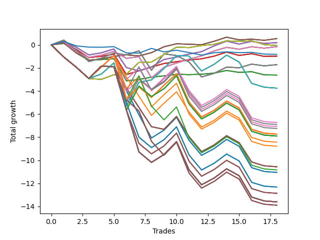

# Short Pointer Five (1226 1230 NC) 
- Symbol: AAPL_Unlimited
- Date Range: 03/23/2022 - 07/08/2022
- Trading Period: 7:20-12:30
- Number of Trades: 18



| Name | Win Percent | Profit | Avg Profit / Trade | Avg Time / Trade |      | Name | Win Percent | Profit | Avg Profit / Trade | Avg Time / Trade |
| ---- | ----------- | ------ | ------------------ | ---------------- | ---- | ---- | ----------- | ------ | ------------------ | ---------------- |
| Sorted By <br> Profit | | | | | | Sorted By <br> Win Percentage ||||
| Sixty-Seven | 61.11 | 270.00 | 15.00 | 18:00 |     | Sixty-Five | 72.22 | -490.00 | -27.22 | 15:11 |
| Fifty-Nine | 61.11 | 270.00 | 15.00 | 18:00 |     | Fifty-Seven | 72.22 | -490.00 | -27.22 | 15:11 |
| Fifty-One | 61.11 | 270.00 | 15.00 | 18:00 |     | Forty-Nine | 72.22 | -490.00 | -27.22 | 15:11 |
| Forty-Three | 61.11 | 270.00 | 15.00 | 18:00 |     | Forty-One | 72.22 | -490.00 | -27.22 | 15:11 |
| Three | 61.11 | 270.00 | 15.00 | 18:00 |     | One | 72.22 | -490.00 | -27.22 | 15:11 |
| Sixty-Six | 66.67 | 95.00 | 5.28 | 22:57 |     | Sixty-Six | 66.67 | 95.00 | 5.28 | 22:57 |
| Fifty-Eight | 66.67 | 95.00 | 5.28 | 22:57 |     | Fifty-Eight | 66.67 | 95.00 | 5.28 | 22:57 |
| Fifty | 66.67 | 95.00 | 5.28 | 22:57 |     | Fifty | 66.67 | 95.00 | 5.28 | 22:57 |
| Forty-Two | 66.67 | 95.00 | 5.28 | 22:57 |     | Forty-Two | 66.67 | 95.00 | 5.28 | 22:57 |
| Two | 66.67 | 95.00 | 5.28 | 22:57 |     | Two | 66.67 | 95.00 | 5.28 | 22:57 |
| Seventy | 55.56 | -30.00 | -1.67 | 34:31 |     | Sixty-Eight | 66.67 | -80.00 | -4.44 | 32:53 |
| Sixty-Two | 55.56 | -30.00 | -1.67 | 34:31 |     | Sixty | 66.67 | -80.00 | -4.44 | 32:53 |
| Fifty-Four | 55.56 | -30.00 | -1.67 | 34:31 |     | Fifty-Two | 66.67 | -80.00 | -4.44 | 32:53 |
| Forty-Six | 55.56 | -30.00 | -1.67 | 34:31 |     | Forty-Four | 66.67 | -80.00 | -4.44 | 32:53 |
| Six | 55.56 | -30.00 | -1.67 | 34:31 |     | Four | 66.67 | -80.00 | -4.44 | 32:53 |
| Sixty-Eight | 66.67 | -80.00 | -4.44 | 32:53 |     | Sixty-Seven | 61.11 | 270.00 | 15.00 | 18:00 |
| Sixty | 66.67 | -80.00 | -4.44 | 32:53 |     | Fifty-Nine | 61.11 | 270.00 | 15.00 | 18:00 |
| Fifty-Two | 66.67 | -80.00 | -4.44 | 32:53 |     | Fifty-One | 61.11 | 270.00 | 15.00 | 18:00 |
| Forty-Four | 66.67 | -80.00 | -4.44 | 32:53 |     | Forty-Three | 61.11 | 270.00 | 15.00 | 18:00 |
| Four | 66.67 | -80.00 | -4.44 | 32:53 |     | Three | 61.11 | 270.00 | 15.00 | 18:00 |
| Seventy-Three | 38.89 | -415.00 | -23.06 | 08:01 |     | Sixty-Four | 61.11 | -1310.00 | -72.78 | 11:13 |
| Sixty-Five | 72.22 | -490.00 | -27.22 | 15:11 |     | Fifty-Six | 61.11 | -1310.00 | -72.78 | 11:13 |
| Fifty-Seven | 72.22 | -490.00 | -27.22 | 15:11 |     | Forty-Eight | 61.11 | -1310.00 | -72.78 | 11:13 |
| Forty-Nine | 72.22 | -490.00 | -27.22 | 15:11 |     | Forty | 61.11 | -1310.00 | -72.78 | 11:13 |
| Forty-One | 72.22 | -490.00 | -27.22 | 15:11 |     | Zero | 61.11 | -1310.00 | -72.78 | 11:13 |
| One | 72.22 | -490.00 | -27.22 | 15:11 |     | Seventy | 55.56 | -30.00 | -1.67 | 34:31 |
| Sixty-Nine | 50.00 | -860.00 | -47.78 | 54:49 |     | Sixty-Two | 55.56 | -30.00 | -1.67 | 34:31 |
| Sixty-One | 50.00 | -860.00 | -47.78 | 54:49 |     | Fifty-Four | 55.56 | -30.00 | -1.67 | 34:31 |
| Fifty-Three | 50.00 | -860.00 | -47.78 | 54:49 |     | Forty-Six | 55.56 | -30.00 | -1.67 | 34:31 |
| Forty-Five | 50.00 | -860.00 | -47.78 | 54:49 |     | Six | 55.56 | -30.00 | -1.67 | 34:31 |
| Five | 50.00 | -860.00 | -47.78 | 54:49 |     | Sixty-Nine | 50.00 | -860.00 | -47.78 | 54:49 |
| Sixty-Four | 61.11 | -1310.00 | -72.78 | 11:13 |     | Sixty-One | 50.00 | -860.00 | -47.78 | 54:49 |
| Fifty-Six | 61.11 | -1310.00 | -72.78 | 11:13 |     | Fifty-Three | 50.00 | -860.00 | -47.78 | 54:49 |
| Forty-Eight | 61.11 | -1310.00 | -72.78 | 11:13 |     | Forty-Five | 50.00 | -860.00 | -47.78 | 54:49 |
| Forty | 61.11 | -1310.00 | -72.78 | 11:13 |     | Five | 50.00 | -860.00 | -47.78 | 54:49 |
| Zero | 61.11 | -1310.00 | -72.78 | 11:13 |     | Seventy-One | 44.44 | -1875.00 | -104.17 | 89:50 |
| Seventy-One | 44.44 | -1875.00 | -104.17 | 89:50 |     | Sixty-Three | 44.44 | -1875.00 | -104.17 | 89:50 |
| Sixty-Three | 44.44 | -1875.00 | -104.17 | 89:50 |     | Fifty-Five | 44.44 | -1875.00 | -104.17 | 89:50 |
| Fifty-Five | 44.44 | -1875.00 | -104.17 | 89:50 |     | Forty-Seven | 44.44 | -1875.00 | -104.17 | 89:50 |
| Forty-Seven | 44.44 | -1875.00 | -104.17 | 89:50 |     | Seven | 44.44 | -1875.00 | -104.17 | 89:50 |
| Seven | 44.44 | -1875.00 | -104.17 | 89:50 |     | Seventy-Three | 38.89 | -415.00 | -23.06 | 08:01 |
| Ninety-One | 38.89 | -3365.00 | -186.94 | 82:16 |     | Ninety-One | 38.89 | -3365.00 | -186.94 | 82:16 |
| Ninety-Two | 33.33 | -3450.00 | -191.67 | 103:01 |     | One Hundred One | 38.89 | -3540.00 | -196.67 | 106:16 |
| One Hundred One | 38.89 | -3540.00 | -196.67 | 106:16 |     | One Hundred Twenty-Six | 38.89 | -3865.00 | -214.72 | 116:19 |
| One Hundred Two | 33.33 | -3625.00 | -201.39 | 127:01 |     | One Hundred Twenty-One | 38.89 | -3865.00 | -214.72 | 116:19 |
| One Hundred Twenty-Six | 38.89 | -3865.00 | -214.72 | 116:19 |     | One Hundred Sixteen | 38.89 | -3865.00 | -214.72 | 116:19 |
| One Hundred Twenty-One | 38.89 | -3865.00 | -214.72 | 116:19 |     | One Hundred Eleven | 38.89 | -3865.00 | -214.72 | 116:19 |
| One Hundred Sixteen | 38.89 | -3865.00 | -214.72 | 116:19 |     | Eighty-One | 38.89 | -3865.00 | -214.72 | 116:19 |
| One Hundred Eleven | 38.89 | -3865.00 | -214.72 | 116:19 |     | One Hundred Six | 38.89 | -4390.00 | -243.89 | 99:16 |
| Eighty-One | 38.89 | -3865.00 | -214.72 | 116:19 |     | Ninety-Two | 33.33 | -3450.00 | -191.67 | 103:01 |
| One Hundred Twenty-Seven | 33.33 | -3950.00 | -219.44 | 137:03 |     | One Hundred Two | 33.33 | -3625.00 | -201.39 | 127:01 |
| One Hundred Twenty-Two | 33.33 | -3950.00 | -219.44 | 137:03 |     | One Hundred Twenty-Seven | 33.33 | -3950.00 | -219.44 | 137:03 |
| One Hundred Seventeen | 33.33 | -3950.00 | -219.44 | 137:03 |     | One Hundred Twenty-Two | 33.33 | -3950.00 | -219.44 | 137:03 |
| One Hundred Twelve | 33.33 | -3950.00 | -219.44 | 137:03 |     | One Hundred Seventeen | 33.33 | -3950.00 | -219.44 | 137:03 |
| Eighty-Two | 33.33 | -3950.00 | -219.44 | 137:03 |     | One Hundred Twelve | 33.33 | -3950.00 | -219.44 | 137:03 |
| Ninety-Six | 33.33 | -4215.00 | -234.17 | 76:41 |     | Eighty-Two | 33.33 | -3950.00 | -219.44 | 137:03 |
| One Hundred Six | 38.89 | -4390.00 | -243.89 | 99:16 |     | Ninety-Six | 33.33 | -4215.00 | -234.17 | 76:41 |
| One Hundred | 22.22 | -5280.00 | -293.33 | 84:15 |     | One Hundred Seven | 27.78 | -5415.00 | -300.83 | 115:41 |
| Ninety-Nine | 22.22 | -5280.00 | -293.33 | 84:15 |     | Ninety-Five | 27.78 | -5525.00 | -306.94 | 104:11 |
| Ninety-Eight | 22.22 | -5280.00 | -293.33 | 84:15 |     | Ninety-Four | 27.78 | -5525.00 | -306.94 | 104:11 |
| Ninety-Seven | 22.22 | -5280.00 | -293.33 | 84:15 |     | Ninety-Three | 27.78 | -5525.00 | -306.94 | 104:11 |
| One Hundred Seven | 27.78 | -5415.00 | -300.83 | 115:41 |     | One Hundred Five | 27.78 | -6160.00 | -342.22 | 129:22 |
| Ninety-Five | 27.78 | -5525.00 | -306.94 | 104:11 |     | One Hundred Four | 27.78 | -6160.00 | -342.22 | 129:22 |
| Ninety-Four | 27.78 | -5525.00 | -306.94 | 104:11 |     | One Hundred Three | 27.78 | -6160.00 | -342.22 | 129:22 |
| Ninety-Three | 27.78 | -5525.00 | -306.94 | 104:11 |     | One Hundred Twenty | 27.78 | -6430.00 | -357.22 | 139:21 |
| One Hundred Five | 27.78 | -6160.00 | -342.22 | 129:22 |     | One Hundred Ninteen | 27.78 | -6430.00 | -357.22 | 139:21 |
| One Hundred Four | 27.78 | -6160.00 | -342.22 | 129:22 |     | One Hundred Eighteen | 27.78 | -6430.00 | -357.22 | 139:21 |
| One Hundred Three | 27.78 | -6160.00 | -342.22 | 129:22 |     | One Hundred Thirty | 27.78 | -6800.00 | -377.78 | 141:03 |
| One Hundred Twenty | 27.78 | -6430.00 | -357.22 | 139:21 |     | One Hundred Twenty-Nine | 27.78 | -6800.00 | -377.78 | 141:03 |
| One Hundred Ninteen | 27.78 | -6430.00 | -357.22 | 139:21 |     | One Hundred Twenty-Eight | 27.78 | -6800.00 | -377.78 | 141:03 |
| One Hundred Eighteen | 27.78 | -6430.00 | -357.22 | 139:21 |     | One Hundred Twenty-Five | 27.78 | -6800.00 | -377.78 | 141:03 |
| One Hundred Thirty | 27.78 | -6800.00 | -377.78 | 141:03 |     | One Hundred Twenty-Four | 27.78 | -6800.00 | -377.78 | 141:03 |
| One Hundred Twenty-Nine | 27.78 | -6800.00 | -377.78 | 141:03 |     | One Hundred Twenty-Three | 27.78 | -6800.00 | -377.78 | 141:03 |
| One Hundred Twenty-Eight | 27.78 | -6800.00 | -377.78 | 141:03 |     | One Hundred Fifteen | 27.78 | -6800.00 | -377.78 | 141:03 |
| One Hundred Twenty-Five | 27.78 | -6800.00 | -377.78 | 141:03 |     | One Hundred Fourteen | 27.78 | -6800.00 | -377.78 | 141:03 |
| One Hundred Twenty-Four | 27.78 | -6800.00 | -377.78 | 141:03 |     | One Hundred Thirteen | 27.78 | -6800.00 | -377.78 | 141:03 |
| One Hundred Twenty-Three | 27.78 | -6800.00 | -377.78 | 141:03 |     | Eighty-Five | 27.78 | -6800.00 | -377.78 | 141:03 |
| One Hundred Fifteen | 27.78 | -6800.00 | -377.78 | 141:03 |     | Eighty-Four | 27.78 | -6800.00 | -377.78 | 141:03 |
| One Hundred Fourteen | 27.78 | -6800.00 | -377.78 | 141:03 |     | Eighty-Three | 27.78 | -6800.00 | -377.78 | 141:03 |
| One Hundred Thirteen | 27.78 | -6800.00 | -377.78 | 141:03 |     | One Hundred | 22.22 | -5280.00 | -293.33 | 84:15 |
| Eighty-Five | 27.78 | -6800.00 | -377.78 | 141:03 |     | Ninety-Nine | 22.22 | -5280.00 | -293.33 | 84:15 |
| Eighty-Four | 27.78 | -6800.00 | -377.78 | 141:03 |     | Ninety-Eight | 22.22 | -5280.00 | -293.33 | 84:15 |
| Eighty-Three | 27.78 | -6800.00 | -377.78 | 141:03 |     | Ninety-Seven | 22.22 | -5280.00 | -293.33 | 84:15 |
| One Hundred Ten | 22.22 | -6945.00 | -385.83 | 116:21 |     | One Hundred Ten | 22.22 | -6945.00 | -385.83 | 116:21 |
| One Hundred Nine | 22.22 | -6945.00 | -385.83 | 116:21 |     | One Hundred Nine | 22.22 | -6945.00 | -385.83 | 116:21 |
| One Hundred Eight | 22.22 | -6945.00 | -385.83 | 116:21 |     | One Hundred Eight | 22.22 | -6945.00 | -385.83 | 116:21 |

## NO STOPLOSS

### Test Zero
* Sell when price hits the middle line of the 20p bollinger
* No Stoploss
* Results:
```
Total Trades: 18
Percent Up: 38.89
Percent Down: 61.11
Total Points Moved Down: -2.62
Potential Profit: -1310.00
Total Points Ups: 3.85 Count Ups: 7
Total Points Downs: 1.23 Count Downs: 11
```

<details><summary>Trades</summary>

<code>In: 2022-03-24 11:08:00		Out: 2022-03-24 11:09:10		Total Position Time: 01:10		Total Move Down: 0.12		Total to Date: 0.12</code> <br />
<code>In: 2022-03-24 12:02:00		Out: 2022-03-24 12:32:50		Total Position Time: 30:50		Total Move Down: -0.65		Total to Date: -0.53</code> <br />
<code>In: 2022-03-29 11:43:00		Out: 2022-03-29 12:25:30		Total Position Time: 42:30		Total Move Down: -0.79		Total to Date: -1.32</code> <br />
<code>In: 2022-04-11 08:57:00		Out: 2022-04-11 09:01:10		Total Position Time: 04:10		Total Move Down: 0.04		Total to Date: -1.28</code> <br />
<code>In: 2022-04-20 10:50:00		Out: 2022-04-20 10:51:10		Total Position Time: 01:10		Total Move Down: 0.08		Total to Date: -1.20</code> <br />
<code>In: 2022-04-28 07:50:00		Out: 2022-04-28 08:23:15		Total Position Time: 33:15		Total Move Down: -1.92		Total to Date: -3.12</code> <br />
<code>In: 2022-05-04 10:06:00		Out: 2022-05-04 10:10:10		Total Position Time: 04:10		Total Move Down: 0.12		Total to Date: -3.00</code> <br />
<code>In: 2022-05-10 10:11:00		Out: 2022-05-10 10:15:40		Total Position Time: 04:40		Total Move Down: 0.20		Total to Date: -2.80</code> <br />
<code>In: 2022-05-16 07:25:00		Out: 2022-05-16 07:32:15		Total Position Time: 07:15		Total Move Down: 0.11		Total to Date: -2.69</code> <br />
<code>In: 2022-05-16 10:33:00		Out: 2022-05-16 10:37:10		Total Position Time: 04:10		Total Move Down: 0.14		Total to Date: -2.55</code> <br />
<code>In: 2022-05-24 07:34:00		Out: 2022-05-24 07:40:15		Total Position Time: 06:15		Total Move Down: -0.03		Total to Date: -2.58</code> <br />
<code>In: 2022-05-24 12:09:00		Out: 2022-05-24 12:15:40		Total Position Time: 06:40		Total Move Down: 0.03		Total to Date: -2.55</code> <br />
<code>In: 2022-06-10 10:54:00		Out: 2022-06-10 10:55:15		Total Position Time: 01:15		Total Move Down: 0.10		Total to Date: -2.45</code> <br />
<code>In: 2022-06-10 12:03:00		Out: 2022-06-10 12:04:10		Total Position Time: 01:10		Total Move Down: 0.23		Total to Date: -2.22</code> <br />
<code>In: 2022-06-24 11:18:00		Out: 2022-06-24 11:39:10		Total Position Time: 21:10		Total Move Down: -0.17		Total to Date: -2.39</code> <br />
<code>In: 2022-07-01 09:57:00		Out: 2022-07-01 09:58:10		Total Position Time: 01:10		Total Move Down: 0.06		Total to Date: -2.33</code> <br />
<code>In: 2022-07-08 11:26:00		Out: 2022-07-08 11:49:05		Total Position Time: 23:05		Total Move Down: -0.27		Total to Date: -2.60</code> <br />
<code>In: 2022-07-08 11:41:00		Out: 2022-07-08 11:49:05		Total Position Time: 08:05		Total Move Down: -0.02		Total to Date: -2.62</code> <br />


</details>

### Test One
* Sell when the price hits the upper line of the 20p 1std bollinger
* No Stoploss
* Results:
```
Total Trades: 18
Percent Up: 27.78
Percent Down: 72.22
Total Points Moved Down: -0.98
Potential Profit: -490.00
Total Points Ups: 3.57 Count Ups: 5
Total Points Downs: 2.59 Count Downs: 13
```

<details><summary>Trades</summary>

<code>In: 2022-03-24 11:08:00		Out: 2022-03-24 11:09:15		Total Position Time: 01:15		Total Move Down: 0.17		Total to Date: 0.17</code> <br />
<code>In: 2022-03-24 12:02:00		Out: 2022-03-24 12:39:00		Total Position Time: 37:00		Total Move Down: -0.57		Total to Date: -0.40</code> <br />
<code>In: 2022-03-29 11:43:00		Out: 2022-03-29 12:27:40		Total Position Time: 44:40		Total Move Down: -0.71		Total to Date: -1.11</code> <br />
<code>In: 2022-04-11 08:57:00		Out: 2022-04-11 09:02:15		Total Position Time: 05:15		Total Move Down: 0.12		Total to Date: -0.99</code> <br />
<code>In: 2022-04-20 10:50:00		Out: 2022-04-20 10:54:05		Total Position Time: 04:05		Total Move Down: 0.18		Total to Date: -0.81</code> <br />
<code>In: 2022-04-28 07:50:00		Out: 2022-04-28 08:26:35		Total Position Time: 36:35		Total Move Down: -1.77		Total to Date: -2.58</code> <br />
<code>In: 2022-05-04 10:06:00		Out: 2022-05-04 10:11:35		Total Position Time: 05:35		Total Move Down: 0.33		Total to Date: -2.25</code> <br />
<code>In: 2022-05-10 10:11:00		Out: 2022-05-10 10:19:30		Total Position Time: 08:30		Total Move Down: 0.33		Total to Date: -1.92</code> <br />
<code>In: 2022-05-16 07:25:00		Out: 2022-05-16 07:34:05		Total Position Time: 09:05		Total Move Down: 0.30		Total to Date: -1.62</code> <br />
<code>In: 2022-05-16 10:33:00		Out: 2022-05-16 10:42:25		Total Position Time: 09:25		Total Move Down: 0.16		Total to Date: -1.46</code> <br />
<code>In: 2022-05-24 07:34:00		Out: 2022-05-24 07:41:10		Total Position Time: 07:10		Total Move Down: 0.14		Total to Date: -1.32</code> <br />
<code>In: 2022-05-24 12:09:00		Out: 2022-05-24 12:19:25		Total Position Time: 10:25		Total Move Down: 0.11		Total to Date: -1.21</code> <br />
<code>In: 2022-06-10 10:54:00		Out: 2022-06-10 10:58:20		Total Position Time: 04:20		Total Move Down: 0.23		Total to Date: -0.98</code> <br />
<code>In: 2022-06-10 12:03:00		Out: 2022-06-10 12:05:10		Total Position Time: 02:10		Total Move Down: 0.35		Total to Date: -0.63</code> <br />
<code>In: 2022-06-24 11:18:00		Out: 2022-06-24 12:04:05		Total Position Time: 46:05		Total Move Down: -0.29		Total to Date: -0.92</code> <br />
<code>In: 2022-07-01 09:57:00		Out: 2022-07-01 09:58:40		Total Position Time: 01:40		Total Move Down: 0.15		Total to Date: -0.77</code> <br />
<code>In: 2022-07-08 11:26:00		Out: 2022-07-08 11:53:40		Total Position Time: 27:40		Total Move Down: -0.23		Total to Date: -1.00</code> <br />
<code>In: 2022-07-08 11:41:00		Out: 2022-07-08 11:53:40		Total Position Time: 12:40		Total Move Down: 0.02		Total to Date: -0.98</code> <br />


</details>

### Test Two
* Sell when the price hits the upper line of the 20p 2std bollinger
* No Stoploss
* Results:
```
Total Trades: 18
Percent Up: 33.33
Percent Down: 66.67
Total Points Moved Down: 0.19
Potential Profit: 95.00
Total Points Ups: 3.48 Count Ups: 6
Total Points Downs: 3.67 Count Downs: 12
```

<details><summary>Trades</summary>

<code>In: 2022-03-24 11:08:00		Out: 2022-03-24 11:10:15		Total Position Time: 02:15		Total Move Down: 0.26		Total to Date: 0.26</code> <br />
<code>In: 2022-03-24 12:02:00		Out: 2022-03-24 12:39:40		Total Position Time: 37:40		Total Move Down: -0.47		Total to Date: -0.21</code> <br />
<code>In: 2022-03-29 11:43:00		Out: 2022-03-29 12:27:50		Total Position Time: 44:50		Total Move Down: -0.67		Total to Date: -0.88</code> <br />
<code>In: 2022-04-11 08:57:00		Out: 2022-04-11 09:13:50		Total Position Time: 16:50		Total Move Down: 0.19		Total to Date: -0.69</code> <br />
<code>In: 2022-04-20 10:50:00		Out: 2022-04-20 11:03:15		Total Position Time: 13:15		Total Move Down: 0.33		Total to Date: -0.36</code> <br />
<code>In: 2022-04-28 07:50:00		Out: 2022-04-28 08:28:30		Total Position Time: 38:30		Total Move Down: -1.61		Total to Date: -1.97</code> <br />
<code>In: 2022-05-04 10:06:00		Out: 2022-05-04 10:55:15		Total Position Time: 49:15		Total Move Down: -0.29		Total to Date: -2.26</code> <br />
<code>In: 2022-05-10 10:11:00		Out: 2022-05-10 10:23:55		Total Position Time: 12:55		Total Move Down: 0.34		Total to Date: -1.92</code> <br />
<code>In: 2022-05-16 07:25:00		Out: 2022-05-16 07:34:45		Total Position Time: 09:45		Total Move Down: 0.65		Total to Date: -1.27</code> <br />
<code>In: 2022-05-16 10:33:00		Out: 2022-05-16 10:42:35		Total Position Time: 09:35		Total Move Down: 0.21		Total to Date: -1.06</code> <br />
<code>In: 2022-05-24 07:34:00		Out: 2022-05-24 07:49:00		Total Position Time: 15:00		Total Move Down: 0.26		Total to Date: -0.80</code> <br />
<code>In: 2022-05-24 12:09:00		Out: 2022-05-24 12:20:20		Total Position Time: 11:20		Total Move Down: 0.21		Total to Date: -0.59</code> <br />
<code>In: 2022-06-10 10:54:00		Out: 2022-06-10 11:13:25		Total Position Time: 19:25		Total Move Down: 0.50		Total to Date: -0.09</code> <br />
<code>In: 2022-06-10 12:03:00		Out: 2022-06-10 12:43:15		Total Position Time: 40:15		Total Move Down: 0.41		Total to Date: 0.32</code> <br />
<code>In: 2022-06-24 11:18:00		Out: 2022-06-24 12:05:40		Total Position Time: 47:40		Total Move Down: -0.26		Total to Date: 0.06</code> <br />
<code>In: 2022-07-01 09:57:00		Out: 2022-07-01 10:00:25		Total Position Time: 03:25		Total Move Down: 0.24		Total to Date: 0.30</code> <br />
<code>In: 2022-07-08 11:26:00		Out: 2022-07-08 11:54:10		Total Position Time: 28:10		Total Move Down: -0.18		Total to Date: 0.12</code> <br />
<code>In: 2022-07-08 11:41:00		Out: 2022-07-08 11:54:10		Total Position Time: 13:10		Total Move Down: 0.07		Total to Date: 0.19</code> <br />


</details>

### Test Three
* Sell when price hits the middle line of the 50p bollinger
* No Stoploss
* Results:
```
Total Trades: 18
Percent Up: 38.89
Percent Down: 61.11
Total Points Moved Down: 0.54
Potential Profit: 270.00
Total Points Ups: 2.01 Count Ups: 7
Total Points Downs: 2.55 Count Downs: 11
```

<details><summary>Trades</summary>

<code>In: 2022-03-24 11:08:00		Out: 2022-03-24 11:09:15		Total Position Time: 01:15		Total Move Down: 0.17		Total to Date: 0.17</code> <br />
<code>In: 2022-03-24 12:02:00		Out: 2022-03-24 12:47:00		Total Position Time: 45:00		Total Move Down: -0.88		Total to Date: -0.71</code> <br />
<code>In: 2022-03-29 11:43:00		Out: 2022-03-29 12:38:20		Total Position Time: 55:20		Total Move Down: -0.63		Total to Date: -1.34</code> <br />
<code>In: 2022-04-11 08:57:00		Out: 2022-04-11 09:13:10		Total Position Time: 16:10		Total Move Down: 0.12		Total to Date: -1.22</code> <br />
<code>In: 2022-04-20 10:50:00		Out: 2022-04-20 10:55:30		Total Position Time: 05:30		Total Move Down: 0.22		Total to Date: -1.00</code> <br />
<code>In: 2022-04-28 07:50:00		Out: 2022-04-28 07:52:20		Total Position Time: 02:20		Total Move Down: 0.13		Total to Date: -0.87</code> <br />
<code>In: 2022-05-04 10:06:00		Out: 2022-05-04 11:00:20		Total Position Time: 54:20		Total Move Down: -0.09		Total to Date: -0.96</code> <br />
<code>In: 2022-05-10 10:11:00		Out: 2022-05-10 10:17:25		Total Position Time: 06:25		Total Move Down: 0.28		Total to Date: -0.68</code> <br />
<code>In: 2022-05-16 07:25:00		Out: 2022-05-16 07:34:25		Total Position Time: 09:25		Total Move Down: 0.51		Total to Date: -0.17</code> <br />
<code>In: 2022-05-16 10:33:00		Out: 2022-05-16 10:53:40		Total Position Time: 20:40		Total Move Down: 0.26		Total to Date: 0.09</code> <br />
<code>In: 2022-05-24 07:34:00		Out: 2022-05-24 07:35:10		Total Position Time: 01:10		Total Move Down: -0.04		Total to Date: 0.05</code> <br />
<code>In: 2022-05-24 12:09:00		Out: 2022-05-24 12:10:10		Total Position Time: 01:10		Total Move Down: -0.04		Total to Date: 0.01</code> <br />
<code>In: 2022-06-10 10:54:00		Out: 2022-06-10 11:01:10		Total Position Time: 07:10		Total Move Down: 0.30		Total to Date: 0.31</code> <br />
<code>In: 2022-06-10 12:03:00		Out: 2022-06-10 12:05:10		Total Position Time: 02:10		Total Move Down: 0.35		Total to Date: 0.66</code> <br />
<code>In: 2022-06-24 11:18:00		Out: 2022-06-24 12:09:55		Total Position Time: 51:55		Total Move Down: -0.23		Total to Date: 0.43</code> <br />
<code>In: 2022-07-01 09:57:00		Out: 2022-07-01 09:58:10		Total Position Time: 01:10		Total Move Down: 0.06		Total to Date: 0.49</code> <br />
<code>In: 2022-07-08 11:26:00		Out: 2022-07-08 11:54:55		Total Position Time: 28:55		Total Move Down: -0.10		Total to Date: 0.39</code> <br />
<code>In: 2022-07-08 11:41:00		Out: 2022-07-08 11:54:55		Total Position Time: 13:55		Total Move Down: 0.15		Total to Date: 0.54</code> <br />


</details>

### Test Four
* Sell when the price hits the upper line of the 50p 1std bollinger
* No Stoploss
* Results:
```
Total Trades: 18
Percent Up: 33.33
Percent Down: 66.67
Total Points Moved Down: -0.16
Potential Profit: -80.00
Total Points Ups: 4.07 Count Ups: 6
Total Points Downs: 3.91 Count Downs: 12
```

<details><summary>Trades</summary>

<code>In: 2022-03-24 11:08:00		Out: 2022-03-24 11:10:25		Total Position Time: 02:25		Total Move Down: 0.28		Total to Date: 0.28</code> <br />
<code>In: 2022-03-24 12:02:00		Out: 2022-03-24 12:47:00		Total Position Time: 45:00		Total Move Down: -0.88		Total to Date: -0.60</code> <br />
<code>In: 2022-03-29 11:43:00		Out: 2022-03-29 12:43:05		Total Position Time: 60:05		Total Move Down: -0.48		Total to Date: -1.08</code> <br />
<code>In: 2022-04-11 08:57:00		Out: 2022-04-11 09:26:00		Total Position Time: 29:00		Total Move Down: 0.18		Total to Date: -0.90</code> <br />
<code>In: 2022-04-20 10:50:00		Out: 2022-04-20 11:03:15		Total Position Time: 13:15		Total Move Down: 0.33		Total to Date: -0.57</code> <br />
<code>In: 2022-04-28 07:50:00		Out: 2022-04-28 08:39:35		Total Position Time: 49:35		Total Move Down: -0.60		Total to Date: -1.17</code> <br />
<code>In: 2022-05-04 10:06:00		Out: 2022-05-04 11:00:25		Total Position Time: 54:25		Total Move Down: 0.14		Total to Date: -1.03</code> <br />
<code>In: 2022-05-10 10:11:00		Out: 2022-05-10 11:24:10		Total Position Time: 73:10		Total Move Down: -1.83		Total to Date: -2.86</code> <br />
<code>In: 2022-05-16 07:25:00		Out: 2022-05-16 07:44:35		Total Position Time: 19:35		Total Move Down: 0.91		Total to Date: -1.95</code> <br />
<code>In: 2022-05-16 10:33:00		Out: 2022-05-16 11:01:20		Total Position Time: 28:20		Total Move Down: 0.37		Total to Date: -1.58</code> <br />
<code>In: 2022-05-24 07:34:00		Out: 2022-05-24 07:52:15		Total Position Time: 18:15		Total Move Down: 0.34		Total to Date: -1.24</code> <br />
<code>In: 2022-05-24 12:09:00		Out: 2022-05-24 12:20:30		Total Position Time: 11:30		Total Move Down: 0.28		Total to Date: -0.96</code> <br />
<code>In: 2022-06-10 10:54:00		Out: 2022-06-10 11:12:55		Total Position Time: 18:55		Total Move Down: 0.43		Total to Date: -0.53</code> <br />
<code>In: 2022-06-10 12:03:00		Out: 2022-06-10 12:42:40		Total Position Time: 39:40		Total Move Down: 0.31		Total to Date: -0.22</code> <br />
<code>In: 2022-06-24 11:18:00		Out: 2022-06-24 12:12:00		Total Position Time: 54:00		Total Move Down: -0.16		Total to Date: -0.38</code> <br />
<code>In: 2022-07-01 09:57:00		Out: 2022-07-01 09:59:50		Total Position Time: 02:50		Total Move Down: 0.21		Total to Date: -0.17</code> <br />
<code>In: 2022-07-08 11:26:00		Out: 2022-07-08 12:09:30		Total Position Time: 43:30		Total Move Down: -0.12		Total to Date: -0.29</code> <br />
<code>In: 2022-07-08 11:41:00		Out: 2022-07-08 12:09:30		Total Position Time: 28:30		Total Move Down: 0.13		Total to Date: -0.16</code> <br />


</details>

### Test Five
* Sell when the price hits the upper line of the 50p 2std bollinger
* No Stoploss
* Results:
```
Total Trades: 18
Percent Up: 50.00
Percent Down: 50.00
Total Points Moved Down: -1.72
Potential Profit: -860.00
Total Points Ups: 5.92 Count Ups: 9
Total Points Downs: 4.20 Count Downs: 9
```

<details><summary>Trades</summary>

<code>In: 2022-03-24 11:08:00		Out: 2022-03-24 11:10:45		Total Position Time: 02:45		Total Move Down: 0.41		Total to Date: 0.41</code> <br />
<code>In: 2022-03-24 12:02:00		Out: 2022-03-24 12:47:00		Total Position Time: 45:00		Total Move Down: -0.88		Total to Date: -0.47</code> <br />
<code>In: 2022-03-29 11:43:00		Out: 2022-03-29 12:47:00		Total Position Time: 64:00		Total Move Down: -0.98		Total to Date: -1.45</code> <br />
<code>In: 2022-04-11 08:57:00		Out: 2022-04-11 09:27:15		Total Position Time: 30:15		Total Move Down: 0.30		Total to Date: -1.15</code> <br />
<code>In: 2022-04-20 10:50:00		Out: 2022-04-20 11:19:30		Total Position Time: 29:30		Total Move Down: 0.43		Total to Date: -0.72</code> <br />
<code>In: 2022-04-28 07:50:00		Out: 2022-04-28 08:57:40		Total Position Time: 67:40		Total Move Down: -0.16		Total to Date: -0.88</code> <br />
<code>In: 2022-05-04 10:06:00		Out: 2022-05-04 11:07:40		Total Position Time: 61:40		Total Move Down: 0.36		Total to Date: -0.52</code> <br />
<code>In: 2022-05-10 10:11:00		Out: 2022-05-10 11:27:05		Total Position Time: 76:05		Total Move Down: -1.68		Total to Date: -2.20</code> <br />
<code>In: 2022-05-16 07:25:00		Out: 2022-05-16 07:55:25		Total Position Time: 30:25		Total Move Down: 1.42		Total to Date: -0.78</code> <br />
<code>In: 2022-05-16 10:33:00		Out: 2022-05-16 12:10:10		Total Position Time: 97:10		Total Move Down: -0.15		Total to Date: -0.93</code> <br />
<code>In: 2022-05-24 07:34:00		Out: 2022-05-24 09:36:50		Total Position Time: 122:50		Total Move Down: -0.56		Total to Date: -1.49</code> <br />
<code>In: 2022-05-24 12:09:00		Out: 2022-05-24 12:47:00		Total Position Time: 38:00		Total Move Down: -1.30		Total to Date: -2.79</code> <br />
<code>In: 2022-06-10 10:54:00		Out: 2022-06-10 12:45:25		Total Position Time: 111:25		Total Move Down: 0.32		Total to Date: -2.47</code> <br />
<code>In: 2022-06-10 12:03:00		Out: 2022-06-10 12:45:25		Total Position Time: 42:25		Total Move Down: 0.54		Total to Date: -1.93</code> <br />
<code>In: 2022-06-24 11:18:00		Out: 2022-06-24 12:13:40		Total Position Time: 55:40		Total Move Down: -0.06		Total to Date: -1.99</code> <br />
<code>In: 2022-07-01 09:57:00		Out: 2022-07-01 10:06:10		Total Position Time: 09:10		Total Move Down: 0.32		Total to Date: -1.67</code> <br />
<code>In: 2022-07-08 11:26:00		Out: 2022-07-08 12:24:55		Total Position Time: 58:55		Total Move Down: -0.15		Total to Date: -1.82</code> <br />
<code>In: 2022-07-08 11:41:00		Out: 2022-07-08 12:24:55		Total Position Time: 43:55		Total Move Down: 0.10		Total to Date: -1.72</code> <br />


</details>

### Test Six
* Sell when the price hits the middle line of the 1std VWAP
* No Stoploss
* Results:
```
Total Trades: 18
Percent Up: 44.44
Percent Down: 55.56
Total Points Moved Down: -0.06
Potential Profit: -30.00
Total Points Ups: 3.50 Count Ups: 8
Total Points Downs: 3.44 Count Downs: 10
```

<details><summary>Trades</summary>

<code>In: 2022-03-24 11:08:00		Out: 2022-03-24 12:47:00		Total Position Time: 99:00		Total Move Down: -1.06		Total to Date: -1.06</code> <br />
<code>In: 2022-03-24 12:02:00		Out: 2022-03-24 12:47:00		Total Position Time: 45:00		Total Move Down: -0.88		Total to Date: -1.94</code> <br />
<code>In: 2022-03-29 11:43:00		Out: 2022-03-29 12:47:00		Total Position Time: 64:00		Total Move Down: -0.98		Total to Date: -2.92</code> <br />
<code>In: 2022-04-11 08:57:00		Out: 2022-04-11 08:58:10		Total Position Time: 01:10		Total Move Down: -0.07		Total to Date: -2.99</code> <br />
<code>In: 2022-04-20 10:50:00		Out: 2022-04-20 11:19:25		Total Position Time: 29:25		Total Move Down: 0.40		Total to Date: -2.59</code> <br />
<code>In: 2022-04-28 07:50:00		Out: 2022-04-28 07:51:35		Total Position Time: 01:35		Total Move Down: 0.04		Total to Date: -2.55</code> <br />
<code>In: 2022-05-04 10:06:00		Out: 2022-05-04 11:30:50		Total Position Time: 84:50		Total Move Down: 1.02		Total to Date: -1.53</code> <br />
<code>In: 2022-05-10 10:11:00		Out: 2022-05-10 10:12:10		Total Position Time: 01:10		Total Move Down: 0.04		Total to Date: -1.49</code> <br />
<code>In: 2022-05-16 07:25:00		Out: 2022-05-16 07:34:45		Total Position Time: 09:45		Total Move Down: 0.65		Total to Date: -0.84</code> <br />
<code>In: 2022-05-16 10:33:00		Out: 2022-05-16 12:34:05		Total Position Time: 121:05		Total Move Down: 0.64		Total to Date: -0.20</code> <br />
<code>In: 2022-05-24 07:34:00		Out: 2022-05-24 07:35:10		Total Position Time: 01:10		Total Move Down: -0.04		Total to Date: -0.24</code> <br />
<code>In: 2022-05-24 12:09:00		Out: 2022-05-24 12:20:15		Total Position Time: 11:15		Total Move Down: 0.18		Total to Date: -0.06</code> <br />
<code>In: 2022-06-10 10:54:00		Out: 2022-06-10 10:55:15		Total Position Time: 01:15		Total Move Down: 0.10		Total to Date: 0.04</code> <br />
<code>In: 2022-06-10 12:03:00		Out: 2022-06-10 12:04:35		Total Position Time: 01:35		Total Move Down: 0.31		Total to Date: 0.35</code> <br />
<code>In: 2022-06-24 11:18:00		Out: 2022-06-24 11:19:10		Total Position Time: 01:10		Total Move Down: -0.06		Total to Date: 0.29</code> <br />
<code>In: 2022-07-01 09:57:00		Out: 2022-07-01 09:58:10		Total Position Time: 01:10		Total Move Down: 0.06		Total to Date: 0.35</code> <br />
<code>In: 2022-07-08 11:26:00		Out: 2022-07-08 12:47:00		Total Position Time: 81:00		Total Move Down: -0.33		Total to Date: 0.02</code> <br />
<code>In: 2022-07-08 11:41:00		Out: 2022-07-08 12:47:00		Total Position Time: 66:00		Total Move Down: -0.08		Total to Date: -0.06</code> <br />


</details>

### Test Seven
* Sell when the price hits the upper line of the 1std VWAP
* No Stoploss
* Results:
```
Total Trades: 18
Percent Up: 55.56
Percent Down: 44.44
Total Points Moved Down: -3.75
Potential Profit: -1875.00
Total Points Ups: 10.87 Count Ups: 10
Total Points Downs: 7.12 Count Downs: 8
```

<details><summary>Trades</summary>

<code>In: 2022-03-24 11:08:00		Out: 2022-03-24 12:47:00		Total Position Time: 99:00		Total Move Down: -1.06		Total to Date: -1.06</code> <br />
<code>In: 2022-03-24 12:02:00		Out: 2022-03-24 12:47:00		Total Position Time: 45:00		Total Move Down: -0.88		Total to Date: -1.94</code> <br />
<code>In: 2022-03-29 11:43:00		Out: 2022-03-29 12:47:00		Total Position Time: 64:00		Total Move Down: -0.98		Total to Date: -2.92</code> <br />
<code>In: 2022-04-11 08:57:00		Out: 2022-04-11 12:16:15		Total Position Time: 199:15		Total Move Down: 0.39		Total to Date: -2.53</code> <br />
<code>In: 2022-04-20 10:50:00		Out: 2022-04-20 11:52:05		Total Position Time: 62:05		Total Move Down: 0.97		Total to Date: -1.56</code> <br />
<code>In: 2022-04-28 07:50:00		Out: 2022-04-28 12:47:00		Total Position Time: 297:00		Total Move Down: -3.75		Total to Date: -5.31</code> <br />
<code>In: 2022-05-04 10:06:00		Out: 2022-05-04 11:35:05		Total Position Time: 89:05		Total Move Down: 2.07		Total to Date: -3.24</code> <br />
<code>In: 2022-05-10 10:11:00		Out: 2022-05-10 10:15:40		Total Position Time: 04:40		Total Move Down: 0.20		Total to Date: -3.04</code> <br />
<code>In: 2022-05-16 07:25:00		Out: 2022-05-16 07:46:00		Total Position Time: 21:00		Total Move Down: 0.99		Total to Date: -2.05</code> <br />
<code>In: 2022-05-16 10:33:00		Out: 2022-05-16 12:47:00		Total Position Time: 134:00		Total Move Down: 1.12		Total to Date: -0.93</code> <br />
<code>In: 2022-05-24 07:34:00		Out: 2022-05-24 07:35:10		Total Position Time: 01:10		Total Move Down: -0.04		Total to Date: -0.97</code> <br />
<code>In: 2022-05-24 12:09:00		Out: 2022-05-24 12:47:00		Total Position Time: 38:00		Total Move Down: -1.30		Total to Date: -2.27</code> <br />
<code>In: 2022-06-10 10:54:00		Out: 2022-06-10 12:47:00		Total Position Time: 113:00		Total Move Down: 0.58		Total to Date: -1.69</code> <br />
<code>In: 2022-06-10 12:03:00		Out: 2022-06-10 12:47:00		Total Position Time: 44:00		Total Move Down: 0.80		Total to Date: -0.89</code> <br />
<code>In: 2022-06-24 11:18:00		Out: 2022-06-24 12:47:00		Total Position Time: 89:00		Total Move Down: -0.60		Total to Date: -1.49</code> <br />
<code>In: 2022-07-01 09:57:00		Out: 2022-07-01 12:47:00		Total Position Time: 170:00		Total Move Down: -1.85		Total to Date: -3.34</code> <br />
<code>In: 2022-07-08 11:26:00		Out: 2022-07-08 12:47:00		Total Position Time: 81:00		Total Move Down: -0.33		Total to Date: -3.67</code> <br />
<code>In: 2022-07-08 11:41:00		Out: 2022-07-08 12:47:00		Total Position Time: 66:00		Total Move Down: -0.08		Total to Date: -3.75</code> <br />


</details>

## STOPLOSS OF 5

### Test Forty
* Sell when price hits the middle line of the 20p bollinger
* Stoploss is -5 points
* Results:
```
Total Trades: 18
Percent Up: 38.89
Percent Down: 61.11
Total Points Moved Down: -2.62
Potential Profit: -1310.00
Total Points Ups: 3.85 Count Ups: 7
Total Points Downs: 1.23 Count Downs: 11
```

<details><summary>Trades</summary>

<code>In: 2022-03-24 11:08:00		Out: 2022-03-24 11:09:10		Total Position Time: 01:10		Total Move Down: 0.12		Total to Date: 0.12</code> <br />
<code>In: 2022-03-24 12:02:00		Out: 2022-03-24 12:32:50		Total Position Time: 30:50		Total Move Down: -0.65		Total to Date: -0.53</code> <br />
<code>In: 2022-03-29 11:43:00		Out: 2022-03-29 12:25:30		Total Position Time: 42:30		Total Move Down: -0.79		Total to Date: -1.32</code> <br />
<code>In: 2022-04-11 08:57:00		Out: 2022-04-11 09:01:10		Total Position Time: 04:10		Total Move Down: 0.04		Total to Date: -1.28</code> <br />
<code>In: 2022-04-20 10:50:00		Out: 2022-04-20 10:51:10		Total Position Time: 01:10		Total Move Down: 0.08		Total to Date: -1.20</code> <br />
<code>In: 2022-04-28 07:50:00		Out: 2022-04-28 08:23:15		Total Position Time: 33:15		Total Move Down: -1.92		Total to Date: -3.12</code> <br />
<code>In: 2022-05-04 10:06:00		Out: 2022-05-04 10:10:10		Total Position Time: 04:10		Total Move Down: 0.12		Total to Date: -3.00</code> <br />
<code>In: 2022-05-10 10:11:00		Out: 2022-05-10 10:15:40		Total Position Time: 04:40		Total Move Down: 0.20		Total to Date: -2.80</code> <br />
<code>In: 2022-05-16 07:25:00		Out: 2022-05-16 07:32:15		Total Position Time: 07:15		Total Move Down: 0.11		Total to Date: -2.69</code> <br />
<code>In: 2022-05-16 10:33:00		Out: 2022-05-16 10:37:10		Total Position Time: 04:10		Total Move Down: 0.14		Total to Date: -2.55</code> <br />
<code>In: 2022-05-24 07:34:00		Out: 2022-05-24 07:40:15		Total Position Time: 06:15		Total Move Down: -0.03		Total to Date: -2.58</code> <br />
<code>In: 2022-05-24 12:09:00		Out: 2022-05-24 12:15:40		Total Position Time: 06:40		Total Move Down: 0.03		Total to Date: -2.55</code> <br />
<code>In: 2022-06-10 10:54:00		Out: 2022-06-10 10:55:15		Total Position Time: 01:15		Total Move Down: 0.10		Total to Date: -2.45</code> <br />
<code>In: 2022-06-10 12:03:00		Out: 2022-06-10 12:04:10		Total Position Time: 01:10		Total Move Down: 0.23		Total to Date: -2.22</code> <br />
<code>In: 2022-06-24 11:18:00		Out: 2022-06-24 11:39:10		Total Position Time: 21:10		Total Move Down: -0.17		Total to Date: -2.39</code> <br />
<code>In: 2022-07-01 09:57:00		Out: 2022-07-01 09:58:10		Total Position Time: 01:10		Total Move Down: 0.06		Total to Date: -2.33</code> <br />
<code>In: 2022-07-08 11:26:00		Out: 2022-07-08 11:49:05		Total Position Time: 23:05		Total Move Down: -0.27		Total to Date: -2.60</code> <br />
<code>In: 2022-07-08 11:41:00		Out: 2022-07-08 11:49:05		Total Position Time: 08:05		Total Move Down: -0.02		Total to Date: -2.62</code> <br />


</details>

### Test Forty-One
* Sell when the price hits the upper line of the 20p 1std bollinger
* Stoploss is -5 points
* Results:
```
Total Trades: 18
Percent Up: 27.78
Percent Down: 72.22
Total Points Moved Down: -0.98
Potential Profit: -490.00
Total Points Ups: 3.57 Count Ups: 5
Total Points Downs: 2.59 Count Downs: 13
```

<details><summary>Trades</summary>

<code>In: 2022-03-24 11:08:00		Out: 2022-03-24 11:09:15		Total Position Time: 01:15		Total Move Down: 0.17		Total to Date: 0.17</code> <br />
<code>In: 2022-03-24 12:02:00		Out: 2022-03-24 12:39:00		Total Position Time: 37:00		Total Move Down: -0.57		Total to Date: -0.40</code> <br />
<code>In: 2022-03-29 11:43:00		Out: 2022-03-29 12:27:40		Total Position Time: 44:40		Total Move Down: -0.71		Total to Date: -1.11</code> <br />
<code>In: 2022-04-11 08:57:00		Out: 2022-04-11 09:02:15		Total Position Time: 05:15		Total Move Down: 0.12		Total to Date: -0.99</code> <br />
<code>In: 2022-04-20 10:50:00		Out: 2022-04-20 10:54:05		Total Position Time: 04:05		Total Move Down: 0.18		Total to Date: -0.81</code> <br />
<code>In: 2022-04-28 07:50:00		Out: 2022-04-28 08:26:35		Total Position Time: 36:35		Total Move Down: -1.77		Total to Date: -2.58</code> <br />
<code>In: 2022-05-04 10:06:00		Out: 2022-05-04 10:11:35		Total Position Time: 05:35		Total Move Down: 0.33		Total to Date: -2.25</code> <br />
<code>In: 2022-05-10 10:11:00		Out: 2022-05-10 10:19:30		Total Position Time: 08:30		Total Move Down: 0.33		Total to Date: -1.92</code> <br />
<code>In: 2022-05-16 07:25:00		Out: 2022-05-16 07:34:05		Total Position Time: 09:05		Total Move Down: 0.30		Total to Date: -1.62</code> <br />
<code>In: 2022-05-16 10:33:00		Out: 2022-05-16 10:42:25		Total Position Time: 09:25		Total Move Down: 0.16		Total to Date: -1.46</code> <br />
<code>In: 2022-05-24 07:34:00		Out: 2022-05-24 07:41:10		Total Position Time: 07:10		Total Move Down: 0.14		Total to Date: -1.32</code> <br />
<code>In: 2022-05-24 12:09:00		Out: 2022-05-24 12:19:25		Total Position Time: 10:25		Total Move Down: 0.11		Total to Date: -1.21</code> <br />
<code>In: 2022-06-10 10:54:00		Out: 2022-06-10 10:58:20		Total Position Time: 04:20		Total Move Down: 0.23		Total to Date: -0.98</code> <br />
<code>In: 2022-06-10 12:03:00		Out: 2022-06-10 12:05:10		Total Position Time: 02:10		Total Move Down: 0.35		Total to Date: -0.63</code> <br />
<code>In: 2022-06-24 11:18:00		Out: 2022-06-24 12:04:05		Total Position Time: 46:05		Total Move Down: -0.29		Total to Date: -0.92</code> <br />
<code>In: 2022-07-01 09:57:00		Out: 2022-07-01 09:58:40		Total Position Time: 01:40		Total Move Down: 0.15		Total to Date: -0.77</code> <br />
<code>In: 2022-07-08 11:26:00		Out: 2022-07-08 11:53:40		Total Position Time: 27:40		Total Move Down: -0.23		Total to Date: -1.00</code> <br />
<code>In: 2022-07-08 11:41:00		Out: 2022-07-08 11:53:40		Total Position Time: 12:40		Total Move Down: 0.02		Total to Date: -0.98</code> <br />


</details>

### Test Forty-Two
* Sell when the price hits the upper line of the 20p 2std bollinger
* Stoploss is -5 points
* Results:
```
Total Trades: 18
Percent Up: 33.33
Percent Down: 66.67
Total Points Moved Down: 0.19
Potential Profit: 95.00
Total Points Ups: 3.48 Count Ups: 6
Total Points Downs: 3.67 Count Downs: 12
```

<details><summary>Trades</summary>

<code>In: 2022-03-24 11:08:00		Out: 2022-03-24 11:10:15		Total Position Time: 02:15		Total Move Down: 0.26		Total to Date: 0.26</code> <br />
<code>In: 2022-03-24 12:02:00		Out: 2022-03-24 12:39:40		Total Position Time: 37:40		Total Move Down: -0.47		Total to Date: -0.21</code> <br />
<code>In: 2022-03-29 11:43:00		Out: 2022-03-29 12:27:50		Total Position Time: 44:50		Total Move Down: -0.67		Total to Date: -0.88</code> <br />
<code>In: 2022-04-11 08:57:00		Out: 2022-04-11 09:13:50		Total Position Time: 16:50		Total Move Down: 0.19		Total to Date: -0.69</code> <br />
<code>In: 2022-04-20 10:50:00		Out: 2022-04-20 11:03:15		Total Position Time: 13:15		Total Move Down: 0.33		Total to Date: -0.36</code> <br />
<code>In: 2022-04-28 07:50:00		Out: 2022-04-28 08:28:30		Total Position Time: 38:30		Total Move Down: -1.61		Total to Date: -1.97</code> <br />
<code>In: 2022-05-04 10:06:00		Out: 2022-05-04 10:55:15		Total Position Time: 49:15		Total Move Down: -0.29		Total to Date: -2.26</code> <br />
<code>In: 2022-05-10 10:11:00		Out: 2022-05-10 10:23:55		Total Position Time: 12:55		Total Move Down: 0.34		Total to Date: -1.92</code> <br />
<code>In: 2022-05-16 07:25:00		Out: 2022-05-16 07:34:45		Total Position Time: 09:45		Total Move Down: 0.65		Total to Date: -1.27</code> <br />
<code>In: 2022-05-16 10:33:00		Out: 2022-05-16 10:42:35		Total Position Time: 09:35		Total Move Down: 0.21		Total to Date: -1.06</code> <br />
<code>In: 2022-05-24 07:34:00		Out: 2022-05-24 07:49:00		Total Position Time: 15:00		Total Move Down: 0.26		Total to Date: -0.80</code> <br />
<code>In: 2022-05-24 12:09:00		Out: 2022-05-24 12:20:20		Total Position Time: 11:20		Total Move Down: 0.21		Total to Date: -0.59</code> <br />
<code>In: 2022-06-10 10:54:00		Out: 2022-06-10 11:13:25		Total Position Time: 19:25		Total Move Down: 0.50		Total to Date: -0.09</code> <br />
<code>In: 2022-06-10 12:03:00		Out: 2022-06-10 12:43:15		Total Position Time: 40:15		Total Move Down: 0.41		Total to Date: 0.32</code> <br />
<code>In: 2022-06-24 11:18:00		Out: 2022-06-24 12:05:40		Total Position Time: 47:40		Total Move Down: -0.26		Total to Date: 0.06</code> <br />
<code>In: 2022-07-01 09:57:00		Out: 2022-07-01 10:00:25		Total Position Time: 03:25		Total Move Down: 0.24		Total to Date: 0.30</code> <br />
<code>In: 2022-07-08 11:26:00		Out: 2022-07-08 11:54:10		Total Position Time: 28:10		Total Move Down: -0.18		Total to Date: 0.12</code> <br />
<code>In: 2022-07-08 11:41:00		Out: 2022-07-08 11:54:10		Total Position Time: 13:10		Total Move Down: 0.07		Total to Date: 0.19</code> <br />


</details>

### Test Forty-Three
* Sell when price hits the middle line of the 50p bollinger
* Stoploss is -5 points
* Results:
```
Total Trades: 18
Percent Up: 38.89
Percent Down: 61.11
Total Points Moved Down: 0.54
Potential Profit: 270.00
Total Points Ups: 2.01 Count Ups: 7
Total Points Downs: 2.55 Count Downs: 11
```

<details><summary>Trades</summary>

<code>In: 2022-03-24 11:08:00		Out: 2022-03-24 11:09:15		Total Position Time: 01:15		Total Move Down: 0.17		Total to Date: 0.17</code> <br />
<code>In: 2022-03-24 12:02:00		Out: 2022-03-24 12:47:00		Total Position Time: 45:00		Total Move Down: -0.88		Total to Date: -0.71</code> <br />
<code>In: 2022-03-29 11:43:00		Out: 2022-03-29 12:38:20		Total Position Time: 55:20		Total Move Down: -0.63		Total to Date: -1.34</code> <br />
<code>In: 2022-04-11 08:57:00		Out: 2022-04-11 09:13:10		Total Position Time: 16:10		Total Move Down: 0.12		Total to Date: -1.22</code> <br />
<code>In: 2022-04-20 10:50:00		Out: 2022-04-20 10:55:30		Total Position Time: 05:30		Total Move Down: 0.22		Total to Date: -1.00</code> <br />
<code>In: 2022-04-28 07:50:00		Out: 2022-04-28 07:52:20		Total Position Time: 02:20		Total Move Down: 0.13		Total to Date: -0.87</code> <br />
<code>In: 2022-05-04 10:06:00		Out: 2022-05-04 11:00:20		Total Position Time: 54:20		Total Move Down: -0.09		Total to Date: -0.96</code> <br />
<code>In: 2022-05-10 10:11:00		Out: 2022-05-10 10:17:25		Total Position Time: 06:25		Total Move Down: 0.28		Total to Date: -0.68</code> <br />
<code>In: 2022-05-16 07:25:00		Out: 2022-05-16 07:34:25		Total Position Time: 09:25		Total Move Down: 0.51		Total to Date: -0.17</code> <br />
<code>In: 2022-05-16 10:33:00		Out: 2022-05-16 10:53:40		Total Position Time: 20:40		Total Move Down: 0.26		Total to Date: 0.09</code> <br />
<code>In: 2022-05-24 07:34:00		Out: 2022-05-24 07:35:10		Total Position Time: 01:10		Total Move Down: -0.04		Total to Date: 0.05</code> <br />
<code>In: 2022-05-24 12:09:00		Out: 2022-05-24 12:10:10		Total Position Time: 01:10		Total Move Down: -0.04		Total to Date: 0.01</code> <br />
<code>In: 2022-06-10 10:54:00		Out: 2022-06-10 11:01:10		Total Position Time: 07:10		Total Move Down: 0.30		Total to Date: 0.31</code> <br />
<code>In: 2022-06-10 12:03:00		Out: 2022-06-10 12:05:10		Total Position Time: 02:10		Total Move Down: 0.35		Total to Date: 0.66</code> <br />
<code>In: 2022-06-24 11:18:00		Out: 2022-06-24 12:09:55		Total Position Time: 51:55		Total Move Down: -0.23		Total to Date: 0.43</code> <br />
<code>In: 2022-07-01 09:57:00		Out: 2022-07-01 09:58:10		Total Position Time: 01:10		Total Move Down: 0.06		Total to Date: 0.49</code> <br />
<code>In: 2022-07-08 11:26:00		Out: 2022-07-08 11:54:55		Total Position Time: 28:55		Total Move Down: -0.10		Total to Date: 0.39</code> <br />
<code>In: 2022-07-08 11:41:00		Out: 2022-07-08 11:54:55		Total Position Time: 13:55		Total Move Down: 0.15		Total to Date: 0.54</code> <br />


</details>

### Test Forty-Four
* Sell when the price hits the upper line of the 50p 1std bollinger
* Stoploss is -5 points
* Results:
```
Total Trades: 18
Percent Up: 33.33
Percent Down: 66.67
Total Points Moved Down: -0.16
Potential Profit: -80.00
Total Points Ups: 4.07 Count Ups: 6
Total Points Downs: 3.91 Count Downs: 12
```

<details><summary>Trades</summary>

<code>In: 2022-03-24 11:08:00		Out: 2022-03-24 11:10:25		Total Position Time: 02:25		Total Move Down: 0.28		Total to Date: 0.28</code> <br />
<code>In: 2022-03-24 12:02:00		Out: 2022-03-24 12:47:00		Total Position Time: 45:00		Total Move Down: -0.88		Total to Date: -0.60</code> <br />
<code>In: 2022-03-29 11:43:00		Out: 2022-03-29 12:43:05		Total Position Time: 60:05		Total Move Down: -0.48		Total to Date: -1.08</code> <br />
<code>In: 2022-04-11 08:57:00		Out: 2022-04-11 09:26:00		Total Position Time: 29:00		Total Move Down: 0.18		Total to Date: -0.90</code> <br />
<code>In: 2022-04-20 10:50:00		Out: 2022-04-20 11:03:15		Total Position Time: 13:15		Total Move Down: 0.33		Total to Date: -0.57</code> <br />
<code>In: 2022-04-28 07:50:00		Out: 2022-04-28 08:39:35		Total Position Time: 49:35		Total Move Down: -0.60		Total to Date: -1.17</code> <br />
<code>In: 2022-05-04 10:06:00		Out: 2022-05-04 11:00:25		Total Position Time: 54:25		Total Move Down: 0.14		Total to Date: -1.03</code> <br />
<code>In: 2022-05-10 10:11:00		Out: 2022-05-10 11:24:10		Total Position Time: 73:10		Total Move Down: -1.83		Total to Date: -2.86</code> <br />
<code>In: 2022-05-16 07:25:00		Out: 2022-05-16 07:44:35		Total Position Time: 19:35		Total Move Down: 0.91		Total to Date: -1.95</code> <br />
<code>In: 2022-05-16 10:33:00		Out: 2022-05-16 11:01:20		Total Position Time: 28:20		Total Move Down: 0.37		Total to Date: -1.58</code> <br />
<code>In: 2022-05-24 07:34:00		Out: 2022-05-24 07:52:15		Total Position Time: 18:15		Total Move Down: 0.34		Total to Date: -1.24</code> <br />
<code>In: 2022-05-24 12:09:00		Out: 2022-05-24 12:20:30		Total Position Time: 11:30		Total Move Down: 0.28		Total to Date: -0.96</code> <br />
<code>In: 2022-06-10 10:54:00		Out: 2022-06-10 11:12:55		Total Position Time: 18:55		Total Move Down: 0.43		Total to Date: -0.53</code> <br />
<code>In: 2022-06-10 12:03:00		Out: 2022-06-10 12:42:40		Total Position Time: 39:40		Total Move Down: 0.31		Total to Date: -0.22</code> <br />
<code>In: 2022-06-24 11:18:00		Out: 2022-06-24 12:12:00		Total Position Time: 54:00		Total Move Down: -0.16		Total to Date: -0.38</code> <br />
<code>In: 2022-07-01 09:57:00		Out: 2022-07-01 09:59:50		Total Position Time: 02:50		Total Move Down: 0.21		Total to Date: -0.17</code> <br />
<code>In: 2022-07-08 11:26:00		Out: 2022-07-08 12:09:30		Total Position Time: 43:30		Total Move Down: -0.12		Total to Date: -0.29</code> <br />
<code>In: 2022-07-08 11:41:00		Out: 2022-07-08 12:09:30		Total Position Time: 28:30		Total Move Down: 0.13		Total to Date: -0.16</code> <br />


</details>

### Test Forty-Five
* Sell when the price hits the upper line of the 50p 2std bollinger
* Stoploss is -5 points
* Results:
```
Total Trades: 18
Percent Up: 50.00
Percent Down: 50.00
Total Points Moved Down: -1.72
Potential Profit: -860.00
Total Points Ups: 5.92 Count Ups: 9
Total Points Downs: 4.20 Count Downs: 9
```

<details><summary>Trades</summary>

<code>In: 2022-03-24 11:08:00		Out: 2022-03-24 11:10:45		Total Position Time: 02:45		Total Move Down: 0.41		Total to Date: 0.41</code> <br />
<code>In: 2022-03-24 12:02:00		Out: 2022-03-24 12:47:00		Total Position Time: 45:00		Total Move Down: -0.88		Total to Date: -0.47</code> <br />
<code>In: 2022-03-29 11:43:00		Out: 2022-03-29 12:47:00		Total Position Time: 64:00		Total Move Down: -0.98		Total to Date: -1.45</code> <br />
<code>In: 2022-04-11 08:57:00		Out: 2022-04-11 09:27:15		Total Position Time: 30:15		Total Move Down: 0.30		Total to Date: -1.15</code> <br />
<code>In: 2022-04-20 10:50:00		Out: 2022-04-20 11:19:30		Total Position Time: 29:30		Total Move Down: 0.43		Total to Date: -0.72</code> <br />
<code>In: 2022-04-28 07:50:00		Out: 2022-04-28 08:57:40		Total Position Time: 67:40		Total Move Down: -0.16		Total to Date: -0.88</code> <br />
<code>In: 2022-05-04 10:06:00		Out: 2022-05-04 11:07:40		Total Position Time: 61:40		Total Move Down: 0.36		Total to Date: -0.52</code> <br />
<code>In: 2022-05-10 10:11:00		Out: 2022-05-10 11:27:05		Total Position Time: 76:05		Total Move Down: -1.68		Total to Date: -2.20</code> <br />
<code>In: 2022-05-16 07:25:00		Out: 2022-05-16 07:55:25		Total Position Time: 30:25		Total Move Down: 1.42		Total to Date: -0.78</code> <br />
<code>In: 2022-05-16 10:33:00		Out: 2022-05-16 12:10:10		Total Position Time: 97:10		Total Move Down: -0.15		Total to Date: -0.93</code> <br />
<code>In: 2022-05-24 07:34:00		Out: 2022-05-24 09:36:50		Total Position Time: 122:50		Total Move Down: -0.56		Total to Date: -1.49</code> <br />
<code>In: 2022-05-24 12:09:00		Out: 2022-05-24 12:47:00		Total Position Time: 38:00		Total Move Down: -1.30		Total to Date: -2.79</code> <br />
<code>In: 2022-06-10 10:54:00		Out: 2022-06-10 12:45:25		Total Position Time: 111:25		Total Move Down: 0.32		Total to Date: -2.47</code> <br />
<code>In: 2022-06-10 12:03:00		Out: 2022-06-10 12:45:25		Total Position Time: 42:25		Total Move Down: 0.54		Total to Date: -1.93</code> <br />
<code>In: 2022-06-24 11:18:00		Out: 2022-06-24 12:13:40		Total Position Time: 55:40		Total Move Down: -0.06		Total to Date: -1.99</code> <br />
<code>In: 2022-07-01 09:57:00		Out: 2022-07-01 10:06:10		Total Position Time: 09:10		Total Move Down: 0.32		Total to Date: -1.67</code> <br />
<code>In: 2022-07-08 11:26:00		Out: 2022-07-08 12:24:55		Total Position Time: 58:55		Total Move Down: -0.15		Total to Date: -1.82</code> <br />
<code>In: 2022-07-08 11:41:00		Out: 2022-07-08 12:24:55		Total Position Time: 43:55		Total Move Down: 0.10		Total to Date: -1.72</code> <br />


</details>

### Test Forty-Six
* Sell when the price hits the middle line of the 1std VWAP
* Stoploss is -5 points
* Results:
```
Total Trades: 18
Percent Up: 44.44
Percent Down: 55.56
Total Points Moved Down: -0.06
Potential Profit: -30.00
Total Points Ups: 3.50 Count Ups: 8
Total Points Downs: 3.44 Count Downs: 10
```

<details><summary>Trades</summary>

<code>In: 2022-03-24 11:08:00		Out: 2022-03-24 12:47:00		Total Position Time: 99:00		Total Move Down: -1.06		Total to Date: -1.06</code> <br />
<code>In: 2022-03-24 12:02:00		Out: 2022-03-24 12:47:00		Total Position Time: 45:00		Total Move Down: -0.88		Total to Date: -1.94</code> <br />
<code>In: 2022-03-29 11:43:00		Out: 2022-03-29 12:47:00		Total Position Time: 64:00		Total Move Down: -0.98		Total to Date: -2.92</code> <br />
<code>In: 2022-04-11 08:57:00		Out: 2022-04-11 08:58:10		Total Position Time: 01:10		Total Move Down: -0.07		Total to Date: -2.99</code> <br />
<code>In: 2022-04-20 10:50:00		Out: 2022-04-20 11:19:25		Total Position Time: 29:25		Total Move Down: 0.40		Total to Date: -2.59</code> <br />
<code>In: 2022-04-28 07:50:00		Out: 2022-04-28 07:51:35		Total Position Time: 01:35		Total Move Down: 0.04		Total to Date: -2.55</code> <br />
<code>In: 2022-05-04 10:06:00		Out: 2022-05-04 11:30:50		Total Position Time: 84:50		Total Move Down: 1.02		Total to Date: -1.53</code> <br />
<code>In: 2022-05-10 10:11:00		Out: 2022-05-10 10:12:10		Total Position Time: 01:10		Total Move Down: 0.04		Total to Date: -1.49</code> <br />
<code>In: 2022-05-16 07:25:00		Out: 2022-05-16 07:34:45		Total Position Time: 09:45		Total Move Down: 0.65		Total to Date: -0.84</code> <br />
<code>In: 2022-05-16 10:33:00		Out: 2022-05-16 12:34:05		Total Position Time: 121:05		Total Move Down: 0.64		Total to Date: -0.20</code> <br />
<code>In: 2022-05-24 07:34:00		Out: 2022-05-24 07:35:10		Total Position Time: 01:10		Total Move Down: -0.04		Total to Date: -0.24</code> <br />
<code>In: 2022-05-24 12:09:00		Out: 2022-05-24 12:20:15		Total Position Time: 11:15		Total Move Down: 0.18		Total to Date: -0.06</code> <br />
<code>In: 2022-06-10 10:54:00		Out: 2022-06-10 10:55:15		Total Position Time: 01:15		Total Move Down: 0.10		Total to Date: 0.04</code> <br />
<code>In: 2022-06-10 12:03:00		Out: 2022-06-10 12:04:35		Total Position Time: 01:35		Total Move Down: 0.31		Total to Date: 0.35</code> <br />
<code>In: 2022-06-24 11:18:00		Out: 2022-06-24 11:19:10		Total Position Time: 01:10		Total Move Down: -0.06		Total to Date: 0.29</code> <br />
<code>In: 2022-07-01 09:57:00		Out: 2022-07-01 09:58:10		Total Position Time: 01:10		Total Move Down: 0.06		Total to Date: 0.35</code> <br />
<code>In: 2022-07-08 11:26:00		Out: 2022-07-08 12:47:00		Total Position Time: 81:00		Total Move Down: -0.33		Total to Date: 0.02</code> <br />
<code>In: 2022-07-08 11:41:00		Out: 2022-07-08 12:47:00		Total Position Time: 66:00		Total Move Down: -0.08		Total to Date: -0.06</code> <br />


</details>

### Test Forty-Seven
* Sell when the price hits the upper line of the 1std VWAP
* Stoploss is -5 points
* Results:
```
Total Trades: 18
Percent Up: 55.56
Percent Down: 44.44
Total Points Moved Down: -3.75
Potential Profit: -1875.00
Total Points Ups: 10.87 Count Ups: 10
Total Points Downs: 7.12 Count Downs: 8
```

<details><summary>Trades</summary>

<code>In: 2022-03-24 11:08:00		Out: 2022-03-24 12:47:00		Total Position Time: 99:00		Total Move Down: -1.06		Total to Date: -1.06</code> <br />
<code>In: 2022-03-24 12:02:00		Out: 2022-03-24 12:47:00		Total Position Time: 45:00		Total Move Down: -0.88		Total to Date: -1.94</code> <br />
<code>In: 2022-03-29 11:43:00		Out: 2022-03-29 12:47:00		Total Position Time: 64:00		Total Move Down: -0.98		Total to Date: -2.92</code> <br />
<code>In: 2022-04-11 08:57:00		Out: 2022-04-11 12:16:15		Total Position Time: 199:15		Total Move Down: 0.39		Total to Date: -2.53</code> <br />
<code>In: 2022-04-20 10:50:00		Out: 2022-04-20 11:52:05		Total Position Time: 62:05		Total Move Down: 0.97		Total to Date: -1.56</code> <br />
<code>In: 2022-04-28 07:50:00		Out: 2022-04-28 12:47:00		Total Position Time: 297:00		Total Move Down: -3.75		Total to Date: -5.31</code> <br />
<code>In: 2022-05-04 10:06:00		Out: 2022-05-04 11:35:05		Total Position Time: 89:05		Total Move Down: 2.07		Total to Date: -3.24</code> <br />
<code>In: 2022-05-10 10:11:00		Out: 2022-05-10 10:15:40		Total Position Time: 04:40		Total Move Down: 0.20		Total to Date: -3.04</code> <br />
<code>In: 2022-05-16 07:25:00		Out: 2022-05-16 07:46:00		Total Position Time: 21:00		Total Move Down: 0.99		Total to Date: -2.05</code> <br />
<code>In: 2022-05-16 10:33:00		Out: 2022-05-16 12:47:00		Total Position Time: 134:00		Total Move Down: 1.12		Total to Date: -0.93</code> <br />
<code>In: 2022-05-24 07:34:00		Out: 2022-05-24 07:35:10		Total Position Time: 01:10		Total Move Down: -0.04		Total to Date: -0.97</code> <br />
<code>In: 2022-05-24 12:09:00		Out: 2022-05-24 12:47:00		Total Position Time: 38:00		Total Move Down: -1.30		Total to Date: -2.27</code> <br />
<code>In: 2022-06-10 10:54:00		Out: 2022-06-10 12:47:00		Total Position Time: 113:00		Total Move Down: 0.58		Total to Date: -1.69</code> <br />
<code>In: 2022-06-10 12:03:00		Out: 2022-06-10 12:47:00		Total Position Time: 44:00		Total Move Down: 0.80		Total to Date: -0.89</code> <br />
<code>In: 2022-06-24 11:18:00		Out: 2022-06-24 12:47:00		Total Position Time: 89:00		Total Move Down: -0.60		Total to Date: -1.49</code> <br />
<code>In: 2022-07-01 09:57:00		Out: 2022-07-01 12:47:00		Total Position Time: 170:00		Total Move Down: -1.85		Total to Date: -3.34</code> <br />
<code>In: 2022-07-08 11:26:00		Out: 2022-07-08 12:47:00		Total Position Time: 81:00		Total Move Down: -0.33		Total to Date: -3.67</code> <br />
<code>In: 2022-07-08 11:41:00		Out: 2022-07-08 12:47:00		Total Position Time: 66:00		Total Move Down: -0.08		Total to Date: -3.75</code> <br />


</details>

## TRAIL STOP OF 5

### Test Forty-Eight
* Sell when price hits the middle line of the 20p bollinger
* Trailing Stop is -5 points
* Results:
```
Total Trades: 18
Percent Up: 38.89
Percent Down: 61.11
Total Points Moved Down: -2.62
Potential Profit: -1310.00
Total Points Ups: 3.85 Count Ups: 7
Total Points Downs: 1.23 Count Downs: 11
```

<details><summary>Trades</summary>

<code>In: 2022-03-24 11:08:00		Out: 2022-03-24 11:09:10		Total Position Time: 01:10		Total Move Down: 0.12		Total to Date: 0.12</code> <br />
<code>In: 2022-03-24 12:02:00		Out: 2022-03-24 12:32:50		Total Position Time: 30:50		Total Move Down: -0.65		Total to Date: -0.53</code> <br />
<code>In: 2022-03-29 11:43:00		Out: 2022-03-29 12:25:30		Total Position Time: 42:30		Total Move Down: -0.79		Total to Date: -1.32</code> <br />
<code>In: 2022-04-11 08:57:00		Out: 2022-04-11 09:01:10		Total Position Time: 04:10		Total Move Down: 0.04		Total to Date: -1.28</code> <br />
<code>In: 2022-04-20 10:50:00		Out: 2022-04-20 10:51:10		Total Position Time: 01:10		Total Move Down: 0.08		Total to Date: -1.20</code> <br />
<code>In: 2022-04-28 07:50:00		Out: 2022-04-28 08:23:15		Total Position Time: 33:15		Total Move Down: -1.92		Total to Date: -3.12</code> <br />
<code>In: 2022-05-04 10:06:00		Out: 2022-05-04 10:10:10		Total Position Time: 04:10		Total Move Down: 0.12		Total to Date: -3.00</code> <br />
<code>In: 2022-05-10 10:11:00		Out: 2022-05-10 10:15:40		Total Position Time: 04:40		Total Move Down: 0.20		Total to Date: -2.80</code> <br />
<code>In: 2022-05-16 07:25:00		Out: 2022-05-16 07:32:15		Total Position Time: 07:15		Total Move Down: 0.11		Total to Date: -2.69</code> <br />
<code>In: 2022-05-16 10:33:00		Out: 2022-05-16 10:37:10		Total Position Time: 04:10		Total Move Down: 0.14		Total to Date: -2.55</code> <br />
<code>In: 2022-05-24 07:34:00		Out: 2022-05-24 07:40:15		Total Position Time: 06:15		Total Move Down: -0.03		Total to Date: -2.58</code> <br />
<code>In: 2022-05-24 12:09:00		Out: 2022-05-24 12:15:40		Total Position Time: 06:40		Total Move Down: 0.03		Total to Date: -2.55</code> <br />
<code>In: 2022-06-10 10:54:00		Out: 2022-06-10 10:55:15		Total Position Time: 01:15		Total Move Down: 0.10		Total to Date: -2.45</code> <br />
<code>In: 2022-06-10 12:03:00		Out: 2022-06-10 12:04:10		Total Position Time: 01:10		Total Move Down: 0.23		Total to Date: -2.22</code> <br />
<code>In: 2022-06-24 11:18:00		Out: 2022-06-24 11:39:10		Total Position Time: 21:10		Total Move Down: -0.17		Total to Date: -2.39</code> <br />
<code>In: 2022-07-01 09:57:00		Out: 2022-07-01 09:58:10		Total Position Time: 01:10		Total Move Down: 0.06		Total to Date: -2.33</code> <br />
<code>In: 2022-07-08 11:26:00		Out: 2022-07-08 11:49:05		Total Position Time: 23:05		Total Move Down: -0.27		Total to Date: -2.60</code> <br />
<code>In: 2022-07-08 11:41:00		Out: 2022-07-08 11:49:05		Total Position Time: 08:05		Total Move Down: -0.02		Total to Date: -2.62</code> <br />


</details>

### Test Forty-Nine
* Sell when the price hits the upper line of the 20p 1std bollinger
* Trailing Stop is -5 points
* Results:
```
Total Trades: 18
Percent Up: 27.78
Percent Down: 72.22
Total Points Moved Down: -0.98
Potential Profit: -490.00
Total Points Ups: 3.57 Count Ups: 5
Total Points Downs: 2.59 Count Downs: 13
```

<details><summary>Trades</summary>

<code>In: 2022-03-24 11:08:00		Out: 2022-03-24 11:09:15		Total Position Time: 01:15		Total Move Down: 0.17		Total to Date: 0.17</code> <br />
<code>In: 2022-03-24 12:02:00		Out: 2022-03-24 12:39:00		Total Position Time: 37:00		Total Move Down: -0.57		Total to Date: -0.40</code> <br />
<code>In: 2022-03-29 11:43:00		Out: 2022-03-29 12:27:40		Total Position Time: 44:40		Total Move Down: -0.71		Total to Date: -1.11</code> <br />
<code>In: 2022-04-11 08:57:00		Out: 2022-04-11 09:02:15		Total Position Time: 05:15		Total Move Down: 0.12		Total to Date: -0.99</code> <br />
<code>In: 2022-04-20 10:50:00		Out: 2022-04-20 10:54:05		Total Position Time: 04:05		Total Move Down: 0.18		Total to Date: -0.81</code> <br />
<code>In: 2022-04-28 07:50:00		Out: 2022-04-28 08:26:35		Total Position Time: 36:35		Total Move Down: -1.77		Total to Date: -2.58</code> <br />
<code>In: 2022-05-04 10:06:00		Out: 2022-05-04 10:11:35		Total Position Time: 05:35		Total Move Down: 0.33		Total to Date: -2.25</code> <br />
<code>In: 2022-05-10 10:11:00		Out: 2022-05-10 10:19:30		Total Position Time: 08:30		Total Move Down: 0.33		Total to Date: -1.92</code> <br />
<code>In: 2022-05-16 07:25:00		Out: 2022-05-16 07:34:05		Total Position Time: 09:05		Total Move Down: 0.30		Total to Date: -1.62</code> <br />
<code>In: 2022-05-16 10:33:00		Out: 2022-05-16 10:42:25		Total Position Time: 09:25		Total Move Down: 0.16		Total to Date: -1.46</code> <br />
<code>In: 2022-05-24 07:34:00		Out: 2022-05-24 07:41:10		Total Position Time: 07:10		Total Move Down: 0.14		Total to Date: -1.32</code> <br />
<code>In: 2022-05-24 12:09:00		Out: 2022-05-24 12:19:25		Total Position Time: 10:25		Total Move Down: 0.11		Total to Date: -1.21</code> <br />
<code>In: 2022-06-10 10:54:00		Out: 2022-06-10 10:58:20		Total Position Time: 04:20		Total Move Down: 0.23		Total to Date: -0.98</code> <br />
<code>In: 2022-06-10 12:03:00		Out: 2022-06-10 12:05:10		Total Position Time: 02:10		Total Move Down: 0.35		Total to Date: -0.63</code> <br />
<code>In: 2022-06-24 11:18:00		Out: 2022-06-24 12:04:05		Total Position Time: 46:05		Total Move Down: -0.29		Total to Date: -0.92</code> <br />
<code>In: 2022-07-01 09:57:00		Out: 2022-07-01 09:58:40		Total Position Time: 01:40		Total Move Down: 0.15		Total to Date: -0.77</code> <br />
<code>In: 2022-07-08 11:26:00		Out: 2022-07-08 11:53:40		Total Position Time: 27:40		Total Move Down: -0.23		Total to Date: -1.00</code> <br />
<code>In: 2022-07-08 11:41:00		Out: 2022-07-08 11:53:40		Total Position Time: 12:40		Total Move Down: 0.02		Total to Date: -0.98</code> <br />


</details>

### Test Fifty
* Sell when the price hits the upper line of the 20p 2std bollinger
* Trailing Stop is -5 points
* Results:
```
Total Trades: 18
Percent Up: 33.33
Percent Down: 66.67
Total Points Moved Down: 0.19
Potential Profit: 95.00
Total Points Ups: 3.48 Count Ups: 6
Total Points Downs: 3.67 Count Downs: 12
```

<details><summary>Trades</summary>

<code>In: 2022-03-24 11:08:00		Out: 2022-03-24 11:10:15		Total Position Time: 02:15		Total Move Down: 0.26		Total to Date: 0.26</code> <br />
<code>In: 2022-03-24 12:02:00		Out: 2022-03-24 12:39:40		Total Position Time: 37:40		Total Move Down: -0.47		Total to Date: -0.21</code> <br />
<code>In: 2022-03-29 11:43:00		Out: 2022-03-29 12:27:50		Total Position Time: 44:50		Total Move Down: -0.67		Total to Date: -0.88</code> <br />
<code>In: 2022-04-11 08:57:00		Out: 2022-04-11 09:13:50		Total Position Time: 16:50		Total Move Down: 0.19		Total to Date: -0.69</code> <br />
<code>In: 2022-04-20 10:50:00		Out: 2022-04-20 11:03:15		Total Position Time: 13:15		Total Move Down: 0.33		Total to Date: -0.36</code> <br />
<code>In: 2022-04-28 07:50:00		Out: 2022-04-28 08:28:30		Total Position Time: 38:30		Total Move Down: -1.61		Total to Date: -1.97</code> <br />
<code>In: 2022-05-04 10:06:00		Out: 2022-05-04 10:55:15		Total Position Time: 49:15		Total Move Down: -0.29		Total to Date: -2.26</code> <br />
<code>In: 2022-05-10 10:11:00		Out: 2022-05-10 10:23:55		Total Position Time: 12:55		Total Move Down: 0.34		Total to Date: -1.92</code> <br />
<code>In: 2022-05-16 07:25:00		Out: 2022-05-16 07:34:45		Total Position Time: 09:45		Total Move Down: 0.65		Total to Date: -1.27</code> <br />
<code>In: 2022-05-16 10:33:00		Out: 2022-05-16 10:42:35		Total Position Time: 09:35		Total Move Down: 0.21		Total to Date: -1.06</code> <br />
<code>In: 2022-05-24 07:34:00		Out: 2022-05-24 07:49:00		Total Position Time: 15:00		Total Move Down: 0.26		Total to Date: -0.80</code> <br />
<code>In: 2022-05-24 12:09:00		Out: 2022-05-24 12:20:20		Total Position Time: 11:20		Total Move Down: 0.21		Total to Date: -0.59</code> <br />
<code>In: 2022-06-10 10:54:00		Out: 2022-06-10 11:13:25		Total Position Time: 19:25		Total Move Down: 0.50		Total to Date: -0.09</code> <br />
<code>In: 2022-06-10 12:03:00		Out: 2022-06-10 12:43:15		Total Position Time: 40:15		Total Move Down: 0.41		Total to Date: 0.32</code> <br />
<code>In: 2022-06-24 11:18:00		Out: 2022-06-24 12:05:40		Total Position Time: 47:40		Total Move Down: -0.26		Total to Date: 0.06</code> <br />
<code>In: 2022-07-01 09:57:00		Out: 2022-07-01 10:00:25		Total Position Time: 03:25		Total Move Down: 0.24		Total to Date: 0.30</code> <br />
<code>In: 2022-07-08 11:26:00		Out: 2022-07-08 11:54:10		Total Position Time: 28:10		Total Move Down: -0.18		Total to Date: 0.12</code> <br />
<code>In: 2022-07-08 11:41:00		Out: 2022-07-08 11:54:10		Total Position Time: 13:10		Total Move Down: 0.07		Total to Date: 0.19</code> <br />


</details>

### Test Fifty-One
* Sell when price hits the middle line of the 50p bollinger
* Trailing Stop is -5 points
* Results:
```
Total Trades: 18
Percent Up: 38.89
Percent Down: 61.11
Total Points Moved Down: 0.54
Potential Profit: 270.00
Total Points Ups: 2.01 Count Ups: 7
Total Points Downs: 2.55 Count Downs: 11
```

<details><summary>Trades</summary>

<code>In: 2022-03-24 11:08:00		Out: 2022-03-24 11:09:15		Total Position Time: 01:15		Total Move Down: 0.17		Total to Date: 0.17</code> <br />
<code>In: 2022-03-24 12:02:00		Out: 2022-03-24 12:47:00		Total Position Time: 45:00		Total Move Down: -0.88		Total to Date: -0.71</code> <br />
<code>In: 2022-03-29 11:43:00		Out: 2022-03-29 12:38:20		Total Position Time: 55:20		Total Move Down: -0.63		Total to Date: -1.34</code> <br />
<code>In: 2022-04-11 08:57:00		Out: 2022-04-11 09:13:10		Total Position Time: 16:10		Total Move Down: 0.12		Total to Date: -1.22</code> <br />
<code>In: 2022-04-20 10:50:00		Out: 2022-04-20 10:55:30		Total Position Time: 05:30		Total Move Down: 0.22		Total to Date: -1.00</code> <br />
<code>In: 2022-04-28 07:50:00		Out: 2022-04-28 07:52:20		Total Position Time: 02:20		Total Move Down: 0.13		Total to Date: -0.87</code> <br />
<code>In: 2022-05-04 10:06:00		Out: 2022-05-04 11:00:20		Total Position Time: 54:20		Total Move Down: -0.09		Total to Date: -0.96</code> <br />
<code>In: 2022-05-10 10:11:00		Out: 2022-05-10 10:17:25		Total Position Time: 06:25		Total Move Down: 0.28		Total to Date: -0.68</code> <br />
<code>In: 2022-05-16 07:25:00		Out: 2022-05-16 07:34:25		Total Position Time: 09:25		Total Move Down: 0.51		Total to Date: -0.17</code> <br />
<code>In: 2022-05-16 10:33:00		Out: 2022-05-16 10:53:40		Total Position Time: 20:40		Total Move Down: 0.26		Total to Date: 0.09</code> <br />
<code>In: 2022-05-24 07:34:00		Out: 2022-05-24 07:35:10		Total Position Time: 01:10		Total Move Down: -0.04		Total to Date: 0.05</code> <br />
<code>In: 2022-05-24 12:09:00		Out: 2022-05-24 12:10:10		Total Position Time: 01:10		Total Move Down: -0.04		Total to Date: 0.01</code> <br />
<code>In: 2022-06-10 10:54:00		Out: 2022-06-10 11:01:10		Total Position Time: 07:10		Total Move Down: 0.30		Total to Date: 0.31</code> <br />
<code>In: 2022-06-10 12:03:00		Out: 2022-06-10 12:05:10		Total Position Time: 02:10		Total Move Down: 0.35		Total to Date: 0.66</code> <br />
<code>In: 2022-06-24 11:18:00		Out: 2022-06-24 12:09:55		Total Position Time: 51:55		Total Move Down: -0.23		Total to Date: 0.43</code> <br />
<code>In: 2022-07-01 09:57:00		Out: 2022-07-01 09:58:10		Total Position Time: 01:10		Total Move Down: 0.06		Total to Date: 0.49</code> <br />
<code>In: 2022-07-08 11:26:00		Out: 2022-07-08 11:54:55		Total Position Time: 28:55		Total Move Down: -0.10		Total to Date: 0.39</code> <br />
<code>In: 2022-07-08 11:41:00		Out: 2022-07-08 11:54:55		Total Position Time: 13:55		Total Move Down: 0.15		Total to Date: 0.54</code> <br />


</details>

### Test Fifty-Two
* Sell when the price hits the upper line of the 50p 1std bollinger
* Trailing Stop is -5 points
* Results:
```
Total Trades: 18
Percent Up: 33.33
Percent Down: 66.67
Total Points Moved Down: -0.16
Potential Profit: -80.00
Total Points Ups: 4.07 Count Ups: 6
Total Points Downs: 3.91 Count Downs: 12
```

<details><summary>Trades</summary>

<code>In: 2022-03-24 11:08:00		Out: 2022-03-24 11:10:25		Total Position Time: 02:25		Total Move Down: 0.28		Total to Date: 0.28</code> <br />
<code>In: 2022-03-24 12:02:00		Out: 2022-03-24 12:47:00		Total Position Time: 45:00		Total Move Down: -0.88		Total to Date: -0.60</code> <br />
<code>In: 2022-03-29 11:43:00		Out: 2022-03-29 12:43:05		Total Position Time: 60:05		Total Move Down: -0.48		Total to Date: -1.08</code> <br />
<code>In: 2022-04-11 08:57:00		Out: 2022-04-11 09:26:00		Total Position Time: 29:00		Total Move Down: 0.18		Total to Date: -0.90</code> <br />
<code>In: 2022-04-20 10:50:00		Out: 2022-04-20 11:03:15		Total Position Time: 13:15		Total Move Down: 0.33		Total to Date: -0.57</code> <br />
<code>In: 2022-04-28 07:50:00		Out: 2022-04-28 08:39:35		Total Position Time: 49:35		Total Move Down: -0.60		Total to Date: -1.17</code> <br />
<code>In: 2022-05-04 10:06:00		Out: 2022-05-04 11:00:25		Total Position Time: 54:25		Total Move Down: 0.14		Total to Date: -1.03</code> <br />
<code>In: 2022-05-10 10:11:00		Out: 2022-05-10 11:24:10		Total Position Time: 73:10		Total Move Down: -1.83		Total to Date: -2.86</code> <br />
<code>In: 2022-05-16 07:25:00		Out: 2022-05-16 07:44:35		Total Position Time: 19:35		Total Move Down: 0.91		Total to Date: -1.95</code> <br />
<code>In: 2022-05-16 10:33:00		Out: 2022-05-16 11:01:20		Total Position Time: 28:20		Total Move Down: 0.37		Total to Date: -1.58</code> <br />
<code>In: 2022-05-24 07:34:00		Out: 2022-05-24 07:52:15		Total Position Time: 18:15		Total Move Down: 0.34		Total to Date: -1.24</code> <br />
<code>In: 2022-05-24 12:09:00		Out: 2022-05-24 12:20:30		Total Position Time: 11:30		Total Move Down: 0.28		Total to Date: -0.96</code> <br />
<code>In: 2022-06-10 10:54:00		Out: 2022-06-10 11:12:55		Total Position Time: 18:55		Total Move Down: 0.43		Total to Date: -0.53</code> <br />
<code>In: 2022-06-10 12:03:00		Out: 2022-06-10 12:42:40		Total Position Time: 39:40		Total Move Down: 0.31		Total to Date: -0.22</code> <br />
<code>In: 2022-06-24 11:18:00		Out: 2022-06-24 12:12:00		Total Position Time: 54:00		Total Move Down: -0.16		Total to Date: -0.38</code> <br />
<code>In: 2022-07-01 09:57:00		Out: 2022-07-01 09:59:50		Total Position Time: 02:50		Total Move Down: 0.21		Total to Date: -0.17</code> <br />
<code>In: 2022-07-08 11:26:00		Out: 2022-07-08 12:09:30		Total Position Time: 43:30		Total Move Down: -0.12		Total to Date: -0.29</code> <br />
<code>In: 2022-07-08 11:41:00		Out: 2022-07-08 12:09:30		Total Position Time: 28:30		Total Move Down: 0.13		Total to Date: -0.16</code> <br />


</details>

### Test Fifty-Three
* Sell when the price hits the upper line of the 50p 2std bollinger
* Trailing Stop is -5 points
* Results:
```
Total Trades: 18
Percent Up: 50.00
Percent Down: 50.00
Total Points Moved Down: -1.72
Potential Profit: -860.00
Total Points Ups: 5.92 Count Ups: 9
Total Points Downs: 4.20 Count Downs: 9
```

<details><summary>Trades</summary>

<code>In: 2022-03-24 11:08:00		Out: 2022-03-24 11:10:45		Total Position Time: 02:45		Total Move Down: 0.41		Total to Date: 0.41</code> <br />
<code>In: 2022-03-24 12:02:00		Out: 2022-03-24 12:47:00		Total Position Time: 45:00		Total Move Down: -0.88		Total to Date: -0.47</code> <br />
<code>In: 2022-03-29 11:43:00		Out: 2022-03-29 12:47:00		Total Position Time: 64:00		Total Move Down: -0.98		Total to Date: -1.45</code> <br />
<code>In: 2022-04-11 08:57:00		Out: 2022-04-11 09:27:15		Total Position Time: 30:15		Total Move Down: 0.30		Total to Date: -1.15</code> <br />
<code>In: 2022-04-20 10:50:00		Out: 2022-04-20 11:19:30		Total Position Time: 29:30		Total Move Down: 0.43		Total to Date: -0.72</code> <br />
<code>In: 2022-04-28 07:50:00		Out: 2022-04-28 08:57:40		Total Position Time: 67:40		Total Move Down: -0.16		Total to Date: -0.88</code> <br />
<code>In: 2022-05-04 10:06:00		Out: 2022-05-04 11:07:40		Total Position Time: 61:40		Total Move Down: 0.36		Total to Date: -0.52</code> <br />
<code>In: 2022-05-10 10:11:00		Out: 2022-05-10 11:27:05		Total Position Time: 76:05		Total Move Down: -1.68		Total to Date: -2.20</code> <br />
<code>In: 2022-05-16 07:25:00		Out: 2022-05-16 07:55:25		Total Position Time: 30:25		Total Move Down: 1.42		Total to Date: -0.78</code> <br />
<code>In: 2022-05-16 10:33:00		Out: 2022-05-16 12:10:10		Total Position Time: 97:10		Total Move Down: -0.15		Total to Date: -0.93</code> <br />
<code>In: 2022-05-24 07:34:00		Out: 2022-05-24 09:36:50		Total Position Time: 122:50		Total Move Down: -0.56		Total to Date: -1.49</code> <br />
<code>In: 2022-05-24 12:09:00		Out: 2022-05-24 12:47:00		Total Position Time: 38:00		Total Move Down: -1.30		Total to Date: -2.79</code> <br />
<code>In: 2022-06-10 10:54:00		Out: 2022-06-10 12:45:25		Total Position Time: 111:25		Total Move Down: 0.32		Total to Date: -2.47</code> <br />
<code>In: 2022-06-10 12:03:00		Out: 2022-06-10 12:45:25		Total Position Time: 42:25		Total Move Down: 0.54		Total to Date: -1.93</code> <br />
<code>In: 2022-06-24 11:18:00		Out: 2022-06-24 12:13:40		Total Position Time: 55:40		Total Move Down: -0.06		Total to Date: -1.99</code> <br />
<code>In: 2022-07-01 09:57:00		Out: 2022-07-01 10:06:10		Total Position Time: 09:10		Total Move Down: 0.32		Total to Date: -1.67</code> <br />
<code>In: 2022-07-08 11:26:00		Out: 2022-07-08 12:24:55		Total Position Time: 58:55		Total Move Down: -0.15		Total to Date: -1.82</code> <br />
<code>In: 2022-07-08 11:41:00		Out: 2022-07-08 12:24:55		Total Position Time: 43:55		Total Move Down: 0.10		Total to Date: -1.72</code> <br />


</details>

### Test Fifty-Four
* Sell when the price hits the middle line of the 1std VWAP
* Trailing Stop is -5 points
* Results:
```
Total Trades: 18
Percent Up: 44.44
Percent Down: 55.56
Total Points Moved Down: -0.06
Potential Profit: -30.00
Total Points Ups: 3.50 Count Ups: 8
Total Points Downs: 3.44 Count Downs: 10
```

<details><summary>Trades</summary>

<code>In: 2022-03-24 11:08:00		Out: 2022-03-24 12:47:00		Total Position Time: 99:00		Total Move Down: -1.06		Total to Date: -1.06</code> <br />
<code>In: 2022-03-24 12:02:00		Out: 2022-03-24 12:47:00		Total Position Time: 45:00		Total Move Down: -0.88		Total to Date: -1.94</code> <br />
<code>In: 2022-03-29 11:43:00		Out: 2022-03-29 12:47:00		Total Position Time: 64:00		Total Move Down: -0.98		Total to Date: -2.92</code> <br />
<code>In: 2022-04-11 08:57:00		Out: 2022-04-11 08:58:10		Total Position Time: 01:10		Total Move Down: -0.07		Total to Date: -2.99</code> <br />
<code>In: 2022-04-20 10:50:00		Out: 2022-04-20 11:19:25		Total Position Time: 29:25		Total Move Down: 0.40		Total to Date: -2.59</code> <br />
<code>In: 2022-04-28 07:50:00		Out: 2022-04-28 07:51:35		Total Position Time: 01:35		Total Move Down: 0.04		Total to Date: -2.55</code> <br />
<code>In: 2022-05-04 10:06:00		Out: 2022-05-04 11:30:50		Total Position Time: 84:50		Total Move Down: 1.02		Total to Date: -1.53</code> <br />
<code>In: 2022-05-10 10:11:00		Out: 2022-05-10 10:12:10		Total Position Time: 01:10		Total Move Down: 0.04		Total to Date: -1.49</code> <br />
<code>In: 2022-05-16 07:25:00		Out: 2022-05-16 07:34:45		Total Position Time: 09:45		Total Move Down: 0.65		Total to Date: -0.84</code> <br />
<code>In: 2022-05-16 10:33:00		Out: 2022-05-16 12:34:05		Total Position Time: 121:05		Total Move Down: 0.64		Total to Date: -0.20</code> <br />
<code>In: 2022-05-24 07:34:00		Out: 2022-05-24 07:35:10		Total Position Time: 01:10		Total Move Down: -0.04		Total to Date: -0.24</code> <br />
<code>In: 2022-05-24 12:09:00		Out: 2022-05-24 12:20:15		Total Position Time: 11:15		Total Move Down: 0.18		Total to Date: -0.06</code> <br />
<code>In: 2022-06-10 10:54:00		Out: 2022-06-10 10:55:15		Total Position Time: 01:15		Total Move Down: 0.10		Total to Date: 0.04</code> <br />
<code>In: 2022-06-10 12:03:00		Out: 2022-06-10 12:04:35		Total Position Time: 01:35		Total Move Down: 0.31		Total to Date: 0.35</code> <br />
<code>In: 2022-06-24 11:18:00		Out: 2022-06-24 11:19:10		Total Position Time: 01:10		Total Move Down: -0.06		Total to Date: 0.29</code> <br />
<code>In: 2022-07-01 09:57:00		Out: 2022-07-01 09:58:10		Total Position Time: 01:10		Total Move Down: 0.06		Total to Date: 0.35</code> <br />
<code>In: 2022-07-08 11:26:00		Out: 2022-07-08 12:47:00		Total Position Time: 81:00		Total Move Down: -0.33		Total to Date: 0.02</code> <br />
<code>In: 2022-07-08 11:41:00		Out: 2022-07-08 12:47:00		Total Position Time: 66:00		Total Move Down: -0.08		Total to Date: -0.06</code> <br />


</details>

### Test Fifty-Five
* Sell when the price hits the upper line of the 1std VWAP
* Trailing Stop is -5 points
* Results:
```
Total Trades: 18
Percent Up: 55.56
Percent Down: 44.44
Total Points Moved Down: -3.75
Potential Profit: -1875.00
Total Points Ups: 10.87 Count Ups: 10
Total Points Downs: 7.12 Count Downs: 8
```

<details><summary>Trades</summary>

<code>In: 2022-03-24 11:08:00		Out: 2022-03-24 12:47:00		Total Position Time: 99:00		Total Move Down: -1.06		Total to Date: -1.06</code> <br />
<code>In: 2022-03-24 12:02:00		Out: 2022-03-24 12:47:00		Total Position Time: 45:00		Total Move Down: -0.88		Total to Date: -1.94</code> <br />
<code>In: 2022-03-29 11:43:00		Out: 2022-03-29 12:47:00		Total Position Time: 64:00		Total Move Down: -0.98		Total to Date: -2.92</code> <br />
<code>In: 2022-04-11 08:57:00		Out: 2022-04-11 12:16:15		Total Position Time: 199:15		Total Move Down: 0.39		Total to Date: -2.53</code> <br />
<code>In: 2022-04-20 10:50:00		Out: 2022-04-20 11:52:05		Total Position Time: 62:05		Total Move Down: 0.97		Total to Date: -1.56</code> <br />
<code>In: 2022-04-28 07:50:00		Out: 2022-04-28 12:47:00		Total Position Time: 297:00		Total Move Down: -3.75		Total to Date: -5.31</code> <br />
<code>In: 2022-05-04 10:06:00		Out: 2022-05-04 11:35:05		Total Position Time: 89:05		Total Move Down: 2.07		Total to Date: -3.24</code> <br />
<code>In: 2022-05-10 10:11:00		Out: 2022-05-10 10:15:40		Total Position Time: 04:40		Total Move Down: 0.20		Total to Date: -3.04</code> <br />
<code>In: 2022-05-16 07:25:00		Out: 2022-05-16 07:46:00		Total Position Time: 21:00		Total Move Down: 0.99		Total to Date: -2.05</code> <br />
<code>In: 2022-05-16 10:33:00		Out: 2022-05-16 12:47:00		Total Position Time: 134:00		Total Move Down: 1.12		Total to Date: -0.93</code> <br />
<code>In: 2022-05-24 07:34:00		Out: 2022-05-24 07:35:10		Total Position Time: 01:10		Total Move Down: -0.04		Total to Date: -0.97</code> <br />
<code>In: 2022-05-24 12:09:00		Out: 2022-05-24 12:47:00		Total Position Time: 38:00		Total Move Down: -1.30		Total to Date: -2.27</code> <br />
<code>In: 2022-06-10 10:54:00		Out: 2022-06-10 12:47:00		Total Position Time: 113:00		Total Move Down: 0.58		Total to Date: -1.69</code> <br />
<code>In: 2022-06-10 12:03:00		Out: 2022-06-10 12:47:00		Total Position Time: 44:00		Total Move Down: 0.80		Total to Date: -0.89</code> <br />
<code>In: 2022-06-24 11:18:00		Out: 2022-06-24 12:47:00		Total Position Time: 89:00		Total Move Down: -0.60		Total to Date: -1.49</code> <br />
<code>In: 2022-07-01 09:57:00		Out: 2022-07-01 12:47:00		Total Position Time: 170:00		Total Move Down: -1.85		Total to Date: -3.34</code> <br />
<code>In: 2022-07-08 11:26:00		Out: 2022-07-08 12:47:00		Total Position Time: 81:00		Total Move Down: -0.33		Total to Date: -3.67</code> <br />
<code>In: 2022-07-08 11:41:00		Out: 2022-07-08 12:47:00		Total Position Time: 66:00		Total Move Down: -0.08		Total to Date: -3.75</code> <br />


</details>

## STOPLOSS OF 10

### Test Fifty-Six
* Sell when price hits the middle line of the 20p bollinger
* Stoploss is -10 points
* Results:
```
Total Trades: 18
Percent Up: 38.89
Percent Down: 61.11
Total Points Moved Down: -2.62
Potential Profit: -1310.00
Total Points Ups: 3.85 Count Ups: 7
Total Points Downs: 1.23 Count Downs: 11
```

<details><summary>Trades</summary>

<code>In: 2022-03-24 11:08:00		Out: 2022-03-24 11:09:10		Total Position Time: 01:10		Total Move Down: 0.12		Total to Date: 0.12</code> <br />
<code>In: 2022-03-24 12:02:00		Out: 2022-03-24 12:32:50		Total Position Time: 30:50		Total Move Down: -0.65		Total to Date: -0.53</code> <br />
<code>In: 2022-03-29 11:43:00		Out: 2022-03-29 12:25:30		Total Position Time: 42:30		Total Move Down: -0.79		Total to Date: -1.32</code> <br />
<code>In: 2022-04-11 08:57:00		Out: 2022-04-11 09:01:10		Total Position Time: 04:10		Total Move Down: 0.04		Total to Date: -1.28</code> <br />
<code>In: 2022-04-20 10:50:00		Out: 2022-04-20 10:51:10		Total Position Time: 01:10		Total Move Down: 0.08		Total to Date: -1.20</code> <br />
<code>In: 2022-04-28 07:50:00		Out: 2022-04-28 08:23:15		Total Position Time: 33:15		Total Move Down: -1.92		Total to Date: -3.12</code> <br />
<code>In: 2022-05-04 10:06:00		Out: 2022-05-04 10:10:10		Total Position Time: 04:10		Total Move Down: 0.12		Total to Date: -3.00</code> <br />
<code>In: 2022-05-10 10:11:00		Out: 2022-05-10 10:15:40		Total Position Time: 04:40		Total Move Down: 0.20		Total to Date: -2.80</code> <br />
<code>In: 2022-05-16 07:25:00		Out: 2022-05-16 07:32:15		Total Position Time: 07:15		Total Move Down: 0.11		Total to Date: -2.69</code> <br />
<code>In: 2022-05-16 10:33:00		Out: 2022-05-16 10:37:10		Total Position Time: 04:10		Total Move Down: 0.14		Total to Date: -2.55</code> <br />
<code>In: 2022-05-24 07:34:00		Out: 2022-05-24 07:40:15		Total Position Time: 06:15		Total Move Down: -0.03		Total to Date: -2.58</code> <br />
<code>In: 2022-05-24 12:09:00		Out: 2022-05-24 12:15:40		Total Position Time: 06:40		Total Move Down: 0.03		Total to Date: -2.55</code> <br />
<code>In: 2022-06-10 10:54:00		Out: 2022-06-10 10:55:15		Total Position Time: 01:15		Total Move Down: 0.10		Total to Date: -2.45</code> <br />
<code>In: 2022-06-10 12:03:00		Out: 2022-06-10 12:04:10		Total Position Time: 01:10		Total Move Down: 0.23		Total to Date: -2.22</code> <br />
<code>In: 2022-06-24 11:18:00		Out: 2022-06-24 11:39:10		Total Position Time: 21:10		Total Move Down: -0.17		Total to Date: -2.39</code> <br />
<code>In: 2022-07-01 09:57:00		Out: 2022-07-01 09:58:10		Total Position Time: 01:10		Total Move Down: 0.06		Total to Date: -2.33</code> <br />
<code>In: 2022-07-08 11:26:00		Out: 2022-07-08 11:49:05		Total Position Time: 23:05		Total Move Down: -0.27		Total to Date: -2.60</code> <br />
<code>In: 2022-07-08 11:41:00		Out: 2022-07-08 11:49:05		Total Position Time: 08:05		Total Move Down: -0.02		Total to Date: -2.62</code> <br />


</details>

### Test Fifty-Seven
* Sell when the price hits the upper line of the 20p 1std bollinger
* Stoploss is -10 points
* Results:
```
Total Trades: 18
Percent Up: 27.78
Percent Down: 72.22
Total Points Moved Down: -0.98
Potential Profit: -490.00
Total Points Ups: 3.57 Count Ups: 5
Total Points Downs: 2.59 Count Downs: 13
```

<details><summary>Trades</summary>

<code>In: 2022-03-24 11:08:00		Out: 2022-03-24 11:09:15		Total Position Time: 01:15		Total Move Down: 0.17		Total to Date: 0.17</code> <br />
<code>In: 2022-03-24 12:02:00		Out: 2022-03-24 12:39:00		Total Position Time: 37:00		Total Move Down: -0.57		Total to Date: -0.40</code> <br />
<code>In: 2022-03-29 11:43:00		Out: 2022-03-29 12:27:40		Total Position Time: 44:40		Total Move Down: -0.71		Total to Date: -1.11</code> <br />
<code>In: 2022-04-11 08:57:00		Out: 2022-04-11 09:02:15		Total Position Time: 05:15		Total Move Down: 0.12		Total to Date: -0.99</code> <br />
<code>In: 2022-04-20 10:50:00		Out: 2022-04-20 10:54:05		Total Position Time: 04:05		Total Move Down: 0.18		Total to Date: -0.81</code> <br />
<code>In: 2022-04-28 07:50:00		Out: 2022-04-28 08:26:35		Total Position Time: 36:35		Total Move Down: -1.77		Total to Date: -2.58</code> <br />
<code>In: 2022-05-04 10:06:00		Out: 2022-05-04 10:11:35		Total Position Time: 05:35		Total Move Down: 0.33		Total to Date: -2.25</code> <br />
<code>In: 2022-05-10 10:11:00		Out: 2022-05-10 10:19:30		Total Position Time: 08:30		Total Move Down: 0.33		Total to Date: -1.92</code> <br />
<code>In: 2022-05-16 07:25:00		Out: 2022-05-16 07:34:05		Total Position Time: 09:05		Total Move Down: 0.30		Total to Date: -1.62</code> <br />
<code>In: 2022-05-16 10:33:00		Out: 2022-05-16 10:42:25		Total Position Time: 09:25		Total Move Down: 0.16		Total to Date: -1.46</code> <br />
<code>In: 2022-05-24 07:34:00		Out: 2022-05-24 07:41:10		Total Position Time: 07:10		Total Move Down: 0.14		Total to Date: -1.32</code> <br />
<code>In: 2022-05-24 12:09:00		Out: 2022-05-24 12:19:25		Total Position Time: 10:25		Total Move Down: 0.11		Total to Date: -1.21</code> <br />
<code>In: 2022-06-10 10:54:00		Out: 2022-06-10 10:58:20		Total Position Time: 04:20		Total Move Down: 0.23		Total to Date: -0.98</code> <br />
<code>In: 2022-06-10 12:03:00		Out: 2022-06-10 12:05:10		Total Position Time: 02:10		Total Move Down: 0.35		Total to Date: -0.63</code> <br />
<code>In: 2022-06-24 11:18:00		Out: 2022-06-24 12:04:05		Total Position Time: 46:05		Total Move Down: -0.29		Total to Date: -0.92</code> <br />
<code>In: 2022-07-01 09:57:00		Out: 2022-07-01 09:58:40		Total Position Time: 01:40		Total Move Down: 0.15		Total to Date: -0.77</code> <br />
<code>In: 2022-07-08 11:26:00		Out: 2022-07-08 11:53:40		Total Position Time: 27:40		Total Move Down: -0.23		Total to Date: -1.00</code> <br />
<code>In: 2022-07-08 11:41:00		Out: 2022-07-08 11:53:40		Total Position Time: 12:40		Total Move Down: 0.02		Total to Date: -0.98</code> <br />


</details>

### Test Fifty-Eight
* Sell when the price hits the upper line of the 20p 2std bollinger
* Stoploss is -10 points
* Results:
```
Total Trades: 18
Percent Up: 33.33
Percent Down: 66.67
Total Points Moved Down: 0.19
Potential Profit: 95.00
Total Points Ups: 3.48 Count Ups: 6
Total Points Downs: 3.67 Count Downs: 12
```

<details><summary>Trades</summary>

<code>In: 2022-03-24 11:08:00		Out: 2022-03-24 11:10:15		Total Position Time: 02:15		Total Move Down: 0.26		Total to Date: 0.26</code> <br />
<code>In: 2022-03-24 12:02:00		Out: 2022-03-24 12:39:40		Total Position Time: 37:40		Total Move Down: -0.47		Total to Date: -0.21</code> <br />
<code>In: 2022-03-29 11:43:00		Out: 2022-03-29 12:27:50		Total Position Time: 44:50		Total Move Down: -0.67		Total to Date: -0.88</code> <br />
<code>In: 2022-04-11 08:57:00		Out: 2022-04-11 09:13:50		Total Position Time: 16:50		Total Move Down: 0.19		Total to Date: -0.69</code> <br />
<code>In: 2022-04-20 10:50:00		Out: 2022-04-20 11:03:15		Total Position Time: 13:15		Total Move Down: 0.33		Total to Date: -0.36</code> <br />
<code>In: 2022-04-28 07:50:00		Out: 2022-04-28 08:28:30		Total Position Time: 38:30		Total Move Down: -1.61		Total to Date: -1.97</code> <br />
<code>In: 2022-05-04 10:06:00		Out: 2022-05-04 10:55:15		Total Position Time: 49:15		Total Move Down: -0.29		Total to Date: -2.26</code> <br />
<code>In: 2022-05-10 10:11:00		Out: 2022-05-10 10:23:55		Total Position Time: 12:55		Total Move Down: 0.34		Total to Date: -1.92</code> <br />
<code>In: 2022-05-16 07:25:00		Out: 2022-05-16 07:34:45		Total Position Time: 09:45		Total Move Down: 0.65		Total to Date: -1.27</code> <br />
<code>In: 2022-05-16 10:33:00		Out: 2022-05-16 10:42:35		Total Position Time: 09:35		Total Move Down: 0.21		Total to Date: -1.06</code> <br />
<code>In: 2022-05-24 07:34:00		Out: 2022-05-24 07:49:00		Total Position Time: 15:00		Total Move Down: 0.26		Total to Date: -0.80</code> <br />
<code>In: 2022-05-24 12:09:00		Out: 2022-05-24 12:20:20		Total Position Time: 11:20		Total Move Down: 0.21		Total to Date: -0.59</code> <br />
<code>In: 2022-06-10 10:54:00		Out: 2022-06-10 11:13:25		Total Position Time: 19:25		Total Move Down: 0.50		Total to Date: -0.09</code> <br />
<code>In: 2022-06-10 12:03:00		Out: 2022-06-10 12:43:15		Total Position Time: 40:15		Total Move Down: 0.41		Total to Date: 0.32</code> <br />
<code>In: 2022-06-24 11:18:00		Out: 2022-06-24 12:05:40		Total Position Time: 47:40		Total Move Down: -0.26		Total to Date: 0.06</code> <br />
<code>In: 2022-07-01 09:57:00		Out: 2022-07-01 10:00:25		Total Position Time: 03:25		Total Move Down: 0.24		Total to Date: 0.30</code> <br />
<code>In: 2022-07-08 11:26:00		Out: 2022-07-08 11:54:10		Total Position Time: 28:10		Total Move Down: -0.18		Total to Date: 0.12</code> <br />
<code>In: 2022-07-08 11:41:00		Out: 2022-07-08 11:54:10		Total Position Time: 13:10		Total Move Down: 0.07		Total to Date: 0.19</code> <br />


</details>

### Test Fifty-Nine
* Sell when price hits the middle line of the 50p bollinger
* Stoploss is -10 points
* Results:
```
Total Trades: 18
Percent Up: 38.89
Percent Down: 61.11
Total Points Moved Down: 0.54
Potential Profit: 270.00
Total Points Ups: 2.01 Count Ups: 7
Total Points Downs: 2.55 Count Downs: 11
```

<details><summary>Trades</summary>

<code>In: 2022-03-24 11:08:00		Out: 2022-03-24 11:09:15		Total Position Time: 01:15		Total Move Down: 0.17		Total to Date: 0.17</code> <br />
<code>In: 2022-03-24 12:02:00		Out: 2022-03-24 12:47:00		Total Position Time: 45:00		Total Move Down: -0.88		Total to Date: -0.71</code> <br />
<code>In: 2022-03-29 11:43:00		Out: 2022-03-29 12:38:20		Total Position Time: 55:20		Total Move Down: -0.63		Total to Date: -1.34</code> <br />
<code>In: 2022-04-11 08:57:00		Out: 2022-04-11 09:13:10		Total Position Time: 16:10		Total Move Down: 0.12		Total to Date: -1.22</code> <br />
<code>In: 2022-04-20 10:50:00		Out: 2022-04-20 10:55:30		Total Position Time: 05:30		Total Move Down: 0.22		Total to Date: -1.00</code> <br />
<code>In: 2022-04-28 07:50:00		Out: 2022-04-28 07:52:20		Total Position Time: 02:20		Total Move Down: 0.13		Total to Date: -0.87</code> <br />
<code>In: 2022-05-04 10:06:00		Out: 2022-05-04 11:00:20		Total Position Time: 54:20		Total Move Down: -0.09		Total to Date: -0.96</code> <br />
<code>In: 2022-05-10 10:11:00		Out: 2022-05-10 10:17:25		Total Position Time: 06:25		Total Move Down: 0.28		Total to Date: -0.68</code> <br />
<code>In: 2022-05-16 07:25:00		Out: 2022-05-16 07:34:25		Total Position Time: 09:25		Total Move Down: 0.51		Total to Date: -0.17</code> <br />
<code>In: 2022-05-16 10:33:00		Out: 2022-05-16 10:53:40		Total Position Time: 20:40		Total Move Down: 0.26		Total to Date: 0.09</code> <br />
<code>In: 2022-05-24 07:34:00		Out: 2022-05-24 07:35:10		Total Position Time: 01:10		Total Move Down: -0.04		Total to Date: 0.05</code> <br />
<code>In: 2022-05-24 12:09:00		Out: 2022-05-24 12:10:10		Total Position Time: 01:10		Total Move Down: -0.04		Total to Date: 0.01</code> <br />
<code>In: 2022-06-10 10:54:00		Out: 2022-06-10 11:01:10		Total Position Time: 07:10		Total Move Down: 0.30		Total to Date: 0.31</code> <br />
<code>In: 2022-06-10 12:03:00		Out: 2022-06-10 12:05:10		Total Position Time: 02:10		Total Move Down: 0.35		Total to Date: 0.66</code> <br />
<code>In: 2022-06-24 11:18:00		Out: 2022-06-24 12:09:55		Total Position Time: 51:55		Total Move Down: -0.23		Total to Date: 0.43</code> <br />
<code>In: 2022-07-01 09:57:00		Out: 2022-07-01 09:58:10		Total Position Time: 01:10		Total Move Down: 0.06		Total to Date: 0.49</code> <br />
<code>In: 2022-07-08 11:26:00		Out: 2022-07-08 11:54:55		Total Position Time: 28:55		Total Move Down: -0.10		Total to Date: 0.39</code> <br />
<code>In: 2022-07-08 11:41:00		Out: 2022-07-08 11:54:55		Total Position Time: 13:55		Total Move Down: 0.15		Total to Date: 0.54</code> <br />


</details>

### Test Sixty
* Sell when the price hits the upper line of the 50p 1std bollinger
* Stoploss is -10 points
* Results:
```
Total Trades: 18
Percent Up: 33.33
Percent Down: 66.67
Total Points Moved Down: -0.16
Potential Profit: -80.00
Total Points Ups: 4.07 Count Ups: 6
Total Points Downs: 3.91 Count Downs: 12
```

<details><summary>Trades</summary>

<code>In: 2022-03-24 11:08:00		Out: 2022-03-24 11:10:25		Total Position Time: 02:25		Total Move Down: 0.28		Total to Date: 0.28</code> <br />
<code>In: 2022-03-24 12:02:00		Out: 2022-03-24 12:47:00		Total Position Time: 45:00		Total Move Down: -0.88		Total to Date: -0.60</code> <br />
<code>In: 2022-03-29 11:43:00		Out: 2022-03-29 12:43:05		Total Position Time: 60:05		Total Move Down: -0.48		Total to Date: -1.08</code> <br />
<code>In: 2022-04-11 08:57:00		Out: 2022-04-11 09:26:00		Total Position Time: 29:00		Total Move Down: 0.18		Total to Date: -0.90</code> <br />
<code>In: 2022-04-20 10:50:00		Out: 2022-04-20 11:03:15		Total Position Time: 13:15		Total Move Down: 0.33		Total to Date: -0.57</code> <br />
<code>In: 2022-04-28 07:50:00		Out: 2022-04-28 08:39:35		Total Position Time: 49:35		Total Move Down: -0.60		Total to Date: -1.17</code> <br />
<code>In: 2022-05-04 10:06:00		Out: 2022-05-04 11:00:25		Total Position Time: 54:25		Total Move Down: 0.14		Total to Date: -1.03</code> <br />
<code>In: 2022-05-10 10:11:00		Out: 2022-05-10 11:24:10		Total Position Time: 73:10		Total Move Down: -1.83		Total to Date: -2.86</code> <br />
<code>In: 2022-05-16 07:25:00		Out: 2022-05-16 07:44:35		Total Position Time: 19:35		Total Move Down: 0.91		Total to Date: -1.95</code> <br />
<code>In: 2022-05-16 10:33:00		Out: 2022-05-16 11:01:20		Total Position Time: 28:20		Total Move Down: 0.37		Total to Date: -1.58</code> <br />
<code>In: 2022-05-24 07:34:00		Out: 2022-05-24 07:52:15		Total Position Time: 18:15		Total Move Down: 0.34		Total to Date: -1.24</code> <br />
<code>In: 2022-05-24 12:09:00		Out: 2022-05-24 12:20:30		Total Position Time: 11:30		Total Move Down: 0.28		Total to Date: -0.96</code> <br />
<code>In: 2022-06-10 10:54:00		Out: 2022-06-10 11:12:55		Total Position Time: 18:55		Total Move Down: 0.43		Total to Date: -0.53</code> <br />
<code>In: 2022-06-10 12:03:00		Out: 2022-06-10 12:42:40		Total Position Time: 39:40		Total Move Down: 0.31		Total to Date: -0.22</code> <br />
<code>In: 2022-06-24 11:18:00		Out: 2022-06-24 12:12:00		Total Position Time: 54:00		Total Move Down: -0.16		Total to Date: -0.38</code> <br />
<code>In: 2022-07-01 09:57:00		Out: 2022-07-01 09:59:50		Total Position Time: 02:50		Total Move Down: 0.21		Total to Date: -0.17</code> <br />
<code>In: 2022-07-08 11:26:00		Out: 2022-07-08 12:09:30		Total Position Time: 43:30		Total Move Down: -0.12		Total to Date: -0.29</code> <br />
<code>In: 2022-07-08 11:41:00		Out: 2022-07-08 12:09:30		Total Position Time: 28:30		Total Move Down: 0.13		Total to Date: -0.16</code> <br />


</details>

### Test Sixty-One
* Sell when the price hits the upper line of the 50p 2std bollinger
* Stoploss is -10 points
* Results:
```
Total Trades: 18
Percent Up: 50.00
Percent Down: 50.00
Total Points Moved Down: -1.72
Potential Profit: -860.00
Total Points Ups: 5.92 Count Ups: 9
Total Points Downs: 4.20 Count Downs: 9
```

<details><summary>Trades</summary>

<code>In: 2022-03-24 11:08:00		Out: 2022-03-24 11:10:45		Total Position Time: 02:45		Total Move Down: 0.41		Total to Date: 0.41</code> <br />
<code>In: 2022-03-24 12:02:00		Out: 2022-03-24 12:47:00		Total Position Time: 45:00		Total Move Down: -0.88		Total to Date: -0.47</code> <br />
<code>In: 2022-03-29 11:43:00		Out: 2022-03-29 12:47:00		Total Position Time: 64:00		Total Move Down: -0.98		Total to Date: -1.45</code> <br />
<code>In: 2022-04-11 08:57:00		Out: 2022-04-11 09:27:15		Total Position Time: 30:15		Total Move Down: 0.30		Total to Date: -1.15</code> <br />
<code>In: 2022-04-20 10:50:00		Out: 2022-04-20 11:19:30		Total Position Time: 29:30		Total Move Down: 0.43		Total to Date: -0.72</code> <br />
<code>In: 2022-04-28 07:50:00		Out: 2022-04-28 08:57:40		Total Position Time: 67:40		Total Move Down: -0.16		Total to Date: -0.88</code> <br />
<code>In: 2022-05-04 10:06:00		Out: 2022-05-04 11:07:40		Total Position Time: 61:40		Total Move Down: 0.36		Total to Date: -0.52</code> <br />
<code>In: 2022-05-10 10:11:00		Out: 2022-05-10 11:27:05		Total Position Time: 76:05		Total Move Down: -1.68		Total to Date: -2.20</code> <br />
<code>In: 2022-05-16 07:25:00		Out: 2022-05-16 07:55:25		Total Position Time: 30:25		Total Move Down: 1.42		Total to Date: -0.78</code> <br />
<code>In: 2022-05-16 10:33:00		Out: 2022-05-16 12:10:10		Total Position Time: 97:10		Total Move Down: -0.15		Total to Date: -0.93</code> <br />
<code>In: 2022-05-24 07:34:00		Out: 2022-05-24 09:36:50		Total Position Time: 122:50		Total Move Down: -0.56		Total to Date: -1.49</code> <br />
<code>In: 2022-05-24 12:09:00		Out: 2022-05-24 12:47:00		Total Position Time: 38:00		Total Move Down: -1.30		Total to Date: -2.79</code> <br />
<code>In: 2022-06-10 10:54:00		Out: 2022-06-10 12:45:25		Total Position Time: 111:25		Total Move Down: 0.32		Total to Date: -2.47</code> <br />
<code>In: 2022-06-10 12:03:00		Out: 2022-06-10 12:45:25		Total Position Time: 42:25		Total Move Down: 0.54		Total to Date: -1.93</code> <br />
<code>In: 2022-06-24 11:18:00		Out: 2022-06-24 12:13:40		Total Position Time: 55:40		Total Move Down: -0.06		Total to Date: -1.99</code> <br />
<code>In: 2022-07-01 09:57:00		Out: 2022-07-01 10:06:10		Total Position Time: 09:10		Total Move Down: 0.32		Total to Date: -1.67</code> <br />
<code>In: 2022-07-08 11:26:00		Out: 2022-07-08 12:24:55		Total Position Time: 58:55		Total Move Down: -0.15		Total to Date: -1.82</code> <br />
<code>In: 2022-07-08 11:41:00		Out: 2022-07-08 12:24:55		Total Position Time: 43:55		Total Move Down: 0.10		Total to Date: -1.72</code> <br />


</details>

### Test Sixty-Two
* Sell when the price hits the middle line of the 1std VWAP
* Stoploss is -10 points
* Results:
```
Total Trades: 18
Percent Up: 44.44
Percent Down: 55.56
Total Points Moved Down: -0.06
Potential Profit: -30.00
Total Points Ups: 3.50 Count Ups: 8
Total Points Downs: 3.44 Count Downs: 10
```

<details><summary>Trades</summary>

<code>In: 2022-03-24 11:08:00		Out: 2022-03-24 12:47:00		Total Position Time: 99:00		Total Move Down: -1.06		Total to Date: -1.06</code> <br />
<code>In: 2022-03-24 12:02:00		Out: 2022-03-24 12:47:00		Total Position Time: 45:00		Total Move Down: -0.88		Total to Date: -1.94</code> <br />
<code>In: 2022-03-29 11:43:00		Out: 2022-03-29 12:47:00		Total Position Time: 64:00		Total Move Down: -0.98		Total to Date: -2.92</code> <br />
<code>In: 2022-04-11 08:57:00		Out: 2022-04-11 08:58:10		Total Position Time: 01:10		Total Move Down: -0.07		Total to Date: -2.99</code> <br />
<code>In: 2022-04-20 10:50:00		Out: 2022-04-20 11:19:25		Total Position Time: 29:25		Total Move Down: 0.40		Total to Date: -2.59</code> <br />
<code>In: 2022-04-28 07:50:00		Out: 2022-04-28 07:51:35		Total Position Time: 01:35		Total Move Down: 0.04		Total to Date: -2.55</code> <br />
<code>In: 2022-05-04 10:06:00		Out: 2022-05-04 11:30:50		Total Position Time: 84:50		Total Move Down: 1.02		Total to Date: -1.53</code> <br />
<code>In: 2022-05-10 10:11:00		Out: 2022-05-10 10:12:10		Total Position Time: 01:10		Total Move Down: 0.04		Total to Date: -1.49</code> <br />
<code>In: 2022-05-16 07:25:00		Out: 2022-05-16 07:34:45		Total Position Time: 09:45		Total Move Down: 0.65		Total to Date: -0.84</code> <br />
<code>In: 2022-05-16 10:33:00		Out: 2022-05-16 12:34:05		Total Position Time: 121:05		Total Move Down: 0.64		Total to Date: -0.20</code> <br />
<code>In: 2022-05-24 07:34:00		Out: 2022-05-24 07:35:10		Total Position Time: 01:10		Total Move Down: -0.04		Total to Date: -0.24</code> <br />
<code>In: 2022-05-24 12:09:00		Out: 2022-05-24 12:20:15		Total Position Time: 11:15		Total Move Down: 0.18		Total to Date: -0.06</code> <br />
<code>In: 2022-06-10 10:54:00		Out: 2022-06-10 10:55:15		Total Position Time: 01:15		Total Move Down: 0.10		Total to Date: 0.04</code> <br />
<code>In: 2022-06-10 12:03:00		Out: 2022-06-10 12:04:35		Total Position Time: 01:35		Total Move Down: 0.31		Total to Date: 0.35</code> <br />
<code>In: 2022-06-24 11:18:00		Out: 2022-06-24 11:19:10		Total Position Time: 01:10		Total Move Down: -0.06		Total to Date: 0.29</code> <br />
<code>In: 2022-07-01 09:57:00		Out: 2022-07-01 09:58:10		Total Position Time: 01:10		Total Move Down: 0.06		Total to Date: 0.35</code> <br />
<code>In: 2022-07-08 11:26:00		Out: 2022-07-08 12:47:00		Total Position Time: 81:00		Total Move Down: -0.33		Total to Date: 0.02</code> <br />
<code>In: 2022-07-08 11:41:00		Out: 2022-07-08 12:47:00		Total Position Time: 66:00		Total Move Down: -0.08		Total to Date: -0.06</code> <br />


</details>

### Test Sixty-Three
* Sell when the price hits the upper line of the 1std VWAP
* Stoploss is -10 points
* Results:
```
Total Trades: 18
Percent Up: 55.56
Percent Down: 44.44
Total Points Moved Down: -3.75
Potential Profit: -1875.00
Total Points Ups: 10.87 Count Ups: 10
Total Points Downs: 7.12 Count Downs: 8
```

<details><summary>Trades</summary>

<code>In: 2022-03-24 11:08:00		Out: 2022-03-24 12:47:00		Total Position Time: 99:00		Total Move Down: -1.06		Total to Date: -1.06</code> <br />
<code>In: 2022-03-24 12:02:00		Out: 2022-03-24 12:47:00		Total Position Time: 45:00		Total Move Down: -0.88		Total to Date: -1.94</code> <br />
<code>In: 2022-03-29 11:43:00		Out: 2022-03-29 12:47:00		Total Position Time: 64:00		Total Move Down: -0.98		Total to Date: -2.92</code> <br />
<code>In: 2022-04-11 08:57:00		Out: 2022-04-11 12:16:15		Total Position Time: 199:15		Total Move Down: 0.39		Total to Date: -2.53</code> <br />
<code>In: 2022-04-20 10:50:00		Out: 2022-04-20 11:52:05		Total Position Time: 62:05		Total Move Down: 0.97		Total to Date: -1.56</code> <br />
<code>In: 2022-04-28 07:50:00		Out: 2022-04-28 12:47:00		Total Position Time: 297:00		Total Move Down: -3.75		Total to Date: -5.31</code> <br />
<code>In: 2022-05-04 10:06:00		Out: 2022-05-04 11:35:05		Total Position Time: 89:05		Total Move Down: 2.07		Total to Date: -3.24</code> <br />
<code>In: 2022-05-10 10:11:00		Out: 2022-05-10 10:15:40		Total Position Time: 04:40		Total Move Down: 0.20		Total to Date: -3.04</code> <br />
<code>In: 2022-05-16 07:25:00		Out: 2022-05-16 07:46:00		Total Position Time: 21:00		Total Move Down: 0.99		Total to Date: -2.05</code> <br />
<code>In: 2022-05-16 10:33:00		Out: 2022-05-16 12:47:00		Total Position Time: 134:00		Total Move Down: 1.12		Total to Date: -0.93</code> <br />
<code>In: 2022-05-24 07:34:00		Out: 2022-05-24 07:35:10		Total Position Time: 01:10		Total Move Down: -0.04		Total to Date: -0.97</code> <br />
<code>In: 2022-05-24 12:09:00		Out: 2022-05-24 12:47:00		Total Position Time: 38:00		Total Move Down: -1.30		Total to Date: -2.27</code> <br />
<code>In: 2022-06-10 10:54:00		Out: 2022-06-10 12:47:00		Total Position Time: 113:00		Total Move Down: 0.58		Total to Date: -1.69</code> <br />
<code>In: 2022-06-10 12:03:00		Out: 2022-06-10 12:47:00		Total Position Time: 44:00		Total Move Down: 0.80		Total to Date: -0.89</code> <br />
<code>In: 2022-06-24 11:18:00		Out: 2022-06-24 12:47:00		Total Position Time: 89:00		Total Move Down: -0.60		Total to Date: -1.49</code> <br />
<code>In: 2022-07-01 09:57:00		Out: 2022-07-01 12:47:00		Total Position Time: 170:00		Total Move Down: -1.85		Total to Date: -3.34</code> <br />
<code>In: 2022-07-08 11:26:00		Out: 2022-07-08 12:47:00		Total Position Time: 81:00		Total Move Down: -0.33		Total to Date: -3.67</code> <br />
<code>In: 2022-07-08 11:41:00		Out: 2022-07-08 12:47:00		Total Position Time: 66:00		Total Move Down: -0.08		Total to Date: -3.75</code> <br />


</details>

## TRAIL STOP OF 10

### Test Sixty-Four
* Sell when price hits the middle line of the 20p bollinger
* Trailing Stop is -10 points
* Results:
```
Total Trades: 18
Percent Up: 38.89
Percent Down: 61.11
Total Points Moved Down: -2.62
Potential Profit: -1310.00
Total Points Ups: 3.85 Count Ups: 7
Total Points Downs: 1.23 Count Downs: 11
```

<details><summary>Trades</summary>

<code>In: 2022-03-24 11:08:00		Out: 2022-03-24 11:09:10		Total Position Time: 01:10		Total Move Down: 0.12		Total to Date: 0.12</code> <br />
<code>In: 2022-03-24 12:02:00		Out: 2022-03-24 12:32:50		Total Position Time: 30:50		Total Move Down: -0.65		Total to Date: -0.53</code> <br />
<code>In: 2022-03-29 11:43:00		Out: 2022-03-29 12:25:30		Total Position Time: 42:30		Total Move Down: -0.79		Total to Date: -1.32</code> <br />
<code>In: 2022-04-11 08:57:00		Out: 2022-04-11 09:01:10		Total Position Time: 04:10		Total Move Down: 0.04		Total to Date: -1.28</code> <br />
<code>In: 2022-04-20 10:50:00		Out: 2022-04-20 10:51:10		Total Position Time: 01:10		Total Move Down: 0.08		Total to Date: -1.20</code> <br />
<code>In: 2022-04-28 07:50:00		Out: 2022-04-28 08:23:15		Total Position Time: 33:15		Total Move Down: -1.92		Total to Date: -3.12</code> <br />
<code>In: 2022-05-04 10:06:00		Out: 2022-05-04 10:10:10		Total Position Time: 04:10		Total Move Down: 0.12		Total to Date: -3.00</code> <br />
<code>In: 2022-05-10 10:11:00		Out: 2022-05-10 10:15:40		Total Position Time: 04:40		Total Move Down: 0.20		Total to Date: -2.80</code> <br />
<code>In: 2022-05-16 07:25:00		Out: 2022-05-16 07:32:15		Total Position Time: 07:15		Total Move Down: 0.11		Total to Date: -2.69</code> <br />
<code>In: 2022-05-16 10:33:00		Out: 2022-05-16 10:37:10		Total Position Time: 04:10		Total Move Down: 0.14		Total to Date: -2.55</code> <br />
<code>In: 2022-05-24 07:34:00		Out: 2022-05-24 07:40:15		Total Position Time: 06:15		Total Move Down: -0.03		Total to Date: -2.58</code> <br />
<code>In: 2022-05-24 12:09:00		Out: 2022-05-24 12:15:40		Total Position Time: 06:40		Total Move Down: 0.03		Total to Date: -2.55</code> <br />
<code>In: 2022-06-10 10:54:00		Out: 2022-06-10 10:55:15		Total Position Time: 01:15		Total Move Down: 0.10		Total to Date: -2.45</code> <br />
<code>In: 2022-06-10 12:03:00		Out: 2022-06-10 12:04:10		Total Position Time: 01:10		Total Move Down: 0.23		Total to Date: -2.22</code> <br />
<code>In: 2022-06-24 11:18:00		Out: 2022-06-24 11:39:10		Total Position Time: 21:10		Total Move Down: -0.17		Total to Date: -2.39</code> <br />
<code>In: 2022-07-01 09:57:00		Out: 2022-07-01 09:58:10		Total Position Time: 01:10		Total Move Down: 0.06		Total to Date: -2.33</code> <br />
<code>In: 2022-07-08 11:26:00		Out: 2022-07-08 11:49:05		Total Position Time: 23:05		Total Move Down: -0.27		Total to Date: -2.60</code> <br />
<code>In: 2022-07-08 11:41:00		Out: 2022-07-08 11:49:05		Total Position Time: 08:05		Total Move Down: -0.02		Total to Date: -2.62</code> <br />


</details>

### Test Sixty-Five
* Sell when the price hits the upper line of the 20p 1std bollinger
* Trailing Stop is -10 points
* Results:
```
Total Trades: 18
Percent Up: 27.78
Percent Down: 72.22
Total Points Moved Down: -0.98
Potential Profit: -490.00
Total Points Ups: 3.57 Count Ups: 5
Total Points Downs: 2.59 Count Downs: 13
```

<details><summary>Trades</summary>

<code>In: 2022-03-24 11:08:00		Out: 2022-03-24 11:09:15		Total Position Time: 01:15		Total Move Down: 0.17		Total to Date: 0.17</code> <br />
<code>In: 2022-03-24 12:02:00		Out: 2022-03-24 12:39:00		Total Position Time: 37:00		Total Move Down: -0.57		Total to Date: -0.40</code> <br />
<code>In: 2022-03-29 11:43:00		Out: 2022-03-29 12:27:40		Total Position Time: 44:40		Total Move Down: -0.71		Total to Date: -1.11</code> <br />
<code>In: 2022-04-11 08:57:00		Out: 2022-04-11 09:02:15		Total Position Time: 05:15		Total Move Down: 0.12		Total to Date: -0.99</code> <br />
<code>In: 2022-04-20 10:50:00		Out: 2022-04-20 10:54:05		Total Position Time: 04:05		Total Move Down: 0.18		Total to Date: -0.81</code> <br />
<code>In: 2022-04-28 07:50:00		Out: 2022-04-28 08:26:35		Total Position Time: 36:35		Total Move Down: -1.77		Total to Date: -2.58</code> <br />
<code>In: 2022-05-04 10:06:00		Out: 2022-05-04 10:11:35		Total Position Time: 05:35		Total Move Down: 0.33		Total to Date: -2.25</code> <br />
<code>In: 2022-05-10 10:11:00		Out: 2022-05-10 10:19:30		Total Position Time: 08:30		Total Move Down: 0.33		Total to Date: -1.92</code> <br />
<code>In: 2022-05-16 07:25:00		Out: 2022-05-16 07:34:05		Total Position Time: 09:05		Total Move Down: 0.30		Total to Date: -1.62</code> <br />
<code>In: 2022-05-16 10:33:00		Out: 2022-05-16 10:42:25		Total Position Time: 09:25		Total Move Down: 0.16		Total to Date: -1.46</code> <br />
<code>In: 2022-05-24 07:34:00		Out: 2022-05-24 07:41:10		Total Position Time: 07:10		Total Move Down: 0.14		Total to Date: -1.32</code> <br />
<code>In: 2022-05-24 12:09:00		Out: 2022-05-24 12:19:25		Total Position Time: 10:25		Total Move Down: 0.11		Total to Date: -1.21</code> <br />
<code>In: 2022-06-10 10:54:00		Out: 2022-06-10 10:58:20		Total Position Time: 04:20		Total Move Down: 0.23		Total to Date: -0.98</code> <br />
<code>In: 2022-06-10 12:03:00		Out: 2022-06-10 12:05:10		Total Position Time: 02:10		Total Move Down: 0.35		Total to Date: -0.63</code> <br />
<code>In: 2022-06-24 11:18:00		Out: 2022-06-24 12:04:05		Total Position Time: 46:05		Total Move Down: -0.29		Total to Date: -0.92</code> <br />
<code>In: 2022-07-01 09:57:00		Out: 2022-07-01 09:58:40		Total Position Time: 01:40		Total Move Down: 0.15		Total to Date: -0.77</code> <br />
<code>In: 2022-07-08 11:26:00		Out: 2022-07-08 11:53:40		Total Position Time: 27:40		Total Move Down: -0.23		Total to Date: -1.00</code> <br />
<code>In: 2022-07-08 11:41:00		Out: 2022-07-08 11:53:40		Total Position Time: 12:40		Total Move Down: 0.02		Total to Date: -0.98</code> <br />


</details>

### Test Sixty-Six
* Sell when the price hits the upper line of the 20p 2std bollinger
* Trailing Stop is -10 points
* Results:
```
Total Trades: 18
Percent Up: 33.33
Percent Down: 66.67
Total Points Moved Down: 0.19
Potential Profit: 95.00
Total Points Ups: 3.48 Count Ups: 6
Total Points Downs: 3.67 Count Downs: 12
```

<details><summary>Trades</summary>

<code>In: 2022-03-24 11:08:00		Out: 2022-03-24 11:10:15		Total Position Time: 02:15		Total Move Down: 0.26		Total to Date: 0.26</code> <br />
<code>In: 2022-03-24 12:02:00		Out: 2022-03-24 12:39:40		Total Position Time: 37:40		Total Move Down: -0.47		Total to Date: -0.21</code> <br />
<code>In: 2022-03-29 11:43:00		Out: 2022-03-29 12:27:50		Total Position Time: 44:50		Total Move Down: -0.67		Total to Date: -0.88</code> <br />
<code>In: 2022-04-11 08:57:00		Out: 2022-04-11 09:13:50		Total Position Time: 16:50		Total Move Down: 0.19		Total to Date: -0.69</code> <br />
<code>In: 2022-04-20 10:50:00		Out: 2022-04-20 11:03:15		Total Position Time: 13:15		Total Move Down: 0.33		Total to Date: -0.36</code> <br />
<code>In: 2022-04-28 07:50:00		Out: 2022-04-28 08:28:30		Total Position Time: 38:30		Total Move Down: -1.61		Total to Date: -1.97</code> <br />
<code>In: 2022-05-04 10:06:00		Out: 2022-05-04 10:55:15		Total Position Time: 49:15		Total Move Down: -0.29		Total to Date: -2.26</code> <br />
<code>In: 2022-05-10 10:11:00		Out: 2022-05-10 10:23:55		Total Position Time: 12:55		Total Move Down: 0.34		Total to Date: -1.92</code> <br />
<code>In: 2022-05-16 07:25:00		Out: 2022-05-16 07:34:45		Total Position Time: 09:45		Total Move Down: 0.65		Total to Date: -1.27</code> <br />
<code>In: 2022-05-16 10:33:00		Out: 2022-05-16 10:42:35		Total Position Time: 09:35		Total Move Down: 0.21		Total to Date: -1.06</code> <br />
<code>In: 2022-05-24 07:34:00		Out: 2022-05-24 07:49:00		Total Position Time: 15:00		Total Move Down: 0.26		Total to Date: -0.80</code> <br />
<code>In: 2022-05-24 12:09:00		Out: 2022-05-24 12:20:20		Total Position Time: 11:20		Total Move Down: 0.21		Total to Date: -0.59</code> <br />
<code>In: 2022-06-10 10:54:00		Out: 2022-06-10 11:13:25		Total Position Time: 19:25		Total Move Down: 0.50		Total to Date: -0.09</code> <br />
<code>In: 2022-06-10 12:03:00		Out: 2022-06-10 12:43:15		Total Position Time: 40:15		Total Move Down: 0.41		Total to Date: 0.32</code> <br />
<code>In: 2022-06-24 11:18:00		Out: 2022-06-24 12:05:40		Total Position Time: 47:40		Total Move Down: -0.26		Total to Date: 0.06</code> <br />
<code>In: 2022-07-01 09:57:00		Out: 2022-07-01 10:00:25		Total Position Time: 03:25		Total Move Down: 0.24		Total to Date: 0.30</code> <br />
<code>In: 2022-07-08 11:26:00		Out: 2022-07-08 11:54:10		Total Position Time: 28:10		Total Move Down: -0.18		Total to Date: 0.12</code> <br />
<code>In: 2022-07-08 11:41:00		Out: 2022-07-08 11:54:10		Total Position Time: 13:10		Total Move Down: 0.07		Total to Date: 0.19</code> <br />


</details>

### Test Sixty-Seven
* Sell when price hits the middle line of the 50p bollinger
* Trailing Stop is -10 points
* Results:
```
Total Trades: 18
Percent Up: 38.89
Percent Down: 61.11
Total Points Moved Down: 0.54
Potential Profit: 270.00
Total Points Ups: 2.01 Count Ups: 7
Total Points Downs: 2.55 Count Downs: 11
```

<details><summary>Trades</summary>

<code>In: 2022-03-24 11:08:00		Out: 2022-03-24 11:09:15		Total Position Time: 01:15		Total Move Down: 0.17		Total to Date: 0.17</code> <br />
<code>In: 2022-03-24 12:02:00		Out: 2022-03-24 12:47:00		Total Position Time: 45:00		Total Move Down: -0.88		Total to Date: -0.71</code> <br />
<code>In: 2022-03-29 11:43:00		Out: 2022-03-29 12:38:20		Total Position Time: 55:20		Total Move Down: -0.63		Total to Date: -1.34</code> <br />
<code>In: 2022-04-11 08:57:00		Out: 2022-04-11 09:13:10		Total Position Time: 16:10		Total Move Down: 0.12		Total to Date: -1.22</code> <br />
<code>In: 2022-04-20 10:50:00		Out: 2022-04-20 10:55:30		Total Position Time: 05:30		Total Move Down: 0.22		Total to Date: -1.00</code> <br />
<code>In: 2022-04-28 07:50:00		Out: 2022-04-28 07:52:20		Total Position Time: 02:20		Total Move Down: 0.13		Total to Date: -0.87</code> <br />
<code>In: 2022-05-04 10:06:00		Out: 2022-05-04 11:00:20		Total Position Time: 54:20		Total Move Down: -0.09		Total to Date: -0.96</code> <br />
<code>In: 2022-05-10 10:11:00		Out: 2022-05-10 10:17:25		Total Position Time: 06:25		Total Move Down: 0.28		Total to Date: -0.68</code> <br />
<code>In: 2022-05-16 07:25:00		Out: 2022-05-16 07:34:25		Total Position Time: 09:25		Total Move Down: 0.51		Total to Date: -0.17</code> <br />
<code>In: 2022-05-16 10:33:00		Out: 2022-05-16 10:53:40		Total Position Time: 20:40		Total Move Down: 0.26		Total to Date: 0.09</code> <br />
<code>In: 2022-05-24 07:34:00		Out: 2022-05-24 07:35:10		Total Position Time: 01:10		Total Move Down: -0.04		Total to Date: 0.05</code> <br />
<code>In: 2022-05-24 12:09:00		Out: 2022-05-24 12:10:10		Total Position Time: 01:10		Total Move Down: -0.04		Total to Date: 0.01</code> <br />
<code>In: 2022-06-10 10:54:00		Out: 2022-06-10 11:01:10		Total Position Time: 07:10		Total Move Down: 0.30		Total to Date: 0.31</code> <br />
<code>In: 2022-06-10 12:03:00		Out: 2022-06-10 12:05:10		Total Position Time: 02:10		Total Move Down: 0.35		Total to Date: 0.66</code> <br />
<code>In: 2022-06-24 11:18:00		Out: 2022-06-24 12:09:55		Total Position Time: 51:55		Total Move Down: -0.23		Total to Date: 0.43</code> <br />
<code>In: 2022-07-01 09:57:00		Out: 2022-07-01 09:58:10		Total Position Time: 01:10		Total Move Down: 0.06		Total to Date: 0.49</code> <br />
<code>In: 2022-07-08 11:26:00		Out: 2022-07-08 11:54:55		Total Position Time: 28:55		Total Move Down: -0.10		Total to Date: 0.39</code> <br />
<code>In: 2022-07-08 11:41:00		Out: 2022-07-08 11:54:55		Total Position Time: 13:55		Total Move Down: 0.15		Total to Date: 0.54</code> <br />


</details>

### Test Sixty-Eight
* Sell when the price hits the upper line of the 50p 1std bollinger
* Trailing Stop is -10 points
* Results:
```
Total Trades: 18
Percent Up: 33.33
Percent Down: 66.67
Total Points Moved Down: -0.16
Potential Profit: -80.00
Total Points Ups: 4.07 Count Ups: 6
Total Points Downs: 3.91 Count Downs: 12
```

<details><summary>Trades</summary>

<code>In: 2022-03-24 11:08:00		Out: 2022-03-24 11:10:25		Total Position Time: 02:25		Total Move Down: 0.28		Total to Date: 0.28</code> <br />
<code>In: 2022-03-24 12:02:00		Out: 2022-03-24 12:47:00		Total Position Time: 45:00		Total Move Down: -0.88		Total to Date: -0.60</code> <br />
<code>In: 2022-03-29 11:43:00		Out: 2022-03-29 12:43:05		Total Position Time: 60:05		Total Move Down: -0.48		Total to Date: -1.08</code> <br />
<code>In: 2022-04-11 08:57:00		Out: 2022-04-11 09:26:00		Total Position Time: 29:00		Total Move Down: 0.18		Total to Date: -0.90</code> <br />
<code>In: 2022-04-20 10:50:00		Out: 2022-04-20 11:03:15		Total Position Time: 13:15		Total Move Down: 0.33		Total to Date: -0.57</code> <br />
<code>In: 2022-04-28 07:50:00		Out: 2022-04-28 08:39:35		Total Position Time: 49:35		Total Move Down: -0.60		Total to Date: -1.17</code> <br />
<code>In: 2022-05-04 10:06:00		Out: 2022-05-04 11:00:25		Total Position Time: 54:25		Total Move Down: 0.14		Total to Date: -1.03</code> <br />
<code>In: 2022-05-10 10:11:00		Out: 2022-05-10 11:24:10		Total Position Time: 73:10		Total Move Down: -1.83		Total to Date: -2.86</code> <br />
<code>In: 2022-05-16 07:25:00		Out: 2022-05-16 07:44:35		Total Position Time: 19:35		Total Move Down: 0.91		Total to Date: -1.95</code> <br />
<code>In: 2022-05-16 10:33:00		Out: 2022-05-16 11:01:20		Total Position Time: 28:20		Total Move Down: 0.37		Total to Date: -1.58</code> <br />
<code>In: 2022-05-24 07:34:00		Out: 2022-05-24 07:52:15		Total Position Time: 18:15		Total Move Down: 0.34		Total to Date: -1.24</code> <br />
<code>In: 2022-05-24 12:09:00		Out: 2022-05-24 12:20:30		Total Position Time: 11:30		Total Move Down: 0.28		Total to Date: -0.96</code> <br />
<code>In: 2022-06-10 10:54:00		Out: 2022-06-10 11:12:55		Total Position Time: 18:55		Total Move Down: 0.43		Total to Date: -0.53</code> <br />
<code>In: 2022-06-10 12:03:00		Out: 2022-06-10 12:42:40		Total Position Time: 39:40		Total Move Down: 0.31		Total to Date: -0.22</code> <br />
<code>In: 2022-06-24 11:18:00		Out: 2022-06-24 12:12:00		Total Position Time: 54:00		Total Move Down: -0.16		Total to Date: -0.38</code> <br />
<code>In: 2022-07-01 09:57:00		Out: 2022-07-01 09:59:50		Total Position Time: 02:50		Total Move Down: 0.21		Total to Date: -0.17</code> <br />
<code>In: 2022-07-08 11:26:00		Out: 2022-07-08 12:09:30		Total Position Time: 43:30		Total Move Down: -0.12		Total to Date: -0.29</code> <br />
<code>In: 2022-07-08 11:41:00		Out: 2022-07-08 12:09:30		Total Position Time: 28:30		Total Move Down: 0.13		Total to Date: -0.16</code> <br />


</details>

### Test Sixty-Nine
* Sell when the price hits the upper line of the 50p 2std bollinger
* Trailing Stop is -10 points
* Results:
```
Total Trades: 18
Percent Up: 50.00
Percent Down: 50.00
Total Points Moved Down: -1.72
Potential Profit: -860.00
Total Points Ups: 5.92 Count Ups: 9
Total Points Downs: 4.20 Count Downs: 9
```

<details><summary>Trades</summary>

<code>In: 2022-03-24 11:08:00		Out: 2022-03-24 11:10:45		Total Position Time: 02:45		Total Move Down: 0.41		Total to Date: 0.41</code> <br />
<code>In: 2022-03-24 12:02:00		Out: 2022-03-24 12:47:00		Total Position Time: 45:00		Total Move Down: -0.88		Total to Date: -0.47</code> <br />
<code>In: 2022-03-29 11:43:00		Out: 2022-03-29 12:47:00		Total Position Time: 64:00		Total Move Down: -0.98		Total to Date: -1.45</code> <br />
<code>In: 2022-04-11 08:57:00		Out: 2022-04-11 09:27:15		Total Position Time: 30:15		Total Move Down: 0.30		Total to Date: -1.15</code> <br />
<code>In: 2022-04-20 10:50:00		Out: 2022-04-20 11:19:30		Total Position Time: 29:30		Total Move Down: 0.43		Total to Date: -0.72</code> <br />
<code>In: 2022-04-28 07:50:00		Out: 2022-04-28 08:57:40		Total Position Time: 67:40		Total Move Down: -0.16		Total to Date: -0.88</code> <br />
<code>In: 2022-05-04 10:06:00		Out: 2022-05-04 11:07:40		Total Position Time: 61:40		Total Move Down: 0.36		Total to Date: -0.52</code> <br />
<code>In: 2022-05-10 10:11:00		Out: 2022-05-10 11:27:05		Total Position Time: 76:05		Total Move Down: -1.68		Total to Date: -2.20</code> <br />
<code>In: 2022-05-16 07:25:00		Out: 2022-05-16 07:55:25		Total Position Time: 30:25		Total Move Down: 1.42		Total to Date: -0.78</code> <br />
<code>In: 2022-05-16 10:33:00		Out: 2022-05-16 12:10:10		Total Position Time: 97:10		Total Move Down: -0.15		Total to Date: -0.93</code> <br />
<code>In: 2022-05-24 07:34:00		Out: 2022-05-24 09:36:50		Total Position Time: 122:50		Total Move Down: -0.56		Total to Date: -1.49</code> <br />
<code>In: 2022-05-24 12:09:00		Out: 2022-05-24 12:47:00		Total Position Time: 38:00		Total Move Down: -1.30		Total to Date: -2.79</code> <br />
<code>In: 2022-06-10 10:54:00		Out: 2022-06-10 12:45:25		Total Position Time: 111:25		Total Move Down: 0.32		Total to Date: -2.47</code> <br />
<code>In: 2022-06-10 12:03:00		Out: 2022-06-10 12:45:25		Total Position Time: 42:25		Total Move Down: 0.54		Total to Date: -1.93</code> <br />
<code>In: 2022-06-24 11:18:00		Out: 2022-06-24 12:13:40		Total Position Time: 55:40		Total Move Down: -0.06		Total to Date: -1.99</code> <br />
<code>In: 2022-07-01 09:57:00		Out: 2022-07-01 10:06:10		Total Position Time: 09:10		Total Move Down: 0.32		Total to Date: -1.67</code> <br />
<code>In: 2022-07-08 11:26:00		Out: 2022-07-08 12:24:55		Total Position Time: 58:55		Total Move Down: -0.15		Total to Date: -1.82</code> <br />
<code>In: 2022-07-08 11:41:00		Out: 2022-07-08 12:24:55		Total Position Time: 43:55		Total Move Down: 0.10		Total to Date: -1.72</code> <br />


</details>

### Test Seventy
* Sell when the price hits the middle line of the 1std VWAP
* Trailing Stop is -10 points
* Results:
```
Total Trades: 18
Percent Up: 44.44
Percent Down: 55.56
Total Points Moved Down: -0.06
Potential Profit: -30.00
Total Points Ups: 3.50 Count Ups: 8
Total Points Downs: 3.44 Count Downs: 10
```

<details><summary>Trades</summary>

<code>In: 2022-03-24 11:08:00		Out: 2022-03-24 12:47:00		Total Position Time: 99:00		Total Move Down: -1.06		Total to Date: -1.06</code> <br />
<code>In: 2022-03-24 12:02:00		Out: 2022-03-24 12:47:00		Total Position Time: 45:00		Total Move Down: -0.88		Total to Date: -1.94</code> <br />
<code>In: 2022-03-29 11:43:00		Out: 2022-03-29 12:47:00		Total Position Time: 64:00		Total Move Down: -0.98		Total to Date: -2.92</code> <br />
<code>In: 2022-04-11 08:57:00		Out: 2022-04-11 08:58:10		Total Position Time: 01:10		Total Move Down: -0.07		Total to Date: -2.99</code> <br />
<code>In: 2022-04-20 10:50:00		Out: 2022-04-20 11:19:25		Total Position Time: 29:25		Total Move Down: 0.40		Total to Date: -2.59</code> <br />
<code>In: 2022-04-28 07:50:00		Out: 2022-04-28 07:51:35		Total Position Time: 01:35		Total Move Down: 0.04		Total to Date: -2.55</code> <br />
<code>In: 2022-05-04 10:06:00		Out: 2022-05-04 11:30:50		Total Position Time: 84:50		Total Move Down: 1.02		Total to Date: -1.53</code> <br />
<code>In: 2022-05-10 10:11:00		Out: 2022-05-10 10:12:10		Total Position Time: 01:10		Total Move Down: 0.04		Total to Date: -1.49</code> <br />
<code>In: 2022-05-16 07:25:00		Out: 2022-05-16 07:34:45		Total Position Time: 09:45		Total Move Down: 0.65		Total to Date: -0.84</code> <br />
<code>In: 2022-05-16 10:33:00		Out: 2022-05-16 12:34:05		Total Position Time: 121:05		Total Move Down: 0.64		Total to Date: -0.20</code> <br />
<code>In: 2022-05-24 07:34:00		Out: 2022-05-24 07:35:10		Total Position Time: 01:10		Total Move Down: -0.04		Total to Date: -0.24</code> <br />
<code>In: 2022-05-24 12:09:00		Out: 2022-05-24 12:20:15		Total Position Time: 11:15		Total Move Down: 0.18		Total to Date: -0.06</code> <br />
<code>In: 2022-06-10 10:54:00		Out: 2022-06-10 10:55:15		Total Position Time: 01:15		Total Move Down: 0.10		Total to Date: 0.04</code> <br />
<code>In: 2022-06-10 12:03:00		Out: 2022-06-10 12:04:35		Total Position Time: 01:35		Total Move Down: 0.31		Total to Date: 0.35</code> <br />
<code>In: 2022-06-24 11:18:00		Out: 2022-06-24 11:19:10		Total Position Time: 01:10		Total Move Down: -0.06		Total to Date: 0.29</code> <br />
<code>In: 2022-07-01 09:57:00		Out: 2022-07-01 09:58:10		Total Position Time: 01:10		Total Move Down: 0.06		Total to Date: 0.35</code> <br />
<code>In: 2022-07-08 11:26:00		Out: 2022-07-08 12:47:00		Total Position Time: 81:00		Total Move Down: -0.33		Total to Date: 0.02</code> <br />
<code>In: 2022-07-08 11:41:00		Out: 2022-07-08 12:47:00		Total Position Time: 66:00		Total Move Down: -0.08		Total to Date: -0.06</code> <br />


</details>

### Test Seventy-One
* Sell when the price hits the upper line of the 1std VWAP
* Trailing Stop is -10 points
* Results:
```
Total Trades: 18
Percent Up: 55.56
Percent Down: 44.44
Total Points Moved Down: -3.75
Potential Profit: -1875.00
Total Points Ups: 10.87 Count Ups: 10
Total Points Downs: 7.12 Count Downs: 8
```

<details><summary>Trades</summary>

<code>In: 2022-03-24 11:08:00		Out: 2022-03-24 12:47:00		Total Position Time: 99:00		Total Move Down: -1.06		Total to Date: -1.06</code> <br />
<code>In: 2022-03-24 12:02:00		Out: 2022-03-24 12:47:00		Total Position Time: 45:00		Total Move Down: -0.88		Total to Date: -1.94</code> <br />
<code>In: 2022-03-29 11:43:00		Out: 2022-03-29 12:47:00		Total Position Time: 64:00		Total Move Down: -0.98		Total to Date: -2.92</code> <br />
<code>In: 2022-04-11 08:57:00		Out: 2022-04-11 12:16:15		Total Position Time: 199:15		Total Move Down: 0.39		Total to Date: -2.53</code> <br />
<code>In: 2022-04-20 10:50:00		Out: 2022-04-20 11:52:05		Total Position Time: 62:05		Total Move Down: 0.97		Total to Date: -1.56</code> <br />
<code>In: 2022-04-28 07:50:00		Out: 2022-04-28 12:47:00		Total Position Time: 297:00		Total Move Down: -3.75		Total to Date: -5.31</code> <br />
<code>In: 2022-05-04 10:06:00		Out: 2022-05-04 11:35:05		Total Position Time: 89:05		Total Move Down: 2.07		Total to Date: -3.24</code> <br />
<code>In: 2022-05-10 10:11:00		Out: 2022-05-10 10:15:40		Total Position Time: 04:40		Total Move Down: 0.20		Total to Date: -3.04</code> <br />
<code>In: 2022-05-16 07:25:00		Out: 2022-05-16 07:46:00		Total Position Time: 21:00		Total Move Down: 0.99		Total to Date: -2.05</code> <br />
<code>In: 2022-05-16 10:33:00		Out: 2022-05-16 12:47:00		Total Position Time: 134:00		Total Move Down: 1.12		Total to Date: -0.93</code> <br />
<code>In: 2022-05-24 07:34:00		Out: 2022-05-24 07:35:10		Total Position Time: 01:10		Total Move Down: -0.04		Total to Date: -0.97</code> <br />
<code>In: 2022-05-24 12:09:00		Out: 2022-05-24 12:47:00		Total Position Time: 38:00		Total Move Down: -1.30		Total to Date: -2.27</code> <br />
<code>In: 2022-06-10 10:54:00		Out: 2022-06-10 12:47:00		Total Position Time: 113:00		Total Move Down: 0.58		Total to Date: -1.69</code> <br />
<code>In: 2022-06-10 12:03:00		Out: 2022-06-10 12:47:00		Total Position Time: 44:00		Total Move Down: 0.80		Total to Date: -0.89</code> <br />
<code>In: 2022-06-24 11:18:00		Out: 2022-06-24 12:47:00		Total Position Time: 89:00		Total Move Down: -0.60		Total to Date: -1.49</code> <br />
<code>In: 2022-07-01 09:57:00		Out: 2022-07-01 12:47:00		Total Position Time: 170:00		Total Move Down: -1.85		Total to Date: -3.34</code> <br />
<code>In: 2022-07-08 11:26:00		Out: 2022-07-08 12:47:00		Total Position Time: 81:00		Total Move Down: -0.33		Total to Date: -3.67</code> <br />
<code>In: 2022-07-08 11:41:00		Out: 2022-07-08 12:47:00		Total Position Time: 66:00		Total Move Down: -0.08		Total to Date: -3.75</code> <br />


</details>

## SPECIAL EXIT CONDITIONS 

### Test Seventy-Three
* Sell when the linear regression slope changes to negative
* No Stoploss
* Results:
```
Total Trades: 18
Percent Up: 61.11
Percent Down: 38.89
Total Points Moved Down: -0.83
Potential Profit: -415.00
Total Points Ups: 2.03 Count Ups: 11
Total Points Downs: 1.20 Count Downs: 7
```

<details><summary>Trades</summary>

<code>In: 2022-03-24 11:08:00		Out: 2022-03-24 11:22:05		Total Position Time: 14:05		Total Move Down: 0.29		Total to Date: 0.29</code> <br />
<code>In: 2022-03-24 12:02:00		Out: 2022-03-24 12:08:05		Total Position Time: 06:05		Total Move Down: -0.38		Total to Date: -0.09</code> <br />
<code>In: 2022-03-29 11:43:00		Out: 2022-03-29 11:46:05		Total Position Time: 03:05		Total Move Down: -0.11		Total to Date: -0.20</code> <br />
<code>In: 2022-04-11 08:57:00		Out: 2022-04-11 09:01:05		Total Position Time: 04:05		Total Move Down: -0.01		Total to Date: -0.21</code> <br />
<code>In: 2022-04-20 10:50:00		Out: 2022-04-20 11:00:05		Total Position Time: 10:05		Total Move Down: 0.05		Total to Date: -0.16</code> <br />
<code>In: 2022-04-28 07:50:00		Out: 2022-04-28 07:57:05		Total Position Time: 07:05		Total Move Down: -0.54		Total to Date: -0.70</code> <br />
<code>In: 2022-05-04 10:06:00		Out: 2022-05-04 10:16:05		Total Position Time: 10:05		Total Move Down: -0.02		Total to Date: -0.72</code> <br />
<code>In: 2022-05-10 10:11:00		Out: 2022-05-10 10:24:05		Total Position Time: 13:05		Total Move Down: 0.41		Total to Date: -0.31</code> <br />
<code>In: 2022-05-16 07:25:00		Out: 2022-05-16 07:29:05		Total Position Time: 04:05		Total Move Down: -0.30		Total to Date: -0.61</code> <br />
<code>In: 2022-05-16 10:33:00		Out: 2022-05-16 10:43:05		Total Position Time: 10:05		Total Move Down: 0.14		Total to Date: -0.47</code> <br />
<code>In: 2022-05-24 07:34:00		Out: 2022-05-24 07:39:05		Total Position Time: 05:05		Total Move Down: -0.20		Total to Date: -0.67</code> <br />
<code>In: 2022-05-24 12:09:00		Out: 2022-05-24 12:13:05		Total Position Time: 04:05		Total Move Down: -0.22		Total to Date: -0.89</code> <br />
<code>In: 2022-06-10 10:54:00		Out: 2022-06-10 11:08:05		Total Position Time: 14:05		Total Move Down: 0.20		Total to Date: -0.69</code> <br />
<code>In: 2022-06-10 12:03:00		Out: 2022-06-10 12:14:05		Total Position Time: 11:05		Total Move Down: 0.08		Total to Date: -0.61</code> <br />
<code>In: 2022-06-24 11:18:00		Out: 2022-06-24 11:22:05		Total Position Time: 04:05		Total Move Down: -0.07		Total to Date: -0.68</code> <br />
<code>In: 2022-07-01 09:57:00		Out: 2022-07-01 10:11:05		Total Position Time: 14:05		Total Move Down: 0.03		Total to Date: -0.65</code> <br />
<code>In: 2022-07-08 11:26:00		Out: 2022-07-08 11:31:05		Total Position Time: 05:05		Total Move Down: -0.15		Total to Date: -0.80</code> <br />
<code>In: 2022-07-08 11:41:00		Out: 2022-07-08 11:46:05		Total Position Time: 05:05		Total Move Down: -0.03		Total to Date: -0.83</code> <br />


</details>

## TAKE PROFIT

### Test Eighty-One
* Take Profit of 1 Point
* No Stoploss
* Results:
```
Total Trades: 18
Percent Up: 61.11
Percent Down: 38.89
Total Points Moved Down: -7.73
Potential Profit: -3865.00
Total Points Ups: 14.17 Count Ups: 11
Total Points Downs: 6.44 Count Downs: 7
```

<details><summary>Trades</summary>

<code>In: 2022-03-24 11:08:00		Out: 2022-03-24 12:47:00		Total Position Time: 99:00		Total Move Down: -1.06		Total to Date: -1.06</code> <br />
<code>In: 2022-03-24 12:02:00		Out: 2022-03-24 12:47:00		Total Position Time: 45:00		Total Move Down: -0.88		Total to Date: -1.94</code> <br />
<code>In: 2022-03-29 11:43:00		Out: 2022-03-29 12:47:00		Total Position Time: 64:00		Total Move Down: -0.98		Total to Date: -2.92</code> <br />
<code>In: 2022-04-11 08:57:00		Out: 2022-04-11 12:36:25		Total Position Time: 219:25		Total Move Down: 1.00		Total to Date: -1.92</code> <br />
<code>In: 2022-04-20 10:50:00		Out: 2022-04-20 11:52:55		Total Position Time: 62:55		Total Move Down: 1.00		Total to Date: -0.92</code> <br />
<code>In: 2022-04-28 07:50:00		Out: 2022-04-28 12:47:00		Total Position Time: 297:00		Total Move Down: -3.75		Total to Date: -4.67</code> <br />
<code>In: 2022-05-04 10:06:00		Out: 2022-05-04 11:30:50		Total Position Time: 84:50		Total Move Down: 1.02		Total to Date: -3.65</code> <br />
<code>In: 2022-05-10 10:11:00		Out: 2022-05-10 12:47:00		Total Position Time: 156:00		Total Move Down: -0.90		Total to Date: -4.55</code> <br />
<code>In: 2022-05-16 07:25:00		Out: 2022-05-16 07:46:05		Total Position Time: 21:05		Total Move Down: 1.05		Total to Date: -3.50</code> <br />
<code>In: 2022-05-16 10:33:00		Out: 2022-05-16 12:43:30		Total Position Time: 130:30		Total Move Down: 0.99		Total to Date: -2.51</code> <br />
<code>In: 2022-05-24 07:34:00		Out: 2022-05-24 12:47:00		Total Position Time: 313:00		Total Move Down: -2.44		Total to Date: -4.95</code> <br />
<code>In: 2022-05-24 12:09:00		Out: 2022-05-24 12:47:00		Total Position Time: 38:00		Total Move Down: -1.30		Total to Date: -6.25</code> <br />
<code>In: 2022-06-10 10:54:00		Out: 2022-06-10 12:47:00		Total Position Time: 113:00		Total Move Down: 0.58		Total to Date: -5.67</code> <br />
<code>In: 2022-06-10 12:03:00		Out: 2022-06-10 12:47:00		Total Position Time: 44:00		Total Move Down: 0.80		Total to Date: -4.87</code> <br />
<code>In: 2022-06-24 11:18:00		Out: 2022-06-24 12:47:00		Total Position Time: 89:00		Total Move Down: -0.60		Total to Date: -5.47</code> <br />
<code>In: 2022-07-01 09:57:00		Out: 2022-07-01 12:47:00		Total Position Time: 170:00		Total Move Down: -1.85		Total to Date: -7.32</code> <br />
<code>In: 2022-07-08 11:26:00		Out: 2022-07-08 12:47:00		Total Position Time: 81:00		Total Move Down: -0.33		Total to Date: -7.65</code> <br />
<code>In: 2022-07-08 11:41:00		Out: 2022-07-08 12:47:00		Total Position Time: 66:00		Total Move Down: -0.08		Total to Date: -7.73</code> <br />


</details>

### Test Eighty-Two
* Take Profit of 2 Point
* No Stoploss
* Results:
```
Total Trades: 18
Percent Up: 66.67
Percent Down: 33.33
Total Points Moved Down: -7.90
Potential Profit: -3950.00
Total Points Ups: 14.22 Count Ups: 12
Total Points Downs: 6.32 Count Downs: 6
```

<details><summary>Trades</summary>

<code>In: 2022-03-24 11:08:00		Out: 2022-03-24 12:47:00		Total Position Time: 99:00		Total Move Down: -1.06		Total to Date: -1.06</code> <br />
<code>In: 2022-03-24 12:02:00		Out: 2022-03-24 12:47:00		Total Position Time: 45:00		Total Move Down: -0.88		Total to Date: -1.94</code> <br />
<code>In: 2022-03-29 11:43:00		Out: 2022-03-29 12:47:00		Total Position Time: 64:00		Total Move Down: -0.98		Total to Date: -2.92</code> <br />
<code>In: 2022-04-11 08:57:00		Out: 2022-04-11 12:47:00		Total Position Time: 230:00		Total Move Down: 1.07		Total to Date: -1.85</code> <br />
<code>In: 2022-04-20 10:50:00		Out: 2022-04-20 12:47:00		Total Position Time: 117:00		Total Move Down: -0.05		Total to Date: -1.90</code> <br />
<code>In: 2022-04-28 07:50:00		Out: 2022-04-28 12:47:00		Total Position Time: 297:00		Total Move Down: -3.75		Total to Date: -5.65</code> <br />
<code>In: 2022-05-04 10:06:00		Out: 2022-05-04 11:35:05		Total Position Time: 89:05		Total Move Down: 2.07		Total to Date: -3.58</code> <br />
<code>In: 2022-05-10 10:11:00		Out: 2022-05-10 12:47:00		Total Position Time: 156:00		Total Move Down: -0.90		Total to Date: -4.48</code> <br />
<code>In: 2022-05-16 07:25:00		Out: 2022-05-16 12:47:00		Total Position Time: 322:00		Total Move Down: 0.68		Total to Date: -3.80</code> <br />
<code>In: 2022-05-16 10:33:00		Out: 2022-05-16 12:47:00		Total Position Time: 134:00		Total Move Down: 1.12		Total to Date: -2.68</code> <br />
<code>In: 2022-05-24 07:34:00		Out: 2022-05-24 12:47:00		Total Position Time: 313:00		Total Move Down: -2.44		Total to Date: -5.12</code> <br />
<code>In: 2022-05-24 12:09:00		Out: 2022-05-24 12:47:00		Total Position Time: 38:00		Total Move Down: -1.30		Total to Date: -6.42</code> <br />
<code>In: 2022-06-10 10:54:00		Out: 2022-06-10 12:47:00		Total Position Time: 113:00		Total Move Down: 0.58		Total to Date: -5.84</code> <br />
<code>In: 2022-06-10 12:03:00		Out: 2022-06-10 12:47:00		Total Position Time: 44:00		Total Move Down: 0.80		Total to Date: -5.04</code> <br />
<code>In: 2022-06-24 11:18:00		Out: 2022-06-24 12:47:00		Total Position Time: 89:00		Total Move Down: -0.60		Total to Date: -5.64</code> <br />
<code>In: 2022-07-01 09:57:00		Out: 2022-07-01 12:47:00		Total Position Time: 170:00		Total Move Down: -1.85		Total to Date: -7.49</code> <br />
<code>In: 2022-07-08 11:26:00		Out: 2022-07-08 12:47:00		Total Position Time: 81:00		Total Move Down: -0.33		Total to Date: -7.82</code> <br />
<code>In: 2022-07-08 11:41:00		Out: 2022-07-08 12:47:00		Total Position Time: 66:00		Total Move Down: -0.08		Total to Date: -7.90</code> <br />


</details>

### Test Eighty-Three
* Take Profit of 3 Point
* No Stoploss
* Results:
```
Total Trades: 18
Percent Up: 72.22
Percent Down: 27.78
Total Points Moved Down: -13.60
Potential Profit: -6800.00
Total Points Ups: 17.85 Count Ups: 13
Total Points Downs: 4.25 Count Downs: 5
```

<details><summary>Trades</summary>

<code>In: 2022-03-24 11:08:00		Out: 2022-03-24 12:47:00		Total Position Time: 99:00		Total Move Down: -1.06		Total to Date: -1.06</code> <br />
<code>In: 2022-03-24 12:02:00		Out: 2022-03-24 12:47:00		Total Position Time: 45:00		Total Move Down: -0.88		Total to Date: -1.94</code> <br />
<code>In: 2022-03-29 11:43:00		Out: 2022-03-29 12:47:00		Total Position Time: 64:00		Total Move Down: -0.98		Total to Date: -2.92</code> <br />
<code>In: 2022-04-11 08:57:00		Out: 2022-04-11 12:47:00		Total Position Time: 230:00		Total Move Down: 1.07		Total to Date: -1.85</code> <br />
<code>In: 2022-04-20 10:50:00		Out: 2022-04-20 12:47:00		Total Position Time: 117:00		Total Move Down: -0.05		Total to Date: -1.90</code> <br />
<code>In: 2022-04-28 07:50:00		Out: 2022-04-28 12:47:00		Total Position Time: 297:00		Total Move Down: -3.75		Total to Date: -5.65</code> <br />
<code>In: 2022-05-04 10:06:00		Out: 2022-05-04 12:47:00		Total Position Time: 161:00		Total Move Down: -3.63		Total to Date: -9.28</code> <br />
<code>In: 2022-05-10 10:11:00		Out: 2022-05-10 12:47:00		Total Position Time: 156:00		Total Move Down: -0.90		Total to Date: -10.18</code> <br />
<code>In: 2022-05-16 07:25:00		Out: 2022-05-16 12:47:00		Total Position Time: 322:00		Total Move Down: 0.68		Total to Date: -9.50</code> <br />
<code>In: 2022-05-16 10:33:00		Out: 2022-05-16 12:47:00		Total Position Time: 134:00		Total Move Down: 1.12		Total to Date: -8.38</code> <br />
<code>In: 2022-05-24 07:34:00		Out: 2022-05-24 12:47:00		Total Position Time: 313:00		Total Move Down: -2.44		Total to Date: -10.82</code> <br />
<code>In: 2022-05-24 12:09:00		Out: 2022-05-24 12:47:00		Total Position Time: 38:00		Total Move Down: -1.30		Total to Date: -12.12</code> <br />
<code>In: 2022-06-10 10:54:00		Out: 2022-06-10 12:47:00		Total Position Time: 113:00		Total Move Down: 0.58		Total to Date: -11.54</code> <br />
<code>In: 2022-06-10 12:03:00		Out: 2022-06-10 12:47:00		Total Position Time: 44:00		Total Move Down: 0.80		Total to Date: -10.74</code> <br />
<code>In: 2022-06-24 11:18:00		Out: 2022-06-24 12:47:00		Total Position Time: 89:00		Total Move Down: -0.60		Total to Date: -11.34</code> <br />
<code>In: 2022-07-01 09:57:00		Out: 2022-07-01 12:47:00		Total Position Time: 170:00		Total Move Down: -1.85		Total to Date: -13.19</code> <br />
<code>In: 2022-07-08 11:26:00		Out: 2022-07-08 12:47:00		Total Position Time: 81:00		Total Move Down: -0.33		Total to Date: -13.52</code> <br />
<code>In: 2022-07-08 11:41:00		Out: 2022-07-08 12:47:00		Total Position Time: 66:00		Total Move Down: -0.08		Total to Date: -13.60</code> <br />


</details>

### Test Eighty-Four
* Take Profit of 4 Point
* No Stoploss
* Results:
```
Total Trades: 18
Percent Up: 72.22
Percent Down: 27.78
Total Points Moved Down: -13.60
Potential Profit: -6800.00
Total Points Ups: 17.85 Count Ups: 13
Total Points Downs: 4.25 Count Downs: 5
```

<details><summary>Trades</summary>

<code>In: 2022-03-24 11:08:00		Out: 2022-03-24 12:47:00		Total Position Time: 99:00		Total Move Down: -1.06		Total to Date: -1.06</code> <br />
<code>In: 2022-03-24 12:02:00		Out: 2022-03-24 12:47:00		Total Position Time: 45:00		Total Move Down: -0.88		Total to Date: -1.94</code> <br />
<code>In: 2022-03-29 11:43:00		Out: 2022-03-29 12:47:00		Total Position Time: 64:00		Total Move Down: -0.98		Total to Date: -2.92</code> <br />
<code>In: 2022-04-11 08:57:00		Out: 2022-04-11 12:47:00		Total Position Time: 230:00		Total Move Down: 1.07		Total to Date: -1.85</code> <br />
<code>In: 2022-04-20 10:50:00		Out: 2022-04-20 12:47:00		Total Position Time: 117:00		Total Move Down: -0.05		Total to Date: -1.90</code> <br />
<code>In: 2022-04-28 07:50:00		Out: 2022-04-28 12:47:00		Total Position Time: 297:00		Total Move Down: -3.75		Total to Date: -5.65</code> <br />
<code>In: 2022-05-04 10:06:00		Out: 2022-05-04 12:47:00		Total Position Time: 161:00		Total Move Down: -3.63		Total to Date: -9.28</code> <br />
<code>In: 2022-05-10 10:11:00		Out: 2022-05-10 12:47:00		Total Position Time: 156:00		Total Move Down: -0.90		Total to Date: -10.18</code> <br />
<code>In: 2022-05-16 07:25:00		Out: 2022-05-16 12:47:00		Total Position Time: 322:00		Total Move Down: 0.68		Total to Date: -9.50</code> <br />
<code>In: 2022-05-16 10:33:00		Out: 2022-05-16 12:47:00		Total Position Time: 134:00		Total Move Down: 1.12		Total to Date: -8.38</code> <br />
<code>In: 2022-05-24 07:34:00		Out: 2022-05-24 12:47:00		Total Position Time: 313:00		Total Move Down: -2.44		Total to Date: -10.82</code> <br />
<code>In: 2022-05-24 12:09:00		Out: 2022-05-24 12:47:00		Total Position Time: 38:00		Total Move Down: -1.30		Total to Date: -12.12</code> <br />
<code>In: 2022-06-10 10:54:00		Out: 2022-06-10 12:47:00		Total Position Time: 113:00		Total Move Down: 0.58		Total to Date: -11.54</code> <br />
<code>In: 2022-06-10 12:03:00		Out: 2022-06-10 12:47:00		Total Position Time: 44:00		Total Move Down: 0.80		Total to Date: -10.74</code> <br />
<code>In: 2022-06-24 11:18:00		Out: 2022-06-24 12:47:00		Total Position Time: 89:00		Total Move Down: -0.60		Total to Date: -11.34</code> <br />
<code>In: 2022-07-01 09:57:00		Out: 2022-07-01 12:47:00		Total Position Time: 170:00		Total Move Down: -1.85		Total to Date: -13.19</code> <br />
<code>In: 2022-07-08 11:26:00		Out: 2022-07-08 12:47:00		Total Position Time: 81:00		Total Move Down: -0.33		Total to Date: -13.52</code> <br />
<code>In: 2022-07-08 11:41:00		Out: 2022-07-08 12:47:00		Total Position Time: 66:00		Total Move Down: -0.08		Total to Date: -13.60</code> <br />


</details>

### Test Eighty-Five
* Take Profit of 5 Point
* No Stoploss
* Results:
```
Total Trades: 18
Percent Up: 72.22
Percent Down: 27.78
Total Points Moved Down: -13.60
Potential Profit: -6800.00
Total Points Ups: 17.85 Count Ups: 13
Total Points Downs: 4.25 Count Downs: 5
```

<details><summary>Trades</summary>

<code>In: 2022-03-24 11:08:00		Out: 2022-03-24 12:47:00		Total Position Time: 99:00		Total Move Down: -1.06		Total to Date: -1.06</code> <br />
<code>In: 2022-03-24 12:02:00		Out: 2022-03-24 12:47:00		Total Position Time: 45:00		Total Move Down: -0.88		Total to Date: -1.94</code> <br />
<code>In: 2022-03-29 11:43:00		Out: 2022-03-29 12:47:00		Total Position Time: 64:00		Total Move Down: -0.98		Total to Date: -2.92</code> <br />
<code>In: 2022-04-11 08:57:00		Out: 2022-04-11 12:47:00		Total Position Time: 230:00		Total Move Down: 1.07		Total to Date: -1.85</code> <br />
<code>In: 2022-04-20 10:50:00		Out: 2022-04-20 12:47:00		Total Position Time: 117:00		Total Move Down: -0.05		Total to Date: -1.90</code> <br />
<code>In: 2022-04-28 07:50:00		Out: 2022-04-28 12:47:00		Total Position Time: 297:00		Total Move Down: -3.75		Total to Date: -5.65</code> <br />
<code>In: 2022-05-04 10:06:00		Out: 2022-05-04 12:47:00		Total Position Time: 161:00		Total Move Down: -3.63		Total to Date: -9.28</code> <br />
<code>In: 2022-05-10 10:11:00		Out: 2022-05-10 12:47:00		Total Position Time: 156:00		Total Move Down: -0.90		Total to Date: -10.18</code> <br />
<code>In: 2022-05-16 07:25:00		Out: 2022-05-16 12:47:00		Total Position Time: 322:00		Total Move Down: 0.68		Total to Date: -9.50</code> <br />
<code>In: 2022-05-16 10:33:00		Out: 2022-05-16 12:47:00		Total Position Time: 134:00		Total Move Down: 1.12		Total to Date: -8.38</code> <br />
<code>In: 2022-05-24 07:34:00		Out: 2022-05-24 12:47:00		Total Position Time: 313:00		Total Move Down: -2.44		Total to Date: -10.82</code> <br />
<code>In: 2022-05-24 12:09:00		Out: 2022-05-24 12:47:00		Total Position Time: 38:00		Total Move Down: -1.30		Total to Date: -12.12</code> <br />
<code>In: 2022-06-10 10:54:00		Out: 2022-06-10 12:47:00		Total Position Time: 113:00		Total Move Down: 0.58		Total to Date: -11.54</code> <br />
<code>In: 2022-06-10 12:03:00		Out: 2022-06-10 12:47:00		Total Position Time: 44:00		Total Move Down: 0.80		Total to Date: -10.74</code> <br />
<code>In: 2022-06-24 11:18:00		Out: 2022-06-24 12:47:00		Total Position Time: 89:00		Total Move Down: -0.60		Total to Date: -11.34</code> <br />
<code>In: 2022-07-01 09:57:00		Out: 2022-07-01 12:47:00		Total Position Time: 170:00		Total Move Down: -1.85		Total to Date: -13.19</code> <br />
<code>In: 2022-07-08 11:26:00		Out: 2022-07-08 12:47:00		Total Position Time: 81:00		Total Move Down: -0.33		Total to Date: -13.52</code> <br />
<code>In: 2022-07-08 11:41:00		Out: 2022-07-08 12:47:00		Total Position Time: 66:00		Total Move Down: -0.08		Total to Date: -13.60</code> <br />


</details>

## TAKE PROFIT Stoploss of Two

### Test Ninety-One
* Take Profit of 1 Point
* Stoploss is -2 points
* Results:
```
Total Trades: 18
Percent Up: 61.11
Percent Down: 38.89
Total Points Moved Down: -6.73
Potential Profit: -3365.00
Total Points Ups: 13.17 Count Ups: 11
Total Points Downs: 6.44 Count Downs: 7
```

<details><summary>Trades</summary>

<code>In: 2022-03-24 11:08:00		Out: 2022-03-24 12:47:00		Total Position Time: 99:00		Total Move Down: -1.06		Total to Date: -1.06</code> <br />
<code>In: 2022-03-24 12:02:00		Out: 2022-03-24 12:47:00		Total Position Time: 45:00		Total Move Down: -0.88		Total to Date: -1.94</code> <br />
<code>In: 2022-03-29 11:43:00		Out: 2022-03-29 12:47:00		Total Position Time: 64:00		Total Move Down: -0.98		Total to Date: -2.92</code> <br />
<code>In: 2022-04-11 08:57:00		Out: 2022-04-11 12:36:25		Total Position Time: 219:25		Total Move Down: 1.00		Total to Date: -1.92</code> <br />
<code>In: 2022-04-20 10:50:00		Out: 2022-04-20 11:52:55		Total Position Time: 62:55		Total Move Down: 1.00		Total to Date: -0.92</code> <br />
<code>In: 2022-04-28 07:50:00		Out: 2022-04-28 08:11:25		Total Position Time: 21:25		Total Move Down: -2.08		Total to Date: -3.00</code> <br />
<code>In: 2022-05-04 10:06:00		Out: 2022-05-04 11:30:50		Total Position Time: 84:50		Total Move Down: 1.02		Total to Date: -1.98</code> <br />
<code>In: 2022-05-10 10:11:00		Out: 2022-05-10 10:41:00		Total Position Time: 30:00		Total Move Down: -2.01		Total to Date: -3.99</code> <br />
<code>In: 2022-05-16 07:25:00		Out: 2022-05-16 07:46:05		Total Position Time: 21:05		Total Move Down: 1.05		Total to Date: -2.94</code> <br />
<code>In: 2022-05-16 10:33:00		Out: 2022-05-16 12:43:30		Total Position Time: 130:30		Total Move Down: 0.99		Total to Date: -1.95</code> <br />
<code>In: 2022-05-24 07:34:00		Out: 2022-05-24 09:15:50		Total Position Time: 101:50		Total Move Down: -2.00		Total to Date: -3.95</code> <br />
<code>In: 2022-05-24 12:09:00		Out: 2022-05-24 12:47:00		Total Position Time: 38:00		Total Move Down: -1.30		Total to Date: -5.25</code> <br />
<code>In: 2022-06-10 10:54:00		Out: 2022-06-10 12:47:00		Total Position Time: 113:00		Total Move Down: 0.58		Total to Date: -4.67</code> <br />
<code>In: 2022-06-10 12:03:00		Out: 2022-06-10 12:47:00		Total Position Time: 44:00		Total Move Down: 0.80		Total to Date: -3.87</code> <br />
<code>In: 2022-06-24 11:18:00		Out: 2022-06-24 12:47:00		Total Position Time: 89:00		Total Move Down: -0.60		Total to Date: -4.47</code> <br />
<code>In: 2022-07-01 09:57:00		Out: 2022-07-01 12:47:00		Total Position Time: 170:00		Total Move Down: -1.85		Total to Date: -6.32</code> <br />
<code>In: 2022-07-08 11:26:00		Out: 2022-07-08 12:47:00		Total Position Time: 81:00		Total Move Down: -0.33		Total to Date: -6.65</code> <br />
<code>In: 2022-07-08 11:41:00		Out: 2022-07-08 12:47:00		Total Position Time: 66:00		Total Move Down: -0.08		Total to Date: -6.73</code> <br />


</details>

### Test Ninety-Two
* Take Profit of 2 Point
* Stoploss is -2 points
* Results:
```
Total Trades: 18
Percent Up: 66.67
Percent Down: 33.33
Total Points Moved Down: -6.90
Potential Profit: -3450.00
Total Points Ups: 13.22 Count Ups: 12
Total Points Downs: 6.32 Count Downs: 6
```

<details><summary>Trades</summary>

<code>In: 2022-03-24 11:08:00		Out: 2022-03-24 12:47:00		Total Position Time: 99:00		Total Move Down: -1.06		Total to Date: -1.06</code> <br />
<code>In: 2022-03-24 12:02:00		Out: 2022-03-24 12:47:00		Total Position Time: 45:00		Total Move Down: -0.88		Total to Date: -1.94</code> <br />
<code>In: 2022-03-29 11:43:00		Out: 2022-03-29 12:47:00		Total Position Time: 64:00		Total Move Down: -0.98		Total to Date: -2.92</code> <br />
<code>In: 2022-04-11 08:57:00		Out: 2022-04-11 12:47:00		Total Position Time: 230:00		Total Move Down: 1.07		Total to Date: -1.85</code> <br />
<code>In: 2022-04-20 10:50:00		Out: 2022-04-20 12:47:00		Total Position Time: 117:00		Total Move Down: -0.05		Total to Date: -1.90</code> <br />
<code>In: 2022-04-28 07:50:00		Out: 2022-04-28 08:11:25		Total Position Time: 21:25		Total Move Down: -2.08		Total to Date: -3.98</code> <br />
<code>In: 2022-05-04 10:06:00		Out: 2022-05-04 11:35:05		Total Position Time: 89:05		Total Move Down: 2.07		Total to Date: -1.91</code> <br />
<code>In: 2022-05-10 10:11:00		Out: 2022-05-10 10:41:00		Total Position Time: 30:00		Total Move Down: -2.01		Total to Date: -3.92</code> <br />
<code>In: 2022-05-16 07:25:00		Out: 2022-05-16 12:47:00		Total Position Time: 322:00		Total Move Down: 0.68		Total to Date: -3.24</code> <br />
<code>In: 2022-05-16 10:33:00		Out: 2022-05-16 12:47:00		Total Position Time: 134:00		Total Move Down: 1.12		Total to Date: -2.12</code> <br />
<code>In: 2022-05-24 07:34:00		Out: 2022-05-24 09:15:50		Total Position Time: 101:50		Total Move Down: -2.00		Total to Date: -4.12</code> <br />
<code>In: 2022-05-24 12:09:00		Out: 2022-05-24 12:47:00		Total Position Time: 38:00		Total Move Down: -1.30		Total to Date: -5.42</code> <br />
<code>In: 2022-06-10 10:54:00		Out: 2022-06-10 12:47:00		Total Position Time: 113:00		Total Move Down: 0.58		Total to Date: -4.84</code> <br />
<code>In: 2022-06-10 12:03:00		Out: 2022-06-10 12:47:00		Total Position Time: 44:00		Total Move Down: 0.80		Total to Date: -4.04</code> <br />
<code>In: 2022-06-24 11:18:00		Out: 2022-06-24 12:47:00		Total Position Time: 89:00		Total Move Down: -0.60		Total to Date: -4.64</code> <br />
<code>In: 2022-07-01 09:57:00		Out: 2022-07-01 12:47:00		Total Position Time: 170:00		Total Move Down: -1.85		Total to Date: -6.49</code> <br />
<code>In: 2022-07-08 11:26:00		Out: 2022-07-08 12:47:00		Total Position Time: 81:00		Total Move Down: -0.33		Total to Date: -6.82</code> <br />
<code>In: 2022-07-08 11:41:00		Out: 2022-07-08 12:47:00		Total Position Time: 66:00		Total Move Down: -0.08		Total to Date: -6.90</code> <br />


</details>

### Test Ninety-Three
* Take Profit of 3 Point
* Stoploss is -2 points
* Results:
```
Total Trades: 18
Percent Up: 72.22
Percent Down: 27.78
Total Points Moved Down: -11.05
Potential Profit: -5525.00
Total Points Ups: 15.30 Count Ups: 13
Total Points Downs: 4.25 Count Downs: 5
```

<details><summary>Trades</summary>

<code>In: 2022-03-24 11:08:00		Out: 2022-03-24 12:47:00		Total Position Time: 99:00		Total Move Down: -1.06		Total to Date: -1.06</code> <br />
<code>In: 2022-03-24 12:02:00		Out: 2022-03-24 12:47:00		Total Position Time: 45:00		Total Move Down: -0.88		Total to Date: -1.94</code> <br />
<code>In: 2022-03-29 11:43:00		Out: 2022-03-29 12:47:00		Total Position Time: 64:00		Total Move Down: -0.98		Total to Date: -2.92</code> <br />
<code>In: 2022-04-11 08:57:00		Out: 2022-04-11 12:47:00		Total Position Time: 230:00		Total Move Down: 1.07		Total to Date: -1.85</code> <br />
<code>In: 2022-04-20 10:50:00		Out: 2022-04-20 12:47:00		Total Position Time: 117:00		Total Move Down: -0.05		Total to Date: -1.90</code> <br />
<code>In: 2022-04-28 07:50:00		Out: 2022-04-28 08:11:25		Total Position Time: 21:25		Total Move Down: -2.08		Total to Date: -3.98</code> <br />
<code>In: 2022-05-04 10:06:00		Out: 2022-05-04 11:56:15		Total Position Time: 110:15		Total Move Down: -2.08		Total to Date: -6.06</code> <br />
<code>In: 2022-05-10 10:11:00		Out: 2022-05-10 10:41:00		Total Position Time: 30:00		Total Move Down: -2.01		Total to Date: -8.07</code> <br />
<code>In: 2022-05-16 07:25:00		Out: 2022-05-16 12:47:00		Total Position Time: 322:00		Total Move Down: 0.68		Total to Date: -7.39</code> <br />
<code>In: 2022-05-16 10:33:00		Out: 2022-05-16 12:47:00		Total Position Time: 134:00		Total Move Down: 1.12		Total to Date: -6.27</code> <br />
<code>In: 2022-05-24 07:34:00		Out: 2022-05-24 09:15:50		Total Position Time: 101:50		Total Move Down: -2.00		Total to Date: -8.27</code> <br />
<code>In: 2022-05-24 12:09:00		Out: 2022-05-24 12:47:00		Total Position Time: 38:00		Total Move Down: -1.30		Total to Date: -9.57</code> <br />
<code>In: 2022-06-10 10:54:00		Out: 2022-06-10 12:47:00		Total Position Time: 113:00		Total Move Down: 0.58		Total to Date: -8.99</code> <br />
<code>In: 2022-06-10 12:03:00		Out: 2022-06-10 12:47:00		Total Position Time: 44:00		Total Move Down: 0.80		Total to Date: -8.19</code> <br />
<code>In: 2022-06-24 11:18:00		Out: 2022-06-24 12:47:00		Total Position Time: 89:00		Total Move Down: -0.60		Total to Date: -8.79</code> <br />
<code>In: 2022-07-01 09:57:00		Out: 2022-07-01 12:47:00		Total Position Time: 170:00		Total Move Down: -1.85		Total to Date: -10.64</code> <br />
<code>In: 2022-07-08 11:26:00		Out: 2022-07-08 12:47:00		Total Position Time: 81:00		Total Move Down: -0.33		Total to Date: -10.97</code> <br />
<code>In: 2022-07-08 11:41:00		Out: 2022-07-08 12:47:00		Total Position Time: 66:00		Total Move Down: -0.08		Total to Date: -11.05</code> <br />


</details>

### Test Ninety-Four
* Take Profit of 4 Point
* Stoploss is -2 points
* Results:
```
Total Trades: 18
Percent Up: 72.22
Percent Down: 27.78
Total Points Moved Down: -11.05
Potential Profit: -5525.00
Total Points Ups: 15.30 Count Ups: 13
Total Points Downs: 4.25 Count Downs: 5
```

<details><summary>Trades</summary>

<code>In: 2022-03-24 11:08:00		Out: 2022-03-24 12:47:00		Total Position Time: 99:00		Total Move Down: -1.06		Total to Date: -1.06</code> <br />
<code>In: 2022-03-24 12:02:00		Out: 2022-03-24 12:47:00		Total Position Time: 45:00		Total Move Down: -0.88		Total to Date: -1.94</code> <br />
<code>In: 2022-03-29 11:43:00		Out: 2022-03-29 12:47:00		Total Position Time: 64:00		Total Move Down: -0.98		Total to Date: -2.92</code> <br />
<code>In: 2022-04-11 08:57:00		Out: 2022-04-11 12:47:00		Total Position Time: 230:00		Total Move Down: 1.07		Total to Date: -1.85</code> <br />
<code>In: 2022-04-20 10:50:00		Out: 2022-04-20 12:47:00		Total Position Time: 117:00		Total Move Down: -0.05		Total to Date: -1.90</code> <br />
<code>In: 2022-04-28 07:50:00		Out: 2022-04-28 08:11:25		Total Position Time: 21:25		Total Move Down: -2.08		Total to Date: -3.98</code> <br />
<code>In: 2022-05-04 10:06:00		Out: 2022-05-04 11:56:15		Total Position Time: 110:15		Total Move Down: -2.08		Total to Date: -6.06</code> <br />
<code>In: 2022-05-10 10:11:00		Out: 2022-05-10 10:41:00		Total Position Time: 30:00		Total Move Down: -2.01		Total to Date: -8.07</code> <br />
<code>In: 2022-05-16 07:25:00		Out: 2022-05-16 12:47:00		Total Position Time: 322:00		Total Move Down: 0.68		Total to Date: -7.39</code> <br />
<code>In: 2022-05-16 10:33:00		Out: 2022-05-16 12:47:00		Total Position Time: 134:00		Total Move Down: 1.12		Total to Date: -6.27</code> <br />
<code>In: 2022-05-24 07:34:00		Out: 2022-05-24 09:15:50		Total Position Time: 101:50		Total Move Down: -2.00		Total to Date: -8.27</code> <br />
<code>In: 2022-05-24 12:09:00		Out: 2022-05-24 12:47:00		Total Position Time: 38:00		Total Move Down: -1.30		Total to Date: -9.57</code> <br />
<code>In: 2022-06-10 10:54:00		Out: 2022-06-10 12:47:00		Total Position Time: 113:00		Total Move Down: 0.58		Total to Date: -8.99</code> <br />
<code>In: 2022-06-10 12:03:00		Out: 2022-06-10 12:47:00		Total Position Time: 44:00		Total Move Down: 0.80		Total to Date: -8.19</code> <br />
<code>In: 2022-06-24 11:18:00		Out: 2022-06-24 12:47:00		Total Position Time: 89:00		Total Move Down: -0.60		Total to Date: -8.79</code> <br />
<code>In: 2022-07-01 09:57:00		Out: 2022-07-01 12:47:00		Total Position Time: 170:00		Total Move Down: -1.85		Total to Date: -10.64</code> <br />
<code>In: 2022-07-08 11:26:00		Out: 2022-07-08 12:47:00		Total Position Time: 81:00		Total Move Down: -0.33		Total to Date: -10.97</code> <br />
<code>In: 2022-07-08 11:41:00		Out: 2022-07-08 12:47:00		Total Position Time: 66:00		Total Move Down: -0.08		Total to Date: -11.05</code> <br />


</details>

### Test Ninety-Five
* Take Profit of 5 Point
* Stoploss is -2 points
* Results:
```
Total Trades: 18
Percent Up: 72.22
Percent Down: 27.78
Total Points Moved Down: -11.05
Potential Profit: -5525.00
Total Points Ups: 15.30 Count Ups: 13
Total Points Downs: 4.25 Count Downs: 5
```

<details><summary>Trades</summary>

<code>In: 2022-03-24 11:08:00		Out: 2022-03-24 12:47:00		Total Position Time: 99:00		Total Move Down: -1.06		Total to Date: -1.06</code> <br />
<code>In: 2022-03-24 12:02:00		Out: 2022-03-24 12:47:00		Total Position Time: 45:00		Total Move Down: -0.88		Total to Date: -1.94</code> <br />
<code>In: 2022-03-29 11:43:00		Out: 2022-03-29 12:47:00		Total Position Time: 64:00		Total Move Down: -0.98		Total to Date: -2.92</code> <br />
<code>In: 2022-04-11 08:57:00		Out: 2022-04-11 12:47:00		Total Position Time: 230:00		Total Move Down: 1.07		Total to Date: -1.85</code> <br />
<code>In: 2022-04-20 10:50:00		Out: 2022-04-20 12:47:00		Total Position Time: 117:00		Total Move Down: -0.05		Total to Date: -1.90</code> <br />
<code>In: 2022-04-28 07:50:00		Out: 2022-04-28 08:11:25		Total Position Time: 21:25		Total Move Down: -2.08		Total to Date: -3.98</code> <br />
<code>In: 2022-05-04 10:06:00		Out: 2022-05-04 11:56:15		Total Position Time: 110:15		Total Move Down: -2.08		Total to Date: -6.06</code> <br />
<code>In: 2022-05-10 10:11:00		Out: 2022-05-10 10:41:00		Total Position Time: 30:00		Total Move Down: -2.01		Total to Date: -8.07</code> <br />
<code>In: 2022-05-16 07:25:00		Out: 2022-05-16 12:47:00		Total Position Time: 322:00		Total Move Down: 0.68		Total to Date: -7.39</code> <br />
<code>In: 2022-05-16 10:33:00		Out: 2022-05-16 12:47:00		Total Position Time: 134:00		Total Move Down: 1.12		Total to Date: -6.27</code> <br />
<code>In: 2022-05-24 07:34:00		Out: 2022-05-24 09:15:50		Total Position Time: 101:50		Total Move Down: -2.00		Total to Date: -8.27</code> <br />
<code>In: 2022-05-24 12:09:00		Out: 2022-05-24 12:47:00		Total Position Time: 38:00		Total Move Down: -1.30		Total to Date: -9.57</code> <br />
<code>In: 2022-06-10 10:54:00		Out: 2022-06-10 12:47:00		Total Position Time: 113:00		Total Move Down: 0.58		Total to Date: -8.99</code> <br />
<code>In: 2022-06-10 12:03:00		Out: 2022-06-10 12:47:00		Total Position Time: 44:00		Total Move Down: 0.80		Total to Date: -8.19</code> <br />
<code>In: 2022-06-24 11:18:00		Out: 2022-06-24 12:47:00		Total Position Time: 89:00		Total Move Down: -0.60		Total to Date: -8.79</code> <br />
<code>In: 2022-07-01 09:57:00		Out: 2022-07-01 12:47:00		Total Position Time: 170:00		Total Move Down: -1.85		Total to Date: -10.64</code> <br />
<code>In: 2022-07-08 11:26:00		Out: 2022-07-08 12:47:00		Total Position Time: 81:00		Total Move Down: -0.33		Total to Date: -10.97</code> <br />
<code>In: 2022-07-08 11:41:00		Out: 2022-07-08 12:47:00		Total Position Time: 66:00		Total Move Down: -0.08		Total to Date: -11.05</code> <br />


</details>

## TAKE PROFIT Trailstop of Two

### Test Ninety-Six
* Take Profit of 1 Point
* Trailing stop is -2 points
* Results:
```
Total Trades: 18
Percent Up: 66.67
Percent Down: 33.33
Total Points Moved Down: -8.43
Potential Profit: -4215.00
Total Points Ups: 13.85 Count Ups: 12
Total Points Downs: 5.42 Count Downs: 6
```

<details><summary>Trades</summary>

<code>In: 2022-03-24 11:08:00		Out: 2022-03-24 12:47:00		Total Position Time: 99:00		Total Move Down: -1.06		Total to Date: -1.06</code> <br />
<code>In: 2022-03-24 12:02:00		Out: 2022-03-24 12:47:00		Total Position Time: 45:00		Total Move Down: -0.88		Total to Date: -1.94</code> <br />
<code>In: 2022-03-29 11:43:00		Out: 2022-03-29 12:47:00		Total Position Time: 64:00		Total Move Down: -0.98		Total to Date: -2.92</code> <br />
<code>In: 2022-04-11 08:57:00		Out: 2022-04-11 12:36:25		Total Position Time: 219:25		Total Move Down: 1.00		Total to Date: -1.92</code> <br />
<code>In: 2022-04-20 10:50:00		Out: 2022-04-20 11:52:55		Total Position Time: 62:55		Total Move Down: 1.00		Total to Date: -0.92</code> <br />
<code>In: 2022-04-28 07:50:00		Out: 2022-04-28 08:07:40		Total Position Time: 17:40		Total Move Down: -1.86		Total to Date: -2.78</code> <br />
<code>In: 2022-05-04 10:06:00		Out: 2022-05-04 11:01:15		Total Position Time: 55:15		Total Move Down: -1.67		Total to Date: -4.45</code> <br />
<code>In: 2022-05-10 10:11:00		Out: 2022-05-10 10:35:30		Total Position Time: 24:30		Total Move Down: -1.66		Total to Date: -6.11</code> <br />
<code>In: 2022-05-16 07:25:00		Out: 2022-05-16 07:46:05		Total Position Time: 21:05		Total Move Down: 1.05		Total to Date: -5.06</code> <br />
<code>In: 2022-05-16 10:33:00		Out: 2022-05-16 12:43:30		Total Position Time: 130:30		Total Move Down: 0.99		Total to Date: -4.07</code> <br />
<code>In: 2022-05-24 07:34:00		Out: 2022-05-24 09:14:25		Total Position Time: 100:25		Total Move Down: -1.75		Total to Date: -5.82</code> <br />
<code>In: 2022-05-24 12:09:00		Out: 2022-05-24 12:47:00		Total Position Time: 38:00		Total Move Down: -1.30		Total to Date: -7.12</code> <br />
<code>In: 2022-06-10 10:54:00		Out: 2022-06-10 12:47:00		Total Position Time: 113:00		Total Move Down: 0.58		Total to Date: -6.54</code> <br />
<code>In: 2022-06-10 12:03:00		Out: 2022-06-10 12:47:00		Total Position Time: 44:00		Total Move Down: 0.80		Total to Date: -5.74</code> <br />
<code>In: 2022-06-24 11:18:00		Out: 2022-06-24 12:47:00		Total Position Time: 89:00		Total Move Down: -0.60		Total to Date: -6.34</code> <br />
<code>In: 2022-07-01 09:57:00		Out: 2022-07-01 11:46:45		Total Position Time: 109:45		Total Move Down: -1.68		Total to Date: -8.02</code> <br />
<code>In: 2022-07-08 11:26:00		Out: 2022-07-08 12:47:00		Total Position Time: 81:00		Total Move Down: -0.33		Total to Date: -8.35</code> <br />
<code>In: 2022-07-08 11:41:00		Out: 2022-07-08 12:47:00		Total Position Time: 66:00		Total Move Down: -0.08		Total to Date: -8.43</code> <br />


</details>

### Test Ninety-Seven
* Take Profit of 2 Point
* Trailing stop is -2 points
* Results:
```
Total Trades: 18
Percent Up: 77.78
Percent Down: 22.22
Total Points Moved Down: -10.56
Potential Profit: -5280.00
Total Points Ups: 14.13 Count Ups: 14
Total Points Downs: 3.57 Count Downs: 4
```

<details><summary>Trades</summary>

<code>In: 2022-03-24 11:08:00		Out: 2022-03-24 12:47:00		Total Position Time: 99:00		Total Move Down: -1.06		Total to Date: -1.06</code> <br />
<code>In: 2022-03-24 12:02:00		Out: 2022-03-24 12:47:00		Total Position Time: 45:00		Total Move Down: -0.88		Total to Date: -1.94</code> <br />
<code>In: 2022-03-29 11:43:00		Out: 2022-03-29 12:47:00		Total Position Time: 64:00		Total Move Down: -0.98		Total to Date: -2.92</code> <br />
<code>In: 2022-04-11 08:57:00		Out: 2022-04-11 12:47:00		Total Position Time: 230:00		Total Move Down: 1.07		Total to Date: -1.85</code> <br />
<code>In: 2022-04-20 10:50:00		Out: 2022-04-20 12:47:00		Total Position Time: 117:00		Total Move Down: -0.05		Total to Date: -1.90</code> <br />
<code>In: 2022-04-28 07:50:00		Out: 2022-04-28 08:07:40		Total Position Time: 17:40		Total Move Down: -1.86		Total to Date: -3.76</code> <br />
<code>In: 2022-05-04 10:06:00		Out: 2022-05-04 11:01:15		Total Position Time: 55:15		Total Move Down: -1.67		Total to Date: -5.43</code> <br />
<code>In: 2022-05-10 10:11:00		Out: 2022-05-10 10:35:30		Total Position Time: 24:30		Total Move Down: -1.66		Total to Date: -7.09</code> <br />
<code>In: 2022-05-16 07:25:00		Out: 2022-05-16 08:54:05		Total Position Time: 89:05		Total Move Down: -0.23		Total to Date: -7.32</code> <br />
<code>In: 2022-05-16 10:33:00		Out: 2022-05-16 12:47:00		Total Position Time: 134:00		Total Move Down: 1.12		Total to Date: -6.20</code> <br />
<code>In: 2022-05-24 07:34:00		Out: 2022-05-24 09:14:25		Total Position Time: 100:25		Total Move Down: -1.75		Total to Date: -7.95</code> <br />
<code>In: 2022-05-24 12:09:00		Out: 2022-05-24 12:47:00		Total Position Time: 38:00		Total Move Down: -1.30		Total to Date: -9.25</code> <br />
<code>In: 2022-06-10 10:54:00		Out: 2022-06-10 12:47:00		Total Position Time: 113:00		Total Move Down: 0.58		Total to Date: -8.67</code> <br />
<code>In: 2022-06-10 12:03:00		Out: 2022-06-10 12:47:00		Total Position Time: 44:00		Total Move Down: 0.80		Total to Date: -7.87</code> <br />
<code>In: 2022-06-24 11:18:00		Out: 2022-06-24 12:47:00		Total Position Time: 89:00		Total Move Down: -0.60		Total to Date: -8.47</code> <br />
<code>In: 2022-07-01 09:57:00		Out: 2022-07-01 11:46:45		Total Position Time: 109:45		Total Move Down: -1.68		Total to Date: -10.15</code> <br />
<code>In: 2022-07-08 11:26:00		Out: 2022-07-08 12:47:00		Total Position Time: 81:00		Total Move Down: -0.33		Total to Date: -10.48</code> <br />
<code>In: 2022-07-08 11:41:00		Out: 2022-07-08 12:47:00		Total Position Time: 66:00		Total Move Down: -0.08		Total to Date: -10.56</code> <br />


</details>

### Test Ninety-Eight
* Take Profit of 3 Point
* Trailing stop is -2 points
* Results:
```
Total Trades: 18
Percent Up: 77.78
Percent Down: 22.22
Total Points Moved Down: -10.56
Potential Profit: -5280.00
Total Points Ups: 14.13 Count Ups: 14
Total Points Downs: 3.57 Count Downs: 4
```

<details><summary>Trades</summary>

<code>In: 2022-03-24 11:08:00		Out: 2022-03-24 12:47:00		Total Position Time: 99:00		Total Move Down: -1.06		Total to Date: -1.06</code> <br />
<code>In: 2022-03-24 12:02:00		Out: 2022-03-24 12:47:00		Total Position Time: 45:00		Total Move Down: -0.88		Total to Date: -1.94</code> <br />
<code>In: 2022-03-29 11:43:00		Out: 2022-03-29 12:47:00		Total Position Time: 64:00		Total Move Down: -0.98		Total to Date: -2.92</code> <br />
<code>In: 2022-04-11 08:57:00		Out: 2022-04-11 12:47:00		Total Position Time: 230:00		Total Move Down: 1.07		Total to Date: -1.85</code> <br />
<code>In: 2022-04-20 10:50:00		Out: 2022-04-20 12:47:00		Total Position Time: 117:00		Total Move Down: -0.05		Total to Date: -1.90</code> <br />
<code>In: 2022-04-28 07:50:00		Out: 2022-04-28 08:07:40		Total Position Time: 17:40		Total Move Down: -1.86		Total to Date: -3.76</code> <br />
<code>In: 2022-05-04 10:06:00		Out: 2022-05-04 11:01:15		Total Position Time: 55:15		Total Move Down: -1.67		Total to Date: -5.43</code> <br />
<code>In: 2022-05-10 10:11:00		Out: 2022-05-10 10:35:30		Total Position Time: 24:30		Total Move Down: -1.66		Total to Date: -7.09</code> <br />
<code>In: 2022-05-16 07:25:00		Out: 2022-05-16 08:54:05		Total Position Time: 89:05		Total Move Down: -0.23		Total to Date: -7.32</code> <br />
<code>In: 2022-05-16 10:33:00		Out: 2022-05-16 12:47:00		Total Position Time: 134:00		Total Move Down: 1.12		Total to Date: -6.20</code> <br />
<code>In: 2022-05-24 07:34:00		Out: 2022-05-24 09:14:25		Total Position Time: 100:25		Total Move Down: -1.75		Total to Date: -7.95</code> <br />
<code>In: 2022-05-24 12:09:00		Out: 2022-05-24 12:47:00		Total Position Time: 38:00		Total Move Down: -1.30		Total to Date: -9.25</code> <br />
<code>In: 2022-06-10 10:54:00		Out: 2022-06-10 12:47:00		Total Position Time: 113:00		Total Move Down: 0.58		Total to Date: -8.67</code> <br />
<code>In: 2022-06-10 12:03:00		Out: 2022-06-10 12:47:00		Total Position Time: 44:00		Total Move Down: 0.80		Total to Date: -7.87</code> <br />
<code>In: 2022-06-24 11:18:00		Out: 2022-06-24 12:47:00		Total Position Time: 89:00		Total Move Down: -0.60		Total to Date: -8.47</code> <br />
<code>In: 2022-07-01 09:57:00		Out: 2022-07-01 11:46:45		Total Position Time: 109:45		Total Move Down: -1.68		Total to Date: -10.15</code> <br />
<code>In: 2022-07-08 11:26:00		Out: 2022-07-08 12:47:00		Total Position Time: 81:00		Total Move Down: -0.33		Total to Date: -10.48</code> <br />
<code>In: 2022-07-08 11:41:00		Out: 2022-07-08 12:47:00		Total Position Time: 66:00		Total Move Down: -0.08		Total to Date: -10.56</code> <br />


</details>

### Test Ninety-Nine
* Take Profit of 4 Point
* Trailing stop is -2 points
* Results:
```
Total Trades: 18
Percent Up: 77.78
Percent Down: 22.22
Total Points Moved Down: -10.56
Potential Profit: -5280.00
Total Points Ups: 14.13 Count Ups: 14
Total Points Downs: 3.57 Count Downs: 4
```

<details><summary>Trades</summary>

<code>In: 2022-03-24 11:08:00		Out: 2022-03-24 12:47:00		Total Position Time: 99:00		Total Move Down: -1.06		Total to Date: -1.06</code> <br />
<code>In: 2022-03-24 12:02:00		Out: 2022-03-24 12:47:00		Total Position Time: 45:00		Total Move Down: -0.88		Total to Date: -1.94</code> <br />
<code>In: 2022-03-29 11:43:00		Out: 2022-03-29 12:47:00		Total Position Time: 64:00		Total Move Down: -0.98		Total to Date: -2.92</code> <br />
<code>In: 2022-04-11 08:57:00		Out: 2022-04-11 12:47:00		Total Position Time: 230:00		Total Move Down: 1.07		Total to Date: -1.85</code> <br />
<code>In: 2022-04-20 10:50:00		Out: 2022-04-20 12:47:00		Total Position Time: 117:00		Total Move Down: -0.05		Total to Date: -1.90</code> <br />
<code>In: 2022-04-28 07:50:00		Out: 2022-04-28 08:07:40		Total Position Time: 17:40		Total Move Down: -1.86		Total to Date: -3.76</code> <br />
<code>In: 2022-05-04 10:06:00		Out: 2022-05-04 11:01:15		Total Position Time: 55:15		Total Move Down: -1.67		Total to Date: -5.43</code> <br />
<code>In: 2022-05-10 10:11:00		Out: 2022-05-10 10:35:30		Total Position Time: 24:30		Total Move Down: -1.66		Total to Date: -7.09</code> <br />
<code>In: 2022-05-16 07:25:00		Out: 2022-05-16 08:54:05		Total Position Time: 89:05		Total Move Down: -0.23		Total to Date: -7.32</code> <br />
<code>In: 2022-05-16 10:33:00		Out: 2022-05-16 12:47:00		Total Position Time: 134:00		Total Move Down: 1.12		Total to Date: -6.20</code> <br />
<code>In: 2022-05-24 07:34:00		Out: 2022-05-24 09:14:25		Total Position Time: 100:25		Total Move Down: -1.75		Total to Date: -7.95</code> <br />
<code>In: 2022-05-24 12:09:00		Out: 2022-05-24 12:47:00		Total Position Time: 38:00		Total Move Down: -1.30		Total to Date: -9.25</code> <br />
<code>In: 2022-06-10 10:54:00		Out: 2022-06-10 12:47:00		Total Position Time: 113:00		Total Move Down: 0.58		Total to Date: -8.67</code> <br />
<code>In: 2022-06-10 12:03:00		Out: 2022-06-10 12:47:00		Total Position Time: 44:00		Total Move Down: 0.80		Total to Date: -7.87</code> <br />
<code>In: 2022-06-24 11:18:00		Out: 2022-06-24 12:47:00		Total Position Time: 89:00		Total Move Down: -0.60		Total to Date: -8.47</code> <br />
<code>In: 2022-07-01 09:57:00		Out: 2022-07-01 11:46:45		Total Position Time: 109:45		Total Move Down: -1.68		Total to Date: -10.15</code> <br />
<code>In: 2022-07-08 11:26:00		Out: 2022-07-08 12:47:00		Total Position Time: 81:00		Total Move Down: -0.33		Total to Date: -10.48</code> <br />
<code>In: 2022-07-08 11:41:00		Out: 2022-07-08 12:47:00		Total Position Time: 66:00		Total Move Down: -0.08		Total to Date: -10.56</code> <br />


</details>

### Test One Hundred
* Take Profit of 5 Point
* Trailing stop is -2 points
* Results:
```
Total Trades: 18
Percent Up: 77.78
Percent Down: 22.22
Total Points Moved Down: -10.56
Potential Profit: -5280.00
Total Points Ups: 14.13 Count Ups: 14
Total Points Downs: 3.57 Count Downs: 4
```

<details><summary>Trades</summary>

<code>In: 2022-03-24 11:08:00		Out: 2022-03-24 12:47:00		Total Position Time: 99:00		Total Move Down: -1.06		Total to Date: -1.06</code> <br />
<code>In: 2022-03-24 12:02:00		Out: 2022-03-24 12:47:00		Total Position Time: 45:00		Total Move Down: -0.88		Total to Date: -1.94</code> <br />
<code>In: 2022-03-29 11:43:00		Out: 2022-03-29 12:47:00		Total Position Time: 64:00		Total Move Down: -0.98		Total to Date: -2.92</code> <br />
<code>In: 2022-04-11 08:57:00		Out: 2022-04-11 12:47:00		Total Position Time: 230:00		Total Move Down: 1.07		Total to Date: -1.85</code> <br />
<code>In: 2022-04-20 10:50:00		Out: 2022-04-20 12:47:00		Total Position Time: 117:00		Total Move Down: -0.05		Total to Date: -1.90</code> <br />
<code>In: 2022-04-28 07:50:00		Out: 2022-04-28 08:07:40		Total Position Time: 17:40		Total Move Down: -1.86		Total to Date: -3.76</code> <br />
<code>In: 2022-05-04 10:06:00		Out: 2022-05-04 11:01:15		Total Position Time: 55:15		Total Move Down: -1.67		Total to Date: -5.43</code> <br />
<code>In: 2022-05-10 10:11:00		Out: 2022-05-10 10:35:30		Total Position Time: 24:30		Total Move Down: -1.66		Total to Date: -7.09</code> <br />
<code>In: 2022-05-16 07:25:00		Out: 2022-05-16 08:54:05		Total Position Time: 89:05		Total Move Down: -0.23		Total to Date: -7.32</code> <br />
<code>In: 2022-05-16 10:33:00		Out: 2022-05-16 12:47:00		Total Position Time: 134:00		Total Move Down: 1.12		Total to Date: -6.20</code> <br />
<code>In: 2022-05-24 07:34:00		Out: 2022-05-24 09:14:25		Total Position Time: 100:25		Total Move Down: -1.75		Total to Date: -7.95</code> <br />
<code>In: 2022-05-24 12:09:00		Out: 2022-05-24 12:47:00		Total Position Time: 38:00		Total Move Down: -1.30		Total to Date: -9.25</code> <br />
<code>In: 2022-06-10 10:54:00		Out: 2022-06-10 12:47:00		Total Position Time: 113:00		Total Move Down: 0.58		Total to Date: -8.67</code> <br />
<code>In: 2022-06-10 12:03:00		Out: 2022-06-10 12:47:00		Total Position Time: 44:00		Total Move Down: 0.80		Total to Date: -7.87</code> <br />
<code>In: 2022-06-24 11:18:00		Out: 2022-06-24 12:47:00		Total Position Time: 89:00		Total Move Down: -0.60		Total to Date: -8.47</code> <br />
<code>In: 2022-07-01 09:57:00		Out: 2022-07-01 11:46:45		Total Position Time: 109:45		Total Move Down: -1.68		Total to Date: -10.15</code> <br />
<code>In: 2022-07-08 11:26:00		Out: 2022-07-08 12:47:00		Total Position Time: 81:00		Total Move Down: -0.33		Total to Date: -10.48</code> <br />
<code>In: 2022-07-08 11:41:00		Out: 2022-07-08 12:47:00		Total Position Time: 66:00		Total Move Down: -0.08		Total to Date: -10.56</code> <br />


</details>

## TAKE PROFIT Stoploss of Three

### Test One Hundred One
* Take Profit of 1 Point
* Stoploss is -3 points
* Results:
```
Total Trades: 18
Percent Up: 61.11
Percent Down: 38.89
Total Points Moved Down: -7.08
Potential Profit: -3540.00
Total Points Ups: 13.52 Count Ups: 11
Total Points Downs: 6.44 Count Downs: 7
```

<details><summary>Trades</summary>

<code>In: 2022-03-24 11:08:00		Out: 2022-03-24 12:47:00		Total Position Time: 99:00		Total Move Down: -1.06		Total to Date: -1.06</code> <br />
<code>In: 2022-03-24 12:02:00		Out: 2022-03-24 12:47:00		Total Position Time: 45:00		Total Move Down: -0.88		Total to Date: -1.94</code> <br />
<code>In: 2022-03-29 11:43:00		Out: 2022-03-29 12:47:00		Total Position Time: 64:00		Total Move Down: -0.98		Total to Date: -2.92</code> <br />
<code>In: 2022-04-11 08:57:00		Out: 2022-04-11 12:36:25		Total Position Time: 219:25		Total Move Down: 1.00		Total to Date: -1.92</code> <br />
<code>In: 2022-04-20 10:50:00		Out: 2022-04-20 11:52:55		Total Position Time: 62:55		Total Move Down: 1.00		Total to Date: -0.92</code> <br />
<code>In: 2022-04-28 07:50:00		Out: 2022-04-28 09:46:15		Total Position Time: 116:15		Total Move Down: -3.10		Total to Date: -4.02</code> <br />
<code>In: 2022-05-04 10:06:00		Out: 2022-05-04 11:30:50		Total Position Time: 84:50		Total Move Down: 1.02		Total to Date: -3.00</code> <br />
<code>In: 2022-05-10 10:11:00		Out: 2022-05-10 12:47:00		Total Position Time: 156:00		Total Move Down: -0.90		Total to Date: -3.90</code> <br />
<code>In: 2022-05-16 07:25:00		Out: 2022-05-16 07:46:05		Total Position Time: 21:05		Total Move Down: 1.05		Total to Date: -2.85</code> <br />
<code>In: 2022-05-16 10:33:00		Out: 2022-05-16 12:43:30		Total Position Time: 130:30		Total Move Down: 0.99		Total to Date: -1.86</code> <br />
<code>In: 2022-05-24 07:34:00		Out: 2022-05-24 12:47:00		Total Position Time: 313:00		Total Move Down: -2.44		Total to Date: -4.30</code> <br />
<code>In: 2022-05-24 12:09:00		Out: 2022-05-24 12:47:00		Total Position Time: 38:00		Total Move Down: -1.30		Total to Date: -5.60</code> <br />
<code>In: 2022-06-10 10:54:00		Out: 2022-06-10 12:47:00		Total Position Time: 113:00		Total Move Down: 0.58		Total to Date: -5.02</code> <br />
<code>In: 2022-06-10 12:03:00		Out: 2022-06-10 12:47:00		Total Position Time: 44:00		Total Move Down: 0.80		Total to Date: -4.22</code> <br />
<code>In: 2022-06-24 11:18:00		Out: 2022-06-24 12:47:00		Total Position Time: 89:00		Total Move Down: -0.60		Total to Date: -4.82</code> <br />
<code>In: 2022-07-01 09:57:00		Out: 2022-07-01 12:47:00		Total Position Time: 170:00		Total Move Down: -1.85		Total to Date: -6.67</code> <br />
<code>In: 2022-07-08 11:26:00		Out: 2022-07-08 12:47:00		Total Position Time: 81:00		Total Move Down: -0.33		Total to Date: -7.00</code> <br />
<code>In: 2022-07-08 11:41:00		Out: 2022-07-08 12:47:00		Total Position Time: 66:00		Total Move Down: -0.08		Total to Date: -7.08</code> <br />


</details>

### Test One Hundred Two
* Take Profit of 2 Point
* Stoploss is -3 points
* Results:
```
Total Trades: 18
Percent Up: 66.67
Percent Down: 33.33
Total Points Moved Down: -7.25
Potential Profit: -3625.00
Total Points Ups: 13.57 Count Ups: 12
Total Points Downs: 6.32 Count Downs: 6
```

<details><summary>Trades</summary>

<code>In: 2022-03-24 11:08:00		Out: 2022-03-24 12:47:00		Total Position Time: 99:00		Total Move Down: -1.06		Total to Date: -1.06</code> <br />
<code>In: 2022-03-24 12:02:00		Out: 2022-03-24 12:47:00		Total Position Time: 45:00		Total Move Down: -0.88		Total to Date: -1.94</code> <br />
<code>In: 2022-03-29 11:43:00		Out: 2022-03-29 12:47:00		Total Position Time: 64:00		Total Move Down: -0.98		Total to Date: -2.92</code> <br />
<code>In: 2022-04-11 08:57:00		Out: 2022-04-11 12:47:00		Total Position Time: 230:00		Total Move Down: 1.07		Total to Date: -1.85</code> <br />
<code>In: 2022-04-20 10:50:00		Out: 2022-04-20 12:47:00		Total Position Time: 117:00		Total Move Down: -0.05		Total to Date: -1.90</code> <br />
<code>In: 2022-04-28 07:50:00		Out: 2022-04-28 09:46:15		Total Position Time: 116:15		Total Move Down: -3.10		Total to Date: -5.00</code> <br />
<code>In: 2022-05-04 10:06:00		Out: 2022-05-04 11:35:05		Total Position Time: 89:05		Total Move Down: 2.07		Total to Date: -2.93</code> <br />
<code>In: 2022-05-10 10:11:00		Out: 2022-05-10 12:47:00		Total Position Time: 156:00		Total Move Down: -0.90		Total to Date: -3.83</code> <br />
<code>In: 2022-05-16 07:25:00		Out: 2022-05-16 12:47:00		Total Position Time: 322:00		Total Move Down: 0.68		Total to Date: -3.15</code> <br />
<code>In: 2022-05-16 10:33:00		Out: 2022-05-16 12:47:00		Total Position Time: 134:00		Total Move Down: 1.12		Total to Date: -2.03</code> <br />
<code>In: 2022-05-24 07:34:00		Out: 2022-05-24 12:47:00		Total Position Time: 313:00		Total Move Down: -2.44		Total to Date: -4.47</code> <br />
<code>In: 2022-05-24 12:09:00		Out: 2022-05-24 12:47:00		Total Position Time: 38:00		Total Move Down: -1.30		Total to Date: -5.77</code> <br />
<code>In: 2022-06-10 10:54:00		Out: 2022-06-10 12:47:00		Total Position Time: 113:00		Total Move Down: 0.58		Total to Date: -5.19</code> <br />
<code>In: 2022-06-10 12:03:00		Out: 2022-06-10 12:47:00		Total Position Time: 44:00		Total Move Down: 0.80		Total to Date: -4.39</code> <br />
<code>In: 2022-06-24 11:18:00		Out: 2022-06-24 12:47:00		Total Position Time: 89:00		Total Move Down: -0.60		Total to Date: -4.99</code> <br />
<code>In: 2022-07-01 09:57:00		Out: 2022-07-01 12:47:00		Total Position Time: 170:00		Total Move Down: -1.85		Total to Date: -6.84</code> <br />
<code>In: 2022-07-08 11:26:00		Out: 2022-07-08 12:47:00		Total Position Time: 81:00		Total Move Down: -0.33		Total to Date: -7.17</code> <br />
<code>In: 2022-07-08 11:41:00		Out: 2022-07-08 12:47:00		Total Position Time: 66:00		Total Move Down: -0.08		Total to Date: -7.25</code> <br />


</details>

### Test One Hundred Three
* Take Profit of 3 Point
* Stoploss is -3 points
* Results:
```
Total Trades: 18
Percent Up: 72.22
Percent Down: 27.78
Total Points Moved Down: -12.32
Potential Profit: -6160.00
Total Points Ups: 16.57 Count Ups: 13
Total Points Downs: 4.25 Count Downs: 5
```

<details><summary>Trades</summary>

<code>In: 2022-03-24 11:08:00		Out: 2022-03-24 12:47:00		Total Position Time: 99:00		Total Move Down: -1.06		Total to Date: -1.06</code> <br />
<code>In: 2022-03-24 12:02:00		Out: 2022-03-24 12:47:00		Total Position Time: 45:00		Total Move Down: -0.88		Total to Date: -1.94</code> <br />
<code>In: 2022-03-29 11:43:00		Out: 2022-03-29 12:47:00		Total Position Time: 64:00		Total Move Down: -0.98		Total to Date: -2.92</code> <br />
<code>In: 2022-04-11 08:57:00		Out: 2022-04-11 12:47:00		Total Position Time: 230:00		Total Move Down: 1.07		Total to Date: -1.85</code> <br />
<code>In: 2022-04-20 10:50:00		Out: 2022-04-20 12:47:00		Total Position Time: 117:00		Total Move Down: -0.05		Total to Date: -1.90</code> <br />
<code>In: 2022-04-28 07:50:00		Out: 2022-04-28 09:46:15		Total Position Time: 116:15		Total Move Down: -3.10		Total to Date: -5.00</code> <br />
<code>In: 2022-05-04 10:06:00		Out: 2022-05-04 12:17:35		Total Position Time: 131:35		Total Move Down: -3.00		Total to Date: -8.00</code> <br />
<code>In: 2022-05-10 10:11:00		Out: 2022-05-10 12:47:00		Total Position Time: 156:00		Total Move Down: -0.90		Total to Date: -8.90</code> <br />
<code>In: 2022-05-16 07:25:00		Out: 2022-05-16 12:47:00		Total Position Time: 322:00		Total Move Down: 0.68		Total to Date: -8.22</code> <br />
<code>In: 2022-05-16 10:33:00		Out: 2022-05-16 12:47:00		Total Position Time: 134:00		Total Move Down: 1.12		Total to Date: -7.10</code> <br />
<code>In: 2022-05-24 07:34:00		Out: 2022-05-24 12:47:00		Total Position Time: 313:00		Total Move Down: -2.44		Total to Date: -9.54</code> <br />
<code>In: 2022-05-24 12:09:00		Out: 2022-05-24 12:47:00		Total Position Time: 38:00		Total Move Down: -1.30		Total to Date: -10.84</code> <br />
<code>In: 2022-06-10 10:54:00		Out: 2022-06-10 12:47:00		Total Position Time: 113:00		Total Move Down: 0.58		Total to Date: -10.26</code> <br />
<code>In: 2022-06-10 12:03:00		Out: 2022-06-10 12:47:00		Total Position Time: 44:00		Total Move Down: 0.80		Total to Date: -9.46</code> <br />
<code>In: 2022-06-24 11:18:00		Out: 2022-06-24 12:47:00		Total Position Time: 89:00		Total Move Down: -0.60		Total to Date: -10.06</code> <br />
<code>In: 2022-07-01 09:57:00		Out: 2022-07-01 12:47:00		Total Position Time: 170:00		Total Move Down: -1.85		Total to Date: -11.91</code> <br />
<code>In: 2022-07-08 11:26:00		Out: 2022-07-08 12:47:00		Total Position Time: 81:00		Total Move Down: -0.33		Total to Date: -12.24</code> <br />
<code>In: 2022-07-08 11:41:00		Out: 2022-07-08 12:47:00		Total Position Time: 66:00		Total Move Down: -0.08		Total to Date: -12.32</code> <br />


</details>

### Test One Hundred Four
* Take Profit of 4 Point
* Stoploss is -3 points
* Results:
```
Total Trades: 18
Percent Up: 72.22
Percent Down: 27.78
Total Points Moved Down: -12.32
Potential Profit: -6160.00
Total Points Ups: 16.57 Count Ups: 13
Total Points Downs: 4.25 Count Downs: 5
```

<details><summary>Trades</summary>

<code>In: 2022-03-24 11:08:00		Out: 2022-03-24 12:47:00		Total Position Time: 99:00		Total Move Down: -1.06		Total to Date: -1.06</code> <br />
<code>In: 2022-03-24 12:02:00		Out: 2022-03-24 12:47:00		Total Position Time: 45:00		Total Move Down: -0.88		Total to Date: -1.94</code> <br />
<code>In: 2022-03-29 11:43:00		Out: 2022-03-29 12:47:00		Total Position Time: 64:00		Total Move Down: -0.98		Total to Date: -2.92</code> <br />
<code>In: 2022-04-11 08:57:00		Out: 2022-04-11 12:47:00		Total Position Time: 230:00		Total Move Down: 1.07		Total to Date: -1.85</code> <br />
<code>In: 2022-04-20 10:50:00		Out: 2022-04-20 12:47:00		Total Position Time: 117:00		Total Move Down: -0.05		Total to Date: -1.90</code> <br />
<code>In: 2022-04-28 07:50:00		Out: 2022-04-28 09:46:15		Total Position Time: 116:15		Total Move Down: -3.10		Total to Date: -5.00</code> <br />
<code>In: 2022-05-04 10:06:00		Out: 2022-05-04 12:17:35		Total Position Time: 131:35		Total Move Down: -3.00		Total to Date: -8.00</code> <br />
<code>In: 2022-05-10 10:11:00		Out: 2022-05-10 12:47:00		Total Position Time: 156:00		Total Move Down: -0.90		Total to Date: -8.90</code> <br />
<code>In: 2022-05-16 07:25:00		Out: 2022-05-16 12:47:00		Total Position Time: 322:00		Total Move Down: 0.68		Total to Date: -8.22</code> <br />
<code>In: 2022-05-16 10:33:00		Out: 2022-05-16 12:47:00		Total Position Time: 134:00		Total Move Down: 1.12		Total to Date: -7.10</code> <br />
<code>In: 2022-05-24 07:34:00		Out: 2022-05-24 12:47:00		Total Position Time: 313:00		Total Move Down: -2.44		Total to Date: -9.54</code> <br />
<code>In: 2022-05-24 12:09:00		Out: 2022-05-24 12:47:00		Total Position Time: 38:00		Total Move Down: -1.30		Total to Date: -10.84</code> <br />
<code>In: 2022-06-10 10:54:00		Out: 2022-06-10 12:47:00		Total Position Time: 113:00		Total Move Down: 0.58		Total to Date: -10.26</code> <br />
<code>In: 2022-06-10 12:03:00		Out: 2022-06-10 12:47:00		Total Position Time: 44:00		Total Move Down: 0.80		Total to Date: -9.46</code> <br />
<code>In: 2022-06-24 11:18:00		Out: 2022-06-24 12:47:00		Total Position Time: 89:00		Total Move Down: -0.60		Total to Date: -10.06</code> <br />
<code>In: 2022-07-01 09:57:00		Out: 2022-07-01 12:47:00		Total Position Time: 170:00		Total Move Down: -1.85		Total to Date: -11.91</code> <br />
<code>In: 2022-07-08 11:26:00		Out: 2022-07-08 12:47:00		Total Position Time: 81:00		Total Move Down: -0.33		Total to Date: -12.24</code> <br />
<code>In: 2022-07-08 11:41:00		Out: 2022-07-08 12:47:00		Total Position Time: 66:00		Total Move Down: -0.08		Total to Date: -12.32</code> <br />


</details>

### Test One Hundred Five
* Take Profit of 5 Point
* Stoploss is -3 points
* Results:
```
Total Trades: 18
Percent Up: 72.22
Percent Down: 27.78
Total Points Moved Down: -12.32
Potential Profit: -6160.00
Total Points Ups: 16.57 Count Ups: 13
Total Points Downs: 4.25 Count Downs: 5
```

<details><summary>Trades</summary>

<code>In: 2022-03-24 11:08:00		Out: 2022-03-24 12:47:00		Total Position Time: 99:00		Total Move Down: -1.06		Total to Date: -1.06</code> <br />
<code>In: 2022-03-24 12:02:00		Out: 2022-03-24 12:47:00		Total Position Time: 45:00		Total Move Down: -0.88		Total to Date: -1.94</code> <br />
<code>In: 2022-03-29 11:43:00		Out: 2022-03-29 12:47:00		Total Position Time: 64:00		Total Move Down: -0.98		Total to Date: -2.92</code> <br />
<code>In: 2022-04-11 08:57:00		Out: 2022-04-11 12:47:00		Total Position Time: 230:00		Total Move Down: 1.07		Total to Date: -1.85</code> <br />
<code>In: 2022-04-20 10:50:00		Out: 2022-04-20 12:47:00		Total Position Time: 117:00		Total Move Down: -0.05		Total to Date: -1.90</code> <br />
<code>In: 2022-04-28 07:50:00		Out: 2022-04-28 09:46:15		Total Position Time: 116:15		Total Move Down: -3.10		Total to Date: -5.00</code> <br />
<code>In: 2022-05-04 10:06:00		Out: 2022-05-04 12:17:35		Total Position Time: 131:35		Total Move Down: -3.00		Total to Date: -8.00</code> <br />
<code>In: 2022-05-10 10:11:00		Out: 2022-05-10 12:47:00		Total Position Time: 156:00		Total Move Down: -0.90		Total to Date: -8.90</code> <br />
<code>In: 2022-05-16 07:25:00		Out: 2022-05-16 12:47:00		Total Position Time: 322:00		Total Move Down: 0.68		Total to Date: -8.22</code> <br />
<code>In: 2022-05-16 10:33:00		Out: 2022-05-16 12:47:00		Total Position Time: 134:00		Total Move Down: 1.12		Total to Date: -7.10</code> <br />
<code>In: 2022-05-24 07:34:00		Out: 2022-05-24 12:47:00		Total Position Time: 313:00		Total Move Down: -2.44		Total to Date: -9.54</code> <br />
<code>In: 2022-05-24 12:09:00		Out: 2022-05-24 12:47:00		Total Position Time: 38:00		Total Move Down: -1.30		Total to Date: -10.84</code> <br />
<code>In: 2022-06-10 10:54:00		Out: 2022-06-10 12:47:00		Total Position Time: 113:00		Total Move Down: 0.58		Total to Date: -10.26</code> <br />
<code>In: 2022-06-10 12:03:00		Out: 2022-06-10 12:47:00		Total Position Time: 44:00		Total Move Down: 0.80		Total to Date: -9.46</code> <br />
<code>In: 2022-06-24 11:18:00		Out: 2022-06-24 12:47:00		Total Position Time: 89:00		Total Move Down: -0.60		Total to Date: -10.06</code> <br />
<code>In: 2022-07-01 09:57:00		Out: 2022-07-01 12:47:00		Total Position Time: 170:00		Total Move Down: -1.85		Total to Date: -11.91</code> <br />
<code>In: 2022-07-08 11:26:00		Out: 2022-07-08 12:47:00		Total Position Time: 81:00		Total Move Down: -0.33		Total to Date: -12.24</code> <br />
<code>In: 2022-07-08 11:41:00		Out: 2022-07-08 12:47:00		Total Position Time: 66:00		Total Move Down: -0.08		Total to Date: -12.32</code> <br />


</details>

## TAKE PROFIT Trailstop of Three

### Test One Hundred Six
* Take Profit of 1 Point
* Trailing stop is -3 points
* Results:
```
Total Trades: 18
Percent Up: 61.11
Percent Down: 38.89
Total Points Moved Down: -8.78
Potential Profit: -4390.00
Total Points Ups: 15.22 Count Ups: 11
Total Points Downs: 6.44 Count Downs: 7
```

<details><summary>Trades</summary>

<code>In: 2022-03-24 11:08:00		Out: 2022-03-24 12:47:00		Total Position Time: 99:00		Total Move Down: -1.06		Total to Date: -1.06</code> <br />
<code>In: 2022-03-24 12:02:00		Out: 2022-03-24 12:47:00		Total Position Time: 45:00		Total Move Down: -0.88		Total to Date: -1.94</code> <br />
<code>In: 2022-03-29 11:43:00		Out: 2022-03-29 12:47:00		Total Position Time: 64:00		Total Move Down: -0.98		Total to Date: -2.92</code> <br />
<code>In: 2022-04-11 08:57:00		Out: 2022-04-11 12:36:25		Total Position Time: 219:25		Total Move Down: 1.00		Total to Date: -1.92</code> <br />
<code>In: 2022-04-20 10:50:00		Out: 2022-04-20 11:52:55		Total Position Time: 62:55		Total Move Down: 1.00		Total to Date: -0.92</code> <br />
<code>In: 2022-04-28 07:50:00		Out: 2022-04-28 09:45:15		Total Position Time: 115:15		Total Move Down: -2.85		Total to Date: -3.77</code> <br />
<code>In: 2022-05-04 10:06:00		Out: 2022-05-04 11:30:50		Total Position Time: 84:50		Total Move Down: 1.02		Total to Date: -2.75</code> <br />
<code>In: 2022-05-10 10:11:00		Out: 2022-05-10 10:49:50		Total Position Time: 38:50		Total Move Down: -2.62		Total to Date: -5.37</code> <br />
<code>In: 2022-05-16 07:25:00		Out: 2022-05-16 07:46:05		Total Position Time: 21:05		Total Move Down: 1.05		Total to Date: -4.32</code> <br />
<code>In: 2022-05-16 10:33:00		Out: 2022-05-16 12:43:30		Total Position Time: 130:30		Total Move Down: 0.99		Total to Date: -3.33</code> <br />
<code>In: 2022-05-24 07:34:00		Out: 2022-05-24 12:39:15		Total Position Time: 305:15		Total Move Down: -2.67		Total to Date: -6.00</code> <br />
<code>In: 2022-05-24 12:09:00		Out: 2022-05-24 12:47:00		Total Position Time: 38:00		Total Move Down: -1.30		Total to Date: -7.30</code> <br />
<code>In: 2022-06-10 10:54:00		Out: 2022-06-10 12:47:00		Total Position Time: 113:00		Total Move Down: 0.58		Total to Date: -6.72</code> <br />
<code>In: 2022-06-10 12:03:00		Out: 2022-06-10 12:47:00		Total Position Time: 44:00		Total Move Down: 0.80		Total to Date: -5.92</code> <br />
<code>In: 2022-06-24 11:18:00		Out: 2022-06-24 12:47:00		Total Position Time: 89:00		Total Move Down: -0.60		Total to Date: -6.52</code> <br />
<code>In: 2022-07-01 09:57:00		Out: 2022-07-01 12:47:00		Total Position Time: 170:00		Total Move Down: -1.85		Total to Date: -8.37</code> <br />
<code>In: 2022-07-08 11:26:00		Out: 2022-07-08 12:47:00		Total Position Time: 81:00		Total Move Down: -0.33		Total to Date: -8.70</code> <br />
<code>In: 2022-07-08 11:41:00		Out: 2022-07-08 12:47:00		Total Position Time: 66:00		Total Move Down: -0.08		Total to Date: -8.78</code> <br />


</details>

### Test One Hundred Seven
* Take Profit of 2 Point
* Trailing stop is -3 points
* Results:
```
Total Trades: 18
Percent Up: 72.22
Percent Down: 27.78
Total Points Moved Down: -10.83
Potential Profit: -5415.00
Total Points Ups: 16.47 Count Ups: 13
Total Points Downs: 5.64 Count Downs: 5
```

<details><summary>Trades</summary>

<code>In: 2022-03-24 11:08:00		Out: 2022-03-24 12:47:00		Total Position Time: 99:00		Total Move Down: -1.06		Total to Date: -1.06</code> <br />
<code>In: 2022-03-24 12:02:00		Out: 2022-03-24 12:47:00		Total Position Time: 45:00		Total Move Down: -0.88		Total to Date: -1.94</code> <br />
<code>In: 2022-03-29 11:43:00		Out: 2022-03-29 12:47:00		Total Position Time: 64:00		Total Move Down: -0.98		Total to Date: -2.92</code> <br />
<code>In: 2022-04-11 08:57:00		Out: 2022-04-11 12:47:00		Total Position Time: 230:00		Total Move Down: 1.07		Total to Date: -1.85</code> <br />
<code>In: 2022-04-20 10:50:00		Out: 2022-04-20 12:47:00		Total Position Time: 117:00		Total Move Down: -0.05		Total to Date: -1.90</code> <br />
<code>In: 2022-04-28 07:50:00		Out: 2022-04-28 09:45:15		Total Position Time: 115:15		Total Move Down: -2.85		Total to Date: -4.75</code> <br />
<code>In: 2022-05-04 10:06:00		Out: 2022-05-04 11:35:05		Total Position Time: 89:05		Total Move Down: 2.07		Total to Date: -2.68</code> <br />
<code>In: 2022-05-10 10:11:00		Out: 2022-05-10 10:49:50		Total Position Time: 38:50		Total Move Down: -2.62		Total to Date: -5.30</code> <br />
<code>In: 2022-05-16 07:25:00		Out: 2022-05-16 11:29:00		Total Position Time: 244:00		Total Move Down: -1.20		Total to Date: -6.50</code> <br />
<code>In: 2022-05-16 10:33:00		Out: 2022-05-16 12:47:00		Total Position Time: 134:00		Total Move Down: 1.12		Total to Date: -5.38</code> <br />
<code>In: 2022-05-24 07:34:00		Out: 2022-05-24 12:39:15		Total Position Time: 305:15		Total Move Down: -2.67		Total to Date: -8.05</code> <br />
<code>In: 2022-05-24 12:09:00		Out: 2022-05-24 12:47:00		Total Position Time: 38:00		Total Move Down: -1.30		Total to Date: -9.35</code> <br />
<code>In: 2022-06-10 10:54:00		Out: 2022-06-10 12:47:00		Total Position Time: 113:00		Total Move Down: 0.58		Total to Date: -8.77</code> <br />
<code>In: 2022-06-10 12:03:00		Out: 2022-06-10 12:47:00		Total Position Time: 44:00		Total Move Down: 0.80		Total to Date: -7.97</code> <br />
<code>In: 2022-06-24 11:18:00		Out: 2022-06-24 12:47:00		Total Position Time: 89:00		Total Move Down: -0.60		Total to Date: -8.57</code> <br />
<code>In: 2022-07-01 09:57:00		Out: 2022-07-01 12:47:00		Total Position Time: 170:00		Total Move Down: -1.85		Total to Date: -10.42</code> <br />
<code>In: 2022-07-08 11:26:00		Out: 2022-07-08 12:47:00		Total Position Time: 81:00		Total Move Down: -0.33		Total to Date: -10.75</code> <br />
<code>In: 2022-07-08 11:41:00		Out: 2022-07-08 12:47:00		Total Position Time: 66:00		Total Move Down: -0.08		Total to Date: -10.83</code> <br />


</details>

### Test One Hundred Eight
* Take Profit of 3 Point
* Trailing stop is -3 points
* Results:
```
Total Trades: 18
Percent Up: 77.78
Percent Down: 22.22
Total Points Moved Down: -13.89
Potential Profit: -6945.00
Total Points Ups: 17.46 Count Ups: 14
Total Points Downs: 3.57 Count Downs: 4
```

<details><summary>Trades</summary>

<code>In: 2022-03-24 11:08:00		Out: 2022-03-24 12:47:00		Total Position Time: 99:00		Total Move Down: -1.06		Total to Date: -1.06</code> <br />
<code>In: 2022-03-24 12:02:00		Out: 2022-03-24 12:47:00		Total Position Time: 45:00		Total Move Down: -0.88		Total to Date: -1.94</code> <br />
<code>In: 2022-03-29 11:43:00		Out: 2022-03-29 12:47:00		Total Position Time: 64:00		Total Move Down: -0.98		Total to Date: -2.92</code> <br />
<code>In: 2022-04-11 08:57:00		Out: 2022-04-11 12:47:00		Total Position Time: 230:00		Total Move Down: 1.07		Total to Date: -1.85</code> <br />
<code>In: 2022-04-20 10:50:00		Out: 2022-04-20 12:47:00		Total Position Time: 117:00		Total Move Down: -0.05		Total to Date: -1.90</code> <br />
<code>In: 2022-04-28 07:50:00		Out: 2022-04-28 09:45:15		Total Position Time: 115:15		Total Move Down: -2.85		Total to Date: -4.75</code> <br />
<code>In: 2022-05-04 10:06:00		Out: 2022-05-04 11:47:00		Total Position Time: 101:00		Total Move Down: -0.99		Total to Date: -5.74</code> <br />
<code>In: 2022-05-10 10:11:00		Out: 2022-05-10 10:49:50		Total Position Time: 38:50		Total Move Down: -2.62		Total to Date: -8.36</code> <br />
<code>In: 2022-05-16 07:25:00		Out: 2022-05-16 11:29:00		Total Position Time: 244:00		Total Move Down: -1.20		Total to Date: -9.56</code> <br />
<code>In: 2022-05-16 10:33:00		Out: 2022-05-16 12:47:00		Total Position Time: 134:00		Total Move Down: 1.12		Total to Date: -8.44</code> <br />
<code>In: 2022-05-24 07:34:00		Out: 2022-05-24 12:39:15		Total Position Time: 305:15		Total Move Down: -2.67		Total to Date: -11.11</code> <br />
<code>In: 2022-05-24 12:09:00		Out: 2022-05-24 12:47:00		Total Position Time: 38:00		Total Move Down: -1.30		Total to Date: -12.41</code> <br />
<code>In: 2022-06-10 10:54:00		Out: 2022-06-10 12:47:00		Total Position Time: 113:00		Total Move Down: 0.58		Total to Date: -11.83</code> <br />
<code>In: 2022-06-10 12:03:00		Out: 2022-06-10 12:47:00		Total Position Time: 44:00		Total Move Down: 0.80		Total to Date: -11.03</code> <br />
<code>In: 2022-06-24 11:18:00		Out: 2022-06-24 12:47:00		Total Position Time: 89:00		Total Move Down: -0.60		Total to Date: -11.63</code> <br />
<code>In: 2022-07-01 09:57:00		Out: 2022-07-01 12:47:00		Total Position Time: 170:00		Total Move Down: -1.85		Total to Date: -13.48</code> <br />
<code>In: 2022-07-08 11:26:00		Out: 2022-07-08 12:47:00		Total Position Time: 81:00		Total Move Down: -0.33		Total to Date: -13.81</code> <br />
<code>In: 2022-07-08 11:41:00		Out: 2022-07-08 12:47:00		Total Position Time: 66:00		Total Move Down: -0.08		Total to Date: -13.89</code> <br />


</details>

### Test One Hundred Nine
* Take Profit of 4 Point
* Trailing stop is -3 points
* Results:
```
Total Trades: 18
Percent Up: 77.78
Percent Down: 22.22
Total Points Moved Down: -13.89
Potential Profit: -6945.00
Total Points Ups: 17.46 Count Ups: 14
Total Points Downs: 3.57 Count Downs: 4
```

<details><summary>Trades</summary>

<code>In: 2022-03-24 11:08:00		Out: 2022-03-24 12:47:00		Total Position Time: 99:00		Total Move Down: -1.06		Total to Date: -1.06</code> <br />
<code>In: 2022-03-24 12:02:00		Out: 2022-03-24 12:47:00		Total Position Time: 45:00		Total Move Down: -0.88		Total to Date: -1.94</code> <br />
<code>In: 2022-03-29 11:43:00		Out: 2022-03-29 12:47:00		Total Position Time: 64:00		Total Move Down: -0.98		Total to Date: -2.92</code> <br />
<code>In: 2022-04-11 08:57:00		Out: 2022-04-11 12:47:00		Total Position Time: 230:00		Total Move Down: 1.07		Total to Date: -1.85</code> <br />
<code>In: 2022-04-20 10:50:00		Out: 2022-04-20 12:47:00		Total Position Time: 117:00		Total Move Down: -0.05		Total to Date: -1.90</code> <br />
<code>In: 2022-04-28 07:50:00		Out: 2022-04-28 09:45:15		Total Position Time: 115:15		Total Move Down: -2.85		Total to Date: -4.75</code> <br />
<code>In: 2022-05-04 10:06:00		Out: 2022-05-04 11:47:00		Total Position Time: 101:00		Total Move Down: -0.99		Total to Date: -5.74</code> <br />
<code>In: 2022-05-10 10:11:00		Out: 2022-05-10 10:49:50		Total Position Time: 38:50		Total Move Down: -2.62		Total to Date: -8.36</code> <br />
<code>In: 2022-05-16 07:25:00		Out: 2022-05-16 11:29:00		Total Position Time: 244:00		Total Move Down: -1.20		Total to Date: -9.56</code> <br />
<code>In: 2022-05-16 10:33:00		Out: 2022-05-16 12:47:00		Total Position Time: 134:00		Total Move Down: 1.12		Total to Date: -8.44</code> <br />
<code>In: 2022-05-24 07:34:00		Out: 2022-05-24 12:39:15		Total Position Time: 305:15		Total Move Down: -2.67		Total to Date: -11.11</code> <br />
<code>In: 2022-05-24 12:09:00		Out: 2022-05-24 12:47:00		Total Position Time: 38:00		Total Move Down: -1.30		Total to Date: -12.41</code> <br />
<code>In: 2022-06-10 10:54:00		Out: 2022-06-10 12:47:00		Total Position Time: 113:00		Total Move Down: 0.58		Total to Date: -11.83</code> <br />
<code>In: 2022-06-10 12:03:00		Out: 2022-06-10 12:47:00		Total Position Time: 44:00		Total Move Down: 0.80		Total to Date: -11.03</code> <br />
<code>In: 2022-06-24 11:18:00		Out: 2022-06-24 12:47:00		Total Position Time: 89:00		Total Move Down: -0.60		Total to Date: -11.63</code> <br />
<code>In: 2022-07-01 09:57:00		Out: 2022-07-01 12:47:00		Total Position Time: 170:00		Total Move Down: -1.85		Total to Date: -13.48</code> <br />
<code>In: 2022-07-08 11:26:00		Out: 2022-07-08 12:47:00		Total Position Time: 81:00		Total Move Down: -0.33		Total to Date: -13.81</code> <br />
<code>In: 2022-07-08 11:41:00		Out: 2022-07-08 12:47:00		Total Position Time: 66:00		Total Move Down: -0.08		Total to Date: -13.89</code> <br />


</details>

### Test One Hundred Ten
* Take Profit of 5 Point
* Trailing stop is -3 points
* Results:
```
Total Trades: 18
Percent Up: 77.78
Percent Down: 22.22
Total Points Moved Down: -13.89
Potential Profit: -6945.00
Total Points Ups: 17.46 Count Ups: 14
Total Points Downs: 3.57 Count Downs: 4
```

<details><summary>Trades</summary>

<code>In: 2022-03-24 11:08:00		Out: 2022-03-24 12:47:00		Total Position Time: 99:00		Total Move Down: -1.06		Total to Date: -1.06</code> <br />
<code>In: 2022-03-24 12:02:00		Out: 2022-03-24 12:47:00		Total Position Time: 45:00		Total Move Down: -0.88		Total to Date: -1.94</code> <br />
<code>In: 2022-03-29 11:43:00		Out: 2022-03-29 12:47:00		Total Position Time: 64:00		Total Move Down: -0.98		Total to Date: -2.92</code> <br />
<code>In: 2022-04-11 08:57:00		Out: 2022-04-11 12:47:00		Total Position Time: 230:00		Total Move Down: 1.07		Total to Date: -1.85</code> <br />
<code>In: 2022-04-20 10:50:00		Out: 2022-04-20 12:47:00		Total Position Time: 117:00		Total Move Down: -0.05		Total to Date: -1.90</code> <br />
<code>In: 2022-04-28 07:50:00		Out: 2022-04-28 09:45:15		Total Position Time: 115:15		Total Move Down: -2.85		Total to Date: -4.75</code> <br />
<code>In: 2022-05-04 10:06:00		Out: 2022-05-04 11:47:00		Total Position Time: 101:00		Total Move Down: -0.99		Total to Date: -5.74</code> <br />
<code>In: 2022-05-10 10:11:00		Out: 2022-05-10 10:49:50		Total Position Time: 38:50		Total Move Down: -2.62		Total to Date: -8.36</code> <br />
<code>In: 2022-05-16 07:25:00		Out: 2022-05-16 11:29:00		Total Position Time: 244:00		Total Move Down: -1.20		Total to Date: -9.56</code> <br />
<code>In: 2022-05-16 10:33:00		Out: 2022-05-16 12:47:00		Total Position Time: 134:00		Total Move Down: 1.12		Total to Date: -8.44</code> <br />
<code>In: 2022-05-24 07:34:00		Out: 2022-05-24 12:39:15		Total Position Time: 305:15		Total Move Down: -2.67		Total to Date: -11.11</code> <br />
<code>In: 2022-05-24 12:09:00		Out: 2022-05-24 12:47:00		Total Position Time: 38:00		Total Move Down: -1.30		Total to Date: -12.41</code> <br />
<code>In: 2022-06-10 10:54:00		Out: 2022-06-10 12:47:00		Total Position Time: 113:00		Total Move Down: 0.58		Total to Date: -11.83</code> <br />
<code>In: 2022-06-10 12:03:00		Out: 2022-06-10 12:47:00		Total Position Time: 44:00		Total Move Down: 0.80		Total to Date: -11.03</code> <br />
<code>In: 2022-06-24 11:18:00		Out: 2022-06-24 12:47:00		Total Position Time: 89:00		Total Move Down: -0.60		Total to Date: -11.63</code> <br />
<code>In: 2022-07-01 09:57:00		Out: 2022-07-01 12:47:00		Total Position Time: 170:00		Total Move Down: -1.85		Total to Date: -13.48</code> <br />
<code>In: 2022-07-08 11:26:00		Out: 2022-07-08 12:47:00		Total Position Time: 81:00		Total Move Down: -0.33		Total to Date: -13.81</code> <br />
<code>In: 2022-07-08 11:41:00		Out: 2022-07-08 12:47:00		Total Position Time: 66:00		Total Move Down: -0.08		Total to Date: -13.89</code> <br />


</details>

## TAKE PROFIT Stoploss of Five

### Test One Hundred Eleven
* Take Profit of 1 Point
* Stoploss is -5 points
* Results:
```
Total Trades: 18
Percent Up: 61.11
Percent Down: 38.89
Total Points Moved Down: -7.73
Potential Profit: -3865.00
Total Points Ups: 14.17 Count Ups: 11
Total Points Downs: 6.44 Count Downs: 7
```

<details><summary>Trades</summary>

<code>In: 2022-03-24 11:08:00		Out: 2022-03-24 12:47:00		Total Position Time: 99:00		Total Move Down: -1.06		Total to Date: -1.06</code> <br />
<code>In: 2022-03-24 12:02:00		Out: 2022-03-24 12:47:00		Total Position Time: 45:00		Total Move Down: -0.88		Total to Date: -1.94</code> <br />
<code>In: 2022-03-29 11:43:00		Out: 2022-03-29 12:47:00		Total Position Time: 64:00		Total Move Down: -0.98		Total to Date: -2.92</code> <br />
<code>In: 2022-04-11 08:57:00		Out: 2022-04-11 12:36:25		Total Position Time: 219:25		Total Move Down: 1.00		Total to Date: -1.92</code> <br />
<code>In: 2022-04-20 10:50:00		Out: 2022-04-20 11:52:55		Total Position Time: 62:55		Total Move Down: 1.00		Total to Date: -0.92</code> <br />
<code>In: 2022-04-28 07:50:00		Out: 2022-04-28 12:47:00		Total Position Time: 297:00		Total Move Down: -3.75		Total to Date: -4.67</code> <br />
<code>In: 2022-05-04 10:06:00		Out: 2022-05-04 11:30:50		Total Position Time: 84:50		Total Move Down: 1.02		Total to Date: -3.65</code> <br />
<code>In: 2022-05-10 10:11:00		Out: 2022-05-10 12:47:00		Total Position Time: 156:00		Total Move Down: -0.90		Total to Date: -4.55</code> <br />
<code>In: 2022-05-16 07:25:00		Out: 2022-05-16 07:46:05		Total Position Time: 21:05		Total Move Down: 1.05		Total to Date: -3.50</code> <br />
<code>In: 2022-05-16 10:33:00		Out: 2022-05-16 12:43:30		Total Position Time: 130:30		Total Move Down: 0.99		Total to Date: -2.51</code> <br />
<code>In: 2022-05-24 07:34:00		Out: 2022-05-24 12:47:00		Total Position Time: 313:00		Total Move Down: -2.44		Total to Date: -4.95</code> <br />
<code>In: 2022-05-24 12:09:00		Out: 2022-05-24 12:47:00		Total Position Time: 38:00		Total Move Down: -1.30		Total to Date: -6.25</code> <br />
<code>In: 2022-06-10 10:54:00		Out: 2022-06-10 12:47:00		Total Position Time: 113:00		Total Move Down: 0.58		Total to Date: -5.67</code> <br />
<code>In: 2022-06-10 12:03:00		Out: 2022-06-10 12:47:00		Total Position Time: 44:00		Total Move Down: 0.80		Total to Date: -4.87</code> <br />
<code>In: 2022-06-24 11:18:00		Out: 2022-06-24 12:47:00		Total Position Time: 89:00		Total Move Down: -0.60		Total to Date: -5.47</code> <br />
<code>In: 2022-07-01 09:57:00		Out: 2022-07-01 12:47:00		Total Position Time: 170:00		Total Move Down: -1.85		Total to Date: -7.32</code> <br />
<code>In: 2022-07-08 11:26:00		Out: 2022-07-08 12:47:00		Total Position Time: 81:00		Total Move Down: -0.33		Total to Date: -7.65</code> <br />
<code>In: 2022-07-08 11:41:00		Out: 2022-07-08 12:47:00		Total Position Time: 66:00		Total Move Down: -0.08		Total to Date: -7.73</code> <br />


</details>

### Test One Hundred Twelve
* Take Profit of 2 Point
* Stoploss is -5 points
* Results:
```
Total Trades: 18
Percent Up: 66.67
Percent Down: 33.33
Total Points Moved Down: -7.90
Potential Profit: -3950.00
Total Points Ups: 14.22 Count Ups: 12
Total Points Downs: 6.32 Count Downs: 6
```

<details><summary>Trades</summary>

<code>In: 2022-03-24 11:08:00		Out: 2022-03-24 12:47:00		Total Position Time: 99:00		Total Move Down: -1.06		Total to Date: -1.06</code> <br />
<code>In: 2022-03-24 12:02:00		Out: 2022-03-24 12:47:00		Total Position Time: 45:00		Total Move Down: -0.88		Total to Date: -1.94</code> <br />
<code>In: 2022-03-29 11:43:00		Out: 2022-03-29 12:47:00		Total Position Time: 64:00		Total Move Down: -0.98		Total to Date: -2.92</code> <br />
<code>In: 2022-04-11 08:57:00		Out: 2022-04-11 12:47:00		Total Position Time: 230:00		Total Move Down: 1.07		Total to Date: -1.85</code> <br />
<code>In: 2022-04-20 10:50:00		Out: 2022-04-20 12:47:00		Total Position Time: 117:00		Total Move Down: -0.05		Total to Date: -1.90</code> <br />
<code>In: 2022-04-28 07:50:00		Out: 2022-04-28 12:47:00		Total Position Time: 297:00		Total Move Down: -3.75		Total to Date: -5.65</code> <br />
<code>In: 2022-05-04 10:06:00		Out: 2022-05-04 11:35:05		Total Position Time: 89:05		Total Move Down: 2.07		Total to Date: -3.58</code> <br />
<code>In: 2022-05-10 10:11:00		Out: 2022-05-10 12:47:00		Total Position Time: 156:00		Total Move Down: -0.90		Total to Date: -4.48</code> <br />
<code>In: 2022-05-16 07:25:00		Out: 2022-05-16 12:47:00		Total Position Time: 322:00		Total Move Down: 0.68		Total to Date: -3.80</code> <br />
<code>In: 2022-05-16 10:33:00		Out: 2022-05-16 12:47:00		Total Position Time: 134:00		Total Move Down: 1.12		Total to Date: -2.68</code> <br />
<code>In: 2022-05-24 07:34:00		Out: 2022-05-24 12:47:00		Total Position Time: 313:00		Total Move Down: -2.44		Total to Date: -5.12</code> <br />
<code>In: 2022-05-24 12:09:00		Out: 2022-05-24 12:47:00		Total Position Time: 38:00		Total Move Down: -1.30		Total to Date: -6.42</code> <br />
<code>In: 2022-06-10 10:54:00		Out: 2022-06-10 12:47:00		Total Position Time: 113:00		Total Move Down: 0.58		Total to Date: -5.84</code> <br />
<code>In: 2022-06-10 12:03:00		Out: 2022-06-10 12:47:00		Total Position Time: 44:00		Total Move Down: 0.80		Total to Date: -5.04</code> <br />
<code>In: 2022-06-24 11:18:00		Out: 2022-06-24 12:47:00		Total Position Time: 89:00		Total Move Down: -0.60		Total to Date: -5.64</code> <br />
<code>In: 2022-07-01 09:57:00		Out: 2022-07-01 12:47:00		Total Position Time: 170:00		Total Move Down: -1.85		Total to Date: -7.49</code> <br />
<code>In: 2022-07-08 11:26:00		Out: 2022-07-08 12:47:00		Total Position Time: 81:00		Total Move Down: -0.33		Total to Date: -7.82</code> <br />
<code>In: 2022-07-08 11:41:00		Out: 2022-07-08 12:47:00		Total Position Time: 66:00		Total Move Down: -0.08		Total to Date: -7.90</code> <br />


</details>

### Test One Hundred Thirteen
* Take Profit of 3 Point
* Stoploss is -5 points
* Results:
```
Total Trades: 18
Percent Up: 72.22
Percent Down: 27.78
Total Points Moved Down: -13.60
Potential Profit: -6800.00
Total Points Ups: 17.85 Count Ups: 13
Total Points Downs: 4.25 Count Downs: 5
```

<details><summary>Trades</summary>

<code>In: 2022-03-24 11:08:00		Out: 2022-03-24 12:47:00		Total Position Time: 99:00		Total Move Down: -1.06		Total to Date: -1.06</code> <br />
<code>In: 2022-03-24 12:02:00		Out: 2022-03-24 12:47:00		Total Position Time: 45:00		Total Move Down: -0.88		Total to Date: -1.94</code> <br />
<code>In: 2022-03-29 11:43:00		Out: 2022-03-29 12:47:00		Total Position Time: 64:00		Total Move Down: -0.98		Total to Date: -2.92</code> <br />
<code>In: 2022-04-11 08:57:00		Out: 2022-04-11 12:47:00		Total Position Time: 230:00		Total Move Down: 1.07		Total to Date: -1.85</code> <br />
<code>In: 2022-04-20 10:50:00		Out: 2022-04-20 12:47:00		Total Position Time: 117:00		Total Move Down: -0.05		Total to Date: -1.90</code> <br />
<code>In: 2022-04-28 07:50:00		Out: 2022-04-28 12:47:00		Total Position Time: 297:00		Total Move Down: -3.75		Total to Date: -5.65</code> <br />
<code>In: 2022-05-04 10:06:00		Out: 2022-05-04 12:47:00		Total Position Time: 161:00		Total Move Down: -3.63		Total to Date: -9.28</code> <br />
<code>In: 2022-05-10 10:11:00		Out: 2022-05-10 12:47:00		Total Position Time: 156:00		Total Move Down: -0.90		Total to Date: -10.18</code> <br />
<code>In: 2022-05-16 07:25:00		Out: 2022-05-16 12:47:00		Total Position Time: 322:00		Total Move Down: 0.68		Total to Date: -9.50</code> <br />
<code>In: 2022-05-16 10:33:00		Out: 2022-05-16 12:47:00		Total Position Time: 134:00		Total Move Down: 1.12		Total to Date: -8.38</code> <br />
<code>In: 2022-05-24 07:34:00		Out: 2022-05-24 12:47:00		Total Position Time: 313:00		Total Move Down: -2.44		Total to Date: -10.82</code> <br />
<code>In: 2022-05-24 12:09:00		Out: 2022-05-24 12:47:00		Total Position Time: 38:00		Total Move Down: -1.30		Total to Date: -12.12</code> <br />
<code>In: 2022-06-10 10:54:00		Out: 2022-06-10 12:47:00		Total Position Time: 113:00		Total Move Down: 0.58		Total to Date: -11.54</code> <br />
<code>In: 2022-06-10 12:03:00		Out: 2022-06-10 12:47:00		Total Position Time: 44:00		Total Move Down: 0.80		Total to Date: -10.74</code> <br />
<code>In: 2022-06-24 11:18:00		Out: 2022-06-24 12:47:00		Total Position Time: 89:00		Total Move Down: -0.60		Total to Date: -11.34</code> <br />
<code>In: 2022-07-01 09:57:00		Out: 2022-07-01 12:47:00		Total Position Time: 170:00		Total Move Down: -1.85		Total to Date: -13.19</code> <br />
<code>In: 2022-07-08 11:26:00		Out: 2022-07-08 12:47:00		Total Position Time: 81:00		Total Move Down: -0.33		Total to Date: -13.52</code> <br />
<code>In: 2022-07-08 11:41:00		Out: 2022-07-08 12:47:00		Total Position Time: 66:00		Total Move Down: -0.08		Total to Date: -13.60</code> <br />


</details>

### Test One Hundred Fourteen
* Take Profit of 4 Point
* Stoploss is -5 points
* Results:
```
Total Trades: 18
Percent Up: 72.22
Percent Down: 27.78
Total Points Moved Down: -13.60
Potential Profit: -6800.00
Total Points Ups: 17.85 Count Ups: 13
Total Points Downs: 4.25 Count Downs: 5
```

<details><summary>Trades</summary>

<code>In: 2022-03-24 11:08:00		Out: 2022-03-24 12:47:00		Total Position Time: 99:00		Total Move Down: -1.06		Total to Date: -1.06</code> <br />
<code>In: 2022-03-24 12:02:00		Out: 2022-03-24 12:47:00		Total Position Time: 45:00		Total Move Down: -0.88		Total to Date: -1.94</code> <br />
<code>In: 2022-03-29 11:43:00		Out: 2022-03-29 12:47:00		Total Position Time: 64:00		Total Move Down: -0.98		Total to Date: -2.92</code> <br />
<code>In: 2022-04-11 08:57:00		Out: 2022-04-11 12:47:00		Total Position Time: 230:00		Total Move Down: 1.07		Total to Date: -1.85</code> <br />
<code>In: 2022-04-20 10:50:00		Out: 2022-04-20 12:47:00		Total Position Time: 117:00		Total Move Down: -0.05		Total to Date: -1.90</code> <br />
<code>In: 2022-04-28 07:50:00		Out: 2022-04-28 12:47:00		Total Position Time: 297:00		Total Move Down: -3.75		Total to Date: -5.65</code> <br />
<code>In: 2022-05-04 10:06:00		Out: 2022-05-04 12:47:00		Total Position Time: 161:00		Total Move Down: -3.63		Total to Date: -9.28</code> <br />
<code>In: 2022-05-10 10:11:00		Out: 2022-05-10 12:47:00		Total Position Time: 156:00		Total Move Down: -0.90		Total to Date: -10.18</code> <br />
<code>In: 2022-05-16 07:25:00		Out: 2022-05-16 12:47:00		Total Position Time: 322:00		Total Move Down: 0.68		Total to Date: -9.50</code> <br />
<code>In: 2022-05-16 10:33:00		Out: 2022-05-16 12:47:00		Total Position Time: 134:00		Total Move Down: 1.12		Total to Date: -8.38</code> <br />
<code>In: 2022-05-24 07:34:00		Out: 2022-05-24 12:47:00		Total Position Time: 313:00		Total Move Down: -2.44		Total to Date: -10.82</code> <br />
<code>In: 2022-05-24 12:09:00		Out: 2022-05-24 12:47:00		Total Position Time: 38:00		Total Move Down: -1.30		Total to Date: -12.12</code> <br />
<code>In: 2022-06-10 10:54:00		Out: 2022-06-10 12:47:00		Total Position Time: 113:00		Total Move Down: 0.58		Total to Date: -11.54</code> <br />
<code>In: 2022-06-10 12:03:00		Out: 2022-06-10 12:47:00		Total Position Time: 44:00		Total Move Down: 0.80		Total to Date: -10.74</code> <br />
<code>In: 2022-06-24 11:18:00		Out: 2022-06-24 12:47:00		Total Position Time: 89:00		Total Move Down: -0.60		Total to Date: -11.34</code> <br />
<code>In: 2022-07-01 09:57:00		Out: 2022-07-01 12:47:00		Total Position Time: 170:00		Total Move Down: -1.85		Total to Date: -13.19</code> <br />
<code>In: 2022-07-08 11:26:00		Out: 2022-07-08 12:47:00		Total Position Time: 81:00		Total Move Down: -0.33		Total to Date: -13.52</code> <br />
<code>In: 2022-07-08 11:41:00		Out: 2022-07-08 12:47:00		Total Position Time: 66:00		Total Move Down: -0.08		Total to Date: -13.60</code> <br />


</details>

### Test One Hundred Fifteen
* Take Profit of 5 Point
* Stoploss is -5 points
* Results:
```
Total Trades: 18
Percent Up: 72.22
Percent Down: 27.78
Total Points Moved Down: -13.60
Potential Profit: -6800.00
Total Points Ups: 17.85 Count Ups: 13
Total Points Downs: 4.25 Count Downs: 5
```

<details><summary>Trades</summary>

<code>In: 2022-03-24 11:08:00		Out: 2022-03-24 12:47:00		Total Position Time: 99:00		Total Move Down: -1.06		Total to Date: -1.06</code> <br />
<code>In: 2022-03-24 12:02:00		Out: 2022-03-24 12:47:00		Total Position Time: 45:00		Total Move Down: -0.88		Total to Date: -1.94</code> <br />
<code>In: 2022-03-29 11:43:00		Out: 2022-03-29 12:47:00		Total Position Time: 64:00		Total Move Down: -0.98		Total to Date: -2.92</code> <br />
<code>In: 2022-04-11 08:57:00		Out: 2022-04-11 12:47:00		Total Position Time: 230:00		Total Move Down: 1.07		Total to Date: -1.85</code> <br />
<code>In: 2022-04-20 10:50:00		Out: 2022-04-20 12:47:00		Total Position Time: 117:00		Total Move Down: -0.05		Total to Date: -1.90</code> <br />
<code>In: 2022-04-28 07:50:00		Out: 2022-04-28 12:47:00		Total Position Time: 297:00		Total Move Down: -3.75		Total to Date: -5.65</code> <br />
<code>In: 2022-05-04 10:06:00		Out: 2022-05-04 12:47:00		Total Position Time: 161:00		Total Move Down: -3.63		Total to Date: -9.28</code> <br />
<code>In: 2022-05-10 10:11:00		Out: 2022-05-10 12:47:00		Total Position Time: 156:00		Total Move Down: -0.90		Total to Date: -10.18</code> <br />
<code>In: 2022-05-16 07:25:00		Out: 2022-05-16 12:47:00		Total Position Time: 322:00		Total Move Down: 0.68		Total to Date: -9.50</code> <br />
<code>In: 2022-05-16 10:33:00		Out: 2022-05-16 12:47:00		Total Position Time: 134:00		Total Move Down: 1.12		Total to Date: -8.38</code> <br />
<code>In: 2022-05-24 07:34:00		Out: 2022-05-24 12:47:00		Total Position Time: 313:00		Total Move Down: -2.44		Total to Date: -10.82</code> <br />
<code>In: 2022-05-24 12:09:00		Out: 2022-05-24 12:47:00		Total Position Time: 38:00		Total Move Down: -1.30		Total to Date: -12.12</code> <br />
<code>In: 2022-06-10 10:54:00		Out: 2022-06-10 12:47:00		Total Position Time: 113:00		Total Move Down: 0.58		Total to Date: -11.54</code> <br />
<code>In: 2022-06-10 12:03:00		Out: 2022-06-10 12:47:00		Total Position Time: 44:00		Total Move Down: 0.80		Total to Date: -10.74</code> <br />
<code>In: 2022-06-24 11:18:00		Out: 2022-06-24 12:47:00		Total Position Time: 89:00		Total Move Down: -0.60		Total to Date: -11.34</code> <br />
<code>In: 2022-07-01 09:57:00		Out: 2022-07-01 12:47:00		Total Position Time: 170:00		Total Move Down: -1.85		Total to Date: -13.19</code> <br />
<code>In: 2022-07-08 11:26:00		Out: 2022-07-08 12:47:00		Total Position Time: 81:00		Total Move Down: -0.33		Total to Date: -13.52</code> <br />
<code>In: 2022-07-08 11:41:00		Out: 2022-07-08 12:47:00		Total Position Time: 66:00		Total Move Down: -0.08		Total to Date: -13.60</code> <br />


</details>

## TAKE PROFIT Trailstop of Five

### Test One Hundred Sixteen
* Take Profit of 1 Point
* Trailing stop is -5 points
* Results:
```
Total Trades: 18
Percent Up: 61.11
Percent Down: 38.89
Total Points Moved Down: -7.73
Potential Profit: -3865.00
Total Points Ups: 14.17 Count Ups: 11
Total Points Downs: 6.44 Count Downs: 7
```

<details><summary>Trades</summary>

<code>In: 2022-03-24 11:08:00		Out: 2022-03-24 12:47:00		Total Position Time: 99:00		Total Move Down: -1.06		Total to Date: -1.06</code> <br />
<code>In: 2022-03-24 12:02:00		Out: 2022-03-24 12:47:00		Total Position Time: 45:00		Total Move Down: -0.88		Total to Date: -1.94</code> <br />
<code>In: 2022-03-29 11:43:00		Out: 2022-03-29 12:47:00		Total Position Time: 64:00		Total Move Down: -0.98		Total to Date: -2.92</code> <br />
<code>In: 2022-04-11 08:57:00		Out: 2022-04-11 12:36:25		Total Position Time: 219:25		Total Move Down: 1.00		Total to Date: -1.92</code> <br />
<code>In: 2022-04-20 10:50:00		Out: 2022-04-20 11:52:55		Total Position Time: 62:55		Total Move Down: 1.00		Total to Date: -0.92</code> <br />
<code>In: 2022-04-28 07:50:00		Out: 2022-04-28 12:47:00		Total Position Time: 297:00		Total Move Down: -3.75		Total to Date: -4.67</code> <br />
<code>In: 2022-05-04 10:06:00		Out: 2022-05-04 11:30:50		Total Position Time: 84:50		Total Move Down: 1.02		Total to Date: -3.65</code> <br />
<code>In: 2022-05-10 10:11:00		Out: 2022-05-10 12:47:00		Total Position Time: 156:00		Total Move Down: -0.90		Total to Date: -4.55</code> <br />
<code>In: 2022-05-16 07:25:00		Out: 2022-05-16 07:46:05		Total Position Time: 21:05		Total Move Down: 1.05		Total to Date: -3.50</code> <br />
<code>In: 2022-05-16 10:33:00		Out: 2022-05-16 12:43:30		Total Position Time: 130:30		Total Move Down: 0.99		Total to Date: -2.51</code> <br />
<code>In: 2022-05-24 07:34:00		Out: 2022-05-24 12:47:00		Total Position Time: 313:00		Total Move Down: -2.44		Total to Date: -4.95</code> <br />
<code>In: 2022-05-24 12:09:00		Out: 2022-05-24 12:47:00		Total Position Time: 38:00		Total Move Down: -1.30		Total to Date: -6.25</code> <br />
<code>In: 2022-06-10 10:54:00		Out: 2022-06-10 12:47:00		Total Position Time: 113:00		Total Move Down: 0.58		Total to Date: -5.67</code> <br />
<code>In: 2022-06-10 12:03:00		Out: 2022-06-10 12:47:00		Total Position Time: 44:00		Total Move Down: 0.80		Total to Date: -4.87</code> <br />
<code>In: 2022-06-24 11:18:00		Out: 2022-06-24 12:47:00		Total Position Time: 89:00		Total Move Down: -0.60		Total to Date: -5.47</code> <br />
<code>In: 2022-07-01 09:57:00		Out: 2022-07-01 12:47:00		Total Position Time: 170:00		Total Move Down: -1.85		Total to Date: -7.32</code> <br />
<code>In: 2022-07-08 11:26:00		Out: 2022-07-08 12:47:00		Total Position Time: 81:00		Total Move Down: -0.33		Total to Date: -7.65</code> <br />
<code>In: 2022-07-08 11:41:00		Out: 2022-07-08 12:47:00		Total Position Time: 66:00		Total Move Down: -0.08		Total to Date: -7.73</code> <br />


</details>

### Test One Hundred Seventeen
* Take Profit of 2 Point
* Trailing stop is -5 points
* Results:
```
Total Trades: 18
Percent Up: 66.67
Percent Down: 33.33
Total Points Moved Down: -7.90
Potential Profit: -3950.00
Total Points Ups: 14.22 Count Ups: 12
Total Points Downs: 6.32 Count Downs: 6
```

<details><summary>Trades</summary>

<code>In: 2022-03-24 11:08:00		Out: 2022-03-24 12:47:00		Total Position Time: 99:00		Total Move Down: -1.06		Total to Date: -1.06</code> <br />
<code>In: 2022-03-24 12:02:00		Out: 2022-03-24 12:47:00		Total Position Time: 45:00		Total Move Down: -0.88		Total to Date: -1.94</code> <br />
<code>In: 2022-03-29 11:43:00		Out: 2022-03-29 12:47:00		Total Position Time: 64:00		Total Move Down: -0.98		Total to Date: -2.92</code> <br />
<code>In: 2022-04-11 08:57:00		Out: 2022-04-11 12:47:00		Total Position Time: 230:00		Total Move Down: 1.07		Total to Date: -1.85</code> <br />
<code>In: 2022-04-20 10:50:00		Out: 2022-04-20 12:47:00		Total Position Time: 117:00		Total Move Down: -0.05		Total to Date: -1.90</code> <br />
<code>In: 2022-04-28 07:50:00		Out: 2022-04-28 12:47:00		Total Position Time: 297:00		Total Move Down: -3.75		Total to Date: -5.65</code> <br />
<code>In: 2022-05-04 10:06:00		Out: 2022-05-04 11:35:05		Total Position Time: 89:05		Total Move Down: 2.07		Total to Date: -3.58</code> <br />
<code>In: 2022-05-10 10:11:00		Out: 2022-05-10 12:47:00		Total Position Time: 156:00		Total Move Down: -0.90		Total to Date: -4.48</code> <br />
<code>In: 2022-05-16 07:25:00		Out: 2022-05-16 12:47:00		Total Position Time: 322:00		Total Move Down: 0.68		Total to Date: -3.80</code> <br />
<code>In: 2022-05-16 10:33:00		Out: 2022-05-16 12:47:00		Total Position Time: 134:00		Total Move Down: 1.12		Total to Date: -2.68</code> <br />
<code>In: 2022-05-24 07:34:00		Out: 2022-05-24 12:47:00		Total Position Time: 313:00		Total Move Down: -2.44		Total to Date: -5.12</code> <br />
<code>In: 2022-05-24 12:09:00		Out: 2022-05-24 12:47:00		Total Position Time: 38:00		Total Move Down: -1.30		Total to Date: -6.42</code> <br />
<code>In: 2022-06-10 10:54:00		Out: 2022-06-10 12:47:00		Total Position Time: 113:00		Total Move Down: 0.58		Total to Date: -5.84</code> <br />
<code>In: 2022-06-10 12:03:00		Out: 2022-06-10 12:47:00		Total Position Time: 44:00		Total Move Down: 0.80		Total to Date: -5.04</code> <br />
<code>In: 2022-06-24 11:18:00		Out: 2022-06-24 12:47:00		Total Position Time: 89:00		Total Move Down: -0.60		Total to Date: -5.64</code> <br />
<code>In: 2022-07-01 09:57:00		Out: 2022-07-01 12:47:00		Total Position Time: 170:00		Total Move Down: -1.85		Total to Date: -7.49</code> <br />
<code>In: 2022-07-08 11:26:00		Out: 2022-07-08 12:47:00		Total Position Time: 81:00		Total Move Down: -0.33		Total to Date: -7.82</code> <br />
<code>In: 2022-07-08 11:41:00		Out: 2022-07-08 12:47:00		Total Position Time: 66:00		Total Move Down: -0.08		Total to Date: -7.90</code> <br />


</details>

### Test One Hundred Eighteen
* Take Profit of 3 Point
* Trailing stop is -5 points
* Results:
```
Total Trades: 18
Percent Up: 72.22
Percent Down: 27.78
Total Points Moved Down: -12.86
Potential Profit: -6430.00
Total Points Ups: 17.11 Count Ups: 13
Total Points Downs: 4.25 Count Downs: 5
```

<details><summary>Trades</summary>

<code>In: 2022-03-24 11:08:00		Out: 2022-03-24 12:47:00		Total Position Time: 99:00		Total Move Down: -1.06		Total to Date: -1.06</code> <br />
<code>In: 2022-03-24 12:02:00		Out: 2022-03-24 12:47:00		Total Position Time: 45:00		Total Move Down: -0.88		Total to Date: -1.94</code> <br />
<code>In: 2022-03-29 11:43:00		Out: 2022-03-29 12:47:00		Total Position Time: 64:00		Total Move Down: -0.98		Total to Date: -2.92</code> <br />
<code>In: 2022-04-11 08:57:00		Out: 2022-04-11 12:47:00		Total Position Time: 230:00		Total Move Down: 1.07		Total to Date: -1.85</code> <br />
<code>In: 2022-04-20 10:50:00		Out: 2022-04-20 12:47:00		Total Position Time: 117:00		Total Move Down: -0.05		Total to Date: -1.90</code> <br />
<code>In: 2022-04-28 07:50:00		Out: 2022-04-28 12:47:00		Total Position Time: 297:00		Total Move Down: -3.75		Total to Date: -5.65</code> <br />
<code>In: 2022-05-04 10:06:00		Out: 2022-05-04 12:16:20		Total Position Time: 130:20		Total Move Down: -2.89		Total to Date: -8.54</code> <br />
<code>In: 2022-05-10 10:11:00		Out: 2022-05-10 12:47:00		Total Position Time: 156:00		Total Move Down: -0.90		Total to Date: -9.44</code> <br />
<code>In: 2022-05-16 07:25:00		Out: 2022-05-16 12:47:00		Total Position Time: 322:00		Total Move Down: 0.68		Total to Date: -8.76</code> <br />
<code>In: 2022-05-16 10:33:00		Out: 2022-05-16 12:47:00		Total Position Time: 134:00		Total Move Down: 1.12		Total to Date: -7.64</code> <br />
<code>In: 2022-05-24 07:34:00		Out: 2022-05-24 12:47:00		Total Position Time: 313:00		Total Move Down: -2.44		Total to Date: -10.08</code> <br />
<code>In: 2022-05-24 12:09:00		Out: 2022-05-24 12:47:00		Total Position Time: 38:00		Total Move Down: -1.30		Total to Date: -11.38</code> <br />
<code>In: 2022-06-10 10:54:00		Out: 2022-06-10 12:47:00		Total Position Time: 113:00		Total Move Down: 0.58		Total to Date: -10.80</code> <br />
<code>In: 2022-06-10 12:03:00		Out: 2022-06-10 12:47:00		Total Position Time: 44:00		Total Move Down: 0.80		Total to Date: -10.00</code> <br />
<code>In: 2022-06-24 11:18:00		Out: 2022-06-24 12:47:00		Total Position Time: 89:00		Total Move Down: -0.60		Total to Date: -10.60</code> <br />
<code>In: 2022-07-01 09:57:00		Out: 2022-07-01 12:47:00		Total Position Time: 170:00		Total Move Down: -1.85		Total to Date: -12.45</code> <br />
<code>In: 2022-07-08 11:26:00		Out: 2022-07-08 12:47:00		Total Position Time: 81:00		Total Move Down: -0.33		Total to Date: -12.78</code> <br />
<code>In: 2022-07-08 11:41:00		Out: 2022-07-08 12:47:00		Total Position Time: 66:00		Total Move Down: -0.08		Total to Date: -12.86</code> <br />


</details>

### Test One Hundred Ninteen
* Take Profit of 4 Point
* Trailing stop is -5 points
* Results:
```
Total Trades: 18
Percent Up: 72.22
Percent Down: 27.78
Total Points Moved Down: -12.86
Potential Profit: -6430.00
Total Points Ups: 17.11 Count Ups: 13
Total Points Downs: 4.25 Count Downs: 5
```

<details><summary>Trades</summary>

<code>In: 2022-03-24 11:08:00		Out: 2022-03-24 12:47:00		Total Position Time: 99:00		Total Move Down: -1.06		Total to Date: -1.06</code> <br />
<code>In: 2022-03-24 12:02:00		Out: 2022-03-24 12:47:00		Total Position Time: 45:00		Total Move Down: -0.88		Total to Date: -1.94</code> <br />
<code>In: 2022-03-29 11:43:00		Out: 2022-03-29 12:47:00		Total Position Time: 64:00		Total Move Down: -0.98		Total to Date: -2.92</code> <br />
<code>In: 2022-04-11 08:57:00		Out: 2022-04-11 12:47:00		Total Position Time: 230:00		Total Move Down: 1.07		Total to Date: -1.85</code> <br />
<code>In: 2022-04-20 10:50:00		Out: 2022-04-20 12:47:00		Total Position Time: 117:00		Total Move Down: -0.05		Total to Date: -1.90</code> <br />
<code>In: 2022-04-28 07:50:00		Out: 2022-04-28 12:47:00		Total Position Time: 297:00		Total Move Down: -3.75		Total to Date: -5.65</code> <br />
<code>In: 2022-05-04 10:06:00		Out: 2022-05-04 12:16:20		Total Position Time: 130:20		Total Move Down: -2.89		Total to Date: -8.54</code> <br />
<code>In: 2022-05-10 10:11:00		Out: 2022-05-10 12:47:00		Total Position Time: 156:00		Total Move Down: -0.90		Total to Date: -9.44</code> <br />
<code>In: 2022-05-16 07:25:00		Out: 2022-05-16 12:47:00		Total Position Time: 322:00		Total Move Down: 0.68		Total to Date: -8.76</code> <br />
<code>In: 2022-05-16 10:33:00		Out: 2022-05-16 12:47:00		Total Position Time: 134:00		Total Move Down: 1.12		Total to Date: -7.64</code> <br />
<code>In: 2022-05-24 07:34:00		Out: 2022-05-24 12:47:00		Total Position Time: 313:00		Total Move Down: -2.44		Total to Date: -10.08</code> <br />
<code>In: 2022-05-24 12:09:00		Out: 2022-05-24 12:47:00		Total Position Time: 38:00		Total Move Down: -1.30		Total to Date: -11.38</code> <br />
<code>In: 2022-06-10 10:54:00		Out: 2022-06-10 12:47:00		Total Position Time: 113:00		Total Move Down: 0.58		Total to Date: -10.80</code> <br />
<code>In: 2022-06-10 12:03:00		Out: 2022-06-10 12:47:00		Total Position Time: 44:00		Total Move Down: 0.80		Total to Date: -10.00</code> <br />
<code>In: 2022-06-24 11:18:00		Out: 2022-06-24 12:47:00		Total Position Time: 89:00		Total Move Down: -0.60		Total to Date: -10.60</code> <br />
<code>In: 2022-07-01 09:57:00		Out: 2022-07-01 12:47:00		Total Position Time: 170:00		Total Move Down: -1.85		Total to Date: -12.45</code> <br />
<code>In: 2022-07-08 11:26:00		Out: 2022-07-08 12:47:00		Total Position Time: 81:00		Total Move Down: -0.33		Total to Date: -12.78</code> <br />
<code>In: 2022-07-08 11:41:00		Out: 2022-07-08 12:47:00		Total Position Time: 66:00		Total Move Down: -0.08		Total to Date: -12.86</code> <br />


</details>

### Test One Hundred Twenty
* Take Profit of 5 Point
* Trailing stop is -5 points
* Results:
```
Total Trades: 18
Percent Up: 72.22
Percent Down: 27.78
Total Points Moved Down: -12.86
Potential Profit: -6430.00
Total Points Ups: 17.11 Count Ups: 13
Total Points Downs: 4.25 Count Downs: 5
```

<details><summary>Trades</summary>

<code>In: 2022-03-24 11:08:00		Out: 2022-03-24 12:47:00		Total Position Time: 99:00		Total Move Down: -1.06		Total to Date: -1.06</code> <br />
<code>In: 2022-03-24 12:02:00		Out: 2022-03-24 12:47:00		Total Position Time: 45:00		Total Move Down: -0.88		Total to Date: -1.94</code> <br />
<code>In: 2022-03-29 11:43:00		Out: 2022-03-29 12:47:00		Total Position Time: 64:00		Total Move Down: -0.98		Total to Date: -2.92</code> <br />
<code>In: 2022-04-11 08:57:00		Out: 2022-04-11 12:47:00		Total Position Time: 230:00		Total Move Down: 1.07		Total to Date: -1.85</code> <br />
<code>In: 2022-04-20 10:50:00		Out: 2022-04-20 12:47:00		Total Position Time: 117:00		Total Move Down: -0.05		Total to Date: -1.90</code> <br />
<code>In: 2022-04-28 07:50:00		Out: 2022-04-28 12:47:00		Total Position Time: 297:00		Total Move Down: -3.75		Total to Date: -5.65</code> <br />
<code>In: 2022-05-04 10:06:00		Out: 2022-05-04 12:16:20		Total Position Time: 130:20		Total Move Down: -2.89		Total to Date: -8.54</code> <br />
<code>In: 2022-05-10 10:11:00		Out: 2022-05-10 12:47:00		Total Position Time: 156:00		Total Move Down: -0.90		Total to Date: -9.44</code> <br />
<code>In: 2022-05-16 07:25:00		Out: 2022-05-16 12:47:00		Total Position Time: 322:00		Total Move Down: 0.68		Total to Date: -8.76</code> <br />
<code>In: 2022-05-16 10:33:00		Out: 2022-05-16 12:47:00		Total Position Time: 134:00		Total Move Down: 1.12		Total to Date: -7.64</code> <br />
<code>In: 2022-05-24 07:34:00		Out: 2022-05-24 12:47:00		Total Position Time: 313:00		Total Move Down: -2.44		Total to Date: -10.08</code> <br />
<code>In: 2022-05-24 12:09:00		Out: 2022-05-24 12:47:00		Total Position Time: 38:00		Total Move Down: -1.30		Total to Date: -11.38</code> <br />
<code>In: 2022-06-10 10:54:00		Out: 2022-06-10 12:47:00		Total Position Time: 113:00		Total Move Down: 0.58		Total to Date: -10.80</code> <br />
<code>In: 2022-06-10 12:03:00		Out: 2022-06-10 12:47:00		Total Position Time: 44:00		Total Move Down: 0.80		Total to Date: -10.00</code> <br />
<code>In: 2022-06-24 11:18:00		Out: 2022-06-24 12:47:00		Total Position Time: 89:00		Total Move Down: -0.60		Total to Date: -10.60</code> <br />
<code>In: 2022-07-01 09:57:00		Out: 2022-07-01 12:47:00		Total Position Time: 170:00		Total Move Down: -1.85		Total to Date: -12.45</code> <br />
<code>In: 2022-07-08 11:26:00		Out: 2022-07-08 12:47:00		Total Position Time: 81:00		Total Move Down: -0.33		Total to Date: -12.78</code> <br />
<code>In: 2022-07-08 11:41:00		Out: 2022-07-08 12:47:00		Total Position Time: 66:00		Total Move Down: -0.08		Total to Date: -12.86</code> <br />


</details>

## TAKE PROFIT Stoploss of Ten

### Test One Hundred Twenty-One
* Take Profit of 1 Point
* Stoploss is -10 points
* Results:
```
Total Trades: 18
Percent Up: 61.11
Percent Down: 38.89
Total Points Moved Down: -7.73
Potential Profit: -3865.00
Total Points Ups: 14.17 Count Ups: 11
Total Points Downs: 6.44 Count Downs: 7
```

<details><summary>Trades</summary>

<code>In: 2022-03-24 11:08:00		Out: 2022-03-24 12:47:00		Total Position Time: 99:00		Total Move Down: -1.06		Total to Date: -1.06</code> <br />
<code>In: 2022-03-24 12:02:00		Out: 2022-03-24 12:47:00		Total Position Time: 45:00		Total Move Down: -0.88		Total to Date: -1.94</code> <br />
<code>In: 2022-03-29 11:43:00		Out: 2022-03-29 12:47:00		Total Position Time: 64:00		Total Move Down: -0.98		Total to Date: -2.92</code> <br />
<code>In: 2022-04-11 08:57:00		Out: 2022-04-11 12:36:25		Total Position Time: 219:25		Total Move Down: 1.00		Total to Date: -1.92</code> <br />
<code>In: 2022-04-20 10:50:00		Out: 2022-04-20 11:52:55		Total Position Time: 62:55		Total Move Down: 1.00		Total to Date: -0.92</code> <br />
<code>In: 2022-04-28 07:50:00		Out: 2022-04-28 12:47:00		Total Position Time: 297:00		Total Move Down: -3.75		Total to Date: -4.67</code> <br />
<code>In: 2022-05-04 10:06:00		Out: 2022-05-04 11:30:50		Total Position Time: 84:50		Total Move Down: 1.02		Total to Date: -3.65</code> <br />
<code>In: 2022-05-10 10:11:00		Out: 2022-05-10 12:47:00		Total Position Time: 156:00		Total Move Down: -0.90		Total to Date: -4.55</code> <br />
<code>In: 2022-05-16 07:25:00		Out: 2022-05-16 07:46:05		Total Position Time: 21:05		Total Move Down: 1.05		Total to Date: -3.50</code> <br />
<code>In: 2022-05-16 10:33:00		Out: 2022-05-16 12:43:30		Total Position Time: 130:30		Total Move Down: 0.99		Total to Date: -2.51</code> <br />
<code>In: 2022-05-24 07:34:00		Out: 2022-05-24 12:47:00		Total Position Time: 313:00		Total Move Down: -2.44		Total to Date: -4.95</code> <br />
<code>In: 2022-05-24 12:09:00		Out: 2022-05-24 12:47:00		Total Position Time: 38:00		Total Move Down: -1.30		Total to Date: -6.25</code> <br />
<code>In: 2022-06-10 10:54:00		Out: 2022-06-10 12:47:00		Total Position Time: 113:00		Total Move Down: 0.58		Total to Date: -5.67</code> <br />
<code>In: 2022-06-10 12:03:00		Out: 2022-06-10 12:47:00		Total Position Time: 44:00		Total Move Down: 0.80		Total to Date: -4.87</code> <br />
<code>In: 2022-06-24 11:18:00		Out: 2022-06-24 12:47:00		Total Position Time: 89:00		Total Move Down: -0.60		Total to Date: -5.47</code> <br />
<code>In: 2022-07-01 09:57:00		Out: 2022-07-01 12:47:00		Total Position Time: 170:00		Total Move Down: -1.85		Total to Date: -7.32</code> <br />
<code>In: 2022-07-08 11:26:00		Out: 2022-07-08 12:47:00		Total Position Time: 81:00		Total Move Down: -0.33		Total to Date: -7.65</code> <br />
<code>In: 2022-07-08 11:41:00		Out: 2022-07-08 12:47:00		Total Position Time: 66:00		Total Move Down: -0.08		Total to Date: -7.73</code> <br />


</details>

### Test One Hundred Twenty-Two
* Take Profit of 2 Point
* Stoploss is -10 points
* Results:
```
Total Trades: 18
Percent Up: 66.67
Percent Down: 33.33
Total Points Moved Down: -7.90
Potential Profit: -3950.00
Total Points Ups: 14.22 Count Ups: 12
Total Points Downs: 6.32 Count Downs: 6
```

<details><summary>Trades</summary>

<code>In: 2022-03-24 11:08:00		Out: 2022-03-24 12:47:00		Total Position Time: 99:00		Total Move Down: -1.06		Total to Date: -1.06</code> <br />
<code>In: 2022-03-24 12:02:00		Out: 2022-03-24 12:47:00		Total Position Time: 45:00		Total Move Down: -0.88		Total to Date: -1.94</code> <br />
<code>In: 2022-03-29 11:43:00		Out: 2022-03-29 12:47:00		Total Position Time: 64:00		Total Move Down: -0.98		Total to Date: -2.92</code> <br />
<code>In: 2022-04-11 08:57:00		Out: 2022-04-11 12:47:00		Total Position Time: 230:00		Total Move Down: 1.07		Total to Date: -1.85</code> <br />
<code>In: 2022-04-20 10:50:00		Out: 2022-04-20 12:47:00		Total Position Time: 117:00		Total Move Down: -0.05		Total to Date: -1.90</code> <br />
<code>In: 2022-04-28 07:50:00		Out: 2022-04-28 12:47:00		Total Position Time: 297:00		Total Move Down: -3.75		Total to Date: -5.65</code> <br />
<code>In: 2022-05-04 10:06:00		Out: 2022-05-04 11:35:05		Total Position Time: 89:05		Total Move Down: 2.07		Total to Date: -3.58</code> <br />
<code>In: 2022-05-10 10:11:00		Out: 2022-05-10 12:47:00		Total Position Time: 156:00		Total Move Down: -0.90		Total to Date: -4.48</code> <br />
<code>In: 2022-05-16 07:25:00		Out: 2022-05-16 12:47:00		Total Position Time: 322:00		Total Move Down: 0.68		Total to Date: -3.80</code> <br />
<code>In: 2022-05-16 10:33:00		Out: 2022-05-16 12:47:00		Total Position Time: 134:00		Total Move Down: 1.12		Total to Date: -2.68</code> <br />
<code>In: 2022-05-24 07:34:00		Out: 2022-05-24 12:47:00		Total Position Time: 313:00		Total Move Down: -2.44		Total to Date: -5.12</code> <br />
<code>In: 2022-05-24 12:09:00		Out: 2022-05-24 12:47:00		Total Position Time: 38:00		Total Move Down: -1.30		Total to Date: -6.42</code> <br />
<code>In: 2022-06-10 10:54:00		Out: 2022-06-10 12:47:00		Total Position Time: 113:00		Total Move Down: 0.58		Total to Date: -5.84</code> <br />
<code>In: 2022-06-10 12:03:00		Out: 2022-06-10 12:47:00		Total Position Time: 44:00		Total Move Down: 0.80		Total to Date: -5.04</code> <br />
<code>In: 2022-06-24 11:18:00		Out: 2022-06-24 12:47:00		Total Position Time: 89:00		Total Move Down: -0.60		Total to Date: -5.64</code> <br />
<code>In: 2022-07-01 09:57:00		Out: 2022-07-01 12:47:00		Total Position Time: 170:00		Total Move Down: -1.85		Total to Date: -7.49</code> <br />
<code>In: 2022-07-08 11:26:00		Out: 2022-07-08 12:47:00		Total Position Time: 81:00		Total Move Down: -0.33		Total to Date: -7.82</code> <br />
<code>In: 2022-07-08 11:41:00		Out: 2022-07-08 12:47:00		Total Position Time: 66:00		Total Move Down: -0.08		Total to Date: -7.90</code> <br />


</details>

### Test One Hundred Twenty-Three
* Take Profit of 3 Point
* Stoploss is -10 points
* Results:
```
Total Trades: 18
Percent Up: 72.22
Percent Down: 27.78
Total Points Moved Down: -13.60
Potential Profit: -6800.00
Total Points Ups: 17.85 Count Ups: 13
Total Points Downs: 4.25 Count Downs: 5
```

<details><summary>Trades</summary>

<code>In: 2022-03-24 11:08:00		Out: 2022-03-24 12:47:00		Total Position Time: 99:00		Total Move Down: -1.06		Total to Date: -1.06</code> <br />
<code>In: 2022-03-24 12:02:00		Out: 2022-03-24 12:47:00		Total Position Time: 45:00		Total Move Down: -0.88		Total to Date: -1.94</code> <br />
<code>In: 2022-03-29 11:43:00		Out: 2022-03-29 12:47:00		Total Position Time: 64:00		Total Move Down: -0.98		Total to Date: -2.92</code> <br />
<code>In: 2022-04-11 08:57:00		Out: 2022-04-11 12:47:00		Total Position Time: 230:00		Total Move Down: 1.07		Total to Date: -1.85</code> <br />
<code>In: 2022-04-20 10:50:00		Out: 2022-04-20 12:47:00		Total Position Time: 117:00		Total Move Down: -0.05		Total to Date: -1.90</code> <br />
<code>In: 2022-04-28 07:50:00		Out: 2022-04-28 12:47:00		Total Position Time: 297:00		Total Move Down: -3.75		Total to Date: -5.65</code> <br />
<code>In: 2022-05-04 10:06:00		Out: 2022-05-04 12:47:00		Total Position Time: 161:00		Total Move Down: -3.63		Total to Date: -9.28</code> <br />
<code>In: 2022-05-10 10:11:00		Out: 2022-05-10 12:47:00		Total Position Time: 156:00		Total Move Down: -0.90		Total to Date: -10.18</code> <br />
<code>In: 2022-05-16 07:25:00		Out: 2022-05-16 12:47:00		Total Position Time: 322:00		Total Move Down: 0.68		Total to Date: -9.50</code> <br />
<code>In: 2022-05-16 10:33:00		Out: 2022-05-16 12:47:00		Total Position Time: 134:00		Total Move Down: 1.12		Total to Date: -8.38</code> <br />
<code>In: 2022-05-24 07:34:00		Out: 2022-05-24 12:47:00		Total Position Time: 313:00		Total Move Down: -2.44		Total to Date: -10.82</code> <br />
<code>In: 2022-05-24 12:09:00		Out: 2022-05-24 12:47:00		Total Position Time: 38:00		Total Move Down: -1.30		Total to Date: -12.12</code> <br />
<code>In: 2022-06-10 10:54:00		Out: 2022-06-10 12:47:00		Total Position Time: 113:00		Total Move Down: 0.58		Total to Date: -11.54</code> <br />
<code>In: 2022-06-10 12:03:00		Out: 2022-06-10 12:47:00		Total Position Time: 44:00		Total Move Down: 0.80		Total to Date: -10.74</code> <br />
<code>In: 2022-06-24 11:18:00		Out: 2022-06-24 12:47:00		Total Position Time: 89:00		Total Move Down: -0.60		Total to Date: -11.34</code> <br />
<code>In: 2022-07-01 09:57:00		Out: 2022-07-01 12:47:00		Total Position Time: 170:00		Total Move Down: -1.85		Total to Date: -13.19</code> <br />
<code>In: 2022-07-08 11:26:00		Out: 2022-07-08 12:47:00		Total Position Time: 81:00		Total Move Down: -0.33		Total to Date: -13.52</code> <br />
<code>In: 2022-07-08 11:41:00		Out: 2022-07-08 12:47:00		Total Position Time: 66:00		Total Move Down: -0.08		Total to Date: -13.60</code> <br />


</details>

### Test One Hundred Twenty-Four
* Take Profit of 4 Point
* Stoploss is -10 points
* Results:
```
Total Trades: 18
Percent Up: 72.22
Percent Down: 27.78
Total Points Moved Down: -13.60
Potential Profit: -6800.00
Total Points Ups: 17.85 Count Ups: 13
Total Points Downs: 4.25 Count Downs: 5
```

<details><summary>Trades</summary>

<code>In: 2022-03-24 11:08:00		Out: 2022-03-24 12:47:00		Total Position Time: 99:00		Total Move Down: -1.06		Total to Date: -1.06</code> <br />
<code>In: 2022-03-24 12:02:00		Out: 2022-03-24 12:47:00		Total Position Time: 45:00		Total Move Down: -0.88		Total to Date: -1.94</code> <br />
<code>In: 2022-03-29 11:43:00		Out: 2022-03-29 12:47:00		Total Position Time: 64:00		Total Move Down: -0.98		Total to Date: -2.92</code> <br />
<code>In: 2022-04-11 08:57:00		Out: 2022-04-11 12:47:00		Total Position Time: 230:00		Total Move Down: 1.07		Total to Date: -1.85</code> <br />
<code>In: 2022-04-20 10:50:00		Out: 2022-04-20 12:47:00		Total Position Time: 117:00		Total Move Down: -0.05		Total to Date: -1.90</code> <br />
<code>In: 2022-04-28 07:50:00		Out: 2022-04-28 12:47:00		Total Position Time: 297:00		Total Move Down: -3.75		Total to Date: -5.65</code> <br />
<code>In: 2022-05-04 10:06:00		Out: 2022-05-04 12:47:00		Total Position Time: 161:00		Total Move Down: -3.63		Total to Date: -9.28</code> <br />
<code>In: 2022-05-10 10:11:00		Out: 2022-05-10 12:47:00		Total Position Time: 156:00		Total Move Down: -0.90		Total to Date: -10.18</code> <br />
<code>In: 2022-05-16 07:25:00		Out: 2022-05-16 12:47:00		Total Position Time: 322:00		Total Move Down: 0.68		Total to Date: -9.50</code> <br />
<code>In: 2022-05-16 10:33:00		Out: 2022-05-16 12:47:00		Total Position Time: 134:00		Total Move Down: 1.12		Total to Date: -8.38</code> <br />
<code>In: 2022-05-24 07:34:00		Out: 2022-05-24 12:47:00		Total Position Time: 313:00		Total Move Down: -2.44		Total to Date: -10.82</code> <br />
<code>In: 2022-05-24 12:09:00		Out: 2022-05-24 12:47:00		Total Position Time: 38:00		Total Move Down: -1.30		Total to Date: -12.12</code> <br />
<code>In: 2022-06-10 10:54:00		Out: 2022-06-10 12:47:00		Total Position Time: 113:00		Total Move Down: 0.58		Total to Date: -11.54</code> <br />
<code>In: 2022-06-10 12:03:00		Out: 2022-06-10 12:47:00		Total Position Time: 44:00		Total Move Down: 0.80		Total to Date: -10.74</code> <br />
<code>In: 2022-06-24 11:18:00		Out: 2022-06-24 12:47:00		Total Position Time: 89:00		Total Move Down: -0.60		Total to Date: -11.34</code> <br />
<code>In: 2022-07-01 09:57:00		Out: 2022-07-01 12:47:00		Total Position Time: 170:00		Total Move Down: -1.85		Total to Date: -13.19</code> <br />
<code>In: 2022-07-08 11:26:00		Out: 2022-07-08 12:47:00		Total Position Time: 81:00		Total Move Down: -0.33		Total to Date: -13.52</code> <br />
<code>In: 2022-07-08 11:41:00		Out: 2022-07-08 12:47:00		Total Position Time: 66:00		Total Move Down: -0.08		Total to Date: -13.60</code> <br />


</details>

### Test One Hundred Twenty-Five
* Take Profit of 5 Point
* Stoploss is -10 points
* Results:
```
Total Trades: 18
Percent Up: 72.22
Percent Down: 27.78
Total Points Moved Down: -13.60
Potential Profit: -6800.00
Total Points Ups: 17.85 Count Ups: 13
Total Points Downs: 4.25 Count Downs: 5
```

<details><summary>Trades</summary>

<code>In: 2022-03-24 11:08:00		Out: 2022-03-24 12:47:00		Total Position Time: 99:00		Total Move Down: -1.06		Total to Date: -1.06</code> <br />
<code>In: 2022-03-24 12:02:00		Out: 2022-03-24 12:47:00		Total Position Time: 45:00		Total Move Down: -0.88		Total to Date: -1.94</code> <br />
<code>In: 2022-03-29 11:43:00		Out: 2022-03-29 12:47:00		Total Position Time: 64:00		Total Move Down: -0.98		Total to Date: -2.92</code> <br />
<code>In: 2022-04-11 08:57:00		Out: 2022-04-11 12:47:00		Total Position Time: 230:00		Total Move Down: 1.07		Total to Date: -1.85</code> <br />
<code>In: 2022-04-20 10:50:00		Out: 2022-04-20 12:47:00		Total Position Time: 117:00		Total Move Down: -0.05		Total to Date: -1.90</code> <br />
<code>In: 2022-04-28 07:50:00		Out: 2022-04-28 12:47:00		Total Position Time: 297:00		Total Move Down: -3.75		Total to Date: -5.65</code> <br />
<code>In: 2022-05-04 10:06:00		Out: 2022-05-04 12:47:00		Total Position Time: 161:00		Total Move Down: -3.63		Total to Date: -9.28</code> <br />
<code>In: 2022-05-10 10:11:00		Out: 2022-05-10 12:47:00		Total Position Time: 156:00		Total Move Down: -0.90		Total to Date: -10.18</code> <br />
<code>In: 2022-05-16 07:25:00		Out: 2022-05-16 12:47:00		Total Position Time: 322:00		Total Move Down: 0.68		Total to Date: -9.50</code> <br />
<code>In: 2022-05-16 10:33:00		Out: 2022-05-16 12:47:00		Total Position Time: 134:00		Total Move Down: 1.12		Total to Date: -8.38</code> <br />
<code>In: 2022-05-24 07:34:00		Out: 2022-05-24 12:47:00		Total Position Time: 313:00		Total Move Down: -2.44		Total to Date: -10.82</code> <br />
<code>In: 2022-05-24 12:09:00		Out: 2022-05-24 12:47:00		Total Position Time: 38:00		Total Move Down: -1.30		Total to Date: -12.12</code> <br />
<code>In: 2022-06-10 10:54:00		Out: 2022-06-10 12:47:00		Total Position Time: 113:00		Total Move Down: 0.58		Total to Date: -11.54</code> <br />
<code>In: 2022-06-10 12:03:00		Out: 2022-06-10 12:47:00		Total Position Time: 44:00		Total Move Down: 0.80		Total to Date: -10.74</code> <br />
<code>In: 2022-06-24 11:18:00		Out: 2022-06-24 12:47:00		Total Position Time: 89:00		Total Move Down: -0.60		Total to Date: -11.34</code> <br />
<code>In: 2022-07-01 09:57:00		Out: 2022-07-01 12:47:00		Total Position Time: 170:00		Total Move Down: -1.85		Total to Date: -13.19</code> <br />
<code>In: 2022-07-08 11:26:00		Out: 2022-07-08 12:47:00		Total Position Time: 81:00		Total Move Down: -0.33		Total to Date: -13.52</code> <br />
<code>In: 2022-07-08 11:41:00		Out: 2022-07-08 12:47:00		Total Position Time: 66:00		Total Move Down: -0.08		Total to Date: -13.60</code> <br />


</details>

## TAKE PROFIT Trailstop of Ten

### Test One Hundred Twenty-Six
* Take Profit of 1 Point
* Trailing stop is -10 points
* Results:
```
Total Trades: 18
Percent Up: 61.11
Percent Down: 38.89
Total Points Moved Down: -7.73
Potential Profit: -3865.00
Total Points Ups: 14.17 Count Ups: 11
Total Points Downs: 6.44 Count Downs: 7
```

<details><summary>Trades</summary>

<code>In: 2022-03-24 11:08:00		Out: 2022-03-24 12:47:00		Total Position Time: 99:00		Total Move Down: -1.06		Total to Date: -1.06</code> <br />
<code>In: 2022-03-24 12:02:00		Out: 2022-03-24 12:47:00		Total Position Time: 45:00		Total Move Down: -0.88		Total to Date: -1.94</code> <br />
<code>In: 2022-03-29 11:43:00		Out: 2022-03-29 12:47:00		Total Position Time: 64:00		Total Move Down: -0.98		Total to Date: -2.92</code> <br />
<code>In: 2022-04-11 08:57:00		Out: 2022-04-11 12:36:25		Total Position Time: 219:25		Total Move Down: 1.00		Total to Date: -1.92</code> <br />
<code>In: 2022-04-20 10:50:00		Out: 2022-04-20 11:52:55		Total Position Time: 62:55		Total Move Down: 1.00		Total to Date: -0.92</code> <br />
<code>In: 2022-04-28 07:50:00		Out: 2022-04-28 12:47:00		Total Position Time: 297:00		Total Move Down: -3.75		Total to Date: -4.67</code> <br />
<code>In: 2022-05-04 10:06:00		Out: 2022-05-04 11:30:50		Total Position Time: 84:50		Total Move Down: 1.02		Total to Date: -3.65</code> <br />
<code>In: 2022-05-10 10:11:00		Out: 2022-05-10 12:47:00		Total Position Time: 156:00		Total Move Down: -0.90		Total to Date: -4.55</code> <br />
<code>In: 2022-05-16 07:25:00		Out: 2022-05-16 07:46:05		Total Position Time: 21:05		Total Move Down: 1.05		Total to Date: -3.50</code> <br />
<code>In: 2022-05-16 10:33:00		Out: 2022-05-16 12:43:30		Total Position Time: 130:30		Total Move Down: 0.99		Total to Date: -2.51</code> <br />
<code>In: 2022-05-24 07:34:00		Out: 2022-05-24 12:47:00		Total Position Time: 313:00		Total Move Down: -2.44		Total to Date: -4.95</code> <br />
<code>In: 2022-05-24 12:09:00		Out: 2022-05-24 12:47:00		Total Position Time: 38:00		Total Move Down: -1.30		Total to Date: -6.25</code> <br />
<code>In: 2022-06-10 10:54:00		Out: 2022-06-10 12:47:00		Total Position Time: 113:00		Total Move Down: 0.58		Total to Date: -5.67</code> <br />
<code>In: 2022-06-10 12:03:00		Out: 2022-06-10 12:47:00		Total Position Time: 44:00		Total Move Down: 0.80		Total to Date: -4.87</code> <br />
<code>In: 2022-06-24 11:18:00		Out: 2022-06-24 12:47:00		Total Position Time: 89:00		Total Move Down: -0.60		Total to Date: -5.47</code> <br />
<code>In: 2022-07-01 09:57:00		Out: 2022-07-01 12:47:00		Total Position Time: 170:00		Total Move Down: -1.85		Total to Date: -7.32</code> <br />
<code>In: 2022-07-08 11:26:00		Out: 2022-07-08 12:47:00		Total Position Time: 81:00		Total Move Down: -0.33		Total to Date: -7.65</code> <br />
<code>In: 2022-07-08 11:41:00		Out: 2022-07-08 12:47:00		Total Position Time: 66:00		Total Move Down: -0.08		Total to Date: -7.73</code> <br />


</details>

### Test One Hundred Twenty-Seven
* Take Profit of 2 Point
* Trailing stop is -10 points
* Results:
```
Total Trades: 18
Percent Up: 66.67
Percent Down: 33.33
Total Points Moved Down: -7.90
Potential Profit: -3950.00
Total Points Ups: 14.22 Count Ups: 12
Total Points Downs: 6.32 Count Downs: 6
```

<details><summary>Trades</summary>

<code>In: 2022-03-24 11:08:00		Out: 2022-03-24 12:47:00		Total Position Time: 99:00		Total Move Down: -1.06		Total to Date: -1.06</code> <br />
<code>In: 2022-03-24 12:02:00		Out: 2022-03-24 12:47:00		Total Position Time: 45:00		Total Move Down: -0.88		Total to Date: -1.94</code> <br />
<code>In: 2022-03-29 11:43:00		Out: 2022-03-29 12:47:00		Total Position Time: 64:00		Total Move Down: -0.98		Total to Date: -2.92</code> <br />
<code>In: 2022-04-11 08:57:00		Out: 2022-04-11 12:47:00		Total Position Time: 230:00		Total Move Down: 1.07		Total to Date: -1.85</code> <br />
<code>In: 2022-04-20 10:50:00		Out: 2022-04-20 12:47:00		Total Position Time: 117:00		Total Move Down: -0.05		Total to Date: -1.90</code> <br />
<code>In: 2022-04-28 07:50:00		Out: 2022-04-28 12:47:00		Total Position Time: 297:00		Total Move Down: -3.75		Total to Date: -5.65</code> <br />
<code>In: 2022-05-04 10:06:00		Out: 2022-05-04 11:35:05		Total Position Time: 89:05		Total Move Down: 2.07		Total to Date: -3.58</code> <br />
<code>In: 2022-05-10 10:11:00		Out: 2022-05-10 12:47:00		Total Position Time: 156:00		Total Move Down: -0.90		Total to Date: -4.48</code> <br />
<code>In: 2022-05-16 07:25:00		Out: 2022-05-16 12:47:00		Total Position Time: 322:00		Total Move Down: 0.68		Total to Date: -3.80</code> <br />
<code>In: 2022-05-16 10:33:00		Out: 2022-05-16 12:47:00		Total Position Time: 134:00		Total Move Down: 1.12		Total to Date: -2.68</code> <br />
<code>In: 2022-05-24 07:34:00		Out: 2022-05-24 12:47:00		Total Position Time: 313:00		Total Move Down: -2.44		Total to Date: -5.12</code> <br />
<code>In: 2022-05-24 12:09:00		Out: 2022-05-24 12:47:00		Total Position Time: 38:00		Total Move Down: -1.30		Total to Date: -6.42</code> <br />
<code>In: 2022-06-10 10:54:00		Out: 2022-06-10 12:47:00		Total Position Time: 113:00		Total Move Down: 0.58		Total to Date: -5.84</code> <br />
<code>In: 2022-06-10 12:03:00		Out: 2022-06-10 12:47:00		Total Position Time: 44:00		Total Move Down: 0.80		Total to Date: -5.04</code> <br />
<code>In: 2022-06-24 11:18:00		Out: 2022-06-24 12:47:00		Total Position Time: 89:00		Total Move Down: -0.60		Total to Date: -5.64</code> <br />
<code>In: 2022-07-01 09:57:00		Out: 2022-07-01 12:47:00		Total Position Time: 170:00		Total Move Down: -1.85		Total to Date: -7.49</code> <br />
<code>In: 2022-07-08 11:26:00		Out: 2022-07-08 12:47:00		Total Position Time: 81:00		Total Move Down: -0.33		Total to Date: -7.82</code> <br />
<code>In: 2022-07-08 11:41:00		Out: 2022-07-08 12:47:00		Total Position Time: 66:00		Total Move Down: -0.08		Total to Date: -7.90</code> <br />


</details>

### Test One Hundred Twenty-Eight
* Take Profit of 3 Point
* Trailing stop is -10 points
* Results:
```
Total Trades: 18
Percent Up: 72.22
Percent Down: 27.78
Total Points Moved Down: -13.60
Potential Profit: -6800.00
Total Points Ups: 17.85 Count Ups: 13
Total Points Downs: 4.25 Count Downs: 5
```

<details><summary>Trades</summary>

<code>In: 2022-03-24 11:08:00		Out: 2022-03-24 12:47:00		Total Position Time: 99:00		Total Move Down: -1.06		Total to Date: -1.06</code> <br />
<code>In: 2022-03-24 12:02:00		Out: 2022-03-24 12:47:00		Total Position Time: 45:00		Total Move Down: -0.88		Total to Date: -1.94</code> <br />
<code>In: 2022-03-29 11:43:00		Out: 2022-03-29 12:47:00		Total Position Time: 64:00		Total Move Down: -0.98		Total to Date: -2.92</code> <br />
<code>In: 2022-04-11 08:57:00		Out: 2022-04-11 12:47:00		Total Position Time: 230:00		Total Move Down: 1.07		Total to Date: -1.85</code> <br />
<code>In: 2022-04-20 10:50:00		Out: 2022-04-20 12:47:00		Total Position Time: 117:00		Total Move Down: -0.05		Total to Date: -1.90</code> <br />
<code>In: 2022-04-28 07:50:00		Out: 2022-04-28 12:47:00		Total Position Time: 297:00		Total Move Down: -3.75		Total to Date: -5.65</code> <br />
<code>In: 2022-05-04 10:06:00		Out: 2022-05-04 12:47:00		Total Position Time: 161:00		Total Move Down: -3.63		Total to Date: -9.28</code> <br />
<code>In: 2022-05-10 10:11:00		Out: 2022-05-10 12:47:00		Total Position Time: 156:00		Total Move Down: -0.90		Total to Date: -10.18</code> <br />
<code>In: 2022-05-16 07:25:00		Out: 2022-05-16 12:47:00		Total Position Time: 322:00		Total Move Down: 0.68		Total to Date: -9.50</code> <br />
<code>In: 2022-05-16 10:33:00		Out: 2022-05-16 12:47:00		Total Position Time: 134:00		Total Move Down: 1.12		Total to Date: -8.38</code> <br />
<code>In: 2022-05-24 07:34:00		Out: 2022-05-24 12:47:00		Total Position Time: 313:00		Total Move Down: -2.44		Total to Date: -10.82</code> <br />
<code>In: 2022-05-24 12:09:00		Out: 2022-05-24 12:47:00		Total Position Time: 38:00		Total Move Down: -1.30		Total to Date: -12.12</code> <br />
<code>In: 2022-06-10 10:54:00		Out: 2022-06-10 12:47:00		Total Position Time: 113:00		Total Move Down: 0.58		Total to Date: -11.54</code> <br />
<code>In: 2022-06-10 12:03:00		Out: 2022-06-10 12:47:00		Total Position Time: 44:00		Total Move Down: 0.80		Total to Date: -10.74</code> <br />
<code>In: 2022-06-24 11:18:00		Out: 2022-06-24 12:47:00		Total Position Time: 89:00		Total Move Down: -0.60		Total to Date: -11.34</code> <br />
<code>In: 2022-07-01 09:57:00		Out: 2022-07-01 12:47:00		Total Position Time: 170:00		Total Move Down: -1.85		Total to Date: -13.19</code> <br />
<code>In: 2022-07-08 11:26:00		Out: 2022-07-08 12:47:00		Total Position Time: 81:00		Total Move Down: -0.33		Total to Date: -13.52</code> <br />
<code>In: 2022-07-08 11:41:00		Out: 2022-07-08 12:47:00		Total Position Time: 66:00		Total Move Down: -0.08		Total to Date: -13.60</code> <br />


</details>

### Test One Hundred Twenty-Nine
* Take Profit of 4 Point
* Trailing stop is -10 points
* Results:
```
Total Trades: 18
Percent Up: 72.22
Percent Down: 27.78
Total Points Moved Down: -13.60
Potential Profit: -6800.00
Total Points Ups: 17.85 Count Ups: 13
Total Points Downs: 4.25 Count Downs: 5
```

<details><summary>Trades</summary>

<code>In: 2022-03-24 11:08:00		Out: 2022-03-24 12:47:00		Total Position Time: 99:00		Total Move Down: -1.06		Total to Date: -1.06</code> <br />
<code>In: 2022-03-24 12:02:00		Out: 2022-03-24 12:47:00		Total Position Time: 45:00		Total Move Down: -0.88		Total to Date: -1.94</code> <br />
<code>In: 2022-03-29 11:43:00		Out: 2022-03-29 12:47:00		Total Position Time: 64:00		Total Move Down: -0.98		Total to Date: -2.92</code> <br />
<code>In: 2022-04-11 08:57:00		Out: 2022-04-11 12:47:00		Total Position Time: 230:00		Total Move Down: 1.07		Total to Date: -1.85</code> <br />
<code>In: 2022-04-20 10:50:00		Out: 2022-04-20 12:47:00		Total Position Time: 117:00		Total Move Down: -0.05		Total to Date: -1.90</code> <br />
<code>In: 2022-04-28 07:50:00		Out: 2022-04-28 12:47:00		Total Position Time: 297:00		Total Move Down: -3.75		Total to Date: -5.65</code> <br />
<code>In: 2022-05-04 10:06:00		Out: 2022-05-04 12:47:00		Total Position Time: 161:00		Total Move Down: -3.63		Total to Date: -9.28</code> <br />
<code>In: 2022-05-10 10:11:00		Out: 2022-05-10 12:47:00		Total Position Time: 156:00		Total Move Down: -0.90		Total to Date: -10.18</code> <br />
<code>In: 2022-05-16 07:25:00		Out: 2022-05-16 12:47:00		Total Position Time: 322:00		Total Move Down: 0.68		Total to Date: -9.50</code> <br />
<code>In: 2022-05-16 10:33:00		Out: 2022-05-16 12:47:00		Total Position Time: 134:00		Total Move Down: 1.12		Total to Date: -8.38</code> <br />
<code>In: 2022-05-24 07:34:00		Out: 2022-05-24 12:47:00		Total Position Time: 313:00		Total Move Down: -2.44		Total to Date: -10.82</code> <br />
<code>In: 2022-05-24 12:09:00		Out: 2022-05-24 12:47:00		Total Position Time: 38:00		Total Move Down: -1.30		Total to Date: -12.12</code> <br />
<code>In: 2022-06-10 10:54:00		Out: 2022-06-10 12:47:00		Total Position Time: 113:00		Total Move Down: 0.58		Total to Date: -11.54</code> <br />
<code>In: 2022-06-10 12:03:00		Out: 2022-06-10 12:47:00		Total Position Time: 44:00		Total Move Down: 0.80		Total to Date: -10.74</code> <br />
<code>In: 2022-06-24 11:18:00		Out: 2022-06-24 12:47:00		Total Position Time: 89:00		Total Move Down: -0.60		Total to Date: -11.34</code> <br />
<code>In: 2022-07-01 09:57:00		Out: 2022-07-01 12:47:00		Total Position Time: 170:00		Total Move Down: -1.85		Total to Date: -13.19</code> <br />
<code>In: 2022-07-08 11:26:00		Out: 2022-07-08 12:47:00		Total Position Time: 81:00		Total Move Down: -0.33		Total to Date: -13.52</code> <br />
<code>In: 2022-07-08 11:41:00		Out: 2022-07-08 12:47:00		Total Position Time: 66:00		Total Move Down: -0.08		Total to Date: -13.60</code> <br />


</details>

### Test One Hundred Thirty
* Take Profit of 5 Point
* Trailing stop is -10 points
* Results:
```
Total Trades: 18
Percent Up: 72.22
Percent Down: 27.78
Total Points Moved Down: -13.60
Potential Profit: -6800.00
Total Points Ups: 17.85 Count Ups: 13
Total Points Downs: 4.25 Count Downs: 5
```

<details><summary>Trades</summary>

<code>In: 2022-03-24 11:08:00		Out: 2022-03-24 12:47:00		Total Position Time: 99:00		Total Move Down: -1.06		Total to Date: -1.06</code> <br />
<code>In: 2022-03-24 12:02:00		Out: 2022-03-24 12:47:00		Total Position Time: 45:00		Total Move Down: -0.88		Total to Date: -1.94</code> <br />
<code>In: 2022-03-29 11:43:00		Out: 2022-03-29 12:47:00		Total Position Time: 64:00		Total Move Down: -0.98		Total to Date: -2.92</code> <br />
<code>In: 2022-04-11 08:57:00		Out: 2022-04-11 12:47:00		Total Position Time: 230:00		Total Move Down: 1.07		Total to Date: -1.85</code> <br />
<code>In: 2022-04-20 10:50:00		Out: 2022-04-20 12:47:00		Total Position Time: 117:00		Total Move Down: -0.05		Total to Date: -1.90</code> <br />
<code>In: 2022-04-28 07:50:00		Out: 2022-04-28 12:47:00		Total Position Time: 297:00		Total Move Down: -3.75		Total to Date: -5.65</code> <br />
<code>In: 2022-05-04 10:06:00		Out: 2022-05-04 12:47:00		Total Position Time: 161:00		Total Move Down: -3.63		Total to Date: -9.28</code> <br />
<code>In: 2022-05-10 10:11:00		Out: 2022-05-10 12:47:00		Total Position Time: 156:00		Total Move Down: -0.90		Total to Date: -10.18</code> <br />
<code>In: 2022-05-16 07:25:00		Out: 2022-05-16 12:47:00		Total Position Time: 322:00		Total Move Down: 0.68		Total to Date: -9.50</code> <br />
<code>In: 2022-05-16 10:33:00		Out: 2022-05-16 12:47:00		Total Position Time: 134:00		Total Move Down: 1.12		Total to Date: -8.38</code> <br />
<code>In: 2022-05-24 07:34:00		Out: 2022-05-24 12:47:00		Total Position Time: 313:00		Total Move Down: -2.44		Total to Date: -10.82</code> <br />
<code>In: 2022-05-24 12:09:00		Out: 2022-05-24 12:47:00		Total Position Time: 38:00		Total Move Down: -1.30		Total to Date: -12.12</code> <br />
<code>In: 2022-06-10 10:54:00		Out: 2022-06-10 12:47:00		Total Position Time: 113:00		Total Move Down: 0.58		Total to Date: -11.54</code> <br />
<code>In: 2022-06-10 12:03:00		Out: 2022-06-10 12:47:00		Total Position Time: 44:00		Total Move Down: 0.80		Total to Date: -10.74</code> <br />
<code>In: 2022-06-24 11:18:00		Out: 2022-06-24 12:47:00		Total Position Time: 89:00		Total Move Down: -0.60		Total to Date: -11.34</code> <br />
<code>In: 2022-07-01 09:57:00		Out: 2022-07-01 12:47:00		Total Position Time: 170:00		Total Move Down: -1.85		Total to Date: -13.19</code> <br />
<code>In: 2022-07-08 11:26:00		Out: 2022-07-08 12:47:00		Total Position Time: 81:00		Total Move Down: -0.33		Total to Date: -13.52</code> <br />
<code>In: 2022-07-08 11:41:00		Out: 2022-07-08 12:47:00		Total Position Time: 66:00		Total Move Down: -0.08		Total to Date: -13.60</code> <br />


</details>