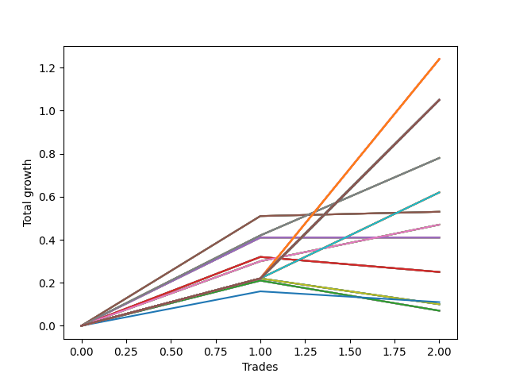

# Short Pointer Seven (0218) 
- Symbol: AAPL_Unlimited
- Date Range: 03/23/2022 - 07/08/2022
- Trading Period: 7:20-12:30
- Number of Trades: 2



| Name | Win Percent | Profit | Avg Profit / Trade | Avg Time / Trade |      | Name | Win Percent | Profit | Avg Profit / Trade | Avg Time / Trade |
| ---- | ----------- | ------ | ------------------ | ---------------- | ---- | ---- | ----------- | ------ | ------------------ | ---------------- |
| Sorted By <br> Profit | | | | | | Sorted By <br> Win Percentage ||||
| One Hundred Twenty-Six | 100.00 | 620.00 | 310.00 | 129:17 |     | One Hundred Twenty-Six | 100.00 | 620.00 | 310.00 | 129:17 |
| One Hundred Twenty-One | 100.00 | 620.00 | 310.00 | 129:17 |     | One Hundred Twenty-One | 100.00 | 620.00 | 310.00 | 129:17 |
| One Hundred Sixteen | 100.00 | 620.00 | 310.00 | 129:17 |     | One Hundred Sixteen | 100.00 | 620.00 | 310.00 | 129:17 |
| One Hundred Eleven | 100.00 | 620.00 | 310.00 | 129:17 |     | One Hundred Eleven | 100.00 | 620.00 | 310.00 | 129:17 |
| One Hundred Six | 100.00 | 620.00 | 310.00 | 129:17 |     | One Hundred Six | 100.00 | 620.00 | 310.00 | 129:17 |
| One Hundred One | 100.00 | 620.00 | 310.00 | 129:17 |     | One Hundred One | 100.00 | 620.00 | 310.00 | 129:17 |
| Ninety-Six | 100.00 | 620.00 | 310.00 | 129:17 |     | Ninety-Six | 100.00 | 620.00 | 310.00 | 129:17 |
| Ninety-One | 100.00 | 620.00 | 310.00 | 129:17 |     | Ninety-One | 100.00 | 620.00 | 310.00 | 129:17 |
| Eighty-One | 100.00 | 620.00 | 310.00 | 129:17 |     | Eighty-One | 100.00 | 620.00 | 310.00 | 129:17 |
| One Hundred Thirty | 100.00 | 525.00 | 262.50 | 161:00 |     | One Hundred Thirty | 100.00 | 525.00 | 262.50 | 161:00 |
| One Hundred Twenty-Nine | 100.00 | 525.00 | 262.50 | 161:00 |     | One Hundred Twenty-Nine | 100.00 | 525.00 | 262.50 | 161:00 |
| One Hundred Twenty-Eight | 100.00 | 525.00 | 262.50 | 161:00 |     | One Hundred Twenty-Eight | 100.00 | 525.00 | 262.50 | 161:00 |
| One Hundred Twenty-Seven | 100.00 | 525.00 | 262.50 | 161:00 |     | One Hundred Twenty-Seven | 100.00 | 525.00 | 262.50 | 161:00 |
| One Hundred Twenty-Five | 100.00 | 525.00 | 262.50 | 161:00 |     | One Hundred Twenty-Five | 100.00 | 525.00 | 262.50 | 161:00 |
| One Hundred Twenty-Four | 100.00 | 525.00 | 262.50 | 161:00 |     | One Hundred Twenty-Four | 100.00 | 525.00 | 262.50 | 161:00 |
| One Hundred Twenty-Three | 100.00 | 525.00 | 262.50 | 161:00 |     | One Hundred Twenty-Three | 100.00 | 525.00 | 262.50 | 161:00 |
| One Hundred Twenty-Two | 100.00 | 525.00 | 262.50 | 161:00 |     | One Hundred Twenty-Two | 100.00 | 525.00 | 262.50 | 161:00 |
| One Hundred Twenty | 100.00 | 525.00 | 262.50 | 161:00 |     | One Hundred Twenty | 100.00 | 525.00 | 262.50 | 161:00 |
| One Hundred Ninteen | 100.00 | 525.00 | 262.50 | 161:00 |     | One Hundred Ninteen | 100.00 | 525.00 | 262.50 | 161:00 |
| One Hundred Eighteen | 100.00 | 525.00 | 262.50 | 161:00 |     | One Hundred Eighteen | 100.00 | 525.00 | 262.50 | 161:00 |
| One Hundred Seventeen | 100.00 | 525.00 | 262.50 | 161:00 |     | One Hundred Seventeen | 100.00 | 525.00 | 262.50 | 161:00 |
| One Hundred Fifteen | 100.00 | 525.00 | 262.50 | 161:00 |     | One Hundred Fifteen | 100.00 | 525.00 | 262.50 | 161:00 |
| One Hundred Fourteen | 100.00 | 525.00 | 262.50 | 161:00 |     | One Hundred Fourteen | 100.00 | 525.00 | 262.50 | 161:00 |
| One Hundred Thirteen | 100.00 | 525.00 | 262.50 | 161:00 |     | One Hundred Thirteen | 100.00 | 525.00 | 262.50 | 161:00 |
| One Hundred Twelve | 100.00 | 525.00 | 262.50 | 161:00 |     | One Hundred Twelve | 100.00 | 525.00 | 262.50 | 161:00 |
| One Hundred Ten | 100.00 | 525.00 | 262.50 | 161:00 |     | One Hundred Ten | 100.00 | 525.00 | 262.50 | 161:00 |
| One Hundred Nine | 100.00 | 525.00 | 262.50 | 161:00 |     | One Hundred Nine | 100.00 | 525.00 | 262.50 | 161:00 |
| One Hundred Eight | 100.00 | 525.00 | 262.50 | 161:00 |     | One Hundred Eight | 100.00 | 525.00 | 262.50 | 161:00 |
| One Hundred Seven | 100.00 | 525.00 | 262.50 | 161:00 |     | One Hundred Seven | 100.00 | 525.00 | 262.50 | 161:00 |
| One Hundred Five | 100.00 | 525.00 | 262.50 | 161:00 |     | One Hundred Five | 100.00 | 525.00 | 262.50 | 161:00 |
| One Hundred Four | 100.00 | 525.00 | 262.50 | 161:00 |     | One Hundred Four | 100.00 | 525.00 | 262.50 | 161:00 |
| One Hundred Three | 100.00 | 525.00 | 262.50 | 161:00 |     | One Hundred Three | 100.00 | 525.00 | 262.50 | 161:00 |
| One Hundred Two | 100.00 | 525.00 | 262.50 | 161:00 |     | One Hundred Two | 100.00 | 525.00 | 262.50 | 161:00 |
| One Hundred | 100.00 | 525.00 | 262.50 | 161:00 |     | One Hundred | 100.00 | 525.00 | 262.50 | 161:00 |
| Ninety-Nine | 100.00 | 525.00 | 262.50 | 161:00 |     | Ninety-Nine | 100.00 | 525.00 | 262.50 | 161:00 |
| Ninety-Eight | 100.00 | 525.00 | 262.50 | 161:00 |     | Ninety-Eight | 100.00 | 525.00 | 262.50 | 161:00 |
| Ninety-Seven | 100.00 | 525.00 | 262.50 | 161:00 |     | Ninety-Seven | 100.00 | 525.00 | 262.50 | 161:00 |
| Ninety-Five | 100.00 | 525.00 | 262.50 | 161:00 |     | Ninety-Five | 100.00 | 525.00 | 262.50 | 161:00 |
| Ninety-Four | 100.00 | 525.00 | 262.50 | 161:00 |     | Ninety-Four | 100.00 | 525.00 | 262.50 | 161:00 |
| Ninety-Three | 100.00 | 525.00 | 262.50 | 161:00 |     | Ninety-Three | 100.00 | 525.00 | 262.50 | 161:00 |
| Ninety-Two | 100.00 | 525.00 | 262.50 | 161:00 |     | Ninety-Two | 100.00 | 525.00 | 262.50 | 161:00 |
| Eighty-Five | 100.00 | 525.00 | 262.50 | 161:00 |     | Eighty-Five | 100.00 | 525.00 | 262.50 | 161:00 |
| Eighty-Four | 100.00 | 525.00 | 262.50 | 161:00 |     | Eighty-Four | 100.00 | 525.00 | 262.50 | 161:00 |
| Eighty-Three | 100.00 | 525.00 | 262.50 | 161:00 |     | Eighty-Three | 100.00 | 525.00 | 262.50 | 161:00 |
| Eighty-Two | 100.00 | 525.00 | 262.50 | 161:00 |     | Eighty-Two | 100.00 | 525.00 | 262.50 | 161:00 |
| Sixty-Nine | 100.00 | 390.00 | 195.00 | 43:50 |     | Sixty-Nine | 100.00 | 390.00 | 195.00 | 43:50 |
| Sixty-One | 100.00 | 390.00 | 195.00 | 43:50 |     | Sixty-One | 100.00 | 390.00 | 195.00 | 43:50 |
| Fifty-Three | 100.00 | 390.00 | 195.00 | 43:50 |     | Fifty-Three | 100.00 | 390.00 | 195.00 | 43:50 |
| Forty-Five | 100.00 | 390.00 | 195.00 | 43:50 |     | Forty-Five | 100.00 | 390.00 | 195.00 | 43:50 |
| Five | 100.00 | 390.00 | 195.00 | 43:50 |     | Five | 100.00 | 390.00 | 195.00 | 43:50 |
| Seventy-One | 100.00 | 310.00 | 155.00 | 118:50 |     | Seventy-One | 100.00 | 310.00 | 155.00 | 118:50 |
| Sixty-Three | 100.00 | 310.00 | 155.00 | 118:50 |     | Sixty-Three | 100.00 | 310.00 | 155.00 | 118:50 |
| Fifty-Five | 100.00 | 310.00 | 155.00 | 118:50 |     | Fifty-Five | 100.00 | 310.00 | 155.00 | 118:50 |
| Forty-Seven | 100.00 | 310.00 | 155.00 | 118:50 |     | Forty-Seven | 100.00 | 310.00 | 155.00 | 118:50 |
| Seven | 100.00 | 310.00 | 155.00 | 118:50 |     | Seven | 100.00 | 310.00 | 155.00 | 118:50 |
| Sixty-Seven | 100.00 | 265.00 | 132.50 | 25:37 |     | Sixty-Seven | 100.00 | 265.00 | 132.50 | 25:37 |
| Fifty-Nine | 100.00 | 265.00 | 132.50 | 25:37 |     | Fifty-Nine | 100.00 | 265.00 | 132.50 | 25:37 |
| Fifty-One | 100.00 | 265.00 | 132.50 | 25:37 |     | Fifty-One | 100.00 | 265.00 | 132.50 | 25:37 |
| Forty-Three | 100.00 | 265.00 | 132.50 | 25:37 |     | Forty-Three | 100.00 | 265.00 | 132.50 | 25:37 |
| Three | 100.00 | 265.00 | 132.50 | 25:37 |     | Three | 100.00 | 265.00 | 132.50 | 25:37 |
| Sixty-Eight | 100.00 | 235.00 | 117.50 | 42:47 |     | Sixty-Eight | 100.00 | 235.00 | 117.50 | 42:47 |
| Sixty | 100.00 | 235.00 | 117.50 | 42:47 |     | Sixty | 100.00 | 235.00 | 117.50 | 42:47 |
| Fifty-Two | 100.00 | 235.00 | 117.50 | 42:47 |     | Fifty-Two | 100.00 | 235.00 | 117.50 | 42:47 |
| Forty-Four | 100.00 | 235.00 | 117.50 | 42:47 |     | Forty-Four | 100.00 | 235.00 | 117.50 | 42:47 |
| Four | 100.00 | 235.00 | 117.50 | 42:47 |     | Four | 100.00 | 235.00 | 117.50 | 42:47 |
| Sixty-Six | 50.00 | 205.00 | 102.50 | 23:27 |     | Sixty-Six | 50.00 | 205.00 | 102.50 | 23:27 |
| Fifty-Eight | 50.00 | 205.00 | 102.50 | 23:27 |     | Fifty-Eight | 50.00 | 205.00 | 102.50 | 23:27 |
| Fifty | 50.00 | 205.00 | 102.50 | 23:27 |     | Fifty | 50.00 | 205.00 | 102.50 | 23:27 |
| Forty-Two | 50.00 | 205.00 | 102.50 | 23:27 |     | Forty-Two | 50.00 | 205.00 | 102.50 | 23:27 |
| Two | 50.00 | 205.00 | 102.50 | 23:27 |     | Two | 50.00 | 205.00 | 102.50 | 23:27 |
| Sixty-Five | 50.00 | 125.00 | 62.50 | 18:20 |     | Sixty-Five | 50.00 | 125.00 | 62.50 | 18:20 |
| Fifty-Seven | 50.00 | 125.00 | 62.50 | 18:20 |     | Fifty-Seven | 50.00 | 125.00 | 62.50 | 18:20 |
| Forty-Nine | 50.00 | 125.00 | 62.50 | 18:20 |     | Forty-Nine | 50.00 | 125.00 | 62.50 | 18:20 |
| Forty-One | 50.00 | 125.00 | 62.50 | 18:20 |     | Forty-One | 50.00 | 125.00 | 62.50 | 18:20 |
| One | 50.00 | 125.00 | 62.50 | 18:20 |     | One | 50.00 | 125.00 | 62.50 | 18:20 |
| Seventy-Three | 50.00 | 55.00 | 27.50 | 11:05 |     | Seventy-Three | 50.00 | 55.00 | 27.50 | 11:05 |
| Seventy | 50.00 | 50.00 | 25.00 | 101:05 |     | Seventy | 50.00 | 50.00 | 25.00 | 101:05 |
| Sixty-Two | 50.00 | 50.00 | 25.00 | 101:05 |     | Sixty-Two | 50.00 | 50.00 | 25.00 | 101:05 |
| Fifty-Four | 50.00 | 50.00 | 25.00 | 101:05 |     | Fifty-Four | 50.00 | 50.00 | 25.00 | 101:05 |
| Forty-Six | 50.00 | 50.00 | 25.00 | 101:05 |     | Forty-Six | 50.00 | 50.00 | 25.00 | 101:05 |
| Six | 50.00 | 50.00 | 25.00 | 101:05 |     | Six | 50.00 | 50.00 | 25.00 | 101:05 |
| Sixty-Four | 50.00 | 35.00 | 17.50 | 14:35 |     | Sixty-Four | 50.00 | 35.00 | 17.50 | 14:35 |
| Fifty-Six | 50.00 | 35.00 | 17.50 | 14:35 |     | Fifty-Six | 50.00 | 35.00 | 17.50 | 14:35 |
| Forty-Eight | 50.00 | 35.00 | 17.50 | 14:35 |     | Forty-Eight | 50.00 | 35.00 | 17.50 | 14:35 |
| Forty | 50.00 | 35.00 | 17.50 | 14:35 |     | Forty | 50.00 | 35.00 | 17.50 | 14:35 |
| Zero | 50.00 | 35.00 | 17.50 | 14:35 |     | Zero | 50.00 | 35.00 | 17.50 | 14:35 |

## NO STOPLOSS

### Test Zero
* Sell when price hits the middle line of the 20p bollinger
* No Stoploss
* Results:
```
Total Trades: 2
Percent Up: 50.00
Percent Down: 50.00
Total Points Moved Down: 0.07
Potential Profit: 35.00
Total Points Ups: 0.14 Count Ups: 1
Total Points Downs: 0.21 Count Downs: 1
```

<details><summary>Trades</summary>

<code>In: 2022-05-26 09:26:00		Out: 2022-05-26 09:32:15		Total Position Time: 06:15		Total Move Down: 0.21		Total to Date: 0.21</code> <br />
<code>In: 2022-06-06 10:46:00		Out: 2022-06-06 11:08:55		Total Position Time: 22:55		Total Move Down: -0.14		Total to Date: 0.07</code> <br />


</details>

### Test One
* Sell when the price hits the upper line of the 20p 1std bollinger
* No Stoploss
* Results:
```
Total Trades: 2
Percent Up: 50.00
Percent Down: 50.00
Total Points Moved Down: 0.25
Potential Profit: 125.00
Total Points Ups: 0.07 Count Ups: 1
Total Points Downs: 0.32 Count Downs: 1
```

<details><summary>Trades</summary>

<code>In: 2022-05-26 09:26:00		Out: 2022-05-26 09:35:25		Total Position Time: 09:25		Total Move Down: 0.32		Total to Date: 0.32</code> <br />
<code>In: 2022-06-06 10:46:00		Out: 2022-06-06 11:13:15		Total Position Time: 27:15		Total Move Down: -0.07		Total to Date: 0.25</code> <br />


</details>

### Test Two
* Sell when the price hits the upper line of the 20p 2std bollinger
* No Stoploss
* Results:
```
Total Trades: 2
Percent Up: 50.00
Percent Down: 50.00
Total Points Moved Down: 0.41
Potential Profit: 205.00
Total Points Ups: 0.00 Count Ups: 1
Total Points Downs: 0.41 Count Downs: 1
```

<details><summary>Trades</summary>

<code>In: 2022-05-26 09:26:00		Out: 2022-05-26 09:43:45		Total Position Time: 17:45		Total Move Down: 0.41		Total to Date: 0.41</code> <br />
<code>In: 2022-06-06 10:46:00		Out: 2022-06-06 11:15:10		Total Position Time: 29:10		Total Move Down: -0.00		Total to Date: 0.41</code> <br />


</details>

### Test Three
* Sell when price hits the middle line of the 50p bollinger
* No Stoploss
* Results:
```
Total Trades: 2
Percent Up: 0.00
Percent Down: 100.00
Total Points Moved Down: 0.53
Potential Profit: 265.00
Total Points Ups: 0.00 Count Ups: 0
Total Points Downs: 0.53 Count Downs: 2
```

<details><summary>Trades</summary>

<code>In: 2022-05-26 09:26:00		Out: 2022-05-26 09:45:10		Total Position Time: 19:10		Total Move Down: 0.51		Total to Date: 0.51</code> <br />
<code>In: 2022-06-06 10:46:00		Out: 2022-06-06 11:18:05		Total Position Time: 32:05		Total Move Down: 0.02		Total to Date: 0.53</code> <br />


</details>

### Test Four
* Sell when the price hits the upper line of the 50p 1std bollinger
* No Stoploss
* Results:
```
Total Trades: 2
Percent Up: 0.00
Percent Down: 100.00
Total Points Moved Down: 0.47
Potential Profit: 235.00
Total Points Ups: 0.00 Count Ups: 0
Total Points Downs: 0.47 Count Downs: 2
```

<details><summary>Trades</summary>

<code>In: 2022-05-26 09:26:00		Out: 2022-05-26 10:16:00		Total Position Time: 50:00		Total Move Down: 0.30		Total to Date: 0.30</code> <br />
<code>In: 2022-06-06 10:46:00		Out: 2022-06-06 11:21:35		Total Position Time: 35:35		Total Move Down: 0.17		Total to Date: 0.47</code> <br />


</details>

### Test Five
* Sell when the price hits the upper line of the 50p 2std bollinger
* No Stoploss
* Results:
```
Total Trades: 2
Percent Up: 0.00
Percent Down: 100.00
Total Points Moved Down: 0.78
Potential Profit: 390.00
Total Points Ups: 0.00 Count Ups: 0
Total Points Downs: 0.78 Count Downs: 2
```

<details><summary>Trades</summary>

<code>In: 2022-05-26 09:26:00		Out: 2022-05-26 10:17:15		Total Position Time: 51:15		Total Move Down: 0.42		Total to Date: 0.42</code> <br />
<code>In: 2022-06-06 10:46:00		Out: 2022-06-06 11:22:25		Total Position Time: 36:25		Total Move Down: 0.36		Total to Date: 0.78</code> <br />


</details>

### Test Six
* Sell when the price hits the middle line of the 1std VWAP
* No Stoploss
* Results:
```
Total Trades: 2
Percent Up: 50.00
Percent Down: 50.00
Total Points Moved Down: 0.10
Potential Profit: 50.00
Total Points Ups: 0.12 Count Ups: 1
Total Points Downs: 0.22 Count Downs: 1
```

<details><summary>Trades</summary>

<code>In: 2022-05-26 09:26:00		Out: 2022-05-26 12:47:00		Total Position Time: 201:00		Total Move Down: 0.22		Total to Date: 0.22</code> <br />
<code>In: 2022-06-06 10:46:00		Out: 2022-06-06 10:47:10		Total Position Time: 01:10		Total Move Down: -0.12		Total to Date: 0.10</code> <br />


</details>

### Test Seven
* Sell when the price hits the upper line of the 1std VWAP
* No Stoploss
* Results:
```
Total Trades: 2
Percent Up: 0.00
Percent Down: 100.00
Total Points Moved Down: 0.62
Potential Profit: 310.00
Total Points Ups: 0.00 Count Ups: 0
Total Points Downs: 0.62 Count Downs: 2
```

<details><summary>Trades</summary>

<code>In: 2022-05-26 09:26:00		Out: 2022-05-26 12:47:00		Total Position Time: 201:00		Total Move Down: 0.22		Total to Date: 0.22</code> <br />
<code>In: 2022-06-06 10:46:00		Out: 2022-06-06 11:22:40		Total Position Time: 36:40		Total Move Down: 0.40		Total to Date: 0.62</code> <br />


</details>

## STOPLOSS OF 5

### Test Forty
* Sell when price hits the middle line of the 20p bollinger
* Stoploss is -5 points
* Results:
```
Total Trades: 2
Percent Up: 50.00
Percent Down: 50.00
Total Points Moved Down: 0.07
Potential Profit: 35.00
Total Points Ups: 0.14 Count Ups: 1
Total Points Downs: 0.21 Count Downs: 1
```

<details><summary>Trades</summary>

<code>In: 2022-05-26 09:26:00		Out: 2022-05-26 09:32:15		Total Position Time: 06:15		Total Move Down: 0.21		Total to Date: 0.21</code> <br />
<code>In: 2022-06-06 10:46:00		Out: 2022-06-06 11:08:55		Total Position Time: 22:55		Total Move Down: -0.14		Total to Date: 0.07</code> <br />


</details>

### Test Forty-One
* Sell when the price hits the upper line of the 20p 1std bollinger
* Stoploss is -5 points
* Results:
```
Total Trades: 2
Percent Up: 50.00
Percent Down: 50.00
Total Points Moved Down: 0.25
Potential Profit: 125.00
Total Points Ups: 0.07 Count Ups: 1
Total Points Downs: 0.32 Count Downs: 1
```

<details><summary>Trades</summary>

<code>In: 2022-05-26 09:26:00		Out: 2022-05-26 09:35:25		Total Position Time: 09:25		Total Move Down: 0.32		Total to Date: 0.32</code> <br />
<code>In: 2022-06-06 10:46:00		Out: 2022-06-06 11:13:15		Total Position Time: 27:15		Total Move Down: -0.07		Total to Date: 0.25</code> <br />


</details>

### Test Forty-Two
* Sell when the price hits the upper line of the 20p 2std bollinger
* Stoploss is -5 points
* Results:
```
Total Trades: 2
Percent Up: 50.00
Percent Down: 50.00
Total Points Moved Down: 0.41
Potential Profit: 205.00
Total Points Ups: 0.00 Count Ups: 1
Total Points Downs: 0.41 Count Downs: 1
```

<details><summary>Trades</summary>

<code>In: 2022-05-26 09:26:00		Out: 2022-05-26 09:43:45		Total Position Time: 17:45		Total Move Down: 0.41		Total to Date: 0.41</code> <br />
<code>In: 2022-06-06 10:46:00		Out: 2022-06-06 11:15:10		Total Position Time: 29:10		Total Move Down: -0.00		Total to Date: 0.41</code> <br />


</details>

### Test Forty-Three
* Sell when price hits the middle line of the 50p bollinger
* Stoploss is -5 points
* Results:
```
Total Trades: 2
Percent Up: 0.00
Percent Down: 100.00
Total Points Moved Down: 0.53
Potential Profit: 265.00
Total Points Ups: 0.00 Count Ups: 0
Total Points Downs: 0.53 Count Downs: 2
```

<details><summary>Trades</summary>

<code>In: 2022-05-26 09:26:00		Out: 2022-05-26 09:45:10		Total Position Time: 19:10		Total Move Down: 0.51		Total to Date: 0.51</code> <br />
<code>In: 2022-06-06 10:46:00		Out: 2022-06-06 11:18:05		Total Position Time: 32:05		Total Move Down: 0.02		Total to Date: 0.53</code> <br />


</details>

### Test Forty-Four
* Sell when the price hits the upper line of the 50p 1std bollinger
* Stoploss is -5 points
* Results:
```
Total Trades: 2
Percent Up: 0.00
Percent Down: 100.00
Total Points Moved Down: 0.47
Potential Profit: 235.00
Total Points Ups: 0.00 Count Ups: 0
Total Points Downs: 0.47 Count Downs: 2
```

<details><summary>Trades</summary>

<code>In: 2022-05-26 09:26:00		Out: 2022-05-26 10:16:00		Total Position Time: 50:00		Total Move Down: 0.30		Total to Date: 0.30</code> <br />
<code>In: 2022-06-06 10:46:00		Out: 2022-06-06 11:21:35		Total Position Time: 35:35		Total Move Down: 0.17		Total to Date: 0.47</code> <br />


</details>

### Test Forty-Five
* Sell when the price hits the upper line of the 50p 2std bollinger
* Stoploss is -5 points
* Results:
```
Total Trades: 2
Percent Up: 0.00
Percent Down: 100.00
Total Points Moved Down: 0.78
Potential Profit: 390.00
Total Points Ups: 0.00 Count Ups: 0
Total Points Downs: 0.78 Count Downs: 2
```

<details><summary>Trades</summary>

<code>In: 2022-05-26 09:26:00		Out: 2022-05-26 10:17:15		Total Position Time: 51:15		Total Move Down: 0.42		Total to Date: 0.42</code> <br />
<code>In: 2022-06-06 10:46:00		Out: 2022-06-06 11:22:25		Total Position Time: 36:25		Total Move Down: 0.36		Total to Date: 0.78</code> <br />


</details>

### Test Forty-Six
* Sell when the price hits the middle line of the 1std VWAP
* Stoploss is -5 points
* Results:
```
Total Trades: 2
Percent Up: 50.00
Percent Down: 50.00
Total Points Moved Down: 0.10
Potential Profit: 50.00
Total Points Ups: 0.12 Count Ups: 1
Total Points Downs: 0.22 Count Downs: 1
```

<details><summary>Trades</summary>

<code>In: 2022-05-26 09:26:00		Out: 2022-05-26 12:47:00		Total Position Time: 201:00		Total Move Down: 0.22		Total to Date: 0.22</code> <br />
<code>In: 2022-06-06 10:46:00		Out: 2022-06-06 10:47:10		Total Position Time: 01:10		Total Move Down: -0.12		Total to Date: 0.10</code> <br />


</details>

### Test Forty-Seven
* Sell when the price hits the upper line of the 1std VWAP
* Stoploss is -5 points
* Results:
```
Total Trades: 2
Percent Up: 0.00
Percent Down: 100.00
Total Points Moved Down: 0.62
Potential Profit: 310.00
Total Points Ups: 0.00 Count Ups: 0
Total Points Downs: 0.62 Count Downs: 2
```

<details><summary>Trades</summary>

<code>In: 2022-05-26 09:26:00		Out: 2022-05-26 12:47:00		Total Position Time: 201:00		Total Move Down: 0.22		Total to Date: 0.22</code> <br />
<code>In: 2022-06-06 10:46:00		Out: 2022-06-06 11:22:40		Total Position Time: 36:40		Total Move Down: 0.40		Total to Date: 0.62</code> <br />


</details>

## TRAIL STOP OF 5

### Test Forty-Eight
* Sell when price hits the middle line of the 20p bollinger
* Trailing Stop is -5 points
* Results:
```
Total Trades: 2
Percent Up: 50.00
Percent Down: 50.00
Total Points Moved Down: 0.07
Potential Profit: 35.00
Total Points Ups: 0.14 Count Ups: 1
Total Points Downs: 0.21 Count Downs: 1
```

<details><summary>Trades</summary>

<code>In: 2022-05-26 09:26:00		Out: 2022-05-26 09:32:15		Total Position Time: 06:15		Total Move Down: 0.21		Total to Date: 0.21</code> <br />
<code>In: 2022-06-06 10:46:00		Out: 2022-06-06 11:08:55		Total Position Time: 22:55		Total Move Down: -0.14		Total to Date: 0.07</code> <br />


</details>

### Test Forty-Nine
* Sell when the price hits the upper line of the 20p 1std bollinger
* Trailing Stop is -5 points
* Results:
```
Total Trades: 2
Percent Up: 50.00
Percent Down: 50.00
Total Points Moved Down: 0.25
Potential Profit: 125.00
Total Points Ups: 0.07 Count Ups: 1
Total Points Downs: 0.32 Count Downs: 1
```

<details><summary>Trades</summary>

<code>In: 2022-05-26 09:26:00		Out: 2022-05-26 09:35:25		Total Position Time: 09:25		Total Move Down: 0.32		Total to Date: 0.32</code> <br />
<code>In: 2022-06-06 10:46:00		Out: 2022-06-06 11:13:15		Total Position Time: 27:15		Total Move Down: -0.07		Total to Date: 0.25</code> <br />


</details>

### Test Fifty
* Sell when the price hits the upper line of the 20p 2std bollinger
* Trailing Stop is -5 points
* Results:
```
Total Trades: 2
Percent Up: 50.00
Percent Down: 50.00
Total Points Moved Down: 0.41
Potential Profit: 205.00
Total Points Ups: 0.00 Count Ups: 1
Total Points Downs: 0.41 Count Downs: 1
```

<details><summary>Trades</summary>

<code>In: 2022-05-26 09:26:00		Out: 2022-05-26 09:43:45		Total Position Time: 17:45		Total Move Down: 0.41		Total to Date: 0.41</code> <br />
<code>In: 2022-06-06 10:46:00		Out: 2022-06-06 11:15:10		Total Position Time: 29:10		Total Move Down: -0.00		Total to Date: 0.41</code> <br />


</details>

### Test Fifty-One
* Sell when price hits the middle line of the 50p bollinger
* Trailing Stop is -5 points
* Results:
```
Total Trades: 2
Percent Up: 0.00
Percent Down: 100.00
Total Points Moved Down: 0.53
Potential Profit: 265.00
Total Points Ups: 0.00 Count Ups: 0
Total Points Downs: 0.53 Count Downs: 2
```

<details><summary>Trades</summary>

<code>In: 2022-05-26 09:26:00		Out: 2022-05-26 09:45:10		Total Position Time: 19:10		Total Move Down: 0.51		Total to Date: 0.51</code> <br />
<code>In: 2022-06-06 10:46:00		Out: 2022-06-06 11:18:05		Total Position Time: 32:05		Total Move Down: 0.02		Total to Date: 0.53</code> <br />


</details>

### Test Fifty-Two
* Sell when the price hits the upper line of the 50p 1std bollinger
* Trailing Stop is -5 points
* Results:
```
Total Trades: 2
Percent Up: 0.00
Percent Down: 100.00
Total Points Moved Down: 0.47
Potential Profit: 235.00
Total Points Ups: 0.00 Count Ups: 0
Total Points Downs: 0.47 Count Downs: 2
```

<details><summary>Trades</summary>

<code>In: 2022-05-26 09:26:00		Out: 2022-05-26 10:16:00		Total Position Time: 50:00		Total Move Down: 0.30		Total to Date: 0.30</code> <br />
<code>In: 2022-06-06 10:46:00		Out: 2022-06-06 11:21:35		Total Position Time: 35:35		Total Move Down: 0.17		Total to Date: 0.47</code> <br />


</details>

### Test Fifty-Three
* Sell when the price hits the upper line of the 50p 2std bollinger
* Trailing Stop is -5 points
* Results:
```
Total Trades: 2
Percent Up: 0.00
Percent Down: 100.00
Total Points Moved Down: 0.78
Potential Profit: 390.00
Total Points Ups: 0.00 Count Ups: 0
Total Points Downs: 0.78 Count Downs: 2
```

<details><summary>Trades</summary>

<code>In: 2022-05-26 09:26:00		Out: 2022-05-26 10:17:15		Total Position Time: 51:15		Total Move Down: 0.42		Total to Date: 0.42</code> <br />
<code>In: 2022-06-06 10:46:00		Out: 2022-06-06 11:22:25		Total Position Time: 36:25		Total Move Down: 0.36		Total to Date: 0.78</code> <br />


</details>

### Test Fifty-Four
* Sell when the price hits the middle line of the 1std VWAP
* Trailing Stop is -5 points
* Results:
```
Total Trades: 2
Percent Up: 50.00
Percent Down: 50.00
Total Points Moved Down: 0.10
Potential Profit: 50.00
Total Points Ups: 0.12 Count Ups: 1
Total Points Downs: 0.22 Count Downs: 1
```

<details><summary>Trades</summary>

<code>In: 2022-05-26 09:26:00		Out: 2022-05-26 12:47:00		Total Position Time: 201:00		Total Move Down: 0.22		Total to Date: 0.22</code> <br />
<code>In: 2022-06-06 10:46:00		Out: 2022-06-06 10:47:10		Total Position Time: 01:10		Total Move Down: -0.12		Total to Date: 0.10</code> <br />


</details>

### Test Fifty-Five
* Sell when the price hits the upper line of the 1std VWAP
* Trailing Stop is -5 points
* Results:
```
Total Trades: 2
Percent Up: 0.00
Percent Down: 100.00
Total Points Moved Down: 0.62
Potential Profit: 310.00
Total Points Ups: 0.00 Count Ups: 0
Total Points Downs: 0.62 Count Downs: 2
```

<details><summary>Trades</summary>

<code>In: 2022-05-26 09:26:00		Out: 2022-05-26 12:47:00		Total Position Time: 201:00		Total Move Down: 0.22		Total to Date: 0.22</code> <br />
<code>In: 2022-06-06 10:46:00		Out: 2022-06-06 11:22:40		Total Position Time: 36:40		Total Move Down: 0.40		Total to Date: 0.62</code> <br />


</details>

## STOPLOSS OF 10

### Test Fifty-Six
* Sell when price hits the middle line of the 20p bollinger
* Stoploss is -10 points
* Results:
```
Total Trades: 2
Percent Up: 50.00
Percent Down: 50.00
Total Points Moved Down: 0.07
Potential Profit: 35.00
Total Points Ups: 0.14 Count Ups: 1
Total Points Downs: 0.21 Count Downs: 1
```

<details><summary>Trades</summary>

<code>In: 2022-05-26 09:26:00		Out: 2022-05-26 09:32:15		Total Position Time: 06:15		Total Move Down: 0.21		Total to Date: 0.21</code> <br />
<code>In: 2022-06-06 10:46:00		Out: 2022-06-06 11:08:55		Total Position Time: 22:55		Total Move Down: -0.14		Total to Date: 0.07</code> <br />


</details>

### Test Fifty-Seven
* Sell when the price hits the upper line of the 20p 1std bollinger
* Stoploss is -10 points
* Results:
```
Total Trades: 2
Percent Up: 50.00
Percent Down: 50.00
Total Points Moved Down: 0.25
Potential Profit: 125.00
Total Points Ups: 0.07 Count Ups: 1
Total Points Downs: 0.32 Count Downs: 1
```

<details><summary>Trades</summary>

<code>In: 2022-05-26 09:26:00		Out: 2022-05-26 09:35:25		Total Position Time: 09:25		Total Move Down: 0.32		Total to Date: 0.32</code> <br />
<code>In: 2022-06-06 10:46:00		Out: 2022-06-06 11:13:15		Total Position Time: 27:15		Total Move Down: -0.07		Total to Date: 0.25</code> <br />


</details>

### Test Fifty-Eight
* Sell when the price hits the upper line of the 20p 2std bollinger
* Stoploss is -10 points
* Results:
```
Total Trades: 2
Percent Up: 50.00
Percent Down: 50.00
Total Points Moved Down: 0.41
Potential Profit: 205.00
Total Points Ups: 0.00 Count Ups: 1
Total Points Downs: 0.41 Count Downs: 1
```

<details><summary>Trades</summary>

<code>In: 2022-05-26 09:26:00		Out: 2022-05-26 09:43:45		Total Position Time: 17:45		Total Move Down: 0.41		Total to Date: 0.41</code> <br />
<code>In: 2022-06-06 10:46:00		Out: 2022-06-06 11:15:10		Total Position Time: 29:10		Total Move Down: -0.00		Total to Date: 0.41</code> <br />


</details>

### Test Fifty-Nine
* Sell when price hits the middle line of the 50p bollinger
* Stoploss is -10 points
* Results:
```
Total Trades: 2
Percent Up: 0.00
Percent Down: 100.00
Total Points Moved Down: 0.53
Potential Profit: 265.00
Total Points Ups: 0.00 Count Ups: 0
Total Points Downs: 0.53 Count Downs: 2
```

<details><summary>Trades</summary>

<code>In: 2022-05-26 09:26:00		Out: 2022-05-26 09:45:10		Total Position Time: 19:10		Total Move Down: 0.51		Total to Date: 0.51</code> <br />
<code>In: 2022-06-06 10:46:00		Out: 2022-06-06 11:18:05		Total Position Time: 32:05		Total Move Down: 0.02		Total to Date: 0.53</code> <br />


</details>

### Test Sixty
* Sell when the price hits the upper line of the 50p 1std bollinger
* Stoploss is -10 points
* Results:
```
Total Trades: 2
Percent Up: 0.00
Percent Down: 100.00
Total Points Moved Down: 0.47
Potential Profit: 235.00
Total Points Ups: 0.00 Count Ups: 0
Total Points Downs: 0.47 Count Downs: 2
```

<details><summary>Trades</summary>

<code>In: 2022-05-26 09:26:00		Out: 2022-05-26 10:16:00		Total Position Time: 50:00		Total Move Down: 0.30		Total to Date: 0.30</code> <br />
<code>In: 2022-06-06 10:46:00		Out: 2022-06-06 11:21:35		Total Position Time: 35:35		Total Move Down: 0.17		Total to Date: 0.47</code> <br />


</details>

### Test Sixty-One
* Sell when the price hits the upper line of the 50p 2std bollinger
* Stoploss is -10 points
* Results:
```
Total Trades: 2
Percent Up: 0.00
Percent Down: 100.00
Total Points Moved Down: 0.78
Potential Profit: 390.00
Total Points Ups: 0.00 Count Ups: 0
Total Points Downs: 0.78 Count Downs: 2
```

<details><summary>Trades</summary>

<code>In: 2022-05-26 09:26:00		Out: 2022-05-26 10:17:15		Total Position Time: 51:15		Total Move Down: 0.42		Total to Date: 0.42</code> <br />
<code>In: 2022-06-06 10:46:00		Out: 2022-06-06 11:22:25		Total Position Time: 36:25		Total Move Down: 0.36		Total to Date: 0.78</code> <br />


</details>

### Test Sixty-Two
* Sell when the price hits the middle line of the 1std VWAP
* Stoploss is -10 points
* Results:
```
Total Trades: 2
Percent Up: 50.00
Percent Down: 50.00
Total Points Moved Down: 0.10
Potential Profit: 50.00
Total Points Ups: 0.12 Count Ups: 1
Total Points Downs: 0.22 Count Downs: 1
```

<details><summary>Trades</summary>

<code>In: 2022-05-26 09:26:00		Out: 2022-05-26 12:47:00		Total Position Time: 201:00		Total Move Down: 0.22		Total to Date: 0.22</code> <br />
<code>In: 2022-06-06 10:46:00		Out: 2022-06-06 10:47:10		Total Position Time: 01:10		Total Move Down: -0.12		Total to Date: 0.10</code> <br />


</details>

### Test Sixty-Three
* Sell when the price hits the upper line of the 1std VWAP
* Stoploss is -10 points
* Results:
```
Total Trades: 2
Percent Up: 0.00
Percent Down: 100.00
Total Points Moved Down: 0.62
Potential Profit: 310.00
Total Points Ups: 0.00 Count Ups: 0
Total Points Downs: 0.62 Count Downs: 2
```

<details><summary>Trades</summary>

<code>In: 2022-05-26 09:26:00		Out: 2022-05-26 12:47:00		Total Position Time: 201:00		Total Move Down: 0.22		Total to Date: 0.22</code> <br />
<code>In: 2022-06-06 10:46:00		Out: 2022-06-06 11:22:40		Total Position Time: 36:40		Total Move Down: 0.40		Total to Date: 0.62</code> <br />


</details>

## TRAIL STOP OF 10

### Test Sixty-Four
* Sell when price hits the middle line of the 20p bollinger
* Trailing Stop is -10 points
* Results:
```
Total Trades: 2
Percent Up: 50.00
Percent Down: 50.00
Total Points Moved Down: 0.07
Potential Profit: 35.00
Total Points Ups: 0.14 Count Ups: 1
Total Points Downs: 0.21 Count Downs: 1
```

<details><summary>Trades</summary>

<code>In: 2022-05-26 09:26:00		Out: 2022-05-26 09:32:15		Total Position Time: 06:15		Total Move Down: 0.21		Total to Date: 0.21</code> <br />
<code>In: 2022-06-06 10:46:00		Out: 2022-06-06 11:08:55		Total Position Time: 22:55		Total Move Down: -0.14		Total to Date: 0.07</code> <br />


</details>

### Test Sixty-Five
* Sell when the price hits the upper line of the 20p 1std bollinger
* Trailing Stop is -10 points
* Results:
```
Total Trades: 2
Percent Up: 50.00
Percent Down: 50.00
Total Points Moved Down: 0.25
Potential Profit: 125.00
Total Points Ups: 0.07 Count Ups: 1
Total Points Downs: 0.32 Count Downs: 1
```

<details><summary>Trades</summary>

<code>In: 2022-05-26 09:26:00		Out: 2022-05-26 09:35:25		Total Position Time: 09:25		Total Move Down: 0.32		Total to Date: 0.32</code> <br />
<code>In: 2022-06-06 10:46:00		Out: 2022-06-06 11:13:15		Total Position Time: 27:15		Total Move Down: -0.07		Total to Date: 0.25</code> <br />


</details>

### Test Sixty-Six
* Sell when the price hits the upper line of the 20p 2std bollinger
* Trailing Stop is -10 points
* Results:
```
Total Trades: 2
Percent Up: 50.00
Percent Down: 50.00
Total Points Moved Down: 0.41
Potential Profit: 205.00
Total Points Ups: 0.00 Count Ups: 1
Total Points Downs: 0.41 Count Downs: 1
```

<details><summary>Trades</summary>

<code>In: 2022-05-26 09:26:00		Out: 2022-05-26 09:43:45		Total Position Time: 17:45		Total Move Down: 0.41		Total to Date: 0.41</code> <br />
<code>In: 2022-06-06 10:46:00		Out: 2022-06-06 11:15:10		Total Position Time: 29:10		Total Move Down: -0.00		Total to Date: 0.41</code> <br />


</details>

### Test Sixty-Seven
* Sell when price hits the middle line of the 50p bollinger
* Trailing Stop is -10 points
* Results:
```
Total Trades: 2
Percent Up: 0.00
Percent Down: 100.00
Total Points Moved Down: 0.53
Potential Profit: 265.00
Total Points Ups: 0.00 Count Ups: 0
Total Points Downs: 0.53 Count Downs: 2
```

<details><summary>Trades</summary>

<code>In: 2022-05-26 09:26:00		Out: 2022-05-26 09:45:10		Total Position Time: 19:10		Total Move Down: 0.51		Total to Date: 0.51</code> <br />
<code>In: 2022-06-06 10:46:00		Out: 2022-06-06 11:18:05		Total Position Time: 32:05		Total Move Down: 0.02		Total to Date: 0.53</code> <br />


</details>

### Test Sixty-Eight
* Sell when the price hits the upper line of the 50p 1std bollinger
* Trailing Stop is -10 points
* Results:
```
Total Trades: 2
Percent Up: 0.00
Percent Down: 100.00
Total Points Moved Down: 0.47
Potential Profit: 235.00
Total Points Ups: 0.00 Count Ups: 0
Total Points Downs: 0.47 Count Downs: 2
```

<details><summary>Trades</summary>

<code>In: 2022-05-26 09:26:00		Out: 2022-05-26 10:16:00		Total Position Time: 50:00		Total Move Down: 0.30		Total to Date: 0.30</code> <br />
<code>In: 2022-06-06 10:46:00		Out: 2022-06-06 11:21:35		Total Position Time: 35:35		Total Move Down: 0.17		Total to Date: 0.47</code> <br />


</details>

### Test Sixty-Nine
* Sell when the price hits the upper line of the 50p 2std bollinger
* Trailing Stop is -10 points
* Results:
```
Total Trades: 2
Percent Up: 0.00
Percent Down: 100.00
Total Points Moved Down: 0.78
Potential Profit: 390.00
Total Points Ups: 0.00 Count Ups: 0
Total Points Downs: 0.78 Count Downs: 2
```

<details><summary>Trades</summary>

<code>In: 2022-05-26 09:26:00		Out: 2022-05-26 10:17:15		Total Position Time: 51:15		Total Move Down: 0.42		Total to Date: 0.42</code> <br />
<code>In: 2022-06-06 10:46:00		Out: 2022-06-06 11:22:25		Total Position Time: 36:25		Total Move Down: 0.36		Total to Date: 0.78</code> <br />


</details>

### Test Seventy
* Sell when the price hits the middle line of the 1std VWAP
* Trailing Stop is -10 points
* Results:
```
Total Trades: 2
Percent Up: 50.00
Percent Down: 50.00
Total Points Moved Down: 0.10
Potential Profit: 50.00
Total Points Ups: 0.12 Count Ups: 1
Total Points Downs: 0.22 Count Downs: 1
```

<details><summary>Trades</summary>

<code>In: 2022-05-26 09:26:00		Out: 2022-05-26 12:47:00		Total Position Time: 201:00		Total Move Down: 0.22		Total to Date: 0.22</code> <br />
<code>In: 2022-06-06 10:46:00		Out: 2022-06-06 10:47:10		Total Position Time: 01:10		Total Move Down: -0.12		Total to Date: 0.10</code> <br />


</details>

### Test Seventy-One
* Sell when the price hits the upper line of the 1std VWAP
* Trailing Stop is -10 points
* Results:
```
Total Trades: 2
Percent Up: 0.00
Percent Down: 100.00
Total Points Moved Down: 0.62
Potential Profit: 310.00
Total Points Ups: 0.00 Count Ups: 0
Total Points Downs: 0.62 Count Downs: 2
```

<details><summary>Trades</summary>

<code>In: 2022-05-26 09:26:00		Out: 2022-05-26 12:47:00		Total Position Time: 201:00		Total Move Down: 0.22		Total to Date: 0.22</code> <br />
<code>In: 2022-06-06 10:46:00		Out: 2022-06-06 11:22:40		Total Position Time: 36:40		Total Move Down: 0.40		Total to Date: 0.62</code> <br />


</details>

## SPECIAL EXIT CONDITIONS 

### Test Seventy-Three
* Sell when the linear regression slope changes to negative
* No Stoploss
* Results:
```
Total Trades: 2
Percent Up: 50.00
Percent Down: 50.00
Total Points Moved Down: 0.11
Potential Profit: 55.00
Total Points Ups: 0.05 Count Ups: 1
Total Points Downs: 0.16 Count Downs: 1
```

<details><summary>Trades</summary>

<code>In: 2022-05-26 09:26:00		Out: 2022-05-26 09:40:05		Total Position Time: 14:05		Total Move Down: 0.16		Total to Date: 0.16</code> <br />
<code>In: 2022-06-06 10:46:00		Out: 2022-06-06 10:54:05		Total Position Time: 08:05		Total Move Down: -0.05		Total to Date: 0.11</code> <br />


</details>

## TAKE PROFIT

### Test Eighty-One
* Take Profit of 1 Point
* No Stoploss
* Results:
```
Total Trades: 2
Percent Up: 0.00
Percent Down: 100.00
Total Points Moved Down: 1.24
Potential Profit: 620.00
Total Points Ups: 0.00 Count Ups: 0
Total Points Downs: 1.24 Count Downs: 2
```

<details><summary>Trades</summary>

<code>In: 2022-05-26 09:26:00		Out: 2022-05-26 12:47:00		Total Position Time: 201:00		Total Move Down: 0.22		Total to Date: 0.22</code> <br />
<code>In: 2022-06-06 10:46:00		Out: 2022-06-06 11:43:35		Total Position Time: 57:35		Total Move Down: 1.02		Total to Date: 1.24</code> <br />


</details>

### Test Eighty-Two
* Take Profit of 2 Point
* No Stoploss
* Results:
```
Total Trades: 2
Percent Up: 0.00
Percent Down: 100.00
Total Points Moved Down: 1.05
Potential Profit: 525.00
Total Points Ups: 0.00 Count Ups: 0
Total Points Downs: 1.05 Count Downs: 2
```

<details><summary>Trades</summary>

<code>In: 2022-05-26 09:26:00		Out: 2022-05-26 12:47:00		Total Position Time: 201:00		Total Move Down: 0.22		Total to Date: 0.22</code> <br />
<code>In: 2022-06-06 10:46:00		Out: 2022-06-06 12:47:00		Total Position Time: 121:00		Total Move Down: 0.83		Total to Date: 1.05</code> <br />


</details>

### Test Eighty-Three
* Take Profit of 3 Point
* No Stoploss
* Results:
```
Total Trades: 2
Percent Up: 0.00
Percent Down: 100.00
Total Points Moved Down: 1.05
Potential Profit: 525.00
Total Points Ups: 0.00 Count Ups: 0
Total Points Downs: 1.05 Count Downs: 2
```

<details><summary>Trades</summary>

<code>In: 2022-05-26 09:26:00		Out: 2022-05-26 12:47:00		Total Position Time: 201:00		Total Move Down: 0.22		Total to Date: 0.22</code> <br />
<code>In: 2022-06-06 10:46:00		Out: 2022-06-06 12:47:00		Total Position Time: 121:00		Total Move Down: 0.83		Total to Date: 1.05</code> <br />


</details>

### Test Eighty-Four
* Take Profit of 4 Point
* No Stoploss
* Results:
```
Total Trades: 2
Percent Up: 0.00
Percent Down: 100.00
Total Points Moved Down: 1.05
Potential Profit: 525.00
Total Points Ups: 0.00 Count Ups: 0
Total Points Downs: 1.05 Count Downs: 2
```

<details><summary>Trades</summary>

<code>In: 2022-05-26 09:26:00		Out: 2022-05-26 12:47:00		Total Position Time: 201:00		Total Move Down: 0.22		Total to Date: 0.22</code> <br />
<code>In: 2022-06-06 10:46:00		Out: 2022-06-06 12:47:00		Total Position Time: 121:00		Total Move Down: 0.83		Total to Date: 1.05</code> <br />


</details>

### Test Eighty-Five
* Take Profit of 5 Point
* No Stoploss
* Results:
```
Total Trades: 2
Percent Up: 0.00
Percent Down: 100.00
Total Points Moved Down: 1.05
Potential Profit: 525.00
Total Points Ups: 0.00 Count Ups: 0
Total Points Downs: 1.05 Count Downs: 2
```

<details><summary>Trades</summary>

<code>In: 2022-05-26 09:26:00		Out: 2022-05-26 12:47:00		Total Position Time: 201:00		Total Move Down: 0.22		Total to Date: 0.22</code> <br />
<code>In: 2022-06-06 10:46:00		Out: 2022-06-06 12:47:00		Total Position Time: 121:00		Total Move Down: 0.83		Total to Date: 1.05</code> <br />


</details>

## TAKE PROFIT Stoploss of Two

### Test Ninety-One
* Take Profit of 1 Point
* Stoploss is -2 points
* Results:
```
Total Trades: 2
Percent Up: 0.00
Percent Down: 100.00
Total Points Moved Down: 1.24
Potential Profit: 620.00
Total Points Ups: 0.00 Count Ups: 0
Total Points Downs: 1.24 Count Downs: 2
```

<details><summary>Trades</summary>

<code>In: 2022-05-26 09:26:00		Out: 2022-05-26 12:47:00		Total Position Time: 201:00		Total Move Down: 0.22		Total to Date: 0.22</code> <br />
<code>In: 2022-06-06 10:46:00		Out: 2022-06-06 11:43:35		Total Position Time: 57:35		Total Move Down: 1.02		Total to Date: 1.24</code> <br />


</details>

### Test Ninety-Two
* Take Profit of 2 Point
* Stoploss is -2 points
* Results:
```
Total Trades: 2
Percent Up: 0.00
Percent Down: 100.00
Total Points Moved Down: 1.05
Potential Profit: 525.00
Total Points Ups: 0.00 Count Ups: 0
Total Points Downs: 1.05 Count Downs: 2
```

<details><summary>Trades</summary>

<code>In: 2022-05-26 09:26:00		Out: 2022-05-26 12:47:00		Total Position Time: 201:00		Total Move Down: 0.22		Total to Date: 0.22</code> <br />
<code>In: 2022-06-06 10:46:00		Out: 2022-06-06 12:47:00		Total Position Time: 121:00		Total Move Down: 0.83		Total to Date: 1.05</code> <br />


</details>

### Test Ninety-Three
* Take Profit of 3 Point
* Stoploss is -2 points
* Results:
```
Total Trades: 2
Percent Up: 0.00
Percent Down: 100.00
Total Points Moved Down: 1.05
Potential Profit: 525.00
Total Points Ups: 0.00 Count Ups: 0
Total Points Downs: 1.05 Count Downs: 2
```

<details><summary>Trades</summary>

<code>In: 2022-05-26 09:26:00		Out: 2022-05-26 12:47:00		Total Position Time: 201:00		Total Move Down: 0.22		Total to Date: 0.22</code> <br />
<code>In: 2022-06-06 10:46:00		Out: 2022-06-06 12:47:00		Total Position Time: 121:00		Total Move Down: 0.83		Total to Date: 1.05</code> <br />


</details>

### Test Ninety-Four
* Take Profit of 4 Point
* Stoploss is -2 points
* Results:
```
Total Trades: 2
Percent Up: 0.00
Percent Down: 100.00
Total Points Moved Down: 1.05
Potential Profit: 525.00
Total Points Ups: 0.00 Count Ups: 0
Total Points Downs: 1.05 Count Downs: 2
```

<details><summary>Trades</summary>

<code>In: 2022-05-26 09:26:00		Out: 2022-05-26 12:47:00		Total Position Time: 201:00		Total Move Down: 0.22		Total to Date: 0.22</code> <br />
<code>In: 2022-06-06 10:46:00		Out: 2022-06-06 12:47:00		Total Position Time: 121:00		Total Move Down: 0.83		Total to Date: 1.05</code> <br />


</details>

### Test Ninety-Five
* Take Profit of 5 Point
* Stoploss is -2 points
* Results:
```
Total Trades: 2
Percent Up: 0.00
Percent Down: 100.00
Total Points Moved Down: 1.05
Potential Profit: 525.00
Total Points Ups: 0.00 Count Ups: 0
Total Points Downs: 1.05 Count Downs: 2
```

<details><summary>Trades</summary>

<code>In: 2022-05-26 09:26:00		Out: 2022-05-26 12:47:00		Total Position Time: 201:00		Total Move Down: 0.22		Total to Date: 0.22</code> <br />
<code>In: 2022-06-06 10:46:00		Out: 2022-06-06 12:47:00		Total Position Time: 121:00		Total Move Down: 0.83		Total to Date: 1.05</code> <br />


</details>

## TAKE PROFIT Trailstop of Two

### Test Ninety-Six
* Take Profit of 1 Point
* Trailing stop is -2 points
* Results:
```
Total Trades: 2
Percent Up: 0.00
Percent Down: 100.00
Total Points Moved Down: 1.24
Potential Profit: 620.00
Total Points Ups: 0.00 Count Ups: 0
Total Points Downs: 1.24 Count Downs: 2
```

<details><summary>Trades</summary>

<code>In: 2022-05-26 09:26:00		Out: 2022-05-26 12:47:00		Total Position Time: 201:00		Total Move Down: 0.22		Total to Date: 0.22</code> <br />
<code>In: 2022-06-06 10:46:00		Out: 2022-06-06 11:43:35		Total Position Time: 57:35		Total Move Down: 1.02		Total to Date: 1.24</code> <br />


</details>

### Test Ninety-Seven
* Take Profit of 2 Point
* Trailing stop is -2 points
* Results:
```
Total Trades: 2
Percent Up: 0.00
Percent Down: 100.00
Total Points Moved Down: 1.05
Potential Profit: 525.00
Total Points Ups: 0.00 Count Ups: 0
Total Points Downs: 1.05 Count Downs: 2
```

<details><summary>Trades</summary>

<code>In: 2022-05-26 09:26:00		Out: 2022-05-26 12:47:00		Total Position Time: 201:00		Total Move Down: 0.22		Total to Date: 0.22</code> <br />
<code>In: 2022-06-06 10:46:00		Out: 2022-06-06 12:47:00		Total Position Time: 121:00		Total Move Down: 0.83		Total to Date: 1.05</code> <br />


</details>

### Test Ninety-Eight
* Take Profit of 3 Point
* Trailing stop is -2 points
* Results:
```
Total Trades: 2
Percent Up: 0.00
Percent Down: 100.00
Total Points Moved Down: 1.05
Potential Profit: 525.00
Total Points Ups: 0.00 Count Ups: 0
Total Points Downs: 1.05 Count Downs: 2
```

<details><summary>Trades</summary>

<code>In: 2022-05-26 09:26:00		Out: 2022-05-26 12:47:00		Total Position Time: 201:00		Total Move Down: 0.22		Total to Date: 0.22</code> <br />
<code>In: 2022-06-06 10:46:00		Out: 2022-06-06 12:47:00		Total Position Time: 121:00		Total Move Down: 0.83		Total to Date: 1.05</code> <br />


</details>

### Test Ninety-Nine
* Take Profit of 4 Point
* Trailing stop is -2 points
* Results:
```
Total Trades: 2
Percent Up: 0.00
Percent Down: 100.00
Total Points Moved Down: 1.05
Potential Profit: 525.00
Total Points Ups: 0.00 Count Ups: 0
Total Points Downs: 1.05 Count Downs: 2
```

<details><summary>Trades</summary>

<code>In: 2022-05-26 09:26:00		Out: 2022-05-26 12:47:00		Total Position Time: 201:00		Total Move Down: 0.22		Total to Date: 0.22</code> <br />
<code>In: 2022-06-06 10:46:00		Out: 2022-06-06 12:47:00		Total Position Time: 121:00		Total Move Down: 0.83		Total to Date: 1.05</code> <br />


</details>

### Test One Hundred
* Take Profit of 5 Point
* Trailing stop is -2 points
* Results:
```
Total Trades: 2
Percent Up: 0.00
Percent Down: 100.00
Total Points Moved Down: 1.05
Potential Profit: 525.00
Total Points Ups: 0.00 Count Ups: 0
Total Points Downs: 1.05 Count Downs: 2
```

<details><summary>Trades</summary>

<code>In: 2022-05-26 09:26:00		Out: 2022-05-26 12:47:00		Total Position Time: 201:00		Total Move Down: 0.22		Total to Date: 0.22</code> <br />
<code>In: 2022-06-06 10:46:00		Out: 2022-06-06 12:47:00		Total Position Time: 121:00		Total Move Down: 0.83		Total to Date: 1.05</code> <br />


</details>

## TAKE PROFIT Stoploss of Three

### Test One Hundred One
* Take Profit of 1 Point
* Stoploss is -3 points
* Results:
```
Total Trades: 2
Percent Up: 0.00
Percent Down: 100.00
Total Points Moved Down: 1.24
Potential Profit: 620.00
Total Points Ups: 0.00 Count Ups: 0
Total Points Downs: 1.24 Count Downs: 2
```

<details><summary>Trades</summary>

<code>In: 2022-05-26 09:26:00		Out: 2022-05-26 12:47:00		Total Position Time: 201:00		Total Move Down: 0.22		Total to Date: 0.22</code> <br />
<code>In: 2022-06-06 10:46:00		Out: 2022-06-06 11:43:35		Total Position Time: 57:35		Total Move Down: 1.02		Total to Date: 1.24</code> <br />


</details>

### Test One Hundred Two
* Take Profit of 2 Point
* Stoploss is -3 points
* Results:
```
Total Trades: 2
Percent Up: 0.00
Percent Down: 100.00
Total Points Moved Down: 1.05
Potential Profit: 525.00
Total Points Ups: 0.00 Count Ups: 0
Total Points Downs: 1.05 Count Downs: 2
```

<details><summary>Trades</summary>

<code>In: 2022-05-26 09:26:00		Out: 2022-05-26 12:47:00		Total Position Time: 201:00		Total Move Down: 0.22		Total to Date: 0.22</code> <br />
<code>In: 2022-06-06 10:46:00		Out: 2022-06-06 12:47:00		Total Position Time: 121:00		Total Move Down: 0.83		Total to Date: 1.05</code> <br />


</details>

### Test One Hundred Three
* Take Profit of 3 Point
* Stoploss is -3 points
* Results:
```
Total Trades: 2
Percent Up: 0.00
Percent Down: 100.00
Total Points Moved Down: 1.05
Potential Profit: 525.00
Total Points Ups: 0.00 Count Ups: 0
Total Points Downs: 1.05 Count Downs: 2
```

<details><summary>Trades</summary>

<code>In: 2022-05-26 09:26:00		Out: 2022-05-26 12:47:00		Total Position Time: 201:00		Total Move Down: 0.22		Total to Date: 0.22</code> <br />
<code>In: 2022-06-06 10:46:00		Out: 2022-06-06 12:47:00		Total Position Time: 121:00		Total Move Down: 0.83		Total to Date: 1.05</code> <br />


</details>

### Test One Hundred Four
* Take Profit of 4 Point
* Stoploss is -3 points
* Results:
```
Total Trades: 2
Percent Up: 0.00
Percent Down: 100.00
Total Points Moved Down: 1.05
Potential Profit: 525.00
Total Points Ups: 0.00 Count Ups: 0
Total Points Downs: 1.05 Count Downs: 2
```

<details><summary>Trades</summary>

<code>In: 2022-05-26 09:26:00		Out: 2022-05-26 12:47:00		Total Position Time: 201:00		Total Move Down: 0.22		Total to Date: 0.22</code> <br />
<code>In: 2022-06-06 10:46:00		Out: 2022-06-06 12:47:00		Total Position Time: 121:00		Total Move Down: 0.83		Total to Date: 1.05</code> <br />


</details>

### Test One Hundred Five
* Take Profit of 5 Point
* Stoploss is -3 points
* Results:
```
Total Trades: 2
Percent Up: 0.00
Percent Down: 100.00
Total Points Moved Down: 1.05
Potential Profit: 525.00
Total Points Ups: 0.00 Count Ups: 0
Total Points Downs: 1.05 Count Downs: 2
```

<details><summary>Trades</summary>

<code>In: 2022-05-26 09:26:00		Out: 2022-05-26 12:47:00		Total Position Time: 201:00		Total Move Down: 0.22		Total to Date: 0.22</code> <br />
<code>In: 2022-06-06 10:46:00		Out: 2022-06-06 12:47:00		Total Position Time: 121:00		Total Move Down: 0.83		Total to Date: 1.05</code> <br />


</details>

## TAKE PROFIT Trailstop of Three

### Test One Hundred Six
* Take Profit of 1 Point
* Trailing stop is -3 points
* Results:
```
Total Trades: 2
Percent Up: 0.00
Percent Down: 100.00
Total Points Moved Down: 1.24
Potential Profit: 620.00
Total Points Ups: 0.00 Count Ups: 0
Total Points Downs: 1.24 Count Downs: 2
```

<details><summary>Trades</summary>

<code>In: 2022-05-26 09:26:00		Out: 2022-05-26 12:47:00		Total Position Time: 201:00		Total Move Down: 0.22		Total to Date: 0.22</code> <br />
<code>In: 2022-06-06 10:46:00		Out: 2022-06-06 11:43:35		Total Position Time: 57:35		Total Move Down: 1.02		Total to Date: 1.24</code> <br />


</details>

### Test One Hundred Seven
* Take Profit of 2 Point
* Trailing stop is -3 points
* Results:
```
Total Trades: 2
Percent Up: 0.00
Percent Down: 100.00
Total Points Moved Down: 1.05
Potential Profit: 525.00
Total Points Ups: 0.00 Count Ups: 0
Total Points Downs: 1.05 Count Downs: 2
```

<details><summary>Trades</summary>

<code>In: 2022-05-26 09:26:00		Out: 2022-05-26 12:47:00		Total Position Time: 201:00		Total Move Down: 0.22		Total to Date: 0.22</code> <br />
<code>In: 2022-06-06 10:46:00		Out: 2022-06-06 12:47:00		Total Position Time: 121:00		Total Move Down: 0.83		Total to Date: 1.05</code> <br />


</details>

### Test One Hundred Eight
* Take Profit of 3 Point
* Trailing stop is -3 points
* Results:
```
Total Trades: 2
Percent Up: 0.00
Percent Down: 100.00
Total Points Moved Down: 1.05
Potential Profit: 525.00
Total Points Ups: 0.00 Count Ups: 0
Total Points Downs: 1.05 Count Downs: 2
```

<details><summary>Trades</summary>

<code>In: 2022-05-26 09:26:00		Out: 2022-05-26 12:47:00		Total Position Time: 201:00		Total Move Down: 0.22		Total to Date: 0.22</code> <br />
<code>In: 2022-06-06 10:46:00		Out: 2022-06-06 12:47:00		Total Position Time: 121:00		Total Move Down: 0.83		Total to Date: 1.05</code> <br />


</details>

### Test One Hundred Nine
* Take Profit of 4 Point
* Trailing stop is -3 points
* Results:
```
Total Trades: 2
Percent Up: 0.00
Percent Down: 100.00
Total Points Moved Down: 1.05
Potential Profit: 525.00
Total Points Ups: 0.00 Count Ups: 0
Total Points Downs: 1.05 Count Downs: 2
```

<details><summary>Trades</summary>

<code>In: 2022-05-26 09:26:00		Out: 2022-05-26 12:47:00		Total Position Time: 201:00		Total Move Down: 0.22		Total to Date: 0.22</code> <br />
<code>In: 2022-06-06 10:46:00		Out: 2022-06-06 12:47:00		Total Position Time: 121:00		Total Move Down: 0.83		Total to Date: 1.05</code> <br />


</details>

### Test One Hundred Ten
* Take Profit of 5 Point
* Trailing stop is -3 points
* Results:
```
Total Trades: 2
Percent Up: 0.00
Percent Down: 100.00
Total Points Moved Down: 1.05
Potential Profit: 525.00
Total Points Ups: 0.00 Count Ups: 0
Total Points Downs: 1.05 Count Downs: 2
```

<details><summary>Trades</summary>

<code>In: 2022-05-26 09:26:00		Out: 2022-05-26 12:47:00		Total Position Time: 201:00		Total Move Down: 0.22		Total to Date: 0.22</code> <br />
<code>In: 2022-06-06 10:46:00		Out: 2022-06-06 12:47:00		Total Position Time: 121:00		Total Move Down: 0.83		Total to Date: 1.05</code> <br />


</details>

## TAKE PROFIT Stoploss of Five

### Test One Hundred Eleven
* Take Profit of 1 Point
* Stoploss is -5 points
* Results:
```
Total Trades: 2
Percent Up: 0.00
Percent Down: 100.00
Total Points Moved Down: 1.24
Potential Profit: 620.00
Total Points Ups: 0.00 Count Ups: 0
Total Points Downs: 1.24 Count Downs: 2
```

<details><summary>Trades</summary>

<code>In: 2022-05-26 09:26:00		Out: 2022-05-26 12:47:00		Total Position Time: 201:00		Total Move Down: 0.22		Total to Date: 0.22</code> <br />
<code>In: 2022-06-06 10:46:00		Out: 2022-06-06 11:43:35		Total Position Time: 57:35		Total Move Down: 1.02		Total to Date: 1.24</code> <br />


</details>

### Test One Hundred Twelve
* Take Profit of 2 Point
* Stoploss is -5 points
* Results:
```
Total Trades: 2
Percent Up: 0.00
Percent Down: 100.00
Total Points Moved Down: 1.05
Potential Profit: 525.00
Total Points Ups: 0.00 Count Ups: 0
Total Points Downs: 1.05 Count Downs: 2
```

<details><summary>Trades</summary>

<code>In: 2022-05-26 09:26:00		Out: 2022-05-26 12:47:00		Total Position Time: 201:00		Total Move Down: 0.22		Total to Date: 0.22</code> <br />
<code>In: 2022-06-06 10:46:00		Out: 2022-06-06 12:47:00		Total Position Time: 121:00		Total Move Down: 0.83		Total to Date: 1.05</code> <br />


</details>

### Test One Hundred Thirteen
* Take Profit of 3 Point
* Stoploss is -5 points
* Results:
```
Total Trades: 2
Percent Up: 0.00
Percent Down: 100.00
Total Points Moved Down: 1.05
Potential Profit: 525.00
Total Points Ups: 0.00 Count Ups: 0
Total Points Downs: 1.05 Count Downs: 2
```

<details><summary>Trades</summary>

<code>In: 2022-05-26 09:26:00		Out: 2022-05-26 12:47:00		Total Position Time: 201:00		Total Move Down: 0.22		Total to Date: 0.22</code> <br />
<code>In: 2022-06-06 10:46:00		Out: 2022-06-06 12:47:00		Total Position Time: 121:00		Total Move Down: 0.83		Total to Date: 1.05</code> <br />


</details>

### Test One Hundred Fourteen
* Take Profit of 4 Point
* Stoploss is -5 points
* Results:
```
Total Trades: 2
Percent Up: 0.00
Percent Down: 100.00
Total Points Moved Down: 1.05
Potential Profit: 525.00
Total Points Ups: 0.00 Count Ups: 0
Total Points Downs: 1.05 Count Downs: 2
```

<details><summary>Trades</summary>

<code>In: 2022-05-26 09:26:00		Out: 2022-05-26 12:47:00		Total Position Time: 201:00		Total Move Down: 0.22		Total to Date: 0.22</code> <br />
<code>In: 2022-06-06 10:46:00		Out: 2022-06-06 12:47:00		Total Position Time: 121:00		Total Move Down: 0.83		Total to Date: 1.05</code> <br />


</details>

### Test One Hundred Fifteen
* Take Profit of 5 Point
* Stoploss is -5 points
* Results:
```
Total Trades: 2
Percent Up: 0.00
Percent Down: 100.00
Total Points Moved Down: 1.05
Potential Profit: 525.00
Total Points Ups: 0.00 Count Ups: 0
Total Points Downs: 1.05 Count Downs: 2
```

<details><summary>Trades</summary>

<code>In: 2022-05-26 09:26:00		Out: 2022-05-26 12:47:00		Total Position Time: 201:00		Total Move Down: 0.22		Total to Date: 0.22</code> <br />
<code>In: 2022-06-06 10:46:00		Out: 2022-06-06 12:47:00		Total Position Time: 121:00		Total Move Down: 0.83		Total to Date: 1.05</code> <br />


</details>

## TAKE PROFIT Trailstop of Five

### Test One Hundred Sixteen
* Take Profit of 1 Point
* Trailing stop is -5 points
* Results:
```
Total Trades: 2
Percent Up: 0.00
Percent Down: 100.00
Total Points Moved Down: 1.24
Potential Profit: 620.00
Total Points Ups: 0.00 Count Ups: 0
Total Points Downs: 1.24 Count Downs: 2
```

<details><summary>Trades</summary>

<code>In: 2022-05-26 09:26:00		Out: 2022-05-26 12:47:00		Total Position Time: 201:00		Total Move Down: 0.22		Total to Date: 0.22</code> <br />
<code>In: 2022-06-06 10:46:00		Out: 2022-06-06 11:43:35		Total Position Time: 57:35		Total Move Down: 1.02		Total to Date: 1.24</code> <br />


</details>

### Test One Hundred Seventeen
* Take Profit of 2 Point
* Trailing stop is -5 points
* Results:
```
Total Trades: 2
Percent Up: 0.00
Percent Down: 100.00
Total Points Moved Down: 1.05
Potential Profit: 525.00
Total Points Ups: 0.00 Count Ups: 0
Total Points Downs: 1.05 Count Downs: 2
```

<details><summary>Trades</summary>

<code>In: 2022-05-26 09:26:00		Out: 2022-05-26 12:47:00		Total Position Time: 201:00		Total Move Down: 0.22		Total to Date: 0.22</code> <br />
<code>In: 2022-06-06 10:46:00		Out: 2022-06-06 12:47:00		Total Position Time: 121:00		Total Move Down: 0.83		Total to Date: 1.05</code> <br />


</details>

### Test One Hundred Eighteen
* Take Profit of 3 Point
* Trailing stop is -5 points
* Results:
```
Total Trades: 2
Percent Up: 0.00
Percent Down: 100.00
Total Points Moved Down: 1.05
Potential Profit: 525.00
Total Points Ups: 0.00 Count Ups: 0
Total Points Downs: 1.05 Count Downs: 2
```

<details><summary>Trades</summary>

<code>In: 2022-05-26 09:26:00		Out: 2022-05-26 12:47:00		Total Position Time: 201:00		Total Move Down: 0.22		Total to Date: 0.22</code> <br />
<code>In: 2022-06-06 10:46:00		Out: 2022-06-06 12:47:00		Total Position Time: 121:00		Total Move Down: 0.83		Total to Date: 1.05</code> <br />


</details>

### Test One Hundred Ninteen
* Take Profit of 4 Point
* Trailing stop is -5 points
* Results:
```
Total Trades: 2
Percent Up: 0.00
Percent Down: 100.00
Total Points Moved Down: 1.05
Potential Profit: 525.00
Total Points Ups: 0.00 Count Ups: 0
Total Points Downs: 1.05 Count Downs: 2
```

<details><summary>Trades</summary>

<code>In: 2022-05-26 09:26:00		Out: 2022-05-26 12:47:00		Total Position Time: 201:00		Total Move Down: 0.22		Total to Date: 0.22</code> <br />
<code>In: 2022-06-06 10:46:00		Out: 2022-06-06 12:47:00		Total Position Time: 121:00		Total Move Down: 0.83		Total to Date: 1.05</code> <br />


</details>

### Test One Hundred Twenty
* Take Profit of 5 Point
* Trailing stop is -5 points
* Results:
```
Total Trades: 2
Percent Up: 0.00
Percent Down: 100.00
Total Points Moved Down: 1.05
Potential Profit: 525.00
Total Points Ups: 0.00 Count Ups: 0
Total Points Downs: 1.05 Count Downs: 2
```

<details><summary>Trades</summary>

<code>In: 2022-05-26 09:26:00		Out: 2022-05-26 12:47:00		Total Position Time: 201:00		Total Move Down: 0.22		Total to Date: 0.22</code> <br />
<code>In: 2022-06-06 10:46:00		Out: 2022-06-06 12:47:00		Total Position Time: 121:00		Total Move Down: 0.83		Total to Date: 1.05</code> <br />


</details>

## TAKE PROFIT Stoploss of Ten

### Test One Hundred Twenty-One
* Take Profit of 1 Point
* Stoploss is -10 points
* Results:
```
Total Trades: 2
Percent Up: 0.00
Percent Down: 100.00
Total Points Moved Down: 1.24
Potential Profit: 620.00
Total Points Ups: 0.00 Count Ups: 0
Total Points Downs: 1.24 Count Downs: 2
```

<details><summary>Trades</summary>

<code>In: 2022-05-26 09:26:00		Out: 2022-05-26 12:47:00		Total Position Time: 201:00		Total Move Down: 0.22		Total to Date: 0.22</code> <br />
<code>In: 2022-06-06 10:46:00		Out: 2022-06-06 11:43:35		Total Position Time: 57:35		Total Move Down: 1.02		Total to Date: 1.24</code> <br />


</details>

### Test One Hundred Twenty-Two
* Take Profit of 2 Point
* Stoploss is -10 points
* Results:
```
Total Trades: 2
Percent Up: 0.00
Percent Down: 100.00
Total Points Moved Down: 1.05
Potential Profit: 525.00
Total Points Ups: 0.00 Count Ups: 0
Total Points Downs: 1.05 Count Downs: 2
```

<details><summary>Trades</summary>

<code>In: 2022-05-26 09:26:00		Out: 2022-05-26 12:47:00		Total Position Time: 201:00		Total Move Down: 0.22		Total to Date: 0.22</code> <br />
<code>In: 2022-06-06 10:46:00		Out: 2022-06-06 12:47:00		Total Position Time: 121:00		Total Move Down: 0.83		Total to Date: 1.05</code> <br />


</details>

### Test One Hundred Twenty-Three
* Take Profit of 3 Point
* Stoploss is -10 points
* Results:
```
Total Trades: 2
Percent Up: 0.00
Percent Down: 100.00
Total Points Moved Down: 1.05
Potential Profit: 525.00
Total Points Ups: 0.00 Count Ups: 0
Total Points Downs: 1.05 Count Downs: 2
```

<details><summary>Trades</summary>

<code>In: 2022-05-26 09:26:00		Out: 2022-05-26 12:47:00		Total Position Time: 201:00		Total Move Down: 0.22		Total to Date: 0.22</code> <br />
<code>In: 2022-06-06 10:46:00		Out: 2022-06-06 12:47:00		Total Position Time: 121:00		Total Move Down: 0.83		Total to Date: 1.05</code> <br />


</details>

### Test One Hundred Twenty-Four
* Take Profit of 4 Point
* Stoploss is -10 points
* Results:
```
Total Trades: 2
Percent Up: 0.00
Percent Down: 100.00
Total Points Moved Down: 1.05
Potential Profit: 525.00
Total Points Ups: 0.00 Count Ups: 0
Total Points Downs: 1.05 Count Downs: 2
```

<details><summary>Trades</summary>

<code>In: 2022-05-26 09:26:00		Out: 2022-05-26 12:47:00		Total Position Time: 201:00		Total Move Down: 0.22		Total to Date: 0.22</code> <br />
<code>In: 2022-06-06 10:46:00		Out: 2022-06-06 12:47:00		Total Position Time: 121:00		Total Move Down: 0.83		Total to Date: 1.05</code> <br />


</details>

### Test One Hundred Twenty-Five
* Take Profit of 5 Point
* Stoploss is -10 points
* Results:
```
Total Trades: 2
Percent Up: 0.00
Percent Down: 100.00
Total Points Moved Down: 1.05
Potential Profit: 525.00
Total Points Ups: 0.00 Count Ups: 0
Total Points Downs: 1.05 Count Downs: 2
```

<details><summary>Trades</summary>

<code>In: 2022-05-26 09:26:00		Out: 2022-05-26 12:47:00		Total Position Time: 201:00		Total Move Down: 0.22		Total to Date: 0.22</code> <br />
<code>In: 2022-06-06 10:46:00		Out: 2022-06-06 12:47:00		Total Position Time: 121:00		Total Move Down: 0.83		Total to Date: 1.05</code> <br />


</details>

## TAKE PROFIT Trailstop of Ten

### Test One Hundred Twenty-Six
* Take Profit of 1 Point
* Trailing stop is -10 points
* Results:
```
Total Trades: 2
Percent Up: 0.00
Percent Down: 100.00
Total Points Moved Down: 1.24
Potential Profit: 620.00
Total Points Ups: 0.00 Count Ups: 0
Total Points Downs: 1.24 Count Downs: 2
```

<details><summary>Trades</summary>

<code>In: 2022-05-26 09:26:00		Out: 2022-05-26 12:47:00		Total Position Time: 201:00		Total Move Down: 0.22		Total to Date: 0.22</code> <br />
<code>In: 2022-06-06 10:46:00		Out: 2022-06-06 11:43:35		Total Position Time: 57:35		Total Move Down: 1.02		Total to Date: 1.24</code> <br />


</details>

### Test One Hundred Twenty-Seven
* Take Profit of 2 Point
* Trailing stop is -10 points
* Results:
```
Total Trades: 2
Percent Up: 0.00
Percent Down: 100.00
Total Points Moved Down: 1.05
Potential Profit: 525.00
Total Points Ups: 0.00 Count Ups: 0
Total Points Downs: 1.05 Count Downs: 2
```

<details><summary>Trades</summary>

<code>In: 2022-05-26 09:26:00		Out: 2022-05-26 12:47:00		Total Position Time: 201:00		Total Move Down: 0.22		Total to Date: 0.22</code> <br />
<code>In: 2022-06-06 10:46:00		Out: 2022-06-06 12:47:00		Total Position Time: 121:00		Total Move Down: 0.83		Total to Date: 1.05</code> <br />


</details>

### Test One Hundred Twenty-Eight
* Take Profit of 3 Point
* Trailing stop is -10 points
* Results:
```
Total Trades: 2
Percent Up: 0.00
Percent Down: 100.00
Total Points Moved Down: 1.05
Potential Profit: 525.00
Total Points Ups: 0.00 Count Ups: 0
Total Points Downs: 1.05 Count Downs: 2
```

<details><summary>Trades</summary>

<code>In: 2022-05-26 09:26:00		Out: 2022-05-26 12:47:00		Total Position Time: 201:00		Total Move Down: 0.22		Total to Date: 0.22</code> <br />
<code>In: 2022-06-06 10:46:00		Out: 2022-06-06 12:47:00		Total Position Time: 121:00		Total Move Down: 0.83		Total to Date: 1.05</code> <br />


</details>

### Test One Hundred Twenty-Nine
* Take Profit of 4 Point
* Trailing stop is -10 points
* Results:
```
Total Trades: 2
Percent Up: 0.00
Percent Down: 100.00
Total Points Moved Down: 1.05
Potential Profit: 525.00
Total Points Ups: 0.00 Count Ups: 0
Total Points Downs: 1.05 Count Downs: 2
```

<details><summary>Trades</summary>

<code>In: 2022-05-26 09:26:00		Out: 2022-05-26 12:47:00		Total Position Time: 201:00		Total Move Down: 0.22		Total to Date: 0.22</code> <br />
<code>In: 2022-06-06 10:46:00		Out: 2022-06-06 12:47:00		Total Position Time: 121:00		Total Move Down: 0.83		Total to Date: 1.05</code> <br />


</details>

### Test One Hundred Thirty
* Take Profit of 5 Point
* Trailing stop is -10 points
* Results:
```
Total Trades: 2
Percent Up: 0.00
Percent Down: 100.00
Total Points Moved Down: 1.05
Potential Profit: 525.00
Total Points Ups: 0.00 Count Ups: 0
Total Points Downs: 1.05 Count Downs: 2
```

<details><summary>Trades</summary>

<code>In: 2022-05-26 09:26:00		Out: 2022-05-26 12:47:00		Total Position Time: 201:00		Total Move Down: 0.22		Total to Date: 0.22</code> <br />
<code>In: 2022-06-06 10:46:00		Out: 2022-06-06 12:47:00		Total Position Time: 121:00		Total Move Down: 0.83		Total to Date: 1.05</code> <br />


</details>