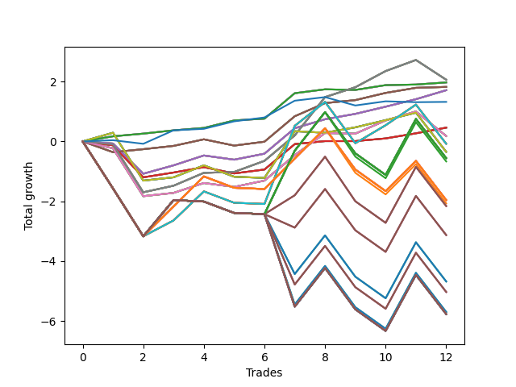

# Short Pointer Nine (1226 1227 1230) 
- Symbol: AAPL_Unlimited
- Date Range: 03/23/2022 - 07/08/2022
- Trading Period: 7:20-12:30
- Number of Trades: 12



| Name | Win Percent | Profit | Avg Profit / Trade | Avg Time / Trade |      | Name | Win Percent | Profit | Avg Profit / Trade | Avg Time / Trade |
| ---- | ----------- | ------ | ------------------ | ---------------- | ---- | ---- | ----------- | ------ | ------------------ | ---------------- |
| Sorted By <br> Profit | | | | | | Sorted By <br> Win Percentage ||||
| Sixty-Nine | 75.00 | 1030.00 | 85.83 | 43:04 |     | Sixty-Four | 91.67 | 985.00 | 82.08 | 03:27 |
| Sixty-One | 75.00 | 1030.00 | 85.83 | 43:04 |     | Fifty-Six | 91.67 | 985.00 | 82.08 | 03:27 |
| Fifty-Three | 75.00 | 1030.00 | 85.83 | 43:04 |     | Forty-Eight | 91.67 | 985.00 | 82.08 | 03:27 |
| Forty-Five | 75.00 | 1030.00 | 85.83 | 43:04 |     | Forty | 91.67 | 985.00 | 82.08 | 03:27 |
| Five | 75.00 | 1030.00 | 85.83 | 43:04 |     | Zero | 91.67 | 985.00 | 82.08 | 03:27 |
| Sixty-Four | 91.67 | 985.00 | 82.08 | 03:27 |     | Sixty-Seven | 83.33 | 910.00 | 75.83 | 19:12 |
| Fifty-Six | 91.67 | 985.00 | 82.08 | 03:27 |     | Fifty-Nine | 83.33 | 910.00 | 75.83 | 19:12 |
| Forty-Eight | 91.67 | 985.00 | 82.08 | 03:27 |     | Fifty-One | 83.33 | 910.00 | 75.83 | 19:12 |
| Forty | 91.67 | 985.00 | 82.08 | 03:27 |     | Forty-Three | 83.33 | 910.00 | 75.83 | 19:12 |
| Zero | 91.67 | 985.00 | 82.08 | 03:27 |     | Three | 83.33 | 910.00 | 75.83 | 19:12 |
| Sixty-Seven | 83.33 | 910.00 | 75.83 | 19:12 |     | Sixty-Nine | 75.00 | 1030.00 | 85.83 | 43:04 |
| Fifty-Nine | 83.33 | 910.00 | 75.83 | 19:12 |     | Sixty-One | 75.00 | 1030.00 | 85.83 | 43:04 |
| Fifty-One | 83.33 | 910.00 | 75.83 | 19:12 |     | Fifty-Three | 75.00 | 1030.00 | 85.83 | 43:04 |
| Forty-Three | 83.33 | 910.00 | 75.83 | 19:12 |     | Forty-Five | 75.00 | 1030.00 | 85.83 | 43:04 |
| Three | 83.33 | 910.00 | 75.83 | 19:12 |     | Five | 75.00 | 1030.00 | 85.83 | 43:04 |
| Sixty-Six | 75.00 | 855.00 | 71.25 | 18:55 |     | Sixty-Six | 75.00 | 855.00 | 71.25 | 18:55 |
| Fifty-Eight | 75.00 | 855.00 | 71.25 | 18:55 |     | Fifty-Eight | 75.00 | 855.00 | 71.25 | 18:55 |
| Fifty | 75.00 | 855.00 | 71.25 | 18:55 |     | Fifty | 75.00 | 855.00 | 71.25 | 18:55 |
| Forty-Two | 75.00 | 855.00 | 71.25 | 18:55 |     | Forty-Two | 75.00 | 855.00 | 71.25 | 18:55 |
| Two | 75.00 | 855.00 | 71.25 | 18:55 |     | Two | 75.00 | 855.00 | 71.25 | 18:55 |
| Seventy-Three | 75.00 | 660.00 | 55.00 | 07:25 |     | Seventy-Three | 75.00 | 660.00 | 55.00 | 07:25 |
| Sixty-Five | 66.67 | 230.00 | 19.17 | 15:47 |     | Sixty-Five | 66.67 | 230.00 | 19.17 | 15:47 |
| Fifty-Seven | 66.67 | 230.00 | 19.17 | 15:47 |     | Fifty-Seven | 66.67 | 230.00 | 19.17 | 15:47 |
| Forty-Nine | 66.67 | 230.00 | 19.17 | 15:47 |     | Forty-Nine | 66.67 | 230.00 | 19.17 | 15:47 |
| Forty-One | 66.67 | 230.00 | 19.17 | 15:47 |     | Forty-One | 66.67 | 230.00 | 19.17 | 15:47 |
| One | 66.67 | 230.00 | 19.17 | 15:47 |     | One | 66.67 | 230.00 | 19.17 | 15:47 |
| Sixty-Eight | 58.33 | 90.00 | 7.50 | 36:29 |     | Sixty-Eight | 58.33 | 90.00 | 7.50 | 36:29 |
| Sixty | 58.33 | 90.00 | 7.50 | 36:29 |     | Sixty | 58.33 | 90.00 | 7.50 | 36:29 |
| Fifty-Two | 58.33 | 90.00 | 7.50 | 36:29 |     | Fifty-Two | 58.33 | 90.00 | 7.50 | 36:29 |
| Forty-Four | 58.33 | 90.00 | 7.50 | 36:29 |     | Forty-Four | 58.33 | 90.00 | 7.50 | 36:29 |
| Four | 58.33 | 90.00 | 7.50 | 36:29 |     | Four | 58.33 | 90.00 | 7.50 | 36:29 |
| Seventy-One | 50.00 | -40.00 | -3.33 | 82:17 |     | Seventy | 58.33 | -175.00 | -14.58 | 46:56 |
| Sixty-Three | 50.00 | -40.00 | -3.33 | 82:17 |     | Sixty-Two | 58.33 | -175.00 | -14.58 | 46:56 |
| Fifty-Five | 50.00 | -40.00 | -3.33 | 82:17 |     | Fifty-Four | 58.33 | -175.00 | -14.58 | 46:56 |
| Forty-Seven | 50.00 | -40.00 | -3.33 | 82:17 |     | Forty-Six | 58.33 | -175.00 | -14.58 | 46:56 |
| Seven | 50.00 | -40.00 | -3.33 | 82:17 |     | Six | 58.33 | -175.00 | -14.58 | 46:56 |
| Seventy | 58.33 | -175.00 | -14.58 | 46:56 |     | Seventy-One | 50.00 | -40.00 | -3.33 | 82:17 |
| Sixty-Two | 58.33 | -175.00 | -14.58 | 46:56 |     | Sixty-Three | 50.00 | -40.00 | -3.33 | 82:17 |
| Fifty-Four | 58.33 | -175.00 | -14.58 | 46:56 |     | Fifty-Five | 50.00 | -40.00 | -3.33 | 82:17 |
| Forty-Six | 58.33 | -175.00 | -14.58 | 46:56 |     | Forty-Seven | 50.00 | -40.00 | -3.33 | 82:17 |
| Six | 58.33 | -175.00 | -14.58 | 46:56 |     | Seven | 50.00 | -40.00 | -3.33 | 82:17 |
| One Hundred Twenty-Seven | 33.33 | -280.00 | -23.33 | 118:30 |     | One Hundred Twenty-Six | 41.67 | -980.00 | -81.67 | 100:35 |
| One Hundred Twenty-Two | 33.33 | -280.00 | -23.33 | 118:30 |     | One Hundred Twenty-One | 41.67 | -980.00 | -81.67 | 100:35 |
| One Hundred Seventeen | 33.33 | -280.00 | -23.33 | 118:30 |     | One Hundred Sixteen | 41.67 | -980.00 | -81.67 | 100:35 |
| One Hundred Twelve | 33.33 | -280.00 | -23.33 | 118:30 |     | One Hundred Eleven | 41.67 | -980.00 | -81.67 | 100:35 |
| One Hundred Seven | 33.33 | -280.00 | -23.33 | 118:30 |     | One Hundred Six | 41.67 | -980.00 | -81.67 | 100:35 |
| One Hundred Two | 33.33 | -280.00 | -23.33 | 118:30 |     | One Hundred One | 41.67 | -980.00 | -81.67 | 100:35 |
| Ninety-Two | 33.33 | -280.00 | -23.33 | 118:30 |     | Ninety-One | 41.67 | -980.00 | -81.67 | 100:35 |
| Eighty-Two | 33.33 | -280.00 | -23.33 | 118:30 |     | Eighty-One | 41.67 | -980.00 | -81.67 | 100:35 |
| Ninety-Seven | 33.33 | -335.00 | -27.92 | 117:50 |     | Ninety-Six | 41.67 | -1035.00 | -86.25 | 99:55 |
| One Hundred Twenty-Six | 41.67 | -980.00 | -81.67 | 100:35 |     | One Hundred Twenty-Seven | 33.33 | -280.00 | -23.33 | 118:30 |
| One Hundred Twenty-One | 41.67 | -980.00 | -81.67 | 100:35 |     | One Hundred Twenty-Two | 33.33 | -280.00 | -23.33 | 118:30 |
| One Hundred Sixteen | 41.67 | -980.00 | -81.67 | 100:35 |     | One Hundred Seventeen | 33.33 | -280.00 | -23.33 | 118:30 |
| One Hundred Eleven | 41.67 | -980.00 | -81.67 | 100:35 |     | One Hundred Twelve | 33.33 | -280.00 | -23.33 | 118:30 |
| One Hundred Six | 41.67 | -980.00 | -81.67 | 100:35 |     | One Hundred Seven | 33.33 | -280.00 | -23.33 | 118:30 |
| One Hundred One | 41.67 | -980.00 | -81.67 | 100:35 |     | One Hundred Two | 33.33 | -280.00 | -23.33 | 118:30 |
| Ninety-One | 41.67 | -980.00 | -81.67 | 100:35 |     | Ninety-Two | 33.33 | -280.00 | -23.33 | 118:30 |
| Eighty-One | 41.67 | -980.00 | -81.67 | 100:35 |     | Eighty-Two | 33.33 | -280.00 | -23.33 | 118:30 |
| Ninety-Six | 41.67 | -1035.00 | -86.25 | 99:55 |     | Ninety-Seven | 33.33 | -335.00 | -27.92 | 117:50 |
| One Hundred | 33.33 | -1080.00 | -90.00 | 118:38 |     | One Hundred | 33.33 | -1080.00 | -90.00 | 118:38 |
| Ninety-Nine | 33.33 | -1080.00 | -90.00 | 118:38 |     | Ninety-Nine | 33.33 | -1080.00 | -90.00 | 118:38 |
| Ninety-Eight | 33.33 | -1080.00 | -90.00 | 118:38 |     | Ninety-Eight | 33.33 | -1080.00 | -90.00 | 118:38 |
| One Hundred Ten | 25.00 | -1565.00 | -130.42 | 119:35 |     | One Hundred Ten | 25.00 | -1565.00 | -130.42 | 119:35 |
| One Hundred Nine | 25.00 | -1565.00 | -130.42 | 119:35 |     | One Hundred Nine | 25.00 | -1565.00 | -130.42 | 119:35 |
| One Hundred Eight | 25.00 | -1565.00 | -130.42 | 119:35 |     | One Hundred Eight | 25.00 | -1565.00 | -130.42 | 119:35 |
| Ninety-Five | 25.00 | -2340.00 | -195.00 | 121:51 |     | Ninety-Five | 25.00 | -2340.00 | -195.00 | 121:51 |
| Ninety-Four | 25.00 | -2340.00 | -195.00 | 121:51 |     | Ninety-Four | 25.00 | -2340.00 | -195.00 | 121:51 |
| Ninety-Three | 25.00 | -2340.00 | -195.00 | 121:51 |     | Ninety-Three | 25.00 | -2340.00 | -195.00 | 121:51 |
| One Hundred Twenty | 25.00 | -2515.00 | -209.58 | 122:01 |     | One Hundred Twenty | 25.00 | -2515.00 | -209.58 | 122:01 |
| One Hundred Ninteen | 25.00 | -2515.00 | -209.58 | 122:01 |     | One Hundred Ninteen | 25.00 | -2515.00 | -209.58 | 122:01 |
| One Hundred Eighteen | 25.00 | -2515.00 | -209.58 | 122:01 |     | One Hundred Eighteen | 25.00 | -2515.00 | -209.58 | 122:01 |
| One Hundred Five | 25.00 | -2850.00 | -237.50 | 123:26 |     | One Hundred Five | 25.00 | -2850.00 | -237.50 | 123:26 |
| One Hundred Four | 25.00 | -2850.00 | -237.50 | 123:26 |     | One Hundred Four | 25.00 | -2850.00 | -237.50 | 123:26 |
| One Hundred Three | 25.00 | -2850.00 | -237.50 | 123:26 |     | One Hundred Three | 25.00 | -2850.00 | -237.50 | 123:26 |
| One Hundred Thirty | 25.00 | -2885.00 | -240.42 | 124:35 |     | One Hundred Thirty | 25.00 | -2885.00 | -240.42 | 124:35 |
| One Hundred Twenty-Nine | 25.00 | -2885.00 | -240.42 | 124:35 |     | One Hundred Twenty-Nine | 25.00 | -2885.00 | -240.42 | 124:35 |
| One Hundred Twenty-Eight | 25.00 | -2885.00 | -240.42 | 124:35 |     | One Hundred Twenty-Eight | 25.00 | -2885.00 | -240.42 | 124:35 |
| One Hundred Twenty-Five | 25.00 | -2885.00 | -240.42 | 124:35 |     | One Hundred Twenty-Five | 25.00 | -2885.00 | -240.42 | 124:35 |
| One Hundred Twenty-Four | 25.00 | -2885.00 | -240.42 | 124:35 |     | One Hundred Twenty-Four | 25.00 | -2885.00 | -240.42 | 124:35 |
| One Hundred Twenty-Three | 25.00 | -2885.00 | -240.42 | 124:35 |     | One Hundred Twenty-Three | 25.00 | -2885.00 | -240.42 | 124:35 |
| One Hundred Fifteen | 25.00 | -2885.00 | -240.42 | 124:35 |     | One Hundred Fifteen | 25.00 | -2885.00 | -240.42 | 124:35 |
| One Hundred Fourteen | 25.00 | -2885.00 | -240.42 | 124:35 |     | One Hundred Fourteen | 25.00 | -2885.00 | -240.42 | 124:35 |
| One Hundred Thirteen | 25.00 | -2885.00 | -240.42 | 124:35 |     | One Hundred Thirteen | 25.00 | -2885.00 | -240.42 | 124:35 |
| Eighty-Five | 25.00 | -2885.00 | -240.42 | 124:35 |     | Eighty-Five | 25.00 | -2885.00 | -240.42 | 124:35 |
| Eighty-Four | 25.00 | -2885.00 | -240.42 | 124:35 |     | Eighty-Four | 25.00 | -2885.00 | -240.42 | 124:35 |
| Eighty-Three | 25.00 | -2885.00 | -240.42 | 124:35 |     | Eighty-Three | 25.00 | -2885.00 | -240.42 | 124:35 |

## NO STOPLOSS

### Test Zero
* Sell when price hits the middle line of the 20p bollinger
* No Stoploss
* Results:
```
Total Trades: 12
Percent Up: 8.33
Percent Down: 91.67
Total Points Moved Down: 1.97
Potential Profit: 985.00
Total Points Ups: 0.02 Count Ups: 1
Total Points Downs: 1.99 Count Downs: 11
```

<details><summary>Trades</summary>

<code>In: 2022-03-24 10:04:00		Out: 2022-03-24 10:09:20		Total Position Time: 05:20		Total Move Down: 0.17		Total to Date: 0.17</code> <br />
<code>In: 2022-04-07 11:30:00		Out: 2022-04-07 11:31:10		Total Position Time: 01:10		Total Move Down: 0.09		Total to Date: 0.26</code> <br />
<code>In: 2022-04-11 11:12:00		Out: 2022-04-11 11:13:10		Total Position Time: 01:10		Total Move Down: 0.11		Total to Date: 0.37</code> <br />
<code>In: 2022-04-20 10:50:00		Out: 2022-04-20 10:51:10		Total Position Time: 01:10		Total Move Down: 0.08		Total to Date: 0.45</code> <br />
<code>In: 2022-04-28 10:16:00		Out: 2022-04-28 10:19:05		Total Position Time: 03:05		Total Move Down: 0.25		Total to Date: 0.70</code> <br />
<code>In: 2022-04-28 10:53:00		Out: 2022-04-28 10:54:10		Total Position Time: 01:10		Total Move Down: 0.06		Total to Date: 0.76</code> <br />
<code>In: 2022-05-04 11:07:00		Out: 2022-05-04 11:08:10		Total Position Time: 01:10		Total Move Down: 0.85		Total to Date: 1.61</code> <br />
<code>In: 2022-05-09 12:04:00		Out: 2022-05-09 12:09:15		Total Position Time: 05:15		Total Move Down: 0.13		Total to Date: 1.74</code> <br />
<code>In: 2022-05-24 10:48:00		Out: 2022-05-24 10:58:25		Total Position Time: 10:25		Total Move Down: -0.02		Total to Date: 1.72</code> <br />
<code>In: 2022-06-14 08:47:00		Out: 2022-06-14 08:51:40		Total Position Time: 04:40		Total Move Down: 0.16		Total to Date: 1.88</code> <br />
<code>In: 2022-06-16 10:14:00		Out: 2022-06-16 10:19:50		Total Position Time: 05:50		Total Move Down: 0.02		Total to Date: 1.90</code> <br />
<code>In: 2022-07-05 10:44:00		Out: 2022-07-05 10:45:10		Total Position Time: 01:10		Total Move Down: 0.07		Total to Date: 1.97</code> <br />


</details>

### Test One
* Sell when the price hits the upper line of the 20p 1std bollinger
* No Stoploss
* Results:
```
Total Trades: 12
Percent Up: 33.33
Percent Down: 66.67
Total Points Moved Down: 0.46
Potential Profit: 230.00
Total Points Ups: 1.41 Count Ups: 4
Total Points Downs: 1.87 Count Downs: 8
```

<details><summary>Trades</summary>

<code>In: 2022-03-24 10:04:00		Out: 2022-03-24 10:33:15		Total Position Time: 29:15		Total Move Down: -0.13		Total to Date: -0.13</code> <br />
<code>In: 2022-04-07 11:30:00		Out: 2022-04-07 12:27:40		Total Position Time: 57:40		Total Move Down: -1.07		Total to Date: -1.20</code> <br />
<code>In: 2022-04-11 11:12:00		Out: 2022-04-11 11:14:15		Total Position Time: 02:15		Total Move Down: 0.16		Total to Date: -1.04</code> <br />
<code>In: 2022-04-20 10:50:00		Out: 2022-04-20 10:54:05		Total Position Time: 04:05		Total Move Down: 0.18		Total to Date: -0.86</code> <br />
<code>In: 2022-04-28 10:16:00		Out: 2022-04-28 10:56:05		Total Position Time: 40:05		Total Move Down: -0.21		Total to Date: -1.07</code> <br />
<code>In: 2022-04-28 10:53:00		Out: 2022-04-28 10:56:05		Total Position Time: 03:05		Total Move Down: 0.13		Total to Date: -0.94</code> <br />
<code>In: 2022-05-04 11:07:00		Out: 2022-05-04 11:08:10		Total Position Time: 01:10		Total Move Down: 0.85		Total to Date: -0.09</code> <br />
<code>In: 2022-05-09 12:04:00		Out: 2022-05-09 12:17:30		Total Position Time: 13:30		Total Move Down: 0.10		Total to Date: 0.01</code> <br />
<code>In: 2022-05-24 10:48:00		Out: 2022-05-24 11:01:20		Total Position Time: 13:20		Total Move Down: -0.00		Total to Date: 0.01</code> <br />
<code>In: 2022-06-14 08:47:00		Out: 2022-06-14 09:02:10		Total Position Time: 15:10		Total Move Down: 0.09		Total to Date: 0.10</code> <br />
<code>In: 2022-06-16 10:14:00		Out: 2022-06-16 10:20:35		Total Position Time: 06:35		Total Move Down: 0.17		Total to Date: 0.27</code> <br />
<code>In: 2022-07-05 10:44:00		Out: 2022-07-05 10:47:25		Total Position Time: 03:25		Total Move Down: 0.19		Total to Date: 0.46</code> <br />


</details>

### Test Two
* Sell when the price hits the upper line of the 20p 2std bollinger
* No Stoploss
* Results:
```
Total Trades: 12
Percent Up: 25.00
Percent Down: 75.00
Total Points Moved Down: 1.71
Potential Profit: 855.00
Total Points Ups: 1.22 Count Ups: 3
Total Points Downs: 2.93 Count Downs: 9
```

<details><summary>Trades</summary>

<code>In: 2022-03-24 10:04:00		Out: 2022-03-24 10:34:15		Total Position Time: 30:15		Total Move Down: -0.07		Total to Date: -0.07</code> <br />
<code>In: 2022-04-07 11:30:00		Out: 2022-04-07 12:28:30		Total Position Time: 58:30		Total Move Down: -1.01		Total to Date: -1.08</code> <br />
<code>In: 2022-04-11 11:12:00		Out: 2022-04-11 11:14:30		Total Position Time: 02:30		Total Move Down: 0.28		Total to Date: -0.80</code> <br />
<code>In: 2022-04-20 10:50:00		Out: 2022-04-20 11:03:15		Total Position Time: 13:15		Total Move Down: 0.33		Total to Date: -0.47</code> <br />
<code>In: 2022-04-28 10:16:00		Out: 2022-04-28 11:06:20		Total Position Time: 50:20		Total Move Down: -0.14		Total to Date: -0.61</code> <br />
<code>In: 2022-04-28 10:53:00		Out: 2022-04-28 11:06:20		Total Position Time: 13:20		Total Move Down: 0.20		Total to Date: -0.41</code> <br />
<code>In: 2022-05-04 11:07:00		Out: 2022-05-04 11:08:10		Total Position Time: 01:10		Total Move Down: 0.85		Total to Date: 0.44</code> <br />
<code>In: 2022-05-09 12:04:00		Out: 2022-05-09 12:20:05		Total Position Time: 16:05		Total Move Down: 0.30		Total to Date: 0.74</code> <br />
<code>In: 2022-05-24 10:48:00		Out: 2022-05-24 11:01:40		Total Position Time: 13:40		Total Move Down: 0.18		Total to Date: 0.92</code> <br />
<code>In: 2022-06-14 08:47:00		Out: 2022-06-14 09:03:00		Total Position Time: 16:00		Total Move Down: 0.24		Total to Date: 1.16</code> <br />
<code>In: 2022-06-16 10:14:00		Out: 2022-06-16 10:21:35		Total Position Time: 07:35		Total Move Down: 0.25		Total to Date: 1.41</code> <br />
<code>In: 2022-07-05 10:44:00		Out: 2022-07-05 10:48:25		Total Position Time: 04:25		Total Move Down: 0.30		Total to Date: 1.71</code> <br />


</details>

### Test Three
* Sell when price hits the middle line of the 50p bollinger
* No Stoploss
* Results:
```
Total Trades: 12
Percent Up: 16.67
Percent Down: 83.33
Total Points Moved Down: 1.82
Potential Profit: 910.00
Total Points Ups: 0.57 Count Ups: 2
Total Points Downs: 2.39 Count Downs: 10
```

<details><summary>Trades</summary>

<code>In: 2022-03-24 10:04:00		Out: 2022-03-24 11:09:05		Total Position Time: 65:05		Total Move Down: -0.36		Total to Date: -0.36</code> <br />
<code>In: 2022-04-07 11:30:00		Out: 2022-04-07 11:36:05		Total Position Time: 06:05		Total Move Down: 0.10		Total to Date: -0.26</code> <br />
<code>In: 2022-04-11 11:12:00		Out: 2022-04-11 11:13:10		Total Position Time: 01:10		Total Move Down: 0.11		Total to Date: -0.15</code> <br />
<code>In: 2022-04-20 10:50:00		Out: 2022-04-20 10:55:30		Total Position Time: 05:30		Total Move Down: 0.22		Total to Date: 0.07</code> <br />
<code>In: 2022-04-28 10:16:00		Out: 2022-04-28 11:01:05		Total Position Time: 45:05		Total Move Down: -0.21		Total to Date: -0.14</code> <br />
<code>In: 2022-04-28 10:53:00		Out: 2022-04-28 11:01:05		Total Position Time: 08:05		Total Move Down: 0.13		Total to Date: -0.01</code> <br />
<code>In: 2022-05-04 11:07:00		Out: 2022-05-04 11:08:10		Total Position Time: 01:10		Total Move Down: 0.85		Total to Date: 0.84</code> <br />
<code>In: 2022-05-09 12:04:00		Out: 2022-05-09 12:20:15		Total Position Time: 16:15		Total Move Down: 0.44		Total to Date: 1.28</code> <br />
<code>In: 2022-05-24 10:48:00		Out: 2022-05-24 11:20:20		Total Position Time: 32:20		Total Move Down: 0.10		Total to Date: 1.38</code> <br />
<code>In: 2022-06-14 08:47:00		Out: 2022-06-14 09:03:00		Total Position Time: 16:00		Total Move Down: 0.24		Total to Date: 1.62</code> <br />
<code>In: 2022-06-16 10:14:00		Out: 2022-06-16 10:20:35		Total Position Time: 06:35		Total Move Down: 0.17		Total to Date: 1.79</code> <br />
<code>In: 2022-07-05 10:44:00		Out: 2022-07-05 11:11:10		Total Position Time: 27:10		Total Move Down: 0.03		Total to Date: 1.82</code> <br />


</details>

### Test Four
* Sell when the price hits the upper line of the 50p 1std bollinger
* No Stoploss
* Results:
```
Total Trades: 12
Percent Up: 41.67
Percent Down: 58.33
Total Points Moved Down: 0.18
Potential Profit: 90.00
Total Points Ups: 2.80 Count Ups: 5
Total Points Downs: 2.98 Count Downs: 7
```

<details><summary>Trades</summary>

<code>In: 2022-03-24 10:04:00		Out: 2022-03-24 11:10:25		Total Position Time: 66:25		Total Move Down: -0.23		Total to Date: -0.23</code> <br />
<code>In: 2022-04-07 11:30:00		Out: 2022-04-07 12:47:00		Total Position Time: 77:00		Total Move Down: -1.60		Total to Date: -1.83</code> <br />
<code>In: 2022-04-11 11:12:00		Out: 2022-04-11 11:13:10		Total Position Time: 01:10		Total Move Down: 0.11		Total to Date: -1.72</code> <br />
<code>In: 2022-04-20 10:50:00		Out: 2022-04-20 11:03:15		Total Position Time: 13:15		Total Move Down: 0.33		Total to Date: -1.39</code> <br />
<code>In: 2022-04-28 10:16:00		Out: 2022-04-28 11:14:05		Total Position Time: 58:05		Total Move Down: -0.13		Total to Date: -1.52</code> <br />
<code>In: 2022-04-28 10:53:00		Out: 2022-04-28 11:14:05		Total Position Time: 21:05		Total Move Down: 0.21		Total to Date: -1.31</code> <br />
<code>In: 2022-05-04 11:07:00		Out: 2022-05-04 11:08:10		Total Position Time: 01:10		Total Move Down: 0.85		Total to Date: -0.46</code> <br />
<code>In: 2022-05-09 12:04:00		Out: 2022-05-09 12:24:05		Total Position Time: 20:05		Total Move Down: 0.74		Total to Date: 0.28</code> <br />
<code>In: 2022-05-24 10:48:00		Out: 2022-05-24 11:44:05		Total Position Time: 56:05		Total Move Down: -0.02		Total to Date: 0.26</code> <br />
<code>In: 2022-06-14 08:47:00		Out: 2022-06-14 09:07:10		Total Position Time: 20:10		Total Move Down: 0.44		Total to Date: 0.70</code> <br />
<code>In: 2022-06-16 10:14:00		Out: 2022-06-16 10:23:50		Total Position Time: 09:50		Total Move Down: 0.30		Total to Date: 1.00</code> <br />
<code>In: 2022-07-05 10:44:00		Out: 2022-07-05 12:17:30		Total Position Time: 93:30		Total Move Down: -0.82		Total to Date: 0.18</code> <br />


</details>

### Test Five
* Sell when the price hits the upper line of the 50p 2std bollinger
* No Stoploss
* Results:
```
Total Trades: 12
Percent Up: 25.00
Percent Down: 75.00
Total Points Moved Down: 2.06
Potential Profit: 1030.00
Total Points Ups: 2.36 Count Ups: 3
Total Points Downs: 4.42 Count Downs: 9
```

<details><summary>Trades</summary>

<code>In: 2022-03-24 10:04:00		Out: 2022-03-24 11:10:45		Total Position Time: 66:45		Total Move Down: -0.10		Total to Date: -0.10</code> <br />
<code>In: 2022-04-07 11:30:00		Out: 2022-04-07 12:47:00		Total Position Time: 77:00		Total Move Down: -1.60		Total to Date: -1.70</code> <br />
<code>In: 2022-04-11 11:12:00		Out: 2022-04-11 11:14:25		Total Position Time: 02:25		Total Move Down: 0.22		Total to Date: -1.48</code> <br />
<code>In: 2022-04-20 10:50:00		Out: 2022-04-20 11:19:30		Total Position Time: 29:30		Total Move Down: 0.43		Total to Date: -1.05</code> <br />
<code>In: 2022-04-28 10:16:00		Out: 2022-04-28 11:15:25		Total Position Time: 59:25		Total Move Down: 0.03		Total to Date: -1.02</code> <br />
<code>In: 2022-04-28 10:53:00		Out: 2022-04-28 11:15:25		Total Position Time: 22:25		Total Move Down: 0.37		Total to Date: -0.65</code> <br />
<code>In: 2022-05-04 11:07:00		Out: 2022-05-04 11:08:10		Total Position Time: 01:10		Total Move Down: 0.85		Total to Date: 0.20</code> <br />
<code>In: 2022-05-09 12:04:00		Out: 2022-05-09 12:46:55		Total Position Time: 42:55		Total Move Down: 1.28		Total to Date: 1.48</code> <br />
<code>In: 2022-05-24 10:48:00		Out: 2022-05-24 11:49:20		Total Position Time: 61:20		Total Move Down: 0.33		Total to Date: 1.81</code> <br />
<code>In: 2022-06-14 08:47:00		Out: 2022-06-14 09:14:40		Total Position Time: 27:40		Total Move Down: 0.54		Total to Date: 2.35</code> <br />
<code>In: 2022-06-16 10:14:00		Out: 2022-06-16 10:45:10		Total Position Time: 31:10		Total Move Down: 0.37		Total to Date: 2.72</code> <br />
<code>In: 2022-07-05 10:44:00		Out: 2022-07-05 12:19:10		Total Position Time: 95:10		Total Move Down: -0.66		Total to Date: 2.06</code> <br />


</details>

### Test Six
* Sell when the price hits the middle line of the 1std VWAP
* No Stoploss
* Results:
```
Total Trades: 12
Percent Up: 41.67
Percent Down: 58.33
Total Points Moved Down: -0.35
Potential Profit: -175.00
Total Points Ups: 3.38 Count Ups: 5
Total Points Downs: 3.03 Count Downs: 7
```

<details><summary>Trades</summary>

<code>In: 2022-03-24 10:04:00		Out: 2022-03-24 10:09:25		Total Position Time: 05:25		Total Move Down: 0.29		Total to Date: 0.29</code> <br />
<code>In: 2022-04-07 11:30:00		Out: 2022-04-07 12:47:00		Total Position Time: 77:00		Total Move Down: -1.60		Total to Date: -1.31</code> <br />
<code>In: 2022-04-11 11:12:00		Out: 2022-04-11 11:13:10		Total Position Time: 01:10		Total Move Down: 0.11		Total to Date: -1.20</code> <br />
<code>In: 2022-04-20 10:50:00		Out: 2022-04-20 11:19:25		Total Position Time: 29:25		Total Move Down: 0.40		Total to Date: -0.80</code> <br />
<code>In: 2022-04-28 10:16:00		Out: 2022-04-28 12:47:00		Total Position Time: 151:00		Total Move Down: -0.38		Total to Date: -1.18</code> <br />
<code>In: 2022-04-28 10:53:00		Out: 2022-04-28 12:47:00		Total Position Time: 114:00		Total Move Down: -0.04		Total to Date: -1.22</code> <br />
<code>In: 2022-05-04 11:07:00		Out: 2022-05-04 11:30:50		Total Position Time: 23:50		Total Move Down: 1.56		Total to Date: 0.34</code> <br />
<code>In: 2022-05-09 12:04:00		Out: 2022-05-09 12:05:10		Total Position Time: 01:10		Total Move Down: -0.05		Total to Date: 0.29</code> <br />
<code>In: 2022-05-24 10:48:00		Out: 2022-05-24 11:01:40		Total Position Time: 13:40		Total Move Down: 0.18		Total to Date: 0.47</code> <br />
<code>In: 2022-06-14 08:47:00		Out: 2022-06-14 09:03:00		Total Position Time: 16:00		Total Move Down: 0.24		Total to Date: 0.71</code> <br />
<code>In: 2022-06-16 10:14:00		Out: 2022-06-16 10:21:35		Total Position Time: 07:35		Total Move Down: 0.25		Total to Date: 0.96</code> <br />
<code>In: 2022-07-05 10:44:00		Out: 2022-07-05 12:47:00		Total Position Time: 123:00		Total Move Down: -1.31		Total to Date: -0.35</code> <br />


</details>

### Test Seven
* Sell when the price hits the upper line of the 1std VWAP
* No Stoploss
* Results:
```
Total Trades: 12
Percent Up: 50.00
Percent Down: 50.00
Total Points Moved Down: -0.08
Potential Profit: -40.00
Total Points Ups: 6.28 Count Ups: 6
Total Points Downs: 6.20 Count Downs: 6
```

<details><summary>Trades</summary>

<code>In: 2022-03-24 10:04:00		Out: 2022-03-24 12:47:00		Total Position Time: 163:00		Total Move Down: -1.57		Total to Date: -1.57</code> <br />
<code>In: 2022-04-07 11:30:00		Out: 2022-04-07 12:47:00		Total Position Time: 77:00		Total Move Down: -1.60		Total to Date: -3.17</code> <br />
<code>In: 2022-04-11 11:12:00		Out: 2022-04-11 12:16:15		Total Position Time: 64:15		Total Move Down: 0.53		Total to Date: -2.64</code> <br />
<code>In: 2022-04-20 10:50:00		Out: 2022-04-20 11:52:05		Total Position Time: 62:05		Total Move Down: 0.97		Total to Date: -1.67</code> <br />
<code>In: 2022-04-28 10:16:00		Out: 2022-04-28 12:47:00		Total Position Time: 151:00		Total Move Down: -0.38		Total to Date: -2.05</code> <br />
<code>In: 2022-04-28 10:53:00		Out: 2022-04-28 12:47:00		Total Position Time: 114:00		Total Move Down: -0.04		Total to Date: -2.09</code> <br />
<code>In: 2022-05-04 11:07:00		Out: 2022-05-04 11:35:05		Total Position Time: 28:05		Total Move Down: 2.61		Total to Date: 0.52</code> <br />
<code>In: 2022-05-09 12:04:00		Out: 2022-05-09 12:25:05		Total Position Time: 21:05		Total Move Down: 0.80		Total to Date: 1.32</code> <br />
<code>In: 2022-05-24 10:48:00		Out: 2022-05-24 12:47:00		Total Position Time: 119:00		Total Move Down: -1.38		Total to Date: -0.06</code> <br />
<code>In: 2022-06-14 08:47:00		Out: 2022-06-14 09:15:25		Total Position Time: 28:25		Total Move Down: 0.60		Total to Date: 0.54</code> <br />
<code>In: 2022-06-16 10:14:00		Out: 2022-06-16 10:50:30		Total Position Time: 36:30		Total Move Down: 0.69		Total to Date: 1.23</code> <br />
<code>In: 2022-07-05 10:44:00		Out: 2022-07-05 12:47:00		Total Position Time: 123:00		Total Move Down: -1.31		Total to Date: -0.08</code> <br />


</details>

## STOPLOSS OF 5

### Test Forty
* Sell when price hits the middle line of the 20p bollinger
* Stoploss is -5 points
* Results:
```
Total Trades: 12
Percent Up: 8.33
Percent Down: 91.67
Total Points Moved Down: 1.97
Potential Profit: 985.00
Total Points Ups: 0.02 Count Ups: 1
Total Points Downs: 1.99 Count Downs: 11
```

<details><summary>Trades</summary>

<code>In: 2022-03-24 10:04:00		Out: 2022-03-24 10:09:20		Total Position Time: 05:20		Total Move Down: 0.17		Total to Date: 0.17</code> <br />
<code>In: 2022-04-07 11:30:00		Out: 2022-04-07 11:31:10		Total Position Time: 01:10		Total Move Down: 0.09		Total to Date: 0.26</code> <br />
<code>In: 2022-04-11 11:12:00		Out: 2022-04-11 11:13:10		Total Position Time: 01:10		Total Move Down: 0.11		Total to Date: 0.37</code> <br />
<code>In: 2022-04-20 10:50:00		Out: 2022-04-20 10:51:10		Total Position Time: 01:10		Total Move Down: 0.08		Total to Date: 0.45</code> <br />
<code>In: 2022-04-28 10:16:00		Out: 2022-04-28 10:19:05		Total Position Time: 03:05		Total Move Down: 0.25		Total to Date: 0.70</code> <br />
<code>In: 2022-04-28 10:53:00		Out: 2022-04-28 10:54:10		Total Position Time: 01:10		Total Move Down: 0.06		Total to Date: 0.76</code> <br />
<code>In: 2022-05-04 11:07:00		Out: 2022-05-04 11:08:10		Total Position Time: 01:10		Total Move Down: 0.85		Total to Date: 1.61</code> <br />
<code>In: 2022-05-09 12:04:00		Out: 2022-05-09 12:09:15		Total Position Time: 05:15		Total Move Down: 0.13		Total to Date: 1.74</code> <br />
<code>In: 2022-05-24 10:48:00		Out: 2022-05-24 10:58:25		Total Position Time: 10:25		Total Move Down: -0.02		Total to Date: 1.72</code> <br />
<code>In: 2022-06-14 08:47:00		Out: 2022-06-14 08:51:40		Total Position Time: 04:40		Total Move Down: 0.16		Total to Date: 1.88</code> <br />
<code>In: 2022-06-16 10:14:00		Out: 2022-06-16 10:19:50		Total Position Time: 05:50		Total Move Down: 0.02		Total to Date: 1.90</code> <br />
<code>In: 2022-07-05 10:44:00		Out: 2022-07-05 10:45:10		Total Position Time: 01:10		Total Move Down: 0.07		Total to Date: 1.97</code> <br />


</details>

### Test Forty-One
* Sell when the price hits the upper line of the 20p 1std bollinger
* Stoploss is -5 points
* Results:
```
Total Trades: 12
Percent Up: 33.33
Percent Down: 66.67
Total Points Moved Down: 0.46
Potential Profit: 230.00
Total Points Ups: 1.41 Count Ups: 4
Total Points Downs: 1.87 Count Downs: 8
```

<details><summary>Trades</summary>

<code>In: 2022-03-24 10:04:00		Out: 2022-03-24 10:33:15		Total Position Time: 29:15		Total Move Down: -0.13		Total to Date: -0.13</code> <br />
<code>In: 2022-04-07 11:30:00		Out: 2022-04-07 12:27:40		Total Position Time: 57:40		Total Move Down: -1.07		Total to Date: -1.20</code> <br />
<code>In: 2022-04-11 11:12:00		Out: 2022-04-11 11:14:15		Total Position Time: 02:15		Total Move Down: 0.16		Total to Date: -1.04</code> <br />
<code>In: 2022-04-20 10:50:00		Out: 2022-04-20 10:54:05		Total Position Time: 04:05		Total Move Down: 0.18		Total to Date: -0.86</code> <br />
<code>In: 2022-04-28 10:16:00		Out: 2022-04-28 10:56:05		Total Position Time: 40:05		Total Move Down: -0.21		Total to Date: -1.07</code> <br />
<code>In: 2022-04-28 10:53:00		Out: 2022-04-28 10:56:05		Total Position Time: 03:05		Total Move Down: 0.13		Total to Date: -0.94</code> <br />
<code>In: 2022-05-04 11:07:00		Out: 2022-05-04 11:08:10		Total Position Time: 01:10		Total Move Down: 0.85		Total to Date: -0.09</code> <br />
<code>In: 2022-05-09 12:04:00		Out: 2022-05-09 12:17:30		Total Position Time: 13:30		Total Move Down: 0.10		Total to Date: 0.01</code> <br />
<code>In: 2022-05-24 10:48:00		Out: 2022-05-24 11:01:20		Total Position Time: 13:20		Total Move Down: -0.00		Total to Date: 0.01</code> <br />
<code>In: 2022-06-14 08:47:00		Out: 2022-06-14 09:02:10		Total Position Time: 15:10		Total Move Down: 0.09		Total to Date: 0.10</code> <br />
<code>In: 2022-06-16 10:14:00		Out: 2022-06-16 10:20:35		Total Position Time: 06:35		Total Move Down: 0.17		Total to Date: 0.27</code> <br />
<code>In: 2022-07-05 10:44:00		Out: 2022-07-05 10:47:25		Total Position Time: 03:25		Total Move Down: 0.19		Total to Date: 0.46</code> <br />


</details>

### Test Forty-Two
* Sell when the price hits the upper line of the 20p 2std bollinger
* Stoploss is -5 points
* Results:
```
Total Trades: 12
Percent Up: 25.00
Percent Down: 75.00
Total Points Moved Down: 1.71
Potential Profit: 855.00
Total Points Ups: 1.22 Count Ups: 3
Total Points Downs: 2.93 Count Downs: 9
```

<details><summary>Trades</summary>

<code>In: 2022-03-24 10:04:00		Out: 2022-03-24 10:34:15		Total Position Time: 30:15		Total Move Down: -0.07		Total to Date: -0.07</code> <br />
<code>In: 2022-04-07 11:30:00		Out: 2022-04-07 12:28:30		Total Position Time: 58:30		Total Move Down: -1.01		Total to Date: -1.08</code> <br />
<code>In: 2022-04-11 11:12:00		Out: 2022-04-11 11:14:30		Total Position Time: 02:30		Total Move Down: 0.28		Total to Date: -0.80</code> <br />
<code>In: 2022-04-20 10:50:00		Out: 2022-04-20 11:03:15		Total Position Time: 13:15		Total Move Down: 0.33		Total to Date: -0.47</code> <br />
<code>In: 2022-04-28 10:16:00		Out: 2022-04-28 11:06:20		Total Position Time: 50:20		Total Move Down: -0.14		Total to Date: -0.61</code> <br />
<code>In: 2022-04-28 10:53:00		Out: 2022-04-28 11:06:20		Total Position Time: 13:20		Total Move Down: 0.20		Total to Date: -0.41</code> <br />
<code>In: 2022-05-04 11:07:00		Out: 2022-05-04 11:08:10		Total Position Time: 01:10		Total Move Down: 0.85		Total to Date: 0.44</code> <br />
<code>In: 2022-05-09 12:04:00		Out: 2022-05-09 12:20:05		Total Position Time: 16:05		Total Move Down: 0.30		Total to Date: 0.74</code> <br />
<code>In: 2022-05-24 10:48:00		Out: 2022-05-24 11:01:40		Total Position Time: 13:40		Total Move Down: 0.18		Total to Date: 0.92</code> <br />
<code>In: 2022-06-14 08:47:00		Out: 2022-06-14 09:03:00		Total Position Time: 16:00		Total Move Down: 0.24		Total to Date: 1.16</code> <br />
<code>In: 2022-06-16 10:14:00		Out: 2022-06-16 10:21:35		Total Position Time: 07:35		Total Move Down: 0.25		Total to Date: 1.41</code> <br />
<code>In: 2022-07-05 10:44:00		Out: 2022-07-05 10:48:25		Total Position Time: 04:25		Total Move Down: 0.30		Total to Date: 1.71</code> <br />


</details>

### Test Forty-Three
* Sell when price hits the middle line of the 50p bollinger
* Stoploss is -5 points
* Results:
```
Total Trades: 12
Percent Up: 16.67
Percent Down: 83.33
Total Points Moved Down: 1.82
Potential Profit: 910.00
Total Points Ups: 0.57 Count Ups: 2
Total Points Downs: 2.39 Count Downs: 10
```

<details><summary>Trades</summary>

<code>In: 2022-03-24 10:04:00		Out: 2022-03-24 11:09:05		Total Position Time: 65:05		Total Move Down: -0.36		Total to Date: -0.36</code> <br />
<code>In: 2022-04-07 11:30:00		Out: 2022-04-07 11:36:05		Total Position Time: 06:05		Total Move Down: 0.10		Total to Date: -0.26</code> <br />
<code>In: 2022-04-11 11:12:00		Out: 2022-04-11 11:13:10		Total Position Time: 01:10		Total Move Down: 0.11		Total to Date: -0.15</code> <br />
<code>In: 2022-04-20 10:50:00		Out: 2022-04-20 10:55:30		Total Position Time: 05:30		Total Move Down: 0.22		Total to Date: 0.07</code> <br />
<code>In: 2022-04-28 10:16:00		Out: 2022-04-28 11:01:05		Total Position Time: 45:05		Total Move Down: -0.21		Total to Date: -0.14</code> <br />
<code>In: 2022-04-28 10:53:00		Out: 2022-04-28 11:01:05		Total Position Time: 08:05		Total Move Down: 0.13		Total to Date: -0.01</code> <br />
<code>In: 2022-05-04 11:07:00		Out: 2022-05-04 11:08:10		Total Position Time: 01:10		Total Move Down: 0.85		Total to Date: 0.84</code> <br />
<code>In: 2022-05-09 12:04:00		Out: 2022-05-09 12:20:15		Total Position Time: 16:15		Total Move Down: 0.44		Total to Date: 1.28</code> <br />
<code>In: 2022-05-24 10:48:00		Out: 2022-05-24 11:20:20		Total Position Time: 32:20		Total Move Down: 0.10		Total to Date: 1.38</code> <br />
<code>In: 2022-06-14 08:47:00		Out: 2022-06-14 09:03:00		Total Position Time: 16:00		Total Move Down: 0.24		Total to Date: 1.62</code> <br />
<code>In: 2022-06-16 10:14:00		Out: 2022-06-16 10:20:35		Total Position Time: 06:35		Total Move Down: 0.17		Total to Date: 1.79</code> <br />
<code>In: 2022-07-05 10:44:00		Out: 2022-07-05 11:11:10		Total Position Time: 27:10		Total Move Down: 0.03		Total to Date: 1.82</code> <br />


</details>

### Test Forty-Four
* Sell when the price hits the upper line of the 50p 1std bollinger
* Stoploss is -5 points
* Results:
```
Total Trades: 12
Percent Up: 41.67
Percent Down: 58.33
Total Points Moved Down: 0.18
Potential Profit: 90.00
Total Points Ups: 2.80 Count Ups: 5
Total Points Downs: 2.98 Count Downs: 7
```

<details><summary>Trades</summary>

<code>In: 2022-03-24 10:04:00		Out: 2022-03-24 11:10:25		Total Position Time: 66:25		Total Move Down: -0.23		Total to Date: -0.23</code> <br />
<code>In: 2022-04-07 11:30:00		Out: 2022-04-07 12:47:00		Total Position Time: 77:00		Total Move Down: -1.60		Total to Date: -1.83</code> <br />
<code>In: 2022-04-11 11:12:00		Out: 2022-04-11 11:13:10		Total Position Time: 01:10		Total Move Down: 0.11		Total to Date: -1.72</code> <br />
<code>In: 2022-04-20 10:50:00		Out: 2022-04-20 11:03:15		Total Position Time: 13:15		Total Move Down: 0.33		Total to Date: -1.39</code> <br />
<code>In: 2022-04-28 10:16:00		Out: 2022-04-28 11:14:05		Total Position Time: 58:05		Total Move Down: -0.13		Total to Date: -1.52</code> <br />
<code>In: 2022-04-28 10:53:00		Out: 2022-04-28 11:14:05		Total Position Time: 21:05		Total Move Down: 0.21		Total to Date: -1.31</code> <br />
<code>In: 2022-05-04 11:07:00		Out: 2022-05-04 11:08:10		Total Position Time: 01:10		Total Move Down: 0.85		Total to Date: -0.46</code> <br />
<code>In: 2022-05-09 12:04:00		Out: 2022-05-09 12:24:05		Total Position Time: 20:05		Total Move Down: 0.74		Total to Date: 0.28</code> <br />
<code>In: 2022-05-24 10:48:00		Out: 2022-05-24 11:44:05		Total Position Time: 56:05		Total Move Down: -0.02		Total to Date: 0.26</code> <br />
<code>In: 2022-06-14 08:47:00		Out: 2022-06-14 09:07:10		Total Position Time: 20:10		Total Move Down: 0.44		Total to Date: 0.70</code> <br />
<code>In: 2022-06-16 10:14:00		Out: 2022-06-16 10:23:50		Total Position Time: 09:50		Total Move Down: 0.30		Total to Date: 1.00</code> <br />
<code>In: 2022-07-05 10:44:00		Out: 2022-07-05 12:17:30		Total Position Time: 93:30		Total Move Down: -0.82		Total to Date: 0.18</code> <br />


</details>

### Test Forty-Five
* Sell when the price hits the upper line of the 50p 2std bollinger
* Stoploss is -5 points
* Results:
```
Total Trades: 12
Percent Up: 25.00
Percent Down: 75.00
Total Points Moved Down: 2.06
Potential Profit: 1030.00
Total Points Ups: 2.36 Count Ups: 3
Total Points Downs: 4.42 Count Downs: 9
```

<details><summary>Trades</summary>

<code>In: 2022-03-24 10:04:00		Out: 2022-03-24 11:10:45		Total Position Time: 66:45		Total Move Down: -0.10		Total to Date: -0.10</code> <br />
<code>In: 2022-04-07 11:30:00		Out: 2022-04-07 12:47:00		Total Position Time: 77:00		Total Move Down: -1.60		Total to Date: -1.70</code> <br />
<code>In: 2022-04-11 11:12:00		Out: 2022-04-11 11:14:25		Total Position Time: 02:25		Total Move Down: 0.22		Total to Date: -1.48</code> <br />
<code>In: 2022-04-20 10:50:00		Out: 2022-04-20 11:19:30		Total Position Time: 29:30		Total Move Down: 0.43		Total to Date: -1.05</code> <br />
<code>In: 2022-04-28 10:16:00		Out: 2022-04-28 11:15:25		Total Position Time: 59:25		Total Move Down: 0.03		Total to Date: -1.02</code> <br />
<code>In: 2022-04-28 10:53:00		Out: 2022-04-28 11:15:25		Total Position Time: 22:25		Total Move Down: 0.37		Total to Date: -0.65</code> <br />
<code>In: 2022-05-04 11:07:00		Out: 2022-05-04 11:08:10		Total Position Time: 01:10		Total Move Down: 0.85		Total to Date: 0.20</code> <br />
<code>In: 2022-05-09 12:04:00		Out: 2022-05-09 12:46:55		Total Position Time: 42:55		Total Move Down: 1.28		Total to Date: 1.48</code> <br />
<code>In: 2022-05-24 10:48:00		Out: 2022-05-24 11:49:20		Total Position Time: 61:20		Total Move Down: 0.33		Total to Date: 1.81</code> <br />
<code>In: 2022-06-14 08:47:00		Out: 2022-06-14 09:14:40		Total Position Time: 27:40		Total Move Down: 0.54		Total to Date: 2.35</code> <br />
<code>In: 2022-06-16 10:14:00		Out: 2022-06-16 10:45:10		Total Position Time: 31:10		Total Move Down: 0.37		Total to Date: 2.72</code> <br />
<code>In: 2022-07-05 10:44:00		Out: 2022-07-05 12:19:10		Total Position Time: 95:10		Total Move Down: -0.66		Total to Date: 2.06</code> <br />


</details>

### Test Forty-Six
* Sell when the price hits the middle line of the 1std VWAP
* Stoploss is -5 points
* Results:
```
Total Trades: 12
Percent Up: 41.67
Percent Down: 58.33
Total Points Moved Down: -0.35
Potential Profit: -175.00
Total Points Ups: 3.38 Count Ups: 5
Total Points Downs: 3.03 Count Downs: 7
```

<details><summary>Trades</summary>

<code>In: 2022-03-24 10:04:00		Out: 2022-03-24 10:09:25		Total Position Time: 05:25		Total Move Down: 0.29		Total to Date: 0.29</code> <br />
<code>In: 2022-04-07 11:30:00		Out: 2022-04-07 12:47:00		Total Position Time: 77:00		Total Move Down: -1.60		Total to Date: -1.31</code> <br />
<code>In: 2022-04-11 11:12:00		Out: 2022-04-11 11:13:10		Total Position Time: 01:10		Total Move Down: 0.11		Total to Date: -1.20</code> <br />
<code>In: 2022-04-20 10:50:00		Out: 2022-04-20 11:19:25		Total Position Time: 29:25		Total Move Down: 0.40		Total to Date: -0.80</code> <br />
<code>In: 2022-04-28 10:16:00		Out: 2022-04-28 12:47:00		Total Position Time: 151:00		Total Move Down: -0.38		Total to Date: -1.18</code> <br />
<code>In: 2022-04-28 10:53:00		Out: 2022-04-28 12:47:00		Total Position Time: 114:00		Total Move Down: -0.04		Total to Date: -1.22</code> <br />
<code>In: 2022-05-04 11:07:00		Out: 2022-05-04 11:30:50		Total Position Time: 23:50		Total Move Down: 1.56		Total to Date: 0.34</code> <br />
<code>In: 2022-05-09 12:04:00		Out: 2022-05-09 12:05:10		Total Position Time: 01:10		Total Move Down: -0.05		Total to Date: 0.29</code> <br />
<code>In: 2022-05-24 10:48:00		Out: 2022-05-24 11:01:40		Total Position Time: 13:40		Total Move Down: 0.18		Total to Date: 0.47</code> <br />
<code>In: 2022-06-14 08:47:00		Out: 2022-06-14 09:03:00		Total Position Time: 16:00		Total Move Down: 0.24		Total to Date: 0.71</code> <br />
<code>In: 2022-06-16 10:14:00		Out: 2022-06-16 10:21:35		Total Position Time: 07:35		Total Move Down: 0.25		Total to Date: 0.96</code> <br />
<code>In: 2022-07-05 10:44:00		Out: 2022-07-05 12:47:00		Total Position Time: 123:00		Total Move Down: -1.31		Total to Date: -0.35</code> <br />


</details>

### Test Forty-Seven
* Sell when the price hits the upper line of the 1std VWAP
* Stoploss is -5 points
* Results:
```
Total Trades: 12
Percent Up: 50.00
Percent Down: 50.00
Total Points Moved Down: -0.08
Potential Profit: -40.00
Total Points Ups: 6.28 Count Ups: 6
Total Points Downs: 6.20 Count Downs: 6
```

<details><summary>Trades</summary>

<code>In: 2022-03-24 10:04:00		Out: 2022-03-24 12:47:00		Total Position Time: 163:00		Total Move Down: -1.57		Total to Date: -1.57</code> <br />
<code>In: 2022-04-07 11:30:00		Out: 2022-04-07 12:47:00		Total Position Time: 77:00		Total Move Down: -1.60		Total to Date: -3.17</code> <br />
<code>In: 2022-04-11 11:12:00		Out: 2022-04-11 12:16:15		Total Position Time: 64:15		Total Move Down: 0.53		Total to Date: -2.64</code> <br />
<code>In: 2022-04-20 10:50:00		Out: 2022-04-20 11:52:05		Total Position Time: 62:05		Total Move Down: 0.97		Total to Date: -1.67</code> <br />
<code>In: 2022-04-28 10:16:00		Out: 2022-04-28 12:47:00		Total Position Time: 151:00		Total Move Down: -0.38		Total to Date: -2.05</code> <br />
<code>In: 2022-04-28 10:53:00		Out: 2022-04-28 12:47:00		Total Position Time: 114:00		Total Move Down: -0.04		Total to Date: -2.09</code> <br />
<code>In: 2022-05-04 11:07:00		Out: 2022-05-04 11:35:05		Total Position Time: 28:05		Total Move Down: 2.61		Total to Date: 0.52</code> <br />
<code>In: 2022-05-09 12:04:00		Out: 2022-05-09 12:25:05		Total Position Time: 21:05		Total Move Down: 0.80		Total to Date: 1.32</code> <br />
<code>In: 2022-05-24 10:48:00		Out: 2022-05-24 12:47:00		Total Position Time: 119:00		Total Move Down: -1.38		Total to Date: -0.06</code> <br />
<code>In: 2022-06-14 08:47:00		Out: 2022-06-14 09:15:25		Total Position Time: 28:25		Total Move Down: 0.60		Total to Date: 0.54</code> <br />
<code>In: 2022-06-16 10:14:00		Out: 2022-06-16 10:50:30		Total Position Time: 36:30		Total Move Down: 0.69		Total to Date: 1.23</code> <br />
<code>In: 2022-07-05 10:44:00		Out: 2022-07-05 12:47:00		Total Position Time: 123:00		Total Move Down: -1.31		Total to Date: -0.08</code> <br />


</details>

## TRAIL STOP OF 5

### Test Forty-Eight
* Sell when price hits the middle line of the 20p bollinger
* Trailing Stop is -5 points
* Results:
```
Total Trades: 12
Percent Up: 8.33
Percent Down: 91.67
Total Points Moved Down: 1.97
Potential Profit: 985.00
Total Points Ups: 0.02 Count Ups: 1
Total Points Downs: 1.99 Count Downs: 11
```

<details><summary>Trades</summary>

<code>In: 2022-03-24 10:04:00		Out: 2022-03-24 10:09:20		Total Position Time: 05:20		Total Move Down: 0.17		Total to Date: 0.17</code> <br />
<code>In: 2022-04-07 11:30:00		Out: 2022-04-07 11:31:10		Total Position Time: 01:10		Total Move Down: 0.09		Total to Date: 0.26</code> <br />
<code>In: 2022-04-11 11:12:00		Out: 2022-04-11 11:13:10		Total Position Time: 01:10		Total Move Down: 0.11		Total to Date: 0.37</code> <br />
<code>In: 2022-04-20 10:50:00		Out: 2022-04-20 10:51:10		Total Position Time: 01:10		Total Move Down: 0.08		Total to Date: 0.45</code> <br />
<code>In: 2022-04-28 10:16:00		Out: 2022-04-28 10:19:05		Total Position Time: 03:05		Total Move Down: 0.25		Total to Date: 0.70</code> <br />
<code>In: 2022-04-28 10:53:00		Out: 2022-04-28 10:54:10		Total Position Time: 01:10		Total Move Down: 0.06		Total to Date: 0.76</code> <br />
<code>In: 2022-05-04 11:07:00		Out: 2022-05-04 11:08:10		Total Position Time: 01:10		Total Move Down: 0.85		Total to Date: 1.61</code> <br />
<code>In: 2022-05-09 12:04:00		Out: 2022-05-09 12:09:15		Total Position Time: 05:15		Total Move Down: 0.13		Total to Date: 1.74</code> <br />
<code>In: 2022-05-24 10:48:00		Out: 2022-05-24 10:58:25		Total Position Time: 10:25		Total Move Down: -0.02		Total to Date: 1.72</code> <br />
<code>In: 2022-06-14 08:47:00		Out: 2022-06-14 08:51:40		Total Position Time: 04:40		Total Move Down: 0.16		Total to Date: 1.88</code> <br />
<code>In: 2022-06-16 10:14:00		Out: 2022-06-16 10:19:50		Total Position Time: 05:50		Total Move Down: 0.02		Total to Date: 1.90</code> <br />
<code>In: 2022-07-05 10:44:00		Out: 2022-07-05 10:45:10		Total Position Time: 01:10		Total Move Down: 0.07		Total to Date: 1.97</code> <br />


</details>

### Test Forty-Nine
* Sell when the price hits the upper line of the 20p 1std bollinger
* Trailing Stop is -5 points
* Results:
```
Total Trades: 12
Percent Up: 33.33
Percent Down: 66.67
Total Points Moved Down: 0.46
Potential Profit: 230.00
Total Points Ups: 1.41 Count Ups: 4
Total Points Downs: 1.87 Count Downs: 8
```

<details><summary>Trades</summary>

<code>In: 2022-03-24 10:04:00		Out: 2022-03-24 10:33:15		Total Position Time: 29:15		Total Move Down: -0.13		Total to Date: -0.13</code> <br />
<code>In: 2022-04-07 11:30:00		Out: 2022-04-07 12:27:40		Total Position Time: 57:40		Total Move Down: -1.07		Total to Date: -1.20</code> <br />
<code>In: 2022-04-11 11:12:00		Out: 2022-04-11 11:14:15		Total Position Time: 02:15		Total Move Down: 0.16		Total to Date: -1.04</code> <br />
<code>In: 2022-04-20 10:50:00		Out: 2022-04-20 10:54:05		Total Position Time: 04:05		Total Move Down: 0.18		Total to Date: -0.86</code> <br />
<code>In: 2022-04-28 10:16:00		Out: 2022-04-28 10:56:05		Total Position Time: 40:05		Total Move Down: -0.21		Total to Date: -1.07</code> <br />
<code>In: 2022-04-28 10:53:00		Out: 2022-04-28 10:56:05		Total Position Time: 03:05		Total Move Down: 0.13		Total to Date: -0.94</code> <br />
<code>In: 2022-05-04 11:07:00		Out: 2022-05-04 11:08:10		Total Position Time: 01:10		Total Move Down: 0.85		Total to Date: -0.09</code> <br />
<code>In: 2022-05-09 12:04:00		Out: 2022-05-09 12:17:30		Total Position Time: 13:30		Total Move Down: 0.10		Total to Date: 0.01</code> <br />
<code>In: 2022-05-24 10:48:00		Out: 2022-05-24 11:01:20		Total Position Time: 13:20		Total Move Down: -0.00		Total to Date: 0.01</code> <br />
<code>In: 2022-06-14 08:47:00		Out: 2022-06-14 09:02:10		Total Position Time: 15:10		Total Move Down: 0.09		Total to Date: 0.10</code> <br />
<code>In: 2022-06-16 10:14:00		Out: 2022-06-16 10:20:35		Total Position Time: 06:35		Total Move Down: 0.17		Total to Date: 0.27</code> <br />
<code>In: 2022-07-05 10:44:00		Out: 2022-07-05 10:47:25		Total Position Time: 03:25		Total Move Down: 0.19		Total to Date: 0.46</code> <br />


</details>

### Test Fifty
* Sell when the price hits the upper line of the 20p 2std bollinger
* Trailing Stop is -5 points
* Results:
```
Total Trades: 12
Percent Up: 25.00
Percent Down: 75.00
Total Points Moved Down: 1.71
Potential Profit: 855.00
Total Points Ups: 1.22 Count Ups: 3
Total Points Downs: 2.93 Count Downs: 9
```

<details><summary>Trades</summary>

<code>In: 2022-03-24 10:04:00		Out: 2022-03-24 10:34:15		Total Position Time: 30:15		Total Move Down: -0.07		Total to Date: -0.07</code> <br />
<code>In: 2022-04-07 11:30:00		Out: 2022-04-07 12:28:30		Total Position Time: 58:30		Total Move Down: -1.01		Total to Date: -1.08</code> <br />
<code>In: 2022-04-11 11:12:00		Out: 2022-04-11 11:14:30		Total Position Time: 02:30		Total Move Down: 0.28		Total to Date: -0.80</code> <br />
<code>In: 2022-04-20 10:50:00		Out: 2022-04-20 11:03:15		Total Position Time: 13:15		Total Move Down: 0.33		Total to Date: -0.47</code> <br />
<code>In: 2022-04-28 10:16:00		Out: 2022-04-28 11:06:20		Total Position Time: 50:20		Total Move Down: -0.14		Total to Date: -0.61</code> <br />
<code>In: 2022-04-28 10:53:00		Out: 2022-04-28 11:06:20		Total Position Time: 13:20		Total Move Down: 0.20		Total to Date: -0.41</code> <br />
<code>In: 2022-05-04 11:07:00		Out: 2022-05-04 11:08:10		Total Position Time: 01:10		Total Move Down: 0.85		Total to Date: 0.44</code> <br />
<code>In: 2022-05-09 12:04:00		Out: 2022-05-09 12:20:05		Total Position Time: 16:05		Total Move Down: 0.30		Total to Date: 0.74</code> <br />
<code>In: 2022-05-24 10:48:00		Out: 2022-05-24 11:01:40		Total Position Time: 13:40		Total Move Down: 0.18		Total to Date: 0.92</code> <br />
<code>In: 2022-06-14 08:47:00		Out: 2022-06-14 09:03:00		Total Position Time: 16:00		Total Move Down: 0.24		Total to Date: 1.16</code> <br />
<code>In: 2022-06-16 10:14:00		Out: 2022-06-16 10:21:35		Total Position Time: 07:35		Total Move Down: 0.25		Total to Date: 1.41</code> <br />
<code>In: 2022-07-05 10:44:00		Out: 2022-07-05 10:48:25		Total Position Time: 04:25		Total Move Down: 0.30		Total to Date: 1.71</code> <br />


</details>

### Test Fifty-One
* Sell when price hits the middle line of the 50p bollinger
* Trailing Stop is -5 points
* Results:
```
Total Trades: 12
Percent Up: 16.67
Percent Down: 83.33
Total Points Moved Down: 1.82
Potential Profit: 910.00
Total Points Ups: 0.57 Count Ups: 2
Total Points Downs: 2.39 Count Downs: 10
```

<details><summary>Trades</summary>

<code>In: 2022-03-24 10:04:00		Out: 2022-03-24 11:09:05		Total Position Time: 65:05		Total Move Down: -0.36		Total to Date: -0.36</code> <br />
<code>In: 2022-04-07 11:30:00		Out: 2022-04-07 11:36:05		Total Position Time: 06:05		Total Move Down: 0.10		Total to Date: -0.26</code> <br />
<code>In: 2022-04-11 11:12:00		Out: 2022-04-11 11:13:10		Total Position Time: 01:10		Total Move Down: 0.11		Total to Date: -0.15</code> <br />
<code>In: 2022-04-20 10:50:00		Out: 2022-04-20 10:55:30		Total Position Time: 05:30		Total Move Down: 0.22		Total to Date: 0.07</code> <br />
<code>In: 2022-04-28 10:16:00		Out: 2022-04-28 11:01:05		Total Position Time: 45:05		Total Move Down: -0.21		Total to Date: -0.14</code> <br />
<code>In: 2022-04-28 10:53:00		Out: 2022-04-28 11:01:05		Total Position Time: 08:05		Total Move Down: 0.13		Total to Date: -0.01</code> <br />
<code>In: 2022-05-04 11:07:00		Out: 2022-05-04 11:08:10		Total Position Time: 01:10		Total Move Down: 0.85		Total to Date: 0.84</code> <br />
<code>In: 2022-05-09 12:04:00		Out: 2022-05-09 12:20:15		Total Position Time: 16:15		Total Move Down: 0.44		Total to Date: 1.28</code> <br />
<code>In: 2022-05-24 10:48:00		Out: 2022-05-24 11:20:20		Total Position Time: 32:20		Total Move Down: 0.10		Total to Date: 1.38</code> <br />
<code>In: 2022-06-14 08:47:00		Out: 2022-06-14 09:03:00		Total Position Time: 16:00		Total Move Down: 0.24		Total to Date: 1.62</code> <br />
<code>In: 2022-06-16 10:14:00		Out: 2022-06-16 10:20:35		Total Position Time: 06:35		Total Move Down: 0.17		Total to Date: 1.79</code> <br />
<code>In: 2022-07-05 10:44:00		Out: 2022-07-05 11:11:10		Total Position Time: 27:10		Total Move Down: 0.03		Total to Date: 1.82</code> <br />


</details>

### Test Fifty-Two
* Sell when the price hits the upper line of the 50p 1std bollinger
* Trailing Stop is -5 points
* Results:
```
Total Trades: 12
Percent Up: 41.67
Percent Down: 58.33
Total Points Moved Down: 0.18
Potential Profit: 90.00
Total Points Ups: 2.80 Count Ups: 5
Total Points Downs: 2.98 Count Downs: 7
```

<details><summary>Trades</summary>

<code>In: 2022-03-24 10:04:00		Out: 2022-03-24 11:10:25		Total Position Time: 66:25		Total Move Down: -0.23		Total to Date: -0.23</code> <br />
<code>In: 2022-04-07 11:30:00		Out: 2022-04-07 12:47:00		Total Position Time: 77:00		Total Move Down: -1.60		Total to Date: -1.83</code> <br />
<code>In: 2022-04-11 11:12:00		Out: 2022-04-11 11:13:10		Total Position Time: 01:10		Total Move Down: 0.11		Total to Date: -1.72</code> <br />
<code>In: 2022-04-20 10:50:00		Out: 2022-04-20 11:03:15		Total Position Time: 13:15		Total Move Down: 0.33		Total to Date: -1.39</code> <br />
<code>In: 2022-04-28 10:16:00		Out: 2022-04-28 11:14:05		Total Position Time: 58:05		Total Move Down: -0.13		Total to Date: -1.52</code> <br />
<code>In: 2022-04-28 10:53:00		Out: 2022-04-28 11:14:05		Total Position Time: 21:05		Total Move Down: 0.21		Total to Date: -1.31</code> <br />
<code>In: 2022-05-04 11:07:00		Out: 2022-05-04 11:08:10		Total Position Time: 01:10		Total Move Down: 0.85		Total to Date: -0.46</code> <br />
<code>In: 2022-05-09 12:04:00		Out: 2022-05-09 12:24:05		Total Position Time: 20:05		Total Move Down: 0.74		Total to Date: 0.28</code> <br />
<code>In: 2022-05-24 10:48:00		Out: 2022-05-24 11:44:05		Total Position Time: 56:05		Total Move Down: -0.02		Total to Date: 0.26</code> <br />
<code>In: 2022-06-14 08:47:00		Out: 2022-06-14 09:07:10		Total Position Time: 20:10		Total Move Down: 0.44		Total to Date: 0.70</code> <br />
<code>In: 2022-06-16 10:14:00		Out: 2022-06-16 10:23:50		Total Position Time: 09:50		Total Move Down: 0.30		Total to Date: 1.00</code> <br />
<code>In: 2022-07-05 10:44:00		Out: 2022-07-05 12:17:30		Total Position Time: 93:30		Total Move Down: -0.82		Total to Date: 0.18</code> <br />


</details>

### Test Fifty-Three
* Sell when the price hits the upper line of the 50p 2std bollinger
* Trailing Stop is -5 points
* Results:
```
Total Trades: 12
Percent Up: 25.00
Percent Down: 75.00
Total Points Moved Down: 2.06
Potential Profit: 1030.00
Total Points Ups: 2.36 Count Ups: 3
Total Points Downs: 4.42 Count Downs: 9
```

<details><summary>Trades</summary>

<code>In: 2022-03-24 10:04:00		Out: 2022-03-24 11:10:45		Total Position Time: 66:45		Total Move Down: -0.10		Total to Date: -0.10</code> <br />
<code>In: 2022-04-07 11:30:00		Out: 2022-04-07 12:47:00		Total Position Time: 77:00		Total Move Down: -1.60		Total to Date: -1.70</code> <br />
<code>In: 2022-04-11 11:12:00		Out: 2022-04-11 11:14:25		Total Position Time: 02:25		Total Move Down: 0.22		Total to Date: -1.48</code> <br />
<code>In: 2022-04-20 10:50:00		Out: 2022-04-20 11:19:30		Total Position Time: 29:30		Total Move Down: 0.43		Total to Date: -1.05</code> <br />
<code>In: 2022-04-28 10:16:00		Out: 2022-04-28 11:15:25		Total Position Time: 59:25		Total Move Down: 0.03		Total to Date: -1.02</code> <br />
<code>In: 2022-04-28 10:53:00		Out: 2022-04-28 11:15:25		Total Position Time: 22:25		Total Move Down: 0.37		Total to Date: -0.65</code> <br />
<code>In: 2022-05-04 11:07:00		Out: 2022-05-04 11:08:10		Total Position Time: 01:10		Total Move Down: 0.85		Total to Date: 0.20</code> <br />
<code>In: 2022-05-09 12:04:00		Out: 2022-05-09 12:46:55		Total Position Time: 42:55		Total Move Down: 1.28		Total to Date: 1.48</code> <br />
<code>In: 2022-05-24 10:48:00		Out: 2022-05-24 11:49:20		Total Position Time: 61:20		Total Move Down: 0.33		Total to Date: 1.81</code> <br />
<code>In: 2022-06-14 08:47:00		Out: 2022-06-14 09:14:40		Total Position Time: 27:40		Total Move Down: 0.54		Total to Date: 2.35</code> <br />
<code>In: 2022-06-16 10:14:00		Out: 2022-06-16 10:45:10		Total Position Time: 31:10		Total Move Down: 0.37		Total to Date: 2.72</code> <br />
<code>In: 2022-07-05 10:44:00		Out: 2022-07-05 12:19:10		Total Position Time: 95:10		Total Move Down: -0.66		Total to Date: 2.06</code> <br />


</details>

### Test Fifty-Four
* Sell when the price hits the middle line of the 1std VWAP
* Trailing Stop is -5 points
* Results:
```
Total Trades: 12
Percent Up: 41.67
Percent Down: 58.33
Total Points Moved Down: -0.35
Potential Profit: -175.00
Total Points Ups: 3.38 Count Ups: 5
Total Points Downs: 3.03 Count Downs: 7
```

<details><summary>Trades</summary>

<code>In: 2022-03-24 10:04:00		Out: 2022-03-24 10:09:25		Total Position Time: 05:25		Total Move Down: 0.29		Total to Date: 0.29</code> <br />
<code>In: 2022-04-07 11:30:00		Out: 2022-04-07 12:47:00		Total Position Time: 77:00		Total Move Down: -1.60		Total to Date: -1.31</code> <br />
<code>In: 2022-04-11 11:12:00		Out: 2022-04-11 11:13:10		Total Position Time: 01:10		Total Move Down: 0.11		Total to Date: -1.20</code> <br />
<code>In: 2022-04-20 10:50:00		Out: 2022-04-20 11:19:25		Total Position Time: 29:25		Total Move Down: 0.40		Total to Date: -0.80</code> <br />
<code>In: 2022-04-28 10:16:00		Out: 2022-04-28 12:47:00		Total Position Time: 151:00		Total Move Down: -0.38		Total to Date: -1.18</code> <br />
<code>In: 2022-04-28 10:53:00		Out: 2022-04-28 12:47:00		Total Position Time: 114:00		Total Move Down: -0.04		Total to Date: -1.22</code> <br />
<code>In: 2022-05-04 11:07:00		Out: 2022-05-04 11:30:50		Total Position Time: 23:50		Total Move Down: 1.56		Total to Date: 0.34</code> <br />
<code>In: 2022-05-09 12:04:00		Out: 2022-05-09 12:05:10		Total Position Time: 01:10		Total Move Down: -0.05		Total to Date: 0.29</code> <br />
<code>In: 2022-05-24 10:48:00		Out: 2022-05-24 11:01:40		Total Position Time: 13:40		Total Move Down: 0.18		Total to Date: 0.47</code> <br />
<code>In: 2022-06-14 08:47:00		Out: 2022-06-14 09:03:00		Total Position Time: 16:00		Total Move Down: 0.24		Total to Date: 0.71</code> <br />
<code>In: 2022-06-16 10:14:00		Out: 2022-06-16 10:21:35		Total Position Time: 07:35		Total Move Down: 0.25		Total to Date: 0.96</code> <br />
<code>In: 2022-07-05 10:44:00		Out: 2022-07-05 12:47:00		Total Position Time: 123:00		Total Move Down: -1.31		Total to Date: -0.35</code> <br />


</details>

### Test Fifty-Five
* Sell when the price hits the upper line of the 1std VWAP
* Trailing Stop is -5 points
* Results:
```
Total Trades: 12
Percent Up: 50.00
Percent Down: 50.00
Total Points Moved Down: -0.08
Potential Profit: -40.00
Total Points Ups: 6.28 Count Ups: 6
Total Points Downs: 6.20 Count Downs: 6
```

<details><summary>Trades</summary>

<code>In: 2022-03-24 10:04:00		Out: 2022-03-24 12:47:00		Total Position Time: 163:00		Total Move Down: -1.57		Total to Date: -1.57</code> <br />
<code>In: 2022-04-07 11:30:00		Out: 2022-04-07 12:47:00		Total Position Time: 77:00		Total Move Down: -1.60		Total to Date: -3.17</code> <br />
<code>In: 2022-04-11 11:12:00		Out: 2022-04-11 12:16:15		Total Position Time: 64:15		Total Move Down: 0.53		Total to Date: -2.64</code> <br />
<code>In: 2022-04-20 10:50:00		Out: 2022-04-20 11:52:05		Total Position Time: 62:05		Total Move Down: 0.97		Total to Date: -1.67</code> <br />
<code>In: 2022-04-28 10:16:00		Out: 2022-04-28 12:47:00		Total Position Time: 151:00		Total Move Down: -0.38		Total to Date: -2.05</code> <br />
<code>In: 2022-04-28 10:53:00		Out: 2022-04-28 12:47:00		Total Position Time: 114:00		Total Move Down: -0.04		Total to Date: -2.09</code> <br />
<code>In: 2022-05-04 11:07:00		Out: 2022-05-04 11:35:05		Total Position Time: 28:05		Total Move Down: 2.61		Total to Date: 0.52</code> <br />
<code>In: 2022-05-09 12:04:00		Out: 2022-05-09 12:25:05		Total Position Time: 21:05		Total Move Down: 0.80		Total to Date: 1.32</code> <br />
<code>In: 2022-05-24 10:48:00		Out: 2022-05-24 12:47:00		Total Position Time: 119:00		Total Move Down: -1.38		Total to Date: -0.06</code> <br />
<code>In: 2022-06-14 08:47:00		Out: 2022-06-14 09:15:25		Total Position Time: 28:25		Total Move Down: 0.60		Total to Date: 0.54</code> <br />
<code>In: 2022-06-16 10:14:00		Out: 2022-06-16 10:50:30		Total Position Time: 36:30		Total Move Down: 0.69		Total to Date: 1.23</code> <br />
<code>In: 2022-07-05 10:44:00		Out: 2022-07-05 12:47:00		Total Position Time: 123:00		Total Move Down: -1.31		Total to Date: -0.08</code> <br />


</details>

## STOPLOSS OF 10

### Test Fifty-Six
* Sell when price hits the middle line of the 20p bollinger
* Stoploss is -10 points
* Results:
```
Total Trades: 12
Percent Up: 8.33
Percent Down: 91.67
Total Points Moved Down: 1.97
Potential Profit: 985.00
Total Points Ups: 0.02 Count Ups: 1
Total Points Downs: 1.99 Count Downs: 11
```

<details><summary>Trades</summary>

<code>In: 2022-03-24 10:04:00		Out: 2022-03-24 10:09:20		Total Position Time: 05:20		Total Move Down: 0.17		Total to Date: 0.17</code> <br />
<code>In: 2022-04-07 11:30:00		Out: 2022-04-07 11:31:10		Total Position Time: 01:10		Total Move Down: 0.09		Total to Date: 0.26</code> <br />
<code>In: 2022-04-11 11:12:00		Out: 2022-04-11 11:13:10		Total Position Time: 01:10		Total Move Down: 0.11		Total to Date: 0.37</code> <br />
<code>In: 2022-04-20 10:50:00		Out: 2022-04-20 10:51:10		Total Position Time: 01:10		Total Move Down: 0.08		Total to Date: 0.45</code> <br />
<code>In: 2022-04-28 10:16:00		Out: 2022-04-28 10:19:05		Total Position Time: 03:05		Total Move Down: 0.25		Total to Date: 0.70</code> <br />
<code>In: 2022-04-28 10:53:00		Out: 2022-04-28 10:54:10		Total Position Time: 01:10		Total Move Down: 0.06		Total to Date: 0.76</code> <br />
<code>In: 2022-05-04 11:07:00		Out: 2022-05-04 11:08:10		Total Position Time: 01:10		Total Move Down: 0.85		Total to Date: 1.61</code> <br />
<code>In: 2022-05-09 12:04:00		Out: 2022-05-09 12:09:15		Total Position Time: 05:15		Total Move Down: 0.13		Total to Date: 1.74</code> <br />
<code>In: 2022-05-24 10:48:00		Out: 2022-05-24 10:58:25		Total Position Time: 10:25		Total Move Down: -0.02		Total to Date: 1.72</code> <br />
<code>In: 2022-06-14 08:47:00		Out: 2022-06-14 08:51:40		Total Position Time: 04:40		Total Move Down: 0.16		Total to Date: 1.88</code> <br />
<code>In: 2022-06-16 10:14:00		Out: 2022-06-16 10:19:50		Total Position Time: 05:50		Total Move Down: 0.02		Total to Date: 1.90</code> <br />
<code>In: 2022-07-05 10:44:00		Out: 2022-07-05 10:45:10		Total Position Time: 01:10		Total Move Down: 0.07		Total to Date: 1.97</code> <br />


</details>

### Test Fifty-Seven
* Sell when the price hits the upper line of the 20p 1std bollinger
* Stoploss is -10 points
* Results:
```
Total Trades: 12
Percent Up: 33.33
Percent Down: 66.67
Total Points Moved Down: 0.46
Potential Profit: 230.00
Total Points Ups: 1.41 Count Ups: 4
Total Points Downs: 1.87 Count Downs: 8
```

<details><summary>Trades</summary>

<code>In: 2022-03-24 10:04:00		Out: 2022-03-24 10:33:15		Total Position Time: 29:15		Total Move Down: -0.13		Total to Date: -0.13</code> <br />
<code>In: 2022-04-07 11:30:00		Out: 2022-04-07 12:27:40		Total Position Time: 57:40		Total Move Down: -1.07		Total to Date: -1.20</code> <br />
<code>In: 2022-04-11 11:12:00		Out: 2022-04-11 11:14:15		Total Position Time: 02:15		Total Move Down: 0.16		Total to Date: -1.04</code> <br />
<code>In: 2022-04-20 10:50:00		Out: 2022-04-20 10:54:05		Total Position Time: 04:05		Total Move Down: 0.18		Total to Date: -0.86</code> <br />
<code>In: 2022-04-28 10:16:00		Out: 2022-04-28 10:56:05		Total Position Time: 40:05		Total Move Down: -0.21		Total to Date: -1.07</code> <br />
<code>In: 2022-04-28 10:53:00		Out: 2022-04-28 10:56:05		Total Position Time: 03:05		Total Move Down: 0.13		Total to Date: -0.94</code> <br />
<code>In: 2022-05-04 11:07:00		Out: 2022-05-04 11:08:10		Total Position Time: 01:10		Total Move Down: 0.85		Total to Date: -0.09</code> <br />
<code>In: 2022-05-09 12:04:00		Out: 2022-05-09 12:17:30		Total Position Time: 13:30		Total Move Down: 0.10		Total to Date: 0.01</code> <br />
<code>In: 2022-05-24 10:48:00		Out: 2022-05-24 11:01:20		Total Position Time: 13:20		Total Move Down: -0.00		Total to Date: 0.01</code> <br />
<code>In: 2022-06-14 08:47:00		Out: 2022-06-14 09:02:10		Total Position Time: 15:10		Total Move Down: 0.09		Total to Date: 0.10</code> <br />
<code>In: 2022-06-16 10:14:00		Out: 2022-06-16 10:20:35		Total Position Time: 06:35		Total Move Down: 0.17		Total to Date: 0.27</code> <br />
<code>In: 2022-07-05 10:44:00		Out: 2022-07-05 10:47:25		Total Position Time: 03:25		Total Move Down: 0.19		Total to Date: 0.46</code> <br />


</details>

### Test Fifty-Eight
* Sell when the price hits the upper line of the 20p 2std bollinger
* Stoploss is -10 points
* Results:
```
Total Trades: 12
Percent Up: 25.00
Percent Down: 75.00
Total Points Moved Down: 1.71
Potential Profit: 855.00
Total Points Ups: 1.22 Count Ups: 3
Total Points Downs: 2.93 Count Downs: 9
```

<details><summary>Trades</summary>

<code>In: 2022-03-24 10:04:00		Out: 2022-03-24 10:34:15		Total Position Time: 30:15		Total Move Down: -0.07		Total to Date: -0.07</code> <br />
<code>In: 2022-04-07 11:30:00		Out: 2022-04-07 12:28:30		Total Position Time: 58:30		Total Move Down: -1.01		Total to Date: -1.08</code> <br />
<code>In: 2022-04-11 11:12:00		Out: 2022-04-11 11:14:30		Total Position Time: 02:30		Total Move Down: 0.28		Total to Date: -0.80</code> <br />
<code>In: 2022-04-20 10:50:00		Out: 2022-04-20 11:03:15		Total Position Time: 13:15		Total Move Down: 0.33		Total to Date: -0.47</code> <br />
<code>In: 2022-04-28 10:16:00		Out: 2022-04-28 11:06:20		Total Position Time: 50:20		Total Move Down: -0.14		Total to Date: -0.61</code> <br />
<code>In: 2022-04-28 10:53:00		Out: 2022-04-28 11:06:20		Total Position Time: 13:20		Total Move Down: 0.20		Total to Date: -0.41</code> <br />
<code>In: 2022-05-04 11:07:00		Out: 2022-05-04 11:08:10		Total Position Time: 01:10		Total Move Down: 0.85		Total to Date: 0.44</code> <br />
<code>In: 2022-05-09 12:04:00		Out: 2022-05-09 12:20:05		Total Position Time: 16:05		Total Move Down: 0.30		Total to Date: 0.74</code> <br />
<code>In: 2022-05-24 10:48:00		Out: 2022-05-24 11:01:40		Total Position Time: 13:40		Total Move Down: 0.18		Total to Date: 0.92</code> <br />
<code>In: 2022-06-14 08:47:00		Out: 2022-06-14 09:03:00		Total Position Time: 16:00		Total Move Down: 0.24		Total to Date: 1.16</code> <br />
<code>In: 2022-06-16 10:14:00		Out: 2022-06-16 10:21:35		Total Position Time: 07:35		Total Move Down: 0.25		Total to Date: 1.41</code> <br />
<code>In: 2022-07-05 10:44:00		Out: 2022-07-05 10:48:25		Total Position Time: 04:25		Total Move Down: 0.30		Total to Date: 1.71</code> <br />


</details>

### Test Fifty-Nine
* Sell when price hits the middle line of the 50p bollinger
* Stoploss is -10 points
* Results:
```
Total Trades: 12
Percent Up: 16.67
Percent Down: 83.33
Total Points Moved Down: 1.82
Potential Profit: 910.00
Total Points Ups: 0.57 Count Ups: 2
Total Points Downs: 2.39 Count Downs: 10
```

<details><summary>Trades</summary>

<code>In: 2022-03-24 10:04:00		Out: 2022-03-24 11:09:05		Total Position Time: 65:05		Total Move Down: -0.36		Total to Date: -0.36</code> <br />
<code>In: 2022-04-07 11:30:00		Out: 2022-04-07 11:36:05		Total Position Time: 06:05		Total Move Down: 0.10		Total to Date: -0.26</code> <br />
<code>In: 2022-04-11 11:12:00		Out: 2022-04-11 11:13:10		Total Position Time: 01:10		Total Move Down: 0.11		Total to Date: -0.15</code> <br />
<code>In: 2022-04-20 10:50:00		Out: 2022-04-20 10:55:30		Total Position Time: 05:30		Total Move Down: 0.22		Total to Date: 0.07</code> <br />
<code>In: 2022-04-28 10:16:00		Out: 2022-04-28 11:01:05		Total Position Time: 45:05		Total Move Down: -0.21		Total to Date: -0.14</code> <br />
<code>In: 2022-04-28 10:53:00		Out: 2022-04-28 11:01:05		Total Position Time: 08:05		Total Move Down: 0.13		Total to Date: -0.01</code> <br />
<code>In: 2022-05-04 11:07:00		Out: 2022-05-04 11:08:10		Total Position Time: 01:10		Total Move Down: 0.85		Total to Date: 0.84</code> <br />
<code>In: 2022-05-09 12:04:00		Out: 2022-05-09 12:20:15		Total Position Time: 16:15		Total Move Down: 0.44		Total to Date: 1.28</code> <br />
<code>In: 2022-05-24 10:48:00		Out: 2022-05-24 11:20:20		Total Position Time: 32:20		Total Move Down: 0.10		Total to Date: 1.38</code> <br />
<code>In: 2022-06-14 08:47:00		Out: 2022-06-14 09:03:00		Total Position Time: 16:00		Total Move Down: 0.24		Total to Date: 1.62</code> <br />
<code>In: 2022-06-16 10:14:00		Out: 2022-06-16 10:20:35		Total Position Time: 06:35		Total Move Down: 0.17		Total to Date: 1.79</code> <br />
<code>In: 2022-07-05 10:44:00		Out: 2022-07-05 11:11:10		Total Position Time: 27:10		Total Move Down: 0.03		Total to Date: 1.82</code> <br />


</details>

### Test Sixty
* Sell when the price hits the upper line of the 50p 1std bollinger
* Stoploss is -10 points
* Results:
```
Total Trades: 12
Percent Up: 41.67
Percent Down: 58.33
Total Points Moved Down: 0.18
Potential Profit: 90.00
Total Points Ups: 2.80 Count Ups: 5
Total Points Downs: 2.98 Count Downs: 7
```

<details><summary>Trades</summary>

<code>In: 2022-03-24 10:04:00		Out: 2022-03-24 11:10:25		Total Position Time: 66:25		Total Move Down: -0.23		Total to Date: -0.23</code> <br />
<code>In: 2022-04-07 11:30:00		Out: 2022-04-07 12:47:00		Total Position Time: 77:00		Total Move Down: -1.60		Total to Date: -1.83</code> <br />
<code>In: 2022-04-11 11:12:00		Out: 2022-04-11 11:13:10		Total Position Time: 01:10		Total Move Down: 0.11		Total to Date: -1.72</code> <br />
<code>In: 2022-04-20 10:50:00		Out: 2022-04-20 11:03:15		Total Position Time: 13:15		Total Move Down: 0.33		Total to Date: -1.39</code> <br />
<code>In: 2022-04-28 10:16:00		Out: 2022-04-28 11:14:05		Total Position Time: 58:05		Total Move Down: -0.13		Total to Date: -1.52</code> <br />
<code>In: 2022-04-28 10:53:00		Out: 2022-04-28 11:14:05		Total Position Time: 21:05		Total Move Down: 0.21		Total to Date: -1.31</code> <br />
<code>In: 2022-05-04 11:07:00		Out: 2022-05-04 11:08:10		Total Position Time: 01:10		Total Move Down: 0.85		Total to Date: -0.46</code> <br />
<code>In: 2022-05-09 12:04:00		Out: 2022-05-09 12:24:05		Total Position Time: 20:05		Total Move Down: 0.74		Total to Date: 0.28</code> <br />
<code>In: 2022-05-24 10:48:00		Out: 2022-05-24 11:44:05		Total Position Time: 56:05		Total Move Down: -0.02		Total to Date: 0.26</code> <br />
<code>In: 2022-06-14 08:47:00		Out: 2022-06-14 09:07:10		Total Position Time: 20:10		Total Move Down: 0.44		Total to Date: 0.70</code> <br />
<code>In: 2022-06-16 10:14:00		Out: 2022-06-16 10:23:50		Total Position Time: 09:50		Total Move Down: 0.30		Total to Date: 1.00</code> <br />
<code>In: 2022-07-05 10:44:00		Out: 2022-07-05 12:17:30		Total Position Time: 93:30		Total Move Down: -0.82		Total to Date: 0.18</code> <br />


</details>

### Test Sixty-One
* Sell when the price hits the upper line of the 50p 2std bollinger
* Stoploss is -10 points
* Results:
```
Total Trades: 12
Percent Up: 25.00
Percent Down: 75.00
Total Points Moved Down: 2.06
Potential Profit: 1030.00
Total Points Ups: 2.36 Count Ups: 3
Total Points Downs: 4.42 Count Downs: 9
```

<details><summary>Trades</summary>

<code>In: 2022-03-24 10:04:00		Out: 2022-03-24 11:10:45		Total Position Time: 66:45		Total Move Down: -0.10		Total to Date: -0.10</code> <br />
<code>In: 2022-04-07 11:30:00		Out: 2022-04-07 12:47:00		Total Position Time: 77:00		Total Move Down: -1.60		Total to Date: -1.70</code> <br />
<code>In: 2022-04-11 11:12:00		Out: 2022-04-11 11:14:25		Total Position Time: 02:25		Total Move Down: 0.22		Total to Date: -1.48</code> <br />
<code>In: 2022-04-20 10:50:00		Out: 2022-04-20 11:19:30		Total Position Time: 29:30		Total Move Down: 0.43		Total to Date: -1.05</code> <br />
<code>In: 2022-04-28 10:16:00		Out: 2022-04-28 11:15:25		Total Position Time: 59:25		Total Move Down: 0.03		Total to Date: -1.02</code> <br />
<code>In: 2022-04-28 10:53:00		Out: 2022-04-28 11:15:25		Total Position Time: 22:25		Total Move Down: 0.37		Total to Date: -0.65</code> <br />
<code>In: 2022-05-04 11:07:00		Out: 2022-05-04 11:08:10		Total Position Time: 01:10		Total Move Down: 0.85		Total to Date: 0.20</code> <br />
<code>In: 2022-05-09 12:04:00		Out: 2022-05-09 12:46:55		Total Position Time: 42:55		Total Move Down: 1.28		Total to Date: 1.48</code> <br />
<code>In: 2022-05-24 10:48:00		Out: 2022-05-24 11:49:20		Total Position Time: 61:20		Total Move Down: 0.33		Total to Date: 1.81</code> <br />
<code>In: 2022-06-14 08:47:00		Out: 2022-06-14 09:14:40		Total Position Time: 27:40		Total Move Down: 0.54		Total to Date: 2.35</code> <br />
<code>In: 2022-06-16 10:14:00		Out: 2022-06-16 10:45:10		Total Position Time: 31:10		Total Move Down: 0.37		Total to Date: 2.72</code> <br />
<code>In: 2022-07-05 10:44:00		Out: 2022-07-05 12:19:10		Total Position Time: 95:10		Total Move Down: -0.66		Total to Date: 2.06</code> <br />


</details>

### Test Sixty-Two
* Sell when the price hits the middle line of the 1std VWAP
* Stoploss is -10 points
* Results:
```
Total Trades: 12
Percent Up: 41.67
Percent Down: 58.33
Total Points Moved Down: -0.35
Potential Profit: -175.00
Total Points Ups: 3.38 Count Ups: 5
Total Points Downs: 3.03 Count Downs: 7
```

<details><summary>Trades</summary>

<code>In: 2022-03-24 10:04:00		Out: 2022-03-24 10:09:25		Total Position Time: 05:25		Total Move Down: 0.29		Total to Date: 0.29</code> <br />
<code>In: 2022-04-07 11:30:00		Out: 2022-04-07 12:47:00		Total Position Time: 77:00		Total Move Down: -1.60		Total to Date: -1.31</code> <br />
<code>In: 2022-04-11 11:12:00		Out: 2022-04-11 11:13:10		Total Position Time: 01:10		Total Move Down: 0.11		Total to Date: -1.20</code> <br />
<code>In: 2022-04-20 10:50:00		Out: 2022-04-20 11:19:25		Total Position Time: 29:25		Total Move Down: 0.40		Total to Date: -0.80</code> <br />
<code>In: 2022-04-28 10:16:00		Out: 2022-04-28 12:47:00		Total Position Time: 151:00		Total Move Down: -0.38		Total to Date: -1.18</code> <br />
<code>In: 2022-04-28 10:53:00		Out: 2022-04-28 12:47:00		Total Position Time: 114:00		Total Move Down: -0.04		Total to Date: -1.22</code> <br />
<code>In: 2022-05-04 11:07:00		Out: 2022-05-04 11:30:50		Total Position Time: 23:50		Total Move Down: 1.56		Total to Date: 0.34</code> <br />
<code>In: 2022-05-09 12:04:00		Out: 2022-05-09 12:05:10		Total Position Time: 01:10		Total Move Down: -0.05		Total to Date: 0.29</code> <br />
<code>In: 2022-05-24 10:48:00		Out: 2022-05-24 11:01:40		Total Position Time: 13:40		Total Move Down: 0.18		Total to Date: 0.47</code> <br />
<code>In: 2022-06-14 08:47:00		Out: 2022-06-14 09:03:00		Total Position Time: 16:00		Total Move Down: 0.24		Total to Date: 0.71</code> <br />
<code>In: 2022-06-16 10:14:00		Out: 2022-06-16 10:21:35		Total Position Time: 07:35		Total Move Down: 0.25		Total to Date: 0.96</code> <br />
<code>In: 2022-07-05 10:44:00		Out: 2022-07-05 12:47:00		Total Position Time: 123:00		Total Move Down: -1.31		Total to Date: -0.35</code> <br />


</details>

### Test Sixty-Three
* Sell when the price hits the upper line of the 1std VWAP
* Stoploss is -10 points
* Results:
```
Total Trades: 12
Percent Up: 50.00
Percent Down: 50.00
Total Points Moved Down: -0.08
Potential Profit: -40.00
Total Points Ups: 6.28 Count Ups: 6
Total Points Downs: 6.20 Count Downs: 6
```

<details><summary>Trades</summary>

<code>In: 2022-03-24 10:04:00		Out: 2022-03-24 12:47:00		Total Position Time: 163:00		Total Move Down: -1.57		Total to Date: -1.57</code> <br />
<code>In: 2022-04-07 11:30:00		Out: 2022-04-07 12:47:00		Total Position Time: 77:00		Total Move Down: -1.60		Total to Date: -3.17</code> <br />
<code>In: 2022-04-11 11:12:00		Out: 2022-04-11 12:16:15		Total Position Time: 64:15		Total Move Down: 0.53		Total to Date: -2.64</code> <br />
<code>In: 2022-04-20 10:50:00		Out: 2022-04-20 11:52:05		Total Position Time: 62:05		Total Move Down: 0.97		Total to Date: -1.67</code> <br />
<code>In: 2022-04-28 10:16:00		Out: 2022-04-28 12:47:00		Total Position Time: 151:00		Total Move Down: -0.38		Total to Date: -2.05</code> <br />
<code>In: 2022-04-28 10:53:00		Out: 2022-04-28 12:47:00		Total Position Time: 114:00		Total Move Down: -0.04		Total to Date: -2.09</code> <br />
<code>In: 2022-05-04 11:07:00		Out: 2022-05-04 11:35:05		Total Position Time: 28:05		Total Move Down: 2.61		Total to Date: 0.52</code> <br />
<code>In: 2022-05-09 12:04:00		Out: 2022-05-09 12:25:05		Total Position Time: 21:05		Total Move Down: 0.80		Total to Date: 1.32</code> <br />
<code>In: 2022-05-24 10:48:00		Out: 2022-05-24 12:47:00		Total Position Time: 119:00		Total Move Down: -1.38		Total to Date: -0.06</code> <br />
<code>In: 2022-06-14 08:47:00		Out: 2022-06-14 09:15:25		Total Position Time: 28:25		Total Move Down: 0.60		Total to Date: 0.54</code> <br />
<code>In: 2022-06-16 10:14:00		Out: 2022-06-16 10:50:30		Total Position Time: 36:30		Total Move Down: 0.69		Total to Date: 1.23</code> <br />
<code>In: 2022-07-05 10:44:00		Out: 2022-07-05 12:47:00		Total Position Time: 123:00		Total Move Down: -1.31		Total to Date: -0.08</code> <br />


</details>

## TRAIL STOP OF 10

### Test Sixty-Four
* Sell when price hits the middle line of the 20p bollinger
* Trailing Stop is -10 points
* Results:
```
Total Trades: 12
Percent Up: 8.33
Percent Down: 91.67
Total Points Moved Down: 1.97
Potential Profit: 985.00
Total Points Ups: 0.02 Count Ups: 1
Total Points Downs: 1.99 Count Downs: 11
```

<details><summary>Trades</summary>

<code>In: 2022-03-24 10:04:00		Out: 2022-03-24 10:09:20		Total Position Time: 05:20		Total Move Down: 0.17		Total to Date: 0.17</code> <br />
<code>In: 2022-04-07 11:30:00		Out: 2022-04-07 11:31:10		Total Position Time: 01:10		Total Move Down: 0.09		Total to Date: 0.26</code> <br />
<code>In: 2022-04-11 11:12:00		Out: 2022-04-11 11:13:10		Total Position Time: 01:10		Total Move Down: 0.11		Total to Date: 0.37</code> <br />
<code>In: 2022-04-20 10:50:00		Out: 2022-04-20 10:51:10		Total Position Time: 01:10		Total Move Down: 0.08		Total to Date: 0.45</code> <br />
<code>In: 2022-04-28 10:16:00		Out: 2022-04-28 10:19:05		Total Position Time: 03:05		Total Move Down: 0.25		Total to Date: 0.70</code> <br />
<code>In: 2022-04-28 10:53:00		Out: 2022-04-28 10:54:10		Total Position Time: 01:10		Total Move Down: 0.06		Total to Date: 0.76</code> <br />
<code>In: 2022-05-04 11:07:00		Out: 2022-05-04 11:08:10		Total Position Time: 01:10		Total Move Down: 0.85		Total to Date: 1.61</code> <br />
<code>In: 2022-05-09 12:04:00		Out: 2022-05-09 12:09:15		Total Position Time: 05:15		Total Move Down: 0.13		Total to Date: 1.74</code> <br />
<code>In: 2022-05-24 10:48:00		Out: 2022-05-24 10:58:25		Total Position Time: 10:25		Total Move Down: -0.02		Total to Date: 1.72</code> <br />
<code>In: 2022-06-14 08:47:00		Out: 2022-06-14 08:51:40		Total Position Time: 04:40		Total Move Down: 0.16		Total to Date: 1.88</code> <br />
<code>In: 2022-06-16 10:14:00		Out: 2022-06-16 10:19:50		Total Position Time: 05:50		Total Move Down: 0.02		Total to Date: 1.90</code> <br />
<code>In: 2022-07-05 10:44:00		Out: 2022-07-05 10:45:10		Total Position Time: 01:10		Total Move Down: 0.07		Total to Date: 1.97</code> <br />


</details>

### Test Sixty-Five
* Sell when the price hits the upper line of the 20p 1std bollinger
* Trailing Stop is -10 points
* Results:
```
Total Trades: 12
Percent Up: 33.33
Percent Down: 66.67
Total Points Moved Down: 0.46
Potential Profit: 230.00
Total Points Ups: 1.41 Count Ups: 4
Total Points Downs: 1.87 Count Downs: 8
```

<details><summary>Trades</summary>

<code>In: 2022-03-24 10:04:00		Out: 2022-03-24 10:33:15		Total Position Time: 29:15		Total Move Down: -0.13		Total to Date: -0.13</code> <br />
<code>In: 2022-04-07 11:30:00		Out: 2022-04-07 12:27:40		Total Position Time: 57:40		Total Move Down: -1.07		Total to Date: -1.20</code> <br />
<code>In: 2022-04-11 11:12:00		Out: 2022-04-11 11:14:15		Total Position Time: 02:15		Total Move Down: 0.16		Total to Date: -1.04</code> <br />
<code>In: 2022-04-20 10:50:00		Out: 2022-04-20 10:54:05		Total Position Time: 04:05		Total Move Down: 0.18		Total to Date: -0.86</code> <br />
<code>In: 2022-04-28 10:16:00		Out: 2022-04-28 10:56:05		Total Position Time: 40:05		Total Move Down: -0.21		Total to Date: -1.07</code> <br />
<code>In: 2022-04-28 10:53:00		Out: 2022-04-28 10:56:05		Total Position Time: 03:05		Total Move Down: 0.13		Total to Date: -0.94</code> <br />
<code>In: 2022-05-04 11:07:00		Out: 2022-05-04 11:08:10		Total Position Time: 01:10		Total Move Down: 0.85		Total to Date: -0.09</code> <br />
<code>In: 2022-05-09 12:04:00		Out: 2022-05-09 12:17:30		Total Position Time: 13:30		Total Move Down: 0.10		Total to Date: 0.01</code> <br />
<code>In: 2022-05-24 10:48:00		Out: 2022-05-24 11:01:20		Total Position Time: 13:20		Total Move Down: -0.00		Total to Date: 0.01</code> <br />
<code>In: 2022-06-14 08:47:00		Out: 2022-06-14 09:02:10		Total Position Time: 15:10		Total Move Down: 0.09		Total to Date: 0.10</code> <br />
<code>In: 2022-06-16 10:14:00		Out: 2022-06-16 10:20:35		Total Position Time: 06:35		Total Move Down: 0.17		Total to Date: 0.27</code> <br />
<code>In: 2022-07-05 10:44:00		Out: 2022-07-05 10:47:25		Total Position Time: 03:25		Total Move Down: 0.19		Total to Date: 0.46</code> <br />


</details>

### Test Sixty-Six
* Sell when the price hits the upper line of the 20p 2std bollinger
* Trailing Stop is -10 points
* Results:
```
Total Trades: 12
Percent Up: 25.00
Percent Down: 75.00
Total Points Moved Down: 1.71
Potential Profit: 855.00
Total Points Ups: 1.22 Count Ups: 3
Total Points Downs: 2.93 Count Downs: 9
```

<details><summary>Trades</summary>

<code>In: 2022-03-24 10:04:00		Out: 2022-03-24 10:34:15		Total Position Time: 30:15		Total Move Down: -0.07		Total to Date: -0.07</code> <br />
<code>In: 2022-04-07 11:30:00		Out: 2022-04-07 12:28:30		Total Position Time: 58:30		Total Move Down: -1.01		Total to Date: -1.08</code> <br />
<code>In: 2022-04-11 11:12:00		Out: 2022-04-11 11:14:30		Total Position Time: 02:30		Total Move Down: 0.28		Total to Date: -0.80</code> <br />
<code>In: 2022-04-20 10:50:00		Out: 2022-04-20 11:03:15		Total Position Time: 13:15		Total Move Down: 0.33		Total to Date: -0.47</code> <br />
<code>In: 2022-04-28 10:16:00		Out: 2022-04-28 11:06:20		Total Position Time: 50:20		Total Move Down: -0.14		Total to Date: -0.61</code> <br />
<code>In: 2022-04-28 10:53:00		Out: 2022-04-28 11:06:20		Total Position Time: 13:20		Total Move Down: 0.20		Total to Date: -0.41</code> <br />
<code>In: 2022-05-04 11:07:00		Out: 2022-05-04 11:08:10		Total Position Time: 01:10		Total Move Down: 0.85		Total to Date: 0.44</code> <br />
<code>In: 2022-05-09 12:04:00		Out: 2022-05-09 12:20:05		Total Position Time: 16:05		Total Move Down: 0.30		Total to Date: 0.74</code> <br />
<code>In: 2022-05-24 10:48:00		Out: 2022-05-24 11:01:40		Total Position Time: 13:40		Total Move Down: 0.18		Total to Date: 0.92</code> <br />
<code>In: 2022-06-14 08:47:00		Out: 2022-06-14 09:03:00		Total Position Time: 16:00		Total Move Down: 0.24		Total to Date: 1.16</code> <br />
<code>In: 2022-06-16 10:14:00		Out: 2022-06-16 10:21:35		Total Position Time: 07:35		Total Move Down: 0.25		Total to Date: 1.41</code> <br />
<code>In: 2022-07-05 10:44:00		Out: 2022-07-05 10:48:25		Total Position Time: 04:25		Total Move Down: 0.30		Total to Date: 1.71</code> <br />


</details>

### Test Sixty-Seven
* Sell when price hits the middle line of the 50p bollinger
* Trailing Stop is -10 points
* Results:
```
Total Trades: 12
Percent Up: 16.67
Percent Down: 83.33
Total Points Moved Down: 1.82
Potential Profit: 910.00
Total Points Ups: 0.57 Count Ups: 2
Total Points Downs: 2.39 Count Downs: 10
```

<details><summary>Trades</summary>

<code>In: 2022-03-24 10:04:00		Out: 2022-03-24 11:09:05		Total Position Time: 65:05		Total Move Down: -0.36		Total to Date: -0.36</code> <br />
<code>In: 2022-04-07 11:30:00		Out: 2022-04-07 11:36:05		Total Position Time: 06:05		Total Move Down: 0.10		Total to Date: -0.26</code> <br />
<code>In: 2022-04-11 11:12:00		Out: 2022-04-11 11:13:10		Total Position Time: 01:10		Total Move Down: 0.11		Total to Date: -0.15</code> <br />
<code>In: 2022-04-20 10:50:00		Out: 2022-04-20 10:55:30		Total Position Time: 05:30		Total Move Down: 0.22		Total to Date: 0.07</code> <br />
<code>In: 2022-04-28 10:16:00		Out: 2022-04-28 11:01:05		Total Position Time: 45:05		Total Move Down: -0.21		Total to Date: -0.14</code> <br />
<code>In: 2022-04-28 10:53:00		Out: 2022-04-28 11:01:05		Total Position Time: 08:05		Total Move Down: 0.13		Total to Date: -0.01</code> <br />
<code>In: 2022-05-04 11:07:00		Out: 2022-05-04 11:08:10		Total Position Time: 01:10		Total Move Down: 0.85		Total to Date: 0.84</code> <br />
<code>In: 2022-05-09 12:04:00		Out: 2022-05-09 12:20:15		Total Position Time: 16:15		Total Move Down: 0.44		Total to Date: 1.28</code> <br />
<code>In: 2022-05-24 10:48:00		Out: 2022-05-24 11:20:20		Total Position Time: 32:20		Total Move Down: 0.10		Total to Date: 1.38</code> <br />
<code>In: 2022-06-14 08:47:00		Out: 2022-06-14 09:03:00		Total Position Time: 16:00		Total Move Down: 0.24		Total to Date: 1.62</code> <br />
<code>In: 2022-06-16 10:14:00		Out: 2022-06-16 10:20:35		Total Position Time: 06:35		Total Move Down: 0.17		Total to Date: 1.79</code> <br />
<code>In: 2022-07-05 10:44:00		Out: 2022-07-05 11:11:10		Total Position Time: 27:10		Total Move Down: 0.03		Total to Date: 1.82</code> <br />


</details>

### Test Sixty-Eight
* Sell when the price hits the upper line of the 50p 1std bollinger
* Trailing Stop is -10 points
* Results:
```
Total Trades: 12
Percent Up: 41.67
Percent Down: 58.33
Total Points Moved Down: 0.18
Potential Profit: 90.00
Total Points Ups: 2.80 Count Ups: 5
Total Points Downs: 2.98 Count Downs: 7
```

<details><summary>Trades</summary>

<code>In: 2022-03-24 10:04:00		Out: 2022-03-24 11:10:25		Total Position Time: 66:25		Total Move Down: -0.23		Total to Date: -0.23</code> <br />
<code>In: 2022-04-07 11:30:00		Out: 2022-04-07 12:47:00		Total Position Time: 77:00		Total Move Down: -1.60		Total to Date: -1.83</code> <br />
<code>In: 2022-04-11 11:12:00		Out: 2022-04-11 11:13:10		Total Position Time: 01:10		Total Move Down: 0.11		Total to Date: -1.72</code> <br />
<code>In: 2022-04-20 10:50:00		Out: 2022-04-20 11:03:15		Total Position Time: 13:15		Total Move Down: 0.33		Total to Date: -1.39</code> <br />
<code>In: 2022-04-28 10:16:00		Out: 2022-04-28 11:14:05		Total Position Time: 58:05		Total Move Down: -0.13		Total to Date: -1.52</code> <br />
<code>In: 2022-04-28 10:53:00		Out: 2022-04-28 11:14:05		Total Position Time: 21:05		Total Move Down: 0.21		Total to Date: -1.31</code> <br />
<code>In: 2022-05-04 11:07:00		Out: 2022-05-04 11:08:10		Total Position Time: 01:10		Total Move Down: 0.85		Total to Date: -0.46</code> <br />
<code>In: 2022-05-09 12:04:00		Out: 2022-05-09 12:24:05		Total Position Time: 20:05		Total Move Down: 0.74		Total to Date: 0.28</code> <br />
<code>In: 2022-05-24 10:48:00		Out: 2022-05-24 11:44:05		Total Position Time: 56:05		Total Move Down: -0.02		Total to Date: 0.26</code> <br />
<code>In: 2022-06-14 08:47:00		Out: 2022-06-14 09:07:10		Total Position Time: 20:10		Total Move Down: 0.44		Total to Date: 0.70</code> <br />
<code>In: 2022-06-16 10:14:00		Out: 2022-06-16 10:23:50		Total Position Time: 09:50		Total Move Down: 0.30		Total to Date: 1.00</code> <br />
<code>In: 2022-07-05 10:44:00		Out: 2022-07-05 12:17:30		Total Position Time: 93:30		Total Move Down: -0.82		Total to Date: 0.18</code> <br />


</details>

### Test Sixty-Nine
* Sell when the price hits the upper line of the 50p 2std bollinger
* Trailing Stop is -10 points
* Results:
```
Total Trades: 12
Percent Up: 25.00
Percent Down: 75.00
Total Points Moved Down: 2.06
Potential Profit: 1030.00
Total Points Ups: 2.36 Count Ups: 3
Total Points Downs: 4.42 Count Downs: 9
```

<details><summary>Trades</summary>

<code>In: 2022-03-24 10:04:00		Out: 2022-03-24 11:10:45		Total Position Time: 66:45		Total Move Down: -0.10		Total to Date: -0.10</code> <br />
<code>In: 2022-04-07 11:30:00		Out: 2022-04-07 12:47:00		Total Position Time: 77:00		Total Move Down: -1.60		Total to Date: -1.70</code> <br />
<code>In: 2022-04-11 11:12:00		Out: 2022-04-11 11:14:25		Total Position Time: 02:25		Total Move Down: 0.22		Total to Date: -1.48</code> <br />
<code>In: 2022-04-20 10:50:00		Out: 2022-04-20 11:19:30		Total Position Time: 29:30		Total Move Down: 0.43		Total to Date: -1.05</code> <br />
<code>In: 2022-04-28 10:16:00		Out: 2022-04-28 11:15:25		Total Position Time: 59:25		Total Move Down: 0.03		Total to Date: -1.02</code> <br />
<code>In: 2022-04-28 10:53:00		Out: 2022-04-28 11:15:25		Total Position Time: 22:25		Total Move Down: 0.37		Total to Date: -0.65</code> <br />
<code>In: 2022-05-04 11:07:00		Out: 2022-05-04 11:08:10		Total Position Time: 01:10		Total Move Down: 0.85		Total to Date: 0.20</code> <br />
<code>In: 2022-05-09 12:04:00		Out: 2022-05-09 12:46:55		Total Position Time: 42:55		Total Move Down: 1.28		Total to Date: 1.48</code> <br />
<code>In: 2022-05-24 10:48:00		Out: 2022-05-24 11:49:20		Total Position Time: 61:20		Total Move Down: 0.33		Total to Date: 1.81</code> <br />
<code>In: 2022-06-14 08:47:00		Out: 2022-06-14 09:14:40		Total Position Time: 27:40		Total Move Down: 0.54		Total to Date: 2.35</code> <br />
<code>In: 2022-06-16 10:14:00		Out: 2022-06-16 10:45:10		Total Position Time: 31:10		Total Move Down: 0.37		Total to Date: 2.72</code> <br />
<code>In: 2022-07-05 10:44:00		Out: 2022-07-05 12:19:10		Total Position Time: 95:10		Total Move Down: -0.66		Total to Date: 2.06</code> <br />


</details>

### Test Seventy
* Sell when the price hits the middle line of the 1std VWAP
* Trailing Stop is -10 points
* Results:
```
Total Trades: 12
Percent Up: 41.67
Percent Down: 58.33
Total Points Moved Down: -0.35
Potential Profit: -175.00
Total Points Ups: 3.38 Count Ups: 5
Total Points Downs: 3.03 Count Downs: 7
```

<details><summary>Trades</summary>

<code>In: 2022-03-24 10:04:00		Out: 2022-03-24 10:09:25		Total Position Time: 05:25		Total Move Down: 0.29		Total to Date: 0.29</code> <br />
<code>In: 2022-04-07 11:30:00		Out: 2022-04-07 12:47:00		Total Position Time: 77:00		Total Move Down: -1.60		Total to Date: -1.31</code> <br />
<code>In: 2022-04-11 11:12:00		Out: 2022-04-11 11:13:10		Total Position Time: 01:10		Total Move Down: 0.11		Total to Date: -1.20</code> <br />
<code>In: 2022-04-20 10:50:00		Out: 2022-04-20 11:19:25		Total Position Time: 29:25		Total Move Down: 0.40		Total to Date: -0.80</code> <br />
<code>In: 2022-04-28 10:16:00		Out: 2022-04-28 12:47:00		Total Position Time: 151:00		Total Move Down: -0.38		Total to Date: -1.18</code> <br />
<code>In: 2022-04-28 10:53:00		Out: 2022-04-28 12:47:00		Total Position Time: 114:00		Total Move Down: -0.04		Total to Date: -1.22</code> <br />
<code>In: 2022-05-04 11:07:00		Out: 2022-05-04 11:30:50		Total Position Time: 23:50		Total Move Down: 1.56		Total to Date: 0.34</code> <br />
<code>In: 2022-05-09 12:04:00		Out: 2022-05-09 12:05:10		Total Position Time: 01:10		Total Move Down: -0.05		Total to Date: 0.29</code> <br />
<code>In: 2022-05-24 10:48:00		Out: 2022-05-24 11:01:40		Total Position Time: 13:40		Total Move Down: 0.18		Total to Date: 0.47</code> <br />
<code>In: 2022-06-14 08:47:00		Out: 2022-06-14 09:03:00		Total Position Time: 16:00		Total Move Down: 0.24		Total to Date: 0.71</code> <br />
<code>In: 2022-06-16 10:14:00		Out: 2022-06-16 10:21:35		Total Position Time: 07:35		Total Move Down: 0.25		Total to Date: 0.96</code> <br />
<code>In: 2022-07-05 10:44:00		Out: 2022-07-05 12:47:00		Total Position Time: 123:00		Total Move Down: -1.31		Total to Date: -0.35</code> <br />


</details>

### Test Seventy-One
* Sell when the price hits the upper line of the 1std VWAP
* Trailing Stop is -10 points
* Results:
```
Total Trades: 12
Percent Up: 50.00
Percent Down: 50.00
Total Points Moved Down: -0.08
Potential Profit: -40.00
Total Points Ups: 6.28 Count Ups: 6
Total Points Downs: 6.20 Count Downs: 6
```

<details><summary>Trades</summary>

<code>In: 2022-03-24 10:04:00		Out: 2022-03-24 12:47:00		Total Position Time: 163:00		Total Move Down: -1.57		Total to Date: -1.57</code> <br />
<code>In: 2022-04-07 11:30:00		Out: 2022-04-07 12:47:00		Total Position Time: 77:00		Total Move Down: -1.60		Total to Date: -3.17</code> <br />
<code>In: 2022-04-11 11:12:00		Out: 2022-04-11 12:16:15		Total Position Time: 64:15		Total Move Down: 0.53		Total to Date: -2.64</code> <br />
<code>In: 2022-04-20 10:50:00		Out: 2022-04-20 11:52:05		Total Position Time: 62:05		Total Move Down: 0.97		Total to Date: -1.67</code> <br />
<code>In: 2022-04-28 10:16:00		Out: 2022-04-28 12:47:00		Total Position Time: 151:00		Total Move Down: -0.38		Total to Date: -2.05</code> <br />
<code>In: 2022-04-28 10:53:00		Out: 2022-04-28 12:47:00		Total Position Time: 114:00		Total Move Down: -0.04		Total to Date: -2.09</code> <br />
<code>In: 2022-05-04 11:07:00		Out: 2022-05-04 11:35:05		Total Position Time: 28:05		Total Move Down: 2.61		Total to Date: 0.52</code> <br />
<code>In: 2022-05-09 12:04:00		Out: 2022-05-09 12:25:05		Total Position Time: 21:05		Total Move Down: 0.80		Total to Date: 1.32</code> <br />
<code>In: 2022-05-24 10:48:00		Out: 2022-05-24 12:47:00		Total Position Time: 119:00		Total Move Down: -1.38		Total to Date: -0.06</code> <br />
<code>In: 2022-06-14 08:47:00		Out: 2022-06-14 09:15:25		Total Position Time: 28:25		Total Move Down: 0.60		Total to Date: 0.54</code> <br />
<code>In: 2022-06-16 10:14:00		Out: 2022-06-16 10:50:30		Total Position Time: 36:30		Total Move Down: 0.69		Total to Date: 1.23</code> <br />
<code>In: 2022-07-05 10:44:00		Out: 2022-07-05 12:47:00		Total Position Time: 123:00		Total Move Down: -1.31		Total to Date: -0.08</code> <br />


</details>

## SPECIAL EXIT CONDITIONS 

### Test Seventy-Three
* Sell when the linear regression slope changes to negative
* No Stoploss
* Results:
```
Total Trades: 12
Percent Up: 25.00
Percent Down: 75.00
Total Points Moved Down: 1.32
Potential Profit: 660.00
Total Points Ups: 0.43 Count Ups: 3
Total Points Downs: 1.75 Count Downs: 9
```

<details><summary>Trades</summary>

<code>In: 2022-03-24 10:04:00		Out: 2022-03-24 10:09:05		Total Position Time: 05:05		Total Move Down: 0.04		Total to Date: 0.04</code> <br />
<code>In: 2022-04-07 11:30:00		Out: 2022-04-07 11:42:05		Total Position Time: 12:05		Total Move Down: -0.12		Total to Date: -0.08</code> <br />
<code>In: 2022-04-11 11:12:00		Out: 2022-04-11 11:27:05		Total Position Time: 15:05		Total Move Down: 0.45		Total to Date: 0.37</code> <br />
<code>In: 2022-04-20 10:50:00		Out: 2022-04-20 11:00:05		Total Position Time: 10:05		Total Move Down: 0.05		Total to Date: 0.42</code> <br />
<code>In: 2022-04-28 10:16:00		Out: 2022-04-28 10:19:05		Total Position Time: 03:05		Total Move Down: 0.25		Total to Date: 0.67</code> <br />
<code>In: 2022-04-28 10:53:00		Out: 2022-04-28 10:56:05		Total Position Time: 03:05		Total Move Down: 0.13		Total to Date: 0.80</code> <br />
<code>In: 2022-05-04 11:07:00		Out: 2022-05-04 11:18:05		Total Position Time: 11:05		Total Move Down: 0.56		Total to Date: 1.36</code> <br />
<code>In: 2022-05-09 12:04:00		Out: 2022-05-09 12:10:05		Total Position Time: 06:05		Total Move Down: 0.12		Total to Date: 1.48</code> <br />
<code>In: 2022-05-24 10:48:00		Out: 2022-05-24 10:53:05		Total Position Time: 05:05		Total Move Down: -0.28		Total to Date: 1.20</code> <br />
<code>In: 2022-06-14 08:47:00		Out: 2022-06-14 08:52:05		Total Position Time: 05:05		Total Move Down: 0.14		Total to Date: 1.34</code> <br />
<code>In: 2022-06-16 10:14:00		Out: 2022-06-16 10:17:05		Total Position Time: 03:05		Total Move Down: -0.03		Total to Date: 1.31</code> <br />
<code>In: 2022-07-05 10:44:00		Out: 2022-07-05 10:54:05		Total Position Time: 10:05		Total Move Down: 0.01		Total to Date: 1.32</code> <br />


</details>

## TAKE PROFIT

### Test Eighty-One
* Take Profit of 1 Point
* No Stoploss
* Results:
```
Total Trades: 12
Percent Up: 58.33
Percent Down: 41.67
Total Points Moved Down: -1.96
Potential Profit: -980.00
Total Points Ups: 7.00 Count Ups: 7
Total Points Downs: 5.04 Count Downs: 5
```

<details><summary>Trades</summary>

<code>In: 2022-03-24 10:04:00		Out: 2022-03-24 12:47:00		Total Position Time: 163:00		Total Move Down: -1.57		Total to Date: -1.57</code> <br />
<code>In: 2022-04-07 11:30:00		Out: 2022-04-07 12:47:00		Total Position Time: 77:00		Total Move Down: -1.60		Total to Date: -3.17</code> <br />
<code>In: 2022-04-11 11:12:00		Out: 2022-04-11 12:34:35		Total Position Time: 82:35		Total Move Down: 1.00		Total to Date: -2.17</code> <br />
<code>In: 2022-04-20 10:50:00		Out: 2022-04-20 11:52:55		Total Position Time: 62:55		Total Move Down: 1.00		Total to Date: -1.17</code> <br />
<code>In: 2022-04-28 10:16:00		Out: 2022-04-28 12:47:00		Total Position Time: 151:00		Total Move Down: -0.38		Total to Date: -1.55</code> <br />
<code>In: 2022-04-28 10:53:00		Out: 2022-04-28 12:47:00		Total Position Time: 114:00		Total Move Down: -0.04		Total to Date: -1.59</code> <br />
<code>In: 2022-05-04 11:07:00		Out: 2022-05-04 11:08:15		Total Position Time: 01:15		Total Move Down: 1.02		Total to Date: -0.57</code> <br />
<code>In: 2022-05-09 12:04:00		Out: 2022-05-09 12:32:15		Total Position Time: 28:15		Total Move Down: 1.01		Total to Date: 0.44</code> <br />
<code>In: 2022-05-24 10:48:00		Out: 2022-05-24 12:47:00		Total Position Time: 119:00		Total Move Down: -1.38		Total to Date: -0.94</code> <br />
<code>In: 2022-06-14 08:47:00		Out: 2022-06-14 12:47:00		Total Position Time: 240:00		Total Move Down: -0.72		Total to Date: -1.66</code> <br />
<code>In: 2022-06-16 10:14:00		Out: 2022-06-16 10:59:00		Total Position Time: 45:00		Total Move Down: 1.01		Total to Date: -0.65</code> <br />
<code>In: 2022-07-05 10:44:00		Out: 2022-07-05 12:47:00		Total Position Time: 123:00		Total Move Down: -1.31		Total to Date: -1.96</code> <br />


</details>

### Test Eighty-Two
* Take Profit of 2 Point
* No Stoploss
* Results:
```
Total Trades: 12
Percent Up: 66.67
Percent Down: 33.33
Total Points Moved Down: -0.56
Potential Profit: -280.00
Total Points Ups: 7.05 Count Ups: 8
Total Points Downs: 6.49 Count Downs: 4
```

<details><summary>Trades</summary>

<code>In: 2022-03-24 10:04:00		Out: 2022-03-24 12:47:00		Total Position Time: 163:00		Total Move Down: -1.57		Total to Date: -1.57</code> <br />
<code>In: 2022-04-07 11:30:00		Out: 2022-04-07 12:47:00		Total Position Time: 77:00		Total Move Down: -1.60		Total to Date: -3.17</code> <br />
<code>In: 2022-04-11 11:12:00		Out: 2022-04-11 12:47:00		Total Position Time: 95:00		Total Move Down: 1.21		Total to Date: -1.96</code> <br />
<code>In: 2022-04-20 10:50:00		Out: 2022-04-20 12:47:00		Total Position Time: 117:00		Total Move Down: -0.05		Total to Date: -2.01</code> <br />
<code>In: 2022-04-28 10:16:00		Out: 2022-04-28 12:47:00		Total Position Time: 151:00		Total Move Down: -0.38		Total to Date: -2.39</code> <br />
<code>In: 2022-04-28 10:53:00		Out: 2022-04-28 12:47:00		Total Position Time: 114:00		Total Move Down: -0.04		Total to Date: -2.43</code> <br />
<code>In: 2022-05-04 11:07:00		Out: 2022-05-04 11:34:05		Total Position Time: 27:05		Total Move Down: 2.12		Total to Date: -0.31</code> <br />
<code>In: 2022-05-09 12:04:00		Out: 2022-05-09 12:47:00		Total Position Time: 43:00		Total Move Down: 1.29		Total to Date: 0.98</code> <br />
<code>In: 2022-05-24 10:48:00		Out: 2022-05-24 12:47:00		Total Position Time: 119:00		Total Move Down: -1.38		Total to Date: -0.40</code> <br />
<code>In: 2022-06-14 08:47:00		Out: 2022-06-14 12:47:00		Total Position Time: 240:00		Total Move Down: -0.72		Total to Date: -1.12</code> <br />
<code>In: 2022-06-16 10:14:00		Out: 2022-06-16 12:47:00		Total Position Time: 153:00		Total Move Down: 1.87		Total to Date: 0.75</code> <br />
<code>In: 2022-07-05 10:44:00		Out: 2022-07-05 12:47:00		Total Position Time: 123:00		Total Move Down: -1.31		Total to Date: -0.56</code> <br />


</details>

### Test Eighty-Three
* Take Profit of 3 Point
* No Stoploss
* Results:
```
Total Trades: 12
Percent Up: 75.00
Percent Down: 25.00
Total Points Moved Down: -5.77
Potential Profit: -2885.00
Total Points Ups: 10.14 Count Ups: 9
Total Points Downs: 4.37 Count Downs: 3
```

<details><summary>Trades</summary>

<code>In: 2022-03-24 10:04:00		Out: 2022-03-24 12:47:00		Total Position Time: 163:00		Total Move Down: -1.57		Total to Date: -1.57</code> <br />
<code>In: 2022-04-07 11:30:00		Out: 2022-04-07 12:47:00		Total Position Time: 77:00		Total Move Down: -1.60		Total to Date: -3.17</code> <br />
<code>In: 2022-04-11 11:12:00		Out: 2022-04-11 12:47:00		Total Position Time: 95:00		Total Move Down: 1.21		Total to Date: -1.96</code> <br />
<code>In: 2022-04-20 10:50:00		Out: 2022-04-20 12:47:00		Total Position Time: 117:00		Total Move Down: -0.05		Total to Date: -2.01</code> <br />
<code>In: 2022-04-28 10:16:00		Out: 2022-04-28 12:47:00		Total Position Time: 151:00		Total Move Down: -0.38		Total to Date: -2.39</code> <br />
<code>In: 2022-04-28 10:53:00		Out: 2022-04-28 12:47:00		Total Position Time: 114:00		Total Move Down: -0.04		Total to Date: -2.43</code> <br />
<code>In: 2022-05-04 11:07:00		Out: 2022-05-04 12:47:00		Total Position Time: 100:00		Total Move Down: -3.09		Total to Date: -5.52</code> <br />
<code>In: 2022-05-09 12:04:00		Out: 2022-05-09 12:47:00		Total Position Time: 43:00		Total Move Down: 1.29		Total to Date: -4.23</code> <br />
<code>In: 2022-05-24 10:48:00		Out: 2022-05-24 12:47:00		Total Position Time: 119:00		Total Move Down: -1.38		Total to Date: -5.61</code> <br />
<code>In: 2022-06-14 08:47:00		Out: 2022-06-14 12:47:00		Total Position Time: 240:00		Total Move Down: -0.72		Total to Date: -6.33</code> <br />
<code>In: 2022-06-16 10:14:00		Out: 2022-06-16 12:47:00		Total Position Time: 153:00		Total Move Down: 1.87		Total to Date: -4.46</code> <br />
<code>In: 2022-07-05 10:44:00		Out: 2022-07-05 12:47:00		Total Position Time: 123:00		Total Move Down: -1.31		Total to Date: -5.77</code> <br />


</details>

### Test Eighty-Four
* Take Profit of 4 Point
* No Stoploss
* Results:
```
Total Trades: 12
Percent Up: 75.00
Percent Down: 25.00
Total Points Moved Down: -5.77
Potential Profit: -2885.00
Total Points Ups: 10.14 Count Ups: 9
Total Points Downs: 4.37 Count Downs: 3
```

<details><summary>Trades</summary>

<code>In: 2022-03-24 10:04:00		Out: 2022-03-24 12:47:00		Total Position Time: 163:00		Total Move Down: -1.57		Total to Date: -1.57</code> <br />
<code>In: 2022-04-07 11:30:00		Out: 2022-04-07 12:47:00		Total Position Time: 77:00		Total Move Down: -1.60		Total to Date: -3.17</code> <br />
<code>In: 2022-04-11 11:12:00		Out: 2022-04-11 12:47:00		Total Position Time: 95:00		Total Move Down: 1.21		Total to Date: -1.96</code> <br />
<code>In: 2022-04-20 10:50:00		Out: 2022-04-20 12:47:00		Total Position Time: 117:00		Total Move Down: -0.05		Total to Date: -2.01</code> <br />
<code>In: 2022-04-28 10:16:00		Out: 2022-04-28 12:47:00		Total Position Time: 151:00		Total Move Down: -0.38		Total to Date: -2.39</code> <br />
<code>In: 2022-04-28 10:53:00		Out: 2022-04-28 12:47:00		Total Position Time: 114:00		Total Move Down: -0.04		Total to Date: -2.43</code> <br />
<code>In: 2022-05-04 11:07:00		Out: 2022-05-04 12:47:00		Total Position Time: 100:00		Total Move Down: -3.09		Total to Date: -5.52</code> <br />
<code>In: 2022-05-09 12:04:00		Out: 2022-05-09 12:47:00		Total Position Time: 43:00		Total Move Down: 1.29		Total to Date: -4.23</code> <br />
<code>In: 2022-05-24 10:48:00		Out: 2022-05-24 12:47:00		Total Position Time: 119:00		Total Move Down: -1.38		Total to Date: -5.61</code> <br />
<code>In: 2022-06-14 08:47:00		Out: 2022-06-14 12:47:00		Total Position Time: 240:00		Total Move Down: -0.72		Total to Date: -6.33</code> <br />
<code>In: 2022-06-16 10:14:00		Out: 2022-06-16 12:47:00		Total Position Time: 153:00		Total Move Down: 1.87		Total to Date: -4.46</code> <br />
<code>In: 2022-07-05 10:44:00		Out: 2022-07-05 12:47:00		Total Position Time: 123:00		Total Move Down: -1.31		Total to Date: -5.77</code> <br />


</details>

### Test Eighty-Five
* Take Profit of 5 Point
* No Stoploss
* Results:
```
Total Trades: 12
Percent Up: 75.00
Percent Down: 25.00
Total Points Moved Down: -5.77
Potential Profit: -2885.00
Total Points Ups: 10.14 Count Ups: 9
Total Points Downs: 4.37 Count Downs: 3
```

<details><summary>Trades</summary>

<code>In: 2022-03-24 10:04:00		Out: 2022-03-24 12:47:00		Total Position Time: 163:00		Total Move Down: -1.57		Total to Date: -1.57</code> <br />
<code>In: 2022-04-07 11:30:00		Out: 2022-04-07 12:47:00		Total Position Time: 77:00		Total Move Down: -1.60		Total to Date: -3.17</code> <br />
<code>In: 2022-04-11 11:12:00		Out: 2022-04-11 12:47:00		Total Position Time: 95:00		Total Move Down: 1.21		Total to Date: -1.96</code> <br />
<code>In: 2022-04-20 10:50:00		Out: 2022-04-20 12:47:00		Total Position Time: 117:00		Total Move Down: -0.05		Total to Date: -2.01</code> <br />
<code>In: 2022-04-28 10:16:00		Out: 2022-04-28 12:47:00		Total Position Time: 151:00		Total Move Down: -0.38		Total to Date: -2.39</code> <br />
<code>In: 2022-04-28 10:53:00		Out: 2022-04-28 12:47:00		Total Position Time: 114:00		Total Move Down: -0.04		Total to Date: -2.43</code> <br />
<code>In: 2022-05-04 11:07:00		Out: 2022-05-04 12:47:00		Total Position Time: 100:00		Total Move Down: -3.09		Total to Date: -5.52</code> <br />
<code>In: 2022-05-09 12:04:00		Out: 2022-05-09 12:47:00		Total Position Time: 43:00		Total Move Down: 1.29		Total to Date: -4.23</code> <br />
<code>In: 2022-05-24 10:48:00		Out: 2022-05-24 12:47:00		Total Position Time: 119:00		Total Move Down: -1.38		Total to Date: -5.61</code> <br />
<code>In: 2022-06-14 08:47:00		Out: 2022-06-14 12:47:00		Total Position Time: 240:00		Total Move Down: -0.72		Total to Date: -6.33</code> <br />
<code>In: 2022-06-16 10:14:00		Out: 2022-06-16 12:47:00		Total Position Time: 153:00		Total Move Down: 1.87		Total to Date: -4.46</code> <br />
<code>In: 2022-07-05 10:44:00		Out: 2022-07-05 12:47:00		Total Position Time: 123:00		Total Move Down: -1.31		Total to Date: -5.77</code> <br />


</details>

## TAKE PROFIT Stoploss of Two

### Test Ninety-One
* Take Profit of 1 Point
* Stoploss is -2 points
* Results:
```
Total Trades: 12
Percent Up: 58.33
Percent Down: 41.67
Total Points Moved Down: -1.96
Potential Profit: -980.00
Total Points Ups: 7.00 Count Ups: 7
Total Points Downs: 5.04 Count Downs: 5
```

<details><summary>Trades</summary>

<code>In: 2022-03-24 10:04:00		Out: 2022-03-24 12:47:00		Total Position Time: 163:00		Total Move Down: -1.57		Total to Date: -1.57</code> <br />
<code>In: 2022-04-07 11:30:00		Out: 2022-04-07 12:47:00		Total Position Time: 77:00		Total Move Down: -1.60		Total to Date: -3.17</code> <br />
<code>In: 2022-04-11 11:12:00		Out: 2022-04-11 12:34:35		Total Position Time: 82:35		Total Move Down: 1.00		Total to Date: -2.17</code> <br />
<code>In: 2022-04-20 10:50:00		Out: 2022-04-20 11:52:55		Total Position Time: 62:55		Total Move Down: 1.00		Total to Date: -1.17</code> <br />
<code>In: 2022-04-28 10:16:00		Out: 2022-04-28 12:47:00		Total Position Time: 151:00		Total Move Down: -0.38		Total to Date: -1.55</code> <br />
<code>In: 2022-04-28 10:53:00		Out: 2022-04-28 12:47:00		Total Position Time: 114:00		Total Move Down: -0.04		Total to Date: -1.59</code> <br />
<code>In: 2022-05-04 11:07:00		Out: 2022-05-04 11:08:15		Total Position Time: 01:15		Total Move Down: 1.02		Total to Date: -0.57</code> <br />
<code>In: 2022-05-09 12:04:00		Out: 2022-05-09 12:32:15		Total Position Time: 28:15		Total Move Down: 1.01		Total to Date: 0.44</code> <br />
<code>In: 2022-05-24 10:48:00		Out: 2022-05-24 12:47:00		Total Position Time: 119:00		Total Move Down: -1.38		Total to Date: -0.94</code> <br />
<code>In: 2022-06-14 08:47:00		Out: 2022-06-14 12:47:00		Total Position Time: 240:00		Total Move Down: -0.72		Total to Date: -1.66</code> <br />
<code>In: 2022-06-16 10:14:00		Out: 2022-06-16 10:59:00		Total Position Time: 45:00		Total Move Down: 1.01		Total to Date: -0.65</code> <br />
<code>In: 2022-07-05 10:44:00		Out: 2022-07-05 12:47:00		Total Position Time: 123:00		Total Move Down: -1.31		Total to Date: -1.96</code> <br />


</details>

### Test Ninety-Two
* Take Profit of 2 Point
* Stoploss is -2 points
* Results:
```
Total Trades: 12
Percent Up: 66.67
Percent Down: 33.33
Total Points Moved Down: -0.56
Potential Profit: -280.00
Total Points Ups: 7.05 Count Ups: 8
Total Points Downs: 6.49 Count Downs: 4
```

<details><summary>Trades</summary>

<code>In: 2022-03-24 10:04:00		Out: 2022-03-24 12:47:00		Total Position Time: 163:00		Total Move Down: -1.57		Total to Date: -1.57</code> <br />
<code>In: 2022-04-07 11:30:00		Out: 2022-04-07 12:47:00		Total Position Time: 77:00		Total Move Down: -1.60		Total to Date: -3.17</code> <br />
<code>In: 2022-04-11 11:12:00		Out: 2022-04-11 12:47:00		Total Position Time: 95:00		Total Move Down: 1.21		Total to Date: -1.96</code> <br />
<code>In: 2022-04-20 10:50:00		Out: 2022-04-20 12:47:00		Total Position Time: 117:00		Total Move Down: -0.05		Total to Date: -2.01</code> <br />
<code>In: 2022-04-28 10:16:00		Out: 2022-04-28 12:47:00		Total Position Time: 151:00		Total Move Down: -0.38		Total to Date: -2.39</code> <br />
<code>In: 2022-04-28 10:53:00		Out: 2022-04-28 12:47:00		Total Position Time: 114:00		Total Move Down: -0.04		Total to Date: -2.43</code> <br />
<code>In: 2022-05-04 11:07:00		Out: 2022-05-04 11:34:05		Total Position Time: 27:05		Total Move Down: 2.12		Total to Date: -0.31</code> <br />
<code>In: 2022-05-09 12:04:00		Out: 2022-05-09 12:47:00		Total Position Time: 43:00		Total Move Down: 1.29		Total to Date: 0.98</code> <br />
<code>In: 2022-05-24 10:48:00		Out: 2022-05-24 12:47:00		Total Position Time: 119:00		Total Move Down: -1.38		Total to Date: -0.40</code> <br />
<code>In: 2022-06-14 08:47:00		Out: 2022-06-14 12:47:00		Total Position Time: 240:00		Total Move Down: -0.72		Total to Date: -1.12</code> <br />
<code>In: 2022-06-16 10:14:00		Out: 2022-06-16 12:47:00		Total Position Time: 153:00		Total Move Down: 1.87		Total to Date: 0.75</code> <br />
<code>In: 2022-07-05 10:44:00		Out: 2022-07-05 12:47:00		Total Position Time: 123:00		Total Move Down: -1.31		Total to Date: -0.56</code> <br />


</details>

### Test Ninety-Three
* Take Profit of 3 Point
* Stoploss is -2 points
* Results:
```
Total Trades: 12
Percent Up: 75.00
Percent Down: 25.00
Total Points Moved Down: -4.68
Potential Profit: -2340.00
Total Points Ups: 9.05 Count Ups: 9
Total Points Downs: 4.37 Count Downs: 3
```

<details><summary>Trades</summary>

<code>In: 2022-03-24 10:04:00		Out: 2022-03-24 12:47:00		Total Position Time: 163:00		Total Move Down: -1.57		Total to Date: -1.57</code> <br />
<code>In: 2022-04-07 11:30:00		Out: 2022-04-07 12:47:00		Total Position Time: 77:00		Total Move Down: -1.60		Total to Date: -3.17</code> <br />
<code>In: 2022-04-11 11:12:00		Out: 2022-04-11 12:47:00		Total Position Time: 95:00		Total Move Down: 1.21		Total to Date: -1.96</code> <br />
<code>In: 2022-04-20 10:50:00		Out: 2022-04-20 12:47:00		Total Position Time: 117:00		Total Move Down: -0.05		Total to Date: -2.01</code> <br />
<code>In: 2022-04-28 10:16:00		Out: 2022-04-28 12:47:00		Total Position Time: 151:00		Total Move Down: -0.38		Total to Date: -2.39</code> <br />
<code>In: 2022-04-28 10:53:00		Out: 2022-04-28 12:47:00		Total Position Time: 114:00		Total Move Down: -0.04		Total to Date: -2.43</code> <br />
<code>In: 2022-05-04 11:07:00		Out: 2022-05-04 12:14:15		Total Position Time: 67:15		Total Move Down: -2.00		Total to Date: -4.43</code> <br />
<code>In: 2022-05-09 12:04:00		Out: 2022-05-09 12:47:00		Total Position Time: 43:00		Total Move Down: 1.29		Total to Date: -3.14</code> <br />
<code>In: 2022-05-24 10:48:00		Out: 2022-05-24 12:47:00		Total Position Time: 119:00		Total Move Down: -1.38		Total to Date: -4.52</code> <br />
<code>In: 2022-06-14 08:47:00		Out: 2022-06-14 12:47:00		Total Position Time: 240:00		Total Move Down: -0.72		Total to Date: -5.24</code> <br />
<code>In: 2022-06-16 10:14:00		Out: 2022-06-16 12:47:00		Total Position Time: 153:00		Total Move Down: 1.87		Total to Date: -3.37</code> <br />
<code>In: 2022-07-05 10:44:00		Out: 2022-07-05 12:47:00		Total Position Time: 123:00		Total Move Down: -1.31		Total to Date: -4.68</code> <br />


</details>

### Test Ninety-Four
* Take Profit of 4 Point
* Stoploss is -2 points
* Results:
```
Total Trades: 12
Percent Up: 75.00
Percent Down: 25.00
Total Points Moved Down: -4.68
Potential Profit: -2340.00
Total Points Ups: 9.05 Count Ups: 9
Total Points Downs: 4.37 Count Downs: 3
```

<details><summary>Trades</summary>

<code>In: 2022-03-24 10:04:00		Out: 2022-03-24 12:47:00		Total Position Time: 163:00		Total Move Down: -1.57		Total to Date: -1.57</code> <br />
<code>In: 2022-04-07 11:30:00		Out: 2022-04-07 12:47:00		Total Position Time: 77:00		Total Move Down: -1.60		Total to Date: -3.17</code> <br />
<code>In: 2022-04-11 11:12:00		Out: 2022-04-11 12:47:00		Total Position Time: 95:00		Total Move Down: 1.21		Total to Date: -1.96</code> <br />
<code>In: 2022-04-20 10:50:00		Out: 2022-04-20 12:47:00		Total Position Time: 117:00		Total Move Down: -0.05		Total to Date: -2.01</code> <br />
<code>In: 2022-04-28 10:16:00		Out: 2022-04-28 12:47:00		Total Position Time: 151:00		Total Move Down: -0.38		Total to Date: -2.39</code> <br />
<code>In: 2022-04-28 10:53:00		Out: 2022-04-28 12:47:00		Total Position Time: 114:00		Total Move Down: -0.04		Total to Date: -2.43</code> <br />
<code>In: 2022-05-04 11:07:00		Out: 2022-05-04 12:14:15		Total Position Time: 67:15		Total Move Down: -2.00		Total to Date: -4.43</code> <br />
<code>In: 2022-05-09 12:04:00		Out: 2022-05-09 12:47:00		Total Position Time: 43:00		Total Move Down: 1.29		Total to Date: -3.14</code> <br />
<code>In: 2022-05-24 10:48:00		Out: 2022-05-24 12:47:00		Total Position Time: 119:00		Total Move Down: -1.38		Total to Date: -4.52</code> <br />
<code>In: 2022-06-14 08:47:00		Out: 2022-06-14 12:47:00		Total Position Time: 240:00		Total Move Down: -0.72		Total to Date: -5.24</code> <br />
<code>In: 2022-06-16 10:14:00		Out: 2022-06-16 12:47:00		Total Position Time: 153:00		Total Move Down: 1.87		Total to Date: -3.37</code> <br />
<code>In: 2022-07-05 10:44:00		Out: 2022-07-05 12:47:00		Total Position Time: 123:00		Total Move Down: -1.31		Total to Date: -4.68</code> <br />


</details>

### Test Ninety-Five
* Take Profit of 5 Point
* Stoploss is -2 points
* Results:
```
Total Trades: 12
Percent Up: 75.00
Percent Down: 25.00
Total Points Moved Down: -4.68
Potential Profit: -2340.00
Total Points Ups: 9.05 Count Ups: 9
Total Points Downs: 4.37 Count Downs: 3
```

<details><summary>Trades</summary>

<code>In: 2022-03-24 10:04:00		Out: 2022-03-24 12:47:00		Total Position Time: 163:00		Total Move Down: -1.57		Total to Date: -1.57</code> <br />
<code>In: 2022-04-07 11:30:00		Out: 2022-04-07 12:47:00		Total Position Time: 77:00		Total Move Down: -1.60		Total to Date: -3.17</code> <br />
<code>In: 2022-04-11 11:12:00		Out: 2022-04-11 12:47:00		Total Position Time: 95:00		Total Move Down: 1.21		Total to Date: -1.96</code> <br />
<code>In: 2022-04-20 10:50:00		Out: 2022-04-20 12:47:00		Total Position Time: 117:00		Total Move Down: -0.05		Total to Date: -2.01</code> <br />
<code>In: 2022-04-28 10:16:00		Out: 2022-04-28 12:47:00		Total Position Time: 151:00		Total Move Down: -0.38		Total to Date: -2.39</code> <br />
<code>In: 2022-04-28 10:53:00		Out: 2022-04-28 12:47:00		Total Position Time: 114:00		Total Move Down: -0.04		Total to Date: -2.43</code> <br />
<code>In: 2022-05-04 11:07:00		Out: 2022-05-04 12:14:15		Total Position Time: 67:15		Total Move Down: -2.00		Total to Date: -4.43</code> <br />
<code>In: 2022-05-09 12:04:00		Out: 2022-05-09 12:47:00		Total Position Time: 43:00		Total Move Down: 1.29		Total to Date: -3.14</code> <br />
<code>In: 2022-05-24 10:48:00		Out: 2022-05-24 12:47:00		Total Position Time: 119:00		Total Move Down: -1.38		Total to Date: -4.52</code> <br />
<code>In: 2022-06-14 08:47:00		Out: 2022-06-14 12:47:00		Total Position Time: 240:00		Total Move Down: -0.72		Total to Date: -5.24</code> <br />
<code>In: 2022-06-16 10:14:00		Out: 2022-06-16 12:47:00		Total Position Time: 153:00		Total Move Down: 1.87		Total to Date: -3.37</code> <br />
<code>In: 2022-07-05 10:44:00		Out: 2022-07-05 12:47:00		Total Position Time: 123:00		Total Move Down: -1.31		Total to Date: -4.68</code> <br />


</details>

## TAKE PROFIT Trailstop of Two

### Test Ninety-Six
* Take Profit of 1 Point
* Trailing stop is -2 points
* Results:
```
Total Trades: 12
Percent Up: 58.33
Percent Down: 41.67
Total Points Moved Down: -2.07
Potential Profit: -1035.00
Total Points Ups: 7.11 Count Ups: 7
Total Points Downs: 5.04 Count Downs: 5
```

<details><summary>Trades</summary>

<code>In: 2022-03-24 10:04:00		Out: 2022-03-24 12:47:00		Total Position Time: 163:00		Total Move Down: -1.57		Total to Date: -1.57</code> <br />
<code>In: 2022-04-07 11:30:00		Out: 2022-04-07 12:47:00		Total Position Time: 77:00		Total Move Down: -1.60		Total to Date: -3.17</code> <br />
<code>In: 2022-04-11 11:12:00		Out: 2022-04-11 12:34:35		Total Position Time: 82:35		Total Move Down: 1.00		Total to Date: -2.17</code> <br />
<code>In: 2022-04-20 10:50:00		Out: 2022-04-20 11:52:55		Total Position Time: 62:55		Total Move Down: 1.00		Total to Date: -1.17</code> <br />
<code>In: 2022-04-28 10:16:00		Out: 2022-04-28 12:47:00		Total Position Time: 151:00		Total Move Down: -0.38		Total to Date: -1.55</code> <br />
<code>In: 2022-04-28 10:53:00		Out: 2022-04-28 12:47:00		Total Position Time: 114:00		Total Move Down: -0.04		Total to Date: -1.59</code> <br />
<code>In: 2022-05-04 11:07:00		Out: 2022-05-04 11:08:15		Total Position Time: 01:15		Total Move Down: 1.02		Total to Date: -0.57</code> <br />
<code>In: 2022-05-09 12:04:00		Out: 2022-05-09 12:32:15		Total Position Time: 28:15		Total Move Down: 1.01		Total to Date: 0.44</code> <br />
<code>In: 2022-05-24 10:48:00		Out: 2022-05-24 12:39:05		Total Position Time: 111:05		Total Move Down: -1.49		Total to Date: -1.05</code> <br />
<code>In: 2022-06-14 08:47:00		Out: 2022-06-14 12:47:00		Total Position Time: 240:00		Total Move Down: -0.72		Total to Date: -1.77</code> <br />
<code>In: 2022-06-16 10:14:00		Out: 2022-06-16 10:59:00		Total Position Time: 45:00		Total Move Down: 1.01		Total to Date: -0.76</code> <br />
<code>In: 2022-07-05 10:44:00		Out: 2022-07-05 12:47:00		Total Position Time: 123:00		Total Move Down: -1.31		Total to Date: -2.07</code> <br />


</details>

### Test Ninety-Seven
* Take Profit of 2 Point
* Trailing stop is -2 points
* Results:
```
Total Trades: 12
Percent Up: 66.67
Percent Down: 33.33
Total Points Moved Down: -0.67
Potential Profit: -335.00
Total Points Ups: 7.16 Count Ups: 8
Total Points Downs: 6.49 Count Downs: 4
```

<details><summary>Trades</summary>

<code>In: 2022-03-24 10:04:00		Out: 2022-03-24 12:47:00		Total Position Time: 163:00		Total Move Down: -1.57		Total to Date: -1.57</code> <br />
<code>In: 2022-04-07 11:30:00		Out: 2022-04-07 12:47:00		Total Position Time: 77:00		Total Move Down: -1.60		Total to Date: -3.17</code> <br />
<code>In: 2022-04-11 11:12:00		Out: 2022-04-11 12:47:00		Total Position Time: 95:00		Total Move Down: 1.21		Total to Date: -1.96</code> <br />
<code>In: 2022-04-20 10:50:00		Out: 2022-04-20 12:47:00		Total Position Time: 117:00		Total Move Down: -0.05		Total to Date: -2.01</code> <br />
<code>In: 2022-04-28 10:16:00		Out: 2022-04-28 12:47:00		Total Position Time: 151:00		Total Move Down: -0.38		Total to Date: -2.39</code> <br />
<code>In: 2022-04-28 10:53:00		Out: 2022-04-28 12:47:00		Total Position Time: 114:00		Total Move Down: -0.04		Total to Date: -2.43</code> <br />
<code>In: 2022-05-04 11:07:00		Out: 2022-05-04 11:34:05		Total Position Time: 27:05		Total Move Down: 2.12		Total to Date: -0.31</code> <br />
<code>In: 2022-05-09 12:04:00		Out: 2022-05-09 12:47:00		Total Position Time: 43:00		Total Move Down: 1.29		Total to Date: 0.98</code> <br />
<code>In: 2022-05-24 10:48:00		Out: 2022-05-24 12:39:05		Total Position Time: 111:05		Total Move Down: -1.49		Total to Date: -0.51</code> <br />
<code>In: 2022-06-14 08:47:00		Out: 2022-06-14 12:47:00		Total Position Time: 240:00		Total Move Down: -0.72		Total to Date: -1.23</code> <br />
<code>In: 2022-06-16 10:14:00		Out: 2022-06-16 12:47:00		Total Position Time: 153:00		Total Move Down: 1.87		Total to Date: 0.64</code> <br />
<code>In: 2022-07-05 10:44:00		Out: 2022-07-05 12:47:00		Total Position Time: 123:00		Total Move Down: -1.31		Total to Date: -0.67</code> <br />


</details>

### Test Ninety-Eight
* Take Profit of 3 Point
* Trailing stop is -2 points
* Results:
```
Total Trades: 12
Percent Up: 66.67
Percent Down: 33.33
Total Points Moved Down: -2.16
Potential Profit: -1080.00
Total Points Ups: 7.16 Count Ups: 8
Total Points Downs: 5.00 Count Downs: 4
```

<details><summary>Trades</summary>

<code>In: 2022-03-24 10:04:00		Out: 2022-03-24 12:47:00		Total Position Time: 163:00		Total Move Down: -1.57		Total to Date: -1.57</code> <br />
<code>In: 2022-04-07 11:30:00		Out: 2022-04-07 12:47:00		Total Position Time: 77:00		Total Move Down: -1.60		Total to Date: -3.17</code> <br />
<code>In: 2022-04-11 11:12:00		Out: 2022-04-11 12:47:00		Total Position Time: 95:00		Total Move Down: 1.21		Total to Date: -1.96</code> <br />
<code>In: 2022-04-20 10:50:00		Out: 2022-04-20 12:47:00		Total Position Time: 117:00		Total Move Down: -0.05		Total to Date: -2.01</code> <br />
<code>In: 2022-04-28 10:16:00		Out: 2022-04-28 12:47:00		Total Position Time: 151:00		Total Move Down: -0.38		Total to Date: -2.39</code> <br />
<code>In: 2022-04-28 10:53:00		Out: 2022-04-28 12:47:00		Total Position Time: 114:00		Total Move Down: -0.04		Total to Date: -2.43</code> <br />
<code>In: 2022-05-04 11:07:00		Out: 2022-05-04 11:43:40		Total Position Time: 36:40		Total Move Down: 0.63		Total to Date: -1.80</code> <br />
<code>In: 2022-05-09 12:04:00		Out: 2022-05-09 12:47:00		Total Position Time: 43:00		Total Move Down: 1.29		Total to Date: -0.51</code> <br />
<code>In: 2022-05-24 10:48:00		Out: 2022-05-24 12:39:05		Total Position Time: 111:05		Total Move Down: -1.49		Total to Date: -2.00</code> <br />
<code>In: 2022-06-14 08:47:00		Out: 2022-06-14 12:47:00		Total Position Time: 240:00		Total Move Down: -0.72		Total to Date: -2.72</code> <br />
<code>In: 2022-06-16 10:14:00		Out: 2022-06-16 12:47:00		Total Position Time: 153:00		Total Move Down: 1.87		Total to Date: -0.85</code> <br />
<code>In: 2022-07-05 10:44:00		Out: 2022-07-05 12:47:00		Total Position Time: 123:00		Total Move Down: -1.31		Total to Date: -2.16</code> <br />


</details>

### Test Ninety-Nine
* Take Profit of 4 Point
* Trailing stop is -2 points
* Results:
```
Total Trades: 12
Percent Up: 66.67
Percent Down: 33.33
Total Points Moved Down: -2.16
Potential Profit: -1080.00
Total Points Ups: 7.16 Count Ups: 8
Total Points Downs: 5.00 Count Downs: 4
```

<details><summary>Trades</summary>

<code>In: 2022-03-24 10:04:00		Out: 2022-03-24 12:47:00		Total Position Time: 163:00		Total Move Down: -1.57		Total to Date: -1.57</code> <br />
<code>In: 2022-04-07 11:30:00		Out: 2022-04-07 12:47:00		Total Position Time: 77:00		Total Move Down: -1.60		Total to Date: -3.17</code> <br />
<code>In: 2022-04-11 11:12:00		Out: 2022-04-11 12:47:00		Total Position Time: 95:00		Total Move Down: 1.21		Total to Date: -1.96</code> <br />
<code>In: 2022-04-20 10:50:00		Out: 2022-04-20 12:47:00		Total Position Time: 117:00		Total Move Down: -0.05		Total to Date: -2.01</code> <br />
<code>In: 2022-04-28 10:16:00		Out: 2022-04-28 12:47:00		Total Position Time: 151:00		Total Move Down: -0.38		Total to Date: -2.39</code> <br />
<code>In: 2022-04-28 10:53:00		Out: 2022-04-28 12:47:00		Total Position Time: 114:00		Total Move Down: -0.04		Total to Date: -2.43</code> <br />
<code>In: 2022-05-04 11:07:00		Out: 2022-05-04 11:43:40		Total Position Time: 36:40		Total Move Down: 0.63		Total to Date: -1.80</code> <br />
<code>In: 2022-05-09 12:04:00		Out: 2022-05-09 12:47:00		Total Position Time: 43:00		Total Move Down: 1.29		Total to Date: -0.51</code> <br />
<code>In: 2022-05-24 10:48:00		Out: 2022-05-24 12:39:05		Total Position Time: 111:05		Total Move Down: -1.49		Total to Date: -2.00</code> <br />
<code>In: 2022-06-14 08:47:00		Out: 2022-06-14 12:47:00		Total Position Time: 240:00		Total Move Down: -0.72		Total to Date: -2.72</code> <br />
<code>In: 2022-06-16 10:14:00		Out: 2022-06-16 12:47:00		Total Position Time: 153:00		Total Move Down: 1.87		Total to Date: -0.85</code> <br />
<code>In: 2022-07-05 10:44:00		Out: 2022-07-05 12:47:00		Total Position Time: 123:00		Total Move Down: -1.31		Total to Date: -2.16</code> <br />


</details>

### Test One Hundred
* Take Profit of 5 Point
* Trailing stop is -2 points
* Results:
```
Total Trades: 12
Percent Up: 66.67
Percent Down: 33.33
Total Points Moved Down: -2.16
Potential Profit: -1080.00
Total Points Ups: 7.16 Count Ups: 8
Total Points Downs: 5.00 Count Downs: 4
```

<details><summary>Trades</summary>

<code>In: 2022-03-24 10:04:00		Out: 2022-03-24 12:47:00		Total Position Time: 163:00		Total Move Down: -1.57		Total to Date: -1.57</code> <br />
<code>In: 2022-04-07 11:30:00		Out: 2022-04-07 12:47:00		Total Position Time: 77:00		Total Move Down: -1.60		Total to Date: -3.17</code> <br />
<code>In: 2022-04-11 11:12:00		Out: 2022-04-11 12:47:00		Total Position Time: 95:00		Total Move Down: 1.21		Total to Date: -1.96</code> <br />
<code>In: 2022-04-20 10:50:00		Out: 2022-04-20 12:47:00		Total Position Time: 117:00		Total Move Down: -0.05		Total to Date: -2.01</code> <br />
<code>In: 2022-04-28 10:16:00		Out: 2022-04-28 12:47:00		Total Position Time: 151:00		Total Move Down: -0.38		Total to Date: -2.39</code> <br />
<code>In: 2022-04-28 10:53:00		Out: 2022-04-28 12:47:00		Total Position Time: 114:00		Total Move Down: -0.04		Total to Date: -2.43</code> <br />
<code>In: 2022-05-04 11:07:00		Out: 2022-05-04 11:43:40		Total Position Time: 36:40		Total Move Down: 0.63		Total to Date: -1.80</code> <br />
<code>In: 2022-05-09 12:04:00		Out: 2022-05-09 12:47:00		Total Position Time: 43:00		Total Move Down: 1.29		Total to Date: -0.51</code> <br />
<code>In: 2022-05-24 10:48:00		Out: 2022-05-24 12:39:05		Total Position Time: 111:05		Total Move Down: -1.49		Total to Date: -2.00</code> <br />
<code>In: 2022-06-14 08:47:00		Out: 2022-06-14 12:47:00		Total Position Time: 240:00		Total Move Down: -0.72		Total to Date: -2.72</code> <br />
<code>In: 2022-06-16 10:14:00		Out: 2022-06-16 12:47:00		Total Position Time: 153:00		Total Move Down: 1.87		Total to Date: -0.85</code> <br />
<code>In: 2022-07-05 10:44:00		Out: 2022-07-05 12:47:00		Total Position Time: 123:00		Total Move Down: -1.31		Total to Date: -2.16</code> <br />


</details>

## TAKE PROFIT Stoploss of Three

### Test One Hundred One
* Take Profit of 1 Point
* Stoploss is -3 points
* Results:
```
Total Trades: 12
Percent Up: 58.33
Percent Down: 41.67
Total Points Moved Down: -1.96
Potential Profit: -980.00
Total Points Ups: 7.00 Count Ups: 7
Total Points Downs: 5.04 Count Downs: 5
```

<details><summary>Trades</summary>

<code>In: 2022-03-24 10:04:00		Out: 2022-03-24 12:47:00		Total Position Time: 163:00		Total Move Down: -1.57		Total to Date: -1.57</code> <br />
<code>In: 2022-04-07 11:30:00		Out: 2022-04-07 12:47:00		Total Position Time: 77:00		Total Move Down: -1.60		Total to Date: -3.17</code> <br />
<code>In: 2022-04-11 11:12:00		Out: 2022-04-11 12:34:35		Total Position Time: 82:35		Total Move Down: 1.00		Total to Date: -2.17</code> <br />
<code>In: 2022-04-20 10:50:00		Out: 2022-04-20 11:52:55		Total Position Time: 62:55		Total Move Down: 1.00		Total to Date: -1.17</code> <br />
<code>In: 2022-04-28 10:16:00		Out: 2022-04-28 12:47:00		Total Position Time: 151:00		Total Move Down: -0.38		Total to Date: -1.55</code> <br />
<code>In: 2022-04-28 10:53:00		Out: 2022-04-28 12:47:00		Total Position Time: 114:00		Total Move Down: -0.04		Total to Date: -1.59</code> <br />
<code>In: 2022-05-04 11:07:00		Out: 2022-05-04 11:08:15		Total Position Time: 01:15		Total Move Down: 1.02		Total to Date: -0.57</code> <br />
<code>In: 2022-05-09 12:04:00		Out: 2022-05-09 12:32:15		Total Position Time: 28:15		Total Move Down: 1.01		Total to Date: 0.44</code> <br />
<code>In: 2022-05-24 10:48:00		Out: 2022-05-24 12:47:00		Total Position Time: 119:00		Total Move Down: -1.38		Total to Date: -0.94</code> <br />
<code>In: 2022-06-14 08:47:00		Out: 2022-06-14 12:47:00		Total Position Time: 240:00		Total Move Down: -0.72		Total to Date: -1.66</code> <br />
<code>In: 2022-06-16 10:14:00		Out: 2022-06-16 10:59:00		Total Position Time: 45:00		Total Move Down: 1.01		Total to Date: -0.65</code> <br />
<code>In: 2022-07-05 10:44:00		Out: 2022-07-05 12:47:00		Total Position Time: 123:00		Total Move Down: -1.31		Total to Date: -1.96</code> <br />


</details>

### Test One Hundred Two
* Take Profit of 2 Point
* Stoploss is -3 points
* Results:
```
Total Trades: 12
Percent Up: 66.67
Percent Down: 33.33
Total Points Moved Down: -0.56
Potential Profit: -280.00
Total Points Ups: 7.05 Count Ups: 8
Total Points Downs: 6.49 Count Downs: 4
```

<details><summary>Trades</summary>

<code>In: 2022-03-24 10:04:00		Out: 2022-03-24 12:47:00		Total Position Time: 163:00		Total Move Down: -1.57		Total to Date: -1.57</code> <br />
<code>In: 2022-04-07 11:30:00		Out: 2022-04-07 12:47:00		Total Position Time: 77:00		Total Move Down: -1.60		Total to Date: -3.17</code> <br />
<code>In: 2022-04-11 11:12:00		Out: 2022-04-11 12:47:00		Total Position Time: 95:00		Total Move Down: 1.21		Total to Date: -1.96</code> <br />
<code>In: 2022-04-20 10:50:00		Out: 2022-04-20 12:47:00		Total Position Time: 117:00		Total Move Down: -0.05		Total to Date: -2.01</code> <br />
<code>In: 2022-04-28 10:16:00		Out: 2022-04-28 12:47:00		Total Position Time: 151:00		Total Move Down: -0.38		Total to Date: -2.39</code> <br />
<code>In: 2022-04-28 10:53:00		Out: 2022-04-28 12:47:00		Total Position Time: 114:00		Total Move Down: -0.04		Total to Date: -2.43</code> <br />
<code>In: 2022-05-04 11:07:00		Out: 2022-05-04 11:34:05		Total Position Time: 27:05		Total Move Down: 2.12		Total to Date: -0.31</code> <br />
<code>In: 2022-05-09 12:04:00		Out: 2022-05-09 12:47:00		Total Position Time: 43:00		Total Move Down: 1.29		Total to Date: 0.98</code> <br />
<code>In: 2022-05-24 10:48:00		Out: 2022-05-24 12:47:00		Total Position Time: 119:00		Total Move Down: -1.38		Total to Date: -0.40</code> <br />
<code>In: 2022-06-14 08:47:00		Out: 2022-06-14 12:47:00		Total Position Time: 240:00		Total Move Down: -0.72		Total to Date: -1.12</code> <br />
<code>In: 2022-06-16 10:14:00		Out: 2022-06-16 12:47:00		Total Position Time: 153:00		Total Move Down: 1.87		Total to Date: 0.75</code> <br />
<code>In: 2022-07-05 10:44:00		Out: 2022-07-05 12:47:00		Total Position Time: 123:00		Total Move Down: -1.31		Total to Date: -0.56</code> <br />


</details>

### Test One Hundred Three
* Take Profit of 3 Point
* Stoploss is -3 points
* Results:
```
Total Trades: 12
Percent Up: 75.00
Percent Down: 25.00
Total Points Moved Down: -5.70
Potential Profit: -2850.00
Total Points Ups: 10.07 Count Ups: 9
Total Points Downs: 4.37 Count Downs: 3
```

<details><summary>Trades</summary>

<code>In: 2022-03-24 10:04:00		Out: 2022-03-24 12:47:00		Total Position Time: 163:00		Total Move Down: -1.57		Total to Date: -1.57</code> <br />
<code>In: 2022-04-07 11:30:00		Out: 2022-04-07 12:47:00		Total Position Time: 77:00		Total Move Down: -1.60		Total to Date: -3.17</code> <br />
<code>In: 2022-04-11 11:12:00		Out: 2022-04-11 12:47:00		Total Position Time: 95:00		Total Move Down: 1.21		Total to Date: -1.96</code> <br />
<code>In: 2022-04-20 10:50:00		Out: 2022-04-20 12:47:00		Total Position Time: 117:00		Total Move Down: -0.05		Total to Date: -2.01</code> <br />
<code>In: 2022-04-28 10:16:00		Out: 2022-04-28 12:47:00		Total Position Time: 151:00		Total Move Down: -0.38		Total to Date: -2.39</code> <br />
<code>In: 2022-04-28 10:53:00		Out: 2022-04-28 12:47:00		Total Position Time: 114:00		Total Move Down: -0.04		Total to Date: -2.43</code> <br />
<code>In: 2022-05-04 11:07:00		Out: 2022-05-04 12:33:15		Total Position Time: 86:15		Total Move Down: -3.02		Total to Date: -5.45</code> <br />
<code>In: 2022-05-09 12:04:00		Out: 2022-05-09 12:47:00		Total Position Time: 43:00		Total Move Down: 1.29		Total to Date: -4.16</code> <br />
<code>In: 2022-05-24 10:48:00		Out: 2022-05-24 12:47:00		Total Position Time: 119:00		Total Move Down: -1.38		Total to Date: -5.54</code> <br />
<code>In: 2022-06-14 08:47:00		Out: 2022-06-14 12:47:00		Total Position Time: 240:00		Total Move Down: -0.72		Total to Date: -6.26</code> <br />
<code>In: 2022-06-16 10:14:00		Out: 2022-06-16 12:47:00		Total Position Time: 153:00		Total Move Down: 1.87		Total to Date: -4.39</code> <br />
<code>In: 2022-07-05 10:44:00		Out: 2022-07-05 12:47:00		Total Position Time: 123:00		Total Move Down: -1.31		Total to Date: -5.70</code> <br />


</details>

### Test One Hundred Four
* Take Profit of 4 Point
* Stoploss is -3 points
* Results:
```
Total Trades: 12
Percent Up: 75.00
Percent Down: 25.00
Total Points Moved Down: -5.70
Potential Profit: -2850.00
Total Points Ups: 10.07 Count Ups: 9
Total Points Downs: 4.37 Count Downs: 3
```

<details><summary>Trades</summary>

<code>In: 2022-03-24 10:04:00		Out: 2022-03-24 12:47:00		Total Position Time: 163:00		Total Move Down: -1.57		Total to Date: -1.57</code> <br />
<code>In: 2022-04-07 11:30:00		Out: 2022-04-07 12:47:00		Total Position Time: 77:00		Total Move Down: -1.60		Total to Date: -3.17</code> <br />
<code>In: 2022-04-11 11:12:00		Out: 2022-04-11 12:47:00		Total Position Time: 95:00		Total Move Down: 1.21		Total to Date: -1.96</code> <br />
<code>In: 2022-04-20 10:50:00		Out: 2022-04-20 12:47:00		Total Position Time: 117:00		Total Move Down: -0.05		Total to Date: -2.01</code> <br />
<code>In: 2022-04-28 10:16:00		Out: 2022-04-28 12:47:00		Total Position Time: 151:00		Total Move Down: -0.38		Total to Date: -2.39</code> <br />
<code>In: 2022-04-28 10:53:00		Out: 2022-04-28 12:47:00		Total Position Time: 114:00		Total Move Down: -0.04		Total to Date: -2.43</code> <br />
<code>In: 2022-05-04 11:07:00		Out: 2022-05-04 12:33:15		Total Position Time: 86:15		Total Move Down: -3.02		Total to Date: -5.45</code> <br />
<code>In: 2022-05-09 12:04:00		Out: 2022-05-09 12:47:00		Total Position Time: 43:00		Total Move Down: 1.29		Total to Date: -4.16</code> <br />
<code>In: 2022-05-24 10:48:00		Out: 2022-05-24 12:47:00		Total Position Time: 119:00		Total Move Down: -1.38		Total to Date: -5.54</code> <br />
<code>In: 2022-06-14 08:47:00		Out: 2022-06-14 12:47:00		Total Position Time: 240:00		Total Move Down: -0.72		Total to Date: -6.26</code> <br />
<code>In: 2022-06-16 10:14:00		Out: 2022-06-16 12:47:00		Total Position Time: 153:00		Total Move Down: 1.87		Total to Date: -4.39</code> <br />
<code>In: 2022-07-05 10:44:00		Out: 2022-07-05 12:47:00		Total Position Time: 123:00		Total Move Down: -1.31		Total to Date: -5.70</code> <br />


</details>

### Test One Hundred Five
* Take Profit of 5 Point
* Stoploss is -3 points
* Results:
```
Total Trades: 12
Percent Up: 75.00
Percent Down: 25.00
Total Points Moved Down: -5.70
Potential Profit: -2850.00
Total Points Ups: 10.07 Count Ups: 9
Total Points Downs: 4.37 Count Downs: 3
```

<details><summary>Trades</summary>

<code>In: 2022-03-24 10:04:00		Out: 2022-03-24 12:47:00		Total Position Time: 163:00		Total Move Down: -1.57		Total to Date: -1.57</code> <br />
<code>In: 2022-04-07 11:30:00		Out: 2022-04-07 12:47:00		Total Position Time: 77:00		Total Move Down: -1.60		Total to Date: -3.17</code> <br />
<code>In: 2022-04-11 11:12:00		Out: 2022-04-11 12:47:00		Total Position Time: 95:00		Total Move Down: 1.21		Total to Date: -1.96</code> <br />
<code>In: 2022-04-20 10:50:00		Out: 2022-04-20 12:47:00		Total Position Time: 117:00		Total Move Down: -0.05		Total to Date: -2.01</code> <br />
<code>In: 2022-04-28 10:16:00		Out: 2022-04-28 12:47:00		Total Position Time: 151:00		Total Move Down: -0.38		Total to Date: -2.39</code> <br />
<code>In: 2022-04-28 10:53:00		Out: 2022-04-28 12:47:00		Total Position Time: 114:00		Total Move Down: -0.04		Total to Date: -2.43</code> <br />
<code>In: 2022-05-04 11:07:00		Out: 2022-05-04 12:33:15		Total Position Time: 86:15		Total Move Down: -3.02		Total to Date: -5.45</code> <br />
<code>In: 2022-05-09 12:04:00		Out: 2022-05-09 12:47:00		Total Position Time: 43:00		Total Move Down: 1.29		Total to Date: -4.16</code> <br />
<code>In: 2022-05-24 10:48:00		Out: 2022-05-24 12:47:00		Total Position Time: 119:00		Total Move Down: -1.38		Total to Date: -5.54</code> <br />
<code>In: 2022-06-14 08:47:00		Out: 2022-06-14 12:47:00		Total Position Time: 240:00		Total Move Down: -0.72		Total to Date: -6.26</code> <br />
<code>In: 2022-06-16 10:14:00		Out: 2022-06-16 12:47:00		Total Position Time: 153:00		Total Move Down: 1.87		Total to Date: -4.39</code> <br />
<code>In: 2022-07-05 10:44:00		Out: 2022-07-05 12:47:00		Total Position Time: 123:00		Total Move Down: -1.31		Total to Date: -5.70</code> <br />


</details>

## TAKE PROFIT Trailstop of Three

### Test One Hundred Six
* Take Profit of 1 Point
* Trailing stop is -3 points
* Results:
```
Total Trades: 12
Percent Up: 58.33
Percent Down: 41.67
Total Points Moved Down: -1.96
Potential Profit: -980.00
Total Points Ups: 7.00 Count Ups: 7
Total Points Downs: 5.04 Count Downs: 5
```

<details><summary>Trades</summary>

<code>In: 2022-03-24 10:04:00		Out: 2022-03-24 12:47:00		Total Position Time: 163:00		Total Move Down: -1.57		Total to Date: -1.57</code> <br />
<code>In: 2022-04-07 11:30:00		Out: 2022-04-07 12:47:00		Total Position Time: 77:00		Total Move Down: -1.60		Total to Date: -3.17</code> <br />
<code>In: 2022-04-11 11:12:00		Out: 2022-04-11 12:34:35		Total Position Time: 82:35		Total Move Down: 1.00		Total to Date: -2.17</code> <br />
<code>In: 2022-04-20 10:50:00		Out: 2022-04-20 11:52:55		Total Position Time: 62:55		Total Move Down: 1.00		Total to Date: -1.17</code> <br />
<code>In: 2022-04-28 10:16:00		Out: 2022-04-28 12:47:00		Total Position Time: 151:00		Total Move Down: -0.38		Total to Date: -1.55</code> <br />
<code>In: 2022-04-28 10:53:00		Out: 2022-04-28 12:47:00		Total Position Time: 114:00		Total Move Down: -0.04		Total to Date: -1.59</code> <br />
<code>In: 2022-05-04 11:07:00		Out: 2022-05-04 11:08:15		Total Position Time: 01:15		Total Move Down: 1.02		Total to Date: -0.57</code> <br />
<code>In: 2022-05-09 12:04:00		Out: 2022-05-09 12:32:15		Total Position Time: 28:15		Total Move Down: 1.01		Total to Date: 0.44</code> <br />
<code>In: 2022-05-24 10:48:00		Out: 2022-05-24 12:47:00		Total Position Time: 119:00		Total Move Down: -1.38		Total to Date: -0.94</code> <br />
<code>In: 2022-06-14 08:47:00		Out: 2022-06-14 12:47:00		Total Position Time: 240:00		Total Move Down: -0.72		Total to Date: -1.66</code> <br />
<code>In: 2022-06-16 10:14:00		Out: 2022-06-16 10:59:00		Total Position Time: 45:00		Total Move Down: 1.01		Total to Date: -0.65</code> <br />
<code>In: 2022-07-05 10:44:00		Out: 2022-07-05 12:47:00		Total Position Time: 123:00		Total Move Down: -1.31		Total to Date: -1.96</code> <br />


</details>

### Test One Hundred Seven
* Take Profit of 2 Point
* Trailing stop is -3 points
* Results:
```
Total Trades: 12
Percent Up: 66.67
Percent Down: 33.33
Total Points Moved Down: -0.56
Potential Profit: -280.00
Total Points Ups: 7.05 Count Ups: 8
Total Points Downs: 6.49 Count Downs: 4
```

<details><summary>Trades</summary>

<code>In: 2022-03-24 10:04:00		Out: 2022-03-24 12:47:00		Total Position Time: 163:00		Total Move Down: -1.57		Total to Date: -1.57</code> <br />
<code>In: 2022-04-07 11:30:00		Out: 2022-04-07 12:47:00		Total Position Time: 77:00		Total Move Down: -1.60		Total to Date: -3.17</code> <br />
<code>In: 2022-04-11 11:12:00		Out: 2022-04-11 12:47:00		Total Position Time: 95:00		Total Move Down: 1.21		Total to Date: -1.96</code> <br />
<code>In: 2022-04-20 10:50:00		Out: 2022-04-20 12:47:00		Total Position Time: 117:00		Total Move Down: -0.05		Total to Date: -2.01</code> <br />
<code>In: 2022-04-28 10:16:00		Out: 2022-04-28 12:47:00		Total Position Time: 151:00		Total Move Down: -0.38		Total to Date: -2.39</code> <br />
<code>In: 2022-04-28 10:53:00		Out: 2022-04-28 12:47:00		Total Position Time: 114:00		Total Move Down: -0.04		Total to Date: -2.43</code> <br />
<code>In: 2022-05-04 11:07:00		Out: 2022-05-04 11:34:05		Total Position Time: 27:05		Total Move Down: 2.12		Total to Date: -0.31</code> <br />
<code>In: 2022-05-09 12:04:00		Out: 2022-05-09 12:47:00		Total Position Time: 43:00		Total Move Down: 1.29		Total to Date: 0.98</code> <br />
<code>In: 2022-05-24 10:48:00		Out: 2022-05-24 12:47:00		Total Position Time: 119:00		Total Move Down: -1.38		Total to Date: -0.40</code> <br />
<code>In: 2022-06-14 08:47:00		Out: 2022-06-14 12:47:00		Total Position Time: 240:00		Total Move Down: -0.72		Total to Date: -1.12</code> <br />
<code>In: 2022-06-16 10:14:00		Out: 2022-06-16 12:47:00		Total Position Time: 153:00		Total Move Down: 1.87		Total to Date: 0.75</code> <br />
<code>In: 2022-07-05 10:44:00		Out: 2022-07-05 12:47:00		Total Position Time: 123:00		Total Move Down: -1.31		Total to Date: -0.56</code> <br />


</details>

### Test One Hundred Eight
* Take Profit of 3 Point
* Trailing stop is -3 points
* Results:
```
Total Trades: 12
Percent Up: 75.00
Percent Down: 25.00
Total Points Moved Down: -3.13
Potential Profit: -1565.00
Total Points Ups: 7.50 Count Ups: 9
Total Points Downs: 4.37 Count Downs: 3
```

<details><summary>Trades</summary>

<code>In: 2022-03-24 10:04:00		Out: 2022-03-24 12:47:00		Total Position Time: 163:00		Total Move Down: -1.57		Total to Date: -1.57</code> <br />
<code>In: 2022-04-07 11:30:00		Out: 2022-04-07 12:47:00		Total Position Time: 77:00		Total Move Down: -1.60		Total to Date: -3.17</code> <br />
<code>In: 2022-04-11 11:12:00		Out: 2022-04-11 12:47:00		Total Position Time: 95:00		Total Move Down: 1.21		Total to Date: -1.96</code> <br />
<code>In: 2022-04-20 10:50:00		Out: 2022-04-20 12:47:00		Total Position Time: 117:00		Total Move Down: -0.05		Total to Date: -2.01</code> <br />
<code>In: 2022-04-28 10:16:00		Out: 2022-04-28 12:47:00		Total Position Time: 151:00		Total Move Down: -0.38		Total to Date: -2.39</code> <br />
<code>In: 2022-04-28 10:53:00		Out: 2022-04-28 12:47:00		Total Position Time: 114:00		Total Move Down: -0.04		Total to Date: -2.43</code> <br />
<code>In: 2022-05-04 11:07:00		Out: 2022-05-04 11:47:00		Total Position Time: 40:00		Total Move Down: -0.45		Total to Date: -2.88</code> <br />
<code>In: 2022-05-09 12:04:00		Out: 2022-05-09 12:47:00		Total Position Time: 43:00		Total Move Down: 1.29		Total to Date: -1.59</code> <br />
<code>In: 2022-05-24 10:48:00		Out: 2022-05-24 12:47:00		Total Position Time: 119:00		Total Move Down: -1.38		Total to Date: -2.97</code> <br />
<code>In: 2022-06-14 08:47:00		Out: 2022-06-14 12:47:00		Total Position Time: 240:00		Total Move Down: -0.72		Total to Date: -3.69</code> <br />
<code>In: 2022-06-16 10:14:00		Out: 2022-06-16 12:47:00		Total Position Time: 153:00		Total Move Down: 1.87		Total to Date: -1.82</code> <br />
<code>In: 2022-07-05 10:44:00		Out: 2022-07-05 12:47:00		Total Position Time: 123:00		Total Move Down: -1.31		Total to Date: -3.13</code> <br />


</details>

### Test One Hundred Nine
* Take Profit of 4 Point
* Trailing stop is -3 points
* Results:
```
Total Trades: 12
Percent Up: 75.00
Percent Down: 25.00
Total Points Moved Down: -3.13
Potential Profit: -1565.00
Total Points Ups: 7.50 Count Ups: 9
Total Points Downs: 4.37 Count Downs: 3
```

<details><summary>Trades</summary>

<code>In: 2022-03-24 10:04:00		Out: 2022-03-24 12:47:00		Total Position Time: 163:00		Total Move Down: -1.57		Total to Date: -1.57</code> <br />
<code>In: 2022-04-07 11:30:00		Out: 2022-04-07 12:47:00		Total Position Time: 77:00		Total Move Down: -1.60		Total to Date: -3.17</code> <br />
<code>In: 2022-04-11 11:12:00		Out: 2022-04-11 12:47:00		Total Position Time: 95:00		Total Move Down: 1.21		Total to Date: -1.96</code> <br />
<code>In: 2022-04-20 10:50:00		Out: 2022-04-20 12:47:00		Total Position Time: 117:00		Total Move Down: -0.05		Total to Date: -2.01</code> <br />
<code>In: 2022-04-28 10:16:00		Out: 2022-04-28 12:47:00		Total Position Time: 151:00		Total Move Down: -0.38		Total to Date: -2.39</code> <br />
<code>In: 2022-04-28 10:53:00		Out: 2022-04-28 12:47:00		Total Position Time: 114:00		Total Move Down: -0.04		Total to Date: -2.43</code> <br />
<code>In: 2022-05-04 11:07:00		Out: 2022-05-04 11:47:00		Total Position Time: 40:00		Total Move Down: -0.45		Total to Date: -2.88</code> <br />
<code>In: 2022-05-09 12:04:00		Out: 2022-05-09 12:47:00		Total Position Time: 43:00		Total Move Down: 1.29		Total to Date: -1.59</code> <br />
<code>In: 2022-05-24 10:48:00		Out: 2022-05-24 12:47:00		Total Position Time: 119:00		Total Move Down: -1.38		Total to Date: -2.97</code> <br />
<code>In: 2022-06-14 08:47:00		Out: 2022-06-14 12:47:00		Total Position Time: 240:00		Total Move Down: -0.72		Total to Date: -3.69</code> <br />
<code>In: 2022-06-16 10:14:00		Out: 2022-06-16 12:47:00		Total Position Time: 153:00		Total Move Down: 1.87		Total to Date: -1.82</code> <br />
<code>In: 2022-07-05 10:44:00		Out: 2022-07-05 12:47:00		Total Position Time: 123:00		Total Move Down: -1.31		Total to Date: -3.13</code> <br />


</details>

### Test One Hundred Ten
* Take Profit of 5 Point
* Trailing stop is -3 points
* Results:
```
Total Trades: 12
Percent Up: 75.00
Percent Down: 25.00
Total Points Moved Down: -3.13
Potential Profit: -1565.00
Total Points Ups: 7.50 Count Ups: 9
Total Points Downs: 4.37 Count Downs: 3
```

<details><summary>Trades</summary>

<code>In: 2022-03-24 10:04:00		Out: 2022-03-24 12:47:00		Total Position Time: 163:00		Total Move Down: -1.57		Total to Date: -1.57</code> <br />
<code>In: 2022-04-07 11:30:00		Out: 2022-04-07 12:47:00		Total Position Time: 77:00		Total Move Down: -1.60		Total to Date: -3.17</code> <br />
<code>In: 2022-04-11 11:12:00		Out: 2022-04-11 12:47:00		Total Position Time: 95:00		Total Move Down: 1.21		Total to Date: -1.96</code> <br />
<code>In: 2022-04-20 10:50:00		Out: 2022-04-20 12:47:00		Total Position Time: 117:00		Total Move Down: -0.05		Total to Date: -2.01</code> <br />
<code>In: 2022-04-28 10:16:00		Out: 2022-04-28 12:47:00		Total Position Time: 151:00		Total Move Down: -0.38		Total to Date: -2.39</code> <br />
<code>In: 2022-04-28 10:53:00		Out: 2022-04-28 12:47:00		Total Position Time: 114:00		Total Move Down: -0.04		Total to Date: -2.43</code> <br />
<code>In: 2022-05-04 11:07:00		Out: 2022-05-04 11:47:00		Total Position Time: 40:00		Total Move Down: -0.45		Total to Date: -2.88</code> <br />
<code>In: 2022-05-09 12:04:00		Out: 2022-05-09 12:47:00		Total Position Time: 43:00		Total Move Down: 1.29		Total to Date: -1.59</code> <br />
<code>In: 2022-05-24 10:48:00		Out: 2022-05-24 12:47:00		Total Position Time: 119:00		Total Move Down: -1.38		Total to Date: -2.97</code> <br />
<code>In: 2022-06-14 08:47:00		Out: 2022-06-14 12:47:00		Total Position Time: 240:00		Total Move Down: -0.72		Total to Date: -3.69</code> <br />
<code>In: 2022-06-16 10:14:00		Out: 2022-06-16 12:47:00		Total Position Time: 153:00		Total Move Down: 1.87		Total to Date: -1.82</code> <br />
<code>In: 2022-07-05 10:44:00		Out: 2022-07-05 12:47:00		Total Position Time: 123:00		Total Move Down: -1.31		Total to Date: -3.13</code> <br />


</details>

## TAKE PROFIT Stoploss of Five

### Test One Hundred Eleven
* Take Profit of 1 Point
* Stoploss is -5 points
* Results:
```
Total Trades: 12
Percent Up: 58.33
Percent Down: 41.67
Total Points Moved Down: -1.96
Potential Profit: -980.00
Total Points Ups: 7.00 Count Ups: 7
Total Points Downs: 5.04 Count Downs: 5
```

<details><summary>Trades</summary>

<code>In: 2022-03-24 10:04:00		Out: 2022-03-24 12:47:00		Total Position Time: 163:00		Total Move Down: -1.57		Total to Date: -1.57</code> <br />
<code>In: 2022-04-07 11:30:00		Out: 2022-04-07 12:47:00		Total Position Time: 77:00		Total Move Down: -1.60		Total to Date: -3.17</code> <br />
<code>In: 2022-04-11 11:12:00		Out: 2022-04-11 12:34:35		Total Position Time: 82:35		Total Move Down: 1.00		Total to Date: -2.17</code> <br />
<code>In: 2022-04-20 10:50:00		Out: 2022-04-20 11:52:55		Total Position Time: 62:55		Total Move Down: 1.00		Total to Date: -1.17</code> <br />
<code>In: 2022-04-28 10:16:00		Out: 2022-04-28 12:47:00		Total Position Time: 151:00		Total Move Down: -0.38		Total to Date: -1.55</code> <br />
<code>In: 2022-04-28 10:53:00		Out: 2022-04-28 12:47:00		Total Position Time: 114:00		Total Move Down: -0.04		Total to Date: -1.59</code> <br />
<code>In: 2022-05-04 11:07:00		Out: 2022-05-04 11:08:15		Total Position Time: 01:15		Total Move Down: 1.02		Total to Date: -0.57</code> <br />
<code>In: 2022-05-09 12:04:00		Out: 2022-05-09 12:32:15		Total Position Time: 28:15		Total Move Down: 1.01		Total to Date: 0.44</code> <br />
<code>In: 2022-05-24 10:48:00		Out: 2022-05-24 12:47:00		Total Position Time: 119:00		Total Move Down: -1.38		Total to Date: -0.94</code> <br />
<code>In: 2022-06-14 08:47:00		Out: 2022-06-14 12:47:00		Total Position Time: 240:00		Total Move Down: -0.72		Total to Date: -1.66</code> <br />
<code>In: 2022-06-16 10:14:00		Out: 2022-06-16 10:59:00		Total Position Time: 45:00		Total Move Down: 1.01		Total to Date: -0.65</code> <br />
<code>In: 2022-07-05 10:44:00		Out: 2022-07-05 12:47:00		Total Position Time: 123:00		Total Move Down: -1.31		Total to Date: -1.96</code> <br />


</details>

### Test One Hundred Twelve
* Take Profit of 2 Point
* Stoploss is -5 points
* Results:
```
Total Trades: 12
Percent Up: 66.67
Percent Down: 33.33
Total Points Moved Down: -0.56
Potential Profit: -280.00
Total Points Ups: 7.05 Count Ups: 8
Total Points Downs: 6.49 Count Downs: 4
```

<details><summary>Trades</summary>

<code>In: 2022-03-24 10:04:00		Out: 2022-03-24 12:47:00		Total Position Time: 163:00		Total Move Down: -1.57		Total to Date: -1.57</code> <br />
<code>In: 2022-04-07 11:30:00		Out: 2022-04-07 12:47:00		Total Position Time: 77:00		Total Move Down: -1.60		Total to Date: -3.17</code> <br />
<code>In: 2022-04-11 11:12:00		Out: 2022-04-11 12:47:00		Total Position Time: 95:00		Total Move Down: 1.21		Total to Date: -1.96</code> <br />
<code>In: 2022-04-20 10:50:00		Out: 2022-04-20 12:47:00		Total Position Time: 117:00		Total Move Down: -0.05		Total to Date: -2.01</code> <br />
<code>In: 2022-04-28 10:16:00		Out: 2022-04-28 12:47:00		Total Position Time: 151:00		Total Move Down: -0.38		Total to Date: -2.39</code> <br />
<code>In: 2022-04-28 10:53:00		Out: 2022-04-28 12:47:00		Total Position Time: 114:00		Total Move Down: -0.04		Total to Date: -2.43</code> <br />
<code>In: 2022-05-04 11:07:00		Out: 2022-05-04 11:34:05		Total Position Time: 27:05		Total Move Down: 2.12		Total to Date: -0.31</code> <br />
<code>In: 2022-05-09 12:04:00		Out: 2022-05-09 12:47:00		Total Position Time: 43:00		Total Move Down: 1.29		Total to Date: 0.98</code> <br />
<code>In: 2022-05-24 10:48:00		Out: 2022-05-24 12:47:00		Total Position Time: 119:00		Total Move Down: -1.38		Total to Date: -0.40</code> <br />
<code>In: 2022-06-14 08:47:00		Out: 2022-06-14 12:47:00		Total Position Time: 240:00		Total Move Down: -0.72		Total to Date: -1.12</code> <br />
<code>In: 2022-06-16 10:14:00		Out: 2022-06-16 12:47:00		Total Position Time: 153:00		Total Move Down: 1.87		Total to Date: 0.75</code> <br />
<code>In: 2022-07-05 10:44:00		Out: 2022-07-05 12:47:00		Total Position Time: 123:00		Total Move Down: -1.31		Total to Date: -0.56</code> <br />


</details>

### Test One Hundred Thirteen
* Take Profit of 3 Point
* Stoploss is -5 points
* Results:
```
Total Trades: 12
Percent Up: 75.00
Percent Down: 25.00
Total Points Moved Down: -5.77
Potential Profit: -2885.00
Total Points Ups: 10.14 Count Ups: 9
Total Points Downs: 4.37 Count Downs: 3
```

<details><summary>Trades</summary>

<code>In: 2022-03-24 10:04:00		Out: 2022-03-24 12:47:00		Total Position Time: 163:00		Total Move Down: -1.57		Total to Date: -1.57</code> <br />
<code>In: 2022-04-07 11:30:00		Out: 2022-04-07 12:47:00		Total Position Time: 77:00		Total Move Down: -1.60		Total to Date: -3.17</code> <br />
<code>In: 2022-04-11 11:12:00		Out: 2022-04-11 12:47:00		Total Position Time: 95:00		Total Move Down: 1.21		Total to Date: -1.96</code> <br />
<code>In: 2022-04-20 10:50:00		Out: 2022-04-20 12:47:00		Total Position Time: 117:00		Total Move Down: -0.05		Total to Date: -2.01</code> <br />
<code>In: 2022-04-28 10:16:00		Out: 2022-04-28 12:47:00		Total Position Time: 151:00		Total Move Down: -0.38		Total to Date: -2.39</code> <br />
<code>In: 2022-04-28 10:53:00		Out: 2022-04-28 12:47:00		Total Position Time: 114:00		Total Move Down: -0.04		Total to Date: -2.43</code> <br />
<code>In: 2022-05-04 11:07:00		Out: 2022-05-04 12:47:00		Total Position Time: 100:00		Total Move Down: -3.09		Total to Date: -5.52</code> <br />
<code>In: 2022-05-09 12:04:00		Out: 2022-05-09 12:47:00		Total Position Time: 43:00		Total Move Down: 1.29		Total to Date: -4.23</code> <br />
<code>In: 2022-05-24 10:48:00		Out: 2022-05-24 12:47:00		Total Position Time: 119:00		Total Move Down: -1.38		Total to Date: -5.61</code> <br />
<code>In: 2022-06-14 08:47:00		Out: 2022-06-14 12:47:00		Total Position Time: 240:00		Total Move Down: -0.72		Total to Date: -6.33</code> <br />
<code>In: 2022-06-16 10:14:00		Out: 2022-06-16 12:47:00		Total Position Time: 153:00		Total Move Down: 1.87		Total to Date: -4.46</code> <br />
<code>In: 2022-07-05 10:44:00		Out: 2022-07-05 12:47:00		Total Position Time: 123:00		Total Move Down: -1.31		Total to Date: -5.77</code> <br />


</details>

### Test One Hundred Fourteen
* Take Profit of 4 Point
* Stoploss is -5 points
* Results:
```
Total Trades: 12
Percent Up: 75.00
Percent Down: 25.00
Total Points Moved Down: -5.77
Potential Profit: -2885.00
Total Points Ups: 10.14 Count Ups: 9
Total Points Downs: 4.37 Count Downs: 3
```

<details><summary>Trades</summary>

<code>In: 2022-03-24 10:04:00		Out: 2022-03-24 12:47:00		Total Position Time: 163:00		Total Move Down: -1.57		Total to Date: -1.57</code> <br />
<code>In: 2022-04-07 11:30:00		Out: 2022-04-07 12:47:00		Total Position Time: 77:00		Total Move Down: -1.60		Total to Date: -3.17</code> <br />
<code>In: 2022-04-11 11:12:00		Out: 2022-04-11 12:47:00		Total Position Time: 95:00		Total Move Down: 1.21		Total to Date: -1.96</code> <br />
<code>In: 2022-04-20 10:50:00		Out: 2022-04-20 12:47:00		Total Position Time: 117:00		Total Move Down: -0.05		Total to Date: -2.01</code> <br />
<code>In: 2022-04-28 10:16:00		Out: 2022-04-28 12:47:00		Total Position Time: 151:00		Total Move Down: -0.38		Total to Date: -2.39</code> <br />
<code>In: 2022-04-28 10:53:00		Out: 2022-04-28 12:47:00		Total Position Time: 114:00		Total Move Down: -0.04		Total to Date: -2.43</code> <br />
<code>In: 2022-05-04 11:07:00		Out: 2022-05-04 12:47:00		Total Position Time: 100:00		Total Move Down: -3.09		Total to Date: -5.52</code> <br />
<code>In: 2022-05-09 12:04:00		Out: 2022-05-09 12:47:00		Total Position Time: 43:00		Total Move Down: 1.29		Total to Date: -4.23</code> <br />
<code>In: 2022-05-24 10:48:00		Out: 2022-05-24 12:47:00		Total Position Time: 119:00		Total Move Down: -1.38		Total to Date: -5.61</code> <br />
<code>In: 2022-06-14 08:47:00		Out: 2022-06-14 12:47:00		Total Position Time: 240:00		Total Move Down: -0.72		Total to Date: -6.33</code> <br />
<code>In: 2022-06-16 10:14:00		Out: 2022-06-16 12:47:00		Total Position Time: 153:00		Total Move Down: 1.87		Total to Date: -4.46</code> <br />
<code>In: 2022-07-05 10:44:00		Out: 2022-07-05 12:47:00		Total Position Time: 123:00		Total Move Down: -1.31		Total to Date: -5.77</code> <br />


</details>

### Test One Hundred Fifteen
* Take Profit of 5 Point
* Stoploss is -5 points
* Results:
```
Total Trades: 12
Percent Up: 75.00
Percent Down: 25.00
Total Points Moved Down: -5.77
Potential Profit: -2885.00
Total Points Ups: 10.14 Count Ups: 9
Total Points Downs: 4.37 Count Downs: 3
```

<details><summary>Trades</summary>

<code>In: 2022-03-24 10:04:00		Out: 2022-03-24 12:47:00		Total Position Time: 163:00		Total Move Down: -1.57		Total to Date: -1.57</code> <br />
<code>In: 2022-04-07 11:30:00		Out: 2022-04-07 12:47:00		Total Position Time: 77:00		Total Move Down: -1.60		Total to Date: -3.17</code> <br />
<code>In: 2022-04-11 11:12:00		Out: 2022-04-11 12:47:00		Total Position Time: 95:00		Total Move Down: 1.21		Total to Date: -1.96</code> <br />
<code>In: 2022-04-20 10:50:00		Out: 2022-04-20 12:47:00		Total Position Time: 117:00		Total Move Down: -0.05		Total to Date: -2.01</code> <br />
<code>In: 2022-04-28 10:16:00		Out: 2022-04-28 12:47:00		Total Position Time: 151:00		Total Move Down: -0.38		Total to Date: -2.39</code> <br />
<code>In: 2022-04-28 10:53:00		Out: 2022-04-28 12:47:00		Total Position Time: 114:00		Total Move Down: -0.04		Total to Date: -2.43</code> <br />
<code>In: 2022-05-04 11:07:00		Out: 2022-05-04 12:47:00		Total Position Time: 100:00		Total Move Down: -3.09		Total to Date: -5.52</code> <br />
<code>In: 2022-05-09 12:04:00		Out: 2022-05-09 12:47:00		Total Position Time: 43:00		Total Move Down: 1.29		Total to Date: -4.23</code> <br />
<code>In: 2022-05-24 10:48:00		Out: 2022-05-24 12:47:00		Total Position Time: 119:00		Total Move Down: -1.38		Total to Date: -5.61</code> <br />
<code>In: 2022-06-14 08:47:00		Out: 2022-06-14 12:47:00		Total Position Time: 240:00		Total Move Down: -0.72		Total to Date: -6.33</code> <br />
<code>In: 2022-06-16 10:14:00		Out: 2022-06-16 12:47:00		Total Position Time: 153:00		Total Move Down: 1.87		Total to Date: -4.46</code> <br />
<code>In: 2022-07-05 10:44:00		Out: 2022-07-05 12:47:00		Total Position Time: 123:00		Total Move Down: -1.31		Total to Date: -5.77</code> <br />


</details>

## TAKE PROFIT Trailstop of Five

### Test One Hundred Sixteen
* Take Profit of 1 Point
* Trailing stop is -5 points
* Results:
```
Total Trades: 12
Percent Up: 58.33
Percent Down: 41.67
Total Points Moved Down: -1.96
Potential Profit: -980.00
Total Points Ups: 7.00 Count Ups: 7
Total Points Downs: 5.04 Count Downs: 5
```

<details><summary>Trades</summary>

<code>In: 2022-03-24 10:04:00		Out: 2022-03-24 12:47:00		Total Position Time: 163:00		Total Move Down: -1.57		Total to Date: -1.57</code> <br />
<code>In: 2022-04-07 11:30:00		Out: 2022-04-07 12:47:00		Total Position Time: 77:00		Total Move Down: -1.60		Total to Date: -3.17</code> <br />
<code>In: 2022-04-11 11:12:00		Out: 2022-04-11 12:34:35		Total Position Time: 82:35		Total Move Down: 1.00		Total to Date: -2.17</code> <br />
<code>In: 2022-04-20 10:50:00		Out: 2022-04-20 11:52:55		Total Position Time: 62:55		Total Move Down: 1.00		Total to Date: -1.17</code> <br />
<code>In: 2022-04-28 10:16:00		Out: 2022-04-28 12:47:00		Total Position Time: 151:00		Total Move Down: -0.38		Total to Date: -1.55</code> <br />
<code>In: 2022-04-28 10:53:00		Out: 2022-04-28 12:47:00		Total Position Time: 114:00		Total Move Down: -0.04		Total to Date: -1.59</code> <br />
<code>In: 2022-05-04 11:07:00		Out: 2022-05-04 11:08:15		Total Position Time: 01:15		Total Move Down: 1.02		Total to Date: -0.57</code> <br />
<code>In: 2022-05-09 12:04:00		Out: 2022-05-09 12:32:15		Total Position Time: 28:15		Total Move Down: 1.01		Total to Date: 0.44</code> <br />
<code>In: 2022-05-24 10:48:00		Out: 2022-05-24 12:47:00		Total Position Time: 119:00		Total Move Down: -1.38		Total to Date: -0.94</code> <br />
<code>In: 2022-06-14 08:47:00		Out: 2022-06-14 12:47:00		Total Position Time: 240:00		Total Move Down: -0.72		Total to Date: -1.66</code> <br />
<code>In: 2022-06-16 10:14:00		Out: 2022-06-16 10:59:00		Total Position Time: 45:00		Total Move Down: 1.01		Total to Date: -0.65</code> <br />
<code>In: 2022-07-05 10:44:00		Out: 2022-07-05 12:47:00		Total Position Time: 123:00		Total Move Down: -1.31		Total to Date: -1.96</code> <br />


</details>

### Test One Hundred Seventeen
* Take Profit of 2 Point
* Trailing stop is -5 points
* Results:
```
Total Trades: 12
Percent Up: 66.67
Percent Down: 33.33
Total Points Moved Down: -0.56
Potential Profit: -280.00
Total Points Ups: 7.05 Count Ups: 8
Total Points Downs: 6.49 Count Downs: 4
```

<details><summary>Trades</summary>

<code>In: 2022-03-24 10:04:00		Out: 2022-03-24 12:47:00		Total Position Time: 163:00		Total Move Down: -1.57		Total to Date: -1.57</code> <br />
<code>In: 2022-04-07 11:30:00		Out: 2022-04-07 12:47:00		Total Position Time: 77:00		Total Move Down: -1.60		Total to Date: -3.17</code> <br />
<code>In: 2022-04-11 11:12:00		Out: 2022-04-11 12:47:00		Total Position Time: 95:00		Total Move Down: 1.21		Total to Date: -1.96</code> <br />
<code>In: 2022-04-20 10:50:00		Out: 2022-04-20 12:47:00		Total Position Time: 117:00		Total Move Down: -0.05		Total to Date: -2.01</code> <br />
<code>In: 2022-04-28 10:16:00		Out: 2022-04-28 12:47:00		Total Position Time: 151:00		Total Move Down: -0.38		Total to Date: -2.39</code> <br />
<code>In: 2022-04-28 10:53:00		Out: 2022-04-28 12:47:00		Total Position Time: 114:00		Total Move Down: -0.04		Total to Date: -2.43</code> <br />
<code>In: 2022-05-04 11:07:00		Out: 2022-05-04 11:34:05		Total Position Time: 27:05		Total Move Down: 2.12		Total to Date: -0.31</code> <br />
<code>In: 2022-05-09 12:04:00		Out: 2022-05-09 12:47:00		Total Position Time: 43:00		Total Move Down: 1.29		Total to Date: 0.98</code> <br />
<code>In: 2022-05-24 10:48:00		Out: 2022-05-24 12:47:00		Total Position Time: 119:00		Total Move Down: -1.38		Total to Date: -0.40</code> <br />
<code>In: 2022-06-14 08:47:00		Out: 2022-06-14 12:47:00		Total Position Time: 240:00		Total Move Down: -0.72		Total to Date: -1.12</code> <br />
<code>In: 2022-06-16 10:14:00		Out: 2022-06-16 12:47:00		Total Position Time: 153:00		Total Move Down: 1.87		Total to Date: 0.75</code> <br />
<code>In: 2022-07-05 10:44:00		Out: 2022-07-05 12:47:00		Total Position Time: 123:00		Total Move Down: -1.31		Total to Date: -0.56</code> <br />


</details>

### Test One Hundred Eighteen
* Take Profit of 3 Point
* Trailing stop is -5 points
* Results:
```
Total Trades: 12
Percent Up: 75.00
Percent Down: 25.00
Total Points Moved Down: -5.03
Potential Profit: -2515.00
Total Points Ups: 9.40 Count Ups: 9
Total Points Downs: 4.37 Count Downs: 3
```

<details><summary>Trades</summary>

<code>In: 2022-03-24 10:04:00		Out: 2022-03-24 12:47:00		Total Position Time: 163:00		Total Move Down: -1.57		Total to Date: -1.57</code> <br />
<code>In: 2022-04-07 11:30:00		Out: 2022-04-07 12:47:00		Total Position Time: 77:00		Total Move Down: -1.60		Total to Date: -3.17</code> <br />
<code>In: 2022-04-11 11:12:00		Out: 2022-04-11 12:47:00		Total Position Time: 95:00		Total Move Down: 1.21		Total to Date: -1.96</code> <br />
<code>In: 2022-04-20 10:50:00		Out: 2022-04-20 12:47:00		Total Position Time: 117:00		Total Move Down: -0.05		Total to Date: -2.01</code> <br />
<code>In: 2022-04-28 10:16:00		Out: 2022-04-28 12:47:00		Total Position Time: 151:00		Total Move Down: -0.38		Total to Date: -2.39</code> <br />
<code>In: 2022-04-28 10:53:00		Out: 2022-04-28 12:47:00		Total Position Time: 114:00		Total Move Down: -0.04		Total to Date: -2.43</code> <br />
<code>In: 2022-05-04 11:07:00		Out: 2022-05-04 12:16:20		Total Position Time: 69:20		Total Move Down: -2.35		Total to Date: -4.78</code> <br />
<code>In: 2022-05-09 12:04:00		Out: 2022-05-09 12:47:00		Total Position Time: 43:00		Total Move Down: 1.29		Total to Date: -3.49</code> <br />
<code>In: 2022-05-24 10:48:00		Out: 2022-05-24 12:47:00		Total Position Time: 119:00		Total Move Down: -1.38		Total to Date: -4.87</code> <br />
<code>In: 2022-06-14 08:47:00		Out: 2022-06-14 12:47:00		Total Position Time: 240:00		Total Move Down: -0.72		Total to Date: -5.59</code> <br />
<code>In: 2022-06-16 10:14:00		Out: 2022-06-16 12:47:00		Total Position Time: 153:00		Total Move Down: 1.87		Total to Date: -3.72</code> <br />
<code>In: 2022-07-05 10:44:00		Out: 2022-07-05 12:47:00		Total Position Time: 123:00		Total Move Down: -1.31		Total to Date: -5.03</code> <br />


</details>

### Test One Hundred Ninteen
* Take Profit of 4 Point
* Trailing stop is -5 points
* Results:
```
Total Trades: 12
Percent Up: 75.00
Percent Down: 25.00
Total Points Moved Down: -5.03
Potential Profit: -2515.00
Total Points Ups: 9.40 Count Ups: 9
Total Points Downs: 4.37 Count Downs: 3
```

<details><summary>Trades</summary>

<code>In: 2022-03-24 10:04:00		Out: 2022-03-24 12:47:00		Total Position Time: 163:00		Total Move Down: -1.57		Total to Date: -1.57</code> <br />
<code>In: 2022-04-07 11:30:00		Out: 2022-04-07 12:47:00		Total Position Time: 77:00		Total Move Down: -1.60		Total to Date: -3.17</code> <br />
<code>In: 2022-04-11 11:12:00		Out: 2022-04-11 12:47:00		Total Position Time: 95:00		Total Move Down: 1.21		Total to Date: -1.96</code> <br />
<code>In: 2022-04-20 10:50:00		Out: 2022-04-20 12:47:00		Total Position Time: 117:00		Total Move Down: -0.05		Total to Date: -2.01</code> <br />
<code>In: 2022-04-28 10:16:00		Out: 2022-04-28 12:47:00		Total Position Time: 151:00		Total Move Down: -0.38		Total to Date: -2.39</code> <br />
<code>In: 2022-04-28 10:53:00		Out: 2022-04-28 12:47:00		Total Position Time: 114:00		Total Move Down: -0.04		Total to Date: -2.43</code> <br />
<code>In: 2022-05-04 11:07:00		Out: 2022-05-04 12:16:20		Total Position Time: 69:20		Total Move Down: -2.35		Total to Date: -4.78</code> <br />
<code>In: 2022-05-09 12:04:00		Out: 2022-05-09 12:47:00		Total Position Time: 43:00		Total Move Down: 1.29		Total to Date: -3.49</code> <br />
<code>In: 2022-05-24 10:48:00		Out: 2022-05-24 12:47:00		Total Position Time: 119:00		Total Move Down: -1.38		Total to Date: -4.87</code> <br />
<code>In: 2022-06-14 08:47:00		Out: 2022-06-14 12:47:00		Total Position Time: 240:00		Total Move Down: -0.72		Total to Date: -5.59</code> <br />
<code>In: 2022-06-16 10:14:00		Out: 2022-06-16 12:47:00		Total Position Time: 153:00		Total Move Down: 1.87		Total to Date: -3.72</code> <br />
<code>In: 2022-07-05 10:44:00		Out: 2022-07-05 12:47:00		Total Position Time: 123:00		Total Move Down: -1.31		Total to Date: -5.03</code> <br />


</details>

### Test One Hundred Twenty
* Take Profit of 5 Point
* Trailing stop is -5 points
* Results:
```
Total Trades: 12
Percent Up: 75.00
Percent Down: 25.00
Total Points Moved Down: -5.03
Potential Profit: -2515.00
Total Points Ups: 9.40 Count Ups: 9
Total Points Downs: 4.37 Count Downs: 3
```

<details><summary>Trades</summary>

<code>In: 2022-03-24 10:04:00		Out: 2022-03-24 12:47:00		Total Position Time: 163:00		Total Move Down: -1.57		Total to Date: -1.57</code> <br />
<code>In: 2022-04-07 11:30:00		Out: 2022-04-07 12:47:00		Total Position Time: 77:00		Total Move Down: -1.60		Total to Date: -3.17</code> <br />
<code>In: 2022-04-11 11:12:00		Out: 2022-04-11 12:47:00		Total Position Time: 95:00		Total Move Down: 1.21		Total to Date: -1.96</code> <br />
<code>In: 2022-04-20 10:50:00		Out: 2022-04-20 12:47:00		Total Position Time: 117:00		Total Move Down: -0.05		Total to Date: -2.01</code> <br />
<code>In: 2022-04-28 10:16:00		Out: 2022-04-28 12:47:00		Total Position Time: 151:00		Total Move Down: -0.38		Total to Date: -2.39</code> <br />
<code>In: 2022-04-28 10:53:00		Out: 2022-04-28 12:47:00		Total Position Time: 114:00		Total Move Down: -0.04		Total to Date: -2.43</code> <br />
<code>In: 2022-05-04 11:07:00		Out: 2022-05-04 12:16:20		Total Position Time: 69:20		Total Move Down: -2.35		Total to Date: -4.78</code> <br />
<code>In: 2022-05-09 12:04:00		Out: 2022-05-09 12:47:00		Total Position Time: 43:00		Total Move Down: 1.29		Total to Date: -3.49</code> <br />
<code>In: 2022-05-24 10:48:00		Out: 2022-05-24 12:47:00		Total Position Time: 119:00		Total Move Down: -1.38		Total to Date: -4.87</code> <br />
<code>In: 2022-06-14 08:47:00		Out: 2022-06-14 12:47:00		Total Position Time: 240:00		Total Move Down: -0.72		Total to Date: -5.59</code> <br />
<code>In: 2022-06-16 10:14:00		Out: 2022-06-16 12:47:00		Total Position Time: 153:00		Total Move Down: 1.87		Total to Date: -3.72</code> <br />
<code>In: 2022-07-05 10:44:00		Out: 2022-07-05 12:47:00		Total Position Time: 123:00		Total Move Down: -1.31		Total to Date: -5.03</code> <br />


</details>

## TAKE PROFIT Stoploss of Ten

### Test One Hundred Twenty-One
* Take Profit of 1 Point
* Stoploss is -10 points
* Results:
```
Total Trades: 12
Percent Up: 58.33
Percent Down: 41.67
Total Points Moved Down: -1.96
Potential Profit: -980.00
Total Points Ups: 7.00 Count Ups: 7
Total Points Downs: 5.04 Count Downs: 5
```

<details><summary>Trades</summary>

<code>In: 2022-03-24 10:04:00		Out: 2022-03-24 12:47:00		Total Position Time: 163:00		Total Move Down: -1.57		Total to Date: -1.57</code> <br />
<code>In: 2022-04-07 11:30:00		Out: 2022-04-07 12:47:00		Total Position Time: 77:00		Total Move Down: -1.60		Total to Date: -3.17</code> <br />
<code>In: 2022-04-11 11:12:00		Out: 2022-04-11 12:34:35		Total Position Time: 82:35		Total Move Down: 1.00		Total to Date: -2.17</code> <br />
<code>In: 2022-04-20 10:50:00		Out: 2022-04-20 11:52:55		Total Position Time: 62:55		Total Move Down: 1.00		Total to Date: -1.17</code> <br />
<code>In: 2022-04-28 10:16:00		Out: 2022-04-28 12:47:00		Total Position Time: 151:00		Total Move Down: -0.38		Total to Date: -1.55</code> <br />
<code>In: 2022-04-28 10:53:00		Out: 2022-04-28 12:47:00		Total Position Time: 114:00		Total Move Down: -0.04		Total to Date: -1.59</code> <br />
<code>In: 2022-05-04 11:07:00		Out: 2022-05-04 11:08:15		Total Position Time: 01:15		Total Move Down: 1.02		Total to Date: -0.57</code> <br />
<code>In: 2022-05-09 12:04:00		Out: 2022-05-09 12:32:15		Total Position Time: 28:15		Total Move Down: 1.01		Total to Date: 0.44</code> <br />
<code>In: 2022-05-24 10:48:00		Out: 2022-05-24 12:47:00		Total Position Time: 119:00		Total Move Down: -1.38		Total to Date: -0.94</code> <br />
<code>In: 2022-06-14 08:47:00		Out: 2022-06-14 12:47:00		Total Position Time: 240:00		Total Move Down: -0.72		Total to Date: -1.66</code> <br />
<code>In: 2022-06-16 10:14:00		Out: 2022-06-16 10:59:00		Total Position Time: 45:00		Total Move Down: 1.01		Total to Date: -0.65</code> <br />
<code>In: 2022-07-05 10:44:00		Out: 2022-07-05 12:47:00		Total Position Time: 123:00		Total Move Down: -1.31		Total to Date: -1.96</code> <br />


</details>

### Test One Hundred Twenty-Two
* Take Profit of 2 Point
* Stoploss is -10 points
* Results:
```
Total Trades: 12
Percent Up: 66.67
Percent Down: 33.33
Total Points Moved Down: -0.56
Potential Profit: -280.00
Total Points Ups: 7.05 Count Ups: 8
Total Points Downs: 6.49 Count Downs: 4
```

<details><summary>Trades</summary>

<code>In: 2022-03-24 10:04:00		Out: 2022-03-24 12:47:00		Total Position Time: 163:00		Total Move Down: -1.57		Total to Date: -1.57</code> <br />
<code>In: 2022-04-07 11:30:00		Out: 2022-04-07 12:47:00		Total Position Time: 77:00		Total Move Down: -1.60		Total to Date: -3.17</code> <br />
<code>In: 2022-04-11 11:12:00		Out: 2022-04-11 12:47:00		Total Position Time: 95:00		Total Move Down: 1.21		Total to Date: -1.96</code> <br />
<code>In: 2022-04-20 10:50:00		Out: 2022-04-20 12:47:00		Total Position Time: 117:00		Total Move Down: -0.05		Total to Date: -2.01</code> <br />
<code>In: 2022-04-28 10:16:00		Out: 2022-04-28 12:47:00		Total Position Time: 151:00		Total Move Down: -0.38		Total to Date: -2.39</code> <br />
<code>In: 2022-04-28 10:53:00		Out: 2022-04-28 12:47:00		Total Position Time: 114:00		Total Move Down: -0.04		Total to Date: -2.43</code> <br />
<code>In: 2022-05-04 11:07:00		Out: 2022-05-04 11:34:05		Total Position Time: 27:05		Total Move Down: 2.12		Total to Date: -0.31</code> <br />
<code>In: 2022-05-09 12:04:00		Out: 2022-05-09 12:47:00		Total Position Time: 43:00		Total Move Down: 1.29		Total to Date: 0.98</code> <br />
<code>In: 2022-05-24 10:48:00		Out: 2022-05-24 12:47:00		Total Position Time: 119:00		Total Move Down: -1.38		Total to Date: -0.40</code> <br />
<code>In: 2022-06-14 08:47:00		Out: 2022-06-14 12:47:00		Total Position Time: 240:00		Total Move Down: -0.72		Total to Date: -1.12</code> <br />
<code>In: 2022-06-16 10:14:00		Out: 2022-06-16 12:47:00		Total Position Time: 153:00		Total Move Down: 1.87		Total to Date: 0.75</code> <br />
<code>In: 2022-07-05 10:44:00		Out: 2022-07-05 12:47:00		Total Position Time: 123:00		Total Move Down: -1.31		Total to Date: -0.56</code> <br />


</details>

### Test One Hundred Twenty-Three
* Take Profit of 3 Point
* Stoploss is -10 points
* Results:
```
Total Trades: 12
Percent Up: 75.00
Percent Down: 25.00
Total Points Moved Down: -5.77
Potential Profit: -2885.00
Total Points Ups: 10.14 Count Ups: 9
Total Points Downs: 4.37 Count Downs: 3
```

<details><summary>Trades</summary>

<code>In: 2022-03-24 10:04:00		Out: 2022-03-24 12:47:00		Total Position Time: 163:00		Total Move Down: -1.57		Total to Date: -1.57</code> <br />
<code>In: 2022-04-07 11:30:00		Out: 2022-04-07 12:47:00		Total Position Time: 77:00		Total Move Down: -1.60		Total to Date: -3.17</code> <br />
<code>In: 2022-04-11 11:12:00		Out: 2022-04-11 12:47:00		Total Position Time: 95:00		Total Move Down: 1.21		Total to Date: -1.96</code> <br />
<code>In: 2022-04-20 10:50:00		Out: 2022-04-20 12:47:00		Total Position Time: 117:00		Total Move Down: -0.05		Total to Date: -2.01</code> <br />
<code>In: 2022-04-28 10:16:00		Out: 2022-04-28 12:47:00		Total Position Time: 151:00		Total Move Down: -0.38		Total to Date: -2.39</code> <br />
<code>In: 2022-04-28 10:53:00		Out: 2022-04-28 12:47:00		Total Position Time: 114:00		Total Move Down: -0.04		Total to Date: -2.43</code> <br />
<code>In: 2022-05-04 11:07:00		Out: 2022-05-04 12:47:00		Total Position Time: 100:00		Total Move Down: -3.09		Total to Date: -5.52</code> <br />
<code>In: 2022-05-09 12:04:00		Out: 2022-05-09 12:47:00		Total Position Time: 43:00		Total Move Down: 1.29		Total to Date: -4.23</code> <br />
<code>In: 2022-05-24 10:48:00		Out: 2022-05-24 12:47:00		Total Position Time: 119:00		Total Move Down: -1.38		Total to Date: -5.61</code> <br />
<code>In: 2022-06-14 08:47:00		Out: 2022-06-14 12:47:00		Total Position Time: 240:00		Total Move Down: -0.72		Total to Date: -6.33</code> <br />
<code>In: 2022-06-16 10:14:00		Out: 2022-06-16 12:47:00		Total Position Time: 153:00		Total Move Down: 1.87		Total to Date: -4.46</code> <br />
<code>In: 2022-07-05 10:44:00		Out: 2022-07-05 12:47:00		Total Position Time: 123:00		Total Move Down: -1.31		Total to Date: -5.77</code> <br />


</details>

### Test One Hundred Twenty-Four
* Take Profit of 4 Point
* Stoploss is -10 points
* Results:
```
Total Trades: 12
Percent Up: 75.00
Percent Down: 25.00
Total Points Moved Down: -5.77
Potential Profit: -2885.00
Total Points Ups: 10.14 Count Ups: 9
Total Points Downs: 4.37 Count Downs: 3
```

<details><summary>Trades</summary>

<code>In: 2022-03-24 10:04:00		Out: 2022-03-24 12:47:00		Total Position Time: 163:00		Total Move Down: -1.57		Total to Date: -1.57</code> <br />
<code>In: 2022-04-07 11:30:00		Out: 2022-04-07 12:47:00		Total Position Time: 77:00		Total Move Down: -1.60		Total to Date: -3.17</code> <br />
<code>In: 2022-04-11 11:12:00		Out: 2022-04-11 12:47:00		Total Position Time: 95:00		Total Move Down: 1.21		Total to Date: -1.96</code> <br />
<code>In: 2022-04-20 10:50:00		Out: 2022-04-20 12:47:00		Total Position Time: 117:00		Total Move Down: -0.05		Total to Date: -2.01</code> <br />
<code>In: 2022-04-28 10:16:00		Out: 2022-04-28 12:47:00		Total Position Time: 151:00		Total Move Down: -0.38		Total to Date: -2.39</code> <br />
<code>In: 2022-04-28 10:53:00		Out: 2022-04-28 12:47:00		Total Position Time: 114:00		Total Move Down: -0.04		Total to Date: -2.43</code> <br />
<code>In: 2022-05-04 11:07:00		Out: 2022-05-04 12:47:00		Total Position Time: 100:00		Total Move Down: -3.09		Total to Date: -5.52</code> <br />
<code>In: 2022-05-09 12:04:00		Out: 2022-05-09 12:47:00		Total Position Time: 43:00		Total Move Down: 1.29		Total to Date: -4.23</code> <br />
<code>In: 2022-05-24 10:48:00		Out: 2022-05-24 12:47:00		Total Position Time: 119:00		Total Move Down: -1.38		Total to Date: -5.61</code> <br />
<code>In: 2022-06-14 08:47:00		Out: 2022-06-14 12:47:00		Total Position Time: 240:00		Total Move Down: -0.72		Total to Date: -6.33</code> <br />
<code>In: 2022-06-16 10:14:00		Out: 2022-06-16 12:47:00		Total Position Time: 153:00		Total Move Down: 1.87		Total to Date: -4.46</code> <br />
<code>In: 2022-07-05 10:44:00		Out: 2022-07-05 12:47:00		Total Position Time: 123:00		Total Move Down: -1.31		Total to Date: -5.77</code> <br />


</details>

### Test One Hundred Twenty-Five
* Take Profit of 5 Point
* Stoploss is -10 points
* Results:
```
Total Trades: 12
Percent Up: 75.00
Percent Down: 25.00
Total Points Moved Down: -5.77
Potential Profit: -2885.00
Total Points Ups: 10.14 Count Ups: 9
Total Points Downs: 4.37 Count Downs: 3
```

<details><summary>Trades</summary>

<code>In: 2022-03-24 10:04:00		Out: 2022-03-24 12:47:00		Total Position Time: 163:00		Total Move Down: -1.57		Total to Date: -1.57</code> <br />
<code>In: 2022-04-07 11:30:00		Out: 2022-04-07 12:47:00		Total Position Time: 77:00		Total Move Down: -1.60		Total to Date: -3.17</code> <br />
<code>In: 2022-04-11 11:12:00		Out: 2022-04-11 12:47:00		Total Position Time: 95:00		Total Move Down: 1.21		Total to Date: -1.96</code> <br />
<code>In: 2022-04-20 10:50:00		Out: 2022-04-20 12:47:00		Total Position Time: 117:00		Total Move Down: -0.05		Total to Date: -2.01</code> <br />
<code>In: 2022-04-28 10:16:00		Out: 2022-04-28 12:47:00		Total Position Time: 151:00		Total Move Down: -0.38		Total to Date: -2.39</code> <br />
<code>In: 2022-04-28 10:53:00		Out: 2022-04-28 12:47:00		Total Position Time: 114:00		Total Move Down: -0.04		Total to Date: -2.43</code> <br />
<code>In: 2022-05-04 11:07:00		Out: 2022-05-04 12:47:00		Total Position Time: 100:00		Total Move Down: -3.09		Total to Date: -5.52</code> <br />
<code>In: 2022-05-09 12:04:00		Out: 2022-05-09 12:47:00		Total Position Time: 43:00		Total Move Down: 1.29		Total to Date: -4.23</code> <br />
<code>In: 2022-05-24 10:48:00		Out: 2022-05-24 12:47:00		Total Position Time: 119:00		Total Move Down: -1.38		Total to Date: -5.61</code> <br />
<code>In: 2022-06-14 08:47:00		Out: 2022-06-14 12:47:00		Total Position Time: 240:00		Total Move Down: -0.72		Total to Date: -6.33</code> <br />
<code>In: 2022-06-16 10:14:00		Out: 2022-06-16 12:47:00		Total Position Time: 153:00		Total Move Down: 1.87		Total to Date: -4.46</code> <br />
<code>In: 2022-07-05 10:44:00		Out: 2022-07-05 12:47:00		Total Position Time: 123:00		Total Move Down: -1.31		Total to Date: -5.77</code> <br />


</details>

## TAKE PROFIT Trailstop of Ten

### Test One Hundred Twenty-Six
* Take Profit of 1 Point
* Trailing stop is -10 points
* Results:
```
Total Trades: 12
Percent Up: 58.33
Percent Down: 41.67
Total Points Moved Down: -1.96
Potential Profit: -980.00
Total Points Ups: 7.00 Count Ups: 7
Total Points Downs: 5.04 Count Downs: 5
```

<details><summary>Trades</summary>

<code>In: 2022-03-24 10:04:00		Out: 2022-03-24 12:47:00		Total Position Time: 163:00		Total Move Down: -1.57		Total to Date: -1.57</code> <br />
<code>In: 2022-04-07 11:30:00		Out: 2022-04-07 12:47:00		Total Position Time: 77:00		Total Move Down: -1.60		Total to Date: -3.17</code> <br />
<code>In: 2022-04-11 11:12:00		Out: 2022-04-11 12:34:35		Total Position Time: 82:35		Total Move Down: 1.00		Total to Date: -2.17</code> <br />
<code>In: 2022-04-20 10:50:00		Out: 2022-04-20 11:52:55		Total Position Time: 62:55		Total Move Down: 1.00		Total to Date: -1.17</code> <br />
<code>In: 2022-04-28 10:16:00		Out: 2022-04-28 12:47:00		Total Position Time: 151:00		Total Move Down: -0.38		Total to Date: -1.55</code> <br />
<code>In: 2022-04-28 10:53:00		Out: 2022-04-28 12:47:00		Total Position Time: 114:00		Total Move Down: -0.04		Total to Date: -1.59</code> <br />
<code>In: 2022-05-04 11:07:00		Out: 2022-05-04 11:08:15		Total Position Time: 01:15		Total Move Down: 1.02		Total to Date: -0.57</code> <br />
<code>In: 2022-05-09 12:04:00		Out: 2022-05-09 12:32:15		Total Position Time: 28:15		Total Move Down: 1.01		Total to Date: 0.44</code> <br />
<code>In: 2022-05-24 10:48:00		Out: 2022-05-24 12:47:00		Total Position Time: 119:00		Total Move Down: -1.38		Total to Date: -0.94</code> <br />
<code>In: 2022-06-14 08:47:00		Out: 2022-06-14 12:47:00		Total Position Time: 240:00		Total Move Down: -0.72		Total to Date: -1.66</code> <br />
<code>In: 2022-06-16 10:14:00		Out: 2022-06-16 10:59:00		Total Position Time: 45:00		Total Move Down: 1.01		Total to Date: -0.65</code> <br />
<code>In: 2022-07-05 10:44:00		Out: 2022-07-05 12:47:00		Total Position Time: 123:00		Total Move Down: -1.31		Total to Date: -1.96</code> <br />


</details>

### Test One Hundred Twenty-Seven
* Take Profit of 2 Point
* Trailing stop is -10 points
* Results:
```
Total Trades: 12
Percent Up: 66.67
Percent Down: 33.33
Total Points Moved Down: -0.56
Potential Profit: -280.00
Total Points Ups: 7.05 Count Ups: 8
Total Points Downs: 6.49 Count Downs: 4
```

<details><summary>Trades</summary>

<code>In: 2022-03-24 10:04:00		Out: 2022-03-24 12:47:00		Total Position Time: 163:00		Total Move Down: -1.57		Total to Date: -1.57</code> <br />
<code>In: 2022-04-07 11:30:00		Out: 2022-04-07 12:47:00		Total Position Time: 77:00		Total Move Down: -1.60		Total to Date: -3.17</code> <br />
<code>In: 2022-04-11 11:12:00		Out: 2022-04-11 12:47:00		Total Position Time: 95:00		Total Move Down: 1.21		Total to Date: -1.96</code> <br />
<code>In: 2022-04-20 10:50:00		Out: 2022-04-20 12:47:00		Total Position Time: 117:00		Total Move Down: -0.05		Total to Date: -2.01</code> <br />
<code>In: 2022-04-28 10:16:00		Out: 2022-04-28 12:47:00		Total Position Time: 151:00		Total Move Down: -0.38		Total to Date: -2.39</code> <br />
<code>In: 2022-04-28 10:53:00		Out: 2022-04-28 12:47:00		Total Position Time: 114:00		Total Move Down: -0.04		Total to Date: -2.43</code> <br />
<code>In: 2022-05-04 11:07:00		Out: 2022-05-04 11:34:05		Total Position Time: 27:05		Total Move Down: 2.12		Total to Date: -0.31</code> <br />
<code>In: 2022-05-09 12:04:00		Out: 2022-05-09 12:47:00		Total Position Time: 43:00		Total Move Down: 1.29		Total to Date: 0.98</code> <br />
<code>In: 2022-05-24 10:48:00		Out: 2022-05-24 12:47:00		Total Position Time: 119:00		Total Move Down: -1.38		Total to Date: -0.40</code> <br />
<code>In: 2022-06-14 08:47:00		Out: 2022-06-14 12:47:00		Total Position Time: 240:00		Total Move Down: -0.72		Total to Date: -1.12</code> <br />
<code>In: 2022-06-16 10:14:00		Out: 2022-06-16 12:47:00		Total Position Time: 153:00		Total Move Down: 1.87		Total to Date: 0.75</code> <br />
<code>In: 2022-07-05 10:44:00		Out: 2022-07-05 12:47:00		Total Position Time: 123:00		Total Move Down: -1.31		Total to Date: -0.56</code> <br />


</details>

### Test One Hundred Twenty-Eight
* Take Profit of 3 Point
* Trailing stop is -10 points
* Results:
```
Total Trades: 12
Percent Up: 75.00
Percent Down: 25.00
Total Points Moved Down: -5.77
Potential Profit: -2885.00
Total Points Ups: 10.14 Count Ups: 9
Total Points Downs: 4.37 Count Downs: 3
```

<details><summary>Trades</summary>

<code>In: 2022-03-24 10:04:00		Out: 2022-03-24 12:47:00		Total Position Time: 163:00		Total Move Down: -1.57		Total to Date: -1.57</code> <br />
<code>In: 2022-04-07 11:30:00		Out: 2022-04-07 12:47:00		Total Position Time: 77:00		Total Move Down: -1.60		Total to Date: -3.17</code> <br />
<code>In: 2022-04-11 11:12:00		Out: 2022-04-11 12:47:00		Total Position Time: 95:00		Total Move Down: 1.21		Total to Date: -1.96</code> <br />
<code>In: 2022-04-20 10:50:00		Out: 2022-04-20 12:47:00		Total Position Time: 117:00		Total Move Down: -0.05		Total to Date: -2.01</code> <br />
<code>In: 2022-04-28 10:16:00		Out: 2022-04-28 12:47:00		Total Position Time: 151:00		Total Move Down: -0.38		Total to Date: -2.39</code> <br />
<code>In: 2022-04-28 10:53:00		Out: 2022-04-28 12:47:00		Total Position Time: 114:00		Total Move Down: -0.04		Total to Date: -2.43</code> <br />
<code>In: 2022-05-04 11:07:00		Out: 2022-05-04 12:47:00		Total Position Time: 100:00		Total Move Down: -3.09		Total to Date: -5.52</code> <br />
<code>In: 2022-05-09 12:04:00		Out: 2022-05-09 12:47:00		Total Position Time: 43:00		Total Move Down: 1.29		Total to Date: -4.23</code> <br />
<code>In: 2022-05-24 10:48:00		Out: 2022-05-24 12:47:00		Total Position Time: 119:00		Total Move Down: -1.38		Total to Date: -5.61</code> <br />
<code>In: 2022-06-14 08:47:00		Out: 2022-06-14 12:47:00		Total Position Time: 240:00		Total Move Down: -0.72		Total to Date: -6.33</code> <br />
<code>In: 2022-06-16 10:14:00		Out: 2022-06-16 12:47:00		Total Position Time: 153:00		Total Move Down: 1.87		Total to Date: -4.46</code> <br />
<code>In: 2022-07-05 10:44:00		Out: 2022-07-05 12:47:00		Total Position Time: 123:00		Total Move Down: -1.31		Total to Date: -5.77</code> <br />


</details>

### Test One Hundred Twenty-Nine
* Take Profit of 4 Point
* Trailing stop is -10 points
* Results:
```
Total Trades: 12
Percent Up: 75.00
Percent Down: 25.00
Total Points Moved Down: -5.77
Potential Profit: -2885.00
Total Points Ups: 10.14 Count Ups: 9
Total Points Downs: 4.37 Count Downs: 3
```

<details><summary>Trades</summary>

<code>In: 2022-03-24 10:04:00		Out: 2022-03-24 12:47:00		Total Position Time: 163:00		Total Move Down: -1.57		Total to Date: -1.57</code> <br />
<code>In: 2022-04-07 11:30:00		Out: 2022-04-07 12:47:00		Total Position Time: 77:00		Total Move Down: -1.60		Total to Date: -3.17</code> <br />
<code>In: 2022-04-11 11:12:00		Out: 2022-04-11 12:47:00		Total Position Time: 95:00		Total Move Down: 1.21		Total to Date: -1.96</code> <br />
<code>In: 2022-04-20 10:50:00		Out: 2022-04-20 12:47:00		Total Position Time: 117:00		Total Move Down: -0.05		Total to Date: -2.01</code> <br />
<code>In: 2022-04-28 10:16:00		Out: 2022-04-28 12:47:00		Total Position Time: 151:00		Total Move Down: -0.38		Total to Date: -2.39</code> <br />
<code>In: 2022-04-28 10:53:00		Out: 2022-04-28 12:47:00		Total Position Time: 114:00		Total Move Down: -0.04		Total to Date: -2.43</code> <br />
<code>In: 2022-05-04 11:07:00		Out: 2022-05-04 12:47:00		Total Position Time: 100:00		Total Move Down: -3.09		Total to Date: -5.52</code> <br />
<code>In: 2022-05-09 12:04:00		Out: 2022-05-09 12:47:00		Total Position Time: 43:00		Total Move Down: 1.29		Total to Date: -4.23</code> <br />
<code>In: 2022-05-24 10:48:00		Out: 2022-05-24 12:47:00		Total Position Time: 119:00		Total Move Down: -1.38		Total to Date: -5.61</code> <br />
<code>In: 2022-06-14 08:47:00		Out: 2022-06-14 12:47:00		Total Position Time: 240:00		Total Move Down: -0.72		Total to Date: -6.33</code> <br />
<code>In: 2022-06-16 10:14:00		Out: 2022-06-16 12:47:00		Total Position Time: 153:00		Total Move Down: 1.87		Total to Date: -4.46</code> <br />
<code>In: 2022-07-05 10:44:00		Out: 2022-07-05 12:47:00		Total Position Time: 123:00		Total Move Down: -1.31		Total to Date: -5.77</code> <br />


</details>

### Test One Hundred Thirty
* Take Profit of 5 Point
* Trailing stop is -10 points
* Results:
```
Total Trades: 12
Percent Up: 75.00
Percent Down: 25.00
Total Points Moved Down: -5.77
Potential Profit: -2885.00
Total Points Ups: 10.14 Count Ups: 9
Total Points Downs: 4.37 Count Downs: 3
```

<details><summary>Trades</summary>

<code>In: 2022-03-24 10:04:00		Out: 2022-03-24 12:47:00		Total Position Time: 163:00		Total Move Down: -1.57		Total to Date: -1.57</code> <br />
<code>In: 2022-04-07 11:30:00		Out: 2022-04-07 12:47:00		Total Position Time: 77:00		Total Move Down: -1.60		Total to Date: -3.17</code> <br />
<code>In: 2022-04-11 11:12:00		Out: 2022-04-11 12:47:00		Total Position Time: 95:00		Total Move Down: 1.21		Total to Date: -1.96</code> <br />
<code>In: 2022-04-20 10:50:00		Out: 2022-04-20 12:47:00		Total Position Time: 117:00		Total Move Down: -0.05		Total to Date: -2.01</code> <br />
<code>In: 2022-04-28 10:16:00		Out: 2022-04-28 12:47:00		Total Position Time: 151:00		Total Move Down: -0.38		Total to Date: -2.39</code> <br />
<code>In: 2022-04-28 10:53:00		Out: 2022-04-28 12:47:00		Total Position Time: 114:00		Total Move Down: -0.04		Total to Date: -2.43</code> <br />
<code>In: 2022-05-04 11:07:00		Out: 2022-05-04 12:47:00		Total Position Time: 100:00		Total Move Down: -3.09		Total to Date: -5.52</code> <br />
<code>In: 2022-05-09 12:04:00		Out: 2022-05-09 12:47:00		Total Position Time: 43:00		Total Move Down: 1.29		Total to Date: -4.23</code> <br />
<code>In: 2022-05-24 10:48:00		Out: 2022-05-24 12:47:00		Total Position Time: 119:00		Total Move Down: -1.38		Total to Date: -5.61</code> <br />
<code>In: 2022-06-14 08:47:00		Out: 2022-06-14 12:47:00		Total Position Time: 240:00		Total Move Down: -0.72		Total to Date: -6.33</code> <br />
<code>In: 2022-06-16 10:14:00		Out: 2022-06-16 12:47:00		Total Position Time: 153:00		Total Move Down: 1.87		Total to Date: -4.46</code> <br />
<code>In: 2022-07-05 10:44:00		Out: 2022-07-05 12:47:00		Total Position Time: 123:00		Total Move Down: -1.31		Total to Date: -5.77</code> <br />


</details>