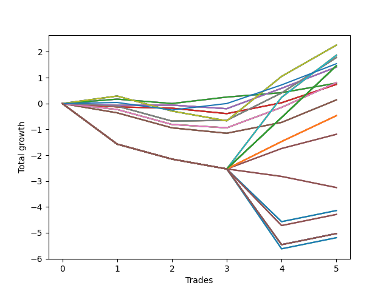

# Short Pointer Ten (1226 REV) 
- Symbol: AAPL_Unlimited
- Date Range: 03/23/2022 - 07/08/2022
- Trading Period: 7:20-12:30
- Number of Trades: 5



| Name | Win Percent | Profit | Avg Profit / Trade | Avg Time / Trade |      | Name | Win Percent | Profit | Avg Profit / Trade | Avg Time / Trade |
| ---- | ----------- | ------ | ------------------ | ---------------- | ---- | ---- | ----------- | ------ | ------------------ | ---------------- |
| Sorted By <br> Profit | | | | | | Sorted By <br> Win Percentage ||||
| Seventy | 60.00 | 1130.00 | 226.00 | 50:59 |     | Seventy-Three | 80.00 | 770.00 | 154.00 | 10:05 |
| Sixty-Two | 60.00 | 1130.00 | 226.00 | 50:59 |     | Sixty-Four | 80.00 | 395.00 | 79.00 | 06:37 |
| Fifty-Four | 60.00 | 1130.00 | 226.00 | 50:59 |     | Fifty-Six | 80.00 | 395.00 | 79.00 | 06:37 |
| Forty-Six | 60.00 | 1130.00 | 226.00 | 50:59 |     | Forty-Eight | 80.00 | 395.00 | 79.00 | 06:37 |
| Six | 60.00 | 1130.00 | 226.00 | 50:59 |     | Forty | 80.00 | 395.00 | 79.00 | 06:37 |
| Seventy-One | 40.00 | 935.00 | 187.00 | 98:27 |     | Zero | 80.00 | 395.00 | 79.00 | 06:37 |
| Sixty-Three | 40.00 | 935.00 | 187.00 | 98:27 |     | Seventy | 60.00 | 1130.00 | 226.00 | 50:59 |
| Fifty-Five | 40.00 | 935.00 | 187.00 | 98:27 |     | Sixty-Two | 60.00 | 1130.00 | 226.00 | 50:59 |
| Forty-Seven | 40.00 | 935.00 | 187.00 | 98:27 |     | Fifty-Four | 60.00 | 1130.00 | 226.00 | 50:59 |
| Seven | 40.00 | 935.00 | 187.00 | 98:27 |     | Forty-Six | 60.00 | 1130.00 | 226.00 | 50:59 |
| Sixty-Nine | 60.00 | 890.00 | 178.00 | 40:21 |     | Six | 60.00 | 1130.00 | 226.00 | 50:59 |
| Sixty-One | 60.00 | 890.00 | 178.00 | 40:21 |     | Sixty-Nine | 60.00 | 890.00 | 178.00 | 40:21 |
| Fifty-Three | 60.00 | 890.00 | 178.00 | 40:21 |     | Sixty-One | 60.00 | 890.00 | 178.00 | 40:21 |
| Forty-Five | 60.00 | 890.00 | 178.00 | 40:21 |     | Fifty-Three | 60.00 | 890.00 | 178.00 | 40:21 |
| Five | 60.00 | 890.00 | 178.00 | 40:21 |     | Forty-Five | 60.00 | 890.00 | 178.00 | 40:21 |
| Seventy-Three | 80.00 | 770.00 | 154.00 | 10:05 |     | Five | 60.00 | 890.00 | 178.00 | 40:21 |
| One Hundred Twenty-Seven | 40.00 | 730.00 | 146.00 | 99:20 |     | Sixty-Six | 60.00 | 705.00 | 141.00 | 24:07 |
| One Hundred Twenty-Two | 40.00 | 730.00 | 146.00 | 99:20 |     | Fifty-Eight | 60.00 | 705.00 | 141.00 | 24:07 |
| One Hundred Seventeen | 40.00 | 730.00 | 146.00 | 99:20 |     | Fifty | 60.00 | 705.00 | 141.00 | 24:07 |
| One Hundred Twelve | 40.00 | 730.00 | 146.00 | 99:20 |     | Forty-Two | 60.00 | 705.00 | 141.00 | 24:07 |
| One Hundred Seven | 40.00 | 730.00 | 146.00 | 99:20 |     | Two | 60.00 | 705.00 | 141.00 | 24:07 |
| One Hundred Two | 40.00 | 730.00 | 146.00 | 99:20 |     | Seventy-One | 40.00 | 935.00 | 187.00 | 98:27 |
| Ninety-Seven | 40.00 | 730.00 | 146.00 | 99:20 |     | Sixty-Three | 40.00 | 935.00 | 187.00 | 98:27 |
| Ninety-Two | 40.00 | 730.00 | 146.00 | 99:20 |     | Fifty-Five | 40.00 | 935.00 | 187.00 | 98:27 |
| Eighty-Two | 40.00 | 730.00 | 146.00 | 99:20 |     | Forty-Seven | 40.00 | 935.00 | 187.00 | 98:27 |
| Sixty-Six | 60.00 | 705.00 | 141.00 | 24:07 |     | Seven | 40.00 | 935.00 | 187.00 | 98:27 |
| Fifty-Eight | 60.00 | 705.00 | 141.00 | 24:07 |     | One Hundred Twenty-Seven | 40.00 | 730.00 | 146.00 | 99:20 |
| Fifty | 60.00 | 705.00 | 141.00 | 24:07 |     | One Hundred Twenty-Two | 40.00 | 730.00 | 146.00 | 99:20 |
| Forty-Two | 60.00 | 705.00 | 141.00 | 24:07 |     | One Hundred Seventeen | 40.00 | 730.00 | 146.00 | 99:20 |
| Two | 60.00 | 705.00 | 141.00 | 24:07 |     | One Hundred Twelve | 40.00 | 730.00 | 146.00 | 99:20 |
| Sixty-Eight | 40.00 | 405.00 | 81.00 | 39:48 |     | One Hundred Seven | 40.00 | 730.00 | 146.00 | 99:20 |
| Sixty | 40.00 | 405.00 | 81.00 | 39:48 |     | One Hundred Two | 40.00 | 730.00 | 146.00 | 99:20 |
| Fifty-Two | 40.00 | 405.00 | 81.00 | 39:48 |     | Ninety-Seven | 40.00 | 730.00 | 146.00 | 99:20 |
| Forty-Four | 40.00 | 405.00 | 81.00 | 39:48 |     | Ninety-Two | 40.00 | 730.00 | 146.00 | 99:20 |
| Four | 40.00 | 405.00 | 81.00 | 39:48 |     | Eighty-Two | 40.00 | 730.00 | 146.00 | 99:20 |
| Sixty-Four | 80.00 | 395.00 | 79.00 | 06:37 |     | Sixty-Eight | 40.00 | 405.00 | 81.00 | 39:48 |
| Fifty-Six | 80.00 | 395.00 | 79.00 | 06:37 |     | Sixty | 40.00 | 405.00 | 81.00 | 39:48 |
| Forty-Eight | 80.00 | 395.00 | 79.00 | 06:37 |     | Fifty-Two | 40.00 | 405.00 | 81.00 | 39:48 |
| Forty | 80.00 | 395.00 | 79.00 | 06:37 |     | Forty-Four | 40.00 | 405.00 | 81.00 | 39:48 |
| Zero | 80.00 | 395.00 | 79.00 | 06:37 |     | Four | 40.00 | 405.00 | 81.00 | 39:48 |
| Sixty-Five | 40.00 | 370.00 | 74.00 | 20:43 |     | Sixty-Five | 40.00 | 370.00 | 74.00 | 20:43 |
| Fifty-Seven | 40.00 | 370.00 | 74.00 | 20:43 |     | Fifty-Seven | 40.00 | 370.00 | 74.00 | 20:43 |
| Forty-Nine | 40.00 | 370.00 | 74.00 | 20:43 |     | Forty-Nine | 40.00 | 370.00 | 74.00 | 20:43 |
| Forty-One | 40.00 | 370.00 | 74.00 | 20:43 |     | Forty-One | 40.00 | 370.00 | 74.00 | 20:43 |
| One | 40.00 | 370.00 | 74.00 | 20:43 |     | One | 40.00 | 370.00 | 74.00 | 20:43 |
| Sixty-Seven | 40.00 | 70.00 | 14.00 | 33:47 |     | Sixty-Seven | 40.00 | 70.00 | 14.00 | 33:47 |
| Fifty-Nine | 40.00 | 70.00 | 14.00 | 33:47 |     | Fifty-Nine | 40.00 | 70.00 | 14.00 | 33:47 |
| Fifty-One | 40.00 | 70.00 | 14.00 | 33:47 |     | Fifty-One | 40.00 | 70.00 | 14.00 | 33:47 |
| Forty-Three | 40.00 | 70.00 | 14.00 | 33:47 |     | Forty-Three | 40.00 | 70.00 | 14.00 | 33:47 |
| Three | 40.00 | 70.00 | 14.00 | 33:47 |     | Three | 40.00 | 70.00 | 14.00 | 33:47 |
| One Hundred Twenty-Six | 40.00 | -235.00 | -47.00 | 76:24 |     | One Hundred Twenty-Six | 40.00 | -235.00 | -47.00 | 76:24 |
| One Hundred Twenty-One | 40.00 | -235.00 | -47.00 | 76:24 |     | One Hundred Twenty-One | 40.00 | -235.00 | -47.00 | 76:24 |
| One Hundred Sixteen | 40.00 | -235.00 | -47.00 | 76:24 |     | One Hundred Sixteen | 40.00 | -235.00 | -47.00 | 76:24 |
| One Hundred Eleven | 40.00 | -235.00 | -47.00 | 76:24 |     | One Hundred Eleven | 40.00 | -235.00 | -47.00 | 76:24 |
| One Hundred Six | 40.00 | -235.00 | -47.00 | 76:24 |     | One Hundred Six | 40.00 | -235.00 | -47.00 | 76:24 |
| One Hundred One | 40.00 | -235.00 | -47.00 | 76:24 |     | One Hundred One | 40.00 | -235.00 | -47.00 | 76:24 |
| Ninety-Six | 40.00 | -235.00 | -47.00 | 76:24 |     | Ninety-Six | 40.00 | -235.00 | -47.00 | 76:24 |
| Ninety-One | 40.00 | -235.00 | -47.00 | 76:24 |     | Ninety-One | 40.00 | -235.00 | -47.00 | 76:24 |
| Eighty-One | 40.00 | -235.00 | -47.00 | 76:24 |     | Eighty-One | 40.00 | -235.00 | -47.00 | 76:24 |
| One Hundred | 40.00 | -595.00 | -119.00 | 125:37 |     | One Hundred | 40.00 | -595.00 | -119.00 | 125:37 |
| Ninety-Nine | 40.00 | -595.00 | -119.00 | 125:37 |     | Ninety-Nine | 40.00 | -595.00 | -119.00 | 125:37 |
| Ninety-Eight | 40.00 | -595.00 | -119.00 | 125:37 |     | Ninety-Eight | 40.00 | -595.00 | -119.00 | 125:37 |
| One Hundred Ten | 0.00 | -1625.00 | -325.00 | 133:38 |     | Ninety-Five | 20.00 | -2070.00 | -414.00 | 148:02 |
| One Hundred Nine | 0.00 | -1625.00 | -325.00 | 133:38 |     | Ninety-Four | 20.00 | -2070.00 | -414.00 | 148:02 |
| One Hundred Eight | 0.00 | -1625.00 | -325.00 | 133:38 |     | Ninety-Three | 20.00 | -2070.00 | -414.00 | 148:02 |
| Ninety-Five | 20.00 | -2070.00 | -414.00 | 148:02 |     | One Hundred Twenty | 20.00 | -2145.00 | -429.00 | 148:04 |
| Ninety-Four | 20.00 | -2070.00 | -414.00 | 148:02 |     | One Hundred Ninteen | 20.00 | -2145.00 | -429.00 | 148:04 |
| Ninety-Three | 20.00 | -2070.00 | -414.00 | 148:02 |     | One Hundred Eighteen | 20.00 | -2145.00 | -429.00 | 148:04 |
| One Hundred Twenty | 20.00 | -2145.00 | -429.00 | 148:04 |     | One Hundred Thirty | 20.00 | -2515.00 | -503.00 | 154:12 |
| One Hundred Ninteen | 20.00 | -2145.00 | -429.00 | 148:04 |     | One Hundred Twenty-Nine | 20.00 | -2515.00 | -503.00 | 154:12 |
| One Hundred Eighteen | 20.00 | -2145.00 | -429.00 | 148:04 |     | One Hundred Twenty-Eight | 20.00 | -2515.00 | -503.00 | 154:12 |
| One Hundred Thirty | 20.00 | -2515.00 | -503.00 | 154:12 |     | One Hundred Twenty-Five | 20.00 | -2515.00 | -503.00 | 154:12 |
| One Hundred Twenty-Nine | 20.00 | -2515.00 | -503.00 | 154:12 |     | One Hundred Twenty-Four | 20.00 | -2515.00 | -503.00 | 154:12 |
| One Hundred Twenty-Eight | 20.00 | -2515.00 | -503.00 | 154:12 |     | One Hundred Twenty-Three | 20.00 | -2515.00 | -503.00 | 154:12 |
| One Hundred Twenty-Five | 20.00 | -2515.00 | -503.00 | 154:12 |     | One Hundred Fifteen | 20.00 | -2515.00 | -503.00 | 154:12 |
| One Hundred Twenty-Four | 20.00 | -2515.00 | -503.00 | 154:12 |     | One Hundred Fourteen | 20.00 | -2515.00 | -503.00 | 154:12 |
| One Hundred Twenty-Three | 20.00 | -2515.00 | -503.00 | 154:12 |     | One Hundred Thirteen | 20.00 | -2515.00 | -503.00 | 154:12 |
| One Hundred Fifteen | 20.00 | -2515.00 | -503.00 | 154:12 |     | Eighty-Five | 20.00 | -2515.00 | -503.00 | 154:12 |
| One Hundred Fourteen | 20.00 | -2515.00 | -503.00 | 154:12 |     | Eighty-Four | 20.00 | -2515.00 | -503.00 | 154:12 |
| One Hundred Thirteen | 20.00 | -2515.00 | -503.00 | 154:12 |     | Eighty-Three | 20.00 | -2515.00 | -503.00 | 154:12 |
| Eighty-Five | 20.00 | -2515.00 | -503.00 | 154:12 |     | One Hundred Five | 20.00 | -2595.00 | -519.00 | 152:37 |
| Eighty-Four | 20.00 | -2515.00 | -503.00 | 154:12 |     | One Hundred Four | 20.00 | -2595.00 | -519.00 | 152:37 |
| Eighty-Three | 20.00 | -2515.00 | -503.00 | 154:12 |     | One Hundred Three | 20.00 | -2595.00 | -519.00 | 152:37 |
| One Hundred Five | 20.00 | -2595.00 | -519.00 | 152:37 |     | One Hundred Ten | 0.00 | -1625.00 | -325.00 | 133:38 |
| One Hundred Four | 20.00 | -2595.00 | -519.00 | 152:37 |     | One Hundred Nine | 0.00 | -1625.00 | -325.00 | 133:38 |
| One Hundred Three | 20.00 | -2595.00 | -519.00 | 152:37 |     | One Hundred Eight | 0.00 | -1625.00 | -325.00 | 133:38 |

## NO STOPLOSS

### Test Zero
* Sell when price hits the middle line of the 20p bollinger
* No Stoploss
* Results:
```
Total Trades: 5
Percent Up: 20.00
Percent Down: 80.00
Total Points Moved Down: 0.79
Potential Profit: 395.00
Total Points Ups: 0.17 Count Ups: 1
Total Points Downs: 0.96 Count Downs: 4
```

<details><summary>Trades</summary>

<code>In: 2022-03-24 10:04:00		Out: 2022-03-24 10:09:20		Total Position Time: 05:20		Total Move Down: 0.17		Total to Date: 0.17</code> <br />
<code>In: 2022-04-07 12:04:00		Out: 2022-04-07 12:20:15		Total Position Time: 16:15		Total Move Down: -0.17		Total to Date: 0.00</code> <br />
<code>In: 2022-04-28 10:16:00		Out: 2022-04-28 10:19:05		Total Position Time: 03:05		Total Move Down: 0.25		Total to Date: 0.25</code> <br />
<code>In: 2022-05-04 11:03:00		Out: 2022-05-04 11:06:30		Total Position Time: 03:30		Total Move Down: 0.17		Total to Date: 0.42</code> <br />
<code>In: 2022-05-25 07:37:00		Out: 2022-05-25 07:41:55		Total Position Time: 04:55		Total Move Down: 0.37		Total to Date: 0.79</code> <br />


</details>

### Test One
* Sell when the price hits the upper line of the 20p 1std bollinger
* No Stoploss
* Results:
```
Total Trades: 5
Percent Up: 60.00
Percent Down: 40.00
Total Points Moved Down: 0.74
Potential Profit: 370.00
Total Points Ups: 0.39 Count Ups: 3
Total Points Downs: 1.13 Count Downs: 2
```

<details><summary>Trades</summary>

<code>In: 2022-03-24 10:04:00		Out: 2022-03-24 10:33:15		Total Position Time: 29:15		Total Move Down: -0.13		Total to Date: -0.13</code> <br />
<code>In: 2022-04-07 12:04:00		Out: 2022-04-07 12:27:40		Total Position Time: 23:40		Total Move Down: -0.05		Total to Date: -0.18</code> <br />
<code>In: 2022-04-28 10:16:00		Out: 2022-04-28 10:56:05		Total Position Time: 40:05		Total Move Down: -0.21		Total to Date: -0.39</code> <br />
<code>In: 2022-05-04 11:03:00		Out: 2022-05-04 11:07:05		Total Position Time: 04:05		Total Move Down: 0.42		Total to Date: 0.03</code> <br />
<code>In: 2022-05-25 07:37:00		Out: 2022-05-25 07:43:30		Total Position Time: 06:30		Total Move Down: 0.71		Total to Date: 0.74</code> <br />


</details>

### Test Two
* Sell when the price hits the upper line of the 20p 2std bollinger
* No Stoploss
* Results:
```
Total Trades: 5
Percent Up: 40.00
Percent Down: 60.00
Total Points Moved Down: 1.41
Potential Profit: 705.00
Total Points Ups: 0.21 Count Ups: 2
Total Points Downs: 1.62 Count Downs: 3
```

<details><summary>Trades</summary>

<code>In: 2022-03-24 10:04:00		Out: 2022-03-24 10:34:15		Total Position Time: 30:15		Total Move Down: -0.07		Total to Date: -0.07</code> <br />
<code>In: 2022-04-07 12:04:00		Out: 2022-04-07 12:28:30		Total Position Time: 24:30		Total Move Down: 0.01		Total to Date: -0.06</code> <br />
<code>In: 2022-04-28 10:16:00		Out: 2022-04-28 11:06:20		Total Position Time: 50:20		Total Move Down: -0.14		Total to Date: -0.20</code> <br />
<code>In: 2022-05-04 11:03:00		Out: 2022-05-04 11:07:25		Total Position Time: 04:25		Total Move Down: 0.79		Total to Date: 0.59</code> <br />
<code>In: 2022-05-25 07:37:00		Out: 2022-05-25 07:48:05		Total Position Time: 11:05		Total Move Down: 0.82		Total to Date: 1.41</code> <br />


</details>

### Test Three
* Sell when price hits the middle line of the 50p bollinger
* No Stoploss
* Results:
```
Total Trades: 5
Percent Up: 60.00
Percent Down: 40.00
Total Points Moved Down: 0.14
Potential Profit: 70.00
Total Points Ups: 1.15 Count Ups: 3
Total Points Downs: 1.29 Count Downs: 2
```

<details><summary>Trades</summary>

<code>In: 2022-03-24 10:04:00		Out: 2022-03-24 11:09:05		Total Position Time: 65:05		Total Move Down: -0.36		Total to Date: -0.36</code> <br />
<code>In: 2022-04-07 12:04:00		Out: 2022-04-07 12:47:00		Total Position Time: 43:00		Total Move Down: -0.58		Total to Date: -0.94</code> <br />
<code>In: 2022-04-28 10:16:00		Out: 2022-04-28 11:01:05		Total Position Time: 45:05		Total Move Down: -0.21		Total to Date: -1.15</code> <br />
<code>In: 2022-05-04 11:03:00		Out: 2022-05-04 11:07:05		Total Position Time: 04:05		Total Move Down: 0.42		Total to Date: -0.73</code> <br />
<code>In: 2022-05-25 07:37:00		Out: 2022-05-25 07:48:40		Total Position Time: 11:40		Total Move Down: 0.87		Total to Date: 0.14</code> <br />


</details>

### Test Four
* Sell when the price hits the upper line of the 50p 1std bollinger
* No Stoploss
* Results:
```
Total Trades: 5
Percent Up: 60.00
Percent Down: 40.00
Total Points Moved Down: 0.81
Potential Profit: 405.00
Total Points Ups: 0.94 Count Ups: 3
Total Points Downs: 1.75 Count Downs: 2
```

<details><summary>Trades</summary>

<code>In: 2022-03-24 10:04:00		Out: 2022-03-24 11:10:25		Total Position Time: 66:25		Total Move Down: -0.23		Total to Date: -0.23</code> <br />
<code>In: 2022-04-07 12:04:00		Out: 2022-04-07 12:47:00		Total Position Time: 43:00		Total Move Down: -0.58		Total to Date: -0.81</code> <br />
<code>In: 2022-04-28 10:16:00		Out: 2022-04-28 11:14:05		Total Position Time: 58:05		Total Move Down: -0.13		Total to Date: -0.94</code> <br />
<code>In: 2022-05-04 11:03:00		Out: 2022-05-04 11:07:25		Total Position Time: 04:25		Total Move Down: 0.79		Total to Date: -0.15</code> <br />
<code>In: 2022-05-25 07:37:00		Out: 2022-05-25 08:04:05		Total Position Time: 27:05		Total Move Down: 0.96		Total to Date: 0.81</code> <br />


</details>

### Test Five
* Sell when the price hits the upper line of the 50p 2std bollinger
* No Stoploss
* Results:
```
Total Trades: 5
Percent Up: 40.00
Percent Down: 60.00
Total Points Moved Down: 1.78
Potential Profit: 890.00
Total Points Ups: 0.68 Count Ups: 2
Total Points Downs: 2.46 Count Downs: 3
```

<details><summary>Trades</summary>

<code>In: 2022-03-24 10:04:00		Out: 2022-03-24 11:10:45		Total Position Time: 66:45		Total Move Down: -0.10		Total to Date: -0.10</code> <br />
<code>In: 2022-04-07 12:04:00		Out: 2022-04-07 12:47:00		Total Position Time: 43:00		Total Move Down: -0.58		Total to Date: -0.68</code> <br />
<code>In: 2022-04-28 10:16:00		Out: 2022-04-28 11:15:25		Total Position Time: 59:25		Total Move Down: 0.03		Total to Date: -0.65</code> <br />
<code>In: 2022-05-04 11:03:00		Out: 2022-05-04 11:07:40		Total Position Time: 04:40		Total Move Down: 1.06		Total to Date: 0.41</code> <br />
<code>In: 2022-05-25 07:37:00		Out: 2022-05-25 08:04:55		Total Position Time: 27:55		Total Move Down: 1.37		Total to Date: 1.78</code> <br />


</details>

### Test Six
* Sell when the price hits the middle line of the 1std VWAP
* No Stoploss
* Results:
```
Total Trades: 5
Percent Up: 40.00
Percent Down: 60.00
Total Points Moved Down: 2.26
Potential Profit: 1130.00
Total Points Ups: 0.96 Count Ups: 2
Total Points Downs: 3.22 Count Downs: 3
```

<details><summary>Trades</summary>

<code>In: 2022-03-24 10:04:00		Out: 2022-03-24 10:09:25		Total Position Time: 05:25		Total Move Down: 0.29		Total to Date: 0.29</code> <br />
<code>In: 2022-04-07 12:04:00		Out: 2022-04-07 12:47:00		Total Position Time: 43:00		Total Move Down: -0.58		Total to Date: -0.29</code> <br />
<code>In: 2022-04-28 10:16:00		Out: 2022-04-28 12:47:00		Total Position Time: 151:00		Total Move Down: -0.38		Total to Date: -0.67</code> <br />
<code>In: 2022-05-04 11:03:00		Out: 2022-05-04 11:30:50		Total Position Time: 27:50		Total Move Down: 1.72		Total to Date: 1.05</code> <br />
<code>In: 2022-05-25 07:37:00		Out: 2022-05-25 08:04:40		Total Position Time: 27:40		Total Move Down: 1.21		Total to Date: 2.26</code> <br />


</details>

### Test Seven
* Sell when the price hits the upper line of the 1std VWAP
* No Stoploss
* Results:
```
Total Trades: 5
Percent Up: 60.00
Percent Down: 40.00
Total Points Moved Down: 1.87
Potential Profit: 935.00
Total Points Ups: 2.53 Count Ups: 3
Total Points Downs: 4.40 Count Downs: 2
```

<details><summary>Trades</summary>

<code>In: 2022-03-24 10:04:00		Out: 2022-03-24 12:47:00		Total Position Time: 163:00		Total Move Down: -1.57		Total to Date: -1.57</code> <br />
<code>In: 2022-04-07 12:04:00		Out: 2022-04-07 12:47:00		Total Position Time: 43:00		Total Move Down: -0.58		Total to Date: -2.15</code> <br />
<code>In: 2022-04-28 10:16:00		Out: 2022-04-28 12:47:00		Total Position Time: 151:00		Total Move Down: -0.38		Total to Date: -2.53</code> <br />
<code>In: 2022-05-04 11:03:00		Out: 2022-05-04 11:35:05		Total Position Time: 32:05		Total Move Down: 2.77		Total to Date: 0.24</code> <br />
<code>In: 2022-05-25 07:37:00		Out: 2022-05-25 09:20:10		Total Position Time: 103:10		Total Move Down: 1.63		Total to Date: 1.87</code> <br />


</details>

## STOPLOSS OF 5

### Test Forty
* Sell when price hits the middle line of the 20p bollinger
* Stoploss is -5 points
* Results:
```
Total Trades: 5
Percent Up: 20.00
Percent Down: 80.00
Total Points Moved Down: 0.79
Potential Profit: 395.00
Total Points Ups: 0.17 Count Ups: 1
Total Points Downs: 0.96 Count Downs: 4
```

<details><summary>Trades</summary>

<code>In: 2022-03-24 10:04:00		Out: 2022-03-24 10:09:20		Total Position Time: 05:20		Total Move Down: 0.17		Total to Date: 0.17</code> <br />
<code>In: 2022-04-07 12:04:00		Out: 2022-04-07 12:20:15		Total Position Time: 16:15		Total Move Down: -0.17		Total to Date: 0.00</code> <br />
<code>In: 2022-04-28 10:16:00		Out: 2022-04-28 10:19:05		Total Position Time: 03:05		Total Move Down: 0.25		Total to Date: 0.25</code> <br />
<code>In: 2022-05-04 11:03:00		Out: 2022-05-04 11:06:30		Total Position Time: 03:30		Total Move Down: 0.17		Total to Date: 0.42</code> <br />
<code>In: 2022-05-25 07:37:00		Out: 2022-05-25 07:41:55		Total Position Time: 04:55		Total Move Down: 0.37		Total to Date: 0.79</code> <br />


</details>

### Test Forty-One
* Sell when the price hits the upper line of the 20p 1std bollinger
* Stoploss is -5 points
* Results:
```
Total Trades: 5
Percent Up: 60.00
Percent Down: 40.00
Total Points Moved Down: 0.74
Potential Profit: 370.00
Total Points Ups: 0.39 Count Ups: 3
Total Points Downs: 1.13 Count Downs: 2
```

<details><summary>Trades</summary>

<code>In: 2022-03-24 10:04:00		Out: 2022-03-24 10:33:15		Total Position Time: 29:15		Total Move Down: -0.13		Total to Date: -0.13</code> <br />
<code>In: 2022-04-07 12:04:00		Out: 2022-04-07 12:27:40		Total Position Time: 23:40		Total Move Down: -0.05		Total to Date: -0.18</code> <br />
<code>In: 2022-04-28 10:16:00		Out: 2022-04-28 10:56:05		Total Position Time: 40:05		Total Move Down: -0.21		Total to Date: -0.39</code> <br />
<code>In: 2022-05-04 11:03:00		Out: 2022-05-04 11:07:05		Total Position Time: 04:05		Total Move Down: 0.42		Total to Date: 0.03</code> <br />
<code>In: 2022-05-25 07:37:00		Out: 2022-05-25 07:43:30		Total Position Time: 06:30		Total Move Down: 0.71		Total to Date: 0.74</code> <br />


</details>

### Test Forty-Two
* Sell when the price hits the upper line of the 20p 2std bollinger
* Stoploss is -5 points
* Results:
```
Total Trades: 5
Percent Up: 40.00
Percent Down: 60.00
Total Points Moved Down: 1.41
Potential Profit: 705.00
Total Points Ups: 0.21 Count Ups: 2
Total Points Downs: 1.62 Count Downs: 3
```

<details><summary>Trades</summary>

<code>In: 2022-03-24 10:04:00		Out: 2022-03-24 10:34:15		Total Position Time: 30:15		Total Move Down: -0.07		Total to Date: -0.07</code> <br />
<code>In: 2022-04-07 12:04:00		Out: 2022-04-07 12:28:30		Total Position Time: 24:30		Total Move Down: 0.01		Total to Date: -0.06</code> <br />
<code>In: 2022-04-28 10:16:00		Out: 2022-04-28 11:06:20		Total Position Time: 50:20		Total Move Down: -0.14		Total to Date: -0.20</code> <br />
<code>In: 2022-05-04 11:03:00		Out: 2022-05-04 11:07:25		Total Position Time: 04:25		Total Move Down: 0.79		Total to Date: 0.59</code> <br />
<code>In: 2022-05-25 07:37:00		Out: 2022-05-25 07:48:05		Total Position Time: 11:05		Total Move Down: 0.82		Total to Date: 1.41</code> <br />


</details>

### Test Forty-Three
* Sell when price hits the middle line of the 50p bollinger
* Stoploss is -5 points
* Results:
```
Total Trades: 5
Percent Up: 60.00
Percent Down: 40.00
Total Points Moved Down: 0.14
Potential Profit: 70.00
Total Points Ups: 1.15 Count Ups: 3
Total Points Downs: 1.29 Count Downs: 2
```

<details><summary>Trades</summary>

<code>In: 2022-03-24 10:04:00		Out: 2022-03-24 11:09:05		Total Position Time: 65:05		Total Move Down: -0.36		Total to Date: -0.36</code> <br />
<code>In: 2022-04-07 12:04:00		Out: 2022-04-07 12:47:00		Total Position Time: 43:00		Total Move Down: -0.58		Total to Date: -0.94</code> <br />
<code>In: 2022-04-28 10:16:00		Out: 2022-04-28 11:01:05		Total Position Time: 45:05		Total Move Down: -0.21		Total to Date: -1.15</code> <br />
<code>In: 2022-05-04 11:03:00		Out: 2022-05-04 11:07:05		Total Position Time: 04:05		Total Move Down: 0.42		Total to Date: -0.73</code> <br />
<code>In: 2022-05-25 07:37:00		Out: 2022-05-25 07:48:40		Total Position Time: 11:40		Total Move Down: 0.87		Total to Date: 0.14</code> <br />


</details>

### Test Forty-Four
* Sell when the price hits the upper line of the 50p 1std bollinger
* Stoploss is -5 points
* Results:
```
Total Trades: 5
Percent Up: 60.00
Percent Down: 40.00
Total Points Moved Down: 0.81
Potential Profit: 405.00
Total Points Ups: 0.94 Count Ups: 3
Total Points Downs: 1.75 Count Downs: 2
```

<details><summary>Trades</summary>

<code>In: 2022-03-24 10:04:00		Out: 2022-03-24 11:10:25		Total Position Time: 66:25		Total Move Down: -0.23		Total to Date: -0.23</code> <br />
<code>In: 2022-04-07 12:04:00		Out: 2022-04-07 12:47:00		Total Position Time: 43:00		Total Move Down: -0.58		Total to Date: -0.81</code> <br />
<code>In: 2022-04-28 10:16:00		Out: 2022-04-28 11:14:05		Total Position Time: 58:05		Total Move Down: -0.13		Total to Date: -0.94</code> <br />
<code>In: 2022-05-04 11:03:00		Out: 2022-05-04 11:07:25		Total Position Time: 04:25		Total Move Down: 0.79		Total to Date: -0.15</code> <br />
<code>In: 2022-05-25 07:37:00		Out: 2022-05-25 08:04:05		Total Position Time: 27:05		Total Move Down: 0.96		Total to Date: 0.81</code> <br />


</details>

### Test Forty-Five
* Sell when the price hits the upper line of the 50p 2std bollinger
* Stoploss is -5 points
* Results:
```
Total Trades: 5
Percent Up: 40.00
Percent Down: 60.00
Total Points Moved Down: 1.78
Potential Profit: 890.00
Total Points Ups: 0.68 Count Ups: 2
Total Points Downs: 2.46 Count Downs: 3
```

<details><summary>Trades</summary>

<code>In: 2022-03-24 10:04:00		Out: 2022-03-24 11:10:45		Total Position Time: 66:45		Total Move Down: -0.10		Total to Date: -0.10</code> <br />
<code>In: 2022-04-07 12:04:00		Out: 2022-04-07 12:47:00		Total Position Time: 43:00		Total Move Down: -0.58		Total to Date: -0.68</code> <br />
<code>In: 2022-04-28 10:16:00		Out: 2022-04-28 11:15:25		Total Position Time: 59:25		Total Move Down: 0.03		Total to Date: -0.65</code> <br />
<code>In: 2022-05-04 11:03:00		Out: 2022-05-04 11:07:40		Total Position Time: 04:40		Total Move Down: 1.06		Total to Date: 0.41</code> <br />
<code>In: 2022-05-25 07:37:00		Out: 2022-05-25 08:04:55		Total Position Time: 27:55		Total Move Down: 1.37		Total to Date: 1.78</code> <br />


</details>

### Test Forty-Six
* Sell when the price hits the middle line of the 1std VWAP
* Stoploss is -5 points
* Results:
```
Total Trades: 5
Percent Up: 40.00
Percent Down: 60.00
Total Points Moved Down: 2.26
Potential Profit: 1130.00
Total Points Ups: 0.96 Count Ups: 2
Total Points Downs: 3.22 Count Downs: 3
```

<details><summary>Trades</summary>

<code>In: 2022-03-24 10:04:00		Out: 2022-03-24 10:09:25		Total Position Time: 05:25		Total Move Down: 0.29		Total to Date: 0.29</code> <br />
<code>In: 2022-04-07 12:04:00		Out: 2022-04-07 12:47:00		Total Position Time: 43:00		Total Move Down: -0.58		Total to Date: -0.29</code> <br />
<code>In: 2022-04-28 10:16:00		Out: 2022-04-28 12:47:00		Total Position Time: 151:00		Total Move Down: -0.38		Total to Date: -0.67</code> <br />
<code>In: 2022-05-04 11:03:00		Out: 2022-05-04 11:30:50		Total Position Time: 27:50		Total Move Down: 1.72		Total to Date: 1.05</code> <br />
<code>In: 2022-05-25 07:37:00		Out: 2022-05-25 08:04:40		Total Position Time: 27:40		Total Move Down: 1.21		Total to Date: 2.26</code> <br />


</details>

### Test Forty-Seven
* Sell when the price hits the upper line of the 1std VWAP
* Stoploss is -5 points
* Results:
```
Total Trades: 5
Percent Up: 60.00
Percent Down: 40.00
Total Points Moved Down: 1.87
Potential Profit: 935.00
Total Points Ups: 2.53 Count Ups: 3
Total Points Downs: 4.40 Count Downs: 2
```

<details><summary>Trades</summary>

<code>In: 2022-03-24 10:04:00		Out: 2022-03-24 12:47:00		Total Position Time: 163:00		Total Move Down: -1.57		Total to Date: -1.57</code> <br />
<code>In: 2022-04-07 12:04:00		Out: 2022-04-07 12:47:00		Total Position Time: 43:00		Total Move Down: -0.58		Total to Date: -2.15</code> <br />
<code>In: 2022-04-28 10:16:00		Out: 2022-04-28 12:47:00		Total Position Time: 151:00		Total Move Down: -0.38		Total to Date: -2.53</code> <br />
<code>In: 2022-05-04 11:03:00		Out: 2022-05-04 11:35:05		Total Position Time: 32:05		Total Move Down: 2.77		Total to Date: 0.24</code> <br />
<code>In: 2022-05-25 07:37:00		Out: 2022-05-25 09:20:10		Total Position Time: 103:10		Total Move Down: 1.63		Total to Date: 1.87</code> <br />


</details>

## TRAIL STOP OF 5

### Test Forty-Eight
* Sell when price hits the middle line of the 20p bollinger
* Trailing Stop is -5 points
* Results:
```
Total Trades: 5
Percent Up: 20.00
Percent Down: 80.00
Total Points Moved Down: 0.79
Potential Profit: 395.00
Total Points Ups: 0.17 Count Ups: 1
Total Points Downs: 0.96 Count Downs: 4
```

<details><summary>Trades</summary>

<code>In: 2022-03-24 10:04:00		Out: 2022-03-24 10:09:20		Total Position Time: 05:20		Total Move Down: 0.17		Total to Date: 0.17</code> <br />
<code>In: 2022-04-07 12:04:00		Out: 2022-04-07 12:20:15		Total Position Time: 16:15		Total Move Down: -0.17		Total to Date: 0.00</code> <br />
<code>In: 2022-04-28 10:16:00		Out: 2022-04-28 10:19:05		Total Position Time: 03:05		Total Move Down: 0.25		Total to Date: 0.25</code> <br />
<code>In: 2022-05-04 11:03:00		Out: 2022-05-04 11:06:30		Total Position Time: 03:30		Total Move Down: 0.17		Total to Date: 0.42</code> <br />
<code>In: 2022-05-25 07:37:00		Out: 2022-05-25 07:41:55		Total Position Time: 04:55		Total Move Down: 0.37		Total to Date: 0.79</code> <br />


</details>

### Test Forty-Nine
* Sell when the price hits the upper line of the 20p 1std bollinger
* Trailing Stop is -5 points
* Results:
```
Total Trades: 5
Percent Up: 60.00
Percent Down: 40.00
Total Points Moved Down: 0.74
Potential Profit: 370.00
Total Points Ups: 0.39 Count Ups: 3
Total Points Downs: 1.13 Count Downs: 2
```

<details><summary>Trades</summary>

<code>In: 2022-03-24 10:04:00		Out: 2022-03-24 10:33:15		Total Position Time: 29:15		Total Move Down: -0.13		Total to Date: -0.13</code> <br />
<code>In: 2022-04-07 12:04:00		Out: 2022-04-07 12:27:40		Total Position Time: 23:40		Total Move Down: -0.05		Total to Date: -0.18</code> <br />
<code>In: 2022-04-28 10:16:00		Out: 2022-04-28 10:56:05		Total Position Time: 40:05		Total Move Down: -0.21		Total to Date: -0.39</code> <br />
<code>In: 2022-05-04 11:03:00		Out: 2022-05-04 11:07:05		Total Position Time: 04:05		Total Move Down: 0.42		Total to Date: 0.03</code> <br />
<code>In: 2022-05-25 07:37:00		Out: 2022-05-25 07:43:30		Total Position Time: 06:30		Total Move Down: 0.71		Total to Date: 0.74</code> <br />


</details>

### Test Fifty
* Sell when the price hits the upper line of the 20p 2std bollinger
* Trailing Stop is -5 points
* Results:
```
Total Trades: 5
Percent Up: 40.00
Percent Down: 60.00
Total Points Moved Down: 1.41
Potential Profit: 705.00
Total Points Ups: 0.21 Count Ups: 2
Total Points Downs: 1.62 Count Downs: 3
```

<details><summary>Trades</summary>

<code>In: 2022-03-24 10:04:00		Out: 2022-03-24 10:34:15		Total Position Time: 30:15		Total Move Down: -0.07		Total to Date: -0.07</code> <br />
<code>In: 2022-04-07 12:04:00		Out: 2022-04-07 12:28:30		Total Position Time: 24:30		Total Move Down: 0.01		Total to Date: -0.06</code> <br />
<code>In: 2022-04-28 10:16:00		Out: 2022-04-28 11:06:20		Total Position Time: 50:20		Total Move Down: -0.14		Total to Date: -0.20</code> <br />
<code>In: 2022-05-04 11:03:00		Out: 2022-05-04 11:07:25		Total Position Time: 04:25		Total Move Down: 0.79		Total to Date: 0.59</code> <br />
<code>In: 2022-05-25 07:37:00		Out: 2022-05-25 07:48:05		Total Position Time: 11:05		Total Move Down: 0.82		Total to Date: 1.41</code> <br />


</details>

### Test Fifty-One
* Sell when price hits the middle line of the 50p bollinger
* Trailing Stop is -5 points
* Results:
```
Total Trades: 5
Percent Up: 60.00
Percent Down: 40.00
Total Points Moved Down: 0.14
Potential Profit: 70.00
Total Points Ups: 1.15 Count Ups: 3
Total Points Downs: 1.29 Count Downs: 2
```

<details><summary>Trades</summary>

<code>In: 2022-03-24 10:04:00		Out: 2022-03-24 11:09:05		Total Position Time: 65:05		Total Move Down: -0.36		Total to Date: -0.36</code> <br />
<code>In: 2022-04-07 12:04:00		Out: 2022-04-07 12:47:00		Total Position Time: 43:00		Total Move Down: -0.58		Total to Date: -0.94</code> <br />
<code>In: 2022-04-28 10:16:00		Out: 2022-04-28 11:01:05		Total Position Time: 45:05		Total Move Down: -0.21		Total to Date: -1.15</code> <br />
<code>In: 2022-05-04 11:03:00		Out: 2022-05-04 11:07:05		Total Position Time: 04:05		Total Move Down: 0.42		Total to Date: -0.73</code> <br />
<code>In: 2022-05-25 07:37:00		Out: 2022-05-25 07:48:40		Total Position Time: 11:40		Total Move Down: 0.87		Total to Date: 0.14</code> <br />


</details>

### Test Fifty-Two
* Sell when the price hits the upper line of the 50p 1std bollinger
* Trailing Stop is -5 points
* Results:
```
Total Trades: 5
Percent Up: 60.00
Percent Down: 40.00
Total Points Moved Down: 0.81
Potential Profit: 405.00
Total Points Ups: 0.94 Count Ups: 3
Total Points Downs: 1.75 Count Downs: 2
```

<details><summary>Trades</summary>

<code>In: 2022-03-24 10:04:00		Out: 2022-03-24 11:10:25		Total Position Time: 66:25		Total Move Down: -0.23		Total to Date: -0.23</code> <br />
<code>In: 2022-04-07 12:04:00		Out: 2022-04-07 12:47:00		Total Position Time: 43:00		Total Move Down: -0.58		Total to Date: -0.81</code> <br />
<code>In: 2022-04-28 10:16:00		Out: 2022-04-28 11:14:05		Total Position Time: 58:05		Total Move Down: -0.13		Total to Date: -0.94</code> <br />
<code>In: 2022-05-04 11:03:00		Out: 2022-05-04 11:07:25		Total Position Time: 04:25		Total Move Down: 0.79		Total to Date: -0.15</code> <br />
<code>In: 2022-05-25 07:37:00		Out: 2022-05-25 08:04:05		Total Position Time: 27:05		Total Move Down: 0.96		Total to Date: 0.81</code> <br />


</details>

### Test Fifty-Three
* Sell when the price hits the upper line of the 50p 2std bollinger
* Trailing Stop is -5 points
* Results:
```
Total Trades: 5
Percent Up: 40.00
Percent Down: 60.00
Total Points Moved Down: 1.78
Potential Profit: 890.00
Total Points Ups: 0.68 Count Ups: 2
Total Points Downs: 2.46 Count Downs: 3
```

<details><summary>Trades</summary>

<code>In: 2022-03-24 10:04:00		Out: 2022-03-24 11:10:45		Total Position Time: 66:45		Total Move Down: -0.10		Total to Date: -0.10</code> <br />
<code>In: 2022-04-07 12:04:00		Out: 2022-04-07 12:47:00		Total Position Time: 43:00		Total Move Down: -0.58		Total to Date: -0.68</code> <br />
<code>In: 2022-04-28 10:16:00		Out: 2022-04-28 11:15:25		Total Position Time: 59:25		Total Move Down: 0.03		Total to Date: -0.65</code> <br />
<code>In: 2022-05-04 11:03:00		Out: 2022-05-04 11:07:40		Total Position Time: 04:40		Total Move Down: 1.06		Total to Date: 0.41</code> <br />
<code>In: 2022-05-25 07:37:00		Out: 2022-05-25 08:04:55		Total Position Time: 27:55		Total Move Down: 1.37		Total to Date: 1.78</code> <br />


</details>

### Test Fifty-Four
* Sell when the price hits the middle line of the 1std VWAP
* Trailing Stop is -5 points
* Results:
```
Total Trades: 5
Percent Up: 40.00
Percent Down: 60.00
Total Points Moved Down: 2.26
Potential Profit: 1130.00
Total Points Ups: 0.96 Count Ups: 2
Total Points Downs: 3.22 Count Downs: 3
```

<details><summary>Trades</summary>

<code>In: 2022-03-24 10:04:00		Out: 2022-03-24 10:09:25		Total Position Time: 05:25		Total Move Down: 0.29		Total to Date: 0.29</code> <br />
<code>In: 2022-04-07 12:04:00		Out: 2022-04-07 12:47:00		Total Position Time: 43:00		Total Move Down: -0.58		Total to Date: -0.29</code> <br />
<code>In: 2022-04-28 10:16:00		Out: 2022-04-28 12:47:00		Total Position Time: 151:00		Total Move Down: -0.38		Total to Date: -0.67</code> <br />
<code>In: 2022-05-04 11:03:00		Out: 2022-05-04 11:30:50		Total Position Time: 27:50		Total Move Down: 1.72		Total to Date: 1.05</code> <br />
<code>In: 2022-05-25 07:37:00		Out: 2022-05-25 08:04:40		Total Position Time: 27:40		Total Move Down: 1.21		Total to Date: 2.26</code> <br />


</details>

### Test Fifty-Five
* Sell when the price hits the upper line of the 1std VWAP
* Trailing Stop is -5 points
* Results:
```
Total Trades: 5
Percent Up: 60.00
Percent Down: 40.00
Total Points Moved Down: 1.87
Potential Profit: 935.00
Total Points Ups: 2.53 Count Ups: 3
Total Points Downs: 4.40 Count Downs: 2
```

<details><summary>Trades</summary>

<code>In: 2022-03-24 10:04:00		Out: 2022-03-24 12:47:00		Total Position Time: 163:00		Total Move Down: -1.57		Total to Date: -1.57</code> <br />
<code>In: 2022-04-07 12:04:00		Out: 2022-04-07 12:47:00		Total Position Time: 43:00		Total Move Down: -0.58		Total to Date: -2.15</code> <br />
<code>In: 2022-04-28 10:16:00		Out: 2022-04-28 12:47:00		Total Position Time: 151:00		Total Move Down: -0.38		Total to Date: -2.53</code> <br />
<code>In: 2022-05-04 11:03:00		Out: 2022-05-04 11:35:05		Total Position Time: 32:05		Total Move Down: 2.77		Total to Date: 0.24</code> <br />
<code>In: 2022-05-25 07:37:00		Out: 2022-05-25 09:20:10		Total Position Time: 103:10		Total Move Down: 1.63		Total to Date: 1.87</code> <br />


</details>

## STOPLOSS OF 10

### Test Fifty-Six
* Sell when price hits the middle line of the 20p bollinger
* Stoploss is -10 points
* Results:
```
Total Trades: 5
Percent Up: 20.00
Percent Down: 80.00
Total Points Moved Down: 0.79
Potential Profit: 395.00
Total Points Ups: 0.17 Count Ups: 1
Total Points Downs: 0.96 Count Downs: 4
```

<details><summary>Trades</summary>

<code>In: 2022-03-24 10:04:00		Out: 2022-03-24 10:09:20		Total Position Time: 05:20		Total Move Down: 0.17		Total to Date: 0.17</code> <br />
<code>In: 2022-04-07 12:04:00		Out: 2022-04-07 12:20:15		Total Position Time: 16:15		Total Move Down: -0.17		Total to Date: 0.00</code> <br />
<code>In: 2022-04-28 10:16:00		Out: 2022-04-28 10:19:05		Total Position Time: 03:05		Total Move Down: 0.25		Total to Date: 0.25</code> <br />
<code>In: 2022-05-04 11:03:00		Out: 2022-05-04 11:06:30		Total Position Time: 03:30		Total Move Down: 0.17		Total to Date: 0.42</code> <br />
<code>In: 2022-05-25 07:37:00		Out: 2022-05-25 07:41:55		Total Position Time: 04:55		Total Move Down: 0.37		Total to Date: 0.79</code> <br />


</details>

### Test Fifty-Seven
* Sell when the price hits the upper line of the 20p 1std bollinger
* Stoploss is -10 points
* Results:
```
Total Trades: 5
Percent Up: 60.00
Percent Down: 40.00
Total Points Moved Down: 0.74
Potential Profit: 370.00
Total Points Ups: 0.39 Count Ups: 3
Total Points Downs: 1.13 Count Downs: 2
```

<details><summary>Trades</summary>

<code>In: 2022-03-24 10:04:00		Out: 2022-03-24 10:33:15		Total Position Time: 29:15		Total Move Down: -0.13		Total to Date: -0.13</code> <br />
<code>In: 2022-04-07 12:04:00		Out: 2022-04-07 12:27:40		Total Position Time: 23:40		Total Move Down: -0.05		Total to Date: -0.18</code> <br />
<code>In: 2022-04-28 10:16:00		Out: 2022-04-28 10:56:05		Total Position Time: 40:05		Total Move Down: -0.21		Total to Date: -0.39</code> <br />
<code>In: 2022-05-04 11:03:00		Out: 2022-05-04 11:07:05		Total Position Time: 04:05		Total Move Down: 0.42		Total to Date: 0.03</code> <br />
<code>In: 2022-05-25 07:37:00		Out: 2022-05-25 07:43:30		Total Position Time: 06:30		Total Move Down: 0.71		Total to Date: 0.74</code> <br />


</details>

### Test Fifty-Eight
* Sell when the price hits the upper line of the 20p 2std bollinger
* Stoploss is -10 points
* Results:
```
Total Trades: 5
Percent Up: 40.00
Percent Down: 60.00
Total Points Moved Down: 1.41
Potential Profit: 705.00
Total Points Ups: 0.21 Count Ups: 2
Total Points Downs: 1.62 Count Downs: 3
```

<details><summary>Trades</summary>

<code>In: 2022-03-24 10:04:00		Out: 2022-03-24 10:34:15		Total Position Time: 30:15		Total Move Down: -0.07		Total to Date: -0.07</code> <br />
<code>In: 2022-04-07 12:04:00		Out: 2022-04-07 12:28:30		Total Position Time: 24:30		Total Move Down: 0.01		Total to Date: -0.06</code> <br />
<code>In: 2022-04-28 10:16:00		Out: 2022-04-28 11:06:20		Total Position Time: 50:20		Total Move Down: -0.14		Total to Date: -0.20</code> <br />
<code>In: 2022-05-04 11:03:00		Out: 2022-05-04 11:07:25		Total Position Time: 04:25		Total Move Down: 0.79		Total to Date: 0.59</code> <br />
<code>In: 2022-05-25 07:37:00		Out: 2022-05-25 07:48:05		Total Position Time: 11:05		Total Move Down: 0.82		Total to Date: 1.41</code> <br />


</details>

### Test Fifty-Nine
* Sell when price hits the middle line of the 50p bollinger
* Stoploss is -10 points
* Results:
```
Total Trades: 5
Percent Up: 60.00
Percent Down: 40.00
Total Points Moved Down: 0.14
Potential Profit: 70.00
Total Points Ups: 1.15 Count Ups: 3
Total Points Downs: 1.29 Count Downs: 2
```

<details><summary>Trades</summary>

<code>In: 2022-03-24 10:04:00		Out: 2022-03-24 11:09:05		Total Position Time: 65:05		Total Move Down: -0.36		Total to Date: -0.36</code> <br />
<code>In: 2022-04-07 12:04:00		Out: 2022-04-07 12:47:00		Total Position Time: 43:00		Total Move Down: -0.58		Total to Date: -0.94</code> <br />
<code>In: 2022-04-28 10:16:00		Out: 2022-04-28 11:01:05		Total Position Time: 45:05		Total Move Down: -0.21		Total to Date: -1.15</code> <br />
<code>In: 2022-05-04 11:03:00		Out: 2022-05-04 11:07:05		Total Position Time: 04:05		Total Move Down: 0.42		Total to Date: -0.73</code> <br />
<code>In: 2022-05-25 07:37:00		Out: 2022-05-25 07:48:40		Total Position Time: 11:40		Total Move Down: 0.87		Total to Date: 0.14</code> <br />


</details>

### Test Sixty
* Sell when the price hits the upper line of the 50p 1std bollinger
* Stoploss is -10 points
* Results:
```
Total Trades: 5
Percent Up: 60.00
Percent Down: 40.00
Total Points Moved Down: 0.81
Potential Profit: 405.00
Total Points Ups: 0.94 Count Ups: 3
Total Points Downs: 1.75 Count Downs: 2
```

<details><summary>Trades</summary>

<code>In: 2022-03-24 10:04:00		Out: 2022-03-24 11:10:25		Total Position Time: 66:25		Total Move Down: -0.23		Total to Date: -0.23</code> <br />
<code>In: 2022-04-07 12:04:00		Out: 2022-04-07 12:47:00		Total Position Time: 43:00		Total Move Down: -0.58		Total to Date: -0.81</code> <br />
<code>In: 2022-04-28 10:16:00		Out: 2022-04-28 11:14:05		Total Position Time: 58:05		Total Move Down: -0.13		Total to Date: -0.94</code> <br />
<code>In: 2022-05-04 11:03:00		Out: 2022-05-04 11:07:25		Total Position Time: 04:25		Total Move Down: 0.79		Total to Date: -0.15</code> <br />
<code>In: 2022-05-25 07:37:00		Out: 2022-05-25 08:04:05		Total Position Time: 27:05		Total Move Down: 0.96		Total to Date: 0.81</code> <br />


</details>

### Test Sixty-One
* Sell when the price hits the upper line of the 50p 2std bollinger
* Stoploss is -10 points
* Results:
```
Total Trades: 5
Percent Up: 40.00
Percent Down: 60.00
Total Points Moved Down: 1.78
Potential Profit: 890.00
Total Points Ups: 0.68 Count Ups: 2
Total Points Downs: 2.46 Count Downs: 3
```

<details><summary>Trades</summary>

<code>In: 2022-03-24 10:04:00		Out: 2022-03-24 11:10:45		Total Position Time: 66:45		Total Move Down: -0.10		Total to Date: -0.10</code> <br />
<code>In: 2022-04-07 12:04:00		Out: 2022-04-07 12:47:00		Total Position Time: 43:00		Total Move Down: -0.58		Total to Date: -0.68</code> <br />
<code>In: 2022-04-28 10:16:00		Out: 2022-04-28 11:15:25		Total Position Time: 59:25		Total Move Down: 0.03		Total to Date: -0.65</code> <br />
<code>In: 2022-05-04 11:03:00		Out: 2022-05-04 11:07:40		Total Position Time: 04:40		Total Move Down: 1.06		Total to Date: 0.41</code> <br />
<code>In: 2022-05-25 07:37:00		Out: 2022-05-25 08:04:55		Total Position Time: 27:55		Total Move Down: 1.37		Total to Date: 1.78</code> <br />


</details>

### Test Sixty-Two
* Sell when the price hits the middle line of the 1std VWAP
* Stoploss is -10 points
* Results:
```
Total Trades: 5
Percent Up: 40.00
Percent Down: 60.00
Total Points Moved Down: 2.26
Potential Profit: 1130.00
Total Points Ups: 0.96 Count Ups: 2
Total Points Downs: 3.22 Count Downs: 3
```

<details><summary>Trades</summary>

<code>In: 2022-03-24 10:04:00		Out: 2022-03-24 10:09:25		Total Position Time: 05:25		Total Move Down: 0.29		Total to Date: 0.29</code> <br />
<code>In: 2022-04-07 12:04:00		Out: 2022-04-07 12:47:00		Total Position Time: 43:00		Total Move Down: -0.58		Total to Date: -0.29</code> <br />
<code>In: 2022-04-28 10:16:00		Out: 2022-04-28 12:47:00		Total Position Time: 151:00		Total Move Down: -0.38		Total to Date: -0.67</code> <br />
<code>In: 2022-05-04 11:03:00		Out: 2022-05-04 11:30:50		Total Position Time: 27:50		Total Move Down: 1.72		Total to Date: 1.05</code> <br />
<code>In: 2022-05-25 07:37:00		Out: 2022-05-25 08:04:40		Total Position Time: 27:40		Total Move Down: 1.21		Total to Date: 2.26</code> <br />


</details>

### Test Sixty-Three
* Sell when the price hits the upper line of the 1std VWAP
* Stoploss is -10 points
* Results:
```
Total Trades: 5
Percent Up: 60.00
Percent Down: 40.00
Total Points Moved Down: 1.87
Potential Profit: 935.00
Total Points Ups: 2.53 Count Ups: 3
Total Points Downs: 4.40 Count Downs: 2
```

<details><summary>Trades</summary>

<code>In: 2022-03-24 10:04:00		Out: 2022-03-24 12:47:00		Total Position Time: 163:00		Total Move Down: -1.57		Total to Date: -1.57</code> <br />
<code>In: 2022-04-07 12:04:00		Out: 2022-04-07 12:47:00		Total Position Time: 43:00		Total Move Down: -0.58		Total to Date: -2.15</code> <br />
<code>In: 2022-04-28 10:16:00		Out: 2022-04-28 12:47:00		Total Position Time: 151:00		Total Move Down: -0.38		Total to Date: -2.53</code> <br />
<code>In: 2022-05-04 11:03:00		Out: 2022-05-04 11:35:05		Total Position Time: 32:05		Total Move Down: 2.77		Total to Date: 0.24</code> <br />
<code>In: 2022-05-25 07:37:00		Out: 2022-05-25 09:20:10		Total Position Time: 103:10		Total Move Down: 1.63		Total to Date: 1.87</code> <br />


</details>

## TRAIL STOP OF 10

### Test Sixty-Four
* Sell when price hits the middle line of the 20p bollinger
* Trailing Stop is -10 points
* Results:
```
Total Trades: 5
Percent Up: 20.00
Percent Down: 80.00
Total Points Moved Down: 0.79
Potential Profit: 395.00
Total Points Ups: 0.17 Count Ups: 1
Total Points Downs: 0.96 Count Downs: 4
```

<details><summary>Trades</summary>

<code>In: 2022-03-24 10:04:00		Out: 2022-03-24 10:09:20		Total Position Time: 05:20		Total Move Down: 0.17		Total to Date: 0.17</code> <br />
<code>In: 2022-04-07 12:04:00		Out: 2022-04-07 12:20:15		Total Position Time: 16:15		Total Move Down: -0.17		Total to Date: 0.00</code> <br />
<code>In: 2022-04-28 10:16:00		Out: 2022-04-28 10:19:05		Total Position Time: 03:05		Total Move Down: 0.25		Total to Date: 0.25</code> <br />
<code>In: 2022-05-04 11:03:00		Out: 2022-05-04 11:06:30		Total Position Time: 03:30		Total Move Down: 0.17		Total to Date: 0.42</code> <br />
<code>In: 2022-05-25 07:37:00		Out: 2022-05-25 07:41:55		Total Position Time: 04:55		Total Move Down: 0.37		Total to Date: 0.79</code> <br />


</details>

### Test Sixty-Five
* Sell when the price hits the upper line of the 20p 1std bollinger
* Trailing Stop is -10 points
* Results:
```
Total Trades: 5
Percent Up: 60.00
Percent Down: 40.00
Total Points Moved Down: 0.74
Potential Profit: 370.00
Total Points Ups: 0.39 Count Ups: 3
Total Points Downs: 1.13 Count Downs: 2
```

<details><summary>Trades</summary>

<code>In: 2022-03-24 10:04:00		Out: 2022-03-24 10:33:15		Total Position Time: 29:15		Total Move Down: -0.13		Total to Date: -0.13</code> <br />
<code>In: 2022-04-07 12:04:00		Out: 2022-04-07 12:27:40		Total Position Time: 23:40		Total Move Down: -0.05		Total to Date: -0.18</code> <br />
<code>In: 2022-04-28 10:16:00		Out: 2022-04-28 10:56:05		Total Position Time: 40:05		Total Move Down: -0.21		Total to Date: -0.39</code> <br />
<code>In: 2022-05-04 11:03:00		Out: 2022-05-04 11:07:05		Total Position Time: 04:05		Total Move Down: 0.42		Total to Date: 0.03</code> <br />
<code>In: 2022-05-25 07:37:00		Out: 2022-05-25 07:43:30		Total Position Time: 06:30		Total Move Down: 0.71		Total to Date: 0.74</code> <br />


</details>

### Test Sixty-Six
* Sell when the price hits the upper line of the 20p 2std bollinger
* Trailing Stop is -10 points
* Results:
```
Total Trades: 5
Percent Up: 40.00
Percent Down: 60.00
Total Points Moved Down: 1.41
Potential Profit: 705.00
Total Points Ups: 0.21 Count Ups: 2
Total Points Downs: 1.62 Count Downs: 3
```

<details><summary>Trades</summary>

<code>In: 2022-03-24 10:04:00		Out: 2022-03-24 10:34:15		Total Position Time: 30:15		Total Move Down: -0.07		Total to Date: -0.07</code> <br />
<code>In: 2022-04-07 12:04:00		Out: 2022-04-07 12:28:30		Total Position Time: 24:30		Total Move Down: 0.01		Total to Date: -0.06</code> <br />
<code>In: 2022-04-28 10:16:00		Out: 2022-04-28 11:06:20		Total Position Time: 50:20		Total Move Down: -0.14		Total to Date: -0.20</code> <br />
<code>In: 2022-05-04 11:03:00		Out: 2022-05-04 11:07:25		Total Position Time: 04:25		Total Move Down: 0.79		Total to Date: 0.59</code> <br />
<code>In: 2022-05-25 07:37:00		Out: 2022-05-25 07:48:05		Total Position Time: 11:05		Total Move Down: 0.82		Total to Date: 1.41</code> <br />


</details>

### Test Sixty-Seven
* Sell when price hits the middle line of the 50p bollinger
* Trailing Stop is -10 points
* Results:
```
Total Trades: 5
Percent Up: 60.00
Percent Down: 40.00
Total Points Moved Down: 0.14
Potential Profit: 70.00
Total Points Ups: 1.15 Count Ups: 3
Total Points Downs: 1.29 Count Downs: 2
```

<details><summary>Trades</summary>

<code>In: 2022-03-24 10:04:00		Out: 2022-03-24 11:09:05		Total Position Time: 65:05		Total Move Down: -0.36		Total to Date: -0.36</code> <br />
<code>In: 2022-04-07 12:04:00		Out: 2022-04-07 12:47:00		Total Position Time: 43:00		Total Move Down: -0.58		Total to Date: -0.94</code> <br />
<code>In: 2022-04-28 10:16:00		Out: 2022-04-28 11:01:05		Total Position Time: 45:05		Total Move Down: -0.21		Total to Date: -1.15</code> <br />
<code>In: 2022-05-04 11:03:00		Out: 2022-05-04 11:07:05		Total Position Time: 04:05		Total Move Down: 0.42		Total to Date: -0.73</code> <br />
<code>In: 2022-05-25 07:37:00		Out: 2022-05-25 07:48:40		Total Position Time: 11:40		Total Move Down: 0.87		Total to Date: 0.14</code> <br />


</details>

### Test Sixty-Eight
* Sell when the price hits the upper line of the 50p 1std bollinger
* Trailing Stop is -10 points
* Results:
```
Total Trades: 5
Percent Up: 60.00
Percent Down: 40.00
Total Points Moved Down: 0.81
Potential Profit: 405.00
Total Points Ups: 0.94 Count Ups: 3
Total Points Downs: 1.75 Count Downs: 2
```

<details><summary>Trades</summary>

<code>In: 2022-03-24 10:04:00		Out: 2022-03-24 11:10:25		Total Position Time: 66:25		Total Move Down: -0.23		Total to Date: -0.23</code> <br />
<code>In: 2022-04-07 12:04:00		Out: 2022-04-07 12:47:00		Total Position Time: 43:00		Total Move Down: -0.58		Total to Date: -0.81</code> <br />
<code>In: 2022-04-28 10:16:00		Out: 2022-04-28 11:14:05		Total Position Time: 58:05		Total Move Down: -0.13		Total to Date: -0.94</code> <br />
<code>In: 2022-05-04 11:03:00		Out: 2022-05-04 11:07:25		Total Position Time: 04:25		Total Move Down: 0.79		Total to Date: -0.15</code> <br />
<code>In: 2022-05-25 07:37:00		Out: 2022-05-25 08:04:05		Total Position Time: 27:05		Total Move Down: 0.96		Total to Date: 0.81</code> <br />


</details>

### Test Sixty-Nine
* Sell when the price hits the upper line of the 50p 2std bollinger
* Trailing Stop is -10 points
* Results:
```
Total Trades: 5
Percent Up: 40.00
Percent Down: 60.00
Total Points Moved Down: 1.78
Potential Profit: 890.00
Total Points Ups: 0.68 Count Ups: 2
Total Points Downs: 2.46 Count Downs: 3
```

<details><summary>Trades</summary>

<code>In: 2022-03-24 10:04:00		Out: 2022-03-24 11:10:45		Total Position Time: 66:45		Total Move Down: -0.10		Total to Date: -0.10</code> <br />
<code>In: 2022-04-07 12:04:00		Out: 2022-04-07 12:47:00		Total Position Time: 43:00		Total Move Down: -0.58		Total to Date: -0.68</code> <br />
<code>In: 2022-04-28 10:16:00		Out: 2022-04-28 11:15:25		Total Position Time: 59:25		Total Move Down: 0.03		Total to Date: -0.65</code> <br />
<code>In: 2022-05-04 11:03:00		Out: 2022-05-04 11:07:40		Total Position Time: 04:40		Total Move Down: 1.06		Total to Date: 0.41</code> <br />
<code>In: 2022-05-25 07:37:00		Out: 2022-05-25 08:04:55		Total Position Time: 27:55		Total Move Down: 1.37		Total to Date: 1.78</code> <br />


</details>

### Test Seventy
* Sell when the price hits the middle line of the 1std VWAP
* Trailing Stop is -10 points
* Results:
```
Total Trades: 5
Percent Up: 40.00
Percent Down: 60.00
Total Points Moved Down: 2.26
Potential Profit: 1130.00
Total Points Ups: 0.96 Count Ups: 2
Total Points Downs: 3.22 Count Downs: 3
```

<details><summary>Trades</summary>

<code>In: 2022-03-24 10:04:00		Out: 2022-03-24 10:09:25		Total Position Time: 05:25		Total Move Down: 0.29		Total to Date: 0.29</code> <br />
<code>In: 2022-04-07 12:04:00		Out: 2022-04-07 12:47:00		Total Position Time: 43:00		Total Move Down: -0.58		Total to Date: -0.29</code> <br />
<code>In: 2022-04-28 10:16:00		Out: 2022-04-28 12:47:00		Total Position Time: 151:00		Total Move Down: -0.38		Total to Date: -0.67</code> <br />
<code>In: 2022-05-04 11:03:00		Out: 2022-05-04 11:30:50		Total Position Time: 27:50		Total Move Down: 1.72		Total to Date: 1.05</code> <br />
<code>In: 2022-05-25 07:37:00		Out: 2022-05-25 08:04:40		Total Position Time: 27:40		Total Move Down: 1.21		Total to Date: 2.26</code> <br />


</details>

### Test Seventy-One
* Sell when the price hits the upper line of the 1std VWAP
* Trailing Stop is -10 points
* Results:
```
Total Trades: 5
Percent Up: 60.00
Percent Down: 40.00
Total Points Moved Down: 1.87
Potential Profit: 935.00
Total Points Ups: 2.53 Count Ups: 3
Total Points Downs: 4.40 Count Downs: 2
```

<details><summary>Trades</summary>

<code>In: 2022-03-24 10:04:00		Out: 2022-03-24 12:47:00		Total Position Time: 163:00		Total Move Down: -1.57		Total to Date: -1.57</code> <br />
<code>In: 2022-04-07 12:04:00		Out: 2022-04-07 12:47:00		Total Position Time: 43:00		Total Move Down: -0.58		Total to Date: -2.15</code> <br />
<code>In: 2022-04-28 10:16:00		Out: 2022-04-28 12:47:00		Total Position Time: 151:00		Total Move Down: -0.38		Total to Date: -2.53</code> <br />
<code>In: 2022-05-04 11:03:00		Out: 2022-05-04 11:35:05		Total Position Time: 32:05		Total Move Down: 2.77		Total to Date: 0.24</code> <br />
<code>In: 2022-05-25 07:37:00		Out: 2022-05-25 09:20:10		Total Position Time: 103:10		Total Move Down: 1.63		Total to Date: 1.87</code> <br />


</details>

## SPECIAL EXIT CONDITIONS 

### Test Seventy-Three
* Sell when the linear regression slope changes to negative
* No Stoploss
* Results:
```
Total Trades: 5
Percent Up: 20.00
Percent Down: 80.00
Total Points Moved Down: 1.54
Potential Profit: 770.00
Total Points Ups: 0.29 Count Ups: 1
Total Points Downs: 1.83 Count Downs: 4
```

<details><summary>Trades</summary>

<code>In: 2022-03-24 10:04:00		Out: 2022-03-24 10:09:05		Total Position Time: 05:05		Total Move Down: 0.04		Total to Date: 0.04</code> <br />
<code>In: 2022-04-07 12:04:00		Out: 2022-04-07 12:12:05		Total Position Time: 08:05		Total Move Down: -0.29		Total to Date: -0.25</code> <br />
<code>In: 2022-04-28 10:16:00		Out: 2022-04-28 10:19:05		Total Position Time: 03:05		Total Move Down: 0.25		Total to Date: 0.00</code> <br />
<code>In: 2022-05-04 11:03:00		Out: 2022-05-04 11:18:05		Total Position Time: 15:05		Total Move Down: 0.72		Total to Date: 0.72</code> <br />
<code>In: 2022-05-25 07:37:00		Out: 2022-05-25 07:56:05		Total Position Time: 19:05		Total Move Down: 0.82		Total to Date: 1.54</code> <br />


</details>

## TAKE PROFIT

### Test Eighty-One
* Take Profit of 1 Point
* No Stoploss
* Results:
```
Total Trades: 5
Percent Up: 60.00
Percent Down: 40.00
Total Points Moved Down: -0.47
Potential Profit: -235.00
Total Points Ups: 2.53 Count Ups: 3
Total Points Downs: 2.06 Count Downs: 2
```

<details><summary>Trades</summary>

<code>In: 2022-03-24 10:04:00		Out: 2022-03-24 12:47:00		Total Position Time: 163:00		Total Move Down: -1.57		Total to Date: -1.57</code> <br />
<code>In: 2022-04-07 12:04:00		Out: 2022-04-07 12:47:00		Total Position Time: 43:00		Total Move Down: -0.58		Total to Date: -2.15</code> <br />
<code>In: 2022-04-28 10:16:00		Out: 2022-04-28 12:47:00		Total Position Time: 151:00		Total Move Down: -0.38		Total to Date: -2.53</code> <br />
<code>In: 2022-05-04 11:03:00		Out: 2022-05-04 11:07:40		Total Position Time: 04:40		Total Move Down: 1.06		Total to Date: -1.47</code> <br />
<code>In: 2022-05-25 07:37:00		Out: 2022-05-25 07:57:20		Total Position Time: 20:20		Total Move Down: 1.00		Total to Date: -0.47</code> <br />


</details>

### Test Eighty-Two
* Take Profit of 2 Point
* No Stoploss
* Results:
```
Total Trades: 5
Percent Up: 60.00
Percent Down: 40.00
Total Points Moved Down: 1.46
Potential Profit: 730.00
Total Points Ups: 2.53 Count Ups: 3
Total Points Downs: 3.99 Count Downs: 2
```

<details><summary>Trades</summary>

<code>In: 2022-03-24 10:04:00		Out: 2022-03-24 12:47:00		Total Position Time: 163:00		Total Move Down: -1.57		Total to Date: -1.57</code> <br />
<code>In: 2022-04-07 12:04:00		Out: 2022-04-07 12:47:00		Total Position Time: 43:00		Total Move Down: -0.58		Total to Date: -2.15</code> <br />
<code>In: 2022-04-28 10:16:00		Out: 2022-04-28 12:47:00		Total Position Time: 151:00		Total Move Down: -0.38		Total to Date: -2.53</code> <br />
<code>In: 2022-05-04 11:03:00		Out: 2022-05-04 11:32:25		Total Position Time: 29:25		Total Move Down: 1.99		Total to Date: -0.54</code> <br />
<code>In: 2022-05-25 07:37:00		Out: 2022-05-25 09:27:15		Total Position Time: 110:15		Total Move Down: 2.00		Total to Date: 1.46</code> <br />


</details>

### Test Eighty-Three
* Take Profit of 3 Point
* No Stoploss
* Results:
```
Total Trades: 5
Percent Up: 80.00
Percent Down: 20.00
Total Points Moved Down: -5.03
Potential Profit: -2515.00
Total Points Ups: 5.46 Count Ups: 4
Total Points Downs: 0.43 Count Downs: 1
```

<details><summary>Trades</summary>

<code>In: 2022-03-24 10:04:00		Out: 2022-03-24 12:47:00		Total Position Time: 163:00		Total Move Down: -1.57		Total to Date: -1.57</code> <br />
<code>In: 2022-04-07 12:04:00		Out: 2022-04-07 12:47:00		Total Position Time: 43:00		Total Move Down: -0.58		Total to Date: -2.15</code> <br />
<code>In: 2022-04-28 10:16:00		Out: 2022-04-28 12:47:00		Total Position Time: 151:00		Total Move Down: -0.38		Total to Date: -2.53</code> <br />
<code>In: 2022-05-04 11:03:00		Out: 2022-05-04 12:47:00		Total Position Time: 104:00		Total Move Down: -2.93		Total to Date: -5.46</code> <br />
<code>In: 2022-05-25 07:37:00		Out: 2022-05-25 12:47:00		Total Position Time: 310:00		Total Move Down: 0.43		Total to Date: -5.03</code> <br />


</details>

### Test Eighty-Four
* Take Profit of 4 Point
* No Stoploss
* Results:
```
Total Trades: 5
Percent Up: 80.00
Percent Down: 20.00
Total Points Moved Down: -5.03
Potential Profit: -2515.00
Total Points Ups: 5.46 Count Ups: 4
Total Points Downs: 0.43 Count Downs: 1
```

<details><summary>Trades</summary>

<code>In: 2022-03-24 10:04:00		Out: 2022-03-24 12:47:00		Total Position Time: 163:00		Total Move Down: -1.57		Total to Date: -1.57</code> <br />
<code>In: 2022-04-07 12:04:00		Out: 2022-04-07 12:47:00		Total Position Time: 43:00		Total Move Down: -0.58		Total to Date: -2.15</code> <br />
<code>In: 2022-04-28 10:16:00		Out: 2022-04-28 12:47:00		Total Position Time: 151:00		Total Move Down: -0.38		Total to Date: -2.53</code> <br />
<code>In: 2022-05-04 11:03:00		Out: 2022-05-04 12:47:00		Total Position Time: 104:00		Total Move Down: -2.93		Total to Date: -5.46</code> <br />
<code>In: 2022-05-25 07:37:00		Out: 2022-05-25 12:47:00		Total Position Time: 310:00		Total Move Down: 0.43		Total to Date: -5.03</code> <br />


</details>

### Test Eighty-Five
* Take Profit of 5 Point
* No Stoploss
* Results:
```
Total Trades: 5
Percent Up: 80.00
Percent Down: 20.00
Total Points Moved Down: -5.03
Potential Profit: -2515.00
Total Points Ups: 5.46 Count Ups: 4
Total Points Downs: 0.43 Count Downs: 1
```

<details><summary>Trades</summary>

<code>In: 2022-03-24 10:04:00		Out: 2022-03-24 12:47:00		Total Position Time: 163:00		Total Move Down: -1.57		Total to Date: -1.57</code> <br />
<code>In: 2022-04-07 12:04:00		Out: 2022-04-07 12:47:00		Total Position Time: 43:00		Total Move Down: -0.58		Total to Date: -2.15</code> <br />
<code>In: 2022-04-28 10:16:00		Out: 2022-04-28 12:47:00		Total Position Time: 151:00		Total Move Down: -0.38		Total to Date: -2.53</code> <br />
<code>In: 2022-05-04 11:03:00		Out: 2022-05-04 12:47:00		Total Position Time: 104:00		Total Move Down: -2.93		Total to Date: -5.46</code> <br />
<code>In: 2022-05-25 07:37:00		Out: 2022-05-25 12:47:00		Total Position Time: 310:00		Total Move Down: 0.43		Total to Date: -5.03</code> <br />


</details>

## TAKE PROFIT Stoploss of Two

### Test Ninety-One
* Take Profit of 1 Point
* Stoploss is -2 points
* Results:
```
Total Trades: 5
Percent Up: 60.00
Percent Down: 40.00
Total Points Moved Down: -0.47
Potential Profit: -235.00
Total Points Ups: 2.53 Count Ups: 3
Total Points Downs: 2.06 Count Downs: 2
```

<details><summary>Trades</summary>

<code>In: 2022-03-24 10:04:00		Out: 2022-03-24 12:47:00		Total Position Time: 163:00		Total Move Down: -1.57		Total to Date: -1.57</code> <br />
<code>In: 2022-04-07 12:04:00		Out: 2022-04-07 12:47:00		Total Position Time: 43:00		Total Move Down: -0.58		Total to Date: -2.15</code> <br />
<code>In: 2022-04-28 10:16:00		Out: 2022-04-28 12:47:00		Total Position Time: 151:00		Total Move Down: -0.38		Total to Date: -2.53</code> <br />
<code>In: 2022-05-04 11:03:00		Out: 2022-05-04 11:07:40		Total Position Time: 04:40		Total Move Down: 1.06		Total to Date: -1.47</code> <br />
<code>In: 2022-05-25 07:37:00		Out: 2022-05-25 07:57:20		Total Position Time: 20:20		Total Move Down: 1.00		Total to Date: -0.47</code> <br />


</details>

### Test Ninety-Two
* Take Profit of 2 Point
* Stoploss is -2 points
* Results:
```
Total Trades: 5
Percent Up: 60.00
Percent Down: 40.00
Total Points Moved Down: 1.46
Potential Profit: 730.00
Total Points Ups: 2.53 Count Ups: 3
Total Points Downs: 3.99 Count Downs: 2
```

<details><summary>Trades</summary>

<code>In: 2022-03-24 10:04:00		Out: 2022-03-24 12:47:00		Total Position Time: 163:00		Total Move Down: -1.57		Total to Date: -1.57</code> <br />
<code>In: 2022-04-07 12:04:00		Out: 2022-04-07 12:47:00		Total Position Time: 43:00		Total Move Down: -0.58		Total to Date: -2.15</code> <br />
<code>In: 2022-04-28 10:16:00		Out: 2022-04-28 12:47:00		Total Position Time: 151:00		Total Move Down: -0.38		Total to Date: -2.53</code> <br />
<code>In: 2022-05-04 11:03:00		Out: 2022-05-04 11:32:25		Total Position Time: 29:25		Total Move Down: 1.99		Total to Date: -0.54</code> <br />
<code>In: 2022-05-25 07:37:00		Out: 2022-05-25 09:27:15		Total Position Time: 110:15		Total Move Down: 2.00		Total to Date: 1.46</code> <br />


</details>

### Test Ninety-Three
* Take Profit of 3 Point
* Stoploss is -2 points
* Results:
```
Total Trades: 5
Percent Up: 80.00
Percent Down: 20.00
Total Points Moved Down: -4.14
Potential Profit: -2070.00
Total Points Ups: 4.57 Count Ups: 4
Total Points Downs: 0.43 Count Downs: 1
```

<details><summary>Trades</summary>

<code>In: 2022-03-24 10:04:00		Out: 2022-03-24 12:47:00		Total Position Time: 163:00		Total Move Down: -1.57		Total to Date: -1.57</code> <br />
<code>In: 2022-04-07 12:04:00		Out: 2022-04-07 12:47:00		Total Position Time: 43:00		Total Move Down: -0.58		Total to Date: -2.15</code> <br />
<code>In: 2022-04-28 10:16:00		Out: 2022-04-28 12:47:00		Total Position Time: 151:00		Total Move Down: -0.38		Total to Date: -2.53</code> <br />
<code>In: 2022-05-04 11:03:00		Out: 2022-05-04 12:16:10		Total Position Time: 73:10		Total Move Down: -2.04		Total to Date: -4.57</code> <br />
<code>In: 2022-05-25 07:37:00		Out: 2022-05-25 12:47:00		Total Position Time: 310:00		Total Move Down: 0.43		Total to Date: -4.14</code> <br />


</details>

### Test Ninety-Four
* Take Profit of 4 Point
* Stoploss is -2 points
* Results:
```
Total Trades: 5
Percent Up: 80.00
Percent Down: 20.00
Total Points Moved Down: -4.14
Potential Profit: -2070.00
Total Points Ups: 4.57 Count Ups: 4
Total Points Downs: 0.43 Count Downs: 1
```

<details><summary>Trades</summary>

<code>In: 2022-03-24 10:04:00		Out: 2022-03-24 12:47:00		Total Position Time: 163:00		Total Move Down: -1.57		Total to Date: -1.57</code> <br />
<code>In: 2022-04-07 12:04:00		Out: 2022-04-07 12:47:00		Total Position Time: 43:00		Total Move Down: -0.58		Total to Date: -2.15</code> <br />
<code>In: 2022-04-28 10:16:00		Out: 2022-04-28 12:47:00		Total Position Time: 151:00		Total Move Down: -0.38		Total to Date: -2.53</code> <br />
<code>In: 2022-05-04 11:03:00		Out: 2022-05-04 12:16:10		Total Position Time: 73:10		Total Move Down: -2.04		Total to Date: -4.57</code> <br />
<code>In: 2022-05-25 07:37:00		Out: 2022-05-25 12:47:00		Total Position Time: 310:00		Total Move Down: 0.43		Total to Date: -4.14</code> <br />


</details>

### Test Ninety-Five
* Take Profit of 5 Point
* Stoploss is -2 points
* Results:
```
Total Trades: 5
Percent Up: 80.00
Percent Down: 20.00
Total Points Moved Down: -4.14
Potential Profit: -2070.00
Total Points Ups: 4.57 Count Ups: 4
Total Points Downs: 0.43 Count Downs: 1
```

<details><summary>Trades</summary>

<code>In: 2022-03-24 10:04:00		Out: 2022-03-24 12:47:00		Total Position Time: 163:00		Total Move Down: -1.57		Total to Date: -1.57</code> <br />
<code>In: 2022-04-07 12:04:00		Out: 2022-04-07 12:47:00		Total Position Time: 43:00		Total Move Down: -0.58		Total to Date: -2.15</code> <br />
<code>In: 2022-04-28 10:16:00		Out: 2022-04-28 12:47:00		Total Position Time: 151:00		Total Move Down: -0.38		Total to Date: -2.53</code> <br />
<code>In: 2022-05-04 11:03:00		Out: 2022-05-04 12:16:10		Total Position Time: 73:10		Total Move Down: -2.04		Total to Date: -4.57</code> <br />
<code>In: 2022-05-25 07:37:00		Out: 2022-05-25 12:47:00		Total Position Time: 310:00		Total Move Down: 0.43		Total to Date: -4.14</code> <br />


</details>

## TAKE PROFIT Trailstop of Two

### Test Ninety-Six
* Take Profit of 1 Point
* Trailing stop is -2 points
* Results:
```
Total Trades: 5
Percent Up: 60.00
Percent Down: 40.00
Total Points Moved Down: -0.47
Potential Profit: -235.00
Total Points Ups: 2.53 Count Ups: 3
Total Points Downs: 2.06 Count Downs: 2
```

<details><summary>Trades</summary>

<code>In: 2022-03-24 10:04:00		Out: 2022-03-24 12:47:00		Total Position Time: 163:00		Total Move Down: -1.57		Total to Date: -1.57</code> <br />
<code>In: 2022-04-07 12:04:00		Out: 2022-04-07 12:47:00		Total Position Time: 43:00		Total Move Down: -0.58		Total to Date: -2.15</code> <br />
<code>In: 2022-04-28 10:16:00		Out: 2022-04-28 12:47:00		Total Position Time: 151:00		Total Move Down: -0.38		Total to Date: -2.53</code> <br />
<code>In: 2022-05-04 11:03:00		Out: 2022-05-04 11:07:40		Total Position Time: 04:40		Total Move Down: 1.06		Total to Date: -1.47</code> <br />
<code>In: 2022-05-25 07:37:00		Out: 2022-05-25 07:57:20		Total Position Time: 20:20		Total Move Down: 1.00		Total to Date: -0.47</code> <br />


</details>

### Test Ninety-Seven
* Take Profit of 2 Point
* Trailing stop is -2 points
* Results:
```
Total Trades: 5
Percent Up: 60.00
Percent Down: 40.00
Total Points Moved Down: 1.46
Potential Profit: 730.00
Total Points Ups: 2.53 Count Ups: 3
Total Points Downs: 3.99 Count Downs: 2
```

<details><summary>Trades</summary>

<code>In: 2022-03-24 10:04:00		Out: 2022-03-24 12:47:00		Total Position Time: 163:00		Total Move Down: -1.57		Total to Date: -1.57</code> <br />
<code>In: 2022-04-07 12:04:00		Out: 2022-04-07 12:47:00		Total Position Time: 43:00		Total Move Down: -0.58		Total to Date: -2.15</code> <br />
<code>In: 2022-04-28 10:16:00		Out: 2022-04-28 12:47:00		Total Position Time: 151:00		Total Move Down: -0.38		Total to Date: -2.53</code> <br />
<code>In: 2022-05-04 11:03:00		Out: 2022-05-04 11:32:25		Total Position Time: 29:25		Total Move Down: 1.99		Total to Date: -0.54</code> <br />
<code>In: 2022-05-25 07:37:00		Out: 2022-05-25 09:27:15		Total Position Time: 110:15		Total Move Down: 2.00		Total to Date: 1.46</code> <br />


</details>

### Test Ninety-Eight
* Take Profit of 3 Point
* Trailing stop is -2 points
* Results:
```
Total Trades: 5
Percent Up: 60.00
Percent Down: 40.00
Total Points Moved Down: -1.19
Potential Profit: -595.00
Total Points Ups: 2.53 Count Ups: 3
Total Points Downs: 1.34 Count Downs: 2
```

<details><summary>Trades</summary>

<code>In: 2022-03-24 10:04:00		Out: 2022-03-24 12:47:00		Total Position Time: 163:00		Total Move Down: -1.57		Total to Date: -1.57</code> <br />
<code>In: 2022-04-07 12:04:00		Out: 2022-04-07 12:47:00		Total Position Time: 43:00		Total Move Down: -0.58		Total to Date: -2.15</code> <br />
<code>In: 2022-04-28 10:16:00		Out: 2022-04-28 12:47:00		Total Position Time: 151:00		Total Move Down: -0.38		Total to Date: -2.53</code> <br />
<code>In: 2022-05-04 11:03:00		Out: 2022-05-04 11:43:40		Total Position Time: 40:40		Total Move Down: 0.79		Total to Date: -1.74</code> <br />
<code>In: 2022-05-25 07:37:00		Out: 2022-05-25 11:27:25		Total Position Time: 230:25		Total Move Down: 0.55		Total to Date: -1.19</code> <br />


</details>

### Test Ninety-Nine
* Take Profit of 4 Point
* Trailing stop is -2 points
* Results:
```
Total Trades: 5
Percent Up: 60.00
Percent Down: 40.00
Total Points Moved Down: -1.19
Potential Profit: -595.00
Total Points Ups: 2.53 Count Ups: 3
Total Points Downs: 1.34 Count Downs: 2
```

<details><summary>Trades</summary>

<code>In: 2022-03-24 10:04:00		Out: 2022-03-24 12:47:00		Total Position Time: 163:00		Total Move Down: -1.57		Total to Date: -1.57</code> <br />
<code>In: 2022-04-07 12:04:00		Out: 2022-04-07 12:47:00		Total Position Time: 43:00		Total Move Down: -0.58		Total to Date: -2.15</code> <br />
<code>In: 2022-04-28 10:16:00		Out: 2022-04-28 12:47:00		Total Position Time: 151:00		Total Move Down: -0.38		Total to Date: -2.53</code> <br />
<code>In: 2022-05-04 11:03:00		Out: 2022-05-04 11:43:40		Total Position Time: 40:40		Total Move Down: 0.79		Total to Date: -1.74</code> <br />
<code>In: 2022-05-25 07:37:00		Out: 2022-05-25 11:27:25		Total Position Time: 230:25		Total Move Down: 0.55		Total to Date: -1.19</code> <br />


</details>

### Test One Hundred
* Take Profit of 5 Point
* Trailing stop is -2 points
* Results:
```
Total Trades: 5
Percent Up: 60.00
Percent Down: 40.00
Total Points Moved Down: -1.19
Potential Profit: -595.00
Total Points Ups: 2.53 Count Ups: 3
Total Points Downs: 1.34 Count Downs: 2
```

<details><summary>Trades</summary>

<code>In: 2022-03-24 10:04:00		Out: 2022-03-24 12:47:00		Total Position Time: 163:00		Total Move Down: -1.57		Total to Date: -1.57</code> <br />
<code>In: 2022-04-07 12:04:00		Out: 2022-04-07 12:47:00		Total Position Time: 43:00		Total Move Down: -0.58		Total to Date: -2.15</code> <br />
<code>In: 2022-04-28 10:16:00		Out: 2022-04-28 12:47:00		Total Position Time: 151:00		Total Move Down: -0.38		Total to Date: -2.53</code> <br />
<code>In: 2022-05-04 11:03:00		Out: 2022-05-04 11:43:40		Total Position Time: 40:40		Total Move Down: 0.79		Total to Date: -1.74</code> <br />
<code>In: 2022-05-25 07:37:00		Out: 2022-05-25 11:27:25		Total Position Time: 230:25		Total Move Down: 0.55		Total to Date: -1.19</code> <br />


</details>

## TAKE PROFIT Stoploss of Three

### Test One Hundred One
* Take Profit of 1 Point
* Stoploss is -3 points
* Results:
```
Total Trades: 5
Percent Up: 60.00
Percent Down: 40.00
Total Points Moved Down: -0.47
Potential Profit: -235.00
Total Points Ups: 2.53 Count Ups: 3
Total Points Downs: 2.06 Count Downs: 2
```

<details><summary>Trades</summary>

<code>In: 2022-03-24 10:04:00		Out: 2022-03-24 12:47:00		Total Position Time: 163:00		Total Move Down: -1.57		Total to Date: -1.57</code> <br />
<code>In: 2022-04-07 12:04:00		Out: 2022-04-07 12:47:00		Total Position Time: 43:00		Total Move Down: -0.58		Total to Date: -2.15</code> <br />
<code>In: 2022-04-28 10:16:00		Out: 2022-04-28 12:47:00		Total Position Time: 151:00		Total Move Down: -0.38		Total to Date: -2.53</code> <br />
<code>In: 2022-05-04 11:03:00		Out: 2022-05-04 11:07:40		Total Position Time: 04:40		Total Move Down: 1.06		Total to Date: -1.47</code> <br />
<code>In: 2022-05-25 07:37:00		Out: 2022-05-25 07:57:20		Total Position Time: 20:20		Total Move Down: 1.00		Total to Date: -0.47</code> <br />


</details>

### Test One Hundred Two
* Take Profit of 2 Point
* Stoploss is -3 points
* Results:
```
Total Trades: 5
Percent Up: 60.00
Percent Down: 40.00
Total Points Moved Down: 1.46
Potential Profit: 730.00
Total Points Ups: 2.53 Count Ups: 3
Total Points Downs: 3.99 Count Downs: 2
```

<details><summary>Trades</summary>

<code>In: 2022-03-24 10:04:00		Out: 2022-03-24 12:47:00		Total Position Time: 163:00		Total Move Down: -1.57		Total to Date: -1.57</code> <br />
<code>In: 2022-04-07 12:04:00		Out: 2022-04-07 12:47:00		Total Position Time: 43:00		Total Move Down: -0.58		Total to Date: -2.15</code> <br />
<code>In: 2022-04-28 10:16:00		Out: 2022-04-28 12:47:00		Total Position Time: 151:00		Total Move Down: -0.38		Total to Date: -2.53</code> <br />
<code>In: 2022-05-04 11:03:00		Out: 2022-05-04 11:32:25		Total Position Time: 29:25		Total Move Down: 1.99		Total to Date: -0.54</code> <br />
<code>In: 2022-05-25 07:37:00		Out: 2022-05-25 09:27:15		Total Position Time: 110:15		Total Move Down: 2.00		Total to Date: 1.46</code> <br />


</details>

### Test One Hundred Three
* Take Profit of 3 Point
* Stoploss is -3 points
* Results:
```
Total Trades: 5
Percent Up: 80.00
Percent Down: 20.00
Total Points Moved Down: -5.19
Potential Profit: -2595.00
Total Points Ups: 5.62 Count Ups: 4
Total Points Downs: 0.43 Count Downs: 1
```

<details><summary>Trades</summary>

<code>In: 2022-03-24 10:04:00		Out: 2022-03-24 12:47:00		Total Position Time: 163:00		Total Move Down: -1.57		Total to Date: -1.57</code> <br />
<code>In: 2022-04-07 12:04:00		Out: 2022-04-07 12:47:00		Total Position Time: 43:00		Total Move Down: -0.58		Total to Date: -2.15</code> <br />
<code>In: 2022-04-28 10:16:00		Out: 2022-04-28 12:47:00		Total Position Time: 151:00		Total Move Down: -0.38		Total to Date: -2.53</code> <br />
<code>In: 2022-05-04 11:03:00		Out: 2022-05-04 12:39:05		Total Position Time: 96:05		Total Move Down: -3.09		Total to Date: -5.62</code> <br />
<code>In: 2022-05-25 07:37:00		Out: 2022-05-25 12:47:00		Total Position Time: 310:00		Total Move Down: 0.43		Total to Date: -5.19</code> <br />


</details>

### Test One Hundred Four
* Take Profit of 4 Point
* Stoploss is -3 points
* Results:
```
Total Trades: 5
Percent Up: 80.00
Percent Down: 20.00
Total Points Moved Down: -5.19
Potential Profit: -2595.00
Total Points Ups: 5.62 Count Ups: 4
Total Points Downs: 0.43 Count Downs: 1
```

<details><summary>Trades</summary>

<code>In: 2022-03-24 10:04:00		Out: 2022-03-24 12:47:00		Total Position Time: 163:00		Total Move Down: -1.57		Total to Date: -1.57</code> <br />
<code>In: 2022-04-07 12:04:00		Out: 2022-04-07 12:47:00		Total Position Time: 43:00		Total Move Down: -0.58		Total to Date: -2.15</code> <br />
<code>In: 2022-04-28 10:16:00		Out: 2022-04-28 12:47:00		Total Position Time: 151:00		Total Move Down: -0.38		Total to Date: -2.53</code> <br />
<code>In: 2022-05-04 11:03:00		Out: 2022-05-04 12:39:05		Total Position Time: 96:05		Total Move Down: -3.09		Total to Date: -5.62</code> <br />
<code>In: 2022-05-25 07:37:00		Out: 2022-05-25 12:47:00		Total Position Time: 310:00		Total Move Down: 0.43		Total to Date: -5.19</code> <br />


</details>

### Test One Hundred Five
* Take Profit of 5 Point
* Stoploss is -3 points
* Results:
```
Total Trades: 5
Percent Up: 80.00
Percent Down: 20.00
Total Points Moved Down: -5.19
Potential Profit: -2595.00
Total Points Ups: 5.62 Count Ups: 4
Total Points Downs: 0.43 Count Downs: 1
```

<details><summary>Trades</summary>

<code>In: 2022-03-24 10:04:00		Out: 2022-03-24 12:47:00		Total Position Time: 163:00		Total Move Down: -1.57		Total to Date: -1.57</code> <br />
<code>In: 2022-04-07 12:04:00		Out: 2022-04-07 12:47:00		Total Position Time: 43:00		Total Move Down: -0.58		Total to Date: -2.15</code> <br />
<code>In: 2022-04-28 10:16:00		Out: 2022-04-28 12:47:00		Total Position Time: 151:00		Total Move Down: -0.38		Total to Date: -2.53</code> <br />
<code>In: 2022-05-04 11:03:00		Out: 2022-05-04 12:39:05		Total Position Time: 96:05		Total Move Down: -3.09		Total to Date: -5.62</code> <br />
<code>In: 2022-05-25 07:37:00		Out: 2022-05-25 12:47:00		Total Position Time: 310:00		Total Move Down: 0.43		Total to Date: -5.19</code> <br />


</details>

## TAKE PROFIT Trailstop of Three

### Test One Hundred Six
* Take Profit of 1 Point
* Trailing stop is -3 points
* Results:
```
Total Trades: 5
Percent Up: 60.00
Percent Down: 40.00
Total Points Moved Down: -0.47
Potential Profit: -235.00
Total Points Ups: 2.53 Count Ups: 3
Total Points Downs: 2.06 Count Downs: 2
```

<details><summary>Trades</summary>

<code>In: 2022-03-24 10:04:00		Out: 2022-03-24 12:47:00		Total Position Time: 163:00		Total Move Down: -1.57		Total to Date: -1.57</code> <br />
<code>In: 2022-04-07 12:04:00		Out: 2022-04-07 12:47:00		Total Position Time: 43:00		Total Move Down: -0.58		Total to Date: -2.15</code> <br />
<code>In: 2022-04-28 10:16:00		Out: 2022-04-28 12:47:00		Total Position Time: 151:00		Total Move Down: -0.38		Total to Date: -2.53</code> <br />
<code>In: 2022-05-04 11:03:00		Out: 2022-05-04 11:07:40		Total Position Time: 04:40		Total Move Down: 1.06		Total to Date: -1.47</code> <br />
<code>In: 2022-05-25 07:37:00		Out: 2022-05-25 07:57:20		Total Position Time: 20:20		Total Move Down: 1.00		Total to Date: -0.47</code> <br />


</details>

### Test One Hundred Seven
* Take Profit of 2 Point
* Trailing stop is -3 points
* Results:
```
Total Trades: 5
Percent Up: 60.00
Percent Down: 40.00
Total Points Moved Down: 1.46
Potential Profit: 730.00
Total Points Ups: 2.53 Count Ups: 3
Total Points Downs: 3.99 Count Downs: 2
```

<details><summary>Trades</summary>

<code>In: 2022-03-24 10:04:00		Out: 2022-03-24 12:47:00		Total Position Time: 163:00		Total Move Down: -1.57		Total to Date: -1.57</code> <br />
<code>In: 2022-04-07 12:04:00		Out: 2022-04-07 12:47:00		Total Position Time: 43:00		Total Move Down: -0.58		Total to Date: -2.15</code> <br />
<code>In: 2022-04-28 10:16:00		Out: 2022-04-28 12:47:00		Total Position Time: 151:00		Total Move Down: -0.38		Total to Date: -2.53</code> <br />
<code>In: 2022-05-04 11:03:00		Out: 2022-05-04 11:32:25		Total Position Time: 29:25		Total Move Down: 1.99		Total to Date: -0.54</code> <br />
<code>In: 2022-05-25 07:37:00		Out: 2022-05-25 09:27:15		Total Position Time: 110:15		Total Move Down: 2.00		Total to Date: 1.46</code> <br />


</details>

### Test One Hundred Eight
* Take Profit of 3 Point
* Trailing stop is -3 points
* Results:
```
Total Trades: 5
Percent Up: 100.00
Percent Down: 0.00
Total Points Moved Down: -3.25
Potential Profit: -1625.00
Total Points Ups: 3.25 Count Ups: 5
Total Points Downs: 0.00 Count Downs: 0
```

<details><summary>Trades</summary>

<code>In: 2022-03-24 10:04:00		Out: 2022-03-24 12:47:00		Total Position Time: 163:00		Total Move Down: -1.57		Total to Date: -1.57</code> <br />
<code>In: 2022-04-07 12:04:00		Out: 2022-04-07 12:47:00		Total Position Time: 43:00		Total Move Down: -0.58		Total to Date: -2.15</code> <br />
<code>In: 2022-04-28 10:16:00		Out: 2022-04-28 12:47:00		Total Position Time: 151:00		Total Move Down: -0.38		Total to Date: -2.53</code> <br />
<code>In: 2022-05-04 11:03:00		Out: 2022-05-04 11:47:00		Total Position Time: 44:00		Total Move Down: -0.29		Total to Date: -2.82</code> <br />
<code>In: 2022-05-25 07:37:00		Out: 2022-05-25 12:04:10		Total Position Time: 267:10		Total Move Down: -0.43		Total to Date: -3.25</code> <br />


</details>

### Test One Hundred Nine
* Take Profit of 4 Point
* Trailing stop is -3 points
* Results:
```
Total Trades: 5
Percent Up: 100.00
Percent Down: 0.00
Total Points Moved Down: -3.25
Potential Profit: -1625.00
Total Points Ups: 3.25 Count Ups: 5
Total Points Downs: 0.00 Count Downs: 0
```

<details><summary>Trades</summary>

<code>In: 2022-03-24 10:04:00		Out: 2022-03-24 12:47:00		Total Position Time: 163:00		Total Move Down: -1.57		Total to Date: -1.57</code> <br />
<code>In: 2022-04-07 12:04:00		Out: 2022-04-07 12:47:00		Total Position Time: 43:00		Total Move Down: -0.58		Total to Date: -2.15</code> <br />
<code>In: 2022-04-28 10:16:00		Out: 2022-04-28 12:47:00		Total Position Time: 151:00		Total Move Down: -0.38		Total to Date: -2.53</code> <br />
<code>In: 2022-05-04 11:03:00		Out: 2022-05-04 11:47:00		Total Position Time: 44:00		Total Move Down: -0.29		Total to Date: -2.82</code> <br />
<code>In: 2022-05-25 07:37:00		Out: 2022-05-25 12:04:10		Total Position Time: 267:10		Total Move Down: -0.43		Total to Date: -3.25</code> <br />


</details>

### Test One Hundred Ten
* Take Profit of 5 Point
* Trailing stop is -3 points
* Results:
```
Total Trades: 5
Percent Up: 100.00
Percent Down: 0.00
Total Points Moved Down: -3.25
Potential Profit: -1625.00
Total Points Ups: 3.25 Count Ups: 5
Total Points Downs: 0.00 Count Downs: 0
```

<details><summary>Trades</summary>

<code>In: 2022-03-24 10:04:00		Out: 2022-03-24 12:47:00		Total Position Time: 163:00		Total Move Down: -1.57		Total to Date: -1.57</code> <br />
<code>In: 2022-04-07 12:04:00		Out: 2022-04-07 12:47:00		Total Position Time: 43:00		Total Move Down: -0.58		Total to Date: -2.15</code> <br />
<code>In: 2022-04-28 10:16:00		Out: 2022-04-28 12:47:00		Total Position Time: 151:00		Total Move Down: -0.38		Total to Date: -2.53</code> <br />
<code>In: 2022-05-04 11:03:00		Out: 2022-05-04 11:47:00		Total Position Time: 44:00		Total Move Down: -0.29		Total to Date: -2.82</code> <br />
<code>In: 2022-05-25 07:37:00		Out: 2022-05-25 12:04:10		Total Position Time: 267:10		Total Move Down: -0.43		Total to Date: -3.25</code> <br />


</details>

## TAKE PROFIT Stoploss of Five

### Test One Hundred Eleven
* Take Profit of 1 Point
* Stoploss is -5 points
* Results:
```
Total Trades: 5
Percent Up: 60.00
Percent Down: 40.00
Total Points Moved Down: -0.47
Potential Profit: -235.00
Total Points Ups: 2.53 Count Ups: 3
Total Points Downs: 2.06 Count Downs: 2
```

<details><summary>Trades</summary>

<code>In: 2022-03-24 10:04:00		Out: 2022-03-24 12:47:00		Total Position Time: 163:00		Total Move Down: -1.57		Total to Date: -1.57</code> <br />
<code>In: 2022-04-07 12:04:00		Out: 2022-04-07 12:47:00		Total Position Time: 43:00		Total Move Down: -0.58		Total to Date: -2.15</code> <br />
<code>In: 2022-04-28 10:16:00		Out: 2022-04-28 12:47:00		Total Position Time: 151:00		Total Move Down: -0.38		Total to Date: -2.53</code> <br />
<code>In: 2022-05-04 11:03:00		Out: 2022-05-04 11:07:40		Total Position Time: 04:40		Total Move Down: 1.06		Total to Date: -1.47</code> <br />
<code>In: 2022-05-25 07:37:00		Out: 2022-05-25 07:57:20		Total Position Time: 20:20		Total Move Down: 1.00		Total to Date: -0.47</code> <br />


</details>

### Test One Hundred Twelve
* Take Profit of 2 Point
* Stoploss is -5 points
* Results:
```
Total Trades: 5
Percent Up: 60.00
Percent Down: 40.00
Total Points Moved Down: 1.46
Potential Profit: 730.00
Total Points Ups: 2.53 Count Ups: 3
Total Points Downs: 3.99 Count Downs: 2
```

<details><summary>Trades</summary>

<code>In: 2022-03-24 10:04:00		Out: 2022-03-24 12:47:00		Total Position Time: 163:00		Total Move Down: -1.57		Total to Date: -1.57</code> <br />
<code>In: 2022-04-07 12:04:00		Out: 2022-04-07 12:47:00		Total Position Time: 43:00		Total Move Down: -0.58		Total to Date: -2.15</code> <br />
<code>In: 2022-04-28 10:16:00		Out: 2022-04-28 12:47:00		Total Position Time: 151:00		Total Move Down: -0.38		Total to Date: -2.53</code> <br />
<code>In: 2022-05-04 11:03:00		Out: 2022-05-04 11:32:25		Total Position Time: 29:25		Total Move Down: 1.99		Total to Date: -0.54</code> <br />
<code>In: 2022-05-25 07:37:00		Out: 2022-05-25 09:27:15		Total Position Time: 110:15		Total Move Down: 2.00		Total to Date: 1.46</code> <br />


</details>

### Test One Hundred Thirteen
* Take Profit of 3 Point
* Stoploss is -5 points
* Results:
```
Total Trades: 5
Percent Up: 80.00
Percent Down: 20.00
Total Points Moved Down: -5.03
Potential Profit: -2515.00
Total Points Ups: 5.46 Count Ups: 4
Total Points Downs: 0.43 Count Downs: 1
```

<details><summary>Trades</summary>

<code>In: 2022-03-24 10:04:00		Out: 2022-03-24 12:47:00		Total Position Time: 163:00		Total Move Down: -1.57		Total to Date: -1.57</code> <br />
<code>In: 2022-04-07 12:04:00		Out: 2022-04-07 12:47:00		Total Position Time: 43:00		Total Move Down: -0.58		Total to Date: -2.15</code> <br />
<code>In: 2022-04-28 10:16:00		Out: 2022-04-28 12:47:00		Total Position Time: 151:00		Total Move Down: -0.38		Total to Date: -2.53</code> <br />
<code>In: 2022-05-04 11:03:00		Out: 2022-05-04 12:47:00		Total Position Time: 104:00		Total Move Down: -2.93		Total to Date: -5.46</code> <br />
<code>In: 2022-05-25 07:37:00		Out: 2022-05-25 12:47:00		Total Position Time: 310:00		Total Move Down: 0.43		Total to Date: -5.03</code> <br />


</details>

### Test One Hundred Fourteen
* Take Profit of 4 Point
* Stoploss is -5 points
* Results:
```
Total Trades: 5
Percent Up: 80.00
Percent Down: 20.00
Total Points Moved Down: -5.03
Potential Profit: -2515.00
Total Points Ups: 5.46 Count Ups: 4
Total Points Downs: 0.43 Count Downs: 1
```

<details><summary>Trades</summary>

<code>In: 2022-03-24 10:04:00		Out: 2022-03-24 12:47:00		Total Position Time: 163:00		Total Move Down: -1.57		Total to Date: -1.57</code> <br />
<code>In: 2022-04-07 12:04:00		Out: 2022-04-07 12:47:00		Total Position Time: 43:00		Total Move Down: -0.58		Total to Date: -2.15</code> <br />
<code>In: 2022-04-28 10:16:00		Out: 2022-04-28 12:47:00		Total Position Time: 151:00		Total Move Down: -0.38		Total to Date: -2.53</code> <br />
<code>In: 2022-05-04 11:03:00		Out: 2022-05-04 12:47:00		Total Position Time: 104:00		Total Move Down: -2.93		Total to Date: -5.46</code> <br />
<code>In: 2022-05-25 07:37:00		Out: 2022-05-25 12:47:00		Total Position Time: 310:00		Total Move Down: 0.43		Total to Date: -5.03</code> <br />


</details>

### Test One Hundred Fifteen
* Take Profit of 5 Point
* Stoploss is -5 points
* Results:
```
Total Trades: 5
Percent Up: 80.00
Percent Down: 20.00
Total Points Moved Down: -5.03
Potential Profit: -2515.00
Total Points Ups: 5.46 Count Ups: 4
Total Points Downs: 0.43 Count Downs: 1
```

<details><summary>Trades</summary>

<code>In: 2022-03-24 10:04:00		Out: 2022-03-24 12:47:00		Total Position Time: 163:00		Total Move Down: -1.57		Total to Date: -1.57</code> <br />
<code>In: 2022-04-07 12:04:00		Out: 2022-04-07 12:47:00		Total Position Time: 43:00		Total Move Down: -0.58		Total to Date: -2.15</code> <br />
<code>In: 2022-04-28 10:16:00		Out: 2022-04-28 12:47:00		Total Position Time: 151:00		Total Move Down: -0.38		Total to Date: -2.53</code> <br />
<code>In: 2022-05-04 11:03:00		Out: 2022-05-04 12:47:00		Total Position Time: 104:00		Total Move Down: -2.93		Total to Date: -5.46</code> <br />
<code>In: 2022-05-25 07:37:00		Out: 2022-05-25 12:47:00		Total Position Time: 310:00		Total Move Down: 0.43		Total to Date: -5.03</code> <br />


</details>

## TAKE PROFIT Trailstop of Five

### Test One Hundred Sixteen
* Take Profit of 1 Point
* Trailing stop is -5 points
* Results:
```
Total Trades: 5
Percent Up: 60.00
Percent Down: 40.00
Total Points Moved Down: -0.47
Potential Profit: -235.00
Total Points Ups: 2.53 Count Ups: 3
Total Points Downs: 2.06 Count Downs: 2
```

<details><summary>Trades</summary>

<code>In: 2022-03-24 10:04:00		Out: 2022-03-24 12:47:00		Total Position Time: 163:00		Total Move Down: -1.57		Total to Date: -1.57</code> <br />
<code>In: 2022-04-07 12:04:00		Out: 2022-04-07 12:47:00		Total Position Time: 43:00		Total Move Down: -0.58		Total to Date: -2.15</code> <br />
<code>In: 2022-04-28 10:16:00		Out: 2022-04-28 12:47:00		Total Position Time: 151:00		Total Move Down: -0.38		Total to Date: -2.53</code> <br />
<code>In: 2022-05-04 11:03:00		Out: 2022-05-04 11:07:40		Total Position Time: 04:40		Total Move Down: 1.06		Total to Date: -1.47</code> <br />
<code>In: 2022-05-25 07:37:00		Out: 2022-05-25 07:57:20		Total Position Time: 20:20		Total Move Down: 1.00		Total to Date: -0.47</code> <br />


</details>

### Test One Hundred Seventeen
* Take Profit of 2 Point
* Trailing stop is -5 points
* Results:
```
Total Trades: 5
Percent Up: 60.00
Percent Down: 40.00
Total Points Moved Down: 1.46
Potential Profit: 730.00
Total Points Ups: 2.53 Count Ups: 3
Total Points Downs: 3.99 Count Downs: 2
```

<details><summary>Trades</summary>

<code>In: 2022-03-24 10:04:00		Out: 2022-03-24 12:47:00		Total Position Time: 163:00		Total Move Down: -1.57		Total to Date: -1.57</code> <br />
<code>In: 2022-04-07 12:04:00		Out: 2022-04-07 12:47:00		Total Position Time: 43:00		Total Move Down: -0.58		Total to Date: -2.15</code> <br />
<code>In: 2022-04-28 10:16:00		Out: 2022-04-28 12:47:00		Total Position Time: 151:00		Total Move Down: -0.38		Total to Date: -2.53</code> <br />
<code>In: 2022-05-04 11:03:00		Out: 2022-05-04 11:32:25		Total Position Time: 29:25		Total Move Down: 1.99		Total to Date: -0.54</code> <br />
<code>In: 2022-05-25 07:37:00		Out: 2022-05-25 09:27:15		Total Position Time: 110:15		Total Move Down: 2.00		Total to Date: 1.46</code> <br />


</details>

### Test One Hundred Eighteen
* Take Profit of 3 Point
* Trailing stop is -5 points
* Results:
```
Total Trades: 5
Percent Up: 80.00
Percent Down: 20.00
Total Points Moved Down: -4.29
Potential Profit: -2145.00
Total Points Ups: 4.72 Count Ups: 4
Total Points Downs: 0.43 Count Downs: 1
```

<details><summary>Trades</summary>

<code>In: 2022-03-24 10:04:00		Out: 2022-03-24 12:47:00		Total Position Time: 163:00		Total Move Down: -1.57		Total to Date: -1.57</code> <br />
<code>In: 2022-04-07 12:04:00		Out: 2022-04-07 12:47:00		Total Position Time: 43:00		Total Move Down: -0.58		Total to Date: -2.15</code> <br />
<code>In: 2022-04-28 10:16:00		Out: 2022-04-28 12:47:00		Total Position Time: 151:00		Total Move Down: -0.38		Total to Date: -2.53</code> <br />
<code>In: 2022-05-04 11:03:00		Out: 2022-05-04 12:16:20		Total Position Time: 73:20		Total Move Down: -2.19		Total to Date: -4.72</code> <br />
<code>In: 2022-05-25 07:37:00		Out: 2022-05-25 12:47:00		Total Position Time: 310:00		Total Move Down: 0.43		Total to Date: -4.29</code> <br />


</details>

### Test One Hundred Ninteen
* Take Profit of 4 Point
* Trailing stop is -5 points
* Results:
```
Total Trades: 5
Percent Up: 80.00
Percent Down: 20.00
Total Points Moved Down: -4.29
Potential Profit: -2145.00
Total Points Ups: 4.72 Count Ups: 4
Total Points Downs: 0.43 Count Downs: 1
```

<details><summary>Trades</summary>

<code>In: 2022-03-24 10:04:00		Out: 2022-03-24 12:47:00		Total Position Time: 163:00		Total Move Down: -1.57		Total to Date: -1.57</code> <br />
<code>In: 2022-04-07 12:04:00		Out: 2022-04-07 12:47:00		Total Position Time: 43:00		Total Move Down: -0.58		Total to Date: -2.15</code> <br />
<code>In: 2022-04-28 10:16:00		Out: 2022-04-28 12:47:00		Total Position Time: 151:00		Total Move Down: -0.38		Total to Date: -2.53</code> <br />
<code>In: 2022-05-04 11:03:00		Out: 2022-05-04 12:16:20		Total Position Time: 73:20		Total Move Down: -2.19		Total to Date: -4.72</code> <br />
<code>In: 2022-05-25 07:37:00		Out: 2022-05-25 12:47:00		Total Position Time: 310:00		Total Move Down: 0.43		Total to Date: -4.29</code> <br />


</details>

### Test One Hundred Twenty
* Take Profit of 5 Point
* Trailing stop is -5 points
* Results:
```
Total Trades: 5
Percent Up: 80.00
Percent Down: 20.00
Total Points Moved Down: -4.29
Potential Profit: -2145.00
Total Points Ups: 4.72 Count Ups: 4
Total Points Downs: 0.43 Count Downs: 1
```

<details><summary>Trades</summary>

<code>In: 2022-03-24 10:04:00		Out: 2022-03-24 12:47:00		Total Position Time: 163:00		Total Move Down: -1.57		Total to Date: -1.57</code> <br />
<code>In: 2022-04-07 12:04:00		Out: 2022-04-07 12:47:00		Total Position Time: 43:00		Total Move Down: -0.58		Total to Date: -2.15</code> <br />
<code>In: 2022-04-28 10:16:00		Out: 2022-04-28 12:47:00		Total Position Time: 151:00		Total Move Down: -0.38		Total to Date: -2.53</code> <br />
<code>In: 2022-05-04 11:03:00		Out: 2022-05-04 12:16:20		Total Position Time: 73:20		Total Move Down: -2.19		Total to Date: -4.72</code> <br />
<code>In: 2022-05-25 07:37:00		Out: 2022-05-25 12:47:00		Total Position Time: 310:00		Total Move Down: 0.43		Total to Date: -4.29</code> <br />


</details>

## TAKE PROFIT Stoploss of Ten

### Test One Hundred Twenty-One
* Take Profit of 1 Point
* Stoploss is -10 points
* Results:
```
Total Trades: 5
Percent Up: 60.00
Percent Down: 40.00
Total Points Moved Down: -0.47
Potential Profit: -235.00
Total Points Ups: 2.53 Count Ups: 3
Total Points Downs: 2.06 Count Downs: 2
```

<details><summary>Trades</summary>

<code>In: 2022-03-24 10:04:00		Out: 2022-03-24 12:47:00		Total Position Time: 163:00		Total Move Down: -1.57		Total to Date: -1.57</code> <br />
<code>In: 2022-04-07 12:04:00		Out: 2022-04-07 12:47:00		Total Position Time: 43:00		Total Move Down: -0.58		Total to Date: -2.15</code> <br />
<code>In: 2022-04-28 10:16:00		Out: 2022-04-28 12:47:00		Total Position Time: 151:00		Total Move Down: -0.38		Total to Date: -2.53</code> <br />
<code>In: 2022-05-04 11:03:00		Out: 2022-05-04 11:07:40		Total Position Time: 04:40		Total Move Down: 1.06		Total to Date: -1.47</code> <br />
<code>In: 2022-05-25 07:37:00		Out: 2022-05-25 07:57:20		Total Position Time: 20:20		Total Move Down: 1.00		Total to Date: -0.47</code> <br />


</details>

### Test One Hundred Twenty-Two
* Take Profit of 2 Point
* Stoploss is -10 points
* Results:
```
Total Trades: 5
Percent Up: 60.00
Percent Down: 40.00
Total Points Moved Down: 1.46
Potential Profit: 730.00
Total Points Ups: 2.53 Count Ups: 3
Total Points Downs: 3.99 Count Downs: 2
```

<details><summary>Trades</summary>

<code>In: 2022-03-24 10:04:00		Out: 2022-03-24 12:47:00		Total Position Time: 163:00		Total Move Down: -1.57		Total to Date: -1.57</code> <br />
<code>In: 2022-04-07 12:04:00		Out: 2022-04-07 12:47:00		Total Position Time: 43:00		Total Move Down: -0.58		Total to Date: -2.15</code> <br />
<code>In: 2022-04-28 10:16:00		Out: 2022-04-28 12:47:00		Total Position Time: 151:00		Total Move Down: -0.38		Total to Date: -2.53</code> <br />
<code>In: 2022-05-04 11:03:00		Out: 2022-05-04 11:32:25		Total Position Time: 29:25		Total Move Down: 1.99		Total to Date: -0.54</code> <br />
<code>In: 2022-05-25 07:37:00		Out: 2022-05-25 09:27:15		Total Position Time: 110:15		Total Move Down: 2.00		Total to Date: 1.46</code> <br />


</details>

### Test One Hundred Twenty-Three
* Take Profit of 3 Point
* Stoploss is -10 points
* Results:
```
Total Trades: 5
Percent Up: 80.00
Percent Down: 20.00
Total Points Moved Down: -5.03
Potential Profit: -2515.00
Total Points Ups: 5.46 Count Ups: 4
Total Points Downs: 0.43 Count Downs: 1
```

<details><summary>Trades</summary>

<code>In: 2022-03-24 10:04:00		Out: 2022-03-24 12:47:00		Total Position Time: 163:00		Total Move Down: -1.57		Total to Date: -1.57</code> <br />
<code>In: 2022-04-07 12:04:00		Out: 2022-04-07 12:47:00		Total Position Time: 43:00		Total Move Down: -0.58		Total to Date: -2.15</code> <br />
<code>In: 2022-04-28 10:16:00		Out: 2022-04-28 12:47:00		Total Position Time: 151:00		Total Move Down: -0.38		Total to Date: -2.53</code> <br />
<code>In: 2022-05-04 11:03:00		Out: 2022-05-04 12:47:00		Total Position Time: 104:00		Total Move Down: -2.93		Total to Date: -5.46</code> <br />
<code>In: 2022-05-25 07:37:00		Out: 2022-05-25 12:47:00		Total Position Time: 310:00		Total Move Down: 0.43		Total to Date: -5.03</code> <br />


</details>

### Test One Hundred Twenty-Four
* Take Profit of 4 Point
* Stoploss is -10 points
* Results:
```
Total Trades: 5
Percent Up: 80.00
Percent Down: 20.00
Total Points Moved Down: -5.03
Potential Profit: -2515.00
Total Points Ups: 5.46 Count Ups: 4
Total Points Downs: 0.43 Count Downs: 1
```

<details><summary>Trades</summary>

<code>In: 2022-03-24 10:04:00		Out: 2022-03-24 12:47:00		Total Position Time: 163:00		Total Move Down: -1.57		Total to Date: -1.57</code> <br />
<code>In: 2022-04-07 12:04:00		Out: 2022-04-07 12:47:00		Total Position Time: 43:00		Total Move Down: -0.58		Total to Date: -2.15</code> <br />
<code>In: 2022-04-28 10:16:00		Out: 2022-04-28 12:47:00		Total Position Time: 151:00		Total Move Down: -0.38		Total to Date: -2.53</code> <br />
<code>In: 2022-05-04 11:03:00		Out: 2022-05-04 12:47:00		Total Position Time: 104:00		Total Move Down: -2.93		Total to Date: -5.46</code> <br />
<code>In: 2022-05-25 07:37:00		Out: 2022-05-25 12:47:00		Total Position Time: 310:00		Total Move Down: 0.43		Total to Date: -5.03</code> <br />


</details>

### Test One Hundred Twenty-Five
* Take Profit of 5 Point
* Stoploss is -10 points
* Results:
```
Total Trades: 5
Percent Up: 80.00
Percent Down: 20.00
Total Points Moved Down: -5.03
Potential Profit: -2515.00
Total Points Ups: 5.46 Count Ups: 4
Total Points Downs: 0.43 Count Downs: 1
```

<details><summary>Trades</summary>

<code>In: 2022-03-24 10:04:00		Out: 2022-03-24 12:47:00		Total Position Time: 163:00		Total Move Down: -1.57		Total to Date: -1.57</code> <br />
<code>In: 2022-04-07 12:04:00		Out: 2022-04-07 12:47:00		Total Position Time: 43:00		Total Move Down: -0.58		Total to Date: -2.15</code> <br />
<code>In: 2022-04-28 10:16:00		Out: 2022-04-28 12:47:00		Total Position Time: 151:00		Total Move Down: -0.38		Total to Date: -2.53</code> <br />
<code>In: 2022-05-04 11:03:00		Out: 2022-05-04 12:47:00		Total Position Time: 104:00		Total Move Down: -2.93		Total to Date: -5.46</code> <br />
<code>In: 2022-05-25 07:37:00		Out: 2022-05-25 12:47:00		Total Position Time: 310:00		Total Move Down: 0.43		Total to Date: -5.03</code> <br />


</details>

## TAKE PROFIT Trailstop of Ten

### Test One Hundred Twenty-Six
* Take Profit of 1 Point
* Trailing stop is -10 points
* Results:
```
Total Trades: 5
Percent Up: 60.00
Percent Down: 40.00
Total Points Moved Down: -0.47
Potential Profit: -235.00
Total Points Ups: 2.53 Count Ups: 3
Total Points Downs: 2.06 Count Downs: 2
```

<details><summary>Trades</summary>

<code>In: 2022-03-24 10:04:00		Out: 2022-03-24 12:47:00		Total Position Time: 163:00		Total Move Down: -1.57		Total to Date: -1.57</code> <br />
<code>In: 2022-04-07 12:04:00		Out: 2022-04-07 12:47:00		Total Position Time: 43:00		Total Move Down: -0.58		Total to Date: -2.15</code> <br />
<code>In: 2022-04-28 10:16:00		Out: 2022-04-28 12:47:00		Total Position Time: 151:00		Total Move Down: -0.38		Total to Date: -2.53</code> <br />
<code>In: 2022-05-04 11:03:00		Out: 2022-05-04 11:07:40		Total Position Time: 04:40		Total Move Down: 1.06		Total to Date: -1.47</code> <br />
<code>In: 2022-05-25 07:37:00		Out: 2022-05-25 07:57:20		Total Position Time: 20:20		Total Move Down: 1.00		Total to Date: -0.47</code> <br />


</details>

### Test One Hundred Twenty-Seven
* Take Profit of 2 Point
* Trailing stop is -10 points
* Results:
```
Total Trades: 5
Percent Up: 60.00
Percent Down: 40.00
Total Points Moved Down: 1.46
Potential Profit: 730.00
Total Points Ups: 2.53 Count Ups: 3
Total Points Downs: 3.99 Count Downs: 2
```

<details><summary>Trades</summary>

<code>In: 2022-03-24 10:04:00		Out: 2022-03-24 12:47:00		Total Position Time: 163:00		Total Move Down: -1.57		Total to Date: -1.57</code> <br />
<code>In: 2022-04-07 12:04:00		Out: 2022-04-07 12:47:00		Total Position Time: 43:00		Total Move Down: -0.58		Total to Date: -2.15</code> <br />
<code>In: 2022-04-28 10:16:00		Out: 2022-04-28 12:47:00		Total Position Time: 151:00		Total Move Down: -0.38		Total to Date: -2.53</code> <br />
<code>In: 2022-05-04 11:03:00		Out: 2022-05-04 11:32:25		Total Position Time: 29:25		Total Move Down: 1.99		Total to Date: -0.54</code> <br />
<code>In: 2022-05-25 07:37:00		Out: 2022-05-25 09:27:15		Total Position Time: 110:15		Total Move Down: 2.00		Total to Date: 1.46</code> <br />


</details>

### Test One Hundred Twenty-Eight
* Take Profit of 3 Point
* Trailing stop is -10 points
* Results:
```
Total Trades: 5
Percent Up: 80.00
Percent Down: 20.00
Total Points Moved Down: -5.03
Potential Profit: -2515.00
Total Points Ups: 5.46 Count Ups: 4
Total Points Downs: 0.43 Count Downs: 1
```

<details><summary>Trades</summary>

<code>In: 2022-03-24 10:04:00		Out: 2022-03-24 12:47:00		Total Position Time: 163:00		Total Move Down: -1.57		Total to Date: -1.57</code> <br />
<code>In: 2022-04-07 12:04:00		Out: 2022-04-07 12:47:00		Total Position Time: 43:00		Total Move Down: -0.58		Total to Date: -2.15</code> <br />
<code>In: 2022-04-28 10:16:00		Out: 2022-04-28 12:47:00		Total Position Time: 151:00		Total Move Down: -0.38		Total to Date: -2.53</code> <br />
<code>In: 2022-05-04 11:03:00		Out: 2022-05-04 12:47:00		Total Position Time: 104:00		Total Move Down: -2.93		Total to Date: -5.46</code> <br />
<code>In: 2022-05-25 07:37:00		Out: 2022-05-25 12:47:00		Total Position Time: 310:00		Total Move Down: 0.43		Total to Date: -5.03</code> <br />


</details>

### Test One Hundred Twenty-Nine
* Take Profit of 4 Point
* Trailing stop is -10 points
* Results:
```
Total Trades: 5
Percent Up: 80.00
Percent Down: 20.00
Total Points Moved Down: -5.03
Potential Profit: -2515.00
Total Points Ups: 5.46 Count Ups: 4
Total Points Downs: 0.43 Count Downs: 1
```

<details><summary>Trades</summary>

<code>In: 2022-03-24 10:04:00		Out: 2022-03-24 12:47:00		Total Position Time: 163:00		Total Move Down: -1.57		Total to Date: -1.57</code> <br />
<code>In: 2022-04-07 12:04:00		Out: 2022-04-07 12:47:00		Total Position Time: 43:00		Total Move Down: -0.58		Total to Date: -2.15</code> <br />
<code>In: 2022-04-28 10:16:00		Out: 2022-04-28 12:47:00		Total Position Time: 151:00		Total Move Down: -0.38		Total to Date: -2.53</code> <br />
<code>In: 2022-05-04 11:03:00		Out: 2022-05-04 12:47:00		Total Position Time: 104:00		Total Move Down: -2.93		Total to Date: -5.46</code> <br />
<code>In: 2022-05-25 07:37:00		Out: 2022-05-25 12:47:00		Total Position Time: 310:00		Total Move Down: 0.43		Total to Date: -5.03</code> <br />


</details>

### Test One Hundred Thirty
* Take Profit of 5 Point
* Trailing stop is -10 points
* Results:
```
Total Trades: 5
Percent Up: 80.00
Percent Down: 20.00
Total Points Moved Down: -5.03
Potential Profit: -2515.00
Total Points Ups: 5.46 Count Ups: 4
Total Points Downs: 0.43 Count Downs: 1
```

<details><summary>Trades</summary>

<code>In: 2022-03-24 10:04:00		Out: 2022-03-24 12:47:00		Total Position Time: 163:00		Total Move Down: -1.57		Total to Date: -1.57</code> <br />
<code>In: 2022-04-07 12:04:00		Out: 2022-04-07 12:47:00		Total Position Time: 43:00		Total Move Down: -0.58		Total to Date: -2.15</code> <br />
<code>In: 2022-04-28 10:16:00		Out: 2022-04-28 12:47:00		Total Position Time: 151:00		Total Move Down: -0.38		Total to Date: -2.53</code> <br />
<code>In: 2022-05-04 11:03:00		Out: 2022-05-04 12:47:00		Total Position Time: 104:00		Total Move Down: -2.93		Total to Date: -5.46</code> <br />
<code>In: 2022-05-25 07:37:00		Out: 2022-05-25 12:47:00		Total Position Time: 310:00		Total Move Down: 0.43		Total to Date: -5.03</code> <br />


</details>