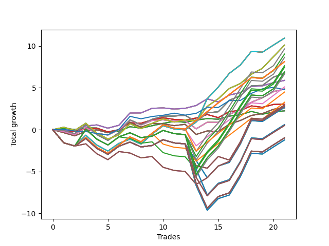

# Short Pointer Eleven (1231 REV) 
- Symbol: AAPL_Unlimited
- Date Range: 03/23/2022 - 07/08/2022
- Trading Period: 7:20-12:30
- Number of Trades: 21



| Name | Win Percent | Profit | Avg Profit / Trade | Avg Time / Trade |      | Name | Win Percent | Profit | Avg Profit / Trade | Avg Time / Trade |
| ---- | ----------- | ------ | ------------------ | ---------------- | ---- | ---- | ----------- | ------ | ------------------ | ---------------- |
| Sorted By <br> Profit | | | | | | Sorted By <br> Win Percentage ||||
| Seventy-One | 61.90 | 5465.00 | 260.24 | 117:06 |     | Sixty-Six | 80.95 | 2940.00 | 140.00 | 22:50 |
| Sixty-Three | 61.90 | 5465.00 | 260.24 | 117:06 |     | Fifty-Eight | 80.95 | 2940.00 | 140.00 | 22:50 |
| Fifty-Five | 61.90 | 5465.00 | 260.24 | 117:06 |     | Fifty | 80.95 | 2940.00 | 140.00 | 22:50 |
| Forty-Seven | 61.90 | 5465.00 | 260.24 | 117:06 |     | Forty-Two | 80.95 | 2940.00 | 140.00 | 22:50 |
| Seven | 61.90 | 5465.00 | 260.24 | 117:06 |     | Two | 80.95 | 2940.00 | 140.00 | 22:50 |
| Seventy | 71.43 | 5045.00 | 240.24 | 66:10 |     | Seventy | 71.43 | 5045.00 | 240.24 | 66:10 |
| Sixty-Two | 71.43 | 5045.00 | 240.24 | 66:10 |     | Sixty-Two | 71.43 | 5045.00 | 240.24 | 66:10 |
| Fifty-Four | 71.43 | 5045.00 | 240.24 | 66:10 |     | Fifty-Four | 71.43 | 5045.00 | 240.24 | 66:10 |
| Forty-Six | 71.43 | 5045.00 | 240.24 | 66:10 |     | Forty-Six | 71.43 | 5045.00 | 240.24 | 66:10 |
| Six | 71.43 | 5045.00 | 240.24 | 66:10 |     | Six | 71.43 | 5045.00 | 240.24 | 66:10 |
| Ninety-Two | 57.14 | 4820.00 | 229.52 | 129:57 |     | Sixty-Nine | 71.43 | 3380.00 | 160.95 | 55:57 |
| One Hundred Seven | 57.14 | 4515.00 | 215.00 | 130:05 |     | Sixty-One | 71.43 | 3380.00 | 160.95 | 55:57 |
| One Hundred Two | 57.14 | 4315.00 | 205.48 | 132:36 |     | Fifty-Three | 71.43 | 3380.00 | 160.95 | 55:57 |
| One Hundred Twenty-Six | 61.90 | 4060.00 | 193.33 | 96:05 |     | Forty-Five | 71.43 | 3380.00 | 160.95 | 55:57 |
| One Hundred Twenty-One | 61.90 | 4060.00 | 193.33 | 96:05 |     | Five | 71.43 | 3380.00 | 160.95 | 55:57 |
| One Hundred Sixteen | 61.90 | 4060.00 | 193.33 | 96:05 |     | Sixty-Four | 66.67 | 1125.00 | 53.57 | 09:49 |
| One Hundred Eleven | 61.90 | 4060.00 | 193.33 | 96:05 |     | Fifty-Six | 66.67 | 1125.00 | 53.57 | 09:49 |
| One Hundred One | 61.90 | 4060.00 | 193.33 | 96:05 |     | Forty-Eight | 66.67 | 1125.00 | 53.57 | 09:49 |
| Eighty-One | 61.90 | 4060.00 | 193.33 | 96:05 |     | Forty | 66.67 | 1125.00 | 53.57 | 09:49 |
| One Hundred Seventeen | 57.14 | 3815.00 | 181.67 | 133:40 |     | Zero | 66.67 | 1125.00 | 53.57 | 09:49 |
| Ninety-Seven | 47.62 | 3725.00 | 177.38 | 115:44 |     | Seventy-One | 61.90 | 5465.00 | 260.24 | 117:06 |
| One Hundred Twenty-Seven | 57.14 | 3445.00 | 164.05 | 135:08 |     | Sixty-Three | 61.90 | 5465.00 | 260.24 | 117:06 |
| One Hundred Twenty-Two | 57.14 | 3445.00 | 164.05 | 135:08 |     | Fifty-Five | 61.90 | 5465.00 | 260.24 | 117:06 |
| Eighty-Two | 57.14 | 3445.00 | 164.05 | 135:08 |     | Forty-Seven | 61.90 | 5465.00 | 260.24 | 117:06 |
| Sixty-Nine | 71.43 | 3380.00 | 160.95 | 55:57 |     | Seven | 61.90 | 5465.00 | 260.24 | 117:06 |
| Sixty-One | 71.43 | 3380.00 | 160.95 | 55:57 |     | One Hundred Twenty-Six | 61.90 | 4060.00 | 193.33 | 96:05 |
| Fifty-Three | 71.43 | 3380.00 | 160.95 | 55:57 |     | One Hundred Twenty-One | 61.90 | 4060.00 | 193.33 | 96:05 |
| Forty-Five | 71.43 | 3380.00 | 160.95 | 55:57 |     | One Hundred Sixteen | 61.90 | 4060.00 | 193.33 | 96:05 |
| Five | 71.43 | 3380.00 | 160.95 | 55:57 |     | One Hundred Eleven | 61.90 | 4060.00 | 193.33 | 96:05 |
| One Hundred Twelve | 57.14 | 3320.00 | 158.10 | 134:45 |     | One Hundred One | 61.90 | 4060.00 | 193.33 | 96:05 |
| Sixty-Six | 80.95 | 2940.00 | 140.00 | 22:50 |     | Eighty-One | 61.90 | 4060.00 | 193.33 | 96:05 |
| Fifty-Eight | 80.95 | 2940.00 | 140.00 | 22:50 |     | Sixty-Eight | 61.90 | 2430.00 | 115.71 | 41:47 |
| Fifty | 80.95 | 2940.00 | 140.00 | 22:50 |     | Sixty | 61.90 | 2430.00 | 115.71 | 41:47 |
| Forty-Two | 80.95 | 2940.00 | 140.00 | 22:50 |     | Fifty-Two | 61.90 | 2430.00 | 115.71 | 41:47 |
| Two | 80.95 | 2940.00 | 140.00 | 22:50 |     | Forty-Four | 61.90 | 2430.00 | 115.71 | 41:47 |
| Ninety-One | 57.14 | 2550.00 | 121.43 | 94:19 |     | Four | 61.90 | 2430.00 | 115.71 | 41:47 |
| Sixty-Eight | 61.90 | 2430.00 | 115.71 | 41:47 |     | Seventy-Three | 61.90 | 2390.00 | 113.81 | 12:22 |
| Sixty | 61.90 | 2430.00 | 115.71 | 41:47 |     | Sixty-Five | 61.90 | 1525.00 | 72.62 | 18:06 |
| Fifty-Two | 61.90 | 2430.00 | 115.71 | 41:47 |     | Fifty-Seven | 61.90 | 1525.00 | 72.62 | 18:06 |
| Forty-Four | 61.90 | 2430.00 | 115.71 | 41:47 |     | Forty-Nine | 61.90 | 1525.00 | 72.62 | 18:06 |
| Four | 61.90 | 2430.00 | 115.71 | 41:47 |     | Forty-One | 61.90 | 1525.00 | 72.62 | 18:06 |
| Seventy-Three | 61.90 | 2390.00 | 113.81 | 12:22 |     | One | 61.90 | 1525.00 | 72.62 | 18:06 |
| One Hundred Six | 57.14 | 2245.00 | 106.90 | 94:27 |     | Sixty-Seven | 61.90 | 1300.00 | 61.90 | 31:27 |
| Ninety-Six | 52.38 | 1635.00 | 77.86 | 85:58 |     | Fifty-Nine | 61.90 | 1300.00 | 61.90 | 31:27 |
| Sixty-Five | 61.90 | 1525.00 | 72.62 | 18:06 |     | Fifty-One | 61.90 | 1300.00 | 61.90 | 31:27 |
| Fifty-Seven | 61.90 | 1525.00 | 72.62 | 18:06 |     | Forty-Three | 61.90 | 1300.00 | 61.90 | 31:27 |
| Forty-Nine | 61.90 | 1525.00 | 72.62 | 18:06 |     | Three | 61.90 | 1300.00 | 61.90 | 31:27 |
| Forty-One | 61.90 | 1525.00 | 72.62 | 18:06 |     | Ninety-Two | 57.14 | 4820.00 | 229.52 | 129:57 |
| One | 61.90 | 1525.00 | 72.62 | 18:06 |     | One Hundred Seven | 57.14 | 4515.00 | 215.00 | 130:05 |
| One Hundred Ten | 47.62 | 1470.00 | 70.00 | 155:57 |     | One Hundred Two | 57.14 | 4315.00 | 205.48 | 132:36 |
| One Hundred Nine | 47.62 | 1470.00 | 70.00 | 155:57 |     | One Hundred Seventeen | 57.14 | 3815.00 | 181.67 | 133:40 |
| One Hundred Eight | 47.62 | 1470.00 | 70.00 | 155:57 |     | One Hundred Twenty-Seven | 57.14 | 3445.00 | 164.05 | 135:08 |
| One Hundred | 47.62 | 1390.00 | 66.19 | 137:27 |     | One Hundred Twenty-Two | 57.14 | 3445.00 | 164.05 | 135:08 |
| Ninety-Nine | 47.62 | 1390.00 | 66.19 | 137:27 |     | Eighty-Two | 57.14 | 3445.00 | 164.05 | 135:08 |
| Ninety-Eight | 47.62 | 1390.00 | 66.19 | 137:27 |     | One Hundred Twelve | 57.14 | 3320.00 | 158.10 | 134:45 |
| Ninety-Five | 52.38 | 1330.00 | 63.33 | 159:15 |     | Ninety-One | 57.14 | 2550.00 | 121.43 | 94:19 |
| Ninety-Four | 52.38 | 1330.00 | 63.33 | 159:15 |     | One Hundred Six | 57.14 | 2245.00 | 106.90 | 94:27 |
| Ninety-Three | 52.38 | 1330.00 | 63.33 | 159:15 |     | Ninety-Six | 52.38 | 1635.00 | 77.86 | 85:58 |
| Sixty-Seven | 61.90 | 1300.00 | 61.90 | 31:27 |     | Ninety-Five | 52.38 | 1330.00 | 63.33 | 159:15 |
| Fifty-Nine | 61.90 | 1300.00 | 61.90 | 31:27 |     | Ninety-Four | 52.38 | 1330.00 | 63.33 | 159:15 |
| Fifty-One | 61.90 | 1300.00 | 61.90 | 31:27 |     | Ninety-Three | 52.38 | 1330.00 | 63.33 | 159:15 |
| Forty-Three | 61.90 | 1300.00 | 61.90 | 31:27 |     | One Hundred Five | 52.38 | 300.00 | 14.29 | 163:00 |
| Three | 61.90 | 1300.00 | 61.90 | 31:27 |     | One Hundred Four | 52.38 | 300.00 | 14.29 | 163:00 |
| Sixty-Four | 66.67 | 1125.00 | 53.57 | 09:49 |     | One Hundred Three | 52.38 | 300.00 | 14.29 | 163:00 |
| Fifty-Six | 66.67 | 1125.00 | 53.57 | 09:49 |     | One Hundred Twenty | 52.38 | 250.00 | 11.90 | 162:59 |
| Forty-Eight | 66.67 | 1125.00 | 53.57 | 09:49 |     | One Hundred Ninteen | 52.38 | 250.00 | 11.90 | 162:59 |
| Forty | 66.67 | 1125.00 | 53.57 | 09:49 |     | One Hundred Eighteen | 52.38 | 250.00 | 11.90 | 162:59 |
| Zero | 66.67 | 1125.00 | 53.57 | 09:49 |     | One Hundred Thirty | 52.38 | -490.00 | -23.33 | 165:54 |
| One Hundred Five | 52.38 | 300.00 | 14.29 | 163:00 |     | One Hundred Twenty-Nine | 52.38 | -490.00 | -23.33 | 165:54 |
| One Hundred Four | 52.38 | 300.00 | 14.29 | 163:00 |     | One Hundred Twenty-Eight | 52.38 | -490.00 | -23.33 | 165:54 |
| One Hundred Three | 52.38 | 300.00 | 14.29 | 163:00 |     | One Hundred Twenty-Five | 52.38 | -490.00 | -23.33 | 165:54 |
| One Hundred Twenty | 52.38 | 250.00 | 11.90 | 162:59 |     | One Hundred Twenty-Four | 52.38 | -490.00 | -23.33 | 165:54 |
| One Hundred Ninteen | 52.38 | 250.00 | 11.90 | 162:59 |     | One Hundred Twenty-Three | 52.38 | -490.00 | -23.33 | 165:54 |
| One Hundred Eighteen | 52.38 | 250.00 | 11.90 | 162:59 |     | Eighty-Five | 52.38 | -490.00 | -23.33 | 165:54 |
| One Hundred Thirty | 52.38 | -490.00 | -23.33 | 165:54 |     | Eighty-Four | 52.38 | -490.00 | -23.33 | 165:54 |
| One Hundred Twenty-Nine | 52.38 | -490.00 | -23.33 | 165:54 |     | Eighty-Three | 52.38 | -490.00 | -23.33 | 165:54 |
| One Hundred Twenty-Eight | 52.38 | -490.00 | -23.33 | 165:54 |     | One Hundred Fifteen | 52.38 | -615.00 | -29.29 | 165:32 |
| One Hundred Twenty-Five | 52.38 | -490.00 | -23.33 | 165:54 |     | One Hundred Fourteen | 52.38 | -615.00 | -29.29 | 165:32 |
| One Hundred Twenty-Four | 52.38 | -490.00 | -23.33 | 165:54 |     | One Hundred Thirteen | 52.38 | -615.00 | -29.29 | 165:32 |
| One Hundred Twenty-Three | 52.38 | -490.00 | -23.33 | 165:54 |     | Ninety-Seven | 47.62 | 3725.00 | 177.38 | 115:44 |
| Eighty-Five | 52.38 | -490.00 | -23.33 | 165:54 |     | One Hundred Ten | 47.62 | 1470.00 | 70.00 | 155:57 |
| Eighty-Four | 52.38 | -490.00 | -23.33 | 165:54 |     | One Hundred Nine | 47.62 | 1470.00 | 70.00 | 155:57 |
| Eighty-Three | 52.38 | -490.00 | -23.33 | 165:54 |     | One Hundred Eight | 47.62 | 1470.00 | 70.00 | 155:57 |
| One Hundred Fifteen | 52.38 | -615.00 | -29.29 | 165:32 |     | One Hundred | 47.62 | 1390.00 | 66.19 | 137:27 |
| One Hundred Fourteen | 52.38 | -615.00 | -29.29 | 165:32 |     | Ninety-Nine | 47.62 | 1390.00 | 66.19 | 137:27 |
| One Hundred Thirteen | 52.38 | -615.00 | -29.29 | 165:32 |     | Ninety-Eight | 47.62 | 1390.00 | 66.19 | 137:27 |

## NO STOPLOSS

### Test Zero
* Sell when price hits the middle line of the 20p bollinger
* No Stoploss
* Results:
```
Total Trades: 21
Percent Up: 33.33
Percent Down: 66.67
Total Points Moved Down: 2.25
Potential Profit: 1125.00
Total Points Ups: 1.36 Count Ups: 7
Total Points Downs: 3.61 Count Downs: 14
```

<details><summary>Trades</summary>

<code>In: 2022-03-24 10:04:00		Out: 2022-03-24 10:09:20		Total Position Time: 05:20		Total Move Down: 0.17		Total to Date: 0.17</code> <br />
<code>In: 2022-03-24 12:14:00		Out: 2022-03-24 12:32:50		Total Position Time: 18:50		Total Move Down: -0.15		Total to Date: 0.02</code> <br />
<code>In: 2022-03-25 07:44:00		Out: 2022-03-25 07:51:25		Total Position Time: 07:25		Total Move Down: 0.19		Total to Date: 0.21</code> <br />
<code>In: 2022-03-29 10:51:00		Out: 2022-03-29 11:04:05		Total Position Time: 13:05		Total Move Down: -0.01		Total to Date: 0.20</code> <br />
<code>In: 2022-03-29 11:55:00		Out: 2022-03-29 12:25:30		Total Position Time: 30:30		Total Move Down: -0.51		Total to Date: -0.31</code> <br />
<code>In: 2022-03-31 12:05:00		Out: 2022-03-31 12:12:15		Total Position Time: 07:15		Total Move Down: 0.14		Total to Date: -0.17</code> <br />
<code>In: 2022-04-06 11:06:00		Out: 2022-04-06 11:07:50		Total Position Time: 01:50		Total Move Down: 0.52		Total to Date: 0.35</code> <br />
<code>In: 2022-04-07 12:04:00		Out: 2022-04-07 12:20:15		Total Position Time: 16:15		Total Move Down: -0.17		Total to Date: 0.18</code> <br />
<code>In: 2022-04-20 10:49:00		Out: 2022-04-20 10:50:10		Total Position Time: 01:10		Total Move Down: 0.29		Total to Date: 0.47</code> <br />
<code>In: 2022-04-27 08:04:00		Out: 2022-04-27 08:10:10		Total Position Time: 06:10		Total Move Down: 0.28		Total to Date: 0.75</code> <br />
<code>In: 2022-04-28 10:16:00		Out: 2022-04-28 10:19:05		Total Position Time: 03:05		Total Move Down: 0.25		Total to Date: 1.00</code> <br />
<code>In: 2022-05-03 08:11:00		Out: 2022-05-03 08:27:15		Total Position Time: 16:15		Total Move Down: -0.12		Total to Date: 0.88</code> <br />
<code>In: 2022-05-04 08:57:00		Out: 2022-05-04 09:04:40		Total Position Time: 07:40		Total Move Down: 0.27		Total to Date: 1.15</code> <br />
<code>In: 2022-05-04 11:03:00		Out: 2022-05-04 11:06:30		Total Position Time: 03:30		Total Move Down: 0.17		Total to Date: 1.32</code> <br />
<code>In: 2022-05-16 11:11:00		Out: 2022-05-16 11:26:05		Total Position Time: 15:05		Total Move Down: -0.07		Total to Date: 1.25</code> <br />
<code>In: 2022-05-25 07:37:00		Out: 2022-05-25 07:41:55		Total Position Time: 04:55		Total Move Down: 0.37		Total to Date: 1.62</code> <br />
<code>In: 2022-06-13 08:27:00		Out: 2022-06-13 08:37:10		Total Position Time: 10:10		Total Move Down: 0.16		Total to Date: 1.78</code> <br />
<code>In: 2022-06-13 09:41:00		Out: 2022-06-13 09:44:50		Total Position Time: 03:50		Total Move Down: 0.40		Total to Date: 2.18</code> <br />
<code>In: 2022-06-17 08:21:00		Out: 2022-06-17 08:38:40		Total Position Time: 17:40		Total Move Down: -0.33		Total to Date: 1.85</code> <br />
<code>In: 2022-06-17 10:14:00		Out: 2022-06-17 10:21:05		Total Position Time: 07:05		Total Move Down: 0.25		Total to Date: 2.10</code> <br />
<code>In: 2022-06-30 09:29:00		Out: 2022-06-30 09:38:05		Total Position Time: 09:05		Total Move Down: 0.15		Total to Date: 2.25</code> <br />


</details>

### Test One
* Sell when the price hits the upper line of the 20p 1std bollinger
* No Stoploss
* Results:
```
Total Trades: 21
Percent Up: 38.10
Percent Down: 61.90
Total Points Moved Down: 3.05
Potential Profit: 1525.00
Total Points Ups: 1.50 Count Ups: 8
Total Points Downs: 4.55 Count Downs: 13
```

<details><summary>Trades</summary>

<code>In: 2022-03-24 10:04:00		Out: 2022-03-24 10:33:15		Total Position Time: 29:15		Total Move Down: -0.13		Total to Date: -0.13</code> <br />
<code>In: 2022-03-24 12:14:00		Out: 2022-03-24 12:39:00		Total Position Time: 25:00		Total Move Down: -0.07		Total to Date: -0.20</code> <br />
<code>In: 2022-03-25 07:44:00		Out: 2022-03-25 07:54:05		Total Position Time: 10:05		Total Move Down: 0.30		Total to Date: 0.10</code> <br />
<code>In: 2022-03-29 10:51:00		Out: 2022-03-29 11:06:05		Total Position Time: 15:05		Total Move Down: 0.07		Total to Date: 0.17</code> <br />
<code>In: 2022-03-29 11:55:00		Out: 2022-03-29 12:27:40		Total Position Time: 32:40		Total Move Down: -0.43		Total to Date: -0.26</code> <br />
<code>In: 2022-03-31 12:05:00		Out: 2022-03-31 12:16:05		Total Position Time: 11:05		Total Move Down: 0.25		Total to Date: -0.01</code> <br />
<code>In: 2022-04-06 11:06:00		Out: 2022-04-06 11:09:20		Total Position Time: 03:20		Total Move Down: 0.83		Total to Date: 0.82</code> <br />
<code>In: 2022-04-07 12:04:00		Out: 2022-04-07 12:27:40		Total Position Time: 23:40		Total Move Down: -0.05		Total to Date: 0.77</code> <br />
<code>In: 2022-04-20 10:49:00		Out: 2022-04-20 10:54:05		Total Position Time: 05:05		Total Move Down: 0.40		Total to Date: 1.17</code> <br />
<code>In: 2022-04-27 08:04:00		Out: 2022-04-27 08:20:25		Total Position Time: 16:25		Total Move Down: 0.26		Total to Date: 1.43</code> <br />
<code>In: 2022-04-28 10:16:00		Out: 2022-04-28 10:56:05		Total Position Time: 40:05		Total Move Down: -0.21		Total to Date: 1.22</code> <br />
<code>In: 2022-05-03 08:11:00		Out: 2022-05-03 08:36:05		Total Position Time: 25:05		Total Move Down: -0.07		Total to Date: 1.15</code> <br />
<code>In: 2022-05-04 08:57:00		Out: 2022-05-04 09:10:15		Total Position Time: 13:15		Total Move Down: 0.24		Total to Date: 1.39</code> <br />
<code>In: 2022-05-04 11:03:00		Out: 2022-05-04 11:07:05		Total Position Time: 04:05		Total Move Down: 0.42		Total to Date: 1.81</code> <br />
<code>In: 2022-05-16 11:11:00		Out: 2022-05-16 11:48:45		Total Position Time: 37:45		Total Move Down: -0.37		Total to Date: 1.44</code> <br />
<code>In: 2022-05-25 07:37:00		Out: 2022-05-25 07:43:30		Total Position Time: 06:30		Total Move Down: 0.71		Total to Date: 2.15</code> <br />
<code>In: 2022-06-13 08:27:00		Out: 2022-06-13 08:46:30		Total Position Time: 19:30		Total Move Down: 0.15		Total to Date: 2.30</code> <br />
<code>In: 2022-06-13 09:41:00		Out: 2022-06-13 09:48:10		Total Position Time: 07:10		Total Move Down: 0.54		Total to Date: 2.84</code> <br />
<code>In: 2022-06-17 08:21:00		Out: 2022-06-17 08:42:50		Total Position Time: 21:50		Total Move Down: -0.17		Total to Date: 2.67</code> <br />
<code>In: 2022-06-17 10:14:00		Out: 2022-06-17 10:26:30		Total Position Time: 12:30		Total Move Down: 0.34		Total to Date: 3.01</code> <br />
<code>In: 2022-06-30 09:29:00		Out: 2022-06-30 09:49:55		Total Position Time: 20:55		Total Move Down: 0.04		Total to Date: 3.05</code> <br />


</details>

### Test Two
* Sell when the price hits the upper line of the 20p 2std bollinger
* No Stoploss
* Results:
```
Total Trades: 21
Percent Up: 19.05
Percent Down: 80.95
Total Points Moved Down: 5.88
Potential Profit: 2940.00
Total Points Ups: 0.97 Count Ups: 4
Total Points Downs: 6.85 Count Downs: 17
```

<details><summary>Trades</summary>

<code>In: 2022-03-24 10:04:00		Out: 2022-03-24 10:34:15		Total Position Time: 30:15		Total Move Down: -0.07		Total to Date: -0.07</code> <br />
<code>In: 2022-03-24 12:14:00		Out: 2022-03-24 12:39:40		Total Position Time: 25:40		Total Move Down: 0.03		Total to Date: -0.04</code> <br />
<code>In: 2022-03-25 07:44:00		Out: 2022-03-25 07:55:35		Total Position Time: 11:35		Total Move Down: 0.48		Total to Date: 0.44</code> <br />
<code>In: 2022-03-29 10:51:00		Out: 2022-03-29 11:07:05		Total Position Time: 16:05		Total Move Down: 0.13		Total to Date: 0.57</code> <br />
<code>In: 2022-03-29 11:55:00		Out: 2022-03-29 12:27:50		Total Position Time: 32:50		Total Move Down: -0.39		Total to Date: 0.18</code> <br />
<code>In: 2022-03-31 12:05:00		Out: 2022-03-31 12:18:15		Total Position Time: 13:15		Total Move Down: 0.35		Total to Date: 0.53</code> <br />
<code>In: 2022-04-06 11:06:00		Out: 2022-04-06 11:15:10		Total Position Time: 09:10		Total Move Down: 1.46		Total to Date: 1.99</code> <br />
<code>In: 2022-04-07 12:04:00		Out: 2022-04-07 12:28:30		Total Position Time: 24:30		Total Move Down: 0.01		Total to Date: 2.00</code> <br />
<code>In: 2022-04-20 10:49:00		Out: 2022-04-20 11:03:15		Total Position Time: 14:15		Total Move Down: 0.55		Total to Date: 2.55</code> <br />
<code>In: 2022-04-27 08:04:00		Out: 2022-04-27 08:52:25		Total Position Time: 48:25		Total Move Down: 0.05		Total to Date: 2.60</code> <br />
<code>In: 2022-04-28 10:16:00		Out: 2022-04-28 11:06:20		Total Position Time: 50:20		Total Move Down: -0.14		Total to Date: 2.46</code> <br />
<code>In: 2022-05-03 08:11:00		Out: 2022-05-03 08:37:20		Total Position Time: 26:20		Total Move Down: 0.09		Total to Date: 2.55</code> <br />
<code>In: 2022-05-04 08:57:00		Out: 2022-05-04 09:12:25		Total Position Time: 15:25		Total Move Down: 0.34		Total to Date: 2.89</code> <br />
<code>In: 2022-05-04 11:03:00		Out: 2022-05-04 11:07:25		Total Position Time: 04:25		Total Move Down: 0.79		Total to Date: 3.68</code> <br />
<code>In: 2022-05-16 11:11:00		Out: 2022-05-16 11:48:45		Total Position Time: 37:45		Total Move Down: -0.37		Total to Date: 3.31</code> <br />
<code>In: 2022-05-25 07:37:00		Out: 2022-05-25 07:48:05		Total Position Time: 11:05		Total Move Down: 0.82		Total to Date: 4.13</code> <br />
<code>In: 2022-06-13 08:27:00		Out: 2022-06-13 08:47:05		Total Position Time: 20:05		Total Move Down: 0.30		Total to Date: 4.43</code> <br />
<code>In: 2022-06-13 09:41:00		Out: 2022-06-13 09:54:10		Total Position Time: 13:10		Total Move Down: 0.74		Total to Date: 5.17</code> <br />
<code>In: 2022-06-17 08:21:00		Out: 2022-06-17 08:44:55		Total Position Time: 23:55		Total Move Down: 0.06		Total to Date: 5.23</code> <br />
<code>In: 2022-06-17 10:14:00		Out: 2022-06-17 10:28:10		Total Position Time: 14:10		Total Move Down: 0.39		Total to Date: 5.62</code> <br />
<code>In: 2022-06-30 09:29:00		Out: 2022-06-30 10:06:05		Total Position Time: 37:05		Total Move Down: 0.26		Total to Date: 5.88</code> <br />


</details>

### Test Three
* Sell when price hits the middle line of the 50p bollinger
* No Stoploss
* Results:
```
Total Trades: 21
Percent Up: 38.10
Percent Down: 61.90
Total Points Moved Down: 2.60
Potential Profit: 1300.00
Total Points Ups: 3.21 Count Ups: 8
Total Points Downs: 5.81 Count Downs: 13
```

<details><summary>Trades</summary>

<code>In: 2022-03-24 10:04:00		Out: 2022-03-24 11:09:05		Total Position Time: 65:05		Total Move Down: -0.36		Total to Date: -0.36</code> <br />
<code>In: 2022-03-24 12:14:00		Out: 2022-03-24 12:47:00		Total Position Time: 33:00		Total Move Down: -0.38		Total to Date: -0.74</code> <br />
<code>In: 2022-03-25 07:44:00		Out: 2022-03-25 07:55:40		Total Position Time: 11:40		Total Move Down: 0.56		Total to Date: -0.18</code> <br />
<code>In: 2022-03-29 10:51:00		Out: 2022-03-29 11:18:35		Total Position Time: 27:35		Total Move Down: 0.16		Total to Date: -0.02</code> <br />
<code>In: 2022-03-29 11:55:00		Out: 2022-03-29 12:38:20		Total Position Time: 43:20		Total Move Down: -0.35		Total to Date: -0.37</code> <br />
<code>In: 2022-03-31 12:05:00		Out: 2022-03-31 12:19:40		Total Position Time: 14:40		Total Move Down: 0.40		Total to Date: 0.03</code> <br />
<code>In: 2022-04-06 11:06:00		Out: 2022-04-06 11:08:30		Total Position Time: 02:30		Total Move Down: 0.85		Total to Date: 0.88</code> <br />
<code>In: 2022-04-07 12:04:00		Out: 2022-04-07 12:47:00		Total Position Time: 43:00		Total Move Down: -0.58		Total to Date: 0.30</code> <br />
<code>In: 2022-04-20 10:49:00		Out: 2022-04-20 10:55:30		Total Position Time: 06:30		Total Move Down: 0.44		Total to Date: 0.74</code> <br />
<code>In: 2022-04-27 08:04:00		Out: 2022-04-27 08:45:20		Total Position Time: 41:20		Total Move Down: -0.05		Total to Date: 0.69</code> <br />
<code>In: 2022-04-28 10:16:00		Out: 2022-04-28 11:01:05		Total Position Time: 45:05		Total Move Down: -0.21		Total to Date: 0.48</code> <br />
<code>In: 2022-05-03 08:11:00		Out: 2022-05-03 08:46:00		Total Position Time: 35:00		Total Move Down: 0.16		Total to Date: 0.64</code> <br />
<code>In: 2022-05-04 08:57:00		Out: 2022-05-04 11:00:20		Total Position Time: 123:20		Total Move Down: -1.21		Total to Date: -0.57</code> <br />
<code>In: 2022-05-04 11:03:00		Out: 2022-05-04 11:07:05		Total Position Time: 04:05		Total Move Down: 0.42		Total to Date: -0.15</code> <br />
<code>In: 2022-05-16 11:11:00		Out: 2022-05-16 11:49:00		Total Position Time: 38:00		Total Move Down: -0.07		Total to Date: -0.22</code> <br />
<code>In: 2022-05-25 07:37:00		Out: 2022-05-25 07:48:40		Total Position Time: 11:40		Total Move Down: 0.87		Total to Date: 0.65</code> <br />
<code>In: 2022-06-13 08:27:00		Out: 2022-06-13 08:51:55		Total Position Time: 24:55		Total Move Down: 0.45		Total to Date: 1.10</code> <br />
<code>In: 2022-06-13 09:41:00		Out: 2022-06-13 09:51:50		Total Position Time: 10:50		Total Move Down: 0.60		Total to Date: 1.70</code> <br />
<code>In: 2022-06-17 08:21:00		Out: 2022-06-17 08:45:15		Total Position Time: 24:15		Total Move Down: 0.22		Total to Date: 1.92</code> <br />
<code>In: 2022-06-17 10:14:00		Out: 2022-06-17 10:31:45		Total Position Time: 17:45		Total Move Down: 0.52		Total to Date: 2.44</code> <br />
<code>In: 2022-06-30 09:29:00		Out: 2022-06-30 10:05:55		Total Position Time: 36:55		Total Move Down: 0.16		Total to Date: 2.60</code> <br />


</details>

### Test Four
* Sell when the price hits the upper line of the 50p 1std bollinger
* No Stoploss
* Results:
```
Total Trades: 21
Percent Up: 38.10
Percent Down: 61.90
Total Points Moved Down: 4.86
Potential Profit: 2430.00
Total Points Ups: 3.21 Count Ups: 8
Total Points Downs: 8.07 Count Downs: 13
```

<details><summary>Trades</summary>

<code>In: 2022-03-24 10:04:00		Out: 2022-03-24 11:10:25		Total Position Time: 66:25		Total Move Down: -0.23		Total to Date: -0.23</code> <br />
<code>In: 2022-03-24 12:14:00		Out: 2022-03-24 12:47:00		Total Position Time: 33:00		Total Move Down: -0.38		Total to Date: -0.61</code> <br />
<code>In: 2022-03-25 07:44:00		Out: 2022-03-25 08:01:45		Total Position Time: 17:45		Total Move Down: 0.86		Total to Date: 0.25</code> <br />
<code>In: 2022-03-29 10:51:00		Out: 2022-03-29 12:43:05		Total Position Time: 112:05		Total Move Down: -0.69		Total to Date: -0.44</code> <br />
<code>In: 2022-03-29 11:55:00		Out: 2022-03-29 12:43:05		Total Position Time: 48:05		Total Move Down: -0.20		Total to Date: -0.64</code> <br />
<code>In: 2022-03-31 12:05:00		Out: 2022-03-31 12:21:30		Total Position Time: 16:30		Total Move Down: 0.63		Total to Date: -0.01</code> <br />
<code>In: 2022-04-06 11:06:00		Out: 2022-04-06 11:14:10		Total Position Time: 08:10		Total Move Down: 1.14		Total to Date: 1.13</code> <br />
<code>In: 2022-04-07 12:04:00		Out: 2022-04-07 12:47:00		Total Position Time: 43:00		Total Move Down: -0.58		Total to Date: 0.55</code> <br />
<code>In: 2022-04-20 10:49:00		Out: 2022-04-20 11:03:15		Total Position Time: 14:15		Total Move Down: 0.55		Total to Date: 1.10</code> <br />
<code>In: 2022-04-27 08:04:00		Out: 2022-04-27 08:52:55		Total Position Time: 48:55		Total Move Down: 0.07		Total to Date: 1.17</code> <br />
<code>In: 2022-04-28 10:16:00		Out: 2022-04-28 11:14:05		Total Position Time: 58:05		Total Move Down: -0.13		Total to Date: 1.04</code> <br />
<code>In: 2022-05-03 08:11:00		Out: 2022-05-03 09:07:10		Total Position Time: 56:10		Total Move Down: 0.04		Total to Date: 1.08</code> <br />
<code>In: 2022-05-04 08:57:00		Out: 2022-05-04 11:00:25		Total Position Time: 123:25		Total Move Down: -0.98		Total to Date: 0.10</code> <br />
<code>In: 2022-05-04 11:03:00		Out: 2022-05-04 11:07:25		Total Position Time: 04:25		Total Move Down: 0.79		Total to Date: 0.89</code> <br />
<code>In: 2022-05-16 11:11:00		Out: 2022-05-16 11:55:05		Total Position Time: 44:05		Total Move Down: -0.02		Total to Date: 0.87</code> <br />
<code>In: 2022-05-25 07:37:00		Out: 2022-05-25 08:04:05		Total Position Time: 27:05		Total Move Down: 0.96		Total to Date: 1.83</code> <br />
<code>In: 2022-06-13 08:27:00		Out: 2022-06-13 09:04:10		Total Position Time: 37:10		Total Move Down: 0.56		Total to Date: 2.39</code> <br />
<code>In: 2022-06-13 09:41:00		Out: 2022-06-13 09:56:10		Total Position Time: 15:10		Total Move Down: 0.89		Total to Date: 3.28</code> <br />
<code>In: 2022-06-17 08:21:00		Out: 2022-06-17 08:52:10		Total Position Time: 31:10		Total Move Down: 0.53		Total to Date: 3.81</code> <br />
<code>In: 2022-06-17 10:14:00		Out: 2022-06-17 10:45:35		Total Position Time: 31:35		Total Move Down: 0.73		Total to Date: 4.54</code> <br />
<code>In: 2022-06-30 09:29:00		Out: 2022-06-30 10:10:15		Total Position Time: 41:15		Total Move Down: 0.32		Total to Date: 4.86</code> <br />


</details>

### Test Five
* Sell when the price hits the upper line of the 50p 2std bollinger
* No Stoploss
* Results:
```
Total Trades: 21
Percent Up: 28.57
Percent Down: 71.43
Total Points Moved Down: 6.76
Potential Profit: 3380.00
Total Points Ups: 3.71 Count Ups: 6
Total Points Downs: 10.47 Count Downs: 15
```

<details><summary>Trades</summary>

<code>In: 2022-03-24 10:04:00		Out: 2022-03-24 11:10:45		Total Position Time: 66:45		Total Move Down: -0.10		Total to Date: -0.10</code> <br />
<code>In: 2022-03-24 12:14:00		Out: 2022-03-24 12:47:00		Total Position Time: 33:00		Total Move Down: -0.38		Total to Date: -0.48</code> <br />
<code>In: 2022-03-25 07:44:00		Out: 2022-03-25 08:09:05		Total Position Time: 25:05		Total Move Down: 1.09		Total to Date: 0.61</code> <br />
<code>In: 2022-03-29 10:51:00		Out: 2022-03-29 12:47:00		Total Position Time: 116:00		Total Move Down: -1.19		Total to Date: -0.58</code> <br />
<code>In: 2022-03-29 11:55:00		Out: 2022-03-29 12:47:00		Total Position Time: 52:00		Total Move Down: -0.70		Total to Date: -1.28</code> <br />
<code>In: 2022-03-31 12:05:00		Out: 2022-03-31 12:33:50		Total Position Time: 28:50		Total Move Down: 0.92		Total to Date: -0.36</code> <br />
<code>In: 2022-04-06 11:06:00		Out: 2022-04-06 11:15:20		Total Position Time: 09:20		Total Move Down: 1.53		Total to Date: 1.17</code> <br />
<code>In: 2022-04-07 12:04:00		Out: 2022-04-07 12:47:00		Total Position Time: 43:00		Total Move Down: -0.58		Total to Date: 0.59</code> <br />
<code>In: 2022-04-20 10:49:00		Out: 2022-04-20 11:19:30		Total Position Time: 30:30		Total Move Down: 0.65		Total to Date: 1.24</code> <br />
<code>In: 2022-04-27 08:04:00		Out: 2022-04-27 08:54:15		Total Position Time: 50:15		Total Move Down: 0.36		Total to Date: 1.60</code> <br />
<code>In: 2022-04-28 10:16:00		Out: 2022-04-28 11:15:25		Total Position Time: 59:25		Total Move Down: 0.03		Total to Date: 1.63</code> <br />
<code>In: 2022-05-03 08:11:00		Out: 2022-05-03 09:56:10		Total Position Time: 105:10		Total Move Down: 0.08		Total to Date: 1.71</code> <br />
<code>In: 2022-05-04 08:57:00		Out: 2022-05-04 11:07:40		Total Position Time: 130:40		Total Move Down: -0.76		Total to Date: 0.95</code> <br />
<code>In: 2022-05-04 11:03:00		Out: 2022-05-04 11:07:40		Total Position Time: 04:40		Total Move Down: 1.06		Total to Date: 2.01</code> <br />
<code>In: 2022-05-16 11:11:00		Out: 2022-05-16 12:10:10		Total Position Time: 59:10		Total Move Down: 0.13		Total to Date: 2.14</code> <br />
<code>In: 2022-05-25 07:37:00		Out: 2022-05-25 08:04:55		Total Position Time: 27:55		Total Move Down: 1.37		Total to Date: 3.51</code> <br />
<code>In: 2022-06-13 08:27:00		Out: 2022-06-13 10:00:15		Total Position Time: 93:15		Total Move Down: 0.55		Total to Date: 4.06</code> <br />
<code>In: 2022-06-13 09:41:00		Out: 2022-06-13 10:00:15		Total Position Time: 19:15		Total Move Down: 1.18		Total to Date: 5.24</code> <br />
<code>In: 2022-06-17 08:21:00		Out: 2022-06-17 10:46:35		Total Position Time: 145:35		Total Move Down: 0.04		Total to Date: 5.28</code> <br />
<code>In: 2022-06-17 10:14:00		Out: 2022-06-17 10:46:35		Total Position Time: 32:35		Total Move Down: 0.99		Total to Date: 6.27</code> <br />
<code>In: 2022-06-30 09:29:00		Out: 2022-06-30 10:11:50		Total Position Time: 42:50		Total Move Down: 0.49		Total to Date: 6.76</code> <br />


</details>

### Test Six
* Sell when the price hits the middle line of the 1std VWAP
* No Stoploss
* Results:
```
Total Trades: 21
Percent Up: 28.57
Percent Down: 71.43
Total Points Moved Down: 10.09
Potential Profit: 5045.00
Total Points Ups: 3.33 Count Ups: 6
Total Points Downs: 13.42 Count Downs: 15
```

<details><summary>Trades</summary>

<code>In: 2022-03-24 10:04:00		Out: 2022-03-24 10:09:25		Total Position Time: 05:25		Total Move Down: 0.29		Total to Date: 0.29</code> <br />
<code>In: 2022-03-24 12:14:00		Out: 2022-03-24 12:47:00		Total Position Time: 33:00		Total Move Down: -0.38		Total to Date: -0.09</code> <br />
<code>In: 2022-03-25 07:44:00		Out: 2022-03-25 08:01:45		Total Position Time: 17:45		Total Move Down: 0.86		Total to Date: 0.77</code> <br />
<code>In: 2022-03-29 10:51:00		Out: 2022-03-29 12:47:00		Total Position Time: 116:00		Total Move Down: -1.19		Total to Date: -0.42</code> <br />
<code>In: 2022-03-29 11:55:00		Out: 2022-03-29 12:47:00		Total Position Time: 52:00		Total Move Down: -0.70		Total to Date: -1.12</code> <br />
<code>In: 2022-03-31 12:05:00		Out: 2022-03-31 12:20:30		Total Position Time: 15:30		Total Move Down: 0.50		Total to Date: -0.62</code> <br />
<code>In: 2022-04-06 11:06:00		Out: 2022-04-06 11:14:50		Total Position Time: 08:50		Total Move Down: 1.33		Total to Date: 0.71</code> <br />
<code>In: 2022-04-07 12:04:00		Out: 2022-04-07 12:47:00		Total Position Time: 43:00		Total Move Down: -0.58		Total to Date: 0.13</code> <br />
<code>In: 2022-04-20 10:49:00		Out: 2022-04-20 11:19:25		Total Position Time: 30:25		Total Move Down: 0.62		Total to Date: 0.75</code> <br />
<code>In: 2022-04-27 08:04:00		Out: 2022-04-27 09:01:30		Total Position Time: 57:30		Total Move Down: 0.54		Total to Date: 1.29</code> <br />
<code>In: 2022-04-28 10:16:00		Out: 2022-04-28 12:47:00		Total Position Time: 151:00		Total Move Down: -0.38		Total to Date: 0.91</code> <br />
<code>In: 2022-05-03 08:11:00		Out: 2022-05-03 11:40:05		Total Position Time: 209:05		Total Move Down: 0.25		Total to Date: 1.16</code> <br />
<code>In: 2022-05-04 08:57:00		Out: 2022-05-04 11:30:50		Total Position Time: 153:50		Total Move Down: -0.10		Total to Date: 1.06</code> <br />
<code>In: 2022-05-04 11:03:00		Out: 2022-05-04 11:30:50		Total Position Time: 27:50		Total Move Down: 1.72		Total to Date: 2.78</code> <br />
<code>In: 2022-05-16 11:11:00		Out: 2022-05-16 12:34:05		Total Position Time: 83:05		Total Move Down: 0.92		Total to Date: 3.70</code> <br />
<code>In: 2022-05-25 07:37:00		Out: 2022-05-25 08:04:40		Total Position Time: 27:40		Total Move Down: 1.21		Total to Date: 4.91</code> <br />
<code>In: 2022-06-13 08:27:00		Out: 2022-06-13 08:52:25		Total Position Time: 25:25		Total Move Down: 0.60		Total to Date: 5.51</code> <br />
<code>In: 2022-06-13 09:41:00		Out: 2022-06-13 09:58:15		Total Position Time: 17:15		Total Move Down: 1.11		Total to Date: 6.62</code> <br />
<code>In: 2022-06-17 08:21:00		Out: 2022-06-17 09:01:30		Total Position Time: 40:30		Total Move Down: 0.71		Total to Date: 7.33</code> <br />
<code>In: 2022-06-17 10:14:00		Out: 2022-06-17 12:12:00		Total Position Time: 118:00		Total Move Down: 1.39		Total to Date: 8.72</code> <br />
<code>In: 2022-06-30 09:29:00		Out: 2022-06-30 12:05:40		Total Position Time: 156:40		Total Move Down: 1.37		Total to Date: 10.09</code> <br />


</details>

### Test Seven
* Sell when the price hits the upper line of the 1std VWAP
* No Stoploss
* Results:
```
Total Trades: 21
Percent Up: 38.10
Percent Down: 61.90
Total Points Moved Down: 10.93
Potential Profit: 5465.00
Total Points Ups: 5.02 Count Ups: 8
Total Points Downs: 15.95 Count Downs: 13
```

<details><summary>Trades</summary>

<code>In: 2022-03-24 10:04:00		Out: 2022-03-24 12:47:00		Total Position Time: 163:00		Total Move Down: -1.57		Total to Date: -1.57</code> <br />
<code>In: 2022-03-24 12:14:00		Out: 2022-03-24 12:47:00		Total Position Time: 33:00		Total Move Down: -0.38		Total to Date: -1.95</code> <br />
<code>In: 2022-03-25 07:44:00		Out: 2022-03-25 08:09:50		Total Position Time: 25:50		Total Move Down: 1.29		Total to Date: -0.66</code> <br />
<code>In: 2022-03-29 10:51:00		Out: 2022-03-29 12:47:00		Total Position Time: 116:00		Total Move Down: -1.19		Total to Date: -1.85</code> <br />
<code>In: 2022-03-29 11:55:00		Out: 2022-03-29 12:47:00		Total Position Time: 52:00		Total Move Down: -0.70		Total to Date: -2.55</code> <br />
<code>In: 2022-03-31 12:05:00		Out: 2022-03-31 12:33:50		Total Position Time: 28:50		Total Move Down: 0.92		Total to Date: -1.63</code> <br />
<code>In: 2022-04-06 11:06:00		Out: 2022-04-06 12:47:00		Total Position Time: 101:00		Total Move Down: 0.49		Total to Date: -1.14</code> <br />
<code>In: 2022-04-07 12:04:00		Out: 2022-04-07 12:47:00		Total Position Time: 43:00		Total Move Down: -0.58		Total to Date: -1.72</code> <br />
<code>In: 2022-04-20 10:49:00		Out: 2022-04-20 11:52:05		Total Position Time: 63:05		Total Move Down: 1.19		Total to Date: -0.53</code> <br />
<code>In: 2022-04-27 08:04:00		Out: 2022-04-27 11:56:25		Total Position Time: 232:25		Total Move Down: 1.00		Total to Date: 0.47</code> <br />
<code>In: 2022-04-28 10:16:00		Out: 2022-04-28 12:47:00		Total Position Time: 151:00		Total Move Down: -0.38		Total to Date: 0.09</code> <br />
<code>In: 2022-05-03 08:11:00		Out: 2022-05-03 12:47:00		Total Position Time: 276:00		Total Move Down: -0.12		Total to Date: -0.03</code> <br />
<code>In: 2022-05-04 08:57:00		Out: 2022-05-04 11:35:05		Total Position Time: 158:05		Total Move Down: 0.95		Total to Date: 0.92</code> <br />
<code>In: 2022-05-04 11:03:00		Out: 2022-05-04 11:35:05		Total Position Time: 32:05		Total Move Down: 2.77		Total to Date: 3.69</code> <br />
<code>In: 2022-05-16 11:11:00		Out: 2022-05-16 12:47:00		Total Position Time: 96:00		Total Move Down: 1.40		Total to Date: 5.09</code> <br />
<code>In: 2022-05-25 07:37:00		Out: 2022-05-25 09:20:10		Total Position Time: 103:10		Total Move Down: 1.63		Total to Date: 6.72</code> <br />
<code>In: 2022-06-13 08:27:00		Out: 2022-06-13 10:27:50		Total Position Time: 120:50		Total Move Down: 1.00		Total to Date: 7.72</code> <br />
<code>In: 2022-06-13 09:41:00		Out: 2022-06-13 10:27:50		Total Position Time: 46:50		Total Move Down: 1.63		Total to Date: 9.35</code> <br />
<code>In: 2022-06-17 08:21:00		Out: 2022-06-17 12:47:00		Total Position Time: 266:00		Total Move Down: -0.10		Total to Date: 9.25</code> <br />
<code>In: 2022-06-17 10:14:00		Out: 2022-06-17 12:47:00		Total Position Time: 153:00		Total Move Down: 0.85		Total to Date: 10.10</code> <br />
<code>In: 2022-06-30 09:29:00		Out: 2022-06-30 12:47:00		Total Position Time: 198:00		Total Move Down: 0.83		Total to Date: 10.93</code> <br />


</details>

## STOPLOSS OF 5

### Test Forty
* Sell when price hits the middle line of the 20p bollinger
* Stoploss is -5 points
* Results:
```
Total Trades: 21
Percent Up: 33.33
Percent Down: 66.67
Total Points Moved Down: 2.25
Potential Profit: 1125.00
Total Points Ups: 1.36 Count Ups: 7
Total Points Downs: 3.61 Count Downs: 14
```

<details><summary>Trades</summary>

<code>In: 2022-03-24 10:04:00		Out: 2022-03-24 10:09:20		Total Position Time: 05:20		Total Move Down: 0.17		Total to Date: 0.17</code> <br />
<code>In: 2022-03-24 12:14:00		Out: 2022-03-24 12:32:50		Total Position Time: 18:50		Total Move Down: -0.15		Total to Date: 0.02</code> <br />
<code>In: 2022-03-25 07:44:00		Out: 2022-03-25 07:51:25		Total Position Time: 07:25		Total Move Down: 0.19		Total to Date: 0.21</code> <br />
<code>In: 2022-03-29 10:51:00		Out: 2022-03-29 11:04:05		Total Position Time: 13:05		Total Move Down: -0.01		Total to Date: 0.20</code> <br />
<code>In: 2022-03-29 11:55:00		Out: 2022-03-29 12:25:30		Total Position Time: 30:30		Total Move Down: -0.51		Total to Date: -0.31</code> <br />
<code>In: 2022-03-31 12:05:00		Out: 2022-03-31 12:12:15		Total Position Time: 07:15		Total Move Down: 0.14		Total to Date: -0.17</code> <br />
<code>In: 2022-04-06 11:06:00		Out: 2022-04-06 11:07:50		Total Position Time: 01:50		Total Move Down: 0.52		Total to Date: 0.35</code> <br />
<code>In: 2022-04-07 12:04:00		Out: 2022-04-07 12:20:15		Total Position Time: 16:15		Total Move Down: -0.17		Total to Date: 0.18</code> <br />
<code>In: 2022-04-20 10:49:00		Out: 2022-04-20 10:50:10		Total Position Time: 01:10		Total Move Down: 0.29		Total to Date: 0.47</code> <br />
<code>In: 2022-04-27 08:04:00		Out: 2022-04-27 08:10:10		Total Position Time: 06:10		Total Move Down: 0.28		Total to Date: 0.75</code> <br />
<code>In: 2022-04-28 10:16:00		Out: 2022-04-28 10:19:05		Total Position Time: 03:05		Total Move Down: 0.25		Total to Date: 1.00</code> <br />
<code>In: 2022-05-03 08:11:00		Out: 2022-05-03 08:27:15		Total Position Time: 16:15		Total Move Down: -0.12		Total to Date: 0.88</code> <br />
<code>In: 2022-05-04 08:57:00		Out: 2022-05-04 09:04:40		Total Position Time: 07:40		Total Move Down: 0.27		Total to Date: 1.15</code> <br />
<code>In: 2022-05-04 11:03:00		Out: 2022-05-04 11:06:30		Total Position Time: 03:30		Total Move Down: 0.17		Total to Date: 1.32</code> <br />
<code>In: 2022-05-16 11:11:00		Out: 2022-05-16 11:26:05		Total Position Time: 15:05		Total Move Down: -0.07		Total to Date: 1.25</code> <br />
<code>In: 2022-05-25 07:37:00		Out: 2022-05-25 07:41:55		Total Position Time: 04:55		Total Move Down: 0.37		Total to Date: 1.62</code> <br />
<code>In: 2022-06-13 08:27:00		Out: 2022-06-13 08:37:10		Total Position Time: 10:10		Total Move Down: 0.16		Total to Date: 1.78</code> <br />
<code>In: 2022-06-13 09:41:00		Out: 2022-06-13 09:44:50		Total Position Time: 03:50		Total Move Down: 0.40		Total to Date: 2.18</code> <br />
<code>In: 2022-06-17 08:21:00		Out: 2022-06-17 08:38:40		Total Position Time: 17:40		Total Move Down: -0.33		Total to Date: 1.85</code> <br />
<code>In: 2022-06-17 10:14:00		Out: 2022-06-17 10:21:05		Total Position Time: 07:05		Total Move Down: 0.25		Total to Date: 2.10</code> <br />
<code>In: 2022-06-30 09:29:00		Out: 2022-06-30 09:38:05		Total Position Time: 09:05		Total Move Down: 0.15		Total to Date: 2.25</code> <br />


</details>

### Test Forty-One
* Sell when the price hits the upper line of the 20p 1std bollinger
* Stoploss is -5 points
* Results:
```
Total Trades: 21
Percent Up: 38.10
Percent Down: 61.90
Total Points Moved Down: 3.05
Potential Profit: 1525.00
Total Points Ups: 1.50 Count Ups: 8
Total Points Downs: 4.55 Count Downs: 13
```

<details><summary>Trades</summary>

<code>In: 2022-03-24 10:04:00		Out: 2022-03-24 10:33:15		Total Position Time: 29:15		Total Move Down: -0.13		Total to Date: -0.13</code> <br />
<code>In: 2022-03-24 12:14:00		Out: 2022-03-24 12:39:00		Total Position Time: 25:00		Total Move Down: -0.07		Total to Date: -0.20</code> <br />
<code>In: 2022-03-25 07:44:00		Out: 2022-03-25 07:54:05		Total Position Time: 10:05		Total Move Down: 0.30		Total to Date: 0.10</code> <br />
<code>In: 2022-03-29 10:51:00		Out: 2022-03-29 11:06:05		Total Position Time: 15:05		Total Move Down: 0.07		Total to Date: 0.17</code> <br />
<code>In: 2022-03-29 11:55:00		Out: 2022-03-29 12:27:40		Total Position Time: 32:40		Total Move Down: -0.43		Total to Date: -0.26</code> <br />
<code>In: 2022-03-31 12:05:00		Out: 2022-03-31 12:16:05		Total Position Time: 11:05		Total Move Down: 0.25		Total to Date: -0.01</code> <br />
<code>In: 2022-04-06 11:06:00		Out: 2022-04-06 11:09:20		Total Position Time: 03:20		Total Move Down: 0.83		Total to Date: 0.82</code> <br />
<code>In: 2022-04-07 12:04:00		Out: 2022-04-07 12:27:40		Total Position Time: 23:40		Total Move Down: -0.05		Total to Date: 0.77</code> <br />
<code>In: 2022-04-20 10:49:00		Out: 2022-04-20 10:54:05		Total Position Time: 05:05		Total Move Down: 0.40		Total to Date: 1.17</code> <br />
<code>In: 2022-04-27 08:04:00		Out: 2022-04-27 08:20:25		Total Position Time: 16:25		Total Move Down: 0.26		Total to Date: 1.43</code> <br />
<code>In: 2022-04-28 10:16:00		Out: 2022-04-28 10:56:05		Total Position Time: 40:05		Total Move Down: -0.21		Total to Date: 1.22</code> <br />
<code>In: 2022-05-03 08:11:00		Out: 2022-05-03 08:36:05		Total Position Time: 25:05		Total Move Down: -0.07		Total to Date: 1.15</code> <br />
<code>In: 2022-05-04 08:57:00		Out: 2022-05-04 09:10:15		Total Position Time: 13:15		Total Move Down: 0.24		Total to Date: 1.39</code> <br />
<code>In: 2022-05-04 11:03:00		Out: 2022-05-04 11:07:05		Total Position Time: 04:05		Total Move Down: 0.42		Total to Date: 1.81</code> <br />
<code>In: 2022-05-16 11:11:00		Out: 2022-05-16 11:48:45		Total Position Time: 37:45		Total Move Down: -0.37		Total to Date: 1.44</code> <br />
<code>In: 2022-05-25 07:37:00		Out: 2022-05-25 07:43:30		Total Position Time: 06:30		Total Move Down: 0.71		Total to Date: 2.15</code> <br />
<code>In: 2022-06-13 08:27:00		Out: 2022-06-13 08:46:30		Total Position Time: 19:30		Total Move Down: 0.15		Total to Date: 2.30</code> <br />
<code>In: 2022-06-13 09:41:00		Out: 2022-06-13 09:48:10		Total Position Time: 07:10		Total Move Down: 0.54		Total to Date: 2.84</code> <br />
<code>In: 2022-06-17 08:21:00		Out: 2022-06-17 08:42:50		Total Position Time: 21:50		Total Move Down: -0.17		Total to Date: 2.67</code> <br />
<code>In: 2022-06-17 10:14:00		Out: 2022-06-17 10:26:30		Total Position Time: 12:30		Total Move Down: 0.34		Total to Date: 3.01</code> <br />
<code>In: 2022-06-30 09:29:00		Out: 2022-06-30 09:49:55		Total Position Time: 20:55		Total Move Down: 0.04		Total to Date: 3.05</code> <br />


</details>

### Test Forty-Two
* Sell when the price hits the upper line of the 20p 2std bollinger
* Stoploss is -5 points
* Results:
```
Total Trades: 21
Percent Up: 19.05
Percent Down: 80.95
Total Points Moved Down: 5.88
Potential Profit: 2940.00
Total Points Ups: 0.97 Count Ups: 4
Total Points Downs: 6.85 Count Downs: 17
```

<details><summary>Trades</summary>

<code>In: 2022-03-24 10:04:00		Out: 2022-03-24 10:34:15		Total Position Time: 30:15		Total Move Down: -0.07		Total to Date: -0.07</code> <br />
<code>In: 2022-03-24 12:14:00		Out: 2022-03-24 12:39:40		Total Position Time: 25:40		Total Move Down: 0.03		Total to Date: -0.04</code> <br />
<code>In: 2022-03-25 07:44:00		Out: 2022-03-25 07:55:35		Total Position Time: 11:35		Total Move Down: 0.48		Total to Date: 0.44</code> <br />
<code>In: 2022-03-29 10:51:00		Out: 2022-03-29 11:07:05		Total Position Time: 16:05		Total Move Down: 0.13		Total to Date: 0.57</code> <br />
<code>In: 2022-03-29 11:55:00		Out: 2022-03-29 12:27:50		Total Position Time: 32:50		Total Move Down: -0.39		Total to Date: 0.18</code> <br />
<code>In: 2022-03-31 12:05:00		Out: 2022-03-31 12:18:15		Total Position Time: 13:15		Total Move Down: 0.35		Total to Date: 0.53</code> <br />
<code>In: 2022-04-06 11:06:00		Out: 2022-04-06 11:15:10		Total Position Time: 09:10		Total Move Down: 1.46		Total to Date: 1.99</code> <br />
<code>In: 2022-04-07 12:04:00		Out: 2022-04-07 12:28:30		Total Position Time: 24:30		Total Move Down: 0.01		Total to Date: 2.00</code> <br />
<code>In: 2022-04-20 10:49:00		Out: 2022-04-20 11:03:15		Total Position Time: 14:15		Total Move Down: 0.55		Total to Date: 2.55</code> <br />
<code>In: 2022-04-27 08:04:00		Out: 2022-04-27 08:52:25		Total Position Time: 48:25		Total Move Down: 0.05		Total to Date: 2.60</code> <br />
<code>In: 2022-04-28 10:16:00		Out: 2022-04-28 11:06:20		Total Position Time: 50:20		Total Move Down: -0.14		Total to Date: 2.46</code> <br />
<code>In: 2022-05-03 08:11:00		Out: 2022-05-03 08:37:20		Total Position Time: 26:20		Total Move Down: 0.09		Total to Date: 2.55</code> <br />
<code>In: 2022-05-04 08:57:00		Out: 2022-05-04 09:12:25		Total Position Time: 15:25		Total Move Down: 0.34		Total to Date: 2.89</code> <br />
<code>In: 2022-05-04 11:03:00		Out: 2022-05-04 11:07:25		Total Position Time: 04:25		Total Move Down: 0.79		Total to Date: 3.68</code> <br />
<code>In: 2022-05-16 11:11:00		Out: 2022-05-16 11:48:45		Total Position Time: 37:45		Total Move Down: -0.37		Total to Date: 3.31</code> <br />
<code>In: 2022-05-25 07:37:00		Out: 2022-05-25 07:48:05		Total Position Time: 11:05		Total Move Down: 0.82		Total to Date: 4.13</code> <br />
<code>In: 2022-06-13 08:27:00		Out: 2022-06-13 08:47:05		Total Position Time: 20:05		Total Move Down: 0.30		Total to Date: 4.43</code> <br />
<code>In: 2022-06-13 09:41:00		Out: 2022-06-13 09:54:10		Total Position Time: 13:10		Total Move Down: 0.74		Total to Date: 5.17</code> <br />
<code>In: 2022-06-17 08:21:00		Out: 2022-06-17 08:44:55		Total Position Time: 23:55		Total Move Down: 0.06		Total to Date: 5.23</code> <br />
<code>In: 2022-06-17 10:14:00		Out: 2022-06-17 10:28:10		Total Position Time: 14:10		Total Move Down: 0.39		Total to Date: 5.62</code> <br />
<code>In: 2022-06-30 09:29:00		Out: 2022-06-30 10:06:05		Total Position Time: 37:05		Total Move Down: 0.26		Total to Date: 5.88</code> <br />


</details>

### Test Forty-Three
* Sell when price hits the middle line of the 50p bollinger
* Stoploss is -5 points
* Results:
```
Total Trades: 21
Percent Up: 38.10
Percent Down: 61.90
Total Points Moved Down: 2.60
Potential Profit: 1300.00
Total Points Ups: 3.21 Count Ups: 8
Total Points Downs: 5.81 Count Downs: 13
```

<details><summary>Trades</summary>

<code>In: 2022-03-24 10:04:00		Out: 2022-03-24 11:09:05		Total Position Time: 65:05		Total Move Down: -0.36		Total to Date: -0.36</code> <br />
<code>In: 2022-03-24 12:14:00		Out: 2022-03-24 12:47:00		Total Position Time: 33:00		Total Move Down: -0.38		Total to Date: -0.74</code> <br />
<code>In: 2022-03-25 07:44:00		Out: 2022-03-25 07:55:40		Total Position Time: 11:40		Total Move Down: 0.56		Total to Date: -0.18</code> <br />
<code>In: 2022-03-29 10:51:00		Out: 2022-03-29 11:18:35		Total Position Time: 27:35		Total Move Down: 0.16		Total to Date: -0.02</code> <br />
<code>In: 2022-03-29 11:55:00		Out: 2022-03-29 12:38:20		Total Position Time: 43:20		Total Move Down: -0.35		Total to Date: -0.37</code> <br />
<code>In: 2022-03-31 12:05:00		Out: 2022-03-31 12:19:40		Total Position Time: 14:40		Total Move Down: 0.40		Total to Date: 0.03</code> <br />
<code>In: 2022-04-06 11:06:00		Out: 2022-04-06 11:08:30		Total Position Time: 02:30		Total Move Down: 0.85		Total to Date: 0.88</code> <br />
<code>In: 2022-04-07 12:04:00		Out: 2022-04-07 12:47:00		Total Position Time: 43:00		Total Move Down: -0.58		Total to Date: 0.30</code> <br />
<code>In: 2022-04-20 10:49:00		Out: 2022-04-20 10:55:30		Total Position Time: 06:30		Total Move Down: 0.44		Total to Date: 0.74</code> <br />
<code>In: 2022-04-27 08:04:00		Out: 2022-04-27 08:45:20		Total Position Time: 41:20		Total Move Down: -0.05		Total to Date: 0.69</code> <br />
<code>In: 2022-04-28 10:16:00		Out: 2022-04-28 11:01:05		Total Position Time: 45:05		Total Move Down: -0.21		Total to Date: 0.48</code> <br />
<code>In: 2022-05-03 08:11:00		Out: 2022-05-03 08:46:00		Total Position Time: 35:00		Total Move Down: 0.16		Total to Date: 0.64</code> <br />
<code>In: 2022-05-04 08:57:00		Out: 2022-05-04 11:00:20		Total Position Time: 123:20		Total Move Down: -1.21		Total to Date: -0.57</code> <br />
<code>In: 2022-05-04 11:03:00		Out: 2022-05-04 11:07:05		Total Position Time: 04:05		Total Move Down: 0.42		Total to Date: -0.15</code> <br />
<code>In: 2022-05-16 11:11:00		Out: 2022-05-16 11:49:00		Total Position Time: 38:00		Total Move Down: -0.07		Total to Date: -0.22</code> <br />
<code>In: 2022-05-25 07:37:00		Out: 2022-05-25 07:48:40		Total Position Time: 11:40		Total Move Down: 0.87		Total to Date: 0.65</code> <br />
<code>In: 2022-06-13 08:27:00		Out: 2022-06-13 08:51:55		Total Position Time: 24:55		Total Move Down: 0.45		Total to Date: 1.10</code> <br />
<code>In: 2022-06-13 09:41:00		Out: 2022-06-13 09:51:50		Total Position Time: 10:50		Total Move Down: 0.60		Total to Date: 1.70</code> <br />
<code>In: 2022-06-17 08:21:00		Out: 2022-06-17 08:45:15		Total Position Time: 24:15		Total Move Down: 0.22		Total to Date: 1.92</code> <br />
<code>In: 2022-06-17 10:14:00		Out: 2022-06-17 10:31:45		Total Position Time: 17:45		Total Move Down: 0.52		Total to Date: 2.44</code> <br />
<code>In: 2022-06-30 09:29:00		Out: 2022-06-30 10:05:55		Total Position Time: 36:55		Total Move Down: 0.16		Total to Date: 2.60</code> <br />


</details>

### Test Forty-Four
* Sell when the price hits the upper line of the 50p 1std bollinger
* Stoploss is -5 points
* Results:
```
Total Trades: 21
Percent Up: 38.10
Percent Down: 61.90
Total Points Moved Down: 4.86
Potential Profit: 2430.00
Total Points Ups: 3.21 Count Ups: 8
Total Points Downs: 8.07 Count Downs: 13
```

<details><summary>Trades</summary>

<code>In: 2022-03-24 10:04:00		Out: 2022-03-24 11:10:25		Total Position Time: 66:25		Total Move Down: -0.23		Total to Date: -0.23</code> <br />
<code>In: 2022-03-24 12:14:00		Out: 2022-03-24 12:47:00		Total Position Time: 33:00		Total Move Down: -0.38		Total to Date: -0.61</code> <br />
<code>In: 2022-03-25 07:44:00		Out: 2022-03-25 08:01:45		Total Position Time: 17:45		Total Move Down: 0.86		Total to Date: 0.25</code> <br />
<code>In: 2022-03-29 10:51:00		Out: 2022-03-29 12:43:05		Total Position Time: 112:05		Total Move Down: -0.69		Total to Date: -0.44</code> <br />
<code>In: 2022-03-29 11:55:00		Out: 2022-03-29 12:43:05		Total Position Time: 48:05		Total Move Down: -0.20		Total to Date: -0.64</code> <br />
<code>In: 2022-03-31 12:05:00		Out: 2022-03-31 12:21:30		Total Position Time: 16:30		Total Move Down: 0.63		Total to Date: -0.01</code> <br />
<code>In: 2022-04-06 11:06:00		Out: 2022-04-06 11:14:10		Total Position Time: 08:10		Total Move Down: 1.14		Total to Date: 1.13</code> <br />
<code>In: 2022-04-07 12:04:00		Out: 2022-04-07 12:47:00		Total Position Time: 43:00		Total Move Down: -0.58		Total to Date: 0.55</code> <br />
<code>In: 2022-04-20 10:49:00		Out: 2022-04-20 11:03:15		Total Position Time: 14:15		Total Move Down: 0.55		Total to Date: 1.10</code> <br />
<code>In: 2022-04-27 08:04:00		Out: 2022-04-27 08:52:55		Total Position Time: 48:55		Total Move Down: 0.07		Total to Date: 1.17</code> <br />
<code>In: 2022-04-28 10:16:00		Out: 2022-04-28 11:14:05		Total Position Time: 58:05		Total Move Down: -0.13		Total to Date: 1.04</code> <br />
<code>In: 2022-05-03 08:11:00		Out: 2022-05-03 09:07:10		Total Position Time: 56:10		Total Move Down: 0.04		Total to Date: 1.08</code> <br />
<code>In: 2022-05-04 08:57:00		Out: 2022-05-04 11:00:25		Total Position Time: 123:25		Total Move Down: -0.98		Total to Date: 0.10</code> <br />
<code>In: 2022-05-04 11:03:00		Out: 2022-05-04 11:07:25		Total Position Time: 04:25		Total Move Down: 0.79		Total to Date: 0.89</code> <br />
<code>In: 2022-05-16 11:11:00		Out: 2022-05-16 11:55:05		Total Position Time: 44:05		Total Move Down: -0.02		Total to Date: 0.87</code> <br />
<code>In: 2022-05-25 07:37:00		Out: 2022-05-25 08:04:05		Total Position Time: 27:05		Total Move Down: 0.96		Total to Date: 1.83</code> <br />
<code>In: 2022-06-13 08:27:00		Out: 2022-06-13 09:04:10		Total Position Time: 37:10		Total Move Down: 0.56		Total to Date: 2.39</code> <br />
<code>In: 2022-06-13 09:41:00		Out: 2022-06-13 09:56:10		Total Position Time: 15:10		Total Move Down: 0.89		Total to Date: 3.28</code> <br />
<code>In: 2022-06-17 08:21:00		Out: 2022-06-17 08:52:10		Total Position Time: 31:10		Total Move Down: 0.53		Total to Date: 3.81</code> <br />
<code>In: 2022-06-17 10:14:00		Out: 2022-06-17 10:45:35		Total Position Time: 31:35		Total Move Down: 0.73		Total to Date: 4.54</code> <br />
<code>In: 2022-06-30 09:29:00		Out: 2022-06-30 10:10:15		Total Position Time: 41:15		Total Move Down: 0.32		Total to Date: 4.86</code> <br />


</details>

### Test Forty-Five
* Sell when the price hits the upper line of the 50p 2std bollinger
* Stoploss is -5 points
* Results:
```
Total Trades: 21
Percent Up: 28.57
Percent Down: 71.43
Total Points Moved Down: 6.76
Potential Profit: 3380.00
Total Points Ups: 3.71 Count Ups: 6
Total Points Downs: 10.47 Count Downs: 15
```

<details><summary>Trades</summary>

<code>In: 2022-03-24 10:04:00		Out: 2022-03-24 11:10:45		Total Position Time: 66:45		Total Move Down: -0.10		Total to Date: -0.10</code> <br />
<code>In: 2022-03-24 12:14:00		Out: 2022-03-24 12:47:00		Total Position Time: 33:00		Total Move Down: -0.38		Total to Date: -0.48</code> <br />
<code>In: 2022-03-25 07:44:00		Out: 2022-03-25 08:09:05		Total Position Time: 25:05		Total Move Down: 1.09		Total to Date: 0.61</code> <br />
<code>In: 2022-03-29 10:51:00		Out: 2022-03-29 12:47:00		Total Position Time: 116:00		Total Move Down: -1.19		Total to Date: -0.58</code> <br />
<code>In: 2022-03-29 11:55:00		Out: 2022-03-29 12:47:00		Total Position Time: 52:00		Total Move Down: -0.70		Total to Date: -1.28</code> <br />
<code>In: 2022-03-31 12:05:00		Out: 2022-03-31 12:33:50		Total Position Time: 28:50		Total Move Down: 0.92		Total to Date: -0.36</code> <br />
<code>In: 2022-04-06 11:06:00		Out: 2022-04-06 11:15:20		Total Position Time: 09:20		Total Move Down: 1.53		Total to Date: 1.17</code> <br />
<code>In: 2022-04-07 12:04:00		Out: 2022-04-07 12:47:00		Total Position Time: 43:00		Total Move Down: -0.58		Total to Date: 0.59</code> <br />
<code>In: 2022-04-20 10:49:00		Out: 2022-04-20 11:19:30		Total Position Time: 30:30		Total Move Down: 0.65		Total to Date: 1.24</code> <br />
<code>In: 2022-04-27 08:04:00		Out: 2022-04-27 08:54:15		Total Position Time: 50:15		Total Move Down: 0.36		Total to Date: 1.60</code> <br />
<code>In: 2022-04-28 10:16:00		Out: 2022-04-28 11:15:25		Total Position Time: 59:25		Total Move Down: 0.03		Total to Date: 1.63</code> <br />
<code>In: 2022-05-03 08:11:00		Out: 2022-05-03 09:56:10		Total Position Time: 105:10		Total Move Down: 0.08		Total to Date: 1.71</code> <br />
<code>In: 2022-05-04 08:57:00		Out: 2022-05-04 11:07:40		Total Position Time: 130:40		Total Move Down: -0.76		Total to Date: 0.95</code> <br />
<code>In: 2022-05-04 11:03:00		Out: 2022-05-04 11:07:40		Total Position Time: 04:40		Total Move Down: 1.06		Total to Date: 2.01</code> <br />
<code>In: 2022-05-16 11:11:00		Out: 2022-05-16 12:10:10		Total Position Time: 59:10		Total Move Down: 0.13		Total to Date: 2.14</code> <br />
<code>In: 2022-05-25 07:37:00		Out: 2022-05-25 08:04:55		Total Position Time: 27:55		Total Move Down: 1.37		Total to Date: 3.51</code> <br />
<code>In: 2022-06-13 08:27:00		Out: 2022-06-13 10:00:15		Total Position Time: 93:15		Total Move Down: 0.55		Total to Date: 4.06</code> <br />
<code>In: 2022-06-13 09:41:00		Out: 2022-06-13 10:00:15		Total Position Time: 19:15		Total Move Down: 1.18		Total to Date: 5.24</code> <br />
<code>In: 2022-06-17 08:21:00		Out: 2022-06-17 10:46:35		Total Position Time: 145:35		Total Move Down: 0.04		Total to Date: 5.28</code> <br />
<code>In: 2022-06-17 10:14:00		Out: 2022-06-17 10:46:35		Total Position Time: 32:35		Total Move Down: 0.99		Total to Date: 6.27</code> <br />
<code>In: 2022-06-30 09:29:00		Out: 2022-06-30 10:11:50		Total Position Time: 42:50		Total Move Down: 0.49		Total to Date: 6.76</code> <br />


</details>

### Test Forty-Six
* Sell when the price hits the middle line of the 1std VWAP
* Stoploss is -5 points
* Results:
```
Total Trades: 21
Percent Up: 28.57
Percent Down: 71.43
Total Points Moved Down: 10.09
Potential Profit: 5045.00
Total Points Ups: 3.33 Count Ups: 6
Total Points Downs: 13.42 Count Downs: 15
```

<details><summary>Trades</summary>

<code>In: 2022-03-24 10:04:00		Out: 2022-03-24 10:09:25		Total Position Time: 05:25		Total Move Down: 0.29		Total to Date: 0.29</code> <br />
<code>In: 2022-03-24 12:14:00		Out: 2022-03-24 12:47:00		Total Position Time: 33:00		Total Move Down: -0.38		Total to Date: -0.09</code> <br />
<code>In: 2022-03-25 07:44:00		Out: 2022-03-25 08:01:45		Total Position Time: 17:45		Total Move Down: 0.86		Total to Date: 0.77</code> <br />
<code>In: 2022-03-29 10:51:00		Out: 2022-03-29 12:47:00		Total Position Time: 116:00		Total Move Down: -1.19		Total to Date: -0.42</code> <br />
<code>In: 2022-03-29 11:55:00		Out: 2022-03-29 12:47:00		Total Position Time: 52:00		Total Move Down: -0.70		Total to Date: -1.12</code> <br />
<code>In: 2022-03-31 12:05:00		Out: 2022-03-31 12:20:30		Total Position Time: 15:30		Total Move Down: 0.50		Total to Date: -0.62</code> <br />
<code>In: 2022-04-06 11:06:00		Out: 2022-04-06 11:14:50		Total Position Time: 08:50		Total Move Down: 1.33		Total to Date: 0.71</code> <br />
<code>In: 2022-04-07 12:04:00		Out: 2022-04-07 12:47:00		Total Position Time: 43:00		Total Move Down: -0.58		Total to Date: 0.13</code> <br />
<code>In: 2022-04-20 10:49:00		Out: 2022-04-20 11:19:25		Total Position Time: 30:25		Total Move Down: 0.62		Total to Date: 0.75</code> <br />
<code>In: 2022-04-27 08:04:00		Out: 2022-04-27 09:01:30		Total Position Time: 57:30		Total Move Down: 0.54		Total to Date: 1.29</code> <br />
<code>In: 2022-04-28 10:16:00		Out: 2022-04-28 12:47:00		Total Position Time: 151:00		Total Move Down: -0.38		Total to Date: 0.91</code> <br />
<code>In: 2022-05-03 08:11:00		Out: 2022-05-03 11:40:05		Total Position Time: 209:05		Total Move Down: 0.25		Total to Date: 1.16</code> <br />
<code>In: 2022-05-04 08:57:00		Out: 2022-05-04 11:30:50		Total Position Time: 153:50		Total Move Down: -0.10		Total to Date: 1.06</code> <br />
<code>In: 2022-05-04 11:03:00		Out: 2022-05-04 11:30:50		Total Position Time: 27:50		Total Move Down: 1.72		Total to Date: 2.78</code> <br />
<code>In: 2022-05-16 11:11:00		Out: 2022-05-16 12:34:05		Total Position Time: 83:05		Total Move Down: 0.92		Total to Date: 3.70</code> <br />
<code>In: 2022-05-25 07:37:00		Out: 2022-05-25 08:04:40		Total Position Time: 27:40		Total Move Down: 1.21		Total to Date: 4.91</code> <br />
<code>In: 2022-06-13 08:27:00		Out: 2022-06-13 08:52:25		Total Position Time: 25:25		Total Move Down: 0.60		Total to Date: 5.51</code> <br />
<code>In: 2022-06-13 09:41:00		Out: 2022-06-13 09:58:15		Total Position Time: 17:15		Total Move Down: 1.11		Total to Date: 6.62</code> <br />
<code>In: 2022-06-17 08:21:00		Out: 2022-06-17 09:01:30		Total Position Time: 40:30		Total Move Down: 0.71		Total to Date: 7.33</code> <br />
<code>In: 2022-06-17 10:14:00		Out: 2022-06-17 12:12:00		Total Position Time: 118:00		Total Move Down: 1.39		Total to Date: 8.72</code> <br />
<code>In: 2022-06-30 09:29:00		Out: 2022-06-30 12:05:40		Total Position Time: 156:40		Total Move Down: 1.37		Total to Date: 10.09</code> <br />


</details>

### Test Forty-Seven
* Sell when the price hits the upper line of the 1std VWAP
* Stoploss is -5 points
* Results:
```
Total Trades: 21
Percent Up: 38.10
Percent Down: 61.90
Total Points Moved Down: 10.93
Potential Profit: 5465.00
Total Points Ups: 5.02 Count Ups: 8
Total Points Downs: 15.95 Count Downs: 13
```

<details><summary>Trades</summary>

<code>In: 2022-03-24 10:04:00		Out: 2022-03-24 12:47:00		Total Position Time: 163:00		Total Move Down: -1.57		Total to Date: -1.57</code> <br />
<code>In: 2022-03-24 12:14:00		Out: 2022-03-24 12:47:00		Total Position Time: 33:00		Total Move Down: -0.38		Total to Date: -1.95</code> <br />
<code>In: 2022-03-25 07:44:00		Out: 2022-03-25 08:09:50		Total Position Time: 25:50		Total Move Down: 1.29		Total to Date: -0.66</code> <br />
<code>In: 2022-03-29 10:51:00		Out: 2022-03-29 12:47:00		Total Position Time: 116:00		Total Move Down: -1.19		Total to Date: -1.85</code> <br />
<code>In: 2022-03-29 11:55:00		Out: 2022-03-29 12:47:00		Total Position Time: 52:00		Total Move Down: -0.70		Total to Date: -2.55</code> <br />
<code>In: 2022-03-31 12:05:00		Out: 2022-03-31 12:33:50		Total Position Time: 28:50		Total Move Down: 0.92		Total to Date: -1.63</code> <br />
<code>In: 2022-04-06 11:06:00		Out: 2022-04-06 12:47:00		Total Position Time: 101:00		Total Move Down: 0.49		Total to Date: -1.14</code> <br />
<code>In: 2022-04-07 12:04:00		Out: 2022-04-07 12:47:00		Total Position Time: 43:00		Total Move Down: -0.58		Total to Date: -1.72</code> <br />
<code>In: 2022-04-20 10:49:00		Out: 2022-04-20 11:52:05		Total Position Time: 63:05		Total Move Down: 1.19		Total to Date: -0.53</code> <br />
<code>In: 2022-04-27 08:04:00		Out: 2022-04-27 11:56:25		Total Position Time: 232:25		Total Move Down: 1.00		Total to Date: 0.47</code> <br />
<code>In: 2022-04-28 10:16:00		Out: 2022-04-28 12:47:00		Total Position Time: 151:00		Total Move Down: -0.38		Total to Date: 0.09</code> <br />
<code>In: 2022-05-03 08:11:00		Out: 2022-05-03 12:47:00		Total Position Time: 276:00		Total Move Down: -0.12		Total to Date: -0.03</code> <br />
<code>In: 2022-05-04 08:57:00		Out: 2022-05-04 11:35:05		Total Position Time: 158:05		Total Move Down: 0.95		Total to Date: 0.92</code> <br />
<code>In: 2022-05-04 11:03:00		Out: 2022-05-04 11:35:05		Total Position Time: 32:05		Total Move Down: 2.77		Total to Date: 3.69</code> <br />
<code>In: 2022-05-16 11:11:00		Out: 2022-05-16 12:47:00		Total Position Time: 96:00		Total Move Down: 1.40		Total to Date: 5.09</code> <br />
<code>In: 2022-05-25 07:37:00		Out: 2022-05-25 09:20:10		Total Position Time: 103:10		Total Move Down: 1.63		Total to Date: 6.72</code> <br />
<code>In: 2022-06-13 08:27:00		Out: 2022-06-13 10:27:50		Total Position Time: 120:50		Total Move Down: 1.00		Total to Date: 7.72</code> <br />
<code>In: 2022-06-13 09:41:00		Out: 2022-06-13 10:27:50		Total Position Time: 46:50		Total Move Down: 1.63		Total to Date: 9.35</code> <br />
<code>In: 2022-06-17 08:21:00		Out: 2022-06-17 12:47:00		Total Position Time: 266:00		Total Move Down: -0.10		Total to Date: 9.25</code> <br />
<code>In: 2022-06-17 10:14:00		Out: 2022-06-17 12:47:00		Total Position Time: 153:00		Total Move Down: 0.85		Total to Date: 10.10</code> <br />
<code>In: 2022-06-30 09:29:00		Out: 2022-06-30 12:47:00		Total Position Time: 198:00		Total Move Down: 0.83		Total to Date: 10.93</code> <br />


</details>

## TRAIL STOP OF 5

### Test Forty-Eight
* Sell when price hits the middle line of the 20p bollinger
* Trailing Stop is -5 points
* Results:
```
Total Trades: 21
Percent Up: 33.33
Percent Down: 66.67
Total Points Moved Down: 2.25
Potential Profit: 1125.00
Total Points Ups: 1.36 Count Ups: 7
Total Points Downs: 3.61 Count Downs: 14
```

<details><summary>Trades</summary>

<code>In: 2022-03-24 10:04:00		Out: 2022-03-24 10:09:20		Total Position Time: 05:20		Total Move Down: 0.17		Total to Date: 0.17</code> <br />
<code>In: 2022-03-24 12:14:00		Out: 2022-03-24 12:32:50		Total Position Time: 18:50		Total Move Down: -0.15		Total to Date: 0.02</code> <br />
<code>In: 2022-03-25 07:44:00		Out: 2022-03-25 07:51:25		Total Position Time: 07:25		Total Move Down: 0.19		Total to Date: 0.21</code> <br />
<code>In: 2022-03-29 10:51:00		Out: 2022-03-29 11:04:05		Total Position Time: 13:05		Total Move Down: -0.01		Total to Date: 0.20</code> <br />
<code>In: 2022-03-29 11:55:00		Out: 2022-03-29 12:25:30		Total Position Time: 30:30		Total Move Down: -0.51		Total to Date: -0.31</code> <br />
<code>In: 2022-03-31 12:05:00		Out: 2022-03-31 12:12:15		Total Position Time: 07:15		Total Move Down: 0.14		Total to Date: -0.17</code> <br />
<code>In: 2022-04-06 11:06:00		Out: 2022-04-06 11:07:50		Total Position Time: 01:50		Total Move Down: 0.52		Total to Date: 0.35</code> <br />
<code>In: 2022-04-07 12:04:00		Out: 2022-04-07 12:20:15		Total Position Time: 16:15		Total Move Down: -0.17		Total to Date: 0.18</code> <br />
<code>In: 2022-04-20 10:49:00		Out: 2022-04-20 10:50:10		Total Position Time: 01:10		Total Move Down: 0.29		Total to Date: 0.47</code> <br />
<code>In: 2022-04-27 08:04:00		Out: 2022-04-27 08:10:10		Total Position Time: 06:10		Total Move Down: 0.28		Total to Date: 0.75</code> <br />
<code>In: 2022-04-28 10:16:00		Out: 2022-04-28 10:19:05		Total Position Time: 03:05		Total Move Down: 0.25		Total to Date: 1.00</code> <br />
<code>In: 2022-05-03 08:11:00		Out: 2022-05-03 08:27:15		Total Position Time: 16:15		Total Move Down: -0.12		Total to Date: 0.88</code> <br />
<code>In: 2022-05-04 08:57:00		Out: 2022-05-04 09:04:40		Total Position Time: 07:40		Total Move Down: 0.27		Total to Date: 1.15</code> <br />
<code>In: 2022-05-04 11:03:00		Out: 2022-05-04 11:06:30		Total Position Time: 03:30		Total Move Down: 0.17		Total to Date: 1.32</code> <br />
<code>In: 2022-05-16 11:11:00		Out: 2022-05-16 11:26:05		Total Position Time: 15:05		Total Move Down: -0.07		Total to Date: 1.25</code> <br />
<code>In: 2022-05-25 07:37:00		Out: 2022-05-25 07:41:55		Total Position Time: 04:55		Total Move Down: 0.37		Total to Date: 1.62</code> <br />
<code>In: 2022-06-13 08:27:00		Out: 2022-06-13 08:37:10		Total Position Time: 10:10		Total Move Down: 0.16		Total to Date: 1.78</code> <br />
<code>In: 2022-06-13 09:41:00		Out: 2022-06-13 09:44:50		Total Position Time: 03:50		Total Move Down: 0.40		Total to Date: 2.18</code> <br />
<code>In: 2022-06-17 08:21:00		Out: 2022-06-17 08:38:40		Total Position Time: 17:40		Total Move Down: -0.33		Total to Date: 1.85</code> <br />
<code>In: 2022-06-17 10:14:00		Out: 2022-06-17 10:21:05		Total Position Time: 07:05		Total Move Down: 0.25		Total to Date: 2.10</code> <br />
<code>In: 2022-06-30 09:29:00		Out: 2022-06-30 09:38:05		Total Position Time: 09:05		Total Move Down: 0.15		Total to Date: 2.25</code> <br />


</details>

### Test Forty-Nine
* Sell when the price hits the upper line of the 20p 1std bollinger
* Trailing Stop is -5 points
* Results:
```
Total Trades: 21
Percent Up: 38.10
Percent Down: 61.90
Total Points Moved Down: 3.05
Potential Profit: 1525.00
Total Points Ups: 1.50 Count Ups: 8
Total Points Downs: 4.55 Count Downs: 13
```

<details><summary>Trades</summary>

<code>In: 2022-03-24 10:04:00		Out: 2022-03-24 10:33:15		Total Position Time: 29:15		Total Move Down: -0.13		Total to Date: -0.13</code> <br />
<code>In: 2022-03-24 12:14:00		Out: 2022-03-24 12:39:00		Total Position Time: 25:00		Total Move Down: -0.07		Total to Date: -0.20</code> <br />
<code>In: 2022-03-25 07:44:00		Out: 2022-03-25 07:54:05		Total Position Time: 10:05		Total Move Down: 0.30		Total to Date: 0.10</code> <br />
<code>In: 2022-03-29 10:51:00		Out: 2022-03-29 11:06:05		Total Position Time: 15:05		Total Move Down: 0.07		Total to Date: 0.17</code> <br />
<code>In: 2022-03-29 11:55:00		Out: 2022-03-29 12:27:40		Total Position Time: 32:40		Total Move Down: -0.43		Total to Date: -0.26</code> <br />
<code>In: 2022-03-31 12:05:00		Out: 2022-03-31 12:16:05		Total Position Time: 11:05		Total Move Down: 0.25		Total to Date: -0.01</code> <br />
<code>In: 2022-04-06 11:06:00		Out: 2022-04-06 11:09:20		Total Position Time: 03:20		Total Move Down: 0.83		Total to Date: 0.82</code> <br />
<code>In: 2022-04-07 12:04:00		Out: 2022-04-07 12:27:40		Total Position Time: 23:40		Total Move Down: -0.05		Total to Date: 0.77</code> <br />
<code>In: 2022-04-20 10:49:00		Out: 2022-04-20 10:54:05		Total Position Time: 05:05		Total Move Down: 0.40		Total to Date: 1.17</code> <br />
<code>In: 2022-04-27 08:04:00		Out: 2022-04-27 08:20:25		Total Position Time: 16:25		Total Move Down: 0.26		Total to Date: 1.43</code> <br />
<code>In: 2022-04-28 10:16:00		Out: 2022-04-28 10:56:05		Total Position Time: 40:05		Total Move Down: -0.21		Total to Date: 1.22</code> <br />
<code>In: 2022-05-03 08:11:00		Out: 2022-05-03 08:36:05		Total Position Time: 25:05		Total Move Down: -0.07		Total to Date: 1.15</code> <br />
<code>In: 2022-05-04 08:57:00		Out: 2022-05-04 09:10:15		Total Position Time: 13:15		Total Move Down: 0.24		Total to Date: 1.39</code> <br />
<code>In: 2022-05-04 11:03:00		Out: 2022-05-04 11:07:05		Total Position Time: 04:05		Total Move Down: 0.42		Total to Date: 1.81</code> <br />
<code>In: 2022-05-16 11:11:00		Out: 2022-05-16 11:48:45		Total Position Time: 37:45		Total Move Down: -0.37		Total to Date: 1.44</code> <br />
<code>In: 2022-05-25 07:37:00		Out: 2022-05-25 07:43:30		Total Position Time: 06:30		Total Move Down: 0.71		Total to Date: 2.15</code> <br />
<code>In: 2022-06-13 08:27:00		Out: 2022-06-13 08:46:30		Total Position Time: 19:30		Total Move Down: 0.15		Total to Date: 2.30</code> <br />
<code>In: 2022-06-13 09:41:00		Out: 2022-06-13 09:48:10		Total Position Time: 07:10		Total Move Down: 0.54		Total to Date: 2.84</code> <br />
<code>In: 2022-06-17 08:21:00		Out: 2022-06-17 08:42:50		Total Position Time: 21:50		Total Move Down: -0.17		Total to Date: 2.67</code> <br />
<code>In: 2022-06-17 10:14:00		Out: 2022-06-17 10:26:30		Total Position Time: 12:30		Total Move Down: 0.34		Total to Date: 3.01</code> <br />
<code>In: 2022-06-30 09:29:00		Out: 2022-06-30 09:49:55		Total Position Time: 20:55		Total Move Down: 0.04		Total to Date: 3.05</code> <br />


</details>

### Test Fifty
* Sell when the price hits the upper line of the 20p 2std bollinger
* Trailing Stop is -5 points
* Results:
```
Total Trades: 21
Percent Up: 19.05
Percent Down: 80.95
Total Points Moved Down: 5.88
Potential Profit: 2940.00
Total Points Ups: 0.97 Count Ups: 4
Total Points Downs: 6.85 Count Downs: 17
```

<details><summary>Trades</summary>

<code>In: 2022-03-24 10:04:00		Out: 2022-03-24 10:34:15		Total Position Time: 30:15		Total Move Down: -0.07		Total to Date: -0.07</code> <br />
<code>In: 2022-03-24 12:14:00		Out: 2022-03-24 12:39:40		Total Position Time: 25:40		Total Move Down: 0.03		Total to Date: -0.04</code> <br />
<code>In: 2022-03-25 07:44:00		Out: 2022-03-25 07:55:35		Total Position Time: 11:35		Total Move Down: 0.48		Total to Date: 0.44</code> <br />
<code>In: 2022-03-29 10:51:00		Out: 2022-03-29 11:07:05		Total Position Time: 16:05		Total Move Down: 0.13		Total to Date: 0.57</code> <br />
<code>In: 2022-03-29 11:55:00		Out: 2022-03-29 12:27:50		Total Position Time: 32:50		Total Move Down: -0.39		Total to Date: 0.18</code> <br />
<code>In: 2022-03-31 12:05:00		Out: 2022-03-31 12:18:15		Total Position Time: 13:15		Total Move Down: 0.35		Total to Date: 0.53</code> <br />
<code>In: 2022-04-06 11:06:00		Out: 2022-04-06 11:15:10		Total Position Time: 09:10		Total Move Down: 1.46		Total to Date: 1.99</code> <br />
<code>In: 2022-04-07 12:04:00		Out: 2022-04-07 12:28:30		Total Position Time: 24:30		Total Move Down: 0.01		Total to Date: 2.00</code> <br />
<code>In: 2022-04-20 10:49:00		Out: 2022-04-20 11:03:15		Total Position Time: 14:15		Total Move Down: 0.55		Total to Date: 2.55</code> <br />
<code>In: 2022-04-27 08:04:00		Out: 2022-04-27 08:52:25		Total Position Time: 48:25		Total Move Down: 0.05		Total to Date: 2.60</code> <br />
<code>In: 2022-04-28 10:16:00		Out: 2022-04-28 11:06:20		Total Position Time: 50:20		Total Move Down: -0.14		Total to Date: 2.46</code> <br />
<code>In: 2022-05-03 08:11:00		Out: 2022-05-03 08:37:20		Total Position Time: 26:20		Total Move Down: 0.09		Total to Date: 2.55</code> <br />
<code>In: 2022-05-04 08:57:00		Out: 2022-05-04 09:12:25		Total Position Time: 15:25		Total Move Down: 0.34		Total to Date: 2.89</code> <br />
<code>In: 2022-05-04 11:03:00		Out: 2022-05-04 11:07:25		Total Position Time: 04:25		Total Move Down: 0.79		Total to Date: 3.68</code> <br />
<code>In: 2022-05-16 11:11:00		Out: 2022-05-16 11:48:45		Total Position Time: 37:45		Total Move Down: -0.37		Total to Date: 3.31</code> <br />
<code>In: 2022-05-25 07:37:00		Out: 2022-05-25 07:48:05		Total Position Time: 11:05		Total Move Down: 0.82		Total to Date: 4.13</code> <br />
<code>In: 2022-06-13 08:27:00		Out: 2022-06-13 08:47:05		Total Position Time: 20:05		Total Move Down: 0.30		Total to Date: 4.43</code> <br />
<code>In: 2022-06-13 09:41:00		Out: 2022-06-13 09:54:10		Total Position Time: 13:10		Total Move Down: 0.74		Total to Date: 5.17</code> <br />
<code>In: 2022-06-17 08:21:00		Out: 2022-06-17 08:44:55		Total Position Time: 23:55		Total Move Down: 0.06		Total to Date: 5.23</code> <br />
<code>In: 2022-06-17 10:14:00		Out: 2022-06-17 10:28:10		Total Position Time: 14:10		Total Move Down: 0.39		Total to Date: 5.62</code> <br />
<code>In: 2022-06-30 09:29:00		Out: 2022-06-30 10:06:05		Total Position Time: 37:05		Total Move Down: 0.26		Total to Date: 5.88</code> <br />


</details>

### Test Fifty-One
* Sell when price hits the middle line of the 50p bollinger
* Trailing Stop is -5 points
* Results:
```
Total Trades: 21
Percent Up: 38.10
Percent Down: 61.90
Total Points Moved Down: 2.60
Potential Profit: 1300.00
Total Points Ups: 3.21 Count Ups: 8
Total Points Downs: 5.81 Count Downs: 13
```

<details><summary>Trades</summary>

<code>In: 2022-03-24 10:04:00		Out: 2022-03-24 11:09:05		Total Position Time: 65:05		Total Move Down: -0.36		Total to Date: -0.36</code> <br />
<code>In: 2022-03-24 12:14:00		Out: 2022-03-24 12:47:00		Total Position Time: 33:00		Total Move Down: -0.38		Total to Date: -0.74</code> <br />
<code>In: 2022-03-25 07:44:00		Out: 2022-03-25 07:55:40		Total Position Time: 11:40		Total Move Down: 0.56		Total to Date: -0.18</code> <br />
<code>In: 2022-03-29 10:51:00		Out: 2022-03-29 11:18:35		Total Position Time: 27:35		Total Move Down: 0.16		Total to Date: -0.02</code> <br />
<code>In: 2022-03-29 11:55:00		Out: 2022-03-29 12:38:20		Total Position Time: 43:20		Total Move Down: -0.35		Total to Date: -0.37</code> <br />
<code>In: 2022-03-31 12:05:00		Out: 2022-03-31 12:19:40		Total Position Time: 14:40		Total Move Down: 0.40		Total to Date: 0.03</code> <br />
<code>In: 2022-04-06 11:06:00		Out: 2022-04-06 11:08:30		Total Position Time: 02:30		Total Move Down: 0.85		Total to Date: 0.88</code> <br />
<code>In: 2022-04-07 12:04:00		Out: 2022-04-07 12:47:00		Total Position Time: 43:00		Total Move Down: -0.58		Total to Date: 0.30</code> <br />
<code>In: 2022-04-20 10:49:00		Out: 2022-04-20 10:55:30		Total Position Time: 06:30		Total Move Down: 0.44		Total to Date: 0.74</code> <br />
<code>In: 2022-04-27 08:04:00		Out: 2022-04-27 08:45:20		Total Position Time: 41:20		Total Move Down: -0.05		Total to Date: 0.69</code> <br />
<code>In: 2022-04-28 10:16:00		Out: 2022-04-28 11:01:05		Total Position Time: 45:05		Total Move Down: -0.21		Total to Date: 0.48</code> <br />
<code>In: 2022-05-03 08:11:00		Out: 2022-05-03 08:46:00		Total Position Time: 35:00		Total Move Down: 0.16		Total to Date: 0.64</code> <br />
<code>In: 2022-05-04 08:57:00		Out: 2022-05-04 11:00:20		Total Position Time: 123:20		Total Move Down: -1.21		Total to Date: -0.57</code> <br />
<code>In: 2022-05-04 11:03:00		Out: 2022-05-04 11:07:05		Total Position Time: 04:05		Total Move Down: 0.42		Total to Date: -0.15</code> <br />
<code>In: 2022-05-16 11:11:00		Out: 2022-05-16 11:49:00		Total Position Time: 38:00		Total Move Down: -0.07		Total to Date: -0.22</code> <br />
<code>In: 2022-05-25 07:37:00		Out: 2022-05-25 07:48:40		Total Position Time: 11:40		Total Move Down: 0.87		Total to Date: 0.65</code> <br />
<code>In: 2022-06-13 08:27:00		Out: 2022-06-13 08:51:55		Total Position Time: 24:55		Total Move Down: 0.45		Total to Date: 1.10</code> <br />
<code>In: 2022-06-13 09:41:00		Out: 2022-06-13 09:51:50		Total Position Time: 10:50		Total Move Down: 0.60		Total to Date: 1.70</code> <br />
<code>In: 2022-06-17 08:21:00		Out: 2022-06-17 08:45:15		Total Position Time: 24:15		Total Move Down: 0.22		Total to Date: 1.92</code> <br />
<code>In: 2022-06-17 10:14:00		Out: 2022-06-17 10:31:45		Total Position Time: 17:45		Total Move Down: 0.52		Total to Date: 2.44</code> <br />
<code>In: 2022-06-30 09:29:00		Out: 2022-06-30 10:05:55		Total Position Time: 36:55		Total Move Down: 0.16		Total to Date: 2.60</code> <br />


</details>

### Test Fifty-Two
* Sell when the price hits the upper line of the 50p 1std bollinger
* Trailing Stop is -5 points
* Results:
```
Total Trades: 21
Percent Up: 38.10
Percent Down: 61.90
Total Points Moved Down: 4.86
Potential Profit: 2430.00
Total Points Ups: 3.21 Count Ups: 8
Total Points Downs: 8.07 Count Downs: 13
```

<details><summary>Trades</summary>

<code>In: 2022-03-24 10:04:00		Out: 2022-03-24 11:10:25		Total Position Time: 66:25		Total Move Down: -0.23		Total to Date: -0.23</code> <br />
<code>In: 2022-03-24 12:14:00		Out: 2022-03-24 12:47:00		Total Position Time: 33:00		Total Move Down: -0.38		Total to Date: -0.61</code> <br />
<code>In: 2022-03-25 07:44:00		Out: 2022-03-25 08:01:45		Total Position Time: 17:45		Total Move Down: 0.86		Total to Date: 0.25</code> <br />
<code>In: 2022-03-29 10:51:00		Out: 2022-03-29 12:43:05		Total Position Time: 112:05		Total Move Down: -0.69		Total to Date: -0.44</code> <br />
<code>In: 2022-03-29 11:55:00		Out: 2022-03-29 12:43:05		Total Position Time: 48:05		Total Move Down: -0.20		Total to Date: -0.64</code> <br />
<code>In: 2022-03-31 12:05:00		Out: 2022-03-31 12:21:30		Total Position Time: 16:30		Total Move Down: 0.63		Total to Date: -0.01</code> <br />
<code>In: 2022-04-06 11:06:00		Out: 2022-04-06 11:14:10		Total Position Time: 08:10		Total Move Down: 1.14		Total to Date: 1.13</code> <br />
<code>In: 2022-04-07 12:04:00		Out: 2022-04-07 12:47:00		Total Position Time: 43:00		Total Move Down: -0.58		Total to Date: 0.55</code> <br />
<code>In: 2022-04-20 10:49:00		Out: 2022-04-20 11:03:15		Total Position Time: 14:15		Total Move Down: 0.55		Total to Date: 1.10</code> <br />
<code>In: 2022-04-27 08:04:00		Out: 2022-04-27 08:52:55		Total Position Time: 48:55		Total Move Down: 0.07		Total to Date: 1.17</code> <br />
<code>In: 2022-04-28 10:16:00		Out: 2022-04-28 11:14:05		Total Position Time: 58:05		Total Move Down: -0.13		Total to Date: 1.04</code> <br />
<code>In: 2022-05-03 08:11:00		Out: 2022-05-03 09:07:10		Total Position Time: 56:10		Total Move Down: 0.04		Total to Date: 1.08</code> <br />
<code>In: 2022-05-04 08:57:00		Out: 2022-05-04 11:00:25		Total Position Time: 123:25		Total Move Down: -0.98		Total to Date: 0.10</code> <br />
<code>In: 2022-05-04 11:03:00		Out: 2022-05-04 11:07:25		Total Position Time: 04:25		Total Move Down: 0.79		Total to Date: 0.89</code> <br />
<code>In: 2022-05-16 11:11:00		Out: 2022-05-16 11:55:05		Total Position Time: 44:05		Total Move Down: -0.02		Total to Date: 0.87</code> <br />
<code>In: 2022-05-25 07:37:00		Out: 2022-05-25 08:04:05		Total Position Time: 27:05		Total Move Down: 0.96		Total to Date: 1.83</code> <br />
<code>In: 2022-06-13 08:27:00		Out: 2022-06-13 09:04:10		Total Position Time: 37:10		Total Move Down: 0.56		Total to Date: 2.39</code> <br />
<code>In: 2022-06-13 09:41:00		Out: 2022-06-13 09:56:10		Total Position Time: 15:10		Total Move Down: 0.89		Total to Date: 3.28</code> <br />
<code>In: 2022-06-17 08:21:00		Out: 2022-06-17 08:52:10		Total Position Time: 31:10		Total Move Down: 0.53		Total to Date: 3.81</code> <br />
<code>In: 2022-06-17 10:14:00		Out: 2022-06-17 10:45:35		Total Position Time: 31:35		Total Move Down: 0.73		Total to Date: 4.54</code> <br />
<code>In: 2022-06-30 09:29:00		Out: 2022-06-30 10:10:15		Total Position Time: 41:15		Total Move Down: 0.32		Total to Date: 4.86</code> <br />


</details>

### Test Fifty-Three
* Sell when the price hits the upper line of the 50p 2std bollinger
* Trailing Stop is -5 points
* Results:
```
Total Trades: 21
Percent Up: 28.57
Percent Down: 71.43
Total Points Moved Down: 6.76
Potential Profit: 3380.00
Total Points Ups: 3.71 Count Ups: 6
Total Points Downs: 10.47 Count Downs: 15
```

<details><summary>Trades</summary>

<code>In: 2022-03-24 10:04:00		Out: 2022-03-24 11:10:45		Total Position Time: 66:45		Total Move Down: -0.10		Total to Date: -0.10</code> <br />
<code>In: 2022-03-24 12:14:00		Out: 2022-03-24 12:47:00		Total Position Time: 33:00		Total Move Down: -0.38		Total to Date: -0.48</code> <br />
<code>In: 2022-03-25 07:44:00		Out: 2022-03-25 08:09:05		Total Position Time: 25:05		Total Move Down: 1.09		Total to Date: 0.61</code> <br />
<code>In: 2022-03-29 10:51:00		Out: 2022-03-29 12:47:00		Total Position Time: 116:00		Total Move Down: -1.19		Total to Date: -0.58</code> <br />
<code>In: 2022-03-29 11:55:00		Out: 2022-03-29 12:47:00		Total Position Time: 52:00		Total Move Down: -0.70		Total to Date: -1.28</code> <br />
<code>In: 2022-03-31 12:05:00		Out: 2022-03-31 12:33:50		Total Position Time: 28:50		Total Move Down: 0.92		Total to Date: -0.36</code> <br />
<code>In: 2022-04-06 11:06:00		Out: 2022-04-06 11:15:20		Total Position Time: 09:20		Total Move Down: 1.53		Total to Date: 1.17</code> <br />
<code>In: 2022-04-07 12:04:00		Out: 2022-04-07 12:47:00		Total Position Time: 43:00		Total Move Down: -0.58		Total to Date: 0.59</code> <br />
<code>In: 2022-04-20 10:49:00		Out: 2022-04-20 11:19:30		Total Position Time: 30:30		Total Move Down: 0.65		Total to Date: 1.24</code> <br />
<code>In: 2022-04-27 08:04:00		Out: 2022-04-27 08:54:15		Total Position Time: 50:15		Total Move Down: 0.36		Total to Date: 1.60</code> <br />
<code>In: 2022-04-28 10:16:00		Out: 2022-04-28 11:15:25		Total Position Time: 59:25		Total Move Down: 0.03		Total to Date: 1.63</code> <br />
<code>In: 2022-05-03 08:11:00		Out: 2022-05-03 09:56:10		Total Position Time: 105:10		Total Move Down: 0.08		Total to Date: 1.71</code> <br />
<code>In: 2022-05-04 08:57:00		Out: 2022-05-04 11:07:40		Total Position Time: 130:40		Total Move Down: -0.76		Total to Date: 0.95</code> <br />
<code>In: 2022-05-04 11:03:00		Out: 2022-05-04 11:07:40		Total Position Time: 04:40		Total Move Down: 1.06		Total to Date: 2.01</code> <br />
<code>In: 2022-05-16 11:11:00		Out: 2022-05-16 12:10:10		Total Position Time: 59:10		Total Move Down: 0.13		Total to Date: 2.14</code> <br />
<code>In: 2022-05-25 07:37:00		Out: 2022-05-25 08:04:55		Total Position Time: 27:55		Total Move Down: 1.37		Total to Date: 3.51</code> <br />
<code>In: 2022-06-13 08:27:00		Out: 2022-06-13 10:00:15		Total Position Time: 93:15		Total Move Down: 0.55		Total to Date: 4.06</code> <br />
<code>In: 2022-06-13 09:41:00		Out: 2022-06-13 10:00:15		Total Position Time: 19:15		Total Move Down: 1.18		Total to Date: 5.24</code> <br />
<code>In: 2022-06-17 08:21:00		Out: 2022-06-17 10:46:35		Total Position Time: 145:35		Total Move Down: 0.04		Total to Date: 5.28</code> <br />
<code>In: 2022-06-17 10:14:00		Out: 2022-06-17 10:46:35		Total Position Time: 32:35		Total Move Down: 0.99		Total to Date: 6.27</code> <br />
<code>In: 2022-06-30 09:29:00		Out: 2022-06-30 10:11:50		Total Position Time: 42:50		Total Move Down: 0.49		Total to Date: 6.76</code> <br />


</details>

### Test Fifty-Four
* Sell when the price hits the middle line of the 1std VWAP
* Trailing Stop is -5 points
* Results:
```
Total Trades: 21
Percent Up: 28.57
Percent Down: 71.43
Total Points Moved Down: 10.09
Potential Profit: 5045.00
Total Points Ups: 3.33 Count Ups: 6
Total Points Downs: 13.42 Count Downs: 15
```

<details><summary>Trades</summary>

<code>In: 2022-03-24 10:04:00		Out: 2022-03-24 10:09:25		Total Position Time: 05:25		Total Move Down: 0.29		Total to Date: 0.29</code> <br />
<code>In: 2022-03-24 12:14:00		Out: 2022-03-24 12:47:00		Total Position Time: 33:00		Total Move Down: -0.38		Total to Date: -0.09</code> <br />
<code>In: 2022-03-25 07:44:00		Out: 2022-03-25 08:01:45		Total Position Time: 17:45		Total Move Down: 0.86		Total to Date: 0.77</code> <br />
<code>In: 2022-03-29 10:51:00		Out: 2022-03-29 12:47:00		Total Position Time: 116:00		Total Move Down: -1.19		Total to Date: -0.42</code> <br />
<code>In: 2022-03-29 11:55:00		Out: 2022-03-29 12:47:00		Total Position Time: 52:00		Total Move Down: -0.70		Total to Date: -1.12</code> <br />
<code>In: 2022-03-31 12:05:00		Out: 2022-03-31 12:20:30		Total Position Time: 15:30		Total Move Down: 0.50		Total to Date: -0.62</code> <br />
<code>In: 2022-04-06 11:06:00		Out: 2022-04-06 11:14:50		Total Position Time: 08:50		Total Move Down: 1.33		Total to Date: 0.71</code> <br />
<code>In: 2022-04-07 12:04:00		Out: 2022-04-07 12:47:00		Total Position Time: 43:00		Total Move Down: -0.58		Total to Date: 0.13</code> <br />
<code>In: 2022-04-20 10:49:00		Out: 2022-04-20 11:19:25		Total Position Time: 30:25		Total Move Down: 0.62		Total to Date: 0.75</code> <br />
<code>In: 2022-04-27 08:04:00		Out: 2022-04-27 09:01:30		Total Position Time: 57:30		Total Move Down: 0.54		Total to Date: 1.29</code> <br />
<code>In: 2022-04-28 10:16:00		Out: 2022-04-28 12:47:00		Total Position Time: 151:00		Total Move Down: -0.38		Total to Date: 0.91</code> <br />
<code>In: 2022-05-03 08:11:00		Out: 2022-05-03 11:40:05		Total Position Time: 209:05		Total Move Down: 0.25		Total to Date: 1.16</code> <br />
<code>In: 2022-05-04 08:57:00		Out: 2022-05-04 11:30:50		Total Position Time: 153:50		Total Move Down: -0.10		Total to Date: 1.06</code> <br />
<code>In: 2022-05-04 11:03:00		Out: 2022-05-04 11:30:50		Total Position Time: 27:50		Total Move Down: 1.72		Total to Date: 2.78</code> <br />
<code>In: 2022-05-16 11:11:00		Out: 2022-05-16 12:34:05		Total Position Time: 83:05		Total Move Down: 0.92		Total to Date: 3.70</code> <br />
<code>In: 2022-05-25 07:37:00		Out: 2022-05-25 08:04:40		Total Position Time: 27:40		Total Move Down: 1.21		Total to Date: 4.91</code> <br />
<code>In: 2022-06-13 08:27:00		Out: 2022-06-13 08:52:25		Total Position Time: 25:25		Total Move Down: 0.60		Total to Date: 5.51</code> <br />
<code>In: 2022-06-13 09:41:00		Out: 2022-06-13 09:58:15		Total Position Time: 17:15		Total Move Down: 1.11		Total to Date: 6.62</code> <br />
<code>In: 2022-06-17 08:21:00		Out: 2022-06-17 09:01:30		Total Position Time: 40:30		Total Move Down: 0.71		Total to Date: 7.33</code> <br />
<code>In: 2022-06-17 10:14:00		Out: 2022-06-17 12:12:00		Total Position Time: 118:00		Total Move Down: 1.39		Total to Date: 8.72</code> <br />
<code>In: 2022-06-30 09:29:00		Out: 2022-06-30 12:05:40		Total Position Time: 156:40		Total Move Down: 1.37		Total to Date: 10.09</code> <br />


</details>

### Test Fifty-Five
* Sell when the price hits the upper line of the 1std VWAP
* Trailing Stop is -5 points
* Results:
```
Total Trades: 21
Percent Up: 38.10
Percent Down: 61.90
Total Points Moved Down: 10.93
Potential Profit: 5465.00
Total Points Ups: 5.02 Count Ups: 8
Total Points Downs: 15.95 Count Downs: 13
```

<details><summary>Trades</summary>

<code>In: 2022-03-24 10:04:00		Out: 2022-03-24 12:47:00		Total Position Time: 163:00		Total Move Down: -1.57		Total to Date: -1.57</code> <br />
<code>In: 2022-03-24 12:14:00		Out: 2022-03-24 12:47:00		Total Position Time: 33:00		Total Move Down: -0.38		Total to Date: -1.95</code> <br />
<code>In: 2022-03-25 07:44:00		Out: 2022-03-25 08:09:50		Total Position Time: 25:50		Total Move Down: 1.29		Total to Date: -0.66</code> <br />
<code>In: 2022-03-29 10:51:00		Out: 2022-03-29 12:47:00		Total Position Time: 116:00		Total Move Down: -1.19		Total to Date: -1.85</code> <br />
<code>In: 2022-03-29 11:55:00		Out: 2022-03-29 12:47:00		Total Position Time: 52:00		Total Move Down: -0.70		Total to Date: -2.55</code> <br />
<code>In: 2022-03-31 12:05:00		Out: 2022-03-31 12:33:50		Total Position Time: 28:50		Total Move Down: 0.92		Total to Date: -1.63</code> <br />
<code>In: 2022-04-06 11:06:00		Out: 2022-04-06 12:47:00		Total Position Time: 101:00		Total Move Down: 0.49		Total to Date: -1.14</code> <br />
<code>In: 2022-04-07 12:04:00		Out: 2022-04-07 12:47:00		Total Position Time: 43:00		Total Move Down: -0.58		Total to Date: -1.72</code> <br />
<code>In: 2022-04-20 10:49:00		Out: 2022-04-20 11:52:05		Total Position Time: 63:05		Total Move Down: 1.19		Total to Date: -0.53</code> <br />
<code>In: 2022-04-27 08:04:00		Out: 2022-04-27 11:56:25		Total Position Time: 232:25		Total Move Down: 1.00		Total to Date: 0.47</code> <br />
<code>In: 2022-04-28 10:16:00		Out: 2022-04-28 12:47:00		Total Position Time: 151:00		Total Move Down: -0.38		Total to Date: 0.09</code> <br />
<code>In: 2022-05-03 08:11:00		Out: 2022-05-03 12:47:00		Total Position Time: 276:00		Total Move Down: -0.12		Total to Date: -0.03</code> <br />
<code>In: 2022-05-04 08:57:00		Out: 2022-05-04 11:35:05		Total Position Time: 158:05		Total Move Down: 0.95		Total to Date: 0.92</code> <br />
<code>In: 2022-05-04 11:03:00		Out: 2022-05-04 11:35:05		Total Position Time: 32:05		Total Move Down: 2.77		Total to Date: 3.69</code> <br />
<code>In: 2022-05-16 11:11:00		Out: 2022-05-16 12:47:00		Total Position Time: 96:00		Total Move Down: 1.40		Total to Date: 5.09</code> <br />
<code>In: 2022-05-25 07:37:00		Out: 2022-05-25 09:20:10		Total Position Time: 103:10		Total Move Down: 1.63		Total to Date: 6.72</code> <br />
<code>In: 2022-06-13 08:27:00		Out: 2022-06-13 10:27:50		Total Position Time: 120:50		Total Move Down: 1.00		Total to Date: 7.72</code> <br />
<code>In: 2022-06-13 09:41:00		Out: 2022-06-13 10:27:50		Total Position Time: 46:50		Total Move Down: 1.63		Total to Date: 9.35</code> <br />
<code>In: 2022-06-17 08:21:00		Out: 2022-06-17 12:47:00		Total Position Time: 266:00		Total Move Down: -0.10		Total to Date: 9.25</code> <br />
<code>In: 2022-06-17 10:14:00		Out: 2022-06-17 12:47:00		Total Position Time: 153:00		Total Move Down: 0.85		Total to Date: 10.10</code> <br />
<code>In: 2022-06-30 09:29:00		Out: 2022-06-30 12:47:00		Total Position Time: 198:00		Total Move Down: 0.83		Total to Date: 10.93</code> <br />


</details>

## STOPLOSS OF 10

### Test Fifty-Six
* Sell when price hits the middle line of the 20p bollinger
* Stoploss is -10 points
* Results:
```
Total Trades: 21
Percent Up: 33.33
Percent Down: 66.67
Total Points Moved Down: 2.25
Potential Profit: 1125.00
Total Points Ups: 1.36 Count Ups: 7
Total Points Downs: 3.61 Count Downs: 14
```

<details><summary>Trades</summary>

<code>In: 2022-03-24 10:04:00		Out: 2022-03-24 10:09:20		Total Position Time: 05:20		Total Move Down: 0.17		Total to Date: 0.17</code> <br />
<code>In: 2022-03-24 12:14:00		Out: 2022-03-24 12:32:50		Total Position Time: 18:50		Total Move Down: -0.15		Total to Date: 0.02</code> <br />
<code>In: 2022-03-25 07:44:00		Out: 2022-03-25 07:51:25		Total Position Time: 07:25		Total Move Down: 0.19		Total to Date: 0.21</code> <br />
<code>In: 2022-03-29 10:51:00		Out: 2022-03-29 11:04:05		Total Position Time: 13:05		Total Move Down: -0.01		Total to Date: 0.20</code> <br />
<code>In: 2022-03-29 11:55:00		Out: 2022-03-29 12:25:30		Total Position Time: 30:30		Total Move Down: -0.51		Total to Date: -0.31</code> <br />
<code>In: 2022-03-31 12:05:00		Out: 2022-03-31 12:12:15		Total Position Time: 07:15		Total Move Down: 0.14		Total to Date: -0.17</code> <br />
<code>In: 2022-04-06 11:06:00		Out: 2022-04-06 11:07:50		Total Position Time: 01:50		Total Move Down: 0.52		Total to Date: 0.35</code> <br />
<code>In: 2022-04-07 12:04:00		Out: 2022-04-07 12:20:15		Total Position Time: 16:15		Total Move Down: -0.17		Total to Date: 0.18</code> <br />
<code>In: 2022-04-20 10:49:00		Out: 2022-04-20 10:50:10		Total Position Time: 01:10		Total Move Down: 0.29		Total to Date: 0.47</code> <br />
<code>In: 2022-04-27 08:04:00		Out: 2022-04-27 08:10:10		Total Position Time: 06:10		Total Move Down: 0.28		Total to Date: 0.75</code> <br />
<code>In: 2022-04-28 10:16:00		Out: 2022-04-28 10:19:05		Total Position Time: 03:05		Total Move Down: 0.25		Total to Date: 1.00</code> <br />
<code>In: 2022-05-03 08:11:00		Out: 2022-05-03 08:27:15		Total Position Time: 16:15		Total Move Down: -0.12		Total to Date: 0.88</code> <br />
<code>In: 2022-05-04 08:57:00		Out: 2022-05-04 09:04:40		Total Position Time: 07:40		Total Move Down: 0.27		Total to Date: 1.15</code> <br />
<code>In: 2022-05-04 11:03:00		Out: 2022-05-04 11:06:30		Total Position Time: 03:30		Total Move Down: 0.17		Total to Date: 1.32</code> <br />
<code>In: 2022-05-16 11:11:00		Out: 2022-05-16 11:26:05		Total Position Time: 15:05		Total Move Down: -0.07		Total to Date: 1.25</code> <br />
<code>In: 2022-05-25 07:37:00		Out: 2022-05-25 07:41:55		Total Position Time: 04:55		Total Move Down: 0.37		Total to Date: 1.62</code> <br />
<code>In: 2022-06-13 08:27:00		Out: 2022-06-13 08:37:10		Total Position Time: 10:10		Total Move Down: 0.16		Total to Date: 1.78</code> <br />
<code>In: 2022-06-13 09:41:00		Out: 2022-06-13 09:44:50		Total Position Time: 03:50		Total Move Down: 0.40		Total to Date: 2.18</code> <br />
<code>In: 2022-06-17 08:21:00		Out: 2022-06-17 08:38:40		Total Position Time: 17:40		Total Move Down: -0.33		Total to Date: 1.85</code> <br />
<code>In: 2022-06-17 10:14:00		Out: 2022-06-17 10:21:05		Total Position Time: 07:05		Total Move Down: 0.25		Total to Date: 2.10</code> <br />
<code>In: 2022-06-30 09:29:00		Out: 2022-06-30 09:38:05		Total Position Time: 09:05		Total Move Down: 0.15		Total to Date: 2.25</code> <br />


</details>

### Test Fifty-Seven
* Sell when the price hits the upper line of the 20p 1std bollinger
* Stoploss is -10 points
* Results:
```
Total Trades: 21
Percent Up: 38.10
Percent Down: 61.90
Total Points Moved Down: 3.05
Potential Profit: 1525.00
Total Points Ups: 1.50 Count Ups: 8
Total Points Downs: 4.55 Count Downs: 13
```

<details><summary>Trades</summary>

<code>In: 2022-03-24 10:04:00		Out: 2022-03-24 10:33:15		Total Position Time: 29:15		Total Move Down: -0.13		Total to Date: -0.13</code> <br />
<code>In: 2022-03-24 12:14:00		Out: 2022-03-24 12:39:00		Total Position Time: 25:00		Total Move Down: -0.07		Total to Date: -0.20</code> <br />
<code>In: 2022-03-25 07:44:00		Out: 2022-03-25 07:54:05		Total Position Time: 10:05		Total Move Down: 0.30		Total to Date: 0.10</code> <br />
<code>In: 2022-03-29 10:51:00		Out: 2022-03-29 11:06:05		Total Position Time: 15:05		Total Move Down: 0.07		Total to Date: 0.17</code> <br />
<code>In: 2022-03-29 11:55:00		Out: 2022-03-29 12:27:40		Total Position Time: 32:40		Total Move Down: -0.43		Total to Date: -0.26</code> <br />
<code>In: 2022-03-31 12:05:00		Out: 2022-03-31 12:16:05		Total Position Time: 11:05		Total Move Down: 0.25		Total to Date: -0.01</code> <br />
<code>In: 2022-04-06 11:06:00		Out: 2022-04-06 11:09:20		Total Position Time: 03:20		Total Move Down: 0.83		Total to Date: 0.82</code> <br />
<code>In: 2022-04-07 12:04:00		Out: 2022-04-07 12:27:40		Total Position Time: 23:40		Total Move Down: -0.05		Total to Date: 0.77</code> <br />
<code>In: 2022-04-20 10:49:00		Out: 2022-04-20 10:54:05		Total Position Time: 05:05		Total Move Down: 0.40		Total to Date: 1.17</code> <br />
<code>In: 2022-04-27 08:04:00		Out: 2022-04-27 08:20:25		Total Position Time: 16:25		Total Move Down: 0.26		Total to Date: 1.43</code> <br />
<code>In: 2022-04-28 10:16:00		Out: 2022-04-28 10:56:05		Total Position Time: 40:05		Total Move Down: -0.21		Total to Date: 1.22</code> <br />
<code>In: 2022-05-03 08:11:00		Out: 2022-05-03 08:36:05		Total Position Time: 25:05		Total Move Down: -0.07		Total to Date: 1.15</code> <br />
<code>In: 2022-05-04 08:57:00		Out: 2022-05-04 09:10:15		Total Position Time: 13:15		Total Move Down: 0.24		Total to Date: 1.39</code> <br />
<code>In: 2022-05-04 11:03:00		Out: 2022-05-04 11:07:05		Total Position Time: 04:05		Total Move Down: 0.42		Total to Date: 1.81</code> <br />
<code>In: 2022-05-16 11:11:00		Out: 2022-05-16 11:48:45		Total Position Time: 37:45		Total Move Down: -0.37		Total to Date: 1.44</code> <br />
<code>In: 2022-05-25 07:37:00		Out: 2022-05-25 07:43:30		Total Position Time: 06:30		Total Move Down: 0.71		Total to Date: 2.15</code> <br />
<code>In: 2022-06-13 08:27:00		Out: 2022-06-13 08:46:30		Total Position Time: 19:30		Total Move Down: 0.15		Total to Date: 2.30</code> <br />
<code>In: 2022-06-13 09:41:00		Out: 2022-06-13 09:48:10		Total Position Time: 07:10		Total Move Down: 0.54		Total to Date: 2.84</code> <br />
<code>In: 2022-06-17 08:21:00		Out: 2022-06-17 08:42:50		Total Position Time: 21:50		Total Move Down: -0.17		Total to Date: 2.67</code> <br />
<code>In: 2022-06-17 10:14:00		Out: 2022-06-17 10:26:30		Total Position Time: 12:30		Total Move Down: 0.34		Total to Date: 3.01</code> <br />
<code>In: 2022-06-30 09:29:00		Out: 2022-06-30 09:49:55		Total Position Time: 20:55		Total Move Down: 0.04		Total to Date: 3.05</code> <br />


</details>

### Test Fifty-Eight
* Sell when the price hits the upper line of the 20p 2std bollinger
* Stoploss is -10 points
* Results:
```
Total Trades: 21
Percent Up: 19.05
Percent Down: 80.95
Total Points Moved Down: 5.88
Potential Profit: 2940.00
Total Points Ups: 0.97 Count Ups: 4
Total Points Downs: 6.85 Count Downs: 17
```

<details><summary>Trades</summary>

<code>In: 2022-03-24 10:04:00		Out: 2022-03-24 10:34:15		Total Position Time: 30:15		Total Move Down: -0.07		Total to Date: -0.07</code> <br />
<code>In: 2022-03-24 12:14:00		Out: 2022-03-24 12:39:40		Total Position Time: 25:40		Total Move Down: 0.03		Total to Date: -0.04</code> <br />
<code>In: 2022-03-25 07:44:00		Out: 2022-03-25 07:55:35		Total Position Time: 11:35		Total Move Down: 0.48		Total to Date: 0.44</code> <br />
<code>In: 2022-03-29 10:51:00		Out: 2022-03-29 11:07:05		Total Position Time: 16:05		Total Move Down: 0.13		Total to Date: 0.57</code> <br />
<code>In: 2022-03-29 11:55:00		Out: 2022-03-29 12:27:50		Total Position Time: 32:50		Total Move Down: -0.39		Total to Date: 0.18</code> <br />
<code>In: 2022-03-31 12:05:00		Out: 2022-03-31 12:18:15		Total Position Time: 13:15		Total Move Down: 0.35		Total to Date: 0.53</code> <br />
<code>In: 2022-04-06 11:06:00		Out: 2022-04-06 11:15:10		Total Position Time: 09:10		Total Move Down: 1.46		Total to Date: 1.99</code> <br />
<code>In: 2022-04-07 12:04:00		Out: 2022-04-07 12:28:30		Total Position Time: 24:30		Total Move Down: 0.01		Total to Date: 2.00</code> <br />
<code>In: 2022-04-20 10:49:00		Out: 2022-04-20 11:03:15		Total Position Time: 14:15		Total Move Down: 0.55		Total to Date: 2.55</code> <br />
<code>In: 2022-04-27 08:04:00		Out: 2022-04-27 08:52:25		Total Position Time: 48:25		Total Move Down: 0.05		Total to Date: 2.60</code> <br />
<code>In: 2022-04-28 10:16:00		Out: 2022-04-28 11:06:20		Total Position Time: 50:20		Total Move Down: -0.14		Total to Date: 2.46</code> <br />
<code>In: 2022-05-03 08:11:00		Out: 2022-05-03 08:37:20		Total Position Time: 26:20		Total Move Down: 0.09		Total to Date: 2.55</code> <br />
<code>In: 2022-05-04 08:57:00		Out: 2022-05-04 09:12:25		Total Position Time: 15:25		Total Move Down: 0.34		Total to Date: 2.89</code> <br />
<code>In: 2022-05-04 11:03:00		Out: 2022-05-04 11:07:25		Total Position Time: 04:25		Total Move Down: 0.79		Total to Date: 3.68</code> <br />
<code>In: 2022-05-16 11:11:00		Out: 2022-05-16 11:48:45		Total Position Time: 37:45		Total Move Down: -0.37		Total to Date: 3.31</code> <br />
<code>In: 2022-05-25 07:37:00		Out: 2022-05-25 07:48:05		Total Position Time: 11:05		Total Move Down: 0.82		Total to Date: 4.13</code> <br />
<code>In: 2022-06-13 08:27:00		Out: 2022-06-13 08:47:05		Total Position Time: 20:05		Total Move Down: 0.30		Total to Date: 4.43</code> <br />
<code>In: 2022-06-13 09:41:00		Out: 2022-06-13 09:54:10		Total Position Time: 13:10		Total Move Down: 0.74		Total to Date: 5.17</code> <br />
<code>In: 2022-06-17 08:21:00		Out: 2022-06-17 08:44:55		Total Position Time: 23:55		Total Move Down: 0.06		Total to Date: 5.23</code> <br />
<code>In: 2022-06-17 10:14:00		Out: 2022-06-17 10:28:10		Total Position Time: 14:10		Total Move Down: 0.39		Total to Date: 5.62</code> <br />
<code>In: 2022-06-30 09:29:00		Out: 2022-06-30 10:06:05		Total Position Time: 37:05		Total Move Down: 0.26		Total to Date: 5.88</code> <br />


</details>

### Test Fifty-Nine
* Sell when price hits the middle line of the 50p bollinger
* Stoploss is -10 points
* Results:
```
Total Trades: 21
Percent Up: 38.10
Percent Down: 61.90
Total Points Moved Down: 2.60
Potential Profit: 1300.00
Total Points Ups: 3.21 Count Ups: 8
Total Points Downs: 5.81 Count Downs: 13
```

<details><summary>Trades</summary>

<code>In: 2022-03-24 10:04:00		Out: 2022-03-24 11:09:05		Total Position Time: 65:05		Total Move Down: -0.36		Total to Date: -0.36</code> <br />
<code>In: 2022-03-24 12:14:00		Out: 2022-03-24 12:47:00		Total Position Time: 33:00		Total Move Down: -0.38		Total to Date: -0.74</code> <br />
<code>In: 2022-03-25 07:44:00		Out: 2022-03-25 07:55:40		Total Position Time: 11:40		Total Move Down: 0.56		Total to Date: -0.18</code> <br />
<code>In: 2022-03-29 10:51:00		Out: 2022-03-29 11:18:35		Total Position Time: 27:35		Total Move Down: 0.16		Total to Date: -0.02</code> <br />
<code>In: 2022-03-29 11:55:00		Out: 2022-03-29 12:38:20		Total Position Time: 43:20		Total Move Down: -0.35		Total to Date: -0.37</code> <br />
<code>In: 2022-03-31 12:05:00		Out: 2022-03-31 12:19:40		Total Position Time: 14:40		Total Move Down: 0.40		Total to Date: 0.03</code> <br />
<code>In: 2022-04-06 11:06:00		Out: 2022-04-06 11:08:30		Total Position Time: 02:30		Total Move Down: 0.85		Total to Date: 0.88</code> <br />
<code>In: 2022-04-07 12:04:00		Out: 2022-04-07 12:47:00		Total Position Time: 43:00		Total Move Down: -0.58		Total to Date: 0.30</code> <br />
<code>In: 2022-04-20 10:49:00		Out: 2022-04-20 10:55:30		Total Position Time: 06:30		Total Move Down: 0.44		Total to Date: 0.74</code> <br />
<code>In: 2022-04-27 08:04:00		Out: 2022-04-27 08:45:20		Total Position Time: 41:20		Total Move Down: -0.05		Total to Date: 0.69</code> <br />
<code>In: 2022-04-28 10:16:00		Out: 2022-04-28 11:01:05		Total Position Time: 45:05		Total Move Down: -0.21		Total to Date: 0.48</code> <br />
<code>In: 2022-05-03 08:11:00		Out: 2022-05-03 08:46:00		Total Position Time: 35:00		Total Move Down: 0.16		Total to Date: 0.64</code> <br />
<code>In: 2022-05-04 08:57:00		Out: 2022-05-04 11:00:20		Total Position Time: 123:20		Total Move Down: -1.21		Total to Date: -0.57</code> <br />
<code>In: 2022-05-04 11:03:00		Out: 2022-05-04 11:07:05		Total Position Time: 04:05		Total Move Down: 0.42		Total to Date: -0.15</code> <br />
<code>In: 2022-05-16 11:11:00		Out: 2022-05-16 11:49:00		Total Position Time: 38:00		Total Move Down: -0.07		Total to Date: -0.22</code> <br />
<code>In: 2022-05-25 07:37:00		Out: 2022-05-25 07:48:40		Total Position Time: 11:40		Total Move Down: 0.87		Total to Date: 0.65</code> <br />
<code>In: 2022-06-13 08:27:00		Out: 2022-06-13 08:51:55		Total Position Time: 24:55		Total Move Down: 0.45		Total to Date: 1.10</code> <br />
<code>In: 2022-06-13 09:41:00		Out: 2022-06-13 09:51:50		Total Position Time: 10:50		Total Move Down: 0.60		Total to Date: 1.70</code> <br />
<code>In: 2022-06-17 08:21:00		Out: 2022-06-17 08:45:15		Total Position Time: 24:15		Total Move Down: 0.22		Total to Date: 1.92</code> <br />
<code>In: 2022-06-17 10:14:00		Out: 2022-06-17 10:31:45		Total Position Time: 17:45		Total Move Down: 0.52		Total to Date: 2.44</code> <br />
<code>In: 2022-06-30 09:29:00		Out: 2022-06-30 10:05:55		Total Position Time: 36:55		Total Move Down: 0.16		Total to Date: 2.60</code> <br />


</details>

### Test Sixty
* Sell when the price hits the upper line of the 50p 1std bollinger
* Stoploss is -10 points
* Results:
```
Total Trades: 21
Percent Up: 38.10
Percent Down: 61.90
Total Points Moved Down: 4.86
Potential Profit: 2430.00
Total Points Ups: 3.21 Count Ups: 8
Total Points Downs: 8.07 Count Downs: 13
```

<details><summary>Trades</summary>

<code>In: 2022-03-24 10:04:00		Out: 2022-03-24 11:10:25		Total Position Time: 66:25		Total Move Down: -0.23		Total to Date: -0.23</code> <br />
<code>In: 2022-03-24 12:14:00		Out: 2022-03-24 12:47:00		Total Position Time: 33:00		Total Move Down: -0.38		Total to Date: -0.61</code> <br />
<code>In: 2022-03-25 07:44:00		Out: 2022-03-25 08:01:45		Total Position Time: 17:45		Total Move Down: 0.86		Total to Date: 0.25</code> <br />
<code>In: 2022-03-29 10:51:00		Out: 2022-03-29 12:43:05		Total Position Time: 112:05		Total Move Down: -0.69		Total to Date: -0.44</code> <br />
<code>In: 2022-03-29 11:55:00		Out: 2022-03-29 12:43:05		Total Position Time: 48:05		Total Move Down: -0.20		Total to Date: -0.64</code> <br />
<code>In: 2022-03-31 12:05:00		Out: 2022-03-31 12:21:30		Total Position Time: 16:30		Total Move Down: 0.63		Total to Date: -0.01</code> <br />
<code>In: 2022-04-06 11:06:00		Out: 2022-04-06 11:14:10		Total Position Time: 08:10		Total Move Down: 1.14		Total to Date: 1.13</code> <br />
<code>In: 2022-04-07 12:04:00		Out: 2022-04-07 12:47:00		Total Position Time: 43:00		Total Move Down: -0.58		Total to Date: 0.55</code> <br />
<code>In: 2022-04-20 10:49:00		Out: 2022-04-20 11:03:15		Total Position Time: 14:15		Total Move Down: 0.55		Total to Date: 1.10</code> <br />
<code>In: 2022-04-27 08:04:00		Out: 2022-04-27 08:52:55		Total Position Time: 48:55		Total Move Down: 0.07		Total to Date: 1.17</code> <br />
<code>In: 2022-04-28 10:16:00		Out: 2022-04-28 11:14:05		Total Position Time: 58:05		Total Move Down: -0.13		Total to Date: 1.04</code> <br />
<code>In: 2022-05-03 08:11:00		Out: 2022-05-03 09:07:10		Total Position Time: 56:10		Total Move Down: 0.04		Total to Date: 1.08</code> <br />
<code>In: 2022-05-04 08:57:00		Out: 2022-05-04 11:00:25		Total Position Time: 123:25		Total Move Down: -0.98		Total to Date: 0.10</code> <br />
<code>In: 2022-05-04 11:03:00		Out: 2022-05-04 11:07:25		Total Position Time: 04:25		Total Move Down: 0.79		Total to Date: 0.89</code> <br />
<code>In: 2022-05-16 11:11:00		Out: 2022-05-16 11:55:05		Total Position Time: 44:05		Total Move Down: -0.02		Total to Date: 0.87</code> <br />
<code>In: 2022-05-25 07:37:00		Out: 2022-05-25 08:04:05		Total Position Time: 27:05		Total Move Down: 0.96		Total to Date: 1.83</code> <br />
<code>In: 2022-06-13 08:27:00		Out: 2022-06-13 09:04:10		Total Position Time: 37:10		Total Move Down: 0.56		Total to Date: 2.39</code> <br />
<code>In: 2022-06-13 09:41:00		Out: 2022-06-13 09:56:10		Total Position Time: 15:10		Total Move Down: 0.89		Total to Date: 3.28</code> <br />
<code>In: 2022-06-17 08:21:00		Out: 2022-06-17 08:52:10		Total Position Time: 31:10		Total Move Down: 0.53		Total to Date: 3.81</code> <br />
<code>In: 2022-06-17 10:14:00		Out: 2022-06-17 10:45:35		Total Position Time: 31:35		Total Move Down: 0.73		Total to Date: 4.54</code> <br />
<code>In: 2022-06-30 09:29:00		Out: 2022-06-30 10:10:15		Total Position Time: 41:15		Total Move Down: 0.32		Total to Date: 4.86</code> <br />


</details>

### Test Sixty-One
* Sell when the price hits the upper line of the 50p 2std bollinger
* Stoploss is -10 points
* Results:
```
Total Trades: 21
Percent Up: 28.57
Percent Down: 71.43
Total Points Moved Down: 6.76
Potential Profit: 3380.00
Total Points Ups: 3.71 Count Ups: 6
Total Points Downs: 10.47 Count Downs: 15
```

<details><summary>Trades</summary>

<code>In: 2022-03-24 10:04:00		Out: 2022-03-24 11:10:45		Total Position Time: 66:45		Total Move Down: -0.10		Total to Date: -0.10</code> <br />
<code>In: 2022-03-24 12:14:00		Out: 2022-03-24 12:47:00		Total Position Time: 33:00		Total Move Down: -0.38		Total to Date: -0.48</code> <br />
<code>In: 2022-03-25 07:44:00		Out: 2022-03-25 08:09:05		Total Position Time: 25:05		Total Move Down: 1.09		Total to Date: 0.61</code> <br />
<code>In: 2022-03-29 10:51:00		Out: 2022-03-29 12:47:00		Total Position Time: 116:00		Total Move Down: -1.19		Total to Date: -0.58</code> <br />
<code>In: 2022-03-29 11:55:00		Out: 2022-03-29 12:47:00		Total Position Time: 52:00		Total Move Down: -0.70		Total to Date: -1.28</code> <br />
<code>In: 2022-03-31 12:05:00		Out: 2022-03-31 12:33:50		Total Position Time: 28:50		Total Move Down: 0.92		Total to Date: -0.36</code> <br />
<code>In: 2022-04-06 11:06:00		Out: 2022-04-06 11:15:20		Total Position Time: 09:20		Total Move Down: 1.53		Total to Date: 1.17</code> <br />
<code>In: 2022-04-07 12:04:00		Out: 2022-04-07 12:47:00		Total Position Time: 43:00		Total Move Down: -0.58		Total to Date: 0.59</code> <br />
<code>In: 2022-04-20 10:49:00		Out: 2022-04-20 11:19:30		Total Position Time: 30:30		Total Move Down: 0.65		Total to Date: 1.24</code> <br />
<code>In: 2022-04-27 08:04:00		Out: 2022-04-27 08:54:15		Total Position Time: 50:15		Total Move Down: 0.36		Total to Date: 1.60</code> <br />
<code>In: 2022-04-28 10:16:00		Out: 2022-04-28 11:15:25		Total Position Time: 59:25		Total Move Down: 0.03		Total to Date: 1.63</code> <br />
<code>In: 2022-05-03 08:11:00		Out: 2022-05-03 09:56:10		Total Position Time: 105:10		Total Move Down: 0.08		Total to Date: 1.71</code> <br />
<code>In: 2022-05-04 08:57:00		Out: 2022-05-04 11:07:40		Total Position Time: 130:40		Total Move Down: -0.76		Total to Date: 0.95</code> <br />
<code>In: 2022-05-04 11:03:00		Out: 2022-05-04 11:07:40		Total Position Time: 04:40		Total Move Down: 1.06		Total to Date: 2.01</code> <br />
<code>In: 2022-05-16 11:11:00		Out: 2022-05-16 12:10:10		Total Position Time: 59:10		Total Move Down: 0.13		Total to Date: 2.14</code> <br />
<code>In: 2022-05-25 07:37:00		Out: 2022-05-25 08:04:55		Total Position Time: 27:55		Total Move Down: 1.37		Total to Date: 3.51</code> <br />
<code>In: 2022-06-13 08:27:00		Out: 2022-06-13 10:00:15		Total Position Time: 93:15		Total Move Down: 0.55		Total to Date: 4.06</code> <br />
<code>In: 2022-06-13 09:41:00		Out: 2022-06-13 10:00:15		Total Position Time: 19:15		Total Move Down: 1.18		Total to Date: 5.24</code> <br />
<code>In: 2022-06-17 08:21:00		Out: 2022-06-17 10:46:35		Total Position Time: 145:35		Total Move Down: 0.04		Total to Date: 5.28</code> <br />
<code>In: 2022-06-17 10:14:00		Out: 2022-06-17 10:46:35		Total Position Time: 32:35		Total Move Down: 0.99		Total to Date: 6.27</code> <br />
<code>In: 2022-06-30 09:29:00		Out: 2022-06-30 10:11:50		Total Position Time: 42:50		Total Move Down: 0.49		Total to Date: 6.76</code> <br />


</details>

### Test Sixty-Two
* Sell when the price hits the middle line of the 1std VWAP
* Stoploss is -10 points
* Results:
```
Total Trades: 21
Percent Up: 28.57
Percent Down: 71.43
Total Points Moved Down: 10.09
Potential Profit: 5045.00
Total Points Ups: 3.33 Count Ups: 6
Total Points Downs: 13.42 Count Downs: 15
```

<details><summary>Trades</summary>

<code>In: 2022-03-24 10:04:00		Out: 2022-03-24 10:09:25		Total Position Time: 05:25		Total Move Down: 0.29		Total to Date: 0.29</code> <br />
<code>In: 2022-03-24 12:14:00		Out: 2022-03-24 12:47:00		Total Position Time: 33:00		Total Move Down: -0.38		Total to Date: -0.09</code> <br />
<code>In: 2022-03-25 07:44:00		Out: 2022-03-25 08:01:45		Total Position Time: 17:45		Total Move Down: 0.86		Total to Date: 0.77</code> <br />
<code>In: 2022-03-29 10:51:00		Out: 2022-03-29 12:47:00		Total Position Time: 116:00		Total Move Down: -1.19		Total to Date: -0.42</code> <br />
<code>In: 2022-03-29 11:55:00		Out: 2022-03-29 12:47:00		Total Position Time: 52:00		Total Move Down: -0.70		Total to Date: -1.12</code> <br />
<code>In: 2022-03-31 12:05:00		Out: 2022-03-31 12:20:30		Total Position Time: 15:30		Total Move Down: 0.50		Total to Date: -0.62</code> <br />
<code>In: 2022-04-06 11:06:00		Out: 2022-04-06 11:14:50		Total Position Time: 08:50		Total Move Down: 1.33		Total to Date: 0.71</code> <br />
<code>In: 2022-04-07 12:04:00		Out: 2022-04-07 12:47:00		Total Position Time: 43:00		Total Move Down: -0.58		Total to Date: 0.13</code> <br />
<code>In: 2022-04-20 10:49:00		Out: 2022-04-20 11:19:25		Total Position Time: 30:25		Total Move Down: 0.62		Total to Date: 0.75</code> <br />
<code>In: 2022-04-27 08:04:00		Out: 2022-04-27 09:01:30		Total Position Time: 57:30		Total Move Down: 0.54		Total to Date: 1.29</code> <br />
<code>In: 2022-04-28 10:16:00		Out: 2022-04-28 12:47:00		Total Position Time: 151:00		Total Move Down: -0.38		Total to Date: 0.91</code> <br />
<code>In: 2022-05-03 08:11:00		Out: 2022-05-03 11:40:05		Total Position Time: 209:05		Total Move Down: 0.25		Total to Date: 1.16</code> <br />
<code>In: 2022-05-04 08:57:00		Out: 2022-05-04 11:30:50		Total Position Time: 153:50		Total Move Down: -0.10		Total to Date: 1.06</code> <br />
<code>In: 2022-05-04 11:03:00		Out: 2022-05-04 11:30:50		Total Position Time: 27:50		Total Move Down: 1.72		Total to Date: 2.78</code> <br />
<code>In: 2022-05-16 11:11:00		Out: 2022-05-16 12:34:05		Total Position Time: 83:05		Total Move Down: 0.92		Total to Date: 3.70</code> <br />
<code>In: 2022-05-25 07:37:00		Out: 2022-05-25 08:04:40		Total Position Time: 27:40		Total Move Down: 1.21		Total to Date: 4.91</code> <br />
<code>In: 2022-06-13 08:27:00		Out: 2022-06-13 08:52:25		Total Position Time: 25:25		Total Move Down: 0.60		Total to Date: 5.51</code> <br />
<code>In: 2022-06-13 09:41:00		Out: 2022-06-13 09:58:15		Total Position Time: 17:15		Total Move Down: 1.11		Total to Date: 6.62</code> <br />
<code>In: 2022-06-17 08:21:00		Out: 2022-06-17 09:01:30		Total Position Time: 40:30		Total Move Down: 0.71		Total to Date: 7.33</code> <br />
<code>In: 2022-06-17 10:14:00		Out: 2022-06-17 12:12:00		Total Position Time: 118:00		Total Move Down: 1.39		Total to Date: 8.72</code> <br />
<code>In: 2022-06-30 09:29:00		Out: 2022-06-30 12:05:40		Total Position Time: 156:40		Total Move Down: 1.37		Total to Date: 10.09</code> <br />


</details>

### Test Sixty-Three
* Sell when the price hits the upper line of the 1std VWAP
* Stoploss is -10 points
* Results:
```
Total Trades: 21
Percent Up: 38.10
Percent Down: 61.90
Total Points Moved Down: 10.93
Potential Profit: 5465.00
Total Points Ups: 5.02 Count Ups: 8
Total Points Downs: 15.95 Count Downs: 13
```

<details><summary>Trades</summary>

<code>In: 2022-03-24 10:04:00		Out: 2022-03-24 12:47:00		Total Position Time: 163:00		Total Move Down: -1.57		Total to Date: -1.57</code> <br />
<code>In: 2022-03-24 12:14:00		Out: 2022-03-24 12:47:00		Total Position Time: 33:00		Total Move Down: -0.38		Total to Date: -1.95</code> <br />
<code>In: 2022-03-25 07:44:00		Out: 2022-03-25 08:09:50		Total Position Time: 25:50		Total Move Down: 1.29		Total to Date: -0.66</code> <br />
<code>In: 2022-03-29 10:51:00		Out: 2022-03-29 12:47:00		Total Position Time: 116:00		Total Move Down: -1.19		Total to Date: -1.85</code> <br />
<code>In: 2022-03-29 11:55:00		Out: 2022-03-29 12:47:00		Total Position Time: 52:00		Total Move Down: -0.70		Total to Date: -2.55</code> <br />
<code>In: 2022-03-31 12:05:00		Out: 2022-03-31 12:33:50		Total Position Time: 28:50		Total Move Down: 0.92		Total to Date: -1.63</code> <br />
<code>In: 2022-04-06 11:06:00		Out: 2022-04-06 12:47:00		Total Position Time: 101:00		Total Move Down: 0.49		Total to Date: -1.14</code> <br />
<code>In: 2022-04-07 12:04:00		Out: 2022-04-07 12:47:00		Total Position Time: 43:00		Total Move Down: -0.58		Total to Date: -1.72</code> <br />
<code>In: 2022-04-20 10:49:00		Out: 2022-04-20 11:52:05		Total Position Time: 63:05		Total Move Down: 1.19		Total to Date: -0.53</code> <br />
<code>In: 2022-04-27 08:04:00		Out: 2022-04-27 11:56:25		Total Position Time: 232:25		Total Move Down: 1.00		Total to Date: 0.47</code> <br />
<code>In: 2022-04-28 10:16:00		Out: 2022-04-28 12:47:00		Total Position Time: 151:00		Total Move Down: -0.38		Total to Date: 0.09</code> <br />
<code>In: 2022-05-03 08:11:00		Out: 2022-05-03 12:47:00		Total Position Time: 276:00		Total Move Down: -0.12		Total to Date: -0.03</code> <br />
<code>In: 2022-05-04 08:57:00		Out: 2022-05-04 11:35:05		Total Position Time: 158:05		Total Move Down: 0.95		Total to Date: 0.92</code> <br />
<code>In: 2022-05-04 11:03:00		Out: 2022-05-04 11:35:05		Total Position Time: 32:05		Total Move Down: 2.77		Total to Date: 3.69</code> <br />
<code>In: 2022-05-16 11:11:00		Out: 2022-05-16 12:47:00		Total Position Time: 96:00		Total Move Down: 1.40		Total to Date: 5.09</code> <br />
<code>In: 2022-05-25 07:37:00		Out: 2022-05-25 09:20:10		Total Position Time: 103:10		Total Move Down: 1.63		Total to Date: 6.72</code> <br />
<code>In: 2022-06-13 08:27:00		Out: 2022-06-13 10:27:50		Total Position Time: 120:50		Total Move Down: 1.00		Total to Date: 7.72</code> <br />
<code>In: 2022-06-13 09:41:00		Out: 2022-06-13 10:27:50		Total Position Time: 46:50		Total Move Down: 1.63		Total to Date: 9.35</code> <br />
<code>In: 2022-06-17 08:21:00		Out: 2022-06-17 12:47:00		Total Position Time: 266:00		Total Move Down: -0.10		Total to Date: 9.25</code> <br />
<code>In: 2022-06-17 10:14:00		Out: 2022-06-17 12:47:00		Total Position Time: 153:00		Total Move Down: 0.85		Total to Date: 10.10</code> <br />
<code>In: 2022-06-30 09:29:00		Out: 2022-06-30 12:47:00		Total Position Time: 198:00		Total Move Down: 0.83		Total to Date: 10.93</code> <br />


</details>

## TRAIL STOP OF 10

### Test Sixty-Four
* Sell when price hits the middle line of the 20p bollinger
* Trailing Stop is -10 points
* Results:
```
Total Trades: 21
Percent Up: 33.33
Percent Down: 66.67
Total Points Moved Down: 2.25
Potential Profit: 1125.00
Total Points Ups: 1.36 Count Ups: 7
Total Points Downs: 3.61 Count Downs: 14
```

<details><summary>Trades</summary>

<code>In: 2022-03-24 10:04:00		Out: 2022-03-24 10:09:20		Total Position Time: 05:20		Total Move Down: 0.17		Total to Date: 0.17</code> <br />
<code>In: 2022-03-24 12:14:00		Out: 2022-03-24 12:32:50		Total Position Time: 18:50		Total Move Down: -0.15		Total to Date: 0.02</code> <br />
<code>In: 2022-03-25 07:44:00		Out: 2022-03-25 07:51:25		Total Position Time: 07:25		Total Move Down: 0.19		Total to Date: 0.21</code> <br />
<code>In: 2022-03-29 10:51:00		Out: 2022-03-29 11:04:05		Total Position Time: 13:05		Total Move Down: -0.01		Total to Date: 0.20</code> <br />
<code>In: 2022-03-29 11:55:00		Out: 2022-03-29 12:25:30		Total Position Time: 30:30		Total Move Down: -0.51		Total to Date: -0.31</code> <br />
<code>In: 2022-03-31 12:05:00		Out: 2022-03-31 12:12:15		Total Position Time: 07:15		Total Move Down: 0.14		Total to Date: -0.17</code> <br />
<code>In: 2022-04-06 11:06:00		Out: 2022-04-06 11:07:50		Total Position Time: 01:50		Total Move Down: 0.52		Total to Date: 0.35</code> <br />
<code>In: 2022-04-07 12:04:00		Out: 2022-04-07 12:20:15		Total Position Time: 16:15		Total Move Down: -0.17		Total to Date: 0.18</code> <br />
<code>In: 2022-04-20 10:49:00		Out: 2022-04-20 10:50:10		Total Position Time: 01:10		Total Move Down: 0.29		Total to Date: 0.47</code> <br />
<code>In: 2022-04-27 08:04:00		Out: 2022-04-27 08:10:10		Total Position Time: 06:10		Total Move Down: 0.28		Total to Date: 0.75</code> <br />
<code>In: 2022-04-28 10:16:00		Out: 2022-04-28 10:19:05		Total Position Time: 03:05		Total Move Down: 0.25		Total to Date: 1.00</code> <br />
<code>In: 2022-05-03 08:11:00		Out: 2022-05-03 08:27:15		Total Position Time: 16:15		Total Move Down: -0.12		Total to Date: 0.88</code> <br />
<code>In: 2022-05-04 08:57:00		Out: 2022-05-04 09:04:40		Total Position Time: 07:40		Total Move Down: 0.27		Total to Date: 1.15</code> <br />
<code>In: 2022-05-04 11:03:00		Out: 2022-05-04 11:06:30		Total Position Time: 03:30		Total Move Down: 0.17		Total to Date: 1.32</code> <br />
<code>In: 2022-05-16 11:11:00		Out: 2022-05-16 11:26:05		Total Position Time: 15:05		Total Move Down: -0.07		Total to Date: 1.25</code> <br />
<code>In: 2022-05-25 07:37:00		Out: 2022-05-25 07:41:55		Total Position Time: 04:55		Total Move Down: 0.37		Total to Date: 1.62</code> <br />
<code>In: 2022-06-13 08:27:00		Out: 2022-06-13 08:37:10		Total Position Time: 10:10		Total Move Down: 0.16		Total to Date: 1.78</code> <br />
<code>In: 2022-06-13 09:41:00		Out: 2022-06-13 09:44:50		Total Position Time: 03:50		Total Move Down: 0.40		Total to Date: 2.18</code> <br />
<code>In: 2022-06-17 08:21:00		Out: 2022-06-17 08:38:40		Total Position Time: 17:40		Total Move Down: -0.33		Total to Date: 1.85</code> <br />
<code>In: 2022-06-17 10:14:00		Out: 2022-06-17 10:21:05		Total Position Time: 07:05		Total Move Down: 0.25		Total to Date: 2.10</code> <br />
<code>In: 2022-06-30 09:29:00		Out: 2022-06-30 09:38:05		Total Position Time: 09:05		Total Move Down: 0.15		Total to Date: 2.25</code> <br />


</details>

### Test Sixty-Five
* Sell when the price hits the upper line of the 20p 1std bollinger
* Trailing Stop is -10 points
* Results:
```
Total Trades: 21
Percent Up: 38.10
Percent Down: 61.90
Total Points Moved Down: 3.05
Potential Profit: 1525.00
Total Points Ups: 1.50 Count Ups: 8
Total Points Downs: 4.55 Count Downs: 13
```

<details><summary>Trades</summary>

<code>In: 2022-03-24 10:04:00		Out: 2022-03-24 10:33:15		Total Position Time: 29:15		Total Move Down: -0.13		Total to Date: -0.13</code> <br />
<code>In: 2022-03-24 12:14:00		Out: 2022-03-24 12:39:00		Total Position Time: 25:00		Total Move Down: -0.07		Total to Date: -0.20</code> <br />
<code>In: 2022-03-25 07:44:00		Out: 2022-03-25 07:54:05		Total Position Time: 10:05		Total Move Down: 0.30		Total to Date: 0.10</code> <br />
<code>In: 2022-03-29 10:51:00		Out: 2022-03-29 11:06:05		Total Position Time: 15:05		Total Move Down: 0.07		Total to Date: 0.17</code> <br />
<code>In: 2022-03-29 11:55:00		Out: 2022-03-29 12:27:40		Total Position Time: 32:40		Total Move Down: -0.43		Total to Date: -0.26</code> <br />
<code>In: 2022-03-31 12:05:00		Out: 2022-03-31 12:16:05		Total Position Time: 11:05		Total Move Down: 0.25		Total to Date: -0.01</code> <br />
<code>In: 2022-04-06 11:06:00		Out: 2022-04-06 11:09:20		Total Position Time: 03:20		Total Move Down: 0.83		Total to Date: 0.82</code> <br />
<code>In: 2022-04-07 12:04:00		Out: 2022-04-07 12:27:40		Total Position Time: 23:40		Total Move Down: -0.05		Total to Date: 0.77</code> <br />
<code>In: 2022-04-20 10:49:00		Out: 2022-04-20 10:54:05		Total Position Time: 05:05		Total Move Down: 0.40		Total to Date: 1.17</code> <br />
<code>In: 2022-04-27 08:04:00		Out: 2022-04-27 08:20:25		Total Position Time: 16:25		Total Move Down: 0.26		Total to Date: 1.43</code> <br />
<code>In: 2022-04-28 10:16:00		Out: 2022-04-28 10:56:05		Total Position Time: 40:05		Total Move Down: -0.21		Total to Date: 1.22</code> <br />
<code>In: 2022-05-03 08:11:00		Out: 2022-05-03 08:36:05		Total Position Time: 25:05		Total Move Down: -0.07		Total to Date: 1.15</code> <br />
<code>In: 2022-05-04 08:57:00		Out: 2022-05-04 09:10:15		Total Position Time: 13:15		Total Move Down: 0.24		Total to Date: 1.39</code> <br />
<code>In: 2022-05-04 11:03:00		Out: 2022-05-04 11:07:05		Total Position Time: 04:05		Total Move Down: 0.42		Total to Date: 1.81</code> <br />
<code>In: 2022-05-16 11:11:00		Out: 2022-05-16 11:48:45		Total Position Time: 37:45		Total Move Down: -0.37		Total to Date: 1.44</code> <br />
<code>In: 2022-05-25 07:37:00		Out: 2022-05-25 07:43:30		Total Position Time: 06:30		Total Move Down: 0.71		Total to Date: 2.15</code> <br />
<code>In: 2022-06-13 08:27:00		Out: 2022-06-13 08:46:30		Total Position Time: 19:30		Total Move Down: 0.15		Total to Date: 2.30</code> <br />
<code>In: 2022-06-13 09:41:00		Out: 2022-06-13 09:48:10		Total Position Time: 07:10		Total Move Down: 0.54		Total to Date: 2.84</code> <br />
<code>In: 2022-06-17 08:21:00		Out: 2022-06-17 08:42:50		Total Position Time: 21:50		Total Move Down: -0.17		Total to Date: 2.67</code> <br />
<code>In: 2022-06-17 10:14:00		Out: 2022-06-17 10:26:30		Total Position Time: 12:30		Total Move Down: 0.34		Total to Date: 3.01</code> <br />
<code>In: 2022-06-30 09:29:00		Out: 2022-06-30 09:49:55		Total Position Time: 20:55		Total Move Down: 0.04		Total to Date: 3.05</code> <br />


</details>

### Test Sixty-Six
* Sell when the price hits the upper line of the 20p 2std bollinger
* Trailing Stop is -10 points
* Results:
```
Total Trades: 21
Percent Up: 19.05
Percent Down: 80.95
Total Points Moved Down: 5.88
Potential Profit: 2940.00
Total Points Ups: 0.97 Count Ups: 4
Total Points Downs: 6.85 Count Downs: 17
```

<details><summary>Trades</summary>

<code>In: 2022-03-24 10:04:00		Out: 2022-03-24 10:34:15		Total Position Time: 30:15		Total Move Down: -0.07		Total to Date: -0.07</code> <br />
<code>In: 2022-03-24 12:14:00		Out: 2022-03-24 12:39:40		Total Position Time: 25:40		Total Move Down: 0.03		Total to Date: -0.04</code> <br />
<code>In: 2022-03-25 07:44:00		Out: 2022-03-25 07:55:35		Total Position Time: 11:35		Total Move Down: 0.48		Total to Date: 0.44</code> <br />
<code>In: 2022-03-29 10:51:00		Out: 2022-03-29 11:07:05		Total Position Time: 16:05		Total Move Down: 0.13		Total to Date: 0.57</code> <br />
<code>In: 2022-03-29 11:55:00		Out: 2022-03-29 12:27:50		Total Position Time: 32:50		Total Move Down: -0.39		Total to Date: 0.18</code> <br />
<code>In: 2022-03-31 12:05:00		Out: 2022-03-31 12:18:15		Total Position Time: 13:15		Total Move Down: 0.35		Total to Date: 0.53</code> <br />
<code>In: 2022-04-06 11:06:00		Out: 2022-04-06 11:15:10		Total Position Time: 09:10		Total Move Down: 1.46		Total to Date: 1.99</code> <br />
<code>In: 2022-04-07 12:04:00		Out: 2022-04-07 12:28:30		Total Position Time: 24:30		Total Move Down: 0.01		Total to Date: 2.00</code> <br />
<code>In: 2022-04-20 10:49:00		Out: 2022-04-20 11:03:15		Total Position Time: 14:15		Total Move Down: 0.55		Total to Date: 2.55</code> <br />
<code>In: 2022-04-27 08:04:00		Out: 2022-04-27 08:52:25		Total Position Time: 48:25		Total Move Down: 0.05		Total to Date: 2.60</code> <br />
<code>In: 2022-04-28 10:16:00		Out: 2022-04-28 11:06:20		Total Position Time: 50:20		Total Move Down: -0.14		Total to Date: 2.46</code> <br />
<code>In: 2022-05-03 08:11:00		Out: 2022-05-03 08:37:20		Total Position Time: 26:20		Total Move Down: 0.09		Total to Date: 2.55</code> <br />
<code>In: 2022-05-04 08:57:00		Out: 2022-05-04 09:12:25		Total Position Time: 15:25		Total Move Down: 0.34		Total to Date: 2.89</code> <br />
<code>In: 2022-05-04 11:03:00		Out: 2022-05-04 11:07:25		Total Position Time: 04:25		Total Move Down: 0.79		Total to Date: 3.68</code> <br />
<code>In: 2022-05-16 11:11:00		Out: 2022-05-16 11:48:45		Total Position Time: 37:45		Total Move Down: -0.37		Total to Date: 3.31</code> <br />
<code>In: 2022-05-25 07:37:00		Out: 2022-05-25 07:48:05		Total Position Time: 11:05		Total Move Down: 0.82		Total to Date: 4.13</code> <br />
<code>In: 2022-06-13 08:27:00		Out: 2022-06-13 08:47:05		Total Position Time: 20:05		Total Move Down: 0.30		Total to Date: 4.43</code> <br />
<code>In: 2022-06-13 09:41:00		Out: 2022-06-13 09:54:10		Total Position Time: 13:10		Total Move Down: 0.74		Total to Date: 5.17</code> <br />
<code>In: 2022-06-17 08:21:00		Out: 2022-06-17 08:44:55		Total Position Time: 23:55		Total Move Down: 0.06		Total to Date: 5.23</code> <br />
<code>In: 2022-06-17 10:14:00		Out: 2022-06-17 10:28:10		Total Position Time: 14:10		Total Move Down: 0.39		Total to Date: 5.62</code> <br />
<code>In: 2022-06-30 09:29:00		Out: 2022-06-30 10:06:05		Total Position Time: 37:05		Total Move Down: 0.26		Total to Date: 5.88</code> <br />


</details>

### Test Sixty-Seven
* Sell when price hits the middle line of the 50p bollinger
* Trailing Stop is -10 points
* Results:
```
Total Trades: 21
Percent Up: 38.10
Percent Down: 61.90
Total Points Moved Down: 2.60
Potential Profit: 1300.00
Total Points Ups: 3.21 Count Ups: 8
Total Points Downs: 5.81 Count Downs: 13
```

<details><summary>Trades</summary>

<code>In: 2022-03-24 10:04:00		Out: 2022-03-24 11:09:05		Total Position Time: 65:05		Total Move Down: -0.36		Total to Date: -0.36</code> <br />
<code>In: 2022-03-24 12:14:00		Out: 2022-03-24 12:47:00		Total Position Time: 33:00		Total Move Down: -0.38		Total to Date: -0.74</code> <br />
<code>In: 2022-03-25 07:44:00		Out: 2022-03-25 07:55:40		Total Position Time: 11:40		Total Move Down: 0.56		Total to Date: -0.18</code> <br />
<code>In: 2022-03-29 10:51:00		Out: 2022-03-29 11:18:35		Total Position Time: 27:35		Total Move Down: 0.16		Total to Date: -0.02</code> <br />
<code>In: 2022-03-29 11:55:00		Out: 2022-03-29 12:38:20		Total Position Time: 43:20		Total Move Down: -0.35		Total to Date: -0.37</code> <br />
<code>In: 2022-03-31 12:05:00		Out: 2022-03-31 12:19:40		Total Position Time: 14:40		Total Move Down: 0.40		Total to Date: 0.03</code> <br />
<code>In: 2022-04-06 11:06:00		Out: 2022-04-06 11:08:30		Total Position Time: 02:30		Total Move Down: 0.85		Total to Date: 0.88</code> <br />
<code>In: 2022-04-07 12:04:00		Out: 2022-04-07 12:47:00		Total Position Time: 43:00		Total Move Down: -0.58		Total to Date: 0.30</code> <br />
<code>In: 2022-04-20 10:49:00		Out: 2022-04-20 10:55:30		Total Position Time: 06:30		Total Move Down: 0.44		Total to Date: 0.74</code> <br />
<code>In: 2022-04-27 08:04:00		Out: 2022-04-27 08:45:20		Total Position Time: 41:20		Total Move Down: -0.05		Total to Date: 0.69</code> <br />
<code>In: 2022-04-28 10:16:00		Out: 2022-04-28 11:01:05		Total Position Time: 45:05		Total Move Down: -0.21		Total to Date: 0.48</code> <br />
<code>In: 2022-05-03 08:11:00		Out: 2022-05-03 08:46:00		Total Position Time: 35:00		Total Move Down: 0.16		Total to Date: 0.64</code> <br />
<code>In: 2022-05-04 08:57:00		Out: 2022-05-04 11:00:20		Total Position Time: 123:20		Total Move Down: -1.21		Total to Date: -0.57</code> <br />
<code>In: 2022-05-04 11:03:00		Out: 2022-05-04 11:07:05		Total Position Time: 04:05		Total Move Down: 0.42		Total to Date: -0.15</code> <br />
<code>In: 2022-05-16 11:11:00		Out: 2022-05-16 11:49:00		Total Position Time: 38:00		Total Move Down: -0.07		Total to Date: -0.22</code> <br />
<code>In: 2022-05-25 07:37:00		Out: 2022-05-25 07:48:40		Total Position Time: 11:40		Total Move Down: 0.87		Total to Date: 0.65</code> <br />
<code>In: 2022-06-13 08:27:00		Out: 2022-06-13 08:51:55		Total Position Time: 24:55		Total Move Down: 0.45		Total to Date: 1.10</code> <br />
<code>In: 2022-06-13 09:41:00		Out: 2022-06-13 09:51:50		Total Position Time: 10:50		Total Move Down: 0.60		Total to Date: 1.70</code> <br />
<code>In: 2022-06-17 08:21:00		Out: 2022-06-17 08:45:15		Total Position Time: 24:15		Total Move Down: 0.22		Total to Date: 1.92</code> <br />
<code>In: 2022-06-17 10:14:00		Out: 2022-06-17 10:31:45		Total Position Time: 17:45		Total Move Down: 0.52		Total to Date: 2.44</code> <br />
<code>In: 2022-06-30 09:29:00		Out: 2022-06-30 10:05:55		Total Position Time: 36:55		Total Move Down: 0.16		Total to Date: 2.60</code> <br />


</details>

### Test Sixty-Eight
* Sell when the price hits the upper line of the 50p 1std bollinger
* Trailing Stop is -10 points
* Results:
```
Total Trades: 21
Percent Up: 38.10
Percent Down: 61.90
Total Points Moved Down: 4.86
Potential Profit: 2430.00
Total Points Ups: 3.21 Count Ups: 8
Total Points Downs: 8.07 Count Downs: 13
```

<details><summary>Trades</summary>

<code>In: 2022-03-24 10:04:00		Out: 2022-03-24 11:10:25		Total Position Time: 66:25		Total Move Down: -0.23		Total to Date: -0.23</code> <br />
<code>In: 2022-03-24 12:14:00		Out: 2022-03-24 12:47:00		Total Position Time: 33:00		Total Move Down: -0.38		Total to Date: -0.61</code> <br />
<code>In: 2022-03-25 07:44:00		Out: 2022-03-25 08:01:45		Total Position Time: 17:45		Total Move Down: 0.86		Total to Date: 0.25</code> <br />
<code>In: 2022-03-29 10:51:00		Out: 2022-03-29 12:43:05		Total Position Time: 112:05		Total Move Down: -0.69		Total to Date: -0.44</code> <br />
<code>In: 2022-03-29 11:55:00		Out: 2022-03-29 12:43:05		Total Position Time: 48:05		Total Move Down: -0.20		Total to Date: -0.64</code> <br />
<code>In: 2022-03-31 12:05:00		Out: 2022-03-31 12:21:30		Total Position Time: 16:30		Total Move Down: 0.63		Total to Date: -0.01</code> <br />
<code>In: 2022-04-06 11:06:00		Out: 2022-04-06 11:14:10		Total Position Time: 08:10		Total Move Down: 1.14		Total to Date: 1.13</code> <br />
<code>In: 2022-04-07 12:04:00		Out: 2022-04-07 12:47:00		Total Position Time: 43:00		Total Move Down: -0.58		Total to Date: 0.55</code> <br />
<code>In: 2022-04-20 10:49:00		Out: 2022-04-20 11:03:15		Total Position Time: 14:15		Total Move Down: 0.55		Total to Date: 1.10</code> <br />
<code>In: 2022-04-27 08:04:00		Out: 2022-04-27 08:52:55		Total Position Time: 48:55		Total Move Down: 0.07		Total to Date: 1.17</code> <br />
<code>In: 2022-04-28 10:16:00		Out: 2022-04-28 11:14:05		Total Position Time: 58:05		Total Move Down: -0.13		Total to Date: 1.04</code> <br />
<code>In: 2022-05-03 08:11:00		Out: 2022-05-03 09:07:10		Total Position Time: 56:10		Total Move Down: 0.04		Total to Date: 1.08</code> <br />
<code>In: 2022-05-04 08:57:00		Out: 2022-05-04 11:00:25		Total Position Time: 123:25		Total Move Down: -0.98		Total to Date: 0.10</code> <br />
<code>In: 2022-05-04 11:03:00		Out: 2022-05-04 11:07:25		Total Position Time: 04:25		Total Move Down: 0.79		Total to Date: 0.89</code> <br />
<code>In: 2022-05-16 11:11:00		Out: 2022-05-16 11:55:05		Total Position Time: 44:05		Total Move Down: -0.02		Total to Date: 0.87</code> <br />
<code>In: 2022-05-25 07:37:00		Out: 2022-05-25 08:04:05		Total Position Time: 27:05		Total Move Down: 0.96		Total to Date: 1.83</code> <br />
<code>In: 2022-06-13 08:27:00		Out: 2022-06-13 09:04:10		Total Position Time: 37:10		Total Move Down: 0.56		Total to Date: 2.39</code> <br />
<code>In: 2022-06-13 09:41:00		Out: 2022-06-13 09:56:10		Total Position Time: 15:10		Total Move Down: 0.89		Total to Date: 3.28</code> <br />
<code>In: 2022-06-17 08:21:00		Out: 2022-06-17 08:52:10		Total Position Time: 31:10		Total Move Down: 0.53		Total to Date: 3.81</code> <br />
<code>In: 2022-06-17 10:14:00		Out: 2022-06-17 10:45:35		Total Position Time: 31:35		Total Move Down: 0.73		Total to Date: 4.54</code> <br />
<code>In: 2022-06-30 09:29:00		Out: 2022-06-30 10:10:15		Total Position Time: 41:15		Total Move Down: 0.32		Total to Date: 4.86</code> <br />


</details>

### Test Sixty-Nine
* Sell when the price hits the upper line of the 50p 2std bollinger
* Trailing Stop is -10 points
* Results:
```
Total Trades: 21
Percent Up: 28.57
Percent Down: 71.43
Total Points Moved Down: 6.76
Potential Profit: 3380.00
Total Points Ups: 3.71 Count Ups: 6
Total Points Downs: 10.47 Count Downs: 15
```

<details><summary>Trades</summary>

<code>In: 2022-03-24 10:04:00		Out: 2022-03-24 11:10:45		Total Position Time: 66:45		Total Move Down: -0.10		Total to Date: -0.10</code> <br />
<code>In: 2022-03-24 12:14:00		Out: 2022-03-24 12:47:00		Total Position Time: 33:00		Total Move Down: -0.38		Total to Date: -0.48</code> <br />
<code>In: 2022-03-25 07:44:00		Out: 2022-03-25 08:09:05		Total Position Time: 25:05		Total Move Down: 1.09		Total to Date: 0.61</code> <br />
<code>In: 2022-03-29 10:51:00		Out: 2022-03-29 12:47:00		Total Position Time: 116:00		Total Move Down: -1.19		Total to Date: -0.58</code> <br />
<code>In: 2022-03-29 11:55:00		Out: 2022-03-29 12:47:00		Total Position Time: 52:00		Total Move Down: -0.70		Total to Date: -1.28</code> <br />
<code>In: 2022-03-31 12:05:00		Out: 2022-03-31 12:33:50		Total Position Time: 28:50		Total Move Down: 0.92		Total to Date: -0.36</code> <br />
<code>In: 2022-04-06 11:06:00		Out: 2022-04-06 11:15:20		Total Position Time: 09:20		Total Move Down: 1.53		Total to Date: 1.17</code> <br />
<code>In: 2022-04-07 12:04:00		Out: 2022-04-07 12:47:00		Total Position Time: 43:00		Total Move Down: -0.58		Total to Date: 0.59</code> <br />
<code>In: 2022-04-20 10:49:00		Out: 2022-04-20 11:19:30		Total Position Time: 30:30		Total Move Down: 0.65		Total to Date: 1.24</code> <br />
<code>In: 2022-04-27 08:04:00		Out: 2022-04-27 08:54:15		Total Position Time: 50:15		Total Move Down: 0.36		Total to Date: 1.60</code> <br />
<code>In: 2022-04-28 10:16:00		Out: 2022-04-28 11:15:25		Total Position Time: 59:25		Total Move Down: 0.03		Total to Date: 1.63</code> <br />
<code>In: 2022-05-03 08:11:00		Out: 2022-05-03 09:56:10		Total Position Time: 105:10		Total Move Down: 0.08		Total to Date: 1.71</code> <br />
<code>In: 2022-05-04 08:57:00		Out: 2022-05-04 11:07:40		Total Position Time: 130:40		Total Move Down: -0.76		Total to Date: 0.95</code> <br />
<code>In: 2022-05-04 11:03:00		Out: 2022-05-04 11:07:40		Total Position Time: 04:40		Total Move Down: 1.06		Total to Date: 2.01</code> <br />
<code>In: 2022-05-16 11:11:00		Out: 2022-05-16 12:10:10		Total Position Time: 59:10		Total Move Down: 0.13		Total to Date: 2.14</code> <br />
<code>In: 2022-05-25 07:37:00		Out: 2022-05-25 08:04:55		Total Position Time: 27:55		Total Move Down: 1.37		Total to Date: 3.51</code> <br />
<code>In: 2022-06-13 08:27:00		Out: 2022-06-13 10:00:15		Total Position Time: 93:15		Total Move Down: 0.55		Total to Date: 4.06</code> <br />
<code>In: 2022-06-13 09:41:00		Out: 2022-06-13 10:00:15		Total Position Time: 19:15		Total Move Down: 1.18		Total to Date: 5.24</code> <br />
<code>In: 2022-06-17 08:21:00		Out: 2022-06-17 10:46:35		Total Position Time: 145:35		Total Move Down: 0.04		Total to Date: 5.28</code> <br />
<code>In: 2022-06-17 10:14:00		Out: 2022-06-17 10:46:35		Total Position Time: 32:35		Total Move Down: 0.99		Total to Date: 6.27</code> <br />
<code>In: 2022-06-30 09:29:00		Out: 2022-06-30 10:11:50		Total Position Time: 42:50		Total Move Down: 0.49		Total to Date: 6.76</code> <br />


</details>

### Test Seventy
* Sell when the price hits the middle line of the 1std VWAP
* Trailing Stop is -10 points
* Results:
```
Total Trades: 21
Percent Up: 28.57
Percent Down: 71.43
Total Points Moved Down: 10.09
Potential Profit: 5045.00
Total Points Ups: 3.33 Count Ups: 6
Total Points Downs: 13.42 Count Downs: 15
```

<details><summary>Trades</summary>

<code>In: 2022-03-24 10:04:00		Out: 2022-03-24 10:09:25		Total Position Time: 05:25		Total Move Down: 0.29		Total to Date: 0.29</code> <br />
<code>In: 2022-03-24 12:14:00		Out: 2022-03-24 12:47:00		Total Position Time: 33:00		Total Move Down: -0.38		Total to Date: -0.09</code> <br />
<code>In: 2022-03-25 07:44:00		Out: 2022-03-25 08:01:45		Total Position Time: 17:45		Total Move Down: 0.86		Total to Date: 0.77</code> <br />
<code>In: 2022-03-29 10:51:00		Out: 2022-03-29 12:47:00		Total Position Time: 116:00		Total Move Down: -1.19		Total to Date: -0.42</code> <br />
<code>In: 2022-03-29 11:55:00		Out: 2022-03-29 12:47:00		Total Position Time: 52:00		Total Move Down: -0.70		Total to Date: -1.12</code> <br />
<code>In: 2022-03-31 12:05:00		Out: 2022-03-31 12:20:30		Total Position Time: 15:30		Total Move Down: 0.50		Total to Date: -0.62</code> <br />
<code>In: 2022-04-06 11:06:00		Out: 2022-04-06 11:14:50		Total Position Time: 08:50		Total Move Down: 1.33		Total to Date: 0.71</code> <br />
<code>In: 2022-04-07 12:04:00		Out: 2022-04-07 12:47:00		Total Position Time: 43:00		Total Move Down: -0.58		Total to Date: 0.13</code> <br />
<code>In: 2022-04-20 10:49:00		Out: 2022-04-20 11:19:25		Total Position Time: 30:25		Total Move Down: 0.62		Total to Date: 0.75</code> <br />
<code>In: 2022-04-27 08:04:00		Out: 2022-04-27 09:01:30		Total Position Time: 57:30		Total Move Down: 0.54		Total to Date: 1.29</code> <br />
<code>In: 2022-04-28 10:16:00		Out: 2022-04-28 12:47:00		Total Position Time: 151:00		Total Move Down: -0.38		Total to Date: 0.91</code> <br />
<code>In: 2022-05-03 08:11:00		Out: 2022-05-03 11:40:05		Total Position Time: 209:05		Total Move Down: 0.25		Total to Date: 1.16</code> <br />
<code>In: 2022-05-04 08:57:00		Out: 2022-05-04 11:30:50		Total Position Time: 153:50		Total Move Down: -0.10		Total to Date: 1.06</code> <br />
<code>In: 2022-05-04 11:03:00		Out: 2022-05-04 11:30:50		Total Position Time: 27:50		Total Move Down: 1.72		Total to Date: 2.78</code> <br />
<code>In: 2022-05-16 11:11:00		Out: 2022-05-16 12:34:05		Total Position Time: 83:05		Total Move Down: 0.92		Total to Date: 3.70</code> <br />
<code>In: 2022-05-25 07:37:00		Out: 2022-05-25 08:04:40		Total Position Time: 27:40		Total Move Down: 1.21		Total to Date: 4.91</code> <br />
<code>In: 2022-06-13 08:27:00		Out: 2022-06-13 08:52:25		Total Position Time: 25:25		Total Move Down: 0.60		Total to Date: 5.51</code> <br />
<code>In: 2022-06-13 09:41:00		Out: 2022-06-13 09:58:15		Total Position Time: 17:15		Total Move Down: 1.11		Total to Date: 6.62</code> <br />
<code>In: 2022-06-17 08:21:00		Out: 2022-06-17 09:01:30		Total Position Time: 40:30		Total Move Down: 0.71		Total to Date: 7.33</code> <br />
<code>In: 2022-06-17 10:14:00		Out: 2022-06-17 12:12:00		Total Position Time: 118:00		Total Move Down: 1.39		Total to Date: 8.72</code> <br />
<code>In: 2022-06-30 09:29:00		Out: 2022-06-30 12:05:40		Total Position Time: 156:40		Total Move Down: 1.37		Total to Date: 10.09</code> <br />


</details>

### Test Seventy-One
* Sell when the price hits the upper line of the 1std VWAP
* Trailing Stop is -10 points
* Results:
```
Total Trades: 21
Percent Up: 38.10
Percent Down: 61.90
Total Points Moved Down: 10.93
Potential Profit: 5465.00
Total Points Ups: 5.02 Count Ups: 8
Total Points Downs: 15.95 Count Downs: 13
```

<details><summary>Trades</summary>

<code>In: 2022-03-24 10:04:00		Out: 2022-03-24 12:47:00		Total Position Time: 163:00		Total Move Down: -1.57		Total to Date: -1.57</code> <br />
<code>In: 2022-03-24 12:14:00		Out: 2022-03-24 12:47:00		Total Position Time: 33:00		Total Move Down: -0.38		Total to Date: -1.95</code> <br />
<code>In: 2022-03-25 07:44:00		Out: 2022-03-25 08:09:50		Total Position Time: 25:50		Total Move Down: 1.29		Total to Date: -0.66</code> <br />
<code>In: 2022-03-29 10:51:00		Out: 2022-03-29 12:47:00		Total Position Time: 116:00		Total Move Down: -1.19		Total to Date: -1.85</code> <br />
<code>In: 2022-03-29 11:55:00		Out: 2022-03-29 12:47:00		Total Position Time: 52:00		Total Move Down: -0.70		Total to Date: -2.55</code> <br />
<code>In: 2022-03-31 12:05:00		Out: 2022-03-31 12:33:50		Total Position Time: 28:50		Total Move Down: 0.92		Total to Date: -1.63</code> <br />
<code>In: 2022-04-06 11:06:00		Out: 2022-04-06 12:47:00		Total Position Time: 101:00		Total Move Down: 0.49		Total to Date: -1.14</code> <br />
<code>In: 2022-04-07 12:04:00		Out: 2022-04-07 12:47:00		Total Position Time: 43:00		Total Move Down: -0.58		Total to Date: -1.72</code> <br />
<code>In: 2022-04-20 10:49:00		Out: 2022-04-20 11:52:05		Total Position Time: 63:05		Total Move Down: 1.19		Total to Date: -0.53</code> <br />
<code>In: 2022-04-27 08:04:00		Out: 2022-04-27 11:56:25		Total Position Time: 232:25		Total Move Down: 1.00		Total to Date: 0.47</code> <br />
<code>In: 2022-04-28 10:16:00		Out: 2022-04-28 12:47:00		Total Position Time: 151:00		Total Move Down: -0.38		Total to Date: 0.09</code> <br />
<code>In: 2022-05-03 08:11:00		Out: 2022-05-03 12:47:00		Total Position Time: 276:00		Total Move Down: -0.12		Total to Date: -0.03</code> <br />
<code>In: 2022-05-04 08:57:00		Out: 2022-05-04 11:35:05		Total Position Time: 158:05		Total Move Down: 0.95		Total to Date: 0.92</code> <br />
<code>In: 2022-05-04 11:03:00		Out: 2022-05-04 11:35:05		Total Position Time: 32:05		Total Move Down: 2.77		Total to Date: 3.69</code> <br />
<code>In: 2022-05-16 11:11:00		Out: 2022-05-16 12:47:00		Total Position Time: 96:00		Total Move Down: 1.40		Total to Date: 5.09</code> <br />
<code>In: 2022-05-25 07:37:00		Out: 2022-05-25 09:20:10		Total Position Time: 103:10		Total Move Down: 1.63		Total to Date: 6.72</code> <br />
<code>In: 2022-06-13 08:27:00		Out: 2022-06-13 10:27:50		Total Position Time: 120:50		Total Move Down: 1.00		Total to Date: 7.72</code> <br />
<code>In: 2022-06-13 09:41:00		Out: 2022-06-13 10:27:50		Total Position Time: 46:50		Total Move Down: 1.63		Total to Date: 9.35</code> <br />
<code>In: 2022-06-17 08:21:00		Out: 2022-06-17 12:47:00		Total Position Time: 266:00		Total Move Down: -0.10		Total to Date: 9.25</code> <br />
<code>In: 2022-06-17 10:14:00		Out: 2022-06-17 12:47:00		Total Position Time: 153:00		Total Move Down: 0.85		Total to Date: 10.10</code> <br />
<code>In: 2022-06-30 09:29:00		Out: 2022-06-30 12:47:00		Total Position Time: 198:00		Total Move Down: 0.83		Total to Date: 10.93</code> <br />


</details>

## SPECIAL EXIT CONDITIONS 

### Test Seventy-Three
* Sell when the linear regression slope changes to negative
* No Stoploss
* Results:
```
Total Trades: 21
Percent Up: 38.10
Percent Down: 61.90
Total Points Moved Down: 4.78
Potential Profit: 2390.00
Total Points Ups: 1.46 Count Ups: 8
Total Points Downs: 6.24 Count Downs: 13
```

<details><summary>Trades</summary>

<code>In: 2022-03-24 10:04:00		Out: 2022-03-24 10:09:05		Total Position Time: 05:05		Total Move Down: 0.04		Total to Date: 0.04</code> <br />
<code>In: 2022-03-24 12:14:00		Out: 2022-03-24 12:23:05		Total Position Time: 09:05		Total Move Down: -0.20		Total to Date: -0.16</code> <br />
<code>In: 2022-03-25 07:44:00		Out: 2022-03-25 07:49:05		Total Position Time: 05:05		Total Move Down: -0.06		Total to Date: -0.22</code> <br />
<code>In: 2022-03-29 10:51:00		Out: 2022-03-29 11:02:05		Total Position Time: 11:05		Total Move Down: -0.25		Total to Date: -0.47</code> <br />
<code>In: 2022-03-29 11:55:00		Out: 2022-03-29 12:02:05		Total Position Time: 07:05		Total Move Down: -0.14		Total to Date: -0.61</code> <br />
<code>In: 2022-03-31 12:05:00		Out: 2022-03-31 12:28:05		Total Position Time: 23:05		Total Move Down: 0.65		Total to Date: 0.04</code> <br />
<code>In: 2022-04-06 11:06:00		Out: 2022-04-06 11:24:05		Total Position Time: 18:05		Total Move Down: 1.55		Total to Date: 1.59</code> <br />
<code>In: 2022-04-07 12:04:00		Out: 2022-04-07 12:12:05		Total Position Time: 08:05		Total Move Down: -0.29		Total to Date: 1.30</code> <br />
<code>In: 2022-04-20 10:49:00		Out: 2022-04-20 11:00:05		Total Position Time: 11:05		Total Move Down: 0.27		Total to Date: 1.57</code> <br />
<code>In: 2022-04-27 08:04:00		Out: 2022-04-27 08:10:05		Total Position Time: 06:05		Total Move Down: 0.15		Total to Date: 1.72</code> <br />
<code>In: 2022-04-28 10:16:00		Out: 2022-04-28 10:19:05		Total Position Time: 03:05		Total Move Down: 0.25		Total to Date: 1.97</code> <br />
<code>In: 2022-05-03 08:11:00		Out: 2022-05-03 08:24:05		Total Position Time: 13:05		Total Move Down: -0.23		Total to Date: 1.74</code> <br />
<code>In: 2022-05-04 08:57:00		Out: 2022-05-04 09:11:05		Total Position Time: 14:05		Total Move Down: 0.21		Total to Date: 1.95</code> <br />
<code>In: 2022-05-04 11:03:00		Out: 2022-05-04 11:18:05		Total Position Time: 15:05		Total Move Down: 0.72		Total to Date: 2.67</code> <br />
<code>In: 2022-05-16 11:11:00		Out: 2022-05-16 11:15:05		Total Position Time: 04:05		Total Move Down: -0.02		Total to Date: 2.65</code> <br />
<code>In: 2022-05-25 07:37:00		Out: 2022-05-25 07:56:05		Total Position Time: 19:05		Total Move Down: 0.82		Total to Date: 3.47</code> <br />
<code>In: 2022-06-13 08:27:00		Out: 2022-06-13 08:38:05		Total Position Time: 11:05		Total Move Down: 0.02		Total to Date: 3.49</code> <br />
<code>In: 2022-06-13 09:41:00		Out: 2022-06-13 09:55:05		Total Position Time: 14:05		Total Move Down: 0.85		Total to Date: 4.34</code> <br />
<code>In: 2022-06-17 08:21:00		Out: 2022-06-17 09:00:05		Total Position Time: 39:05		Total Move Down: 0.54		Total to Date: 4.88</code> <br />
<code>In: 2022-06-17 10:14:00		Out: 2022-06-17 10:20:05		Total Position Time: 06:05		Total Move Down: 0.17		Total to Date: 5.05</code> <br />
<code>In: 2022-06-30 09:29:00		Out: 2022-06-30 09:46:05		Total Position Time: 17:05		Total Move Down: -0.27		Total to Date: 4.78</code> <br />


</details>

## TAKE PROFIT

### Test Eighty-One
* Take Profit of 1 Point
* No Stoploss
* Results:
```
Total Trades: 21
Percent Up: 38.10
Percent Down: 61.90
Total Points Moved Down: 8.12
Potential Profit: 4060.00
Total Points Ups: 5.02 Count Ups: 8
Total Points Downs: 13.14 Count Downs: 13
```

<details><summary>Trades</summary>

<code>In: 2022-03-24 10:04:00		Out: 2022-03-24 12:47:00		Total Position Time: 163:00		Total Move Down: -1.57		Total to Date: -1.57</code> <br />
<code>In: 2022-03-24 12:14:00		Out: 2022-03-24 12:47:00		Total Position Time: 33:00		Total Move Down: -0.38		Total to Date: -1.95</code> <br />
<code>In: 2022-03-25 07:44:00		Out: 2022-03-25 08:08:40		Total Position Time: 24:40		Total Move Down: 1.01		Total to Date: -0.94</code> <br />
<code>In: 2022-03-29 10:51:00		Out: 2022-03-29 12:47:00		Total Position Time: 116:00		Total Move Down: -1.19		Total to Date: -2.13</code> <br />
<code>In: 2022-03-29 11:55:00		Out: 2022-03-29 12:47:00		Total Position Time: 52:00		Total Move Down: -0.70		Total to Date: -2.83</code> <br />
<code>In: 2022-03-31 12:05:00		Out: 2022-03-31 12:43:20		Total Position Time: 38:20		Total Move Down: 0.99		Total to Date: -1.84</code> <br />
<code>In: 2022-04-06 11:06:00		Out: 2022-04-06 11:09:45		Total Position Time: 03:45		Total Move Down: 0.98		Total to Date: -0.86</code> <br />
<code>In: 2022-04-07 12:04:00		Out: 2022-04-07 12:47:00		Total Position Time: 43:00		Total Move Down: -0.58		Total to Date: -1.44</code> <br />
<code>In: 2022-04-20 10:49:00		Out: 2022-04-20 11:36:05		Total Position Time: 47:05		Total Move Down: 1.01		Total to Date: -0.43</code> <br />
<code>In: 2022-04-27 08:04:00		Out: 2022-04-27 11:56:25		Total Position Time: 232:25		Total Move Down: 1.00		Total to Date: 0.57</code> <br />
<code>In: 2022-04-28 10:16:00		Out: 2022-04-28 12:47:00		Total Position Time: 151:00		Total Move Down: -0.38		Total to Date: 0.19</code> <br />
<code>In: 2022-05-03 08:11:00		Out: 2022-05-03 12:47:00		Total Position Time: 276:00		Total Move Down: -0.12		Total to Date: 0.07</code> <br />
<code>In: 2022-05-04 08:57:00		Out: 2022-05-04 11:35:20		Total Position Time: 158:20		Total Move Down: 1.02		Total to Date: 1.09</code> <br />
<code>In: 2022-05-04 11:03:00		Out: 2022-05-04 11:07:40		Total Position Time: 04:40		Total Move Down: 1.06		Total to Date: 2.15</code> <br />
<code>In: 2022-05-16 11:11:00		Out: 2022-05-16 12:35:10		Total Position Time: 84:10		Total Move Down: 1.05		Total to Date: 3.20</code> <br />
<code>In: 2022-05-25 07:37:00		Out: 2022-05-25 07:57:20		Total Position Time: 20:20		Total Move Down: 1.00		Total to Date: 4.20</code> <br />
<code>In: 2022-06-13 08:27:00		Out: 2022-06-13 10:27:50		Total Position Time: 120:50		Total Move Down: 1.00		Total to Date: 5.20</code> <br />
<code>In: 2022-06-13 09:41:00		Out: 2022-06-13 09:57:50		Total Position Time: 16:50		Total Move Down: 1.02		Total to Date: 6.22</code> <br />
<code>In: 2022-06-17 08:21:00		Out: 2022-06-17 12:47:00		Total Position Time: 266:00		Total Move Down: -0.10		Total to Date: 6.12</code> <br />
<code>In: 2022-06-17 10:14:00		Out: 2022-06-17 10:46:35		Total Position Time: 32:35		Total Move Down: 0.99		Total to Date: 7.11</code> <br />
<code>In: 2022-06-30 09:29:00		Out: 2022-06-30 11:43:00		Total Position Time: 134:00		Total Move Down: 1.01		Total to Date: 8.12</code> <br />


</details>

### Test Eighty-Two
* Take Profit of 2 Point
* No Stoploss
* Results:
```
Total Trades: 21
Percent Up: 42.86
Percent Down: 57.14
Total Points Moved Down: 6.89
Potential Profit: 3445.00
Total Points Ups: 9.77 Count Ups: 9
Total Points Downs: 16.66 Count Downs: 12
```

<details><summary>Trades</summary>

<code>In: 2022-03-24 10:04:00		Out: 2022-03-24 12:47:00		Total Position Time: 163:00		Total Move Down: -1.57		Total to Date: -1.57</code> <br />
<code>In: 2022-03-24 12:14:00		Out: 2022-03-24 12:47:00		Total Position Time: 33:00		Total Move Down: -0.38		Total to Date: -1.95</code> <br />
<code>In: 2022-03-25 07:44:00		Out: 2022-03-25 08:27:00		Total Position Time: 43:00		Total Move Down: 2.01		Total to Date: 0.06</code> <br />
<code>In: 2022-03-29 10:51:00		Out: 2022-03-29 12:47:00		Total Position Time: 116:00		Total Move Down: -1.19		Total to Date: -1.13</code> <br />
<code>In: 2022-03-29 11:55:00		Out: 2022-03-29 12:47:00		Total Position Time: 52:00		Total Move Down: -0.70		Total to Date: -1.83</code> <br />
<code>In: 2022-03-31 12:05:00		Out: 2022-03-31 12:47:00		Total Position Time: 42:00		Total Move Down: 0.97		Total to Date: -0.86</code> <br />
<code>In: 2022-04-06 11:06:00		Out: 2022-04-06 12:47:00		Total Position Time: 101:00		Total Move Down: 0.49		Total to Date: -0.37</code> <br />
<code>In: 2022-04-07 12:04:00		Out: 2022-04-07 12:47:00		Total Position Time: 43:00		Total Move Down: -0.58		Total to Date: -0.95</code> <br />
<code>In: 2022-04-20 10:49:00		Out: 2022-04-20 12:47:00		Total Position Time: 118:00		Total Move Down: 0.17		Total to Date: -0.78</code> <br />
<code>In: 2022-04-27 08:04:00		Out: 2022-04-27 12:47:00		Total Position Time: 283:00		Total Move Down: 0.69		Total to Date: -0.09</code> <br />
<code>In: 2022-04-28 10:16:00		Out: 2022-04-28 12:47:00		Total Position Time: 151:00		Total Move Down: -0.38		Total to Date: -0.47</code> <br />
<code>In: 2022-05-03 08:11:00		Out: 2022-05-03 12:47:00		Total Position Time: 276:00		Total Move Down: -0.12		Total to Date: -0.59</code> <br />
<code>In: 2022-05-04 08:57:00		Out: 2022-05-04 12:47:00		Total Position Time: 230:00		Total Move Down: -4.75		Total to Date: -5.34</code> <br />
<code>In: 2022-05-04 11:03:00		Out: 2022-05-04 11:32:25		Total Position Time: 29:25		Total Move Down: 1.99		Total to Date: -3.35</code> <br />
<code>In: 2022-05-16 11:11:00		Out: 2022-05-16 12:47:00		Total Position Time: 96:00		Total Move Down: 1.40		Total to Date: -1.95</code> <br />
<code>In: 2022-05-25 07:37:00		Out: 2022-05-25 09:27:15		Total Position Time: 110:15		Total Move Down: 2.00		Total to Date: 0.05</code> <br />
<code>In: 2022-06-13 08:27:00		Out: 2022-06-13 12:15:55		Total Position Time: 228:55		Total Move Down: 2.10		Total to Date: 2.15</code> <br />
<code>In: 2022-06-13 09:41:00		Out: 2022-06-13 11:57:10		Total Position Time: 136:10		Total Move Down: 1.99		Total to Date: 4.14</code> <br />
<code>In: 2022-06-17 08:21:00		Out: 2022-06-17 12:47:00		Total Position Time: 266:00		Total Move Down: -0.10		Total to Date: 4.04</code> <br />
<code>In: 2022-06-17 10:14:00		Out: 2022-06-17 12:47:00		Total Position Time: 153:00		Total Move Down: 0.85		Total to Date: 4.89</code> <br />
<code>In: 2022-06-30 09:29:00		Out: 2022-06-30 12:16:05		Total Position Time: 167:05		Total Move Down: 2.00		Total to Date: 6.89</code> <br />


</details>

### Test Eighty-Three
* Take Profit of 3 Point
* No Stoploss
* Results:
```
Total Trades: 21
Percent Up: 47.62
Percent Down: 52.38
Total Points Moved Down: -0.98
Potential Profit: -490.00
Total Points Ups: 12.70 Count Ups: 10
Total Points Downs: 11.72 Count Downs: 11
```

<details><summary>Trades</summary>

<code>In: 2022-03-24 10:04:00		Out: 2022-03-24 12:47:00		Total Position Time: 163:00		Total Move Down: -1.57		Total to Date: -1.57</code> <br />
<code>In: 2022-03-24 12:14:00		Out: 2022-03-24 12:47:00		Total Position Time: 33:00		Total Move Down: -0.38		Total to Date: -1.95</code> <br />
<code>In: 2022-03-25 07:44:00		Out: 2022-03-25 12:47:00		Total Position Time: 303:00		Total Move Down: 0.90		Total to Date: -1.05</code> <br />
<code>In: 2022-03-29 10:51:00		Out: 2022-03-29 12:47:00		Total Position Time: 116:00		Total Move Down: -1.19		Total to Date: -2.24</code> <br />
<code>In: 2022-03-29 11:55:00		Out: 2022-03-29 12:47:00		Total Position Time: 52:00		Total Move Down: -0.70		Total to Date: -2.94</code> <br />
<code>In: 2022-03-31 12:05:00		Out: 2022-03-31 12:47:00		Total Position Time: 42:00		Total Move Down: 0.97		Total to Date: -1.97</code> <br />
<code>In: 2022-04-06 11:06:00		Out: 2022-04-06 12:47:00		Total Position Time: 101:00		Total Move Down: 0.49		Total to Date: -1.48</code> <br />
<code>In: 2022-04-07 12:04:00		Out: 2022-04-07 12:47:00		Total Position Time: 43:00		Total Move Down: -0.58		Total to Date: -2.06</code> <br />
<code>In: 2022-04-20 10:49:00		Out: 2022-04-20 12:47:00		Total Position Time: 118:00		Total Move Down: 0.17		Total to Date: -1.89</code> <br />
<code>In: 2022-04-27 08:04:00		Out: 2022-04-27 12:47:00		Total Position Time: 283:00		Total Move Down: 0.69		Total to Date: -1.20</code> <br />
<code>In: 2022-04-28 10:16:00		Out: 2022-04-28 12:47:00		Total Position Time: 151:00		Total Move Down: -0.38		Total to Date: -1.58</code> <br />
<code>In: 2022-05-03 08:11:00		Out: 2022-05-03 12:47:00		Total Position Time: 276:00		Total Move Down: -0.12		Total to Date: -1.70</code> <br />
<code>In: 2022-05-04 08:57:00		Out: 2022-05-04 12:47:00		Total Position Time: 230:00		Total Move Down: -4.75		Total to Date: -6.45</code> <br />
<code>In: 2022-05-04 11:03:00		Out: 2022-05-04 12:47:00		Total Position Time: 104:00		Total Move Down: -2.93		Total to Date: -9.38</code> <br />
<code>In: 2022-05-16 11:11:00		Out: 2022-05-16 12:47:00		Total Position Time: 96:00		Total Move Down: 1.40		Total to Date: -7.98</code> <br />
<code>In: 2022-05-25 07:37:00		Out: 2022-05-25 12:47:00		Total Position Time: 310:00		Total Move Down: 0.43		Total to Date: -7.55</code> <br />
<code>In: 2022-06-13 08:27:00		Out: 2022-06-13 12:47:00		Total Position Time: 260:00		Total Move Down: 2.18		Total to Date: -5.37</code> <br />
<code>In: 2022-06-13 09:41:00		Out: 2022-06-13 12:47:00		Total Position Time: 186:00		Total Move Down: 2.81		Total to Date: -2.56</code> <br />
<code>In: 2022-06-17 08:21:00		Out: 2022-06-17 12:47:00		Total Position Time: 266:00		Total Move Down: -0.10		Total to Date: -2.66</code> <br />
<code>In: 2022-06-17 10:14:00		Out: 2022-06-17 12:47:00		Total Position Time: 153:00		Total Move Down: 0.85		Total to Date: -1.81</code> <br />
<code>In: 2022-06-30 09:29:00		Out: 2022-06-30 12:47:00		Total Position Time: 198:00		Total Move Down: 0.83		Total to Date: -0.98</code> <br />


</details>

### Test Eighty-Four
* Take Profit of 4 Point
* No Stoploss
* Results:
```
Total Trades: 21
Percent Up: 47.62
Percent Down: 52.38
Total Points Moved Down: -0.98
Potential Profit: -490.00
Total Points Ups: 12.70 Count Ups: 10
Total Points Downs: 11.72 Count Downs: 11
```

<details><summary>Trades</summary>

<code>In: 2022-03-24 10:04:00		Out: 2022-03-24 12:47:00		Total Position Time: 163:00		Total Move Down: -1.57		Total to Date: -1.57</code> <br />
<code>In: 2022-03-24 12:14:00		Out: 2022-03-24 12:47:00		Total Position Time: 33:00		Total Move Down: -0.38		Total to Date: -1.95</code> <br />
<code>In: 2022-03-25 07:44:00		Out: 2022-03-25 12:47:00		Total Position Time: 303:00		Total Move Down: 0.90		Total to Date: -1.05</code> <br />
<code>In: 2022-03-29 10:51:00		Out: 2022-03-29 12:47:00		Total Position Time: 116:00		Total Move Down: -1.19		Total to Date: -2.24</code> <br />
<code>In: 2022-03-29 11:55:00		Out: 2022-03-29 12:47:00		Total Position Time: 52:00		Total Move Down: -0.70		Total to Date: -2.94</code> <br />
<code>In: 2022-03-31 12:05:00		Out: 2022-03-31 12:47:00		Total Position Time: 42:00		Total Move Down: 0.97		Total to Date: -1.97</code> <br />
<code>In: 2022-04-06 11:06:00		Out: 2022-04-06 12:47:00		Total Position Time: 101:00		Total Move Down: 0.49		Total to Date: -1.48</code> <br />
<code>In: 2022-04-07 12:04:00		Out: 2022-04-07 12:47:00		Total Position Time: 43:00		Total Move Down: -0.58		Total to Date: -2.06</code> <br />
<code>In: 2022-04-20 10:49:00		Out: 2022-04-20 12:47:00		Total Position Time: 118:00		Total Move Down: 0.17		Total to Date: -1.89</code> <br />
<code>In: 2022-04-27 08:04:00		Out: 2022-04-27 12:47:00		Total Position Time: 283:00		Total Move Down: 0.69		Total to Date: -1.20</code> <br />
<code>In: 2022-04-28 10:16:00		Out: 2022-04-28 12:47:00		Total Position Time: 151:00		Total Move Down: -0.38		Total to Date: -1.58</code> <br />
<code>In: 2022-05-03 08:11:00		Out: 2022-05-03 12:47:00		Total Position Time: 276:00		Total Move Down: -0.12		Total to Date: -1.70</code> <br />
<code>In: 2022-05-04 08:57:00		Out: 2022-05-04 12:47:00		Total Position Time: 230:00		Total Move Down: -4.75		Total to Date: -6.45</code> <br />
<code>In: 2022-05-04 11:03:00		Out: 2022-05-04 12:47:00		Total Position Time: 104:00		Total Move Down: -2.93		Total to Date: -9.38</code> <br />
<code>In: 2022-05-16 11:11:00		Out: 2022-05-16 12:47:00		Total Position Time: 96:00		Total Move Down: 1.40		Total to Date: -7.98</code> <br />
<code>In: 2022-05-25 07:37:00		Out: 2022-05-25 12:47:00		Total Position Time: 310:00		Total Move Down: 0.43		Total to Date: -7.55</code> <br />
<code>In: 2022-06-13 08:27:00		Out: 2022-06-13 12:47:00		Total Position Time: 260:00		Total Move Down: 2.18		Total to Date: -5.37</code> <br />
<code>In: 2022-06-13 09:41:00		Out: 2022-06-13 12:47:00		Total Position Time: 186:00		Total Move Down: 2.81		Total to Date: -2.56</code> <br />
<code>In: 2022-06-17 08:21:00		Out: 2022-06-17 12:47:00		Total Position Time: 266:00		Total Move Down: -0.10		Total to Date: -2.66</code> <br />
<code>In: 2022-06-17 10:14:00		Out: 2022-06-17 12:47:00		Total Position Time: 153:00		Total Move Down: 0.85		Total to Date: -1.81</code> <br />
<code>In: 2022-06-30 09:29:00		Out: 2022-06-30 12:47:00		Total Position Time: 198:00		Total Move Down: 0.83		Total to Date: -0.98</code> <br />


</details>

### Test Eighty-Five
* Take Profit of 5 Point
* No Stoploss
* Results:
```
Total Trades: 21
Percent Up: 47.62
Percent Down: 52.38
Total Points Moved Down: -0.98
Potential Profit: -490.00
Total Points Ups: 12.70 Count Ups: 10
Total Points Downs: 11.72 Count Downs: 11
```

<details><summary>Trades</summary>

<code>In: 2022-03-24 10:04:00		Out: 2022-03-24 12:47:00		Total Position Time: 163:00		Total Move Down: -1.57		Total to Date: -1.57</code> <br />
<code>In: 2022-03-24 12:14:00		Out: 2022-03-24 12:47:00		Total Position Time: 33:00		Total Move Down: -0.38		Total to Date: -1.95</code> <br />
<code>In: 2022-03-25 07:44:00		Out: 2022-03-25 12:47:00		Total Position Time: 303:00		Total Move Down: 0.90		Total to Date: -1.05</code> <br />
<code>In: 2022-03-29 10:51:00		Out: 2022-03-29 12:47:00		Total Position Time: 116:00		Total Move Down: -1.19		Total to Date: -2.24</code> <br />
<code>In: 2022-03-29 11:55:00		Out: 2022-03-29 12:47:00		Total Position Time: 52:00		Total Move Down: -0.70		Total to Date: -2.94</code> <br />
<code>In: 2022-03-31 12:05:00		Out: 2022-03-31 12:47:00		Total Position Time: 42:00		Total Move Down: 0.97		Total to Date: -1.97</code> <br />
<code>In: 2022-04-06 11:06:00		Out: 2022-04-06 12:47:00		Total Position Time: 101:00		Total Move Down: 0.49		Total to Date: -1.48</code> <br />
<code>In: 2022-04-07 12:04:00		Out: 2022-04-07 12:47:00		Total Position Time: 43:00		Total Move Down: -0.58		Total to Date: -2.06</code> <br />
<code>In: 2022-04-20 10:49:00		Out: 2022-04-20 12:47:00		Total Position Time: 118:00		Total Move Down: 0.17		Total to Date: -1.89</code> <br />
<code>In: 2022-04-27 08:04:00		Out: 2022-04-27 12:47:00		Total Position Time: 283:00		Total Move Down: 0.69		Total to Date: -1.20</code> <br />
<code>In: 2022-04-28 10:16:00		Out: 2022-04-28 12:47:00		Total Position Time: 151:00		Total Move Down: -0.38		Total to Date: -1.58</code> <br />
<code>In: 2022-05-03 08:11:00		Out: 2022-05-03 12:47:00		Total Position Time: 276:00		Total Move Down: -0.12		Total to Date: -1.70</code> <br />
<code>In: 2022-05-04 08:57:00		Out: 2022-05-04 12:47:00		Total Position Time: 230:00		Total Move Down: -4.75		Total to Date: -6.45</code> <br />
<code>In: 2022-05-04 11:03:00		Out: 2022-05-04 12:47:00		Total Position Time: 104:00		Total Move Down: -2.93		Total to Date: -9.38</code> <br />
<code>In: 2022-05-16 11:11:00		Out: 2022-05-16 12:47:00		Total Position Time: 96:00		Total Move Down: 1.40		Total to Date: -7.98</code> <br />
<code>In: 2022-05-25 07:37:00		Out: 2022-05-25 12:47:00		Total Position Time: 310:00		Total Move Down: 0.43		Total to Date: -7.55</code> <br />
<code>In: 2022-06-13 08:27:00		Out: 2022-06-13 12:47:00		Total Position Time: 260:00		Total Move Down: 2.18		Total to Date: -5.37</code> <br />
<code>In: 2022-06-13 09:41:00		Out: 2022-06-13 12:47:00		Total Position Time: 186:00		Total Move Down: 2.81		Total to Date: -2.56</code> <br />
<code>In: 2022-06-17 08:21:00		Out: 2022-06-17 12:47:00		Total Position Time: 266:00		Total Move Down: -0.10		Total to Date: -2.66</code> <br />
<code>In: 2022-06-17 10:14:00		Out: 2022-06-17 12:47:00		Total Position Time: 153:00		Total Move Down: 0.85		Total to Date: -1.81</code> <br />
<code>In: 2022-06-30 09:29:00		Out: 2022-06-30 12:47:00		Total Position Time: 198:00		Total Move Down: 0.83		Total to Date: -0.98</code> <br />


</details>

## TAKE PROFIT Stoploss of Two

### Test Ninety-One
* Take Profit of 1 Point
* Stoploss is -2 points
* Results:
```
Total Trades: 21
Percent Up: 42.86
Percent Down: 57.14
Total Points Moved Down: 5.10
Potential Profit: 2550.00
Total Points Ups: 7.02 Count Ups: 9
Total Points Downs: 12.12 Count Downs: 12
```

<details><summary>Trades</summary>

<code>In: 2022-03-24 10:04:00		Out: 2022-03-24 12:47:00		Total Position Time: 163:00		Total Move Down: -1.57		Total to Date: -1.57</code> <br />
<code>In: 2022-03-24 12:14:00		Out: 2022-03-24 12:47:00		Total Position Time: 33:00		Total Move Down: -0.38		Total to Date: -1.95</code> <br />
<code>In: 2022-03-25 07:44:00		Out: 2022-03-25 08:08:40		Total Position Time: 24:40		Total Move Down: 1.01		Total to Date: -0.94</code> <br />
<code>In: 2022-03-29 10:51:00		Out: 2022-03-29 12:47:00		Total Position Time: 116:00		Total Move Down: -1.19		Total to Date: -2.13</code> <br />
<code>In: 2022-03-29 11:55:00		Out: 2022-03-29 12:47:00		Total Position Time: 52:00		Total Move Down: -0.70		Total to Date: -2.83</code> <br />
<code>In: 2022-03-31 12:05:00		Out: 2022-03-31 12:43:20		Total Position Time: 38:20		Total Move Down: 0.99		Total to Date: -1.84</code> <br />
<code>In: 2022-04-06 11:06:00		Out: 2022-04-06 11:09:45		Total Position Time: 03:45		Total Move Down: 0.98		Total to Date: -0.86</code> <br />
<code>In: 2022-04-07 12:04:00		Out: 2022-04-07 12:47:00		Total Position Time: 43:00		Total Move Down: -0.58		Total to Date: -1.44</code> <br />
<code>In: 2022-04-20 10:49:00		Out: 2022-04-20 11:36:05		Total Position Time: 47:05		Total Move Down: 1.01		Total to Date: -0.43</code> <br />
<code>In: 2022-04-27 08:04:00		Out: 2022-04-27 11:56:25		Total Position Time: 232:25		Total Move Down: 1.00		Total to Date: 0.57</code> <br />
<code>In: 2022-04-28 10:16:00		Out: 2022-04-28 12:47:00		Total Position Time: 151:00		Total Move Down: -0.38		Total to Date: 0.19</code> <br />
<code>In: 2022-05-03 08:11:00		Out: 2022-05-03 12:47:00		Total Position Time: 276:00		Total Move Down: -0.12		Total to Date: 0.07</code> <br />
<code>In: 2022-05-04 08:57:00		Out: 2022-05-04 10:58:15		Total Position Time: 121:15		Total Move Down: -2.00		Total to Date: -1.93</code> <br />
<code>In: 2022-05-04 11:03:00		Out: 2022-05-04 11:07:40		Total Position Time: 04:40		Total Move Down: 1.06		Total to Date: -0.87</code> <br />
<code>In: 2022-05-16 11:11:00		Out: 2022-05-16 12:35:10		Total Position Time: 84:10		Total Move Down: 1.05		Total to Date: 0.18</code> <br />
<code>In: 2022-05-25 07:37:00		Out: 2022-05-25 07:57:20		Total Position Time: 20:20		Total Move Down: 1.00		Total to Date: 1.18</code> <br />
<code>In: 2022-06-13 08:27:00		Out: 2022-06-13 10:27:50		Total Position Time: 120:50		Total Move Down: 1.00		Total to Date: 2.18</code> <br />
<code>In: 2022-06-13 09:41:00		Out: 2022-06-13 09:57:50		Total Position Time: 16:50		Total Move Down: 1.02		Total to Date: 3.20</code> <br />
<code>In: 2022-06-17 08:21:00		Out: 2022-06-17 12:47:00		Total Position Time: 266:00		Total Move Down: -0.10		Total to Date: 3.10</code> <br />
<code>In: 2022-06-17 10:14:00		Out: 2022-06-17 10:46:35		Total Position Time: 32:35		Total Move Down: 0.99		Total to Date: 4.09</code> <br />
<code>In: 2022-06-30 09:29:00		Out: 2022-06-30 11:43:00		Total Position Time: 134:00		Total Move Down: 1.01		Total to Date: 5.10</code> <br />


</details>

### Test Ninety-Two
* Take Profit of 2 Point
* Stoploss is -2 points
* Results:
```
Total Trades: 21
Percent Up: 42.86
Percent Down: 57.14
Total Points Moved Down: 9.64
Potential Profit: 4820.00
Total Points Ups: 7.02 Count Ups: 9
Total Points Downs: 16.66 Count Downs: 12
```

<details><summary>Trades</summary>

<code>In: 2022-03-24 10:04:00		Out: 2022-03-24 12:47:00		Total Position Time: 163:00		Total Move Down: -1.57		Total to Date: -1.57</code> <br />
<code>In: 2022-03-24 12:14:00		Out: 2022-03-24 12:47:00		Total Position Time: 33:00		Total Move Down: -0.38		Total to Date: -1.95</code> <br />
<code>In: 2022-03-25 07:44:00		Out: 2022-03-25 08:27:00		Total Position Time: 43:00		Total Move Down: 2.01		Total to Date: 0.06</code> <br />
<code>In: 2022-03-29 10:51:00		Out: 2022-03-29 12:47:00		Total Position Time: 116:00		Total Move Down: -1.19		Total to Date: -1.13</code> <br />
<code>In: 2022-03-29 11:55:00		Out: 2022-03-29 12:47:00		Total Position Time: 52:00		Total Move Down: -0.70		Total to Date: -1.83</code> <br />
<code>In: 2022-03-31 12:05:00		Out: 2022-03-31 12:47:00		Total Position Time: 42:00		Total Move Down: 0.97		Total to Date: -0.86</code> <br />
<code>In: 2022-04-06 11:06:00		Out: 2022-04-06 12:47:00		Total Position Time: 101:00		Total Move Down: 0.49		Total to Date: -0.37</code> <br />
<code>In: 2022-04-07 12:04:00		Out: 2022-04-07 12:47:00		Total Position Time: 43:00		Total Move Down: -0.58		Total to Date: -0.95</code> <br />
<code>In: 2022-04-20 10:49:00		Out: 2022-04-20 12:47:00		Total Position Time: 118:00		Total Move Down: 0.17		Total to Date: -0.78</code> <br />
<code>In: 2022-04-27 08:04:00		Out: 2022-04-27 12:47:00		Total Position Time: 283:00		Total Move Down: 0.69		Total to Date: -0.09</code> <br />
<code>In: 2022-04-28 10:16:00		Out: 2022-04-28 12:47:00		Total Position Time: 151:00		Total Move Down: -0.38		Total to Date: -0.47</code> <br />
<code>In: 2022-05-03 08:11:00		Out: 2022-05-03 12:47:00		Total Position Time: 276:00		Total Move Down: -0.12		Total to Date: -0.59</code> <br />
<code>In: 2022-05-04 08:57:00		Out: 2022-05-04 10:58:15		Total Position Time: 121:15		Total Move Down: -2.00		Total to Date: -2.59</code> <br />
<code>In: 2022-05-04 11:03:00		Out: 2022-05-04 11:32:25		Total Position Time: 29:25		Total Move Down: 1.99		Total to Date: -0.60</code> <br />
<code>In: 2022-05-16 11:11:00		Out: 2022-05-16 12:47:00		Total Position Time: 96:00		Total Move Down: 1.40		Total to Date: 0.80</code> <br />
<code>In: 2022-05-25 07:37:00		Out: 2022-05-25 09:27:15		Total Position Time: 110:15		Total Move Down: 2.00		Total to Date: 2.80</code> <br />
<code>In: 2022-06-13 08:27:00		Out: 2022-06-13 12:15:55		Total Position Time: 228:55		Total Move Down: 2.10		Total to Date: 4.90</code> <br />
<code>In: 2022-06-13 09:41:00		Out: 2022-06-13 11:57:10		Total Position Time: 136:10		Total Move Down: 1.99		Total to Date: 6.89</code> <br />
<code>In: 2022-06-17 08:21:00		Out: 2022-06-17 12:47:00		Total Position Time: 266:00		Total Move Down: -0.10		Total to Date: 6.79</code> <br />
<code>In: 2022-06-17 10:14:00		Out: 2022-06-17 12:47:00		Total Position Time: 153:00		Total Move Down: 0.85		Total to Date: 7.64</code> <br />
<code>In: 2022-06-30 09:29:00		Out: 2022-06-30 12:16:05		Total Position Time: 167:05		Total Move Down: 2.00		Total to Date: 9.64</code> <br />


</details>

### Test Ninety-Three
* Take Profit of 3 Point
* Stoploss is -2 points
* Results:
```
Total Trades: 21
Percent Up: 47.62
Percent Down: 52.38
Total Points Moved Down: 2.66
Potential Profit: 1330.00
Total Points Ups: 9.06 Count Ups: 10
Total Points Downs: 11.72 Count Downs: 11
```

<details><summary>Trades</summary>

<code>In: 2022-03-24 10:04:00		Out: 2022-03-24 12:47:00		Total Position Time: 163:00		Total Move Down: -1.57		Total to Date: -1.57</code> <br />
<code>In: 2022-03-24 12:14:00		Out: 2022-03-24 12:47:00		Total Position Time: 33:00		Total Move Down: -0.38		Total to Date: -1.95</code> <br />
<code>In: 2022-03-25 07:44:00		Out: 2022-03-25 12:47:00		Total Position Time: 303:00		Total Move Down: 0.90		Total to Date: -1.05</code> <br />
<code>In: 2022-03-29 10:51:00		Out: 2022-03-29 12:47:00		Total Position Time: 116:00		Total Move Down: -1.19		Total to Date: -2.24</code> <br />
<code>In: 2022-03-29 11:55:00		Out: 2022-03-29 12:47:00		Total Position Time: 52:00		Total Move Down: -0.70		Total to Date: -2.94</code> <br />
<code>In: 2022-03-31 12:05:00		Out: 2022-03-31 12:47:00		Total Position Time: 42:00		Total Move Down: 0.97		Total to Date: -1.97</code> <br />
<code>In: 2022-04-06 11:06:00		Out: 2022-04-06 12:47:00		Total Position Time: 101:00		Total Move Down: 0.49		Total to Date: -1.48</code> <br />
<code>In: 2022-04-07 12:04:00		Out: 2022-04-07 12:47:00		Total Position Time: 43:00		Total Move Down: -0.58		Total to Date: -2.06</code> <br />
<code>In: 2022-04-20 10:49:00		Out: 2022-04-20 12:47:00		Total Position Time: 118:00		Total Move Down: 0.17		Total to Date: -1.89</code> <br />
<code>In: 2022-04-27 08:04:00		Out: 2022-04-27 12:47:00		Total Position Time: 283:00		Total Move Down: 0.69		Total to Date: -1.20</code> <br />
<code>In: 2022-04-28 10:16:00		Out: 2022-04-28 12:47:00		Total Position Time: 151:00		Total Move Down: -0.38		Total to Date: -1.58</code> <br />
<code>In: 2022-05-03 08:11:00		Out: 2022-05-03 12:47:00		Total Position Time: 276:00		Total Move Down: -0.12		Total to Date: -1.70</code> <br />
<code>In: 2022-05-04 08:57:00		Out: 2022-05-04 10:58:15		Total Position Time: 121:15		Total Move Down: -2.00		Total to Date: -3.70</code> <br />
<code>In: 2022-05-04 11:03:00		Out: 2022-05-04 12:16:10		Total Position Time: 73:10		Total Move Down: -2.04		Total to Date: -5.74</code> <br />
<code>In: 2022-05-16 11:11:00		Out: 2022-05-16 12:47:00		Total Position Time: 96:00		Total Move Down: 1.40		Total to Date: -4.34</code> <br />
<code>In: 2022-05-25 07:37:00		Out: 2022-05-25 12:47:00		Total Position Time: 310:00		Total Move Down: 0.43		Total to Date: -3.91</code> <br />
<code>In: 2022-06-13 08:27:00		Out: 2022-06-13 12:47:00		Total Position Time: 260:00		Total Move Down: 2.18		Total to Date: -1.73</code> <br />
<code>In: 2022-06-13 09:41:00		Out: 2022-06-13 12:47:00		Total Position Time: 186:00		Total Move Down: 2.81		Total to Date: 1.08</code> <br />
<code>In: 2022-06-17 08:21:00		Out: 2022-06-17 12:47:00		Total Position Time: 266:00		Total Move Down: -0.10		Total to Date: 0.98</code> <br />
<code>In: 2022-06-17 10:14:00		Out: 2022-06-17 12:47:00		Total Position Time: 153:00		Total Move Down: 0.85		Total to Date: 1.83</code> <br />
<code>In: 2022-06-30 09:29:00		Out: 2022-06-30 12:47:00		Total Position Time: 198:00		Total Move Down: 0.83		Total to Date: 2.66</code> <br />


</details>

### Test Ninety-Four
* Take Profit of 4 Point
* Stoploss is -2 points
* Results:
```
Total Trades: 21
Percent Up: 47.62
Percent Down: 52.38
Total Points Moved Down: 2.66
Potential Profit: 1330.00
Total Points Ups: 9.06 Count Ups: 10
Total Points Downs: 11.72 Count Downs: 11
```

<details><summary>Trades</summary>

<code>In: 2022-03-24 10:04:00		Out: 2022-03-24 12:47:00		Total Position Time: 163:00		Total Move Down: -1.57		Total to Date: -1.57</code> <br />
<code>In: 2022-03-24 12:14:00		Out: 2022-03-24 12:47:00		Total Position Time: 33:00		Total Move Down: -0.38		Total to Date: -1.95</code> <br />
<code>In: 2022-03-25 07:44:00		Out: 2022-03-25 12:47:00		Total Position Time: 303:00		Total Move Down: 0.90		Total to Date: -1.05</code> <br />
<code>In: 2022-03-29 10:51:00		Out: 2022-03-29 12:47:00		Total Position Time: 116:00		Total Move Down: -1.19		Total to Date: -2.24</code> <br />
<code>In: 2022-03-29 11:55:00		Out: 2022-03-29 12:47:00		Total Position Time: 52:00		Total Move Down: -0.70		Total to Date: -2.94</code> <br />
<code>In: 2022-03-31 12:05:00		Out: 2022-03-31 12:47:00		Total Position Time: 42:00		Total Move Down: 0.97		Total to Date: -1.97</code> <br />
<code>In: 2022-04-06 11:06:00		Out: 2022-04-06 12:47:00		Total Position Time: 101:00		Total Move Down: 0.49		Total to Date: -1.48</code> <br />
<code>In: 2022-04-07 12:04:00		Out: 2022-04-07 12:47:00		Total Position Time: 43:00		Total Move Down: -0.58		Total to Date: -2.06</code> <br />
<code>In: 2022-04-20 10:49:00		Out: 2022-04-20 12:47:00		Total Position Time: 118:00		Total Move Down: 0.17		Total to Date: -1.89</code> <br />
<code>In: 2022-04-27 08:04:00		Out: 2022-04-27 12:47:00		Total Position Time: 283:00		Total Move Down: 0.69		Total to Date: -1.20</code> <br />
<code>In: 2022-04-28 10:16:00		Out: 2022-04-28 12:47:00		Total Position Time: 151:00		Total Move Down: -0.38		Total to Date: -1.58</code> <br />
<code>In: 2022-05-03 08:11:00		Out: 2022-05-03 12:47:00		Total Position Time: 276:00		Total Move Down: -0.12		Total to Date: -1.70</code> <br />
<code>In: 2022-05-04 08:57:00		Out: 2022-05-04 10:58:15		Total Position Time: 121:15		Total Move Down: -2.00		Total to Date: -3.70</code> <br />
<code>In: 2022-05-04 11:03:00		Out: 2022-05-04 12:16:10		Total Position Time: 73:10		Total Move Down: -2.04		Total to Date: -5.74</code> <br />
<code>In: 2022-05-16 11:11:00		Out: 2022-05-16 12:47:00		Total Position Time: 96:00		Total Move Down: 1.40		Total to Date: -4.34</code> <br />
<code>In: 2022-05-25 07:37:00		Out: 2022-05-25 12:47:00		Total Position Time: 310:00		Total Move Down: 0.43		Total to Date: -3.91</code> <br />
<code>In: 2022-06-13 08:27:00		Out: 2022-06-13 12:47:00		Total Position Time: 260:00		Total Move Down: 2.18		Total to Date: -1.73</code> <br />
<code>In: 2022-06-13 09:41:00		Out: 2022-06-13 12:47:00		Total Position Time: 186:00		Total Move Down: 2.81		Total to Date: 1.08</code> <br />
<code>In: 2022-06-17 08:21:00		Out: 2022-06-17 12:47:00		Total Position Time: 266:00		Total Move Down: -0.10		Total to Date: 0.98</code> <br />
<code>In: 2022-06-17 10:14:00		Out: 2022-06-17 12:47:00		Total Position Time: 153:00		Total Move Down: 0.85		Total to Date: 1.83</code> <br />
<code>In: 2022-06-30 09:29:00		Out: 2022-06-30 12:47:00		Total Position Time: 198:00		Total Move Down: 0.83		Total to Date: 2.66</code> <br />


</details>

### Test Ninety-Five
* Take Profit of 5 Point
* Stoploss is -2 points
* Results:
```
Total Trades: 21
Percent Up: 47.62
Percent Down: 52.38
Total Points Moved Down: 2.66
Potential Profit: 1330.00
Total Points Ups: 9.06 Count Ups: 10
Total Points Downs: 11.72 Count Downs: 11
```

<details><summary>Trades</summary>

<code>In: 2022-03-24 10:04:00		Out: 2022-03-24 12:47:00		Total Position Time: 163:00		Total Move Down: -1.57		Total to Date: -1.57</code> <br />
<code>In: 2022-03-24 12:14:00		Out: 2022-03-24 12:47:00		Total Position Time: 33:00		Total Move Down: -0.38		Total to Date: -1.95</code> <br />
<code>In: 2022-03-25 07:44:00		Out: 2022-03-25 12:47:00		Total Position Time: 303:00		Total Move Down: 0.90		Total to Date: -1.05</code> <br />
<code>In: 2022-03-29 10:51:00		Out: 2022-03-29 12:47:00		Total Position Time: 116:00		Total Move Down: -1.19		Total to Date: -2.24</code> <br />
<code>In: 2022-03-29 11:55:00		Out: 2022-03-29 12:47:00		Total Position Time: 52:00		Total Move Down: -0.70		Total to Date: -2.94</code> <br />
<code>In: 2022-03-31 12:05:00		Out: 2022-03-31 12:47:00		Total Position Time: 42:00		Total Move Down: 0.97		Total to Date: -1.97</code> <br />
<code>In: 2022-04-06 11:06:00		Out: 2022-04-06 12:47:00		Total Position Time: 101:00		Total Move Down: 0.49		Total to Date: -1.48</code> <br />
<code>In: 2022-04-07 12:04:00		Out: 2022-04-07 12:47:00		Total Position Time: 43:00		Total Move Down: -0.58		Total to Date: -2.06</code> <br />
<code>In: 2022-04-20 10:49:00		Out: 2022-04-20 12:47:00		Total Position Time: 118:00		Total Move Down: 0.17		Total to Date: -1.89</code> <br />
<code>In: 2022-04-27 08:04:00		Out: 2022-04-27 12:47:00		Total Position Time: 283:00		Total Move Down: 0.69		Total to Date: -1.20</code> <br />
<code>In: 2022-04-28 10:16:00		Out: 2022-04-28 12:47:00		Total Position Time: 151:00		Total Move Down: -0.38		Total to Date: -1.58</code> <br />
<code>In: 2022-05-03 08:11:00		Out: 2022-05-03 12:47:00		Total Position Time: 276:00		Total Move Down: -0.12		Total to Date: -1.70</code> <br />
<code>In: 2022-05-04 08:57:00		Out: 2022-05-04 10:58:15		Total Position Time: 121:15		Total Move Down: -2.00		Total to Date: -3.70</code> <br />
<code>In: 2022-05-04 11:03:00		Out: 2022-05-04 12:16:10		Total Position Time: 73:10		Total Move Down: -2.04		Total to Date: -5.74</code> <br />
<code>In: 2022-05-16 11:11:00		Out: 2022-05-16 12:47:00		Total Position Time: 96:00		Total Move Down: 1.40		Total to Date: -4.34</code> <br />
<code>In: 2022-05-25 07:37:00		Out: 2022-05-25 12:47:00		Total Position Time: 310:00		Total Move Down: 0.43		Total to Date: -3.91</code> <br />
<code>In: 2022-06-13 08:27:00		Out: 2022-06-13 12:47:00		Total Position Time: 260:00		Total Move Down: 2.18		Total to Date: -1.73</code> <br />
<code>In: 2022-06-13 09:41:00		Out: 2022-06-13 12:47:00		Total Position Time: 186:00		Total Move Down: 2.81		Total to Date: 1.08</code> <br />
<code>In: 2022-06-17 08:21:00		Out: 2022-06-17 12:47:00		Total Position Time: 266:00		Total Move Down: -0.10		Total to Date: 0.98</code> <br />
<code>In: 2022-06-17 10:14:00		Out: 2022-06-17 12:47:00		Total Position Time: 153:00		Total Move Down: 0.85		Total to Date: 1.83</code> <br />
<code>In: 2022-06-30 09:29:00		Out: 2022-06-30 12:47:00		Total Position Time: 198:00		Total Move Down: 0.83		Total to Date: 2.66</code> <br />


</details>

## TAKE PROFIT Trailstop of Two

### Test Ninety-Six
* Take Profit of 1 Point
* Trailing stop is -2 points
* Results:
```
Total Trades: 21
Percent Up: 47.62
Percent Down: 52.38
Total Points Moved Down: 3.27
Potential Profit: 1635.00
Total Points Ups: 7.85 Count Ups: 10
Total Points Downs: 11.12 Count Downs: 11
```

<details><summary>Trades</summary>

<code>In: 2022-03-24 10:04:00		Out: 2022-03-24 12:47:00		Total Position Time: 163:00		Total Move Down: -1.57		Total to Date: -1.57</code> <br />
<code>In: 2022-03-24 12:14:00		Out: 2022-03-24 12:47:00		Total Position Time: 33:00		Total Move Down: -0.38		Total to Date: -1.95</code> <br />
<code>In: 2022-03-25 07:44:00		Out: 2022-03-25 08:08:40		Total Position Time: 24:40		Total Move Down: 1.01		Total to Date: -0.94</code> <br />
<code>In: 2022-03-29 10:51:00		Out: 2022-03-29 12:47:00		Total Position Time: 116:00		Total Move Down: -1.19		Total to Date: -2.13</code> <br />
<code>In: 2022-03-29 11:55:00		Out: 2022-03-29 12:47:00		Total Position Time: 52:00		Total Move Down: -0.70		Total to Date: -2.83</code> <br />
<code>In: 2022-03-31 12:05:00		Out: 2022-03-31 12:43:20		Total Position Time: 38:20		Total Move Down: 0.99		Total to Date: -1.84</code> <br />
<code>In: 2022-04-06 11:06:00		Out: 2022-04-06 11:09:45		Total Position Time: 03:45		Total Move Down: 0.98		Total to Date: -0.86</code> <br />
<code>In: 2022-04-07 12:04:00		Out: 2022-04-07 12:47:00		Total Position Time: 43:00		Total Move Down: -0.58		Total to Date: -1.44</code> <br />
<code>In: 2022-04-20 10:49:00		Out: 2022-04-20 11:36:05		Total Position Time: 47:05		Total Move Down: 1.01		Total to Date: -0.43</code> <br />
<code>In: 2022-04-27 08:04:00		Out: 2022-04-27 09:24:05		Total Position Time: 80:05		Total Move Down: -1.29		Total to Date: -1.72</code> <br />
<code>In: 2022-04-28 10:16:00		Out: 2022-04-28 12:47:00		Total Position Time: 151:00		Total Move Down: -0.38		Total to Date: -2.10</code> <br />
<code>In: 2022-05-03 08:11:00		Out: 2022-05-03 12:47:00		Total Position Time: 276:00		Total Move Down: -0.12		Total to Date: -2.22</code> <br />
<code>In: 2022-05-04 08:57:00		Out: 2022-05-04 10:35:00		Total Position Time: 98:00		Total Move Down: -1.54		Total to Date: -3.76</code> <br />
<code>In: 2022-05-04 11:03:00		Out: 2022-05-04 11:07:40		Total Position Time: 04:40		Total Move Down: 1.06		Total to Date: -2.70</code> <br />
<code>In: 2022-05-16 11:11:00		Out: 2022-05-16 12:35:10		Total Position Time: 84:10		Total Move Down: 1.05		Total to Date: -1.65</code> <br />
<code>In: 2022-05-25 07:37:00		Out: 2022-05-25 07:57:20		Total Position Time: 20:20		Total Move Down: 1.00		Total to Date: -0.65</code> <br />
<code>In: 2022-06-13 08:27:00		Out: 2022-06-13 10:27:50		Total Position Time: 120:50		Total Move Down: 1.00		Total to Date: 0.35</code> <br />
<code>In: 2022-06-13 09:41:00		Out: 2022-06-13 09:57:50		Total Position Time: 16:50		Total Move Down: 1.02		Total to Date: 1.37</code> <br />
<code>In: 2022-06-17 08:21:00		Out: 2022-06-17 12:47:00		Total Position Time: 266:00		Total Move Down: -0.10		Total to Date: 1.27</code> <br />
<code>In: 2022-06-17 10:14:00		Out: 2022-06-17 10:46:35		Total Position Time: 32:35		Total Move Down: 0.99		Total to Date: 2.26</code> <br />
<code>In: 2022-06-30 09:29:00		Out: 2022-06-30 11:43:00		Total Position Time: 134:00		Total Move Down: 1.01		Total to Date: 3.27</code> <br />


</details>

### Test Ninety-Seven
* Take Profit of 2 Point
* Trailing stop is -2 points
* Results:
```
Total Trades: 21
Percent Up: 52.38
Percent Down: 47.62
Total Points Moved Down: 7.45
Potential Profit: 3725.00
Total Points Ups: 8.03 Count Ups: 11
Total Points Downs: 15.48 Count Downs: 10
```

<details><summary>Trades</summary>

<code>In: 2022-03-24 10:04:00		Out: 2022-03-24 12:47:00		Total Position Time: 163:00		Total Move Down: -1.57		Total to Date: -1.57</code> <br />
<code>In: 2022-03-24 12:14:00		Out: 2022-03-24 12:47:00		Total Position Time: 33:00		Total Move Down: -0.38		Total to Date: -1.95</code> <br />
<code>In: 2022-03-25 07:44:00		Out: 2022-03-25 08:27:00		Total Position Time: 43:00		Total Move Down: 2.01		Total to Date: 0.06</code> <br />
<code>In: 2022-03-29 10:51:00		Out: 2022-03-29 12:47:00		Total Position Time: 116:00		Total Move Down: -1.19		Total to Date: -1.13</code> <br />
<code>In: 2022-03-29 11:55:00		Out: 2022-03-29 12:47:00		Total Position Time: 52:00		Total Move Down: -0.70		Total to Date: -1.83</code> <br />
<code>In: 2022-03-31 12:05:00		Out: 2022-03-31 12:47:00		Total Position Time: 42:00		Total Move Down: 0.97		Total to Date: -0.86</code> <br />
<code>In: 2022-04-06 11:06:00		Out: 2022-04-06 11:34:30		Total Position Time: 28:30		Total Move Down: -0.18		Total to Date: -1.04</code> <br />
<code>In: 2022-04-07 12:04:00		Out: 2022-04-07 12:47:00		Total Position Time: 43:00		Total Move Down: -0.58		Total to Date: -1.62</code> <br />
<code>In: 2022-04-20 10:49:00		Out: 2022-04-20 12:47:00		Total Position Time: 118:00		Total Move Down: 0.17		Total to Date: -1.45</code> <br />
<code>In: 2022-04-27 08:04:00		Out: 2022-04-27 09:24:05		Total Position Time: 80:05		Total Move Down: -1.29		Total to Date: -2.74</code> <br />
<code>In: 2022-04-28 10:16:00		Out: 2022-04-28 12:47:00		Total Position Time: 151:00		Total Move Down: -0.38		Total to Date: -3.12</code> <br />
<code>In: 2022-05-03 08:11:00		Out: 2022-05-03 12:47:00		Total Position Time: 276:00		Total Move Down: -0.12		Total to Date: -3.24</code> <br />
<code>In: 2022-05-04 08:57:00		Out: 2022-05-04 10:35:00		Total Position Time: 98:00		Total Move Down: -1.54		Total to Date: -4.78</code> <br />
<code>In: 2022-05-04 11:03:00		Out: 2022-05-04 11:32:25		Total Position Time: 29:25		Total Move Down: 1.99		Total to Date: -2.79</code> <br />
<code>In: 2022-05-16 11:11:00		Out: 2022-05-16 12:47:00		Total Position Time: 96:00		Total Move Down: 1.40		Total to Date: -1.39</code> <br />
<code>In: 2022-05-25 07:37:00		Out: 2022-05-25 09:27:15		Total Position Time: 110:15		Total Move Down: 2.00		Total to Date: 0.61</code> <br />
<code>In: 2022-06-13 08:27:00		Out: 2022-06-13 12:15:55		Total Position Time: 228:55		Total Move Down: 2.10		Total to Date: 2.71</code> <br />
<code>In: 2022-06-13 09:41:00		Out: 2022-06-13 11:57:10		Total Position Time: 136:10		Total Move Down: 1.99		Total to Date: 4.70</code> <br />
<code>In: 2022-06-17 08:21:00		Out: 2022-06-17 12:47:00		Total Position Time: 266:00		Total Move Down: -0.10		Total to Date: 4.60</code> <br />
<code>In: 2022-06-17 10:14:00		Out: 2022-06-17 12:47:00		Total Position Time: 153:00		Total Move Down: 0.85		Total to Date: 5.45</code> <br />
<code>In: 2022-06-30 09:29:00		Out: 2022-06-30 12:16:05		Total Position Time: 167:05		Total Move Down: 2.00		Total to Date: 7.45</code> <br />


</details>

### Test Ninety-Eight
* Take Profit of 3 Point
* Trailing stop is -2 points
* Results:
```
Total Trades: 21
Percent Up: 52.38
Percent Down: 47.62
Total Points Moved Down: 2.78
Potential Profit: 1390.00
Total Points Ups: 8.03 Count Ups: 11
Total Points Downs: 10.81 Count Downs: 10
```

<details><summary>Trades</summary>

<code>In: 2022-03-24 10:04:00		Out: 2022-03-24 12:47:00		Total Position Time: 163:00		Total Move Down: -1.57		Total to Date: -1.57</code> <br />
<code>In: 2022-03-24 12:14:00		Out: 2022-03-24 12:47:00		Total Position Time: 33:00		Total Move Down: -0.38		Total to Date: -1.95</code> <br />
<code>In: 2022-03-25 07:44:00		Out: 2022-03-25 12:00:05		Total Position Time: 256:05		Total Move Down: 0.26		Total to Date: -1.69</code> <br />
<code>In: 2022-03-29 10:51:00		Out: 2022-03-29 12:47:00		Total Position Time: 116:00		Total Move Down: -1.19		Total to Date: -2.88</code> <br />
<code>In: 2022-03-29 11:55:00		Out: 2022-03-29 12:47:00		Total Position Time: 52:00		Total Move Down: -0.70		Total to Date: -3.58</code> <br />
<code>In: 2022-03-31 12:05:00		Out: 2022-03-31 12:47:00		Total Position Time: 42:00		Total Move Down: 0.97		Total to Date: -2.61</code> <br />
<code>In: 2022-04-06 11:06:00		Out: 2022-04-06 11:34:30		Total Position Time: 28:30		Total Move Down: -0.18		Total to Date: -2.79</code> <br />
<code>In: 2022-04-07 12:04:00		Out: 2022-04-07 12:47:00		Total Position Time: 43:00		Total Move Down: -0.58		Total to Date: -3.37</code> <br />
<code>In: 2022-04-20 10:49:00		Out: 2022-04-20 12:47:00		Total Position Time: 118:00		Total Move Down: 0.17		Total to Date: -3.20</code> <br />
<code>In: 2022-04-27 08:04:00		Out: 2022-04-27 09:24:05		Total Position Time: 80:05		Total Move Down: -1.29		Total to Date: -4.49</code> <br />
<code>In: 2022-04-28 10:16:00		Out: 2022-04-28 12:47:00		Total Position Time: 151:00		Total Move Down: -0.38		Total to Date: -4.87</code> <br />
<code>In: 2022-05-03 08:11:00		Out: 2022-05-03 12:47:00		Total Position Time: 276:00		Total Move Down: -0.12		Total to Date: -4.99</code> <br />
<code>In: 2022-05-04 08:57:00		Out: 2022-05-04 10:35:00		Total Position Time: 98:00		Total Move Down: -1.54		Total to Date: -6.53</code> <br />
<code>In: 2022-05-04 11:03:00		Out: 2022-05-04 11:43:40		Total Position Time: 40:40		Total Move Down: 0.79		Total to Date: -5.74</code> <br />
<code>In: 2022-05-16 11:11:00		Out: 2022-05-16 12:47:00		Total Position Time: 96:00		Total Move Down: 1.40		Total to Date: -4.34</code> <br />
<code>In: 2022-05-25 07:37:00		Out: 2022-05-25 11:27:25		Total Position Time: 230:25		Total Move Down: 0.55		Total to Date: -3.79</code> <br />
<code>In: 2022-06-13 08:27:00		Out: 2022-06-13 12:47:00		Total Position Time: 260:00		Total Move Down: 2.18		Total to Date: -1.61</code> <br />
<code>In: 2022-06-13 09:41:00		Out: 2022-06-13 12:47:00		Total Position Time: 186:00		Total Move Down: 2.81		Total to Date: 1.20</code> <br />
<code>In: 2022-06-17 08:21:00		Out: 2022-06-17 12:47:00		Total Position Time: 266:00		Total Move Down: -0.10		Total to Date: 1.10</code> <br />
<code>In: 2022-06-17 10:14:00		Out: 2022-06-17 12:47:00		Total Position Time: 153:00		Total Move Down: 0.85		Total to Date: 1.95</code> <br />
<code>In: 2022-06-30 09:29:00		Out: 2022-06-30 12:47:00		Total Position Time: 198:00		Total Move Down: 0.83		Total to Date: 2.78</code> <br />


</details>

### Test Ninety-Nine
* Take Profit of 4 Point
* Trailing stop is -2 points
* Results:
```
Total Trades: 21
Percent Up: 52.38
Percent Down: 47.62
Total Points Moved Down: 2.78
Potential Profit: 1390.00
Total Points Ups: 8.03 Count Ups: 11
Total Points Downs: 10.81 Count Downs: 10
```

<details><summary>Trades</summary>

<code>In: 2022-03-24 10:04:00		Out: 2022-03-24 12:47:00		Total Position Time: 163:00		Total Move Down: -1.57		Total to Date: -1.57</code> <br />
<code>In: 2022-03-24 12:14:00		Out: 2022-03-24 12:47:00		Total Position Time: 33:00		Total Move Down: -0.38		Total to Date: -1.95</code> <br />
<code>In: 2022-03-25 07:44:00		Out: 2022-03-25 12:00:05		Total Position Time: 256:05		Total Move Down: 0.26		Total to Date: -1.69</code> <br />
<code>In: 2022-03-29 10:51:00		Out: 2022-03-29 12:47:00		Total Position Time: 116:00		Total Move Down: -1.19		Total to Date: -2.88</code> <br />
<code>In: 2022-03-29 11:55:00		Out: 2022-03-29 12:47:00		Total Position Time: 52:00		Total Move Down: -0.70		Total to Date: -3.58</code> <br />
<code>In: 2022-03-31 12:05:00		Out: 2022-03-31 12:47:00		Total Position Time: 42:00		Total Move Down: 0.97		Total to Date: -2.61</code> <br />
<code>In: 2022-04-06 11:06:00		Out: 2022-04-06 11:34:30		Total Position Time: 28:30		Total Move Down: -0.18		Total to Date: -2.79</code> <br />
<code>In: 2022-04-07 12:04:00		Out: 2022-04-07 12:47:00		Total Position Time: 43:00		Total Move Down: -0.58		Total to Date: -3.37</code> <br />
<code>In: 2022-04-20 10:49:00		Out: 2022-04-20 12:47:00		Total Position Time: 118:00		Total Move Down: 0.17		Total to Date: -3.20</code> <br />
<code>In: 2022-04-27 08:04:00		Out: 2022-04-27 09:24:05		Total Position Time: 80:05		Total Move Down: -1.29		Total to Date: -4.49</code> <br />
<code>In: 2022-04-28 10:16:00		Out: 2022-04-28 12:47:00		Total Position Time: 151:00		Total Move Down: -0.38		Total to Date: -4.87</code> <br />
<code>In: 2022-05-03 08:11:00		Out: 2022-05-03 12:47:00		Total Position Time: 276:00		Total Move Down: -0.12		Total to Date: -4.99</code> <br />
<code>In: 2022-05-04 08:57:00		Out: 2022-05-04 10:35:00		Total Position Time: 98:00		Total Move Down: -1.54		Total to Date: -6.53</code> <br />
<code>In: 2022-05-04 11:03:00		Out: 2022-05-04 11:43:40		Total Position Time: 40:40		Total Move Down: 0.79		Total to Date: -5.74</code> <br />
<code>In: 2022-05-16 11:11:00		Out: 2022-05-16 12:47:00		Total Position Time: 96:00		Total Move Down: 1.40		Total to Date: -4.34</code> <br />
<code>In: 2022-05-25 07:37:00		Out: 2022-05-25 11:27:25		Total Position Time: 230:25		Total Move Down: 0.55		Total to Date: -3.79</code> <br />
<code>In: 2022-06-13 08:27:00		Out: 2022-06-13 12:47:00		Total Position Time: 260:00		Total Move Down: 2.18		Total to Date: -1.61</code> <br />
<code>In: 2022-06-13 09:41:00		Out: 2022-06-13 12:47:00		Total Position Time: 186:00		Total Move Down: 2.81		Total to Date: 1.20</code> <br />
<code>In: 2022-06-17 08:21:00		Out: 2022-06-17 12:47:00		Total Position Time: 266:00		Total Move Down: -0.10		Total to Date: 1.10</code> <br />
<code>In: 2022-06-17 10:14:00		Out: 2022-06-17 12:47:00		Total Position Time: 153:00		Total Move Down: 0.85		Total to Date: 1.95</code> <br />
<code>In: 2022-06-30 09:29:00		Out: 2022-06-30 12:47:00		Total Position Time: 198:00		Total Move Down: 0.83		Total to Date: 2.78</code> <br />


</details>

### Test One Hundred
* Take Profit of 5 Point
* Trailing stop is -2 points
* Results:
```
Total Trades: 21
Percent Up: 52.38
Percent Down: 47.62
Total Points Moved Down: 2.78
Potential Profit: 1390.00
Total Points Ups: 8.03 Count Ups: 11
Total Points Downs: 10.81 Count Downs: 10
```

<details><summary>Trades</summary>

<code>In: 2022-03-24 10:04:00		Out: 2022-03-24 12:47:00		Total Position Time: 163:00		Total Move Down: -1.57		Total to Date: -1.57</code> <br />
<code>In: 2022-03-24 12:14:00		Out: 2022-03-24 12:47:00		Total Position Time: 33:00		Total Move Down: -0.38		Total to Date: -1.95</code> <br />
<code>In: 2022-03-25 07:44:00		Out: 2022-03-25 12:00:05		Total Position Time: 256:05		Total Move Down: 0.26		Total to Date: -1.69</code> <br />
<code>In: 2022-03-29 10:51:00		Out: 2022-03-29 12:47:00		Total Position Time: 116:00		Total Move Down: -1.19		Total to Date: -2.88</code> <br />
<code>In: 2022-03-29 11:55:00		Out: 2022-03-29 12:47:00		Total Position Time: 52:00		Total Move Down: -0.70		Total to Date: -3.58</code> <br />
<code>In: 2022-03-31 12:05:00		Out: 2022-03-31 12:47:00		Total Position Time: 42:00		Total Move Down: 0.97		Total to Date: -2.61</code> <br />
<code>In: 2022-04-06 11:06:00		Out: 2022-04-06 11:34:30		Total Position Time: 28:30		Total Move Down: -0.18		Total to Date: -2.79</code> <br />
<code>In: 2022-04-07 12:04:00		Out: 2022-04-07 12:47:00		Total Position Time: 43:00		Total Move Down: -0.58		Total to Date: -3.37</code> <br />
<code>In: 2022-04-20 10:49:00		Out: 2022-04-20 12:47:00		Total Position Time: 118:00		Total Move Down: 0.17		Total to Date: -3.20</code> <br />
<code>In: 2022-04-27 08:04:00		Out: 2022-04-27 09:24:05		Total Position Time: 80:05		Total Move Down: -1.29		Total to Date: -4.49</code> <br />
<code>In: 2022-04-28 10:16:00		Out: 2022-04-28 12:47:00		Total Position Time: 151:00		Total Move Down: -0.38		Total to Date: -4.87</code> <br />
<code>In: 2022-05-03 08:11:00		Out: 2022-05-03 12:47:00		Total Position Time: 276:00		Total Move Down: -0.12		Total to Date: -4.99</code> <br />
<code>In: 2022-05-04 08:57:00		Out: 2022-05-04 10:35:00		Total Position Time: 98:00		Total Move Down: -1.54		Total to Date: -6.53</code> <br />
<code>In: 2022-05-04 11:03:00		Out: 2022-05-04 11:43:40		Total Position Time: 40:40		Total Move Down: 0.79		Total to Date: -5.74</code> <br />
<code>In: 2022-05-16 11:11:00		Out: 2022-05-16 12:47:00		Total Position Time: 96:00		Total Move Down: 1.40		Total to Date: -4.34</code> <br />
<code>In: 2022-05-25 07:37:00		Out: 2022-05-25 11:27:25		Total Position Time: 230:25		Total Move Down: 0.55		Total to Date: -3.79</code> <br />
<code>In: 2022-06-13 08:27:00		Out: 2022-06-13 12:47:00		Total Position Time: 260:00		Total Move Down: 2.18		Total to Date: -1.61</code> <br />
<code>In: 2022-06-13 09:41:00		Out: 2022-06-13 12:47:00		Total Position Time: 186:00		Total Move Down: 2.81		Total to Date: 1.20</code> <br />
<code>In: 2022-06-17 08:21:00		Out: 2022-06-17 12:47:00		Total Position Time: 266:00		Total Move Down: -0.10		Total to Date: 1.10</code> <br />
<code>In: 2022-06-17 10:14:00		Out: 2022-06-17 12:47:00		Total Position Time: 153:00		Total Move Down: 0.85		Total to Date: 1.95</code> <br />
<code>In: 2022-06-30 09:29:00		Out: 2022-06-30 12:47:00		Total Position Time: 198:00		Total Move Down: 0.83		Total to Date: 2.78</code> <br />


</details>

## TAKE PROFIT Stoploss of Three

### Test One Hundred One
* Take Profit of 1 Point
* Stoploss is -3 points
* Results:
```
Total Trades: 21
Percent Up: 38.10
Percent Down: 61.90
Total Points Moved Down: 8.12
Potential Profit: 4060.00
Total Points Ups: 5.02 Count Ups: 8
Total Points Downs: 13.14 Count Downs: 13
```

<details><summary>Trades</summary>

<code>In: 2022-03-24 10:04:00		Out: 2022-03-24 12:47:00		Total Position Time: 163:00		Total Move Down: -1.57		Total to Date: -1.57</code> <br />
<code>In: 2022-03-24 12:14:00		Out: 2022-03-24 12:47:00		Total Position Time: 33:00		Total Move Down: -0.38		Total to Date: -1.95</code> <br />
<code>In: 2022-03-25 07:44:00		Out: 2022-03-25 08:08:40		Total Position Time: 24:40		Total Move Down: 1.01		Total to Date: -0.94</code> <br />
<code>In: 2022-03-29 10:51:00		Out: 2022-03-29 12:47:00		Total Position Time: 116:00		Total Move Down: -1.19		Total to Date: -2.13</code> <br />
<code>In: 2022-03-29 11:55:00		Out: 2022-03-29 12:47:00		Total Position Time: 52:00		Total Move Down: -0.70		Total to Date: -2.83</code> <br />
<code>In: 2022-03-31 12:05:00		Out: 2022-03-31 12:43:20		Total Position Time: 38:20		Total Move Down: 0.99		Total to Date: -1.84</code> <br />
<code>In: 2022-04-06 11:06:00		Out: 2022-04-06 11:09:45		Total Position Time: 03:45		Total Move Down: 0.98		Total to Date: -0.86</code> <br />
<code>In: 2022-04-07 12:04:00		Out: 2022-04-07 12:47:00		Total Position Time: 43:00		Total Move Down: -0.58		Total to Date: -1.44</code> <br />
<code>In: 2022-04-20 10:49:00		Out: 2022-04-20 11:36:05		Total Position Time: 47:05		Total Move Down: 1.01		Total to Date: -0.43</code> <br />
<code>In: 2022-04-27 08:04:00		Out: 2022-04-27 11:56:25		Total Position Time: 232:25		Total Move Down: 1.00		Total to Date: 0.57</code> <br />
<code>In: 2022-04-28 10:16:00		Out: 2022-04-28 12:47:00		Total Position Time: 151:00		Total Move Down: -0.38		Total to Date: 0.19</code> <br />
<code>In: 2022-05-03 08:11:00		Out: 2022-05-03 12:47:00		Total Position Time: 276:00		Total Move Down: -0.12		Total to Date: 0.07</code> <br />
<code>In: 2022-05-04 08:57:00		Out: 2022-05-04 11:35:20		Total Position Time: 158:20		Total Move Down: 1.02		Total to Date: 1.09</code> <br />
<code>In: 2022-05-04 11:03:00		Out: 2022-05-04 11:07:40		Total Position Time: 04:40		Total Move Down: 1.06		Total to Date: 2.15</code> <br />
<code>In: 2022-05-16 11:11:00		Out: 2022-05-16 12:35:10		Total Position Time: 84:10		Total Move Down: 1.05		Total to Date: 3.20</code> <br />
<code>In: 2022-05-25 07:37:00		Out: 2022-05-25 07:57:20		Total Position Time: 20:20		Total Move Down: 1.00		Total to Date: 4.20</code> <br />
<code>In: 2022-06-13 08:27:00		Out: 2022-06-13 10:27:50		Total Position Time: 120:50		Total Move Down: 1.00		Total to Date: 5.20</code> <br />
<code>In: 2022-06-13 09:41:00		Out: 2022-06-13 09:57:50		Total Position Time: 16:50		Total Move Down: 1.02		Total to Date: 6.22</code> <br />
<code>In: 2022-06-17 08:21:00		Out: 2022-06-17 12:47:00		Total Position Time: 266:00		Total Move Down: -0.10		Total to Date: 6.12</code> <br />
<code>In: 2022-06-17 10:14:00		Out: 2022-06-17 10:46:35		Total Position Time: 32:35		Total Move Down: 0.99		Total to Date: 7.11</code> <br />
<code>In: 2022-06-30 09:29:00		Out: 2022-06-30 11:43:00		Total Position Time: 134:00		Total Move Down: 1.01		Total to Date: 8.12</code> <br />


</details>

### Test One Hundred Two
* Take Profit of 2 Point
* Stoploss is -3 points
* Results:
```
Total Trades: 21
Percent Up: 42.86
Percent Down: 57.14
Total Points Moved Down: 8.63
Potential Profit: 4315.00
Total Points Ups: 8.03 Count Ups: 9
Total Points Downs: 16.66 Count Downs: 12
```

<details><summary>Trades</summary>

<code>In: 2022-03-24 10:04:00		Out: 2022-03-24 12:47:00		Total Position Time: 163:00		Total Move Down: -1.57		Total to Date: -1.57</code> <br />
<code>In: 2022-03-24 12:14:00		Out: 2022-03-24 12:47:00		Total Position Time: 33:00		Total Move Down: -0.38		Total to Date: -1.95</code> <br />
<code>In: 2022-03-25 07:44:00		Out: 2022-03-25 08:27:00		Total Position Time: 43:00		Total Move Down: 2.01		Total to Date: 0.06</code> <br />
<code>In: 2022-03-29 10:51:00		Out: 2022-03-29 12:47:00		Total Position Time: 116:00		Total Move Down: -1.19		Total to Date: -1.13</code> <br />
<code>In: 2022-03-29 11:55:00		Out: 2022-03-29 12:47:00		Total Position Time: 52:00		Total Move Down: -0.70		Total to Date: -1.83</code> <br />
<code>In: 2022-03-31 12:05:00		Out: 2022-03-31 12:47:00		Total Position Time: 42:00		Total Move Down: 0.97		Total to Date: -0.86</code> <br />
<code>In: 2022-04-06 11:06:00		Out: 2022-04-06 12:47:00		Total Position Time: 101:00		Total Move Down: 0.49		Total to Date: -0.37</code> <br />
<code>In: 2022-04-07 12:04:00		Out: 2022-04-07 12:47:00		Total Position Time: 43:00		Total Move Down: -0.58		Total to Date: -0.95</code> <br />
<code>In: 2022-04-20 10:49:00		Out: 2022-04-20 12:47:00		Total Position Time: 118:00		Total Move Down: 0.17		Total to Date: -0.78</code> <br />
<code>In: 2022-04-27 08:04:00		Out: 2022-04-27 12:47:00		Total Position Time: 283:00		Total Move Down: 0.69		Total to Date: -0.09</code> <br />
<code>In: 2022-04-28 10:16:00		Out: 2022-04-28 12:47:00		Total Position Time: 151:00		Total Move Down: -0.38		Total to Date: -0.47</code> <br />
<code>In: 2022-05-03 08:11:00		Out: 2022-05-03 12:47:00		Total Position Time: 276:00		Total Move Down: -0.12		Total to Date: -0.59</code> <br />
<code>In: 2022-05-04 08:57:00		Out: 2022-05-04 11:54:00		Total Position Time: 177:00		Total Move Down: -3.01		Total to Date: -3.60</code> <br />
<code>In: 2022-05-04 11:03:00		Out: 2022-05-04 11:32:25		Total Position Time: 29:25		Total Move Down: 1.99		Total to Date: -1.61</code> <br />
<code>In: 2022-05-16 11:11:00		Out: 2022-05-16 12:47:00		Total Position Time: 96:00		Total Move Down: 1.40		Total to Date: -0.21</code> <br />
<code>In: 2022-05-25 07:37:00		Out: 2022-05-25 09:27:15		Total Position Time: 110:15		Total Move Down: 2.00		Total to Date: 1.79</code> <br />
<code>In: 2022-06-13 08:27:00		Out: 2022-06-13 12:15:55		Total Position Time: 228:55		Total Move Down: 2.10		Total to Date: 3.89</code> <br />
<code>In: 2022-06-13 09:41:00		Out: 2022-06-13 11:57:10		Total Position Time: 136:10		Total Move Down: 1.99		Total to Date: 5.88</code> <br />
<code>In: 2022-06-17 08:21:00		Out: 2022-06-17 12:47:00		Total Position Time: 266:00		Total Move Down: -0.10		Total to Date: 5.78</code> <br />
<code>In: 2022-06-17 10:14:00		Out: 2022-06-17 12:47:00		Total Position Time: 153:00		Total Move Down: 0.85		Total to Date: 6.63</code> <br />
<code>In: 2022-06-30 09:29:00		Out: 2022-06-30 12:16:05		Total Position Time: 167:05		Total Move Down: 2.00		Total to Date: 8.63</code> <br />


</details>

### Test One Hundred Three
* Take Profit of 3 Point
* Stoploss is -3 points
* Results:
```
Total Trades: 21
Percent Up: 47.62
Percent Down: 52.38
Total Points Moved Down: 0.60
Potential Profit: 300.00
Total Points Ups: 11.12 Count Ups: 10
Total Points Downs: 11.72 Count Downs: 11
```

<details><summary>Trades</summary>

<code>In: 2022-03-24 10:04:00		Out: 2022-03-24 12:47:00		Total Position Time: 163:00		Total Move Down: -1.57		Total to Date: -1.57</code> <br />
<code>In: 2022-03-24 12:14:00		Out: 2022-03-24 12:47:00		Total Position Time: 33:00		Total Move Down: -0.38		Total to Date: -1.95</code> <br />
<code>In: 2022-03-25 07:44:00		Out: 2022-03-25 12:47:00		Total Position Time: 303:00		Total Move Down: 0.90		Total to Date: -1.05</code> <br />
<code>In: 2022-03-29 10:51:00		Out: 2022-03-29 12:47:00		Total Position Time: 116:00		Total Move Down: -1.19		Total to Date: -2.24</code> <br />
<code>In: 2022-03-29 11:55:00		Out: 2022-03-29 12:47:00		Total Position Time: 52:00		Total Move Down: -0.70		Total to Date: -2.94</code> <br />
<code>In: 2022-03-31 12:05:00		Out: 2022-03-31 12:47:00		Total Position Time: 42:00		Total Move Down: 0.97		Total to Date: -1.97</code> <br />
<code>In: 2022-04-06 11:06:00		Out: 2022-04-06 12:47:00		Total Position Time: 101:00		Total Move Down: 0.49		Total to Date: -1.48</code> <br />
<code>In: 2022-04-07 12:04:00		Out: 2022-04-07 12:47:00		Total Position Time: 43:00		Total Move Down: -0.58		Total to Date: -2.06</code> <br />
<code>In: 2022-04-20 10:49:00		Out: 2022-04-20 12:47:00		Total Position Time: 118:00		Total Move Down: 0.17		Total to Date: -1.89</code> <br />
<code>In: 2022-04-27 08:04:00		Out: 2022-04-27 12:47:00		Total Position Time: 283:00		Total Move Down: 0.69		Total to Date: -1.20</code> <br />
<code>In: 2022-04-28 10:16:00		Out: 2022-04-28 12:47:00		Total Position Time: 151:00		Total Move Down: -0.38		Total to Date: -1.58</code> <br />
<code>In: 2022-05-03 08:11:00		Out: 2022-05-03 12:47:00		Total Position Time: 276:00		Total Move Down: -0.12		Total to Date: -1.70</code> <br />
<code>In: 2022-05-04 08:57:00		Out: 2022-05-04 11:54:00		Total Position Time: 177:00		Total Move Down: -3.01		Total to Date: -4.71</code> <br />
<code>In: 2022-05-04 11:03:00		Out: 2022-05-04 12:39:05		Total Position Time: 96:05		Total Move Down: -3.09		Total to Date: -7.80</code> <br />
<code>In: 2022-05-16 11:11:00		Out: 2022-05-16 12:47:00		Total Position Time: 96:00		Total Move Down: 1.40		Total to Date: -6.40</code> <br />
<code>In: 2022-05-25 07:37:00		Out: 2022-05-25 12:47:00		Total Position Time: 310:00		Total Move Down: 0.43		Total to Date: -5.97</code> <br />
<code>In: 2022-06-13 08:27:00		Out: 2022-06-13 12:47:00		Total Position Time: 260:00		Total Move Down: 2.18		Total to Date: -3.79</code> <br />
<code>In: 2022-06-13 09:41:00		Out: 2022-06-13 12:47:00		Total Position Time: 186:00		Total Move Down: 2.81		Total to Date: -0.98</code> <br />
<code>In: 2022-06-17 08:21:00		Out: 2022-06-17 12:47:00		Total Position Time: 266:00		Total Move Down: -0.10		Total to Date: -1.08</code> <br />
<code>In: 2022-06-17 10:14:00		Out: 2022-06-17 12:47:00		Total Position Time: 153:00		Total Move Down: 0.85		Total to Date: -0.23</code> <br />
<code>In: 2022-06-30 09:29:00		Out: 2022-06-30 12:47:00		Total Position Time: 198:00		Total Move Down: 0.83		Total to Date: 0.60</code> <br />


</details>

### Test One Hundred Four
* Take Profit of 4 Point
* Stoploss is -3 points
* Results:
```
Total Trades: 21
Percent Up: 47.62
Percent Down: 52.38
Total Points Moved Down: 0.60
Potential Profit: 300.00
Total Points Ups: 11.12 Count Ups: 10
Total Points Downs: 11.72 Count Downs: 11
```

<details><summary>Trades</summary>

<code>In: 2022-03-24 10:04:00		Out: 2022-03-24 12:47:00		Total Position Time: 163:00		Total Move Down: -1.57		Total to Date: -1.57</code> <br />
<code>In: 2022-03-24 12:14:00		Out: 2022-03-24 12:47:00		Total Position Time: 33:00		Total Move Down: -0.38		Total to Date: -1.95</code> <br />
<code>In: 2022-03-25 07:44:00		Out: 2022-03-25 12:47:00		Total Position Time: 303:00		Total Move Down: 0.90		Total to Date: -1.05</code> <br />
<code>In: 2022-03-29 10:51:00		Out: 2022-03-29 12:47:00		Total Position Time: 116:00		Total Move Down: -1.19		Total to Date: -2.24</code> <br />
<code>In: 2022-03-29 11:55:00		Out: 2022-03-29 12:47:00		Total Position Time: 52:00		Total Move Down: -0.70		Total to Date: -2.94</code> <br />
<code>In: 2022-03-31 12:05:00		Out: 2022-03-31 12:47:00		Total Position Time: 42:00		Total Move Down: 0.97		Total to Date: -1.97</code> <br />
<code>In: 2022-04-06 11:06:00		Out: 2022-04-06 12:47:00		Total Position Time: 101:00		Total Move Down: 0.49		Total to Date: -1.48</code> <br />
<code>In: 2022-04-07 12:04:00		Out: 2022-04-07 12:47:00		Total Position Time: 43:00		Total Move Down: -0.58		Total to Date: -2.06</code> <br />
<code>In: 2022-04-20 10:49:00		Out: 2022-04-20 12:47:00		Total Position Time: 118:00		Total Move Down: 0.17		Total to Date: -1.89</code> <br />
<code>In: 2022-04-27 08:04:00		Out: 2022-04-27 12:47:00		Total Position Time: 283:00		Total Move Down: 0.69		Total to Date: -1.20</code> <br />
<code>In: 2022-04-28 10:16:00		Out: 2022-04-28 12:47:00		Total Position Time: 151:00		Total Move Down: -0.38		Total to Date: -1.58</code> <br />
<code>In: 2022-05-03 08:11:00		Out: 2022-05-03 12:47:00		Total Position Time: 276:00		Total Move Down: -0.12		Total to Date: -1.70</code> <br />
<code>In: 2022-05-04 08:57:00		Out: 2022-05-04 11:54:00		Total Position Time: 177:00		Total Move Down: -3.01		Total to Date: -4.71</code> <br />
<code>In: 2022-05-04 11:03:00		Out: 2022-05-04 12:39:05		Total Position Time: 96:05		Total Move Down: -3.09		Total to Date: -7.80</code> <br />
<code>In: 2022-05-16 11:11:00		Out: 2022-05-16 12:47:00		Total Position Time: 96:00		Total Move Down: 1.40		Total to Date: -6.40</code> <br />
<code>In: 2022-05-25 07:37:00		Out: 2022-05-25 12:47:00		Total Position Time: 310:00		Total Move Down: 0.43		Total to Date: -5.97</code> <br />
<code>In: 2022-06-13 08:27:00		Out: 2022-06-13 12:47:00		Total Position Time: 260:00		Total Move Down: 2.18		Total to Date: -3.79</code> <br />
<code>In: 2022-06-13 09:41:00		Out: 2022-06-13 12:47:00		Total Position Time: 186:00		Total Move Down: 2.81		Total to Date: -0.98</code> <br />
<code>In: 2022-06-17 08:21:00		Out: 2022-06-17 12:47:00		Total Position Time: 266:00		Total Move Down: -0.10		Total to Date: -1.08</code> <br />
<code>In: 2022-06-17 10:14:00		Out: 2022-06-17 12:47:00		Total Position Time: 153:00		Total Move Down: 0.85		Total to Date: -0.23</code> <br />
<code>In: 2022-06-30 09:29:00		Out: 2022-06-30 12:47:00		Total Position Time: 198:00		Total Move Down: 0.83		Total to Date: 0.60</code> <br />


</details>

### Test One Hundred Five
* Take Profit of 5 Point
* Stoploss is -3 points
* Results:
```
Total Trades: 21
Percent Up: 47.62
Percent Down: 52.38
Total Points Moved Down: 0.60
Potential Profit: 300.00
Total Points Ups: 11.12 Count Ups: 10
Total Points Downs: 11.72 Count Downs: 11
```

<details><summary>Trades</summary>

<code>In: 2022-03-24 10:04:00		Out: 2022-03-24 12:47:00		Total Position Time: 163:00		Total Move Down: -1.57		Total to Date: -1.57</code> <br />
<code>In: 2022-03-24 12:14:00		Out: 2022-03-24 12:47:00		Total Position Time: 33:00		Total Move Down: -0.38		Total to Date: -1.95</code> <br />
<code>In: 2022-03-25 07:44:00		Out: 2022-03-25 12:47:00		Total Position Time: 303:00		Total Move Down: 0.90		Total to Date: -1.05</code> <br />
<code>In: 2022-03-29 10:51:00		Out: 2022-03-29 12:47:00		Total Position Time: 116:00		Total Move Down: -1.19		Total to Date: -2.24</code> <br />
<code>In: 2022-03-29 11:55:00		Out: 2022-03-29 12:47:00		Total Position Time: 52:00		Total Move Down: -0.70		Total to Date: -2.94</code> <br />
<code>In: 2022-03-31 12:05:00		Out: 2022-03-31 12:47:00		Total Position Time: 42:00		Total Move Down: 0.97		Total to Date: -1.97</code> <br />
<code>In: 2022-04-06 11:06:00		Out: 2022-04-06 12:47:00		Total Position Time: 101:00		Total Move Down: 0.49		Total to Date: -1.48</code> <br />
<code>In: 2022-04-07 12:04:00		Out: 2022-04-07 12:47:00		Total Position Time: 43:00		Total Move Down: -0.58		Total to Date: -2.06</code> <br />
<code>In: 2022-04-20 10:49:00		Out: 2022-04-20 12:47:00		Total Position Time: 118:00		Total Move Down: 0.17		Total to Date: -1.89</code> <br />
<code>In: 2022-04-27 08:04:00		Out: 2022-04-27 12:47:00		Total Position Time: 283:00		Total Move Down: 0.69		Total to Date: -1.20</code> <br />
<code>In: 2022-04-28 10:16:00		Out: 2022-04-28 12:47:00		Total Position Time: 151:00		Total Move Down: -0.38		Total to Date: -1.58</code> <br />
<code>In: 2022-05-03 08:11:00		Out: 2022-05-03 12:47:00		Total Position Time: 276:00		Total Move Down: -0.12		Total to Date: -1.70</code> <br />
<code>In: 2022-05-04 08:57:00		Out: 2022-05-04 11:54:00		Total Position Time: 177:00		Total Move Down: -3.01		Total to Date: -4.71</code> <br />
<code>In: 2022-05-04 11:03:00		Out: 2022-05-04 12:39:05		Total Position Time: 96:05		Total Move Down: -3.09		Total to Date: -7.80</code> <br />
<code>In: 2022-05-16 11:11:00		Out: 2022-05-16 12:47:00		Total Position Time: 96:00		Total Move Down: 1.40		Total to Date: -6.40</code> <br />
<code>In: 2022-05-25 07:37:00		Out: 2022-05-25 12:47:00		Total Position Time: 310:00		Total Move Down: 0.43		Total to Date: -5.97</code> <br />
<code>In: 2022-06-13 08:27:00		Out: 2022-06-13 12:47:00		Total Position Time: 260:00		Total Move Down: 2.18		Total to Date: -3.79</code> <br />
<code>In: 2022-06-13 09:41:00		Out: 2022-06-13 12:47:00		Total Position Time: 186:00		Total Move Down: 2.81		Total to Date: -0.98</code> <br />
<code>In: 2022-06-17 08:21:00		Out: 2022-06-17 12:47:00		Total Position Time: 266:00		Total Move Down: -0.10		Total to Date: -1.08</code> <br />
<code>In: 2022-06-17 10:14:00		Out: 2022-06-17 12:47:00		Total Position Time: 153:00		Total Move Down: 0.85		Total to Date: -0.23</code> <br />
<code>In: 2022-06-30 09:29:00		Out: 2022-06-30 12:47:00		Total Position Time: 198:00		Total Move Down: 0.83		Total to Date: 0.60</code> <br />


</details>

## TAKE PROFIT Trailstop of Three

### Test One Hundred Six
* Take Profit of 1 Point
* Trailing stop is -3 points
* Results:
```
Total Trades: 21
Percent Up: 42.86
Percent Down: 57.14
Total Points Moved Down: 4.49
Potential Profit: 2245.00
Total Points Ups: 7.63 Count Ups: 9
Total Points Downs: 12.12 Count Downs: 12
```

<details><summary>Trades</summary>

<code>In: 2022-03-24 10:04:00		Out: 2022-03-24 12:47:00		Total Position Time: 163:00		Total Move Down: -1.57		Total to Date: -1.57</code> <br />
<code>In: 2022-03-24 12:14:00		Out: 2022-03-24 12:47:00		Total Position Time: 33:00		Total Move Down: -0.38		Total to Date: -1.95</code> <br />
<code>In: 2022-03-25 07:44:00		Out: 2022-03-25 08:08:40		Total Position Time: 24:40		Total Move Down: 1.01		Total to Date: -0.94</code> <br />
<code>In: 2022-03-29 10:51:00		Out: 2022-03-29 12:47:00		Total Position Time: 116:00		Total Move Down: -1.19		Total to Date: -2.13</code> <br />
<code>In: 2022-03-29 11:55:00		Out: 2022-03-29 12:47:00		Total Position Time: 52:00		Total Move Down: -0.70		Total to Date: -2.83</code> <br />
<code>In: 2022-03-31 12:05:00		Out: 2022-03-31 12:43:20		Total Position Time: 38:20		Total Move Down: 0.99		Total to Date: -1.84</code> <br />
<code>In: 2022-04-06 11:06:00		Out: 2022-04-06 11:09:45		Total Position Time: 03:45		Total Move Down: 0.98		Total to Date: -0.86</code> <br />
<code>In: 2022-04-07 12:04:00		Out: 2022-04-07 12:47:00		Total Position Time: 43:00		Total Move Down: -0.58		Total to Date: -1.44</code> <br />
<code>In: 2022-04-20 10:49:00		Out: 2022-04-20 11:36:05		Total Position Time: 47:05		Total Move Down: 1.01		Total to Date: -0.43</code> <br />
<code>In: 2022-04-27 08:04:00		Out: 2022-04-27 11:56:25		Total Position Time: 232:25		Total Move Down: 1.00		Total to Date: 0.57</code> <br />
<code>In: 2022-04-28 10:16:00		Out: 2022-04-28 12:47:00		Total Position Time: 151:00		Total Move Down: -0.38		Total to Date: 0.19</code> <br />
<code>In: 2022-05-03 08:11:00		Out: 2022-05-03 12:47:00		Total Position Time: 276:00		Total Move Down: -0.12		Total to Date: 0.07</code> <br />
<code>In: 2022-05-04 08:57:00		Out: 2022-05-04 11:01:05		Total Position Time: 124:05		Total Move Down: -2.61		Total to Date: -2.54</code> <br />
<code>In: 2022-05-04 11:03:00		Out: 2022-05-04 11:07:40		Total Position Time: 04:40		Total Move Down: 1.06		Total to Date: -1.48</code> <br />
<code>In: 2022-05-16 11:11:00		Out: 2022-05-16 12:35:10		Total Position Time: 84:10		Total Move Down: 1.05		Total to Date: -0.43</code> <br />
<code>In: 2022-05-25 07:37:00		Out: 2022-05-25 07:57:20		Total Position Time: 20:20		Total Move Down: 1.00		Total to Date: 0.57</code> <br />
<code>In: 2022-06-13 08:27:00		Out: 2022-06-13 10:27:50		Total Position Time: 120:50		Total Move Down: 1.00		Total to Date: 1.57</code> <br />
<code>In: 2022-06-13 09:41:00		Out: 2022-06-13 09:57:50		Total Position Time: 16:50		Total Move Down: 1.02		Total to Date: 2.59</code> <br />
<code>In: 2022-06-17 08:21:00		Out: 2022-06-17 12:47:00		Total Position Time: 266:00		Total Move Down: -0.10		Total to Date: 2.49</code> <br />
<code>In: 2022-06-17 10:14:00		Out: 2022-06-17 10:46:35		Total Position Time: 32:35		Total Move Down: 0.99		Total to Date: 3.48</code> <br />
<code>In: 2022-06-30 09:29:00		Out: 2022-06-30 11:43:00		Total Position Time: 134:00		Total Move Down: 1.01		Total to Date: 4.49</code> <br />


</details>

### Test One Hundred Seven
* Take Profit of 2 Point
* Trailing stop is -3 points
* Results:
```
Total Trades: 21
Percent Up: 42.86
Percent Down: 57.14
Total Points Moved Down: 9.03
Potential Profit: 4515.00
Total Points Ups: 7.63 Count Ups: 9
Total Points Downs: 16.66 Count Downs: 12
```

<details><summary>Trades</summary>

<code>In: 2022-03-24 10:04:00		Out: 2022-03-24 12:47:00		Total Position Time: 163:00		Total Move Down: -1.57		Total to Date: -1.57</code> <br />
<code>In: 2022-03-24 12:14:00		Out: 2022-03-24 12:47:00		Total Position Time: 33:00		Total Move Down: -0.38		Total to Date: -1.95</code> <br />
<code>In: 2022-03-25 07:44:00		Out: 2022-03-25 08:27:00		Total Position Time: 43:00		Total Move Down: 2.01		Total to Date: 0.06</code> <br />
<code>In: 2022-03-29 10:51:00		Out: 2022-03-29 12:47:00		Total Position Time: 116:00		Total Move Down: -1.19		Total to Date: -1.13</code> <br />
<code>In: 2022-03-29 11:55:00		Out: 2022-03-29 12:47:00		Total Position Time: 52:00		Total Move Down: -0.70		Total to Date: -1.83</code> <br />
<code>In: 2022-03-31 12:05:00		Out: 2022-03-31 12:47:00		Total Position Time: 42:00		Total Move Down: 0.97		Total to Date: -0.86</code> <br />
<code>In: 2022-04-06 11:06:00		Out: 2022-04-06 12:47:00		Total Position Time: 101:00		Total Move Down: 0.49		Total to Date: -0.37</code> <br />
<code>In: 2022-04-07 12:04:00		Out: 2022-04-07 12:47:00		Total Position Time: 43:00		Total Move Down: -0.58		Total to Date: -0.95</code> <br />
<code>In: 2022-04-20 10:49:00		Out: 2022-04-20 12:47:00		Total Position Time: 118:00		Total Move Down: 0.17		Total to Date: -0.78</code> <br />
<code>In: 2022-04-27 08:04:00		Out: 2022-04-27 12:47:00		Total Position Time: 283:00		Total Move Down: 0.69		Total to Date: -0.09</code> <br />
<code>In: 2022-04-28 10:16:00		Out: 2022-04-28 12:47:00		Total Position Time: 151:00		Total Move Down: -0.38		Total to Date: -0.47</code> <br />
<code>In: 2022-05-03 08:11:00		Out: 2022-05-03 12:47:00		Total Position Time: 276:00		Total Move Down: -0.12		Total to Date: -0.59</code> <br />
<code>In: 2022-05-04 08:57:00		Out: 2022-05-04 11:01:05		Total Position Time: 124:05		Total Move Down: -2.61		Total to Date: -3.20</code> <br />
<code>In: 2022-05-04 11:03:00		Out: 2022-05-04 11:32:25		Total Position Time: 29:25		Total Move Down: 1.99		Total to Date: -1.21</code> <br />
<code>In: 2022-05-16 11:11:00		Out: 2022-05-16 12:47:00		Total Position Time: 96:00		Total Move Down: 1.40		Total to Date: 0.19</code> <br />
<code>In: 2022-05-25 07:37:00		Out: 2022-05-25 09:27:15		Total Position Time: 110:15		Total Move Down: 2.00		Total to Date: 2.19</code> <br />
<code>In: 2022-06-13 08:27:00		Out: 2022-06-13 12:15:55		Total Position Time: 228:55		Total Move Down: 2.10		Total to Date: 4.29</code> <br />
<code>In: 2022-06-13 09:41:00		Out: 2022-06-13 11:57:10		Total Position Time: 136:10		Total Move Down: 1.99		Total to Date: 6.28</code> <br />
<code>In: 2022-06-17 08:21:00		Out: 2022-06-17 12:47:00		Total Position Time: 266:00		Total Move Down: -0.10		Total to Date: 6.18</code> <br />
<code>In: 2022-06-17 10:14:00		Out: 2022-06-17 12:47:00		Total Position Time: 153:00		Total Move Down: 0.85		Total to Date: 7.03</code> <br />
<code>In: 2022-06-30 09:29:00		Out: 2022-06-30 12:16:05		Total Position Time: 167:05		Total Move Down: 2.00		Total to Date: 9.03</code> <br />


</details>

### Test One Hundred Eight
* Take Profit of 3 Point
* Trailing stop is -3 points
* Results:
```
Total Trades: 21
Percent Up: 52.38
Percent Down: 47.62
Total Points Moved Down: 2.94
Potential Profit: 1470.00
Total Points Ups: 8.35 Count Ups: 11
Total Points Downs: 11.29 Count Downs: 10
```

<details><summary>Trades</summary>

<code>In: 2022-03-24 10:04:00		Out: 2022-03-24 12:47:00		Total Position Time: 163:00		Total Move Down: -1.57		Total to Date: -1.57</code> <br />
<code>In: 2022-03-24 12:14:00		Out: 2022-03-24 12:47:00		Total Position Time: 33:00		Total Move Down: -0.38		Total to Date: -1.95</code> <br />
<code>In: 2022-03-25 07:44:00		Out: 2022-03-25 12:47:00		Total Position Time: 303:00		Total Move Down: 0.90		Total to Date: -1.05</code> <br />
<code>In: 2022-03-29 10:51:00		Out: 2022-03-29 12:47:00		Total Position Time: 116:00		Total Move Down: -1.19		Total to Date: -2.24</code> <br />
<code>In: 2022-03-29 11:55:00		Out: 2022-03-29 12:47:00		Total Position Time: 52:00		Total Move Down: -0.70		Total to Date: -2.94</code> <br />
<code>In: 2022-03-31 12:05:00		Out: 2022-03-31 12:47:00		Total Position Time: 42:00		Total Move Down: 0.97		Total to Date: -1.97</code> <br />
<code>In: 2022-04-06 11:06:00		Out: 2022-04-06 12:47:00		Total Position Time: 101:00		Total Move Down: 0.49		Total to Date: -1.48</code> <br />
<code>In: 2022-04-07 12:04:00		Out: 2022-04-07 12:47:00		Total Position Time: 43:00		Total Move Down: -0.58		Total to Date: -2.06</code> <br />
<code>In: 2022-04-20 10:49:00		Out: 2022-04-20 12:47:00		Total Position Time: 118:00		Total Move Down: 0.17		Total to Date: -1.89</code> <br />
<code>In: 2022-04-27 08:04:00		Out: 2022-04-27 12:47:00		Total Position Time: 283:00		Total Move Down: 0.69		Total to Date: -1.20</code> <br />
<code>In: 2022-04-28 10:16:00		Out: 2022-04-28 12:47:00		Total Position Time: 151:00		Total Move Down: -0.38		Total to Date: -1.58</code> <br />
<code>In: 2022-05-03 08:11:00		Out: 2022-05-03 12:47:00		Total Position Time: 276:00		Total Move Down: -0.12		Total to Date: -1.70</code> <br />
<code>In: 2022-05-04 08:57:00		Out: 2022-05-04 11:01:05		Total Position Time: 124:05		Total Move Down: -2.61		Total to Date: -4.31</code> <br />
<code>In: 2022-05-04 11:03:00		Out: 2022-05-04 11:47:00		Total Position Time: 44:00		Total Move Down: -0.29		Total to Date: -4.60</code> <br />
<code>In: 2022-05-16 11:11:00		Out: 2022-05-16 12:47:00		Total Position Time: 96:00		Total Move Down: 1.40		Total to Date: -3.20</code> <br />
<code>In: 2022-05-25 07:37:00		Out: 2022-05-25 12:04:10		Total Position Time: 267:10		Total Move Down: -0.43		Total to Date: -3.63</code> <br />
<code>In: 2022-06-13 08:27:00		Out: 2022-06-13 12:47:00		Total Position Time: 260:00		Total Move Down: 2.18		Total to Date: -1.45</code> <br />
<code>In: 2022-06-13 09:41:00		Out: 2022-06-13 12:47:00		Total Position Time: 186:00		Total Move Down: 2.81		Total to Date: 1.36</code> <br />
<code>In: 2022-06-17 08:21:00		Out: 2022-06-17 12:47:00		Total Position Time: 266:00		Total Move Down: -0.10		Total to Date: 1.26</code> <br />
<code>In: 2022-06-17 10:14:00		Out: 2022-06-17 12:47:00		Total Position Time: 153:00		Total Move Down: 0.85		Total to Date: 2.11</code> <br />
<code>In: 2022-06-30 09:29:00		Out: 2022-06-30 12:47:00		Total Position Time: 198:00		Total Move Down: 0.83		Total to Date: 2.94</code> <br />


</details>

### Test One Hundred Nine
* Take Profit of 4 Point
* Trailing stop is -3 points
* Results:
```
Total Trades: 21
Percent Up: 52.38
Percent Down: 47.62
Total Points Moved Down: 2.94
Potential Profit: 1470.00
Total Points Ups: 8.35 Count Ups: 11
Total Points Downs: 11.29 Count Downs: 10
```

<details><summary>Trades</summary>

<code>In: 2022-03-24 10:04:00		Out: 2022-03-24 12:47:00		Total Position Time: 163:00		Total Move Down: -1.57		Total to Date: -1.57</code> <br />
<code>In: 2022-03-24 12:14:00		Out: 2022-03-24 12:47:00		Total Position Time: 33:00		Total Move Down: -0.38		Total to Date: -1.95</code> <br />
<code>In: 2022-03-25 07:44:00		Out: 2022-03-25 12:47:00		Total Position Time: 303:00		Total Move Down: 0.90		Total to Date: -1.05</code> <br />
<code>In: 2022-03-29 10:51:00		Out: 2022-03-29 12:47:00		Total Position Time: 116:00		Total Move Down: -1.19		Total to Date: -2.24</code> <br />
<code>In: 2022-03-29 11:55:00		Out: 2022-03-29 12:47:00		Total Position Time: 52:00		Total Move Down: -0.70		Total to Date: -2.94</code> <br />
<code>In: 2022-03-31 12:05:00		Out: 2022-03-31 12:47:00		Total Position Time: 42:00		Total Move Down: 0.97		Total to Date: -1.97</code> <br />
<code>In: 2022-04-06 11:06:00		Out: 2022-04-06 12:47:00		Total Position Time: 101:00		Total Move Down: 0.49		Total to Date: -1.48</code> <br />
<code>In: 2022-04-07 12:04:00		Out: 2022-04-07 12:47:00		Total Position Time: 43:00		Total Move Down: -0.58		Total to Date: -2.06</code> <br />
<code>In: 2022-04-20 10:49:00		Out: 2022-04-20 12:47:00		Total Position Time: 118:00		Total Move Down: 0.17		Total to Date: -1.89</code> <br />
<code>In: 2022-04-27 08:04:00		Out: 2022-04-27 12:47:00		Total Position Time: 283:00		Total Move Down: 0.69		Total to Date: -1.20</code> <br />
<code>In: 2022-04-28 10:16:00		Out: 2022-04-28 12:47:00		Total Position Time: 151:00		Total Move Down: -0.38		Total to Date: -1.58</code> <br />
<code>In: 2022-05-03 08:11:00		Out: 2022-05-03 12:47:00		Total Position Time: 276:00		Total Move Down: -0.12		Total to Date: -1.70</code> <br />
<code>In: 2022-05-04 08:57:00		Out: 2022-05-04 11:01:05		Total Position Time: 124:05		Total Move Down: -2.61		Total to Date: -4.31</code> <br />
<code>In: 2022-05-04 11:03:00		Out: 2022-05-04 11:47:00		Total Position Time: 44:00		Total Move Down: -0.29		Total to Date: -4.60</code> <br />
<code>In: 2022-05-16 11:11:00		Out: 2022-05-16 12:47:00		Total Position Time: 96:00		Total Move Down: 1.40		Total to Date: -3.20</code> <br />
<code>In: 2022-05-25 07:37:00		Out: 2022-05-25 12:04:10		Total Position Time: 267:10		Total Move Down: -0.43		Total to Date: -3.63</code> <br />
<code>In: 2022-06-13 08:27:00		Out: 2022-06-13 12:47:00		Total Position Time: 260:00		Total Move Down: 2.18		Total to Date: -1.45</code> <br />
<code>In: 2022-06-13 09:41:00		Out: 2022-06-13 12:47:00		Total Position Time: 186:00		Total Move Down: 2.81		Total to Date: 1.36</code> <br />
<code>In: 2022-06-17 08:21:00		Out: 2022-06-17 12:47:00		Total Position Time: 266:00		Total Move Down: -0.10		Total to Date: 1.26</code> <br />
<code>In: 2022-06-17 10:14:00		Out: 2022-06-17 12:47:00		Total Position Time: 153:00		Total Move Down: 0.85		Total to Date: 2.11</code> <br />
<code>In: 2022-06-30 09:29:00		Out: 2022-06-30 12:47:00		Total Position Time: 198:00		Total Move Down: 0.83		Total to Date: 2.94</code> <br />


</details>

### Test One Hundred Ten
* Take Profit of 5 Point
* Trailing stop is -3 points
* Results:
```
Total Trades: 21
Percent Up: 52.38
Percent Down: 47.62
Total Points Moved Down: 2.94
Potential Profit: 1470.00
Total Points Ups: 8.35 Count Ups: 11
Total Points Downs: 11.29 Count Downs: 10
```

<details><summary>Trades</summary>

<code>In: 2022-03-24 10:04:00		Out: 2022-03-24 12:47:00		Total Position Time: 163:00		Total Move Down: -1.57		Total to Date: -1.57</code> <br />
<code>In: 2022-03-24 12:14:00		Out: 2022-03-24 12:47:00		Total Position Time: 33:00		Total Move Down: -0.38		Total to Date: -1.95</code> <br />
<code>In: 2022-03-25 07:44:00		Out: 2022-03-25 12:47:00		Total Position Time: 303:00		Total Move Down: 0.90		Total to Date: -1.05</code> <br />
<code>In: 2022-03-29 10:51:00		Out: 2022-03-29 12:47:00		Total Position Time: 116:00		Total Move Down: -1.19		Total to Date: -2.24</code> <br />
<code>In: 2022-03-29 11:55:00		Out: 2022-03-29 12:47:00		Total Position Time: 52:00		Total Move Down: -0.70		Total to Date: -2.94</code> <br />
<code>In: 2022-03-31 12:05:00		Out: 2022-03-31 12:47:00		Total Position Time: 42:00		Total Move Down: 0.97		Total to Date: -1.97</code> <br />
<code>In: 2022-04-06 11:06:00		Out: 2022-04-06 12:47:00		Total Position Time: 101:00		Total Move Down: 0.49		Total to Date: -1.48</code> <br />
<code>In: 2022-04-07 12:04:00		Out: 2022-04-07 12:47:00		Total Position Time: 43:00		Total Move Down: -0.58		Total to Date: -2.06</code> <br />
<code>In: 2022-04-20 10:49:00		Out: 2022-04-20 12:47:00		Total Position Time: 118:00		Total Move Down: 0.17		Total to Date: -1.89</code> <br />
<code>In: 2022-04-27 08:04:00		Out: 2022-04-27 12:47:00		Total Position Time: 283:00		Total Move Down: 0.69		Total to Date: -1.20</code> <br />
<code>In: 2022-04-28 10:16:00		Out: 2022-04-28 12:47:00		Total Position Time: 151:00		Total Move Down: -0.38		Total to Date: -1.58</code> <br />
<code>In: 2022-05-03 08:11:00		Out: 2022-05-03 12:47:00		Total Position Time: 276:00		Total Move Down: -0.12		Total to Date: -1.70</code> <br />
<code>In: 2022-05-04 08:57:00		Out: 2022-05-04 11:01:05		Total Position Time: 124:05		Total Move Down: -2.61		Total to Date: -4.31</code> <br />
<code>In: 2022-05-04 11:03:00		Out: 2022-05-04 11:47:00		Total Position Time: 44:00		Total Move Down: -0.29		Total to Date: -4.60</code> <br />
<code>In: 2022-05-16 11:11:00		Out: 2022-05-16 12:47:00		Total Position Time: 96:00		Total Move Down: 1.40		Total to Date: -3.20</code> <br />
<code>In: 2022-05-25 07:37:00		Out: 2022-05-25 12:04:10		Total Position Time: 267:10		Total Move Down: -0.43		Total to Date: -3.63</code> <br />
<code>In: 2022-06-13 08:27:00		Out: 2022-06-13 12:47:00		Total Position Time: 260:00		Total Move Down: 2.18		Total to Date: -1.45</code> <br />
<code>In: 2022-06-13 09:41:00		Out: 2022-06-13 12:47:00		Total Position Time: 186:00		Total Move Down: 2.81		Total to Date: 1.36</code> <br />
<code>In: 2022-06-17 08:21:00		Out: 2022-06-17 12:47:00		Total Position Time: 266:00		Total Move Down: -0.10		Total to Date: 1.26</code> <br />
<code>In: 2022-06-17 10:14:00		Out: 2022-06-17 12:47:00		Total Position Time: 153:00		Total Move Down: 0.85		Total to Date: 2.11</code> <br />
<code>In: 2022-06-30 09:29:00		Out: 2022-06-30 12:47:00		Total Position Time: 198:00		Total Move Down: 0.83		Total to Date: 2.94</code> <br />


</details>

## TAKE PROFIT Stoploss of Five

### Test One Hundred Eleven
* Take Profit of 1 Point
* Stoploss is -5 points
* Results:
```
Total Trades: 21
Percent Up: 38.10
Percent Down: 61.90
Total Points Moved Down: 8.12
Potential Profit: 4060.00
Total Points Ups: 5.02 Count Ups: 8
Total Points Downs: 13.14 Count Downs: 13
```

<details><summary>Trades</summary>

<code>In: 2022-03-24 10:04:00		Out: 2022-03-24 12:47:00		Total Position Time: 163:00		Total Move Down: -1.57		Total to Date: -1.57</code> <br />
<code>In: 2022-03-24 12:14:00		Out: 2022-03-24 12:47:00		Total Position Time: 33:00		Total Move Down: -0.38		Total to Date: -1.95</code> <br />
<code>In: 2022-03-25 07:44:00		Out: 2022-03-25 08:08:40		Total Position Time: 24:40		Total Move Down: 1.01		Total to Date: -0.94</code> <br />
<code>In: 2022-03-29 10:51:00		Out: 2022-03-29 12:47:00		Total Position Time: 116:00		Total Move Down: -1.19		Total to Date: -2.13</code> <br />
<code>In: 2022-03-29 11:55:00		Out: 2022-03-29 12:47:00		Total Position Time: 52:00		Total Move Down: -0.70		Total to Date: -2.83</code> <br />
<code>In: 2022-03-31 12:05:00		Out: 2022-03-31 12:43:20		Total Position Time: 38:20		Total Move Down: 0.99		Total to Date: -1.84</code> <br />
<code>In: 2022-04-06 11:06:00		Out: 2022-04-06 11:09:45		Total Position Time: 03:45		Total Move Down: 0.98		Total to Date: -0.86</code> <br />
<code>In: 2022-04-07 12:04:00		Out: 2022-04-07 12:47:00		Total Position Time: 43:00		Total Move Down: -0.58		Total to Date: -1.44</code> <br />
<code>In: 2022-04-20 10:49:00		Out: 2022-04-20 11:36:05		Total Position Time: 47:05		Total Move Down: 1.01		Total to Date: -0.43</code> <br />
<code>In: 2022-04-27 08:04:00		Out: 2022-04-27 11:56:25		Total Position Time: 232:25		Total Move Down: 1.00		Total to Date: 0.57</code> <br />
<code>In: 2022-04-28 10:16:00		Out: 2022-04-28 12:47:00		Total Position Time: 151:00		Total Move Down: -0.38		Total to Date: 0.19</code> <br />
<code>In: 2022-05-03 08:11:00		Out: 2022-05-03 12:47:00		Total Position Time: 276:00		Total Move Down: -0.12		Total to Date: 0.07</code> <br />
<code>In: 2022-05-04 08:57:00		Out: 2022-05-04 11:35:20		Total Position Time: 158:20		Total Move Down: 1.02		Total to Date: 1.09</code> <br />
<code>In: 2022-05-04 11:03:00		Out: 2022-05-04 11:07:40		Total Position Time: 04:40		Total Move Down: 1.06		Total to Date: 2.15</code> <br />
<code>In: 2022-05-16 11:11:00		Out: 2022-05-16 12:35:10		Total Position Time: 84:10		Total Move Down: 1.05		Total to Date: 3.20</code> <br />
<code>In: 2022-05-25 07:37:00		Out: 2022-05-25 07:57:20		Total Position Time: 20:20		Total Move Down: 1.00		Total to Date: 4.20</code> <br />
<code>In: 2022-06-13 08:27:00		Out: 2022-06-13 10:27:50		Total Position Time: 120:50		Total Move Down: 1.00		Total to Date: 5.20</code> <br />
<code>In: 2022-06-13 09:41:00		Out: 2022-06-13 09:57:50		Total Position Time: 16:50		Total Move Down: 1.02		Total to Date: 6.22</code> <br />
<code>In: 2022-06-17 08:21:00		Out: 2022-06-17 12:47:00		Total Position Time: 266:00		Total Move Down: -0.10		Total to Date: 6.12</code> <br />
<code>In: 2022-06-17 10:14:00		Out: 2022-06-17 10:46:35		Total Position Time: 32:35		Total Move Down: 0.99		Total to Date: 7.11</code> <br />
<code>In: 2022-06-30 09:29:00		Out: 2022-06-30 11:43:00		Total Position Time: 134:00		Total Move Down: 1.01		Total to Date: 8.12</code> <br />


</details>

### Test One Hundred Twelve
* Take Profit of 2 Point
* Stoploss is -5 points
* Results:
```
Total Trades: 21
Percent Up: 42.86
Percent Down: 57.14
Total Points Moved Down: 6.64
Potential Profit: 3320.00
Total Points Ups: 10.02 Count Ups: 9
Total Points Downs: 16.66 Count Downs: 12
```

<details><summary>Trades</summary>

<code>In: 2022-03-24 10:04:00		Out: 2022-03-24 12:47:00		Total Position Time: 163:00		Total Move Down: -1.57		Total to Date: -1.57</code> <br />
<code>In: 2022-03-24 12:14:00		Out: 2022-03-24 12:47:00		Total Position Time: 33:00		Total Move Down: -0.38		Total to Date: -1.95</code> <br />
<code>In: 2022-03-25 07:44:00		Out: 2022-03-25 08:27:00		Total Position Time: 43:00		Total Move Down: 2.01		Total to Date: 0.06</code> <br />
<code>In: 2022-03-29 10:51:00		Out: 2022-03-29 12:47:00		Total Position Time: 116:00		Total Move Down: -1.19		Total to Date: -1.13</code> <br />
<code>In: 2022-03-29 11:55:00		Out: 2022-03-29 12:47:00		Total Position Time: 52:00		Total Move Down: -0.70		Total to Date: -1.83</code> <br />
<code>In: 2022-03-31 12:05:00		Out: 2022-03-31 12:47:00		Total Position Time: 42:00		Total Move Down: 0.97		Total to Date: -0.86</code> <br />
<code>In: 2022-04-06 11:06:00		Out: 2022-04-06 12:47:00		Total Position Time: 101:00		Total Move Down: 0.49		Total to Date: -0.37</code> <br />
<code>In: 2022-04-07 12:04:00		Out: 2022-04-07 12:47:00		Total Position Time: 43:00		Total Move Down: -0.58		Total to Date: -0.95</code> <br />
<code>In: 2022-04-20 10:49:00		Out: 2022-04-20 12:47:00		Total Position Time: 118:00		Total Move Down: 0.17		Total to Date: -0.78</code> <br />
<code>In: 2022-04-27 08:04:00		Out: 2022-04-27 12:47:00		Total Position Time: 283:00		Total Move Down: 0.69		Total to Date: -0.09</code> <br />
<code>In: 2022-04-28 10:16:00		Out: 2022-04-28 12:47:00		Total Position Time: 151:00		Total Move Down: -0.38		Total to Date: -0.47</code> <br />
<code>In: 2022-05-03 08:11:00		Out: 2022-05-03 12:47:00		Total Position Time: 276:00		Total Move Down: -0.12		Total to Date: -0.59</code> <br />
<code>In: 2022-05-04 08:57:00		Out: 2022-05-04 12:39:15		Total Position Time: 222:15		Total Move Down: -5.00		Total to Date: -5.59</code> <br />
<code>In: 2022-05-04 11:03:00		Out: 2022-05-04 11:32:25		Total Position Time: 29:25		Total Move Down: 1.99		Total to Date: -3.60</code> <br />
<code>In: 2022-05-16 11:11:00		Out: 2022-05-16 12:47:00		Total Position Time: 96:00		Total Move Down: 1.40		Total to Date: -2.20</code> <br />
<code>In: 2022-05-25 07:37:00		Out: 2022-05-25 09:27:15		Total Position Time: 110:15		Total Move Down: 2.00		Total to Date: -0.20</code> <br />
<code>In: 2022-06-13 08:27:00		Out: 2022-06-13 12:15:55		Total Position Time: 228:55		Total Move Down: 2.10		Total to Date: 1.90</code> <br />
<code>In: 2022-06-13 09:41:00		Out: 2022-06-13 11:57:10		Total Position Time: 136:10		Total Move Down: 1.99		Total to Date: 3.89</code> <br />
<code>In: 2022-06-17 08:21:00		Out: 2022-06-17 12:47:00		Total Position Time: 266:00		Total Move Down: -0.10		Total to Date: 3.79</code> <br />
<code>In: 2022-06-17 10:14:00		Out: 2022-06-17 12:47:00		Total Position Time: 153:00		Total Move Down: 0.85		Total to Date: 4.64</code> <br />
<code>In: 2022-06-30 09:29:00		Out: 2022-06-30 12:16:05		Total Position Time: 167:05		Total Move Down: 2.00		Total to Date: 6.64</code> <br />


</details>

### Test One Hundred Thirteen
* Take Profit of 3 Point
* Stoploss is -5 points
* Results:
```
Total Trades: 21
Percent Up: 47.62
Percent Down: 52.38
Total Points Moved Down: -1.23
Potential Profit: -615.00
Total Points Ups: 12.95 Count Ups: 10
Total Points Downs: 11.72 Count Downs: 11
```

<details><summary>Trades</summary>

<code>In: 2022-03-24 10:04:00		Out: 2022-03-24 12:47:00		Total Position Time: 163:00		Total Move Down: -1.57		Total to Date: -1.57</code> <br />
<code>In: 2022-03-24 12:14:00		Out: 2022-03-24 12:47:00		Total Position Time: 33:00		Total Move Down: -0.38		Total to Date: -1.95</code> <br />
<code>In: 2022-03-25 07:44:00		Out: 2022-03-25 12:47:00		Total Position Time: 303:00		Total Move Down: 0.90		Total to Date: -1.05</code> <br />
<code>In: 2022-03-29 10:51:00		Out: 2022-03-29 12:47:00		Total Position Time: 116:00		Total Move Down: -1.19		Total to Date: -2.24</code> <br />
<code>In: 2022-03-29 11:55:00		Out: 2022-03-29 12:47:00		Total Position Time: 52:00		Total Move Down: -0.70		Total to Date: -2.94</code> <br />
<code>In: 2022-03-31 12:05:00		Out: 2022-03-31 12:47:00		Total Position Time: 42:00		Total Move Down: 0.97		Total to Date: -1.97</code> <br />
<code>In: 2022-04-06 11:06:00		Out: 2022-04-06 12:47:00		Total Position Time: 101:00		Total Move Down: 0.49		Total to Date: -1.48</code> <br />
<code>In: 2022-04-07 12:04:00		Out: 2022-04-07 12:47:00		Total Position Time: 43:00		Total Move Down: -0.58		Total to Date: -2.06</code> <br />
<code>In: 2022-04-20 10:49:00		Out: 2022-04-20 12:47:00		Total Position Time: 118:00		Total Move Down: 0.17		Total to Date: -1.89</code> <br />
<code>In: 2022-04-27 08:04:00		Out: 2022-04-27 12:47:00		Total Position Time: 283:00		Total Move Down: 0.69		Total to Date: -1.20</code> <br />
<code>In: 2022-04-28 10:16:00		Out: 2022-04-28 12:47:00		Total Position Time: 151:00		Total Move Down: -0.38		Total to Date: -1.58</code> <br />
<code>In: 2022-05-03 08:11:00		Out: 2022-05-03 12:47:00		Total Position Time: 276:00		Total Move Down: -0.12		Total to Date: -1.70</code> <br />
<code>In: 2022-05-04 08:57:00		Out: 2022-05-04 12:39:15		Total Position Time: 222:15		Total Move Down: -5.00		Total to Date: -6.70</code> <br />
<code>In: 2022-05-04 11:03:00		Out: 2022-05-04 12:47:00		Total Position Time: 104:00		Total Move Down: -2.93		Total to Date: -9.63</code> <br />
<code>In: 2022-05-16 11:11:00		Out: 2022-05-16 12:47:00		Total Position Time: 96:00		Total Move Down: 1.40		Total to Date: -8.23</code> <br />
<code>In: 2022-05-25 07:37:00		Out: 2022-05-25 12:47:00		Total Position Time: 310:00		Total Move Down: 0.43		Total to Date: -7.80</code> <br />
<code>In: 2022-06-13 08:27:00		Out: 2022-06-13 12:47:00		Total Position Time: 260:00		Total Move Down: 2.18		Total to Date: -5.62</code> <br />
<code>In: 2022-06-13 09:41:00		Out: 2022-06-13 12:47:00		Total Position Time: 186:00		Total Move Down: 2.81		Total to Date: -2.81</code> <br />
<code>In: 2022-06-17 08:21:00		Out: 2022-06-17 12:47:00		Total Position Time: 266:00		Total Move Down: -0.10		Total to Date: -2.91</code> <br />
<code>In: 2022-06-17 10:14:00		Out: 2022-06-17 12:47:00		Total Position Time: 153:00		Total Move Down: 0.85		Total to Date: -2.06</code> <br />
<code>In: 2022-06-30 09:29:00		Out: 2022-06-30 12:47:00		Total Position Time: 198:00		Total Move Down: 0.83		Total to Date: -1.23</code> <br />


</details>

### Test One Hundred Fourteen
* Take Profit of 4 Point
* Stoploss is -5 points
* Results:
```
Total Trades: 21
Percent Up: 47.62
Percent Down: 52.38
Total Points Moved Down: -1.23
Potential Profit: -615.00
Total Points Ups: 12.95 Count Ups: 10
Total Points Downs: 11.72 Count Downs: 11
```

<details><summary>Trades</summary>

<code>In: 2022-03-24 10:04:00		Out: 2022-03-24 12:47:00		Total Position Time: 163:00		Total Move Down: -1.57		Total to Date: -1.57</code> <br />
<code>In: 2022-03-24 12:14:00		Out: 2022-03-24 12:47:00		Total Position Time: 33:00		Total Move Down: -0.38		Total to Date: -1.95</code> <br />
<code>In: 2022-03-25 07:44:00		Out: 2022-03-25 12:47:00		Total Position Time: 303:00		Total Move Down: 0.90		Total to Date: -1.05</code> <br />
<code>In: 2022-03-29 10:51:00		Out: 2022-03-29 12:47:00		Total Position Time: 116:00		Total Move Down: -1.19		Total to Date: -2.24</code> <br />
<code>In: 2022-03-29 11:55:00		Out: 2022-03-29 12:47:00		Total Position Time: 52:00		Total Move Down: -0.70		Total to Date: -2.94</code> <br />
<code>In: 2022-03-31 12:05:00		Out: 2022-03-31 12:47:00		Total Position Time: 42:00		Total Move Down: 0.97		Total to Date: -1.97</code> <br />
<code>In: 2022-04-06 11:06:00		Out: 2022-04-06 12:47:00		Total Position Time: 101:00		Total Move Down: 0.49		Total to Date: -1.48</code> <br />
<code>In: 2022-04-07 12:04:00		Out: 2022-04-07 12:47:00		Total Position Time: 43:00		Total Move Down: -0.58		Total to Date: -2.06</code> <br />
<code>In: 2022-04-20 10:49:00		Out: 2022-04-20 12:47:00		Total Position Time: 118:00		Total Move Down: 0.17		Total to Date: -1.89</code> <br />
<code>In: 2022-04-27 08:04:00		Out: 2022-04-27 12:47:00		Total Position Time: 283:00		Total Move Down: 0.69		Total to Date: -1.20</code> <br />
<code>In: 2022-04-28 10:16:00		Out: 2022-04-28 12:47:00		Total Position Time: 151:00		Total Move Down: -0.38		Total to Date: -1.58</code> <br />
<code>In: 2022-05-03 08:11:00		Out: 2022-05-03 12:47:00		Total Position Time: 276:00		Total Move Down: -0.12		Total to Date: -1.70</code> <br />
<code>In: 2022-05-04 08:57:00		Out: 2022-05-04 12:39:15		Total Position Time: 222:15		Total Move Down: -5.00		Total to Date: -6.70</code> <br />
<code>In: 2022-05-04 11:03:00		Out: 2022-05-04 12:47:00		Total Position Time: 104:00		Total Move Down: -2.93		Total to Date: -9.63</code> <br />
<code>In: 2022-05-16 11:11:00		Out: 2022-05-16 12:47:00		Total Position Time: 96:00		Total Move Down: 1.40		Total to Date: -8.23</code> <br />
<code>In: 2022-05-25 07:37:00		Out: 2022-05-25 12:47:00		Total Position Time: 310:00		Total Move Down: 0.43		Total to Date: -7.80</code> <br />
<code>In: 2022-06-13 08:27:00		Out: 2022-06-13 12:47:00		Total Position Time: 260:00		Total Move Down: 2.18		Total to Date: -5.62</code> <br />
<code>In: 2022-06-13 09:41:00		Out: 2022-06-13 12:47:00		Total Position Time: 186:00		Total Move Down: 2.81		Total to Date: -2.81</code> <br />
<code>In: 2022-06-17 08:21:00		Out: 2022-06-17 12:47:00		Total Position Time: 266:00		Total Move Down: -0.10		Total to Date: -2.91</code> <br />
<code>In: 2022-06-17 10:14:00		Out: 2022-06-17 12:47:00		Total Position Time: 153:00		Total Move Down: 0.85		Total to Date: -2.06</code> <br />
<code>In: 2022-06-30 09:29:00		Out: 2022-06-30 12:47:00		Total Position Time: 198:00		Total Move Down: 0.83		Total to Date: -1.23</code> <br />


</details>

### Test One Hundred Fifteen
* Take Profit of 5 Point
* Stoploss is -5 points
* Results:
```
Total Trades: 21
Percent Up: 47.62
Percent Down: 52.38
Total Points Moved Down: -1.23
Potential Profit: -615.00
Total Points Ups: 12.95 Count Ups: 10
Total Points Downs: 11.72 Count Downs: 11
```

<details><summary>Trades</summary>

<code>In: 2022-03-24 10:04:00		Out: 2022-03-24 12:47:00		Total Position Time: 163:00		Total Move Down: -1.57		Total to Date: -1.57</code> <br />
<code>In: 2022-03-24 12:14:00		Out: 2022-03-24 12:47:00		Total Position Time: 33:00		Total Move Down: -0.38		Total to Date: -1.95</code> <br />
<code>In: 2022-03-25 07:44:00		Out: 2022-03-25 12:47:00		Total Position Time: 303:00		Total Move Down: 0.90		Total to Date: -1.05</code> <br />
<code>In: 2022-03-29 10:51:00		Out: 2022-03-29 12:47:00		Total Position Time: 116:00		Total Move Down: -1.19		Total to Date: -2.24</code> <br />
<code>In: 2022-03-29 11:55:00		Out: 2022-03-29 12:47:00		Total Position Time: 52:00		Total Move Down: -0.70		Total to Date: -2.94</code> <br />
<code>In: 2022-03-31 12:05:00		Out: 2022-03-31 12:47:00		Total Position Time: 42:00		Total Move Down: 0.97		Total to Date: -1.97</code> <br />
<code>In: 2022-04-06 11:06:00		Out: 2022-04-06 12:47:00		Total Position Time: 101:00		Total Move Down: 0.49		Total to Date: -1.48</code> <br />
<code>In: 2022-04-07 12:04:00		Out: 2022-04-07 12:47:00		Total Position Time: 43:00		Total Move Down: -0.58		Total to Date: -2.06</code> <br />
<code>In: 2022-04-20 10:49:00		Out: 2022-04-20 12:47:00		Total Position Time: 118:00		Total Move Down: 0.17		Total to Date: -1.89</code> <br />
<code>In: 2022-04-27 08:04:00		Out: 2022-04-27 12:47:00		Total Position Time: 283:00		Total Move Down: 0.69		Total to Date: -1.20</code> <br />
<code>In: 2022-04-28 10:16:00		Out: 2022-04-28 12:47:00		Total Position Time: 151:00		Total Move Down: -0.38		Total to Date: -1.58</code> <br />
<code>In: 2022-05-03 08:11:00		Out: 2022-05-03 12:47:00		Total Position Time: 276:00		Total Move Down: -0.12		Total to Date: -1.70</code> <br />
<code>In: 2022-05-04 08:57:00		Out: 2022-05-04 12:39:15		Total Position Time: 222:15		Total Move Down: -5.00		Total to Date: -6.70</code> <br />
<code>In: 2022-05-04 11:03:00		Out: 2022-05-04 12:47:00		Total Position Time: 104:00		Total Move Down: -2.93		Total to Date: -9.63</code> <br />
<code>In: 2022-05-16 11:11:00		Out: 2022-05-16 12:47:00		Total Position Time: 96:00		Total Move Down: 1.40		Total to Date: -8.23</code> <br />
<code>In: 2022-05-25 07:37:00		Out: 2022-05-25 12:47:00		Total Position Time: 310:00		Total Move Down: 0.43		Total to Date: -7.80</code> <br />
<code>In: 2022-06-13 08:27:00		Out: 2022-06-13 12:47:00		Total Position Time: 260:00		Total Move Down: 2.18		Total to Date: -5.62</code> <br />
<code>In: 2022-06-13 09:41:00		Out: 2022-06-13 12:47:00		Total Position Time: 186:00		Total Move Down: 2.81		Total to Date: -2.81</code> <br />
<code>In: 2022-06-17 08:21:00		Out: 2022-06-17 12:47:00		Total Position Time: 266:00		Total Move Down: -0.10		Total to Date: -2.91</code> <br />
<code>In: 2022-06-17 10:14:00		Out: 2022-06-17 12:47:00		Total Position Time: 153:00		Total Move Down: 0.85		Total to Date: -2.06</code> <br />
<code>In: 2022-06-30 09:29:00		Out: 2022-06-30 12:47:00		Total Position Time: 198:00		Total Move Down: 0.83		Total to Date: -1.23</code> <br />


</details>

## TAKE PROFIT Trailstop of Five

### Test One Hundred Sixteen
* Take Profit of 1 Point
* Trailing stop is -5 points
* Results:
```
Total Trades: 21
Percent Up: 38.10
Percent Down: 61.90
Total Points Moved Down: 8.12
Potential Profit: 4060.00
Total Points Ups: 5.02 Count Ups: 8
Total Points Downs: 13.14 Count Downs: 13
```

<details><summary>Trades</summary>

<code>In: 2022-03-24 10:04:00		Out: 2022-03-24 12:47:00		Total Position Time: 163:00		Total Move Down: -1.57		Total to Date: -1.57</code> <br />
<code>In: 2022-03-24 12:14:00		Out: 2022-03-24 12:47:00		Total Position Time: 33:00		Total Move Down: -0.38		Total to Date: -1.95</code> <br />
<code>In: 2022-03-25 07:44:00		Out: 2022-03-25 08:08:40		Total Position Time: 24:40		Total Move Down: 1.01		Total to Date: -0.94</code> <br />
<code>In: 2022-03-29 10:51:00		Out: 2022-03-29 12:47:00		Total Position Time: 116:00		Total Move Down: -1.19		Total to Date: -2.13</code> <br />
<code>In: 2022-03-29 11:55:00		Out: 2022-03-29 12:47:00		Total Position Time: 52:00		Total Move Down: -0.70		Total to Date: -2.83</code> <br />
<code>In: 2022-03-31 12:05:00		Out: 2022-03-31 12:43:20		Total Position Time: 38:20		Total Move Down: 0.99		Total to Date: -1.84</code> <br />
<code>In: 2022-04-06 11:06:00		Out: 2022-04-06 11:09:45		Total Position Time: 03:45		Total Move Down: 0.98		Total to Date: -0.86</code> <br />
<code>In: 2022-04-07 12:04:00		Out: 2022-04-07 12:47:00		Total Position Time: 43:00		Total Move Down: -0.58		Total to Date: -1.44</code> <br />
<code>In: 2022-04-20 10:49:00		Out: 2022-04-20 11:36:05		Total Position Time: 47:05		Total Move Down: 1.01		Total to Date: -0.43</code> <br />
<code>In: 2022-04-27 08:04:00		Out: 2022-04-27 11:56:25		Total Position Time: 232:25		Total Move Down: 1.00		Total to Date: 0.57</code> <br />
<code>In: 2022-04-28 10:16:00		Out: 2022-04-28 12:47:00		Total Position Time: 151:00		Total Move Down: -0.38		Total to Date: 0.19</code> <br />
<code>In: 2022-05-03 08:11:00		Out: 2022-05-03 12:47:00		Total Position Time: 276:00		Total Move Down: -0.12		Total to Date: 0.07</code> <br />
<code>In: 2022-05-04 08:57:00		Out: 2022-05-04 11:35:20		Total Position Time: 158:20		Total Move Down: 1.02		Total to Date: 1.09</code> <br />
<code>In: 2022-05-04 11:03:00		Out: 2022-05-04 11:07:40		Total Position Time: 04:40		Total Move Down: 1.06		Total to Date: 2.15</code> <br />
<code>In: 2022-05-16 11:11:00		Out: 2022-05-16 12:35:10		Total Position Time: 84:10		Total Move Down: 1.05		Total to Date: 3.20</code> <br />
<code>In: 2022-05-25 07:37:00		Out: 2022-05-25 07:57:20		Total Position Time: 20:20		Total Move Down: 1.00		Total to Date: 4.20</code> <br />
<code>In: 2022-06-13 08:27:00		Out: 2022-06-13 10:27:50		Total Position Time: 120:50		Total Move Down: 1.00		Total to Date: 5.20</code> <br />
<code>In: 2022-06-13 09:41:00		Out: 2022-06-13 09:57:50		Total Position Time: 16:50		Total Move Down: 1.02		Total to Date: 6.22</code> <br />
<code>In: 2022-06-17 08:21:00		Out: 2022-06-17 12:47:00		Total Position Time: 266:00		Total Move Down: -0.10		Total to Date: 6.12</code> <br />
<code>In: 2022-06-17 10:14:00		Out: 2022-06-17 10:46:35		Total Position Time: 32:35		Total Move Down: 0.99		Total to Date: 7.11</code> <br />
<code>In: 2022-06-30 09:29:00		Out: 2022-06-30 11:43:00		Total Position Time: 134:00		Total Move Down: 1.01		Total to Date: 8.12</code> <br />


</details>

### Test One Hundred Seventeen
* Take Profit of 2 Point
* Trailing stop is -5 points
* Results:
```
Total Trades: 21
Percent Up: 42.86
Percent Down: 57.14
Total Points Moved Down: 7.63
Potential Profit: 3815.00
Total Points Ups: 9.03 Count Ups: 9
Total Points Downs: 16.66 Count Downs: 12
```

<details><summary>Trades</summary>

<code>In: 2022-03-24 10:04:00		Out: 2022-03-24 12:47:00		Total Position Time: 163:00		Total Move Down: -1.57		Total to Date: -1.57</code> <br />
<code>In: 2022-03-24 12:14:00		Out: 2022-03-24 12:47:00		Total Position Time: 33:00		Total Move Down: -0.38		Total to Date: -1.95</code> <br />
<code>In: 2022-03-25 07:44:00		Out: 2022-03-25 08:27:00		Total Position Time: 43:00		Total Move Down: 2.01		Total to Date: 0.06</code> <br />
<code>In: 2022-03-29 10:51:00		Out: 2022-03-29 12:47:00		Total Position Time: 116:00		Total Move Down: -1.19		Total to Date: -1.13</code> <br />
<code>In: 2022-03-29 11:55:00		Out: 2022-03-29 12:47:00		Total Position Time: 52:00		Total Move Down: -0.70		Total to Date: -1.83</code> <br />
<code>In: 2022-03-31 12:05:00		Out: 2022-03-31 12:47:00		Total Position Time: 42:00		Total Move Down: 0.97		Total to Date: -0.86</code> <br />
<code>In: 2022-04-06 11:06:00		Out: 2022-04-06 12:47:00		Total Position Time: 101:00		Total Move Down: 0.49		Total to Date: -0.37</code> <br />
<code>In: 2022-04-07 12:04:00		Out: 2022-04-07 12:47:00		Total Position Time: 43:00		Total Move Down: -0.58		Total to Date: -0.95</code> <br />
<code>In: 2022-04-20 10:49:00		Out: 2022-04-20 12:47:00		Total Position Time: 118:00		Total Move Down: 0.17		Total to Date: -0.78</code> <br />
<code>In: 2022-04-27 08:04:00		Out: 2022-04-27 12:47:00		Total Position Time: 283:00		Total Move Down: 0.69		Total to Date: -0.09</code> <br />
<code>In: 2022-04-28 10:16:00		Out: 2022-04-28 12:47:00		Total Position Time: 151:00		Total Move Down: -0.38		Total to Date: -0.47</code> <br />
<code>In: 2022-05-03 08:11:00		Out: 2022-05-03 12:47:00		Total Position Time: 276:00		Total Move Down: -0.12		Total to Date: -0.59</code> <br />
<code>In: 2022-05-04 08:57:00		Out: 2022-05-04 12:16:20		Total Position Time: 199:20		Total Move Down: -4.01		Total to Date: -4.60</code> <br />
<code>In: 2022-05-04 11:03:00		Out: 2022-05-04 11:32:25		Total Position Time: 29:25		Total Move Down: 1.99		Total to Date: -2.61</code> <br />
<code>In: 2022-05-16 11:11:00		Out: 2022-05-16 12:47:00		Total Position Time: 96:00		Total Move Down: 1.40		Total to Date: -1.21</code> <br />
<code>In: 2022-05-25 07:37:00		Out: 2022-05-25 09:27:15		Total Position Time: 110:15		Total Move Down: 2.00		Total to Date: 0.79</code> <br />
<code>In: 2022-06-13 08:27:00		Out: 2022-06-13 12:15:55		Total Position Time: 228:55		Total Move Down: 2.10		Total to Date: 2.89</code> <br />
<code>In: 2022-06-13 09:41:00		Out: 2022-06-13 11:57:10		Total Position Time: 136:10		Total Move Down: 1.99		Total to Date: 4.88</code> <br />
<code>In: 2022-06-17 08:21:00		Out: 2022-06-17 12:47:00		Total Position Time: 266:00		Total Move Down: -0.10		Total to Date: 4.78</code> <br />
<code>In: 2022-06-17 10:14:00		Out: 2022-06-17 12:47:00		Total Position Time: 153:00		Total Move Down: 0.85		Total to Date: 5.63</code> <br />
<code>In: 2022-06-30 09:29:00		Out: 2022-06-30 12:16:05		Total Position Time: 167:05		Total Move Down: 2.00		Total to Date: 7.63</code> <br />


</details>

### Test One Hundred Eighteen
* Take Profit of 3 Point
* Trailing stop is -5 points
* Results:
```
Total Trades: 21
Percent Up: 47.62
Percent Down: 52.38
Total Points Moved Down: 0.50
Potential Profit: 250.00
Total Points Ups: 11.22 Count Ups: 10
Total Points Downs: 11.72 Count Downs: 11
```

<details><summary>Trades</summary>

<code>In: 2022-03-24 10:04:00		Out: 2022-03-24 12:47:00		Total Position Time: 163:00		Total Move Down: -1.57		Total to Date: -1.57</code> <br />
<code>In: 2022-03-24 12:14:00		Out: 2022-03-24 12:47:00		Total Position Time: 33:00		Total Move Down: -0.38		Total to Date: -1.95</code> <br />
<code>In: 2022-03-25 07:44:00		Out: 2022-03-25 12:47:00		Total Position Time: 303:00		Total Move Down: 0.90		Total to Date: -1.05</code> <br />
<code>In: 2022-03-29 10:51:00		Out: 2022-03-29 12:47:00		Total Position Time: 116:00		Total Move Down: -1.19		Total to Date: -2.24</code> <br />
<code>In: 2022-03-29 11:55:00		Out: 2022-03-29 12:47:00		Total Position Time: 52:00		Total Move Down: -0.70		Total to Date: -2.94</code> <br />
<code>In: 2022-03-31 12:05:00		Out: 2022-03-31 12:47:00		Total Position Time: 42:00		Total Move Down: 0.97		Total to Date: -1.97</code> <br />
<code>In: 2022-04-06 11:06:00		Out: 2022-04-06 12:47:00		Total Position Time: 101:00		Total Move Down: 0.49		Total to Date: -1.48</code> <br />
<code>In: 2022-04-07 12:04:00		Out: 2022-04-07 12:47:00		Total Position Time: 43:00		Total Move Down: -0.58		Total to Date: -2.06</code> <br />
<code>In: 2022-04-20 10:49:00		Out: 2022-04-20 12:47:00		Total Position Time: 118:00		Total Move Down: 0.17		Total to Date: -1.89</code> <br />
<code>In: 2022-04-27 08:04:00		Out: 2022-04-27 12:47:00		Total Position Time: 283:00		Total Move Down: 0.69		Total to Date: -1.20</code> <br />
<code>In: 2022-04-28 10:16:00		Out: 2022-04-28 12:47:00		Total Position Time: 151:00		Total Move Down: -0.38		Total to Date: -1.58</code> <br />
<code>In: 2022-05-03 08:11:00		Out: 2022-05-03 12:47:00		Total Position Time: 276:00		Total Move Down: -0.12		Total to Date: -1.70</code> <br />
<code>In: 2022-05-04 08:57:00		Out: 2022-05-04 12:16:20		Total Position Time: 199:20		Total Move Down: -4.01		Total to Date: -5.71</code> <br />
<code>In: 2022-05-04 11:03:00		Out: 2022-05-04 12:16:20		Total Position Time: 73:20		Total Move Down: -2.19		Total to Date: -7.90</code> <br />
<code>In: 2022-05-16 11:11:00		Out: 2022-05-16 12:47:00		Total Position Time: 96:00		Total Move Down: 1.40		Total to Date: -6.50</code> <br />
<code>In: 2022-05-25 07:37:00		Out: 2022-05-25 12:47:00		Total Position Time: 310:00		Total Move Down: 0.43		Total to Date: -6.07</code> <br />
<code>In: 2022-06-13 08:27:00		Out: 2022-06-13 12:47:00		Total Position Time: 260:00		Total Move Down: 2.18		Total to Date: -3.89</code> <br />
<code>In: 2022-06-13 09:41:00		Out: 2022-06-13 12:47:00		Total Position Time: 186:00		Total Move Down: 2.81		Total to Date: -1.08</code> <br />
<code>In: 2022-06-17 08:21:00		Out: 2022-06-17 12:47:00		Total Position Time: 266:00		Total Move Down: -0.10		Total to Date: -1.18</code> <br />
<code>In: 2022-06-17 10:14:00		Out: 2022-06-17 12:47:00		Total Position Time: 153:00		Total Move Down: 0.85		Total to Date: -0.33</code> <br />
<code>In: 2022-06-30 09:29:00		Out: 2022-06-30 12:47:00		Total Position Time: 198:00		Total Move Down: 0.83		Total to Date: 0.50</code> <br />


</details>

### Test One Hundred Ninteen
* Take Profit of 4 Point
* Trailing stop is -5 points
* Results:
```
Total Trades: 21
Percent Up: 47.62
Percent Down: 52.38
Total Points Moved Down: 0.50
Potential Profit: 250.00
Total Points Ups: 11.22 Count Ups: 10
Total Points Downs: 11.72 Count Downs: 11
```

<details><summary>Trades</summary>

<code>In: 2022-03-24 10:04:00		Out: 2022-03-24 12:47:00		Total Position Time: 163:00		Total Move Down: -1.57		Total to Date: -1.57</code> <br />
<code>In: 2022-03-24 12:14:00		Out: 2022-03-24 12:47:00		Total Position Time: 33:00		Total Move Down: -0.38		Total to Date: -1.95</code> <br />
<code>In: 2022-03-25 07:44:00		Out: 2022-03-25 12:47:00		Total Position Time: 303:00		Total Move Down: 0.90		Total to Date: -1.05</code> <br />
<code>In: 2022-03-29 10:51:00		Out: 2022-03-29 12:47:00		Total Position Time: 116:00		Total Move Down: -1.19		Total to Date: -2.24</code> <br />
<code>In: 2022-03-29 11:55:00		Out: 2022-03-29 12:47:00		Total Position Time: 52:00		Total Move Down: -0.70		Total to Date: -2.94</code> <br />
<code>In: 2022-03-31 12:05:00		Out: 2022-03-31 12:47:00		Total Position Time: 42:00		Total Move Down: 0.97		Total to Date: -1.97</code> <br />
<code>In: 2022-04-06 11:06:00		Out: 2022-04-06 12:47:00		Total Position Time: 101:00		Total Move Down: 0.49		Total to Date: -1.48</code> <br />
<code>In: 2022-04-07 12:04:00		Out: 2022-04-07 12:47:00		Total Position Time: 43:00		Total Move Down: -0.58		Total to Date: -2.06</code> <br />
<code>In: 2022-04-20 10:49:00		Out: 2022-04-20 12:47:00		Total Position Time: 118:00		Total Move Down: 0.17		Total to Date: -1.89</code> <br />
<code>In: 2022-04-27 08:04:00		Out: 2022-04-27 12:47:00		Total Position Time: 283:00		Total Move Down: 0.69		Total to Date: -1.20</code> <br />
<code>In: 2022-04-28 10:16:00		Out: 2022-04-28 12:47:00		Total Position Time: 151:00		Total Move Down: -0.38		Total to Date: -1.58</code> <br />
<code>In: 2022-05-03 08:11:00		Out: 2022-05-03 12:47:00		Total Position Time: 276:00		Total Move Down: -0.12		Total to Date: -1.70</code> <br />
<code>In: 2022-05-04 08:57:00		Out: 2022-05-04 12:16:20		Total Position Time: 199:20		Total Move Down: -4.01		Total to Date: -5.71</code> <br />
<code>In: 2022-05-04 11:03:00		Out: 2022-05-04 12:16:20		Total Position Time: 73:20		Total Move Down: -2.19		Total to Date: -7.90</code> <br />
<code>In: 2022-05-16 11:11:00		Out: 2022-05-16 12:47:00		Total Position Time: 96:00		Total Move Down: 1.40		Total to Date: -6.50</code> <br />
<code>In: 2022-05-25 07:37:00		Out: 2022-05-25 12:47:00		Total Position Time: 310:00		Total Move Down: 0.43		Total to Date: -6.07</code> <br />
<code>In: 2022-06-13 08:27:00		Out: 2022-06-13 12:47:00		Total Position Time: 260:00		Total Move Down: 2.18		Total to Date: -3.89</code> <br />
<code>In: 2022-06-13 09:41:00		Out: 2022-06-13 12:47:00		Total Position Time: 186:00		Total Move Down: 2.81		Total to Date: -1.08</code> <br />
<code>In: 2022-06-17 08:21:00		Out: 2022-06-17 12:47:00		Total Position Time: 266:00		Total Move Down: -0.10		Total to Date: -1.18</code> <br />
<code>In: 2022-06-17 10:14:00		Out: 2022-06-17 12:47:00		Total Position Time: 153:00		Total Move Down: 0.85		Total to Date: -0.33</code> <br />
<code>In: 2022-06-30 09:29:00		Out: 2022-06-30 12:47:00		Total Position Time: 198:00		Total Move Down: 0.83		Total to Date: 0.50</code> <br />


</details>

### Test One Hundred Twenty
* Take Profit of 5 Point
* Trailing stop is -5 points
* Results:
```
Total Trades: 21
Percent Up: 47.62
Percent Down: 52.38
Total Points Moved Down: 0.50
Potential Profit: 250.00
Total Points Ups: 11.22 Count Ups: 10
Total Points Downs: 11.72 Count Downs: 11
```

<details><summary>Trades</summary>

<code>In: 2022-03-24 10:04:00		Out: 2022-03-24 12:47:00		Total Position Time: 163:00		Total Move Down: -1.57		Total to Date: -1.57</code> <br />
<code>In: 2022-03-24 12:14:00		Out: 2022-03-24 12:47:00		Total Position Time: 33:00		Total Move Down: -0.38		Total to Date: -1.95</code> <br />
<code>In: 2022-03-25 07:44:00		Out: 2022-03-25 12:47:00		Total Position Time: 303:00		Total Move Down: 0.90		Total to Date: -1.05</code> <br />
<code>In: 2022-03-29 10:51:00		Out: 2022-03-29 12:47:00		Total Position Time: 116:00		Total Move Down: -1.19		Total to Date: -2.24</code> <br />
<code>In: 2022-03-29 11:55:00		Out: 2022-03-29 12:47:00		Total Position Time: 52:00		Total Move Down: -0.70		Total to Date: -2.94</code> <br />
<code>In: 2022-03-31 12:05:00		Out: 2022-03-31 12:47:00		Total Position Time: 42:00		Total Move Down: 0.97		Total to Date: -1.97</code> <br />
<code>In: 2022-04-06 11:06:00		Out: 2022-04-06 12:47:00		Total Position Time: 101:00		Total Move Down: 0.49		Total to Date: -1.48</code> <br />
<code>In: 2022-04-07 12:04:00		Out: 2022-04-07 12:47:00		Total Position Time: 43:00		Total Move Down: -0.58		Total to Date: -2.06</code> <br />
<code>In: 2022-04-20 10:49:00		Out: 2022-04-20 12:47:00		Total Position Time: 118:00		Total Move Down: 0.17		Total to Date: -1.89</code> <br />
<code>In: 2022-04-27 08:04:00		Out: 2022-04-27 12:47:00		Total Position Time: 283:00		Total Move Down: 0.69		Total to Date: -1.20</code> <br />
<code>In: 2022-04-28 10:16:00		Out: 2022-04-28 12:47:00		Total Position Time: 151:00		Total Move Down: -0.38		Total to Date: -1.58</code> <br />
<code>In: 2022-05-03 08:11:00		Out: 2022-05-03 12:47:00		Total Position Time: 276:00		Total Move Down: -0.12		Total to Date: -1.70</code> <br />
<code>In: 2022-05-04 08:57:00		Out: 2022-05-04 12:16:20		Total Position Time: 199:20		Total Move Down: -4.01		Total to Date: -5.71</code> <br />
<code>In: 2022-05-04 11:03:00		Out: 2022-05-04 12:16:20		Total Position Time: 73:20		Total Move Down: -2.19		Total to Date: -7.90</code> <br />
<code>In: 2022-05-16 11:11:00		Out: 2022-05-16 12:47:00		Total Position Time: 96:00		Total Move Down: 1.40		Total to Date: -6.50</code> <br />
<code>In: 2022-05-25 07:37:00		Out: 2022-05-25 12:47:00		Total Position Time: 310:00		Total Move Down: 0.43		Total to Date: -6.07</code> <br />
<code>In: 2022-06-13 08:27:00		Out: 2022-06-13 12:47:00		Total Position Time: 260:00		Total Move Down: 2.18		Total to Date: -3.89</code> <br />
<code>In: 2022-06-13 09:41:00		Out: 2022-06-13 12:47:00		Total Position Time: 186:00		Total Move Down: 2.81		Total to Date: -1.08</code> <br />
<code>In: 2022-06-17 08:21:00		Out: 2022-06-17 12:47:00		Total Position Time: 266:00		Total Move Down: -0.10		Total to Date: -1.18</code> <br />
<code>In: 2022-06-17 10:14:00		Out: 2022-06-17 12:47:00		Total Position Time: 153:00		Total Move Down: 0.85		Total to Date: -0.33</code> <br />
<code>In: 2022-06-30 09:29:00		Out: 2022-06-30 12:47:00		Total Position Time: 198:00		Total Move Down: 0.83		Total to Date: 0.50</code> <br />


</details>

## TAKE PROFIT Stoploss of Ten

### Test One Hundred Twenty-One
* Take Profit of 1 Point
* Stoploss is -10 points
* Results:
```
Total Trades: 21
Percent Up: 38.10
Percent Down: 61.90
Total Points Moved Down: 8.12
Potential Profit: 4060.00
Total Points Ups: 5.02 Count Ups: 8
Total Points Downs: 13.14 Count Downs: 13
```

<details><summary>Trades</summary>

<code>In: 2022-03-24 10:04:00		Out: 2022-03-24 12:47:00		Total Position Time: 163:00		Total Move Down: -1.57		Total to Date: -1.57</code> <br />
<code>In: 2022-03-24 12:14:00		Out: 2022-03-24 12:47:00		Total Position Time: 33:00		Total Move Down: -0.38		Total to Date: -1.95</code> <br />
<code>In: 2022-03-25 07:44:00		Out: 2022-03-25 08:08:40		Total Position Time: 24:40		Total Move Down: 1.01		Total to Date: -0.94</code> <br />
<code>In: 2022-03-29 10:51:00		Out: 2022-03-29 12:47:00		Total Position Time: 116:00		Total Move Down: -1.19		Total to Date: -2.13</code> <br />
<code>In: 2022-03-29 11:55:00		Out: 2022-03-29 12:47:00		Total Position Time: 52:00		Total Move Down: -0.70		Total to Date: -2.83</code> <br />
<code>In: 2022-03-31 12:05:00		Out: 2022-03-31 12:43:20		Total Position Time: 38:20		Total Move Down: 0.99		Total to Date: -1.84</code> <br />
<code>In: 2022-04-06 11:06:00		Out: 2022-04-06 11:09:45		Total Position Time: 03:45		Total Move Down: 0.98		Total to Date: -0.86</code> <br />
<code>In: 2022-04-07 12:04:00		Out: 2022-04-07 12:47:00		Total Position Time: 43:00		Total Move Down: -0.58		Total to Date: -1.44</code> <br />
<code>In: 2022-04-20 10:49:00		Out: 2022-04-20 11:36:05		Total Position Time: 47:05		Total Move Down: 1.01		Total to Date: -0.43</code> <br />
<code>In: 2022-04-27 08:04:00		Out: 2022-04-27 11:56:25		Total Position Time: 232:25		Total Move Down: 1.00		Total to Date: 0.57</code> <br />
<code>In: 2022-04-28 10:16:00		Out: 2022-04-28 12:47:00		Total Position Time: 151:00		Total Move Down: -0.38		Total to Date: 0.19</code> <br />
<code>In: 2022-05-03 08:11:00		Out: 2022-05-03 12:47:00		Total Position Time: 276:00		Total Move Down: -0.12		Total to Date: 0.07</code> <br />
<code>In: 2022-05-04 08:57:00		Out: 2022-05-04 11:35:20		Total Position Time: 158:20		Total Move Down: 1.02		Total to Date: 1.09</code> <br />
<code>In: 2022-05-04 11:03:00		Out: 2022-05-04 11:07:40		Total Position Time: 04:40		Total Move Down: 1.06		Total to Date: 2.15</code> <br />
<code>In: 2022-05-16 11:11:00		Out: 2022-05-16 12:35:10		Total Position Time: 84:10		Total Move Down: 1.05		Total to Date: 3.20</code> <br />
<code>In: 2022-05-25 07:37:00		Out: 2022-05-25 07:57:20		Total Position Time: 20:20		Total Move Down: 1.00		Total to Date: 4.20</code> <br />
<code>In: 2022-06-13 08:27:00		Out: 2022-06-13 10:27:50		Total Position Time: 120:50		Total Move Down: 1.00		Total to Date: 5.20</code> <br />
<code>In: 2022-06-13 09:41:00		Out: 2022-06-13 09:57:50		Total Position Time: 16:50		Total Move Down: 1.02		Total to Date: 6.22</code> <br />
<code>In: 2022-06-17 08:21:00		Out: 2022-06-17 12:47:00		Total Position Time: 266:00		Total Move Down: -0.10		Total to Date: 6.12</code> <br />
<code>In: 2022-06-17 10:14:00		Out: 2022-06-17 10:46:35		Total Position Time: 32:35		Total Move Down: 0.99		Total to Date: 7.11</code> <br />
<code>In: 2022-06-30 09:29:00		Out: 2022-06-30 11:43:00		Total Position Time: 134:00		Total Move Down: 1.01		Total to Date: 8.12</code> <br />


</details>

### Test One Hundred Twenty-Two
* Take Profit of 2 Point
* Stoploss is -10 points
* Results:
```
Total Trades: 21
Percent Up: 42.86
Percent Down: 57.14
Total Points Moved Down: 6.89
Potential Profit: 3445.00
Total Points Ups: 9.77 Count Ups: 9
Total Points Downs: 16.66 Count Downs: 12
```

<details><summary>Trades</summary>

<code>In: 2022-03-24 10:04:00		Out: 2022-03-24 12:47:00		Total Position Time: 163:00		Total Move Down: -1.57		Total to Date: -1.57</code> <br />
<code>In: 2022-03-24 12:14:00		Out: 2022-03-24 12:47:00		Total Position Time: 33:00		Total Move Down: -0.38		Total to Date: -1.95</code> <br />
<code>In: 2022-03-25 07:44:00		Out: 2022-03-25 08:27:00		Total Position Time: 43:00		Total Move Down: 2.01		Total to Date: 0.06</code> <br />
<code>In: 2022-03-29 10:51:00		Out: 2022-03-29 12:47:00		Total Position Time: 116:00		Total Move Down: -1.19		Total to Date: -1.13</code> <br />
<code>In: 2022-03-29 11:55:00		Out: 2022-03-29 12:47:00		Total Position Time: 52:00		Total Move Down: -0.70		Total to Date: -1.83</code> <br />
<code>In: 2022-03-31 12:05:00		Out: 2022-03-31 12:47:00		Total Position Time: 42:00		Total Move Down: 0.97		Total to Date: -0.86</code> <br />
<code>In: 2022-04-06 11:06:00		Out: 2022-04-06 12:47:00		Total Position Time: 101:00		Total Move Down: 0.49		Total to Date: -0.37</code> <br />
<code>In: 2022-04-07 12:04:00		Out: 2022-04-07 12:47:00		Total Position Time: 43:00		Total Move Down: -0.58		Total to Date: -0.95</code> <br />
<code>In: 2022-04-20 10:49:00		Out: 2022-04-20 12:47:00		Total Position Time: 118:00		Total Move Down: 0.17		Total to Date: -0.78</code> <br />
<code>In: 2022-04-27 08:04:00		Out: 2022-04-27 12:47:00		Total Position Time: 283:00		Total Move Down: 0.69		Total to Date: -0.09</code> <br />
<code>In: 2022-04-28 10:16:00		Out: 2022-04-28 12:47:00		Total Position Time: 151:00		Total Move Down: -0.38		Total to Date: -0.47</code> <br />
<code>In: 2022-05-03 08:11:00		Out: 2022-05-03 12:47:00		Total Position Time: 276:00		Total Move Down: -0.12		Total to Date: -0.59</code> <br />
<code>In: 2022-05-04 08:57:00		Out: 2022-05-04 12:47:00		Total Position Time: 230:00		Total Move Down: -4.75		Total to Date: -5.34</code> <br />
<code>In: 2022-05-04 11:03:00		Out: 2022-05-04 11:32:25		Total Position Time: 29:25		Total Move Down: 1.99		Total to Date: -3.35</code> <br />
<code>In: 2022-05-16 11:11:00		Out: 2022-05-16 12:47:00		Total Position Time: 96:00		Total Move Down: 1.40		Total to Date: -1.95</code> <br />
<code>In: 2022-05-25 07:37:00		Out: 2022-05-25 09:27:15		Total Position Time: 110:15		Total Move Down: 2.00		Total to Date: 0.05</code> <br />
<code>In: 2022-06-13 08:27:00		Out: 2022-06-13 12:15:55		Total Position Time: 228:55		Total Move Down: 2.10		Total to Date: 2.15</code> <br />
<code>In: 2022-06-13 09:41:00		Out: 2022-06-13 11:57:10		Total Position Time: 136:10		Total Move Down: 1.99		Total to Date: 4.14</code> <br />
<code>In: 2022-06-17 08:21:00		Out: 2022-06-17 12:47:00		Total Position Time: 266:00		Total Move Down: -0.10		Total to Date: 4.04</code> <br />
<code>In: 2022-06-17 10:14:00		Out: 2022-06-17 12:47:00		Total Position Time: 153:00		Total Move Down: 0.85		Total to Date: 4.89</code> <br />
<code>In: 2022-06-30 09:29:00		Out: 2022-06-30 12:16:05		Total Position Time: 167:05		Total Move Down: 2.00		Total to Date: 6.89</code> <br />


</details>

### Test One Hundred Twenty-Three
* Take Profit of 3 Point
* Stoploss is -10 points
* Results:
```
Total Trades: 21
Percent Up: 47.62
Percent Down: 52.38
Total Points Moved Down: -0.98
Potential Profit: -490.00
Total Points Ups: 12.70 Count Ups: 10
Total Points Downs: 11.72 Count Downs: 11
```

<details><summary>Trades</summary>

<code>In: 2022-03-24 10:04:00		Out: 2022-03-24 12:47:00		Total Position Time: 163:00		Total Move Down: -1.57		Total to Date: -1.57</code> <br />
<code>In: 2022-03-24 12:14:00		Out: 2022-03-24 12:47:00		Total Position Time: 33:00		Total Move Down: -0.38		Total to Date: -1.95</code> <br />
<code>In: 2022-03-25 07:44:00		Out: 2022-03-25 12:47:00		Total Position Time: 303:00		Total Move Down: 0.90		Total to Date: -1.05</code> <br />
<code>In: 2022-03-29 10:51:00		Out: 2022-03-29 12:47:00		Total Position Time: 116:00		Total Move Down: -1.19		Total to Date: -2.24</code> <br />
<code>In: 2022-03-29 11:55:00		Out: 2022-03-29 12:47:00		Total Position Time: 52:00		Total Move Down: -0.70		Total to Date: -2.94</code> <br />
<code>In: 2022-03-31 12:05:00		Out: 2022-03-31 12:47:00		Total Position Time: 42:00		Total Move Down: 0.97		Total to Date: -1.97</code> <br />
<code>In: 2022-04-06 11:06:00		Out: 2022-04-06 12:47:00		Total Position Time: 101:00		Total Move Down: 0.49		Total to Date: -1.48</code> <br />
<code>In: 2022-04-07 12:04:00		Out: 2022-04-07 12:47:00		Total Position Time: 43:00		Total Move Down: -0.58		Total to Date: -2.06</code> <br />
<code>In: 2022-04-20 10:49:00		Out: 2022-04-20 12:47:00		Total Position Time: 118:00		Total Move Down: 0.17		Total to Date: -1.89</code> <br />
<code>In: 2022-04-27 08:04:00		Out: 2022-04-27 12:47:00		Total Position Time: 283:00		Total Move Down: 0.69		Total to Date: -1.20</code> <br />
<code>In: 2022-04-28 10:16:00		Out: 2022-04-28 12:47:00		Total Position Time: 151:00		Total Move Down: -0.38		Total to Date: -1.58</code> <br />
<code>In: 2022-05-03 08:11:00		Out: 2022-05-03 12:47:00		Total Position Time: 276:00		Total Move Down: -0.12		Total to Date: -1.70</code> <br />
<code>In: 2022-05-04 08:57:00		Out: 2022-05-04 12:47:00		Total Position Time: 230:00		Total Move Down: -4.75		Total to Date: -6.45</code> <br />
<code>In: 2022-05-04 11:03:00		Out: 2022-05-04 12:47:00		Total Position Time: 104:00		Total Move Down: -2.93		Total to Date: -9.38</code> <br />
<code>In: 2022-05-16 11:11:00		Out: 2022-05-16 12:47:00		Total Position Time: 96:00		Total Move Down: 1.40		Total to Date: -7.98</code> <br />
<code>In: 2022-05-25 07:37:00		Out: 2022-05-25 12:47:00		Total Position Time: 310:00		Total Move Down: 0.43		Total to Date: -7.55</code> <br />
<code>In: 2022-06-13 08:27:00		Out: 2022-06-13 12:47:00		Total Position Time: 260:00		Total Move Down: 2.18		Total to Date: -5.37</code> <br />
<code>In: 2022-06-13 09:41:00		Out: 2022-06-13 12:47:00		Total Position Time: 186:00		Total Move Down: 2.81		Total to Date: -2.56</code> <br />
<code>In: 2022-06-17 08:21:00		Out: 2022-06-17 12:47:00		Total Position Time: 266:00		Total Move Down: -0.10		Total to Date: -2.66</code> <br />
<code>In: 2022-06-17 10:14:00		Out: 2022-06-17 12:47:00		Total Position Time: 153:00		Total Move Down: 0.85		Total to Date: -1.81</code> <br />
<code>In: 2022-06-30 09:29:00		Out: 2022-06-30 12:47:00		Total Position Time: 198:00		Total Move Down: 0.83		Total to Date: -0.98</code> <br />


</details>

### Test One Hundred Twenty-Four
* Take Profit of 4 Point
* Stoploss is -10 points
* Results:
```
Total Trades: 21
Percent Up: 47.62
Percent Down: 52.38
Total Points Moved Down: -0.98
Potential Profit: -490.00
Total Points Ups: 12.70 Count Ups: 10
Total Points Downs: 11.72 Count Downs: 11
```

<details><summary>Trades</summary>

<code>In: 2022-03-24 10:04:00		Out: 2022-03-24 12:47:00		Total Position Time: 163:00		Total Move Down: -1.57		Total to Date: -1.57</code> <br />
<code>In: 2022-03-24 12:14:00		Out: 2022-03-24 12:47:00		Total Position Time: 33:00		Total Move Down: -0.38		Total to Date: -1.95</code> <br />
<code>In: 2022-03-25 07:44:00		Out: 2022-03-25 12:47:00		Total Position Time: 303:00		Total Move Down: 0.90		Total to Date: -1.05</code> <br />
<code>In: 2022-03-29 10:51:00		Out: 2022-03-29 12:47:00		Total Position Time: 116:00		Total Move Down: -1.19		Total to Date: -2.24</code> <br />
<code>In: 2022-03-29 11:55:00		Out: 2022-03-29 12:47:00		Total Position Time: 52:00		Total Move Down: -0.70		Total to Date: -2.94</code> <br />
<code>In: 2022-03-31 12:05:00		Out: 2022-03-31 12:47:00		Total Position Time: 42:00		Total Move Down: 0.97		Total to Date: -1.97</code> <br />
<code>In: 2022-04-06 11:06:00		Out: 2022-04-06 12:47:00		Total Position Time: 101:00		Total Move Down: 0.49		Total to Date: -1.48</code> <br />
<code>In: 2022-04-07 12:04:00		Out: 2022-04-07 12:47:00		Total Position Time: 43:00		Total Move Down: -0.58		Total to Date: -2.06</code> <br />
<code>In: 2022-04-20 10:49:00		Out: 2022-04-20 12:47:00		Total Position Time: 118:00		Total Move Down: 0.17		Total to Date: -1.89</code> <br />
<code>In: 2022-04-27 08:04:00		Out: 2022-04-27 12:47:00		Total Position Time: 283:00		Total Move Down: 0.69		Total to Date: -1.20</code> <br />
<code>In: 2022-04-28 10:16:00		Out: 2022-04-28 12:47:00		Total Position Time: 151:00		Total Move Down: -0.38		Total to Date: -1.58</code> <br />
<code>In: 2022-05-03 08:11:00		Out: 2022-05-03 12:47:00		Total Position Time: 276:00		Total Move Down: -0.12		Total to Date: -1.70</code> <br />
<code>In: 2022-05-04 08:57:00		Out: 2022-05-04 12:47:00		Total Position Time: 230:00		Total Move Down: -4.75		Total to Date: -6.45</code> <br />
<code>In: 2022-05-04 11:03:00		Out: 2022-05-04 12:47:00		Total Position Time: 104:00		Total Move Down: -2.93		Total to Date: -9.38</code> <br />
<code>In: 2022-05-16 11:11:00		Out: 2022-05-16 12:47:00		Total Position Time: 96:00		Total Move Down: 1.40		Total to Date: -7.98</code> <br />
<code>In: 2022-05-25 07:37:00		Out: 2022-05-25 12:47:00		Total Position Time: 310:00		Total Move Down: 0.43		Total to Date: -7.55</code> <br />
<code>In: 2022-06-13 08:27:00		Out: 2022-06-13 12:47:00		Total Position Time: 260:00		Total Move Down: 2.18		Total to Date: -5.37</code> <br />
<code>In: 2022-06-13 09:41:00		Out: 2022-06-13 12:47:00		Total Position Time: 186:00		Total Move Down: 2.81		Total to Date: -2.56</code> <br />
<code>In: 2022-06-17 08:21:00		Out: 2022-06-17 12:47:00		Total Position Time: 266:00		Total Move Down: -0.10		Total to Date: -2.66</code> <br />
<code>In: 2022-06-17 10:14:00		Out: 2022-06-17 12:47:00		Total Position Time: 153:00		Total Move Down: 0.85		Total to Date: -1.81</code> <br />
<code>In: 2022-06-30 09:29:00		Out: 2022-06-30 12:47:00		Total Position Time: 198:00		Total Move Down: 0.83		Total to Date: -0.98</code> <br />


</details>

### Test One Hundred Twenty-Five
* Take Profit of 5 Point
* Stoploss is -10 points
* Results:
```
Total Trades: 21
Percent Up: 47.62
Percent Down: 52.38
Total Points Moved Down: -0.98
Potential Profit: -490.00
Total Points Ups: 12.70 Count Ups: 10
Total Points Downs: 11.72 Count Downs: 11
```

<details><summary>Trades</summary>

<code>In: 2022-03-24 10:04:00		Out: 2022-03-24 12:47:00		Total Position Time: 163:00		Total Move Down: -1.57		Total to Date: -1.57</code> <br />
<code>In: 2022-03-24 12:14:00		Out: 2022-03-24 12:47:00		Total Position Time: 33:00		Total Move Down: -0.38		Total to Date: -1.95</code> <br />
<code>In: 2022-03-25 07:44:00		Out: 2022-03-25 12:47:00		Total Position Time: 303:00		Total Move Down: 0.90		Total to Date: -1.05</code> <br />
<code>In: 2022-03-29 10:51:00		Out: 2022-03-29 12:47:00		Total Position Time: 116:00		Total Move Down: -1.19		Total to Date: -2.24</code> <br />
<code>In: 2022-03-29 11:55:00		Out: 2022-03-29 12:47:00		Total Position Time: 52:00		Total Move Down: -0.70		Total to Date: -2.94</code> <br />
<code>In: 2022-03-31 12:05:00		Out: 2022-03-31 12:47:00		Total Position Time: 42:00		Total Move Down: 0.97		Total to Date: -1.97</code> <br />
<code>In: 2022-04-06 11:06:00		Out: 2022-04-06 12:47:00		Total Position Time: 101:00		Total Move Down: 0.49		Total to Date: -1.48</code> <br />
<code>In: 2022-04-07 12:04:00		Out: 2022-04-07 12:47:00		Total Position Time: 43:00		Total Move Down: -0.58		Total to Date: -2.06</code> <br />
<code>In: 2022-04-20 10:49:00		Out: 2022-04-20 12:47:00		Total Position Time: 118:00		Total Move Down: 0.17		Total to Date: -1.89</code> <br />
<code>In: 2022-04-27 08:04:00		Out: 2022-04-27 12:47:00		Total Position Time: 283:00		Total Move Down: 0.69		Total to Date: -1.20</code> <br />
<code>In: 2022-04-28 10:16:00		Out: 2022-04-28 12:47:00		Total Position Time: 151:00		Total Move Down: -0.38		Total to Date: -1.58</code> <br />
<code>In: 2022-05-03 08:11:00		Out: 2022-05-03 12:47:00		Total Position Time: 276:00		Total Move Down: -0.12		Total to Date: -1.70</code> <br />
<code>In: 2022-05-04 08:57:00		Out: 2022-05-04 12:47:00		Total Position Time: 230:00		Total Move Down: -4.75		Total to Date: -6.45</code> <br />
<code>In: 2022-05-04 11:03:00		Out: 2022-05-04 12:47:00		Total Position Time: 104:00		Total Move Down: -2.93		Total to Date: -9.38</code> <br />
<code>In: 2022-05-16 11:11:00		Out: 2022-05-16 12:47:00		Total Position Time: 96:00		Total Move Down: 1.40		Total to Date: -7.98</code> <br />
<code>In: 2022-05-25 07:37:00		Out: 2022-05-25 12:47:00		Total Position Time: 310:00		Total Move Down: 0.43		Total to Date: -7.55</code> <br />
<code>In: 2022-06-13 08:27:00		Out: 2022-06-13 12:47:00		Total Position Time: 260:00		Total Move Down: 2.18		Total to Date: -5.37</code> <br />
<code>In: 2022-06-13 09:41:00		Out: 2022-06-13 12:47:00		Total Position Time: 186:00		Total Move Down: 2.81		Total to Date: -2.56</code> <br />
<code>In: 2022-06-17 08:21:00		Out: 2022-06-17 12:47:00		Total Position Time: 266:00		Total Move Down: -0.10		Total to Date: -2.66</code> <br />
<code>In: 2022-06-17 10:14:00		Out: 2022-06-17 12:47:00		Total Position Time: 153:00		Total Move Down: 0.85		Total to Date: -1.81</code> <br />
<code>In: 2022-06-30 09:29:00		Out: 2022-06-30 12:47:00		Total Position Time: 198:00		Total Move Down: 0.83		Total to Date: -0.98</code> <br />


</details>

## TAKE PROFIT Trailstop of Ten

### Test One Hundred Twenty-Six
* Take Profit of 1 Point
* Trailing stop is -10 points
* Results:
```
Total Trades: 21
Percent Up: 38.10
Percent Down: 61.90
Total Points Moved Down: 8.12
Potential Profit: 4060.00
Total Points Ups: 5.02 Count Ups: 8
Total Points Downs: 13.14 Count Downs: 13
```

<details><summary>Trades</summary>

<code>In: 2022-03-24 10:04:00		Out: 2022-03-24 12:47:00		Total Position Time: 163:00		Total Move Down: -1.57		Total to Date: -1.57</code> <br />
<code>In: 2022-03-24 12:14:00		Out: 2022-03-24 12:47:00		Total Position Time: 33:00		Total Move Down: -0.38		Total to Date: -1.95</code> <br />
<code>In: 2022-03-25 07:44:00		Out: 2022-03-25 08:08:40		Total Position Time: 24:40		Total Move Down: 1.01		Total to Date: -0.94</code> <br />
<code>In: 2022-03-29 10:51:00		Out: 2022-03-29 12:47:00		Total Position Time: 116:00		Total Move Down: -1.19		Total to Date: -2.13</code> <br />
<code>In: 2022-03-29 11:55:00		Out: 2022-03-29 12:47:00		Total Position Time: 52:00		Total Move Down: -0.70		Total to Date: -2.83</code> <br />
<code>In: 2022-03-31 12:05:00		Out: 2022-03-31 12:43:20		Total Position Time: 38:20		Total Move Down: 0.99		Total to Date: -1.84</code> <br />
<code>In: 2022-04-06 11:06:00		Out: 2022-04-06 11:09:45		Total Position Time: 03:45		Total Move Down: 0.98		Total to Date: -0.86</code> <br />
<code>In: 2022-04-07 12:04:00		Out: 2022-04-07 12:47:00		Total Position Time: 43:00		Total Move Down: -0.58		Total to Date: -1.44</code> <br />
<code>In: 2022-04-20 10:49:00		Out: 2022-04-20 11:36:05		Total Position Time: 47:05		Total Move Down: 1.01		Total to Date: -0.43</code> <br />
<code>In: 2022-04-27 08:04:00		Out: 2022-04-27 11:56:25		Total Position Time: 232:25		Total Move Down: 1.00		Total to Date: 0.57</code> <br />
<code>In: 2022-04-28 10:16:00		Out: 2022-04-28 12:47:00		Total Position Time: 151:00		Total Move Down: -0.38		Total to Date: 0.19</code> <br />
<code>In: 2022-05-03 08:11:00		Out: 2022-05-03 12:47:00		Total Position Time: 276:00		Total Move Down: -0.12		Total to Date: 0.07</code> <br />
<code>In: 2022-05-04 08:57:00		Out: 2022-05-04 11:35:20		Total Position Time: 158:20		Total Move Down: 1.02		Total to Date: 1.09</code> <br />
<code>In: 2022-05-04 11:03:00		Out: 2022-05-04 11:07:40		Total Position Time: 04:40		Total Move Down: 1.06		Total to Date: 2.15</code> <br />
<code>In: 2022-05-16 11:11:00		Out: 2022-05-16 12:35:10		Total Position Time: 84:10		Total Move Down: 1.05		Total to Date: 3.20</code> <br />
<code>In: 2022-05-25 07:37:00		Out: 2022-05-25 07:57:20		Total Position Time: 20:20		Total Move Down: 1.00		Total to Date: 4.20</code> <br />
<code>In: 2022-06-13 08:27:00		Out: 2022-06-13 10:27:50		Total Position Time: 120:50		Total Move Down: 1.00		Total to Date: 5.20</code> <br />
<code>In: 2022-06-13 09:41:00		Out: 2022-06-13 09:57:50		Total Position Time: 16:50		Total Move Down: 1.02		Total to Date: 6.22</code> <br />
<code>In: 2022-06-17 08:21:00		Out: 2022-06-17 12:47:00		Total Position Time: 266:00		Total Move Down: -0.10		Total to Date: 6.12</code> <br />
<code>In: 2022-06-17 10:14:00		Out: 2022-06-17 10:46:35		Total Position Time: 32:35		Total Move Down: 0.99		Total to Date: 7.11</code> <br />
<code>In: 2022-06-30 09:29:00		Out: 2022-06-30 11:43:00		Total Position Time: 134:00		Total Move Down: 1.01		Total to Date: 8.12</code> <br />


</details>

### Test One Hundred Twenty-Seven
* Take Profit of 2 Point
* Trailing stop is -10 points
* Results:
```
Total Trades: 21
Percent Up: 42.86
Percent Down: 57.14
Total Points Moved Down: 6.89
Potential Profit: 3445.00
Total Points Ups: 9.77 Count Ups: 9
Total Points Downs: 16.66 Count Downs: 12
```

<details><summary>Trades</summary>

<code>In: 2022-03-24 10:04:00		Out: 2022-03-24 12:47:00		Total Position Time: 163:00		Total Move Down: -1.57		Total to Date: -1.57</code> <br />
<code>In: 2022-03-24 12:14:00		Out: 2022-03-24 12:47:00		Total Position Time: 33:00		Total Move Down: -0.38		Total to Date: -1.95</code> <br />
<code>In: 2022-03-25 07:44:00		Out: 2022-03-25 08:27:00		Total Position Time: 43:00		Total Move Down: 2.01		Total to Date: 0.06</code> <br />
<code>In: 2022-03-29 10:51:00		Out: 2022-03-29 12:47:00		Total Position Time: 116:00		Total Move Down: -1.19		Total to Date: -1.13</code> <br />
<code>In: 2022-03-29 11:55:00		Out: 2022-03-29 12:47:00		Total Position Time: 52:00		Total Move Down: -0.70		Total to Date: -1.83</code> <br />
<code>In: 2022-03-31 12:05:00		Out: 2022-03-31 12:47:00		Total Position Time: 42:00		Total Move Down: 0.97		Total to Date: -0.86</code> <br />
<code>In: 2022-04-06 11:06:00		Out: 2022-04-06 12:47:00		Total Position Time: 101:00		Total Move Down: 0.49		Total to Date: -0.37</code> <br />
<code>In: 2022-04-07 12:04:00		Out: 2022-04-07 12:47:00		Total Position Time: 43:00		Total Move Down: -0.58		Total to Date: -0.95</code> <br />
<code>In: 2022-04-20 10:49:00		Out: 2022-04-20 12:47:00		Total Position Time: 118:00		Total Move Down: 0.17		Total to Date: -0.78</code> <br />
<code>In: 2022-04-27 08:04:00		Out: 2022-04-27 12:47:00		Total Position Time: 283:00		Total Move Down: 0.69		Total to Date: -0.09</code> <br />
<code>In: 2022-04-28 10:16:00		Out: 2022-04-28 12:47:00		Total Position Time: 151:00		Total Move Down: -0.38		Total to Date: -0.47</code> <br />
<code>In: 2022-05-03 08:11:00		Out: 2022-05-03 12:47:00		Total Position Time: 276:00		Total Move Down: -0.12		Total to Date: -0.59</code> <br />
<code>In: 2022-05-04 08:57:00		Out: 2022-05-04 12:47:00		Total Position Time: 230:00		Total Move Down: -4.75		Total to Date: -5.34</code> <br />
<code>In: 2022-05-04 11:03:00		Out: 2022-05-04 11:32:25		Total Position Time: 29:25		Total Move Down: 1.99		Total to Date: -3.35</code> <br />
<code>In: 2022-05-16 11:11:00		Out: 2022-05-16 12:47:00		Total Position Time: 96:00		Total Move Down: 1.40		Total to Date: -1.95</code> <br />
<code>In: 2022-05-25 07:37:00		Out: 2022-05-25 09:27:15		Total Position Time: 110:15		Total Move Down: 2.00		Total to Date: 0.05</code> <br />
<code>In: 2022-06-13 08:27:00		Out: 2022-06-13 12:15:55		Total Position Time: 228:55		Total Move Down: 2.10		Total to Date: 2.15</code> <br />
<code>In: 2022-06-13 09:41:00		Out: 2022-06-13 11:57:10		Total Position Time: 136:10		Total Move Down: 1.99		Total to Date: 4.14</code> <br />
<code>In: 2022-06-17 08:21:00		Out: 2022-06-17 12:47:00		Total Position Time: 266:00		Total Move Down: -0.10		Total to Date: 4.04</code> <br />
<code>In: 2022-06-17 10:14:00		Out: 2022-06-17 12:47:00		Total Position Time: 153:00		Total Move Down: 0.85		Total to Date: 4.89</code> <br />
<code>In: 2022-06-30 09:29:00		Out: 2022-06-30 12:16:05		Total Position Time: 167:05		Total Move Down: 2.00		Total to Date: 6.89</code> <br />


</details>

### Test One Hundred Twenty-Eight
* Take Profit of 3 Point
* Trailing stop is -10 points
* Results:
```
Total Trades: 21
Percent Up: 47.62
Percent Down: 52.38
Total Points Moved Down: -0.98
Potential Profit: -490.00
Total Points Ups: 12.70 Count Ups: 10
Total Points Downs: 11.72 Count Downs: 11
```

<details><summary>Trades</summary>

<code>In: 2022-03-24 10:04:00		Out: 2022-03-24 12:47:00		Total Position Time: 163:00		Total Move Down: -1.57		Total to Date: -1.57</code> <br />
<code>In: 2022-03-24 12:14:00		Out: 2022-03-24 12:47:00		Total Position Time: 33:00		Total Move Down: -0.38		Total to Date: -1.95</code> <br />
<code>In: 2022-03-25 07:44:00		Out: 2022-03-25 12:47:00		Total Position Time: 303:00		Total Move Down: 0.90		Total to Date: -1.05</code> <br />
<code>In: 2022-03-29 10:51:00		Out: 2022-03-29 12:47:00		Total Position Time: 116:00		Total Move Down: -1.19		Total to Date: -2.24</code> <br />
<code>In: 2022-03-29 11:55:00		Out: 2022-03-29 12:47:00		Total Position Time: 52:00		Total Move Down: -0.70		Total to Date: -2.94</code> <br />
<code>In: 2022-03-31 12:05:00		Out: 2022-03-31 12:47:00		Total Position Time: 42:00		Total Move Down: 0.97		Total to Date: -1.97</code> <br />
<code>In: 2022-04-06 11:06:00		Out: 2022-04-06 12:47:00		Total Position Time: 101:00		Total Move Down: 0.49		Total to Date: -1.48</code> <br />
<code>In: 2022-04-07 12:04:00		Out: 2022-04-07 12:47:00		Total Position Time: 43:00		Total Move Down: -0.58		Total to Date: -2.06</code> <br />
<code>In: 2022-04-20 10:49:00		Out: 2022-04-20 12:47:00		Total Position Time: 118:00		Total Move Down: 0.17		Total to Date: -1.89</code> <br />
<code>In: 2022-04-27 08:04:00		Out: 2022-04-27 12:47:00		Total Position Time: 283:00		Total Move Down: 0.69		Total to Date: -1.20</code> <br />
<code>In: 2022-04-28 10:16:00		Out: 2022-04-28 12:47:00		Total Position Time: 151:00		Total Move Down: -0.38		Total to Date: -1.58</code> <br />
<code>In: 2022-05-03 08:11:00		Out: 2022-05-03 12:47:00		Total Position Time: 276:00		Total Move Down: -0.12		Total to Date: -1.70</code> <br />
<code>In: 2022-05-04 08:57:00		Out: 2022-05-04 12:47:00		Total Position Time: 230:00		Total Move Down: -4.75		Total to Date: -6.45</code> <br />
<code>In: 2022-05-04 11:03:00		Out: 2022-05-04 12:47:00		Total Position Time: 104:00		Total Move Down: -2.93		Total to Date: -9.38</code> <br />
<code>In: 2022-05-16 11:11:00		Out: 2022-05-16 12:47:00		Total Position Time: 96:00		Total Move Down: 1.40		Total to Date: -7.98</code> <br />
<code>In: 2022-05-25 07:37:00		Out: 2022-05-25 12:47:00		Total Position Time: 310:00		Total Move Down: 0.43		Total to Date: -7.55</code> <br />
<code>In: 2022-06-13 08:27:00		Out: 2022-06-13 12:47:00		Total Position Time: 260:00		Total Move Down: 2.18		Total to Date: -5.37</code> <br />
<code>In: 2022-06-13 09:41:00		Out: 2022-06-13 12:47:00		Total Position Time: 186:00		Total Move Down: 2.81		Total to Date: -2.56</code> <br />
<code>In: 2022-06-17 08:21:00		Out: 2022-06-17 12:47:00		Total Position Time: 266:00		Total Move Down: -0.10		Total to Date: -2.66</code> <br />
<code>In: 2022-06-17 10:14:00		Out: 2022-06-17 12:47:00		Total Position Time: 153:00		Total Move Down: 0.85		Total to Date: -1.81</code> <br />
<code>In: 2022-06-30 09:29:00		Out: 2022-06-30 12:47:00		Total Position Time: 198:00		Total Move Down: 0.83		Total to Date: -0.98</code> <br />


</details>

### Test One Hundred Twenty-Nine
* Take Profit of 4 Point
* Trailing stop is -10 points
* Results:
```
Total Trades: 21
Percent Up: 47.62
Percent Down: 52.38
Total Points Moved Down: -0.98
Potential Profit: -490.00
Total Points Ups: 12.70 Count Ups: 10
Total Points Downs: 11.72 Count Downs: 11
```

<details><summary>Trades</summary>

<code>In: 2022-03-24 10:04:00		Out: 2022-03-24 12:47:00		Total Position Time: 163:00		Total Move Down: -1.57		Total to Date: -1.57</code> <br />
<code>In: 2022-03-24 12:14:00		Out: 2022-03-24 12:47:00		Total Position Time: 33:00		Total Move Down: -0.38		Total to Date: -1.95</code> <br />
<code>In: 2022-03-25 07:44:00		Out: 2022-03-25 12:47:00		Total Position Time: 303:00		Total Move Down: 0.90		Total to Date: -1.05</code> <br />
<code>In: 2022-03-29 10:51:00		Out: 2022-03-29 12:47:00		Total Position Time: 116:00		Total Move Down: -1.19		Total to Date: -2.24</code> <br />
<code>In: 2022-03-29 11:55:00		Out: 2022-03-29 12:47:00		Total Position Time: 52:00		Total Move Down: -0.70		Total to Date: -2.94</code> <br />
<code>In: 2022-03-31 12:05:00		Out: 2022-03-31 12:47:00		Total Position Time: 42:00		Total Move Down: 0.97		Total to Date: -1.97</code> <br />
<code>In: 2022-04-06 11:06:00		Out: 2022-04-06 12:47:00		Total Position Time: 101:00		Total Move Down: 0.49		Total to Date: -1.48</code> <br />
<code>In: 2022-04-07 12:04:00		Out: 2022-04-07 12:47:00		Total Position Time: 43:00		Total Move Down: -0.58		Total to Date: -2.06</code> <br />
<code>In: 2022-04-20 10:49:00		Out: 2022-04-20 12:47:00		Total Position Time: 118:00		Total Move Down: 0.17		Total to Date: -1.89</code> <br />
<code>In: 2022-04-27 08:04:00		Out: 2022-04-27 12:47:00		Total Position Time: 283:00		Total Move Down: 0.69		Total to Date: -1.20</code> <br />
<code>In: 2022-04-28 10:16:00		Out: 2022-04-28 12:47:00		Total Position Time: 151:00		Total Move Down: -0.38		Total to Date: -1.58</code> <br />
<code>In: 2022-05-03 08:11:00		Out: 2022-05-03 12:47:00		Total Position Time: 276:00		Total Move Down: -0.12		Total to Date: -1.70</code> <br />
<code>In: 2022-05-04 08:57:00		Out: 2022-05-04 12:47:00		Total Position Time: 230:00		Total Move Down: -4.75		Total to Date: -6.45</code> <br />
<code>In: 2022-05-04 11:03:00		Out: 2022-05-04 12:47:00		Total Position Time: 104:00		Total Move Down: -2.93		Total to Date: -9.38</code> <br />
<code>In: 2022-05-16 11:11:00		Out: 2022-05-16 12:47:00		Total Position Time: 96:00		Total Move Down: 1.40		Total to Date: -7.98</code> <br />
<code>In: 2022-05-25 07:37:00		Out: 2022-05-25 12:47:00		Total Position Time: 310:00		Total Move Down: 0.43		Total to Date: -7.55</code> <br />
<code>In: 2022-06-13 08:27:00		Out: 2022-06-13 12:47:00		Total Position Time: 260:00		Total Move Down: 2.18		Total to Date: -5.37</code> <br />
<code>In: 2022-06-13 09:41:00		Out: 2022-06-13 12:47:00		Total Position Time: 186:00		Total Move Down: 2.81		Total to Date: -2.56</code> <br />
<code>In: 2022-06-17 08:21:00		Out: 2022-06-17 12:47:00		Total Position Time: 266:00		Total Move Down: -0.10		Total to Date: -2.66</code> <br />
<code>In: 2022-06-17 10:14:00		Out: 2022-06-17 12:47:00		Total Position Time: 153:00		Total Move Down: 0.85		Total to Date: -1.81</code> <br />
<code>In: 2022-06-30 09:29:00		Out: 2022-06-30 12:47:00		Total Position Time: 198:00		Total Move Down: 0.83		Total to Date: -0.98</code> <br />


</details>

### Test One Hundred Thirty
* Take Profit of 5 Point
* Trailing stop is -10 points
* Results:
```
Total Trades: 21
Percent Up: 47.62
Percent Down: 52.38
Total Points Moved Down: -0.98
Potential Profit: -490.00
Total Points Ups: 12.70 Count Ups: 10
Total Points Downs: 11.72 Count Downs: 11
```

<details><summary>Trades</summary>

<code>In: 2022-03-24 10:04:00		Out: 2022-03-24 12:47:00		Total Position Time: 163:00		Total Move Down: -1.57		Total to Date: -1.57</code> <br />
<code>In: 2022-03-24 12:14:00		Out: 2022-03-24 12:47:00		Total Position Time: 33:00		Total Move Down: -0.38		Total to Date: -1.95</code> <br />
<code>In: 2022-03-25 07:44:00		Out: 2022-03-25 12:47:00		Total Position Time: 303:00		Total Move Down: 0.90		Total to Date: -1.05</code> <br />
<code>In: 2022-03-29 10:51:00		Out: 2022-03-29 12:47:00		Total Position Time: 116:00		Total Move Down: -1.19		Total to Date: -2.24</code> <br />
<code>In: 2022-03-29 11:55:00		Out: 2022-03-29 12:47:00		Total Position Time: 52:00		Total Move Down: -0.70		Total to Date: -2.94</code> <br />
<code>In: 2022-03-31 12:05:00		Out: 2022-03-31 12:47:00		Total Position Time: 42:00		Total Move Down: 0.97		Total to Date: -1.97</code> <br />
<code>In: 2022-04-06 11:06:00		Out: 2022-04-06 12:47:00		Total Position Time: 101:00		Total Move Down: 0.49		Total to Date: -1.48</code> <br />
<code>In: 2022-04-07 12:04:00		Out: 2022-04-07 12:47:00		Total Position Time: 43:00		Total Move Down: -0.58		Total to Date: -2.06</code> <br />
<code>In: 2022-04-20 10:49:00		Out: 2022-04-20 12:47:00		Total Position Time: 118:00		Total Move Down: 0.17		Total to Date: -1.89</code> <br />
<code>In: 2022-04-27 08:04:00		Out: 2022-04-27 12:47:00		Total Position Time: 283:00		Total Move Down: 0.69		Total to Date: -1.20</code> <br />
<code>In: 2022-04-28 10:16:00		Out: 2022-04-28 12:47:00		Total Position Time: 151:00		Total Move Down: -0.38		Total to Date: -1.58</code> <br />
<code>In: 2022-05-03 08:11:00		Out: 2022-05-03 12:47:00		Total Position Time: 276:00		Total Move Down: -0.12		Total to Date: -1.70</code> <br />
<code>In: 2022-05-04 08:57:00		Out: 2022-05-04 12:47:00		Total Position Time: 230:00		Total Move Down: -4.75		Total to Date: -6.45</code> <br />
<code>In: 2022-05-04 11:03:00		Out: 2022-05-04 12:47:00		Total Position Time: 104:00		Total Move Down: -2.93		Total to Date: -9.38</code> <br />
<code>In: 2022-05-16 11:11:00		Out: 2022-05-16 12:47:00		Total Position Time: 96:00		Total Move Down: 1.40		Total to Date: -7.98</code> <br />
<code>In: 2022-05-25 07:37:00		Out: 2022-05-25 12:47:00		Total Position Time: 310:00		Total Move Down: 0.43		Total to Date: -7.55</code> <br />
<code>In: 2022-06-13 08:27:00		Out: 2022-06-13 12:47:00		Total Position Time: 260:00		Total Move Down: 2.18		Total to Date: -5.37</code> <br />
<code>In: 2022-06-13 09:41:00		Out: 2022-06-13 12:47:00		Total Position Time: 186:00		Total Move Down: 2.81		Total to Date: -2.56</code> <br />
<code>In: 2022-06-17 08:21:00		Out: 2022-06-17 12:47:00		Total Position Time: 266:00		Total Move Down: -0.10		Total to Date: -2.66</code> <br />
<code>In: 2022-06-17 10:14:00		Out: 2022-06-17 12:47:00		Total Position Time: 153:00		Total Move Down: 0.85		Total to Date: -1.81</code> <br />
<code>In: 2022-06-30 09:29:00		Out: 2022-06-30 12:47:00		Total Position Time: 198:00		Total Move Down: 0.83		Total to Date: -0.98</code> <br />


</details>