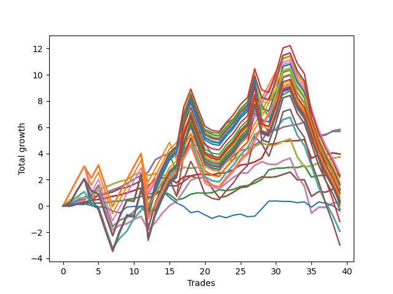

# Short Shepard 002 (1230 Waffles03) 
- Symbol: AAPL_Unlimited
- Date Range: 03/23/2022 - 07/08/2022
- Trading Period: 7:20-12:30
- Number of Trades: 39



| Name | Win Percent | Profit | Avg Profit / Trade | Avg Time / Trade |      | Name | Win Percent | Profit | Avg Profit / Trade | Avg Time / Trade |
| ---- | ----------- | ------ | ------------------ | ---------------- | ---- | ---- | ----------- | ------ | ------------------ | ---------------- |
| Sorted By <br> Profit | | | | | | Sorted By <br> Win Percentage ||||
| Sixty-Nine | 76.92 | 2915.00 | 74.74 | 52:11 |     | Sixty-Six | 82.05 | 2840.00 | 72.82 | 19:01 |
| Sixty-One | 76.92 | 2915.00 | 74.74 | 52:11 |     | Fifty-Eight | 82.05 | 2840.00 | 72.82 | 19:01 |
| Fifty-Three | 76.92 | 2915.00 | 74.74 | 52:11 |     | Fifty | 82.05 | 2840.00 | 72.82 | 19:01 |
| Forty-Five | 76.92 | 2915.00 | 74.74 | 52:11 |     | Forty-Two | 82.05 | 2840.00 | 72.82 | 19:01 |
| Five | 76.92 | 2915.00 | 74.74 | 52:11 |     | Two | 82.05 | 2840.00 | 72.82 | 19:01 |
| Sixty-Six | 82.05 | 2840.00 | 72.82 | 19:01 |     | Sixty-Five | 79.49 | 1980.00 | 50.77 | 10:19 |
| Fifty-Eight | 82.05 | 2840.00 | 72.82 | 19:01 |     | Fifty-Seven | 79.49 | 1980.00 | 50.77 | 10:19 |
| Fifty | 82.05 | 2840.00 | 72.82 | 19:01 |     | Forty-Nine | 79.49 | 1980.00 | 50.77 | 10:19 |
| Forty-Two | 82.05 | 2840.00 | 72.82 | 19:01 |     | Forty-One | 79.49 | 1980.00 | 50.77 | 10:19 |
| Two | 82.05 | 2840.00 | 72.82 | 19:01 |     | One | 79.49 | 1980.00 | 50.77 | 10:19 |
| Sixty-Five | 79.49 | 1980.00 | 50.77 | 10:19 |     | Sixty-Nine | 76.92 | 2915.00 | 74.74 | 52:11 |
| Fifty-Seven | 79.49 | 1980.00 | 50.77 | 10:19 |     | Sixty-One | 76.92 | 2915.00 | 74.74 | 52:11 |
| Forty-Nine | 79.49 | 1980.00 | 50.77 | 10:19 |     | Fifty-Three | 76.92 | 2915.00 | 74.74 | 52:11 |
| Forty-One | 79.49 | 1980.00 | 50.77 | 10:19 |     | Forty-Five | 76.92 | 2915.00 | 74.74 | 52:11 |
| One | 79.49 | 1980.00 | 50.77 | 10:19 |     | Five | 76.92 | 2915.00 | 74.74 | 52:11 |
| Seventy | 74.36 | 1870.00 | 47.95 | 22:50 |     | Sixty-Four | 76.92 | 1180.00 | 30.26 | 06:02 |
| Sixty-Two | 74.36 | 1870.00 | 47.95 | 22:50 |     | Fifty-Six | 76.92 | 1180.00 | 30.26 | 06:02 |
| Fifty-Four | 74.36 | 1870.00 | 47.95 | 22:50 |     | Forty-Eight | 76.92 | 1180.00 | 30.26 | 06:02 |
| Forty-Six | 74.36 | 1870.00 | 47.95 | 22:50 |     | Forty | 76.92 | 1180.00 | 30.26 | 06:02 |
| Six | 74.36 | 1870.00 | 47.95 | 22:50 |     | Zero | 76.92 | 1180.00 | 30.26 | 06:02 |
| One Hundred One | 61.54 | 1230.00 | 31.54 | 93:06 |     | Seventy | 74.36 | 1870.00 | 47.95 | 22:50 |
| Sixty-Four | 76.92 | 1180.00 | 30.26 | 06:02 |     | Sixty-Two | 74.36 | 1870.00 | 47.95 | 22:50 |
| Fifty-Six | 76.92 | 1180.00 | 30.26 | 06:02 |     | Fifty-Four | 74.36 | 1870.00 | 47.95 | 22:50 |
| Forty-Eight | 76.92 | 1180.00 | 30.26 | 06:02 |     | Forty-Six | 74.36 | 1870.00 | 47.95 | 22:50 |
| Forty | 76.92 | 1180.00 | 30.26 | 06:02 |     | Six | 74.36 | 1870.00 | 47.95 | 22:50 |
| Zero | 76.92 | 1180.00 | 30.26 | 06:02 |     | Sixty-Eight | 69.23 | 160.00 | 4.10 | 39:36 |
| Ninety-Three | 51.28 | 1100.00 | 28.21 | 116:59 |     | Sixty | 69.23 | 160.00 | 4.10 | 39:36 |
| One Hundred Eight | 51.28 | 1095.00 | 28.08 | 119:20 |     | Fifty-Two | 69.23 | 160.00 | 4.10 | 39:36 |
| One Hundred Three | 51.28 | 930.00 | 23.85 | 125:39 |     | Forty-Four | 69.23 | 160.00 | 4.10 | 39:36 |
| Ninety-One | 61.54 | 895.00 | 22.95 | 85:44 |     | Four | 69.23 | 160.00 | 4.10 | 39:36 |
| Ninety-Two | 51.28 | 825.00 | 21.15 | 107:55 |     | Sixty-Seven | 66.67 | 600.00 | 15.38 | 25:17 |
| One Hundred Seven | 51.28 | 820.00 | 21.03 | 110:16 |     | Fifty-Nine | 66.67 | 600.00 | 15.38 | 25:17 |
| Ninety-Five | 51.28 | 815.00 | 20.90 | 120:02 |     | Fifty-One | 66.67 | 600.00 | 15.38 | 25:17 |
| Ninety-Four | 51.28 | 815.00 | 20.90 | 120:02 |     | Forty-Three | 66.67 | 600.00 | 15.38 | 25:17 |
| One Hundred Ten | 51.28 | 810.00 | 20.77 | 122:23 |     | Three | 66.67 | 600.00 | 15.38 | 25:17 |
| One Hundred Nine | 51.28 | 810.00 | 20.77 | 122:23 |     | One Hundred One | 61.54 | 1230.00 | 31.54 | 93:06 |
| One Hundred Six | 61.54 | 705.00 | 18.08 | 88:05 |     | Ninety-One | 61.54 | 895.00 | 22.95 | 85:44 |
| One Hundred Sixteen | 61.54 | 685.00 | 17.56 | 95:01 |     | One Hundred Six | 61.54 | 705.00 | 18.08 | 88:05 |
| One Hundred Two | 51.28 | 655.00 | 16.79 | 116:35 |     | One Hundred Sixteen | 61.54 | 685.00 | 17.56 | 95:01 |
| One Hundred Five | 51.28 | 645.00 | 16.54 | 128:42 |     | One Hundred Twenty-Six | 61.54 | 315.00 | 8.08 | 95:48 |
| One Hundred Four | 51.28 | 645.00 | 16.54 | 128:42 |     | One Hundred Twenty-One | 61.54 | 315.00 | 8.08 | 95:48 |
| Sixty-Seven | 66.67 | 600.00 | 15.38 | 25:17 |     | Eighty-One | 61.54 | 315.00 | 8.08 | 95:48 |
| Fifty-Nine | 66.67 | 600.00 | 15.38 | 25:17 |     | One Hundred Eleven | 61.54 | 235.00 | 6.03 | 95:36 |
| Fifty-One | 66.67 | 600.00 | 15.38 | 25:17 |     | Ninety-Six | 58.97 | 60.00 | 1.54 | 76:19 |
| Forty-Three | 66.67 | 600.00 | 15.38 | 25:17 |     | Seventy-One | 58.97 | -960.00 | -24.62 | 93:37 |
| Three | 66.67 | 600.00 | 15.38 | 25:17 |     | Sixty-Three | 58.97 | -960.00 | -24.62 | 93:37 |
| One Hundred Twenty-Eight | 51.28 | 480.00 | 12.31 | 128:44 |     | Fifty-Five | 58.97 | -960.00 | -24.62 | 93:37 |
| One Hundred Twenty-Three | 51.28 | 480.00 | 12.31 | 128:44 |     | Forty-Seven | 58.97 | -960.00 | -24.62 | 93:37 |
| Eighty-Three | 51.28 | 480.00 | 12.31 | 128:44 |     | Seven | 58.97 | -960.00 | -24.62 | 93:37 |
| One Hundred Thirteen | 51.28 | 400.00 | 10.26 | 128:32 |     | Ninety-Three | 51.28 | 1100.00 | 28.21 | 116:59 |
| One Hundred Twenty-Six | 61.54 | 315.00 | 8.08 | 95:48 |     | One Hundred Eight | 51.28 | 1095.00 | 28.08 | 119:20 |
| One Hundred Twenty-One | 61.54 | 315.00 | 8.08 | 95:48 |     | One Hundred Three | 51.28 | 930.00 | 23.85 | 125:39 |
| Eighty-One | 61.54 | 315.00 | 8.08 | 95:48 |     | Ninety-Two | 51.28 | 825.00 | 21.15 | 107:55 |
| One Hundred Eleven | 61.54 | 235.00 | 6.03 | 95:36 |     | One Hundred Seven | 51.28 | 820.00 | 21.03 | 110:16 |
| One Hundred Twenty-Seven | 51.28 | 205.00 | 5.26 | 119:40 |     | Ninety-Five | 51.28 | 815.00 | 20.90 | 120:02 |
| One Hundred Twenty-Two | 51.28 | 205.00 | 5.26 | 119:40 |     | Ninety-Four | 51.28 | 815.00 | 20.90 | 120:02 |
| Eighty-Two | 51.28 | 205.00 | 5.26 | 119:40 |     | One Hundred Ten | 51.28 | 810.00 | 20.77 | 122:23 |
| One Hundred Thirty | 51.28 | 195.00 | 5.00 | 131:47 |     | One Hundred Nine | 51.28 | 810.00 | 20.77 | 122:23 |
| One Hundred Twenty-Nine | 51.28 | 195.00 | 5.00 | 131:47 |     | One Hundred Two | 51.28 | 655.00 | 16.79 | 116:35 |
| One Hundred Twenty-Five | 51.28 | 195.00 | 5.00 | 131:47 |     | One Hundred Five | 51.28 | 645.00 | 16.54 | 128:42 |
| One Hundred Twenty-Four | 51.28 | 195.00 | 5.00 | 131:47 |     | One Hundred Four | 51.28 | 645.00 | 16.54 | 128:42 |
| Eighty-Five | 51.28 | 195.00 | 5.00 | 131:47 |     | One Hundred Twenty-Eight | 51.28 | 480.00 | 12.31 | 128:44 |
| Eighty-Four | 51.28 | 195.00 | 5.00 | 131:47 |     | One Hundred Twenty-Three | 51.28 | 480.00 | 12.31 | 128:44 |
| Sixty-Eight | 69.23 | 160.00 | 4.10 | 39:36 |     | Eighty-Three | 51.28 | 480.00 | 12.31 | 128:44 |
| Sixty | 69.23 | 160.00 | 4.10 | 39:36 |     | One Hundred Thirteen | 51.28 | 400.00 | 10.26 | 128:32 |
| Fifty-Two | 69.23 | 160.00 | 4.10 | 39:36 |     | One Hundred Twenty-Seven | 51.28 | 205.00 | 5.26 | 119:40 |
| Forty-Four | 69.23 | 160.00 | 4.10 | 39:36 |     | One Hundred Twenty-Two | 51.28 | 205.00 | 5.26 | 119:40 |
| Four | 69.23 | 160.00 | 4.10 | 39:36 |     | Eighty-Two | 51.28 | 205.00 | 5.26 | 119:40 |
| One Hundred Eighteen | 51.28 | 155.00 | 3.97 | 127:39 |     | One Hundred Thirty | 51.28 | 195.00 | 5.00 | 131:47 |
| One Hundred Twelve | 51.28 | 125.00 | 3.21 | 119:27 |     | One Hundred Twenty-Nine | 51.28 | 195.00 | 5.00 | 131:47 |
| One Hundred Fifteen | 51.28 | 115.00 | 2.95 | 131:35 |     | One Hundred Twenty-Five | 51.28 | 195.00 | 5.00 | 131:47 |
| One Hundred Fourteen | 51.28 | 115.00 | 2.95 | 131:35 |     | One Hundred Twenty-Four | 51.28 | 195.00 | 5.00 | 131:47 |
| Ninety-Six | 58.97 | 60.00 | 1.54 | 76:19 |     | Eighty-Five | 51.28 | 195.00 | 5.00 | 131:47 |
| Ninety-Seven | 48.72 | 5.00 | 0.13 | 96:06 |     | Eighty-Four | 51.28 | 195.00 | 5.00 | 131:47 |
| One Hundred Seventeen | 51.28 | -120.00 | -3.08 | 118:34 |     | One Hundred Eighteen | 51.28 | 155.00 | 3.97 | 127:39 |
| One Hundred Twenty | 51.28 | -130.00 | -3.33 | 130:41 |     | One Hundred Twelve | 51.28 | 125.00 | 3.21 | 119:27 |
| One Hundred Ninteen | 51.28 | -130.00 | -3.33 | 130:41 |     | One Hundred Fifteen | 51.28 | 115.00 | 2.95 | 131:35 |
| Seventy-Three | 43.59 | -190.00 | -4.87 | 08:31 |     | One Hundred Fourteen | 51.28 | 115.00 | 2.95 | 131:35 |
| Ninety-Eight | 48.72 | -595.00 | -15.26 | 100:11 |     | One Hundred Seventeen | 51.28 | -120.00 | -3.08 | 118:34 |
| Seventy-One | 58.97 | -960.00 | -24.62 | 93:37 |     | One Hundred Twenty | 51.28 | -130.00 | -3.33 | 130:41 |
| Sixty-Three | 58.97 | -960.00 | -24.62 | 93:37 |     | One Hundred Ninteen | 51.28 | -130.00 | -3.33 | 130:41 |
| Fifty-Five | 58.97 | -960.00 | -24.62 | 93:37 |     | Ninety-Seven | 48.72 | 5.00 | 0.13 | 96:06 |
| Forty-Seven | 58.97 | -960.00 | -24.62 | 93:37 |     | Ninety-Eight | 48.72 | -595.00 | -15.26 | 100:11 |
| Seven | 58.97 | -960.00 | -24.62 | 93:37 |     | One Hundred | 48.72 | -1490.00 | -38.21 | 101:28 |
| One Hundred | 48.72 | -1490.00 | -38.21 | 101:28 |     | Ninety-Nine | 48.72 | -1490.00 | -38.21 | 101:28 |
| Ninety-Nine | 48.72 | -1490.00 | -38.21 | 101:28 |     | Seventy-Three | 43.59 | -190.00 | -4.87 | 08:31 |

## NO STOPLOSS

### Test Zero
* Sell when price hits the middle line of the 20p bollinger
* No Stoploss
* Results:
```
Total Trades: 39
Percent Up: 23.08
Percent Down: 76.92
Total Points Moved Down: 2.36
Potential Profit: 1180.00
Total Points Ups: 1.84 Count Ups: 9
Total Points Downs: 4.20 Count Downs: 30
```

<details><summary>Trades</summary>

<code>In: 2022-03-25 11:09:00		Out: 2022-03-25 11:17:45		Total Position Time: 08:45		Total Move Down: 0.02		Total to Date: 0.02</code> <br />
<code>In: 2022-03-30 10:45:00		Out: 2022-03-30 10:46:10		Total Position Time: 01:10		Total Move Down: 0.17		Total to Date: 0.19</code> <br />
<code>In: 2022-03-30 10:53:00		Out: 2022-03-30 10:54:10		Total Position Time: 01:10		Total Move Down: -0.01		Total to Date: 0.18</code> <br />
<code>In: 2022-04-06 08:58:00		Out: 2022-04-06 09:03:30		Total Position Time: 05:30		Total Move Down: 0.04		Total to Date: 0.22</code> <br />
<code>In: 2022-04-06 10:46:00		Out: 2022-04-06 10:56:30		Total Position Time: 10:30		Total Move Down: -0.01		Total to Date: 0.21</code> <br />
<code>In: 2022-04-07 11:06:00		Out: 2022-04-07 11:15:15		Total Position Time: 09:15		Total Move Down: 0.04		Total to Date: 0.25</code> <br />
<code>In: 2022-04-07 11:12:00		Out: 2022-04-07 11:15:15		Total Position Time: 03:15		Total Move Down: 0.10		Total to Date: 0.35</code> <br />
<code>In: 2022-04-11 10:08:00		Out: 2022-04-11 10:16:05		Total Position Time: 08:05		Total Move Down: 0.03		Total to Date: 0.38</code> <br />
<code>In: 2022-04-11 11:12:00		Out: 2022-04-11 11:13:10		Total Position Time: 01:10		Total Move Down: 0.11		Total to Date: 0.49</code> <br />
<code>In: 2022-04-20 10:50:00		Out: 2022-04-20 10:51:10		Total Position Time: 01:10		Total Move Down: 0.08		Total to Date: 0.57</code> <br />
<code>In: 2022-04-26 09:31:00		Out: 2022-04-26 09:32:10		Total Position Time: 01:10		Total Move Down: 0.15		Total to Date: 0.72</code> <br />
<code>In: 2022-05-04 08:58:00		Out: 2022-05-04 09:04:40		Total Position Time: 06:40		Total Move Down: 0.18		Total to Date: 0.90</code> <br />
<code>In: 2022-05-09 07:52:00		Out: 2022-05-09 07:54:05		Total Position Time: 02:05		Total Move Down: 0.10		Total to Date: 1.00</code> <br />
<code>In: 2022-05-09 12:04:00		Out: 2022-05-09 12:09:15		Total Position Time: 05:15		Total Move Down: 0.13		Total to Date: 1.13</code> <br />
<code>In: 2022-05-09 12:10:00		Out: 2022-05-09 12:16:10		Total Position Time: 06:10		Total Move Down: -0.26		Total to Date: 0.87</code> <br />
<code>In: 2022-05-16 08:51:00		Out: 2022-05-16 09:05:45		Total Position Time: 14:45		Total Move Down: -0.42		Total to Date: 0.45</code> <br />
<code>In: 2022-05-19 08:47:00		Out: 2022-05-19 08:54:25		Total Position Time: 07:25		Total Move Down: 0.14		Total to Date: 0.59</code> <br />
<code>In: 2022-05-19 11:56:00		Out: 2022-05-19 11:58:05		Total Position Time: 02:05		Total Move Down: 0.31		Total to Date: 0.90</code> <br />
<code>In: 2022-05-24 08:55:00		Out: 2022-05-24 09:02:55		Total Position Time: 07:55		Total Move Down: 0.10		Total to Date: 1.00</code> <br />
<code>In: 2022-05-24 10:48:00		Out: 2022-05-24 10:58:25		Total Position Time: 10:25		Total Move Down: -0.02		Total to Date: 0.98</code> <br />
<code>In: 2022-05-25 11:33:00		Out: 2022-05-25 11:39:10		Total Position Time: 06:10		Total Move Down: 0.03		Total to Date: 1.01</code> <br />
<code>In: 2022-05-25 11:37:00		Out: 2022-05-25 11:39:10		Total Position Time: 02:10		Total Move Down: 0.23		Total to Date: 1.24</code> <br />
<code>In: 2022-05-25 12:06:00		Out: 2022-05-25 12:18:05		Total Position Time: 12:05		Total Move Down: -0.08		Total to Date: 1.16</code> <br />
<code>In: 2022-06-10 10:54:00		Out: 2022-06-10 10:55:15		Total Position Time: 01:15		Total Move Down: 0.10		Total to Date: 1.26</code> <br />
<code>In: 2022-06-10 12:03:00		Out: 2022-06-10 12:04:10		Total Position Time: 01:10		Total Move Down: 0.23		Total to Date: 1.49</code> <br />
<code>In: 2022-06-10 12:04:00		Out: 2022-06-10 12:05:10		Total Position Time: 01:10		Total Move Down: 0.07		Total to Date: 1.56</code> <br />
<code>In: 2022-06-13 08:29:00		Out: 2022-06-13 08:37:10		Total Position Time: 08:10		Total Move Down: 0.18		Total to Date: 1.74</code> <br />
<code>In: 2022-06-15 11:02:00		Out: 2022-06-15 11:03:10		Total Position Time: 01:10		Total Move Down: 0.28		Total to Date: 2.02</code> <br />
<code>In: 2022-06-15 11:48:00		Out: 2022-06-15 11:54:15		Total Position Time: 06:15		Total Move Down: 0.74		Total to Date: 2.76</code> <br />
<code>In: 2022-06-16 09:36:00		Out: 2022-06-16 09:42:10		Total Position Time: 06:10		Total Move Down: 0.11		Total to Date: 2.87</code> <br />
<code>In: 2022-06-16 10:14:00		Out: 2022-06-16 10:19:50		Total Position Time: 05:50		Total Move Down: 0.02		Total to Date: 2.89</code> <br />
<code>In: 2022-06-21 12:05:00		Out: 2022-06-21 12:10:15		Total Position Time: 05:15		Total Move Down: 0.06		Total to Date: 2.95</code> <br />
<code>In: 2022-06-23 11:04:00		Out: 2022-06-23 11:15:05		Total Position Time: 11:05		Total Move Down: -0.02		Total to Date: 2.93</code> <br />
<code>In: 2022-06-23 11:41:00		Out: 2022-06-23 11:46:00		Total Position Time: 05:00		Total Move Down: 0.15		Total to Date: 3.08</code> <br />
<code>In: 2022-06-30 08:02:00		Out: 2022-06-30 08:36:00		Total Position Time: 34:00		Total Move Down: -0.88		Total to Date: 2.20</code> <br />
<code>In: 2022-07-01 09:26:00		Out: 2022-07-01 09:33:50		Total Position Time: 07:50		Total Move Down: 0.11		Total to Date: 2.31</code> <br />
<code>In: 2022-07-06 10:17:00		Out: 2022-07-06 10:21:35		Total Position Time: 04:35		Total Move Down: 0.03		Total to Date: 2.34</code> <br />
<code>In: 2022-07-06 11:00:00		Out: 2022-07-06 11:01:10		Total Position Time: 01:10		Total Move Down: 0.16		Total to Date: 2.50</code> <br />
<code>In: 2022-07-06 11:01:00		Out: 2022-07-06 11:02:10		Total Position Time: 01:10		Total Move Down: -0.14		Total to Date: 2.36</code> <br />


</details>

### Test One
* Sell when the price hits the upper line of the 20p 1std bollinger
* No Stoploss
* Results:
```
Total Trades: 39
Percent Up: 20.51
Percent Down: 79.49
Total Points Moved Down: 3.96
Potential Profit: 1980.00
Total Points Ups: 1.96 Count Ups: 8
Total Points Downs: 5.92 Count Downs: 31
```

<details><summary>Trades</summary>

<code>In: 2022-03-25 11:09:00		Out: 2022-03-25 11:19:05		Total Position Time: 10:05		Total Move Down: 0.08		Total to Date: 0.08</code> <br />
<code>In: 2022-03-30 10:45:00		Out: 2022-03-30 10:46:10		Total Position Time: 01:10		Total Move Down: 0.17		Total to Date: 0.25</code> <br />
<code>In: 2022-03-30 10:53:00		Out: 2022-03-30 10:57:55		Total Position Time: 04:55		Total Move Down: 0.04		Total to Date: 0.29</code> <br />
<code>In: 2022-04-06 08:58:00		Out: 2022-04-06 09:05:05		Total Position Time: 07:05		Total Move Down: 0.14		Total to Date: 0.43</code> <br />
<code>In: 2022-04-06 10:46:00		Out: 2022-04-06 10:58:00		Total Position Time: 12:00		Total Move Down: 0.07		Total to Date: 0.50</code> <br />
<code>In: 2022-04-07 11:06:00		Out: 2022-04-07 11:16:05		Total Position Time: 10:05		Total Move Down: 0.09		Total to Date: 0.59</code> <br />
<code>In: 2022-04-07 11:12:00		Out: 2022-04-07 11:16:05		Total Position Time: 04:05		Total Move Down: 0.15		Total to Date: 0.74</code> <br />
<code>In: 2022-04-11 10:08:00		Out: 2022-04-11 10:17:05		Total Position Time: 09:05		Total Move Down: 0.10		Total to Date: 0.84</code> <br />
<code>In: 2022-04-11 11:12:00		Out: 2022-04-11 11:14:15		Total Position Time: 02:15		Total Move Down: 0.16		Total to Date: 1.00</code> <br />
<code>In: 2022-04-20 10:50:00		Out: 2022-04-20 10:54:05		Total Position Time: 04:05		Total Move Down: 0.18		Total to Date: 1.18</code> <br />
<code>In: 2022-04-26 09:31:00		Out: 2022-04-26 09:37:40		Total Position Time: 06:40		Total Move Down: 0.19		Total to Date: 1.37</code> <br />
<code>In: 2022-05-04 08:58:00		Out: 2022-05-04 09:10:15		Total Position Time: 12:15		Total Move Down: 0.15		Total to Date: 1.52</code> <br />
<code>In: 2022-05-09 07:52:00		Out: 2022-05-09 07:56:10		Total Position Time: 04:10		Total Move Down: 0.53		Total to Date: 2.05</code> <br />
<code>In: 2022-05-09 12:04:00		Out: 2022-05-09 12:17:30		Total Position Time: 13:30		Total Move Down: 0.10		Total to Date: 2.15</code> <br />
<code>In: 2022-05-09 12:10:00		Out: 2022-05-09 12:17:30		Total Position Time: 07:30		Total Move Down: -0.08		Total to Date: 2.07</code> <br />
<code>In: 2022-05-16 08:51:00		Out: 2022-05-16 09:11:30		Total Position Time: 20:30		Total Move Down: -0.31		Total to Date: 1.76</code> <br />
<code>In: 2022-05-19 08:47:00		Out: 2022-05-19 08:55:30		Total Position Time: 08:30		Total Move Down: 0.46		Total to Date: 2.22</code> <br />
<code>In: 2022-05-19 11:56:00		Out: 2022-05-19 12:09:55		Total Position Time: 13:55		Total Move Down: 0.08		Total to Date: 2.30</code> <br />
<code>In: 2022-05-24 08:55:00		Out: 2022-05-24 09:06:05		Total Position Time: 11:05		Total Move Down: 0.11		Total to Date: 2.41</code> <br />
<code>In: 2022-05-24 10:48:00		Out: 2022-05-24 11:01:20		Total Position Time: 13:20		Total Move Down: -0.00		Total to Date: 2.41</code> <br />
<code>In: 2022-05-25 11:33:00		Out: 2022-05-25 11:49:55		Total Position Time: 16:55		Total Move Down: -0.05		Total to Date: 2.36</code> <br />
<code>In: 2022-05-25 11:37:00		Out: 2022-05-25 11:49:55		Total Position Time: 12:55		Total Move Down: 0.15		Total to Date: 2.51</code> <br />
<code>In: 2022-05-25 12:06:00		Out: 2022-05-25 12:20:25		Total Position Time: 14:25		Total Move Down: 0.03		Total to Date: 2.54</code> <br />
<code>In: 2022-06-10 10:54:00		Out: 2022-06-10 10:58:20		Total Position Time: 04:20		Total Move Down: 0.23		Total to Date: 2.77</code> <br />
<code>In: 2022-06-10 12:03:00		Out: 2022-06-10 12:05:10		Total Position Time: 02:10		Total Move Down: 0.35		Total to Date: 3.12</code> <br />
<code>In: 2022-06-10 12:04:00		Out: 2022-06-10 12:05:10		Total Position Time: 01:10		Total Move Down: 0.07		Total to Date: 3.19</code> <br />
<code>In: 2022-06-13 08:29:00		Out: 2022-06-13 08:46:30		Total Position Time: 17:30		Total Move Down: 0.17		Total to Date: 3.36</code> <br />
<code>In: 2022-06-15 11:02:00		Out: 2022-06-15 11:03:10		Total Position Time: 01:10		Total Move Down: 0.28		Total to Date: 3.64</code> <br />
<code>In: 2022-06-15 11:48:00		Out: 2022-06-15 11:58:05		Total Position Time: 10:05		Total Move Down: 1.06		Total to Date: 4.70</code> <br />
<code>In: 2022-06-16 09:36:00		Out: 2022-06-16 09:52:10		Total Position Time: 16:10		Total Move Down: 0.05		Total to Date: 4.75</code> <br />
<code>In: 2022-06-16 10:14:00		Out: 2022-06-16 10:20:35		Total Position Time: 06:35		Total Move Down: 0.17		Total to Date: 4.92</code> <br />
<code>In: 2022-06-21 12:05:00		Out: 2022-06-21 12:15:20		Total Position Time: 10:20		Total Move Down: 0.05		Total to Date: 4.97</code> <br />
<code>In: 2022-06-23 11:04:00		Out: 2022-06-23 11:18:35		Total Position Time: 14:35		Total Move Down: -0.00		Total to Date: 4.97</code> <br />
<code>In: 2022-06-23 11:41:00		Out: 2022-06-23 11:53:30		Total Position Time: 12:30		Total Move Down: 0.10		Total to Date: 5.07</code> <br />
<code>In: 2022-06-30 08:02:00		Out: 2022-06-30 09:05:45		Total Position Time: 63:45		Total Move Down: -1.43		Total to Date: 3.64</code> <br />
<code>In: 2022-07-01 09:26:00		Out: 2022-07-01 09:35:20		Total Position Time: 09:20		Total Move Down: 0.25		Total to Date: 3.89</code> <br />
<code>In: 2022-07-06 10:17:00		Out: 2022-07-06 10:27:10		Total Position Time: 10:10		Total Move Down: -0.00		Total to Date: 3.89</code> <br />
<code>In: 2022-07-06 11:00:00		Out: 2022-07-06 11:01:10		Total Position Time: 01:10		Total Move Down: 0.16		Total to Date: 4.05</code> <br />
<code>In: 2022-07-06 11:01:00		Out: 2022-07-06 11:02:15		Total Position Time: 01:15		Total Move Down: -0.09		Total to Date: 3.96</code> <br />


</details>

### Test Two
* Sell when the price hits the upper line of the 20p 2std bollinger
* No Stoploss
* Results:
```
Total Trades: 39
Percent Up: 17.95
Percent Down: 82.05
Total Points Moved Down: 5.68
Potential Profit: 2840.00
Total Points Ups: 3.14 Count Ups: 7
Total Points Downs: 8.82 Count Downs: 32
```

<details><summary>Trades</summary>

<code>In: 2022-03-25 11:09:00		Out: 2022-03-25 11:19:55		Total Position Time: 10:55		Total Move Down: 0.15		Total to Date: 0.15</code> <br />
<code>In: 2022-03-30 10:45:00		Out: 2022-03-30 10:59:05		Total Position Time: 14:05		Total Move Down: 0.24		Total to Date: 0.39</code> <br />
<code>In: 2022-03-30 10:53:00		Out: 2022-03-30 10:59:05		Total Position Time: 06:05		Total Move Down: 0.16		Total to Date: 0.55</code> <br />
<code>In: 2022-04-06 08:58:00		Out: 2022-04-06 09:10:55		Total Position Time: 12:55		Total Move Down: 0.14		Total to Date: 0.69</code> <br />
<code>In: 2022-04-06 10:46:00		Out: 2022-04-06 10:59:10		Total Position Time: 13:10		Total Move Down: 0.10		Total to Date: 0.79</code> <br />
<code>In: 2022-04-07 11:06:00		Out: 2022-04-07 11:18:25		Total Position Time: 12:25		Total Move Down: 0.19		Total to Date: 0.98</code> <br />
<code>In: 2022-04-07 11:12:00		Out: 2022-04-07 11:18:25		Total Position Time: 06:25		Total Move Down: 0.25		Total to Date: 1.23</code> <br />
<code>In: 2022-04-11 10:08:00		Out: 2022-04-11 10:20:30		Total Position Time: 12:30		Total Move Down: 0.20		Total to Date: 1.43</code> <br />
<code>In: 2022-04-11 11:12:00		Out: 2022-04-11 11:14:30		Total Position Time: 02:30		Total Move Down: 0.28		Total to Date: 1.71</code> <br />
<code>In: 2022-04-20 10:50:00		Out: 2022-04-20 11:03:15		Total Position Time: 13:15		Total Move Down: 0.33		Total to Date: 2.04</code> <br />
<code>In: 2022-04-26 09:31:00		Out: 2022-04-26 09:47:15		Total Position Time: 16:15		Total Move Down: 0.28		Total to Date: 2.32</code> <br />
<code>In: 2022-05-04 08:58:00		Out: 2022-05-04 09:12:25		Total Position Time: 14:25		Total Move Down: 0.25		Total to Date: 2.57</code> <br />
<code>In: 2022-05-09 07:52:00		Out: 2022-05-09 08:00:15		Total Position Time: 08:15		Total Move Down: 0.95		Total to Date: 3.52</code> <br />
<code>In: 2022-05-09 12:04:00		Out: 2022-05-09 12:20:05		Total Position Time: 16:05		Total Move Down: 0.30		Total to Date: 3.82</code> <br />
<code>In: 2022-05-09 12:10:00		Out: 2022-05-09 12:20:05		Total Position Time: 10:05		Total Move Down: 0.12		Total to Date: 3.94</code> <br />
<code>In: 2022-05-16 08:51:00		Out: 2022-05-16 09:14:40		Total Position Time: 23:40		Total Move Down: -0.18		Total to Date: 3.76</code> <br />
<code>In: 2022-05-19 08:47:00		Out: 2022-05-19 08:57:10		Total Position Time: 10:10		Total Move Down: 0.62		Total to Date: 4.38</code> <br />
<code>In: 2022-05-19 11:56:00		Out: 2022-05-19 12:10:15		Total Position Time: 14:15		Total Move Down: 0.27		Total to Date: 4.65</code> <br />
<code>In: 2022-05-24 08:55:00		Out: 2022-05-24 09:31:15		Total Position Time: 36:15		Total Move Down: -0.04		Total to Date: 4.61</code> <br />
<code>In: 2022-05-24 10:48:00		Out: 2022-05-24 11:01:40		Total Position Time: 13:40		Total Move Down: 0.18		Total to Date: 4.79</code> <br />
<code>In: 2022-05-25 11:33:00		Out: 2022-05-25 12:33:10		Total Position Time: 60:10		Total Move Down: -0.89		Total to Date: 3.90</code> <br />
<code>In: 2022-05-25 11:37:00		Out: 2022-05-25 12:33:10		Total Position Time: 56:10		Total Move Down: -0.69		Total to Date: 3.21</code> <br />
<code>In: 2022-05-25 12:06:00		Out: 2022-05-25 12:33:10		Total Position Time: 27:10		Total Move Down: 0.11		Total to Date: 3.32</code> <br />
<code>In: 2022-06-10 10:54:00		Out: 2022-06-10 11:13:25		Total Position Time: 19:25		Total Move Down: 0.50		Total to Date: 3.82</code> <br />
<code>In: 2022-06-10 12:03:00		Out: 2022-06-10 12:43:15		Total Position Time: 40:15		Total Move Down: 0.41		Total to Date: 4.23</code> <br />
<code>In: 2022-06-10 12:04:00		Out: 2022-06-10 12:43:15		Total Position Time: 39:15		Total Move Down: 0.13		Total to Date: 4.36</code> <br />
<code>In: 2022-06-13 08:29:00		Out: 2022-06-13 08:47:05		Total Position Time: 18:05		Total Move Down: 0.32		Total to Date: 4.68</code> <br />
<code>In: 2022-06-15 11:02:00		Out: 2022-06-15 11:03:10		Total Position Time: 01:10		Total Move Down: 0.28		Total to Date: 4.96</code> <br />
<code>In: 2022-06-15 11:48:00		Out: 2022-06-15 12:13:05		Total Position Time: 25:05		Total Move Down: 0.89		Total to Date: 5.85</code> <br />
<code>In: 2022-06-16 09:36:00		Out: 2022-06-16 10:21:35		Total Position Time: 45:35		Total Move Down: -0.09		Total to Date: 5.76</code> <br />
<code>In: 2022-06-16 10:14:00		Out: 2022-06-16 10:21:35		Total Position Time: 07:35		Total Move Down: 0.25		Total to Date: 6.01</code> <br />
<code>In: 2022-06-21 12:05:00		Out: 2022-06-21 12:15:35		Total Position Time: 10:35		Total Move Down: 0.12		Total to Date: 6.13</code> <br />
<code>In: 2022-06-23 11:04:00		Out: 2022-06-23 11:19:15		Total Position Time: 15:15		Total Move Down: 0.08		Total to Date: 6.21</code> <br />
<code>In: 2022-06-23 11:41:00		Out: 2022-06-23 12:01:10		Total Position Time: 20:10		Total Move Down: 0.19		Total to Date: 6.40</code> <br />
<code>In: 2022-06-30 08:02:00		Out: 2022-06-30 09:06:25		Total Position Time: 64:25		Total Move Down: -1.24		Total to Date: 5.16</code> <br />
<code>In: 2022-07-01 09:26:00		Out: 2022-07-01 09:37:05		Total Position Time: 11:05		Total Move Down: 0.24		Total to Date: 5.40</code> <br />
<code>In: 2022-07-06 10:17:00		Out: 2022-07-06 10:27:35		Total Position Time: 10:35		Total Move Down: 0.05		Total to Date: 5.45</code> <br />
<code>In: 2022-07-06 11:00:00		Out: 2022-07-06 11:01:15		Total Position Time: 01:15		Total Move Down: 0.24		Total to Date: 5.69</code> <br />
<code>In: 2022-07-06 11:01:00		Out: 2022-07-06 11:02:20		Total Position Time: 01:20		Total Move Down: -0.01		Total to Date: 5.68</code> <br />


</details>

### Test Three
* Sell when price hits the middle line of the 50p bollinger
* No Stoploss
* Results:
```
Total Trades: 39
Percent Up: 33.33
Percent Down: 66.67
Total Points Moved Down: 1.20
Potential Profit: 600.00
Total Points Ups: 5.12 Count Ups: 13
Total Points Downs: 6.32 Count Downs: 26
```

<details><summary>Trades</summary>

<code>In: 2022-03-25 11:09:00		Out: 2022-03-25 11:49:20		Total Position Time: 40:20		Total Move Down: -0.03		Total to Date: -0.03</code> <br />
<code>In: 2022-03-30 10:45:00		Out: 2022-03-30 10:46:10		Total Position Time: 01:10		Total Move Down: 0.17		Total to Date: 0.14</code> <br />
<code>In: 2022-03-30 10:53:00		Out: 2022-03-30 10:54:10		Total Position Time: 01:10		Total Move Down: -0.01		Total to Date: 0.13</code> <br />
<code>In: 2022-04-06 08:58:00		Out: 2022-04-06 09:15:55		Total Position Time: 17:55		Total Move Down: 0.29		Total to Date: 0.42</code> <br />
<code>In: 2022-04-06 10:46:00		Out: 2022-04-06 11:00:10		Total Position Time: 14:10		Total Move Down: 0.41		Total to Date: 0.83</code> <br />
<code>In: 2022-04-07 11:06:00		Out: 2022-04-07 11:36:05		Total Position Time: 30:05		Total Move Down: 0.09		Total to Date: 0.92</code> <br />
<code>In: 2022-04-07 11:12:00		Out: 2022-04-07 11:36:05		Total Position Time: 24:05		Total Move Down: 0.15		Total to Date: 1.07</code> <br />
<code>In: 2022-04-11 10:08:00		Out: 2022-04-11 10:20:35		Total Position Time: 12:35		Total Move Down: 0.25		Total to Date: 1.32</code> <br />
<code>In: 2022-04-11 11:12:00		Out: 2022-04-11 11:13:10		Total Position Time: 01:10		Total Move Down: 0.11		Total to Date: 1.43</code> <br />
<code>In: 2022-04-20 10:50:00		Out: 2022-04-20 10:55:30		Total Position Time: 05:30		Total Move Down: 0.22		Total to Date: 1.65</code> <br />
<code>In: 2022-04-26 09:31:00		Out: 2022-04-26 09:49:25		Total Position Time: 18:25		Total Move Down: 0.29		Total to Date: 1.94</code> <br />
<code>In: 2022-05-04 08:58:00		Out: 2022-05-04 11:00:20		Total Position Time: 122:20		Total Move Down: -1.30		Total to Date: 0.64</code> <br />
<code>In: 2022-05-09 07:52:00		Out: 2022-05-09 07:54:10		Total Position Time: 02:10		Total Move Down: 0.21		Total to Date: 0.85</code> <br />
<code>In: 2022-05-09 12:04:00		Out: 2022-05-09 12:20:15		Total Position Time: 16:15		Total Move Down: 0.44		Total to Date: 1.29</code> <br />
<code>In: 2022-05-09 12:10:00		Out: 2022-05-09 12:20:15		Total Position Time: 10:15		Total Move Down: 0.26		Total to Date: 1.55</code> <br />
<code>In: 2022-05-16 08:51:00		Out: 2022-05-16 09:15:45		Total Position Time: 24:45		Total Move Down: -0.01		Total to Date: 1.54</code> <br />
<code>In: 2022-05-19 08:47:00		Out: 2022-05-19 09:19:30		Total Position Time: 32:30		Total Move Down: 0.33		Total to Date: 1.87</code> <br />
<code>In: 2022-05-19 11:56:00		Out: 2022-05-19 12:13:35		Total Position Time: 17:35		Total Move Down: 0.41		Total to Date: 2.28</code> <br />
<code>In: 2022-05-24 08:55:00		Out: 2022-05-24 09:30:25		Total Position Time: 35:25		Total Move Down: -0.16		Total to Date: 2.12</code> <br />
<code>In: 2022-05-24 10:48:00		Out: 2022-05-24 11:20:20		Total Position Time: 32:20		Total Move Down: 0.10		Total to Date: 2.22</code> <br />
<code>In: 2022-05-25 11:33:00		Out: 2022-05-25 12:34:15		Total Position Time: 61:15		Total Move Down: -0.89		Total to Date: 1.33</code> <br />
<code>In: 2022-05-25 11:37:00		Out: 2022-05-25 12:34:15		Total Position Time: 57:15		Total Move Down: -0.69		Total to Date: 0.64</code> <br />
<code>In: 2022-05-25 12:06:00		Out: 2022-05-25 12:34:15		Total Position Time: 28:15		Total Move Down: 0.11		Total to Date: 0.75</code> <br />
<code>In: 2022-06-10 10:54:00		Out: 2022-06-10 11:01:10		Total Position Time: 07:10		Total Move Down: 0.30		Total to Date: 1.05</code> <br />
<code>In: 2022-06-10 12:03:00		Out: 2022-06-10 12:05:10		Total Position Time: 02:10		Total Move Down: 0.35		Total to Date: 1.40</code> <br />
<code>In: 2022-06-10 12:04:00		Out: 2022-06-10 12:05:10		Total Position Time: 01:10		Total Move Down: 0.07		Total to Date: 1.47</code> <br />
<code>In: 2022-06-13 08:29:00		Out: 2022-06-13 08:51:55		Total Position Time: 22:55		Total Move Down: 0.47		Total to Date: 1.94</code> <br />
<code>In: 2022-06-15 11:02:00		Out: 2022-06-15 11:03:10		Total Position Time: 01:10		Total Move Down: 0.28		Total to Date: 2.22</code> <br />
<code>In: 2022-06-15 11:48:00		Out: 2022-06-15 12:43:05		Total Position Time: 55:05		Total Move Down: -0.04		Total to Date: 2.18</code> <br />
<code>In: 2022-06-16 09:36:00		Out: 2022-06-16 10:06:30		Total Position Time: 30:30		Total Move Down: 0.05		Total to Date: 2.23</code> <br />
<code>In: 2022-06-16 10:14:00		Out: 2022-06-16 10:20:35		Total Position Time: 06:35		Total Move Down: 0.17		Total to Date: 2.40</code> <br />
<code>In: 2022-06-21 12:05:00		Out: 2022-06-21 12:23:40		Total Position Time: 18:40		Total Move Down: 0.19		Total to Date: 2.59</code> <br />
<code>In: 2022-06-23 11:04:00		Out: 2022-06-23 12:18:25		Total Position Time: 74:25		Total Move Down: -0.59		Total to Date: 2.00</code> <br />
<code>In: 2022-06-23 11:41:00		Out: 2022-06-23 12:18:25		Total Position Time: 37:25		Total Move Down: -0.01		Total to Date: 1.99</code> <br />
<code>In: 2022-06-30 08:02:00		Out: 2022-06-30 09:06:20		Total Position Time: 64:20		Total Move Down: -1.26		Total to Date: 0.73</code> <br />
<code>In: 2022-07-01 09:26:00		Out: 2022-07-01 09:38:00		Total Position Time: 12:00		Total Move Down: 0.36		Total to Date: 1.09</code> <br />
<code>In: 2022-07-06 10:17:00		Out: 2022-07-06 11:00:40		Total Position Time: 43:40		Total Move Down: -0.04		Total to Date: 1.05</code> <br />
<code>In: 2022-07-06 11:00:00		Out: 2022-07-06 11:01:15		Total Position Time: 01:15		Total Move Down: 0.24		Total to Date: 1.29</code> <br />
<code>In: 2022-07-06 11:01:00		Out: 2022-07-06 11:02:15		Total Position Time: 01:15		Total Move Down: -0.09		Total to Date: 1.20</code> <br />


</details>

### Test Four
* Sell when the price hits the upper line of the 50p 1std bollinger
* No Stoploss
* Results:
```
Total Trades: 39
Percent Up: 30.77
Percent Down: 69.23
Total Points Moved Down: 0.32
Potential Profit: 160.00
Total Points Ups: 9.54 Count Ups: 12
Total Points Downs: 9.86 Count Downs: 27
```

<details><summary>Trades</summary>

<code>In: 2022-03-25 11:09:00		Out: 2022-03-25 12:02:00		Total Position Time: 53:00		Total Move Down: 0.09		Total to Date: 0.09</code> <br />
<code>In: 2022-03-30 10:45:00		Out: 2022-03-30 10:46:10		Total Position Time: 01:10		Total Move Down: 0.17		Total to Date: 0.26</code> <br />
<code>In: 2022-03-30 10:53:00		Out: 2022-03-30 10:58:55		Total Position Time: 05:55		Total Move Down: 0.15		Total to Date: 0.41</code> <br />
<code>In: 2022-04-06 08:58:00		Out: 2022-04-06 09:20:25		Total Position Time: 22:25		Total Move Down: 0.53		Total to Date: 0.94</code> <br />
<code>In: 2022-04-06 10:46:00		Out: 2022-04-06 11:14:10		Total Position Time: 28:10		Total Move Down: 0.40		Total to Date: 1.34</code> <br />
<code>In: 2022-04-07 11:06:00		Out: 2022-04-07 12:47:00		Total Position Time: 101:00		Total Move Down: -1.61		Total to Date: -0.27</code> <br />
<code>In: 2022-04-07 11:12:00		Out: 2022-04-07 12:47:00		Total Position Time: 95:00		Total Move Down: -1.55		Total to Date: -1.82</code> <br />
<code>In: 2022-04-11 10:08:00		Out: 2022-04-11 10:33:40		Total Position Time: 25:40		Total Move Down: 0.36		Total to Date: -1.46</code> <br />
<code>In: 2022-04-11 11:12:00		Out: 2022-04-11 11:13:10		Total Position Time: 01:10		Total Move Down: 0.11		Total to Date: -1.35</code> <br />
<code>In: 2022-04-20 10:50:00		Out: 2022-04-20 11:03:15		Total Position Time: 13:15		Total Move Down: 0.33		Total to Date: -1.02</code> <br />
<code>In: 2022-04-26 09:31:00		Out: 2022-04-26 10:05:35		Total Position Time: 34:35		Total Move Down: 0.24		Total to Date: -0.78</code> <br />
<code>In: 2022-05-04 08:58:00		Out: 2022-05-04 11:00:25		Total Position Time: 122:25		Total Move Down: -1.07		Total to Date: -1.85</code> <br />
<code>In: 2022-05-09 07:52:00		Out: 2022-05-09 07:56:25		Total Position Time: 04:25		Total Move Down: 0.57		Total to Date: -1.28</code> <br />
<code>In: 2022-05-09 12:04:00		Out: 2022-05-09 12:24:05		Total Position Time: 20:05		Total Move Down: 0.74		Total to Date: -0.54</code> <br />
<code>In: 2022-05-09 12:10:00		Out: 2022-05-09 12:24:05		Total Position Time: 14:05		Total Move Down: 0.56		Total to Date: 0.02</code> <br />
<code>In: 2022-05-16 08:51:00		Out: 2022-05-16 09:24:25		Total Position Time: 33:25		Total Move Down: 0.34		Total to Date: 0.36</code> <br />
<code>In: 2022-05-19 08:47:00		Out: 2022-05-19 09:20:50		Total Position Time: 33:50		Total Move Down: 0.78		Total to Date: 1.14</code> <br />
<code>In: 2022-05-19 11:56:00		Out: 2022-05-19 12:18:20		Total Position Time: 22:20		Total Move Down: 0.83		Total to Date: 1.97</code> <br />
<code>In: 2022-05-24 08:55:00		Out: 2022-05-24 09:32:55		Total Position Time: 37:55		Total Move Down: 0.19		Total to Date: 2.16</code> <br />
<code>In: 2022-05-24 10:48:00		Out: 2022-05-24 11:44:05		Total Position Time: 56:05		Total Move Down: -0.02		Total to Date: 2.14</code> <br />
<code>In: 2022-05-25 11:33:00		Out: 2022-05-25 12:36:30		Total Position Time: 63:30		Total Move Down: -0.53		Total to Date: 1.61</code> <br />
<code>In: 2022-05-25 11:37:00		Out: 2022-05-25 12:36:30		Total Position Time: 59:30		Total Move Down: -0.33		Total to Date: 1.28</code> <br />
<code>In: 2022-05-25 12:06:00		Out: 2022-05-25 12:36:30		Total Position Time: 30:30		Total Move Down: 0.47		Total to Date: 1.75</code> <br />
<code>In: 2022-06-10 10:54:00		Out: 2022-06-10 11:12:55		Total Position Time: 18:55		Total Move Down: 0.43		Total to Date: 2.18</code> <br />
<code>In: 2022-06-10 12:03:00		Out: 2022-06-10 12:42:40		Total Position Time: 39:40		Total Move Down: 0.31		Total to Date: 2.49</code> <br />
<code>In: 2022-06-10 12:04:00		Out: 2022-06-10 12:42:40		Total Position Time: 38:40		Total Move Down: 0.03		Total to Date: 2.52</code> <br />
<code>In: 2022-06-13 08:29:00		Out: 2022-06-13 09:04:10		Total Position Time: 35:10		Total Move Down: 0.58		Total to Date: 3.10</code> <br />
<code>In: 2022-06-15 11:02:00		Out: 2022-06-15 11:03:10		Total Position Time: 01:10		Total Move Down: 0.28		Total to Date: 3.38</code> <br />
<code>In: 2022-06-15 11:48:00		Out: 2022-06-15 12:47:00		Total Position Time: 59:00		Total Move Down: -0.19		Total to Date: 3.19</code> <br />
<code>In: 2022-06-16 09:36:00		Out: 2022-06-16 10:23:50		Total Position Time: 47:50		Total Move Down: -0.04		Total to Date: 3.15</code> <br />
<code>In: 2022-06-16 10:14:00		Out: 2022-06-16 10:23:50		Total Position Time: 09:50		Total Move Down: 0.30		Total to Date: 3.45</code> <br />
<code>In: 2022-06-21 12:05:00		Out: 2022-06-21 12:40:50		Total Position Time: 35:50		Total Move Down: 0.20		Total to Date: 3.65</code> <br />
<code>In: 2022-06-23 11:04:00		Out: 2022-06-23 12:47:00		Total Position Time: 103:00		Total Move Down: -1.36		Total to Date: 2.29</code> <br />
<code>In: 2022-06-23 11:41:00		Out: 2022-06-23 12:47:00		Total Position Time: 66:00		Total Move Down: -0.78		Total to Date: 1.51</code> <br />
<code>In: 2022-06-30 08:02:00		Out: 2022-06-30 10:10:15		Total Position Time: 128:15		Total Move Down: -2.06		Total to Date: -0.55</code> <br />
<code>In: 2022-07-01 09:26:00		Out: 2022-07-01 09:59:50		Total Position Time: 33:50		Total Move Down: 0.45		Total to Date: -0.10</code> <br />
<code>In: 2022-07-06 10:17:00		Out: 2022-07-06 11:01:00		Total Position Time: 44:00		Total Move Down: -0.00		Total to Date: -0.10</code> <br />
<code>In: 2022-07-06 11:00:00		Out: 2022-07-06 11:02:25		Total Position Time: 02:25		Total Move Down: 0.32		Total to Date: 0.22</code> <br />
<code>In: 2022-07-06 11:01:00		Out: 2022-07-06 11:02:25		Total Position Time: 01:25		Total Move Down: 0.10		Total to Date: 0.32</code> <br />


</details>

### Test Five
* Sell when the price hits the upper line of the 50p 2std bollinger
* No Stoploss
* Results:
```
Total Trades: 39
Percent Up: 23.08
Percent Down: 76.92
Total Points Moved Down: 5.83
Potential Profit: 2915.00
Total Points Ups: 8.51 Count Ups: 9
Total Points Downs: 14.34 Count Downs: 30
```

<details><summary>Trades</summary>

<code>In: 2022-03-25 11:09:00		Out: 2022-03-25 12:02:20		Total Position Time: 53:20		Total Move Down: 0.15		Total to Date: 0.15</code> <br />
<code>In: 2022-03-30 10:45:00		Out: 2022-03-30 10:59:10		Total Position Time: 14:10		Total Move Down: 0.30		Total to Date: 0.45</code> <br />
<code>In: 2022-03-30 10:53:00		Out: 2022-03-30 10:59:10		Total Position Time: 06:10		Total Move Down: 0.22		Total to Date: 0.67</code> <br />
<code>In: 2022-04-06 08:58:00		Out: 2022-04-06 11:15:20		Total Position Time: 137:20		Total Move Down: 0.13		Total to Date: 0.80</code> <br />
<code>In: 2022-04-06 10:46:00		Out: 2022-04-06 11:15:20		Total Position Time: 29:20		Total Move Down: 0.79		Total to Date: 1.59</code> <br />
<code>In: 2022-04-07 11:06:00		Out: 2022-04-07 12:47:00		Total Position Time: 101:00		Total Move Down: -1.61		Total to Date: -0.02</code> <br />
<code>In: 2022-04-07 11:12:00		Out: 2022-04-07 12:47:00		Total Position Time: 95:00		Total Move Down: -1.55		Total to Date: -1.57</code> <br />
<code>In: 2022-04-11 10:08:00		Out: 2022-04-11 11:03:10		Total Position Time: 55:10		Total Move Down: 0.49		Total to Date: -1.08</code> <br />
<code>In: 2022-04-11 11:12:00		Out: 2022-04-11 11:14:25		Total Position Time: 02:25		Total Move Down: 0.22		Total to Date: -0.86</code> <br />
<code>In: 2022-04-20 10:50:00		Out: 2022-04-20 11:19:30		Total Position Time: 29:30		Total Move Down: 0.43		Total to Date: -0.43</code> <br />
<code>In: 2022-04-26 09:31:00		Out: 2022-04-26 10:10:25		Total Position Time: 39:25		Total Move Down: 0.45		Total to Date: 0.02</code> <br />
<code>In: 2022-05-04 08:58:00		Out: 2022-05-04 11:07:40		Total Position Time: 129:40		Total Move Down: -0.85		Total to Date: -0.83</code> <br />
<code>In: 2022-05-09 07:52:00		Out: 2022-05-09 08:00:15		Total Position Time: 08:15		Total Move Down: 0.95		Total to Date: 0.12</code> <br />
<code>In: 2022-05-09 12:04:00		Out: 2022-05-09 12:46:55		Total Position Time: 42:55		Total Move Down: 1.28		Total to Date: 1.40</code> <br />
<code>In: 2022-05-09 12:10:00		Out: 2022-05-09 12:46:55		Total Position Time: 36:55		Total Move Down: 1.10		Total to Date: 2.50</code> <br />
<code>In: 2022-05-16 08:51:00		Out: 2022-05-16 09:39:00		Total Position Time: 48:00		Total Move Down: 0.43		Total to Date: 2.93</code> <br />
<code>In: 2022-05-19 08:47:00		Out: 2022-05-19 09:26:55		Total Position Time: 39:55		Total Move Down: 0.98		Total to Date: 3.91</code> <br />
<code>In: 2022-05-19 11:56:00		Out: 2022-05-19 12:23:55		Total Position Time: 27:55		Total Move Down: 1.18		Total to Date: 5.09</code> <br />
<code>In: 2022-05-24 08:55:00		Out: 2022-05-24 09:36:50		Total Position Time: 41:50		Total Move Down: 0.41		Total to Date: 5.50</code> <br />
<code>In: 2022-05-24 10:48:00		Out: 2022-05-24 11:49:20		Total Position Time: 61:20		Total Move Down: 0.33		Total to Date: 5.83</code> <br />
<code>In: 2022-05-25 11:33:00		Out: 2022-05-25 12:40:15		Total Position Time: 67:15		Total Move Down: -0.24		Total to Date: 5.59</code> <br />
<code>In: 2022-05-25 11:37:00		Out: 2022-05-25 12:40:15		Total Position Time: 63:15		Total Move Down: -0.04		Total to Date: 5.55</code> <br />
<code>In: 2022-05-25 12:06:00		Out: 2022-05-25 12:40:15		Total Position Time: 34:15		Total Move Down: 0.76		Total to Date: 6.31</code> <br />
<code>In: 2022-06-10 10:54:00		Out: 2022-06-10 12:45:25		Total Position Time: 111:25		Total Move Down: 0.32		Total to Date: 6.63</code> <br />
<code>In: 2022-06-10 12:03:00		Out: 2022-06-10 12:45:25		Total Position Time: 42:25		Total Move Down: 0.54		Total to Date: 7.17</code> <br />
<code>In: 2022-06-10 12:04:00		Out: 2022-06-10 12:45:25		Total Position Time: 41:25		Total Move Down: 0.26		Total to Date: 7.43</code> <br />
<code>In: 2022-06-13 08:29:00		Out: 2022-06-13 10:00:15		Total Position Time: 91:15		Total Move Down: 0.57		Total to Date: 8.00</code> <br />
<code>In: 2022-06-15 11:02:00		Out: 2022-06-15 11:03:10		Total Position Time: 01:10		Total Move Down: 0.28		Total to Date: 8.28</code> <br />
<code>In: 2022-06-15 11:48:00		Out: 2022-06-15 12:47:00		Total Position Time: 59:00		Total Move Down: -0.19		Total to Date: 8.09</code> <br />
<code>In: 2022-06-16 09:36:00		Out: 2022-06-16 10:45:10		Total Position Time: 69:10		Total Move Down: 0.03		Total to Date: 8.12</code> <br />
<code>In: 2022-06-16 10:14:00		Out: 2022-06-16 10:45:10		Total Position Time: 31:10		Total Move Down: 0.37		Total to Date: 8.49</code> <br />
<code>In: 2022-06-21 12:05:00		Out: 2022-06-21 12:41:10		Total Position Time: 36:10		Total Move Down: 0.29		Total to Date: 8.78</code> <br />
<code>In: 2022-06-23 11:04:00		Out: 2022-06-23 12:47:00		Total Position Time: 103:00		Total Move Down: -1.36		Total to Date: 7.42</code> <br />
<code>In: 2022-06-23 11:41:00		Out: 2022-06-23 12:47:00		Total Position Time: 66:00		Total Move Down: -0.78		Total to Date: 6.64</code> <br />
<code>In: 2022-06-30 08:02:00		Out: 2022-06-30 10:11:50		Total Position Time: 129:50		Total Move Down: -1.89		Total to Date: 4.75</code> <br />
<code>In: 2022-07-01 09:26:00		Out: 2022-07-01 10:06:10		Total Position Time: 40:10		Total Move Down: 0.56		Total to Date: 5.31</code> <br />
<code>In: 2022-07-06 10:17:00		Out: 2022-07-06 11:02:25		Total Position Time: 45:25		Total Move Down: 0.10		Total to Date: 5.41</code> <br />
<code>In: 2022-07-06 11:00:00		Out: 2022-07-06 11:02:25		Total Position Time: 02:25		Total Move Down: 0.32		Total to Date: 5.73</code> <br />
<code>In: 2022-07-06 11:01:00		Out: 2022-07-06 11:02:25		Total Position Time: 01:25		Total Move Down: 0.10		Total to Date: 5.83</code> <br />


</details>

### Test Six
* Sell when the price hits the middle line of the 1std VWAP
* No Stoploss
* Results:
```
Total Trades: 39
Percent Up: 25.64
Percent Down: 74.36
Total Points Moved Down: 3.74
Potential Profit: 1870.00
Total Points Ups: 3.25 Count Ups: 10
Total Points Downs: 6.99 Count Downs: 29
```

<details><summary>Trades</summary>

<code>In: 2022-03-25 11:09:00		Out: 2022-03-25 12:17:45		Total Position Time: 68:45		Total Move Down: 0.46		Total to Date: 0.46</code> <br />
<code>In: 2022-03-30 10:45:00		Out: 2022-03-30 10:46:10		Total Position Time: 01:10		Total Move Down: 0.17		Total to Date: 0.63</code> <br />
<code>In: 2022-03-30 10:53:00		Out: 2022-03-30 10:54:10		Total Position Time: 01:10		Total Move Down: -0.01		Total to Date: 0.62</code> <br />
<code>In: 2022-04-06 08:58:00		Out: 2022-04-06 09:03:30		Total Position Time: 05:30		Total Move Down: 0.04		Total to Date: 0.66</code> <br />
<code>In: 2022-04-06 10:46:00		Out: 2022-04-06 11:14:50		Total Position Time: 28:50		Total Move Down: 0.59		Total to Date: 1.25</code> <br />
<code>In: 2022-04-07 11:06:00		Out: 2022-04-07 11:18:35		Total Position Time: 12:35		Total Move Down: 0.18		Total to Date: 1.43</code> <br />
<code>In: 2022-04-07 11:12:00		Out: 2022-04-07 11:18:35		Total Position Time: 06:35		Total Move Down: 0.24		Total to Date: 1.67</code> <br />
<code>In: 2022-04-11 10:08:00		Out: 2022-04-11 10:20:30		Total Position Time: 12:30		Total Move Down: 0.20		Total to Date: 1.87</code> <br />
<code>In: 2022-04-11 11:12:00		Out: 2022-04-11 11:13:10		Total Position Time: 01:10		Total Move Down: 0.11		Total to Date: 1.98</code> <br />
<code>In: 2022-04-20 10:50:00		Out: 2022-04-20 11:19:25		Total Position Time: 29:25		Total Move Down: 0.40		Total to Date: 2.38</code> <br />
<code>In: 2022-04-26 09:31:00		Out: 2022-04-26 09:32:10		Total Position Time: 01:10		Total Move Down: 0.15		Total to Date: 2.53</code> <br />
<code>In: 2022-05-04 08:58:00		Out: 2022-05-04 11:30:50		Total Position Time: 152:50		Total Move Down: -0.19		Total to Date: 2.34</code> <br />
<code>In: 2022-05-09 07:52:00		Out: 2022-05-09 07:53:10		Total Position Time: 01:10		Total Move Down: 0.12		Total to Date: 2.46</code> <br />
<code>In: 2022-05-09 12:04:00		Out: 2022-05-09 12:05:10		Total Position Time: 01:10		Total Move Down: -0.05		Total to Date: 2.41</code> <br />
<code>In: 2022-05-09 12:10:00		Out: 2022-05-09 12:12:05		Total Position Time: 02:05		Total Move Down: -0.22		Total to Date: 2.19</code> <br />
<code>In: 2022-05-16 08:51:00		Out: 2022-05-16 09:39:00		Total Position Time: 48:00		Total Move Down: 0.43		Total to Date: 2.62</code> <br />
<code>In: 2022-05-19 08:47:00		Out: 2022-05-19 08:54:40		Total Position Time: 07:40		Total Move Down: 0.31		Total to Date: 2.93</code> <br />
<code>In: 2022-05-19 11:56:00		Out: 2022-05-19 11:57:10		Total Position Time: 01:10		Total Move Down: -0.05		Total to Date: 2.88</code> <br />
<code>In: 2022-05-24 08:55:00		Out: 2022-05-24 08:56:10		Total Position Time: 01:10		Total Move Down: 0.07		Total to Date: 2.95</code> <br />
<code>In: 2022-05-24 10:48:00		Out: 2022-05-24 11:01:40		Total Position Time: 13:40		Total Move Down: 0.18		Total to Date: 3.13</code> <br />
<code>In: 2022-05-25 11:33:00		Out: 2022-05-25 12:47:00		Total Position Time: 74:00		Total Move Down: -0.30		Total to Date: 2.83</code> <br />
<code>In: 2022-05-25 11:37:00		Out: 2022-05-25 12:47:00		Total Position Time: 70:00		Total Move Down: -0.10		Total to Date: 2.73</code> <br />
<code>In: 2022-05-25 12:06:00		Out: 2022-05-25 12:47:00		Total Position Time: 41:00		Total Move Down: 0.70		Total to Date: 3.43</code> <br />
<code>In: 2022-06-10 10:54:00		Out: 2022-06-10 10:55:15		Total Position Time: 01:15		Total Move Down: 0.10		Total to Date: 3.53</code> <br />
<code>In: 2022-06-10 12:03:00		Out: 2022-06-10 12:04:35		Total Position Time: 01:35		Total Move Down: 0.31		Total to Date: 3.84</code> <br />
<code>In: 2022-06-10 12:04:00		Out: 2022-06-10 12:05:10		Total Position Time: 01:10		Total Move Down: 0.07		Total to Date: 3.91</code> <br />
<code>In: 2022-06-13 08:29:00		Out: 2022-06-13 08:52:25		Total Position Time: 23:25		Total Move Down: 0.62		Total to Date: 4.53</code> <br />
<code>In: 2022-06-15 11:02:00		Out: 2022-06-15 11:03:10		Total Position Time: 01:10		Total Move Down: 0.28		Total to Date: 4.81</code> <br />
<code>In: 2022-06-15 11:48:00		Out: 2022-06-15 12:47:00		Total Position Time: 59:00		Total Move Down: -0.19		Total to Date: 4.62</code> <br />
<code>In: 2022-06-16 09:36:00		Out: 2022-06-16 09:37:10		Total Position Time: 01:10		Total Move Down: 0.05		Total to Date: 4.67</code> <br />
<code>In: 2022-06-16 10:14:00		Out: 2022-06-16 10:21:35		Total Position Time: 07:35		Total Move Down: 0.25		Total to Date: 4.92</code> <br />
<code>In: 2022-06-21 12:05:00		Out: 2022-06-21 12:23:40		Total Position Time: 18:40		Total Move Down: 0.19		Total to Date: 5.11</code> <br />
<code>In: 2022-06-23 11:04:00		Out: 2022-06-23 12:47:00		Total Position Time: 103:00		Total Move Down: -1.36		Total to Date: 3.75</code> <br />
<code>In: 2022-06-23 11:41:00		Out: 2022-06-23 12:47:00		Total Position Time: 66:00		Total Move Down: -0.78		Total to Date: 2.97</code> <br />
<code>In: 2022-06-30 08:02:00		Out: 2022-06-30 08:03:40		Total Position Time: 01:40		Total Move Down: 0.08		Total to Date: 3.05</code> <br />
<code>In: 2022-07-01 09:26:00		Out: 2022-07-01 09:34:10		Total Position Time: 08:10		Total Move Down: 0.22		Total to Date: 3.27</code> <br />
<code>In: 2022-07-06 10:17:00		Out: 2022-07-06 10:27:35		Total Position Time: 10:35		Total Move Down: 0.05		Total to Date: 3.32</code> <br />
<code>In: 2022-07-06 11:00:00		Out: 2022-07-06 11:02:25		Total Position Time: 02:25		Total Move Down: 0.32		Total to Date: 3.64</code> <br />
<code>In: 2022-07-06 11:01:00		Out: 2022-07-06 11:02:25		Total Position Time: 01:25		Total Move Down: 0.10		Total to Date: 3.74</code> <br />


</details>

### Test Seven
* Sell when the price hits the upper line of the 1std VWAP
* No Stoploss
* Results:
```
Total Trades: 39
Percent Up: 41.03
Percent Down: 58.97
Total Points Moved Down: -1.92
Potential Profit: -960.00
Total Points Ups: 16.44 Count Ups: 16
Total Points Downs: 14.52 Count Downs: 23
```

<details><summary>Trades</summary>

<code>In: 2022-03-25 11:09:00		Out: 2022-03-25 12:47:00		Total Position Time: 98:00		Total Move Down: 0.25		Total to Date: 0.25</code> <br />
<code>In: 2022-03-30 10:45:00		Out: 2022-03-30 11:44:15		Total Position Time: 59:15		Total Move Down: 0.46		Total to Date: 0.71</code> <br />
<code>In: 2022-03-30 10:53:00		Out: 2022-03-30 11:44:15		Total Position Time: 51:15		Total Move Down: 0.38		Total to Date: 1.09</code> <br />
<code>In: 2022-04-06 08:58:00		Out: 2022-04-06 12:47:00		Total Position Time: 229:00		Total Move Down: -0.91		Total to Date: 0.18</code> <br />
<code>In: 2022-04-06 10:46:00		Out: 2022-04-06 12:47:00		Total Position Time: 121:00		Total Move Down: -0.25		Total to Date: -0.07</code> <br />
<code>In: 2022-04-07 11:06:00		Out: 2022-04-07 12:47:00		Total Position Time: 101:00		Total Move Down: -1.61		Total to Date: -1.68</code> <br />
<code>In: 2022-04-07 11:12:00		Out: 2022-04-07 12:47:00		Total Position Time: 95:00		Total Move Down: -1.55		Total to Date: -3.23</code> <br />
<code>In: 2022-04-11 10:08:00		Out: 2022-04-11 12:16:15		Total Position Time: 128:15		Total Move Down: 0.78		Total to Date: -2.45</code> <br />
<code>In: 2022-04-11 11:12:00		Out: 2022-04-11 12:16:15		Total Position Time: 64:15		Total Move Down: 0.53		Total to Date: -1.92</code> <br />
<code>In: 2022-04-20 10:50:00		Out: 2022-04-20 11:52:05		Total Position Time: 62:05		Total Move Down: 0.97		Total to Date: -0.95</code> <br />
<code>In: 2022-04-26 09:31:00		Out: 2022-04-26 10:16:30		Total Position Time: 45:30		Total Move Down: 0.61		Total to Date: -0.34</code> <br />
<code>In: 2022-05-04 08:58:00		Out: 2022-05-04 11:35:05		Total Position Time: 157:05		Total Move Down: 0.86		Total to Date: 0.52</code> <br />
<code>In: 2022-05-09 07:52:00		Out: 2022-05-09 07:55:10		Total Position Time: 03:10		Total Move Down: 0.42		Total to Date: 0.94</code> <br />
<code>In: 2022-05-09 12:04:00		Out: 2022-05-09 12:25:05		Total Position Time: 21:05		Total Move Down: 0.80		Total to Date: 1.74</code> <br />
<code>In: 2022-05-09 12:10:00		Out: 2022-05-09 12:25:05		Total Position Time: 15:05		Total Move Down: 0.62		Total to Date: 2.36</code> <br />
<code>In: 2022-05-16 08:51:00		Out: 2022-05-16 12:47:00		Total Position Time: 236:00		Total Move Down: 0.50		Total to Date: 2.86</code> <br />
<code>In: 2022-05-19 08:47:00		Out: 2022-05-19 09:40:30		Total Position Time: 53:30		Total Move Down: 1.23		Total to Date: 4.09</code> <br />
<code>In: 2022-05-19 11:56:00		Out: 2022-05-19 12:21:05		Total Position Time: 25:05		Total Move Down: 0.99		Total to Date: 5.08</code> <br />
<code>In: 2022-05-24 08:55:00		Out: 2022-05-24 12:47:00		Total Position Time: 232:00		Total Move Down: -1.47		Total to Date: 3.61</code> <br />
<code>In: 2022-05-24 10:48:00		Out: 2022-05-24 12:47:00		Total Position Time: 119:00		Total Move Down: -1.38		Total to Date: 2.23</code> <br />
<code>In: 2022-05-25 11:33:00		Out: 2022-05-25 12:47:00		Total Position Time: 74:00		Total Move Down: -0.30		Total to Date: 1.93</code> <br />
<code>In: 2022-05-25 11:37:00		Out: 2022-05-25 12:47:00		Total Position Time: 70:00		Total Move Down: -0.10		Total to Date: 1.83</code> <br />
<code>In: 2022-05-25 12:06:00		Out: 2022-05-25 12:47:00		Total Position Time: 41:00		Total Move Down: 0.70		Total to Date: 2.53</code> <br />
<code>In: 2022-06-10 10:54:00		Out: 2022-06-10 12:47:00		Total Position Time: 113:00		Total Move Down: 0.58		Total to Date: 3.11</code> <br />
<code>In: 2022-06-10 12:03:00		Out: 2022-06-10 12:47:00		Total Position Time: 44:00		Total Move Down: 0.80		Total to Date: 3.91</code> <br />
<code>In: 2022-06-10 12:04:00		Out: 2022-06-10 12:47:00		Total Position Time: 43:00		Total Move Down: 0.52		Total to Date: 4.43</code> <br />
<code>In: 2022-06-13 08:29:00		Out: 2022-06-13 10:27:50		Total Position Time: 118:50		Total Move Down: 1.02		Total to Date: 5.45</code> <br />
<code>In: 2022-06-15 11:02:00		Out: 2022-06-15 11:03:10		Total Position Time: 01:10		Total Move Down: 0.28		Total to Date: 5.73</code> <br />
<code>In: 2022-06-15 11:48:00		Out: 2022-06-15 12:47:00		Total Position Time: 59:00		Total Move Down: -0.19		Total to Date: 5.54</code> <br />
<code>In: 2022-06-16 09:36:00		Out: 2022-06-16 10:50:30		Total Position Time: 74:30		Total Move Down: 0.35		Total to Date: 5.89</code> <br />
<code>In: 2022-06-16 10:14:00		Out: 2022-06-16 10:50:30		Total Position Time: 36:30		Total Move Down: 0.69		Total to Date: 6.58</code> <br />
<code>In: 2022-06-21 12:05:00		Out: 2022-06-21 12:47:00		Total Position Time: 42:00		Total Move Down: 0.18		Total to Date: 6.76</code> <br />
<code>In: 2022-06-23 11:04:00		Out: 2022-06-23 12:47:00		Total Position Time: 103:00		Total Move Down: -1.36		Total to Date: 5.40</code> <br />
<code>In: 2022-06-23 11:41:00		Out: 2022-06-23 12:47:00		Total Position Time: 66:00		Total Move Down: -0.78		Total to Date: 4.62</code> <br />
<code>In: 2022-06-30 08:02:00		Out: 2022-06-30 12:47:00		Total Position Time: 285:00		Total Move Down: -1.55		Total to Date: 3.07</code> <br />
<code>In: 2022-07-01 09:26:00		Out: 2022-07-01 12:47:00		Total Position Time: 201:00		Total Move Down: -1.61		Total to Date: 1.46</code> <br />
<code>In: 2022-07-06 10:17:00		Out: 2022-07-06 12:47:00		Total Position Time: 150:00		Total Move Down: -1.20		Total to Date: 0.26</code> <br />
<code>In: 2022-07-06 11:00:00		Out: 2022-07-06 12:47:00		Total Position Time: 107:00		Total Move Down: -0.98		Total to Date: -0.72</code> <br />
<code>In: 2022-07-06 11:01:00		Out: 2022-07-06 12:47:00		Total Position Time: 106:00		Total Move Down: -1.20		Total to Date: -1.92</code> <br />


</details>

## STOPLOSS OF 5

### Test Forty
* Sell when price hits the middle line of the 20p bollinger
* Stoploss is -5 points
* Results:
```
Total Trades: 39
Percent Up: 23.08
Percent Down: 76.92
Total Points Moved Down: 2.36
Potential Profit: 1180.00
Total Points Ups: 1.84 Count Ups: 9
Total Points Downs: 4.20 Count Downs: 30
```

<details><summary>Trades</summary>

<code>In: 2022-03-25 11:09:00		Out: 2022-03-25 11:17:45		Total Position Time: 08:45		Total Move Down: 0.02		Total to Date: 0.02</code> <br />
<code>In: 2022-03-30 10:45:00		Out: 2022-03-30 10:46:10		Total Position Time: 01:10		Total Move Down: 0.17		Total to Date: 0.19</code> <br />
<code>In: 2022-03-30 10:53:00		Out: 2022-03-30 10:54:10		Total Position Time: 01:10		Total Move Down: -0.01		Total to Date: 0.18</code> <br />
<code>In: 2022-04-06 08:58:00		Out: 2022-04-06 09:03:30		Total Position Time: 05:30		Total Move Down: 0.04		Total to Date: 0.22</code> <br />
<code>In: 2022-04-06 10:46:00		Out: 2022-04-06 10:56:30		Total Position Time: 10:30		Total Move Down: -0.01		Total to Date: 0.21</code> <br />
<code>In: 2022-04-07 11:06:00		Out: 2022-04-07 11:15:15		Total Position Time: 09:15		Total Move Down: 0.04		Total to Date: 0.25</code> <br />
<code>In: 2022-04-07 11:12:00		Out: 2022-04-07 11:15:15		Total Position Time: 03:15		Total Move Down: 0.10		Total to Date: 0.35</code> <br />
<code>In: 2022-04-11 10:08:00		Out: 2022-04-11 10:16:05		Total Position Time: 08:05		Total Move Down: 0.03		Total to Date: 0.38</code> <br />
<code>In: 2022-04-11 11:12:00		Out: 2022-04-11 11:13:10		Total Position Time: 01:10		Total Move Down: 0.11		Total to Date: 0.49</code> <br />
<code>In: 2022-04-20 10:50:00		Out: 2022-04-20 10:51:10		Total Position Time: 01:10		Total Move Down: 0.08		Total to Date: 0.57</code> <br />
<code>In: 2022-04-26 09:31:00		Out: 2022-04-26 09:32:10		Total Position Time: 01:10		Total Move Down: 0.15		Total to Date: 0.72</code> <br />
<code>In: 2022-05-04 08:58:00		Out: 2022-05-04 09:04:40		Total Position Time: 06:40		Total Move Down: 0.18		Total to Date: 0.90</code> <br />
<code>In: 2022-05-09 07:52:00		Out: 2022-05-09 07:54:05		Total Position Time: 02:05		Total Move Down: 0.10		Total to Date: 1.00</code> <br />
<code>In: 2022-05-09 12:04:00		Out: 2022-05-09 12:09:15		Total Position Time: 05:15		Total Move Down: 0.13		Total to Date: 1.13</code> <br />
<code>In: 2022-05-09 12:10:00		Out: 2022-05-09 12:16:10		Total Position Time: 06:10		Total Move Down: -0.26		Total to Date: 0.87</code> <br />
<code>In: 2022-05-16 08:51:00		Out: 2022-05-16 09:05:45		Total Position Time: 14:45		Total Move Down: -0.42		Total to Date: 0.45</code> <br />
<code>In: 2022-05-19 08:47:00		Out: 2022-05-19 08:54:25		Total Position Time: 07:25		Total Move Down: 0.14		Total to Date: 0.59</code> <br />
<code>In: 2022-05-19 11:56:00		Out: 2022-05-19 11:58:05		Total Position Time: 02:05		Total Move Down: 0.31		Total to Date: 0.90</code> <br />
<code>In: 2022-05-24 08:55:00		Out: 2022-05-24 09:02:55		Total Position Time: 07:55		Total Move Down: 0.10		Total to Date: 1.00</code> <br />
<code>In: 2022-05-24 10:48:00		Out: 2022-05-24 10:58:25		Total Position Time: 10:25		Total Move Down: -0.02		Total to Date: 0.98</code> <br />
<code>In: 2022-05-25 11:33:00		Out: 2022-05-25 11:39:10		Total Position Time: 06:10		Total Move Down: 0.03		Total to Date: 1.01</code> <br />
<code>In: 2022-05-25 11:37:00		Out: 2022-05-25 11:39:10		Total Position Time: 02:10		Total Move Down: 0.23		Total to Date: 1.24</code> <br />
<code>In: 2022-05-25 12:06:00		Out: 2022-05-25 12:18:05		Total Position Time: 12:05		Total Move Down: -0.08		Total to Date: 1.16</code> <br />
<code>In: 2022-06-10 10:54:00		Out: 2022-06-10 10:55:15		Total Position Time: 01:15		Total Move Down: 0.10		Total to Date: 1.26</code> <br />
<code>In: 2022-06-10 12:03:00		Out: 2022-06-10 12:04:10		Total Position Time: 01:10		Total Move Down: 0.23		Total to Date: 1.49</code> <br />
<code>In: 2022-06-10 12:04:00		Out: 2022-06-10 12:05:10		Total Position Time: 01:10		Total Move Down: 0.07		Total to Date: 1.56</code> <br />
<code>In: 2022-06-13 08:29:00		Out: 2022-06-13 08:37:10		Total Position Time: 08:10		Total Move Down: 0.18		Total to Date: 1.74</code> <br />
<code>In: 2022-06-15 11:02:00		Out: 2022-06-15 11:03:10		Total Position Time: 01:10		Total Move Down: 0.28		Total to Date: 2.02</code> <br />
<code>In: 2022-06-15 11:48:00		Out: 2022-06-15 11:54:15		Total Position Time: 06:15		Total Move Down: 0.74		Total to Date: 2.76</code> <br />
<code>In: 2022-06-16 09:36:00		Out: 2022-06-16 09:42:10		Total Position Time: 06:10		Total Move Down: 0.11		Total to Date: 2.87</code> <br />
<code>In: 2022-06-16 10:14:00		Out: 2022-06-16 10:19:50		Total Position Time: 05:50		Total Move Down: 0.02		Total to Date: 2.89</code> <br />
<code>In: 2022-06-21 12:05:00		Out: 2022-06-21 12:10:15		Total Position Time: 05:15		Total Move Down: 0.06		Total to Date: 2.95</code> <br />
<code>In: 2022-06-23 11:04:00		Out: 2022-06-23 11:15:05		Total Position Time: 11:05		Total Move Down: -0.02		Total to Date: 2.93</code> <br />
<code>In: 2022-06-23 11:41:00		Out: 2022-06-23 11:46:00		Total Position Time: 05:00		Total Move Down: 0.15		Total to Date: 3.08</code> <br />
<code>In: 2022-06-30 08:02:00		Out: 2022-06-30 08:36:00		Total Position Time: 34:00		Total Move Down: -0.88		Total to Date: 2.20</code> <br />
<code>In: 2022-07-01 09:26:00		Out: 2022-07-01 09:33:50		Total Position Time: 07:50		Total Move Down: 0.11		Total to Date: 2.31</code> <br />
<code>In: 2022-07-06 10:17:00		Out: 2022-07-06 10:21:35		Total Position Time: 04:35		Total Move Down: 0.03		Total to Date: 2.34</code> <br />
<code>In: 2022-07-06 11:00:00		Out: 2022-07-06 11:01:10		Total Position Time: 01:10		Total Move Down: 0.16		Total to Date: 2.50</code> <br />
<code>In: 2022-07-06 11:01:00		Out: 2022-07-06 11:02:10		Total Position Time: 01:10		Total Move Down: -0.14		Total to Date: 2.36</code> <br />


</details>

### Test Forty-One
* Sell when the price hits the upper line of the 20p 1std bollinger
* Stoploss is -5 points
* Results:
```
Total Trades: 39
Percent Up: 20.51
Percent Down: 79.49
Total Points Moved Down: 3.96
Potential Profit: 1980.00
Total Points Ups: 1.96 Count Ups: 8
Total Points Downs: 5.92 Count Downs: 31
```

<details><summary>Trades</summary>

<code>In: 2022-03-25 11:09:00		Out: 2022-03-25 11:19:05		Total Position Time: 10:05		Total Move Down: 0.08		Total to Date: 0.08</code> <br />
<code>In: 2022-03-30 10:45:00		Out: 2022-03-30 10:46:10		Total Position Time: 01:10		Total Move Down: 0.17		Total to Date: 0.25</code> <br />
<code>In: 2022-03-30 10:53:00		Out: 2022-03-30 10:57:55		Total Position Time: 04:55		Total Move Down: 0.04		Total to Date: 0.29</code> <br />
<code>In: 2022-04-06 08:58:00		Out: 2022-04-06 09:05:05		Total Position Time: 07:05		Total Move Down: 0.14		Total to Date: 0.43</code> <br />
<code>In: 2022-04-06 10:46:00		Out: 2022-04-06 10:58:00		Total Position Time: 12:00		Total Move Down: 0.07		Total to Date: 0.50</code> <br />
<code>In: 2022-04-07 11:06:00		Out: 2022-04-07 11:16:05		Total Position Time: 10:05		Total Move Down: 0.09		Total to Date: 0.59</code> <br />
<code>In: 2022-04-07 11:12:00		Out: 2022-04-07 11:16:05		Total Position Time: 04:05		Total Move Down: 0.15		Total to Date: 0.74</code> <br />
<code>In: 2022-04-11 10:08:00		Out: 2022-04-11 10:17:05		Total Position Time: 09:05		Total Move Down: 0.10		Total to Date: 0.84</code> <br />
<code>In: 2022-04-11 11:12:00		Out: 2022-04-11 11:14:15		Total Position Time: 02:15		Total Move Down: 0.16		Total to Date: 1.00</code> <br />
<code>In: 2022-04-20 10:50:00		Out: 2022-04-20 10:54:05		Total Position Time: 04:05		Total Move Down: 0.18		Total to Date: 1.18</code> <br />
<code>In: 2022-04-26 09:31:00		Out: 2022-04-26 09:37:40		Total Position Time: 06:40		Total Move Down: 0.19		Total to Date: 1.37</code> <br />
<code>In: 2022-05-04 08:58:00		Out: 2022-05-04 09:10:15		Total Position Time: 12:15		Total Move Down: 0.15		Total to Date: 1.52</code> <br />
<code>In: 2022-05-09 07:52:00		Out: 2022-05-09 07:56:10		Total Position Time: 04:10		Total Move Down: 0.53		Total to Date: 2.05</code> <br />
<code>In: 2022-05-09 12:04:00		Out: 2022-05-09 12:17:30		Total Position Time: 13:30		Total Move Down: 0.10		Total to Date: 2.15</code> <br />
<code>In: 2022-05-09 12:10:00		Out: 2022-05-09 12:17:30		Total Position Time: 07:30		Total Move Down: -0.08		Total to Date: 2.07</code> <br />
<code>In: 2022-05-16 08:51:00		Out: 2022-05-16 09:11:30		Total Position Time: 20:30		Total Move Down: -0.31		Total to Date: 1.76</code> <br />
<code>In: 2022-05-19 08:47:00		Out: 2022-05-19 08:55:30		Total Position Time: 08:30		Total Move Down: 0.46		Total to Date: 2.22</code> <br />
<code>In: 2022-05-19 11:56:00		Out: 2022-05-19 12:09:55		Total Position Time: 13:55		Total Move Down: 0.08		Total to Date: 2.30</code> <br />
<code>In: 2022-05-24 08:55:00		Out: 2022-05-24 09:06:05		Total Position Time: 11:05		Total Move Down: 0.11		Total to Date: 2.41</code> <br />
<code>In: 2022-05-24 10:48:00		Out: 2022-05-24 11:01:20		Total Position Time: 13:20		Total Move Down: -0.00		Total to Date: 2.41</code> <br />
<code>In: 2022-05-25 11:33:00		Out: 2022-05-25 11:49:55		Total Position Time: 16:55		Total Move Down: -0.05		Total to Date: 2.36</code> <br />
<code>In: 2022-05-25 11:37:00		Out: 2022-05-25 11:49:55		Total Position Time: 12:55		Total Move Down: 0.15		Total to Date: 2.51</code> <br />
<code>In: 2022-05-25 12:06:00		Out: 2022-05-25 12:20:25		Total Position Time: 14:25		Total Move Down: 0.03		Total to Date: 2.54</code> <br />
<code>In: 2022-06-10 10:54:00		Out: 2022-06-10 10:58:20		Total Position Time: 04:20		Total Move Down: 0.23		Total to Date: 2.77</code> <br />
<code>In: 2022-06-10 12:03:00		Out: 2022-06-10 12:05:10		Total Position Time: 02:10		Total Move Down: 0.35		Total to Date: 3.12</code> <br />
<code>In: 2022-06-10 12:04:00		Out: 2022-06-10 12:05:10		Total Position Time: 01:10		Total Move Down: 0.07		Total to Date: 3.19</code> <br />
<code>In: 2022-06-13 08:29:00		Out: 2022-06-13 08:46:30		Total Position Time: 17:30		Total Move Down: 0.17		Total to Date: 3.36</code> <br />
<code>In: 2022-06-15 11:02:00		Out: 2022-06-15 11:03:10		Total Position Time: 01:10		Total Move Down: 0.28		Total to Date: 3.64</code> <br />
<code>In: 2022-06-15 11:48:00		Out: 2022-06-15 11:58:05		Total Position Time: 10:05		Total Move Down: 1.06		Total to Date: 4.70</code> <br />
<code>In: 2022-06-16 09:36:00		Out: 2022-06-16 09:52:10		Total Position Time: 16:10		Total Move Down: 0.05		Total to Date: 4.75</code> <br />
<code>In: 2022-06-16 10:14:00		Out: 2022-06-16 10:20:35		Total Position Time: 06:35		Total Move Down: 0.17		Total to Date: 4.92</code> <br />
<code>In: 2022-06-21 12:05:00		Out: 2022-06-21 12:15:20		Total Position Time: 10:20		Total Move Down: 0.05		Total to Date: 4.97</code> <br />
<code>In: 2022-06-23 11:04:00		Out: 2022-06-23 11:18:35		Total Position Time: 14:35		Total Move Down: -0.00		Total to Date: 4.97</code> <br />
<code>In: 2022-06-23 11:41:00		Out: 2022-06-23 11:53:30		Total Position Time: 12:30		Total Move Down: 0.10		Total to Date: 5.07</code> <br />
<code>In: 2022-06-30 08:02:00		Out: 2022-06-30 09:05:45		Total Position Time: 63:45		Total Move Down: -1.43		Total to Date: 3.64</code> <br />
<code>In: 2022-07-01 09:26:00		Out: 2022-07-01 09:35:20		Total Position Time: 09:20		Total Move Down: 0.25		Total to Date: 3.89</code> <br />
<code>In: 2022-07-06 10:17:00		Out: 2022-07-06 10:27:10		Total Position Time: 10:10		Total Move Down: -0.00		Total to Date: 3.89</code> <br />
<code>In: 2022-07-06 11:00:00		Out: 2022-07-06 11:01:10		Total Position Time: 01:10		Total Move Down: 0.16		Total to Date: 4.05</code> <br />
<code>In: 2022-07-06 11:01:00		Out: 2022-07-06 11:02:15		Total Position Time: 01:15		Total Move Down: -0.09		Total to Date: 3.96</code> <br />


</details>

### Test Forty-Two
* Sell when the price hits the upper line of the 20p 2std bollinger
* Stoploss is -5 points
* Results:
```
Total Trades: 39
Percent Up: 17.95
Percent Down: 82.05
Total Points Moved Down: 5.68
Potential Profit: 2840.00
Total Points Ups: 3.14 Count Ups: 7
Total Points Downs: 8.82 Count Downs: 32
```

<details><summary>Trades</summary>

<code>In: 2022-03-25 11:09:00		Out: 2022-03-25 11:19:55		Total Position Time: 10:55		Total Move Down: 0.15		Total to Date: 0.15</code> <br />
<code>In: 2022-03-30 10:45:00		Out: 2022-03-30 10:59:05		Total Position Time: 14:05		Total Move Down: 0.24		Total to Date: 0.39</code> <br />
<code>In: 2022-03-30 10:53:00		Out: 2022-03-30 10:59:05		Total Position Time: 06:05		Total Move Down: 0.16		Total to Date: 0.55</code> <br />
<code>In: 2022-04-06 08:58:00		Out: 2022-04-06 09:10:55		Total Position Time: 12:55		Total Move Down: 0.14		Total to Date: 0.69</code> <br />
<code>In: 2022-04-06 10:46:00		Out: 2022-04-06 10:59:10		Total Position Time: 13:10		Total Move Down: 0.10		Total to Date: 0.79</code> <br />
<code>In: 2022-04-07 11:06:00		Out: 2022-04-07 11:18:25		Total Position Time: 12:25		Total Move Down: 0.19		Total to Date: 0.98</code> <br />
<code>In: 2022-04-07 11:12:00		Out: 2022-04-07 11:18:25		Total Position Time: 06:25		Total Move Down: 0.25		Total to Date: 1.23</code> <br />
<code>In: 2022-04-11 10:08:00		Out: 2022-04-11 10:20:30		Total Position Time: 12:30		Total Move Down: 0.20		Total to Date: 1.43</code> <br />
<code>In: 2022-04-11 11:12:00		Out: 2022-04-11 11:14:30		Total Position Time: 02:30		Total Move Down: 0.28		Total to Date: 1.71</code> <br />
<code>In: 2022-04-20 10:50:00		Out: 2022-04-20 11:03:15		Total Position Time: 13:15		Total Move Down: 0.33		Total to Date: 2.04</code> <br />
<code>In: 2022-04-26 09:31:00		Out: 2022-04-26 09:47:15		Total Position Time: 16:15		Total Move Down: 0.28		Total to Date: 2.32</code> <br />
<code>In: 2022-05-04 08:58:00		Out: 2022-05-04 09:12:25		Total Position Time: 14:25		Total Move Down: 0.25		Total to Date: 2.57</code> <br />
<code>In: 2022-05-09 07:52:00		Out: 2022-05-09 08:00:15		Total Position Time: 08:15		Total Move Down: 0.95		Total to Date: 3.52</code> <br />
<code>In: 2022-05-09 12:04:00		Out: 2022-05-09 12:20:05		Total Position Time: 16:05		Total Move Down: 0.30		Total to Date: 3.82</code> <br />
<code>In: 2022-05-09 12:10:00		Out: 2022-05-09 12:20:05		Total Position Time: 10:05		Total Move Down: 0.12		Total to Date: 3.94</code> <br />
<code>In: 2022-05-16 08:51:00		Out: 2022-05-16 09:14:40		Total Position Time: 23:40		Total Move Down: -0.18		Total to Date: 3.76</code> <br />
<code>In: 2022-05-19 08:47:00		Out: 2022-05-19 08:57:10		Total Position Time: 10:10		Total Move Down: 0.62		Total to Date: 4.38</code> <br />
<code>In: 2022-05-19 11:56:00		Out: 2022-05-19 12:10:15		Total Position Time: 14:15		Total Move Down: 0.27		Total to Date: 4.65</code> <br />
<code>In: 2022-05-24 08:55:00		Out: 2022-05-24 09:31:15		Total Position Time: 36:15		Total Move Down: -0.04		Total to Date: 4.61</code> <br />
<code>In: 2022-05-24 10:48:00		Out: 2022-05-24 11:01:40		Total Position Time: 13:40		Total Move Down: 0.18		Total to Date: 4.79</code> <br />
<code>In: 2022-05-25 11:33:00		Out: 2022-05-25 12:33:10		Total Position Time: 60:10		Total Move Down: -0.89		Total to Date: 3.90</code> <br />
<code>In: 2022-05-25 11:37:00		Out: 2022-05-25 12:33:10		Total Position Time: 56:10		Total Move Down: -0.69		Total to Date: 3.21</code> <br />
<code>In: 2022-05-25 12:06:00		Out: 2022-05-25 12:33:10		Total Position Time: 27:10		Total Move Down: 0.11		Total to Date: 3.32</code> <br />
<code>In: 2022-06-10 10:54:00		Out: 2022-06-10 11:13:25		Total Position Time: 19:25		Total Move Down: 0.50		Total to Date: 3.82</code> <br />
<code>In: 2022-06-10 12:03:00		Out: 2022-06-10 12:43:15		Total Position Time: 40:15		Total Move Down: 0.41		Total to Date: 4.23</code> <br />
<code>In: 2022-06-10 12:04:00		Out: 2022-06-10 12:43:15		Total Position Time: 39:15		Total Move Down: 0.13		Total to Date: 4.36</code> <br />
<code>In: 2022-06-13 08:29:00		Out: 2022-06-13 08:47:05		Total Position Time: 18:05		Total Move Down: 0.32		Total to Date: 4.68</code> <br />
<code>In: 2022-06-15 11:02:00		Out: 2022-06-15 11:03:10		Total Position Time: 01:10		Total Move Down: 0.28		Total to Date: 4.96</code> <br />
<code>In: 2022-06-15 11:48:00		Out: 2022-06-15 12:13:05		Total Position Time: 25:05		Total Move Down: 0.89		Total to Date: 5.85</code> <br />
<code>In: 2022-06-16 09:36:00		Out: 2022-06-16 10:21:35		Total Position Time: 45:35		Total Move Down: -0.09		Total to Date: 5.76</code> <br />
<code>In: 2022-06-16 10:14:00		Out: 2022-06-16 10:21:35		Total Position Time: 07:35		Total Move Down: 0.25		Total to Date: 6.01</code> <br />
<code>In: 2022-06-21 12:05:00		Out: 2022-06-21 12:15:35		Total Position Time: 10:35		Total Move Down: 0.12		Total to Date: 6.13</code> <br />
<code>In: 2022-06-23 11:04:00		Out: 2022-06-23 11:19:15		Total Position Time: 15:15		Total Move Down: 0.08		Total to Date: 6.21</code> <br />
<code>In: 2022-06-23 11:41:00		Out: 2022-06-23 12:01:10		Total Position Time: 20:10		Total Move Down: 0.19		Total to Date: 6.40</code> <br />
<code>In: 2022-06-30 08:02:00		Out: 2022-06-30 09:06:25		Total Position Time: 64:25		Total Move Down: -1.24		Total to Date: 5.16</code> <br />
<code>In: 2022-07-01 09:26:00		Out: 2022-07-01 09:37:05		Total Position Time: 11:05		Total Move Down: 0.24		Total to Date: 5.40</code> <br />
<code>In: 2022-07-06 10:17:00		Out: 2022-07-06 10:27:35		Total Position Time: 10:35		Total Move Down: 0.05		Total to Date: 5.45</code> <br />
<code>In: 2022-07-06 11:00:00		Out: 2022-07-06 11:01:15		Total Position Time: 01:15		Total Move Down: 0.24		Total to Date: 5.69</code> <br />
<code>In: 2022-07-06 11:01:00		Out: 2022-07-06 11:02:20		Total Position Time: 01:20		Total Move Down: -0.01		Total to Date: 5.68</code> <br />


</details>

### Test Forty-Three
* Sell when price hits the middle line of the 50p bollinger
* Stoploss is -5 points
* Results:
```
Total Trades: 39
Percent Up: 33.33
Percent Down: 66.67
Total Points Moved Down: 1.20
Potential Profit: 600.00
Total Points Ups: 5.12 Count Ups: 13
Total Points Downs: 6.32 Count Downs: 26
```

<details><summary>Trades</summary>

<code>In: 2022-03-25 11:09:00		Out: 2022-03-25 11:49:20		Total Position Time: 40:20		Total Move Down: -0.03		Total to Date: -0.03</code> <br />
<code>In: 2022-03-30 10:45:00		Out: 2022-03-30 10:46:10		Total Position Time: 01:10		Total Move Down: 0.17		Total to Date: 0.14</code> <br />
<code>In: 2022-03-30 10:53:00		Out: 2022-03-30 10:54:10		Total Position Time: 01:10		Total Move Down: -0.01		Total to Date: 0.13</code> <br />
<code>In: 2022-04-06 08:58:00		Out: 2022-04-06 09:15:55		Total Position Time: 17:55		Total Move Down: 0.29		Total to Date: 0.42</code> <br />
<code>In: 2022-04-06 10:46:00		Out: 2022-04-06 11:00:10		Total Position Time: 14:10		Total Move Down: 0.41		Total to Date: 0.83</code> <br />
<code>In: 2022-04-07 11:06:00		Out: 2022-04-07 11:36:05		Total Position Time: 30:05		Total Move Down: 0.09		Total to Date: 0.92</code> <br />
<code>In: 2022-04-07 11:12:00		Out: 2022-04-07 11:36:05		Total Position Time: 24:05		Total Move Down: 0.15		Total to Date: 1.07</code> <br />
<code>In: 2022-04-11 10:08:00		Out: 2022-04-11 10:20:35		Total Position Time: 12:35		Total Move Down: 0.25		Total to Date: 1.32</code> <br />
<code>In: 2022-04-11 11:12:00		Out: 2022-04-11 11:13:10		Total Position Time: 01:10		Total Move Down: 0.11		Total to Date: 1.43</code> <br />
<code>In: 2022-04-20 10:50:00		Out: 2022-04-20 10:55:30		Total Position Time: 05:30		Total Move Down: 0.22		Total to Date: 1.65</code> <br />
<code>In: 2022-04-26 09:31:00		Out: 2022-04-26 09:49:25		Total Position Time: 18:25		Total Move Down: 0.29		Total to Date: 1.94</code> <br />
<code>In: 2022-05-04 08:58:00		Out: 2022-05-04 11:00:20		Total Position Time: 122:20		Total Move Down: -1.30		Total to Date: 0.64</code> <br />
<code>In: 2022-05-09 07:52:00		Out: 2022-05-09 07:54:10		Total Position Time: 02:10		Total Move Down: 0.21		Total to Date: 0.85</code> <br />
<code>In: 2022-05-09 12:04:00		Out: 2022-05-09 12:20:15		Total Position Time: 16:15		Total Move Down: 0.44		Total to Date: 1.29</code> <br />
<code>In: 2022-05-09 12:10:00		Out: 2022-05-09 12:20:15		Total Position Time: 10:15		Total Move Down: 0.26		Total to Date: 1.55</code> <br />
<code>In: 2022-05-16 08:51:00		Out: 2022-05-16 09:15:45		Total Position Time: 24:45		Total Move Down: -0.01		Total to Date: 1.54</code> <br />
<code>In: 2022-05-19 08:47:00		Out: 2022-05-19 09:19:30		Total Position Time: 32:30		Total Move Down: 0.33		Total to Date: 1.87</code> <br />
<code>In: 2022-05-19 11:56:00		Out: 2022-05-19 12:13:35		Total Position Time: 17:35		Total Move Down: 0.41		Total to Date: 2.28</code> <br />
<code>In: 2022-05-24 08:55:00		Out: 2022-05-24 09:30:25		Total Position Time: 35:25		Total Move Down: -0.16		Total to Date: 2.12</code> <br />
<code>In: 2022-05-24 10:48:00		Out: 2022-05-24 11:20:20		Total Position Time: 32:20		Total Move Down: 0.10		Total to Date: 2.22</code> <br />
<code>In: 2022-05-25 11:33:00		Out: 2022-05-25 12:34:15		Total Position Time: 61:15		Total Move Down: -0.89		Total to Date: 1.33</code> <br />
<code>In: 2022-05-25 11:37:00		Out: 2022-05-25 12:34:15		Total Position Time: 57:15		Total Move Down: -0.69		Total to Date: 0.64</code> <br />
<code>In: 2022-05-25 12:06:00		Out: 2022-05-25 12:34:15		Total Position Time: 28:15		Total Move Down: 0.11		Total to Date: 0.75</code> <br />
<code>In: 2022-06-10 10:54:00		Out: 2022-06-10 11:01:10		Total Position Time: 07:10		Total Move Down: 0.30		Total to Date: 1.05</code> <br />
<code>In: 2022-06-10 12:03:00		Out: 2022-06-10 12:05:10		Total Position Time: 02:10		Total Move Down: 0.35		Total to Date: 1.40</code> <br />
<code>In: 2022-06-10 12:04:00		Out: 2022-06-10 12:05:10		Total Position Time: 01:10		Total Move Down: 0.07		Total to Date: 1.47</code> <br />
<code>In: 2022-06-13 08:29:00		Out: 2022-06-13 08:51:55		Total Position Time: 22:55		Total Move Down: 0.47		Total to Date: 1.94</code> <br />
<code>In: 2022-06-15 11:02:00		Out: 2022-06-15 11:03:10		Total Position Time: 01:10		Total Move Down: 0.28		Total to Date: 2.22</code> <br />
<code>In: 2022-06-15 11:48:00		Out: 2022-06-15 12:43:05		Total Position Time: 55:05		Total Move Down: -0.04		Total to Date: 2.18</code> <br />
<code>In: 2022-06-16 09:36:00		Out: 2022-06-16 10:06:30		Total Position Time: 30:30		Total Move Down: 0.05		Total to Date: 2.23</code> <br />
<code>In: 2022-06-16 10:14:00		Out: 2022-06-16 10:20:35		Total Position Time: 06:35		Total Move Down: 0.17		Total to Date: 2.40</code> <br />
<code>In: 2022-06-21 12:05:00		Out: 2022-06-21 12:23:40		Total Position Time: 18:40		Total Move Down: 0.19		Total to Date: 2.59</code> <br />
<code>In: 2022-06-23 11:04:00		Out: 2022-06-23 12:18:25		Total Position Time: 74:25		Total Move Down: -0.59		Total to Date: 2.00</code> <br />
<code>In: 2022-06-23 11:41:00		Out: 2022-06-23 12:18:25		Total Position Time: 37:25		Total Move Down: -0.01		Total to Date: 1.99</code> <br />
<code>In: 2022-06-30 08:02:00		Out: 2022-06-30 09:06:20		Total Position Time: 64:20		Total Move Down: -1.26		Total to Date: 0.73</code> <br />
<code>In: 2022-07-01 09:26:00		Out: 2022-07-01 09:38:00		Total Position Time: 12:00		Total Move Down: 0.36		Total to Date: 1.09</code> <br />
<code>In: 2022-07-06 10:17:00		Out: 2022-07-06 11:00:40		Total Position Time: 43:40		Total Move Down: -0.04		Total to Date: 1.05</code> <br />
<code>In: 2022-07-06 11:00:00		Out: 2022-07-06 11:01:15		Total Position Time: 01:15		Total Move Down: 0.24		Total to Date: 1.29</code> <br />
<code>In: 2022-07-06 11:01:00		Out: 2022-07-06 11:02:15		Total Position Time: 01:15		Total Move Down: -0.09		Total to Date: 1.20</code> <br />


</details>

### Test Forty-Four
* Sell when the price hits the upper line of the 50p 1std bollinger
* Stoploss is -5 points
* Results:
```
Total Trades: 39
Percent Up: 30.77
Percent Down: 69.23
Total Points Moved Down: 0.32
Potential Profit: 160.00
Total Points Ups: 9.54 Count Ups: 12
Total Points Downs: 9.86 Count Downs: 27
```

<details><summary>Trades</summary>

<code>In: 2022-03-25 11:09:00		Out: 2022-03-25 12:02:00		Total Position Time: 53:00		Total Move Down: 0.09		Total to Date: 0.09</code> <br />
<code>In: 2022-03-30 10:45:00		Out: 2022-03-30 10:46:10		Total Position Time: 01:10		Total Move Down: 0.17		Total to Date: 0.26</code> <br />
<code>In: 2022-03-30 10:53:00		Out: 2022-03-30 10:58:55		Total Position Time: 05:55		Total Move Down: 0.15		Total to Date: 0.41</code> <br />
<code>In: 2022-04-06 08:58:00		Out: 2022-04-06 09:20:25		Total Position Time: 22:25		Total Move Down: 0.53		Total to Date: 0.94</code> <br />
<code>In: 2022-04-06 10:46:00		Out: 2022-04-06 11:14:10		Total Position Time: 28:10		Total Move Down: 0.40		Total to Date: 1.34</code> <br />
<code>In: 2022-04-07 11:06:00		Out: 2022-04-07 12:47:00		Total Position Time: 101:00		Total Move Down: -1.61		Total to Date: -0.27</code> <br />
<code>In: 2022-04-07 11:12:00		Out: 2022-04-07 12:47:00		Total Position Time: 95:00		Total Move Down: -1.55		Total to Date: -1.82</code> <br />
<code>In: 2022-04-11 10:08:00		Out: 2022-04-11 10:33:40		Total Position Time: 25:40		Total Move Down: 0.36		Total to Date: -1.46</code> <br />
<code>In: 2022-04-11 11:12:00		Out: 2022-04-11 11:13:10		Total Position Time: 01:10		Total Move Down: 0.11		Total to Date: -1.35</code> <br />
<code>In: 2022-04-20 10:50:00		Out: 2022-04-20 11:03:15		Total Position Time: 13:15		Total Move Down: 0.33		Total to Date: -1.02</code> <br />
<code>In: 2022-04-26 09:31:00		Out: 2022-04-26 10:05:35		Total Position Time: 34:35		Total Move Down: 0.24		Total to Date: -0.78</code> <br />
<code>In: 2022-05-04 08:58:00		Out: 2022-05-04 11:00:25		Total Position Time: 122:25		Total Move Down: -1.07		Total to Date: -1.85</code> <br />
<code>In: 2022-05-09 07:52:00		Out: 2022-05-09 07:56:25		Total Position Time: 04:25		Total Move Down: 0.57		Total to Date: -1.28</code> <br />
<code>In: 2022-05-09 12:04:00		Out: 2022-05-09 12:24:05		Total Position Time: 20:05		Total Move Down: 0.74		Total to Date: -0.54</code> <br />
<code>In: 2022-05-09 12:10:00		Out: 2022-05-09 12:24:05		Total Position Time: 14:05		Total Move Down: 0.56		Total to Date: 0.02</code> <br />
<code>In: 2022-05-16 08:51:00		Out: 2022-05-16 09:24:25		Total Position Time: 33:25		Total Move Down: 0.34		Total to Date: 0.36</code> <br />
<code>In: 2022-05-19 08:47:00		Out: 2022-05-19 09:20:50		Total Position Time: 33:50		Total Move Down: 0.78		Total to Date: 1.14</code> <br />
<code>In: 2022-05-19 11:56:00		Out: 2022-05-19 12:18:20		Total Position Time: 22:20		Total Move Down: 0.83		Total to Date: 1.97</code> <br />
<code>In: 2022-05-24 08:55:00		Out: 2022-05-24 09:32:55		Total Position Time: 37:55		Total Move Down: 0.19		Total to Date: 2.16</code> <br />
<code>In: 2022-05-24 10:48:00		Out: 2022-05-24 11:44:05		Total Position Time: 56:05		Total Move Down: -0.02		Total to Date: 2.14</code> <br />
<code>In: 2022-05-25 11:33:00		Out: 2022-05-25 12:36:30		Total Position Time: 63:30		Total Move Down: -0.53		Total to Date: 1.61</code> <br />
<code>In: 2022-05-25 11:37:00		Out: 2022-05-25 12:36:30		Total Position Time: 59:30		Total Move Down: -0.33		Total to Date: 1.28</code> <br />
<code>In: 2022-05-25 12:06:00		Out: 2022-05-25 12:36:30		Total Position Time: 30:30		Total Move Down: 0.47		Total to Date: 1.75</code> <br />
<code>In: 2022-06-10 10:54:00		Out: 2022-06-10 11:12:55		Total Position Time: 18:55		Total Move Down: 0.43		Total to Date: 2.18</code> <br />
<code>In: 2022-06-10 12:03:00		Out: 2022-06-10 12:42:40		Total Position Time: 39:40		Total Move Down: 0.31		Total to Date: 2.49</code> <br />
<code>In: 2022-06-10 12:04:00		Out: 2022-06-10 12:42:40		Total Position Time: 38:40		Total Move Down: 0.03		Total to Date: 2.52</code> <br />
<code>In: 2022-06-13 08:29:00		Out: 2022-06-13 09:04:10		Total Position Time: 35:10		Total Move Down: 0.58		Total to Date: 3.10</code> <br />
<code>In: 2022-06-15 11:02:00		Out: 2022-06-15 11:03:10		Total Position Time: 01:10		Total Move Down: 0.28		Total to Date: 3.38</code> <br />
<code>In: 2022-06-15 11:48:00		Out: 2022-06-15 12:47:00		Total Position Time: 59:00		Total Move Down: -0.19		Total to Date: 3.19</code> <br />
<code>In: 2022-06-16 09:36:00		Out: 2022-06-16 10:23:50		Total Position Time: 47:50		Total Move Down: -0.04		Total to Date: 3.15</code> <br />
<code>In: 2022-06-16 10:14:00		Out: 2022-06-16 10:23:50		Total Position Time: 09:50		Total Move Down: 0.30		Total to Date: 3.45</code> <br />
<code>In: 2022-06-21 12:05:00		Out: 2022-06-21 12:40:50		Total Position Time: 35:50		Total Move Down: 0.20		Total to Date: 3.65</code> <br />
<code>In: 2022-06-23 11:04:00		Out: 2022-06-23 12:47:00		Total Position Time: 103:00		Total Move Down: -1.36		Total to Date: 2.29</code> <br />
<code>In: 2022-06-23 11:41:00		Out: 2022-06-23 12:47:00		Total Position Time: 66:00		Total Move Down: -0.78		Total to Date: 1.51</code> <br />
<code>In: 2022-06-30 08:02:00		Out: 2022-06-30 10:10:15		Total Position Time: 128:15		Total Move Down: -2.06		Total to Date: -0.55</code> <br />
<code>In: 2022-07-01 09:26:00		Out: 2022-07-01 09:59:50		Total Position Time: 33:50		Total Move Down: 0.45		Total to Date: -0.10</code> <br />
<code>In: 2022-07-06 10:17:00		Out: 2022-07-06 11:01:00		Total Position Time: 44:00		Total Move Down: -0.00		Total to Date: -0.10</code> <br />
<code>In: 2022-07-06 11:00:00		Out: 2022-07-06 11:02:25		Total Position Time: 02:25		Total Move Down: 0.32		Total to Date: 0.22</code> <br />
<code>In: 2022-07-06 11:01:00		Out: 2022-07-06 11:02:25		Total Position Time: 01:25		Total Move Down: 0.10		Total to Date: 0.32</code> <br />


</details>

### Test Forty-Five
* Sell when the price hits the upper line of the 50p 2std bollinger
* Stoploss is -5 points
* Results:
```
Total Trades: 39
Percent Up: 23.08
Percent Down: 76.92
Total Points Moved Down: 5.83
Potential Profit: 2915.00
Total Points Ups: 8.51 Count Ups: 9
Total Points Downs: 14.34 Count Downs: 30
```

<details><summary>Trades</summary>

<code>In: 2022-03-25 11:09:00		Out: 2022-03-25 12:02:20		Total Position Time: 53:20		Total Move Down: 0.15		Total to Date: 0.15</code> <br />
<code>In: 2022-03-30 10:45:00		Out: 2022-03-30 10:59:10		Total Position Time: 14:10		Total Move Down: 0.30		Total to Date: 0.45</code> <br />
<code>In: 2022-03-30 10:53:00		Out: 2022-03-30 10:59:10		Total Position Time: 06:10		Total Move Down: 0.22		Total to Date: 0.67</code> <br />
<code>In: 2022-04-06 08:58:00		Out: 2022-04-06 11:15:20		Total Position Time: 137:20		Total Move Down: 0.13		Total to Date: 0.80</code> <br />
<code>In: 2022-04-06 10:46:00		Out: 2022-04-06 11:15:20		Total Position Time: 29:20		Total Move Down: 0.79		Total to Date: 1.59</code> <br />
<code>In: 2022-04-07 11:06:00		Out: 2022-04-07 12:47:00		Total Position Time: 101:00		Total Move Down: -1.61		Total to Date: -0.02</code> <br />
<code>In: 2022-04-07 11:12:00		Out: 2022-04-07 12:47:00		Total Position Time: 95:00		Total Move Down: -1.55		Total to Date: -1.57</code> <br />
<code>In: 2022-04-11 10:08:00		Out: 2022-04-11 11:03:10		Total Position Time: 55:10		Total Move Down: 0.49		Total to Date: -1.08</code> <br />
<code>In: 2022-04-11 11:12:00		Out: 2022-04-11 11:14:25		Total Position Time: 02:25		Total Move Down: 0.22		Total to Date: -0.86</code> <br />
<code>In: 2022-04-20 10:50:00		Out: 2022-04-20 11:19:30		Total Position Time: 29:30		Total Move Down: 0.43		Total to Date: -0.43</code> <br />
<code>In: 2022-04-26 09:31:00		Out: 2022-04-26 10:10:25		Total Position Time: 39:25		Total Move Down: 0.45		Total to Date: 0.02</code> <br />
<code>In: 2022-05-04 08:58:00		Out: 2022-05-04 11:07:40		Total Position Time: 129:40		Total Move Down: -0.85		Total to Date: -0.83</code> <br />
<code>In: 2022-05-09 07:52:00		Out: 2022-05-09 08:00:15		Total Position Time: 08:15		Total Move Down: 0.95		Total to Date: 0.12</code> <br />
<code>In: 2022-05-09 12:04:00		Out: 2022-05-09 12:46:55		Total Position Time: 42:55		Total Move Down: 1.28		Total to Date: 1.40</code> <br />
<code>In: 2022-05-09 12:10:00		Out: 2022-05-09 12:46:55		Total Position Time: 36:55		Total Move Down: 1.10		Total to Date: 2.50</code> <br />
<code>In: 2022-05-16 08:51:00		Out: 2022-05-16 09:39:00		Total Position Time: 48:00		Total Move Down: 0.43		Total to Date: 2.93</code> <br />
<code>In: 2022-05-19 08:47:00		Out: 2022-05-19 09:26:55		Total Position Time: 39:55		Total Move Down: 0.98		Total to Date: 3.91</code> <br />
<code>In: 2022-05-19 11:56:00		Out: 2022-05-19 12:23:55		Total Position Time: 27:55		Total Move Down: 1.18		Total to Date: 5.09</code> <br />
<code>In: 2022-05-24 08:55:00		Out: 2022-05-24 09:36:50		Total Position Time: 41:50		Total Move Down: 0.41		Total to Date: 5.50</code> <br />
<code>In: 2022-05-24 10:48:00		Out: 2022-05-24 11:49:20		Total Position Time: 61:20		Total Move Down: 0.33		Total to Date: 5.83</code> <br />
<code>In: 2022-05-25 11:33:00		Out: 2022-05-25 12:40:15		Total Position Time: 67:15		Total Move Down: -0.24		Total to Date: 5.59</code> <br />
<code>In: 2022-05-25 11:37:00		Out: 2022-05-25 12:40:15		Total Position Time: 63:15		Total Move Down: -0.04		Total to Date: 5.55</code> <br />
<code>In: 2022-05-25 12:06:00		Out: 2022-05-25 12:40:15		Total Position Time: 34:15		Total Move Down: 0.76		Total to Date: 6.31</code> <br />
<code>In: 2022-06-10 10:54:00		Out: 2022-06-10 12:45:25		Total Position Time: 111:25		Total Move Down: 0.32		Total to Date: 6.63</code> <br />
<code>In: 2022-06-10 12:03:00		Out: 2022-06-10 12:45:25		Total Position Time: 42:25		Total Move Down: 0.54		Total to Date: 7.17</code> <br />
<code>In: 2022-06-10 12:04:00		Out: 2022-06-10 12:45:25		Total Position Time: 41:25		Total Move Down: 0.26		Total to Date: 7.43</code> <br />
<code>In: 2022-06-13 08:29:00		Out: 2022-06-13 10:00:15		Total Position Time: 91:15		Total Move Down: 0.57		Total to Date: 8.00</code> <br />
<code>In: 2022-06-15 11:02:00		Out: 2022-06-15 11:03:10		Total Position Time: 01:10		Total Move Down: 0.28		Total to Date: 8.28</code> <br />
<code>In: 2022-06-15 11:48:00		Out: 2022-06-15 12:47:00		Total Position Time: 59:00		Total Move Down: -0.19		Total to Date: 8.09</code> <br />
<code>In: 2022-06-16 09:36:00		Out: 2022-06-16 10:45:10		Total Position Time: 69:10		Total Move Down: 0.03		Total to Date: 8.12</code> <br />
<code>In: 2022-06-16 10:14:00		Out: 2022-06-16 10:45:10		Total Position Time: 31:10		Total Move Down: 0.37		Total to Date: 8.49</code> <br />
<code>In: 2022-06-21 12:05:00		Out: 2022-06-21 12:41:10		Total Position Time: 36:10		Total Move Down: 0.29		Total to Date: 8.78</code> <br />
<code>In: 2022-06-23 11:04:00		Out: 2022-06-23 12:47:00		Total Position Time: 103:00		Total Move Down: -1.36		Total to Date: 7.42</code> <br />
<code>In: 2022-06-23 11:41:00		Out: 2022-06-23 12:47:00		Total Position Time: 66:00		Total Move Down: -0.78		Total to Date: 6.64</code> <br />
<code>In: 2022-06-30 08:02:00		Out: 2022-06-30 10:11:50		Total Position Time: 129:50		Total Move Down: -1.89		Total to Date: 4.75</code> <br />
<code>In: 2022-07-01 09:26:00		Out: 2022-07-01 10:06:10		Total Position Time: 40:10		Total Move Down: 0.56		Total to Date: 5.31</code> <br />
<code>In: 2022-07-06 10:17:00		Out: 2022-07-06 11:02:25		Total Position Time: 45:25		Total Move Down: 0.10		Total to Date: 5.41</code> <br />
<code>In: 2022-07-06 11:00:00		Out: 2022-07-06 11:02:25		Total Position Time: 02:25		Total Move Down: 0.32		Total to Date: 5.73</code> <br />
<code>In: 2022-07-06 11:01:00		Out: 2022-07-06 11:02:25		Total Position Time: 01:25		Total Move Down: 0.10		Total to Date: 5.83</code> <br />


</details>

### Test Forty-Six
* Sell when the price hits the middle line of the 1std VWAP
* Stoploss is -5 points
* Results:
```
Total Trades: 39
Percent Up: 25.64
Percent Down: 74.36
Total Points Moved Down: 3.74
Potential Profit: 1870.00
Total Points Ups: 3.25 Count Ups: 10
Total Points Downs: 6.99 Count Downs: 29
```

<details><summary>Trades</summary>

<code>In: 2022-03-25 11:09:00		Out: 2022-03-25 12:17:45		Total Position Time: 68:45		Total Move Down: 0.46		Total to Date: 0.46</code> <br />
<code>In: 2022-03-30 10:45:00		Out: 2022-03-30 10:46:10		Total Position Time: 01:10		Total Move Down: 0.17		Total to Date: 0.63</code> <br />
<code>In: 2022-03-30 10:53:00		Out: 2022-03-30 10:54:10		Total Position Time: 01:10		Total Move Down: -0.01		Total to Date: 0.62</code> <br />
<code>In: 2022-04-06 08:58:00		Out: 2022-04-06 09:03:30		Total Position Time: 05:30		Total Move Down: 0.04		Total to Date: 0.66</code> <br />
<code>In: 2022-04-06 10:46:00		Out: 2022-04-06 11:14:50		Total Position Time: 28:50		Total Move Down: 0.59		Total to Date: 1.25</code> <br />
<code>In: 2022-04-07 11:06:00		Out: 2022-04-07 11:18:35		Total Position Time: 12:35		Total Move Down: 0.18		Total to Date: 1.43</code> <br />
<code>In: 2022-04-07 11:12:00		Out: 2022-04-07 11:18:35		Total Position Time: 06:35		Total Move Down: 0.24		Total to Date: 1.67</code> <br />
<code>In: 2022-04-11 10:08:00		Out: 2022-04-11 10:20:30		Total Position Time: 12:30		Total Move Down: 0.20		Total to Date: 1.87</code> <br />
<code>In: 2022-04-11 11:12:00		Out: 2022-04-11 11:13:10		Total Position Time: 01:10		Total Move Down: 0.11		Total to Date: 1.98</code> <br />
<code>In: 2022-04-20 10:50:00		Out: 2022-04-20 11:19:25		Total Position Time: 29:25		Total Move Down: 0.40		Total to Date: 2.38</code> <br />
<code>In: 2022-04-26 09:31:00		Out: 2022-04-26 09:32:10		Total Position Time: 01:10		Total Move Down: 0.15		Total to Date: 2.53</code> <br />
<code>In: 2022-05-04 08:58:00		Out: 2022-05-04 11:30:50		Total Position Time: 152:50		Total Move Down: -0.19		Total to Date: 2.34</code> <br />
<code>In: 2022-05-09 07:52:00		Out: 2022-05-09 07:53:10		Total Position Time: 01:10		Total Move Down: 0.12		Total to Date: 2.46</code> <br />
<code>In: 2022-05-09 12:04:00		Out: 2022-05-09 12:05:10		Total Position Time: 01:10		Total Move Down: -0.05		Total to Date: 2.41</code> <br />
<code>In: 2022-05-09 12:10:00		Out: 2022-05-09 12:12:05		Total Position Time: 02:05		Total Move Down: -0.22		Total to Date: 2.19</code> <br />
<code>In: 2022-05-16 08:51:00		Out: 2022-05-16 09:39:00		Total Position Time: 48:00		Total Move Down: 0.43		Total to Date: 2.62</code> <br />
<code>In: 2022-05-19 08:47:00		Out: 2022-05-19 08:54:40		Total Position Time: 07:40		Total Move Down: 0.31		Total to Date: 2.93</code> <br />
<code>In: 2022-05-19 11:56:00		Out: 2022-05-19 11:57:10		Total Position Time: 01:10		Total Move Down: -0.05		Total to Date: 2.88</code> <br />
<code>In: 2022-05-24 08:55:00		Out: 2022-05-24 08:56:10		Total Position Time: 01:10		Total Move Down: 0.07		Total to Date: 2.95</code> <br />
<code>In: 2022-05-24 10:48:00		Out: 2022-05-24 11:01:40		Total Position Time: 13:40		Total Move Down: 0.18		Total to Date: 3.13</code> <br />
<code>In: 2022-05-25 11:33:00		Out: 2022-05-25 12:47:00		Total Position Time: 74:00		Total Move Down: -0.30		Total to Date: 2.83</code> <br />
<code>In: 2022-05-25 11:37:00		Out: 2022-05-25 12:47:00		Total Position Time: 70:00		Total Move Down: -0.10		Total to Date: 2.73</code> <br />
<code>In: 2022-05-25 12:06:00		Out: 2022-05-25 12:47:00		Total Position Time: 41:00		Total Move Down: 0.70		Total to Date: 3.43</code> <br />
<code>In: 2022-06-10 10:54:00		Out: 2022-06-10 10:55:15		Total Position Time: 01:15		Total Move Down: 0.10		Total to Date: 3.53</code> <br />
<code>In: 2022-06-10 12:03:00		Out: 2022-06-10 12:04:35		Total Position Time: 01:35		Total Move Down: 0.31		Total to Date: 3.84</code> <br />
<code>In: 2022-06-10 12:04:00		Out: 2022-06-10 12:05:10		Total Position Time: 01:10		Total Move Down: 0.07		Total to Date: 3.91</code> <br />
<code>In: 2022-06-13 08:29:00		Out: 2022-06-13 08:52:25		Total Position Time: 23:25		Total Move Down: 0.62		Total to Date: 4.53</code> <br />
<code>In: 2022-06-15 11:02:00		Out: 2022-06-15 11:03:10		Total Position Time: 01:10		Total Move Down: 0.28		Total to Date: 4.81</code> <br />
<code>In: 2022-06-15 11:48:00		Out: 2022-06-15 12:47:00		Total Position Time: 59:00		Total Move Down: -0.19		Total to Date: 4.62</code> <br />
<code>In: 2022-06-16 09:36:00		Out: 2022-06-16 09:37:10		Total Position Time: 01:10		Total Move Down: 0.05		Total to Date: 4.67</code> <br />
<code>In: 2022-06-16 10:14:00		Out: 2022-06-16 10:21:35		Total Position Time: 07:35		Total Move Down: 0.25		Total to Date: 4.92</code> <br />
<code>In: 2022-06-21 12:05:00		Out: 2022-06-21 12:23:40		Total Position Time: 18:40		Total Move Down: 0.19		Total to Date: 5.11</code> <br />
<code>In: 2022-06-23 11:04:00		Out: 2022-06-23 12:47:00		Total Position Time: 103:00		Total Move Down: -1.36		Total to Date: 3.75</code> <br />
<code>In: 2022-06-23 11:41:00		Out: 2022-06-23 12:47:00		Total Position Time: 66:00		Total Move Down: -0.78		Total to Date: 2.97</code> <br />
<code>In: 2022-06-30 08:02:00		Out: 2022-06-30 08:03:40		Total Position Time: 01:40		Total Move Down: 0.08		Total to Date: 3.05</code> <br />
<code>In: 2022-07-01 09:26:00		Out: 2022-07-01 09:34:10		Total Position Time: 08:10		Total Move Down: 0.22		Total to Date: 3.27</code> <br />
<code>In: 2022-07-06 10:17:00		Out: 2022-07-06 10:27:35		Total Position Time: 10:35		Total Move Down: 0.05		Total to Date: 3.32</code> <br />
<code>In: 2022-07-06 11:00:00		Out: 2022-07-06 11:02:25		Total Position Time: 02:25		Total Move Down: 0.32		Total to Date: 3.64</code> <br />
<code>In: 2022-07-06 11:01:00		Out: 2022-07-06 11:02:25		Total Position Time: 01:25		Total Move Down: 0.10		Total to Date: 3.74</code> <br />


</details>

### Test Forty-Seven
* Sell when the price hits the upper line of the 1std VWAP
* Stoploss is -5 points
* Results:
```
Total Trades: 39
Percent Up: 41.03
Percent Down: 58.97
Total Points Moved Down: -1.92
Potential Profit: -960.00
Total Points Ups: 16.44 Count Ups: 16
Total Points Downs: 14.52 Count Downs: 23
```

<details><summary>Trades</summary>

<code>In: 2022-03-25 11:09:00		Out: 2022-03-25 12:47:00		Total Position Time: 98:00		Total Move Down: 0.25		Total to Date: 0.25</code> <br />
<code>In: 2022-03-30 10:45:00		Out: 2022-03-30 11:44:15		Total Position Time: 59:15		Total Move Down: 0.46		Total to Date: 0.71</code> <br />
<code>In: 2022-03-30 10:53:00		Out: 2022-03-30 11:44:15		Total Position Time: 51:15		Total Move Down: 0.38		Total to Date: 1.09</code> <br />
<code>In: 2022-04-06 08:58:00		Out: 2022-04-06 12:47:00		Total Position Time: 229:00		Total Move Down: -0.91		Total to Date: 0.18</code> <br />
<code>In: 2022-04-06 10:46:00		Out: 2022-04-06 12:47:00		Total Position Time: 121:00		Total Move Down: -0.25		Total to Date: -0.07</code> <br />
<code>In: 2022-04-07 11:06:00		Out: 2022-04-07 12:47:00		Total Position Time: 101:00		Total Move Down: -1.61		Total to Date: -1.68</code> <br />
<code>In: 2022-04-07 11:12:00		Out: 2022-04-07 12:47:00		Total Position Time: 95:00		Total Move Down: -1.55		Total to Date: -3.23</code> <br />
<code>In: 2022-04-11 10:08:00		Out: 2022-04-11 12:16:15		Total Position Time: 128:15		Total Move Down: 0.78		Total to Date: -2.45</code> <br />
<code>In: 2022-04-11 11:12:00		Out: 2022-04-11 12:16:15		Total Position Time: 64:15		Total Move Down: 0.53		Total to Date: -1.92</code> <br />
<code>In: 2022-04-20 10:50:00		Out: 2022-04-20 11:52:05		Total Position Time: 62:05		Total Move Down: 0.97		Total to Date: -0.95</code> <br />
<code>In: 2022-04-26 09:31:00		Out: 2022-04-26 10:16:30		Total Position Time: 45:30		Total Move Down: 0.61		Total to Date: -0.34</code> <br />
<code>In: 2022-05-04 08:58:00		Out: 2022-05-04 11:35:05		Total Position Time: 157:05		Total Move Down: 0.86		Total to Date: 0.52</code> <br />
<code>In: 2022-05-09 07:52:00		Out: 2022-05-09 07:55:10		Total Position Time: 03:10		Total Move Down: 0.42		Total to Date: 0.94</code> <br />
<code>In: 2022-05-09 12:04:00		Out: 2022-05-09 12:25:05		Total Position Time: 21:05		Total Move Down: 0.80		Total to Date: 1.74</code> <br />
<code>In: 2022-05-09 12:10:00		Out: 2022-05-09 12:25:05		Total Position Time: 15:05		Total Move Down: 0.62		Total to Date: 2.36</code> <br />
<code>In: 2022-05-16 08:51:00		Out: 2022-05-16 12:47:00		Total Position Time: 236:00		Total Move Down: 0.50		Total to Date: 2.86</code> <br />
<code>In: 2022-05-19 08:47:00		Out: 2022-05-19 09:40:30		Total Position Time: 53:30		Total Move Down: 1.23		Total to Date: 4.09</code> <br />
<code>In: 2022-05-19 11:56:00		Out: 2022-05-19 12:21:05		Total Position Time: 25:05		Total Move Down: 0.99		Total to Date: 5.08</code> <br />
<code>In: 2022-05-24 08:55:00		Out: 2022-05-24 12:47:00		Total Position Time: 232:00		Total Move Down: -1.47		Total to Date: 3.61</code> <br />
<code>In: 2022-05-24 10:48:00		Out: 2022-05-24 12:47:00		Total Position Time: 119:00		Total Move Down: -1.38		Total to Date: 2.23</code> <br />
<code>In: 2022-05-25 11:33:00		Out: 2022-05-25 12:47:00		Total Position Time: 74:00		Total Move Down: -0.30		Total to Date: 1.93</code> <br />
<code>In: 2022-05-25 11:37:00		Out: 2022-05-25 12:47:00		Total Position Time: 70:00		Total Move Down: -0.10		Total to Date: 1.83</code> <br />
<code>In: 2022-05-25 12:06:00		Out: 2022-05-25 12:47:00		Total Position Time: 41:00		Total Move Down: 0.70		Total to Date: 2.53</code> <br />
<code>In: 2022-06-10 10:54:00		Out: 2022-06-10 12:47:00		Total Position Time: 113:00		Total Move Down: 0.58		Total to Date: 3.11</code> <br />
<code>In: 2022-06-10 12:03:00		Out: 2022-06-10 12:47:00		Total Position Time: 44:00		Total Move Down: 0.80		Total to Date: 3.91</code> <br />
<code>In: 2022-06-10 12:04:00		Out: 2022-06-10 12:47:00		Total Position Time: 43:00		Total Move Down: 0.52		Total to Date: 4.43</code> <br />
<code>In: 2022-06-13 08:29:00		Out: 2022-06-13 10:27:50		Total Position Time: 118:50		Total Move Down: 1.02		Total to Date: 5.45</code> <br />
<code>In: 2022-06-15 11:02:00		Out: 2022-06-15 11:03:10		Total Position Time: 01:10		Total Move Down: 0.28		Total to Date: 5.73</code> <br />
<code>In: 2022-06-15 11:48:00		Out: 2022-06-15 12:47:00		Total Position Time: 59:00		Total Move Down: -0.19		Total to Date: 5.54</code> <br />
<code>In: 2022-06-16 09:36:00		Out: 2022-06-16 10:50:30		Total Position Time: 74:30		Total Move Down: 0.35		Total to Date: 5.89</code> <br />
<code>In: 2022-06-16 10:14:00		Out: 2022-06-16 10:50:30		Total Position Time: 36:30		Total Move Down: 0.69		Total to Date: 6.58</code> <br />
<code>In: 2022-06-21 12:05:00		Out: 2022-06-21 12:47:00		Total Position Time: 42:00		Total Move Down: 0.18		Total to Date: 6.76</code> <br />
<code>In: 2022-06-23 11:04:00		Out: 2022-06-23 12:47:00		Total Position Time: 103:00		Total Move Down: -1.36		Total to Date: 5.40</code> <br />
<code>In: 2022-06-23 11:41:00		Out: 2022-06-23 12:47:00		Total Position Time: 66:00		Total Move Down: -0.78		Total to Date: 4.62</code> <br />
<code>In: 2022-06-30 08:02:00		Out: 2022-06-30 12:47:00		Total Position Time: 285:00		Total Move Down: -1.55		Total to Date: 3.07</code> <br />
<code>In: 2022-07-01 09:26:00		Out: 2022-07-01 12:47:00		Total Position Time: 201:00		Total Move Down: -1.61		Total to Date: 1.46</code> <br />
<code>In: 2022-07-06 10:17:00		Out: 2022-07-06 12:47:00		Total Position Time: 150:00		Total Move Down: -1.20		Total to Date: 0.26</code> <br />
<code>In: 2022-07-06 11:00:00		Out: 2022-07-06 12:47:00		Total Position Time: 107:00		Total Move Down: -0.98		Total to Date: -0.72</code> <br />
<code>In: 2022-07-06 11:01:00		Out: 2022-07-06 12:47:00		Total Position Time: 106:00		Total Move Down: -1.20		Total to Date: -1.92</code> <br />


</details>

## TRAIL STOP OF 5

### Test Forty-Eight
* Sell when price hits the middle line of the 20p bollinger
* Trailing Stop is -5 points
* Results:
```
Total Trades: 39
Percent Up: 23.08
Percent Down: 76.92
Total Points Moved Down: 2.36
Potential Profit: 1180.00
Total Points Ups: 1.84 Count Ups: 9
Total Points Downs: 4.20 Count Downs: 30
```

<details><summary>Trades</summary>

<code>In: 2022-03-25 11:09:00		Out: 2022-03-25 11:17:45		Total Position Time: 08:45		Total Move Down: 0.02		Total to Date: 0.02</code> <br />
<code>In: 2022-03-30 10:45:00		Out: 2022-03-30 10:46:10		Total Position Time: 01:10		Total Move Down: 0.17		Total to Date: 0.19</code> <br />
<code>In: 2022-03-30 10:53:00		Out: 2022-03-30 10:54:10		Total Position Time: 01:10		Total Move Down: -0.01		Total to Date: 0.18</code> <br />
<code>In: 2022-04-06 08:58:00		Out: 2022-04-06 09:03:30		Total Position Time: 05:30		Total Move Down: 0.04		Total to Date: 0.22</code> <br />
<code>In: 2022-04-06 10:46:00		Out: 2022-04-06 10:56:30		Total Position Time: 10:30		Total Move Down: -0.01		Total to Date: 0.21</code> <br />
<code>In: 2022-04-07 11:06:00		Out: 2022-04-07 11:15:15		Total Position Time: 09:15		Total Move Down: 0.04		Total to Date: 0.25</code> <br />
<code>In: 2022-04-07 11:12:00		Out: 2022-04-07 11:15:15		Total Position Time: 03:15		Total Move Down: 0.10		Total to Date: 0.35</code> <br />
<code>In: 2022-04-11 10:08:00		Out: 2022-04-11 10:16:05		Total Position Time: 08:05		Total Move Down: 0.03		Total to Date: 0.38</code> <br />
<code>In: 2022-04-11 11:12:00		Out: 2022-04-11 11:13:10		Total Position Time: 01:10		Total Move Down: 0.11		Total to Date: 0.49</code> <br />
<code>In: 2022-04-20 10:50:00		Out: 2022-04-20 10:51:10		Total Position Time: 01:10		Total Move Down: 0.08		Total to Date: 0.57</code> <br />
<code>In: 2022-04-26 09:31:00		Out: 2022-04-26 09:32:10		Total Position Time: 01:10		Total Move Down: 0.15		Total to Date: 0.72</code> <br />
<code>In: 2022-05-04 08:58:00		Out: 2022-05-04 09:04:40		Total Position Time: 06:40		Total Move Down: 0.18		Total to Date: 0.90</code> <br />
<code>In: 2022-05-09 07:52:00		Out: 2022-05-09 07:54:05		Total Position Time: 02:05		Total Move Down: 0.10		Total to Date: 1.00</code> <br />
<code>In: 2022-05-09 12:04:00		Out: 2022-05-09 12:09:15		Total Position Time: 05:15		Total Move Down: 0.13		Total to Date: 1.13</code> <br />
<code>In: 2022-05-09 12:10:00		Out: 2022-05-09 12:16:10		Total Position Time: 06:10		Total Move Down: -0.26		Total to Date: 0.87</code> <br />
<code>In: 2022-05-16 08:51:00		Out: 2022-05-16 09:05:45		Total Position Time: 14:45		Total Move Down: -0.42		Total to Date: 0.45</code> <br />
<code>In: 2022-05-19 08:47:00		Out: 2022-05-19 08:54:25		Total Position Time: 07:25		Total Move Down: 0.14		Total to Date: 0.59</code> <br />
<code>In: 2022-05-19 11:56:00		Out: 2022-05-19 11:58:05		Total Position Time: 02:05		Total Move Down: 0.31		Total to Date: 0.90</code> <br />
<code>In: 2022-05-24 08:55:00		Out: 2022-05-24 09:02:55		Total Position Time: 07:55		Total Move Down: 0.10		Total to Date: 1.00</code> <br />
<code>In: 2022-05-24 10:48:00		Out: 2022-05-24 10:58:25		Total Position Time: 10:25		Total Move Down: -0.02		Total to Date: 0.98</code> <br />
<code>In: 2022-05-25 11:33:00		Out: 2022-05-25 11:39:10		Total Position Time: 06:10		Total Move Down: 0.03		Total to Date: 1.01</code> <br />
<code>In: 2022-05-25 11:37:00		Out: 2022-05-25 11:39:10		Total Position Time: 02:10		Total Move Down: 0.23		Total to Date: 1.24</code> <br />
<code>In: 2022-05-25 12:06:00		Out: 2022-05-25 12:18:05		Total Position Time: 12:05		Total Move Down: -0.08		Total to Date: 1.16</code> <br />
<code>In: 2022-06-10 10:54:00		Out: 2022-06-10 10:55:15		Total Position Time: 01:15		Total Move Down: 0.10		Total to Date: 1.26</code> <br />
<code>In: 2022-06-10 12:03:00		Out: 2022-06-10 12:04:10		Total Position Time: 01:10		Total Move Down: 0.23		Total to Date: 1.49</code> <br />
<code>In: 2022-06-10 12:04:00		Out: 2022-06-10 12:05:10		Total Position Time: 01:10		Total Move Down: 0.07		Total to Date: 1.56</code> <br />
<code>In: 2022-06-13 08:29:00		Out: 2022-06-13 08:37:10		Total Position Time: 08:10		Total Move Down: 0.18		Total to Date: 1.74</code> <br />
<code>In: 2022-06-15 11:02:00		Out: 2022-06-15 11:03:10		Total Position Time: 01:10		Total Move Down: 0.28		Total to Date: 2.02</code> <br />
<code>In: 2022-06-15 11:48:00		Out: 2022-06-15 11:54:15		Total Position Time: 06:15		Total Move Down: 0.74		Total to Date: 2.76</code> <br />
<code>In: 2022-06-16 09:36:00		Out: 2022-06-16 09:42:10		Total Position Time: 06:10		Total Move Down: 0.11		Total to Date: 2.87</code> <br />
<code>In: 2022-06-16 10:14:00		Out: 2022-06-16 10:19:50		Total Position Time: 05:50		Total Move Down: 0.02		Total to Date: 2.89</code> <br />
<code>In: 2022-06-21 12:05:00		Out: 2022-06-21 12:10:15		Total Position Time: 05:15		Total Move Down: 0.06		Total to Date: 2.95</code> <br />
<code>In: 2022-06-23 11:04:00		Out: 2022-06-23 11:15:05		Total Position Time: 11:05		Total Move Down: -0.02		Total to Date: 2.93</code> <br />
<code>In: 2022-06-23 11:41:00		Out: 2022-06-23 11:46:00		Total Position Time: 05:00		Total Move Down: 0.15		Total to Date: 3.08</code> <br />
<code>In: 2022-06-30 08:02:00		Out: 2022-06-30 08:36:00		Total Position Time: 34:00		Total Move Down: -0.88		Total to Date: 2.20</code> <br />
<code>In: 2022-07-01 09:26:00		Out: 2022-07-01 09:33:50		Total Position Time: 07:50		Total Move Down: 0.11		Total to Date: 2.31</code> <br />
<code>In: 2022-07-06 10:17:00		Out: 2022-07-06 10:21:35		Total Position Time: 04:35		Total Move Down: 0.03		Total to Date: 2.34</code> <br />
<code>In: 2022-07-06 11:00:00		Out: 2022-07-06 11:01:10		Total Position Time: 01:10		Total Move Down: 0.16		Total to Date: 2.50</code> <br />
<code>In: 2022-07-06 11:01:00		Out: 2022-07-06 11:02:10		Total Position Time: 01:10		Total Move Down: -0.14		Total to Date: 2.36</code> <br />


</details>

### Test Forty-Nine
* Sell when the price hits the upper line of the 20p 1std bollinger
* Trailing Stop is -5 points
* Results:
```
Total Trades: 39
Percent Up: 20.51
Percent Down: 79.49
Total Points Moved Down: 3.96
Potential Profit: 1980.00
Total Points Ups: 1.96 Count Ups: 8
Total Points Downs: 5.92 Count Downs: 31
```

<details><summary>Trades</summary>

<code>In: 2022-03-25 11:09:00		Out: 2022-03-25 11:19:05		Total Position Time: 10:05		Total Move Down: 0.08		Total to Date: 0.08</code> <br />
<code>In: 2022-03-30 10:45:00		Out: 2022-03-30 10:46:10		Total Position Time: 01:10		Total Move Down: 0.17		Total to Date: 0.25</code> <br />
<code>In: 2022-03-30 10:53:00		Out: 2022-03-30 10:57:55		Total Position Time: 04:55		Total Move Down: 0.04		Total to Date: 0.29</code> <br />
<code>In: 2022-04-06 08:58:00		Out: 2022-04-06 09:05:05		Total Position Time: 07:05		Total Move Down: 0.14		Total to Date: 0.43</code> <br />
<code>In: 2022-04-06 10:46:00		Out: 2022-04-06 10:58:00		Total Position Time: 12:00		Total Move Down: 0.07		Total to Date: 0.50</code> <br />
<code>In: 2022-04-07 11:06:00		Out: 2022-04-07 11:16:05		Total Position Time: 10:05		Total Move Down: 0.09		Total to Date: 0.59</code> <br />
<code>In: 2022-04-07 11:12:00		Out: 2022-04-07 11:16:05		Total Position Time: 04:05		Total Move Down: 0.15		Total to Date: 0.74</code> <br />
<code>In: 2022-04-11 10:08:00		Out: 2022-04-11 10:17:05		Total Position Time: 09:05		Total Move Down: 0.10		Total to Date: 0.84</code> <br />
<code>In: 2022-04-11 11:12:00		Out: 2022-04-11 11:14:15		Total Position Time: 02:15		Total Move Down: 0.16		Total to Date: 1.00</code> <br />
<code>In: 2022-04-20 10:50:00		Out: 2022-04-20 10:54:05		Total Position Time: 04:05		Total Move Down: 0.18		Total to Date: 1.18</code> <br />
<code>In: 2022-04-26 09:31:00		Out: 2022-04-26 09:37:40		Total Position Time: 06:40		Total Move Down: 0.19		Total to Date: 1.37</code> <br />
<code>In: 2022-05-04 08:58:00		Out: 2022-05-04 09:10:15		Total Position Time: 12:15		Total Move Down: 0.15		Total to Date: 1.52</code> <br />
<code>In: 2022-05-09 07:52:00		Out: 2022-05-09 07:56:10		Total Position Time: 04:10		Total Move Down: 0.53		Total to Date: 2.05</code> <br />
<code>In: 2022-05-09 12:04:00		Out: 2022-05-09 12:17:30		Total Position Time: 13:30		Total Move Down: 0.10		Total to Date: 2.15</code> <br />
<code>In: 2022-05-09 12:10:00		Out: 2022-05-09 12:17:30		Total Position Time: 07:30		Total Move Down: -0.08		Total to Date: 2.07</code> <br />
<code>In: 2022-05-16 08:51:00		Out: 2022-05-16 09:11:30		Total Position Time: 20:30		Total Move Down: -0.31		Total to Date: 1.76</code> <br />
<code>In: 2022-05-19 08:47:00		Out: 2022-05-19 08:55:30		Total Position Time: 08:30		Total Move Down: 0.46		Total to Date: 2.22</code> <br />
<code>In: 2022-05-19 11:56:00		Out: 2022-05-19 12:09:55		Total Position Time: 13:55		Total Move Down: 0.08		Total to Date: 2.30</code> <br />
<code>In: 2022-05-24 08:55:00		Out: 2022-05-24 09:06:05		Total Position Time: 11:05		Total Move Down: 0.11		Total to Date: 2.41</code> <br />
<code>In: 2022-05-24 10:48:00		Out: 2022-05-24 11:01:20		Total Position Time: 13:20		Total Move Down: -0.00		Total to Date: 2.41</code> <br />
<code>In: 2022-05-25 11:33:00		Out: 2022-05-25 11:49:55		Total Position Time: 16:55		Total Move Down: -0.05		Total to Date: 2.36</code> <br />
<code>In: 2022-05-25 11:37:00		Out: 2022-05-25 11:49:55		Total Position Time: 12:55		Total Move Down: 0.15		Total to Date: 2.51</code> <br />
<code>In: 2022-05-25 12:06:00		Out: 2022-05-25 12:20:25		Total Position Time: 14:25		Total Move Down: 0.03		Total to Date: 2.54</code> <br />
<code>In: 2022-06-10 10:54:00		Out: 2022-06-10 10:58:20		Total Position Time: 04:20		Total Move Down: 0.23		Total to Date: 2.77</code> <br />
<code>In: 2022-06-10 12:03:00		Out: 2022-06-10 12:05:10		Total Position Time: 02:10		Total Move Down: 0.35		Total to Date: 3.12</code> <br />
<code>In: 2022-06-10 12:04:00		Out: 2022-06-10 12:05:10		Total Position Time: 01:10		Total Move Down: 0.07		Total to Date: 3.19</code> <br />
<code>In: 2022-06-13 08:29:00		Out: 2022-06-13 08:46:30		Total Position Time: 17:30		Total Move Down: 0.17		Total to Date: 3.36</code> <br />
<code>In: 2022-06-15 11:02:00		Out: 2022-06-15 11:03:10		Total Position Time: 01:10		Total Move Down: 0.28		Total to Date: 3.64</code> <br />
<code>In: 2022-06-15 11:48:00		Out: 2022-06-15 11:58:05		Total Position Time: 10:05		Total Move Down: 1.06		Total to Date: 4.70</code> <br />
<code>In: 2022-06-16 09:36:00		Out: 2022-06-16 09:52:10		Total Position Time: 16:10		Total Move Down: 0.05		Total to Date: 4.75</code> <br />
<code>In: 2022-06-16 10:14:00		Out: 2022-06-16 10:20:35		Total Position Time: 06:35		Total Move Down: 0.17		Total to Date: 4.92</code> <br />
<code>In: 2022-06-21 12:05:00		Out: 2022-06-21 12:15:20		Total Position Time: 10:20		Total Move Down: 0.05		Total to Date: 4.97</code> <br />
<code>In: 2022-06-23 11:04:00		Out: 2022-06-23 11:18:35		Total Position Time: 14:35		Total Move Down: -0.00		Total to Date: 4.97</code> <br />
<code>In: 2022-06-23 11:41:00		Out: 2022-06-23 11:53:30		Total Position Time: 12:30		Total Move Down: 0.10		Total to Date: 5.07</code> <br />
<code>In: 2022-06-30 08:02:00		Out: 2022-06-30 09:05:45		Total Position Time: 63:45		Total Move Down: -1.43		Total to Date: 3.64</code> <br />
<code>In: 2022-07-01 09:26:00		Out: 2022-07-01 09:35:20		Total Position Time: 09:20		Total Move Down: 0.25		Total to Date: 3.89</code> <br />
<code>In: 2022-07-06 10:17:00		Out: 2022-07-06 10:27:10		Total Position Time: 10:10		Total Move Down: -0.00		Total to Date: 3.89</code> <br />
<code>In: 2022-07-06 11:00:00		Out: 2022-07-06 11:01:10		Total Position Time: 01:10		Total Move Down: 0.16		Total to Date: 4.05</code> <br />
<code>In: 2022-07-06 11:01:00		Out: 2022-07-06 11:02:15		Total Position Time: 01:15		Total Move Down: -0.09		Total to Date: 3.96</code> <br />


</details>

### Test Fifty
* Sell when the price hits the upper line of the 20p 2std bollinger
* Trailing Stop is -5 points
* Results:
```
Total Trades: 39
Percent Up: 17.95
Percent Down: 82.05
Total Points Moved Down: 5.68
Potential Profit: 2840.00
Total Points Ups: 3.14 Count Ups: 7
Total Points Downs: 8.82 Count Downs: 32
```

<details><summary>Trades</summary>

<code>In: 2022-03-25 11:09:00		Out: 2022-03-25 11:19:55		Total Position Time: 10:55		Total Move Down: 0.15		Total to Date: 0.15</code> <br />
<code>In: 2022-03-30 10:45:00		Out: 2022-03-30 10:59:05		Total Position Time: 14:05		Total Move Down: 0.24		Total to Date: 0.39</code> <br />
<code>In: 2022-03-30 10:53:00		Out: 2022-03-30 10:59:05		Total Position Time: 06:05		Total Move Down: 0.16		Total to Date: 0.55</code> <br />
<code>In: 2022-04-06 08:58:00		Out: 2022-04-06 09:10:55		Total Position Time: 12:55		Total Move Down: 0.14		Total to Date: 0.69</code> <br />
<code>In: 2022-04-06 10:46:00		Out: 2022-04-06 10:59:10		Total Position Time: 13:10		Total Move Down: 0.10		Total to Date: 0.79</code> <br />
<code>In: 2022-04-07 11:06:00		Out: 2022-04-07 11:18:25		Total Position Time: 12:25		Total Move Down: 0.19		Total to Date: 0.98</code> <br />
<code>In: 2022-04-07 11:12:00		Out: 2022-04-07 11:18:25		Total Position Time: 06:25		Total Move Down: 0.25		Total to Date: 1.23</code> <br />
<code>In: 2022-04-11 10:08:00		Out: 2022-04-11 10:20:30		Total Position Time: 12:30		Total Move Down: 0.20		Total to Date: 1.43</code> <br />
<code>In: 2022-04-11 11:12:00		Out: 2022-04-11 11:14:30		Total Position Time: 02:30		Total Move Down: 0.28		Total to Date: 1.71</code> <br />
<code>In: 2022-04-20 10:50:00		Out: 2022-04-20 11:03:15		Total Position Time: 13:15		Total Move Down: 0.33		Total to Date: 2.04</code> <br />
<code>In: 2022-04-26 09:31:00		Out: 2022-04-26 09:47:15		Total Position Time: 16:15		Total Move Down: 0.28		Total to Date: 2.32</code> <br />
<code>In: 2022-05-04 08:58:00		Out: 2022-05-04 09:12:25		Total Position Time: 14:25		Total Move Down: 0.25		Total to Date: 2.57</code> <br />
<code>In: 2022-05-09 07:52:00		Out: 2022-05-09 08:00:15		Total Position Time: 08:15		Total Move Down: 0.95		Total to Date: 3.52</code> <br />
<code>In: 2022-05-09 12:04:00		Out: 2022-05-09 12:20:05		Total Position Time: 16:05		Total Move Down: 0.30		Total to Date: 3.82</code> <br />
<code>In: 2022-05-09 12:10:00		Out: 2022-05-09 12:20:05		Total Position Time: 10:05		Total Move Down: 0.12		Total to Date: 3.94</code> <br />
<code>In: 2022-05-16 08:51:00		Out: 2022-05-16 09:14:40		Total Position Time: 23:40		Total Move Down: -0.18		Total to Date: 3.76</code> <br />
<code>In: 2022-05-19 08:47:00		Out: 2022-05-19 08:57:10		Total Position Time: 10:10		Total Move Down: 0.62		Total to Date: 4.38</code> <br />
<code>In: 2022-05-19 11:56:00		Out: 2022-05-19 12:10:15		Total Position Time: 14:15		Total Move Down: 0.27		Total to Date: 4.65</code> <br />
<code>In: 2022-05-24 08:55:00		Out: 2022-05-24 09:31:15		Total Position Time: 36:15		Total Move Down: -0.04		Total to Date: 4.61</code> <br />
<code>In: 2022-05-24 10:48:00		Out: 2022-05-24 11:01:40		Total Position Time: 13:40		Total Move Down: 0.18		Total to Date: 4.79</code> <br />
<code>In: 2022-05-25 11:33:00		Out: 2022-05-25 12:33:10		Total Position Time: 60:10		Total Move Down: -0.89		Total to Date: 3.90</code> <br />
<code>In: 2022-05-25 11:37:00		Out: 2022-05-25 12:33:10		Total Position Time: 56:10		Total Move Down: -0.69		Total to Date: 3.21</code> <br />
<code>In: 2022-05-25 12:06:00		Out: 2022-05-25 12:33:10		Total Position Time: 27:10		Total Move Down: 0.11		Total to Date: 3.32</code> <br />
<code>In: 2022-06-10 10:54:00		Out: 2022-06-10 11:13:25		Total Position Time: 19:25		Total Move Down: 0.50		Total to Date: 3.82</code> <br />
<code>In: 2022-06-10 12:03:00		Out: 2022-06-10 12:43:15		Total Position Time: 40:15		Total Move Down: 0.41		Total to Date: 4.23</code> <br />
<code>In: 2022-06-10 12:04:00		Out: 2022-06-10 12:43:15		Total Position Time: 39:15		Total Move Down: 0.13		Total to Date: 4.36</code> <br />
<code>In: 2022-06-13 08:29:00		Out: 2022-06-13 08:47:05		Total Position Time: 18:05		Total Move Down: 0.32		Total to Date: 4.68</code> <br />
<code>In: 2022-06-15 11:02:00		Out: 2022-06-15 11:03:10		Total Position Time: 01:10		Total Move Down: 0.28		Total to Date: 4.96</code> <br />
<code>In: 2022-06-15 11:48:00		Out: 2022-06-15 12:13:05		Total Position Time: 25:05		Total Move Down: 0.89		Total to Date: 5.85</code> <br />
<code>In: 2022-06-16 09:36:00		Out: 2022-06-16 10:21:35		Total Position Time: 45:35		Total Move Down: -0.09		Total to Date: 5.76</code> <br />
<code>In: 2022-06-16 10:14:00		Out: 2022-06-16 10:21:35		Total Position Time: 07:35		Total Move Down: 0.25		Total to Date: 6.01</code> <br />
<code>In: 2022-06-21 12:05:00		Out: 2022-06-21 12:15:35		Total Position Time: 10:35		Total Move Down: 0.12		Total to Date: 6.13</code> <br />
<code>In: 2022-06-23 11:04:00		Out: 2022-06-23 11:19:15		Total Position Time: 15:15		Total Move Down: 0.08		Total to Date: 6.21</code> <br />
<code>In: 2022-06-23 11:41:00		Out: 2022-06-23 12:01:10		Total Position Time: 20:10		Total Move Down: 0.19		Total to Date: 6.40</code> <br />
<code>In: 2022-06-30 08:02:00		Out: 2022-06-30 09:06:25		Total Position Time: 64:25		Total Move Down: -1.24		Total to Date: 5.16</code> <br />
<code>In: 2022-07-01 09:26:00		Out: 2022-07-01 09:37:05		Total Position Time: 11:05		Total Move Down: 0.24		Total to Date: 5.40</code> <br />
<code>In: 2022-07-06 10:17:00		Out: 2022-07-06 10:27:35		Total Position Time: 10:35		Total Move Down: 0.05		Total to Date: 5.45</code> <br />
<code>In: 2022-07-06 11:00:00		Out: 2022-07-06 11:01:15		Total Position Time: 01:15		Total Move Down: 0.24		Total to Date: 5.69</code> <br />
<code>In: 2022-07-06 11:01:00		Out: 2022-07-06 11:02:20		Total Position Time: 01:20		Total Move Down: -0.01		Total to Date: 5.68</code> <br />


</details>

### Test Fifty-One
* Sell when price hits the middle line of the 50p bollinger
* Trailing Stop is -5 points
* Results:
```
Total Trades: 39
Percent Up: 33.33
Percent Down: 66.67
Total Points Moved Down: 1.20
Potential Profit: 600.00
Total Points Ups: 5.12 Count Ups: 13
Total Points Downs: 6.32 Count Downs: 26
```

<details><summary>Trades</summary>

<code>In: 2022-03-25 11:09:00		Out: 2022-03-25 11:49:20		Total Position Time: 40:20		Total Move Down: -0.03		Total to Date: -0.03</code> <br />
<code>In: 2022-03-30 10:45:00		Out: 2022-03-30 10:46:10		Total Position Time: 01:10		Total Move Down: 0.17		Total to Date: 0.14</code> <br />
<code>In: 2022-03-30 10:53:00		Out: 2022-03-30 10:54:10		Total Position Time: 01:10		Total Move Down: -0.01		Total to Date: 0.13</code> <br />
<code>In: 2022-04-06 08:58:00		Out: 2022-04-06 09:15:55		Total Position Time: 17:55		Total Move Down: 0.29		Total to Date: 0.42</code> <br />
<code>In: 2022-04-06 10:46:00		Out: 2022-04-06 11:00:10		Total Position Time: 14:10		Total Move Down: 0.41		Total to Date: 0.83</code> <br />
<code>In: 2022-04-07 11:06:00		Out: 2022-04-07 11:36:05		Total Position Time: 30:05		Total Move Down: 0.09		Total to Date: 0.92</code> <br />
<code>In: 2022-04-07 11:12:00		Out: 2022-04-07 11:36:05		Total Position Time: 24:05		Total Move Down: 0.15		Total to Date: 1.07</code> <br />
<code>In: 2022-04-11 10:08:00		Out: 2022-04-11 10:20:35		Total Position Time: 12:35		Total Move Down: 0.25		Total to Date: 1.32</code> <br />
<code>In: 2022-04-11 11:12:00		Out: 2022-04-11 11:13:10		Total Position Time: 01:10		Total Move Down: 0.11		Total to Date: 1.43</code> <br />
<code>In: 2022-04-20 10:50:00		Out: 2022-04-20 10:55:30		Total Position Time: 05:30		Total Move Down: 0.22		Total to Date: 1.65</code> <br />
<code>In: 2022-04-26 09:31:00		Out: 2022-04-26 09:49:25		Total Position Time: 18:25		Total Move Down: 0.29		Total to Date: 1.94</code> <br />
<code>In: 2022-05-04 08:58:00		Out: 2022-05-04 11:00:20		Total Position Time: 122:20		Total Move Down: -1.30		Total to Date: 0.64</code> <br />
<code>In: 2022-05-09 07:52:00		Out: 2022-05-09 07:54:10		Total Position Time: 02:10		Total Move Down: 0.21		Total to Date: 0.85</code> <br />
<code>In: 2022-05-09 12:04:00		Out: 2022-05-09 12:20:15		Total Position Time: 16:15		Total Move Down: 0.44		Total to Date: 1.29</code> <br />
<code>In: 2022-05-09 12:10:00		Out: 2022-05-09 12:20:15		Total Position Time: 10:15		Total Move Down: 0.26		Total to Date: 1.55</code> <br />
<code>In: 2022-05-16 08:51:00		Out: 2022-05-16 09:15:45		Total Position Time: 24:45		Total Move Down: -0.01		Total to Date: 1.54</code> <br />
<code>In: 2022-05-19 08:47:00		Out: 2022-05-19 09:19:30		Total Position Time: 32:30		Total Move Down: 0.33		Total to Date: 1.87</code> <br />
<code>In: 2022-05-19 11:56:00		Out: 2022-05-19 12:13:35		Total Position Time: 17:35		Total Move Down: 0.41		Total to Date: 2.28</code> <br />
<code>In: 2022-05-24 08:55:00		Out: 2022-05-24 09:30:25		Total Position Time: 35:25		Total Move Down: -0.16		Total to Date: 2.12</code> <br />
<code>In: 2022-05-24 10:48:00		Out: 2022-05-24 11:20:20		Total Position Time: 32:20		Total Move Down: 0.10		Total to Date: 2.22</code> <br />
<code>In: 2022-05-25 11:33:00		Out: 2022-05-25 12:34:15		Total Position Time: 61:15		Total Move Down: -0.89		Total to Date: 1.33</code> <br />
<code>In: 2022-05-25 11:37:00		Out: 2022-05-25 12:34:15		Total Position Time: 57:15		Total Move Down: -0.69		Total to Date: 0.64</code> <br />
<code>In: 2022-05-25 12:06:00		Out: 2022-05-25 12:34:15		Total Position Time: 28:15		Total Move Down: 0.11		Total to Date: 0.75</code> <br />
<code>In: 2022-06-10 10:54:00		Out: 2022-06-10 11:01:10		Total Position Time: 07:10		Total Move Down: 0.30		Total to Date: 1.05</code> <br />
<code>In: 2022-06-10 12:03:00		Out: 2022-06-10 12:05:10		Total Position Time: 02:10		Total Move Down: 0.35		Total to Date: 1.40</code> <br />
<code>In: 2022-06-10 12:04:00		Out: 2022-06-10 12:05:10		Total Position Time: 01:10		Total Move Down: 0.07		Total to Date: 1.47</code> <br />
<code>In: 2022-06-13 08:29:00		Out: 2022-06-13 08:51:55		Total Position Time: 22:55		Total Move Down: 0.47		Total to Date: 1.94</code> <br />
<code>In: 2022-06-15 11:02:00		Out: 2022-06-15 11:03:10		Total Position Time: 01:10		Total Move Down: 0.28		Total to Date: 2.22</code> <br />
<code>In: 2022-06-15 11:48:00		Out: 2022-06-15 12:43:05		Total Position Time: 55:05		Total Move Down: -0.04		Total to Date: 2.18</code> <br />
<code>In: 2022-06-16 09:36:00		Out: 2022-06-16 10:06:30		Total Position Time: 30:30		Total Move Down: 0.05		Total to Date: 2.23</code> <br />
<code>In: 2022-06-16 10:14:00		Out: 2022-06-16 10:20:35		Total Position Time: 06:35		Total Move Down: 0.17		Total to Date: 2.40</code> <br />
<code>In: 2022-06-21 12:05:00		Out: 2022-06-21 12:23:40		Total Position Time: 18:40		Total Move Down: 0.19		Total to Date: 2.59</code> <br />
<code>In: 2022-06-23 11:04:00		Out: 2022-06-23 12:18:25		Total Position Time: 74:25		Total Move Down: -0.59		Total to Date: 2.00</code> <br />
<code>In: 2022-06-23 11:41:00		Out: 2022-06-23 12:18:25		Total Position Time: 37:25		Total Move Down: -0.01		Total to Date: 1.99</code> <br />
<code>In: 2022-06-30 08:02:00		Out: 2022-06-30 09:06:20		Total Position Time: 64:20		Total Move Down: -1.26		Total to Date: 0.73</code> <br />
<code>In: 2022-07-01 09:26:00		Out: 2022-07-01 09:38:00		Total Position Time: 12:00		Total Move Down: 0.36		Total to Date: 1.09</code> <br />
<code>In: 2022-07-06 10:17:00		Out: 2022-07-06 11:00:40		Total Position Time: 43:40		Total Move Down: -0.04		Total to Date: 1.05</code> <br />
<code>In: 2022-07-06 11:00:00		Out: 2022-07-06 11:01:15		Total Position Time: 01:15		Total Move Down: 0.24		Total to Date: 1.29</code> <br />
<code>In: 2022-07-06 11:01:00		Out: 2022-07-06 11:02:15		Total Position Time: 01:15		Total Move Down: -0.09		Total to Date: 1.20</code> <br />


</details>

### Test Fifty-Two
* Sell when the price hits the upper line of the 50p 1std bollinger
* Trailing Stop is -5 points
* Results:
```
Total Trades: 39
Percent Up: 30.77
Percent Down: 69.23
Total Points Moved Down: 0.32
Potential Profit: 160.00
Total Points Ups: 9.54 Count Ups: 12
Total Points Downs: 9.86 Count Downs: 27
```

<details><summary>Trades</summary>

<code>In: 2022-03-25 11:09:00		Out: 2022-03-25 12:02:00		Total Position Time: 53:00		Total Move Down: 0.09		Total to Date: 0.09</code> <br />
<code>In: 2022-03-30 10:45:00		Out: 2022-03-30 10:46:10		Total Position Time: 01:10		Total Move Down: 0.17		Total to Date: 0.26</code> <br />
<code>In: 2022-03-30 10:53:00		Out: 2022-03-30 10:58:55		Total Position Time: 05:55		Total Move Down: 0.15		Total to Date: 0.41</code> <br />
<code>In: 2022-04-06 08:58:00		Out: 2022-04-06 09:20:25		Total Position Time: 22:25		Total Move Down: 0.53		Total to Date: 0.94</code> <br />
<code>In: 2022-04-06 10:46:00		Out: 2022-04-06 11:14:10		Total Position Time: 28:10		Total Move Down: 0.40		Total to Date: 1.34</code> <br />
<code>In: 2022-04-07 11:06:00		Out: 2022-04-07 12:47:00		Total Position Time: 101:00		Total Move Down: -1.61		Total to Date: -0.27</code> <br />
<code>In: 2022-04-07 11:12:00		Out: 2022-04-07 12:47:00		Total Position Time: 95:00		Total Move Down: -1.55		Total to Date: -1.82</code> <br />
<code>In: 2022-04-11 10:08:00		Out: 2022-04-11 10:33:40		Total Position Time: 25:40		Total Move Down: 0.36		Total to Date: -1.46</code> <br />
<code>In: 2022-04-11 11:12:00		Out: 2022-04-11 11:13:10		Total Position Time: 01:10		Total Move Down: 0.11		Total to Date: -1.35</code> <br />
<code>In: 2022-04-20 10:50:00		Out: 2022-04-20 11:03:15		Total Position Time: 13:15		Total Move Down: 0.33		Total to Date: -1.02</code> <br />
<code>In: 2022-04-26 09:31:00		Out: 2022-04-26 10:05:35		Total Position Time: 34:35		Total Move Down: 0.24		Total to Date: -0.78</code> <br />
<code>In: 2022-05-04 08:58:00		Out: 2022-05-04 11:00:25		Total Position Time: 122:25		Total Move Down: -1.07		Total to Date: -1.85</code> <br />
<code>In: 2022-05-09 07:52:00		Out: 2022-05-09 07:56:25		Total Position Time: 04:25		Total Move Down: 0.57		Total to Date: -1.28</code> <br />
<code>In: 2022-05-09 12:04:00		Out: 2022-05-09 12:24:05		Total Position Time: 20:05		Total Move Down: 0.74		Total to Date: -0.54</code> <br />
<code>In: 2022-05-09 12:10:00		Out: 2022-05-09 12:24:05		Total Position Time: 14:05		Total Move Down: 0.56		Total to Date: 0.02</code> <br />
<code>In: 2022-05-16 08:51:00		Out: 2022-05-16 09:24:25		Total Position Time: 33:25		Total Move Down: 0.34		Total to Date: 0.36</code> <br />
<code>In: 2022-05-19 08:47:00		Out: 2022-05-19 09:20:50		Total Position Time: 33:50		Total Move Down: 0.78		Total to Date: 1.14</code> <br />
<code>In: 2022-05-19 11:56:00		Out: 2022-05-19 12:18:20		Total Position Time: 22:20		Total Move Down: 0.83		Total to Date: 1.97</code> <br />
<code>In: 2022-05-24 08:55:00		Out: 2022-05-24 09:32:55		Total Position Time: 37:55		Total Move Down: 0.19		Total to Date: 2.16</code> <br />
<code>In: 2022-05-24 10:48:00		Out: 2022-05-24 11:44:05		Total Position Time: 56:05		Total Move Down: -0.02		Total to Date: 2.14</code> <br />
<code>In: 2022-05-25 11:33:00		Out: 2022-05-25 12:36:30		Total Position Time: 63:30		Total Move Down: -0.53		Total to Date: 1.61</code> <br />
<code>In: 2022-05-25 11:37:00		Out: 2022-05-25 12:36:30		Total Position Time: 59:30		Total Move Down: -0.33		Total to Date: 1.28</code> <br />
<code>In: 2022-05-25 12:06:00		Out: 2022-05-25 12:36:30		Total Position Time: 30:30		Total Move Down: 0.47		Total to Date: 1.75</code> <br />
<code>In: 2022-06-10 10:54:00		Out: 2022-06-10 11:12:55		Total Position Time: 18:55		Total Move Down: 0.43		Total to Date: 2.18</code> <br />
<code>In: 2022-06-10 12:03:00		Out: 2022-06-10 12:42:40		Total Position Time: 39:40		Total Move Down: 0.31		Total to Date: 2.49</code> <br />
<code>In: 2022-06-10 12:04:00		Out: 2022-06-10 12:42:40		Total Position Time: 38:40		Total Move Down: 0.03		Total to Date: 2.52</code> <br />
<code>In: 2022-06-13 08:29:00		Out: 2022-06-13 09:04:10		Total Position Time: 35:10		Total Move Down: 0.58		Total to Date: 3.10</code> <br />
<code>In: 2022-06-15 11:02:00		Out: 2022-06-15 11:03:10		Total Position Time: 01:10		Total Move Down: 0.28		Total to Date: 3.38</code> <br />
<code>In: 2022-06-15 11:48:00		Out: 2022-06-15 12:47:00		Total Position Time: 59:00		Total Move Down: -0.19		Total to Date: 3.19</code> <br />
<code>In: 2022-06-16 09:36:00		Out: 2022-06-16 10:23:50		Total Position Time: 47:50		Total Move Down: -0.04		Total to Date: 3.15</code> <br />
<code>In: 2022-06-16 10:14:00		Out: 2022-06-16 10:23:50		Total Position Time: 09:50		Total Move Down: 0.30		Total to Date: 3.45</code> <br />
<code>In: 2022-06-21 12:05:00		Out: 2022-06-21 12:40:50		Total Position Time: 35:50		Total Move Down: 0.20		Total to Date: 3.65</code> <br />
<code>In: 2022-06-23 11:04:00		Out: 2022-06-23 12:47:00		Total Position Time: 103:00		Total Move Down: -1.36		Total to Date: 2.29</code> <br />
<code>In: 2022-06-23 11:41:00		Out: 2022-06-23 12:47:00		Total Position Time: 66:00		Total Move Down: -0.78		Total to Date: 1.51</code> <br />
<code>In: 2022-06-30 08:02:00		Out: 2022-06-30 10:10:15		Total Position Time: 128:15		Total Move Down: -2.06		Total to Date: -0.55</code> <br />
<code>In: 2022-07-01 09:26:00		Out: 2022-07-01 09:59:50		Total Position Time: 33:50		Total Move Down: 0.45		Total to Date: -0.10</code> <br />
<code>In: 2022-07-06 10:17:00		Out: 2022-07-06 11:01:00		Total Position Time: 44:00		Total Move Down: -0.00		Total to Date: -0.10</code> <br />
<code>In: 2022-07-06 11:00:00		Out: 2022-07-06 11:02:25		Total Position Time: 02:25		Total Move Down: 0.32		Total to Date: 0.22</code> <br />
<code>In: 2022-07-06 11:01:00		Out: 2022-07-06 11:02:25		Total Position Time: 01:25		Total Move Down: 0.10		Total to Date: 0.32</code> <br />


</details>

### Test Fifty-Three
* Sell when the price hits the upper line of the 50p 2std bollinger
* Trailing Stop is -5 points
* Results:
```
Total Trades: 39
Percent Up: 23.08
Percent Down: 76.92
Total Points Moved Down: 5.83
Potential Profit: 2915.00
Total Points Ups: 8.51 Count Ups: 9
Total Points Downs: 14.34 Count Downs: 30
```

<details><summary>Trades</summary>

<code>In: 2022-03-25 11:09:00		Out: 2022-03-25 12:02:20		Total Position Time: 53:20		Total Move Down: 0.15		Total to Date: 0.15</code> <br />
<code>In: 2022-03-30 10:45:00		Out: 2022-03-30 10:59:10		Total Position Time: 14:10		Total Move Down: 0.30		Total to Date: 0.45</code> <br />
<code>In: 2022-03-30 10:53:00		Out: 2022-03-30 10:59:10		Total Position Time: 06:10		Total Move Down: 0.22		Total to Date: 0.67</code> <br />
<code>In: 2022-04-06 08:58:00		Out: 2022-04-06 11:15:20		Total Position Time: 137:20		Total Move Down: 0.13		Total to Date: 0.80</code> <br />
<code>In: 2022-04-06 10:46:00		Out: 2022-04-06 11:15:20		Total Position Time: 29:20		Total Move Down: 0.79		Total to Date: 1.59</code> <br />
<code>In: 2022-04-07 11:06:00		Out: 2022-04-07 12:47:00		Total Position Time: 101:00		Total Move Down: -1.61		Total to Date: -0.02</code> <br />
<code>In: 2022-04-07 11:12:00		Out: 2022-04-07 12:47:00		Total Position Time: 95:00		Total Move Down: -1.55		Total to Date: -1.57</code> <br />
<code>In: 2022-04-11 10:08:00		Out: 2022-04-11 11:03:10		Total Position Time: 55:10		Total Move Down: 0.49		Total to Date: -1.08</code> <br />
<code>In: 2022-04-11 11:12:00		Out: 2022-04-11 11:14:25		Total Position Time: 02:25		Total Move Down: 0.22		Total to Date: -0.86</code> <br />
<code>In: 2022-04-20 10:50:00		Out: 2022-04-20 11:19:30		Total Position Time: 29:30		Total Move Down: 0.43		Total to Date: -0.43</code> <br />
<code>In: 2022-04-26 09:31:00		Out: 2022-04-26 10:10:25		Total Position Time: 39:25		Total Move Down: 0.45		Total to Date: 0.02</code> <br />
<code>In: 2022-05-04 08:58:00		Out: 2022-05-04 11:07:40		Total Position Time: 129:40		Total Move Down: -0.85		Total to Date: -0.83</code> <br />
<code>In: 2022-05-09 07:52:00		Out: 2022-05-09 08:00:15		Total Position Time: 08:15		Total Move Down: 0.95		Total to Date: 0.12</code> <br />
<code>In: 2022-05-09 12:04:00		Out: 2022-05-09 12:46:55		Total Position Time: 42:55		Total Move Down: 1.28		Total to Date: 1.40</code> <br />
<code>In: 2022-05-09 12:10:00		Out: 2022-05-09 12:46:55		Total Position Time: 36:55		Total Move Down: 1.10		Total to Date: 2.50</code> <br />
<code>In: 2022-05-16 08:51:00		Out: 2022-05-16 09:39:00		Total Position Time: 48:00		Total Move Down: 0.43		Total to Date: 2.93</code> <br />
<code>In: 2022-05-19 08:47:00		Out: 2022-05-19 09:26:55		Total Position Time: 39:55		Total Move Down: 0.98		Total to Date: 3.91</code> <br />
<code>In: 2022-05-19 11:56:00		Out: 2022-05-19 12:23:55		Total Position Time: 27:55		Total Move Down: 1.18		Total to Date: 5.09</code> <br />
<code>In: 2022-05-24 08:55:00		Out: 2022-05-24 09:36:50		Total Position Time: 41:50		Total Move Down: 0.41		Total to Date: 5.50</code> <br />
<code>In: 2022-05-24 10:48:00		Out: 2022-05-24 11:49:20		Total Position Time: 61:20		Total Move Down: 0.33		Total to Date: 5.83</code> <br />
<code>In: 2022-05-25 11:33:00		Out: 2022-05-25 12:40:15		Total Position Time: 67:15		Total Move Down: -0.24		Total to Date: 5.59</code> <br />
<code>In: 2022-05-25 11:37:00		Out: 2022-05-25 12:40:15		Total Position Time: 63:15		Total Move Down: -0.04		Total to Date: 5.55</code> <br />
<code>In: 2022-05-25 12:06:00		Out: 2022-05-25 12:40:15		Total Position Time: 34:15		Total Move Down: 0.76		Total to Date: 6.31</code> <br />
<code>In: 2022-06-10 10:54:00		Out: 2022-06-10 12:45:25		Total Position Time: 111:25		Total Move Down: 0.32		Total to Date: 6.63</code> <br />
<code>In: 2022-06-10 12:03:00		Out: 2022-06-10 12:45:25		Total Position Time: 42:25		Total Move Down: 0.54		Total to Date: 7.17</code> <br />
<code>In: 2022-06-10 12:04:00		Out: 2022-06-10 12:45:25		Total Position Time: 41:25		Total Move Down: 0.26		Total to Date: 7.43</code> <br />
<code>In: 2022-06-13 08:29:00		Out: 2022-06-13 10:00:15		Total Position Time: 91:15		Total Move Down: 0.57		Total to Date: 8.00</code> <br />
<code>In: 2022-06-15 11:02:00		Out: 2022-06-15 11:03:10		Total Position Time: 01:10		Total Move Down: 0.28		Total to Date: 8.28</code> <br />
<code>In: 2022-06-15 11:48:00		Out: 2022-06-15 12:47:00		Total Position Time: 59:00		Total Move Down: -0.19		Total to Date: 8.09</code> <br />
<code>In: 2022-06-16 09:36:00		Out: 2022-06-16 10:45:10		Total Position Time: 69:10		Total Move Down: 0.03		Total to Date: 8.12</code> <br />
<code>In: 2022-06-16 10:14:00		Out: 2022-06-16 10:45:10		Total Position Time: 31:10		Total Move Down: 0.37		Total to Date: 8.49</code> <br />
<code>In: 2022-06-21 12:05:00		Out: 2022-06-21 12:41:10		Total Position Time: 36:10		Total Move Down: 0.29		Total to Date: 8.78</code> <br />
<code>In: 2022-06-23 11:04:00		Out: 2022-06-23 12:47:00		Total Position Time: 103:00		Total Move Down: -1.36		Total to Date: 7.42</code> <br />
<code>In: 2022-06-23 11:41:00		Out: 2022-06-23 12:47:00		Total Position Time: 66:00		Total Move Down: -0.78		Total to Date: 6.64</code> <br />
<code>In: 2022-06-30 08:02:00		Out: 2022-06-30 10:11:50		Total Position Time: 129:50		Total Move Down: -1.89		Total to Date: 4.75</code> <br />
<code>In: 2022-07-01 09:26:00		Out: 2022-07-01 10:06:10		Total Position Time: 40:10		Total Move Down: 0.56		Total to Date: 5.31</code> <br />
<code>In: 2022-07-06 10:17:00		Out: 2022-07-06 11:02:25		Total Position Time: 45:25		Total Move Down: 0.10		Total to Date: 5.41</code> <br />
<code>In: 2022-07-06 11:00:00		Out: 2022-07-06 11:02:25		Total Position Time: 02:25		Total Move Down: 0.32		Total to Date: 5.73</code> <br />
<code>In: 2022-07-06 11:01:00		Out: 2022-07-06 11:02:25		Total Position Time: 01:25		Total Move Down: 0.10		Total to Date: 5.83</code> <br />


</details>

### Test Fifty-Four
* Sell when the price hits the middle line of the 1std VWAP
* Trailing Stop is -5 points
* Results:
```
Total Trades: 39
Percent Up: 25.64
Percent Down: 74.36
Total Points Moved Down: 3.74
Potential Profit: 1870.00
Total Points Ups: 3.25 Count Ups: 10
Total Points Downs: 6.99 Count Downs: 29
```

<details><summary>Trades</summary>

<code>In: 2022-03-25 11:09:00		Out: 2022-03-25 12:17:45		Total Position Time: 68:45		Total Move Down: 0.46		Total to Date: 0.46</code> <br />
<code>In: 2022-03-30 10:45:00		Out: 2022-03-30 10:46:10		Total Position Time: 01:10		Total Move Down: 0.17		Total to Date: 0.63</code> <br />
<code>In: 2022-03-30 10:53:00		Out: 2022-03-30 10:54:10		Total Position Time: 01:10		Total Move Down: -0.01		Total to Date: 0.62</code> <br />
<code>In: 2022-04-06 08:58:00		Out: 2022-04-06 09:03:30		Total Position Time: 05:30		Total Move Down: 0.04		Total to Date: 0.66</code> <br />
<code>In: 2022-04-06 10:46:00		Out: 2022-04-06 11:14:50		Total Position Time: 28:50		Total Move Down: 0.59		Total to Date: 1.25</code> <br />
<code>In: 2022-04-07 11:06:00		Out: 2022-04-07 11:18:35		Total Position Time: 12:35		Total Move Down: 0.18		Total to Date: 1.43</code> <br />
<code>In: 2022-04-07 11:12:00		Out: 2022-04-07 11:18:35		Total Position Time: 06:35		Total Move Down: 0.24		Total to Date: 1.67</code> <br />
<code>In: 2022-04-11 10:08:00		Out: 2022-04-11 10:20:30		Total Position Time: 12:30		Total Move Down: 0.20		Total to Date: 1.87</code> <br />
<code>In: 2022-04-11 11:12:00		Out: 2022-04-11 11:13:10		Total Position Time: 01:10		Total Move Down: 0.11		Total to Date: 1.98</code> <br />
<code>In: 2022-04-20 10:50:00		Out: 2022-04-20 11:19:25		Total Position Time: 29:25		Total Move Down: 0.40		Total to Date: 2.38</code> <br />
<code>In: 2022-04-26 09:31:00		Out: 2022-04-26 09:32:10		Total Position Time: 01:10		Total Move Down: 0.15		Total to Date: 2.53</code> <br />
<code>In: 2022-05-04 08:58:00		Out: 2022-05-04 11:30:50		Total Position Time: 152:50		Total Move Down: -0.19		Total to Date: 2.34</code> <br />
<code>In: 2022-05-09 07:52:00		Out: 2022-05-09 07:53:10		Total Position Time: 01:10		Total Move Down: 0.12		Total to Date: 2.46</code> <br />
<code>In: 2022-05-09 12:04:00		Out: 2022-05-09 12:05:10		Total Position Time: 01:10		Total Move Down: -0.05		Total to Date: 2.41</code> <br />
<code>In: 2022-05-09 12:10:00		Out: 2022-05-09 12:12:05		Total Position Time: 02:05		Total Move Down: -0.22		Total to Date: 2.19</code> <br />
<code>In: 2022-05-16 08:51:00		Out: 2022-05-16 09:39:00		Total Position Time: 48:00		Total Move Down: 0.43		Total to Date: 2.62</code> <br />
<code>In: 2022-05-19 08:47:00		Out: 2022-05-19 08:54:40		Total Position Time: 07:40		Total Move Down: 0.31		Total to Date: 2.93</code> <br />
<code>In: 2022-05-19 11:56:00		Out: 2022-05-19 11:57:10		Total Position Time: 01:10		Total Move Down: -0.05		Total to Date: 2.88</code> <br />
<code>In: 2022-05-24 08:55:00		Out: 2022-05-24 08:56:10		Total Position Time: 01:10		Total Move Down: 0.07		Total to Date: 2.95</code> <br />
<code>In: 2022-05-24 10:48:00		Out: 2022-05-24 11:01:40		Total Position Time: 13:40		Total Move Down: 0.18		Total to Date: 3.13</code> <br />
<code>In: 2022-05-25 11:33:00		Out: 2022-05-25 12:47:00		Total Position Time: 74:00		Total Move Down: -0.30		Total to Date: 2.83</code> <br />
<code>In: 2022-05-25 11:37:00		Out: 2022-05-25 12:47:00		Total Position Time: 70:00		Total Move Down: -0.10		Total to Date: 2.73</code> <br />
<code>In: 2022-05-25 12:06:00		Out: 2022-05-25 12:47:00		Total Position Time: 41:00		Total Move Down: 0.70		Total to Date: 3.43</code> <br />
<code>In: 2022-06-10 10:54:00		Out: 2022-06-10 10:55:15		Total Position Time: 01:15		Total Move Down: 0.10		Total to Date: 3.53</code> <br />
<code>In: 2022-06-10 12:03:00		Out: 2022-06-10 12:04:35		Total Position Time: 01:35		Total Move Down: 0.31		Total to Date: 3.84</code> <br />
<code>In: 2022-06-10 12:04:00		Out: 2022-06-10 12:05:10		Total Position Time: 01:10		Total Move Down: 0.07		Total to Date: 3.91</code> <br />
<code>In: 2022-06-13 08:29:00		Out: 2022-06-13 08:52:25		Total Position Time: 23:25		Total Move Down: 0.62		Total to Date: 4.53</code> <br />
<code>In: 2022-06-15 11:02:00		Out: 2022-06-15 11:03:10		Total Position Time: 01:10		Total Move Down: 0.28		Total to Date: 4.81</code> <br />
<code>In: 2022-06-15 11:48:00		Out: 2022-06-15 12:47:00		Total Position Time: 59:00		Total Move Down: -0.19		Total to Date: 4.62</code> <br />
<code>In: 2022-06-16 09:36:00		Out: 2022-06-16 09:37:10		Total Position Time: 01:10		Total Move Down: 0.05		Total to Date: 4.67</code> <br />
<code>In: 2022-06-16 10:14:00		Out: 2022-06-16 10:21:35		Total Position Time: 07:35		Total Move Down: 0.25		Total to Date: 4.92</code> <br />
<code>In: 2022-06-21 12:05:00		Out: 2022-06-21 12:23:40		Total Position Time: 18:40		Total Move Down: 0.19		Total to Date: 5.11</code> <br />
<code>In: 2022-06-23 11:04:00		Out: 2022-06-23 12:47:00		Total Position Time: 103:00		Total Move Down: -1.36		Total to Date: 3.75</code> <br />
<code>In: 2022-06-23 11:41:00		Out: 2022-06-23 12:47:00		Total Position Time: 66:00		Total Move Down: -0.78		Total to Date: 2.97</code> <br />
<code>In: 2022-06-30 08:02:00		Out: 2022-06-30 08:03:40		Total Position Time: 01:40		Total Move Down: 0.08		Total to Date: 3.05</code> <br />
<code>In: 2022-07-01 09:26:00		Out: 2022-07-01 09:34:10		Total Position Time: 08:10		Total Move Down: 0.22		Total to Date: 3.27</code> <br />
<code>In: 2022-07-06 10:17:00		Out: 2022-07-06 10:27:35		Total Position Time: 10:35		Total Move Down: 0.05		Total to Date: 3.32</code> <br />
<code>In: 2022-07-06 11:00:00		Out: 2022-07-06 11:02:25		Total Position Time: 02:25		Total Move Down: 0.32		Total to Date: 3.64</code> <br />
<code>In: 2022-07-06 11:01:00		Out: 2022-07-06 11:02:25		Total Position Time: 01:25		Total Move Down: 0.10		Total to Date: 3.74</code> <br />


</details>

### Test Fifty-Five
* Sell when the price hits the upper line of the 1std VWAP
* Trailing Stop is -5 points
* Results:
```
Total Trades: 39
Percent Up: 41.03
Percent Down: 58.97
Total Points Moved Down: -1.92
Potential Profit: -960.00
Total Points Ups: 16.44 Count Ups: 16
Total Points Downs: 14.52 Count Downs: 23
```

<details><summary>Trades</summary>

<code>In: 2022-03-25 11:09:00		Out: 2022-03-25 12:47:00		Total Position Time: 98:00		Total Move Down: 0.25		Total to Date: 0.25</code> <br />
<code>In: 2022-03-30 10:45:00		Out: 2022-03-30 11:44:15		Total Position Time: 59:15		Total Move Down: 0.46		Total to Date: 0.71</code> <br />
<code>In: 2022-03-30 10:53:00		Out: 2022-03-30 11:44:15		Total Position Time: 51:15		Total Move Down: 0.38		Total to Date: 1.09</code> <br />
<code>In: 2022-04-06 08:58:00		Out: 2022-04-06 12:47:00		Total Position Time: 229:00		Total Move Down: -0.91		Total to Date: 0.18</code> <br />
<code>In: 2022-04-06 10:46:00		Out: 2022-04-06 12:47:00		Total Position Time: 121:00		Total Move Down: -0.25		Total to Date: -0.07</code> <br />
<code>In: 2022-04-07 11:06:00		Out: 2022-04-07 12:47:00		Total Position Time: 101:00		Total Move Down: -1.61		Total to Date: -1.68</code> <br />
<code>In: 2022-04-07 11:12:00		Out: 2022-04-07 12:47:00		Total Position Time: 95:00		Total Move Down: -1.55		Total to Date: -3.23</code> <br />
<code>In: 2022-04-11 10:08:00		Out: 2022-04-11 12:16:15		Total Position Time: 128:15		Total Move Down: 0.78		Total to Date: -2.45</code> <br />
<code>In: 2022-04-11 11:12:00		Out: 2022-04-11 12:16:15		Total Position Time: 64:15		Total Move Down: 0.53		Total to Date: -1.92</code> <br />
<code>In: 2022-04-20 10:50:00		Out: 2022-04-20 11:52:05		Total Position Time: 62:05		Total Move Down: 0.97		Total to Date: -0.95</code> <br />
<code>In: 2022-04-26 09:31:00		Out: 2022-04-26 10:16:30		Total Position Time: 45:30		Total Move Down: 0.61		Total to Date: -0.34</code> <br />
<code>In: 2022-05-04 08:58:00		Out: 2022-05-04 11:35:05		Total Position Time: 157:05		Total Move Down: 0.86		Total to Date: 0.52</code> <br />
<code>In: 2022-05-09 07:52:00		Out: 2022-05-09 07:55:10		Total Position Time: 03:10		Total Move Down: 0.42		Total to Date: 0.94</code> <br />
<code>In: 2022-05-09 12:04:00		Out: 2022-05-09 12:25:05		Total Position Time: 21:05		Total Move Down: 0.80		Total to Date: 1.74</code> <br />
<code>In: 2022-05-09 12:10:00		Out: 2022-05-09 12:25:05		Total Position Time: 15:05		Total Move Down: 0.62		Total to Date: 2.36</code> <br />
<code>In: 2022-05-16 08:51:00		Out: 2022-05-16 12:47:00		Total Position Time: 236:00		Total Move Down: 0.50		Total to Date: 2.86</code> <br />
<code>In: 2022-05-19 08:47:00		Out: 2022-05-19 09:40:30		Total Position Time: 53:30		Total Move Down: 1.23		Total to Date: 4.09</code> <br />
<code>In: 2022-05-19 11:56:00		Out: 2022-05-19 12:21:05		Total Position Time: 25:05		Total Move Down: 0.99		Total to Date: 5.08</code> <br />
<code>In: 2022-05-24 08:55:00		Out: 2022-05-24 12:47:00		Total Position Time: 232:00		Total Move Down: -1.47		Total to Date: 3.61</code> <br />
<code>In: 2022-05-24 10:48:00		Out: 2022-05-24 12:47:00		Total Position Time: 119:00		Total Move Down: -1.38		Total to Date: 2.23</code> <br />
<code>In: 2022-05-25 11:33:00		Out: 2022-05-25 12:47:00		Total Position Time: 74:00		Total Move Down: -0.30		Total to Date: 1.93</code> <br />
<code>In: 2022-05-25 11:37:00		Out: 2022-05-25 12:47:00		Total Position Time: 70:00		Total Move Down: -0.10		Total to Date: 1.83</code> <br />
<code>In: 2022-05-25 12:06:00		Out: 2022-05-25 12:47:00		Total Position Time: 41:00		Total Move Down: 0.70		Total to Date: 2.53</code> <br />
<code>In: 2022-06-10 10:54:00		Out: 2022-06-10 12:47:00		Total Position Time: 113:00		Total Move Down: 0.58		Total to Date: 3.11</code> <br />
<code>In: 2022-06-10 12:03:00		Out: 2022-06-10 12:47:00		Total Position Time: 44:00		Total Move Down: 0.80		Total to Date: 3.91</code> <br />
<code>In: 2022-06-10 12:04:00		Out: 2022-06-10 12:47:00		Total Position Time: 43:00		Total Move Down: 0.52		Total to Date: 4.43</code> <br />
<code>In: 2022-06-13 08:29:00		Out: 2022-06-13 10:27:50		Total Position Time: 118:50		Total Move Down: 1.02		Total to Date: 5.45</code> <br />
<code>In: 2022-06-15 11:02:00		Out: 2022-06-15 11:03:10		Total Position Time: 01:10		Total Move Down: 0.28		Total to Date: 5.73</code> <br />
<code>In: 2022-06-15 11:48:00		Out: 2022-06-15 12:47:00		Total Position Time: 59:00		Total Move Down: -0.19		Total to Date: 5.54</code> <br />
<code>In: 2022-06-16 09:36:00		Out: 2022-06-16 10:50:30		Total Position Time: 74:30		Total Move Down: 0.35		Total to Date: 5.89</code> <br />
<code>In: 2022-06-16 10:14:00		Out: 2022-06-16 10:50:30		Total Position Time: 36:30		Total Move Down: 0.69		Total to Date: 6.58</code> <br />
<code>In: 2022-06-21 12:05:00		Out: 2022-06-21 12:47:00		Total Position Time: 42:00		Total Move Down: 0.18		Total to Date: 6.76</code> <br />
<code>In: 2022-06-23 11:04:00		Out: 2022-06-23 12:47:00		Total Position Time: 103:00		Total Move Down: -1.36		Total to Date: 5.40</code> <br />
<code>In: 2022-06-23 11:41:00		Out: 2022-06-23 12:47:00		Total Position Time: 66:00		Total Move Down: -0.78		Total to Date: 4.62</code> <br />
<code>In: 2022-06-30 08:02:00		Out: 2022-06-30 12:47:00		Total Position Time: 285:00		Total Move Down: -1.55		Total to Date: 3.07</code> <br />
<code>In: 2022-07-01 09:26:00		Out: 2022-07-01 12:47:00		Total Position Time: 201:00		Total Move Down: -1.61		Total to Date: 1.46</code> <br />
<code>In: 2022-07-06 10:17:00		Out: 2022-07-06 12:47:00		Total Position Time: 150:00		Total Move Down: -1.20		Total to Date: 0.26</code> <br />
<code>In: 2022-07-06 11:00:00		Out: 2022-07-06 12:47:00		Total Position Time: 107:00		Total Move Down: -0.98		Total to Date: -0.72</code> <br />
<code>In: 2022-07-06 11:01:00		Out: 2022-07-06 12:47:00		Total Position Time: 106:00		Total Move Down: -1.20		Total to Date: -1.92</code> <br />


</details>

## STOPLOSS OF 10

### Test Fifty-Six
* Sell when price hits the middle line of the 20p bollinger
* Stoploss is -10 points
* Results:
```
Total Trades: 39
Percent Up: 23.08
Percent Down: 76.92
Total Points Moved Down: 2.36
Potential Profit: 1180.00
Total Points Ups: 1.84 Count Ups: 9
Total Points Downs: 4.20 Count Downs: 30
```

<details><summary>Trades</summary>

<code>In: 2022-03-25 11:09:00		Out: 2022-03-25 11:17:45		Total Position Time: 08:45		Total Move Down: 0.02		Total to Date: 0.02</code> <br />
<code>In: 2022-03-30 10:45:00		Out: 2022-03-30 10:46:10		Total Position Time: 01:10		Total Move Down: 0.17		Total to Date: 0.19</code> <br />
<code>In: 2022-03-30 10:53:00		Out: 2022-03-30 10:54:10		Total Position Time: 01:10		Total Move Down: -0.01		Total to Date: 0.18</code> <br />
<code>In: 2022-04-06 08:58:00		Out: 2022-04-06 09:03:30		Total Position Time: 05:30		Total Move Down: 0.04		Total to Date: 0.22</code> <br />
<code>In: 2022-04-06 10:46:00		Out: 2022-04-06 10:56:30		Total Position Time: 10:30		Total Move Down: -0.01		Total to Date: 0.21</code> <br />
<code>In: 2022-04-07 11:06:00		Out: 2022-04-07 11:15:15		Total Position Time: 09:15		Total Move Down: 0.04		Total to Date: 0.25</code> <br />
<code>In: 2022-04-07 11:12:00		Out: 2022-04-07 11:15:15		Total Position Time: 03:15		Total Move Down: 0.10		Total to Date: 0.35</code> <br />
<code>In: 2022-04-11 10:08:00		Out: 2022-04-11 10:16:05		Total Position Time: 08:05		Total Move Down: 0.03		Total to Date: 0.38</code> <br />
<code>In: 2022-04-11 11:12:00		Out: 2022-04-11 11:13:10		Total Position Time: 01:10		Total Move Down: 0.11		Total to Date: 0.49</code> <br />
<code>In: 2022-04-20 10:50:00		Out: 2022-04-20 10:51:10		Total Position Time: 01:10		Total Move Down: 0.08		Total to Date: 0.57</code> <br />
<code>In: 2022-04-26 09:31:00		Out: 2022-04-26 09:32:10		Total Position Time: 01:10		Total Move Down: 0.15		Total to Date: 0.72</code> <br />
<code>In: 2022-05-04 08:58:00		Out: 2022-05-04 09:04:40		Total Position Time: 06:40		Total Move Down: 0.18		Total to Date: 0.90</code> <br />
<code>In: 2022-05-09 07:52:00		Out: 2022-05-09 07:54:05		Total Position Time: 02:05		Total Move Down: 0.10		Total to Date: 1.00</code> <br />
<code>In: 2022-05-09 12:04:00		Out: 2022-05-09 12:09:15		Total Position Time: 05:15		Total Move Down: 0.13		Total to Date: 1.13</code> <br />
<code>In: 2022-05-09 12:10:00		Out: 2022-05-09 12:16:10		Total Position Time: 06:10		Total Move Down: -0.26		Total to Date: 0.87</code> <br />
<code>In: 2022-05-16 08:51:00		Out: 2022-05-16 09:05:45		Total Position Time: 14:45		Total Move Down: -0.42		Total to Date: 0.45</code> <br />
<code>In: 2022-05-19 08:47:00		Out: 2022-05-19 08:54:25		Total Position Time: 07:25		Total Move Down: 0.14		Total to Date: 0.59</code> <br />
<code>In: 2022-05-19 11:56:00		Out: 2022-05-19 11:58:05		Total Position Time: 02:05		Total Move Down: 0.31		Total to Date: 0.90</code> <br />
<code>In: 2022-05-24 08:55:00		Out: 2022-05-24 09:02:55		Total Position Time: 07:55		Total Move Down: 0.10		Total to Date: 1.00</code> <br />
<code>In: 2022-05-24 10:48:00		Out: 2022-05-24 10:58:25		Total Position Time: 10:25		Total Move Down: -0.02		Total to Date: 0.98</code> <br />
<code>In: 2022-05-25 11:33:00		Out: 2022-05-25 11:39:10		Total Position Time: 06:10		Total Move Down: 0.03		Total to Date: 1.01</code> <br />
<code>In: 2022-05-25 11:37:00		Out: 2022-05-25 11:39:10		Total Position Time: 02:10		Total Move Down: 0.23		Total to Date: 1.24</code> <br />
<code>In: 2022-05-25 12:06:00		Out: 2022-05-25 12:18:05		Total Position Time: 12:05		Total Move Down: -0.08		Total to Date: 1.16</code> <br />
<code>In: 2022-06-10 10:54:00		Out: 2022-06-10 10:55:15		Total Position Time: 01:15		Total Move Down: 0.10		Total to Date: 1.26</code> <br />
<code>In: 2022-06-10 12:03:00		Out: 2022-06-10 12:04:10		Total Position Time: 01:10		Total Move Down: 0.23		Total to Date: 1.49</code> <br />
<code>In: 2022-06-10 12:04:00		Out: 2022-06-10 12:05:10		Total Position Time: 01:10		Total Move Down: 0.07		Total to Date: 1.56</code> <br />
<code>In: 2022-06-13 08:29:00		Out: 2022-06-13 08:37:10		Total Position Time: 08:10		Total Move Down: 0.18		Total to Date: 1.74</code> <br />
<code>In: 2022-06-15 11:02:00		Out: 2022-06-15 11:03:10		Total Position Time: 01:10		Total Move Down: 0.28		Total to Date: 2.02</code> <br />
<code>In: 2022-06-15 11:48:00		Out: 2022-06-15 11:54:15		Total Position Time: 06:15		Total Move Down: 0.74		Total to Date: 2.76</code> <br />
<code>In: 2022-06-16 09:36:00		Out: 2022-06-16 09:42:10		Total Position Time: 06:10		Total Move Down: 0.11		Total to Date: 2.87</code> <br />
<code>In: 2022-06-16 10:14:00		Out: 2022-06-16 10:19:50		Total Position Time: 05:50		Total Move Down: 0.02		Total to Date: 2.89</code> <br />
<code>In: 2022-06-21 12:05:00		Out: 2022-06-21 12:10:15		Total Position Time: 05:15		Total Move Down: 0.06		Total to Date: 2.95</code> <br />
<code>In: 2022-06-23 11:04:00		Out: 2022-06-23 11:15:05		Total Position Time: 11:05		Total Move Down: -0.02		Total to Date: 2.93</code> <br />
<code>In: 2022-06-23 11:41:00		Out: 2022-06-23 11:46:00		Total Position Time: 05:00		Total Move Down: 0.15		Total to Date: 3.08</code> <br />
<code>In: 2022-06-30 08:02:00		Out: 2022-06-30 08:36:00		Total Position Time: 34:00		Total Move Down: -0.88		Total to Date: 2.20</code> <br />
<code>In: 2022-07-01 09:26:00		Out: 2022-07-01 09:33:50		Total Position Time: 07:50		Total Move Down: 0.11		Total to Date: 2.31</code> <br />
<code>In: 2022-07-06 10:17:00		Out: 2022-07-06 10:21:35		Total Position Time: 04:35		Total Move Down: 0.03		Total to Date: 2.34</code> <br />
<code>In: 2022-07-06 11:00:00		Out: 2022-07-06 11:01:10		Total Position Time: 01:10		Total Move Down: 0.16		Total to Date: 2.50</code> <br />
<code>In: 2022-07-06 11:01:00		Out: 2022-07-06 11:02:10		Total Position Time: 01:10		Total Move Down: -0.14		Total to Date: 2.36</code> <br />


</details>

### Test Fifty-Seven
* Sell when the price hits the upper line of the 20p 1std bollinger
* Stoploss is -10 points
* Results:
```
Total Trades: 39
Percent Up: 20.51
Percent Down: 79.49
Total Points Moved Down: 3.96
Potential Profit: 1980.00
Total Points Ups: 1.96 Count Ups: 8
Total Points Downs: 5.92 Count Downs: 31
```

<details><summary>Trades</summary>

<code>In: 2022-03-25 11:09:00		Out: 2022-03-25 11:19:05		Total Position Time: 10:05		Total Move Down: 0.08		Total to Date: 0.08</code> <br />
<code>In: 2022-03-30 10:45:00		Out: 2022-03-30 10:46:10		Total Position Time: 01:10		Total Move Down: 0.17		Total to Date: 0.25</code> <br />
<code>In: 2022-03-30 10:53:00		Out: 2022-03-30 10:57:55		Total Position Time: 04:55		Total Move Down: 0.04		Total to Date: 0.29</code> <br />
<code>In: 2022-04-06 08:58:00		Out: 2022-04-06 09:05:05		Total Position Time: 07:05		Total Move Down: 0.14		Total to Date: 0.43</code> <br />
<code>In: 2022-04-06 10:46:00		Out: 2022-04-06 10:58:00		Total Position Time: 12:00		Total Move Down: 0.07		Total to Date: 0.50</code> <br />
<code>In: 2022-04-07 11:06:00		Out: 2022-04-07 11:16:05		Total Position Time: 10:05		Total Move Down: 0.09		Total to Date: 0.59</code> <br />
<code>In: 2022-04-07 11:12:00		Out: 2022-04-07 11:16:05		Total Position Time: 04:05		Total Move Down: 0.15		Total to Date: 0.74</code> <br />
<code>In: 2022-04-11 10:08:00		Out: 2022-04-11 10:17:05		Total Position Time: 09:05		Total Move Down: 0.10		Total to Date: 0.84</code> <br />
<code>In: 2022-04-11 11:12:00		Out: 2022-04-11 11:14:15		Total Position Time: 02:15		Total Move Down: 0.16		Total to Date: 1.00</code> <br />
<code>In: 2022-04-20 10:50:00		Out: 2022-04-20 10:54:05		Total Position Time: 04:05		Total Move Down: 0.18		Total to Date: 1.18</code> <br />
<code>In: 2022-04-26 09:31:00		Out: 2022-04-26 09:37:40		Total Position Time: 06:40		Total Move Down: 0.19		Total to Date: 1.37</code> <br />
<code>In: 2022-05-04 08:58:00		Out: 2022-05-04 09:10:15		Total Position Time: 12:15		Total Move Down: 0.15		Total to Date: 1.52</code> <br />
<code>In: 2022-05-09 07:52:00		Out: 2022-05-09 07:56:10		Total Position Time: 04:10		Total Move Down: 0.53		Total to Date: 2.05</code> <br />
<code>In: 2022-05-09 12:04:00		Out: 2022-05-09 12:17:30		Total Position Time: 13:30		Total Move Down: 0.10		Total to Date: 2.15</code> <br />
<code>In: 2022-05-09 12:10:00		Out: 2022-05-09 12:17:30		Total Position Time: 07:30		Total Move Down: -0.08		Total to Date: 2.07</code> <br />
<code>In: 2022-05-16 08:51:00		Out: 2022-05-16 09:11:30		Total Position Time: 20:30		Total Move Down: -0.31		Total to Date: 1.76</code> <br />
<code>In: 2022-05-19 08:47:00		Out: 2022-05-19 08:55:30		Total Position Time: 08:30		Total Move Down: 0.46		Total to Date: 2.22</code> <br />
<code>In: 2022-05-19 11:56:00		Out: 2022-05-19 12:09:55		Total Position Time: 13:55		Total Move Down: 0.08		Total to Date: 2.30</code> <br />
<code>In: 2022-05-24 08:55:00		Out: 2022-05-24 09:06:05		Total Position Time: 11:05		Total Move Down: 0.11		Total to Date: 2.41</code> <br />
<code>In: 2022-05-24 10:48:00		Out: 2022-05-24 11:01:20		Total Position Time: 13:20		Total Move Down: -0.00		Total to Date: 2.41</code> <br />
<code>In: 2022-05-25 11:33:00		Out: 2022-05-25 11:49:55		Total Position Time: 16:55		Total Move Down: -0.05		Total to Date: 2.36</code> <br />
<code>In: 2022-05-25 11:37:00		Out: 2022-05-25 11:49:55		Total Position Time: 12:55		Total Move Down: 0.15		Total to Date: 2.51</code> <br />
<code>In: 2022-05-25 12:06:00		Out: 2022-05-25 12:20:25		Total Position Time: 14:25		Total Move Down: 0.03		Total to Date: 2.54</code> <br />
<code>In: 2022-06-10 10:54:00		Out: 2022-06-10 10:58:20		Total Position Time: 04:20		Total Move Down: 0.23		Total to Date: 2.77</code> <br />
<code>In: 2022-06-10 12:03:00		Out: 2022-06-10 12:05:10		Total Position Time: 02:10		Total Move Down: 0.35		Total to Date: 3.12</code> <br />
<code>In: 2022-06-10 12:04:00		Out: 2022-06-10 12:05:10		Total Position Time: 01:10		Total Move Down: 0.07		Total to Date: 3.19</code> <br />
<code>In: 2022-06-13 08:29:00		Out: 2022-06-13 08:46:30		Total Position Time: 17:30		Total Move Down: 0.17		Total to Date: 3.36</code> <br />
<code>In: 2022-06-15 11:02:00		Out: 2022-06-15 11:03:10		Total Position Time: 01:10		Total Move Down: 0.28		Total to Date: 3.64</code> <br />
<code>In: 2022-06-15 11:48:00		Out: 2022-06-15 11:58:05		Total Position Time: 10:05		Total Move Down: 1.06		Total to Date: 4.70</code> <br />
<code>In: 2022-06-16 09:36:00		Out: 2022-06-16 09:52:10		Total Position Time: 16:10		Total Move Down: 0.05		Total to Date: 4.75</code> <br />
<code>In: 2022-06-16 10:14:00		Out: 2022-06-16 10:20:35		Total Position Time: 06:35		Total Move Down: 0.17		Total to Date: 4.92</code> <br />
<code>In: 2022-06-21 12:05:00		Out: 2022-06-21 12:15:20		Total Position Time: 10:20		Total Move Down: 0.05		Total to Date: 4.97</code> <br />
<code>In: 2022-06-23 11:04:00		Out: 2022-06-23 11:18:35		Total Position Time: 14:35		Total Move Down: -0.00		Total to Date: 4.97</code> <br />
<code>In: 2022-06-23 11:41:00		Out: 2022-06-23 11:53:30		Total Position Time: 12:30		Total Move Down: 0.10		Total to Date: 5.07</code> <br />
<code>In: 2022-06-30 08:02:00		Out: 2022-06-30 09:05:45		Total Position Time: 63:45		Total Move Down: -1.43		Total to Date: 3.64</code> <br />
<code>In: 2022-07-01 09:26:00		Out: 2022-07-01 09:35:20		Total Position Time: 09:20		Total Move Down: 0.25		Total to Date: 3.89</code> <br />
<code>In: 2022-07-06 10:17:00		Out: 2022-07-06 10:27:10		Total Position Time: 10:10		Total Move Down: -0.00		Total to Date: 3.89</code> <br />
<code>In: 2022-07-06 11:00:00		Out: 2022-07-06 11:01:10		Total Position Time: 01:10		Total Move Down: 0.16		Total to Date: 4.05</code> <br />
<code>In: 2022-07-06 11:01:00		Out: 2022-07-06 11:02:15		Total Position Time: 01:15		Total Move Down: -0.09		Total to Date: 3.96</code> <br />


</details>

### Test Fifty-Eight
* Sell when the price hits the upper line of the 20p 2std bollinger
* Stoploss is -10 points
* Results:
```
Total Trades: 39
Percent Up: 17.95
Percent Down: 82.05
Total Points Moved Down: 5.68
Potential Profit: 2840.00
Total Points Ups: 3.14 Count Ups: 7
Total Points Downs: 8.82 Count Downs: 32
```

<details><summary>Trades</summary>

<code>In: 2022-03-25 11:09:00		Out: 2022-03-25 11:19:55		Total Position Time: 10:55		Total Move Down: 0.15		Total to Date: 0.15</code> <br />
<code>In: 2022-03-30 10:45:00		Out: 2022-03-30 10:59:05		Total Position Time: 14:05		Total Move Down: 0.24		Total to Date: 0.39</code> <br />
<code>In: 2022-03-30 10:53:00		Out: 2022-03-30 10:59:05		Total Position Time: 06:05		Total Move Down: 0.16		Total to Date: 0.55</code> <br />
<code>In: 2022-04-06 08:58:00		Out: 2022-04-06 09:10:55		Total Position Time: 12:55		Total Move Down: 0.14		Total to Date: 0.69</code> <br />
<code>In: 2022-04-06 10:46:00		Out: 2022-04-06 10:59:10		Total Position Time: 13:10		Total Move Down: 0.10		Total to Date: 0.79</code> <br />
<code>In: 2022-04-07 11:06:00		Out: 2022-04-07 11:18:25		Total Position Time: 12:25		Total Move Down: 0.19		Total to Date: 0.98</code> <br />
<code>In: 2022-04-07 11:12:00		Out: 2022-04-07 11:18:25		Total Position Time: 06:25		Total Move Down: 0.25		Total to Date: 1.23</code> <br />
<code>In: 2022-04-11 10:08:00		Out: 2022-04-11 10:20:30		Total Position Time: 12:30		Total Move Down: 0.20		Total to Date: 1.43</code> <br />
<code>In: 2022-04-11 11:12:00		Out: 2022-04-11 11:14:30		Total Position Time: 02:30		Total Move Down: 0.28		Total to Date: 1.71</code> <br />
<code>In: 2022-04-20 10:50:00		Out: 2022-04-20 11:03:15		Total Position Time: 13:15		Total Move Down: 0.33		Total to Date: 2.04</code> <br />
<code>In: 2022-04-26 09:31:00		Out: 2022-04-26 09:47:15		Total Position Time: 16:15		Total Move Down: 0.28		Total to Date: 2.32</code> <br />
<code>In: 2022-05-04 08:58:00		Out: 2022-05-04 09:12:25		Total Position Time: 14:25		Total Move Down: 0.25		Total to Date: 2.57</code> <br />
<code>In: 2022-05-09 07:52:00		Out: 2022-05-09 08:00:15		Total Position Time: 08:15		Total Move Down: 0.95		Total to Date: 3.52</code> <br />
<code>In: 2022-05-09 12:04:00		Out: 2022-05-09 12:20:05		Total Position Time: 16:05		Total Move Down: 0.30		Total to Date: 3.82</code> <br />
<code>In: 2022-05-09 12:10:00		Out: 2022-05-09 12:20:05		Total Position Time: 10:05		Total Move Down: 0.12		Total to Date: 3.94</code> <br />
<code>In: 2022-05-16 08:51:00		Out: 2022-05-16 09:14:40		Total Position Time: 23:40		Total Move Down: -0.18		Total to Date: 3.76</code> <br />
<code>In: 2022-05-19 08:47:00		Out: 2022-05-19 08:57:10		Total Position Time: 10:10		Total Move Down: 0.62		Total to Date: 4.38</code> <br />
<code>In: 2022-05-19 11:56:00		Out: 2022-05-19 12:10:15		Total Position Time: 14:15		Total Move Down: 0.27		Total to Date: 4.65</code> <br />
<code>In: 2022-05-24 08:55:00		Out: 2022-05-24 09:31:15		Total Position Time: 36:15		Total Move Down: -0.04		Total to Date: 4.61</code> <br />
<code>In: 2022-05-24 10:48:00		Out: 2022-05-24 11:01:40		Total Position Time: 13:40		Total Move Down: 0.18		Total to Date: 4.79</code> <br />
<code>In: 2022-05-25 11:33:00		Out: 2022-05-25 12:33:10		Total Position Time: 60:10		Total Move Down: -0.89		Total to Date: 3.90</code> <br />
<code>In: 2022-05-25 11:37:00		Out: 2022-05-25 12:33:10		Total Position Time: 56:10		Total Move Down: -0.69		Total to Date: 3.21</code> <br />
<code>In: 2022-05-25 12:06:00		Out: 2022-05-25 12:33:10		Total Position Time: 27:10		Total Move Down: 0.11		Total to Date: 3.32</code> <br />
<code>In: 2022-06-10 10:54:00		Out: 2022-06-10 11:13:25		Total Position Time: 19:25		Total Move Down: 0.50		Total to Date: 3.82</code> <br />
<code>In: 2022-06-10 12:03:00		Out: 2022-06-10 12:43:15		Total Position Time: 40:15		Total Move Down: 0.41		Total to Date: 4.23</code> <br />
<code>In: 2022-06-10 12:04:00		Out: 2022-06-10 12:43:15		Total Position Time: 39:15		Total Move Down: 0.13		Total to Date: 4.36</code> <br />
<code>In: 2022-06-13 08:29:00		Out: 2022-06-13 08:47:05		Total Position Time: 18:05		Total Move Down: 0.32		Total to Date: 4.68</code> <br />
<code>In: 2022-06-15 11:02:00		Out: 2022-06-15 11:03:10		Total Position Time: 01:10		Total Move Down: 0.28		Total to Date: 4.96</code> <br />
<code>In: 2022-06-15 11:48:00		Out: 2022-06-15 12:13:05		Total Position Time: 25:05		Total Move Down: 0.89		Total to Date: 5.85</code> <br />
<code>In: 2022-06-16 09:36:00		Out: 2022-06-16 10:21:35		Total Position Time: 45:35		Total Move Down: -0.09		Total to Date: 5.76</code> <br />
<code>In: 2022-06-16 10:14:00		Out: 2022-06-16 10:21:35		Total Position Time: 07:35		Total Move Down: 0.25		Total to Date: 6.01</code> <br />
<code>In: 2022-06-21 12:05:00		Out: 2022-06-21 12:15:35		Total Position Time: 10:35		Total Move Down: 0.12		Total to Date: 6.13</code> <br />
<code>In: 2022-06-23 11:04:00		Out: 2022-06-23 11:19:15		Total Position Time: 15:15		Total Move Down: 0.08		Total to Date: 6.21</code> <br />
<code>In: 2022-06-23 11:41:00		Out: 2022-06-23 12:01:10		Total Position Time: 20:10		Total Move Down: 0.19		Total to Date: 6.40</code> <br />
<code>In: 2022-06-30 08:02:00		Out: 2022-06-30 09:06:25		Total Position Time: 64:25		Total Move Down: -1.24		Total to Date: 5.16</code> <br />
<code>In: 2022-07-01 09:26:00		Out: 2022-07-01 09:37:05		Total Position Time: 11:05		Total Move Down: 0.24		Total to Date: 5.40</code> <br />
<code>In: 2022-07-06 10:17:00		Out: 2022-07-06 10:27:35		Total Position Time: 10:35		Total Move Down: 0.05		Total to Date: 5.45</code> <br />
<code>In: 2022-07-06 11:00:00		Out: 2022-07-06 11:01:15		Total Position Time: 01:15		Total Move Down: 0.24		Total to Date: 5.69</code> <br />
<code>In: 2022-07-06 11:01:00		Out: 2022-07-06 11:02:20		Total Position Time: 01:20		Total Move Down: -0.01		Total to Date: 5.68</code> <br />


</details>

### Test Fifty-Nine
* Sell when price hits the middle line of the 50p bollinger
* Stoploss is -10 points
* Results:
```
Total Trades: 39
Percent Up: 33.33
Percent Down: 66.67
Total Points Moved Down: 1.20
Potential Profit: 600.00
Total Points Ups: 5.12 Count Ups: 13
Total Points Downs: 6.32 Count Downs: 26
```

<details><summary>Trades</summary>

<code>In: 2022-03-25 11:09:00		Out: 2022-03-25 11:49:20		Total Position Time: 40:20		Total Move Down: -0.03		Total to Date: -0.03</code> <br />
<code>In: 2022-03-30 10:45:00		Out: 2022-03-30 10:46:10		Total Position Time: 01:10		Total Move Down: 0.17		Total to Date: 0.14</code> <br />
<code>In: 2022-03-30 10:53:00		Out: 2022-03-30 10:54:10		Total Position Time: 01:10		Total Move Down: -0.01		Total to Date: 0.13</code> <br />
<code>In: 2022-04-06 08:58:00		Out: 2022-04-06 09:15:55		Total Position Time: 17:55		Total Move Down: 0.29		Total to Date: 0.42</code> <br />
<code>In: 2022-04-06 10:46:00		Out: 2022-04-06 11:00:10		Total Position Time: 14:10		Total Move Down: 0.41		Total to Date: 0.83</code> <br />
<code>In: 2022-04-07 11:06:00		Out: 2022-04-07 11:36:05		Total Position Time: 30:05		Total Move Down: 0.09		Total to Date: 0.92</code> <br />
<code>In: 2022-04-07 11:12:00		Out: 2022-04-07 11:36:05		Total Position Time: 24:05		Total Move Down: 0.15		Total to Date: 1.07</code> <br />
<code>In: 2022-04-11 10:08:00		Out: 2022-04-11 10:20:35		Total Position Time: 12:35		Total Move Down: 0.25		Total to Date: 1.32</code> <br />
<code>In: 2022-04-11 11:12:00		Out: 2022-04-11 11:13:10		Total Position Time: 01:10		Total Move Down: 0.11		Total to Date: 1.43</code> <br />
<code>In: 2022-04-20 10:50:00		Out: 2022-04-20 10:55:30		Total Position Time: 05:30		Total Move Down: 0.22		Total to Date: 1.65</code> <br />
<code>In: 2022-04-26 09:31:00		Out: 2022-04-26 09:49:25		Total Position Time: 18:25		Total Move Down: 0.29		Total to Date: 1.94</code> <br />
<code>In: 2022-05-04 08:58:00		Out: 2022-05-04 11:00:20		Total Position Time: 122:20		Total Move Down: -1.30		Total to Date: 0.64</code> <br />
<code>In: 2022-05-09 07:52:00		Out: 2022-05-09 07:54:10		Total Position Time: 02:10		Total Move Down: 0.21		Total to Date: 0.85</code> <br />
<code>In: 2022-05-09 12:04:00		Out: 2022-05-09 12:20:15		Total Position Time: 16:15		Total Move Down: 0.44		Total to Date: 1.29</code> <br />
<code>In: 2022-05-09 12:10:00		Out: 2022-05-09 12:20:15		Total Position Time: 10:15		Total Move Down: 0.26		Total to Date: 1.55</code> <br />
<code>In: 2022-05-16 08:51:00		Out: 2022-05-16 09:15:45		Total Position Time: 24:45		Total Move Down: -0.01		Total to Date: 1.54</code> <br />
<code>In: 2022-05-19 08:47:00		Out: 2022-05-19 09:19:30		Total Position Time: 32:30		Total Move Down: 0.33		Total to Date: 1.87</code> <br />
<code>In: 2022-05-19 11:56:00		Out: 2022-05-19 12:13:35		Total Position Time: 17:35		Total Move Down: 0.41		Total to Date: 2.28</code> <br />
<code>In: 2022-05-24 08:55:00		Out: 2022-05-24 09:30:25		Total Position Time: 35:25		Total Move Down: -0.16		Total to Date: 2.12</code> <br />
<code>In: 2022-05-24 10:48:00		Out: 2022-05-24 11:20:20		Total Position Time: 32:20		Total Move Down: 0.10		Total to Date: 2.22</code> <br />
<code>In: 2022-05-25 11:33:00		Out: 2022-05-25 12:34:15		Total Position Time: 61:15		Total Move Down: -0.89		Total to Date: 1.33</code> <br />
<code>In: 2022-05-25 11:37:00		Out: 2022-05-25 12:34:15		Total Position Time: 57:15		Total Move Down: -0.69		Total to Date: 0.64</code> <br />
<code>In: 2022-05-25 12:06:00		Out: 2022-05-25 12:34:15		Total Position Time: 28:15		Total Move Down: 0.11		Total to Date: 0.75</code> <br />
<code>In: 2022-06-10 10:54:00		Out: 2022-06-10 11:01:10		Total Position Time: 07:10		Total Move Down: 0.30		Total to Date: 1.05</code> <br />
<code>In: 2022-06-10 12:03:00		Out: 2022-06-10 12:05:10		Total Position Time: 02:10		Total Move Down: 0.35		Total to Date: 1.40</code> <br />
<code>In: 2022-06-10 12:04:00		Out: 2022-06-10 12:05:10		Total Position Time: 01:10		Total Move Down: 0.07		Total to Date: 1.47</code> <br />
<code>In: 2022-06-13 08:29:00		Out: 2022-06-13 08:51:55		Total Position Time: 22:55		Total Move Down: 0.47		Total to Date: 1.94</code> <br />
<code>In: 2022-06-15 11:02:00		Out: 2022-06-15 11:03:10		Total Position Time: 01:10		Total Move Down: 0.28		Total to Date: 2.22</code> <br />
<code>In: 2022-06-15 11:48:00		Out: 2022-06-15 12:43:05		Total Position Time: 55:05		Total Move Down: -0.04		Total to Date: 2.18</code> <br />
<code>In: 2022-06-16 09:36:00		Out: 2022-06-16 10:06:30		Total Position Time: 30:30		Total Move Down: 0.05		Total to Date: 2.23</code> <br />
<code>In: 2022-06-16 10:14:00		Out: 2022-06-16 10:20:35		Total Position Time: 06:35		Total Move Down: 0.17		Total to Date: 2.40</code> <br />
<code>In: 2022-06-21 12:05:00		Out: 2022-06-21 12:23:40		Total Position Time: 18:40		Total Move Down: 0.19		Total to Date: 2.59</code> <br />
<code>In: 2022-06-23 11:04:00		Out: 2022-06-23 12:18:25		Total Position Time: 74:25		Total Move Down: -0.59		Total to Date: 2.00</code> <br />
<code>In: 2022-06-23 11:41:00		Out: 2022-06-23 12:18:25		Total Position Time: 37:25		Total Move Down: -0.01		Total to Date: 1.99</code> <br />
<code>In: 2022-06-30 08:02:00		Out: 2022-06-30 09:06:20		Total Position Time: 64:20		Total Move Down: -1.26		Total to Date: 0.73</code> <br />
<code>In: 2022-07-01 09:26:00		Out: 2022-07-01 09:38:00		Total Position Time: 12:00		Total Move Down: 0.36		Total to Date: 1.09</code> <br />
<code>In: 2022-07-06 10:17:00		Out: 2022-07-06 11:00:40		Total Position Time: 43:40		Total Move Down: -0.04		Total to Date: 1.05</code> <br />
<code>In: 2022-07-06 11:00:00		Out: 2022-07-06 11:01:15		Total Position Time: 01:15		Total Move Down: 0.24		Total to Date: 1.29</code> <br />
<code>In: 2022-07-06 11:01:00		Out: 2022-07-06 11:02:15		Total Position Time: 01:15		Total Move Down: -0.09		Total to Date: 1.20</code> <br />


</details>

### Test Sixty
* Sell when the price hits the upper line of the 50p 1std bollinger
* Stoploss is -10 points
* Results:
```
Total Trades: 39
Percent Up: 30.77
Percent Down: 69.23
Total Points Moved Down: 0.32
Potential Profit: 160.00
Total Points Ups: 9.54 Count Ups: 12
Total Points Downs: 9.86 Count Downs: 27
```

<details><summary>Trades</summary>

<code>In: 2022-03-25 11:09:00		Out: 2022-03-25 12:02:00		Total Position Time: 53:00		Total Move Down: 0.09		Total to Date: 0.09</code> <br />
<code>In: 2022-03-30 10:45:00		Out: 2022-03-30 10:46:10		Total Position Time: 01:10		Total Move Down: 0.17		Total to Date: 0.26</code> <br />
<code>In: 2022-03-30 10:53:00		Out: 2022-03-30 10:58:55		Total Position Time: 05:55		Total Move Down: 0.15		Total to Date: 0.41</code> <br />
<code>In: 2022-04-06 08:58:00		Out: 2022-04-06 09:20:25		Total Position Time: 22:25		Total Move Down: 0.53		Total to Date: 0.94</code> <br />
<code>In: 2022-04-06 10:46:00		Out: 2022-04-06 11:14:10		Total Position Time: 28:10		Total Move Down: 0.40		Total to Date: 1.34</code> <br />
<code>In: 2022-04-07 11:06:00		Out: 2022-04-07 12:47:00		Total Position Time: 101:00		Total Move Down: -1.61		Total to Date: -0.27</code> <br />
<code>In: 2022-04-07 11:12:00		Out: 2022-04-07 12:47:00		Total Position Time: 95:00		Total Move Down: -1.55		Total to Date: -1.82</code> <br />
<code>In: 2022-04-11 10:08:00		Out: 2022-04-11 10:33:40		Total Position Time: 25:40		Total Move Down: 0.36		Total to Date: -1.46</code> <br />
<code>In: 2022-04-11 11:12:00		Out: 2022-04-11 11:13:10		Total Position Time: 01:10		Total Move Down: 0.11		Total to Date: -1.35</code> <br />
<code>In: 2022-04-20 10:50:00		Out: 2022-04-20 11:03:15		Total Position Time: 13:15		Total Move Down: 0.33		Total to Date: -1.02</code> <br />
<code>In: 2022-04-26 09:31:00		Out: 2022-04-26 10:05:35		Total Position Time: 34:35		Total Move Down: 0.24		Total to Date: -0.78</code> <br />
<code>In: 2022-05-04 08:58:00		Out: 2022-05-04 11:00:25		Total Position Time: 122:25		Total Move Down: -1.07		Total to Date: -1.85</code> <br />
<code>In: 2022-05-09 07:52:00		Out: 2022-05-09 07:56:25		Total Position Time: 04:25		Total Move Down: 0.57		Total to Date: -1.28</code> <br />
<code>In: 2022-05-09 12:04:00		Out: 2022-05-09 12:24:05		Total Position Time: 20:05		Total Move Down: 0.74		Total to Date: -0.54</code> <br />
<code>In: 2022-05-09 12:10:00		Out: 2022-05-09 12:24:05		Total Position Time: 14:05		Total Move Down: 0.56		Total to Date: 0.02</code> <br />
<code>In: 2022-05-16 08:51:00		Out: 2022-05-16 09:24:25		Total Position Time: 33:25		Total Move Down: 0.34		Total to Date: 0.36</code> <br />
<code>In: 2022-05-19 08:47:00		Out: 2022-05-19 09:20:50		Total Position Time: 33:50		Total Move Down: 0.78		Total to Date: 1.14</code> <br />
<code>In: 2022-05-19 11:56:00		Out: 2022-05-19 12:18:20		Total Position Time: 22:20		Total Move Down: 0.83		Total to Date: 1.97</code> <br />
<code>In: 2022-05-24 08:55:00		Out: 2022-05-24 09:32:55		Total Position Time: 37:55		Total Move Down: 0.19		Total to Date: 2.16</code> <br />
<code>In: 2022-05-24 10:48:00		Out: 2022-05-24 11:44:05		Total Position Time: 56:05		Total Move Down: -0.02		Total to Date: 2.14</code> <br />
<code>In: 2022-05-25 11:33:00		Out: 2022-05-25 12:36:30		Total Position Time: 63:30		Total Move Down: -0.53		Total to Date: 1.61</code> <br />
<code>In: 2022-05-25 11:37:00		Out: 2022-05-25 12:36:30		Total Position Time: 59:30		Total Move Down: -0.33		Total to Date: 1.28</code> <br />
<code>In: 2022-05-25 12:06:00		Out: 2022-05-25 12:36:30		Total Position Time: 30:30		Total Move Down: 0.47		Total to Date: 1.75</code> <br />
<code>In: 2022-06-10 10:54:00		Out: 2022-06-10 11:12:55		Total Position Time: 18:55		Total Move Down: 0.43		Total to Date: 2.18</code> <br />
<code>In: 2022-06-10 12:03:00		Out: 2022-06-10 12:42:40		Total Position Time: 39:40		Total Move Down: 0.31		Total to Date: 2.49</code> <br />
<code>In: 2022-06-10 12:04:00		Out: 2022-06-10 12:42:40		Total Position Time: 38:40		Total Move Down: 0.03		Total to Date: 2.52</code> <br />
<code>In: 2022-06-13 08:29:00		Out: 2022-06-13 09:04:10		Total Position Time: 35:10		Total Move Down: 0.58		Total to Date: 3.10</code> <br />
<code>In: 2022-06-15 11:02:00		Out: 2022-06-15 11:03:10		Total Position Time: 01:10		Total Move Down: 0.28		Total to Date: 3.38</code> <br />
<code>In: 2022-06-15 11:48:00		Out: 2022-06-15 12:47:00		Total Position Time: 59:00		Total Move Down: -0.19		Total to Date: 3.19</code> <br />
<code>In: 2022-06-16 09:36:00		Out: 2022-06-16 10:23:50		Total Position Time: 47:50		Total Move Down: -0.04		Total to Date: 3.15</code> <br />
<code>In: 2022-06-16 10:14:00		Out: 2022-06-16 10:23:50		Total Position Time: 09:50		Total Move Down: 0.30		Total to Date: 3.45</code> <br />
<code>In: 2022-06-21 12:05:00		Out: 2022-06-21 12:40:50		Total Position Time: 35:50		Total Move Down: 0.20		Total to Date: 3.65</code> <br />
<code>In: 2022-06-23 11:04:00		Out: 2022-06-23 12:47:00		Total Position Time: 103:00		Total Move Down: -1.36		Total to Date: 2.29</code> <br />
<code>In: 2022-06-23 11:41:00		Out: 2022-06-23 12:47:00		Total Position Time: 66:00		Total Move Down: -0.78		Total to Date: 1.51</code> <br />
<code>In: 2022-06-30 08:02:00		Out: 2022-06-30 10:10:15		Total Position Time: 128:15		Total Move Down: -2.06		Total to Date: -0.55</code> <br />
<code>In: 2022-07-01 09:26:00		Out: 2022-07-01 09:59:50		Total Position Time: 33:50		Total Move Down: 0.45		Total to Date: -0.10</code> <br />
<code>In: 2022-07-06 10:17:00		Out: 2022-07-06 11:01:00		Total Position Time: 44:00		Total Move Down: -0.00		Total to Date: -0.10</code> <br />
<code>In: 2022-07-06 11:00:00		Out: 2022-07-06 11:02:25		Total Position Time: 02:25		Total Move Down: 0.32		Total to Date: 0.22</code> <br />
<code>In: 2022-07-06 11:01:00		Out: 2022-07-06 11:02:25		Total Position Time: 01:25		Total Move Down: 0.10		Total to Date: 0.32</code> <br />


</details>

### Test Sixty-One
* Sell when the price hits the upper line of the 50p 2std bollinger
* Stoploss is -10 points
* Results:
```
Total Trades: 39
Percent Up: 23.08
Percent Down: 76.92
Total Points Moved Down: 5.83
Potential Profit: 2915.00
Total Points Ups: 8.51 Count Ups: 9
Total Points Downs: 14.34 Count Downs: 30
```

<details><summary>Trades</summary>

<code>In: 2022-03-25 11:09:00		Out: 2022-03-25 12:02:20		Total Position Time: 53:20		Total Move Down: 0.15		Total to Date: 0.15</code> <br />
<code>In: 2022-03-30 10:45:00		Out: 2022-03-30 10:59:10		Total Position Time: 14:10		Total Move Down: 0.30		Total to Date: 0.45</code> <br />
<code>In: 2022-03-30 10:53:00		Out: 2022-03-30 10:59:10		Total Position Time: 06:10		Total Move Down: 0.22		Total to Date: 0.67</code> <br />
<code>In: 2022-04-06 08:58:00		Out: 2022-04-06 11:15:20		Total Position Time: 137:20		Total Move Down: 0.13		Total to Date: 0.80</code> <br />
<code>In: 2022-04-06 10:46:00		Out: 2022-04-06 11:15:20		Total Position Time: 29:20		Total Move Down: 0.79		Total to Date: 1.59</code> <br />
<code>In: 2022-04-07 11:06:00		Out: 2022-04-07 12:47:00		Total Position Time: 101:00		Total Move Down: -1.61		Total to Date: -0.02</code> <br />
<code>In: 2022-04-07 11:12:00		Out: 2022-04-07 12:47:00		Total Position Time: 95:00		Total Move Down: -1.55		Total to Date: -1.57</code> <br />
<code>In: 2022-04-11 10:08:00		Out: 2022-04-11 11:03:10		Total Position Time: 55:10		Total Move Down: 0.49		Total to Date: -1.08</code> <br />
<code>In: 2022-04-11 11:12:00		Out: 2022-04-11 11:14:25		Total Position Time: 02:25		Total Move Down: 0.22		Total to Date: -0.86</code> <br />
<code>In: 2022-04-20 10:50:00		Out: 2022-04-20 11:19:30		Total Position Time: 29:30		Total Move Down: 0.43		Total to Date: -0.43</code> <br />
<code>In: 2022-04-26 09:31:00		Out: 2022-04-26 10:10:25		Total Position Time: 39:25		Total Move Down: 0.45		Total to Date: 0.02</code> <br />
<code>In: 2022-05-04 08:58:00		Out: 2022-05-04 11:07:40		Total Position Time: 129:40		Total Move Down: -0.85		Total to Date: -0.83</code> <br />
<code>In: 2022-05-09 07:52:00		Out: 2022-05-09 08:00:15		Total Position Time: 08:15		Total Move Down: 0.95		Total to Date: 0.12</code> <br />
<code>In: 2022-05-09 12:04:00		Out: 2022-05-09 12:46:55		Total Position Time: 42:55		Total Move Down: 1.28		Total to Date: 1.40</code> <br />
<code>In: 2022-05-09 12:10:00		Out: 2022-05-09 12:46:55		Total Position Time: 36:55		Total Move Down: 1.10		Total to Date: 2.50</code> <br />
<code>In: 2022-05-16 08:51:00		Out: 2022-05-16 09:39:00		Total Position Time: 48:00		Total Move Down: 0.43		Total to Date: 2.93</code> <br />
<code>In: 2022-05-19 08:47:00		Out: 2022-05-19 09:26:55		Total Position Time: 39:55		Total Move Down: 0.98		Total to Date: 3.91</code> <br />
<code>In: 2022-05-19 11:56:00		Out: 2022-05-19 12:23:55		Total Position Time: 27:55		Total Move Down: 1.18		Total to Date: 5.09</code> <br />
<code>In: 2022-05-24 08:55:00		Out: 2022-05-24 09:36:50		Total Position Time: 41:50		Total Move Down: 0.41		Total to Date: 5.50</code> <br />
<code>In: 2022-05-24 10:48:00		Out: 2022-05-24 11:49:20		Total Position Time: 61:20		Total Move Down: 0.33		Total to Date: 5.83</code> <br />
<code>In: 2022-05-25 11:33:00		Out: 2022-05-25 12:40:15		Total Position Time: 67:15		Total Move Down: -0.24		Total to Date: 5.59</code> <br />
<code>In: 2022-05-25 11:37:00		Out: 2022-05-25 12:40:15		Total Position Time: 63:15		Total Move Down: -0.04		Total to Date: 5.55</code> <br />
<code>In: 2022-05-25 12:06:00		Out: 2022-05-25 12:40:15		Total Position Time: 34:15		Total Move Down: 0.76		Total to Date: 6.31</code> <br />
<code>In: 2022-06-10 10:54:00		Out: 2022-06-10 12:45:25		Total Position Time: 111:25		Total Move Down: 0.32		Total to Date: 6.63</code> <br />
<code>In: 2022-06-10 12:03:00		Out: 2022-06-10 12:45:25		Total Position Time: 42:25		Total Move Down: 0.54		Total to Date: 7.17</code> <br />
<code>In: 2022-06-10 12:04:00		Out: 2022-06-10 12:45:25		Total Position Time: 41:25		Total Move Down: 0.26		Total to Date: 7.43</code> <br />
<code>In: 2022-06-13 08:29:00		Out: 2022-06-13 10:00:15		Total Position Time: 91:15		Total Move Down: 0.57		Total to Date: 8.00</code> <br />
<code>In: 2022-06-15 11:02:00		Out: 2022-06-15 11:03:10		Total Position Time: 01:10		Total Move Down: 0.28		Total to Date: 8.28</code> <br />
<code>In: 2022-06-15 11:48:00		Out: 2022-06-15 12:47:00		Total Position Time: 59:00		Total Move Down: -0.19		Total to Date: 8.09</code> <br />
<code>In: 2022-06-16 09:36:00		Out: 2022-06-16 10:45:10		Total Position Time: 69:10		Total Move Down: 0.03		Total to Date: 8.12</code> <br />
<code>In: 2022-06-16 10:14:00		Out: 2022-06-16 10:45:10		Total Position Time: 31:10		Total Move Down: 0.37		Total to Date: 8.49</code> <br />
<code>In: 2022-06-21 12:05:00		Out: 2022-06-21 12:41:10		Total Position Time: 36:10		Total Move Down: 0.29		Total to Date: 8.78</code> <br />
<code>In: 2022-06-23 11:04:00		Out: 2022-06-23 12:47:00		Total Position Time: 103:00		Total Move Down: -1.36		Total to Date: 7.42</code> <br />
<code>In: 2022-06-23 11:41:00		Out: 2022-06-23 12:47:00		Total Position Time: 66:00		Total Move Down: -0.78		Total to Date: 6.64</code> <br />
<code>In: 2022-06-30 08:02:00		Out: 2022-06-30 10:11:50		Total Position Time: 129:50		Total Move Down: -1.89		Total to Date: 4.75</code> <br />
<code>In: 2022-07-01 09:26:00		Out: 2022-07-01 10:06:10		Total Position Time: 40:10		Total Move Down: 0.56		Total to Date: 5.31</code> <br />
<code>In: 2022-07-06 10:17:00		Out: 2022-07-06 11:02:25		Total Position Time: 45:25		Total Move Down: 0.10		Total to Date: 5.41</code> <br />
<code>In: 2022-07-06 11:00:00		Out: 2022-07-06 11:02:25		Total Position Time: 02:25		Total Move Down: 0.32		Total to Date: 5.73</code> <br />
<code>In: 2022-07-06 11:01:00		Out: 2022-07-06 11:02:25		Total Position Time: 01:25		Total Move Down: 0.10		Total to Date: 5.83</code> <br />


</details>

### Test Sixty-Two
* Sell when the price hits the middle line of the 1std VWAP
* Stoploss is -10 points
* Results:
```
Total Trades: 39
Percent Up: 25.64
Percent Down: 74.36
Total Points Moved Down: 3.74
Potential Profit: 1870.00
Total Points Ups: 3.25 Count Ups: 10
Total Points Downs: 6.99 Count Downs: 29
```

<details><summary>Trades</summary>

<code>In: 2022-03-25 11:09:00		Out: 2022-03-25 12:17:45		Total Position Time: 68:45		Total Move Down: 0.46		Total to Date: 0.46</code> <br />
<code>In: 2022-03-30 10:45:00		Out: 2022-03-30 10:46:10		Total Position Time: 01:10		Total Move Down: 0.17		Total to Date: 0.63</code> <br />
<code>In: 2022-03-30 10:53:00		Out: 2022-03-30 10:54:10		Total Position Time: 01:10		Total Move Down: -0.01		Total to Date: 0.62</code> <br />
<code>In: 2022-04-06 08:58:00		Out: 2022-04-06 09:03:30		Total Position Time: 05:30		Total Move Down: 0.04		Total to Date: 0.66</code> <br />
<code>In: 2022-04-06 10:46:00		Out: 2022-04-06 11:14:50		Total Position Time: 28:50		Total Move Down: 0.59		Total to Date: 1.25</code> <br />
<code>In: 2022-04-07 11:06:00		Out: 2022-04-07 11:18:35		Total Position Time: 12:35		Total Move Down: 0.18		Total to Date: 1.43</code> <br />
<code>In: 2022-04-07 11:12:00		Out: 2022-04-07 11:18:35		Total Position Time: 06:35		Total Move Down: 0.24		Total to Date: 1.67</code> <br />
<code>In: 2022-04-11 10:08:00		Out: 2022-04-11 10:20:30		Total Position Time: 12:30		Total Move Down: 0.20		Total to Date: 1.87</code> <br />
<code>In: 2022-04-11 11:12:00		Out: 2022-04-11 11:13:10		Total Position Time: 01:10		Total Move Down: 0.11		Total to Date: 1.98</code> <br />
<code>In: 2022-04-20 10:50:00		Out: 2022-04-20 11:19:25		Total Position Time: 29:25		Total Move Down: 0.40		Total to Date: 2.38</code> <br />
<code>In: 2022-04-26 09:31:00		Out: 2022-04-26 09:32:10		Total Position Time: 01:10		Total Move Down: 0.15		Total to Date: 2.53</code> <br />
<code>In: 2022-05-04 08:58:00		Out: 2022-05-04 11:30:50		Total Position Time: 152:50		Total Move Down: -0.19		Total to Date: 2.34</code> <br />
<code>In: 2022-05-09 07:52:00		Out: 2022-05-09 07:53:10		Total Position Time: 01:10		Total Move Down: 0.12		Total to Date: 2.46</code> <br />
<code>In: 2022-05-09 12:04:00		Out: 2022-05-09 12:05:10		Total Position Time: 01:10		Total Move Down: -0.05		Total to Date: 2.41</code> <br />
<code>In: 2022-05-09 12:10:00		Out: 2022-05-09 12:12:05		Total Position Time: 02:05		Total Move Down: -0.22		Total to Date: 2.19</code> <br />
<code>In: 2022-05-16 08:51:00		Out: 2022-05-16 09:39:00		Total Position Time: 48:00		Total Move Down: 0.43		Total to Date: 2.62</code> <br />
<code>In: 2022-05-19 08:47:00		Out: 2022-05-19 08:54:40		Total Position Time: 07:40		Total Move Down: 0.31		Total to Date: 2.93</code> <br />
<code>In: 2022-05-19 11:56:00		Out: 2022-05-19 11:57:10		Total Position Time: 01:10		Total Move Down: -0.05		Total to Date: 2.88</code> <br />
<code>In: 2022-05-24 08:55:00		Out: 2022-05-24 08:56:10		Total Position Time: 01:10		Total Move Down: 0.07		Total to Date: 2.95</code> <br />
<code>In: 2022-05-24 10:48:00		Out: 2022-05-24 11:01:40		Total Position Time: 13:40		Total Move Down: 0.18		Total to Date: 3.13</code> <br />
<code>In: 2022-05-25 11:33:00		Out: 2022-05-25 12:47:00		Total Position Time: 74:00		Total Move Down: -0.30		Total to Date: 2.83</code> <br />
<code>In: 2022-05-25 11:37:00		Out: 2022-05-25 12:47:00		Total Position Time: 70:00		Total Move Down: -0.10		Total to Date: 2.73</code> <br />
<code>In: 2022-05-25 12:06:00		Out: 2022-05-25 12:47:00		Total Position Time: 41:00		Total Move Down: 0.70		Total to Date: 3.43</code> <br />
<code>In: 2022-06-10 10:54:00		Out: 2022-06-10 10:55:15		Total Position Time: 01:15		Total Move Down: 0.10		Total to Date: 3.53</code> <br />
<code>In: 2022-06-10 12:03:00		Out: 2022-06-10 12:04:35		Total Position Time: 01:35		Total Move Down: 0.31		Total to Date: 3.84</code> <br />
<code>In: 2022-06-10 12:04:00		Out: 2022-06-10 12:05:10		Total Position Time: 01:10		Total Move Down: 0.07		Total to Date: 3.91</code> <br />
<code>In: 2022-06-13 08:29:00		Out: 2022-06-13 08:52:25		Total Position Time: 23:25		Total Move Down: 0.62		Total to Date: 4.53</code> <br />
<code>In: 2022-06-15 11:02:00		Out: 2022-06-15 11:03:10		Total Position Time: 01:10		Total Move Down: 0.28		Total to Date: 4.81</code> <br />
<code>In: 2022-06-15 11:48:00		Out: 2022-06-15 12:47:00		Total Position Time: 59:00		Total Move Down: -0.19		Total to Date: 4.62</code> <br />
<code>In: 2022-06-16 09:36:00		Out: 2022-06-16 09:37:10		Total Position Time: 01:10		Total Move Down: 0.05		Total to Date: 4.67</code> <br />
<code>In: 2022-06-16 10:14:00		Out: 2022-06-16 10:21:35		Total Position Time: 07:35		Total Move Down: 0.25		Total to Date: 4.92</code> <br />
<code>In: 2022-06-21 12:05:00		Out: 2022-06-21 12:23:40		Total Position Time: 18:40		Total Move Down: 0.19		Total to Date: 5.11</code> <br />
<code>In: 2022-06-23 11:04:00		Out: 2022-06-23 12:47:00		Total Position Time: 103:00		Total Move Down: -1.36		Total to Date: 3.75</code> <br />
<code>In: 2022-06-23 11:41:00		Out: 2022-06-23 12:47:00		Total Position Time: 66:00		Total Move Down: -0.78		Total to Date: 2.97</code> <br />
<code>In: 2022-06-30 08:02:00		Out: 2022-06-30 08:03:40		Total Position Time: 01:40		Total Move Down: 0.08		Total to Date: 3.05</code> <br />
<code>In: 2022-07-01 09:26:00		Out: 2022-07-01 09:34:10		Total Position Time: 08:10		Total Move Down: 0.22		Total to Date: 3.27</code> <br />
<code>In: 2022-07-06 10:17:00		Out: 2022-07-06 10:27:35		Total Position Time: 10:35		Total Move Down: 0.05		Total to Date: 3.32</code> <br />
<code>In: 2022-07-06 11:00:00		Out: 2022-07-06 11:02:25		Total Position Time: 02:25		Total Move Down: 0.32		Total to Date: 3.64</code> <br />
<code>In: 2022-07-06 11:01:00		Out: 2022-07-06 11:02:25		Total Position Time: 01:25		Total Move Down: 0.10		Total to Date: 3.74</code> <br />


</details>

### Test Sixty-Three
* Sell when the price hits the upper line of the 1std VWAP
* Stoploss is -10 points
* Results:
```
Total Trades: 39
Percent Up: 41.03
Percent Down: 58.97
Total Points Moved Down: -1.92
Potential Profit: -960.00
Total Points Ups: 16.44 Count Ups: 16
Total Points Downs: 14.52 Count Downs: 23
```

<details><summary>Trades</summary>

<code>In: 2022-03-25 11:09:00		Out: 2022-03-25 12:47:00		Total Position Time: 98:00		Total Move Down: 0.25		Total to Date: 0.25</code> <br />
<code>In: 2022-03-30 10:45:00		Out: 2022-03-30 11:44:15		Total Position Time: 59:15		Total Move Down: 0.46		Total to Date: 0.71</code> <br />
<code>In: 2022-03-30 10:53:00		Out: 2022-03-30 11:44:15		Total Position Time: 51:15		Total Move Down: 0.38		Total to Date: 1.09</code> <br />
<code>In: 2022-04-06 08:58:00		Out: 2022-04-06 12:47:00		Total Position Time: 229:00		Total Move Down: -0.91		Total to Date: 0.18</code> <br />
<code>In: 2022-04-06 10:46:00		Out: 2022-04-06 12:47:00		Total Position Time: 121:00		Total Move Down: -0.25		Total to Date: -0.07</code> <br />
<code>In: 2022-04-07 11:06:00		Out: 2022-04-07 12:47:00		Total Position Time: 101:00		Total Move Down: -1.61		Total to Date: -1.68</code> <br />
<code>In: 2022-04-07 11:12:00		Out: 2022-04-07 12:47:00		Total Position Time: 95:00		Total Move Down: -1.55		Total to Date: -3.23</code> <br />
<code>In: 2022-04-11 10:08:00		Out: 2022-04-11 12:16:15		Total Position Time: 128:15		Total Move Down: 0.78		Total to Date: -2.45</code> <br />
<code>In: 2022-04-11 11:12:00		Out: 2022-04-11 12:16:15		Total Position Time: 64:15		Total Move Down: 0.53		Total to Date: -1.92</code> <br />
<code>In: 2022-04-20 10:50:00		Out: 2022-04-20 11:52:05		Total Position Time: 62:05		Total Move Down: 0.97		Total to Date: -0.95</code> <br />
<code>In: 2022-04-26 09:31:00		Out: 2022-04-26 10:16:30		Total Position Time: 45:30		Total Move Down: 0.61		Total to Date: -0.34</code> <br />
<code>In: 2022-05-04 08:58:00		Out: 2022-05-04 11:35:05		Total Position Time: 157:05		Total Move Down: 0.86		Total to Date: 0.52</code> <br />
<code>In: 2022-05-09 07:52:00		Out: 2022-05-09 07:55:10		Total Position Time: 03:10		Total Move Down: 0.42		Total to Date: 0.94</code> <br />
<code>In: 2022-05-09 12:04:00		Out: 2022-05-09 12:25:05		Total Position Time: 21:05		Total Move Down: 0.80		Total to Date: 1.74</code> <br />
<code>In: 2022-05-09 12:10:00		Out: 2022-05-09 12:25:05		Total Position Time: 15:05		Total Move Down: 0.62		Total to Date: 2.36</code> <br />
<code>In: 2022-05-16 08:51:00		Out: 2022-05-16 12:47:00		Total Position Time: 236:00		Total Move Down: 0.50		Total to Date: 2.86</code> <br />
<code>In: 2022-05-19 08:47:00		Out: 2022-05-19 09:40:30		Total Position Time: 53:30		Total Move Down: 1.23		Total to Date: 4.09</code> <br />
<code>In: 2022-05-19 11:56:00		Out: 2022-05-19 12:21:05		Total Position Time: 25:05		Total Move Down: 0.99		Total to Date: 5.08</code> <br />
<code>In: 2022-05-24 08:55:00		Out: 2022-05-24 12:47:00		Total Position Time: 232:00		Total Move Down: -1.47		Total to Date: 3.61</code> <br />
<code>In: 2022-05-24 10:48:00		Out: 2022-05-24 12:47:00		Total Position Time: 119:00		Total Move Down: -1.38		Total to Date: 2.23</code> <br />
<code>In: 2022-05-25 11:33:00		Out: 2022-05-25 12:47:00		Total Position Time: 74:00		Total Move Down: -0.30		Total to Date: 1.93</code> <br />
<code>In: 2022-05-25 11:37:00		Out: 2022-05-25 12:47:00		Total Position Time: 70:00		Total Move Down: -0.10		Total to Date: 1.83</code> <br />
<code>In: 2022-05-25 12:06:00		Out: 2022-05-25 12:47:00		Total Position Time: 41:00		Total Move Down: 0.70		Total to Date: 2.53</code> <br />
<code>In: 2022-06-10 10:54:00		Out: 2022-06-10 12:47:00		Total Position Time: 113:00		Total Move Down: 0.58		Total to Date: 3.11</code> <br />
<code>In: 2022-06-10 12:03:00		Out: 2022-06-10 12:47:00		Total Position Time: 44:00		Total Move Down: 0.80		Total to Date: 3.91</code> <br />
<code>In: 2022-06-10 12:04:00		Out: 2022-06-10 12:47:00		Total Position Time: 43:00		Total Move Down: 0.52		Total to Date: 4.43</code> <br />
<code>In: 2022-06-13 08:29:00		Out: 2022-06-13 10:27:50		Total Position Time: 118:50		Total Move Down: 1.02		Total to Date: 5.45</code> <br />
<code>In: 2022-06-15 11:02:00		Out: 2022-06-15 11:03:10		Total Position Time: 01:10		Total Move Down: 0.28		Total to Date: 5.73</code> <br />
<code>In: 2022-06-15 11:48:00		Out: 2022-06-15 12:47:00		Total Position Time: 59:00		Total Move Down: -0.19		Total to Date: 5.54</code> <br />
<code>In: 2022-06-16 09:36:00		Out: 2022-06-16 10:50:30		Total Position Time: 74:30		Total Move Down: 0.35		Total to Date: 5.89</code> <br />
<code>In: 2022-06-16 10:14:00		Out: 2022-06-16 10:50:30		Total Position Time: 36:30		Total Move Down: 0.69		Total to Date: 6.58</code> <br />
<code>In: 2022-06-21 12:05:00		Out: 2022-06-21 12:47:00		Total Position Time: 42:00		Total Move Down: 0.18		Total to Date: 6.76</code> <br />
<code>In: 2022-06-23 11:04:00		Out: 2022-06-23 12:47:00		Total Position Time: 103:00		Total Move Down: -1.36		Total to Date: 5.40</code> <br />
<code>In: 2022-06-23 11:41:00		Out: 2022-06-23 12:47:00		Total Position Time: 66:00		Total Move Down: -0.78		Total to Date: 4.62</code> <br />
<code>In: 2022-06-30 08:02:00		Out: 2022-06-30 12:47:00		Total Position Time: 285:00		Total Move Down: -1.55		Total to Date: 3.07</code> <br />
<code>In: 2022-07-01 09:26:00		Out: 2022-07-01 12:47:00		Total Position Time: 201:00		Total Move Down: -1.61		Total to Date: 1.46</code> <br />
<code>In: 2022-07-06 10:17:00		Out: 2022-07-06 12:47:00		Total Position Time: 150:00		Total Move Down: -1.20		Total to Date: 0.26</code> <br />
<code>In: 2022-07-06 11:00:00		Out: 2022-07-06 12:47:00		Total Position Time: 107:00		Total Move Down: -0.98		Total to Date: -0.72</code> <br />
<code>In: 2022-07-06 11:01:00		Out: 2022-07-06 12:47:00		Total Position Time: 106:00		Total Move Down: -1.20		Total to Date: -1.92</code> <br />


</details>

## TRAIL STOP OF 10

### Test Sixty-Four
* Sell when price hits the middle line of the 20p bollinger
* Trailing Stop is -10 points
* Results:
```
Total Trades: 39
Percent Up: 23.08
Percent Down: 76.92
Total Points Moved Down: 2.36
Potential Profit: 1180.00
Total Points Ups: 1.84 Count Ups: 9
Total Points Downs: 4.20 Count Downs: 30
```

<details><summary>Trades</summary>

<code>In: 2022-03-25 11:09:00		Out: 2022-03-25 11:17:45		Total Position Time: 08:45		Total Move Down: 0.02		Total to Date: 0.02</code> <br />
<code>In: 2022-03-30 10:45:00		Out: 2022-03-30 10:46:10		Total Position Time: 01:10		Total Move Down: 0.17		Total to Date: 0.19</code> <br />
<code>In: 2022-03-30 10:53:00		Out: 2022-03-30 10:54:10		Total Position Time: 01:10		Total Move Down: -0.01		Total to Date: 0.18</code> <br />
<code>In: 2022-04-06 08:58:00		Out: 2022-04-06 09:03:30		Total Position Time: 05:30		Total Move Down: 0.04		Total to Date: 0.22</code> <br />
<code>In: 2022-04-06 10:46:00		Out: 2022-04-06 10:56:30		Total Position Time: 10:30		Total Move Down: -0.01		Total to Date: 0.21</code> <br />
<code>In: 2022-04-07 11:06:00		Out: 2022-04-07 11:15:15		Total Position Time: 09:15		Total Move Down: 0.04		Total to Date: 0.25</code> <br />
<code>In: 2022-04-07 11:12:00		Out: 2022-04-07 11:15:15		Total Position Time: 03:15		Total Move Down: 0.10		Total to Date: 0.35</code> <br />
<code>In: 2022-04-11 10:08:00		Out: 2022-04-11 10:16:05		Total Position Time: 08:05		Total Move Down: 0.03		Total to Date: 0.38</code> <br />
<code>In: 2022-04-11 11:12:00		Out: 2022-04-11 11:13:10		Total Position Time: 01:10		Total Move Down: 0.11		Total to Date: 0.49</code> <br />
<code>In: 2022-04-20 10:50:00		Out: 2022-04-20 10:51:10		Total Position Time: 01:10		Total Move Down: 0.08		Total to Date: 0.57</code> <br />
<code>In: 2022-04-26 09:31:00		Out: 2022-04-26 09:32:10		Total Position Time: 01:10		Total Move Down: 0.15		Total to Date: 0.72</code> <br />
<code>In: 2022-05-04 08:58:00		Out: 2022-05-04 09:04:40		Total Position Time: 06:40		Total Move Down: 0.18		Total to Date: 0.90</code> <br />
<code>In: 2022-05-09 07:52:00		Out: 2022-05-09 07:54:05		Total Position Time: 02:05		Total Move Down: 0.10		Total to Date: 1.00</code> <br />
<code>In: 2022-05-09 12:04:00		Out: 2022-05-09 12:09:15		Total Position Time: 05:15		Total Move Down: 0.13		Total to Date: 1.13</code> <br />
<code>In: 2022-05-09 12:10:00		Out: 2022-05-09 12:16:10		Total Position Time: 06:10		Total Move Down: -0.26		Total to Date: 0.87</code> <br />
<code>In: 2022-05-16 08:51:00		Out: 2022-05-16 09:05:45		Total Position Time: 14:45		Total Move Down: -0.42		Total to Date: 0.45</code> <br />
<code>In: 2022-05-19 08:47:00		Out: 2022-05-19 08:54:25		Total Position Time: 07:25		Total Move Down: 0.14		Total to Date: 0.59</code> <br />
<code>In: 2022-05-19 11:56:00		Out: 2022-05-19 11:58:05		Total Position Time: 02:05		Total Move Down: 0.31		Total to Date: 0.90</code> <br />
<code>In: 2022-05-24 08:55:00		Out: 2022-05-24 09:02:55		Total Position Time: 07:55		Total Move Down: 0.10		Total to Date: 1.00</code> <br />
<code>In: 2022-05-24 10:48:00		Out: 2022-05-24 10:58:25		Total Position Time: 10:25		Total Move Down: -0.02		Total to Date: 0.98</code> <br />
<code>In: 2022-05-25 11:33:00		Out: 2022-05-25 11:39:10		Total Position Time: 06:10		Total Move Down: 0.03		Total to Date: 1.01</code> <br />
<code>In: 2022-05-25 11:37:00		Out: 2022-05-25 11:39:10		Total Position Time: 02:10		Total Move Down: 0.23		Total to Date: 1.24</code> <br />
<code>In: 2022-05-25 12:06:00		Out: 2022-05-25 12:18:05		Total Position Time: 12:05		Total Move Down: -0.08		Total to Date: 1.16</code> <br />
<code>In: 2022-06-10 10:54:00		Out: 2022-06-10 10:55:15		Total Position Time: 01:15		Total Move Down: 0.10		Total to Date: 1.26</code> <br />
<code>In: 2022-06-10 12:03:00		Out: 2022-06-10 12:04:10		Total Position Time: 01:10		Total Move Down: 0.23		Total to Date: 1.49</code> <br />
<code>In: 2022-06-10 12:04:00		Out: 2022-06-10 12:05:10		Total Position Time: 01:10		Total Move Down: 0.07		Total to Date: 1.56</code> <br />
<code>In: 2022-06-13 08:29:00		Out: 2022-06-13 08:37:10		Total Position Time: 08:10		Total Move Down: 0.18		Total to Date: 1.74</code> <br />
<code>In: 2022-06-15 11:02:00		Out: 2022-06-15 11:03:10		Total Position Time: 01:10		Total Move Down: 0.28		Total to Date: 2.02</code> <br />
<code>In: 2022-06-15 11:48:00		Out: 2022-06-15 11:54:15		Total Position Time: 06:15		Total Move Down: 0.74		Total to Date: 2.76</code> <br />
<code>In: 2022-06-16 09:36:00		Out: 2022-06-16 09:42:10		Total Position Time: 06:10		Total Move Down: 0.11		Total to Date: 2.87</code> <br />
<code>In: 2022-06-16 10:14:00		Out: 2022-06-16 10:19:50		Total Position Time: 05:50		Total Move Down: 0.02		Total to Date: 2.89</code> <br />
<code>In: 2022-06-21 12:05:00		Out: 2022-06-21 12:10:15		Total Position Time: 05:15		Total Move Down: 0.06		Total to Date: 2.95</code> <br />
<code>In: 2022-06-23 11:04:00		Out: 2022-06-23 11:15:05		Total Position Time: 11:05		Total Move Down: -0.02		Total to Date: 2.93</code> <br />
<code>In: 2022-06-23 11:41:00		Out: 2022-06-23 11:46:00		Total Position Time: 05:00		Total Move Down: 0.15		Total to Date: 3.08</code> <br />
<code>In: 2022-06-30 08:02:00		Out: 2022-06-30 08:36:00		Total Position Time: 34:00		Total Move Down: -0.88		Total to Date: 2.20</code> <br />
<code>In: 2022-07-01 09:26:00		Out: 2022-07-01 09:33:50		Total Position Time: 07:50		Total Move Down: 0.11		Total to Date: 2.31</code> <br />
<code>In: 2022-07-06 10:17:00		Out: 2022-07-06 10:21:35		Total Position Time: 04:35		Total Move Down: 0.03		Total to Date: 2.34</code> <br />
<code>In: 2022-07-06 11:00:00		Out: 2022-07-06 11:01:10		Total Position Time: 01:10		Total Move Down: 0.16		Total to Date: 2.50</code> <br />
<code>In: 2022-07-06 11:01:00		Out: 2022-07-06 11:02:10		Total Position Time: 01:10		Total Move Down: -0.14		Total to Date: 2.36</code> <br />


</details>

### Test Sixty-Five
* Sell when the price hits the upper line of the 20p 1std bollinger
* Trailing Stop is -10 points
* Results:
```
Total Trades: 39
Percent Up: 20.51
Percent Down: 79.49
Total Points Moved Down: 3.96
Potential Profit: 1980.00
Total Points Ups: 1.96 Count Ups: 8
Total Points Downs: 5.92 Count Downs: 31
```

<details><summary>Trades</summary>

<code>In: 2022-03-25 11:09:00		Out: 2022-03-25 11:19:05		Total Position Time: 10:05		Total Move Down: 0.08		Total to Date: 0.08</code> <br />
<code>In: 2022-03-30 10:45:00		Out: 2022-03-30 10:46:10		Total Position Time: 01:10		Total Move Down: 0.17		Total to Date: 0.25</code> <br />
<code>In: 2022-03-30 10:53:00		Out: 2022-03-30 10:57:55		Total Position Time: 04:55		Total Move Down: 0.04		Total to Date: 0.29</code> <br />
<code>In: 2022-04-06 08:58:00		Out: 2022-04-06 09:05:05		Total Position Time: 07:05		Total Move Down: 0.14		Total to Date: 0.43</code> <br />
<code>In: 2022-04-06 10:46:00		Out: 2022-04-06 10:58:00		Total Position Time: 12:00		Total Move Down: 0.07		Total to Date: 0.50</code> <br />
<code>In: 2022-04-07 11:06:00		Out: 2022-04-07 11:16:05		Total Position Time: 10:05		Total Move Down: 0.09		Total to Date: 0.59</code> <br />
<code>In: 2022-04-07 11:12:00		Out: 2022-04-07 11:16:05		Total Position Time: 04:05		Total Move Down: 0.15		Total to Date: 0.74</code> <br />
<code>In: 2022-04-11 10:08:00		Out: 2022-04-11 10:17:05		Total Position Time: 09:05		Total Move Down: 0.10		Total to Date: 0.84</code> <br />
<code>In: 2022-04-11 11:12:00		Out: 2022-04-11 11:14:15		Total Position Time: 02:15		Total Move Down: 0.16		Total to Date: 1.00</code> <br />
<code>In: 2022-04-20 10:50:00		Out: 2022-04-20 10:54:05		Total Position Time: 04:05		Total Move Down: 0.18		Total to Date: 1.18</code> <br />
<code>In: 2022-04-26 09:31:00		Out: 2022-04-26 09:37:40		Total Position Time: 06:40		Total Move Down: 0.19		Total to Date: 1.37</code> <br />
<code>In: 2022-05-04 08:58:00		Out: 2022-05-04 09:10:15		Total Position Time: 12:15		Total Move Down: 0.15		Total to Date: 1.52</code> <br />
<code>In: 2022-05-09 07:52:00		Out: 2022-05-09 07:56:10		Total Position Time: 04:10		Total Move Down: 0.53		Total to Date: 2.05</code> <br />
<code>In: 2022-05-09 12:04:00		Out: 2022-05-09 12:17:30		Total Position Time: 13:30		Total Move Down: 0.10		Total to Date: 2.15</code> <br />
<code>In: 2022-05-09 12:10:00		Out: 2022-05-09 12:17:30		Total Position Time: 07:30		Total Move Down: -0.08		Total to Date: 2.07</code> <br />
<code>In: 2022-05-16 08:51:00		Out: 2022-05-16 09:11:30		Total Position Time: 20:30		Total Move Down: -0.31		Total to Date: 1.76</code> <br />
<code>In: 2022-05-19 08:47:00		Out: 2022-05-19 08:55:30		Total Position Time: 08:30		Total Move Down: 0.46		Total to Date: 2.22</code> <br />
<code>In: 2022-05-19 11:56:00		Out: 2022-05-19 12:09:55		Total Position Time: 13:55		Total Move Down: 0.08		Total to Date: 2.30</code> <br />
<code>In: 2022-05-24 08:55:00		Out: 2022-05-24 09:06:05		Total Position Time: 11:05		Total Move Down: 0.11		Total to Date: 2.41</code> <br />
<code>In: 2022-05-24 10:48:00		Out: 2022-05-24 11:01:20		Total Position Time: 13:20		Total Move Down: -0.00		Total to Date: 2.41</code> <br />
<code>In: 2022-05-25 11:33:00		Out: 2022-05-25 11:49:55		Total Position Time: 16:55		Total Move Down: -0.05		Total to Date: 2.36</code> <br />
<code>In: 2022-05-25 11:37:00		Out: 2022-05-25 11:49:55		Total Position Time: 12:55		Total Move Down: 0.15		Total to Date: 2.51</code> <br />
<code>In: 2022-05-25 12:06:00		Out: 2022-05-25 12:20:25		Total Position Time: 14:25		Total Move Down: 0.03		Total to Date: 2.54</code> <br />
<code>In: 2022-06-10 10:54:00		Out: 2022-06-10 10:58:20		Total Position Time: 04:20		Total Move Down: 0.23		Total to Date: 2.77</code> <br />
<code>In: 2022-06-10 12:03:00		Out: 2022-06-10 12:05:10		Total Position Time: 02:10		Total Move Down: 0.35		Total to Date: 3.12</code> <br />
<code>In: 2022-06-10 12:04:00		Out: 2022-06-10 12:05:10		Total Position Time: 01:10		Total Move Down: 0.07		Total to Date: 3.19</code> <br />
<code>In: 2022-06-13 08:29:00		Out: 2022-06-13 08:46:30		Total Position Time: 17:30		Total Move Down: 0.17		Total to Date: 3.36</code> <br />
<code>In: 2022-06-15 11:02:00		Out: 2022-06-15 11:03:10		Total Position Time: 01:10		Total Move Down: 0.28		Total to Date: 3.64</code> <br />
<code>In: 2022-06-15 11:48:00		Out: 2022-06-15 11:58:05		Total Position Time: 10:05		Total Move Down: 1.06		Total to Date: 4.70</code> <br />
<code>In: 2022-06-16 09:36:00		Out: 2022-06-16 09:52:10		Total Position Time: 16:10		Total Move Down: 0.05		Total to Date: 4.75</code> <br />
<code>In: 2022-06-16 10:14:00		Out: 2022-06-16 10:20:35		Total Position Time: 06:35		Total Move Down: 0.17		Total to Date: 4.92</code> <br />
<code>In: 2022-06-21 12:05:00		Out: 2022-06-21 12:15:20		Total Position Time: 10:20		Total Move Down: 0.05		Total to Date: 4.97</code> <br />
<code>In: 2022-06-23 11:04:00		Out: 2022-06-23 11:18:35		Total Position Time: 14:35		Total Move Down: -0.00		Total to Date: 4.97</code> <br />
<code>In: 2022-06-23 11:41:00		Out: 2022-06-23 11:53:30		Total Position Time: 12:30		Total Move Down: 0.10		Total to Date: 5.07</code> <br />
<code>In: 2022-06-30 08:02:00		Out: 2022-06-30 09:05:45		Total Position Time: 63:45		Total Move Down: -1.43		Total to Date: 3.64</code> <br />
<code>In: 2022-07-01 09:26:00		Out: 2022-07-01 09:35:20		Total Position Time: 09:20		Total Move Down: 0.25		Total to Date: 3.89</code> <br />
<code>In: 2022-07-06 10:17:00		Out: 2022-07-06 10:27:10		Total Position Time: 10:10		Total Move Down: -0.00		Total to Date: 3.89</code> <br />
<code>In: 2022-07-06 11:00:00		Out: 2022-07-06 11:01:10		Total Position Time: 01:10		Total Move Down: 0.16		Total to Date: 4.05</code> <br />
<code>In: 2022-07-06 11:01:00		Out: 2022-07-06 11:02:15		Total Position Time: 01:15		Total Move Down: -0.09		Total to Date: 3.96</code> <br />


</details>

### Test Sixty-Six
* Sell when the price hits the upper line of the 20p 2std bollinger
* Trailing Stop is -10 points
* Results:
```
Total Trades: 39
Percent Up: 17.95
Percent Down: 82.05
Total Points Moved Down: 5.68
Potential Profit: 2840.00
Total Points Ups: 3.14 Count Ups: 7
Total Points Downs: 8.82 Count Downs: 32
```

<details><summary>Trades</summary>

<code>In: 2022-03-25 11:09:00		Out: 2022-03-25 11:19:55		Total Position Time: 10:55		Total Move Down: 0.15		Total to Date: 0.15</code> <br />
<code>In: 2022-03-30 10:45:00		Out: 2022-03-30 10:59:05		Total Position Time: 14:05		Total Move Down: 0.24		Total to Date: 0.39</code> <br />
<code>In: 2022-03-30 10:53:00		Out: 2022-03-30 10:59:05		Total Position Time: 06:05		Total Move Down: 0.16		Total to Date: 0.55</code> <br />
<code>In: 2022-04-06 08:58:00		Out: 2022-04-06 09:10:55		Total Position Time: 12:55		Total Move Down: 0.14		Total to Date: 0.69</code> <br />
<code>In: 2022-04-06 10:46:00		Out: 2022-04-06 10:59:10		Total Position Time: 13:10		Total Move Down: 0.10		Total to Date: 0.79</code> <br />
<code>In: 2022-04-07 11:06:00		Out: 2022-04-07 11:18:25		Total Position Time: 12:25		Total Move Down: 0.19		Total to Date: 0.98</code> <br />
<code>In: 2022-04-07 11:12:00		Out: 2022-04-07 11:18:25		Total Position Time: 06:25		Total Move Down: 0.25		Total to Date: 1.23</code> <br />
<code>In: 2022-04-11 10:08:00		Out: 2022-04-11 10:20:30		Total Position Time: 12:30		Total Move Down: 0.20		Total to Date: 1.43</code> <br />
<code>In: 2022-04-11 11:12:00		Out: 2022-04-11 11:14:30		Total Position Time: 02:30		Total Move Down: 0.28		Total to Date: 1.71</code> <br />
<code>In: 2022-04-20 10:50:00		Out: 2022-04-20 11:03:15		Total Position Time: 13:15		Total Move Down: 0.33		Total to Date: 2.04</code> <br />
<code>In: 2022-04-26 09:31:00		Out: 2022-04-26 09:47:15		Total Position Time: 16:15		Total Move Down: 0.28		Total to Date: 2.32</code> <br />
<code>In: 2022-05-04 08:58:00		Out: 2022-05-04 09:12:25		Total Position Time: 14:25		Total Move Down: 0.25		Total to Date: 2.57</code> <br />
<code>In: 2022-05-09 07:52:00		Out: 2022-05-09 08:00:15		Total Position Time: 08:15		Total Move Down: 0.95		Total to Date: 3.52</code> <br />
<code>In: 2022-05-09 12:04:00		Out: 2022-05-09 12:20:05		Total Position Time: 16:05		Total Move Down: 0.30		Total to Date: 3.82</code> <br />
<code>In: 2022-05-09 12:10:00		Out: 2022-05-09 12:20:05		Total Position Time: 10:05		Total Move Down: 0.12		Total to Date: 3.94</code> <br />
<code>In: 2022-05-16 08:51:00		Out: 2022-05-16 09:14:40		Total Position Time: 23:40		Total Move Down: -0.18		Total to Date: 3.76</code> <br />
<code>In: 2022-05-19 08:47:00		Out: 2022-05-19 08:57:10		Total Position Time: 10:10		Total Move Down: 0.62		Total to Date: 4.38</code> <br />
<code>In: 2022-05-19 11:56:00		Out: 2022-05-19 12:10:15		Total Position Time: 14:15		Total Move Down: 0.27		Total to Date: 4.65</code> <br />
<code>In: 2022-05-24 08:55:00		Out: 2022-05-24 09:31:15		Total Position Time: 36:15		Total Move Down: -0.04		Total to Date: 4.61</code> <br />
<code>In: 2022-05-24 10:48:00		Out: 2022-05-24 11:01:40		Total Position Time: 13:40		Total Move Down: 0.18		Total to Date: 4.79</code> <br />
<code>In: 2022-05-25 11:33:00		Out: 2022-05-25 12:33:10		Total Position Time: 60:10		Total Move Down: -0.89		Total to Date: 3.90</code> <br />
<code>In: 2022-05-25 11:37:00		Out: 2022-05-25 12:33:10		Total Position Time: 56:10		Total Move Down: -0.69		Total to Date: 3.21</code> <br />
<code>In: 2022-05-25 12:06:00		Out: 2022-05-25 12:33:10		Total Position Time: 27:10		Total Move Down: 0.11		Total to Date: 3.32</code> <br />
<code>In: 2022-06-10 10:54:00		Out: 2022-06-10 11:13:25		Total Position Time: 19:25		Total Move Down: 0.50		Total to Date: 3.82</code> <br />
<code>In: 2022-06-10 12:03:00		Out: 2022-06-10 12:43:15		Total Position Time: 40:15		Total Move Down: 0.41		Total to Date: 4.23</code> <br />
<code>In: 2022-06-10 12:04:00		Out: 2022-06-10 12:43:15		Total Position Time: 39:15		Total Move Down: 0.13		Total to Date: 4.36</code> <br />
<code>In: 2022-06-13 08:29:00		Out: 2022-06-13 08:47:05		Total Position Time: 18:05		Total Move Down: 0.32		Total to Date: 4.68</code> <br />
<code>In: 2022-06-15 11:02:00		Out: 2022-06-15 11:03:10		Total Position Time: 01:10		Total Move Down: 0.28		Total to Date: 4.96</code> <br />
<code>In: 2022-06-15 11:48:00		Out: 2022-06-15 12:13:05		Total Position Time: 25:05		Total Move Down: 0.89		Total to Date: 5.85</code> <br />
<code>In: 2022-06-16 09:36:00		Out: 2022-06-16 10:21:35		Total Position Time: 45:35		Total Move Down: -0.09		Total to Date: 5.76</code> <br />
<code>In: 2022-06-16 10:14:00		Out: 2022-06-16 10:21:35		Total Position Time: 07:35		Total Move Down: 0.25		Total to Date: 6.01</code> <br />
<code>In: 2022-06-21 12:05:00		Out: 2022-06-21 12:15:35		Total Position Time: 10:35		Total Move Down: 0.12		Total to Date: 6.13</code> <br />
<code>In: 2022-06-23 11:04:00		Out: 2022-06-23 11:19:15		Total Position Time: 15:15		Total Move Down: 0.08		Total to Date: 6.21</code> <br />
<code>In: 2022-06-23 11:41:00		Out: 2022-06-23 12:01:10		Total Position Time: 20:10		Total Move Down: 0.19		Total to Date: 6.40</code> <br />
<code>In: 2022-06-30 08:02:00		Out: 2022-06-30 09:06:25		Total Position Time: 64:25		Total Move Down: -1.24		Total to Date: 5.16</code> <br />
<code>In: 2022-07-01 09:26:00		Out: 2022-07-01 09:37:05		Total Position Time: 11:05		Total Move Down: 0.24		Total to Date: 5.40</code> <br />
<code>In: 2022-07-06 10:17:00		Out: 2022-07-06 10:27:35		Total Position Time: 10:35		Total Move Down: 0.05		Total to Date: 5.45</code> <br />
<code>In: 2022-07-06 11:00:00		Out: 2022-07-06 11:01:15		Total Position Time: 01:15		Total Move Down: 0.24		Total to Date: 5.69</code> <br />
<code>In: 2022-07-06 11:01:00		Out: 2022-07-06 11:02:20		Total Position Time: 01:20		Total Move Down: -0.01		Total to Date: 5.68</code> <br />


</details>

### Test Sixty-Seven
* Sell when price hits the middle line of the 50p bollinger
* Trailing Stop is -10 points
* Results:
```
Total Trades: 39
Percent Up: 33.33
Percent Down: 66.67
Total Points Moved Down: 1.20
Potential Profit: 600.00
Total Points Ups: 5.12 Count Ups: 13
Total Points Downs: 6.32 Count Downs: 26
```

<details><summary>Trades</summary>

<code>In: 2022-03-25 11:09:00		Out: 2022-03-25 11:49:20		Total Position Time: 40:20		Total Move Down: -0.03		Total to Date: -0.03</code> <br />
<code>In: 2022-03-30 10:45:00		Out: 2022-03-30 10:46:10		Total Position Time: 01:10		Total Move Down: 0.17		Total to Date: 0.14</code> <br />
<code>In: 2022-03-30 10:53:00		Out: 2022-03-30 10:54:10		Total Position Time: 01:10		Total Move Down: -0.01		Total to Date: 0.13</code> <br />
<code>In: 2022-04-06 08:58:00		Out: 2022-04-06 09:15:55		Total Position Time: 17:55		Total Move Down: 0.29		Total to Date: 0.42</code> <br />
<code>In: 2022-04-06 10:46:00		Out: 2022-04-06 11:00:10		Total Position Time: 14:10		Total Move Down: 0.41		Total to Date: 0.83</code> <br />
<code>In: 2022-04-07 11:06:00		Out: 2022-04-07 11:36:05		Total Position Time: 30:05		Total Move Down: 0.09		Total to Date: 0.92</code> <br />
<code>In: 2022-04-07 11:12:00		Out: 2022-04-07 11:36:05		Total Position Time: 24:05		Total Move Down: 0.15		Total to Date: 1.07</code> <br />
<code>In: 2022-04-11 10:08:00		Out: 2022-04-11 10:20:35		Total Position Time: 12:35		Total Move Down: 0.25		Total to Date: 1.32</code> <br />
<code>In: 2022-04-11 11:12:00		Out: 2022-04-11 11:13:10		Total Position Time: 01:10		Total Move Down: 0.11		Total to Date: 1.43</code> <br />
<code>In: 2022-04-20 10:50:00		Out: 2022-04-20 10:55:30		Total Position Time: 05:30		Total Move Down: 0.22		Total to Date: 1.65</code> <br />
<code>In: 2022-04-26 09:31:00		Out: 2022-04-26 09:49:25		Total Position Time: 18:25		Total Move Down: 0.29		Total to Date: 1.94</code> <br />
<code>In: 2022-05-04 08:58:00		Out: 2022-05-04 11:00:20		Total Position Time: 122:20		Total Move Down: -1.30		Total to Date: 0.64</code> <br />
<code>In: 2022-05-09 07:52:00		Out: 2022-05-09 07:54:10		Total Position Time: 02:10		Total Move Down: 0.21		Total to Date: 0.85</code> <br />
<code>In: 2022-05-09 12:04:00		Out: 2022-05-09 12:20:15		Total Position Time: 16:15		Total Move Down: 0.44		Total to Date: 1.29</code> <br />
<code>In: 2022-05-09 12:10:00		Out: 2022-05-09 12:20:15		Total Position Time: 10:15		Total Move Down: 0.26		Total to Date: 1.55</code> <br />
<code>In: 2022-05-16 08:51:00		Out: 2022-05-16 09:15:45		Total Position Time: 24:45		Total Move Down: -0.01		Total to Date: 1.54</code> <br />
<code>In: 2022-05-19 08:47:00		Out: 2022-05-19 09:19:30		Total Position Time: 32:30		Total Move Down: 0.33		Total to Date: 1.87</code> <br />
<code>In: 2022-05-19 11:56:00		Out: 2022-05-19 12:13:35		Total Position Time: 17:35		Total Move Down: 0.41		Total to Date: 2.28</code> <br />
<code>In: 2022-05-24 08:55:00		Out: 2022-05-24 09:30:25		Total Position Time: 35:25		Total Move Down: -0.16		Total to Date: 2.12</code> <br />
<code>In: 2022-05-24 10:48:00		Out: 2022-05-24 11:20:20		Total Position Time: 32:20		Total Move Down: 0.10		Total to Date: 2.22</code> <br />
<code>In: 2022-05-25 11:33:00		Out: 2022-05-25 12:34:15		Total Position Time: 61:15		Total Move Down: -0.89		Total to Date: 1.33</code> <br />
<code>In: 2022-05-25 11:37:00		Out: 2022-05-25 12:34:15		Total Position Time: 57:15		Total Move Down: -0.69		Total to Date: 0.64</code> <br />
<code>In: 2022-05-25 12:06:00		Out: 2022-05-25 12:34:15		Total Position Time: 28:15		Total Move Down: 0.11		Total to Date: 0.75</code> <br />
<code>In: 2022-06-10 10:54:00		Out: 2022-06-10 11:01:10		Total Position Time: 07:10		Total Move Down: 0.30		Total to Date: 1.05</code> <br />
<code>In: 2022-06-10 12:03:00		Out: 2022-06-10 12:05:10		Total Position Time: 02:10		Total Move Down: 0.35		Total to Date: 1.40</code> <br />
<code>In: 2022-06-10 12:04:00		Out: 2022-06-10 12:05:10		Total Position Time: 01:10		Total Move Down: 0.07		Total to Date: 1.47</code> <br />
<code>In: 2022-06-13 08:29:00		Out: 2022-06-13 08:51:55		Total Position Time: 22:55		Total Move Down: 0.47		Total to Date: 1.94</code> <br />
<code>In: 2022-06-15 11:02:00		Out: 2022-06-15 11:03:10		Total Position Time: 01:10		Total Move Down: 0.28		Total to Date: 2.22</code> <br />
<code>In: 2022-06-15 11:48:00		Out: 2022-06-15 12:43:05		Total Position Time: 55:05		Total Move Down: -0.04		Total to Date: 2.18</code> <br />
<code>In: 2022-06-16 09:36:00		Out: 2022-06-16 10:06:30		Total Position Time: 30:30		Total Move Down: 0.05		Total to Date: 2.23</code> <br />
<code>In: 2022-06-16 10:14:00		Out: 2022-06-16 10:20:35		Total Position Time: 06:35		Total Move Down: 0.17		Total to Date: 2.40</code> <br />
<code>In: 2022-06-21 12:05:00		Out: 2022-06-21 12:23:40		Total Position Time: 18:40		Total Move Down: 0.19		Total to Date: 2.59</code> <br />
<code>In: 2022-06-23 11:04:00		Out: 2022-06-23 12:18:25		Total Position Time: 74:25		Total Move Down: -0.59		Total to Date: 2.00</code> <br />
<code>In: 2022-06-23 11:41:00		Out: 2022-06-23 12:18:25		Total Position Time: 37:25		Total Move Down: -0.01		Total to Date: 1.99</code> <br />
<code>In: 2022-06-30 08:02:00		Out: 2022-06-30 09:06:20		Total Position Time: 64:20		Total Move Down: -1.26		Total to Date: 0.73</code> <br />
<code>In: 2022-07-01 09:26:00		Out: 2022-07-01 09:38:00		Total Position Time: 12:00		Total Move Down: 0.36		Total to Date: 1.09</code> <br />
<code>In: 2022-07-06 10:17:00		Out: 2022-07-06 11:00:40		Total Position Time: 43:40		Total Move Down: -0.04		Total to Date: 1.05</code> <br />
<code>In: 2022-07-06 11:00:00		Out: 2022-07-06 11:01:15		Total Position Time: 01:15		Total Move Down: 0.24		Total to Date: 1.29</code> <br />
<code>In: 2022-07-06 11:01:00		Out: 2022-07-06 11:02:15		Total Position Time: 01:15		Total Move Down: -0.09		Total to Date: 1.20</code> <br />


</details>

### Test Sixty-Eight
* Sell when the price hits the upper line of the 50p 1std bollinger
* Trailing Stop is -10 points
* Results:
```
Total Trades: 39
Percent Up: 30.77
Percent Down: 69.23
Total Points Moved Down: 0.32
Potential Profit: 160.00
Total Points Ups: 9.54 Count Ups: 12
Total Points Downs: 9.86 Count Downs: 27
```

<details><summary>Trades</summary>

<code>In: 2022-03-25 11:09:00		Out: 2022-03-25 12:02:00		Total Position Time: 53:00		Total Move Down: 0.09		Total to Date: 0.09</code> <br />
<code>In: 2022-03-30 10:45:00		Out: 2022-03-30 10:46:10		Total Position Time: 01:10		Total Move Down: 0.17		Total to Date: 0.26</code> <br />
<code>In: 2022-03-30 10:53:00		Out: 2022-03-30 10:58:55		Total Position Time: 05:55		Total Move Down: 0.15		Total to Date: 0.41</code> <br />
<code>In: 2022-04-06 08:58:00		Out: 2022-04-06 09:20:25		Total Position Time: 22:25		Total Move Down: 0.53		Total to Date: 0.94</code> <br />
<code>In: 2022-04-06 10:46:00		Out: 2022-04-06 11:14:10		Total Position Time: 28:10		Total Move Down: 0.40		Total to Date: 1.34</code> <br />
<code>In: 2022-04-07 11:06:00		Out: 2022-04-07 12:47:00		Total Position Time: 101:00		Total Move Down: -1.61		Total to Date: -0.27</code> <br />
<code>In: 2022-04-07 11:12:00		Out: 2022-04-07 12:47:00		Total Position Time: 95:00		Total Move Down: -1.55		Total to Date: -1.82</code> <br />
<code>In: 2022-04-11 10:08:00		Out: 2022-04-11 10:33:40		Total Position Time: 25:40		Total Move Down: 0.36		Total to Date: -1.46</code> <br />
<code>In: 2022-04-11 11:12:00		Out: 2022-04-11 11:13:10		Total Position Time: 01:10		Total Move Down: 0.11		Total to Date: -1.35</code> <br />
<code>In: 2022-04-20 10:50:00		Out: 2022-04-20 11:03:15		Total Position Time: 13:15		Total Move Down: 0.33		Total to Date: -1.02</code> <br />
<code>In: 2022-04-26 09:31:00		Out: 2022-04-26 10:05:35		Total Position Time: 34:35		Total Move Down: 0.24		Total to Date: -0.78</code> <br />
<code>In: 2022-05-04 08:58:00		Out: 2022-05-04 11:00:25		Total Position Time: 122:25		Total Move Down: -1.07		Total to Date: -1.85</code> <br />
<code>In: 2022-05-09 07:52:00		Out: 2022-05-09 07:56:25		Total Position Time: 04:25		Total Move Down: 0.57		Total to Date: -1.28</code> <br />
<code>In: 2022-05-09 12:04:00		Out: 2022-05-09 12:24:05		Total Position Time: 20:05		Total Move Down: 0.74		Total to Date: -0.54</code> <br />
<code>In: 2022-05-09 12:10:00		Out: 2022-05-09 12:24:05		Total Position Time: 14:05		Total Move Down: 0.56		Total to Date: 0.02</code> <br />
<code>In: 2022-05-16 08:51:00		Out: 2022-05-16 09:24:25		Total Position Time: 33:25		Total Move Down: 0.34		Total to Date: 0.36</code> <br />
<code>In: 2022-05-19 08:47:00		Out: 2022-05-19 09:20:50		Total Position Time: 33:50		Total Move Down: 0.78		Total to Date: 1.14</code> <br />
<code>In: 2022-05-19 11:56:00		Out: 2022-05-19 12:18:20		Total Position Time: 22:20		Total Move Down: 0.83		Total to Date: 1.97</code> <br />
<code>In: 2022-05-24 08:55:00		Out: 2022-05-24 09:32:55		Total Position Time: 37:55		Total Move Down: 0.19		Total to Date: 2.16</code> <br />
<code>In: 2022-05-24 10:48:00		Out: 2022-05-24 11:44:05		Total Position Time: 56:05		Total Move Down: -0.02		Total to Date: 2.14</code> <br />
<code>In: 2022-05-25 11:33:00		Out: 2022-05-25 12:36:30		Total Position Time: 63:30		Total Move Down: -0.53		Total to Date: 1.61</code> <br />
<code>In: 2022-05-25 11:37:00		Out: 2022-05-25 12:36:30		Total Position Time: 59:30		Total Move Down: -0.33		Total to Date: 1.28</code> <br />
<code>In: 2022-05-25 12:06:00		Out: 2022-05-25 12:36:30		Total Position Time: 30:30		Total Move Down: 0.47		Total to Date: 1.75</code> <br />
<code>In: 2022-06-10 10:54:00		Out: 2022-06-10 11:12:55		Total Position Time: 18:55		Total Move Down: 0.43		Total to Date: 2.18</code> <br />
<code>In: 2022-06-10 12:03:00		Out: 2022-06-10 12:42:40		Total Position Time: 39:40		Total Move Down: 0.31		Total to Date: 2.49</code> <br />
<code>In: 2022-06-10 12:04:00		Out: 2022-06-10 12:42:40		Total Position Time: 38:40		Total Move Down: 0.03		Total to Date: 2.52</code> <br />
<code>In: 2022-06-13 08:29:00		Out: 2022-06-13 09:04:10		Total Position Time: 35:10		Total Move Down: 0.58		Total to Date: 3.10</code> <br />
<code>In: 2022-06-15 11:02:00		Out: 2022-06-15 11:03:10		Total Position Time: 01:10		Total Move Down: 0.28		Total to Date: 3.38</code> <br />
<code>In: 2022-06-15 11:48:00		Out: 2022-06-15 12:47:00		Total Position Time: 59:00		Total Move Down: -0.19		Total to Date: 3.19</code> <br />
<code>In: 2022-06-16 09:36:00		Out: 2022-06-16 10:23:50		Total Position Time: 47:50		Total Move Down: -0.04		Total to Date: 3.15</code> <br />
<code>In: 2022-06-16 10:14:00		Out: 2022-06-16 10:23:50		Total Position Time: 09:50		Total Move Down: 0.30		Total to Date: 3.45</code> <br />
<code>In: 2022-06-21 12:05:00		Out: 2022-06-21 12:40:50		Total Position Time: 35:50		Total Move Down: 0.20		Total to Date: 3.65</code> <br />
<code>In: 2022-06-23 11:04:00		Out: 2022-06-23 12:47:00		Total Position Time: 103:00		Total Move Down: -1.36		Total to Date: 2.29</code> <br />
<code>In: 2022-06-23 11:41:00		Out: 2022-06-23 12:47:00		Total Position Time: 66:00		Total Move Down: -0.78		Total to Date: 1.51</code> <br />
<code>In: 2022-06-30 08:02:00		Out: 2022-06-30 10:10:15		Total Position Time: 128:15		Total Move Down: -2.06		Total to Date: -0.55</code> <br />
<code>In: 2022-07-01 09:26:00		Out: 2022-07-01 09:59:50		Total Position Time: 33:50		Total Move Down: 0.45		Total to Date: -0.10</code> <br />
<code>In: 2022-07-06 10:17:00		Out: 2022-07-06 11:01:00		Total Position Time: 44:00		Total Move Down: -0.00		Total to Date: -0.10</code> <br />
<code>In: 2022-07-06 11:00:00		Out: 2022-07-06 11:02:25		Total Position Time: 02:25		Total Move Down: 0.32		Total to Date: 0.22</code> <br />
<code>In: 2022-07-06 11:01:00		Out: 2022-07-06 11:02:25		Total Position Time: 01:25		Total Move Down: 0.10		Total to Date: 0.32</code> <br />


</details>

### Test Sixty-Nine
* Sell when the price hits the upper line of the 50p 2std bollinger
* Trailing Stop is -10 points
* Results:
```
Total Trades: 39
Percent Up: 23.08
Percent Down: 76.92
Total Points Moved Down: 5.83
Potential Profit: 2915.00
Total Points Ups: 8.51 Count Ups: 9
Total Points Downs: 14.34 Count Downs: 30
```

<details><summary>Trades</summary>

<code>In: 2022-03-25 11:09:00		Out: 2022-03-25 12:02:20		Total Position Time: 53:20		Total Move Down: 0.15		Total to Date: 0.15</code> <br />
<code>In: 2022-03-30 10:45:00		Out: 2022-03-30 10:59:10		Total Position Time: 14:10		Total Move Down: 0.30		Total to Date: 0.45</code> <br />
<code>In: 2022-03-30 10:53:00		Out: 2022-03-30 10:59:10		Total Position Time: 06:10		Total Move Down: 0.22		Total to Date: 0.67</code> <br />
<code>In: 2022-04-06 08:58:00		Out: 2022-04-06 11:15:20		Total Position Time: 137:20		Total Move Down: 0.13		Total to Date: 0.80</code> <br />
<code>In: 2022-04-06 10:46:00		Out: 2022-04-06 11:15:20		Total Position Time: 29:20		Total Move Down: 0.79		Total to Date: 1.59</code> <br />
<code>In: 2022-04-07 11:06:00		Out: 2022-04-07 12:47:00		Total Position Time: 101:00		Total Move Down: -1.61		Total to Date: -0.02</code> <br />
<code>In: 2022-04-07 11:12:00		Out: 2022-04-07 12:47:00		Total Position Time: 95:00		Total Move Down: -1.55		Total to Date: -1.57</code> <br />
<code>In: 2022-04-11 10:08:00		Out: 2022-04-11 11:03:10		Total Position Time: 55:10		Total Move Down: 0.49		Total to Date: -1.08</code> <br />
<code>In: 2022-04-11 11:12:00		Out: 2022-04-11 11:14:25		Total Position Time: 02:25		Total Move Down: 0.22		Total to Date: -0.86</code> <br />
<code>In: 2022-04-20 10:50:00		Out: 2022-04-20 11:19:30		Total Position Time: 29:30		Total Move Down: 0.43		Total to Date: -0.43</code> <br />
<code>In: 2022-04-26 09:31:00		Out: 2022-04-26 10:10:25		Total Position Time: 39:25		Total Move Down: 0.45		Total to Date: 0.02</code> <br />
<code>In: 2022-05-04 08:58:00		Out: 2022-05-04 11:07:40		Total Position Time: 129:40		Total Move Down: -0.85		Total to Date: -0.83</code> <br />
<code>In: 2022-05-09 07:52:00		Out: 2022-05-09 08:00:15		Total Position Time: 08:15		Total Move Down: 0.95		Total to Date: 0.12</code> <br />
<code>In: 2022-05-09 12:04:00		Out: 2022-05-09 12:46:55		Total Position Time: 42:55		Total Move Down: 1.28		Total to Date: 1.40</code> <br />
<code>In: 2022-05-09 12:10:00		Out: 2022-05-09 12:46:55		Total Position Time: 36:55		Total Move Down: 1.10		Total to Date: 2.50</code> <br />
<code>In: 2022-05-16 08:51:00		Out: 2022-05-16 09:39:00		Total Position Time: 48:00		Total Move Down: 0.43		Total to Date: 2.93</code> <br />
<code>In: 2022-05-19 08:47:00		Out: 2022-05-19 09:26:55		Total Position Time: 39:55		Total Move Down: 0.98		Total to Date: 3.91</code> <br />
<code>In: 2022-05-19 11:56:00		Out: 2022-05-19 12:23:55		Total Position Time: 27:55		Total Move Down: 1.18		Total to Date: 5.09</code> <br />
<code>In: 2022-05-24 08:55:00		Out: 2022-05-24 09:36:50		Total Position Time: 41:50		Total Move Down: 0.41		Total to Date: 5.50</code> <br />
<code>In: 2022-05-24 10:48:00		Out: 2022-05-24 11:49:20		Total Position Time: 61:20		Total Move Down: 0.33		Total to Date: 5.83</code> <br />
<code>In: 2022-05-25 11:33:00		Out: 2022-05-25 12:40:15		Total Position Time: 67:15		Total Move Down: -0.24		Total to Date: 5.59</code> <br />
<code>In: 2022-05-25 11:37:00		Out: 2022-05-25 12:40:15		Total Position Time: 63:15		Total Move Down: -0.04		Total to Date: 5.55</code> <br />
<code>In: 2022-05-25 12:06:00		Out: 2022-05-25 12:40:15		Total Position Time: 34:15		Total Move Down: 0.76		Total to Date: 6.31</code> <br />
<code>In: 2022-06-10 10:54:00		Out: 2022-06-10 12:45:25		Total Position Time: 111:25		Total Move Down: 0.32		Total to Date: 6.63</code> <br />
<code>In: 2022-06-10 12:03:00		Out: 2022-06-10 12:45:25		Total Position Time: 42:25		Total Move Down: 0.54		Total to Date: 7.17</code> <br />
<code>In: 2022-06-10 12:04:00		Out: 2022-06-10 12:45:25		Total Position Time: 41:25		Total Move Down: 0.26		Total to Date: 7.43</code> <br />
<code>In: 2022-06-13 08:29:00		Out: 2022-06-13 10:00:15		Total Position Time: 91:15		Total Move Down: 0.57		Total to Date: 8.00</code> <br />
<code>In: 2022-06-15 11:02:00		Out: 2022-06-15 11:03:10		Total Position Time: 01:10		Total Move Down: 0.28		Total to Date: 8.28</code> <br />
<code>In: 2022-06-15 11:48:00		Out: 2022-06-15 12:47:00		Total Position Time: 59:00		Total Move Down: -0.19		Total to Date: 8.09</code> <br />
<code>In: 2022-06-16 09:36:00		Out: 2022-06-16 10:45:10		Total Position Time: 69:10		Total Move Down: 0.03		Total to Date: 8.12</code> <br />
<code>In: 2022-06-16 10:14:00		Out: 2022-06-16 10:45:10		Total Position Time: 31:10		Total Move Down: 0.37		Total to Date: 8.49</code> <br />
<code>In: 2022-06-21 12:05:00		Out: 2022-06-21 12:41:10		Total Position Time: 36:10		Total Move Down: 0.29		Total to Date: 8.78</code> <br />
<code>In: 2022-06-23 11:04:00		Out: 2022-06-23 12:47:00		Total Position Time: 103:00		Total Move Down: -1.36		Total to Date: 7.42</code> <br />
<code>In: 2022-06-23 11:41:00		Out: 2022-06-23 12:47:00		Total Position Time: 66:00		Total Move Down: -0.78		Total to Date: 6.64</code> <br />
<code>In: 2022-06-30 08:02:00		Out: 2022-06-30 10:11:50		Total Position Time: 129:50		Total Move Down: -1.89		Total to Date: 4.75</code> <br />
<code>In: 2022-07-01 09:26:00		Out: 2022-07-01 10:06:10		Total Position Time: 40:10		Total Move Down: 0.56		Total to Date: 5.31</code> <br />
<code>In: 2022-07-06 10:17:00		Out: 2022-07-06 11:02:25		Total Position Time: 45:25		Total Move Down: 0.10		Total to Date: 5.41</code> <br />
<code>In: 2022-07-06 11:00:00		Out: 2022-07-06 11:02:25		Total Position Time: 02:25		Total Move Down: 0.32		Total to Date: 5.73</code> <br />
<code>In: 2022-07-06 11:01:00		Out: 2022-07-06 11:02:25		Total Position Time: 01:25		Total Move Down: 0.10		Total to Date: 5.83</code> <br />


</details>

### Test Seventy
* Sell when the price hits the middle line of the 1std VWAP
* Trailing Stop is -10 points
* Results:
```
Total Trades: 39
Percent Up: 25.64
Percent Down: 74.36
Total Points Moved Down: 3.74
Potential Profit: 1870.00
Total Points Ups: 3.25 Count Ups: 10
Total Points Downs: 6.99 Count Downs: 29
```

<details><summary>Trades</summary>

<code>In: 2022-03-25 11:09:00		Out: 2022-03-25 12:17:45		Total Position Time: 68:45		Total Move Down: 0.46		Total to Date: 0.46</code> <br />
<code>In: 2022-03-30 10:45:00		Out: 2022-03-30 10:46:10		Total Position Time: 01:10		Total Move Down: 0.17		Total to Date: 0.63</code> <br />
<code>In: 2022-03-30 10:53:00		Out: 2022-03-30 10:54:10		Total Position Time: 01:10		Total Move Down: -0.01		Total to Date: 0.62</code> <br />
<code>In: 2022-04-06 08:58:00		Out: 2022-04-06 09:03:30		Total Position Time: 05:30		Total Move Down: 0.04		Total to Date: 0.66</code> <br />
<code>In: 2022-04-06 10:46:00		Out: 2022-04-06 11:14:50		Total Position Time: 28:50		Total Move Down: 0.59		Total to Date: 1.25</code> <br />
<code>In: 2022-04-07 11:06:00		Out: 2022-04-07 11:18:35		Total Position Time: 12:35		Total Move Down: 0.18		Total to Date: 1.43</code> <br />
<code>In: 2022-04-07 11:12:00		Out: 2022-04-07 11:18:35		Total Position Time: 06:35		Total Move Down: 0.24		Total to Date: 1.67</code> <br />
<code>In: 2022-04-11 10:08:00		Out: 2022-04-11 10:20:30		Total Position Time: 12:30		Total Move Down: 0.20		Total to Date: 1.87</code> <br />
<code>In: 2022-04-11 11:12:00		Out: 2022-04-11 11:13:10		Total Position Time: 01:10		Total Move Down: 0.11		Total to Date: 1.98</code> <br />
<code>In: 2022-04-20 10:50:00		Out: 2022-04-20 11:19:25		Total Position Time: 29:25		Total Move Down: 0.40		Total to Date: 2.38</code> <br />
<code>In: 2022-04-26 09:31:00		Out: 2022-04-26 09:32:10		Total Position Time: 01:10		Total Move Down: 0.15		Total to Date: 2.53</code> <br />
<code>In: 2022-05-04 08:58:00		Out: 2022-05-04 11:30:50		Total Position Time: 152:50		Total Move Down: -0.19		Total to Date: 2.34</code> <br />
<code>In: 2022-05-09 07:52:00		Out: 2022-05-09 07:53:10		Total Position Time: 01:10		Total Move Down: 0.12		Total to Date: 2.46</code> <br />
<code>In: 2022-05-09 12:04:00		Out: 2022-05-09 12:05:10		Total Position Time: 01:10		Total Move Down: -0.05		Total to Date: 2.41</code> <br />
<code>In: 2022-05-09 12:10:00		Out: 2022-05-09 12:12:05		Total Position Time: 02:05		Total Move Down: -0.22		Total to Date: 2.19</code> <br />
<code>In: 2022-05-16 08:51:00		Out: 2022-05-16 09:39:00		Total Position Time: 48:00		Total Move Down: 0.43		Total to Date: 2.62</code> <br />
<code>In: 2022-05-19 08:47:00		Out: 2022-05-19 08:54:40		Total Position Time: 07:40		Total Move Down: 0.31		Total to Date: 2.93</code> <br />
<code>In: 2022-05-19 11:56:00		Out: 2022-05-19 11:57:10		Total Position Time: 01:10		Total Move Down: -0.05		Total to Date: 2.88</code> <br />
<code>In: 2022-05-24 08:55:00		Out: 2022-05-24 08:56:10		Total Position Time: 01:10		Total Move Down: 0.07		Total to Date: 2.95</code> <br />
<code>In: 2022-05-24 10:48:00		Out: 2022-05-24 11:01:40		Total Position Time: 13:40		Total Move Down: 0.18		Total to Date: 3.13</code> <br />
<code>In: 2022-05-25 11:33:00		Out: 2022-05-25 12:47:00		Total Position Time: 74:00		Total Move Down: -0.30		Total to Date: 2.83</code> <br />
<code>In: 2022-05-25 11:37:00		Out: 2022-05-25 12:47:00		Total Position Time: 70:00		Total Move Down: -0.10		Total to Date: 2.73</code> <br />
<code>In: 2022-05-25 12:06:00		Out: 2022-05-25 12:47:00		Total Position Time: 41:00		Total Move Down: 0.70		Total to Date: 3.43</code> <br />
<code>In: 2022-06-10 10:54:00		Out: 2022-06-10 10:55:15		Total Position Time: 01:15		Total Move Down: 0.10		Total to Date: 3.53</code> <br />
<code>In: 2022-06-10 12:03:00		Out: 2022-06-10 12:04:35		Total Position Time: 01:35		Total Move Down: 0.31		Total to Date: 3.84</code> <br />
<code>In: 2022-06-10 12:04:00		Out: 2022-06-10 12:05:10		Total Position Time: 01:10		Total Move Down: 0.07		Total to Date: 3.91</code> <br />
<code>In: 2022-06-13 08:29:00		Out: 2022-06-13 08:52:25		Total Position Time: 23:25		Total Move Down: 0.62		Total to Date: 4.53</code> <br />
<code>In: 2022-06-15 11:02:00		Out: 2022-06-15 11:03:10		Total Position Time: 01:10		Total Move Down: 0.28		Total to Date: 4.81</code> <br />
<code>In: 2022-06-15 11:48:00		Out: 2022-06-15 12:47:00		Total Position Time: 59:00		Total Move Down: -0.19		Total to Date: 4.62</code> <br />
<code>In: 2022-06-16 09:36:00		Out: 2022-06-16 09:37:10		Total Position Time: 01:10		Total Move Down: 0.05		Total to Date: 4.67</code> <br />
<code>In: 2022-06-16 10:14:00		Out: 2022-06-16 10:21:35		Total Position Time: 07:35		Total Move Down: 0.25		Total to Date: 4.92</code> <br />
<code>In: 2022-06-21 12:05:00		Out: 2022-06-21 12:23:40		Total Position Time: 18:40		Total Move Down: 0.19		Total to Date: 5.11</code> <br />
<code>In: 2022-06-23 11:04:00		Out: 2022-06-23 12:47:00		Total Position Time: 103:00		Total Move Down: -1.36		Total to Date: 3.75</code> <br />
<code>In: 2022-06-23 11:41:00		Out: 2022-06-23 12:47:00		Total Position Time: 66:00		Total Move Down: -0.78		Total to Date: 2.97</code> <br />
<code>In: 2022-06-30 08:02:00		Out: 2022-06-30 08:03:40		Total Position Time: 01:40		Total Move Down: 0.08		Total to Date: 3.05</code> <br />
<code>In: 2022-07-01 09:26:00		Out: 2022-07-01 09:34:10		Total Position Time: 08:10		Total Move Down: 0.22		Total to Date: 3.27</code> <br />
<code>In: 2022-07-06 10:17:00		Out: 2022-07-06 10:27:35		Total Position Time: 10:35		Total Move Down: 0.05		Total to Date: 3.32</code> <br />
<code>In: 2022-07-06 11:00:00		Out: 2022-07-06 11:02:25		Total Position Time: 02:25		Total Move Down: 0.32		Total to Date: 3.64</code> <br />
<code>In: 2022-07-06 11:01:00		Out: 2022-07-06 11:02:25		Total Position Time: 01:25		Total Move Down: 0.10		Total to Date: 3.74</code> <br />


</details>

### Test Seventy-One
* Sell when the price hits the upper line of the 1std VWAP
* Trailing Stop is -10 points
* Results:
```
Total Trades: 39
Percent Up: 41.03
Percent Down: 58.97
Total Points Moved Down: -1.92
Potential Profit: -960.00
Total Points Ups: 16.44 Count Ups: 16
Total Points Downs: 14.52 Count Downs: 23
```

<details><summary>Trades</summary>

<code>In: 2022-03-25 11:09:00		Out: 2022-03-25 12:47:00		Total Position Time: 98:00		Total Move Down: 0.25		Total to Date: 0.25</code> <br />
<code>In: 2022-03-30 10:45:00		Out: 2022-03-30 11:44:15		Total Position Time: 59:15		Total Move Down: 0.46		Total to Date: 0.71</code> <br />
<code>In: 2022-03-30 10:53:00		Out: 2022-03-30 11:44:15		Total Position Time: 51:15		Total Move Down: 0.38		Total to Date: 1.09</code> <br />
<code>In: 2022-04-06 08:58:00		Out: 2022-04-06 12:47:00		Total Position Time: 229:00		Total Move Down: -0.91		Total to Date: 0.18</code> <br />
<code>In: 2022-04-06 10:46:00		Out: 2022-04-06 12:47:00		Total Position Time: 121:00		Total Move Down: -0.25		Total to Date: -0.07</code> <br />
<code>In: 2022-04-07 11:06:00		Out: 2022-04-07 12:47:00		Total Position Time: 101:00		Total Move Down: -1.61		Total to Date: -1.68</code> <br />
<code>In: 2022-04-07 11:12:00		Out: 2022-04-07 12:47:00		Total Position Time: 95:00		Total Move Down: -1.55		Total to Date: -3.23</code> <br />
<code>In: 2022-04-11 10:08:00		Out: 2022-04-11 12:16:15		Total Position Time: 128:15		Total Move Down: 0.78		Total to Date: -2.45</code> <br />
<code>In: 2022-04-11 11:12:00		Out: 2022-04-11 12:16:15		Total Position Time: 64:15		Total Move Down: 0.53		Total to Date: -1.92</code> <br />
<code>In: 2022-04-20 10:50:00		Out: 2022-04-20 11:52:05		Total Position Time: 62:05		Total Move Down: 0.97		Total to Date: -0.95</code> <br />
<code>In: 2022-04-26 09:31:00		Out: 2022-04-26 10:16:30		Total Position Time: 45:30		Total Move Down: 0.61		Total to Date: -0.34</code> <br />
<code>In: 2022-05-04 08:58:00		Out: 2022-05-04 11:35:05		Total Position Time: 157:05		Total Move Down: 0.86		Total to Date: 0.52</code> <br />
<code>In: 2022-05-09 07:52:00		Out: 2022-05-09 07:55:10		Total Position Time: 03:10		Total Move Down: 0.42		Total to Date: 0.94</code> <br />
<code>In: 2022-05-09 12:04:00		Out: 2022-05-09 12:25:05		Total Position Time: 21:05		Total Move Down: 0.80		Total to Date: 1.74</code> <br />
<code>In: 2022-05-09 12:10:00		Out: 2022-05-09 12:25:05		Total Position Time: 15:05		Total Move Down: 0.62		Total to Date: 2.36</code> <br />
<code>In: 2022-05-16 08:51:00		Out: 2022-05-16 12:47:00		Total Position Time: 236:00		Total Move Down: 0.50		Total to Date: 2.86</code> <br />
<code>In: 2022-05-19 08:47:00		Out: 2022-05-19 09:40:30		Total Position Time: 53:30		Total Move Down: 1.23		Total to Date: 4.09</code> <br />
<code>In: 2022-05-19 11:56:00		Out: 2022-05-19 12:21:05		Total Position Time: 25:05		Total Move Down: 0.99		Total to Date: 5.08</code> <br />
<code>In: 2022-05-24 08:55:00		Out: 2022-05-24 12:47:00		Total Position Time: 232:00		Total Move Down: -1.47		Total to Date: 3.61</code> <br />
<code>In: 2022-05-24 10:48:00		Out: 2022-05-24 12:47:00		Total Position Time: 119:00		Total Move Down: -1.38		Total to Date: 2.23</code> <br />
<code>In: 2022-05-25 11:33:00		Out: 2022-05-25 12:47:00		Total Position Time: 74:00		Total Move Down: -0.30		Total to Date: 1.93</code> <br />
<code>In: 2022-05-25 11:37:00		Out: 2022-05-25 12:47:00		Total Position Time: 70:00		Total Move Down: -0.10		Total to Date: 1.83</code> <br />
<code>In: 2022-05-25 12:06:00		Out: 2022-05-25 12:47:00		Total Position Time: 41:00		Total Move Down: 0.70		Total to Date: 2.53</code> <br />
<code>In: 2022-06-10 10:54:00		Out: 2022-06-10 12:47:00		Total Position Time: 113:00		Total Move Down: 0.58		Total to Date: 3.11</code> <br />
<code>In: 2022-06-10 12:03:00		Out: 2022-06-10 12:47:00		Total Position Time: 44:00		Total Move Down: 0.80		Total to Date: 3.91</code> <br />
<code>In: 2022-06-10 12:04:00		Out: 2022-06-10 12:47:00		Total Position Time: 43:00		Total Move Down: 0.52		Total to Date: 4.43</code> <br />
<code>In: 2022-06-13 08:29:00		Out: 2022-06-13 10:27:50		Total Position Time: 118:50		Total Move Down: 1.02		Total to Date: 5.45</code> <br />
<code>In: 2022-06-15 11:02:00		Out: 2022-06-15 11:03:10		Total Position Time: 01:10		Total Move Down: 0.28		Total to Date: 5.73</code> <br />
<code>In: 2022-06-15 11:48:00		Out: 2022-06-15 12:47:00		Total Position Time: 59:00		Total Move Down: -0.19		Total to Date: 5.54</code> <br />
<code>In: 2022-06-16 09:36:00		Out: 2022-06-16 10:50:30		Total Position Time: 74:30		Total Move Down: 0.35		Total to Date: 5.89</code> <br />
<code>In: 2022-06-16 10:14:00		Out: 2022-06-16 10:50:30		Total Position Time: 36:30		Total Move Down: 0.69		Total to Date: 6.58</code> <br />
<code>In: 2022-06-21 12:05:00		Out: 2022-06-21 12:47:00		Total Position Time: 42:00		Total Move Down: 0.18		Total to Date: 6.76</code> <br />
<code>In: 2022-06-23 11:04:00		Out: 2022-06-23 12:47:00		Total Position Time: 103:00		Total Move Down: -1.36		Total to Date: 5.40</code> <br />
<code>In: 2022-06-23 11:41:00		Out: 2022-06-23 12:47:00		Total Position Time: 66:00		Total Move Down: -0.78		Total to Date: 4.62</code> <br />
<code>In: 2022-06-30 08:02:00		Out: 2022-06-30 12:47:00		Total Position Time: 285:00		Total Move Down: -1.55		Total to Date: 3.07</code> <br />
<code>In: 2022-07-01 09:26:00		Out: 2022-07-01 12:47:00		Total Position Time: 201:00		Total Move Down: -1.61		Total to Date: 1.46</code> <br />
<code>In: 2022-07-06 10:17:00		Out: 2022-07-06 12:47:00		Total Position Time: 150:00		Total Move Down: -1.20		Total to Date: 0.26</code> <br />
<code>In: 2022-07-06 11:00:00		Out: 2022-07-06 12:47:00		Total Position Time: 107:00		Total Move Down: -0.98		Total to Date: -0.72</code> <br />
<code>In: 2022-07-06 11:01:00		Out: 2022-07-06 12:47:00		Total Position Time: 106:00		Total Move Down: -1.20		Total to Date: -1.92</code> <br />


</details>

## SPECIAL EXIT CONDITIONS 

### Test Seventy-Three
* Sell when the linear regression slope changes to negative
* No Stoploss
* Results:
```
Total Trades: 39
Percent Up: 56.41
Percent Down: 43.59
Total Points Moved Down: -0.38
Potential Profit: -190.00
Total Points Ups: 4.55 Count Ups: 22
Total Points Downs: 4.17 Count Downs: 17
```

<details><summary>Trades</summary>

<code>In: 2022-03-25 11:09:00		Out: 2022-03-25 11:19:05		Total Position Time: 10:05		Total Move Down: 0.08		Total to Date: 0.08</code> <br />
<code>In: 2022-03-30 10:45:00		Out: 2022-03-30 10:53:05		Total Position Time: 08:05		Total Move Down: 0.12		Total to Date: 0.20</code> <br />
<code>In: 2022-03-30 10:53:00		Out: 2022-03-30 10:57:05		Total Position Time: 04:05		Total Move Down: -0.03		Total to Date: 0.17</code> <br />
<code>In: 2022-04-06 08:58:00		Out: 2022-04-06 09:02:05		Total Position Time: 04:05		Total Move Down: -0.14		Total to Date: 0.03</code> <br />
<code>In: 2022-04-06 10:46:00		Out: 2022-04-06 10:52:05		Total Position Time: 06:05		Total Move Down: -0.09		Total to Date: -0.06</code> <br />
<code>In: 2022-04-07 11:06:00		Out: 2022-04-07 11:12:05		Total Position Time: 06:05		Total Move Down: -0.05		Total to Date: -0.11</code> <br />
<code>In: 2022-04-07 11:12:00		Out: 2022-04-07 11:26:05		Total Position Time: 14:05		Total Move Down: -0.27		Total to Date: -0.38</code> <br />
<code>In: 2022-04-11 10:08:00		Out: 2022-04-11 10:12:05		Total Position Time: 04:05		Total Move Down: -0.15		Total to Date: -0.53</code> <br />
<code>In: 2022-04-11 11:12:00		Out: 2022-04-11 11:27:05		Total Position Time: 15:05		Total Move Down: 0.45		Total to Date: -0.08</code> <br />
<code>In: 2022-04-20 10:50:00		Out: 2022-04-20 11:00:05		Total Position Time: 10:05		Total Move Down: 0.05		Total to Date: -0.03</code> <br />
<code>In: 2022-04-26 09:31:00		Out: 2022-04-26 09:44:05		Total Position Time: 13:05		Total Move Down: -0.02		Total to Date: -0.05</code> <br />
<code>In: 2022-05-04 08:58:00		Out: 2022-05-04 09:11:05		Total Position Time: 13:05		Total Move Down: 0.12		Total to Date: 0.07</code> <br />
<code>In: 2022-05-09 07:52:00		Out: 2022-05-09 08:10:05		Total Position Time: 18:05		Total Move Down: 0.98		Total to Date: 1.05</code> <br />
<code>In: 2022-05-09 12:04:00		Out: 2022-05-09 12:10:05		Total Position Time: 06:05		Total Move Down: 0.12		Total to Date: 1.17</code> <br />
<code>In: 2022-05-09 12:10:00		Out: 2022-05-09 12:14:05		Total Position Time: 04:05		Total Move Down: -0.52		Total to Date: 0.65</code> <br />
<code>In: 2022-05-16 08:51:00		Out: 2022-05-16 08:54:05		Total Position Time: 03:05		Total Move Down: -0.41		Total to Date: 0.24</code> <br />
<code>In: 2022-05-19 08:47:00		Out: 2022-05-19 08:51:05		Total Position Time: 04:05		Total Move Down: -0.27		Total to Date: -0.03</code> <br />
<code>In: 2022-05-19 11:56:00		Out: 2022-05-19 12:05:05		Total Position Time: 09:05		Total Move Down: -0.48		Total to Date: -0.51</code> <br />
<code>In: 2022-05-24 08:55:00		Out: 2022-05-24 09:06:05		Total Position Time: 11:05		Total Move Down: 0.11		Total to Date: -0.40</code> <br />
<code>In: 2022-05-24 10:48:00		Out: 2022-05-24 10:53:05		Total Position Time: 05:05		Total Move Down: -0.28		Total to Date: -0.68</code> <br />
<code>In: 2022-05-25 11:33:00		Out: 2022-05-25 11:37:05		Total Position Time: 04:05		Total Move Down: -0.27		Total to Date: -0.95</code> <br />
<code>In: 2022-05-25 11:37:00		Out: 2022-05-25 11:40:05		Total Position Time: 03:05		Total Move Down: 0.20		Total to Date: -0.75</code> <br />
<code>In: 2022-05-25 12:06:00		Out: 2022-05-25 12:10:05		Total Position Time: 04:05		Total Move Down: -0.15		Total to Date: -0.90</code> <br />
<code>In: 2022-06-10 10:54:00		Out: 2022-06-10 11:08:05		Total Position Time: 14:05		Total Move Down: 0.20		Total to Date: -0.70</code> <br />
<code>In: 2022-06-10 12:03:00		Out: 2022-06-10 12:14:05		Total Position Time: 11:05		Total Move Down: 0.08		Total to Date: -0.62</code> <br />
<code>In: 2022-06-10 12:04:00		Out: 2022-06-10 12:14:05		Total Position Time: 10:05		Total Move Down: -0.20		Total to Date: -0.82</code> <br />
<code>In: 2022-06-13 08:29:00		Out: 2022-06-13 08:38:05		Total Position Time: 09:05		Total Move Down: 0.04		Total to Date: -0.78</code> <br />
<code>In: 2022-06-15 11:02:00		Out: 2022-06-15 11:12:05		Total Position Time: 10:05		Total Move Down: 0.56		Total to Date: -0.22</code> <br />
<code>In: 2022-06-15 11:48:00		Out: 2022-06-15 12:03:05		Total Position Time: 15:05		Total Move Down: 0.59		Total to Date: 0.37</code> <br />
<code>In: 2022-06-16 09:36:00		Out: 2022-06-16 09:43:05		Total Position Time: 07:05		Total Move Down: 0.01		Total to Date: 0.38</code> <br />
<code>In: 2022-06-16 10:14:00		Out: 2022-06-16 10:17:05		Total Position Time: 03:05		Total Move Down: -0.03		Total to Date: 0.35</code> <br />
<code>In: 2022-06-21 12:05:00		Out: 2022-06-21 12:16:05		Total Position Time: 11:05		Total Move Down: -0.00		Total to Date: 0.35</code> <br />
<code>In: 2022-06-23 11:04:00		Out: 2022-06-23 11:08:05		Total Position Time: 04:05		Total Move Down: -0.10		Total to Date: 0.25</code> <br />
<code>In: 2022-06-23 11:41:00		Out: 2022-06-23 11:54:05		Total Position Time: 13:05		Total Move Down: 0.07		Total to Date: 0.32</code> <br />
<code>In: 2022-06-30 08:02:00		Out: 2022-06-30 08:10:05		Total Position Time: 08:05		Total Move Down: -0.41		Total to Date: -0.09</code> <br />
<code>In: 2022-07-01 09:26:00		Out: 2022-07-01 09:45:05		Total Position Time: 19:05		Total Move Down: 0.39		Total to Date: 0.30</code> <br />
<code>In: 2022-07-06 10:17:00		Out: 2022-07-06 10:25:05		Total Position Time: 08:05		Total Move Down: -0.08		Total to Date: 0.22</code> <br />
<code>In: 2022-07-06 11:00:00		Out: 2022-07-06 11:05:05		Total Position Time: 05:05		Total Move Down: -0.19		Total to Date: 0.03</code> <br />
<code>In: 2022-07-06 11:01:00		Out: 2022-07-06 11:05:05		Total Position Time: 04:05		Total Move Down: -0.41		Total to Date: -0.38</code> <br />


</details>

## TAKE PROFIT

### Test Eighty-One
* Take Profit of 1 Point
* No Stoploss
* Results:
```
Total Trades: 39
Percent Up: 38.46
Percent Down: 61.54
Total Points Moved Down: 0.63
Potential Profit: 315.00
Total Points Ups: 20.84 Count Ups: 15
Total Points Downs: 21.47 Count Downs: 24
```

<details><summary>Trades</summary>

<code>In: 2022-03-25 11:09:00		Out: 2022-03-25 12:32:10		Total Position Time: 83:10		Total Move Down: 1.01		Total to Date: 1.01</code> <br />
<code>In: 2022-03-30 10:45:00		Out: 2022-03-30 12:10:20		Total Position Time: 85:20		Total Move Down: 1.01		Total to Date: 2.02</code> <br />
<code>In: 2022-03-30 10:53:00		Out: 2022-03-30 12:11:35		Total Position Time: 78:35		Total Move Down: 1.01		Total to Date: 3.03</code> <br />
<code>In: 2022-04-06 08:58:00		Out: 2022-04-06 12:47:00		Total Position Time: 229:00		Total Move Down: -0.91		Total to Date: 2.12</code> <br />
<code>In: 2022-04-06 10:46:00		Out: 2022-04-06 11:16:20		Total Position Time: 30:20		Total Move Down: 1.00		Total to Date: 3.12</code> <br />
<code>In: 2022-04-07 11:06:00		Out: 2022-04-07 12:47:00		Total Position Time: 101:00		Total Move Down: -1.61		Total to Date: 1.51</code> <br />
<code>In: 2022-04-07 11:12:00		Out: 2022-04-07 12:47:00		Total Position Time: 95:00		Total Move Down: -1.55		Total to Date: -0.04</code> <br />
<code>In: 2022-04-11 10:08:00		Out: 2022-04-11 12:24:20		Total Position Time: 136:20		Total Move Down: 1.05		Total to Date: 1.01</code> <br />
<code>In: 2022-04-11 11:12:00		Out: 2022-04-11 12:34:35		Total Position Time: 82:35		Total Move Down: 1.00		Total to Date: 2.01</code> <br />
<code>In: 2022-04-20 10:50:00		Out: 2022-04-20 11:52:55		Total Position Time: 62:55		Total Move Down: 1.00		Total to Date: 3.01</code> <br />
<code>In: 2022-04-26 09:31:00		Out: 2022-04-26 11:01:40		Total Position Time: 90:40		Total Move Down: 0.99		Total to Date: 4.00</code> <br />
<code>In: 2022-05-04 08:58:00		Out: 2022-05-04 12:47:00		Total Position Time: 229:00		Total Move Down: -4.84		Total to Date: -0.84</code> <br />
<code>In: 2022-05-09 07:52:00		Out: 2022-05-09 08:01:10		Total Position Time: 09:10		Total Move Down: 1.01		Total to Date: 0.17</code> <br />
<code>In: 2022-05-09 12:04:00		Out: 2022-05-09 12:32:15		Total Position Time: 28:15		Total Move Down: 1.01		Total to Date: 1.18</code> <br />
<code>In: 2022-05-09 12:10:00		Out: 2022-05-09 12:44:30		Total Position Time: 34:30		Total Move Down: 1.01		Total to Date: 2.19</code> <br />
<code>In: 2022-05-16 08:51:00		Out: 2022-05-16 12:47:00		Total Position Time: 236:00		Total Move Down: 0.50		Total to Date: 2.69</code> <br />
<code>In: 2022-05-19 08:47:00		Out: 2022-05-19 09:21:05		Total Position Time: 34:05		Total Move Down: 1.00		Total to Date: 3.69</code> <br />
<code>In: 2022-05-19 11:56:00		Out: 2022-05-19 12:21:15		Total Position Time: 25:15		Total Move Down: 1.04		Total to Date: 4.73</code> <br />
<code>In: 2022-05-24 08:55:00		Out: 2022-05-24 12:47:00		Total Position Time: 232:00		Total Move Down: -1.47		Total to Date: 3.26</code> <br />
<code>In: 2022-05-24 10:48:00		Out: 2022-05-24 12:47:00		Total Position Time: 119:00		Total Move Down: -1.38		Total to Date: 1.88</code> <br />
<code>In: 2022-05-25 11:33:00		Out: 2022-05-25 12:47:00		Total Position Time: 74:00		Total Move Down: -0.30		Total to Date: 1.58</code> <br />
<code>In: 2022-05-25 11:37:00		Out: 2022-05-25 12:47:00		Total Position Time: 70:00		Total Move Down: -0.10		Total to Date: 1.48</code> <br />
<code>In: 2022-05-25 12:06:00		Out: 2022-05-25 12:47:00		Total Position Time: 41:00		Total Move Down: 0.70		Total to Date: 2.18</code> <br />
<code>In: 2022-06-10 10:54:00		Out: 2022-06-10 12:47:00		Total Position Time: 113:00		Total Move Down: 0.58		Total to Date: 2.76</code> <br />
<code>In: 2022-06-10 12:03:00		Out: 2022-06-10 12:47:00		Total Position Time: 44:00		Total Move Down: 0.80		Total to Date: 3.56</code> <br />
<code>In: 2022-06-10 12:04:00		Out: 2022-06-10 12:47:00		Total Position Time: 43:00		Total Move Down: 0.52		Total to Date: 4.08</code> <br />
<code>In: 2022-06-13 08:29:00		Out: 2022-06-13 10:27:45		Total Position Time: 118:45		Total Move Down: 1.00		Total to Date: 5.08</code> <br />
<code>In: 2022-06-15 11:02:00		Out: 2022-06-15 11:06:30		Total Position Time: 04:30		Total Move Down: 1.01		Total to Date: 6.09</code> <br />
<code>In: 2022-06-15 11:48:00		Out: 2022-06-15 11:57:55		Total Position Time: 09:55		Total Move Down: 1.02		Total to Date: 7.11</code> <br />
<code>In: 2022-06-16 09:36:00		Out: 2022-06-16 11:07:10		Total Position Time: 91:10		Total Move Down: 1.01		Total to Date: 8.12</code> <br />
<code>In: 2022-06-16 10:14:00		Out: 2022-06-16 10:59:00		Total Position Time: 45:00		Total Move Down: 1.01		Total to Date: 9.13</code> <br />
<code>In: 2022-06-21 12:05:00		Out: 2022-06-21 12:47:00		Total Position Time: 42:00		Total Move Down: 0.18		Total to Date: 9.31</code> <br />
<code>In: 2022-06-23 11:04:00		Out: 2022-06-23 12:47:00		Total Position Time: 103:00		Total Move Down: -1.36		Total to Date: 7.95</code> <br />
<code>In: 2022-06-23 11:41:00		Out: 2022-06-23 12:47:00		Total Position Time: 66:00		Total Move Down: -0.78		Total to Date: 7.17</code> <br />
<code>In: 2022-06-30 08:02:00		Out: 2022-06-30 12:47:00		Total Position Time: 285:00		Total Move Down: -1.55		Total to Date: 5.62</code> <br />
<code>In: 2022-07-01 09:26:00		Out: 2022-07-01 12:47:00		Total Position Time: 201:00		Total Move Down: -1.61		Total to Date: 4.01</code> <br />
<code>In: 2022-07-06 10:17:00		Out: 2022-07-06 12:47:00		Total Position Time: 150:00		Total Move Down: -1.20		Total to Date: 2.81</code> <br />
<code>In: 2022-07-06 11:00:00		Out: 2022-07-06 12:47:00		Total Position Time: 107:00		Total Move Down: -0.98		Total to Date: 1.83</code> <br />
<code>In: 2022-07-06 11:01:00		Out: 2022-07-06 12:47:00		Total Position Time: 106:00		Total Move Down: -1.20		Total to Date: 0.63</code> <br />


</details>

### Test Eighty-Two
* Take Profit of 2 Point
* No Stoploss
* Results:
```
Total Trades: 39
Percent Up: 48.72
Percent Down: 51.28
Total Points Moved Down: 0.41
Potential Profit: 205.00
Total Points Ups: 23.41 Count Ups: 19
Total Points Downs: 23.82 Count Downs: 20
```

<details><summary>Trades</summary>

<code>In: 2022-03-25 11:09:00		Out: 2022-03-25 12:47:00		Total Position Time: 98:00		Total Move Down: 0.25		Total to Date: 0.25</code> <br />
<code>In: 2022-03-30 10:45:00		Out: 2022-03-30 12:47:00		Total Position Time: 122:00		Total Move Down: 0.95		Total to Date: 1.20</code> <br />
<code>In: 2022-03-30 10:53:00		Out: 2022-03-30 12:47:00		Total Position Time: 114:00		Total Move Down: 0.87		Total to Date: 2.07</code> <br />
<code>In: 2022-04-06 08:58:00		Out: 2022-04-06 12:47:00		Total Position Time: 229:00		Total Move Down: -0.91		Total to Date: 1.16</code> <br />
<code>In: 2022-04-06 10:46:00		Out: 2022-04-06 12:47:00		Total Position Time: 121:00		Total Move Down: -0.25		Total to Date: 0.91</code> <br />
<code>In: 2022-04-07 11:06:00		Out: 2022-04-07 12:47:00		Total Position Time: 101:00		Total Move Down: -1.61		Total to Date: -0.70</code> <br />
<code>In: 2022-04-07 11:12:00		Out: 2022-04-07 12:47:00		Total Position Time: 95:00		Total Move Down: -1.55		Total to Date: -2.25</code> <br />
<code>In: 2022-04-11 10:08:00		Out: 2022-04-11 12:47:00		Total Position Time: 159:00		Total Move Down: 1.46		Total to Date: -0.79</code> <br />
<code>In: 2022-04-11 11:12:00		Out: 2022-04-11 12:47:00		Total Position Time: 95:00		Total Move Down: 1.21		Total to Date: 0.42</code> <br />
<code>In: 2022-04-20 10:50:00		Out: 2022-04-20 12:47:00		Total Position Time: 117:00		Total Move Down: -0.05		Total to Date: 0.37</code> <br />
<code>In: 2022-04-26 09:31:00		Out: 2022-04-26 12:15:40		Total Position Time: 164:40		Total Move Down: 2.00		Total to Date: 2.37</code> <br />
<code>In: 2022-05-04 08:58:00		Out: 2022-05-04 12:47:00		Total Position Time: 229:00		Total Move Down: -4.84		Total to Date: -2.47</code> <br />
<code>In: 2022-05-09 07:52:00		Out: 2022-05-09 09:02:10		Total Position Time: 70:10		Total Move Down: 2.01		Total to Date: -0.46</code> <br />
<code>In: 2022-05-09 12:04:00		Out: 2022-05-09 12:47:00		Total Position Time: 43:00		Total Move Down: 1.29		Total to Date: 0.83</code> <br />
<code>In: 2022-05-09 12:10:00		Out: 2022-05-09 12:47:00		Total Position Time: 37:00		Total Move Down: 1.11		Total to Date: 1.94</code> <br />
<code>In: 2022-05-16 08:51:00		Out: 2022-05-16 12:47:00		Total Position Time: 236:00		Total Move Down: 0.50		Total to Date: 2.44</code> <br />
<code>In: 2022-05-19 08:47:00		Out: 2022-05-19 09:49:15		Total Position Time: 62:15		Total Move Down: 2.01		Total to Date: 4.45</code> <br />
<code>In: 2022-05-19 11:56:00		Out: 2022-05-19 12:41:00		Total Position Time: 45:00		Total Move Down: 1.99		Total to Date: 6.44</code> <br />
<code>In: 2022-05-24 08:55:00		Out: 2022-05-24 12:47:00		Total Position Time: 232:00		Total Move Down: -1.47		Total to Date: 4.97</code> <br />
<code>In: 2022-05-24 10:48:00		Out: 2022-05-24 12:47:00		Total Position Time: 119:00		Total Move Down: -1.38		Total to Date: 3.59</code> <br />
<code>In: 2022-05-25 11:33:00		Out: 2022-05-25 12:47:00		Total Position Time: 74:00		Total Move Down: -0.30		Total to Date: 3.29</code> <br />
<code>In: 2022-05-25 11:37:00		Out: 2022-05-25 12:47:00		Total Position Time: 70:00		Total Move Down: -0.10		Total to Date: 3.19</code> <br />
<code>In: 2022-05-25 12:06:00		Out: 2022-05-25 12:47:00		Total Position Time: 41:00		Total Move Down: 0.70		Total to Date: 3.89</code> <br />
<code>In: 2022-06-10 10:54:00		Out: 2022-06-10 12:47:00		Total Position Time: 113:00		Total Move Down: 0.58		Total to Date: 4.47</code> <br />
<code>In: 2022-06-10 12:03:00		Out: 2022-06-10 12:47:00		Total Position Time: 44:00		Total Move Down: 0.80		Total to Date: 5.27</code> <br />
<code>In: 2022-06-10 12:04:00		Out: 2022-06-10 12:47:00		Total Position Time: 43:00		Total Move Down: 0.52		Total to Date: 5.79</code> <br />
<code>In: 2022-06-13 08:29:00		Out: 2022-06-13 12:14:00		Total Position Time: 225:00		Total Move Down: 1.99		Total to Date: 7.78</code> <br />
<code>In: 2022-06-15 11:02:00		Out: 2022-06-15 12:47:00		Total Position Time: 105:00		Total Move Down: -2.08		Total to Date: 5.70</code> <br />
<code>In: 2022-06-15 11:48:00		Out: 2022-06-15 12:47:00		Total Position Time: 59:00		Total Move Down: -0.19		Total to Date: 5.51</code> <br />
<code>In: 2022-06-16 09:36:00		Out: 2022-06-16 12:47:00		Total Position Time: 191:00		Total Move Down: 1.53		Total to Date: 7.04</code> <br />
<code>In: 2022-06-16 10:14:00		Out: 2022-06-16 12:47:00		Total Position Time: 153:00		Total Move Down: 1.87		Total to Date: 8.91</code> <br />
<code>In: 2022-06-21 12:05:00		Out: 2022-06-21 12:47:00		Total Position Time: 42:00		Total Move Down: 0.18		Total to Date: 9.09</code> <br />
<code>In: 2022-06-23 11:04:00		Out: 2022-06-23 12:47:00		Total Position Time: 103:00		Total Move Down: -1.36		Total to Date: 7.73</code> <br />
<code>In: 2022-06-23 11:41:00		Out: 2022-06-23 12:47:00		Total Position Time: 66:00		Total Move Down: -0.78		Total to Date: 6.95</code> <br />
<code>In: 2022-06-30 08:02:00		Out: 2022-06-30 12:47:00		Total Position Time: 285:00		Total Move Down: -1.55		Total to Date: 5.40</code> <br />
<code>In: 2022-07-01 09:26:00		Out: 2022-07-01 12:47:00		Total Position Time: 201:00		Total Move Down: -1.61		Total to Date: 3.79</code> <br />
<code>In: 2022-07-06 10:17:00		Out: 2022-07-06 12:47:00		Total Position Time: 150:00		Total Move Down: -1.20		Total to Date: 2.59</code> <br />
<code>In: 2022-07-06 11:00:00		Out: 2022-07-06 12:47:00		Total Position Time: 107:00		Total Move Down: -0.98		Total to Date: 1.61</code> <br />
<code>In: 2022-07-06 11:01:00		Out: 2022-07-06 12:47:00		Total Position Time: 106:00		Total Move Down: -1.20		Total to Date: 0.41</code> <br />


</details>

### Test Eighty-Three
* Take Profit of 3 Point
* No Stoploss
* Results:
```
Total Trades: 39
Percent Up: 48.72
Percent Down: 51.28
Total Points Moved Down: 0.96
Potential Profit: 480.00
Total Points Ups: 23.41 Count Ups: 19
Total Points Downs: 24.37 Count Downs: 20
```

<details><summary>Trades</summary>

<code>In: 2022-03-25 11:09:00		Out: 2022-03-25 12:47:00		Total Position Time: 98:00		Total Move Down: 0.25		Total to Date: 0.25</code> <br />
<code>In: 2022-03-30 10:45:00		Out: 2022-03-30 12:47:00		Total Position Time: 122:00		Total Move Down: 0.95		Total to Date: 1.20</code> <br />
<code>In: 2022-03-30 10:53:00		Out: 2022-03-30 12:47:00		Total Position Time: 114:00		Total Move Down: 0.87		Total to Date: 2.07</code> <br />
<code>In: 2022-04-06 08:58:00		Out: 2022-04-06 12:47:00		Total Position Time: 229:00		Total Move Down: -0.91		Total to Date: 1.16</code> <br />
<code>In: 2022-04-06 10:46:00		Out: 2022-04-06 12:47:00		Total Position Time: 121:00		Total Move Down: -0.25		Total to Date: 0.91</code> <br />
<code>In: 2022-04-07 11:06:00		Out: 2022-04-07 12:47:00		Total Position Time: 101:00		Total Move Down: -1.61		Total to Date: -0.70</code> <br />
<code>In: 2022-04-07 11:12:00		Out: 2022-04-07 12:47:00		Total Position Time: 95:00		Total Move Down: -1.55		Total to Date: -2.25</code> <br />
<code>In: 2022-04-11 10:08:00		Out: 2022-04-11 12:47:00		Total Position Time: 159:00		Total Move Down: 1.46		Total to Date: -0.79</code> <br />
<code>In: 2022-04-11 11:12:00		Out: 2022-04-11 12:47:00		Total Position Time: 95:00		Total Move Down: 1.21		Total to Date: 0.42</code> <br />
<code>In: 2022-04-20 10:50:00		Out: 2022-04-20 12:47:00		Total Position Time: 117:00		Total Move Down: -0.05		Total to Date: 0.37</code> <br />
<code>In: 2022-04-26 09:31:00		Out: 2022-04-26 12:47:00		Total Position Time: 196:00		Total Move Down: 2.03		Total to Date: 2.40</code> <br />
<code>In: 2022-05-04 08:58:00		Out: 2022-05-04 12:47:00		Total Position Time: 229:00		Total Move Down: -4.84		Total to Date: -2.44</code> <br />
<code>In: 2022-05-09 07:52:00		Out: 2022-05-09 12:47:00		Total Position Time: 295:00		Total Move Down: 1.87		Total to Date: -0.57</code> <br />
<code>In: 2022-05-09 12:04:00		Out: 2022-05-09 12:47:00		Total Position Time: 43:00		Total Move Down: 1.29		Total to Date: 0.72</code> <br />
<code>In: 2022-05-09 12:10:00		Out: 2022-05-09 12:47:00		Total Position Time: 37:00		Total Move Down: 1.11		Total to Date: 1.83</code> <br />
<code>In: 2022-05-16 08:51:00		Out: 2022-05-16 12:47:00		Total Position Time: 236:00		Total Move Down: 0.50		Total to Date: 2.33</code> <br />
<code>In: 2022-05-19 08:47:00		Out: 2022-05-19 10:48:10		Total Position Time: 121:10		Total Move Down: 3.06		Total to Date: 5.39</code> <br />
<code>In: 2022-05-19 11:56:00		Out: 2022-05-19 12:47:00		Total Position Time: 51:00		Total Move Down: 1.39		Total to Date: 6.78</code> <br />
<code>In: 2022-05-24 08:55:00		Out: 2022-05-24 12:47:00		Total Position Time: 232:00		Total Move Down: -1.47		Total to Date: 5.31</code> <br />
<code>In: 2022-05-24 10:48:00		Out: 2022-05-24 12:47:00		Total Position Time: 119:00		Total Move Down: -1.38		Total to Date: 3.93</code> <br />
<code>In: 2022-05-25 11:33:00		Out: 2022-05-25 12:47:00		Total Position Time: 74:00		Total Move Down: -0.30		Total to Date: 3.63</code> <br />
<code>In: 2022-05-25 11:37:00		Out: 2022-05-25 12:47:00		Total Position Time: 70:00		Total Move Down: -0.10		Total to Date: 3.53</code> <br />
<code>In: 2022-05-25 12:06:00		Out: 2022-05-25 12:47:00		Total Position Time: 41:00		Total Move Down: 0.70		Total to Date: 4.23</code> <br />
<code>In: 2022-06-10 10:54:00		Out: 2022-06-10 12:47:00		Total Position Time: 113:00		Total Move Down: 0.58		Total to Date: 4.81</code> <br />
<code>In: 2022-06-10 12:03:00		Out: 2022-06-10 12:47:00		Total Position Time: 44:00		Total Move Down: 0.80		Total to Date: 5.61</code> <br />
<code>In: 2022-06-10 12:04:00		Out: 2022-06-10 12:47:00		Total Position Time: 43:00		Total Move Down: 0.52		Total to Date: 6.13</code> <br />
<code>In: 2022-06-13 08:29:00		Out: 2022-06-13 12:47:00		Total Position Time: 258:00		Total Move Down: 2.20		Total to Date: 8.33</code> <br />
<code>In: 2022-06-15 11:02:00		Out: 2022-06-15 12:47:00		Total Position Time: 105:00		Total Move Down: -2.08		Total to Date: 6.25</code> <br />
<code>In: 2022-06-15 11:48:00		Out: 2022-06-15 12:47:00		Total Position Time: 59:00		Total Move Down: -0.19		Total to Date: 6.06</code> <br />
<code>In: 2022-06-16 09:36:00		Out: 2022-06-16 12:47:00		Total Position Time: 191:00		Total Move Down: 1.53		Total to Date: 7.59</code> <br />
<code>In: 2022-06-16 10:14:00		Out: 2022-06-16 12:47:00		Total Position Time: 153:00		Total Move Down: 1.87		Total to Date: 9.46</code> <br />
<code>In: 2022-06-21 12:05:00		Out: 2022-06-21 12:47:00		Total Position Time: 42:00		Total Move Down: 0.18		Total to Date: 9.64</code> <br />
<code>In: 2022-06-23 11:04:00		Out: 2022-06-23 12:47:00		Total Position Time: 103:00		Total Move Down: -1.36		Total to Date: 8.28</code> <br />
<code>In: 2022-06-23 11:41:00		Out: 2022-06-23 12:47:00		Total Position Time: 66:00		Total Move Down: -0.78		Total to Date: 7.50</code> <br />
<code>In: 2022-06-30 08:02:00		Out: 2022-06-30 12:47:00		Total Position Time: 285:00		Total Move Down: -1.55		Total to Date: 5.95</code> <br />
<code>In: 2022-07-01 09:26:00		Out: 2022-07-01 12:47:00		Total Position Time: 201:00		Total Move Down: -1.61		Total to Date: 4.34</code> <br />
<code>In: 2022-07-06 10:17:00		Out: 2022-07-06 12:47:00		Total Position Time: 150:00		Total Move Down: -1.20		Total to Date: 3.14</code> <br />
<code>In: 2022-07-06 11:00:00		Out: 2022-07-06 12:47:00		Total Position Time: 107:00		Total Move Down: -0.98		Total to Date: 2.16</code> <br />
<code>In: 2022-07-06 11:01:00		Out: 2022-07-06 12:47:00		Total Position Time: 106:00		Total Move Down: -1.20		Total to Date: 0.96</code> <br />


</details>

### Test Eighty-Four
* Take Profit of 4 Point
* No Stoploss
* Results:
```
Total Trades: 39
Percent Up: 48.72
Percent Down: 51.28
Total Points Moved Down: 0.39
Potential Profit: 195.00
Total Points Ups: 23.41 Count Ups: 19
Total Points Downs: 23.80 Count Downs: 20
```

<details><summary>Trades</summary>

<code>In: 2022-03-25 11:09:00		Out: 2022-03-25 12:47:00		Total Position Time: 98:00		Total Move Down: 0.25		Total to Date: 0.25</code> <br />
<code>In: 2022-03-30 10:45:00		Out: 2022-03-30 12:47:00		Total Position Time: 122:00		Total Move Down: 0.95		Total to Date: 1.20</code> <br />
<code>In: 2022-03-30 10:53:00		Out: 2022-03-30 12:47:00		Total Position Time: 114:00		Total Move Down: 0.87		Total to Date: 2.07</code> <br />
<code>In: 2022-04-06 08:58:00		Out: 2022-04-06 12:47:00		Total Position Time: 229:00		Total Move Down: -0.91		Total to Date: 1.16</code> <br />
<code>In: 2022-04-06 10:46:00		Out: 2022-04-06 12:47:00		Total Position Time: 121:00		Total Move Down: -0.25		Total to Date: 0.91</code> <br />
<code>In: 2022-04-07 11:06:00		Out: 2022-04-07 12:47:00		Total Position Time: 101:00		Total Move Down: -1.61		Total to Date: -0.70</code> <br />
<code>In: 2022-04-07 11:12:00		Out: 2022-04-07 12:47:00		Total Position Time: 95:00		Total Move Down: -1.55		Total to Date: -2.25</code> <br />
<code>In: 2022-04-11 10:08:00		Out: 2022-04-11 12:47:00		Total Position Time: 159:00		Total Move Down: 1.46		Total to Date: -0.79</code> <br />
<code>In: 2022-04-11 11:12:00		Out: 2022-04-11 12:47:00		Total Position Time: 95:00		Total Move Down: 1.21		Total to Date: 0.42</code> <br />
<code>In: 2022-04-20 10:50:00		Out: 2022-04-20 12:47:00		Total Position Time: 117:00		Total Move Down: -0.05		Total to Date: 0.37</code> <br />
<code>In: 2022-04-26 09:31:00		Out: 2022-04-26 12:47:00		Total Position Time: 196:00		Total Move Down: 2.03		Total to Date: 2.40</code> <br />
<code>In: 2022-05-04 08:58:00		Out: 2022-05-04 12:47:00		Total Position Time: 229:00		Total Move Down: -4.84		Total to Date: -2.44</code> <br />
<code>In: 2022-05-09 07:52:00		Out: 2022-05-09 12:47:00		Total Position Time: 295:00		Total Move Down: 1.87		Total to Date: -0.57</code> <br />
<code>In: 2022-05-09 12:04:00		Out: 2022-05-09 12:47:00		Total Position Time: 43:00		Total Move Down: 1.29		Total to Date: 0.72</code> <br />
<code>In: 2022-05-09 12:10:00		Out: 2022-05-09 12:47:00		Total Position Time: 37:00		Total Move Down: 1.11		Total to Date: 1.83</code> <br />
<code>In: 2022-05-16 08:51:00		Out: 2022-05-16 12:47:00		Total Position Time: 236:00		Total Move Down: 0.50		Total to Date: 2.33</code> <br />
<code>In: 2022-05-19 08:47:00		Out: 2022-05-19 12:47:00		Total Position Time: 240:00		Total Move Down: 2.49		Total to Date: 4.82</code> <br />
<code>In: 2022-05-19 11:56:00		Out: 2022-05-19 12:47:00		Total Position Time: 51:00		Total Move Down: 1.39		Total to Date: 6.21</code> <br />
<code>In: 2022-05-24 08:55:00		Out: 2022-05-24 12:47:00		Total Position Time: 232:00		Total Move Down: -1.47		Total to Date: 4.74</code> <br />
<code>In: 2022-05-24 10:48:00		Out: 2022-05-24 12:47:00		Total Position Time: 119:00		Total Move Down: -1.38		Total to Date: 3.36</code> <br />
<code>In: 2022-05-25 11:33:00		Out: 2022-05-25 12:47:00		Total Position Time: 74:00		Total Move Down: -0.30		Total to Date: 3.06</code> <br />
<code>In: 2022-05-25 11:37:00		Out: 2022-05-25 12:47:00		Total Position Time: 70:00		Total Move Down: -0.10		Total to Date: 2.96</code> <br />
<code>In: 2022-05-25 12:06:00		Out: 2022-05-25 12:47:00		Total Position Time: 41:00		Total Move Down: 0.70		Total to Date: 3.66</code> <br />
<code>In: 2022-06-10 10:54:00		Out: 2022-06-10 12:47:00		Total Position Time: 113:00		Total Move Down: 0.58		Total to Date: 4.24</code> <br />
<code>In: 2022-06-10 12:03:00		Out: 2022-06-10 12:47:00		Total Position Time: 44:00		Total Move Down: 0.80		Total to Date: 5.04</code> <br />
<code>In: 2022-06-10 12:04:00		Out: 2022-06-10 12:47:00		Total Position Time: 43:00		Total Move Down: 0.52		Total to Date: 5.56</code> <br />
<code>In: 2022-06-13 08:29:00		Out: 2022-06-13 12:47:00		Total Position Time: 258:00		Total Move Down: 2.20		Total to Date: 7.76</code> <br />
<code>In: 2022-06-15 11:02:00		Out: 2022-06-15 12:47:00		Total Position Time: 105:00		Total Move Down: -2.08		Total to Date: 5.68</code> <br />
<code>In: 2022-06-15 11:48:00		Out: 2022-06-15 12:47:00		Total Position Time: 59:00		Total Move Down: -0.19		Total to Date: 5.49</code> <br />
<code>In: 2022-06-16 09:36:00		Out: 2022-06-16 12:47:00		Total Position Time: 191:00		Total Move Down: 1.53		Total to Date: 7.02</code> <br />
<code>In: 2022-06-16 10:14:00		Out: 2022-06-16 12:47:00		Total Position Time: 153:00		Total Move Down: 1.87		Total to Date: 8.89</code> <br />
<code>In: 2022-06-21 12:05:00		Out: 2022-06-21 12:47:00		Total Position Time: 42:00		Total Move Down: 0.18		Total to Date: 9.07</code> <br />
<code>In: 2022-06-23 11:04:00		Out: 2022-06-23 12:47:00		Total Position Time: 103:00		Total Move Down: -1.36		Total to Date: 7.71</code> <br />
<code>In: 2022-06-23 11:41:00		Out: 2022-06-23 12:47:00		Total Position Time: 66:00		Total Move Down: -0.78		Total to Date: 6.93</code> <br />
<code>In: 2022-06-30 08:02:00		Out: 2022-06-30 12:47:00		Total Position Time: 285:00		Total Move Down: -1.55		Total to Date: 5.38</code> <br />
<code>In: 2022-07-01 09:26:00		Out: 2022-07-01 12:47:00		Total Position Time: 201:00		Total Move Down: -1.61		Total to Date: 3.77</code> <br />
<code>In: 2022-07-06 10:17:00		Out: 2022-07-06 12:47:00		Total Position Time: 150:00		Total Move Down: -1.20		Total to Date: 2.57</code> <br />
<code>In: 2022-07-06 11:00:00		Out: 2022-07-06 12:47:00		Total Position Time: 107:00		Total Move Down: -0.98		Total to Date: 1.59</code> <br />
<code>In: 2022-07-06 11:01:00		Out: 2022-07-06 12:47:00		Total Position Time: 106:00		Total Move Down: -1.20		Total to Date: 0.39</code> <br />


</details>

### Test Eighty-Five
* Take Profit of 5 Point
* No Stoploss
* Results:
```
Total Trades: 39
Percent Up: 48.72
Percent Down: 51.28
Total Points Moved Down: 0.39
Potential Profit: 195.00
Total Points Ups: 23.41 Count Ups: 19
Total Points Downs: 23.80 Count Downs: 20
```

<details><summary>Trades</summary>

<code>In: 2022-03-25 11:09:00		Out: 2022-03-25 12:47:00		Total Position Time: 98:00		Total Move Down: 0.25		Total to Date: 0.25</code> <br />
<code>In: 2022-03-30 10:45:00		Out: 2022-03-30 12:47:00		Total Position Time: 122:00		Total Move Down: 0.95		Total to Date: 1.20</code> <br />
<code>In: 2022-03-30 10:53:00		Out: 2022-03-30 12:47:00		Total Position Time: 114:00		Total Move Down: 0.87		Total to Date: 2.07</code> <br />
<code>In: 2022-04-06 08:58:00		Out: 2022-04-06 12:47:00		Total Position Time: 229:00		Total Move Down: -0.91		Total to Date: 1.16</code> <br />
<code>In: 2022-04-06 10:46:00		Out: 2022-04-06 12:47:00		Total Position Time: 121:00		Total Move Down: -0.25		Total to Date: 0.91</code> <br />
<code>In: 2022-04-07 11:06:00		Out: 2022-04-07 12:47:00		Total Position Time: 101:00		Total Move Down: -1.61		Total to Date: -0.70</code> <br />
<code>In: 2022-04-07 11:12:00		Out: 2022-04-07 12:47:00		Total Position Time: 95:00		Total Move Down: -1.55		Total to Date: -2.25</code> <br />
<code>In: 2022-04-11 10:08:00		Out: 2022-04-11 12:47:00		Total Position Time: 159:00		Total Move Down: 1.46		Total to Date: -0.79</code> <br />
<code>In: 2022-04-11 11:12:00		Out: 2022-04-11 12:47:00		Total Position Time: 95:00		Total Move Down: 1.21		Total to Date: 0.42</code> <br />
<code>In: 2022-04-20 10:50:00		Out: 2022-04-20 12:47:00		Total Position Time: 117:00		Total Move Down: -0.05		Total to Date: 0.37</code> <br />
<code>In: 2022-04-26 09:31:00		Out: 2022-04-26 12:47:00		Total Position Time: 196:00		Total Move Down: 2.03		Total to Date: 2.40</code> <br />
<code>In: 2022-05-04 08:58:00		Out: 2022-05-04 12:47:00		Total Position Time: 229:00		Total Move Down: -4.84		Total to Date: -2.44</code> <br />
<code>In: 2022-05-09 07:52:00		Out: 2022-05-09 12:47:00		Total Position Time: 295:00		Total Move Down: 1.87		Total to Date: -0.57</code> <br />
<code>In: 2022-05-09 12:04:00		Out: 2022-05-09 12:47:00		Total Position Time: 43:00		Total Move Down: 1.29		Total to Date: 0.72</code> <br />
<code>In: 2022-05-09 12:10:00		Out: 2022-05-09 12:47:00		Total Position Time: 37:00		Total Move Down: 1.11		Total to Date: 1.83</code> <br />
<code>In: 2022-05-16 08:51:00		Out: 2022-05-16 12:47:00		Total Position Time: 236:00		Total Move Down: 0.50		Total to Date: 2.33</code> <br />
<code>In: 2022-05-19 08:47:00		Out: 2022-05-19 12:47:00		Total Position Time: 240:00		Total Move Down: 2.49		Total to Date: 4.82</code> <br />
<code>In: 2022-05-19 11:56:00		Out: 2022-05-19 12:47:00		Total Position Time: 51:00		Total Move Down: 1.39		Total to Date: 6.21</code> <br />
<code>In: 2022-05-24 08:55:00		Out: 2022-05-24 12:47:00		Total Position Time: 232:00		Total Move Down: -1.47		Total to Date: 4.74</code> <br />
<code>In: 2022-05-24 10:48:00		Out: 2022-05-24 12:47:00		Total Position Time: 119:00		Total Move Down: -1.38		Total to Date: 3.36</code> <br />
<code>In: 2022-05-25 11:33:00		Out: 2022-05-25 12:47:00		Total Position Time: 74:00		Total Move Down: -0.30		Total to Date: 3.06</code> <br />
<code>In: 2022-05-25 11:37:00		Out: 2022-05-25 12:47:00		Total Position Time: 70:00		Total Move Down: -0.10		Total to Date: 2.96</code> <br />
<code>In: 2022-05-25 12:06:00		Out: 2022-05-25 12:47:00		Total Position Time: 41:00		Total Move Down: 0.70		Total to Date: 3.66</code> <br />
<code>In: 2022-06-10 10:54:00		Out: 2022-06-10 12:47:00		Total Position Time: 113:00		Total Move Down: 0.58		Total to Date: 4.24</code> <br />
<code>In: 2022-06-10 12:03:00		Out: 2022-06-10 12:47:00		Total Position Time: 44:00		Total Move Down: 0.80		Total to Date: 5.04</code> <br />
<code>In: 2022-06-10 12:04:00		Out: 2022-06-10 12:47:00		Total Position Time: 43:00		Total Move Down: 0.52		Total to Date: 5.56</code> <br />
<code>In: 2022-06-13 08:29:00		Out: 2022-06-13 12:47:00		Total Position Time: 258:00		Total Move Down: 2.20		Total to Date: 7.76</code> <br />
<code>In: 2022-06-15 11:02:00		Out: 2022-06-15 12:47:00		Total Position Time: 105:00		Total Move Down: -2.08		Total to Date: 5.68</code> <br />
<code>In: 2022-06-15 11:48:00		Out: 2022-06-15 12:47:00		Total Position Time: 59:00		Total Move Down: -0.19		Total to Date: 5.49</code> <br />
<code>In: 2022-06-16 09:36:00		Out: 2022-06-16 12:47:00		Total Position Time: 191:00		Total Move Down: 1.53		Total to Date: 7.02</code> <br />
<code>In: 2022-06-16 10:14:00		Out: 2022-06-16 12:47:00		Total Position Time: 153:00		Total Move Down: 1.87		Total to Date: 8.89</code> <br />
<code>In: 2022-06-21 12:05:00		Out: 2022-06-21 12:47:00		Total Position Time: 42:00		Total Move Down: 0.18		Total to Date: 9.07</code> <br />
<code>In: 2022-06-23 11:04:00		Out: 2022-06-23 12:47:00		Total Position Time: 103:00		Total Move Down: -1.36		Total to Date: 7.71</code> <br />
<code>In: 2022-06-23 11:41:00		Out: 2022-06-23 12:47:00		Total Position Time: 66:00		Total Move Down: -0.78		Total to Date: 6.93</code> <br />
<code>In: 2022-06-30 08:02:00		Out: 2022-06-30 12:47:00		Total Position Time: 285:00		Total Move Down: -1.55		Total to Date: 5.38</code> <br />
<code>In: 2022-07-01 09:26:00		Out: 2022-07-01 12:47:00		Total Position Time: 201:00		Total Move Down: -1.61		Total to Date: 3.77</code> <br />
<code>In: 2022-07-06 10:17:00		Out: 2022-07-06 12:47:00		Total Position Time: 150:00		Total Move Down: -1.20		Total to Date: 2.57</code> <br />
<code>In: 2022-07-06 11:00:00		Out: 2022-07-06 12:47:00		Total Position Time: 107:00		Total Move Down: -0.98		Total to Date: 1.59</code> <br />
<code>In: 2022-07-06 11:01:00		Out: 2022-07-06 12:47:00		Total Position Time: 106:00		Total Move Down: -1.20		Total to Date: 0.39</code> <br />


</details>

## TAKE PROFIT Stoploss of Two

### Test Ninety-One
* Take Profit of 1 Point
* Stoploss is -2 points
* Results:
```
Total Trades: 39
Percent Up: 38.46
Percent Down: 61.54
Total Points Moved Down: 1.79
Potential Profit: 895.00
Total Points Ups: 19.68 Count Ups: 15
Total Points Downs: 21.47 Count Downs: 24
```

<details><summary>Trades</summary>

<code>In: 2022-03-25 11:09:00		Out: 2022-03-25 12:32:10		Total Position Time: 83:10		Total Move Down: 1.01		Total to Date: 1.01</code> <br />
<code>In: 2022-03-30 10:45:00		Out: 2022-03-30 12:10:20		Total Position Time: 85:20		Total Move Down: 1.01		Total to Date: 2.02</code> <br />
<code>In: 2022-03-30 10:53:00		Out: 2022-03-30 12:11:35		Total Position Time: 78:35		Total Move Down: 1.01		Total to Date: 3.03</code> <br />
<code>In: 2022-04-06 08:58:00		Out: 2022-04-06 12:02:20		Total Position Time: 184:20		Total Move Down: -2.00		Total to Date: 1.03</code> <br />
<code>In: 2022-04-06 10:46:00		Out: 2022-04-06 11:16:20		Total Position Time: 30:20		Total Move Down: 1.00		Total to Date: 2.03</code> <br />
<code>In: 2022-04-07 11:06:00		Out: 2022-04-07 12:47:00		Total Position Time: 101:00		Total Move Down: -1.61		Total to Date: 0.42</code> <br />
<code>In: 2022-04-07 11:12:00		Out: 2022-04-07 12:47:00		Total Position Time: 95:00		Total Move Down: -1.55		Total to Date: -1.13</code> <br />
<code>In: 2022-04-11 10:08:00		Out: 2022-04-11 12:24:20		Total Position Time: 136:20		Total Move Down: 1.05		Total to Date: -0.08</code> <br />
<code>In: 2022-04-11 11:12:00		Out: 2022-04-11 12:34:35		Total Position Time: 82:35		Total Move Down: 1.00		Total to Date: 0.92</code> <br />
<code>In: 2022-04-20 10:50:00		Out: 2022-04-20 11:52:55		Total Position Time: 62:55		Total Move Down: 1.00		Total to Date: 1.92</code> <br />
<code>In: 2022-04-26 09:31:00		Out: 2022-04-26 11:01:40		Total Position Time: 90:40		Total Move Down: 0.99		Total to Date: 2.91</code> <br />
<code>In: 2022-05-04 08:58:00		Out: 2022-05-04 10:58:15		Total Position Time: 120:15		Total Move Down: -2.09		Total to Date: 0.82</code> <br />
<code>In: 2022-05-09 07:52:00		Out: 2022-05-09 08:01:10		Total Position Time: 09:10		Total Move Down: 1.01		Total to Date: 1.83</code> <br />
<code>In: 2022-05-09 12:04:00		Out: 2022-05-09 12:32:15		Total Position Time: 28:15		Total Move Down: 1.01		Total to Date: 2.84</code> <br />
<code>In: 2022-05-09 12:10:00		Out: 2022-05-09 12:44:30		Total Position Time: 34:30		Total Move Down: 1.01		Total to Date: 3.85</code> <br />
<code>In: 2022-05-16 08:51:00		Out: 2022-05-16 12:47:00		Total Position Time: 236:00		Total Move Down: 0.50		Total to Date: 4.35</code> <br />
<code>In: 2022-05-19 08:47:00		Out: 2022-05-19 09:21:05		Total Position Time: 34:05		Total Move Down: 1.00		Total to Date: 5.35</code> <br />
<code>In: 2022-05-19 11:56:00		Out: 2022-05-19 12:21:15		Total Position Time: 25:15		Total Move Down: 1.04		Total to Date: 6.39</code> <br />
<code>In: 2022-05-24 08:55:00		Out: 2022-05-24 12:47:00		Total Position Time: 232:00		Total Move Down: -1.47		Total to Date: 4.92</code> <br />
<code>In: 2022-05-24 10:48:00		Out: 2022-05-24 12:47:00		Total Position Time: 119:00		Total Move Down: -1.38		Total to Date: 3.54</code> <br />
<code>In: 2022-05-25 11:33:00		Out: 2022-05-25 12:47:00		Total Position Time: 74:00		Total Move Down: -0.30		Total to Date: 3.24</code> <br />
<code>In: 2022-05-25 11:37:00		Out: 2022-05-25 12:47:00		Total Position Time: 70:00		Total Move Down: -0.10		Total to Date: 3.14</code> <br />
<code>In: 2022-05-25 12:06:00		Out: 2022-05-25 12:47:00		Total Position Time: 41:00		Total Move Down: 0.70		Total to Date: 3.84</code> <br />
<code>In: 2022-06-10 10:54:00		Out: 2022-06-10 12:47:00		Total Position Time: 113:00		Total Move Down: 0.58		Total to Date: 4.42</code> <br />
<code>In: 2022-06-10 12:03:00		Out: 2022-06-10 12:47:00		Total Position Time: 44:00		Total Move Down: 0.80		Total to Date: 5.22</code> <br />
<code>In: 2022-06-10 12:04:00		Out: 2022-06-10 12:47:00		Total Position Time: 43:00		Total Move Down: 0.52		Total to Date: 5.74</code> <br />
<code>In: 2022-06-13 08:29:00		Out: 2022-06-13 10:27:45		Total Position Time: 118:45		Total Move Down: 1.00		Total to Date: 6.74</code> <br />
<code>In: 2022-06-15 11:02:00		Out: 2022-06-15 11:06:30		Total Position Time: 04:30		Total Move Down: 1.01		Total to Date: 7.75</code> <br />
<code>In: 2022-06-15 11:48:00		Out: 2022-06-15 11:57:55		Total Position Time: 09:55		Total Move Down: 1.02		Total to Date: 8.77</code> <br />
<code>In: 2022-06-16 09:36:00		Out: 2022-06-16 11:07:10		Total Position Time: 91:10		Total Move Down: 1.01		Total to Date: 9.78</code> <br />
<code>In: 2022-06-16 10:14:00		Out: 2022-06-16 10:59:00		Total Position Time: 45:00		Total Move Down: 1.01		Total to Date: 10.79</code> <br />
<code>In: 2022-06-21 12:05:00		Out: 2022-06-21 12:47:00		Total Position Time: 42:00		Total Move Down: 0.18		Total to Date: 10.97</code> <br />
<code>In: 2022-06-23 11:04:00		Out: 2022-06-23 12:47:00		Total Position Time: 103:00		Total Move Down: -1.36		Total to Date: 9.61</code> <br />
<code>In: 2022-06-23 11:41:00		Out: 2022-06-23 12:47:00		Total Position Time: 66:00		Total Move Down: -0.78		Total to Date: 8.83</code> <br />
<code>In: 2022-06-30 08:02:00		Out: 2022-06-30 08:47:55		Total Position Time: 45:55		Total Move Down: -2.05		Total to Date: 6.78</code> <br />
<code>In: 2022-07-01 09:26:00		Out: 2022-07-01 12:47:00		Total Position Time: 201:00		Total Move Down: -1.61		Total to Date: 5.17</code> <br />
<code>In: 2022-07-06 10:17:00		Out: 2022-07-06 12:47:00		Total Position Time: 150:00		Total Move Down: -1.20		Total to Date: 3.97</code> <br />
<code>In: 2022-07-06 11:00:00		Out: 2022-07-06 12:47:00		Total Position Time: 107:00		Total Move Down: -0.98		Total to Date: 2.99</code> <br />
<code>In: 2022-07-06 11:01:00		Out: 2022-07-06 12:47:00		Total Position Time: 106:00		Total Move Down: -1.20		Total to Date: 1.79</code> <br />


</details>

### Test Ninety-Two
* Take Profit of 2 Point
* Stoploss is -2 points
* Results:
```
Total Trades: 39
Percent Up: 48.72
Percent Down: 51.28
Total Points Moved Down: 1.65
Potential Profit: 825.00
Total Points Ups: 22.17 Count Ups: 19
Total Points Downs: 23.82 Count Downs: 20
```

<details><summary>Trades</summary>

<code>In: 2022-03-25 11:09:00		Out: 2022-03-25 12:47:00		Total Position Time: 98:00		Total Move Down: 0.25		Total to Date: 0.25</code> <br />
<code>In: 2022-03-30 10:45:00		Out: 2022-03-30 12:47:00		Total Position Time: 122:00		Total Move Down: 0.95		Total to Date: 1.20</code> <br />
<code>In: 2022-03-30 10:53:00		Out: 2022-03-30 12:47:00		Total Position Time: 114:00		Total Move Down: 0.87		Total to Date: 2.07</code> <br />
<code>In: 2022-04-06 08:58:00		Out: 2022-04-06 12:02:20		Total Position Time: 184:20		Total Move Down: -2.00		Total to Date: 0.07</code> <br />
<code>In: 2022-04-06 10:46:00		Out: 2022-04-06 12:47:00		Total Position Time: 121:00		Total Move Down: -0.25		Total to Date: -0.18</code> <br />
<code>In: 2022-04-07 11:06:00		Out: 2022-04-07 12:47:00		Total Position Time: 101:00		Total Move Down: -1.61		Total to Date: -1.79</code> <br />
<code>In: 2022-04-07 11:12:00		Out: 2022-04-07 12:47:00		Total Position Time: 95:00		Total Move Down: -1.55		Total to Date: -3.34</code> <br />
<code>In: 2022-04-11 10:08:00		Out: 2022-04-11 12:47:00		Total Position Time: 159:00		Total Move Down: 1.46		Total to Date: -1.88</code> <br />
<code>In: 2022-04-11 11:12:00		Out: 2022-04-11 12:47:00		Total Position Time: 95:00		Total Move Down: 1.21		Total to Date: -0.67</code> <br />
<code>In: 2022-04-20 10:50:00		Out: 2022-04-20 12:47:00		Total Position Time: 117:00		Total Move Down: -0.05		Total to Date: -0.72</code> <br />
<code>In: 2022-04-26 09:31:00		Out: 2022-04-26 12:15:40		Total Position Time: 164:40		Total Move Down: 2.00		Total to Date: 1.28</code> <br />
<code>In: 2022-05-04 08:58:00		Out: 2022-05-04 10:58:15		Total Position Time: 120:15		Total Move Down: -2.09		Total to Date: -0.81</code> <br />
<code>In: 2022-05-09 07:52:00		Out: 2022-05-09 09:02:10		Total Position Time: 70:10		Total Move Down: 2.01		Total to Date: 1.20</code> <br />
<code>In: 2022-05-09 12:04:00		Out: 2022-05-09 12:47:00		Total Position Time: 43:00		Total Move Down: 1.29		Total to Date: 2.49</code> <br />
<code>In: 2022-05-09 12:10:00		Out: 2022-05-09 12:47:00		Total Position Time: 37:00		Total Move Down: 1.11		Total to Date: 3.60</code> <br />
<code>In: 2022-05-16 08:51:00		Out: 2022-05-16 12:47:00		Total Position Time: 236:00		Total Move Down: 0.50		Total to Date: 4.10</code> <br />
<code>In: 2022-05-19 08:47:00		Out: 2022-05-19 09:49:15		Total Position Time: 62:15		Total Move Down: 2.01		Total to Date: 6.11</code> <br />
<code>In: 2022-05-19 11:56:00		Out: 2022-05-19 12:41:00		Total Position Time: 45:00		Total Move Down: 1.99		Total to Date: 8.10</code> <br />
<code>In: 2022-05-24 08:55:00		Out: 2022-05-24 12:47:00		Total Position Time: 232:00		Total Move Down: -1.47		Total to Date: 6.63</code> <br />
<code>In: 2022-05-24 10:48:00		Out: 2022-05-24 12:47:00		Total Position Time: 119:00		Total Move Down: -1.38		Total to Date: 5.25</code> <br />
<code>In: 2022-05-25 11:33:00		Out: 2022-05-25 12:47:00		Total Position Time: 74:00		Total Move Down: -0.30		Total to Date: 4.95</code> <br />
<code>In: 2022-05-25 11:37:00		Out: 2022-05-25 12:47:00		Total Position Time: 70:00		Total Move Down: -0.10		Total to Date: 4.85</code> <br />
<code>In: 2022-05-25 12:06:00		Out: 2022-05-25 12:47:00		Total Position Time: 41:00		Total Move Down: 0.70		Total to Date: 5.55</code> <br />
<code>In: 2022-06-10 10:54:00		Out: 2022-06-10 12:47:00		Total Position Time: 113:00		Total Move Down: 0.58		Total to Date: 6.13</code> <br />
<code>In: 2022-06-10 12:03:00		Out: 2022-06-10 12:47:00		Total Position Time: 44:00		Total Move Down: 0.80		Total to Date: 6.93</code> <br />
<code>In: 2022-06-10 12:04:00		Out: 2022-06-10 12:47:00		Total Position Time: 43:00		Total Move Down: 0.52		Total to Date: 7.45</code> <br />
<code>In: 2022-06-13 08:29:00		Out: 2022-06-13 12:14:00		Total Position Time: 225:00		Total Move Down: 1.99		Total to Date: 9.44</code> <br />
<code>In: 2022-06-15 11:02:00		Out: 2022-06-15 11:41:15		Total Position Time: 39:15		Total Move Down: -2.00		Total to Date: 7.44</code> <br />
<code>In: 2022-06-15 11:48:00		Out: 2022-06-15 12:47:00		Total Position Time: 59:00		Total Move Down: -0.19		Total to Date: 7.25</code> <br />
<code>In: 2022-06-16 09:36:00		Out: 2022-06-16 12:47:00		Total Position Time: 191:00		Total Move Down: 1.53		Total to Date: 8.78</code> <br />
<code>In: 2022-06-16 10:14:00		Out: 2022-06-16 12:47:00		Total Position Time: 153:00		Total Move Down: 1.87		Total to Date: 10.65</code> <br />
<code>In: 2022-06-21 12:05:00		Out: 2022-06-21 12:47:00		Total Position Time: 42:00		Total Move Down: 0.18		Total to Date: 10.83</code> <br />
<code>In: 2022-06-23 11:04:00		Out: 2022-06-23 12:47:00		Total Position Time: 103:00		Total Move Down: -1.36		Total to Date: 9.47</code> <br />
<code>In: 2022-06-23 11:41:00		Out: 2022-06-23 12:47:00		Total Position Time: 66:00		Total Move Down: -0.78		Total to Date: 8.69</code> <br />
<code>In: 2022-06-30 08:02:00		Out: 2022-06-30 08:47:55		Total Position Time: 45:55		Total Move Down: -2.05		Total to Date: 6.64</code> <br />
<code>In: 2022-07-01 09:26:00		Out: 2022-07-01 12:47:00		Total Position Time: 201:00		Total Move Down: -1.61		Total to Date: 5.03</code> <br />
<code>In: 2022-07-06 10:17:00		Out: 2022-07-06 12:47:00		Total Position Time: 150:00		Total Move Down: -1.20		Total to Date: 3.83</code> <br />
<code>In: 2022-07-06 11:00:00		Out: 2022-07-06 12:47:00		Total Position Time: 107:00		Total Move Down: -0.98		Total to Date: 2.85</code> <br />
<code>In: 2022-07-06 11:01:00		Out: 2022-07-06 12:47:00		Total Position Time: 106:00		Total Move Down: -1.20		Total to Date: 1.65</code> <br />


</details>

### Test Ninety-Three
* Take Profit of 3 Point
* Stoploss is -2 points
* Results:
```
Total Trades: 39
Percent Up: 48.72
Percent Down: 51.28
Total Points Moved Down: 2.20
Potential Profit: 1100.00
Total Points Ups: 22.17 Count Ups: 19
Total Points Downs: 24.37 Count Downs: 20
```

<details><summary>Trades</summary>

<code>In: 2022-03-25 11:09:00		Out: 2022-03-25 12:47:00		Total Position Time: 98:00		Total Move Down: 0.25		Total to Date: 0.25</code> <br />
<code>In: 2022-03-30 10:45:00		Out: 2022-03-30 12:47:00		Total Position Time: 122:00		Total Move Down: 0.95		Total to Date: 1.20</code> <br />
<code>In: 2022-03-30 10:53:00		Out: 2022-03-30 12:47:00		Total Position Time: 114:00		Total Move Down: 0.87		Total to Date: 2.07</code> <br />
<code>In: 2022-04-06 08:58:00		Out: 2022-04-06 12:02:20		Total Position Time: 184:20		Total Move Down: -2.00		Total to Date: 0.07</code> <br />
<code>In: 2022-04-06 10:46:00		Out: 2022-04-06 12:47:00		Total Position Time: 121:00		Total Move Down: -0.25		Total to Date: -0.18</code> <br />
<code>In: 2022-04-07 11:06:00		Out: 2022-04-07 12:47:00		Total Position Time: 101:00		Total Move Down: -1.61		Total to Date: -1.79</code> <br />
<code>In: 2022-04-07 11:12:00		Out: 2022-04-07 12:47:00		Total Position Time: 95:00		Total Move Down: -1.55		Total to Date: -3.34</code> <br />
<code>In: 2022-04-11 10:08:00		Out: 2022-04-11 12:47:00		Total Position Time: 159:00		Total Move Down: 1.46		Total to Date: -1.88</code> <br />
<code>In: 2022-04-11 11:12:00		Out: 2022-04-11 12:47:00		Total Position Time: 95:00		Total Move Down: 1.21		Total to Date: -0.67</code> <br />
<code>In: 2022-04-20 10:50:00		Out: 2022-04-20 12:47:00		Total Position Time: 117:00		Total Move Down: -0.05		Total to Date: -0.72</code> <br />
<code>In: 2022-04-26 09:31:00		Out: 2022-04-26 12:47:00		Total Position Time: 196:00		Total Move Down: 2.03		Total to Date: 1.31</code> <br />
<code>In: 2022-05-04 08:58:00		Out: 2022-05-04 10:58:15		Total Position Time: 120:15		Total Move Down: -2.09		Total to Date: -0.78</code> <br />
<code>In: 2022-05-09 07:52:00		Out: 2022-05-09 12:47:00		Total Position Time: 295:00		Total Move Down: 1.87		Total to Date: 1.09</code> <br />
<code>In: 2022-05-09 12:04:00		Out: 2022-05-09 12:47:00		Total Position Time: 43:00		Total Move Down: 1.29		Total to Date: 2.38</code> <br />
<code>In: 2022-05-09 12:10:00		Out: 2022-05-09 12:47:00		Total Position Time: 37:00		Total Move Down: 1.11		Total to Date: 3.49</code> <br />
<code>In: 2022-05-16 08:51:00		Out: 2022-05-16 12:47:00		Total Position Time: 236:00		Total Move Down: 0.50		Total to Date: 3.99</code> <br />
<code>In: 2022-05-19 08:47:00		Out: 2022-05-19 10:48:10		Total Position Time: 121:10		Total Move Down: 3.06		Total to Date: 7.05</code> <br />
<code>In: 2022-05-19 11:56:00		Out: 2022-05-19 12:47:00		Total Position Time: 51:00		Total Move Down: 1.39		Total to Date: 8.44</code> <br />
<code>In: 2022-05-24 08:55:00		Out: 2022-05-24 12:47:00		Total Position Time: 232:00		Total Move Down: -1.47		Total to Date: 6.97</code> <br />
<code>In: 2022-05-24 10:48:00		Out: 2022-05-24 12:47:00		Total Position Time: 119:00		Total Move Down: -1.38		Total to Date: 5.59</code> <br />
<code>In: 2022-05-25 11:33:00		Out: 2022-05-25 12:47:00		Total Position Time: 74:00		Total Move Down: -0.30		Total to Date: 5.29</code> <br />
<code>In: 2022-05-25 11:37:00		Out: 2022-05-25 12:47:00		Total Position Time: 70:00		Total Move Down: -0.10		Total to Date: 5.19</code> <br />
<code>In: 2022-05-25 12:06:00		Out: 2022-05-25 12:47:00		Total Position Time: 41:00		Total Move Down: 0.70		Total to Date: 5.89</code> <br />
<code>In: 2022-06-10 10:54:00		Out: 2022-06-10 12:47:00		Total Position Time: 113:00		Total Move Down: 0.58		Total to Date: 6.47</code> <br />
<code>In: 2022-06-10 12:03:00		Out: 2022-06-10 12:47:00		Total Position Time: 44:00		Total Move Down: 0.80		Total to Date: 7.27</code> <br />
<code>In: 2022-06-10 12:04:00		Out: 2022-06-10 12:47:00		Total Position Time: 43:00		Total Move Down: 0.52		Total to Date: 7.79</code> <br />
<code>In: 2022-06-13 08:29:00		Out: 2022-06-13 12:47:00		Total Position Time: 258:00		Total Move Down: 2.20		Total to Date: 9.99</code> <br />
<code>In: 2022-06-15 11:02:00		Out: 2022-06-15 11:41:15		Total Position Time: 39:15		Total Move Down: -2.00		Total to Date: 7.99</code> <br />
<code>In: 2022-06-15 11:48:00		Out: 2022-06-15 12:47:00		Total Position Time: 59:00		Total Move Down: -0.19		Total to Date: 7.80</code> <br />
<code>In: 2022-06-16 09:36:00		Out: 2022-06-16 12:47:00		Total Position Time: 191:00		Total Move Down: 1.53		Total to Date: 9.33</code> <br />
<code>In: 2022-06-16 10:14:00		Out: 2022-06-16 12:47:00		Total Position Time: 153:00		Total Move Down: 1.87		Total to Date: 11.20</code> <br />
<code>In: 2022-06-21 12:05:00		Out: 2022-06-21 12:47:00		Total Position Time: 42:00		Total Move Down: 0.18		Total to Date: 11.38</code> <br />
<code>In: 2022-06-23 11:04:00		Out: 2022-06-23 12:47:00		Total Position Time: 103:00		Total Move Down: -1.36		Total to Date: 10.02</code> <br />
<code>In: 2022-06-23 11:41:00		Out: 2022-06-23 12:47:00		Total Position Time: 66:00		Total Move Down: -0.78		Total to Date: 9.24</code> <br />
<code>In: 2022-06-30 08:02:00		Out: 2022-06-30 08:47:55		Total Position Time: 45:55		Total Move Down: -2.05		Total to Date: 7.19</code> <br />
<code>In: 2022-07-01 09:26:00		Out: 2022-07-01 12:47:00		Total Position Time: 201:00		Total Move Down: -1.61		Total to Date: 5.58</code> <br />
<code>In: 2022-07-06 10:17:00		Out: 2022-07-06 12:47:00		Total Position Time: 150:00		Total Move Down: -1.20		Total to Date: 4.38</code> <br />
<code>In: 2022-07-06 11:00:00		Out: 2022-07-06 12:47:00		Total Position Time: 107:00		Total Move Down: -0.98		Total to Date: 3.40</code> <br />
<code>In: 2022-07-06 11:01:00		Out: 2022-07-06 12:47:00		Total Position Time: 106:00		Total Move Down: -1.20		Total to Date: 2.20</code> <br />


</details>

### Test Ninety-Four
* Take Profit of 4 Point
* Stoploss is -2 points
* Results:
```
Total Trades: 39
Percent Up: 48.72
Percent Down: 51.28
Total Points Moved Down: 1.63
Potential Profit: 815.00
Total Points Ups: 22.17 Count Ups: 19
Total Points Downs: 23.80 Count Downs: 20
```

<details><summary>Trades</summary>

<code>In: 2022-03-25 11:09:00		Out: 2022-03-25 12:47:00		Total Position Time: 98:00		Total Move Down: 0.25		Total to Date: 0.25</code> <br />
<code>In: 2022-03-30 10:45:00		Out: 2022-03-30 12:47:00		Total Position Time: 122:00		Total Move Down: 0.95		Total to Date: 1.20</code> <br />
<code>In: 2022-03-30 10:53:00		Out: 2022-03-30 12:47:00		Total Position Time: 114:00		Total Move Down: 0.87		Total to Date: 2.07</code> <br />
<code>In: 2022-04-06 08:58:00		Out: 2022-04-06 12:02:20		Total Position Time: 184:20		Total Move Down: -2.00		Total to Date: 0.07</code> <br />
<code>In: 2022-04-06 10:46:00		Out: 2022-04-06 12:47:00		Total Position Time: 121:00		Total Move Down: -0.25		Total to Date: -0.18</code> <br />
<code>In: 2022-04-07 11:06:00		Out: 2022-04-07 12:47:00		Total Position Time: 101:00		Total Move Down: -1.61		Total to Date: -1.79</code> <br />
<code>In: 2022-04-07 11:12:00		Out: 2022-04-07 12:47:00		Total Position Time: 95:00		Total Move Down: -1.55		Total to Date: -3.34</code> <br />
<code>In: 2022-04-11 10:08:00		Out: 2022-04-11 12:47:00		Total Position Time: 159:00		Total Move Down: 1.46		Total to Date: -1.88</code> <br />
<code>In: 2022-04-11 11:12:00		Out: 2022-04-11 12:47:00		Total Position Time: 95:00		Total Move Down: 1.21		Total to Date: -0.67</code> <br />
<code>In: 2022-04-20 10:50:00		Out: 2022-04-20 12:47:00		Total Position Time: 117:00		Total Move Down: -0.05		Total to Date: -0.72</code> <br />
<code>In: 2022-04-26 09:31:00		Out: 2022-04-26 12:47:00		Total Position Time: 196:00		Total Move Down: 2.03		Total to Date: 1.31</code> <br />
<code>In: 2022-05-04 08:58:00		Out: 2022-05-04 10:58:15		Total Position Time: 120:15		Total Move Down: -2.09		Total to Date: -0.78</code> <br />
<code>In: 2022-05-09 07:52:00		Out: 2022-05-09 12:47:00		Total Position Time: 295:00		Total Move Down: 1.87		Total to Date: 1.09</code> <br />
<code>In: 2022-05-09 12:04:00		Out: 2022-05-09 12:47:00		Total Position Time: 43:00		Total Move Down: 1.29		Total to Date: 2.38</code> <br />
<code>In: 2022-05-09 12:10:00		Out: 2022-05-09 12:47:00		Total Position Time: 37:00		Total Move Down: 1.11		Total to Date: 3.49</code> <br />
<code>In: 2022-05-16 08:51:00		Out: 2022-05-16 12:47:00		Total Position Time: 236:00		Total Move Down: 0.50		Total to Date: 3.99</code> <br />
<code>In: 2022-05-19 08:47:00		Out: 2022-05-19 12:47:00		Total Position Time: 240:00		Total Move Down: 2.49		Total to Date: 6.48</code> <br />
<code>In: 2022-05-19 11:56:00		Out: 2022-05-19 12:47:00		Total Position Time: 51:00		Total Move Down: 1.39		Total to Date: 7.87</code> <br />
<code>In: 2022-05-24 08:55:00		Out: 2022-05-24 12:47:00		Total Position Time: 232:00		Total Move Down: -1.47		Total to Date: 6.40</code> <br />
<code>In: 2022-05-24 10:48:00		Out: 2022-05-24 12:47:00		Total Position Time: 119:00		Total Move Down: -1.38		Total to Date: 5.02</code> <br />
<code>In: 2022-05-25 11:33:00		Out: 2022-05-25 12:47:00		Total Position Time: 74:00		Total Move Down: -0.30		Total to Date: 4.72</code> <br />
<code>In: 2022-05-25 11:37:00		Out: 2022-05-25 12:47:00		Total Position Time: 70:00		Total Move Down: -0.10		Total to Date: 4.62</code> <br />
<code>In: 2022-05-25 12:06:00		Out: 2022-05-25 12:47:00		Total Position Time: 41:00		Total Move Down: 0.70		Total to Date: 5.32</code> <br />
<code>In: 2022-06-10 10:54:00		Out: 2022-06-10 12:47:00		Total Position Time: 113:00		Total Move Down: 0.58		Total to Date: 5.90</code> <br />
<code>In: 2022-06-10 12:03:00		Out: 2022-06-10 12:47:00		Total Position Time: 44:00		Total Move Down: 0.80		Total to Date: 6.70</code> <br />
<code>In: 2022-06-10 12:04:00		Out: 2022-06-10 12:47:00		Total Position Time: 43:00		Total Move Down: 0.52		Total to Date: 7.22</code> <br />
<code>In: 2022-06-13 08:29:00		Out: 2022-06-13 12:47:00		Total Position Time: 258:00		Total Move Down: 2.20		Total to Date: 9.42</code> <br />
<code>In: 2022-06-15 11:02:00		Out: 2022-06-15 11:41:15		Total Position Time: 39:15		Total Move Down: -2.00		Total to Date: 7.42</code> <br />
<code>In: 2022-06-15 11:48:00		Out: 2022-06-15 12:47:00		Total Position Time: 59:00		Total Move Down: -0.19		Total to Date: 7.23</code> <br />
<code>In: 2022-06-16 09:36:00		Out: 2022-06-16 12:47:00		Total Position Time: 191:00		Total Move Down: 1.53		Total to Date: 8.76</code> <br />
<code>In: 2022-06-16 10:14:00		Out: 2022-06-16 12:47:00		Total Position Time: 153:00		Total Move Down: 1.87		Total to Date: 10.63</code> <br />
<code>In: 2022-06-21 12:05:00		Out: 2022-06-21 12:47:00		Total Position Time: 42:00		Total Move Down: 0.18		Total to Date: 10.81</code> <br />
<code>In: 2022-06-23 11:04:00		Out: 2022-06-23 12:47:00		Total Position Time: 103:00		Total Move Down: -1.36		Total to Date: 9.45</code> <br />
<code>In: 2022-06-23 11:41:00		Out: 2022-06-23 12:47:00		Total Position Time: 66:00		Total Move Down: -0.78		Total to Date: 8.67</code> <br />
<code>In: 2022-06-30 08:02:00		Out: 2022-06-30 08:47:55		Total Position Time: 45:55		Total Move Down: -2.05		Total to Date: 6.62</code> <br />
<code>In: 2022-07-01 09:26:00		Out: 2022-07-01 12:47:00		Total Position Time: 201:00		Total Move Down: -1.61		Total to Date: 5.01</code> <br />
<code>In: 2022-07-06 10:17:00		Out: 2022-07-06 12:47:00		Total Position Time: 150:00		Total Move Down: -1.20		Total to Date: 3.81</code> <br />
<code>In: 2022-07-06 11:00:00		Out: 2022-07-06 12:47:00		Total Position Time: 107:00		Total Move Down: -0.98		Total to Date: 2.83</code> <br />
<code>In: 2022-07-06 11:01:00		Out: 2022-07-06 12:47:00		Total Position Time: 106:00		Total Move Down: -1.20		Total to Date: 1.63</code> <br />


</details>

### Test Ninety-Five
* Take Profit of 5 Point
* Stoploss is -2 points
* Results:
```
Total Trades: 39
Percent Up: 48.72
Percent Down: 51.28
Total Points Moved Down: 1.63
Potential Profit: 815.00
Total Points Ups: 22.17 Count Ups: 19
Total Points Downs: 23.80 Count Downs: 20
```

<details><summary>Trades</summary>

<code>In: 2022-03-25 11:09:00		Out: 2022-03-25 12:47:00		Total Position Time: 98:00		Total Move Down: 0.25		Total to Date: 0.25</code> <br />
<code>In: 2022-03-30 10:45:00		Out: 2022-03-30 12:47:00		Total Position Time: 122:00		Total Move Down: 0.95		Total to Date: 1.20</code> <br />
<code>In: 2022-03-30 10:53:00		Out: 2022-03-30 12:47:00		Total Position Time: 114:00		Total Move Down: 0.87		Total to Date: 2.07</code> <br />
<code>In: 2022-04-06 08:58:00		Out: 2022-04-06 12:02:20		Total Position Time: 184:20		Total Move Down: -2.00		Total to Date: 0.07</code> <br />
<code>In: 2022-04-06 10:46:00		Out: 2022-04-06 12:47:00		Total Position Time: 121:00		Total Move Down: -0.25		Total to Date: -0.18</code> <br />
<code>In: 2022-04-07 11:06:00		Out: 2022-04-07 12:47:00		Total Position Time: 101:00		Total Move Down: -1.61		Total to Date: -1.79</code> <br />
<code>In: 2022-04-07 11:12:00		Out: 2022-04-07 12:47:00		Total Position Time: 95:00		Total Move Down: -1.55		Total to Date: -3.34</code> <br />
<code>In: 2022-04-11 10:08:00		Out: 2022-04-11 12:47:00		Total Position Time: 159:00		Total Move Down: 1.46		Total to Date: -1.88</code> <br />
<code>In: 2022-04-11 11:12:00		Out: 2022-04-11 12:47:00		Total Position Time: 95:00		Total Move Down: 1.21		Total to Date: -0.67</code> <br />
<code>In: 2022-04-20 10:50:00		Out: 2022-04-20 12:47:00		Total Position Time: 117:00		Total Move Down: -0.05		Total to Date: -0.72</code> <br />
<code>In: 2022-04-26 09:31:00		Out: 2022-04-26 12:47:00		Total Position Time: 196:00		Total Move Down: 2.03		Total to Date: 1.31</code> <br />
<code>In: 2022-05-04 08:58:00		Out: 2022-05-04 10:58:15		Total Position Time: 120:15		Total Move Down: -2.09		Total to Date: -0.78</code> <br />
<code>In: 2022-05-09 07:52:00		Out: 2022-05-09 12:47:00		Total Position Time: 295:00		Total Move Down: 1.87		Total to Date: 1.09</code> <br />
<code>In: 2022-05-09 12:04:00		Out: 2022-05-09 12:47:00		Total Position Time: 43:00		Total Move Down: 1.29		Total to Date: 2.38</code> <br />
<code>In: 2022-05-09 12:10:00		Out: 2022-05-09 12:47:00		Total Position Time: 37:00		Total Move Down: 1.11		Total to Date: 3.49</code> <br />
<code>In: 2022-05-16 08:51:00		Out: 2022-05-16 12:47:00		Total Position Time: 236:00		Total Move Down: 0.50		Total to Date: 3.99</code> <br />
<code>In: 2022-05-19 08:47:00		Out: 2022-05-19 12:47:00		Total Position Time: 240:00		Total Move Down: 2.49		Total to Date: 6.48</code> <br />
<code>In: 2022-05-19 11:56:00		Out: 2022-05-19 12:47:00		Total Position Time: 51:00		Total Move Down: 1.39		Total to Date: 7.87</code> <br />
<code>In: 2022-05-24 08:55:00		Out: 2022-05-24 12:47:00		Total Position Time: 232:00		Total Move Down: -1.47		Total to Date: 6.40</code> <br />
<code>In: 2022-05-24 10:48:00		Out: 2022-05-24 12:47:00		Total Position Time: 119:00		Total Move Down: -1.38		Total to Date: 5.02</code> <br />
<code>In: 2022-05-25 11:33:00		Out: 2022-05-25 12:47:00		Total Position Time: 74:00		Total Move Down: -0.30		Total to Date: 4.72</code> <br />
<code>In: 2022-05-25 11:37:00		Out: 2022-05-25 12:47:00		Total Position Time: 70:00		Total Move Down: -0.10		Total to Date: 4.62</code> <br />
<code>In: 2022-05-25 12:06:00		Out: 2022-05-25 12:47:00		Total Position Time: 41:00		Total Move Down: 0.70		Total to Date: 5.32</code> <br />
<code>In: 2022-06-10 10:54:00		Out: 2022-06-10 12:47:00		Total Position Time: 113:00		Total Move Down: 0.58		Total to Date: 5.90</code> <br />
<code>In: 2022-06-10 12:03:00		Out: 2022-06-10 12:47:00		Total Position Time: 44:00		Total Move Down: 0.80		Total to Date: 6.70</code> <br />
<code>In: 2022-06-10 12:04:00		Out: 2022-06-10 12:47:00		Total Position Time: 43:00		Total Move Down: 0.52		Total to Date: 7.22</code> <br />
<code>In: 2022-06-13 08:29:00		Out: 2022-06-13 12:47:00		Total Position Time: 258:00		Total Move Down: 2.20		Total to Date: 9.42</code> <br />
<code>In: 2022-06-15 11:02:00		Out: 2022-06-15 11:41:15		Total Position Time: 39:15		Total Move Down: -2.00		Total to Date: 7.42</code> <br />
<code>In: 2022-06-15 11:48:00		Out: 2022-06-15 12:47:00		Total Position Time: 59:00		Total Move Down: -0.19		Total to Date: 7.23</code> <br />
<code>In: 2022-06-16 09:36:00		Out: 2022-06-16 12:47:00		Total Position Time: 191:00		Total Move Down: 1.53		Total to Date: 8.76</code> <br />
<code>In: 2022-06-16 10:14:00		Out: 2022-06-16 12:47:00		Total Position Time: 153:00		Total Move Down: 1.87		Total to Date: 10.63</code> <br />
<code>In: 2022-06-21 12:05:00		Out: 2022-06-21 12:47:00		Total Position Time: 42:00		Total Move Down: 0.18		Total to Date: 10.81</code> <br />
<code>In: 2022-06-23 11:04:00		Out: 2022-06-23 12:47:00		Total Position Time: 103:00		Total Move Down: -1.36		Total to Date: 9.45</code> <br />
<code>In: 2022-06-23 11:41:00		Out: 2022-06-23 12:47:00		Total Position Time: 66:00		Total Move Down: -0.78		Total to Date: 8.67</code> <br />
<code>In: 2022-06-30 08:02:00		Out: 2022-06-30 08:47:55		Total Position Time: 45:55		Total Move Down: -2.05		Total to Date: 6.62</code> <br />
<code>In: 2022-07-01 09:26:00		Out: 2022-07-01 12:47:00		Total Position Time: 201:00		Total Move Down: -1.61		Total to Date: 5.01</code> <br />
<code>In: 2022-07-06 10:17:00		Out: 2022-07-06 12:47:00		Total Position Time: 150:00		Total Move Down: -1.20		Total to Date: 3.81</code> <br />
<code>In: 2022-07-06 11:00:00		Out: 2022-07-06 12:47:00		Total Position Time: 107:00		Total Move Down: -0.98		Total to Date: 2.83</code> <br />
<code>In: 2022-07-06 11:01:00		Out: 2022-07-06 12:47:00		Total Position Time: 106:00		Total Move Down: -1.20		Total to Date: 1.63</code> <br />


</details>

## TAKE PROFIT Trailstop of Two

### Test Ninety-Six
* Take Profit of 1 Point
* Trailing stop is -2 points
* Results:
```
Total Trades: 39
Percent Up: 41.03
Percent Down: 58.97
Total Points Moved Down: 0.12
Potential Profit: 60.00
Total Points Ups: 20.85 Count Ups: 16
Total Points Downs: 20.97 Count Downs: 23
```

<details><summary>Trades</summary>

<code>In: 2022-03-25 11:09:00		Out: 2022-03-25 12:32:10		Total Position Time: 83:10		Total Move Down: 1.01		Total to Date: 1.01</code> <br />
<code>In: 2022-03-30 10:45:00		Out: 2022-03-30 12:10:20		Total Position Time: 85:20		Total Move Down: 1.01		Total to Date: 2.02</code> <br />
<code>In: 2022-03-30 10:53:00		Out: 2022-03-30 12:11:35		Total Position Time: 78:35		Total Move Down: 1.01		Total to Date: 3.03</code> <br />
<code>In: 2022-04-06 08:58:00		Out: 2022-04-06 11:02:10		Total Position Time: 124:10		Total Move Down: -1.45		Total to Date: 1.58</code> <br />
<code>In: 2022-04-06 10:46:00		Out: 2022-04-06 11:16:20		Total Position Time: 30:20		Total Move Down: 1.00		Total to Date: 2.58</code> <br />
<code>In: 2022-04-07 11:06:00		Out: 2022-04-07 12:47:00		Total Position Time: 101:00		Total Move Down: -1.61		Total to Date: 0.97</code> <br />
<code>In: 2022-04-07 11:12:00		Out: 2022-04-07 12:47:00		Total Position Time: 95:00		Total Move Down: -1.55		Total to Date: -0.58</code> <br />
<code>In: 2022-04-11 10:08:00		Out: 2022-04-11 12:24:20		Total Position Time: 136:20		Total Move Down: 1.05		Total to Date: 0.47</code> <br />
<code>In: 2022-04-11 11:12:00		Out: 2022-04-11 12:34:35		Total Position Time: 82:35		Total Move Down: 1.00		Total to Date: 1.47</code> <br />
<code>In: 2022-04-20 10:50:00		Out: 2022-04-20 11:52:55		Total Position Time: 62:55		Total Move Down: 1.00		Total to Date: 2.47</code> <br />
<code>In: 2022-04-26 09:31:00		Out: 2022-04-26 11:01:40		Total Position Time: 90:40		Total Move Down: 0.99		Total to Date: 3.46</code> <br />
<code>In: 2022-05-04 08:58:00		Out: 2022-05-04 10:35:00		Total Position Time: 97:00		Total Move Down: -1.63		Total to Date: 1.83</code> <br />
<code>In: 2022-05-09 07:52:00		Out: 2022-05-09 08:01:10		Total Position Time: 09:10		Total Move Down: 1.01		Total to Date: 2.84</code> <br />
<code>In: 2022-05-09 12:04:00		Out: 2022-05-09 12:32:15		Total Position Time: 28:15		Total Move Down: 1.01		Total to Date: 3.85</code> <br />
<code>In: 2022-05-09 12:10:00		Out: 2022-05-09 12:44:30		Total Position Time: 34:30		Total Move Down: 1.01		Total to Date: 4.86</code> <br />
<code>In: 2022-05-16 08:51:00		Out: 2022-05-16 11:28:45		Total Position Time: 157:45		Total Move Down: -1.34		Total to Date: 3.52</code> <br />
<code>In: 2022-05-19 08:47:00		Out: 2022-05-19 09:21:05		Total Position Time: 34:05		Total Move Down: 1.00		Total to Date: 4.52</code> <br />
<code>In: 2022-05-19 11:56:00		Out: 2022-05-19 12:21:15		Total Position Time: 25:15		Total Move Down: 1.04		Total to Date: 5.56</code> <br />
<code>In: 2022-05-24 08:55:00		Out: 2022-05-24 11:40:30		Total Position Time: 165:30		Total Move Down: -1.03		Total to Date: 4.53</code> <br />
<code>In: 2022-05-24 10:48:00		Out: 2022-05-24 12:39:05		Total Position Time: 111:05		Total Move Down: -1.49		Total to Date: 3.04</code> <br />
<code>In: 2022-05-25 11:33:00		Out: 2022-05-25 12:47:00		Total Position Time: 74:00		Total Move Down: -0.30		Total to Date: 2.74</code> <br />
<code>In: 2022-05-25 11:37:00		Out: 2022-05-25 12:47:00		Total Position Time: 70:00		Total Move Down: -0.10		Total to Date: 2.64</code> <br />
<code>In: 2022-05-25 12:06:00		Out: 2022-05-25 12:47:00		Total Position Time: 41:00		Total Move Down: 0.70		Total to Date: 3.34</code> <br />
<code>In: 2022-06-10 10:54:00		Out: 2022-06-10 12:47:00		Total Position Time: 113:00		Total Move Down: 0.58		Total to Date: 3.92</code> <br />
<code>In: 2022-06-10 12:03:00		Out: 2022-06-10 12:47:00		Total Position Time: 44:00		Total Move Down: 0.80		Total to Date: 4.72</code> <br />
<code>In: 2022-06-10 12:04:00		Out: 2022-06-10 12:47:00		Total Position Time: 43:00		Total Move Down: 0.52		Total to Date: 5.24</code> <br />
<code>In: 2022-06-13 08:29:00		Out: 2022-06-13 10:27:45		Total Position Time: 118:45		Total Move Down: 1.00		Total to Date: 6.24</code> <br />
<code>In: 2022-06-15 11:02:00		Out: 2022-06-15 11:06:30		Total Position Time: 04:30		Total Move Down: 1.01		Total to Date: 7.25</code> <br />
<code>In: 2022-06-15 11:48:00		Out: 2022-06-15 11:57:55		Total Position Time: 09:55		Total Move Down: 1.02		Total to Date: 8.27</code> <br />
<code>In: 2022-06-16 09:36:00		Out: 2022-06-16 11:07:10		Total Position Time: 91:10		Total Move Down: 1.01		Total to Date: 9.28</code> <br />
<code>In: 2022-06-16 10:14:00		Out: 2022-06-16 10:59:00		Total Position Time: 45:00		Total Move Down: 1.01		Total to Date: 10.29</code> <br />
<code>In: 2022-06-21 12:05:00		Out: 2022-06-21 12:47:00		Total Position Time: 42:00		Total Move Down: 0.18		Total to Date: 10.47</code> <br />
<code>In: 2022-06-23 11:04:00		Out: 2022-06-23 12:47:00		Total Position Time: 103:00		Total Move Down: -1.36		Total to Date: 9.11</code> <br />
<code>In: 2022-06-23 11:41:00		Out: 2022-06-23 12:47:00		Total Position Time: 66:00		Total Move Down: -0.78		Total to Date: 8.33</code> <br />
<code>In: 2022-06-30 08:02:00		Out: 2022-06-30 08:47:50		Total Position Time: 45:50		Total Move Down: -1.92		Total to Date: 6.41</code> <br />
<code>In: 2022-07-01 09:26:00		Out: 2022-07-01 11:46:45		Total Position Time: 140:45		Total Move Down: -1.44		Total to Date: 4.97</code> <br />
<code>In: 2022-07-06 10:17:00		Out: 2022-07-06 12:23:20		Total Position Time: 126:20		Total Move Down: -1.69		Total to Date: 3.28</code> <br />
<code>In: 2022-07-06 11:00:00		Out: 2022-07-06 12:23:20		Total Position Time: 83:20		Total Move Down: -1.47		Total to Date: 1.81</code> <br />
<code>In: 2022-07-06 11:01:00		Out: 2022-07-06 12:23:20		Total Position Time: 82:20		Total Move Down: -1.69		Total to Date: 0.12</code> <br />


</details>

### Test Ninety-Seven
* Take Profit of 2 Point
* Trailing stop is -2 points
* Results:
```
Total Trades: 39
Percent Up: 51.28
Percent Down: 48.72
Total Points Moved Down: 0.01
Potential Profit: 5.00
Total Points Ups: 23.31 Count Ups: 20
Total Points Downs: 23.32 Count Downs: 19
```

<details><summary>Trades</summary>

<code>In: 2022-03-25 11:09:00		Out: 2022-03-25 12:47:00		Total Position Time: 98:00		Total Move Down: 0.25		Total to Date: 0.25</code> <br />
<code>In: 2022-03-30 10:45:00		Out: 2022-03-30 12:47:00		Total Position Time: 122:00		Total Move Down: 0.95		Total to Date: 1.20</code> <br />
<code>In: 2022-03-30 10:53:00		Out: 2022-03-30 12:47:00		Total Position Time: 114:00		Total Move Down: 0.87		Total to Date: 2.07</code> <br />
<code>In: 2022-04-06 08:58:00		Out: 2022-04-06 11:02:10		Total Position Time: 124:10		Total Move Down: -1.45		Total to Date: 0.62</code> <br />
<code>In: 2022-04-06 10:46:00		Out: 2022-04-06 11:34:30		Total Position Time: 48:30		Total Move Down: -0.92		Total to Date: -0.30</code> <br />
<code>In: 2022-04-07 11:06:00		Out: 2022-04-07 12:47:00		Total Position Time: 101:00		Total Move Down: -1.61		Total to Date: -1.91</code> <br />
<code>In: 2022-04-07 11:12:00		Out: 2022-04-07 12:47:00		Total Position Time: 95:00		Total Move Down: -1.55		Total to Date: -3.46</code> <br />
<code>In: 2022-04-11 10:08:00		Out: 2022-04-11 12:47:00		Total Position Time: 159:00		Total Move Down: 1.46		Total to Date: -2.00</code> <br />
<code>In: 2022-04-11 11:12:00		Out: 2022-04-11 12:47:00		Total Position Time: 95:00		Total Move Down: 1.21		Total to Date: -0.79</code> <br />
<code>In: 2022-04-20 10:50:00		Out: 2022-04-20 12:47:00		Total Position Time: 117:00		Total Move Down: -0.05		Total to Date: -0.84</code> <br />
<code>In: 2022-04-26 09:31:00		Out: 2022-04-26 12:15:40		Total Position Time: 164:40		Total Move Down: 2.00		Total to Date: 1.16</code> <br />
<code>In: 2022-05-04 08:58:00		Out: 2022-05-04 10:35:00		Total Position Time: 97:00		Total Move Down: -1.63		Total to Date: -0.47</code> <br />
<code>In: 2022-05-09 07:52:00		Out: 2022-05-09 09:02:10		Total Position Time: 70:10		Total Move Down: 2.01		Total to Date: 1.54</code> <br />
<code>In: 2022-05-09 12:04:00		Out: 2022-05-09 12:47:00		Total Position Time: 43:00		Total Move Down: 1.29		Total to Date: 2.83</code> <br />
<code>In: 2022-05-09 12:10:00		Out: 2022-05-09 12:47:00		Total Position Time: 37:00		Total Move Down: 1.11		Total to Date: 3.94</code> <br />
<code>In: 2022-05-16 08:51:00		Out: 2022-05-16 11:28:45		Total Position Time: 157:45		Total Move Down: -1.34		Total to Date: 2.60</code> <br />
<code>In: 2022-05-19 08:47:00		Out: 2022-05-19 09:49:15		Total Position Time: 62:15		Total Move Down: 2.01		Total to Date: 4.61</code> <br />
<code>In: 2022-05-19 11:56:00		Out: 2022-05-19 12:41:00		Total Position Time: 45:00		Total Move Down: 1.99		Total to Date: 6.60</code> <br />
<code>In: 2022-05-24 08:55:00		Out: 2022-05-24 11:40:30		Total Position Time: 165:30		Total Move Down: -1.03		Total to Date: 5.57</code> <br />
<code>In: 2022-05-24 10:48:00		Out: 2022-05-24 12:39:05		Total Position Time: 111:05		Total Move Down: -1.49		Total to Date: 4.08</code> <br />
<code>In: 2022-05-25 11:33:00		Out: 2022-05-25 12:47:00		Total Position Time: 74:00		Total Move Down: -0.30		Total to Date: 3.78</code> <br />
<code>In: 2022-05-25 11:37:00		Out: 2022-05-25 12:47:00		Total Position Time: 70:00		Total Move Down: -0.10		Total to Date: 3.68</code> <br />
<code>In: 2022-05-25 12:06:00		Out: 2022-05-25 12:47:00		Total Position Time: 41:00		Total Move Down: 0.70		Total to Date: 4.38</code> <br />
<code>In: 2022-06-10 10:54:00		Out: 2022-06-10 12:47:00		Total Position Time: 113:00		Total Move Down: 0.58		Total to Date: 4.96</code> <br />
<code>In: 2022-06-10 12:03:00		Out: 2022-06-10 12:47:00		Total Position Time: 44:00		Total Move Down: 0.80		Total to Date: 5.76</code> <br />
<code>In: 2022-06-10 12:04:00		Out: 2022-06-10 12:47:00		Total Position Time: 43:00		Total Move Down: 0.52		Total to Date: 6.28</code> <br />
<code>In: 2022-06-13 08:29:00		Out: 2022-06-13 12:14:00		Total Position Time: 225:00		Total Move Down: 1.99		Total to Date: 8.27</code> <br />
<code>In: 2022-06-15 11:02:00		Out: 2022-06-15 11:38:10		Total Position Time: 36:10		Total Move Down: -0.54		Total to Date: 7.73</code> <br />
<code>In: 2022-06-15 11:48:00		Out: 2022-06-15 12:29:10		Total Position Time: 41:10		Total Move Down: -0.95		Total to Date: 6.78</code> <br />
<code>In: 2022-06-16 09:36:00		Out: 2022-06-16 12:47:00		Total Position Time: 191:00		Total Move Down: 1.53		Total to Date: 8.31</code> <br />
<code>In: 2022-06-16 10:14:00		Out: 2022-06-16 12:47:00		Total Position Time: 153:00		Total Move Down: 1.87		Total to Date: 10.18</code> <br />
<code>In: 2022-06-21 12:05:00		Out: 2022-06-21 12:47:00		Total Position Time: 42:00		Total Move Down: 0.18		Total to Date: 10.36</code> <br />
<code>In: 2022-06-23 11:04:00		Out: 2022-06-23 12:47:00		Total Position Time: 103:00		Total Move Down: -1.36		Total to Date: 9.00</code> <br />
<code>In: 2022-06-23 11:41:00		Out: 2022-06-23 12:47:00		Total Position Time: 66:00		Total Move Down: -0.78		Total to Date: 8.22</code> <br />
<code>In: 2022-06-30 08:02:00		Out: 2022-06-30 08:47:50		Total Position Time: 45:50		Total Move Down: -1.92		Total to Date: 6.30</code> <br />
<code>In: 2022-07-01 09:26:00		Out: 2022-07-01 11:46:45		Total Position Time: 140:45		Total Move Down: -1.44		Total to Date: 4.86</code> <br />
<code>In: 2022-07-06 10:17:00		Out: 2022-07-06 12:23:20		Total Position Time: 126:20		Total Move Down: -1.69		Total to Date: 3.17</code> <br />
<code>In: 2022-07-06 11:00:00		Out: 2022-07-06 12:23:20		Total Position Time: 83:20		Total Move Down: -1.47		Total to Date: 1.70</code> <br />
<code>In: 2022-07-06 11:01:00		Out: 2022-07-06 12:23:20		Total Position Time: 82:20		Total Move Down: -1.69		Total to Date: 0.01</code> <br />


</details>

### Test Ninety-Eight
* Take Profit of 3 Point
* Trailing stop is -2 points
* Results:
```
Total Trades: 39
Percent Up: 51.28
Percent Down: 48.72
Total Points Moved Down: -1.19
Potential Profit: -595.00
Total Points Ups: 23.31 Count Ups: 20
Total Points Downs: 22.12 Count Downs: 19
```

<details><summary>Trades</summary>

<code>In: 2022-03-25 11:09:00		Out: 2022-03-25 12:47:00		Total Position Time: 98:00		Total Move Down: 0.25		Total to Date: 0.25</code> <br />
<code>In: 2022-03-30 10:45:00		Out: 2022-03-30 12:47:00		Total Position Time: 122:00		Total Move Down: 0.95		Total to Date: 1.20</code> <br />
<code>In: 2022-03-30 10:53:00		Out: 2022-03-30 12:47:00		Total Position Time: 114:00		Total Move Down: 0.87		Total to Date: 2.07</code> <br />
<code>In: 2022-04-06 08:58:00		Out: 2022-04-06 11:02:10		Total Position Time: 124:10		Total Move Down: -1.45		Total to Date: 0.62</code> <br />
<code>In: 2022-04-06 10:46:00		Out: 2022-04-06 11:34:30		Total Position Time: 48:30		Total Move Down: -0.92		Total to Date: -0.30</code> <br />
<code>In: 2022-04-07 11:06:00		Out: 2022-04-07 12:47:00		Total Position Time: 101:00		Total Move Down: -1.61		Total to Date: -1.91</code> <br />
<code>In: 2022-04-07 11:12:00		Out: 2022-04-07 12:47:00		Total Position Time: 95:00		Total Move Down: -1.55		Total to Date: -3.46</code> <br />
<code>In: 2022-04-11 10:08:00		Out: 2022-04-11 12:47:00		Total Position Time: 159:00		Total Move Down: 1.46		Total to Date: -2.00</code> <br />
<code>In: 2022-04-11 11:12:00		Out: 2022-04-11 12:47:00		Total Position Time: 95:00		Total Move Down: 1.21		Total to Date: -0.79</code> <br />
<code>In: 2022-04-20 10:50:00		Out: 2022-04-20 12:47:00		Total Position Time: 117:00		Total Move Down: -0.05		Total to Date: -0.84</code> <br />
<code>In: 2022-04-26 09:31:00		Out: 2022-04-26 12:47:00		Total Position Time: 196:00		Total Move Down: 2.03		Total to Date: 1.19</code> <br />
<code>In: 2022-05-04 08:58:00		Out: 2022-05-04 10:35:00		Total Position Time: 97:00		Total Move Down: -1.63		Total to Date: -0.44</code> <br />
<code>In: 2022-05-09 07:52:00		Out: 2022-05-09 09:32:30		Total Position Time: 100:30		Total Move Down: 0.12		Total to Date: -0.32</code> <br />
<code>In: 2022-05-09 12:04:00		Out: 2022-05-09 12:47:00		Total Position Time: 43:00		Total Move Down: 1.29		Total to Date: 0.97</code> <br />
<code>In: 2022-05-09 12:10:00		Out: 2022-05-09 12:47:00		Total Position Time: 37:00		Total Move Down: 1.11		Total to Date: 2.08</code> <br />
<code>In: 2022-05-16 08:51:00		Out: 2022-05-16 11:28:45		Total Position Time: 157:45		Total Move Down: -1.34		Total to Date: 0.74</code> <br />
<code>In: 2022-05-19 08:47:00		Out: 2022-05-19 10:48:10		Total Position Time: 121:10		Total Move Down: 3.06		Total to Date: 3.80</code> <br />
<code>In: 2022-05-19 11:56:00		Out: 2022-05-19 12:47:00		Total Position Time: 51:00		Total Move Down: 1.39		Total to Date: 5.19</code> <br />
<code>In: 2022-05-24 08:55:00		Out: 2022-05-24 11:40:30		Total Position Time: 165:30		Total Move Down: -1.03		Total to Date: 4.16</code> <br />
<code>In: 2022-05-24 10:48:00		Out: 2022-05-24 12:39:05		Total Position Time: 111:05		Total Move Down: -1.49		Total to Date: 2.67</code> <br />
<code>In: 2022-05-25 11:33:00		Out: 2022-05-25 12:47:00		Total Position Time: 74:00		Total Move Down: -0.30		Total to Date: 2.37</code> <br />
<code>In: 2022-05-25 11:37:00		Out: 2022-05-25 12:47:00		Total Position Time: 70:00		Total Move Down: -0.10		Total to Date: 2.27</code> <br />
<code>In: 2022-05-25 12:06:00		Out: 2022-05-25 12:47:00		Total Position Time: 41:00		Total Move Down: 0.70		Total to Date: 2.97</code> <br />
<code>In: 2022-06-10 10:54:00		Out: 2022-06-10 12:47:00		Total Position Time: 113:00		Total Move Down: 0.58		Total to Date: 3.55</code> <br />
<code>In: 2022-06-10 12:03:00		Out: 2022-06-10 12:47:00		Total Position Time: 44:00		Total Move Down: 0.80		Total to Date: 4.35</code> <br />
<code>In: 2022-06-10 12:04:00		Out: 2022-06-10 12:47:00		Total Position Time: 43:00		Total Move Down: 0.52		Total to Date: 4.87</code> <br />
<code>In: 2022-06-13 08:29:00		Out: 2022-06-13 12:47:00		Total Position Time: 258:00		Total Move Down: 2.20		Total to Date: 7.07</code> <br />
<code>In: 2022-06-15 11:02:00		Out: 2022-06-15 11:38:10		Total Position Time: 36:10		Total Move Down: -0.54		Total to Date: 6.53</code> <br />
<code>In: 2022-06-15 11:48:00		Out: 2022-06-15 12:29:10		Total Position Time: 41:10		Total Move Down: -0.95		Total to Date: 5.58</code> <br />
<code>In: 2022-06-16 09:36:00		Out: 2022-06-16 12:47:00		Total Position Time: 191:00		Total Move Down: 1.53		Total to Date: 7.11</code> <br />
<code>In: 2022-06-16 10:14:00		Out: 2022-06-16 12:47:00		Total Position Time: 153:00		Total Move Down: 1.87		Total to Date: 8.98</code> <br />
<code>In: 2022-06-21 12:05:00		Out: 2022-06-21 12:47:00		Total Position Time: 42:00		Total Move Down: 0.18		Total to Date: 9.16</code> <br />
<code>In: 2022-06-23 11:04:00		Out: 2022-06-23 12:47:00		Total Position Time: 103:00		Total Move Down: -1.36		Total to Date: 7.80</code> <br />
<code>In: 2022-06-23 11:41:00		Out: 2022-06-23 12:47:00		Total Position Time: 66:00		Total Move Down: -0.78		Total to Date: 7.02</code> <br />
<code>In: 2022-06-30 08:02:00		Out: 2022-06-30 08:47:50		Total Position Time: 45:50		Total Move Down: -1.92		Total to Date: 5.10</code> <br />
<code>In: 2022-07-01 09:26:00		Out: 2022-07-01 11:46:45		Total Position Time: 140:45		Total Move Down: -1.44		Total to Date: 3.66</code> <br />
<code>In: 2022-07-06 10:17:00		Out: 2022-07-06 12:23:20		Total Position Time: 126:20		Total Move Down: -1.69		Total to Date: 1.97</code> <br />
<code>In: 2022-07-06 11:00:00		Out: 2022-07-06 12:23:20		Total Position Time: 83:20		Total Move Down: -1.47		Total to Date: 0.50</code> <br />
<code>In: 2022-07-06 11:01:00		Out: 2022-07-06 12:23:20		Total Position Time: 82:20		Total Move Down: -1.69		Total to Date: -1.19</code> <br />


</details>

### Test Ninety-Nine
* Take Profit of 4 Point
* Trailing stop is -2 points
* Results:
```
Total Trades: 39
Percent Up: 51.28
Percent Down: 48.72
Total Points Moved Down: -2.98
Potential Profit: -1490.00
Total Points Ups: 23.31 Count Ups: 20
Total Points Downs: 20.33 Count Downs: 19
```

<details><summary>Trades</summary>

<code>In: 2022-03-25 11:09:00		Out: 2022-03-25 12:47:00		Total Position Time: 98:00		Total Move Down: 0.25		Total to Date: 0.25</code> <br />
<code>In: 2022-03-30 10:45:00		Out: 2022-03-30 12:47:00		Total Position Time: 122:00		Total Move Down: 0.95		Total to Date: 1.20</code> <br />
<code>In: 2022-03-30 10:53:00		Out: 2022-03-30 12:47:00		Total Position Time: 114:00		Total Move Down: 0.87		Total to Date: 2.07</code> <br />
<code>In: 2022-04-06 08:58:00		Out: 2022-04-06 11:02:10		Total Position Time: 124:10		Total Move Down: -1.45		Total to Date: 0.62</code> <br />
<code>In: 2022-04-06 10:46:00		Out: 2022-04-06 11:34:30		Total Position Time: 48:30		Total Move Down: -0.92		Total to Date: -0.30</code> <br />
<code>In: 2022-04-07 11:06:00		Out: 2022-04-07 12:47:00		Total Position Time: 101:00		Total Move Down: -1.61		Total to Date: -1.91</code> <br />
<code>In: 2022-04-07 11:12:00		Out: 2022-04-07 12:47:00		Total Position Time: 95:00		Total Move Down: -1.55		Total to Date: -3.46</code> <br />
<code>In: 2022-04-11 10:08:00		Out: 2022-04-11 12:47:00		Total Position Time: 159:00		Total Move Down: 1.46		Total to Date: -2.00</code> <br />
<code>In: 2022-04-11 11:12:00		Out: 2022-04-11 12:47:00		Total Position Time: 95:00		Total Move Down: 1.21		Total to Date: -0.79</code> <br />
<code>In: 2022-04-20 10:50:00		Out: 2022-04-20 12:47:00		Total Position Time: 117:00		Total Move Down: -0.05		Total to Date: -0.84</code> <br />
<code>In: 2022-04-26 09:31:00		Out: 2022-04-26 12:47:00		Total Position Time: 196:00		Total Move Down: 2.03		Total to Date: 1.19</code> <br />
<code>In: 2022-05-04 08:58:00		Out: 2022-05-04 10:35:00		Total Position Time: 97:00		Total Move Down: -1.63		Total to Date: -0.44</code> <br />
<code>In: 2022-05-09 07:52:00		Out: 2022-05-09 09:32:30		Total Position Time: 100:30		Total Move Down: 0.12		Total to Date: -0.32</code> <br />
<code>In: 2022-05-09 12:04:00		Out: 2022-05-09 12:47:00		Total Position Time: 43:00		Total Move Down: 1.29		Total to Date: 0.97</code> <br />
<code>In: 2022-05-09 12:10:00		Out: 2022-05-09 12:47:00		Total Position Time: 37:00		Total Move Down: 1.11		Total to Date: 2.08</code> <br />
<code>In: 2022-05-16 08:51:00		Out: 2022-05-16 11:28:45		Total Position Time: 157:45		Total Move Down: -1.34		Total to Date: 0.74</code> <br />
<code>In: 2022-05-19 08:47:00		Out: 2022-05-19 11:38:20		Total Position Time: 171:20		Total Move Down: 1.27		Total to Date: 2.01</code> <br />
<code>In: 2022-05-19 11:56:00		Out: 2022-05-19 12:47:00		Total Position Time: 51:00		Total Move Down: 1.39		Total to Date: 3.40</code> <br />
<code>In: 2022-05-24 08:55:00		Out: 2022-05-24 11:40:30		Total Position Time: 165:30		Total Move Down: -1.03		Total to Date: 2.37</code> <br />
<code>In: 2022-05-24 10:48:00		Out: 2022-05-24 12:39:05		Total Position Time: 111:05		Total Move Down: -1.49		Total to Date: 0.88</code> <br />
<code>In: 2022-05-25 11:33:00		Out: 2022-05-25 12:47:00		Total Position Time: 74:00		Total Move Down: -0.30		Total to Date: 0.58</code> <br />
<code>In: 2022-05-25 11:37:00		Out: 2022-05-25 12:47:00		Total Position Time: 70:00		Total Move Down: -0.10		Total to Date: 0.48</code> <br />
<code>In: 2022-05-25 12:06:00		Out: 2022-05-25 12:47:00		Total Position Time: 41:00		Total Move Down: 0.70		Total to Date: 1.18</code> <br />
<code>In: 2022-06-10 10:54:00		Out: 2022-06-10 12:47:00		Total Position Time: 113:00		Total Move Down: 0.58		Total to Date: 1.76</code> <br />
<code>In: 2022-06-10 12:03:00		Out: 2022-06-10 12:47:00		Total Position Time: 44:00		Total Move Down: 0.80		Total to Date: 2.56</code> <br />
<code>In: 2022-06-10 12:04:00		Out: 2022-06-10 12:47:00		Total Position Time: 43:00		Total Move Down: 0.52		Total to Date: 3.08</code> <br />
<code>In: 2022-06-13 08:29:00		Out: 2022-06-13 12:47:00		Total Position Time: 258:00		Total Move Down: 2.20		Total to Date: 5.28</code> <br />
<code>In: 2022-06-15 11:02:00		Out: 2022-06-15 11:38:10		Total Position Time: 36:10		Total Move Down: -0.54		Total to Date: 4.74</code> <br />
<code>In: 2022-06-15 11:48:00		Out: 2022-06-15 12:29:10		Total Position Time: 41:10		Total Move Down: -0.95		Total to Date: 3.79</code> <br />
<code>In: 2022-06-16 09:36:00		Out: 2022-06-16 12:47:00		Total Position Time: 191:00		Total Move Down: 1.53		Total to Date: 5.32</code> <br />
<code>In: 2022-06-16 10:14:00		Out: 2022-06-16 12:47:00		Total Position Time: 153:00		Total Move Down: 1.87		Total to Date: 7.19</code> <br />
<code>In: 2022-06-21 12:05:00		Out: 2022-06-21 12:47:00		Total Position Time: 42:00		Total Move Down: 0.18		Total to Date: 7.37</code> <br />
<code>In: 2022-06-23 11:04:00		Out: 2022-06-23 12:47:00		Total Position Time: 103:00		Total Move Down: -1.36		Total to Date: 6.01</code> <br />
<code>In: 2022-06-23 11:41:00		Out: 2022-06-23 12:47:00		Total Position Time: 66:00		Total Move Down: -0.78		Total to Date: 5.23</code> <br />
<code>In: 2022-06-30 08:02:00		Out: 2022-06-30 08:47:50		Total Position Time: 45:50		Total Move Down: -1.92		Total to Date: 3.31</code> <br />
<code>In: 2022-07-01 09:26:00		Out: 2022-07-01 11:46:45		Total Position Time: 140:45		Total Move Down: -1.44		Total to Date: 1.87</code> <br />
<code>In: 2022-07-06 10:17:00		Out: 2022-07-06 12:23:20		Total Position Time: 126:20		Total Move Down: -1.69		Total to Date: 0.18</code> <br />
<code>In: 2022-07-06 11:00:00		Out: 2022-07-06 12:23:20		Total Position Time: 83:20		Total Move Down: -1.47		Total to Date: -1.29</code> <br />
<code>In: 2022-07-06 11:01:00		Out: 2022-07-06 12:23:20		Total Position Time: 82:20		Total Move Down: -1.69		Total to Date: -2.98</code> <br />


</details>

### Test One Hundred
* Take Profit of 5 Point
* Trailing stop is -2 points
* Results:
```
Total Trades: 39
Percent Up: 51.28
Percent Down: 48.72
Total Points Moved Down: -2.98
Potential Profit: -1490.00
Total Points Ups: 23.31 Count Ups: 20
Total Points Downs: 20.33 Count Downs: 19
```

<details><summary>Trades</summary>

<code>In: 2022-03-25 11:09:00		Out: 2022-03-25 12:47:00		Total Position Time: 98:00		Total Move Down: 0.25		Total to Date: 0.25</code> <br />
<code>In: 2022-03-30 10:45:00		Out: 2022-03-30 12:47:00		Total Position Time: 122:00		Total Move Down: 0.95		Total to Date: 1.20</code> <br />
<code>In: 2022-03-30 10:53:00		Out: 2022-03-30 12:47:00		Total Position Time: 114:00		Total Move Down: 0.87		Total to Date: 2.07</code> <br />
<code>In: 2022-04-06 08:58:00		Out: 2022-04-06 11:02:10		Total Position Time: 124:10		Total Move Down: -1.45		Total to Date: 0.62</code> <br />
<code>In: 2022-04-06 10:46:00		Out: 2022-04-06 11:34:30		Total Position Time: 48:30		Total Move Down: -0.92		Total to Date: -0.30</code> <br />
<code>In: 2022-04-07 11:06:00		Out: 2022-04-07 12:47:00		Total Position Time: 101:00		Total Move Down: -1.61		Total to Date: -1.91</code> <br />
<code>In: 2022-04-07 11:12:00		Out: 2022-04-07 12:47:00		Total Position Time: 95:00		Total Move Down: -1.55		Total to Date: -3.46</code> <br />
<code>In: 2022-04-11 10:08:00		Out: 2022-04-11 12:47:00		Total Position Time: 159:00		Total Move Down: 1.46		Total to Date: -2.00</code> <br />
<code>In: 2022-04-11 11:12:00		Out: 2022-04-11 12:47:00		Total Position Time: 95:00		Total Move Down: 1.21		Total to Date: -0.79</code> <br />
<code>In: 2022-04-20 10:50:00		Out: 2022-04-20 12:47:00		Total Position Time: 117:00		Total Move Down: -0.05		Total to Date: -0.84</code> <br />
<code>In: 2022-04-26 09:31:00		Out: 2022-04-26 12:47:00		Total Position Time: 196:00		Total Move Down: 2.03		Total to Date: 1.19</code> <br />
<code>In: 2022-05-04 08:58:00		Out: 2022-05-04 10:35:00		Total Position Time: 97:00		Total Move Down: -1.63		Total to Date: -0.44</code> <br />
<code>In: 2022-05-09 07:52:00		Out: 2022-05-09 09:32:30		Total Position Time: 100:30		Total Move Down: 0.12		Total to Date: -0.32</code> <br />
<code>In: 2022-05-09 12:04:00		Out: 2022-05-09 12:47:00		Total Position Time: 43:00		Total Move Down: 1.29		Total to Date: 0.97</code> <br />
<code>In: 2022-05-09 12:10:00		Out: 2022-05-09 12:47:00		Total Position Time: 37:00		Total Move Down: 1.11		Total to Date: 2.08</code> <br />
<code>In: 2022-05-16 08:51:00		Out: 2022-05-16 11:28:45		Total Position Time: 157:45		Total Move Down: -1.34		Total to Date: 0.74</code> <br />
<code>In: 2022-05-19 08:47:00		Out: 2022-05-19 11:38:20		Total Position Time: 171:20		Total Move Down: 1.27		Total to Date: 2.01</code> <br />
<code>In: 2022-05-19 11:56:00		Out: 2022-05-19 12:47:00		Total Position Time: 51:00		Total Move Down: 1.39		Total to Date: 3.40</code> <br />
<code>In: 2022-05-24 08:55:00		Out: 2022-05-24 11:40:30		Total Position Time: 165:30		Total Move Down: -1.03		Total to Date: 2.37</code> <br />
<code>In: 2022-05-24 10:48:00		Out: 2022-05-24 12:39:05		Total Position Time: 111:05		Total Move Down: -1.49		Total to Date: 0.88</code> <br />
<code>In: 2022-05-25 11:33:00		Out: 2022-05-25 12:47:00		Total Position Time: 74:00		Total Move Down: -0.30		Total to Date: 0.58</code> <br />
<code>In: 2022-05-25 11:37:00		Out: 2022-05-25 12:47:00		Total Position Time: 70:00		Total Move Down: -0.10		Total to Date: 0.48</code> <br />
<code>In: 2022-05-25 12:06:00		Out: 2022-05-25 12:47:00		Total Position Time: 41:00		Total Move Down: 0.70		Total to Date: 1.18</code> <br />
<code>In: 2022-06-10 10:54:00		Out: 2022-06-10 12:47:00		Total Position Time: 113:00		Total Move Down: 0.58		Total to Date: 1.76</code> <br />
<code>In: 2022-06-10 12:03:00		Out: 2022-06-10 12:47:00		Total Position Time: 44:00		Total Move Down: 0.80		Total to Date: 2.56</code> <br />
<code>In: 2022-06-10 12:04:00		Out: 2022-06-10 12:47:00		Total Position Time: 43:00		Total Move Down: 0.52		Total to Date: 3.08</code> <br />
<code>In: 2022-06-13 08:29:00		Out: 2022-06-13 12:47:00		Total Position Time: 258:00		Total Move Down: 2.20		Total to Date: 5.28</code> <br />
<code>In: 2022-06-15 11:02:00		Out: 2022-06-15 11:38:10		Total Position Time: 36:10		Total Move Down: -0.54		Total to Date: 4.74</code> <br />
<code>In: 2022-06-15 11:48:00		Out: 2022-06-15 12:29:10		Total Position Time: 41:10		Total Move Down: -0.95		Total to Date: 3.79</code> <br />
<code>In: 2022-06-16 09:36:00		Out: 2022-06-16 12:47:00		Total Position Time: 191:00		Total Move Down: 1.53		Total to Date: 5.32</code> <br />
<code>In: 2022-06-16 10:14:00		Out: 2022-06-16 12:47:00		Total Position Time: 153:00		Total Move Down: 1.87		Total to Date: 7.19</code> <br />
<code>In: 2022-06-21 12:05:00		Out: 2022-06-21 12:47:00		Total Position Time: 42:00		Total Move Down: 0.18		Total to Date: 7.37</code> <br />
<code>In: 2022-06-23 11:04:00		Out: 2022-06-23 12:47:00		Total Position Time: 103:00		Total Move Down: -1.36		Total to Date: 6.01</code> <br />
<code>In: 2022-06-23 11:41:00		Out: 2022-06-23 12:47:00		Total Position Time: 66:00		Total Move Down: -0.78		Total to Date: 5.23</code> <br />
<code>In: 2022-06-30 08:02:00		Out: 2022-06-30 08:47:50		Total Position Time: 45:50		Total Move Down: -1.92		Total to Date: 3.31</code> <br />
<code>In: 2022-07-01 09:26:00		Out: 2022-07-01 11:46:45		Total Position Time: 140:45		Total Move Down: -1.44		Total to Date: 1.87</code> <br />
<code>In: 2022-07-06 10:17:00		Out: 2022-07-06 12:23:20		Total Position Time: 126:20		Total Move Down: -1.69		Total to Date: 0.18</code> <br />
<code>In: 2022-07-06 11:00:00		Out: 2022-07-06 12:23:20		Total Position Time: 83:20		Total Move Down: -1.47		Total to Date: -1.29</code> <br />
<code>In: 2022-07-06 11:01:00		Out: 2022-07-06 12:23:20		Total Position Time: 82:20		Total Move Down: -1.69		Total to Date: -2.98</code> <br />


</details>

## TAKE PROFIT Stoploss of Three

### Test One Hundred One
* Take Profit of 1 Point
* Stoploss is -3 points
* Results:
```
Total Trades: 39
Percent Up: 38.46
Percent Down: 61.54
Total Points Moved Down: 2.46
Potential Profit: 1230.00
Total Points Ups: 19.01 Count Ups: 15
Total Points Downs: 21.47 Count Downs: 24
```

<details><summary>Trades</summary>

<code>In: 2022-03-25 11:09:00		Out: 2022-03-25 12:32:10		Total Position Time: 83:10		Total Move Down: 1.01		Total to Date: 1.01</code> <br />
<code>In: 2022-03-30 10:45:00		Out: 2022-03-30 12:10:20		Total Position Time: 85:20		Total Move Down: 1.01		Total to Date: 2.02</code> <br />
<code>In: 2022-03-30 10:53:00		Out: 2022-03-30 12:11:35		Total Position Time: 78:35		Total Move Down: 1.01		Total to Date: 3.03</code> <br />
<code>In: 2022-04-06 08:58:00		Out: 2022-04-06 12:47:00		Total Position Time: 229:00		Total Move Down: -0.91		Total to Date: 2.12</code> <br />
<code>In: 2022-04-06 10:46:00		Out: 2022-04-06 11:16:20		Total Position Time: 30:20		Total Move Down: 1.00		Total to Date: 3.12</code> <br />
<code>In: 2022-04-07 11:06:00		Out: 2022-04-07 12:47:00		Total Position Time: 101:00		Total Move Down: -1.61		Total to Date: 1.51</code> <br />
<code>In: 2022-04-07 11:12:00		Out: 2022-04-07 12:47:00		Total Position Time: 95:00		Total Move Down: -1.55		Total to Date: -0.04</code> <br />
<code>In: 2022-04-11 10:08:00		Out: 2022-04-11 12:24:20		Total Position Time: 136:20		Total Move Down: 1.05		Total to Date: 1.01</code> <br />
<code>In: 2022-04-11 11:12:00		Out: 2022-04-11 12:34:35		Total Position Time: 82:35		Total Move Down: 1.00		Total to Date: 2.01</code> <br />
<code>In: 2022-04-20 10:50:00		Out: 2022-04-20 11:52:55		Total Position Time: 62:55		Total Move Down: 1.00		Total to Date: 3.01</code> <br />
<code>In: 2022-04-26 09:31:00		Out: 2022-04-26 11:01:40		Total Position Time: 90:40		Total Move Down: 0.99		Total to Date: 4.00</code> <br />
<code>In: 2022-05-04 08:58:00		Out: 2022-05-04 11:01:30		Total Position Time: 123:30		Total Move Down: -3.01		Total to Date: 0.99</code> <br />
<code>In: 2022-05-09 07:52:00		Out: 2022-05-09 08:01:10		Total Position Time: 09:10		Total Move Down: 1.01		Total to Date: 2.00</code> <br />
<code>In: 2022-05-09 12:04:00		Out: 2022-05-09 12:32:15		Total Position Time: 28:15		Total Move Down: 1.01		Total to Date: 3.01</code> <br />
<code>In: 2022-05-09 12:10:00		Out: 2022-05-09 12:44:30		Total Position Time: 34:30		Total Move Down: 1.01		Total to Date: 4.02</code> <br />
<code>In: 2022-05-16 08:51:00		Out: 2022-05-16 12:47:00		Total Position Time: 236:00		Total Move Down: 0.50		Total to Date: 4.52</code> <br />
<code>In: 2022-05-19 08:47:00		Out: 2022-05-19 09:21:05		Total Position Time: 34:05		Total Move Down: 1.00		Total to Date: 5.52</code> <br />
<code>In: 2022-05-19 11:56:00		Out: 2022-05-19 12:21:15		Total Position Time: 25:15		Total Move Down: 1.04		Total to Date: 6.56</code> <br />
<code>In: 2022-05-24 08:55:00		Out: 2022-05-24 12:47:00		Total Position Time: 232:00		Total Move Down: -1.47		Total to Date: 5.09</code> <br />
<code>In: 2022-05-24 10:48:00		Out: 2022-05-24 12:47:00		Total Position Time: 119:00		Total Move Down: -1.38		Total to Date: 3.71</code> <br />
<code>In: 2022-05-25 11:33:00		Out: 2022-05-25 12:47:00		Total Position Time: 74:00		Total Move Down: -0.30		Total to Date: 3.41</code> <br />
<code>In: 2022-05-25 11:37:00		Out: 2022-05-25 12:47:00		Total Position Time: 70:00		Total Move Down: -0.10		Total to Date: 3.31</code> <br />
<code>In: 2022-05-25 12:06:00		Out: 2022-05-25 12:47:00		Total Position Time: 41:00		Total Move Down: 0.70		Total to Date: 4.01</code> <br />
<code>In: 2022-06-10 10:54:00		Out: 2022-06-10 12:47:00		Total Position Time: 113:00		Total Move Down: 0.58		Total to Date: 4.59</code> <br />
<code>In: 2022-06-10 12:03:00		Out: 2022-06-10 12:47:00		Total Position Time: 44:00		Total Move Down: 0.80		Total to Date: 5.39</code> <br />
<code>In: 2022-06-10 12:04:00		Out: 2022-06-10 12:47:00		Total Position Time: 43:00		Total Move Down: 0.52		Total to Date: 5.91</code> <br />
<code>In: 2022-06-13 08:29:00		Out: 2022-06-13 10:27:45		Total Position Time: 118:45		Total Move Down: 1.00		Total to Date: 6.91</code> <br />
<code>In: 2022-06-15 11:02:00		Out: 2022-06-15 11:06:30		Total Position Time: 04:30		Total Move Down: 1.01		Total to Date: 7.92</code> <br />
<code>In: 2022-06-15 11:48:00		Out: 2022-06-15 11:57:55		Total Position Time: 09:55		Total Move Down: 1.02		Total to Date: 8.94</code> <br />
<code>In: 2022-06-16 09:36:00		Out: 2022-06-16 11:07:10		Total Position Time: 91:10		Total Move Down: 1.01		Total to Date: 9.95</code> <br />
<code>In: 2022-06-16 10:14:00		Out: 2022-06-16 10:59:00		Total Position Time: 45:00		Total Move Down: 1.01		Total to Date: 10.96</code> <br />
<code>In: 2022-06-21 12:05:00		Out: 2022-06-21 12:47:00		Total Position Time: 42:00		Total Move Down: 0.18		Total to Date: 11.14</code> <br />
<code>In: 2022-06-23 11:04:00		Out: 2022-06-23 12:47:00		Total Position Time: 103:00		Total Move Down: -1.36		Total to Date: 9.78</code> <br />
<code>In: 2022-06-23 11:41:00		Out: 2022-06-23 12:47:00		Total Position Time: 66:00		Total Move Down: -0.78		Total to Date: 9.00</code> <br />
<code>In: 2022-06-30 08:02:00		Out: 2022-06-30 12:47:00		Total Position Time: 285:00		Total Move Down: -1.55		Total to Date: 7.45</code> <br />
<code>In: 2022-07-01 09:26:00		Out: 2022-07-01 12:47:00		Total Position Time: 201:00		Total Move Down: -1.61		Total to Date: 5.84</code> <br />
<code>In: 2022-07-06 10:17:00		Out: 2022-07-06 12:47:00		Total Position Time: 150:00		Total Move Down: -1.20		Total to Date: 4.64</code> <br />
<code>In: 2022-07-06 11:00:00		Out: 2022-07-06 12:47:00		Total Position Time: 107:00		Total Move Down: -0.98		Total to Date: 3.66</code> <br />
<code>In: 2022-07-06 11:01:00		Out: 2022-07-06 12:47:00		Total Position Time: 106:00		Total Move Down: -1.20		Total to Date: 2.46</code> <br />


</details>

### Test One Hundred Two
* Take Profit of 2 Point
* Stoploss is -3 points
* Results:
```
Total Trades: 39
Percent Up: 48.72
Percent Down: 51.28
Total Points Moved Down: 1.31
Potential Profit: 655.00
Total Points Ups: 22.51 Count Ups: 19
Total Points Downs: 23.82 Count Downs: 20
```

<details><summary>Trades</summary>

<code>In: 2022-03-25 11:09:00		Out: 2022-03-25 12:47:00		Total Position Time: 98:00		Total Move Down: 0.25		Total to Date: 0.25</code> <br />
<code>In: 2022-03-30 10:45:00		Out: 2022-03-30 12:47:00		Total Position Time: 122:00		Total Move Down: 0.95		Total to Date: 1.20</code> <br />
<code>In: 2022-03-30 10:53:00		Out: 2022-03-30 12:47:00		Total Position Time: 114:00		Total Move Down: 0.87		Total to Date: 2.07</code> <br />
<code>In: 2022-04-06 08:58:00		Out: 2022-04-06 12:47:00		Total Position Time: 229:00		Total Move Down: -0.91		Total to Date: 1.16</code> <br />
<code>In: 2022-04-06 10:46:00		Out: 2022-04-06 12:47:00		Total Position Time: 121:00		Total Move Down: -0.25		Total to Date: 0.91</code> <br />
<code>In: 2022-04-07 11:06:00		Out: 2022-04-07 12:47:00		Total Position Time: 101:00		Total Move Down: -1.61		Total to Date: -0.70</code> <br />
<code>In: 2022-04-07 11:12:00		Out: 2022-04-07 12:47:00		Total Position Time: 95:00		Total Move Down: -1.55		Total to Date: -2.25</code> <br />
<code>In: 2022-04-11 10:08:00		Out: 2022-04-11 12:47:00		Total Position Time: 159:00		Total Move Down: 1.46		Total to Date: -0.79</code> <br />
<code>In: 2022-04-11 11:12:00		Out: 2022-04-11 12:47:00		Total Position Time: 95:00		Total Move Down: 1.21		Total to Date: 0.42</code> <br />
<code>In: 2022-04-20 10:50:00		Out: 2022-04-20 12:47:00		Total Position Time: 117:00		Total Move Down: -0.05		Total to Date: 0.37</code> <br />
<code>In: 2022-04-26 09:31:00		Out: 2022-04-26 12:15:40		Total Position Time: 164:40		Total Move Down: 2.00		Total to Date: 2.37</code> <br />
<code>In: 2022-05-04 08:58:00		Out: 2022-05-04 11:01:30		Total Position Time: 123:30		Total Move Down: -3.01		Total to Date: -0.64</code> <br />
<code>In: 2022-05-09 07:52:00		Out: 2022-05-09 09:02:10		Total Position Time: 70:10		Total Move Down: 2.01		Total to Date: 1.37</code> <br />
<code>In: 2022-05-09 12:04:00		Out: 2022-05-09 12:47:00		Total Position Time: 43:00		Total Move Down: 1.29		Total to Date: 2.66</code> <br />
<code>In: 2022-05-09 12:10:00		Out: 2022-05-09 12:47:00		Total Position Time: 37:00		Total Move Down: 1.11		Total to Date: 3.77</code> <br />
<code>In: 2022-05-16 08:51:00		Out: 2022-05-16 12:47:00		Total Position Time: 236:00		Total Move Down: 0.50		Total to Date: 4.27</code> <br />
<code>In: 2022-05-19 08:47:00		Out: 2022-05-19 09:49:15		Total Position Time: 62:15		Total Move Down: 2.01		Total to Date: 6.28</code> <br />
<code>In: 2022-05-19 11:56:00		Out: 2022-05-19 12:41:00		Total Position Time: 45:00		Total Move Down: 1.99		Total to Date: 8.27</code> <br />
<code>In: 2022-05-24 08:55:00		Out: 2022-05-24 12:47:00		Total Position Time: 232:00		Total Move Down: -1.47		Total to Date: 6.80</code> <br />
<code>In: 2022-05-24 10:48:00		Out: 2022-05-24 12:47:00		Total Position Time: 119:00		Total Move Down: -1.38		Total to Date: 5.42</code> <br />
<code>In: 2022-05-25 11:33:00		Out: 2022-05-25 12:47:00		Total Position Time: 74:00		Total Move Down: -0.30		Total to Date: 5.12</code> <br />
<code>In: 2022-05-25 11:37:00		Out: 2022-05-25 12:47:00		Total Position Time: 70:00		Total Move Down: -0.10		Total to Date: 5.02</code> <br />
<code>In: 2022-05-25 12:06:00		Out: 2022-05-25 12:47:00		Total Position Time: 41:00		Total Move Down: 0.70		Total to Date: 5.72</code> <br />
<code>In: 2022-06-10 10:54:00		Out: 2022-06-10 12:47:00		Total Position Time: 113:00		Total Move Down: 0.58		Total to Date: 6.30</code> <br />
<code>In: 2022-06-10 12:03:00		Out: 2022-06-10 12:47:00		Total Position Time: 44:00		Total Move Down: 0.80		Total to Date: 7.10</code> <br />
<code>In: 2022-06-10 12:04:00		Out: 2022-06-10 12:47:00		Total Position Time: 43:00		Total Move Down: 0.52		Total to Date: 7.62</code> <br />
<code>In: 2022-06-13 08:29:00		Out: 2022-06-13 12:14:00		Total Position Time: 225:00		Total Move Down: 1.99		Total to Date: 9.61</code> <br />
<code>In: 2022-06-15 11:02:00		Out: 2022-06-15 12:32:10		Total Position Time: 90:10		Total Move Down: -3.01		Total to Date: 6.60</code> <br />
<code>In: 2022-06-15 11:48:00		Out: 2022-06-15 12:47:00		Total Position Time: 59:00		Total Move Down: -0.19		Total to Date: 6.41</code> <br />
<code>In: 2022-06-16 09:36:00		Out: 2022-06-16 12:47:00		Total Position Time: 191:00		Total Move Down: 1.53		Total to Date: 7.94</code> <br />
<code>In: 2022-06-16 10:14:00		Out: 2022-06-16 12:47:00		Total Position Time: 153:00		Total Move Down: 1.87		Total to Date: 9.81</code> <br />
<code>In: 2022-06-21 12:05:00		Out: 2022-06-21 12:47:00		Total Position Time: 42:00		Total Move Down: 0.18		Total to Date: 9.99</code> <br />
<code>In: 2022-06-23 11:04:00		Out: 2022-06-23 12:47:00		Total Position Time: 103:00		Total Move Down: -1.36		Total to Date: 8.63</code> <br />
<code>In: 2022-06-23 11:41:00		Out: 2022-06-23 12:47:00		Total Position Time: 66:00		Total Move Down: -0.78		Total to Date: 7.85</code> <br />
<code>In: 2022-06-30 08:02:00		Out: 2022-06-30 12:47:00		Total Position Time: 285:00		Total Move Down: -1.55		Total to Date: 6.30</code> <br />
<code>In: 2022-07-01 09:26:00		Out: 2022-07-01 12:47:00		Total Position Time: 201:00		Total Move Down: -1.61		Total to Date: 4.69</code> <br />
<code>In: 2022-07-06 10:17:00		Out: 2022-07-06 12:47:00		Total Position Time: 150:00		Total Move Down: -1.20		Total to Date: 3.49</code> <br />
<code>In: 2022-07-06 11:00:00		Out: 2022-07-06 12:47:00		Total Position Time: 107:00		Total Move Down: -0.98		Total to Date: 2.51</code> <br />
<code>In: 2022-07-06 11:01:00		Out: 2022-07-06 12:47:00		Total Position Time: 106:00		Total Move Down: -1.20		Total to Date: 1.31</code> <br />


</details>

### Test One Hundred Three
* Take Profit of 3 Point
* Stoploss is -3 points
* Results:
```
Total Trades: 39
Percent Up: 48.72
Percent Down: 51.28
Total Points Moved Down: 1.86
Potential Profit: 930.00
Total Points Ups: 22.51 Count Ups: 19
Total Points Downs: 24.37 Count Downs: 20
```

<details><summary>Trades</summary>

<code>In: 2022-03-25 11:09:00		Out: 2022-03-25 12:47:00		Total Position Time: 98:00		Total Move Down: 0.25		Total to Date: 0.25</code> <br />
<code>In: 2022-03-30 10:45:00		Out: 2022-03-30 12:47:00		Total Position Time: 122:00		Total Move Down: 0.95		Total to Date: 1.20</code> <br />
<code>In: 2022-03-30 10:53:00		Out: 2022-03-30 12:47:00		Total Position Time: 114:00		Total Move Down: 0.87		Total to Date: 2.07</code> <br />
<code>In: 2022-04-06 08:58:00		Out: 2022-04-06 12:47:00		Total Position Time: 229:00		Total Move Down: -0.91		Total to Date: 1.16</code> <br />
<code>In: 2022-04-06 10:46:00		Out: 2022-04-06 12:47:00		Total Position Time: 121:00		Total Move Down: -0.25		Total to Date: 0.91</code> <br />
<code>In: 2022-04-07 11:06:00		Out: 2022-04-07 12:47:00		Total Position Time: 101:00		Total Move Down: -1.61		Total to Date: -0.70</code> <br />
<code>In: 2022-04-07 11:12:00		Out: 2022-04-07 12:47:00		Total Position Time: 95:00		Total Move Down: -1.55		Total to Date: -2.25</code> <br />
<code>In: 2022-04-11 10:08:00		Out: 2022-04-11 12:47:00		Total Position Time: 159:00		Total Move Down: 1.46		Total to Date: -0.79</code> <br />
<code>In: 2022-04-11 11:12:00		Out: 2022-04-11 12:47:00		Total Position Time: 95:00		Total Move Down: 1.21		Total to Date: 0.42</code> <br />
<code>In: 2022-04-20 10:50:00		Out: 2022-04-20 12:47:00		Total Position Time: 117:00		Total Move Down: -0.05		Total to Date: 0.37</code> <br />
<code>In: 2022-04-26 09:31:00		Out: 2022-04-26 12:47:00		Total Position Time: 196:00		Total Move Down: 2.03		Total to Date: 2.40</code> <br />
<code>In: 2022-05-04 08:58:00		Out: 2022-05-04 11:01:30		Total Position Time: 123:30		Total Move Down: -3.01		Total to Date: -0.61</code> <br />
<code>In: 2022-05-09 07:52:00		Out: 2022-05-09 12:47:00		Total Position Time: 295:00		Total Move Down: 1.87		Total to Date: 1.26</code> <br />
<code>In: 2022-05-09 12:04:00		Out: 2022-05-09 12:47:00		Total Position Time: 43:00		Total Move Down: 1.29		Total to Date: 2.55</code> <br />
<code>In: 2022-05-09 12:10:00		Out: 2022-05-09 12:47:00		Total Position Time: 37:00		Total Move Down: 1.11		Total to Date: 3.66</code> <br />
<code>In: 2022-05-16 08:51:00		Out: 2022-05-16 12:47:00		Total Position Time: 236:00		Total Move Down: 0.50		Total to Date: 4.16</code> <br />
<code>In: 2022-05-19 08:47:00		Out: 2022-05-19 10:48:10		Total Position Time: 121:10		Total Move Down: 3.06		Total to Date: 7.22</code> <br />
<code>In: 2022-05-19 11:56:00		Out: 2022-05-19 12:47:00		Total Position Time: 51:00		Total Move Down: 1.39		Total to Date: 8.61</code> <br />
<code>In: 2022-05-24 08:55:00		Out: 2022-05-24 12:47:00		Total Position Time: 232:00		Total Move Down: -1.47		Total to Date: 7.14</code> <br />
<code>In: 2022-05-24 10:48:00		Out: 2022-05-24 12:47:00		Total Position Time: 119:00		Total Move Down: -1.38		Total to Date: 5.76</code> <br />
<code>In: 2022-05-25 11:33:00		Out: 2022-05-25 12:47:00		Total Position Time: 74:00		Total Move Down: -0.30		Total to Date: 5.46</code> <br />
<code>In: 2022-05-25 11:37:00		Out: 2022-05-25 12:47:00		Total Position Time: 70:00		Total Move Down: -0.10		Total to Date: 5.36</code> <br />
<code>In: 2022-05-25 12:06:00		Out: 2022-05-25 12:47:00		Total Position Time: 41:00		Total Move Down: 0.70		Total to Date: 6.06</code> <br />
<code>In: 2022-06-10 10:54:00		Out: 2022-06-10 12:47:00		Total Position Time: 113:00		Total Move Down: 0.58		Total to Date: 6.64</code> <br />
<code>In: 2022-06-10 12:03:00		Out: 2022-06-10 12:47:00		Total Position Time: 44:00		Total Move Down: 0.80		Total to Date: 7.44</code> <br />
<code>In: 2022-06-10 12:04:00		Out: 2022-06-10 12:47:00		Total Position Time: 43:00		Total Move Down: 0.52		Total to Date: 7.96</code> <br />
<code>In: 2022-06-13 08:29:00		Out: 2022-06-13 12:47:00		Total Position Time: 258:00		Total Move Down: 2.20		Total to Date: 10.16</code> <br />
<code>In: 2022-06-15 11:02:00		Out: 2022-06-15 12:32:10		Total Position Time: 90:10		Total Move Down: -3.01		Total to Date: 7.15</code> <br />
<code>In: 2022-06-15 11:48:00		Out: 2022-06-15 12:47:00		Total Position Time: 59:00		Total Move Down: -0.19		Total to Date: 6.96</code> <br />
<code>In: 2022-06-16 09:36:00		Out: 2022-06-16 12:47:00		Total Position Time: 191:00		Total Move Down: 1.53		Total to Date: 8.49</code> <br />
<code>In: 2022-06-16 10:14:00		Out: 2022-06-16 12:47:00		Total Position Time: 153:00		Total Move Down: 1.87		Total to Date: 10.36</code> <br />
<code>In: 2022-06-21 12:05:00		Out: 2022-06-21 12:47:00		Total Position Time: 42:00		Total Move Down: 0.18		Total to Date: 10.54</code> <br />
<code>In: 2022-06-23 11:04:00		Out: 2022-06-23 12:47:00		Total Position Time: 103:00		Total Move Down: -1.36		Total to Date: 9.18</code> <br />
<code>In: 2022-06-23 11:41:00		Out: 2022-06-23 12:47:00		Total Position Time: 66:00		Total Move Down: -0.78		Total to Date: 8.40</code> <br />
<code>In: 2022-06-30 08:02:00		Out: 2022-06-30 12:47:00		Total Position Time: 285:00		Total Move Down: -1.55		Total to Date: 6.85</code> <br />
<code>In: 2022-07-01 09:26:00		Out: 2022-07-01 12:47:00		Total Position Time: 201:00		Total Move Down: -1.61		Total to Date: 5.24</code> <br />
<code>In: 2022-07-06 10:17:00		Out: 2022-07-06 12:47:00		Total Position Time: 150:00		Total Move Down: -1.20		Total to Date: 4.04</code> <br />
<code>In: 2022-07-06 11:00:00		Out: 2022-07-06 12:47:00		Total Position Time: 107:00		Total Move Down: -0.98		Total to Date: 3.06</code> <br />
<code>In: 2022-07-06 11:01:00		Out: 2022-07-06 12:47:00		Total Position Time: 106:00		Total Move Down: -1.20		Total to Date: 1.86</code> <br />


</details>

### Test One Hundred Four
* Take Profit of 4 Point
* Stoploss is -3 points
* Results:
```
Total Trades: 39
Percent Up: 48.72
Percent Down: 51.28
Total Points Moved Down: 1.29
Potential Profit: 645.00
Total Points Ups: 22.51 Count Ups: 19
Total Points Downs: 23.80 Count Downs: 20
```

<details><summary>Trades</summary>

<code>In: 2022-03-25 11:09:00		Out: 2022-03-25 12:47:00		Total Position Time: 98:00		Total Move Down: 0.25		Total to Date: 0.25</code> <br />
<code>In: 2022-03-30 10:45:00		Out: 2022-03-30 12:47:00		Total Position Time: 122:00		Total Move Down: 0.95		Total to Date: 1.20</code> <br />
<code>In: 2022-03-30 10:53:00		Out: 2022-03-30 12:47:00		Total Position Time: 114:00		Total Move Down: 0.87		Total to Date: 2.07</code> <br />
<code>In: 2022-04-06 08:58:00		Out: 2022-04-06 12:47:00		Total Position Time: 229:00		Total Move Down: -0.91		Total to Date: 1.16</code> <br />
<code>In: 2022-04-06 10:46:00		Out: 2022-04-06 12:47:00		Total Position Time: 121:00		Total Move Down: -0.25		Total to Date: 0.91</code> <br />
<code>In: 2022-04-07 11:06:00		Out: 2022-04-07 12:47:00		Total Position Time: 101:00		Total Move Down: -1.61		Total to Date: -0.70</code> <br />
<code>In: 2022-04-07 11:12:00		Out: 2022-04-07 12:47:00		Total Position Time: 95:00		Total Move Down: -1.55		Total to Date: -2.25</code> <br />
<code>In: 2022-04-11 10:08:00		Out: 2022-04-11 12:47:00		Total Position Time: 159:00		Total Move Down: 1.46		Total to Date: -0.79</code> <br />
<code>In: 2022-04-11 11:12:00		Out: 2022-04-11 12:47:00		Total Position Time: 95:00		Total Move Down: 1.21		Total to Date: 0.42</code> <br />
<code>In: 2022-04-20 10:50:00		Out: 2022-04-20 12:47:00		Total Position Time: 117:00		Total Move Down: -0.05		Total to Date: 0.37</code> <br />
<code>In: 2022-04-26 09:31:00		Out: 2022-04-26 12:47:00		Total Position Time: 196:00		Total Move Down: 2.03		Total to Date: 2.40</code> <br />
<code>In: 2022-05-04 08:58:00		Out: 2022-05-04 11:01:30		Total Position Time: 123:30		Total Move Down: -3.01		Total to Date: -0.61</code> <br />
<code>In: 2022-05-09 07:52:00		Out: 2022-05-09 12:47:00		Total Position Time: 295:00		Total Move Down: 1.87		Total to Date: 1.26</code> <br />
<code>In: 2022-05-09 12:04:00		Out: 2022-05-09 12:47:00		Total Position Time: 43:00		Total Move Down: 1.29		Total to Date: 2.55</code> <br />
<code>In: 2022-05-09 12:10:00		Out: 2022-05-09 12:47:00		Total Position Time: 37:00		Total Move Down: 1.11		Total to Date: 3.66</code> <br />
<code>In: 2022-05-16 08:51:00		Out: 2022-05-16 12:47:00		Total Position Time: 236:00		Total Move Down: 0.50		Total to Date: 4.16</code> <br />
<code>In: 2022-05-19 08:47:00		Out: 2022-05-19 12:47:00		Total Position Time: 240:00		Total Move Down: 2.49		Total to Date: 6.65</code> <br />
<code>In: 2022-05-19 11:56:00		Out: 2022-05-19 12:47:00		Total Position Time: 51:00		Total Move Down: 1.39		Total to Date: 8.04</code> <br />
<code>In: 2022-05-24 08:55:00		Out: 2022-05-24 12:47:00		Total Position Time: 232:00		Total Move Down: -1.47		Total to Date: 6.57</code> <br />
<code>In: 2022-05-24 10:48:00		Out: 2022-05-24 12:47:00		Total Position Time: 119:00		Total Move Down: -1.38		Total to Date: 5.19</code> <br />
<code>In: 2022-05-25 11:33:00		Out: 2022-05-25 12:47:00		Total Position Time: 74:00		Total Move Down: -0.30		Total to Date: 4.89</code> <br />
<code>In: 2022-05-25 11:37:00		Out: 2022-05-25 12:47:00		Total Position Time: 70:00		Total Move Down: -0.10		Total to Date: 4.79</code> <br />
<code>In: 2022-05-25 12:06:00		Out: 2022-05-25 12:47:00		Total Position Time: 41:00		Total Move Down: 0.70		Total to Date: 5.49</code> <br />
<code>In: 2022-06-10 10:54:00		Out: 2022-06-10 12:47:00		Total Position Time: 113:00		Total Move Down: 0.58		Total to Date: 6.07</code> <br />
<code>In: 2022-06-10 12:03:00		Out: 2022-06-10 12:47:00		Total Position Time: 44:00		Total Move Down: 0.80		Total to Date: 6.87</code> <br />
<code>In: 2022-06-10 12:04:00		Out: 2022-06-10 12:47:00		Total Position Time: 43:00		Total Move Down: 0.52		Total to Date: 7.39</code> <br />
<code>In: 2022-06-13 08:29:00		Out: 2022-06-13 12:47:00		Total Position Time: 258:00		Total Move Down: 2.20		Total to Date: 9.59</code> <br />
<code>In: 2022-06-15 11:02:00		Out: 2022-06-15 12:32:10		Total Position Time: 90:10		Total Move Down: -3.01		Total to Date: 6.58</code> <br />
<code>In: 2022-06-15 11:48:00		Out: 2022-06-15 12:47:00		Total Position Time: 59:00		Total Move Down: -0.19		Total to Date: 6.39</code> <br />
<code>In: 2022-06-16 09:36:00		Out: 2022-06-16 12:47:00		Total Position Time: 191:00		Total Move Down: 1.53		Total to Date: 7.92</code> <br />
<code>In: 2022-06-16 10:14:00		Out: 2022-06-16 12:47:00		Total Position Time: 153:00		Total Move Down: 1.87		Total to Date: 9.79</code> <br />
<code>In: 2022-06-21 12:05:00		Out: 2022-06-21 12:47:00		Total Position Time: 42:00		Total Move Down: 0.18		Total to Date: 9.97</code> <br />
<code>In: 2022-06-23 11:04:00		Out: 2022-06-23 12:47:00		Total Position Time: 103:00		Total Move Down: -1.36		Total to Date: 8.61</code> <br />
<code>In: 2022-06-23 11:41:00		Out: 2022-06-23 12:47:00		Total Position Time: 66:00		Total Move Down: -0.78		Total to Date: 7.83</code> <br />
<code>In: 2022-06-30 08:02:00		Out: 2022-06-30 12:47:00		Total Position Time: 285:00		Total Move Down: -1.55		Total to Date: 6.28</code> <br />
<code>In: 2022-07-01 09:26:00		Out: 2022-07-01 12:47:00		Total Position Time: 201:00		Total Move Down: -1.61		Total to Date: 4.67</code> <br />
<code>In: 2022-07-06 10:17:00		Out: 2022-07-06 12:47:00		Total Position Time: 150:00		Total Move Down: -1.20		Total to Date: 3.47</code> <br />
<code>In: 2022-07-06 11:00:00		Out: 2022-07-06 12:47:00		Total Position Time: 107:00		Total Move Down: -0.98		Total to Date: 2.49</code> <br />
<code>In: 2022-07-06 11:01:00		Out: 2022-07-06 12:47:00		Total Position Time: 106:00		Total Move Down: -1.20		Total to Date: 1.29</code> <br />


</details>

### Test One Hundred Five
* Take Profit of 5 Point
* Stoploss is -3 points
* Results:
```
Total Trades: 39
Percent Up: 48.72
Percent Down: 51.28
Total Points Moved Down: 1.29
Potential Profit: 645.00
Total Points Ups: 22.51 Count Ups: 19
Total Points Downs: 23.80 Count Downs: 20
```

<details><summary>Trades</summary>

<code>In: 2022-03-25 11:09:00		Out: 2022-03-25 12:47:00		Total Position Time: 98:00		Total Move Down: 0.25		Total to Date: 0.25</code> <br />
<code>In: 2022-03-30 10:45:00		Out: 2022-03-30 12:47:00		Total Position Time: 122:00		Total Move Down: 0.95		Total to Date: 1.20</code> <br />
<code>In: 2022-03-30 10:53:00		Out: 2022-03-30 12:47:00		Total Position Time: 114:00		Total Move Down: 0.87		Total to Date: 2.07</code> <br />
<code>In: 2022-04-06 08:58:00		Out: 2022-04-06 12:47:00		Total Position Time: 229:00		Total Move Down: -0.91		Total to Date: 1.16</code> <br />
<code>In: 2022-04-06 10:46:00		Out: 2022-04-06 12:47:00		Total Position Time: 121:00		Total Move Down: -0.25		Total to Date: 0.91</code> <br />
<code>In: 2022-04-07 11:06:00		Out: 2022-04-07 12:47:00		Total Position Time: 101:00		Total Move Down: -1.61		Total to Date: -0.70</code> <br />
<code>In: 2022-04-07 11:12:00		Out: 2022-04-07 12:47:00		Total Position Time: 95:00		Total Move Down: -1.55		Total to Date: -2.25</code> <br />
<code>In: 2022-04-11 10:08:00		Out: 2022-04-11 12:47:00		Total Position Time: 159:00		Total Move Down: 1.46		Total to Date: -0.79</code> <br />
<code>In: 2022-04-11 11:12:00		Out: 2022-04-11 12:47:00		Total Position Time: 95:00		Total Move Down: 1.21		Total to Date: 0.42</code> <br />
<code>In: 2022-04-20 10:50:00		Out: 2022-04-20 12:47:00		Total Position Time: 117:00		Total Move Down: -0.05		Total to Date: 0.37</code> <br />
<code>In: 2022-04-26 09:31:00		Out: 2022-04-26 12:47:00		Total Position Time: 196:00		Total Move Down: 2.03		Total to Date: 2.40</code> <br />
<code>In: 2022-05-04 08:58:00		Out: 2022-05-04 11:01:30		Total Position Time: 123:30		Total Move Down: -3.01		Total to Date: -0.61</code> <br />
<code>In: 2022-05-09 07:52:00		Out: 2022-05-09 12:47:00		Total Position Time: 295:00		Total Move Down: 1.87		Total to Date: 1.26</code> <br />
<code>In: 2022-05-09 12:04:00		Out: 2022-05-09 12:47:00		Total Position Time: 43:00		Total Move Down: 1.29		Total to Date: 2.55</code> <br />
<code>In: 2022-05-09 12:10:00		Out: 2022-05-09 12:47:00		Total Position Time: 37:00		Total Move Down: 1.11		Total to Date: 3.66</code> <br />
<code>In: 2022-05-16 08:51:00		Out: 2022-05-16 12:47:00		Total Position Time: 236:00		Total Move Down: 0.50		Total to Date: 4.16</code> <br />
<code>In: 2022-05-19 08:47:00		Out: 2022-05-19 12:47:00		Total Position Time: 240:00		Total Move Down: 2.49		Total to Date: 6.65</code> <br />
<code>In: 2022-05-19 11:56:00		Out: 2022-05-19 12:47:00		Total Position Time: 51:00		Total Move Down: 1.39		Total to Date: 8.04</code> <br />
<code>In: 2022-05-24 08:55:00		Out: 2022-05-24 12:47:00		Total Position Time: 232:00		Total Move Down: -1.47		Total to Date: 6.57</code> <br />
<code>In: 2022-05-24 10:48:00		Out: 2022-05-24 12:47:00		Total Position Time: 119:00		Total Move Down: -1.38		Total to Date: 5.19</code> <br />
<code>In: 2022-05-25 11:33:00		Out: 2022-05-25 12:47:00		Total Position Time: 74:00		Total Move Down: -0.30		Total to Date: 4.89</code> <br />
<code>In: 2022-05-25 11:37:00		Out: 2022-05-25 12:47:00		Total Position Time: 70:00		Total Move Down: -0.10		Total to Date: 4.79</code> <br />
<code>In: 2022-05-25 12:06:00		Out: 2022-05-25 12:47:00		Total Position Time: 41:00		Total Move Down: 0.70		Total to Date: 5.49</code> <br />
<code>In: 2022-06-10 10:54:00		Out: 2022-06-10 12:47:00		Total Position Time: 113:00		Total Move Down: 0.58		Total to Date: 6.07</code> <br />
<code>In: 2022-06-10 12:03:00		Out: 2022-06-10 12:47:00		Total Position Time: 44:00		Total Move Down: 0.80		Total to Date: 6.87</code> <br />
<code>In: 2022-06-10 12:04:00		Out: 2022-06-10 12:47:00		Total Position Time: 43:00		Total Move Down: 0.52		Total to Date: 7.39</code> <br />
<code>In: 2022-06-13 08:29:00		Out: 2022-06-13 12:47:00		Total Position Time: 258:00		Total Move Down: 2.20		Total to Date: 9.59</code> <br />
<code>In: 2022-06-15 11:02:00		Out: 2022-06-15 12:32:10		Total Position Time: 90:10		Total Move Down: -3.01		Total to Date: 6.58</code> <br />
<code>In: 2022-06-15 11:48:00		Out: 2022-06-15 12:47:00		Total Position Time: 59:00		Total Move Down: -0.19		Total to Date: 6.39</code> <br />
<code>In: 2022-06-16 09:36:00		Out: 2022-06-16 12:47:00		Total Position Time: 191:00		Total Move Down: 1.53		Total to Date: 7.92</code> <br />
<code>In: 2022-06-16 10:14:00		Out: 2022-06-16 12:47:00		Total Position Time: 153:00		Total Move Down: 1.87		Total to Date: 9.79</code> <br />
<code>In: 2022-06-21 12:05:00		Out: 2022-06-21 12:47:00		Total Position Time: 42:00		Total Move Down: 0.18		Total to Date: 9.97</code> <br />
<code>In: 2022-06-23 11:04:00		Out: 2022-06-23 12:47:00		Total Position Time: 103:00		Total Move Down: -1.36		Total to Date: 8.61</code> <br />
<code>In: 2022-06-23 11:41:00		Out: 2022-06-23 12:47:00		Total Position Time: 66:00		Total Move Down: -0.78		Total to Date: 7.83</code> <br />
<code>In: 2022-06-30 08:02:00		Out: 2022-06-30 12:47:00		Total Position Time: 285:00		Total Move Down: -1.55		Total to Date: 6.28</code> <br />
<code>In: 2022-07-01 09:26:00		Out: 2022-07-01 12:47:00		Total Position Time: 201:00		Total Move Down: -1.61		Total to Date: 4.67</code> <br />
<code>In: 2022-07-06 10:17:00		Out: 2022-07-06 12:47:00		Total Position Time: 150:00		Total Move Down: -1.20		Total to Date: 3.47</code> <br />
<code>In: 2022-07-06 11:00:00		Out: 2022-07-06 12:47:00		Total Position Time: 107:00		Total Move Down: -0.98		Total to Date: 2.49</code> <br />
<code>In: 2022-07-06 11:01:00		Out: 2022-07-06 12:47:00		Total Position Time: 106:00		Total Move Down: -1.20		Total to Date: 1.29</code> <br />


</details>

## TAKE PROFIT Trailstop of Three

### Test One Hundred Six
* Take Profit of 1 Point
* Trailing stop is -3 points
* Results:
```
Total Trades: 39
Percent Up: 38.46
Percent Down: 61.54
Total Points Moved Down: 1.41
Potential Profit: 705.00
Total Points Ups: 20.06 Count Ups: 15
Total Points Downs: 21.47 Count Downs: 24
```

<details><summary>Trades</summary>

<code>In: 2022-03-25 11:09:00		Out: 2022-03-25 12:32:10		Total Position Time: 83:10		Total Move Down: 1.01		Total to Date: 1.01</code> <br />
<code>In: 2022-03-30 10:45:00		Out: 2022-03-30 12:10:20		Total Position Time: 85:20		Total Move Down: 1.01		Total to Date: 2.02</code> <br />
<code>In: 2022-03-30 10:53:00		Out: 2022-03-30 12:11:35		Total Position Time: 78:35		Total Move Down: 1.01		Total to Date: 3.03</code> <br />
<code>In: 2022-04-06 08:58:00		Out: 2022-04-06 12:47:00		Total Position Time: 229:00		Total Move Down: -0.91		Total to Date: 2.12</code> <br />
<code>In: 2022-04-06 10:46:00		Out: 2022-04-06 11:16:20		Total Position Time: 30:20		Total Move Down: 1.00		Total to Date: 3.12</code> <br />
<code>In: 2022-04-07 11:06:00		Out: 2022-04-07 12:47:00		Total Position Time: 101:00		Total Move Down: -1.61		Total to Date: 1.51</code> <br />
<code>In: 2022-04-07 11:12:00		Out: 2022-04-07 12:47:00		Total Position Time: 95:00		Total Move Down: -1.55		Total to Date: -0.04</code> <br />
<code>In: 2022-04-11 10:08:00		Out: 2022-04-11 12:24:20		Total Position Time: 136:20		Total Move Down: 1.05		Total to Date: 1.01</code> <br />
<code>In: 2022-04-11 11:12:00		Out: 2022-04-11 12:34:35		Total Position Time: 82:35		Total Move Down: 1.00		Total to Date: 2.01</code> <br />
<code>In: 2022-04-20 10:50:00		Out: 2022-04-20 11:52:55		Total Position Time: 62:55		Total Move Down: 1.00		Total to Date: 3.01</code> <br />
<code>In: 2022-04-26 09:31:00		Out: 2022-04-26 11:01:40		Total Position Time: 90:40		Total Move Down: 0.99		Total to Date: 4.00</code> <br />
<code>In: 2022-05-04 08:58:00		Out: 2022-05-04 11:01:05		Total Position Time: 123:05		Total Move Down: -2.70		Total to Date: 1.30</code> <br />
<code>In: 2022-05-09 07:52:00		Out: 2022-05-09 08:01:10		Total Position Time: 09:10		Total Move Down: 1.01		Total to Date: 2.31</code> <br />
<code>In: 2022-05-09 12:04:00		Out: 2022-05-09 12:32:15		Total Position Time: 28:15		Total Move Down: 1.01		Total to Date: 3.32</code> <br />
<code>In: 2022-05-09 12:10:00		Out: 2022-05-09 12:44:30		Total Position Time: 34:30		Total Move Down: 1.01		Total to Date: 4.33</code> <br />
<code>In: 2022-05-16 08:51:00		Out: 2022-05-16 12:47:00		Total Position Time: 236:00		Total Move Down: 0.50		Total to Date: 4.83</code> <br />
<code>In: 2022-05-19 08:47:00		Out: 2022-05-19 09:21:05		Total Position Time: 34:05		Total Move Down: 1.00		Total to Date: 5.83</code> <br />
<code>In: 2022-05-19 11:56:00		Out: 2022-05-19 12:21:15		Total Position Time: 25:15		Total Move Down: 1.04		Total to Date: 6.87</code> <br />
<code>In: 2022-05-24 08:55:00		Out: 2022-05-24 12:47:00		Total Position Time: 232:00		Total Move Down: -1.47		Total to Date: 5.40</code> <br />
<code>In: 2022-05-24 10:48:00		Out: 2022-05-24 12:47:00		Total Position Time: 119:00		Total Move Down: -1.38		Total to Date: 4.02</code> <br />
<code>In: 2022-05-25 11:33:00		Out: 2022-05-25 12:47:00		Total Position Time: 74:00		Total Move Down: -0.30		Total to Date: 3.72</code> <br />
<code>In: 2022-05-25 11:37:00		Out: 2022-05-25 12:47:00		Total Position Time: 70:00		Total Move Down: -0.10		Total to Date: 3.62</code> <br />
<code>In: 2022-05-25 12:06:00		Out: 2022-05-25 12:47:00		Total Position Time: 41:00		Total Move Down: 0.70		Total to Date: 4.32</code> <br />
<code>In: 2022-06-10 10:54:00		Out: 2022-06-10 12:47:00		Total Position Time: 113:00		Total Move Down: 0.58		Total to Date: 4.90</code> <br />
<code>In: 2022-06-10 12:03:00		Out: 2022-06-10 12:47:00		Total Position Time: 44:00		Total Move Down: 0.80		Total to Date: 5.70</code> <br />
<code>In: 2022-06-10 12:04:00		Out: 2022-06-10 12:47:00		Total Position Time: 43:00		Total Move Down: 0.52		Total to Date: 6.22</code> <br />
<code>In: 2022-06-13 08:29:00		Out: 2022-06-13 10:27:45		Total Position Time: 118:45		Total Move Down: 1.00		Total to Date: 7.22</code> <br />
<code>In: 2022-06-15 11:02:00		Out: 2022-06-15 11:06:30		Total Position Time: 04:30		Total Move Down: 1.01		Total to Date: 8.23</code> <br />
<code>In: 2022-06-15 11:48:00		Out: 2022-06-15 11:57:55		Total Position Time: 09:55		Total Move Down: 1.02		Total to Date: 9.25</code> <br />
<code>In: 2022-06-16 09:36:00		Out: 2022-06-16 11:07:10		Total Position Time: 91:10		Total Move Down: 1.01		Total to Date: 10.26</code> <br />
<code>In: 2022-06-16 10:14:00		Out: 2022-06-16 10:59:00		Total Position Time: 45:00		Total Move Down: 1.01		Total to Date: 11.27</code> <br />
<code>In: 2022-06-21 12:05:00		Out: 2022-06-21 12:47:00		Total Position Time: 42:00		Total Move Down: 0.18		Total to Date: 11.45</code> <br />
<code>In: 2022-06-23 11:04:00		Out: 2022-06-23 12:47:00		Total Position Time: 103:00		Total Move Down: -1.36		Total to Date: 10.09</code> <br />
<code>In: 2022-06-23 11:41:00		Out: 2022-06-23 12:47:00		Total Position Time: 66:00		Total Move Down: -0.78		Total to Date: 9.31</code> <br />
<code>In: 2022-06-30 08:02:00		Out: 2022-06-30 09:32:15		Total Position Time: 90:15		Total Move Down: -2.91		Total to Date: 6.40</code> <br />
<code>In: 2022-07-01 09:26:00		Out: 2022-07-01 12:47:00		Total Position Time: 201:00		Total Move Down: -1.61		Total to Date: 4.79</code> <br />
<code>In: 2022-07-06 10:17:00		Out: 2022-07-06 12:47:00		Total Position Time: 150:00		Total Move Down: -1.20		Total to Date: 3.59</code> <br />
<code>In: 2022-07-06 11:00:00		Out: 2022-07-06 12:47:00		Total Position Time: 107:00		Total Move Down: -0.98		Total to Date: 2.61</code> <br />
<code>In: 2022-07-06 11:01:00		Out: 2022-07-06 12:47:00		Total Position Time: 106:00		Total Move Down: -1.20		Total to Date: 1.41</code> <br />


</details>

### Test One Hundred Seven
* Take Profit of 2 Point
* Trailing stop is -3 points
* Results:
```
Total Trades: 39
Percent Up: 48.72
Percent Down: 51.28
Total Points Moved Down: 1.64
Potential Profit: 820.00
Total Points Ups: 22.18 Count Ups: 19
Total Points Downs: 23.82 Count Downs: 20
```

<details><summary>Trades</summary>

<code>In: 2022-03-25 11:09:00		Out: 2022-03-25 12:47:00		Total Position Time: 98:00		Total Move Down: 0.25		Total to Date: 0.25</code> <br />
<code>In: 2022-03-30 10:45:00		Out: 2022-03-30 12:47:00		Total Position Time: 122:00		Total Move Down: 0.95		Total to Date: 1.20</code> <br />
<code>In: 2022-03-30 10:53:00		Out: 2022-03-30 12:47:00		Total Position Time: 114:00		Total Move Down: 0.87		Total to Date: 2.07</code> <br />
<code>In: 2022-04-06 08:58:00		Out: 2022-04-06 12:47:00		Total Position Time: 229:00		Total Move Down: -0.91		Total to Date: 1.16</code> <br />
<code>In: 2022-04-06 10:46:00		Out: 2022-04-06 12:47:00		Total Position Time: 121:00		Total Move Down: -0.25		Total to Date: 0.91</code> <br />
<code>In: 2022-04-07 11:06:00		Out: 2022-04-07 12:47:00		Total Position Time: 101:00		Total Move Down: -1.61		Total to Date: -0.70</code> <br />
<code>In: 2022-04-07 11:12:00		Out: 2022-04-07 12:47:00		Total Position Time: 95:00		Total Move Down: -1.55		Total to Date: -2.25</code> <br />
<code>In: 2022-04-11 10:08:00		Out: 2022-04-11 12:47:00		Total Position Time: 159:00		Total Move Down: 1.46		Total to Date: -0.79</code> <br />
<code>In: 2022-04-11 11:12:00		Out: 2022-04-11 12:47:00		Total Position Time: 95:00		Total Move Down: 1.21		Total to Date: 0.42</code> <br />
<code>In: 2022-04-20 10:50:00		Out: 2022-04-20 12:47:00		Total Position Time: 117:00		Total Move Down: -0.05		Total to Date: 0.37</code> <br />
<code>In: 2022-04-26 09:31:00		Out: 2022-04-26 12:15:40		Total Position Time: 164:40		Total Move Down: 2.00		Total to Date: 2.37</code> <br />
<code>In: 2022-05-04 08:58:00		Out: 2022-05-04 11:01:05		Total Position Time: 123:05		Total Move Down: -2.70		Total to Date: -0.33</code> <br />
<code>In: 2022-05-09 07:52:00		Out: 2022-05-09 09:02:10		Total Position Time: 70:10		Total Move Down: 2.01		Total to Date: 1.68</code> <br />
<code>In: 2022-05-09 12:04:00		Out: 2022-05-09 12:47:00		Total Position Time: 43:00		Total Move Down: 1.29		Total to Date: 2.97</code> <br />
<code>In: 2022-05-09 12:10:00		Out: 2022-05-09 12:47:00		Total Position Time: 37:00		Total Move Down: 1.11		Total to Date: 4.08</code> <br />
<code>In: 2022-05-16 08:51:00		Out: 2022-05-16 12:47:00		Total Position Time: 236:00		Total Move Down: 0.50		Total to Date: 4.58</code> <br />
<code>In: 2022-05-19 08:47:00		Out: 2022-05-19 09:49:15		Total Position Time: 62:15		Total Move Down: 2.01		Total to Date: 6.59</code> <br />
<code>In: 2022-05-19 11:56:00		Out: 2022-05-19 12:41:00		Total Position Time: 45:00		Total Move Down: 1.99		Total to Date: 8.58</code> <br />
<code>In: 2022-05-24 08:55:00		Out: 2022-05-24 12:47:00		Total Position Time: 232:00		Total Move Down: -1.47		Total to Date: 7.11</code> <br />
<code>In: 2022-05-24 10:48:00		Out: 2022-05-24 12:47:00		Total Position Time: 119:00		Total Move Down: -1.38		Total to Date: 5.73</code> <br />
<code>In: 2022-05-25 11:33:00		Out: 2022-05-25 12:47:00		Total Position Time: 74:00		Total Move Down: -0.30		Total to Date: 5.43</code> <br />
<code>In: 2022-05-25 11:37:00		Out: 2022-05-25 12:47:00		Total Position Time: 70:00		Total Move Down: -0.10		Total to Date: 5.33</code> <br />
<code>In: 2022-05-25 12:06:00		Out: 2022-05-25 12:47:00		Total Position Time: 41:00		Total Move Down: 0.70		Total to Date: 6.03</code> <br />
<code>In: 2022-06-10 10:54:00		Out: 2022-06-10 12:47:00		Total Position Time: 113:00		Total Move Down: 0.58		Total to Date: 6.61</code> <br />
<code>In: 2022-06-10 12:03:00		Out: 2022-06-10 12:47:00		Total Position Time: 44:00		Total Move Down: 0.80		Total to Date: 7.41</code> <br />
<code>In: 2022-06-10 12:04:00		Out: 2022-06-10 12:47:00		Total Position Time: 43:00		Total Move Down: 0.52		Total to Date: 7.93</code> <br />
<code>In: 2022-06-13 08:29:00		Out: 2022-06-13 12:14:00		Total Position Time: 225:00		Total Move Down: 1.99		Total to Date: 9.92</code> <br />
<code>In: 2022-06-15 11:02:00		Out: 2022-06-15 11:41:05		Total Position Time: 39:05		Total Move Down: -1.63		Total to Date: 8.29</code> <br />
<code>In: 2022-06-15 11:48:00		Out: 2022-06-15 12:47:00		Total Position Time: 59:00		Total Move Down: -0.19		Total to Date: 8.10</code> <br />
<code>In: 2022-06-16 09:36:00		Out: 2022-06-16 12:47:00		Total Position Time: 191:00		Total Move Down: 1.53		Total to Date: 9.63</code> <br />
<code>In: 2022-06-16 10:14:00		Out: 2022-06-16 12:47:00		Total Position Time: 153:00		Total Move Down: 1.87		Total to Date: 11.50</code> <br />
<code>In: 2022-06-21 12:05:00		Out: 2022-06-21 12:47:00		Total Position Time: 42:00		Total Move Down: 0.18		Total to Date: 11.68</code> <br />
<code>In: 2022-06-23 11:04:00		Out: 2022-06-23 12:47:00		Total Position Time: 103:00		Total Move Down: -1.36		Total to Date: 10.32</code> <br />
<code>In: 2022-06-23 11:41:00		Out: 2022-06-23 12:47:00		Total Position Time: 66:00		Total Move Down: -0.78		Total to Date: 9.54</code> <br />
<code>In: 2022-06-30 08:02:00		Out: 2022-06-30 09:32:15		Total Position Time: 90:15		Total Move Down: -2.91		Total to Date: 6.63</code> <br />
<code>In: 2022-07-01 09:26:00		Out: 2022-07-01 12:47:00		Total Position Time: 201:00		Total Move Down: -1.61		Total to Date: 5.02</code> <br />
<code>In: 2022-07-06 10:17:00		Out: 2022-07-06 12:47:00		Total Position Time: 150:00		Total Move Down: -1.20		Total to Date: 3.82</code> <br />
<code>In: 2022-07-06 11:00:00		Out: 2022-07-06 12:47:00		Total Position Time: 107:00		Total Move Down: -0.98		Total to Date: 2.84</code> <br />
<code>In: 2022-07-06 11:01:00		Out: 2022-07-06 12:47:00		Total Position Time: 106:00		Total Move Down: -1.20		Total to Date: 1.64</code> <br />


</details>

### Test One Hundred Eight
* Take Profit of 3 Point
* Trailing stop is -3 points
* Results:
```
Total Trades: 39
Percent Up: 48.72
Percent Down: 51.28
Total Points Moved Down: 2.19
Potential Profit: 1095.00
Total Points Ups: 22.18 Count Ups: 19
Total Points Downs: 24.37 Count Downs: 20
```

<details><summary>Trades</summary>

<code>In: 2022-03-25 11:09:00		Out: 2022-03-25 12:47:00		Total Position Time: 98:00		Total Move Down: 0.25		Total to Date: 0.25</code> <br />
<code>In: 2022-03-30 10:45:00		Out: 2022-03-30 12:47:00		Total Position Time: 122:00		Total Move Down: 0.95		Total to Date: 1.20</code> <br />
<code>In: 2022-03-30 10:53:00		Out: 2022-03-30 12:47:00		Total Position Time: 114:00		Total Move Down: 0.87		Total to Date: 2.07</code> <br />
<code>In: 2022-04-06 08:58:00		Out: 2022-04-06 12:47:00		Total Position Time: 229:00		Total Move Down: -0.91		Total to Date: 1.16</code> <br />
<code>In: 2022-04-06 10:46:00		Out: 2022-04-06 12:47:00		Total Position Time: 121:00		Total Move Down: -0.25		Total to Date: 0.91</code> <br />
<code>In: 2022-04-07 11:06:00		Out: 2022-04-07 12:47:00		Total Position Time: 101:00		Total Move Down: -1.61		Total to Date: -0.70</code> <br />
<code>In: 2022-04-07 11:12:00		Out: 2022-04-07 12:47:00		Total Position Time: 95:00		Total Move Down: -1.55		Total to Date: -2.25</code> <br />
<code>In: 2022-04-11 10:08:00		Out: 2022-04-11 12:47:00		Total Position Time: 159:00		Total Move Down: 1.46		Total to Date: -0.79</code> <br />
<code>In: 2022-04-11 11:12:00		Out: 2022-04-11 12:47:00		Total Position Time: 95:00		Total Move Down: 1.21		Total to Date: 0.42</code> <br />
<code>In: 2022-04-20 10:50:00		Out: 2022-04-20 12:47:00		Total Position Time: 117:00		Total Move Down: -0.05		Total to Date: 0.37</code> <br />
<code>In: 2022-04-26 09:31:00		Out: 2022-04-26 12:47:00		Total Position Time: 196:00		Total Move Down: 2.03		Total to Date: 2.40</code> <br />
<code>In: 2022-05-04 08:58:00		Out: 2022-05-04 11:01:05		Total Position Time: 123:05		Total Move Down: -2.70		Total to Date: -0.30</code> <br />
<code>In: 2022-05-09 07:52:00		Out: 2022-05-09 12:47:00		Total Position Time: 295:00		Total Move Down: 1.87		Total to Date: 1.57</code> <br />
<code>In: 2022-05-09 12:04:00		Out: 2022-05-09 12:47:00		Total Position Time: 43:00		Total Move Down: 1.29		Total to Date: 2.86</code> <br />
<code>In: 2022-05-09 12:10:00		Out: 2022-05-09 12:47:00		Total Position Time: 37:00		Total Move Down: 1.11		Total to Date: 3.97</code> <br />
<code>In: 2022-05-16 08:51:00		Out: 2022-05-16 12:47:00		Total Position Time: 236:00		Total Move Down: 0.50		Total to Date: 4.47</code> <br />
<code>In: 2022-05-19 08:47:00		Out: 2022-05-19 10:48:10		Total Position Time: 121:10		Total Move Down: 3.06		Total to Date: 7.53</code> <br />
<code>In: 2022-05-19 11:56:00		Out: 2022-05-19 12:47:00		Total Position Time: 51:00		Total Move Down: 1.39		Total to Date: 8.92</code> <br />
<code>In: 2022-05-24 08:55:00		Out: 2022-05-24 12:47:00		Total Position Time: 232:00		Total Move Down: -1.47		Total to Date: 7.45</code> <br />
<code>In: 2022-05-24 10:48:00		Out: 2022-05-24 12:47:00		Total Position Time: 119:00		Total Move Down: -1.38		Total to Date: 6.07</code> <br />
<code>In: 2022-05-25 11:33:00		Out: 2022-05-25 12:47:00		Total Position Time: 74:00		Total Move Down: -0.30		Total to Date: 5.77</code> <br />
<code>In: 2022-05-25 11:37:00		Out: 2022-05-25 12:47:00		Total Position Time: 70:00		Total Move Down: -0.10		Total to Date: 5.67</code> <br />
<code>In: 2022-05-25 12:06:00		Out: 2022-05-25 12:47:00		Total Position Time: 41:00		Total Move Down: 0.70		Total to Date: 6.37</code> <br />
<code>In: 2022-06-10 10:54:00		Out: 2022-06-10 12:47:00		Total Position Time: 113:00		Total Move Down: 0.58		Total to Date: 6.95</code> <br />
<code>In: 2022-06-10 12:03:00		Out: 2022-06-10 12:47:00		Total Position Time: 44:00		Total Move Down: 0.80		Total to Date: 7.75</code> <br />
<code>In: 2022-06-10 12:04:00		Out: 2022-06-10 12:47:00		Total Position Time: 43:00		Total Move Down: 0.52		Total to Date: 8.27</code> <br />
<code>In: 2022-06-13 08:29:00		Out: 2022-06-13 12:47:00		Total Position Time: 258:00		Total Move Down: 2.20		Total to Date: 10.47</code> <br />
<code>In: 2022-06-15 11:02:00		Out: 2022-06-15 11:41:05		Total Position Time: 39:05		Total Move Down: -1.63		Total to Date: 8.84</code> <br />
<code>In: 2022-06-15 11:48:00		Out: 2022-06-15 12:47:00		Total Position Time: 59:00		Total Move Down: -0.19		Total to Date: 8.65</code> <br />
<code>In: 2022-06-16 09:36:00		Out: 2022-06-16 12:47:00		Total Position Time: 191:00		Total Move Down: 1.53		Total to Date: 10.18</code> <br />
<code>In: 2022-06-16 10:14:00		Out: 2022-06-16 12:47:00		Total Position Time: 153:00		Total Move Down: 1.87		Total to Date: 12.05</code> <br />
<code>In: 2022-06-21 12:05:00		Out: 2022-06-21 12:47:00		Total Position Time: 42:00		Total Move Down: 0.18		Total to Date: 12.23</code> <br />
<code>In: 2022-06-23 11:04:00		Out: 2022-06-23 12:47:00		Total Position Time: 103:00		Total Move Down: -1.36		Total to Date: 10.87</code> <br />
<code>In: 2022-06-23 11:41:00		Out: 2022-06-23 12:47:00		Total Position Time: 66:00		Total Move Down: -0.78		Total to Date: 10.09</code> <br />
<code>In: 2022-06-30 08:02:00		Out: 2022-06-30 09:32:15		Total Position Time: 90:15		Total Move Down: -2.91		Total to Date: 7.18</code> <br />
<code>In: 2022-07-01 09:26:00		Out: 2022-07-01 12:47:00		Total Position Time: 201:00		Total Move Down: -1.61		Total to Date: 5.57</code> <br />
<code>In: 2022-07-06 10:17:00		Out: 2022-07-06 12:47:00		Total Position Time: 150:00		Total Move Down: -1.20		Total to Date: 4.37</code> <br />
<code>In: 2022-07-06 11:00:00		Out: 2022-07-06 12:47:00		Total Position Time: 107:00		Total Move Down: -0.98		Total to Date: 3.39</code> <br />
<code>In: 2022-07-06 11:01:00		Out: 2022-07-06 12:47:00		Total Position Time: 106:00		Total Move Down: -1.20		Total to Date: 2.19</code> <br />


</details>

### Test One Hundred Nine
* Take Profit of 4 Point
* Trailing stop is -3 points
* Results:
```
Total Trades: 39
Percent Up: 48.72
Percent Down: 51.28
Total Points Moved Down: 1.62
Potential Profit: 810.00
Total Points Ups: 22.18 Count Ups: 19
Total Points Downs: 23.80 Count Downs: 20
```

<details><summary>Trades</summary>

<code>In: 2022-03-25 11:09:00		Out: 2022-03-25 12:47:00		Total Position Time: 98:00		Total Move Down: 0.25		Total to Date: 0.25</code> <br />
<code>In: 2022-03-30 10:45:00		Out: 2022-03-30 12:47:00		Total Position Time: 122:00		Total Move Down: 0.95		Total to Date: 1.20</code> <br />
<code>In: 2022-03-30 10:53:00		Out: 2022-03-30 12:47:00		Total Position Time: 114:00		Total Move Down: 0.87		Total to Date: 2.07</code> <br />
<code>In: 2022-04-06 08:58:00		Out: 2022-04-06 12:47:00		Total Position Time: 229:00		Total Move Down: -0.91		Total to Date: 1.16</code> <br />
<code>In: 2022-04-06 10:46:00		Out: 2022-04-06 12:47:00		Total Position Time: 121:00		Total Move Down: -0.25		Total to Date: 0.91</code> <br />
<code>In: 2022-04-07 11:06:00		Out: 2022-04-07 12:47:00		Total Position Time: 101:00		Total Move Down: -1.61		Total to Date: -0.70</code> <br />
<code>In: 2022-04-07 11:12:00		Out: 2022-04-07 12:47:00		Total Position Time: 95:00		Total Move Down: -1.55		Total to Date: -2.25</code> <br />
<code>In: 2022-04-11 10:08:00		Out: 2022-04-11 12:47:00		Total Position Time: 159:00		Total Move Down: 1.46		Total to Date: -0.79</code> <br />
<code>In: 2022-04-11 11:12:00		Out: 2022-04-11 12:47:00		Total Position Time: 95:00		Total Move Down: 1.21		Total to Date: 0.42</code> <br />
<code>In: 2022-04-20 10:50:00		Out: 2022-04-20 12:47:00		Total Position Time: 117:00		Total Move Down: -0.05		Total to Date: 0.37</code> <br />
<code>In: 2022-04-26 09:31:00		Out: 2022-04-26 12:47:00		Total Position Time: 196:00		Total Move Down: 2.03		Total to Date: 2.40</code> <br />
<code>In: 2022-05-04 08:58:00		Out: 2022-05-04 11:01:05		Total Position Time: 123:05		Total Move Down: -2.70		Total to Date: -0.30</code> <br />
<code>In: 2022-05-09 07:52:00		Out: 2022-05-09 12:47:00		Total Position Time: 295:00		Total Move Down: 1.87		Total to Date: 1.57</code> <br />
<code>In: 2022-05-09 12:04:00		Out: 2022-05-09 12:47:00		Total Position Time: 43:00		Total Move Down: 1.29		Total to Date: 2.86</code> <br />
<code>In: 2022-05-09 12:10:00		Out: 2022-05-09 12:47:00		Total Position Time: 37:00		Total Move Down: 1.11		Total to Date: 3.97</code> <br />
<code>In: 2022-05-16 08:51:00		Out: 2022-05-16 12:47:00		Total Position Time: 236:00		Total Move Down: 0.50		Total to Date: 4.47</code> <br />
<code>In: 2022-05-19 08:47:00		Out: 2022-05-19 12:47:00		Total Position Time: 240:00		Total Move Down: 2.49		Total to Date: 6.96</code> <br />
<code>In: 2022-05-19 11:56:00		Out: 2022-05-19 12:47:00		Total Position Time: 51:00		Total Move Down: 1.39		Total to Date: 8.35</code> <br />
<code>In: 2022-05-24 08:55:00		Out: 2022-05-24 12:47:00		Total Position Time: 232:00		Total Move Down: -1.47		Total to Date: 6.88</code> <br />
<code>In: 2022-05-24 10:48:00		Out: 2022-05-24 12:47:00		Total Position Time: 119:00		Total Move Down: -1.38		Total to Date: 5.50</code> <br />
<code>In: 2022-05-25 11:33:00		Out: 2022-05-25 12:47:00		Total Position Time: 74:00		Total Move Down: -0.30		Total to Date: 5.20</code> <br />
<code>In: 2022-05-25 11:37:00		Out: 2022-05-25 12:47:00		Total Position Time: 70:00		Total Move Down: -0.10		Total to Date: 5.10</code> <br />
<code>In: 2022-05-25 12:06:00		Out: 2022-05-25 12:47:00		Total Position Time: 41:00		Total Move Down: 0.70		Total to Date: 5.80</code> <br />
<code>In: 2022-06-10 10:54:00		Out: 2022-06-10 12:47:00		Total Position Time: 113:00		Total Move Down: 0.58		Total to Date: 6.38</code> <br />
<code>In: 2022-06-10 12:03:00		Out: 2022-06-10 12:47:00		Total Position Time: 44:00		Total Move Down: 0.80		Total to Date: 7.18</code> <br />
<code>In: 2022-06-10 12:04:00		Out: 2022-06-10 12:47:00		Total Position Time: 43:00		Total Move Down: 0.52		Total to Date: 7.70</code> <br />
<code>In: 2022-06-13 08:29:00		Out: 2022-06-13 12:47:00		Total Position Time: 258:00		Total Move Down: 2.20		Total to Date: 9.90</code> <br />
<code>In: 2022-06-15 11:02:00		Out: 2022-06-15 11:41:05		Total Position Time: 39:05		Total Move Down: -1.63		Total to Date: 8.27</code> <br />
<code>In: 2022-06-15 11:48:00		Out: 2022-06-15 12:47:00		Total Position Time: 59:00		Total Move Down: -0.19		Total to Date: 8.08</code> <br />
<code>In: 2022-06-16 09:36:00		Out: 2022-06-16 12:47:00		Total Position Time: 191:00		Total Move Down: 1.53		Total to Date: 9.61</code> <br />
<code>In: 2022-06-16 10:14:00		Out: 2022-06-16 12:47:00		Total Position Time: 153:00		Total Move Down: 1.87		Total to Date: 11.48</code> <br />
<code>In: 2022-06-21 12:05:00		Out: 2022-06-21 12:47:00		Total Position Time: 42:00		Total Move Down: 0.18		Total to Date: 11.66</code> <br />
<code>In: 2022-06-23 11:04:00		Out: 2022-06-23 12:47:00		Total Position Time: 103:00		Total Move Down: -1.36		Total to Date: 10.30</code> <br />
<code>In: 2022-06-23 11:41:00		Out: 2022-06-23 12:47:00		Total Position Time: 66:00		Total Move Down: -0.78		Total to Date: 9.52</code> <br />
<code>In: 2022-06-30 08:02:00		Out: 2022-06-30 09:32:15		Total Position Time: 90:15		Total Move Down: -2.91		Total to Date: 6.61</code> <br />
<code>In: 2022-07-01 09:26:00		Out: 2022-07-01 12:47:00		Total Position Time: 201:00		Total Move Down: -1.61		Total to Date: 5.00</code> <br />
<code>In: 2022-07-06 10:17:00		Out: 2022-07-06 12:47:00		Total Position Time: 150:00		Total Move Down: -1.20		Total to Date: 3.80</code> <br />
<code>In: 2022-07-06 11:00:00		Out: 2022-07-06 12:47:00		Total Position Time: 107:00		Total Move Down: -0.98		Total to Date: 2.82</code> <br />
<code>In: 2022-07-06 11:01:00		Out: 2022-07-06 12:47:00		Total Position Time: 106:00		Total Move Down: -1.20		Total to Date: 1.62</code> <br />


</details>

### Test One Hundred Ten
* Take Profit of 5 Point
* Trailing stop is -3 points
* Results:
```
Total Trades: 39
Percent Up: 48.72
Percent Down: 51.28
Total Points Moved Down: 1.62
Potential Profit: 810.00
Total Points Ups: 22.18 Count Ups: 19
Total Points Downs: 23.80 Count Downs: 20
```

<details><summary>Trades</summary>

<code>In: 2022-03-25 11:09:00		Out: 2022-03-25 12:47:00		Total Position Time: 98:00		Total Move Down: 0.25		Total to Date: 0.25</code> <br />
<code>In: 2022-03-30 10:45:00		Out: 2022-03-30 12:47:00		Total Position Time: 122:00		Total Move Down: 0.95		Total to Date: 1.20</code> <br />
<code>In: 2022-03-30 10:53:00		Out: 2022-03-30 12:47:00		Total Position Time: 114:00		Total Move Down: 0.87		Total to Date: 2.07</code> <br />
<code>In: 2022-04-06 08:58:00		Out: 2022-04-06 12:47:00		Total Position Time: 229:00		Total Move Down: -0.91		Total to Date: 1.16</code> <br />
<code>In: 2022-04-06 10:46:00		Out: 2022-04-06 12:47:00		Total Position Time: 121:00		Total Move Down: -0.25		Total to Date: 0.91</code> <br />
<code>In: 2022-04-07 11:06:00		Out: 2022-04-07 12:47:00		Total Position Time: 101:00		Total Move Down: -1.61		Total to Date: -0.70</code> <br />
<code>In: 2022-04-07 11:12:00		Out: 2022-04-07 12:47:00		Total Position Time: 95:00		Total Move Down: -1.55		Total to Date: -2.25</code> <br />
<code>In: 2022-04-11 10:08:00		Out: 2022-04-11 12:47:00		Total Position Time: 159:00		Total Move Down: 1.46		Total to Date: -0.79</code> <br />
<code>In: 2022-04-11 11:12:00		Out: 2022-04-11 12:47:00		Total Position Time: 95:00		Total Move Down: 1.21		Total to Date: 0.42</code> <br />
<code>In: 2022-04-20 10:50:00		Out: 2022-04-20 12:47:00		Total Position Time: 117:00		Total Move Down: -0.05		Total to Date: 0.37</code> <br />
<code>In: 2022-04-26 09:31:00		Out: 2022-04-26 12:47:00		Total Position Time: 196:00		Total Move Down: 2.03		Total to Date: 2.40</code> <br />
<code>In: 2022-05-04 08:58:00		Out: 2022-05-04 11:01:05		Total Position Time: 123:05		Total Move Down: -2.70		Total to Date: -0.30</code> <br />
<code>In: 2022-05-09 07:52:00		Out: 2022-05-09 12:47:00		Total Position Time: 295:00		Total Move Down: 1.87		Total to Date: 1.57</code> <br />
<code>In: 2022-05-09 12:04:00		Out: 2022-05-09 12:47:00		Total Position Time: 43:00		Total Move Down: 1.29		Total to Date: 2.86</code> <br />
<code>In: 2022-05-09 12:10:00		Out: 2022-05-09 12:47:00		Total Position Time: 37:00		Total Move Down: 1.11		Total to Date: 3.97</code> <br />
<code>In: 2022-05-16 08:51:00		Out: 2022-05-16 12:47:00		Total Position Time: 236:00		Total Move Down: 0.50		Total to Date: 4.47</code> <br />
<code>In: 2022-05-19 08:47:00		Out: 2022-05-19 12:47:00		Total Position Time: 240:00		Total Move Down: 2.49		Total to Date: 6.96</code> <br />
<code>In: 2022-05-19 11:56:00		Out: 2022-05-19 12:47:00		Total Position Time: 51:00		Total Move Down: 1.39		Total to Date: 8.35</code> <br />
<code>In: 2022-05-24 08:55:00		Out: 2022-05-24 12:47:00		Total Position Time: 232:00		Total Move Down: -1.47		Total to Date: 6.88</code> <br />
<code>In: 2022-05-24 10:48:00		Out: 2022-05-24 12:47:00		Total Position Time: 119:00		Total Move Down: -1.38		Total to Date: 5.50</code> <br />
<code>In: 2022-05-25 11:33:00		Out: 2022-05-25 12:47:00		Total Position Time: 74:00		Total Move Down: -0.30		Total to Date: 5.20</code> <br />
<code>In: 2022-05-25 11:37:00		Out: 2022-05-25 12:47:00		Total Position Time: 70:00		Total Move Down: -0.10		Total to Date: 5.10</code> <br />
<code>In: 2022-05-25 12:06:00		Out: 2022-05-25 12:47:00		Total Position Time: 41:00		Total Move Down: 0.70		Total to Date: 5.80</code> <br />
<code>In: 2022-06-10 10:54:00		Out: 2022-06-10 12:47:00		Total Position Time: 113:00		Total Move Down: 0.58		Total to Date: 6.38</code> <br />
<code>In: 2022-06-10 12:03:00		Out: 2022-06-10 12:47:00		Total Position Time: 44:00		Total Move Down: 0.80		Total to Date: 7.18</code> <br />
<code>In: 2022-06-10 12:04:00		Out: 2022-06-10 12:47:00		Total Position Time: 43:00		Total Move Down: 0.52		Total to Date: 7.70</code> <br />
<code>In: 2022-06-13 08:29:00		Out: 2022-06-13 12:47:00		Total Position Time: 258:00		Total Move Down: 2.20		Total to Date: 9.90</code> <br />
<code>In: 2022-06-15 11:02:00		Out: 2022-06-15 11:41:05		Total Position Time: 39:05		Total Move Down: -1.63		Total to Date: 8.27</code> <br />
<code>In: 2022-06-15 11:48:00		Out: 2022-06-15 12:47:00		Total Position Time: 59:00		Total Move Down: -0.19		Total to Date: 8.08</code> <br />
<code>In: 2022-06-16 09:36:00		Out: 2022-06-16 12:47:00		Total Position Time: 191:00		Total Move Down: 1.53		Total to Date: 9.61</code> <br />
<code>In: 2022-06-16 10:14:00		Out: 2022-06-16 12:47:00		Total Position Time: 153:00		Total Move Down: 1.87		Total to Date: 11.48</code> <br />
<code>In: 2022-06-21 12:05:00		Out: 2022-06-21 12:47:00		Total Position Time: 42:00		Total Move Down: 0.18		Total to Date: 11.66</code> <br />
<code>In: 2022-06-23 11:04:00		Out: 2022-06-23 12:47:00		Total Position Time: 103:00		Total Move Down: -1.36		Total to Date: 10.30</code> <br />
<code>In: 2022-06-23 11:41:00		Out: 2022-06-23 12:47:00		Total Position Time: 66:00		Total Move Down: -0.78		Total to Date: 9.52</code> <br />
<code>In: 2022-06-30 08:02:00		Out: 2022-06-30 09:32:15		Total Position Time: 90:15		Total Move Down: -2.91		Total to Date: 6.61</code> <br />
<code>In: 2022-07-01 09:26:00		Out: 2022-07-01 12:47:00		Total Position Time: 201:00		Total Move Down: -1.61		Total to Date: 5.00</code> <br />
<code>In: 2022-07-06 10:17:00		Out: 2022-07-06 12:47:00		Total Position Time: 150:00		Total Move Down: -1.20		Total to Date: 3.80</code> <br />
<code>In: 2022-07-06 11:00:00		Out: 2022-07-06 12:47:00		Total Position Time: 107:00		Total Move Down: -0.98		Total to Date: 2.82</code> <br />
<code>In: 2022-07-06 11:01:00		Out: 2022-07-06 12:47:00		Total Position Time: 106:00		Total Move Down: -1.20		Total to Date: 1.62</code> <br />


</details>

## TAKE PROFIT Stoploss of Five

### Test One Hundred Eleven
* Take Profit of 1 Point
* Stoploss is -5 points
* Results:
```
Total Trades: 39
Percent Up: 38.46
Percent Down: 61.54
Total Points Moved Down: 0.47
Potential Profit: 235.00
Total Points Ups: 21.00 Count Ups: 15
Total Points Downs: 21.47 Count Downs: 24
```

<details><summary>Trades</summary>

<code>In: 2022-03-25 11:09:00		Out: 2022-03-25 12:32:10		Total Position Time: 83:10		Total Move Down: 1.01		Total to Date: 1.01</code> <br />
<code>In: 2022-03-30 10:45:00		Out: 2022-03-30 12:10:20		Total Position Time: 85:20		Total Move Down: 1.01		Total to Date: 2.02</code> <br />
<code>In: 2022-03-30 10:53:00		Out: 2022-03-30 12:11:35		Total Position Time: 78:35		Total Move Down: 1.01		Total to Date: 3.03</code> <br />
<code>In: 2022-04-06 08:58:00		Out: 2022-04-06 12:47:00		Total Position Time: 229:00		Total Move Down: -0.91		Total to Date: 2.12</code> <br />
<code>In: 2022-04-06 10:46:00		Out: 2022-04-06 11:16:20		Total Position Time: 30:20		Total Move Down: 1.00		Total to Date: 3.12</code> <br />
<code>In: 2022-04-07 11:06:00		Out: 2022-04-07 12:47:00		Total Position Time: 101:00		Total Move Down: -1.61		Total to Date: 1.51</code> <br />
<code>In: 2022-04-07 11:12:00		Out: 2022-04-07 12:47:00		Total Position Time: 95:00		Total Move Down: -1.55		Total to Date: -0.04</code> <br />
<code>In: 2022-04-11 10:08:00		Out: 2022-04-11 12:24:20		Total Position Time: 136:20		Total Move Down: 1.05		Total to Date: 1.01</code> <br />
<code>In: 2022-04-11 11:12:00		Out: 2022-04-11 12:34:35		Total Position Time: 82:35		Total Move Down: 1.00		Total to Date: 2.01</code> <br />
<code>In: 2022-04-20 10:50:00		Out: 2022-04-20 11:52:55		Total Position Time: 62:55		Total Move Down: 1.00		Total to Date: 3.01</code> <br />
<code>In: 2022-04-26 09:31:00		Out: 2022-04-26 11:01:40		Total Position Time: 90:40		Total Move Down: 0.99		Total to Date: 4.00</code> <br />
<code>In: 2022-05-04 08:58:00		Out: 2022-05-04 12:39:05		Total Position Time: 221:05		Total Move Down: -5.00		Total to Date: -1.00</code> <br />
<code>In: 2022-05-09 07:52:00		Out: 2022-05-09 08:01:10		Total Position Time: 09:10		Total Move Down: 1.01		Total to Date: 0.01</code> <br />
<code>In: 2022-05-09 12:04:00		Out: 2022-05-09 12:32:15		Total Position Time: 28:15		Total Move Down: 1.01		Total to Date: 1.02</code> <br />
<code>In: 2022-05-09 12:10:00		Out: 2022-05-09 12:44:30		Total Position Time: 34:30		Total Move Down: 1.01		Total to Date: 2.03</code> <br />
<code>In: 2022-05-16 08:51:00		Out: 2022-05-16 12:47:00		Total Position Time: 236:00		Total Move Down: 0.50		Total to Date: 2.53</code> <br />
<code>In: 2022-05-19 08:47:00		Out: 2022-05-19 09:21:05		Total Position Time: 34:05		Total Move Down: 1.00		Total to Date: 3.53</code> <br />
<code>In: 2022-05-19 11:56:00		Out: 2022-05-19 12:21:15		Total Position Time: 25:15		Total Move Down: 1.04		Total to Date: 4.57</code> <br />
<code>In: 2022-05-24 08:55:00		Out: 2022-05-24 12:47:00		Total Position Time: 232:00		Total Move Down: -1.47		Total to Date: 3.10</code> <br />
<code>In: 2022-05-24 10:48:00		Out: 2022-05-24 12:47:00		Total Position Time: 119:00		Total Move Down: -1.38		Total to Date: 1.72</code> <br />
<code>In: 2022-05-25 11:33:00		Out: 2022-05-25 12:47:00		Total Position Time: 74:00		Total Move Down: -0.30		Total to Date: 1.42</code> <br />
<code>In: 2022-05-25 11:37:00		Out: 2022-05-25 12:47:00		Total Position Time: 70:00		Total Move Down: -0.10		Total to Date: 1.32</code> <br />
<code>In: 2022-05-25 12:06:00		Out: 2022-05-25 12:47:00		Total Position Time: 41:00		Total Move Down: 0.70		Total to Date: 2.02</code> <br />
<code>In: 2022-06-10 10:54:00		Out: 2022-06-10 12:47:00		Total Position Time: 113:00		Total Move Down: 0.58		Total to Date: 2.60</code> <br />
<code>In: 2022-06-10 12:03:00		Out: 2022-06-10 12:47:00		Total Position Time: 44:00		Total Move Down: 0.80		Total to Date: 3.40</code> <br />
<code>In: 2022-06-10 12:04:00		Out: 2022-06-10 12:47:00		Total Position Time: 43:00		Total Move Down: 0.52		Total to Date: 3.92</code> <br />
<code>In: 2022-06-13 08:29:00		Out: 2022-06-13 10:27:45		Total Position Time: 118:45		Total Move Down: 1.00		Total to Date: 4.92</code> <br />
<code>In: 2022-06-15 11:02:00		Out: 2022-06-15 11:06:30		Total Position Time: 04:30		Total Move Down: 1.01		Total to Date: 5.93</code> <br />
<code>In: 2022-06-15 11:48:00		Out: 2022-06-15 11:57:55		Total Position Time: 09:55		Total Move Down: 1.02		Total to Date: 6.95</code> <br />
<code>In: 2022-06-16 09:36:00		Out: 2022-06-16 11:07:10		Total Position Time: 91:10		Total Move Down: 1.01		Total to Date: 7.96</code> <br />
<code>In: 2022-06-16 10:14:00		Out: 2022-06-16 10:59:00		Total Position Time: 45:00		Total Move Down: 1.01		Total to Date: 8.97</code> <br />
<code>In: 2022-06-21 12:05:00		Out: 2022-06-21 12:47:00		Total Position Time: 42:00		Total Move Down: 0.18		Total to Date: 9.15</code> <br />
<code>In: 2022-06-23 11:04:00		Out: 2022-06-23 12:47:00		Total Position Time: 103:00		Total Move Down: -1.36		Total to Date: 7.79</code> <br />
<code>In: 2022-06-23 11:41:00		Out: 2022-06-23 12:47:00		Total Position Time: 66:00		Total Move Down: -0.78		Total to Date: 7.01</code> <br />
<code>In: 2022-06-30 08:02:00		Out: 2022-06-30 12:47:00		Total Position Time: 285:00		Total Move Down: -1.55		Total to Date: 5.46</code> <br />
<code>In: 2022-07-01 09:26:00		Out: 2022-07-01 12:47:00		Total Position Time: 201:00		Total Move Down: -1.61		Total to Date: 3.85</code> <br />
<code>In: 2022-07-06 10:17:00		Out: 2022-07-06 12:47:00		Total Position Time: 150:00		Total Move Down: -1.20		Total to Date: 2.65</code> <br />
<code>In: 2022-07-06 11:00:00		Out: 2022-07-06 12:47:00		Total Position Time: 107:00		Total Move Down: -0.98		Total to Date: 1.67</code> <br />
<code>In: 2022-07-06 11:01:00		Out: 2022-07-06 12:47:00		Total Position Time: 106:00		Total Move Down: -1.20		Total to Date: 0.47</code> <br />


</details>

### Test One Hundred Twelve
* Take Profit of 2 Point
* Stoploss is -5 points
* Results:
```
Total Trades: 39
Percent Up: 48.72
Percent Down: 51.28
Total Points Moved Down: 0.25
Potential Profit: 125.00
Total Points Ups: 23.57 Count Ups: 19
Total Points Downs: 23.82 Count Downs: 20
```

<details><summary>Trades</summary>

<code>In: 2022-03-25 11:09:00		Out: 2022-03-25 12:47:00		Total Position Time: 98:00		Total Move Down: 0.25		Total to Date: 0.25</code> <br />
<code>In: 2022-03-30 10:45:00		Out: 2022-03-30 12:47:00		Total Position Time: 122:00		Total Move Down: 0.95		Total to Date: 1.20</code> <br />
<code>In: 2022-03-30 10:53:00		Out: 2022-03-30 12:47:00		Total Position Time: 114:00		Total Move Down: 0.87		Total to Date: 2.07</code> <br />
<code>In: 2022-04-06 08:58:00		Out: 2022-04-06 12:47:00		Total Position Time: 229:00		Total Move Down: -0.91		Total to Date: 1.16</code> <br />
<code>In: 2022-04-06 10:46:00		Out: 2022-04-06 12:47:00		Total Position Time: 121:00		Total Move Down: -0.25		Total to Date: 0.91</code> <br />
<code>In: 2022-04-07 11:06:00		Out: 2022-04-07 12:47:00		Total Position Time: 101:00		Total Move Down: -1.61		Total to Date: -0.70</code> <br />
<code>In: 2022-04-07 11:12:00		Out: 2022-04-07 12:47:00		Total Position Time: 95:00		Total Move Down: -1.55		Total to Date: -2.25</code> <br />
<code>In: 2022-04-11 10:08:00		Out: 2022-04-11 12:47:00		Total Position Time: 159:00		Total Move Down: 1.46		Total to Date: -0.79</code> <br />
<code>In: 2022-04-11 11:12:00		Out: 2022-04-11 12:47:00		Total Position Time: 95:00		Total Move Down: 1.21		Total to Date: 0.42</code> <br />
<code>In: 2022-04-20 10:50:00		Out: 2022-04-20 12:47:00		Total Position Time: 117:00		Total Move Down: -0.05		Total to Date: 0.37</code> <br />
<code>In: 2022-04-26 09:31:00		Out: 2022-04-26 12:15:40		Total Position Time: 164:40		Total Move Down: 2.00		Total to Date: 2.37</code> <br />
<code>In: 2022-05-04 08:58:00		Out: 2022-05-04 12:39:05		Total Position Time: 221:05		Total Move Down: -5.00		Total to Date: -2.63</code> <br />
<code>In: 2022-05-09 07:52:00		Out: 2022-05-09 09:02:10		Total Position Time: 70:10		Total Move Down: 2.01		Total to Date: -0.62</code> <br />
<code>In: 2022-05-09 12:04:00		Out: 2022-05-09 12:47:00		Total Position Time: 43:00		Total Move Down: 1.29		Total to Date: 0.67</code> <br />
<code>In: 2022-05-09 12:10:00		Out: 2022-05-09 12:47:00		Total Position Time: 37:00		Total Move Down: 1.11		Total to Date: 1.78</code> <br />
<code>In: 2022-05-16 08:51:00		Out: 2022-05-16 12:47:00		Total Position Time: 236:00		Total Move Down: 0.50		Total to Date: 2.28</code> <br />
<code>In: 2022-05-19 08:47:00		Out: 2022-05-19 09:49:15		Total Position Time: 62:15		Total Move Down: 2.01		Total to Date: 4.29</code> <br />
<code>In: 2022-05-19 11:56:00		Out: 2022-05-19 12:41:00		Total Position Time: 45:00		Total Move Down: 1.99		Total to Date: 6.28</code> <br />
<code>In: 2022-05-24 08:55:00		Out: 2022-05-24 12:47:00		Total Position Time: 232:00		Total Move Down: -1.47		Total to Date: 4.81</code> <br />
<code>In: 2022-05-24 10:48:00		Out: 2022-05-24 12:47:00		Total Position Time: 119:00		Total Move Down: -1.38		Total to Date: 3.43</code> <br />
<code>In: 2022-05-25 11:33:00		Out: 2022-05-25 12:47:00		Total Position Time: 74:00		Total Move Down: -0.30		Total to Date: 3.13</code> <br />
<code>In: 2022-05-25 11:37:00		Out: 2022-05-25 12:47:00		Total Position Time: 70:00		Total Move Down: -0.10		Total to Date: 3.03</code> <br />
<code>In: 2022-05-25 12:06:00		Out: 2022-05-25 12:47:00		Total Position Time: 41:00		Total Move Down: 0.70		Total to Date: 3.73</code> <br />
<code>In: 2022-06-10 10:54:00		Out: 2022-06-10 12:47:00		Total Position Time: 113:00		Total Move Down: 0.58		Total to Date: 4.31</code> <br />
<code>In: 2022-06-10 12:03:00		Out: 2022-06-10 12:47:00		Total Position Time: 44:00		Total Move Down: 0.80		Total to Date: 5.11</code> <br />
<code>In: 2022-06-10 12:04:00		Out: 2022-06-10 12:47:00		Total Position Time: 43:00		Total Move Down: 0.52		Total to Date: 5.63</code> <br />
<code>In: 2022-06-13 08:29:00		Out: 2022-06-13 12:14:00		Total Position Time: 225:00		Total Move Down: 1.99		Total to Date: 7.62</code> <br />
<code>In: 2022-06-15 11:02:00		Out: 2022-06-15 12:47:00		Total Position Time: 105:00		Total Move Down: -2.08		Total to Date: 5.54</code> <br />
<code>In: 2022-06-15 11:48:00		Out: 2022-06-15 12:47:00		Total Position Time: 59:00		Total Move Down: -0.19		Total to Date: 5.35</code> <br />
<code>In: 2022-06-16 09:36:00		Out: 2022-06-16 12:47:00		Total Position Time: 191:00		Total Move Down: 1.53		Total to Date: 6.88</code> <br />
<code>In: 2022-06-16 10:14:00		Out: 2022-06-16 12:47:00		Total Position Time: 153:00		Total Move Down: 1.87		Total to Date: 8.75</code> <br />
<code>In: 2022-06-21 12:05:00		Out: 2022-06-21 12:47:00		Total Position Time: 42:00		Total Move Down: 0.18		Total to Date: 8.93</code> <br />
<code>In: 2022-06-23 11:04:00		Out: 2022-06-23 12:47:00		Total Position Time: 103:00		Total Move Down: -1.36		Total to Date: 7.57</code> <br />
<code>In: 2022-06-23 11:41:00		Out: 2022-06-23 12:47:00		Total Position Time: 66:00		Total Move Down: -0.78		Total to Date: 6.79</code> <br />
<code>In: 2022-06-30 08:02:00		Out: 2022-06-30 12:47:00		Total Position Time: 285:00		Total Move Down: -1.55		Total to Date: 5.24</code> <br />
<code>In: 2022-07-01 09:26:00		Out: 2022-07-01 12:47:00		Total Position Time: 201:00		Total Move Down: -1.61		Total to Date: 3.63</code> <br />
<code>In: 2022-07-06 10:17:00		Out: 2022-07-06 12:47:00		Total Position Time: 150:00		Total Move Down: -1.20		Total to Date: 2.43</code> <br />
<code>In: 2022-07-06 11:00:00		Out: 2022-07-06 12:47:00		Total Position Time: 107:00		Total Move Down: -0.98		Total to Date: 1.45</code> <br />
<code>In: 2022-07-06 11:01:00		Out: 2022-07-06 12:47:00		Total Position Time: 106:00		Total Move Down: -1.20		Total to Date: 0.25</code> <br />


</details>

### Test One Hundred Thirteen
* Take Profit of 3 Point
* Stoploss is -5 points
* Results:
```
Total Trades: 39
Percent Up: 48.72
Percent Down: 51.28
Total Points Moved Down: 0.80
Potential Profit: 400.00
Total Points Ups: 23.57 Count Ups: 19
Total Points Downs: 24.37 Count Downs: 20
```

<details><summary>Trades</summary>

<code>In: 2022-03-25 11:09:00		Out: 2022-03-25 12:47:00		Total Position Time: 98:00		Total Move Down: 0.25		Total to Date: 0.25</code> <br />
<code>In: 2022-03-30 10:45:00		Out: 2022-03-30 12:47:00		Total Position Time: 122:00		Total Move Down: 0.95		Total to Date: 1.20</code> <br />
<code>In: 2022-03-30 10:53:00		Out: 2022-03-30 12:47:00		Total Position Time: 114:00		Total Move Down: 0.87		Total to Date: 2.07</code> <br />
<code>In: 2022-04-06 08:58:00		Out: 2022-04-06 12:47:00		Total Position Time: 229:00		Total Move Down: -0.91		Total to Date: 1.16</code> <br />
<code>In: 2022-04-06 10:46:00		Out: 2022-04-06 12:47:00		Total Position Time: 121:00		Total Move Down: -0.25		Total to Date: 0.91</code> <br />
<code>In: 2022-04-07 11:06:00		Out: 2022-04-07 12:47:00		Total Position Time: 101:00		Total Move Down: -1.61		Total to Date: -0.70</code> <br />
<code>In: 2022-04-07 11:12:00		Out: 2022-04-07 12:47:00		Total Position Time: 95:00		Total Move Down: -1.55		Total to Date: -2.25</code> <br />
<code>In: 2022-04-11 10:08:00		Out: 2022-04-11 12:47:00		Total Position Time: 159:00		Total Move Down: 1.46		Total to Date: -0.79</code> <br />
<code>In: 2022-04-11 11:12:00		Out: 2022-04-11 12:47:00		Total Position Time: 95:00		Total Move Down: 1.21		Total to Date: 0.42</code> <br />
<code>In: 2022-04-20 10:50:00		Out: 2022-04-20 12:47:00		Total Position Time: 117:00		Total Move Down: -0.05		Total to Date: 0.37</code> <br />
<code>In: 2022-04-26 09:31:00		Out: 2022-04-26 12:47:00		Total Position Time: 196:00		Total Move Down: 2.03		Total to Date: 2.40</code> <br />
<code>In: 2022-05-04 08:58:00		Out: 2022-05-04 12:39:05		Total Position Time: 221:05		Total Move Down: -5.00		Total to Date: -2.60</code> <br />
<code>In: 2022-05-09 07:52:00		Out: 2022-05-09 12:47:00		Total Position Time: 295:00		Total Move Down: 1.87		Total to Date: -0.73</code> <br />
<code>In: 2022-05-09 12:04:00		Out: 2022-05-09 12:47:00		Total Position Time: 43:00		Total Move Down: 1.29		Total to Date: 0.56</code> <br />
<code>In: 2022-05-09 12:10:00		Out: 2022-05-09 12:47:00		Total Position Time: 37:00		Total Move Down: 1.11		Total to Date: 1.67</code> <br />
<code>In: 2022-05-16 08:51:00		Out: 2022-05-16 12:47:00		Total Position Time: 236:00		Total Move Down: 0.50		Total to Date: 2.17</code> <br />
<code>In: 2022-05-19 08:47:00		Out: 2022-05-19 10:48:10		Total Position Time: 121:10		Total Move Down: 3.06		Total to Date: 5.23</code> <br />
<code>In: 2022-05-19 11:56:00		Out: 2022-05-19 12:47:00		Total Position Time: 51:00		Total Move Down: 1.39		Total to Date: 6.62</code> <br />
<code>In: 2022-05-24 08:55:00		Out: 2022-05-24 12:47:00		Total Position Time: 232:00		Total Move Down: -1.47		Total to Date: 5.15</code> <br />
<code>In: 2022-05-24 10:48:00		Out: 2022-05-24 12:47:00		Total Position Time: 119:00		Total Move Down: -1.38		Total to Date: 3.77</code> <br />
<code>In: 2022-05-25 11:33:00		Out: 2022-05-25 12:47:00		Total Position Time: 74:00		Total Move Down: -0.30		Total to Date: 3.47</code> <br />
<code>In: 2022-05-25 11:37:00		Out: 2022-05-25 12:47:00		Total Position Time: 70:00		Total Move Down: -0.10		Total to Date: 3.37</code> <br />
<code>In: 2022-05-25 12:06:00		Out: 2022-05-25 12:47:00		Total Position Time: 41:00		Total Move Down: 0.70		Total to Date: 4.07</code> <br />
<code>In: 2022-06-10 10:54:00		Out: 2022-06-10 12:47:00		Total Position Time: 113:00		Total Move Down: 0.58		Total to Date: 4.65</code> <br />
<code>In: 2022-06-10 12:03:00		Out: 2022-06-10 12:47:00		Total Position Time: 44:00		Total Move Down: 0.80		Total to Date: 5.45</code> <br />
<code>In: 2022-06-10 12:04:00		Out: 2022-06-10 12:47:00		Total Position Time: 43:00		Total Move Down: 0.52		Total to Date: 5.97</code> <br />
<code>In: 2022-06-13 08:29:00		Out: 2022-06-13 12:47:00		Total Position Time: 258:00		Total Move Down: 2.20		Total to Date: 8.17</code> <br />
<code>In: 2022-06-15 11:02:00		Out: 2022-06-15 12:47:00		Total Position Time: 105:00		Total Move Down: -2.08		Total to Date: 6.09</code> <br />
<code>In: 2022-06-15 11:48:00		Out: 2022-06-15 12:47:00		Total Position Time: 59:00		Total Move Down: -0.19		Total to Date: 5.90</code> <br />
<code>In: 2022-06-16 09:36:00		Out: 2022-06-16 12:47:00		Total Position Time: 191:00		Total Move Down: 1.53		Total to Date: 7.43</code> <br />
<code>In: 2022-06-16 10:14:00		Out: 2022-06-16 12:47:00		Total Position Time: 153:00		Total Move Down: 1.87		Total to Date: 9.30</code> <br />
<code>In: 2022-06-21 12:05:00		Out: 2022-06-21 12:47:00		Total Position Time: 42:00		Total Move Down: 0.18		Total to Date: 9.48</code> <br />
<code>In: 2022-06-23 11:04:00		Out: 2022-06-23 12:47:00		Total Position Time: 103:00		Total Move Down: -1.36		Total to Date: 8.12</code> <br />
<code>In: 2022-06-23 11:41:00		Out: 2022-06-23 12:47:00		Total Position Time: 66:00		Total Move Down: -0.78		Total to Date: 7.34</code> <br />
<code>In: 2022-06-30 08:02:00		Out: 2022-06-30 12:47:00		Total Position Time: 285:00		Total Move Down: -1.55		Total to Date: 5.79</code> <br />
<code>In: 2022-07-01 09:26:00		Out: 2022-07-01 12:47:00		Total Position Time: 201:00		Total Move Down: -1.61		Total to Date: 4.18</code> <br />
<code>In: 2022-07-06 10:17:00		Out: 2022-07-06 12:47:00		Total Position Time: 150:00		Total Move Down: -1.20		Total to Date: 2.98</code> <br />
<code>In: 2022-07-06 11:00:00		Out: 2022-07-06 12:47:00		Total Position Time: 107:00		Total Move Down: -0.98		Total to Date: 2.00</code> <br />
<code>In: 2022-07-06 11:01:00		Out: 2022-07-06 12:47:00		Total Position Time: 106:00		Total Move Down: -1.20		Total to Date: 0.80</code> <br />


</details>

### Test One Hundred Fourteen
* Take Profit of 4 Point
* Stoploss is -5 points
* Results:
```
Total Trades: 39
Percent Up: 48.72
Percent Down: 51.28
Total Points Moved Down: 0.23
Potential Profit: 115.00
Total Points Ups: 23.57 Count Ups: 19
Total Points Downs: 23.80 Count Downs: 20
```

<details><summary>Trades</summary>

<code>In: 2022-03-25 11:09:00		Out: 2022-03-25 12:47:00		Total Position Time: 98:00		Total Move Down: 0.25		Total to Date: 0.25</code> <br />
<code>In: 2022-03-30 10:45:00		Out: 2022-03-30 12:47:00		Total Position Time: 122:00		Total Move Down: 0.95		Total to Date: 1.20</code> <br />
<code>In: 2022-03-30 10:53:00		Out: 2022-03-30 12:47:00		Total Position Time: 114:00		Total Move Down: 0.87		Total to Date: 2.07</code> <br />
<code>In: 2022-04-06 08:58:00		Out: 2022-04-06 12:47:00		Total Position Time: 229:00		Total Move Down: -0.91		Total to Date: 1.16</code> <br />
<code>In: 2022-04-06 10:46:00		Out: 2022-04-06 12:47:00		Total Position Time: 121:00		Total Move Down: -0.25		Total to Date: 0.91</code> <br />
<code>In: 2022-04-07 11:06:00		Out: 2022-04-07 12:47:00		Total Position Time: 101:00		Total Move Down: -1.61		Total to Date: -0.70</code> <br />
<code>In: 2022-04-07 11:12:00		Out: 2022-04-07 12:47:00		Total Position Time: 95:00		Total Move Down: -1.55		Total to Date: -2.25</code> <br />
<code>In: 2022-04-11 10:08:00		Out: 2022-04-11 12:47:00		Total Position Time: 159:00		Total Move Down: 1.46		Total to Date: -0.79</code> <br />
<code>In: 2022-04-11 11:12:00		Out: 2022-04-11 12:47:00		Total Position Time: 95:00		Total Move Down: 1.21		Total to Date: 0.42</code> <br />
<code>In: 2022-04-20 10:50:00		Out: 2022-04-20 12:47:00		Total Position Time: 117:00		Total Move Down: -0.05		Total to Date: 0.37</code> <br />
<code>In: 2022-04-26 09:31:00		Out: 2022-04-26 12:47:00		Total Position Time: 196:00		Total Move Down: 2.03		Total to Date: 2.40</code> <br />
<code>In: 2022-05-04 08:58:00		Out: 2022-05-04 12:39:05		Total Position Time: 221:05		Total Move Down: -5.00		Total to Date: -2.60</code> <br />
<code>In: 2022-05-09 07:52:00		Out: 2022-05-09 12:47:00		Total Position Time: 295:00		Total Move Down: 1.87		Total to Date: -0.73</code> <br />
<code>In: 2022-05-09 12:04:00		Out: 2022-05-09 12:47:00		Total Position Time: 43:00		Total Move Down: 1.29		Total to Date: 0.56</code> <br />
<code>In: 2022-05-09 12:10:00		Out: 2022-05-09 12:47:00		Total Position Time: 37:00		Total Move Down: 1.11		Total to Date: 1.67</code> <br />
<code>In: 2022-05-16 08:51:00		Out: 2022-05-16 12:47:00		Total Position Time: 236:00		Total Move Down: 0.50		Total to Date: 2.17</code> <br />
<code>In: 2022-05-19 08:47:00		Out: 2022-05-19 12:47:00		Total Position Time: 240:00		Total Move Down: 2.49		Total to Date: 4.66</code> <br />
<code>In: 2022-05-19 11:56:00		Out: 2022-05-19 12:47:00		Total Position Time: 51:00		Total Move Down: 1.39		Total to Date: 6.05</code> <br />
<code>In: 2022-05-24 08:55:00		Out: 2022-05-24 12:47:00		Total Position Time: 232:00		Total Move Down: -1.47		Total to Date: 4.58</code> <br />
<code>In: 2022-05-24 10:48:00		Out: 2022-05-24 12:47:00		Total Position Time: 119:00		Total Move Down: -1.38		Total to Date: 3.20</code> <br />
<code>In: 2022-05-25 11:33:00		Out: 2022-05-25 12:47:00		Total Position Time: 74:00		Total Move Down: -0.30		Total to Date: 2.90</code> <br />
<code>In: 2022-05-25 11:37:00		Out: 2022-05-25 12:47:00		Total Position Time: 70:00		Total Move Down: -0.10		Total to Date: 2.80</code> <br />
<code>In: 2022-05-25 12:06:00		Out: 2022-05-25 12:47:00		Total Position Time: 41:00		Total Move Down: 0.70		Total to Date: 3.50</code> <br />
<code>In: 2022-06-10 10:54:00		Out: 2022-06-10 12:47:00		Total Position Time: 113:00		Total Move Down: 0.58		Total to Date: 4.08</code> <br />
<code>In: 2022-06-10 12:03:00		Out: 2022-06-10 12:47:00		Total Position Time: 44:00		Total Move Down: 0.80		Total to Date: 4.88</code> <br />
<code>In: 2022-06-10 12:04:00		Out: 2022-06-10 12:47:00		Total Position Time: 43:00		Total Move Down: 0.52		Total to Date: 5.40</code> <br />
<code>In: 2022-06-13 08:29:00		Out: 2022-06-13 12:47:00		Total Position Time: 258:00		Total Move Down: 2.20		Total to Date: 7.60</code> <br />
<code>In: 2022-06-15 11:02:00		Out: 2022-06-15 12:47:00		Total Position Time: 105:00		Total Move Down: -2.08		Total to Date: 5.52</code> <br />
<code>In: 2022-06-15 11:48:00		Out: 2022-06-15 12:47:00		Total Position Time: 59:00		Total Move Down: -0.19		Total to Date: 5.33</code> <br />
<code>In: 2022-06-16 09:36:00		Out: 2022-06-16 12:47:00		Total Position Time: 191:00		Total Move Down: 1.53		Total to Date: 6.86</code> <br />
<code>In: 2022-06-16 10:14:00		Out: 2022-06-16 12:47:00		Total Position Time: 153:00		Total Move Down: 1.87		Total to Date: 8.73</code> <br />
<code>In: 2022-06-21 12:05:00		Out: 2022-06-21 12:47:00		Total Position Time: 42:00		Total Move Down: 0.18		Total to Date: 8.91</code> <br />
<code>In: 2022-06-23 11:04:00		Out: 2022-06-23 12:47:00		Total Position Time: 103:00		Total Move Down: -1.36		Total to Date: 7.55</code> <br />
<code>In: 2022-06-23 11:41:00		Out: 2022-06-23 12:47:00		Total Position Time: 66:00		Total Move Down: -0.78		Total to Date: 6.77</code> <br />
<code>In: 2022-06-30 08:02:00		Out: 2022-06-30 12:47:00		Total Position Time: 285:00		Total Move Down: -1.55		Total to Date: 5.22</code> <br />
<code>In: 2022-07-01 09:26:00		Out: 2022-07-01 12:47:00		Total Position Time: 201:00		Total Move Down: -1.61		Total to Date: 3.61</code> <br />
<code>In: 2022-07-06 10:17:00		Out: 2022-07-06 12:47:00		Total Position Time: 150:00		Total Move Down: -1.20		Total to Date: 2.41</code> <br />
<code>In: 2022-07-06 11:00:00		Out: 2022-07-06 12:47:00		Total Position Time: 107:00		Total Move Down: -0.98		Total to Date: 1.43</code> <br />
<code>In: 2022-07-06 11:01:00		Out: 2022-07-06 12:47:00		Total Position Time: 106:00		Total Move Down: -1.20		Total to Date: 0.23</code> <br />


</details>

### Test One Hundred Fifteen
* Take Profit of 5 Point
* Stoploss is -5 points
* Results:
```
Total Trades: 39
Percent Up: 48.72
Percent Down: 51.28
Total Points Moved Down: 0.23
Potential Profit: 115.00
Total Points Ups: 23.57 Count Ups: 19
Total Points Downs: 23.80 Count Downs: 20
```

<details><summary>Trades</summary>

<code>In: 2022-03-25 11:09:00		Out: 2022-03-25 12:47:00		Total Position Time: 98:00		Total Move Down: 0.25		Total to Date: 0.25</code> <br />
<code>In: 2022-03-30 10:45:00		Out: 2022-03-30 12:47:00		Total Position Time: 122:00		Total Move Down: 0.95		Total to Date: 1.20</code> <br />
<code>In: 2022-03-30 10:53:00		Out: 2022-03-30 12:47:00		Total Position Time: 114:00		Total Move Down: 0.87		Total to Date: 2.07</code> <br />
<code>In: 2022-04-06 08:58:00		Out: 2022-04-06 12:47:00		Total Position Time: 229:00		Total Move Down: -0.91		Total to Date: 1.16</code> <br />
<code>In: 2022-04-06 10:46:00		Out: 2022-04-06 12:47:00		Total Position Time: 121:00		Total Move Down: -0.25		Total to Date: 0.91</code> <br />
<code>In: 2022-04-07 11:06:00		Out: 2022-04-07 12:47:00		Total Position Time: 101:00		Total Move Down: -1.61		Total to Date: -0.70</code> <br />
<code>In: 2022-04-07 11:12:00		Out: 2022-04-07 12:47:00		Total Position Time: 95:00		Total Move Down: -1.55		Total to Date: -2.25</code> <br />
<code>In: 2022-04-11 10:08:00		Out: 2022-04-11 12:47:00		Total Position Time: 159:00		Total Move Down: 1.46		Total to Date: -0.79</code> <br />
<code>In: 2022-04-11 11:12:00		Out: 2022-04-11 12:47:00		Total Position Time: 95:00		Total Move Down: 1.21		Total to Date: 0.42</code> <br />
<code>In: 2022-04-20 10:50:00		Out: 2022-04-20 12:47:00		Total Position Time: 117:00		Total Move Down: -0.05		Total to Date: 0.37</code> <br />
<code>In: 2022-04-26 09:31:00		Out: 2022-04-26 12:47:00		Total Position Time: 196:00		Total Move Down: 2.03		Total to Date: 2.40</code> <br />
<code>In: 2022-05-04 08:58:00		Out: 2022-05-04 12:39:05		Total Position Time: 221:05		Total Move Down: -5.00		Total to Date: -2.60</code> <br />
<code>In: 2022-05-09 07:52:00		Out: 2022-05-09 12:47:00		Total Position Time: 295:00		Total Move Down: 1.87		Total to Date: -0.73</code> <br />
<code>In: 2022-05-09 12:04:00		Out: 2022-05-09 12:47:00		Total Position Time: 43:00		Total Move Down: 1.29		Total to Date: 0.56</code> <br />
<code>In: 2022-05-09 12:10:00		Out: 2022-05-09 12:47:00		Total Position Time: 37:00		Total Move Down: 1.11		Total to Date: 1.67</code> <br />
<code>In: 2022-05-16 08:51:00		Out: 2022-05-16 12:47:00		Total Position Time: 236:00		Total Move Down: 0.50		Total to Date: 2.17</code> <br />
<code>In: 2022-05-19 08:47:00		Out: 2022-05-19 12:47:00		Total Position Time: 240:00		Total Move Down: 2.49		Total to Date: 4.66</code> <br />
<code>In: 2022-05-19 11:56:00		Out: 2022-05-19 12:47:00		Total Position Time: 51:00		Total Move Down: 1.39		Total to Date: 6.05</code> <br />
<code>In: 2022-05-24 08:55:00		Out: 2022-05-24 12:47:00		Total Position Time: 232:00		Total Move Down: -1.47		Total to Date: 4.58</code> <br />
<code>In: 2022-05-24 10:48:00		Out: 2022-05-24 12:47:00		Total Position Time: 119:00		Total Move Down: -1.38		Total to Date: 3.20</code> <br />
<code>In: 2022-05-25 11:33:00		Out: 2022-05-25 12:47:00		Total Position Time: 74:00		Total Move Down: -0.30		Total to Date: 2.90</code> <br />
<code>In: 2022-05-25 11:37:00		Out: 2022-05-25 12:47:00		Total Position Time: 70:00		Total Move Down: -0.10		Total to Date: 2.80</code> <br />
<code>In: 2022-05-25 12:06:00		Out: 2022-05-25 12:47:00		Total Position Time: 41:00		Total Move Down: 0.70		Total to Date: 3.50</code> <br />
<code>In: 2022-06-10 10:54:00		Out: 2022-06-10 12:47:00		Total Position Time: 113:00		Total Move Down: 0.58		Total to Date: 4.08</code> <br />
<code>In: 2022-06-10 12:03:00		Out: 2022-06-10 12:47:00		Total Position Time: 44:00		Total Move Down: 0.80		Total to Date: 4.88</code> <br />
<code>In: 2022-06-10 12:04:00		Out: 2022-06-10 12:47:00		Total Position Time: 43:00		Total Move Down: 0.52		Total to Date: 5.40</code> <br />
<code>In: 2022-06-13 08:29:00		Out: 2022-06-13 12:47:00		Total Position Time: 258:00		Total Move Down: 2.20		Total to Date: 7.60</code> <br />
<code>In: 2022-06-15 11:02:00		Out: 2022-06-15 12:47:00		Total Position Time: 105:00		Total Move Down: -2.08		Total to Date: 5.52</code> <br />
<code>In: 2022-06-15 11:48:00		Out: 2022-06-15 12:47:00		Total Position Time: 59:00		Total Move Down: -0.19		Total to Date: 5.33</code> <br />
<code>In: 2022-06-16 09:36:00		Out: 2022-06-16 12:47:00		Total Position Time: 191:00		Total Move Down: 1.53		Total to Date: 6.86</code> <br />
<code>In: 2022-06-16 10:14:00		Out: 2022-06-16 12:47:00		Total Position Time: 153:00		Total Move Down: 1.87		Total to Date: 8.73</code> <br />
<code>In: 2022-06-21 12:05:00		Out: 2022-06-21 12:47:00		Total Position Time: 42:00		Total Move Down: 0.18		Total to Date: 8.91</code> <br />
<code>In: 2022-06-23 11:04:00		Out: 2022-06-23 12:47:00		Total Position Time: 103:00		Total Move Down: -1.36		Total to Date: 7.55</code> <br />
<code>In: 2022-06-23 11:41:00		Out: 2022-06-23 12:47:00		Total Position Time: 66:00		Total Move Down: -0.78		Total to Date: 6.77</code> <br />
<code>In: 2022-06-30 08:02:00		Out: 2022-06-30 12:47:00		Total Position Time: 285:00		Total Move Down: -1.55		Total to Date: 5.22</code> <br />
<code>In: 2022-07-01 09:26:00		Out: 2022-07-01 12:47:00		Total Position Time: 201:00		Total Move Down: -1.61		Total to Date: 3.61</code> <br />
<code>In: 2022-07-06 10:17:00		Out: 2022-07-06 12:47:00		Total Position Time: 150:00		Total Move Down: -1.20		Total to Date: 2.41</code> <br />
<code>In: 2022-07-06 11:00:00		Out: 2022-07-06 12:47:00		Total Position Time: 107:00		Total Move Down: -0.98		Total to Date: 1.43</code> <br />
<code>In: 2022-07-06 11:01:00		Out: 2022-07-06 12:47:00		Total Position Time: 106:00		Total Move Down: -1.20		Total to Date: 0.23</code> <br />


</details>

## TAKE PROFIT Trailstop of Five

### Test One Hundred Sixteen
* Take Profit of 1 Point
* Trailing stop is -5 points
* Results:
```
Total Trades: 39
Percent Up: 38.46
Percent Down: 61.54
Total Points Moved Down: 1.37
Potential Profit: 685.00
Total Points Ups: 20.10 Count Ups: 15
Total Points Downs: 21.47 Count Downs: 24
```

<details><summary>Trades</summary>

<code>In: 2022-03-25 11:09:00		Out: 2022-03-25 12:32:10		Total Position Time: 83:10		Total Move Down: 1.01		Total to Date: 1.01</code> <br />
<code>In: 2022-03-30 10:45:00		Out: 2022-03-30 12:10:20		Total Position Time: 85:20		Total Move Down: 1.01		Total to Date: 2.02</code> <br />
<code>In: 2022-03-30 10:53:00		Out: 2022-03-30 12:11:35		Total Position Time: 78:35		Total Move Down: 1.01		Total to Date: 3.03</code> <br />
<code>In: 2022-04-06 08:58:00		Out: 2022-04-06 12:47:00		Total Position Time: 229:00		Total Move Down: -0.91		Total to Date: 2.12</code> <br />
<code>In: 2022-04-06 10:46:00		Out: 2022-04-06 11:16:20		Total Position Time: 30:20		Total Move Down: 1.00		Total to Date: 3.12</code> <br />
<code>In: 2022-04-07 11:06:00		Out: 2022-04-07 12:47:00		Total Position Time: 101:00		Total Move Down: -1.61		Total to Date: 1.51</code> <br />
<code>In: 2022-04-07 11:12:00		Out: 2022-04-07 12:47:00		Total Position Time: 95:00		Total Move Down: -1.55		Total to Date: -0.04</code> <br />
<code>In: 2022-04-11 10:08:00		Out: 2022-04-11 12:24:20		Total Position Time: 136:20		Total Move Down: 1.05		Total to Date: 1.01</code> <br />
<code>In: 2022-04-11 11:12:00		Out: 2022-04-11 12:34:35		Total Position Time: 82:35		Total Move Down: 1.00		Total to Date: 2.01</code> <br />
<code>In: 2022-04-20 10:50:00		Out: 2022-04-20 11:52:55		Total Position Time: 62:55		Total Move Down: 1.00		Total to Date: 3.01</code> <br />
<code>In: 2022-04-26 09:31:00		Out: 2022-04-26 11:01:40		Total Position Time: 90:40		Total Move Down: 0.99		Total to Date: 4.00</code> <br />
<code>In: 2022-05-04 08:58:00		Out: 2022-05-04 12:16:20		Total Position Time: 198:20		Total Move Down: -4.10		Total to Date: -0.10</code> <br />
<code>In: 2022-05-09 07:52:00		Out: 2022-05-09 08:01:10		Total Position Time: 09:10		Total Move Down: 1.01		Total to Date: 0.91</code> <br />
<code>In: 2022-05-09 12:04:00		Out: 2022-05-09 12:32:15		Total Position Time: 28:15		Total Move Down: 1.01		Total to Date: 1.92</code> <br />
<code>In: 2022-05-09 12:10:00		Out: 2022-05-09 12:44:30		Total Position Time: 34:30		Total Move Down: 1.01		Total to Date: 2.93</code> <br />
<code>In: 2022-05-16 08:51:00		Out: 2022-05-16 12:47:00		Total Position Time: 236:00		Total Move Down: 0.50		Total to Date: 3.43</code> <br />
<code>In: 2022-05-19 08:47:00		Out: 2022-05-19 09:21:05		Total Position Time: 34:05		Total Move Down: 1.00		Total to Date: 4.43</code> <br />
<code>In: 2022-05-19 11:56:00		Out: 2022-05-19 12:21:15		Total Position Time: 25:15		Total Move Down: 1.04		Total to Date: 5.47</code> <br />
<code>In: 2022-05-24 08:55:00		Out: 2022-05-24 12:47:00		Total Position Time: 232:00		Total Move Down: -1.47		Total to Date: 4.00</code> <br />
<code>In: 2022-05-24 10:48:00		Out: 2022-05-24 12:47:00		Total Position Time: 119:00		Total Move Down: -1.38		Total to Date: 2.62</code> <br />
<code>In: 2022-05-25 11:33:00		Out: 2022-05-25 12:47:00		Total Position Time: 74:00		Total Move Down: -0.30		Total to Date: 2.32</code> <br />
<code>In: 2022-05-25 11:37:00		Out: 2022-05-25 12:47:00		Total Position Time: 70:00		Total Move Down: -0.10		Total to Date: 2.22</code> <br />
<code>In: 2022-05-25 12:06:00		Out: 2022-05-25 12:47:00		Total Position Time: 41:00		Total Move Down: 0.70		Total to Date: 2.92</code> <br />
<code>In: 2022-06-10 10:54:00		Out: 2022-06-10 12:47:00		Total Position Time: 113:00		Total Move Down: 0.58		Total to Date: 3.50</code> <br />
<code>In: 2022-06-10 12:03:00		Out: 2022-06-10 12:47:00		Total Position Time: 44:00		Total Move Down: 0.80		Total to Date: 4.30</code> <br />
<code>In: 2022-06-10 12:04:00		Out: 2022-06-10 12:47:00		Total Position Time: 43:00		Total Move Down: 0.52		Total to Date: 4.82</code> <br />
<code>In: 2022-06-13 08:29:00		Out: 2022-06-13 10:27:45		Total Position Time: 118:45		Total Move Down: 1.00		Total to Date: 5.82</code> <br />
<code>In: 2022-06-15 11:02:00		Out: 2022-06-15 11:06:30		Total Position Time: 04:30		Total Move Down: 1.01		Total to Date: 6.83</code> <br />
<code>In: 2022-06-15 11:48:00		Out: 2022-06-15 11:57:55		Total Position Time: 09:55		Total Move Down: 1.02		Total to Date: 7.85</code> <br />
<code>In: 2022-06-16 09:36:00		Out: 2022-06-16 11:07:10		Total Position Time: 91:10		Total Move Down: 1.01		Total to Date: 8.86</code> <br />
<code>In: 2022-06-16 10:14:00		Out: 2022-06-16 10:59:00		Total Position Time: 45:00		Total Move Down: 1.01		Total to Date: 9.87</code> <br />
<code>In: 2022-06-21 12:05:00		Out: 2022-06-21 12:47:00		Total Position Time: 42:00		Total Move Down: 0.18		Total to Date: 10.05</code> <br />
<code>In: 2022-06-23 11:04:00		Out: 2022-06-23 12:47:00		Total Position Time: 103:00		Total Move Down: -1.36		Total to Date: 8.69</code> <br />
<code>In: 2022-06-23 11:41:00		Out: 2022-06-23 12:47:00		Total Position Time: 66:00		Total Move Down: -0.78		Total to Date: 7.91</code> <br />
<code>In: 2022-06-30 08:02:00		Out: 2022-06-30 12:47:00		Total Position Time: 285:00		Total Move Down: -1.55		Total to Date: 6.36</code> <br />
<code>In: 2022-07-01 09:26:00		Out: 2022-07-01 12:47:00		Total Position Time: 201:00		Total Move Down: -1.61		Total to Date: 4.75</code> <br />
<code>In: 2022-07-06 10:17:00		Out: 2022-07-06 12:47:00		Total Position Time: 150:00		Total Move Down: -1.20		Total to Date: 3.55</code> <br />
<code>In: 2022-07-06 11:00:00		Out: 2022-07-06 12:47:00		Total Position Time: 107:00		Total Move Down: -0.98		Total to Date: 2.57</code> <br />
<code>In: 2022-07-06 11:01:00		Out: 2022-07-06 12:47:00		Total Position Time: 106:00		Total Move Down: -1.20		Total to Date: 1.37</code> <br />


</details>

### Test One Hundred Seventeen
* Take Profit of 2 Point
* Trailing stop is -5 points
* Results:
```
Total Trades: 39
Percent Up: 48.72
Percent Down: 51.28
Total Points Moved Down: -0.24
Potential Profit: -120.00
Total Points Ups: 24.06 Count Ups: 19
Total Points Downs: 23.82 Count Downs: 20
```

<details><summary>Trades</summary>

<code>In: 2022-03-25 11:09:00		Out: 2022-03-25 12:47:00		Total Position Time: 98:00		Total Move Down: 0.25		Total to Date: 0.25</code> <br />
<code>In: 2022-03-30 10:45:00		Out: 2022-03-30 12:47:00		Total Position Time: 122:00		Total Move Down: 0.95		Total to Date: 1.20</code> <br />
<code>In: 2022-03-30 10:53:00		Out: 2022-03-30 12:47:00		Total Position Time: 114:00		Total Move Down: 0.87		Total to Date: 2.07</code> <br />
<code>In: 2022-04-06 08:58:00		Out: 2022-04-06 12:47:00		Total Position Time: 229:00		Total Move Down: -0.91		Total to Date: 1.16</code> <br />
<code>In: 2022-04-06 10:46:00		Out: 2022-04-06 12:47:00		Total Position Time: 121:00		Total Move Down: -0.25		Total to Date: 0.91</code> <br />
<code>In: 2022-04-07 11:06:00		Out: 2022-04-07 12:47:00		Total Position Time: 101:00		Total Move Down: -1.61		Total to Date: -0.70</code> <br />
<code>In: 2022-04-07 11:12:00		Out: 2022-04-07 12:47:00		Total Position Time: 95:00		Total Move Down: -1.55		Total to Date: -2.25</code> <br />
<code>In: 2022-04-11 10:08:00		Out: 2022-04-11 12:47:00		Total Position Time: 159:00		Total Move Down: 1.46		Total to Date: -0.79</code> <br />
<code>In: 2022-04-11 11:12:00		Out: 2022-04-11 12:47:00		Total Position Time: 95:00		Total Move Down: 1.21		Total to Date: 0.42</code> <br />
<code>In: 2022-04-20 10:50:00		Out: 2022-04-20 12:47:00		Total Position Time: 117:00		Total Move Down: -0.05		Total to Date: 0.37</code> <br />
<code>In: 2022-04-26 09:31:00		Out: 2022-04-26 12:15:40		Total Position Time: 164:40		Total Move Down: 2.00		Total to Date: 2.37</code> <br />
<code>In: 2022-05-04 08:58:00		Out: 2022-05-04 12:16:20		Total Position Time: 198:20		Total Move Down: -4.10		Total to Date: -1.73</code> <br />
<code>In: 2022-05-09 07:52:00		Out: 2022-05-09 09:02:10		Total Position Time: 70:10		Total Move Down: 2.01		Total to Date: 0.28</code> <br />
<code>In: 2022-05-09 12:04:00		Out: 2022-05-09 12:47:00		Total Position Time: 43:00		Total Move Down: 1.29		Total to Date: 1.57</code> <br />
<code>In: 2022-05-09 12:10:00		Out: 2022-05-09 12:47:00		Total Position Time: 37:00		Total Move Down: 1.11		Total to Date: 2.68</code> <br />
<code>In: 2022-05-16 08:51:00		Out: 2022-05-16 12:47:00		Total Position Time: 236:00		Total Move Down: 0.50		Total to Date: 3.18</code> <br />
<code>In: 2022-05-19 08:47:00		Out: 2022-05-19 09:49:15		Total Position Time: 62:15		Total Move Down: 2.01		Total to Date: 5.19</code> <br />
<code>In: 2022-05-19 11:56:00		Out: 2022-05-19 12:41:00		Total Position Time: 45:00		Total Move Down: 1.99		Total to Date: 7.18</code> <br />
<code>In: 2022-05-24 08:55:00		Out: 2022-05-24 12:47:00		Total Position Time: 232:00		Total Move Down: -1.47		Total to Date: 5.71</code> <br />
<code>In: 2022-05-24 10:48:00		Out: 2022-05-24 12:47:00		Total Position Time: 119:00		Total Move Down: -1.38		Total to Date: 4.33</code> <br />
<code>In: 2022-05-25 11:33:00		Out: 2022-05-25 12:47:00		Total Position Time: 74:00		Total Move Down: -0.30		Total to Date: 4.03</code> <br />
<code>In: 2022-05-25 11:37:00		Out: 2022-05-25 12:47:00		Total Position Time: 70:00		Total Move Down: -0.10		Total to Date: 3.93</code> <br />
<code>In: 2022-05-25 12:06:00		Out: 2022-05-25 12:47:00		Total Position Time: 41:00		Total Move Down: 0.70		Total to Date: 4.63</code> <br />
<code>In: 2022-06-10 10:54:00		Out: 2022-06-10 12:47:00		Total Position Time: 113:00		Total Move Down: 0.58		Total to Date: 5.21</code> <br />
<code>In: 2022-06-10 12:03:00		Out: 2022-06-10 12:47:00		Total Position Time: 44:00		Total Move Down: 0.80		Total to Date: 6.01</code> <br />
<code>In: 2022-06-10 12:04:00		Out: 2022-06-10 12:47:00		Total Position Time: 43:00		Total Move Down: 0.52		Total to Date: 6.53</code> <br />
<code>In: 2022-06-13 08:29:00		Out: 2022-06-13 12:14:00		Total Position Time: 225:00		Total Move Down: 1.99		Total to Date: 8.52</code> <br />
<code>In: 2022-06-15 11:02:00		Out: 2022-06-15 12:34:55		Total Position Time: 92:55		Total Move Down: -3.47		Total to Date: 5.05</code> <br />
<code>In: 2022-06-15 11:48:00		Out: 2022-06-15 12:47:00		Total Position Time: 59:00		Total Move Down: -0.19		Total to Date: 4.86</code> <br />
<code>In: 2022-06-16 09:36:00		Out: 2022-06-16 12:47:00		Total Position Time: 191:00		Total Move Down: 1.53		Total to Date: 6.39</code> <br />
<code>In: 2022-06-16 10:14:00		Out: 2022-06-16 12:47:00		Total Position Time: 153:00		Total Move Down: 1.87		Total to Date: 8.26</code> <br />
<code>In: 2022-06-21 12:05:00		Out: 2022-06-21 12:47:00		Total Position Time: 42:00		Total Move Down: 0.18		Total to Date: 8.44</code> <br />
<code>In: 2022-06-23 11:04:00		Out: 2022-06-23 12:47:00		Total Position Time: 103:00		Total Move Down: -1.36		Total to Date: 7.08</code> <br />
<code>In: 2022-06-23 11:41:00		Out: 2022-06-23 12:47:00		Total Position Time: 66:00		Total Move Down: -0.78		Total to Date: 6.30</code> <br />
<code>In: 2022-06-30 08:02:00		Out: 2022-06-30 12:47:00		Total Position Time: 285:00		Total Move Down: -1.55		Total to Date: 4.75</code> <br />
<code>In: 2022-07-01 09:26:00		Out: 2022-07-01 12:47:00		Total Position Time: 201:00		Total Move Down: -1.61		Total to Date: 3.14</code> <br />
<code>In: 2022-07-06 10:17:00		Out: 2022-07-06 12:47:00		Total Position Time: 150:00		Total Move Down: -1.20		Total to Date: 1.94</code> <br />
<code>In: 2022-07-06 11:00:00		Out: 2022-07-06 12:47:00		Total Position Time: 107:00		Total Move Down: -0.98		Total to Date: 0.96</code> <br />
<code>In: 2022-07-06 11:01:00		Out: 2022-07-06 12:47:00		Total Position Time: 106:00		Total Move Down: -1.20		Total to Date: -0.24</code> <br />


</details>

### Test One Hundred Eighteen
* Take Profit of 3 Point
* Trailing stop is -5 points
* Results:
```
Total Trades: 39
Percent Up: 48.72
Percent Down: 51.28
Total Points Moved Down: 0.31
Potential Profit: 155.00
Total Points Ups: 24.06 Count Ups: 19
Total Points Downs: 24.37 Count Downs: 20
```

<details><summary>Trades</summary>

<code>In: 2022-03-25 11:09:00		Out: 2022-03-25 12:47:00		Total Position Time: 98:00		Total Move Down: 0.25		Total to Date: 0.25</code> <br />
<code>In: 2022-03-30 10:45:00		Out: 2022-03-30 12:47:00		Total Position Time: 122:00		Total Move Down: 0.95		Total to Date: 1.20</code> <br />
<code>In: 2022-03-30 10:53:00		Out: 2022-03-30 12:47:00		Total Position Time: 114:00		Total Move Down: 0.87		Total to Date: 2.07</code> <br />
<code>In: 2022-04-06 08:58:00		Out: 2022-04-06 12:47:00		Total Position Time: 229:00		Total Move Down: -0.91		Total to Date: 1.16</code> <br />
<code>In: 2022-04-06 10:46:00		Out: 2022-04-06 12:47:00		Total Position Time: 121:00		Total Move Down: -0.25		Total to Date: 0.91</code> <br />
<code>In: 2022-04-07 11:06:00		Out: 2022-04-07 12:47:00		Total Position Time: 101:00		Total Move Down: -1.61		Total to Date: -0.70</code> <br />
<code>In: 2022-04-07 11:12:00		Out: 2022-04-07 12:47:00		Total Position Time: 95:00		Total Move Down: -1.55		Total to Date: -2.25</code> <br />
<code>In: 2022-04-11 10:08:00		Out: 2022-04-11 12:47:00		Total Position Time: 159:00		Total Move Down: 1.46		Total to Date: -0.79</code> <br />
<code>In: 2022-04-11 11:12:00		Out: 2022-04-11 12:47:00		Total Position Time: 95:00		Total Move Down: 1.21		Total to Date: 0.42</code> <br />
<code>In: 2022-04-20 10:50:00		Out: 2022-04-20 12:47:00		Total Position Time: 117:00		Total Move Down: -0.05		Total to Date: 0.37</code> <br />
<code>In: 2022-04-26 09:31:00		Out: 2022-04-26 12:47:00		Total Position Time: 196:00		Total Move Down: 2.03		Total to Date: 2.40</code> <br />
<code>In: 2022-05-04 08:58:00		Out: 2022-05-04 12:16:20		Total Position Time: 198:20		Total Move Down: -4.10		Total to Date: -1.70</code> <br />
<code>In: 2022-05-09 07:52:00		Out: 2022-05-09 12:47:00		Total Position Time: 295:00		Total Move Down: 1.87		Total to Date: 0.17</code> <br />
<code>In: 2022-05-09 12:04:00		Out: 2022-05-09 12:47:00		Total Position Time: 43:00		Total Move Down: 1.29		Total to Date: 1.46</code> <br />
<code>In: 2022-05-09 12:10:00		Out: 2022-05-09 12:47:00		Total Position Time: 37:00		Total Move Down: 1.11		Total to Date: 2.57</code> <br />
<code>In: 2022-05-16 08:51:00		Out: 2022-05-16 12:47:00		Total Position Time: 236:00		Total Move Down: 0.50		Total to Date: 3.07</code> <br />
<code>In: 2022-05-19 08:47:00		Out: 2022-05-19 10:48:10		Total Position Time: 121:10		Total Move Down: 3.06		Total to Date: 6.13</code> <br />
<code>In: 2022-05-19 11:56:00		Out: 2022-05-19 12:47:00		Total Position Time: 51:00		Total Move Down: 1.39		Total to Date: 7.52</code> <br />
<code>In: 2022-05-24 08:55:00		Out: 2022-05-24 12:47:00		Total Position Time: 232:00		Total Move Down: -1.47		Total to Date: 6.05</code> <br />
<code>In: 2022-05-24 10:48:00		Out: 2022-05-24 12:47:00		Total Position Time: 119:00		Total Move Down: -1.38		Total to Date: 4.67</code> <br />
<code>In: 2022-05-25 11:33:00		Out: 2022-05-25 12:47:00		Total Position Time: 74:00		Total Move Down: -0.30		Total to Date: 4.37</code> <br />
<code>In: 2022-05-25 11:37:00		Out: 2022-05-25 12:47:00		Total Position Time: 70:00		Total Move Down: -0.10		Total to Date: 4.27</code> <br />
<code>In: 2022-05-25 12:06:00		Out: 2022-05-25 12:47:00		Total Position Time: 41:00		Total Move Down: 0.70		Total to Date: 4.97</code> <br />
<code>In: 2022-06-10 10:54:00		Out: 2022-06-10 12:47:00		Total Position Time: 113:00		Total Move Down: 0.58		Total to Date: 5.55</code> <br />
<code>In: 2022-06-10 12:03:00		Out: 2022-06-10 12:47:00		Total Position Time: 44:00		Total Move Down: 0.80		Total to Date: 6.35</code> <br />
<code>In: 2022-06-10 12:04:00		Out: 2022-06-10 12:47:00		Total Position Time: 43:00		Total Move Down: 0.52		Total to Date: 6.87</code> <br />
<code>In: 2022-06-13 08:29:00		Out: 2022-06-13 12:47:00		Total Position Time: 258:00		Total Move Down: 2.20		Total to Date: 9.07</code> <br />
<code>In: 2022-06-15 11:02:00		Out: 2022-06-15 12:34:55		Total Position Time: 92:55		Total Move Down: -3.47		Total to Date: 5.60</code> <br />
<code>In: 2022-06-15 11:48:00		Out: 2022-06-15 12:47:00		Total Position Time: 59:00		Total Move Down: -0.19		Total to Date: 5.41</code> <br />
<code>In: 2022-06-16 09:36:00		Out: 2022-06-16 12:47:00		Total Position Time: 191:00		Total Move Down: 1.53		Total to Date: 6.94</code> <br />
<code>In: 2022-06-16 10:14:00		Out: 2022-06-16 12:47:00		Total Position Time: 153:00		Total Move Down: 1.87		Total to Date: 8.81</code> <br />
<code>In: 2022-06-21 12:05:00		Out: 2022-06-21 12:47:00		Total Position Time: 42:00		Total Move Down: 0.18		Total to Date: 8.99</code> <br />
<code>In: 2022-06-23 11:04:00		Out: 2022-06-23 12:47:00		Total Position Time: 103:00		Total Move Down: -1.36		Total to Date: 7.63</code> <br />
<code>In: 2022-06-23 11:41:00		Out: 2022-06-23 12:47:00		Total Position Time: 66:00		Total Move Down: -0.78		Total to Date: 6.85</code> <br />
<code>In: 2022-06-30 08:02:00		Out: 2022-06-30 12:47:00		Total Position Time: 285:00		Total Move Down: -1.55		Total to Date: 5.30</code> <br />
<code>In: 2022-07-01 09:26:00		Out: 2022-07-01 12:47:00		Total Position Time: 201:00		Total Move Down: -1.61		Total to Date: 3.69</code> <br />
<code>In: 2022-07-06 10:17:00		Out: 2022-07-06 12:47:00		Total Position Time: 150:00		Total Move Down: -1.20		Total to Date: 2.49</code> <br />
<code>In: 2022-07-06 11:00:00		Out: 2022-07-06 12:47:00		Total Position Time: 107:00		Total Move Down: -0.98		Total to Date: 1.51</code> <br />
<code>In: 2022-07-06 11:01:00		Out: 2022-07-06 12:47:00		Total Position Time: 106:00		Total Move Down: -1.20		Total to Date: 0.31</code> <br />


</details>

### Test One Hundred Ninteen
* Take Profit of 4 Point
* Trailing stop is -5 points
* Results:
```
Total Trades: 39
Percent Up: 48.72
Percent Down: 51.28
Total Points Moved Down: -0.26
Potential Profit: -130.00
Total Points Ups: 24.06 Count Ups: 19
Total Points Downs: 23.80 Count Downs: 20
```

<details><summary>Trades</summary>

<code>In: 2022-03-25 11:09:00		Out: 2022-03-25 12:47:00		Total Position Time: 98:00		Total Move Down: 0.25		Total to Date: 0.25</code> <br />
<code>In: 2022-03-30 10:45:00		Out: 2022-03-30 12:47:00		Total Position Time: 122:00		Total Move Down: 0.95		Total to Date: 1.20</code> <br />
<code>In: 2022-03-30 10:53:00		Out: 2022-03-30 12:47:00		Total Position Time: 114:00		Total Move Down: 0.87		Total to Date: 2.07</code> <br />
<code>In: 2022-04-06 08:58:00		Out: 2022-04-06 12:47:00		Total Position Time: 229:00		Total Move Down: -0.91		Total to Date: 1.16</code> <br />
<code>In: 2022-04-06 10:46:00		Out: 2022-04-06 12:47:00		Total Position Time: 121:00		Total Move Down: -0.25		Total to Date: 0.91</code> <br />
<code>In: 2022-04-07 11:06:00		Out: 2022-04-07 12:47:00		Total Position Time: 101:00		Total Move Down: -1.61		Total to Date: -0.70</code> <br />
<code>In: 2022-04-07 11:12:00		Out: 2022-04-07 12:47:00		Total Position Time: 95:00		Total Move Down: -1.55		Total to Date: -2.25</code> <br />
<code>In: 2022-04-11 10:08:00		Out: 2022-04-11 12:47:00		Total Position Time: 159:00		Total Move Down: 1.46		Total to Date: -0.79</code> <br />
<code>In: 2022-04-11 11:12:00		Out: 2022-04-11 12:47:00		Total Position Time: 95:00		Total Move Down: 1.21		Total to Date: 0.42</code> <br />
<code>In: 2022-04-20 10:50:00		Out: 2022-04-20 12:47:00		Total Position Time: 117:00		Total Move Down: -0.05		Total to Date: 0.37</code> <br />
<code>In: 2022-04-26 09:31:00		Out: 2022-04-26 12:47:00		Total Position Time: 196:00		Total Move Down: 2.03		Total to Date: 2.40</code> <br />
<code>In: 2022-05-04 08:58:00		Out: 2022-05-04 12:16:20		Total Position Time: 198:20		Total Move Down: -4.10		Total to Date: -1.70</code> <br />
<code>In: 2022-05-09 07:52:00		Out: 2022-05-09 12:47:00		Total Position Time: 295:00		Total Move Down: 1.87		Total to Date: 0.17</code> <br />
<code>In: 2022-05-09 12:04:00		Out: 2022-05-09 12:47:00		Total Position Time: 43:00		Total Move Down: 1.29		Total to Date: 1.46</code> <br />
<code>In: 2022-05-09 12:10:00		Out: 2022-05-09 12:47:00		Total Position Time: 37:00		Total Move Down: 1.11		Total to Date: 2.57</code> <br />
<code>In: 2022-05-16 08:51:00		Out: 2022-05-16 12:47:00		Total Position Time: 236:00		Total Move Down: 0.50		Total to Date: 3.07</code> <br />
<code>In: 2022-05-19 08:47:00		Out: 2022-05-19 12:47:00		Total Position Time: 240:00		Total Move Down: 2.49		Total to Date: 5.56</code> <br />
<code>In: 2022-05-19 11:56:00		Out: 2022-05-19 12:47:00		Total Position Time: 51:00		Total Move Down: 1.39		Total to Date: 6.95</code> <br />
<code>In: 2022-05-24 08:55:00		Out: 2022-05-24 12:47:00		Total Position Time: 232:00		Total Move Down: -1.47		Total to Date: 5.48</code> <br />
<code>In: 2022-05-24 10:48:00		Out: 2022-05-24 12:47:00		Total Position Time: 119:00		Total Move Down: -1.38		Total to Date: 4.10</code> <br />
<code>In: 2022-05-25 11:33:00		Out: 2022-05-25 12:47:00		Total Position Time: 74:00		Total Move Down: -0.30		Total to Date: 3.80</code> <br />
<code>In: 2022-05-25 11:37:00		Out: 2022-05-25 12:47:00		Total Position Time: 70:00		Total Move Down: -0.10		Total to Date: 3.70</code> <br />
<code>In: 2022-05-25 12:06:00		Out: 2022-05-25 12:47:00		Total Position Time: 41:00		Total Move Down: 0.70		Total to Date: 4.40</code> <br />
<code>In: 2022-06-10 10:54:00		Out: 2022-06-10 12:47:00		Total Position Time: 113:00		Total Move Down: 0.58		Total to Date: 4.98</code> <br />
<code>In: 2022-06-10 12:03:00		Out: 2022-06-10 12:47:00		Total Position Time: 44:00		Total Move Down: 0.80		Total to Date: 5.78</code> <br />
<code>In: 2022-06-10 12:04:00		Out: 2022-06-10 12:47:00		Total Position Time: 43:00		Total Move Down: 0.52		Total to Date: 6.30</code> <br />
<code>In: 2022-06-13 08:29:00		Out: 2022-06-13 12:47:00		Total Position Time: 258:00		Total Move Down: 2.20		Total to Date: 8.50</code> <br />
<code>In: 2022-06-15 11:02:00		Out: 2022-06-15 12:34:55		Total Position Time: 92:55		Total Move Down: -3.47		Total to Date: 5.03</code> <br />
<code>In: 2022-06-15 11:48:00		Out: 2022-06-15 12:47:00		Total Position Time: 59:00		Total Move Down: -0.19		Total to Date: 4.84</code> <br />
<code>In: 2022-06-16 09:36:00		Out: 2022-06-16 12:47:00		Total Position Time: 191:00		Total Move Down: 1.53		Total to Date: 6.37</code> <br />
<code>In: 2022-06-16 10:14:00		Out: 2022-06-16 12:47:00		Total Position Time: 153:00		Total Move Down: 1.87		Total to Date: 8.24</code> <br />
<code>In: 2022-06-21 12:05:00		Out: 2022-06-21 12:47:00		Total Position Time: 42:00		Total Move Down: 0.18		Total to Date: 8.42</code> <br />
<code>In: 2022-06-23 11:04:00		Out: 2022-06-23 12:47:00		Total Position Time: 103:00		Total Move Down: -1.36		Total to Date: 7.06</code> <br />
<code>In: 2022-06-23 11:41:00		Out: 2022-06-23 12:47:00		Total Position Time: 66:00		Total Move Down: -0.78		Total to Date: 6.28</code> <br />
<code>In: 2022-06-30 08:02:00		Out: 2022-06-30 12:47:00		Total Position Time: 285:00		Total Move Down: -1.55		Total to Date: 4.73</code> <br />
<code>In: 2022-07-01 09:26:00		Out: 2022-07-01 12:47:00		Total Position Time: 201:00		Total Move Down: -1.61		Total to Date: 3.12</code> <br />
<code>In: 2022-07-06 10:17:00		Out: 2022-07-06 12:47:00		Total Position Time: 150:00		Total Move Down: -1.20		Total to Date: 1.92</code> <br />
<code>In: 2022-07-06 11:00:00		Out: 2022-07-06 12:47:00		Total Position Time: 107:00		Total Move Down: -0.98		Total to Date: 0.94</code> <br />
<code>In: 2022-07-06 11:01:00		Out: 2022-07-06 12:47:00		Total Position Time: 106:00		Total Move Down: -1.20		Total to Date: -0.26</code> <br />


</details>

### Test One Hundred Twenty
* Take Profit of 5 Point
* Trailing stop is -5 points
* Results:
```
Total Trades: 39
Percent Up: 48.72
Percent Down: 51.28
Total Points Moved Down: -0.26
Potential Profit: -130.00
Total Points Ups: 24.06 Count Ups: 19
Total Points Downs: 23.80 Count Downs: 20
```

<details><summary>Trades</summary>

<code>In: 2022-03-25 11:09:00		Out: 2022-03-25 12:47:00		Total Position Time: 98:00		Total Move Down: 0.25		Total to Date: 0.25</code> <br />
<code>In: 2022-03-30 10:45:00		Out: 2022-03-30 12:47:00		Total Position Time: 122:00		Total Move Down: 0.95		Total to Date: 1.20</code> <br />
<code>In: 2022-03-30 10:53:00		Out: 2022-03-30 12:47:00		Total Position Time: 114:00		Total Move Down: 0.87		Total to Date: 2.07</code> <br />
<code>In: 2022-04-06 08:58:00		Out: 2022-04-06 12:47:00		Total Position Time: 229:00		Total Move Down: -0.91		Total to Date: 1.16</code> <br />
<code>In: 2022-04-06 10:46:00		Out: 2022-04-06 12:47:00		Total Position Time: 121:00		Total Move Down: -0.25		Total to Date: 0.91</code> <br />
<code>In: 2022-04-07 11:06:00		Out: 2022-04-07 12:47:00		Total Position Time: 101:00		Total Move Down: -1.61		Total to Date: -0.70</code> <br />
<code>In: 2022-04-07 11:12:00		Out: 2022-04-07 12:47:00		Total Position Time: 95:00		Total Move Down: -1.55		Total to Date: -2.25</code> <br />
<code>In: 2022-04-11 10:08:00		Out: 2022-04-11 12:47:00		Total Position Time: 159:00		Total Move Down: 1.46		Total to Date: -0.79</code> <br />
<code>In: 2022-04-11 11:12:00		Out: 2022-04-11 12:47:00		Total Position Time: 95:00		Total Move Down: 1.21		Total to Date: 0.42</code> <br />
<code>In: 2022-04-20 10:50:00		Out: 2022-04-20 12:47:00		Total Position Time: 117:00		Total Move Down: -0.05		Total to Date: 0.37</code> <br />
<code>In: 2022-04-26 09:31:00		Out: 2022-04-26 12:47:00		Total Position Time: 196:00		Total Move Down: 2.03		Total to Date: 2.40</code> <br />
<code>In: 2022-05-04 08:58:00		Out: 2022-05-04 12:16:20		Total Position Time: 198:20		Total Move Down: -4.10		Total to Date: -1.70</code> <br />
<code>In: 2022-05-09 07:52:00		Out: 2022-05-09 12:47:00		Total Position Time: 295:00		Total Move Down: 1.87		Total to Date: 0.17</code> <br />
<code>In: 2022-05-09 12:04:00		Out: 2022-05-09 12:47:00		Total Position Time: 43:00		Total Move Down: 1.29		Total to Date: 1.46</code> <br />
<code>In: 2022-05-09 12:10:00		Out: 2022-05-09 12:47:00		Total Position Time: 37:00		Total Move Down: 1.11		Total to Date: 2.57</code> <br />
<code>In: 2022-05-16 08:51:00		Out: 2022-05-16 12:47:00		Total Position Time: 236:00		Total Move Down: 0.50		Total to Date: 3.07</code> <br />
<code>In: 2022-05-19 08:47:00		Out: 2022-05-19 12:47:00		Total Position Time: 240:00		Total Move Down: 2.49		Total to Date: 5.56</code> <br />
<code>In: 2022-05-19 11:56:00		Out: 2022-05-19 12:47:00		Total Position Time: 51:00		Total Move Down: 1.39		Total to Date: 6.95</code> <br />
<code>In: 2022-05-24 08:55:00		Out: 2022-05-24 12:47:00		Total Position Time: 232:00		Total Move Down: -1.47		Total to Date: 5.48</code> <br />
<code>In: 2022-05-24 10:48:00		Out: 2022-05-24 12:47:00		Total Position Time: 119:00		Total Move Down: -1.38		Total to Date: 4.10</code> <br />
<code>In: 2022-05-25 11:33:00		Out: 2022-05-25 12:47:00		Total Position Time: 74:00		Total Move Down: -0.30		Total to Date: 3.80</code> <br />
<code>In: 2022-05-25 11:37:00		Out: 2022-05-25 12:47:00		Total Position Time: 70:00		Total Move Down: -0.10		Total to Date: 3.70</code> <br />
<code>In: 2022-05-25 12:06:00		Out: 2022-05-25 12:47:00		Total Position Time: 41:00		Total Move Down: 0.70		Total to Date: 4.40</code> <br />
<code>In: 2022-06-10 10:54:00		Out: 2022-06-10 12:47:00		Total Position Time: 113:00		Total Move Down: 0.58		Total to Date: 4.98</code> <br />
<code>In: 2022-06-10 12:03:00		Out: 2022-06-10 12:47:00		Total Position Time: 44:00		Total Move Down: 0.80		Total to Date: 5.78</code> <br />
<code>In: 2022-06-10 12:04:00		Out: 2022-06-10 12:47:00		Total Position Time: 43:00		Total Move Down: 0.52		Total to Date: 6.30</code> <br />
<code>In: 2022-06-13 08:29:00		Out: 2022-06-13 12:47:00		Total Position Time: 258:00		Total Move Down: 2.20		Total to Date: 8.50</code> <br />
<code>In: 2022-06-15 11:02:00		Out: 2022-06-15 12:34:55		Total Position Time: 92:55		Total Move Down: -3.47		Total to Date: 5.03</code> <br />
<code>In: 2022-06-15 11:48:00		Out: 2022-06-15 12:47:00		Total Position Time: 59:00		Total Move Down: -0.19		Total to Date: 4.84</code> <br />
<code>In: 2022-06-16 09:36:00		Out: 2022-06-16 12:47:00		Total Position Time: 191:00		Total Move Down: 1.53		Total to Date: 6.37</code> <br />
<code>In: 2022-06-16 10:14:00		Out: 2022-06-16 12:47:00		Total Position Time: 153:00		Total Move Down: 1.87		Total to Date: 8.24</code> <br />
<code>In: 2022-06-21 12:05:00		Out: 2022-06-21 12:47:00		Total Position Time: 42:00		Total Move Down: 0.18		Total to Date: 8.42</code> <br />
<code>In: 2022-06-23 11:04:00		Out: 2022-06-23 12:47:00		Total Position Time: 103:00		Total Move Down: -1.36		Total to Date: 7.06</code> <br />
<code>In: 2022-06-23 11:41:00		Out: 2022-06-23 12:47:00		Total Position Time: 66:00		Total Move Down: -0.78		Total to Date: 6.28</code> <br />
<code>In: 2022-06-30 08:02:00		Out: 2022-06-30 12:47:00		Total Position Time: 285:00		Total Move Down: -1.55		Total to Date: 4.73</code> <br />
<code>In: 2022-07-01 09:26:00		Out: 2022-07-01 12:47:00		Total Position Time: 201:00		Total Move Down: -1.61		Total to Date: 3.12</code> <br />
<code>In: 2022-07-06 10:17:00		Out: 2022-07-06 12:47:00		Total Position Time: 150:00		Total Move Down: -1.20		Total to Date: 1.92</code> <br />
<code>In: 2022-07-06 11:00:00		Out: 2022-07-06 12:47:00		Total Position Time: 107:00		Total Move Down: -0.98		Total to Date: 0.94</code> <br />
<code>In: 2022-07-06 11:01:00		Out: 2022-07-06 12:47:00		Total Position Time: 106:00		Total Move Down: -1.20		Total to Date: -0.26</code> <br />


</details>

## TAKE PROFIT Stoploss of Ten

### Test One Hundred Twenty-One
* Take Profit of 1 Point
* Stoploss is -10 points
* Results:
```
Total Trades: 39
Percent Up: 38.46
Percent Down: 61.54
Total Points Moved Down: 0.63
Potential Profit: 315.00
Total Points Ups: 20.84 Count Ups: 15
Total Points Downs: 21.47 Count Downs: 24
```

<details><summary>Trades</summary>

<code>In: 2022-03-25 11:09:00		Out: 2022-03-25 12:32:10		Total Position Time: 83:10		Total Move Down: 1.01		Total to Date: 1.01</code> <br />
<code>In: 2022-03-30 10:45:00		Out: 2022-03-30 12:10:20		Total Position Time: 85:20		Total Move Down: 1.01		Total to Date: 2.02</code> <br />
<code>In: 2022-03-30 10:53:00		Out: 2022-03-30 12:11:35		Total Position Time: 78:35		Total Move Down: 1.01		Total to Date: 3.03</code> <br />
<code>In: 2022-04-06 08:58:00		Out: 2022-04-06 12:47:00		Total Position Time: 229:00		Total Move Down: -0.91		Total to Date: 2.12</code> <br />
<code>In: 2022-04-06 10:46:00		Out: 2022-04-06 11:16:20		Total Position Time: 30:20		Total Move Down: 1.00		Total to Date: 3.12</code> <br />
<code>In: 2022-04-07 11:06:00		Out: 2022-04-07 12:47:00		Total Position Time: 101:00		Total Move Down: -1.61		Total to Date: 1.51</code> <br />
<code>In: 2022-04-07 11:12:00		Out: 2022-04-07 12:47:00		Total Position Time: 95:00		Total Move Down: -1.55		Total to Date: -0.04</code> <br />
<code>In: 2022-04-11 10:08:00		Out: 2022-04-11 12:24:20		Total Position Time: 136:20		Total Move Down: 1.05		Total to Date: 1.01</code> <br />
<code>In: 2022-04-11 11:12:00		Out: 2022-04-11 12:34:35		Total Position Time: 82:35		Total Move Down: 1.00		Total to Date: 2.01</code> <br />
<code>In: 2022-04-20 10:50:00		Out: 2022-04-20 11:52:55		Total Position Time: 62:55		Total Move Down: 1.00		Total to Date: 3.01</code> <br />
<code>In: 2022-04-26 09:31:00		Out: 2022-04-26 11:01:40		Total Position Time: 90:40		Total Move Down: 0.99		Total to Date: 4.00</code> <br />
<code>In: 2022-05-04 08:58:00		Out: 2022-05-04 12:47:00		Total Position Time: 229:00		Total Move Down: -4.84		Total to Date: -0.84</code> <br />
<code>In: 2022-05-09 07:52:00		Out: 2022-05-09 08:01:10		Total Position Time: 09:10		Total Move Down: 1.01		Total to Date: 0.17</code> <br />
<code>In: 2022-05-09 12:04:00		Out: 2022-05-09 12:32:15		Total Position Time: 28:15		Total Move Down: 1.01		Total to Date: 1.18</code> <br />
<code>In: 2022-05-09 12:10:00		Out: 2022-05-09 12:44:30		Total Position Time: 34:30		Total Move Down: 1.01		Total to Date: 2.19</code> <br />
<code>In: 2022-05-16 08:51:00		Out: 2022-05-16 12:47:00		Total Position Time: 236:00		Total Move Down: 0.50		Total to Date: 2.69</code> <br />
<code>In: 2022-05-19 08:47:00		Out: 2022-05-19 09:21:05		Total Position Time: 34:05		Total Move Down: 1.00		Total to Date: 3.69</code> <br />
<code>In: 2022-05-19 11:56:00		Out: 2022-05-19 12:21:15		Total Position Time: 25:15		Total Move Down: 1.04		Total to Date: 4.73</code> <br />
<code>In: 2022-05-24 08:55:00		Out: 2022-05-24 12:47:00		Total Position Time: 232:00		Total Move Down: -1.47		Total to Date: 3.26</code> <br />
<code>In: 2022-05-24 10:48:00		Out: 2022-05-24 12:47:00		Total Position Time: 119:00		Total Move Down: -1.38		Total to Date: 1.88</code> <br />
<code>In: 2022-05-25 11:33:00		Out: 2022-05-25 12:47:00		Total Position Time: 74:00		Total Move Down: -0.30		Total to Date: 1.58</code> <br />
<code>In: 2022-05-25 11:37:00		Out: 2022-05-25 12:47:00		Total Position Time: 70:00		Total Move Down: -0.10		Total to Date: 1.48</code> <br />
<code>In: 2022-05-25 12:06:00		Out: 2022-05-25 12:47:00		Total Position Time: 41:00		Total Move Down: 0.70		Total to Date: 2.18</code> <br />
<code>In: 2022-06-10 10:54:00		Out: 2022-06-10 12:47:00		Total Position Time: 113:00		Total Move Down: 0.58		Total to Date: 2.76</code> <br />
<code>In: 2022-06-10 12:03:00		Out: 2022-06-10 12:47:00		Total Position Time: 44:00		Total Move Down: 0.80		Total to Date: 3.56</code> <br />
<code>In: 2022-06-10 12:04:00		Out: 2022-06-10 12:47:00		Total Position Time: 43:00		Total Move Down: 0.52		Total to Date: 4.08</code> <br />
<code>In: 2022-06-13 08:29:00		Out: 2022-06-13 10:27:45		Total Position Time: 118:45		Total Move Down: 1.00		Total to Date: 5.08</code> <br />
<code>In: 2022-06-15 11:02:00		Out: 2022-06-15 11:06:30		Total Position Time: 04:30		Total Move Down: 1.01		Total to Date: 6.09</code> <br />
<code>In: 2022-06-15 11:48:00		Out: 2022-06-15 11:57:55		Total Position Time: 09:55		Total Move Down: 1.02		Total to Date: 7.11</code> <br />
<code>In: 2022-06-16 09:36:00		Out: 2022-06-16 11:07:10		Total Position Time: 91:10		Total Move Down: 1.01		Total to Date: 8.12</code> <br />
<code>In: 2022-06-16 10:14:00		Out: 2022-06-16 10:59:00		Total Position Time: 45:00		Total Move Down: 1.01		Total to Date: 9.13</code> <br />
<code>In: 2022-06-21 12:05:00		Out: 2022-06-21 12:47:00		Total Position Time: 42:00		Total Move Down: 0.18		Total to Date: 9.31</code> <br />
<code>In: 2022-06-23 11:04:00		Out: 2022-06-23 12:47:00		Total Position Time: 103:00		Total Move Down: -1.36		Total to Date: 7.95</code> <br />
<code>In: 2022-06-23 11:41:00		Out: 2022-06-23 12:47:00		Total Position Time: 66:00		Total Move Down: -0.78		Total to Date: 7.17</code> <br />
<code>In: 2022-06-30 08:02:00		Out: 2022-06-30 12:47:00		Total Position Time: 285:00		Total Move Down: -1.55		Total to Date: 5.62</code> <br />
<code>In: 2022-07-01 09:26:00		Out: 2022-07-01 12:47:00		Total Position Time: 201:00		Total Move Down: -1.61		Total to Date: 4.01</code> <br />
<code>In: 2022-07-06 10:17:00		Out: 2022-07-06 12:47:00		Total Position Time: 150:00		Total Move Down: -1.20		Total to Date: 2.81</code> <br />
<code>In: 2022-07-06 11:00:00		Out: 2022-07-06 12:47:00		Total Position Time: 107:00		Total Move Down: -0.98		Total to Date: 1.83</code> <br />
<code>In: 2022-07-06 11:01:00		Out: 2022-07-06 12:47:00		Total Position Time: 106:00		Total Move Down: -1.20		Total to Date: 0.63</code> <br />


</details>

### Test One Hundred Twenty-Two
* Take Profit of 2 Point
* Stoploss is -10 points
* Results:
```
Total Trades: 39
Percent Up: 48.72
Percent Down: 51.28
Total Points Moved Down: 0.41
Potential Profit: 205.00
Total Points Ups: 23.41 Count Ups: 19
Total Points Downs: 23.82 Count Downs: 20
```

<details><summary>Trades</summary>

<code>In: 2022-03-25 11:09:00		Out: 2022-03-25 12:47:00		Total Position Time: 98:00		Total Move Down: 0.25		Total to Date: 0.25</code> <br />
<code>In: 2022-03-30 10:45:00		Out: 2022-03-30 12:47:00		Total Position Time: 122:00		Total Move Down: 0.95		Total to Date: 1.20</code> <br />
<code>In: 2022-03-30 10:53:00		Out: 2022-03-30 12:47:00		Total Position Time: 114:00		Total Move Down: 0.87		Total to Date: 2.07</code> <br />
<code>In: 2022-04-06 08:58:00		Out: 2022-04-06 12:47:00		Total Position Time: 229:00		Total Move Down: -0.91		Total to Date: 1.16</code> <br />
<code>In: 2022-04-06 10:46:00		Out: 2022-04-06 12:47:00		Total Position Time: 121:00		Total Move Down: -0.25		Total to Date: 0.91</code> <br />
<code>In: 2022-04-07 11:06:00		Out: 2022-04-07 12:47:00		Total Position Time: 101:00		Total Move Down: -1.61		Total to Date: -0.70</code> <br />
<code>In: 2022-04-07 11:12:00		Out: 2022-04-07 12:47:00		Total Position Time: 95:00		Total Move Down: -1.55		Total to Date: -2.25</code> <br />
<code>In: 2022-04-11 10:08:00		Out: 2022-04-11 12:47:00		Total Position Time: 159:00		Total Move Down: 1.46		Total to Date: -0.79</code> <br />
<code>In: 2022-04-11 11:12:00		Out: 2022-04-11 12:47:00		Total Position Time: 95:00		Total Move Down: 1.21		Total to Date: 0.42</code> <br />
<code>In: 2022-04-20 10:50:00		Out: 2022-04-20 12:47:00		Total Position Time: 117:00		Total Move Down: -0.05		Total to Date: 0.37</code> <br />
<code>In: 2022-04-26 09:31:00		Out: 2022-04-26 12:15:40		Total Position Time: 164:40		Total Move Down: 2.00		Total to Date: 2.37</code> <br />
<code>In: 2022-05-04 08:58:00		Out: 2022-05-04 12:47:00		Total Position Time: 229:00		Total Move Down: -4.84		Total to Date: -2.47</code> <br />
<code>In: 2022-05-09 07:52:00		Out: 2022-05-09 09:02:10		Total Position Time: 70:10		Total Move Down: 2.01		Total to Date: -0.46</code> <br />
<code>In: 2022-05-09 12:04:00		Out: 2022-05-09 12:47:00		Total Position Time: 43:00		Total Move Down: 1.29		Total to Date: 0.83</code> <br />
<code>In: 2022-05-09 12:10:00		Out: 2022-05-09 12:47:00		Total Position Time: 37:00		Total Move Down: 1.11		Total to Date: 1.94</code> <br />
<code>In: 2022-05-16 08:51:00		Out: 2022-05-16 12:47:00		Total Position Time: 236:00		Total Move Down: 0.50		Total to Date: 2.44</code> <br />
<code>In: 2022-05-19 08:47:00		Out: 2022-05-19 09:49:15		Total Position Time: 62:15		Total Move Down: 2.01		Total to Date: 4.45</code> <br />
<code>In: 2022-05-19 11:56:00		Out: 2022-05-19 12:41:00		Total Position Time: 45:00		Total Move Down: 1.99		Total to Date: 6.44</code> <br />
<code>In: 2022-05-24 08:55:00		Out: 2022-05-24 12:47:00		Total Position Time: 232:00		Total Move Down: -1.47		Total to Date: 4.97</code> <br />
<code>In: 2022-05-24 10:48:00		Out: 2022-05-24 12:47:00		Total Position Time: 119:00		Total Move Down: -1.38		Total to Date: 3.59</code> <br />
<code>In: 2022-05-25 11:33:00		Out: 2022-05-25 12:47:00		Total Position Time: 74:00		Total Move Down: -0.30		Total to Date: 3.29</code> <br />
<code>In: 2022-05-25 11:37:00		Out: 2022-05-25 12:47:00		Total Position Time: 70:00		Total Move Down: -0.10		Total to Date: 3.19</code> <br />
<code>In: 2022-05-25 12:06:00		Out: 2022-05-25 12:47:00		Total Position Time: 41:00		Total Move Down: 0.70		Total to Date: 3.89</code> <br />
<code>In: 2022-06-10 10:54:00		Out: 2022-06-10 12:47:00		Total Position Time: 113:00		Total Move Down: 0.58		Total to Date: 4.47</code> <br />
<code>In: 2022-06-10 12:03:00		Out: 2022-06-10 12:47:00		Total Position Time: 44:00		Total Move Down: 0.80		Total to Date: 5.27</code> <br />
<code>In: 2022-06-10 12:04:00		Out: 2022-06-10 12:47:00		Total Position Time: 43:00		Total Move Down: 0.52		Total to Date: 5.79</code> <br />
<code>In: 2022-06-13 08:29:00		Out: 2022-06-13 12:14:00		Total Position Time: 225:00		Total Move Down: 1.99		Total to Date: 7.78</code> <br />
<code>In: 2022-06-15 11:02:00		Out: 2022-06-15 12:47:00		Total Position Time: 105:00		Total Move Down: -2.08		Total to Date: 5.70</code> <br />
<code>In: 2022-06-15 11:48:00		Out: 2022-06-15 12:47:00		Total Position Time: 59:00		Total Move Down: -0.19		Total to Date: 5.51</code> <br />
<code>In: 2022-06-16 09:36:00		Out: 2022-06-16 12:47:00		Total Position Time: 191:00		Total Move Down: 1.53		Total to Date: 7.04</code> <br />
<code>In: 2022-06-16 10:14:00		Out: 2022-06-16 12:47:00		Total Position Time: 153:00		Total Move Down: 1.87		Total to Date: 8.91</code> <br />
<code>In: 2022-06-21 12:05:00		Out: 2022-06-21 12:47:00		Total Position Time: 42:00		Total Move Down: 0.18		Total to Date: 9.09</code> <br />
<code>In: 2022-06-23 11:04:00		Out: 2022-06-23 12:47:00		Total Position Time: 103:00		Total Move Down: -1.36		Total to Date: 7.73</code> <br />
<code>In: 2022-06-23 11:41:00		Out: 2022-06-23 12:47:00		Total Position Time: 66:00		Total Move Down: -0.78		Total to Date: 6.95</code> <br />
<code>In: 2022-06-30 08:02:00		Out: 2022-06-30 12:47:00		Total Position Time: 285:00		Total Move Down: -1.55		Total to Date: 5.40</code> <br />
<code>In: 2022-07-01 09:26:00		Out: 2022-07-01 12:47:00		Total Position Time: 201:00		Total Move Down: -1.61		Total to Date: 3.79</code> <br />
<code>In: 2022-07-06 10:17:00		Out: 2022-07-06 12:47:00		Total Position Time: 150:00		Total Move Down: -1.20		Total to Date: 2.59</code> <br />
<code>In: 2022-07-06 11:00:00		Out: 2022-07-06 12:47:00		Total Position Time: 107:00		Total Move Down: -0.98		Total to Date: 1.61</code> <br />
<code>In: 2022-07-06 11:01:00		Out: 2022-07-06 12:47:00		Total Position Time: 106:00		Total Move Down: -1.20		Total to Date: 0.41</code> <br />


</details>

### Test One Hundred Twenty-Three
* Take Profit of 3 Point
* Stoploss is -10 points
* Results:
```
Total Trades: 39
Percent Up: 48.72
Percent Down: 51.28
Total Points Moved Down: 0.96
Potential Profit: 480.00
Total Points Ups: 23.41 Count Ups: 19
Total Points Downs: 24.37 Count Downs: 20
```

<details><summary>Trades</summary>

<code>In: 2022-03-25 11:09:00		Out: 2022-03-25 12:47:00		Total Position Time: 98:00		Total Move Down: 0.25		Total to Date: 0.25</code> <br />
<code>In: 2022-03-30 10:45:00		Out: 2022-03-30 12:47:00		Total Position Time: 122:00		Total Move Down: 0.95		Total to Date: 1.20</code> <br />
<code>In: 2022-03-30 10:53:00		Out: 2022-03-30 12:47:00		Total Position Time: 114:00		Total Move Down: 0.87		Total to Date: 2.07</code> <br />
<code>In: 2022-04-06 08:58:00		Out: 2022-04-06 12:47:00		Total Position Time: 229:00		Total Move Down: -0.91		Total to Date: 1.16</code> <br />
<code>In: 2022-04-06 10:46:00		Out: 2022-04-06 12:47:00		Total Position Time: 121:00		Total Move Down: -0.25		Total to Date: 0.91</code> <br />
<code>In: 2022-04-07 11:06:00		Out: 2022-04-07 12:47:00		Total Position Time: 101:00		Total Move Down: -1.61		Total to Date: -0.70</code> <br />
<code>In: 2022-04-07 11:12:00		Out: 2022-04-07 12:47:00		Total Position Time: 95:00		Total Move Down: -1.55		Total to Date: -2.25</code> <br />
<code>In: 2022-04-11 10:08:00		Out: 2022-04-11 12:47:00		Total Position Time: 159:00		Total Move Down: 1.46		Total to Date: -0.79</code> <br />
<code>In: 2022-04-11 11:12:00		Out: 2022-04-11 12:47:00		Total Position Time: 95:00		Total Move Down: 1.21		Total to Date: 0.42</code> <br />
<code>In: 2022-04-20 10:50:00		Out: 2022-04-20 12:47:00		Total Position Time: 117:00		Total Move Down: -0.05		Total to Date: 0.37</code> <br />
<code>In: 2022-04-26 09:31:00		Out: 2022-04-26 12:47:00		Total Position Time: 196:00		Total Move Down: 2.03		Total to Date: 2.40</code> <br />
<code>In: 2022-05-04 08:58:00		Out: 2022-05-04 12:47:00		Total Position Time: 229:00		Total Move Down: -4.84		Total to Date: -2.44</code> <br />
<code>In: 2022-05-09 07:52:00		Out: 2022-05-09 12:47:00		Total Position Time: 295:00		Total Move Down: 1.87		Total to Date: -0.57</code> <br />
<code>In: 2022-05-09 12:04:00		Out: 2022-05-09 12:47:00		Total Position Time: 43:00		Total Move Down: 1.29		Total to Date: 0.72</code> <br />
<code>In: 2022-05-09 12:10:00		Out: 2022-05-09 12:47:00		Total Position Time: 37:00		Total Move Down: 1.11		Total to Date: 1.83</code> <br />
<code>In: 2022-05-16 08:51:00		Out: 2022-05-16 12:47:00		Total Position Time: 236:00		Total Move Down: 0.50		Total to Date: 2.33</code> <br />
<code>In: 2022-05-19 08:47:00		Out: 2022-05-19 10:48:10		Total Position Time: 121:10		Total Move Down: 3.06		Total to Date: 5.39</code> <br />
<code>In: 2022-05-19 11:56:00		Out: 2022-05-19 12:47:00		Total Position Time: 51:00		Total Move Down: 1.39		Total to Date: 6.78</code> <br />
<code>In: 2022-05-24 08:55:00		Out: 2022-05-24 12:47:00		Total Position Time: 232:00		Total Move Down: -1.47		Total to Date: 5.31</code> <br />
<code>In: 2022-05-24 10:48:00		Out: 2022-05-24 12:47:00		Total Position Time: 119:00		Total Move Down: -1.38		Total to Date: 3.93</code> <br />
<code>In: 2022-05-25 11:33:00		Out: 2022-05-25 12:47:00		Total Position Time: 74:00		Total Move Down: -0.30		Total to Date: 3.63</code> <br />
<code>In: 2022-05-25 11:37:00		Out: 2022-05-25 12:47:00		Total Position Time: 70:00		Total Move Down: -0.10		Total to Date: 3.53</code> <br />
<code>In: 2022-05-25 12:06:00		Out: 2022-05-25 12:47:00		Total Position Time: 41:00		Total Move Down: 0.70		Total to Date: 4.23</code> <br />
<code>In: 2022-06-10 10:54:00		Out: 2022-06-10 12:47:00		Total Position Time: 113:00		Total Move Down: 0.58		Total to Date: 4.81</code> <br />
<code>In: 2022-06-10 12:03:00		Out: 2022-06-10 12:47:00		Total Position Time: 44:00		Total Move Down: 0.80		Total to Date: 5.61</code> <br />
<code>In: 2022-06-10 12:04:00		Out: 2022-06-10 12:47:00		Total Position Time: 43:00		Total Move Down: 0.52		Total to Date: 6.13</code> <br />
<code>In: 2022-06-13 08:29:00		Out: 2022-06-13 12:47:00		Total Position Time: 258:00		Total Move Down: 2.20		Total to Date: 8.33</code> <br />
<code>In: 2022-06-15 11:02:00		Out: 2022-06-15 12:47:00		Total Position Time: 105:00		Total Move Down: -2.08		Total to Date: 6.25</code> <br />
<code>In: 2022-06-15 11:48:00		Out: 2022-06-15 12:47:00		Total Position Time: 59:00		Total Move Down: -0.19		Total to Date: 6.06</code> <br />
<code>In: 2022-06-16 09:36:00		Out: 2022-06-16 12:47:00		Total Position Time: 191:00		Total Move Down: 1.53		Total to Date: 7.59</code> <br />
<code>In: 2022-06-16 10:14:00		Out: 2022-06-16 12:47:00		Total Position Time: 153:00		Total Move Down: 1.87		Total to Date: 9.46</code> <br />
<code>In: 2022-06-21 12:05:00		Out: 2022-06-21 12:47:00		Total Position Time: 42:00		Total Move Down: 0.18		Total to Date: 9.64</code> <br />
<code>In: 2022-06-23 11:04:00		Out: 2022-06-23 12:47:00		Total Position Time: 103:00		Total Move Down: -1.36		Total to Date: 8.28</code> <br />
<code>In: 2022-06-23 11:41:00		Out: 2022-06-23 12:47:00		Total Position Time: 66:00		Total Move Down: -0.78		Total to Date: 7.50</code> <br />
<code>In: 2022-06-30 08:02:00		Out: 2022-06-30 12:47:00		Total Position Time: 285:00		Total Move Down: -1.55		Total to Date: 5.95</code> <br />
<code>In: 2022-07-01 09:26:00		Out: 2022-07-01 12:47:00		Total Position Time: 201:00		Total Move Down: -1.61		Total to Date: 4.34</code> <br />
<code>In: 2022-07-06 10:17:00		Out: 2022-07-06 12:47:00		Total Position Time: 150:00		Total Move Down: -1.20		Total to Date: 3.14</code> <br />
<code>In: 2022-07-06 11:00:00		Out: 2022-07-06 12:47:00		Total Position Time: 107:00		Total Move Down: -0.98		Total to Date: 2.16</code> <br />
<code>In: 2022-07-06 11:01:00		Out: 2022-07-06 12:47:00		Total Position Time: 106:00		Total Move Down: -1.20		Total to Date: 0.96</code> <br />


</details>

### Test One Hundred Twenty-Four
* Take Profit of 4 Point
* Stoploss is -10 points
* Results:
```
Total Trades: 39
Percent Up: 48.72
Percent Down: 51.28
Total Points Moved Down: 0.39
Potential Profit: 195.00
Total Points Ups: 23.41 Count Ups: 19
Total Points Downs: 23.80 Count Downs: 20
```

<details><summary>Trades</summary>

<code>In: 2022-03-25 11:09:00		Out: 2022-03-25 12:47:00		Total Position Time: 98:00		Total Move Down: 0.25		Total to Date: 0.25</code> <br />
<code>In: 2022-03-30 10:45:00		Out: 2022-03-30 12:47:00		Total Position Time: 122:00		Total Move Down: 0.95		Total to Date: 1.20</code> <br />
<code>In: 2022-03-30 10:53:00		Out: 2022-03-30 12:47:00		Total Position Time: 114:00		Total Move Down: 0.87		Total to Date: 2.07</code> <br />
<code>In: 2022-04-06 08:58:00		Out: 2022-04-06 12:47:00		Total Position Time: 229:00		Total Move Down: -0.91		Total to Date: 1.16</code> <br />
<code>In: 2022-04-06 10:46:00		Out: 2022-04-06 12:47:00		Total Position Time: 121:00		Total Move Down: -0.25		Total to Date: 0.91</code> <br />
<code>In: 2022-04-07 11:06:00		Out: 2022-04-07 12:47:00		Total Position Time: 101:00		Total Move Down: -1.61		Total to Date: -0.70</code> <br />
<code>In: 2022-04-07 11:12:00		Out: 2022-04-07 12:47:00		Total Position Time: 95:00		Total Move Down: -1.55		Total to Date: -2.25</code> <br />
<code>In: 2022-04-11 10:08:00		Out: 2022-04-11 12:47:00		Total Position Time: 159:00		Total Move Down: 1.46		Total to Date: -0.79</code> <br />
<code>In: 2022-04-11 11:12:00		Out: 2022-04-11 12:47:00		Total Position Time: 95:00		Total Move Down: 1.21		Total to Date: 0.42</code> <br />
<code>In: 2022-04-20 10:50:00		Out: 2022-04-20 12:47:00		Total Position Time: 117:00		Total Move Down: -0.05		Total to Date: 0.37</code> <br />
<code>In: 2022-04-26 09:31:00		Out: 2022-04-26 12:47:00		Total Position Time: 196:00		Total Move Down: 2.03		Total to Date: 2.40</code> <br />
<code>In: 2022-05-04 08:58:00		Out: 2022-05-04 12:47:00		Total Position Time: 229:00		Total Move Down: -4.84		Total to Date: -2.44</code> <br />
<code>In: 2022-05-09 07:52:00		Out: 2022-05-09 12:47:00		Total Position Time: 295:00		Total Move Down: 1.87		Total to Date: -0.57</code> <br />
<code>In: 2022-05-09 12:04:00		Out: 2022-05-09 12:47:00		Total Position Time: 43:00		Total Move Down: 1.29		Total to Date: 0.72</code> <br />
<code>In: 2022-05-09 12:10:00		Out: 2022-05-09 12:47:00		Total Position Time: 37:00		Total Move Down: 1.11		Total to Date: 1.83</code> <br />
<code>In: 2022-05-16 08:51:00		Out: 2022-05-16 12:47:00		Total Position Time: 236:00		Total Move Down: 0.50		Total to Date: 2.33</code> <br />
<code>In: 2022-05-19 08:47:00		Out: 2022-05-19 12:47:00		Total Position Time: 240:00		Total Move Down: 2.49		Total to Date: 4.82</code> <br />
<code>In: 2022-05-19 11:56:00		Out: 2022-05-19 12:47:00		Total Position Time: 51:00		Total Move Down: 1.39		Total to Date: 6.21</code> <br />
<code>In: 2022-05-24 08:55:00		Out: 2022-05-24 12:47:00		Total Position Time: 232:00		Total Move Down: -1.47		Total to Date: 4.74</code> <br />
<code>In: 2022-05-24 10:48:00		Out: 2022-05-24 12:47:00		Total Position Time: 119:00		Total Move Down: -1.38		Total to Date: 3.36</code> <br />
<code>In: 2022-05-25 11:33:00		Out: 2022-05-25 12:47:00		Total Position Time: 74:00		Total Move Down: -0.30		Total to Date: 3.06</code> <br />
<code>In: 2022-05-25 11:37:00		Out: 2022-05-25 12:47:00		Total Position Time: 70:00		Total Move Down: -0.10		Total to Date: 2.96</code> <br />
<code>In: 2022-05-25 12:06:00		Out: 2022-05-25 12:47:00		Total Position Time: 41:00		Total Move Down: 0.70		Total to Date: 3.66</code> <br />
<code>In: 2022-06-10 10:54:00		Out: 2022-06-10 12:47:00		Total Position Time: 113:00		Total Move Down: 0.58		Total to Date: 4.24</code> <br />
<code>In: 2022-06-10 12:03:00		Out: 2022-06-10 12:47:00		Total Position Time: 44:00		Total Move Down: 0.80		Total to Date: 5.04</code> <br />
<code>In: 2022-06-10 12:04:00		Out: 2022-06-10 12:47:00		Total Position Time: 43:00		Total Move Down: 0.52		Total to Date: 5.56</code> <br />
<code>In: 2022-06-13 08:29:00		Out: 2022-06-13 12:47:00		Total Position Time: 258:00		Total Move Down: 2.20		Total to Date: 7.76</code> <br />
<code>In: 2022-06-15 11:02:00		Out: 2022-06-15 12:47:00		Total Position Time: 105:00		Total Move Down: -2.08		Total to Date: 5.68</code> <br />
<code>In: 2022-06-15 11:48:00		Out: 2022-06-15 12:47:00		Total Position Time: 59:00		Total Move Down: -0.19		Total to Date: 5.49</code> <br />
<code>In: 2022-06-16 09:36:00		Out: 2022-06-16 12:47:00		Total Position Time: 191:00		Total Move Down: 1.53		Total to Date: 7.02</code> <br />
<code>In: 2022-06-16 10:14:00		Out: 2022-06-16 12:47:00		Total Position Time: 153:00		Total Move Down: 1.87		Total to Date: 8.89</code> <br />
<code>In: 2022-06-21 12:05:00		Out: 2022-06-21 12:47:00		Total Position Time: 42:00		Total Move Down: 0.18		Total to Date: 9.07</code> <br />
<code>In: 2022-06-23 11:04:00		Out: 2022-06-23 12:47:00		Total Position Time: 103:00		Total Move Down: -1.36		Total to Date: 7.71</code> <br />
<code>In: 2022-06-23 11:41:00		Out: 2022-06-23 12:47:00		Total Position Time: 66:00		Total Move Down: -0.78		Total to Date: 6.93</code> <br />
<code>In: 2022-06-30 08:02:00		Out: 2022-06-30 12:47:00		Total Position Time: 285:00		Total Move Down: -1.55		Total to Date: 5.38</code> <br />
<code>In: 2022-07-01 09:26:00		Out: 2022-07-01 12:47:00		Total Position Time: 201:00		Total Move Down: -1.61		Total to Date: 3.77</code> <br />
<code>In: 2022-07-06 10:17:00		Out: 2022-07-06 12:47:00		Total Position Time: 150:00		Total Move Down: -1.20		Total to Date: 2.57</code> <br />
<code>In: 2022-07-06 11:00:00		Out: 2022-07-06 12:47:00		Total Position Time: 107:00		Total Move Down: -0.98		Total to Date: 1.59</code> <br />
<code>In: 2022-07-06 11:01:00		Out: 2022-07-06 12:47:00		Total Position Time: 106:00		Total Move Down: -1.20		Total to Date: 0.39</code> <br />


</details>

### Test One Hundred Twenty-Five
* Take Profit of 5 Point
* Stoploss is -10 points
* Results:
```
Total Trades: 39
Percent Up: 48.72
Percent Down: 51.28
Total Points Moved Down: 0.39
Potential Profit: 195.00
Total Points Ups: 23.41 Count Ups: 19
Total Points Downs: 23.80 Count Downs: 20
```

<details><summary>Trades</summary>

<code>In: 2022-03-25 11:09:00		Out: 2022-03-25 12:47:00		Total Position Time: 98:00		Total Move Down: 0.25		Total to Date: 0.25</code> <br />
<code>In: 2022-03-30 10:45:00		Out: 2022-03-30 12:47:00		Total Position Time: 122:00		Total Move Down: 0.95		Total to Date: 1.20</code> <br />
<code>In: 2022-03-30 10:53:00		Out: 2022-03-30 12:47:00		Total Position Time: 114:00		Total Move Down: 0.87		Total to Date: 2.07</code> <br />
<code>In: 2022-04-06 08:58:00		Out: 2022-04-06 12:47:00		Total Position Time: 229:00		Total Move Down: -0.91		Total to Date: 1.16</code> <br />
<code>In: 2022-04-06 10:46:00		Out: 2022-04-06 12:47:00		Total Position Time: 121:00		Total Move Down: -0.25		Total to Date: 0.91</code> <br />
<code>In: 2022-04-07 11:06:00		Out: 2022-04-07 12:47:00		Total Position Time: 101:00		Total Move Down: -1.61		Total to Date: -0.70</code> <br />
<code>In: 2022-04-07 11:12:00		Out: 2022-04-07 12:47:00		Total Position Time: 95:00		Total Move Down: -1.55		Total to Date: -2.25</code> <br />
<code>In: 2022-04-11 10:08:00		Out: 2022-04-11 12:47:00		Total Position Time: 159:00		Total Move Down: 1.46		Total to Date: -0.79</code> <br />
<code>In: 2022-04-11 11:12:00		Out: 2022-04-11 12:47:00		Total Position Time: 95:00		Total Move Down: 1.21		Total to Date: 0.42</code> <br />
<code>In: 2022-04-20 10:50:00		Out: 2022-04-20 12:47:00		Total Position Time: 117:00		Total Move Down: -0.05		Total to Date: 0.37</code> <br />
<code>In: 2022-04-26 09:31:00		Out: 2022-04-26 12:47:00		Total Position Time: 196:00		Total Move Down: 2.03		Total to Date: 2.40</code> <br />
<code>In: 2022-05-04 08:58:00		Out: 2022-05-04 12:47:00		Total Position Time: 229:00		Total Move Down: -4.84		Total to Date: -2.44</code> <br />
<code>In: 2022-05-09 07:52:00		Out: 2022-05-09 12:47:00		Total Position Time: 295:00		Total Move Down: 1.87		Total to Date: -0.57</code> <br />
<code>In: 2022-05-09 12:04:00		Out: 2022-05-09 12:47:00		Total Position Time: 43:00		Total Move Down: 1.29		Total to Date: 0.72</code> <br />
<code>In: 2022-05-09 12:10:00		Out: 2022-05-09 12:47:00		Total Position Time: 37:00		Total Move Down: 1.11		Total to Date: 1.83</code> <br />
<code>In: 2022-05-16 08:51:00		Out: 2022-05-16 12:47:00		Total Position Time: 236:00		Total Move Down: 0.50		Total to Date: 2.33</code> <br />
<code>In: 2022-05-19 08:47:00		Out: 2022-05-19 12:47:00		Total Position Time: 240:00		Total Move Down: 2.49		Total to Date: 4.82</code> <br />
<code>In: 2022-05-19 11:56:00		Out: 2022-05-19 12:47:00		Total Position Time: 51:00		Total Move Down: 1.39		Total to Date: 6.21</code> <br />
<code>In: 2022-05-24 08:55:00		Out: 2022-05-24 12:47:00		Total Position Time: 232:00		Total Move Down: -1.47		Total to Date: 4.74</code> <br />
<code>In: 2022-05-24 10:48:00		Out: 2022-05-24 12:47:00		Total Position Time: 119:00		Total Move Down: -1.38		Total to Date: 3.36</code> <br />
<code>In: 2022-05-25 11:33:00		Out: 2022-05-25 12:47:00		Total Position Time: 74:00		Total Move Down: -0.30		Total to Date: 3.06</code> <br />
<code>In: 2022-05-25 11:37:00		Out: 2022-05-25 12:47:00		Total Position Time: 70:00		Total Move Down: -0.10		Total to Date: 2.96</code> <br />
<code>In: 2022-05-25 12:06:00		Out: 2022-05-25 12:47:00		Total Position Time: 41:00		Total Move Down: 0.70		Total to Date: 3.66</code> <br />
<code>In: 2022-06-10 10:54:00		Out: 2022-06-10 12:47:00		Total Position Time: 113:00		Total Move Down: 0.58		Total to Date: 4.24</code> <br />
<code>In: 2022-06-10 12:03:00		Out: 2022-06-10 12:47:00		Total Position Time: 44:00		Total Move Down: 0.80		Total to Date: 5.04</code> <br />
<code>In: 2022-06-10 12:04:00		Out: 2022-06-10 12:47:00		Total Position Time: 43:00		Total Move Down: 0.52		Total to Date: 5.56</code> <br />
<code>In: 2022-06-13 08:29:00		Out: 2022-06-13 12:47:00		Total Position Time: 258:00		Total Move Down: 2.20		Total to Date: 7.76</code> <br />
<code>In: 2022-06-15 11:02:00		Out: 2022-06-15 12:47:00		Total Position Time: 105:00		Total Move Down: -2.08		Total to Date: 5.68</code> <br />
<code>In: 2022-06-15 11:48:00		Out: 2022-06-15 12:47:00		Total Position Time: 59:00		Total Move Down: -0.19		Total to Date: 5.49</code> <br />
<code>In: 2022-06-16 09:36:00		Out: 2022-06-16 12:47:00		Total Position Time: 191:00		Total Move Down: 1.53		Total to Date: 7.02</code> <br />
<code>In: 2022-06-16 10:14:00		Out: 2022-06-16 12:47:00		Total Position Time: 153:00		Total Move Down: 1.87		Total to Date: 8.89</code> <br />
<code>In: 2022-06-21 12:05:00		Out: 2022-06-21 12:47:00		Total Position Time: 42:00		Total Move Down: 0.18		Total to Date: 9.07</code> <br />
<code>In: 2022-06-23 11:04:00		Out: 2022-06-23 12:47:00		Total Position Time: 103:00		Total Move Down: -1.36		Total to Date: 7.71</code> <br />
<code>In: 2022-06-23 11:41:00		Out: 2022-06-23 12:47:00		Total Position Time: 66:00		Total Move Down: -0.78		Total to Date: 6.93</code> <br />
<code>In: 2022-06-30 08:02:00		Out: 2022-06-30 12:47:00		Total Position Time: 285:00		Total Move Down: -1.55		Total to Date: 5.38</code> <br />
<code>In: 2022-07-01 09:26:00		Out: 2022-07-01 12:47:00		Total Position Time: 201:00		Total Move Down: -1.61		Total to Date: 3.77</code> <br />
<code>In: 2022-07-06 10:17:00		Out: 2022-07-06 12:47:00		Total Position Time: 150:00		Total Move Down: -1.20		Total to Date: 2.57</code> <br />
<code>In: 2022-07-06 11:00:00		Out: 2022-07-06 12:47:00		Total Position Time: 107:00		Total Move Down: -0.98		Total to Date: 1.59</code> <br />
<code>In: 2022-07-06 11:01:00		Out: 2022-07-06 12:47:00		Total Position Time: 106:00		Total Move Down: -1.20		Total to Date: 0.39</code> <br />


</details>

## TAKE PROFIT Trailstop of Ten

### Test One Hundred Twenty-Six
* Take Profit of 1 Point
* Trailing stop is -10 points
* Results:
```
Total Trades: 39
Percent Up: 38.46
Percent Down: 61.54
Total Points Moved Down: 0.63
Potential Profit: 315.00
Total Points Ups: 20.84 Count Ups: 15
Total Points Downs: 21.47 Count Downs: 24
```

<details><summary>Trades</summary>

<code>In: 2022-03-25 11:09:00		Out: 2022-03-25 12:32:10		Total Position Time: 83:10		Total Move Down: 1.01		Total to Date: 1.01</code> <br />
<code>In: 2022-03-30 10:45:00		Out: 2022-03-30 12:10:20		Total Position Time: 85:20		Total Move Down: 1.01		Total to Date: 2.02</code> <br />
<code>In: 2022-03-30 10:53:00		Out: 2022-03-30 12:11:35		Total Position Time: 78:35		Total Move Down: 1.01		Total to Date: 3.03</code> <br />
<code>In: 2022-04-06 08:58:00		Out: 2022-04-06 12:47:00		Total Position Time: 229:00		Total Move Down: -0.91		Total to Date: 2.12</code> <br />
<code>In: 2022-04-06 10:46:00		Out: 2022-04-06 11:16:20		Total Position Time: 30:20		Total Move Down: 1.00		Total to Date: 3.12</code> <br />
<code>In: 2022-04-07 11:06:00		Out: 2022-04-07 12:47:00		Total Position Time: 101:00		Total Move Down: -1.61		Total to Date: 1.51</code> <br />
<code>In: 2022-04-07 11:12:00		Out: 2022-04-07 12:47:00		Total Position Time: 95:00		Total Move Down: -1.55		Total to Date: -0.04</code> <br />
<code>In: 2022-04-11 10:08:00		Out: 2022-04-11 12:24:20		Total Position Time: 136:20		Total Move Down: 1.05		Total to Date: 1.01</code> <br />
<code>In: 2022-04-11 11:12:00		Out: 2022-04-11 12:34:35		Total Position Time: 82:35		Total Move Down: 1.00		Total to Date: 2.01</code> <br />
<code>In: 2022-04-20 10:50:00		Out: 2022-04-20 11:52:55		Total Position Time: 62:55		Total Move Down: 1.00		Total to Date: 3.01</code> <br />
<code>In: 2022-04-26 09:31:00		Out: 2022-04-26 11:01:40		Total Position Time: 90:40		Total Move Down: 0.99		Total to Date: 4.00</code> <br />
<code>In: 2022-05-04 08:58:00		Out: 2022-05-04 12:47:00		Total Position Time: 229:00		Total Move Down: -4.84		Total to Date: -0.84</code> <br />
<code>In: 2022-05-09 07:52:00		Out: 2022-05-09 08:01:10		Total Position Time: 09:10		Total Move Down: 1.01		Total to Date: 0.17</code> <br />
<code>In: 2022-05-09 12:04:00		Out: 2022-05-09 12:32:15		Total Position Time: 28:15		Total Move Down: 1.01		Total to Date: 1.18</code> <br />
<code>In: 2022-05-09 12:10:00		Out: 2022-05-09 12:44:30		Total Position Time: 34:30		Total Move Down: 1.01		Total to Date: 2.19</code> <br />
<code>In: 2022-05-16 08:51:00		Out: 2022-05-16 12:47:00		Total Position Time: 236:00		Total Move Down: 0.50		Total to Date: 2.69</code> <br />
<code>In: 2022-05-19 08:47:00		Out: 2022-05-19 09:21:05		Total Position Time: 34:05		Total Move Down: 1.00		Total to Date: 3.69</code> <br />
<code>In: 2022-05-19 11:56:00		Out: 2022-05-19 12:21:15		Total Position Time: 25:15		Total Move Down: 1.04		Total to Date: 4.73</code> <br />
<code>In: 2022-05-24 08:55:00		Out: 2022-05-24 12:47:00		Total Position Time: 232:00		Total Move Down: -1.47		Total to Date: 3.26</code> <br />
<code>In: 2022-05-24 10:48:00		Out: 2022-05-24 12:47:00		Total Position Time: 119:00		Total Move Down: -1.38		Total to Date: 1.88</code> <br />
<code>In: 2022-05-25 11:33:00		Out: 2022-05-25 12:47:00		Total Position Time: 74:00		Total Move Down: -0.30		Total to Date: 1.58</code> <br />
<code>In: 2022-05-25 11:37:00		Out: 2022-05-25 12:47:00		Total Position Time: 70:00		Total Move Down: -0.10		Total to Date: 1.48</code> <br />
<code>In: 2022-05-25 12:06:00		Out: 2022-05-25 12:47:00		Total Position Time: 41:00		Total Move Down: 0.70		Total to Date: 2.18</code> <br />
<code>In: 2022-06-10 10:54:00		Out: 2022-06-10 12:47:00		Total Position Time: 113:00		Total Move Down: 0.58		Total to Date: 2.76</code> <br />
<code>In: 2022-06-10 12:03:00		Out: 2022-06-10 12:47:00		Total Position Time: 44:00		Total Move Down: 0.80		Total to Date: 3.56</code> <br />
<code>In: 2022-06-10 12:04:00		Out: 2022-06-10 12:47:00		Total Position Time: 43:00		Total Move Down: 0.52		Total to Date: 4.08</code> <br />
<code>In: 2022-06-13 08:29:00		Out: 2022-06-13 10:27:45		Total Position Time: 118:45		Total Move Down: 1.00		Total to Date: 5.08</code> <br />
<code>In: 2022-06-15 11:02:00		Out: 2022-06-15 11:06:30		Total Position Time: 04:30		Total Move Down: 1.01		Total to Date: 6.09</code> <br />
<code>In: 2022-06-15 11:48:00		Out: 2022-06-15 11:57:55		Total Position Time: 09:55		Total Move Down: 1.02		Total to Date: 7.11</code> <br />
<code>In: 2022-06-16 09:36:00		Out: 2022-06-16 11:07:10		Total Position Time: 91:10		Total Move Down: 1.01		Total to Date: 8.12</code> <br />
<code>In: 2022-06-16 10:14:00		Out: 2022-06-16 10:59:00		Total Position Time: 45:00		Total Move Down: 1.01		Total to Date: 9.13</code> <br />
<code>In: 2022-06-21 12:05:00		Out: 2022-06-21 12:47:00		Total Position Time: 42:00		Total Move Down: 0.18		Total to Date: 9.31</code> <br />
<code>In: 2022-06-23 11:04:00		Out: 2022-06-23 12:47:00		Total Position Time: 103:00		Total Move Down: -1.36		Total to Date: 7.95</code> <br />
<code>In: 2022-06-23 11:41:00		Out: 2022-06-23 12:47:00		Total Position Time: 66:00		Total Move Down: -0.78		Total to Date: 7.17</code> <br />
<code>In: 2022-06-30 08:02:00		Out: 2022-06-30 12:47:00		Total Position Time: 285:00		Total Move Down: -1.55		Total to Date: 5.62</code> <br />
<code>In: 2022-07-01 09:26:00		Out: 2022-07-01 12:47:00		Total Position Time: 201:00		Total Move Down: -1.61		Total to Date: 4.01</code> <br />
<code>In: 2022-07-06 10:17:00		Out: 2022-07-06 12:47:00		Total Position Time: 150:00		Total Move Down: -1.20		Total to Date: 2.81</code> <br />
<code>In: 2022-07-06 11:00:00		Out: 2022-07-06 12:47:00		Total Position Time: 107:00		Total Move Down: -0.98		Total to Date: 1.83</code> <br />
<code>In: 2022-07-06 11:01:00		Out: 2022-07-06 12:47:00		Total Position Time: 106:00		Total Move Down: -1.20		Total to Date: 0.63</code> <br />


</details>

### Test One Hundred Twenty-Seven
* Take Profit of 2 Point
* Trailing stop is -10 points
* Results:
```
Total Trades: 39
Percent Up: 48.72
Percent Down: 51.28
Total Points Moved Down: 0.41
Potential Profit: 205.00
Total Points Ups: 23.41 Count Ups: 19
Total Points Downs: 23.82 Count Downs: 20
```

<details><summary>Trades</summary>

<code>In: 2022-03-25 11:09:00		Out: 2022-03-25 12:47:00		Total Position Time: 98:00		Total Move Down: 0.25		Total to Date: 0.25</code> <br />
<code>In: 2022-03-30 10:45:00		Out: 2022-03-30 12:47:00		Total Position Time: 122:00		Total Move Down: 0.95		Total to Date: 1.20</code> <br />
<code>In: 2022-03-30 10:53:00		Out: 2022-03-30 12:47:00		Total Position Time: 114:00		Total Move Down: 0.87		Total to Date: 2.07</code> <br />
<code>In: 2022-04-06 08:58:00		Out: 2022-04-06 12:47:00		Total Position Time: 229:00		Total Move Down: -0.91		Total to Date: 1.16</code> <br />
<code>In: 2022-04-06 10:46:00		Out: 2022-04-06 12:47:00		Total Position Time: 121:00		Total Move Down: -0.25		Total to Date: 0.91</code> <br />
<code>In: 2022-04-07 11:06:00		Out: 2022-04-07 12:47:00		Total Position Time: 101:00		Total Move Down: -1.61		Total to Date: -0.70</code> <br />
<code>In: 2022-04-07 11:12:00		Out: 2022-04-07 12:47:00		Total Position Time: 95:00		Total Move Down: -1.55		Total to Date: -2.25</code> <br />
<code>In: 2022-04-11 10:08:00		Out: 2022-04-11 12:47:00		Total Position Time: 159:00		Total Move Down: 1.46		Total to Date: -0.79</code> <br />
<code>In: 2022-04-11 11:12:00		Out: 2022-04-11 12:47:00		Total Position Time: 95:00		Total Move Down: 1.21		Total to Date: 0.42</code> <br />
<code>In: 2022-04-20 10:50:00		Out: 2022-04-20 12:47:00		Total Position Time: 117:00		Total Move Down: -0.05		Total to Date: 0.37</code> <br />
<code>In: 2022-04-26 09:31:00		Out: 2022-04-26 12:15:40		Total Position Time: 164:40		Total Move Down: 2.00		Total to Date: 2.37</code> <br />
<code>In: 2022-05-04 08:58:00		Out: 2022-05-04 12:47:00		Total Position Time: 229:00		Total Move Down: -4.84		Total to Date: -2.47</code> <br />
<code>In: 2022-05-09 07:52:00		Out: 2022-05-09 09:02:10		Total Position Time: 70:10		Total Move Down: 2.01		Total to Date: -0.46</code> <br />
<code>In: 2022-05-09 12:04:00		Out: 2022-05-09 12:47:00		Total Position Time: 43:00		Total Move Down: 1.29		Total to Date: 0.83</code> <br />
<code>In: 2022-05-09 12:10:00		Out: 2022-05-09 12:47:00		Total Position Time: 37:00		Total Move Down: 1.11		Total to Date: 1.94</code> <br />
<code>In: 2022-05-16 08:51:00		Out: 2022-05-16 12:47:00		Total Position Time: 236:00		Total Move Down: 0.50		Total to Date: 2.44</code> <br />
<code>In: 2022-05-19 08:47:00		Out: 2022-05-19 09:49:15		Total Position Time: 62:15		Total Move Down: 2.01		Total to Date: 4.45</code> <br />
<code>In: 2022-05-19 11:56:00		Out: 2022-05-19 12:41:00		Total Position Time: 45:00		Total Move Down: 1.99		Total to Date: 6.44</code> <br />
<code>In: 2022-05-24 08:55:00		Out: 2022-05-24 12:47:00		Total Position Time: 232:00		Total Move Down: -1.47		Total to Date: 4.97</code> <br />
<code>In: 2022-05-24 10:48:00		Out: 2022-05-24 12:47:00		Total Position Time: 119:00		Total Move Down: -1.38		Total to Date: 3.59</code> <br />
<code>In: 2022-05-25 11:33:00		Out: 2022-05-25 12:47:00		Total Position Time: 74:00		Total Move Down: -0.30		Total to Date: 3.29</code> <br />
<code>In: 2022-05-25 11:37:00		Out: 2022-05-25 12:47:00		Total Position Time: 70:00		Total Move Down: -0.10		Total to Date: 3.19</code> <br />
<code>In: 2022-05-25 12:06:00		Out: 2022-05-25 12:47:00		Total Position Time: 41:00		Total Move Down: 0.70		Total to Date: 3.89</code> <br />
<code>In: 2022-06-10 10:54:00		Out: 2022-06-10 12:47:00		Total Position Time: 113:00		Total Move Down: 0.58		Total to Date: 4.47</code> <br />
<code>In: 2022-06-10 12:03:00		Out: 2022-06-10 12:47:00		Total Position Time: 44:00		Total Move Down: 0.80		Total to Date: 5.27</code> <br />
<code>In: 2022-06-10 12:04:00		Out: 2022-06-10 12:47:00		Total Position Time: 43:00		Total Move Down: 0.52		Total to Date: 5.79</code> <br />
<code>In: 2022-06-13 08:29:00		Out: 2022-06-13 12:14:00		Total Position Time: 225:00		Total Move Down: 1.99		Total to Date: 7.78</code> <br />
<code>In: 2022-06-15 11:02:00		Out: 2022-06-15 12:47:00		Total Position Time: 105:00		Total Move Down: -2.08		Total to Date: 5.70</code> <br />
<code>In: 2022-06-15 11:48:00		Out: 2022-06-15 12:47:00		Total Position Time: 59:00		Total Move Down: -0.19		Total to Date: 5.51</code> <br />
<code>In: 2022-06-16 09:36:00		Out: 2022-06-16 12:47:00		Total Position Time: 191:00		Total Move Down: 1.53		Total to Date: 7.04</code> <br />
<code>In: 2022-06-16 10:14:00		Out: 2022-06-16 12:47:00		Total Position Time: 153:00		Total Move Down: 1.87		Total to Date: 8.91</code> <br />
<code>In: 2022-06-21 12:05:00		Out: 2022-06-21 12:47:00		Total Position Time: 42:00		Total Move Down: 0.18		Total to Date: 9.09</code> <br />
<code>In: 2022-06-23 11:04:00		Out: 2022-06-23 12:47:00		Total Position Time: 103:00		Total Move Down: -1.36		Total to Date: 7.73</code> <br />
<code>In: 2022-06-23 11:41:00		Out: 2022-06-23 12:47:00		Total Position Time: 66:00		Total Move Down: -0.78		Total to Date: 6.95</code> <br />
<code>In: 2022-06-30 08:02:00		Out: 2022-06-30 12:47:00		Total Position Time: 285:00		Total Move Down: -1.55		Total to Date: 5.40</code> <br />
<code>In: 2022-07-01 09:26:00		Out: 2022-07-01 12:47:00		Total Position Time: 201:00		Total Move Down: -1.61		Total to Date: 3.79</code> <br />
<code>In: 2022-07-06 10:17:00		Out: 2022-07-06 12:47:00		Total Position Time: 150:00		Total Move Down: -1.20		Total to Date: 2.59</code> <br />
<code>In: 2022-07-06 11:00:00		Out: 2022-07-06 12:47:00		Total Position Time: 107:00		Total Move Down: -0.98		Total to Date: 1.61</code> <br />
<code>In: 2022-07-06 11:01:00		Out: 2022-07-06 12:47:00		Total Position Time: 106:00		Total Move Down: -1.20		Total to Date: 0.41</code> <br />


</details>

### Test One Hundred Twenty-Eight
* Take Profit of 3 Point
* Trailing stop is -10 points
* Results:
```
Total Trades: 39
Percent Up: 48.72
Percent Down: 51.28
Total Points Moved Down: 0.96
Potential Profit: 480.00
Total Points Ups: 23.41 Count Ups: 19
Total Points Downs: 24.37 Count Downs: 20
```

<details><summary>Trades</summary>

<code>In: 2022-03-25 11:09:00		Out: 2022-03-25 12:47:00		Total Position Time: 98:00		Total Move Down: 0.25		Total to Date: 0.25</code> <br />
<code>In: 2022-03-30 10:45:00		Out: 2022-03-30 12:47:00		Total Position Time: 122:00		Total Move Down: 0.95		Total to Date: 1.20</code> <br />
<code>In: 2022-03-30 10:53:00		Out: 2022-03-30 12:47:00		Total Position Time: 114:00		Total Move Down: 0.87		Total to Date: 2.07</code> <br />
<code>In: 2022-04-06 08:58:00		Out: 2022-04-06 12:47:00		Total Position Time: 229:00		Total Move Down: -0.91		Total to Date: 1.16</code> <br />
<code>In: 2022-04-06 10:46:00		Out: 2022-04-06 12:47:00		Total Position Time: 121:00		Total Move Down: -0.25		Total to Date: 0.91</code> <br />
<code>In: 2022-04-07 11:06:00		Out: 2022-04-07 12:47:00		Total Position Time: 101:00		Total Move Down: -1.61		Total to Date: -0.70</code> <br />
<code>In: 2022-04-07 11:12:00		Out: 2022-04-07 12:47:00		Total Position Time: 95:00		Total Move Down: -1.55		Total to Date: -2.25</code> <br />
<code>In: 2022-04-11 10:08:00		Out: 2022-04-11 12:47:00		Total Position Time: 159:00		Total Move Down: 1.46		Total to Date: -0.79</code> <br />
<code>In: 2022-04-11 11:12:00		Out: 2022-04-11 12:47:00		Total Position Time: 95:00		Total Move Down: 1.21		Total to Date: 0.42</code> <br />
<code>In: 2022-04-20 10:50:00		Out: 2022-04-20 12:47:00		Total Position Time: 117:00		Total Move Down: -0.05		Total to Date: 0.37</code> <br />
<code>In: 2022-04-26 09:31:00		Out: 2022-04-26 12:47:00		Total Position Time: 196:00		Total Move Down: 2.03		Total to Date: 2.40</code> <br />
<code>In: 2022-05-04 08:58:00		Out: 2022-05-04 12:47:00		Total Position Time: 229:00		Total Move Down: -4.84		Total to Date: -2.44</code> <br />
<code>In: 2022-05-09 07:52:00		Out: 2022-05-09 12:47:00		Total Position Time: 295:00		Total Move Down: 1.87		Total to Date: -0.57</code> <br />
<code>In: 2022-05-09 12:04:00		Out: 2022-05-09 12:47:00		Total Position Time: 43:00		Total Move Down: 1.29		Total to Date: 0.72</code> <br />
<code>In: 2022-05-09 12:10:00		Out: 2022-05-09 12:47:00		Total Position Time: 37:00		Total Move Down: 1.11		Total to Date: 1.83</code> <br />
<code>In: 2022-05-16 08:51:00		Out: 2022-05-16 12:47:00		Total Position Time: 236:00		Total Move Down: 0.50		Total to Date: 2.33</code> <br />
<code>In: 2022-05-19 08:47:00		Out: 2022-05-19 10:48:10		Total Position Time: 121:10		Total Move Down: 3.06		Total to Date: 5.39</code> <br />
<code>In: 2022-05-19 11:56:00		Out: 2022-05-19 12:47:00		Total Position Time: 51:00		Total Move Down: 1.39		Total to Date: 6.78</code> <br />
<code>In: 2022-05-24 08:55:00		Out: 2022-05-24 12:47:00		Total Position Time: 232:00		Total Move Down: -1.47		Total to Date: 5.31</code> <br />
<code>In: 2022-05-24 10:48:00		Out: 2022-05-24 12:47:00		Total Position Time: 119:00		Total Move Down: -1.38		Total to Date: 3.93</code> <br />
<code>In: 2022-05-25 11:33:00		Out: 2022-05-25 12:47:00		Total Position Time: 74:00		Total Move Down: -0.30		Total to Date: 3.63</code> <br />
<code>In: 2022-05-25 11:37:00		Out: 2022-05-25 12:47:00		Total Position Time: 70:00		Total Move Down: -0.10		Total to Date: 3.53</code> <br />
<code>In: 2022-05-25 12:06:00		Out: 2022-05-25 12:47:00		Total Position Time: 41:00		Total Move Down: 0.70		Total to Date: 4.23</code> <br />
<code>In: 2022-06-10 10:54:00		Out: 2022-06-10 12:47:00		Total Position Time: 113:00		Total Move Down: 0.58		Total to Date: 4.81</code> <br />
<code>In: 2022-06-10 12:03:00		Out: 2022-06-10 12:47:00		Total Position Time: 44:00		Total Move Down: 0.80		Total to Date: 5.61</code> <br />
<code>In: 2022-06-10 12:04:00		Out: 2022-06-10 12:47:00		Total Position Time: 43:00		Total Move Down: 0.52		Total to Date: 6.13</code> <br />
<code>In: 2022-06-13 08:29:00		Out: 2022-06-13 12:47:00		Total Position Time: 258:00		Total Move Down: 2.20		Total to Date: 8.33</code> <br />
<code>In: 2022-06-15 11:02:00		Out: 2022-06-15 12:47:00		Total Position Time: 105:00		Total Move Down: -2.08		Total to Date: 6.25</code> <br />
<code>In: 2022-06-15 11:48:00		Out: 2022-06-15 12:47:00		Total Position Time: 59:00		Total Move Down: -0.19		Total to Date: 6.06</code> <br />
<code>In: 2022-06-16 09:36:00		Out: 2022-06-16 12:47:00		Total Position Time: 191:00		Total Move Down: 1.53		Total to Date: 7.59</code> <br />
<code>In: 2022-06-16 10:14:00		Out: 2022-06-16 12:47:00		Total Position Time: 153:00		Total Move Down: 1.87		Total to Date: 9.46</code> <br />
<code>In: 2022-06-21 12:05:00		Out: 2022-06-21 12:47:00		Total Position Time: 42:00		Total Move Down: 0.18		Total to Date: 9.64</code> <br />
<code>In: 2022-06-23 11:04:00		Out: 2022-06-23 12:47:00		Total Position Time: 103:00		Total Move Down: -1.36		Total to Date: 8.28</code> <br />
<code>In: 2022-06-23 11:41:00		Out: 2022-06-23 12:47:00		Total Position Time: 66:00		Total Move Down: -0.78		Total to Date: 7.50</code> <br />
<code>In: 2022-06-30 08:02:00		Out: 2022-06-30 12:47:00		Total Position Time: 285:00		Total Move Down: -1.55		Total to Date: 5.95</code> <br />
<code>In: 2022-07-01 09:26:00		Out: 2022-07-01 12:47:00		Total Position Time: 201:00		Total Move Down: -1.61		Total to Date: 4.34</code> <br />
<code>In: 2022-07-06 10:17:00		Out: 2022-07-06 12:47:00		Total Position Time: 150:00		Total Move Down: -1.20		Total to Date: 3.14</code> <br />
<code>In: 2022-07-06 11:00:00		Out: 2022-07-06 12:47:00		Total Position Time: 107:00		Total Move Down: -0.98		Total to Date: 2.16</code> <br />
<code>In: 2022-07-06 11:01:00		Out: 2022-07-06 12:47:00		Total Position Time: 106:00		Total Move Down: -1.20		Total to Date: 0.96</code> <br />


</details>

### Test One Hundred Twenty-Nine
* Take Profit of 4 Point
* Trailing stop is -10 points
* Results:
```
Total Trades: 39
Percent Up: 48.72
Percent Down: 51.28
Total Points Moved Down: 0.39
Potential Profit: 195.00
Total Points Ups: 23.41 Count Ups: 19
Total Points Downs: 23.80 Count Downs: 20
```

<details><summary>Trades</summary>

<code>In: 2022-03-25 11:09:00		Out: 2022-03-25 12:47:00		Total Position Time: 98:00		Total Move Down: 0.25		Total to Date: 0.25</code> <br />
<code>In: 2022-03-30 10:45:00		Out: 2022-03-30 12:47:00		Total Position Time: 122:00		Total Move Down: 0.95		Total to Date: 1.20</code> <br />
<code>In: 2022-03-30 10:53:00		Out: 2022-03-30 12:47:00		Total Position Time: 114:00		Total Move Down: 0.87		Total to Date: 2.07</code> <br />
<code>In: 2022-04-06 08:58:00		Out: 2022-04-06 12:47:00		Total Position Time: 229:00		Total Move Down: -0.91		Total to Date: 1.16</code> <br />
<code>In: 2022-04-06 10:46:00		Out: 2022-04-06 12:47:00		Total Position Time: 121:00		Total Move Down: -0.25		Total to Date: 0.91</code> <br />
<code>In: 2022-04-07 11:06:00		Out: 2022-04-07 12:47:00		Total Position Time: 101:00		Total Move Down: -1.61		Total to Date: -0.70</code> <br />
<code>In: 2022-04-07 11:12:00		Out: 2022-04-07 12:47:00		Total Position Time: 95:00		Total Move Down: -1.55		Total to Date: -2.25</code> <br />
<code>In: 2022-04-11 10:08:00		Out: 2022-04-11 12:47:00		Total Position Time: 159:00		Total Move Down: 1.46		Total to Date: -0.79</code> <br />
<code>In: 2022-04-11 11:12:00		Out: 2022-04-11 12:47:00		Total Position Time: 95:00		Total Move Down: 1.21		Total to Date: 0.42</code> <br />
<code>In: 2022-04-20 10:50:00		Out: 2022-04-20 12:47:00		Total Position Time: 117:00		Total Move Down: -0.05		Total to Date: 0.37</code> <br />
<code>In: 2022-04-26 09:31:00		Out: 2022-04-26 12:47:00		Total Position Time: 196:00		Total Move Down: 2.03		Total to Date: 2.40</code> <br />
<code>In: 2022-05-04 08:58:00		Out: 2022-05-04 12:47:00		Total Position Time: 229:00		Total Move Down: -4.84		Total to Date: -2.44</code> <br />
<code>In: 2022-05-09 07:52:00		Out: 2022-05-09 12:47:00		Total Position Time: 295:00		Total Move Down: 1.87		Total to Date: -0.57</code> <br />
<code>In: 2022-05-09 12:04:00		Out: 2022-05-09 12:47:00		Total Position Time: 43:00		Total Move Down: 1.29		Total to Date: 0.72</code> <br />
<code>In: 2022-05-09 12:10:00		Out: 2022-05-09 12:47:00		Total Position Time: 37:00		Total Move Down: 1.11		Total to Date: 1.83</code> <br />
<code>In: 2022-05-16 08:51:00		Out: 2022-05-16 12:47:00		Total Position Time: 236:00		Total Move Down: 0.50		Total to Date: 2.33</code> <br />
<code>In: 2022-05-19 08:47:00		Out: 2022-05-19 12:47:00		Total Position Time: 240:00		Total Move Down: 2.49		Total to Date: 4.82</code> <br />
<code>In: 2022-05-19 11:56:00		Out: 2022-05-19 12:47:00		Total Position Time: 51:00		Total Move Down: 1.39		Total to Date: 6.21</code> <br />
<code>In: 2022-05-24 08:55:00		Out: 2022-05-24 12:47:00		Total Position Time: 232:00		Total Move Down: -1.47		Total to Date: 4.74</code> <br />
<code>In: 2022-05-24 10:48:00		Out: 2022-05-24 12:47:00		Total Position Time: 119:00		Total Move Down: -1.38		Total to Date: 3.36</code> <br />
<code>In: 2022-05-25 11:33:00		Out: 2022-05-25 12:47:00		Total Position Time: 74:00		Total Move Down: -0.30		Total to Date: 3.06</code> <br />
<code>In: 2022-05-25 11:37:00		Out: 2022-05-25 12:47:00		Total Position Time: 70:00		Total Move Down: -0.10		Total to Date: 2.96</code> <br />
<code>In: 2022-05-25 12:06:00		Out: 2022-05-25 12:47:00		Total Position Time: 41:00		Total Move Down: 0.70		Total to Date: 3.66</code> <br />
<code>In: 2022-06-10 10:54:00		Out: 2022-06-10 12:47:00		Total Position Time: 113:00		Total Move Down: 0.58		Total to Date: 4.24</code> <br />
<code>In: 2022-06-10 12:03:00		Out: 2022-06-10 12:47:00		Total Position Time: 44:00		Total Move Down: 0.80		Total to Date: 5.04</code> <br />
<code>In: 2022-06-10 12:04:00		Out: 2022-06-10 12:47:00		Total Position Time: 43:00		Total Move Down: 0.52		Total to Date: 5.56</code> <br />
<code>In: 2022-06-13 08:29:00		Out: 2022-06-13 12:47:00		Total Position Time: 258:00		Total Move Down: 2.20		Total to Date: 7.76</code> <br />
<code>In: 2022-06-15 11:02:00		Out: 2022-06-15 12:47:00		Total Position Time: 105:00		Total Move Down: -2.08		Total to Date: 5.68</code> <br />
<code>In: 2022-06-15 11:48:00		Out: 2022-06-15 12:47:00		Total Position Time: 59:00		Total Move Down: -0.19		Total to Date: 5.49</code> <br />
<code>In: 2022-06-16 09:36:00		Out: 2022-06-16 12:47:00		Total Position Time: 191:00		Total Move Down: 1.53		Total to Date: 7.02</code> <br />
<code>In: 2022-06-16 10:14:00		Out: 2022-06-16 12:47:00		Total Position Time: 153:00		Total Move Down: 1.87		Total to Date: 8.89</code> <br />
<code>In: 2022-06-21 12:05:00		Out: 2022-06-21 12:47:00		Total Position Time: 42:00		Total Move Down: 0.18		Total to Date: 9.07</code> <br />
<code>In: 2022-06-23 11:04:00		Out: 2022-06-23 12:47:00		Total Position Time: 103:00		Total Move Down: -1.36		Total to Date: 7.71</code> <br />
<code>In: 2022-06-23 11:41:00		Out: 2022-06-23 12:47:00		Total Position Time: 66:00		Total Move Down: -0.78		Total to Date: 6.93</code> <br />
<code>In: 2022-06-30 08:02:00		Out: 2022-06-30 12:47:00		Total Position Time: 285:00		Total Move Down: -1.55		Total to Date: 5.38</code> <br />
<code>In: 2022-07-01 09:26:00		Out: 2022-07-01 12:47:00		Total Position Time: 201:00		Total Move Down: -1.61		Total to Date: 3.77</code> <br />
<code>In: 2022-07-06 10:17:00		Out: 2022-07-06 12:47:00		Total Position Time: 150:00		Total Move Down: -1.20		Total to Date: 2.57</code> <br />
<code>In: 2022-07-06 11:00:00		Out: 2022-07-06 12:47:00		Total Position Time: 107:00		Total Move Down: -0.98		Total to Date: 1.59</code> <br />
<code>In: 2022-07-06 11:01:00		Out: 2022-07-06 12:47:00		Total Position Time: 106:00		Total Move Down: -1.20		Total to Date: 0.39</code> <br />


</details>

### Test One Hundred Thirty
* Take Profit of 5 Point
* Trailing stop is -10 points
* Results:
```
Total Trades: 39
Percent Up: 48.72
Percent Down: 51.28
Total Points Moved Down: 0.39
Potential Profit: 195.00
Total Points Ups: 23.41 Count Ups: 19
Total Points Downs: 23.80 Count Downs: 20
```

<details><summary>Trades</summary>

<code>In: 2022-03-25 11:09:00		Out: 2022-03-25 12:47:00		Total Position Time: 98:00		Total Move Down: 0.25		Total to Date: 0.25</code> <br />
<code>In: 2022-03-30 10:45:00		Out: 2022-03-30 12:47:00		Total Position Time: 122:00		Total Move Down: 0.95		Total to Date: 1.20</code> <br />
<code>In: 2022-03-30 10:53:00		Out: 2022-03-30 12:47:00		Total Position Time: 114:00		Total Move Down: 0.87		Total to Date: 2.07</code> <br />
<code>In: 2022-04-06 08:58:00		Out: 2022-04-06 12:47:00		Total Position Time: 229:00		Total Move Down: -0.91		Total to Date: 1.16</code> <br />
<code>In: 2022-04-06 10:46:00		Out: 2022-04-06 12:47:00		Total Position Time: 121:00		Total Move Down: -0.25		Total to Date: 0.91</code> <br />
<code>In: 2022-04-07 11:06:00		Out: 2022-04-07 12:47:00		Total Position Time: 101:00		Total Move Down: -1.61		Total to Date: -0.70</code> <br />
<code>In: 2022-04-07 11:12:00		Out: 2022-04-07 12:47:00		Total Position Time: 95:00		Total Move Down: -1.55		Total to Date: -2.25</code> <br />
<code>In: 2022-04-11 10:08:00		Out: 2022-04-11 12:47:00		Total Position Time: 159:00		Total Move Down: 1.46		Total to Date: -0.79</code> <br />
<code>In: 2022-04-11 11:12:00		Out: 2022-04-11 12:47:00		Total Position Time: 95:00		Total Move Down: 1.21		Total to Date: 0.42</code> <br />
<code>In: 2022-04-20 10:50:00		Out: 2022-04-20 12:47:00		Total Position Time: 117:00		Total Move Down: -0.05		Total to Date: 0.37</code> <br />
<code>In: 2022-04-26 09:31:00		Out: 2022-04-26 12:47:00		Total Position Time: 196:00		Total Move Down: 2.03		Total to Date: 2.40</code> <br />
<code>In: 2022-05-04 08:58:00		Out: 2022-05-04 12:47:00		Total Position Time: 229:00		Total Move Down: -4.84		Total to Date: -2.44</code> <br />
<code>In: 2022-05-09 07:52:00		Out: 2022-05-09 12:47:00		Total Position Time: 295:00		Total Move Down: 1.87		Total to Date: -0.57</code> <br />
<code>In: 2022-05-09 12:04:00		Out: 2022-05-09 12:47:00		Total Position Time: 43:00		Total Move Down: 1.29		Total to Date: 0.72</code> <br />
<code>In: 2022-05-09 12:10:00		Out: 2022-05-09 12:47:00		Total Position Time: 37:00		Total Move Down: 1.11		Total to Date: 1.83</code> <br />
<code>In: 2022-05-16 08:51:00		Out: 2022-05-16 12:47:00		Total Position Time: 236:00		Total Move Down: 0.50		Total to Date: 2.33</code> <br />
<code>In: 2022-05-19 08:47:00		Out: 2022-05-19 12:47:00		Total Position Time: 240:00		Total Move Down: 2.49		Total to Date: 4.82</code> <br />
<code>In: 2022-05-19 11:56:00		Out: 2022-05-19 12:47:00		Total Position Time: 51:00		Total Move Down: 1.39		Total to Date: 6.21</code> <br />
<code>In: 2022-05-24 08:55:00		Out: 2022-05-24 12:47:00		Total Position Time: 232:00		Total Move Down: -1.47		Total to Date: 4.74</code> <br />
<code>In: 2022-05-24 10:48:00		Out: 2022-05-24 12:47:00		Total Position Time: 119:00		Total Move Down: -1.38		Total to Date: 3.36</code> <br />
<code>In: 2022-05-25 11:33:00		Out: 2022-05-25 12:47:00		Total Position Time: 74:00		Total Move Down: -0.30		Total to Date: 3.06</code> <br />
<code>In: 2022-05-25 11:37:00		Out: 2022-05-25 12:47:00		Total Position Time: 70:00		Total Move Down: -0.10		Total to Date: 2.96</code> <br />
<code>In: 2022-05-25 12:06:00		Out: 2022-05-25 12:47:00		Total Position Time: 41:00		Total Move Down: 0.70		Total to Date: 3.66</code> <br />
<code>In: 2022-06-10 10:54:00		Out: 2022-06-10 12:47:00		Total Position Time: 113:00		Total Move Down: 0.58		Total to Date: 4.24</code> <br />
<code>In: 2022-06-10 12:03:00		Out: 2022-06-10 12:47:00		Total Position Time: 44:00		Total Move Down: 0.80		Total to Date: 5.04</code> <br />
<code>In: 2022-06-10 12:04:00		Out: 2022-06-10 12:47:00		Total Position Time: 43:00		Total Move Down: 0.52		Total to Date: 5.56</code> <br />
<code>In: 2022-06-13 08:29:00		Out: 2022-06-13 12:47:00		Total Position Time: 258:00		Total Move Down: 2.20		Total to Date: 7.76</code> <br />
<code>In: 2022-06-15 11:02:00		Out: 2022-06-15 12:47:00		Total Position Time: 105:00		Total Move Down: -2.08		Total to Date: 5.68</code> <br />
<code>In: 2022-06-15 11:48:00		Out: 2022-06-15 12:47:00		Total Position Time: 59:00		Total Move Down: -0.19		Total to Date: 5.49</code> <br />
<code>In: 2022-06-16 09:36:00		Out: 2022-06-16 12:47:00		Total Position Time: 191:00		Total Move Down: 1.53		Total to Date: 7.02</code> <br />
<code>In: 2022-06-16 10:14:00		Out: 2022-06-16 12:47:00		Total Position Time: 153:00		Total Move Down: 1.87		Total to Date: 8.89</code> <br />
<code>In: 2022-06-21 12:05:00		Out: 2022-06-21 12:47:00		Total Position Time: 42:00		Total Move Down: 0.18		Total to Date: 9.07</code> <br />
<code>In: 2022-06-23 11:04:00		Out: 2022-06-23 12:47:00		Total Position Time: 103:00		Total Move Down: -1.36		Total to Date: 7.71</code> <br />
<code>In: 2022-06-23 11:41:00		Out: 2022-06-23 12:47:00		Total Position Time: 66:00		Total Move Down: -0.78		Total to Date: 6.93</code> <br />
<code>In: 2022-06-30 08:02:00		Out: 2022-06-30 12:47:00		Total Position Time: 285:00		Total Move Down: -1.55		Total to Date: 5.38</code> <br />
<code>In: 2022-07-01 09:26:00		Out: 2022-07-01 12:47:00		Total Position Time: 201:00		Total Move Down: -1.61		Total to Date: 3.77</code> <br />
<code>In: 2022-07-06 10:17:00		Out: 2022-07-06 12:47:00		Total Position Time: 150:00		Total Move Down: -1.20		Total to Date: 2.57</code> <br />
<code>In: 2022-07-06 11:00:00		Out: 2022-07-06 12:47:00		Total Position Time: 107:00		Total Move Down: -0.98		Total to Date: 1.59</code> <br />
<code>In: 2022-07-06 11:01:00		Out: 2022-07-06 12:47:00		Total Position Time: 106:00		Total Move Down: -1.20		Total to Date: 0.39</code> <br />


</details>