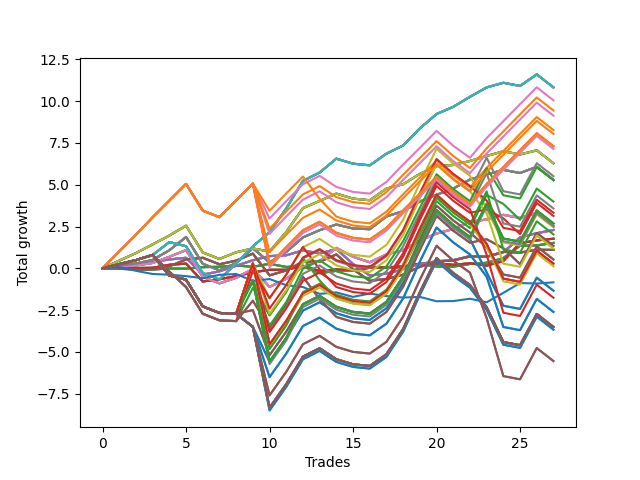

# Short Shepard 003 (1230 Waffles02) 
- Symbol: AAPL_Unlimited
- Date Range: 03/23/2022 - 07/08/2022
- Trading Period: 7:20-12:30
- Number of Trades: 27



| Name | Win Percent | Profit | Avg Profit / Trade | Avg Time / Trade |      | Name | Win Percent | Profit | Avg Profit / Trade | Avg Time / Trade |
| ---- | ----------- | ------ | ------------------ | ---------------- | ---- | ---- | ----------- | ------ | ------------------ | ---------------- |
| Sorted By <br> Profit | | | | | | Sorted By <br> Win Percentage ||||
| Seventy-One | 74.07 | 5410.00 | 200.37 | 79:10 |     | Sixty-Six | 81.48 | 1145.00 | 42.41 | 20:24 |
| Sixty-Three | 74.07 | 5410.00 | 200.37 | 79:10 |     | Fifty-Eight | 81.48 | 1145.00 | 42.41 | 20:24 |
| Fifty-Five | 74.07 | 5410.00 | 200.37 | 79:10 |     | Fifty | 81.48 | 1145.00 | 42.41 | 20:24 |
| Forty-Seven | 74.07 | 5410.00 | 200.37 | 79:10 |     | Forty-Two | 81.48 | 1145.00 | 42.41 | 20:24 |
| Seven | 74.07 | 5410.00 | 200.37 | 79:10 |     | Two | 81.48 | 1145.00 | 42.41 | 20:24 |
| Ninety-One | 66.67 | 5025.00 | 186.11 | 91:42 |     | Seventy-One | 74.07 | 5410.00 | 200.37 | 79:10 |
| One Hundred Six | 66.67 | 4720.00 | 174.81 | 91:49 |     | Sixty-Three | 74.07 | 5410.00 | 200.37 | 79:10 |
| One Hundred One | 66.67 | 4565.00 | 169.07 | 91:50 |     | Fifty-Five | 74.07 | 5410.00 | 200.37 | 79:10 |
| Ninety-Six | 62.96 | 4135.00 | 153.15 | 86:17 |     | Forty-Seven | 74.07 | 5410.00 | 200.37 | 79:10 |
| One Hundred Sixteen | 66.67 | 4020.00 | 148.89 | 94:36 |     | Seven | 74.07 | 5410.00 | 200.37 | 79:10 |
| One Hundred Twenty-Six | 66.67 | 3650.00 | 135.19 | 95:44 |     | Seventy | 74.07 | 3140.00 | 116.30 | 43:50 |
| One Hundred Twenty-One | 66.67 | 3650.00 | 135.19 | 95:44 |     | Sixty-Two | 74.07 | 3140.00 | 116.30 | 43:50 |
| Eighty-One | 66.67 | 3650.00 | 135.19 | 95:44 |     | Fifty-Four | 74.07 | 3140.00 | 116.30 | 43:50 |
| One Hundred Eleven | 66.67 | 3570.00 | 132.22 | 95:27 |     | Forty-Six | 74.07 | 3140.00 | 116.30 | 43:50 |
| Seventy | 74.07 | 3140.00 | 116.30 | 43:50 |     | Six | 74.07 | 3140.00 | 116.30 | 43:50 |
| Sixty-Two | 74.07 | 3140.00 | 116.30 | 43:50 |     | Sixty-Nine | 74.07 | 2645.00 | 97.96 | 49:15 |
| Fifty-Four | 74.07 | 3140.00 | 116.30 | 43:50 |     | Sixty-One | 74.07 | 2645.00 | 97.96 | 49:15 |
| Forty-Six | 74.07 | 3140.00 | 116.30 | 43:50 |     | Fifty-Three | 74.07 | 2645.00 | 97.96 | 49:15 |
| Six | 74.07 | 3140.00 | 116.30 | 43:50 |     | Forty-Five | 74.07 | 2645.00 | 97.96 | 49:15 |
| Ninety-Two | 48.15 | 2755.00 | 102.04 | 134:30 |     | Five | 74.07 | 2645.00 | 97.96 | 49:15 |
| Sixty-Nine | 74.07 | 2645.00 | 97.96 | 49:15 |     | Sixty-Eight | 74.07 | 1265.00 | 46.85 | 36:39 |
| Sixty-One | 74.07 | 2645.00 | 97.96 | 49:15 |     | Sixty | 74.07 | 1265.00 | 46.85 | 36:39 |
| Fifty-Three | 74.07 | 2645.00 | 97.96 | 49:15 |     | Fifty-Two | 74.07 | 1265.00 | 46.85 | 36:39 |
| Forty-Five | 74.07 | 2645.00 | 97.96 | 49:15 |     | Forty-Four | 74.07 | 1265.00 | 46.85 | 36:39 |
| Five | 74.07 | 2645.00 | 97.96 | 49:15 |     | Four | 74.07 | 1265.00 | 46.85 | 36:39 |
| One Hundred Seven | 48.15 | 2635.00 | 97.59 | 134:36 |     | Sixty-Five | 74.07 | 885.00 | 32.78 | 13:14 |
| Ninety-Seven | 44.44 | 1995.00 | 73.89 | 124:11 |     | Fifty-Seven | 74.07 | 885.00 | 32.78 | 13:14 |
| One Hundred Two | 48.15 | 1790.00 | 66.30 | 136:31 |     | Forty-Nine | 74.07 | 885.00 | 32.78 | 13:14 |
| One Hundred Eight | 44.44 | 1660.00 | 61.48 | 140:27 |     | Forty-One | 74.07 | 885.00 | 32.78 | 13:14 |
| Ninety-Eight | 44.44 | 1565.00 | 57.96 | 129:55 |     | One | 74.07 | 885.00 | 32.78 | 13:14 |
| One Hundred Twenty-Seven | 48.15 | 1340.00 | 49.63 | 140:58 |     | Ninety-One | 66.67 | 5025.00 | 186.11 | 91:42 |
| One Hundred Twenty-Two | 48.15 | 1340.00 | 49.63 | 140:58 |     | One Hundred Six | 66.67 | 4720.00 | 174.81 | 91:49 |
| Eighty-Two | 48.15 | 1340.00 | 49.63 | 140:58 |     | One Hundred One | 66.67 | 4565.00 | 169.07 | 91:50 |
| Sixty-Eight | 74.07 | 1265.00 | 46.85 | 36:39 |     | One Hundred Sixteen | 66.67 | 4020.00 | 148.89 | 94:36 |
| Sixty | 74.07 | 1265.00 | 46.85 | 36:39 |     | One Hundred Twenty-Six | 66.67 | 3650.00 | 135.19 | 95:44 |
| Fifty-Two | 74.07 | 1265.00 | 46.85 | 36:39 |     | One Hundred Twenty-One | 66.67 | 3650.00 | 135.19 | 95:44 |
| Forty-Four | 74.07 | 1265.00 | 46.85 | 36:39 |     | Eighty-One | 66.67 | 3650.00 | 135.19 | 95:44 |
| Four | 74.07 | 1265.00 | 46.85 | 36:39 |     | One Hundred Eleven | 66.67 | 3570.00 | 132.22 | 95:27 |
| One Hundred Twelve | 48.15 | 1260.00 | 46.67 | 140:41 |     | Sixty-Four | 66.67 | 760.00 | 28.15 | 05:48 |
| Ninety-Three | 44.44 | 1225.00 | 45.37 | 140:31 |     | Fifty-Six | 66.67 | 760.00 | 28.15 | 05:48 |
| Sixty-Six | 81.48 | 1145.00 | 42.41 | 20:24 |     | Forty-Eight | 66.67 | 760.00 | 28.15 | 05:48 |
| Fifty-Eight | 81.48 | 1145.00 | 42.41 | 20:24 |     | Forty | 66.67 | 760.00 | 28.15 | 05:48 |
| Fifty | 81.48 | 1145.00 | 42.41 | 20:24 |     | Zero | 66.67 | 760.00 | 28.15 | 05:48 |
| Forty-Two | 81.48 | 1145.00 | 42.41 | 20:24 |     | Ninety-Six | 62.96 | 4135.00 | 153.15 | 86:17 |
| Two | 81.48 | 1145.00 | 42.41 | 20:24 |     | Sixty-Seven | 62.96 | 550.00 | 20.37 | 26:13 |
| One Hundred Seventeen | 48.15 | 1015.00 | 37.59 | 139:23 |     | Fifty-Nine | 62.96 | 550.00 | 20.37 | 26:13 |
| Sixty-Five | 74.07 | 885.00 | 32.78 | 13:14 |     | Fifty-One | 62.96 | 550.00 | 20.37 | 26:13 |
| Fifty-Seven | 74.07 | 885.00 | 32.78 | 13:14 |     | Forty-Three | 62.96 | 550.00 | 20.37 | 26:13 |
| Forty-Nine | 74.07 | 885.00 | 32.78 | 13:14 |     | Three | 62.96 | 550.00 | 20.37 | 26:13 |
| Forty-One | 74.07 | 885.00 | 32.78 | 13:14 |     | Ninety-Two | 48.15 | 2755.00 | 102.04 | 134:30 |
| One | 74.07 | 885.00 | 32.78 | 13:14 |     | One Hundred Seven | 48.15 | 2635.00 | 97.59 | 134:36 |
| Sixty-Four | 66.67 | 760.00 | 28.15 | 05:48 |     | One Hundred Two | 48.15 | 1790.00 | 66.30 | 136:31 |
| Fifty-Six | 66.67 | 760.00 | 28.15 | 05:48 |     | One Hundred Twenty-Seven | 48.15 | 1340.00 | 49.63 | 140:58 |
| Forty-Eight | 66.67 | 760.00 | 28.15 | 05:48 |     | One Hundred Twenty-Two | 48.15 | 1340.00 | 49.63 | 140:58 |
| Forty | 66.67 | 760.00 | 28.15 | 05:48 |     | Eighty-Two | 48.15 | 1340.00 | 49.63 | 140:58 |
| Zero | 66.67 | 760.00 | 28.15 | 05:48 |     | One Hundred Twelve | 48.15 | 1260.00 | 46.67 | 140:41 |
| One Hundred | 44.44 | 670.00 | 24.81 | 130:59 |     | One Hundred Seventeen | 48.15 | 1015.00 | 37.59 | 139:23 |
| Ninety-Nine | 44.44 | 670.00 | 24.81 | 130:59 |     | Ninety-Seven | 44.44 | 1995.00 | 73.89 | 124:11 |
| One Hundred Three | 44.44 | 590.00 | 21.85 | 144:48 |     | One Hundred Eight | 44.44 | 1660.00 | 61.48 | 140:27 |
| Sixty-Seven | 62.96 | 550.00 | 20.37 | 26:13 |     | Ninety-Eight | 44.44 | 1565.00 | 57.96 | 129:55 |
| Fifty-Nine | 62.96 | 550.00 | 20.37 | 26:13 |     | Ninety-Three | 44.44 | 1225.00 | 45.37 | 140:31 |
| Fifty-One | 62.96 | 550.00 | 20.37 | 26:13 |     | One Hundred | 44.44 | 670.00 | 24.81 | 130:59 |
| Forty-Three | 62.96 | 550.00 | 20.37 | 26:13 |     | Ninety-Nine | 44.44 | 670.00 | 24.81 | 130:59 |
| Three | 62.96 | 550.00 | 20.37 | 26:13 |     | One Hundred Three | 44.44 | 590.00 | 21.85 | 144:48 |
| One Hundred Ten | 44.44 | 265.00 | 9.81 | 141:53 |     | One Hundred Ten | 44.44 | 265.00 | 9.81 | 141:53 |
| One Hundred Nine | 44.44 | 265.00 | 9.81 | 141:53 |     | One Hundred Nine | 44.44 | 265.00 | 9.81 | 141:53 |
| One Hundred Twenty-Eight | 44.44 | 140.00 | 5.19 | 149:15 |     | One Hundred Twenty-Eight | 44.44 | 140.00 | 5.19 | 149:15 |
| One Hundred Twenty-Three | 44.44 | 140.00 | 5.19 | 149:15 |     | One Hundred Twenty-Three | 44.44 | 140.00 | 5.19 | 149:15 |
| Eighty-Three | 44.44 | 140.00 | 5.19 | 149:15 |     | Eighty-Three | 44.44 | 140.00 | 5.19 | 149:15 |
| One Hundred Thirteen | 44.44 | 60.00 | 2.22 | 148:58 |     | One Hundred Thirteen | 44.44 | 60.00 | 2.22 | 148:58 |
| Seventy-Three | 44.44 | -420.00 | -15.56 | 07:58 |     | Seventy-Three | 44.44 | -420.00 | -15.56 | 07:58 |
| Ninety-Five | 40.74 | -670.00 | -24.81 | 142:53 |     | One Hundred Eighteen | 44.44 | -880.00 | -32.59 | 147:13 |
| Ninety-Four | 40.74 | -670.00 | -24.81 | 142:53 |     | Ninety-Five | 40.74 | -670.00 | -24.81 | 142:53 |
| One Hundred Eighteen | 44.44 | -880.00 | -32.59 | 147:13 |     | Ninety-Four | 40.74 | -670.00 | -24.81 | 142:53 |
| One Hundred Five | 40.74 | -1305.00 | -48.33 | 147:10 |     | One Hundred Five | 40.74 | -1305.00 | -48.33 | 147:10 |
| One Hundred Four | 40.74 | -1305.00 | -48.33 | 147:10 |     | One Hundred Four | 40.74 | -1305.00 | -48.33 | 147:10 |
| One Hundred Thirty | 40.74 | -1755.00 | -65.00 | 151:37 |     | One Hundred Thirty | 40.74 | -1755.00 | -65.00 | 151:37 |
| One Hundred Twenty-Nine | 40.74 | -1755.00 | -65.00 | 151:37 |     | One Hundred Twenty-Nine | 40.74 | -1755.00 | -65.00 | 151:37 |
| One Hundred Twenty-Five | 40.74 | -1755.00 | -65.00 | 151:37 |     | One Hundred Twenty-Five | 40.74 | -1755.00 | -65.00 | 151:37 |
| One Hundred Twenty-Four | 40.74 | -1755.00 | -65.00 | 151:37 |     | One Hundred Twenty-Four | 40.74 | -1755.00 | -65.00 | 151:37 |
| Eighty-Five | 40.74 | -1755.00 | -65.00 | 151:37 |     | Eighty-Five | 40.74 | -1755.00 | -65.00 | 151:37 |
| Eighty-Four | 40.74 | -1755.00 | -65.00 | 151:37 |     | Eighty-Four | 40.74 | -1755.00 | -65.00 | 151:37 |
| One Hundred Fifteen | 40.74 | -1835.00 | -67.96 | 151:20 |     | One Hundred Fifteen | 40.74 | -1835.00 | -67.96 | 151:20 |
| One Hundred Fourteen | 40.74 | -1835.00 | -67.96 | 151:20 |     | One Hundred Fourteen | 40.74 | -1835.00 | -67.96 | 151:20 |
| One Hundred Twenty | 40.74 | -2775.00 | -102.78 | 149:35 |     | One Hundred Twenty | 40.74 | -2775.00 | -102.78 | 149:35 |
| One Hundred Ninteen | 40.74 | -2775.00 | -102.78 | 149:35 |     | One Hundred Ninteen | 40.74 | -2775.00 | -102.78 | 149:35 |

## NO STOPLOSS

### Test Zero
* Sell when price hits the middle line of the 20p bollinger
* No Stoploss
* Results:
```
Total Trades: 27
Percent Up: 33.33
Percent Down: 66.67
Total Points Moved Down: 1.52
Potential Profit: 760.00
Total Points Ups: 1.02 Count Ups: 9
Total Points Downs: 2.54 Count Downs: 18
```

<details><summary>Trades</summary>

<code>In: 2022-03-25 11:09:00		Out: 2022-03-25 11:17:45		Total Position Time: 08:45		Total Move Down: 0.02		Total to Date: 0.02</code> <br />
<code>In: 2022-03-25 11:41:00		Out: 2022-03-25 11:44:20		Total Position Time: 03:20		Total Move Down: -0.08		Total to Date: -0.06</code> <br />
<code>In: 2022-03-25 11:49:00		Out: 2022-03-25 11:50:10		Total Position Time: 01:10		Total Move Down: -0.01		Total to Date: -0.07</code> <br />
<code>In: 2022-03-29 08:34:00		Out: 2022-03-29 08:40:35		Total Position Time: 06:35		Total Move Down: 0.06		Total to Date: -0.01</code> <br />
<code>In: 2022-04-06 10:46:00		Out: 2022-04-06 10:56:30		Total Position Time: 10:30		Total Move Down: -0.01		Total to Date: -0.02</code> <br />
<code>In: 2022-04-07 11:30:00		Out: 2022-04-07 11:31:10		Total Position Time: 01:10		Total Move Down: 0.09		Total to Date: 0.07</code> <br />
<code>In: 2022-04-07 12:18:00		Out: 2022-04-07 12:20:15		Total Position Time: 02:15		Total Move Down: 0.02		Total to Date: 0.09</code> <br />
<code>In: 2022-04-20 10:50:00		Out: 2022-04-20 10:51:10		Total Position Time: 01:10		Total Move Down: 0.08		Total to Date: 0.17</code> <br />
<code>In: 2022-05-02 07:45:00		Out: 2022-05-02 07:46:10		Total Position Time: 01:10		Total Move Down: -0.08		Total to Date: 0.09</code> <br />
<code>In: 2022-05-04 08:58:00		Out: 2022-05-04 09:04:40		Total Position Time: 06:40		Total Move Down: 0.18		Total to Date: 0.27</code> <br />
<code>In: 2022-05-10 10:52:00		Out: 2022-05-10 11:05:55		Total Position Time: 13:55		Total Move Down: -0.19		Total to Date: 0.08</code> <br />
<code>In: 2022-05-10 11:02:00		Out: 2022-05-10 11:05:55		Total Position Time: 03:55		Total Move Down: 0.05		Total to Date: 0.13</code> <br />
<code>In: 2022-05-16 08:51:00		Out: 2022-05-16 09:05:45		Total Position Time: 14:45		Total Move Down: -0.42		Total to Date: -0.29</code> <br />
<code>In: 2022-05-17 08:44:00		Out: 2022-05-17 08:47:25		Total Position Time: 03:25		Total Move Down: 0.14		Total to Date: -0.15</code> <br />
<code>In: 2022-05-25 11:33:00		Out: 2022-05-25 11:39:10		Total Position Time: 06:10		Total Move Down: 0.03		Total to Date: -0.12</code> <br />
<code>In: 2022-05-25 11:37:00		Out: 2022-05-25 11:39:10		Total Position Time: 02:10		Total Move Down: 0.23		Total to Date: 0.11</code> <br />
<code>In: 2022-05-25 12:06:00		Out: 2022-05-25 12:18:05		Total Position Time: 12:05		Total Move Down: -0.08		Total to Date: 0.03</code> <br />
<code>In: 2022-06-08 08:23:00		Out: 2022-06-08 08:30:10		Total Position Time: 07:10		Total Move Down: 0.04		Total to Date: 0.07</code> <br />
<code>In: 2022-06-13 08:29:00		Out: 2022-06-13 08:37:10		Total Position Time: 08:10		Total Move Down: 0.18		Total to Date: 0.25</code> <br />
<code>In: 2022-06-13 08:42:00		Out: 2022-06-13 08:45:15		Total Position Time: 03:15		Total Move Down: -0.14		Total to Date: 0.11</code> <br />
<code>In: 2022-06-14 08:38:00		Out: 2022-06-14 08:51:40		Total Position Time: 13:40		Total Move Down: -0.01		Total to Date: 0.10</code> <br />
<code>In: 2022-06-14 08:47:00		Out: 2022-06-14 08:51:40		Total Position Time: 04:40		Total Move Down: 0.16		Total to Date: 0.26</code> <br />
<code>In: 2022-06-15 09:06:00		Out: 2022-06-15 09:08:20		Total Position Time: 02:20		Total Move Down: 0.07		Total to Date: 0.33</code> <br />
<code>In: 2022-06-15 11:02:00		Out: 2022-06-15 11:03:10		Total Position Time: 01:10		Total Move Down: 0.28		Total to Date: 0.61</code> <br />
<code>In: 2022-06-15 11:48:00		Out: 2022-06-15 11:54:15		Total Position Time: 06:15		Total Move Down: 0.74		Total to Date: 1.35</code> <br />
<code>In: 2022-06-16 10:14:00		Out: 2022-06-16 10:19:50		Total Position Time: 05:50		Total Move Down: 0.02		Total to Date: 1.37</code> <br />
<code>In: 2022-06-23 11:41:00		Out: 2022-06-23 11:46:00		Total Position Time: 05:00		Total Move Down: 0.15		Total to Date: 1.52</code> <br />


</details>

### Test One
* Sell when the price hits the upper line of the 20p 1std bollinger
* No Stoploss
* Results:
```
Total Trades: 27
Percent Up: 25.93
Percent Down: 74.07
Total Points Moved Down: 1.77
Potential Profit: 885.00
Total Points Ups: 1.71 Count Ups: 7
Total Points Downs: 3.48 Count Downs: 20
```

<details><summary>Trades</summary>

<code>In: 2022-03-25 11:09:00		Out: 2022-03-25 11:19:05		Total Position Time: 10:05		Total Move Down: 0.08		Total to Date: 0.08</code> <br />
<code>In: 2022-03-25 11:41:00		Out: 2022-03-25 11:49:05		Total Position Time: 08:05		Total Move Down: -0.06		Total to Date: 0.02</code> <br />
<code>In: 2022-03-25 11:49:00		Out: 2022-03-25 11:50:30		Total Position Time: 01:30		Total Move Down: 0.01		Total to Date: 0.03</code> <br />
<code>In: 2022-03-29 08:34:00		Out: 2022-03-29 08:41:15		Total Position Time: 07:15		Total Move Down: 0.18		Total to Date: 0.21</code> <br />
<code>In: 2022-04-06 10:46:00		Out: 2022-04-06 10:58:00		Total Position Time: 12:00		Total Move Down: 0.07		Total to Date: 0.28</code> <br />
<code>In: 2022-04-07 11:30:00		Out: 2022-04-07 12:27:40		Total Position Time: 57:40		Total Move Down: -1.07		Total to Date: -0.79</code> <br />
<code>In: 2022-04-07 12:18:00		Out: 2022-04-07 12:27:40		Total Position Time: 09:40		Total Move Down: 0.14		Total to Date: -0.65</code> <br />
<code>In: 2022-04-20 10:50:00		Out: 2022-04-20 10:54:05		Total Position Time: 04:05		Total Move Down: 0.18		Total to Date: -0.47</code> <br />
<code>In: 2022-05-02 07:45:00		Out: 2022-05-02 07:47:15		Total Position Time: 02:15		Total Move Down: 0.23		Total to Date: -0.24</code> <br />
<code>In: 2022-05-04 08:58:00		Out: 2022-05-04 09:10:15		Total Position Time: 12:15		Total Move Down: 0.15		Total to Date: -0.09</code> <br />
<code>In: 2022-05-10 10:52:00		Out: 2022-05-10 11:06:35		Total Position Time: 14:35		Total Move Down: -0.00		Total to Date: -0.09</code> <br />
<code>In: 2022-05-10 11:02:00		Out: 2022-05-10 11:06:35		Total Position Time: 04:35		Total Move Down: 0.24		Total to Date: 0.15</code> <br />
<code>In: 2022-05-16 08:51:00		Out: 2022-05-16 09:11:30		Total Position Time: 20:30		Total Move Down: -0.31		Total to Date: -0.16</code> <br />
<code>In: 2022-05-17 08:44:00		Out: 2022-05-17 08:53:40		Total Position Time: 09:40		Total Move Down: 0.09		Total to Date: -0.07</code> <br />
<code>In: 2022-05-25 11:33:00		Out: 2022-05-25 11:49:55		Total Position Time: 16:55		Total Move Down: -0.05		Total to Date: -0.12</code> <br />
<code>In: 2022-05-25 11:37:00		Out: 2022-05-25 11:49:55		Total Position Time: 12:55		Total Move Down: 0.15		Total to Date: 0.03</code> <br />
<code>In: 2022-05-25 12:06:00		Out: 2022-05-25 12:20:25		Total Position Time: 14:25		Total Move Down: 0.03		Total to Date: 0.06</code> <br />
<code>In: 2022-06-08 08:23:00		Out: 2022-06-08 08:43:05		Total Position Time: 20:05		Total Move Down: 0.05		Total to Date: 0.11</code> <br />
<code>In: 2022-06-13 08:29:00		Out: 2022-06-13 08:46:30		Total Position Time: 17:30		Total Move Down: 0.17		Total to Date: 0.28</code> <br />
<code>In: 2022-06-13 08:42:00		Out: 2022-06-13 08:46:30		Total Position Time: 04:30		Total Move Down: 0.01		Total to Date: 0.29</code> <br />
<code>In: 2022-06-14 08:38:00		Out: 2022-06-14 09:02:10		Total Position Time: 24:10		Total Move Down: -0.08		Total to Date: 0.21</code> <br />
<code>In: 2022-06-14 08:47:00		Out: 2022-06-14 09:02:10		Total Position Time: 15:10		Total Move Down: 0.09		Total to Date: 0.30</code> <br />
<code>In: 2022-06-15 09:06:00		Out: 2022-06-15 09:33:30		Total Position Time: 27:30		Total Move Down: -0.14		Total to Date: 0.16</code> <br />
<code>In: 2022-06-15 11:02:00		Out: 2022-06-15 11:03:10		Total Position Time: 01:10		Total Move Down: 0.28		Total to Date: 0.44</code> <br />
<code>In: 2022-06-15 11:48:00		Out: 2022-06-15 11:58:05		Total Position Time: 10:05		Total Move Down: 1.06		Total to Date: 1.50</code> <br />
<code>In: 2022-06-16 10:14:00		Out: 2022-06-16 10:20:35		Total Position Time: 06:35		Total Move Down: 0.17		Total to Date: 1.67</code> <br />
<code>In: 2022-06-23 11:41:00		Out: 2022-06-23 11:53:30		Total Position Time: 12:30		Total Move Down: 0.10		Total to Date: 1.77</code> <br />


</details>

### Test Two
* Sell when the price hits the upper line of the 20p 2std bollinger
* No Stoploss
* Results:
```
Total Trades: 27
Percent Up: 18.52
Percent Down: 81.48
Total Points Moved Down: 2.29
Potential Profit: 1145.00
Total Points Ups: 2.82 Count Ups: 5
Total Points Downs: 5.11 Count Downs: 22
```

<details><summary>Trades</summary>

<code>In: 2022-03-25 11:09:00		Out: 2022-03-25 11:19:55		Total Position Time: 10:55		Total Move Down: 0.15		Total to Date: 0.15</code> <br />
<code>In: 2022-03-25 11:41:00		Out: 2022-03-25 12:02:00		Total Position Time: 21:00		Total Move Down: 0.08		Total to Date: 0.23</code> <br />
<code>In: 2022-03-25 11:49:00		Out: 2022-03-25 12:02:00		Total Position Time: 13:00		Total Move Down: 0.15		Total to Date: 0.38</code> <br />
<code>In: 2022-03-29 08:34:00		Out: 2022-03-29 08:57:40		Total Position Time: 23:40		Total Move Down: 0.15		Total to Date: 0.53</code> <br />
<code>In: 2022-04-06 10:46:00		Out: 2022-04-06 10:59:10		Total Position Time: 13:10		Total Move Down: 0.10		Total to Date: 0.63</code> <br />
<code>In: 2022-04-07 11:30:00		Out: 2022-04-07 12:28:30		Total Position Time: 58:30		Total Move Down: -1.01		Total to Date: -0.38</code> <br />
<code>In: 2022-04-07 12:18:00		Out: 2022-04-07 12:28:30		Total Position Time: 10:30		Total Move Down: 0.20		Total to Date: -0.18</code> <br />
<code>In: 2022-04-20 10:50:00		Out: 2022-04-20 11:03:15		Total Position Time: 13:15		Total Move Down: 0.33		Total to Date: 0.15</code> <br />
<code>In: 2022-05-02 07:45:00		Out: 2022-05-02 07:50:30		Total Position Time: 05:30		Total Move Down: 0.33		Total to Date: 0.48</code> <br />
<code>In: 2022-05-04 08:58:00		Out: 2022-05-04 09:12:25		Total Position Time: 14:25		Total Move Down: 0.25		Total to Date: 0.73</code> <br />
<code>In: 2022-05-10 10:52:00		Out: 2022-05-10 11:07:10		Total Position Time: 15:10		Total Move Down: 0.05		Total to Date: 0.78</code> <br />
<code>In: 2022-05-10 11:02:00		Out: 2022-05-10 11:07:10		Total Position Time: 05:10		Total Move Down: 0.29		Total to Date: 1.07</code> <br />
<code>In: 2022-05-16 08:51:00		Out: 2022-05-16 09:14:40		Total Position Time: 23:40		Total Move Down: -0.18		Total to Date: 0.89</code> <br />
<code>In: 2022-05-17 08:44:00		Out: 2022-05-17 08:55:15		Total Position Time: 11:15		Total Move Down: 0.26		Total to Date: 1.15</code> <br />
<code>In: 2022-05-25 11:33:00		Out: 2022-05-25 12:33:10		Total Position Time: 60:10		Total Move Down: -0.89		Total to Date: 0.26</code> <br />
<code>In: 2022-05-25 11:37:00		Out: 2022-05-25 12:33:10		Total Position Time: 56:10		Total Move Down: -0.69		Total to Date: -0.43</code> <br />
<code>In: 2022-05-25 12:06:00		Out: 2022-05-25 12:33:10		Total Position Time: 27:10		Total Move Down: 0.11		Total to Date: -0.32</code> <br />
<code>In: 2022-06-08 08:23:00		Out: 2022-06-08 08:44:45		Total Position Time: 21:45		Total Move Down: 0.26		Total to Date: -0.06</code> <br />
<code>In: 2022-06-13 08:29:00		Out: 2022-06-13 08:47:05		Total Position Time: 18:05		Total Move Down: 0.32		Total to Date: 0.26</code> <br />
<code>In: 2022-06-13 08:42:00		Out: 2022-06-13 08:47:05		Total Position Time: 05:05		Total Move Down: 0.16		Total to Date: 0.42</code> <br />
<code>In: 2022-06-14 08:38:00		Out: 2022-06-14 09:03:00		Total Position Time: 25:00		Total Move Down: 0.07		Total to Date: 0.49</code> <br />
<code>In: 2022-06-14 08:47:00		Out: 2022-06-14 09:03:00		Total Position Time: 16:00		Total Move Down: 0.24		Total to Date: 0.73</code> <br />
<code>In: 2022-06-15 09:06:00		Out: 2022-06-15 09:34:20		Total Position Time: 28:20		Total Move Down: -0.05		Total to Date: 0.68</code> <br />
<code>In: 2022-06-15 11:02:00		Out: 2022-06-15 11:03:10		Total Position Time: 01:10		Total Move Down: 0.28		Total to Date: 0.96</code> <br />
<code>In: 2022-06-15 11:48:00		Out: 2022-06-15 12:13:05		Total Position Time: 25:05		Total Move Down: 0.89		Total to Date: 1.85</code> <br />
<code>In: 2022-06-16 10:14:00		Out: 2022-06-16 10:21:35		Total Position Time: 07:35		Total Move Down: 0.25		Total to Date: 2.10</code> <br />
<code>In: 2022-06-23 11:41:00		Out: 2022-06-23 12:01:10		Total Position Time: 20:10		Total Move Down: 0.19		Total to Date: 2.29</code> <br />


</details>

### Test Three
* Sell when price hits the middle line of the 50p bollinger
* No Stoploss
* Results:
```
Total Trades: 27
Percent Up: 37.04
Percent Down: 62.96
Total Points Moved Down: 1.10
Potential Profit: 550.00
Total Points Ups: 3.41 Count Ups: 10
Total Points Downs: 4.51 Count Downs: 17
```

<details><summary>Trades</summary>

<code>In: 2022-03-25 11:09:00		Out: 2022-03-25 11:49:20		Total Position Time: 40:20		Total Move Down: -0.03		Total to Date: -0.03</code> <br />
<code>In: 2022-03-25 11:41:00		Out: 2022-03-25 11:49:20		Total Position Time: 08:20		Total Move Down: -0.04		Total to Date: -0.07</code> <br />
<code>In: 2022-03-25 11:49:00		Out: 2022-03-25 11:50:30		Total Position Time: 01:30		Total Move Down: 0.01		Total to Date: -0.06</code> <br />
<code>In: 2022-03-29 08:34:00		Out: 2022-03-29 08:57:55		Total Position Time: 23:55		Total Move Down: 0.18		Total to Date: 0.12</code> <br />
<code>In: 2022-04-06 10:46:00		Out: 2022-04-06 11:00:10		Total Position Time: 14:10		Total Move Down: 0.41		Total to Date: 0.53</code> <br />
<code>In: 2022-04-07 11:30:00		Out: 2022-04-07 11:36:05		Total Position Time: 06:05		Total Move Down: 0.10		Total to Date: 0.63</code> <br />
<code>In: 2022-04-07 12:18:00		Out: 2022-04-07 12:47:00		Total Position Time: 29:00		Total Move Down: -0.39		Total to Date: 0.24</code> <br />
<code>In: 2022-04-20 10:50:00		Out: 2022-04-20 10:55:30		Total Position Time: 05:30		Total Move Down: 0.22		Total to Date: 0.46</code> <br />
<code>In: 2022-05-02 07:45:00		Out: 2022-05-02 07:51:25		Total Position Time: 06:25		Total Move Down: 0.42		Total to Date: 0.88</code> <br />
<code>In: 2022-05-04 08:58:00		Out: 2022-05-04 11:00:20		Total Position Time: 122:20		Total Move Down: -1.30		Total to Date: -0.42</code> <br />
<code>In: 2022-05-10 10:52:00		Out: 2022-05-10 11:16:20		Total Position Time: 24:20		Total Move Down: 0.29		Total to Date: -0.13</code> <br />
<code>In: 2022-05-10 11:02:00		Out: 2022-05-10 11:16:20		Total Position Time: 14:20		Total Move Down: 0.53		Total to Date: 0.40</code> <br />
<code>In: 2022-05-16 08:51:00		Out: 2022-05-16 09:15:45		Total Position Time: 24:45		Total Move Down: -0.01		Total to Date: 0.39</code> <br />
<code>In: 2022-05-17 08:44:00		Out: 2022-05-17 09:00:15		Total Position Time: 16:15		Total Move Down: 0.44		Total to Date: 0.83</code> <br />
<code>In: 2022-05-25 11:33:00		Out: 2022-05-25 12:34:15		Total Position Time: 61:15		Total Move Down: -0.89		Total to Date: -0.06</code> <br />
<code>In: 2022-05-25 11:37:00		Out: 2022-05-25 12:34:15		Total Position Time: 57:15		Total Move Down: -0.69		Total to Date: -0.75</code> <br />
<code>In: 2022-05-25 12:06:00		Out: 2022-05-25 12:34:15		Total Position Time: 28:15		Total Move Down: 0.11		Total to Date: -0.64</code> <br />
<code>In: 2022-06-08 08:23:00		Out: 2022-06-08 08:44:45		Total Position Time: 21:45		Total Move Down: 0.26		Total to Date: -0.38</code> <br />
<code>In: 2022-06-13 08:29:00		Out: 2022-06-13 08:51:55		Total Position Time: 22:55		Total Move Down: 0.47		Total to Date: 0.09</code> <br />
<code>In: 2022-06-13 08:42:00		Out: 2022-06-13 08:51:55		Total Position Time: 09:55		Total Move Down: 0.31		Total to Date: 0.40</code> <br />
<code>In: 2022-06-14 08:38:00		Out: 2022-06-14 09:03:00		Total Position Time: 25:00		Total Move Down: 0.07		Total to Date: 0.47</code> <br />
<code>In: 2022-06-14 08:47:00		Out: 2022-06-14 09:03:00		Total Position Time: 16:00		Total Move Down: 0.24		Total to Date: 0.71</code> <br />
<code>In: 2022-06-15 09:06:00		Out: 2022-06-15 09:34:25		Total Position Time: 28:25		Total Move Down: -0.01		Total to Date: 0.70</code> <br />
<code>In: 2022-06-15 11:02:00		Out: 2022-06-15 11:03:10		Total Position Time: 01:10		Total Move Down: 0.28		Total to Date: 0.98</code> <br />
<code>In: 2022-06-15 11:48:00		Out: 2022-06-15 12:43:05		Total Position Time: 55:05		Total Move Down: -0.04		Total to Date: 0.94</code> <br />
<code>In: 2022-06-16 10:14:00		Out: 2022-06-16 10:20:35		Total Position Time: 06:35		Total Move Down: 0.17		Total to Date: 1.11</code> <br />
<code>In: 2022-06-23 11:41:00		Out: 2022-06-23 12:18:25		Total Position Time: 37:25		Total Move Down: -0.01		Total to Date: 1.10</code> <br />


</details>

### Test Four
* Sell when the price hits the upper line of the 50p 1std bollinger
* No Stoploss
* Results:
```
Total Trades: 27
Percent Up: 25.93
Percent Down: 74.07
Total Points Moved Down: 2.53
Potential Profit: 1265.00
Total Points Ups: 4.89 Count Ups: 7
Total Points Downs: 7.42 Count Downs: 20
```

<details><summary>Trades</summary>

<code>In: 2022-03-25 11:09:00		Out: 2022-03-25 12:02:00		Total Position Time: 53:00		Total Move Down: 0.09		Total to Date: 0.09</code> <br />
<code>In: 2022-03-25 11:41:00		Out: 2022-03-25 12:02:00		Total Position Time: 21:00		Total Move Down: 0.08		Total to Date: 0.17</code> <br />
<code>In: 2022-03-25 11:49:00		Out: 2022-03-25 12:02:00		Total Position Time: 13:00		Total Move Down: 0.15		Total to Date: 0.32</code> <br />
<code>In: 2022-03-29 08:34:00		Out: 2022-03-29 09:01:35		Total Position Time: 27:35		Total Move Down: 0.37		Total to Date: 0.69</code> <br />
<code>In: 2022-04-06 10:46:00		Out: 2022-04-06 11:14:10		Total Position Time: 28:10		Total Move Down: 0.40		Total to Date: 1.09</code> <br />
<code>In: 2022-04-07 11:30:00		Out: 2022-04-07 12:47:00		Total Position Time: 77:00		Total Move Down: -1.60		Total to Date: -0.51</code> <br />
<code>In: 2022-04-07 12:18:00		Out: 2022-04-07 12:47:00		Total Position Time: 29:00		Total Move Down: -0.39		Total to Date: -0.90</code> <br />
<code>In: 2022-04-20 10:50:00		Out: 2022-04-20 11:03:15		Total Position Time: 13:15		Total Move Down: 0.33		Total to Date: -0.57</code> <br />
<code>In: 2022-05-02 07:45:00		Out: 2022-05-02 08:16:15		Total Position Time: 31:15		Total Move Down: 0.53		Total to Date: -0.04</code> <br />
<code>In: 2022-05-04 08:58:00		Out: 2022-05-04 11:00:25		Total Position Time: 122:25		Total Move Down: -1.07		Total to Date: -1.11</code> <br />
<code>In: 2022-05-10 10:52:00		Out: 2022-05-10 11:24:10		Total Position Time: 32:10		Total Move Down: 0.48		Total to Date: -0.63</code> <br />
<code>In: 2022-05-10 11:02:00		Out: 2022-05-10 11:24:10		Total Position Time: 22:10		Total Move Down: 0.72		Total to Date: 0.09</code> <br />
<code>In: 2022-05-16 08:51:00		Out: 2022-05-16 09:24:25		Total Position Time: 33:25		Total Move Down: 0.34		Total to Date: 0.43</code> <br />
<code>In: 2022-05-17 08:44:00		Out: 2022-05-17 09:06:45		Total Position Time: 22:45		Total Move Down: 0.79		Total to Date: 1.22</code> <br />
<code>In: 2022-05-25 11:33:00		Out: 2022-05-25 12:36:30		Total Position Time: 63:30		Total Move Down: -0.53		Total to Date: 0.69</code> <br />
<code>In: 2022-05-25 11:37:00		Out: 2022-05-25 12:36:30		Total Position Time: 59:30		Total Move Down: -0.33		Total to Date: 0.36</code> <br />
<code>In: 2022-05-25 12:06:00		Out: 2022-05-25 12:36:30		Total Position Time: 30:30		Total Move Down: 0.47		Total to Date: 0.83</code> <br />
<code>In: 2022-06-08 08:23:00		Out: 2022-06-08 08:57:45		Total Position Time: 34:45		Total Move Down: 0.25		Total to Date: 1.08</code> <br />
<code>In: 2022-06-13 08:29:00		Out: 2022-06-13 09:04:10		Total Position Time: 35:10		Total Move Down: 0.58		Total to Date: 1.66</code> <br />
<code>In: 2022-06-13 08:42:00		Out: 2022-06-13 09:04:10		Total Position Time: 22:10		Total Move Down: 0.42		Total to Date: 2.08</code> <br />
<code>In: 2022-06-14 08:38:00		Out: 2022-06-14 09:07:10		Total Position Time: 29:10		Total Move Down: 0.27		Total to Date: 2.35</code> <br />
<code>In: 2022-06-14 08:47:00		Out: 2022-06-14 09:07:10		Total Position Time: 20:10		Total Move Down: 0.44		Total to Date: 2.79</code> <br />
<code>In: 2022-06-15 09:06:00		Out: 2022-06-15 09:38:40		Total Position Time: 32:40		Total Move Down: 0.13		Total to Date: 2.92</code> <br />
<code>In: 2022-06-15 11:02:00		Out: 2022-06-15 11:03:10		Total Position Time: 01:10		Total Move Down: 0.28		Total to Date: 3.20</code> <br />
<code>In: 2022-06-15 11:48:00		Out: 2022-06-15 12:47:00		Total Position Time: 59:00		Total Move Down: -0.19		Total to Date: 3.01</code> <br />
<code>In: 2022-06-16 10:14:00		Out: 2022-06-16 10:23:50		Total Position Time: 09:50		Total Move Down: 0.30		Total to Date: 3.31</code> <br />
<code>In: 2022-06-23 11:41:00		Out: 2022-06-23 12:47:00		Total Position Time: 66:00		Total Move Down: -0.78		Total to Date: 2.53</code> <br />


</details>

### Test Five
* Sell when the price hits the upper line of the 50p 2std bollinger
* No Stoploss
* Results:
```
Total Trades: 27
Percent Up: 25.93
Percent Down: 74.07
Total Points Moved Down: 5.29
Potential Profit: 2645.00
Total Points Ups: 4.09 Count Ups: 7
Total Points Downs: 9.38 Count Downs: 20
```

<details><summary>Trades</summary>

<code>In: 2022-03-25 11:09:00		Out: 2022-03-25 12:02:20		Total Position Time: 53:20		Total Move Down: 0.15		Total to Date: 0.15</code> <br />
<code>In: 2022-03-25 11:41:00		Out: 2022-03-25 12:02:20		Total Position Time: 21:20		Total Move Down: 0.14		Total to Date: 0.29</code> <br />
<code>In: 2022-03-25 11:49:00		Out: 2022-03-25 12:02:20		Total Position Time: 13:20		Total Move Down: 0.21		Total to Date: 0.50</code> <br />
<code>In: 2022-03-29 08:34:00		Out: 2022-03-29 09:02:20		Total Position Time: 28:20		Total Move Down: 0.58		Total to Date: 1.08</code> <br />
<code>In: 2022-04-06 10:46:00		Out: 2022-04-06 11:15:20		Total Position Time: 29:20		Total Move Down: 0.79		Total to Date: 1.87</code> <br />
<code>In: 2022-04-07 11:30:00		Out: 2022-04-07 12:47:00		Total Position Time: 77:00		Total Move Down: -1.60		Total to Date: 0.27</code> <br />
<code>In: 2022-04-07 12:18:00		Out: 2022-04-07 12:47:00		Total Position Time: 29:00		Total Move Down: -0.39		Total to Date: -0.12</code> <br />
<code>In: 2022-04-20 10:50:00		Out: 2022-04-20 11:19:30		Total Position Time: 29:30		Total Move Down: 0.43		Total to Date: 0.31</code> <br />
<code>In: 2022-05-02 07:45:00		Out: 2022-05-02 08:17:20		Total Position Time: 32:20		Total Move Down: 0.89		Total to Date: 1.20</code> <br />
<code>In: 2022-05-04 08:58:00		Out: 2022-05-04 11:07:40		Total Position Time: 129:40		Total Move Down: -0.85		Total to Date: 0.35</code> <br />
<code>In: 2022-05-10 10:52:00		Out: 2022-05-10 11:27:05		Total Position Time: 35:05		Total Move Down: 0.63		Total to Date: 0.98</code> <br />
<code>In: 2022-05-10 11:02:00		Out: 2022-05-10 11:27:05		Total Position Time: 25:05		Total Move Down: 0.87		Total to Date: 1.85</code> <br />
<code>In: 2022-05-16 08:51:00		Out: 2022-05-16 09:39:00		Total Position Time: 48:00		Total Move Down: 0.43		Total to Date: 2.28</code> <br />
<code>In: 2022-05-17 08:44:00		Out: 2022-05-17 11:13:45		Total Position Time: 149:45		Total Move Down: 0.34		Total to Date: 2.62</code> <br />
<code>In: 2022-05-25 11:33:00		Out: 2022-05-25 12:40:15		Total Position Time: 67:15		Total Move Down: -0.24		Total to Date: 2.38</code> <br />
<code>In: 2022-05-25 11:37:00		Out: 2022-05-25 12:40:15		Total Position Time: 63:15		Total Move Down: -0.04		Total to Date: 2.34</code> <br />
<code>In: 2022-05-25 12:06:00		Out: 2022-05-25 12:40:15		Total Position Time: 34:15		Total Move Down: 0.76		Total to Date: 3.10</code> <br />
<code>In: 2022-06-08 08:23:00		Out: 2022-06-08 09:00:05		Total Position Time: 37:05		Total Move Down: 0.32		Total to Date: 3.42</code> <br />
<code>In: 2022-06-13 08:29:00		Out: 2022-06-13 10:00:15		Total Position Time: 91:15		Total Move Down: 0.57		Total to Date: 3.99</code> <br />
<code>In: 2022-06-13 08:42:00		Out: 2022-06-13 10:00:15		Total Position Time: 78:15		Total Move Down: 0.41		Total to Date: 4.40</code> <br />
<code>In: 2022-06-14 08:38:00		Out: 2022-06-14 09:14:40		Total Position Time: 36:40		Total Move Down: 0.37		Total to Date: 4.77</code> <br />
<code>In: 2022-06-14 08:47:00		Out: 2022-06-14 09:14:40		Total Position Time: 27:40		Total Move Down: 0.54		Total to Date: 5.31</code> <br />
<code>In: 2022-06-15 09:06:00		Out: 2022-06-15 09:41:40		Total Position Time: 35:40		Total Move Down: 0.30		Total to Date: 5.61</code> <br />
<code>In: 2022-06-15 11:02:00		Out: 2022-06-15 11:03:10		Total Position Time: 01:10		Total Move Down: 0.28		Total to Date: 5.89</code> <br />
<code>In: 2022-06-15 11:48:00		Out: 2022-06-15 12:47:00		Total Position Time: 59:00		Total Move Down: -0.19		Total to Date: 5.70</code> <br />
<code>In: 2022-06-16 10:14:00		Out: 2022-06-16 10:45:10		Total Position Time: 31:10		Total Move Down: 0.37		Total to Date: 6.07</code> <br />
<code>In: 2022-06-23 11:41:00		Out: 2022-06-23 12:47:00		Total Position Time: 66:00		Total Move Down: -0.78		Total to Date: 5.29</code> <br />


</details>

### Test Six
* Sell when the price hits the middle line of the 1std VWAP
* No Stoploss
* Results:
```
Total Trades: 27
Percent Up: 25.93
Percent Down: 74.07
Total Points Moved Down: 6.28
Potential Profit: 3140.00
Total Points Ups: 3.55 Count Ups: 7
Total Points Downs: 9.83 Count Downs: 20
```

<details><summary>Trades</summary>

<code>In: 2022-03-25 11:09:00		Out: 2022-03-25 12:17:45		Total Position Time: 68:45		Total Move Down: 0.46		Total to Date: 0.46</code> <br />
<code>In: 2022-03-25 11:41:00		Out: 2022-03-25 12:17:45		Total Position Time: 36:45		Total Move Down: 0.45		Total to Date: 0.91</code> <br />
<code>In: 2022-03-25 11:49:00		Out: 2022-03-25 12:17:45		Total Position Time: 28:45		Total Move Down: 0.52		Total to Date: 1.43</code> <br />
<code>In: 2022-03-29 08:34:00		Out: 2022-03-29 09:02:15		Total Position Time: 28:15		Total Move Down: 0.53		Total to Date: 1.96</code> <br />
<code>In: 2022-04-06 10:46:00		Out: 2022-04-06 11:14:50		Total Position Time: 28:50		Total Move Down: 0.59		Total to Date: 2.55</code> <br />
<code>In: 2022-04-07 11:30:00		Out: 2022-04-07 12:47:00		Total Position Time: 77:00		Total Move Down: -1.60		Total to Date: 0.95</code> <br />
<code>In: 2022-04-07 12:18:00		Out: 2022-04-07 12:47:00		Total Position Time: 29:00		Total Move Down: -0.39		Total to Date: 0.56</code> <br />
<code>In: 2022-04-20 10:50:00		Out: 2022-04-20 11:19:25		Total Position Time: 29:25		Total Move Down: 0.40		Total to Date: 0.96</code> <br />
<code>In: 2022-05-02 07:45:00		Out: 2022-05-02 07:47:15		Total Position Time: 02:15		Total Move Down: 0.23		Total to Date: 1.19</code> <br />
<code>In: 2022-05-04 08:58:00		Out: 2022-05-04 11:30:50		Total Position Time: 152:50		Total Move Down: -0.19		Total to Date: 1.00</code> <br />
<code>In: 2022-05-10 10:52:00		Out: 2022-05-10 12:30:15		Total Position Time: 98:15		Total Move Down: 1.18		Total to Date: 2.18</code> <br />
<code>In: 2022-05-10 11:02:00		Out: 2022-05-10 12:30:15		Total Position Time: 88:15		Total Move Down: 1.42		Total to Date: 3.60</code> <br />
<code>In: 2022-05-16 08:51:00		Out: 2022-05-16 09:39:00		Total Position Time: 48:00		Total Move Down: 0.43		Total to Date: 4.03</code> <br />
<code>In: 2022-05-17 08:44:00		Out: 2022-05-17 09:00:15		Total Position Time: 16:15		Total Move Down: 0.44		Total to Date: 4.47</code> <br />
<code>In: 2022-05-25 11:33:00		Out: 2022-05-25 12:47:00		Total Position Time: 74:00		Total Move Down: -0.30		Total to Date: 4.17</code> <br />
<code>In: 2022-05-25 11:37:00		Out: 2022-05-25 12:47:00		Total Position Time: 70:00		Total Move Down: -0.10		Total to Date: 4.07</code> <br />
<code>In: 2022-05-25 12:06:00		Out: 2022-05-25 12:47:00		Total Position Time: 41:00		Total Move Down: 0.70		Total to Date: 4.77</code> <br />
<code>In: 2022-06-08 08:23:00		Out: 2022-06-08 08:44:45		Total Position Time: 21:45		Total Move Down: 0.26		Total to Date: 5.03</code> <br />
<code>In: 2022-06-13 08:29:00		Out: 2022-06-13 08:52:25		Total Position Time: 23:25		Total Move Down: 0.62		Total to Date: 5.65</code> <br />
<code>In: 2022-06-13 08:42:00		Out: 2022-06-13 08:52:25		Total Position Time: 10:25		Total Move Down: 0.46		Total to Date: 6.11</code> <br />
<code>In: 2022-06-14 08:38:00		Out: 2022-06-14 09:03:00		Total Position Time: 25:00		Total Move Down: 0.07		Total to Date: 6.18</code> <br />
<code>In: 2022-06-14 08:47:00		Out: 2022-06-14 09:03:00		Total Position Time: 16:00		Total Move Down: 0.24		Total to Date: 6.42</code> <br />
<code>In: 2022-06-15 09:06:00		Out: 2022-06-15 09:41:40		Total Position Time: 35:40		Total Move Down: 0.30		Total to Date: 6.72</code> <br />
<code>In: 2022-06-15 11:02:00		Out: 2022-06-15 11:03:10		Total Position Time: 01:10		Total Move Down: 0.28		Total to Date: 7.00</code> <br />
<code>In: 2022-06-15 11:48:00		Out: 2022-06-15 12:47:00		Total Position Time: 59:00		Total Move Down: -0.19		Total to Date: 6.81</code> <br />
<code>In: 2022-06-16 10:14:00		Out: 2022-06-16 10:21:35		Total Position Time: 07:35		Total Move Down: 0.25		Total to Date: 7.06</code> <br />
<code>In: 2022-06-23 11:41:00		Out: 2022-06-23 12:47:00		Total Position Time: 66:00		Total Move Down: -0.78		Total to Date: 6.28</code> <br />


</details>

### Test Seven
* Sell when the price hits the upper line of the 1std VWAP
* No Stoploss
* Results:
```
Total Trades: 27
Percent Up: 25.93
Percent Down: 74.07
Total Points Moved Down: 10.82
Potential Profit: 5410.00
Total Points Ups: 3.61 Count Ups: 7
Total Points Downs: 14.43 Count Downs: 20
```

<details><summary>Trades</summary>

<code>In: 2022-03-25 11:09:00		Out: 2022-03-25 12:47:00		Total Position Time: 98:00		Total Move Down: 0.25		Total to Date: 0.25</code> <br />
<code>In: 2022-03-25 11:41:00		Out: 2022-03-25 12:47:00		Total Position Time: 66:00		Total Move Down: 0.24		Total to Date: 0.49</code> <br />
<code>In: 2022-03-25 11:49:00		Out: 2022-03-25 12:47:00		Total Position Time: 58:00		Total Move Down: 0.31		Total to Date: 0.80</code> <br />
<code>In: 2022-03-29 08:34:00		Out: 2022-03-29 09:31:15		Total Position Time: 57:15		Total Move Down: 0.77		Total to Date: 1.57</code> <br />
<code>In: 2022-04-06 10:46:00		Out: 2022-04-06 12:47:00		Total Position Time: 121:00		Total Move Down: -0.25		Total to Date: 1.32</code> <br />
<code>In: 2022-04-07 11:30:00		Out: 2022-04-07 12:47:00		Total Position Time: 77:00		Total Move Down: -1.60		Total to Date: -0.28</code> <br />
<code>In: 2022-04-07 12:18:00		Out: 2022-04-07 12:47:00		Total Position Time: 29:00		Total Move Down: -0.39		Total to Date: -0.67</code> <br />
<code>In: 2022-04-20 10:50:00		Out: 2022-04-20 11:52:05		Total Position Time: 62:05		Total Move Down: 0.97		Total to Date: 0.30</code> <br />
<code>In: 2022-05-02 07:45:00		Out: 2022-05-02 08:39:05		Total Position Time: 54:05		Total Move Down: 1.01		Total to Date: 1.31</code> <br />
<code>In: 2022-05-04 08:58:00		Out: 2022-05-04 11:35:05		Total Position Time: 157:05		Total Move Down: 0.86		Total to Date: 2.17</code> <br />
<code>In: 2022-05-10 10:52:00		Out: 2022-05-10 12:47:00		Total Position Time: 115:00		Total Move Down: 1.41		Total to Date: 3.58</code> <br />
<code>In: 2022-05-10 11:02:00		Out: 2022-05-10 12:47:00		Total Position Time: 105:00		Total Move Down: 1.65		Total to Date: 5.23</code> <br />
<code>In: 2022-05-16 08:51:00		Out: 2022-05-16 12:47:00		Total Position Time: 236:00		Total Move Down: 0.50		Total to Date: 5.73</code> <br />
<code>In: 2022-05-17 08:44:00		Out: 2022-05-17 11:22:05		Total Position Time: 158:05		Total Move Down: 0.83		Total to Date: 6.56</code> <br />
<code>In: 2022-05-25 11:33:00		Out: 2022-05-25 12:47:00		Total Position Time: 74:00		Total Move Down: -0.30		Total to Date: 6.26</code> <br />
<code>In: 2022-05-25 11:37:00		Out: 2022-05-25 12:47:00		Total Position Time: 70:00		Total Move Down: -0.10		Total to Date: 6.16</code> <br />
<code>In: 2022-05-25 12:06:00		Out: 2022-05-25 12:47:00		Total Position Time: 41:00		Total Move Down: 0.70		Total to Date: 6.86</code> <br />
<code>In: 2022-06-08 08:23:00		Out: 2022-06-08 09:22:05		Total Position Time: 59:05		Total Move Down: 0.49		Total to Date: 7.35</code> <br />
<code>In: 2022-06-13 08:29:00		Out: 2022-06-13 10:27:50		Total Position Time: 118:50		Total Move Down: 1.02		Total to Date: 8.37</code> <br />
<code>In: 2022-06-13 08:42:00		Out: 2022-06-13 10:27:50		Total Position Time: 105:50		Total Move Down: 0.86		Total to Date: 9.23</code> <br />
<code>In: 2022-06-14 08:38:00		Out: 2022-06-14 09:15:25		Total Position Time: 37:25		Total Move Down: 0.43		Total to Date: 9.66</code> <br />
<code>In: 2022-06-14 08:47:00		Out: 2022-06-14 09:15:25		Total Position Time: 28:25		Total Move Down: 0.60		Total to Date: 10.26</code> <br />
<code>In: 2022-06-15 09:06:00		Out: 2022-06-15 09:52:55		Total Position Time: 46:55		Total Move Down: 0.56		Total to Date: 10.82</code> <br />
<code>In: 2022-06-15 11:02:00		Out: 2022-06-15 11:03:10		Total Position Time: 01:10		Total Move Down: 0.28		Total to Date: 11.10</code> <br />
<code>In: 2022-06-15 11:48:00		Out: 2022-06-15 12:47:00		Total Position Time: 59:00		Total Move Down: -0.19		Total to Date: 10.91</code> <br />
<code>In: 2022-06-16 10:14:00		Out: 2022-06-16 10:50:30		Total Position Time: 36:30		Total Move Down: 0.69		Total to Date: 11.60</code> <br />
<code>In: 2022-06-23 11:41:00		Out: 2022-06-23 12:47:00		Total Position Time: 66:00		Total Move Down: -0.78		Total to Date: 10.82</code> <br />


</details>

## STOPLOSS OF 5

### Test Forty
* Sell when price hits the middle line of the 20p bollinger
* Stoploss is -5 points
* Results:
```
Total Trades: 27
Percent Up: 33.33
Percent Down: 66.67
Total Points Moved Down: 1.52
Potential Profit: 760.00
Total Points Ups: 1.02 Count Ups: 9
Total Points Downs: 2.54 Count Downs: 18
```

<details><summary>Trades</summary>

<code>In: 2022-03-25 11:09:00		Out: 2022-03-25 11:17:45		Total Position Time: 08:45		Total Move Down: 0.02		Total to Date: 0.02</code> <br />
<code>In: 2022-03-25 11:41:00		Out: 2022-03-25 11:44:20		Total Position Time: 03:20		Total Move Down: -0.08		Total to Date: -0.06</code> <br />
<code>In: 2022-03-25 11:49:00		Out: 2022-03-25 11:50:10		Total Position Time: 01:10		Total Move Down: -0.01		Total to Date: -0.07</code> <br />
<code>In: 2022-03-29 08:34:00		Out: 2022-03-29 08:40:35		Total Position Time: 06:35		Total Move Down: 0.06		Total to Date: -0.01</code> <br />
<code>In: 2022-04-06 10:46:00		Out: 2022-04-06 10:56:30		Total Position Time: 10:30		Total Move Down: -0.01		Total to Date: -0.02</code> <br />
<code>In: 2022-04-07 11:30:00		Out: 2022-04-07 11:31:10		Total Position Time: 01:10		Total Move Down: 0.09		Total to Date: 0.07</code> <br />
<code>In: 2022-04-07 12:18:00		Out: 2022-04-07 12:20:15		Total Position Time: 02:15		Total Move Down: 0.02		Total to Date: 0.09</code> <br />
<code>In: 2022-04-20 10:50:00		Out: 2022-04-20 10:51:10		Total Position Time: 01:10		Total Move Down: 0.08		Total to Date: 0.17</code> <br />
<code>In: 2022-05-02 07:45:00		Out: 2022-05-02 07:46:10		Total Position Time: 01:10		Total Move Down: -0.08		Total to Date: 0.09</code> <br />
<code>In: 2022-05-04 08:58:00		Out: 2022-05-04 09:04:40		Total Position Time: 06:40		Total Move Down: 0.18		Total to Date: 0.27</code> <br />
<code>In: 2022-05-10 10:52:00		Out: 2022-05-10 11:05:55		Total Position Time: 13:55		Total Move Down: -0.19		Total to Date: 0.08</code> <br />
<code>In: 2022-05-10 11:02:00		Out: 2022-05-10 11:05:55		Total Position Time: 03:55		Total Move Down: 0.05		Total to Date: 0.13</code> <br />
<code>In: 2022-05-16 08:51:00		Out: 2022-05-16 09:05:45		Total Position Time: 14:45		Total Move Down: -0.42		Total to Date: -0.29</code> <br />
<code>In: 2022-05-17 08:44:00		Out: 2022-05-17 08:47:25		Total Position Time: 03:25		Total Move Down: 0.14		Total to Date: -0.15</code> <br />
<code>In: 2022-05-25 11:33:00		Out: 2022-05-25 11:39:10		Total Position Time: 06:10		Total Move Down: 0.03		Total to Date: -0.12</code> <br />
<code>In: 2022-05-25 11:37:00		Out: 2022-05-25 11:39:10		Total Position Time: 02:10		Total Move Down: 0.23		Total to Date: 0.11</code> <br />
<code>In: 2022-05-25 12:06:00		Out: 2022-05-25 12:18:05		Total Position Time: 12:05		Total Move Down: -0.08		Total to Date: 0.03</code> <br />
<code>In: 2022-06-08 08:23:00		Out: 2022-06-08 08:30:10		Total Position Time: 07:10		Total Move Down: 0.04		Total to Date: 0.07</code> <br />
<code>In: 2022-06-13 08:29:00		Out: 2022-06-13 08:37:10		Total Position Time: 08:10		Total Move Down: 0.18		Total to Date: 0.25</code> <br />
<code>In: 2022-06-13 08:42:00		Out: 2022-06-13 08:45:15		Total Position Time: 03:15		Total Move Down: -0.14		Total to Date: 0.11</code> <br />
<code>In: 2022-06-14 08:38:00		Out: 2022-06-14 08:51:40		Total Position Time: 13:40		Total Move Down: -0.01		Total to Date: 0.10</code> <br />
<code>In: 2022-06-14 08:47:00		Out: 2022-06-14 08:51:40		Total Position Time: 04:40		Total Move Down: 0.16		Total to Date: 0.26</code> <br />
<code>In: 2022-06-15 09:06:00		Out: 2022-06-15 09:08:20		Total Position Time: 02:20		Total Move Down: 0.07		Total to Date: 0.33</code> <br />
<code>In: 2022-06-15 11:02:00		Out: 2022-06-15 11:03:10		Total Position Time: 01:10		Total Move Down: 0.28		Total to Date: 0.61</code> <br />
<code>In: 2022-06-15 11:48:00		Out: 2022-06-15 11:54:15		Total Position Time: 06:15		Total Move Down: 0.74		Total to Date: 1.35</code> <br />
<code>In: 2022-06-16 10:14:00		Out: 2022-06-16 10:19:50		Total Position Time: 05:50		Total Move Down: 0.02		Total to Date: 1.37</code> <br />
<code>In: 2022-06-23 11:41:00		Out: 2022-06-23 11:46:00		Total Position Time: 05:00		Total Move Down: 0.15		Total to Date: 1.52</code> <br />


</details>

### Test Forty-One
* Sell when the price hits the upper line of the 20p 1std bollinger
* Stoploss is -5 points
* Results:
```
Total Trades: 27
Percent Up: 25.93
Percent Down: 74.07
Total Points Moved Down: 1.77
Potential Profit: 885.00
Total Points Ups: 1.71 Count Ups: 7
Total Points Downs: 3.48 Count Downs: 20
```

<details><summary>Trades</summary>

<code>In: 2022-03-25 11:09:00		Out: 2022-03-25 11:19:05		Total Position Time: 10:05		Total Move Down: 0.08		Total to Date: 0.08</code> <br />
<code>In: 2022-03-25 11:41:00		Out: 2022-03-25 11:49:05		Total Position Time: 08:05		Total Move Down: -0.06		Total to Date: 0.02</code> <br />
<code>In: 2022-03-25 11:49:00		Out: 2022-03-25 11:50:30		Total Position Time: 01:30		Total Move Down: 0.01		Total to Date: 0.03</code> <br />
<code>In: 2022-03-29 08:34:00		Out: 2022-03-29 08:41:15		Total Position Time: 07:15		Total Move Down: 0.18		Total to Date: 0.21</code> <br />
<code>In: 2022-04-06 10:46:00		Out: 2022-04-06 10:58:00		Total Position Time: 12:00		Total Move Down: 0.07		Total to Date: 0.28</code> <br />
<code>In: 2022-04-07 11:30:00		Out: 2022-04-07 12:27:40		Total Position Time: 57:40		Total Move Down: -1.07		Total to Date: -0.79</code> <br />
<code>In: 2022-04-07 12:18:00		Out: 2022-04-07 12:27:40		Total Position Time: 09:40		Total Move Down: 0.14		Total to Date: -0.65</code> <br />
<code>In: 2022-04-20 10:50:00		Out: 2022-04-20 10:54:05		Total Position Time: 04:05		Total Move Down: 0.18		Total to Date: -0.47</code> <br />
<code>In: 2022-05-02 07:45:00		Out: 2022-05-02 07:47:15		Total Position Time: 02:15		Total Move Down: 0.23		Total to Date: -0.24</code> <br />
<code>In: 2022-05-04 08:58:00		Out: 2022-05-04 09:10:15		Total Position Time: 12:15		Total Move Down: 0.15		Total to Date: -0.09</code> <br />
<code>In: 2022-05-10 10:52:00		Out: 2022-05-10 11:06:35		Total Position Time: 14:35		Total Move Down: -0.00		Total to Date: -0.09</code> <br />
<code>In: 2022-05-10 11:02:00		Out: 2022-05-10 11:06:35		Total Position Time: 04:35		Total Move Down: 0.24		Total to Date: 0.15</code> <br />
<code>In: 2022-05-16 08:51:00		Out: 2022-05-16 09:11:30		Total Position Time: 20:30		Total Move Down: -0.31		Total to Date: -0.16</code> <br />
<code>In: 2022-05-17 08:44:00		Out: 2022-05-17 08:53:40		Total Position Time: 09:40		Total Move Down: 0.09		Total to Date: -0.07</code> <br />
<code>In: 2022-05-25 11:33:00		Out: 2022-05-25 11:49:55		Total Position Time: 16:55		Total Move Down: -0.05		Total to Date: -0.12</code> <br />
<code>In: 2022-05-25 11:37:00		Out: 2022-05-25 11:49:55		Total Position Time: 12:55		Total Move Down: 0.15		Total to Date: 0.03</code> <br />
<code>In: 2022-05-25 12:06:00		Out: 2022-05-25 12:20:25		Total Position Time: 14:25		Total Move Down: 0.03		Total to Date: 0.06</code> <br />
<code>In: 2022-06-08 08:23:00		Out: 2022-06-08 08:43:05		Total Position Time: 20:05		Total Move Down: 0.05		Total to Date: 0.11</code> <br />
<code>In: 2022-06-13 08:29:00		Out: 2022-06-13 08:46:30		Total Position Time: 17:30		Total Move Down: 0.17		Total to Date: 0.28</code> <br />
<code>In: 2022-06-13 08:42:00		Out: 2022-06-13 08:46:30		Total Position Time: 04:30		Total Move Down: 0.01		Total to Date: 0.29</code> <br />
<code>In: 2022-06-14 08:38:00		Out: 2022-06-14 09:02:10		Total Position Time: 24:10		Total Move Down: -0.08		Total to Date: 0.21</code> <br />
<code>In: 2022-06-14 08:47:00		Out: 2022-06-14 09:02:10		Total Position Time: 15:10		Total Move Down: 0.09		Total to Date: 0.30</code> <br />
<code>In: 2022-06-15 09:06:00		Out: 2022-06-15 09:33:30		Total Position Time: 27:30		Total Move Down: -0.14		Total to Date: 0.16</code> <br />
<code>In: 2022-06-15 11:02:00		Out: 2022-06-15 11:03:10		Total Position Time: 01:10		Total Move Down: 0.28		Total to Date: 0.44</code> <br />
<code>In: 2022-06-15 11:48:00		Out: 2022-06-15 11:58:05		Total Position Time: 10:05		Total Move Down: 1.06		Total to Date: 1.50</code> <br />
<code>In: 2022-06-16 10:14:00		Out: 2022-06-16 10:20:35		Total Position Time: 06:35		Total Move Down: 0.17		Total to Date: 1.67</code> <br />
<code>In: 2022-06-23 11:41:00		Out: 2022-06-23 11:53:30		Total Position Time: 12:30		Total Move Down: 0.10		Total to Date: 1.77</code> <br />


</details>

### Test Forty-Two
* Sell when the price hits the upper line of the 20p 2std bollinger
* Stoploss is -5 points
* Results:
```
Total Trades: 27
Percent Up: 18.52
Percent Down: 81.48
Total Points Moved Down: 2.29
Potential Profit: 1145.00
Total Points Ups: 2.82 Count Ups: 5
Total Points Downs: 5.11 Count Downs: 22
```

<details><summary>Trades</summary>

<code>In: 2022-03-25 11:09:00		Out: 2022-03-25 11:19:55		Total Position Time: 10:55		Total Move Down: 0.15		Total to Date: 0.15</code> <br />
<code>In: 2022-03-25 11:41:00		Out: 2022-03-25 12:02:00		Total Position Time: 21:00		Total Move Down: 0.08		Total to Date: 0.23</code> <br />
<code>In: 2022-03-25 11:49:00		Out: 2022-03-25 12:02:00		Total Position Time: 13:00		Total Move Down: 0.15		Total to Date: 0.38</code> <br />
<code>In: 2022-03-29 08:34:00		Out: 2022-03-29 08:57:40		Total Position Time: 23:40		Total Move Down: 0.15		Total to Date: 0.53</code> <br />
<code>In: 2022-04-06 10:46:00		Out: 2022-04-06 10:59:10		Total Position Time: 13:10		Total Move Down: 0.10		Total to Date: 0.63</code> <br />
<code>In: 2022-04-07 11:30:00		Out: 2022-04-07 12:28:30		Total Position Time: 58:30		Total Move Down: -1.01		Total to Date: -0.38</code> <br />
<code>In: 2022-04-07 12:18:00		Out: 2022-04-07 12:28:30		Total Position Time: 10:30		Total Move Down: 0.20		Total to Date: -0.18</code> <br />
<code>In: 2022-04-20 10:50:00		Out: 2022-04-20 11:03:15		Total Position Time: 13:15		Total Move Down: 0.33		Total to Date: 0.15</code> <br />
<code>In: 2022-05-02 07:45:00		Out: 2022-05-02 07:50:30		Total Position Time: 05:30		Total Move Down: 0.33		Total to Date: 0.48</code> <br />
<code>In: 2022-05-04 08:58:00		Out: 2022-05-04 09:12:25		Total Position Time: 14:25		Total Move Down: 0.25		Total to Date: 0.73</code> <br />
<code>In: 2022-05-10 10:52:00		Out: 2022-05-10 11:07:10		Total Position Time: 15:10		Total Move Down: 0.05		Total to Date: 0.78</code> <br />
<code>In: 2022-05-10 11:02:00		Out: 2022-05-10 11:07:10		Total Position Time: 05:10		Total Move Down: 0.29		Total to Date: 1.07</code> <br />
<code>In: 2022-05-16 08:51:00		Out: 2022-05-16 09:14:40		Total Position Time: 23:40		Total Move Down: -0.18		Total to Date: 0.89</code> <br />
<code>In: 2022-05-17 08:44:00		Out: 2022-05-17 08:55:15		Total Position Time: 11:15		Total Move Down: 0.26		Total to Date: 1.15</code> <br />
<code>In: 2022-05-25 11:33:00		Out: 2022-05-25 12:33:10		Total Position Time: 60:10		Total Move Down: -0.89		Total to Date: 0.26</code> <br />
<code>In: 2022-05-25 11:37:00		Out: 2022-05-25 12:33:10		Total Position Time: 56:10		Total Move Down: -0.69		Total to Date: -0.43</code> <br />
<code>In: 2022-05-25 12:06:00		Out: 2022-05-25 12:33:10		Total Position Time: 27:10		Total Move Down: 0.11		Total to Date: -0.32</code> <br />
<code>In: 2022-06-08 08:23:00		Out: 2022-06-08 08:44:45		Total Position Time: 21:45		Total Move Down: 0.26		Total to Date: -0.06</code> <br />
<code>In: 2022-06-13 08:29:00		Out: 2022-06-13 08:47:05		Total Position Time: 18:05		Total Move Down: 0.32		Total to Date: 0.26</code> <br />
<code>In: 2022-06-13 08:42:00		Out: 2022-06-13 08:47:05		Total Position Time: 05:05		Total Move Down: 0.16		Total to Date: 0.42</code> <br />
<code>In: 2022-06-14 08:38:00		Out: 2022-06-14 09:03:00		Total Position Time: 25:00		Total Move Down: 0.07		Total to Date: 0.49</code> <br />
<code>In: 2022-06-14 08:47:00		Out: 2022-06-14 09:03:00		Total Position Time: 16:00		Total Move Down: 0.24		Total to Date: 0.73</code> <br />
<code>In: 2022-06-15 09:06:00		Out: 2022-06-15 09:34:20		Total Position Time: 28:20		Total Move Down: -0.05		Total to Date: 0.68</code> <br />
<code>In: 2022-06-15 11:02:00		Out: 2022-06-15 11:03:10		Total Position Time: 01:10		Total Move Down: 0.28		Total to Date: 0.96</code> <br />
<code>In: 2022-06-15 11:48:00		Out: 2022-06-15 12:13:05		Total Position Time: 25:05		Total Move Down: 0.89		Total to Date: 1.85</code> <br />
<code>In: 2022-06-16 10:14:00		Out: 2022-06-16 10:21:35		Total Position Time: 07:35		Total Move Down: 0.25		Total to Date: 2.10</code> <br />
<code>In: 2022-06-23 11:41:00		Out: 2022-06-23 12:01:10		Total Position Time: 20:10		Total Move Down: 0.19		Total to Date: 2.29</code> <br />


</details>

### Test Forty-Three
* Sell when price hits the middle line of the 50p bollinger
* Stoploss is -5 points
* Results:
```
Total Trades: 27
Percent Up: 37.04
Percent Down: 62.96
Total Points Moved Down: 1.10
Potential Profit: 550.00
Total Points Ups: 3.41 Count Ups: 10
Total Points Downs: 4.51 Count Downs: 17
```

<details><summary>Trades</summary>

<code>In: 2022-03-25 11:09:00		Out: 2022-03-25 11:49:20		Total Position Time: 40:20		Total Move Down: -0.03		Total to Date: -0.03</code> <br />
<code>In: 2022-03-25 11:41:00		Out: 2022-03-25 11:49:20		Total Position Time: 08:20		Total Move Down: -0.04		Total to Date: -0.07</code> <br />
<code>In: 2022-03-25 11:49:00		Out: 2022-03-25 11:50:30		Total Position Time: 01:30		Total Move Down: 0.01		Total to Date: -0.06</code> <br />
<code>In: 2022-03-29 08:34:00		Out: 2022-03-29 08:57:55		Total Position Time: 23:55		Total Move Down: 0.18		Total to Date: 0.12</code> <br />
<code>In: 2022-04-06 10:46:00		Out: 2022-04-06 11:00:10		Total Position Time: 14:10		Total Move Down: 0.41		Total to Date: 0.53</code> <br />
<code>In: 2022-04-07 11:30:00		Out: 2022-04-07 11:36:05		Total Position Time: 06:05		Total Move Down: 0.10		Total to Date: 0.63</code> <br />
<code>In: 2022-04-07 12:18:00		Out: 2022-04-07 12:47:00		Total Position Time: 29:00		Total Move Down: -0.39		Total to Date: 0.24</code> <br />
<code>In: 2022-04-20 10:50:00		Out: 2022-04-20 10:55:30		Total Position Time: 05:30		Total Move Down: 0.22		Total to Date: 0.46</code> <br />
<code>In: 2022-05-02 07:45:00		Out: 2022-05-02 07:51:25		Total Position Time: 06:25		Total Move Down: 0.42		Total to Date: 0.88</code> <br />
<code>In: 2022-05-04 08:58:00		Out: 2022-05-04 11:00:20		Total Position Time: 122:20		Total Move Down: -1.30		Total to Date: -0.42</code> <br />
<code>In: 2022-05-10 10:52:00		Out: 2022-05-10 11:16:20		Total Position Time: 24:20		Total Move Down: 0.29		Total to Date: -0.13</code> <br />
<code>In: 2022-05-10 11:02:00		Out: 2022-05-10 11:16:20		Total Position Time: 14:20		Total Move Down: 0.53		Total to Date: 0.40</code> <br />
<code>In: 2022-05-16 08:51:00		Out: 2022-05-16 09:15:45		Total Position Time: 24:45		Total Move Down: -0.01		Total to Date: 0.39</code> <br />
<code>In: 2022-05-17 08:44:00		Out: 2022-05-17 09:00:15		Total Position Time: 16:15		Total Move Down: 0.44		Total to Date: 0.83</code> <br />
<code>In: 2022-05-25 11:33:00		Out: 2022-05-25 12:34:15		Total Position Time: 61:15		Total Move Down: -0.89		Total to Date: -0.06</code> <br />
<code>In: 2022-05-25 11:37:00		Out: 2022-05-25 12:34:15		Total Position Time: 57:15		Total Move Down: -0.69		Total to Date: -0.75</code> <br />
<code>In: 2022-05-25 12:06:00		Out: 2022-05-25 12:34:15		Total Position Time: 28:15		Total Move Down: 0.11		Total to Date: -0.64</code> <br />
<code>In: 2022-06-08 08:23:00		Out: 2022-06-08 08:44:45		Total Position Time: 21:45		Total Move Down: 0.26		Total to Date: -0.38</code> <br />
<code>In: 2022-06-13 08:29:00		Out: 2022-06-13 08:51:55		Total Position Time: 22:55		Total Move Down: 0.47		Total to Date: 0.09</code> <br />
<code>In: 2022-06-13 08:42:00		Out: 2022-06-13 08:51:55		Total Position Time: 09:55		Total Move Down: 0.31		Total to Date: 0.40</code> <br />
<code>In: 2022-06-14 08:38:00		Out: 2022-06-14 09:03:00		Total Position Time: 25:00		Total Move Down: 0.07		Total to Date: 0.47</code> <br />
<code>In: 2022-06-14 08:47:00		Out: 2022-06-14 09:03:00		Total Position Time: 16:00		Total Move Down: 0.24		Total to Date: 0.71</code> <br />
<code>In: 2022-06-15 09:06:00		Out: 2022-06-15 09:34:25		Total Position Time: 28:25		Total Move Down: -0.01		Total to Date: 0.70</code> <br />
<code>In: 2022-06-15 11:02:00		Out: 2022-06-15 11:03:10		Total Position Time: 01:10		Total Move Down: 0.28		Total to Date: 0.98</code> <br />
<code>In: 2022-06-15 11:48:00		Out: 2022-06-15 12:43:05		Total Position Time: 55:05		Total Move Down: -0.04		Total to Date: 0.94</code> <br />
<code>In: 2022-06-16 10:14:00		Out: 2022-06-16 10:20:35		Total Position Time: 06:35		Total Move Down: 0.17		Total to Date: 1.11</code> <br />
<code>In: 2022-06-23 11:41:00		Out: 2022-06-23 12:18:25		Total Position Time: 37:25		Total Move Down: -0.01		Total to Date: 1.10</code> <br />


</details>

### Test Forty-Four
* Sell when the price hits the upper line of the 50p 1std bollinger
* Stoploss is -5 points
* Results:
```
Total Trades: 27
Percent Up: 25.93
Percent Down: 74.07
Total Points Moved Down: 2.53
Potential Profit: 1265.00
Total Points Ups: 4.89 Count Ups: 7
Total Points Downs: 7.42 Count Downs: 20
```

<details><summary>Trades</summary>

<code>In: 2022-03-25 11:09:00		Out: 2022-03-25 12:02:00		Total Position Time: 53:00		Total Move Down: 0.09		Total to Date: 0.09</code> <br />
<code>In: 2022-03-25 11:41:00		Out: 2022-03-25 12:02:00		Total Position Time: 21:00		Total Move Down: 0.08		Total to Date: 0.17</code> <br />
<code>In: 2022-03-25 11:49:00		Out: 2022-03-25 12:02:00		Total Position Time: 13:00		Total Move Down: 0.15		Total to Date: 0.32</code> <br />
<code>In: 2022-03-29 08:34:00		Out: 2022-03-29 09:01:35		Total Position Time: 27:35		Total Move Down: 0.37		Total to Date: 0.69</code> <br />
<code>In: 2022-04-06 10:46:00		Out: 2022-04-06 11:14:10		Total Position Time: 28:10		Total Move Down: 0.40		Total to Date: 1.09</code> <br />
<code>In: 2022-04-07 11:30:00		Out: 2022-04-07 12:47:00		Total Position Time: 77:00		Total Move Down: -1.60		Total to Date: -0.51</code> <br />
<code>In: 2022-04-07 12:18:00		Out: 2022-04-07 12:47:00		Total Position Time: 29:00		Total Move Down: -0.39		Total to Date: -0.90</code> <br />
<code>In: 2022-04-20 10:50:00		Out: 2022-04-20 11:03:15		Total Position Time: 13:15		Total Move Down: 0.33		Total to Date: -0.57</code> <br />
<code>In: 2022-05-02 07:45:00		Out: 2022-05-02 08:16:15		Total Position Time: 31:15		Total Move Down: 0.53		Total to Date: -0.04</code> <br />
<code>In: 2022-05-04 08:58:00		Out: 2022-05-04 11:00:25		Total Position Time: 122:25		Total Move Down: -1.07		Total to Date: -1.11</code> <br />
<code>In: 2022-05-10 10:52:00		Out: 2022-05-10 11:24:10		Total Position Time: 32:10		Total Move Down: 0.48		Total to Date: -0.63</code> <br />
<code>In: 2022-05-10 11:02:00		Out: 2022-05-10 11:24:10		Total Position Time: 22:10		Total Move Down: 0.72		Total to Date: 0.09</code> <br />
<code>In: 2022-05-16 08:51:00		Out: 2022-05-16 09:24:25		Total Position Time: 33:25		Total Move Down: 0.34		Total to Date: 0.43</code> <br />
<code>In: 2022-05-17 08:44:00		Out: 2022-05-17 09:06:45		Total Position Time: 22:45		Total Move Down: 0.79		Total to Date: 1.22</code> <br />
<code>In: 2022-05-25 11:33:00		Out: 2022-05-25 12:36:30		Total Position Time: 63:30		Total Move Down: -0.53		Total to Date: 0.69</code> <br />
<code>In: 2022-05-25 11:37:00		Out: 2022-05-25 12:36:30		Total Position Time: 59:30		Total Move Down: -0.33		Total to Date: 0.36</code> <br />
<code>In: 2022-05-25 12:06:00		Out: 2022-05-25 12:36:30		Total Position Time: 30:30		Total Move Down: 0.47		Total to Date: 0.83</code> <br />
<code>In: 2022-06-08 08:23:00		Out: 2022-06-08 08:57:45		Total Position Time: 34:45		Total Move Down: 0.25		Total to Date: 1.08</code> <br />
<code>In: 2022-06-13 08:29:00		Out: 2022-06-13 09:04:10		Total Position Time: 35:10		Total Move Down: 0.58		Total to Date: 1.66</code> <br />
<code>In: 2022-06-13 08:42:00		Out: 2022-06-13 09:04:10		Total Position Time: 22:10		Total Move Down: 0.42		Total to Date: 2.08</code> <br />
<code>In: 2022-06-14 08:38:00		Out: 2022-06-14 09:07:10		Total Position Time: 29:10		Total Move Down: 0.27		Total to Date: 2.35</code> <br />
<code>In: 2022-06-14 08:47:00		Out: 2022-06-14 09:07:10		Total Position Time: 20:10		Total Move Down: 0.44		Total to Date: 2.79</code> <br />
<code>In: 2022-06-15 09:06:00		Out: 2022-06-15 09:38:40		Total Position Time: 32:40		Total Move Down: 0.13		Total to Date: 2.92</code> <br />
<code>In: 2022-06-15 11:02:00		Out: 2022-06-15 11:03:10		Total Position Time: 01:10		Total Move Down: 0.28		Total to Date: 3.20</code> <br />
<code>In: 2022-06-15 11:48:00		Out: 2022-06-15 12:47:00		Total Position Time: 59:00		Total Move Down: -0.19		Total to Date: 3.01</code> <br />
<code>In: 2022-06-16 10:14:00		Out: 2022-06-16 10:23:50		Total Position Time: 09:50		Total Move Down: 0.30		Total to Date: 3.31</code> <br />
<code>In: 2022-06-23 11:41:00		Out: 2022-06-23 12:47:00		Total Position Time: 66:00		Total Move Down: -0.78		Total to Date: 2.53</code> <br />


</details>

### Test Forty-Five
* Sell when the price hits the upper line of the 50p 2std bollinger
* Stoploss is -5 points
* Results:
```
Total Trades: 27
Percent Up: 25.93
Percent Down: 74.07
Total Points Moved Down: 5.29
Potential Profit: 2645.00
Total Points Ups: 4.09 Count Ups: 7
Total Points Downs: 9.38 Count Downs: 20
```

<details><summary>Trades</summary>

<code>In: 2022-03-25 11:09:00		Out: 2022-03-25 12:02:20		Total Position Time: 53:20		Total Move Down: 0.15		Total to Date: 0.15</code> <br />
<code>In: 2022-03-25 11:41:00		Out: 2022-03-25 12:02:20		Total Position Time: 21:20		Total Move Down: 0.14		Total to Date: 0.29</code> <br />
<code>In: 2022-03-25 11:49:00		Out: 2022-03-25 12:02:20		Total Position Time: 13:20		Total Move Down: 0.21		Total to Date: 0.50</code> <br />
<code>In: 2022-03-29 08:34:00		Out: 2022-03-29 09:02:20		Total Position Time: 28:20		Total Move Down: 0.58		Total to Date: 1.08</code> <br />
<code>In: 2022-04-06 10:46:00		Out: 2022-04-06 11:15:20		Total Position Time: 29:20		Total Move Down: 0.79		Total to Date: 1.87</code> <br />
<code>In: 2022-04-07 11:30:00		Out: 2022-04-07 12:47:00		Total Position Time: 77:00		Total Move Down: -1.60		Total to Date: 0.27</code> <br />
<code>In: 2022-04-07 12:18:00		Out: 2022-04-07 12:47:00		Total Position Time: 29:00		Total Move Down: -0.39		Total to Date: -0.12</code> <br />
<code>In: 2022-04-20 10:50:00		Out: 2022-04-20 11:19:30		Total Position Time: 29:30		Total Move Down: 0.43		Total to Date: 0.31</code> <br />
<code>In: 2022-05-02 07:45:00		Out: 2022-05-02 08:17:20		Total Position Time: 32:20		Total Move Down: 0.89		Total to Date: 1.20</code> <br />
<code>In: 2022-05-04 08:58:00		Out: 2022-05-04 11:07:40		Total Position Time: 129:40		Total Move Down: -0.85		Total to Date: 0.35</code> <br />
<code>In: 2022-05-10 10:52:00		Out: 2022-05-10 11:27:05		Total Position Time: 35:05		Total Move Down: 0.63		Total to Date: 0.98</code> <br />
<code>In: 2022-05-10 11:02:00		Out: 2022-05-10 11:27:05		Total Position Time: 25:05		Total Move Down: 0.87		Total to Date: 1.85</code> <br />
<code>In: 2022-05-16 08:51:00		Out: 2022-05-16 09:39:00		Total Position Time: 48:00		Total Move Down: 0.43		Total to Date: 2.28</code> <br />
<code>In: 2022-05-17 08:44:00		Out: 2022-05-17 11:13:45		Total Position Time: 149:45		Total Move Down: 0.34		Total to Date: 2.62</code> <br />
<code>In: 2022-05-25 11:33:00		Out: 2022-05-25 12:40:15		Total Position Time: 67:15		Total Move Down: -0.24		Total to Date: 2.38</code> <br />
<code>In: 2022-05-25 11:37:00		Out: 2022-05-25 12:40:15		Total Position Time: 63:15		Total Move Down: -0.04		Total to Date: 2.34</code> <br />
<code>In: 2022-05-25 12:06:00		Out: 2022-05-25 12:40:15		Total Position Time: 34:15		Total Move Down: 0.76		Total to Date: 3.10</code> <br />
<code>In: 2022-06-08 08:23:00		Out: 2022-06-08 09:00:05		Total Position Time: 37:05		Total Move Down: 0.32		Total to Date: 3.42</code> <br />
<code>In: 2022-06-13 08:29:00		Out: 2022-06-13 10:00:15		Total Position Time: 91:15		Total Move Down: 0.57		Total to Date: 3.99</code> <br />
<code>In: 2022-06-13 08:42:00		Out: 2022-06-13 10:00:15		Total Position Time: 78:15		Total Move Down: 0.41		Total to Date: 4.40</code> <br />
<code>In: 2022-06-14 08:38:00		Out: 2022-06-14 09:14:40		Total Position Time: 36:40		Total Move Down: 0.37		Total to Date: 4.77</code> <br />
<code>In: 2022-06-14 08:47:00		Out: 2022-06-14 09:14:40		Total Position Time: 27:40		Total Move Down: 0.54		Total to Date: 5.31</code> <br />
<code>In: 2022-06-15 09:06:00		Out: 2022-06-15 09:41:40		Total Position Time: 35:40		Total Move Down: 0.30		Total to Date: 5.61</code> <br />
<code>In: 2022-06-15 11:02:00		Out: 2022-06-15 11:03:10		Total Position Time: 01:10		Total Move Down: 0.28		Total to Date: 5.89</code> <br />
<code>In: 2022-06-15 11:48:00		Out: 2022-06-15 12:47:00		Total Position Time: 59:00		Total Move Down: -0.19		Total to Date: 5.70</code> <br />
<code>In: 2022-06-16 10:14:00		Out: 2022-06-16 10:45:10		Total Position Time: 31:10		Total Move Down: 0.37		Total to Date: 6.07</code> <br />
<code>In: 2022-06-23 11:41:00		Out: 2022-06-23 12:47:00		Total Position Time: 66:00		Total Move Down: -0.78		Total to Date: 5.29</code> <br />


</details>

### Test Forty-Six
* Sell when the price hits the middle line of the 1std VWAP
* Stoploss is -5 points
* Results:
```
Total Trades: 27
Percent Up: 25.93
Percent Down: 74.07
Total Points Moved Down: 6.28
Potential Profit: 3140.00
Total Points Ups: 3.55 Count Ups: 7
Total Points Downs: 9.83 Count Downs: 20
```

<details><summary>Trades</summary>

<code>In: 2022-03-25 11:09:00		Out: 2022-03-25 12:17:45		Total Position Time: 68:45		Total Move Down: 0.46		Total to Date: 0.46</code> <br />
<code>In: 2022-03-25 11:41:00		Out: 2022-03-25 12:17:45		Total Position Time: 36:45		Total Move Down: 0.45		Total to Date: 0.91</code> <br />
<code>In: 2022-03-25 11:49:00		Out: 2022-03-25 12:17:45		Total Position Time: 28:45		Total Move Down: 0.52		Total to Date: 1.43</code> <br />
<code>In: 2022-03-29 08:34:00		Out: 2022-03-29 09:02:15		Total Position Time: 28:15		Total Move Down: 0.53		Total to Date: 1.96</code> <br />
<code>In: 2022-04-06 10:46:00		Out: 2022-04-06 11:14:50		Total Position Time: 28:50		Total Move Down: 0.59		Total to Date: 2.55</code> <br />
<code>In: 2022-04-07 11:30:00		Out: 2022-04-07 12:47:00		Total Position Time: 77:00		Total Move Down: -1.60		Total to Date: 0.95</code> <br />
<code>In: 2022-04-07 12:18:00		Out: 2022-04-07 12:47:00		Total Position Time: 29:00		Total Move Down: -0.39		Total to Date: 0.56</code> <br />
<code>In: 2022-04-20 10:50:00		Out: 2022-04-20 11:19:25		Total Position Time: 29:25		Total Move Down: 0.40		Total to Date: 0.96</code> <br />
<code>In: 2022-05-02 07:45:00		Out: 2022-05-02 07:47:15		Total Position Time: 02:15		Total Move Down: 0.23		Total to Date: 1.19</code> <br />
<code>In: 2022-05-04 08:58:00		Out: 2022-05-04 11:30:50		Total Position Time: 152:50		Total Move Down: -0.19		Total to Date: 1.00</code> <br />
<code>In: 2022-05-10 10:52:00		Out: 2022-05-10 12:30:15		Total Position Time: 98:15		Total Move Down: 1.18		Total to Date: 2.18</code> <br />
<code>In: 2022-05-10 11:02:00		Out: 2022-05-10 12:30:15		Total Position Time: 88:15		Total Move Down: 1.42		Total to Date: 3.60</code> <br />
<code>In: 2022-05-16 08:51:00		Out: 2022-05-16 09:39:00		Total Position Time: 48:00		Total Move Down: 0.43		Total to Date: 4.03</code> <br />
<code>In: 2022-05-17 08:44:00		Out: 2022-05-17 09:00:15		Total Position Time: 16:15		Total Move Down: 0.44		Total to Date: 4.47</code> <br />
<code>In: 2022-05-25 11:33:00		Out: 2022-05-25 12:47:00		Total Position Time: 74:00		Total Move Down: -0.30		Total to Date: 4.17</code> <br />
<code>In: 2022-05-25 11:37:00		Out: 2022-05-25 12:47:00		Total Position Time: 70:00		Total Move Down: -0.10		Total to Date: 4.07</code> <br />
<code>In: 2022-05-25 12:06:00		Out: 2022-05-25 12:47:00		Total Position Time: 41:00		Total Move Down: 0.70		Total to Date: 4.77</code> <br />
<code>In: 2022-06-08 08:23:00		Out: 2022-06-08 08:44:45		Total Position Time: 21:45		Total Move Down: 0.26		Total to Date: 5.03</code> <br />
<code>In: 2022-06-13 08:29:00		Out: 2022-06-13 08:52:25		Total Position Time: 23:25		Total Move Down: 0.62		Total to Date: 5.65</code> <br />
<code>In: 2022-06-13 08:42:00		Out: 2022-06-13 08:52:25		Total Position Time: 10:25		Total Move Down: 0.46		Total to Date: 6.11</code> <br />
<code>In: 2022-06-14 08:38:00		Out: 2022-06-14 09:03:00		Total Position Time: 25:00		Total Move Down: 0.07		Total to Date: 6.18</code> <br />
<code>In: 2022-06-14 08:47:00		Out: 2022-06-14 09:03:00		Total Position Time: 16:00		Total Move Down: 0.24		Total to Date: 6.42</code> <br />
<code>In: 2022-06-15 09:06:00		Out: 2022-06-15 09:41:40		Total Position Time: 35:40		Total Move Down: 0.30		Total to Date: 6.72</code> <br />
<code>In: 2022-06-15 11:02:00		Out: 2022-06-15 11:03:10		Total Position Time: 01:10		Total Move Down: 0.28		Total to Date: 7.00</code> <br />
<code>In: 2022-06-15 11:48:00		Out: 2022-06-15 12:47:00		Total Position Time: 59:00		Total Move Down: -0.19		Total to Date: 6.81</code> <br />
<code>In: 2022-06-16 10:14:00		Out: 2022-06-16 10:21:35		Total Position Time: 07:35		Total Move Down: 0.25		Total to Date: 7.06</code> <br />
<code>In: 2022-06-23 11:41:00		Out: 2022-06-23 12:47:00		Total Position Time: 66:00		Total Move Down: -0.78		Total to Date: 6.28</code> <br />


</details>

### Test Forty-Seven
* Sell when the price hits the upper line of the 1std VWAP
* Stoploss is -5 points
* Results:
```
Total Trades: 27
Percent Up: 25.93
Percent Down: 74.07
Total Points Moved Down: 10.82
Potential Profit: 5410.00
Total Points Ups: 3.61 Count Ups: 7
Total Points Downs: 14.43 Count Downs: 20
```

<details><summary>Trades</summary>

<code>In: 2022-03-25 11:09:00		Out: 2022-03-25 12:47:00		Total Position Time: 98:00		Total Move Down: 0.25		Total to Date: 0.25</code> <br />
<code>In: 2022-03-25 11:41:00		Out: 2022-03-25 12:47:00		Total Position Time: 66:00		Total Move Down: 0.24		Total to Date: 0.49</code> <br />
<code>In: 2022-03-25 11:49:00		Out: 2022-03-25 12:47:00		Total Position Time: 58:00		Total Move Down: 0.31		Total to Date: 0.80</code> <br />
<code>In: 2022-03-29 08:34:00		Out: 2022-03-29 09:31:15		Total Position Time: 57:15		Total Move Down: 0.77		Total to Date: 1.57</code> <br />
<code>In: 2022-04-06 10:46:00		Out: 2022-04-06 12:47:00		Total Position Time: 121:00		Total Move Down: -0.25		Total to Date: 1.32</code> <br />
<code>In: 2022-04-07 11:30:00		Out: 2022-04-07 12:47:00		Total Position Time: 77:00		Total Move Down: -1.60		Total to Date: -0.28</code> <br />
<code>In: 2022-04-07 12:18:00		Out: 2022-04-07 12:47:00		Total Position Time: 29:00		Total Move Down: -0.39		Total to Date: -0.67</code> <br />
<code>In: 2022-04-20 10:50:00		Out: 2022-04-20 11:52:05		Total Position Time: 62:05		Total Move Down: 0.97		Total to Date: 0.30</code> <br />
<code>In: 2022-05-02 07:45:00		Out: 2022-05-02 08:39:05		Total Position Time: 54:05		Total Move Down: 1.01		Total to Date: 1.31</code> <br />
<code>In: 2022-05-04 08:58:00		Out: 2022-05-04 11:35:05		Total Position Time: 157:05		Total Move Down: 0.86		Total to Date: 2.17</code> <br />
<code>In: 2022-05-10 10:52:00		Out: 2022-05-10 12:47:00		Total Position Time: 115:00		Total Move Down: 1.41		Total to Date: 3.58</code> <br />
<code>In: 2022-05-10 11:02:00		Out: 2022-05-10 12:47:00		Total Position Time: 105:00		Total Move Down: 1.65		Total to Date: 5.23</code> <br />
<code>In: 2022-05-16 08:51:00		Out: 2022-05-16 12:47:00		Total Position Time: 236:00		Total Move Down: 0.50		Total to Date: 5.73</code> <br />
<code>In: 2022-05-17 08:44:00		Out: 2022-05-17 11:22:05		Total Position Time: 158:05		Total Move Down: 0.83		Total to Date: 6.56</code> <br />
<code>In: 2022-05-25 11:33:00		Out: 2022-05-25 12:47:00		Total Position Time: 74:00		Total Move Down: -0.30		Total to Date: 6.26</code> <br />
<code>In: 2022-05-25 11:37:00		Out: 2022-05-25 12:47:00		Total Position Time: 70:00		Total Move Down: -0.10		Total to Date: 6.16</code> <br />
<code>In: 2022-05-25 12:06:00		Out: 2022-05-25 12:47:00		Total Position Time: 41:00		Total Move Down: 0.70		Total to Date: 6.86</code> <br />
<code>In: 2022-06-08 08:23:00		Out: 2022-06-08 09:22:05		Total Position Time: 59:05		Total Move Down: 0.49		Total to Date: 7.35</code> <br />
<code>In: 2022-06-13 08:29:00		Out: 2022-06-13 10:27:50		Total Position Time: 118:50		Total Move Down: 1.02		Total to Date: 8.37</code> <br />
<code>In: 2022-06-13 08:42:00		Out: 2022-06-13 10:27:50		Total Position Time: 105:50		Total Move Down: 0.86		Total to Date: 9.23</code> <br />
<code>In: 2022-06-14 08:38:00		Out: 2022-06-14 09:15:25		Total Position Time: 37:25		Total Move Down: 0.43		Total to Date: 9.66</code> <br />
<code>In: 2022-06-14 08:47:00		Out: 2022-06-14 09:15:25		Total Position Time: 28:25		Total Move Down: 0.60		Total to Date: 10.26</code> <br />
<code>In: 2022-06-15 09:06:00		Out: 2022-06-15 09:52:55		Total Position Time: 46:55		Total Move Down: 0.56		Total to Date: 10.82</code> <br />
<code>In: 2022-06-15 11:02:00		Out: 2022-06-15 11:03:10		Total Position Time: 01:10		Total Move Down: 0.28		Total to Date: 11.10</code> <br />
<code>In: 2022-06-15 11:48:00		Out: 2022-06-15 12:47:00		Total Position Time: 59:00		Total Move Down: -0.19		Total to Date: 10.91</code> <br />
<code>In: 2022-06-16 10:14:00		Out: 2022-06-16 10:50:30		Total Position Time: 36:30		Total Move Down: 0.69		Total to Date: 11.60</code> <br />
<code>In: 2022-06-23 11:41:00		Out: 2022-06-23 12:47:00		Total Position Time: 66:00		Total Move Down: -0.78		Total to Date: 10.82</code> <br />


</details>

## TRAIL STOP OF 5

### Test Forty-Eight
* Sell when price hits the middle line of the 20p bollinger
* Trailing Stop is -5 points
* Results:
```
Total Trades: 27
Percent Up: 33.33
Percent Down: 66.67
Total Points Moved Down: 1.52
Potential Profit: 760.00
Total Points Ups: 1.02 Count Ups: 9
Total Points Downs: 2.54 Count Downs: 18
```

<details><summary>Trades</summary>

<code>In: 2022-03-25 11:09:00		Out: 2022-03-25 11:17:45		Total Position Time: 08:45		Total Move Down: 0.02		Total to Date: 0.02</code> <br />
<code>In: 2022-03-25 11:41:00		Out: 2022-03-25 11:44:20		Total Position Time: 03:20		Total Move Down: -0.08		Total to Date: -0.06</code> <br />
<code>In: 2022-03-25 11:49:00		Out: 2022-03-25 11:50:10		Total Position Time: 01:10		Total Move Down: -0.01		Total to Date: -0.07</code> <br />
<code>In: 2022-03-29 08:34:00		Out: 2022-03-29 08:40:35		Total Position Time: 06:35		Total Move Down: 0.06		Total to Date: -0.01</code> <br />
<code>In: 2022-04-06 10:46:00		Out: 2022-04-06 10:56:30		Total Position Time: 10:30		Total Move Down: -0.01		Total to Date: -0.02</code> <br />
<code>In: 2022-04-07 11:30:00		Out: 2022-04-07 11:31:10		Total Position Time: 01:10		Total Move Down: 0.09		Total to Date: 0.07</code> <br />
<code>In: 2022-04-07 12:18:00		Out: 2022-04-07 12:20:15		Total Position Time: 02:15		Total Move Down: 0.02		Total to Date: 0.09</code> <br />
<code>In: 2022-04-20 10:50:00		Out: 2022-04-20 10:51:10		Total Position Time: 01:10		Total Move Down: 0.08		Total to Date: 0.17</code> <br />
<code>In: 2022-05-02 07:45:00		Out: 2022-05-02 07:46:10		Total Position Time: 01:10		Total Move Down: -0.08		Total to Date: 0.09</code> <br />
<code>In: 2022-05-04 08:58:00		Out: 2022-05-04 09:04:40		Total Position Time: 06:40		Total Move Down: 0.18		Total to Date: 0.27</code> <br />
<code>In: 2022-05-10 10:52:00		Out: 2022-05-10 11:05:55		Total Position Time: 13:55		Total Move Down: -0.19		Total to Date: 0.08</code> <br />
<code>In: 2022-05-10 11:02:00		Out: 2022-05-10 11:05:55		Total Position Time: 03:55		Total Move Down: 0.05		Total to Date: 0.13</code> <br />
<code>In: 2022-05-16 08:51:00		Out: 2022-05-16 09:05:45		Total Position Time: 14:45		Total Move Down: -0.42		Total to Date: -0.29</code> <br />
<code>In: 2022-05-17 08:44:00		Out: 2022-05-17 08:47:25		Total Position Time: 03:25		Total Move Down: 0.14		Total to Date: -0.15</code> <br />
<code>In: 2022-05-25 11:33:00		Out: 2022-05-25 11:39:10		Total Position Time: 06:10		Total Move Down: 0.03		Total to Date: -0.12</code> <br />
<code>In: 2022-05-25 11:37:00		Out: 2022-05-25 11:39:10		Total Position Time: 02:10		Total Move Down: 0.23		Total to Date: 0.11</code> <br />
<code>In: 2022-05-25 12:06:00		Out: 2022-05-25 12:18:05		Total Position Time: 12:05		Total Move Down: -0.08		Total to Date: 0.03</code> <br />
<code>In: 2022-06-08 08:23:00		Out: 2022-06-08 08:30:10		Total Position Time: 07:10		Total Move Down: 0.04		Total to Date: 0.07</code> <br />
<code>In: 2022-06-13 08:29:00		Out: 2022-06-13 08:37:10		Total Position Time: 08:10		Total Move Down: 0.18		Total to Date: 0.25</code> <br />
<code>In: 2022-06-13 08:42:00		Out: 2022-06-13 08:45:15		Total Position Time: 03:15		Total Move Down: -0.14		Total to Date: 0.11</code> <br />
<code>In: 2022-06-14 08:38:00		Out: 2022-06-14 08:51:40		Total Position Time: 13:40		Total Move Down: -0.01		Total to Date: 0.10</code> <br />
<code>In: 2022-06-14 08:47:00		Out: 2022-06-14 08:51:40		Total Position Time: 04:40		Total Move Down: 0.16		Total to Date: 0.26</code> <br />
<code>In: 2022-06-15 09:06:00		Out: 2022-06-15 09:08:20		Total Position Time: 02:20		Total Move Down: 0.07		Total to Date: 0.33</code> <br />
<code>In: 2022-06-15 11:02:00		Out: 2022-06-15 11:03:10		Total Position Time: 01:10		Total Move Down: 0.28		Total to Date: 0.61</code> <br />
<code>In: 2022-06-15 11:48:00		Out: 2022-06-15 11:54:15		Total Position Time: 06:15		Total Move Down: 0.74		Total to Date: 1.35</code> <br />
<code>In: 2022-06-16 10:14:00		Out: 2022-06-16 10:19:50		Total Position Time: 05:50		Total Move Down: 0.02		Total to Date: 1.37</code> <br />
<code>In: 2022-06-23 11:41:00		Out: 2022-06-23 11:46:00		Total Position Time: 05:00		Total Move Down: 0.15		Total to Date: 1.52</code> <br />


</details>

### Test Forty-Nine
* Sell when the price hits the upper line of the 20p 1std bollinger
* Trailing Stop is -5 points
* Results:
```
Total Trades: 27
Percent Up: 25.93
Percent Down: 74.07
Total Points Moved Down: 1.77
Potential Profit: 885.00
Total Points Ups: 1.71 Count Ups: 7
Total Points Downs: 3.48 Count Downs: 20
```

<details><summary>Trades</summary>

<code>In: 2022-03-25 11:09:00		Out: 2022-03-25 11:19:05		Total Position Time: 10:05		Total Move Down: 0.08		Total to Date: 0.08</code> <br />
<code>In: 2022-03-25 11:41:00		Out: 2022-03-25 11:49:05		Total Position Time: 08:05		Total Move Down: -0.06		Total to Date: 0.02</code> <br />
<code>In: 2022-03-25 11:49:00		Out: 2022-03-25 11:50:30		Total Position Time: 01:30		Total Move Down: 0.01		Total to Date: 0.03</code> <br />
<code>In: 2022-03-29 08:34:00		Out: 2022-03-29 08:41:15		Total Position Time: 07:15		Total Move Down: 0.18		Total to Date: 0.21</code> <br />
<code>In: 2022-04-06 10:46:00		Out: 2022-04-06 10:58:00		Total Position Time: 12:00		Total Move Down: 0.07		Total to Date: 0.28</code> <br />
<code>In: 2022-04-07 11:30:00		Out: 2022-04-07 12:27:40		Total Position Time: 57:40		Total Move Down: -1.07		Total to Date: -0.79</code> <br />
<code>In: 2022-04-07 12:18:00		Out: 2022-04-07 12:27:40		Total Position Time: 09:40		Total Move Down: 0.14		Total to Date: -0.65</code> <br />
<code>In: 2022-04-20 10:50:00		Out: 2022-04-20 10:54:05		Total Position Time: 04:05		Total Move Down: 0.18		Total to Date: -0.47</code> <br />
<code>In: 2022-05-02 07:45:00		Out: 2022-05-02 07:47:15		Total Position Time: 02:15		Total Move Down: 0.23		Total to Date: -0.24</code> <br />
<code>In: 2022-05-04 08:58:00		Out: 2022-05-04 09:10:15		Total Position Time: 12:15		Total Move Down: 0.15		Total to Date: -0.09</code> <br />
<code>In: 2022-05-10 10:52:00		Out: 2022-05-10 11:06:35		Total Position Time: 14:35		Total Move Down: -0.00		Total to Date: -0.09</code> <br />
<code>In: 2022-05-10 11:02:00		Out: 2022-05-10 11:06:35		Total Position Time: 04:35		Total Move Down: 0.24		Total to Date: 0.15</code> <br />
<code>In: 2022-05-16 08:51:00		Out: 2022-05-16 09:11:30		Total Position Time: 20:30		Total Move Down: -0.31		Total to Date: -0.16</code> <br />
<code>In: 2022-05-17 08:44:00		Out: 2022-05-17 08:53:40		Total Position Time: 09:40		Total Move Down: 0.09		Total to Date: -0.07</code> <br />
<code>In: 2022-05-25 11:33:00		Out: 2022-05-25 11:49:55		Total Position Time: 16:55		Total Move Down: -0.05		Total to Date: -0.12</code> <br />
<code>In: 2022-05-25 11:37:00		Out: 2022-05-25 11:49:55		Total Position Time: 12:55		Total Move Down: 0.15		Total to Date: 0.03</code> <br />
<code>In: 2022-05-25 12:06:00		Out: 2022-05-25 12:20:25		Total Position Time: 14:25		Total Move Down: 0.03		Total to Date: 0.06</code> <br />
<code>In: 2022-06-08 08:23:00		Out: 2022-06-08 08:43:05		Total Position Time: 20:05		Total Move Down: 0.05		Total to Date: 0.11</code> <br />
<code>In: 2022-06-13 08:29:00		Out: 2022-06-13 08:46:30		Total Position Time: 17:30		Total Move Down: 0.17		Total to Date: 0.28</code> <br />
<code>In: 2022-06-13 08:42:00		Out: 2022-06-13 08:46:30		Total Position Time: 04:30		Total Move Down: 0.01		Total to Date: 0.29</code> <br />
<code>In: 2022-06-14 08:38:00		Out: 2022-06-14 09:02:10		Total Position Time: 24:10		Total Move Down: -0.08		Total to Date: 0.21</code> <br />
<code>In: 2022-06-14 08:47:00		Out: 2022-06-14 09:02:10		Total Position Time: 15:10		Total Move Down: 0.09		Total to Date: 0.30</code> <br />
<code>In: 2022-06-15 09:06:00		Out: 2022-06-15 09:33:30		Total Position Time: 27:30		Total Move Down: -0.14		Total to Date: 0.16</code> <br />
<code>In: 2022-06-15 11:02:00		Out: 2022-06-15 11:03:10		Total Position Time: 01:10		Total Move Down: 0.28		Total to Date: 0.44</code> <br />
<code>In: 2022-06-15 11:48:00		Out: 2022-06-15 11:58:05		Total Position Time: 10:05		Total Move Down: 1.06		Total to Date: 1.50</code> <br />
<code>In: 2022-06-16 10:14:00		Out: 2022-06-16 10:20:35		Total Position Time: 06:35		Total Move Down: 0.17		Total to Date: 1.67</code> <br />
<code>In: 2022-06-23 11:41:00		Out: 2022-06-23 11:53:30		Total Position Time: 12:30		Total Move Down: 0.10		Total to Date: 1.77</code> <br />


</details>

### Test Fifty
* Sell when the price hits the upper line of the 20p 2std bollinger
* Trailing Stop is -5 points
* Results:
```
Total Trades: 27
Percent Up: 18.52
Percent Down: 81.48
Total Points Moved Down: 2.29
Potential Profit: 1145.00
Total Points Ups: 2.82 Count Ups: 5
Total Points Downs: 5.11 Count Downs: 22
```

<details><summary>Trades</summary>

<code>In: 2022-03-25 11:09:00		Out: 2022-03-25 11:19:55		Total Position Time: 10:55		Total Move Down: 0.15		Total to Date: 0.15</code> <br />
<code>In: 2022-03-25 11:41:00		Out: 2022-03-25 12:02:00		Total Position Time: 21:00		Total Move Down: 0.08		Total to Date: 0.23</code> <br />
<code>In: 2022-03-25 11:49:00		Out: 2022-03-25 12:02:00		Total Position Time: 13:00		Total Move Down: 0.15		Total to Date: 0.38</code> <br />
<code>In: 2022-03-29 08:34:00		Out: 2022-03-29 08:57:40		Total Position Time: 23:40		Total Move Down: 0.15		Total to Date: 0.53</code> <br />
<code>In: 2022-04-06 10:46:00		Out: 2022-04-06 10:59:10		Total Position Time: 13:10		Total Move Down: 0.10		Total to Date: 0.63</code> <br />
<code>In: 2022-04-07 11:30:00		Out: 2022-04-07 12:28:30		Total Position Time: 58:30		Total Move Down: -1.01		Total to Date: -0.38</code> <br />
<code>In: 2022-04-07 12:18:00		Out: 2022-04-07 12:28:30		Total Position Time: 10:30		Total Move Down: 0.20		Total to Date: -0.18</code> <br />
<code>In: 2022-04-20 10:50:00		Out: 2022-04-20 11:03:15		Total Position Time: 13:15		Total Move Down: 0.33		Total to Date: 0.15</code> <br />
<code>In: 2022-05-02 07:45:00		Out: 2022-05-02 07:50:30		Total Position Time: 05:30		Total Move Down: 0.33		Total to Date: 0.48</code> <br />
<code>In: 2022-05-04 08:58:00		Out: 2022-05-04 09:12:25		Total Position Time: 14:25		Total Move Down: 0.25		Total to Date: 0.73</code> <br />
<code>In: 2022-05-10 10:52:00		Out: 2022-05-10 11:07:10		Total Position Time: 15:10		Total Move Down: 0.05		Total to Date: 0.78</code> <br />
<code>In: 2022-05-10 11:02:00		Out: 2022-05-10 11:07:10		Total Position Time: 05:10		Total Move Down: 0.29		Total to Date: 1.07</code> <br />
<code>In: 2022-05-16 08:51:00		Out: 2022-05-16 09:14:40		Total Position Time: 23:40		Total Move Down: -0.18		Total to Date: 0.89</code> <br />
<code>In: 2022-05-17 08:44:00		Out: 2022-05-17 08:55:15		Total Position Time: 11:15		Total Move Down: 0.26		Total to Date: 1.15</code> <br />
<code>In: 2022-05-25 11:33:00		Out: 2022-05-25 12:33:10		Total Position Time: 60:10		Total Move Down: -0.89		Total to Date: 0.26</code> <br />
<code>In: 2022-05-25 11:37:00		Out: 2022-05-25 12:33:10		Total Position Time: 56:10		Total Move Down: -0.69		Total to Date: -0.43</code> <br />
<code>In: 2022-05-25 12:06:00		Out: 2022-05-25 12:33:10		Total Position Time: 27:10		Total Move Down: 0.11		Total to Date: -0.32</code> <br />
<code>In: 2022-06-08 08:23:00		Out: 2022-06-08 08:44:45		Total Position Time: 21:45		Total Move Down: 0.26		Total to Date: -0.06</code> <br />
<code>In: 2022-06-13 08:29:00		Out: 2022-06-13 08:47:05		Total Position Time: 18:05		Total Move Down: 0.32		Total to Date: 0.26</code> <br />
<code>In: 2022-06-13 08:42:00		Out: 2022-06-13 08:47:05		Total Position Time: 05:05		Total Move Down: 0.16		Total to Date: 0.42</code> <br />
<code>In: 2022-06-14 08:38:00		Out: 2022-06-14 09:03:00		Total Position Time: 25:00		Total Move Down: 0.07		Total to Date: 0.49</code> <br />
<code>In: 2022-06-14 08:47:00		Out: 2022-06-14 09:03:00		Total Position Time: 16:00		Total Move Down: 0.24		Total to Date: 0.73</code> <br />
<code>In: 2022-06-15 09:06:00		Out: 2022-06-15 09:34:20		Total Position Time: 28:20		Total Move Down: -0.05		Total to Date: 0.68</code> <br />
<code>In: 2022-06-15 11:02:00		Out: 2022-06-15 11:03:10		Total Position Time: 01:10		Total Move Down: 0.28		Total to Date: 0.96</code> <br />
<code>In: 2022-06-15 11:48:00		Out: 2022-06-15 12:13:05		Total Position Time: 25:05		Total Move Down: 0.89		Total to Date: 1.85</code> <br />
<code>In: 2022-06-16 10:14:00		Out: 2022-06-16 10:21:35		Total Position Time: 07:35		Total Move Down: 0.25		Total to Date: 2.10</code> <br />
<code>In: 2022-06-23 11:41:00		Out: 2022-06-23 12:01:10		Total Position Time: 20:10		Total Move Down: 0.19		Total to Date: 2.29</code> <br />


</details>

### Test Fifty-One
* Sell when price hits the middle line of the 50p bollinger
* Trailing Stop is -5 points
* Results:
```
Total Trades: 27
Percent Up: 37.04
Percent Down: 62.96
Total Points Moved Down: 1.10
Potential Profit: 550.00
Total Points Ups: 3.41 Count Ups: 10
Total Points Downs: 4.51 Count Downs: 17
```

<details><summary>Trades</summary>

<code>In: 2022-03-25 11:09:00		Out: 2022-03-25 11:49:20		Total Position Time: 40:20		Total Move Down: -0.03		Total to Date: -0.03</code> <br />
<code>In: 2022-03-25 11:41:00		Out: 2022-03-25 11:49:20		Total Position Time: 08:20		Total Move Down: -0.04		Total to Date: -0.07</code> <br />
<code>In: 2022-03-25 11:49:00		Out: 2022-03-25 11:50:30		Total Position Time: 01:30		Total Move Down: 0.01		Total to Date: -0.06</code> <br />
<code>In: 2022-03-29 08:34:00		Out: 2022-03-29 08:57:55		Total Position Time: 23:55		Total Move Down: 0.18		Total to Date: 0.12</code> <br />
<code>In: 2022-04-06 10:46:00		Out: 2022-04-06 11:00:10		Total Position Time: 14:10		Total Move Down: 0.41		Total to Date: 0.53</code> <br />
<code>In: 2022-04-07 11:30:00		Out: 2022-04-07 11:36:05		Total Position Time: 06:05		Total Move Down: 0.10		Total to Date: 0.63</code> <br />
<code>In: 2022-04-07 12:18:00		Out: 2022-04-07 12:47:00		Total Position Time: 29:00		Total Move Down: -0.39		Total to Date: 0.24</code> <br />
<code>In: 2022-04-20 10:50:00		Out: 2022-04-20 10:55:30		Total Position Time: 05:30		Total Move Down: 0.22		Total to Date: 0.46</code> <br />
<code>In: 2022-05-02 07:45:00		Out: 2022-05-02 07:51:25		Total Position Time: 06:25		Total Move Down: 0.42		Total to Date: 0.88</code> <br />
<code>In: 2022-05-04 08:58:00		Out: 2022-05-04 11:00:20		Total Position Time: 122:20		Total Move Down: -1.30		Total to Date: -0.42</code> <br />
<code>In: 2022-05-10 10:52:00		Out: 2022-05-10 11:16:20		Total Position Time: 24:20		Total Move Down: 0.29		Total to Date: -0.13</code> <br />
<code>In: 2022-05-10 11:02:00		Out: 2022-05-10 11:16:20		Total Position Time: 14:20		Total Move Down: 0.53		Total to Date: 0.40</code> <br />
<code>In: 2022-05-16 08:51:00		Out: 2022-05-16 09:15:45		Total Position Time: 24:45		Total Move Down: -0.01		Total to Date: 0.39</code> <br />
<code>In: 2022-05-17 08:44:00		Out: 2022-05-17 09:00:15		Total Position Time: 16:15		Total Move Down: 0.44		Total to Date: 0.83</code> <br />
<code>In: 2022-05-25 11:33:00		Out: 2022-05-25 12:34:15		Total Position Time: 61:15		Total Move Down: -0.89		Total to Date: -0.06</code> <br />
<code>In: 2022-05-25 11:37:00		Out: 2022-05-25 12:34:15		Total Position Time: 57:15		Total Move Down: -0.69		Total to Date: -0.75</code> <br />
<code>In: 2022-05-25 12:06:00		Out: 2022-05-25 12:34:15		Total Position Time: 28:15		Total Move Down: 0.11		Total to Date: -0.64</code> <br />
<code>In: 2022-06-08 08:23:00		Out: 2022-06-08 08:44:45		Total Position Time: 21:45		Total Move Down: 0.26		Total to Date: -0.38</code> <br />
<code>In: 2022-06-13 08:29:00		Out: 2022-06-13 08:51:55		Total Position Time: 22:55		Total Move Down: 0.47		Total to Date: 0.09</code> <br />
<code>In: 2022-06-13 08:42:00		Out: 2022-06-13 08:51:55		Total Position Time: 09:55		Total Move Down: 0.31		Total to Date: 0.40</code> <br />
<code>In: 2022-06-14 08:38:00		Out: 2022-06-14 09:03:00		Total Position Time: 25:00		Total Move Down: 0.07		Total to Date: 0.47</code> <br />
<code>In: 2022-06-14 08:47:00		Out: 2022-06-14 09:03:00		Total Position Time: 16:00		Total Move Down: 0.24		Total to Date: 0.71</code> <br />
<code>In: 2022-06-15 09:06:00		Out: 2022-06-15 09:34:25		Total Position Time: 28:25		Total Move Down: -0.01		Total to Date: 0.70</code> <br />
<code>In: 2022-06-15 11:02:00		Out: 2022-06-15 11:03:10		Total Position Time: 01:10		Total Move Down: 0.28		Total to Date: 0.98</code> <br />
<code>In: 2022-06-15 11:48:00		Out: 2022-06-15 12:43:05		Total Position Time: 55:05		Total Move Down: -0.04		Total to Date: 0.94</code> <br />
<code>In: 2022-06-16 10:14:00		Out: 2022-06-16 10:20:35		Total Position Time: 06:35		Total Move Down: 0.17		Total to Date: 1.11</code> <br />
<code>In: 2022-06-23 11:41:00		Out: 2022-06-23 12:18:25		Total Position Time: 37:25		Total Move Down: -0.01		Total to Date: 1.10</code> <br />


</details>

### Test Fifty-Two
* Sell when the price hits the upper line of the 50p 1std bollinger
* Trailing Stop is -5 points
* Results:
```
Total Trades: 27
Percent Up: 25.93
Percent Down: 74.07
Total Points Moved Down: 2.53
Potential Profit: 1265.00
Total Points Ups: 4.89 Count Ups: 7
Total Points Downs: 7.42 Count Downs: 20
```

<details><summary>Trades</summary>

<code>In: 2022-03-25 11:09:00		Out: 2022-03-25 12:02:00		Total Position Time: 53:00		Total Move Down: 0.09		Total to Date: 0.09</code> <br />
<code>In: 2022-03-25 11:41:00		Out: 2022-03-25 12:02:00		Total Position Time: 21:00		Total Move Down: 0.08		Total to Date: 0.17</code> <br />
<code>In: 2022-03-25 11:49:00		Out: 2022-03-25 12:02:00		Total Position Time: 13:00		Total Move Down: 0.15		Total to Date: 0.32</code> <br />
<code>In: 2022-03-29 08:34:00		Out: 2022-03-29 09:01:35		Total Position Time: 27:35		Total Move Down: 0.37		Total to Date: 0.69</code> <br />
<code>In: 2022-04-06 10:46:00		Out: 2022-04-06 11:14:10		Total Position Time: 28:10		Total Move Down: 0.40		Total to Date: 1.09</code> <br />
<code>In: 2022-04-07 11:30:00		Out: 2022-04-07 12:47:00		Total Position Time: 77:00		Total Move Down: -1.60		Total to Date: -0.51</code> <br />
<code>In: 2022-04-07 12:18:00		Out: 2022-04-07 12:47:00		Total Position Time: 29:00		Total Move Down: -0.39		Total to Date: -0.90</code> <br />
<code>In: 2022-04-20 10:50:00		Out: 2022-04-20 11:03:15		Total Position Time: 13:15		Total Move Down: 0.33		Total to Date: -0.57</code> <br />
<code>In: 2022-05-02 07:45:00		Out: 2022-05-02 08:16:15		Total Position Time: 31:15		Total Move Down: 0.53		Total to Date: -0.04</code> <br />
<code>In: 2022-05-04 08:58:00		Out: 2022-05-04 11:00:25		Total Position Time: 122:25		Total Move Down: -1.07		Total to Date: -1.11</code> <br />
<code>In: 2022-05-10 10:52:00		Out: 2022-05-10 11:24:10		Total Position Time: 32:10		Total Move Down: 0.48		Total to Date: -0.63</code> <br />
<code>In: 2022-05-10 11:02:00		Out: 2022-05-10 11:24:10		Total Position Time: 22:10		Total Move Down: 0.72		Total to Date: 0.09</code> <br />
<code>In: 2022-05-16 08:51:00		Out: 2022-05-16 09:24:25		Total Position Time: 33:25		Total Move Down: 0.34		Total to Date: 0.43</code> <br />
<code>In: 2022-05-17 08:44:00		Out: 2022-05-17 09:06:45		Total Position Time: 22:45		Total Move Down: 0.79		Total to Date: 1.22</code> <br />
<code>In: 2022-05-25 11:33:00		Out: 2022-05-25 12:36:30		Total Position Time: 63:30		Total Move Down: -0.53		Total to Date: 0.69</code> <br />
<code>In: 2022-05-25 11:37:00		Out: 2022-05-25 12:36:30		Total Position Time: 59:30		Total Move Down: -0.33		Total to Date: 0.36</code> <br />
<code>In: 2022-05-25 12:06:00		Out: 2022-05-25 12:36:30		Total Position Time: 30:30		Total Move Down: 0.47		Total to Date: 0.83</code> <br />
<code>In: 2022-06-08 08:23:00		Out: 2022-06-08 08:57:45		Total Position Time: 34:45		Total Move Down: 0.25		Total to Date: 1.08</code> <br />
<code>In: 2022-06-13 08:29:00		Out: 2022-06-13 09:04:10		Total Position Time: 35:10		Total Move Down: 0.58		Total to Date: 1.66</code> <br />
<code>In: 2022-06-13 08:42:00		Out: 2022-06-13 09:04:10		Total Position Time: 22:10		Total Move Down: 0.42		Total to Date: 2.08</code> <br />
<code>In: 2022-06-14 08:38:00		Out: 2022-06-14 09:07:10		Total Position Time: 29:10		Total Move Down: 0.27		Total to Date: 2.35</code> <br />
<code>In: 2022-06-14 08:47:00		Out: 2022-06-14 09:07:10		Total Position Time: 20:10		Total Move Down: 0.44		Total to Date: 2.79</code> <br />
<code>In: 2022-06-15 09:06:00		Out: 2022-06-15 09:38:40		Total Position Time: 32:40		Total Move Down: 0.13		Total to Date: 2.92</code> <br />
<code>In: 2022-06-15 11:02:00		Out: 2022-06-15 11:03:10		Total Position Time: 01:10		Total Move Down: 0.28		Total to Date: 3.20</code> <br />
<code>In: 2022-06-15 11:48:00		Out: 2022-06-15 12:47:00		Total Position Time: 59:00		Total Move Down: -0.19		Total to Date: 3.01</code> <br />
<code>In: 2022-06-16 10:14:00		Out: 2022-06-16 10:23:50		Total Position Time: 09:50		Total Move Down: 0.30		Total to Date: 3.31</code> <br />
<code>In: 2022-06-23 11:41:00		Out: 2022-06-23 12:47:00		Total Position Time: 66:00		Total Move Down: -0.78		Total to Date: 2.53</code> <br />


</details>

### Test Fifty-Three
* Sell when the price hits the upper line of the 50p 2std bollinger
* Trailing Stop is -5 points
* Results:
```
Total Trades: 27
Percent Up: 25.93
Percent Down: 74.07
Total Points Moved Down: 5.29
Potential Profit: 2645.00
Total Points Ups: 4.09 Count Ups: 7
Total Points Downs: 9.38 Count Downs: 20
```

<details><summary>Trades</summary>

<code>In: 2022-03-25 11:09:00		Out: 2022-03-25 12:02:20		Total Position Time: 53:20		Total Move Down: 0.15		Total to Date: 0.15</code> <br />
<code>In: 2022-03-25 11:41:00		Out: 2022-03-25 12:02:20		Total Position Time: 21:20		Total Move Down: 0.14		Total to Date: 0.29</code> <br />
<code>In: 2022-03-25 11:49:00		Out: 2022-03-25 12:02:20		Total Position Time: 13:20		Total Move Down: 0.21		Total to Date: 0.50</code> <br />
<code>In: 2022-03-29 08:34:00		Out: 2022-03-29 09:02:20		Total Position Time: 28:20		Total Move Down: 0.58		Total to Date: 1.08</code> <br />
<code>In: 2022-04-06 10:46:00		Out: 2022-04-06 11:15:20		Total Position Time: 29:20		Total Move Down: 0.79		Total to Date: 1.87</code> <br />
<code>In: 2022-04-07 11:30:00		Out: 2022-04-07 12:47:00		Total Position Time: 77:00		Total Move Down: -1.60		Total to Date: 0.27</code> <br />
<code>In: 2022-04-07 12:18:00		Out: 2022-04-07 12:47:00		Total Position Time: 29:00		Total Move Down: -0.39		Total to Date: -0.12</code> <br />
<code>In: 2022-04-20 10:50:00		Out: 2022-04-20 11:19:30		Total Position Time: 29:30		Total Move Down: 0.43		Total to Date: 0.31</code> <br />
<code>In: 2022-05-02 07:45:00		Out: 2022-05-02 08:17:20		Total Position Time: 32:20		Total Move Down: 0.89		Total to Date: 1.20</code> <br />
<code>In: 2022-05-04 08:58:00		Out: 2022-05-04 11:07:40		Total Position Time: 129:40		Total Move Down: -0.85		Total to Date: 0.35</code> <br />
<code>In: 2022-05-10 10:52:00		Out: 2022-05-10 11:27:05		Total Position Time: 35:05		Total Move Down: 0.63		Total to Date: 0.98</code> <br />
<code>In: 2022-05-10 11:02:00		Out: 2022-05-10 11:27:05		Total Position Time: 25:05		Total Move Down: 0.87		Total to Date: 1.85</code> <br />
<code>In: 2022-05-16 08:51:00		Out: 2022-05-16 09:39:00		Total Position Time: 48:00		Total Move Down: 0.43		Total to Date: 2.28</code> <br />
<code>In: 2022-05-17 08:44:00		Out: 2022-05-17 11:13:45		Total Position Time: 149:45		Total Move Down: 0.34		Total to Date: 2.62</code> <br />
<code>In: 2022-05-25 11:33:00		Out: 2022-05-25 12:40:15		Total Position Time: 67:15		Total Move Down: -0.24		Total to Date: 2.38</code> <br />
<code>In: 2022-05-25 11:37:00		Out: 2022-05-25 12:40:15		Total Position Time: 63:15		Total Move Down: -0.04		Total to Date: 2.34</code> <br />
<code>In: 2022-05-25 12:06:00		Out: 2022-05-25 12:40:15		Total Position Time: 34:15		Total Move Down: 0.76		Total to Date: 3.10</code> <br />
<code>In: 2022-06-08 08:23:00		Out: 2022-06-08 09:00:05		Total Position Time: 37:05		Total Move Down: 0.32		Total to Date: 3.42</code> <br />
<code>In: 2022-06-13 08:29:00		Out: 2022-06-13 10:00:15		Total Position Time: 91:15		Total Move Down: 0.57		Total to Date: 3.99</code> <br />
<code>In: 2022-06-13 08:42:00		Out: 2022-06-13 10:00:15		Total Position Time: 78:15		Total Move Down: 0.41		Total to Date: 4.40</code> <br />
<code>In: 2022-06-14 08:38:00		Out: 2022-06-14 09:14:40		Total Position Time: 36:40		Total Move Down: 0.37		Total to Date: 4.77</code> <br />
<code>In: 2022-06-14 08:47:00		Out: 2022-06-14 09:14:40		Total Position Time: 27:40		Total Move Down: 0.54		Total to Date: 5.31</code> <br />
<code>In: 2022-06-15 09:06:00		Out: 2022-06-15 09:41:40		Total Position Time: 35:40		Total Move Down: 0.30		Total to Date: 5.61</code> <br />
<code>In: 2022-06-15 11:02:00		Out: 2022-06-15 11:03:10		Total Position Time: 01:10		Total Move Down: 0.28		Total to Date: 5.89</code> <br />
<code>In: 2022-06-15 11:48:00		Out: 2022-06-15 12:47:00		Total Position Time: 59:00		Total Move Down: -0.19		Total to Date: 5.70</code> <br />
<code>In: 2022-06-16 10:14:00		Out: 2022-06-16 10:45:10		Total Position Time: 31:10		Total Move Down: 0.37		Total to Date: 6.07</code> <br />
<code>In: 2022-06-23 11:41:00		Out: 2022-06-23 12:47:00		Total Position Time: 66:00		Total Move Down: -0.78		Total to Date: 5.29</code> <br />


</details>

### Test Fifty-Four
* Sell when the price hits the middle line of the 1std VWAP
* Trailing Stop is -5 points
* Results:
```
Total Trades: 27
Percent Up: 25.93
Percent Down: 74.07
Total Points Moved Down: 6.28
Potential Profit: 3140.00
Total Points Ups: 3.55 Count Ups: 7
Total Points Downs: 9.83 Count Downs: 20
```

<details><summary>Trades</summary>

<code>In: 2022-03-25 11:09:00		Out: 2022-03-25 12:17:45		Total Position Time: 68:45		Total Move Down: 0.46		Total to Date: 0.46</code> <br />
<code>In: 2022-03-25 11:41:00		Out: 2022-03-25 12:17:45		Total Position Time: 36:45		Total Move Down: 0.45		Total to Date: 0.91</code> <br />
<code>In: 2022-03-25 11:49:00		Out: 2022-03-25 12:17:45		Total Position Time: 28:45		Total Move Down: 0.52		Total to Date: 1.43</code> <br />
<code>In: 2022-03-29 08:34:00		Out: 2022-03-29 09:02:15		Total Position Time: 28:15		Total Move Down: 0.53		Total to Date: 1.96</code> <br />
<code>In: 2022-04-06 10:46:00		Out: 2022-04-06 11:14:50		Total Position Time: 28:50		Total Move Down: 0.59		Total to Date: 2.55</code> <br />
<code>In: 2022-04-07 11:30:00		Out: 2022-04-07 12:47:00		Total Position Time: 77:00		Total Move Down: -1.60		Total to Date: 0.95</code> <br />
<code>In: 2022-04-07 12:18:00		Out: 2022-04-07 12:47:00		Total Position Time: 29:00		Total Move Down: -0.39		Total to Date: 0.56</code> <br />
<code>In: 2022-04-20 10:50:00		Out: 2022-04-20 11:19:25		Total Position Time: 29:25		Total Move Down: 0.40		Total to Date: 0.96</code> <br />
<code>In: 2022-05-02 07:45:00		Out: 2022-05-02 07:47:15		Total Position Time: 02:15		Total Move Down: 0.23		Total to Date: 1.19</code> <br />
<code>In: 2022-05-04 08:58:00		Out: 2022-05-04 11:30:50		Total Position Time: 152:50		Total Move Down: -0.19		Total to Date: 1.00</code> <br />
<code>In: 2022-05-10 10:52:00		Out: 2022-05-10 12:30:15		Total Position Time: 98:15		Total Move Down: 1.18		Total to Date: 2.18</code> <br />
<code>In: 2022-05-10 11:02:00		Out: 2022-05-10 12:30:15		Total Position Time: 88:15		Total Move Down: 1.42		Total to Date: 3.60</code> <br />
<code>In: 2022-05-16 08:51:00		Out: 2022-05-16 09:39:00		Total Position Time: 48:00		Total Move Down: 0.43		Total to Date: 4.03</code> <br />
<code>In: 2022-05-17 08:44:00		Out: 2022-05-17 09:00:15		Total Position Time: 16:15		Total Move Down: 0.44		Total to Date: 4.47</code> <br />
<code>In: 2022-05-25 11:33:00		Out: 2022-05-25 12:47:00		Total Position Time: 74:00		Total Move Down: -0.30		Total to Date: 4.17</code> <br />
<code>In: 2022-05-25 11:37:00		Out: 2022-05-25 12:47:00		Total Position Time: 70:00		Total Move Down: -0.10		Total to Date: 4.07</code> <br />
<code>In: 2022-05-25 12:06:00		Out: 2022-05-25 12:47:00		Total Position Time: 41:00		Total Move Down: 0.70		Total to Date: 4.77</code> <br />
<code>In: 2022-06-08 08:23:00		Out: 2022-06-08 08:44:45		Total Position Time: 21:45		Total Move Down: 0.26		Total to Date: 5.03</code> <br />
<code>In: 2022-06-13 08:29:00		Out: 2022-06-13 08:52:25		Total Position Time: 23:25		Total Move Down: 0.62		Total to Date: 5.65</code> <br />
<code>In: 2022-06-13 08:42:00		Out: 2022-06-13 08:52:25		Total Position Time: 10:25		Total Move Down: 0.46		Total to Date: 6.11</code> <br />
<code>In: 2022-06-14 08:38:00		Out: 2022-06-14 09:03:00		Total Position Time: 25:00		Total Move Down: 0.07		Total to Date: 6.18</code> <br />
<code>In: 2022-06-14 08:47:00		Out: 2022-06-14 09:03:00		Total Position Time: 16:00		Total Move Down: 0.24		Total to Date: 6.42</code> <br />
<code>In: 2022-06-15 09:06:00		Out: 2022-06-15 09:41:40		Total Position Time: 35:40		Total Move Down: 0.30		Total to Date: 6.72</code> <br />
<code>In: 2022-06-15 11:02:00		Out: 2022-06-15 11:03:10		Total Position Time: 01:10		Total Move Down: 0.28		Total to Date: 7.00</code> <br />
<code>In: 2022-06-15 11:48:00		Out: 2022-06-15 12:47:00		Total Position Time: 59:00		Total Move Down: -0.19		Total to Date: 6.81</code> <br />
<code>In: 2022-06-16 10:14:00		Out: 2022-06-16 10:21:35		Total Position Time: 07:35		Total Move Down: 0.25		Total to Date: 7.06</code> <br />
<code>In: 2022-06-23 11:41:00		Out: 2022-06-23 12:47:00		Total Position Time: 66:00		Total Move Down: -0.78		Total to Date: 6.28</code> <br />


</details>

### Test Fifty-Five
* Sell when the price hits the upper line of the 1std VWAP
* Trailing Stop is -5 points
* Results:
```
Total Trades: 27
Percent Up: 25.93
Percent Down: 74.07
Total Points Moved Down: 10.82
Potential Profit: 5410.00
Total Points Ups: 3.61 Count Ups: 7
Total Points Downs: 14.43 Count Downs: 20
```

<details><summary>Trades</summary>

<code>In: 2022-03-25 11:09:00		Out: 2022-03-25 12:47:00		Total Position Time: 98:00		Total Move Down: 0.25		Total to Date: 0.25</code> <br />
<code>In: 2022-03-25 11:41:00		Out: 2022-03-25 12:47:00		Total Position Time: 66:00		Total Move Down: 0.24		Total to Date: 0.49</code> <br />
<code>In: 2022-03-25 11:49:00		Out: 2022-03-25 12:47:00		Total Position Time: 58:00		Total Move Down: 0.31		Total to Date: 0.80</code> <br />
<code>In: 2022-03-29 08:34:00		Out: 2022-03-29 09:31:15		Total Position Time: 57:15		Total Move Down: 0.77		Total to Date: 1.57</code> <br />
<code>In: 2022-04-06 10:46:00		Out: 2022-04-06 12:47:00		Total Position Time: 121:00		Total Move Down: -0.25		Total to Date: 1.32</code> <br />
<code>In: 2022-04-07 11:30:00		Out: 2022-04-07 12:47:00		Total Position Time: 77:00		Total Move Down: -1.60		Total to Date: -0.28</code> <br />
<code>In: 2022-04-07 12:18:00		Out: 2022-04-07 12:47:00		Total Position Time: 29:00		Total Move Down: -0.39		Total to Date: -0.67</code> <br />
<code>In: 2022-04-20 10:50:00		Out: 2022-04-20 11:52:05		Total Position Time: 62:05		Total Move Down: 0.97		Total to Date: 0.30</code> <br />
<code>In: 2022-05-02 07:45:00		Out: 2022-05-02 08:39:05		Total Position Time: 54:05		Total Move Down: 1.01		Total to Date: 1.31</code> <br />
<code>In: 2022-05-04 08:58:00		Out: 2022-05-04 11:35:05		Total Position Time: 157:05		Total Move Down: 0.86		Total to Date: 2.17</code> <br />
<code>In: 2022-05-10 10:52:00		Out: 2022-05-10 12:47:00		Total Position Time: 115:00		Total Move Down: 1.41		Total to Date: 3.58</code> <br />
<code>In: 2022-05-10 11:02:00		Out: 2022-05-10 12:47:00		Total Position Time: 105:00		Total Move Down: 1.65		Total to Date: 5.23</code> <br />
<code>In: 2022-05-16 08:51:00		Out: 2022-05-16 12:47:00		Total Position Time: 236:00		Total Move Down: 0.50		Total to Date: 5.73</code> <br />
<code>In: 2022-05-17 08:44:00		Out: 2022-05-17 11:22:05		Total Position Time: 158:05		Total Move Down: 0.83		Total to Date: 6.56</code> <br />
<code>In: 2022-05-25 11:33:00		Out: 2022-05-25 12:47:00		Total Position Time: 74:00		Total Move Down: -0.30		Total to Date: 6.26</code> <br />
<code>In: 2022-05-25 11:37:00		Out: 2022-05-25 12:47:00		Total Position Time: 70:00		Total Move Down: -0.10		Total to Date: 6.16</code> <br />
<code>In: 2022-05-25 12:06:00		Out: 2022-05-25 12:47:00		Total Position Time: 41:00		Total Move Down: 0.70		Total to Date: 6.86</code> <br />
<code>In: 2022-06-08 08:23:00		Out: 2022-06-08 09:22:05		Total Position Time: 59:05		Total Move Down: 0.49		Total to Date: 7.35</code> <br />
<code>In: 2022-06-13 08:29:00		Out: 2022-06-13 10:27:50		Total Position Time: 118:50		Total Move Down: 1.02		Total to Date: 8.37</code> <br />
<code>In: 2022-06-13 08:42:00		Out: 2022-06-13 10:27:50		Total Position Time: 105:50		Total Move Down: 0.86		Total to Date: 9.23</code> <br />
<code>In: 2022-06-14 08:38:00		Out: 2022-06-14 09:15:25		Total Position Time: 37:25		Total Move Down: 0.43		Total to Date: 9.66</code> <br />
<code>In: 2022-06-14 08:47:00		Out: 2022-06-14 09:15:25		Total Position Time: 28:25		Total Move Down: 0.60		Total to Date: 10.26</code> <br />
<code>In: 2022-06-15 09:06:00		Out: 2022-06-15 09:52:55		Total Position Time: 46:55		Total Move Down: 0.56		Total to Date: 10.82</code> <br />
<code>In: 2022-06-15 11:02:00		Out: 2022-06-15 11:03:10		Total Position Time: 01:10		Total Move Down: 0.28		Total to Date: 11.10</code> <br />
<code>In: 2022-06-15 11:48:00		Out: 2022-06-15 12:47:00		Total Position Time: 59:00		Total Move Down: -0.19		Total to Date: 10.91</code> <br />
<code>In: 2022-06-16 10:14:00		Out: 2022-06-16 10:50:30		Total Position Time: 36:30		Total Move Down: 0.69		Total to Date: 11.60</code> <br />
<code>In: 2022-06-23 11:41:00		Out: 2022-06-23 12:47:00		Total Position Time: 66:00		Total Move Down: -0.78		Total to Date: 10.82</code> <br />


</details>

## STOPLOSS OF 10

### Test Fifty-Six
* Sell when price hits the middle line of the 20p bollinger
* Stoploss is -10 points
* Results:
```
Total Trades: 27
Percent Up: 33.33
Percent Down: 66.67
Total Points Moved Down: 1.52
Potential Profit: 760.00
Total Points Ups: 1.02 Count Ups: 9
Total Points Downs: 2.54 Count Downs: 18
```

<details><summary>Trades</summary>

<code>In: 2022-03-25 11:09:00		Out: 2022-03-25 11:17:45		Total Position Time: 08:45		Total Move Down: 0.02		Total to Date: 0.02</code> <br />
<code>In: 2022-03-25 11:41:00		Out: 2022-03-25 11:44:20		Total Position Time: 03:20		Total Move Down: -0.08		Total to Date: -0.06</code> <br />
<code>In: 2022-03-25 11:49:00		Out: 2022-03-25 11:50:10		Total Position Time: 01:10		Total Move Down: -0.01		Total to Date: -0.07</code> <br />
<code>In: 2022-03-29 08:34:00		Out: 2022-03-29 08:40:35		Total Position Time: 06:35		Total Move Down: 0.06		Total to Date: -0.01</code> <br />
<code>In: 2022-04-06 10:46:00		Out: 2022-04-06 10:56:30		Total Position Time: 10:30		Total Move Down: -0.01		Total to Date: -0.02</code> <br />
<code>In: 2022-04-07 11:30:00		Out: 2022-04-07 11:31:10		Total Position Time: 01:10		Total Move Down: 0.09		Total to Date: 0.07</code> <br />
<code>In: 2022-04-07 12:18:00		Out: 2022-04-07 12:20:15		Total Position Time: 02:15		Total Move Down: 0.02		Total to Date: 0.09</code> <br />
<code>In: 2022-04-20 10:50:00		Out: 2022-04-20 10:51:10		Total Position Time: 01:10		Total Move Down: 0.08		Total to Date: 0.17</code> <br />
<code>In: 2022-05-02 07:45:00		Out: 2022-05-02 07:46:10		Total Position Time: 01:10		Total Move Down: -0.08		Total to Date: 0.09</code> <br />
<code>In: 2022-05-04 08:58:00		Out: 2022-05-04 09:04:40		Total Position Time: 06:40		Total Move Down: 0.18		Total to Date: 0.27</code> <br />
<code>In: 2022-05-10 10:52:00		Out: 2022-05-10 11:05:55		Total Position Time: 13:55		Total Move Down: -0.19		Total to Date: 0.08</code> <br />
<code>In: 2022-05-10 11:02:00		Out: 2022-05-10 11:05:55		Total Position Time: 03:55		Total Move Down: 0.05		Total to Date: 0.13</code> <br />
<code>In: 2022-05-16 08:51:00		Out: 2022-05-16 09:05:45		Total Position Time: 14:45		Total Move Down: -0.42		Total to Date: -0.29</code> <br />
<code>In: 2022-05-17 08:44:00		Out: 2022-05-17 08:47:25		Total Position Time: 03:25		Total Move Down: 0.14		Total to Date: -0.15</code> <br />
<code>In: 2022-05-25 11:33:00		Out: 2022-05-25 11:39:10		Total Position Time: 06:10		Total Move Down: 0.03		Total to Date: -0.12</code> <br />
<code>In: 2022-05-25 11:37:00		Out: 2022-05-25 11:39:10		Total Position Time: 02:10		Total Move Down: 0.23		Total to Date: 0.11</code> <br />
<code>In: 2022-05-25 12:06:00		Out: 2022-05-25 12:18:05		Total Position Time: 12:05		Total Move Down: -0.08		Total to Date: 0.03</code> <br />
<code>In: 2022-06-08 08:23:00		Out: 2022-06-08 08:30:10		Total Position Time: 07:10		Total Move Down: 0.04		Total to Date: 0.07</code> <br />
<code>In: 2022-06-13 08:29:00		Out: 2022-06-13 08:37:10		Total Position Time: 08:10		Total Move Down: 0.18		Total to Date: 0.25</code> <br />
<code>In: 2022-06-13 08:42:00		Out: 2022-06-13 08:45:15		Total Position Time: 03:15		Total Move Down: -0.14		Total to Date: 0.11</code> <br />
<code>In: 2022-06-14 08:38:00		Out: 2022-06-14 08:51:40		Total Position Time: 13:40		Total Move Down: -0.01		Total to Date: 0.10</code> <br />
<code>In: 2022-06-14 08:47:00		Out: 2022-06-14 08:51:40		Total Position Time: 04:40		Total Move Down: 0.16		Total to Date: 0.26</code> <br />
<code>In: 2022-06-15 09:06:00		Out: 2022-06-15 09:08:20		Total Position Time: 02:20		Total Move Down: 0.07		Total to Date: 0.33</code> <br />
<code>In: 2022-06-15 11:02:00		Out: 2022-06-15 11:03:10		Total Position Time: 01:10		Total Move Down: 0.28		Total to Date: 0.61</code> <br />
<code>In: 2022-06-15 11:48:00		Out: 2022-06-15 11:54:15		Total Position Time: 06:15		Total Move Down: 0.74		Total to Date: 1.35</code> <br />
<code>In: 2022-06-16 10:14:00		Out: 2022-06-16 10:19:50		Total Position Time: 05:50		Total Move Down: 0.02		Total to Date: 1.37</code> <br />
<code>In: 2022-06-23 11:41:00		Out: 2022-06-23 11:46:00		Total Position Time: 05:00		Total Move Down: 0.15		Total to Date: 1.52</code> <br />


</details>

### Test Fifty-Seven
* Sell when the price hits the upper line of the 20p 1std bollinger
* Stoploss is -10 points
* Results:
```
Total Trades: 27
Percent Up: 25.93
Percent Down: 74.07
Total Points Moved Down: 1.77
Potential Profit: 885.00
Total Points Ups: 1.71 Count Ups: 7
Total Points Downs: 3.48 Count Downs: 20
```

<details><summary>Trades</summary>

<code>In: 2022-03-25 11:09:00		Out: 2022-03-25 11:19:05		Total Position Time: 10:05		Total Move Down: 0.08		Total to Date: 0.08</code> <br />
<code>In: 2022-03-25 11:41:00		Out: 2022-03-25 11:49:05		Total Position Time: 08:05		Total Move Down: -0.06		Total to Date: 0.02</code> <br />
<code>In: 2022-03-25 11:49:00		Out: 2022-03-25 11:50:30		Total Position Time: 01:30		Total Move Down: 0.01		Total to Date: 0.03</code> <br />
<code>In: 2022-03-29 08:34:00		Out: 2022-03-29 08:41:15		Total Position Time: 07:15		Total Move Down: 0.18		Total to Date: 0.21</code> <br />
<code>In: 2022-04-06 10:46:00		Out: 2022-04-06 10:58:00		Total Position Time: 12:00		Total Move Down: 0.07		Total to Date: 0.28</code> <br />
<code>In: 2022-04-07 11:30:00		Out: 2022-04-07 12:27:40		Total Position Time: 57:40		Total Move Down: -1.07		Total to Date: -0.79</code> <br />
<code>In: 2022-04-07 12:18:00		Out: 2022-04-07 12:27:40		Total Position Time: 09:40		Total Move Down: 0.14		Total to Date: -0.65</code> <br />
<code>In: 2022-04-20 10:50:00		Out: 2022-04-20 10:54:05		Total Position Time: 04:05		Total Move Down: 0.18		Total to Date: -0.47</code> <br />
<code>In: 2022-05-02 07:45:00		Out: 2022-05-02 07:47:15		Total Position Time: 02:15		Total Move Down: 0.23		Total to Date: -0.24</code> <br />
<code>In: 2022-05-04 08:58:00		Out: 2022-05-04 09:10:15		Total Position Time: 12:15		Total Move Down: 0.15		Total to Date: -0.09</code> <br />
<code>In: 2022-05-10 10:52:00		Out: 2022-05-10 11:06:35		Total Position Time: 14:35		Total Move Down: -0.00		Total to Date: -0.09</code> <br />
<code>In: 2022-05-10 11:02:00		Out: 2022-05-10 11:06:35		Total Position Time: 04:35		Total Move Down: 0.24		Total to Date: 0.15</code> <br />
<code>In: 2022-05-16 08:51:00		Out: 2022-05-16 09:11:30		Total Position Time: 20:30		Total Move Down: -0.31		Total to Date: -0.16</code> <br />
<code>In: 2022-05-17 08:44:00		Out: 2022-05-17 08:53:40		Total Position Time: 09:40		Total Move Down: 0.09		Total to Date: -0.07</code> <br />
<code>In: 2022-05-25 11:33:00		Out: 2022-05-25 11:49:55		Total Position Time: 16:55		Total Move Down: -0.05		Total to Date: -0.12</code> <br />
<code>In: 2022-05-25 11:37:00		Out: 2022-05-25 11:49:55		Total Position Time: 12:55		Total Move Down: 0.15		Total to Date: 0.03</code> <br />
<code>In: 2022-05-25 12:06:00		Out: 2022-05-25 12:20:25		Total Position Time: 14:25		Total Move Down: 0.03		Total to Date: 0.06</code> <br />
<code>In: 2022-06-08 08:23:00		Out: 2022-06-08 08:43:05		Total Position Time: 20:05		Total Move Down: 0.05		Total to Date: 0.11</code> <br />
<code>In: 2022-06-13 08:29:00		Out: 2022-06-13 08:46:30		Total Position Time: 17:30		Total Move Down: 0.17		Total to Date: 0.28</code> <br />
<code>In: 2022-06-13 08:42:00		Out: 2022-06-13 08:46:30		Total Position Time: 04:30		Total Move Down: 0.01		Total to Date: 0.29</code> <br />
<code>In: 2022-06-14 08:38:00		Out: 2022-06-14 09:02:10		Total Position Time: 24:10		Total Move Down: -0.08		Total to Date: 0.21</code> <br />
<code>In: 2022-06-14 08:47:00		Out: 2022-06-14 09:02:10		Total Position Time: 15:10		Total Move Down: 0.09		Total to Date: 0.30</code> <br />
<code>In: 2022-06-15 09:06:00		Out: 2022-06-15 09:33:30		Total Position Time: 27:30		Total Move Down: -0.14		Total to Date: 0.16</code> <br />
<code>In: 2022-06-15 11:02:00		Out: 2022-06-15 11:03:10		Total Position Time: 01:10		Total Move Down: 0.28		Total to Date: 0.44</code> <br />
<code>In: 2022-06-15 11:48:00		Out: 2022-06-15 11:58:05		Total Position Time: 10:05		Total Move Down: 1.06		Total to Date: 1.50</code> <br />
<code>In: 2022-06-16 10:14:00		Out: 2022-06-16 10:20:35		Total Position Time: 06:35		Total Move Down: 0.17		Total to Date: 1.67</code> <br />
<code>In: 2022-06-23 11:41:00		Out: 2022-06-23 11:53:30		Total Position Time: 12:30		Total Move Down: 0.10		Total to Date: 1.77</code> <br />


</details>

### Test Fifty-Eight
* Sell when the price hits the upper line of the 20p 2std bollinger
* Stoploss is -10 points
* Results:
```
Total Trades: 27
Percent Up: 18.52
Percent Down: 81.48
Total Points Moved Down: 2.29
Potential Profit: 1145.00
Total Points Ups: 2.82 Count Ups: 5
Total Points Downs: 5.11 Count Downs: 22
```

<details><summary>Trades</summary>

<code>In: 2022-03-25 11:09:00		Out: 2022-03-25 11:19:55		Total Position Time: 10:55		Total Move Down: 0.15		Total to Date: 0.15</code> <br />
<code>In: 2022-03-25 11:41:00		Out: 2022-03-25 12:02:00		Total Position Time: 21:00		Total Move Down: 0.08		Total to Date: 0.23</code> <br />
<code>In: 2022-03-25 11:49:00		Out: 2022-03-25 12:02:00		Total Position Time: 13:00		Total Move Down: 0.15		Total to Date: 0.38</code> <br />
<code>In: 2022-03-29 08:34:00		Out: 2022-03-29 08:57:40		Total Position Time: 23:40		Total Move Down: 0.15		Total to Date: 0.53</code> <br />
<code>In: 2022-04-06 10:46:00		Out: 2022-04-06 10:59:10		Total Position Time: 13:10		Total Move Down: 0.10		Total to Date: 0.63</code> <br />
<code>In: 2022-04-07 11:30:00		Out: 2022-04-07 12:28:30		Total Position Time: 58:30		Total Move Down: -1.01		Total to Date: -0.38</code> <br />
<code>In: 2022-04-07 12:18:00		Out: 2022-04-07 12:28:30		Total Position Time: 10:30		Total Move Down: 0.20		Total to Date: -0.18</code> <br />
<code>In: 2022-04-20 10:50:00		Out: 2022-04-20 11:03:15		Total Position Time: 13:15		Total Move Down: 0.33		Total to Date: 0.15</code> <br />
<code>In: 2022-05-02 07:45:00		Out: 2022-05-02 07:50:30		Total Position Time: 05:30		Total Move Down: 0.33		Total to Date: 0.48</code> <br />
<code>In: 2022-05-04 08:58:00		Out: 2022-05-04 09:12:25		Total Position Time: 14:25		Total Move Down: 0.25		Total to Date: 0.73</code> <br />
<code>In: 2022-05-10 10:52:00		Out: 2022-05-10 11:07:10		Total Position Time: 15:10		Total Move Down: 0.05		Total to Date: 0.78</code> <br />
<code>In: 2022-05-10 11:02:00		Out: 2022-05-10 11:07:10		Total Position Time: 05:10		Total Move Down: 0.29		Total to Date: 1.07</code> <br />
<code>In: 2022-05-16 08:51:00		Out: 2022-05-16 09:14:40		Total Position Time: 23:40		Total Move Down: -0.18		Total to Date: 0.89</code> <br />
<code>In: 2022-05-17 08:44:00		Out: 2022-05-17 08:55:15		Total Position Time: 11:15		Total Move Down: 0.26		Total to Date: 1.15</code> <br />
<code>In: 2022-05-25 11:33:00		Out: 2022-05-25 12:33:10		Total Position Time: 60:10		Total Move Down: -0.89		Total to Date: 0.26</code> <br />
<code>In: 2022-05-25 11:37:00		Out: 2022-05-25 12:33:10		Total Position Time: 56:10		Total Move Down: -0.69		Total to Date: -0.43</code> <br />
<code>In: 2022-05-25 12:06:00		Out: 2022-05-25 12:33:10		Total Position Time: 27:10		Total Move Down: 0.11		Total to Date: -0.32</code> <br />
<code>In: 2022-06-08 08:23:00		Out: 2022-06-08 08:44:45		Total Position Time: 21:45		Total Move Down: 0.26		Total to Date: -0.06</code> <br />
<code>In: 2022-06-13 08:29:00		Out: 2022-06-13 08:47:05		Total Position Time: 18:05		Total Move Down: 0.32		Total to Date: 0.26</code> <br />
<code>In: 2022-06-13 08:42:00		Out: 2022-06-13 08:47:05		Total Position Time: 05:05		Total Move Down: 0.16		Total to Date: 0.42</code> <br />
<code>In: 2022-06-14 08:38:00		Out: 2022-06-14 09:03:00		Total Position Time: 25:00		Total Move Down: 0.07		Total to Date: 0.49</code> <br />
<code>In: 2022-06-14 08:47:00		Out: 2022-06-14 09:03:00		Total Position Time: 16:00		Total Move Down: 0.24		Total to Date: 0.73</code> <br />
<code>In: 2022-06-15 09:06:00		Out: 2022-06-15 09:34:20		Total Position Time: 28:20		Total Move Down: -0.05		Total to Date: 0.68</code> <br />
<code>In: 2022-06-15 11:02:00		Out: 2022-06-15 11:03:10		Total Position Time: 01:10		Total Move Down: 0.28		Total to Date: 0.96</code> <br />
<code>In: 2022-06-15 11:48:00		Out: 2022-06-15 12:13:05		Total Position Time: 25:05		Total Move Down: 0.89		Total to Date: 1.85</code> <br />
<code>In: 2022-06-16 10:14:00		Out: 2022-06-16 10:21:35		Total Position Time: 07:35		Total Move Down: 0.25		Total to Date: 2.10</code> <br />
<code>In: 2022-06-23 11:41:00		Out: 2022-06-23 12:01:10		Total Position Time: 20:10		Total Move Down: 0.19		Total to Date: 2.29</code> <br />


</details>

### Test Fifty-Nine
* Sell when price hits the middle line of the 50p bollinger
* Stoploss is -10 points
* Results:
```
Total Trades: 27
Percent Up: 37.04
Percent Down: 62.96
Total Points Moved Down: 1.10
Potential Profit: 550.00
Total Points Ups: 3.41 Count Ups: 10
Total Points Downs: 4.51 Count Downs: 17
```

<details><summary>Trades</summary>

<code>In: 2022-03-25 11:09:00		Out: 2022-03-25 11:49:20		Total Position Time: 40:20		Total Move Down: -0.03		Total to Date: -0.03</code> <br />
<code>In: 2022-03-25 11:41:00		Out: 2022-03-25 11:49:20		Total Position Time: 08:20		Total Move Down: -0.04		Total to Date: -0.07</code> <br />
<code>In: 2022-03-25 11:49:00		Out: 2022-03-25 11:50:30		Total Position Time: 01:30		Total Move Down: 0.01		Total to Date: -0.06</code> <br />
<code>In: 2022-03-29 08:34:00		Out: 2022-03-29 08:57:55		Total Position Time: 23:55		Total Move Down: 0.18		Total to Date: 0.12</code> <br />
<code>In: 2022-04-06 10:46:00		Out: 2022-04-06 11:00:10		Total Position Time: 14:10		Total Move Down: 0.41		Total to Date: 0.53</code> <br />
<code>In: 2022-04-07 11:30:00		Out: 2022-04-07 11:36:05		Total Position Time: 06:05		Total Move Down: 0.10		Total to Date: 0.63</code> <br />
<code>In: 2022-04-07 12:18:00		Out: 2022-04-07 12:47:00		Total Position Time: 29:00		Total Move Down: -0.39		Total to Date: 0.24</code> <br />
<code>In: 2022-04-20 10:50:00		Out: 2022-04-20 10:55:30		Total Position Time: 05:30		Total Move Down: 0.22		Total to Date: 0.46</code> <br />
<code>In: 2022-05-02 07:45:00		Out: 2022-05-02 07:51:25		Total Position Time: 06:25		Total Move Down: 0.42		Total to Date: 0.88</code> <br />
<code>In: 2022-05-04 08:58:00		Out: 2022-05-04 11:00:20		Total Position Time: 122:20		Total Move Down: -1.30		Total to Date: -0.42</code> <br />
<code>In: 2022-05-10 10:52:00		Out: 2022-05-10 11:16:20		Total Position Time: 24:20		Total Move Down: 0.29		Total to Date: -0.13</code> <br />
<code>In: 2022-05-10 11:02:00		Out: 2022-05-10 11:16:20		Total Position Time: 14:20		Total Move Down: 0.53		Total to Date: 0.40</code> <br />
<code>In: 2022-05-16 08:51:00		Out: 2022-05-16 09:15:45		Total Position Time: 24:45		Total Move Down: -0.01		Total to Date: 0.39</code> <br />
<code>In: 2022-05-17 08:44:00		Out: 2022-05-17 09:00:15		Total Position Time: 16:15		Total Move Down: 0.44		Total to Date: 0.83</code> <br />
<code>In: 2022-05-25 11:33:00		Out: 2022-05-25 12:34:15		Total Position Time: 61:15		Total Move Down: -0.89		Total to Date: -0.06</code> <br />
<code>In: 2022-05-25 11:37:00		Out: 2022-05-25 12:34:15		Total Position Time: 57:15		Total Move Down: -0.69		Total to Date: -0.75</code> <br />
<code>In: 2022-05-25 12:06:00		Out: 2022-05-25 12:34:15		Total Position Time: 28:15		Total Move Down: 0.11		Total to Date: -0.64</code> <br />
<code>In: 2022-06-08 08:23:00		Out: 2022-06-08 08:44:45		Total Position Time: 21:45		Total Move Down: 0.26		Total to Date: -0.38</code> <br />
<code>In: 2022-06-13 08:29:00		Out: 2022-06-13 08:51:55		Total Position Time: 22:55		Total Move Down: 0.47		Total to Date: 0.09</code> <br />
<code>In: 2022-06-13 08:42:00		Out: 2022-06-13 08:51:55		Total Position Time: 09:55		Total Move Down: 0.31		Total to Date: 0.40</code> <br />
<code>In: 2022-06-14 08:38:00		Out: 2022-06-14 09:03:00		Total Position Time: 25:00		Total Move Down: 0.07		Total to Date: 0.47</code> <br />
<code>In: 2022-06-14 08:47:00		Out: 2022-06-14 09:03:00		Total Position Time: 16:00		Total Move Down: 0.24		Total to Date: 0.71</code> <br />
<code>In: 2022-06-15 09:06:00		Out: 2022-06-15 09:34:25		Total Position Time: 28:25		Total Move Down: -0.01		Total to Date: 0.70</code> <br />
<code>In: 2022-06-15 11:02:00		Out: 2022-06-15 11:03:10		Total Position Time: 01:10		Total Move Down: 0.28		Total to Date: 0.98</code> <br />
<code>In: 2022-06-15 11:48:00		Out: 2022-06-15 12:43:05		Total Position Time: 55:05		Total Move Down: -0.04		Total to Date: 0.94</code> <br />
<code>In: 2022-06-16 10:14:00		Out: 2022-06-16 10:20:35		Total Position Time: 06:35		Total Move Down: 0.17		Total to Date: 1.11</code> <br />
<code>In: 2022-06-23 11:41:00		Out: 2022-06-23 12:18:25		Total Position Time: 37:25		Total Move Down: -0.01		Total to Date: 1.10</code> <br />


</details>

### Test Sixty
* Sell when the price hits the upper line of the 50p 1std bollinger
* Stoploss is -10 points
* Results:
```
Total Trades: 27
Percent Up: 25.93
Percent Down: 74.07
Total Points Moved Down: 2.53
Potential Profit: 1265.00
Total Points Ups: 4.89 Count Ups: 7
Total Points Downs: 7.42 Count Downs: 20
```

<details><summary>Trades</summary>

<code>In: 2022-03-25 11:09:00		Out: 2022-03-25 12:02:00		Total Position Time: 53:00		Total Move Down: 0.09		Total to Date: 0.09</code> <br />
<code>In: 2022-03-25 11:41:00		Out: 2022-03-25 12:02:00		Total Position Time: 21:00		Total Move Down: 0.08		Total to Date: 0.17</code> <br />
<code>In: 2022-03-25 11:49:00		Out: 2022-03-25 12:02:00		Total Position Time: 13:00		Total Move Down: 0.15		Total to Date: 0.32</code> <br />
<code>In: 2022-03-29 08:34:00		Out: 2022-03-29 09:01:35		Total Position Time: 27:35		Total Move Down: 0.37		Total to Date: 0.69</code> <br />
<code>In: 2022-04-06 10:46:00		Out: 2022-04-06 11:14:10		Total Position Time: 28:10		Total Move Down: 0.40		Total to Date: 1.09</code> <br />
<code>In: 2022-04-07 11:30:00		Out: 2022-04-07 12:47:00		Total Position Time: 77:00		Total Move Down: -1.60		Total to Date: -0.51</code> <br />
<code>In: 2022-04-07 12:18:00		Out: 2022-04-07 12:47:00		Total Position Time: 29:00		Total Move Down: -0.39		Total to Date: -0.90</code> <br />
<code>In: 2022-04-20 10:50:00		Out: 2022-04-20 11:03:15		Total Position Time: 13:15		Total Move Down: 0.33		Total to Date: -0.57</code> <br />
<code>In: 2022-05-02 07:45:00		Out: 2022-05-02 08:16:15		Total Position Time: 31:15		Total Move Down: 0.53		Total to Date: -0.04</code> <br />
<code>In: 2022-05-04 08:58:00		Out: 2022-05-04 11:00:25		Total Position Time: 122:25		Total Move Down: -1.07		Total to Date: -1.11</code> <br />
<code>In: 2022-05-10 10:52:00		Out: 2022-05-10 11:24:10		Total Position Time: 32:10		Total Move Down: 0.48		Total to Date: -0.63</code> <br />
<code>In: 2022-05-10 11:02:00		Out: 2022-05-10 11:24:10		Total Position Time: 22:10		Total Move Down: 0.72		Total to Date: 0.09</code> <br />
<code>In: 2022-05-16 08:51:00		Out: 2022-05-16 09:24:25		Total Position Time: 33:25		Total Move Down: 0.34		Total to Date: 0.43</code> <br />
<code>In: 2022-05-17 08:44:00		Out: 2022-05-17 09:06:45		Total Position Time: 22:45		Total Move Down: 0.79		Total to Date: 1.22</code> <br />
<code>In: 2022-05-25 11:33:00		Out: 2022-05-25 12:36:30		Total Position Time: 63:30		Total Move Down: -0.53		Total to Date: 0.69</code> <br />
<code>In: 2022-05-25 11:37:00		Out: 2022-05-25 12:36:30		Total Position Time: 59:30		Total Move Down: -0.33		Total to Date: 0.36</code> <br />
<code>In: 2022-05-25 12:06:00		Out: 2022-05-25 12:36:30		Total Position Time: 30:30		Total Move Down: 0.47		Total to Date: 0.83</code> <br />
<code>In: 2022-06-08 08:23:00		Out: 2022-06-08 08:57:45		Total Position Time: 34:45		Total Move Down: 0.25		Total to Date: 1.08</code> <br />
<code>In: 2022-06-13 08:29:00		Out: 2022-06-13 09:04:10		Total Position Time: 35:10		Total Move Down: 0.58		Total to Date: 1.66</code> <br />
<code>In: 2022-06-13 08:42:00		Out: 2022-06-13 09:04:10		Total Position Time: 22:10		Total Move Down: 0.42		Total to Date: 2.08</code> <br />
<code>In: 2022-06-14 08:38:00		Out: 2022-06-14 09:07:10		Total Position Time: 29:10		Total Move Down: 0.27		Total to Date: 2.35</code> <br />
<code>In: 2022-06-14 08:47:00		Out: 2022-06-14 09:07:10		Total Position Time: 20:10		Total Move Down: 0.44		Total to Date: 2.79</code> <br />
<code>In: 2022-06-15 09:06:00		Out: 2022-06-15 09:38:40		Total Position Time: 32:40		Total Move Down: 0.13		Total to Date: 2.92</code> <br />
<code>In: 2022-06-15 11:02:00		Out: 2022-06-15 11:03:10		Total Position Time: 01:10		Total Move Down: 0.28		Total to Date: 3.20</code> <br />
<code>In: 2022-06-15 11:48:00		Out: 2022-06-15 12:47:00		Total Position Time: 59:00		Total Move Down: -0.19		Total to Date: 3.01</code> <br />
<code>In: 2022-06-16 10:14:00		Out: 2022-06-16 10:23:50		Total Position Time: 09:50		Total Move Down: 0.30		Total to Date: 3.31</code> <br />
<code>In: 2022-06-23 11:41:00		Out: 2022-06-23 12:47:00		Total Position Time: 66:00		Total Move Down: -0.78		Total to Date: 2.53</code> <br />


</details>

### Test Sixty-One
* Sell when the price hits the upper line of the 50p 2std bollinger
* Stoploss is -10 points
* Results:
```
Total Trades: 27
Percent Up: 25.93
Percent Down: 74.07
Total Points Moved Down: 5.29
Potential Profit: 2645.00
Total Points Ups: 4.09 Count Ups: 7
Total Points Downs: 9.38 Count Downs: 20
```

<details><summary>Trades</summary>

<code>In: 2022-03-25 11:09:00		Out: 2022-03-25 12:02:20		Total Position Time: 53:20		Total Move Down: 0.15		Total to Date: 0.15</code> <br />
<code>In: 2022-03-25 11:41:00		Out: 2022-03-25 12:02:20		Total Position Time: 21:20		Total Move Down: 0.14		Total to Date: 0.29</code> <br />
<code>In: 2022-03-25 11:49:00		Out: 2022-03-25 12:02:20		Total Position Time: 13:20		Total Move Down: 0.21		Total to Date: 0.50</code> <br />
<code>In: 2022-03-29 08:34:00		Out: 2022-03-29 09:02:20		Total Position Time: 28:20		Total Move Down: 0.58		Total to Date: 1.08</code> <br />
<code>In: 2022-04-06 10:46:00		Out: 2022-04-06 11:15:20		Total Position Time: 29:20		Total Move Down: 0.79		Total to Date: 1.87</code> <br />
<code>In: 2022-04-07 11:30:00		Out: 2022-04-07 12:47:00		Total Position Time: 77:00		Total Move Down: -1.60		Total to Date: 0.27</code> <br />
<code>In: 2022-04-07 12:18:00		Out: 2022-04-07 12:47:00		Total Position Time: 29:00		Total Move Down: -0.39		Total to Date: -0.12</code> <br />
<code>In: 2022-04-20 10:50:00		Out: 2022-04-20 11:19:30		Total Position Time: 29:30		Total Move Down: 0.43		Total to Date: 0.31</code> <br />
<code>In: 2022-05-02 07:45:00		Out: 2022-05-02 08:17:20		Total Position Time: 32:20		Total Move Down: 0.89		Total to Date: 1.20</code> <br />
<code>In: 2022-05-04 08:58:00		Out: 2022-05-04 11:07:40		Total Position Time: 129:40		Total Move Down: -0.85		Total to Date: 0.35</code> <br />
<code>In: 2022-05-10 10:52:00		Out: 2022-05-10 11:27:05		Total Position Time: 35:05		Total Move Down: 0.63		Total to Date: 0.98</code> <br />
<code>In: 2022-05-10 11:02:00		Out: 2022-05-10 11:27:05		Total Position Time: 25:05		Total Move Down: 0.87		Total to Date: 1.85</code> <br />
<code>In: 2022-05-16 08:51:00		Out: 2022-05-16 09:39:00		Total Position Time: 48:00		Total Move Down: 0.43		Total to Date: 2.28</code> <br />
<code>In: 2022-05-17 08:44:00		Out: 2022-05-17 11:13:45		Total Position Time: 149:45		Total Move Down: 0.34		Total to Date: 2.62</code> <br />
<code>In: 2022-05-25 11:33:00		Out: 2022-05-25 12:40:15		Total Position Time: 67:15		Total Move Down: -0.24		Total to Date: 2.38</code> <br />
<code>In: 2022-05-25 11:37:00		Out: 2022-05-25 12:40:15		Total Position Time: 63:15		Total Move Down: -0.04		Total to Date: 2.34</code> <br />
<code>In: 2022-05-25 12:06:00		Out: 2022-05-25 12:40:15		Total Position Time: 34:15		Total Move Down: 0.76		Total to Date: 3.10</code> <br />
<code>In: 2022-06-08 08:23:00		Out: 2022-06-08 09:00:05		Total Position Time: 37:05		Total Move Down: 0.32		Total to Date: 3.42</code> <br />
<code>In: 2022-06-13 08:29:00		Out: 2022-06-13 10:00:15		Total Position Time: 91:15		Total Move Down: 0.57		Total to Date: 3.99</code> <br />
<code>In: 2022-06-13 08:42:00		Out: 2022-06-13 10:00:15		Total Position Time: 78:15		Total Move Down: 0.41		Total to Date: 4.40</code> <br />
<code>In: 2022-06-14 08:38:00		Out: 2022-06-14 09:14:40		Total Position Time: 36:40		Total Move Down: 0.37		Total to Date: 4.77</code> <br />
<code>In: 2022-06-14 08:47:00		Out: 2022-06-14 09:14:40		Total Position Time: 27:40		Total Move Down: 0.54		Total to Date: 5.31</code> <br />
<code>In: 2022-06-15 09:06:00		Out: 2022-06-15 09:41:40		Total Position Time: 35:40		Total Move Down: 0.30		Total to Date: 5.61</code> <br />
<code>In: 2022-06-15 11:02:00		Out: 2022-06-15 11:03:10		Total Position Time: 01:10		Total Move Down: 0.28		Total to Date: 5.89</code> <br />
<code>In: 2022-06-15 11:48:00		Out: 2022-06-15 12:47:00		Total Position Time: 59:00		Total Move Down: -0.19		Total to Date: 5.70</code> <br />
<code>In: 2022-06-16 10:14:00		Out: 2022-06-16 10:45:10		Total Position Time: 31:10		Total Move Down: 0.37		Total to Date: 6.07</code> <br />
<code>In: 2022-06-23 11:41:00		Out: 2022-06-23 12:47:00		Total Position Time: 66:00		Total Move Down: -0.78		Total to Date: 5.29</code> <br />


</details>

### Test Sixty-Two
* Sell when the price hits the middle line of the 1std VWAP
* Stoploss is -10 points
* Results:
```
Total Trades: 27
Percent Up: 25.93
Percent Down: 74.07
Total Points Moved Down: 6.28
Potential Profit: 3140.00
Total Points Ups: 3.55 Count Ups: 7
Total Points Downs: 9.83 Count Downs: 20
```

<details><summary>Trades</summary>

<code>In: 2022-03-25 11:09:00		Out: 2022-03-25 12:17:45		Total Position Time: 68:45		Total Move Down: 0.46		Total to Date: 0.46</code> <br />
<code>In: 2022-03-25 11:41:00		Out: 2022-03-25 12:17:45		Total Position Time: 36:45		Total Move Down: 0.45		Total to Date: 0.91</code> <br />
<code>In: 2022-03-25 11:49:00		Out: 2022-03-25 12:17:45		Total Position Time: 28:45		Total Move Down: 0.52		Total to Date: 1.43</code> <br />
<code>In: 2022-03-29 08:34:00		Out: 2022-03-29 09:02:15		Total Position Time: 28:15		Total Move Down: 0.53		Total to Date: 1.96</code> <br />
<code>In: 2022-04-06 10:46:00		Out: 2022-04-06 11:14:50		Total Position Time: 28:50		Total Move Down: 0.59		Total to Date: 2.55</code> <br />
<code>In: 2022-04-07 11:30:00		Out: 2022-04-07 12:47:00		Total Position Time: 77:00		Total Move Down: -1.60		Total to Date: 0.95</code> <br />
<code>In: 2022-04-07 12:18:00		Out: 2022-04-07 12:47:00		Total Position Time: 29:00		Total Move Down: -0.39		Total to Date: 0.56</code> <br />
<code>In: 2022-04-20 10:50:00		Out: 2022-04-20 11:19:25		Total Position Time: 29:25		Total Move Down: 0.40		Total to Date: 0.96</code> <br />
<code>In: 2022-05-02 07:45:00		Out: 2022-05-02 07:47:15		Total Position Time: 02:15		Total Move Down: 0.23		Total to Date: 1.19</code> <br />
<code>In: 2022-05-04 08:58:00		Out: 2022-05-04 11:30:50		Total Position Time: 152:50		Total Move Down: -0.19		Total to Date: 1.00</code> <br />
<code>In: 2022-05-10 10:52:00		Out: 2022-05-10 12:30:15		Total Position Time: 98:15		Total Move Down: 1.18		Total to Date: 2.18</code> <br />
<code>In: 2022-05-10 11:02:00		Out: 2022-05-10 12:30:15		Total Position Time: 88:15		Total Move Down: 1.42		Total to Date: 3.60</code> <br />
<code>In: 2022-05-16 08:51:00		Out: 2022-05-16 09:39:00		Total Position Time: 48:00		Total Move Down: 0.43		Total to Date: 4.03</code> <br />
<code>In: 2022-05-17 08:44:00		Out: 2022-05-17 09:00:15		Total Position Time: 16:15		Total Move Down: 0.44		Total to Date: 4.47</code> <br />
<code>In: 2022-05-25 11:33:00		Out: 2022-05-25 12:47:00		Total Position Time: 74:00		Total Move Down: -0.30		Total to Date: 4.17</code> <br />
<code>In: 2022-05-25 11:37:00		Out: 2022-05-25 12:47:00		Total Position Time: 70:00		Total Move Down: -0.10		Total to Date: 4.07</code> <br />
<code>In: 2022-05-25 12:06:00		Out: 2022-05-25 12:47:00		Total Position Time: 41:00		Total Move Down: 0.70		Total to Date: 4.77</code> <br />
<code>In: 2022-06-08 08:23:00		Out: 2022-06-08 08:44:45		Total Position Time: 21:45		Total Move Down: 0.26		Total to Date: 5.03</code> <br />
<code>In: 2022-06-13 08:29:00		Out: 2022-06-13 08:52:25		Total Position Time: 23:25		Total Move Down: 0.62		Total to Date: 5.65</code> <br />
<code>In: 2022-06-13 08:42:00		Out: 2022-06-13 08:52:25		Total Position Time: 10:25		Total Move Down: 0.46		Total to Date: 6.11</code> <br />
<code>In: 2022-06-14 08:38:00		Out: 2022-06-14 09:03:00		Total Position Time: 25:00		Total Move Down: 0.07		Total to Date: 6.18</code> <br />
<code>In: 2022-06-14 08:47:00		Out: 2022-06-14 09:03:00		Total Position Time: 16:00		Total Move Down: 0.24		Total to Date: 6.42</code> <br />
<code>In: 2022-06-15 09:06:00		Out: 2022-06-15 09:41:40		Total Position Time: 35:40		Total Move Down: 0.30		Total to Date: 6.72</code> <br />
<code>In: 2022-06-15 11:02:00		Out: 2022-06-15 11:03:10		Total Position Time: 01:10		Total Move Down: 0.28		Total to Date: 7.00</code> <br />
<code>In: 2022-06-15 11:48:00		Out: 2022-06-15 12:47:00		Total Position Time: 59:00		Total Move Down: -0.19		Total to Date: 6.81</code> <br />
<code>In: 2022-06-16 10:14:00		Out: 2022-06-16 10:21:35		Total Position Time: 07:35		Total Move Down: 0.25		Total to Date: 7.06</code> <br />
<code>In: 2022-06-23 11:41:00		Out: 2022-06-23 12:47:00		Total Position Time: 66:00		Total Move Down: -0.78		Total to Date: 6.28</code> <br />


</details>

### Test Sixty-Three
* Sell when the price hits the upper line of the 1std VWAP
* Stoploss is -10 points
* Results:
```
Total Trades: 27
Percent Up: 25.93
Percent Down: 74.07
Total Points Moved Down: 10.82
Potential Profit: 5410.00
Total Points Ups: 3.61 Count Ups: 7
Total Points Downs: 14.43 Count Downs: 20
```

<details><summary>Trades</summary>

<code>In: 2022-03-25 11:09:00		Out: 2022-03-25 12:47:00		Total Position Time: 98:00		Total Move Down: 0.25		Total to Date: 0.25</code> <br />
<code>In: 2022-03-25 11:41:00		Out: 2022-03-25 12:47:00		Total Position Time: 66:00		Total Move Down: 0.24		Total to Date: 0.49</code> <br />
<code>In: 2022-03-25 11:49:00		Out: 2022-03-25 12:47:00		Total Position Time: 58:00		Total Move Down: 0.31		Total to Date: 0.80</code> <br />
<code>In: 2022-03-29 08:34:00		Out: 2022-03-29 09:31:15		Total Position Time: 57:15		Total Move Down: 0.77		Total to Date: 1.57</code> <br />
<code>In: 2022-04-06 10:46:00		Out: 2022-04-06 12:47:00		Total Position Time: 121:00		Total Move Down: -0.25		Total to Date: 1.32</code> <br />
<code>In: 2022-04-07 11:30:00		Out: 2022-04-07 12:47:00		Total Position Time: 77:00		Total Move Down: -1.60		Total to Date: -0.28</code> <br />
<code>In: 2022-04-07 12:18:00		Out: 2022-04-07 12:47:00		Total Position Time: 29:00		Total Move Down: -0.39		Total to Date: -0.67</code> <br />
<code>In: 2022-04-20 10:50:00		Out: 2022-04-20 11:52:05		Total Position Time: 62:05		Total Move Down: 0.97		Total to Date: 0.30</code> <br />
<code>In: 2022-05-02 07:45:00		Out: 2022-05-02 08:39:05		Total Position Time: 54:05		Total Move Down: 1.01		Total to Date: 1.31</code> <br />
<code>In: 2022-05-04 08:58:00		Out: 2022-05-04 11:35:05		Total Position Time: 157:05		Total Move Down: 0.86		Total to Date: 2.17</code> <br />
<code>In: 2022-05-10 10:52:00		Out: 2022-05-10 12:47:00		Total Position Time: 115:00		Total Move Down: 1.41		Total to Date: 3.58</code> <br />
<code>In: 2022-05-10 11:02:00		Out: 2022-05-10 12:47:00		Total Position Time: 105:00		Total Move Down: 1.65		Total to Date: 5.23</code> <br />
<code>In: 2022-05-16 08:51:00		Out: 2022-05-16 12:47:00		Total Position Time: 236:00		Total Move Down: 0.50		Total to Date: 5.73</code> <br />
<code>In: 2022-05-17 08:44:00		Out: 2022-05-17 11:22:05		Total Position Time: 158:05		Total Move Down: 0.83		Total to Date: 6.56</code> <br />
<code>In: 2022-05-25 11:33:00		Out: 2022-05-25 12:47:00		Total Position Time: 74:00		Total Move Down: -0.30		Total to Date: 6.26</code> <br />
<code>In: 2022-05-25 11:37:00		Out: 2022-05-25 12:47:00		Total Position Time: 70:00		Total Move Down: -0.10		Total to Date: 6.16</code> <br />
<code>In: 2022-05-25 12:06:00		Out: 2022-05-25 12:47:00		Total Position Time: 41:00		Total Move Down: 0.70		Total to Date: 6.86</code> <br />
<code>In: 2022-06-08 08:23:00		Out: 2022-06-08 09:22:05		Total Position Time: 59:05		Total Move Down: 0.49		Total to Date: 7.35</code> <br />
<code>In: 2022-06-13 08:29:00		Out: 2022-06-13 10:27:50		Total Position Time: 118:50		Total Move Down: 1.02		Total to Date: 8.37</code> <br />
<code>In: 2022-06-13 08:42:00		Out: 2022-06-13 10:27:50		Total Position Time: 105:50		Total Move Down: 0.86		Total to Date: 9.23</code> <br />
<code>In: 2022-06-14 08:38:00		Out: 2022-06-14 09:15:25		Total Position Time: 37:25		Total Move Down: 0.43		Total to Date: 9.66</code> <br />
<code>In: 2022-06-14 08:47:00		Out: 2022-06-14 09:15:25		Total Position Time: 28:25		Total Move Down: 0.60		Total to Date: 10.26</code> <br />
<code>In: 2022-06-15 09:06:00		Out: 2022-06-15 09:52:55		Total Position Time: 46:55		Total Move Down: 0.56		Total to Date: 10.82</code> <br />
<code>In: 2022-06-15 11:02:00		Out: 2022-06-15 11:03:10		Total Position Time: 01:10		Total Move Down: 0.28		Total to Date: 11.10</code> <br />
<code>In: 2022-06-15 11:48:00		Out: 2022-06-15 12:47:00		Total Position Time: 59:00		Total Move Down: -0.19		Total to Date: 10.91</code> <br />
<code>In: 2022-06-16 10:14:00		Out: 2022-06-16 10:50:30		Total Position Time: 36:30		Total Move Down: 0.69		Total to Date: 11.60</code> <br />
<code>In: 2022-06-23 11:41:00		Out: 2022-06-23 12:47:00		Total Position Time: 66:00		Total Move Down: -0.78		Total to Date: 10.82</code> <br />


</details>

## TRAIL STOP OF 10

### Test Sixty-Four
* Sell when price hits the middle line of the 20p bollinger
* Trailing Stop is -10 points
* Results:
```
Total Trades: 27
Percent Up: 33.33
Percent Down: 66.67
Total Points Moved Down: 1.52
Potential Profit: 760.00
Total Points Ups: 1.02 Count Ups: 9
Total Points Downs: 2.54 Count Downs: 18
```

<details><summary>Trades</summary>

<code>In: 2022-03-25 11:09:00		Out: 2022-03-25 11:17:45		Total Position Time: 08:45		Total Move Down: 0.02		Total to Date: 0.02</code> <br />
<code>In: 2022-03-25 11:41:00		Out: 2022-03-25 11:44:20		Total Position Time: 03:20		Total Move Down: -0.08		Total to Date: -0.06</code> <br />
<code>In: 2022-03-25 11:49:00		Out: 2022-03-25 11:50:10		Total Position Time: 01:10		Total Move Down: -0.01		Total to Date: -0.07</code> <br />
<code>In: 2022-03-29 08:34:00		Out: 2022-03-29 08:40:35		Total Position Time: 06:35		Total Move Down: 0.06		Total to Date: -0.01</code> <br />
<code>In: 2022-04-06 10:46:00		Out: 2022-04-06 10:56:30		Total Position Time: 10:30		Total Move Down: -0.01		Total to Date: -0.02</code> <br />
<code>In: 2022-04-07 11:30:00		Out: 2022-04-07 11:31:10		Total Position Time: 01:10		Total Move Down: 0.09		Total to Date: 0.07</code> <br />
<code>In: 2022-04-07 12:18:00		Out: 2022-04-07 12:20:15		Total Position Time: 02:15		Total Move Down: 0.02		Total to Date: 0.09</code> <br />
<code>In: 2022-04-20 10:50:00		Out: 2022-04-20 10:51:10		Total Position Time: 01:10		Total Move Down: 0.08		Total to Date: 0.17</code> <br />
<code>In: 2022-05-02 07:45:00		Out: 2022-05-02 07:46:10		Total Position Time: 01:10		Total Move Down: -0.08		Total to Date: 0.09</code> <br />
<code>In: 2022-05-04 08:58:00		Out: 2022-05-04 09:04:40		Total Position Time: 06:40		Total Move Down: 0.18		Total to Date: 0.27</code> <br />
<code>In: 2022-05-10 10:52:00		Out: 2022-05-10 11:05:55		Total Position Time: 13:55		Total Move Down: -0.19		Total to Date: 0.08</code> <br />
<code>In: 2022-05-10 11:02:00		Out: 2022-05-10 11:05:55		Total Position Time: 03:55		Total Move Down: 0.05		Total to Date: 0.13</code> <br />
<code>In: 2022-05-16 08:51:00		Out: 2022-05-16 09:05:45		Total Position Time: 14:45		Total Move Down: -0.42		Total to Date: -0.29</code> <br />
<code>In: 2022-05-17 08:44:00		Out: 2022-05-17 08:47:25		Total Position Time: 03:25		Total Move Down: 0.14		Total to Date: -0.15</code> <br />
<code>In: 2022-05-25 11:33:00		Out: 2022-05-25 11:39:10		Total Position Time: 06:10		Total Move Down: 0.03		Total to Date: -0.12</code> <br />
<code>In: 2022-05-25 11:37:00		Out: 2022-05-25 11:39:10		Total Position Time: 02:10		Total Move Down: 0.23		Total to Date: 0.11</code> <br />
<code>In: 2022-05-25 12:06:00		Out: 2022-05-25 12:18:05		Total Position Time: 12:05		Total Move Down: -0.08		Total to Date: 0.03</code> <br />
<code>In: 2022-06-08 08:23:00		Out: 2022-06-08 08:30:10		Total Position Time: 07:10		Total Move Down: 0.04		Total to Date: 0.07</code> <br />
<code>In: 2022-06-13 08:29:00		Out: 2022-06-13 08:37:10		Total Position Time: 08:10		Total Move Down: 0.18		Total to Date: 0.25</code> <br />
<code>In: 2022-06-13 08:42:00		Out: 2022-06-13 08:45:15		Total Position Time: 03:15		Total Move Down: -0.14		Total to Date: 0.11</code> <br />
<code>In: 2022-06-14 08:38:00		Out: 2022-06-14 08:51:40		Total Position Time: 13:40		Total Move Down: -0.01		Total to Date: 0.10</code> <br />
<code>In: 2022-06-14 08:47:00		Out: 2022-06-14 08:51:40		Total Position Time: 04:40		Total Move Down: 0.16		Total to Date: 0.26</code> <br />
<code>In: 2022-06-15 09:06:00		Out: 2022-06-15 09:08:20		Total Position Time: 02:20		Total Move Down: 0.07		Total to Date: 0.33</code> <br />
<code>In: 2022-06-15 11:02:00		Out: 2022-06-15 11:03:10		Total Position Time: 01:10		Total Move Down: 0.28		Total to Date: 0.61</code> <br />
<code>In: 2022-06-15 11:48:00		Out: 2022-06-15 11:54:15		Total Position Time: 06:15		Total Move Down: 0.74		Total to Date: 1.35</code> <br />
<code>In: 2022-06-16 10:14:00		Out: 2022-06-16 10:19:50		Total Position Time: 05:50		Total Move Down: 0.02		Total to Date: 1.37</code> <br />
<code>In: 2022-06-23 11:41:00		Out: 2022-06-23 11:46:00		Total Position Time: 05:00		Total Move Down: 0.15		Total to Date: 1.52</code> <br />


</details>

### Test Sixty-Five
* Sell when the price hits the upper line of the 20p 1std bollinger
* Trailing Stop is -10 points
* Results:
```
Total Trades: 27
Percent Up: 25.93
Percent Down: 74.07
Total Points Moved Down: 1.77
Potential Profit: 885.00
Total Points Ups: 1.71 Count Ups: 7
Total Points Downs: 3.48 Count Downs: 20
```

<details><summary>Trades</summary>

<code>In: 2022-03-25 11:09:00		Out: 2022-03-25 11:19:05		Total Position Time: 10:05		Total Move Down: 0.08		Total to Date: 0.08</code> <br />
<code>In: 2022-03-25 11:41:00		Out: 2022-03-25 11:49:05		Total Position Time: 08:05		Total Move Down: -0.06		Total to Date: 0.02</code> <br />
<code>In: 2022-03-25 11:49:00		Out: 2022-03-25 11:50:30		Total Position Time: 01:30		Total Move Down: 0.01		Total to Date: 0.03</code> <br />
<code>In: 2022-03-29 08:34:00		Out: 2022-03-29 08:41:15		Total Position Time: 07:15		Total Move Down: 0.18		Total to Date: 0.21</code> <br />
<code>In: 2022-04-06 10:46:00		Out: 2022-04-06 10:58:00		Total Position Time: 12:00		Total Move Down: 0.07		Total to Date: 0.28</code> <br />
<code>In: 2022-04-07 11:30:00		Out: 2022-04-07 12:27:40		Total Position Time: 57:40		Total Move Down: -1.07		Total to Date: -0.79</code> <br />
<code>In: 2022-04-07 12:18:00		Out: 2022-04-07 12:27:40		Total Position Time: 09:40		Total Move Down: 0.14		Total to Date: -0.65</code> <br />
<code>In: 2022-04-20 10:50:00		Out: 2022-04-20 10:54:05		Total Position Time: 04:05		Total Move Down: 0.18		Total to Date: -0.47</code> <br />
<code>In: 2022-05-02 07:45:00		Out: 2022-05-02 07:47:15		Total Position Time: 02:15		Total Move Down: 0.23		Total to Date: -0.24</code> <br />
<code>In: 2022-05-04 08:58:00		Out: 2022-05-04 09:10:15		Total Position Time: 12:15		Total Move Down: 0.15		Total to Date: -0.09</code> <br />
<code>In: 2022-05-10 10:52:00		Out: 2022-05-10 11:06:35		Total Position Time: 14:35		Total Move Down: -0.00		Total to Date: -0.09</code> <br />
<code>In: 2022-05-10 11:02:00		Out: 2022-05-10 11:06:35		Total Position Time: 04:35		Total Move Down: 0.24		Total to Date: 0.15</code> <br />
<code>In: 2022-05-16 08:51:00		Out: 2022-05-16 09:11:30		Total Position Time: 20:30		Total Move Down: -0.31		Total to Date: -0.16</code> <br />
<code>In: 2022-05-17 08:44:00		Out: 2022-05-17 08:53:40		Total Position Time: 09:40		Total Move Down: 0.09		Total to Date: -0.07</code> <br />
<code>In: 2022-05-25 11:33:00		Out: 2022-05-25 11:49:55		Total Position Time: 16:55		Total Move Down: -0.05		Total to Date: -0.12</code> <br />
<code>In: 2022-05-25 11:37:00		Out: 2022-05-25 11:49:55		Total Position Time: 12:55		Total Move Down: 0.15		Total to Date: 0.03</code> <br />
<code>In: 2022-05-25 12:06:00		Out: 2022-05-25 12:20:25		Total Position Time: 14:25		Total Move Down: 0.03		Total to Date: 0.06</code> <br />
<code>In: 2022-06-08 08:23:00		Out: 2022-06-08 08:43:05		Total Position Time: 20:05		Total Move Down: 0.05		Total to Date: 0.11</code> <br />
<code>In: 2022-06-13 08:29:00		Out: 2022-06-13 08:46:30		Total Position Time: 17:30		Total Move Down: 0.17		Total to Date: 0.28</code> <br />
<code>In: 2022-06-13 08:42:00		Out: 2022-06-13 08:46:30		Total Position Time: 04:30		Total Move Down: 0.01		Total to Date: 0.29</code> <br />
<code>In: 2022-06-14 08:38:00		Out: 2022-06-14 09:02:10		Total Position Time: 24:10		Total Move Down: -0.08		Total to Date: 0.21</code> <br />
<code>In: 2022-06-14 08:47:00		Out: 2022-06-14 09:02:10		Total Position Time: 15:10		Total Move Down: 0.09		Total to Date: 0.30</code> <br />
<code>In: 2022-06-15 09:06:00		Out: 2022-06-15 09:33:30		Total Position Time: 27:30		Total Move Down: -0.14		Total to Date: 0.16</code> <br />
<code>In: 2022-06-15 11:02:00		Out: 2022-06-15 11:03:10		Total Position Time: 01:10		Total Move Down: 0.28		Total to Date: 0.44</code> <br />
<code>In: 2022-06-15 11:48:00		Out: 2022-06-15 11:58:05		Total Position Time: 10:05		Total Move Down: 1.06		Total to Date: 1.50</code> <br />
<code>In: 2022-06-16 10:14:00		Out: 2022-06-16 10:20:35		Total Position Time: 06:35		Total Move Down: 0.17		Total to Date: 1.67</code> <br />
<code>In: 2022-06-23 11:41:00		Out: 2022-06-23 11:53:30		Total Position Time: 12:30		Total Move Down: 0.10		Total to Date: 1.77</code> <br />


</details>

### Test Sixty-Six
* Sell when the price hits the upper line of the 20p 2std bollinger
* Trailing Stop is -10 points
* Results:
```
Total Trades: 27
Percent Up: 18.52
Percent Down: 81.48
Total Points Moved Down: 2.29
Potential Profit: 1145.00
Total Points Ups: 2.82 Count Ups: 5
Total Points Downs: 5.11 Count Downs: 22
```

<details><summary>Trades</summary>

<code>In: 2022-03-25 11:09:00		Out: 2022-03-25 11:19:55		Total Position Time: 10:55		Total Move Down: 0.15		Total to Date: 0.15</code> <br />
<code>In: 2022-03-25 11:41:00		Out: 2022-03-25 12:02:00		Total Position Time: 21:00		Total Move Down: 0.08		Total to Date: 0.23</code> <br />
<code>In: 2022-03-25 11:49:00		Out: 2022-03-25 12:02:00		Total Position Time: 13:00		Total Move Down: 0.15		Total to Date: 0.38</code> <br />
<code>In: 2022-03-29 08:34:00		Out: 2022-03-29 08:57:40		Total Position Time: 23:40		Total Move Down: 0.15		Total to Date: 0.53</code> <br />
<code>In: 2022-04-06 10:46:00		Out: 2022-04-06 10:59:10		Total Position Time: 13:10		Total Move Down: 0.10		Total to Date: 0.63</code> <br />
<code>In: 2022-04-07 11:30:00		Out: 2022-04-07 12:28:30		Total Position Time: 58:30		Total Move Down: -1.01		Total to Date: -0.38</code> <br />
<code>In: 2022-04-07 12:18:00		Out: 2022-04-07 12:28:30		Total Position Time: 10:30		Total Move Down: 0.20		Total to Date: -0.18</code> <br />
<code>In: 2022-04-20 10:50:00		Out: 2022-04-20 11:03:15		Total Position Time: 13:15		Total Move Down: 0.33		Total to Date: 0.15</code> <br />
<code>In: 2022-05-02 07:45:00		Out: 2022-05-02 07:50:30		Total Position Time: 05:30		Total Move Down: 0.33		Total to Date: 0.48</code> <br />
<code>In: 2022-05-04 08:58:00		Out: 2022-05-04 09:12:25		Total Position Time: 14:25		Total Move Down: 0.25		Total to Date: 0.73</code> <br />
<code>In: 2022-05-10 10:52:00		Out: 2022-05-10 11:07:10		Total Position Time: 15:10		Total Move Down: 0.05		Total to Date: 0.78</code> <br />
<code>In: 2022-05-10 11:02:00		Out: 2022-05-10 11:07:10		Total Position Time: 05:10		Total Move Down: 0.29		Total to Date: 1.07</code> <br />
<code>In: 2022-05-16 08:51:00		Out: 2022-05-16 09:14:40		Total Position Time: 23:40		Total Move Down: -0.18		Total to Date: 0.89</code> <br />
<code>In: 2022-05-17 08:44:00		Out: 2022-05-17 08:55:15		Total Position Time: 11:15		Total Move Down: 0.26		Total to Date: 1.15</code> <br />
<code>In: 2022-05-25 11:33:00		Out: 2022-05-25 12:33:10		Total Position Time: 60:10		Total Move Down: -0.89		Total to Date: 0.26</code> <br />
<code>In: 2022-05-25 11:37:00		Out: 2022-05-25 12:33:10		Total Position Time: 56:10		Total Move Down: -0.69		Total to Date: -0.43</code> <br />
<code>In: 2022-05-25 12:06:00		Out: 2022-05-25 12:33:10		Total Position Time: 27:10		Total Move Down: 0.11		Total to Date: -0.32</code> <br />
<code>In: 2022-06-08 08:23:00		Out: 2022-06-08 08:44:45		Total Position Time: 21:45		Total Move Down: 0.26		Total to Date: -0.06</code> <br />
<code>In: 2022-06-13 08:29:00		Out: 2022-06-13 08:47:05		Total Position Time: 18:05		Total Move Down: 0.32		Total to Date: 0.26</code> <br />
<code>In: 2022-06-13 08:42:00		Out: 2022-06-13 08:47:05		Total Position Time: 05:05		Total Move Down: 0.16		Total to Date: 0.42</code> <br />
<code>In: 2022-06-14 08:38:00		Out: 2022-06-14 09:03:00		Total Position Time: 25:00		Total Move Down: 0.07		Total to Date: 0.49</code> <br />
<code>In: 2022-06-14 08:47:00		Out: 2022-06-14 09:03:00		Total Position Time: 16:00		Total Move Down: 0.24		Total to Date: 0.73</code> <br />
<code>In: 2022-06-15 09:06:00		Out: 2022-06-15 09:34:20		Total Position Time: 28:20		Total Move Down: -0.05		Total to Date: 0.68</code> <br />
<code>In: 2022-06-15 11:02:00		Out: 2022-06-15 11:03:10		Total Position Time: 01:10		Total Move Down: 0.28		Total to Date: 0.96</code> <br />
<code>In: 2022-06-15 11:48:00		Out: 2022-06-15 12:13:05		Total Position Time: 25:05		Total Move Down: 0.89		Total to Date: 1.85</code> <br />
<code>In: 2022-06-16 10:14:00		Out: 2022-06-16 10:21:35		Total Position Time: 07:35		Total Move Down: 0.25		Total to Date: 2.10</code> <br />
<code>In: 2022-06-23 11:41:00		Out: 2022-06-23 12:01:10		Total Position Time: 20:10		Total Move Down: 0.19		Total to Date: 2.29</code> <br />


</details>

### Test Sixty-Seven
* Sell when price hits the middle line of the 50p bollinger
* Trailing Stop is -10 points
* Results:
```
Total Trades: 27
Percent Up: 37.04
Percent Down: 62.96
Total Points Moved Down: 1.10
Potential Profit: 550.00
Total Points Ups: 3.41 Count Ups: 10
Total Points Downs: 4.51 Count Downs: 17
```

<details><summary>Trades</summary>

<code>In: 2022-03-25 11:09:00		Out: 2022-03-25 11:49:20		Total Position Time: 40:20		Total Move Down: -0.03		Total to Date: -0.03</code> <br />
<code>In: 2022-03-25 11:41:00		Out: 2022-03-25 11:49:20		Total Position Time: 08:20		Total Move Down: -0.04		Total to Date: -0.07</code> <br />
<code>In: 2022-03-25 11:49:00		Out: 2022-03-25 11:50:30		Total Position Time: 01:30		Total Move Down: 0.01		Total to Date: -0.06</code> <br />
<code>In: 2022-03-29 08:34:00		Out: 2022-03-29 08:57:55		Total Position Time: 23:55		Total Move Down: 0.18		Total to Date: 0.12</code> <br />
<code>In: 2022-04-06 10:46:00		Out: 2022-04-06 11:00:10		Total Position Time: 14:10		Total Move Down: 0.41		Total to Date: 0.53</code> <br />
<code>In: 2022-04-07 11:30:00		Out: 2022-04-07 11:36:05		Total Position Time: 06:05		Total Move Down: 0.10		Total to Date: 0.63</code> <br />
<code>In: 2022-04-07 12:18:00		Out: 2022-04-07 12:47:00		Total Position Time: 29:00		Total Move Down: -0.39		Total to Date: 0.24</code> <br />
<code>In: 2022-04-20 10:50:00		Out: 2022-04-20 10:55:30		Total Position Time: 05:30		Total Move Down: 0.22		Total to Date: 0.46</code> <br />
<code>In: 2022-05-02 07:45:00		Out: 2022-05-02 07:51:25		Total Position Time: 06:25		Total Move Down: 0.42		Total to Date: 0.88</code> <br />
<code>In: 2022-05-04 08:58:00		Out: 2022-05-04 11:00:20		Total Position Time: 122:20		Total Move Down: -1.30		Total to Date: -0.42</code> <br />
<code>In: 2022-05-10 10:52:00		Out: 2022-05-10 11:16:20		Total Position Time: 24:20		Total Move Down: 0.29		Total to Date: -0.13</code> <br />
<code>In: 2022-05-10 11:02:00		Out: 2022-05-10 11:16:20		Total Position Time: 14:20		Total Move Down: 0.53		Total to Date: 0.40</code> <br />
<code>In: 2022-05-16 08:51:00		Out: 2022-05-16 09:15:45		Total Position Time: 24:45		Total Move Down: -0.01		Total to Date: 0.39</code> <br />
<code>In: 2022-05-17 08:44:00		Out: 2022-05-17 09:00:15		Total Position Time: 16:15		Total Move Down: 0.44		Total to Date: 0.83</code> <br />
<code>In: 2022-05-25 11:33:00		Out: 2022-05-25 12:34:15		Total Position Time: 61:15		Total Move Down: -0.89		Total to Date: -0.06</code> <br />
<code>In: 2022-05-25 11:37:00		Out: 2022-05-25 12:34:15		Total Position Time: 57:15		Total Move Down: -0.69		Total to Date: -0.75</code> <br />
<code>In: 2022-05-25 12:06:00		Out: 2022-05-25 12:34:15		Total Position Time: 28:15		Total Move Down: 0.11		Total to Date: -0.64</code> <br />
<code>In: 2022-06-08 08:23:00		Out: 2022-06-08 08:44:45		Total Position Time: 21:45		Total Move Down: 0.26		Total to Date: -0.38</code> <br />
<code>In: 2022-06-13 08:29:00		Out: 2022-06-13 08:51:55		Total Position Time: 22:55		Total Move Down: 0.47		Total to Date: 0.09</code> <br />
<code>In: 2022-06-13 08:42:00		Out: 2022-06-13 08:51:55		Total Position Time: 09:55		Total Move Down: 0.31		Total to Date: 0.40</code> <br />
<code>In: 2022-06-14 08:38:00		Out: 2022-06-14 09:03:00		Total Position Time: 25:00		Total Move Down: 0.07		Total to Date: 0.47</code> <br />
<code>In: 2022-06-14 08:47:00		Out: 2022-06-14 09:03:00		Total Position Time: 16:00		Total Move Down: 0.24		Total to Date: 0.71</code> <br />
<code>In: 2022-06-15 09:06:00		Out: 2022-06-15 09:34:25		Total Position Time: 28:25		Total Move Down: -0.01		Total to Date: 0.70</code> <br />
<code>In: 2022-06-15 11:02:00		Out: 2022-06-15 11:03:10		Total Position Time: 01:10		Total Move Down: 0.28		Total to Date: 0.98</code> <br />
<code>In: 2022-06-15 11:48:00		Out: 2022-06-15 12:43:05		Total Position Time: 55:05		Total Move Down: -0.04		Total to Date: 0.94</code> <br />
<code>In: 2022-06-16 10:14:00		Out: 2022-06-16 10:20:35		Total Position Time: 06:35		Total Move Down: 0.17		Total to Date: 1.11</code> <br />
<code>In: 2022-06-23 11:41:00		Out: 2022-06-23 12:18:25		Total Position Time: 37:25		Total Move Down: -0.01		Total to Date: 1.10</code> <br />


</details>

### Test Sixty-Eight
* Sell when the price hits the upper line of the 50p 1std bollinger
* Trailing Stop is -10 points
* Results:
```
Total Trades: 27
Percent Up: 25.93
Percent Down: 74.07
Total Points Moved Down: 2.53
Potential Profit: 1265.00
Total Points Ups: 4.89 Count Ups: 7
Total Points Downs: 7.42 Count Downs: 20
```

<details><summary>Trades</summary>

<code>In: 2022-03-25 11:09:00		Out: 2022-03-25 12:02:00		Total Position Time: 53:00		Total Move Down: 0.09		Total to Date: 0.09</code> <br />
<code>In: 2022-03-25 11:41:00		Out: 2022-03-25 12:02:00		Total Position Time: 21:00		Total Move Down: 0.08		Total to Date: 0.17</code> <br />
<code>In: 2022-03-25 11:49:00		Out: 2022-03-25 12:02:00		Total Position Time: 13:00		Total Move Down: 0.15		Total to Date: 0.32</code> <br />
<code>In: 2022-03-29 08:34:00		Out: 2022-03-29 09:01:35		Total Position Time: 27:35		Total Move Down: 0.37		Total to Date: 0.69</code> <br />
<code>In: 2022-04-06 10:46:00		Out: 2022-04-06 11:14:10		Total Position Time: 28:10		Total Move Down: 0.40		Total to Date: 1.09</code> <br />
<code>In: 2022-04-07 11:30:00		Out: 2022-04-07 12:47:00		Total Position Time: 77:00		Total Move Down: -1.60		Total to Date: -0.51</code> <br />
<code>In: 2022-04-07 12:18:00		Out: 2022-04-07 12:47:00		Total Position Time: 29:00		Total Move Down: -0.39		Total to Date: -0.90</code> <br />
<code>In: 2022-04-20 10:50:00		Out: 2022-04-20 11:03:15		Total Position Time: 13:15		Total Move Down: 0.33		Total to Date: -0.57</code> <br />
<code>In: 2022-05-02 07:45:00		Out: 2022-05-02 08:16:15		Total Position Time: 31:15		Total Move Down: 0.53		Total to Date: -0.04</code> <br />
<code>In: 2022-05-04 08:58:00		Out: 2022-05-04 11:00:25		Total Position Time: 122:25		Total Move Down: -1.07		Total to Date: -1.11</code> <br />
<code>In: 2022-05-10 10:52:00		Out: 2022-05-10 11:24:10		Total Position Time: 32:10		Total Move Down: 0.48		Total to Date: -0.63</code> <br />
<code>In: 2022-05-10 11:02:00		Out: 2022-05-10 11:24:10		Total Position Time: 22:10		Total Move Down: 0.72		Total to Date: 0.09</code> <br />
<code>In: 2022-05-16 08:51:00		Out: 2022-05-16 09:24:25		Total Position Time: 33:25		Total Move Down: 0.34		Total to Date: 0.43</code> <br />
<code>In: 2022-05-17 08:44:00		Out: 2022-05-17 09:06:45		Total Position Time: 22:45		Total Move Down: 0.79		Total to Date: 1.22</code> <br />
<code>In: 2022-05-25 11:33:00		Out: 2022-05-25 12:36:30		Total Position Time: 63:30		Total Move Down: -0.53		Total to Date: 0.69</code> <br />
<code>In: 2022-05-25 11:37:00		Out: 2022-05-25 12:36:30		Total Position Time: 59:30		Total Move Down: -0.33		Total to Date: 0.36</code> <br />
<code>In: 2022-05-25 12:06:00		Out: 2022-05-25 12:36:30		Total Position Time: 30:30		Total Move Down: 0.47		Total to Date: 0.83</code> <br />
<code>In: 2022-06-08 08:23:00		Out: 2022-06-08 08:57:45		Total Position Time: 34:45		Total Move Down: 0.25		Total to Date: 1.08</code> <br />
<code>In: 2022-06-13 08:29:00		Out: 2022-06-13 09:04:10		Total Position Time: 35:10		Total Move Down: 0.58		Total to Date: 1.66</code> <br />
<code>In: 2022-06-13 08:42:00		Out: 2022-06-13 09:04:10		Total Position Time: 22:10		Total Move Down: 0.42		Total to Date: 2.08</code> <br />
<code>In: 2022-06-14 08:38:00		Out: 2022-06-14 09:07:10		Total Position Time: 29:10		Total Move Down: 0.27		Total to Date: 2.35</code> <br />
<code>In: 2022-06-14 08:47:00		Out: 2022-06-14 09:07:10		Total Position Time: 20:10		Total Move Down: 0.44		Total to Date: 2.79</code> <br />
<code>In: 2022-06-15 09:06:00		Out: 2022-06-15 09:38:40		Total Position Time: 32:40		Total Move Down: 0.13		Total to Date: 2.92</code> <br />
<code>In: 2022-06-15 11:02:00		Out: 2022-06-15 11:03:10		Total Position Time: 01:10		Total Move Down: 0.28		Total to Date: 3.20</code> <br />
<code>In: 2022-06-15 11:48:00		Out: 2022-06-15 12:47:00		Total Position Time: 59:00		Total Move Down: -0.19		Total to Date: 3.01</code> <br />
<code>In: 2022-06-16 10:14:00		Out: 2022-06-16 10:23:50		Total Position Time: 09:50		Total Move Down: 0.30		Total to Date: 3.31</code> <br />
<code>In: 2022-06-23 11:41:00		Out: 2022-06-23 12:47:00		Total Position Time: 66:00		Total Move Down: -0.78		Total to Date: 2.53</code> <br />


</details>

### Test Sixty-Nine
* Sell when the price hits the upper line of the 50p 2std bollinger
* Trailing Stop is -10 points
* Results:
```
Total Trades: 27
Percent Up: 25.93
Percent Down: 74.07
Total Points Moved Down: 5.29
Potential Profit: 2645.00
Total Points Ups: 4.09 Count Ups: 7
Total Points Downs: 9.38 Count Downs: 20
```

<details><summary>Trades</summary>

<code>In: 2022-03-25 11:09:00		Out: 2022-03-25 12:02:20		Total Position Time: 53:20		Total Move Down: 0.15		Total to Date: 0.15</code> <br />
<code>In: 2022-03-25 11:41:00		Out: 2022-03-25 12:02:20		Total Position Time: 21:20		Total Move Down: 0.14		Total to Date: 0.29</code> <br />
<code>In: 2022-03-25 11:49:00		Out: 2022-03-25 12:02:20		Total Position Time: 13:20		Total Move Down: 0.21		Total to Date: 0.50</code> <br />
<code>In: 2022-03-29 08:34:00		Out: 2022-03-29 09:02:20		Total Position Time: 28:20		Total Move Down: 0.58		Total to Date: 1.08</code> <br />
<code>In: 2022-04-06 10:46:00		Out: 2022-04-06 11:15:20		Total Position Time: 29:20		Total Move Down: 0.79		Total to Date: 1.87</code> <br />
<code>In: 2022-04-07 11:30:00		Out: 2022-04-07 12:47:00		Total Position Time: 77:00		Total Move Down: -1.60		Total to Date: 0.27</code> <br />
<code>In: 2022-04-07 12:18:00		Out: 2022-04-07 12:47:00		Total Position Time: 29:00		Total Move Down: -0.39		Total to Date: -0.12</code> <br />
<code>In: 2022-04-20 10:50:00		Out: 2022-04-20 11:19:30		Total Position Time: 29:30		Total Move Down: 0.43		Total to Date: 0.31</code> <br />
<code>In: 2022-05-02 07:45:00		Out: 2022-05-02 08:17:20		Total Position Time: 32:20		Total Move Down: 0.89		Total to Date: 1.20</code> <br />
<code>In: 2022-05-04 08:58:00		Out: 2022-05-04 11:07:40		Total Position Time: 129:40		Total Move Down: -0.85		Total to Date: 0.35</code> <br />
<code>In: 2022-05-10 10:52:00		Out: 2022-05-10 11:27:05		Total Position Time: 35:05		Total Move Down: 0.63		Total to Date: 0.98</code> <br />
<code>In: 2022-05-10 11:02:00		Out: 2022-05-10 11:27:05		Total Position Time: 25:05		Total Move Down: 0.87		Total to Date: 1.85</code> <br />
<code>In: 2022-05-16 08:51:00		Out: 2022-05-16 09:39:00		Total Position Time: 48:00		Total Move Down: 0.43		Total to Date: 2.28</code> <br />
<code>In: 2022-05-17 08:44:00		Out: 2022-05-17 11:13:45		Total Position Time: 149:45		Total Move Down: 0.34		Total to Date: 2.62</code> <br />
<code>In: 2022-05-25 11:33:00		Out: 2022-05-25 12:40:15		Total Position Time: 67:15		Total Move Down: -0.24		Total to Date: 2.38</code> <br />
<code>In: 2022-05-25 11:37:00		Out: 2022-05-25 12:40:15		Total Position Time: 63:15		Total Move Down: -0.04		Total to Date: 2.34</code> <br />
<code>In: 2022-05-25 12:06:00		Out: 2022-05-25 12:40:15		Total Position Time: 34:15		Total Move Down: 0.76		Total to Date: 3.10</code> <br />
<code>In: 2022-06-08 08:23:00		Out: 2022-06-08 09:00:05		Total Position Time: 37:05		Total Move Down: 0.32		Total to Date: 3.42</code> <br />
<code>In: 2022-06-13 08:29:00		Out: 2022-06-13 10:00:15		Total Position Time: 91:15		Total Move Down: 0.57		Total to Date: 3.99</code> <br />
<code>In: 2022-06-13 08:42:00		Out: 2022-06-13 10:00:15		Total Position Time: 78:15		Total Move Down: 0.41		Total to Date: 4.40</code> <br />
<code>In: 2022-06-14 08:38:00		Out: 2022-06-14 09:14:40		Total Position Time: 36:40		Total Move Down: 0.37		Total to Date: 4.77</code> <br />
<code>In: 2022-06-14 08:47:00		Out: 2022-06-14 09:14:40		Total Position Time: 27:40		Total Move Down: 0.54		Total to Date: 5.31</code> <br />
<code>In: 2022-06-15 09:06:00		Out: 2022-06-15 09:41:40		Total Position Time: 35:40		Total Move Down: 0.30		Total to Date: 5.61</code> <br />
<code>In: 2022-06-15 11:02:00		Out: 2022-06-15 11:03:10		Total Position Time: 01:10		Total Move Down: 0.28		Total to Date: 5.89</code> <br />
<code>In: 2022-06-15 11:48:00		Out: 2022-06-15 12:47:00		Total Position Time: 59:00		Total Move Down: -0.19		Total to Date: 5.70</code> <br />
<code>In: 2022-06-16 10:14:00		Out: 2022-06-16 10:45:10		Total Position Time: 31:10		Total Move Down: 0.37		Total to Date: 6.07</code> <br />
<code>In: 2022-06-23 11:41:00		Out: 2022-06-23 12:47:00		Total Position Time: 66:00		Total Move Down: -0.78		Total to Date: 5.29</code> <br />


</details>

### Test Seventy
* Sell when the price hits the middle line of the 1std VWAP
* Trailing Stop is -10 points
* Results:
```
Total Trades: 27
Percent Up: 25.93
Percent Down: 74.07
Total Points Moved Down: 6.28
Potential Profit: 3140.00
Total Points Ups: 3.55 Count Ups: 7
Total Points Downs: 9.83 Count Downs: 20
```

<details><summary>Trades</summary>

<code>In: 2022-03-25 11:09:00		Out: 2022-03-25 12:17:45		Total Position Time: 68:45		Total Move Down: 0.46		Total to Date: 0.46</code> <br />
<code>In: 2022-03-25 11:41:00		Out: 2022-03-25 12:17:45		Total Position Time: 36:45		Total Move Down: 0.45		Total to Date: 0.91</code> <br />
<code>In: 2022-03-25 11:49:00		Out: 2022-03-25 12:17:45		Total Position Time: 28:45		Total Move Down: 0.52		Total to Date: 1.43</code> <br />
<code>In: 2022-03-29 08:34:00		Out: 2022-03-29 09:02:15		Total Position Time: 28:15		Total Move Down: 0.53		Total to Date: 1.96</code> <br />
<code>In: 2022-04-06 10:46:00		Out: 2022-04-06 11:14:50		Total Position Time: 28:50		Total Move Down: 0.59		Total to Date: 2.55</code> <br />
<code>In: 2022-04-07 11:30:00		Out: 2022-04-07 12:47:00		Total Position Time: 77:00		Total Move Down: -1.60		Total to Date: 0.95</code> <br />
<code>In: 2022-04-07 12:18:00		Out: 2022-04-07 12:47:00		Total Position Time: 29:00		Total Move Down: -0.39		Total to Date: 0.56</code> <br />
<code>In: 2022-04-20 10:50:00		Out: 2022-04-20 11:19:25		Total Position Time: 29:25		Total Move Down: 0.40		Total to Date: 0.96</code> <br />
<code>In: 2022-05-02 07:45:00		Out: 2022-05-02 07:47:15		Total Position Time: 02:15		Total Move Down: 0.23		Total to Date: 1.19</code> <br />
<code>In: 2022-05-04 08:58:00		Out: 2022-05-04 11:30:50		Total Position Time: 152:50		Total Move Down: -0.19		Total to Date: 1.00</code> <br />
<code>In: 2022-05-10 10:52:00		Out: 2022-05-10 12:30:15		Total Position Time: 98:15		Total Move Down: 1.18		Total to Date: 2.18</code> <br />
<code>In: 2022-05-10 11:02:00		Out: 2022-05-10 12:30:15		Total Position Time: 88:15		Total Move Down: 1.42		Total to Date: 3.60</code> <br />
<code>In: 2022-05-16 08:51:00		Out: 2022-05-16 09:39:00		Total Position Time: 48:00		Total Move Down: 0.43		Total to Date: 4.03</code> <br />
<code>In: 2022-05-17 08:44:00		Out: 2022-05-17 09:00:15		Total Position Time: 16:15		Total Move Down: 0.44		Total to Date: 4.47</code> <br />
<code>In: 2022-05-25 11:33:00		Out: 2022-05-25 12:47:00		Total Position Time: 74:00		Total Move Down: -0.30		Total to Date: 4.17</code> <br />
<code>In: 2022-05-25 11:37:00		Out: 2022-05-25 12:47:00		Total Position Time: 70:00		Total Move Down: -0.10		Total to Date: 4.07</code> <br />
<code>In: 2022-05-25 12:06:00		Out: 2022-05-25 12:47:00		Total Position Time: 41:00		Total Move Down: 0.70		Total to Date: 4.77</code> <br />
<code>In: 2022-06-08 08:23:00		Out: 2022-06-08 08:44:45		Total Position Time: 21:45		Total Move Down: 0.26		Total to Date: 5.03</code> <br />
<code>In: 2022-06-13 08:29:00		Out: 2022-06-13 08:52:25		Total Position Time: 23:25		Total Move Down: 0.62		Total to Date: 5.65</code> <br />
<code>In: 2022-06-13 08:42:00		Out: 2022-06-13 08:52:25		Total Position Time: 10:25		Total Move Down: 0.46		Total to Date: 6.11</code> <br />
<code>In: 2022-06-14 08:38:00		Out: 2022-06-14 09:03:00		Total Position Time: 25:00		Total Move Down: 0.07		Total to Date: 6.18</code> <br />
<code>In: 2022-06-14 08:47:00		Out: 2022-06-14 09:03:00		Total Position Time: 16:00		Total Move Down: 0.24		Total to Date: 6.42</code> <br />
<code>In: 2022-06-15 09:06:00		Out: 2022-06-15 09:41:40		Total Position Time: 35:40		Total Move Down: 0.30		Total to Date: 6.72</code> <br />
<code>In: 2022-06-15 11:02:00		Out: 2022-06-15 11:03:10		Total Position Time: 01:10		Total Move Down: 0.28		Total to Date: 7.00</code> <br />
<code>In: 2022-06-15 11:48:00		Out: 2022-06-15 12:47:00		Total Position Time: 59:00		Total Move Down: -0.19		Total to Date: 6.81</code> <br />
<code>In: 2022-06-16 10:14:00		Out: 2022-06-16 10:21:35		Total Position Time: 07:35		Total Move Down: 0.25		Total to Date: 7.06</code> <br />
<code>In: 2022-06-23 11:41:00		Out: 2022-06-23 12:47:00		Total Position Time: 66:00		Total Move Down: -0.78		Total to Date: 6.28</code> <br />


</details>

### Test Seventy-One
* Sell when the price hits the upper line of the 1std VWAP
* Trailing Stop is -10 points
* Results:
```
Total Trades: 27
Percent Up: 25.93
Percent Down: 74.07
Total Points Moved Down: 10.82
Potential Profit: 5410.00
Total Points Ups: 3.61 Count Ups: 7
Total Points Downs: 14.43 Count Downs: 20
```

<details><summary>Trades</summary>

<code>In: 2022-03-25 11:09:00		Out: 2022-03-25 12:47:00		Total Position Time: 98:00		Total Move Down: 0.25		Total to Date: 0.25</code> <br />
<code>In: 2022-03-25 11:41:00		Out: 2022-03-25 12:47:00		Total Position Time: 66:00		Total Move Down: 0.24		Total to Date: 0.49</code> <br />
<code>In: 2022-03-25 11:49:00		Out: 2022-03-25 12:47:00		Total Position Time: 58:00		Total Move Down: 0.31		Total to Date: 0.80</code> <br />
<code>In: 2022-03-29 08:34:00		Out: 2022-03-29 09:31:15		Total Position Time: 57:15		Total Move Down: 0.77		Total to Date: 1.57</code> <br />
<code>In: 2022-04-06 10:46:00		Out: 2022-04-06 12:47:00		Total Position Time: 121:00		Total Move Down: -0.25		Total to Date: 1.32</code> <br />
<code>In: 2022-04-07 11:30:00		Out: 2022-04-07 12:47:00		Total Position Time: 77:00		Total Move Down: -1.60		Total to Date: -0.28</code> <br />
<code>In: 2022-04-07 12:18:00		Out: 2022-04-07 12:47:00		Total Position Time: 29:00		Total Move Down: -0.39		Total to Date: -0.67</code> <br />
<code>In: 2022-04-20 10:50:00		Out: 2022-04-20 11:52:05		Total Position Time: 62:05		Total Move Down: 0.97		Total to Date: 0.30</code> <br />
<code>In: 2022-05-02 07:45:00		Out: 2022-05-02 08:39:05		Total Position Time: 54:05		Total Move Down: 1.01		Total to Date: 1.31</code> <br />
<code>In: 2022-05-04 08:58:00		Out: 2022-05-04 11:35:05		Total Position Time: 157:05		Total Move Down: 0.86		Total to Date: 2.17</code> <br />
<code>In: 2022-05-10 10:52:00		Out: 2022-05-10 12:47:00		Total Position Time: 115:00		Total Move Down: 1.41		Total to Date: 3.58</code> <br />
<code>In: 2022-05-10 11:02:00		Out: 2022-05-10 12:47:00		Total Position Time: 105:00		Total Move Down: 1.65		Total to Date: 5.23</code> <br />
<code>In: 2022-05-16 08:51:00		Out: 2022-05-16 12:47:00		Total Position Time: 236:00		Total Move Down: 0.50		Total to Date: 5.73</code> <br />
<code>In: 2022-05-17 08:44:00		Out: 2022-05-17 11:22:05		Total Position Time: 158:05		Total Move Down: 0.83		Total to Date: 6.56</code> <br />
<code>In: 2022-05-25 11:33:00		Out: 2022-05-25 12:47:00		Total Position Time: 74:00		Total Move Down: -0.30		Total to Date: 6.26</code> <br />
<code>In: 2022-05-25 11:37:00		Out: 2022-05-25 12:47:00		Total Position Time: 70:00		Total Move Down: -0.10		Total to Date: 6.16</code> <br />
<code>In: 2022-05-25 12:06:00		Out: 2022-05-25 12:47:00		Total Position Time: 41:00		Total Move Down: 0.70		Total to Date: 6.86</code> <br />
<code>In: 2022-06-08 08:23:00		Out: 2022-06-08 09:22:05		Total Position Time: 59:05		Total Move Down: 0.49		Total to Date: 7.35</code> <br />
<code>In: 2022-06-13 08:29:00		Out: 2022-06-13 10:27:50		Total Position Time: 118:50		Total Move Down: 1.02		Total to Date: 8.37</code> <br />
<code>In: 2022-06-13 08:42:00		Out: 2022-06-13 10:27:50		Total Position Time: 105:50		Total Move Down: 0.86		Total to Date: 9.23</code> <br />
<code>In: 2022-06-14 08:38:00		Out: 2022-06-14 09:15:25		Total Position Time: 37:25		Total Move Down: 0.43		Total to Date: 9.66</code> <br />
<code>In: 2022-06-14 08:47:00		Out: 2022-06-14 09:15:25		Total Position Time: 28:25		Total Move Down: 0.60		Total to Date: 10.26</code> <br />
<code>In: 2022-06-15 09:06:00		Out: 2022-06-15 09:52:55		Total Position Time: 46:55		Total Move Down: 0.56		Total to Date: 10.82</code> <br />
<code>In: 2022-06-15 11:02:00		Out: 2022-06-15 11:03:10		Total Position Time: 01:10		Total Move Down: 0.28		Total to Date: 11.10</code> <br />
<code>In: 2022-06-15 11:48:00		Out: 2022-06-15 12:47:00		Total Position Time: 59:00		Total Move Down: -0.19		Total to Date: 10.91</code> <br />
<code>In: 2022-06-16 10:14:00		Out: 2022-06-16 10:50:30		Total Position Time: 36:30		Total Move Down: 0.69		Total to Date: 11.60</code> <br />
<code>In: 2022-06-23 11:41:00		Out: 2022-06-23 12:47:00		Total Position Time: 66:00		Total Move Down: -0.78		Total to Date: 10.82</code> <br />


</details>

## SPECIAL EXIT CONDITIONS 

### Test Seventy-Three
* Sell when the linear regression slope changes to negative
* No Stoploss
* Results:
```
Total Trades: 27
Percent Up: 55.56
Percent Down: 44.44
Total Points Moved Down: -0.84
Potential Profit: -420.00
Total Points Ups: 2.99 Count Ups: 15
Total Points Downs: 2.15 Count Downs: 12
```

<details><summary>Trades</summary>

<code>In: 2022-03-25 11:09:00		Out: 2022-03-25 11:19:05		Total Position Time: 10:05		Total Move Down: 0.08		Total to Date: 0.08</code> <br />
<code>In: 2022-03-25 11:41:00		Out: 2022-03-25 11:47:05		Total Position Time: 06:05		Total Move Down: -0.23		Total to Date: -0.15</code> <br />
<code>In: 2022-03-25 11:49:00		Out: 2022-03-25 11:54:05		Total Position Time: 05:05		Total Move Down: -0.19		Total to Date: -0.34</code> <br />
<code>In: 2022-03-29 08:34:00		Out: 2022-03-29 08:47:05		Total Position Time: 13:05		Total Move Down: -0.04		Total to Date: -0.38</code> <br />
<code>In: 2022-04-06 10:46:00		Out: 2022-04-06 10:52:05		Total Position Time: 06:05		Total Move Down: -0.09		Total to Date: -0.47</code> <br />
<code>In: 2022-04-07 11:30:00		Out: 2022-04-07 11:42:05		Total Position Time: 12:05		Total Move Down: -0.12		Total to Date: -0.59</code> <br />
<code>In: 2022-04-07 12:18:00		Out: 2022-04-07 12:29:05		Total Position Time: 11:05		Total Move Down: 0.20		Total to Date: -0.39</code> <br />
<code>In: 2022-04-20 10:50:00		Out: 2022-04-20 11:00:05		Total Position Time: 10:05		Total Move Down: 0.05		Total to Date: -0.34</code> <br />
<code>In: 2022-05-02 07:45:00		Out: 2022-05-02 07:56:05		Total Position Time: 11:05		Total Move Down: -0.42		Total to Date: -0.76</code> <br />
<code>In: 2022-05-04 08:58:00		Out: 2022-05-04 09:11:05		Total Position Time: 13:05		Total Move Down: 0.12		Total to Date: -0.64</code> <br />
<code>In: 2022-05-10 10:52:00		Out: 2022-05-10 10:57:05		Total Position Time: 05:05		Total Move Down: -0.37		Total to Date: -1.01</code> <br />
<code>In: 2022-05-10 11:02:00		Out: 2022-05-10 11:05:05		Total Position Time: 03:05		Total Move Down: -0.11		Total to Date: -1.12</code> <br />
<code>In: 2022-05-16 08:51:00		Out: 2022-05-16 08:54:05		Total Position Time: 03:05		Total Move Down: -0.41		Total to Date: -1.53</code> <br />
<code>In: 2022-05-17 08:44:00		Out: 2022-05-17 08:54:05		Total Position Time: 10:05		Total Move Down: 0.09		Total to Date: -1.44</code> <br />
<code>In: 2022-05-25 11:33:00		Out: 2022-05-25 11:37:05		Total Position Time: 04:05		Total Move Down: -0.27		Total to Date: -1.71</code> <br />
<code>In: 2022-05-25 11:37:00		Out: 2022-05-25 11:40:05		Total Position Time: 03:05		Total Move Down: 0.20		Total to Date: -1.51</code> <br />
<code>In: 2022-05-25 12:06:00		Out: 2022-05-25 12:10:05		Total Position Time: 04:05		Total Move Down: -0.15		Total to Date: -1.66</code> <br />
<code>In: 2022-06-08 08:23:00		Out: 2022-06-08 08:35:05		Total Position Time: 12:05		Total Move Down: -0.09		Total to Date: -1.75</code> <br />
<code>In: 2022-06-13 08:29:00		Out: 2022-06-13 08:38:05		Total Position Time: 09:05		Total Move Down: 0.04		Total to Date: -1.71</code> <br />
<code>In: 2022-06-13 08:42:00		Out: 2022-06-13 08:45:05		Total Position Time: 03:05		Total Move Down: -0.26		Total to Date: -1.97</code> <br />
<code>In: 2022-06-14 08:38:00		Out: 2022-06-14 08:41:05		Total Position Time: 03:05		Total Move Down: 0.01		Total to Date: -1.96</code> <br />
<code>In: 2022-06-14 08:47:00		Out: 2022-06-14 08:52:05		Total Position Time: 05:05		Total Move Down: 0.14		Total to Date: -1.82</code> <br />
<code>In: 2022-06-15 09:06:00		Out: 2022-06-15 09:17:05		Total Position Time: 11:05		Total Move Down: -0.21		Total to Date: -2.03</code> <br />
<code>In: 2022-06-15 11:02:00		Out: 2022-06-15 11:12:05		Total Position Time: 10:05		Total Move Down: 0.56		Total to Date: -1.47</code> <br />
<code>In: 2022-06-15 11:48:00		Out: 2022-06-15 12:03:05		Total Position Time: 15:05		Total Move Down: 0.59		Total to Date: -0.88</code> <br />
<code>In: 2022-06-16 10:14:00		Out: 2022-06-16 10:17:05		Total Position Time: 03:05		Total Move Down: -0.03		Total to Date: -0.91</code> <br />
<code>In: 2022-06-23 11:41:00		Out: 2022-06-23 11:54:05		Total Position Time: 13:05		Total Move Down: 0.07		Total to Date: -0.84</code> <br />


</details>

## TAKE PROFIT

### Test Eighty-One
* Take Profit of 1 Point
* No Stoploss
* Results:
```
Total Trades: 27
Percent Up: 33.33
Percent Down: 66.67
Total Points Moved Down: 7.30
Potential Profit: 3650.00
Total Points Ups: 10.28 Count Ups: 9
Total Points Downs: 17.58 Count Downs: 18
```

<details><summary>Trades</summary>

<code>In: 2022-03-25 11:09:00		Out: 2022-03-25 12:32:10		Total Position Time: 83:10		Total Move Down: 1.01		Total to Date: 1.01</code> <br />
<code>In: 2022-03-25 11:41:00		Out: 2022-03-25 12:32:10		Total Position Time: 51:10		Total Move Down: 1.00		Total to Date: 2.01</code> <br />
<code>In: 2022-03-25 11:49:00		Out: 2022-03-25 12:23:40		Total Position Time: 34:40		Total Move Down: 1.04		Total to Date: 3.05</code> <br />
<code>In: 2022-03-29 08:34:00		Out: 2022-03-29 09:35:15		Total Position Time: 61:15		Total Move Down: 1.00		Total to Date: 4.05</code> <br />
<code>In: 2022-04-06 10:46:00		Out: 2022-04-06 11:16:20		Total Position Time: 30:20		Total Move Down: 1.00		Total to Date: 5.05</code> <br />
<code>In: 2022-04-07 11:30:00		Out: 2022-04-07 12:47:00		Total Position Time: 77:00		Total Move Down: -1.60		Total to Date: 3.45</code> <br />
<code>In: 2022-04-07 12:18:00		Out: 2022-04-07 12:47:00		Total Position Time: 29:00		Total Move Down: -0.39		Total to Date: 3.06</code> <br />
<code>In: 2022-04-20 10:50:00		Out: 2022-04-20 11:52:55		Total Position Time: 62:55		Total Move Down: 1.00		Total to Date: 4.06</code> <br />
<code>In: 2022-05-02 07:45:00		Out: 2022-05-02 08:39:05		Total Position Time: 54:05		Total Move Down: 1.01		Total to Date: 5.07</code> <br />
<code>In: 2022-05-04 08:58:00		Out: 2022-05-04 12:47:00		Total Position Time: 229:00		Total Move Down: -4.84		Total to Date: 0.23</code> <br />
<code>In: 2022-05-10 10:52:00		Out: 2022-05-10 12:26:10		Total Position Time: 94:10		Total Move Down: 1.04		Total to Date: 1.27</code> <br />
<code>In: 2022-05-10 11:02:00		Out: 2022-05-10 11:27:20		Total Position Time: 25:20		Total Move Down: 1.01		Total to Date: 2.28</code> <br />
<code>In: 2022-05-16 08:51:00		Out: 2022-05-16 12:47:00		Total Position Time: 236:00		Total Move Down: 0.50		Total to Date: 2.78</code> <br />
<code>In: 2022-05-17 08:44:00		Out: 2022-05-17 12:47:00		Total Position Time: 243:00		Total Move Down: -0.66		Total to Date: 2.12</code> <br />
<code>In: 2022-05-25 11:33:00		Out: 2022-05-25 12:47:00		Total Position Time: 74:00		Total Move Down: -0.30		Total to Date: 1.82</code> <br />
<code>In: 2022-05-25 11:37:00		Out: 2022-05-25 12:47:00		Total Position Time: 70:00		Total Move Down: -0.10		Total to Date: 1.72</code> <br />
<code>In: 2022-05-25 12:06:00		Out: 2022-05-25 12:47:00		Total Position Time: 41:00		Total Move Down: 0.70		Total to Date: 2.42</code> <br />
<code>In: 2022-06-08 08:23:00		Out: 2022-06-08 09:33:00		Total Position Time: 70:00		Total Move Down: 1.04		Total to Date: 3.46</code> <br />
<code>In: 2022-06-13 08:29:00		Out: 2022-06-13 10:27:45		Total Position Time: 118:45		Total Move Down: 1.00		Total to Date: 4.46</code> <br />
<code>In: 2022-06-13 08:42:00		Out: 2022-06-13 11:32:10		Total Position Time: 170:10		Total Move Down: 1.01		Total to Date: 5.47</code> <br />
<code>In: 2022-06-14 08:38:00		Out: 2022-06-14 12:47:00		Total Position Time: 249:00		Total Move Down: -0.89		Total to Date: 4.58</code> <br />
<code>In: 2022-06-14 08:47:00		Out: 2022-06-14 12:47:00		Total Position Time: 240:00		Total Move Down: -0.72		Total to Date: 3.86</code> <br />
<code>In: 2022-06-15 09:06:00		Out: 2022-06-15 11:01:40		Total Position Time: 115:40		Total Move Down: 1.18		Total to Date: 5.04</code> <br />
<code>In: 2022-06-15 11:02:00		Out: 2022-06-15 11:06:30		Total Position Time: 04:30		Total Move Down: 1.01		Total to Date: 6.05</code> <br />
<code>In: 2022-06-15 11:48:00		Out: 2022-06-15 11:57:55		Total Position Time: 09:55		Total Move Down: 1.02		Total to Date: 7.07</code> <br />
<code>In: 2022-06-16 10:14:00		Out: 2022-06-16 10:59:00		Total Position Time: 45:00		Total Move Down: 1.01		Total to Date: 8.08</code> <br />
<code>In: 2022-06-23 11:41:00		Out: 2022-06-23 12:47:00		Total Position Time: 66:00		Total Move Down: -0.78		Total to Date: 7.30</code> <br />


</details>

### Test Eighty-Two
* Take Profit of 2 Point
* No Stoploss
* Results:
```
Total Trades: 27
Percent Up: 51.85
Percent Down: 48.15
Total Points Moved Down: 2.68
Potential Profit: 1340.00
Total Points Ups: 14.08 Count Ups: 14
Total Points Downs: 16.76 Count Downs: 13
```

<details><summary>Trades</summary>

<code>In: 2022-03-25 11:09:00		Out: 2022-03-25 12:47:00		Total Position Time: 98:00		Total Move Down: 0.25		Total to Date: 0.25</code> <br />
<code>In: 2022-03-25 11:41:00		Out: 2022-03-25 12:47:00		Total Position Time: 66:00		Total Move Down: 0.24		Total to Date: 0.49</code> <br />
<code>In: 2022-03-25 11:49:00		Out: 2022-03-25 12:47:00		Total Position Time: 58:00		Total Move Down: 0.31		Total to Date: 0.80</code> <br />
<code>In: 2022-03-29 08:34:00		Out: 2022-03-29 12:47:00		Total Position Time: 253:00		Total Move Down: -1.23		Total to Date: -0.43</code> <br />
<code>In: 2022-04-06 10:46:00		Out: 2022-04-06 12:47:00		Total Position Time: 121:00		Total Move Down: -0.25		Total to Date: -0.68</code> <br />
<code>In: 2022-04-07 11:30:00		Out: 2022-04-07 12:47:00		Total Position Time: 77:00		Total Move Down: -1.60		Total to Date: -2.28</code> <br />
<code>In: 2022-04-07 12:18:00		Out: 2022-04-07 12:47:00		Total Position Time: 29:00		Total Move Down: -0.39		Total to Date: -2.67</code> <br />
<code>In: 2022-04-20 10:50:00		Out: 2022-04-20 12:47:00		Total Position Time: 117:00		Total Move Down: -0.05		Total to Date: -2.72</code> <br />
<code>In: 2022-05-02 07:45:00		Out: 2022-05-02 10:28:50		Total Position Time: 163:50		Total Move Down: 1.99		Total to Date: -0.73</code> <br />
<code>In: 2022-05-04 08:58:00		Out: 2022-05-04 12:47:00		Total Position Time: 229:00		Total Move Down: -4.84		Total to Date: -5.57</code> <br />
<code>In: 2022-05-10 10:52:00		Out: 2022-05-10 12:47:00		Total Position Time: 115:00		Total Move Down: 1.41		Total to Date: -4.16</code> <br />
<code>In: 2022-05-10 11:02:00		Out: 2022-05-10 12:38:10		Total Position Time: 96:10		Total Move Down: 2.00		Total to Date: -2.16</code> <br />
<code>In: 2022-05-16 08:51:00		Out: 2022-05-16 12:47:00		Total Position Time: 236:00		Total Move Down: 0.50		Total to Date: -1.66</code> <br />
<code>In: 2022-05-17 08:44:00		Out: 2022-05-17 12:47:00		Total Position Time: 243:00		Total Move Down: -0.66		Total to Date: -2.32</code> <br />
<code>In: 2022-05-25 11:33:00		Out: 2022-05-25 12:47:00		Total Position Time: 74:00		Total Move Down: -0.30		Total to Date: -2.62</code> <br />
<code>In: 2022-05-25 11:37:00		Out: 2022-05-25 12:47:00		Total Position Time: 70:00		Total Move Down: -0.10		Total to Date: -2.72</code> <br />
<code>In: 2022-05-25 12:06:00		Out: 2022-05-25 12:47:00		Total Position Time: 41:00		Total Move Down: 0.70		Total to Date: -2.02</code> <br />
<code>In: 2022-06-08 08:23:00		Out: 2022-06-08 12:47:00		Total Position Time: 264:00		Total Move Down: 1.51		Total to Date: -0.51</code> <br />
<code>In: 2022-06-13 08:29:00		Out: 2022-06-13 12:14:00		Total Position Time: 225:00		Total Move Down: 1.99		Total to Date: 1.48</code> <br />
<code>In: 2022-06-13 08:42:00		Out: 2022-06-13 12:39:45		Total Position Time: 237:45		Total Move Down: 2.01		Total to Date: 3.49</code> <br />
<code>In: 2022-06-14 08:38:00		Out: 2022-06-14 12:47:00		Total Position Time: 249:00		Total Move Down: -0.89		Total to Date: 2.60</code> <br />
<code>In: 2022-06-14 08:47:00		Out: 2022-06-14 12:47:00		Total Position Time: 240:00		Total Move Down: -0.72		Total to Date: 1.88</code> <br />
<code>In: 2022-06-15 09:06:00		Out: 2022-06-15 11:06:40		Total Position Time: 120:40		Total Move Down: 1.98		Total to Date: 3.86</code> <br />
<code>In: 2022-06-15 11:02:00		Out: 2022-06-15 12:47:00		Total Position Time: 105:00		Total Move Down: -2.08		Total to Date: 1.78</code> <br />
<code>In: 2022-06-15 11:48:00		Out: 2022-06-15 12:47:00		Total Position Time: 59:00		Total Move Down: -0.19		Total to Date: 1.59</code> <br />
<code>In: 2022-06-16 10:14:00		Out: 2022-06-16 12:47:00		Total Position Time: 153:00		Total Move Down: 1.87		Total to Date: 3.46</code> <br />
<code>In: 2022-06-23 11:41:00		Out: 2022-06-23 12:47:00		Total Position Time: 66:00		Total Move Down: -0.78		Total to Date: 2.68</code> <br />


</details>

### Test Eighty-Three
* Take Profit of 3 Point
* No Stoploss
* Results:
```
Total Trades: 27
Percent Up: 55.56
Percent Down: 44.44
Total Points Moved Down: 0.28
Potential Profit: 140.00
Total Points Ups: 15.41 Count Ups: 15
Total Points Downs: 15.69 Count Downs: 12
```

<details><summary>Trades</summary>

<code>In: 2022-03-25 11:09:00		Out: 2022-03-25 12:47:00		Total Position Time: 98:00		Total Move Down: 0.25		Total to Date: 0.25</code> <br />
<code>In: 2022-03-25 11:41:00		Out: 2022-03-25 12:47:00		Total Position Time: 66:00		Total Move Down: 0.24		Total to Date: 0.49</code> <br />
<code>In: 2022-03-25 11:49:00		Out: 2022-03-25 12:47:00		Total Position Time: 58:00		Total Move Down: 0.31		Total to Date: 0.80</code> <br />
<code>In: 2022-03-29 08:34:00		Out: 2022-03-29 12:47:00		Total Position Time: 253:00		Total Move Down: -1.23		Total to Date: -0.43</code> <br />
<code>In: 2022-04-06 10:46:00		Out: 2022-04-06 12:47:00		Total Position Time: 121:00		Total Move Down: -0.25		Total to Date: -0.68</code> <br />
<code>In: 2022-04-07 11:30:00		Out: 2022-04-07 12:47:00		Total Position Time: 77:00		Total Move Down: -1.60		Total to Date: -2.28</code> <br />
<code>In: 2022-04-07 12:18:00		Out: 2022-04-07 12:47:00		Total Position Time: 29:00		Total Move Down: -0.39		Total to Date: -2.67</code> <br />
<code>In: 2022-04-20 10:50:00		Out: 2022-04-20 12:47:00		Total Position Time: 117:00		Total Move Down: -0.05		Total to Date: -2.72</code> <br />
<code>In: 2022-05-02 07:45:00		Out: 2022-05-02 11:43:05		Total Position Time: 238:05		Total Move Down: 3.01		Total to Date: 0.29</code> <br />
<code>In: 2022-05-04 08:58:00		Out: 2022-05-04 12:47:00		Total Position Time: 229:00		Total Move Down: -4.84		Total to Date: -4.55</code> <br />
<code>In: 2022-05-10 10:52:00		Out: 2022-05-10 12:47:00		Total Position Time: 115:00		Total Move Down: 1.41		Total to Date: -3.14</code> <br />
<code>In: 2022-05-10 11:02:00		Out: 2022-05-10 12:47:00		Total Position Time: 105:00		Total Move Down: 1.65		Total to Date: -1.49</code> <br />
<code>In: 2022-05-16 08:51:00		Out: 2022-05-16 12:47:00		Total Position Time: 236:00		Total Move Down: 0.50		Total to Date: -0.99</code> <br />
<code>In: 2022-05-17 08:44:00		Out: 2022-05-17 12:47:00		Total Position Time: 243:00		Total Move Down: -0.66		Total to Date: -1.65</code> <br />
<code>In: 2022-05-25 11:33:00		Out: 2022-05-25 12:47:00		Total Position Time: 74:00		Total Move Down: -0.30		Total to Date: -1.95</code> <br />
<code>In: 2022-05-25 11:37:00		Out: 2022-05-25 12:47:00		Total Position Time: 70:00		Total Move Down: -0.10		Total to Date: -2.05</code> <br />
<code>In: 2022-05-25 12:06:00		Out: 2022-05-25 12:47:00		Total Position Time: 41:00		Total Move Down: 0.70		Total to Date: -1.35</code> <br />
<code>In: 2022-06-08 08:23:00		Out: 2022-06-08 12:47:00		Total Position Time: 264:00		Total Move Down: 1.51		Total to Date: 0.16</code> <br />
<code>In: 2022-06-13 08:29:00		Out: 2022-06-13 12:47:00		Total Position Time: 258:00		Total Move Down: 2.20		Total to Date: 2.36</code> <br />
<code>In: 2022-06-13 08:42:00		Out: 2022-06-13 12:47:00		Total Position Time: 245:00		Total Move Down: 2.04		Total to Date: 4.40</code> <br />
<code>In: 2022-06-14 08:38:00		Out: 2022-06-14 12:47:00		Total Position Time: 249:00		Total Move Down: -0.89		Total to Date: 3.51</code> <br />
<code>In: 2022-06-14 08:47:00		Out: 2022-06-14 12:47:00		Total Position Time: 240:00		Total Move Down: -0.72		Total to Date: 2.79</code> <br />
<code>In: 2022-06-15 09:06:00		Out: 2022-06-15 12:47:00		Total Position Time: 221:00		Total Move Down: -1.33		Total to Date: 1.46</code> <br />
<code>In: 2022-06-15 11:02:00		Out: 2022-06-15 12:47:00		Total Position Time: 105:00		Total Move Down: -2.08		Total to Date: -0.62</code> <br />
<code>In: 2022-06-15 11:48:00		Out: 2022-06-15 12:47:00		Total Position Time: 59:00		Total Move Down: -0.19		Total to Date: -0.81</code> <br />
<code>In: 2022-06-16 10:14:00		Out: 2022-06-16 12:47:00		Total Position Time: 153:00		Total Move Down: 1.87		Total to Date: 1.06</code> <br />
<code>In: 2022-06-23 11:41:00		Out: 2022-06-23 12:47:00		Total Position Time: 66:00		Total Move Down: -0.78		Total to Date: 0.28</code> <br />


</details>

### Test Eighty-Four
* Take Profit of 4 Point
* No Stoploss
* Results:
```
Total Trades: 27
Percent Up: 59.26
Percent Down: 40.74
Total Points Moved Down: -3.51
Potential Profit: -1755.00
Total Points Ups: 16.19 Count Ups: 16
Total Points Downs: 12.68 Count Downs: 11
```

<details><summary>Trades</summary>

<code>In: 2022-03-25 11:09:00		Out: 2022-03-25 12:47:00		Total Position Time: 98:00		Total Move Down: 0.25		Total to Date: 0.25</code> <br />
<code>In: 2022-03-25 11:41:00		Out: 2022-03-25 12:47:00		Total Position Time: 66:00		Total Move Down: 0.24		Total to Date: 0.49</code> <br />
<code>In: 2022-03-25 11:49:00		Out: 2022-03-25 12:47:00		Total Position Time: 58:00		Total Move Down: 0.31		Total to Date: 0.80</code> <br />
<code>In: 2022-03-29 08:34:00		Out: 2022-03-29 12:47:00		Total Position Time: 253:00		Total Move Down: -1.23		Total to Date: -0.43</code> <br />
<code>In: 2022-04-06 10:46:00		Out: 2022-04-06 12:47:00		Total Position Time: 121:00		Total Move Down: -0.25		Total to Date: -0.68</code> <br />
<code>In: 2022-04-07 11:30:00		Out: 2022-04-07 12:47:00		Total Position Time: 77:00		Total Move Down: -1.60		Total to Date: -2.28</code> <br />
<code>In: 2022-04-07 12:18:00		Out: 2022-04-07 12:47:00		Total Position Time: 29:00		Total Move Down: -0.39		Total to Date: -2.67</code> <br />
<code>In: 2022-04-20 10:50:00		Out: 2022-04-20 12:47:00		Total Position Time: 117:00		Total Move Down: -0.05		Total to Date: -2.72</code> <br />
<code>In: 2022-05-02 07:45:00		Out: 2022-05-02 12:47:00		Total Position Time: 302:00		Total Move Down: -0.78		Total to Date: -3.50</code> <br />
<code>In: 2022-05-04 08:58:00		Out: 2022-05-04 12:47:00		Total Position Time: 229:00		Total Move Down: -4.84		Total to Date: -8.34</code> <br />
<code>In: 2022-05-10 10:52:00		Out: 2022-05-10 12:47:00		Total Position Time: 115:00		Total Move Down: 1.41		Total to Date: -6.93</code> <br />
<code>In: 2022-05-10 11:02:00		Out: 2022-05-10 12:47:00		Total Position Time: 105:00		Total Move Down: 1.65		Total to Date: -5.28</code> <br />
<code>In: 2022-05-16 08:51:00		Out: 2022-05-16 12:47:00		Total Position Time: 236:00		Total Move Down: 0.50		Total to Date: -4.78</code> <br />
<code>In: 2022-05-17 08:44:00		Out: 2022-05-17 12:47:00		Total Position Time: 243:00		Total Move Down: -0.66		Total to Date: -5.44</code> <br />
<code>In: 2022-05-25 11:33:00		Out: 2022-05-25 12:47:00		Total Position Time: 74:00		Total Move Down: -0.30		Total to Date: -5.74</code> <br />
<code>In: 2022-05-25 11:37:00		Out: 2022-05-25 12:47:00		Total Position Time: 70:00		Total Move Down: -0.10		Total to Date: -5.84</code> <br />
<code>In: 2022-05-25 12:06:00		Out: 2022-05-25 12:47:00		Total Position Time: 41:00		Total Move Down: 0.70		Total to Date: -5.14</code> <br />
<code>In: 2022-06-08 08:23:00		Out: 2022-06-08 12:47:00		Total Position Time: 264:00		Total Move Down: 1.51		Total to Date: -3.63</code> <br />
<code>In: 2022-06-13 08:29:00		Out: 2022-06-13 12:47:00		Total Position Time: 258:00		Total Move Down: 2.20		Total to Date: -1.43</code> <br />
<code>In: 2022-06-13 08:42:00		Out: 2022-06-13 12:47:00		Total Position Time: 245:00		Total Move Down: 2.04		Total to Date: 0.61</code> <br />
<code>In: 2022-06-14 08:38:00		Out: 2022-06-14 12:47:00		Total Position Time: 249:00		Total Move Down: -0.89		Total to Date: -0.28</code> <br />
<code>In: 2022-06-14 08:47:00		Out: 2022-06-14 12:47:00		Total Position Time: 240:00		Total Move Down: -0.72		Total to Date: -1.00</code> <br />
<code>In: 2022-06-15 09:06:00		Out: 2022-06-15 12:47:00		Total Position Time: 221:00		Total Move Down: -1.33		Total to Date: -2.33</code> <br />
<code>In: 2022-06-15 11:02:00		Out: 2022-06-15 12:47:00		Total Position Time: 105:00		Total Move Down: -2.08		Total to Date: -4.41</code> <br />
<code>In: 2022-06-15 11:48:00		Out: 2022-06-15 12:47:00		Total Position Time: 59:00		Total Move Down: -0.19		Total to Date: -4.60</code> <br />
<code>In: 2022-06-16 10:14:00		Out: 2022-06-16 12:47:00		Total Position Time: 153:00		Total Move Down: 1.87		Total to Date: -2.73</code> <br />
<code>In: 2022-06-23 11:41:00		Out: 2022-06-23 12:47:00		Total Position Time: 66:00		Total Move Down: -0.78		Total to Date: -3.51</code> <br />


</details>

### Test Eighty-Five
* Take Profit of 5 Point
* No Stoploss
* Results:
```
Total Trades: 27
Percent Up: 59.26
Percent Down: 40.74
Total Points Moved Down: -3.51
Potential Profit: -1755.00
Total Points Ups: 16.19 Count Ups: 16
Total Points Downs: 12.68 Count Downs: 11
```

<details><summary>Trades</summary>

<code>In: 2022-03-25 11:09:00		Out: 2022-03-25 12:47:00		Total Position Time: 98:00		Total Move Down: 0.25		Total to Date: 0.25</code> <br />
<code>In: 2022-03-25 11:41:00		Out: 2022-03-25 12:47:00		Total Position Time: 66:00		Total Move Down: 0.24		Total to Date: 0.49</code> <br />
<code>In: 2022-03-25 11:49:00		Out: 2022-03-25 12:47:00		Total Position Time: 58:00		Total Move Down: 0.31		Total to Date: 0.80</code> <br />
<code>In: 2022-03-29 08:34:00		Out: 2022-03-29 12:47:00		Total Position Time: 253:00		Total Move Down: -1.23		Total to Date: -0.43</code> <br />
<code>In: 2022-04-06 10:46:00		Out: 2022-04-06 12:47:00		Total Position Time: 121:00		Total Move Down: -0.25		Total to Date: -0.68</code> <br />
<code>In: 2022-04-07 11:30:00		Out: 2022-04-07 12:47:00		Total Position Time: 77:00		Total Move Down: -1.60		Total to Date: -2.28</code> <br />
<code>In: 2022-04-07 12:18:00		Out: 2022-04-07 12:47:00		Total Position Time: 29:00		Total Move Down: -0.39		Total to Date: -2.67</code> <br />
<code>In: 2022-04-20 10:50:00		Out: 2022-04-20 12:47:00		Total Position Time: 117:00		Total Move Down: -0.05		Total to Date: -2.72</code> <br />
<code>In: 2022-05-02 07:45:00		Out: 2022-05-02 12:47:00		Total Position Time: 302:00		Total Move Down: -0.78		Total to Date: -3.50</code> <br />
<code>In: 2022-05-04 08:58:00		Out: 2022-05-04 12:47:00		Total Position Time: 229:00		Total Move Down: -4.84		Total to Date: -8.34</code> <br />
<code>In: 2022-05-10 10:52:00		Out: 2022-05-10 12:47:00		Total Position Time: 115:00		Total Move Down: 1.41		Total to Date: -6.93</code> <br />
<code>In: 2022-05-10 11:02:00		Out: 2022-05-10 12:47:00		Total Position Time: 105:00		Total Move Down: 1.65		Total to Date: -5.28</code> <br />
<code>In: 2022-05-16 08:51:00		Out: 2022-05-16 12:47:00		Total Position Time: 236:00		Total Move Down: 0.50		Total to Date: -4.78</code> <br />
<code>In: 2022-05-17 08:44:00		Out: 2022-05-17 12:47:00		Total Position Time: 243:00		Total Move Down: -0.66		Total to Date: -5.44</code> <br />
<code>In: 2022-05-25 11:33:00		Out: 2022-05-25 12:47:00		Total Position Time: 74:00		Total Move Down: -0.30		Total to Date: -5.74</code> <br />
<code>In: 2022-05-25 11:37:00		Out: 2022-05-25 12:47:00		Total Position Time: 70:00		Total Move Down: -0.10		Total to Date: -5.84</code> <br />
<code>In: 2022-05-25 12:06:00		Out: 2022-05-25 12:47:00		Total Position Time: 41:00		Total Move Down: 0.70		Total to Date: -5.14</code> <br />
<code>In: 2022-06-08 08:23:00		Out: 2022-06-08 12:47:00		Total Position Time: 264:00		Total Move Down: 1.51		Total to Date: -3.63</code> <br />
<code>In: 2022-06-13 08:29:00		Out: 2022-06-13 12:47:00		Total Position Time: 258:00		Total Move Down: 2.20		Total to Date: -1.43</code> <br />
<code>In: 2022-06-13 08:42:00		Out: 2022-06-13 12:47:00		Total Position Time: 245:00		Total Move Down: 2.04		Total to Date: 0.61</code> <br />
<code>In: 2022-06-14 08:38:00		Out: 2022-06-14 12:47:00		Total Position Time: 249:00		Total Move Down: -0.89		Total to Date: -0.28</code> <br />
<code>In: 2022-06-14 08:47:00		Out: 2022-06-14 12:47:00		Total Position Time: 240:00		Total Move Down: -0.72		Total to Date: -1.00</code> <br />
<code>In: 2022-06-15 09:06:00		Out: 2022-06-15 12:47:00		Total Position Time: 221:00		Total Move Down: -1.33		Total to Date: -2.33</code> <br />
<code>In: 2022-06-15 11:02:00		Out: 2022-06-15 12:47:00		Total Position Time: 105:00		Total Move Down: -2.08		Total to Date: -4.41</code> <br />
<code>In: 2022-06-15 11:48:00		Out: 2022-06-15 12:47:00		Total Position Time: 59:00		Total Move Down: -0.19		Total to Date: -4.60</code> <br />
<code>In: 2022-06-16 10:14:00		Out: 2022-06-16 12:47:00		Total Position Time: 153:00		Total Move Down: 1.87		Total to Date: -2.73</code> <br />
<code>In: 2022-06-23 11:41:00		Out: 2022-06-23 12:47:00		Total Position Time: 66:00		Total Move Down: -0.78		Total to Date: -3.51</code> <br />


</details>

## TAKE PROFIT Stoploss of Two

### Test Ninety-One
* Take Profit of 1 Point
* Stoploss is -2 points
* Results:
```
Total Trades: 27
Percent Up: 33.33
Percent Down: 66.67
Total Points Moved Down: 10.05
Potential Profit: 5025.00
Total Points Ups: 7.53 Count Ups: 9
Total Points Downs: 17.58 Count Downs: 18
```

<details><summary>Trades</summary>

<code>In: 2022-03-25 11:09:00		Out: 2022-03-25 12:32:10		Total Position Time: 83:10		Total Move Down: 1.01		Total to Date: 1.01</code> <br />
<code>In: 2022-03-25 11:41:00		Out: 2022-03-25 12:32:10		Total Position Time: 51:10		Total Move Down: 1.00		Total to Date: 2.01</code> <br />
<code>In: 2022-03-25 11:49:00		Out: 2022-03-25 12:23:40		Total Position Time: 34:40		Total Move Down: 1.04		Total to Date: 3.05</code> <br />
<code>In: 2022-03-29 08:34:00		Out: 2022-03-29 09:35:15		Total Position Time: 61:15		Total Move Down: 1.00		Total to Date: 4.05</code> <br />
<code>In: 2022-04-06 10:46:00		Out: 2022-04-06 11:16:20		Total Position Time: 30:20		Total Move Down: 1.00		Total to Date: 5.05</code> <br />
<code>In: 2022-04-07 11:30:00		Out: 2022-04-07 12:47:00		Total Position Time: 77:00		Total Move Down: -1.60		Total to Date: 3.45</code> <br />
<code>In: 2022-04-07 12:18:00		Out: 2022-04-07 12:47:00		Total Position Time: 29:00		Total Move Down: -0.39		Total to Date: 3.06</code> <br />
<code>In: 2022-04-20 10:50:00		Out: 2022-04-20 11:52:55		Total Position Time: 62:55		Total Move Down: 1.00		Total to Date: 4.06</code> <br />
<code>In: 2022-05-02 07:45:00		Out: 2022-05-02 08:39:05		Total Position Time: 54:05		Total Move Down: 1.01		Total to Date: 5.07</code> <br />
<code>In: 2022-05-04 08:58:00		Out: 2022-05-04 10:58:15		Total Position Time: 120:15		Total Move Down: -2.09		Total to Date: 2.98</code> <br />
<code>In: 2022-05-10 10:52:00		Out: 2022-05-10 12:26:10		Total Position Time: 94:10		Total Move Down: 1.04		Total to Date: 4.02</code> <br />
<code>In: 2022-05-10 11:02:00		Out: 2022-05-10 11:27:20		Total Position Time: 25:20		Total Move Down: 1.01		Total to Date: 5.03</code> <br />
<code>In: 2022-05-16 08:51:00		Out: 2022-05-16 12:47:00		Total Position Time: 236:00		Total Move Down: 0.50		Total to Date: 5.53</code> <br />
<code>In: 2022-05-17 08:44:00		Out: 2022-05-17 12:47:00		Total Position Time: 243:00		Total Move Down: -0.66		Total to Date: 4.87</code> <br />
<code>In: 2022-05-25 11:33:00		Out: 2022-05-25 12:47:00		Total Position Time: 74:00		Total Move Down: -0.30		Total to Date: 4.57</code> <br />
<code>In: 2022-05-25 11:37:00		Out: 2022-05-25 12:47:00		Total Position Time: 70:00		Total Move Down: -0.10		Total to Date: 4.47</code> <br />
<code>In: 2022-05-25 12:06:00		Out: 2022-05-25 12:47:00		Total Position Time: 41:00		Total Move Down: 0.70		Total to Date: 5.17</code> <br />
<code>In: 2022-06-08 08:23:00		Out: 2022-06-08 09:33:00		Total Position Time: 70:00		Total Move Down: 1.04		Total to Date: 6.21</code> <br />
<code>In: 2022-06-13 08:29:00		Out: 2022-06-13 10:27:45		Total Position Time: 118:45		Total Move Down: 1.00		Total to Date: 7.21</code> <br />
<code>In: 2022-06-13 08:42:00		Out: 2022-06-13 11:32:10		Total Position Time: 170:10		Total Move Down: 1.01		Total to Date: 8.22</code> <br />
<code>In: 2022-06-14 08:38:00		Out: 2022-06-14 12:47:00		Total Position Time: 249:00		Total Move Down: -0.89		Total to Date: 7.33</code> <br />
<code>In: 2022-06-14 08:47:00		Out: 2022-06-14 12:47:00		Total Position Time: 240:00		Total Move Down: -0.72		Total to Date: 6.61</code> <br />
<code>In: 2022-06-15 09:06:00		Out: 2022-06-15 11:01:40		Total Position Time: 115:40		Total Move Down: 1.18		Total to Date: 7.79</code> <br />
<code>In: 2022-06-15 11:02:00		Out: 2022-06-15 11:06:30		Total Position Time: 04:30		Total Move Down: 1.01		Total to Date: 8.80</code> <br />
<code>In: 2022-06-15 11:48:00		Out: 2022-06-15 11:57:55		Total Position Time: 09:55		Total Move Down: 1.02		Total to Date: 9.82</code> <br />
<code>In: 2022-06-16 10:14:00		Out: 2022-06-16 10:59:00		Total Position Time: 45:00		Total Move Down: 1.01		Total to Date: 10.83</code> <br />
<code>In: 2022-06-23 11:41:00		Out: 2022-06-23 12:47:00		Total Position Time: 66:00		Total Move Down: -0.78		Total to Date: 10.05</code> <br />


</details>

### Test Ninety-Two
* Take Profit of 2 Point
* Stoploss is -2 points
* Results:
```
Total Trades: 27
Percent Up: 51.85
Percent Down: 48.15
Total Points Moved Down: 5.51
Potential Profit: 2755.00
Total Points Ups: 11.25 Count Ups: 14
Total Points Downs: 16.76 Count Downs: 13
```

<details><summary>Trades</summary>

<code>In: 2022-03-25 11:09:00		Out: 2022-03-25 12:47:00		Total Position Time: 98:00		Total Move Down: 0.25		Total to Date: 0.25</code> <br />
<code>In: 2022-03-25 11:41:00		Out: 2022-03-25 12:47:00		Total Position Time: 66:00		Total Move Down: 0.24		Total to Date: 0.49</code> <br />
<code>In: 2022-03-25 11:49:00		Out: 2022-03-25 12:47:00		Total Position Time: 58:00		Total Move Down: 0.31		Total to Date: 0.80</code> <br />
<code>In: 2022-03-29 08:34:00		Out: 2022-03-29 12:47:00		Total Position Time: 253:00		Total Move Down: -1.23		Total to Date: -0.43</code> <br />
<code>In: 2022-04-06 10:46:00		Out: 2022-04-06 12:47:00		Total Position Time: 121:00		Total Move Down: -0.25		Total to Date: -0.68</code> <br />
<code>In: 2022-04-07 11:30:00		Out: 2022-04-07 12:47:00		Total Position Time: 77:00		Total Move Down: -1.60		Total to Date: -2.28</code> <br />
<code>In: 2022-04-07 12:18:00		Out: 2022-04-07 12:47:00		Total Position Time: 29:00		Total Move Down: -0.39		Total to Date: -2.67</code> <br />
<code>In: 2022-04-20 10:50:00		Out: 2022-04-20 12:47:00		Total Position Time: 117:00		Total Move Down: -0.05		Total to Date: -2.72</code> <br />
<code>In: 2022-05-02 07:45:00		Out: 2022-05-02 10:28:50		Total Position Time: 163:50		Total Move Down: 1.99		Total to Date: -0.73</code> <br />
<code>In: 2022-05-04 08:58:00		Out: 2022-05-04 10:58:15		Total Position Time: 120:15		Total Move Down: -2.09		Total to Date: -2.82</code> <br />
<code>In: 2022-05-10 10:52:00		Out: 2022-05-10 12:47:00		Total Position Time: 115:00		Total Move Down: 1.41		Total to Date: -1.41</code> <br />
<code>In: 2022-05-10 11:02:00		Out: 2022-05-10 12:38:10		Total Position Time: 96:10		Total Move Down: 2.00		Total to Date: 0.59</code> <br />
<code>In: 2022-05-16 08:51:00		Out: 2022-05-16 12:47:00		Total Position Time: 236:00		Total Move Down: 0.50		Total to Date: 1.09</code> <br />
<code>In: 2022-05-17 08:44:00		Out: 2022-05-17 12:47:00		Total Position Time: 243:00		Total Move Down: -0.66		Total to Date: 0.43</code> <br />
<code>In: 2022-05-25 11:33:00		Out: 2022-05-25 12:47:00		Total Position Time: 74:00		Total Move Down: -0.30		Total to Date: 0.13</code> <br />
<code>In: 2022-05-25 11:37:00		Out: 2022-05-25 12:47:00		Total Position Time: 70:00		Total Move Down: -0.10		Total to Date: 0.03</code> <br />
<code>In: 2022-05-25 12:06:00		Out: 2022-05-25 12:47:00		Total Position Time: 41:00		Total Move Down: 0.70		Total to Date: 0.73</code> <br />
<code>In: 2022-06-08 08:23:00		Out: 2022-06-08 12:47:00		Total Position Time: 264:00		Total Move Down: 1.51		Total to Date: 2.24</code> <br />
<code>In: 2022-06-13 08:29:00		Out: 2022-06-13 12:14:00		Total Position Time: 225:00		Total Move Down: 1.99		Total to Date: 4.23</code> <br />
<code>In: 2022-06-13 08:42:00		Out: 2022-06-13 12:39:45		Total Position Time: 237:45		Total Move Down: 2.01		Total to Date: 6.24</code> <br />
<code>In: 2022-06-14 08:38:00		Out: 2022-06-14 12:47:00		Total Position Time: 249:00		Total Move Down: -0.89		Total to Date: 5.35</code> <br />
<code>In: 2022-06-14 08:47:00		Out: 2022-06-14 12:47:00		Total Position Time: 240:00		Total Move Down: -0.72		Total to Date: 4.63</code> <br />
<code>In: 2022-06-15 09:06:00		Out: 2022-06-15 11:06:40		Total Position Time: 120:40		Total Move Down: 1.98		Total to Date: 6.61</code> <br />
<code>In: 2022-06-15 11:02:00		Out: 2022-06-15 11:41:15		Total Position Time: 39:15		Total Move Down: -2.00		Total to Date: 4.61</code> <br />
<code>In: 2022-06-15 11:48:00		Out: 2022-06-15 12:47:00		Total Position Time: 59:00		Total Move Down: -0.19		Total to Date: 4.42</code> <br />
<code>In: 2022-06-16 10:14:00		Out: 2022-06-16 12:47:00		Total Position Time: 153:00		Total Move Down: 1.87		Total to Date: 6.29</code> <br />
<code>In: 2022-06-23 11:41:00		Out: 2022-06-23 12:47:00		Total Position Time: 66:00		Total Move Down: -0.78		Total to Date: 5.51</code> <br />


</details>

### Test Ninety-Three
* Take Profit of 3 Point
* Stoploss is -2 points
* Results:
```
Total Trades: 27
Percent Up: 55.56
Percent Down: 44.44
Total Points Moved Down: 2.45
Potential Profit: 1225.00
Total Points Ups: 13.24 Count Ups: 15
Total Points Downs: 15.69 Count Downs: 12
```

<details><summary>Trades</summary>

<code>In: 2022-03-25 11:09:00		Out: 2022-03-25 12:47:00		Total Position Time: 98:00		Total Move Down: 0.25		Total to Date: 0.25</code> <br />
<code>In: 2022-03-25 11:41:00		Out: 2022-03-25 12:47:00		Total Position Time: 66:00		Total Move Down: 0.24		Total to Date: 0.49</code> <br />
<code>In: 2022-03-25 11:49:00		Out: 2022-03-25 12:47:00		Total Position Time: 58:00		Total Move Down: 0.31		Total to Date: 0.80</code> <br />
<code>In: 2022-03-29 08:34:00		Out: 2022-03-29 12:47:00		Total Position Time: 253:00		Total Move Down: -1.23		Total to Date: -0.43</code> <br />
<code>In: 2022-04-06 10:46:00		Out: 2022-04-06 12:47:00		Total Position Time: 121:00		Total Move Down: -0.25		Total to Date: -0.68</code> <br />
<code>In: 2022-04-07 11:30:00		Out: 2022-04-07 12:47:00		Total Position Time: 77:00		Total Move Down: -1.60		Total to Date: -2.28</code> <br />
<code>In: 2022-04-07 12:18:00		Out: 2022-04-07 12:47:00		Total Position Time: 29:00		Total Move Down: -0.39		Total to Date: -2.67</code> <br />
<code>In: 2022-04-20 10:50:00		Out: 2022-04-20 12:47:00		Total Position Time: 117:00		Total Move Down: -0.05		Total to Date: -2.72</code> <br />
<code>In: 2022-05-02 07:45:00		Out: 2022-05-02 11:43:05		Total Position Time: 238:05		Total Move Down: 3.01		Total to Date: 0.29</code> <br />
<code>In: 2022-05-04 08:58:00		Out: 2022-05-04 10:58:15		Total Position Time: 120:15		Total Move Down: -2.09		Total to Date: -1.80</code> <br />
<code>In: 2022-05-10 10:52:00		Out: 2022-05-10 12:47:00		Total Position Time: 115:00		Total Move Down: 1.41		Total to Date: -0.39</code> <br />
<code>In: 2022-05-10 11:02:00		Out: 2022-05-10 12:47:00		Total Position Time: 105:00		Total Move Down: 1.65		Total to Date: 1.26</code> <br />
<code>In: 2022-05-16 08:51:00		Out: 2022-05-16 12:47:00		Total Position Time: 236:00		Total Move Down: 0.50		Total to Date: 1.76</code> <br />
<code>In: 2022-05-17 08:44:00		Out: 2022-05-17 12:47:00		Total Position Time: 243:00		Total Move Down: -0.66		Total to Date: 1.10</code> <br />
<code>In: 2022-05-25 11:33:00		Out: 2022-05-25 12:47:00		Total Position Time: 74:00		Total Move Down: -0.30		Total to Date: 0.80</code> <br />
<code>In: 2022-05-25 11:37:00		Out: 2022-05-25 12:47:00		Total Position Time: 70:00		Total Move Down: -0.10		Total to Date: 0.70</code> <br />
<code>In: 2022-05-25 12:06:00		Out: 2022-05-25 12:47:00		Total Position Time: 41:00		Total Move Down: 0.70		Total to Date: 1.40</code> <br />
<code>In: 2022-06-08 08:23:00		Out: 2022-06-08 12:47:00		Total Position Time: 264:00		Total Move Down: 1.51		Total to Date: 2.91</code> <br />
<code>In: 2022-06-13 08:29:00		Out: 2022-06-13 12:47:00		Total Position Time: 258:00		Total Move Down: 2.20		Total to Date: 5.11</code> <br />
<code>In: 2022-06-13 08:42:00		Out: 2022-06-13 12:47:00		Total Position Time: 245:00		Total Move Down: 2.04		Total to Date: 7.15</code> <br />
<code>In: 2022-06-14 08:38:00		Out: 2022-06-14 12:47:00		Total Position Time: 249:00		Total Move Down: -0.89		Total to Date: 6.26</code> <br />
<code>In: 2022-06-14 08:47:00		Out: 2022-06-14 12:47:00		Total Position Time: 240:00		Total Move Down: -0.72		Total to Date: 5.54</code> <br />
<code>In: 2022-06-15 09:06:00		Out: 2022-06-15 11:45:35		Total Position Time: 159:35		Total Move Down: -1.99		Total to Date: 3.55</code> <br />
<code>In: 2022-06-15 11:02:00		Out: 2022-06-15 11:41:15		Total Position Time: 39:15		Total Move Down: -2.00		Total to Date: 1.55</code> <br />
<code>In: 2022-06-15 11:48:00		Out: 2022-06-15 12:47:00		Total Position Time: 59:00		Total Move Down: -0.19		Total to Date: 1.36</code> <br />
<code>In: 2022-06-16 10:14:00		Out: 2022-06-16 12:47:00		Total Position Time: 153:00		Total Move Down: 1.87		Total to Date: 3.23</code> <br />
<code>In: 2022-06-23 11:41:00		Out: 2022-06-23 12:47:00		Total Position Time: 66:00		Total Move Down: -0.78		Total to Date: 2.45</code> <br />


</details>

### Test Ninety-Four
* Take Profit of 4 Point
* Stoploss is -2 points
* Results:
```
Total Trades: 27
Percent Up: 59.26
Percent Down: 40.74
Total Points Moved Down: -1.34
Potential Profit: -670.00
Total Points Ups: 14.02 Count Ups: 16
Total Points Downs: 12.68 Count Downs: 11
```

<details><summary>Trades</summary>

<code>In: 2022-03-25 11:09:00		Out: 2022-03-25 12:47:00		Total Position Time: 98:00		Total Move Down: 0.25		Total to Date: 0.25</code> <br />
<code>In: 2022-03-25 11:41:00		Out: 2022-03-25 12:47:00		Total Position Time: 66:00		Total Move Down: 0.24		Total to Date: 0.49</code> <br />
<code>In: 2022-03-25 11:49:00		Out: 2022-03-25 12:47:00		Total Position Time: 58:00		Total Move Down: 0.31		Total to Date: 0.80</code> <br />
<code>In: 2022-03-29 08:34:00		Out: 2022-03-29 12:47:00		Total Position Time: 253:00		Total Move Down: -1.23		Total to Date: -0.43</code> <br />
<code>In: 2022-04-06 10:46:00		Out: 2022-04-06 12:47:00		Total Position Time: 121:00		Total Move Down: -0.25		Total to Date: -0.68</code> <br />
<code>In: 2022-04-07 11:30:00		Out: 2022-04-07 12:47:00		Total Position Time: 77:00		Total Move Down: -1.60		Total to Date: -2.28</code> <br />
<code>In: 2022-04-07 12:18:00		Out: 2022-04-07 12:47:00		Total Position Time: 29:00		Total Move Down: -0.39		Total to Date: -2.67</code> <br />
<code>In: 2022-04-20 10:50:00		Out: 2022-04-20 12:47:00		Total Position Time: 117:00		Total Move Down: -0.05		Total to Date: -2.72</code> <br />
<code>In: 2022-05-02 07:45:00		Out: 2022-05-02 12:47:00		Total Position Time: 302:00		Total Move Down: -0.78		Total to Date: -3.50</code> <br />
<code>In: 2022-05-04 08:58:00		Out: 2022-05-04 10:58:15		Total Position Time: 120:15		Total Move Down: -2.09		Total to Date: -5.59</code> <br />
<code>In: 2022-05-10 10:52:00		Out: 2022-05-10 12:47:00		Total Position Time: 115:00		Total Move Down: 1.41		Total to Date: -4.18</code> <br />
<code>In: 2022-05-10 11:02:00		Out: 2022-05-10 12:47:00		Total Position Time: 105:00		Total Move Down: 1.65		Total to Date: -2.53</code> <br />
<code>In: 2022-05-16 08:51:00		Out: 2022-05-16 12:47:00		Total Position Time: 236:00		Total Move Down: 0.50		Total to Date: -2.03</code> <br />
<code>In: 2022-05-17 08:44:00		Out: 2022-05-17 12:47:00		Total Position Time: 243:00		Total Move Down: -0.66		Total to Date: -2.69</code> <br />
<code>In: 2022-05-25 11:33:00		Out: 2022-05-25 12:47:00		Total Position Time: 74:00		Total Move Down: -0.30		Total to Date: -2.99</code> <br />
<code>In: 2022-05-25 11:37:00		Out: 2022-05-25 12:47:00		Total Position Time: 70:00		Total Move Down: -0.10		Total to Date: -3.09</code> <br />
<code>In: 2022-05-25 12:06:00		Out: 2022-05-25 12:47:00		Total Position Time: 41:00		Total Move Down: 0.70		Total to Date: -2.39</code> <br />
<code>In: 2022-06-08 08:23:00		Out: 2022-06-08 12:47:00		Total Position Time: 264:00		Total Move Down: 1.51		Total to Date: -0.88</code> <br />
<code>In: 2022-06-13 08:29:00		Out: 2022-06-13 12:47:00		Total Position Time: 258:00		Total Move Down: 2.20		Total to Date: 1.32</code> <br />
<code>In: 2022-06-13 08:42:00		Out: 2022-06-13 12:47:00		Total Position Time: 245:00		Total Move Down: 2.04		Total to Date: 3.36</code> <br />
<code>In: 2022-06-14 08:38:00		Out: 2022-06-14 12:47:00		Total Position Time: 249:00		Total Move Down: -0.89		Total to Date: 2.47</code> <br />
<code>In: 2022-06-14 08:47:00		Out: 2022-06-14 12:47:00		Total Position Time: 240:00		Total Move Down: -0.72		Total to Date: 1.75</code> <br />
<code>In: 2022-06-15 09:06:00		Out: 2022-06-15 11:45:35		Total Position Time: 159:35		Total Move Down: -1.99		Total to Date: -0.24</code> <br />
<code>In: 2022-06-15 11:02:00		Out: 2022-06-15 11:41:15		Total Position Time: 39:15		Total Move Down: -2.00		Total to Date: -2.24</code> <br />
<code>In: 2022-06-15 11:48:00		Out: 2022-06-15 12:47:00		Total Position Time: 59:00		Total Move Down: -0.19		Total to Date: -2.43</code> <br />
<code>In: 2022-06-16 10:14:00		Out: 2022-06-16 12:47:00		Total Position Time: 153:00		Total Move Down: 1.87		Total to Date: -0.56</code> <br />
<code>In: 2022-06-23 11:41:00		Out: 2022-06-23 12:47:00		Total Position Time: 66:00		Total Move Down: -0.78		Total to Date: -1.34</code> <br />


</details>

### Test Ninety-Five
* Take Profit of 5 Point
* Stoploss is -2 points
* Results:
```
Total Trades: 27
Percent Up: 59.26
Percent Down: 40.74
Total Points Moved Down: -1.34
Potential Profit: -670.00
Total Points Ups: 14.02 Count Ups: 16
Total Points Downs: 12.68 Count Downs: 11
```

<details><summary>Trades</summary>

<code>In: 2022-03-25 11:09:00		Out: 2022-03-25 12:47:00		Total Position Time: 98:00		Total Move Down: 0.25		Total to Date: 0.25</code> <br />
<code>In: 2022-03-25 11:41:00		Out: 2022-03-25 12:47:00		Total Position Time: 66:00		Total Move Down: 0.24		Total to Date: 0.49</code> <br />
<code>In: 2022-03-25 11:49:00		Out: 2022-03-25 12:47:00		Total Position Time: 58:00		Total Move Down: 0.31		Total to Date: 0.80</code> <br />
<code>In: 2022-03-29 08:34:00		Out: 2022-03-29 12:47:00		Total Position Time: 253:00		Total Move Down: -1.23		Total to Date: -0.43</code> <br />
<code>In: 2022-04-06 10:46:00		Out: 2022-04-06 12:47:00		Total Position Time: 121:00		Total Move Down: -0.25		Total to Date: -0.68</code> <br />
<code>In: 2022-04-07 11:30:00		Out: 2022-04-07 12:47:00		Total Position Time: 77:00		Total Move Down: -1.60		Total to Date: -2.28</code> <br />
<code>In: 2022-04-07 12:18:00		Out: 2022-04-07 12:47:00		Total Position Time: 29:00		Total Move Down: -0.39		Total to Date: -2.67</code> <br />
<code>In: 2022-04-20 10:50:00		Out: 2022-04-20 12:47:00		Total Position Time: 117:00		Total Move Down: -0.05		Total to Date: -2.72</code> <br />
<code>In: 2022-05-02 07:45:00		Out: 2022-05-02 12:47:00		Total Position Time: 302:00		Total Move Down: -0.78		Total to Date: -3.50</code> <br />
<code>In: 2022-05-04 08:58:00		Out: 2022-05-04 10:58:15		Total Position Time: 120:15		Total Move Down: -2.09		Total to Date: -5.59</code> <br />
<code>In: 2022-05-10 10:52:00		Out: 2022-05-10 12:47:00		Total Position Time: 115:00		Total Move Down: 1.41		Total to Date: -4.18</code> <br />
<code>In: 2022-05-10 11:02:00		Out: 2022-05-10 12:47:00		Total Position Time: 105:00		Total Move Down: 1.65		Total to Date: -2.53</code> <br />
<code>In: 2022-05-16 08:51:00		Out: 2022-05-16 12:47:00		Total Position Time: 236:00		Total Move Down: 0.50		Total to Date: -2.03</code> <br />
<code>In: 2022-05-17 08:44:00		Out: 2022-05-17 12:47:00		Total Position Time: 243:00		Total Move Down: -0.66		Total to Date: -2.69</code> <br />
<code>In: 2022-05-25 11:33:00		Out: 2022-05-25 12:47:00		Total Position Time: 74:00		Total Move Down: -0.30		Total to Date: -2.99</code> <br />
<code>In: 2022-05-25 11:37:00		Out: 2022-05-25 12:47:00		Total Position Time: 70:00		Total Move Down: -0.10		Total to Date: -3.09</code> <br />
<code>In: 2022-05-25 12:06:00		Out: 2022-05-25 12:47:00		Total Position Time: 41:00		Total Move Down: 0.70		Total to Date: -2.39</code> <br />
<code>In: 2022-06-08 08:23:00		Out: 2022-06-08 12:47:00		Total Position Time: 264:00		Total Move Down: 1.51		Total to Date: -0.88</code> <br />
<code>In: 2022-06-13 08:29:00		Out: 2022-06-13 12:47:00		Total Position Time: 258:00		Total Move Down: 2.20		Total to Date: 1.32</code> <br />
<code>In: 2022-06-13 08:42:00		Out: 2022-06-13 12:47:00		Total Position Time: 245:00		Total Move Down: 2.04		Total to Date: 3.36</code> <br />
<code>In: 2022-06-14 08:38:00		Out: 2022-06-14 12:47:00		Total Position Time: 249:00		Total Move Down: -0.89		Total to Date: 2.47</code> <br />
<code>In: 2022-06-14 08:47:00		Out: 2022-06-14 12:47:00		Total Position Time: 240:00		Total Move Down: -0.72		Total to Date: 1.75</code> <br />
<code>In: 2022-06-15 09:06:00		Out: 2022-06-15 11:45:35		Total Position Time: 159:35		Total Move Down: -1.99		Total to Date: -0.24</code> <br />
<code>In: 2022-06-15 11:02:00		Out: 2022-06-15 11:41:15		Total Position Time: 39:15		Total Move Down: -2.00		Total to Date: -2.24</code> <br />
<code>In: 2022-06-15 11:48:00		Out: 2022-06-15 12:47:00		Total Position Time: 59:00		Total Move Down: -0.19		Total to Date: -2.43</code> <br />
<code>In: 2022-06-16 10:14:00		Out: 2022-06-16 12:47:00		Total Position Time: 153:00		Total Move Down: 1.87		Total to Date: -0.56</code> <br />
<code>In: 2022-06-23 11:41:00		Out: 2022-06-23 12:47:00		Total Position Time: 66:00		Total Move Down: -0.78		Total to Date: -1.34</code> <br />


</details>

## TAKE PROFIT Trailstop of Two

### Test Ninety-Six
* Take Profit of 1 Point
* Trailing stop is -2 points
* Results:
```
Total Trades: 27
Percent Up: 37.04
Percent Down: 62.96
Total Points Moved Down: 8.27
Potential Profit: 4135.00
Total Points Ups: 8.81 Count Ups: 10
Total Points Downs: 17.08 Count Downs: 17
```

<details><summary>Trades</summary>

<code>In: 2022-03-25 11:09:00		Out: 2022-03-25 12:32:10		Total Position Time: 83:10		Total Move Down: 1.01		Total to Date: 1.01</code> <br />
<code>In: 2022-03-25 11:41:00		Out: 2022-03-25 12:32:10		Total Position Time: 51:10		Total Move Down: 1.00		Total to Date: 2.01</code> <br />
<code>In: 2022-03-25 11:49:00		Out: 2022-03-25 12:23:40		Total Position Time: 34:40		Total Move Down: 1.04		Total to Date: 3.05</code> <br />
<code>In: 2022-03-29 08:34:00		Out: 2022-03-29 09:35:15		Total Position Time: 61:15		Total Move Down: 1.00		Total to Date: 4.05</code> <br />
<code>In: 2022-04-06 10:46:00		Out: 2022-04-06 11:16:20		Total Position Time: 30:20		Total Move Down: 1.00		Total to Date: 5.05</code> <br />
<code>In: 2022-04-07 11:30:00		Out: 2022-04-07 12:47:00		Total Position Time: 77:00		Total Move Down: -1.60		Total to Date: 3.45</code> <br />
<code>In: 2022-04-07 12:18:00		Out: 2022-04-07 12:47:00		Total Position Time: 29:00		Total Move Down: -0.39		Total to Date: 3.06</code> <br />
<code>In: 2022-04-20 10:50:00		Out: 2022-04-20 11:52:55		Total Position Time: 62:55		Total Move Down: 1.00		Total to Date: 4.06</code> <br />
<code>In: 2022-05-02 07:45:00		Out: 2022-05-02 08:39:05		Total Position Time: 54:05		Total Move Down: 1.01		Total to Date: 5.07</code> <br />
<code>In: 2022-05-04 08:58:00		Out: 2022-05-04 10:35:00		Total Position Time: 97:00		Total Move Down: -1.63		Total to Date: 3.44</code> <br />
<code>In: 2022-05-10 10:52:00		Out: 2022-05-10 12:26:10		Total Position Time: 94:10		Total Move Down: 1.04		Total to Date: 4.48</code> <br />
<code>In: 2022-05-10 11:02:00		Out: 2022-05-10 11:27:20		Total Position Time: 25:20		Total Move Down: 1.01		Total to Date: 5.49</code> <br />
<code>In: 2022-05-16 08:51:00		Out: 2022-05-16 11:28:45		Total Position Time: 157:45		Total Move Down: -1.34		Total to Date: 4.15</code> <br />
<code>In: 2022-05-17 08:44:00		Out: 2022-05-17 12:02:10		Total Position Time: 198:10		Total Move Down: -1.06		Total to Date: 3.09</code> <br />
<code>In: 2022-05-25 11:33:00		Out: 2022-05-25 12:47:00		Total Position Time: 74:00		Total Move Down: -0.30		Total to Date: 2.79</code> <br />
<code>In: 2022-05-25 11:37:00		Out: 2022-05-25 12:47:00		Total Position Time: 70:00		Total Move Down: -0.10		Total to Date: 2.69</code> <br />
<code>In: 2022-05-25 12:06:00		Out: 2022-05-25 12:47:00		Total Position Time: 41:00		Total Move Down: 0.70		Total to Date: 3.39</code> <br />
<code>In: 2022-06-08 08:23:00		Out: 2022-06-08 09:33:00		Total Position Time: 70:00		Total Move Down: 1.04		Total to Date: 4.43</code> <br />
<code>In: 2022-06-13 08:29:00		Out: 2022-06-13 10:27:45		Total Position Time: 118:45		Total Move Down: 1.00		Total to Date: 5.43</code> <br />
<code>In: 2022-06-13 08:42:00		Out: 2022-06-13 11:32:10		Total Position Time: 170:10		Total Move Down: 1.01		Total to Date: 6.44</code> <br />
<code>In: 2022-06-14 08:38:00		Out: 2022-06-14 12:47:00		Total Position Time: 249:00		Total Move Down: -0.89		Total to Date: 5.55</code> <br />
<code>In: 2022-06-14 08:47:00		Out: 2022-06-14 12:47:00		Total Position Time: 240:00		Total Move Down: -0.72		Total to Date: 4.83</code> <br />
<code>In: 2022-06-15 09:06:00		Out: 2022-06-15 11:01:40		Total Position Time: 115:40		Total Move Down: 1.18		Total to Date: 6.01</code> <br />
<code>In: 2022-06-15 11:02:00		Out: 2022-06-15 11:06:30		Total Position Time: 04:30		Total Move Down: 1.01		Total to Date: 7.02</code> <br />
<code>In: 2022-06-15 11:48:00		Out: 2022-06-15 11:57:55		Total Position Time: 09:55		Total Move Down: 1.02		Total to Date: 8.04</code> <br />
<code>In: 2022-06-16 10:14:00		Out: 2022-06-16 10:59:00		Total Position Time: 45:00		Total Move Down: 1.01		Total to Date: 9.05</code> <br />
<code>In: 2022-06-23 11:41:00		Out: 2022-06-23 12:47:00		Total Position Time: 66:00		Total Move Down: -0.78		Total to Date: 8.27</code> <br />


</details>

### Test Ninety-Seven
* Take Profit of 2 Point
* Trailing stop is -2 points
* Results:
```
Total Trades: 27
Percent Up: 55.56
Percent Down: 44.44
Total Points Moved Down: 3.99
Potential Profit: 1995.00
Total Points Ups: 12.27 Count Ups: 15
Total Points Downs: 16.26 Count Downs: 12
```

<details><summary>Trades</summary>

<code>In: 2022-03-25 11:09:00		Out: 2022-03-25 12:47:00		Total Position Time: 98:00		Total Move Down: 0.25		Total to Date: 0.25</code> <br />
<code>In: 2022-03-25 11:41:00		Out: 2022-03-25 12:47:00		Total Position Time: 66:00		Total Move Down: 0.24		Total to Date: 0.49</code> <br />
<code>In: 2022-03-25 11:49:00		Out: 2022-03-25 12:47:00		Total Position Time: 58:00		Total Move Down: 0.31		Total to Date: 0.80</code> <br />
<code>In: 2022-03-29 08:34:00		Out: 2022-03-29 12:07:50		Total Position Time: 213:50		Total Move Down: -1.00		Total to Date: -0.20</code> <br />
<code>In: 2022-04-06 10:46:00		Out: 2022-04-06 11:34:30		Total Position Time: 48:30		Total Move Down: -0.92		Total to Date: -1.12</code> <br />
<code>In: 2022-04-07 11:30:00		Out: 2022-04-07 12:47:00		Total Position Time: 77:00		Total Move Down: -1.60		Total to Date: -2.72</code> <br />
<code>In: 2022-04-07 12:18:00		Out: 2022-04-07 12:47:00		Total Position Time: 29:00		Total Move Down: -0.39		Total to Date: -3.11</code> <br />
<code>In: 2022-04-20 10:50:00		Out: 2022-04-20 12:47:00		Total Position Time: 117:00		Total Move Down: -0.05		Total to Date: -3.16</code> <br />
<code>In: 2022-05-02 07:45:00		Out: 2022-05-02 10:28:50		Total Position Time: 163:50		Total Move Down: 1.99		Total to Date: -1.17</code> <br />
<code>In: 2022-05-04 08:58:00		Out: 2022-05-04 10:35:00		Total Position Time: 97:00		Total Move Down: -1.63		Total to Date: -2.80</code> <br />
<code>In: 2022-05-10 10:52:00		Out: 2022-05-10 12:47:00		Total Position Time: 115:00		Total Move Down: 1.41		Total to Date: -1.39</code> <br />
<code>In: 2022-05-10 11:02:00		Out: 2022-05-10 12:38:10		Total Position Time: 96:10		Total Move Down: 2.00		Total to Date: 0.61</code> <br />
<code>In: 2022-05-16 08:51:00		Out: 2022-05-16 11:28:45		Total Position Time: 157:45		Total Move Down: -1.34		Total to Date: -0.73</code> <br />
<code>In: 2022-05-17 08:44:00		Out: 2022-05-17 12:02:10		Total Position Time: 198:10		Total Move Down: -1.06		Total to Date: -1.79</code> <br />
<code>In: 2022-05-25 11:33:00		Out: 2022-05-25 12:47:00		Total Position Time: 74:00		Total Move Down: -0.30		Total to Date: -2.09</code> <br />
<code>In: 2022-05-25 11:37:00		Out: 2022-05-25 12:47:00		Total Position Time: 70:00		Total Move Down: -0.10		Total to Date: -2.19</code> <br />
<code>In: 2022-05-25 12:06:00		Out: 2022-05-25 12:47:00		Total Position Time: 41:00		Total Move Down: 0.70		Total to Date: -1.49</code> <br />
<code>In: 2022-06-08 08:23:00		Out: 2022-06-08 12:47:00		Total Position Time: 264:00		Total Move Down: 1.51		Total to Date: 0.02</code> <br />
<code>In: 2022-06-13 08:29:00		Out: 2022-06-13 12:14:00		Total Position Time: 225:00		Total Move Down: 1.99		Total to Date: 2.01</code> <br />
<code>In: 2022-06-13 08:42:00		Out: 2022-06-13 12:39:45		Total Position Time: 237:45		Total Move Down: 2.01		Total to Date: 4.02</code> <br />
<code>In: 2022-06-14 08:38:00		Out: 2022-06-14 12:47:00		Total Position Time: 249:00		Total Move Down: -0.89		Total to Date: 3.13</code> <br />
<code>In: 2022-06-14 08:47:00		Out: 2022-06-14 12:47:00		Total Position Time: 240:00		Total Move Down: -0.72		Total to Date: 2.41</code> <br />
<code>In: 2022-06-15 09:06:00		Out: 2022-06-15 11:06:40		Total Position Time: 120:40		Total Move Down: 1.98		Total to Date: 4.39</code> <br />
<code>In: 2022-06-15 11:02:00		Out: 2022-06-15 11:38:10		Total Position Time: 36:10		Total Move Down: -0.54		Total to Date: 3.85</code> <br />
<code>In: 2022-06-15 11:48:00		Out: 2022-06-15 12:29:10		Total Position Time: 41:10		Total Move Down: -0.95		Total to Date: 2.90</code> <br />
<code>In: 2022-06-16 10:14:00		Out: 2022-06-16 12:47:00		Total Position Time: 153:00		Total Move Down: 1.87		Total to Date: 4.77</code> <br />
<code>In: 2022-06-23 11:41:00		Out: 2022-06-23 12:47:00		Total Position Time: 66:00		Total Move Down: -0.78		Total to Date: 3.99</code> <br />


</details>

### Test Ninety-Eight
* Take Profit of 3 Point
* Trailing stop is -2 points
* Results:
```
Total Trades: 27
Percent Up: 55.56
Percent Down: 44.44
Total Points Moved Down: 3.13
Potential Profit: 1565.00
Total Points Ups: 12.27 Count Ups: 15
Total Points Downs: 15.40 Count Downs: 12
```

<details><summary>Trades</summary>

<code>In: 2022-03-25 11:09:00		Out: 2022-03-25 12:47:00		Total Position Time: 98:00		Total Move Down: 0.25		Total to Date: 0.25</code> <br />
<code>In: 2022-03-25 11:41:00		Out: 2022-03-25 12:47:00		Total Position Time: 66:00		Total Move Down: 0.24		Total to Date: 0.49</code> <br />
<code>In: 2022-03-25 11:49:00		Out: 2022-03-25 12:47:00		Total Position Time: 58:00		Total Move Down: 0.31		Total to Date: 0.80</code> <br />
<code>In: 2022-03-29 08:34:00		Out: 2022-03-29 12:07:50		Total Position Time: 213:50		Total Move Down: -1.00		Total to Date: -0.20</code> <br />
<code>In: 2022-04-06 10:46:00		Out: 2022-04-06 11:34:30		Total Position Time: 48:30		Total Move Down: -0.92		Total to Date: -1.12</code> <br />
<code>In: 2022-04-07 11:30:00		Out: 2022-04-07 12:47:00		Total Position Time: 77:00		Total Move Down: -1.60		Total to Date: -2.72</code> <br />
<code>In: 2022-04-07 12:18:00		Out: 2022-04-07 12:47:00		Total Position Time: 29:00		Total Move Down: -0.39		Total to Date: -3.11</code> <br />
<code>In: 2022-04-20 10:50:00		Out: 2022-04-20 12:47:00		Total Position Time: 117:00		Total Move Down: -0.05		Total to Date: -3.16</code> <br />
<code>In: 2022-05-02 07:45:00		Out: 2022-05-02 11:43:05		Total Position Time: 238:05		Total Move Down: 3.01		Total to Date: -0.15</code> <br />
<code>In: 2022-05-04 08:58:00		Out: 2022-05-04 10:35:00		Total Position Time: 97:00		Total Move Down: -1.63		Total to Date: -1.78</code> <br />
<code>In: 2022-05-10 10:52:00		Out: 2022-05-10 12:47:00		Total Position Time: 115:00		Total Move Down: 1.41		Total to Date: -0.37</code> <br />
<code>In: 2022-05-10 11:02:00		Out: 2022-05-10 12:47:00		Total Position Time: 105:00		Total Move Down: 1.65		Total to Date: 1.28</code> <br />
<code>In: 2022-05-16 08:51:00		Out: 2022-05-16 11:28:45		Total Position Time: 157:45		Total Move Down: -1.34		Total to Date: -0.06</code> <br />
<code>In: 2022-05-17 08:44:00		Out: 2022-05-17 12:02:10		Total Position Time: 198:10		Total Move Down: -1.06		Total to Date: -1.12</code> <br />
<code>In: 2022-05-25 11:33:00		Out: 2022-05-25 12:47:00		Total Position Time: 74:00		Total Move Down: -0.30		Total to Date: -1.42</code> <br />
<code>In: 2022-05-25 11:37:00		Out: 2022-05-25 12:47:00		Total Position Time: 70:00		Total Move Down: -0.10		Total to Date: -1.52</code> <br />
<code>In: 2022-05-25 12:06:00		Out: 2022-05-25 12:47:00		Total Position Time: 41:00		Total Move Down: 0.70		Total to Date: -0.82</code> <br />
<code>In: 2022-06-08 08:23:00		Out: 2022-06-08 12:47:00		Total Position Time: 264:00		Total Move Down: 1.51		Total to Date: 0.69</code> <br />
<code>In: 2022-06-13 08:29:00		Out: 2022-06-13 12:47:00		Total Position Time: 258:00		Total Move Down: 2.20		Total to Date: 2.89</code> <br />
<code>In: 2022-06-13 08:42:00		Out: 2022-06-13 12:47:00		Total Position Time: 245:00		Total Move Down: 2.04		Total to Date: 4.93</code> <br />
<code>In: 2022-06-14 08:38:00		Out: 2022-06-14 12:47:00		Total Position Time: 249:00		Total Move Down: -0.89		Total to Date: 4.04</code> <br />
<code>In: 2022-06-14 08:47:00		Out: 2022-06-14 12:47:00		Total Position Time: 240:00		Total Move Down: -0.72		Total to Date: 3.32</code> <br />
<code>In: 2022-06-15 09:06:00		Out: 2022-06-15 11:38:10		Total Position Time: 152:10		Total Move Down: 0.21		Total to Date: 3.53</code> <br />
<code>In: 2022-06-15 11:02:00		Out: 2022-06-15 11:38:10		Total Position Time: 36:10		Total Move Down: -0.54		Total to Date: 2.99</code> <br />
<code>In: 2022-06-15 11:48:00		Out: 2022-06-15 12:29:10		Total Position Time: 41:10		Total Move Down: -0.95		Total to Date: 2.04</code> <br />
<code>In: 2022-06-16 10:14:00		Out: 2022-06-16 12:47:00		Total Position Time: 153:00		Total Move Down: 1.87		Total to Date: 3.91</code> <br />
<code>In: 2022-06-23 11:41:00		Out: 2022-06-23 12:47:00		Total Position Time: 66:00		Total Move Down: -0.78		Total to Date: 3.13</code> <br />


</details>

### Test Ninety-Nine
* Take Profit of 4 Point
* Trailing stop is -2 points
* Results:
```
Total Trades: 27
Percent Up: 55.56
Percent Down: 44.44
Total Points Moved Down: 1.34
Potential Profit: 670.00
Total Points Ups: 12.27 Count Ups: 15
Total Points Downs: 13.61 Count Downs: 12
```

<details><summary>Trades</summary>

<code>In: 2022-03-25 11:09:00		Out: 2022-03-25 12:47:00		Total Position Time: 98:00		Total Move Down: 0.25		Total to Date: 0.25</code> <br />
<code>In: 2022-03-25 11:41:00		Out: 2022-03-25 12:47:00		Total Position Time: 66:00		Total Move Down: 0.24		Total to Date: 0.49</code> <br />
<code>In: 2022-03-25 11:49:00		Out: 2022-03-25 12:47:00		Total Position Time: 58:00		Total Move Down: 0.31		Total to Date: 0.80</code> <br />
<code>In: 2022-03-29 08:34:00		Out: 2022-03-29 12:07:50		Total Position Time: 213:50		Total Move Down: -1.00		Total to Date: -0.20</code> <br />
<code>In: 2022-04-06 10:46:00		Out: 2022-04-06 11:34:30		Total Position Time: 48:30		Total Move Down: -0.92		Total to Date: -1.12</code> <br />
<code>In: 2022-04-07 11:30:00		Out: 2022-04-07 12:47:00		Total Position Time: 77:00		Total Move Down: -1.60		Total to Date: -2.72</code> <br />
<code>In: 2022-04-07 12:18:00		Out: 2022-04-07 12:47:00		Total Position Time: 29:00		Total Move Down: -0.39		Total to Date: -3.11</code> <br />
<code>In: 2022-04-20 10:50:00		Out: 2022-04-20 12:47:00		Total Position Time: 117:00		Total Move Down: -0.05		Total to Date: -3.16</code> <br />
<code>In: 2022-05-02 07:45:00		Out: 2022-05-02 12:12:00		Total Position Time: 267:00		Total Move Down: 1.22		Total to Date: -1.94</code> <br />
<code>In: 2022-05-04 08:58:00		Out: 2022-05-04 10:35:00		Total Position Time: 97:00		Total Move Down: -1.63		Total to Date: -3.57</code> <br />
<code>In: 2022-05-10 10:52:00		Out: 2022-05-10 12:47:00		Total Position Time: 115:00		Total Move Down: 1.41		Total to Date: -2.16</code> <br />
<code>In: 2022-05-10 11:02:00		Out: 2022-05-10 12:47:00		Total Position Time: 105:00		Total Move Down: 1.65		Total to Date: -0.51</code> <br />
<code>In: 2022-05-16 08:51:00		Out: 2022-05-16 11:28:45		Total Position Time: 157:45		Total Move Down: -1.34		Total to Date: -1.85</code> <br />
<code>In: 2022-05-17 08:44:00		Out: 2022-05-17 12:02:10		Total Position Time: 198:10		Total Move Down: -1.06		Total to Date: -2.91</code> <br />
<code>In: 2022-05-25 11:33:00		Out: 2022-05-25 12:47:00		Total Position Time: 74:00		Total Move Down: -0.30		Total to Date: -3.21</code> <br />
<code>In: 2022-05-25 11:37:00		Out: 2022-05-25 12:47:00		Total Position Time: 70:00		Total Move Down: -0.10		Total to Date: -3.31</code> <br />
<code>In: 2022-05-25 12:06:00		Out: 2022-05-25 12:47:00		Total Position Time: 41:00		Total Move Down: 0.70		Total to Date: -2.61</code> <br />
<code>In: 2022-06-08 08:23:00		Out: 2022-06-08 12:47:00		Total Position Time: 264:00		Total Move Down: 1.51		Total to Date: -1.10</code> <br />
<code>In: 2022-06-13 08:29:00		Out: 2022-06-13 12:47:00		Total Position Time: 258:00		Total Move Down: 2.20		Total to Date: 1.10</code> <br />
<code>In: 2022-06-13 08:42:00		Out: 2022-06-13 12:47:00		Total Position Time: 245:00		Total Move Down: 2.04		Total to Date: 3.14</code> <br />
<code>In: 2022-06-14 08:38:00		Out: 2022-06-14 12:47:00		Total Position Time: 249:00		Total Move Down: -0.89		Total to Date: 2.25</code> <br />
<code>In: 2022-06-14 08:47:00		Out: 2022-06-14 12:47:00		Total Position Time: 240:00		Total Move Down: -0.72		Total to Date: 1.53</code> <br />
<code>In: 2022-06-15 09:06:00		Out: 2022-06-15 11:38:10		Total Position Time: 152:10		Total Move Down: 0.21		Total to Date: 1.74</code> <br />
<code>In: 2022-06-15 11:02:00		Out: 2022-06-15 11:38:10		Total Position Time: 36:10		Total Move Down: -0.54		Total to Date: 1.20</code> <br />
<code>In: 2022-06-15 11:48:00		Out: 2022-06-15 12:29:10		Total Position Time: 41:10		Total Move Down: -0.95		Total to Date: 0.25</code> <br />
<code>In: 2022-06-16 10:14:00		Out: 2022-06-16 12:47:00		Total Position Time: 153:00		Total Move Down: 1.87		Total to Date: 2.12</code> <br />
<code>In: 2022-06-23 11:41:00		Out: 2022-06-23 12:47:00		Total Position Time: 66:00		Total Move Down: -0.78		Total to Date: 1.34</code> <br />


</details>

### Test One Hundred
* Take Profit of 5 Point
* Trailing stop is -2 points
* Results:
```
Total Trades: 27
Percent Up: 55.56
Percent Down: 44.44
Total Points Moved Down: 1.34
Potential Profit: 670.00
Total Points Ups: 12.27 Count Ups: 15
Total Points Downs: 13.61 Count Downs: 12
```

<details><summary>Trades</summary>

<code>In: 2022-03-25 11:09:00		Out: 2022-03-25 12:47:00		Total Position Time: 98:00		Total Move Down: 0.25		Total to Date: 0.25</code> <br />
<code>In: 2022-03-25 11:41:00		Out: 2022-03-25 12:47:00		Total Position Time: 66:00		Total Move Down: 0.24		Total to Date: 0.49</code> <br />
<code>In: 2022-03-25 11:49:00		Out: 2022-03-25 12:47:00		Total Position Time: 58:00		Total Move Down: 0.31		Total to Date: 0.80</code> <br />
<code>In: 2022-03-29 08:34:00		Out: 2022-03-29 12:07:50		Total Position Time: 213:50		Total Move Down: -1.00		Total to Date: -0.20</code> <br />
<code>In: 2022-04-06 10:46:00		Out: 2022-04-06 11:34:30		Total Position Time: 48:30		Total Move Down: -0.92		Total to Date: -1.12</code> <br />
<code>In: 2022-04-07 11:30:00		Out: 2022-04-07 12:47:00		Total Position Time: 77:00		Total Move Down: -1.60		Total to Date: -2.72</code> <br />
<code>In: 2022-04-07 12:18:00		Out: 2022-04-07 12:47:00		Total Position Time: 29:00		Total Move Down: -0.39		Total to Date: -3.11</code> <br />
<code>In: 2022-04-20 10:50:00		Out: 2022-04-20 12:47:00		Total Position Time: 117:00		Total Move Down: -0.05		Total to Date: -3.16</code> <br />
<code>In: 2022-05-02 07:45:00		Out: 2022-05-02 12:12:00		Total Position Time: 267:00		Total Move Down: 1.22		Total to Date: -1.94</code> <br />
<code>In: 2022-05-04 08:58:00		Out: 2022-05-04 10:35:00		Total Position Time: 97:00		Total Move Down: -1.63		Total to Date: -3.57</code> <br />
<code>In: 2022-05-10 10:52:00		Out: 2022-05-10 12:47:00		Total Position Time: 115:00		Total Move Down: 1.41		Total to Date: -2.16</code> <br />
<code>In: 2022-05-10 11:02:00		Out: 2022-05-10 12:47:00		Total Position Time: 105:00		Total Move Down: 1.65		Total to Date: -0.51</code> <br />
<code>In: 2022-05-16 08:51:00		Out: 2022-05-16 11:28:45		Total Position Time: 157:45		Total Move Down: -1.34		Total to Date: -1.85</code> <br />
<code>In: 2022-05-17 08:44:00		Out: 2022-05-17 12:02:10		Total Position Time: 198:10		Total Move Down: -1.06		Total to Date: -2.91</code> <br />
<code>In: 2022-05-25 11:33:00		Out: 2022-05-25 12:47:00		Total Position Time: 74:00		Total Move Down: -0.30		Total to Date: -3.21</code> <br />
<code>In: 2022-05-25 11:37:00		Out: 2022-05-25 12:47:00		Total Position Time: 70:00		Total Move Down: -0.10		Total to Date: -3.31</code> <br />
<code>In: 2022-05-25 12:06:00		Out: 2022-05-25 12:47:00		Total Position Time: 41:00		Total Move Down: 0.70		Total to Date: -2.61</code> <br />
<code>In: 2022-06-08 08:23:00		Out: 2022-06-08 12:47:00		Total Position Time: 264:00		Total Move Down: 1.51		Total to Date: -1.10</code> <br />
<code>In: 2022-06-13 08:29:00		Out: 2022-06-13 12:47:00		Total Position Time: 258:00		Total Move Down: 2.20		Total to Date: 1.10</code> <br />
<code>In: 2022-06-13 08:42:00		Out: 2022-06-13 12:47:00		Total Position Time: 245:00		Total Move Down: 2.04		Total to Date: 3.14</code> <br />
<code>In: 2022-06-14 08:38:00		Out: 2022-06-14 12:47:00		Total Position Time: 249:00		Total Move Down: -0.89		Total to Date: 2.25</code> <br />
<code>In: 2022-06-14 08:47:00		Out: 2022-06-14 12:47:00		Total Position Time: 240:00		Total Move Down: -0.72		Total to Date: 1.53</code> <br />
<code>In: 2022-06-15 09:06:00		Out: 2022-06-15 11:38:10		Total Position Time: 152:10		Total Move Down: 0.21		Total to Date: 1.74</code> <br />
<code>In: 2022-06-15 11:02:00		Out: 2022-06-15 11:38:10		Total Position Time: 36:10		Total Move Down: -0.54		Total to Date: 1.20</code> <br />
<code>In: 2022-06-15 11:48:00		Out: 2022-06-15 12:29:10		Total Position Time: 41:10		Total Move Down: -0.95		Total to Date: 0.25</code> <br />
<code>In: 2022-06-16 10:14:00		Out: 2022-06-16 12:47:00		Total Position Time: 153:00		Total Move Down: 1.87		Total to Date: 2.12</code> <br />
<code>In: 2022-06-23 11:41:00		Out: 2022-06-23 12:47:00		Total Position Time: 66:00		Total Move Down: -0.78		Total to Date: 1.34</code> <br />


</details>

## TAKE PROFIT Stoploss of Three

### Test One Hundred One
* Take Profit of 1 Point
* Stoploss is -3 points
* Results:
```
Total Trades: 27
Percent Up: 33.33
Percent Down: 66.67
Total Points Moved Down: 9.13
Potential Profit: 4565.00
Total Points Ups: 8.45 Count Ups: 9
Total Points Downs: 17.58 Count Downs: 18
```

<details><summary>Trades</summary>

<code>In: 2022-03-25 11:09:00		Out: 2022-03-25 12:32:10		Total Position Time: 83:10		Total Move Down: 1.01		Total to Date: 1.01</code> <br />
<code>In: 2022-03-25 11:41:00		Out: 2022-03-25 12:32:10		Total Position Time: 51:10		Total Move Down: 1.00		Total to Date: 2.01</code> <br />
<code>In: 2022-03-25 11:49:00		Out: 2022-03-25 12:23:40		Total Position Time: 34:40		Total Move Down: 1.04		Total to Date: 3.05</code> <br />
<code>In: 2022-03-29 08:34:00		Out: 2022-03-29 09:35:15		Total Position Time: 61:15		Total Move Down: 1.00		Total to Date: 4.05</code> <br />
<code>In: 2022-04-06 10:46:00		Out: 2022-04-06 11:16:20		Total Position Time: 30:20		Total Move Down: 1.00		Total to Date: 5.05</code> <br />
<code>In: 2022-04-07 11:30:00		Out: 2022-04-07 12:47:00		Total Position Time: 77:00		Total Move Down: -1.60		Total to Date: 3.45</code> <br />
<code>In: 2022-04-07 12:18:00		Out: 2022-04-07 12:47:00		Total Position Time: 29:00		Total Move Down: -0.39		Total to Date: 3.06</code> <br />
<code>In: 2022-04-20 10:50:00		Out: 2022-04-20 11:52:55		Total Position Time: 62:55		Total Move Down: 1.00		Total to Date: 4.06</code> <br />
<code>In: 2022-05-02 07:45:00		Out: 2022-05-02 08:39:05		Total Position Time: 54:05		Total Move Down: 1.01		Total to Date: 5.07</code> <br />
<code>In: 2022-05-04 08:58:00		Out: 2022-05-04 11:01:30		Total Position Time: 123:30		Total Move Down: -3.01		Total to Date: 2.06</code> <br />
<code>In: 2022-05-10 10:52:00		Out: 2022-05-10 12:26:10		Total Position Time: 94:10		Total Move Down: 1.04		Total to Date: 3.10</code> <br />
<code>In: 2022-05-10 11:02:00		Out: 2022-05-10 11:27:20		Total Position Time: 25:20		Total Move Down: 1.01		Total to Date: 4.11</code> <br />
<code>In: 2022-05-16 08:51:00		Out: 2022-05-16 12:47:00		Total Position Time: 236:00		Total Move Down: 0.50		Total to Date: 4.61</code> <br />
<code>In: 2022-05-17 08:44:00		Out: 2022-05-17 12:47:00		Total Position Time: 243:00		Total Move Down: -0.66		Total to Date: 3.95</code> <br />
<code>In: 2022-05-25 11:33:00		Out: 2022-05-25 12:47:00		Total Position Time: 74:00		Total Move Down: -0.30		Total to Date: 3.65</code> <br />
<code>In: 2022-05-25 11:37:00		Out: 2022-05-25 12:47:00		Total Position Time: 70:00		Total Move Down: -0.10		Total to Date: 3.55</code> <br />
<code>In: 2022-05-25 12:06:00		Out: 2022-05-25 12:47:00		Total Position Time: 41:00		Total Move Down: 0.70		Total to Date: 4.25</code> <br />
<code>In: 2022-06-08 08:23:00		Out: 2022-06-08 09:33:00		Total Position Time: 70:00		Total Move Down: 1.04		Total to Date: 5.29</code> <br />
<code>In: 2022-06-13 08:29:00		Out: 2022-06-13 10:27:45		Total Position Time: 118:45		Total Move Down: 1.00		Total to Date: 6.29</code> <br />
<code>In: 2022-06-13 08:42:00		Out: 2022-06-13 11:32:10		Total Position Time: 170:10		Total Move Down: 1.01		Total to Date: 7.30</code> <br />
<code>In: 2022-06-14 08:38:00		Out: 2022-06-14 12:47:00		Total Position Time: 249:00		Total Move Down: -0.89		Total to Date: 6.41</code> <br />
<code>In: 2022-06-14 08:47:00		Out: 2022-06-14 12:47:00		Total Position Time: 240:00		Total Move Down: -0.72		Total to Date: 5.69</code> <br />
<code>In: 2022-06-15 09:06:00		Out: 2022-06-15 11:01:40		Total Position Time: 115:40		Total Move Down: 1.18		Total to Date: 6.87</code> <br />
<code>In: 2022-06-15 11:02:00		Out: 2022-06-15 11:06:30		Total Position Time: 04:30		Total Move Down: 1.01		Total to Date: 7.88</code> <br />
<code>In: 2022-06-15 11:48:00		Out: 2022-06-15 11:57:55		Total Position Time: 09:55		Total Move Down: 1.02		Total to Date: 8.90</code> <br />
<code>In: 2022-06-16 10:14:00		Out: 2022-06-16 10:59:00		Total Position Time: 45:00		Total Move Down: 1.01		Total to Date: 9.91</code> <br />
<code>In: 2022-06-23 11:41:00		Out: 2022-06-23 12:47:00		Total Position Time: 66:00		Total Move Down: -0.78		Total to Date: 9.13</code> <br />


</details>

### Test One Hundred Two
* Take Profit of 2 Point
* Stoploss is -3 points
* Results:
```
Total Trades: 27
Percent Up: 51.85
Percent Down: 48.15
Total Points Moved Down: 3.58
Potential Profit: 1790.00
Total Points Ups: 13.18 Count Ups: 14
Total Points Downs: 16.76 Count Downs: 13
```

<details><summary>Trades</summary>

<code>In: 2022-03-25 11:09:00		Out: 2022-03-25 12:47:00		Total Position Time: 98:00		Total Move Down: 0.25		Total to Date: 0.25</code> <br />
<code>In: 2022-03-25 11:41:00		Out: 2022-03-25 12:47:00		Total Position Time: 66:00		Total Move Down: 0.24		Total to Date: 0.49</code> <br />
<code>In: 2022-03-25 11:49:00		Out: 2022-03-25 12:47:00		Total Position Time: 58:00		Total Move Down: 0.31		Total to Date: 0.80</code> <br />
<code>In: 2022-03-29 08:34:00		Out: 2022-03-29 12:47:00		Total Position Time: 253:00		Total Move Down: -1.23		Total to Date: -0.43</code> <br />
<code>In: 2022-04-06 10:46:00		Out: 2022-04-06 12:47:00		Total Position Time: 121:00		Total Move Down: -0.25		Total to Date: -0.68</code> <br />
<code>In: 2022-04-07 11:30:00		Out: 2022-04-07 12:47:00		Total Position Time: 77:00		Total Move Down: -1.60		Total to Date: -2.28</code> <br />
<code>In: 2022-04-07 12:18:00		Out: 2022-04-07 12:47:00		Total Position Time: 29:00		Total Move Down: -0.39		Total to Date: -2.67</code> <br />
<code>In: 2022-04-20 10:50:00		Out: 2022-04-20 12:47:00		Total Position Time: 117:00		Total Move Down: -0.05		Total to Date: -2.72</code> <br />
<code>In: 2022-05-02 07:45:00		Out: 2022-05-02 10:28:50		Total Position Time: 163:50		Total Move Down: 1.99		Total to Date: -0.73</code> <br />
<code>In: 2022-05-04 08:58:00		Out: 2022-05-04 11:01:30		Total Position Time: 123:30		Total Move Down: -3.01		Total to Date: -3.74</code> <br />
<code>In: 2022-05-10 10:52:00		Out: 2022-05-10 12:47:00		Total Position Time: 115:00		Total Move Down: 1.41		Total to Date: -2.33</code> <br />
<code>In: 2022-05-10 11:02:00		Out: 2022-05-10 12:38:10		Total Position Time: 96:10		Total Move Down: 2.00		Total to Date: -0.33</code> <br />
<code>In: 2022-05-16 08:51:00		Out: 2022-05-16 12:47:00		Total Position Time: 236:00		Total Move Down: 0.50		Total to Date: 0.17</code> <br />
<code>In: 2022-05-17 08:44:00		Out: 2022-05-17 12:47:00		Total Position Time: 243:00		Total Move Down: -0.66		Total to Date: -0.49</code> <br />
<code>In: 2022-05-25 11:33:00		Out: 2022-05-25 12:47:00		Total Position Time: 74:00		Total Move Down: -0.30		Total to Date: -0.79</code> <br />
<code>In: 2022-05-25 11:37:00		Out: 2022-05-25 12:47:00		Total Position Time: 70:00		Total Move Down: -0.10		Total to Date: -0.89</code> <br />
<code>In: 2022-05-25 12:06:00		Out: 2022-05-25 12:47:00		Total Position Time: 41:00		Total Move Down: 0.70		Total to Date: -0.19</code> <br />
<code>In: 2022-06-08 08:23:00		Out: 2022-06-08 12:47:00		Total Position Time: 264:00		Total Move Down: 1.51		Total to Date: 1.32</code> <br />
<code>In: 2022-06-13 08:29:00		Out: 2022-06-13 12:14:00		Total Position Time: 225:00		Total Move Down: 1.99		Total to Date: 3.31</code> <br />
<code>In: 2022-06-13 08:42:00		Out: 2022-06-13 12:39:45		Total Position Time: 237:45		Total Move Down: 2.01		Total to Date: 5.32</code> <br />
<code>In: 2022-06-14 08:38:00		Out: 2022-06-14 12:47:00		Total Position Time: 249:00		Total Move Down: -0.89		Total to Date: 4.43</code> <br />
<code>In: 2022-06-14 08:47:00		Out: 2022-06-14 12:47:00		Total Position Time: 240:00		Total Move Down: -0.72		Total to Date: 3.71</code> <br />
<code>In: 2022-06-15 09:06:00		Out: 2022-06-15 11:06:40		Total Position Time: 120:40		Total Move Down: 1.98		Total to Date: 5.69</code> <br />
<code>In: 2022-06-15 11:02:00		Out: 2022-06-15 12:32:10		Total Position Time: 90:10		Total Move Down: -3.01		Total to Date: 2.68</code> <br />
<code>In: 2022-06-15 11:48:00		Out: 2022-06-15 12:47:00		Total Position Time: 59:00		Total Move Down: -0.19		Total to Date: 2.49</code> <br />
<code>In: 2022-06-16 10:14:00		Out: 2022-06-16 12:47:00		Total Position Time: 153:00		Total Move Down: 1.87		Total to Date: 4.36</code> <br />
<code>In: 2022-06-23 11:41:00		Out: 2022-06-23 12:47:00		Total Position Time: 66:00		Total Move Down: -0.78		Total to Date: 3.58</code> <br />


</details>

### Test One Hundred Three
* Take Profit of 3 Point
* Stoploss is -3 points
* Results:
```
Total Trades: 27
Percent Up: 55.56
Percent Down: 44.44
Total Points Moved Down: 1.18
Potential Profit: 590.00
Total Points Ups: 14.51 Count Ups: 15
Total Points Downs: 15.69 Count Downs: 12
```

<details><summary>Trades</summary>

<code>In: 2022-03-25 11:09:00		Out: 2022-03-25 12:47:00		Total Position Time: 98:00		Total Move Down: 0.25		Total to Date: 0.25</code> <br />
<code>In: 2022-03-25 11:41:00		Out: 2022-03-25 12:47:00		Total Position Time: 66:00		Total Move Down: 0.24		Total to Date: 0.49</code> <br />
<code>In: 2022-03-25 11:49:00		Out: 2022-03-25 12:47:00		Total Position Time: 58:00		Total Move Down: 0.31		Total to Date: 0.80</code> <br />
<code>In: 2022-03-29 08:34:00		Out: 2022-03-29 12:47:00		Total Position Time: 253:00		Total Move Down: -1.23		Total to Date: -0.43</code> <br />
<code>In: 2022-04-06 10:46:00		Out: 2022-04-06 12:47:00		Total Position Time: 121:00		Total Move Down: -0.25		Total to Date: -0.68</code> <br />
<code>In: 2022-04-07 11:30:00		Out: 2022-04-07 12:47:00		Total Position Time: 77:00		Total Move Down: -1.60		Total to Date: -2.28</code> <br />
<code>In: 2022-04-07 12:18:00		Out: 2022-04-07 12:47:00		Total Position Time: 29:00		Total Move Down: -0.39		Total to Date: -2.67</code> <br />
<code>In: 2022-04-20 10:50:00		Out: 2022-04-20 12:47:00		Total Position Time: 117:00		Total Move Down: -0.05		Total to Date: -2.72</code> <br />
<code>In: 2022-05-02 07:45:00		Out: 2022-05-02 11:43:05		Total Position Time: 238:05		Total Move Down: 3.01		Total to Date: 0.29</code> <br />
<code>In: 2022-05-04 08:58:00		Out: 2022-05-04 11:01:30		Total Position Time: 123:30		Total Move Down: -3.01		Total to Date: -2.72</code> <br />
<code>In: 2022-05-10 10:52:00		Out: 2022-05-10 12:47:00		Total Position Time: 115:00		Total Move Down: 1.41		Total to Date: -1.31</code> <br />
<code>In: 2022-05-10 11:02:00		Out: 2022-05-10 12:47:00		Total Position Time: 105:00		Total Move Down: 1.65		Total to Date: 0.34</code> <br />
<code>In: 2022-05-16 08:51:00		Out: 2022-05-16 12:47:00		Total Position Time: 236:00		Total Move Down: 0.50		Total to Date: 0.84</code> <br />
<code>In: 2022-05-17 08:44:00		Out: 2022-05-17 12:47:00		Total Position Time: 243:00		Total Move Down: -0.66		Total to Date: 0.18</code> <br />
<code>In: 2022-05-25 11:33:00		Out: 2022-05-25 12:47:00		Total Position Time: 74:00		Total Move Down: -0.30		Total to Date: -0.12</code> <br />
<code>In: 2022-05-25 11:37:00		Out: 2022-05-25 12:47:00		Total Position Time: 70:00		Total Move Down: -0.10		Total to Date: -0.22</code> <br />
<code>In: 2022-05-25 12:06:00		Out: 2022-05-25 12:47:00		Total Position Time: 41:00		Total Move Down: 0.70		Total to Date: 0.48</code> <br />
<code>In: 2022-06-08 08:23:00		Out: 2022-06-08 12:47:00		Total Position Time: 264:00		Total Move Down: 1.51		Total to Date: 1.99</code> <br />
<code>In: 2022-06-13 08:29:00		Out: 2022-06-13 12:47:00		Total Position Time: 258:00		Total Move Down: 2.20		Total to Date: 4.19</code> <br />
<code>In: 2022-06-13 08:42:00		Out: 2022-06-13 12:47:00		Total Position Time: 245:00		Total Move Down: 2.04		Total to Date: 6.23</code> <br />
<code>In: 2022-06-14 08:38:00		Out: 2022-06-14 12:47:00		Total Position Time: 249:00		Total Move Down: -0.89		Total to Date: 5.34</code> <br />
<code>In: 2022-06-14 08:47:00		Out: 2022-06-14 12:47:00		Total Position Time: 240:00		Total Move Down: -0.72		Total to Date: 4.62</code> <br />
<code>In: 2022-06-15 09:06:00		Out: 2022-06-15 12:47:00		Total Position Time: 221:00		Total Move Down: -1.33		Total to Date: 3.29</code> <br />
<code>In: 2022-06-15 11:02:00		Out: 2022-06-15 12:32:10		Total Position Time: 90:10		Total Move Down: -3.01		Total to Date: 0.28</code> <br />
<code>In: 2022-06-15 11:48:00		Out: 2022-06-15 12:47:00		Total Position Time: 59:00		Total Move Down: -0.19		Total to Date: 0.09</code> <br />
<code>In: 2022-06-16 10:14:00		Out: 2022-06-16 12:47:00		Total Position Time: 153:00		Total Move Down: 1.87		Total to Date: 1.96</code> <br />
<code>In: 2022-06-23 11:41:00		Out: 2022-06-23 12:47:00		Total Position Time: 66:00		Total Move Down: -0.78		Total to Date: 1.18</code> <br />


</details>

### Test One Hundred Four
* Take Profit of 4 Point
* Stoploss is -3 points
* Results:
```
Total Trades: 27
Percent Up: 59.26
Percent Down: 40.74
Total Points Moved Down: -2.61
Potential Profit: -1305.00
Total Points Ups: 15.29 Count Ups: 16
Total Points Downs: 12.68 Count Downs: 11
```

<details><summary>Trades</summary>

<code>In: 2022-03-25 11:09:00		Out: 2022-03-25 12:47:00		Total Position Time: 98:00		Total Move Down: 0.25		Total to Date: 0.25</code> <br />
<code>In: 2022-03-25 11:41:00		Out: 2022-03-25 12:47:00		Total Position Time: 66:00		Total Move Down: 0.24		Total to Date: 0.49</code> <br />
<code>In: 2022-03-25 11:49:00		Out: 2022-03-25 12:47:00		Total Position Time: 58:00		Total Move Down: 0.31		Total to Date: 0.80</code> <br />
<code>In: 2022-03-29 08:34:00		Out: 2022-03-29 12:47:00		Total Position Time: 253:00		Total Move Down: -1.23		Total to Date: -0.43</code> <br />
<code>In: 2022-04-06 10:46:00		Out: 2022-04-06 12:47:00		Total Position Time: 121:00		Total Move Down: -0.25		Total to Date: -0.68</code> <br />
<code>In: 2022-04-07 11:30:00		Out: 2022-04-07 12:47:00		Total Position Time: 77:00		Total Move Down: -1.60		Total to Date: -2.28</code> <br />
<code>In: 2022-04-07 12:18:00		Out: 2022-04-07 12:47:00		Total Position Time: 29:00		Total Move Down: -0.39		Total to Date: -2.67</code> <br />
<code>In: 2022-04-20 10:50:00		Out: 2022-04-20 12:47:00		Total Position Time: 117:00		Total Move Down: -0.05		Total to Date: -2.72</code> <br />
<code>In: 2022-05-02 07:45:00		Out: 2022-05-02 12:47:00		Total Position Time: 302:00		Total Move Down: -0.78		Total to Date: -3.50</code> <br />
<code>In: 2022-05-04 08:58:00		Out: 2022-05-04 11:01:30		Total Position Time: 123:30		Total Move Down: -3.01		Total to Date: -6.51</code> <br />
<code>In: 2022-05-10 10:52:00		Out: 2022-05-10 12:47:00		Total Position Time: 115:00		Total Move Down: 1.41		Total to Date: -5.10</code> <br />
<code>In: 2022-05-10 11:02:00		Out: 2022-05-10 12:47:00		Total Position Time: 105:00		Total Move Down: 1.65		Total to Date: -3.45</code> <br />
<code>In: 2022-05-16 08:51:00		Out: 2022-05-16 12:47:00		Total Position Time: 236:00		Total Move Down: 0.50		Total to Date: -2.95</code> <br />
<code>In: 2022-05-17 08:44:00		Out: 2022-05-17 12:47:00		Total Position Time: 243:00		Total Move Down: -0.66		Total to Date: -3.61</code> <br />
<code>In: 2022-05-25 11:33:00		Out: 2022-05-25 12:47:00		Total Position Time: 74:00		Total Move Down: -0.30		Total to Date: -3.91</code> <br />
<code>In: 2022-05-25 11:37:00		Out: 2022-05-25 12:47:00		Total Position Time: 70:00		Total Move Down: -0.10		Total to Date: -4.01</code> <br />
<code>In: 2022-05-25 12:06:00		Out: 2022-05-25 12:47:00		Total Position Time: 41:00		Total Move Down: 0.70		Total to Date: -3.31</code> <br />
<code>In: 2022-06-08 08:23:00		Out: 2022-06-08 12:47:00		Total Position Time: 264:00		Total Move Down: 1.51		Total to Date: -1.80</code> <br />
<code>In: 2022-06-13 08:29:00		Out: 2022-06-13 12:47:00		Total Position Time: 258:00		Total Move Down: 2.20		Total to Date: 0.40</code> <br />
<code>In: 2022-06-13 08:42:00		Out: 2022-06-13 12:47:00		Total Position Time: 245:00		Total Move Down: 2.04		Total to Date: 2.44</code> <br />
<code>In: 2022-06-14 08:38:00		Out: 2022-06-14 12:47:00		Total Position Time: 249:00		Total Move Down: -0.89		Total to Date: 1.55</code> <br />
<code>In: 2022-06-14 08:47:00		Out: 2022-06-14 12:47:00		Total Position Time: 240:00		Total Move Down: -0.72		Total to Date: 0.83</code> <br />
<code>In: 2022-06-15 09:06:00		Out: 2022-06-15 12:47:00		Total Position Time: 221:00		Total Move Down: -1.33		Total to Date: -0.50</code> <br />
<code>In: 2022-06-15 11:02:00		Out: 2022-06-15 12:32:10		Total Position Time: 90:10		Total Move Down: -3.01		Total to Date: -3.51</code> <br />
<code>In: 2022-06-15 11:48:00		Out: 2022-06-15 12:47:00		Total Position Time: 59:00		Total Move Down: -0.19		Total to Date: -3.70</code> <br />
<code>In: 2022-06-16 10:14:00		Out: 2022-06-16 12:47:00		Total Position Time: 153:00		Total Move Down: 1.87		Total to Date: -1.83</code> <br />
<code>In: 2022-06-23 11:41:00		Out: 2022-06-23 12:47:00		Total Position Time: 66:00		Total Move Down: -0.78		Total to Date: -2.61</code> <br />


</details>

### Test One Hundred Five
* Take Profit of 5 Point
* Stoploss is -3 points
* Results:
```
Total Trades: 27
Percent Up: 59.26
Percent Down: 40.74
Total Points Moved Down: -2.61
Potential Profit: -1305.00
Total Points Ups: 15.29 Count Ups: 16
Total Points Downs: 12.68 Count Downs: 11
```

<details><summary>Trades</summary>

<code>In: 2022-03-25 11:09:00		Out: 2022-03-25 12:47:00		Total Position Time: 98:00		Total Move Down: 0.25		Total to Date: 0.25</code> <br />
<code>In: 2022-03-25 11:41:00		Out: 2022-03-25 12:47:00		Total Position Time: 66:00		Total Move Down: 0.24		Total to Date: 0.49</code> <br />
<code>In: 2022-03-25 11:49:00		Out: 2022-03-25 12:47:00		Total Position Time: 58:00		Total Move Down: 0.31		Total to Date: 0.80</code> <br />
<code>In: 2022-03-29 08:34:00		Out: 2022-03-29 12:47:00		Total Position Time: 253:00		Total Move Down: -1.23		Total to Date: -0.43</code> <br />
<code>In: 2022-04-06 10:46:00		Out: 2022-04-06 12:47:00		Total Position Time: 121:00		Total Move Down: -0.25		Total to Date: -0.68</code> <br />
<code>In: 2022-04-07 11:30:00		Out: 2022-04-07 12:47:00		Total Position Time: 77:00		Total Move Down: -1.60		Total to Date: -2.28</code> <br />
<code>In: 2022-04-07 12:18:00		Out: 2022-04-07 12:47:00		Total Position Time: 29:00		Total Move Down: -0.39		Total to Date: -2.67</code> <br />
<code>In: 2022-04-20 10:50:00		Out: 2022-04-20 12:47:00		Total Position Time: 117:00		Total Move Down: -0.05		Total to Date: -2.72</code> <br />
<code>In: 2022-05-02 07:45:00		Out: 2022-05-02 12:47:00		Total Position Time: 302:00		Total Move Down: -0.78		Total to Date: -3.50</code> <br />
<code>In: 2022-05-04 08:58:00		Out: 2022-05-04 11:01:30		Total Position Time: 123:30		Total Move Down: -3.01		Total to Date: -6.51</code> <br />
<code>In: 2022-05-10 10:52:00		Out: 2022-05-10 12:47:00		Total Position Time: 115:00		Total Move Down: 1.41		Total to Date: -5.10</code> <br />
<code>In: 2022-05-10 11:02:00		Out: 2022-05-10 12:47:00		Total Position Time: 105:00		Total Move Down: 1.65		Total to Date: -3.45</code> <br />
<code>In: 2022-05-16 08:51:00		Out: 2022-05-16 12:47:00		Total Position Time: 236:00		Total Move Down: 0.50		Total to Date: -2.95</code> <br />
<code>In: 2022-05-17 08:44:00		Out: 2022-05-17 12:47:00		Total Position Time: 243:00		Total Move Down: -0.66		Total to Date: -3.61</code> <br />
<code>In: 2022-05-25 11:33:00		Out: 2022-05-25 12:47:00		Total Position Time: 74:00		Total Move Down: -0.30		Total to Date: -3.91</code> <br />
<code>In: 2022-05-25 11:37:00		Out: 2022-05-25 12:47:00		Total Position Time: 70:00		Total Move Down: -0.10		Total to Date: -4.01</code> <br />
<code>In: 2022-05-25 12:06:00		Out: 2022-05-25 12:47:00		Total Position Time: 41:00		Total Move Down: 0.70		Total to Date: -3.31</code> <br />
<code>In: 2022-06-08 08:23:00		Out: 2022-06-08 12:47:00		Total Position Time: 264:00		Total Move Down: 1.51		Total to Date: -1.80</code> <br />
<code>In: 2022-06-13 08:29:00		Out: 2022-06-13 12:47:00		Total Position Time: 258:00		Total Move Down: 2.20		Total to Date: 0.40</code> <br />
<code>In: 2022-06-13 08:42:00		Out: 2022-06-13 12:47:00		Total Position Time: 245:00		Total Move Down: 2.04		Total to Date: 2.44</code> <br />
<code>In: 2022-06-14 08:38:00		Out: 2022-06-14 12:47:00		Total Position Time: 249:00		Total Move Down: -0.89		Total to Date: 1.55</code> <br />
<code>In: 2022-06-14 08:47:00		Out: 2022-06-14 12:47:00		Total Position Time: 240:00		Total Move Down: -0.72		Total to Date: 0.83</code> <br />
<code>In: 2022-06-15 09:06:00		Out: 2022-06-15 12:47:00		Total Position Time: 221:00		Total Move Down: -1.33		Total to Date: -0.50</code> <br />
<code>In: 2022-06-15 11:02:00		Out: 2022-06-15 12:32:10		Total Position Time: 90:10		Total Move Down: -3.01		Total to Date: -3.51</code> <br />
<code>In: 2022-06-15 11:48:00		Out: 2022-06-15 12:47:00		Total Position Time: 59:00		Total Move Down: -0.19		Total to Date: -3.70</code> <br />
<code>In: 2022-06-16 10:14:00		Out: 2022-06-16 12:47:00		Total Position Time: 153:00		Total Move Down: 1.87		Total to Date: -1.83</code> <br />
<code>In: 2022-06-23 11:41:00		Out: 2022-06-23 12:47:00		Total Position Time: 66:00		Total Move Down: -0.78		Total to Date: -2.61</code> <br />


</details>

## TAKE PROFIT Trailstop of Three

### Test One Hundred Six
* Take Profit of 1 Point
* Trailing stop is -3 points
* Results:
```
Total Trades: 27
Percent Up: 33.33
Percent Down: 66.67
Total Points Moved Down: 9.44
Potential Profit: 4720.00
Total Points Ups: 8.14 Count Ups: 9
Total Points Downs: 17.58 Count Downs: 18
```

<details><summary>Trades</summary>

<code>In: 2022-03-25 11:09:00		Out: 2022-03-25 12:32:10		Total Position Time: 83:10		Total Move Down: 1.01		Total to Date: 1.01</code> <br />
<code>In: 2022-03-25 11:41:00		Out: 2022-03-25 12:32:10		Total Position Time: 51:10		Total Move Down: 1.00		Total to Date: 2.01</code> <br />
<code>In: 2022-03-25 11:49:00		Out: 2022-03-25 12:23:40		Total Position Time: 34:40		Total Move Down: 1.04		Total to Date: 3.05</code> <br />
<code>In: 2022-03-29 08:34:00		Out: 2022-03-29 09:35:15		Total Position Time: 61:15		Total Move Down: 1.00		Total to Date: 4.05</code> <br />
<code>In: 2022-04-06 10:46:00		Out: 2022-04-06 11:16:20		Total Position Time: 30:20		Total Move Down: 1.00		Total to Date: 5.05</code> <br />
<code>In: 2022-04-07 11:30:00		Out: 2022-04-07 12:47:00		Total Position Time: 77:00		Total Move Down: -1.60		Total to Date: 3.45</code> <br />
<code>In: 2022-04-07 12:18:00		Out: 2022-04-07 12:47:00		Total Position Time: 29:00		Total Move Down: -0.39		Total to Date: 3.06</code> <br />
<code>In: 2022-04-20 10:50:00		Out: 2022-04-20 11:52:55		Total Position Time: 62:55		Total Move Down: 1.00		Total to Date: 4.06</code> <br />
<code>In: 2022-05-02 07:45:00		Out: 2022-05-02 08:39:05		Total Position Time: 54:05		Total Move Down: 1.01		Total to Date: 5.07</code> <br />
<code>In: 2022-05-04 08:58:00		Out: 2022-05-04 11:01:05		Total Position Time: 123:05		Total Move Down: -2.70		Total to Date: 2.37</code> <br />
<code>In: 2022-05-10 10:52:00		Out: 2022-05-10 12:26:10		Total Position Time: 94:10		Total Move Down: 1.04		Total to Date: 3.41</code> <br />
<code>In: 2022-05-10 11:02:00		Out: 2022-05-10 11:27:20		Total Position Time: 25:20		Total Move Down: 1.01		Total to Date: 4.42</code> <br />
<code>In: 2022-05-16 08:51:00		Out: 2022-05-16 12:47:00		Total Position Time: 236:00		Total Move Down: 0.50		Total to Date: 4.92</code> <br />
<code>In: 2022-05-17 08:44:00		Out: 2022-05-17 12:47:00		Total Position Time: 243:00		Total Move Down: -0.66		Total to Date: 4.26</code> <br />
<code>In: 2022-05-25 11:33:00		Out: 2022-05-25 12:47:00		Total Position Time: 74:00		Total Move Down: -0.30		Total to Date: 3.96</code> <br />
<code>In: 2022-05-25 11:37:00		Out: 2022-05-25 12:47:00		Total Position Time: 70:00		Total Move Down: -0.10		Total to Date: 3.86</code> <br />
<code>In: 2022-05-25 12:06:00		Out: 2022-05-25 12:47:00		Total Position Time: 41:00		Total Move Down: 0.70		Total to Date: 4.56</code> <br />
<code>In: 2022-06-08 08:23:00		Out: 2022-06-08 09:33:00		Total Position Time: 70:00		Total Move Down: 1.04		Total to Date: 5.60</code> <br />
<code>In: 2022-06-13 08:29:00		Out: 2022-06-13 10:27:45		Total Position Time: 118:45		Total Move Down: 1.00		Total to Date: 6.60</code> <br />
<code>In: 2022-06-13 08:42:00		Out: 2022-06-13 11:32:10		Total Position Time: 170:10		Total Move Down: 1.01		Total to Date: 7.61</code> <br />
<code>In: 2022-06-14 08:38:00		Out: 2022-06-14 12:47:00		Total Position Time: 249:00		Total Move Down: -0.89		Total to Date: 6.72</code> <br />
<code>In: 2022-06-14 08:47:00		Out: 2022-06-14 12:47:00		Total Position Time: 240:00		Total Move Down: -0.72		Total to Date: 6.00</code> <br />
<code>In: 2022-06-15 09:06:00		Out: 2022-06-15 11:01:40		Total Position Time: 115:40		Total Move Down: 1.18		Total to Date: 7.18</code> <br />
<code>In: 2022-06-15 11:02:00		Out: 2022-06-15 11:06:30		Total Position Time: 04:30		Total Move Down: 1.01		Total to Date: 8.19</code> <br />
<code>In: 2022-06-15 11:48:00		Out: 2022-06-15 11:57:55		Total Position Time: 09:55		Total Move Down: 1.02		Total to Date: 9.21</code> <br />
<code>In: 2022-06-16 10:14:00		Out: 2022-06-16 10:59:00		Total Position Time: 45:00		Total Move Down: 1.01		Total to Date: 10.22</code> <br />
<code>In: 2022-06-23 11:41:00		Out: 2022-06-23 12:47:00		Total Position Time: 66:00		Total Move Down: -0.78		Total to Date: 9.44</code> <br />


</details>

### Test One Hundred Seven
* Take Profit of 2 Point
* Trailing stop is -3 points
* Results:
```
Total Trades: 27
Percent Up: 51.85
Percent Down: 48.15
Total Points Moved Down: 5.27
Potential Profit: 2635.00
Total Points Ups: 11.49 Count Ups: 14
Total Points Downs: 16.76 Count Downs: 13
```

<details><summary>Trades</summary>

<code>In: 2022-03-25 11:09:00		Out: 2022-03-25 12:47:00		Total Position Time: 98:00		Total Move Down: 0.25		Total to Date: 0.25</code> <br />
<code>In: 2022-03-25 11:41:00		Out: 2022-03-25 12:47:00		Total Position Time: 66:00		Total Move Down: 0.24		Total to Date: 0.49</code> <br />
<code>In: 2022-03-25 11:49:00		Out: 2022-03-25 12:47:00		Total Position Time: 58:00		Total Move Down: 0.31		Total to Date: 0.80</code> <br />
<code>In: 2022-03-29 08:34:00		Out: 2022-03-29 12:47:00		Total Position Time: 253:00		Total Move Down: -1.23		Total to Date: -0.43</code> <br />
<code>In: 2022-04-06 10:46:00		Out: 2022-04-06 12:47:00		Total Position Time: 121:00		Total Move Down: -0.25		Total to Date: -0.68</code> <br />
<code>In: 2022-04-07 11:30:00		Out: 2022-04-07 12:47:00		Total Position Time: 77:00		Total Move Down: -1.60		Total to Date: -2.28</code> <br />
<code>In: 2022-04-07 12:18:00		Out: 2022-04-07 12:47:00		Total Position Time: 29:00		Total Move Down: -0.39		Total to Date: -2.67</code> <br />
<code>In: 2022-04-20 10:50:00		Out: 2022-04-20 12:47:00		Total Position Time: 117:00		Total Move Down: -0.05		Total to Date: -2.72</code> <br />
<code>In: 2022-05-02 07:45:00		Out: 2022-05-02 10:28:50		Total Position Time: 163:50		Total Move Down: 1.99		Total to Date: -0.73</code> <br />
<code>In: 2022-05-04 08:58:00		Out: 2022-05-04 11:01:05		Total Position Time: 123:05		Total Move Down: -2.70		Total to Date: -3.43</code> <br />
<code>In: 2022-05-10 10:52:00		Out: 2022-05-10 12:47:00		Total Position Time: 115:00		Total Move Down: 1.41		Total to Date: -2.02</code> <br />
<code>In: 2022-05-10 11:02:00		Out: 2022-05-10 12:38:10		Total Position Time: 96:10		Total Move Down: 2.00		Total to Date: -0.02</code> <br />
<code>In: 2022-05-16 08:51:00		Out: 2022-05-16 12:47:00		Total Position Time: 236:00		Total Move Down: 0.50		Total to Date: 0.48</code> <br />
<code>In: 2022-05-17 08:44:00		Out: 2022-05-17 12:47:00		Total Position Time: 243:00		Total Move Down: -0.66		Total to Date: -0.18</code> <br />
<code>In: 2022-05-25 11:33:00		Out: 2022-05-25 12:47:00		Total Position Time: 74:00		Total Move Down: -0.30		Total to Date: -0.48</code> <br />
<code>In: 2022-05-25 11:37:00		Out: 2022-05-25 12:47:00		Total Position Time: 70:00		Total Move Down: -0.10		Total to Date: -0.58</code> <br />
<code>In: 2022-05-25 12:06:00		Out: 2022-05-25 12:47:00		Total Position Time: 41:00		Total Move Down: 0.70		Total to Date: 0.12</code> <br />
<code>In: 2022-06-08 08:23:00		Out: 2022-06-08 12:47:00		Total Position Time: 264:00		Total Move Down: 1.51		Total to Date: 1.63</code> <br />
<code>In: 2022-06-13 08:29:00		Out: 2022-06-13 12:14:00		Total Position Time: 225:00		Total Move Down: 1.99		Total to Date: 3.62</code> <br />
<code>In: 2022-06-13 08:42:00		Out: 2022-06-13 12:39:45		Total Position Time: 237:45		Total Move Down: 2.01		Total to Date: 5.63</code> <br />
<code>In: 2022-06-14 08:38:00		Out: 2022-06-14 12:47:00		Total Position Time: 249:00		Total Move Down: -0.89		Total to Date: 4.74</code> <br />
<code>In: 2022-06-14 08:47:00		Out: 2022-06-14 12:47:00		Total Position Time: 240:00		Total Move Down: -0.72		Total to Date: 4.02</code> <br />
<code>In: 2022-06-15 09:06:00		Out: 2022-06-15 11:06:40		Total Position Time: 120:40		Total Move Down: 1.98		Total to Date: 6.00</code> <br />
<code>In: 2022-06-15 11:02:00		Out: 2022-06-15 11:41:05		Total Position Time: 39:05		Total Move Down: -1.63		Total to Date: 4.37</code> <br />
<code>In: 2022-06-15 11:48:00		Out: 2022-06-15 12:47:00		Total Position Time: 59:00		Total Move Down: -0.19		Total to Date: 4.18</code> <br />
<code>In: 2022-06-16 10:14:00		Out: 2022-06-16 12:47:00		Total Position Time: 153:00		Total Move Down: 1.87		Total to Date: 6.05</code> <br />
<code>In: 2022-06-23 11:41:00		Out: 2022-06-23 12:47:00		Total Position Time: 66:00		Total Move Down: -0.78		Total to Date: 5.27</code> <br />


</details>

### Test One Hundred Eight
* Take Profit of 3 Point
* Trailing stop is -3 points
* Results:
```
Total Trades: 27
Percent Up: 55.56
Percent Down: 44.44
Total Points Moved Down: 3.32
Potential Profit: 1660.00
Total Points Ups: 12.37 Count Ups: 15
Total Points Downs: 15.69 Count Downs: 12
```

<details><summary>Trades</summary>

<code>In: 2022-03-25 11:09:00		Out: 2022-03-25 12:47:00		Total Position Time: 98:00		Total Move Down: 0.25		Total to Date: 0.25</code> <br />
<code>In: 2022-03-25 11:41:00		Out: 2022-03-25 12:47:00		Total Position Time: 66:00		Total Move Down: 0.24		Total to Date: 0.49</code> <br />
<code>In: 2022-03-25 11:49:00		Out: 2022-03-25 12:47:00		Total Position Time: 58:00		Total Move Down: 0.31		Total to Date: 0.80</code> <br />
<code>In: 2022-03-29 08:34:00		Out: 2022-03-29 12:47:00		Total Position Time: 253:00		Total Move Down: -1.23		Total to Date: -0.43</code> <br />
<code>In: 2022-04-06 10:46:00		Out: 2022-04-06 12:47:00		Total Position Time: 121:00		Total Move Down: -0.25		Total to Date: -0.68</code> <br />
<code>In: 2022-04-07 11:30:00		Out: 2022-04-07 12:47:00		Total Position Time: 77:00		Total Move Down: -1.60		Total to Date: -2.28</code> <br />
<code>In: 2022-04-07 12:18:00		Out: 2022-04-07 12:47:00		Total Position Time: 29:00		Total Move Down: -0.39		Total to Date: -2.67</code> <br />
<code>In: 2022-04-20 10:50:00		Out: 2022-04-20 12:47:00		Total Position Time: 117:00		Total Move Down: -0.05		Total to Date: -2.72</code> <br />
<code>In: 2022-05-02 07:45:00		Out: 2022-05-02 11:43:05		Total Position Time: 238:05		Total Move Down: 3.01		Total to Date: 0.29</code> <br />
<code>In: 2022-05-04 08:58:00		Out: 2022-05-04 11:01:05		Total Position Time: 123:05		Total Move Down: -2.70		Total to Date: -2.41</code> <br />
<code>In: 2022-05-10 10:52:00		Out: 2022-05-10 12:47:00		Total Position Time: 115:00		Total Move Down: 1.41		Total to Date: -1.00</code> <br />
<code>In: 2022-05-10 11:02:00		Out: 2022-05-10 12:47:00		Total Position Time: 105:00		Total Move Down: 1.65		Total to Date: 0.65</code> <br />
<code>In: 2022-05-16 08:51:00		Out: 2022-05-16 12:47:00		Total Position Time: 236:00		Total Move Down: 0.50		Total to Date: 1.15</code> <br />
<code>In: 2022-05-17 08:44:00		Out: 2022-05-17 12:47:00		Total Position Time: 243:00		Total Move Down: -0.66		Total to Date: 0.49</code> <br />
<code>In: 2022-05-25 11:33:00		Out: 2022-05-25 12:47:00		Total Position Time: 74:00		Total Move Down: -0.30		Total to Date: 0.19</code> <br />
<code>In: 2022-05-25 11:37:00		Out: 2022-05-25 12:47:00		Total Position Time: 70:00		Total Move Down: -0.10		Total to Date: 0.09</code> <br />
<code>In: 2022-05-25 12:06:00		Out: 2022-05-25 12:47:00		Total Position Time: 41:00		Total Move Down: 0.70		Total to Date: 0.79</code> <br />
<code>In: 2022-06-08 08:23:00		Out: 2022-06-08 12:47:00		Total Position Time: 264:00		Total Move Down: 1.51		Total to Date: 2.30</code> <br />
<code>In: 2022-06-13 08:29:00		Out: 2022-06-13 12:47:00		Total Position Time: 258:00		Total Move Down: 2.20		Total to Date: 4.50</code> <br />
<code>In: 2022-06-13 08:42:00		Out: 2022-06-13 12:47:00		Total Position Time: 245:00		Total Move Down: 2.04		Total to Date: 6.54</code> <br />
<code>In: 2022-06-14 08:38:00		Out: 2022-06-14 12:47:00		Total Position Time: 249:00		Total Move Down: -0.89		Total to Date: 5.65</code> <br />
<code>In: 2022-06-14 08:47:00		Out: 2022-06-14 12:47:00		Total Position Time: 240:00		Total Move Down: -0.72		Total to Date: 4.93</code> <br />
<code>In: 2022-06-15 09:06:00		Out: 2022-06-15 11:41:05		Total Position Time: 155:05		Total Move Down: -0.88		Total to Date: 4.05</code> <br />
<code>In: 2022-06-15 11:02:00		Out: 2022-06-15 11:41:05		Total Position Time: 39:05		Total Move Down: -1.63		Total to Date: 2.42</code> <br />
<code>In: 2022-06-15 11:48:00		Out: 2022-06-15 12:47:00		Total Position Time: 59:00		Total Move Down: -0.19		Total to Date: 2.23</code> <br />
<code>In: 2022-06-16 10:14:00		Out: 2022-06-16 12:47:00		Total Position Time: 153:00		Total Move Down: 1.87		Total to Date: 4.10</code> <br />
<code>In: 2022-06-23 11:41:00		Out: 2022-06-23 12:47:00		Total Position Time: 66:00		Total Move Down: -0.78		Total to Date: 3.32</code> <br />


</details>

### Test One Hundred Nine
* Take Profit of 4 Point
* Trailing stop is -3 points
* Results:
```
Total Trades: 27
Percent Up: 55.56
Percent Down: 44.44
Total Points Moved Down: 0.53
Potential Profit: 265.00
Total Points Ups: 12.37 Count Ups: 15
Total Points Downs: 12.90 Count Downs: 12
```

<details><summary>Trades</summary>

<code>In: 2022-03-25 11:09:00		Out: 2022-03-25 12:47:00		Total Position Time: 98:00		Total Move Down: 0.25		Total to Date: 0.25</code> <br />
<code>In: 2022-03-25 11:41:00		Out: 2022-03-25 12:47:00		Total Position Time: 66:00		Total Move Down: 0.24		Total to Date: 0.49</code> <br />
<code>In: 2022-03-25 11:49:00		Out: 2022-03-25 12:47:00		Total Position Time: 58:00		Total Move Down: 0.31		Total to Date: 0.80</code> <br />
<code>In: 2022-03-29 08:34:00		Out: 2022-03-29 12:47:00		Total Position Time: 253:00		Total Move Down: -1.23		Total to Date: -0.43</code> <br />
<code>In: 2022-04-06 10:46:00		Out: 2022-04-06 12:47:00		Total Position Time: 121:00		Total Move Down: -0.25		Total to Date: -0.68</code> <br />
<code>In: 2022-04-07 11:30:00		Out: 2022-04-07 12:47:00		Total Position Time: 77:00		Total Move Down: -1.60		Total to Date: -2.28</code> <br />
<code>In: 2022-04-07 12:18:00		Out: 2022-04-07 12:47:00		Total Position Time: 29:00		Total Move Down: -0.39		Total to Date: -2.67</code> <br />
<code>In: 2022-04-20 10:50:00		Out: 2022-04-20 12:47:00		Total Position Time: 117:00		Total Move Down: -0.05		Total to Date: -2.72</code> <br />
<code>In: 2022-05-02 07:45:00		Out: 2022-05-02 12:21:40		Total Position Time: 276:40		Total Move Down: 0.22		Total to Date: -2.50</code> <br />
<code>In: 2022-05-04 08:58:00		Out: 2022-05-04 11:01:05		Total Position Time: 123:05		Total Move Down: -2.70		Total to Date: -5.20</code> <br />
<code>In: 2022-05-10 10:52:00		Out: 2022-05-10 12:47:00		Total Position Time: 115:00		Total Move Down: 1.41		Total to Date: -3.79</code> <br />
<code>In: 2022-05-10 11:02:00		Out: 2022-05-10 12:47:00		Total Position Time: 105:00		Total Move Down: 1.65		Total to Date: -2.14</code> <br />
<code>In: 2022-05-16 08:51:00		Out: 2022-05-16 12:47:00		Total Position Time: 236:00		Total Move Down: 0.50		Total to Date: -1.64</code> <br />
<code>In: 2022-05-17 08:44:00		Out: 2022-05-17 12:47:00		Total Position Time: 243:00		Total Move Down: -0.66		Total to Date: -2.30</code> <br />
<code>In: 2022-05-25 11:33:00		Out: 2022-05-25 12:47:00		Total Position Time: 74:00		Total Move Down: -0.30		Total to Date: -2.60</code> <br />
<code>In: 2022-05-25 11:37:00		Out: 2022-05-25 12:47:00		Total Position Time: 70:00		Total Move Down: -0.10		Total to Date: -2.70</code> <br />
<code>In: 2022-05-25 12:06:00		Out: 2022-05-25 12:47:00		Total Position Time: 41:00		Total Move Down: 0.70		Total to Date: -2.00</code> <br />
<code>In: 2022-06-08 08:23:00		Out: 2022-06-08 12:47:00		Total Position Time: 264:00		Total Move Down: 1.51		Total to Date: -0.49</code> <br />
<code>In: 2022-06-13 08:29:00		Out: 2022-06-13 12:47:00		Total Position Time: 258:00		Total Move Down: 2.20		Total to Date: 1.71</code> <br />
<code>In: 2022-06-13 08:42:00		Out: 2022-06-13 12:47:00		Total Position Time: 245:00		Total Move Down: 2.04		Total to Date: 3.75</code> <br />
<code>In: 2022-06-14 08:38:00		Out: 2022-06-14 12:47:00		Total Position Time: 249:00		Total Move Down: -0.89		Total to Date: 2.86</code> <br />
<code>In: 2022-06-14 08:47:00		Out: 2022-06-14 12:47:00		Total Position Time: 240:00		Total Move Down: -0.72		Total to Date: 2.14</code> <br />
<code>In: 2022-06-15 09:06:00		Out: 2022-06-15 11:41:05		Total Position Time: 155:05		Total Move Down: -0.88		Total to Date: 1.26</code> <br />
<code>In: 2022-06-15 11:02:00		Out: 2022-06-15 11:41:05		Total Position Time: 39:05		Total Move Down: -1.63		Total to Date: -0.37</code> <br />
<code>In: 2022-06-15 11:48:00		Out: 2022-06-15 12:47:00		Total Position Time: 59:00		Total Move Down: -0.19		Total to Date: -0.56</code> <br />
<code>In: 2022-06-16 10:14:00		Out: 2022-06-16 12:47:00		Total Position Time: 153:00		Total Move Down: 1.87		Total to Date: 1.31</code> <br />
<code>In: 2022-06-23 11:41:00		Out: 2022-06-23 12:47:00		Total Position Time: 66:00		Total Move Down: -0.78		Total to Date: 0.53</code> <br />


</details>

### Test One Hundred Ten
* Take Profit of 5 Point
* Trailing stop is -3 points
* Results:
```
Total Trades: 27
Percent Up: 55.56
Percent Down: 44.44
Total Points Moved Down: 0.53
Potential Profit: 265.00
Total Points Ups: 12.37 Count Ups: 15
Total Points Downs: 12.90 Count Downs: 12
```

<details><summary>Trades</summary>

<code>In: 2022-03-25 11:09:00		Out: 2022-03-25 12:47:00		Total Position Time: 98:00		Total Move Down: 0.25		Total to Date: 0.25</code> <br />
<code>In: 2022-03-25 11:41:00		Out: 2022-03-25 12:47:00		Total Position Time: 66:00		Total Move Down: 0.24		Total to Date: 0.49</code> <br />
<code>In: 2022-03-25 11:49:00		Out: 2022-03-25 12:47:00		Total Position Time: 58:00		Total Move Down: 0.31		Total to Date: 0.80</code> <br />
<code>In: 2022-03-29 08:34:00		Out: 2022-03-29 12:47:00		Total Position Time: 253:00		Total Move Down: -1.23		Total to Date: -0.43</code> <br />
<code>In: 2022-04-06 10:46:00		Out: 2022-04-06 12:47:00		Total Position Time: 121:00		Total Move Down: -0.25		Total to Date: -0.68</code> <br />
<code>In: 2022-04-07 11:30:00		Out: 2022-04-07 12:47:00		Total Position Time: 77:00		Total Move Down: -1.60		Total to Date: -2.28</code> <br />
<code>In: 2022-04-07 12:18:00		Out: 2022-04-07 12:47:00		Total Position Time: 29:00		Total Move Down: -0.39		Total to Date: -2.67</code> <br />
<code>In: 2022-04-20 10:50:00		Out: 2022-04-20 12:47:00		Total Position Time: 117:00		Total Move Down: -0.05		Total to Date: -2.72</code> <br />
<code>In: 2022-05-02 07:45:00		Out: 2022-05-02 12:21:40		Total Position Time: 276:40		Total Move Down: 0.22		Total to Date: -2.50</code> <br />
<code>In: 2022-05-04 08:58:00		Out: 2022-05-04 11:01:05		Total Position Time: 123:05		Total Move Down: -2.70		Total to Date: -5.20</code> <br />
<code>In: 2022-05-10 10:52:00		Out: 2022-05-10 12:47:00		Total Position Time: 115:00		Total Move Down: 1.41		Total to Date: -3.79</code> <br />
<code>In: 2022-05-10 11:02:00		Out: 2022-05-10 12:47:00		Total Position Time: 105:00		Total Move Down: 1.65		Total to Date: -2.14</code> <br />
<code>In: 2022-05-16 08:51:00		Out: 2022-05-16 12:47:00		Total Position Time: 236:00		Total Move Down: 0.50		Total to Date: -1.64</code> <br />
<code>In: 2022-05-17 08:44:00		Out: 2022-05-17 12:47:00		Total Position Time: 243:00		Total Move Down: -0.66		Total to Date: -2.30</code> <br />
<code>In: 2022-05-25 11:33:00		Out: 2022-05-25 12:47:00		Total Position Time: 74:00		Total Move Down: -0.30		Total to Date: -2.60</code> <br />
<code>In: 2022-05-25 11:37:00		Out: 2022-05-25 12:47:00		Total Position Time: 70:00		Total Move Down: -0.10		Total to Date: -2.70</code> <br />
<code>In: 2022-05-25 12:06:00		Out: 2022-05-25 12:47:00		Total Position Time: 41:00		Total Move Down: 0.70		Total to Date: -2.00</code> <br />
<code>In: 2022-06-08 08:23:00		Out: 2022-06-08 12:47:00		Total Position Time: 264:00		Total Move Down: 1.51		Total to Date: -0.49</code> <br />
<code>In: 2022-06-13 08:29:00		Out: 2022-06-13 12:47:00		Total Position Time: 258:00		Total Move Down: 2.20		Total to Date: 1.71</code> <br />
<code>In: 2022-06-13 08:42:00		Out: 2022-06-13 12:47:00		Total Position Time: 245:00		Total Move Down: 2.04		Total to Date: 3.75</code> <br />
<code>In: 2022-06-14 08:38:00		Out: 2022-06-14 12:47:00		Total Position Time: 249:00		Total Move Down: -0.89		Total to Date: 2.86</code> <br />
<code>In: 2022-06-14 08:47:00		Out: 2022-06-14 12:47:00		Total Position Time: 240:00		Total Move Down: -0.72		Total to Date: 2.14</code> <br />
<code>In: 2022-06-15 09:06:00		Out: 2022-06-15 11:41:05		Total Position Time: 155:05		Total Move Down: -0.88		Total to Date: 1.26</code> <br />
<code>In: 2022-06-15 11:02:00		Out: 2022-06-15 11:41:05		Total Position Time: 39:05		Total Move Down: -1.63		Total to Date: -0.37</code> <br />
<code>In: 2022-06-15 11:48:00		Out: 2022-06-15 12:47:00		Total Position Time: 59:00		Total Move Down: -0.19		Total to Date: -0.56</code> <br />
<code>In: 2022-06-16 10:14:00		Out: 2022-06-16 12:47:00		Total Position Time: 153:00		Total Move Down: 1.87		Total to Date: 1.31</code> <br />
<code>In: 2022-06-23 11:41:00		Out: 2022-06-23 12:47:00		Total Position Time: 66:00		Total Move Down: -0.78		Total to Date: 0.53</code> <br />


</details>

## TAKE PROFIT Stoploss of Five

### Test One Hundred Eleven
* Take Profit of 1 Point
* Stoploss is -5 points
* Results:
```
Total Trades: 27
Percent Up: 33.33
Percent Down: 66.67
Total Points Moved Down: 7.14
Potential Profit: 3570.00
Total Points Ups: 10.44 Count Ups: 9
Total Points Downs: 17.58 Count Downs: 18
```

<details><summary>Trades</summary>

<code>In: 2022-03-25 11:09:00		Out: 2022-03-25 12:32:10		Total Position Time: 83:10		Total Move Down: 1.01		Total to Date: 1.01</code> <br />
<code>In: 2022-03-25 11:41:00		Out: 2022-03-25 12:32:10		Total Position Time: 51:10		Total Move Down: 1.00		Total to Date: 2.01</code> <br />
<code>In: 2022-03-25 11:49:00		Out: 2022-03-25 12:23:40		Total Position Time: 34:40		Total Move Down: 1.04		Total to Date: 3.05</code> <br />
<code>In: 2022-03-29 08:34:00		Out: 2022-03-29 09:35:15		Total Position Time: 61:15		Total Move Down: 1.00		Total to Date: 4.05</code> <br />
<code>In: 2022-04-06 10:46:00		Out: 2022-04-06 11:16:20		Total Position Time: 30:20		Total Move Down: 1.00		Total to Date: 5.05</code> <br />
<code>In: 2022-04-07 11:30:00		Out: 2022-04-07 12:47:00		Total Position Time: 77:00		Total Move Down: -1.60		Total to Date: 3.45</code> <br />
<code>In: 2022-04-07 12:18:00		Out: 2022-04-07 12:47:00		Total Position Time: 29:00		Total Move Down: -0.39		Total to Date: 3.06</code> <br />
<code>In: 2022-04-20 10:50:00		Out: 2022-04-20 11:52:55		Total Position Time: 62:55		Total Move Down: 1.00		Total to Date: 4.06</code> <br />
<code>In: 2022-05-02 07:45:00		Out: 2022-05-02 08:39:05		Total Position Time: 54:05		Total Move Down: 1.01		Total to Date: 5.07</code> <br />
<code>In: 2022-05-04 08:58:00		Out: 2022-05-04 12:39:05		Total Position Time: 221:05		Total Move Down: -5.00		Total to Date: 0.07</code> <br />
<code>In: 2022-05-10 10:52:00		Out: 2022-05-10 12:26:10		Total Position Time: 94:10		Total Move Down: 1.04		Total to Date: 1.11</code> <br />
<code>In: 2022-05-10 11:02:00		Out: 2022-05-10 11:27:20		Total Position Time: 25:20		Total Move Down: 1.01		Total to Date: 2.12</code> <br />
<code>In: 2022-05-16 08:51:00		Out: 2022-05-16 12:47:00		Total Position Time: 236:00		Total Move Down: 0.50		Total to Date: 2.62</code> <br />
<code>In: 2022-05-17 08:44:00		Out: 2022-05-17 12:47:00		Total Position Time: 243:00		Total Move Down: -0.66		Total to Date: 1.96</code> <br />
<code>In: 2022-05-25 11:33:00		Out: 2022-05-25 12:47:00		Total Position Time: 74:00		Total Move Down: -0.30		Total to Date: 1.66</code> <br />
<code>In: 2022-05-25 11:37:00		Out: 2022-05-25 12:47:00		Total Position Time: 70:00		Total Move Down: -0.10		Total to Date: 1.56</code> <br />
<code>In: 2022-05-25 12:06:00		Out: 2022-05-25 12:47:00		Total Position Time: 41:00		Total Move Down: 0.70		Total to Date: 2.26</code> <br />
<code>In: 2022-06-08 08:23:00		Out: 2022-06-08 09:33:00		Total Position Time: 70:00		Total Move Down: 1.04		Total to Date: 3.30</code> <br />
<code>In: 2022-06-13 08:29:00		Out: 2022-06-13 10:27:45		Total Position Time: 118:45		Total Move Down: 1.00		Total to Date: 4.30</code> <br />
<code>In: 2022-06-13 08:42:00		Out: 2022-06-13 11:32:10		Total Position Time: 170:10		Total Move Down: 1.01		Total to Date: 5.31</code> <br />
<code>In: 2022-06-14 08:38:00		Out: 2022-06-14 12:47:00		Total Position Time: 249:00		Total Move Down: -0.89		Total to Date: 4.42</code> <br />
<code>In: 2022-06-14 08:47:00		Out: 2022-06-14 12:47:00		Total Position Time: 240:00		Total Move Down: -0.72		Total to Date: 3.70</code> <br />
<code>In: 2022-06-15 09:06:00		Out: 2022-06-15 11:01:40		Total Position Time: 115:40		Total Move Down: 1.18		Total to Date: 4.88</code> <br />
<code>In: 2022-06-15 11:02:00		Out: 2022-06-15 11:06:30		Total Position Time: 04:30		Total Move Down: 1.01		Total to Date: 5.89</code> <br />
<code>In: 2022-06-15 11:48:00		Out: 2022-06-15 11:57:55		Total Position Time: 09:55		Total Move Down: 1.02		Total to Date: 6.91</code> <br />
<code>In: 2022-06-16 10:14:00		Out: 2022-06-16 10:59:00		Total Position Time: 45:00		Total Move Down: 1.01		Total to Date: 7.92</code> <br />
<code>In: 2022-06-23 11:41:00		Out: 2022-06-23 12:47:00		Total Position Time: 66:00		Total Move Down: -0.78		Total to Date: 7.14</code> <br />


</details>

### Test One Hundred Twelve
* Take Profit of 2 Point
* Stoploss is -5 points
* Results:
```
Total Trades: 27
Percent Up: 51.85
Percent Down: 48.15
Total Points Moved Down: 2.52
Potential Profit: 1260.00
Total Points Ups: 14.24 Count Ups: 14
Total Points Downs: 16.76 Count Downs: 13
```

<details><summary>Trades</summary>

<code>In: 2022-03-25 11:09:00		Out: 2022-03-25 12:47:00		Total Position Time: 98:00		Total Move Down: 0.25		Total to Date: 0.25</code> <br />
<code>In: 2022-03-25 11:41:00		Out: 2022-03-25 12:47:00		Total Position Time: 66:00		Total Move Down: 0.24		Total to Date: 0.49</code> <br />
<code>In: 2022-03-25 11:49:00		Out: 2022-03-25 12:47:00		Total Position Time: 58:00		Total Move Down: 0.31		Total to Date: 0.80</code> <br />
<code>In: 2022-03-29 08:34:00		Out: 2022-03-29 12:47:00		Total Position Time: 253:00		Total Move Down: -1.23		Total to Date: -0.43</code> <br />
<code>In: 2022-04-06 10:46:00		Out: 2022-04-06 12:47:00		Total Position Time: 121:00		Total Move Down: -0.25		Total to Date: -0.68</code> <br />
<code>In: 2022-04-07 11:30:00		Out: 2022-04-07 12:47:00		Total Position Time: 77:00		Total Move Down: -1.60		Total to Date: -2.28</code> <br />
<code>In: 2022-04-07 12:18:00		Out: 2022-04-07 12:47:00		Total Position Time: 29:00		Total Move Down: -0.39		Total to Date: -2.67</code> <br />
<code>In: 2022-04-20 10:50:00		Out: 2022-04-20 12:47:00		Total Position Time: 117:00		Total Move Down: -0.05		Total to Date: -2.72</code> <br />
<code>In: 2022-05-02 07:45:00		Out: 2022-05-02 10:28:50		Total Position Time: 163:50		Total Move Down: 1.99		Total to Date: -0.73</code> <br />
<code>In: 2022-05-04 08:58:00		Out: 2022-05-04 12:39:05		Total Position Time: 221:05		Total Move Down: -5.00		Total to Date: -5.73</code> <br />
<code>In: 2022-05-10 10:52:00		Out: 2022-05-10 12:47:00		Total Position Time: 115:00		Total Move Down: 1.41		Total to Date: -4.32</code> <br />
<code>In: 2022-05-10 11:02:00		Out: 2022-05-10 12:38:10		Total Position Time: 96:10		Total Move Down: 2.00		Total to Date: -2.32</code> <br />
<code>In: 2022-05-16 08:51:00		Out: 2022-05-16 12:47:00		Total Position Time: 236:00		Total Move Down: 0.50		Total to Date: -1.82</code> <br />
<code>In: 2022-05-17 08:44:00		Out: 2022-05-17 12:47:00		Total Position Time: 243:00		Total Move Down: -0.66		Total to Date: -2.48</code> <br />
<code>In: 2022-05-25 11:33:00		Out: 2022-05-25 12:47:00		Total Position Time: 74:00		Total Move Down: -0.30		Total to Date: -2.78</code> <br />
<code>In: 2022-05-25 11:37:00		Out: 2022-05-25 12:47:00		Total Position Time: 70:00		Total Move Down: -0.10		Total to Date: -2.88</code> <br />
<code>In: 2022-05-25 12:06:00		Out: 2022-05-25 12:47:00		Total Position Time: 41:00		Total Move Down: 0.70		Total to Date: -2.18</code> <br />
<code>In: 2022-06-08 08:23:00		Out: 2022-06-08 12:47:00		Total Position Time: 264:00		Total Move Down: 1.51		Total to Date: -0.67</code> <br />
<code>In: 2022-06-13 08:29:00		Out: 2022-06-13 12:14:00		Total Position Time: 225:00		Total Move Down: 1.99		Total to Date: 1.32</code> <br />
<code>In: 2022-06-13 08:42:00		Out: 2022-06-13 12:39:45		Total Position Time: 237:45		Total Move Down: 2.01		Total to Date: 3.33</code> <br />
<code>In: 2022-06-14 08:38:00		Out: 2022-06-14 12:47:00		Total Position Time: 249:00		Total Move Down: -0.89		Total to Date: 2.44</code> <br />
<code>In: 2022-06-14 08:47:00		Out: 2022-06-14 12:47:00		Total Position Time: 240:00		Total Move Down: -0.72		Total to Date: 1.72</code> <br />
<code>In: 2022-06-15 09:06:00		Out: 2022-06-15 11:06:40		Total Position Time: 120:40		Total Move Down: 1.98		Total to Date: 3.70</code> <br />
<code>In: 2022-06-15 11:02:00		Out: 2022-06-15 12:47:00		Total Position Time: 105:00		Total Move Down: -2.08		Total to Date: 1.62</code> <br />
<code>In: 2022-06-15 11:48:00		Out: 2022-06-15 12:47:00		Total Position Time: 59:00		Total Move Down: -0.19		Total to Date: 1.43</code> <br />
<code>In: 2022-06-16 10:14:00		Out: 2022-06-16 12:47:00		Total Position Time: 153:00		Total Move Down: 1.87		Total to Date: 3.30</code> <br />
<code>In: 2022-06-23 11:41:00		Out: 2022-06-23 12:47:00		Total Position Time: 66:00		Total Move Down: -0.78		Total to Date: 2.52</code> <br />


</details>

### Test One Hundred Thirteen
* Take Profit of 3 Point
* Stoploss is -5 points
* Results:
```
Total Trades: 27
Percent Up: 55.56
Percent Down: 44.44
Total Points Moved Down: 0.12
Potential Profit: 60.00
Total Points Ups: 15.57 Count Ups: 15
Total Points Downs: 15.69 Count Downs: 12
```

<details><summary>Trades</summary>

<code>In: 2022-03-25 11:09:00		Out: 2022-03-25 12:47:00		Total Position Time: 98:00		Total Move Down: 0.25		Total to Date: 0.25</code> <br />
<code>In: 2022-03-25 11:41:00		Out: 2022-03-25 12:47:00		Total Position Time: 66:00		Total Move Down: 0.24		Total to Date: 0.49</code> <br />
<code>In: 2022-03-25 11:49:00		Out: 2022-03-25 12:47:00		Total Position Time: 58:00		Total Move Down: 0.31		Total to Date: 0.80</code> <br />
<code>In: 2022-03-29 08:34:00		Out: 2022-03-29 12:47:00		Total Position Time: 253:00		Total Move Down: -1.23		Total to Date: -0.43</code> <br />
<code>In: 2022-04-06 10:46:00		Out: 2022-04-06 12:47:00		Total Position Time: 121:00		Total Move Down: -0.25		Total to Date: -0.68</code> <br />
<code>In: 2022-04-07 11:30:00		Out: 2022-04-07 12:47:00		Total Position Time: 77:00		Total Move Down: -1.60		Total to Date: -2.28</code> <br />
<code>In: 2022-04-07 12:18:00		Out: 2022-04-07 12:47:00		Total Position Time: 29:00		Total Move Down: -0.39		Total to Date: -2.67</code> <br />
<code>In: 2022-04-20 10:50:00		Out: 2022-04-20 12:47:00		Total Position Time: 117:00		Total Move Down: -0.05		Total to Date: -2.72</code> <br />
<code>In: 2022-05-02 07:45:00		Out: 2022-05-02 11:43:05		Total Position Time: 238:05		Total Move Down: 3.01		Total to Date: 0.29</code> <br />
<code>In: 2022-05-04 08:58:00		Out: 2022-05-04 12:39:05		Total Position Time: 221:05		Total Move Down: -5.00		Total to Date: -4.71</code> <br />
<code>In: 2022-05-10 10:52:00		Out: 2022-05-10 12:47:00		Total Position Time: 115:00		Total Move Down: 1.41		Total to Date: -3.30</code> <br />
<code>In: 2022-05-10 11:02:00		Out: 2022-05-10 12:47:00		Total Position Time: 105:00		Total Move Down: 1.65		Total to Date: -1.65</code> <br />
<code>In: 2022-05-16 08:51:00		Out: 2022-05-16 12:47:00		Total Position Time: 236:00		Total Move Down: 0.50		Total to Date: -1.15</code> <br />
<code>In: 2022-05-17 08:44:00		Out: 2022-05-17 12:47:00		Total Position Time: 243:00		Total Move Down: -0.66		Total to Date: -1.81</code> <br />
<code>In: 2022-05-25 11:33:00		Out: 2022-05-25 12:47:00		Total Position Time: 74:00		Total Move Down: -0.30		Total to Date: -2.11</code> <br />
<code>In: 2022-05-25 11:37:00		Out: 2022-05-25 12:47:00		Total Position Time: 70:00		Total Move Down: -0.10		Total to Date: -2.21</code> <br />
<code>In: 2022-05-25 12:06:00		Out: 2022-05-25 12:47:00		Total Position Time: 41:00		Total Move Down: 0.70		Total to Date: -1.51</code> <br />
<code>In: 2022-06-08 08:23:00		Out: 2022-06-08 12:47:00		Total Position Time: 264:00		Total Move Down: 1.51		Total to Date: 0.00</code> <br />
<code>In: 2022-06-13 08:29:00		Out: 2022-06-13 12:47:00		Total Position Time: 258:00		Total Move Down: 2.20		Total to Date: 2.20</code> <br />
<code>In: 2022-06-13 08:42:00		Out: 2022-06-13 12:47:00		Total Position Time: 245:00		Total Move Down: 2.04		Total to Date: 4.24</code> <br />
<code>In: 2022-06-14 08:38:00		Out: 2022-06-14 12:47:00		Total Position Time: 249:00		Total Move Down: -0.89		Total to Date: 3.35</code> <br />
<code>In: 2022-06-14 08:47:00		Out: 2022-06-14 12:47:00		Total Position Time: 240:00		Total Move Down: -0.72		Total to Date: 2.63</code> <br />
<code>In: 2022-06-15 09:06:00		Out: 2022-06-15 12:47:00		Total Position Time: 221:00		Total Move Down: -1.33		Total to Date: 1.30</code> <br />
<code>In: 2022-06-15 11:02:00		Out: 2022-06-15 12:47:00		Total Position Time: 105:00		Total Move Down: -2.08		Total to Date: -0.78</code> <br />
<code>In: 2022-06-15 11:48:00		Out: 2022-06-15 12:47:00		Total Position Time: 59:00		Total Move Down: -0.19		Total to Date: -0.97</code> <br />
<code>In: 2022-06-16 10:14:00		Out: 2022-06-16 12:47:00		Total Position Time: 153:00		Total Move Down: 1.87		Total to Date: 0.90</code> <br />
<code>In: 2022-06-23 11:41:00		Out: 2022-06-23 12:47:00		Total Position Time: 66:00		Total Move Down: -0.78		Total to Date: 0.12</code> <br />


</details>

### Test One Hundred Fourteen
* Take Profit of 4 Point
* Stoploss is -5 points
* Results:
```
Total Trades: 27
Percent Up: 59.26
Percent Down: 40.74
Total Points Moved Down: -3.67
Potential Profit: -1835.00
Total Points Ups: 16.35 Count Ups: 16
Total Points Downs: 12.68 Count Downs: 11
```

<details><summary>Trades</summary>

<code>In: 2022-03-25 11:09:00		Out: 2022-03-25 12:47:00		Total Position Time: 98:00		Total Move Down: 0.25		Total to Date: 0.25</code> <br />
<code>In: 2022-03-25 11:41:00		Out: 2022-03-25 12:47:00		Total Position Time: 66:00		Total Move Down: 0.24		Total to Date: 0.49</code> <br />
<code>In: 2022-03-25 11:49:00		Out: 2022-03-25 12:47:00		Total Position Time: 58:00		Total Move Down: 0.31		Total to Date: 0.80</code> <br />
<code>In: 2022-03-29 08:34:00		Out: 2022-03-29 12:47:00		Total Position Time: 253:00		Total Move Down: -1.23		Total to Date: -0.43</code> <br />
<code>In: 2022-04-06 10:46:00		Out: 2022-04-06 12:47:00		Total Position Time: 121:00		Total Move Down: -0.25		Total to Date: -0.68</code> <br />
<code>In: 2022-04-07 11:30:00		Out: 2022-04-07 12:47:00		Total Position Time: 77:00		Total Move Down: -1.60		Total to Date: -2.28</code> <br />
<code>In: 2022-04-07 12:18:00		Out: 2022-04-07 12:47:00		Total Position Time: 29:00		Total Move Down: -0.39		Total to Date: -2.67</code> <br />
<code>In: 2022-04-20 10:50:00		Out: 2022-04-20 12:47:00		Total Position Time: 117:00		Total Move Down: -0.05		Total to Date: -2.72</code> <br />
<code>In: 2022-05-02 07:45:00		Out: 2022-05-02 12:47:00		Total Position Time: 302:00		Total Move Down: -0.78		Total to Date: -3.50</code> <br />
<code>In: 2022-05-04 08:58:00		Out: 2022-05-04 12:39:05		Total Position Time: 221:05		Total Move Down: -5.00		Total to Date: -8.50</code> <br />
<code>In: 2022-05-10 10:52:00		Out: 2022-05-10 12:47:00		Total Position Time: 115:00		Total Move Down: 1.41		Total to Date: -7.09</code> <br />
<code>In: 2022-05-10 11:02:00		Out: 2022-05-10 12:47:00		Total Position Time: 105:00		Total Move Down: 1.65		Total to Date: -5.44</code> <br />
<code>In: 2022-05-16 08:51:00		Out: 2022-05-16 12:47:00		Total Position Time: 236:00		Total Move Down: 0.50		Total to Date: -4.94</code> <br />
<code>In: 2022-05-17 08:44:00		Out: 2022-05-17 12:47:00		Total Position Time: 243:00		Total Move Down: -0.66		Total to Date: -5.60</code> <br />
<code>In: 2022-05-25 11:33:00		Out: 2022-05-25 12:47:00		Total Position Time: 74:00		Total Move Down: -0.30		Total to Date: -5.90</code> <br />
<code>In: 2022-05-25 11:37:00		Out: 2022-05-25 12:47:00		Total Position Time: 70:00		Total Move Down: -0.10		Total to Date: -6.00</code> <br />
<code>In: 2022-05-25 12:06:00		Out: 2022-05-25 12:47:00		Total Position Time: 41:00		Total Move Down: 0.70		Total to Date: -5.30</code> <br />
<code>In: 2022-06-08 08:23:00		Out: 2022-06-08 12:47:00		Total Position Time: 264:00		Total Move Down: 1.51		Total to Date: -3.79</code> <br />
<code>In: 2022-06-13 08:29:00		Out: 2022-06-13 12:47:00		Total Position Time: 258:00		Total Move Down: 2.20		Total to Date: -1.59</code> <br />
<code>In: 2022-06-13 08:42:00		Out: 2022-06-13 12:47:00		Total Position Time: 245:00		Total Move Down: 2.04		Total to Date: 0.45</code> <br />
<code>In: 2022-06-14 08:38:00		Out: 2022-06-14 12:47:00		Total Position Time: 249:00		Total Move Down: -0.89		Total to Date: -0.44</code> <br />
<code>In: 2022-06-14 08:47:00		Out: 2022-06-14 12:47:00		Total Position Time: 240:00		Total Move Down: -0.72		Total to Date: -1.16</code> <br />
<code>In: 2022-06-15 09:06:00		Out: 2022-06-15 12:47:00		Total Position Time: 221:00		Total Move Down: -1.33		Total to Date: -2.49</code> <br />
<code>In: 2022-06-15 11:02:00		Out: 2022-06-15 12:47:00		Total Position Time: 105:00		Total Move Down: -2.08		Total to Date: -4.57</code> <br />
<code>In: 2022-06-15 11:48:00		Out: 2022-06-15 12:47:00		Total Position Time: 59:00		Total Move Down: -0.19		Total to Date: -4.76</code> <br />
<code>In: 2022-06-16 10:14:00		Out: 2022-06-16 12:47:00		Total Position Time: 153:00		Total Move Down: 1.87		Total to Date: -2.89</code> <br />
<code>In: 2022-06-23 11:41:00		Out: 2022-06-23 12:47:00		Total Position Time: 66:00		Total Move Down: -0.78		Total to Date: -3.67</code> <br />


</details>

### Test One Hundred Fifteen
* Take Profit of 5 Point
* Stoploss is -5 points
* Results:
```
Total Trades: 27
Percent Up: 59.26
Percent Down: 40.74
Total Points Moved Down: -3.67
Potential Profit: -1835.00
Total Points Ups: 16.35 Count Ups: 16
Total Points Downs: 12.68 Count Downs: 11
```

<details><summary>Trades</summary>

<code>In: 2022-03-25 11:09:00		Out: 2022-03-25 12:47:00		Total Position Time: 98:00		Total Move Down: 0.25		Total to Date: 0.25</code> <br />
<code>In: 2022-03-25 11:41:00		Out: 2022-03-25 12:47:00		Total Position Time: 66:00		Total Move Down: 0.24		Total to Date: 0.49</code> <br />
<code>In: 2022-03-25 11:49:00		Out: 2022-03-25 12:47:00		Total Position Time: 58:00		Total Move Down: 0.31		Total to Date: 0.80</code> <br />
<code>In: 2022-03-29 08:34:00		Out: 2022-03-29 12:47:00		Total Position Time: 253:00		Total Move Down: -1.23		Total to Date: -0.43</code> <br />
<code>In: 2022-04-06 10:46:00		Out: 2022-04-06 12:47:00		Total Position Time: 121:00		Total Move Down: -0.25		Total to Date: -0.68</code> <br />
<code>In: 2022-04-07 11:30:00		Out: 2022-04-07 12:47:00		Total Position Time: 77:00		Total Move Down: -1.60		Total to Date: -2.28</code> <br />
<code>In: 2022-04-07 12:18:00		Out: 2022-04-07 12:47:00		Total Position Time: 29:00		Total Move Down: -0.39		Total to Date: -2.67</code> <br />
<code>In: 2022-04-20 10:50:00		Out: 2022-04-20 12:47:00		Total Position Time: 117:00		Total Move Down: -0.05		Total to Date: -2.72</code> <br />
<code>In: 2022-05-02 07:45:00		Out: 2022-05-02 12:47:00		Total Position Time: 302:00		Total Move Down: -0.78		Total to Date: -3.50</code> <br />
<code>In: 2022-05-04 08:58:00		Out: 2022-05-04 12:39:05		Total Position Time: 221:05		Total Move Down: -5.00		Total to Date: -8.50</code> <br />
<code>In: 2022-05-10 10:52:00		Out: 2022-05-10 12:47:00		Total Position Time: 115:00		Total Move Down: 1.41		Total to Date: -7.09</code> <br />
<code>In: 2022-05-10 11:02:00		Out: 2022-05-10 12:47:00		Total Position Time: 105:00		Total Move Down: 1.65		Total to Date: -5.44</code> <br />
<code>In: 2022-05-16 08:51:00		Out: 2022-05-16 12:47:00		Total Position Time: 236:00		Total Move Down: 0.50		Total to Date: -4.94</code> <br />
<code>In: 2022-05-17 08:44:00		Out: 2022-05-17 12:47:00		Total Position Time: 243:00		Total Move Down: -0.66		Total to Date: -5.60</code> <br />
<code>In: 2022-05-25 11:33:00		Out: 2022-05-25 12:47:00		Total Position Time: 74:00		Total Move Down: -0.30		Total to Date: -5.90</code> <br />
<code>In: 2022-05-25 11:37:00		Out: 2022-05-25 12:47:00		Total Position Time: 70:00		Total Move Down: -0.10		Total to Date: -6.00</code> <br />
<code>In: 2022-05-25 12:06:00		Out: 2022-05-25 12:47:00		Total Position Time: 41:00		Total Move Down: 0.70		Total to Date: -5.30</code> <br />
<code>In: 2022-06-08 08:23:00		Out: 2022-06-08 12:47:00		Total Position Time: 264:00		Total Move Down: 1.51		Total to Date: -3.79</code> <br />
<code>In: 2022-06-13 08:29:00		Out: 2022-06-13 12:47:00		Total Position Time: 258:00		Total Move Down: 2.20		Total to Date: -1.59</code> <br />
<code>In: 2022-06-13 08:42:00		Out: 2022-06-13 12:47:00		Total Position Time: 245:00		Total Move Down: 2.04		Total to Date: 0.45</code> <br />
<code>In: 2022-06-14 08:38:00		Out: 2022-06-14 12:47:00		Total Position Time: 249:00		Total Move Down: -0.89		Total to Date: -0.44</code> <br />
<code>In: 2022-06-14 08:47:00		Out: 2022-06-14 12:47:00		Total Position Time: 240:00		Total Move Down: -0.72		Total to Date: -1.16</code> <br />
<code>In: 2022-06-15 09:06:00		Out: 2022-06-15 12:47:00		Total Position Time: 221:00		Total Move Down: -1.33		Total to Date: -2.49</code> <br />
<code>In: 2022-06-15 11:02:00		Out: 2022-06-15 12:47:00		Total Position Time: 105:00		Total Move Down: -2.08		Total to Date: -4.57</code> <br />
<code>In: 2022-06-15 11:48:00		Out: 2022-06-15 12:47:00		Total Position Time: 59:00		Total Move Down: -0.19		Total to Date: -4.76</code> <br />
<code>In: 2022-06-16 10:14:00		Out: 2022-06-16 12:47:00		Total Position Time: 153:00		Total Move Down: 1.87		Total to Date: -2.89</code> <br />
<code>In: 2022-06-23 11:41:00		Out: 2022-06-23 12:47:00		Total Position Time: 66:00		Total Move Down: -0.78		Total to Date: -3.67</code> <br />


</details>

## TAKE PROFIT Trailstop of Five

### Test One Hundred Sixteen
* Take Profit of 1 Point
* Trailing stop is -5 points
* Results:
```
Total Trades: 27
Percent Up: 33.33
Percent Down: 66.67
Total Points Moved Down: 8.04
Potential Profit: 4020.00
Total Points Ups: 9.54 Count Ups: 9
Total Points Downs: 17.58 Count Downs: 18
```

<details><summary>Trades</summary>

<code>In: 2022-03-25 11:09:00		Out: 2022-03-25 12:32:10		Total Position Time: 83:10		Total Move Down: 1.01		Total to Date: 1.01</code> <br />
<code>In: 2022-03-25 11:41:00		Out: 2022-03-25 12:32:10		Total Position Time: 51:10		Total Move Down: 1.00		Total to Date: 2.01</code> <br />
<code>In: 2022-03-25 11:49:00		Out: 2022-03-25 12:23:40		Total Position Time: 34:40		Total Move Down: 1.04		Total to Date: 3.05</code> <br />
<code>In: 2022-03-29 08:34:00		Out: 2022-03-29 09:35:15		Total Position Time: 61:15		Total Move Down: 1.00		Total to Date: 4.05</code> <br />
<code>In: 2022-04-06 10:46:00		Out: 2022-04-06 11:16:20		Total Position Time: 30:20		Total Move Down: 1.00		Total to Date: 5.05</code> <br />
<code>In: 2022-04-07 11:30:00		Out: 2022-04-07 12:47:00		Total Position Time: 77:00		Total Move Down: -1.60		Total to Date: 3.45</code> <br />
<code>In: 2022-04-07 12:18:00		Out: 2022-04-07 12:47:00		Total Position Time: 29:00		Total Move Down: -0.39		Total to Date: 3.06</code> <br />
<code>In: 2022-04-20 10:50:00		Out: 2022-04-20 11:52:55		Total Position Time: 62:55		Total Move Down: 1.00		Total to Date: 4.06</code> <br />
<code>In: 2022-05-02 07:45:00		Out: 2022-05-02 08:39:05		Total Position Time: 54:05		Total Move Down: 1.01		Total to Date: 5.07</code> <br />
<code>In: 2022-05-04 08:58:00		Out: 2022-05-04 12:16:20		Total Position Time: 198:20		Total Move Down: -4.10		Total to Date: 0.97</code> <br />
<code>In: 2022-05-10 10:52:00		Out: 2022-05-10 12:26:10		Total Position Time: 94:10		Total Move Down: 1.04		Total to Date: 2.01</code> <br />
<code>In: 2022-05-10 11:02:00		Out: 2022-05-10 11:27:20		Total Position Time: 25:20		Total Move Down: 1.01		Total to Date: 3.02</code> <br />
<code>In: 2022-05-16 08:51:00		Out: 2022-05-16 12:47:00		Total Position Time: 236:00		Total Move Down: 0.50		Total to Date: 3.52</code> <br />
<code>In: 2022-05-17 08:44:00		Out: 2022-05-17 12:47:00		Total Position Time: 243:00		Total Move Down: -0.66		Total to Date: 2.86</code> <br />
<code>In: 2022-05-25 11:33:00		Out: 2022-05-25 12:47:00		Total Position Time: 74:00		Total Move Down: -0.30		Total to Date: 2.56</code> <br />
<code>In: 2022-05-25 11:37:00		Out: 2022-05-25 12:47:00		Total Position Time: 70:00		Total Move Down: -0.10		Total to Date: 2.46</code> <br />
<code>In: 2022-05-25 12:06:00		Out: 2022-05-25 12:47:00		Total Position Time: 41:00		Total Move Down: 0.70		Total to Date: 3.16</code> <br />
<code>In: 2022-06-08 08:23:00		Out: 2022-06-08 09:33:00		Total Position Time: 70:00		Total Move Down: 1.04		Total to Date: 4.20</code> <br />
<code>In: 2022-06-13 08:29:00		Out: 2022-06-13 10:27:45		Total Position Time: 118:45		Total Move Down: 1.00		Total to Date: 5.20</code> <br />
<code>In: 2022-06-13 08:42:00		Out: 2022-06-13 11:32:10		Total Position Time: 170:10		Total Move Down: 1.01		Total to Date: 6.21</code> <br />
<code>In: 2022-06-14 08:38:00		Out: 2022-06-14 12:47:00		Total Position Time: 249:00		Total Move Down: -0.89		Total to Date: 5.32</code> <br />
<code>In: 2022-06-14 08:47:00		Out: 2022-06-14 12:47:00		Total Position Time: 240:00		Total Move Down: -0.72		Total to Date: 4.60</code> <br />
<code>In: 2022-06-15 09:06:00		Out: 2022-06-15 11:01:40		Total Position Time: 115:40		Total Move Down: 1.18		Total to Date: 5.78</code> <br />
<code>In: 2022-06-15 11:02:00		Out: 2022-06-15 11:06:30		Total Position Time: 04:30		Total Move Down: 1.01		Total to Date: 6.79</code> <br />
<code>In: 2022-06-15 11:48:00		Out: 2022-06-15 11:57:55		Total Position Time: 09:55		Total Move Down: 1.02		Total to Date: 7.81</code> <br />
<code>In: 2022-06-16 10:14:00		Out: 2022-06-16 10:59:00		Total Position Time: 45:00		Total Move Down: 1.01		Total to Date: 8.82</code> <br />
<code>In: 2022-06-23 11:41:00		Out: 2022-06-23 12:47:00		Total Position Time: 66:00		Total Move Down: -0.78		Total to Date: 8.04</code> <br />


</details>

### Test One Hundred Seventeen
* Take Profit of 2 Point
* Trailing stop is -5 points
* Results:
```
Total Trades: 27
Percent Up: 51.85
Percent Down: 48.15
Total Points Moved Down: 2.03
Potential Profit: 1015.00
Total Points Ups: 14.73 Count Ups: 14
Total Points Downs: 16.76 Count Downs: 13
```

<details><summary>Trades</summary>

<code>In: 2022-03-25 11:09:00		Out: 2022-03-25 12:47:00		Total Position Time: 98:00		Total Move Down: 0.25		Total to Date: 0.25</code> <br />
<code>In: 2022-03-25 11:41:00		Out: 2022-03-25 12:47:00		Total Position Time: 66:00		Total Move Down: 0.24		Total to Date: 0.49</code> <br />
<code>In: 2022-03-25 11:49:00		Out: 2022-03-25 12:47:00		Total Position Time: 58:00		Total Move Down: 0.31		Total to Date: 0.80</code> <br />
<code>In: 2022-03-29 08:34:00		Out: 2022-03-29 12:47:00		Total Position Time: 253:00		Total Move Down: -1.23		Total to Date: -0.43</code> <br />
<code>In: 2022-04-06 10:46:00		Out: 2022-04-06 12:47:00		Total Position Time: 121:00		Total Move Down: -0.25		Total to Date: -0.68</code> <br />
<code>In: 2022-04-07 11:30:00		Out: 2022-04-07 12:47:00		Total Position Time: 77:00		Total Move Down: -1.60		Total to Date: -2.28</code> <br />
<code>In: 2022-04-07 12:18:00		Out: 2022-04-07 12:47:00		Total Position Time: 29:00		Total Move Down: -0.39		Total to Date: -2.67</code> <br />
<code>In: 2022-04-20 10:50:00		Out: 2022-04-20 12:47:00		Total Position Time: 117:00		Total Move Down: -0.05		Total to Date: -2.72</code> <br />
<code>In: 2022-05-02 07:45:00		Out: 2022-05-02 10:28:50		Total Position Time: 163:50		Total Move Down: 1.99		Total to Date: -0.73</code> <br />
<code>In: 2022-05-04 08:58:00		Out: 2022-05-04 12:16:20		Total Position Time: 198:20		Total Move Down: -4.10		Total to Date: -4.83</code> <br />
<code>In: 2022-05-10 10:52:00		Out: 2022-05-10 12:47:00		Total Position Time: 115:00		Total Move Down: 1.41		Total to Date: -3.42</code> <br />
<code>In: 2022-05-10 11:02:00		Out: 2022-05-10 12:38:10		Total Position Time: 96:10		Total Move Down: 2.00		Total to Date: -1.42</code> <br />
<code>In: 2022-05-16 08:51:00		Out: 2022-05-16 12:47:00		Total Position Time: 236:00		Total Move Down: 0.50		Total to Date: -0.92</code> <br />
<code>In: 2022-05-17 08:44:00		Out: 2022-05-17 12:47:00		Total Position Time: 243:00		Total Move Down: -0.66		Total to Date: -1.58</code> <br />
<code>In: 2022-05-25 11:33:00		Out: 2022-05-25 12:47:00		Total Position Time: 74:00		Total Move Down: -0.30		Total to Date: -1.88</code> <br />
<code>In: 2022-05-25 11:37:00		Out: 2022-05-25 12:47:00		Total Position Time: 70:00		Total Move Down: -0.10		Total to Date: -1.98</code> <br />
<code>In: 2022-05-25 12:06:00		Out: 2022-05-25 12:47:00		Total Position Time: 41:00		Total Move Down: 0.70		Total to Date: -1.28</code> <br />
<code>In: 2022-06-08 08:23:00		Out: 2022-06-08 12:47:00		Total Position Time: 264:00		Total Move Down: 1.51		Total to Date: 0.23</code> <br />
<code>In: 2022-06-13 08:29:00		Out: 2022-06-13 12:14:00		Total Position Time: 225:00		Total Move Down: 1.99		Total to Date: 2.22</code> <br />
<code>In: 2022-06-13 08:42:00		Out: 2022-06-13 12:39:45		Total Position Time: 237:45		Total Move Down: 2.01		Total to Date: 4.23</code> <br />
<code>In: 2022-06-14 08:38:00		Out: 2022-06-14 12:47:00		Total Position Time: 249:00		Total Move Down: -0.89		Total to Date: 3.34</code> <br />
<code>In: 2022-06-14 08:47:00		Out: 2022-06-14 12:47:00		Total Position Time: 240:00		Total Move Down: -0.72		Total to Date: 2.62</code> <br />
<code>In: 2022-06-15 09:06:00		Out: 2022-06-15 11:06:40		Total Position Time: 120:40		Total Move Down: 1.98		Total to Date: 4.60</code> <br />
<code>In: 2022-06-15 11:02:00		Out: 2022-06-15 12:34:55		Total Position Time: 92:55		Total Move Down: -3.47		Total to Date: 1.13</code> <br />
<code>In: 2022-06-15 11:48:00		Out: 2022-06-15 12:47:00		Total Position Time: 59:00		Total Move Down: -0.19		Total to Date: 0.94</code> <br />
<code>In: 2022-06-16 10:14:00		Out: 2022-06-16 12:47:00		Total Position Time: 153:00		Total Move Down: 1.87		Total to Date: 2.81</code> <br />
<code>In: 2022-06-23 11:41:00		Out: 2022-06-23 12:47:00		Total Position Time: 66:00		Total Move Down: -0.78		Total to Date: 2.03</code> <br />


</details>

### Test One Hundred Eighteen
* Take Profit of 3 Point
* Trailing stop is -5 points
* Results:
```
Total Trades: 27
Percent Up: 55.56
Percent Down: 44.44
Total Points Moved Down: -1.76
Potential Profit: -880.00
Total Points Ups: 17.45 Count Ups: 15
Total Points Downs: 15.69 Count Downs: 12
```

<details><summary>Trades</summary>

<code>In: 2022-03-25 11:09:00		Out: 2022-03-25 12:47:00		Total Position Time: 98:00		Total Move Down: 0.25		Total to Date: 0.25</code> <br />
<code>In: 2022-03-25 11:41:00		Out: 2022-03-25 12:47:00		Total Position Time: 66:00		Total Move Down: 0.24		Total to Date: 0.49</code> <br />
<code>In: 2022-03-25 11:49:00		Out: 2022-03-25 12:47:00		Total Position Time: 58:00		Total Move Down: 0.31		Total to Date: 0.80</code> <br />
<code>In: 2022-03-29 08:34:00		Out: 2022-03-29 12:47:00		Total Position Time: 253:00		Total Move Down: -1.23		Total to Date: -0.43</code> <br />
<code>In: 2022-04-06 10:46:00		Out: 2022-04-06 12:47:00		Total Position Time: 121:00		Total Move Down: -0.25		Total to Date: -0.68</code> <br />
<code>In: 2022-04-07 11:30:00		Out: 2022-04-07 12:47:00		Total Position Time: 77:00		Total Move Down: -1.60		Total to Date: -2.28</code> <br />
<code>In: 2022-04-07 12:18:00		Out: 2022-04-07 12:47:00		Total Position Time: 29:00		Total Move Down: -0.39		Total to Date: -2.67</code> <br />
<code>In: 2022-04-20 10:50:00		Out: 2022-04-20 12:47:00		Total Position Time: 117:00		Total Move Down: -0.05		Total to Date: -2.72</code> <br />
<code>In: 2022-05-02 07:45:00		Out: 2022-05-02 11:43:05		Total Position Time: 238:05		Total Move Down: 3.01		Total to Date: 0.29</code> <br />
<code>In: 2022-05-04 08:58:00		Out: 2022-05-04 12:16:20		Total Position Time: 198:20		Total Move Down: -4.10		Total to Date: -3.81</code> <br />
<code>In: 2022-05-10 10:52:00		Out: 2022-05-10 12:47:00		Total Position Time: 115:00		Total Move Down: 1.41		Total to Date: -2.40</code> <br />
<code>In: 2022-05-10 11:02:00		Out: 2022-05-10 12:47:00		Total Position Time: 105:00		Total Move Down: 1.65		Total to Date: -0.75</code> <br />
<code>In: 2022-05-16 08:51:00		Out: 2022-05-16 12:47:00		Total Position Time: 236:00		Total Move Down: 0.50		Total to Date: -0.25</code> <br />
<code>In: 2022-05-17 08:44:00		Out: 2022-05-17 12:47:00		Total Position Time: 243:00		Total Move Down: -0.66		Total to Date: -0.91</code> <br />
<code>In: 2022-05-25 11:33:00		Out: 2022-05-25 12:47:00		Total Position Time: 74:00		Total Move Down: -0.30		Total to Date: -1.21</code> <br />
<code>In: 2022-05-25 11:37:00		Out: 2022-05-25 12:47:00		Total Position Time: 70:00		Total Move Down: -0.10		Total to Date: -1.31</code> <br />
<code>In: 2022-05-25 12:06:00		Out: 2022-05-25 12:47:00		Total Position Time: 41:00		Total Move Down: 0.70		Total to Date: -0.61</code> <br />
<code>In: 2022-06-08 08:23:00		Out: 2022-06-08 12:47:00		Total Position Time: 264:00		Total Move Down: 1.51		Total to Date: 0.90</code> <br />
<code>In: 2022-06-13 08:29:00		Out: 2022-06-13 12:47:00		Total Position Time: 258:00		Total Move Down: 2.20		Total to Date: 3.10</code> <br />
<code>In: 2022-06-13 08:42:00		Out: 2022-06-13 12:47:00		Total Position Time: 245:00		Total Move Down: 2.04		Total to Date: 5.14</code> <br />
<code>In: 2022-06-14 08:38:00		Out: 2022-06-14 12:47:00		Total Position Time: 249:00		Total Move Down: -0.89		Total to Date: 4.25</code> <br />
<code>In: 2022-06-14 08:47:00		Out: 2022-06-14 12:47:00		Total Position Time: 240:00		Total Move Down: -0.72		Total to Date: 3.53</code> <br />
<code>In: 2022-06-15 09:06:00		Out: 2022-06-15 12:34:55		Total Position Time: 208:55		Total Move Down: -2.72		Total to Date: 0.81</code> <br />
<code>In: 2022-06-15 11:02:00		Out: 2022-06-15 12:34:55		Total Position Time: 92:55		Total Move Down: -3.47		Total to Date: -2.66</code> <br />
<code>In: 2022-06-15 11:48:00		Out: 2022-06-15 12:47:00		Total Position Time: 59:00		Total Move Down: -0.19		Total to Date: -2.85</code> <br />
<code>In: 2022-06-16 10:14:00		Out: 2022-06-16 12:47:00		Total Position Time: 153:00		Total Move Down: 1.87		Total to Date: -0.98</code> <br />
<code>In: 2022-06-23 11:41:00		Out: 2022-06-23 12:47:00		Total Position Time: 66:00		Total Move Down: -0.78		Total to Date: -1.76</code> <br />


</details>

### Test One Hundred Ninteen
* Take Profit of 4 Point
* Trailing stop is -5 points
* Results:
```
Total Trades: 27
Percent Up: 59.26
Percent Down: 40.74
Total Points Moved Down: -5.55
Potential Profit: -2775.00
Total Points Ups: 18.23 Count Ups: 16
Total Points Downs: 12.68 Count Downs: 11
```

<details><summary>Trades</summary>

<code>In: 2022-03-25 11:09:00		Out: 2022-03-25 12:47:00		Total Position Time: 98:00		Total Move Down: 0.25		Total to Date: 0.25</code> <br />
<code>In: 2022-03-25 11:41:00		Out: 2022-03-25 12:47:00		Total Position Time: 66:00		Total Move Down: 0.24		Total to Date: 0.49</code> <br />
<code>In: 2022-03-25 11:49:00		Out: 2022-03-25 12:47:00		Total Position Time: 58:00		Total Move Down: 0.31		Total to Date: 0.80</code> <br />
<code>In: 2022-03-29 08:34:00		Out: 2022-03-29 12:47:00		Total Position Time: 253:00		Total Move Down: -1.23		Total to Date: -0.43</code> <br />
<code>In: 2022-04-06 10:46:00		Out: 2022-04-06 12:47:00		Total Position Time: 121:00		Total Move Down: -0.25		Total to Date: -0.68</code> <br />
<code>In: 2022-04-07 11:30:00		Out: 2022-04-07 12:47:00		Total Position Time: 77:00		Total Move Down: -1.60		Total to Date: -2.28</code> <br />
<code>In: 2022-04-07 12:18:00		Out: 2022-04-07 12:47:00		Total Position Time: 29:00		Total Move Down: -0.39		Total to Date: -2.67</code> <br />
<code>In: 2022-04-20 10:50:00		Out: 2022-04-20 12:47:00		Total Position Time: 117:00		Total Move Down: -0.05		Total to Date: -2.72</code> <br />
<code>In: 2022-05-02 07:45:00		Out: 2022-05-02 12:47:00		Total Position Time: 302:00		Total Move Down: -0.78		Total to Date: -3.50</code> <br />
<code>In: 2022-05-04 08:58:00		Out: 2022-05-04 12:16:20		Total Position Time: 198:20		Total Move Down: -4.10		Total to Date: -7.60</code> <br />
<code>In: 2022-05-10 10:52:00		Out: 2022-05-10 12:47:00		Total Position Time: 115:00		Total Move Down: 1.41		Total to Date: -6.19</code> <br />
<code>In: 2022-05-10 11:02:00		Out: 2022-05-10 12:47:00		Total Position Time: 105:00		Total Move Down: 1.65		Total to Date: -4.54</code> <br />
<code>In: 2022-05-16 08:51:00		Out: 2022-05-16 12:47:00		Total Position Time: 236:00		Total Move Down: 0.50		Total to Date: -4.04</code> <br />
<code>In: 2022-05-17 08:44:00		Out: 2022-05-17 12:47:00		Total Position Time: 243:00		Total Move Down: -0.66		Total to Date: -4.70</code> <br />
<code>In: 2022-05-25 11:33:00		Out: 2022-05-25 12:47:00		Total Position Time: 74:00		Total Move Down: -0.30		Total to Date: -5.00</code> <br />
<code>In: 2022-05-25 11:37:00		Out: 2022-05-25 12:47:00		Total Position Time: 70:00		Total Move Down: -0.10		Total to Date: -5.10</code> <br />
<code>In: 2022-05-25 12:06:00		Out: 2022-05-25 12:47:00		Total Position Time: 41:00		Total Move Down: 0.70		Total to Date: -4.40</code> <br />
<code>In: 2022-06-08 08:23:00		Out: 2022-06-08 12:47:00		Total Position Time: 264:00		Total Move Down: 1.51		Total to Date: -2.89</code> <br />
<code>In: 2022-06-13 08:29:00		Out: 2022-06-13 12:47:00		Total Position Time: 258:00		Total Move Down: 2.20		Total to Date: -0.69</code> <br />
<code>In: 2022-06-13 08:42:00		Out: 2022-06-13 12:47:00		Total Position Time: 245:00		Total Move Down: 2.04		Total to Date: 1.35</code> <br />
<code>In: 2022-06-14 08:38:00		Out: 2022-06-14 12:47:00		Total Position Time: 249:00		Total Move Down: -0.89		Total to Date: 0.46</code> <br />
<code>In: 2022-06-14 08:47:00		Out: 2022-06-14 12:47:00		Total Position Time: 240:00		Total Move Down: -0.72		Total to Date: -0.26</code> <br />
<code>In: 2022-06-15 09:06:00		Out: 2022-06-15 12:34:55		Total Position Time: 208:55		Total Move Down: -2.72		Total to Date: -2.98</code> <br />
<code>In: 2022-06-15 11:02:00		Out: 2022-06-15 12:34:55		Total Position Time: 92:55		Total Move Down: -3.47		Total to Date: -6.45</code> <br />
<code>In: 2022-06-15 11:48:00		Out: 2022-06-15 12:47:00		Total Position Time: 59:00		Total Move Down: -0.19		Total to Date: -6.64</code> <br />
<code>In: 2022-06-16 10:14:00		Out: 2022-06-16 12:47:00		Total Position Time: 153:00		Total Move Down: 1.87		Total to Date: -4.77</code> <br />
<code>In: 2022-06-23 11:41:00		Out: 2022-06-23 12:47:00		Total Position Time: 66:00		Total Move Down: -0.78		Total to Date: -5.55</code> <br />


</details>

### Test One Hundred Twenty
* Take Profit of 5 Point
* Trailing stop is -5 points
* Results:
```
Total Trades: 27
Percent Up: 59.26
Percent Down: 40.74
Total Points Moved Down: -5.55
Potential Profit: -2775.00
Total Points Ups: 18.23 Count Ups: 16
Total Points Downs: 12.68 Count Downs: 11
```

<details><summary>Trades</summary>

<code>In: 2022-03-25 11:09:00		Out: 2022-03-25 12:47:00		Total Position Time: 98:00		Total Move Down: 0.25		Total to Date: 0.25</code> <br />
<code>In: 2022-03-25 11:41:00		Out: 2022-03-25 12:47:00		Total Position Time: 66:00		Total Move Down: 0.24		Total to Date: 0.49</code> <br />
<code>In: 2022-03-25 11:49:00		Out: 2022-03-25 12:47:00		Total Position Time: 58:00		Total Move Down: 0.31		Total to Date: 0.80</code> <br />
<code>In: 2022-03-29 08:34:00		Out: 2022-03-29 12:47:00		Total Position Time: 253:00		Total Move Down: -1.23		Total to Date: -0.43</code> <br />
<code>In: 2022-04-06 10:46:00		Out: 2022-04-06 12:47:00		Total Position Time: 121:00		Total Move Down: -0.25		Total to Date: -0.68</code> <br />
<code>In: 2022-04-07 11:30:00		Out: 2022-04-07 12:47:00		Total Position Time: 77:00		Total Move Down: -1.60		Total to Date: -2.28</code> <br />
<code>In: 2022-04-07 12:18:00		Out: 2022-04-07 12:47:00		Total Position Time: 29:00		Total Move Down: -0.39		Total to Date: -2.67</code> <br />
<code>In: 2022-04-20 10:50:00		Out: 2022-04-20 12:47:00		Total Position Time: 117:00		Total Move Down: -0.05		Total to Date: -2.72</code> <br />
<code>In: 2022-05-02 07:45:00		Out: 2022-05-02 12:47:00		Total Position Time: 302:00		Total Move Down: -0.78		Total to Date: -3.50</code> <br />
<code>In: 2022-05-04 08:58:00		Out: 2022-05-04 12:16:20		Total Position Time: 198:20		Total Move Down: -4.10		Total to Date: -7.60</code> <br />
<code>In: 2022-05-10 10:52:00		Out: 2022-05-10 12:47:00		Total Position Time: 115:00		Total Move Down: 1.41		Total to Date: -6.19</code> <br />
<code>In: 2022-05-10 11:02:00		Out: 2022-05-10 12:47:00		Total Position Time: 105:00		Total Move Down: 1.65		Total to Date: -4.54</code> <br />
<code>In: 2022-05-16 08:51:00		Out: 2022-05-16 12:47:00		Total Position Time: 236:00		Total Move Down: 0.50		Total to Date: -4.04</code> <br />
<code>In: 2022-05-17 08:44:00		Out: 2022-05-17 12:47:00		Total Position Time: 243:00		Total Move Down: -0.66		Total to Date: -4.70</code> <br />
<code>In: 2022-05-25 11:33:00		Out: 2022-05-25 12:47:00		Total Position Time: 74:00		Total Move Down: -0.30		Total to Date: -5.00</code> <br />
<code>In: 2022-05-25 11:37:00		Out: 2022-05-25 12:47:00		Total Position Time: 70:00		Total Move Down: -0.10		Total to Date: -5.10</code> <br />
<code>In: 2022-05-25 12:06:00		Out: 2022-05-25 12:47:00		Total Position Time: 41:00		Total Move Down: 0.70		Total to Date: -4.40</code> <br />
<code>In: 2022-06-08 08:23:00		Out: 2022-06-08 12:47:00		Total Position Time: 264:00		Total Move Down: 1.51		Total to Date: -2.89</code> <br />
<code>In: 2022-06-13 08:29:00		Out: 2022-06-13 12:47:00		Total Position Time: 258:00		Total Move Down: 2.20		Total to Date: -0.69</code> <br />
<code>In: 2022-06-13 08:42:00		Out: 2022-06-13 12:47:00		Total Position Time: 245:00		Total Move Down: 2.04		Total to Date: 1.35</code> <br />
<code>In: 2022-06-14 08:38:00		Out: 2022-06-14 12:47:00		Total Position Time: 249:00		Total Move Down: -0.89		Total to Date: 0.46</code> <br />
<code>In: 2022-06-14 08:47:00		Out: 2022-06-14 12:47:00		Total Position Time: 240:00		Total Move Down: -0.72		Total to Date: -0.26</code> <br />
<code>In: 2022-06-15 09:06:00		Out: 2022-06-15 12:34:55		Total Position Time: 208:55		Total Move Down: -2.72		Total to Date: -2.98</code> <br />
<code>In: 2022-06-15 11:02:00		Out: 2022-06-15 12:34:55		Total Position Time: 92:55		Total Move Down: -3.47		Total to Date: -6.45</code> <br />
<code>In: 2022-06-15 11:48:00		Out: 2022-06-15 12:47:00		Total Position Time: 59:00		Total Move Down: -0.19		Total to Date: -6.64</code> <br />
<code>In: 2022-06-16 10:14:00		Out: 2022-06-16 12:47:00		Total Position Time: 153:00		Total Move Down: 1.87		Total to Date: -4.77</code> <br />
<code>In: 2022-06-23 11:41:00		Out: 2022-06-23 12:47:00		Total Position Time: 66:00		Total Move Down: -0.78		Total to Date: -5.55</code> <br />


</details>

## TAKE PROFIT Stoploss of Ten

### Test One Hundred Twenty-One
* Take Profit of 1 Point
* Stoploss is -10 points
* Results:
```
Total Trades: 27
Percent Up: 33.33
Percent Down: 66.67
Total Points Moved Down: 7.30
Potential Profit: 3650.00
Total Points Ups: 10.28 Count Ups: 9
Total Points Downs: 17.58 Count Downs: 18
```

<details><summary>Trades</summary>

<code>In: 2022-03-25 11:09:00		Out: 2022-03-25 12:32:10		Total Position Time: 83:10		Total Move Down: 1.01		Total to Date: 1.01</code> <br />
<code>In: 2022-03-25 11:41:00		Out: 2022-03-25 12:32:10		Total Position Time: 51:10		Total Move Down: 1.00		Total to Date: 2.01</code> <br />
<code>In: 2022-03-25 11:49:00		Out: 2022-03-25 12:23:40		Total Position Time: 34:40		Total Move Down: 1.04		Total to Date: 3.05</code> <br />
<code>In: 2022-03-29 08:34:00		Out: 2022-03-29 09:35:15		Total Position Time: 61:15		Total Move Down: 1.00		Total to Date: 4.05</code> <br />
<code>In: 2022-04-06 10:46:00		Out: 2022-04-06 11:16:20		Total Position Time: 30:20		Total Move Down: 1.00		Total to Date: 5.05</code> <br />
<code>In: 2022-04-07 11:30:00		Out: 2022-04-07 12:47:00		Total Position Time: 77:00		Total Move Down: -1.60		Total to Date: 3.45</code> <br />
<code>In: 2022-04-07 12:18:00		Out: 2022-04-07 12:47:00		Total Position Time: 29:00		Total Move Down: -0.39		Total to Date: 3.06</code> <br />
<code>In: 2022-04-20 10:50:00		Out: 2022-04-20 11:52:55		Total Position Time: 62:55		Total Move Down: 1.00		Total to Date: 4.06</code> <br />
<code>In: 2022-05-02 07:45:00		Out: 2022-05-02 08:39:05		Total Position Time: 54:05		Total Move Down: 1.01		Total to Date: 5.07</code> <br />
<code>In: 2022-05-04 08:58:00		Out: 2022-05-04 12:47:00		Total Position Time: 229:00		Total Move Down: -4.84		Total to Date: 0.23</code> <br />
<code>In: 2022-05-10 10:52:00		Out: 2022-05-10 12:26:10		Total Position Time: 94:10		Total Move Down: 1.04		Total to Date: 1.27</code> <br />
<code>In: 2022-05-10 11:02:00		Out: 2022-05-10 11:27:20		Total Position Time: 25:20		Total Move Down: 1.01		Total to Date: 2.28</code> <br />
<code>In: 2022-05-16 08:51:00		Out: 2022-05-16 12:47:00		Total Position Time: 236:00		Total Move Down: 0.50		Total to Date: 2.78</code> <br />
<code>In: 2022-05-17 08:44:00		Out: 2022-05-17 12:47:00		Total Position Time: 243:00		Total Move Down: -0.66		Total to Date: 2.12</code> <br />
<code>In: 2022-05-25 11:33:00		Out: 2022-05-25 12:47:00		Total Position Time: 74:00		Total Move Down: -0.30		Total to Date: 1.82</code> <br />
<code>In: 2022-05-25 11:37:00		Out: 2022-05-25 12:47:00		Total Position Time: 70:00		Total Move Down: -0.10		Total to Date: 1.72</code> <br />
<code>In: 2022-05-25 12:06:00		Out: 2022-05-25 12:47:00		Total Position Time: 41:00		Total Move Down: 0.70		Total to Date: 2.42</code> <br />
<code>In: 2022-06-08 08:23:00		Out: 2022-06-08 09:33:00		Total Position Time: 70:00		Total Move Down: 1.04		Total to Date: 3.46</code> <br />
<code>In: 2022-06-13 08:29:00		Out: 2022-06-13 10:27:45		Total Position Time: 118:45		Total Move Down: 1.00		Total to Date: 4.46</code> <br />
<code>In: 2022-06-13 08:42:00		Out: 2022-06-13 11:32:10		Total Position Time: 170:10		Total Move Down: 1.01		Total to Date: 5.47</code> <br />
<code>In: 2022-06-14 08:38:00		Out: 2022-06-14 12:47:00		Total Position Time: 249:00		Total Move Down: -0.89		Total to Date: 4.58</code> <br />
<code>In: 2022-06-14 08:47:00		Out: 2022-06-14 12:47:00		Total Position Time: 240:00		Total Move Down: -0.72		Total to Date: 3.86</code> <br />
<code>In: 2022-06-15 09:06:00		Out: 2022-06-15 11:01:40		Total Position Time: 115:40		Total Move Down: 1.18		Total to Date: 5.04</code> <br />
<code>In: 2022-06-15 11:02:00		Out: 2022-06-15 11:06:30		Total Position Time: 04:30		Total Move Down: 1.01		Total to Date: 6.05</code> <br />
<code>In: 2022-06-15 11:48:00		Out: 2022-06-15 11:57:55		Total Position Time: 09:55		Total Move Down: 1.02		Total to Date: 7.07</code> <br />
<code>In: 2022-06-16 10:14:00		Out: 2022-06-16 10:59:00		Total Position Time: 45:00		Total Move Down: 1.01		Total to Date: 8.08</code> <br />
<code>In: 2022-06-23 11:41:00		Out: 2022-06-23 12:47:00		Total Position Time: 66:00		Total Move Down: -0.78		Total to Date: 7.30</code> <br />


</details>

### Test One Hundred Twenty-Two
* Take Profit of 2 Point
* Stoploss is -10 points
* Results:
```
Total Trades: 27
Percent Up: 51.85
Percent Down: 48.15
Total Points Moved Down: 2.68
Potential Profit: 1340.00
Total Points Ups: 14.08 Count Ups: 14
Total Points Downs: 16.76 Count Downs: 13
```

<details><summary>Trades</summary>

<code>In: 2022-03-25 11:09:00		Out: 2022-03-25 12:47:00		Total Position Time: 98:00		Total Move Down: 0.25		Total to Date: 0.25</code> <br />
<code>In: 2022-03-25 11:41:00		Out: 2022-03-25 12:47:00		Total Position Time: 66:00		Total Move Down: 0.24		Total to Date: 0.49</code> <br />
<code>In: 2022-03-25 11:49:00		Out: 2022-03-25 12:47:00		Total Position Time: 58:00		Total Move Down: 0.31		Total to Date: 0.80</code> <br />
<code>In: 2022-03-29 08:34:00		Out: 2022-03-29 12:47:00		Total Position Time: 253:00		Total Move Down: -1.23		Total to Date: -0.43</code> <br />
<code>In: 2022-04-06 10:46:00		Out: 2022-04-06 12:47:00		Total Position Time: 121:00		Total Move Down: -0.25		Total to Date: -0.68</code> <br />
<code>In: 2022-04-07 11:30:00		Out: 2022-04-07 12:47:00		Total Position Time: 77:00		Total Move Down: -1.60		Total to Date: -2.28</code> <br />
<code>In: 2022-04-07 12:18:00		Out: 2022-04-07 12:47:00		Total Position Time: 29:00		Total Move Down: -0.39		Total to Date: -2.67</code> <br />
<code>In: 2022-04-20 10:50:00		Out: 2022-04-20 12:47:00		Total Position Time: 117:00		Total Move Down: -0.05		Total to Date: -2.72</code> <br />
<code>In: 2022-05-02 07:45:00		Out: 2022-05-02 10:28:50		Total Position Time: 163:50		Total Move Down: 1.99		Total to Date: -0.73</code> <br />
<code>In: 2022-05-04 08:58:00		Out: 2022-05-04 12:47:00		Total Position Time: 229:00		Total Move Down: -4.84		Total to Date: -5.57</code> <br />
<code>In: 2022-05-10 10:52:00		Out: 2022-05-10 12:47:00		Total Position Time: 115:00		Total Move Down: 1.41		Total to Date: -4.16</code> <br />
<code>In: 2022-05-10 11:02:00		Out: 2022-05-10 12:38:10		Total Position Time: 96:10		Total Move Down: 2.00		Total to Date: -2.16</code> <br />
<code>In: 2022-05-16 08:51:00		Out: 2022-05-16 12:47:00		Total Position Time: 236:00		Total Move Down: 0.50		Total to Date: -1.66</code> <br />
<code>In: 2022-05-17 08:44:00		Out: 2022-05-17 12:47:00		Total Position Time: 243:00		Total Move Down: -0.66		Total to Date: -2.32</code> <br />
<code>In: 2022-05-25 11:33:00		Out: 2022-05-25 12:47:00		Total Position Time: 74:00		Total Move Down: -0.30		Total to Date: -2.62</code> <br />
<code>In: 2022-05-25 11:37:00		Out: 2022-05-25 12:47:00		Total Position Time: 70:00		Total Move Down: -0.10		Total to Date: -2.72</code> <br />
<code>In: 2022-05-25 12:06:00		Out: 2022-05-25 12:47:00		Total Position Time: 41:00		Total Move Down: 0.70		Total to Date: -2.02</code> <br />
<code>In: 2022-06-08 08:23:00		Out: 2022-06-08 12:47:00		Total Position Time: 264:00		Total Move Down: 1.51		Total to Date: -0.51</code> <br />
<code>In: 2022-06-13 08:29:00		Out: 2022-06-13 12:14:00		Total Position Time: 225:00		Total Move Down: 1.99		Total to Date: 1.48</code> <br />
<code>In: 2022-06-13 08:42:00		Out: 2022-06-13 12:39:45		Total Position Time: 237:45		Total Move Down: 2.01		Total to Date: 3.49</code> <br />
<code>In: 2022-06-14 08:38:00		Out: 2022-06-14 12:47:00		Total Position Time: 249:00		Total Move Down: -0.89		Total to Date: 2.60</code> <br />
<code>In: 2022-06-14 08:47:00		Out: 2022-06-14 12:47:00		Total Position Time: 240:00		Total Move Down: -0.72		Total to Date: 1.88</code> <br />
<code>In: 2022-06-15 09:06:00		Out: 2022-06-15 11:06:40		Total Position Time: 120:40		Total Move Down: 1.98		Total to Date: 3.86</code> <br />
<code>In: 2022-06-15 11:02:00		Out: 2022-06-15 12:47:00		Total Position Time: 105:00		Total Move Down: -2.08		Total to Date: 1.78</code> <br />
<code>In: 2022-06-15 11:48:00		Out: 2022-06-15 12:47:00		Total Position Time: 59:00		Total Move Down: -0.19		Total to Date: 1.59</code> <br />
<code>In: 2022-06-16 10:14:00		Out: 2022-06-16 12:47:00		Total Position Time: 153:00		Total Move Down: 1.87		Total to Date: 3.46</code> <br />
<code>In: 2022-06-23 11:41:00		Out: 2022-06-23 12:47:00		Total Position Time: 66:00		Total Move Down: -0.78		Total to Date: 2.68</code> <br />


</details>

### Test One Hundred Twenty-Three
* Take Profit of 3 Point
* Stoploss is -10 points
* Results:
```
Total Trades: 27
Percent Up: 55.56
Percent Down: 44.44
Total Points Moved Down: 0.28
Potential Profit: 140.00
Total Points Ups: 15.41 Count Ups: 15
Total Points Downs: 15.69 Count Downs: 12
```

<details><summary>Trades</summary>

<code>In: 2022-03-25 11:09:00		Out: 2022-03-25 12:47:00		Total Position Time: 98:00		Total Move Down: 0.25		Total to Date: 0.25</code> <br />
<code>In: 2022-03-25 11:41:00		Out: 2022-03-25 12:47:00		Total Position Time: 66:00		Total Move Down: 0.24		Total to Date: 0.49</code> <br />
<code>In: 2022-03-25 11:49:00		Out: 2022-03-25 12:47:00		Total Position Time: 58:00		Total Move Down: 0.31		Total to Date: 0.80</code> <br />
<code>In: 2022-03-29 08:34:00		Out: 2022-03-29 12:47:00		Total Position Time: 253:00		Total Move Down: -1.23		Total to Date: -0.43</code> <br />
<code>In: 2022-04-06 10:46:00		Out: 2022-04-06 12:47:00		Total Position Time: 121:00		Total Move Down: -0.25		Total to Date: -0.68</code> <br />
<code>In: 2022-04-07 11:30:00		Out: 2022-04-07 12:47:00		Total Position Time: 77:00		Total Move Down: -1.60		Total to Date: -2.28</code> <br />
<code>In: 2022-04-07 12:18:00		Out: 2022-04-07 12:47:00		Total Position Time: 29:00		Total Move Down: -0.39		Total to Date: -2.67</code> <br />
<code>In: 2022-04-20 10:50:00		Out: 2022-04-20 12:47:00		Total Position Time: 117:00		Total Move Down: -0.05		Total to Date: -2.72</code> <br />
<code>In: 2022-05-02 07:45:00		Out: 2022-05-02 11:43:05		Total Position Time: 238:05		Total Move Down: 3.01		Total to Date: 0.29</code> <br />
<code>In: 2022-05-04 08:58:00		Out: 2022-05-04 12:47:00		Total Position Time: 229:00		Total Move Down: -4.84		Total to Date: -4.55</code> <br />
<code>In: 2022-05-10 10:52:00		Out: 2022-05-10 12:47:00		Total Position Time: 115:00		Total Move Down: 1.41		Total to Date: -3.14</code> <br />
<code>In: 2022-05-10 11:02:00		Out: 2022-05-10 12:47:00		Total Position Time: 105:00		Total Move Down: 1.65		Total to Date: -1.49</code> <br />
<code>In: 2022-05-16 08:51:00		Out: 2022-05-16 12:47:00		Total Position Time: 236:00		Total Move Down: 0.50		Total to Date: -0.99</code> <br />
<code>In: 2022-05-17 08:44:00		Out: 2022-05-17 12:47:00		Total Position Time: 243:00		Total Move Down: -0.66		Total to Date: -1.65</code> <br />
<code>In: 2022-05-25 11:33:00		Out: 2022-05-25 12:47:00		Total Position Time: 74:00		Total Move Down: -0.30		Total to Date: -1.95</code> <br />
<code>In: 2022-05-25 11:37:00		Out: 2022-05-25 12:47:00		Total Position Time: 70:00		Total Move Down: -0.10		Total to Date: -2.05</code> <br />
<code>In: 2022-05-25 12:06:00		Out: 2022-05-25 12:47:00		Total Position Time: 41:00		Total Move Down: 0.70		Total to Date: -1.35</code> <br />
<code>In: 2022-06-08 08:23:00		Out: 2022-06-08 12:47:00		Total Position Time: 264:00		Total Move Down: 1.51		Total to Date: 0.16</code> <br />
<code>In: 2022-06-13 08:29:00		Out: 2022-06-13 12:47:00		Total Position Time: 258:00		Total Move Down: 2.20		Total to Date: 2.36</code> <br />
<code>In: 2022-06-13 08:42:00		Out: 2022-06-13 12:47:00		Total Position Time: 245:00		Total Move Down: 2.04		Total to Date: 4.40</code> <br />
<code>In: 2022-06-14 08:38:00		Out: 2022-06-14 12:47:00		Total Position Time: 249:00		Total Move Down: -0.89		Total to Date: 3.51</code> <br />
<code>In: 2022-06-14 08:47:00		Out: 2022-06-14 12:47:00		Total Position Time: 240:00		Total Move Down: -0.72		Total to Date: 2.79</code> <br />
<code>In: 2022-06-15 09:06:00		Out: 2022-06-15 12:47:00		Total Position Time: 221:00		Total Move Down: -1.33		Total to Date: 1.46</code> <br />
<code>In: 2022-06-15 11:02:00		Out: 2022-06-15 12:47:00		Total Position Time: 105:00		Total Move Down: -2.08		Total to Date: -0.62</code> <br />
<code>In: 2022-06-15 11:48:00		Out: 2022-06-15 12:47:00		Total Position Time: 59:00		Total Move Down: -0.19		Total to Date: -0.81</code> <br />
<code>In: 2022-06-16 10:14:00		Out: 2022-06-16 12:47:00		Total Position Time: 153:00		Total Move Down: 1.87		Total to Date: 1.06</code> <br />
<code>In: 2022-06-23 11:41:00		Out: 2022-06-23 12:47:00		Total Position Time: 66:00		Total Move Down: -0.78		Total to Date: 0.28</code> <br />


</details>

### Test One Hundred Twenty-Four
* Take Profit of 4 Point
* Stoploss is -10 points
* Results:
```
Total Trades: 27
Percent Up: 59.26
Percent Down: 40.74
Total Points Moved Down: -3.51
Potential Profit: -1755.00
Total Points Ups: 16.19 Count Ups: 16
Total Points Downs: 12.68 Count Downs: 11
```

<details><summary>Trades</summary>

<code>In: 2022-03-25 11:09:00		Out: 2022-03-25 12:47:00		Total Position Time: 98:00		Total Move Down: 0.25		Total to Date: 0.25</code> <br />
<code>In: 2022-03-25 11:41:00		Out: 2022-03-25 12:47:00		Total Position Time: 66:00		Total Move Down: 0.24		Total to Date: 0.49</code> <br />
<code>In: 2022-03-25 11:49:00		Out: 2022-03-25 12:47:00		Total Position Time: 58:00		Total Move Down: 0.31		Total to Date: 0.80</code> <br />
<code>In: 2022-03-29 08:34:00		Out: 2022-03-29 12:47:00		Total Position Time: 253:00		Total Move Down: -1.23		Total to Date: -0.43</code> <br />
<code>In: 2022-04-06 10:46:00		Out: 2022-04-06 12:47:00		Total Position Time: 121:00		Total Move Down: -0.25		Total to Date: -0.68</code> <br />
<code>In: 2022-04-07 11:30:00		Out: 2022-04-07 12:47:00		Total Position Time: 77:00		Total Move Down: -1.60		Total to Date: -2.28</code> <br />
<code>In: 2022-04-07 12:18:00		Out: 2022-04-07 12:47:00		Total Position Time: 29:00		Total Move Down: -0.39		Total to Date: -2.67</code> <br />
<code>In: 2022-04-20 10:50:00		Out: 2022-04-20 12:47:00		Total Position Time: 117:00		Total Move Down: -0.05		Total to Date: -2.72</code> <br />
<code>In: 2022-05-02 07:45:00		Out: 2022-05-02 12:47:00		Total Position Time: 302:00		Total Move Down: -0.78		Total to Date: -3.50</code> <br />
<code>In: 2022-05-04 08:58:00		Out: 2022-05-04 12:47:00		Total Position Time: 229:00		Total Move Down: -4.84		Total to Date: -8.34</code> <br />
<code>In: 2022-05-10 10:52:00		Out: 2022-05-10 12:47:00		Total Position Time: 115:00		Total Move Down: 1.41		Total to Date: -6.93</code> <br />
<code>In: 2022-05-10 11:02:00		Out: 2022-05-10 12:47:00		Total Position Time: 105:00		Total Move Down: 1.65		Total to Date: -5.28</code> <br />
<code>In: 2022-05-16 08:51:00		Out: 2022-05-16 12:47:00		Total Position Time: 236:00		Total Move Down: 0.50		Total to Date: -4.78</code> <br />
<code>In: 2022-05-17 08:44:00		Out: 2022-05-17 12:47:00		Total Position Time: 243:00		Total Move Down: -0.66		Total to Date: -5.44</code> <br />
<code>In: 2022-05-25 11:33:00		Out: 2022-05-25 12:47:00		Total Position Time: 74:00		Total Move Down: -0.30		Total to Date: -5.74</code> <br />
<code>In: 2022-05-25 11:37:00		Out: 2022-05-25 12:47:00		Total Position Time: 70:00		Total Move Down: -0.10		Total to Date: -5.84</code> <br />
<code>In: 2022-05-25 12:06:00		Out: 2022-05-25 12:47:00		Total Position Time: 41:00		Total Move Down: 0.70		Total to Date: -5.14</code> <br />
<code>In: 2022-06-08 08:23:00		Out: 2022-06-08 12:47:00		Total Position Time: 264:00		Total Move Down: 1.51		Total to Date: -3.63</code> <br />
<code>In: 2022-06-13 08:29:00		Out: 2022-06-13 12:47:00		Total Position Time: 258:00		Total Move Down: 2.20		Total to Date: -1.43</code> <br />
<code>In: 2022-06-13 08:42:00		Out: 2022-06-13 12:47:00		Total Position Time: 245:00		Total Move Down: 2.04		Total to Date: 0.61</code> <br />
<code>In: 2022-06-14 08:38:00		Out: 2022-06-14 12:47:00		Total Position Time: 249:00		Total Move Down: -0.89		Total to Date: -0.28</code> <br />
<code>In: 2022-06-14 08:47:00		Out: 2022-06-14 12:47:00		Total Position Time: 240:00		Total Move Down: -0.72		Total to Date: -1.00</code> <br />
<code>In: 2022-06-15 09:06:00		Out: 2022-06-15 12:47:00		Total Position Time: 221:00		Total Move Down: -1.33		Total to Date: -2.33</code> <br />
<code>In: 2022-06-15 11:02:00		Out: 2022-06-15 12:47:00		Total Position Time: 105:00		Total Move Down: -2.08		Total to Date: -4.41</code> <br />
<code>In: 2022-06-15 11:48:00		Out: 2022-06-15 12:47:00		Total Position Time: 59:00		Total Move Down: -0.19		Total to Date: -4.60</code> <br />
<code>In: 2022-06-16 10:14:00		Out: 2022-06-16 12:47:00		Total Position Time: 153:00		Total Move Down: 1.87		Total to Date: -2.73</code> <br />
<code>In: 2022-06-23 11:41:00		Out: 2022-06-23 12:47:00		Total Position Time: 66:00		Total Move Down: -0.78		Total to Date: -3.51</code> <br />


</details>

### Test One Hundred Twenty-Five
* Take Profit of 5 Point
* Stoploss is -10 points
* Results:
```
Total Trades: 27
Percent Up: 59.26
Percent Down: 40.74
Total Points Moved Down: -3.51
Potential Profit: -1755.00
Total Points Ups: 16.19 Count Ups: 16
Total Points Downs: 12.68 Count Downs: 11
```

<details><summary>Trades</summary>

<code>In: 2022-03-25 11:09:00		Out: 2022-03-25 12:47:00		Total Position Time: 98:00		Total Move Down: 0.25		Total to Date: 0.25</code> <br />
<code>In: 2022-03-25 11:41:00		Out: 2022-03-25 12:47:00		Total Position Time: 66:00		Total Move Down: 0.24		Total to Date: 0.49</code> <br />
<code>In: 2022-03-25 11:49:00		Out: 2022-03-25 12:47:00		Total Position Time: 58:00		Total Move Down: 0.31		Total to Date: 0.80</code> <br />
<code>In: 2022-03-29 08:34:00		Out: 2022-03-29 12:47:00		Total Position Time: 253:00		Total Move Down: -1.23		Total to Date: -0.43</code> <br />
<code>In: 2022-04-06 10:46:00		Out: 2022-04-06 12:47:00		Total Position Time: 121:00		Total Move Down: -0.25		Total to Date: -0.68</code> <br />
<code>In: 2022-04-07 11:30:00		Out: 2022-04-07 12:47:00		Total Position Time: 77:00		Total Move Down: -1.60		Total to Date: -2.28</code> <br />
<code>In: 2022-04-07 12:18:00		Out: 2022-04-07 12:47:00		Total Position Time: 29:00		Total Move Down: -0.39		Total to Date: -2.67</code> <br />
<code>In: 2022-04-20 10:50:00		Out: 2022-04-20 12:47:00		Total Position Time: 117:00		Total Move Down: -0.05		Total to Date: -2.72</code> <br />
<code>In: 2022-05-02 07:45:00		Out: 2022-05-02 12:47:00		Total Position Time: 302:00		Total Move Down: -0.78		Total to Date: -3.50</code> <br />
<code>In: 2022-05-04 08:58:00		Out: 2022-05-04 12:47:00		Total Position Time: 229:00		Total Move Down: -4.84		Total to Date: -8.34</code> <br />
<code>In: 2022-05-10 10:52:00		Out: 2022-05-10 12:47:00		Total Position Time: 115:00		Total Move Down: 1.41		Total to Date: -6.93</code> <br />
<code>In: 2022-05-10 11:02:00		Out: 2022-05-10 12:47:00		Total Position Time: 105:00		Total Move Down: 1.65		Total to Date: -5.28</code> <br />
<code>In: 2022-05-16 08:51:00		Out: 2022-05-16 12:47:00		Total Position Time: 236:00		Total Move Down: 0.50		Total to Date: -4.78</code> <br />
<code>In: 2022-05-17 08:44:00		Out: 2022-05-17 12:47:00		Total Position Time: 243:00		Total Move Down: -0.66		Total to Date: -5.44</code> <br />
<code>In: 2022-05-25 11:33:00		Out: 2022-05-25 12:47:00		Total Position Time: 74:00		Total Move Down: -0.30		Total to Date: -5.74</code> <br />
<code>In: 2022-05-25 11:37:00		Out: 2022-05-25 12:47:00		Total Position Time: 70:00		Total Move Down: -0.10		Total to Date: -5.84</code> <br />
<code>In: 2022-05-25 12:06:00		Out: 2022-05-25 12:47:00		Total Position Time: 41:00		Total Move Down: 0.70		Total to Date: -5.14</code> <br />
<code>In: 2022-06-08 08:23:00		Out: 2022-06-08 12:47:00		Total Position Time: 264:00		Total Move Down: 1.51		Total to Date: -3.63</code> <br />
<code>In: 2022-06-13 08:29:00		Out: 2022-06-13 12:47:00		Total Position Time: 258:00		Total Move Down: 2.20		Total to Date: -1.43</code> <br />
<code>In: 2022-06-13 08:42:00		Out: 2022-06-13 12:47:00		Total Position Time: 245:00		Total Move Down: 2.04		Total to Date: 0.61</code> <br />
<code>In: 2022-06-14 08:38:00		Out: 2022-06-14 12:47:00		Total Position Time: 249:00		Total Move Down: -0.89		Total to Date: -0.28</code> <br />
<code>In: 2022-06-14 08:47:00		Out: 2022-06-14 12:47:00		Total Position Time: 240:00		Total Move Down: -0.72		Total to Date: -1.00</code> <br />
<code>In: 2022-06-15 09:06:00		Out: 2022-06-15 12:47:00		Total Position Time: 221:00		Total Move Down: -1.33		Total to Date: -2.33</code> <br />
<code>In: 2022-06-15 11:02:00		Out: 2022-06-15 12:47:00		Total Position Time: 105:00		Total Move Down: -2.08		Total to Date: -4.41</code> <br />
<code>In: 2022-06-15 11:48:00		Out: 2022-06-15 12:47:00		Total Position Time: 59:00		Total Move Down: -0.19		Total to Date: -4.60</code> <br />
<code>In: 2022-06-16 10:14:00		Out: 2022-06-16 12:47:00		Total Position Time: 153:00		Total Move Down: 1.87		Total to Date: -2.73</code> <br />
<code>In: 2022-06-23 11:41:00		Out: 2022-06-23 12:47:00		Total Position Time: 66:00		Total Move Down: -0.78		Total to Date: -3.51</code> <br />


</details>

## TAKE PROFIT Trailstop of Ten

### Test One Hundred Twenty-Six
* Take Profit of 1 Point
* Trailing stop is -10 points
* Results:
```
Total Trades: 27
Percent Up: 33.33
Percent Down: 66.67
Total Points Moved Down: 7.30
Potential Profit: 3650.00
Total Points Ups: 10.28 Count Ups: 9
Total Points Downs: 17.58 Count Downs: 18
```

<details><summary>Trades</summary>

<code>In: 2022-03-25 11:09:00		Out: 2022-03-25 12:32:10		Total Position Time: 83:10		Total Move Down: 1.01		Total to Date: 1.01</code> <br />
<code>In: 2022-03-25 11:41:00		Out: 2022-03-25 12:32:10		Total Position Time: 51:10		Total Move Down: 1.00		Total to Date: 2.01</code> <br />
<code>In: 2022-03-25 11:49:00		Out: 2022-03-25 12:23:40		Total Position Time: 34:40		Total Move Down: 1.04		Total to Date: 3.05</code> <br />
<code>In: 2022-03-29 08:34:00		Out: 2022-03-29 09:35:15		Total Position Time: 61:15		Total Move Down: 1.00		Total to Date: 4.05</code> <br />
<code>In: 2022-04-06 10:46:00		Out: 2022-04-06 11:16:20		Total Position Time: 30:20		Total Move Down: 1.00		Total to Date: 5.05</code> <br />
<code>In: 2022-04-07 11:30:00		Out: 2022-04-07 12:47:00		Total Position Time: 77:00		Total Move Down: -1.60		Total to Date: 3.45</code> <br />
<code>In: 2022-04-07 12:18:00		Out: 2022-04-07 12:47:00		Total Position Time: 29:00		Total Move Down: -0.39		Total to Date: 3.06</code> <br />
<code>In: 2022-04-20 10:50:00		Out: 2022-04-20 11:52:55		Total Position Time: 62:55		Total Move Down: 1.00		Total to Date: 4.06</code> <br />
<code>In: 2022-05-02 07:45:00		Out: 2022-05-02 08:39:05		Total Position Time: 54:05		Total Move Down: 1.01		Total to Date: 5.07</code> <br />
<code>In: 2022-05-04 08:58:00		Out: 2022-05-04 12:47:00		Total Position Time: 229:00		Total Move Down: -4.84		Total to Date: 0.23</code> <br />
<code>In: 2022-05-10 10:52:00		Out: 2022-05-10 12:26:10		Total Position Time: 94:10		Total Move Down: 1.04		Total to Date: 1.27</code> <br />
<code>In: 2022-05-10 11:02:00		Out: 2022-05-10 11:27:20		Total Position Time: 25:20		Total Move Down: 1.01		Total to Date: 2.28</code> <br />
<code>In: 2022-05-16 08:51:00		Out: 2022-05-16 12:47:00		Total Position Time: 236:00		Total Move Down: 0.50		Total to Date: 2.78</code> <br />
<code>In: 2022-05-17 08:44:00		Out: 2022-05-17 12:47:00		Total Position Time: 243:00		Total Move Down: -0.66		Total to Date: 2.12</code> <br />
<code>In: 2022-05-25 11:33:00		Out: 2022-05-25 12:47:00		Total Position Time: 74:00		Total Move Down: -0.30		Total to Date: 1.82</code> <br />
<code>In: 2022-05-25 11:37:00		Out: 2022-05-25 12:47:00		Total Position Time: 70:00		Total Move Down: -0.10		Total to Date: 1.72</code> <br />
<code>In: 2022-05-25 12:06:00		Out: 2022-05-25 12:47:00		Total Position Time: 41:00		Total Move Down: 0.70		Total to Date: 2.42</code> <br />
<code>In: 2022-06-08 08:23:00		Out: 2022-06-08 09:33:00		Total Position Time: 70:00		Total Move Down: 1.04		Total to Date: 3.46</code> <br />
<code>In: 2022-06-13 08:29:00		Out: 2022-06-13 10:27:45		Total Position Time: 118:45		Total Move Down: 1.00		Total to Date: 4.46</code> <br />
<code>In: 2022-06-13 08:42:00		Out: 2022-06-13 11:32:10		Total Position Time: 170:10		Total Move Down: 1.01		Total to Date: 5.47</code> <br />
<code>In: 2022-06-14 08:38:00		Out: 2022-06-14 12:47:00		Total Position Time: 249:00		Total Move Down: -0.89		Total to Date: 4.58</code> <br />
<code>In: 2022-06-14 08:47:00		Out: 2022-06-14 12:47:00		Total Position Time: 240:00		Total Move Down: -0.72		Total to Date: 3.86</code> <br />
<code>In: 2022-06-15 09:06:00		Out: 2022-06-15 11:01:40		Total Position Time: 115:40		Total Move Down: 1.18		Total to Date: 5.04</code> <br />
<code>In: 2022-06-15 11:02:00		Out: 2022-06-15 11:06:30		Total Position Time: 04:30		Total Move Down: 1.01		Total to Date: 6.05</code> <br />
<code>In: 2022-06-15 11:48:00		Out: 2022-06-15 11:57:55		Total Position Time: 09:55		Total Move Down: 1.02		Total to Date: 7.07</code> <br />
<code>In: 2022-06-16 10:14:00		Out: 2022-06-16 10:59:00		Total Position Time: 45:00		Total Move Down: 1.01		Total to Date: 8.08</code> <br />
<code>In: 2022-06-23 11:41:00		Out: 2022-06-23 12:47:00		Total Position Time: 66:00		Total Move Down: -0.78		Total to Date: 7.30</code> <br />


</details>

### Test One Hundred Twenty-Seven
* Take Profit of 2 Point
* Trailing stop is -10 points
* Results:
```
Total Trades: 27
Percent Up: 51.85
Percent Down: 48.15
Total Points Moved Down: 2.68
Potential Profit: 1340.00
Total Points Ups: 14.08 Count Ups: 14
Total Points Downs: 16.76 Count Downs: 13
```

<details><summary>Trades</summary>

<code>In: 2022-03-25 11:09:00		Out: 2022-03-25 12:47:00		Total Position Time: 98:00		Total Move Down: 0.25		Total to Date: 0.25</code> <br />
<code>In: 2022-03-25 11:41:00		Out: 2022-03-25 12:47:00		Total Position Time: 66:00		Total Move Down: 0.24		Total to Date: 0.49</code> <br />
<code>In: 2022-03-25 11:49:00		Out: 2022-03-25 12:47:00		Total Position Time: 58:00		Total Move Down: 0.31		Total to Date: 0.80</code> <br />
<code>In: 2022-03-29 08:34:00		Out: 2022-03-29 12:47:00		Total Position Time: 253:00		Total Move Down: -1.23		Total to Date: -0.43</code> <br />
<code>In: 2022-04-06 10:46:00		Out: 2022-04-06 12:47:00		Total Position Time: 121:00		Total Move Down: -0.25		Total to Date: -0.68</code> <br />
<code>In: 2022-04-07 11:30:00		Out: 2022-04-07 12:47:00		Total Position Time: 77:00		Total Move Down: -1.60		Total to Date: -2.28</code> <br />
<code>In: 2022-04-07 12:18:00		Out: 2022-04-07 12:47:00		Total Position Time: 29:00		Total Move Down: -0.39		Total to Date: -2.67</code> <br />
<code>In: 2022-04-20 10:50:00		Out: 2022-04-20 12:47:00		Total Position Time: 117:00		Total Move Down: -0.05		Total to Date: -2.72</code> <br />
<code>In: 2022-05-02 07:45:00		Out: 2022-05-02 10:28:50		Total Position Time: 163:50		Total Move Down: 1.99		Total to Date: -0.73</code> <br />
<code>In: 2022-05-04 08:58:00		Out: 2022-05-04 12:47:00		Total Position Time: 229:00		Total Move Down: -4.84		Total to Date: -5.57</code> <br />
<code>In: 2022-05-10 10:52:00		Out: 2022-05-10 12:47:00		Total Position Time: 115:00		Total Move Down: 1.41		Total to Date: -4.16</code> <br />
<code>In: 2022-05-10 11:02:00		Out: 2022-05-10 12:38:10		Total Position Time: 96:10		Total Move Down: 2.00		Total to Date: -2.16</code> <br />
<code>In: 2022-05-16 08:51:00		Out: 2022-05-16 12:47:00		Total Position Time: 236:00		Total Move Down: 0.50		Total to Date: -1.66</code> <br />
<code>In: 2022-05-17 08:44:00		Out: 2022-05-17 12:47:00		Total Position Time: 243:00		Total Move Down: -0.66		Total to Date: -2.32</code> <br />
<code>In: 2022-05-25 11:33:00		Out: 2022-05-25 12:47:00		Total Position Time: 74:00		Total Move Down: -0.30		Total to Date: -2.62</code> <br />
<code>In: 2022-05-25 11:37:00		Out: 2022-05-25 12:47:00		Total Position Time: 70:00		Total Move Down: -0.10		Total to Date: -2.72</code> <br />
<code>In: 2022-05-25 12:06:00		Out: 2022-05-25 12:47:00		Total Position Time: 41:00		Total Move Down: 0.70		Total to Date: -2.02</code> <br />
<code>In: 2022-06-08 08:23:00		Out: 2022-06-08 12:47:00		Total Position Time: 264:00		Total Move Down: 1.51		Total to Date: -0.51</code> <br />
<code>In: 2022-06-13 08:29:00		Out: 2022-06-13 12:14:00		Total Position Time: 225:00		Total Move Down: 1.99		Total to Date: 1.48</code> <br />
<code>In: 2022-06-13 08:42:00		Out: 2022-06-13 12:39:45		Total Position Time: 237:45		Total Move Down: 2.01		Total to Date: 3.49</code> <br />
<code>In: 2022-06-14 08:38:00		Out: 2022-06-14 12:47:00		Total Position Time: 249:00		Total Move Down: -0.89		Total to Date: 2.60</code> <br />
<code>In: 2022-06-14 08:47:00		Out: 2022-06-14 12:47:00		Total Position Time: 240:00		Total Move Down: -0.72		Total to Date: 1.88</code> <br />
<code>In: 2022-06-15 09:06:00		Out: 2022-06-15 11:06:40		Total Position Time: 120:40		Total Move Down: 1.98		Total to Date: 3.86</code> <br />
<code>In: 2022-06-15 11:02:00		Out: 2022-06-15 12:47:00		Total Position Time: 105:00		Total Move Down: -2.08		Total to Date: 1.78</code> <br />
<code>In: 2022-06-15 11:48:00		Out: 2022-06-15 12:47:00		Total Position Time: 59:00		Total Move Down: -0.19		Total to Date: 1.59</code> <br />
<code>In: 2022-06-16 10:14:00		Out: 2022-06-16 12:47:00		Total Position Time: 153:00		Total Move Down: 1.87		Total to Date: 3.46</code> <br />
<code>In: 2022-06-23 11:41:00		Out: 2022-06-23 12:47:00		Total Position Time: 66:00		Total Move Down: -0.78		Total to Date: 2.68</code> <br />


</details>

### Test One Hundred Twenty-Eight
* Take Profit of 3 Point
* Trailing stop is -10 points
* Results:
```
Total Trades: 27
Percent Up: 55.56
Percent Down: 44.44
Total Points Moved Down: 0.28
Potential Profit: 140.00
Total Points Ups: 15.41 Count Ups: 15
Total Points Downs: 15.69 Count Downs: 12
```

<details><summary>Trades</summary>

<code>In: 2022-03-25 11:09:00		Out: 2022-03-25 12:47:00		Total Position Time: 98:00		Total Move Down: 0.25		Total to Date: 0.25</code> <br />
<code>In: 2022-03-25 11:41:00		Out: 2022-03-25 12:47:00		Total Position Time: 66:00		Total Move Down: 0.24		Total to Date: 0.49</code> <br />
<code>In: 2022-03-25 11:49:00		Out: 2022-03-25 12:47:00		Total Position Time: 58:00		Total Move Down: 0.31		Total to Date: 0.80</code> <br />
<code>In: 2022-03-29 08:34:00		Out: 2022-03-29 12:47:00		Total Position Time: 253:00		Total Move Down: -1.23		Total to Date: -0.43</code> <br />
<code>In: 2022-04-06 10:46:00		Out: 2022-04-06 12:47:00		Total Position Time: 121:00		Total Move Down: -0.25		Total to Date: -0.68</code> <br />
<code>In: 2022-04-07 11:30:00		Out: 2022-04-07 12:47:00		Total Position Time: 77:00		Total Move Down: -1.60		Total to Date: -2.28</code> <br />
<code>In: 2022-04-07 12:18:00		Out: 2022-04-07 12:47:00		Total Position Time: 29:00		Total Move Down: -0.39		Total to Date: -2.67</code> <br />
<code>In: 2022-04-20 10:50:00		Out: 2022-04-20 12:47:00		Total Position Time: 117:00		Total Move Down: -0.05		Total to Date: -2.72</code> <br />
<code>In: 2022-05-02 07:45:00		Out: 2022-05-02 11:43:05		Total Position Time: 238:05		Total Move Down: 3.01		Total to Date: 0.29</code> <br />
<code>In: 2022-05-04 08:58:00		Out: 2022-05-04 12:47:00		Total Position Time: 229:00		Total Move Down: -4.84		Total to Date: -4.55</code> <br />
<code>In: 2022-05-10 10:52:00		Out: 2022-05-10 12:47:00		Total Position Time: 115:00		Total Move Down: 1.41		Total to Date: -3.14</code> <br />
<code>In: 2022-05-10 11:02:00		Out: 2022-05-10 12:47:00		Total Position Time: 105:00		Total Move Down: 1.65		Total to Date: -1.49</code> <br />
<code>In: 2022-05-16 08:51:00		Out: 2022-05-16 12:47:00		Total Position Time: 236:00		Total Move Down: 0.50		Total to Date: -0.99</code> <br />
<code>In: 2022-05-17 08:44:00		Out: 2022-05-17 12:47:00		Total Position Time: 243:00		Total Move Down: -0.66		Total to Date: -1.65</code> <br />
<code>In: 2022-05-25 11:33:00		Out: 2022-05-25 12:47:00		Total Position Time: 74:00		Total Move Down: -0.30		Total to Date: -1.95</code> <br />
<code>In: 2022-05-25 11:37:00		Out: 2022-05-25 12:47:00		Total Position Time: 70:00		Total Move Down: -0.10		Total to Date: -2.05</code> <br />
<code>In: 2022-05-25 12:06:00		Out: 2022-05-25 12:47:00		Total Position Time: 41:00		Total Move Down: 0.70		Total to Date: -1.35</code> <br />
<code>In: 2022-06-08 08:23:00		Out: 2022-06-08 12:47:00		Total Position Time: 264:00		Total Move Down: 1.51		Total to Date: 0.16</code> <br />
<code>In: 2022-06-13 08:29:00		Out: 2022-06-13 12:47:00		Total Position Time: 258:00		Total Move Down: 2.20		Total to Date: 2.36</code> <br />
<code>In: 2022-06-13 08:42:00		Out: 2022-06-13 12:47:00		Total Position Time: 245:00		Total Move Down: 2.04		Total to Date: 4.40</code> <br />
<code>In: 2022-06-14 08:38:00		Out: 2022-06-14 12:47:00		Total Position Time: 249:00		Total Move Down: -0.89		Total to Date: 3.51</code> <br />
<code>In: 2022-06-14 08:47:00		Out: 2022-06-14 12:47:00		Total Position Time: 240:00		Total Move Down: -0.72		Total to Date: 2.79</code> <br />
<code>In: 2022-06-15 09:06:00		Out: 2022-06-15 12:47:00		Total Position Time: 221:00		Total Move Down: -1.33		Total to Date: 1.46</code> <br />
<code>In: 2022-06-15 11:02:00		Out: 2022-06-15 12:47:00		Total Position Time: 105:00		Total Move Down: -2.08		Total to Date: -0.62</code> <br />
<code>In: 2022-06-15 11:48:00		Out: 2022-06-15 12:47:00		Total Position Time: 59:00		Total Move Down: -0.19		Total to Date: -0.81</code> <br />
<code>In: 2022-06-16 10:14:00		Out: 2022-06-16 12:47:00		Total Position Time: 153:00		Total Move Down: 1.87		Total to Date: 1.06</code> <br />
<code>In: 2022-06-23 11:41:00		Out: 2022-06-23 12:47:00		Total Position Time: 66:00		Total Move Down: -0.78		Total to Date: 0.28</code> <br />


</details>

### Test One Hundred Twenty-Nine
* Take Profit of 4 Point
* Trailing stop is -10 points
* Results:
```
Total Trades: 27
Percent Up: 59.26
Percent Down: 40.74
Total Points Moved Down: -3.51
Potential Profit: -1755.00
Total Points Ups: 16.19 Count Ups: 16
Total Points Downs: 12.68 Count Downs: 11
```

<details><summary>Trades</summary>

<code>In: 2022-03-25 11:09:00		Out: 2022-03-25 12:47:00		Total Position Time: 98:00		Total Move Down: 0.25		Total to Date: 0.25</code> <br />
<code>In: 2022-03-25 11:41:00		Out: 2022-03-25 12:47:00		Total Position Time: 66:00		Total Move Down: 0.24		Total to Date: 0.49</code> <br />
<code>In: 2022-03-25 11:49:00		Out: 2022-03-25 12:47:00		Total Position Time: 58:00		Total Move Down: 0.31		Total to Date: 0.80</code> <br />
<code>In: 2022-03-29 08:34:00		Out: 2022-03-29 12:47:00		Total Position Time: 253:00		Total Move Down: -1.23		Total to Date: -0.43</code> <br />
<code>In: 2022-04-06 10:46:00		Out: 2022-04-06 12:47:00		Total Position Time: 121:00		Total Move Down: -0.25		Total to Date: -0.68</code> <br />
<code>In: 2022-04-07 11:30:00		Out: 2022-04-07 12:47:00		Total Position Time: 77:00		Total Move Down: -1.60		Total to Date: -2.28</code> <br />
<code>In: 2022-04-07 12:18:00		Out: 2022-04-07 12:47:00		Total Position Time: 29:00		Total Move Down: -0.39		Total to Date: -2.67</code> <br />
<code>In: 2022-04-20 10:50:00		Out: 2022-04-20 12:47:00		Total Position Time: 117:00		Total Move Down: -0.05		Total to Date: -2.72</code> <br />
<code>In: 2022-05-02 07:45:00		Out: 2022-05-02 12:47:00		Total Position Time: 302:00		Total Move Down: -0.78		Total to Date: -3.50</code> <br />
<code>In: 2022-05-04 08:58:00		Out: 2022-05-04 12:47:00		Total Position Time: 229:00		Total Move Down: -4.84		Total to Date: -8.34</code> <br />
<code>In: 2022-05-10 10:52:00		Out: 2022-05-10 12:47:00		Total Position Time: 115:00		Total Move Down: 1.41		Total to Date: -6.93</code> <br />
<code>In: 2022-05-10 11:02:00		Out: 2022-05-10 12:47:00		Total Position Time: 105:00		Total Move Down: 1.65		Total to Date: -5.28</code> <br />
<code>In: 2022-05-16 08:51:00		Out: 2022-05-16 12:47:00		Total Position Time: 236:00		Total Move Down: 0.50		Total to Date: -4.78</code> <br />
<code>In: 2022-05-17 08:44:00		Out: 2022-05-17 12:47:00		Total Position Time: 243:00		Total Move Down: -0.66		Total to Date: -5.44</code> <br />
<code>In: 2022-05-25 11:33:00		Out: 2022-05-25 12:47:00		Total Position Time: 74:00		Total Move Down: -0.30		Total to Date: -5.74</code> <br />
<code>In: 2022-05-25 11:37:00		Out: 2022-05-25 12:47:00		Total Position Time: 70:00		Total Move Down: -0.10		Total to Date: -5.84</code> <br />
<code>In: 2022-05-25 12:06:00		Out: 2022-05-25 12:47:00		Total Position Time: 41:00		Total Move Down: 0.70		Total to Date: -5.14</code> <br />
<code>In: 2022-06-08 08:23:00		Out: 2022-06-08 12:47:00		Total Position Time: 264:00		Total Move Down: 1.51		Total to Date: -3.63</code> <br />
<code>In: 2022-06-13 08:29:00		Out: 2022-06-13 12:47:00		Total Position Time: 258:00		Total Move Down: 2.20		Total to Date: -1.43</code> <br />
<code>In: 2022-06-13 08:42:00		Out: 2022-06-13 12:47:00		Total Position Time: 245:00		Total Move Down: 2.04		Total to Date: 0.61</code> <br />
<code>In: 2022-06-14 08:38:00		Out: 2022-06-14 12:47:00		Total Position Time: 249:00		Total Move Down: -0.89		Total to Date: -0.28</code> <br />
<code>In: 2022-06-14 08:47:00		Out: 2022-06-14 12:47:00		Total Position Time: 240:00		Total Move Down: -0.72		Total to Date: -1.00</code> <br />
<code>In: 2022-06-15 09:06:00		Out: 2022-06-15 12:47:00		Total Position Time: 221:00		Total Move Down: -1.33		Total to Date: -2.33</code> <br />
<code>In: 2022-06-15 11:02:00		Out: 2022-06-15 12:47:00		Total Position Time: 105:00		Total Move Down: -2.08		Total to Date: -4.41</code> <br />
<code>In: 2022-06-15 11:48:00		Out: 2022-06-15 12:47:00		Total Position Time: 59:00		Total Move Down: -0.19		Total to Date: -4.60</code> <br />
<code>In: 2022-06-16 10:14:00		Out: 2022-06-16 12:47:00		Total Position Time: 153:00		Total Move Down: 1.87		Total to Date: -2.73</code> <br />
<code>In: 2022-06-23 11:41:00		Out: 2022-06-23 12:47:00		Total Position Time: 66:00		Total Move Down: -0.78		Total to Date: -3.51</code> <br />


</details>

### Test One Hundred Thirty
* Take Profit of 5 Point
* Trailing stop is -10 points
* Results:
```
Total Trades: 27
Percent Up: 59.26
Percent Down: 40.74
Total Points Moved Down: -3.51
Potential Profit: -1755.00
Total Points Ups: 16.19 Count Ups: 16
Total Points Downs: 12.68 Count Downs: 11
```

<details><summary>Trades</summary>

<code>In: 2022-03-25 11:09:00		Out: 2022-03-25 12:47:00		Total Position Time: 98:00		Total Move Down: 0.25		Total to Date: 0.25</code> <br />
<code>In: 2022-03-25 11:41:00		Out: 2022-03-25 12:47:00		Total Position Time: 66:00		Total Move Down: 0.24		Total to Date: 0.49</code> <br />
<code>In: 2022-03-25 11:49:00		Out: 2022-03-25 12:47:00		Total Position Time: 58:00		Total Move Down: 0.31		Total to Date: 0.80</code> <br />
<code>In: 2022-03-29 08:34:00		Out: 2022-03-29 12:47:00		Total Position Time: 253:00		Total Move Down: -1.23		Total to Date: -0.43</code> <br />
<code>In: 2022-04-06 10:46:00		Out: 2022-04-06 12:47:00		Total Position Time: 121:00		Total Move Down: -0.25		Total to Date: -0.68</code> <br />
<code>In: 2022-04-07 11:30:00		Out: 2022-04-07 12:47:00		Total Position Time: 77:00		Total Move Down: -1.60		Total to Date: -2.28</code> <br />
<code>In: 2022-04-07 12:18:00		Out: 2022-04-07 12:47:00		Total Position Time: 29:00		Total Move Down: -0.39		Total to Date: -2.67</code> <br />
<code>In: 2022-04-20 10:50:00		Out: 2022-04-20 12:47:00		Total Position Time: 117:00		Total Move Down: -0.05		Total to Date: -2.72</code> <br />
<code>In: 2022-05-02 07:45:00		Out: 2022-05-02 12:47:00		Total Position Time: 302:00		Total Move Down: -0.78		Total to Date: -3.50</code> <br />
<code>In: 2022-05-04 08:58:00		Out: 2022-05-04 12:47:00		Total Position Time: 229:00		Total Move Down: -4.84		Total to Date: -8.34</code> <br />
<code>In: 2022-05-10 10:52:00		Out: 2022-05-10 12:47:00		Total Position Time: 115:00		Total Move Down: 1.41		Total to Date: -6.93</code> <br />
<code>In: 2022-05-10 11:02:00		Out: 2022-05-10 12:47:00		Total Position Time: 105:00		Total Move Down: 1.65		Total to Date: -5.28</code> <br />
<code>In: 2022-05-16 08:51:00		Out: 2022-05-16 12:47:00		Total Position Time: 236:00		Total Move Down: 0.50		Total to Date: -4.78</code> <br />
<code>In: 2022-05-17 08:44:00		Out: 2022-05-17 12:47:00		Total Position Time: 243:00		Total Move Down: -0.66		Total to Date: -5.44</code> <br />
<code>In: 2022-05-25 11:33:00		Out: 2022-05-25 12:47:00		Total Position Time: 74:00		Total Move Down: -0.30		Total to Date: -5.74</code> <br />
<code>In: 2022-05-25 11:37:00		Out: 2022-05-25 12:47:00		Total Position Time: 70:00		Total Move Down: -0.10		Total to Date: -5.84</code> <br />
<code>In: 2022-05-25 12:06:00		Out: 2022-05-25 12:47:00		Total Position Time: 41:00		Total Move Down: 0.70		Total to Date: -5.14</code> <br />
<code>In: 2022-06-08 08:23:00		Out: 2022-06-08 12:47:00		Total Position Time: 264:00		Total Move Down: 1.51		Total to Date: -3.63</code> <br />
<code>In: 2022-06-13 08:29:00		Out: 2022-06-13 12:47:00		Total Position Time: 258:00		Total Move Down: 2.20		Total to Date: -1.43</code> <br />
<code>In: 2022-06-13 08:42:00		Out: 2022-06-13 12:47:00		Total Position Time: 245:00		Total Move Down: 2.04		Total to Date: 0.61</code> <br />
<code>In: 2022-06-14 08:38:00		Out: 2022-06-14 12:47:00		Total Position Time: 249:00		Total Move Down: -0.89		Total to Date: -0.28</code> <br />
<code>In: 2022-06-14 08:47:00		Out: 2022-06-14 12:47:00		Total Position Time: 240:00		Total Move Down: -0.72		Total to Date: -1.00</code> <br />
<code>In: 2022-06-15 09:06:00		Out: 2022-06-15 12:47:00		Total Position Time: 221:00		Total Move Down: -1.33		Total to Date: -2.33</code> <br />
<code>In: 2022-06-15 11:02:00		Out: 2022-06-15 12:47:00		Total Position Time: 105:00		Total Move Down: -2.08		Total to Date: -4.41</code> <br />
<code>In: 2022-06-15 11:48:00		Out: 2022-06-15 12:47:00		Total Position Time: 59:00		Total Move Down: -0.19		Total to Date: -4.60</code> <br />
<code>In: 2022-06-16 10:14:00		Out: 2022-06-16 12:47:00		Total Position Time: 153:00		Total Move Down: 1.87		Total to Date: -2.73</code> <br />
<code>In: 2022-06-23 11:41:00		Out: 2022-06-23 12:47:00		Total Position Time: 66:00		Total Move Down: -0.78		Total to Date: -3.51</code> <br />


</details>