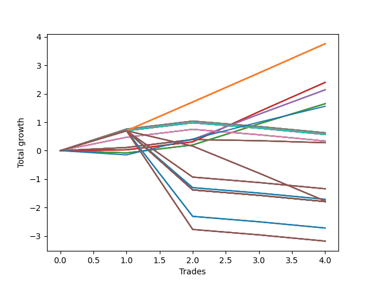

# Short Shepard 005 (1225 Waffles03) 
- Symbol: AAPL_Unlimited
- Date Range: 03/23/2022 - 07/08/2022
- Trading Period: 7:20-12:30
- Number of Trades: 4



| Name | Win Percent | Profit | Avg Profit / Trade | Avg Time / Trade |      | Name | Win Percent | Profit | Avg Profit / Trade | Avg Time / Trade |
| ---- | ----------- | ------ | ------------------ | ---------------- | ---- | ---- | ----------- | ------ | ------------------ | ---------------- |
| Sorted By <br> Profit | | | | | | Sorted By <br> Win Percentage ||||
| One Hundred Twenty-Six | 100.00 | 1880.00 | 470.00 | 16:07 |     | One Hundred Twenty-Six | 100.00 | 1880.00 | 470.00 | 16:07 |
| One Hundred Twenty-One | 100.00 | 1880.00 | 470.00 | 16:07 |     | One Hundred Twenty-One | 100.00 | 1880.00 | 470.00 | 16:07 |
| One Hundred Sixteen | 100.00 | 1880.00 | 470.00 | 16:07 |     | One Hundred Sixteen | 100.00 | 1880.00 | 470.00 | 16:07 |
| One Hundred Eleven | 100.00 | 1880.00 | 470.00 | 16:07 |     | One Hundred Eleven | 100.00 | 1880.00 | 470.00 | 16:07 |
| One Hundred Six | 100.00 | 1880.00 | 470.00 | 16:07 |     | One Hundred Six | 100.00 | 1880.00 | 470.00 | 16:07 |
| One Hundred One | 100.00 | 1880.00 | 470.00 | 16:07 |     | One Hundred One | 100.00 | 1880.00 | 470.00 | 16:07 |
| Ninety-Six | 100.00 | 1880.00 | 470.00 | 16:07 |     | Ninety-Six | 100.00 | 1880.00 | 470.00 | 16:07 |
| Ninety-One | 100.00 | 1880.00 | 470.00 | 16:07 |     | Ninety-One | 100.00 | 1880.00 | 470.00 | 16:07 |
| Eighty-One | 100.00 | 1880.00 | 470.00 | 16:07 |     | Eighty-One | 100.00 | 1880.00 | 470.00 | 16:07 |
| Sixty-Five | 100.00 | 1200.00 | 300.00 | 08:41 |     | Sixty-Five | 100.00 | 1200.00 | 300.00 | 08:41 |
| Fifty-Seven | 100.00 | 1200.00 | 300.00 | 08:41 |     | Fifty-Seven | 100.00 | 1200.00 | 300.00 | 08:41 |
| Forty-Nine | 100.00 | 1200.00 | 300.00 | 08:41 |     | Forty-Nine | 100.00 | 1200.00 | 300.00 | 08:41 |
| Forty-One | 100.00 | 1200.00 | 300.00 | 08:41 |     | Forty-One | 100.00 | 1200.00 | 300.00 | 08:41 |
| One | 100.00 | 1200.00 | 300.00 | 08:41 |     | One | 100.00 | 1200.00 | 300.00 | 08:41 |
| Sixty-Six | 100.00 | 1070.00 | 267.50 | 19:22 |     | Sixty-Six | 100.00 | 1070.00 | 267.50 | 19:22 |
| Fifty-Eight | 100.00 | 1070.00 | 267.50 | 19:22 |     | Fifty-Eight | 100.00 | 1070.00 | 267.50 | 19:22 |
| Fifty | 100.00 | 1070.00 | 267.50 | 19:22 |     | Fifty | 100.00 | 1070.00 | 267.50 | 19:22 |
| Forty-Two | 100.00 | 1070.00 | 267.50 | 19:22 |     | Forty-Two | 100.00 | 1070.00 | 267.50 | 19:22 |
| Two | 100.00 | 1070.00 | 267.50 | 19:22 |     | Two | 100.00 | 1070.00 | 267.50 | 19:22 |
| Sixty-Four | 75.00 | 825.00 | 206.25 | 06:11 |     | Sixty-Four | 75.00 | 825.00 | 206.25 | 06:11 |
| Fifty-Six | 75.00 | 825.00 | 206.25 | 06:11 |     | Fifty-Six | 75.00 | 825.00 | 206.25 | 06:11 |
| Forty-Eight | 75.00 | 825.00 | 206.25 | 06:11 |     | Forty-Eight | 75.00 | 825.00 | 206.25 | 06:11 |
| Forty | 75.00 | 825.00 | 206.25 | 06:11 |     | Forty | 75.00 | 825.00 | 206.25 | 06:11 |
| Zero | 75.00 | 825.00 | 206.25 | 06:11 |     | Zero | 75.00 | 825.00 | 206.25 | 06:11 |
| Seventy-Three | 75.00 | 780.00 | 195.00 | 10:50 |     | Seventy-Three | 75.00 | 780.00 | 195.00 | 10:50 |
| Sixty-Nine | 50.00 | 315.00 | 78.75 | 38:06 |     | Sixty-Nine | 50.00 | 315.00 | 78.75 | 38:06 |
| Sixty-One | 50.00 | 315.00 | 78.75 | 38:06 |     | Sixty-One | 50.00 | 315.00 | 78.75 | 38:06 |
| Fifty-Three | 50.00 | 315.00 | 78.75 | 38:06 |     | Fifty-Three | 50.00 | 315.00 | 78.75 | 38:06 |
| Forty-Five | 50.00 | 315.00 | 78.75 | 38:06 |     | Forty-Five | 50.00 | 315.00 | 78.75 | 38:06 |
| Five | 50.00 | 315.00 | 78.75 | 38:06 |     | Five | 50.00 | 315.00 | 78.75 | 38:06 |
| Seventy-One | 50.00 | 285.00 | 71.25 | 39:47 |     | Seventy-One | 50.00 | 285.00 | 71.25 | 39:47 |
| Seventy | 50.00 | 285.00 | 71.25 | 39:47 |     | Seventy | 50.00 | 285.00 | 71.25 | 39:47 |
| Sixty-Three | 50.00 | 285.00 | 71.25 | 39:47 |     | Sixty-Three | 50.00 | 285.00 | 71.25 | 39:47 |
| Sixty-Two | 50.00 | 285.00 | 71.25 | 39:47 |     | Sixty-Two | 50.00 | 285.00 | 71.25 | 39:47 |
| Fifty-Five | 50.00 | 285.00 | 71.25 | 39:47 |     | Fifty-Five | 50.00 | 285.00 | 71.25 | 39:47 |
| Fifty-Four | 50.00 | 285.00 | 71.25 | 39:47 |     | Fifty-Four | 50.00 | 285.00 | 71.25 | 39:47 |
| Forty-Seven | 50.00 | 285.00 | 71.25 | 39:47 |     | Forty-Seven | 50.00 | 285.00 | 71.25 | 39:47 |
| Forty-Six | 50.00 | 285.00 | 71.25 | 39:47 |     | Forty-Six | 50.00 | 285.00 | 71.25 | 39:47 |
| Seven | 50.00 | 285.00 | 71.25 | 39:47 |     | Seven | 50.00 | 285.00 | 71.25 | 39:47 |
| Six | 50.00 | 285.00 | 71.25 | 39:47 |     | Six | 50.00 | 285.00 | 71.25 | 39:47 |
| Sixty-Eight | 50.00 | 170.00 | 42.50 | 37:10 |     | Sixty-Eight | 50.00 | 170.00 | 42.50 | 37:10 |
| Sixty | 50.00 | 170.00 | 42.50 | 37:10 |     | Sixty | 50.00 | 170.00 | 42.50 | 37:10 |
| Fifty-Two | 50.00 | 170.00 | 42.50 | 37:10 |     | Fifty-Two | 50.00 | 170.00 | 42.50 | 37:10 |
| Forty-Four | 50.00 | 170.00 | 42.50 | 37:10 |     | Forty-Four | 50.00 | 170.00 | 42.50 | 37:10 |
| Four | 50.00 | 170.00 | 42.50 | 37:10 |     | Four | 50.00 | 170.00 | 42.50 | 37:10 |
| Sixty-Seven | 50.00 | 140.00 | 35.00 | 34:38 |     | Sixty-Seven | 50.00 | 140.00 | 35.00 | 34:38 |
| Fifty-Nine | 50.00 | 140.00 | 35.00 | 34:38 |     | Fifty-Nine | 50.00 | 140.00 | 35.00 | 34:38 |
| Fifty-One | 50.00 | 140.00 | 35.00 | 34:38 |     | Fifty-One | 50.00 | 140.00 | 35.00 | 34:38 |
| Forty-Three | 50.00 | 140.00 | 35.00 | 34:38 |     | Forty-Three | 50.00 | 140.00 | 35.00 | 34:38 |
| Three | 50.00 | 140.00 | 35.00 | 34:38 |     | Three | 50.00 | 140.00 | 35.00 | 34:38 |
| One Hundred Ten | 25.00 | -670.00 | -167.50 | 49:16 |     | One Hundred Ten | 25.00 | -670.00 | -167.50 | 49:16 |
| One Hundred Nine | 25.00 | -670.00 | -167.50 | 49:16 |     | One Hundred Nine | 25.00 | -670.00 | -167.50 | 49:16 |
| One Hundred Eight | 25.00 | -670.00 | -167.50 | 49:16 |     | One Hundred Eight | 25.00 | -670.00 | -167.50 | 49:16 |
| One Hundred Seven | 25.00 | -670.00 | -167.50 | 49:16 |     | One Hundred Seven | 25.00 | -670.00 | -167.50 | 49:16 |
| Ninety-Five | 25.00 | -855.00 | -213.75 | 49:18 |     | Ninety-Five | 25.00 | -855.00 | -213.75 | 49:18 |
| Ninety-Four | 25.00 | -855.00 | -213.75 | 49:18 |     | Ninety-Four | 25.00 | -855.00 | -213.75 | 49:18 |
| Ninety-Three | 25.00 | -855.00 | -213.75 | 49:18 |     | Ninety-Three | 25.00 | -855.00 | -213.75 | 49:18 |
| Ninety-Two | 25.00 | -855.00 | -213.75 | 49:18 |     | Ninety-Two | 25.00 | -855.00 | -213.75 | 49:18 |
| One Hundred | 25.00 | -885.00 | -221.25 | 39:37 |     | One Hundred | 25.00 | -885.00 | -221.25 | 39:37 |
| Ninety-Nine | 25.00 | -885.00 | -221.25 | 39:37 |     | Ninety-Nine | 25.00 | -885.00 | -221.25 | 39:37 |
| Ninety-Eight | 25.00 | -885.00 | -221.25 | 39:37 |     | Ninety-Eight | 25.00 | -885.00 | -221.25 | 39:37 |
| Ninety-Seven | 25.00 | -885.00 | -221.25 | 39:37 |     | Ninety-Seven | 25.00 | -885.00 | -221.25 | 39:37 |
| One Hundred Thirty | 25.00 | -895.00 | -223.75 | 65:45 |     | One Hundred Thirty | 25.00 | -895.00 | -223.75 | 65:45 |
| One Hundred Twenty-Nine | 25.00 | -895.00 | -223.75 | 65:45 |     | One Hundred Twenty-Nine | 25.00 | -895.00 | -223.75 | 65:45 |
| One Hundred Twenty-Eight | 25.00 | -895.00 | -223.75 | 65:45 |     | One Hundred Twenty-Eight | 25.00 | -895.00 | -223.75 | 65:45 |
| One Hundred Twenty-Seven | 25.00 | -895.00 | -223.75 | 65:45 |     | One Hundred Twenty-Seven | 25.00 | -895.00 | -223.75 | 65:45 |
| One Hundred Twenty-Five | 25.00 | -895.00 | -223.75 | 65:45 |     | One Hundred Twenty-Five | 25.00 | -895.00 | -223.75 | 65:45 |
| One Hundred Twenty-Four | 25.00 | -895.00 | -223.75 | 65:45 |     | One Hundred Twenty-Four | 25.00 | -895.00 | -223.75 | 65:45 |
| One Hundred Twenty-Three | 25.00 | -895.00 | -223.75 | 65:45 |     | One Hundred Twenty-Three | 25.00 | -895.00 | -223.75 | 65:45 |
| One Hundred Twenty-Two | 25.00 | -895.00 | -223.75 | 65:45 |     | One Hundred Twenty-Two | 25.00 | -895.00 | -223.75 | 65:45 |
| One Hundred Fifteen | 25.00 | -895.00 | -223.75 | 65:45 |     | One Hundred Fifteen | 25.00 | -895.00 | -223.75 | 65:45 |
| One Hundred Fourteen | 25.00 | -895.00 | -223.75 | 65:45 |     | One Hundred Fourteen | 25.00 | -895.00 | -223.75 | 65:45 |
| One Hundred Thirteen | 25.00 | -895.00 | -223.75 | 65:45 |     | One Hundred Thirteen | 25.00 | -895.00 | -223.75 | 65:45 |
| One Hundred Twelve | 25.00 | -895.00 | -223.75 | 65:45 |     | One Hundred Twelve | 25.00 | -895.00 | -223.75 | 65:45 |
| Eighty-Five | 25.00 | -895.00 | -223.75 | 65:45 |     | Eighty-Five | 25.00 | -895.00 | -223.75 | 65:45 |
| Eighty-Four | 25.00 | -895.00 | -223.75 | 65:45 |     | Eighty-Four | 25.00 | -895.00 | -223.75 | 65:45 |
| Eighty-Three | 25.00 | -895.00 | -223.75 | 65:45 |     | Eighty-Three | 25.00 | -895.00 | -223.75 | 65:45 |
| Eighty-Two | 25.00 | -895.00 | -223.75 | 65:45 |     | Eighty-Two | 25.00 | -895.00 | -223.75 | 65:45 |
| One Hundred Five | 25.00 | -1360.00 | -340.00 | 62:02 |     | One Hundred Five | 25.00 | -1360.00 | -340.00 | 62:02 |
| One Hundred Four | 25.00 | -1360.00 | -340.00 | 62:02 |     | One Hundred Four | 25.00 | -1360.00 | -340.00 | 62:02 |
| One Hundred Three | 25.00 | -1360.00 | -340.00 | 62:02 |     | One Hundred Three | 25.00 | -1360.00 | -340.00 | 62:02 |
| One Hundred Two | 25.00 | -1360.00 | -340.00 | 62:02 |     | One Hundred Two | 25.00 | -1360.00 | -340.00 | 62:02 |
| One Hundred Twenty | 25.00 | -1590.00 | -397.50 | 62:43 |     | One Hundred Twenty | 25.00 | -1590.00 | -397.50 | 62:43 |
| One Hundred Ninteen | 25.00 | -1590.00 | -397.50 | 62:43 |     | One Hundred Ninteen | 25.00 | -1590.00 | -397.50 | 62:43 |
| One Hundred Eighteen | 25.00 | -1590.00 | -397.50 | 62:43 |     | One Hundred Eighteen | 25.00 | -1590.00 | -397.50 | 62:43 |
| One Hundred Seventeen | 25.00 | -1590.00 | -397.50 | 62:43 |     | One Hundred Seventeen | 25.00 | -1590.00 | -397.50 | 62:43 |

## NO STOPLOSS

### Test Zero
* Sell when price hits the middle line of the 20p bollinger
* No Stoploss
* Results:
```
Total Trades: 4
Percent Up: 25.00
Percent Down: 75.00
Total Points Moved Down: 1.65
Potential Profit: 825.00
Total Points Ups: 0.08 Count Ups: 1
Total Points Downs: 1.73 Count Downs: 3
```

<details><summary>Trades</summary>

<code>In: 2022-05-25 12:06:00		Out: 2022-05-25 12:18:05		Total Position Time: 12:05		Total Move Down: -0.08		Total to Date: -0.08</code> <br />
<code>In: 2022-06-15 11:02:00		Out: 2022-06-15 11:03:10		Total Position Time: 01:10		Total Move Down: 0.28		Total to Date: 0.20</code> <br />
<code>In: 2022-06-15 11:48:00		Out: 2022-06-15 11:54:15		Total Position Time: 06:15		Total Move Down: 0.74		Total to Date: 0.94</code> <br />
<code>In: 2022-06-15 11:49:00		Out: 2022-06-15 11:54:15		Total Position Time: 05:15		Total Move Down: 0.71		Total to Date: 1.65</code> <br />


</details>

### Test One
* Sell when the price hits the upper line of the 20p 1std bollinger
* No Stoploss
* Results:
```
Total Trades: 4
Percent Up: 0.00
Percent Down: 100.00
Total Points Moved Down: 2.40
Potential Profit: 1200.00
Total Points Ups: 0.00 Count Ups: 0
Total Points Downs: 2.40 Count Downs: 4
```

<details><summary>Trades</summary>

<code>In: 2022-05-25 12:06:00		Out: 2022-05-25 12:20:25		Total Position Time: 14:25		Total Move Down: 0.03		Total to Date: 0.03</code> <br />
<code>In: 2022-06-15 11:02:00		Out: 2022-06-15 11:03:10		Total Position Time: 01:10		Total Move Down: 0.28		Total to Date: 0.31</code> <br />
<code>In: 2022-06-15 11:48:00		Out: 2022-06-15 11:58:05		Total Position Time: 10:05		Total Move Down: 1.06		Total to Date: 1.37</code> <br />
<code>In: 2022-06-15 11:49:00		Out: 2022-06-15 11:58:05		Total Position Time: 09:05		Total Move Down: 1.03		Total to Date: 2.40</code> <br />


</details>

### Test Two
* Sell when the price hits the upper line of the 20p 2std bollinger
* No Stoploss
* Results:
```
Total Trades: 4
Percent Up: 0.00
Percent Down: 100.00
Total Points Moved Down: 2.14
Potential Profit: 1070.00
Total Points Ups: 0.00 Count Ups: 0
Total Points Downs: 2.14 Count Downs: 4
```

<details><summary>Trades</summary>

<code>In: 2022-05-25 12:06:00		Out: 2022-05-25 12:33:10		Total Position Time: 27:10		Total Move Down: 0.11		Total to Date: 0.11</code> <br />
<code>In: 2022-06-15 11:02:00		Out: 2022-06-15 11:03:10		Total Position Time: 01:10		Total Move Down: 0.28		Total to Date: 0.39</code> <br />
<code>In: 2022-06-15 11:48:00		Out: 2022-06-15 12:13:05		Total Position Time: 25:05		Total Move Down: 0.89		Total to Date: 1.28</code> <br />
<code>In: 2022-06-15 11:49:00		Out: 2022-06-15 12:13:05		Total Position Time: 24:05		Total Move Down: 0.86		Total to Date: 2.14</code> <br />


</details>

### Test Three
* Sell when price hits the middle line of the 50p bollinger
* No Stoploss
* Results:
```
Total Trades: 4
Percent Up: 50.00
Percent Down: 50.00
Total Points Moved Down: 0.28
Potential Profit: 140.00
Total Points Ups: 0.11 Count Ups: 2
Total Points Downs: 0.39 Count Downs: 2
```

<details><summary>Trades</summary>

<code>In: 2022-05-25 12:06:00		Out: 2022-05-25 12:34:15		Total Position Time: 28:15		Total Move Down: 0.11		Total to Date: 0.11</code> <br />
<code>In: 2022-06-15 11:02:00		Out: 2022-06-15 11:03:10		Total Position Time: 01:10		Total Move Down: 0.28		Total to Date: 0.39</code> <br />
<code>In: 2022-06-15 11:48:00		Out: 2022-06-15 12:43:05		Total Position Time: 55:05		Total Move Down: -0.04		Total to Date: 0.35</code> <br />
<code>In: 2022-06-15 11:49:00		Out: 2022-06-15 12:43:05		Total Position Time: 54:05		Total Move Down: -0.07		Total to Date: 0.28</code> <br />


</details>

### Test Four
* Sell when the price hits the upper line of the 50p 1std bollinger
* No Stoploss
* Results:
```
Total Trades: 4
Percent Up: 50.00
Percent Down: 50.00
Total Points Moved Down: 0.34
Potential Profit: 170.00
Total Points Ups: 0.41 Count Ups: 2
Total Points Downs: 0.75 Count Downs: 2
```

<details><summary>Trades</summary>

<code>In: 2022-05-25 12:06:00		Out: 2022-05-25 12:36:30		Total Position Time: 30:30		Total Move Down: 0.47		Total to Date: 0.47</code> <br />
<code>In: 2022-06-15 11:02:00		Out: 2022-06-15 11:03:10		Total Position Time: 01:10		Total Move Down: 0.28		Total to Date: 0.75</code> <br />
<code>In: 2022-06-15 11:48:00		Out: 2022-06-15 12:47:00		Total Position Time: 59:00		Total Move Down: -0.19		Total to Date: 0.56</code> <br />
<code>In: 2022-06-15 11:49:00		Out: 2022-06-15 12:47:00		Total Position Time: 58:00		Total Move Down: -0.22		Total to Date: 0.34</code> <br />


</details>

### Test Five
* Sell when the price hits the upper line of the 50p 2std bollinger
* No Stoploss
* Results:
```
Total Trades: 4
Percent Up: 50.00
Percent Down: 50.00
Total Points Moved Down: 0.63
Potential Profit: 315.00
Total Points Ups: 0.41 Count Ups: 2
Total Points Downs: 1.04 Count Downs: 2
```

<details><summary>Trades</summary>

<code>In: 2022-05-25 12:06:00		Out: 2022-05-25 12:40:15		Total Position Time: 34:15		Total Move Down: 0.76		Total to Date: 0.76</code> <br />
<code>In: 2022-06-15 11:02:00		Out: 2022-06-15 11:03:10		Total Position Time: 01:10		Total Move Down: 0.28		Total to Date: 1.04</code> <br />
<code>In: 2022-06-15 11:48:00		Out: 2022-06-15 12:47:00		Total Position Time: 59:00		Total Move Down: -0.19		Total to Date: 0.85</code> <br />
<code>In: 2022-06-15 11:49:00		Out: 2022-06-15 12:47:00		Total Position Time: 58:00		Total Move Down: -0.22		Total to Date: 0.63</code> <br />


</details>

### Test Six
* Sell when the price hits the middle line of the 1std VWAP
* No Stoploss
* Results:
```
Total Trades: 4
Percent Up: 50.00
Percent Down: 50.00
Total Points Moved Down: 0.57
Potential Profit: 285.00
Total Points Ups: 0.41 Count Ups: 2
Total Points Downs: 0.98 Count Downs: 2
```

<details><summary>Trades</summary>

<code>In: 2022-05-25 12:06:00		Out: 2022-05-25 12:47:00		Total Position Time: 41:00		Total Move Down: 0.70		Total to Date: 0.70</code> <br />
<code>In: 2022-06-15 11:02:00		Out: 2022-06-15 11:03:10		Total Position Time: 01:10		Total Move Down: 0.28		Total to Date: 0.98</code> <br />
<code>In: 2022-06-15 11:48:00		Out: 2022-06-15 12:47:00		Total Position Time: 59:00		Total Move Down: -0.19		Total to Date: 0.79</code> <br />
<code>In: 2022-06-15 11:49:00		Out: 2022-06-15 12:47:00		Total Position Time: 58:00		Total Move Down: -0.22		Total to Date: 0.57</code> <br />


</details>

### Test Seven
* Sell when the price hits the upper line of the 1std VWAP
* No Stoploss
* Results:
```
Total Trades: 4
Percent Up: 50.00
Percent Down: 50.00
Total Points Moved Down: 0.57
Potential Profit: 285.00
Total Points Ups: 0.41 Count Ups: 2
Total Points Downs: 0.98 Count Downs: 2
```

<details><summary>Trades</summary>

<code>In: 2022-05-25 12:06:00		Out: 2022-05-25 12:47:00		Total Position Time: 41:00		Total Move Down: 0.70		Total to Date: 0.70</code> <br />
<code>In: 2022-06-15 11:02:00		Out: 2022-06-15 11:03:10		Total Position Time: 01:10		Total Move Down: 0.28		Total to Date: 0.98</code> <br />
<code>In: 2022-06-15 11:48:00		Out: 2022-06-15 12:47:00		Total Position Time: 59:00		Total Move Down: -0.19		Total to Date: 0.79</code> <br />
<code>In: 2022-06-15 11:49:00		Out: 2022-06-15 12:47:00		Total Position Time: 58:00		Total Move Down: -0.22		Total to Date: 0.57</code> <br />


</details>

## STOPLOSS OF 5

### Test Forty
* Sell when price hits the middle line of the 20p bollinger
* Stoploss is -5 points
* Results:
```
Total Trades: 4
Percent Up: 25.00
Percent Down: 75.00
Total Points Moved Down: 1.65
Potential Profit: 825.00
Total Points Ups: 0.08 Count Ups: 1
Total Points Downs: 1.73 Count Downs: 3
```

<details><summary>Trades</summary>

<code>In: 2022-05-25 12:06:00		Out: 2022-05-25 12:18:05		Total Position Time: 12:05		Total Move Down: -0.08		Total to Date: -0.08</code> <br />
<code>In: 2022-06-15 11:02:00		Out: 2022-06-15 11:03:10		Total Position Time: 01:10		Total Move Down: 0.28		Total to Date: 0.20</code> <br />
<code>In: 2022-06-15 11:48:00		Out: 2022-06-15 11:54:15		Total Position Time: 06:15		Total Move Down: 0.74		Total to Date: 0.94</code> <br />
<code>In: 2022-06-15 11:49:00		Out: 2022-06-15 11:54:15		Total Position Time: 05:15		Total Move Down: 0.71		Total to Date: 1.65</code> <br />


</details>

### Test Forty-One
* Sell when the price hits the upper line of the 20p 1std bollinger
* Stoploss is -5 points
* Results:
```
Total Trades: 4
Percent Up: 0.00
Percent Down: 100.00
Total Points Moved Down: 2.40
Potential Profit: 1200.00
Total Points Ups: 0.00 Count Ups: 0
Total Points Downs: 2.40 Count Downs: 4
```

<details><summary>Trades</summary>

<code>In: 2022-05-25 12:06:00		Out: 2022-05-25 12:20:25		Total Position Time: 14:25		Total Move Down: 0.03		Total to Date: 0.03</code> <br />
<code>In: 2022-06-15 11:02:00		Out: 2022-06-15 11:03:10		Total Position Time: 01:10		Total Move Down: 0.28		Total to Date: 0.31</code> <br />
<code>In: 2022-06-15 11:48:00		Out: 2022-06-15 11:58:05		Total Position Time: 10:05		Total Move Down: 1.06		Total to Date: 1.37</code> <br />
<code>In: 2022-06-15 11:49:00		Out: 2022-06-15 11:58:05		Total Position Time: 09:05		Total Move Down: 1.03		Total to Date: 2.40</code> <br />


</details>

### Test Forty-Two
* Sell when the price hits the upper line of the 20p 2std bollinger
* Stoploss is -5 points
* Results:
```
Total Trades: 4
Percent Up: 0.00
Percent Down: 100.00
Total Points Moved Down: 2.14
Potential Profit: 1070.00
Total Points Ups: 0.00 Count Ups: 0
Total Points Downs: 2.14 Count Downs: 4
```

<details><summary>Trades</summary>

<code>In: 2022-05-25 12:06:00		Out: 2022-05-25 12:33:10		Total Position Time: 27:10		Total Move Down: 0.11		Total to Date: 0.11</code> <br />
<code>In: 2022-06-15 11:02:00		Out: 2022-06-15 11:03:10		Total Position Time: 01:10		Total Move Down: 0.28		Total to Date: 0.39</code> <br />
<code>In: 2022-06-15 11:48:00		Out: 2022-06-15 12:13:05		Total Position Time: 25:05		Total Move Down: 0.89		Total to Date: 1.28</code> <br />
<code>In: 2022-06-15 11:49:00		Out: 2022-06-15 12:13:05		Total Position Time: 24:05		Total Move Down: 0.86		Total to Date: 2.14</code> <br />


</details>

### Test Forty-Three
* Sell when price hits the middle line of the 50p bollinger
* Stoploss is -5 points
* Results:
```
Total Trades: 4
Percent Up: 50.00
Percent Down: 50.00
Total Points Moved Down: 0.28
Potential Profit: 140.00
Total Points Ups: 0.11 Count Ups: 2
Total Points Downs: 0.39 Count Downs: 2
```

<details><summary>Trades</summary>

<code>In: 2022-05-25 12:06:00		Out: 2022-05-25 12:34:15		Total Position Time: 28:15		Total Move Down: 0.11		Total to Date: 0.11</code> <br />
<code>In: 2022-06-15 11:02:00		Out: 2022-06-15 11:03:10		Total Position Time: 01:10		Total Move Down: 0.28		Total to Date: 0.39</code> <br />
<code>In: 2022-06-15 11:48:00		Out: 2022-06-15 12:43:05		Total Position Time: 55:05		Total Move Down: -0.04		Total to Date: 0.35</code> <br />
<code>In: 2022-06-15 11:49:00		Out: 2022-06-15 12:43:05		Total Position Time: 54:05		Total Move Down: -0.07		Total to Date: 0.28</code> <br />


</details>

### Test Forty-Four
* Sell when the price hits the upper line of the 50p 1std bollinger
* Stoploss is -5 points
* Results:
```
Total Trades: 4
Percent Up: 50.00
Percent Down: 50.00
Total Points Moved Down: 0.34
Potential Profit: 170.00
Total Points Ups: 0.41 Count Ups: 2
Total Points Downs: 0.75 Count Downs: 2
```

<details><summary>Trades</summary>

<code>In: 2022-05-25 12:06:00		Out: 2022-05-25 12:36:30		Total Position Time: 30:30		Total Move Down: 0.47		Total to Date: 0.47</code> <br />
<code>In: 2022-06-15 11:02:00		Out: 2022-06-15 11:03:10		Total Position Time: 01:10		Total Move Down: 0.28		Total to Date: 0.75</code> <br />
<code>In: 2022-06-15 11:48:00		Out: 2022-06-15 12:47:00		Total Position Time: 59:00		Total Move Down: -0.19		Total to Date: 0.56</code> <br />
<code>In: 2022-06-15 11:49:00		Out: 2022-06-15 12:47:00		Total Position Time: 58:00		Total Move Down: -0.22		Total to Date: 0.34</code> <br />


</details>

### Test Forty-Five
* Sell when the price hits the upper line of the 50p 2std bollinger
* Stoploss is -5 points
* Results:
```
Total Trades: 4
Percent Up: 50.00
Percent Down: 50.00
Total Points Moved Down: 0.63
Potential Profit: 315.00
Total Points Ups: 0.41 Count Ups: 2
Total Points Downs: 1.04 Count Downs: 2
```

<details><summary>Trades</summary>

<code>In: 2022-05-25 12:06:00		Out: 2022-05-25 12:40:15		Total Position Time: 34:15		Total Move Down: 0.76		Total to Date: 0.76</code> <br />
<code>In: 2022-06-15 11:02:00		Out: 2022-06-15 11:03:10		Total Position Time: 01:10		Total Move Down: 0.28		Total to Date: 1.04</code> <br />
<code>In: 2022-06-15 11:48:00		Out: 2022-06-15 12:47:00		Total Position Time: 59:00		Total Move Down: -0.19		Total to Date: 0.85</code> <br />
<code>In: 2022-06-15 11:49:00		Out: 2022-06-15 12:47:00		Total Position Time: 58:00		Total Move Down: -0.22		Total to Date: 0.63</code> <br />


</details>

### Test Forty-Six
* Sell when the price hits the middle line of the 1std VWAP
* Stoploss is -5 points
* Results:
```
Total Trades: 4
Percent Up: 50.00
Percent Down: 50.00
Total Points Moved Down: 0.57
Potential Profit: 285.00
Total Points Ups: 0.41 Count Ups: 2
Total Points Downs: 0.98 Count Downs: 2
```

<details><summary>Trades</summary>

<code>In: 2022-05-25 12:06:00		Out: 2022-05-25 12:47:00		Total Position Time: 41:00		Total Move Down: 0.70		Total to Date: 0.70</code> <br />
<code>In: 2022-06-15 11:02:00		Out: 2022-06-15 11:03:10		Total Position Time: 01:10		Total Move Down: 0.28		Total to Date: 0.98</code> <br />
<code>In: 2022-06-15 11:48:00		Out: 2022-06-15 12:47:00		Total Position Time: 59:00		Total Move Down: -0.19		Total to Date: 0.79</code> <br />
<code>In: 2022-06-15 11:49:00		Out: 2022-06-15 12:47:00		Total Position Time: 58:00		Total Move Down: -0.22		Total to Date: 0.57</code> <br />


</details>

### Test Forty-Seven
* Sell when the price hits the upper line of the 1std VWAP
* Stoploss is -5 points
* Results:
```
Total Trades: 4
Percent Up: 50.00
Percent Down: 50.00
Total Points Moved Down: 0.57
Potential Profit: 285.00
Total Points Ups: 0.41 Count Ups: 2
Total Points Downs: 0.98 Count Downs: 2
```

<details><summary>Trades</summary>

<code>In: 2022-05-25 12:06:00		Out: 2022-05-25 12:47:00		Total Position Time: 41:00		Total Move Down: 0.70		Total to Date: 0.70</code> <br />
<code>In: 2022-06-15 11:02:00		Out: 2022-06-15 11:03:10		Total Position Time: 01:10		Total Move Down: 0.28		Total to Date: 0.98</code> <br />
<code>In: 2022-06-15 11:48:00		Out: 2022-06-15 12:47:00		Total Position Time: 59:00		Total Move Down: -0.19		Total to Date: 0.79</code> <br />
<code>In: 2022-06-15 11:49:00		Out: 2022-06-15 12:47:00		Total Position Time: 58:00		Total Move Down: -0.22		Total to Date: 0.57</code> <br />


</details>

## TRAIL STOP OF 5

### Test Forty-Eight
* Sell when price hits the middle line of the 20p bollinger
* Trailing Stop is -5 points
* Results:
```
Total Trades: 4
Percent Up: 25.00
Percent Down: 75.00
Total Points Moved Down: 1.65
Potential Profit: 825.00
Total Points Ups: 0.08 Count Ups: 1
Total Points Downs: 1.73 Count Downs: 3
```

<details><summary>Trades</summary>

<code>In: 2022-05-25 12:06:00		Out: 2022-05-25 12:18:05		Total Position Time: 12:05		Total Move Down: -0.08		Total to Date: -0.08</code> <br />
<code>In: 2022-06-15 11:02:00		Out: 2022-06-15 11:03:10		Total Position Time: 01:10		Total Move Down: 0.28		Total to Date: 0.20</code> <br />
<code>In: 2022-06-15 11:48:00		Out: 2022-06-15 11:54:15		Total Position Time: 06:15		Total Move Down: 0.74		Total to Date: 0.94</code> <br />
<code>In: 2022-06-15 11:49:00		Out: 2022-06-15 11:54:15		Total Position Time: 05:15		Total Move Down: 0.71		Total to Date: 1.65</code> <br />


</details>

### Test Forty-Nine
* Sell when the price hits the upper line of the 20p 1std bollinger
* Trailing Stop is -5 points
* Results:
```
Total Trades: 4
Percent Up: 0.00
Percent Down: 100.00
Total Points Moved Down: 2.40
Potential Profit: 1200.00
Total Points Ups: 0.00 Count Ups: 0
Total Points Downs: 2.40 Count Downs: 4
```

<details><summary>Trades</summary>

<code>In: 2022-05-25 12:06:00		Out: 2022-05-25 12:20:25		Total Position Time: 14:25		Total Move Down: 0.03		Total to Date: 0.03</code> <br />
<code>In: 2022-06-15 11:02:00		Out: 2022-06-15 11:03:10		Total Position Time: 01:10		Total Move Down: 0.28		Total to Date: 0.31</code> <br />
<code>In: 2022-06-15 11:48:00		Out: 2022-06-15 11:58:05		Total Position Time: 10:05		Total Move Down: 1.06		Total to Date: 1.37</code> <br />
<code>In: 2022-06-15 11:49:00		Out: 2022-06-15 11:58:05		Total Position Time: 09:05		Total Move Down: 1.03		Total to Date: 2.40</code> <br />


</details>

### Test Fifty
* Sell when the price hits the upper line of the 20p 2std bollinger
* Trailing Stop is -5 points
* Results:
```
Total Trades: 4
Percent Up: 0.00
Percent Down: 100.00
Total Points Moved Down: 2.14
Potential Profit: 1070.00
Total Points Ups: 0.00 Count Ups: 0
Total Points Downs: 2.14 Count Downs: 4
```

<details><summary>Trades</summary>

<code>In: 2022-05-25 12:06:00		Out: 2022-05-25 12:33:10		Total Position Time: 27:10		Total Move Down: 0.11		Total to Date: 0.11</code> <br />
<code>In: 2022-06-15 11:02:00		Out: 2022-06-15 11:03:10		Total Position Time: 01:10		Total Move Down: 0.28		Total to Date: 0.39</code> <br />
<code>In: 2022-06-15 11:48:00		Out: 2022-06-15 12:13:05		Total Position Time: 25:05		Total Move Down: 0.89		Total to Date: 1.28</code> <br />
<code>In: 2022-06-15 11:49:00		Out: 2022-06-15 12:13:05		Total Position Time: 24:05		Total Move Down: 0.86		Total to Date: 2.14</code> <br />


</details>

### Test Fifty-One
* Sell when price hits the middle line of the 50p bollinger
* Trailing Stop is -5 points
* Results:
```
Total Trades: 4
Percent Up: 50.00
Percent Down: 50.00
Total Points Moved Down: 0.28
Potential Profit: 140.00
Total Points Ups: 0.11 Count Ups: 2
Total Points Downs: 0.39 Count Downs: 2
```

<details><summary>Trades</summary>

<code>In: 2022-05-25 12:06:00		Out: 2022-05-25 12:34:15		Total Position Time: 28:15		Total Move Down: 0.11		Total to Date: 0.11</code> <br />
<code>In: 2022-06-15 11:02:00		Out: 2022-06-15 11:03:10		Total Position Time: 01:10		Total Move Down: 0.28		Total to Date: 0.39</code> <br />
<code>In: 2022-06-15 11:48:00		Out: 2022-06-15 12:43:05		Total Position Time: 55:05		Total Move Down: -0.04		Total to Date: 0.35</code> <br />
<code>In: 2022-06-15 11:49:00		Out: 2022-06-15 12:43:05		Total Position Time: 54:05		Total Move Down: -0.07		Total to Date: 0.28</code> <br />


</details>

### Test Fifty-Two
* Sell when the price hits the upper line of the 50p 1std bollinger
* Trailing Stop is -5 points
* Results:
```
Total Trades: 4
Percent Up: 50.00
Percent Down: 50.00
Total Points Moved Down: 0.34
Potential Profit: 170.00
Total Points Ups: 0.41 Count Ups: 2
Total Points Downs: 0.75 Count Downs: 2
```

<details><summary>Trades</summary>

<code>In: 2022-05-25 12:06:00		Out: 2022-05-25 12:36:30		Total Position Time: 30:30		Total Move Down: 0.47		Total to Date: 0.47</code> <br />
<code>In: 2022-06-15 11:02:00		Out: 2022-06-15 11:03:10		Total Position Time: 01:10		Total Move Down: 0.28		Total to Date: 0.75</code> <br />
<code>In: 2022-06-15 11:48:00		Out: 2022-06-15 12:47:00		Total Position Time: 59:00		Total Move Down: -0.19		Total to Date: 0.56</code> <br />
<code>In: 2022-06-15 11:49:00		Out: 2022-06-15 12:47:00		Total Position Time: 58:00		Total Move Down: -0.22		Total to Date: 0.34</code> <br />


</details>

### Test Fifty-Three
* Sell when the price hits the upper line of the 50p 2std bollinger
* Trailing Stop is -5 points
* Results:
```
Total Trades: 4
Percent Up: 50.00
Percent Down: 50.00
Total Points Moved Down: 0.63
Potential Profit: 315.00
Total Points Ups: 0.41 Count Ups: 2
Total Points Downs: 1.04 Count Downs: 2
```

<details><summary>Trades</summary>

<code>In: 2022-05-25 12:06:00		Out: 2022-05-25 12:40:15		Total Position Time: 34:15		Total Move Down: 0.76		Total to Date: 0.76</code> <br />
<code>In: 2022-06-15 11:02:00		Out: 2022-06-15 11:03:10		Total Position Time: 01:10		Total Move Down: 0.28		Total to Date: 1.04</code> <br />
<code>In: 2022-06-15 11:48:00		Out: 2022-06-15 12:47:00		Total Position Time: 59:00		Total Move Down: -0.19		Total to Date: 0.85</code> <br />
<code>In: 2022-06-15 11:49:00		Out: 2022-06-15 12:47:00		Total Position Time: 58:00		Total Move Down: -0.22		Total to Date: 0.63</code> <br />


</details>

### Test Fifty-Four
* Sell when the price hits the middle line of the 1std VWAP
* Trailing Stop is -5 points
* Results:
```
Total Trades: 4
Percent Up: 50.00
Percent Down: 50.00
Total Points Moved Down: 0.57
Potential Profit: 285.00
Total Points Ups: 0.41 Count Ups: 2
Total Points Downs: 0.98 Count Downs: 2
```

<details><summary>Trades</summary>

<code>In: 2022-05-25 12:06:00		Out: 2022-05-25 12:47:00		Total Position Time: 41:00		Total Move Down: 0.70		Total to Date: 0.70</code> <br />
<code>In: 2022-06-15 11:02:00		Out: 2022-06-15 11:03:10		Total Position Time: 01:10		Total Move Down: 0.28		Total to Date: 0.98</code> <br />
<code>In: 2022-06-15 11:48:00		Out: 2022-06-15 12:47:00		Total Position Time: 59:00		Total Move Down: -0.19		Total to Date: 0.79</code> <br />
<code>In: 2022-06-15 11:49:00		Out: 2022-06-15 12:47:00		Total Position Time: 58:00		Total Move Down: -0.22		Total to Date: 0.57</code> <br />


</details>

### Test Fifty-Five
* Sell when the price hits the upper line of the 1std VWAP
* Trailing Stop is -5 points
* Results:
```
Total Trades: 4
Percent Up: 50.00
Percent Down: 50.00
Total Points Moved Down: 0.57
Potential Profit: 285.00
Total Points Ups: 0.41 Count Ups: 2
Total Points Downs: 0.98 Count Downs: 2
```

<details><summary>Trades</summary>

<code>In: 2022-05-25 12:06:00		Out: 2022-05-25 12:47:00		Total Position Time: 41:00		Total Move Down: 0.70		Total to Date: 0.70</code> <br />
<code>In: 2022-06-15 11:02:00		Out: 2022-06-15 11:03:10		Total Position Time: 01:10		Total Move Down: 0.28		Total to Date: 0.98</code> <br />
<code>In: 2022-06-15 11:48:00		Out: 2022-06-15 12:47:00		Total Position Time: 59:00		Total Move Down: -0.19		Total to Date: 0.79</code> <br />
<code>In: 2022-06-15 11:49:00		Out: 2022-06-15 12:47:00		Total Position Time: 58:00		Total Move Down: -0.22		Total to Date: 0.57</code> <br />


</details>

## STOPLOSS OF 10

### Test Fifty-Six
* Sell when price hits the middle line of the 20p bollinger
* Stoploss is -10 points
* Results:
```
Total Trades: 4
Percent Up: 25.00
Percent Down: 75.00
Total Points Moved Down: 1.65
Potential Profit: 825.00
Total Points Ups: 0.08 Count Ups: 1
Total Points Downs: 1.73 Count Downs: 3
```

<details><summary>Trades</summary>

<code>In: 2022-05-25 12:06:00		Out: 2022-05-25 12:18:05		Total Position Time: 12:05		Total Move Down: -0.08		Total to Date: -0.08</code> <br />
<code>In: 2022-06-15 11:02:00		Out: 2022-06-15 11:03:10		Total Position Time: 01:10		Total Move Down: 0.28		Total to Date: 0.20</code> <br />
<code>In: 2022-06-15 11:48:00		Out: 2022-06-15 11:54:15		Total Position Time: 06:15		Total Move Down: 0.74		Total to Date: 0.94</code> <br />
<code>In: 2022-06-15 11:49:00		Out: 2022-06-15 11:54:15		Total Position Time: 05:15		Total Move Down: 0.71		Total to Date: 1.65</code> <br />


</details>

### Test Fifty-Seven
* Sell when the price hits the upper line of the 20p 1std bollinger
* Stoploss is -10 points
* Results:
```
Total Trades: 4
Percent Up: 0.00
Percent Down: 100.00
Total Points Moved Down: 2.40
Potential Profit: 1200.00
Total Points Ups: 0.00 Count Ups: 0
Total Points Downs: 2.40 Count Downs: 4
```

<details><summary>Trades</summary>

<code>In: 2022-05-25 12:06:00		Out: 2022-05-25 12:20:25		Total Position Time: 14:25		Total Move Down: 0.03		Total to Date: 0.03</code> <br />
<code>In: 2022-06-15 11:02:00		Out: 2022-06-15 11:03:10		Total Position Time: 01:10		Total Move Down: 0.28		Total to Date: 0.31</code> <br />
<code>In: 2022-06-15 11:48:00		Out: 2022-06-15 11:58:05		Total Position Time: 10:05		Total Move Down: 1.06		Total to Date: 1.37</code> <br />
<code>In: 2022-06-15 11:49:00		Out: 2022-06-15 11:58:05		Total Position Time: 09:05		Total Move Down: 1.03		Total to Date: 2.40</code> <br />


</details>

### Test Fifty-Eight
* Sell when the price hits the upper line of the 20p 2std bollinger
* Stoploss is -10 points
* Results:
```
Total Trades: 4
Percent Up: 0.00
Percent Down: 100.00
Total Points Moved Down: 2.14
Potential Profit: 1070.00
Total Points Ups: 0.00 Count Ups: 0
Total Points Downs: 2.14 Count Downs: 4
```

<details><summary>Trades</summary>

<code>In: 2022-05-25 12:06:00		Out: 2022-05-25 12:33:10		Total Position Time: 27:10		Total Move Down: 0.11		Total to Date: 0.11</code> <br />
<code>In: 2022-06-15 11:02:00		Out: 2022-06-15 11:03:10		Total Position Time: 01:10		Total Move Down: 0.28		Total to Date: 0.39</code> <br />
<code>In: 2022-06-15 11:48:00		Out: 2022-06-15 12:13:05		Total Position Time: 25:05		Total Move Down: 0.89		Total to Date: 1.28</code> <br />
<code>In: 2022-06-15 11:49:00		Out: 2022-06-15 12:13:05		Total Position Time: 24:05		Total Move Down: 0.86		Total to Date: 2.14</code> <br />


</details>

### Test Fifty-Nine
* Sell when price hits the middle line of the 50p bollinger
* Stoploss is -10 points
* Results:
```
Total Trades: 4
Percent Up: 50.00
Percent Down: 50.00
Total Points Moved Down: 0.28
Potential Profit: 140.00
Total Points Ups: 0.11 Count Ups: 2
Total Points Downs: 0.39 Count Downs: 2
```

<details><summary>Trades</summary>

<code>In: 2022-05-25 12:06:00		Out: 2022-05-25 12:34:15		Total Position Time: 28:15		Total Move Down: 0.11		Total to Date: 0.11</code> <br />
<code>In: 2022-06-15 11:02:00		Out: 2022-06-15 11:03:10		Total Position Time: 01:10		Total Move Down: 0.28		Total to Date: 0.39</code> <br />
<code>In: 2022-06-15 11:48:00		Out: 2022-06-15 12:43:05		Total Position Time: 55:05		Total Move Down: -0.04		Total to Date: 0.35</code> <br />
<code>In: 2022-06-15 11:49:00		Out: 2022-06-15 12:43:05		Total Position Time: 54:05		Total Move Down: -0.07		Total to Date: 0.28</code> <br />


</details>

### Test Sixty
* Sell when the price hits the upper line of the 50p 1std bollinger
* Stoploss is -10 points
* Results:
```
Total Trades: 4
Percent Up: 50.00
Percent Down: 50.00
Total Points Moved Down: 0.34
Potential Profit: 170.00
Total Points Ups: 0.41 Count Ups: 2
Total Points Downs: 0.75 Count Downs: 2
```

<details><summary>Trades</summary>

<code>In: 2022-05-25 12:06:00		Out: 2022-05-25 12:36:30		Total Position Time: 30:30		Total Move Down: 0.47		Total to Date: 0.47</code> <br />
<code>In: 2022-06-15 11:02:00		Out: 2022-06-15 11:03:10		Total Position Time: 01:10		Total Move Down: 0.28		Total to Date: 0.75</code> <br />
<code>In: 2022-06-15 11:48:00		Out: 2022-06-15 12:47:00		Total Position Time: 59:00		Total Move Down: -0.19		Total to Date: 0.56</code> <br />
<code>In: 2022-06-15 11:49:00		Out: 2022-06-15 12:47:00		Total Position Time: 58:00		Total Move Down: -0.22		Total to Date: 0.34</code> <br />


</details>

### Test Sixty-One
* Sell when the price hits the upper line of the 50p 2std bollinger
* Stoploss is -10 points
* Results:
```
Total Trades: 4
Percent Up: 50.00
Percent Down: 50.00
Total Points Moved Down: 0.63
Potential Profit: 315.00
Total Points Ups: 0.41 Count Ups: 2
Total Points Downs: 1.04 Count Downs: 2
```

<details><summary>Trades</summary>

<code>In: 2022-05-25 12:06:00		Out: 2022-05-25 12:40:15		Total Position Time: 34:15		Total Move Down: 0.76		Total to Date: 0.76</code> <br />
<code>In: 2022-06-15 11:02:00		Out: 2022-06-15 11:03:10		Total Position Time: 01:10		Total Move Down: 0.28		Total to Date: 1.04</code> <br />
<code>In: 2022-06-15 11:48:00		Out: 2022-06-15 12:47:00		Total Position Time: 59:00		Total Move Down: -0.19		Total to Date: 0.85</code> <br />
<code>In: 2022-06-15 11:49:00		Out: 2022-06-15 12:47:00		Total Position Time: 58:00		Total Move Down: -0.22		Total to Date: 0.63</code> <br />


</details>

### Test Sixty-Two
* Sell when the price hits the middle line of the 1std VWAP
* Stoploss is -10 points
* Results:
```
Total Trades: 4
Percent Up: 50.00
Percent Down: 50.00
Total Points Moved Down: 0.57
Potential Profit: 285.00
Total Points Ups: 0.41 Count Ups: 2
Total Points Downs: 0.98 Count Downs: 2
```

<details><summary>Trades</summary>

<code>In: 2022-05-25 12:06:00		Out: 2022-05-25 12:47:00		Total Position Time: 41:00		Total Move Down: 0.70		Total to Date: 0.70</code> <br />
<code>In: 2022-06-15 11:02:00		Out: 2022-06-15 11:03:10		Total Position Time: 01:10		Total Move Down: 0.28		Total to Date: 0.98</code> <br />
<code>In: 2022-06-15 11:48:00		Out: 2022-06-15 12:47:00		Total Position Time: 59:00		Total Move Down: -0.19		Total to Date: 0.79</code> <br />
<code>In: 2022-06-15 11:49:00		Out: 2022-06-15 12:47:00		Total Position Time: 58:00		Total Move Down: -0.22		Total to Date: 0.57</code> <br />


</details>

### Test Sixty-Three
* Sell when the price hits the upper line of the 1std VWAP
* Stoploss is -10 points
* Results:
```
Total Trades: 4
Percent Up: 50.00
Percent Down: 50.00
Total Points Moved Down: 0.57
Potential Profit: 285.00
Total Points Ups: 0.41 Count Ups: 2
Total Points Downs: 0.98 Count Downs: 2
```

<details><summary>Trades</summary>

<code>In: 2022-05-25 12:06:00		Out: 2022-05-25 12:47:00		Total Position Time: 41:00		Total Move Down: 0.70		Total to Date: 0.70</code> <br />
<code>In: 2022-06-15 11:02:00		Out: 2022-06-15 11:03:10		Total Position Time: 01:10		Total Move Down: 0.28		Total to Date: 0.98</code> <br />
<code>In: 2022-06-15 11:48:00		Out: 2022-06-15 12:47:00		Total Position Time: 59:00		Total Move Down: -0.19		Total to Date: 0.79</code> <br />
<code>In: 2022-06-15 11:49:00		Out: 2022-06-15 12:47:00		Total Position Time: 58:00		Total Move Down: -0.22		Total to Date: 0.57</code> <br />


</details>

## TRAIL STOP OF 10

### Test Sixty-Four
* Sell when price hits the middle line of the 20p bollinger
* Trailing Stop is -10 points
* Results:
```
Total Trades: 4
Percent Up: 25.00
Percent Down: 75.00
Total Points Moved Down: 1.65
Potential Profit: 825.00
Total Points Ups: 0.08 Count Ups: 1
Total Points Downs: 1.73 Count Downs: 3
```

<details><summary>Trades</summary>

<code>In: 2022-05-25 12:06:00		Out: 2022-05-25 12:18:05		Total Position Time: 12:05		Total Move Down: -0.08		Total to Date: -0.08</code> <br />
<code>In: 2022-06-15 11:02:00		Out: 2022-06-15 11:03:10		Total Position Time: 01:10		Total Move Down: 0.28		Total to Date: 0.20</code> <br />
<code>In: 2022-06-15 11:48:00		Out: 2022-06-15 11:54:15		Total Position Time: 06:15		Total Move Down: 0.74		Total to Date: 0.94</code> <br />
<code>In: 2022-06-15 11:49:00		Out: 2022-06-15 11:54:15		Total Position Time: 05:15		Total Move Down: 0.71		Total to Date: 1.65</code> <br />


</details>

### Test Sixty-Five
* Sell when the price hits the upper line of the 20p 1std bollinger
* Trailing Stop is -10 points
* Results:
```
Total Trades: 4
Percent Up: 0.00
Percent Down: 100.00
Total Points Moved Down: 2.40
Potential Profit: 1200.00
Total Points Ups: 0.00 Count Ups: 0
Total Points Downs: 2.40 Count Downs: 4
```

<details><summary>Trades</summary>

<code>In: 2022-05-25 12:06:00		Out: 2022-05-25 12:20:25		Total Position Time: 14:25		Total Move Down: 0.03		Total to Date: 0.03</code> <br />
<code>In: 2022-06-15 11:02:00		Out: 2022-06-15 11:03:10		Total Position Time: 01:10		Total Move Down: 0.28		Total to Date: 0.31</code> <br />
<code>In: 2022-06-15 11:48:00		Out: 2022-06-15 11:58:05		Total Position Time: 10:05		Total Move Down: 1.06		Total to Date: 1.37</code> <br />
<code>In: 2022-06-15 11:49:00		Out: 2022-06-15 11:58:05		Total Position Time: 09:05		Total Move Down: 1.03		Total to Date: 2.40</code> <br />


</details>

### Test Sixty-Six
* Sell when the price hits the upper line of the 20p 2std bollinger
* Trailing Stop is -10 points
* Results:
```
Total Trades: 4
Percent Up: 0.00
Percent Down: 100.00
Total Points Moved Down: 2.14
Potential Profit: 1070.00
Total Points Ups: 0.00 Count Ups: 0
Total Points Downs: 2.14 Count Downs: 4
```

<details><summary>Trades</summary>

<code>In: 2022-05-25 12:06:00		Out: 2022-05-25 12:33:10		Total Position Time: 27:10		Total Move Down: 0.11		Total to Date: 0.11</code> <br />
<code>In: 2022-06-15 11:02:00		Out: 2022-06-15 11:03:10		Total Position Time: 01:10		Total Move Down: 0.28		Total to Date: 0.39</code> <br />
<code>In: 2022-06-15 11:48:00		Out: 2022-06-15 12:13:05		Total Position Time: 25:05		Total Move Down: 0.89		Total to Date: 1.28</code> <br />
<code>In: 2022-06-15 11:49:00		Out: 2022-06-15 12:13:05		Total Position Time: 24:05		Total Move Down: 0.86		Total to Date: 2.14</code> <br />


</details>

### Test Sixty-Seven
* Sell when price hits the middle line of the 50p bollinger
* Trailing Stop is -10 points
* Results:
```
Total Trades: 4
Percent Up: 50.00
Percent Down: 50.00
Total Points Moved Down: 0.28
Potential Profit: 140.00
Total Points Ups: 0.11 Count Ups: 2
Total Points Downs: 0.39 Count Downs: 2
```

<details><summary>Trades</summary>

<code>In: 2022-05-25 12:06:00		Out: 2022-05-25 12:34:15		Total Position Time: 28:15		Total Move Down: 0.11		Total to Date: 0.11</code> <br />
<code>In: 2022-06-15 11:02:00		Out: 2022-06-15 11:03:10		Total Position Time: 01:10		Total Move Down: 0.28		Total to Date: 0.39</code> <br />
<code>In: 2022-06-15 11:48:00		Out: 2022-06-15 12:43:05		Total Position Time: 55:05		Total Move Down: -0.04		Total to Date: 0.35</code> <br />
<code>In: 2022-06-15 11:49:00		Out: 2022-06-15 12:43:05		Total Position Time: 54:05		Total Move Down: -0.07		Total to Date: 0.28</code> <br />


</details>

### Test Sixty-Eight
* Sell when the price hits the upper line of the 50p 1std bollinger
* Trailing Stop is -10 points
* Results:
```
Total Trades: 4
Percent Up: 50.00
Percent Down: 50.00
Total Points Moved Down: 0.34
Potential Profit: 170.00
Total Points Ups: 0.41 Count Ups: 2
Total Points Downs: 0.75 Count Downs: 2
```

<details><summary>Trades</summary>

<code>In: 2022-05-25 12:06:00		Out: 2022-05-25 12:36:30		Total Position Time: 30:30		Total Move Down: 0.47		Total to Date: 0.47</code> <br />
<code>In: 2022-06-15 11:02:00		Out: 2022-06-15 11:03:10		Total Position Time: 01:10		Total Move Down: 0.28		Total to Date: 0.75</code> <br />
<code>In: 2022-06-15 11:48:00		Out: 2022-06-15 12:47:00		Total Position Time: 59:00		Total Move Down: -0.19		Total to Date: 0.56</code> <br />
<code>In: 2022-06-15 11:49:00		Out: 2022-06-15 12:47:00		Total Position Time: 58:00		Total Move Down: -0.22		Total to Date: 0.34</code> <br />


</details>

### Test Sixty-Nine
* Sell when the price hits the upper line of the 50p 2std bollinger
* Trailing Stop is -10 points
* Results:
```
Total Trades: 4
Percent Up: 50.00
Percent Down: 50.00
Total Points Moved Down: 0.63
Potential Profit: 315.00
Total Points Ups: 0.41 Count Ups: 2
Total Points Downs: 1.04 Count Downs: 2
```

<details><summary>Trades</summary>

<code>In: 2022-05-25 12:06:00		Out: 2022-05-25 12:40:15		Total Position Time: 34:15		Total Move Down: 0.76		Total to Date: 0.76</code> <br />
<code>In: 2022-06-15 11:02:00		Out: 2022-06-15 11:03:10		Total Position Time: 01:10		Total Move Down: 0.28		Total to Date: 1.04</code> <br />
<code>In: 2022-06-15 11:48:00		Out: 2022-06-15 12:47:00		Total Position Time: 59:00		Total Move Down: -0.19		Total to Date: 0.85</code> <br />
<code>In: 2022-06-15 11:49:00		Out: 2022-06-15 12:47:00		Total Position Time: 58:00		Total Move Down: -0.22		Total to Date: 0.63</code> <br />


</details>

### Test Seventy
* Sell when the price hits the middle line of the 1std VWAP
* Trailing Stop is -10 points
* Results:
```
Total Trades: 4
Percent Up: 50.00
Percent Down: 50.00
Total Points Moved Down: 0.57
Potential Profit: 285.00
Total Points Ups: 0.41 Count Ups: 2
Total Points Downs: 0.98 Count Downs: 2
```

<details><summary>Trades</summary>

<code>In: 2022-05-25 12:06:00		Out: 2022-05-25 12:47:00		Total Position Time: 41:00		Total Move Down: 0.70		Total to Date: 0.70</code> <br />
<code>In: 2022-06-15 11:02:00		Out: 2022-06-15 11:03:10		Total Position Time: 01:10		Total Move Down: 0.28		Total to Date: 0.98</code> <br />
<code>In: 2022-06-15 11:48:00		Out: 2022-06-15 12:47:00		Total Position Time: 59:00		Total Move Down: -0.19		Total to Date: 0.79</code> <br />
<code>In: 2022-06-15 11:49:00		Out: 2022-06-15 12:47:00		Total Position Time: 58:00		Total Move Down: -0.22		Total to Date: 0.57</code> <br />


</details>

### Test Seventy-One
* Sell when the price hits the upper line of the 1std VWAP
* Trailing Stop is -10 points
* Results:
```
Total Trades: 4
Percent Up: 50.00
Percent Down: 50.00
Total Points Moved Down: 0.57
Potential Profit: 285.00
Total Points Ups: 0.41 Count Ups: 2
Total Points Downs: 0.98 Count Downs: 2
```

<details><summary>Trades</summary>

<code>In: 2022-05-25 12:06:00		Out: 2022-05-25 12:47:00		Total Position Time: 41:00		Total Move Down: 0.70		Total to Date: 0.70</code> <br />
<code>In: 2022-06-15 11:02:00		Out: 2022-06-15 11:03:10		Total Position Time: 01:10		Total Move Down: 0.28		Total to Date: 0.98</code> <br />
<code>In: 2022-06-15 11:48:00		Out: 2022-06-15 12:47:00		Total Position Time: 59:00		Total Move Down: -0.19		Total to Date: 0.79</code> <br />
<code>In: 2022-06-15 11:49:00		Out: 2022-06-15 12:47:00		Total Position Time: 58:00		Total Move Down: -0.22		Total to Date: 0.57</code> <br />


</details>

## SPECIAL EXIT CONDITIONS 

### Test Seventy-Three
* Sell when the linear regression slope changes to negative
* No Stoploss
* Results:
```
Total Trades: 4
Percent Up: 25.00
Percent Down: 75.00
Total Points Moved Down: 1.56
Potential Profit: 780.00
Total Points Ups: 0.15 Count Ups: 1
Total Points Downs: 1.71 Count Downs: 3
```

<details><summary>Trades</summary>

<code>In: 2022-05-25 12:06:00		Out: 2022-05-25 12:10:05		Total Position Time: 04:05		Total Move Down: -0.15		Total to Date: -0.15</code> <br />
<code>In: 2022-06-15 11:02:00		Out: 2022-06-15 11:12:05		Total Position Time: 10:05		Total Move Down: 0.56		Total to Date: 0.41</code> <br />
<code>In: 2022-06-15 11:48:00		Out: 2022-06-15 12:03:05		Total Position Time: 15:05		Total Move Down: 0.59		Total to Date: 1.00</code> <br />
<code>In: 2022-06-15 11:49:00		Out: 2022-06-15 12:03:05		Total Position Time: 14:05		Total Move Down: 0.56		Total to Date: 1.56</code> <br />


</details>

## TAKE PROFIT

### Test Eighty-One
* Take Profit of 1 Point
* No Stoploss
* Results:
```
Total Trades: 4
Percent Up: 0.00
Percent Down: 100.00
Total Points Moved Down: 3.76
Potential Profit: 1880.00
Total Points Ups: 0.00 Count Ups: 0
Total Points Downs: 3.76 Count Downs: 4
```

<details><summary>Trades</summary>

<code>In: 2022-05-25 12:06:00		Out: 2022-05-25 12:47:00		Total Position Time: 41:00		Total Move Down: 0.70		Total to Date: 0.70</code> <br />
<code>In: 2022-06-15 11:02:00		Out: 2022-06-15 11:06:30		Total Position Time: 04:30		Total Move Down: 1.01		Total to Date: 1.71</code> <br />
<code>In: 2022-06-15 11:48:00		Out: 2022-06-15 11:57:55		Total Position Time: 09:55		Total Move Down: 1.02		Total to Date: 2.73</code> <br />
<code>In: 2022-06-15 11:49:00		Out: 2022-06-15 11:58:05		Total Position Time: 09:05		Total Move Down: 1.03		Total to Date: 3.76</code> <br />


</details>

### Test Eighty-Two
* Take Profit of 2 Point
* No Stoploss
* Results:
```
Total Trades: 4
Percent Up: 75.00
Percent Down: 25.00
Total Points Moved Down: -1.79
Potential Profit: -895.00
Total Points Ups: 2.49 Count Ups: 3
Total Points Downs: 0.70 Count Downs: 1
```

<details><summary>Trades</summary>

<code>In: 2022-05-25 12:06:00		Out: 2022-05-25 12:47:00		Total Position Time: 41:00		Total Move Down: 0.70		Total to Date: 0.70</code> <br />
<code>In: 2022-06-15 11:02:00		Out: 2022-06-15 12:47:00		Total Position Time: 105:00		Total Move Down: -2.08		Total to Date: -1.38</code> <br />
<code>In: 2022-06-15 11:48:00		Out: 2022-06-15 12:47:00		Total Position Time: 59:00		Total Move Down: -0.19		Total to Date: -1.57</code> <br />
<code>In: 2022-06-15 11:49:00		Out: 2022-06-15 12:47:00		Total Position Time: 58:00		Total Move Down: -0.22		Total to Date: -1.79</code> <br />


</details>

### Test Eighty-Three
* Take Profit of 3 Point
* No Stoploss
* Results:
```
Total Trades: 4
Percent Up: 75.00
Percent Down: 25.00
Total Points Moved Down: -1.79
Potential Profit: -895.00
Total Points Ups: 2.49 Count Ups: 3
Total Points Downs: 0.70 Count Downs: 1
```

<details><summary>Trades</summary>

<code>In: 2022-05-25 12:06:00		Out: 2022-05-25 12:47:00		Total Position Time: 41:00		Total Move Down: 0.70		Total to Date: 0.70</code> <br />
<code>In: 2022-06-15 11:02:00		Out: 2022-06-15 12:47:00		Total Position Time: 105:00		Total Move Down: -2.08		Total to Date: -1.38</code> <br />
<code>In: 2022-06-15 11:48:00		Out: 2022-06-15 12:47:00		Total Position Time: 59:00		Total Move Down: -0.19		Total to Date: -1.57</code> <br />
<code>In: 2022-06-15 11:49:00		Out: 2022-06-15 12:47:00		Total Position Time: 58:00		Total Move Down: -0.22		Total to Date: -1.79</code> <br />


</details>

### Test Eighty-Four
* Take Profit of 4 Point
* No Stoploss
* Results:
```
Total Trades: 4
Percent Up: 75.00
Percent Down: 25.00
Total Points Moved Down: -1.79
Potential Profit: -895.00
Total Points Ups: 2.49 Count Ups: 3
Total Points Downs: 0.70 Count Downs: 1
```

<details><summary>Trades</summary>

<code>In: 2022-05-25 12:06:00		Out: 2022-05-25 12:47:00		Total Position Time: 41:00		Total Move Down: 0.70		Total to Date: 0.70</code> <br />
<code>In: 2022-06-15 11:02:00		Out: 2022-06-15 12:47:00		Total Position Time: 105:00		Total Move Down: -2.08		Total to Date: -1.38</code> <br />
<code>In: 2022-06-15 11:48:00		Out: 2022-06-15 12:47:00		Total Position Time: 59:00		Total Move Down: -0.19		Total to Date: -1.57</code> <br />
<code>In: 2022-06-15 11:49:00		Out: 2022-06-15 12:47:00		Total Position Time: 58:00		Total Move Down: -0.22		Total to Date: -1.79</code> <br />


</details>

### Test Eighty-Five
* Take Profit of 5 Point
* No Stoploss
* Results:
```
Total Trades: 4
Percent Up: 75.00
Percent Down: 25.00
Total Points Moved Down: -1.79
Potential Profit: -895.00
Total Points Ups: 2.49 Count Ups: 3
Total Points Downs: 0.70 Count Downs: 1
```

<details><summary>Trades</summary>

<code>In: 2022-05-25 12:06:00		Out: 2022-05-25 12:47:00		Total Position Time: 41:00		Total Move Down: 0.70		Total to Date: 0.70</code> <br />
<code>In: 2022-06-15 11:02:00		Out: 2022-06-15 12:47:00		Total Position Time: 105:00		Total Move Down: -2.08		Total to Date: -1.38</code> <br />
<code>In: 2022-06-15 11:48:00		Out: 2022-06-15 12:47:00		Total Position Time: 59:00		Total Move Down: -0.19		Total to Date: -1.57</code> <br />
<code>In: 2022-06-15 11:49:00		Out: 2022-06-15 12:47:00		Total Position Time: 58:00		Total Move Down: -0.22		Total to Date: -1.79</code> <br />


</details>

## TAKE PROFIT Stoploss of Two

### Test Ninety-One
* Take Profit of 1 Point
* Stoploss is -2 points
* Results:
```
Total Trades: 4
Percent Up: 0.00
Percent Down: 100.00
Total Points Moved Down: 3.76
Potential Profit: 1880.00
Total Points Ups: 0.00 Count Ups: 0
Total Points Downs: 3.76 Count Downs: 4
```

<details><summary>Trades</summary>

<code>In: 2022-05-25 12:06:00		Out: 2022-05-25 12:47:00		Total Position Time: 41:00		Total Move Down: 0.70		Total to Date: 0.70</code> <br />
<code>In: 2022-06-15 11:02:00		Out: 2022-06-15 11:06:30		Total Position Time: 04:30		Total Move Down: 1.01		Total to Date: 1.71</code> <br />
<code>In: 2022-06-15 11:48:00		Out: 2022-06-15 11:57:55		Total Position Time: 09:55		Total Move Down: 1.02		Total to Date: 2.73</code> <br />
<code>In: 2022-06-15 11:49:00		Out: 2022-06-15 11:58:05		Total Position Time: 09:05		Total Move Down: 1.03		Total to Date: 3.76</code> <br />


</details>

### Test Ninety-Two
* Take Profit of 2 Point
* Stoploss is -2 points
* Results:
```
Total Trades: 4
Percent Up: 75.00
Percent Down: 25.00
Total Points Moved Down: -1.71
Potential Profit: -855.00
Total Points Ups: 2.41 Count Ups: 3
Total Points Downs: 0.70 Count Downs: 1
```

<details><summary>Trades</summary>

<code>In: 2022-05-25 12:06:00		Out: 2022-05-25 12:47:00		Total Position Time: 41:00		Total Move Down: 0.70		Total to Date: 0.70</code> <br />
<code>In: 2022-06-15 11:02:00		Out: 2022-06-15 11:41:15		Total Position Time: 39:15		Total Move Down: -2.00		Total to Date: -1.30</code> <br />
<code>In: 2022-06-15 11:48:00		Out: 2022-06-15 12:47:00		Total Position Time: 59:00		Total Move Down: -0.19		Total to Date: -1.49</code> <br />
<code>In: 2022-06-15 11:49:00		Out: 2022-06-15 12:47:00		Total Position Time: 58:00		Total Move Down: -0.22		Total to Date: -1.71</code> <br />


</details>

### Test Ninety-Three
* Take Profit of 3 Point
* Stoploss is -2 points
* Results:
```
Total Trades: 4
Percent Up: 75.00
Percent Down: 25.00
Total Points Moved Down: -1.71
Potential Profit: -855.00
Total Points Ups: 2.41 Count Ups: 3
Total Points Downs: 0.70 Count Downs: 1
```

<details><summary>Trades</summary>

<code>In: 2022-05-25 12:06:00		Out: 2022-05-25 12:47:00		Total Position Time: 41:00		Total Move Down: 0.70		Total to Date: 0.70</code> <br />
<code>In: 2022-06-15 11:02:00		Out: 2022-06-15 11:41:15		Total Position Time: 39:15		Total Move Down: -2.00		Total to Date: -1.30</code> <br />
<code>In: 2022-06-15 11:48:00		Out: 2022-06-15 12:47:00		Total Position Time: 59:00		Total Move Down: -0.19		Total to Date: -1.49</code> <br />
<code>In: 2022-06-15 11:49:00		Out: 2022-06-15 12:47:00		Total Position Time: 58:00		Total Move Down: -0.22		Total to Date: -1.71</code> <br />


</details>

### Test Ninety-Four
* Take Profit of 4 Point
* Stoploss is -2 points
* Results:
```
Total Trades: 4
Percent Up: 75.00
Percent Down: 25.00
Total Points Moved Down: -1.71
Potential Profit: -855.00
Total Points Ups: 2.41 Count Ups: 3
Total Points Downs: 0.70 Count Downs: 1
```

<details><summary>Trades</summary>

<code>In: 2022-05-25 12:06:00		Out: 2022-05-25 12:47:00		Total Position Time: 41:00		Total Move Down: 0.70		Total to Date: 0.70</code> <br />
<code>In: 2022-06-15 11:02:00		Out: 2022-06-15 11:41:15		Total Position Time: 39:15		Total Move Down: -2.00		Total to Date: -1.30</code> <br />
<code>In: 2022-06-15 11:48:00		Out: 2022-06-15 12:47:00		Total Position Time: 59:00		Total Move Down: -0.19		Total to Date: -1.49</code> <br />
<code>In: 2022-06-15 11:49:00		Out: 2022-06-15 12:47:00		Total Position Time: 58:00		Total Move Down: -0.22		Total to Date: -1.71</code> <br />


</details>

### Test Ninety-Five
* Take Profit of 5 Point
* Stoploss is -2 points
* Results:
```
Total Trades: 4
Percent Up: 75.00
Percent Down: 25.00
Total Points Moved Down: -1.71
Potential Profit: -855.00
Total Points Ups: 2.41 Count Ups: 3
Total Points Downs: 0.70 Count Downs: 1
```

<details><summary>Trades</summary>

<code>In: 2022-05-25 12:06:00		Out: 2022-05-25 12:47:00		Total Position Time: 41:00		Total Move Down: 0.70		Total to Date: 0.70</code> <br />
<code>In: 2022-06-15 11:02:00		Out: 2022-06-15 11:41:15		Total Position Time: 39:15		Total Move Down: -2.00		Total to Date: -1.30</code> <br />
<code>In: 2022-06-15 11:48:00		Out: 2022-06-15 12:47:00		Total Position Time: 59:00		Total Move Down: -0.19		Total to Date: -1.49</code> <br />
<code>In: 2022-06-15 11:49:00		Out: 2022-06-15 12:47:00		Total Position Time: 58:00		Total Move Down: -0.22		Total to Date: -1.71</code> <br />


</details>

## TAKE PROFIT Trailstop of Two

### Test Ninety-Six
* Take Profit of 1 Point
* Trailing stop is -2 points
* Results:
```
Total Trades: 4
Percent Up: 0.00
Percent Down: 100.00
Total Points Moved Down: 3.76
Potential Profit: 1880.00
Total Points Ups: 0.00 Count Ups: 0
Total Points Downs: 3.76 Count Downs: 4
```

<details><summary>Trades</summary>

<code>In: 2022-05-25 12:06:00		Out: 2022-05-25 12:47:00		Total Position Time: 41:00		Total Move Down: 0.70		Total to Date: 0.70</code> <br />
<code>In: 2022-06-15 11:02:00		Out: 2022-06-15 11:06:30		Total Position Time: 04:30		Total Move Down: 1.01		Total to Date: 1.71</code> <br />
<code>In: 2022-06-15 11:48:00		Out: 2022-06-15 11:57:55		Total Position Time: 09:55		Total Move Down: 1.02		Total to Date: 2.73</code> <br />
<code>In: 2022-06-15 11:49:00		Out: 2022-06-15 11:58:05		Total Position Time: 09:05		Total Move Down: 1.03		Total to Date: 3.76</code> <br />


</details>

### Test Ninety-Seven
* Take Profit of 2 Point
* Trailing stop is -2 points
* Results:
```
Total Trades: 4
Percent Up: 75.00
Percent Down: 25.00
Total Points Moved Down: -1.77
Potential Profit: -885.00
Total Points Ups: 2.47 Count Ups: 3
Total Points Downs: 0.70 Count Downs: 1
```

<details><summary>Trades</summary>

<code>In: 2022-05-25 12:06:00		Out: 2022-05-25 12:47:00		Total Position Time: 41:00		Total Move Down: 0.70		Total to Date: 0.70</code> <br />
<code>In: 2022-06-15 11:02:00		Out: 2022-06-15 11:38:10		Total Position Time: 36:10		Total Move Down: -0.54		Total to Date: 0.16</code> <br />
<code>In: 2022-06-15 11:48:00		Out: 2022-06-15 12:29:10		Total Position Time: 41:10		Total Move Down: -0.95		Total to Date: -0.79</code> <br />
<code>In: 2022-06-15 11:49:00		Out: 2022-06-15 12:29:10		Total Position Time: 40:10		Total Move Down: -0.98		Total to Date: -1.77</code> <br />


</details>

### Test Ninety-Eight
* Take Profit of 3 Point
* Trailing stop is -2 points
* Results:
```
Total Trades: 4
Percent Up: 75.00
Percent Down: 25.00
Total Points Moved Down: -1.77
Potential Profit: -885.00
Total Points Ups: 2.47 Count Ups: 3
Total Points Downs: 0.70 Count Downs: 1
```

<details><summary>Trades</summary>

<code>In: 2022-05-25 12:06:00		Out: 2022-05-25 12:47:00		Total Position Time: 41:00		Total Move Down: 0.70		Total to Date: 0.70</code> <br />
<code>In: 2022-06-15 11:02:00		Out: 2022-06-15 11:38:10		Total Position Time: 36:10		Total Move Down: -0.54		Total to Date: 0.16</code> <br />
<code>In: 2022-06-15 11:48:00		Out: 2022-06-15 12:29:10		Total Position Time: 41:10		Total Move Down: -0.95		Total to Date: -0.79</code> <br />
<code>In: 2022-06-15 11:49:00		Out: 2022-06-15 12:29:10		Total Position Time: 40:10		Total Move Down: -0.98		Total to Date: -1.77</code> <br />


</details>

### Test Ninety-Nine
* Take Profit of 4 Point
* Trailing stop is -2 points
* Results:
```
Total Trades: 4
Percent Up: 75.00
Percent Down: 25.00
Total Points Moved Down: -1.77
Potential Profit: -885.00
Total Points Ups: 2.47 Count Ups: 3
Total Points Downs: 0.70 Count Downs: 1
```

<details><summary>Trades</summary>

<code>In: 2022-05-25 12:06:00		Out: 2022-05-25 12:47:00		Total Position Time: 41:00		Total Move Down: 0.70		Total to Date: 0.70</code> <br />
<code>In: 2022-06-15 11:02:00		Out: 2022-06-15 11:38:10		Total Position Time: 36:10		Total Move Down: -0.54		Total to Date: 0.16</code> <br />
<code>In: 2022-06-15 11:48:00		Out: 2022-06-15 12:29:10		Total Position Time: 41:10		Total Move Down: -0.95		Total to Date: -0.79</code> <br />
<code>In: 2022-06-15 11:49:00		Out: 2022-06-15 12:29:10		Total Position Time: 40:10		Total Move Down: -0.98		Total to Date: -1.77</code> <br />


</details>

### Test One Hundred
* Take Profit of 5 Point
* Trailing stop is -2 points
* Results:
```
Total Trades: 4
Percent Up: 75.00
Percent Down: 25.00
Total Points Moved Down: -1.77
Potential Profit: -885.00
Total Points Ups: 2.47 Count Ups: 3
Total Points Downs: 0.70 Count Downs: 1
```

<details><summary>Trades</summary>

<code>In: 2022-05-25 12:06:00		Out: 2022-05-25 12:47:00		Total Position Time: 41:00		Total Move Down: 0.70		Total to Date: 0.70</code> <br />
<code>In: 2022-06-15 11:02:00		Out: 2022-06-15 11:38:10		Total Position Time: 36:10		Total Move Down: -0.54		Total to Date: 0.16</code> <br />
<code>In: 2022-06-15 11:48:00		Out: 2022-06-15 12:29:10		Total Position Time: 41:10		Total Move Down: -0.95		Total to Date: -0.79</code> <br />
<code>In: 2022-06-15 11:49:00		Out: 2022-06-15 12:29:10		Total Position Time: 40:10		Total Move Down: -0.98		Total to Date: -1.77</code> <br />


</details>

## TAKE PROFIT Stoploss of Three

### Test One Hundred One
* Take Profit of 1 Point
* Stoploss is -3 points
* Results:
```
Total Trades: 4
Percent Up: 0.00
Percent Down: 100.00
Total Points Moved Down: 3.76
Potential Profit: 1880.00
Total Points Ups: 0.00 Count Ups: 0
Total Points Downs: 3.76 Count Downs: 4
```

<details><summary>Trades</summary>

<code>In: 2022-05-25 12:06:00		Out: 2022-05-25 12:47:00		Total Position Time: 41:00		Total Move Down: 0.70		Total to Date: 0.70</code> <br />
<code>In: 2022-06-15 11:02:00		Out: 2022-06-15 11:06:30		Total Position Time: 04:30		Total Move Down: 1.01		Total to Date: 1.71</code> <br />
<code>In: 2022-06-15 11:48:00		Out: 2022-06-15 11:57:55		Total Position Time: 09:55		Total Move Down: 1.02		Total to Date: 2.73</code> <br />
<code>In: 2022-06-15 11:49:00		Out: 2022-06-15 11:58:05		Total Position Time: 09:05		Total Move Down: 1.03		Total to Date: 3.76</code> <br />


</details>

### Test One Hundred Two
* Take Profit of 2 Point
* Stoploss is -3 points
* Results:
```
Total Trades: 4
Percent Up: 75.00
Percent Down: 25.00
Total Points Moved Down: -2.72
Potential Profit: -1360.00
Total Points Ups: 3.42 Count Ups: 3
Total Points Downs: 0.70 Count Downs: 1
```

<details><summary>Trades</summary>

<code>In: 2022-05-25 12:06:00		Out: 2022-05-25 12:47:00		Total Position Time: 41:00		Total Move Down: 0.70		Total to Date: 0.70</code> <br />
<code>In: 2022-06-15 11:02:00		Out: 2022-06-15 12:32:10		Total Position Time: 90:10		Total Move Down: -3.01		Total to Date: -2.31</code> <br />
<code>In: 2022-06-15 11:48:00		Out: 2022-06-15 12:47:00		Total Position Time: 59:00		Total Move Down: -0.19		Total to Date: -2.50</code> <br />
<code>In: 2022-06-15 11:49:00		Out: 2022-06-15 12:47:00		Total Position Time: 58:00		Total Move Down: -0.22		Total to Date: -2.72</code> <br />


</details>

### Test One Hundred Three
* Take Profit of 3 Point
* Stoploss is -3 points
* Results:
```
Total Trades: 4
Percent Up: 75.00
Percent Down: 25.00
Total Points Moved Down: -2.72
Potential Profit: -1360.00
Total Points Ups: 3.42 Count Ups: 3
Total Points Downs: 0.70 Count Downs: 1
```

<details><summary>Trades</summary>

<code>In: 2022-05-25 12:06:00		Out: 2022-05-25 12:47:00		Total Position Time: 41:00		Total Move Down: 0.70		Total to Date: 0.70</code> <br />
<code>In: 2022-06-15 11:02:00		Out: 2022-06-15 12:32:10		Total Position Time: 90:10		Total Move Down: -3.01		Total to Date: -2.31</code> <br />
<code>In: 2022-06-15 11:48:00		Out: 2022-06-15 12:47:00		Total Position Time: 59:00		Total Move Down: -0.19		Total to Date: -2.50</code> <br />
<code>In: 2022-06-15 11:49:00		Out: 2022-06-15 12:47:00		Total Position Time: 58:00		Total Move Down: -0.22		Total to Date: -2.72</code> <br />


</details>

### Test One Hundred Four
* Take Profit of 4 Point
* Stoploss is -3 points
* Results:
```
Total Trades: 4
Percent Up: 75.00
Percent Down: 25.00
Total Points Moved Down: -2.72
Potential Profit: -1360.00
Total Points Ups: 3.42 Count Ups: 3
Total Points Downs: 0.70 Count Downs: 1
```

<details><summary>Trades</summary>

<code>In: 2022-05-25 12:06:00		Out: 2022-05-25 12:47:00		Total Position Time: 41:00		Total Move Down: 0.70		Total to Date: 0.70</code> <br />
<code>In: 2022-06-15 11:02:00		Out: 2022-06-15 12:32:10		Total Position Time: 90:10		Total Move Down: -3.01		Total to Date: -2.31</code> <br />
<code>In: 2022-06-15 11:48:00		Out: 2022-06-15 12:47:00		Total Position Time: 59:00		Total Move Down: -0.19		Total to Date: -2.50</code> <br />
<code>In: 2022-06-15 11:49:00		Out: 2022-06-15 12:47:00		Total Position Time: 58:00		Total Move Down: -0.22		Total to Date: -2.72</code> <br />


</details>

### Test One Hundred Five
* Take Profit of 5 Point
* Stoploss is -3 points
* Results:
```
Total Trades: 4
Percent Up: 75.00
Percent Down: 25.00
Total Points Moved Down: -2.72
Potential Profit: -1360.00
Total Points Ups: 3.42 Count Ups: 3
Total Points Downs: 0.70 Count Downs: 1
```

<details><summary>Trades</summary>

<code>In: 2022-05-25 12:06:00		Out: 2022-05-25 12:47:00		Total Position Time: 41:00		Total Move Down: 0.70		Total to Date: 0.70</code> <br />
<code>In: 2022-06-15 11:02:00		Out: 2022-06-15 12:32:10		Total Position Time: 90:10		Total Move Down: -3.01		Total to Date: -2.31</code> <br />
<code>In: 2022-06-15 11:48:00		Out: 2022-06-15 12:47:00		Total Position Time: 59:00		Total Move Down: -0.19		Total to Date: -2.50</code> <br />
<code>In: 2022-06-15 11:49:00		Out: 2022-06-15 12:47:00		Total Position Time: 58:00		Total Move Down: -0.22		Total to Date: -2.72</code> <br />


</details>

## TAKE PROFIT Trailstop of Three

### Test One Hundred Six
* Take Profit of 1 Point
* Trailing stop is -3 points
* Results:
```
Total Trades: 4
Percent Up: 0.00
Percent Down: 100.00
Total Points Moved Down: 3.76
Potential Profit: 1880.00
Total Points Ups: 0.00 Count Ups: 0
Total Points Downs: 3.76 Count Downs: 4
```

<details><summary>Trades</summary>

<code>In: 2022-05-25 12:06:00		Out: 2022-05-25 12:47:00		Total Position Time: 41:00		Total Move Down: 0.70		Total to Date: 0.70</code> <br />
<code>In: 2022-06-15 11:02:00		Out: 2022-06-15 11:06:30		Total Position Time: 04:30		Total Move Down: 1.01		Total to Date: 1.71</code> <br />
<code>In: 2022-06-15 11:48:00		Out: 2022-06-15 11:57:55		Total Position Time: 09:55		Total Move Down: 1.02		Total to Date: 2.73</code> <br />
<code>In: 2022-06-15 11:49:00		Out: 2022-06-15 11:58:05		Total Position Time: 09:05		Total Move Down: 1.03		Total to Date: 3.76</code> <br />


</details>

### Test One Hundred Seven
* Take Profit of 2 Point
* Trailing stop is -3 points
* Results:
```
Total Trades: 4
Percent Up: 75.00
Percent Down: 25.00
Total Points Moved Down: -1.34
Potential Profit: -670.00
Total Points Ups: 2.04 Count Ups: 3
Total Points Downs: 0.70 Count Downs: 1
```

<details><summary>Trades</summary>

<code>In: 2022-05-25 12:06:00		Out: 2022-05-25 12:47:00		Total Position Time: 41:00		Total Move Down: 0.70		Total to Date: 0.70</code> <br />
<code>In: 2022-06-15 11:02:00		Out: 2022-06-15 11:41:05		Total Position Time: 39:05		Total Move Down: -1.63		Total to Date: -0.93</code> <br />
<code>In: 2022-06-15 11:48:00		Out: 2022-06-15 12:47:00		Total Position Time: 59:00		Total Move Down: -0.19		Total to Date: -1.12</code> <br />
<code>In: 2022-06-15 11:49:00		Out: 2022-06-15 12:47:00		Total Position Time: 58:00		Total Move Down: -0.22		Total to Date: -1.34</code> <br />


</details>

### Test One Hundred Eight
* Take Profit of 3 Point
* Trailing stop is -3 points
* Results:
```
Total Trades: 4
Percent Up: 75.00
Percent Down: 25.00
Total Points Moved Down: -1.34
Potential Profit: -670.00
Total Points Ups: 2.04 Count Ups: 3
Total Points Downs: 0.70 Count Downs: 1
```

<details><summary>Trades</summary>

<code>In: 2022-05-25 12:06:00		Out: 2022-05-25 12:47:00		Total Position Time: 41:00		Total Move Down: 0.70		Total to Date: 0.70</code> <br />
<code>In: 2022-06-15 11:02:00		Out: 2022-06-15 11:41:05		Total Position Time: 39:05		Total Move Down: -1.63		Total to Date: -0.93</code> <br />
<code>In: 2022-06-15 11:48:00		Out: 2022-06-15 12:47:00		Total Position Time: 59:00		Total Move Down: -0.19		Total to Date: -1.12</code> <br />
<code>In: 2022-06-15 11:49:00		Out: 2022-06-15 12:47:00		Total Position Time: 58:00		Total Move Down: -0.22		Total to Date: -1.34</code> <br />


</details>

### Test One Hundred Nine
* Take Profit of 4 Point
* Trailing stop is -3 points
* Results:
```
Total Trades: 4
Percent Up: 75.00
Percent Down: 25.00
Total Points Moved Down: -1.34
Potential Profit: -670.00
Total Points Ups: 2.04 Count Ups: 3
Total Points Downs: 0.70 Count Downs: 1
```

<details><summary>Trades</summary>

<code>In: 2022-05-25 12:06:00		Out: 2022-05-25 12:47:00		Total Position Time: 41:00		Total Move Down: 0.70		Total to Date: 0.70</code> <br />
<code>In: 2022-06-15 11:02:00		Out: 2022-06-15 11:41:05		Total Position Time: 39:05		Total Move Down: -1.63		Total to Date: -0.93</code> <br />
<code>In: 2022-06-15 11:48:00		Out: 2022-06-15 12:47:00		Total Position Time: 59:00		Total Move Down: -0.19		Total to Date: -1.12</code> <br />
<code>In: 2022-06-15 11:49:00		Out: 2022-06-15 12:47:00		Total Position Time: 58:00		Total Move Down: -0.22		Total to Date: -1.34</code> <br />


</details>

### Test One Hundred Ten
* Take Profit of 5 Point
* Trailing stop is -3 points
* Results:
```
Total Trades: 4
Percent Up: 75.00
Percent Down: 25.00
Total Points Moved Down: -1.34
Potential Profit: -670.00
Total Points Ups: 2.04 Count Ups: 3
Total Points Downs: 0.70 Count Downs: 1
```

<details><summary>Trades</summary>

<code>In: 2022-05-25 12:06:00		Out: 2022-05-25 12:47:00		Total Position Time: 41:00		Total Move Down: 0.70		Total to Date: 0.70</code> <br />
<code>In: 2022-06-15 11:02:00		Out: 2022-06-15 11:41:05		Total Position Time: 39:05		Total Move Down: -1.63		Total to Date: -0.93</code> <br />
<code>In: 2022-06-15 11:48:00		Out: 2022-06-15 12:47:00		Total Position Time: 59:00		Total Move Down: -0.19		Total to Date: -1.12</code> <br />
<code>In: 2022-06-15 11:49:00		Out: 2022-06-15 12:47:00		Total Position Time: 58:00		Total Move Down: -0.22		Total to Date: -1.34</code> <br />


</details>

## TAKE PROFIT Stoploss of Five

### Test One Hundred Eleven
* Take Profit of 1 Point
* Stoploss is -5 points
* Results:
```
Total Trades: 4
Percent Up: 0.00
Percent Down: 100.00
Total Points Moved Down: 3.76
Potential Profit: 1880.00
Total Points Ups: 0.00 Count Ups: 0
Total Points Downs: 3.76 Count Downs: 4
```

<details><summary>Trades</summary>

<code>In: 2022-05-25 12:06:00		Out: 2022-05-25 12:47:00		Total Position Time: 41:00		Total Move Down: 0.70		Total to Date: 0.70</code> <br />
<code>In: 2022-06-15 11:02:00		Out: 2022-06-15 11:06:30		Total Position Time: 04:30		Total Move Down: 1.01		Total to Date: 1.71</code> <br />
<code>In: 2022-06-15 11:48:00		Out: 2022-06-15 11:57:55		Total Position Time: 09:55		Total Move Down: 1.02		Total to Date: 2.73</code> <br />
<code>In: 2022-06-15 11:49:00		Out: 2022-06-15 11:58:05		Total Position Time: 09:05		Total Move Down: 1.03		Total to Date: 3.76</code> <br />


</details>

### Test One Hundred Twelve
* Take Profit of 2 Point
* Stoploss is -5 points
* Results:
```
Total Trades: 4
Percent Up: 75.00
Percent Down: 25.00
Total Points Moved Down: -1.79
Potential Profit: -895.00
Total Points Ups: 2.49 Count Ups: 3
Total Points Downs: 0.70 Count Downs: 1
```

<details><summary>Trades</summary>

<code>In: 2022-05-25 12:06:00		Out: 2022-05-25 12:47:00		Total Position Time: 41:00		Total Move Down: 0.70		Total to Date: 0.70</code> <br />
<code>In: 2022-06-15 11:02:00		Out: 2022-06-15 12:47:00		Total Position Time: 105:00		Total Move Down: -2.08		Total to Date: -1.38</code> <br />
<code>In: 2022-06-15 11:48:00		Out: 2022-06-15 12:47:00		Total Position Time: 59:00		Total Move Down: -0.19		Total to Date: -1.57</code> <br />
<code>In: 2022-06-15 11:49:00		Out: 2022-06-15 12:47:00		Total Position Time: 58:00		Total Move Down: -0.22		Total to Date: -1.79</code> <br />


</details>

### Test One Hundred Thirteen
* Take Profit of 3 Point
* Stoploss is -5 points
* Results:
```
Total Trades: 4
Percent Up: 75.00
Percent Down: 25.00
Total Points Moved Down: -1.79
Potential Profit: -895.00
Total Points Ups: 2.49 Count Ups: 3
Total Points Downs: 0.70 Count Downs: 1
```

<details><summary>Trades</summary>

<code>In: 2022-05-25 12:06:00		Out: 2022-05-25 12:47:00		Total Position Time: 41:00		Total Move Down: 0.70		Total to Date: 0.70</code> <br />
<code>In: 2022-06-15 11:02:00		Out: 2022-06-15 12:47:00		Total Position Time: 105:00		Total Move Down: -2.08		Total to Date: -1.38</code> <br />
<code>In: 2022-06-15 11:48:00		Out: 2022-06-15 12:47:00		Total Position Time: 59:00		Total Move Down: -0.19		Total to Date: -1.57</code> <br />
<code>In: 2022-06-15 11:49:00		Out: 2022-06-15 12:47:00		Total Position Time: 58:00		Total Move Down: -0.22		Total to Date: -1.79</code> <br />


</details>

### Test One Hundred Fourteen
* Take Profit of 4 Point
* Stoploss is -5 points
* Results:
```
Total Trades: 4
Percent Up: 75.00
Percent Down: 25.00
Total Points Moved Down: -1.79
Potential Profit: -895.00
Total Points Ups: 2.49 Count Ups: 3
Total Points Downs: 0.70 Count Downs: 1
```

<details><summary>Trades</summary>

<code>In: 2022-05-25 12:06:00		Out: 2022-05-25 12:47:00		Total Position Time: 41:00		Total Move Down: 0.70		Total to Date: 0.70</code> <br />
<code>In: 2022-06-15 11:02:00		Out: 2022-06-15 12:47:00		Total Position Time: 105:00		Total Move Down: -2.08		Total to Date: -1.38</code> <br />
<code>In: 2022-06-15 11:48:00		Out: 2022-06-15 12:47:00		Total Position Time: 59:00		Total Move Down: -0.19		Total to Date: -1.57</code> <br />
<code>In: 2022-06-15 11:49:00		Out: 2022-06-15 12:47:00		Total Position Time: 58:00		Total Move Down: -0.22		Total to Date: -1.79</code> <br />


</details>

### Test One Hundred Fifteen
* Take Profit of 5 Point
* Stoploss is -5 points
* Results:
```
Total Trades: 4
Percent Up: 75.00
Percent Down: 25.00
Total Points Moved Down: -1.79
Potential Profit: -895.00
Total Points Ups: 2.49 Count Ups: 3
Total Points Downs: 0.70 Count Downs: 1
```

<details><summary>Trades</summary>

<code>In: 2022-05-25 12:06:00		Out: 2022-05-25 12:47:00		Total Position Time: 41:00		Total Move Down: 0.70		Total to Date: 0.70</code> <br />
<code>In: 2022-06-15 11:02:00		Out: 2022-06-15 12:47:00		Total Position Time: 105:00		Total Move Down: -2.08		Total to Date: -1.38</code> <br />
<code>In: 2022-06-15 11:48:00		Out: 2022-06-15 12:47:00		Total Position Time: 59:00		Total Move Down: -0.19		Total to Date: -1.57</code> <br />
<code>In: 2022-06-15 11:49:00		Out: 2022-06-15 12:47:00		Total Position Time: 58:00		Total Move Down: -0.22		Total to Date: -1.79</code> <br />


</details>

## TAKE PROFIT Trailstop of Five

### Test One Hundred Sixteen
* Take Profit of 1 Point
* Trailing stop is -5 points
* Results:
```
Total Trades: 4
Percent Up: 0.00
Percent Down: 100.00
Total Points Moved Down: 3.76
Potential Profit: 1880.00
Total Points Ups: 0.00 Count Ups: 0
Total Points Downs: 3.76 Count Downs: 4
```

<details><summary>Trades</summary>

<code>In: 2022-05-25 12:06:00		Out: 2022-05-25 12:47:00		Total Position Time: 41:00		Total Move Down: 0.70		Total to Date: 0.70</code> <br />
<code>In: 2022-06-15 11:02:00		Out: 2022-06-15 11:06:30		Total Position Time: 04:30		Total Move Down: 1.01		Total to Date: 1.71</code> <br />
<code>In: 2022-06-15 11:48:00		Out: 2022-06-15 11:57:55		Total Position Time: 09:55		Total Move Down: 1.02		Total to Date: 2.73</code> <br />
<code>In: 2022-06-15 11:49:00		Out: 2022-06-15 11:58:05		Total Position Time: 09:05		Total Move Down: 1.03		Total to Date: 3.76</code> <br />


</details>

### Test One Hundred Seventeen
* Take Profit of 2 Point
* Trailing stop is -5 points
* Results:
```
Total Trades: 4
Percent Up: 75.00
Percent Down: 25.00
Total Points Moved Down: -3.18
Potential Profit: -1590.00
Total Points Ups: 3.88 Count Ups: 3
Total Points Downs: 0.70 Count Downs: 1
```

<details><summary>Trades</summary>

<code>In: 2022-05-25 12:06:00		Out: 2022-05-25 12:47:00		Total Position Time: 41:00		Total Move Down: 0.70		Total to Date: 0.70</code> <br />
<code>In: 2022-06-15 11:02:00		Out: 2022-06-15 12:34:55		Total Position Time: 92:55		Total Move Down: -3.47		Total to Date: -2.77</code> <br />
<code>In: 2022-06-15 11:48:00		Out: 2022-06-15 12:47:00		Total Position Time: 59:00		Total Move Down: -0.19		Total to Date: -2.96</code> <br />
<code>In: 2022-06-15 11:49:00		Out: 2022-06-15 12:47:00		Total Position Time: 58:00		Total Move Down: -0.22		Total to Date: -3.18</code> <br />


</details>

### Test One Hundred Eighteen
* Take Profit of 3 Point
* Trailing stop is -5 points
* Results:
```
Total Trades: 4
Percent Up: 75.00
Percent Down: 25.00
Total Points Moved Down: -3.18
Potential Profit: -1590.00
Total Points Ups: 3.88 Count Ups: 3
Total Points Downs: 0.70 Count Downs: 1
```

<details><summary>Trades</summary>

<code>In: 2022-05-25 12:06:00		Out: 2022-05-25 12:47:00		Total Position Time: 41:00		Total Move Down: 0.70		Total to Date: 0.70</code> <br />
<code>In: 2022-06-15 11:02:00		Out: 2022-06-15 12:34:55		Total Position Time: 92:55		Total Move Down: -3.47		Total to Date: -2.77</code> <br />
<code>In: 2022-06-15 11:48:00		Out: 2022-06-15 12:47:00		Total Position Time: 59:00		Total Move Down: -0.19		Total to Date: -2.96</code> <br />
<code>In: 2022-06-15 11:49:00		Out: 2022-06-15 12:47:00		Total Position Time: 58:00		Total Move Down: -0.22		Total to Date: -3.18</code> <br />


</details>

### Test One Hundred Ninteen
* Take Profit of 4 Point
* Trailing stop is -5 points
* Results:
```
Total Trades: 4
Percent Up: 75.00
Percent Down: 25.00
Total Points Moved Down: -3.18
Potential Profit: -1590.00
Total Points Ups: 3.88 Count Ups: 3
Total Points Downs: 0.70 Count Downs: 1
```

<details><summary>Trades</summary>

<code>In: 2022-05-25 12:06:00		Out: 2022-05-25 12:47:00		Total Position Time: 41:00		Total Move Down: 0.70		Total to Date: 0.70</code> <br />
<code>In: 2022-06-15 11:02:00		Out: 2022-06-15 12:34:55		Total Position Time: 92:55		Total Move Down: -3.47		Total to Date: -2.77</code> <br />
<code>In: 2022-06-15 11:48:00		Out: 2022-06-15 12:47:00		Total Position Time: 59:00		Total Move Down: -0.19		Total to Date: -2.96</code> <br />
<code>In: 2022-06-15 11:49:00		Out: 2022-06-15 12:47:00		Total Position Time: 58:00		Total Move Down: -0.22		Total to Date: -3.18</code> <br />


</details>

### Test One Hundred Twenty
* Take Profit of 5 Point
* Trailing stop is -5 points
* Results:
```
Total Trades: 4
Percent Up: 75.00
Percent Down: 25.00
Total Points Moved Down: -3.18
Potential Profit: -1590.00
Total Points Ups: 3.88 Count Ups: 3
Total Points Downs: 0.70 Count Downs: 1
```

<details><summary>Trades</summary>

<code>In: 2022-05-25 12:06:00		Out: 2022-05-25 12:47:00		Total Position Time: 41:00		Total Move Down: 0.70		Total to Date: 0.70</code> <br />
<code>In: 2022-06-15 11:02:00		Out: 2022-06-15 12:34:55		Total Position Time: 92:55		Total Move Down: -3.47		Total to Date: -2.77</code> <br />
<code>In: 2022-06-15 11:48:00		Out: 2022-06-15 12:47:00		Total Position Time: 59:00		Total Move Down: -0.19		Total to Date: -2.96</code> <br />
<code>In: 2022-06-15 11:49:00		Out: 2022-06-15 12:47:00		Total Position Time: 58:00		Total Move Down: -0.22		Total to Date: -3.18</code> <br />


</details>

## TAKE PROFIT Stoploss of Ten

### Test One Hundred Twenty-One
* Take Profit of 1 Point
* Stoploss is -10 points
* Results:
```
Total Trades: 4
Percent Up: 0.00
Percent Down: 100.00
Total Points Moved Down: 3.76
Potential Profit: 1880.00
Total Points Ups: 0.00 Count Ups: 0
Total Points Downs: 3.76 Count Downs: 4
```

<details><summary>Trades</summary>

<code>In: 2022-05-25 12:06:00		Out: 2022-05-25 12:47:00		Total Position Time: 41:00		Total Move Down: 0.70		Total to Date: 0.70</code> <br />
<code>In: 2022-06-15 11:02:00		Out: 2022-06-15 11:06:30		Total Position Time: 04:30		Total Move Down: 1.01		Total to Date: 1.71</code> <br />
<code>In: 2022-06-15 11:48:00		Out: 2022-06-15 11:57:55		Total Position Time: 09:55		Total Move Down: 1.02		Total to Date: 2.73</code> <br />
<code>In: 2022-06-15 11:49:00		Out: 2022-06-15 11:58:05		Total Position Time: 09:05		Total Move Down: 1.03		Total to Date: 3.76</code> <br />


</details>

### Test One Hundred Twenty-Two
* Take Profit of 2 Point
* Stoploss is -10 points
* Results:
```
Total Trades: 4
Percent Up: 75.00
Percent Down: 25.00
Total Points Moved Down: -1.79
Potential Profit: -895.00
Total Points Ups: 2.49 Count Ups: 3
Total Points Downs: 0.70 Count Downs: 1
```

<details><summary>Trades</summary>

<code>In: 2022-05-25 12:06:00		Out: 2022-05-25 12:47:00		Total Position Time: 41:00		Total Move Down: 0.70		Total to Date: 0.70</code> <br />
<code>In: 2022-06-15 11:02:00		Out: 2022-06-15 12:47:00		Total Position Time: 105:00		Total Move Down: -2.08		Total to Date: -1.38</code> <br />
<code>In: 2022-06-15 11:48:00		Out: 2022-06-15 12:47:00		Total Position Time: 59:00		Total Move Down: -0.19		Total to Date: -1.57</code> <br />
<code>In: 2022-06-15 11:49:00		Out: 2022-06-15 12:47:00		Total Position Time: 58:00		Total Move Down: -0.22		Total to Date: -1.79</code> <br />


</details>

### Test One Hundred Twenty-Three
* Take Profit of 3 Point
* Stoploss is -10 points
* Results:
```
Total Trades: 4
Percent Up: 75.00
Percent Down: 25.00
Total Points Moved Down: -1.79
Potential Profit: -895.00
Total Points Ups: 2.49 Count Ups: 3
Total Points Downs: 0.70 Count Downs: 1
```

<details><summary>Trades</summary>

<code>In: 2022-05-25 12:06:00		Out: 2022-05-25 12:47:00		Total Position Time: 41:00		Total Move Down: 0.70		Total to Date: 0.70</code> <br />
<code>In: 2022-06-15 11:02:00		Out: 2022-06-15 12:47:00		Total Position Time: 105:00		Total Move Down: -2.08		Total to Date: -1.38</code> <br />
<code>In: 2022-06-15 11:48:00		Out: 2022-06-15 12:47:00		Total Position Time: 59:00		Total Move Down: -0.19		Total to Date: -1.57</code> <br />
<code>In: 2022-06-15 11:49:00		Out: 2022-06-15 12:47:00		Total Position Time: 58:00		Total Move Down: -0.22		Total to Date: -1.79</code> <br />


</details>

### Test One Hundred Twenty-Four
* Take Profit of 4 Point
* Stoploss is -10 points
* Results:
```
Total Trades: 4
Percent Up: 75.00
Percent Down: 25.00
Total Points Moved Down: -1.79
Potential Profit: -895.00
Total Points Ups: 2.49 Count Ups: 3
Total Points Downs: 0.70 Count Downs: 1
```

<details><summary>Trades</summary>

<code>In: 2022-05-25 12:06:00		Out: 2022-05-25 12:47:00		Total Position Time: 41:00		Total Move Down: 0.70		Total to Date: 0.70</code> <br />
<code>In: 2022-06-15 11:02:00		Out: 2022-06-15 12:47:00		Total Position Time: 105:00		Total Move Down: -2.08		Total to Date: -1.38</code> <br />
<code>In: 2022-06-15 11:48:00		Out: 2022-06-15 12:47:00		Total Position Time: 59:00		Total Move Down: -0.19		Total to Date: -1.57</code> <br />
<code>In: 2022-06-15 11:49:00		Out: 2022-06-15 12:47:00		Total Position Time: 58:00		Total Move Down: -0.22		Total to Date: -1.79</code> <br />


</details>

### Test One Hundred Twenty-Five
* Take Profit of 5 Point
* Stoploss is -10 points
* Results:
```
Total Trades: 4
Percent Up: 75.00
Percent Down: 25.00
Total Points Moved Down: -1.79
Potential Profit: -895.00
Total Points Ups: 2.49 Count Ups: 3
Total Points Downs: 0.70 Count Downs: 1
```

<details><summary>Trades</summary>

<code>In: 2022-05-25 12:06:00		Out: 2022-05-25 12:47:00		Total Position Time: 41:00		Total Move Down: 0.70		Total to Date: 0.70</code> <br />
<code>In: 2022-06-15 11:02:00		Out: 2022-06-15 12:47:00		Total Position Time: 105:00		Total Move Down: -2.08		Total to Date: -1.38</code> <br />
<code>In: 2022-06-15 11:48:00		Out: 2022-06-15 12:47:00		Total Position Time: 59:00		Total Move Down: -0.19		Total to Date: -1.57</code> <br />
<code>In: 2022-06-15 11:49:00		Out: 2022-06-15 12:47:00		Total Position Time: 58:00		Total Move Down: -0.22		Total to Date: -1.79</code> <br />


</details>

## TAKE PROFIT Trailstop of Ten

### Test One Hundred Twenty-Six
* Take Profit of 1 Point
* Trailing stop is -10 points
* Results:
```
Total Trades: 4
Percent Up: 0.00
Percent Down: 100.00
Total Points Moved Down: 3.76
Potential Profit: 1880.00
Total Points Ups: 0.00 Count Ups: 0
Total Points Downs: 3.76 Count Downs: 4
```

<details><summary>Trades</summary>

<code>In: 2022-05-25 12:06:00		Out: 2022-05-25 12:47:00		Total Position Time: 41:00		Total Move Down: 0.70		Total to Date: 0.70</code> <br />
<code>In: 2022-06-15 11:02:00		Out: 2022-06-15 11:06:30		Total Position Time: 04:30		Total Move Down: 1.01		Total to Date: 1.71</code> <br />
<code>In: 2022-06-15 11:48:00		Out: 2022-06-15 11:57:55		Total Position Time: 09:55		Total Move Down: 1.02		Total to Date: 2.73</code> <br />
<code>In: 2022-06-15 11:49:00		Out: 2022-06-15 11:58:05		Total Position Time: 09:05		Total Move Down: 1.03		Total to Date: 3.76</code> <br />


</details>

### Test One Hundred Twenty-Seven
* Take Profit of 2 Point
* Trailing stop is -10 points
* Results:
```
Total Trades: 4
Percent Up: 75.00
Percent Down: 25.00
Total Points Moved Down: -1.79
Potential Profit: -895.00
Total Points Ups: 2.49 Count Ups: 3
Total Points Downs: 0.70 Count Downs: 1
```

<details><summary>Trades</summary>

<code>In: 2022-05-25 12:06:00		Out: 2022-05-25 12:47:00		Total Position Time: 41:00		Total Move Down: 0.70		Total to Date: 0.70</code> <br />
<code>In: 2022-06-15 11:02:00		Out: 2022-06-15 12:47:00		Total Position Time: 105:00		Total Move Down: -2.08		Total to Date: -1.38</code> <br />
<code>In: 2022-06-15 11:48:00		Out: 2022-06-15 12:47:00		Total Position Time: 59:00		Total Move Down: -0.19		Total to Date: -1.57</code> <br />
<code>In: 2022-06-15 11:49:00		Out: 2022-06-15 12:47:00		Total Position Time: 58:00		Total Move Down: -0.22		Total to Date: -1.79</code> <br />


</details>

### Test One Hundred Twenty-Eight
* Take Profit of 3 Point
* Trailing stop is -10 points
* Results:
```
Total Trades: 4
Percent Up: 75.00
Percent Down: 25.00
Total Points Moved Down: -1.79
Potential Profit: -895.00
Total Points Ups: 2.49 Count Ups: 3
Total Points Downs: 0.70 Count Downs: 1
```

<details><summary>Trades</summary>

<code>In: 2022-05-25 12:06:00		Out: 2022-05-25 12:47:00		Total Position Time: 41:00		Total Move Down: 0.70		Total to Date: 0.70</code> <br />
<code>In: 2022-06-15 11:02:00		Out: 2022-06-15 12:47:00		Total Position Time: 105:00		Total Move Down: -2.08		Total to Date: -1.38</code> <br />
<code>In: 2022-06-15 11:48:00		Out: 2022-06-15 12:47:00		Total Position Time: 59:00		Total Move Down: -0.19		Total to Date: -1.57</code> <br />
<code>In: 2022-06-15 11:49:00		Out: 2022-06-15 12:47:00		Total Position Time: 58:00		Total Move Down: -0.22		Total to Date: -1.79</code> <br />


</details>

### Test One Hundred Twenty-Nine
* Take Profit of 4 Point
* Trailing stop is -10 points
* Results:
```
Total Trades: 4
Percent Up: 75.00
Percent Down: 25.00
Total Points Moved Down: -1.79
Potential Profit: -895.00
Total Points Ups: 2.49 Count Ups: 3
Total Points Downs: 0.70 Count Downs: 1
```

<details><summary>Trades</summary>

<code>In: 2022-05-25 12:06:00		Out: 2022-05-25 12:47:00		Total Position Time: 41:00		Total Move Down: 0.70		Total to Date: 0.70</code> <br />
<code>In: 2022-06-15 11:02:00		Out: 2022-06-15 12:47:00		Total Position Time: 105:00		Total Move Down: -2.08		Total to Date: -1.38</code> <br />
<code>In: 2022-06-15 11:48:00		Out: 2022-06-15 12:47:00		Total Position Time: 59:00		Total Move Down: -0.19		Total to Date: -1.57</code> <br />
<code>In: 2022-06-15 11:49:00		Out: 2022-06-15 12:47:00		Total Position Time: 58:00		Total Move Down: -0.22		Total to Date: -1.79</code> <br />


</details>

### Test One Hundred Thirty
* Take Profit of 5 Point
* Trailing stop is -10 points
* Results:
```
Total Trades: 4
Percent Up: 75.00
Percent Down: 25.00
Total Points Moved Down: -1.79
Potential Profit: -895.00
Total Points Ups: 2.49 Count Ups: 3
Total Points Downs: 0.70 Count Downs: 1
```

<details><summary>Trades</summary>

<code>In: 2022-05-25 12:06:00		Out: 2022-05-25 12:47:00		Total Position Time: 41:00		Total Move Down: 0.70		Total to Date: 0.70</code> <br />
<code>In: 2022-06-15 11:02:00		Out: 2022-06-15 12:47:00		Total Position Time: 105:00		Total Move Down: -2.08		Total to Date: -1.38</code> <br />
<code>In: 2022-06-15 11:48:00		Out: 2022-06-15 12:47:00		Total Position Time: 59:00		Total Move Down: -0.19		Total to Date: -1.57</code> <br />
<code>In: 2022-06-15 11:49:00		Out: 2022-06-15 12:47:00		Total Position Time: 58:00		Total Move Down: -0.22		Total to Date: -1.79</code> <br />


</details>