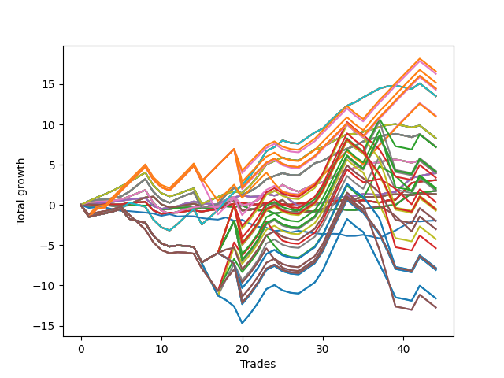

# Short Shepard 006 (1225 Waffles02) 
- Symbol: AAPL_Unlimited
- Date Range: 03/23/2022 - 07/08/2022
- Trading Period: 7:20-12:30
- Number of Trades: 44



| Name | Win Percent | Profit | Avg Profit / Trade | Avg Time / Trade |      | Name | Win Percent | Profit | Avg Profit / Trade | Avg Time / Trade |
| ---- | ----------- | ------ | ------------------ | ---------------- | ---- | ---- | ----------- | ------ | ------------------ | ---------------- |
| Sorted By <br> Profit | | | | | | Sorted By <br> Win Percentage ||||
| One Hundred Six | 70.45 | 8300.00 | 188.64 | 92:51 |     | Seventy | 75.00 | 4145.00 | 94.20 | 43:55 |
| One Hundred One | 70.45 | 8145.00 | 185.11 | 92:51 |     | Sixty-Two | 75.00 | 4145.00 | 94.20 | 43:55 |
| One Hundred Sixteen | 70.45 | 7600.00 | 172.73 | 94:33 |     | Fifty-Four | 75.00 | 4145.00 | 94.20 | 43:55 |
| One Hundred Twenty-Six | 70.45 | 7230.00 | 164.32 | 95:15 |     | Forty-Six | 75.00 | 4145.00 | 94.20 | 43:55 |
| One Hundred Twenty-One | 70.45 | 7230.00 | 164.32 | 95:15 |     | Six | 75.00 | 4145.00 | 94.20 | 43:55 |
| Eighty-One | 70.45 | 7230.00 | 164.32 | 95:15 |     | Sixty-Nine | 75.00 | 3605.00 | 81.93 | 47:12 |
| One Hundred Eleven | 70.45 | 7150.00 | 162.50 | 95:05 |     | Sixty-One | 75.00 | 3605.00 | 81.93 | 47:12 |
| Seventy-One | 70.45 | 6760.00 | 153.64 | 86:06 |     | Fifty-Three | 75.00 | 3605.00 | 81.93 | 47:12 |
| Sixty-Three | 70.45 | 6760.00 | 153.64 | 86:06 |     | Forty-Five | 75.00 | 3605.00 | 81.93 | 47:12 |
| Fifty-Five | 70.45 | 6760.00 | 153.64 | 86:06 |     | Five | 75.00 | 3605.00 | 81.93 | 47:12 |
| Forty-Seven | 70.45 | 6760.00 | 153.64 | 86:06 |     | Sixty-Six | 75.00 | 1980.00 | 45.00 | 20:41 |
| Seven | 70.45 | 6760.00 | 153.64 | 86:06 |     | Fifty-Eight | 75.00 | 1980.00 | 45.00 | 20:41 |
| Ninety-One | 65.91 | 5540.00 | 125.91 | 86:29 |     | Fifty | 75.00 | 1980.00 | 45.00 | 20:41 |
| Ninety-Six | 63.64 | 5495.00 | 124.89 | 81:21 |     | Forty-Two | 75.00 | 1980.00 | 45.00 | 20:41 |
| Seventy | 75.00 | 4145.00 | 94.20 | 43:55 |     | Two | 75.00 | 1980.00 | 45.00 | 20:41 |
| Sixty-Two | 75.00 | 4145.00 | 94.20 | 43:55 |     | Sixty-Eight | 72.73 | 1980.00 | 45.00 | 36:21 |
| Fifty-Four | 75.00 | 4145.00 | 94.20 | 43:55 |     | Sixty | 72.73 | 1980.00 | 45.00 | 36:21 |
| Forty-Six | 75.00 | 4145.00 | 94.20 | 43:55 |     | Fifty-Two | 72.73 | 1980.00 | 45.00 | 36:21 |
| Six | 75.00 | 4145.00 | 94.20 | 43:55 |     | Forty-Four | 72.73 | 1980.00 | 45.00 | 36:21 |
| Sixty-Nine | 75.00 | 3605.00 | 81.93 | 47:12 |     | Four | 72.73 | 1980.00 | 45.00 | 36:21 |
| Sixty-One | 75.00 | 3605.00 | 81.93 | 47:12 |     | Sixty-Five | 72.73 | 1540.00 | 35.00 | 13:12 |
| Fifty-Three | 75.00 | 3605.00 | 81.93 | 47:12 |     | Fifty-Seven | 72.73 | 1540.00 | 35.00 | 13:12 |
| Forty-Five | 75.00 | 3605.00 | 81.93 | 47:12 |     | Forty-Nine | 72.73 | 1540.00 | 35.00 | 13:12 |
| Five | 75.00 | 3605.00 | 81.93 | 47:12 |     | Forty-One | 72.73 | 1540.00 | 35.00 | 13:12 |
| One Hundred Seven | 50.00 | 3585.00 | 81.48 | 136:55 |     | One | 72.73 | 1540.00 | 35.00 | 13:12 |
| One Hundred Two | 50.00 | 2115.00 | 48.07 | 139:11 |     | One Hundred Six | 70.45 | 8300.00 | 188.64 | 92:51 |
| One Hundred Twenty-Seven | 50.00 | 2065.00 | 46.93 | 142:19 |     | One Hundred One | 70.45 | 8145.00 | 185.11 | 92:51 |
| One Hundred Twenty-Two | 50.00 | 2065.00 | 46.93 | 142:19 |     | One Hundred Sixteen | 70.45 | 7600.00 | 172.73 | 94:33 |
| Eighty-Two | 50.00 | 2065.00 | 46.93 | 142:19 |     | One Hundred Twenty-Six | 70.45 | 7230.00 | 164.32 | 95:15 |
| One Hundred Twelve | 50.00 | 1985.00 | 45.11 | 142:08 |     | One Hundred Twenty-One | 70.45 | 7230.00 | 164.32 | 95:15 |
| Sixty-Six | 75.00 | 1980.00 | 45.00 | 20:41 |     | Eighty-One | 70.45 | 7230.00 | 164.32 | 95:15 |
| Fifty-Eight | 75.00 | 1980.00 | 45.00 | 20:41 |     | One Hundred Eleven | 70.45 | 7150.00 | 162.50 | 95:05 |
| Fifty | 75.00 | 1980.00 | 45.00 | 20:41 |     | Seventy-One | 70.45 | 6760.00 | 153.64 | 86:06 |
| Forty-Two | 75.00 | 1980.00 | 45.00 | 20:41 |     | Sixty-Three | 70.45 | 6760.00 | 153.64 | 86:06 |
| Two | 75.00 | 1980.00 | 45.00 | 20:41 |     | Fifty-Five | 70.45 | 6760.00 | 153.64 | 86:06 |
| Sixty-Eight | 72.73 | 1980.00 | 45.00 | 36:21 |     | Forty-Seven | 70.45 | 6760.00 | 153.64 | 86:06 |
| Sixty | 72.73 | 1980.00 | 45.00 | 36:21 |     | Seven | 70.45 | 6760.00 | 153.64 | 86:06 |
| Fifty-Two | 72.73 | 1980.00 | 45.00 | 36:21 |     | Ninety-One | 65.91 | 5540.00 | 125.91 | 86:29 |
| Forty-Four | 72.73 | 1980.00 | 45.00 | 36:21 |     | Ninety-Six | 63.64 | 5495.00 | 124.89 | 81:21 |
| Four | 72.73 | 1980.00 | 45.00 | 36:21 |     | Sixty-Four | 63.64 | 875.00 | 19.89 | 06:41 |
| One Hundred Eight | 45.45 | 1695.00 | 38.52 | 143:07 |     | Fifty-Six | 63.64 | 875.00 | 19.89 | 06:41 |
| Sixty-Five | 72.73 | 1540.00 | 35.00 | 13:12 |     | Forty-Eight | 63.64 | 875.00 | 19.89 | 06:41 |
| Fifty-Seven | 72.73 | 1540.00 | 35.00 | 13:12 |     | Forty | 63.64 | 875.00 | 19.89 | 06:41 |
| Forty-Nine | 72.73 | 1540.00 | 35.00 | 13:12 |     | Zero | 63.64 | 875.00 | 19.89 | 06:41 |
| Forty-One | 72.73 | 1540.00 | 35.00 | 13:12 |     | Sixty-Seven | 59.09 | 670.00 | 15.23 | 26:47 |
| One | 72.73 | 1540.00 | 35.00 | 13:12 |     | Fifty-Nine | 59.09 | 670.00 | 15.23 | 26:47 |
| One Hundred Seventeen | 50.00 | 1045.00 | 23.75 | 141:04 |     | Fifty-One | 59.09 | 670.00 | 15.23 | 26:47 |
| Ninety-Seven | 43.18 | 980.00 | 22.27 | 118:05 |     | Forty-Three | 59.09 | 670.00 | 15.23 | 26:47 |
| Ninety-Two | 45.45 | 880.00 | 20.00 | 128:21 |     | Three | 59.09 | 670.00 | 15.23 | 26:47 |
| Sixty-Four | 63.64 | 875.00 | 19.89 | 06:41 |     | One Hundred Seven | 50.00 | 3585.00 | 81.48 | 136:55 |
| Fifty-Six | 63.64 | 875.00 | 19.89 | 06:41 |     | One Hundred Two | 50.00 | 2115.00 | 48.07 | 139:11 |
| Forty-Eight | 63.64 | 875.00 | 19.89 | 06:41 |     | One Hundred Twenty-Seven | 50.00 | 2065.00 | 46.93 | 142:19 |
| Forty | 63.64 | 875.00 | 19.89 | 06:41 |     | One Hundred Twenty-Two | 50.00 | 2065.00 | 46.93 | 142:19 |
| Zero | 63.64 | 875.00 | 19.89 | 06:41 |     | Eighty-Two | 50.00 | 2065.00 | 46.93 | 142:19 |
| Sixty-Seven | 59.09 | 670.00 | 15.23 | 26:47 |     | One Hundred Twelve | 50.00 | 1985.00 | 45.11 | 142:08 |
| Fifty-Nine | 59.09 | 670.00 | 15.23 | 26:47 |     | One Hundred Seventeen | 50.00 | 1045.00 | 23.75 | 141:04 |
| Fifty-One | 59.09 | 670.00 | 15.23 | 26:47 |     | One Hundred Eight | 45.45 | 1695.00 | 38.52 | 143:07 |
| Forty-Three | 59.09 | 670.00 | 15.23 | 26:47 |     | Ninety-Two | 45.45 | 880.00 | 20.00 | 128:21 |
| Three | 59.09 | 670.00 | 15.23 | 26:47 |     | One Hundred Three | 45.45 | -225.00 | -5.11 | 148:24 |
| Ninety-Eight | 43.18 | 180.00 | 4.09 | 124:10 |     | One Hundred Twenty-Eight | 45.45 | -275.00 | -6.25 | 151:31 |
| One Hundred Three | 45.45 | -225.00 | -5.11 | 148:24 |     | One Hundred Twenty-Three | 45.45 | -275.00 | -6.25 | 151:31 |
| One Hundred Twenty-Eight | 45.45 | -275.00 | -6.25 | 151:31 |     | Eighty-Three | 45.45 | -275.00 | -6.25 | 151:31 |
| One Hundred Twenty-Three | 45.45 | -275.00 | -6.25 | 151:31 |     | One Hundred Thirteen | 45.45 | -355.00 | -8.07 | 151:21 |
| Eighty-Three | 45.45 | -275.00 | -6.25 | 151:31 |     | One Hundred Ten | 45.45 | -990.00 | -22.50 | 145:59 |
| One Hundred Thirteen | 45.45 | -355.00 | -8.07 | 151:21 |     | One Hundred Nine | 45.45 | -990.00 | -22.50 | 145:59 |
| Seventy-Three | 36.36 | -965.00 | -21.93 | 07:37 |     | One Hundred Eighteen | 45.45 | -2685.00 | -61.02 | 149:44 |
| One Hundred Ten | 45.45 | -990.00 | -22.50 | 145:59 |     | Ninety-Seven | 43.18 | 980.00 | 22.27 | 118:05 |
| One Hundred Nine | 45.45 | -990.00 | -22.50 | 145:59 |     | Ninety-Eight | 43.18 | 180.00 | 4.09 | 124:10 |
| One Hundred | 43.18 | -1505.00 | -34.20 | 126:35 |     | One Hundred | 43.18 | -1505.00 | -34.20 | 126:35 |
| Ninety-Nine | 43.18 | -1505.00 | -34.20 | 126:35 |     | Ninety-Nine | 43.18 | -1505.00 | -34.20 | 126:35 |
| Ninety-Three | 40.91 | -2120.00 | -48.18 | 134:46 |     | Ninety-Three | 40.91 | -2120.00 | -48.18 | 134:46 |
| One Hundred Eighteen | 45.45 | -2685.00 | -61.02 | 149:44 |     | One Hundred Five | 40.91 | -3910.00 | -88.86 | 152:25 |
| One Hundred Five | 40.91 | -3910.00 | -88.86 | 152:25 |     | One Hundred Four | 40.91 | -3910.00 | -88.86 | 152:25 |
| One Hundred Four | 40.91 | -3910.00 | -88.86 | 152:25 |     | One Hundred Thirty | 40.91 | -3960.00 | -90.00 | 155:32 |
| One Hundred Thirty | 40.91 | -3960.00 | -90.00 | 155:32 |     | One Hundred Twenty-Nine | 40.91 | -3960.00 | -90.00 | 155:32 |
| One Hundred Twenty-Nine | 40.91 | -3960.00 | -90.00 | 155:32 |     | One Hundred Twenty-Five | 40.91 | -3960.00 | -90.00 | 155:32 |
| One Hundred Twenty-Five | 40.91 | -3960.00 | -90.00 | 155:32 |     | One Hundred Twenty-Four | 40.91 | -3960.00 | -90.00 | 155:32 |
| One Hundred Twenty-Four | 40.91 | -3960.00 | -90.00 | 155:32 |     | Eighty-Five | 40.91 | -3960.00 | -90.00 | 155:32 |
| Eighty-Five | 40.91 | -3960.00 | -90.00 | 155:32 |     | Eighty-Four | 40.91 | -3960.00 | -90.00 | 155:32 |
| Eighty-Four | 40.91 | -3960.00 | -90.00 | 155:32 |     | One Hundred Fifteen | 40.91 | -4040.00 | -91.82 | 155:21 |
| One Hundred Fifteen | 40.91 | -4040.00 | -91.82 | 155:21 |     | One Hundred Fourteen | 40.91 | -4040.00 | -91.82 | 155:21 |
| One Hundred Fourteen | 40.91 | -4040.00 | -91.82 | 155:21 |     | One Hundred Twenty | 40.91 | -6370.00 | -144.77 | 153:45 |
| Ninety-Five | 36.36 | -5805.00 | -131.93 | 138:47 |     | One Hundred Ninteen | 40.91 | -6370.00 | -144.77 | 153:45 |
| Ninety-Four | 36.36 | -5805.00 | -131.93 | 138:47 |     | Seventy-Three | 36.36 | -965.00 | -21.93 | 07:37 |
| One Hundred Twenty | 40.91 | -6370.00 | -144.77 | 153:45 |     | Ninety-Five | 36.36 | -5805.00 | -131.93 | 138:47 |
| One Hundred Ninteen | 40.91 | -6370.00 | -144.77 | 153:45 |     | Ninety-Four | 36.36 | -5805.00 | -131.93 | 138:47 |

## NO STOPLOSS

### Test Zero
* Sell when price hits the middle line of the 20p bollinger
* No Stoploss
* Results:
```
Total Trades: 44
Percent Up: 36.36
Percent Down: 63.64
Total Points Moved Down: 1.75
Potential Profit: 875.00
Total Points Ups: 2.40 Count Ups: 16
Total Points Downs: 4.15 Count Downs: 28
```

<details><summary>Trades</summary>

<code>In: 2022-03-24 08:35:00		Out: 2022-03-24 08:49:10		Total Position Time: 14:10		Total Move Down: -0.14		Total to Date: -0.14</code> <br />
<code>In: 2022-03-25 11:09:00		Out: 2022-03-25 11:17:45		Total Position Time: 08:45		Total Move Down: 0.02		Total to Date: -0.12</code> <br />
<code>In: 2022-03-25 11:19:00		Out: 2022-03-25 11:20:10		Total Position Time: 01:10		Total Move Down: 0.09		Total to Date: -0.03</code> <br />
<code>In: 2022-03-25 11:41:00		Out: 2022-03-25 11:44:20		Total Position Time: 03:20		Total Move Down: -0.08		Total to Date: -0.11</code> <br />
<code>In: 2022-03-25 11:49:00		Out: 2022-03-25 11:50:10		Total Position Time: 01:10		Total Move Down: -0.01		Total to Date: -0.12</code> <br />
<code>In: 2022-03-29 08:34:00		Out: 2022-03-29 08:40:35		Total Position Time: 06:35		Total Move Down: 0.06		Total to Date: -0.06</code> <br />
<code>In: 2022-04-06 10:46:00		Out: 2022-04-06 10:56:30		Total Position Time: 10:30		Total Move Down: -0.01		Total to Date: -0.07</code> <br />
<code>In: 2022-04-06 10:47:00		Out: 2022-04-06 10:56:30		Total Position Time: 09:30		Total Move Down: -0.01		Total to Date: -0.08</code> <br />
<code>In: 2022-04-07 11:30:00		Out: 2022-04-07 11:31:10		Total Position Time: 01:10		Total Move Down: 0.09		Total to Date: 0.01</code> <br />
<code>In: 2022-04-07 11:57:00		Out: 2022-04-07 12:20:15		Total Position Time: 23:15		Total Move Down: -0.55		Total to Date: -0.54</code> <br />
<code>In: 2022-04-07 12:18:00		Out: 2022-04-07 12:20:15		Total Position Time: 02:15		Total Move Down: 0.02		Total to Date: -0.52</code> <br />
<code>In: 2022-04-20 07:24:00		Out: 2022-04-20 07:31:15		Total Position Time: 07:15		Total Move Down: 0.14		Total to Date: -0.38</code> <br />
<code>In: 2022-04-20 10:50:00		Out: 2022-04-20 10:51:10		Total Position Time: 01:10		Total Move Down: 0.08		Total to Date: -0.30</code> <br />
<code>In: 2022-04-20 10:51:00		Out: 2022-04-20 10:52:10		Total Position Time: 01:10		Total Move Down: 0.01		Total to Date: -0.29</code> <br />
<code>In: 2022-04-25 11:27:00		Out: 2022-04-25 11:40:00		Total Position Time: 13:00		Total Move Down: -0.14		Total to Date: -0.43</code> <br />
<code>In: 2022-04-27 08:11:00		Out: 2022-04-27 08:17:55		Total Position Time: 06:55		Total Move Down: 0.02		Total to Date: -0.41</code> <br />
<code>In: 2022-04-27 08:18:00		Out: 2022-04-27 08:20:15		Total Position Time: 02:15		Total Move Down: -0.03		Total to Date: -0.44</code> <br />
<code>In: 2022-05-02 07:36:00		Out: 2022-05-02 07:44:50		Total Position Time: 08:50		Total Move Down: 0.27		Total to Date: -0.17</code> <br />
<code>In: 2022-05-02 07:45:00		Out: 2022-05-02 07:46:10		Total Position Time: 01:10		Total Move Down: -0.08		Total to Date: -0.25</code> <br />
<code>In: 2022-05-04 08:58:00		Out: 2022-05-04 09:04:40		Total Position Time: 06:40		Total Move Down: 0.18		Total to Date: -0.07</code> <br />
<code>In: 2022-05-10 10:46:00		Out: 2022-05-10 11:05:55		Total Position Time: 19:55		Total Move Down: -0.42		Total to Date: -0.49</code> <br />
<code>In: 2022-05-10 10:52:00		Out: 2022-05-10 11:05:55		Total Position Time: 13:55		Total Move Down: -0.19		Total to Date: -0.68</code> <br />
<code>In: 2022-05-10 11:02:00		Out: 2022-05-10 11:05:55		Total Position Time: 03:55		Total Move Down: 0.05		Total to Date: -0.63</code> <br />
<code>In: 2022-05-16 08:51:00		Out: 2022-05-16 09:05:45		Total Position Time: 14:45		Total Move Down: -0.42		Total to Date: -1.05</code> <br />
<code>In: 2022-05-17 08:44:00		Out: 2022-05-17 08:47:25		Total Position Time: 03:25		Total Move Down: 0.14		Total to Date: -0.91</code> <br />
<code>In: 2022-05-25 11:33:00		Out: 2022-05-25 11:39:10		Total Position Time: 06:10		Total Move Down: 0.03		Total to Date: -0.88</code> <br />
<code>In: 2022-05-25 11:37:00		Out: 2022-05-25 11:39:10		Total Position Time: 02:10		Total Move Down: 0.23		Total to Date: -0.65</code> <br />
<code>In: 2022-05-25 12:06:00		Out: 2022-05-25 12:18:05		Total Position Time: 12:05		Total Move Down: -0.08		Total to Date: -0.73</code> <br />
<code>In: 2022-05-25 12:07:00		Out: 2022-05-25 12:18:05		Total Position Time: 11:05		Total Move Down: -0.09		Total to Date: -0.82</code> <br />
<code>In: 2022-06-08 08:23:00		Out: 2022-06-08 08:30:10		Total Position Time: 07:10		Total Move Down: 0.04		Total to Date: -0.78</code> <br />
<code>In: 2022-06-13 08:29:00		Out: 2022-06-13 08:37:10		Total Position Time: 08:10		Total Move Down: 0.18		Total to Date: -0.60</code> <br />
<code>In: 2022-06-13 08:30:00		Out: 2022-06-13 08:37:10		Total Position Time: 07:10		Total Move Down: 0.11		Total to Date: -0.49</code> <br />
<code>In: 2022-06-13 08:42:00		Out: 2022-06-13 08:45:15		Total Position Time: 03:15		Total Move Down: -0.14		Total to Date: -0.63</code> <br />
<code>In: 2022-06-14 08:38:00		Out: 2022-06-14 08:51:40		Total Position Time: 13:40		Total Move Down: -0.01		Total to Date: -0.64</code> <br />
<code>In: 2022-06-14 08:47:00		Out: 2022-06-14 08:51:40		Total Position Time: 04:40		Total Move Down: 0.16		Total to Date: -0.48</code> <br />
<code>In: 2022-06-15 09:06:00		Out: 2022-06-15 09:08:20		Total Position Time: 02:20		Total Move Down: 0.07		Total to Date: -0.41</code> <br />
<code>In: 2022-06-15 09:07:00		Out: 2022-06-15 09:08:20		Total Position Time: 01:20		Total Move Down: 0.05		Total to Date: -0.36</code> <br />
<code>In: 2022-06-15 11:02:00		Out: 2022-06-15 11:03:10		Total Position Time: 01:10		Total Move Down: 0.28		Total to Date: -0.08</code> <br />
<code>In: 2022-06-15 11:03:00		Out: 2022-06-15 11:04:10		Total Position Time: 01:10		Total Move Down: 0.08		Total to Date: 0.00</code> <br />
<code>In: 2022-06-15 11:48:00		Out: 2022-06-15 11:54:15		Total Position Time: 06:15		Total Move Down: 0.74		Total to Date: 0.74</code> <br />
<code>In: 2022-06-15 11:49:00		Out: 2022-06-15 11:54:15		Total Position Time: 05:15		Total Move Down: 0.71		Total to Date: 1.45</code> <br />
<code>In: 2022-06-16 10:14:00		Out: 2022-06-16 10:19:50		Total Position Time: 05:50		Total Move Down: 0.02		Total to Date: 1.47</code> <br />
<code>In: 2022-06-23 11:41:00		Out: 2022-06-23 11:46:00		Total Position Time: 05:00		Total Move Down: 0.15		Total to Date: 1.62</code> <br />
<code>In: 2022-06-23 11:42:00		Out: 2022-06-23 11:46:00		Total Position Time: 04:00		Total Move Down: 0.13		Total to Date: 1.75</code> <br />


</details>

### Test One
* Sell when the price hits the upper line of the 20p 1std bollinger
* No Stoploss
* Results:
```
Total Trades: 44
Percent Up: 27.27
Percent Down: 72.73
Total Points Moved Down: 3.08
Potential Profit: 1540.00
Total Points Ups: 2.73 Count Ups: 12
Total Points Downs: 5.81 Count Downs: 32
```

<details><summary>Trades</summary>

<code>In: 2022-03-24 08:35:00		Out: 2022-03-24 08:50:10		Total Position Time: 15:10		Total Move Down: -0.05		Total to Date: -0.05</code> <br />
<code>In: 2022-03-25 11:09:00		Out: 2022-03-25 11:19:05		Total Position Time: 10:05		Total Move Down: 0.08		Total to Date: 0.03</code> <br />
<code>In: 2022-03-25 11:19:00		Out: 2022-03-25 11:20:10		Total Position Time: 01:10		Total Move Down: 0.09		Total to Date: 0.12</code> <br />
<code>In: 2022-03-25 11:41:00		Out: 2022-03-25 11:49:05		Total Position Time: 08:05		Total Move Down: -0.06		Total to Date: 0.06</code> <br />
<code>In: 2022-03-25 11:49:00		Out: 2022-03-25 11:50:30		Total Position Time: 01:30		Total Move Down: 0.01		Total to Date: 0.07</code> <br />
<code>In: 2022-03-29 08:34:00		Out: 2022-03-29 08:41:15		Total Position Time: 07:15		Total Move Down: 0.18		Total to Date: 0.25</code> <br />
<code>In: 2022-04-06 10:46:00		Out: 2022-04-06 10:58:00		Total Position Time: 12:00		Total Move Down: 0.07		Total to Date: 0.32</code> <br />
<code>In: 2022-04-06 10:47:00		Out: 2022-04-06 10:58:00		Total Position Time: 11:00		Total Move Down: 0.07		Total to Date: 0.39</code> <br />
<code>In: 2022-04-07 11:30:00		Out: 2022-04-07 12:27:40		Total Position Time: 57:40		Total Move Down: -1.07		Total to Date: -0.68</code> <br />
<code>In: 2022-04-07 11:57:00		Out: 2022-04-07 12:27:40		Total Position Time: 30:40		Total Move Down: -0.43		Total to Date: -1.11</code> <br />
<code>In: 2022-04-07 12:18:00		Out: 2022-04-07 12:27:40		Total Position Time: 09:40		Total Move Down: 0.14		Total to Date: -0.97</code> <br />
<code>In: 2022-04-20 07:24:00		Out: 2022-04-20 07:47:05		Total Position Time: 23:05		Total Move Down: 0.01		Total to Date: -0.96</code> <br />
<code>In: 2022-04-20 10:50:00		Out: 2022-04-20 10:54:05		Total Position Time: 04:05		Total Move Down: 0.18		Total to Date: -0.78</code> <br />
<code>In: 2022-04-20 10:51:00		Out: 2022-04-20 10:54:05		Total Position Time: 03:05		Total Move Down: 0.10		Total to Date: -0.68</code> <br />
<code>In: 2022-04-25 11:27:00		Out: 2022-04-25 11:44:50		Total Position Time: 17:50		Total Move Down: -0.15		Total to Date: -0.83</code> <br />
<code>In: 2022-04-27 08:11:00		Out: 2022-04-27 08:20:25		Total Position Time: 09:25		Total Move Down: 0.17		Total to Date: -0.66</code> <br />
<code>In: 2022-04-27 08:18:00		Out: 2022-04-27 08:20:25		Total Position Time: 02:25		Total Move Down: 0.13		Total to Date: -0.53</code> <br />
<code>In: 2022-05-02 07:36:00		Out: 2022-05-02 07:47:15		Total Position Time: 11:15		Total Move Down: 0.45		Total to Date: -0.08</code> <br />
<code>In: 2022-05-02 07:45:00		Out: 2022-05-02 07:47:15		Total Position Time: 02:15		Total Move Down: 0.23		Total to Date: 0.15</code> <br />
<code>In: 2022-05-04 08:58:00		Out: 2022-05-04 09:10:15		Total Position Time: 12:15		Total Move Down: 0.15		Total to Date: 0.30</code> <br />
<code>In: 2022-05-10 10:46:00		Out: 2022-05-10 11:06:35		Total Position Time: 20:35		Total Move Down: -0.23		Total to Date: 0.07</code> <br />
<code>In: 2022-05-10 10:52:00		Out: 2022-05-10 11:06:35		Total Position Time: 14:35		Total Move Down: -0.00		Total to Date: 0.07</code> <br />
<code>In: 2022-05-10 11:02:00		Out: 2022-05-10 11:06:35		Total Position Time: 04:35		Total Move Down: 0.24		Total to Date: 0.31</code> <br />
<code>In: 2022-05-16 08:51:00		Out: 2022-05-16 09:11:30		Total Position Time: 20:30		Total Move Down: -0.31		Total to Date: 0.00</code> <br />
<code>In: 2022-05-17 08:44:00		Out: 2022-05-17 08:53:40		Total Position Time: 09:40		Total Move Down: 0.09		Total to Date: 0.09</code> <br />
<code>In: 2022-05-25 11:33:00		Out: 2022-05-25 11:49:55		Total Position Time: 16:55		Total Move Down: -0.05		Total to Date: 0.04</code> <br />
<code>In: 2022-05-25 11:37:00		Out: 2022-05-25 11:49:55		Total Position Time: 12:55		Total Move Down: 0.15		Total to Date: 0.19</code> <br />
<code>In: 2022-05-25 12:06:00		Out: 2022-05-25 12:20:25		Total Position Time: 14:25		Total Move Down: 0.03		Total to Date: 0.22</code> <br />
<code>In: 2022-05-25 12:07:00		Out: 2022-05-25 12:20:25		Total Position Time: 13:25		Total Move Down: 0.02		Total to Date: 0.24</code> <br />
<code>In: 2022-06-08 08:23:00		Out: 2022-06-08 08:43:05		Total Position Time: 20:05		Total Move Down: 0.05		Total to Date: 0.29</code> <br />
<code>In: 2022-06-13 08:29:00		Out: 2022-06-13 08:46:30		Total Position Time: 17:30		Total Move Down: 0.17		Total to Date: 0.46</code> <br />
<code>In: 2022-06-13 08:30:00		Out: 2022-06-13 08:46:30		Total Position Time: 16:30		Total Move Down: 0.10		Total to Date: 0.56</code> <br />
<code>In: 2022-06-13 08:42:00		Out: 2022-06-13 08:46:30		Total Position Time: 04:30		Total Move Down: 0.01		Total to Date: 0.57</code> <br />
<code>In: 2022-06-14 08:38:00		Out: 2022-06-14 09:02:10		Total Position Time: 24:10		Total Move Down: -0.08		Total to Date: 0.49</code> <br />
<code>In: 2022-06-14 08:47:00		Out: 2022-06-14 09:02:10		Total Position Time: 15:10		Total Move Down: 0.09		Total to Date: 0.58</code> <br />
<code>In: 2022-06-15 09:06:00		Out: 2022-06-15 09:33:30		Total Position Time: 27:30		Total Move Down: -0.14		Total to Date: 0.44</code> <br />
<code>In: 2022-06-15 09:07:00		Out: 2022-06-15 09:33:30		Total Position Time: 26:30		Total Move Down: -0.16		Total to Date: 0.28</code> <br />
<code>In: 2022-06-15 11:02:00		Out: 2022-06-15 11:03:10		Total Position Time: 01:10		Total Move Down: 0.28		Total to Date: 0.56</code> <br />
<code>In: 2022-06-15 11:03:00		Out: 2022-06-15 11:04:10		Total Position Time: 01:10		Total Move Down: 0.08		Total to Date: 0.64</code> <br />
<code>In: 2022-06-15 11:48:00		Out: 2022-06-15 11:58:05		Total Position Time: 10:05		Total Move Down: 1.06		Total to Date: 1.70</code> <br />
<code>In: 2022-06-15 11:49:00		Out: 2022-06-15 11:58:05		Total Position Time: 09:05		Total Move Down: 1.03		Total to Date: 2.73</code> <br />
<code>In: 2022-06-16 10:14:00		Out: 2022-06-16 10:20:35		Total Position Time: 06:35		Total Move Down: 0.17		Total to Date: 2.90</code> <br />
<code>In: 2022-06-23 11:41:00		Out: 2022-06-23 11:53:30		Total Position Time: 12:30		Total Move Down: 0.10		Total to Date: 3.00</code> <br />
<code>In: 2022-06-23 11:42:00		Out: 2022-06-23 11:53:30		Total Position Time: 11:30		Total Move Down: 0.08		Total to Date: 3.08</code> <br />


</details>

### Test Two
* Sell when the price hits the upper line of the 20p 2std bollinger
* No Stoploss
* Results:
```
Total Trades: 44
Percent Up: 25.00
Percent Down: 75.00
Total Points Moved Down: 3.96
Potential Profit: 1980.00
Total Points Ups: 3.81 Count Ups: 11
Total Points Downs: 7.77 Count Downs: 33
```

<details><summary>Trades</summary>

<code>In: 2022-03-24 08:35:00		Out: 2022-03-24 08:51:00		Total Position Time: 16:00		Total Move Down: 0.06		Total to Date: 0.06</code> <br />
<code>In: 2022-03-25 11:09:00		Out: 2022-03-25 11:19:55		Total Position Time: 10:55		Total Move Down: 0.15		Total to Date: 0.21</code> <br />
<code>In: 2022-03-25 11:19:00		Out: 2022-03-25 11:20:10		Total Position Time: 01:10		Total Move Down: 0.09		Total to Date: 0.30</code> <br />
<code>In: 2022-03-25 11:41:00		Out: 2022-03-25 12:02:00		Total Position Time: 21:00		Total Move Down: 0.08		Total to Date: 0.38</code> <br />
<code>In: 2022-03-25 11:49:00		Out: 2022-03-25 12:02:00		Total Position Time: 13:00		Total Move Down: 0.15		Total to Date: 0.53</code> <br />
<code>In: 2022-03-29 08:34:00		Out: 2022-03-29 08:57:40		Total Position Time: 23:40		Total Move Down: 0.15		Total to Date: 0.68</code> <br />
<code>In: 2022-04-06 10:46:00		Out: 2022-04-06 10:59:10		Total Position Time: 13:10		Total Move Down: 0.10		Total to Date: 0.78</code> <br />
<code>In: 2022-04-06 10:47:00		Out: 2022-04-06 10:59:10		Total Position Time: 12:10		Total Move Down: 0.10		Total to Date: 0.88</code> <br />
<code>In: 2022-04-07 11:30:00		Out: 2022-04-07 12:28:30		Total Position Time: 58:30		Total Move Down: -1.01		Total to Date: -0.13</code> <br />
<code>In: 2022-04-07 11:57:00		Out: 2022-04-07 12:28:30		Total Position Time: 31:30		Total Move Down: -0.37		Total to Date: -0.50</code> <br />
<code>In: 2022-04-07 12:18:00		Out: 2022-04-07 12:28:30		Total Position Time: 10:30		Total Move Down: 0.20		Total to Date: -0.30</code> <br />
<code>In: 2022-04-20 07:24:00		Out: 2022-04-20 07:47:45		Total Position Time: 23:45		Total Move Down: 0.15		Total to Date: -0.15</code> <br />
<code>In: 2022-04-20 10:50:00		Out: 2022-04-20 11:03:15		Total Position Time: 13:15		Total Move Down: 0.33		Total to Date: 0.18</code> <br />
<code>In: 2022-04-20 10:51:00		Out: 2022-04-20 11:03:15		Total Position Time: 12:15		Total Move Down: 0.25		Total to Date: 0.43</code> <br />
<code>In: 2022-04-25 11:27:00		Out: 2022-04-25 12:03:15		Total Position Time: 36:15		Total Move Down: -0.25		Total to Date: 0.18</code> <br />
<code>In: 2022-04-27 08:11:00		Out: 2022-04-27 08:52:25		Total Position Time: 41:25		Total Move Down: -0.04		Total to Date: 0.14</code> <br />
<code>In: 2022-04-27 08:18:00		Out: 2022-04-27 08:52:25		Total Position Time: 34:25		Total Move Down: -0.08		Total to Date: 0.06</code> <br />
<code>In: 2022-05-02 07:36:00		Out: 2022-05-02 07:50:30		Total Position Time: 14:30		Total Move Down: 0.55		Total to Date: 0.61</code> <br />
<code>In: 2022-05-02 07:45:00		Out: 2022-05-02 07:50:30		Total Position Time: 05:30		Total Move Down: 0.33		Total to Date: 0.94</code> <br />
<code>In: 2022-05-04 08:58:00		Out: 2022-05-04 09:12:25		Total Position Time: 14:25		Total Move Down: 0.25		Total to Date: 1.19</code> <br />
<code>In: 2022-05-10 10:46:00		Out: 2022-05-10 11:07:10		Total Position Time: 21:10		Total Move Down: -0.18		Total to Date: 1.01</code> <br />
<code>In: 2022-05-10 10:52:00		Out: 2022-05-10 11:07:10		Total Position Time: 15:10		Total Move Down: 0.05		Total to Date: 1.06</code> <br />
<code>In: 2022-05-10 11:02:00		Out: 2022-05-10 11:07:10		Total Position Time: 05:10		Total Move Down: 0.29		Total to Date: 1.35</code> <br />
<code>In: 2022-05-16 08:51:00		Out: 2022-05-16 09:14:40		Total Position Time: 23:40		Total Move Down: -0.18		Total to Date: 1.17</code> <br />
<code>In: 2022-05-17 08:44:00		Out: 2022-05-17 08:55:15		Total Position Time: 11:15		Total Move Down: 0.26		Total to Date: 1.43</code> <br />
<code>In: 2022-05-25 11:33:00		Out: 2022-05-25 12:33:10		Total Position Time: 60:10		Total Move Down: -0.89		Total to Date: 0.54</code> <br />
<code>In: 2022-05-25 11:37:00		Out: 2022-05-25 12:33:10		Total Position Time: 56:10		Total Move Down: -0.69		Total to Date: -0.15</code> <br />
<code>In: 2022-05-25 12:06:00		Out: 2022-05-25 12:33:10		Total Position Time: 27:10		Total Move Down: 0.11		Total to Date: -0.04</code> <br />
<code>In: 2022-05-25 12:07:00		Out: 2022-05-25 12:33:10		Total Position Time: 26:10		Total Move Down: 0.10		Total to Date: 0.06</code> <br />
<code>In: 2022-06-08 08:23:00		Out: 2022-06-08 08:44:45		Total Position Time: 21:45		Total Move Down: 0.26		Total to Date: 0.32</code> <br />
<code>In: 2022-06-13 08:29:00		Out: 2022-06-13 08:47:05		Total Position Time: 18:05		Total Move Down: 0.32		Total to Date: 0.64</code> <br />
<code>In: 2022-06-13 08:30:00		Out: 2022-06-13 08:47:05		Total Position Time: 17:05		Total Move Down: 0.25		Total to Date: 0.89</code> <br />
<code>In: 2022-06-13 08:42:00		Out: 2022-06-13 08:47:05		Total Position Time: 05:05		Total Move Down: 0.16		Total to Date: 1.05</code> <br />
<code>In: 2022-06-14 08:38:00		Out: 2022-06-14 09:03:00		Total Position Time: 25:00		Total Move Down: 0.07		Total to Date: 1.12</code> <br />
<code>In: 2022-06-14 08:47:00		Out: 2022-06-14 09:03:00		Total Position Time: 16:00		Total Move Down: 0.24		Total to Date: 1.36</code> <br />
<code>In: 2022-06-15 09:06:00		Out: 2022-06-15 09:34:20		Total Position Time: 28:20		Total Move Down: -0.05		Total to Date: 1.31</code> <br />
<code>In: 2022-06-15 09:07:00		Out: 2022-06-15 09:34:20		Total Position Time: 27:20		Total Move Down: -0.07		Total to Date: 1.24</code> <br />
<code>In: 2022-06-15 11:02:00		Out: 2022-06-15 11:03:10		Total Position Time: 01:10		Total Move Down: 0.28		Total to Date: 1.52</code> <br />
<code>In: 2022-06-15 11:03:00		Out: 2022-06-15 11:04:10		Total Position Time: 01:10		Total Move Down: 0.08		Total to Date: 1.60</code> <br />
<code>In: 2022-06-15 11:48:00		Out: 2022-06-15 12:13:05		Total Position Time: 25:05		Total Move Down: 0.89		Total to Date: 2.49</code> <br />
<code>In: 2022-06-15 11:49:00		Out: 2022-06-15 12:13:05		Total Position Time: 24:05		Total Move Down: 0.86		Total to Date: 3.35</code> <br />
<code>In: 2022-06-16 10:14:00		Out: 2022-06-16 10:21:35		Total Position Time: 07:35		Total Move Down: 0.25		Total to Date: 3.60</code> <br />
<code>In: 2022-06-23 11:41:00		Out: 2022-06-23 12:01:10		Total Position Time: 20:10		Total Move Down: 0.19		Total to Date: 3.79</code> <br />
<code>In: 2022-06-23 11:42:00		Out: 2022-06-23 12:01:10		Total Position Time: 19:10		Total Move Down: 0.17		Total to Date: 3.96</code> <br />


</details>

### Test Three
* Sell when price hits the middle line of the 50p bollinger
* No Stoploss
* Results:
```
Total Trades: 44
Percent Up: 40.91
Percent Down: 59.09
Total Points Moved Down: 1.34
Potential Profit: 670.00
Total Points Ups: 5.19 Count Ups: 18
Total Points Downs: 6.53 Count Downs: 26
```

<details><summary>Trades</summary>

<code>In: 2022-03-24 08:35:00		Out: 2022-03-24 09:01:40		Total Position Time: 26:40		Total Move Down: 0.08		Total to Date: 0.08</code> <br />
<code>In: 2022-03-25 11:09:00		Out: 2022-03-25 11:49:20		Total Position Time: 40:20		Total Move Down: -0.03		Total to Date: 0.05</code> <br />
<code>In: 2022-03-25 11:19:00		Out: 2022-03-25 11:49:20		Total Position Time: 30:20		Total Move Down: -0.09		Total to Date: -0.04</code> <br />
<code>In: 2022-03-25 11:41:00		Out: 2022-03-25 11:49:20		Total Position Time: 08:20		Total Move Down: -0.04		Total to Date: -0.08</code> <br />
<code>In: 2022-03-25 11:49:00		Out: 2022-03-25 11:50:30		Total Position Time: 01:30		Total Move Down: 0.01		Total to Date: -0.07</code> <br />
<code>In: 2022-03-29 08:34:00		Out: 2022-03-29 08:57:55		Total Position Time: 23:55		Total Move Down: 0.18		Total to Date: 0.11</code> <br />
<code>In: 2022-04-06 10:46:00		Out: 2022-04-06 11:00:10		Total Position Time: 14:10		Total Move Down: 0.41		Total to Date: 0.52</code> <br />
<code>In: 2022-04-06 10:47:00		Out: 2022-04-06 11:00:10		Total Position Time: 13:10		Total Move Down: 0.41		Total to Date: 0.93</code> <br />
<code>In: 2022-04-07 11:30:00		Out: 2022-04-07 11:36:05		Total Position Time: 06:05		Total Move Down: 0.10		Total to Date: 1.03</code> <br />
<code>In: 2022-04-07 11:57:00		Out: 2022-04-07 12:47:00		Total Position Time: 50:00		Total Move Down: -0.96		Total to Date: 0.07</code> <br />
<code>In: 2022-04-07 12:18:00		Out: 2022-04-07 12:47:00		Total Position Time: 29:00		Total Move Down: -0.39		Total to Date: -0.32</code> <br />
<code>In: 2022-04-20 07:24:00		Out: 2022-04-20 07:57:45		Total Position Time: 33:45		Total Move Down: 0.11		Total to Date: -0.21</code> <br />
<code>In: 2022-04-20 10:50:00		Out: 2022-04-20 10:55:30		Total Position Time: 05:30		Total Move Down: 0.22		Total to Date: 0.01</code> <br />
<code>In: 2022-04-20 10:51:00		Out: 2022-04-20 10:55:30		Total Position Time: 04:30		Total Move Down: 0.14		Total to Date: 0.15</code> <br />
<code>In: 2022-04-25 11:27:00		Out: 2022-04-25 12:03:10		Total Position Time: 36:10		Total Move Down: -0.28		Total to Date: -0.13</code> <br />
<code>In: 2022-04-27 08:11:00		Out: 2022-04-27 08:45:20		Total Position Time: 34:20		Total Move Down: -0.14		Total to Date: -0.27</code> <br />
<code>In: 2022-04-27 08:18:00		Out: 2022-04-27 08:45:20		Total Position Time: 27:20		Total Move Down: -0.18		Total to Date: -0.45</code> <br />
<code>In: 2022-05-02 07:36:00		Out: 2022-05-02 07:51:25		Total Position Time: 15:25		Total Move Down: 0.64		Total to Date: 0.19</code> <br />
<code>In: 2022-05-02 07:45:00		Out: 2022-05-02 07:51:25		Total Position Time: 06:25		Total Move Down: 0.42		Total to Date: 0.61</code> <br />
<code>In: 2022-05-04 08:58:00		Out: 2022-05-04 11:00:20		Total Position Time: 122:20		Total Move Down: -1.30		Total to Date: -0.69</code> <br />
<code>In: 2022-05-10 10:46:00		Out: 2022-05-10 11:16:20		Total Position Time: 30:20		Total Move Down: 0.06		Total to Date: -0.63</code> <br />
<code>In: 2022-05-10 10:52:00		Out: 2022-05-10 11:16:20		Total Position Time: 24:20		Total Move Down: 0.29		Total to Date: -0.34</code> <br />
<code>In: 2022-05-10 11:02:00		Out: 2022-05-10 11:16:20		Total Position Time: 14:20		Total Move Down: 0.53		Total to Date: 0.19</code> <br />
<code>In: 2022-05-16 08:51:00		Out: 2022-05-16 09:15:45		Total Position Time: 24:45		Total Move Down: -0.01		Total to Date: 0.18</code> <br />
<code>In: 2022-05-17 08:44:00		Out: 2022-05-17 09:00:15		Total Position Time: 16:15		Total Move Down: 0.44		Total to Date: 0.62</code> <br />
<code>In: 2022-05-25 11:33:00		Out: 2022-05-25 12:34:15		Total Position Time: 61:15		Total Move Down: -0.89		Total to Date: -0.27</code> <br />
<code>In: 2022-05-25 11:37:00		Out: 2022-05-25 12:34:15		Total Position Time: 57:15		Total Move Down: -0.69		Total to Date: -0.96</code> <br />
<code>In: 2022-05-25 12:06:00		Out: 2022-05-25 12:34:15		Total Position Time: 28:15		Total Move Down: 0.11		Total to Date: -0.85</code> <br />
<code>In: 2022-05-25 12:07:00		Out: 2022-05-25 12:34:15		Total Position Time: 27:15		Total Move Down: 0.10		Total to Date: -0.75</code> <br />
<code>In: 2022-06-08 08:23:00		Out: 2022-06-08 08:44:45		Total Position Time: 21:45		Total Move Down: 0.26		Total to Date: -0.49</code> <br />
<code>In: 2022-06-13 08:29:00		Out: 2022-06-13 08:51:55		Total Position Time: 22:55		Total Move Down: 0.47		Total to Date: -0.02</code> <br />
<code>In: 2022-06-13 08:30:00		Out: 2022-06-13 08:51:55		Total Position Time: 21:55		Total Move Down: 0.40		Total to Date: 0.38</code> <br />
<code>In: 2022-06-13 08:42:00		Out: 2022-06-13 08:51:55		Total Position Time: 09:55		Total Move Down: 0.31		Total to Date: 0.69</code> <br />
<code>In: 2022-06-14 08:38:00		Out: 2022-06-14 09:03:00		Total Position Time: 25:00		Total Move Down: 0.07		Total to Date: 0.76</code> <br />
<code>In: 2022-06-14 08:47:00		Out: 2022-06-14 09:03:00		Total Position Time: 16:00		Total Move Down: 0.24		Total to Date: 1.00</code> <br />
<code>In: 2022-06-15 09:06:00		Out: 2022-06-15 09:34:25		Total Position Time: 28:25		Total Move Down: -0.01		Total to Date: 0.99</code> <br />
<code>In: 2022-06-15 09:07:00		Out: 2022-06-15 09:34:25		Total Position Time: 27:25		Total Move Down: -0.03		Total to Date: 0.96</code> <br />
<code>In: 2022-06-15 11:02:00		Out: 2022-06-15 11:03:10		Total Position Time: 01:10		Total Move Down: 0.28		Total to Date: 1.24</code> <br />
<code>In: 2022-06-15 11:03:00		Out: 2022-06-15 11:04:10		Total Position Time: 01:10		Total Move Down: 0.08		Total to Date: 1.32</code> <br />
<code>In: 2022-06-15 11:48:00		Out: 2022-06-15 12:43:05		Total Position Time: 55:05		Total Move Down: -0.04		Total to Date: 1.28</code> <br />
<code>In: 2022-06-15 11:49:00		Out: 2022-06-15 12:43:05		Total Position Time: 54:05		Total Move Down: -0.07		Total to Date: 1.21</code> <br />
<code>In: 2022-06-16 10:14:00		Out: 2022-06-16 10:20:35		Total Position Time: 06:35		Total Move Down: 0.17		Total to Date: 1.38</code> <br />
<code>In: 2022-06-23 11:41:00		Out: 2022-06-23 12:18:25		Total Position Time: 37:25		Total Move Down: -0.01		Total to Date: 1.37</code> <br />
<code>In: 2022-06-23 11:42:00		Out: 2022-06-23 12:18:25		Total Position Time: 36:25		Total Move Down: -0.03		Total to Date: 1.34</code> <br />


</details>

### Test Four
* Sell when the price hits the upper line of the 50p 1std bollinger
* No Stoploss
* Results:
```
Total Trades: 44
Percent Up: 27.27
Percent Down: 72.73
Total Points Moved Down: 3.96
Potential Profit: 1980.00
Total Points Ups: 6.95 Count Ups: 12
Total Points Downs: 10.91 Count Downs: 32
```

<details><summary>Trades</summary>

<code>In: 2022-03-24 08:35:00		Out: 2022-03-24 09:03:05		Total Position Time: 28:05		Total Move Down: 0.33		Total to Date: 0.33</code> <br />
<code>In: 2022-03-25 11:09:00		Out: 2022-03-25 12:02:00		Total Position Time: 53:00		Total Move Down: 0.09		Total to Date: 0.42</code> <br />
<code>In: 2022-03-25 11:19:00		Out: 2022-03-25 12:02:00		Total Position Time: 43:00		Total Move Down: 0.03		Total to Date: 0.45</code> <br />
<code>In: 2022-03-25 11:41:00		Out: 2022-03-25 12:02:00		Total Position Time: 21:00		Total Move Down: 0.08		Total to Date: 0.53</code> <br />
<code>In: 2022-03-25 11:49:00		Out: 2022-03-25 12:02:00		Total Position Time: 13:00		Total Move Down: 0.15		Total to Date: 0.68</code> <br />
<code>In: 2022-03-29 08:34:00		Out: 2022-03-29 09:01:35		Total Position Time: 27:35		Total Move Down: 0.37		Total to Date: 1.05</code> <br />
<code>In: 2022-04-06 10:46:00		Out: 2022-04-06 11:14:10		Total Position Time: 28:10		Total Move Down: 0.40		Total to Date: 1.45</code> <br />
<code>In: 2022-04-06 10:47:00		Out: 2022-04-06 11:14:10		Total Position Time: 27:10		Total Move Down: 0.40		Total to Date: 1.85</code> <br />
<code>In: 2022-04-07 11:30:00		Out: 2022-04-07 12:47:00		Total Position Time: 77:00		Total Move Down: -1.60		Total to Date: 0.25</code> <br />
<code>In: 2022-04-07 11:57:00		Out: 2022-04-07 12:47:00		Total Position Time: 50:00		Total Move Down: -0.96		Total to Date: -0.71</code> <br />
<code>In: 2022-04-07 12:18:00		Out: 2022-04-07 12:47:00		Total Position Time: 29:00		Total Move Down: -0.39		Total to Date: -1.10</code> <br />
<code>In: 2022-04-20 07:24:00		Out: 2022-04-20 08:00:20		Total Position Time: 36:20		Total Move Down: 0.24		Total to Date: -0.86</code> <br />
<code>In: 2022-04-20 10:50:00		Out: 2022-04-20 11:03:15		Total Position Time: 13:15		Total Move Down: 0.33		Total to Date: -0.53</code> <br />
<code>In: 2022-04-20 10:51:00		Out: 2022-04-20 11:03:15		Total Position Time: 12:15		Total Move Down: 0.25		Total to Date: -0.28</code> <br />
<code>In: 2022-04-25 11:27:00		Out: 2022-04-25 12:05:20		Total Position Time: 38:20		Total Move Down: 0.08		Total to Date: -0.20</code> <br />
<code>In: 2022-04-27 08:11:00		Out: 2022-04-27 08:52:55		Total Position Time: 41:55		Total Move Down: -0.02		Total to Date: -0.22</code> <br />
<code>In: 2022-04-27 08:18:00		Out: 2022-04-27 08:52:55		Total Position Time: 34:55		Total Move Down: -0.06		Total to Date: -0.28</code> <br />
<code>In: 2022-05-02 07:36:00		Out: 2022-05-02 08:16:15		Total Position Time: 40:15		Total Move Down: 0.75		Total to Date: 0.47</code> <br />
<code>In: 2022-05-02 07:45:00		Out: 2022-05-02 08:16:15		Total Position Time: 31:15		Total Move Down: 0.53		Total to Date: 1.00</code> <br />
<code>In: 2022-05-04 08:58:00		Out: 2022-05-04 11:00:25		Total Position Time: 122:25		Total Move Down: -1.07		Total to Date: -0.07</code> <br />
<code>In: 2022-05-10 10:46:00		Out: 2022-05-10 11:24:10		Total Position Time: 38:10		Total Move Down: 0.25		Total to Date: 0.18</code> <br />
<code>In: 2022-05-10 10:52:00		Out: 2022-05-10 11:24:10		Total Position Time: 32:10		Total Move Down: 0.48		Total to Date: 0.66</code> <br />
<code>In: 2022-05-10 11:02:00		Out: 2022-05-10 11:24:10		Total Position Time: 22:10		Total Move Down: 0.72		Total to Date: 1.38</code> <br />
<code>In: 2022-05-16 08:51:00		Out: 2022-05-16 09:24:25		Total Position Time: 33:25		Total Move Down: 0.34		Total to Date: 1.72</code> <br />
<code>In: 2022-05-17 08:44:00		Out: 2022-05-17 09:06:45		Total Position Time: 22:45		Total Move Down: 0.79		Total to Date: 2.51</code> <br />
<code>In: 2022-05-25 11:33:00		Out: 2022-05-25 12:36:30		Total Position Time: 63:30		Total Move Down: -0.53		Total to Date: 1.98</code> <br />
<code>In: 2022-05-25 11:37:00		Out: 2022-05-25 12:36:30		Total Position Time: 59:30		Total Move Down: -0.33		Total to Date: 1.65</code> <br />
<code>In: 2022-05-25 12:06:00		Out: 2022-05-25 12:36:30		Total Position Time: 30:30		Total Move Down: 0.47		Total to Date: 2.12</code> <br />
<code>In: 2022-05-25 12:07:00		Out: 2022-05-25 12:36:30		Total Position Time: 29:30		Total Move Down: 0.46		Total to Date: 2.58</code> <br />
<code>In: 2022-06-08 08:23:00		Out: 2022-06-08 08:57:45		Total Position Time: 34:45		Total Move Down: 0.25		Total to Date: 2.83</code> <br />
<code>In: 2022-06-13 08:29:00		Out: 2022-06-13 09:04:10		Total Position Time: 35:10		Total Move Down: 0.58		Total to Date: 3.41</code> <br />
<code>In: 2022-06-13 08:30:00		Out: 2022-06-13 09:04:10		Total Position Time: 34:10		Total Move Down: 0.51		Total to Date: 3.92</code> <br />
<code>In: 2022-06-13 08:42:00		Out: 2022-06-13 09:04:10		Total Position Time: 22:10		Total Move Down: 0.42		Total to Date: 4.34</code> <br />
<code>In: 2022-06-14 08:38:00		Out: 2022-06-14 09:07:10		Total Position Time: 29:10		Total Move Down: 0.27		Total to Date: 4.61</code> <br />
<code>In: 2022-06-14 08:47:00		Out: 2022-06-14 09:07:10		Total Position Time: 20:10		Total Move Down: 0.44		Total to Date: 5.05</code> <br />
<code>In: 2022-06-15 09:06:00		Out: 2022-06-15 09:38:40		Total Position Time: 32:40		Total Move Down: 0.13		Total to Date: 5.18</code> <br />
<code>In: 2022-06-15 09:07:00		Out: 2022-06-15 09:38:40		Total Position Time: 31:40		Total Move Down: 0.11		Total to Date: 5.29</code> <br />
<code>In: 2022-06-15 11:02:00		Out: 2022-06-15 11:03:10		Total Position Time: 01:10		Total Move Down: 0.28		Total to Date: 5.57</code> <br />
<code>In: 2022-06-15 11:03:00		Out: 2022-06-15 11:04:10		Total Position Time: 01:10		Total Move Down: 0.08		Total to Date: 5.65</code> <br />
<code>In: 2022-06-15 11:48:00		Out: 2022-06-15 12:47:00		Total Position Time: 59:00		Total Move Down: -0.19		Total to Date: 5.46</code> <br />
<code>In: 2022-06-15 11:49:00		Out: 2022-06-15 12:47:00		Total Position Time: 58:00		Total Move Down: -0.22		Total to Date: 5.24</code> <br />
<code>In: 2022-06-16 10:14:00		Out: 2022-06-16 10:23:50		Total Position Time: 09:50		Total Move Down: 0.30		Total to Date: 5.54</code> <br />
<code>In: 2022-06-23 11:41:00		Out: 2022-06-23 12:47:00		Total Position Time: 66:00		Total Move Down: -0.78		Total to Date: 4.76</code> <br />
<code>In: 2022-06-23 11:42:00		Out: 2022-06-23 12:47:00		Total Position Time: 65:00		Total Move Down: -0.80		Total to Date: 3.96</code> <br />


</details>

### Test Five
* Sell when the price hits the upper line of the 50p 2std bollinger
* No Stoploss
* Results:
```
Total Trades: 44
Percent Up: 25.00
Percent Down: 75.00
Total Points Moved Down: 7.21
Potential Profit: 3605.00
Total Points Ups: 7.99 Count Ups: 11
Total Points Downs: 15.20 Count Downs: 33
```

<details><summary>Trades</summary>

<code>In: 2022-03-24 08:35:00		Out: 2022-03-24 09:11:25		Total Position Time: 36:25		Total Move Down: 0.47		Total to Date: 0.47</code> <br />
<code>In: 2022-03-25 11:09:00		Out: 2022-03-25 12:02:20		Total Position Time: 53:20		Total Move Down: 0.15		Total to Date: 0.62</code> <br />
<code>In: 2022-03-25 11:19:00		Out: 2022-03-25 12:02:20		Total Position Time: 43:20		Total Move Down: 0.09		Total to Date: 0.71</code> <br />
<code>In: 2022-03-25 11:41:00		Out: 2022-03-25 12:02:20		Total Position Time: 21:20		Total Move Down: 0.14		Total to Date: 0.85</code> <br />
<code>In: 2022-03-25 11:49:00		Out: 2022-03-25 12:02:20		Total Position Time: 13:20		Total Move Down: 0.21		Total to Date: 1.06</code> <br />
<code>In: 2022-03-29 08:34:00		Out: 2022-03-29 09:02:20		Total Position Time: 28:20		Total Move Down: 0.58		Total to Date: 1.64</code> <br />
<code>In: 2022-04-06 10:46:00		Out: 2022-04-06 11:15:20		Total Position Time: 29:20		Total Move Down: 0.79		Total to Date: 2.43</code> <br />
<code>In: 2022-04-06 10:47:00		Out: 2022-04-06 11:15:20		Total Position Time: 28:20		Total Move Down: 0.79		Total to Date: 3.22</code> <br />
<code>In: 2022-04-07 11:30:00		Out: 2022-04-07 12:47:00		Total Position Time: 77:00		Total Move Down: -1.60		Total to Date: 1.62</code> <br />
<code>In: 2022-04-07 11:57:00		Out: 2022-04-07 12:47:00		Total Position Time: 50:00		Total Move Down: -0.96		Total to Date: 0.66</code> <br />
<code>In: 2022-04-07 12:18:00		Out: 2022-04-07 12:47:00		Total Position Time: 29:00		Total Move Down: -0.39		Total to Date: 0.27</code> <br />
<code>In: 2022-04-20 07:24:00		Out: 2022-04-20 08:00:45		Total Position Time: 36:45		Total Move Down: 0.50		Total to Date: 0.77</code> <br />
<code>In: 2022-04-20 10:50:00		Out: 2022-04-20 11:19:30		Total Position Time: 29:30		Total Move Down: 0.43		Total to Date: 1.20</code> <br />
<code>In: 2022-04-20 10:51:00		Out: 2022-04-20 11:19:30		Total Position Time: 28:30		Total Move Down: 0.35		Total to Date: 1.55</code> <br />
<code>In: 2022-04-25 11:27:00		Out: 2022-04-25 12:47:00		Total Position Time: 80:00		Total Move Down: -1.92		Total to Date: -0.37</code> <br />
<code>In: 2022-04-27 08:11:00		Out: 2022-04-27 08:54:15		Total Position Time: 43:15		Total Move Down: 0.27		Total to Date: -0.10</code> <br />
<code>In: 2022-04-27 08:18:00		Out: 2022-04-27 08:54:15		Total Position Time: 36:15		Total Move Down: 0.23		Total to Date: 0.13</code> <br />
<code>In: 2022-05-02 07:36:00		Out: 2022-05-02 08:17:20		Total Position Time: 41:20		Total Move Down: 1.11		Total to Date: 1.24</code> <br />
<code>In: 2022-05-02 07:45:00		Out: 2022-05-02 08:17:20		Total Position Time: 32:20		Total Move Down: 0.89		Total to Date: 2.13</code> <br />
<code>In: 2022-05-04 08:58:00		Out: 2022-05-04 11:07:40		Total Position Time: 129:40		Total Move Down: -0.85		Total to Date: 1.28</code> <br />
<code>In: 2022-05-10 10:46:00		Out: 2022-05-10 11:27:05		Total Position Time: 41:05		Total Move Down: 0.40		Total to Date: 1.68</code> <br />
<code>In: 2022-05-10 10:52:00		Out: 2022-05-10 11:27:05		Total Position Time: 35:05		Total Move Down: 0.63		Total to Date: 2.31</code> <br />
<code>In: 2022-05-10 11:02:00		Out: 2022-05-10 11:27:05		Total Position Time: 25:05		Total Move Down: 0.87		Total to Date: 3.18</code> <br />
<code>In: 2022-05-16 08:51:00		Out: 2022-05-16 09:39:00		Total Position Time: 48:00		Total Move Down: 0.43		Total to Date: 3.61</code> <br />
<code>In: 2022-05-17 08:44:00		Out: 2022-05-17 11:13:45		Total Position Time: 149:45		Total Move Down: 0.34		Total to Date: 3.95</code> <br />
<code>In: 2022-05-25 11:33:00		Out: 2022-05-25 12:40:15		Total Position Time: 67:15		Total Move Down: -0.24		Total to Date: 3.71</code> <br />
<code>In: 2022-05-25 11:37:00		Out: 2022-05-25 12:40:15		Total Position Time: 63:15		Total Move Down: -0.04		Total to Date: 3.67</code> <br />
<code>In: 2022-05-25 12:06:00		Out: 2022-05-25 12:40:15		Total Position Time: 34:15		Total Move Down: 0.76		Total to Date: 4.43</code> <br />
<code>In: 2022-05-25 12:07:00		Out: 2022-05-25 12:40:15		Total Position Time: 33:15		Total Move Down: 0.75		Total to Date: 5.18</code> <br />
<code>In: 2022-06-08 08:23:00		Out: 2022-06-08 09:00:05		Total Position Time: 37:05		Total Move Down: 0.32		Total to Date: 5.50</code> <br />
<code>In: 2022-06-13 08:29:00		Out: 2022-06-13 10:00:15		Total Position Time: 91:15		Total Move Down: 0.57		Total to Date: 6.07</code> <br />
<code>In: 2022-06-13 08:30:00		Out: 2022-06-13 10:00:15		Total Position Time: 90:15		Total Move Down: 0.50		Total to Date: 6.57</code> <br />
<code>In: 2022-06-13 08:42:00		Out: 2022-06-13 10:00:15		Total Position Time: 78:15		Total Move Down: 0.41		Total to Date: 6.98</code> <br />
<code>In: 2022-06-14 08:38:00		Out: 2022-06-14 09:14:40		Total Position Time: 36:40		Total Move Down: 0.37		Total to Date: 7.35</code> <br />
<code>In: 2022-06-14 08:47:00		Out: 2022-06-14 09:14:40		Total Position Time: 27:40		Total Move Down: 0.54		Total to Date: 7.89</code> <br />
<code>In: 2022-06-15 09:06:00		Out: 2022-06-15 09:41:40		Total Position Time: 35:40		Total Move Down: 0.30		Total to Date: 8.19</code> <br />
<code>In: 2022-06-15 09:07:00		Out: 2022-06-15 09:41:40		Total Position Time: 34:40		Total Move Down: 0.28		Total to Date: 8.47</code> <br />
<code>In: 2022-06-15 11:02:00		Out: 2022-06-15 11:03:10		Total Position Time: 01:10		Total Move Down: 0.28		Total to Date: 8.75</code> <br />
<code>In: 2022-06-15 11:03:00		Out: 2022-06-15 11:04:10		Total Position Time: 01:10		Total Move Down: 0.08		Total to Date: 8.83</code> <br />
<code>In: 2022-06-15 11:48:00		Out: 2022-06-15 12:47:00		Total Position Time: 59:00		Total Move Down: -0.19		Total to Date: 8.64</code> <br />
<code>In: 2022-06-15 11:49:00		Out: 2022-06-15 12:47:00		Total Position Time: 58:00		Total Move Down: -0.22		Total to Date: 8.42</code> <br />
<code>In: 2022-06-16 10:14:00		Out: 2022-06-16 10:45:10		Total Position Time: 31:10		Total Move Down: 0.37		Total to Date: 8.79</code> <br />
<code>In: 2022-06-23 11:41:00		Out: 2022-06-23 12:47:00		Total Position Time: 66:00		Total Move Down: -0.78		Total to Date: 8.01</code> <br />
<code>In: 2022-06-23 11:42:00		Out: 2022-06-23 12:47:00		Total Position Time: 65:00		Total Move Down: -0.80		Total to Date: 7.21</code> <br />


</details>

### Test Six
* Sell when the price hits the middle line of the 1std VWAP
* No Stoploss
* Results:
```
Total Trades: 44
Percent Up: 25.00
Percent Down: 75.00
Total Points Moved Down: 8.29
Potential Profit: 4145.00
Total Points Ups: 7.45 Count Ups: 11
Total Points Downs: 15.74 Count Downs: 33
```

<details><summary>Trades</summary>

<code>In: 2022-03-24 08:35:00		Out: 2022-03-24 09:11:35		Total Position Time: 36:35		Total Move Down: 0.48		Total to Date: 0.48</code> <br />
<code>In: 2022-03-25 11:09:00		Out: 2022-03-25 12:17:45		Total Position Time: 68:45		Total Move Down: 0.46		Total to Date: 0.94</code> <br />
<code>In: 2022-03-25 11:19:00		Out: 2022-03-25 12:17:45		Total Position Time: 58:45		Total Move Down: 0.40		Total to Date: 1.34</code> <br />
<code>In: 2022-03-25 11:41:00		Out: 2022-03-25 12:17:45		Total Position Time: 36:45		Total Move Down: 0.45		Total to Date: 1.79</code> <br />
<code>In: 2022-03-25 11:49:00		Out: 2022-03-25 12:17:45		Total Position Time: 28:45		Total Move Down: 0.52		Total to Date: 2.31</code> <br />
<code>In: 2022-03-29 08:34:00		Out: 2022-03-29 09:02:15		Total Position Time: 28:15		Total Move Down: 0.53		Total to Date: 2.84</code> <br />
<code>In: 2022-04-06 10:46:00		Out: 2022-04-06 11:14:50		Total Position Time: 28:50		Total Move Down: 0.59		Total to Date: 3.43</code> <br />
<code>In: 2022-04-06 10:47:00		Out: 2022-04-06 11:14:50		Total Position Time: 27:50		Total Move Down: 0.59		Total to Date: 4.02</code> <br />
<code>In: 2022-04-07 11:30:00		Out: 2022-04-07 12:47:00		Total Position Time: 77:00		Total Move Down: -1.60		Total to Date: 2.42</code> <br />
<code>In: 2022-04-07 11:57:00		Out: 2022-04-07 12:47:00		Total Position Time: 50:00		Total Move Down: -0.96		Total to Date: 1.46</code> <br />
<code>In: 2022-04-07 12:18:00		Out: 2022-04-07 12:47:00		Total Position Time: 29:00		Total Move Down: -0.39		Total to Date: 1.07</code> <br />
<code>In: 2022-04-20 07:24:00		Out: 2022-04-20 08:00:25		Total Position Time: 36:25		Total Move Down: 0.26		Total to Date: 1.33</code> <br />
<code>In: 2022-04-20 10:50:00		Out: 2022-04-20 11:19:25		Total Position Time: 29:25		Total Move Down: 0.40		Total to Date: 1.73</code> <br />
<code>In: 2022-04-20 10:51:00		Out: 2022-04-20 11:19:25		Total Position Time: 28:25		Total Move Down: 0.32		Total to Date: 2.05</code> <br />
<code>In: 2022-04-25 11:27:00		Out: 2022-04-25 12:47:00		Total Position Time: 80:00		Total Move Down: -1.92		Total to Date: 0.13</code> <br />
<code>In: 2022-04-27 08:11:00		Out: 2022-04-27 09:01:30		Total Position Time: 50:30		Total Move Down: 0.45		Total to Date: 0.58</code> <br />
<code>In: 2022-04-27 08:18:00		Out: 2022-04-27 09:01:30		Total Position Time: 43:30		Total Move Down: 0.41		Total to Date: 0.99</code> <br />
<code>In: 2022-05-02 07:36:00		Out: 2022-05-02 07:47:15		Total Position Time: 11:15		Total Move Down: 0.45		Total to Date: 1.44</code> <br />
<code>In: 2022-05-02 07:45:00		Out: 2022-05-02 07:47:15		Total Position Time: 02:15		Total Move Down: 0.23		Total to Date: 1.67</code> <br />
<code>In: 2022-05-04 08:58:00		Out: 2022-05-04 11:30:50		Total Position Time: 152:50		Total Move Down: -0.19		Total to Date: 1.48</code> <br />
<code>In: 2022-05-10 10:46:00		Out: 2022-05-10 12:30:15		Total Position Time: 104:15		Total Move Down: 0.95		Total to Date: 2.43</code> <br />
<code>In: 2022-05-10 10:52:00		Out: 2022-05-10 12:30:15		Total Position Time: 98:15		Total Move Down: 1.18		Total to Date: 3.61</code> <br />
<code>In: 2022-05-10 11:02:00		Out: 2022-05-10 12:30:15		Total Position Time: 88:15		Total Move Down: 1.42		Total to Date: 5.03</code> <br />
<code>In: 2022-05-16 08:51:00		Out: 2022-05-16 09:39:00		Total Position Time: 48:00		Total Move Down: 0.43		Total to Date: 5.46</code> <br />
<code>In: 2022-05-17 08:44:00		Out: 2022-05-17 09:00:15		Total Position Time: 16:15		Total Move Down: 0.44		Total to Date: 5.90</code> <br />
<code>In: 2022-05-25 11:33:00		Out: 2022-05-25 12:47:00		Total Position Time: 74:00		Total Move Down: -0.30		Total to Date: 5.60</code> <br />
<code>In: 2022-05-25 11:37:00		Out: 2022-05-25 12:47:00		Total Position Time: 70:00		Total Move Down: -0.10		Total to Date: 5.50</code> <br />
<code>In: 2022-05-25 12:06:00		Out: 2022-05-25 12:47:00		Total Position Time: 41:00		Total Move Down: 0.70		Total to Date: 6.20</code> <br />
<code>In: 2022-05-25 12:07:00		Out: 2022-05-25 12:47:00		Total Position Time: 40:00		Total Move Down: 0.69		Total to Date: 6.89</code> <br />
<code>In: 2022-06-08 08:23:00		Out: 2022-06-08 08:44:45		Total Position Time: 21:45		Total Move Down: 0.26		Total to Date: 7.15</code> <br />
<code>In: 2022-06-13 08:29:00		Out: 2022-06-13 08:52:25		Total Position Time: 23:25		Total Move Down: 0.62		Total to Date: 7.77</code> <br />
<code>In: 2022-06-13 08:30:00		Out: 2022-06-13 08:52:25		Total Position Time: 22:25		Total Move Down: 0.55		Total to Date: 8.32</code> <br />
<code>In: 2022-06-13 08:42:00		Out: 2022-06-13 08:52:25		Total Position Time: 10:25		Total Move Down: 0.46		Total to Date: 8.78</code> <br />
<code>In: 2022-06-14 08:38:00		Out: 2022-06-14 09:03:00		Total Position Time: 25:00		Total Move Down: 0.07		Total to Date: 8.85</code> <br />
<code>In: 2022-06-14 08:47:00		Out: 2022-06-14 09:03:00		Total Position Time: 16:00		Total Move Down: 0.24		Total to Date: 9.09</code> <br />
<code>In: 2022-06-15 09:06:00		Out: 2022-06-15 09:41:40		Total Position Time: 35:40		Total Move Down: 0.30		Total to Date: 9.39</code> <br />
<code>In: 2022-06-15 09:07:00		Out: 2022-06-15 09:41:40		Total Position Time: 34:40		Total Move Down: 0.28		Total to Date: 9.67</code> <br />
<code>In: 2022-06-15 11:02:00		Out: 2022-06-15 11:03:10		Total Position Time: 01:10		Total Move Down: 0.28		Total to Date: 9.95</code> <br />
<code>In: 2022-06-15 11:03:00		Out: 2022-06-15 11:04:10		Total Position Time: 01:10		Total Move Down: 0.08		Total to Date: 10.03</code> <br />
<code>In: 2022-06-15 11:48:00		Out: 2022-06-15 12:47:00		Total Position Time: 59:00		Total Move Down: -0.19		Total to Date: 9.84</code> <br />
<code>In: 2022-06-15 11:49:00		Out: 2022-06-15 12:47:00		Total Position Time: 58:00		Total Move Down: -0.22		Total to Date: 9.62</code> <br />
<code>In: 2022-06-16 10:14:00		Out: 2022-06-16 10:21:35		Total Position Time: 07:35		Total Move Down: 0.25		Total to Date: 9.87</code> <br />
<code>In: 2022-06-23 11:41:00		Out: 2022-06-23 12:47:00		Total Position Time: 66:00		Total Move Down: -0.78		Total to Date: 9.09</code> <br />
<code>In: 2022-06-23 11:42:00		Out: 2022-06-23 12:47:00		Total Position Time: 65:00		Total Move Down: -0.80		Total to Date: 8.29</code> <br />


</details>

### Test Seven
* Sell when the price hits the upper line of the 1std VWAP
* No Stoploss
* Results:
```
Total Trades: 44
Percent Up: 29.55
Percent Down: 70.45
Total Points Moved Down: 13.52
Potential Profit: 6760.00
Total Points Ups: 9.24 Count Ups: 13
Total Points Downs: 22.76 Count Downs: 31
```

<details><summary>Trades</summary>

<code>In: 2022-03-24 08:35:00		Out: 2022-03-24 12:47:00		Total Position Time: 252:00		Total Move Down: -1.48		Total to Date: -1.48</code> <br />
<code>In: 2022-03-25 11:09:00		Out: 2022-03-25 12:47:00		Total Position Time: 98:00		Total Move Down: 0.25		Total to Date: -1.23</code> <br />
<code>In: 2022-03-25 11:19:00		Out: 2022-03-25 12:47:00		Total Position Time: 88:00		Total Move Down: 0.19		Total to Date: -1.04</code> <br />
<code>In: 2022-03-25 11:41:00		Out: 2022-03-25 12:47:00		Total Position Time: 66:00		Total Move Down: 0.24		Total to Date: -0.80</code> <br />
<code>In: 2022-03-25 11:49:00		Out: 2022-03-25 12:47:00		Total Position Time: 58:00		Total Move Down: 0.31		Total to Date: -0.49</code> <br />
<code>In: 2022-03-29 08:34:00		Out: 2022-03-29 09:31:15		Total Position Time: 57:15		Total Move Down: 0.77		Total to Date: 0.28</code> <br />
<code>In: 2022-04-06 10:46:00		Out: 2022-04-06 12:47:00		Total Position Time: 121:00		Total Move Down: -0.25		Total to Date: 0.03</code> <br />
<code>In: 2022-04-06 10:47:00		Out: 2022-04-06 12:47:00		Total Position Time: 120:00		Total Move Down: -0.25		Total to Date: -0.22</code> <br />
<code>In: 2022-04-07 11:30:00		Out: 2022-04-07 12:47:00		Total Position Time: 77:00		Total Move Down: -1.60		Total to Date: -1.82</code> <br />
<code>In: 2022-04-07 11:57:00		Out: 2022-04-07 12:47:00		Total Position Time: 50:00		Total Move Down: -0.96		Total to Date: -2.78</code> <br />
<code>In: 2022-04-07 12:18:00		Out: 2022-04-07 12:47:00		Total Position Time: 29:00		Total Move Down: -0.39		Total to Date: -3.17</code> <br />
<code>In: 2022-04-20 07:24:00		Out: 2022-04-20 08:08:20		Total Position Time: 44:20		Total Move Down: 0.80		Total to Date: -2.37</code> <br />
<code>In: 2022-04-20 10:50:00		Out: 2022-04-20 11:52:05		Total Position Time: 62:05		Total Move Down: 0.97		Total to Date: -1.40</code> <br />
<code>In: 2022-04-20 10:51:00		Out: 2022-04-20 11:52:05		Total Position Time: 61:05		Total Move Down: 0.89		Total to Date: -0.51</code> <br />
<code>In: 2022-04-25 11:27:00		Out: 2022-04-25 12:47:00		Total Position Time: 80:00		Total Move Down: -1.92		Total to Date: -2.43</code> <br />
<code>In: 2022-04-27 08:11:00		Out: 2022-04-27 11:56:25		Total Position Time: 225:25		Total Move Down: 0.91		Total to Date: -1.52</code> <br />
<code>In: 2022-04-27 08:18:00		Out: 2022-04-27 11:56:25		Total Position Time: 218:25		Total Move Down: 0.87		Total to Date: -0.65</code> <br />
<code>In: 2022-05-02 07:36:00		Out: 2022-05-02 08:39:05		Total Position Time: 63:05		Total Move Down: 1.23		Total to Date: 0.58</code> <br />
<code>In: 2022-05-02 07:45:00		Out: 2022-05-02 08:39:05		Total Position Time: 54:05		Total Move Down: 1.01		Total to Date: 1.59</code> <br />
<code>In: 2022-05-04 08:58:00		Out: 2022-05-04 11:35:05		Total Position Time: 157:05		Total Move Down: 0.86		Total to Date: 2.45</code> <br />
<code>In: 2022-05-10 10:46:00		Out: 2022-05-10 12:47:00		Total Position Time: 121:00		Total Move Down: 1.18		Total to Date: 3.63</code> <br />
<code>In: 2022-05-10 10:52:00		Out: 2022-05-10 12:47:00		Total Position Time: 115:00		Total Move Down: 1.41		Total to Date: 5.04</code> <br />
<code>In: 2022-05-10 11:02:00		Out: 2022-05-10 12:47:00		Total Position Time: 105:00		Total Move Down: 1.65		Total to Date: 6.69</code> <br />
<code>In: 2022-05-16 08:51:00		Out: 2022-05-16 12:47:00		Total Position Time: 236:00		Total Move Down: 0.50		Total to Date: 7.19</code> <br />
<code>In: 2022-05-17 08:44:00		Out: 2022-05-17 11:22:05		Total Position Time: 158:05		Total Move Down: 0.83		Total to Date: 8.02</code> <br />
<code>In: 2022-05-25 11:33:00		Out: 2022-05-25 12:47:00		Total Position Time: 74:00		Total Move Down: -0.30		Total to Date: 7.72</code> <br />
<code>In: 2022-05-25 11:37:00		Out: 2022-05-25 12:47:00		Total Position Time: 70:00		Total Move Down: -0.10		Total to Date: 7.62</code> <br />
<code>In: 2022-05-25 12:06:00		Out: 2022-05-25 12:47:00		Total Position Time: 41:00		Total Move Down: 0.70		Total to Date: 8.32</code> <br />
<code>In: 2022-05-25 12:07:00		Out: 2022-05-25 12:47:00		Total Position Time: 40:00		Total Move Down: 0.69		Total to Date: 9.01</code> <br />
<code>In: 2022-06-08 08:23:00		Out: 2022-06-08 09:22:05		Total Position Time: 59:05		Total Move Down: 0.49		Total to Date: 9.50</code> <br />
<code>In: 2022-06-13 08:29:00		Out: 2022-06-13 10:27:50		Total Position Time: 118:50		Total Move Down: 1.02		Total to Date: 10.52</code> <br />
<code>In: 2022-06-13 08:30:00		Out: 2022-06-13 10:27:50		Total Position Time: 117:50		Total Move Down: 0.95		Total to Date: 11.47</code> <br />
<code>In: 2022-06-13 08:42:00		Out: 2022-06-13 10:27:50		Total Position Time: 105:50		Total Move Down: 0.86		Total to Date: 12.33</code> <br />
<code>In: 2022-06-14 08:38:00		Out: 2022-06-14 09:15:25		Total Position Time: 37:25		Total Move Down: 0.43		Total to Date: 12.76</code> <br />
<code>In: 2022-06-14 08:47:00		Out: 2022-06-14 09:15:25		Total Position Time: 28:25		Total Move Down: 0.60		Total to Date: 13.36</code> <br />
<code>In: 2022-06-15 09:06:00		Out: 2022-06-15 09:52:55		Total Position Time: 46:55		Total Move Down: 0.56		Total to Date: 13.92</code> <br />
<code>In: 2022-06-15 09:07:00		Out: 2022-06-15 09:52:55		Total Position Time: 45:55		Total Move Down: 0.54		Total to Date: 14.46</code> <br />
<code>In: 2022-06-15 11:02:00		Out: 2022-06-15 11:03:10		Total Position Time: 01:10		Total Move Down: 0.28		Total to Date: 14.74</code> <br />
<code>In: 2022-06-15 11:03:00		Out: 2022-06-15 11:04:10		Total Position Time: 01:10		Total Move Down: 0.08		Total to Date: 14.82</code> <br />
<code>In: 2022-06-15 11:48:00		Out: 2022-06-15 12:47:00		Total Position Time: 59:00		Total Move Down: -0.19		Total to Date: 14.63</code> <br />
<code>In: 2022-06-15 11:49:00		Out: 2022-06-15 12:47:00		Total Position Time: 58:00		Total Move Down: -0.22		Total to Date: 14.41</code> <br />
<code>In: 2022-06-16 10:14:00		Out: 2022-06-16 10:50:30		Total Position Time: 36:30		Total Move Down: 0.69		Total to Date: 15.10</code> <br />
<code>In: 2022-06-23 11:41:00		Out: 2022-06-23 12:47:00		Total Position Time: 66:00		Total Move Down: -0.78		Total to Date: 14.32</code> <br />
<code>In: 2022-06-23 11:42:00		Out: 2022-06-23 12:47:00		Total Position Time: 65:00		Total Move Down: -0.80		Total to Date: 13.52</code> <br />


</details>

## STOPLOSS OF 5

### Test Forty
* Sell when price hits the middle line of the 20p bollinger
* Stoploss is -5 points
* Results:
```
Total Trades: 44
Percent Up: 36.36
Percent Down: 63.64
Total Points Moved Down: 1.75
Potential Profit: 875.00
Total Points Ups: 2.40 Count Ups: 16
Total Points Downs: 4.15 Count Downs: 28
```

<details><summary>Trades</summary>

<code>In: 2022-03-24 08:35:00		Out: 2022-03-24 08:49:10		Total Position Time: 14:10		Total Move Down: -0.14		Total to Date: -0.14</code> <br />
<code>In: 2022-03-25 11:09:00		Out: 2022-03-25 11:17:45		Total Position Time: 08:45		Total Move Down: 0.02		Total to Date: -0.12</code> <br />
<code>In: 2022-03-25 11:19:00		Out: 2022-03-25 11:20:10		Total Position Time: 01:10		Total Move Down: 0.09		Total to Date: -0.03</code> <br />
<code>In: 2022-03-25 11:41:00		Out: 2022-03-25 11:44:20		Total Position Time: 03:20		Total Move Down: -0.08		Total to Date: -0.11</code> <br />
<code>In: 2022-03-25 11:49:00		Out: 2022-03-25 11:50:10		Total Position Time: 01:10		Total Move Down: -0.01		Total to Date: -0.12</code> <br />
<code>In: 2022-03-29 08:34:00		Out: 2022-03-29 08:40:35		Total Position Time: 06:35		Total Move Down: 0.06		Total to Date: -0.06</code> <br />
<code>In: 2022-04-06 10:46:00		Out: 2022-04-06 10:56:30		Total Position Time: 10:30		Total Move Down: -0.01		Total to Date: -0.07</code> <br />
<code>In: 2022-04-06 10:47:00		Out: 2022-04-06 10:56:30		Total Position Time: 09:30		Total Move Down: -0.01		Total to Date: -0.08</code> <br />
<code>In: 2022-04-07 11:30:00		Out: 2022-04-07 11:31:10		Total Position Time: 01:10		Total Move Down: 0.09		Total to Date: 0.01</code> <br />
<code>In: 2022-04-07 11:57:00		Out: 2022-04-07 12:20:15		Total Position Time: 23:15		Total Move Down: -0.55		Total to Date: -0.54</code> <br />
<code>In: 2022-04-07 12:18:00		Out: 2022-04-07 12:20:15		Total Position Time: 02:15		Total Move Down: 0.02		Total to Date: -0.52</code> <br />
<code>In: 2022-04-20 07:24:00		Out: 2022-04-20 07:31:15		Total Position Time: 07:15		Total Move Down: 0.14		Total to Date: -0.38</code> <br />
<code>In: 2022-04-20 10:50:00		Out: 2022-04-20 10:51:10		Total Position Time: 01:10		Total Move Down: 0.08		Total to Date: -0.30</code> <br />
<code>In: 2022-04-20 10:51:00		Out: 2022-04-20 10:52:10		Total Position Time: 01:10		Total Move Down: 0.01		Total to Date: -0.29</code> <br />
<code>In: 2022-04-25 11:27:00		Out: 2022-04-25 11:40:00		Total Position Time: 13:00		Total Move Down: -0.14		Total to Date: -0.43</code> <br />
<code>In: 2022-04-27 08:11:00		Out: 2022-04-27 08:17:55		Total Position Time: 06:55		Total Move Down: 0.02		Total to Date: -0.41</code> <br />
<code>In: 2022-04-27 08:18:00		Out: 2022-04-27 08:20:15		Total Position Time: 02:15		Total Move Down: -0.03		Total to Date: -0.44</code> <br />
<code>In: 2022-05-02 07:36:00		Out: 2022-05-02 07:44:50		Total Position Time: 08:50		Total Move Down: 0.27		Total to Date: -0.17</code> <br />
<code>In: 2022-05-02 07:45:00		Out: 2022-05-02 07:46:10		Total Position Time: 01:10		Total Move Down: -0.08		Total to Date: -0.25</code> <br />
<code>In: 2022-05-04 08:58:00		Out: 2022-05-04 09:04:40		Total Position Time: 06:40		Total Move Down: 0.18		Total to Date: -0.07</code> <br />
<code>In: 2022-05-10 10:46:00		Out: 2022-05-10 11:05:55		Total Position Time: 19:55		Total Move Down: -0.42		Total to Date: -0.49</code> <br />
<code>In: 2022-05-10 10:52:00		Out: 2022-05-10 11:05:55		Total Position Time: 13:55		Total Move Down: -0.19		Total to Date: -0.68</code> <br />
<code>In: 2022-05-10 11:02:00		Out: 2022-05-10 11:05:55		Total Position Time: 03:55		Total Move Down: 0.05		Total to Date: -0.63</code> <br />
<code>In: 2022-05-16 08:51:00		Out: 2022-05-16 09:05:45		Total Position Time: 14:45		Total Move Down: -0.42		Total to Date: -1.05</code> <br />
<code>In: 2022-05-17 08:44:00		Out: 2022-05-17 08:47:25		Total Position Time: 03:25		Total Move Down: 0.14		Total to Date: -0.91</code> <br />
<code>In: 2022-05-25 11:33:00		Out: 2022-05-25 11:39:10		Total Position Time: 06:10		Total Move Down: 0.03		Total to Date: -0.88</code> <br />
<code>In: 2022-05-25 11:37:00		Out: 2022-05-25 11:39:10		Total Position Time: 02:10		Total Move Down: 0.23		Total to Date: -0.65</code> <br />
<code>In: 2022-05-25 12:06:00		Out: 2022-05-25 12:18:05		Total Position Time: 12:05		Total Move Down: -0.08		Total to Date: -0.73</code> <br />
<code>In: 2022-05-25 12:07:00		Out: 2022-05-25 12:18:05		Total Position Time: 11:05		Total Move Down: -0.09		Total to Date: -0.82</code> <br />
<code>In: 2022-06-08 08:23:00		Out: 2022-06-08 08:30:10		Total Position Time: 07:10		Total Move Down: 0.04		Total to Date: -0.78</code> <br />
<code>In: 2022-06-13 08:29:00		Out: 2022-06-13 08:37:10		Total Position Time: 08:10		Total Move Down: 0.18		Total to Date: -0.60</code> <br />
<code>In: 2022-06-13 08:30:00		Out: 2022-06-13 08:37:10		Total Position Time: 07:10		Total Move Down: 0.11		Total to Date: -0.49</code> <br />
<code>In: 2022-06-13 08:42:00		Out: 2022-06-13 08:45:15		Total Position Time: 03:15		Total Move Down: -0.14		Total to Date: -0.63</code> <br />
<code>In: 2022-06-14 08:38:00		Out: 2022-06-14 08:51:40		Total Position Time: 13:40		Total Move Down: -0.01		Total to Date: -0.64</code> <br />
<code>In: 2022-06-14 08:47:00		Out: 2022-06-14 08:51:40		Total Position Time: 04:40		Total Move Down: 0.16		Total to Date: -0.48</code> <br />
<code>In: 2022-06-15 09:06:00		Out: 2022-06-15 09:08:20		Total Position Time: 02:20		Total Move Down: 0.07		Total to Date: -0.41</code> <br />
<code>In: 2022-06-15 09:07:00		Out: 2022-06-15 09:08:20		Total Position Time: 01:20		Total Move Down: 0.05		Total to Date: -0.36</code> <br />
<code>In: 2022-06-15 11:02:00		Out: 2022-06-15 11:03:10		Total Position Time: 01:10		Total Move Down: 0.28		Total to Date: -0.08</code> <br />
<code>In: 2022-06-15 11:03:00		Out: 2022-06-15 11:04:10		Total Position Time: 01:10		Total Move Down: 0.08		Total to Date: 0.00</code> <br />
<code>In: 2022-06-15 11:48:00		Out: 2022-06-15 11:54:15		Total Position Time: 06:15		Total Move Down: 0.74		Total to Date: 0.74</code> <br />
<code>In: 2022-06-15 11:49:00		Out: 2022-06-15 11:54:15		Total Position Time: 05:15		Total Move Down: 0.71		Total to Date: 1.45</code> <br />
<code>In: 2022-06-16 10:14:00		Out: 2022-06-16 10:19:50		Total Position Time: 05:50		Total Move Down: 0.02		Total to Date: 1.47</code> <br />
<code>In: 2022-06-23 11:41:00		Out: 2022-06-23 11:46:00		Total Position Time: 05:00		Total Move Down: 0.15		Total to Date: 1.62</code> <br />
<code>In: 2022-06-23 11:42:00		Out: 2022-06-23 11:46:00		Total Position Time: 04:00		Total Move Down: 0.13		Total to Date: 1.75</code> <br />


</details>

### Test Forty-One
* Sell when the price hits the upper line of the 20p 1std bollinger
* Stoploss is -5 points
* Results:
```
Total Trades: 44
Percent Up: 27.27
Percent Down: 72.73
Total Points Moved Down: 3.08
Potential Profit: 1540.00
Total Points Ups: 2.73 Count Ups: 12
Total Points Downs: 5.81 Count Downs: 32
```

<details><summary>Trades</summary>

<code>In: 2022-03-24 08:35:00		Out: 2022-03-24 08:50:10		Total Position Time: 15:10		Total Move Down: -0.05		Total to Date: -0.05</code> <br />
<code>In: 2022-03-25 11:09:00		Out: 2022-03-25 11:19:05		Total Position Time: 10:05		Total Move Down: 0.08		Total to Date: 0.03</code> <br />
<code>In: 2022-03-25 11:19:00		Out: 2022-03-25 11:20:10		Total Position Time: 01:10		Total Move Down: 0.09		Total to Date: 0.12</code> <br />
<code>In: 2022-03-25 11:41:00		Out: 2022-03-25 11:49:05		Total Position Time: 08:05		Total Move Down: -0.06		Total to Date: 0.06</code> <br />
<code>In: 2022-03-25 11:49:00		Out: 2022-03-25 11:50:30		Total Position Time: 01:30		Total Move Down: 0.01		Total to Date: 0.07</code> <br />
<code>In: 2022-03-29 08:34:00		Out: 2022-03-29 08:41:15		Total Position Time: 07:15		Total Move Down: 0.18		Total to Date: 0.25</code> <br />
<code>In: 2022-04-06 10:46:00		Out: 2022-04-06 10:58:00		Total Position Time: 12:00		Total Move Down: 0.07		Total to Date: 0.32</code> <br />
<code>In: 2022-04-06 10:47:00		Out: 2022-04-06 10:58:00		Total Position Time: 11:00		Total Move Down: 0.07		Total to Date: 0.39</code> <br />
<code>In: 2022-04-07 11:30:00		Out: 2022-04-07 12:27:40		Total Position Time: 57:40		Total Move Down: -1.07		Total to Date: -0.68</code> <br />
<code>In: 2022-04-07 11:57:00		Out: 2022-04-07 12:27:40		Total Position Time: 30:40		Total Move Down: -0.43		Total to Date: -1.11</code> <br />
<code>In: 2022-04-07 12:18:00		Out: 2022-04-07 12:27:40		Total Position Time: 09:40		Total Move Down: 0.14		Total to Date: -0.97</code> <br />
<code>In: 2022-04-20 07:24:00		Out: 2022-04-20 07:47:05		Total Position Time: 23:05		Total Move Down: 0.01		Total to Date: -0.96</code> <br />
<code>In: 2022-04-20 10:50:00		Out: 2022-04-20 10:54:05		Total Position Time: 04:05		Total Move Down: 0.18		Total to Date: -0.78</code> <br />
<code>In: 2022-04-20 10:51:00		Out: 2022-04-20 10:54:05		Total Position Time: 03:05		Total Move Down: 0.10		Total to Date: -0.68</code> <br />
<code>In: 2022-04-25 11:27:00		Out: 2022-04-25 11:44:50		Total Position Time: 17:50		Total Move Down: -0.15		Total to Date: -0.83</code> <br />
<code>In: 2022-04-27 08:11:00		Out: 2022-04-27 08:20:25		Total Position Time: 09:25		Total Move Down: 0.17		Total to Date: -0.66</code> <br />
<code>In: 2022-04-27 08:18:00		Out: 2022-04-27 08:20:25		Total Position Time: 02:25		Total Move Down: 0.13		Total to Date: -0.53</code> <br />
<code>In: 2022-05-02 07:36:00		Out: 2022-05-02 07:47:15		Total Position Time: 11:15		Total Move Down: 0.45		Total to Date: -0.08</code> <br />
<code>In: 2022-05-02 07:45:00		Out: 2022-05-02 07:47:15		Total Position Time: 02:15		Total Move Down: 0.23		Total to Date: 0.15</code> <br />
<code>In: 2022-05-04 08:58:00		Out: 2022-05-04 09:10:15		Total Position Time: 12:15		Total Move Down: 0.15		Total to Date: 0.30</code> <br />
<code>In: 2022-05-10 10:46:00		Out: 2022-05-10 11:06:35		Total Position Time: 20:35		Total Move Down: -0.23		Total to Date: 0.07</code> <br />
<code>In: 2022-05-10 10:52:00		Out: 2022-05-10 11:06:35		Total Position Time: 14:35		Total Move Down: -0.00		Total to Date: 0.07</code> <br />
<code>In: 2022-05-10 11:02:00		Out: 2022-05-10 11:06:35		Total Position Time: 04:35		Total Move Down: 0.24		Total to Date: 0.31</code> <br />
<code>In: 2022-05-16 08:51:00		Out: 2022-05-16 09:11:30		Total Position Time: 20:30		Total Move Down: -0.31		Total to Date: 0.00</code> <br />
<code>In: 2022-05-17 08:44:00		Out: 2022-05-17 08:53:40		Total Position Time: 09:40		Total Move Down: 0.09		Total to Date: 0.09</code> <br />
<code>In: 2022-05-25 11:33:00		Out: 2022-05-25 11:49:55		Total Position Time: 16:55		Total Move Down: -0.05		Total to Date: 0.04</code> <br />
<code>In: 2022-05-25 11:37:00		Out: 2022-05-25 11:49:55		Total Position Time: 12:55		Total Move Down: 0.15		Total to Date: 0.19</code> <br />
<code>In: 2022-05-25 12:06:00		Out: 2022-05-25 12:20:25		Total Position Time: 14:25		Total Move Down: 0.03		Total to Date: 0.22</code> <br />
<code>In: 2022-05-25 12:07:00		Out: 2022-05-25 12:20:25		Total Position Time: 13:25		Total Move Down: 0.02		Total to Date: 0.24</code> <br />
<code>In: 2022-06-08 08:23:00		Out: 2022-06-08 08:43:05		Total Position Time: 20:05		Total Move Down: 0.05		Total to Date: 0.29</code> <br />
<code>In: 2022-06-13 08:29:00		Out: 2022-06-13 08:46:30		Total Position Time: 17:30		Total Move Down: 0.17		Total to Date: 0.46</code> <br />
<code>In: 2022-06-13 08:30:00		Out: 2022-06-13 08:46:30		Total Position Time: 16:30		Total Move Down: 0.10		Total to Date: 0.56</code> <br />
<code>In: 2022-06-13 08:42:00		Out: 2022-06-13 08:46:30		Total Position Time: 04:30		Total Move Down: 0.01		Total to Date: 0.57</code> <br />
<code>In: 2022-06-14 08:38:00		Out: 2022-06-14 09:02:10		Total Position Time: 24:10		Total Move Down: -0.08		Total to Date: 0.49</code> <br />
<code>In: 2022-06-14 08:47:00		Out: 2022-06-14 09:02:10		Total Position Time: 15:10		Total Move Down: 0.09		Total to Date: 0.58</code> <br />
<code>In: 2022-06-15 09:06:00		Out: 2022-06-15 09:33:30		Total Position Time: 27:30		Total Move Down: -0.14		Total to Date: 0.44</code> <br />
<code>In: 2022-06-15 09:07:00		Out: 2022-06-15 09:33:30		Total Position Time: 26:30		Total Move Down: -0.16		Total to Date: 0.28</code> <br />
<code>In: 2022-06-15 11:02:00		Out: 2022-06-15 11:03:10		Total Position Time: 01:10		Total Move Down: 0.28		Total to Date: 0.56</code> <br />
<code>In: 2022-06-15 11:03:00		Out: 2022-06-15 11:04:10		Total Position Time: 01:10		Total Move Down: 0.08		Total to Date: 0.64</code> <br />
<code>In: 2022-06-15 11:48:00		Out: 2022-06-15 11:58:05		Total Position Time: 10:05		Total Move Down: 1.06		Total to Date: 1.70</code> <br />
<code>In: 2022-06-15 11:49:00		Out: 2022-06-15 11:58:05		Total Position Time: 09:05		Total Move Down: 1.03		Total to Date: 2.73</code> <br />
<code>In: 2022-06-16 10:14:00		Out: 2022-06-16 10:20:35		Total Position Time: 06:35		Total Move Down: 0.17		Total to Date: 2.90</code> <br />
<code>In: 2022-06-23 11:41:00		Out: 2022-06-23 11:53:30		Total Position Time: 12:30		Total Move Down: 0.10		Total to Date: 3.00</code> <br />
<code>In: 2022-06-23 11:42:00		Out: 2022-06-23 11:53:30		Total Position Time: 11:30		Total Move Down: 0.08		Total to Date: 3.08</code> <br />


</details>

### Test Forty-Two
* Sell when the price hits the upper line of the 20p 2std bollinger
* Stoploss is -5 points
* Results:
```
Total Trades: 44
Percent Up: 25.00
Percent Down: 75.00
Total Points Moved Down: 3.96
Potential Profit: 1980.00
Total Points Ups: 3.81 Count Ups: 11
Total Points Downs: 7.77 Count Downs: 33
```

<details><summary>Trades</summary>

<code>In: 2022-03-24 08:35:00		Out: 2022-03-24 08:51:00		Total Position Time: 16:00		Total Move Down: 0.06		Total to Date: 0.06</code> <br />
<code>In: 2022-03-25 11:09:00		Out: 2022-03-25 11:19:55		Total Position Time: 10:55		Total Move Down: 0.15		Total to Date: 0.21</code> <br />
<code>In: 2022-03-25 11:19:00		Out: 2022-03-25 11:20:10		Total Position Time: 01:10		Total Move Down: 0.09		Total to Date: 0.30</code> <br />
<code>In: 2022-03-25 11:41:00		Out: 2022-03-25 12:02:00		Total Position Time: 21:00		Total Move Down: 0.08		Total to Date: 0.38</code> <br />
<code>In: 2022-03-25 11:49:00		Out: 2022-03-25 12:02:00		Total Position Time: 13:00		Total Move Down: 0.15		Total to Date: 0.53</code> <br />
<code>In: 2022-03-29 08:34:00		Out: 2022-03-29 08:57:40		Total Position Time: 23:40		Total Move Down: 0.15		Total to Date: 0.68</code> <br />
<code>In: 2022-04-06 10:46:00		Out: 2022-04-06 10:59:10		Total Position Time: 13:10		Total Move Down: 0.10		Total to Date: 0.78</code> <br />
<code>In: 2022-04-06 10:47:00		Out: 2022-04-06 10:59:10		Total Position Time: 12:10		Total Move Down: 0.10		Total to Date: 0.88</code> <br />
<code>In: 2022-04-07 11:30:00		Out: 2022-04-07 12:28:30		Total Position Time: 58:30		Total Move Down: -1.01		Total to Date: -0.13</code> <br />
<code>In: 2022-04-07 11:57:00		Out: 2022-04-07 12:28:30		Total Position Time: 31:30		Total Move Down: -0.37		Total to Date: -0.50</code> <br />
<code>In: 2022-04-07 12:18:00		Out: 2022-04-07 12:28:30		Total Position Time: 10:30		Total Move Down: 0.20		Total to Date: -0.30</code> <br />
<code>In: 2022-04-20 07:24:00		Out: 2022-04-20 07:47:45		Total Position Time: 23:45		Total Move Down: 0.15		Total to Date: -0.15</code> <br />
<code>In: 2022-04-20 10:50:00		Out: 2022-04-20 11:03:15		Total Position Time: 13:15		Total Move Down: 0.33		Total to Date: 0.18</code> <br />
<code>In: 2022-04-20 10:51:00		Out: 2022-04-20 11:03:15		Total Position Time: 12:15		Total Move Down: 0.25		Total to Date: 0.43</code> <br />
<code>In: 2022-04-25 11:27:00		Out: 2022-04-25 12:03:15		Total Position Time: 36:15		Total Move Down: -0.25		Total to Date: 0.18</code> <br />
<code>In: 2022-04-27 08:11:00		Out: 2022-04-27 08:52:25		Total Position Time: 41:25		Total Move Down: -0.04		Total to Date: 0.14</code> <br />
<code>In: 2022-04-27 08:18:00		Out: 2022-04-27 08:52:25		Total Position Time: 34:25		Total Move Down: -0.08		Total to Date: 0.06</code> <br />
<code>In: 2022-05-02 07:36:00		Out: 2022-05-02 07:50:30		Total Position Time: 14:30		Total Move Down: 0.55		Total to Date: 0.61</code> <br />
<code>In: 2022-05-02 07:45:00		Out: 2022-05-02 07:50:30		Total Position Time: 05:30		Total Move Down: 0.33		Total to Date: 0.94</code> <br />
<code>In: 2022-05-04 08:58:00		Out: 2022-05-04 09:12:25		Total Position Time: 14:25		Total Move Down: 0.25		Total to Date: 1.19</code> <br />
<code>In: 2022-05-10 10:46:00		Out: 2022-05-10 11:07:10		Total Position Time: 21:10		Total Move Down: -0.18		Total to Date: 1.01</code> <br />
<code>In: 2022-05-10 10:52:00		Out: 2022-05-10 11:07:10		Total Position Time: 15:10		Total Move Down: 0.05		Total to Date: 1.06</code> <br />
<code>In: 2022-05-10 11:02:00		Out: 2022-05-10 11:07:10		Total Position Time: 05:10		Total Move Down: 0.29		Total to Date: 1.35</code> <br />
<code>In: 2022-05-16 08:51:00		Out: 2022-05-16 09:14:40		Total Position Time: 23:40		Total Move Down: -0.18		Total to Date: 1.17</code> <br />
<code>In: 2022-05-17 08:44:00		Out: 2022-05-17 08:55:15		Total Position Time: 11:15		Total Move Down: 0.26		Total to Date: 1.43</code> <br />
<code>In: 2022-05-25 11:33:00		Out: 2022-05-25 12:33:10		Total Position Time: 60:10		Total Move Down: -0.89		Total to Date: 0.54</code> <br />
<code>In: 2022-05-25 11:37:00		Out: 2022-05-25 12:33:10		Total Position Time: 56:10		Total Move Down: -0.69		Total to Date: -0.15</code> <br />
<code>In: 2022-05-25 12:06:00		Out: 2022-05-25 12:33:10		Total Position Time: 27:10		Total Move Down: 0.11		Total to Date: -0.04</code> <br />
<code>In: 2022-05-25 12:07:00		Out: 2022-05-25 12:33:10		Total Position Time: 26:10		Total Move Down: 0.10		Total to Date: 0.06</code> <br />
<code>In: 2022-06-08 08:23:00		Out: 2022-06-08 08:44:45		Total Position Time: 21:45		Total Move Down: 0.26		Total to Date: 0.32</code> <br />
<code>In: 2022-06-13 08:29:00		Out: 2022-06-13 08:47:05		Total Position Time: 18:05		Total Move Down: 0.32		Total to Date: 0.64</code> <br />
<code>In: 2022-06-13 08:30:00		Out: 2022-06-13 08:47:05		Total Position Time: 17:05		Total Move Down: 0.25		Total to Date: 0.89</code> <br />
<code>In: 2022-06-13 08:42:00		Out: 2022-06-13 08:47:05		Total Position Time: 05:05		Total Move Down: 0.16		Total to Date: 1.05</code> <br />
<code>In: 2022-06-14 08:38:00		Out: 2022-06-14 09:03:00		Total Position Time: 25:00		Total Move Down: 0.07		Total to Date: 1.12</code> <br />
<code>In: 2022-06-14 08:47:00		Out: 2022-06-14 09:03:00		Total Position Time: 16:00		Total Move Down: 0.24		Total to Date: 1.36</code> <br />
<code>In: 2022-06-15 09:06:00		Out: 2022-06-15 09:34:20		Total Position Time: 28:20		Total Move Down: -0.05		Total to Date: 1.31</code> <br />
<code>In: 2022-06-15 09:07:00		Out: 2022-06-15 09:34:20		Total Position Time: 27:20		Total Move Down: -0.07		Total to Date: 1.24</code> <br />
<code>In: 2022-06-15 11:02:00		Out: 2022-06-15 11:03:10		Total Position Time: 01:10		Total Move Down: 0.28		Total to Date: 1.52</code> <br />
<code>In: 2022-06-15 11:03:00		Out: 2022-06-15 11:04:10		Total Position Time: 01:10		Total Move Down: 0.08		Total to Date: 1.60</code> <br />
<code>In: 2022-06-15 11:48:00		Out: 2022-06-15 12:13:05		Total Position Time: 25:05		Total Move Down: 0.89		Total to Date: 2.49</code> <br />
<code>In: 2022-06-15 11:49:00		Out: 2022-06-15 12:13:05		Total Position Time: 24:05		Total Move Down: 0.86		Total to Date: 3.35</code> <br />
<code>In: 2022-06-16 10:14:00		Out: 2022-06-16 10:21:35		Total Position Time: 07:35		Total Move Down: 0.25		Total to Date: 3.60</code> <br />
<code>In: 2022-06-23 11:41:00		Out: 2022-06-23 12:01:10		Total Position Time: 20:10		Total Move Down: 0.19		Total to Date: 3.79</code> <br />
<code>In: 2022-06-23 11:42:00		Out: 2022-06-23 12:01:10		Total Position Time: 19:10		Total Move Down: 0.17		Total to Date: 3.96</code> <br />


</details>

### Test Forty-Three
* Sell when price hits the middle line of the 50p bollinger
* Stoploss is -5 points
* Results:
```
Total Trades: 44
Percent Up: 40.91
Percent Down: 59.09
Total Points Moved Down: 1.34
Potential Profit: 670.00
Total Points Ups: 5.19 Count Ups: 18
Total Points Downs: 6.53 Count Downs: 26
```

<details><summary>Trades</summary>

<code>In: 2022-03-24 08:35:00		Out: 2022-03-24 09:01:40		Total Position Time: 26:40		Total Move Down: 0.08		Total to Date: 0.08</code> <br />
<code>In: 2022-03-25 11:09:00		Out: 2022-03-25 11:49:20		Total Position Time: 40:20		Total Move Down: -0.03		Total to Date: 0.05</code> <br />
<code>In: 2022-03-25 11:19:00		Out: 2022-03-25 11:49:20		Total Position Time: 30:20		Total Move Down: -0.09		Total to Date: -0.04</code> <br />
<code>In: 2022-03-25 11:41:00		Out: 2022-03-25 11:49:20		Total Position Time: 08:20		Total Move Down: -0.04		Total to Date: -0.08</code> <br />
<code>In: 2022-03-25 11:49:00		Out: 2022-03-25 11:50:30		Total Position Time: 01:30		Total Move Down: 0.01		Total to Date: -0.07</code> <br />
<code>In: 2022-03-29 08:34:00		Out: 2022-03-29 08:57:55		Total Position Time: 23:55		Total Move Down: 0.18		Total to Date: 0.11</code> <br />
<code>In: 2022-04-06 10:46:00		Out: 2022-04-06 11:00:10		Total Position Time: 14:10		Total Move Down: 0.41		Total to Date: 0.52</code> <br />
<code>In: 2022-04-06 10:47:00		Out: 2022-04-06 11:00:10		Total Position Time: 13:10		Total Move Down: 0.41		Total to Date: 0.93</code> <br />
<code>In: 2022-04-07 11:30:00		Out: 2022-04-07 11:36:05		Total Position Time: 06:05		Total Move Down: 0.10		Total to Date: 1.03</code> <br />
<code>In: 2022-04-07 11:57:00		Out: 2022-04-07 12:47:00		Total Position Time: 50:00		Total Move Down: -0.96		Total to Date: 0.07</code> <br />
<code>In: 2022-04-07 12:18:00		Out: 2022-04-07 12:47:00		Total Position Time: 29:00		Total Move Down: -0.39		Total to Date: -0.32</code> <br />
<code>In: 2022-04-20 07:24:00		Out: 2022-04-20 07:57:45		Total Position Time: 33:45		Total Move Down: 0.11		Total to Date: -0.21</code> <br />
<code>In: 2022-04-20 10:50:00		Out: 2022-04-20 10:55:30		Total Position Time: 05:30		Total Move Down: 0.22		Total to Date: 0.01</code> <br />
<code>In: 2022-04-20 10:51:00		Out: 2022-04-20 10:55:30		Total Position Time: 04:30		Total Move Down: 0.14		Total to Date: 0.15</code> <br />
<code>In: 2022-04-25 11:27:00		Out: 2022-04-25 12:03:10		Total Position Time: 36:10		Total Move Down: -0.28		Total to Date: -0.13</code> <br />
<code>In: 2022-04-27 08:11:00		Out: 2022-04-27 08:45:20		Total Position Time: 34:20		Total Move Down: -0.14		Total to Date: -0.27</code> <br />
<code>In: 2022-04-27 08:18:00		Out: 2022-04-27 08:45:20		Total Position Time: 27:20		Total Move Down: -0.18		Total to Date: -0.45</code> <br />
<code>In: 2022-05-02 07:36:00		Out: 2022-05-02 07:51:25		Total Position Time: 15:25		Total Move Down: 0.64		Total to Date: 0.19</code> <br />
<code>In: 2022-05-02 07:45:00		Out: 2022-05-02 07:51:25		Total Position Time: 06:25		Total Move Down: 0.42		Total to Date: 0.61</code> <br />
<code>In: 2022-05-04 08:58:00		Out: 2022-05-04 11:00:20		Total Position Time: 122:20		Total Move Down: -1.30		Total to Date: -0.69</code> <br />
<code>In: 2022-05-10 10:46:00		Out: 2022-05-10 11:16:20		Total Position Time: 30:20		Total Move Down: 0.06		Total to Date: -0.63</code> <br />
<code>In: 2022-05-10 10:52:00		Out: 2022-05-10 11:16:20		Total Position Time: 24:20		Total Move Down: 0.29		Total to Date: -0.34</code> <br />
<code>In: 2022-05-10 11:02:00		Out: 2022-05-10 11:16:20		Total Position Time: 14:20		Total Move Down: 0.53		Total to Date: 0.19</code> <br />
<code>In: 2022-05-16 08:51:00		Out: 2022-05-16 09:15:45		Total Position Time: 24:45		Total Move Down: -0.01		Total to Date: 0.18</code> <br />
<code>In: 2022-05-17 08:44:00		Out: 2022-05-17 09:00:15		Total Position Time: 16:15		Total Move Down: 0.44		Total to Date: 0.62</code> <br />
<code>In: 2022-05-25 11:33:00		Out: 2022-05-25 12:34:15		Total Position Time: 61:15		Total Move Down: -0.89		Total to Date: -0.27</code> <br />
<code>In: 2022-05-25 11:37:00		Out: 2022-05-25 12:34:15		Total Position Time: 57:15		Total Move Down: -0.69		Total to Date: -0.96</code> <br />
<code>In: 2022-05-25 12:06:00		Out: 2022-05-25 12:34:15		Total Position Time: 28:15		Total Move Down: 0.11		Total to Date: -0.85</code> <br />
<code>In: 2022-05-25 12:07:00		Out: 2022-05-25 12:34:15		Total Position Time: 27:15		Total Move Down: 0.10		Total to Date: -0.75</code> <br />
<code>In: 2022-06-08 08:23:00		Out: 2022-06-08 08:44:45		Total Position Time: 21:45		Total Move Down: 0.26		Total to Date: -0.49</code> <br />
<code>In: 2022-06-13 08:29:00		Out: 2022-06-13 08:51:55		Total Position Time: 22:55		Total Move Down: 0.47		Total to Date: -0.02</code> <br />
<code>In: 2022-06-13 08:30:00		Out: 2022-06-13 08:51:55		Total Position Time: 21:55		Total Move Down: 0.40		Total to Date: 0.38</code> <br />
<code>In: 2022-06-13 08:42:00		Out: 2022-06-13 08:51:55		Total Position Time: 09:55		Total Move Down: 0.31		Total to Date: 0.69</code> <br />
<code>In: 2022-06-14 08:38:00		Out: 2022-06-14 09:03:00		Total Position Time: 25:00		Total Move Down: 0.07		Total to Date: 0.76</code> <br />
<code>In: 2022-06-14 08:47:00		Out: 2022-06-14 09:03:00		Total Position Time: 16:00		Total Move Down: 0.24		Total to Date: 1.00</code> <br />
<code>In: 2022-06-15 09:06:00		Out: 2022-06-15 09:34:25		Total Position Time: 28:25		Total Move Down: -0.01		Total to Date: 0.99</code> <br />
<code>In: 2022-06-15 09:07:00		Out: 2022-06-15 09:34:25		Total Position Time: 27:25		Total Move Down: -0.03		Total to Date: 0.96</code> <br />
<code>In: 2022-06-15 11:02:00		Out: 2022-06-15 11:03:10		Total Position Time: 01:10		Total Move Down: 0.28		Total to Date: 1.24</code> <br />
<code>In: 2022-06-15 11:03:00		Out: 2022-06-15 11:04:10		Total Position Time: 01:10		Total Move Down: 0.08		Total to Date: 1.32</code> <br />
<code>In: 2022-06-15 11:48:00		Out: 2022-06-15 12:43:05		Total Position Time: 55:05		Total Move Down: -0.04		Total to Date: 1.28</code> <br />
<code>In: 2022-06-15 11:49:00		Out: 2022-06-15 12:43:05		Total Position Time: 54:05		Total Move Down: -0.07		Total to Date: 1.21</code> <br />
<code>In: 2022-06-16 10:14:00		Out: 2022-06-16 10:20:35		Total Position Time: 06:35		Total Move Down: 0.17		Total to Date: 1.38</code> <br />
<code>In: 2022-06-23 11:41:00		Out: 2022-06-23 12:18:25		Total Position Time: 37:25		Total Move Down: -0.01		Total to Date: 1.37</code> <br />
<code>In: 2022-06-23 11:42:00		Out: 2022-06-23 12:18:25		Total Position Time: 36:25		Total Move Down: -0.03		Total to Date: 1.34</code> <br />


</details>

### Test Forty-Four
* Sell when the price hits the upper line of the 50p 1std bollinger
* Stoploss is -5 points
* Results:
```
Total Trades: 44
Percent Up: 27.27
Percent Down: 72.73
Total Points Moved Down: 3.96
Potential Profit: 1980.00
Total Points Ups: 6.95 Count Ups: 12
Total Points Downs: 10.91 Count Downs: 32
```

<details><summary>Trades</summary>

<code>In: 2022-03-24 08:35:00		Out: 2022-03-24 09:03:05		Total Position Time: 28:05		Total Move Down: 0.33		Total to Date: 0.33</code> <br />
<code>In: 2022-03-25 11:09:00		Out: 2022-03-25 12:02:00		Total Position Time: 53:00		Total Move Down: 0.09		Total to Date: 0.42</code> <br />
<code>In: 2022-03-25 11:19:00		Out: 2022-03-25 12:02:00		Total Position Time: 43:00		Total Move Down: 0.03		Total to Date: 0.45</code> <br />
<code>In: 2022-03-25 11:41:00		Out: 2022-03-25 12:02:00		Total Position Time: 21:00		Total Move Down: 0.08		Total to Date: 0.53</code> <br />
<code>In: 2022-03-25 11:49:00		Out: 2022-03-25 12:02:00		Total Position Time: 13:00		Total Move Down: 0.15		Total to Date: 0.68</code> <br />
<code>In: 2022-03-29 08:34:00		Out: 2022-03-29 09:01:35		Total Position Time: 27:35		Total Move Down: 0.37		Total to Date: 1.05</code> <br />
<code>In: 2022-04-06 10:46:00		Out: 2022-04-06 11:14:10		Total Position Time: 28:10		Total Move Down: 0.40		Total to Date: 1.45</code> <br />
<code>In: 2022-04-06 10:47:00		Out: 2022-04-06 11:14:10		Total Position Time: 27:10		Total Move Down: 0.40		Total to Date: 1.85</code> <br />
<code>In: 2022-04-07 11:30:00		Out: 2022-04-07 12:47:00		Total Position Time: 77:00		Total Move Down: -1.60		Total to Date: 0.25</code> <br />
<code>In: 2022-04-07 11:57:00		Out: 2022-04-07 12:47:00		Total Position Time: 50:00		Total Move Down: -0.96		Total to Date: -0.71</code> <br />
<code>In: 2022-04-07 12:18:00		Out: 2022-04-07 12:47:00		Total Position Time: 29:00		Total Move Down: -0.39		Total to Date: -1.10</code> <br />
<code>In: 2022-04-20 07:24:00		Out: 2022-04-20 08:00:20		Total Position Time: 36:20		Total Move Down: 0.24		Total to Date: -0.86</code> <br />
<code>In: 2022-04-20 10:50:00		Out: 2022-04-20 11:03:15		Total Position Time: 13:15		Total Move Down: 0.33		Total to Date: -0.53</code> <br />
<code>In: 2022-04-20 10:51:00		Out: 2022-04-20 11:03:15		Total Position Time: 12:15		Total Move Down: 0.25		Total to Date: -0.28</code> <br />
<code>In: 2022-04-25 11:27:00		Out: 2022-04-25 12:05:20		Total Position Time: 38:20		Total Move Down: 0.08		Total to Date: -0.20</code> <br />
<code>In: 2022-04-27 08:11:00		Out: 2022-04-27 08:52:55		Total Position Time: 41:55		Total Move Down: -0.02		Total to Date: -0.22</code> <br />
<code>In: 2022-04-27 08:18:00		Out: 2022-04-27 08:52:55		Total Position Time: 34:55		Total Move Down: -0.06		Total to Date: -0.28</code> <br />
<code>In: 2022-05-02 07:36:00		Out: 2022-05-02 08:16:15		Total Position Time: 40:15		Total Move Down: 0.75		Total to Date: 0.47</code> <br />
<code>In: 2022-05-02 07:45:00		Out: 2022-05-02 08:16:15		Total Position Time: 31:15		Total Move Down: 0.53		Total to Date: 1.00</code> <br />
<code>In: 2022-05-04 08:58:00		Out: 2022-05-04 11:00:25		Total Position Time: 122:25		Total Move Down: -1.07		Total to Date: -0.07</code> <br />
<code>In: 2022-05-10 10:46:00		Out: 2022-05-10 11:24:10		Total Position Time: 38:10		Total Move Down: 0.25		Total to Date: 0.18</code> <br />
<code>In: 2022-05-10 10:52:00		Out: 2022-05-10 11:24:10		Total Position Time: 32:10		Total Move Down: 0.48		Total to Date: 0.66</code> <br />
<code>In: 2022-05-10 11:02:00		Out: 2022-05-10 11:24:10		Total Position Time: 22:10		Total Move Down: 0.72		Total to Date: 1.38</code> <br />
<code>In: 2022-05-16 08:51:00		Out: 2022-05-16 09:24:25		Total Position Time: 33:25		Total Move Down: 0.34		Total to Date: 1.72</code> <br />
<code>In: 2022-05-17 08:44:00		Out: 2022-05-17 09:06:45		Total Position Time: 22:45		Total Move Down: 0.79		Total to Date: 2.51</code> <br />
<code>In: 2022-05-25 11:33:00		Out: 2022-05-25 12:36:30		Total Position Time: 63:30		Total Move Down: -0.53		Total to Date: 1.98</code> <br />
<code>In: 2022-05-25 11:37:00		Out: 2022-05-25 12:36:30		Total Position Time: 59:30		Total Move Down: -0.33		Total to Date: 1.65</code> <br />
<code>In: 2022-05-25 12:06:00		Out: 2022-05-25 12:36:30		Total Position Time: 30:30		Total Move Down: 0.47		Total to Date: 2.12</code> <br />
<code>In: 2022-05-25 12:07:00		Out: 2022-05-25 12:36:30		Total Position Time: 29:30		Total Move Down: 0.46		Total to Date: 2.58</code> <br />
<code>In: 2022-06-08 08:23:00		Out: 2022-06-08 08:57:45		Total Position Time: 34:45		Total Move Down: 0.25		Total to Date: 2.83</code> <br />
<code>In: 2022-06-13 08:29:00		Out: 2022-06-13 09:04:10		Total Position Time: 35:10		Total Move Down: 0.58		Total to Date: 3.41</code> <br />
<code>In: 2022-06-13 08:30:00		Out: 2022-06-13 09:04:10		Total Position Time: 34:10		Total Move Down: 0.51		Total to Date: 3.92</code> <br />
<code>In: 2022-06-13 08:42:00		Out: 2022-06-13 09:04:10		Total Position Time: 22:10		Total Move Down: 0.42		Total to Date: 4.34</code> <br />
<code>In: 2022-06-14 08:38:00		Out: 2022-06-14 09:07:10		Total Position Time: 29:10		Total Move Down: 0.27		Total to Date: 4.61</code> <br />
<code>In: 2022-06-14 08:47:00		Out: 2022-06-14 09:07:10		Total Position Time: 20:10		Total Move Down: 0.44		Total to Date: 5.05</code> <br />
<code>In: 2022-06-15 09:06:00		Out: 2022-06-15 09:38:40		Total Position Time: 32:40		Total Move Down: 0.13		Total to Date: 5.18</code> <br />
<code>In: 2022-06-15 09:07:00		Out: 2022-06-15 09:38:40		Total Position Time: 31:40		Total Move Down: 0.11		Total to Date: 5.29</code> <br />
<code>In: 2022-06-15 11:02:00		Out: 2022-06-15 11:03:10		Total Position Time: 01:10		Total Move Down: 0.28		Total to Date: 5.57</code> <br />
<code>In: 2022-06-15 11:03:00		Out: 2022-06-15 11:04:10		Total Position Time: 01:10		Total Move Down: 0.08		Total to Date: 5.65</code> <br />
<code>In: 2022-06-15 11:48:00		Out: 2022-06-15 12:47:00		Total Position Time: 59:00		Total Move Down: -0.19		Total to Date: 5.46</code> <br />
<code>In: 2022-06-15 11:49:00		Out: 2022-06-15 12:47:00		Total Position Time: 58:00		Total Move Down: -0.22		Total to Date: 5.24</code> <br />
<code>In: 2022-06-16 10:14:00		Out: 2022-06-16 10:23:50		Total Position Time: 09:50		Total Move Down: 0.30		Total to Date: 5.54</code> <br />
<code>In: 2022-06-23 11:41:00		Out: 2022-06-23 12:47:00		Total Position Time: 66:00		Total Move Down: -0.78		Total to Date: 4.76</code> <br />
<code>In: 2022-06-23 11:42:00		Out: 2022-06-23 12:47:00		Total Position Time: 65:00		Total Move Down: -0.80		Total to Date: 3.96</code> <br />


</details>

### Test Forty-Five
* Sell when the price hits the upper line of the 50p 2std bollinger
* Stoploss is -5 points
* Results:
```
Total Trades: 44
Percent Up: 25.00
Percent Down: 75.00
Total Points Moved Down: 7.21
Potential Profit: 3605.00
Total Points Ups: 7.99 Count Ups: 11
Total Points Downs: 15.20 Count Downs: 33
```

<details><summary>Trades</summary>

<code>In: 2022-03-24 08:35:00		Out: 2022-03-24 09:11:25		Total Position Time: 36:25		Total Move Down: 0.47		Total to Date: 0.47</code> <br />
<code>In: 2022-03-25 11:09:00		Out: 2022-03-25 12:02:20		Total Position Time: 53:20		Total Move Down: 0.15		Total to Date: 0.62</code> <br />
<code>In: 2022-03-25 11:19:00		Out: 2022-03-25 12:02:20		Total Position Time: 43:20		Total Move Down: 0.09		Total to Date: 0.71</code> <br />
<code>In: 2022-03-25 11:41:00		Out: 2022-03-25 12:02:20		Total Position Time: 21:20		Total Move Down: 0.14		Total to Date: 0.85</code> <br />
<code>In: 2022-03-25 11:49:00		Out: 2022-03-25 12:02:20		Total Position Time: 13:20		Total Move Down: 0.21		Total to Date: 1.06</code> <br />
<code>In: 2022-03-29 08:34:00		Out: 2022-03-29 09:02:20		Total Position Time: 28:20		Total Move Down: 0.58		Total to Date: 1.64</code> <br />
<code>In: 2022-04-06 10:46:00		Out: 2022-04-06 11:15:20		Total Position Time: 29:20		Total Move Down: 0.79		Total to Date: 2.43</code> <br />
<code>In: 2022-04-06 10:47:00		Out: 2022-04-06 11:15:20		Total Position Time: 28:20		Total Move Down: 0.79		Total to Date: 3.22</code> <br />
<code>In: 2022-04-07 11:30:00		Out: 2022-04-07 12:47:00		Total Position Time: 77:00		Total Move Down: -1.60		Total to Date: 1.62</code> <br />
<code>In: 2022-04-07 11:57:00		Out: 2022-04-07 12:47:00		Total Position Time: 50:00		Total Move Down: -0.96		Total to Date: 0.66</code> <br />
<code>In: 2022-04-07 12:18:00		Out: 2022-04-07 12:47:00		Total Position Time: 29:00		Total Move Down: -0.39		Total to Date: 0.27</code> <br />
<code>In: 2022-04-20 07:24:00		Out: 2022-04-20 08:00:45		Total Position Time: 36:45		Total Move Down: 0.50		Total to Date: 0.77</code> <br />
<code>In: 2022-04-20 10:50:00		Out: 2022-04-20 11:19:30		Total Position Time: 29:30		Total Move Down: 0.43		Total to Date: 1.20</code> <br />
<code>In: 2022-04-20 10:51:00		Out: 2022-04-20 11:19:30		Total Position Time: 28:30		Total Move Down: 0.35		Total to Date: 1.55</code> <br />
<code>In: 2022-04-25 11:27:00		Out: 2022-04-25 12:47:00		Total Position Time: 80:00		Total Move Down: -1.92		Total to Date: -0.37</code> <br />
<code>In: 2022-04-27 08:11:00		Out: 2022-04-27 08:54:15		Total Position Time: 43:15		Total Move Down: 0.27		Total to Date: -0.10</code> <br />
<code>In: 2022-04-27 08:18:00		Out: 2022-04-27 08:54:15		Total Position Time: 36:15		Total Move Down: 0.23		Total to Date: 0.13</code> <br />
<code>In: 2022-05-02 07:36:00		Out: 2022-05-02 08:17:20		Total Position Time: 41:20		Total Move Down: 1.11		Total to Date: 1.24</code> <br />
<code>In: 2022-05-02 07:45:00		Out: 2022-05-02 08:17:20		Total Position Time: 32:20		Total Move Down: 0.89		Total to Date: 2.13</code> <br />
<code>In: 2022-05-04 08:58:00		Out: 2022-05-04 11:07:40		Total Position Time: 129:40		Total Move Down: -0.85		Total to Date: 1.28</code> <br />
<code>In: 2022-05-10 10:46:00		Out: 2022-05-10 11:27:05		Total Position Time: 41:05		Total Move Down: 0.40		Total to Date: 1.68</code> <br />
<code>In: 2022-05-10 10:52:00		Out: 2022-05-10 11:27:05		Total Position Time: 35:05		Total Move Down: 0.63		Total to Date: 2.31</code> <br />
<code>In: 2022-05-10 11:02:00		Out: 2022-05-10 11:27:05		Total Position Time: 25:05		Total Move Down: 0.87		Total to Date: 3.18</code> <br />
<code>In: 2022-05-16 08:51:00		Out: 2022-05-16 09:39:00		Total Position Time: 48:00		Total Move Down: 0.43		Total to Date: 3.61</code> <br />
<code>In: 2022-05-17 08:44:00		Out: 2022-05-17 11:13:45		Total Position Time: 149:45		Total Move Down: 0.34		Total to Date: 3.95</code> <br />
<code>In: 2022-05-25 11:33:00		Out: 2022-05-25 12:40:15		Total Position Time: 67:15		Total Move Down: -0.24		Total to Date: 3.71</code> <br />
<code>In: 2022-05-25 11:37:00		Out: 2022-05-25 12:40:15		Total Position Time: 63:15		Total Move Down: -0.04		Total to Date: 3.67</code> <br />
<code>In: 2022-05-25 12:06:00		Out: 2022-05-25 12:40:15		Total Position Time: 34:15		Total Move Down: 0.76		Total to Date: 4.43</code> <br />
<code>In: 2022-05-25 12:07:00		Out: 2022-05-25 12:40:15		Total Position Time: 33:15		Total Move Down: 0.75		Total to Date: 5.18</code> <br />
<code>In: 2022-06-08 08:23:00		Out: 2022-06-08 09:00:05		Total Position Time: 37:05		Total Move Down: 0.32		Total to Date: 5.50</code> <br />
<code>In: 2022-06-13 08:29:00		Out: 2022-06-13 10:00:15		Total Position Time: 91:15		Total Move Down: 0.57		Total to Date: 6.07</code> <br />
<code>In: 2022-06-13 08:30:00		Out: 2022-06-13 10:00:15		Total Position Time: 90:15		Total Move Down: 0.50		Total to Date: 6.57</code> <br />
<code>In: 2022-06-13 08:42:00		Out: 2022-06-13 10:00:15		Total Position Time: 78:15		Total Move Down: 0.41		Total to Date: 6.98</code> <br />
<code>In: 2022-06-14 08:38:00		Out: 2022-06-14 09:14:40		Total Position Time: 36:40		Total Move Down: 0.37		Total to Date: 7.35</code> <br />
<code>In: 2022-06-14 08:47:00		Out: 2022-06-14 09:14:40		Total Position Time: 27:40		Total Move Down: 0.54		Total to Date: 7.89</code> <br />
<code>In: 2022-06-15 09:06:00		Out: 2022-06-15 09:41:40		Total Position Time: 35:40		Total Move Down: 0.30		Total to Date: 8.19</code> <br />
<code>In: 2022-06-15 09:07:00		Out: 2022-06-15 09:41:40		Total Position Time: 34:40		Total Move Down: 0.28		Total to Date: 8.47</code> <br />
<code>In: 2022-06-15 11:02:00		Out: 2022-06-15 11:03:10		Total Position Time: 01:10		Total Move Down: 0.28		Total to Date: 8.75</code> <br />
<code>In: 2022-06-15 11:03:00		Out: 2022-06-15 11:04:10		Total Position Time: 01:10		Total Move Down: 0.08		Total to Date: 8.83</code> <br />
<code>In: 2022-06-15 11:48:00		Out: 2022-06-15 12:47:00		Total Position Time: 59:00		Total Move Down: -0.19		Total to Date: 8.64</code> <br />
<code>In: 2022-06-15 11:49:00		Out: 2022-06-15 12:47:00		Total Position Time: 58:00		Total Move Down: -0.22		Total to Date: 8.42</code> <br />
<code>In: 2022-06-16 10:14:00		Out: 2022-06-16 10:45:10		Total Position Time: 31:10		Total Move Down: 0.37		Total to Date: 8.79</code> <br />
<code>In: 2022-06-23 11:41:00		Out: 2022-06-23 12:47:00		Total Position Time: 66:00		Total Move Down: -0.78		Total to Date: 8.01</code> <br />
<code>In: 2022-06-23 11:42:00		Out: 2022-06-23 12:47:00		Total Position Time: 65:00		Total Move Down: -0.80		Total to Date: 7.21</code> <br />


</details>

### Test Forty-Six
* Sell when the price hits the middle line of the 1std VWAP
* Stoploss is -5 points
* Results:
```
Total Trades: 44
Percent Up: 25.00
Percent Down: 75.00
Total Points Moved Down: 8.29
Potential Profit: 4145.00
Total Points Ups: 7.45 Count Ups: 11
Total Points Downs: 15.74 Count Downs: 33
```

<details><summary>Trades</summary>

<code>In: 2022-03-24 08:35:00		Out: 2022-03-24 09:11:35		Total Position Time: 36:35		Total Move Down: 0.48		Total to Date: 0.48</code> <br />
<code>In: 2022-03-25 11:09:00		Out: 2022-03-25 12:17:45		Total Position Time: 68:45		Total Move Down: 0.46		Total to Date: 0.94</code> <br />
<code>In: 2022-03-25 11:19:00		Out: 2022-03-25 12:17:45		Total Position Time: 58:45		Total Move Down: 0.40		Total to Date: 1.34</code> <br />
<code>In: 2022-03-25 11:41:00		Out: 2022-03-25 12:17:45		Total Position Time: 36:45		Total Move Down: 0.45		Total to Date: 1.79</code> <br />
<code>In: 2022-03-25 11:49:00		Out: 2022-03-25 12:17:45		Total Position Time: 28:45		Total Move Down: 0.52		Total to Date: 2.31</code> <br />
<code>In: 2022-03-29 08:34:00		Out: 2022-03-29 09:02:15		Total Position Time: 28:15		Total Move Down: 0.53		Total to Date: 2.84</code> <br />
<code>In: 2022-04-06 10:46:00		Out: 2022-04-06 11:14:50		Total Position Time: 28:50		Total Move Down: 0.59		Total to Date: 3.43</code> <br />
<code>In: 2022-04-06 10:47:00		Out: 2022-04-06 11:14:50		Total Position Time: 27:50		Total Move Down: 0.59		Total to Date: 4.02</code> <br />
<code>In: 2022-04-07 11:30:00		Out: 2022-04-07 12:47:00		Total Position Time: 77:00		Total Move Down: -1.60		Total to Date: 2.42</code> <br />
<code>In: 2022-04-07 11:57:00		Out: 2022-04-07 12:47:00		Total Position Time: 50:00		Total Move Down: -0.96		Total to Date: 1.46</code> <br />
<code>In: 2022-04-07 12:18:00		Out: 2022-04-07 12:47:00		Total Position Time: 29:00		Total Move Down: -0.39		Total to Date: 1.07</code> <br />
<code>In: 2022-04-20 07:24:00		Out: 2022-04-20 08:00:25		Total Position Time: 36:25		Total Move Down: 0.26		Total to Date: 1.33</code> <br />
<code>In: 2022-04-20 10:50:00		Out: 2022-04-20 11:19:25		Total Position Time: 29:25		Total Move Down: 0.40		Total to Date: 1.73</code> <br />
<code>In: 2022-04-20 10:51:00		Out: 2022-04-20 11:19:25		Total Position Time: 28:25		Total Move Down: 0.32		Total to Date: 2.05</code> <br />
<code>In: 2022-04-25 11:27:00		Out: 2022-04-25 12:47:00		Total Position Time: 80:00		Total Move Down: -1.92		Total to Date: 0.13</code> <br />
<code>In: 2022-04-27 08:11:00		Out: 2022-04-27 09:01:30		Total Position Time: 50:30		Total Move Down: 0.45		Total to Date: 0.58</code> <br />
<code>In: 2022-04-27 08:18:00		Out: 2022-04-27 09:01:30		Total Position Time: 43:30		Total Move Down: 0.41		Total to Date: 0.99</code> <br />
<code>In: 2022-05-02 07:36:00		Out: 2022-05-02 07:47:15		Total Position Time: 11:15		Total Move Down: 0.45		Total to Date: 1.44</code> <br />
<code>In: 2022-05-02 07:45:00		Out: 2022-05-02 07:47:15		Total Position Time: 02:15		Total Move Down: 0.23		Total to Date: 1.67</code> <br />
<code>In: 2022-05-04 08:58:00		Out: 2022-05-04 11:30:50		Total Position Time: 152:50		Total Move Down: -0.19		Total to Date: 1.48</code> <br />
<code>In: 2022-05-10 10:46:00		Out: 2022-05-10 12:30:15		Total Position Time: 104:15		Total Move Down: 0.95		Total to Date: 2.43</code> <br />
<code>In: 2022-05-10 10:52:00		Out: 2022-05-10 12:30:15		Total Position Time: 98:15		Total Move Down: 1.18		Total to Date: 3.61</code> <br />
<code>In: 2022-05-10 11:02:00		Out: 2022-05-10 12:30:15		Total Position Time: 88:15		Total Move Down: 1.42		Total to Date: 5.03</code> <br />
<code>In: 2022-05-16 08:51:00		Out: 2022-05-16 09:39:00		Total Position Time: 48:00		Total Move Down: 0.43		Total to Date: 5.46</code> <br />
<code>In: 2022-05-17 08:44:00		Out: 2022-05-17 09:00:15		Total Position Time: 16:15		Total Move Down: 0.44		Total to Date: 5.90</code> <br />
<code>In: 2022-05-25 11:33:00		Out: 2022-05-25 12:47:00		Total Position Time: 74:00		Total Move Down: -0.30		Total to Date: 5.60</code> <br />
<code>In: 2022-05-25 11:37:00		Out: 2022-05-25 12:47:00		Total Position Time: 70:00		Total Move Down: -0.10		Total to Date: 5.50</code> <br />
<code>In: 2022-05-25 12:06:00		Out: 2022-05-25 12:47:00		Total Position Time: 41:00		Total Move Down: 0.70		Total to Date: 6.20</code> <br />
<code>In: 2022-05-25 12:07:00		Out: 2022-05-25 12:47:00		Total Position Time: 40:00		Total Move Down: 0.69		Total to Date: 6.89</code> <br />
<code>In: 2022-06-08 08:23:00		Out: 2022-06-08 08:44:45		Total Position Time: 21:45		Total Move Down: 0.26		Total to Date: 7.15</code> <br />
<code>In: 2022-06-13 08:29:00		Out: 2022-06-13 08:52:25		Total Position Time: 23:25		Total Move Down: 0.62		Total to Date: 7.77</code> <br />
<code>In: 2022-06-13 08:30:00		Out: 2022-06-13 08:52:25		Total Position Time: 22:25		Total Move Down: 0.55		Total to Date: 8.32</code> <br />
<code>In: 2022-06-13 08:42:00		Out: 2022-06-13 08:52:25		Total Position Time: 10:25		Total Move Down: 0.46		Total to Date: 8.78</code> <br />
<code>In: 2022-06-14 08:38:00		Out: 2022-06-14 09:03:00		Total Position Time: 25:00		Total Move Down: 0.07		Total to Date: 8.85</code> <br />
<code>In: 2022-06-14 08:47:00		Out: 2022-06-14 09:03:00		Total Position Time: 16:00		Total Move Down: 0.24		Total to Date: 9.09</code> <br />
<code>In: 2022-06-15 09:06:00		Out: 2022-06-15 09:41:40		Total Position Time: 35:40		Total Move Down: 0.30		Total to Date: 9.39</code> <br />
<code>In: 2022-06-15 09:07:00		Out: 2022-06-15 09:41:40		Total Position Time: 34:40		Total Move Down: 0.28		Total to Date: 9.67</code> <br />
<code>In: 2022-06-15 11:02:00		Out: 2022-06-15 11:03:10		Total Position Time: 01:10		Total Move Down: 0.28		Total to Date: 9.95</code> <br />
<code>In: 2022-06-15 11:03:00		Out: 2022-06-15 11:04:10		Total Position Time: 01:10		Total Move Down: 0.08		Total to Date: 10.03</code> <br />
<code>In: 2022-06-15 11:48:00		Out: 2022-06-15 12:47:00		Total Position Time: 59:00		Total Move Down: -0.19		Total to Date: 9.84</code> <br />
<code>In: 2022-06-15 11:49:00		Out: 2022-06-15 12:47:00		Total Position Time: 58:00		Total Move Down: -0.22		Total to Date: 9.62</code> <br />
<code>In: 2022-06-16 10:14:00		Out: 2022-06-16 10:21:35		Total Position Time: 07:35		Total Move Down: 0.25		Total to Date: 9.87</code> <br />
<code>In: 2022-06-23 11:41:00		Out: 2022-06-23 12:47:00		Total Position Time: 66:00		Total Move Down: -0.78		Total to Date: 9.09</code> <br />
<code>In: 2022-06-23 11:42:00		Out: 2022-06-23 12:47:00		Total Position Time: 65:00		Total Move Down: -0.80		Total to Date: 8.29</code> <br />


</details>

### Test Forty-Seven
* Sell when the price hits the upper line of the 1std VWAP
* Stoploss is -5 points
* Results:
```
Total Trades: 44
Percent Up: 29.55
Percent Down: 70.45
Total Points Moved Down: 13.52
Potential Profit: 6760.00
Total Points Ups: 9.24 Count Ups: 13
Total Points Downs: 22.76 Count Downs: 31
```

<details><summary>Trades</summary>

<code>In: 2022-03-24 08:35:00		Out: 2022-03-24 12:47:00		Total Position Time: 252:00		Total Move Down: -1.48		Total to Date: -1.48</code> <br />
<code>In: 2022-03-25 11:09:00		Out: 2022-03-25 12:47:00		Total Position Time: 98:00		Total Move Down: 0.25		Total to Date: -1.23</code> <br />
<code>In: 2022-03-25 11:19:00		Out: 2022-03-25 12:47:00		Total Position Time: 88:00		Total Move Down: 0.19		Total to Date: -1.04</code> <br />
<code>In: 2022-03-25 11:41:00		Out: 2022-03-25 12:47:00		Total Position Time: 66:00		Total Move Down: 0.24		Total to Date: -0.80</code> <br />
<code>In: 2022-03-25 11:49:00		Out: 2022-03-25 12:47:00		Total Position Time: 58:00		Total Move Down: 0.31		Total to Date: -0.49</code> <br />
<code>In: 2022-03-29 08:34:00		Out: 2022-03-29 09:31:15		Total Position Time: 57:15		Total Move Down: 0.77		Total to Date: 0.28</code> <br />
<code>In: 2022-04-06 10:46:00		Out: 2022-04-06 12:47:00		Total Position Time: 121:00		Total Move Down: -0.25		Total to Date: 0.03</code> <br />
<code>In: 2022-04-06 10:47:00		Out: 2022-04-06 12:47:00		Total Position Time: 120:00		Total Move Down: -0.25		Total to Date: -0.22</code> <br />
<code>In: 2022-04-07 11:30:00		Out: 2022-04-07 12:47:00		Total Position Time: 77:00		Total Move Down: -1.60		Total to Date: -1.82</code> <br />
<code>In: 2022-04-07 11:57:00		Out: 2022-04-07 12:47:00		Total Position Time: 50:00		Total Move Down: -0.96		Total to Date: -2.78</code> <br />
<code>In: 2022-04-07 12:18:00		Out: 2022-04-07 12:47:00		Total Position Time: 29:00		Total Move Down: -0.39		Total to Date: -3.17</code> <br />
<code>In: 2022-04-20 07:24:00		Out: 2022-04-20 08:08:20		Total Position Time: 44:20		Total Move Down: 0.80		Total to Date: -2.37</code> <br />
<code>In: 2022-04-20 10:50:00		Out: 2022-04-20 11:52:05		Total Position Time: 62:05		Total Move Down: 0.97		Total to Date: -1.40</code> <br />
<code>In: 2022-04-20 10:51:00		Out: 2022-04-20 11:52:05		Total Position Time: 61:05		Total Move Down: 0.89		Total to Date: -0.51</code> <br />
<code>In: 2022-04-25 11:27:00		Out: 2022-04-25 12:47:00		Total Position Time: 80:00		Total Move Down: -1.92		Total to Date: -2.43</code> <br />
<code>In: 2022-04-27 08:11:00		Out: 2022-04-27 11:56:25		Total Position Time: 225:25		Total Move Down: 0.91		Total to Date: -1.52</code> <br />
<code>In: 2022-04-27 08:18:00		Out: 2022-04-27 11:56:25		Total Position Time: 218:25		Total Move Down: 0.87		Total to Date: -0.65</code> <br />
<code>In: 2022-05-02 07:36:00		Out: 2022-05-02 08:39:05		Total Position Time: 63:05		Total Move Down: 1.23		Total to Date: 0.58</code> <br />
<code>In: 2022-05-02 07:45:00		Out: 2022-05-02 08:39:05		Total Position Time: 54:05		Total Move Down: 1.01		Total to Date: 1.59</code> <br />
<code>In: 2022-05-04 08:58:00		Out: 2022-05-04 11:35:05		Total Position Time: 157:05		Total Move Down: 0.86		Total to Date: 2.45</code> <br />
<code>In: 2022-05-10 10:46:00		Out: 2022-05-10 12:47:00		Total Position Time: 121:00		Total Move Down: 1.18		Total to Date: 3.63</code> <br />
<code>In: 2022-05-10 10:52:00		Out: 2022-05-10 12:47:00		Total Position Time: 115:00		Total Move Down: 1.41		Total to Date: 5.04</code> <br />
<code>In: 2022-05-10 11:02:00		Out: 2022-05-10 12:47:00		Total Position Time: 105:00		Total Move Down: 1.65		Total to Date: 6.69</code> <br />
<code>In: 2022-05-16 08:51:00		Out: 2022-05-16 12:47:00		Total Position Time: 236:00		Total Move Down: 0.50		Total to Date: 7.19</code> <br />
<code>In: 2022-05-17 08:44:00		Out: 2022-05-17 11:22:05		Total Position Time: 158:05		Total Move Down: 0.83		Total to Date: 8.02</code> <br />
<code>In: 2022-05-25 11:33:00		Out: 2022-05-25 12:47:00		Total Position Time: 74:00		Total Move Down: -0.30		Total to Date: 7.72</code> <br />
<code>In: 2022-05-25 11:37:00		Out: 2022-05-25 12:47:00		Total Position Time: 70:00		Total Move Down: -0.10		Total to Date: 7.62</code> <br />
<code>In: 2022-05-25 12:06:00		Out: 2022-05-25 12:47:00		Total Position Time: 41:00		Total Move Down: 0.70		Total to Date: 8.32</code> <br />
<code>In: 2022-05-25 12:07:00		Out: 2022-05-25 12:47:00		Total Position Time: 40:00		Total Move Down: 0.69		Total to Date: 9.01</code> <br />
<code>In: 2022-06-08 08:23:00		Out: 2022-06-08 09:22:05		Total Position Time: 59:05		Total Move Down: 0.49		Total to Date: 9.50</code> <br />
<code>In: 2022-06-13 08:29:00		Out: 2022-06-13 10:27:50		Total Position Time: 118:50		Total Move Down: 1.02		Total to Date: 10.52</code> <br />
<code>In: 2022-06-13 08:30:00		Out: 2022-06-13 10:27:50		Total Position Time: 117:50		Total Move Down: 0.95		Total to Date: 11.47</code> <br />
<code>In: 2022-06-13 08:42:00		Out: 2022-06-13 10:27:50		Total Position Time: 105:50		Total Move Down: 0.86		Total to Date: 12.33</code> <br />
<code>In: 2022-06-14 08:38:00		Out: 2022-06-14 09:15:25		Total Position Time: 37:25		Total Move Down: 0.43		Total to Date: 12.76</code> <br />
<code>In: 2022-06-14 08:47:00		Out: 2022-06-14 09:15:25		Total Position Time: 28:25		Total Move Down: 0.60		Total to Date: 13.36</code> <br />
<code>In: 2022-06-15 09:06:00		Out: 2022-06-15 09:52:55		Total Position Time: 46:55		Total Move Down: 0.56		Total to Date: 13.92</code> <br />
<code>In: 2022-06-15 09:07:00		Out: 2022-06-15 09:52:55		Total Position Time: 45:55		Total Move Down: 0.54		Total to Date: 14.46</code> <br />
<code>In: 2022-06-15 11:02:00		Out: 2022-06-15 11:03:10		Total Position Time: 01:10		Total Move Down: 0.28		Total to Date: 14.74</code> <br />
<code>In: 2022-06-15 11:03:00		Out: 2022-06-15 11:04:10		Total Position Time: 01:10		Total Move Down: 0.08		Total to Date: 14.82</code> <br />
<code>In: 2022-06-15 11:48:00		Out: 2022-06-15 12:47:00		Total Position Time: 59:00		Total Move Down: -0.19		Total to Date: 14.63</code> <br />
<code>In: 2022-06-15 11:49:00		Out: 2022-06-15 12:47:00		Total Position Time: 58:00		Total Move Down: -0.22		Total to Date: 14.41</code> <br />
<code>In: 2022-06-16 10:14:00		Out: 2022-06-16 10:50:30		Total Position Time: 36:30		Total Move Down: 0.69		Total to Date: 15.10</code> <br />
<code>In: 2022-06-23 11:41:00		Out: 2022-06-23 12:47:00		Total Position Time: 66:00		Total Move Down: -0.78		Total to Date: 14.32</code> <br />
<code>In: 2022-06-23 11:42:00		Out: 2022-06-23 12:47:00		Total Position Time: 65:00		Total Move Down: -0.80		Total to Date: 13.52</code> <br />


</details>

## TRAIL STOP OF 5

### Test Forty-Eight
* Sell when price hits the middle line of the 20p bollinger
* Trailing Stop is -5 points
* Results:
```
Total Trades: 44
Percent Up: 36.36
Percent Down: 63.64
Total Points Moved Down: 1.75
Potential Profit: 875.00
Total Points Ups: 2.40 Count Ups: 16
Total Points Downs: 4.15 Count Downs: 28
```

<details><summary>Trades</summary>

<code>In: 2022-03-24 08:35:00		Out: 2022-03-24 08:49:10		Total Position Time: 14:10		Total Move Down: -0.14		Total to Date: -0.14</code> <br />
<code>In: 2022-03-25 11:09:00		Out: 2022-03-25 11:17:45		Total Position Time: 08:45		Total Move Down: 0.02		Total to Date: -0.12</code> <br />
<code>In: 2022-03-25 11:19:00		Out: 2022-03-25 11:20:10		Total Position Time: 01:10		Total Move Down: 0.09		Total to Date: -0.03</code> <br />
<code>In: 2022-03-25 11:41:00		Out: 2022-03-25 11:44:20		Total Position Time: 03:20		Total Move Down: -0.08		Total to Date: -0.11</code> <br />
<code>In: 2022-03-25 11:49:00		Out: 2022-03-25 11:50:10		Total Position Time: 01:10		Total Move Down: -0.01		Total to Date: -0.12</code> <br />
<code>In: 2022-03-29 08:34:00		Out: 2022-03-29 08:40:35		Total Position Time: 06:35		Total Move Down: 0.06		Total to Date: -0.06</code> <br />
<code>In: 2022-04-06 10:46:00		Out: 2022-04-06 10:56:30		Total Position Time: 10:30		Total Move Down: -0.01		Total to Date: -0.07</code> <br />
<code>In: 2022-04-06 10:47:00		Out: 2022-04-06 10:56:30		Total Position Time: 09:30		Total Move Down: -0.01		Total to Date: -0.08</code> <br />
<code>In: 2022-04-07 11:30:00		Out: 2022-04-07 11:31:10		Total Position Time: 01:10		Total Move Down: 0.09		Total to Date: 0.01</code> <br />
<code>In: 2022-04-07 11:57:00		Out: 2022-04-07 12:20:15		Total Position Time: 23:15		Total Move Down: -0.55		Total to Date: -0.54</code> <br />
<code>In: 2022-04-07 12:18:00		Out: 2022-04-07 12:20:15		Total Position Time: 02:15		Total Move Down: 0.02		Total to Date: -0.52</code> <br />
<code>In: 2022-04-20 07:24:00		Out: 2022-04-20 07:31:15		Total Position Time: 07:15		Total Move Down: 0.14		Total to Date: -0.38</code> <br />
<code>In: 2022-04-20 10:50:00		Out: 2022-04-20 10:51:10		Total Position Time: 01:10		Total Move Down: 0.08		Total to Date: -0.30</code> <br />
<code>In: 2022-04-20 10:51:00		Out: 2022-04-20 10:52:10		Total Position Time: 01:10		Total Move Down: 0.01		Total to Date: -0.29</code> <br />
<code>In: 2022-04-25 11:27:00		Out: 2022-04-25 11:40:00		Total Position Time: 13:00		Total Move Down: -0.14		Total to Date: -0.43</code> <br />
<code>In: 2022-04-27 08:11:00		Out: 2022-04-27 08:17:55		Total Position Time: 06:55		Total Move Down: 0.02		Total to Date: -0.41</code> <br />
<code>In: 2022-04-27 08:18:00		Out: 2022-04-27 08:20:15		Total Position Time: 02:15		Total Move Down: -0.03		Total to Date: -0.44</code> <br />
<code>In: 2022-05-02 07:36:00		Out: 2022-05-02 07:44:50		Total Position Time: 08:50		Total Move Down: 0.27		Total to Date: -0.17</code> <br />
<code>In: 2022-05-02 07:45:00		Out: 2022-05-02 07:46:10		Total Position Time: 01:10		Total Move Down: -0.08		Total to Date: -0.25</code> <br />
<code>In: 2022-05-04 08:58:00		Out: 2022-05-04 09:04:40		Total Position Time: 06:40		Total Move Down: 0.18		Total to Date: -0.07</code> <br />
<code>In: 2022-05-10 10:46:00		Out: 2022-05-10 11:05:55		Total Position Time: 19:55		Total Move Down: -0.42		Total to Date: -0.49</code> <br />
<code>In: 2022-05-10 10:52:00		Out: 2022-05-10 11:05:55		Total Position Time: 13:55		Total Move Down: -0.19		Total to Date: -0.68</code> <br />
<code>In: 2022-05-10 11:02:00		Out: 2022-05-10 11:05:55		Total Position Time: 03:55		Total Move Down: 0.05		Total to Date: -0.63</code> <br />
<code>In: 2022-05-16 08:51:00		Out: 2022-05-16 09:05:45		Total Position Time: 14:45		Total Move Down: -0.42		Total to Date: -1.05</code> <br />
<code>In: 2022-05-17 08:44:00		Out: 2022-05-17 08:47:25		Total Position Time: 03:25		Total Move Down: 0.14		Total to Date: -0.91</code> <br />
<code>In: 2022-05-25 11:33:00		Out: 2022-05-25 11:39:10		Total Position Time: 06:10		Total Move Down: 0.03		Total to Date: -0.88</code> <br />
<code>In: 2022-05-25 11:37:00		Out: 2022-05-25 11:39:10		Total Position Time: 02:10		Total Move Down: 0.23		Total to Date: -0.65</code> <br />
<code>In: 2022-05-25 12:06:00		Out: 2022-05-25 12:18:05		Total Position Time: 12:05		Total Move Down: -0.08		Total to Date: -0.73</code> <br />
<code>In: 2022-05-25 12:07:00		Out: 2022-05-25 12:18:05		Total Position Time: 11:05		Total Move Down: -0.09		Total to Date: -0.82</code> <br />
<code>In: 2022-06-08 08:23:00		Out: 2022-06-08 08:30:10		Total Position Time: 07:10		Total Move Down: 0.04		Total to Date: -0.78</code> <br />
<code>In: 2022-06-13 08:29:00		Out: 2022-06-13 08:37:10		Total Position Time: 08:10		Total Move Down: 0.18		Total to Date: -0.60</code> <br />
<code>In: 2022-06-13 08:30:00		Out: 2022-06-13 08:37:10		Total Position Time: 07:10		Total Move Down: 0.11		Total to Date: -0.49</code> <br />
<code>In: 2022-06-13 08:42:00		Out: 2022-06-13 08:45:15		Total Position Time: 03:15		Total Move Down: -0.14		Total to Date: -0.63</code> <br />
<code>In: 2022-06-14 08:38:00		Out: 2022-06-14 08:51:40		Total Position Time: 13:40		Total Move Down: -0.01		Total to Date: -0.64</code> <br />
<code>In: 2022-06-14 08:47:00		Out: 2022-06-14 08:51:40		Total Position Time: 04:40		Total Move Down: 0.16		Total to Date: -0.48</code> <br />
<code>In: 2022-06-15 09:06:00		Out: 2022-06-15 09:08:20		Total Position Time: 02:20		Total Move Down: 0.07		Total to Date: -0.41</code> <br />
<code>In: 2022-06-15 09:07:00		Out: 2022-06-15 09:08:20		Total Position Time: 01:20		Total Move Down: 0.05		Total to Date: -0.36</code> <br />
<code>In: 2022-06-15 11:02:00		Out: 2022-06-15 11:03:10		Total Position Time: 01:10		Total Move Down: 0.28		Total to Date: -0.08</code> <br />
<code>In: 2022-06-15 11:03:00		Out: 2022-06-15 11:04:10		Total Position Time: 01:10		Total Move Down: 0.08		Total to Date: 0.00</code> <br />
<code>In: 2022-06-15 11:48:00		Out: 2022-06-15 11:54:15		Total Position Time: 06:15		Total Move Down: 0.74		Total to Date: 0.74</code> <br />
<code>In: 2022-06-15 11:49:00		Out: 2022-06-15 11:54:15		Total Position Time: 05:15		Total Move Down: 0.71		Total to Date: 1.45</code> <br />
<code>In: 2022-06-16 10:14:00		Out: 2022-06-16 10:19:50		Total Position Time: 05:50		Total Move Down: 0.02		Total to Date: 1.47</code> <br />
<code>In: 2022-06-23 11:41:00		Out: 2022-06-23 11:46:00		Total Position Time: 05:00		Total Move Down: 0.15		Total to Date: 1.62</code> <br />
<code>In: 2022-06-23 11:42:00		Out: 2022-06-23 11:46:00		Total Position Time: 04:00		Total Move Down: 0.13		Total to Date: 1.75</code> <br />


</details>

### Test Forty-Nine
* Sell when the price hits the upper line of the 20p 1std bollinger
* Trailing Stop is -5 points
* Results:
```
Total Trades: 44
Percent Up: 27.27
Percent Down: 72.73
Total Points Moved Down: 3.08
Potential Profit: 1540.00
Total Points Ups: 2.73 Count Ups: 12
Total Points Downs: 5.81 Count Downs: 32
```

<details><summary>Trades</summary>

<code>In: 2022-03-24 08:35:00		Out: 2022-03-24 08:50:10		Total Position Time: 15:10		Total Move Down: -0.05		Total to Date: -0.05</code> <br />
<code>In: 2022-03-25 11:09:00		Out: 2022-03-25 11:19:05		Total Position Time: 10:05		Total Move Down: 0.08		Total to Date: 0.03</code> <br />
<code>In: 2022-03-25 11:19:00		Out: 2022-03-25 11:20:10		Total Position Time: 01:10		Total Move Down: 0.09		Total to Date: 0.12</code> <br />
<code>In: 2022-03-25 11:41:00		Out: 2022-03-25 11:49:05		Total Position Time: 08:05		Total Move Down: -0.06		Total to Date: 0.06</code> <br />
<code>In: 2022-03-25 11:49:00		Out: 2022-03-25 11:50:30		Total Position Time: 01:30		Total Move Down: 0.01		Total to Date: 0.07</code> <br />
<code>In: 2022-03-29 08:34:00		Out: 2022-03-29 08:41:15		Total Position Time: 07:15		Total Move Down: 0.18		Total to Date: 0.25</code> <br />
<code>In: 2022-04-06 10:46:00		Out: 2022-04-06 10:58:00		Total Position Time: 12:00		Total Move Down: 0.07		Total to Date: 0.32</code> <br />
<code>In: 2022-04-06 10:47:00		Out: 2022-04-06 10:58:00		Total Position Time: 11:00		Total Move Down: 0.07		Total to Date: 0.39</code> <br />
<code>In: 2022-04-07 11:30:00		Out: 2022-04-07 12:27:40		Total Position Time: 57:40		Total Move Down: -1.07		Total to Date: -0.68</code> <br />
<code>In: 2022-04-07 11:57:00		Out: 2022-04-07 12:27:40		Total Position Time: 30:40		Total Move Down: -0.43		Total to Date: -1.11</code> <br />
<code>In: 2022-04-07 12:18:00		Out: 2022-04-07 12:27:40		Total Position Time: 09:40		Total Move Down: 0.14		Total to Date: -0.97</code> <br />
<code>In: 2022-04-20 07:24:00		Out: 2022-04-20 07:47:05		Total Position Time: 23:05		Total Move Down: 0.01		Total to Date: -0.96</code> <br />
<code>In: 2022-04-20 10:50:00		Out: 2022-04-20 10:54:05		Total Position Time: 04:05		Total Move Down: 0.18		Total to Date: -0.78</code> <br />
<code>In: 2022-04-20 10:51:00		Out: 2022-04-20 10:54:05		Total Position Time: 03:05		Total Move Down: 0.10		Total to Date: -0.68</code> <br />
<code>In: 2022-04-25 11:27:00		Out: 2022-04-25 11:44:50		Total Position Time: 17:50		Total Move Down: -0.15		Total to Date: -0.83</code> <br />
<code>In: 2022-04-27 08:11:00		Out: 2022-04-27 08:20:25		Total Position Time: 09:25		Total Move Down: 0.17		Total to Date: -0.66</code> <br />
<code>In: 2022-04-27 08:18:00		Out: 2022-04-27 08:20:25		Total Position Time: 02:25		Total Move Down: 0.13		Total to Date: -0.53</code> <br />
<code>In: 2022-05-02 07:36:00		Out: 2022-05-02 07:47:15		Total Position Time: 11:15		Total Move Down: 0.45		Total to Date: -0.08</code> <br />
<code>In: 2022-05-02 07:45:00		Out: 2022-05-02 07:47:15		Total Position Time: 02:15		Total Move Down: 0.23		Total to Date: 0.15</code> <br />
<code>In: 2022-05-04 08:58:00		Out: 2022-05-04 09:10:15		Total Position Time: 12:15		Total Move Down: 0.15		Total to Date: 0.30</code> <br />
<code>In: 2022-05-10 10:46:00		Out: 2022-05-10 11:06:35		Total Position Time: 20:35		Total Move Down: -0.23		Total to Date: 0.07</code> <br />
<code>In: 2022-05-10 10:52:00		Out: 2022-05-10 11:06:35		Total Position Time: 14:35		Total Move Down: -0.00		Total to Date: 0.07</code> <br />
<code>In: 2022-05-10 11:02:00		Out: 2022-05-10 11:06:35		Total Position Time: 04:35		Total Move Down: 0.24		Total to Date: 0.31</code> <br />
<code>In: 2022-05-16 08:51:00		Out: 2022-05-16 09:11:30		Total Position Time: 20:30		Total Move Down: -0.31		Total to Date: 0.00</code> <br />
<code>In: 2022-05-17 08:44:00		Out: 2022-05-17 08:53:40		Total Position Time: 09:40		Total Move Down: 0.09		Total to Date: 0.09</code> <br />
<code>In: 2022-05-25 11:33:00		Out: 2022-05-25 11:49:55		Total Position Time: 16:55		Total Move Down: -0.05		Total to Date: 0.04</code> <br />
<code>In: 2022-05-25 11:37:00		Out: 2022-05-25 11:49:55		Total Position Time: 12:55		Total Move Down: 0.15		Total to Date: 0.19</code> <br />
<code>In: 2022-05-25 12:06:00		Out: 2022-05-25 12:20:25		Total Position Time: 14:25		Total Move Down: 0.03		Total to Date: 0.22</code> <br />
<code>In: 2022-05-25 12:07:00		Out: 2022-05-25 12:20:25		Total Position Time: 13:25		Total Move Down: 0.02		Total to Date: 0.24</code> <br />
<code>In: 2022-06-08 08:23:00		Out: 2022-06-08 08:43:05		Total Position Time: 20:05		Total Move Down: 0.05		Total to Date: 0.29</code> <br />
<code>In: 2022-06-13 08:29:00		Out: 2022-06-13 08:46:30		Total Position Time: 17:30		Total Move Down: 0.17		Total to Date: 0.46</code> <br />
<code>In: 2022-06-13 08:30:00		Out: 2022-06-13 08:46:30		Total Position Time: 16:30		Total Move Down: 0.10		Total to Date: 0.56</code> <br />
<code>In: 2022-06-13 08:42:00		Out: 2022-06-13 08:46:30		Total Position Time: 04:30		Total Move Down: 0.01		Total to Date: 0.57</code> <br />
<code>In: 2022-06-14 08:38:00		Out: 2022-06-14 09:02:10		Total Position Time: 24:10		Total Move Down: -0.08		Total to Date: 0.49</code> <br />
<code>In: 2022-06-14 08:47:00		Out: 2022-06-14 09:02:10		Total Position Time: 15:10		Total Move Down: 0.09		Total to Date: 0.58</code> <br />
<code>In: 2022-06-15 09:06:00		Out: 2022-06-15 09:33:30		Total Position Time: 27:30		Total Move Down: -0.14		Total to Date: 0.44</code> <br />
<code>In: 2022-06-15 09:07:00		Out: 2022-06-15 09:33:30		Total Position Time: 26:30		Total Move Down: -0.16		Total to Date: 0.28</code> <br />
<code>In: 2022-06-15 11:02:00		Out: 2022-06-15 11:03:10		Total Position Time: 01:10		Total Move Down: 0.28		Total to Date: 0.56</code> <br />
<code>In: 2022-06-15 11:03:00		Out: 2022-06-15 11:04:10		Total Position Time: 01:10		Total Move Down: 0.08		Total to Date: 0.64</code> <br />
<code>In: 2022-06-15 11:48:00		Out: 2022-06-15 11:58:05		Total Position Time: 10:05		Total Move Down: 1.06		Total to Date: 1.70</code> <br />
<code>In: 2022-06-15 11:49:00		Out: 2022-06-15 11:58:05		Total Position Time: 09:05		Total Move Down: 1.03		Total to Date: 2.73</code> <br />
<code>In: 2022-06-16 10:14:00		Out: 2022-06-16 10:20:35		Total Position Time: 06:35		Total Move Down: 0.17		Total to Date: 2.90</code> <br />
<code>In: 2022-06-23 11:41:00		Out: 2022-06-23 11:53:30		Total Position Time: 12:30		Total Move Down: 0.10		Total to Date: 3.00</code> <br />
<code>In: 2022-06-23 11:42:00		Out: 2022-06-23 11:53:30		Total Position Time: 11:30		Total Move Down: 0.08		Total to Date: 3.08</code> <br />


</details>

### Test Fifty
* Sell when the price hits the upper line of the 20p 2std bollinger
* Trailing Stop is -5 points
* Results:
```
Total Trades: 44
Percent Up: 25.00
Percent Down: 75.00
Total Points Moved Down: 3.96
Potential Profit: 1980.00
Total Points Ups: 3.81 Count Ups: 11
Total Points Downs: 7.77 Count Downs: 33
```

<details><summary>Trades</summary>

<code>In: 2022-03-24 08:35:00		Out: 2022-03-24 08:51:00		Total Position Time: 16:00		Total Move Down: 0.06		Total to Date: 0.06</code> <br />
<code>In: 2022-03-25 11:09:00		Out: 2022-03-25 11:19:55		Total Position Time: 10:55		Total Move Down: 0.15		Total to Date: 0.21</code> <br />
<code>In: 2022-03-25 11:19:00		Out: 2022-03-25 11:20:10		Total Position Time: 01:10		Total Move Down: 0.09		Total to Date: 0.30</code> <br />
<code>In: 2022-03-25 11:41:00		Out: 2022-03-25 12:02:00		Total Position Time: 21:00		Total Move Down: 0.08		Total to Date: 0.38</code> <br />
<code>In: 2022-03-25 11:49:00		Out: 2022-03-25 12:02:00		Total Position Time: 13:00		Total Move Down: 0.15		Total to Date: 0.53</code> <br />
<code>In: 2022-03-29 08:34:00		Out: 2022-03-29 08:57:40		Total Position Time: 23:40		Total Move Down: 0.15		Total to Date: 0.68</code> <br />
<code>In: 2022-04-06 10:46:00		Out: 2022-04-06 10:59:10		Total Position Time: 13:10		Total Move Down: 0.10		Total to Date: 0.78</code> <br />
<code>In: 2022-04-06 10:47:00		Out: 2022-04-06 10:59:10		Total Position Time: 12:10		Total Move Down: 0.10		Total to Date: 0.88</code> <br />
<code>In: 2022-04-07 11:30:00		Out: 2022-04-07 12:28:30		Total Position Time: 58:30		Total Move Down: -1.01		Total to Date: -0.13</code> <br />
<code>In: 2022-04-07 11:57:00		Out: 2022-04-07 12:28:30		Total Position Time: 31:30		Total Move Down: -0.37		Total to Date: -0.50</code> <br />
<code>In: 2022-04-07 12:18:00		Out: 2022-04-07 12:28:30		Total Position Time: 10:30		Total Move Down: 0.20		Total to Date: -0.30</code> <br />
<code>In: 2022-04-20 07:24:00		Out: 2022-04-20 07:47:45		Total Position Time: 23:45		Total Move Down: 0.15		Total to Date: -0.15</code> <br />
<code>In: 2022-04-20 10:50:00		Out: 2022-04-20 11:03:15		Total Position Time: 13:15		Total Move Down: 0.33		Total to Date: 0.18</code> <br />
<code>In: 2022-04-20 10:51:00		Out: 2022-04-20 11:03:15		Total Position Time: 12:15		Total Move Down: 0.25		Total to Date: 0.43</code> <br />
<code>In: 2022-04-25 11:27:00		Out: 2022-04-25 12:03:15		Total Position Time: 36:15		Total Move Down: -0.25		Total to Date: 0.18</code> <br />
<code>In: 2022-04-27 08:11:00		Out: 2022-04-27 08:52:25		Total Position Time: 41:25		Total Move Down: -0.04		Total to Date: 0.14</code> <br />
<code>In: 2022-04-27 08:18:00		Out: 2022-04-27 08:52:25		Total Position Time: 34:25		Total Move Down: -0.08		Total to Date: 0.06</code> <br />
<code>In: 2022-05-02 07:36:00		Out: 2022-05-02 07:50:30		Total Position Time: 14:30		Total Move Down: 0.55		Total to Date: 0.61</code> <br />
<code>In: 2022-05-02 07:45:00		Out: 2022-05-02 07:50:30		Total Position Time: 05:30		Total Move Down: 0.33		Total to Date: 0.94</code> <br />
<code>In: 2022-05-04 08:58:00		Out: 2022-05-04 09:12:25		Total Position Time: 14:25		Total Move Down: 0.25		Total to Date: 1.19</code> <br />
<code>In: 2022-05-10 10:46:00		Out: 2022-05-10 11:07:10		Total Position Time: 21:10		Total Move Down: -0.18		Total to Date: 1.01</code> <br />
<code>In: 2022-05-10 10:52:00		Out: 2022-05-10 11:07:10		Total Position Time: 15:10		Total Move Down: 0.05		Total to Date: 1.06</code> <br />
<code>In: 2022-05-10 11:02:00		Out: 2022-05-10 11:07:10		Total Position Time: 05:10		Total Move Down: 0.29		Total to Date: 1.35</code> <br />
<code>In: 2022-05-16 08:51:00		Out: 2022-05-16 09:14:40		Total Position Time: 23:40		Total Move Down: -0.18		Total to Date: 1.17</code> <br />
<code>In: 2022-05-17 08:44:00		Out: 2022-05-17 08:55:15		Total Position Time: 11:15		Total Move Down: 0.26		Total to Date: 1.43</code> <br />
<code>In: 2022-05-25 11:33:00		Out: 2022-05-25 12:33:10		Total Position Time: 60:10		Total Move Down: -0.89		Total to Date: 0.54</code> <br />
<code>In: 2022-05-25 11:37:00		Out: 2022-05-25 12:33:10		Total Position Time: 56:10		Total Move Down: -0.69		Total to Date: -0.15</code> <br />
<code>In: 2022-05-25 12:06:00		Out: 2022-05-25 12:33:10		Total Position Time: 27:10		Total Move Down: 0.11		Total to Date: -0.04</code> <br />
<code>In: 2022-05-25 12:07:00		Out: 2022-05-25 12:33:10		Total Position Time: 26:10		Total Move Down: 0.10		Total to Date: 0.06</code> <br />
<code>In: 2022-06-08 08:23:00		Out: 2022-06-08 08:44:45		Total Position Time: 21:45		Total Move Down: 0.26		Total to Date: 0.32</code> <br />
<code>In: 2022-06-13 08:29:00		Out: 2022-06-13 08:47:05		Total Position Time: 18:05		Total Move Down: 0.32		Total to Date: 0.64</code> <br />
<code>In: 2022-06-13 08:30:00		Out: 2022-06-13 08:47:05		Total Position Time: 17:05		Total Move Down: 0.25		Total to Date: 0.89</code> <br />
<code>In: 2022-06-13 08:42:00		Out: 2022-06-13 08:47:05		Total Position Time: 05:05		Total Move Down: 0.16		Total to Date: 1.05</code> <br />
<code>In: 2022-06-14 08:38:00		Out: 2022-06-14 09:03:00		Total Position Time: 25:00		Total Move Down: 0.07		Total to Date: 1.12</code> <br />
<code>In: 2022-06-14 08:47:00		Out: 2022-06-14 09:03:00		Total Position Time: 16:00		Total Move Down: 0.24		Total to Date: 1.36</code> <br />
<code>In: 2022-06-15 09:06:00		Out: 2022-06-15 09:34:20		Total Position Time: 28:20		Total Move Down: -0.05		Total to Date: 1.31</code> <br />
<code>In: 2022-06-15 09:07:00		Out: 2022-06-15 09:34:20		Total Position Time: 27:20		Total Move Down: -0.07		Total to Date: 1.24</code> <br />
<code>In: 2022-06-15 11:02:00		Out: 2022-06-15 11:03:10		Total Position Time: 01:10		Total Move Down: 0.28		Total to Date: 1.52</code> <br />
<code>In: 2022-06-15 11:03:00		Out: 2022-06-15 11:04:10		Total Position Time: 01:10		Total Move Down: 0.08		Total to Date: 1.60</code> <br />
<code>In: 2022-06-15 11:48:00		Out: 2022-06-15 12:13:05		Total Position Time: 25:05		Total Move Down: 0.89		Total to Date: 2.49</code> <br />
<code>In: 2022-06-15 11:49:00		Out: 2022-06-15 12:13:05		Total Position Time: 24:05		Total Move Down: 0.86		Total to Date: 3.35</code> <br />
<code>In: 2022-06-16 10:14:00		Out: 2022-06-16 10:21:35		Total Position Time: 07:35		Total Move Down: 0.25		Total to Date: 3.60</code> <br />
<code>In: 2022-06-23 11:41:00		Out: 2022-06-23 12:01:10		Total Position Time: 20:10		Total Move Down: 0.19		Total to Date: 3.79</code> <br />
<code>In: 2022-06-23 11:42:00		Out: 2022-06-23 12:01:10		Total Position Time: 19:10		Total Move Down: 0.17		Total to Date: 3.96</code> <br />


</details>

### Test Fifty-One
* Sell when price hits the middle line of the 50p bollinger
* Trailing Stop is -5 points
* Results:
```
Total Trades: 44
Percent Up: 40.91
Percent Down: 59.09
Total Points Moved Down: 1.34
Potential Profit: 670.00
Total Points Ups: 5.19 Count Ups: 18
Total Points Downs: 6.53 Count Downs: 26
```

<details><summary>Trades</summary>

<code>In: 2022-03-24 08:35:00		Out: 2022-03-24 09:01:40		Total Position Time: 26:40		Total Move Down: 0.08		Total to Date: 0.08</code> <br />
<code>In: 2022-03-25 11:09:00		Out: 2022-03-25 11:49:20		Total Position Time: 40:20		Total Move Down: -0.03		Total to Date: 0.05</code> <br />
<code>In: 2022-03-25 11:19:00		Out: 2022-03-25 11:49:20		Total Position Time: 30:20		Total Move Down: -0.09		Total to Date: -0.04</code> <br />
<code>In: 2022-03-25 11:41:00		Out: 2022-03-25 11:49:20		Total Position Time: 08:20		Total Move Down: -0.04		Total to Date: -0.08</code> <br />
<code>In: 2022-03-25 11:49:00		Out: 2022-03-25 11:50:30		Total Position Time: 01:30		Total Move Down: 0.01		Total to Date: -0.07</code> <br />
<code>In: 2022-03-29 08:34:00		Out: 2022-03-29 08:57:55		Total Position Time: 23:55		Total Move Down: 0.18		Total to Date: 0.11</code> <br />
<code>In: 2022-04-06 10:46:00		Out: 2022-04-06 11:00:10		Total Position Time: 14:10		Total Move Down: 0.41		Total to Date: 0.52</code> <br />
<code>In: 2022-04-06 10:47:00		Out: 2022-04-06 11:00:10		Total Position Time: 13:10		Total Move Down: 0.41		Total to Date: 0.93</code> <br />
<code>In: 2022-04-07 11:30:00		Out: 2022-04-07 11:36:05		Total Position Time: 06:05		Total Move Down: 0.10		Total to Date: 1.03</code> <br />
<code>In: 2022-04-07 11:57:00		Out: 2022-04-07 12:47:00		Total Position Time: 50:00		Total Move Down: -0.96		Total to Date: 0.07</code> <br />
<code>In: 2022-04-07 12:18:00		Out: 2022-04-07 12:47:00		Total Position Time: 29:00		Total Move Down: -0.39		Total to Date: -0.32</code> <br />
<code>In: 2022-04-20 07:24:00		Out: 2022-04-20 07:57:45		Total Position Time: 33:45		Total Move Down: 0.11		Total to Date: -0.21</code> <br />
<code>In: 2022-04-20 10:50:00		Out: 2022-04-20 10:55:30		Total Position Time: 05:30		Total Move Down: 0.22		Total to Date: 0.01</code> <br />
<code>In: 2022-04-20 10:51:00		Out: 2022-04-20 10:55:30		Total Position Time: 04:30		Total Move Down: 0.14		Total to Date: 0.15</code> <br />
<code>In: 2022-04-25 11:27:00		Out: 2022-04-25 12:03:10		Total Position Time: 36:10		Total Move Down: -0.28		Total to Date: -0.13</code> <br />
<code>In: 2022-04-27 08:11:00		Out: 2022-04-27 08:45:20		Total Position Time: 34:20		Total Move Down: -0.14		Total to Date: -0.27</code> <br />
<code>In: 2022-04-27 08:18:00		Out: 2022-04-27 08:45:20		Total Position Time: 27:20		Total Move Down: -0.18		Total to Date: -0.45</code> <br />
<code>In: 2022-05-02 07:36:00		Out: 2022-05-02 07:51:25		Total Position Time: 15:25		Total Move Down: 0.64		Total to Date: 0.19</code> <br />
<code>In: 2022-05-02 07:45:00		Out: 2022-05-02 07:51:25		Total Position Time: 06:25		Total Move Down: 0.42		Total to Date: 0.61</code> <br />
<code>In: 2022-05-04 08:58:00		Out: 2022-05-04 11:00:20		Total Position Time: 122:20		Total Move Down: -1.30		Total to Date: -0.69</code> <br />
<code>In: 2022-05-10 10:46:00		Out: 2022-05-10 11:16:20		Total Position Time: 30:20		Total Move Down: 0.06		Total to Date: -0.63</code> <br />
<code>In: 2022-05-10 10:52:00		Out: 2022-05-10 11:16:20		Total Position Time: 24:20		Total Move Down: 0.29		Total to Date: -0.34</code> <br />
<code>In: 2022-05-10 11:02:00		Out: 2022-05-10 11:16:20		Total Position Time: 14:20		Total Move Down: 0.53		Total to Date: 0.19</code> <br />
<code>In: 2022-05-16 08:51:00		Out: 2022-05-16 09:15:45		Total Position Time: 24:45		Total Move Down: -0.01		Total to Date: 0.18</code> <br />
<code>In: 2022-05-17 08:44:00		Out: 2022-05-17 09:00:15		Total Position Time: 16:15		Total Move Down: 0.44		Total to Date: 0.62</code> <br />
<code>In: 2022-05-25 11:33:00		Out: 2022-05-25 12:34:15		Total Position Time: 61:15		Total Move Down: -0.89		Total to Date: -0.27</code> <br />
<code>In: 2022-05-25 11:37:00		Out: 2022-05-25 12:34:15		Total Position Time: 57:15		Total Move Down: -0.69		Total to Date: -0.96</code> <br />
<code>In: 2022-05-25 12:06:00		Out: 2022-05-25 12:34:15		Total Position Time: 28:15		Total Move Down: 0.11		Total to Date: -0.85</code> <br />
<code>In: 2022-05-25 12:07:00		Out: 2022-05-25 12:34:15		Total Position Time: 27:15		Total Move Down: 0.10		Total to Date: -0.75</code> <br />
<code>In: 2022-06-08 08:23:00		Out: 2022-06-08 08:44:45		Total Position Time: 21:45		Total Move Down: 0.26		Total to Date: -0.49</code> <br />
<code>In: 2022-06-13 08:29:00		Out: 2022-06-13 08:51:55		Total Position Time: 22:55		Total Move Down: 0.47		Total to Date: -0.02</code> <br />
<code>In: 2022-06-13 08:30:00		Out: 2022-06-13 08:51:55		Total Position Time: 21:55		Total Move Down: 0.40		Total to Date: 0.38</code> <br />
<code>In: 2022-06-13 08:42:00		Out: 2022-06-13 08:51:55		Total Position Time: 09:55		Total Move Down: 0.31		Total to Date: 0.69</code> <br />
<code>In: 2022-06-14 08:38:00		Out: 2022-06-14 09:03:00		Total Position Time: 25:00		Total Move Down: 0.07		Total to Date: 0.76</code> <br />
<code>In: 2022-06-14 08:47:00		Out: 2022-06-14 09:03:00		Total Position Time: 16:00		Total Move Down: 0.24		Total to Date: 1.00</code> <br />
<code>In: 2022-06-15 09:06:00		Out: 2022-06-15 09:34:25		Total Position Time: 28:25		Total Move Down: -0.01		Total to Date: 0.99</code> <br />
<code>In: 2022-06-15 09:07:00		Out: 2022-06-15 09:34:25		Total Position Time: 27:25		Total Move Down: -0.03		Total to Date: 0.96</code> <br />
<code>In: 2022-06-15 11:02:00		Out: 2022-06-15 11:03:10		Total Position Time: 01:10		Total Move Down: 0.28		Total to Date: 1.24</code> <br />
<code>In: 2022-06-15 11:03:00		Out: 2022-06-15 11:04:10		Total Position Time: 01:10		Total Move Down: 0.08		Total to Date: 1.32</code> <br />
<code>In: 2022-06-15 11:48:00		Out: 2022-06-15 12:43:05		Total Position Time: 55:05		Total Move Down: -0.04		Total to Date: 1.28</code> <br />
<code>In: 2022-06-15 11:49:00		Out: 2022-06-15 12:43:05		Total Position Time: 54:05		Total Move Down: -0.07		Total to Date: 1.21</code> <br />
<code>In: 2022-06-16 10:14:00		Out: 2022-06-16 10:20:35		Total Position Time: 06:35		Total Move Down: 0.17		Total to Date: 1.38</code> <br />
<code>In: 2022-06-23 11:41:00		Out: 2022-06-23 12:18:25		Total Position Time: 37:25		Total Move Down: -0.01		Total to Date: 1.37</code> <br />
<code>In: 2022-06-23 11:42:00		Out: 2022-06-23 12:18:25		Total Position Time: 36:25		Total Move Down: -0.03		Total to Date: 1.34</code> <br />


</details>

### Test Fifty-Two
* Sell when the price hits the upper line of the 50p 1std bollinger
* Trailing Stop is -5 points
* Results:
```
Total Trades: 44
Percent Up: 27.27
Percent Down: 72.73
Total Points Moved Down: 3.96
Potential Profit: 1980.00
Total Points Ups: 6.95 Count Ups: 12
Total Points Downs: 10.91 Count Downs: 32
```

<details><summary>Trades</summary>

<code>In: 2022-03-24 08:35:00		Out: 2022-03-24 09:03:05		Total Position Time: 28:05		Total Move Down: 0.33		Total to Date: 0.33</code> <br />
<code>In: 2022-03-25 11:09:00		Out: 2022-03-25 12:02:00		Total Position Time: 53:00		Total Move Down: 0.09		Total to Date: 0.42</code> <br />
<code>In: 2022-03-25 11:19:00		Out: 2022-03-25 12:02:00		Total Position Time: 43:00		Total Move Down: 0.03		Total to Date: 0.45</code> <br />
<code>In: 2022-03-25 11:41:00		Out: 2022-03-25 12:02:00		Total Position Time: 21:00		Total Move Down: 0.08		Total to Date: 0.53</code> <br />
<code>In: 2022-03-25 11:49:00		Out: 2022-03-25 12:02:00		Total Position Time: 13:00		Total Move Down: 0.15		Total to Date: 0.68</code> <br />
<code>In: 2022-03-29 08:34:00		Out: 2022-03-29 09:01:35		Total Position Time: 27:35		Total Move Down: 0.37		Total to Date: 1.05</code> <br />
<code>In: 2022-04-06 10:46:00		Out: 2022-04-06 11:14:10		Total Position Time: 28:10		Total Move Down: 0.40		Total to Date: 1.45</code> <br />
<code>In: 2022-04-06 10:47:00		Out: 2022-04-06 11:14:10		Total Position Time: 27:10		Total Move Down: 0.40		Total to Date: 1.85</code> <br />
<code>In: 2022-04-07 11:30:00		Out: 2022-04-07 12:47:00		Total Position Time: 77:00		Total Move Down: -1.60		Total to Date: 0.25</code> <br />
<code>In: 2022-04-07 11:57:00		Out: 2022-04-07 12:47:00		Total Position Time: 50:00		Total Move Down: -0.96		Total to Date: -0.71</code> <br />
<code>In: 2022-04-07 12:18:00		Out: 2022-04-07 12:47:00		Total Position Time: 29:00		Total Move Down: -0.39		Total to Date: -1.10</code> <br />
<code>In: 2022-04-20 07:24:00		Out: 2022-04-20 08:00:20		Total Position Time: 36:20		Total Move Down: 0.24		Total to Date: -0.86</code> <br />
<code>In: 2022-04-20 10:50:00		Out: 2022-04-20 11:03:15		Total Position Time: 13:15		Total Move Down: 0.33		Total to Date: -0.53</code> <br />
<code>In: 2022-04-20 10:51:00		Out: 2022-04-20 11:03:15		Total Position Time: 12:15		Total Move Down: 0.25		Total to Date: -0.28</code> <br />
<code>In: 2022-04-25 11:27:00		Out: 2022-04-25 12:05:20		Total Position Time: 38:20		Total Move Down: 0.08		Total to Date: -0.20</code> <br />
<code>In: 2022-04-27 08:11:00		Out: 2022-04-27 08:52:55		Total Position Time: 41:55		Total Move Down: -0.02		Total to Date: -0.22</code> <br />
<code>In: 2022-04-27 08:18:00		Out: 2022-04-27 08:52:55		Total Position Time: 34:55		Total Move Down: -0.06		Total to Date: -0.28</code> <br />
<code>In: 2022-05-02 07:36:00		Out: 2022-05-02 08:16:15		Total Position Time: 40:15		Total Move Down: 0.75		Total to Date: 0.47</code> <br />
<code>In: 2022-05-02 07:45:00		Out: 2022-05-02 08:16:15		Total Position Time: 31:15		Total Move Down: 0.53		Total to Date: 1.00</code> <br />
<code>In: 2022-05-04 08:58:00		Out: 2022-05-04 11:00:25		Total Position Time: 122:25		Total Move Down: -1.07		Total to Date: -0.07</code> <br />
<code>In: 2022-05-10 10:46:00		Out: 2022-05-10 11:24:10		Total Position Time: 38:10		Total Move Down: 0.25		Total to Date: 0.18</code> <br />
<code>In: 2022-05-10 10:52:00		Out: 2022-05-10 11:24:10		Total Position Time: 32:10		Total Move Down: 0.48		Total to Date: 0.66</code> <br />
<code>In: 2022-05-10 11:02:00		Out: 2022-05-10 11:24:10		Total Position Time: 22:10		Total Move Down: 0.72		Total to Date: 1.38</code> <br />
<code>In: 2022-05-16 08:51:00		Out: 2022-05-16 09:24:25		Total Position Time: 33:25		Total Move Down: 0.34		Total to Date: 1.72</code> <br />
<code>In: 2022-05-17 08:44:00		Out: 2022-05-17 09:06:45		Total Position Time: 22:45		Total Move Down: 0.79		Total to Date: 2.51</code> <br />
<code>In: 2022-05-25 11:33:00		Out: 2022-05-25 12:36:30		Total Position Time: 63:30		Total Move Down: -0.53		Total to Date: 1.98</code> <br />
<code>In: 2022-05-25 11:37:00		Out: 2022-05-25 12:36:30		Total Position Time: 59:30		Total Move Down: -0.33		Total to Date: 1.65</code> <br />
<code>In: 2022-05-25 12:06:00		Out: 2022-05-25 12:36:30		Total Position Time: 30:30		Total Move Down: 0.47		Total to Date: 2.12</code> <br />
<code>In: 2022-05-25 12:07:00		Out: 2022-05-25 12:36:30		Total Position Time: 29:30		Total Move Down: 0.46		Total to Date: 2.58</code> <br />
<code>In: 2022-06-08 08:23:00		Out: 2022-06-08 08:57:45		Total Position Time: 34:45		Total Move Down: 0.25		Total to Date: 2.83</code> <br />
<code>In: 2022-06-13 08:29:00		Out: 2022-06-13 09:04:10		Total Position Time: 35:10		Total Move Down: 0.58		Total to Date: 3.41</code> <br />
<code>In: 2022-06-13 08:30:00		Out: 2022-06-13 09:04:10		Total Position Time: 34:10		Total Move Down: 0.51		Total to Date: 3.92</code> <br />
<code>In: 2022-06-13 08:42:00		Out: 2022-06-13 09:04:10		Total Position Time: 22:10		Total Move Down: 0.42		Total to Date: 4.34</code> <br />
<code>In: 2022-06-14 08:38:00		Out: 2022-06-14 09:07:10		Total Position Time: 29:10		Total Move Down: 0.27		Total to Date: 4.61</code> <br />
<code>In: 2022-06-14 08:47:00		Out: 2022-06-14 09:07:10		Total Position Time: 20:10		Total Move Down: 0.44		Total to Date: 5.05</code> <br />
<code>In: 2022-06-15 09:06:00		Out: 2022-06-15 09:38:40		Total Position Time: 32:40		Total Move Down: 0.13		Total to Date: 5.18</code> <br />
<code>In: 2022-06-15 09:07:00		Out: 2022-06-15 09:38:40		Total Position Time: 31:40		Total Move Down: 0.11		Total to Date: 5.29</code> <br />
<code>In: 2022-06-15 11:02:00		Out: 2022-06-15 11:03:10		Total Position Time: 01:10		Total Move Down: 0.28		Total to Date: 5.57</code> <br />
<code>In: 2022-06-15 11:03:00		Out: 2022-06-15 11:04:10		Total Position Time: 01:10		Total Move Down: 0.08		Total to Date: 5.65</code> <br />
<code>In: 2022-06-15 11:48:00		Out: 2022-06-15 12:47:00		Total Position Time: 59:00		Total Move Down: -0.19		Total to Date: 5.46</code> <br />
<code>In: 2022-06-15 11:49:00		Out: 2022-06-15 12:47:00		Total Position Time: 58:00		Total Move Down: -0.22		Total to Date: 5.24</code> <br />
<code>In: 2022-06-16 10:14:00		Out: 2022-06-16 10:23:50		Total Position Time: 09:50		Total Move Down: 0.30		Total to Date: 5.54</code> <br />
<code>In: 2022-06-23 11:41:00		Out: 2022-06-23 12:47:00		Total Position Time: 66:00		Total Move Down: -0.78		Total to Date: 4.76</code> <br />
<code>In: 2022-06-23 11:42:00		Out: 2022-06-23 12:47:00		Total Position Time: 65:00		Total Move Down: -0.80		Total to Date: 3.96</code> <br />


</details>

### Test Fifty-Three
* Sell when the price hits the upper line of the 50p 2std bollinger
* Trailing Stop is -5 points
* Results:
```
Total Trades: 44
Percent Up: 25.00
Percent Down: 75.00
Total Points Moved Down: 7.21
Potential Profit: 3605.00
Total Points Ups: 7.99 Count Ups: 11
Total Points Downs: 15.20 Count Downs: 33
```

<details><summary>Trades</summary>

<code>In: 2022-03-24 08:35:00		Out: 2022-03-24 09:11:25		Total Position Time: 36:25		Total Move Down: 0.47		Total to Date: 0.47</code> <br />
<code>In: 2022-03-25 11:09:00		Out: 2022-03-25 12:02:20		Total Position Time: 53:20		Total Move Down: 0.15		Total to Date: 0.62</code> <br />
<code>In: 2022-03-25 11:19:00		Out: 2022-03-25 12:02:20		Total Position Time: 43:20		Total Move Down: 0.09		Total to Date: 0.71</code> <br />
<code>In: 2022-03-25 11:41:00		Out: 2022-03-25 12:02:20		Total Position Time: 21:20		Total Move Down: 0.14		Total to Date: 0.85</code> <br />
<code>In: 2022-03-25 11:49:00		Out: 2022-03-25 12:02:20		Total Position Time: 13:20		Total Move Down: 0.21		Total to Date: 1.06</code> <br />
<code>In: 2022-03-29 08:34:00		Out: 2022-03-29 09:02:20		Total Position Time: 28:20		Total Move Down: 0.58		Total to Date: 1.64</code> <br />
<code>In: 2022-04-06 10:46:00		Out: 2022-04-06 11:15:20		Total Position Time: 29:20		Total Move Down: 0.79		Total to Date: 2.43</code> <br />
<code>In: 2022-04-06 10:47:00		Out: 2022-04-06 11:15:20		Total Position Time: 28:20		Total Move Down: 0.79		Total to Date: 3.22</code> <br />
<code>In: 2022-04-07 11:30:00		Out: 2022-04-07 12:47:00		Total Position Time: 77:00		Total Move Down: -1.60		Total to Date: 1.62</code> <br />
<code>In: 2022-04-07 11:57:00		Out: 2022-04-07 12:47:00		Total Position Time: 50:00		Total Move Down: -0.96		Total to Date: 0.66</code> <br />
<code>In: 2022-04-07 12:18:00		Out: 2022-04-07 12:47:00		Total Position Time: 29:00		Total Move Down: -0.39		Total to Date: 0.27</code> <br />
<code>In: 2022-04-20 07:24:00		Out: 2022-04-20 08:00:45		Total Position Time: 36:45		Total Move Down: 0.50		Total to Date: 0.77</code> <br />
<code>In: 2022-04-20 10:50:00		Out: 2022-04-20 11:19:30		Total Position Time: 29:30		Total Move Down: 0.43		Total to Date: 1.20</code> <br />
<code>In: 2022-04-20 10:51:00		Out: 2022-04-20 11:19:30		Total Position Time: 28:30		Total Move Down: 0.35		Total to Date: 1.55</code> <br />
<code>In: 2022-04-25 11:27:00		Out: 2022-04-25 12:47:00		Total Position Time: 80:00		Total Move Down: -1.92		Total to Date: -0.37</code> <br />
<code>In: 2022-04-27 08:11:00		Out: 2022-04-27 08:54:15		Total Position Time: 43:15		Total Move Down: 0.27		Total to Date: -0.10</code> <br />
<code>In: 2022-04-27 08:18:00		Out: 2022-04-27 08:54:15		Total Position Time: 36:15		Total Move Down: 0.23		Total to Date: 0.13</code> <br />
<code>In: 2022-05-02 07:36:00		Out: 2022-05-02 08:17:20		Total Position Time: 41:20		Total Move Down: 1.11		Total to Date: 1.24</code> <br />
<code>In: 2022-05-02 07:45:00		Out: 2022-05-02 08:17:20		Total Position Time: 32:20		Total Move Down: 0.89		Total to Date: 2.13</code> <br />
<code>In: 2022-05-04 08:58:00		Out: 2022-05-04 11:07:40		Total Position Time: 129:40		Total Move Down: -0.85		Total to Date: 1.28</code> <br />
<code>In: 2022-05-10 10:46:00		Out: 2022-05-10 11:27:05		Total Position Time: 41:05		Total Move Down: 0.40		Total to Date: 1.68</code> <br />
<code>In: 2022-05-10 10:52:00		Out: 2022-05-10 11:27:05		Total Position Time: 35:05		Total Move Down: 0.63		Total to Date: 2.31</code> <br />
<code>In: 2022-05-10 11:02:00		Out: 2022-05-10 11:27:05		Total Position Time: 25:05		Total Move Down: 0.87		Total to Date: 3.18</code> <br />
<code>In: 2022-05-16 08:51:00		Out: 2022-05-16 09:39:00		Total Position Time: 48:00		Total Move Down: 0.43		Total to Date: 3.61</code> <br />
<code>In: 2022-05-17 08:44:00		Out: 2022-05-17 11:13:45		Total Position Time: 149:45		Total Move Down: 0.34		Total to Date: 3.95</code> <br />
<code>In: 2022-05-25 11:33:00		Out: 2022-05-25 12:40:15		Total Position Time: 67:15		Total Move Down: -0.24		Total to Date: 3.71</code> <br />
<code>In: 2022-05-25 11:37:00		Out: 2022-05-25 12:40:15		Total Position Time: 63:15		Total Move Down: -0.04		Total to Date: 3.67</code> <br />
<code>In: 2022-05-25 12:06:00		Out: 2022-05-25 12:40:15		Total Position Time: 34:15		Total Move Down: 0.76		Total to Date: 4.43</code> <br />
<code>In: 2022-05-25 12:07:00		Out: 2022-05-25 12:40:15		Total Position Time: 33:15		Total Move Down: 0.75		Total to Date: 5.18</code> <br />
<code>In: 2022-06-08 08:23:00		Out: 2022-06-08 09:00:05		Total Position Time: 37:05		Total Move Down: 0.32		Total to Date: 5.50</code> <br />
<code>In: 2022-06-13 08:29:00		Out: 2022-06-13 10:00:15		Total Position Time: 91:15		Total Move Down: 0.57		Total to Date: 6.07</code> <br />
<code>In: 2022-06-13 08:30:00		Out: 2022-06-13 10:00:15		Total Position Time: 90:15		Total Move Down: 0.50		Total to Date: 6.57</code> <br />
<code>In: 2022-06-13 08:42:00		Out: 2022-06-13 10:00:15		Total Position Time: 78:15		Total Move Down: 0.41		Total to Date: 6.98</code> <br />
<code>In: 2022-06-14 08:38:00		Out: 2022-06-14 09:14:40		Total Position Time: 36:40		Total Move Down: 0.37		Total to Date: 7.35</code> <br />
<code>In: 2022-06-14 08:47:00		Out: 2022-06-14 09:14:40		Total Position Time: 27:40		Total Move Down: 0.54		Total to Date: 7.89</code> <br />
<code>In: 2022-06-15 09:06:00		Out: 2022-06-15 09:41:40		Total Position Time: 35:40		Total Move Down: 0.30		Total to Date: 8.19</code> <br />
<code>In: 2022-06-15 09:07:00		Out: 2022-06-15 09:41:40		Total Position Time: 34:40		Total Move Down: 0.28		Total to Date: 8.47</code> <br />
<code>In: 2022-06-15 11:02:00		Out: 2022-06-15 11:03:10		Total Position Time: 01:10		Total Move Down: 0.28		Total to Date: 8.75</code> <br />
<code>In: 2022-06-15 11:03:00		Out: 2022-06-15 11:04:10		Total Position Time: 01:10		Total Move Down: 0.08		Total to Date: 8.83</code> <br />
<code>In: 2022-06-15 11:48:00		Out: 2022-06-15 12:47:00		Total Position Time: 59:00		Total Move Down: -0.19		Total to Date: 8.64</code> <br />
<code>In: 2022-06-15 11:49:00		Out: 2022-06-15 12:47:00		Total Position Time: 58:00		Total Move Down: -0.22		Total to Date: 8.42</code> <br />
<code>In: 2022-06-16 10:14:00		Out: 2022-06-16 10:45:10		Total Position Time: 31:10		Total Move Down: 0.37		Total to Date: 8.79</code> <br />
<code>In: 2022-06-23 11:41:00		Out: 2022-06-23 12:47:00		Total Position Time: 66:00		Total Move Down: -0.78		Total to Date: 8.01</code> <br />
<code>In: 2022-06-23 11:42:00		Out: 2022-06-23 12:47:00		Total Position Time: 65:00		Total Move Down: -0.80		Total to Date: 7.21</code> <br />


</details>

### Test Fifty-Four
* Sell when the price hits the middle line of the 1std VWAP
* Trailing Stop is -5 points
* Results:
```
Total Trades: 44
Percent Up: 25.00
Percent Down: 75.00
Total Points Moved Down: 8.29
Potential Profit: 4145.00
Total Points Ups: 7.45 Count Ups: 11
Total Points Downs: 15.74 Count Downs: 33
```

<details><summary>Trades</summary>

<code>In: 2022-03-24 08:35:00		Out: 2022-03-24 09:11:35		Total Position Time: 36:35		Total Move Down: 0.48		Total to Date: 0.48</code> <br />
<code>In: 2022-03-25 11:09:00		Out: 2022-03-25 12:17:45		Total Position Time: 68:45		Total Move Down: 0.46		Total to Date: 0.94</code> <br />
<code>In: 2022-03-25 11:19:00		Out: 2022-03-25 12:17:45		Total Position Time: 58:45		Total Move Down: 0.40		Total to Date: 1.34</code> <br />
<code>In: 2022-03-25 11:41:00		Out: 2022-03-25 12:17:45		Total Position Time: 36:45		Total Move Down: 0.45		Total to Date: 1.79</code> <br />
<code>In: 2022-03-25 11:49:00		Out: 2022-03-25 12:17:45		Total Position Time: 28:45		Total Move Down: 0.52		Total to Date: 2.31</code> <br />
<code>In: 2022-03-29 08:34:00		Out: 2022-03-29 09:02:15		Total Position Time: 28:15		Total Move Down: 0.53		Total to Date: 2.84</code> <br />
<code>In: 2022-04-06 10:46:00		Out: 2022-04-06 11:14:50		Total Position Time: 28:50		Total Move Down: 0.59		Total to Date: 3.43</code> <br />
<code>In: 2022-04-06 10:47:00		Out: 2022-04-06 11:14:50		Total Position Time: 27:50		Total Move Down: 0.59		Total to Date: 4.02</code> <br />
<code>In: 2022-04-07 11:30:00		Out: 2022-04-07 12:47:00		Total Position Time: 77:00		Total Move Down: -1.60		Total to Date: 2.42</code> <br />
<code>In: 2022-04-07 11:57:00		Out: 2022-04-07 12:47:00		Total Position Time: 50:00		Total Move Down: -0.96		Total to Date: 1.46</code> <br />
<code>In: 2022-04-07 12:18:00		Out: 2022-04-07 12:47:00		Total Position Time: 29:00		Total Move Down: -0.39		Total to Date: 1.07</code> <br />
<code>In: 2022-04-20 07:24:00		Out: 2022-04-20 08:00:25		Total Position Time: 36:25		Total Move Down: 0.26		Total to Date: 1.33</code> <br />
<code>In: 2022-04-20 10:50:00		Out: 2022-04-20 11:19:25		Total Position Time: 29:25		Total Move Down: 0.40		Total to Date: 1.73</code> <br />
<code>In: 2022-04-20 10:51:00		Out: 2022-04-20 11:19:25		Total Position Time: 28:25		Total Move Down: 0.32		Total to Date: 2.05</code> <br />
<code>In: 2022-04-25 11:27:00		Out: 2022-04-25 12:47:00		Total Position Time: 80:00		Total Move Down: -1.92		Total to Date: 0.13</code> <br />
<code>In: 2022-04-27 08:11:00		Out: 2022-04-27 09:01:30		Total Position Time: 50:30		Total Move Down: 0.45		Total to Date: 0.58</code> <br />
<code>In: 2022-04-27 08:18:00		Out: 2022-04-27 09:01:30		Total Position Time: 43:30		Total Move Down: 0.41		Total to Date: 0.99</code> <br />
<code>In: 2022-05-02 07:36:00		Out: 2022-05-02 07:47:15		Total Position Time: 11:15		Total Move Down: 0.45		Total to Date: 1.44</code> <br />
<code>In: 2022-05-02 07:45:00		Out: 2022-05-02 07:47:15		Total Position Time: 02:15		Total Move Down: 0.23		Total to Date: 1.67</code> <br />
<code>In: 2022-05-04 08:58:00		Out: 2022-05-04 11:30:50		Total Position Time: 152:50		Total Move Down: -0.19		Total to Date: 1.48</code> <br />
<code>In: 2022-05-10 10:46:00		Out: 2022-05-10 12:30:15		Total Position Time: 104:15		Total Move Down: 0.95		Total to Date: 2.43</code> <br />
<code>In: 2022-05-10 10:52:00		Out: 2022-05-10 12:30:15		Total Position Time: 98:15		Total Move Down: 1.18		Total to Date: 3.61</code> <br />
<code>In: 2022-05-10 11:02:00		Out: 2022-05-10 12:30:15		Total Position Time: 88:15		Total Move Down: 1.42		Total to Date: 5.03</code> <br />
<code>In: 2022-05-16 08:51:00		Out: 2022-05-16 09:39:00		Total Position Time: 48:00		Total Move Down: 0.43		Total to Date: 5.46</code> <br />
<code>In: 2022-05-17 08:44:00		Out: 2022-05-17 09:00:15		Total Position Time: 16:15		Total Move Down: 0.44		Total to Date: 5.90</code> <br />
<code>In: 2022-05-25 11:33:00		Out: 2022-05-25 12:47:00		Total Position Time: 74:00		Total Move Down: -0.30		Total to Date: 5.60</code> <br />
<code>In: 2022-05-25 11:37:00		Out: 2022-05-25 12:47:00		Total Position Time: 70:00		Total Move Down: -0.10		Total to Date: 5.50</code> <br />
<code>In: 2022-05-25 12:06:00		Out: 2022-05-25 12:47:00		Total Position Time: 41:00		Total Move Down: 0.70		Total to Date: 6.20</code> <br />
<code>In: 2022-05-25 12:07:00		Out: 2022-05-25 12:47:00		Total Position Time: 40:00		Total Move Down: 0.69		Total to Date: 6.89</code> <br />
<code>In: 2022-06-08 08:23:00		Out: 2022-06-08 08:44:45		Total Position Time: 21:45		Total Move Down: 0.26		Total to Date: 7.15</code> <br />
<code>In: 2022-06-13 08:29:00		Out: 2022-06-13 08:52:25		Total Position Time: 23:25		Total Move Down: 0.62		Total to Date: 7.77</code> <br />
<code>In: 2022-06-13 08:30:00		Out: 2022-06-13 08:52:25		Total Position Time: 22:25		Total Move Down: 0.55		Total to Date: 8.32</code> <br />
<code>In: 2022-06-13 08:42:00		Out: 2022-06-13 08:52:25		Total Position Time: 10:25		Total Move Down: 0.46		Total to Date: 8.78</code> <br />
<code>In: 2022-06-14 08:38:00		Out: 2022-06-14 09:03:00		Total Position Time: 25:00		Total Move Down: 0.07		Total to Date: 8.85</code> <br />
<code>In: 2022-06-14 08:47:00		Out: 2022-06-14 09:03:00		Total Position Time: 16:00		Total Move Down: 0.24		Total to Date: 9.09</code> <br />
<code>In: 2022-06-15 09:06:00		Out: 2022-06-15 09:41:40		Total Position Time: 35:40		Total Move Down: 0.30		Total to Date: 9.39</code> <br />
<code>In: 2022-06-15 09:07:00		Out: 2022-06-15 09:41:40		Total Position Time: 34:40		Total Move Down: 0.28		Total to Date: 9.67</code> <br />
<code>In: 2022-06-15 11:02:00		Out: 2022-06-15 11:03:10		Total Position Time: 01:10		Total Move Down: 0.28		Total to Date: 9.95</code> <br />
<code>In: 2022-06-15 11:03:00		Out: 2022-06-15 11:04:10		Total Position Time: 01:10		Total Move Down: 0.08		Total to Date: 10.03</code> <br />
<code>In: 2022-06-15 11:48:00		Out: 2022-06-15 12:47:00		Total Position Time: 59:00		Total Move Down: -0.19		Total to Date: 9.84</code> <br />
<code>In: 2022-06-15 11:49:00		Out: 2022-06-15 12:47:00		Total Position Time: 58:00		Total Move Down: -0.22		Total to Date: 9.62</code> <br />
<code>In: 2022-06-16 10:14:00		Out: 2022-06-16 10:21:35		Total Position Time: 07:35		Total Move Down: 0.25		Total to Date: 9.87</code> <br />
<code>In: 2022-06-23 11:41:00		Out: 2022-06-23 12:47:00		Total Position Time: 66:00		Total Move Down: -0.78		Total to Date: 9.09</code> <br />
<code>In: 2022-06-23 11:42:00		Out: 2022-06-23 12:47:00		Total Position Time: 65:00		Total Move Down: -0.80		Total to Date: 8.29</code> <br />


</details>

### Test Fifty-Five
* Sell when the price hits the upper line of the 1std VWAP
* Trailing Stop is -5 points
* Results:
```
Total Trades: 44
Percent Up: 29.55
Percent Down: 70.45
Total Points Moved Down: 13.52
Potential Profit: 6760.00
Total Points Ups: 9.24 Count Ups: 13
Total Points Downs: 22.76 Count Downs: 31
```

<details><summary>Trades</summary>

<code>In: 2022-03-24 08:35:00		Out: 2022-03-24 12:47:00		Total Position Time: 252:00		Total Move Down: -1.48		Total to Date: -1.48</code> <br />
<code>In: 2022-03-25 11:09:00		Out: 2022-03-25 12:47:00		Total Position Time: 98:00		Total Move Down: 0.25		Total to Date: -1.23</code> <br />
<code>In: 2022-03-25 11:19:00		Out: 2022-03-25 12:47:00		Total Position Time: 88:00		Total Move Down: 0.19		Total to Date: -1.04</code> <br />
<code>In: 2022-03-25 11:41:00		Out: 2022-03-25 12:47:00		Total Position Time: 66:00		Total Move Down: 0.24		Total to Date: -0.80</code> <br />
<code>In: 2022-03-25 11:49:00		Out: 2022-03-25 12:47:00		Total Position Time: 58:00		Total Move Down: 0.31		Total to Date: -0.49</code> <br />
<code>In: 2022-03-29 08:34:00		Out: 2022-03-29 09:31:15		Total Position Time: 57:15		Total Move Down: 0.77		Total to Date: 0.28</code> <br />
<code>In: 2022-04-06 10:46:00		Out: 2022-04-06 12:47:00		Total Position Time: 121:00		Total Move Down: -0.25		Total to Date: 0.03</code> <br />
<code>In: 2022-04-06 10:47:00		Out: 2022-04-06 12:47:00		Total Position Time: 120:00		Total Move Down: -0.25		Total to Date: -0.22</code> <br />
<code>In: 2022-04-07 11:30:00		Out: 2022-04-07 12:47:00		Total Position Time: 77:00		Total Move Down: -1.60		Total to Date: -1.82</code> <br />
<code>In: 2022-04-07 11:57:00		Out: 2022-04-07 12:47:00		Total Position Time: 50:00		Total Move Down: -0.96		Total to Date: -2.78</code> <br />
<code>In: 2022-04-07 12:18:00		Out: 2022-04-07 12:47:00		Total Position Time: 29:00		Total Move Down: -0.39		Total to Date: -3.17</code> <br />
<code>In: 2022-04-20 07:24:00		Out: 2022-04-20 08:08:20		Total Position Time: 44:20		Total Move Down: 0.80		Total to Date: -2.37</code> <br />
<code>In: 2022-04-20 10:50:00		Out: 2022-04-20 11:52:05		Total Position Time: 62:05		Total Move Down: 0.97		Total to Date: -1.40</code> <br />
<code>In: 2022-04-20 10:51:00		Out: 2022-04-20 11:52:05		Total Position Time: 61:05		Total Move Down: 0.89		Total to Date: -0.51</code> <br />
<code>In: 2022-04-25 11:27:00		Out: 2022-04-25 12:47:00		Total Position Time: 80:00		Total Move Down: -1.92		Total to Date: -2.43</code> <br />
<code>In: 2022-04-27 08:11:00		Out: 2022-04-27 11:56:25		Total Position Time: 225:25		Total Move Down: 0.91		Total to Date: -1.52</code> <br />
<code>In: 2022-04-27 08:18:00		Out: 2022-04-27 11:56:25		Total Position Time: 218:25		Total Move Down: 0.87		Total to Date: -0.65</code> <br />
<code>In: 2022-05-02 07:36:00		Out: 2022-05-02 08:39:05		Total Position Time: 63:05		Total Move Down: 1.23		Total to Date: 0.58</code> <br />
<code>In: 2022-05-02 07:45:00		Out: 2022-05-02 08:39:05		Total Position Time: 54:05		Total Move Down: 1.01		Total to Date: 1.59</code> <br />
<code>In: 2022-05-04 08:58:00		Out: 2022-05-04 11:35:05		Total Position Time: 157:05		Total Move Down: 0.86		Total to Date: 2.45</code> <br />
<code>In: 2022-05-10 10:46:00		Out: 2022-05-10 12:47:00		Total Position Time: 121:00		Total Move Down: 1.18		Total to Date: 3.63</code> <br />
<code>In: 2022-05-10 10:52:00		Out: 2022-05-10 12:47:00		Total Position Time: 115:00		Total Move Down: 1.41		Total to Date: 5.04</code> <br />
<code>In: 2022-05-10 11:02:00		Out: 2022-05-10 12:47:00		Total Position Time: 105:00		Total Move Down: 1.65		Total to Date: 6.69</code> <br />
<code>In: 2022-05-16 08:51:00		Out: 2022-05-16 12:47:00		Total Position Time: 236:00		Total Move Down: 0.50		Total to Date: 7.19</code> <br />
<code>In: 2022-05-17 08:44:00		Out: 2022-05-17 11:22:05		Total Position Time: 158:05		Total Move Down: 0.83		Total to Date: 8.02</code> <br />
<code>In: 2022-05-25 11:33:00		Out: 2022-05-25 12:47:00		Total Position Time: 74:00		Total Move Down: -0.30		Total to Date: 7.72</code> <br />
<code>In: 2022-05-25 11:37:00		Out: 2022-05-25 12:47:00		Total Position Time: 70:00		Total Move Down: -0.10		Total to Date: 7.62</code> <br />
<code>In: 2022-05-25 12:06:00		Out: 2022-05-25 12:47:00		Total Position Time: 41:00		Total Move Down: 0.70		Total to Date: 8.32</code> <br />
<code>In: 2022-05-25 12:07:00		Out: 2022-05-25 12:47:00		Total Position Time: 40:00		Total Move Down: 0.69		Total to Date: 9.01</code> <br />
<code>In: 2022-06-08 08:23:00		Out: 2022-06-08 09:22:05		Total Position Time: 59:05		Total Move Down: 0.49		Total to Date: 9.50</code> <br />
<code>In: 2022-06-13 08:29:00		Out: 2022-06-13 10:27:50		Total Position Time: 118:50		Total Move Down: 1.02		Total to Date: 10.52</code> <br />
<code>In: 2022-06-13 08:30:00		Out: 2022-06-13 10:27:50		Total Position Time: 117:50		Total Move Down: 0.95		Total to Date: 11.47</code> <br />
<code>In: 2022-06-13 08:42:00		Out: 2022-06-13 10:27:50		Total Position Time: 105:50		Total Move Down: 0.86		Total to Date: 12.33</code> <br />
<code>In: 2022-06-14 08:38:00		Out: 2022-06-14 09:15:25		Total Position Time: 37:25		Total Move Down: 0.43		Total to Date: 12.76</code> <br />
<code>In: 2022-06-14 08:47:00		Out: 2022-06-14 09:15:25		Total Position Time: 28:25		Total Move Down: 0.60		Total to Date: 13.36</code> <br />
<code>In: 2022-06-15 09:06:00		Out: 2022-06-15 09:52:55		Total Position Time: 46:55		Total Move Down: 0.56		Total to Date: 13.92</code> <br />
<code>In: 2022-06-15 09:07:00		Out: 2022-06-15 09:52:55		Total Position Time: 45:55		Total Move Down: 0.54		Total to Date: 14.46</code> <br />
<code>In: 2022-06-15 11:02:00		Out: 2022-06-15 11:03:10		Total Position Time: 01:10		Total Move Down: 0.28		Total to Date: 14.74</code> <br />
<code>In: 2022-06-15 11:03:00		Out: 2022-06-15 11:04:10		Total Position Time: 01:10		Total Move Down: 0.08		Total to Date: 14.82</code> <br />
<code>In: 2022-06-15 11:48:00		Out: 2022-06-15 12:47:00		Total Position Time: 59:00		Total Move Down: -0.19		Total to Date: 14.63</code> <br />
<code>In: 2022-06-15 11:49:00		Out: 2022-06-15 12:47:00		Total Position Time: 58:00		Total Move Down: -0.22		Total to Date: 14.41</code> <br />
<code>In: 2022-06-16 10:14:00		Out: 2022-06-16 10:50:30		Total Position Time: 36:30		Total Move Down: 0.69		Total to Date: 15.10</code> <br />
<code>In: 2022-06-23 11:41:00		Out: 2022-06-23 12:47:00		Total Position Time: 66:00		Total Move Down: -0.78		Total to Date: 14.32</code> <br />
<code>In: 2022-06-23 11:42:00		Out: 2022-06-23 12:47:00		Total Position Time: 65:00		Total Move Down: -0.80		Total to Date: 13.52</code> <br />


</details>

## STOPLOSS OF 10

### Test Fifty-Six
* Sell when price hits the middle line of the 20p bollinger
* Stoploss is -10 points
* Results:
```
Total Trades: 44
Percent Up: 36.36
Percent Down: 63.64
Total Points Moved Down: 1.75
Potential Profit: 875.00
Total Points Ups: 2.40 Count Ups: 16
Total Points Downs: 4.15 Count Downs: 28
```

<details><summary>Trades</summary>

<code>In: 2022-03-24 08:35:00		Out: 2022-03-24 08:49:10		Total Position Time: 14:10		Total Move Down: -0.14		Total to Date: -0.14</code> <br />
<code>In: 2022-03-25 11:09:00		Out: 2022-03-25 11:17:45		Total Position Time: 08:45		Total Move Down: 0.02		Total to Date: -0.12</code> <br />
<code>In: 2022-03-25 11:19:00		Out: 2022-03-25 11:20:10		Total Position Time: 01:10		Total Move Down: 0.09		Total to Date: -0.03</code> <br />
<code>In: 2022-03-25 11:41:00		Out: 2022-03-25 11:44:20		Total Position Time: 03:20		Total Move Down: -0.08		Total to Date: -0.11</code> <br />
<code>In: 2022-03-25 11:49:00		Out: 2022-03-25 11:50:10		Total Position Time: 01:10		Total Move Down: -0.01		Total to Date: -0.12</code> <br />
<code>In: 2022-03-29 08:34:00		Out: 2022-03-29 08:40:35		Total Position Time: 06:35		Total Move Down: 0.06		Total to Date: -0.06</code> <br />
<code>In: 2022-04-06 10:46:00		Out: 2022-04-06 10:56:30		Total Position Time: 10:30		Total Move Down: -0.01		Total to Date: -0.07</code> <br />
<code>In: 2022-04-06 10:47:00		Out: 2022-04-06 10:56:30		Total Position Time: 09:30		Total Move Down: -0.01		Total to Date: -0.08</code> <br />
<code>In: 2022-04-07 11:30:00		Out: 2022-04-07 11:31:10		Total Position Time: 01:10		Total Move Down: 0.09		Total to Date: 0.01</code> <br />
<code>In: 2022-04-07 11:57:00		Out: 2022-04-07 12:20:15		Total Position Time: 23:15		Total Move Down: -0.55		Total to Date: -0.54</code> <br />
<code>In: 2022-04-07 12:18:00		Out: 2022-04-07 12:20:15		Total Position Time: 02:15		Total Move Down: 0.02		Total to Date: -0.52</code> <br />
<code>In: 2022-04-20 07:24:00		Out: 2022-04-20 07:31:15		Total Position Time: 07:15		Total Move Down: 0.14		Total to Date: -0.38</code> <br />
<code>In: 2022-04-20 10:50:00		Out: 2022-04-20 10:51:10		Total Position Time: 01:10		Total Move Down: 0.08		Total to Date: -0.30</code> <br />
<code>In: 2022-04-20 10:51:00		Out: 2022-04-20 10:52:10		Total Position Time: 01:10		Total Move Down: 0.01		Total to Date: -0.29</code> <br />
<code>In: 2022-04-25 11:27:00		Out: 2022-04-25 11:40:00		Total Position Time: 13:00		Total Move Down: -0.14		Total to Date: -0.43</code> <br />
<code>In: 2022-04-27 08:11:00		Out: 2022-04-27 08:17:55		Total Position Time: 06:55		Total Move Down: 0.02		Total to Date: -0.41</code> <br />
<code>In: 2022-04-27 08:18:00		Out: 2022-04-27 08:20:15		Total Position Time: 02:15		Total Move Down: -0.03		Total to Date: -0.44</code> <br />
<code>In: 2022-05-02 07:36:00		Out: 2022-05-02 07:44:50		Total Position Time: 08:50		Total Move Down: 0.27		Total to Date: -0.17</code> <br />
<code>In: 2022-05-02 07:45:00		Out: 2022-05-02 07:46:10		Total Position Time: 01:10		Total Move Down: -0.08		Total to Date: -0.25</code> <br />
<code>In: 2022-05-04 08:58:00		Out: 2022-05-04 09:04:40		Total Position Time: 06:40		Total Move Down: 0.18		Total to Date: -0.07</code> <br />
<code>In: 2022-05-10 10:46:00		Out: 2022-05-10 11:05:55		Total Position Time: 19:55		Total Move Down: -0.42		Total to Date: -0.49</code> <br />
<code>In: 2022-05-10 10:52:00		Out: 2022-05-10 11:05:55		Total Position Time: 13:55		Total Move Down: -0.19		Total to Date: -0.68</code> <br />
<code>In: 2022-05-10 11:02:00		Out: 2022-05-10 11:05:55		Total Position Time: 03:55		Total Move Down: 0.05		Total to Date: -0.63</code> <br />
<code>In: 2022-05-16 08:51:00		Out: 2022-05-16 09:05:45		Total Position Time: 14:45		Total Move Down: -0.42		Total to Date: -1.05</code> <br />
<code>In: 2022-05-17 08:44:00		Out: 2022-05-17 08:47:25		Total Position Time: 03:25		Total Move Down: 0.14		Total to Date: -0.91</code> <br />
<code>In: 2022-05-25 11:33:00		Out: 2022-05-25 11:39:10		Total Position Time: 06:10		Total Move Down: 0.03		Total to Date: -0.88</code> <br />
<code>In: 2022-05-25 11:37:00		Out: 2022-05-25 11:39:10		Total Position Time: 02:10		Total Move Down: 0.23		Total to Date: -0.65</code> <br />
<code>In: 2022-05-25 12:06:00		Out: 2022-05-25 12:18:05		Total Position Time: 12:05		Total Move Down: -0.08		Total to Date: -0.73</code> <br />
<code>In: 2022-05-25 12:07:00		Out: 2022-05-25 12:18:05		Total Position Time: 11:05		Total Move Down: -0.09		Total to Date: -0.82</code> <br />
<code>In: 2022-06-08 08:23:00		Out: 2022-06-08 08:30:10		Total Position Time: 07:10		Total Move Down: 0.04		Total to Date: -0.78</code> <br />
<code>In: 2022-06-13 08:29:00		Out: 2022-06-13 08:37:10		Total Position Time: 08:10		Total Move Down: 0.18		Total to Date: -0.60</code> <br />
<code>In: 2022-06-13 08:30:00		Out: 2022-06-13 08:37:10		Total Position Time: 07:10		Total Move Down: 0.11		Total to Date: -0.49</code> <br />
<code>In: 2022-06-13 08:42:00		Out: 2022-06-13 08:45:15		Total Position Time: 03:15		Total Move Down: -0.14		Total to Date: -0.63</code> <br />
<code>In: 2022-06-14 08:38:00		Out: 2022-06-14 08:51:40		Total Position Time: 13:40		Total Move Down: -0.01		Total to Date: -0.64</code> <br />
<code>In: 2022-06-14 08:47:00		Out: 2022-06-14 08:51:40		Total Position Time: 04:40		Total Move Down: 0.16		Total to Date: -0.48</code> <br />
<code>In: 2022-06-15 09:06:00		Out: 2022-06-15 09:08:20		Total Position Time: 02:20		Total Move Down: 0.07		Total to Date: -0.41</code> <br />
<code>In: 2022-06-15 09:07:00		Out: 2022-06-15 09:08:20		Total Position Time: 01:20		Total Move Down: 0.05		Total to Date: -0.36</code> <br />
<code>In: 2022-06-15 11:02:00		Out: 2022-06-15 11:03:10		Total Position Time: 01:10		Total Move Down: 0.28		Total to Date: -0.08</code> <br />
<code>In: 2022-06-15 11:03:00		Out: 2022-06-15 11:04:10		Total Position Time: 01:10		Total Move Down: 0.08		Total to Date: 0.00</code> <br />
<code>In: 2022-06-15 11:48:00		Out: 2022-06-15 11:54:15		Total Position Time: 06:15		Total Move Down: 0.74		Total to Date: 0.74</code> <br />
<code>In: 2022-06-15 11:49:00		Out: 2022-06-15 11:54:15		Total Position Time: 05:15		Total Move Down: 0.71		Total to Date: 1.45</code> <br />
<code>In: 2022-06-16 10:14:00		Out: 2022-06-16 10:19:50		Total Position Time: 05:50		Total Move Down: 0.02		Total to Date: 1.47</code> <br />
<code>In: 2022-06-23 11:41:00		Out: 2022-06-23 11:46:00		Total Position Time: 05:00		Total Move Down: 0.15		Total to Date: 1.62</code> <br />
<code>In: 2022-06-23 11:42:00		Out: 2022-06-23 11:46:00		Total Position Time: 04:00		Total Move Down: 0.13		Total to Date: 1.75</code> <br />


</details>

### Test Fifty-Seven
* Sell when the price hits the upper line of the 20p 1std bollinger
* Stoploss is -10 points
* Results:
```
Total Trades: 44
Percent Up: 27.27
Percent Down: 72.73
Total Points Moved Down: 3.08
Potential Profit: 1540.00
Total Points Ups: 2.73 Count Ups: 12
Total Points Downs: 5.81 Count Downs: 32
```

<details><summary>Trades</summary>

<code>In: 2022-03-24 08:35:00		Out: 2022-03-24 08:50:10		Total Position Time: 15:10		Total Move Down: -0.05		Total to Date: -0.05</code> <br />
<code>In: 2022-03-25 11:09:00		Out: 2022-03-25 11:19:05		Total Position Time: 10:05		Total Move Down: 0.08		Total to Date: 0.03</code> <br />
<code>In: 2022-03-25 11:19:00		Out: 2022-03-25 11:20:10		Total Position Time: 01:10		Total Move Down: 0.09		Total to Date: 0.12</code> <br />
<code>In: 2022-03-25 11:41:00		Out: 2022-03-25 11:49:05		Total Position Time: 08:05		Total Move Down: -0.06		Total to Date: 0.06</code> <br />
<code>In: 2022-03-25 11:49:00		Out: 2022-03-25 11:50:30		Total Position Time: 01:30		Total Move Down: 0.01		Total to Date: 0.07</code> <br />
<code>In: 2022-03-29 08:34:00		Out: 2022-03-29 08:41:15		Total Position Time: 07:15		Total Move Down: 0.18		Total to Date: 0.25</code> <br />
<code>In: 2022-04-06 10:46:00		Out: 2022-04-06 10:58:00		Total Position Time: 12:00		Total Move Down: 0.07		Total to Date: 0.32</code> <br />
<code>In: 2022-04-06 10:47:00		Out: 2022-04-06 10:58:00		Total Position Time: 11:00		Total Move Down: 0.07		Total to Date: 0.39</code> <br />
<code>In: 2022-04-07 11:30:00		Out: 2022-04-07 12:27:40		Total Position Time: 57:40		Total Move Down: -1.07		Total to Date: -0.68</code> <br />
<code>In: 2022-04-07 11:57:00		Out: 2022-04-07 12:27:40		Total Position Time: 30:40		Total Move Down: -0.43		Total to Date: -1.11</code> <br />
<code>In: 2022-04-07 12:18:00		Out: 2022-04-07 12:27:40		Total Position Time: 09:40		Total Move Down: 0.14		Total to Date: -0.97</code> <br />
<code>In: 2022-04-20 07:24:00		Out: 2022-04-20 07:47:05		Total Position Time: 23:05		Total Move Down: 0.01		Total to Date: -0.96</code> <br />
<code>In: 2022-04-20 10:50:00		Out: 2022-04-20 10:54:05		Total Position Time: 04:05		Total Move Down: 0.18		Total to Date: -0.78</code> <br />
<code>In: 2022-04-20 10:51:00		Out: 2022-04-20 10:54:05		Total Position Time: 03:05		Total Move Down: 0.10		Total to Date: -0.68</code> <br />
<code>In: 2022-04-25 11:27:00		Out: 2022-04-25 11:44:50		Total Position Time: 17:50		Total Move Down: -0.15		Total to Date: -0.83</code> <br />
<code>In: 2022-04-27 08:11:00		Out: 2022-04-27 08:20:25		Total Position Time: 09:25		Total Move Down: 0.17		Total to Date: -0.66</code> <br />
<code>In: 2022-04-27 08:18:00		Out: 2022-04-27 08:20:25		Total Position Time: 02:25		Total Move Down: 0.13		Total to Date: -0.53</code> <br />
<code>In: 2022-05-02 07:36:00		Out: 2022-05-02 07:47:15		Total Position Time: 11:15		Total Move Down: 0.45		Total to Date: -0.08</code> <br />
<code>In: 2022-05-02 07:45:00		Out: 2022-05-02 07:47:15		Total Position Time: 02:15		Total Move Down: 0.23		Total to Date: 0.15</code> <br />
<code>In: 2022-05-04 08:58:00		Out: 2022-05-04 09:10:15		Total Position Time: 12:15		Total Move Down: 0.15		Total to Date: 0.30</code> <br />
<code>In: 2022-05-10 10:46:00		Out: 2022-05-10 11:06:35		Total Position Time: 20:35		Total Move Down: -0.23		Total to Date: 0.07</code> <br />
<code>In: 2022-05-10 10:52:00		Out: 2022-05-10 11:06:35		Total Position Time: 14:35		Total Move Down: -0.00		Total to Date: 0.07</code> <br />
<code>In: 2022-05-10 11:02:00		Out: 2022-05-10 11:06:35		Total Position Time: 04:35		Total Move Down: 0.24		Total to Date: 0.31</code> <br />
<code>In: 2022-05-16 08:51:00		Out: 2022-05-16 09:11:30		Total Position Time: 20:30		Total Move Down: -0.31		Total to Date: 0.00</code> <br />
<code>In: 2022-05-17 08:44:00		Out: 2022-05-17 08:53:40		Total Position Time: 09:40		Total Move Down: 0.09		Total to Date: 0.09</code> <br />
<code>In: 2022-05-25 11:33:00		Out: 2022-05-25 11:49:55		Total Position Time: 16:55		Total Move Down: -0.05		Total to Date: 0.04</code> <br />
<code>In: 2022-05-25 11:37:00		Out: 2022-05-25 11:49:55		Total Position Time: 12:55		Total Move Down: 0.15		Total to Date: 0.19</code> <br />
<code>In: 2022-05-25 12:06:00		Out: 2022-05-25 12:20:25		Total Position Time: 14:25		Total Move Down: 0.03		Total to Date: 0.22</code> <br />
<code>In: 2022-05-25 12:07:00		Out: 2022-05-25 12:20:25		Total Position Time: 13:25		Total Move Down: 0.02		Total to Date: 0.24</code> <br />
<code>In: 2022-06-08 08:23:00		Out: 2022-06-08 08:43:05		Total Position Time: 20:05		Total Move Down: 0.05		Total to Date: 0.29</code> <br />
<code>In: 2022-06-13 08:29:00		Out: 2022-06-13 08:46:30		Total Position Time: 17:30		Total Move Down: 0.17		Total to Date: 0.46</code> <br />
<code>In: 2022-06-13 08:30:00		Out: 2022-06-13 08:46:30		Total Position Time: 16:30		Total Move Down: 0.10		Total to Date: 0.56</code> <br />
<code>In: 2022-06-13 08:42:00		Out: 2022-06-13 08:46:30		Total Position Time: 04:30		Total Move Down: 0.01		Total to Date: 0.57</code> <br />
<code>In: 2022-06-14 08:38:00		Out: 2022-06-14 09:02:10		Total Position Time: 24:10		Total Move Down: -0.08		Total to Date: 0.49</code> <br />
<code>In: 2022-06-14 08:47:00		Out: 2022-06-14 09:02:10		Total Position Time: 15:10		Total Move Down: 0.09		Total to Date: 0.58</code> <br />
<code>In: 2022-06-15 09:06:00		Out: 2022-06-15 09:33:30		Total Position Time: 27:30		Total Move Down: -0.14		Total to Date: 0.44</code> <br />
<code>In: 2022-06-15 09:07:00		Out: 2022-06-15 09:33:30		Total Position Time: 26:30		Total Move Down: -0.16		Total to Date: 0.28</code> <br />
<code>In: 2022-06-15 11:02:00		Out: 2022-06-15 11:03:10		Total Position Time: 01:10		Total Move Down: 0.28		Total to Date: 0.56</code> <br />
<code>In: 2022-06-15 11:03:00		Out: 2022-06-15 11:04:10		Total Position Time: 01:10		Total Move Down: 0.08		Total to Date: 0.64</code> <br />
<code>In: 2022-06-15 11:48:00		Out: 2022-06-15 11:58:05		Total Position Time: 10:05		Total Move Down: 1.06		Total to Date: 1.70</code> <br />
<code>In: 2022-06-15 11:49:00		Out: 2022-06-15 11:58:05		Total Position Time: 09:05		Total Move Down: 1.03		Total to Date: 2.73</code> <br />
<code>In: 2022-06-16 10:14:00		Out: 2022-06-16 10:20:35		Total Position Time: 06:35		Total Move Down: 0.17		Total to Date: 2.90</code> <br />
<code>In: 2022-06-23 11:41:00		Out: 2022-06-23 11:53:30		Total Position Time: 12:30		Total Move Down: 0.10		Total to Date: 3.00</code> <br />
<code>In: 2022-06-23 11:42:00		Out: 2022-06-23 11:53:30		Total Position Time: 11:30		Total Move Down: 0.08		Total to Date: 3.08</code> <br />


</details>

### Test Fifty-Eight
* Sell when the price hits the upper line of the 20p 2std bollinger
* Stoploss is -10 points
* Results:
```
Total Trades: 44
Percent Up: 25.00
Percent Down: 75.00
Total Points Moved Down: 3.96
Potential Profit: 1980.00
Total Points Ups: 3.81 Count Ups: 11
Total Points Downs: 7.77 Count Downs: 33
```

<details><summary>Trades</summary>

<code>In: 2022-03-24 08:35:00		Out: 2022-03-24 08:51:00		Total Position Time: 16:00		Total Move Down: 0.06		Total to Date: 0.06</code> <br />
<code>In: 2022-03-25 11:09:00		Out: 2022-03-25 11:19:55		Total Position Time: 10:55		Total Move Down: 0.15		Total to Date: 0.21</code> <br />
<code>In: 2022-03-25 11:19:00		Out: 2022-03-25 11:20:10		Total Position Time: 01:10		Total Move Down: 0.09		Total to Date: 0.30</code> <br />
<code>In: 2022-03-25 11:41:00		Out: 2022-03-25 12:02:00		Total Position Time: 21:00		Total Move Down: 0.08		Total to Date: 0.38</code> <br />
<code>In: 2022-03-25 11:49:00		Out: 2022-03-25 12:02:00		Total Position Time: 13:00		Total Move Down: 0.15		Total to Date: 0.53</code> <br />
<code>In: 2022-03-29 08:34:00		Out: 2022-03-29 08:57:40		Total Position Time: 23:40		Total Move Down: 0.15		Total to Date: 0.68</code> <br />
<code>In: 2022-04-06 10:46:00		Out: 2022-04-06 10:59:10		Total Position Time: 13:10		Total Move Down: 0.10		Total to Date: 0.78</code> <br />
<code>In: 2022-04-06 10:47:00		Out: 2022-04-06 10:59:10		Total Position Time: 12:10		Total Move Down: 0.10		Total to Date: 0.88</code> <br />
<code>In: 2022-04-07 11:30:00		Out: 2022-04-07 12:28:30		Total Position Time: 58:30		Total Move Down: -1.01		Total to Date: -0.13</code> <br />
<code>In: 2022-04-07 11:57:00		Out: 2022-04-07 12:28:30		Total Position Time: 31:30		Total Move Down: -0.37		Total to Date: -0.50</code> <br />
<code>In: 2022-04-07 12:18:00		Out: 2022-04-07 12:28:30		Total Position Time: 10:30		Total Move Down: 0.20		Total to Date: -0.30</code> <br />
<code>In: 2022-04-20 07:24:00		Out: 2022-04-20 07:47:45		Total Position Time: 23:45		Total Move Down: 0.15		Total to Date: -0.15</code> <br />
<code>In: 2022-04-20 10:50:00		Out: 2022-04-20 11:03:15		Total Position Time: 13:15		Total Move Down: 0.33		Total to Date: 0.18</code> <br />
<code>In: 2022-04-20 10:51:00		Out: 2022-04-20 11:03:15		Total Position Time: 12:15		Total Move Down: 0.25		Total to Date: 0.43</code> <br />
<code>In: 2022-04-25 11:27:00		Out: 2022-04-25 12:03:15		Total Position Time: 36:15		Total Move Down: -0.25		Total to Date: 0.18</code> <br />
<code>In: 2022-04-27 08:11:00		Out: 2022-04-27 08:52:25		Total Position Time: 41:25		Total Move Down: -0.04		Total to Date: 0.14</code> <br />
<code>In: 2022-04-27 08:18:00		Out: 2022-04-27 08:52:25		Total Position Time: 34:25		Total Move Down: -0.08		Total to Date: 0.06</code> <br />
<code>In: 2022-05-02 07:36:00		Out: 2022-05-02 07:50:30		Total Position Time: 14:30		Total Move Down: 0.55		Total to Date: 0.61</code> <br />
<code>In: 2022-05-02 07:45:00		Out: 2022-05-02 07:50:30		Total Position Time: 05:30		Total Move Down: 0.33		Total to Date: 0.94</code> <br />
<code>In: 2022-05-04 08:58:00		Out: 2022-05-04 09:12:25		Total Position Time: 14:25		Total Move Down: 0.25		Total to Date: 1.19</code> <br />
<code>In: 2022-05-10 10:46:00		Out: 2022-05-10 11:07:10		Total Position Time: 21:10		Total Move Down: -0.18		Total to Date: 1.01</code> <br />
<code>In: 2022-05-10 10:52:00		Out: 2022-05-10 11:07:10		Total Position Time: 15:10		Total Move Down: 0.05		Total to Date: 1.06</code> <br />
<code>In: 2022-05-10 11:02:00		Out: 2022-05-10 11:07:10		Total Position Time: 05:10		Total Move Down: 0.29		Total to Date: 1.35</code> <br />
<code>In: 2022-05-16 08:51:00		Out: 2022-05-16 09:14:40		Total Position Time: 23:40		Total Move Down: -0.18		Total to Date: 1.17</code> <br />
<code>In: 2022-05-17 08:44:00		Out: 2022-05-17 08:55:15		Total Position Time: 11:15		Total Move Down: 0.26		Total to Date: 1.43</code> <br />
<code>In: 2022-05-25 11:33:00		Out: 2022-05-25 12:33:10		Total Position Time: 60:10		Total Move Down: -0.89		Total to Date: 0.54</code> <br />
<code>In: 2022-05-25 11:37:00		Out: 2022-05-25 12:33:10		Total Position Time: 56:10		Total Move Down: -0.69		Total to Date: -0.15</code> <br />
<code>In: 2022-05-25 12:06:00		Out: 2022-05-25 12:33:10		Total Position Time: 27:10		Total Move Down: 0.11		Total to Date: -0.04</code> <br />
<code>In: 2022-05-25 12:07:00		Out: 2022-05-25 12:33:10		Total Position Time: 26:10		Total Move Down: 0.10		Total to Date: 0.06</code> <br />
<code>In: 2022-06-08 08:23:00		Out: 2022-06-08 08:44:45		Total Position Time: 21:45		Total Move Down: 0.26		Total to Date: 0.32</code> <br />
<code>In: 2022-06-13 08:29:00		Out: 2022-06-13 08:47:05		Total Position Time: 18:05		Total Move Down: 0.32		Total to Date: 0.64</code> <br />
<code>In: 2022-06-13 08:30:00		Out: 2022-06-13 08:47:05		Total Position Time: 17:05		Total Move Down: 0.25		Total to Date: 0.89</code> <br />
<code>In: 2022-06-13 08:42:00		Out: 2022-06-13 08:47:05		Total Position Time: 05:05		Total Move Down: 0.16		Total to Date: 1.05</code> <br />
<code>In: 2022-06-14 08:38:00		Out: 2022-06-14 09:03:00		Total Position Time: 25:00		Total Move Down: 0.07		Total to Date: 1.12</code> <br />
<code>In: 2022-06-14 08:47:00		Out: 2022-06-14 09:03:00		Total Position Time: 16:00		Total Move Down: 0.24		Total to Date: 1.36</code> <br />
<code>In: 2022-06-15 09:06:00		Out: 2022-06-15 09:34:20		Total Position Time: 28:20		Total Move Down: -0.05		Total to Date: 1.31</code> <br />
<code>In: 2022-06-15 09:07:00		Out: 2022-06-15 09:34:20		Total Position Time: 27:20		Total Move Down: -0.07		Total to Date: 1.24</code> <br />
<code>In: 2022-06-15 11:02:00		Out: 2022-06-15 11:03:10		Total Position Time: 01:10		Total Move Down: 0.28		Total to Date: 1.52</code> <br />
<code>In: 2022-06-15 11:03:00		Out: 2022-06-15 11:04:10		Total Position Time: 01:10		Total Move Down: 0.08		Total to Date: 1.60</code> <br />
<code>In: 2022-06-15 11:48:00		Out: 2022-06-15 12:13:05		Total Position Time: 25:05		Total Move Down: 0.89		Total to Date: 2.49</code> <br />
<code>In: 2022-06-15 11:49:00		Out: 2022-06-15 12:13:05		Total Position Time: 24:05		Total Move Down: 0.86		Total to Date: 3.35</code> <br />
<code>In: 2022-06-16 10:14:00		Out: 2022-06-16 10:21:35		Total Position Time: 07:35		Total Move Down: 0.25		Total to Date: 3.60</code> <br />
<code>In: 2022-06-23 11:41:00		Out: 2022-06-23 12:01:10		Total Position Time: 20:10		Total Move Down: 0.19		Total to Date: 3.79</code> <br />
<code>In: 2022-06-23 11:42:00		Out: 2022-06-23 12:01:10		Total Position Time: 19:10		Total Move Down: 0.17		Total to Date: 3.96</code> <br />


</details>

### Test Fifty-Nine
* Sell when price hits the middle line of the 50p bollinger
* Stoploss is -10 points
* Results:
```
Total Trades: 44
Percent Up: 40.91
Percent Down: 59.09
Total Points Moved Down: 1.34
Potential Profit: 670.00
Total Points Ups: 5.19 Count Ups: 18
Total Points Downs: 6.53 Count Downs: 26
```

<details><summary>Trades</summary>

<code>In: 2022-03-24 08:35:00		Out: 2022-03-24 09:01:40		Total Position Time: 26:40		Total Move Down: 0.08		Total to Date: 0.08</code> <br />
<code>In: 2022-03-25 11:09:00		Out: 2022-03-25 11:49:20		Total Position Time: 40:20		Total Move Down: -0.03		Total to Date: 0.05</code> <br />
<code>In: 2022-03-25 11:19:00		Out: 2022-03-25 11:49:20		Total Position Time: 30:20		Total Move Down: -0.09		Total to Date: -0.04</code> <br />
<code>In: 2022-03-25 11:41:00		Out: 2022-03-25 11:49:20		Total Position Time: 08:20		Total Move Down: -0.04		Total to Date: -0.08</code> <br />
<code>In: 2022-03-25 11:49:00		Out: 2022-03-25 11:50:30		Total Position Time: 01:30		Total Move Down: 0.01		Total to Date: -0.07</code> <br />
<code>In: 2022-03-29 08:34:00		Out: 2022-03-29 08:57:55		Total Position Time: 23:55		Total Move Down: 0.18		Total to Date: 0.11</code> <br />
<code>In: 2022-04-06 10:46:00		Out: 2022-04-06 11:00:10		Total Position Time: 14:10		Total Move Down: 0.41		Total to Date: 0.52</code> <br />
<code>In: 2022-04-06 10:47:00		Out: 2022-04-06 11:00:10		Total Position Time: 13:10		Total Move Down: 0.41		Total to Date: 0.93</code> <br />
<code>In: 2022-04-07 11:30:00		Out: 2022-04-07 11:36:05		Total Position Time: 06:05		Total Move Down: 0.10		Total to Date: 1.03</code> <br />
<code>In: 2022-04-07 11:57:00		Out: 2022-04-07 12:47:00		Total Position Time: 50:00		Total Move Down: -0.96		Total to Date: 0.07</code> <br />
<code>In: 2022-04-07 12:18:00		Out: 2022-04-07 12:47:00		Total Position Time: 29:00		Total Move Down: -0.39		Total to Date: -0.32</code> <br />
<code>In: 2022-04-20 07:24:00		Out: 2022-04-20 07:57:45		Total Position Time: 33:45		Total Move Down: 0.11		Total to Date: -0.21</code> <br />
<code>In: 2022-04-20 10:50:00		Out: 2022-04-20 10:55:30		Total Position Time: 05:30		Total Move Down: 0.22		Total to Date: 0.01</code> <br />
<code>In: 2022-04-20 10:51:00		Out: 2022-04-20 10:55:30		Total Position Time: 04:30		Total Move Down: 0.14		Total to Date: 0.15</code> <br />
<code>In: 2022-04-25 11:27:00		Out: 2022-04-25 12:03:10		Total Position Time: 36:10		Total Move Down: -0.28		Total to Date: -0.13</code> <br />
<code>In: 2022-04-27 08:11:00		Out: 2022-04-27 08:45:20		Total Position Time: 34:20		Total Move Down: -0.14		Total to Date: -0.27</code> <br />
<code>In: 2022-04-27 08:18:00		Out: 2022-04-27 08:45:20		Total Position Time: 27:20		Total Move Down: -0.18		Total to Date: -0.45</code> <br />
<code>In: 2022-05-02 07:36:00		Out: 2022-05-02 07:51:25		Total Position Time: 15:25		Total Move Down: 0.64		Total to Date: 0.19</code> <br />
<code>In: 2022-05-02 07:45:00		Out: 2022-05-02 07:51:25		Total Position Time: 06:25		Total Move Down: 0.42		Total to Date: 0.61</code> <br />
<code>In: 2022-05-04 08:58:00		Out: 2022-05-04 11:00:20		Total Position Time: 122:20		Total Move Down: -1.30		Total to Date: -0.69</code> <br />
<code>In: 2022-05-10 10:46:00		Out: 2022-05-10 11:16:20		Total Position Time: 30:20		Total Move Down: 0.06		Total to Date: -0.63</code> <br />
<code>In: 2022-05-10 10:52:00		Out: 2022-05-10 11:16:20		Total Position Time: 24:20		Total Move Down: 0.29		Total to Date: -0.34</code> <br />
<code>In: 2022-05-10 11:02:00		Out: 2022-05-10 11:16:20		Total Position Time: 14:20		Total Move Down: 0.53		Total to Date: 0.19</code> <br />
<code>In: 2022-05-16 08:51:00		Out: 2022-05-16 09:15:45		Total Position Time: 24:45		Total Move Down: -0.01		Total to Date: 0.18</code> <br />
<code>In: 2022-05-17 08:44:00		Out: 2022-05-17 09:00:15		Total Position Time: 16:15		Total Move Down: 0.44		Total to Date: 0.62</code> <br />
<code>In: 2022-05-25 11:33:00		Out: 2022-05-25 12:34:15		Total Position Time: 61:15		Total Move Down: -0.89		Total to Date: -0.27</code> <br />
<code>In: 2022-05-25 11:37:00		Out: 2022-05-25 12:34:15		Total Position Time: 57:15		Total Move Down: -0.69		Total to Date: -0.96</code> <br />
<code>In: 2022-05-25 12:06:00		Out: 2022-05-25 12:34:15		Total Position Time: 28:15		Total Move Down: 0.11		Total to Date: -0.85</code> <br />
<code>In: 2022-05-25 12:07:00		Out: 2022-05-25 12:34:15		Total Position Time: 27:15		Total Move Down: 0.10		Total to Date: -0.75</code> <br />
<code>In: 2022-06-08 08:23:00		Out: 2022-06-08 08:44:45		Total Position Time: 21:45		Total Move Down: 0.26		Total to Date: -0.49</code> <br />
<code>In: 2022-06-13 08:29:00		Out: 2022-06-13 08:51:55		Total Position Time: 22:55		Total Move Down: 0.47		Total to Date: -0.02</code> <br />
<code>In: 2022-06-13 08:30:00		Out: 2022-06-13 08:51:55		Total Position Time: 21:55		Total Move Down: 0.40		Total to Date: 0.38</code> <br />
<code>In: 2022-06-13 08:42:00		Out: 2022-06-13 08:51:55		Total Position Time: 09:55		Total Move Down: 0.31		Total to Date: 0.69</code> <br />
<code>In: 2022-06-14 08:38:00		Out: 2022-06-14 09:03:00		Total Position Time: 25:00		Total Move Down: 0.07		Total to Date: 0.76</code> <br />
<code>In: 2022-06-14 08:47:00		Out: 2022-06-14 09:03:00		Total Position Time: 16:00		Total Move Down: 0.24		Total to Date: 1.00</code> <br />
<code>In: 2022-06-15 09:06:00		Out: 2022-06-15 09:34:25		Total Position Time: 28:25		Total Move Down: -0.01		Total to Date: 0.99</code> <br />
<code>In: 2022-06-15 09:07:00		Out: 2022-06-15 09:34:25		Total Position Time: 27:25		Total Move Down: -0.03		Total to Date: 0.96</code> <br />
<code>In: 2022-06-15 11:02:00		Out: 2022-06-15 11:03:10		Total Position Time: 01:10		Total Move Down: 0.28		Total to Date: 1.24</code> <br />
<code>In: 2022-06-15 11:03:00		Out: 2022-06-15 11:04:10		Total Position Time: 01:10		Total Move Down: 0.08		Total to Date: 1.32</code> <br />
<code>In: 2022-06-15 11:48:00		Out: 2022-06-15 12:43:05		Total Position Time: 55:05		Total Move Down: -0.04		Total to Date: 1.28</code> <br />
<code>In: 2022-06-15 11:49:00		Out: 2022-06-15 12:43:05		Total Position Time: 54:05		Total Move Down: -0.07		Total to Date: 1.21</code> <br />
<code>In: 2022-06-16 10:14:00		Out: 2022-06-16 10:20:35		Total Position Time: 06:35		Total Move Down: 0.17		Total to Date: 1.38</code> <br />
<code>In: 2022-06-23 11:41:00		Out: 2022-06-23 12:18:25		Total Position Time: 37:25		Total Move Down: -0.01		Total to Date: 1.37</code> <br />
<code>In: 2022-06-23 11:42:00		Out: 2022-06-23 12:18:25		Total Position Time: 36:25		Total Move Down: -0.03		Total to Date: 1.34</code> <br />


</details>

### Test Sixty
* Sell when the price hits the upper line of the 50p 1std bollinger
* Stoploss is -10 points
* Results:
```
Total Trades: 44
Percent Up: 27.27
Percent Down: 72.73
Total Points Moved Down: 3.96
Potential Profit: 1980.00
Total Points Ups: 6.95 Count Ups: 12
Total Points Downs: 10.91 Count Downs: 32
```

<details><summary>Trades</summary>

<code>In: 2022-03-24 08:35:00		Out: 2022-03-24 09:03:05		Total Position Time: 28:05		Total Move Down: 0.33		Total to Date: 0.33</code> <br />
<code>In: 2022-03-25 11:09:00		Out: 2022-03-25 12:02:00		Total Position Time: 53:00		Total Move Down: 0.09		Total to Date: 0.42</code> <br />
<code>In: 2022-03-25 11:19:00		Out: 2022-03-25 12:02:00		Total Position Time: 43:00		Total Move Down: 0.03		Total to Date: 0.45</code> <br />
<code>In: 2022-03-25 11:41:00		Out: 2022-03-25 12:02:00		Total Position Time: 21:00		Total Move Down: 0.08		Total to Date: 0.53</code> <br />
<code>In: 2022-03-25 11:49:00		Out: 2022-03-25 12:02:00		Total Position Time: 13:00		Total Move Down: 0.15		Total to Date: 0.68</code> <br />
<code>In: 2022-03-29 08:34:00		Out: 2022-03-29 09:01:35		Total Position Time: 27:35		Total Move Down: 0.37		Total to Date: 1.05</code> <br />
<code>In: 2022-04-06 10:46:00		Out: 2022-04-06 11:14:10		Total Position Time: 28:10		Total Move Down: 0.40		Total to Date: 1.45</code> <br />
<code>In: 2022-04-06 10:47:00		Out: 2022-04-06 11:14:10		Total Position Time: 27:10		Total Move Down: 0.40		Total to Date: 1.85</code> <br />
<code>In: 2022-04-07 11:30:00		Out: 2022-04-07 12:47:00		Total Position Time: 77:00		Total Move Down: -1.60		Total to Date: 0.25</code> <br />
<code>In: 2022-04-07 11:57:00		Out: 2022-04-07 12:47:00		Total Position Time: 50:00		Total Move Down: -0.96		Total to Date: -0.71</code> <br />
<code>In: 2022-04-07 12:18:00		Out: 2022-04-07 12:47:00		Total Position Time: 29:00		Total Move Down: -0.39		Total to Date: -1.10</code> <br />
<code>In: 2022-04-20 07:24:00		Out: 2022-04-20 08:00:20		Total Position Time: 36:20		Total Move Down: 0.24		Total to Date: -0.86</code> <br />
<code>In: 2022-04-20 10:50:00		Out: 2022-04-20 11:03:15		Total Position Time: 13:15		Total Move Down: 0.33		Total to Date: -0.53</code> <br />
<code>In: 2022-04-20 10:51:00		Out: 2022-04-20 11:03:15		Total Position Time: 12:15		Total Move Down: 0.25		Total to Date: -0.28</code> <br />
<code>In: 2022-04-25 11:27:00		Out: 2022-04-25 12:05:20		Total Position Time: 38:20		Total Move Down: 0.08		Total to Date: -0.20</code> <br />
<code>In: 2022-04-27 08:11:00		Out: 2022-04-27 08:52:55		Total Position Time: 41:55		Total Move Down: -0.02		Total to Date: -0.22</code> <br />
<code>In: 2022-04-27 08:18:00		Out: 2022-04-27 08:52:55		Total Position Time: 34:55		Total Move Down: -0.06		Total to Date: -0.28</code> <br />
<code>In: 2022-05-02 07:36:00		Out: 2022-05-02 08:16:15		Total Position Time: 40:15		Total Move Down: 0.75		Total to Date: 0.47</code> <br />
<code>In: 2022-05-02 07:45:00		Out: 2022-05-02 08:16:15		Total Position Time: 31:15		Total Move Down: 0.53		Total to Date: 1.00</code> <br />
<code>In: 2022-05-04 08:58:00		Out: 2022-05-04 11:00:25		Total Position Time: 122:25		Total Move Down: -1.07		Total to Date: -0.07</code> <br />
<code>In: 2022-05-10 10:46:00		Out: 2022-05-10 11:24:10		Total Position Time: 38:10		Total Move Down: 0.25		Total to Date: 0.18</code> <br />
<code>In: 2022-05-10 10:52:00		Out: 2022-05-10 11:24:10		Total Position Time: 32:10		Total Move Down: 0.48		Total to Date: 0.66</code> <br />
<code>In: 2022-05-10 11:02:00		Out: 2022-05-10 11:24:10		Total Position Time: 22:10		Total Move Down: 0.72		Total to Date: 1.38</code> <br />
<code>In: 2022-05-16 08:51:00		Out: 2022-05-16 09:24:25		Total Position Time: 33:25		Total Move Down: 0.34		Total to Date: 1.72</code> <br />
<code>In: 2022-05-17 08:44:00		Out: 2022-05-17 09:06:45		Total Position Time: 22:45		Total Move Down: 0.79		Total to Date: 2.51</code> <br />
<code>In: 2022-05-25 11:33:00		Out: 2022-05-25 12:36:30		Total Position Time: 63:30		Total Move Down: -0.53		Total to Date: 1.98</code> <br />
<code>In: 2022-05-25 11:37:00		Out: 2022-05-25 12:36:30		Total Position Time: 59:30		Total Move Down: -0.33		Total to Date: 1.65</code> <br />
<code>In: 2022-05-25 12:06:00		Out: 2022-05-25 12:36:30		Total Position Time: 30:30		Total Move Down: 0.47		Total to Date: 2.12</code> <br />
<code>In: 2022-05-25 12:07:00		Out: 2022-05-25 12:36:30		Total Position Time: 29:30		Total Move Down: 0.46		Total to Date: 2.58</code> <br />
<code>In: 2022-06-08 08:23:00		Out: 2022-06-08 08:57:45		Total Position Time: 34:45		Total Move Down: 0.25		Total to Date: 2.83</code> <br />
<code>In: 2022-06-13 08:29:00		Out: 2022-06-13 09:04:10		Total Position Time: 35:10		Total Move Down: 0.58		Total to Date: 3.41</code> <br />
<code>In: 2022-06-13 08:30:00		Out: 2022-06-13 09:04:10		Total Position Time: 34:10		Total Move Down: 0.51		Total to Date: 3.92</code> <br />
<code>In: 2022-06-13 08:42:00		Out: 2022-06-13 09:04:10		Total Position Time: 22:10		Total Move Down: 0.42		Total to Date: 4.34</code> <br />
<code>In: 2022-06-14 08:38:00		Out: 2022-06-14 09:07:10		Total Position Time: 29:10		Total Move Down: 0.27		Total to Date: 4.61</code> <br />
<code>In: 2022-06-14 08:47:00		Out: 2022-06-14 09:07:10		Total Position Time: 20:10		Total Move Down: 0.44		Total to Date: 5.05</code> <br />
<code>In: 2022-06-15 09:06:00		Out: 2022-06-15 09:38:40		Total Position Time: 32:40		Total Move Down: 0.13		Total to Date: 5.18</code> <br />
<code>In: 2022-06-15 09:07:00		Out: 2022-06-15 09:38:40		Total Position Time: 31:40		Total Move Down: 0.11		Total to Date: 5.29</code> <br />
<code>In: 2022-06-15 11:02:00		Out: 2022-06-15 11:03:10		Total Position Time: 01:10		Total Move Down: 0.28		Total to Date: 5.57</code> <br />
<code>In: 2022-06-15 11:03:00		Out: 2022-06-15 11:04:10		Total Position Time: 01:10		Total Move Down: 0.08		Total to Date: 5.65</code> <br />
<code>In: 2022-06-15 11:48:00		Out: 2022-06-15 12:47:00		Total Position Time: 59:00		Total Move Down: -0.19		Total to Date: 5.46</code> <br />
<code>In: 2022-06-15 11:49:00		Out: 2022-06-15 12:47:00		Total Position Time: 58:00		Total Move Down: -0.22		Total to Date: 5.24</code> <br />
<code>In: 2022-06-16 10:14:00		Out: 2022-06-16 10:23:50		Total Position Time: 09:50		Total Move Down: 0.30		Total to Date: 5.54</code> <br />
<code>In: 2022-06-23 11:41:00		Out: 2022-06-23 12:47:00		Total Position Time: 66:00		Total Move Down: -0.78		Total to Date: 4.76</code> <br />
<code>In: 2022-06-23 11:42:00		Out: 2022-06-23 12:47:00		Total Position Time: 65:00		Total Move Down: -0.80		Total to Date: 3.96</code> <br />


</details>

### Test Sixty-One
* Sell when the price hits the upper line of the 50p 2std bollinger
* Stoploss is -10 points
* Results:
```
Total Trades: 44
Percent Up: 25.00
Percent Down: 75.00
Total Points Moved Down: 7.21
Potential Profit: 3605.00
Total Points Ups: 7.99 Count Ups: 11
Total Points Downs: 15.20 Count Downs: 33
```

<details><summary>Trades</summary>

<code>In: 2022-03-24 08:35:00		Out: 2022-03-24 09:11:25		Total Position Time: 36:25		Total Move Down: 0.47		Total to Date: 0.47</code> <br />
<code>In: 2022-03-25 11:09:00		Out: 2022-03-25 12:02:20		Total Position Time: 53:20		Total Move Down: 0.15		Total to Date: 0.62</code> <br />
<code>In: 2022-03-25 11:19:00		Out: 2022-03-25 12:02:20		Total Position Time: 43:20		Total Move Down: 0.09		Total to Date: 0.71</code> <br />
<code>In: 2022-03-25 11:41:00		Out: 2022-03-25 12:02:20		Total Position Time: 21:20		Total Move Down: 0.14		Total to Date: 0.85</code> <br />
<code>In: 2022-03-25 11:49:00		Out: 2022-03-25 12:02:20		Total Position Time: 13:20		Total Move Down: 0.21		Total to Date: 1.06</code> <br />
<code>In: 2022-03-29 08:34:00		Out: 2022-03-29 09:02:20		Total Position Time: 28:20		Total Move Down: 0.58		Total to Date: 1.64</code> <br />
<code>In: 2022-04-06 10:46:00		Out: 2022-04-06 11:15:20		Total Position Time: 29:20		Total Move Down: 0.79		Total to Date: 2.43</code> <br />
<code>In: 2022-04-06 10:47:00		Out: 2022-04-06 11:15:20		Total Position Time: 28:20		Total Move Down: 0.79		Total to Date: 3.22</code> <br />
<code>In: 2022-04-07 11:30:00		Out: 2022-04-07 12:47:00		Total Position Time: 77:00		Total Move Down: -1.60		Total to Date: 1.62</code> <br />
<code>In: 2022-04-07 11:57:00		Out: 2022-04-07 12:47:00		Total Position Time: 50:00		Total Move Down: -0.96		Total to Date: 0.66</code> <br />
<code>In: 2022-04-07 12:18:00		Out: 2022-04-07 12:47:00		Total Position Time: 29:00		Total Move Down: -0.39		Total to Date: 0.27</code> <br />
<code>In: 2022-04-20 07:24:00		Out: 2022-04-20 08:00:45		Total Position Time: 36:45		Total Move Down: 0.50		Total to Date: 0.77</code> <br />
<code>In: 2022-04-20 10:50:00		Out: 2022-04-20 11:19:30		Total Position Time: 29:30		Total Move Down: 0.43		Total to Date: 1.20</code> <br />
<code>In: 2022-04-20 10:51:00		Out: 2022-04-20 11:19:30		Total Position Time: 28:30		Total Move Down: 0.35		Total to Date: 1.55</code> <br />
<code>In: 2022-04-25 11:27:00		Out: 2022-04-25 12:47:00		Total Position Time: 80:00		Total Move Down: -1.92		Total to Date: -0.37</code> <br />
<code>In: 2022-04-27 08:11:00		Out: 2022-04-27 08:54:15		Total Position Time: 43:15		Total Move Down: 0.27		Total to Date: -0.10</code> <br />
<code>In: 2022-04-27 08:18:00		Out: 2022-04-27 08:54:15		Total Position Time: 36:15		Total Move Down: 0.23		Total to Date: 0.13</code> <br />
<code>In: 2022-05-02 07:36:00		Out: 2022-05-02 08:17:20		Total Position Time: 41:20		Total Move Down: 1.11		Total to Date: 1.24</code> <br />
<code>In: 2022-05-02 07:45:00		Out: 2022-05-02 08:17:20		Total Position Time: 32:20		Total Move Down: 0.89		Total to Date: 2.13</code> <br />
<code>In: 2022-05-04 08:58:00		Out: 2022-05-04 11:07:40		Total Position Time: 129:40		Total Move Down: -0.85		Total to Date: 1.28</code> <br />
<code>In: 2022-05-10 10:46:00		Out: 2022-05-10 11:27:05		Total Position Time: 41:05		Total Move Down: 0.40		Total to Date: 1.68</code> <br />
<code>In: 2022-05-10 10:52:00		Out: 2022-05-10 11:27:05		Total Position Time: 35:05		Total Move Down: 0.63		Total to Date: 2.31</code> <br />
<code>In: 2022-05-10 11:02:00		Out: 2022-05-10 11:27:05		Total Position Time: 25:05		Total Move Down: 0.87		Total to Date: 3.18</code> <br />
<code>In: 2022-05-16 08:51:00		Out: 2022-05-16 09:39:00		Total Position Time: 48:00		Total Move Down: 0.43		Total to Date: 3.61</code> <br />
<code>In: 2022-05-17 08:44:00		Out: 2022-05-17 11:13:45		Total Position Time: 149:45		Total Move Down: 0.34		Total to Date: 3.95</code> <br />
<code>In: 2022-05-25 11:33:00		Out: 2022-05-25 12:40:15		Total Position Time: 67:15		Total Move Down: -0.24		Total to Date: 3.71</code> <br />
<code>In: 2022-05-25 11:37:00		Out: 2022-05-25 12:40:15		Total Position Time: 63:15		Total Move Down: -0.04		Total to Date: 3.67</code> <br />
<code>In: 2022-05-25 12:06:00		Out: 2022-05-25 12:40:15		Total Position Time: 34:15		Total Move Down: 0.76		Total to Date: 4.43</code> <br />
<code>In: 2022-05-25 12:07:00		Out: 2022-05-25 12:40:15		Total Position Time: 33:15		Total Move Down: 0.75		Total to Date: 5.18</code> <br />
<code>In: 2022-06-08 08:23:00		Out: 2022-06-08 09:00:05		Total Position Time: 37:05		Total Move Down: 0.32		Total to Date: 5.50</code> <br />
<code>In: 2022-06-13 08:29:00		Out: 2022-06-13 10:00:15		Total Position Time: 91:15		Total Move Down: 0.57		Total to Date: 6.07</code> <br />
<code>In: 2022-06-13 08:30:00		Out: 2022-06-13 10:00:15		Total Position Time: 90:15		Total Move Down: 0.50		Total to Date: 6.57</code> <br />
<code>In: 2022-06-13 08:42:00		Out: 2022-06-13 10:00:15		Total Position Time: 78:15		Total Move Down: 0.41		Total to Date: 6.98</code> <br />
<code>In: 2022-06-14 08:38:00		Out: 2022-06-14 09:14:40		Total Position Time: 36:40		Total Move Down: 0.37		Total to Date: 7.35</code> <br />
<code>In: 2022-06-14 08:47:00		Out: 2022-06-14 09:14:40		Total Position Time: 27:40		Total Move Down: 0.54		Total to Date: 7.89</code> <br />
<code>In: 2022-06-15 09:06:00		Out: 2022-06-15 09:41:40		Total Position Time: 35:40		Total Move Down: 0.30		Total to Date: 8.19</code> <br />
<code>In: 2022-06-15 09:07:00		Out: 2022-06-15 09:41:40		Total Position Time: 34:40		Total Move Down: 0.28		Total to Date: 8.47</code> <br />
<code>In: 2022-06-15 11:02:00		Out: 2022-06-15 11:03:10		Total Position Time: 01:10		Total Move Down: 0.28		Total to Date: 8.75</code> <br />
<code>In: 2022-06-15 11:03:00		Out: 2022-06-15 11:04:10		Total Position Time: 01:10		Total Move Down: 0.08		Total to Date: 8.83</code> <br />
<code>In: 2022-06-15 11:48:00		Out: 2022-06-15 12:47:00		Total Position Time: 59:00		Total Move Down: -0.19		Total to Date: 8.64</code> <br />
<code>In: 2022-06-15 11:49:00		Out: 2022-06-15 12:47:00		Total Position Time: 58:00		Total Move Down: -0.22		Total to Date: 8.42</code> <br />
<code>In: 2022-06-16 10:14:00		Out: 2022-06-16 10:45:10		Total Position Time: 31:10		Total Move Down: 0.37		Total to Date: 8.79</code> <br />
<code>In: 2022-06-23 11:41:00		Out: 2022-06-23 12:47:00		Total Position Time: 66:00		Total Move Down: -0.78		Total to Date: 8.01</code> <br />
<code>In: 2022-06-23 11:42:00		Out: 2022-06-23 12:47:00		Total Position Time: 65:00		Total Move Down: -0.80		Total to Date: 7.21</code> <br />


</details>

### Test Sixty-Two
* Sell when the price hits the middle line of the 1std VWAP
* Stoploss is -10 points
* Results:
```
Total Trades: 44
Percent Up: 25.00
Percent Down: 75.00
Total Points Moved Down: 8.29
Potential Profit: 4145.00
Total Points Ups: 7.45 Count Ups: 11
Total Points Downs: 15.74 Count Downs: 33
```

<details><summary>Trades</summary>

<code>In: 2022-03-24 08:35:00		Out: 2022-03-24 09:11:35		Total Position Time: 36:35		Total Move Down: 0.48		Total to Date: 0.48</code> <br />
<code>In: 2022-03-25 11:09:00		Out: 2022-03-25 12:17:45		Total Position Time: 68:45		Total Move Down: 0.46		Total to Date: 0.94</code> <br />
<code>In: 2022-03-25 11:19:00		Out: 2022-03-25 12:17:45		Total Position Time: 58:45		Total Move Down: 0.40		Total to Date: 1.34</code> <br />
<code>In: 2022-03-25 11:41:00		Out: 2022-03-25 12:17:45		Total Position Time: 36:45		Total Move Down: 0.45		Total to Date: 1.79</code> <br />
<code>In: 2022-03-25 11:49:00		Out: 2022-03-25 12:17:45		Total Position Time: 28:45		Total Move Down: 0.52		Total to Date: 2.31</code> <br />
<code>In: 2022-03-29 08:34:00		Out: 2022-03-29 09:02:15		Total Position Time: 28:15		Total Move Down: 0.53		Total to Date: 2.84</code> <br />
<code>In: 2022-04-06 10:46:00		Out: 2022-04-06 11:14:50		Total Position Time: 28:50		Total Move Down: 0.59		Total to Date: 3.43</code> <br />
<code>In: 2022-04-06 10:47:00		Out: 2022-04-06 11:14:50		Total Position Time: 27:50		Total Move Down: 0.59		Total to Date: 4.02</code> <br />
<code>In: 2022-04-07 11:30:00		Out: 2022-04-07 12:47:00		Total Position Time: 77:00		Total Move Down: -1.60		Total to Date: 2.42</code> <br />
<code>In: 2022-04-07 11:57:00		Out: 2022-04-07 12:47:00		Total Position Time: 50:00		Total Move Down: -0.96		Total to Date: 1.46</code> <br />
<code>In: 2022-04-07 12:18:00		Out: 2022-04-07 12:47:00		Total Position Time: 29:00		Total Move Down: -0.39		Total to Date: 1.07</code> <br />
<code>In: 2022-04-20 07:24:00		Out: 2022-04-20 08:00:25		Total Position Time: 36:25		Total Move Down: 0.26		Total to Date: 1.33</code> <br />
<code>In: 2022-04-20 10:50:00		Out: 2022-04-20 11:19:25		Total Position Time: 29:25		Total Move Down: 0.40		Total to Date: 1.73</code> <br />
<code>In: 2022-04-20 10:51:00		Out: 2022-04-20 11:19:25		Total Position Time: 28:25		Total Move Down: 0.32		Total to Date: 2.05</code> <br />
<code>In: 2022-04-25 11:27:00		Out: 2022-04-25 12:47:00		Total Position Time: 80:00		Total Move Down: -1.92		Total to Date: 0.13</code> <br />
<code>In: 2022-04-27 08:11:00		Out: 2022-04-27 09:01:30		Total Position Time: 50:30		Total Move Down: 0.45		Total to Date: 0.58</code> <br />
<code>In: 2022-04-27 08:18:00		Out: 2022-04-27 09:01:30		Total Position Time: 43:30		Total Move Down: 0.41		Total to Date: 0.99</code> <br />
<code>In: 2022-05-02 07:36:00		Out: 2022-05-02 07:47:15		Total Position Time: 11:15		Total Move Down: 0.45		Total to Date: 1.44</code> <br />
<code>In: 2022-05-02 07:45:00		Out: 2022-05-02 07:47:15		Total Position Time: 02:15		Total Move Down: 0.23		Total to Date: 1.67</code> <br />
<code>In: 2022-05-04 08:58:00		Out: 2022-05-04 11:30:50		Total Position Time: 152:50		Total Move Down: -0.19		Total to Date: 1.48</code> <br />
<code>In: 2022-05-10 10:46:00		Out: 2022-05-10 12:30:15		Total Position Time: 104:15		Total Move Down: 0.95		Total to Date: 2.43</code> <br />
<code>In: 2022-05-10 10:52:00		Out: 2022-05-10 12:30:15		Total Position Time: 98:15		Total Move Down: 1.18		Total to Date: 3.61</code> <br />
<code>In: 2022-05-10 11:02:00		Out: 2022-05-10 12:30:15		Total Position Time: 88:15		Total Move Down: 1.42		Total to Date: 5.03</code> <br />
<code>In: 2022-05-16 08:51:00		Out: 2022-05-16 09:39:00		Total Position Time: 48:00		Total Move Down: 0.43		Total to Date: 5.46</code> <br />
<code>In: 2022-05-17 08:44:00		Out: 2022-05-17 09:00:15		Total Position Time: 16:15		Total Move Down: 0.44		Total to Date: 5.90</code> <br />
<code>In: 2022-05-25 11:33:00		Out: 2022-05-25 12:47:00		Total Position Time: 74:00		Total Move Down: -0.30		Total to Date: 5.60</code> <br />
<code>In: 2022-05-25 11:37:00		Out: 2022-05-25 12:47:00		Total Position Time: 70:00		Total Move Down: -0.10		Total to Date: 5.50</code> <br />
<code>In: 2022-05-25 12:06:00		Out: 2022-05-25 12:47:00		Total Position Time: 41:00		Total Move Down: 0.70		Total to Date: 6.20</code> <br />
<code>In: 2022-05-25 12:07:00		Out: 2022-05-25 12:47:00		Total Position Time: 40:00		Total Move Down: 0.69		Total to Date: 6.89</code> <br />
<code>In: 2022-06-08 08:23:00		Out: 2022-06-08 08:44:45		Total Position Time: 21:45		Total Move Down: 0.26		Total to Date: 7.15</code> <br />
<code>In: 2022-06-13 08:29:00		Out: 2022-06-13 08:52:25		Total Position Time: 23:25		Total Move Down: 0.62		Total to Date: 7.77</code> <br />
<code>In: 2022-06-13 08:30:00		Out: 2022-06-13 08:52:25		Total Position Time: 22:25		Total Move Down: 0.55		Total to Date: 8.32</code> <br />
<code>In: 2022-06-13 08:42:00		Out: 2022-06-13 08:52:25		Total Position Time: 10:25		Total Move Down: 0.46		Total to Date: 8.78</code> <br />
<code>In: 2022-06-14 08:38:00		Out: 2022-06-14 09:03:00		Total Position Time: 25:00		Total Move Down: 0.07		Total to Date: 8.85</code> <br />
<code>In: 2022-06-14 08:47:00		Out: 2022-06-14 09:03:00		Total Position Time: 16:00		Total Move Down: 0.24		Total to Date: 9.09</code> <br />
<code>In: 2022-06-15 09:06:00		Out: 2022-06-15 09:41:40		Total Position Time: 35:40		Total Move Down: 0.30		Total to Date: 9.39</code> <br />
<code>In: 2022-06-15 09:07:00		Out: 2022-06-15 09:41:40		Total Position Time: 34:40		Total Move Down: 0.28		Total to Date: 9.67</code> <br />
<code>In: 2022-06-15 11:02:00		Out: 2022-06-15 11:03:10		Total Position Time: 01:10		Total Move Down: 0.28		Total to Date: 9.95</code> <br />
<code>In: 2022-06-15 11:03:00		Out: 2022-06-15 11:04:10		Total Position Time: 01:10		Total Move Down: 0.08		Total to Date: 10.03</code> <br />
<code>In: 2022-06-15 11:48:00		Out: 2022-06-15 12:47:00		Total Position Time: 59:00		Total Move Down: -0.19		Total to Date: 9.84</code> <br />
<code>In: 2022-06-15 11:49:00		Out: 2022-06-15 12:47:00		Total Position Time: 58:00		Total Move Down: -0.22		Total to Date: 9.62</code> <br />
<code>In: 2022-06-16 10:14:00		Out: 2022-06-16 10:21:35		Total Position Time: 07:35		Total Move Down: 0.25		Total to Date: 9.87</code> <br />
<code>In: 2022-06-23 11:41:00		Out: 2022-06-23 12:47:00		Total Position Time: 66:00		Total Move Down: -0.78		Total to Date: 9.09</code> <br />
<code>In: 2022-06-23 11:42:00		Out: 2022-06-23 12:47:00		Total Position Time: 65:00		Total Move Down: -0.80		Total to Date: 8.29</code> <br />


</details>

### Test Sixty-Three
* Sell when the price hits the upper line of the 1std VWAP
* Stoploss is -10 points
* Results:
```
Total Trades: 44
Percent Up: 29.55
Percent Down: 70.45
Total Points Moved Down: 13.52
Potential Profit: 6760.00
Total Points Ups: 9.24 Count Ups: 13
Total Points Downs: 22.76 Count Downs: 31
```

<details><summary>Trades</summary>

<code>In: 2022-03-24 08:35:00		Out: 2022-03-24 12:47:00		Total Position Time: 252:00		Total Move Down: -1.48		Total to Date: -1.48</code> <br />
<code>In: 2022-03-25 11:09:00		Out: 2022-03-25 12:47:00		Total Position Time: 98:00		Total Move Down: 0.25		Total to Date: -1.23</code> <br />
<code>In: 2022-03-25 11:19:00		Out: 2022-03-25 12:47:00		Total Position Time: 88:00		Total Move Down: 0.19		Total to Date: -1.04</code> <br />
<code>In: 2022-03-25 11:41:00		Out: 2022-03-25 12:47:00		Total Position Time: 66:00		Total Move Down: 0.24		Total to Date: -0.80</code> <br />
<code>In: 2022-03-25 11:49:00		Out: 2022-03-25 12:47:00		Total Position Time: 58:00		Total Move Down: 0.31		Total to Date: -0.49</code> <br />
<code>In: 2022-03-29 08:34:00		Out: 2022-03-29 09:31:15		Total Position Time: 57:15		Total Move Down: 0.77		Total to Date: 0.28</code> <br />
<code>In: 2022-04-06 10:46:00		Out: 2022-04-06 12:47:00		Total Position Time: 121:00		Total Move Down: -0.25		Total to Date: 0.03</code> <br />
<code>In: 2022-04-06 10:47:00		Out: 2022-04-06 12:47:00		Total Position Time: 120:00		Total Move Down: -0.25		Total to Date: -0.22</code> <br />
<code>In: 2022-04-07 11:30:00		Out: 2022-04-07 12:47:00		Total Position Time: 77:00		Total Move Down: -1.60		Total to Date: -1.82</code> <br />
<code>In: 2022-04-07 11:57:00		Out: 2022-04-07 12:47:00		Total Position Time: 50:00		Total Move Down: -0.96		Total to Date: -2.78</code> <br />
<code>In: 2022-04-07 12:18:00		Out: 2022-04-07 12:47:00		Total Position Time: 29:00		Total Move Down: -0.39		Total to Date: -3.17</code> <br />
<code>In: 2022-04-20 07:24:00		Out: 2022-04-20 08:08:20		Total Position Time: 44:20		Total Move Down: 0.80		Total to Date: -2.37</code> <br />
<code>In: 2022-04-20 10:50:00		Out: 2022-04-20 11:52:05		Total Position Time: 62:05		Total Move Down: 0.97		Total to Date: -1.40</code> <br />
<code>In: 2022-04-20 10:51:00		Out: 2022-04-20 11:52:05		Total Position Time: 61:05		Total Move Down: 0.89		Total to Date: -0.51</code> <br />
<code>In: 2022-04-25 11:27:00		Out: 2022-04-25 12:47:00		Total Position Time: 80:00		Total Move Down: -1.92		Total to Date: -2.43</code> <br />
<code>In: 2022-04-27 08:11:00		Out: 2022-04-27 11:56:25		Total Position Time: 225:25		Total Move Down: 0.91		Total to Date: -1.52</code> <br />
<code>In: 2022-04-27 08:18:00		Out: 2022-04-27 11:56:25		Total Position Time: 218:25		Total Move Down: 0.87		Total to Date: -0.65</code> <br />
<code>In: 2022-05-02 07:36:00		Out: 2022-05-02 08:39:05		Total Position Time: 63:05		Total Move Down: 1.23		Total to Date: 0.58</code> <br />
<code>In: 2022-05-02 07:45:00		Out: 2022-05-02 08:39:05		Total Position Time: 54:05		Total Move Down: 1.01		Total to Date: 1.59</code> <br />
<code>In: 2022-05-04 08:58:00		Out: 2022-05-04 11:35:05		Total Position Time: 157:05		Total Move Down: 0.86		Total to Date: 2.45</code> <br />
<code>In: 2022-05-10 10:46:00		Out: 2022-05-10 12:47:00		Total Position Time: 121:00		Total Move Down: 1.18		Total to Date: 3.63</code> <br />
<code>In: 2022-05-10 10:52:00		Out: 2022-05-10 12:47:00		Total Position Time: 115:00		Total Move Down: 1.41		Total to Date: 5.04</code> <br />
<code>In: 2022-05-10 11:02:00		Out: 2022-05-10 12:47:00		Total Position Time: 105:00		Total Move Down: 1.65		Total to Date: 6.69</code> <br />
<code>In: 2022-05-16 08:51:00		Out: 2022-05-16 12:47:00		Total Position Time: 236:00		Total Move Down: 0.50		Total to Date: 7.19</code> <br />
<code>In: 2022-05-17 08:44:00		Out: 2022-05-17 11:22:05		Total Position Time: 158:05		Total Move Down: 0.83		Total to Date: 8.02</code> <br />
<code>In: 2022-05-25 11:33:00		Out: 2022-05-25 12:47:00		Total Position Time: 74:00		Total Move Down: -0.30		Total to Date: 7.72</code> <br />
<code>In: 2022-05-25 11:37:00		Out: 2022-05-25 12:47:00		Total Position Time: 70:00		Total Move Down: -0.10		Total to Date: 7.62</code> <br />
<code>In: 2022-05-25 12:06:00		Out: 2022-05-25 12:47:00		Total Position Time: 41:00		Total Move Down: 0.70		Total to Date: 8.32</code> <br />
<code>In: 2022-05-25 12:07:00		Out: 2022-05-25 12:47:00		Total Position Time: 40:00		Total Move Down: 0.69		Total to Date: 9.01</code> <br />
<code>In: 2022-06-08 08:23:00		Out: 2022-06-08 09:22:05		Total Position Time: 59:05		Total Move Down: 0.49		Total to Date: 9.50</code> <br />
<code>In: 2022-06-13 08:29:00		Out: 2022-06-13 10:27:50		Total Position Time: 118:50		Total Move Down: 1.02		Total to Date: 10.52</code> <br />
<code>In: 2022-06-13 08:30:00		Out: 2022-06-13 10:27:50		Total Position Time: 117:50		Total Move Down: 0.95		Total to Date: 11.47</code> <br />
<code>In: 2022-06-13 08:42:00		Out: 2022-06-13 10:27:50		Total Position Time: 105:50		Total Move Down: 0.86		Total to Date: 12.33</code> <br />
<code>In: 2022-06-14 08:38:00		Out: 2022-06-14 09:15:25		Total Position Time: 37:25		Total Move Down: 0.43		Total to Date: 12.76</code> <br />
<code>In: 2022-06-14 08:47:00		Out: 2022-06-14 09:15:25		Total Position Time: 28:25		Total Move Down: 0.60		Total to Date: 13.36</code> <br />
<code>In: 2022-06-15 09:06:00		Out: 2022-06-15 09:52:55		Total Position Time: 46:55		Total Move Down: 0.56		Total to Date: 13.92</code> <br />
<code>In: 2022-06-15 09:07:00		Out: 2022-06-15 09:52:55		Total Position Time: 45:55		Total Move Down: 0.54		Total to Date: 14.46</code> <br />
<code>In: 2022-06-15 11:02:00		Out: 2022-06-15 11:03:10		Total Position Time: 01:10		Total Move Down: 0.28		Total to Date: 14.74</code> <br />
<code>In: 2022-06-15 11:03:00		Out: 2022-06-15 11:04:10		Total Position Time: 01:10		Total Move Down: 0.08		Total to Date: 14.82</code> <br />
<code>In: 2022-06-15 11:48:00		Out: 2022-06-15 12:47:00		Total Position Time: 59:00		Total Move Down: -0.19		Total to Date: 14.63</code> <br />
<code>In: 2022-06-15 11:49:00		Out: 2022-06-15 12:47:00		Total Position Time: 58:00		Total Move Down: -0.22		Total to Date: 14.41</code> <br />
<code>In: 2022-06-16 10:14:00		Out: 2022-06-16 10:50:30		Total Position Time: 36:30		Total Move Down: 0.69		Total to Date: 15.10</code> <br />
<code>In: 2022-06-23 11:41:00		Out: 2022-06-23 12:47:00		Total Position Time: 66:00		Total Move Down: -0.78		Total to Date: 14.32</code> <br />
<code>In: 2022-06-23 11:42:00		Out: 2022-06-23 12:47:00		Total Position Time: 65:00		Total Move Down: -0.80		Total to Date: 13.52</code> <br />


</details>

## TRAIL STOP OF 10

### Test Sixty-Four
* Sell when price hits the middle line of the 20p bollinger
* Trailing Stop is -10 points
* Results:
```
Total Trades: 44
Percent Up: 36.36
Percent Down: 63.64
Total Points Moved Down: 1.75
Potential Profit: 875.00
Total Points Ups: 2.40 Count Ups: 16
Total Points Downs: 4.15 Count Downs: 28
```

<details><summary>Trades</summary>

<code>In: 2022-03-24 08:35:00		Out: 2022-03-24 08:49:10		Total Position Time: 14:10		Total Move Down: -0.14		Total to Date: -0.14</code> <br />
<code>In: 2022-03-25 11:09:00		Out: 2022-03-25 11:17:45		Total Position Time: 08:45		Total Move Down: 0.02		Total to Date: -0.12</code> <br />
<code>In: 2022-03-25 11:19:00		Out: 2022-03-25 11:20:10		Total Position Time: 01:10		Total Move Down: 0.09		Total to Date: -0.03</code> <br />
<code>In: 2022-03-25 11:41:00		Out: 2022-03-25 11:44:20		Total Position Time: 03:20		Total Move Down: -0.08		Total to Date: -0.11</code> <br />
<code>In: 2022-03-25 11:49:00		Out: 2022-03-25 11:50:10		Total Position Time: 01:10		Total Move Down: -0.01		Total to Date: -0.12</code> <br />
<code>In: 2022-03-29 08:34:00		Out: 2022-03-29 08:40:35		Total Position Time: 06:35		Total Move Down: 0.06		Total to Date: -0.06</code> <br />
<code>In: 2022-04-06 10:46:00		Out: 2022-04-06 10:56:30		Total Position Time: 10:30		Total Move Down: -0.01		Total to Date: -0.07</code> <br />
<code>In: 2022-04-06 10:47:00		Out: 2022-04-06 10:56:30		Total Position Time: 09:30		Total Move Down: -0.01		Total to Date: -0.08</code> <br />
<code>In: 2022-04-07 11:30:00		Out: 2022-04-07 11:31:10		Total Position Time: 01:10		Total Move Down: 0.09		Total to Date: 0.01</code> <br />
<code>In: 2022-04-07 11:57:00		Out: 2022-04-07 12:20:15		Total Position Time: 23:15		Total Move Down: -0.55		Total to Date: -0.54</code> <br />
<code>In: 2022-04-07 12:18:00		Out: 2022-04-07 12:20:15		Total Position Time: 02:15		Total Move Down: 0.02		Total to Date: -0.52</code> <br />
<code>In: 2022-04-20 07:24:00		Out: 2022-04-20 07:31:15		Total Position Time: 07:15		Total Move Down: 0.14		Total to Date: -0.38</code> <br />
<code>In: 2022-04-20 10:50:00		Out: 2022-04-20 10:51:10		Total Position Time: 01:10		Total Move Down: 0.08		Total to Date: -0.30</code> <br />
<code>In: 2022-04-20 10:51:00		Out: 2022-04-20 10:52:10		Total Position Time: 01:10		Total Move Down: 0.01		Total to Date: -0.29</code> <br />
<code>In: 2022-04-25 11:27:00		Out: 2022-04-25 11:40:00		Total Position Time: 13:00		Total Move Down: -0.14		Total to Date: -0.43</code> <br />
<code>In: 2022-04-27 08:11:00		Out: 2022-04-27 08:17:55		Total Position Time: 06:55		Total Move Down: 0.02		Total to Date: -0.41</code> <br />
<code>In: 2022-04-27 08:18:00		Out: 2022-04-27 08:20:15		Total Position Time: 02:15		Total Move Down: -0.03		Total to Date: -0.44</code> <br />
<code>In: 2022-05-02 07:36:00		Out: 2022-05-02 07:44:50		Total Position Time: 08:50		Total Move Down: 0.27		Total to Date: -0.17</code> <br />
<code>In: 2022-05-02 07:45:00		Out: 2022-05-02 07:46:10		Total Position Time: 01:10		Total Move Down: -0.08		Total to Date: -0.25</code> <br />
<code>In: 2022-05-04 08:58:00		Out: 2022-05-04 09:04:40		Total Position Time: 06:40		Total Move Down: 0.18		Total to Date: -0.07</code> <br />
<code>In: 2022-05-10 10:46:00		Out: 2022-05-10 11:05:55		Total Position Time: 19:55		Total Move Down: -0.42		Total to Date: -0.49</code> <br />
<code>In: 2022-05-10 10:52:00		Out: 2022-05-10 11:05:55		Total Position Time: 13:55		Total Move Down: -0.19		Total to Date: -0.68</code> <br />
<code>In: 2022-05-10 11:02:00		Out: 2022-05-10 11:05:55		Total Position Time: 03:55		Total Move Down: 0.05		Total to Date: -0.63</code> <br />
<code>In: 2022-05-16 08:51:00		Out: 2022-05-16 09:05:45		Total Position Time: 14:45		Total Move Down: -0.42		Total to Date: -1.05</code> <br />
<code>In: 2022-05-17 08:44:00		Out: 2022-05-17 08:47:25		Total Position Time: 03:25		Total Move Down: 0.14		Total to Date: -0.91</code> <br />
<code>In: 2022-05-25 11:33:00		Out: 2022-05-25 11:39:10		Total Position Time: 06:10		Total Move Down: 0.03		Total to Date: -0.88</code> <br />
<code>In: 2022-05-25 11:37:00		Out: 2022-05-25 11:39:10		Total Position Time: 02:10		Total Move Down: 0.23		Total to Date: -0.65</code> <br />
<code>In: 2022-05-25 12:06:00		Out: 2022-05-25 12:18:05		Total Position Time: 12:05		Total Move Down: -0.08		Total to Date: -0.73</code> <br />
<code>In: 2022-05-25 12:07:00		Out: 2022-05-25 12:18:05		Total Position Time: 11:05		Total Move Down: -0.09		Total to Date: -0.82</code> <br />
<code>In: 2022-06-08 08:23:00		Out: 2022-06-08 08:30:10		Total Position Time: 07:10		Total Move Down: 0.04		Total to Date: -0.78</code> <br />
<code>In: 2022-06-13 08:29:00		Out: 2022-06-13 08:37:10		Total Position Time: 08:10		Total Move Down: 0.18		Total to Date: -0.60</code> <br />
<code>In: 2022-06-13 08:30:00		Out: 2022-06-13 08:37:10		Total Position Time: 07:10		Total Move Down: 0.11		Total to Date: -0.49</code> <br />
<code>In: 2022-06-13 08:42:00		Out: 2022-06-13 08:45:15		Total Position Time: 03:15		Total Move Down: -0.14		Total to Date: -0.63</code> <br />
<code>In: 2022-06-14 08:38:00		Out: 2022-06-14 08:51:40		Total Position Time: 13:40		Total Move Down: -0.01		Total to Date: -0.64</code> <br />
<code>In: 2022-06-14 08:47:00		Out: 2022-06-14 08:51:40		Total Position Time: 04:40		Total Move Down: 0.16		Total to Date: -0.48</code> <br />
<code>In: 2022-06-15 09:06:00		Out: 2022-06-15 09:08:20		Total Position Time: 02:20		Total Move Down: 0.07		Total to Date: -0.41</code> <br />
<code>In: 2022-06-15 09:07:00		Out: 2022-06-15 09:08:20		Total Position Time: 01:20		Total Move Down: 0.05		Total to Date: -0.36</code> <br />
<code>In: 2022-06-15 11:02:00		Out: 2022-06-15 11:03:10		Total Position Time: 01:10		Total Move Down: 0.28		Total to Date: -0.08</code> <br />
<code>In: 2022-06-15 11:03:00		Out: 2022-06-15 11:04:10		Total Position Time: 01:10		Total Move Down: 0.08		Total to Date: 0.00</code> <br />
<code>In: 2022-06-15 11:48:00		Out: 2022-06-15 11:54:15		Total Position Time: 06:15		Total Move Down: 0.74		Total to Date: 0.74</code> <br />
<code>In: 2022-06-15 11:49:00		Out: 2022-06-15 11:54:15		Total Position Time: 05:15		Total Move Down: 0.71		Total to Date: 1.45</code> <br />
<code>In: 2022-06-16 10:14:00		Out: 2022-06-16 10:19:50		Total Position Time: 05:50		Total Move Down: 0.02		Total to Date: 1.47</code> <br />
<code>In: 2022-06-23 11:41:00		Out: 2022-06-23 11:46:00		Total Position Time: 05:00		Total Move Down: 0.15		Total to Date: 1.62</code> <br />
<code>In: 2022-06-23 11:42:00		Out: 2022-06-23 11:46:00		Total Position Time: 04:00		Total Move Down: 0.13		Total to Date: 1.75</code> <br />


</details>

### Test Sixty-Five
* Sell when the price hits the upper line of the 20p 1std bollinger
* Trailing Stop is -10 points
* Results:
```
Total Trades: 44
Percent Up: 27.27
Percent Down: 72.73
Total Points Moved Down: 3.08
Potential Profit: 1540.00
Total Points Ups: 2.73 Count Ups: 12
Total Points Downs: 5.81 Count Downs: 32
```

<details><summary>Trades</summary>

<code>In: 2022-03-24 08:35:00		Out: 2022-03-24 08:50:10		Total Position Time: 15:10		Total Move Down: -0.05		Total to Date: -0.05</code> <br />
<code>In: 2022-03-25 11:09:00		Out: 2022-03-25 11:19:05		Total Position Time: 10:05		Total Move Down: 0.08		Total to Date: 0.03</code> <br />
<code>In: 2022-03-25 11:19:00		Out: 2022-03-25 11:20:10		Total Position Time: 01:10		Total Move Down: 0.09		Total to Date: 0.12</code> <br />
<code>In: 2022-03-25 11:41:00		Out: 2022-03-25 11:49:05		Total Position Time: 08:05		Total Move Down: -0.06		Total to Date: 0.06</code> <br />
<code>In: 2022-03-25 11:49:00		Out: 2022-03-25 11:50:30		Total Position Time: 01:30		Total Move Down: 0.01		Total to Date: 0.07</code> <br />
<code>In: 2022-03-29 08:34:00		Out: 2022-03-29 08:41:15		Total Position Time: 07:15		Total Move Down: 0.18		Total to Date: 0.25</code> <br />
<code>In: 2022-04-06 10:46:00		Out: 2022-04-06 10:58:00		Total Position Time: 12:00		Total Move Down: 0.07		Total to Date: 0.32</code> <br />
<code>In: 2022-04-06 10:47:00		Out: 2022-04-06 10:58:00		Total Position Time: 11:00		Total Move Down: 0.07		Total to Date: 0.39</code> <br />
<code>In: 2022-04-07 11:30:00		Out: 2022-04-07 12:27:40		Total Position Time: 57:40		Total Move Down: -1.07		Total to Date: -0.68</code> <br />
<code>In: 2022-04-07 11:57:00		Out: 2022-04-07 12:27:40		Total Position Time: 30:40		Total Move Down: -0.43		Total to Date: -1.11</code> <br />
<code>In: 2022-04-07 12:18:00		Out: 2022-04-07 12:27:40		Total Position Time: 09:40		Total Move Down: 0.14		Total to Date: -0.97</code> <br />
<code>In: 2022-04-20 07:24:00		Out: 2022-04-20 07:47:05		Total Position Time: 23:05		Total Move Down: 0.01		Total to Date: -0.96</code> <br />
<code>In: 2022-04-20 10:50:00		Out: 2022-04-20 10:54:05		Total Position Time: 04:05		Total Move Down: 0.18		Total to Date: -0.78</code> <br />
<code>In: 2022-04-20 10:51:00		Out: 2022-04-20 10:54:05		Total Position Time: 03:05		Total Move Down: 0.10		Total to Date: -0.68</code> <br />
<code>In: 2022-04-25 11:27:00		Out: 2022-04-25 11:44:50		Total Position Time: 17:50		Total Move Down: -0.15		Total to Date: -0.83</code> <br />
<code>In: 2022-04-27 08:11:00		Out: 2022-04-27 08:20:25		Total Position Time: 09:25		Total Move Down: 0.17		Total to Date: -0.66</code> <br />
<code>In: 2022-04-27 08:18:00		Out: 2022-04-27 08:20:25		Total Position Time: 02:25		Total Move Down: 0.13		Total to Date: -0.53</code> <br />
<code>In: 2022-05-02 07:36:00		Out: 2022-05-02 07:47:15		Total Position Time: 11:15		Total Move Down: 0.45		Total to Date: -0.08</code> <br />
<code>In: 2022-05-02 07:45:00		Out: 2022-05-02 07:47:15		Total Position Time: 02:15		Total Move Down: 0.23		Total to Date: 0.15</code> <br />
<code>In: 2022-05-04 08:58:00		Out: 2022-05-04 09:10:15		Total Position Time: 12:15		Total Move Down: 0.15		Total to Date: 0.30</code> <br />
<code>In: 2022-05-10 10:46:00		Out: 2022-05-10 11:06:35		Total Position Time: 20:35		Total Move Down: -0.23		Total to Date: 0.07</code> <br />
<code>In: 2022-05-10 10:52:00		Out: 2022-05-10 11:06:35		Total Position Time: 14:35		Total Move Down: -0.00		Total to Date: 0.07</code> <br />
<code>In: 2022-05-10 11:02:00		Out: 2022-05-10 11:06:35		Total Position Time: 04:35		Total Move Down: 0.24		Total to Date: 0.31</code> <br />
<code>In: 2022-05-16 08:51:00		Out: 2022-05-16 09:11:30		Total Position Time: 20:30		Total Move Down: -0.31		Total to Date: 0.00</code> <br />
<code>In: 2022-05-17 08:44:00		Out: 2022-05-17 08:53:40		Total Position Time: 09:40		Total Move Down: 0.09		Total to Date: 0.09</code> <br />
<code>In: 2022-05-25 11:33:00		Out: 2022-05-25 11:49:55		Total Position Time: 16:55		Total Move Down: -0.05		Total to Date: 0.04</code> <br />
<code>In: 2022-05-25 11:37:00		Out: 2022-05-25 11:49:55		Total Position Time: 12:55		Total Move Down: 0.15		Total to Date: 0.19</code> <br />
<code>In: 2022-05-25 12:06:00		Out: 2022-05-25 12:20:25		Total Position Time: 14:25		Total Move Down: 0.03		Total to Date: 0.22</code> <br />
<code>In: 2022-05-25 12:07:00		Out: 2022-05-25 12:20:25		Total Position Time: 13:25		Total Move Down: 0.02		Total to Date: 0.24</code> <br />
<code>In: 2022-06-08 08:23:00		Out: 2022-06-08 08:43:05		Total Position Time: 20:05		Total Move Down: 0.05		Total to Date: 0.29</code> <br />
<code>In: 2022-06-13 08:29:00		Out: 2022-06-13 08:46:30		Total Position Time: 17:30		Total Move Down: 0.17		Total to Date: 0.46</code> <br />
<code>In: 2022-06-13 08:30:00		Out: 2022-06-13 08:46:30		Total Position Time: 16:30		Total Move Down: 0.10		Total to Date: 0.56</code> <br />
<code>In: 2022-06-13 08:42:00		Out: 2022-06-13 08:46:30		Total Position Time: 04:30		Total Move Down: 0.01		Total to Date: 0.57</code> <br />
<code>In: 2022-06-14 08:38:00		Out: 2022-06-14 09:02:10		Total Position Time: 24:10		Total Move Down: -0.08		Total to Date: 0.49</code> <br />
<code>In: 2022-06-14 08:47:00		Out: 2022-06-14 09:02:10		Total Position Time: 15:10		Total Move Down: 0.09		Total to Date: 0.58</code> <br />
<code>In: 2022-06-15 09:06:00		Out: 2022-06-15 09:33:30		Total Position Time: 27:30		Total Move Down: -0.14		Total to Date: 0.44</code> <br />
<code>In: 2022-06-15 09:07:00		Out: 2022-06-15 09:33:30		Total Position Time: 26:30		Total Move Down: -0.16		Total to Date: 0.28</code> <br />
<code>In: 2022-06-15 11:02:00		Out: 2022-06-15 11:03:10		Total Position Time: 01:10		Total Move Down: 0.28		Total to Date: 0.56</code> <br />
<code>In: 2022-06-15 11:03:00		Out: 2022-06-15 11:04:10		Total Position Time: 01:10		Total Move Down: 0.08		Total to Date: 0.64</code> <br />
<code>In: 2022-06-15 11:48:00		Out: 2022-06-15 11:58:05		Total Position Time: 10:05		Total Move Down: 1.06		Total to Date: 1.70</code> <br />
<code>In: 2022-06-15 11:49:00		Out: 2022-06-15 11:58:05		Total Position Time: 09:05		Total Move Down: 1.03		Total to Date: 2.73</code> <br />
<code>In: 2022-06-16 10:14:00		Out: 2022-06-16 10:20:35		Total Position Time: 06:35		Total Move Down: 0.17		Total to Date: 2.90</code> <br />
<code>In: 2022-06-23 11:41:00		Out: 2022-06-23 11:53:30		Total Position Time: 12:30		Total Move Down: 0.10		Total to Date: 3.00</code> <br />
<code>In: 2022-06-23 11:42:00		Out: 2022-06-23 11:53:30		Total Position Time: 11:30		Total Move Down: 0.08		Total to Date: 3.08</code> <br />


</details>

### Test Sixty-Six
* Sell when the price hits the upper line of the 20p 2std bollinger
* Trailing Stop is -10 points
* Results:
```
Total Trades: 44
Percent Up: 25.00
Percent Down: 75.00
Total Points Moved Down: 3.96
Potential Profit: 1980.00
Total Points Ups: 3.81 Count Ups: 11
Total Points Downs: 7.77 Count Downs: 33
```

<details><summary>Trades</summary>

<code>In: 2022-03-24 08:35:00		Out: 2022-03-24 08:51:00		Total Position Time: 16:00		Total Move Down: 0.06		Total to Date: 0.06</code> <br />
<code>In: 2022-03-25 11:09:00		Out: 2022-03-25 11:19:55		Total Position Time: 10:55		Total Move Down: 0.15		Total to Date: 0.21</code> <br />
<code>In: 2022-03-25 11:19:00		Out: 2022-03-25 11:20:10		Total Position Time: 01:10		Total Move Down: 0.09		Total to Date: 0.30</code> <br />
<code>In: 2022-03-25 11:41:00		Out: 2022-03-25 12:02:00		Total Position Time: 21:00		Total Move Down: 0.08		Total to Date: 0.38</code> <br />
<code>In: 2022-03-25 11:49:00		Out: 2022-03-25 12:02:00		Total Position Time: 13:00		Total Move Down: 0.15		Total to Date: 0.53</code> <br />
<code>In: 2022-03-29 08:34:00		Out: 2022-03-29 08:57:40		Total Position Time: 23:40		Total Move Down: 0.15		Total to Date: 0.68</code> <br />
<code>In: 2022-04-06 10:46:00		Out: 2022-04-06 10:59:10		Total Position Time: 13:10		Total Move Down: 0.10		Total to Date: 0.78</code> <br />
<code>In: 2022-04-06 10:47:00		Out: 2022-04-06 10:59:10		Total Position Time: 12:10		Total Move Down: 0.10		Total to Date: 0.88</code> <br />
<code>In: 2022-04-07 11:30:00		Out: 2022-04-07 12:28:30		Total Position Time: 58:30		Total Move Down: -1.01		Total to Date: -0.13</code> <br />
<code>In: 2022-04-07 11:57:00		Out: 2022-04-07 12:28:30		Total Position Time: 31:30		Total Move Down: -0.37		Total to Date: -0.50</code> <br />
<code>In: 2022-04-07 12:18:00		Out: 2022-04-07 12:28:30		Total Position Time: 10:30		Total Move Down: 0.20		Total to Date: -0.30</code> <br />
<code>In: 2022-04-20 07:24:00		Out: 2022-04-20 07:47:45		Total Position Time: 23:45		Total Move Down: 0.15		Total to Date: -0.15</code> <br />
<code>In: 2022-04-20 10:50:00		Out: 2022-04-20 11:03:15		Total Position Time: 13:15		Total Move Down: 0.33		Total to Date: 0.18</code> <br />
<code>In: 2022-04-20 10:51:00		Out: 2022-04-20 11:03:15		Total Position Time: 12:15		Total Move Down: 0.25		Total to Date: 0.43</code> <br />
<code>In: 2022-04-25 11:27:00		Out: 2022-04-25 12:03:15		Total Position Time: 36:15		Total Move Down: -0.25		Total to Date: 0.18</code> <br />
<code>In: 2022-04-27 08:11:00		Out: 2022-04-27 08:52:25		Total Position Time: 41:25		Total Move Down: -0.04		Total to Date: 0.14</code> <br />
<code>In: 2022-04-27 08:18:00		Out: 2022-04-27 08:52:25		Total Position Time: 34:25		Total Move Down: -0.08		Total to Date: 0.06</code> <br />
<code>In: 2022-05-02 07:36:00		Out: 2022-05-02 07:50:30		Total Position Time: 14:30		Total Move Down: 0.55		Total to Date: 0.61</code> <br />
<code>In: 2022-05-02 07:45:00		Out: 2022-05-02 07:50:30		Total Position Time: 05:30		Total Move Down: 0.33		Total to Date: 0.94</code> <br />
<code>In: 2022-05-04 08:58:00		Out: 2022-05-04 09:12:25		Total Position Time: 14:25		Total Move Down: 0.25		Total to Date: 1.19</code> <br />
<code>In: 2022-05-10 10:46:00		Out: 2022-05-10 11:07:10		Total Position Time: 21:10		Total Move Down: -0.18		Total to Date: 1.01</code> <br />
<code>In: 2022-05-10 10:52:00		Out: 2022-05-10 11:07:10		Total Position Time: 15:10		Total Move Down: 0.05		Total to Date: 1.06</code> <br />
<code>In: 2022-05-10 11:02:00		Out: 2022-05-10 11:07:10		Total Position Time: 05:10		Total Move Down: 0.29		Total to Date: 1.35</code> <br />
<code>In: 2022-05-16 08:51:00		Out: 2022-05-16 09:14:40		Total Position Time: 23:40		Total Move Down: -0.18		Total to Date: 1.17</code> <br />
<code>In: 2022-05-17 08:44:00		Out: 2022-05-17 08:55:15		Total Position Time: 11:15		Total Move Down: 0.26		Total to Date: 1.43</code> <br />
<code>In: 2022-05-25 11:33:00		Out: 2022-05-25 12:33:10		Total Position Time: 60:10		Total Move Down: -0.89		Total to Date: 0.54</code> <br />
<code>In: 2022-05-25 11:37:00		Out: 2022-05-25 12:33:10		Total Position Time: 56:10		Total Move Down: -0.69		Total to Date: -0.15</code> <br />
<code>In: 2022-05-25 12:06:00		Out: 2022-05-25 12:33:10		Total Position Time: 27:10		Total Move Down: 0.11		Total to Date: -0.04</code> <br />
<code>In: 2022-05-25 12:07:00		Out: 2022-05-25 12:33:10		Total Position Time: 26:10		Total Move Down: 0.10		Total to Date: 0.06</code> <br />
<code>In: 2022-06-08 08:23:00		Out: 2022-06-08 08:44:45		Total Position Time: 21:45		Total Move Down: 0.26		Total to Date: 0.32</code> <br />
<code>In: 2022-06-13 08:29:00		Out: 2022-06-13 08:47:05		Total Position Time: 18:05		Total Move Down: 0.32		Total to Date: 0.64</code> <br />
<code>In: 2022-06-13 08:30:00		Out: 2022-06-13 08:47:05		Total Position Time: 17:05		Total Move Down: 0.25		Total to Date: 0.89</code> <br />
<code>In: 2022-06-13 08:42:00		Out: 2022-06-13 08:47:05		Total Position Time: 05:05		Total Move Down: 0.16		Total to Date: 1.05</code> <br />
<code>In: 2022-06-14 08:38:00		Out: 2022-06-14 09:03:00		Total Position Time: 25:00		Total Move Down: 0.07		Total to Date: 1.12</code> <br />
<code>In: 2022-06-14 08:47:00		Out: 2022-06-14 09:03:00		Total Position Time: 16:00		Total Move Down: 0.24		Total to Date: 1.36</code> <br />
<code>In: 2022-06-15 09:06:00		Out: 2022-06-15 09:34:20		Total Position Time: 28:20		Total Move Down: -0.05		Total to Date: 1.31</code> <br />
<code>In: 2022-06-15 09:07:00		Out: 2022-06-15 09:34:20		Total Position Time: 27:20		Total Move Down: -0.07		Total to Date: 1.24</code> <br />
<code>In: 2022-06-15 11:02:00		Out: 2022-06-15 11:03:10		Total Position Time: 01:10		Total Move Down: 0.28		Total to Date: 1.52</code> <br />
<code>In: 2022-06-15 11:03:00		Out: 2022-06-15 11:04:10		Total Position Time: 01:10		Total Move Down: 0.08		Total to Date: 1.60</code> <br />
<code>In: 2022-06-15 11:48:00		Out: 2022-06-15 12:13:05		Total Position Time: 25:05		Total Move Down: 0.89		Total to Date: 2.49</code> <br />
<code>In: 2022-06-15 11:49:00		Out: 2022-06-15 12:13:05		Total Position Time: 24:05		Total Move Down: 0.86		Total to Date: 3.35</code> <br />
<code>In: 2022-06-16 10:14:00		Out: 2022-06-16 10:21:35		Total Position Time: 07:35		Total Move Down: 0.25		Total to Date: 3.60</code> <br />
<code>In: 2022-06-23 11:41:00		Out: 2022-06-23 12:01:10		Total Position Time: 20:10		Total Move Down: 0.19		Total to Date: 3.79</code> <br />
<code>In: 2022-06-23 11:42:00		Out: 2022-06-23 12:01:10		Total Position Time: 19:10		Total Move Down: 0.17		Total to Date: 3.96</code> <br />


</details>

### Test Sixty-Seven
* Sell when price hits the middle line of the 50p bollinger
* Trailing Stop is -10 points
* Results:
```
Total Trades: 44
Percent Up: 40.91
Percent Down: 59.09
Total Points Moved Down: 1.34
Potential Profit: 670.00
Total Points Ups: 5.19 Count Ups: 18
Total Points Downs: 6.53 Count Downs: 26
```

<details><summary>Trades</summary>

<code>In: 2022-03-24 08:35:00		Out: 2022-03-24 09:01:40		Total Position Time: 26:40		Total Move Down: 0.08		Total to Date: 0.08</code> <br />
<code>In: 2022-03-25 11:09:00		Out: 2022-03-25 11:49:20		Total Position Time: 40:20		Total Move Down: -0.03		Total to Date: 0.05</code> <br />
<code>In: 2022-03-25 11:19:00		Out: 2022-03-25 11:49:20		Total Position Time: 30:20		Total Move Down: -0.09		Total to Date: -0.04</code> <br />
<code>In: 2022-03-25 11:41:00		Out: 2022-03-25 11:49:20		Total Position Time: 08:20		Total Move Down: -0.04		Total to Date: -0.08</code> <br />
<code>In: 2022-03-25 11:49:00		Out: 2022-03-25 11:50:30		Total Position Time: 01:30		Total Move Down: 0.01		Total to Date: -0.07</code> <br />
<code>In: 2022-03-29 08:34:00		Out: 2022-03-29 08:57:55		Total Position Time: 23:55		Total Move Down: 0.18		Total to Date: 0.11</code> <br />
<code>In: 2022-04-06 10:46:00		Out: 2022-04-06 11:00:10		Total Position Time: 14:10		Total Move Down: 0.41		Total to Date: 0.52</code> <br />
<code>In: 2022-04-06 10:47:00		Out: 2022-04-06 11:00:10		Total Position Time: 13:10		Total Move Down: 0.41		Total to Date: 0.93</code> <br />
<code>In: 2022-04-07 11:30:00		Out: 2022-04-07 11:36:05		Total Position Time: 06:05		Total Move Down: 0.10		Total to Date: 1.03</code> <br />
<code>In: 2022-04-07 11:57:00		Out: 2022-04-07 12:47:00		Total Position Time: 50:00		Total Move Down: -0.96		Total to Date: 0.07</code> <br />
<code>In: 2022-04-07 12:18:00		Out: 2022-04-07 12:47:00		Total Position Time: 29:00		Total Move Down: -0.39		Total to Date: -0.32</code> <br />
<code>In: 2022-04-20 07:24:00		Out: 2022-04-20 07:57:45		Total Position Time: 33:45		Total Move Down: 0.11		Total to Date: -0.21</code> <br />
<code>In: 2022-04-20 10:50:00		Out: 2022-04-20 10:55:30		Total Position Time: 05:30		Total Move Down: 0.22		Total to Date: 0.01</code> <br />
<code>In: 2022-04-20 10:51:00		Out: 2022-04-20 10:55:30		Total Position Time: 04:30		Total Move Down: 0.14		Total to Date: 0.15</code> <br />
<code>In: 2022-04-25 11:27:00		Out: 2022-04-25 12:03:10		Total Position Time: 36:10		Total Move Down: -0.28		Total to Date: -0.13</code> <br />
<code>In: 2022-04-27 08:11:00		Out: 2022-04-27 08:45:20		Total Position Time: 34:20		Total Move Down: -0.14		Total to Date: -0.27</code> <br />
<code>In: 2022-04-27 08:18:00		Out: 2022-04-27 08:45:20		Total Position Time: 27:20		Total Move Down: -0.18		Total to Date: -0.45</code> <br />
<code>In: 2022-05-02 07:36:00		Out: 2022-05-02 07:51:25		Total Position Time: 15:25		Total Move Down: 0.64		Total to Date: 0.19</code> <br />
<code>In: 2022-05-02 07:45:00		Out: 2022-05-02 07:51:25		Total Position Time: 06:25		Total Move Down: 0.42		Total to Date: 0.61</code> <br />
<code>In: 2022-05-04 08:58:00		Out: 2022-05-04 11:00:20		Total Position Time: 122:20		Total Move Down: -1.30		Total to Date: -0.69</code> <br />
<code>In: 2022-05-10 10:46:00		Out: 2022-05-10 11:16:20		Total Position Time: 30:20		Total Move Down: 0.06		Total to Date: -0.63</code> <br />
<code>In: 2022-05-10 10:52:00		Out: 2022-05-10 11:16:20		Total Position Time: 24:20		Total Move Down: 0.29		Total to Date: -0.34</code> <br />
<code>In: 2022-05-10 11:02:00		Out: 2022-05-10 11:16:20		Total Position Time: 14:20		Total Move Down: 0.53		Total to Date: 0.19</code> <br />
<code>In: 2022-05-16 08:51:00		Out: 2022-05-16 09:15:45		Total Position Time: 24:45		Total Move Down: -0.01		Total to Date: 0.18</code> <br />
<code>In: 2022-05-17 08:44:00		Out: 2022-05-17 09:00:15		Total Position Time: 16:15		Total Move Down: 0.44		Total to Date: 0.62</code> <br />
<code>In: 2022-05-25 11:33:00		Out: 2022-05-25 12:34:15		Total Position Time: 61:15		Total Move Down: -0.89		Total to Date: -0.27</code> <br />
<code>In: 2022-05-25 11:37:00		Out: 2022-05-25 12:34:15		Total Position Time: 57:15		Total Move Down: -0.69		Total to Date: -0.96</code> <br />
<code>In: 2022-05-25 12:06:00		Out: 2022-05-25 12:34:15		Total Position Time: 28:15		Total Move Down: 0.11		Total to Date: -0.85</code> <br />
<code>In: 2022-05-25 12:07:00		Out: 2022-05-25 12:34:15		Total Position Time: 27:15		Total Move Down: 0.10		Total to Date: -0.75</code> <br />
<code>In: 2022-06-08 08:23:00		Out: 2022-06-08 08:44:45		Total Position Time: 21:45		Total Move Down: 0.26		Total to Date: -0.49</code> <br />
<code>In: 2022-06-13 08:29:00		Out: 2022-06-13 08:51:55		Total Position Time: 22:55		Total Move Down: 0.47		Total to Date: -0.02</code> <br />
<code>In: 2022-06-13 08:30:00		Out: 2022-06-13 08:51:55		Total Position Time: 21:55		Total Move Down: 0.40		Total to Date: 0.38</code> <br />
<code>In: 2022-06-13 08:42:00		Out: 2022-06-13 08:51:55		Total Position Time: 09:55		Total Move Down: 0.31		Total to Date: 0.69</code> <br />
<code>In: 2022-06-14 08:38:00		Out: 2022-06-14 09:03:00		Total Position Time: 25:00		Total Move Down: 0.07		Total to Date: 0.76</code> <br />
<code>In: 2022-06-14 08:47:00		Out: 2022-06-14 09:03:00		Total Position Time: 16:00		Total Move Down: 0.24		Total to Date: 1.00</code> <br />
<code>In: 2022-06-15 09:06:00		Out: 2022-06-15 09:34:25		Total Position Time: 28:25		Total Move Down: -0.01		Total to Date: 0.99</code> <br />
<code>In: 2022-06-15 09:07:00		Out: 2022-06-15 09:34:25		Total Position Time: 27:25		Total Move Down: -0.03		Total to Date: 0.96</code> <br />
<code>In: 2022-06-15 11:02:00		Out: 2022-06-15 11:03:10		Total Position Time: 01:10		Total Move Down: 0.28		Total to Date: 1.24</code> <br />
<code>In: 2022-06-15 11:03:00		Out: 2022-06-15 11:04:10		Total Position Time: 01:10		Total Move Down: 0.08		Total to Date: 1.32</code> <br />
<code>In: 2022-06-15 11:48:00		Out: 2022-06-15 12:43:05		Total Position Time: 55:05		Total Move Down: -0.04		Total to Date: 1.28</code> <br />
<code>In: 2022-06-15 11:49:00		Out: 2022-06-15 12:43:05		Total Position Time: 54:05		Total Move Down: -0.07		Total to Date: 1.21</code> <br />
<code>In: 2022-06-16 10:14:00		Out: 2022-06-16 10:20:35		Total Position Time: 06:35		Total Move Down: 0.17		Total to Date: 1.38</code> <br />
<code>In: 2022-06-23 11:41:00		Out: 2022-06-23 12:18:25		Total Position Time: 37:25		Total Move Down: -0.01		Total to Date: 1.37</code> <br />
<code>In: 2022-06-23 11:42:00		Out: 2022-06-23 12:18:25		Total Position Time: 36:25		Total Move Down: -0.03		Total to Date: 1.34</code> <br />


</details>

### Test Sixty-Eight
* Sell when the price hits the upper line of the 50p 1std bollinger
* Trailing Stop is -10 points
* Results:
```
Total Trades: 44
Percent Up: 27.27
Percent Down: 72.73
Total Points Moved Down: 3.96
Potential Profit: 1980.00
Total Points Ups: 6.95 Count Ups: 12
Total Points Downs: 10.91 Count Downs: 32
```

<details><summary>Trades</summary>

<code>In: 2022-03-24 08:35:00		Out: 2022-03-24 09:03:05		Total Position Time: 28:05		Total Move Down: 0.33		Total to Date: 0.33</code> <br />
<code>In: 2022-03-25 11:09:00		Out: 2022-03-25 12:02:00		Total Position Time: 53:00		Total Move Down: 0.09		Total to Date: 0.42</code> <br />
<code>In: 2022-03-25 11:19:00		Out: 2022-03-25 12:02:00		Total Position Time: 43:00		Total Move Down: 0.03		Total to Date: 0.45</code> <br />
<code>In: 2022-03-25 11:41:00		Out: 2022-03-25 12:02:00		Total Position Time: 21:00		Total Move Down: 0.08		Total to Date: 0.53</code> <br />
<code>In: 2022-03-25 11:49:00		Out: 2022-03-25 12:02:00		Total Position Time: 13:00		Total Move Down: 0.15		Total to Date: 0.68</code> <br />
<code>In: 2022-03-29 08:34:00		Out: 2022-03-29 09:01:35		Total Position Time: 27:35		Total Move Down: 0.37		Total to Date: 1.05</code> <br />
<code>In: 2022-04-06 10:46:00		Out: 2022-04-06 11:14:10		Total Position Time: 28:10		Total Move Down: 0.40		Total to Date: 1.45</code> <br />
<code>In: 2022-04-06 10:47:00		Out: 2022-04-06 11:14:10		Total Position Time: 27:10		Total Move Down: 0.40		Total to Date: 1.85</code> <br />
<code>In: 2022-04-07 11:30:00		Out: 2022-04-07 12:47:00		Total Position Time: 77:00		Total Move Down: -1.60		Total to Date: 0.25</code> <br />
<code>In: 2022-04-07 11:57:00		Out: 2022-04-07 12:47:00		Total Position Time: 50:00		Total Move Down: -0.96		Total to Date: -0.71</code> <br />
<code>In: 2022-04-07 12:18:00		Out: 2022-04-07 12:47:00		Total Position Time: 29:00		Total Move Down: -0.39		Total to Date: -1.10</code> <br />
<code>In: 2022-04-20 07:24:00		Out: 2022-04-20 08:00:20		Total Position Time: 36:20		Total Move Down: 0.24		Total to Date: -0.86</code> <br />
<code>In: 2022-04-20 10:50:00		Out: 2022-04-20 11:03:15		Total Position Time: 13:15		Total Move Down: 0.33		Total to Date: -0.53</code> <br />
<code>In: 2022-04-20 10:51:00		Out: 2022-04-20 11:03:15		Total Position Time: 12:15		Total Move Down: 0.25		Total to Date: -0.28</code> <br />
<code>In: 2022-04-25 11:27:00		Out: 2022-04-25 12:05:20		Total Position Time: 38:20		Total Move Down: 0.08		Total to Date: -0.20</code> <br />
<code>In: 2022-04-27 08:11:00		Out: 2022-04-27 08:52:55		Total Position Time: 41:55		Total Move Down: -0.02		Total to Date: -0.22</code> <br />
<code>In: 2022-04-27 08:18:00		Out: 2022-04-27 08:52:55		Total Position Time: 34:55		Total Move Down: -0.06		Total to Date: -0.28</code> <br />
<code>In: 2022-05-02 07:36:00		Out: 2022-05-02 08:16:15		Total Position Time: 40:15		Total Move Down: 0.75		Total to Date: 0.47</code> <br />
<code>In: 2022-05-02 07:45:00		Out: 2022-05-02 08:16:15		Total Position Time: 31:15		Total Move Down: 0.53		Total to Date: 1.00</code> <br />
<code>In: 2022-05-04 08:58:00		Out: 2022-05-04 11:00:25		Total Position Time: 122:25		Total Move Down: -1.07		Total to Date: -0.07</code> <br />
<code>In: 2022-05-10 10:46:00		Out: 2022-05-10 11:24:10		Total Position Time: 38:10		Total Move Down: 0.25		Total to Date: 0.18</code> <br />
<code>In: 2022-05-10 10:52:00		Out: 2022-05-10 11:24:10		Total Position Time: 32:10		Total Move Down: 0.48		Total to Date: 0.66</code> <br />
<code>In: 2022-05-10 11:02:00		Out: 2022-05-10 11:24:10		Total Position Time: 22:10		Total Move Down: 0.72		Total to Date: 1.38</code> <br />
<code>In: 2022-05-16 08:51:00		Out: 2022-05-16 09:24:25		Total Position Time: 33:25		Total Move Down: 0.34		Total to Date: 1.72</code> <br />
<code>In: 2022-05-17 08:44:00		Out: 2022-05-17 09:06:45		Total Position Time: 22:45		Total Move Down: 0.79		Total to Date: 2.51</code> <br />
<code>In: 2022-05-25 11:33:00		Out: 2022-05-25 12:36:30		Total Position Time: 63:30		Total Move Down: -0.53		Total to Date: 1.98</code> <br />
<code>In: 2022-05-25 11:37:00		Out: 2022-05-25 12:36:30		Total Position Time: 59:30		Total Move Down: -0.33		Total to Date: 1.65</code> <br />
<code>In: 2022-05-25 12:06:00		Out: 2022-05-25 12:36:30		Total Position Time: 30:30		Total Move Down: 0.47		Total to Date: 2.12</code> <br />
<code>In: 2022-05-25 12:07:00		Out: 2022-05-25 12:36:30		Total Position Time: 29:30		Total Move Down: 0.46		Total to Date: 2.58</code> <br />
<code>In: 2022-06-08 08:23:00		Out: 2022-06-08 08:57:45		Total Position Time: 34:45		Total Move Down: 0.25		Total to Date: 2.83</code> <br />
<code>In: 2022-06-13 08:29:00		Out: 2022-06-13 09:04:10		Total Position Time: 35:10		Total Move Down: 0.58		Total to Date: 3.41</code> <br />
<code>In: 2022-06-13 08:30:00		Out: 2022-06-13 09:04:10		Total Position Time: 34:10		Total Move Down: 0.51		Total to Date: 3.92</code> <br />
<code>In: 2022-06-13 08:42:00		Out: 2022-06-13 09:04:10		Total Position Time: 22:10		Total Move Down: 0.42		Total to Date: 4.34</code> <br />
<code>In: 2022-06-14 08:38:00		Out: 2022-06-14 09:07:10		Total Position Time: 29:10		Total Move Down: 0.27		Total to Date: 4.61</code> <br />
<code>In: 2022-06-14 08:47:00		Out: 2022-06-14 09:07:10		Total Position Time: 20:10		Total Move Down: 0.44		Total to Date: 5.05</code> <br />
<code>In: 2022-06-15 09:06:00		Out: 2022-06-15 09:38:40		Total Position Time: 32:40		Total Move Down: 0.13		Total to Date: 5.18</code> <br />
<code>In: 2022-06-15 09:07:00		Out: 2022-06-15 09:38:40		Total Position Time: 31:40		Total Move Down: 0.11		Total to Date: 5.29</code> <br />
<code>In: 2022-06-15 11:02:00		Out: 2022-06-15 11:03:10		Total Position Time: 01:10		Total Move Down: 0.28		Total to Date: 5.57</code> <br />
<code>In: 2022-06-15 11:03:00		Out: 2022-06-15 11:04:10		Total Position Time: 01:10		Total Move Down: 0.08		Total to Date: 5.65</code> <br />
<code>In: 2022-06-15 11:48:00		Out: 2022-06-15 12:47:00		Total Position Time: 59:00		Total Move Down: -0.19		Total to Date: 5.46</code> <br />
<code>In: 2022-06-15 11:49:00		Out: 2022-06-15 12:47:00		Total Position Time: 58:00		Total Move Down: -0.22		Total to Date: 5.24</code> <br />
<code>In: 2022-06-16 10:14:00		Out: 2022-06-16 10:23:50		Total Position Time: 09:50		Total Move Down: 0.30		Total to Date: 5.54</code> <br />
<code>In: 2022-06-23 11:41:00		Out: 2022-06-23 12:47:00		Total Position Time: 66:00		Total Move Down: -0.78		Total to Date: 4.76</code> <br />
<code>In: 2022-06-23 11:42:00		Out: 2022-06-23 12:47:00		Total Position Time: 65:00		Total Move Down: -0.80		Total to Date: 3.96</code> <br />


</details>

### Test Sixty-Nine
* Sell when the price hits the upper line of the 50p 2std bollinger
* Trailing Stop is -10 points
* Results:
```
Total Trades: 44
Percent Up: 25.00
Percent Down: 75.00
Total Points Moved Down: 7.21
Potential Profit: 3605.00
Total Points Ups: 7.99 Count Ups: 11
Total Points Downs: 15.20 Count Downs: 33
```

<details><summary>Trades</summary>

<code>In: 2022-03-24 08:35:00		Out: 2022-03-24 09:11:25		Total Position Time: 36:25		Total Move Down: 0.47		Total to Date: 0.47</code> <br />
<code>In: 2022-03-25 11:09:00		Out: 2022-03-25 12:02:20		Total Position Time: 53:20		Total Move Down: 0.15		Total to Date: 0.62</code> <br />
<code>In: 2022-03-25 11:19:00		Out: 2022-03-25 12:02:20		Total Position Time: 43:20		Total Move Down: 0.09		Total to Date: 0.71</code> <br />
<code>In: 2022-03-25 11:41:00		Out: 2022-03-25 12:02:20		Total Position Time: 21:20		Total Move Down: 0.14		Total to Date: 0.85</code> <br />
<code>In: 2022-03-25 11:49:00		Out: 2022-03-25 12:02:20		Total Position Time: 13:20		Total Move Down: 0.21		Total to Date: 1.06</code> <br />
<code>In: 2022-03-29 08:34:00		Out: 2022-03-29 09:02:20		Total Position Time: 28:20		Total Move Down: 0.58		Total to Date: 1.64</code> <br />
<code>In: 2022-04-06 10:46:00		Out: 2022-04-06 11:15:20		Total Position Time: 29:20		Total Move Down: 0.79		Total to Date: 2.43</code> <br />
<code>In: 2022-04-06 10:47:00		Out: 2022-04-06 11:15:20		Total Position Time: 28:20		Total Move Down: 0.79		Total to Date: 3.22</code> <br />
<code>In: 2022-04-07 11:30:00		Out: 2022-04-07 12:47:00		Total Position Time: 77:00		Total Move Down: -1.60		Total to Date: 1.62</code> <br />
<code>In: 2022-04-07 11:57:00		Out: 2022-04-07 12:47:00		Total Position Time: 50:00		Total Move Down: -0.96		Total to Date: 0.66</code> <br />
<code>In: 2022-04-07 12:18:00		Out: 2022-04-07 12:47:00		Total Position Time: 29:00		Total Move Down: -0.39		Total to Date: 0.27</code> <br />
<code>In: 2022-04-20 07:24:00		Out: 2022-04-20 08:00:45		Total Position Time: 36:45		Total Move Down: 0.50		Total to Date: 0.77</code> <br />
<code>In: 2022-04-20 10:50:00		Out: 2022-04-20 11:19:30		Total Position Time: 29:30		Total Move Down: 0.43		Total to Date: 1.20</code> <br />
<code>In: 2022-04-20 10:51:00		Out: 2022-04-20 11:19:30		Total Position Time: 28:30		Total Move Down: 0.35		Total to Date: 1.55</code> <br />
<code>In: 2022-04-25 11:27:00		Out: 2022-04-25 12:47:00		Total Position Time: 80:00		Total Move Down: -1.92		Total to Date: -0.37</code> <br />
<code>In: 2022-04-27 08:11:00		Out: 2022-04-27 08:54:15		Total Position Time: 43:15		Total Move Down: 0.27		Total to Date: -0.10</code> <br />
<code>In: 2022-04-27 08:18:00		Out: 2022-04-27 08:54:15		Total Position Time: 36:15		Total Move Down: 0.23		Total to Date: 0.13</code> <br />
<code>In: 2022-05-02 07:36:00		Out: 2022-05-02 08:17:20		Total Position Time: 41:20		Total Move Down: 1.11		Total to Date: 1.24</code> <br />
<code>In: 2022-05-02 07:45:00		Out: 2022-05-02 08:17:20		Total Position Time: 32:20		Total Move Down: 0.89		Total to Date: 2.13</code> <br />
<code>In: 2022-05-04 08:58:00		Out: 2022-05-04 11:07:40		Total Position Time: 129:40		Total Move Down: -0.85		Total to Date: 1.28</code> <br />
<code>In: 2022-05-10 10:46:00		Out: 2022-05-10 11:27:05		Total Position Time: 41:05		Total Move Down: 0.40		Total to Date: 1.68</code> <br />
<code>In: 2022-05-10 10:52:00		Out: 2022-05-10 11:27:05		Total Position Time: 35:05		Total Move Down: 0.63		Total to Date: 2.31</code> <br />
<code>In: 2022-05-10 11:02:00		Out: 2022-05-10 11:27:05		Total Position Time: 25:05		Total Move Down: 0.87		Total to Date: 3.18</code> <br />
<code>In: 2022-05-16 08:51:00		Out: 2022-05-16 09:39:00		Total Position Time: 48:00		Total Move Down: 0.43		Total to Date: 3.61</code> <br />
<code>In: 2022-05-17 08:44:00		Out: 2022-05-17 11:13:45		Total Position Time: 149:45		Total Move Down: 0.34		Total to Date: 3.95</code> <br />
<code>In: 2022-05-25 11:33:00		Out: 2022-05-25 12:40:15		Total Position Time: 67:15		Total Move Down: -0.24		Total to Date: 3.71</code> <br />
<code>In: 2022-05-25 11:37:00		Out: 2022-05-25 12:40:15		Total Position Time: 63:15		Total Move Down: -0.04		Total to Date: 3.67</code> <br />
<code>In: 2022-05-25 12:06:00		Out: 2022-05-25 12:40:15		Total Position Time: 34:15		Total Move Down: 0.76		Total to Date: 4.43</code> <br />
<code>In: 2022-05-25 12:07:00		Out: 2022-05-25 12:40:15		Total Position Time: 33:15		Total Move Down: 0.75		Total to Date: 5.18</code> <br />
<code>In: 2022-06-08 08:23:00		Out: 2022-06-08 09:00:05		Total Position Time: 37:05		Total Move Down: 0.32		Total to Date: 5.50</code> <br />
<code>In: 2022-06-13 08:29:00		Out: 2022-06-13 10:00:15		Total Position Time: 91:15		Total Move Down: 0.57		Total to Date: 6.07</code> <br />
<code>In: 2022-06-13 08:30:00		Out: 2022-06-13 10:00:15		Total Position Time: 90:15		Total Move Down: 0.50		Total to Date: 6.57</code> <br />
<code>In: 2022-06-13 08:42:00		Out: 2022-06-13 10:00:15		Total Position Time: 78:15		Total Move Down: 0.41		Total to Date: 6.98</code> <br />
<code>In: 2022-06-14 08:38:00		Out: 2022-06-14 09:14:40		Total Position Time: 36:40		Total Move Down: 0.37		Total to Date: 7.35</code> <br />
<code>In: 2022-06-14 08:47:00		Out: 2022-06-14 09:14:40		Total Position Time: 27:40		Total Move Down: 0.54		Total to Date: 7.89</code> <br />
<code>In: 2022-06-15 09:06:00		Out: 2022-06-15 09:41:40		Total Position Time: 35:40		Total Move Down: 0.30		Total to Date: 8.19</code> <br />
<code>In: 2022-06-15 09:07:00		Out: 2022-06-15 09:41:40		Total Position Time: 34:40		Total Move Down: 0.28		Total to Date: 8.47</code> <br />
<code>In: 2022-06-15 11:02:00		Out: 2022-06-15 11:03:10		Total Position Time: 01:10		Total Move Down: 0.28		Total to Date: 8.75</code> <br />
<code>In: 2022-06-15 11:03:00		Out: 2022-06-15 11:04:10		Total Position Time: 01:10		Total Move Down: 0.08		Total to Date: 8.83</code> <br />
<code>In: 2022-06-15 11:48:00		Out: 2022-06-15 12:47:00		Total Position Time: 59:00		Total Move Down: -0.19		Total to Date: 8.64</code> <br />
<code>In: 2022-06-15 11:49:00		Out: 2022-06-15 12:47:00		Total Position Time: 58:00		Total Move Down: -0.22		Total to Date: 8.42</code> <br />
<code>In: 2022-06-16 10:14:00		Out: 2022-06-16 10:45:10		Total Position Time: 31:10		Total Move Down: 0.37		Total to Date: 8.79</code> <br />
<code>In: 2022-06-23 11:41:00		Out: 2022-06-23 12:47:00		Total Position Time: 66:00		Total Move Down: -0.78		Total to Date: 8.01</code> <br />
<code>In: 2022-06-23 11:42:00		Out: 2022-06-23 12:47:00		Total Position Time: 65:00		Total Move Down: -0.80		Total to Date: 7.21</code> <br />


</details>

### Test Seventy
* Sell when the price hits the middle line of the 1std VWAP
* Trailing Stop is -10 points
* Results:
```
Total Trades: 44
Percent Up: 25.00
Percent Down: 75.00
Total Points Moved Down: 8.29
Potential Profit: 4145.00
Total Points Ups: 7.45 Count Ups: 11
Total Points Downs: 15.74 Count Downs: 33
```

<details><summary>Trades</summary>

<code>In: 2022-03-24 08:35:00		Out: 2022-03-24 09:11:35		Total Position Time: 36:35		Total Move Down: 0.48		Total to Date: 0.48</code> <br />
<code>In: 2022-03-25 11:09:00		Out: 2022-03-25 12:17:45		Total Position Time: 68:45		Total Move Down: 0.46		Total to Date: 0.94</code> <br />
<code>In: 2022-03-25 11:19:00		Out: 2022-03-25 12:17:45		Total Position Time: 58:45		Total Move Down: 0.40		Total to Date: 1.34</code> <br />
<code>In: 2022-03-25 11:41:00		Out: 2022-03-25 12:17:45		Total Position Time: 36:45		Total Move Down: 0.45		Total to Date: 1.79</code> <br />
<code>In: 2022-03-25 11:49:00		Out: 2022-03-25 12:17:45		Total Position Time: 28:45		Total Move Down: 0.52		Total to Date: 2.31</code> <br />
<code>In: 2022-03-29 08:34:00		Out: 2022-03-29 09:02:15		Total Position Time: 28:15		Total Move Down: 0.53		Total to Date: 2.84</code> <br />
<code>In: 2022-04-06 10:46:00		Out: 2022-04-06 11:14:50		Total Position Time: 28:50		Total Move Down: 0.59		Total to Date: 3.43</code> <br />
<code>In: 2022-04-06 10:47:00		Out: 2022-04-06 11:14:50		Total Position Time: 27:50		Total Move Down: 0.59		Total to Date: 4.02</code> <br />
<code>In: 2022-04-07 11:30:00		Out: 2022-04-07 12:47:00		Total Position Time: 77:00		Total Move Down: -1.60		Total to Date: 2.42</code> <br />
<code>In: 2022-04-07 11:57:00		Out: 2022-04-07 12:47:00		Total Position Time: 50:00		Total Move Down: -0.96		Total to Date: 1.46</code> <br />
<code>In: 2022-04-07 12:18:00		Out: 2022-04-07 12:47:00		Total Position Time: 29:00		Total Move Down: -0.39		Total to Date: 1.07</code> <br />
<code>In: 2022-04-20 07:24:00		Out: 2022-04-20 08:00:25		Total Position Time: 36:25		Total Move Down: 0.26		Total to Date: 1.33</code> <br />
<code>In: 2022-04-20 10:50:00		Out: 2022-04-20 11:19:25		Total Position Time: 29:25		Total Move Down: 0.40		Total to Date: 1.73</code> <br />
<code>In: 2022-04-20 10:51:00		Out: 2022-04-20 11:19:25		Total Position Time: 28:25		Total Move Down: 0.32		Total to Date: 2.05</code> <br />
<code>In: 2022-04-25 11:27:00		Out: 2022-04-25 12:47:00		Total Position Time: 80:00		Total Move Down: -1.92		Total to Date: 0.13</code> <br />
<code>In: 2022-04-27 08:11:00		Out: 2022-04-27 09:01:30		Total Position Time: 50:30		Total Move Down: 0.45		Total to Date: 0.58</code> <br />
<code>In: 2022-04-27 08:18:00		Out: 2022-04-27 09:01:30		Total Position Time: 43:30		Total Move Down: 0.41		Total to Date: 0.99</code> <br />
<code>In: 2022-05-02 07:36:00		Out: 2022-05-02 07:47:15		Total Position Time: 11:15		Total Move Down: 0.45		Total to Date: 1.44</code> <br />
<code>In: 2022-05-02 07:45:00		Out: 2022-05-02 07:47:15		Total Position Time: 02:15		Total Move Down: 0.23		Total to Date: 1.67</code> <br />
<code>In: 2022-05-04 08:58:00		Out: 2022-05-04 11:30:50		Total Position Time: 152:50		Total Move Down: -0.19		Total to Date: 1.48</code> <br />
<code>In: 2022-05-10 10:46:00		Out: 2022-05-10 12:30:15		Total Position Time: 104:15		Total Move Down: 0.95		Total to Date: 2.43</code> <br />
<code>In: 2022-05-10 10:52:00		Out: 2022-05-10 12:30:15		Total Position Time: 98:15		Total Move Down: 1.18		Total to Date: 3.61</code> <br />
<code>In: 2022-05-10 11:02:00		Out: 2022-05-10 12:30:15		Total Position Time: 88:15		Total Move Down: 1.42		Total to Date: 5.03</code> <br />
<code>In: 2022-05-16 08:51:00		Out: 2022-05-16 09:39:00		Total Position Time: 48:00		Total Move Down: 0.43		Total to Date: 5.46</code> <br />
<code>In: 2022-05-17 08:44:00		Out: 2022-05-17 09:00:15		Total Position Time: 16:15		Total Move Down: 0.44		Total to Date: 5.90</code> <br />
<code>In: 2022-05-25 11:33:00		Out: 2022-05-25 12:47:00		Total Position Time: 74:00		Total Move Down: -0.30		Total to Date: 5.60</code> <br />
<code>In: 2022-05-25 11:37:00		Out: 2022-05-25 12:47:00		Total Position Time: 70:00		Total Move Down: -0.10		Total to Date: 5.50</code> <br />
<code>In: 2022-05-25 12:06:00		Out: 2022-05-25 12:47:00		Total Position Time: 41:00		Total Move Down: 0.70		Total to Date: 6.20</code> <br />
<code>In: 2022-05-25 12:07:00		Out: 2022-05-25 12:47:00		Total Position Time: 40:00		Total Move Down: 0.69		Total to Date: 6.89</code> <br />
<code>In: 2022-06-08 08:23:00		Out: 2022-06-08 08:44:45		Total Position Time: 21:45		Total Move Down: 0.26		Total to Date: 7.15</code> <br />
<code>In: 2022-06-13 08:29:00		Out: 2022-06-13 08:52:25		Total Position Time: 23:25		Total Move Down: 0.62		Total to Date: 7.77</code> <br />
<code>In: 2022-06-13 08:30:00		Out: 2022-06-13 08:52:25		Total Position Time: 22:25		Total Move Down: 0.55		Total to Date: 8.32</code> <br />
<code>In: 2022-06-13 08:42:00		Out: 2022-06-13 08:52:25		Total Position Time: 10:25		Total Move Down: 0.46		Total to Date: 8.78</code> <br />
<code>In: 2022-06-14 08:38:00		Out: 2022-06-14 09:03:00		Total Position Time: 25:00		Total Move Down: 0.07		Total to Date: 8.85</code> <br />
<code>In: 2022-06-14 08:47:00		Out: 2022-06-14 09:03:00		Total Position Time: 16:00		Total Move Down: 0.24		Total to Date: 9.09</code> <br />
<code>In: 2022-06-15 09:06:00		Out: 2022-06-15 09:41:40		Total Position Time: 35:40		Total Move Down: 0.30		Total to Date: 9.39</code> <br />
<code>In: 2022-06-15 09:07:00		Out: 2022-06-15 09:41:40		Total Position Time: 34:40		Total Move Down: 0.28		Total to Date: 9.67</code> <br />
<code>In: 2022-06-15 11:02:00		Out: 2022-06-15 11:03:10		Total Position Time: 01:10		Total Move Down: 0.28		Total to Date: 9.95</code> <br />
<code>In: 2022-06-15 11:03:00		Out: 2022-06-15 11:04:10		Total Position Time: 01:10		Total Move Down: 0.08		Total to Date: 10.03</code> <br />
<code>In: 2022-06-15 11:48:00		Out: 2022-06-15 12:47:00		Total Position Time: 59:00		Total Move Down: -0.19		Total to Date: 9.84</code> <br />
<code>In: 2022-06-15 11:49:00		Out: 2022-06-15 12:47:00		Total Position Time: 58:00		Total Move Down: -0.22		Total to Date: 9.62</code> <br />
<code>In: 2022-06-16 10:14:00		Out: 2022-06-16 10:21:35		Total Position Time: 07:35		Total Move Down: 0.25		Total to Date: 9.87</code> <br />
<code>In: 2022-06-23 11:41:00		Out: 2022-06-23 12:47:00		Total Position Time: 66:00		Total Move Down: -0.78		Total to Date: 9.09</code> <br />
<code>In: 2022-06-23 11:42:00		Out: 2022-06-23 12:47:00		Total Position Time: 65:00		Total Move Down: -0.80		Total to Date: 8.29</code> <br />


</details>

### Test Seventy-One
* Sell when the price hits the upper line of the 1std VWAP
* Trailing Stop is -10 points
* Results:
```
Total Trades: 44
Percent Up: 29.55
Percent Down: 70.45
Total Points Moved Down: 13.52
Potential Profit: 6760.00
Total Points Ups: 9.24 Count Ups: 13
Total Points Downs: 22.76 Count Downs: 31
```

<details><summary>Trades</summary>

<code>In: 2022-03-24 08:35:00		Out: 2022-03-24 12:47:00		Total Position Time: 252:00		Total Move Down: -1.48		Total to Date: -1.48</code> <br />
<code>In: 2022-03-25 11:09:00		Out: 2022-03-25 12:47:00		Total Position Time: 98:00		Total Move Down: 0.25		Total to Date: -1.23</code> <br />
<code>In: 2022-03-25 11:19:00		Out: 2022-03-25 12:47:00		Total Position Time: 88:00		Total Move Down: 0.19		Total to Date: -1.04</code> <br />
<code>In: 2022-03-25 11:41:00		Out: 2022-03-25 12:47:00		Total Position Time: 66:00		Total Move Down: 0.24		Total to Date: -0.80</code> <br />
<code>In: 2022-03-25 11:49:00		Out: 2022-03-25 12:47:00		Total Position Time: 58:00		Total Move Down: 0.31		Total to Date: -0.49</code> <br />
<code>In: 2022-03-29 08:34:00		Out: 2022-03-29 09:31:15		Total Position Time: 57:15		Total Move Down: 0.77		Total to Date: 0.28</code> <br />
<code>In: 2022-04-06 10:46:00		Out: 2022-04-06 12:47:00		Total Position Time: 121:00		Total Move Down: -0.25		Total to Date: 0.03</code> <br />
<code>In: 2022-04-06 10:47:00		Out: 2022-04-06 12:47:00		Total Position Time: 120:00		Total Move Down: -0.25		Total to Date: -0.22</code> <br />
<code>In: 2022-04-07 11:30:00		Out: 2022-04-07 12:47:00		Total Position Time: 77:00		Total Move Down: -1.60		Total to Date: -1.82</code> <br />
<code>In: 2022-04-07 11:57:00		Out: 2022-04-07 12:47:00		Total Position Time: 50:00		Total Move Down: -0.96		Total to Date: -2.78</code> <br />
<code>In: 2022-04-07 12:18:00		Out: 2022-04-07 12:47:00		Total Position Time: 29:00		Total Move Down: -0.39		Total to Date: -3.17</code> <br />
<code>In: 2022-04-20 07:24:00		Out: 2022-04-20 08:08:20		Total Position Time: 44:20		Total Move Down: 0.80		Total to Date: -2.37</code> <br />
<code>In: 2022-04-20 10:50:00		Out: 2022-04-20 11:52:05		Total Position Time: 62:05		Total Move Down: 0.97		Total to Date: -1.40</code> <br />
<code>In: 2022-04-20 10:51:00		Out: 2022-04-20 11:52:05		Total Position Time: 61:05		Total Move Down: 0.89		Total to Date: -0.51</code> <br />
<code>In: 2022-04-25 11:27:00		Out: 2022-04-25 12:47:00		Total Position Time: 80:00		Total Move Down: -1.92		Total to Date: -2.43</code> <br />
<code>In: 2022-04-27 08:11:00		Out: 2022-04-27 11:56:25		Total Position Time: 225:25		Total Move Down: 0.91		Total to Date: -1.52</code> <br />
<code>In: 2022-04-27 08:18:00		Out: 2022-04-27 11:56:25		Total Position Time: 218:25		Total Move Down: 0.87		Total to Date: -0.65</code> <br />
<code>In: 2022-05-02 07:36:00		Out: 2022-05-02 08:39:05		Total Position Time: 63:05		Total Move Down: 1.23		Total to Date: 0.58</code> <br />
<code>In: 2022-05-02 07:45:00		Out: 2022-05-02 08:39:05		Total Position Time: 54:05		Total Move Down: 1.01		Total to Date: 1.59</code> <br />
<code>In: 2022-05-04 08:58:00		Out: 2022-05-04 11:35:05		Total Position Time: 157:05		Total Move Down: 0.86		Total to Date: 2.45</code> <br />
<code>In: 2022-05-10 10:46:00		Out: 2022-05-10 12:47:00		Total Position Time: 121:00		Total Move Down: 1.18		Total to Date: 3.63</code> <br />
<code>In: 2022-05-10 10:52:00		Out: 2022-05-10 12:47:00		Total Position Time: 115:00		Total Move Down: 1.41		Total to Date: 5.04</code> <br />
<code>In: 2022-05-10 11:02:00		Out: 2022-05-10 12:47:00		Total Position Time: 105:00		Total Move Down: 1.65		Total to Date: 6.69</code> <br />
<code>In: 2022-05-16 08:51:00		Out: 2022-05-16 12:47:00		Total Position Time: 236:00		Total Move Down: 0.50		Total to Date: 7.19</code> <br />
<code>In: 2022-05-17 08:44:00		Out: 2022-05-17 11:22:05		Total Position Time: 158:05		Total Move Down: 0.83		Total to Date: 8.02</code> <br />
<code>In: 2022-05-25 11:33:00		Out: 2022-05-25 12:47:00		Total Position Time: 74:00		Total Move Down: -0.30		Total to Date: 7.72</code> <br />
<code>In: 2022-05-25 11:37:00		Out: 2022-05-25 12:47:00		Total Position Time: 70:00		Total Move Down: -0.10		Total to Date: 7.62</code> <br />
<code>In: 2022-05-25 12:06:00		Out: 2022-05-25 12:47:00		Total Position Time: 41:00		Total Move Down: 0.70		Total to Date: 8.32</code> <br />
<code>In: 2022-05-25 12:07:00		Out: 2022-05-25 12:47:00		Total Position Time: 40:00		Total Move Down: 0.69		Total to Date: 9.01</code> <br />
<code>In: 2022-06-08 08:23:00		Out: 2022-06-08 09:22:05		Total Position Time: 59:05		Total Move Down: 0.49		Total to Date: 9.50</code> <br />
<code>In: 2022-06-13 08:29:00		Out: 2022-06-13 10:27:50		Total Position Time: 118:50		Total Move Down: 1.02		Total to Date: 10.52</code> <br />
<code>In: 2022-06-13 08:30:00		Out: 2022-06-13 10:27:50		Total Position Time: 117:50		Total Move Down: 0.95		Total to Date: 11.47</code> <br />
<code>In: 2022-06-13 08:42:00		Out: 2022-06-13 10:27:50		Total Position Time: 105:50		Total Move Down: 0.86		Total to Date: 12.33</code> <br />
<code>In: 2022-06-14 08:38:00		Out: 2022-06-14 09:15:25		Total Position Time: 37:25		Total Move Down: 0.43		Total to Date: 12.76</code> <br />
<code>In: 2022-06-14 08:47:00		Out: 2022-06-14 09:15:25		Total Position Time: 28:25		Total Move Down: 0.60		Total to Date: 13.36</code> <br />
<code>In: 2022-06-15 09:06:00		Out: 2022-06-15 09:52:55		Total Position Time: 46:55		Total Move Down: 0.56		Total to Date: 13.92</code> <br />
<code>In: 2022-06-15 09:07:00		Out: 2022-06-15 09:52:55		Total Position Time: 45:55		Total Move Down: 0.54		Total to Date: 14.46</code> <br />
<code>In: 2022-06-15 11:02:00		Out: 2022-06-15 11:03:10		Total Position Time: 01:10		Total Move Down: 0.28		Total to Date: 14.74</code> <br />
<code>In: 2022-06-15 11:03:00		Out: 2022-06-15 11:04:10		Total Position Time: 01:10		Total Move Down: 0.08		Total to Date: 14.82</code> <br />
<code>In: 2022-06-15 11:48:00		Out: 2022-06-15 12:47:00		Total Position Time: 59:00		Total Move Down: -0.19		Total to Date: 14.63</code> <br />
<code>In: 2022-06-15 11:49:00		Out: 2022-06-15 12:47:00		Total Position Time: 58:00		Total Move Down: -0.22		Total to Date: 14.41</code> <br />
<code>In: 2022-06-16 10:14:00		Out: 2022-06-16 10:50:30		Total Position Time: 36:30		Total Move Down: 0.69		Total to Date: 15.10</code> <br />
<code>In: 2022-06-23 11:41:00		Out: 2022-06-23 12:47:00		Total Position Time: 66:00		Total Move Down: -0.78		Total to Date: 14.32</code> <br />
<code>In: 2022-06-23 11:42:00		Out: 2022-06-23 12:47:00		Total Position Time: 65:00		Total Move Down: -0.80		Total to Date: 13.52</code> <br />


</details>

## SPECIAL EXIT CONDITIONS 

### Test Seventy-Three
* Sell when the linear regression slope changes to negative
* No Stoploss
* Results:
```
Total Trades: 44
Percent Up: 63.64
Percent Down: 36.36
Total Points Moved Down: -1.93
Potential Profit: -965.00
Total Points Ups: 5.38 Count Ups: 28
Total Points Downs: 3.45 Count Downs: 16
```

<details><summary>Trades</summary>

<code>In: 2022-03-24 08:35:00		Out: 2022-03-24 08:43:05		Total Position Time: 08:05		Total Move Down: -0.37		Total to Date: -0.37</code> <br />
<code>In: 2022-03-25 11:09:00		Out: 2022-03-25 11:19:05		Total Position Time: 10:05		Total Move Down: 0.08		Total to Date: -0.29</code> <br />
<code>In: 2022-03-25 11:19:00		Out: 2022-03-25 11:25:05		Total Position Time: 06:05		Total Move Down: -0.02		Total to Date: -0.31</code> <br />
<code>In: 2022-03-25 11:41:00		Out: 2022-03-25 11:47:05		Total Position Time: 06:05		Total Move Down: -0.23		Total to Date: -0.54</code> <br />
<code>In: 2022-03-25 11:49:00		Out: 2022-03-25 11:54:05		Total Position Time: 05:05		Total Move Down: -0.19		Total to Date: -0.73</code> <br />
<code>In: 2022-03-29 08:34:00		Out: 2022-03-29 08:47:05		Total Position Time: 13:05		Total Move Down: -0.04		Total to Date: -0.77</code> <br />
<code>In: 2022-04-06 10:46:00		Out: 2022-04-06 10:52:05		Total Position Time: 06:05		Total Move Down: -0.09		Total to Date: -0.86</code> <br />
<code>In: 2022-04-06 10:47:00		Out: 2022-04-06 10:52:05		Total Position Time: 05:05		Total Move Down: -0.09		Total to Date: -0.95</code> <br />
<code>In: 2022-04-07 11:30:00		Out: 2022-04-07 11:42:05		Total Position Time: 12:05		Total Move Down: -0.12		Total to Date: -1.07</code> <br />
<code>In: 2022-04-07 11:57:00		Out: 2022-04-07 12:00:05		Total Position Time: 03:05		Total Move Down: -0.28		Total to Date: -1.35</code> <br />
<code>In: 2022-04-07 12:18:00		Out: 2022-04-07 12:29:05		Total Position Time: 11:05		Total Move Down: 0.20		Total to Date: -1.15</code> <br />
<code>In: 2022-04-20 07:24:00		Out: 2022-04-20 07:30:05		Total Position Time: 06:05		Total Move Down: -0.28		Total to Date: -1.43</code> <br />
<code>In: 2022-04-20 10:50:00		Out: 2022-04-20 11:00:05		Total Position Time: 10:05		Total Move Down: 0.05		Total to Date: -1.38</code> <br />
<code>In: 2022-04-20 10:51:00		Out: 2022-04-20 11:00:05		Total Position Time: 09:05		Total Move Down: -0.03		Total to Date: -1.41</code> <br />
<code>In: 2022-04-25 11:27:00		Out: 2022-04-25 11:31:05		Total Position Time: 04:05		Total Move Down: -0.22		Total to Date: -1.63</code> <br />
<code>In: 2022-04-27 08:11:00		Out: 2022-04-27 08:17:05		Total Position Time: 06:05		Total Move Down: -0.11		Total to Date: -1.74</code> <br />
<code>In: 2022-04-27 08:18:00		Out: 2022-04-27 08:22:05		Total Position Time: 04:05		Total Move Down: -0.08		Total to Date: -1.82</code> <br />
<code>In: 2022-05-02 07:36:00		Out: 2022-05-02 07:45:05		Total Position Time: 09:05		Total Move Down: 0.27		Total to Date: -1.55</code> <br />
<code>In: 2022-05-02 07:45:00		Out: 2022-05-02 07:56:05		Total Position Time: 11:05		Total Move Down: -0.42		Total to Date: -1.97</code> <br />
<code>In: 2022-05-04 08:58:00		Out: 2022-05-04 09:11:05		Total Position Time: 13:05		Total Move Down: 0.12		Total to Date: -1.85</code> <br />
<code>In: 2022-05-10 10:46:00		Out: 2022-05-10 10:49:05		Total Position Time: 03:05		Total Move Down: -0.49		Total to Date: -2.34</code> <br />
<code>In: 2022-05-10 10:52:00		Out: 2022-05-10 10:57:05		Total Position Time: 05:05		Total Move Down: -0.37		Total to Date: -2.71</code> <br />
<code>In: 2022-05-10 11:02:00		Out: 2022-05-10 11:05:05		Total Position Time: 03:05		Total Move Down: -0.11		Total to Date: -2.82</code> <br />
<code>In: 2022-05-16 08:51:00		Out: 2022-05-16 08:54:05		Total Position Time: 03:05		Total Move Down: -0.41		Total to Date: -3.23</code> <br />
<code>In: 2022-05-17 08:44:00		Out: 2022-05-17 08:54:05		Total Position Time: 10:05		Total Move Down: 0.09		Total to Date: -3.14</code> <br />
<code>In: 2022-05-25 11:33:00		Out: 2022-05-25 11:37:05		Total Position Time: 04:05		Total Move Down: -0.27		Total to Date: -3.41</code> <br />
<code>In: 2022-05-25 11:37:00		Out: 2022-05-25 11:40:05		Total Position Time: 03:05		Total Move Down: 0.20		Total to Date: -3.21</code> <br />
<code>In: 2022-05-25 12:06:00		Out: 2022-05-25 12:10:05		Total Position Time: 04:05		Total Move Down: -0.15		Total to Date: -3.36</code> <br />
<code>In: 2022-05-25 12:07:00		Out: 2022-05-25 12:10:05		Total Position Time: 03:05		Total Move Down: -0.16		Total to Date: -3.52</code> <br />
<code>In: 2022-06-08 08:23:00		Out: 2022-06-08 08:35:05		Total Position Time: 12:05		Total Move Down: -0.09		Total to Date: -3.61</code> <br />
<code>In: 2022-06-13 08:29:00		Out: 2022-06-13 08:38:05		Total Position Time: 09:05		Total Move Down: 0.04		Total to Date: -3.57</code> <br />
<code>In: 2022-06-13 08:30:00		Out: 2022-06-13 08:38:05		Total Position Time: 08:05		Total Move Down: -0.03		Total to Date: -3.60</code> <br />
<code>In: 2022-06-13 08:42:00		Out: 2022-06-13 08:45:05		Total Position Time: 03:05		Total Move Down: -0.26		Total to Date: -3.86</code> <br />
<code>In: 2022-06-14 08:38:00		Out: 2022-06-14 08:41:05		Total Position Time: 03:05		Total Move Down: 0.01		Total to Date: -3.85</code> <br />
<code>In: 2022-06-14 08:47:00		Out: 2022-06-14 08:52:05		Total Position Time: 05:05		Total Move Down: 0.14		Total to Date: -3.71</code> <br />
<code>In: 2022-06-15 09:06:00		Out: 2022-06-15 09:17:05		Total Position Time: 11:05		Total Move Down: -0.21		Total to Date: -3.92</code> <br />
<code>In: 2022-06-15 09:07:00		Out: 2022-06-15 09:17:05		Total Position Time: 10:05		Total Move Down: -0.23		Total to Date: -4.15</code> <br />
<code>In: 2022-06-15 11:02:00		Out: 2022-06-15 11:12:05		Total Position Time: 10:05		Total Move Down: 0.56		Total to Date: -3.59</code> <br />
<code>In: 2022-06-15 11:03:00		Out: 2022-06-15 11:12:05		Total Position Time: 09:05		Total Move Down: 0.42		Total to Date: -3.17</code> <br />
<code>In: 2022-06-15 11:48:00		Out: 2022-06-15 12:03:05		Total Position Time: 15:05		Total Move Down: 0.59		Total to Date: -2.58</code> <br />
<code>In: 2022-06-15 11:49:00		Out: 2022-06-15 12:03:05		Total Position Time: 14:05		Total Move Down: 0.56		Total to Date: -2.02</code> <br />
<code>In: 2022-06-16 10:14:00		Out: 2022-06-16 10:17:05		Total Position Time: 03:05		Total Move Down: -0.03		Total to Date: -2.05</code> <br />
<code>In: 2022-06-23 11:41:00		Out: 2022-06-23 11:54:05		Total Position Time: 13:05		Total Move Down: 0.07		Total to Date: -1.98</code> <br />
<code>In: 2022-06-23 11:42:00		Out: 2022-06-23 11:54:05		Total Position Time: 12:05		Total Move Down: 0.05		Total to Date: -1.93</code> <br />


</details>

## TAKE PROFIT

### Test Eighty-One
* Take Profit of 1 Point
* No Stoploss
* Results:
```
Total Trades: 44
Percent Up: 29.55
Percent Down: 70.45
Total Points Moved Down: 14.46
Potential Profit: 7230.00
Total Points Ups: 15.44 Count Ups: 13
Total Points Downs: 29.90 Count Downs: 31
```

<details><summary>Trades</summary>

<code>In: 2022-03-24 08:35:00		Out: 2022-03-24 12:47:00		Total Position Time: 252:00		Total Move Down: -1.48		Total to Date: -1.48</code> <br />
<code>In: 2022-03-25 11:09:00		Out: 2022-03-25 12:32:10		Total Position Time: 83:10		Total Move Down: 1.01		Total to Date: -0.47</code> <br />
<code>In: 2022-03-25 11:19:00		Out: 2022-03-25 12:47:00		Total Position Time: 88:00		Total Move Down: 0.19		Total to Date: -0.28</code> <br />
<code>In: 2022-03-25 11:41:00		Out: 2022-03-25 12:32:10		Total Position Time: 51:10		Total Move Down: 1.00		Total to Date: 0.72</code> <br />
<code>In: 2022-03-25 11:49:00		Out: 2022-03-25 12:23:40		Total Position Time: 34:40		Total Move Down: 1.04		Total to Date: 1.76</code> <br />
<code>In: 2022-03-29 08:34:00		Out: 2022-03-29 09:35:15		Total Position Time: 61:15		Total Move Down: 1.00		Total to Date: 2.76</code> <br />
<code>In: 2022-04-06 10:46:00		Out: 2022-04-06 11:16:20		Total Position Time: 30:20		Total Move Down: 1.00		Total to Date: 3.76</code> <br />
<code>In: 2022-04-06 10:47:00		Out: 2022-04-06 11:16:20		Total Position Time: 29:20		Total Move Down: 1.00		Total to Date: 4.76</code> <br />
<code>In: 2022-04-07 11:30:00		Out: 2022-04-07 12:47:00		Total Position Time: 77:00		Total Move Down: -1.60		Total to Date: 3.16</code> <br />
<code>In: 2022-04-07 11:57:00		Out: 2022-04-07 12:47:00		Total Position Time: 50:00		Total Move Down: -0.96		Total to Date: 2.20</code> <br />
<code>In: 2022-04-07 12:18:00		Out: 2022-04-07 12:47:00		Total Position Time: 29:00		Total Move Down: -0.39		Total to Date: 1.81</code> <br />
<code>In: 2022-04-20 07:24:00		Out: 2022-04-20 08:12:50		Total Position Time: 48:50		Total Move Down: 0.99		Total to Date: 2.80</code> <br />
<code>In: 2022-04-20 10:50:00		Out: 2022-04-20 11:52:55		Total Position Time: 62:55		Total Move Down: 1.00		Total to Date: 3.80</code> <br />
<code>In: 2022-04-20 10:51:00		Out: 2022-04-20 11:54:35		Total Position Time: 63:35		Total Move Down: 1.07		Total to Date: 4.87</code> <br />
<code>In: 2022-04-25 11:27:00		Out: 2022-04-25 12:47:00		Total Position Time: 80:00		Total Move Down: -1.92		Total to Date: 2.95</code> <br />
<code>In: 2022-04-27 08:11:00		Out: 2022-04-27 11:58:10		Total Position Time: 227:10		Total Move Down: 1.00		Total to Date: 3.95</code> <br />
<code>In: 2022-04-27 08:18:00		Out: 2022-04-27 11:58:35		Total Position Time: 220:35		Total Move Down: 1.01		Total to Date: 4.96</code> <br />
<code>In: 2022-05-02 07:36:00		Out: 2022-05-02 08:04:25		Total Position Time: 28:25		Total Move Down: 0.99		Total to Date: 5.95</code> <br />
<code>In: 2022-05-02 07:45:00		Out: 2022-05-02 08:39:05		Total Position Time: 54:05		Total Move Down: 1.01		Total to Date: 6.96</code> <br />
<code>In: 2022-05-04 08:58:00		Out: 2022-05-04 12:47:00		Total Position Time: 229:00		Total Move Down: -4.84		Total to Date: 2.12</code> <br />
<code>In: 2022-05-10 10:46:00		Out: 2022-05-10 12:30:25		Total Position Time: 104:25		Total Move Down: 1.09		Total to Date: 3.21</code> <br />
<code>In: 2022-05-10 10:52:00		Out: 2022-05-10 12:26:10		Total Position Time: 94:10		Total Move Down: 1.04		Total to Date: 4.25</code> <br />
<code>In: 2022-05-10 11:02:00		Out: 2022-05-10 11:27:20		Total Position Time: 25:20		Total Move Down: 1.01		Total to Date: 5.26</code> <br />
<code>In: 2022-05-16 08:51:00		Out: 2022-05-16 12:47:00		Total Position Time: 236:00		Total Move Down: 0.50		Total to Date: 5.76</code> <br />
<code>In: 2022-05-17 08:44:00		Out: 2022-05-17 12:47:00		Total Position Time: 243:00		Total Move Down: -0.66		Total to Date: 5.10</code> <br />
<code>In: 2022-05-25 11:33:00		Out: 2022-05-25 12:47:00		Total Position Time: 74:00		Total Move Down: -0.30		Total to Date: 4.80</code> <br />
<code>In: 2022-05-25 11:37:00		Out: 2022-05-25 12:47:00		Total Position Time: 70:00		Total Move Down: -0.10		Total to Date: 4.70</code> <br />
<code>In: 2022-05-25 12:06:00		Out: 2022-05-25 12:47:00		Total Position Time: 41:00		Total Move Down: 0.70		Total to Date: 5.40</code> <br />
<code>In: 2022-05-25 12:07:00		Out: 2022-05-25 12:47:00		Total Position Time: 40:00		Total Move Down: 0.69		Total to Date: 6.09</code> <br />
<code>In: 2022-06-08 08:23:00		Out: 2022-06-08 09:33:00		Total Position Time: 70:00		Total Move Down: 1.04		Total to Date: 7.13</code> <br />
<code>In: 2022-06-13 08:29:00		Out: 2022-06-13 10:27:45		Total Position Time: 118:45		Total Move Down: 1.00		Total to Date: 8.13</code> <br />
<code>In: 2022-06-13 08:30:00		Out: 2022-06-13 11:31:45		Total Position Time: 181:45		Total Move Down: 1.01		Total to Date: 9.14</code> <br />
<code>In: 2022-06-13 08:42:00		Out: 2022-06-13 11:32:10		Total Position Time: 170:10		Total Move Down: 1.01		Total to Date: 10.15</code> <br />
<code>In: 2022-06-14 08:38:00		Out: 2022-06-14 12:47:00		Total Position Time: 249:00		Total Move Down: -0.89		Total to Date: 9.26</code> <br />
<code>In: 2022-06-14 08:47:00		Out: 2022-06-14 12:47:00		Total Position Time: 240:00		Total Move Down: -0.72		Total to Date: 8.54</code> <br />
<code>In: 2022-06-15 09:06:00		Out: 2022-06-15 11:01:40		Total Position Time: 115:40		Total Move Down: 1.18		Total to Date: 9.72</code> <br />
<code>In: 2022-06-15 09:07:00		Out: 2022-06-15 11:01:40		Total Position Time: 114:40		Total Move Down: 1.16		Total to Date: 10.88</code> <br />
<code>In: 2022-06-15 11:02:00		Out: 2022-06-15 11:06:30		Total Position Time: 04:30		Total Move Down: 1.01		Total to Date: 11.89</code> <br />
<code>In: 2022-06-15 11:03:00		Out: 2022-06-15 11:06:40		Total Position Time: 03:40		Total Move Down: 1.09		Total to Date: 12.98</code> <br />
<code>In: 2022-06-15 11:48:00		Out: 2022-06-15 11:57:55		Total Position Time: 09:55		Total Move Down: 1.02		Total to Date: 14.00</code> <br />
<code>In: 2022-06-15 11:49:00		Out: 2022-06-15 11:58:05		Total Position Time: 09:05		Total Move Down: 1.03		Total to Date: 15.03</code> <br />
<code>In: 2022-06-16 10:14:00		Out: 2022-06-16 10:59:00		Total Position Time: 45:00		Total Move Down: 1.01		Total to Date: 16.04</code> <br />
<code>In: 2022-06-23 11:41:00		Out: 2022-06-23 12:47:00		Total Position Time: 66:00		Total Move Down: -0.78		Total to Date: 15.26</code> <br />
<code>In: 2022-06-23 11:42:00		Out: 2022-06-23 12:47:00		Total Position Time: 65:00		Total Move Down: -0.80		Total to Date: 14.46</code> <br />


</details>

### Test Eighty-Two
* Take Profit of 2 Point
* No Stoploss
* Results:
```
Total Trades: 44
Percent Up: 50.00
Percent Down: 50.00
Total Points Moved Down: 4.13
Potential Profit: 2065.00
Total Points Ups: 22.06 Count Ups: 22
Total Points Downs: 26.19 Count Downs: 22
```

<details><summary>Trades</summary>

<code>In: 2022-03-24 08:35:00		Out: 2022-03-24 12:47:00		Total Position Time: 252:00		Total Move Down: -1.48		Total to Date: -1.48</code> <br />
<code>In: 2022-03-25 11:09:00		Out: 2022-03-25 12:47:00		Total Position Time: 98:00		Total Move Down: 0.25		Total to Date: -1.23</code> <br />
<code>In: 2022-03-25 11:19:00		Out: 2022-03-25 12:47:00		Total Position Time: 88:00		Total Move Down: 0.19		Total to Date: -1.04</code> <br />
<code>In: 2022-03-25 11:41:00		Out: 2022-03-25 12:47:00		Total Position Time: 66:00		Total Move Down: 0.24		Total to Date: -0.80</code> <br />
<code>In: 2022-03-25 11:49:00		Out: 2022-03-25 12:47:00		Total Position Time: 58:00		Total Move Down: 0.31		Total to Date: -0.49</code> <br />
<code>In: 2022-03-29 08:34:00		Out: 2022-03-29 12:47:00		Total Position Time: 253:00		Total Move Down: -1.23		Total to Date: -1.72</code> <br />
<code>In: 2022-04-06 10:46:00		Out: 2022-04-06 12:47:00		Total Position Time: 121:00		Total Move Down: -0.25		Total to Date: -1.97</code> <br />
<code>In: 2022-04-06 10:47:00		Out: 2022-04-06 12:47:00		Total Position Time: 120:00		Total Move Down: -0.25		Total to Date: -2.22</code> <br />
<code>In: 2022-04-07 11:30:00		Out: 2022-04-07 12:47:00		Total Position Time: 77:00		Total Move Down: -1.60		Total to Date: -3.82</code> <br />
<code>In: 2022-04-07 11:57:00		Out: 2022-04-07 12:47:00		Total Position Time: 50:00		Total Move Down: -0.96		Total to Date: -4.78</code> <br />
<code>In: 2022-04-07 12:18:00		Out: 2022-04-07 12:47:00		Total Position Time: 29:00		Total Move Down: -0.39		Total to Date: -5.17</code> <br />
<code>In: 2022-04-20 07:24:00		Out: 2022-04-20 12:47:00		Total Position Time: 323:00		Total Move Down: 0.13		Total to Date: -5.04</code> <br />
<code>In: 2022-04-20 10:50:00		Out: 2022-04-20 12:47:00		Total Position Time: 117:00		Total Move Down: -0.05		Total to Date: -5.09</code> <br />
<code>In: 2022-04-20 10:51:00		Out: 2022-04-20 12:47:00		Total Position Time: 116:00		Total Move Down: -0.13		Total to Date: -5.22</code> <br />
<code>In: 2022-04-25 11:27:00		Out: 2022-04-25 12:47:00		Total Position Time: 80:00		Total Move Down: -1.92		Total to Date: -7.14</code> <br />
<code>In: 2022-04-27 08:11:00		Out: 2022-04-27 12:47:00		Total Position Time: 276:00		Total Move Down: 0.60		Total to Date: -6.54</code> <br />
<code>In: 2022-04-27 08:18:00		Out: 2022-04-27 12:47:00		Total Position Time: 269:00		Total Move Down: 0.56		Total to Date: -5.98</code> <br />
<code>In: 2022-05-02 07:36:00		Out: 2022-05-02 10:04:00		Total Position Time: 148:00		Total Move Down: 1.99		Total to Date: -3.99</code> <br />
<code>In: 2022-05-02 07:45:00		Out: 2022-05-02 10:28:50		Total Position Time: 163:50		Total Move Down: 1.99		Total to Date: -2.00</code> <br />
<code>In: 2022-05-04 08:58:00		Out: 2022-05-04 12:47:00		Total Position Time: 229:00		Total Move Down: -4.84		Total to Date: -6.84</code> <br />
<code>In: 2022-05-10 10:46:00		Out: 2022-05-10 12:47:00		Total Position Time: 121:00		Total Move Down: 1.18		Total to Date: -5.66</code> <br />
<code>In: 2022-05-10 10:52:00		Out: 2022-05-10 12:47:00		Total Position Time: 115:00		Total Move Down: 1.41		Total to Date: -4.25</code> <br />
<code>In: 2022-05-10 11:02:00		Out: 2022-05-10 12:38:10		Total Position Time: 96:10		Total Move Down: 2.00		Total to Date: -2.25</code> <br />
<code>In: 2022-05-16 08:51:00		Out: 2022-05-16 12:47:00		Total Position Time: 236:00		Total Move Down: 0.50		Total to Date: -1.75</code> <br />
<code>In: 2022-05-17 08:44:00		Out: 2022-05-17 12:47:00		Total Position Time: 243:00		Total Move Down: -0.66		Total to Date: -2.41</code> <br />
<code>In: 2022-05-25 11:33:00		Out: 2022-05-25 12:47:00		Total Position Time: 74:00		Total Move Down: -0.30		Total to Date: -2.71</code> <br />
<code>In: 2022-05-25 11:37:00		Out: 2022-05-25 12:47:00		Total Position Time: 70:00		Total Move Down: -0.10		Total to Date: -2.81</code> <br />
<code>In: 2022-05-25 12:06:00		Out: 2022-05-25 12:47:00		Total Position Time: 41:00		Total Move Down: 0.70		Total to Date: -2.11</code> <br />
<code>In: 2022-05-25 12:07:00		Out: 2022-05-25 12:47:00		Total Position Time: 40:00		Total Move Down: 0.69		Total to Date: -1.42</code> <br />
<code>In: 2022-06-08 08:23:00		Out: 2022-06-08 12:47:00		Total Position Time: 264:00		Total Move Down: 1.51		Total to Date: 0.09</code> <br />
<code>In: 2022-06-13 08:29:00		Out: 2022-06-13 12:14:00		Total Position Time: 225:00		Total Move Down: 1.99		Total to Date: 2.08</code> <br />
<code>In: 2022-06-13 08:30:00		Out: 2022-06-13 12:15:55		Total Position Time: 225:55		Total Move Down: 2.05		Total to Date: 4.13</code> <br />
<code>In: 2022-06-13 08:42:00		Out: 2022-06-13 12:39:45		Total Position Time: 237:45		Total Move Down: 2.01		Total to Date: 6.14</code> <br />
<code>In: 2022-06-14 08:38:00		Out: 2022-06-14 12:47:00		Total Position Time: 249:00		Total Move Down: -0.89		Total to Date: 5.25</code> <br />
<code>In: 2022-06-14 08:47:00		Out: 2022-06-14 12:47:00		Total Position Time: 240:00		Total Move Down: -0.72		Total to Date: 4.53</code> <br />
<code>In: 2022-06-15 09:06:00		Out: 2022-06-15 11:06:40		Total Position Time: 120:40		Total Move Down: 1.98		Total to Date: 6.51</code> <br />
<code>In: 2022-06-15 09:07:00		Out: 2022-06-15 11:06:55		Total Position Time: 119:55		Total Move Down: 2.04		Total to Date: 8.55</code> <br />
<code>In: 2022-06-15 11:02:00		Out: 2022-06-15 12:47:00		Total Position Time: 105:00		Total Move Down: -2.08		Total to Date: 6.47</code> <br />
<code>In: 2022-06-15 11:03:00		Out: 2022-06-15 12:47:00		Total Position Time: 104:00		Total Move Down: -2.22		Total to Date: 4.25</code> <br />
<code>In: 2022-06-15 11:48:00		Out: 2022-06-15 12:47:00		Total Position Time: 59:00		Total Move Down: -0.19		Total to Date: 4.06</code> <br />
<code>In: 2022-06-15 11:49:00		Out: 2022-06-15 12:47:00		Total Position Time: 58:00		Total Move Down: -0.22		Total to Date: 3.84</code> <br />
<code>In: 2022-06-16 10:14:00		Out: 2022-06-16 12:47:00		Total Position Time: 153:00		Total Move Down: 1.87		Total to Date: 5.71</code> <br />
<code>In: 2022-06-23 11:41:00		Out: 2022-06-23 12:47:00		Total Position Time: 66:00		Total Move Down: -0.78		Total to Date: 4.93</code> <br />
<code>In: 2022-06-23 11:42:00		Out: 2022-06-23 12:47:00		Total Position Time: 65:00		Total Move Down: -0.80		Total to Date: 4.13</code> <br />


</details>

### Test Eighty-Three
* Take Profit of 3 Point
* No Stoploss
* Results:
```
Total Trades: 44
Percent Up: 54.55
Percent Down: 45.45
Total Points Moved Down: -0.55
Potential Profit: -275.00
Total Points Ups: 24.74 Count Ups: 24
Total Points Downs: 24.19 Count Downs: 20
```

<details><summary>Trades</summary>

<code>In: 2022-03-24 08:35:00		Out: 2022-03-24 12:47:00		Total Position Time: 252:00		Total Move Down: -1.48		Total to Date: -1.48</code> <br />
<code>In: 2022-03-25 11:09:00		Out: 2022-03-25 12:47:00		Total Position Time: 98:00		Total Move Down: 0.25		Total to Date: -1.23</code> <br />
<code>In: 2022-03-25 11:19:00		Out: 2022-03-25 12:47:00		Total Position Time: 88:00		Total Move Down: 0.19		Total to Date: -1.04</code> <br />
<code>In: 2022-03-25 11:41:00		Out: 2022-03-25 12:47:00		Total Position Time: 66:00		Total Move Down: 0.24		Total to Date: -0.80</code> <br />
<code>In: 2022-03-25 11:49:00		Out: 2022-03-25 12:47:00		Total Position Time: 58:00		Total Move Down: 0.31		Total to Date: -0.49</code> <br />
<code>In: 2022-03-29 08:34:00		Out: 2022-03-29 12:47:00		Total Position Time: 253:00		Total Move Down: -1.23		Total to Date: -1.72</code> <br />
<code>In: 2022-04-06 10:46:00		Out: 2022-04-06 12:47:00		Total Position Time: 121:00		Total Move Down: -0.25		Total to Date: -1.97</code> <br />
<code>In: 2022-04-06 10:47:00		Out: 2022-04-06 12:47:00		Total Position Time: 120:00		Total Move Down: -0.25		Total to Date: -2.22</code> <br />
<code>In: 2022-04-07 11:30:00		Out: 2022-04-07 12:47:00		Total Position Time: 77:00		Total Move Down: -1.60		Total to Date: -3.82</code> <br />
<code>In: 2022-04-07 11:57:00		Out: 2022-04-07 12:47:00		Total Position Time: 50:00		Total Move Down: -0.96		Total to Date: -4.78</code> <br />
<code>In: 2022-04-07 12:18:00		Out: 2022-04-07 12:47:00		Total Position Time: 29:00		Total Move Down: -0.39		Total to Date: -5.17</code> <br />
<code>In: 2022-04-20 07:24:00		Out: 2022-04-20 12:47:00		Total Position Time: 323:00		Total Move Down: 0.13		Total to Date: -5.04</code> <br />
<code>In: 2022-04-20 10:50:00		Out: 2022-04-20 12:47:00		Total Position Time: 117:00		Total Move Down: -0.05		Total to Date: -5.09</code> <br />
<code>In: 2022-04-20 10:51:00		Out: 2022-04-20 12:47:00		Total Position Time: 116:00		Total Move Down: -0.13		Total to Date: -5.22</code> <br />
<code>In: 2022-04-25 11:27:00		Out: 2022-04-25 12:47:00		Total Position Time: 80:00		Total Move Down: -1.92		Total to Date: -7.14</code> <br />
<code>In: 2022-04-27 08:11:00		Out: 2022-04-27 12:47:00		Total Position Time: 276:00		Total Move Down: 0.60		Total to Date: -6.54</code> <br />
<code>In: 2022-04-27 08:18:00		Out: 2022-04-27 12:47:00		Total Position Time: 269:00		Total Move Down: 0.56		Total to Date: -5.98</code> <br />
<code>In: 2022-05-02 07:36:00		Out: 2022-05-02 10:54:15		Total Position Time: 198:15		Total Move Down: 3.02		Total to Date: -2.96</code> <br />
<code>In: 2022-05-02 07:45:00		Out: 2022-05-02 11:43:05		Total Position Time: 238:05		Total Move Down: 3.01		Total to Date: 0.05</code> <br />
<code>In: 2022-05-04 08:58:00		Out: 2022-05-04 12:47:00		Total Position Time: 229:00		Total Move Down: -4.84		Total to Date: -4.79</code> <br />
<code>In: 2022-05-10 10:46:00		Out: 2022-05-10 12:47:00		Total Position Time: 121:00		Total Move Down: 1.18		Total to Date: -3.61</code> <br />
<code>In: 2022-05-10 10:52:00		Out: 2022-05-10 12:47:00		Total Position Time: 115:00		Total Move Down: 1.41		Total to Date: -2.20</code> <br />
<code>In: 2022-05-10 11:02:00		Out: 2022-05-10 12:47:00		Total Position Time: 105:00		Total Move Down: 1.65		Total to Date: -0.55</code> <br />
<code>In: 2022-05-16 08:51:00		Out: 2022-05-16 12:47:00		Total Position Time: 236:00		Total Move Down: 0.50		Total to Date: -0.05</code> <br />
<code>In: 2022-05-17 08:44:00		Out: 2022-05-17 12:47:00		Total Position Time: 243:00		Total Move Down: -0.66		Total to Date: -0.71</code> <br />
<code>In: 2022-05-25 11:33:00		Out: 2022-05-25 12:47:00		Total Position Time: 74:00		Total Move Down: -0.30		Total to Date: -1.01</code> <br />
<code>In: 2022-05-25 11:37:00		Out: 2022-05-25 12:47:00		Total Position Time: 70:00		Total Move Down: -0.10		Total to Date: -1.11</code> <br />
<code>In: 2022-05-25 12:06:00		Out: 2022-05-25 12:47:00		Total Position Time: 41:00		Total Move Down: 0.70		Total to Date: -0.41</code> <br />
<code>In: 2022-05-25 12:07:00		Out: 2022-05-25 12:47:00		Total Position Time: 40:00		Total Move Down: 0.69		Total to Date: 0.28</code> <br />
<code>In: 2022-06-08 08:23:00		Out: 2022-06-08 12:47:00		Total Position Time: 264:00		Total Move Down: 1.51		Total to Date: 1.79</code> <br />
<code>In: 2022-06-13 08:29:00		Out: 2022-06-13 12:47:00		Total Position Time: 258:00		Total Move Down: 2.20		Total to Date: 3.99</code> <br />
<code>In: 2022-06-13 08:30:00		Out: 2022-06-13 12:47:00		Total Position Time: 257:00		Total Move Down: 2.13		Total to Date: 6.12</code> <br />
<code>In: 2022-06-13 08:42:00		Out: 2022-06-13 12:47:00		Total Position Time: 245:00		Total Move Down: 2.04		Total to Date: 8.16</code> <br />
<code>In: 2022-06-14 08:38:00		Out: 2022-06-14 12:47:00		Total Position Time: 249:00		Total Move Down: -0.89		Total to Date: 7.27</code> <br />
<code>In: 2022-06-14 08:47:00		Out: 2022-06-14 12:47:00		Total Position Time: 240:00		Total Move Down: -0.72		Total to Date: 6.55</code> <br />
<code>In: 2022-06-15 09:06:00		Out: 2022-06-15 12:47:00		Total Position Time: 221:00		Total Move Down: -1.33		Total to Date: 5.22</code> <br />
<code>In: 2022-06-15 09:07:00		Out: 2022-06-15 12:47:00		Total Position Time: 220:00		Total Move Down: -1.35		Total to Date: 3.87</code> <br />
<code>In: 2022-06-15 11:02:00		Out: 2022-06-15 12:47:00		Total Position Time: 105:00		Total Move Down: -2.08		Total to Date: 1.79</code> <br />
<code>In: 2022-06-15 11:03:00		Out: 2022-06-15 12:47:00		Total Position Time: 104:00		Total Move Down: -2.22		Total to Date: -0.43</code> <br />
<code>In: 2022-06-15 11:48:00		Out: 2022-06-15 12:47:00		Total Position Time: 59:00		Total Move Down: -0.19		Total to Date: -0.62</code> <br />
<code>In: 2022-06-15 11:49:00		Out: 2022-06-15 12:47:00		Total Position Time: 58:00		Total Move Down: -0.22		Total to Date: -0.84</code> <br />
<code>In: 2022-06-16 10:14:00		Out: 2022-06-16 12:47:00		Total Position Time: 153:00		Total Move Down: 1.87		Total to Date: 1.03</code> <br />
<code>In: 2022-06-23 11:41:00		Out: 2022-06-23 12:47:00		Total Position Time: 66:00		Total Move Down: -0.78		Total to Date: 0.25</code> <br />
<code>In: 2022-06-23 11:42:00		Out: 2022-06-23 12:47:00		Total Position Time: 65:00		Total Move Down: -0.80		Total to Date: -0.55</code> <br />


</details>

### Test Eighty-Four
* Take Profit of 4 Point
* No Stoploss
* Results:
```
Total Trades: 44
Percent Up: 59.09
Percent Down: 40.91
Total Points Moved Down: -7.92
Potential Profit: -3960.00
Total Points Ups: 26.08 Count Ups: 26
Total Points Downs: 18.16 Count Downs: 18
```

<details><summary>Trades</summary>

<code>In: 2022-03-24 08:35:00		Out: 2022-03-24 12:47:00		Total Position Time: 252:00		Total Move Down: -1.48		Total to Date: -1.48</code> <br />
<code>In: 2022-03-25 11:09:00		Out: 2022-03-25 12:47:00		Total Position Time: 98:00		Total Move Down: 0.25		Total to Date: -1.23</code> <br />
<code>In: 2022-03-25 11:19:00		Out: 2022-03-25 12:47:00		Total Position Time: 88:00		Total Move Down: 0.19		Total to Date: -1.04</code> <br />
<code>In: 2022-03-25 11:41:00		Out: 2022-03-25 12:47:00		Total Position Time: 66:00		Total Move Down: 0.24		Total to Date: -0.80</code> <br />
<code>In: 2022-03-25 11:49:00		Out: 2022-03-25 12:47:00		Total Position Time: 58:00		Total Move Down: 0.31		Total to Date: -0.49</code> <br />
<code>In: 2022-03-29 08:34:00		Out: 2022-03-29 12:47:00		Total Position Time: 253:00		Total Move Down: -1.23		Total to Date: -1.72</code> <br />
<code>In: 2022-04-06 10:46:00		Out: 2022-04-06 12:47:00		Total Position Time: 121:00		Total Move Down: -0.25		Total to Date: -1.97</code> <br />
<code>In: 2022-04-06 10:47:00		Out: 2022-04-06 12:47:00		Total Position Time: 120:00		Total Move Down: -0.25		Total to Date: -2.22</code> <br />
<code>In: 2022-04-07 11:30:00		Out: 2022-04-07 12:47:00		Total Position Time: 77:00		Total Move Down: -1.60		Total to Date: -3.82</code> <br />
<code>In: 2022-04-07 11:57:00		Out: 2022-04-07 12:47:00		Total Position Time: 50:00		Total Move Down: -0.96		Total to Date: -4.78</code> <br />
<code>In: 2022-04-07 12:18:00		Out: 2022-04-07 12:47:00		Total Position Time: 29:00		Total Move Down: -0.39		Total to Date: -5.17</code> <br />
<code>In: 2022-04-20 07:24:00		Out: 2022-04-20 12:47:00		Total Position Time: 323:00		Total Move Down: 0.13		Total to Date: -5.04</code> <br />
<code>In: 2022-04-20 10:50:00		Out: 2022-04-20 12:47:00		Total Position Time: 117:00		Total Move Down: -0.05		Total to Date: -5.09</code> <br />
<code>In: 2022-04-20 10:51:00		Out: 2022-04-20 12:47:00		Total Position Time: 116:00		Total Move Down: -0.13		Total to Date: -5.22</code> <br />
<code>In: 2022-04-25 11:27:00		Out: 2022-04-25 12:47:00		Total Position Time: 80:00		Total Move Down: -1.92		Total to Date: -7.14</code> <br />
<code>In: 2022-04-27 08:11:00		Out: 2022-04-27 12:47:00		Total Position Time: 276:00		Total Move Down: 0.60		Total to Date: -6.54</code> <br />
<code>In: 2022-04-27 08:18:00		Out: 2022-04-27 12:47:00		Total Position Time: 269:00		Total Move Down: 0.56		Total to Date: -5.98</code> <br />
<code>In: 2022-05-02 07:36:00		Out: 2022-05-02 12:47:00		Total Position Time: 311:00		Total Move Down: -0.56		Total to Date: -6.54</code> <br />
<code>In: 2022-05-02 07:45:00		Out: 2022-05-02 12:47:00		Total Position Time: 302:00		Total Move Down: -0.78		Total to Date: -7.32</code> <br />
<code>In: 2022-05-04 08:58:00		Out: 2022-05-04 12:47:00		Total Position Time: 229:00		Total Move Down: -4.84		Total to Date: -12.16</code> <br />
<code>In: 2022-05-10 10:46:00		Out: 2022-05-10 12:47:00		Total Position Time: 121:00		Total Move Down: 1.18		Total to Date: -10.98</code> <br />
<code>In: 2022-05-10 10:52:00		Out: 2022-05-10 12:47:00		Total Position Time: 115:00		Total Move Down: 1.41		Total to Date: -9.57</code> <br />
<code>In: 2022-05-10 11:02:00		Out: 2022-05-10 12:47:00		Total Position Time: 105:00		Total Move Down: 1.65		Total to Date: -7.92</code> <br />
<code>In: 2022-05-16 08:51:00		Out: 2022-05-16 12:47:00		Total Position Time: 236:00		Total Move Down: 0.50		Total to Date: -7.42</code> <br />
<code>In: 2022-05-17 08:44:00		Out: 2022-05-17 12:47:00		Total Position Time: 243:00		Total Move Down: -0.66		Total to Date: -8.08</code> <br />
<code>In: 2022-05-25 11:33:00		Out: 2022-05-25 12:47:00		Total Position Time: 74:00		Total Move Down: -0.30		Total to Date: -8.38</code> <br />
<code>In: 2022-05-25 11:37:00		Out: 2022-05-25 12:47:00		Total Position Time: 70:00		Total Move Down: -0.10		Total to Date: -8.48</code> <br />
<code>In: 2022-05-25 12:06:00		Out: 2022-05-25 12:47:00		Total Position Time: 41:00		Total Move Down: 0.70		Total to Date: -7.78</code> <br />
<code>In: 2022-05-25 12:07:00		Out: 2022-05-25 12:47:00		Total Position Time: 40:00		Total Move Down: 0.69		Total to Date: -7.09</code> <br />
<code>In: 2022-06-08 08:23:00		Out: 2022-06-08 12:47:00		Total Position Time: 264:00		Total Move Down: 1.51		Total to Date: -5.58</code> <br />
<code>In: 2022-06-13 08:29:00		Out: 2022-06-13 12:47:00		Total Position Time: 258:00		Total Move Down: 2.20		Total to Date: -3.38</code> <br />
<code>In: 2022-06-13 08:30:00		Out: 2022-06-13 12:47:00		Total Position Time: 257:00		Total Move Down: 2.13		Total to Date: -1.25</code> <br />
<code>In: 2022-06-13 08:42:00		Out: 2022-06-13 12:47:00		Total Position Time: 245:00		Total Move Down: 2.04		Total to Date: 0.79</code> <br />
<code>In: 2022-06-14 08:38:00		Out: 2022-06-14 12:47:00		Total Position Time: 249:00		Total Move Down: -0.89		Total to Date: -0.10</code> <br />
<code>In: 2022-06-14 08:47:00		Out: 2022-06-14 12:47:00		Total Position Time: 240:00		Total Move Down: -0.72		Total to Date: -0.82</code> <br />
<code>In: 2022-06-15 09:06:00		Out: 2022-06-15 12:47:00		Total Position Time: 221:00		Total Move Down: -1.33		Total to Date: -2.15</code> <br />
<code>In: 2022-06-15 09:07:00		Out: 2022-06-15 12:47:00		Total Position Time: 220:00		Total Move Down: -1.35		Total to Date: -3.50</code> <br />
<code>In: 2022-06-15 11:02:00		Out: 2022-06-15 12:47:00		Total Position Time: 105:00		Total Move Down: -2.08		Total to Date: -5.58</code> <br />
<code>In: 2022-06-15 11:03:00		Out: 2022-06-15 12:47:00		Total Position Time: 104:00		Total Move Down: -2.22		Total to Date: -7.80</code> <br />
<code>In: 2022-06-15 11:48:00		Out: 2022-06-15 12:47:00		Total Position Time: 59:00		Total Move Down: -0.19		Total to Date: -7.99</code> <br />
<code>In: 2022-06-15 11:49:00		Out: 2022-06-15 12:47:00		Total Position Time: 58:00		Total Move Down: -0.22		Total to Date: -8.21</code> <br />
<code>In: 2022-06-16 10:14:00		Out: 2022-06-16 12:47:00		Total Position Time: 153:00		Total Move Down: 1.87		Total to Date: -6.34</code> <br />
<code>In: 2022-06-23 11:41:00		Out: 2022-06-23 12:47:00		Total Position Time: 66:00		Total Move Down: -0.78		Total to Date: -7.12</code> <br />
<code>In: 2022-06-23 11:42:00		Out: 2022-06-23 12:47:00		Total Position Time: 65:00		Total Move Down: -0.80		Total to Date: -7.92</code> <br />


</details>

### Test Eighty-Five
* Take Profit of 5 Point
* No Stoploss
* Results:
```
Total Trades: 44
Percent Up: 59.09
Percent Down: 40.91
Total Points Moved Down: -7.92
Potential Profit: -3960.00
Total Points Ups: 26.08 Count Ups: 26
Total Points Downs: 18.16 Count Downs: 18
```

<details><summary>Trades</summary>

<code>In: 2022-03-24 08:35:00		Out: 2022-03-24 12:47:00		Total Position Time: 252:00		Total Move Down: -1.48		Total to Date: -1.48</code> <br />
<code>In: 2022-03-25 11:09:00		Out: 2022-03-25 12:47:00		Total Position Time: 98:00		Total Move Down: 0.25		Total to Date: -1.23</code> <br />
<code>In: 2022-03-25 11:19:00		Out: 2022-03-25 12:47:00		Total Position Time: 88:00		Total Move Down: 0.19		Total to Date: -1.04</code> <br />
<code>In: 2022-03-25 11:41:00		Out: 2022-03-25 12:47:00		Total Position Time: 66:00		Total Move Down: 0.24		Total to Date: -0.80</code> <br />
<code>In: 2022-03-25 11:49:00		Out: 2022-03-25 12:47:00		Total Position Time: 58:00		Total Move Down: 0.31		Total to Date: -0.49</code> <br />
<code>In: 2022-03-29 08:34:00		Out: 2022-03-29 12:47:00		Total Position Time: 253:00		Total Move Down: -1.23		Total to Date: -1.72</code> <br />
<code>In: 2022-04-06 10:46:00		Out: 2022-04-06 12:47:00		Total Position Time: 121:00		Total Move Down: -0.25		Total to Date: -1.97</code> <br />
<code>In: 2022-04-06 10:47:00		Out: 2022-04-06 12:47:00		Total Position Time: 120:00		Total Move Down: -0.25		Total to Date: -2.22</code> <br />
<code>In: 2022-04-07 11:30:00		Out: 2022-04-07 12:47:00		Total Position Time: 77:00		Total Move Down: -1.60		Total to Date: -3.82</code> <br />
<code>In: 2022-04-07 11:57:00		Out: 2022-04-07 12:47:00		Total Position Time: 50:00		Total Move Down: -0.96		Total to Date: -4.78</code> <br />
<code>In: 2022-04-07 12:18:00		Out: 2022-04-07 12:47:00		Total Position Time: 29:00		Total Move Down: -0.39		Total to Date: -5.17</code> <br />
<code>In: 2022-04-20 07:24:00		Out: 2022-04-20 12:47:00		Total Position Time: 323:00		Total Move Down: 0.13		Total to Date: -5.04</code> <br />
<code>In: 2022-04-20 10:50:00		Out: 2022-04-20 12:47:00		Total Position Time: 117:00		Total Move Down: -0.05		Total to Date: -5.09</code> <br />
<code>In: 2022-04-20 10:51:00		Out: 2022-04-20 12:47:00		Total Position Time: 116:00		Total Move Down: -0.13		Total to Date: -5.22</code> <br />
<code>In: 2022-04-25 11:27:00		Out: 2022-04-25 12:47:00		Total Position Time: 80:00		Total Move Down: -1.92		Total to Date: -7.14</code> <br />
<code>In: 2022-04-27 08:11:00		Out: 2022-04-27 12:47:00		Total Position Time: 276:00		Total Move Down: 0.60		Total to Date: -6.54</code> <br />
<code>In: 2022-04-27 08:18:00		Out: 2022-04-27 12:47:00		Total Position Time: 269:00		Total Move Down: 0.56		Total to Date: -5.98</code> <br />
<code>In: 2022-05-02 07:36:00		Out: 2022-05-02 12:47:00		Total Position Time: 311:00		Total Move Down: -0.56		Total to Date: -6.54</code> <br />
<code>In: 2022-05-02 07:45:00		Out: 2022-05-02 12:47:00		Total Position Time: 302:00		Total Move Down: -0.78		Total to Date: -7.32</code> <br />
<code>In: 2022-05-04 08:58:00		Out: 2022-05-04 12:47:00		Total Position Time: 229:00		Total Move Down: -4.84		Total to Date: -12.16</code> <br />
<code>In: 2022-05-10 10:46:00		Out: 2022-05-10 12:47:00		Total Position Time: 121:00		Total Move Down: 1.18		Total to Date: -10.98</code> <br />
<code>In: 2022-05-10 10:52:00		Out: 2022-05-10 12:47:00		Total Position Time: 115:00		Total Move Down: 1.41		Total to Date: -9.57</code> <br />
<code>In: 2022-05-10 11:02:00		Out: 2022-05-10 12:47:00		Total Position Time: 105:00		Total Move Down: 1.65		Total to Date: -7.92</code> <br />
<code>In: 2022-05-16 08:51:00		Out: 2022-05-16 12:47:00		Total Position Time: 236:00		Total Move Down: 0.50		Total to Date: -7.42</code> <br />
<code>In: 2022-05-17 08:44:00		Out: 2022-05-17 12:47:00		Total Position Time: 243:00		Total Move Down: -0.66		Total to Date: -8.08</code> <br />
<code>In: 2022-05-25 11:33:00		Out: 2022-05-25 12:47:00		Total Position Time: 74:00		Total Move Down: -0.30		Total to Date: -8.38</code> <br />
<code>In: 2022-05-25 11:37:00		Out: 2022-05-25 12:47:00		Total Position Time: 70:00		Total Move Down: -0.10		Total to Date: -8.48</code> <br />
<code>In: 2022-05-25 12:06:00		Out: 2022-05-25 12:47:00		Total Position Time: 41:00		Total Move Down: 0.70		Total to Date: -7.78</code> <br />
<code>In: 2022-05-25 12:07:00		Out: 2022-05-25 12:47:00		Total Position Time: 40:00		Total Move Down: 0.69		Total to Date: -7.09</code> <br />
<code>In: 2022-06-08 08:23:00		Out: 2022-06-08 12:47:00		Total Position Time: 264:00		Total Move Down: 1.51		Total to Date: -5.58</code> <br />
<code>In: 2022-06-13 08:29:00		Out: 2022-06-13 12:47:00		Total Position Time: 258:00		Total Move Down: 2.20		Total to Date: -3.38</code> <br />
<code>In: 2022-06-13 08:30:00		Out: 2022-06-13 12:47:00		Total Position Time: 257:00		Total Move Down: 2.13		Total to Date: -1.25</code> <br />
<code>In: 2022-06-13 08:42:00		Out: 2022-06-13 12:47:00		Total Position Time: 245:00		Total Move Down: 2.04		Total to Date: 0.79</code> <br />
<code>In: 2022-06-14 08:38:00		Out: 2022-06-14 12:47:00		Total Position Time: 249:00		Total Move Down: -0.89		Total to Date: -0.10</code> <br />
<code>In: 2022-06-14 08:47:00		Out: 2022-06-14 12:47:00		Total Position Time: 240:00		Total Move Down: -0.72		Total to Date: -0.82</code> <br />
<code>In: 2022-06-15 09:06:00		Out: 2022-06-15 12:47:00		Total Position Time: 221:00		Total Move Down: -1.33		Total to Date: -2.15</code> <br />
<code>In: 2022-06-15 09:07:00		Out: 2022-06-15 12:47:00		Total Position Time: 220:00		Total Move Down: -1.35		Total to Date: -3.50</code> <br />
<code>In: 2022-06-15 11:02:00		Out: 2022-06-15 12:47:00		Total Position Time: 105:00		Total Move Down: -2.08		Total to Date: -5.58</code> <br />
<code>In: 2022-06-15 11:03:00		Out: 2022-06-15 12:47:00		Total Position Time: 104:00		Total Move Down: -2.22		Total to Date: -7.80</code> <br />
<code>In: 2022-06-15 11:48:00		Out: 2022-06-15 12:47:00		Total Position Time: 59:00		Total Move Down: -0.19		Total to Date: -7.99</code> <br />
<code>In: 2022-06-15 11:49:00		Out: 2022-06-15 12:47:00		Total Position Time: 58:00		Total Move Down: -0.22		Total to Date: -8.21</code> <br />
<code>In: 2022-06-16 10:14:00		Out: 2022-06-16 12:47:00		Total Position Time: 153:00		Total Move Down: 1.87		Total to Date: -6.34</code> <br />
<code>In: 2022-06-23 11:41:00		Out: 2022-06-23 12:47:00		Total Position Time: 66:00		Total Move Down: -0.78		Total to Date: -7.12</code> <br />
<code>In: 2022-06-23 11:42:00		Out: 2022-06-23 12:47:00		Total Position Time: 65:00		Total Move Down: -0.80		Total to Date: -7.92</code> <br />


</details>

## TAKE PROFIT Stoploss of Two

### Test Ninety-One
* Take Profit of 1 Point
* Stoploss is -2 points
* Results:
```
Total Trades: 44
Percent Up: 34.09
Percent Down: 65.91
Total Points Moved Down: 11.08
Potential Profit: 5540.00
Total Points Ups: 16.81 Count Ups: 15
Total Points Downs: 27.89 Count Downs: 29
```

<details><summary>Trades</summary>

<code>In: 2022-03-24 08:35:00		Out: 2022-03-24 12:47:00		Total Position Time: 252:00		Total Move Down: -1.48		Total to Date: -1.48</code> <br />
<code>In: 2022-03-25 11:09:00		Out: 2022-03-25 12:32:10		Total Position Time: 83:10		Total Move Down: 1.01		Total to Date: -0.47</code> <br />
<code>In: 2022-03-25 11:19:00		Out: 2022-03-25 12:47:00		Total Position Time: 88:00		Total Move Down: 0.19		Total to Date: -0.28</code> <br />
<code>In: 2022-03-25 11:41:00		Out: 2022-03-25 12:32:10		Total Position Time: 51:10		Total Move Down: 1.00		Total to Date: 0.72</code> <br />
<code>In: 2022-03-25 11:49:00		Out: 2022-03-25 12:23:40		Total Position Time: 34:40		Total Move Down: 1.04		Total to Date: 1.76</code> <br />
<code>In: 2022-03-29 08:34:00		Out: 2022-03-29 09:35:15		Total Position Time: 61:15		Total Move Down: 1.00		Total to Date: 2.76</code> <br />
<code>In: 2022-04-06 10:46:00		Out: 2022-04-06 11:16:20		Total Position Time: 30:20		Total Move Down: 1.00		Total to Date: 3.76</code> <br />
<code>In: 2022-04-06 10:47:00		Out: 2022-04-06 11:16:20		Total Position Time: 29:20		Total Move Down: 1.00		Total to Date: 4.76</code> <br />
<code>In: 2022-04-07 11:30:00		Out: 2022-04-07 12:47:00		Total Position Time: 77:00		Total Move Down: -1.60		Total to Date: 3.16</code> <br />
<code>In: 2022-04-07 11:57:00		Out: 2022-04-07 12:47:00		Total Position Time: 50:00		Total Move Down: -0.96		Total to Date: 2.20</code> <br />
<code>In: 2022-04-07 12:18:00		Out: 2022-04-07 12:47:00		Total Position Time: 29:00		Total Move Down: -0.39		Total to Date: 1.81</code> <br />
<code>In: 2022-04-20 07:24:00		Out: 2022-04-20 08:12:50		Total Position Time: 48:50		Total Move Down: 0.99		Total to Date: 2.80</code> <br />
<code>In: 2022-04-20 10:50:00		Out: 2022-04-20 11:52:55		Total Position Time: 62:55		Total Move Down: 1.00		Total to Date: 3.80</code> <br />
<code>In: 2022-04-20 10:51:00		Out: 2022-04-20 11:54:35		Total Position Time: 63:35		Total Move Down: 1.07		Total to Date: 4.87</code> <br />
<code>In: 2022-04-25 11:27:00		Out: 2022-04-25 12:38:35		Total Position Time: 71:35		Total Move Down: -2.02		Total to Date: 2.85</code> <br />
<code>In: 2022-04-27 08:11:00		Out: 2022-04-27 09:44:00		Total Position Time: 93:00		Total Move Down: -1.99		Total to Date: 0.86</code> <br />
<code>In: 2022-04-27 08:18:00		Out: 2022-04-27 09:44:00		Total Position Time: 86:00		Total Move Down: -2.03		Total to Date: -1.17</code> <br />
<code>In: 2022-05-02 07:36:00		Out: 2022-05-02 08:04:25		Total Position Time: 28:25		Total Move Down: 0.99		Total to Date: -0.18</code> <br />
<code>In: 2022-05-02 07:45:00		Out: 2022-05-02 08:39:05		Total Position Time: 54:05		Total Move Down: 1.01		Total to Date: 0.83</code> <br />
<code>In: 2022-05-04 08:58:00		Out: 2022-05-04 10:58:15		Total Position Time: 120:15		Total Move Down: -2.09		Total to Date: -1.26</code> <br />
<code>In: 2022-05-10 10:46:00		Out: 2022-05-10 12:30:25		Total Position Time: 104:25		Total Move Down: 1.09		Total to Date: -0.17</code> <br />
<code>In: 2022-05-10 10:52:00		Out: 2022-05-10 12:26:10		Total Position Time: 94:10		Total Move Down: 1.04		Total to Date: 0.87</code> <br />
<code>In: 2022-05-10 11:02:00		Out: 2022-05-10 11:27:20		Total Position Time: 25:20		Total Move Down: 1.01		Total to Date: 1.88</code> <br />
<code>In: 2022-05-16 08:51:00		Out: 2022-05-16 12:47:00		Total Position Time: 236:00		Total Move Down: 0.50		Total to Date: 2.38</code> <br />
<code>In: 2022-05-17 08:44:00		Out: 2022-05-17 12:47:00		Total Position Time: 243:00		Total Move Down: -0.66		Total to Date: 1.72</code> <br />
<code>In: 2022-05-25 11:33:00		Out: 2022-05-25 12:47:00		Total Position Time: 74:00		Total Move Down: -0.30		Total to Date: 1.42</code> <br />
<code>In: 2022-05-25 11:37:00		Out: 2022-05-25 12:47:00		Total Position Time: 70:00		Total Move Down: -0.10		Total to Date: 1.32</code> <br />
<code>In: 2022-05-25 12:06:00		Out: 2022-05-25 12:47:00		Total Position Time: 41:00		Total Move Down: 0.70		Total to Date: 2.02</code> <br />
<code>In: 2022-05-25 12:07:00		Out: 2022-05-25 12:47:00		Total Position Time: 40:00		Total Move Down: 0.69		Total to Date: 2.71</code> <br />
<code>In: 2022-06-08 08:23:00		Out: 2022-06-08 09:33:00		Total Position Time: 70:00		Total Move Down: 1.04		Total to Date: 3.75</code> <br />
<code>In: 2022-06-13 08:29:00		Out: 2022-06-13 10:27:45		Total Position Time: 118:45		Total Move Down: 1.00		Total to Date: 4.75</code> <br />
<code>In: 2022-06-13 08:30:00		Out: 2022-06-13 11:31:45		Total Position Time: 181:45		Total Move Down: 1.01		Total to Date: 5.76</code> <br />
<code>In: 2022-06-13 08:42:00		Out: 2022-06-13 11:32:10		Total Position Time: 170:10		Total Move Down: 1.01		Total to Date: 6.77</code> <br />
<code>In: 2022-06-14 08:38:00		Out: 2022-06-14 12:47:00		Total Position Time: 249:00		Total Move Down: -0.89		Total to Date: 5.88</code> <br />
<code>In: 2022-06-14 08:47:00		Out: 2022-06-14 12:47:00		Total Position Time: 240:00		Total Move Down: -0.72		Total to Date: 5.16</code> <br />
<code>In: 2022-06-15 09:06:00		Out: 2022-06-15 11:01:40		Total Position Time: 115:40		Total Move Down: 1.18		Total to Date: 6.34</code> <br />
<code>In: 2022-06-15 09:07:00		Out: 2022-06-15 11:01:40		Total Position Time: 114:40		Total Move Down: 1.16		Total to Date: 7.50</code> <br />
<code>In: 2022-06-15 11:02:00		Out: 2022-06-15 11:06:30		Total Position Time: 04:30		Total Move Down: 1.01		Total to Date: 8.51</code> <br />
<code>In: 2022-06-15 11:03:00		Out: 2022-06-15 11:06:40		Total Position Time: 03:40		Total Move Down: 1.09		Total to Date: 9.60</code> <br />
<code>In: 2022-06-15 11:48:00		Out: 2022-06-15 11:57:55		Total Position Time: 09:55		Total Move Down: 1.02		Total to Date: 10.62</code> <br />
<code>In: 2022-06-15 11:49:00		Out: 2022-06-15 11:58:05		Total Position Time: 09:05		Total Move Down: 1.03		Total to Date: 11.65</code> <br />
<code>In: 2022-06-16 10:14:00		Out: 2022-06-16 10:59:00		Total Position Time: 45:00		Total Move Down: 1.01		Total to Date: 12.66</code> <br />
<code>In: 2022-06-23 11:41:00		Out: 2022-06-23 12:47:00		Total Position Time: 66:00		Total Move Down: -0.78		Total to Date: 11.88</code> <br />
<code>In: 2022-06-23 11:42:00		Out: 2022-06-23 12:47:00		Total Position Time: 65:00		Total Move Down: -0.80		Total to Date: 11.08</code> <br />


</details>

### Test Ninety-Two
* Take Profit of 2 Point
* Stoploss is -2 points
* Results:
```
Total Trades: 44
Percent Up: 54.55
Percent Down: 45.45
Total Points Moved Down: 1.76
Potential Profit: 880.00
Total Points Ups: 23.27 Count Ups: 24
Total Points Downs: 25.03 Count Downs: 20
```

<details><summary>Trades</summary>

<code>In: 2022-03-24 08:35:00		Out: 2022-03-24 12:47:00		Total Position Time: 252:00		Total Move Down: -1.48		Total to Date: -1.48</code> <br />
<code>In: 2022-03-25 11:09:00		Out: 2022-03-25 12:47:00		Total Position Time: 98:00		Total Move Down: 0.25		Total to Date: -1.23</code> <br />
<code>In: 2022-03-25 11:19:00		Out: 2022-03-25 12:47:00		Total Position Time: 88:00		Total Move Down: 0.19		Total to Date: -1.04</code> <br />
<code>In: 2022-03-25 11:41:00		Out: 2022-03-25 12:47:00		Total Position Time: 66:00		Total Move Down: 0.24		Total to Date: -0.80</code> <br />
<code>In: 2022-03-25 11:49:00		Out: 2022-03-25 12:47:00		Total Position Time: 58:00		Total Move Down: 0.31		Total to Date: -0.49</code> <br />
<code>In: 2022-03-29 08:34:00		Out: 2022-03-29 12:47:00		Total Position Time: 253:00		Total Move Down: -1.23		Total to Date: -1.72</code> <br />
<code>In: 2022-04-06 10:46:00		Out: 2022-04-06 12:47:00		Total Position Time: 121:00		Total Move Down: -0.25		Total to Date: -1.97</code> <br />
<code>In: 2022-04-06 10:47:00		Out: 2022-04-06 12:47:00		Total Position Time: 120:00		Total Move Down: -0.25		Total to Date: -2.22</code> <br />
<code>In: 2022-04-07 11:30:00		Out: 2022-04-07 12:47:00		Total Position Time: 77:00		Total Move Down: -1.60		Total to Date: -3.82</code> <br />
<code>In: 2022-04-07 11:57:00		Out: 2022-04-07 12:47:00		Total Position Time: 50:00		Total Move Down: -0.96		Total to Date: -4.78</code> <br />
<code>In: 2022-04-07 12:18:00		Out: 2022-04-07 12:47:00		Total Position Time: 29:00		Total Move Down: -0.39		Total to Date: -5.17</code> <br />
<code>In: 2022-04-20 07:24:00		Out: 2022-04-20 12:47:00		Total Position Time: 323:00		Total Move Down: 0.13		Total to Date: -5.04</code> <br />
<code>In: 2022-04-20 10:50:00		Out: 2022-04-20 12:47:00		Total Position Time: 117:00		Total Move Down: -0.05		Total to Date: -5.09</code> <br />
<code>In: 2022-04-20 10:51:00		Out: 2022-04-20 12:47:00		Total Position Time: 116:00		Total Move Down: -0.13		Total to Date: -5.22</code> <br />
<code>In: 2022-04-25 11:27:00		Out: 2022-04-25 12:38:35		Total Position Time: 71:35		Total Move Down: -2.02		Total to Date: -7.24</code> <br />
<code>In: 2022-04-27 08:11:00		Out: 2022-04-27 09:44:00		Total Position Time: 93:00		Total Move Down: -1.99		Total to Date: -9.23</code> <br />
<code>In: 2022-04-27 08:18:00		Out: 2022-04-27 09:44:00		Total Position Time: 86:00		Total Move Down: -2.03		Total to Date: -11.26</code> <br />
<code>In: 2022-05-02 07:36:00		Out: 2022-05-02 10:04:00		Total Position Time: 148:00		Total Move Down: 1.99		Total to Date: -9.27</code> <br />
<code>In: 2022-05-02 07:45:00		Out: 2022-05-02 10:28:50		Total Position Time: 163:50		Total Move Down: 1.99		Total to Date: -7.28</code> <br />
<code>In: 2022-05-04 08:58:00		Out: 2022-05-04 10:58:15		Total Position Time: 120:15		Total Move Down: -2.09		Total to Date: -9.37</code> <br />
<code>In: 2022-05-10 10:46:00		Out: 2022-05-10 12:47:00		Total Position Time: 121:00		Total Move Down: 1.18		Total to Date: -8.19</code> <br />
<code>In: 2022-05-10 10:52:00		Out: 2022-05-10 12:47:00		Total Position Time: 115:00		Total Move Down: 1.41		Total to Date: -6.78</code> <br />
<code>In: 2022-05-10 11:02:00		Out: 2022-05-10 12:38:10		Total Position Time: 96:10		Total Move Down: 2.00		Total to Date: -4.78</code> <br />
<code>In: 2022-05-16 08:51:00		Out: 2022-05-16 12:47:00		Total Position Time: 236:00		Total Move Down: 0.50		Total to Date: -4.28</code> <br />
<code>In: 2022-05-17 08:44:00		Out: 2022-05-17 12:47:00		Total Position Time: 243:00		Total Move Down: -0.66		Total to Date: -4.94</code> <br />
<code>In: 2022-05-25 11:33:00		Out: 2022-05-25 12:47:00		Total Position Time: 74:00		Total Move Down: -0.30		Total to Date: -5.24</code> <br />
<code>In: 2022-05-25 11:37:00		Out: 2022-05-25 12:47:00		Total Position Time: 70:00		Total Move Down: -0.10		Total to Date: -5.34</code> <br />
<code>In: 2022-05-25 12:06:00		Out: 2022-05-25 12:47:00		Total Position Time: 41:00		Total Move Down: 0.70		Total to Date: -4.64</code> <br />
<code>In: 2022-05-25 12:07:00		Out: 2022-05-25 12:47:00		Total Position Time: 40:00		Total Move Down: 0.69		Total to Date: -3.95</code> <br />
<code>In: 2022-06-08 08:23:00		Out: 2022-06-08 12:47:00		Total Position Time: 264:00		Total Move Down: 1.51		Total to Date: -2.44</code> <br />
<code>In: 2022-06-13 08:29:00		Out: 2022-06-13 12:14:00		Total Position Time: 225:00		Total Move Down: 1.99		Total to Date: -0.45</code> <br />
<code>In: 2022-06-13 08:30:00		Out: 2022-06-13 12:15:55		Total Position Time: 225:55		Total Move Down: 2.05		Total to Date: 1.60</code> <br />
<code>In: 2022-06-13 08:42:00		Out: 2022-06-13 12:39:45		Total Position Time: 237:45		Total Move Down: 2.01		Total to Date: 3.61</code> <br />
<code>In: 2022-06-14 08:38:00		Out: 2022-06-14 12:47:00		Total Position Time: 249:00		Total Move Down: -0.89		Total to Date: 2.72</code> <br />
<code>In: 2022-06-14 08:47:00		Out: 2022-06-14 12:47:00		Total Position Time: 240:00		Total Move Down: -0.72		Total to Date: 2.00</code> <br />
<code>In: 2022-06-15 09:06:00		Out: 2022-06-15 11:06:40		Total Position Time: 120:40		Total Move Down: 1.98		Total to Date: 3.98</code> <br />
<code>In: 2022-06-15 09:07:00		Out: 2022-06-15 11:06:55		Total Position Time: 119:55		Total Move Down: 2.04		Total to Date: 6.02</code> <br />
<code>In: 2022-06-15 11:02:00		Out: 2022-06-15 11:41:15		Total Position Time: 39:15		Total Move Down: -2.00		Total to Date: 4.02</code> <br />
<code>In: 2022-06-15 11:03:00		Out: 2022-06-15 11:41:15		Total Position Time: 38:15		Total Move Down: -2.14		Total to Date: 1.88</code> <br />
<code>In: 2022-06-15 11:48:00		Out: 2022-06-15 12:47:00		Total Position Time: 59:00		Total Move Down: -0.19		Total to Date: 1.69</code> <br />
<code>In: 2022-06-15 11:49:00		Out: 2022-06-15 12:47:00		Total Position Time: 58:00		Total Move Down: -0.22		Total to Date: 1.47</code> <br />
<code>In: 2022-06-16 10:14:00		Out: 2022-06-16 12:47:00		Total Position Time: 153:00		Total Move Down: 1.87		Total to Date: 3.34</code> <br />
<code>In: 2022-06-23 11:41:00		Out: 2022-06-23 12:47:00		Total Position Time: 66:00		Total Move Down: -0.78		Total to Date: 2.56</code> <br />
<code>In: 2022-06-23 11:42:00		Out: 2022-06-23 12:47:00		Total Position Time: 65:00		Total Move Down: -0.80		Total to Date: 1.76</code> <br />


</details>

### Test Ninety-Three
* Take Profit of 3 Point
* Stoploss is -2 points
* Results:
```
Total Trades: 44
Percent Up: 59.09
Percent Down: 40.91
Total Points Moved Down: -4.24
Potential Profit: -2120.00
Total Points Ups: 27.27 Count Ups: 26
Total Points Downs: 23.03 Count Downs: 18
```

<details><summary>Trades</summary>

<code>In: 2022-03-24 08:35:00		Out: 2022-03-24 12:47:00		Total Position Time: 252:00		Total Move Down: -1.48		Total to Date: -1.48</code> <br />
<code>In: 2022-03-25 11:09:00		Out: 2022-03-25 12:47:00		Total Position Time: 98:00		Total Move Down: 0.25		Total to Date: -1.23</code> <br />
<code>In: 2022-03-25 11:19:00		Out: 2022-03-25 12:47:00		Total Position Time: 88:00		Total Move Down: 0.19		Total to Date: -1.04</code> <br />
<code>In: 2022-03-25 11:41:00		Out: 2022-03-25 12:47:00		Total Position Time: 66:00		Total Move Down: 0.24		Total to Date: -0.80</code> <br />
<code>In: 2022-03-25 11:49:00		Out: 2022-03-25 12:47:00		Total Position Time: 58:00		Total Move Down: 0.31		Total to Date: -0.49</code> <br />
<code>In: 2022-03-29 08:34:00		Out: 2022-03-29 12:47:00		Total Position Time: 253:00		Total Move Down: -1.23		Total to Date: -1.72</code> <br />
<code>In: 2022-04-06 10:46:00		Out: 2022-04-06 12:47:00		Total Position Time: 121:00		Total Move Down: -0.25		Total to Date: -1.97</code> <br />
<code>In: 2022-04-06 10:47:00		Out: 2022-04-06 12:47:00		Total Position Time: 120:00		Total Move Down: -0.25		Total to Date: -2.22</code> <br />
<code>In: 2022-04-07 11:30:00		Out: 2022-04-07 12:47:00		Total Position Time: 77:00		Total Move Down: -1.60		Total to Date: -3.82</code> <br />
<code>In: 2022-04-07 11:57:00		Out: 2022-04-07 12:47:00		Total Position Time: 50:00		Total Move Down: -0.96		Total to Date: -4.78</code> <br />
<code>In: 2022-04-07 12:18:00		Out: 2022-04-07 12:47:00		Total Position Time: 29:00		Total Move Down: -0.39		Total to Date: -5.17</code> <br />
<code>In: 2022-04-20 07:24:00		Out: 2022-04-20 12:47:00		Total Position Time: 323:00		Total Move Down: 0.13		Total to Date: -5.04</code> <br />
<code>In: 2022-04-20 10:50:00		Out: 2022-04-20 12:47:00		Total Position Time: 117:00		Total Move Down: -0.05		Total to Date: -5.09</code> <br />
<code>In: 2022-04-20 10:51:00		Out: 2022-04-20 12:47:00		Total Position Time: 116:00		Total Move Down: -0.13		Total to Date: -5.22</code> <br />
<code>In: 2022-04-25 11:27:00		Out: 2022-04-25 12:38:35		Total Position Time: 71:35		Total Move Down: -2.02		Total to Date: -7.24</code> <br />
<code>In: 2022-04-27 08:11:00		Out: 2022-04-27 09:44:00		Total Position Time: 93:00		Total Move Down: -1.99		Total to Date: -9.23</code> <br />
<code>In: 2022-04-27 08:18:00		Out: 2022-04-27 09:44:00		Total Position Time: 86:00		Total Move Down: -2.03		Total to Date: -11.26</code> <br />
<code>In: 2022-05-02 07:36:00		Out: 2022-05-02 10:54:15		Total Position Time: 198:15		Total Move Down: 3.02		Total to Date: -8.24</code> <br />
<code>In: 2022-05-02 07:45:00		Out: 2022-05-02 11:43:05		Total Position Time: 238:05		Total Move Down: 3.01		Total to Date: -5.23</code> <br />
<code>In: 2022-05-04 08:58:00		Out: 2022-05-04 10:58:15		Total Position Time: 120:15		Total Move Down: -2.09		Total to Date: -7.32</code> <br />
<code>In: 2022-05-10 10:46:00		Out: 2022-05-10 12:47:00		Total Position Time: 121:00		Total Move Down: 1.18		Total to Date: -6.14</code> <br />
<code>In: 2022-05-10 10:52:00		Out: 2022-05-10 12:47:00		Total Position Time: 115:00		Total Move Down: 1.41		Total to Date: -4.73</code> <br />
<code>In: 2022-05-10 11:02:00		Out: 2022-05-10 12:47:00		Total Position Time: 105:00		Total Move Down: 1.65		Total to Date: -3.08</code> <br />
<code>In: 2022-05-16 08:51:00		Out: 2022-05-16 12:47:00		Total Position Time: 236:00		Total Move Down: 0.50		Total to Date: -2.58</code> <br />
<code>In: 2022-05-17 08:44:00		Out: 2022-05-17 12:47:00		Total Position Time: 243:00		Total Move Down: -0.66		Total to Date: -3.24</code> <br />
<code>In: 2022-05-25 11:33:00		Out: 2022-05-25 12:47:00		Total Position Time: 74:00		Total Move Down: -0.30		Total to Date: -3.54</code> <br />
<code>In: 2022-05-25 11:37:00		Out: 2022-05-25 12:47:00		Total Position Time: 70:00		Total Move Down: -0.10		Total to Date: -3.64</code> <br />
<code>In: 2022-05-25 12:06:00		Out: 2022-05-25 12:47:00		Total Position Time: 41:00		Total Move Down: 0.70		Total to Date: -2.94</code> <br />
<code>In: 2022-05-25 12:07:00		Out: 2022-05-25 12:47:00		Total Position Time: 40:00		Total Move Down: 0.69		Total to Date: -2.25</code> <br />
<code>In: 2022-06-08 08:23:00		Out: 2022-06-08 12:47:00		Total Position Time: 264:00		Total Move Down: 1.51		Total to Date: -0.74</code> <br />
<code>In: 2022-06-13 08:29:00		Out: 2022-06-13 12:47:00		Total Position Time: 258:00		Total Move Down: 2.20		Total to Date: 1.46</code> <br />
<code>In: 2022-06-13 08:30:00		Out: 2022-06-13 12:47:00		Total Position Time: 257:00		Total Move Down: 2.13		Total to Date: 3.59</code> <br />
<code>In: 2022-06-13 08:42:00		Out: 2022-06-13 12:47:00		Total Position Time: 245:00		Total Move Down: 2.04		Total to Date: 5.63</code> <br />
<code>In: 2022-06-14 08:38:00		Out: 2022-06-14 12:47:00		Total Position Time: 249:00		Total Move Down: -0.89		Total to Date: 4.74</code> <br />
<code>In: 2022-06-14 08:47:00		Out: 2022-06-14 12:47:00		Total Position Time: 240:00		Total Move Down: -0.72		Total to Date: 4.02</code> <br />
<code>In: 2022-06-15 09:06:00		Out: 2022-06-15 11:45:35		Total Position Time: 159:35		Total Move Down: -1.99		Total to Date: 2.03</code> <br />
<code>In: 2022-06-15 09:07:00		Out: 2022-06-15 11:45:35		Total Position Time: 158:35		Total Move Down: -2.01		Total to Date: 0.02</code> <br />
<code>In: 2022-06-15 11:02:00		Out: 2022-06-15 11:41:15		Total Position Time: 39:15		Total Move Down: -2.00		Total to Date: -1.98</code> <br />
<code>In: 2022-06-15 11:03:00		Out: 2022-06-15 11:41:15		Total Position Time: 38:15		Total Move Down: -2.14		Total to Date: -4.12</code> <br />
<code>In: 2022-06-15 11:48:00		Out: 2022-06-15 12:47:00		Total Position Time: 59:00		Total Move Down: -0.19		Total to Date: -4.31</code> <br />
<code>In: 2022-06-15 11:49:00		Out: 2022-06-15 12:47:00		Total Position Time: 58:00		Total Move Down: -0.22		Total to Date: -4.53</code> <br />
<code>In: 2022-06-16 10:14:00		Out: 2022-06-16 12:47:00		Total Position Time: 153:00		Total Move Down: 1.87		Total to Date: -2.66</code> <br />
<code>In: 2022-06-23 11:41:00		Out: 2022-06-23 12:47:00		Total Position Time: 66:00		Total Move Down: -0.78		Total to Date: -3.44</code> <br />
<code>In: 2022-06-23 11:42:00		Out: 2022-06-23 12:47:00		Total Position Time: 65:00		Total Move Down: -0.80		Total to Date: -4.24</code> <br />


</details>

### Test Ninety-Four
* Take Profit of 4 Point
* Stoploss is -2 points
* Results:
```
Total Trades: 44
Percent Up: 63.64
Percent Down: 36.36
Total Points Moved Down: -11.61
Potential Profit: -5805.00
Total Points Ups: 28.61 Count Ups: 28
Total Points Downs: 17.00 Count Downs: 16
```

<details><summary>Trades</summary>

<code>In: 2022-03-24 08:35:00		Out: 2022-03-24 12:47:00		Total Position Time: 252:00		Total Move Down: -1.48		Total to Date: -1.48</code> <br />
<code>In: 2022-03-25 11:09:00		Out: 2022-03-25 12:47:00		Total Position Time: 98:00		Total Move Down: 0.25		Total to Date: -1.23</code> <br />
<code>In: 2022-03-25 11:19:00		Out: 2022-03-25 12:47:00		Total Position Time: 88:00		Total Move Down: 0.19		Total to Date: -1.04</code> <br />
<code>In: 2022-03-25 11:41:00		Out: 2022-03-25 12:47:00		Total Position Time: 66:00		Total Move Down: 0.24		Total to Date: -0.80</code> <br />
<code>In: 2022-03-25 11:49:00		Out: 2022-03-25 12:47:00		Total Position Time: 58:00		Total Move Down: 0.31		Total to Date: -0.49</code> <br />
<code>In: 2022-03-29 08:34:00		Out: 2022-03-29 12:47:00		Total Position Time: 253:00		Total Move Down: -1.23		Total to Date: -1.72</code> <br />
<code>In: 2022-04-06 10:46:00		Out: 2022-04-06 12:47:00		Total Position Time: 121:00		Total Move Down: -0.25		Total to Date: -1.97</code> <br />
<code>In: 2022-04-06 10:47:00		Out: 2022-04-06 12:47:00		Total Position Time: 120:00		Total Move Down: -0.25		Total to Date: -2.22</code> <br />
<code>In: 2022-04-07 11:30:00		Out: 2022-04-07 12:47:00		Total Position Time: 77:00		Total Move Down: -1.60		Total to Date: -3.82</code> <br />
<code>In: 2022-04-07 11:57:00		Out: 2022-04-07 12:47:00		Total Position Time: 50:00		Total Move Down: -0.96		Total to Date: -4.78</code> <br />
<code>In: 2022-04-07 12:18:00		Out: 2022-04-07 12:47:00		Total Position Time: 29:00		Total Move Down: -0.39		Total to Date: -5.17</code> <br />
<code>In: 2022-04-20 07:24:00		Out: 2022-04-20 12:47:00		Total Position Time: 323:00		Total Move Down: 0.13		Total to Date: -5.04</code> <br />
<code>In: 2022-04-20 10:50:00		Out: 2022-04-20 12:47:00		Total Position Time: 117:00		Total Move Down: -0.05		Total to Date: -5.09</code> <br />
<code>In: 2022-04-20 10:51:00		Out: 2022-04-20 12:47:00		Total Position Time: 116:00		Total Move Down: -0.13		Total to Date: -5.22</code> <br />
<code>In: 2022-04-25 11:27:00		Out: 2022-04-25 12:38:35		Total Position Time: 71:35		Total Move Down: -2.02		Total to Date: -7.24</code> <br />
<code>In: 2022-04-27 08:11:00		Out: 2022-04-27 09:44:00		Total Position Time: 93:00		Total Move Down: -1.99		Total to Date: -9.23</code> <br />
<code>In: 2022-04-27 08:18:00		Out: 2022-04-27 09:44:00		Total Position Time: 86:00		Total Move Down: -2.03		Total to Date: -11.26</code> <br />
<code>In: 2022-05-02 07:36:00		Out: 2022-05-02 12:47:00		Total Position Time: 311:00		Total Move Down: -0.56		Total to Date: -11.82</code> <br />
<code>In: 2022-05-02 07:45:00		Out: 2022-05-02 12:47:00		Total Position Time: 302:00		Total Move Down: -0.78		Total to Date: -12.60</code> <br />
<code>In: 2022-05-04 08:58:00		Out: 2022-05-04 10:58:15		Total Position Time: 120:15		Total Move Down: -2.09		Total to Date: -14.69</code> <br />
<code>In: 2022-05-10 10:46:00		Out: 2022-05-10 12:47:00		Total Position Time: 121:00		Total Move Down: 1.18		Total to Date: -13.51</code> <br />
<code>In: 2022-05-10 10:52:00		Out: 2022-05-10 12:47:00		Total Position Time: 115:00		Total Move Down: 1.41		Total to Date: -12.10</code> <br />
<code>In: 2022-05-10 11:02:00		Out: 2022-05-10 12:47:00		Total Position Time: 105:00		Total Move Down: 1.65		Total to Date: -10.45</code> <br />
<code>In: 2022-05-16 08:51:00		Out: 2022-05-16 12:47:00		Total Position Time: 236:00		Total Move Down: 0.50		Total to Date: -9.95</code> <br />
<code>In: 2022-05-17 08:44:00		Out: 2022-05-17 12:47:00		Total Position Time: 243:00		Total Move Down: -0.66		Total to Date: -10.61</code> <br />
<code>In: 2022-05-25 11:33:00		Out: 2022-05-25 12:47:00		Total Position Time: 74:00		Total Move Down: -0.30		Total to Date: -10.91</code> <br />
<code>In: 2022-05-25 11:37:00		Out: 2022-05-25 12:47:00		Total Position Time: 70:00		Total Move Down: -0.10		Total to Date: -11.01</code> <br />
<code>In: 2022-05-25 12:06:00		Out: 2022-05-25 12:47:00		Total Position Time: 41:00		Total Move Down: 0.70		Total to Date: -10.31</code> <br />
<code>In: 2022-05-25 12:07:00		Out: 2022-05-25 12:47:00		Total Position Time: 40:00		Total Move Down: 0.69		Total to Date: -9.62</code> <br />
<code>In: 2022-06-08 08:23:00		Out: 2022-06-08 12:47:00		Total Position Time: 264:00		Total Move Down: 1.51		Total to Date: -8.11</code> <br />
<code>In: 2022-06-13 08:29:00		Out: 2022-06-13 12:47:00		Total Position Time: 258:00		Total Move Down: 2.20		Total to Date: -5.91</code> <br />
<code>In: 2022-06-13 08:30:00		Out: 2022-06-13 12:47:00		Total Position Time: 257:00		Total Move Down: 2.13		Total to Date: -3.78</code> <br />
<code>In: 2022-06-13 08:42:00		Out: 2022-06-13 12:47:00		Total Position Time: 245:00		Total Move Down: 2.04		Total to Date: -1.74</code> <br />
<code>In: 2022-06-14 08:38:00		Out: 2022-06-14 12:47:00		Total Position Time: 249:00		Total Move Down: -0.89		Total to Date: -2.63</code> <br />
<code>In: 2022-06-14 08:47:00		Out: 2022-06-14 12:47:00		Total Position Time: 240:00		Total Move Down: -0.72		Total to Date: -3.35</code> <br />
<code>In: 2022-06-15 09:06:00		Out: 2022-06-15 11:45:35		Total Position Time: 159:35		Total Move Down: -1.99		Total to Date: -5.34</code> <br />
<code>In: 2022-06-15 09:07:00		Out: 2022-06-15 11:45:35		Total Position Time: 158:35		Total Move Down: -2.01		Total to Date: -7.35</code> <br />
<code>In: 2022-06-15 11:02:00		Out: 2022-06-15 11:41:15		Total Position Time: 39:15		Total Move Down: -2.00		Total to Date: -9.35</code> <br />
<code>In: 2022-06-15 11:03:00		Out: 2022-06-15 11:41:15		Total Position Time: 38:15		Total Move Down: -2.14		Total to Date: -11.49</code> <br />
<code>In: 2022-06-15 11:48:00		Out: 2022-06-15 12:47:00		Total Position Time: 59:00		Total Move Down: -0.19		Total to Date: -11.68</code> <br />
<code>In: 2022-06-15 11:49:00		Out: 2022-06-15 12:47:00		Total Position Time: 58:00		Total Move Down: -0.22		Total to Date: -11.90</code> <br />
<code>In: 2022-06-16 10:14:00		Out: 2022-06-16 12:47:00		Total Position Time: 153:00		Total Move Down: 1.87		Total to Date: -10.03</code> <br />
<code>In: 2022-06-23 11:41:00		Out: 2022-06-23 12:47:00		Total Position Time: 66:00		Total Move Down: -0.78		Total to Date: -10.81</code> <br />
<code>In: 2022-06-23 11:42:00		Out: 2022-06-23 12:47:00		Total Position Time: 65:00		Total Move Down: -0.80		Total to Date: -11.61</code> <br />


</details>

### Test Ninety-Five
* Take Profit of 5 Point
* Stoploss is -2 points
* Results:
```
Total Trades: 44
Percent Up: 63.64
Percent Down: 36.36
Total Points Moved Down: -11.61
Potential Profit: -5805.00
Total Points Ups: 28.61 Count Ups: 28
Total Points Downs: 17.00 Count Downs: 16
```

<details><summary>Trades</summary>

<code>In: 2022-03-24 08:35:00		Out: 2022-03-24 12:47:00		Total Position Time: 252:00		Total Move Down: -1.48		Total to Date: -1.48</code> <br />
<code>In: 2022-03-25 11:09:00		Out: 2022-03-25 12:47:00		Total Position Time: 98:00		Total Move Down: 0.25		Total to Date: -1.23</code> <br />
<code>In: 2022-03-25 11:19:00		Out: 2022-03-25 12:47:00		Total Position Time: 88:00		Total Move Down: 0.19		Total to Date: -1.04</code> <br />
<code>In: 2022-03-25 11:41:00		Out: 2022-03-25 12:47:00		Total Position Time: 66:00		Total Move Down: 0.24		Total to Date: -0.80</code> <br />
<code>In: 2022-03-25 11:49:00		Out: 2022-03-25 12:47:00		Total Position Time: 58:00		Total Move Down: 0.31		Total to Date: -0.49</code> <br />
<code>In: 2022-03-29 08:34:00		Out: 2022-03-29 12:47:00		Total Position Time: 253:00		Total Move Down: -1.23		Total to Date: -1.72</code> <br />
<code>In: 2022-04-06 10:46:00		Out: 2022-04-06 12:47:00		Total Position Time: 121:00		Total Move Down: -0.25		Total to Date: -1.97</code> <br />
<code>In: 2022-04-06 10:47:00		Out: 2022-04-06 12:47:00		Total Position Time: 120:00		Total Move Down: -0.25		Total to Date: -2.22</code> <br />
<code>In: 2022-04-07 11:30:00		Out: 2022-04-07 12:47:00		Total Position Time: 77:00		Total Move Down: -1.60		Total to Date: -3.82</code> <br />
<code>In: 2022-04-07 11:57:00		Out: 2022-04-07 12:47:00		Total Position Time: 50:00		Total Move Down: -0.96		Total to Date: -4.78</code> <br />
<code>In: 2022-04-07 12:18:00		Out: 2022-04-07 12:47:00		Total Position Time: 29:00		Total Move Down: -0.39		Total to Date: -5.17</code> <br />
<code>In: 2022-04-20 07:24:00		Out: 2022-04-20 12:47:00		Total Position Time: 323:00		Total Move Down: 0.13		Total to Date: -5.04</code> <br />
<code>In: 2022-04-20 10:50:00		Out: 2022-04-20 12:47:00		Total Position Time: 117:00		Total Move Down: -0.05		Total to Date: -5.09</code> <br />
<code>In: 2022-04-20 10:51:00		Out: 2022-04-20 12:47:00		Total Position Time: 116:00		Total Move Down: -0.13		Total to Date: -5.22</code> <br />
<code>In: 2022-04-25 11:27:00		Out: 2022-04-25 12:38:35		Total Position Time: 71:35		Total Move Down: -2.02		Total to Date: -7.24</code> <br />
<code>In: 2022-04-27 08:11:00		Out: 2022-04-27 09:44:00		Total Position Time: 93:00		Total Move Down: -1.99		Total to Date: -9.23</code> <br />
<code>In: 2022-04-27 08:18:00		Out: 2022-04-27 09:44:00		Total Position Time: 86:00		Total Move Down: -2.03		Total to Date: -11.26</code> <br />
<code>In: 2022-05-02 07:36:00		Out: 2022-05-02 12:47:00		Total Position Time: 311:00		Total Move Down: -0.56		Total to Date: -11.82</code> <br />
<code>In: 2022-05-02 07:45:00		Out: 2022-05-02 12:47:00		Total Position Time: 302:00		Total Move Down: -0.78		Total to Date: -12.60</code> <br />
<code>In: 2022-05-04 08:58:00		Out: 2022-05-04 10:58:15		Total Position Time: 120:15		Total Move Down: -2.09		Total to Date: -14.69</code> <br />
<code>In: 2022-05-10 10:46:00		Out: 2022-05-10 12:47:00		Total Position Time: 121:00		Total Move Down: 1.18		Total to Date: -13.51</code> <br />
<code>In: 2022-05-10 10:52:00		Out: 2022-05-10 12:47:00		Total Position Time: 115:00		Total Move Down: 1.41		Total to Date: -12.10</code> <br />
<code>In: 2022-05-10 11:02:00		Out: 2022-05-10 12:47:00		Total Position Time: 105:00		Total Move Down: 1.65		Total to Date: -10.45</code> <br />
<code>In: 2022-05-16 08:51:00		Out: 2022-05-16 12:47:00		Total Position Time: 236:00		Total Move Down: 0.50		Total to Date: -9.95</code> <br />
<code>In: 2022-05-17 08:44:00		Out: 2022-05-17 12:47:00		Total Position Time: 243:00		Total Move Down: -0.66		Total to Date: -10.61</code> <br />
<code>In: 2022-05-25 11:33:00		Out: 2022-05-25 12:47:00		Total Position Time: 74:00		Total Move Down: -0.30		Total to Date: -10.91</code> <br />
<code>In: 2022-05-25 11:37:00		Out: 2022-05-25 12:47:00		Total Position Time: 70:00		Total Move Down: -0.10		Total to Date: -11.01</code> <br />
<code>In: 2022-05-25 12:06:00		Out: 2022-05-25 12:47:00		Total Position Time: 41:00		Total Move Down: 0.70		Total to Date: -10.31</code> <br />
<code>In: 2022-05-25 12:07:00		Out: 2022-05-25 12:47:00		Total Position Time: 40:00		Total Move Down: 0.69		Total to Date: -9.62</code> <br />
<code>In: 2022-06-08 08:23:00		Out: 2022-06-08 12:47:00		Total Position Time: 264:00		Total Move Down: 1.51		Total to Date: -8.11</code> <br />
<code>In: 2022-06-13 08:29:00		Out: 2022-06-13 12:47:00		Total Position Time: 258:00		Total Move Down: 2.20		Total to Date: -5.91</code> <br />
<code>In: 2022-06-13 08:30:00		Out: 2022-06-13 12:47:00		Total Position Time: 257:00		Total Move Down: 2.13		Total to Date: -3.78</code> <br />
<code>In: 2022-06-13 08:42:00		Out: 2022-06-13 12:47:00		Total Position Time: 245:00		Total Move Down: 2.04		Total to Date: -1.74</code> <br />
<code>In: 2022-06-14 08:38:00		Out: 2022-06-14 12:47:00		Total Position Time: 249:00		Total Move Down: -0.89		Total to Date: -2.63</code> <br />
<code>In: 2022-06-14 08:47:00		Out: 2022-06-14 12:47:00		Total Position Time: 240:00		Total Move Down: -0.72		Total to Date: -3.35</code> <br />
<code>In: 2022-06-15 09:06:00		Out: 2022-06-15 11:45:35		Total Position Time: 159:35		Total Move Down: -1.99		Total to Date: -5.34</code> <br />
<code>In: 2022-06-15 09:07:00		Out: 2022-06-15 11:45:35		Total Position Time: 158:35		Total Move Down: -2.01		Total to Date: -7.35</code> <br />
<code>In: 2022-06-15 11:02:00		Out: 2022-06-15 11:41:15		Total Position Time: 39:15		Total Move Down: -2.00		Total to Date: -9.35</code> <br />
<code>In: 2022-06-15 11:03:00		Out: 2022-06-15 11:41:15		Total Position Time: 38:15		Total Move Down: -2.14		Total to Date: -11.49</code> <br />
<code>In: 2022-06-15 11:48:00		Out: 2022-06-15 12:47:00		Total Position Time: 59:00		Total Move Down: -0.19		Total to Date: -11.68</code> <br />
<code>In: 2022-06-15 11:49:00		Out: 2022-06-15 12:47:00		Total Position Time: 58:00		Total Move Down: -0.22		Total to Date: -11.90</code> <br />
<code>In: 2022-06-16 10:14:00		Out: 2022-06-16 12:47:00		Total Position Time: 153:00		Total Move Down: 1.87		Total to Date: -10.03</code> <br />
<code>In: 2022-06-23 11:41:00		Out: 2022-06-23 12:47:00		Total Position Time: 66:00		Total Move Down: -0.78		Total to Date: -10.81</code> <br />
<code>In: 2022-06-23 11:42:00		Out: 2022-06-23 12:47:00		Total Position Time: 65:00		Total Move Down: -0.80		Total to Date: -11.61</code> <br />


</details>

## TAKE PROFIT Trailstop of Two

### Test Ninety-Six
* Take Profit of 1 Point
* Trailing stop is -2 points
* Results:
```
Total Trades: 44
Percent Up: 36.36
Percent Down: 63.64
Total Points Moved Down: 10.99
Potential Profit: 5495.00
Total Points Ups: 16.40 Count Ups: 16
Total Points Downs: 27.39 Count Downs: 28
```

<details><summary>Trades</summary>

<code>In: 2022-03-24 08:35:00		Out: 2022-03-24 12:10:30		Total Position Time: 215:30		Total Move Down: -1.20		Total to Date: -1.20</code> <br />
<code>In: 2022-03-25 11:09:00		Out: 2022-03-25 12:32:10		Total Position Time: 83:10		Total Move Down: 1.01		Total to Date: -0.19</code> <br />
<code>In: 2022-03-25 11:19:00		Out: 2022-03-25 12:47:00		Total Position Time: 88:00		Total Move Down: 0.19		Total to Date: 0.00</code> <br />
<code>In: 2022-03-25 11:41:00		Out: 2022-03-25 12:32:10		Total Position Time: 51:10		Total Move Down: 1.00		Total to Date: 1.00</code> <br />
<code>In: 2022-03-25 11:49:00		Out: 2022-03-25 12:23:40		Total Position Time: 34:40		Total Move Down: 1.04		Total to Date: 2.04</code> <br />
<code>In: 2022-03-29 08:34:00		Out: 2022-03-29 09:35:15		Total Position Time: 61:15		Total Move Down: 1.00		Total to Date: 3.04</code> <br />
<code>In: 2022-04-06 10:46:00		Out: 2022-04-06 11:16:20		Total Position Time: 30:20		Total Move Down: 1.00		Total to Date: 4.04</code> <br />
<code>In: 2022-04-06 10:47:00		Out: 2022-04-06 11:16:20		Total Position Time: 29:20		Total Move Down: 1.00		Total to Date: 5.04</code> <br />
<code>In: 2022-04-07 11:30:00		Out: 2022-04-07 12:47:00		Total Position Time: 77:00		Total Move Down: -1.60		Total to Date: 3.44</code> <br />
<code>In: 2022-04-07 11:57:00		Out: 2022-04-07 12:47:00		Total Position Time: 50:00		Total Move Down: -0.96		Total to Date: 2.48</code> <br />
<code>In: 2022-04-07 12:18:00		Out: 2022-04-07 12:47:00		Total Position Time: 29:00		Total Move Down: -0.39		Total to Date: 2.09</code> <br />
<code>In: 2022-04-20 07:24:00		Out: 2022-04-20 08:12:50		Total Position Time: 48:50		Total Move Down: 0.99		Total to Date: 3.08</code> <br />
<code>In: 2022-04-20 10:50:00		Out: 2022-04-20 11:52:55		Total Position Time: 62:55		Total Move Down: 1.00		Total to Date: 4.08</code> <br />
<code>In: 2022-04-20 10:51:00		Out: 2022-04-20 11:54:35		Total Position Time: 63:35		Total Move Down: 1.07		Total to Date: 5.15</code> <br />
<code>In: 2022-04-25 11:27:00		Out: 2022-04-25 12:35:35		Total Position Time: 68:35		Total Move Down: -1.83		Total to Date: 3.32</code> <br />
<code>In: 2022-04-27 08:11:00		Out: 2022-04-27 09:24:05		Total Position Time: 73:05		Total Move Down: -1.38		Total to Date: 1.94</code> <br />
<code>In: 2022-04-27 08:18:00		Out: 2022-04-27 09:24:05		Total Position Time: 66:05		Total Move Down: -1.42		Total to Date: 0.52</code> <br />
<code>In: 2022-05-02 07:36:00		Out: 2022-05-02 08:04:25		Total Position Time: 28:25		Total Move Down: 0.99		Total to Date: 1.51</code> <br />
<code>In: 2022-05-02 07:45:00		Out: 2022-05-02 08:39:05		Total Position Time: 54:05		Total Move Down: 1.01		Total to Date: 2.52</code> <br />
<code>In: 2022-05-04 08:58:00		Out: 2022-05-04 10:35:00		Total Position Time: 97:00		Total Move Down: -1.63		Total to Date: 0.89</code> <br />
<code>In: 2022-05-10 10:46:00		Out: 2022-05-10 12:30:25		Total Position Time: 104:25		Total Move Down: 1.09		Total to Date: 1.98</code> <br />
<code>In: 2022-05-10 10:52:00		Out: 2022-05-10 12:26:10		Total Position Time: 94:10		Total Move Down: 1.04		Total to Date: 3.02</code> <br />
<code>In: 2022-05-10 11:02:00		Out: 2022-05-10 11:27:20		Total Position Time: 25:20		Total Move Down: 1.01		Total to Date: 4.03</code> <br />
<code>In: 2022-05-16 08:51:00		Out: 2022-05-16 11:28:45		Total Position Time: 157:45		Total Move Down: -1.34		Total to Date: 2.69</code> <br />
<code>In: 2022-05-17 08:44:00		Out: 2022-05-17 12:02:10		Total Position Time: 198:10		Total Move Down: -1.06		Total to Date: 1.63</code> <br />
<code>In: 2022-05-25 11:33:00		Out: 2022-05-25 12:47:00		Total Position Time: 74:00		Total Move Down: -0.30		Total to Date: 1.33</code> <br />
<code>In: 2022-05-25 11:37:00		Out: 2022-05-25 12:47:00		Total Position Time: 70:00		Total Move Down: -0.10		Total to Date: 1.23</code> <br />
<code>In: 2022-05-25 12:06:00		Out: 2022-05-25 12:47:00		Total Position Time: 41:00		Total Move Down: 0.70		Total to Date: 1.93</code> <br />
<code>In: 2022-05-25 12:07:00		Out: 2022-05-25 12:47:00		Total Position Time: 40:00		Total Move Down: 0.69		Total to Date: 2.62</code> <br />
<code>In: 2022-06-08 08:23:00		Out: 2022-06-08 09:33:00		Total Position Time: 70:00		Total Move Down: 1.04		Total to Date: 3.66</code> <br />
<code>In: 2022-06-13 08:29:00		Out: 2022-06-13 10:27:45		Total Position Time: 118:45		Total Move Down: 1.00		Total to Date: 4.66</code> <br />
<code>In: 2022-06-13 08:30:00		Out: 2022-06-13 11:31:45		Total Position Time: 181:45		Total Move Down: 1.01		Total to Date: 5.67</code> <br />
<code>In: 2022-06-13 08:42:00		Out: 2022-06-13 11:32:10		Total Position Time: 170:10		Total Move Down: 1.01		Total to Date: 6.68</code> <br />
<code>In: 2022-06-14 08:38:00		Out: 2022-06-14 12:47:00		Total Position Time: 249:00		Total Move Down: -0.89		Total to Date: 5.79</code> <br />
<code>In: 2022-06-14 08:47:00		Out: 2022-06-14 12:47:00		Total Position Time: 240:00		Total Move Down: -0.72		Total to Date: 5.07</code> <br />
<code>In: 2022-06-15 09:06:00		Out: 2022-06-15 11:01:40		Total Position Time: 115:40		Total Move Down: 1.18		Total to Date: 6.25</code> <br />
<code>In: 2022-06-15 09:07:00		Out: 2022-06-15 11:01:40		Total Position Time: 114:40		Total Move Down: 1.16		Total to Date: 7.41</code> <br />
<code>In: 2022-06-15 11:02:00		Out: 2022-06-15 11:06:30		Total Position Time: 04:30		Total Move Down: 1.01		Total to Date: 8.42</code> <br />
<code>In: 2022-06-15 11:03:00		Out: 2022-06-15 11:06:40		Total Position Time: 03:40		Total Move Down: 1.09		Total to Date: 9.51</code> <br />
<code>In: 2022-06-15 11:48:00		Out: 2022-06-15 11:57:55		Total Position Time: 09:55		Total Move Down: 1.02		Total to Date: 10.53</code> <br />
<code>In: 2022-06-15 11:49:00		Out: 2022-06-15 11:58:05		Total Position Time: 09:05		Total Move Down: 1.03		Total to Date: 11.56</code> <br />
<code>In: 2022-06-16 10:14:00		Out: 2022-06-16 10:59:00		Total Position Time: 45:00		Total Move Down: 1.01		Total to Date: 12.57</code> <br />
<code>In: 2022-06-23 11:41:00		Out: 2022-06-23 12:47:00		Total Position Time: 66:00		Total Move Down: -0.78		Total to Date: 11.79</code> <br />
<code>In: 2022-06-23 11:42:00		Out: 2022-06-23 12:47:00		Total Position Time: 65:00		Total Move Down: -0.80		Total to Date: 10.99</code> <br />


</details>

### Test Ninety-Seven
* Take Profit of 2 Point
* Trailing stop is -2 points
* Results:
```
Total Trades: 44
Percent Up: 56.82
Percent Down: 43.18
Total Points Moved Down: 1.96
Potential Profit: 980.00
Total Points Ups: 22.57 Count Ups: 25
Total Points Downs: 24.53 Count Downs: 19
```

<details><summary>Trades</summary>

<code>In: 2022-03-24 08:35:00		Out: 2022-03-24 12:10:30		Total Position Time: 215:30		Total Move Down: -1.20		Total to Date: -1.20</code> <br />
<code>In: 2022-03-25 11:09:00		Out: 2022-03-25 12:47:00		Total Position Time: 98:00		Total Move Down: 0.25		Total to Date: -0.95</code> <br />
<code>In: 2022-03-25 11:19:00		Out: 2022-03-25 12:47:00		Total Position Time: 88:00		Total Move Down: 0.19		Total to Date: -0.76</code> <br />
<code>In: 2022-03-25 11:41:00		Out: 2022-03-25 12:47:00		Total Position Time: 66:00		Total Move Down: 0.24		Total to Date: -0.52</code> <br />
<code>In: 2022-03-25 11:49:00		Out: 2022-03-25 12:47:00		Total Position Time: 58:00		Total Move Down: 0.31		Total to Date: -0.21</code> <br />
<code>In: 2022-03-29 08:34:00		Out: 2022-03-29 12:07:50		Total Position Time: 213:50		Total Move Down: -1.00		Total to Date: -1.21</code> <br />
<code>In: 2022-04-06 10:46:00		Out: 2022-04-06 11:34:30		Total Position Time: 48:30		Total Move Down: -0.92		Total to Date: -2.13</code> <br />
<code>In: 2022-04-06 10:47:00		Out: 2022-04-06 11:34:30		Total Position Time: 47:30		Total Move Down: -0.92		Total to Date: -3.05</code> <br />
<code>In: 2022-04-07 11:30:00		Out: 2022-04-07 12:47:00		Total Position Time: 77:00		Total Move Down: -1.60		Total to Date: -4.65</code> <br />
<code>In: 2022-04-07 11:57:00		Out: 2022-04-07 12:47:00		Total Position Time: 50:00		Total Move Down: -0.96		Total to Date: -5.61</code> <br />
<code>In: 2022-04-07 12:18:00		Out: 2022-04-07 12:47:00		Total Position Time: 29:00		Total Move Down: -0.39		Total to Date: -6.00</code> <br />
<code>In: 2022-04-20 07:24:00		Out: 2022-04-20 12:47:00		Total Position Time: 323:00		Total Move Down: 0.13		Total to Date: -5.87</code> <br />
<code>In: 2022-04-20 10:50:00		Out: 2022-04-20 12:47:00		Total Position Time: 117:00		Total Move Down: -0.05		Total to Date: -5.92</code> <br />
<code>In: 2022-04-20 10:51:00		Out: 2022-04-20 12:47:00		Total Position Time: 116:00		Total Move Down: -0.13		Total to Date: -6.05</code> <br />
<code>In: 2022-04-25 11:27:00		Out: 2022-04-25 12:35:35		Total Position Time: 68:35		Total Move Down: -1.83		Total to Date: -7.88</code> <br />
<code>In: 2022-04-27 08:11:00		Out: 2022-04-27 09:24:05		Total Position Time: 73:05		Total Move Down: -1.38		Total to Date: -9.26</code> <br />
<code>In: 2022-04-27 08:18:00		Out: 2022-04-27 09:24:05		Total Position Time: 66:05		Total Move Down: -1.42		Total to Date: -10.68</code> <br />
<code>In: 2022-05-02 07:36:00		Out: 2022-05-02 10:04:00		Total Position Time: 148:00		Total Move Down: 1.99		Total to Date: -8.69</code> <br />
<code>In: 2022-05-02 07:45:00		Out: 2022-05-02 10:28:50		Total Position Time: 163:50		Total Move Down: 1.99		Total to Date: -6.70</code> <br />
<code>In: 2022-05-04 08:58:00		Out: 2022-05-04 10:35:00		Total Position Time: 97:00		Total Move Down: -1.63		Total to Date: -8.33</code> <br />
<code>In: 2022-05-10 10:46:00		Out: 2022-05-10 12:47:00		Total Position Time: 121:00		Total Move Down: 1.18		Total to Date: -7.15</code> <br />
<code>In: 2022-05-10 10:52:00		Out: 2022-05-10 12:47:00		Total Position Time: 115:00		Total Move Down: 1.41		Total to Date: -5.74</code> <br />
<code>In: 2022-05-10 11:02:00		Out: 2022-05-10 12:38:10		Total Position Time: 96:10		Total Move Down: 2.00		Total to Date: -3.74</code> <br />
<code>In: 2022-05-16 08:51:00		Out: 2022-05-16 11:28:45		Total Position Time: 157:45		Total Move Down: -1.34		Total to Date: -5.08</code> <br />
<code>In: 2022-05-17 08:44:00		Out: 2022-05-17 12:02:10		Total Position Time: 198:10		Total Move Down: -1.06		Total to Date: -6.14</code> <br />
<code>In: 2022-05-25 11:33:00		Out: 2022-05-25 12:47:00		Total Position Time: 74:00		Total Move Down: -0.30		Total to Date: -6.44</code> <br />
<code>In: 2022-05-25 11:37:00		Out: 2022-05-25 12:47:00		Total Position Time: 70:00		Total Move Down: -0.10		Total to Date: -6.54</code> <br />
<code>In: 2022-05-25 12:06:00		Out: 2022-05-25 12:47:00		Total Position Time: 41:00		Total Move Down: 0.70		Total to Date: -5.84</code> <br />
<code>In: 2022-05-25 12:07:00		Out: 2022-05-25 12:47:00		Total Position Time: 40:00		Total Move Down: 0.69		Total to Date: -5.15</code> <br />
<code>In: 2022-06-08 08:23:00		Out: 2022-06-08 12:47:00		Total Position Time: 264:00		Total Move Down: 1.51		Total to Date: -3.64</code> <br />
<code>In: 2022-06-13 08:29:00		Out: 2022-06-13 12:14:00		Total Position Time: 225:00		Total Move Down: 1.99		Total to Date: -1.65</code> <br />
<code>In: 2022-06-13 08:30:00		Out: 2022-06-13 12:15:55		Total Position Time: 225:55		Total Move Down: 2.05		Total to Date: 0.40</code> <br />
<code>In: 2022-06-13 08:42:00		Out: 2022-06-13 12:39:45		Total Position Time: 237:45		Total Move Down: 2.01		Total to Date: 2.41</code> <br />
<code>In: 2022-06-14 08:38:00		Out: 2022-06-14 12:47:00		Total Position Time: 249:00		Total Move Down: -0.89		Total to Date: 1.52</code> <br />
<code>In: 2022-06-14 08:47:00		Out: 2022-06-14 12:47:00		Total Position Time: 240:00		Total Move Down: -0.72		Total to Date: 0.80</code> <br />
<code>In: 2022-06-15 09:06:00		Out: 2022-06-15 11:06:40		Total Position Time: 120:40		Total Move Down: 1.98		Total to Date: 2.78</code> <br />
<code>In: 2022-06-15 09:07:00		Out: 2022-06-15 11:06:55		Total Position Time: 119:55		Total Move Down: 2.04		Total to Date: 4.82</code> <br />
<code>In: 2022-06-15 11:02:00		Out: 2022-06-15 11:38:10		Total Position Time: 36:10		Total Move Down: -0.54		Total to Date: 4.28</code> <br />
<code>In: 2022-06-15 11:03:00		Out: 2022-06-15 11:38:10		Total Position Time: 35:10		Total Move Down: -0.68		Total to Date: 3.60</code> <br />
<code>In: 2022-06-15 11:48:00		Out: 2022-06-15 12:29:10		Total Position Time: 41:10		Total Move Down: -0.95		Total to Date: 2.65</code> <br />
<code>In: 2022-06-15 11:49:00		Out: 2022-06-15 12:29:10		Total Position Time: 40:10		Total Move Down: -0.98		Total to Date: 1.67</code> <br />
<code>In: 2022-06-16 10:14:00		Out: 2022-06-16 12:47:00		Total Position Time: 153:00		Total Move Down: 1.87		Total to Date: 3.54</code> <br />
<code>In: 2022-06-23 11:41:00		Out: 2022-06-23 12:47:00		Total Position Time: 66:00		Total Move Down: -0.78		Total to Date: 2.76</code> <br />
<code>In: 2022-06-23 11:42:00		Out: 2022-06-23 12:47:00		Total Position Time: 65:00		Total Move Down: -0.80		Total to Date: 1.96</code> <br />


</details>

### Test Ninety-Eight
* Take Profit of 3 Point
* Trailing stop is -2 points
* Results:
```
Total Trades: 44
Percent Up: 56.82
Percent Down: 43.18
Total Points Moved Down: 0.36
Potential Profit: 180.00
Total Points Ups: 22.57 Count Ups: 25
Total Points Downs: 22.93 Count Downs: 19
```

<details><summary>Trades</summary>

<code>In: 2022-03-24 08:35:00		Out: 2022-03-24 12:10:30		Total Position Time: 215:30		Total Move Down: -1.20		Total to Date: -1.20</code> <br />
<code>In: 2022-03-25 11:09:00		Out: 2022-03-25 12:47:00		Total Position Time: 98:00		Total Move Down: 0.25		Total to Date: -0.95</code> <br />
<code>In: 2022-03-25 11:19:00		Out: 2022-03-25 12:47:00		Total Position Time: 88:00		Total Move Down: 0.19		Total to Date: -0.76</code> <br />
<code>In: 2022-03-25 11:41:00		Out: 2022-03-25 12:47:00		Total Position Time: 66:00		Total Move Down: 0.24		Total to Date: -0.52</code> <br />
<code>In: 2022-03-25 11:49:00		Out: 2022-03-25 12:47:00		Total Position Time: 58:00		Total Move Down: 0.31		Total to Date: -0.21</code> <br />
<code>In: 2022-03-29 08:34:00		Out: 2022-03-29 12:07:50		Total Position Time: 213:50		Total Move Down: -1.00		Total to Date: -1.21</code> <br />
<code>In: 2022-04-06 10:46:00		Out: 2022-04-06 11:34:30		Total Position Time: 48:30		Total Move Down: -0.92		Total to Date: -2.13</code> <br />
<code>In: 2022-04-06 10:47:00		Out: 2022-04-06 11:34:30		Total Position Time: 47:30		Total Move Down: -0.92		Total to Date: -3.05</code> <br />
<code>In: 2022-04-07 11:30:00		Out: 2022-04-07 12:47:00		Total Position Time: 77:00		Total Move Down: -1.60		Total to Date: -4.65</code> <br />
<code>In: 2022-04-07 11:57:00		Out: 2022-04-07 12:47:00		Total Position Time: 50:00		Total Move Down: -0.96		Total to Date: -5.61</code> <br />
<code>In: 2022-04-07 12:18:00		Out: 2022-04-07 12:47:00		Total Position Time: 29:00		Total Move Down: -0.39		Total to Date: -6.00</code> <br />
<code>In: 2022-04-20 07:24:00		Out: 2022-04-20 12:47:00		Total Position Time: 323:00		Total Move Down: 0.13		Total to Date: -5.87</code> <br />
<code>In: 2022-04-20 10:50:00		Out: 2022-04-20 12:47:00		Total Position Time: 117:00		Total Move Down: -0.05		Total to Date: -5.92</code> <br />
<code>In: 2022-04-20 10:51:00		Out: 2022-04-20 12:47:00		Total Position Time: 116:00		Total Move Down: -0.13		Total to Date: -6.05</code> <br />
<code>In: 2022-04-25 11:27:00		Out: 2022-04-25 12:35:35		Total Position Time: 68:35		Total Move Down: -1.83		Total to Date: -7.88</code> <br />
<code>In: 2022-04-27 08:11:00		Out: 2022-04-27 09:24:05		Total Position Time: 73:05		Total Move Down: -1.38		Total to Date: -9.26</code> <br />
<code>In: 2022-04-27 08:18:00		Out: 2022-04-27 09:24:05		Total Position Time: 66:05		Total Move Down: -1.42		Total to Date: -10.68</code> <br />
<code>In: 2022-05-02 07:36:00		Out: 2022-05-02 10:54:15		Total Position Time: 198:15		Total Move Down: 3.02		Total to Date: -7.66</code> <br />
<code>In: 2022-05-02 07:45:00		Out: 2022-05-02 11:43:05		Total Position Time: 238:05		Total Move Down: 3.01		Total to Date: -4.65</code> <br />
<code>In: 2022-05-04 08:58:00		Out: 2022-05-04 10:35:00		Total Position Time: 97:00		Total Move Down: -1.63		Total to Date: -6.28</code> <br />
<code>In: 2022-05-10 10:46:00		Out: 2022-05-10 12:47:00		Total Position Time: 121:00		Total Move Down: 1.18		Total to Date: -5.10</code> <br />
<code>In: 2022-05-10 10:52:00		Out: 2022-05-10 12:47:00		Total Position Time: 115:00		Total Move Down: 1.41		Total to Date: -3.69</code> <br />
<code>In: 2022-05-10 11:02:00		Out: 2022-05-10 12:47:00		Total Position Time: 105:00		Total Move Down: 1.65		Total to Date: -2.04</code> <br />
<code>In: 2022-05-16 08:51:00		Out: 2022-05-16 11:28:45		Total Position Time: 157:45		Total Move Down: -1.34		Total to Date: -3.38</code> <br />
<code>In: 2022-05-17 08:44:00		Out: 2022-05-17 12:02:10		Total Position Time: 198:10		Total Move Down: -1.06		Total to Date: -4.44</code> <br />
<code>In: 2022-05-25 11:33:00		Out: 2022-05-25 12:47:00		Total Position Time: 74:00		Total Move Down: -0.30		Total to Date: -4.74</code> <br />
<code>In: 2022-05-25 11:37:00		Out: 2022-05-25 12:47:00		Total Position Time: 70:00		Total Move Down: -0.10		Total to Date: -4.84</code> <br />
<code>In: 2022-05-25 12:06:00		Out: 2022-05-25 12:47:00		Total Position Time: 41:00		Total Move Down: 0.70		Total to Date: -4.14</code> <br />
<code>In: 2022-05-25 12:07:00		Out: 2022-05-25 12:47:00		Total Position Time: 40:00		Total Move Down: 0.69		Total to Date: -3.45</code> <br />
<code>In: 2022-06-08 08:23:00		Out: 2022-06-08 12:47:00		Total Position Time: 264:00		Total Move Down: 1.51		Total to Date: -1.94</code> <br />
<code>In: 2022-06-13 08:29:00		Out: 2022-06-13 12:47:00		Total Position Time: 258:00		Total Move Down: 2.20		Total to Date: 0.26</code> <br />
<code>In: 2022-06-13 08:30:00		Out: 2022-06-13 12:47:00		Total Position Time: 257:00		Total Move Down: 2.13		Total to Date: 2.39</code> <br />
<code>In: 2022-06-13 08:42:00		Out: 2022-06-13 12:47:00		Total Position Time: 245:00		Total Move Down: 2.04		Total to Date: 4.43</code> <br />
<code>In: 2022-06-14 08:38:00		Out: 2022-06-14 12:47:00		Total Position Time: 249:00		Total Move Down: -0.89		Total to Date: 3.54</code> <br />
<code>In: 2022-06-14 08:47:00		Out: 2022-06-14 12:47:00		Total Position Time: 240:00		Total Move Down: -0.72		Total to Date: 2.82</code> <br />
<code>In: 2022-06-15 09:06:00		Out: 2022-06-15 11:38:10		Total Position Time: 152:10		Total Move Down: 0.21		Total to Date: 3.03</code> <br />
<code>In: 2022-06-15 09:07:00		Out: 2022-06-15 11:38:10		Total Position Time: 151:10		Total Move Down: 0.19		Total to Date: 3.22</code> <br />
<code>In: 2022-06-15 11:02:00		Out: 2022-06-15 11:38:10		Total Position Time: 36:10		Total Move Down: -0.54		Total to Date: 2.68</code> <br />
<code>In: 2022-06-15 11:03:00		Out: 2022-06-15 11:38:10		Total Position Time: 35:10		Total Move Down: -0.68		Total to Date: 2.00</code> <br />
<code>In: 2022-06-15 11:48:00		Out: 2022-06-15 12:29:10		Total Position Time: 41:10		Total Move Down: -0.95		Total to Date: 1.05</code> <br />
<code>In: 2022-06-15 11:49:00		Out: 2022-06-15 12:29:10		Total Position Time: 40:10		Total Move Down: -0.98		Total to Date: 0.07</code> <br />
<code>In: 2022-06-16 10:14:00		Out: 2022-06-16 12:47:00		Total Position Time: 153:00		Total Move Down: 1.87		Total to Date: 1.94</code> <br />
<code>In: 2022-06-23 11:41:00		Out: 2022-06-23 12:47:00		Total Position Time: 66:00		Total Move Down: -0.78		Total to Date: 1.16</code> <br />
<code>In: 2022-06-23 11:42:00		Out: 2022-06-23 12:47:00		Total Position Time: 65:00		Total Move Down: -0.80		Total to Date: 0.36</code> <br />


</details>

### Test Ninety-Nine
* Take Profit of 4 Point
* Trailing stop is -2 points
* Results:
```
Total Trades: 44
Percent Up: 56.82
Percent Down: 43.18
Total Points Moved Down: -3.01
Potential Profit: -1505.00
Total Points Ups: 22.57 Count Ups: 25
Total Points Downs: 19.56 Count Downs: 19
```

<details><summary>Trades</summary>

<code>In: 2022-03-24 08:35:00		Out: 2022-03-24 12:10:30		Total Position Time: 215:30		Total Move Down: -1.20		Total to Date: -1.20</code> <br />
<code>In: 2022-03-25 11:09:00		Out: 2022-03-25 12:47:00		Total Position Time: 98:00		Total Move Down: 0.25		Total to Date: -0.95</code> <br />
<code>In: 2022-03-25 11:19:00		Out: 2022-03-25 12:47:00		Total Position Time: 88:00		Total Move Down: 0.19		Total to Date: -0.76</code> <br />
<code>In: 2022-03-25 11:41:00		Out: 2022-03-25 12:47:00		Total Position Time: 66:00		Total Move Down: 0.24		Total to Date: -0.52</code> <br />
<code>In: 2022-03-25 11:49:00		Out: 2022-03-25 12:47:00		Total Position Time: 58:00		Total Move Down: 0.31		Total to Date: -0.21</code> <br />
<code>In: 2022-03-29 08:34:00		Out: 2022-03-29 12:07:50		Total Position Time: 213:50		Total Move Down: -1.00		Total to Date: -1.21</code> <br />
<code>In: 2022-04-06 10:46:00		Out: 2022-04-06 11:34:30		Total Position Time: 48:30		Total Move Down: -0.92		Total to Date: -2.13</code> <br />
<code>In: 2022-04-06 10:47:00		Out: 2022-04-06 11:34:30		Total Position Time: 47:30		Total Move Down: -0.92		Total to Date: -3.05</code> <br />
<code>In: 2022-04-07 11:30:00		Out: 2022-04-07 12:47:00		Total Position Time: 77:00		Total Move Down: -1.60		Total to Date: -4.65</code> <br />
<code>In: 2022-04-07 11:57:00		Out: 2022-04-07 12:47:00		Total Position Time: 50:00		Total Move Down: -0.96		Total to Date: -5.61</code> <br />
<code>In: 2022-04-07 12:18:00		Out: 2022-04-07 12:47:00		Total Position Time: 29:00		Total Move Down: -0.39		Total to Date: -6.00</code> <br />
<code>In: 2022-04-20 07:24:00		Out: 2022-04-20 12:47:00		Total Position Time: 323:00		Total Move Down: 0.13		Total to Date: -5.87</code> <br />
<code>In: 2022-04-20 10:50:00		Out: 2022-04-20 12:47:00		Total Position Time: 117:00		Total Move Down: -0.05		Total to Date: -5.92</code> <br />
<code>In: 2022-04-20 10:51:00		Out: 2022-04-20 12:47:00		Total Position Time: 116:00		Total Move Down: -0.13		Total to Date: -6.05</code> <br />
<code>In: 2022-04-25 11:27:00		Out: 2022-04-25 12:35:35		Total Position Time: 68:35		Total Move Down: -1.83		Total to Date: -7.88</code> <br />
<code>In: 2022-04-27 08:11:00		Out: 2022-04-27 09:24:05		Total Position Time: 73:05		Total Move Down: -1.38		Total to Date: -9.26</code> <br />
<code>In: 2022-04-27 08:18:00		Out: 2022-04-27 09:24:05		Total Position Time: 66:05		Total Move Down: -1.42		Total to Date: -10.68</code> <br />
<code>In: 2022-05-02 07:36:00		Out: 2022-05-02 12:12:00		Total Position Time: 276:00		Total Move Down: 1.44		Total to Date: -9.24</code> <br />
<code>In: 2022-05-02 07:45:00		Out: 2022-05-02 12:12:00		Total Position Time: 267:00		Total Move Down: 1.22		Total to Date: -8.02</code> <br />
<code>In: 2022-05-04 08:58:00		Out: 2022-05-04 10:35:00		Total Position Time: 97:00		Total Move Down: -1.63		Total to Date: -9.65</code> <br />
<code>In: 2022-05-10 10:46:00		Out: 2022-05-10 12:47:00		Total Position Time: 121:00		Total Move Down: 1.18		Total to Date: -8.47</code> <br />
<code>In: 2022-05-10 10:52:00		Out: 2022-05-10 12:47:00		Total Position Time: 115:00		Total Move Down: 1.41		Total to Date: -7.06</code> <br />
<code>In: 2022-05-10 11:02:00		Out: 2022-05-10 12:47:00		Total Position Time: 105:00		Total Move Down: 1.65		Total to Date: -5.41</code> <br />
<code>In: 2022-05-16 08:51:00		Out: 2022-05-16 11:28:45		Total Position Time: 157:45		Total Move Down: -1.34		Total to Date: -6.75</code> <br />
<code>In: 2022-05-17 08:44:00		Out: 2022-05-17 12:02:10		Total Position Time: 198:10		Total Move Down: -1.06		Total to Date: -7.81</code> <br />
<code>In: 2022-05-25 11:33:00		Out: 2022-05-25 12:47:00		Total Position Time: 74:00		Total Move Down: -0.30		Total to Date: -8.11</code> <br />
<code>In: 2022-05-25 11:37:00		Out: 2022-05-25 12:47:00		Total Position Time: 70:00		Total Move Down: -0.10		Total to Date: -8.21</code> <br />
<code>In: 2022-05-25 12:06:00		Out: 2022-05-25 12:47:00		Total Position Time: 41:00		Total Move Down: 0.70		Total to Date: -7.51</code> <br />
<code>In: 2022-05-25 12:07:00		Out: 2022-05-25 12:47:00		Total Position Time: 40:00		Total Move Down: 0.69		Total to Date: -6.82</code> <br />
<code>In: 2022-06-08 08:23:00		Out: 2022-06-08 12:47:00		Total Position Time: 264:00		Total Move Down: 1.51		Total to Date: -5.31</code> <br />
<code>In: 2022-06-13 08:29:00		Out: 2022-06-13 12:47:00		Total Position Time: 258:00		Total Move Down: 2.20		Total to Date: -3.11</code> <br />
<code>In: 2022-06-13 08:30:00		Out: 2022-06-13 12:47:00		Total Position Time: 257:00		Total Move Down: 2.13		Total to Date: -0.98</code> <br />
<code>In: 2022-06-13 08:42:00		Out: 2022-06-13 12:47:00		Total Position Time: 245:00		Total Move Down: 2.04		Total to Date: 1.06</code> <br />
<code>In: 2022-06-14 08:38:00		Out: 2022-06-14 12:47:00		Total Position Time: 249:00		Total Move Down: -0.89		Total to Date: 0.17</code> <br />
<code>In: 2022-06-14 08:47:00		Out: 2022-06-14 12:47:00		Total Position Time: 240:00		Total Move Down: -0.72		Total to Date: -0.55</code> <br />
<code>In: 2022-06-15 09:06:00		Out: 2022-06-15 11:38:10		Total Position Time: 152:10		Total Move Down: 0.21		Total to Date: -0.34</code> <br />
<code>In: 2022-06-15 09:07:00		Out: 2022-06-15 11:38:10		Total Position Time: 151:10		Total Move Down: 0.19		Total to Date: -0.15</code> <br />
<code>In: 2022-06-15 11:02:00		Out: 2022-06-15 11:38:10		Total Position Time: 36:10		Total Move Down: -0.54		Total to Date: -0.69</code> <br />
<code>In: 2022-06-15 11:03:00		Out: 2022-06-15 11:38:10		Total Position Time: 35:10		Total Move Down: -0.68		Total to Date: -1.37</code> <br />
<code>In: 2022-06-15 11:48:00		Out: 2022-06-15 12:29:10		Total Position Time: 41:10		Total Move Down: -0.95		Total to Date: -2.32</code> <br />
<code>In: 2022-06-15 11:49:00		Out: 2022-06-15 12:29:10		Total Position Time: 40:10		Total Move Down: -0.98		Total to Date: -3.30</code> <br />
<code>In: 2022-06-16 10:14:00		Out: 2022-06-16 12:47:00		Total Position Time: 153:00		Total Move Down: 1.87		Total to Date: -1.43</code> <br />
<code>In: 2022-06-23 11:41:00		Out: 2022-06-23 12:47:00		Total Position Time: 66:00		Total Move Down: -0.78		Total to Date: -2.21</code> <br />
<code>In: 2022-06-23 11:42:00		Out: 2022-06-23 12:47:00		Total Position Time: 65:00		Total Move Down: -0.80		Total to Date: -3.01</code> <br />


</details>

### Test One Hundred
* Take Profit of 5 Point
* Trailing stop is -2 points
* Results:
```
Total Trades: 44
Percent Up: 56.82
Percent Down: 43.18
Total Points Moved Down: -3.01
Potential Profit: -1505.00
Total Points Ups: 22.57 Count Ups: 25
Total Points Downs: 19.56 Count Downs: 19
```

<details><summary>Trades</summary>

<code>In: 2022-03-24 08:35:00		Out: 2022-03-24 12:10:30		Total Position Time: 215:30		Total Move Down: -1.20		Total to Date: -1.20</code> <br />
<code>In: 2022-03-25 11:09:00		Out: 2022-03-25 12:47:00		Total Position Time: 98:00		Total Move Down: 0.25		Total to Date: -0.95</code> <br />
<code>In: 2022-03-25 11:19:00		Out: 2022-03-25 12:47:00		Total Position Time: 88:00		Total Move Down: 0.19		Total to Date: -0.76</code> <br />
<code>In: 2022-03-25 11:41:00		Out: 2022-03-25 12:47:00		Total Position Time: 66:00		Total Move Down: 0.24		Total to Date: -0.52</code> <br />
<code>In: 2022-03-25 11:49:00		Out: 2022-03-25 12:47:00		Total Position Time: 58:00		Total Move Down: 0.31		Total to Date: -0.21</code> <br />
<code>In: 2022-03-29 08:34:00		Out: 2022-03-29 12:07:50		Total Position Time: 213:50		Total Move Down: -1.00		Total to Date: -1.21</code> <br />
<code>In: 2022-04-06 10:46:00		Out: 2022-04-06 11:34:30		Total Position Time: 48:30		Total Move Down: -0.92		Total to Date: -2.13</code> <br />
<code>In: 2022-04-06 10:47:00		Out: 2022-04-06 11:34:30		Total Position Time: 47:30		Total Move Down: -0.92		Total to Date: -3.05</code> <br />
<code>In: 2022-04-07 11:30:00		Out: 2022-04-07 12:47:00		Total Position Time: 77:00		Total Move Down: -1.60		Total to Date: -4.65</code> <br />
<code>In: 2022-04-07 11:57:00		Out: 2022-04-07 12:47:00		Total Position Time: 50:00		Total Move Down: -0.96		Total to Date: -5.61</code> <br />
<code>In: 2022-04-07 12:18:00		Out: 2022-04-07 12:47:00		Total Position Time: 29:00		Total Move Down: -0.39		Total to Date: -6.00</code> <br />
<code>In: 2022-04-20 07:24:00		Out: 2022-04-20 12:47:00		Total Position Time: 323:00		Total Move Down: 0.13		Total to Date: -5.87</code> <br />
<code>In: 2022-04-20 10:50:00		Out: 2022-04-20 12:47:00		Total Position Time: 117:00		Total Move Down: -0.05		Total to Date: -5.92</code> <br />
<code>In: 2022-04-20 10:51:00		Out: 2022-04-20 12:47:00		Total Position Time: 116:00		Total Move Down: -0.13		Total to Date: -6.05</code> <br />
<code>In: 2022-04-25 11:27:00		Out: 2022-04-25 12:35:35		Total Position Time: 68:35		Total Move Down: -1.83		Total to Date: -7.88</code> <br />
<code>In: 2022-04-27 08:11:00		Out: 2022-04-27 09:24:05		Total Position Time: 73:05		Total Move Down: -1.38		Total to Date: -9.26</code> <br />
<code>In: 2022-04-27 08:18:00		Out: 2022-04-27 09:24:05		Total Position Time: 66:05		Total Move Down: -1.42		Total to Date: -10.68</code> <br />
<code>In: 2022-05-02 07:36:00		Out: 2022-05-02 12:12:00		Total Position Time: 276:00		Total Move Down: 1.44		Total to Date: -9.24</code> <br />
<code>In: 2022-05-02 07:45:00		Out: 2022-05-02 12:12:00		Total Position Time: 267:00		Total Move Down: 1.22		Total to Date: -8.02</code> <br />
<code>In: 2022-05-04 08:58:00		Out: 2022-05-04 10:35:00		Total Position Time: 97:00		Total Move Down: -1.63		Total to Date: -9.65</code> <br />
<code>In: 2022-05-10 10:46:00		Out: 2022-05-10 12:47:00		Total Position Time: 121:00		Total Move Down: 1.18		Total to Date: -8.47</code> <br />
<code>In: 2022-05-10 10:52:00		Out: 2022-05-10 12:47:00		Total Position Time: 115:00		Total Move Down: 1.41		Total to Date: -7.06</code> <br />
<code>In: 2022-05-10 11:02:00		Out: 2022-05-10 12:47:00		Total Position Time: 105:00		Total Move Down: 1.65		Total to Date: -5.41</code> <br />
<code>In: 2022-05-16 08:51:00		Out: 2022-05-16 11:28:45		Total Position Time: 157:45		Total Move Down: -1.34		Total to Date: -6.75</code> <br />
<code>In: 2022-05-17 08:44:00		Out: 2022-05-17 12:02:10		Total Position Time: 198:10		Total Move Down: -1.06		Total to Date: -7.81</code> <br />
<code>In: 2022-05-25 11:33:00		Out: 2022-05-25 12:47:00		Total Position Time: 74:00		Total Move Down: -0.30		Total to Date: -8.11</code> <br />
<code>In: 2022-05-25 11:37:00		Out: 2022-05-25 12:47:00		Total Position Time: 70:00		Total Move Down: -0.10		Total to Date: -8.21</code> <br />
<code>In: 2022-05-25 12:06:00		Out: 2022-05-25 12:47:00		Total Position Time: 41:00		Total Move Down: 0.70		Total to Date: -7.51</code> <br />
<code>In: 2022-05-25 12:07:00		Out: 2022-05-25 12:47:00		Total Position Time: 40:00		Total Move Down: 0.69		Total to Date: -6.82</code> <br />
<code>In: 2022-06-08 08:23:00		Out: 2022-06-08 12:47:00		Total Position Time: 264:00		Total Move Down: 1.51		Total to Date: -5.31</code> <br />
<code>In: 2022-06-13 08:29:00		Out: 2022-06-13 12:47:00		Total Position Time: 258:00		Total Move Down: 2.20		Total to Date: -3.11</code> <br />
<code>In: 2022-06-13 08:30:00		Out: 2022-06-13 12:47:00		Total Position Time: 257:00		Total Move Down: 2.13		Total to Date: -0.98</code> <br />
<code>In: 2022-06-13 08:42:00		Out: 2022-06-13 12:47:00		Total Position Time: 245:00		Total Move Down: 2.04		Total to Date: 1.06</code> <br />
<code>In: 2022-06-14 08:38:00		Out: 2022-06-14 12:47:00		Total Position Time: 249:00		Total Move Down: -0.89		Total to Date: 0.17</code> <br />
<code>In: 2022-06-14 08:47:00		Out: 2022-06-14 12:47:00		Total Position Time: 240:00		Total Move Down: -0.72		Total to Date: -0.55</code> <br />
<code>In: 2022-06-15 09:06:00		Out: 2022-06-15 11:38:10		Total Position Time: 152:10		Total Move Down: 0.21		Total to Date: -0.34</code> <br />
<code>In: 2022-06-15 09:07:00		Out: 2022-06-15 11:38:10		Total Position Time: 151:10		Total Move Down: 0.19		Total to Date: -0.15</code> <br />
<code>In: 2022-06-15 11:02:00		Out: 2022-06-15 11:38:10		Total Position Time: 36:10		Total Move Down: -0.54		Total to Date: -0.69</code> <br />
<code>In: 2022-06-15 11:03:00		Out: 2022-06-15 11:38:10		Total Position Time: 35:10		Total Move Down: -0.68		Total to Date: -1.37</code> <br />
<code>In: 2022-06-15 11:48:00		Out: 2022-06-15 12:29:10		Total Position Time: 41:10		Total Move Down: -0.95		Total to Date: -2.32</code> <br />
<code>In: 2022-06-15 11:49:00		Out: 2022-06-15 12:29:10		Total Position Time: 40:10		Total Move Down: -0.98		Total to Date: -3.30</code> <br />
<code>In: 2022-06-16 10:14:00		Out: 2022-06-16 12:47:00		Total Position Time: 153:00		Total Move Down: 1.87		Total to Date: -1.43</code> <br />
<code>In: 2022-06-23 11:41:00		Out: 2022-06-23 12:47:00		Total Position Time: 66:00		Total Move Down: -0.78		Total to Date: -2.21</code> <br />
<code>In: 2022-06-23 11:42:00		Out: 2022-06-23 12:47:00		Total Position Time: 65:00		Total Move Down: -0.80		Total to Date: -3.01</code> <br />


</details>

## TAKE PROFIT Stoploss of Three

### Test One Hundred One
* Take Profit of 1 Point
* Stoploss is -3 points
* Results:
```
Total Trades: 44
Percent Up: 29.55
Percent Down: 70.45
Total Points Moved Down: 16.29
Potential Profit: 8145.00
Total Points Ups: 13.61 Count Ups: 13
Total Points Downs: 29.90 Count Downs: 31
```

<details><summary>Trades</summary>

<code>In: 2022-03-24 08:35:00		Out: 2022-03-24 12:47:00		Total Position Time: 252:00		Total Move Down: -1.48		Total to Date: -1.48</code> <br />
<code>In: 2022-03-25 11:09:00		Out: 2022-03-25 12:32:10		Total Position Time: 83:10		Total Move Down: 1.01		Total to Date: -0.47</code> <br />
<code>In: 2022-03-25 11:19:00		Out: 2022-03-25 12:47:00		Total Position Time: 88:00		Total Move Down: 0.19		Total to Date: -0.28</code> <br />
<code>In: 2022-03-25 11:41:00		Out: 2022-03-25 12:32:10		Total Position Time: 51:10		Total Move Down: 1.00		Total to Date: 0.72</code> <br />
<code>In: 2022-03-25 11:49:00		Out: 2022-03-25 12:23:40		Total Position Time: 34:40		Total Move Down: 1.04		Total to Date: 1.76</code> <br />
<code>In: 2022-03-29 08:34:00		Out: 2022-03-29 09:35:15		Total Position Time: 61:15		Total Move Down: 1.00		Total to Date: 2.76</code> <br />
<code>In: 2022-04-06 10:46:00		Out: 2022-04-06 11:16:20		Total Position Time: 30:20		Total Move Down: 1.00		Total to Date: 3.76</code> <br />
<code>In: 2022-04-06 10:47:00		Out: 2022-04-06 11:16:20		Total Position Time: 29:20		Total Move Down: 1.00		Total to Date: 4.76</code> <br />
<code>In: 2022-04-07 11:30:00		Out: 2022-04-07 12:47:00		Total Position Time: 77:00		Total Move Down: -1.60		Total to Date: 3.16</code> <br />
<code>In: 2022-04-07 11:57:00		Out: 2022-04-07 12:47:00		Total Position Time: 50:00		Total Move Down: -0.96		Total to Date: 2.20</code> <br />
<code>In: 2022-04-07 12:18:00		Out: 2022-04-07 12:47:00		Total Position Time: 29:00		Total Move Down: -0.39		Total to Date: 1.81</code> <br />
<code>In: 2022-04-20 07:24:00		Out: 2022-04-20 08:12:50		Total Position Time: 48:50		Total Move Down: 0.99		Total to Date: 2.80</code> <br />
<code>In: 2022-04-20 10:50:00		Out: 2022-04-20 11:52:55		Total Position Time: 62:55		Total Move Down: 1.00		Total to Date: 3.80</code> <br />
<code>In: 2022-04-20 10:51:00		Out: 2022-04-20 11:54:35		Total Position Time: 63:35		Total Move Down: 1.07		Total to Date: 4.87</code> <br />
<code>In: 2022-04-25 11:27:00		Out: 2022-04-25 12:47:00		Total Position Time: 80:00		Total Move Down: -1.92		Total to Date: 2.95</code> <br />
<code>In: 2022-04-27 08:11:00		Out: 2022-04-27 11:58:10		Total Position Time: 227:10		Total Move Down: 1.00		Total to Date: 3.95</code> <br />
<code>In: 2022-04-27 08:18:00		Out: 2022-04-27 11:58:35		Total Position Time: 220:35		Total Move Down: 1.01		Total to Date: 4.96</code> <br />
<code>In: 2022-05-02 07:36:00		Out: 2022-05-02 08:04:25		Total Position Time: 28:25		Total Move Down: 0.99		Total to Date: 5.95</code> <br />
<code>In: 2022-05-02 07:45:00		Out: 2022-05-02 08:39:05		Total Position Time: 54:05		Total Move Down: 1.01		Total to Date: 6.96</code> <br />
<code>In: 2022-05-04 08:58:00		Out: 2022-05-04 11:01:30		Total Position Time: 123:30		Total Move Down: -3.01		Total to Date: 3.95</code> <br />
<code>In: 2022-05-10 10:46:00		Out: 2022-05-10 12:30:25		Total Position Time: 104:25		Total Move Down: 1.09		Total to Date: 5.04</code> <br />
<code>In: 2022-05-10 10:52:00		Out: 2022-05-10 12:26:10		Total Position Time: 94:10		Total Move Down: 1.04		Total to Date: 6.08</code> <br />
<code>In: 2022-05-10 11:02:00		Out: 2022-05-10 11:27:20		Total Position Time: 25:20		Total Move Down: 1.01		Total to Date: 7.09</code> <br />
<code>In: 2022-05-16 08:51:00		Out: 2022-05-16 12:47:00		Total Position Time: 236:00		Total Move Down: 0.50		Total to Date: 7.59</code> <br />
<code>In: 2022-05-17 08:44:00		Out: 2022-05-17 12:47:00		Total Position Time: 243:00		Total Move Down: -0.66		Total to Date: 6.93</code> <br />
<code>In: 2022-05-25 11:33:00		Out: 2022-05-25 12:47:00		Total Position Time: 74:00		Total Move Down: -0.30		Total to Date: 6.63</code> <br />
<code>In: 2022-05-25 11:37:00		Out: 2022-05-25 12:47:00		Total Position Time: 70:00		Total Move Down: -0.10		Total to Date: 6.53</code> <br />
<code>In: 2022-05-25 12:06:00		Out: 2022-05-25 12:47:00		Total Position Time: 41:00		Total Move Down: 0.70		Total to Date: 7.23</code> <br />
<code>In: 2022-05-25 12:07:00		Out: 2022-05-25 12:47:00		Total Position Time: 40:00		Total Move Down: 0.69		Total to Date: 7.92</code> <br />
<code>In: 2022-06-08 08:23:00		Out: 2022-06-08 09:33:00		Total Position Time: 70:00		Total Move Down: 1.04		Total to Date: 8.96</code> <br />
<code>In: 2022-06-13 08:29:00		Out: 2022-06-13 10:27:45		Total Position Time: 118:45		Total Move Down: 1.00		Total to Date: 9.96</code> <br />
<code>In: 2022-06-13 08:30:00		Out: 2022-06-13 11:31:45		Total Position Time: 181:45		Total Move Down: 1.01		Total to Date: 10.97</code> <br />
<code>In: 2022-06-13 08:42:00		Out: 2022-06-13 11:32:10		Total Position Time: 170:10		Total Move Down: 1.01		Total to Date: 11.98</code> <br />
<code>In: 2022-06-14 08:38:00		Out: 2022-06-14 12:47:00		Total Position Time: 249:00		Total Move Down: -0.89		Total to Date: 11.09</code> <br />
<code>In: 2022-06-14 08:47:00		Out: 2022-06-14 12:47:00		Total Position Time: 240:00		Total Move Down: -0.72		Total to Date: 10.37</code> <br />
<code>In: 2022-06-15 09:06:00		Out: 2022-06-15 11:01:40		Total Position Time: 115:40		Total Move Down: 1.18		Total to Date: 11.55</code> <br />
<code>In: 2022-06-15 09:07:00		Out: 2022-06-15 11:01:40		Total Position Time: 114:40		Total Move Down: 1.16		Total to Date: 12.71</code> <br />
<code>In: 2022-06-15 11:02:00		Out: 2022-06-15 11:06:30		Total Position Time: 04:30		Total Move Down: 1.01		Total to Date: 13.72</code> <br />
<code>In: 2022-06-15 11:03:00		Out: 2022-06-15 11:06:40		Total Position Time: 03:40		Total Move Down: 1.09		Total to Date: 14.81</code> <br />
<code>In: 2022-06-15 11:48:00		Out: 2022-06-15 11:57:55		Total Position Time: 09:55		Total Move Down: 1.02		Total to Date: 15.83</code> <br />
<code>In: 2022-06-15 11:49:00		Out: 2022-06-15 11:58:05		Total Position Time: 09:05		Total Move Down: 1.03		Total to Date: 16.86</code> <br />
<code>In: 2022-06-16 10:14:00		Out: 2022-06-16 10:59:00		Total Position Time: 45:00		Total Move Down: 1.01		Total to Date: 17.87</code> <br />
<code>In: 2022-06-23 11:41:00		Out: 2022-06-23 12:47:00		Total Position Time: 66:00		Total Move Down: -0.78		Total to Date: 17.09</code> <br />
<code>In: 2022-06-23 11:42:00		Out: 2022-06-23 12:47:00		Total Position Time: 65:00		Total Move Down: -0.80		Total to Date: 16.29</code> <br />


</details>

### Test One Hundred Two
* Take Profit of 2 Point
* Stoploss is -3 points
* Results:
```
Total Trades: 44
Percent Up: 50.00
Percent Down: 50.00
Total Points Moved Down: 4.23
Potential Profit: 2115.00
Total Points Ups: 21.96 Count Ups: 22
Total Points Downs: 26.19 Count Downs: 22
```

<details><summary>Trades</summary>

<code>In: 2022-03-24 08:35:00		Out: 2022-03-24 12:47:00		Total Position Time: 252:00		Total Move Down: -1.48		Total to Date: -1.48</code> <br />
<code>In: 2022-03-25 11:09:00		Out: 2022-03-25 12:47:00		Total Position Time: 98:00		Total Move Down: 0.25		Total to Date: -1.23</code> <br />
<code>In: 2022-03-25 11:19:00		Out: 2022-03-25 12:47:00		Total Position Time: 88:00		Total Move Down: 0.19		Total to Date: -1.04</code> <br />
<code>In: 2022-03-25 11:41:00		Out: 2022-03-25 12:47:00		Total Position Time: 66:00		Total Move Down: 0.24		Total to Date: -0.80</code> <br />
<code>In: 2022-03-25 11:49:00		Out: 2022-03-25 12:47:00		Total Position Time: 58:00		Total Move Down: 0.31		Total to Date: -0.49</code> <br />
<code>In: 2022-03-29 08:34:00		Out: 2022-03-29 12:47:00		Total Position Time: 253:00		Total Move Down: -1.23		Total to Date: -1.72</code> <br />
<code>In: 2022-04-06 10:46:00		Out: 2022-04-06 12:47:00		Total Position Time: 121:00		Total Move Down: -0.25		Total to Date: -1.97</code> <br />
<code>In: 2022-04-06 10:47:00		Out: 2022-04-06 12:47:00		Total Position Time: 120:00		Total Move Down: -0.25		Total to Date: -2.22</code> <br />
<code>In: 2022-04-07 11:30:00		Out: 2022-04-07 12:47:00		Total Position Time: 77:00		Total Move Down: -1.60		Total to Date: -3.82</code> <br />
<code>In: 2022-04-07 11:57:00		Out: 2022-04-07 12:47:00		Total Position Time: 50:00		Total Move Down: -0.96		Total to Date: -4.78</code> <br />
<code>In: 2022-04-07 12:18:00		Out: 2022-04-07 12:47:00		Total Position Time: 29:00		Total Move Down: -0.39		Total to Date: -5.17</code> <br />
<code>In: 2022-04-20 07:24:00		Out: 2022-04-20 12:47:00		Total Position Time: 323:00		Total Move Down: 0.13		Total to Date: -5.04</code> <br />
<code>In: 2022-04-20 10:50:00		Out: 2022-04-20 12:47:00		Total Position Time: 117:00		Total Move Down: -0.05		Total to Date: -5.09</code> <br />
<code>In: 2022-04-20 10:51:00		Out: 2022-04-20 12:47:00		Total Position Time: 116:00		Total Move Down: -0.13		Total to Date: -5.22</code> <br />
<code>In: 2022-04-25 11:27:00		Out: 2022-04-25 12:47:00		Total Position Time: 80:00		Total Move Down: -1.92		Total to Date: -7.14</code> <br />
<code>In: 2022-04-27 08:11:00		Out: 2022-04-27 12:47:00		Total Position Time: 276:00		Total Move Down: 0.60		Total to Date: -6.54</code> <br />
<code>In: 2022-04-27 08:18:00		Out: 2022-04-27 12:47:00		Total Position Time: 269:00		Total Move Down: 0.56		Total to Date: -5.98</code> <br />
<code>In: 2022-05-02 07:36:00		Out: 2022-05-02 10:04:00		Total Position Time: 148:00		Total Move Down: 1.99		Total to Date: -3.99</code> <br />
<code>In: 2022-05-02 07:45:00		Out: 2022-05-02 10:28:50		Total Position Time: 163:50		Total Move Down: 1.99		Total to Date: -2.00</code> <br />
<code>In: 2022-05-04 08:58:00		Out: 2022-05-04 11:01:30		Total Position Time: 123:30		Total Move Down: -3.01		Total to Date: -5.01</code> <br />
<code>In: 2022-05-10 10:46:00		Out: 2022-05-10 12:47:00		Total Position Time: 121:00		Total Move Down: 1.18		Total to Date: -3.83</code> <br />
<code>In: 2022-05-10 10:52:00		Out: 2022-05-10 12:47:00		Total Position Time: 115:00		Total Move Down: 1.41		Total to Date: -2.42</code> <br />
<code>In: 2022-05-10 11:02:00		Out: 2022-05-10 12:38:10		Total Position Time: 96:10		Total Move Down: 2.00		Total to Date: -0.42</code> <br />
<code>In: 2022-05-16 08:51:00		Out: 2022-05-16 12:47:00		Total Position Time: 236:00		Total Move Down: 0.50		Total to Date: 0.08</code> <br />
<code>In: 2022-05-17 08:44:00		Out: 2022-05-17 12:47:00		Total Position Time: 243:00		Total Move Down: -0.66		Total to Date: -0.58</code> <br />
<code>In: 2022-05-25 11:33:00		Out: 2022-05-25 12:47:00		Total Position Time: 74:00		Total Move Down: -0.30		Total to Date: -0.88</code> <br />
<code>In: 2022-05-25 11:37:00		Out: 2022-05-25 12:47:00		Total Position Time: 70:00		Total Move Down: -0.10		Total to Date: -0.98</code> <br />
<code>In: 2022-05-25 12:06:00		Out: 2022-05-25 12:47:00		Total Position Time: 41:00		Total Move Down: 0.70		Total to Date: -0.28</code> <br />
<code>In: 2022-05-25 12:07:00		Out: 2022-05-25 12:47:00		Total Position Time: 40:00		Total Move Down: 0.69		Total to Date: 0.41</code> <br />
<code>In: 2022-06-08 08:23:00		Out: 2022-06-08 12:47:00		Total Position Time: 264:00		Total Move Down: 1.51		Total to Date: 1.92</code> <br />
<code>In: 2022-06-13 08:29:00		Out: 2022-06-13 12:14:00		Total Position Time: 225:00		Total Move Down: 1.99		Total to Date: 3.91</code> <br />
<code>In: 2022-06-13 08:30:00		Out: 2022-06-13 12:15:55		Total Position Time: 225:55		Total Move Down: 2.05		Total to Date: 5.96</code> <br />
<code>In: 2022-06-13 08:42:00		Out: 2022-06-13 12:39:45		Total Position Time: 237:45		Total Move Down: 2.01		Total to Date: 7.97</code> <br />
<code>In: 2022-06-14 08:38:00		Out: 2022-06-14 12:47:00		Total Position Time: 249:00		Total Move Down: -0.89		Total to Date: 7.08</code> <br />
<code>In: 2022-06-14 08:47:00		Out: 2022-06-14 12:47:00		Total Position Time: 240:00		Total Move Down: -0.72		Total to Date: 6.36</code> <br />
<code>In: 2022-06-15 09:06:00		Out: 2022-06-15 11:06:40		Total Position Time: 120:40		Total Move Down: 1.98		Total to Date: 8.34</code> <br />
<code>In: 2022-06-15 09:07:00		Out: 2022-06-15 11:06:55		Total Position Time: 119:55		Total Move Down: 2.04		Total to Date: 10.38</code> <br />
<code>In: 2022-06-15 11:02:00		Out: 2022-06-15 12:32:10		Total Position Time: 90:10		Total Move Down: -3.01		Total to Date: 7.37</code> <br />
<code>In: 2022-06-15 11:03:00		Out: 2022-06-15 12:29:50		Total Position Time: 86:50		Total Move Down: -3.02		Total to Date: 4.35</code> <br />
<code>In: 2022-06-15 11:48:00		Out: 2022-06-15 12:47:00		Total Position Time: 59:00		Total Move Down: -0.19		Total to Date: 4.16</code> <br />
<code>In: 2022-06-15 11:49:00		Out: 2022-06-15 12:47:00		Total Position Time: 58:00		Total Move Down: -0.22		Total to Date: 3.94</code> <br />
<code>In: 2022-06-16 10:14:00		Out: 2022-06-16 12:47:00		Total Position Time: 153:00		Total Move Down: 1.87		Total to Date: 5.81</code> <br />
<code>In: 2022-06-23 11:41:00		Out: 2022-06-23 12:47:00		Total Position Time: 66:00		Total Move Down: -0.78		Total to Date: 5.03</code> <br />
<code>In: 2022-06-23 11:42:00		Out: 2022-06-23 12:47:00		Total Position Time: 65:00		Total Move Down: -0.80		Total to Date: 4.23</code> <br />


</details>

### Test One Hundred Three
* Take Profit of 3 Point
* Stoploss is -3 points
* Results:
```
Total Trades: 44
Percent Up: 54.55
Percent Down: 45.45
Total Points Moved Down: -0.45
Potential Profit: -225.00
Total Points Ups: 24.64 Count Ups: 24
Total Points Downs: 24.19 Count Downs: 20
```

<details><summary>Trades</summary>

<code>In: 2022-03-24 08:35:00		Out: 2022-03-24 12:47:00		Total Position Time: 252:00		Total Move Down: -1.48		Total to Date: -1.48</code> <br />
<code>In: 2022-03-25 11:09:00		Out: 2022-03-25 12:47:00		Total Position Time: 98:00		Total Move Down: 0.25		Total to Date: -1.23</code> <br />
<code>In: 2022-03-25 11:19:00		Out: 2022-03-25 12:47:00		Total Position Time: 88:00		Total Move Down: 0.19		Total to Date: -1.04</code> <br />
<code>In: 2022-03-25 11:41:00		Out: 2022-03-25 12:47:00		Total Position Time: 66:00		Total Move Down: 0.24		Total to Date: -0.80</code> <br />
<code>In: 2022-03-25 11:49:00		Out: 2022-03-25 12:47:00		Total Position Time: 58:00		Total Move Down: 0.31		Total to Date: -0.49</code> <br />
<code>In: 2022-03-29 08:34:00		Out: 2022-03-29 12:47:00		Total Position Time: 253:00		Total Move Down: -1.23		Total to Date: -1.72</code> <br />
<code>In: 2022-04-06 10:46:00		Out: 2022-04-06 12:47:00		Total Position Time: 121:00		Total Move Down: -0.25		Total to Date: -1.97</code> <br />
<code>In: 2022-04-06 10:47:00		Out: 2022-04-06 12:47:00		Total Position Time: 120:00		Total Move Down: -0.25		Total to Date: -2.22</code> <br />
<code>In: 2022-04-07 11:30:00		Out: 2022-04-07 12:47:00		Total Position Time: 77:00		Total Move Down: -1.60		Total to Date: -3.82</code> <br />
<code>In: 2022-04-07 11:57:00		Out: 2022-04-07 12:47:00		Total Position Time: 50:00		Total Move Down: -0.96		Total to Date: -4.78</code> <br />
<code>In: 2022-04-07 12:18:00		Out: 2022-04-07 12:47:00		Total Position Time: 29:00		Total Move Down: -0.39		Total to Date: -5.17</code> <br />
<code>In: 2022-04-20 07:24:00		Out: 2022-04-20 12:47:00		Total Position Time: 323:00		Total Move Down: 0.13		Total to Date: -5.04</code> <br />
<code>In: 2022-04-20 10:50:00		Out: 2022-04-20 12:47:00		Total Position Time: 117:00		Total Move Down: -0.05		Total to Date: -5.09</code> <br />
<code>In: 2022-04-20 10:51:00		Out: 2022-04-20 12:47:00		Total Position Time: 116:00		Total Move Down: -0.13		Total to Date: -5.22</code> <br />
<code>In: 2022-04-25 11:27:00		Out: 2022-04-25 12:47:00		Total Position Time: 80:00		Total Move Down: -1.92		Total to Date: -7.14</code> <br />
<code>In: 2022-04-27 08:11:00		Out: 2022-04-27 12:47:00		Total Position Time: 276:00		Total Move Down: 0.60		Total to Date: -6.54</code> <br />
<code>In: 2022-04-27 08:18:00		Out: 2022-04-27 12:47:00		Total Position Time: 269:00		Total Move Down: 0.56		Total to Date: -5.98</code> <br />
<code>In: 2022-05-02 07:36:00		Out: 2022-05-02 10:54:15		Total Position Time: 198:15		Total Move Down: 3.02		Total to Date: -2.96</code> <br />
<code>In: 2022-05-02 07:45:00		Out: 2022-05-02 11:43:05		Total Position Time: 238:05		Total Move Down: 3.01		Total to Date: 0.05</code> <br />
<code>In: 2022-05-04 08:58:00		Out: 2022-05-04 11:01:30		Total Position Time: 123:30		Total Move Down: -3.01		Total to Date: -2.96</code> <br />
<code>In: 2022-05-10 10:46:00		Out: 2022-05-10 12:47:00		Total Position Time: 121:00		Total Move Down: 1.18		Total to Date: -1.78</code> <br />
<code>In: 2022-05-10 10:52:00		Out: 2022-05-10 12:47:00		Total Position Time: 115:00		Total Move Down: 1.41		Total to Date: -0.37</code> <br />
<code>In: 2022-05-10 11:02:00		Out: 2022-05-10 12:47:00		Total Position Time: 105:00		Total Move Down: 1.65		Total to Date: 1.28</code> <br />
<code>In: 2022-05-16 08:51:00		Out: 2022-05-16 12:47:00		Total Position Time: 236:00		Total Move Down: 0.50		Total to Date: 1.78</code> <br />
<code>In: 2022-05-17 08:44:00		Out: 2022-05-17 12:47:00		Total Position Time: 243:00		Total Move Down: -0.66		Total to Date: 1.12</code> <br />
<code>In: 2022-05-25 11:33:00		Out: 2022-05-25 12:47:00		Total Position Time: 74:00		Total Move Down: -0.30		Total to Date: 0.82</code> <br />
<code>In: 2022-05-25 11:37:00		Out: 2022-05-25 12:47:00		Total Position Time: 70:00		Total Move Down: -0.10		Total to Date: 0.72</code> <br />
<code>In: 2022-05-25 12:06:00		Out: 2022-05-25 12:47:00		Total Position Time: 41:00		Total Move Down: 0.70		Total to Date: 1.42</code> <br />
<code>In: 2022-05-25 12:07:00		Out: 2022-05-25 12:47:00		Total Position Time: 40:00		Total Move Down: 0.69		Total to Date: 2.11</code> <br />
<code>In: 2022-06-08 08:23:00		Out: 2022-06-08 12:47:00		Total Position Time: 264:00		Total Move Down: 1.51		Total to Date: 3.62</code> <br />
<code>In: 2022-06-13 08:29:00		Out: 2022-06-13 12:47:00		Total Position Time: 258:00		Total Move Down: 2.20		Total to Date: 5.82</code> <br />
<code>In: 2022-06-13 08:30:00		Out: 2022-06-13 12:47:00		Total Position Time: 257:00		Total Move Down: 2.13		Total to Date: 7.95</code> <br />
<code>In: 2022-06-13 08:42:00		Out: 2022-06-13 12:47:00		Total Position Time: 245:00		Total Move Down: 2.04		Total to Date: 9.99</code> <br />
<code>In: 2022-06-14 08:38:00		Out: 2022-06-14 12:47:00		Total Position Time: 249:00		Total Move Down: -0.89		Total to Date: 9.10</code> <br />
<code>In: 2022-06-14 08:47:00		Out: 2022-06-14 12:47:00		Total Position Time: 240:00		Total Move Down: -0.72		Total to Date: 8.38</code> <br />
<code>In: 2022-06-15 09:06:00		Out: 2022-06-15 12:47:00		Total Position Time: 221:00		Total Move Down: -1.33		Total to Date: 7.05</code> <br />
<code>In: 2022-06-15 09:07:00		Out: 2022-06-15 12:47:00		Total Position Time: 220:00		Total Move Down: -1.35		Total to Date: 5.70</code> <br />
<code>In: 2022-06-15 11:02:00		Out: 2022-06-15 12:32:10		Total Position Time: 90:10		Total Move Down: -3.01		Total to Date: 2.69</code> <br />
<code>In: 2022-06-15 11:03:00		Out: 2022-06-15 12:29:50		Total Position Time: 86:50		Total Move Down: -3.02		Total to Date: -0.33</code> <br />
<code>In: 2022-06-15 11:48:00		Out: 2022-06-15 12:47:00		Total Position Time: 59:00		Total Move Down: -0.19		Total to Date: -0.52</code> <br />
<code>In: 2022-06-15 11:49:00		Out: 2022-06-15 12:47:00		Total Position Time: 58:00		Total Move Down: -0.22		Total to Date: -0.74</code> <br />
<code>In: 2022-06-16 10:14:00		Out: 2022-06-16 12:47:00		Total Position Time: 153:00		Total Move Down: 1.87		Total to Date: 1.13</code> <br />
<code>In: 2022-06-23 11:41:00		Out: 2022-06-23 12:47:00		Total Position Time: 66:00		Total Move Down: -0.78		Total to Date: 0.35</code> <br />
<code>In: 2022-06-23 11:42:00		Out: 2022-06-23 12:47:00		Total Position Time: 65:00		Total Move Down: -0.80		Total to Date: -0.45</code> <br />


</details>

### Test One Hundred Four
* Take Profit of 4 Point
* Stoploss is -3 points
* Results:
```
Total Trades: 44
Percent Up: 59.09
Percent Down: 40.91
Total Points Moved Down: -7.82
Potential Profit: -3910.00
Total Points Ups: 25.98 Count Ups: 26
Total Points Downs: 18.16 Count Downs: 18
```

<details><summary>Trades</summary>

<code>In: 2022-03-24 08:35:00		Out: 2022-03-24 12:47:00		Total Position Time: 252:00		Total Move Down: -1.48		Total to Date: -1.48</code> <br />
<code>In: 2022-03-25 11:09:00		Out: 2022-03-25 12:47:00		Total Position Time: 98:00		Total Move Down: 0.25		Total to Date: -1.23</code> <br />
<code>In: 2022-03-25 11:19:00		Out: 2022-03-25 12:47:00		Total Position Time: 88:00		Total Move Down: 0.19		Total to Date: -1.04</code> <br />
<code>In: 2022-03-25 11:41:00		Out: 2022-03-25 12:47:00		Total Position Time: 66:00		Total Move Down: 0.24		Total to Date: -0.80</code> <br />
<code>In: 2022-03-25 11:49:00		Out: 2022-03-25 12:47:00		Total Position Time: 58:00		Total Move Down: 0.31		Total to Date: -0.49</code> <br />
<code>In: 2022-03-29 08:34:00		Out: 2022-03-29 12:47:00		Total Position Time: 253:00		Total Move Down: -1.23		Total to Date: -1.72</code> <br />
<code>In: 2022-04-06 10:46:00		Out: 2022-04-06 12:47:00		Total Position Time: 121:00		Total Move Down: -0.25		Total to Date: -1.97</code> <br />
<code>In: 2022-04-06 10:47:00		Out: 2022-04-06 12:47:00		Total Position Time: 120:00		Total Move Down: -0.25		Total to Date: -2.22</code> <br />
<code>In: 2022-04-07 11:30:00		Out: 2022-04-07 12:47:00		Total Position Time: 77:00		Total Move Down: -1.60		Total to Date: -3.82</code> <br />
<code>In: 2022-04-07 11:57:00		Out: 2022-04-07 12:47:00		Total Position Time: 50:00		Total Move Down: -0.96		Total to Date: -4.78</code> <br />
<code>In: 2022-04-07 12:18:00		Out: 2022-04-07 12:47:00		Total Position Time: 29:00		Total Move Down: -0.39		Total to Date: -5.17</code> <br />
<code>In: 2022-04-20 07:24:00		Out: 2022-04-20 12:47:00		Total Position Time: 323:00		Total Move Down: 0.13		Total to Date: -5.04</code> <br />
<code>In: 2022-04-20 10:50:00		Out: 2022-04-20 12:47:00		Total Position Time: 117:00		Total Move Down: -0.05		Total to Date: -5.09</code> <br />
<code>In: 2022-04-20 10:51:00		Out: 2022-04-20 12:47:00		Total Position Time: 116:00		Total Move Down: -0.13		Total to Date: -5.22</code> <br />
<code>In: 2022-04-25 11:27:00		Out: 2022-04-25 12:47:00		Total Position Time: 80:00		Total Move Down: -1.92		Total to Date: -7.14</code> <br />
<code>In: 2022-04-27 08:11:00		Out: 2022-04-27 12:47:00		Total Position Time: 276:00		Total Move Down: 0.60		Total to Date: -6.54</code> <br />
<code>In: 2022-04-27 08:18:00		Out: 2022-04-27 12:47:00		Total Position Time: 269:00		Total Move Down: 0.56		Total to Date: -5.98</code> <br />
<code>In: 2022-05-02 07:36:00		Out: 2022-05-02 12:47:00		Total Position Time: 311:00		Total Move Down: -0.56		Total to Date: -6.54</code> <br />
<code>In: 2022-05-02 07:45:00		Out: 2022-05-02 12:47:00		Total Position Time: 302:00		Total Move Down: -0.78		Total to Date: -7.32</code> <br />
<code>In: 2022-05-04 08:58:00		Out: 2022-05-04 11:01:30		Total Position Time: 123:30		Total Move Down: -3.01		Total to Date: -10.33</code> <br />
<code>In: 2022-05-10 10:46:00		Out: 2022-05-10 12:47:00		Total Position Time: 121:00		Total Move Down: 1.18		Total to Date: -9.15</code> <br />
<code>In: 2022-05-10 10:52:00		Out: 2022-05-10 12:47:00		Total Position Time: 115:00		Total Move Down: 1.41		Total to Date: -7.74</code> <br />
<code>In: 2022-05-10 11:02:00		Out: 2022-05-10 12:47:00		Total Position Time: 105:00		Total Move Down: 1.65		Total to Date: -6.09</code> <br />
<code>In: 2022-05-16 08:51:00		Out: 2022-05-16 12:47:00		Total Position Time: 236:00		Total Move Down: 0.50		Total to Date: -5.59</code> <br />
<code>In: 2022-05-17 08:44:00		Out: 2022-05-17 12:47:00		Total Position Time: 243:00		Total Move Down: -0.66		Total to Date: -6.25</code> <br />
<code>In: 2022-05-25 11:33:00		Out: 2022-05-25 12:47:00		Total Position Time: 74:00		Total Move Down: -0.30		Total to Date: -6.55</code> <br />
<code>In: 2022-05-25 11:37:00		Out: 2022-05-25 12:47:00		Total Position Time: 70:00		Total Move Down: -0.10		Total to Date: -6.65</code> <br />
<code>In: 2022-05-25 12:06:00		Out: 2022-05-25 12:47:00		Total Position Time: 41:00		Total Move Down: 0.70		Total to Date: -5.95</code> <br />
<code>In: 2022-05-25 12:07:00		Out: 2022-05-25 12:47:00		Total Position Time: 40:00		Total Move Down: 0.69		Total to Date: -5.26</code> <br />
<code>In: 2022-06-08 08:23:00		Out: 2022-06-08 12:47:00		Total Position Time: 264:00		Total Move Down: 1.51		Total to Date: -3.75</code> <br />
<code>In: 2022-06-13 08:29:00		Out: 2022-06-13 12:47:00		Total Position Time: 258:00		Total Move Down: 2.20		Total to Date: -1.55</code> <br />
<code>In: 2022-06-13 08:30:00		Out: 2022-06-13 12:47:00		Total Position Time: 257:00		Total Move Down: 2.13		Total to Date: 0.58</code> <br />
<code>In: 2022-06-13 08:42:00		Out: 2022-06-13 12:47:00		Total Position Time: 245:00		Total Move Down: 2.04		Total to Date: 2.62</code> <br />
<code>In: 2022-06-14 08:38:00		Out: 2022-06-14 12:47:00		Total Position Time: 249:00		Total Move Down: -0.89		Total to Date: 1.73</code> <br />
<code>In: 2022-06-14 08:47:00		Out: 2022-06-14 12:47:00		Total Position Time: 240:00		Total Move Down: -0.72		Total to Date: 1.01</code> <br />
<code>In: 2022-06-15 09:06:00		Out: 2022-06-15 12:47:00		Total Position Time: 221:00		Total Move Down: -1.33		Total to Date: -0.32</code> <br />
<code>In: 2022-06-15 09:07:00		Out: 2022-06-15 12:47:00		Total Position Time: 220:00		Total Move Down: -1.35		Total to Date: -1.67</code> <br />
<code>In: 2022-06-15 11:02:00		Out: 2022-06-15 12:32:10		Total Position Time: 90:10		Total Move Down: -3.01		Total to Date: -4.68</code> <br />
<code>In: 2022-06-15 11:03:00		Out: 2022-06-15 12:29:50		Total Position Time: 86:50		Total Move Down: -3.02		Total to Date: -7.70</code> <br />
<code>In: 2022-06-15 11:48:00		Out: 2022-06-15 12:47:00		Total Position Time: 59:00		Total Move Down: -0.19		Total to Date: -7.89</code> <br />
<code>In: 2022-06-15 11:49:00		Out: 2022-06-15 12:47:00		Total Position Time: 58:00		Total Move Down: -0.22		Total to Date: -8.11</code> <br />
<code>In: 2022-06-16 10:14:00		Out: 2022-06-16 12:47:00		Total Position Time: 153:00		Total Move Down: 1.87		Total to Date: -6.24</code> <br />
<code>In: 2022-06-23 11:41:00		Out: 2022-06-23 12:47:00		Total Position Time: 66:00		Total Move Down: -0.78		Total to Date: -7.02</code> <br />
<code>In: 2022-06-23 11:42:00		Out: 2022-06-23 12:47:00		Total Position Time: 65:00		Total Move Down: -0.80		Total to Date: -7.82</code> <br />


</details>

### Test One Hundred Five
* Take Profit of 5 Point
* Stoploss is -3 points
* Results:
```
Total Trades: 44
Percent Up: 59.09
Percent Down: 40.91
Total Points Moved Down: -7.82
Potential Profit: -3910.00
Total Points Ups: 25.98 Count Ups: 26
Total Points Downs: 18.16 Count Downs: 18
```

<details><summary>Trades</summary>

<code>In: 2022-03-24 08:35:00		Out: 2022-03-24 12:47:00		Total Position Time: 252:00		Total Move Down: -1.48		Total to Date: -1.48</code> <br />
<code>In: 2022-03-25 11:09:00		Out: 2022-03-25 12:47:00		Total Position Time: 98:00		Total Move Down: 0.25		Total to Date: -1.23</code> <br />
<code>In: 2022-03-25 11:19:00		Out: 2022-03-25 12:47:00		Total Position Time: 88:00		Total Move Down: 0.19		Total to Date: -1.04</code> <br />
<code>In: 2022-03-25 11:41:00		Out: 2022-03-25 12:47:00		Total Position Time: 66:00		Total Move Down: 0.24		Total to Date: -0.80</code> <br />
<code>In: 2022-03-25 11:49:00		Out: 2022-03-25 12:47:00		Total Position Time: 58:00		Total Move Down: 0.31		Total to Date: -0.49</code> <br />
<code>In: 2022-03-29 08:34:00		Out: 2022-03-29 12:47:00		Total Position Time: 253:00		Total Move Down: -1.23		Total to Date: -1.72</code> <br />
<code>In: 2022-04-06 10:46:00		Out: 2022-04-06 12:47:00		Total Position Time: 121:00		Total Move Down: -0.25		Total to Date: -1.97</code> <br />
<code>In: 2022-04-06 10:47:00		Out: 2022-04-06 12:47:00		Total Position Time: 120:00		Total Move Down: -0.25		Total to Date: -2.22</code> <br />
<code>In: 2022-04-07 11:30:00		Out: 2022-04-07 12:47:00		Total Position Time: 77:00		Total Move Down: -1.60		Total to Date: -3.82</code> <br />
<code>In: 2022-04-07 11:57:00		Out: 2022-04-07 12:47:00		Total Position Time: 50:00		Total Move Down: -0.96		Total to Date: -4.78</code> <br />
<code>In: 2022-04-07 12:18:00		Out: 2022-04-07 12:47:00		Total Position Time: 29:00		Total Move Down: -0.39		Total to Date: -5.17</code> <br />
<code>In: 2022-04-20 07:24:00		Out: 2022-04-20 12:47:00		Total Position Time: 323:00		Total Move Down: 0.13		Total to Date: -5.04</code> <br />
<code>In: 2022-04-20 10:50:00		Out: 2022-04-20 12:47:00		Total Position Time: 117:00		Total Move Down: -0.05		Total to Date: -5.09</code> <br />
<code>In: 2022-04-20 10:51:00		Out: 2022-04-20 12:47:00		Total Position Time: 116:00		Total Move Down: -0.13		Total to Date: -5.22</code> <br />
<code>In: 2022-04-25 11:27:00		Out: 2022-04-25 12:47:00		Total Position Time: 80:00		Total Move Down: -1.92		Total to Date: -7.14</code> <br />
<code>In: 2022-04-27 08:11:00		Out: 2022-04-27 12:47:00		Total Position Time: 276:00		Total Move Down: 0.60		Total to Date: -6.54</code> <br />
<code>In: 2022-04-27 08:18:00		Out: 2022-04-27 12:47:00		Total Position Time: 269:00		Total Move Down: 0.56		Total to Date: -5.98</code> <br />
<code>In: 2022-05-02 07:36:00		Out: 2022-05-02 12:47:00		Total Position Time: 311:00		Total Move Down: -0.56		Total to Date: -6.54</code> <br />
<code>In: 2022-05-02 07:45:00		Out: 2022-05-02 12:47:00		Total Position Time: 302:00		Total Move Down: -0.78		Total to Date: -7.32</code> <br />
<code>In: 2022-05-04 08:58:00		Out: 2022-05-04 11:01:30		Total Position Time: 123:30		Total Move Down: -3.01		Total to Date: -10.33</code> <br />
<code>In: 2022-05-10 10:46:00		Out: 2022-05-10 12:47:00		Total Position Time: 121:00		Total Move Down: 1.18		Total to Date: -9.15</code> <br />
<code>In: 2022-05-10 10:52:00		Out: 2022-05-10 12:47:00		Total Position Time: 115:00		Total Move Down: 1.41		Total to Date: -7.74</code> <br />
<code>In: 2022-05-10 11:02:00		Out: 2022-05-10 12:47:00		Total Position Time: 105:00		Total Move Down: 1.65		Total to Date: -6.09</code> <br />
<code>In: 2022-05-16 08:51:00		Out: 2022-05-16 12:47:00		Total Position Time: 236:00		Total Move Down: 0.50		Total to Date: -5.59</code> <br />
<code>In: 2022-05-17 08:44:00		Out: 2022-05-17 12:47:00		Total Position Time: 243:00		Total Move Down: -0.66		Total to Date: -6.25</code> <br />
<code>In: 2022-05-25 11:33:00		Out: 2022-05-25 12:47:00		Total Position Time: 74:00		Total Move Down: -0.30		Total to Date: -6.55</code> <br />
<code>In: 2022-05-25 11:37:00		Out: 2022-05-25 12:47:00		Total Position Time: 70:00		Total Move Down: -0.10		Total to Date: -6.65</code> <br />
<code>In: 2022-05-25 12:06:00		Out: 2022-05-25 12:47:00		Total Position Time: 41:00		Total Move Down: 0.70		Total to Date: -5.95</code> <br />
<code>In: 2022-05-25 12:07:00		Out: 2022-05-25 12:47:00		Total Position Time: 40:00		Total Move Down: 0.69		Total to Date: -5.26</code> <br />
<code>In: 2022-06-08 08:23:00		Out: 2022-06-08 12:47:00		Total Position Time: 264:00		Total Move Down: 1.51		Total to Date: -3.75</code> <br />
<code>In: 2022-06-13 08:29:00		Out: 2022-06-13 12:47:00		Total Position Time: 258:00		Total Move Down: 2.20		Total to Date: -1.55</code> <br />
<code>In: 2022-06-13 08:30:00		Out: 2022-06-13 12:47:00		Total Position Time: 257:00		Total Move Down: 2.13		Total to Date: 0.58</code> <br />
<code>In: 2022-06-13 08:42:00		Out: 2022-06-13 12:47:00		Total Position Time: 245:00		Total Move Down: 2.04		Total to Date: 2.62</code> <br />
<code>In: 2022-06-14 08:38:00		Out: 2022-06-14 12:47:00		Total Position Time: 249:00		Total Move Down: -0.89		Total to Date: 1.73</code> <br />
<code>In: 2022-06-14 08:47:00		Out: 2022-06-14 12:47:00		Total Position Time: 240:00		Total Move Down: -0.72		Total to Date: 1.01</code> <br />
<code>In: 2022-06-15 09:06:00		Out: 2022-06-15 12:47:00		Total Position Time: 221:00		Total Move Down: -1.33		Total to Date: -0.32</code> <br />
<code>In: 2022-06-15 09:07:00		Out: 2022-06-15 12:47:00		Total Position Time: 220:00		Total Move Down: -1.35		Total to Date: -1.67</code> <br />
<code>In: 2022-06-15 11:02:00		Out: 2022-06-15 12:32:10		Total Position Time: 90:10		Total Move Down: -3.01		Total to Date: -4.68</code> <br />
<code>In: 2022-06-15 11:03:00		Out: 2022-06-15 12:29:50		Total Position Time: 86:50		Total Move Down: -3.02		Total to Date: -7.70</code> <br />
<code>In: 2022-06-15 11:48:00		Out: 2022-06-15 12:47:00		Total Position Time: 59:00		Total Move Down: -0.19		Total to Date: -7.89</code> <br />
<code>In: 2022-06-15 11:49:00		Out: 2022-06-15 12:47:00		Total Position Time: 58:00		Total Move Down: -0.22		Total to Date: -8.11</code> <br />
<code>In: 2022-06-16 10:14:00		Out: 2022-06-16 12:47:00		Total Position Time: 153:00		Total Move Down: 1.87		Total to Date: -6.24</code> <br />
<code>In: 2022-06-23 11:41:00		Out: 2022-06-23 12:47:00		Total Position Time: 66:00		Total Move Down: -0.78		Total to Date: -7.02</code> <br />
<code>In: 2022-06-23 11:42:00		Out: 2022-06-23 12:47:00		Total Position Time: 65:00		Total Move Down: -0.80		Total to Date: -7.82</code> <br />


</details>

## TAKE PROFIT Trailstop of Three

### Test One Hundred Six
* Take Profit of 1 Point
* Trailing stop is -3 points
* Results:
```
Total Trades: 44
Percent Up: 29.55
Percent Down: 70.45
Total Points Moved Down: 16.60
Potential Profit: 8300.00
Total Points Ups: 13.30 Count Ups: 13
Total Points Downs: 29.90 Count Downs: 31
```

<details><summary>Trades</summary>

<code>In: 2022-03-24 08:35:00		Out: 2022-03-24 12:47:00		Total Position Time: 252:00		Total Move Down: -1.48		Total to Date: -1.48</code> <br />
<code>In: 2022-03-25 11:09:00		Out: 2022-03-25 12:32:10		Total Position Time: 83:10		Total Move Down: 1.01		Total to Date: -0.47</code> <br />
<code>In: 2022-03-25 11:19:00		Out: 2022-03-25 12:47:00		Total Position Time: 88:00		Total Move Down: 0.19		Total to Date: -0.28</code> <br />
<code>In: 2022-03-25 11:41:00		Out: 2022-03-25 12:32:10		Total Position Time: 51:10		Total Move Down: 1.00		Total to Date: 0.72</code> <br />
<code>In: 2022-03-25 11:49:00		Out: 2022-03-25 12:23:40		Total Position Time: 34:40		Total Move Down: 1.04		Total to Date: 1.76</code> <br />
<code>In: 2022-03-29 08:34:00		Out: 2022-03-29 09:35:15		Total Position Time: 61:15		Total Move Down: 1.00		Total to Date: 2.76</code> <br />
<code>In: 2022-04-06 10:46:00		Out: 2022-04-06 11:16:20		Total Position Time: 30:20		Total Move Down: 1.00		Total to Date: 3.76</code> <br />
<code>In: 2022-04-06 10:47:00		Out: 2022-04-06 11:16:20		Total Position Time: 29:20		Total Move Down: 1.00		Total to Date: 4.76</code> <br />
<code>In: 2022-04-07 11:30:00		Out: 2022-04-07 12:47:00		Total Position Time: 77:00		Total Move Down: -1.60		Total to Date: 3.16</code> <br />
<code>In: 2022-04-07 11:57:00		Out: 2022-04-07 12:47:00		Total Position Time: 50:00		Total Move Down: -0.96		Total to Date: 2.20</code> <br />
<code>In: 2022-04-07 12:18:00		Out: 2022-04-07 12:47:00		Total Position Time: 29:00		Total Move Down: -0.39		Total to Date: 1.81</code> <br />
<code>In: 2022-04-20 07:24:00		Out: 2022-04-20 08:12:50		Total Position Time: 48:50		Total Move Down: 0.99		Total to Date: 2.80</code> <br />
<code>In: 2022-04-20 10:50:00		Out: 2022-04-20 11:52:55		Total Position Time: 62:55		Total Move Down: 1.00		Total to Date: 3.80</code> <br />
<code>In: 2022-04-20 10:51:00		Out: 2022-04-20 11:54:35		Total Position Time: 63:35		Total Move Down: 1.07		Total to Date: 4.87</code> <br />
<code>In: 2022-04-25 11:27:00		Out: 2022-04-25 12:47:00		Total Position Time: 80:00		Total Move Down: -1.92		Total to Date: 2.95</code> <br />
<code>In: 2022-04-27 08:11:00		Out: 2022-04-27 11:58:10		Total Position Time: 227:10		Total Move Down: 1.00		Total to Date: 3.95</code> <br />
<code>In: 2022-04-27 08:18:00		Out: 2022-04-27 11:58:35		Total Position Time: 220:35		Total Move Down: 1.01		Total to Date: 4.96</code> <br />
<code>In: 2022-05-02 07:36:00		Out: 2022-05-02 08:04:25		Total Position Time: 28:25		Total Move Down: 0.99		Total to Date: 5.95</code> <br />
<code>In: 2022-05-02 07:45:00		Out: 2022-05-02 08:39:05		Total Position Time: 54:05		Total Move Down: 1.01		Total to Date: 6.96</code> <br />
<code>In: 2022-05-04 08:58:00		Out: 2022-05-04 11:01:05		Total Position Time: 123:05		Total Move Down: -2.70		Total to Date: 4.26</code> <br />
<code>In: 2022-05-10 10:46:00		Out: 2022-05-10 12:30:25		Total Position Time: 104:25		Total Move Down: 1.09		Total to Date: 5.35</code> <br />
<code>In: 2022-05-10 10:52:00		Out: 2022-05-10 12:26:10		Total Position Time: 94:10		Total Move Down: 1.04		Total to Date: 6.39</code> <br />
<code>In: 2022-05-10 11:02:00		Out: 2022-05-10 11:27:20		Total Position Time: 25:20		Total Move Down: 1.01		Total to Date: 7.40</code> <br />
<code>In: 2022-05-16 08:51:00		Out: 2022-05-16 12:47:00		Total Position Time: 236:00		Total Move Down: 0.50		Total to Date: 7.90</code> <br />
<code>In: 2022-05-17 08:44:00		Out: 2022-05-17 12:47:00		Total Position Time: 243:00		Total Move Down: -0.66		Total to Date: 7.24</code> <br />
<code>In: 2022-05-25 11:33:00		Out: 2022-05-25 12:47:00		Total Position Time: 74:00		Total Move Down: -0.30		Total to Date: 6.94</code> <br />
<code>In: 2022-05-25 11:37:00		Out: 2022-05-25 12:47:00		Total Position Time: 70:00		Total Move Down: -0.10		Total to Date: 6.84</code> <br />
<code>In: 2022-05-25 12:06:00		Out: 2022-05-25 12:47:00		Total Position Time: 41:00		Total Move Down: 0.70		Total to Date: 7.54</code> <br />
<code>In: 2022-05-25 12:07:00		Out: 2022-05-25 12:47:00		Total Position Time: 40:00		Total Move Down: 0.69		Total to Date: 8.23</code> <br />
<code>In: 2022-06-08 08:23:00		Out: 2022-06-08 09:33:00		Total Position Time: 70:00		Total Move Down: 1.04		Total to Date: 9.27</code> <br />
<code>In: 2022-06-13 08:29:00		Out: 2022-06-13 10:27:45		Total Position Time: 118:45		Total Move Down: 1.00		Total to Date: 10.27</code> <br />
<code>In: 2022-06-13 08:30:00		Out: 2022-06-13 11:31:45		Total Position Time: 181:45		Total Move Down: 1.01		Total to Date: 11.28</code> <br />
<code>In: 2022-06-13 08:42:00		Out: 2022-06-13 11:32:10		Total Position Time: 170:10		Total Move Down: 1.01		Total to Date: 12.29</code> <br />
<code>In: 2022-06-14 08:38:00		Out: 2022-06-14 12:47:00		Total Position Time: 249:00		Total Move Down: -0.89		Total to Date: 11.40</code> <br />
<code>In: 2022-06-14 08:47:00		Out: 2022-06-14 12:47:00		Total Position Time: 240:00		Total Move Down: -0.72		Total to Date: 10.68</code> <br />
<code>In: 2022-06-15 09:06:00		Out: 2022-06-15 11:01:40		Total Position Time: 115:40		Total Move Down: 1.18		Total to Date: 11.86</code> <br />
<code>In: 2022-06-15 09:07:00		Out: 2022-06-15 11:01:40		Total Position Time: 114:40		Total Move Down: 1.16		Total to Date: 13.02</code> <br />
<code>In: 2022-06-15 11:02:00		Out: 2022-06-15 11:06:30		Total Position Time: 04:30		Total Move Down: 1.01		Total to Date: 14.03</code> <br />
<code>In: 2022-06-15 11:03:00		Out: 2022-06-15 11:06:40		Total Position Time: 03:40		Total Move Down: 1.09		Total to Date: 15.12</code> <br />
<code>In: 2022-06-15 11:48:00		Out: 2022-06-15 11:57:55		Total Position Time: 09:55		Total Move Down: 1.02		Total to Date: 16.14</code> <br />
<code>In: 2022-06-15 11:49:00		Out: 2022-06-15 11:58:05		Total Position Time: 09:05		Total Move Down: 1.03		Total to Date: 17.17</code> <br />
<code>In: 2022-06-16 10:14:00		Out: 2022-06-16 10:59:00		Total Position Time: 45:00		Total Move Down: 1.01		Total to Date: 18.18</code> <br />
<code>In: 2022-06-23 11:41:00		Out: 2022-06-23 12:47:00		Total Position Time: 66:00		Total Move Down: -0.78		Total to Date: 17.40</code> <br />
<code>In: 2022-06-23 11:42:00		Out: 2022-06-23 12:47:00		Total Position Time: 65:00		Total Move Down: -0.80		Total to Date: 16.60</code> <br />


</details>

### Test One Hundred Seven
* Take Profit of 2 Point
* Trailing stop is -3 points
* Results:
```
Total Trades: 44
Percent Up: 50.00
Percent Down: 50.00
Total Points Moved Down: 7.17
Potential Profit: 3585.00
Total Points Ups: 19.02 Count Ups: 22
Total Points Downs: 26.19 Count Downs: 22
```

<details><summary>Trades</summary>

<code>In: 2022-03-24 08:35:00		Out: 2022-03-24 12:47:00		Total Position Time: 252:00		Total Move Down: -1.48		Total to Date: -1.48</code> <br />
<code>In: 2022-03-25 11:09:00		Out: 2022-03-25 12:47:00		Total Position Time: 98:00		Total Move Down: 0.25		Total to Date: -1.23</code> <br />
<code>In: 2022-03-25 11:19:00		Out: 2022-03-25 12:47:00		Total Position Time: 88:00		Total Move Down: 0.19		Total to Date: -1.04</code> <br />
<code>In: 2022-03-25 11:41:00		Out: 2022-03-25 12:47:00		Total Position Time: 66:00		Total Move Down: 0.24		Total to Date: -0.80</code> <br />
<code>In: 2022-03-25 11:49:00		Out: 2022-03-25 12:47:00		Total Position Time: 58:00		Total Move Down: 0.31		Total to Date: -0.49</code> <br />
<code>In: 2022-03-29 08:34:00		Out: 2022-03-29 12:47:00		Total Position Time: 253:00		Total Move Down: -1.23		Total to Date: -1.72</code> <br />
<code>In: 2022-04-06 10:46:00		Out: 2022-04-06 12:47:00		Total Position Time: 121:00		Total Move Down: -0.25		Total to Date: -1.97</code> <br />
<code>In: 2022-04-06 10:47:00		Out: 2022-04-06 12:47:00		Total Position Time: 120:00		Total Move Down: -0.25		Total to Date: -2.22</code> <br />
<code>In: 2022-04-07 11:30:00		Out: 2022-04-07 12:47:00		Total Position Time: 77:00		Total Move Down: -1.60		Total to Date: -3.82</code> <br />
<code>In: 2022-04-07 11:57:00		Out: 2022-04-07 12:47:00		Total Position Time: 50:00		Total Move Down: -0.96		Total to Date: -4.78</code> <br />
<code>In: 2022-04-07 12:18:00		Out: 2022-04-07 12:47:00		Total Position Time: 29:00		Total Move Down: -0.39		Total to Date: -5.17</code> <br />
<code>In: 2022-04-20 07:24:00		Out: 2022-04-20 12:47:00		Total Position Time: 323:00		Total Move Down: 0.13		Total to Date: -5.04</code> <br />
<code>In: 2022-04-20 10:50:00		Out: 2022-04-20 12:47:00		Total Position Time: 117:00		Total Move Down: -0.05		Total to Date: -5.09</code> <br />
<code>In: 2022-04-20 10:51:00		Out: 2022-04-20 12:47:00		Total Position Time: 116:00		Total Move Down: -0.13		Total to Date: -5.22</code> <br />
<code>In: 2022-04-25 11:27:00		Out: 2022-04-25 12:47:00		Total Position Time: 80:00		Total Move Down: -1.92		Total to Date: -7.14</code> <br />
<code>In: 2022-04-27 08:11:00		Out: 2022-04-27 12:47:00		Total Position Time: 276:00		Total Move Down: 0.60		Total to Date: -6.54</code> <br />
<code>In: 2022-04-27 08:18:00		Out: 2022-04-27 12:47:00		Total Position Time: 269:00		Total Move Down: 0.56		Total to Date: -5.98</code> <br />
<code>In: 2022-05-02 07:36:00		Out: 2022-05-02 10:04:00		Total Position Time: 148:00		Total Move Down: 1.99		Total to Date: -3.99</code> <br />
<code>In: 2022-05-02 07:45:00		Out: 2022-05-02 10:28:50		Total Position Time: 163:50		Total Move Down: 1.99		Total to Date: -2.00</code> <br />
<code>In: 2022-05-04 08:58:00		Out: 2022-05-04 11:01:05		Total Position Time: 123:05		Total Move Down: -2.70		Total to Date: -4.70</code> <br />
<code>In: 2022-05-10 10:46:00		Out: 2022-05-10 12:47:00		Total Position Time: 121:00		Total Move Down: 1.18		Total to Date: -3.52</code> <br />
<code>In: 2022-05-10 10:52:00		Out: 2022-05-10 12:47:00		Total Position Time: 115:00		Total Move Down: 1.41		Total to Date: -2.11</code> <br />
<code>In: 2022-05-10 11:02:00		Out: 2022-05-10 12:38:10		Total Position Time: 96:10		Total Move Down: 2.00		Total to Date: -0.11</code> <br />
<code>In: 2022-05-16 08:51:00		Out: 2022-05-16 12:47:00		Total Position Time: 236:00		Total Move Down: 0.50		Total to Date: 0.39</code> <br />
<code>In: 2022-05-17 08:44:00		Out: 2022-05-17 12:47:00		Total Position Time: 243:00		Total Move Down: -0.66		Total to Date: -0.27</code> <br />
<code>In: 2022-05-25 11:33:00		Out: 2022-05-25 12:47:00		Total Position Time: 74:00		Total Move Down: -0.30		Total to Date: -0.57</code> <br />
<code>In: 2022-05-25 11:37:00		Out: 2022-05-25 12:47:00		Total Position Time: 70:00		Total Move Down: -0.10		Total to Date: -0.67</code> <br />
<code>In: 2022-05-25 12:06:00		Out: 2022-05-25 12:47:00		Total Position Time: 41:00		Total Move Down: 0.70		Total to Date: 0.03</code> <br />
<code>In: 2022-05-25 12:07:00		Out: 2022-05-25 12:47:00		Total Position Time: 40:00		Total Move Down: 0.69		Total to Date: 0.72</code> <br />
<code>In: 2022-06-08 08:23:00		Out: 2022-06-08 12:47:00		Total Position Time: 264:00		Total Move Down: 1.51		Total to Date: 2.23</code> <br />
<code>In: 2022-06-13 08:29:00		Out: 2022-06-13 12:14:00		Total Position Time: 225:00		Total Move Down: 1.99		Total to Date: 4.22</code> <br />
<code>In: 2022-06-13 08:30:00		Out: 2022-06-13 12:15:55		Total Position Time: 225:55		Total Move Down: 2.05		Total to Date: 6.27</code> <br />
<code>In: 2022-06-13 08:42:00		Out: 2022-06-13 12:39:45		Total Position Time: 237:45		Total Move Down: 2.01		Total to Date: 8.28</code> <br />
<code>In: 2022-06-14 08:38:00		Out: 2022-06-14 12:47:00		Total Position Time: 249:00		Total Move Down: -0.89		Total to Date: 7.39</code> <br />
<code>In: 2022-06-14 08:47:00		Out: 2022-06-14 12:47:00		Total Position Time: 240:00		Total Move Down: -0.72		Total to Date: 6.67</code> <br />
<code>In: 2022-06-15 09:06:00		Out: 2022-06-15 11:06:40		Total Position Time: 120:40		Total Move Down: 1.98		Total to Date: 8.65</code> <br />
<code>In: 2022-06-15 09:07:00		Out: 2022-06-15 11:06:55		Total Position Time: 119:55		Total Move Down: 2.04		Total to Date: 10.69</code> <br />
<code>In: 2022-06-15 11:02:00		Out: 2022-06-15 11:41:05		Total Position Time: 39:05		Total Move Down: -1.63		Total to Date: 9.06</code> <br />
<code>In: 2022-06-15 11:03:00		Out: 2022-06-15 11:41:05		Total Position Time: 38:05		Total Move Down: -1.77		Total to Date: 7.29</code> <br />
<code>In: 2022-06-15 11:48:00		Out: 2022-06-15 12:47:00		Total Position Time: 59:00		Total Move Down: -0.19		Total to Date: 7.10</code> <br />
<code>In: 2022-06-15 11:49:00		Out: 2022-06-15 12:47:00		Total Position Time: 58:00		Total Move Down: -0.22		Total to Date: 6.88</code> <br />
<code>In: 2022-06-16 10:14:00		Out: 2022-06-16 12:47:00		Total Position Time: 153:00		Total Move Down: 1.87		Total to Date: 8.75</code> <br />
<code>In: 2022-06-23 11:41:00		Out: 2022-06-23 12:47:00		Total Position Time: 66:00		Total Move Down: -0.78		Total to Date: 7.97</code> <br />
<code>In: 2022-06-23 11:42:00		Out: 2022-06-23 12:47:00		Total Position Time: 65:00		Total Move Down: -0.80		Total to Date: 7.17</code> <br />


</details>

### Test One Hundred Eight
* Take Profit of 3 Point
* Trailing stop is -3 points
* Results:
```
Total Trades: 44
Percent Up: 54.55
Percent Down: 45.45
Total Points Moved Down: 3.39
Potential Profit: 1695.00
Total Points Ups: 20.80 Count Ups: 24
Total Points Downs: 24.19 Count Downs: 20
```

<details><summary>Trades</summary>

<code>In: 2022-03-24 08:35:00		Out: 2022-03-24 12:47:00		Total Position Time: 252:00		Total Move Down: -1.48		Total to Date: -1.48</code> <br />
<code>In: 2022-03-25 11:09:00		Out: 2022-03-25 12:47:00		Total Position Time: 98:00		Total Move Down: 0.25		Total to Date: -1.23</code> <br />
<code>In: 2022-03-25 11:19:00		Out: 2022-03-25 12:47:00		Total Position Time: 88:00		Total Move Down: 0.19		Total to Date: -1.04</code> <br />
<code>In: 2022-03-25 11:41:00		Out: 2022-03-25 12:47:00		Total Position Time: 66:00		Total Move Down: 0.24		Total to Date: -0.80</code> <br />
<code>In: 2022-03-25 11:49:00		Out: 2022-03-25 12:47:00		Total Position Time: 58:00		Total Move Down: 0.31		Total to Date: -0.49</code> <br />
<code>In: 2022-03-29 08:34:00		Out: 2022-03-29 12:47:00		Total Position Time: 253:00		Total Move Down: -1.23		Total to Date: -1.72</code> <br />
<code>In: 2022-04-06 10:46:00		Out: 2022-04-06 12:47:00		Total Position Time: 121:00		Total Move Down: -0.25		Total to Date: -1.97</code> <br />
<code>In: 2022-04-06 10:47:00		Out: 2022-04-06 12:47:00		Total Position Time: 120:00		Total Move Down: -0.25		Total to Date: -2.22</code> <br />
<code>In: 2022-04-07 11:30:00		Out: 2022-04-07 12:47:00		Total Position Time: 77:00		Total Move Down: -1.60		Total to Date: -3.82</code> <br />
<code>In: 2022-04-07 11:57:00		Out: 2022-04-07 12:47:00		Total Position Time: 50:00		Total Move Down: -0.96		Total to Date: -4.78</code> <br />
<code>In: 2022-04-07 12:18:00		Out: 2022-04-07 12:47:00		Total Position Time: 29:00		Total Move Down: -0.39		Total to Date: -5.17</code> <br />
<code>In: 2022-04-20 07:24:00		Out: 2022-04-20 12:47:00		Total Position Time: 323:00		Total Move Down: 0.13		Total to Date: -5.04</code> <br />
<code>In: 2022-04-20 10:50:00		Out: 2022-04-20 12:47:00		Total Position Time: 117:00		Total Move Down: -0.05		Total to Date: -5.09</code> <br />
<code>In: 2022-04-20 10:51:00		Out: 2022-04-20 12:47:00		Total Position Time: 116:00		Total Move Down: -0.13		Total to Date: -5.22</code> <br />
<code>In: 2022-04-25 11:27:00		Out: 2022-04-25 12:47:00		Total Position Time: 80:00		Total Move Down: -1.92		Total to Date: -7.14</code> <br />
<code>In: 2022-04-27 08:11:00		Out: 2022-04-27 12:47:00		Total Position Time: 276:00		Total Move Down: 0.60		Total to Date: -6.54</code> <br />
<code>In: 2022-04-27 08:18:00		Out: 2022-04-27 12:47:00		Total Position Time: 269:00		Total Move Down: 0.56		Total to Date: -5.98</code> <br />
<code>In: 2022-05-02 07:36:00		Out: 2022-05-02 10:54:15		Total Position Time: 198:15		Total Move Down: 3.02		Total to Date: -2.96</code> <br />
<code>In: 2022-05-02 07:45:00		Out: 2022-05-02 11:43:05		Total Position Time: 238:05		Total Move Down: 3.01		Total to Date: 0.05</code> <br />
<code>In: 2022-05-04 08:58:00		Out: 2022-05-04 11:01:05		Total Position Time: 123:05		Total Move Down: -2.70		Total to Date: -2.65</code> <br />
<code>In: 2022-05-10 10:46:00		Out: 2022-05-10 12:47:00		Total Position Time: 121:00		Total Move Down: 1.18		Total to Date: -1.47</code> <br />
<code>In: 2022-05-10 10:52:00		Out: 2022-05-10 12:47:00		Total Position Time: 115:00		Total Move Down: 1.41		Total to Date: -0.06</code> <br />
<code>In: 2022-05-10 11:02:00		Out: 2022-05-10 12:47:00		Total Position Time: 105:00		Total Move Down: 1.65		Total to Date: 1.59</code> <br />
<code>In: 2022-05-16 08:51:00		Out: 2022-05-16 12:47:00		Total Position Time: 236:00		Total Move Down: 0.50		Total to Date: 2.09</code> <br />
<code>In: 2022-05-17 08:44:00		Out: 2022-05-17 12:47:00		Total Position Time: 243:00		Total Move Down: -0.66		Total to Date: 1.43</code> <br />
<code>In: 2022-05-25 11:33:00		Out: 2022-05-25 12:47:00		Total Position Time: 74:00		Total Move Down: -0.30		Total to Date: 1.13</code> <br />
<code>In: 2022-05-25 11:37:00		Out: 2022-05-25 12:47:00		Total Position Time: 70:00		Total Move Down: -0.10		Total to Date: 1.03</code> <br />
<code>In: 2022-05-25 12:06:00		Out: 2022-05-25 12:47:00		Total Position Time: 41:00		Total Move Down: 0.70		Total to Date: 1.73</code> <br />
<code>In: 2022-05-25 12:07:00		Out: 2022-05-25 12:47:00		Total Position Time: 40:00		Total Move Down: 0.69		Total to Date: 2.42</code> <br />
<code>In: 2022-06-08 08:23:00		Out: 2022-06-08 12:47:00		Total Position Time: 264:00		Total Move Down: 1.51		Total to Date: 3.93</code> <br />
<code>In: 2022-06-13 08:29:00		Out: 2022-06-13 12:47:00		Total Position Time: 258:00		Total Move Down: 2.20		Total to Date: 6.13</code> <br />
<code>In: 2022-06-13 08:30:00		Out: 2022-06-13 12:47:00		Total Position Time: 257:00		Total Move Down: 2.13		Total to Date: 8.26</code> <br />
<code>In: 2022-06-13 08:42:00		Out: 2022-06-13 12:47:00		Total Position Time: 245:00		Total Move Down: 2.04		Total to Date: 10.30</code> <br />
<code>In: 2022-06-14 08:38:00		Out: 2022-06-14 12:47:00		Total Position Time: 249:00		Total Move Down: -0.89		Total to Date: 9.41</code> <br />
<code>In: 2022-06-14 08:47:00		Out: 2022-06-14 12:47:00		Total Position Time: 240:00		Total Move Down: -0.72		Total to Date: 8.69</code> <br />
<code>In: 2022-06-15 09:06:00		Out: 2022-06-15 11:41:05		Total Position Time: 155:05		Total Move Down: -0.88		Total to Date: 7.81</code> <br />
<code>In: 2022-06-15 09:07:00		Out: 2022-06-15 11:41:05		Total Position Time: 154:05		Total Move Down: -0.90		Total to Date: 6.91</code> <br />
<code>In: 2022-06-15 11:02:00		Out: 2022-06-15 11:41:05		Total Position Time: 39:05		Total Move Down: -1.63		Total to Date: 5.28</code> <br />
<code>In: 2022-06-15 11:03:00		Out: 2022-06-15 11:41:05		Total Position Time: 38:05		Total Move Down: -1.77		Total to Date: 3.51</code> <br />
<code>In: 2022-06-15 11:48:00		Out: 2022-06-15 12:47:00		Total Position Time: 59:00		Total Move Down: -0.19		Total to Date: 3.32</code> <br />
<code>In: 2022-06-15 11:49:00		Out: 2022-06-15 12:47:00		Total Position Time: 58:00		Total Move Down: -0.22		Total to Date: 3.10</code> <br />
<code>In: 2022-06-16 10:14:00		Out: 2022-06-16 12:47:00		Total Position Time: 153:00		Total Move Down: 1.87		Total to Date: 4.97</code> <br />
<code>In: 2022-06-23 11:41:00		Out: 2022-06-23 12:47:00		Total Position Time: 66:00		Total Move Down: -0.78		Total to Date: 4.19</code> <br />
<code>In: 2022-06-23 11:42:00		Out: 2022-06-23 12:47:00		Total Position Time: 65:00		Total Move Down: -0.80		Total to Date: 3.39</code> <br />


</details>

### Test One Hundred Nine
* Take Profit of 4 Point
* Trailing stop is -3 points
* Results:
```
Total Trades: 44
Percent Up: 54.55
Percent Down: 45.45
Total Points Moved Down: -1.98
Potential Profit: -990.00
Total Points Ups: 20.80 Count Ups: 24
Total Points Downs: 18.82 Count Downs: 20
```

<details><summary>Trades</summary>

<code>In: 2022-03-24 08:35:00		Out: 2022-03-24 12:47:00		Total Position Time: 252:00		Total Move Down: -1.48		Total to Date: -1.48</code> <br />
<code>In: 2022-03-25 11:09:00		Out: 2022-03-25 12:47:00		Total Position Time: 98:00		Total Move Down: 0.25		Total to Date: -1.23</code> <br />
<code>In: 2022-03-25 11:19:00		Out: 2022-03-25 12:47:00		Total Position Time: 88:00		Total Move Down: 0.19		Total to Date: -1.04</code> <br />
<code>In: 2022-03-25 11:41:00		Out: 2022-03-25 12:47:00		Total Position Time: 66:00		Total Move Down: 0.24		Total to Date: -0.80</code> <br />
<code>In: 2022-03-25 11:49:00		Out: 2022-03-25 12:47:00		Total Position Time: 58:00		Total Move Down: 0.31		Total to Date: -0.49</code> <br />
<code>In: 2022-03-29 08:34:00		Out: 2022-03-29 12:47:00		Total Position Time: 253:00		Total Move Down: -1.23		Total to Date: -1.72</code> <br />
<code>In: 2022-04-06 10:46:00		Out: 2022-04-06 12:47:00		Total Position Time: 121:00		Total Move Down: -0.25		Total to Date: -1.97</code> <br />
<code>In: 2022-04-06 10:47:00		Out: 2022-04-06 12:47:00		Total Position Time: 120:00		Total Move Down: -0.25		Total to Date: -2.22</code> <br />
<code>In: 2022-04-07 11:30:00		Out: 2022-04-07 12:47:00		Total Position Time: 77:00		Total Move Down: -1.60		Total to Date: -3.82</code> <br />
<code>In: 2022-04-07 11:57:00		Out: 2022-04-07 12:47:00		Total Position Time: 50:00		Total Move Down: -0.96		Total to Date: -4.78</code> <br />
<code>In: 2022-04-07 12:18:00		Out: 2022-04-07 12:47:00		Total Position Time: 29:00		Total Move Down: -0.39		Total to Date: -5.17</code> <br />
<code>In: 2022-04-20 07:24:00		Out: 2022-04-20 12:47:00		Total Position Time: 323:00		Total Move Down: 0.13		Total to Date: -5.04</code> <br />
<code>In: 2022-04-20 10:50:00		Out: 2022-04-20 12:47:00		Total Position Time: 117:00		Total Move Down: -0.05		Total to Date: -5.09</code> <br />
<code>In: 2022-04-20 10:51:00		Out: 2022-04-20 12:47:00		Total Position Time: 116:00		Total Move Down: -0.13		Total to Date: -5.22</code> <br />
<code>In: 2022-04-25 11:27:00		Out: 2022-04-25 12:47:00		Total Position Time: 80:00		Total Move Down: -1.92		Total to Date: -7.14</code> <br />
<code>In: 2022-04-27 08:11:00		Out: 2022-04-27 12:47:00		Total Position Time: 276:00		Total Move Down: 0.60		Total to Date: -6.54</code> <br />
<code>In: 2022-04-27 08:18:00		Out: 2022-04-27 12:47:00		Total Position Time: 269:00		Total Move Down: 0.56		Total to Date: -5.98</code> <br />
<code>In: 2022-05-02 07:36:00		Out: 2022-05-02 12:21:40		Total Position Time: 285:40		Total Move Down: 0.44		Total to Date: -5.54</code> <br />
<code>In: 2022-05-02 07:45:00		Out: 2022-05-02 12:21:40		Total Position Time: 276:40		Total Move Down: 0.22		Total to Date: -5.32</code> <br />
<code>In: 2022-05-04 08:58:00		Out: 2022-05-04 11:01:05		Total Position Time: 123:05		Total Move Down: -2.70		Total to Date: -8.02</code> <br />
<code>In: 2022-05-10 10:46:00		Out: 2022-05-10 12:47:00		Total Position Time: 121:00		Total Move Down: 1.18		Total to Date: -6.84</code> <br />
<code>In: 2022-05-10 10:52:00		Out: 2022-05-10 12:47:00		Total Position Time: 115:00		Total Move Down: 1.41		Total to Date: -5.43</code> <br />
<code>In: 2022-05-10 11:02:00		Out: 2022-05-10 12:47:00		Total Position Time: 105:00		Total Move Down: 1.65		Total to Date: -3.78</code> <br />
<code>In: 2022-05-16 08:51:00		Out: 2022-05-16 12:47:00		Total Position Time: 236:00		Total Move Down: 0.50		Total to Date: -3.28</code> <br />
<code>In: 2022-05-17 08:44:00		Out: 2022-05-17 12:47:00		Total Position Time: 243:00		Total Move Down: -0.66		Total to Date: -3.94</code> <br />
<code>In: 2022-05-25 11:33:00		Out: 2022-05-25 12:47:00		Total Position Time: 74:00		Total Move Down: -0.30		Total to Date: -4.24</code> <br />
<code>In: 2022-05-25 11:37:00		Out: 2022-05-25 12:47:00		Total Position Time: 70:00		Total Move Down: -0.10		Total to Date: -4.34</code> <br />
<code>In: 2022-05-25 12:06:00		Out: 2022-05-25 12:47:00		Total Position Time: 41:00		Total Move Down: 0.70		Total to Date: -3.64</code> <br />
<code>In: 2022-05-25 12:07:00		Out: 2022-05-25 12:47:00		Total Position Time: 40:00		Total Move Down: 0.69		Total to Date: -2.95</code> <br />
<code>In: 2022-06-08 08:23:00		Out: 2022-06-08 12:47:00		Total Position Time: 264:00		Total Move Down: 1.51		Total to Date: -1.44</code> <br />
<code>In: 2022-06-13 08:29:00		Out: 2022-06-13 12:47:00		Total Position Time: 258:00		Total Move Down: 2.20		Total to Date: 0.76</code> <br />
<code>In: 2022-06-13 08:30:00		Out: 2022-06-13 12:47:00		Total Position Time: 257:00		Total Move Down: 2.13		Total to Date: 2.89</code> <br />
<code>In: 2022-06-13 08:42:00		Out: 2022-06-13 12:47:00		Total Position Time: 245:00		Total Move Down: 2.04		Total to Date: 4.93</code> <br />
<code>In: 2022-06-14 08:38:00		Out: 2022-06-14 12:47:00		Total Position Time: 249:00		Total Move Down: -0.89		Total to Date: 4.04</code> <br />
<code>In: 2022-06-14 08:47:00		Out: 2022-06-14 12:47:00		Total Position Time: 240:00		Total Move Down: -0.72		Total to Date: 3.32</code> <br />
<code>In: 2022-06-15 09:06:00		Out: 2022-06-15 11:41:05		Total Position Time: 155:05		Total Move Down: -0.88		Total to Date: 2.44</code> <br />
<code>In: 2022-06-15 09:07:00		Out: 2022-06-15 11:41:05		Total Position Time: 154:05		Total Move Down: -0.90		Total to Date: 1.54</code> <br />
<code>In: 2022-06-15 11:02:00		Out: 2022-06-15 11:41:05		Total Position Time: 39:05		Total Move Down: -1.63		Total to Date: -0.09</code> <br />
<code>In: 2022-06-15 11:03:00		Out: 2022-06-15 11:41:05		Total Position Time: 38:05		Total Move Down: -1.77		Total to Date: -1.86</code> <br />
<code>In: 2022-06-15 11:48:00		Out: 2022-06-15 12:47:00		Total Position Time: 59:00		Total Move Down: -0.19		Total to Date: -2.05</code> <br />
<code>In: 2022-06-15 11:49:00		Out: 2022-06-15 12:47:00		Total Position Time: 58:00		Total Move Down: -0.22		Total to Date: -2.27</code> <br />
<code>In: 2022-06-16 10:14:00		Out: 2022-06-16 12:47:00		Total Position Time: 153:00		Total Move Down: 1.87		Total to Date: -0.40</code> <br />
<code>In: 2022-06-23 11:41:00		Out: 2022-06-23 12:47:00		Total Position Time: 66:00		Total Move Down: -0.78		Total to Date: -1.18</code> <br />
<code>In: 2022-06-23 11:42:00		Out: 2022-06-23 12:47:00		Total Position Time: 65:00		Total Move Down: -0.80		Total to Date: -1.98</code> <br />


</details>

### Test One Hundred Ten
* Take Profit of 5 Point
* Trailing stop is -3 points
* Results:
```
Total Trades: 44
Percent Up: 54.55
Percent Down: 45.45
Total Points Moved Down: -1.98
Potential Profit: -990.00
Total Points Ups: 20.80 Count Ups: 24
Total Points Downs: 18.82 Count Downs: 20
```

<details><summary>Trades</summary>

<code>In: 2022-03-24 08:35:00		Out: 2022-03-24 12:47:00		Total Position Time: 252:00		Total Move Down: -1.48		Total to Date: -1.48</code> <br />
<code>In: 2022-03-25 11:09:00		Out: 2022-03-25 12:47:00		Total Position Time: 98:00		Total Move Down: 0.25		Total to Date: -1.23</code> <br />
<code>In: 2022-03-25 11:19:00		Out: 2022-03-25 12:47:00		Total Position Time: 88:00		Total Move Down: 0.19		Total to Date: -1.04</code> <br />
<code>In: 2022-03-25 11:41:00		Out: 2022-03-25 12:47:00		Total Position Time: 66:00		Total Move Down: 0.24		Total to Date: -0.80</code> <br />
<code>In: 2022-03-25 11:49:00		Out: 2022-03-25 12:47:00		Total Position Time: 58:00		Total Move Down: 0.31		Total to Date: -0.49</code> <br />
<code>In: 2022-03-29 08:34:00		Out: 2022-03-29 12:47:00		Total Position Time: 253:00		Total Move Down: -1.23		Total to Date: -1.72</code> <br />
<code>In: 2022-04-06 10:46:00		Out: 2022-04-06 12:47:00		Total Position Time: 121:00		Total Move Down: -0.25		Total to Date: -1.97</code> <br />
<code>In: 2022-04-06 10:47:00		Out: 2022-04-06 12:47:00		Total Position Time: 120:00		Total Move Down: -0.25		Total to Date: -2.22</code> <br />
<code>In: 2022-04-07 11:30:00		Out: 2022-04-07 12:47:00		Total Position Time: 77:00		Total Move Down: -1.60		Total to Date: -3.82</code> <br />
<code>In: 2022-04-07 11:57:00		Out: 2022-04-07 12:47:00		Total Position Time: 50:00		Total Move Down: -0.96		Total to Date: -4.78</code> <br />
<code>In: 2022-04-07 12:18:00		Out: 2022-04-07 12:47:00		Total Position Time: 29:00		Total Move Down: -0.39		Total to Date: -5.17</code> <br />
<code>In: 2022-04-20 07:24:00		Out: 2022-04-20 12:47:00		Total Position Time: 323:00		Total Move Down: 0.13		Total to Date: -5.04</code> <br />
<code>In: 2022-04-20 10:50:00		Out: 2022-04-20 12:47:00		Total Position Time: 117:00		Total Move Down: -0.05		Total to Date: -5.09</code> <br />
<code>In: 2022-04-20 10:51:00		Out: 2022-04-20 12:47:00		Total Position Time: 116:00		Total Move Down: -0.13		Total to Date: -5.22</code> <br />
<code>In: 2022-04-25 11:27:00		Out: 2022-04-25 12:47:00		Total Position Time: 80:00		Total Move Down: -1.92		Total to Date: -7.14</code> <br />
<code>In: 2022-04-27 08:11:00		Out: 2022-04-27 12:47:00		Total Position Time: 276:00		Total Move Down: 0.60		Total to Date: -6.54</code> <br />
<code>In: 2022-04-27 08:18:00		Out: 2022-04-27 12:47:00		Total Position Time: 269:00		Total Move Down: 0.56		Total to Date: -5.98</code> <br />
<code>In: 2022-05-02 07:36:00		Out: 2022-05-02 12:21:40		Total Position Time: 285:40		Total Move Down: 0.44		Total to Date: -5.54</code> <br />
<code>In: 2022-05-02 07:45:00		Out: 2022-05-02 12:21:40		Total Position Time: 276:40		Total Move Down: 0.22		Total to Date: -5.32</code> <br />
<code>In: 2022-05-04 08:58:00		Out: 2022-05-04 11:01:05		Total Position Time: 123:05		Total Move Down: -2.70		Total to Date: -8.02</code> <br />
<code>In: 2022-05-10 10:46:00		Out: 2022-05-10 12:47:00		Total Position Time: 121:00		Total Move Down: 1.18		Total to Date: -6.84</code> <br />
<code>In: 2022-05-10 10:52:00		Out: 2022-05-10 12:47:00		Total Position Time: 115:00		Total Move Down: 1.41		Total to Date: -5.43</code> <br />
<code>In: 2022-05-10 11:02:00		Out: 2022-05-10 12:47:00		Total Position Time: 105:00		Total Move Down: 1.65		Total to Date: -3.78</code> <br />
<code>In: 2022-05-16 08:51:00		Out: 2022-05-16 12:47:00		Total Position Time: 236:00		Total Move Down: 0.50		Total to Date: -3.28</code> <br />
<code>In: 2022-05-17 08:44:00		Out: 2022-05-17 12:47:00		Total Position Time: 243:00		Total Move Down: -0.66		Total to Date: -3.94</code> <br />
<code>In: 2022-05-25 11:33:00		Out: 2022-05-25 12:47:00		Total Position Time: 74:00		Total Move Down: -0.30		Total to Date: -4.24</code> <br />
<code>In: 2022-05-25 11:37:00		Out: 2022-05-25 12:47:00		Total Position Time: 70:00		Total Move Down: -0.10		Total to Date: -4.34</code> <br />
<code>In: 2022-05-25 12:06:00		Out: 2022-05-25 12:47:00		Total Position Time: 41:00		Total Move Down: 0.70		Total to Date: -3.64</code> <br />
<code>In: 2022-05-25 12:07:00		Out: 2022-05-25 12:47:00		Total Position Time: 40:00		Total Move Down: 0.69		Total to Date: -2.95</code> <br />
<code>In: 2022-06-08 08:23:00		Out: 2022-06-08 12:47:00		Total Position Time: 264:00		Total Move Down: 1.51		Total to Date: -1.44</code> <br />
<code>In: 2022-06-13 08:29:00		Out: 2022-06-13 12:47:00		Total Position Time: 258:00		Total Move Down: 2.20		Total to Date: 0.76</code> <br />
<code>In: 2022-06-13 08:30:00		Out: 2022-06-13 12:47:00		Total Position Time: 257:00		Total Move Down: 2.13		Total to Date: 2.89</code> <br />
<code>In: 2022-06-13 08:42:00		Out: 2022-06-13 12:47:00		Total Position Time: 245:00		Total Move Down: 2.04		Total to Date: 4.93</code> <br />
<code>In: 2022-06-14 08:38:00		Out: 2022-06-14 12:47:00		Total Position Time: 249:00		Total Move Down: -0.89		Total to Date: 4.04</code> <br />
<code>In: 2022-06-14 08:47:00		Out: 2022-06-14 12:47:00		Total Position Time: 240:00		Total Move Down: -0.72		Total to Date: 3.32</code> <br />
<code>In: 2022-06-15 09:06:00		Out: 2022-06-15 11:41:05		Total Position Time: 155:05		Total Move Down: -0.88		Total to Date: 2.44</code> <br />
<code>In: 2022-06-15 09:07:00		Out: 2022-06-15 11:41:05		Total Position Time: 154:05		Total Move Down: -0.90		Total to Date: 1.54</code> <br />
<code>In: 2022-06-15 11:02:00		Out: 2022-06-15 11:41:05		Total Position Time: 39:05		Total Move Down: -1.63		Total to Date: -0.09</code> <br />
<code>In: 2022-06-15 11:03:00		Out: 2022-06-15 11:41:05		Total Position Time: 38:05		Total Move Down: -1.77		Total to Date: -1.86</code> <br />
<code>In: 2022-06-15 11:48:00		Out: 2022-06-15 12:47:00		Total Position Time: 59:00		Total Move Down: -0.19		Total to Date: -2.05</code> <br />
<code>In: 2022-06-15 11:49:00		Out: 2022-06-15 12:47:00		Total Position Time: 58:00		Total Move Down: -0.22		Total to Date: -2.27</code> <br />
<code>In: 2022-06-16 10:14:00		Out: 2022-06-16 12:47:00		Total Position Time: 153:00		Total Move Down: 1.87		Total to Date: -0.40</code> <br />
<code>In: 2022-06-23 11:41:00		Out: 2022-06-23 12:47:00		Total Position Time: 66:00		Total Move Down: -0.78		Total to Date: -1.18</code> <br />
<code>In: 2022-06-23 11:42:00		Out: 2022-06-23 12:47:00		Total Position Time: 65:00		Total Move Down: -0.80		Total to Date: -1.98</code> <br />


</details>

## TAKE PROFIT Stoploss of Five

### Test One Hundred Eleven
* Take Profit of 1 Point
* Stoploss is -5 points
* Results:
```
Total Trades: 44
Percent Up: 29.55
Percent Down: 70.45
Total Points Moved Down: 14.30
Potential Profit: 7150.00
Total Points Ups: 15.60 Count Ups: 13
Total Points Downs: 29.90 Count Downs: 31
```

<details><summary>Trades</summary>

<code>In: 2022-03-24 08:35:00		Out: 2022-03-24 12:47:00		Total Position Time: 252:00		Total Move Down: -1.48		Total to Date: -1.48</code> <br />
<code>In: 2022-03-25 11:09:00		Out: 2022-03-25 12:32:10		Total Position Time: 83:10		Total Move Down: 1.01		Total to Date: -0.47</code> <br />
<code>In: 2022-03-25 11:19:00		Out: 2022-03-25 12:47:00		Total Position Time: 88:00		Total Move Down: 0.19		Total to Date: -0.28</code> <br />
<code>In: 2022-03-25 11:41:00		Out: 2022-03-25 12:32:10		Total Position Time: 51:10		Total Move Down: 1.00		Total to Date: 0.72</code> <br />
<code>In: 2022-03-25 11:49:00		Out: 2022-03-25 12:23:40		Total Position Time: 34:40		Total Move Down: 1.04		Total to Date: 1.76</code> <br />
<code>In: 2022-03-29 08:34:00		Out: 2022-03-29 09:35:15		Total Position Time: 61:15		Total Move Down: 1.00		Total to Date: 2.76</code> <br />
<code>In: 2022-04-06 10:46:00		Out: 2022-04-06 11:16:20		Total Position Time: 30:20		Total Move Down: 1.00		Total to Date: 3.76</code> <br />
<code>In: 2022-04-06 10:47:00		Out: 2022-04-06 11:16:20		Total Position Time: 29:20		Total Move Down: 1.00		Total to Date: 4.76</code> <br />
<code>In: 2022-04-07 11:30:00		Out: 2022-04-07 12:47:00		Total Position Time: 77:00		Total Move Down: -1.60		Total to Date: 3.16</code> <br />
<code>In: 2022-04-07 11:57:00		Out: 2022-04-07 12:47:00		Total Position Time: 50:00		Total Move Down: -0.96		Total to Date: 2.20</code> <br />
<code>In: 2022-04-07 12:18:00		Out: 2022-04-07 12:47:00		Total Position Time: 29:00		Total Move Down: -0.39		Total to Date: 1.81</code> <br />
<code>In: 2022-04-20 07:24:00		Out: 2022-04-20 08:12:50		Total Position Time: 48:50		Total Move Down: 0.99		Total to Date: 2.80</code> <br />
<code>In: 2022-04-20 10:50:00		Out: 2022-04-20 11:52:55		Total Position Time: 62:55		Total Move Down: 1.00		Total to Date: 3.80</code> <br />
<code>In: 2022-04-20 10:51:00		Out: 2022-04-20 11:54:35		Total Position Time: 63:35		Total Move Down: 1.07		Total to Date: 4.87</code> <br />
<code>In: 2022-04-25 11:27:00		Out: 2022-04-25 12:47:00		Total Position Time: 80:00		Total Move Down: -1.92		Total to Date: 2.95</code> <br />
<code>In: 2022-04-27 08:11:00		Out: 2022-04-27 11:58:10		Total Position Time: 227:10		Total Move Down: 1.00		Total to Date: 3.95</code> <br />
<code>In: 2022-04-27 08:18:00		Out: 2022-04-27 11:58:35		Total Position Time: 220:35		Total Move Down: 1.01		Total to Date: 4.96</code> <br />
<code>In: 2022-05-02 07:36:00		Out: 2022-05-02 08:04:25		Total Position Time: 28:25		Total Move Down: 0.99		Total to Date: 5.95</code> <br />
<code>In: 2022-05-02 07:45:00		Out: 2022-05-02 08:39:05		Total Position Time: 54:05		Total Move Down: 1.01		Total to Date: 6.96</code> <br />
<code>In: 2022-05-04 08:58:00		Out: 2022-05-04 12:39:05		Total Position Time: 221:05		Total Move Down: -5.00		Total to Date: 1.96</code> <br />
<code>In: 2022-05-10 10:46:00		Out: 2022-05-10 12:30:25		Total Position Time: 104:25		Total Move Down: 1.09		Total to Date: 3.05</code> <br />
<code>In: 2022-05-10 10:52:00		Out: 2022-05-10 12:26:10		Total Position Time: 94:10		Total Move Down: 1.04		Total to Date: 4.09</code> <br />
<code>In: 2022-05-10 11:02:00		Out: 2022-05-10 11:27:20		Total Position Time: 25:20		Total Move Down: 1.01		Total to Date: 5.10</code> <br />
<code>In: 2022-05-16 08:51:00		Out: 2022-05-16 12:47:00		Total Position Time: 236:00		Total Move Down: 0.50		Total to Date: 5.60</code> <br />
<code>In: 2022-05-17 08:44:00		Out: 2022-05-17 12:47:00		Total Position Time: 243:00		Total Move Down: -0.66		Total to Date: 4.94</code> <br />
<code>In: 2022-05-25 11:33:00		Out: 2022-05-25 12:47:00		Total Position Time: 74:00		Total Move Down: -0.30		Total to Date: 4.64</code> <br />
<code>In: 2022-05-25 11:37:00		Out: 2022-05-25 12:47:00		Total Position Time: 70:00		Total Move Down: -0.10		Total to Date: 4.54</code> <br />
<code>In: 2022-05-25 12:06:00		Out: 2022-05-25 12:47:00		Total Position Time: 41:00		Total Move Down: 0.70		Total to Date: 5.24</code> <br />
<code>In: 2022-05-25 12:07:00		Out: 2022-05-25 12:47:00		Total Position Time: 40:00		Total Move Down: 0.69		Total to Date: 5.93</code> <br />
<code>In: 2022-06-08 08:23:00		Out: 2022-06-08 09:33:00		Total Position Time: 70:00		Total Move Down: 1.04		Total to Date: 6.97</code> <br />
<code>In: 2022-06-13 08:29:00		Out: 2022-06-13 10:27:45		Total Position Time: 118:45		Total Move Down: 1.00		Total to Date: 7.97</code> <br />
<code>In: 2022-06-13 08:30:00		Out: 2022-06-13 11:31:45		Total Position Time: 181:45		Total Move Down: 1.01		Total to Date: 8.98</code> <br />
<code>In: 2022-06-13 08:42:00		Out: 2022-06-13 11:32:10		Total Position Time: 170:10		Total Move Down: 1.01		Total to Date: 9.99</code> <br />
<code>In: 2022-06-14 08:38:00		Out: 2022-06-14 12:47:00		Total Position Time: 249:00		Total Move Down: -0.89		Total to Date: 9.10</code> <br />
<code>In: 2022-06-14 08:47:00		Out: 2022-06-14 12:47:00		Total Position Time: 240:00		Total Move Down: -0.72		Total to Date: 8.38</code> <br />
<code>In: 2022-06-15 09:06:00		Out: 2022-06-15 11:01:40		Total Position Time: 115:40		Total Move Down: 1.18		Total to Date: 9.56</code> <br />
<code>In: 2022-06-15 09:07:00		Out: 2022-06-15 11:01:40		Total Position Time: 114:40		Total Move Down: 1.16		Total to Date: 10.72</code> <br />
<code>In: 2022-06-15 11:02:00		Out: 2022-06-15 11:06:30		Total Position Time: 04:30		Total Move Down: 1.01		Total to Date: 11.73</code> <br />
<code>In: 2022-06-15 11:03:00		Out: 2022-06-15 11:06:40		Total Position Time: 03:40		Total Move Down: 1.09		Total to Date: 12.82</code> <br />
<code>In: 2022-06-15 11:48:00		Out: 2022-06-15 11:57:55		Total Position Time: 09:55		Total Move Down: 1.02		Total to Date: 13.84</code> <br />
<code>In: 2022-06-15 11:49:00		Out: 2022-06-15 11:58:05		Total Position Time: 09:05		Total Move Down: 1.03		Total to Date: 14.87</code> <br />
<code>In: 2022-06-16 10:14:00		Out: 2022-06-16 10:59:00		Total Position Time: 45:00		Total Move Down: 1.01		Total to Date: 15.88</code> <br />
<code>In: 2022-06-23 11:41:00		Out: 2022-06-23 12:47:00		Total Position Time: 66:00		Total Move Down: -0.78		Total to Date: 15.10</code> <br />
<code>In: 2022-06-23 11:42:00		Out: 2022-06-23 12:47:00		Total Position Time: 65:00		Total Move Down: -0.80		Total to Date: 14.30</code> <br />


</details>

### Test One Hundred Twelve
* Take Profit of 2 Point
* Stoploss is -5 points
* Results:
```
Total Trades: 44
Percent Up: 50.00
Percent Down: 50.00
Total Points Moved Down: 3.97
Potential Profit: 1985.00
Total Points Ups: 22.22 Count Ups: 22
Total Points Downs: 26.19 Count Downs: 22
```

<details><summary>Trades</summary>

<code>In: 2022-03-24 08:35:00		Out: 2022-03-24 12:47:00		Total Position Time: 252:00		Total Move Down: -1.48		Total to Date: -1.48</code> <br />
<code>In: 2022-03-25 11:09:00		Out: 2022-03-25 12:47:00		Total Position Time: 98:00		Total Move Down: 0.25		Total to Date: -1.23</code> <br />
<code>In: 2022-03-25 11:19:00		Out: 2022-03-25 12:47:00		Total Position Time: 88:00		Total Move Down: 0.19		Total to Date: -1.04</code> <br />
<code>In: 2022-03-25 11:41:00		Out: 2022-03-25 12:47:00		Total Position Time: 66:00		Total Move Down: 0.24		Total to Date: -0.80</code> <br />
<code>In: 2022-03-25 11:49:00		Out: 2022-03-25 12:47:00		Total Position Time: 58:00		Total Move Down: 0.31		Total to Date: -0.49</code> <br />
<code>In: 2022-03-29 08:34:00		Out: 2022-03-29 12:47:00		Total Position Time: 253:00		Total Move Down: -1.23		Total to Date: -1.72</code> <br />
<code>In: 2022-04-06 10:46:00		Out: 2022-04-06 12:47:00		Total Position Time: 121:00		Total Move Down: -0.25		Total to Date: -1.97</code> <br />
<code>In: 2022-04-06 10:47:00		Out: 2022-04-06 12:47:00		Total Position Time: 120:00		Total Move Down: -0.25		Total to Date: -2.22</code> <br />
<code>In: 2022-04-07 11:30:00		Out: 2022-04-07 12:47:00		Total Position Time: 77:00		Total Move Down: -1.60		Total to Date: -3.82</code> <br />
<code>In: 2022-04-07 11:57:00		Out: 2022-04-07 12:47:00		Total Position Time: 50:00		Total Move Down: -0.96		Total to Date: -4.78</code> <br />
<code>In: 2022-04-07 12:18:00		Out: 2022-04-07 12:47:00		Total Position Time: 29:00		Total Move Down: -0.39		Total to Date: -5.17</code> <br />
<code>In: 2022-04-20 07:24:00		Out: 2022-04-20 12:47:00		Total Position Time: 323:00		Total Move Down: 0.13		Total to Date: -5.04</code> <br />
<code>In: 2022-04-20 10:50:00		Out: 2022-04-20 12:47:00		Total Position Time: 117:00		Total Move Down: -0.05		Total to Date: -5.09</code> <br />
<code>In: 2022-04-20 10:51:00		Out: 2022-04-20 12:47:00		Total Position Time: 116:00		Total Move Down: -0.13		Total to Date: -5.22</code> <br />
<code>In: 2022-04-25 11:27:00		Out: 2022-04-25 12:47:00		Total Position Time: 80:00		Total Move Down: -1.92		Total to Date: -7.14</code> <br />
<code>In: 2022-04-27 08:11:00		Out: 2022-04-27 12:47:00		Total Position Time: 276:00		Total Move Down: 0.60		Total to Date: -6.54</code> <br />
<code>In: 2022-04-27 08:18:00		Out: 2022-04-27 12:47:00		Total Position Time: 269:00		Total Move Down: 0.56		Total to Date: -5.98</code> <br />
<code>In: 2022-05-02 07:36:00		Out: 2022-05-02 10:04:00		Total Position Time: 148:00		Total Move Down: 1.99		Total to Date: -3.99</code> <br />
<code>In: 2022-05-02 07:45:00		Out: 2022-05-02 10:28:50		Total Position Time: 163:50		Total Move Down: 1.99		Total to Date: -2.00</code> <br />
<code>In: 2022-05-04 08:58:00		Out: 2022-05-04 12:39:05		Total Position Time: 221:05		Total Move Down: -5.00		Total to Date: -7.00</code> <br />
<code>In: 2022-05-10 10:46:00		Out: 2022-05-10 12:47:00		Total Position Time: 121:00		Total Move Down: 1.18		Total to Date: -5.82</code> <br />
<code>In: 2022-05-10 10:52:00		Out: 2022-05-10 12:47:00		Total Position Time: 115:00		Total Move Down: 1.41		Total to Date: -4.41</code> <br />
<code>In: 2022-05-10 11:02:00		Out: 2022-05-10 12:38:10		Total Position Time: 96:10		Total Move Down: 2.00		Total to Date: -2.41</code> <br />
<code>In: 2022-05-16 08:51:00		Out: 2022-05-16 12:47:00		Total Position Time: 236:00		Total Move Down: 0.50		Total to Date: -1.91</code> <br />
<code>In: 2022-05-17 08:44:00		Out: 2022-05-17 12:47:00		Total Position Time: 243:00		Total Move Down: -0.66		Total to Date: -2.57</code> <br />
<code>In: 2022-05-25 11:33:00		Out: 2022-05-25 12:47:00		Total Position Time: 74:00		Total Move Down: -0.30		Total to Date: -2.87</code> <br />
<code>In: 2022-05-25 11:37:00		Out: 2022-05-25 12:47:00		Total Position Time: 70:00		Total Move Down: -0.10		Total to Date: -2.97</code> <br />
<code>In: 2022-05-25 12:06:00		Out: 2022-05-25 12:47:00		Total Position Time: 41:00		Total Move Down: 0.70		Total to Date: -2.27</code> <br />
<code>In: 2022-05-25 12:07:00		Out: 2022-05-25 12:47:00		Total Position Time: 40:00		Total Move Down: 0.69		Total to Date: -1.58</code> <br />
<code>In: 2022-06-08 08:23:00		Out: 2022-06-08 12:47:00		Total Position Time: 264:00		Total Move Down: 1.51		Total to Date: -0.07</code> <br />
<code>In: 2022-06-13 08:29:00		Out: 2022-06-13 12:14:00		Total Position Time: 225:00		Total Move Down: 1.99		Total to Date: 1.92</code> <br />
<code>In: 2022-06-13 08:30:00		Out: 2022-06-13 12:15:55		Total Position Time: 225:55		Total Move Down: 2.05		Total to Date: 3.97</code> <br />
<code>In: 2022-06-13 08:42:00		Out: 2022-06-13 12:39:45		Total Position Time: 237:45		Total Move Down: 2.01		Total to Date: 5.98</code> <br />
<code>In: 2022-06-14 08:38:00		Out: 2022-06-14 12:47:00		Total Position Time: 249:00		Total Move Down: -0.89		Total to Date: 5.09</code> <br />
<code>In: 2022-06-14 08:47:00		Out: 2022-06-14 12:47:00		Total Position Time: 240:00		Total Move Down: -0.72		Total to Date: 4.37</code> <br />
<code>In: 2022-06-15 09:06:00		Out: 2022-06-15 11:06:40		Total Position Time: 120:40		Total Move Down: 1.98		Total to Date: 6.35</code> <br />
<code>In: 2022-06-15 09:07:00		Out: 2022-06-15 11:06:55		Total Position Time: 119:55		Total Move Down: 2.04		Total to Date: 8.39</code> <br />
<code>In: 2022-06-15 11:02:00		Out: 2022-06-15 12:47:00		Total Position Time: 105:00		Total Move Down: -2.08		Total to Date: 6.31</code> <br />
<code>In: 2022-06-15 11:03:00		Out: 2022-06-15 12:47:00		Total Position Time: 104:00		Total Move Down: -2.22		Total to Date: 4.09</code> <br />
<code>In: 2022-06-15 11:48:00		Out: 2022-06-15 12:47:00		Total Position Time: 59:00		Total Move Down: -0.19		Total to Date: 3.90</code> <br />
<code>In: 2022-06-15 11:49:00		Out: 2022-06-15 12:47:00		Total Position Time: 58:00		Total Move Down: -0.22		Total to Date: 3.68</code> <br />
<code>In: 2022-06-16 10:14:00		Out: 2022-06-16 12:47:00		Total Position Time: 153:00		Total Move Down: 1.87		Total to Date: 5.55</code> <br />
<code>In: 2022-06-23 11:41:00		Out: 2022-06-23 12:47:00		Total Position Time: 66:00		Total Move Down: -0.78		Total to Date: 4.77</code> <br />
<code>In: 2022-06-23 11:42:00		Out: 2022-06-23 12:47:00		Total Position Time: 65:00		Total Move Down: -0.80		Total to Date: 3.97</code> <br />


</details>

### Test One Hundred Thirteen
* Take Profit of 3 Point
* Stoploss is -5 points
* Results:
```
Total Trades: 44
Percent Up: 54.55
Percent Down: 45.45
Total Points Moved Down: -0.71
Potential Profit: -355.00
Total Points Ups: 24.90 Count Ups: 24
Total Points Downs: 24.19 Count Downs: 20
```

<details><summary>Trades</summary>

<code>In: 2022-03-24 08:35:00		Out: 2022-03-24 12:47:00		Total Position Time: 252:00		Total Move Down: -1.48		Total to Date: -1.48</code> <br />
<code>In: 2022-03-25 11:09:00		Out: 2022-03-25 12:47:00		Total Position Time: 98:00		Total Move Down: 0.25		Total to Date: -1.23</code> <br />
<code>In: 2022-03-25 11:19:00		Out: 2022-03-25 12:47:00		Total Position Time: 88:00		Total Move Down: 0.19		Total to Date: -1.04</code> <br />
<code>In: 2022-03-25 11:41:00		Out: 2022-03-25 12:47:00		Total Position Time: 66:00		Total Move Down: 0.24		Total to Date: -0.80</code> <br />
<code>In: 2022-03-25 11:49:00		Out: 2022-03-25 12:47:00		Total Position Time: 58:00		Total Move Down: 0.31		Total to Date: -0.49</code> <br />
<code>In: 2022-03-29 08:34:00		Out: 2022-03-29 12:47:00		Total Position Time: 253:00		Total Move Down: -1.23		Total to Date: -1.72</code> <br />
<code>In: 2022-04-06 10:46:00		Out: 2022-04-06 12:47:00		Total Position Time: 121:00		Total Move Down: -0.25		Total to Date: -1.97</code> <br />
<code>In: 2022-04-06 10:47:00		Out: 2022-04-06 12:47:00		Total Position Time: 120:00		Total Move Down: -0.25		Total to Date: -2.22</code> <br />
<code>In: 2022-04-07 11:30:00		Out: 2022-04-07 12:47:00		Total Position Time: 77:00		Total Move Down: -1.60		Total to Date: -3.82</code> <br />
<code>In: 2022-04-07 11:57:00		Out: 2022-04-07 12:47:00		Total Position Time: 50:00		Total Move Down: -0.96		Total to Date: -4.78</code> <br />
<code>In: 2022-04-07 12:18:00		Out: 2022-04-07 12:47:00		Total Position Time: 29:00		Total Move Down: -0.39		Total to Date: -5.17</code> <br />
<code>In: 2022-04-20 07:24:00		Out: 2022-04-20 12:47:00		Total Position Time: 323:00		Total Move Down: 0.13		Total to Date: -5.04</code> <br />
<code>In: 2022-04-20 10:50:00		Out: 2022-04-20 12:47:00		Total Position Time: 117:00		Total Move Down: -0.05		Total to Date: -5.09</code> <br />
<code>In: 2022-04-20 10:51:00		Out: 2022-04-20 12:47:00		Total Position Time: 116:00		Total Move Down: -0.13		Total to Date: -5.22</code> <br />
<code>In: 2022-04-25 11:27:00		Out: 2022-04-25 12:47:00		Total Position Time: 80:00		Total Move Down: -1.92		Total to Date: -7.14</code> <br />
<code>In: 2022-04-27 08:11:00		Out: 2022-04-27 12:47:00		Total Position Time: 276:00		Total Move Down: 0.60		Total to Date: -6.54</code> <br />
<code>In: 2022-04-27 08:18:00		Out: 2022-04-27 12:47:00		Total Position Time: 269:00		Total Move Down: 0.56		Total to Date: -5.98</code> <br />
<code>In: 2022-05-02 07:36:00		Out: 2022-05-02 10:54:15		Total Position Time: 198:15		Total Move Down: 3.02		Total to Date: -2.96</code> <br />
<code>In: 2022-05-02 07:45:00		Out: 2022-05-02 11:43:05		Total Position Time: 238:05		Total Move Down: 3.01		Total to Date: 0.05</code> <br />
<code>In: 2022-05-04 08:58:00		Out: 2022-05-04 12:39:05		Total Position Time: 221:05		Total Move Down: -5.00		Total to Date: -4.95</code> <br />
<code>In: 2022-05-10 10:46:00		Out: 2022-05-10 12:47:00		Total Position Time: 121:00		Total Move Down: 1.18		Total to Date: -3.77</code> <br />
<code>In: 2022-05-10 10:52:00		Out: 2022-05-10 12:47:00		Total Position Time: 115:00		Total Move Down: 1.41		Total to Date: -2.36</code> <br />
<code>In: 2022-05-10 11:02:00		Out: 2022-05-10 12:47:00		Total Position Time: 105:00		Total Move Down: 1.65		Total to Date: -0.71</code> <br />
<code>In: 2022-05-16 08:51:00		Out: 2022-05-16 12:47:00		Total Position Time: 236:00		Total Move Down: 0.50		Total to Date: -0.21</code> <br />
<code>In: 2022-05-17 08:44:00		Out: 2022-05-17 12:47:00		Total Position Time: 243:00		Total Move Down: -0.66		Total to Date: -0.87</code> <br />
<code>In: 2022-05-25 11:33:00		Out: 2022-05-25 12:47:00		Total Position Time: 74:00		Total Move Down: -0.30		Total to Date: -1.17</code> <br />
<code>In: 2022-05-25 11:37:00		Out: 2022-05-25 12:47:00		Total Position Time: 70:00		Total Move Down: -0.10		Total to Date: -1.27</code> <br />
<code>In: 2022-05-25 12:06:00		Out: 2022-05-25 12:47:00		Total Position Time: 41:00		Total Move Down: 0.70		Total to Date: -0.57</code> <br />
<code>In: 2022-05-25 12:07:00		Out: 2022-05-25 12:47:00		Total Position Time: 40:00		Total Move Down: 0.69		Total to Date: 0.12</code> <br />
<code>In: 2022-06-08 08:23:00		Out: 2022-06-08 12:47:00		Total Position Time: 264:00		Total Move Down: 1.51		Total to Date: 1.63</code> <br />
<code>In: 2022-06-13 08:29:00		Out: 2022-06-13 12:47:00		Total Position Time: 258:00		Total Move Down: 2.20		Total to Date: 3.83</code> <br />
<code>In: 2022-06-13 08:30:00		Out: 2022-06-13 12:47:00		Total Position Time: 257:00		Total Move Down: 2.13		Total to Date: 5.96</code> <br />
<code>In: 2022-06-13 08:42:00		Out: 2022-06-13 12:47:00		Total Position Time: 245:00		Total Move Down: 2.04		Total to Date: 8.00</code> <br />
<code>In: 2022-06-14 08:38:00		Out: 2022-06-14 12:47:00		Total Position Time: 249:00		Total Move Down: -0.89		Total to Date: 7.11</code> <br />
<code>In: 2022-06-14 08:47:00		Out: 2022-06-14 12:47:00		Total Position Time: 240:00		Total Move Down: -0.72		Total to Date: 6.39</code> <br />
<code>In: 2022-06-15 09:06:00		Out: 2022-06-15 12:47:00		Total Position Time: 221:00		Total Move Down: -1.33		Total to Date: 5.06</code> <br />
<code>In: 2022-06-15 09:07:00		Out: 2022-06-15 12:47:00		Total Position Time: 220:00		Total Move Down: -1.35		Total to Date: 3.71</code> <br />
<code>In: 2022-06-15 11:02:00		Out: 2022-06-15 12:47:00		Total Position Time: 105:00		Total Move Down: -2.08		Total to Date: 1.63</code> <br />
<code>In: 2022-06-15 11:03:00		Out: 2022-06-15 12:47:00		Total Position Time: 104:00		Total Move Down: -2.22		Total to Date: -0.59</code> <br />
<code>In: 2022-06-15 11:48:00		Out: 2022-06-15 12:47:00		Total Position Time: 59:00		Total Move Down: -0.19		Total to Date: -0.78</code> <br />
<code>In: 2022-06-15 11:49:00		Out: 2022-06-15 12:47:00		Total Position Time: 58:00		Total Move Down: -0.22		Total to Date: -1.00</code> <br />
<code>In: 2022-06-16 10:14:00		Out: 2022-06-16 12:47:00		Total Position Time: 153:00		Total Move Down: 1.87		Total to Date: 0.87</code> <br />
<code>In: 2022-06-23 11:41:00		Out: 2022-06-23 12:47:00		Total Position Time: 66:00		Total Move Down: -0.78		Total to Date: 0.09</code> <br />
<code>In: 2022-06-23 11:42:00		Out: 2022-06-23 12:47:00		Total Position Time: 65:00		Total Move Down: -0.80		Total to Date: -0.71</code> <br />


</details>

### Test One Hundred Fourteen
* Take Profit of 4 Point
* Stoploss is -5 points
* Results:
```
Total Trades: 44
Percent Up: 59.09
Percent Down: 40.91
Total Points Moved Down: -8.08
Potential Profit: -4040.00
Total Points Ups: 26.24 Count Ups: 26
Total Points Downs: 18.16 Count Downs: 18
```

<details><summary>Trades</summary>

<code>In: 2022-03-24 08:35:00		Out: 2022-03-24 12:47:00		Total Position Time: 252:00		Total Move Down: -1.48		Total to Date: -1.48</code> <br />
<code>In: 2022-03-25 11:09:00		Out: 2022-03-25 12:47:00		Total Position Time: 98:00		Total Move Down: 0.25		Total to Date: -1.23</code> <br />
<code>In: 2022-03-25 11:19:00		Out: 2022-03-25 12:47:00		Total Position Time: 88:00		Total Move Down: 0.19		Total to Date: -1.04</code> <br />
<code>In: 2022-03-25 11:41:00		Out: 2022-03-25 12:47:00		Total Position Time: 66:00		Total Move Down: 0.24		Total to Date: -0.80</code> <br />
<code>In: 2022-03-25 11:49:00		Out: 2022-03-25 12:47:00		Total Position Time: 58:00		Total Move Down: 0.31		Total to Date: -0.49</code> <br />
<code>In: 2022-03-29 08:34:00		Out: 2022-03-29 12:47:00		Total Position Time: 253:00		Total Move Down: -1.23		Total to Date: -1.72</code> <br />
<code>In: 2022-04-06 10:46:00		Out: 2022-04-06 12:47:00		Total Position Time: 121:00		Total Move Down: -0.25		Total to Date: -1.97</code> <br />
<code>In: 2022-04-06 10:47:00		Out: 2022-04-06 12:47:00		Total Position Time: 120:00		Total Move Down: -0.25		Total to Date: -2.22</code> <br />
<code>In: 2022-04-07 11:30:00		Out: 2022-04-07 12:47:00		Total Position Time: 77:00		Total Move Down: -1.60		Total to Date: -3.82</code> <br />
<code>In: 2022-04-07 11:57:00		Out: 2022-04-07 12:47:00		Total Position Time: 50:00		Total Move Down: -0.96		Total to Date: -4.78</code> <br />
<code>In: 2022-04-07 12:18:00		Out: 2022-04-07 12:47:00		Total Position Time: 29:00		Total Move Down: -0.39		Total to Date: -5.17</code> <br />
<code>In: 2022-04-20 07:24:00		Out: 2022-04-20 12:47:00		Total Position Time: 323:00		Total Move Down: 0.13		Total to Date: -5.04</code> <br />
<code>In: 2022-04-20 10:50:00		Out: 2022-04-20 12:47:00		Total Position Time: 117:00		Total Move Down: -0.05		Total to Date: -5.09</code> <br />
<code>In: 2022-04-20 10:51:00		Out: 2022-04-20 12:47:00		Total Position Time: 116:00		Total Move Down: -0.13		Total to Date: -5.22</code> <br />
<code>In: 2022-04-25 11:27:00		Out: 2022-04-25 12:47:00		Total Position Time: 80:00		Total Move Down: -1.92		Total to Date: -7.14</code> <br />
<code>In: 2022-04-27 08:11:00		Out: 2022-04-27 12:47:00		Total Position Time: 276:00		Total Move Down: 0.60		Total to Date: -6.54</code> <br />
<code>In: 2022-04-27 08:18:00		Out: 2022-04-27 12:47:00		Total Position Time: 269:00		Total Move Down: 0.56		Total to Date: -5.98</code> <br />
<code>In: 2022-05-02 07:36:00		Out: 2022-05-02 12:47:00		Total Position Time: 311:00		Total Move Down: -0.56		Total to Date: -6.54</code> <br />
<code>In: 2022-05-02 07:45:00		Out: 2022-05-02 12:47:00		Total Position Time: 302:00		Total Move Down: -0.78		Total to Date: -7.32</code> <br />
<code>In: 2022-05-04 08:58:00		Out: 2022-05-04 12:39:05		Total Position Time: 221:05		Total Move Down: -5.00		Total to Date: -12.32</code> <br />
<code>In: 2022-05-10 10:46:00		Out: 2022-05-10 12:47:00		Total Position Time: 121:00		Total Move Down: 1.18		Total to Date: -11.14</code> <br />
<code>In: 2022-05-10 10:52:00		Out: 2022-05-10 12:47:00		Total Position Time: 115:00		Total Move Down: 1.41		Total to Date: -9.73</code> <br />
<code>In: 2022-05-10 11:02:00		Out: 2022-05-10 12:47:00		Total Position Time: 105:00		Total Move Down: 1.65		Total to Date: -8.08</code> <br />
<code>In: 2022-05-16 08:51:00		Out: 2022-05-16 12:47:00		Total Position Time: 236:00		Total Move Down: 0.50		Total to Date: -7.58</code> <br />
<code>In: 2022-05-17 08:44:00		Out: 2022-05-17 12:47:00		Total Position Time: 243:00		Total Move Down: -0.66		Total to Date: -8.24</code> <br />
<code>In: 2022-05-25 11:33:00		Out: 2022-05-25 12:47:00		Total Position Time: 74:00		Total Move Down: -0.30		Total to Date: -8.54</code> <br />
<code>In: 2022-05-25 11:37:00		Out: 2022-05-25 12:47:00		Total Position Time: 70:00		Total Move Down: -0.10		Total to Date: -8.64</code> <br />
<code>In: 2022-05-25 12:06:00		Out: 2022-05-25 12:47:00		Total Position Time: 41:00		Total Move Down: 0.70		Total to Date: -7.94</code> <br />
<code>In: 2022-05-25 12:07:00		Out: 2022-05-25 12:47:00		Total Position Time: 40:00		Total Move Down: 0.69		Total to Date: -7.25</code> <br />
<code>In: 2022-06-08 08:23:00		Out: 2022-06-08 12:47:00		Total Position Time: 264:00		Total Move Down: 1.51		Total to Date: -5.74</code> <br />
<code>In: 2022-06-13 08:29:00		Out: 2022-06-13 12:47:00		Total Position Time: 258:00		Total Move Down: 2.20		Total to Date: -3.54</code> <br />
<code>In: 2022-06-13 08:30:00		Out: 2022-06-13 12:47:00		Total Position Time: 257:00		Total Move Down: 2.13		Total to Date: -1.41</code> <br />
<code>In: 2022-06-13 08:42:00		Out: 2022-06-13 12:47:00		Total Position Time: 245:00		Total Move Down: 2.04		Total to Date: 0.63</code> <br />
<code>In: 2022-06-14 08:38:00		Out: 2022-06-14 12:47:00		Total Position Time: 249:00		Total Move Down: -0.89		Total to Date: -0.26</code> <br />
<code>In: 2022-06-14 08:47:00		Out: 2022-06-14 12:47:00		Total Position Time: 240:00		Total Move Down: -0.72		Total to Date: -0.98</code> <br />
<code>In: 2022-06-15 09:06:00		Out: 2022-06-15 12:47:00		Total Position Time: 221:00		Total Move Down: -1.33		Total to Date: -2.31</code> <br />
<code>In: 2022-06-15 09:07:00		Out: 2022-06-15 12:47:00		Total Position Time: 220:00		Total Move Down: -1.35		Total to Date: -3.66</code> <br />
<code>In: 2022-06-15 11:02:00		Out: 2022-06-15 12:47:00		Total Position Time: 105:00		Total Move Down: -2.08		Total to Date: -5.74</code> <br />
<code>In: 2022-06-15 11:03:00		Out: 2022-06-15 12:47:00		Total Position Time: 104:00		Total Move Down: -2.22		Total to Date: -7.96</code> <br />
<code>In: 2022-06-15 11:48:00		Out: 2022-06-15 12:47:00		Total Position Time: 59:00		Total Move Down: -0.19		Total to Date: -8.15</code> <br />
<code>In: 2022-06-15 11:49:00		Out: 2022-06-15 12:47:00		Total Position Time: 58:00		Total Move Down: -0.22		Total to Date: -8.37</code> <br />
<code>In: 2022-06-16 10:14:00		Out: 2022-06-16 12:47:00		Total Position Time: 153:00		Total Move Down: 1.87		Total to Date: -6.50</code> <br />
<code>In: 2022-06-23 11:41:00		Out: 2022-06-23 12:47:00		Total Position Time: 66:00		Total Move Down: -0.78		Total to Date: -7.28</code> <br />
<code>In: 2022-06-23 11:42:00		Out: 2022-06-23 12:47:00		Total Position Time: 65:00		Total Move Down: -0.80		Total to Date: -8.08</code> <br />


</details>

### Test One Hundred Fifteen
* Take Profit of 5 Point
* Stoploss is -5 points
* Results:
```
Total Trades: 44
Percent Up: 59.09
Percent Down: 40.91
Total Points Moved Down: -8.08
Potential Profit: -4040.00
Total Points Ups: 26.24 Count Ups: 26
Total Points Downs: 18.16 Count Downs: 18
```

<details><summary>Trades</summary>

<code>In: 2022-03-24 08:35:00		Out: 2022-03-24 12:47:00		Total Position Time: 252:00		Total Move Down: -1.48		Total to Date: -1.48</code> <br />
<code>In: 2022-03-25 11:09:00		Out: 2022-03-25 12:47:00		Total Position Time: 98:00		Total Move Down: 0.25		Total to Date: -1.23</code> <br />
<code>In: 2022-03-25 11:19:00		Out: 2022-03-25 12:47:00		Total Position Time: 88:00		Total Move Down: 0.19		Total to Date: -1.04</code> <br />
<code>In: 2022-03-25 11:41:00		Out: 2022-03-25 12:47:00		Total Position Time: 66:00		Total Move Down: 0.24		Total to Date: -0.80</code> <br />
<code>In: 2022-03-25 11:49:00		Out: 2022-03-25 12:47:00		Total Position Time: 58:00		Total Move Down: 0.31		Total to Date: -0.49</code> <br />
<code>In: 2022-03-29 08:34:00		Out: 2022-03-29 12:47:00		Total Position Time: 253:00		Total Move Down: -1.23		Total to Date: -1.72</code> <br />
<code>In: 2022-04-06 10:46:00		Out: 2022-04-06 12:47:00		Total Position Time: 121:00		Total Move Down: -0.25		Total to Date: -1.97</code> <br />
<code>In: 2022-04-06 10:47:00		Out: 2022-04-06 12:47:00		Total Position Time: 120:00		Total Move Down: -0.25		Total to Date: -2.22</code> <br />
<code>In: 2022-04-07 11:30:00		Out: 2022-04-07 12:47:00		Total Position Time: 77:00		Total Move Down: -1.60		Total to Date: -3.82</code> <br />
<code>In: 2022-04-07 11:57:00		Out: 2022-04-07 12:47:00		Total Position Time: 50:00		Total Move Down: -0.96		Total to Date: -4.78</code> <br />
<code>In: 2022-04-07 12:18:00		Out: 2022-04-07 12:47:00		Total Position Time: 29:00		Total Move Down: -0.39		Total to Date: -5.17</code> <br />
<code>In: 2022-04-20 07:24:00		Out: 2022-04-20 12:47:00		Total Position Time: 323:00		Total Move Down: 0.13		Total to Date: -5.04</code> <br />
<code>In: 2022-04-20 10:50:00		Out: 2022-04-20 12:47:00		Total Position Time: 117:00		Total Move Down: -0.05		Total to Date: -5.09</code> <br />
<code>In: 2022-04-20 10:51:00		Out: 2022-04-20 12:47:00		Total Position Time: 116:00		Total Move Down: -0.13		Total to Date: -5.22</code> <br />
<code>In: 2022-04-25 11:27:00		Out: 2022-04-25 12:47:00		Total Position Time: 80:00		Total Move Down: -1.92		Total to Date: -7.14</code> <br />
<code>In: 2022-04-27 08:11:00		Out: 2022-04-27 12:47:00		Total Position Time: 276:00		Total Move Down: 0.60		Total to Date: -6.54</code> <br />
<code>In: 2022-04-27 08:18:00		Out: 2022-04-27 12:47:00		Total Position Time: 269:00		Total Move Down: 0.56		Total to Date: -5.98</code> <br />
<code>In: 2022-05-02 07:36:00		Out: 2022-05-02 12:47:00		Total Position Time: 311:00		Total Move Down: -0.56		Total to Date: -6.54</code> <br />
<code>In: 2022-05-02 07:45:00		Out: 2022-05-02 12:47:00		Total Position Time: 302:00		Total Move Down: -0.78		Total to Date: -7.32</code> <br />
<code>In: 2022-05-04 08:58:00		Out: 2022-05-04 12:39:05		Total Position Time: 221:05		Total Move Down: -5.00		Total to Date: -12.32</code> <br />
<code>In: 2022-05-10 10:46:00		Out: 2022-05-10 12:47:00		Total Position Time: 121:00		Total Move Down: 1.18		Total to Date: -11.14</code> <br />
<code>In: 2022-05-10 10:52:00		Out: 2022-05-10 12:47:00		Total Position Time: 115:00		Total Move Down: 1.41		Total to Date: -9.73</code> <br />
<code>In: 2022-05-10 11:02:00		Out: 2022-05-10 12:47:00		Total Position Time: 105:00		Total Move Down: 1.65		Total to Date: -8.08</code> <br />
<code>In: 2022-05-16 08:51:00		Out: 2022-05-16 12:47:00		Total Position Time: 236:00		Total Move Down: 0.50		Total to Date: -7.58</code> <br />
<code>In: 2022-05-17 08:44:00		Out: 2022-05-17 12:47:00		Total Position Time: 243:00		Total Move Down: -0.66		Total to Date: -8.24</code> <br />
<code>In: 2022-05-25 11:33:00		Out: 2022-05-25 12:47:00		Total Position Time: 74:00		Total Move Down: -0.30		Total to Date: -8.54</code> <br />
<code>In: 2022-05-25 11:37:00		Out: 2022-05-25 12:47:00		Total Position Time: 70:00		Total Move Down: -0.10		Total to Date: -8.64</code> <br />
<code>In: 2022-05-25 12:06:00		Out: 2022-05-25 12:47:00		Total Position Time: 41:00		Total Move Down: 0.70		Total to Date: -7.94</code> <br />
<code>In: 2022-05-25 12:07:00		Out: 2022-05-25 12:47:00		Total Position Time: 40:00		Total Move Down: 0.69		Total to Date: -7.25</code> <br />
<code>In: 2022-06-08 08:23:00		Out: 2022-06-08 12:47:00		Total Position Time: 264:00		Total Move Down: 1.51		Total to Date: -5.74</code> <br />
<code>In: 2022-06-13 08:29:00		Out: 2022-06-13 12:47:00		Total Position Time: 258:00		Total Move Down: 2.20		Total to Date: -3.54</code> <br />
<code>In: 2022-06-13 08:30:00		Out: 2022-06-13 12:47:00		Total Position Time: 257:00		Total Move Down: 2.13		Total to Date: -1.41</code> <br />
<code>In: 2022-06-13 08:42:00		Out: 2022-06-13 12:47:00		Total Position Time: 245:00		Total Move Down: 2.04		Total to Date: 0.63</code> <br />
<code>In: 2022-06-14 08:38:00		Out: 2022-06-14 12:47:00		Total Position Time: 249:00		Total Move Down: -0.89		Total to Date: -0.26</code> <br />
<code>In: 2022-06-14 08:47:00		Out: 2022-06-14 12:47:00		Total Position Time: 240:00		Total Move Down: -0.72		Total to Date: -0.98</code> <br />
<code>In: 2022-06-15 09:06:00		Out: 2022-06-15 12:47:00		Total Position Time: 221:00		Total Move Down: -1.33		Total to Date: -2.31</code> <br />
<code>In: 2022-06-15 09:07:00		Out: 2022-06-15 12:47:00		Total Position Time: 220:00		Total Move Down: -1.35		Total to Date: -3.66</code> <br />
<code>In: 2022-06-15 11:02:00		Out: 2022-06-15 12:47:00		Total Position Time: 105:00		Total Move Down: -2.08		Total to Date: -5.74</code> <br />
<code>In: 2022-06-15 11:03:00		Out: 2022-06-15 12:47:00		Total Position Time: 104:00		Total Move Down: -2.22		Total to Date: -7.96</code> <br />
<code>In: 2022-06-15 11:48:00		Out: 2022-06-15 12:47:00		Total Position Time: 59:00		Total Move Down: -0.19		Total to Date: -8.15</code> <br />
<code>In: 2022-06-15 11:49:00		Out: 2022-06-15 12:47:00		Total Position Time: 58:00		Total Move Down: -0.22		Total to Date: -8.37</code> <br />
<code>In: 2022-06-16 10:14:00		Out: 2022-06-16 12:47:00		Total Position Time: 153:00		Total Move Down: 1.87		Total to Date: -6.50</code> <br />
<code>In: 2022-06-23 11:41:00		Out: 2022-06-23 12:47:00		Total Position Time: 66:00		Total Move Down: -0.78		Total to Date: -7.28</code> <br />
<code>In: 2022-06-23 11:42:00		Out: 2022-06-23 12:47:00		Total Position Time: 65:00		Total Move Down: -0.80		Total to Date: -8.08</code> <br />


</details>

## TAKE PROFIT Trailstop of Five

### Test One Hundred Sixteen
* Take Profit of 1 Point
* Trailing stop is -5 points
* Results:
```
Total Trades: 44
Percent Up: 29.55
Percent Down: 70.45
Total Points Moved Down: 15.20
Potential Profit: 7600.00
Total Points Ups: 14.70 Count Ups: 13
Total Points Downs: 29.90 Count Downs: 31
```

<details><summary>Trades</summary>

<code>In: 2022-03-24 08:35:00		Out: 2022-03-24 12:47:00		Total Position Time: 252:00		Total Move Down: -1.48		Total to Date: -1.48</code> <br />
<code>In: 2022-03-25 11:09:00		Out: 2022-03-25 12:32:10		Total Position Time: 83:10		Total Move Down: 1.01		Total to Date: -0.47</code> <br />
<code>In: 2022-03-25 11:19:00		Out: 2022-03-25 12:47:00		Total Position Time: 88:00		Total Move Down: 0.19		Total to Date: -0.28</code> <br />
<code>In: 2022-03-25 11:41:00		Out: 2022-03-25 12:32:10		Total Position Time: 51:10		Total Move Down: 1.00		Total to Date: 0.72</code> <br />
<code>In: 2022-03-25 11:49:00		Out: 2022-03-25 12:23:40		Total Position Time: 34:40		Total Move Down: 1.04		Total to Date: 1.76</code> <br />
<code>In: 2022-03-29 08:34:00		Out: 2022-03-29 09:35:15		Total Position Time: 61:15		Total Move Down: 1.00		Total to Date: 2.76</code> <br />
<code>In: 2022-04-06 10:46:00		Out: 2022-04-06 11:16:20		Total Position Time: 30:20		Total Move Down: 1.00		Total to Date: 3.76</code> <br />
<code>In: 2022-04-06 10:47:00		Out: 2022-04-06 11:16:20		Total Position Time: 29:20		Total Move Down: 1.00		Total to Date: 4.76</code> <br />
<code>In: 2022-04-07 11:30:00		Out: 2022-04-07 12:47:00		Total Position Time: 77:00		Total Move Down: -1.60		Total to Date: 3.16</code> <br />
<code>In: 2022-04-07 11:57:00		Out: 2022-04-07 12:47:00		Total Position Time: 50:00		Total Move Down: -0.96		Total to Date: 2.20</code> <br />
<code>In: 2022-04-07 12:18:00		Out: 2022-04-07 12:47:00		Total Position Time: 29:00		Total Move Down: -0.39		Total to Date: 1.81</code> <br />
<code>In: 2022-04-20 07:24:00		Out: 2022-04-20 08:12:50		Total Position Time: 48:50		Total Move Down: 0.99		Total to Date: 2.80</code> <br />
<code>In: 2022-04-20 10:50:00		Out: 2022-04-20 11:52:55		Total Position Time: 62:55		Total Move Down: 1.00		Total to Date: 3.80</code> <br />
<code>In: 2022-04-20 10:51:00		Out: 2022-04-20 11:54:35		Total Position Time: 63:35		Total Move Down: 1.07		Total to Date: 4.87</code> <br />
<code>In: 2022-04-25 11:27:00		Out: 2022-04-25 12:47:00		Total Position Time: 80:00		Total Move Down: -1.92		Total to Date: 2.95</code> <br />
<code>In: 2022-04-27 08:11:00		Out: 2022-04-27 11:58:10		Total Position Time: 227:10		Total Move Down: 1.00		Total to Date: 3.95</code> <br />
<code>In: 2022-04-27 08:18:00		Out: 2022-04-27 11:58:35		Total Position Time: 220:35		Total Move Down: 1.01		Total to Date: 4.96</code> <br />
<code>In: 2022-05-02 07:36:00		Out: 2022-05-02 08:04:25		Total Position Time: 28:25		Total Move Down: 0.99		Total to Date: 5.95</code> <br />
<code>In: 2022-05-02 07:45:00		Out: 2022-05-02 08:39:05		Total Position Time: 54:05		Total Move Down: 1.01		Total to Date: 6.96</code> <br />
<code>In: 2022-05-04 08:58:00		Out: 2022-05-04 12:16:20		Total Position Time: 198:20		Total Move Down: -4.10		Total to Date: 2.86</code> <br />
<code>In: 2022-05-10 10:46:00		Out: 2022-05-10 12:30:25		Total Position Time: 104:25		Total Move Down: 1.09		Total to Date: 3.95</code> <br />
<code>In: 2022-05-10 10:52:00		Out: 2022-05-10 12:26:10		Total Position Time: 94:10		Total Move Down: 1.04		Total to Date: 4.99</code> <br />
<code>In: 2022-05-10 11:02:00		Out: 2022-05-10 11:27:20		Total Position Time: 25:20		Total Move Down: 1.01		Total to Date: 6.00</code> <br />
<code>In: 2022-05-16 08:51:00		Out: 2022-05-16 12:47:00		Total Position Time: 236:00		Total Move Down: 0.50		Total to Date: 6.50</code> <br />
<code>In: 2022-05-17 08:44:00		Out: 2022-05-17 12:47:00		Total Position Time: 243:00		Total Move Down: -0.66		Total to Date: 5.84</code> <br />
<code>In: 2022-05-25 11:33:00		Out: 2022-05-25 12:47:00		Total Position Time: 74:00		Total Move Down: -0.30		Total to Date: 5.54</code> <br />
<code>In: 2022-05-25 11:37:00		Out: 2022-05-25 12:47:00		Total Position Time: 70:00		Total Move Down: -0.10		Total to Date: 5.44</code> <br />
<code>In: 2022-05-25 12:06:00		Out: 2022-05-25 12:47:00		Total Position Time: 41:00		Total Move Down: 0.70		Total to Date: 6.14</code> <br />
<code>In: 2022-05-25 12:07:00		Out: 2022-05-25 12:47:00		Total Position Time: 40:00		Total Move Down: 0.69		Total to Date: 6.83</code> <br />
<code>In: 2022-06-08 08:23:00		Out: 2022-06-08 09:33:00		Total Position Time: 70:00		Total Move Down: 1.04		Total to Date: 7.87</code> <br />
<code>In: 2022-06-13 08:29:00		Out: 2022-06-13 10:27:45		Total Position Time: 118:45		Total Move Down: 1.00		Total to Date: 8.87</code> <br />
<code>In: 2022-06-13 08:30:00		Out: 2022-06-13 11:31:45		Total Position Time: 181:45		Total Move Down: 1.01		Total to Date: 9.88</code> <br />
<code>In: 2022-06-13 08:42:00		Out: 2022-06-13 11:32:10		Total Position Time: 170:10		Total Move Down: 1.01		Total to Date: 10.89</code> <br />
<code>In: 2022-06-14 08:38:00		Out: 2022-06-14 12:47:00		Total Position Time: 249:00		Total Move Down: -0.89		Total to Date: 10.00</code> <br />
<code>In: 2022-06-14 08:47:00		Out: 2022-06-14 12:47:00		Total Position Time: 240:00		Total Move Down: -0.72		Total to Date: 9.28</code> <br />
<code>In: 2022-06-15 09:06:00		Out: 2022-06-15 11:01:40		Total Position Time: 115:40		Total Move Down: 1.18		Total to Date: 10.46</code> <br />
<code>In: 2022-06-15 09:07:00		Out: 2022-06-15 11:01:40		Total Position Time: 114:40		Total Move Down: 1.16		Total to Date: 11.62</code> <br />
<code>In: 2022-06-15 11:02:00		Out: 2022-06-15 11:06:30		Total Position Time: 04:30		Total Move Down: 1.01		Total to Date: 12.63</code> <br />
<code>In: 2022-06-15 11:03:00		Out: 2022-06-15 11:06:40		Total Position Time: 03:40		Total Move Down: 1.09		Total to Date: 13.72</code> <br />
<code>In: 2022-06-15 11:48:00		Out: 2022-06-15 11:57:55		Total Position Time: 09:55		Total Move Down: 1.02		Total to Date: 14.74</code> <br />
<code>In: 2022-06-15 11:49:00		Out: 2022-06-15 11:58:05		Total Position Time: 09:05		Total Move Down: 1.03		Total to Date: 15.77</code> <br />
<code>In: 2022-06-16 10:14:00		Out: 2022-06-16 10:59:00		Total Position Time: 45:00		Total Move Down: 1.01		Total to Date: 16.78</code> <br />
<code>In: 2022-06-23 11:41:00		Out: 2022-06-23 12:47:00		Total Position Time: 66:00		Total Move Down: -0.78		Total to Date: 16.00</code> <br />
<code>In: 2022-06-23 11:42:00		Out: 2022-06-23 12:47:00		Total Position Time: 65:00		Total Move Down: -0.80		Total to Date: 15.20</code> <br />


</details>

### Test One Hundred Seventeen
* Take Profit of 2 Point
* Trailing stop is -5 points
* Results:
```
Total Trades: 44
Percent Up: 50.00
Percent Down: 50.00
Total Points Moved Down: 2.09
Potential Profit: 1045.00
Total Points Ups: 24.10 Count Ups: 22
Total Points Downs: 26.19 Count Downs: 22
```

<details><summary>Trades</summary>

<code>In: 2022-03-24 08:35:00		Out: 2022-03-24 12:47:00		Total Position Time: 252:00		Total Move Down: -1.48		Total to Date: -1.48</code> <br />
<code>In: 2022-03-25 11:09:00		Out: 2022-03-25 12:47:00		Total Position Time: 98:00		Total Move Down: 0.25		Total to Date: -1.23</code> <br />
<code>In: 2022-03-25 11:19:00		Out: 2022-03-25 12:47:00		Total Position Time: 88:00		Total Move Down: 0.19		Total to Date: -1.04</code> <br />
<code>In: 2022-03-25 11:41:00		Out: 2022-03-25 12:47:00		Total Position Time: 66:00		Total Move Down: 0.24		Total to Date: -0.80</code> <br />
<code>In: 2022-03-25 11:49:00		Out: 2022-03-25 12:47:00		Total Position Time: 58:00		Total Move Down: 0.31		Total to Date: -0.49</code> <br />
<code>In: 2022-03-29 08:34:00		Out: 2022-03-29 12:47:00		Total Position Time: 253:00		Total Move Down: -1.23		Total to Date: -1.72</code> <br />
<code>In: 2022-04-06 10:46:00		Out: 2022-04-06 12:47:00		Total Position Time: 121:00		Total Move Down: -0.25		Total to Date: -1.97</code> <br />
<code>In: 2022-04-06 10:47:00		Out: 2022-04-06 12:47:00		Total Position Time: 120:00		Total Move Down: -0.25		Total to Date: -2.22</code> <br />
<code>In: 2022-04-07 11:30:00		Out: 2022-04-07 12:47:00		Total Position Time: 77:00		Total Move Down: -1.60		Total to Date: -3.82</code> <br />
<code>In: 2022-04-07 11:57:00		Out: 2022-04-07 12:47:00		Total Position Time: 50:00		Total Move Down: -0.96		Total to Date: -4.78</code> <br />
<code>In: 2022-04-07 12:18:00		Out: 2022-04-07 12:47:00		Total Position Time: 29:00		Total Move Down: -0.39		Total to Date: -5.17</code> <br />
<code>In: 2022-04-20 07:24:00		Out: 2022-04-20 12:47:00		Total Position Time: 323:00		Total Move Down: 0.13		Total to Date: -5.04</code> <br />
<code>In: 2022-04-20 10:50:00		Out: 2022-04-20 12:47:00		Total Position Time: 117:00		Total Move Down: -0.05		Total to Date: -5.09</code> <br />
<code>In: 2022-04-20 10:51:00		Out: 2022-04-20 12:47:00		Total Position Time: 116:00		Total Move Down: -0.13		Total to Date: -5.22</code> <br />
<code>In: 2022-04-25 11:27:00		Out: 2022-04-25 12:47:00		Total Position Time: 80:00		Total Move Down: -1.92		Total to Date: -7.14</code> <br />
<code>In: 2022-04-27 08:11:00		Out: 2022-04-27 12:47:00		Total Position Time: 276:00		Total Move Down: 0.60		Total to Date: -6.54</code> <br />
<code>In: 2022-04-27 08:18:00		Out: 2022-04-27 12:47:00		Total Position Time: 269:00		Total Move Down: 0.56		Total to Date: -5.98</code> <br />
<code>In: 2022-05-02 07:36:00		Out: 2022-05-02 10:04:00		Total Position Time: 148:00		Total Move Down: 1.99		Total to Date: -3.99</code> <br />
<code>In: 2022-05-02 07:45:00		Out: 2022-05-02 10:28:50		Total Position Time: 163:50		Total Move Down: 1.99		Total to Date: -2.00</code> <br />
<code>In: 2022-05-04 08:58:00		Out: 2022-05-04 12:16:20		Total Position Time: 198:20		Total Move Down: -4.10		Total to Date: -6.10</code> <br />
<code>In: 2022-05-10 10:46:00		Out: 2022-05-10 12:47:00		Total Position Time: 121:00		Total Move Down: 1.18		Total to Date: -4.92</code> <br />
<code>In: 2022-05-10 10:52:00		Out: 2022-05-10 12:47:00		Total Position Time: 115:00		Total Move Down: 1.41		Total to Date: -3.51</code> <br />
<code>In: 2022-05-10 11:02:00		Out: 2022-05-10 12:38:10		Total Position Time: 96:10		Total Move Down: 2.00		Total to Date: -1.51</code> <br />
<code>In: 2022-05-16 08:51:00		Out: 2022-05-16 12:47:00		Total Position Time: 236:00		Total Move Down: 0.50		Total to Date: -1.01</code> <br />
<code>In: 2022-05-17 08:44:00		Out: 2022-05-17 12:47:00		Total Position Time: 243:00		Total Move Down: -0.66		Total to Date: -1.67</code> <br />
<code>In: 2022-05-25 11:33:00		Out: 2022-05-25 12:47:00		Total Position Time: 74:00		Total Move Down: -0.30		Total to Date: -1.97</code> <br />
<code>In: 2022-05-25 11:37:00		Out: 2022-05-25 12:47:00		Total Position Time: 70:00		Total Move Down: -0.10		Total to Date: -2.07</code> <br />
<code>In: 2022-05-25 12:06:00		Out: 2022-05-25 12:47:00		Total Position Time: 41:00		Total Move Down: 0.70		Total to Date: -1.37</code> <br />
<code>In: 2022-05-25 12:07:00		Out: 2022-05-25 12:47:00		Total Position Time: 40:00		Total Move Down: 0.69		Total to Date: -0.68</code> <br />
<code>In: 2022-06-08 08:23:00		Out: 2022-06-08 12:47:00		Total Position Time: 264:00		Total Move Down: 1.51		Total to Date: 0.83</code> <br />
<code>In: 2022-06-13 08:29:00		Out: 2022-06-13 12:14:00		Total Position Time: 225:00		Total Move Down: 1.99		Total to Date: 2.82</code> <br />
<code>In: 2022-06-13 08:30:00		Out: 2022-06-13 12:15:55		Total Position Time: 225:55		Total Move Down: 2.05		Total to Date: 4.87</code> <br />
<code>In: 2022-06-13 08:42:00		Out: 2022-06-13 12:39:45		Total Position Time: 237:45		Total Move Down: 2.01		Total to Date: 6.88</code> <br />
<code>In: 2022-06-14 08:38:00		Out: 2022-06-14 12:47:00		Total Position Time: 249:00		Total Move Down: -0.89		Total to Date: 5.99</code> <br />
<code>In: 2022-06-14 08:47:00		Out: 2022-06-14 12:47:00		Total Position Time: 240:00		Total Move Down: -0.72		Total to Date: 5.27</code> <br />
<code>In: 2022-06-15 09:06:00		Out: 2022-06-15 11:06:40		Total Position Time: 120:40		Total Move Down: 1.98		Total to Date: 7.25</code> <br />
<code>In: 2022-06-15 09:07:00		Out: 2022-06-15 11:06:55		Total Position Time: 119:55		Total Move Down: 2.04		Total to Date: 9.29</code> <br />
<code>In: 2022-06-15 11:02:00		Out: 2022-06-15 12:34:55		Total Position Time: 92:55		Total Move Down: -3.47		Total to Date: 5.82</code> <br />
<code>In: 2022-06-15 11:03:00		Out: 2022-06-15 12:34:55		Total Position Time: 91:55		Total Move Down: -3.61		Total to Date: 2.21</code> <br />
<code>In: 2022-06-15 11:48:00		Out: 2022-06-15 12:47:00		Total Position Time: 59:00		Total Move Down: -0.19		Total to Date: 2.02</code> <br />
<code>In: 2022-06-15 11:49:00		Out: 2022-06-15 12:47:00		Total Position Time: 58:00		Total Move Down: -0.22		Total to Date: 1.80</code> <br />
<code>In: 2022-06-16 10:14:00		Out: 2022-06-16 12:47:00		Total Position Time: 153:00		Total Move Down: 1.87		Total to Date: 3.67</code> <br />
<code>In: 2022-06-23 11:41:00		Out: 2022-06-23 12:47:00		Total Position Time: 66:00		Total Move Down: -0.78		Total to Date: 2.89</code> <br />
<code>In: 2022-06-23 11:42:00		Out: 2022-06-23 12:47:00		Total Position Time: 65:00		Total Move Down: -0.80		Total to Date: 2.09</code> <br />


</details>

### Test One Hundred Eighteen
* Take Profit of 3 Point
* Trailing stop is -5 points
* Results:
```
Total Trades: 44
Percent Up: 54.55
Percent Down: 45.45
Total Points Moved Down: -5.37
Potential Profit: -2685.00
Total Points Ups: 29.56 Count Ups: 24
Total Points Downs: 24.19 Count Downs: 20
```

<details><summary>Trades</summary>

<code>In: 2022-03-24 08:35:00		Out: 2022-03-24 12:47:00		Total Position Time: 252:00		Total Move Down: -1.48		Total to Date: -1.48</code> <br />
<code>In: 2022-03-25 11:09:00		Out: 2022-03-25 12:47:00		Total Position Time: 98:00		Total Move Down: 0.25		Total to Date: -1.23</code> <br />
<code>In: 2022-03-25 11:19:00		Out: 2022-03-25 12:47:00		Total Position Time: 88:00		Total Move Down: 0.19		Total to Date: -1.04</code> <br />
<code>In: 2022-03-25 11:41:00		Out: 2022-03-25 12:47:00		Total Position Time: 66:00		Total Move Down: 0.24		Total to Date: -0.80</code> <br />
<code>In: 2022-03-25 11:49:00		Out: 2022-03-25 12:47:00		Total Position Time: 58:00		Total Move Down: 0.31		Total to Date: -0.49</code> <br />
<code>In: 2022-03-29 08:34:00		Out: 2022-03-29 12:47:00		Total Position Time: 253:00		Total Move Down: -1.23		Total to Date: -1.72</code> <br />
<code>In: 2022-04-06 10:46:00		Out: 2022-04-06 12:47:00		Total Position Time: 121:00		Total Move Down: -0.25		Total to Date: -1.97</code> <br />
<code>In: 2022-04-06 10:47:00		Out: 2022-04-06 12:47:00		Total Position Time: 120:00		Total Move Down: -0.25		Total to Date: -2.22</code> <br />
<code>In: 2022-04-07 11:30:00		Out: 2022-04-07 12:47:00		Total Position Time: 77:00		Total Move Down: -1.60		Total to Date: -3.82</code> <br />
<code>In: 2022-04-07 11:57:00		Out: 2022-04-07 12:47:00		Total Position Time: 50:00		Total Move Down: -0.96		Total to Date: -4.78</code> <br />
<code>In: 2022-04-07 12:18:00		Out: 2022-04-07 12:47:00		Total Position Time: 29:00		Total Move Down: -0.39		Total to Date: -5.17</code> <br />
<code>In: 2022-04-20 07:24:00		Out: 2022-04-20 12:47:00		Total Position Time: 323:00		Total Move Down: 0.13		Total to Date: -5.04</code> <br />
<code>In: 2022-04-20 10:50:00		Out: 2022-04-20 12:47:00		Total Position Time: 117:00		Total Move Down: -0.05		Total to Date: -5.09</code> <br />
<code>In: 2022-04-20 10:51:00		Out: 2022-04-20 12:47:00		Total Position Time: 116:00		Total Move Down: -0.13		Total to Date: -5.22</code> <br />
<code>In: 2022-04-25 11:27:00		Out: 2022-04-25 12:47:00		Total Position Time: 80:00		Total Move Down: -1.92		Total to Date: -7.14</code> <br />
<code>In: 2022-04-27 08:11:00		Out: 2022-04-27 12:47:00		Total Position Time: 276:00		Total Move Down: 0.60		Total to Date: -6.54</code> <br />
<code>In: 2022-04-27 08:18:00		Out: 2022-04-27 12:47:00		Total Position Time: 269:00		Total Move Down: 0.56		Total to Date: -5.98</code> <br />
<code>In: 2022-05-02 07:36:00		Out: 2022-05-02 10:54:15		Total Position Time: 198:15		Total Move Down: 3.02		Total to Date: -2.96</code> <br />
<code>In: 2022-05-02 07:45:00		Out: 2022-05-02 11:43:05		Total Position Time: 238:05		Total Move Down: 3.01		Total to Date: 0.05</code> <br />
<code>In: 2022-05-04 08:58:00		Out: 2022-05-04 12:16:20		Total Position Time: 198:20		Total Move Down: -4.10		Total to Date: -4.05</code> <br />
<code>In: 2022-05-10 10:46:00		Out: 2022-05-10 12:47:00		Total Position Time: 121:00		Total Move Down: 1.18		Total to Date: -2.87</code> <br />
<code>In: 2022-05-10 10:52:00		Out: 2022-05-10 12:47:00		Total Position Time: 115:00		Total Move Down: 1.41		Total to Date: -1.46</code> <br />
<code>In: 2022-05-10 11:02:00		Out: 2022-05-10 12:47:00		Total Position Time: 105:00		Total Move Down: 1.65		Total to Date: 0.19</code> <br />
<code>In: 2022-05-16 08:51:00		Out: 2022-05-16 12:47:00		Total Position Time: 236:00		Total Move Down: 0.50		Total to Date: 0.69</code> <br />
<code>In: 2022-05-17 08:44:00		Out: 2022-05-17 12:47:00		Total Position Time: 243:00		Total Move Down: -0.66		Total to Date: 0.03</code> <br />
<code>In: 2022-05-25 11:33:00		Out: 2022-05-25 12:47:00		Total Position Time: 74:00		Total Move Down: -0.30		Total to Date: -0.27</code> <br />
<code>In: 2022-05-25 11:37:00		Out: 2022-05-25 12:47:00		Total Position Time: 70:00		Total Move Down: -0.10		Total to Date: -0.37</code> <br />
<code>In: 2022-05-25 12:06:00		Out: 2022-05-25 12:47:00		Total Position Time: 41:00		Total Move Down: 0.70		Total to Date: 0.33</code> <br />
<code>In: 2022-05-25 12:07:00		Out: 2022-05-25 12:47:00		Total Position Time: 40:00		Total Move Down: 0.69		Total to Date: 1.02</code> <br />
<code>In: 2022-06-08 08:23:00		Out: 2022-06-08 12:47:00		Total Position Time: 264:00		Total Move Down: 1.51		Total to Date: 2.53</code> <br />
<code>In: 2022-06-13 08:29:00		Out: 2022-06-13 12:47:00		Total Position Time: 258:00		Total Move Down: 2.20		Total to Date: 4.73</code> <br />
<code>In: 2022-06-13 08:30:00		Out: 2022-06-13 12:47:00		Total Position Time: 257:00		Total Move Down: 2.13		Total to Date: 6.86</code> <br />
<code>In: 2022-06-13 08:42:00		Out: 2022-06-13 12:47:00		Total Position Time: 245:00		Total Move Down: 2.04		Total to Date: 8.90</code> <br />
<code>In: 2022-06-14 08:38:00		Out: 2022-06-14 12:47:00		Total Position Time: 249:00		Total Move Down: -0.89		Total to Date: 8.01</code> <br />
<code>In: 2022-06-14 08:47:00		Out: 2022-06-14 12:47:00		Total Position Time: 240:00		Total Move Down: -0.72		Total to Date: 7.29</code> <br />
<code>In: 2022-06-15 09:06:00		Out: 2022-06-15 12:34:55		Total Position Time: 208:55		Total Move Down: -2.72		Total to Date: 4.57</code> <br />
<code>In: 2022-06-15 09:07:00		Out: 2022-06-15 12:34:55		Total Position Time: 207:55		Total Move Down: -2.74		Total to Date: 1.83</code> <br />
<code>In: 2022-06-15 11:02:00		Out: 2022-06-15 12:34:55		Total Position Time: 92:55		Total Move Down: -3.47		Total to Date: -1.64</code> <br />
<code>In: 2022-06-15 11:03:00		Out: 2022-06-15 12:34:55		Total Position Time: 91:55		Total Move Down: -3.61		Total to Date: -5.25</code> <br />
<code>In: 2022-06-15 11:48:00		Out: 2022-06-15 12:47:00		Total Position Time: 59:00		Total Move Down: -0.19		Total to Date: -5.44</code> <br />
<code>In: 2022-06-15 11:49:00		Out: 2022-06-15 12:47:00		Total Position Time: 58:00		Total Move Down: -0.22		Total to Date: -5.66</code> <br />
<code>In: 2022-06-16 10:14:00		Out: 2022-06-16 12:47:00		Total Position Time: 153:00		Total Move Down: 1.87		Total to Date: -3.79</code> <br />
<code>In: 2022-06-23 11:41:00		Out: 2022-06-23 12:47:00		Total Position Time: 66:00		Total Move Down: -0.78		Total to Date: -4.57</code> <br />
<code>In: 2022-06-23 11:42:00		Out: 2022-06-23 12:47:00		Total Position Time: 65:00		Total Move Down: -0.80		Total to Date: -5.37</code> <br />


</details>

### Test One Hundred Ninteen
* Take Profit of 4 Point
* Trailing stop is -5 points
* Results:
```
Total Trades: 44
Percent Up: 59.09
Percent Down: 40.91
Total Points Moved Down: -12.74
Potential Profit: -6370.00
Total Points Ups: 30.90 Count Ups: 26
Total Points Downs: 18.16 Count Downs: 18
```

<details><summary>Trades</summary>

<code>In: 2022-03-24 08:35:00		Out: 2022-03-24 12:47:00		Total Position Time: 252:00		Total Move Down: -1.48		Total to Date: -1.48</code> <br />
<code>In: 2022-03-25 11:09:00		Out: 2022-03-25 12:47:00		Total Position Time: 98:00		Total Move Down: 0.25		Total to Date: -1.23</code> <br />
<code>In: 2022-03-25 11:19:00		Out: 2022-03-25 12:47:00		Total Position Time: 88:00		Total Move Down: 0.19		Total to Date: -1.04</code> <br />
<code>In: 2022-03-25 11:41:00		Out: 2022-03-25 12:47:00		Total Position Time: 66:00		Total Move Down: 0.24		Total to Date: -0.80</code> <br />
<code>In: 2022-03-25 11:49:00		Out: 2022-03-25 12:47:00		Total Position Time: 58:00		Total Move Down: 0.31		Total to Date: -0.49</code> <br />
<code>In: 2022-03-29 08:34:00		Out: 2022-03-29 12:47:00		Total Position Time: 253:00		Total Move Down: -1.23		Total to Date: -1.72</code> <br />
<code>In: 2022-04-06 10:46:00		Out: 2022-04-06 12:47:00		Total Position Time: 121:00		Total Move Down: -0.25		Total to Date: -1.97</code> <br />
<code>In: 2022-04-06 10:47:00		Out: 2022-04-06 12:47:00		Total Position Time: 120:00		Total Move Down: -0.25		Total to Date: -2.22</code> <br />
<code>In: 2022-04-07 11:30:00		Out: 2022-04-07 12:47:00		Total Position Time: 77:00		Total Move Down: -1.60		Total to Date: -3.82</code> <br />
<code>In: 2022-04-07 11:57:00		Out: 2022-04-07 12:47:00		Total Position Time: 50:00		Total Move Down: -0.96		Total to Date: -4.78</code> <br />
<code>In: 2022-04-07 12:18:00		Out: 2022-04-07 12:47:00		Total Position Time: 29:00		Total Move Down: -0.39		Total to Date: -5.17</code> <br />
<code>In: 2022-04-20 07:24:00		Out: 2022-04-20 12:47:00		Total Position Time: 323:00		Total Move Down: 0.13		Total to Date: -5.04</code> <br />
<code>In: 2022-04-20 10:50:00		Out: 2022-04-20 12:47:00		Total Position Time: 117:00		Total Move Down: -0.05		Total to Date: -5.09</code> <br />
<code>In: 2022-04-20 10:51:00		Out: 2022-04-20 12:47:00		Total Position Time: 116:00		Total Move Down: -0.13		Total to Date: -5.22</code> <br />
<code>In: 2022-04-25 11:27:00		Out: 2022-04-25 12:47:00		Total Position Time: 80:00		Total Move Down: -1.92		Total to Date: -7.14</code> <br />
<code>In: 2022-04-27 08:11:00		Out: 2022-04-27 12:47:00		Total Position Time: 276:00		Total Move Down: 0.60		Total to Date: -6.54</code> <br />
<code>In: 2022-04-27 08:18:00		Out: 2022-04-27 12:47:00		Total Position Time: 269:00		Total Move Down: 0.56		Total to Date: -5.98</code> <br />
<code>In: 2022-05-02 07:36:00		Out: 2022-05-02 12:47:00		Total Position Time: 311:00		Total Move Down: -0.56		Total to Date: -6.54</code> <br />
<code>In: 2022-05-02 07:45:00		Out: 2022-05-02 12:47:00		Total Position Time: 302:00		Total Move Down: -0.78		Total to Date: -7.32</code> <br />
<code>In: 2022-05-04 08:58:00		Out: 2022-05-04 12:16:20		Total Position Time: 198:20		Total Move Down: -4.10		Total to Date: -11.42</code> <br />
<code>In: 2022-05-10 10:46:00		Out: 2022-05-10 12:47:00		Total Position Time: 121:00		Total Move Down: 1.18		Total to Date: -10.24</code> <br />
<code>In: 2022-05-10 10:52:00		Out: 2022-05-10 12:47:00		Total Position Time: 115:00		Total Move Down: 1.41		Total to Date: -8.83</code> <br />
<code>In: 2022-05-10 11:02:00		Out: 2022-05-10 12:47:00		Total Position Time: 105:00		Total Move Down: 1.65		Total to Date: -7.18</code> <br />
<code>In: 2022-05-16 08:51:00		Out: 2022-05-16 12:47:00		Total Position Time: 236:00		Total Move Down: 0.50		Total to Date: -6.68</code> <br />
<code>In: 2022-05-17 08:44:00		Out: 2022-05-17 12:47:00		Total Position Time: 243:00		Total Move Down: -0.66		Total to Date: -7.34</code> <br />
<code>In: 2022-05-25 11:33:00		Out: 2022-05-25 12:47:00		Total Position Time: 74:00		Total Move Down: -0.30		Total to Date: -7.64</code> <br />
<code>In: 2022-05-25 11:37:00		Out: 2022-05-25 12:47:00		Total Position Time: 70:00		Total Move Down: -0.10		Total to Date: -7.74</code> <br />
<code>In: 2022-05-25 12:06:00		Out: 2022-05-25 12:47:00		Total Position Time: 41:00		Total Move Down: 0.70		Total to Date: -7.04</code> <br />
<code>In: 2022-05-25 12:07:00		Out: 2022-05-25 12:47:00		Total Position Time: 40:00		Total Move Down: 0.69		Total to Date: -6.35</code> <br />
<code>In: 2022-06-08 08:23:00		Out: 2022-06-08 12:47:00		Total Position Time: 264:00		Total Move Down: 1.51		Total to Date: -4.84</code> <br />
<code>In: 2022-06-13 08:29:00		Out: 2022-06-13 12:47:00		Total Position Time: 258:00		Total Move Down: 2.20		Total to Date: -2.64</code> <br />
<code>In: 2022-06-13 08:30:00		Out: 2022-06-13 12:47:00		Total Position Time: 257:00		Total Move Down: 2.13		Total to Date: -0.51</code> <br />
<code>In: 2022-06-13 08:42:00		Out: 2022-06-13 12:47:00		Total Position Time: 245:00		Total Move Down: 2.04		Total to Date: 1.53</code> <br />
<code>In: 2022-06-14 08:38:00		Out: 2022-06-14 12:47:00		Total Position Time: 249:00		Total Move Down: -0.89		Total to Date: 0.64</code> <br />
<code>In: 2022-06-14 08:47:00		Out: 2022-06-14 12:47:00		Total Position Time: 240:00		Total Move Down: -0.72		Total to Date: -0.08</code> <br />
<code>In: 2022-06-15 09:06:00		Out: 2022-06-15 12:34:55		Total Position Time: 208:55		Total Move Down: -2.72		Total to Date: -2.80</code> <br />
<code>In: 2022-06-15 09:07:00		Out: 2022-06-15 12:34:55		Total Position Time: 207:55		Total Move Down: -2.74		Total to Date: -5.54</code> <br />
<code>In: 2022-06-15 11:02:00		Out: 2022-06-15 12:34:55		Total Position Time: 92:55		Total Move Down: -3.47		Total to Date: -9.01</code> <br />
<code>In: 2022-06-15 11:03:00		Out: 2022-06-15 12:34:55		Total Position Time: 91:55		Total Move Down: -3.61		Total to Date: -12.62</code> <br />
<code>In: 2022-06-15 11:48:00		Out: 2022-06-15 12:47:00		Total Position Time: 59:00		Total Move Down: -0.19		Total to Date: -12.81</code> <br />
<code>In: 2022-06-15 11:49:00		Out: 2022-06-15 12:47:00		Total Position Time: 58:00		Total Move Down: -0.22		Total to Date: -13.03</code> <br />
<code>In: 2022-06-16 10:14:00		Out: 2022-06-16 12:47:00		Total Position Time: 153:00		Total Move Down: 1.87		Total to Date: -11.16</code> <br />
<code>In: 2022-06-23 11:41:00		Out: 2022-06-23 12:47:00		Total Position Time: 66:00		Total Move Down: -0.78		Total to Date: -11.94</code> <br />
<code>In: 2022-06-23 11:42:00		Out: 2022-06-23 12:47:00		Total Position Time: 65:00		Total Move Down: -0.80		Total to Date: -12.74</code> <br />


</details>

### Test One Hundred Twenty
* Take Profit of 5 Point
* Trailing stop is -5 points
* Results:
```
Total Trades: 44
Percent Up: 59.09
Percent Down: 40.91
Total Points Moved Down: -12.74
Potential Profit: -6370.00
Total Points Ups: 30.90 Count Ups: 26
Total Points Downs: 18.16 Count Downs: 18
```

<details><summary>Trades</summary>

<code>In: 2022-03-24 08:35:00		Out: 2022-03-24 12:47:00		Total Position Time: 252:00		Total Move Down: -1.48		Total to Date: -1.48</code> <br />
<code>In: 2022-03-25 11:09:00		Out: 2022-03-25 12:47:00		Total Position Time: 98:00		Total Move Down: 0.25		Total to Date: -1.23</code> <br />
<code>In: 2022-03-25 11:19:00		Out: 2022-03-25 12:47:00		Total Position Time: 88:00		Total Move Down: 0.19		Total to Date: -1.04</code> <br />
<code>In: 2022-03-25 11:41:00		Out: 2022-03-25 12:47:00		Total Position Time: 66:00		Total Move Down: 0.24		Total to Date: -0.80</code> <br />
<code>In: 2022-03-25 11:49:00		Out: 2022-03-25 12:47:00		Total Position Time: 58:00		Total Move Down: 0.31		Total to Date: -0.49</code> <br />
<code>In: 2022-03-29 08:34:00		Out: 2022-03-29 12:47:00		Total Position Time: 253:00		Total Move Down: -1.23		Total to Date: -1.72</code> <br />
<code>In: 2022-04-06 10:46:00		Out: 2022-04-06 12:47:00		Total Position Time: 121:00		Total Move Down: -0.25		Total to Date: -1.97</code> <br />
<code>In: 2022-04-06 10:47:00		Out: 2022-04-06 12:47:00		Total Position Time: 120:00		Total Move Down: -0.25		Total to Date: -2.22</code> <br />
<code>In: 2022-04-07 11:30:00		Out: 2022-04-07 12:47:00		Total Position Time: 77:00		Total Move Down: -1.60		Total to Date: -3.82</code> <br />
<code>In: 2022-04-07 11:57:00		Out: 2022-04-07 12:47:00		Total Position Time: 50:00		Total Move Down: -0.96		Total to Date: -4.78</code> <br />
<code>In: 2022-04-07 12:18:00		Out: 2022-04-07 12:47:00		Total Position Time: 29:00		Total Move Down: -0.39		Total to Date: -5.17</code> <br />
<code>In: 2022-04-20 07:24:00		Out: 2022-04-20 12:47:00		Total Position Time: 323:00		Total Move Down: 0.13		Total to Date: -5.04</code> <br />
<code>In: 2022-04-20 10:50:00		Out: 2022-04-20 12:47:00		Total Position Time: 117:00		Total Move Down: -0.05		Total to Date: -5.09</code> <br />
<code>In: 2022-04-20 10:51:00		Out: 2022-04-20 12:47:00		Total Position Time: 116:00		Total Move Down: -0.13		Total to Date: -5.22</code> <br />
<code>In: 2022-04-25 11:27:00		Out: 2022-04-25 12:47:00		Total Position Time: 80:00		Total Move Down: -1.92		Total to Date: -7.14</code> <br />
<code>In: 2022-04-27 08:11:00		Out: 2022-04-27 12:47:00		Total Position Time: 276:00		Total Move Down: 0.60		Total to Date: -6.54</code> <br />
<code>In: 2022-04-27 08:18:00		Out: 2022-04-27 12:47:00		Total Position Time: 269:00		Total Move Down: 0.56		Total to Date: -5.98</code> <br />
<code>In: 2022-05-02 07:36:00		Out: 2022-05-02 12:47:00		Total Position Time: 311:00		Total Move Down: -0.56		Total to Date: -6.54</code> <br />
<code>In: 2022-05-02 07:45:00		Out: 2022-05-02 12:47:00		Total Position Time: 302:00		Total Move Down: -0.78		Total to Date: -7.32</code> <br />
<code>In: 2022-05-04 08:58:00		Out: 2022-05-04 12:16:20		Total Position Time: 198:20		Total Move Down: -4.10		Total to Date: -11.42</code> <br />
<code>In: 2022-05-10 10:46:00		Out: 2022-05-10 12:47:00		Total Position Time: 121:00		Total Move Down: 1.18		Total to Date: -10.24</code> <br />
<code>In: 2022-05-10 10:52:00		Out: 2022-05-10 12:47:00		Total Position Time: 115:00		Total Move Down: 1.41		Total to Date: -8.83</code> <br />
<code>In: 2022-05-10 11:02:00		Out: 2022-05-10 12:47:00		Total Position Time: 105:00		Total Move Down: 1.65		Total to Date: -7.18</code> <br />
<code>In: 2022-05-16 08:51:00		Out: 2022-05-16 12:47:00		Total Position Time: 236:00		Total Move Down: 0.50		Total to Date: -6.68</code> <br />
<code>In: 2022-05-17 08:44:00		Out: 2022-05-17 12:47:00		Total Position Time: 243:00		Total Move Down: -0.66		Total to Date: -7.34</code> <br />
<code>In: 2022-05-25 11:33:00		Out: 2022-05-25 12:47:00		Total Position Time: 74:00		Total Move Down: -0.30		Total to Date: -7.64</code> <br />
<code>In: 2022-05-25 11:37:00		Out: 2022-05-25 12:47:00		Total Position Time: 70:00		Total Move Down: -0.10		Total to Date: -7.74</code> <br />
<code>In: 2022-05-25 12:06:00		Out: 2022-05-25 12:47:00		Total Position Time: 41:00		Total Move Down: 0.70		Total to Date: -7.04</code> <br />
<code>In: 2022-05-25 12:07:00		Out: 2022-05-25 12:47:00		Total Position Time: 40:00		Total Move Down: 0.69		Total to Date: -6.35</code> <br />
<code>In: 2022-06-08 08:23:00		Out: 2022-06-08 12:47:00		Total Position Time: 264:00		Total Move Down: 1.51		Total to Date: -4.84</code> <br />
<code>In: 2022-06-13 08:29:00		Out: 2022-06-13 12:47:00		Total Position Time: 258:00		Total Move Down: 2.20		Total to Date: -2.64</code> <br />
<code>In: 2022-06-13 08:30:00		Out: 2022-06-13 12:47:00		Total Position Time: 257:00		Total Move Down: 2.13		Total to Date: -0.51</code> <br />
<code>In: 2022-06-13 08:42:00		Out: 2022-06-13 12:47:00		Total Position Time: 245:00		Total Move Down: 2.04		Total to Date: 1.53</code> <br />
<code>In: 2022-06-14 08:38:00		Out: 2022-06-14 12:47:00		Total Position Time: 249:00		Total Move Down: -0.89		Total to Date: 0.64</code> <br />
<code>In: 2022-06-14 08:47:00		Out: 2022-06-14 12:47:00		Total Position Time: 240:00		Total Move Down: -0.72		Total to Date: -0.08</code> <br />
<code>In: 2022-06-15 09:06:00		Out: 2022-06-15 12:34:55		Total Position Time: 208:55		Total Move Down: -2.72		Total to Date: -2.80</code> <br />
<code>In: 2022-06-15 09:07:00		Out: 2022-06-15 12:34:55		Total Position Time: 207:55		Total Move Down: -2.74		Total to Date: -5.54</code> <br />
<code>In: 2022-06-15 11:02:00		Out: 2022-06-15 12:34:55		Total Position Time: 92:55		Total Move Down: -3.47		Total to Date: -9.01</code> <br />
<code>In: 2022-06-15 11:03:00		Out: 2022-06-15 12:34:55		Total Position Time: 91:55		Total Move Down: -3.61		Total to Date: -12.62</code> <br />
<code>In: 2022-06-15 11:48:00		Out: 2022-06-15 12:47:00		Total Position Time: 59:00		Total Move Down: -0.19		Total to Date: -12.81</code> <br />
<code>In: 2022-06-15 11:49:00		Out: 2022-06-15 12:47:00		Total Position Time: 58:00		Total Move Down: -0.22		Total to Date: -13.03</code> <br />
<code>In: 2022-06-16 10:14:00		Out: 2022-06-16 12:47:00		Total Position Time: 153:00		Total Move Down: 1.87		Total to Date: -11.16</code> <br />
<code>In: 2022-06-23 11:41:00		Out: 2022-06-23 12:47:00		Total Position Time: 66:00		Total Move Down: -0.78		Total to Date: -11.94</code> <br />
<code>In: 2022-06-23 11:42:00		Out: 2022-06-23 12:47:00		Total Position Time: 65:00		Total Move Down: -0.80		Total to Date: -12.74</code> <br />


</details>

## TAKE PROFIT Stoploss of Ten

### Test One Hundred Twenty-One
* Take Profit of 1 Point
* Stoploss is -10 points
* Results:
```
Total Trades: 44
Percent Up: 29.55
Percent Down: 70.45
Total Points Moved Down: 14.46
Potential Profit: 7230.00
Total Points Ups: 15.44 Count Ups: 13
Total Points Downs: 29.90 Count Downs: 31
```

<details><summary>Trades</summary>

<code>In: 2022-03-24 08:35:00		Out: 2022-03-24 12:47:00		Total Position Time: 252:00		Total Move Down: -1.48		Total to Date: -1.48</code> <br />
<code>In: 2022-03-25 11:09:00		Out: 2022-03-25 12:32:10		Total Position Time: 83:10		Total Move Down: 1.01		Total to Date: -0.47</code> <br />
<code>In: 2022-03-25 11:19:00		Out: 2022-03-25 12:47:00		Total Position Time: 88:00		Total Move Down: 0.19		Total to Date: -0.28</code> <br />
<code>In: 2022-03-25 11:41:00		Out: 2022-03-25 12:32:10		Total Position Time: 51:10		Total Move Down: 1.00		Total to Date: 0.72</code> <br />
<code>In: 2022-03-25 11:49:00		Out: 2022-03-25 12:23:40		Total Position Time: 34:40		Total Move Down: 1.04		Total to Date: 1.76</code> <br />
<code>In: 2022-03-29 08:34:00		Out: 2022-03-29 09:35:15		Total Position Time: 61:15		Total Move Down: 1.00		Total to Date: 2.76</code> <br />
<code>In: 2022-04-06 10:46:00		Out: 2022-04-06 11:16:20		Total Position Time: 30:20		Total Move Down: 1.00		Total to Date: 3.76</code> <br />
<code>In: 2022-04-06 10:47:00		Out: 2022-04-06 11:16:20		Total Position Time: 29:20		Total Move Down: 1.00		Total to Date: 4.76</code> <br />
<code>In: 2022-04-07 11:30:00		Out: 2022-04-07 12:47:00		Total Position Time: 77:00		Total Move Down: -1.60		Total to Date: 3.16</code> <br />
<code>In: 2022-04-07 11:57:00		Out: 2022-04-07 12:47:00		Total Position Time: 50:00		Total Move Down: -0.96		Total to Date: 2.20</code> <br />
<code>In: 2022-04-07 12:18:00		Out: 2022-04-07 12:47:00		Total Position Time: 29:00		Total Move Down: -0.39		Total to Date: 1.81</code> <br />
<code>In: 2022-04-20 07:24:00		Out: 2022-04-20 08:12:50		Total Position Time: 48:50		Total Move Down: 0.99		Total to Date: 2.80</code> <br />
<code>In: 2022-04-20 10:50:00		Out: 2022-04-20 11:52:55		Total Position Time: 62:55		Total Move Down: 1.00		Total to Date: 3.80</code> <br />
<code>In: 2022-04-20 10:51:00		Out: 2022-04-20 11:54:35		Total Position Time: 63:35		Total Move Down: 1.07		Total to Date: 4.87</code> <br />
<code>In: 2022-04-25 11:27:00		Out: 2022-04-25 12:47:00		Total Position Time: 80:00		Total Move Down: -1.92		Total to Date: 2.95</code> <br />
<code>In: 2022-04-27 08:11:00		Out: 2022-04-27 11:58:10		Total Position Time: 227:10		Total Move Down: 1.00		Total to Date: 3.95</code> <br />
<code>In: 2022-04-27 08:18:00		Out: 2022-04-27 11:58:35		Total Position Time: 220:35		Total Move Down: 1.01		Total to Date: 4.96</code> <br />
<code>In: 2022-05-02 07:36:00		Out: 2022-05-02 08:04:25		Total Position Time: 28:25		Total Move Down: 0.99		Total to Date: 5.95</code> <br />
<code>In: 2022-05-02 07:45:00		Out: 2022-05-02 08:39:05		Total Position Time: 54:05		Total Move Down: 1.01		Total to Date: 6.96</code> <br />
<code>In: 2022-05-04 08:58:00		Out: 2022-05-04 12:47:00		Total Position Time: 229:00		Total Move Down: -4.84		Total to Date: 2.12</code> <br />
<code>In: 2022-05-10 10:46:00		Out: 2022-05-10 12:30:25		Total Position Time: 104:25		Total Move Down: 1.09		Total to Date: 3.21</code> <br />
<code>In: 2022-05-10 10:52:00		Out: 2022-05-10 12:26:10		Total Position Time: 94:10		Total Move Down: 1.04		Total to Date: 4.25</code> <br />
<code>In: 2022-05-10 11:02:00		Out: 2022-05-10 11:27:20		Total Position Time: 25:20		Total Move Down: 1.01		Total to Date: 5.26</code> <br />
<code>In: 2022-05-16 08:51:00		Out: 2022-05-16 12:47:00		Total Position Time: 236:00		Total Move Down: 0.50		Total to Date: 5.76</code> <br />
<code>In: 2022-05-17 08:44:00		Out: 2022-05-17 12:47:00		Total Position Time: 243:00		Total Move Down: -0.66		Total to Date: 5.10</code> <br />
<code>In: 2022-05-25 11:33:00		Out: 2022-05-25 12:47:00		Total Position Time: 74:00		Total Move Down: -0.30		Total to Date: 4.80</code> <br />
<code>In: 2022-05-25 11:37:00		Out: 2022-05-25 12:47:00		Total Position Time: 70:00		Total Move Down: -0.10		Total to Date: 4.70</code> <br />
<code>In: 2022-05-25 12:06:00		Out: 2022-05-25 12:47:00		Total Position Time: 41:00		Total Move Down: 0.70		Total to Date: 5.40</code> <br />
<code>In: 2022-05-25 12:07:00		Out: 2022-05-25 12:47:00		Total Position Time: 40:00		Total Move Down: 0.69		Total to Date: 6.09</code> <br />
<code>In: 2022-06-08 08:23:00		Out: 2022-06-08 09:33:00		Total Position Time: 70:00		Total Move Down: 1.04		Total to Date: 7.13</code> <br />
<code>In: 2022-06-13 08:29:00		Out: 2022-06-13 10:27:45		Total Position Time: 118:45		Total Move Down: 1.00		Total to Date: 8.13</code> <br />
<code>In: 2022-06-13 08:30:00		Out: 2022-06-13 11:31:45		Total Position Time: 181:45		Total Move Down: 1.01		Total to Date: 9.14</code> <br />
<code>In: 2022-06-13 08:42:00		Out: 2022-06-13 11:32:10		Total Position Time: 170:10		Total Move Down: 1.01		Total to Date: 10.15</code> <br />
<code>In: 2022-06-14 08:38:00		Out: 2022-06-14 12:47:00		Total Position Time: 249:00		Total Move Down: -0.89		Total to Date: 9.26</code> <br />
<code>In: 2022-06-14 08:47:00		Out: 2022-06-14 12:47:00		Total Position Time: 240:00		Total Move Down: -0.72		Total to Date: 8.54</code> <br />
<code>In: 2022-06-15 09:06:00		Out: 2022-06-15 11:01:40		Total Position Time: 115:40		Total Move Down: 1.18		Total to Date: 9.72</code> <br />
<code>In: 2022-06-15 09:07:00		Out: 2022-06-15 11:01:40		Total Position Time: 114:40		Total Move Down: 1.16		Total to Date: 10.88</code> <br />
<code>In: 2022-06-15 11:02:00		Out: 2022-06-15 11:06:30		Total Position Time: 04:30		Total Move Down: 1.01		Total to Date: 11.89</code> <br />
<code>In: 2022-06-15 11:03:00		Out: 2022-06-15 11:06:40		Total Position Time: 03:40		Total Move Down: 1.09		Total to Date: 12.98</code> <br />
<code>In: 2022-06-15 11:48:00		Out: 2022-06-15 11:57:55		Total Position Time: 09:55		Total Move Down: 1.02		Total to Date: 14.00</code> <br />
<code>In: 2022-06-15 11:49:00		Out: 2022-06-15 11:58:05		Total Position Time: 09:05		Total Move Down: 1.03		Total to Date: 15.03</code> <br />
<code>In: 2022-06-16 10:14:00		Out: 2022-06-16 10:59:00		Total Position Time: 45:00		Total Move Down: 1.01		Total to Date: 16.04</code> <br />
<code>In: 2022-06-23 11:41:00		Out: 2022-06-23 12:47:00		Total Position Time: 66:00		Total Move Down: -0.78		Total to Date: 15.26</code> <br />
<code>In: 2022-06-23 11:42:00		Out: 2022-06-23 12:47:00		Total Position Time: 65:00		Total Move Down: -0.80		Total to Date: 14.46</code> <br />


</details>

### Test One Hundred Twenty-Two
* Take Profit of 2 Point
* Stoploss is -10 points
* Results:
```
Total Trades: 44
Percent Up: 50.00
Percent Down: 50.00
Total Points Moved Down: 4.13
Potential Profit: 2065.00
Total Points Ups: 22.06 Count Ups: 22
Total Points Downs: 26.19 Count Downs: 22
```

<details><summary>Trades</summary>

<code>In: 2022-03-24 08:35:00		Out: 2022-03-24 12:47:00		Total Position Time: 252:00		Total Move Down: -1.48		Total to Date: -1.48</code> <br />
<code>In: 2022-03-25 11:09:00		Out: 2022-03-25 12:47:00		Total Position Time: 98:00		Total Move Down: 0.25		Total to Date: -1.23</code> <br />
<code>In: 2022-03-25 11:19:00		Out: 2022-03-25 12:47:00		Total Position Time: 88:00		Total Move Down: 0.19		Total to Date: -1.04</code> <br />
<code>In: 2022-03-25 11:41:00		Out: 2022-03-25 12:47:00		Total Position Time: 66:00		Total Move Down: 0.24		Total to Date: -0.80</code> <br />
<code>In: 2022-03-25 11:49:00		Out: 2022-03-25 12:47:00		Total Position Time: 58:00		Total Move Down: 0.31		Total to Date: -0.49</code> <br />
<code>In: 2022-03-29 08:34:00		Out: 2022-03-29 12:47:00		Total Position Time: 253:00		Total Move Down: -1.23		Total to Date: -1.72</code> <br />
<code>In: 2022-04-06 10:46:00		Out: 2022-04-06 12:47:00		Total Position Time: 121:00		Total Move Down: -0.25		Total to Date: -1.97</code> <br />
<code>In: 2022-04-06 10:47:00		Out: 2022-04-06 12:47:00		Total Position Time: 120:00		Total Move Down: -0.25		Total to Date: -2.22</code> <br />
<code>In: 2022-04-07 11:30:00		Out: 2022-04-07 12:47:00		Total Position Time: 77:00		Total Move Down: -1.60		Total to Date: -3.82</code> <br />
<code>In: 2022-04-07 11:57:00		Out: 2022-04-07 12:47:00		Total Position Time: 50:00		Total Move Down: -0.96		Total to Date: -4.78</code> <br />
<code>In: 2022-04-07 12:18:00		Out: 2022-04-07 12:47:00		Total Position Time: 29:00		Total Move Down: -0.39		Total to Date: -5.17</code> <br />
<code>In: 2022-04-20 07:24:00		Out: 2022-04-20 12:47:00		Total Position Time: 323:00		Total Move Down: 0.13		Total to Date: -5.04</code> <br />
<code>In: 2022-04-20 10:50:00		Out: 2022-04-20 12:47:00		Total Position Time: 117:00		Total Move Down: -0.05		Total to Date: -5.09</code> <br />
<code>In: 2022-04-20 10:51:00		Out: 2022-04-20 12:47:00		Total Position Time: 116:00		Total Move Down: -0.13		Total to Date: -5.22</code> <br />
<code>In: 2022-04-25 11:27:00		Out: 2022-04-25 12:47:00		Total Position Time: 80:00		Total Move Down: -1.92		Total to Date: -7.14</code> <br />
<code>In: 2022-04-27 08:11:00		Out: 2022-04-27 12:47:00		Total Position Time: 276:00		Total Move Down: 0.60		Total to Date: -6.54</code> <br />
<code>In: 2022-04-27 08:18:00		Out: 2022-04-27 12:47:00		Total Position Time: 269:00		Total Move Down: 0.56		Total to Date: -5.98</code> <br />
<code>In: 2022-05-02 07:36:00		Out: 2022-05-02 10:04:00		Total Position Time: 148:00		Total Move Down: 1.99		Total to Date: -3.99</code> <br />
<code>In: 2022-05-02 07:45:00		Out: 2022-05-02 10:28:50		Total Position Time: 163:50		Total Move Down: 1.99		Total to Date: -2.00</code> <br />
<code>In: 2022-05-04 08:58:00		Out: 2022-05-04 12:47:00		Total Position Time: 229:00		Total Move Down: -4.84		Total to Date: -6.84</code> <br />
<code>In: 2022-05-10 10:46:00		Out: 2022-05-10 12:47:00		Total Position Time: 121:00		Total Move Down: 1.18		Total to Date: -5.66</code> <br />
<code>In: 2022-05-10 10:52:00		Out: 2022-05-10 12:47:00		Total Position Time: 115:00		Total Move Down: 1.41		Total to Date: -4.25</code> <br />
<code>In: 2022-05-10 11:02:00		Out: 2022-05-10 12:38:10		Total Position Time: 96:10		Total Move Down: 2.00		Total to Date: -2.25</code> <br />
<code>In: 2022-05-16 08:51:00		Out: 2022-05-16 12:47:00		Total Position Time: 236:00		Total Move Down: 0.50		Total to Date: -1.75</code> <br />
<code>In: 2022-05-17 08:44:00		Out: 2022-05-17 12:47:00		Total Position Time: 243:00		Total Move Down: -0.66		Total to Date: -2.41</code> <br />
<code>In: 2022-05-25 11:33:00		Out: 2022-05-25 12:47:00		Total Position Time: 74:00		Total Move Down: -0.30		Total to Date: -2.71</code> <br />
<code>In: 2022-05-25 11:37:00		Out: 2022-05-25 12:47:00		Total Position Time: 70:00		Total Move Down: -0.10		Total to Date: -2.81</code> <br />
<code>In: 2022-05-25 12:06:00		Out: 2022-05-25 12:47:00		Total Position Time: 41:00		Total Move Down: 0.70		Total to Date: -2.11</code> <br />
<code>In: 2022-05-25 12:07:00		Out: 2022-05-25 12:47:00		Total Position Time: 40:00		Total Move Down: 0.69		Total to Date: -1.42</code> <br />
<code>In: 2022-06-08 08:23:00		Out: 2022-06-08 12:47:00		Total Position Time: 264:00		Total Move Down: 1.51		Total to Date: 0.09</code> <br />
<code>In: 2022-06-13 08:29:00		Out: 2022-06-13 12:14:00		Total Position Time: 225:00		Total Move Down: 1.99		Total to Date: 2.08</code> <br />
<code>In: 2022-06-13 08:30:00		Out: 2022-06-13 12:15:55		Total Position Time: 225:55		Total Move Down: 2.05		Total to Date: 4.13</code> <br />
<code>In: 2022-06-13 08:42:00		Out: 2022-06-13 12:39:45		Total Position Time: 237:45		Total Move Down: 2.01		Total to Date: 6.14</code> <br />
<code>In: 2022-06-14 08:38:00		Out: 2022-06-14 12:47:00		Total Position Time: 249:00		Total Move Down: -0.89		Total to Date: 5.25</code> <br />
<code>In: 2022-06-14 08:47:00		Out: 2022-06-14 12:47:00		Total Position Time: 240:00		Total Move Down: -0.72		Total to Date: 4.53</code> <br />
<code>In: 2022-06-15 09:06:00		Out: 2022-06-15 11:06:40		Total Position Time: 120:40		Total Move Down: 1.98		Total to Date: 6.51</code> <br />
<code>In: 2022-06-15 09:07:00		Out: 2022-06-15 11:06:55		Total Position Time: 119:55		Total Move Down: 2.04		Total to Date: 8.55</code> <br />
<code>In: 2022-06-15 11:02:00		Out: 2022-06-15 12:47:00		Total Position Time: 105:00		Total Move Down: -2.08		Total to Date: 6.47</code> <br />
<code>In: 2022-06-15 11:03:00		Out: 2022-06-15 12:47:00		Total Position Time: 104:00		Total Move Down: -2.22		Total to Date: 4.25</code> <br />
<code>In: 2022-06-15 11:48:00		Out: 2022-06-15 12:47:00		Total Position Time: 59:00		Total Move Down: -0.19		Total to Date: 4.06</code> <br />
<code>In: 2022-06-15 11:49:00		Out: 2022-06-15 12:47:00		Total Position Time: 58:00		Total Move Down: -0.22		Total to Date: 3.84</code> <br />
<code>In: 2022-06-16 10:14:00		Out: 2022-06-16 12:47:00		Total Position Time: 153:00		Total Move Down: 1.87		Total to Date: 5.71</code> <br />
<code>In: 2022-06-23 11:41:00		Out: 2022-06-23 12:47:00		Total Position Time: 66:00		Total Move Down: -0.78		Total to Date: 4.93</code> <br />
<code>In: 2022-06-23 11:42:00		Out: 2022-06-23 12:47:00		Total Position Time: 65:00		Total Move Down: -0.80		Total to Date: 4.13</code> <br />


</details>

### Test One Hundred Twenty-Three
* Take Profit of 3 Point
* Stoploss is -10 points
* Results:
```
Total Trades: 44
Percent Up: 54.55
Percent Down: 45.45
Total Points Moved Down: -0.55
Potential Profit: -275.00
Total Points Ups: 24.74 Count Ups: 24
Total Points Downs: 24.19 Count Downs: 20
```

<details><summary>Trades</summary>

<code>In: 2022-03-24 08:35:00		Out: 2022-03-24 12:47:00		Total Position Time: 252:00		Total Move Down: -1.48		Total to Date: -1.48</code> <br />
<code>In: 2022-03-25 11:09:00		Out: 2022-03-25 12:47:00		Total Position Time: 98:00		Total Move Down: 0.25		Total to Date: -1.23</code> <br />
<code>In: 2022-03-25 11:19:00		Out: 2022-03-25 12:47:00		Total Position Time: 88:00		Total Move Down: 0.19		Total to Date: -1.04</code> <br />
<code>In: 2022-03-25 11:41:00		Out: 2022-03-25 12:47:00		Total Position Time: 66:00		Total Move Down: 0.24		Total to Date: -0.80</code> <br />
<code>In: 2022-03-25 11:49:00		Out: 2022-03-25 12:47:00		Total Position Time: 58:00		Total Move Down: 0.31		Total to Date: -0.49</code> <br />
<code>In: 2022-03-29 08:34:00		Out: 2022-03-29 12:47:00		Total Position Time: 253:00		Total Move Down: -1.23		Total to Date: -1.72</code> <br />
<code>In: 2022-04-06 10:46:00		Out: 2022-04-06 12:47:00		Total Position Time: 121:00		Total Move Down: -0.25		Total to Date: -1.97</code> <br />
<code>In: 2022-04-06 10:47:00		Out: 2022-04-06 12:47:00		Total Position Time: 120:00		Total Move Down: -0.25		Total to Date: -2.22</code> <br />
<code>In: 2022-04-07 11:30:00		Out: 2022-04-07 12:47:00		Total Position Time: 77:00		Total Move Down: -1.60		Total to Date: -3.82</code> <br />
<code>In: 2022-04-07 11:57:00		Out: 2022-04-07 12:47:00		Total Position Time: 50:00		Total Move Down: -0.96		Total to Date: -4.78</code> <br />
<code>In: 2022-04-07 12:18:00		Out: 2022-04-07 12:47:00		Total Position Time: 29:00		Total Move Down: -0.39		Total to Date: -5.17</code> <br />
<code>In: 2022-04-20 07:24:00		Out: 2022-04-20 12:47:00		Total Position Time: 323:00		Total Move Down: 0.13		Total to Date: -5.04</code> <br />
<code>In: 2022-04-20 10:50:00		Out: 2022-04-20 12:47:00		Total Position Time: 117:00		Total Move Down: -0.05		Total to Date: -5.09</code> <br />
<code>In: 2022-04-20 10:51:00		Out: 2022-04-20 12:47:00		Total Position Time: 116:00		Total Move Down: -0.13		Total to Date: -5.22</code> <br />
<code>In: 2022-04-25 11:27:00		Out: 2022-04-25 12:47:00		Total Position Time: 80:00		Total Move Down: -1.92		Total to Date: -7.14</code> <br />
<code>In: 2022-04-27 08:11:00		Out: 2022-04-27 12:47:00		Total Position Time: 276:00		Total Move Down: 0.60		Total to Date: -6.54</code> <br />
<code>In: 2022-04-27 08:18:00		Out: 2022-04-27 12:47:00		Total Position Time: 269:00		Total Move Down: 0.56		Total to Date: -5.98</code> <br />
<code>In: 2022-05-02 07:36:00		Out: 2022-05-02 10:54:15		Total Position Time: 198:15		Total Move Down: 3.02		Total to Date: -2.96</code> <br />
<code>In: 2022-05-02 07:45:00		Out: 2022-05-02 11:43:05		Total Position Time: 238:05		Total Move Down: 3.01		Total to Date: 0.05</code> <br />
<code>In: 2022-05-04 08:58:00		Out: 2022-05-04 12:47:00		Total Position Time: 229:00		Total Move Down: -4.84		Total to Date: -4.79</code> <br />
<code>In: 2022-05-10 10:46:00		Out: 2022-05-10 12:47:00		Total Position Time: 121:00		Total Move Down: 1.18		Total to Date: -3.61</code> <br />
<code>In: 2022-05-10 10:52:00		Out: 2022-05-10 12:47:00		Total Position Time: 115:00		Total Move Down: 1.41		Total to Date: -2.20</code> <br />
<code>In: 2022-05-10 11:02:00		Out: 2022-05-10 12:47:00		Total Position Time: 105:00		Total Move Down: 1.65		Total to Date: -0.55</code> <br />
<code>In: 2022-05-16 08:51:00		Out: 2022-05-16 12:47:00		Total Position Time: 236:00		Total Move Down: 0.50		Total to Date: -0.05</code> <br />
<code>In: 2022-05-17 08:44:00		Out: 2022-05-17 12:47:00		Total Position Time: 243:00		Total Move Down: -0.66		Total to Date: -0.71</code> <br />
<code>In: 2022-05-25 11:33:00		Out: 2022-05-25 12:47:00		Total Position Time: 74:00		Total Move Down: -0.30		Total to Date: -1.01</code> <br />
<code>In: 2022-05-25 11:37:00		Out: 2022-05-25 12:47:00		Total Position Time: 70:00		Total Move Down: -0.10		Total to Date: -1.11</code> <br />
<code>In: 2022-05-25 12:06:00		Out: 2022-05-25 12:47:00		Total Position Time: 41:00		Total Move Down: 0.70		Total to Date: -0.41</code> <br />
<code>In: 2022-05-25 12:07:00		Out: 2022-05-25 12:47:00		Total Position Time: 40:00		Total Move Down: 0.69		Total to Date: 0.28</code> <br />
<code>In: 2022-06-08 08:23:00		Out: 2022-06-08 12:47:00		Total Position Time: 264:00		Total Move Down: 1.51		Total to Date: 1.79</code> <br />
<code>In: 2022-06-13 08:29:00		Out: 2022-06-13 12:47:00		Total Position Time: 258:00		Total Move Down: 2.20		Total to Date: 3.99</code> <br />
<code>In: 2022-06-13 08:30:00		Out: 2022-06-13 12:47:00		Total Position Time: 257:00		Total Move Down: 2.13		Total to Date: 6.12</code> <br />
<code>In: 2022-06-13 08:42:00		Out: 2022-06-13 12:47:00		Total Position Time: 245:00		Total Move Down: 2.04		Total to Date: 8.16</code> <br />
<code>In: 2022-06-14 08:38:00		Out: 2022-06-14 12:47:00		Total Position Time: 249:00		Total Move Down: -0.89		Total to Date: 7.27</code> <br />
<code>In: 2022-06-14 08:47:00		Out: 2022-06-14 12:47:00		Total Position Time: 240:00		Total Move Down: -0.72		Total to Date: 6.55</code> <br />
<code>In: 2022-06-15 09:06:00		Out: 2022-06-15 12:47:00		Total Position Time: 221:00		Total Move Down: -1.33		Total to Date: 5.22</code> <br />
<code>In: 2022-06-15 09:07:00		Out: 2022-06-15 12:47:00		Total Position Time: 220:00		Total Move Down: -1.35		Total to Date: 3.87</code> <br />
<code>In: 2022-06-15 11:02:00		Out: 2022-06-15 12:47:00		Total Position Time: 105:00		Total Move Down: -2.08		Total to Date: 1.79</code> <br />
<code>In: 2022-06-15 11:03:00		Out: 2022-06-15 12:47:00		Total Position Time: 104:00		Total Move Down: -2.22		Total to Date: -0.43</code> <br />
<code>In: 2022-06-15 11:48:00		Out: 2022-06-15 12:47:00		Total Position Time: 59:00		Total Move Down: -0.19		Total to Date: -0.62</code> <br />
<code>In: 2022-06-15 11:49:00		Out: 2022-06-15 12:47:00		Total Position Time: 58:00		Total Move Down: -0.22		Total to Date: -0.84</code> <br />
<code>In: 2022-06-16 10:14:00		Out: 2022-06-16 12:47:00		Total Position Time: 153:00		Total Move Down: 1.87		Total to Date: 1.03</code> <br />
<code>In: 2022-06-23 11:41:00		Out: 2022-06-23 12:47:00		Total Position Time: 66:00		Total Move Down: -0.78		Total to Date: 0.25</code> <br />
<code>In: 2022-06-23 11:42:00		Out: 2022-06-23 12:47:00		Total Position Time: 65:00		Total Move Down: -0.80		Total to Date: -0.55</code> <br />


</details>

### Test One Hundred Twenty-Four
* Take Profit of 4 Point
* Stoploss is -10 points
* Results:
```
Total Trades: 44
Percent Up: 59.09
Percent Down: 40.91
Total Points Moved Down: -7.92
Potential Profit: -3960.00
Total Points Ups: 26.08 Count Ups: 26
Total Points Downs: 18.16 Count Downs: 18
```

<details><summary>Trades</summary>

<code>In: 2022-03-24 08:35:00		Out: 2022-03-24 12:47:00		Total Position Time: 252:00		Total Move Down: -1.48		Total to Date: -1.48</code> <br />
<code>In: 2022-03-25 11:09:00		Out: 2022-03-25 12:47:00		Total Position Time: 98:00		Total Move Down: 0.25		Total to Date: -1.23</code> <br />
<code>In: 2022-03-25 11:19:00		Out: 2022-03-25 12:47:00		Total Position Time: 88:00		Total Move Down: 0.19		Total to Date: -1.04</code> <br />
<code>In: 2022-03-25 11:41:00		Out: 2022-03-25 12:47:00		Total Position Time: 66:00		Total Move Down: 0.24		Total to Date: -0.80</code> <br />
<code>In: 2022-03-25 11:49:00		Out: 2022-03-25 12:47:00		Total Position Time: 58:00		Total Move Down: 0.31		Total to Date: -0.49</code> <br />
<code>In: 2022-03-29 08:34:00		Out: 2022-03-29 12:47:00		Total Position Time: 253:00		Total Move Down: -1.23		Total to Date: -1.72</code> <br />
<code>In: 2022-04-06 10:46:00		Out: 2022-04-06 12:47:00		Total Position Time: 121:00		Total Move Down: -0.25		Total to Date: -1.97</code> <br />
<code>In: 2022-04-06 10:47:00		Out: 2022-04-06 12:47:00		Total Position Time: 120:00		Total Move Down: -0.25		Total to Date: -2.22</code> <br />
<code>In: 2022-04-07 11:30:00		Out: 2022-04-07 12:47:00		Total Position Time: 77:00		Total Move Down: -1.60		Total to Date: -3.82</code> <br />
<code>In: 2022-04-07 11:57:00		Out: 2022-04-07 12:47:00		Total Position Time: 50:00		Total Move Down: -0.96		Total to Date: -4.78</code> <br />
<code>In: 2022-04-07 12:18:00		Out: 2022-04-07 12:47:00		Total Position Time: 29:00		Total Move Down: -0.39		Total to Date: -5.17</code> <br />
<code>In: 2022-04-20 07:24:00		Out: 2022-04-20 12:47:00		Total Position Time: 323:00		Total Move Down: 0.13		Total to Date: -5.04</code> <br />
<code>In: 2022-04-20 10:50:00		Out: 2022-04-20 12:47:00		Total Position Time: 117:00		Total Move Down: -0.05		Total to Date: -5.09</code> <br />
<code>In: 2022-04-20 10:51:00		Out: 2022-04-20 12:47:00		Total Position Time: 116:00		Total Move Down: -0.13		Total to Date: -5.22</code> <br />
<code>In: 2022-04-25 11:27:00		Out: 2022-04-25 12:47:00		Total Position Time: 80:00		Total Move Down: -1.92		Total to Date: -7.14</code> <br />
<code>In: 2022-04-27 08:11:00		Out: 2022-04-27 12:47:00		Total Position Time: 276:00		Total Move Down: 0.60		Total to Date: -6.54</code> <br />
<code>In: 2022-04-27 08:18:00		Out: 2022-04-27 12:47:00		Total Position Time: 269:00		Total Move Down: 0.56		Total to Date: -5.98</code> <br />
<code>In: 2022-05-02 07:36:00		Out: 2022-05-02 12:47:00		Total Position Time: 311:00		Total Move Down: -0.56		Total to Date: -6.54</code> <br />
<code>In: 2022-05-02 07:45:00		Out: 2022-05-02 12:47:00		Total Position Time: 302:00		Total Move Down: -0.78		Total to Date: -7.32</code> <br />
<code>In: 2022-05-04 08:58:00		Out: 2022-05-04 12:47:00		Total Position Time: 229:00		Total Move Down: -4.84		Total to Date: -12.16</code> <br />
<code>In: 2022-05-10 10:46:00		Out: 2022-05-10 12:47:00		Total Position Time: 121:00		Total Move Down: 1.18		Total to Date: -10.98</code> <br />
<code>In: 2022-05-10 10:52:00		Out: 2022-05-10 12:47:00		Total Position Time: 115:00		Total Move Down: 1.41		Total to Date: -9.57</code> <br />
<code>In: 2022-05-10 11:02:00		Out: 2022-05-10 12:47:00		Total Position Time: 105:00		Total Move Down: 1.65		Total to Date: -7.92</code> <br />
<code>In: 2022-05-16 08:51:00		Out: 2022-05-16 12:47:00		Total Position Time: 236:00		Total Move Down: 0.50		Total to Date: -7.42</code> <br />
<code>In: 2022-05-17 08:44:00		Out: 2022-05-17 12:47:00		Total Position Time: 243:00		Total Move Down: -0.66		Total to Date: -8.08</code> <br />
<code>In: 2022-05-25 11:33:00		Out: 2022-05-25 12:47:00		Total Position Time: 74:00		Total Move Down: -0.30		Total to Date: -8.38</code> <br />
<code>In: 2022-05-25 11:37:00		Out: 2022-05-25 12:47:00		Total Position Time: 70:00		Total Move Down: -0.10		Total to Date: -8.48</code> <br />
<code>In: 2022-05-25 12:06:00		Out: 2022-05-25 12:47:00		Total Position Time: 41:00		Total Move Down: 0.70		Total to Date: -7.78</code> <br />
<code>In: 2022-05-25 12:07:00		Out: 2022-05-25 12:47:00		Total Position Time: 40:00		Total Move Down: 0.69		Total to Date: -7.09</code> <br />
<code>In: 2022-06-08 08:23:00		Out: 2022-06-08 12:47:00		Total Position Time: 264:00		Total Move Down: 1.51		Total to Date: -5.58</code> <br />
<code>In: 2022-06-13 08:29:00		Out: 2022-06-13 12:47:00		Total Position Time: 258:00		Total Move Down: 2.20		Total to Date: -3.38</code> <br />
<code>In: 2022-06-13 08:30:00		Out: 2022-06-13 12:47:00		Total Position Time: 257:00		Total Move Down: 2.13		Total to Date: -1.25</code> <br />
<code>In: 2022-06-13 08:42:00		Out: 2022-06-13 12:47:00		Total Position Time: 245:00		Total Move Down: 2.04		Total to Date: 0.79</code> <br />
<code>In: 2022-06-14 08:38:00		Out: 2022-06-14 12:47:00		Total Position Time: 249:00		Total Move Down: -0.89		Total to Date: -0.10</code> <br />
<code>In: 2022-06-14 08:47:00		Out: 2022-06-14 12:47:00		Total Position Time: 240:00		Total Move Down: -0.72		Total to Date: -0.82</code> <br />
<code>In: 2022-06-15 09:06:00		Out: 2022-06-15 12:47:00		Total Position Time: 221:00		Total Move Down: -1.33		Total to Date: -2.15</code> <br />
<code>In: 2022-06-15 09:07:00		Out: 2022-06-15 12:47:00		Total Position Time: 220:00		Total Move Down: -1.35		Total to Date: -3.50</code> <br />
<code>In: 2022-06-15 11:02:00		Out: 2022-06-15 12:47:00		Total Position Time: 105:00		Total Move Down: -2.08		Total to Date: -5.58</code> <br />
<code>In: 2022-06-15 11:03:00		Out: 2022-06-15 12:47:00		Total Position Time: 104:00		Total Move Down: -2.22		Total to Date: -7.80</code> <br />
<code>In: 2022-06-15 11:48:00		Out: 2022-06-15 12:47:00		Total Position Time: 59:00		Total Move Down: -0.19		Total to Date: -7.99</code> <br />
<code>In: 2022-06-15 11:49:00		Out: 2022-06-15 12:47:00		Total Position Time: 58:00		Total Move Down: -0.22		Total to Date: -8.21</code> <br />
<code>In: 2022-06-16 10:14:00		Out: 2022-06-16 12:47:00		Total Position Time: 153:00		Total Move Down: 1.87		Total to Date: -6.34</code> <br />
<code>In: 2022-06-23 11:41:00		Out: 2022-06-23 12:47:00		Total Position Time: 66:00		Total Move Down: -0.78		Total to Date: -7.12</code> <br />
<code>In: 2022-06-23 11:42:00		Out: 2022-06-23 12:47:00		Total Position Time: 65:00		Total Move Down: -0.80		Total to Date: -7.92</code> <br />


</details>

### Test One Hundred Twenty-Five
* Take Profit of 5 Point
* Stoploss is -10 points
* Results:
```
Total Trades: 44
Percent Up: 59.09
Percent Down: 40.91
Total Points Moved Down: -7.92
Potential Profit: -3960.00
Total Points Ups: 26.08 Count Ups: 26
Total Points Downs: 18.16 Count Downs: 18
```

<details><summary>Trades</summary>

<code>In: 2022-03-24 08:35:00		Out: 2022-03-24 12:47:00		Total Position Time: 252:00		Total Move Down: -1.48		Total to Date: -1.48</code> <br />
<code>In: 2022-03-25 11:09:00		Out: 2022-03-25 12:47:00		Total Position Time: 98:00		Total Move Down: 0.25		Total to Date: -1.23</code> <br />
<code>In: 2022-03-25 11:19:00		Out: 2022-03-25 12:47:00		Total Position Time: 88:00		Total Move Down: 0.19		Total to Date: -1.04</code> <br />
<code>In: 2022-03-25 11:41:00		Out: 2022-03-25 12:47:00		Total Position Time: 66:00		Total Move Down: 0.24		Total to Date: -0.80</code> <br />
<code>In: 2022-03-25 11:49:00		Out: 2022-03-25 12:47:00		Total Position Time: 58:00		Total Move Down: 0.31		Total to Date: -0.49</code> <br />
<code>In: 2022-03-29 08:34:00		Out: 2022-03-29 12:47:00		Total Position Time: 253:00		Total Move Down: -1.23		Total to Date: -1.72</code> <br />
<code>In: 2022-04-06 10:46:00		Out: 2022-04-06 12:47:00		Total Position Time: 121:00		Total Move Down: -0.25		Total to Date: -1.97</code> <br />
<code>In: 2022-04-06 10:47:00		Out: 2022-04-06 12:47:00		Total Position Time: 120:00		Total Move Down: -0.25		Total to Date: -2.22</code> <br />
<code>In: 2022-04-07 11:30:00		Out: 2022-04-07 12:47:00		Total Position Time: 77:00		Total Move Down: -1.60		Total to Date: -3.82</code> <br />
<code>In: 2022-04-07 11:57:00		Out: 2022-04-07 12:47:00		Total Position Time: 50:00		Total Move Down: -0.96		Total to Date: -4.78</code> <br />
<code>In: 2022-04-07 12:18:00		Out: 2022-04-07 12:47:00		Total Position Time: 29:00		Total Move Down: -0.39		Total to Date: -5.17</code> <br />
<code>In: 2022-04-20 07:24:00		Out: 2022-04-20 12:47:00		Total Position Time: 323:00		Total Move Down: 0.13		Total to Date: -5.04</code> <br />
<code>In: 2022-04-20 10:50:00		Out: 2022-04-20 12:47:00		Total Position Time: 117:00		Total Move Down: -0.05		Total to Date: -5.09</code> <br />
<code>In: 2022-04-20 10:51:00		Out: 2022-04-20 12:47:00		Total Position Time: 116:00		Total Move Down: -0.13		Total to Date: -5.22</code> <br />
<code>In: 2022-04-25 11:27:00		Out: 2022-04-25 12:47:00		Total Position Time: 80:00		Total Move Down: -1.92		Total to Date: -7.14</code> <br />
<code>In: 2022-04-27 08:11:00		Out: 2022-04-27 12:47:00		Total Position Time: 276:00		Total Move Down: 0.60		Total to Date: -6.54</code> <br />
<code>In: 2022-04-27 08:18:00		Out: 2022-04-27 12:47:00		Total Position Time: 269:00		Total Move Down: 0.56		Total to Date: -5.98</code> <br />
<code>In: 2022-05-02 07:36:00		Out: 2022-05-02 12:47:00		Total Position Time: 311:00		Total Move Down: -0.56		Total to Date: -6.54</code> <br />
<code>In: 2022-05-02 07:45:00		Out: 2022-05-02 12:47:00		Total Position Time: 302:00		Total Move Down: -0.78		Total to Date: -7.32</code> <br />
<code>In: 2022-05-04 08:58:00		Out: 2022-05-04 12:47:00		Total Position Time: 229:00		Total Move Down: -4.84		Total to Date: -12.16</code> <br />
<code>In: 2022-05-10 10:46:00		Out: 2022-05-10 12:47:00		Total Position Time: 121:00		Total Move Down: 1.18		Total to Date: -10.98</code> <br />
<code>In: 2022-05-10 10:52:00		Out: 2022-05-10 12:47:00		Total Position Time: 115:00		Total Move Down: 1.41		Total to Date: -9.57</code> <br />
<code>In: 2022-05-10 11:02:00		Out: 2022-05-10 12:47:00		Total Position Time: 105:00		Total Move Down: 1.65		Total to Date: -7.92</code> <br />
<code>In: 2022-05-16 08:51:00		Out: 2022-05-16 12:47:00		Total Position Time: 236:00		Total Move Down: 0.50		Total to Date: -7.42</code> <br />
<code>In: 2022-05-17 08:44:00		Out: 2022-05-17 12:47:00		Total Position Time: 243:00		Total Move Down: -0.66		Total to Date: -8.08</code> <br />
<code>In: 2022-05-25 11:33:00		Out: 2022-05-25 12:47:00		Total Position Time: 74:00		Total Move Down: -0.30		Total to Date: -8.38</code> <br />
<code>In: 2022-05-25 11:37:00		Out: 2022-05-25 12:47:00		Total Position Time: 70:00		Total Move Down: -0.10		Total to Date: -8.48</code> <br />
<code>In: 2022-05-25 12:06:00		Out: 2022-05-25 12:47:00		Total Position Time: 41:00		Total Move Down: 0.70		Total to Date: -7.78</code> <br />
<code>In: 2022-05-25 12:07:00		Out: 2022-05-25 12:47:00		Total Position Time: 40:00		Total Move Down: 0.69		Total to Date: -7.09</code> <br />
<code>In: 2022-06-08 08:23:00		Out: 2022-06-08 12:47:00		Total Position Time: 264:00		Total Move Down: 1.51		Total to Date: -5.58</code> <br />
<code>In: 2022-06-13 08:29:00		Out: 2022-06-13 12:47:00		Total Position Time: 258:00		Total Move Down: 2.20		Total to Date: -3.38</code> <br />
<code>In: 2022-06-13 08:30:00		Out: 2022-06-13 12:47:00		Total Position Time: 257:00		Total Move Down: 2.13		Total to Date: -1.25</code> <br />
<code>In: 2022-06-13 08:42:00		Out: 2022-06-13 12:47:00		Total Position Time: 245:00		Total Move Down: 2.04		Total to Date: 0.79</code> <br />
<code>In: 2022-06-14 08:38:00		Out: 2022-06-14 12:47:00		Total Position Time: 249:00		Total Move Down: -0.89		Total to Date: -0.10</code> <br />
<code>In: 2022-06-14 08:47:00		Out: 2022-06-14 12:47:00		Total Position Time: 240:00		Total Move Down: -0.72		Total to Date: -0.82</code> <br />
<code>In: 2022-06-15 09:06:00		Out: 2022-06-15 12:47:00		Total Position Time: 221:00		Total Move Down: -1.33		Total to Date: -2.15</code> <br />
<code>In: 2022-06-15 09:07:00		Out: 2022-06-15 12:47:00		Total Position Time: 220:00		Total Move Down: -1.35		Total to Date: -3.50</code> <br />
<code>In: 2022-06-15 11:02:00		Out: 2022-06-15 12:47:00		Total Position Time: 105:00		Total Move Down: -2.08		Total to Date: -5.58</code> <br />
<code>In: 2022-06-15 11:03:00		Out: 2022-06-15 12:47:00		Total Position Time: 104:00		Total Move Down: -2.22		Total to Date: -7.80</code> <br />
<code>In: 2022-06-15 11:48:00		Out: 2022-06-15 12:47:00		Total Position Time: 59:00		Total Move Down: -0.19		Total to Date: -7.99</code> <br />
<code>In: 2022-06-15 11:49:00		Out: 2022-06-15 12:47:00		Total Position Time: 58:00		Total Move Down: -0.22		Total to Date: -8.21</code> <br />
<code>In: 2022-06-16 10:14:00		Out: 2022-06-16 12:47:00		Total Position Time: 153:00		Total Move Down: 1.87		Total to Date: -6.34</code> <br />
<code>In: 2022-06-23 11:41:00		Out: 2022-06-23 12:47:00		Total Position Time: 66:00		Total Move Down: -0.78		Total to Date: -7.12</code> <br />
<code>In: 2022-06-23 11:42:00		Out: 2022-06-23 12:47:00		Total Position Time: 65:00		Total Move Down: -0.80		Total to Date: -7.92</code> <br />


</details>

## TAKE PROFIT Trailstop of Ten

### Test One Hundred Twenty-Six
* Take Profit of 1 Point
* Trailing stop is -10 points
* Results:
```
Total Trades: 44
Percent Up: 29.55
Percent Down: 70.45
Total Points Moved Down: 14.46
Potential Profit: 7230.00
Total Points Ups: 15.44 Count Ups: 13
Total Points Downs: 29.90 Count Downs: 31
```

<details><summary>Trades</summary>

<code>In: 2022-03-24 08:35:00		Out: 2022-03-24 12:47:00		Total Position Time: 252:00		Total Move Down: -1.48		Total to Date: -1.48</code> <br />
<code>In: 2022-03-25 11:09:00		Out: 2022-03-25 12:32:10		Total Position Time: 83:10		Total Move Down: 1.01		Total to Date: -0.47</code> <br />
<code>In: 2022-03-25 11:19:00		Out: 2022-03-25 12:47:00		Total Position Time: 88:00		Total Move Down: 0.19		Total to Date: -0.28</code> <br />
<code>In: 2022-03-25 11:41:00		Out: 2022-03-25 12:32:10		Total Position Time: 51:10		Total Move Down: 1.00		Total to Date: 0.72</code> <br />
<code>In: 2022-03-25 11:49:00		Out: 2022-03-25 12:23:40		Total Position Time: 34:40		Total Move Down: 1.04		Total to Date: 1.76</code> <br />
<code>In: 2022-03-29 08:34:00		Out: 2022-03-29 09:35:15		Total Position Time: 61:15		Total Move Down: 1.00		Total to Date: 2.76</code> <br />
<code>In: 2022-04-06 10:46:00		Out: 2022-04-06 11:16:20		Total Position Time: 30:20		Total Move Down: 1.00		Total to Date: 3.76</code> <br />
<code>In: 2022-04-06 10:47:00		Out: 2022-04-06 11:16:20		Total Position Time: 29:20		Total Move Down: 1.00		Total to Date: 4.76</code> <br />
<code>In: 2022-04-07 11:30:00		Out: 2022-04-07 12:47:00		Total Position Time: 77:00		Total Move Down: -1.60		Total to Date: 3.16</code> <br />
<code>In: 2022-04-07 11:57:00		Out: 2022-04-07 12:47:00		Total Position Time: 50:00		Total Move Down: -0.96		Total to Date: 2.20</code> <br />
<code>In: 2022-04-07 12:18:00		Out: 2022-04-07 12:47:00		Total Position Time: 29:00		Total Move Down: -0.39		Total to Date: 1.81</code> <br />
<code>In: 2022-04-20 07:24:00		Out: 2022-04-20 08:12:50		Total Position Time: 48:50		Total Move Down: 0.99		Total to Date: 2.80</code> <br />
<code>In: 2022-04-20 10:50:00		Out: 2022-04-20 11:52:55		Total Position Time: 62:55		Total Move Down: 1.00		Total to Date: 3.80</code> <br />
<code>In: 2022-04-20 10:51:00		Out: 2022-04-20 11:54:35		Total Position Time: 63:35		Total Move Down: 1.07		Total to Date: 4.87</code> <br />
<code>In: 2022-04-25 11:27:00		Out: 2022-04-25 12:47:00		Total Position Time: 80:00		Total Move Down: -1.92		Total to Date: 2.95</code> <br />
<code>In: 2022-04-27 08:11:00		Out: 2022-04-27 11:58:10		Total Position Time: 227:10		Total Move Down: 1.00		Total to Date: 3.95</code> <br />
<code>In: 2022-04-27 08:18:00		Out: 2022-04-27 11:58:35		Total Position Time: 220:35		Total Move Down: 1.01		Total to Date: 4.96</code> <br />
<code>In: 2022-05-02 07:36:00		Out: 2022-05-02 08:04:25		Total Position Time: 28:25		Total Move Down: 0.99		Total to Date: 5.95</code> <br />
<code>In: 2022-05-02 07:45:00		Out: 2022-05-02 08:39:05		Total Position Time: 54:05		Total Move Down: 1.01		Total to Date: 6.96</code> <br />
<code>In: 2022-05-04 08:58:00		Out: 2022-05-04 12:47:00		Total Position Time: 229:00		Total Move Down: -4.84		Total to Date: 2.12</code> <br />
<code>In: 2022-05-10 10:46:00		Out: 2022-05-10 12:30:25		Total Position Time: 104:25		Total Move Down: 1.09		Total to Date: 3.21</code> <br />
<code>In: 2022-05-10 10:52:00		Out: 2022-05-10 12:26:10		Total Position Time: 94:10		Total Move Down: 1.04		Total to Date: 4.25</code> <br />
<code>In: 2022-05-10 11:02:00		Out: 2022-05-10 11:27:20		Total Position Time: 25:20		Total Move Down: 1.01		Total to Date: 5.26</code> <br />
<code>In: 2022-05-16 08:51:00		Out: 2022-05-16 12:47:00		Total Position Time: 236:00		Total Move Down: 0.50		Total to Date: 5.76</code> <br />
<code>In: 2022-05-17 08:44:00		Out: 2022-05-17 12:47:00		Total Position Time: 243:00		Total Move Down: -0.66		Total to Date: 5.10</code> <br />
<code>In: 2022-05-25 11:33:00		Out: 2022-05-25 12:47:00		Total Position Time: 74:00		Total Move Down: -0.30		Total to Date: 4.80</code> <br />
<code>In: 2022-05-25 11:37:00		Out: 2022-05-25 12:47:00		Total Position Time: 70:00		Total Move Down: -0.10		Total to Date: 4.70</code> <br />
<code>In: 2022-05-25 12:06:00		Out: 2022-05-25 12:47:00		Total Position Time: 41:00		Total Move Down: 0.70		Total to Date: 5.40</code> <br />
<code>In: 2022-05-25 12:07:00		Out: 2022-05-25 12:47:00		Total Position Time: 40:00		Total Move Down: 0.69		Total to Date: 6.09</code> <br />
<code>In: 2022-06-08 08:23:00		Out: 2022-06-08 09:33:00		Total Position Time: 70:00		Total Move Down: 1.04		Total to Date: 7.13</code> <br />
<code>In: 2022-06-13 08:29:00		Out: 2022-06-13 10:27:45		Total Position Time: 118:45		Total Move Down: 1.00		Total to Date: 8.13</code> <br />
<code>In: 2022-06-13 08:30:00		Out: 2022-06-13 11:31:45		Total Position Time: 181:45		Total Move Down: 1.01		Total to Date: 9.14</code> <br />
<code>In: 2022-06-13 08:42:00		Out: 2022-06-13 11:32:10		Total Position Time: 170:10		Total Move Down: 1.01		Total to Date: 10.15</code> <br />
<code>In: 2022-06-14 08:38:00		Out: 2022-06-14 12:47:00		Total Position Time: 249:00		Total Move Down: -0.89		Total to Date: 9.26</code> <br />
<code>In: 2022-06-14 08:47:00		Out: 2022-06-14 12:47:00		Total Position Time: 240:00		Total Move Down: -0.72		Total to Date: 8.54</code> <br />
<code>In: 2022-06-15 09:06:00		Out: 2022-06-15 11:01:40		Total Position Time: 115:40		Total Move Down: 1.18		Total to Date: 9.72</code> <br />
<code>In: 2022-06-15 09:07:00		Out: 2022-06-15 11:01:40		Total Position Time: 114:40		Total Move Down: 1.16		Total to Date: 10.88</code> <br />
<code>In: 2022-06-15 11:02:00		Out: 2022-06-15 11:06:30		Total Position Time: 04:30		Total Move Down: 1.01		Total to Date: 11.89</code> <br />
<code>In: 2022-06-15 11:03:00		Out: 2022-06-15 11:06:40		Total Position Time: 03:40		Total Move Down: 1.09		Total to Date: 12.98</code> <br />
<code>In: 2022-06-15 11:48:00		Out: 2022-06-15 11:57:55		Total Position Time: 09:55		Total Move Down: 1.02		Total to Date: 14.00</code> <br />
<code>In: 2022-06-15 11:49:00		Out: 2022-06-15 11:58:05		Total Position Time: 09:05		Total Move Down: 1.03		Total to Date: 15.03</code> <br />
<code>In: 2022-06-16 10:14:00		Out: 2022-06-16 10:59:00		Total Position Time: 45:00		Total Move Down: 1.01		Total to Date: 16.04</code> <br />
<code>In: 2022-06-23 11:41:00		Out: 2022-06-23 12:47:00		Total Position Time: 66:00		Total Move Down: -0.78		Total to Date: 15.26</code> <br />
<code>In: 2022-06-23 11:42:00		Out: 2022-06-23 12:47:00		Total Position Time: 65:00		Total Move Down: -0.80		Total to Date: 14.46</code> <br />


</details>

### Test One Hundred Twenty-Seven
* Take Profit of 2 Point
* Trailing stop is -10 points
* Results:
```
Total Trades: 44
Percent Up: 50.00
Percent Down: 50.00
Total Points Moved Down: 4.13
Potential Profit: 2065.00
Total Points Ups: 22.06 Count Ups: 22
Total Points Downs: 26.19 Count Downs: 22
```

<details><summary>Trades</summary>

<code>In: 2022-03-24 08:35:00		Out: 2022-03-24 12:47:00		Total Position Time: 252:00		Total Move Down: -1.48		Total to Date: -1.48</code> <br />
<code>In: 2022-03-25 11:09:00		Out: 2022-03-25 12:47:00		Total Position Time: 98:00		Total Move Down: 0.25		Total to Date: -1.23</code> <br />
<code>In: 2022-03-25 11:19:00		Out: 2022-03-25 12:47:00		Total Position Time: 88:00		Total Move Down: 0.19		Total to Date: -1.04</code> <br />
<code>In: 2022-03-25 11:41:00		Out: 2022-03-25 12:47:00		Total Position Time: 66:00		Total Move Down: 0.24		Total to Date: -0.80</code> <br />
<code>In: 2022-03-25 11:49:00		Out: 2022-03-25 12:47:00		Total Position Time: 58:00		Total Move Down: 0.31		Total to Date: -0.49</code> <br />
<code>In: 2022-03-29 08:34:00		Out: 2022-03-29 12:47:00		Total Position Time: 253:00		Total Move Down: -1.23		Total to Date: -1.72</code> <br />
<code>In: 2022-04-06 10:46:00		Out: 2022-04-06 12:47:00		Total Position Time: 121:00		Total Move Down: -0.25		Total to Date: -1.97</code> <br />
<code>In: 2022-04-06 10:47:00		Out: 2022-04-06 12:47:00		Total Position Time: 120:00		Total Move Down: -0.25		Total to Date: -2.22</code> <br />
<code>In: 2022-04-07 11:30:00		Out: 2022-04-07 12:47:00		Total Position Time: 77:00		Total Move Down: -1.60		Total to Date: -3.82</code> <br />
<code>In: 2022-04-07 11:57:00		Out: 2022-04-07 12:47:00		Total Position Time: 50:00		Total Move Down: -0.96		Total to Date: -4.78</code> <br />
<code>In: 2022-04-07 12:18:00		Out: 2022-04-07 12:47:00		Total Position Time: 29:00		Total Move Down: -0.39		Total to Date: -5.17</code> <br />
<code>In: 2022-04-20 07:24:00		Out: 2022-04-20 12:47:00		Total Position Time: 323:00		Total Move Down: 0.13		Total to Date: -5.04</code> <br />
<code>In: 2022-04-20 10:50:00		Out: 2022-04-20 12:47:00		Total Position Time: 117:00		Total Move Down: -0.05		Total to Date: -5.09</code> <br />
<code>In: 2022-04-20 10:51:00		Out: 2022-04-20 12:47:00		Total Position Time: 116:00		Total Move Down: -0.13		Total to Date: -5.22</code> <br />
<code>In: 2022-04-25 11:27:00		Out: 2022-04-25 12:47:00		Total Position Time: 80:00		Total Move Down: -1.92		Total to Date: -7.14</code> <br />
<code>In: 2022-04-27 08:11:00		Out: 2022-04-27 12:47:00		Total Position Time: 276:00		Total Move Down: 0.60		Total to Date: -6.54</code> <br />
<code>In: 2022-04-27 08:18:00		Out: 2022-04-27 12:47:00		Total Position Time: 269:00		Total Move Down: 0.56		Total to Date: -5.98</code> <br />
<code>In: 2022-05-02 07:36:00		Out: 2022-05-02 10:04:00		Total Position Time: 148:00		Total Move Down: 1.99		Total to Date: -3.99</code> <br />
<code>In: 2022-05-02 07:45:00		Out: 2022-05-02 10:28:50		Total Position Time: 163:50		Total Move Down: 1.99		Total to Date: -2.00</code> <br />
<code>In: 2022-05-04 08:58:00		Out: 2022-05-04 12:47:00		Total Position Time: 229:00		Total Move Down: -4.84		Total to Date: -6.84</code> <br />
<code>In: 2022-05-10 10:46:00		Out: 2022-05-10 12:47:00		Total Position Time: 121:00		Total Move Down: 1.18		Total to Date: -5.66</code> <br />
<code>In: 2022-05-10 10:52:00		Out: 2022-05-10 12:47:00		Total Position Time: 115:00		Total Move Down: 1.41		Total to Date: -4.25</code> <br />
<code>In: 2022-05-10 11:02:00		Out: 2022-05-10 12:38:10		Total Position Time: 96:10		Total Move Down: 2.00		Total to Date: -2.25</code> <br />
<code>In: 2022-05-16 08:51:00		Out: 2022-05-16 12:47:00		Total Position Time: 236:00		Total Move Down: 0.50		Total to Date: -1.75</code> <br />
<code>In: 2022-05-17 08:44:00		Out: 2022-05-17 12:47:00		Total Position Time: 243:00		Total Move Down: -0.66		Total to Date: -2.41</code> <br />
<code>In: 2022-05-25 11:33:00		Out: 2022-05-25 12:47:00		Total Position Time: 74:00		Total Move Down: -0.30		Total to Date: -2.71</code> <br />
<code>In: 2022-05-25 11:37:00		Out: 2022-05-25 12:47:00		Total Position Time: 70:00		Total Move Down: -0.10		Total to Date: -2.81</code> <br />
<code>In: 2022-05-25 12:06:00		Out: 2022-05-25 12:47:00		Total Position Time: 41:00		Total Move Down: 0.70		Total to Date: -2.11</code> <br />
<code>In: 2022-05-25 12:07:00		Out: 2022-05-25 12:47:00		Total Position Time: 40:00		Total Move Down: 0.69		Total to Date: -1.42</code> <br />
<code>In: 2022-06-08 08:23:00		Out: 2022-06-08 12:47:00		Total Position Time: 264:00		Total Move Down: 1.51		Total to Date: 0.09</code> <br />
<code>In: 2022-06-13 08:29:00		Out: 2022-06-13 12:14:00		Total Position Time: 225:00		Total Move Down: 1.99		Total to Date: 2.08</code> <br />
<code>In: 2022-06-13 08:30:00		Out: 2022-06-13 12:15:55		Total Position Time: 225:55		Total Move Down: 2.05		Total to Date: 4.13</code> <br />
<code>In: 2022-06-13 08:42:00		Out: 2022-06-13 12:39:45		Total Position Time: 237:45		Total Move Down: 2.01		Total to Date: 6.14</code> <br />
<code>In: 2022-06-14 08:38:00		Out: 2022-06-14 12:47:00		Total Position Time: 249:00		Total Move Down: -0.89		Total to Date: 5.25</code> <br />
<code>In: 2022-06-14 08:47:00		Out: 2022-06-14 12:47:00		Total Position Time: 240:00		Total Move Down: -0.72		Total to Date: 4.53</code> <br />
<code>In: 2022-06-15 09:06:00		Out: 2022-06-15 11:06:40		Total Position Time: 120:40		Total Move Down: 1.98		Total to Date: 6.51</code> <br />
<code>In: 2022-06-15 09:07:00		Out: 2022-06-15 11:06:55		Total Position Time: 119:55		Total Move Down: 2.04		Total to Date: 8.55</code> <br />
<code>In: 2022-06-15 11:02:00		Out: 2022-06-15 12:47:00		Total Position Time: 105:00		Total Move Down: -2.08		Total to Date: 6.47</code> <br />
<code>In: 2022-06-15 11:03:00		Out: 2022-06-15 12:47:00		Total Position Time: 104:00		Total Move Down: -2.22		Total to Date: 4.25</code> <br />
<code>In: 2022-06-15 11:48:00		Out: 2022-06-15 12:47:00		Total Position Time: 59:00		Total Move Down: -0.19		Total to Date: 4.06</code> <br />
<code>In: 2022-06-15 11:49:00		Out: 2022-06-15 12:47:00		Total Position Time: 58:00		Total Move Down: -0.22		Total to Date: 3.84</code> <br />
<code>In: 2022-06-16 10:14:00		Out: 2022-06-16 12:47:00		Total Position Time: 153:00		Total Move Down: 1.87		Total to Date: 5.71</code> <br />
<code>In: 2022-06-23 11:41:00		Out: 2022-06-23 12:47:00		Total Position Time: 66:00		Total Move Down: -0.78		Total to Date: 4.93</code> <br />
<code>In: 2022-06-23 11:42:00		Out: 2022-06-23 12:47:00		Total Position Time: 65:00		Total Move Down: -0.80		Total to Date: 4.13</code> <br />


</details>

### Test One Hundred Twenty-Eight
* Take Profit of 3 Point
* Trailing stop is -10 points
* Results:
```
Total Trades: 44
Percent Up: 54.55
Percent Down: 45.45
Total Points Moved Down: -0.55
Potential Profit: -275.00
Total Points Ups: 24.74 Count Ups: 24
Total Points Downs: 24.19 Count Downs: 20
```

<details><summary>Trades</summary>

<code>In: 2022-03-24 08:35:00		Out: 2022-03-24 12:47:00		Total Position Time: 252:00		Total Move Down: -1.48		Total to Date: -1.48</code> <br />
<code>In: 2022-03-25 11:09:00		Out: 2022-03-25 12:47:00		Total Position Time: 98:00		Total Move Down: 0.25		Total to Date: -1.23</code> <br />
<code>In: 2022-03-25 11:19:00		Out: 2022-03-25 12:47:00		Total Position Time: 88:00		Total Move Down: 0.19		Total to Date: -1.04</code> <br />
<code>In: 2022-03-25 11:41:00		Out: 2022-03-25 12:47:00		Total Position Time: 66:00		Total Move Down: 0.24		Total to Date: -0.80</code> <br />
<code>In: 2022-03-25 11:49:00		Out: 2022-03-25 12:47:00		Total Position Time: 58:00		Total Move Down: 0.31		Total to Date: -0.49</code> <br />
<code>In: 2022-03-29 08:34:00		Out: 2022-03-29 12:47:00		Total Position Time: 253:00		Total Move Down: -1.23		Total to Date: -1.72</code> <br />
<code>In: 2022-04-06 10:46:00		Out: 2022-04-06 12:47:00		Total Position Time: 121:00		Total Move Down: -0.25		Total to Date: -1.97</code> <br />
<code>In: 2022-04-06 10:47:00		Out: 2022-04-06 12:47:00		Total Position Time: 120:00		Total Move Down: -0.25		Total to Date: -2.22</code> <br />
<code>In: 2022-04-07 11:30:00		Out: 2022-04-07 12:47:00		Total Position Time: 77:00		Total Move Down: -1.60		Total to Date: -3.82</code> <br />
<code>In: 2022-04-07 11:57:00		Out: 2022-04-07 12:47:00		Total Position Time: 50:00		Total Move Down: -0.96		Total to Date: -4.78</code> <br />
<code>In: 2022-04-07 12:18:00		Out: 2022-04-07 12:47:00		Total Position Time: 29:00		Total Move Down: -0.39		Total to Date: -5.17</code> <br />
<code>In: 2022-04-20 07:24:00		Out: 2022-04-20 12:47:00		Total Position Time: 323:00		Total Move Down: 0.13		Total to Date: -5.04</code> <br />
<code>In: 2022-04-20 10:50:00		Out: 2022-04-20 12:47:00		Total Position Time: 117:00		Total Move Down: -0.05		Total to Date: -5.09</code> <br />
<code>In: 2022-04-20 10:51:00		Out: 2022-04-20 12:47:00		Total Position Time: 116:00		Total Move Down: -0.13		Total to Date: -5.22</code> <br />
<code>In: 2022-04-25 11:27:00		Out: 2022-04-25 12:47:00		Total Position Time: 80:00		Total Move Down: -1.92		Total to Date: -7.14</code> <br />
<code>In: 2022-04-27 08:11:00		Out: 2022-04-27 12:47:00		Total Position Time: 276:00		Total Move Down: 0.60		Total to Date: -6.54</code> <br />
<code>In: 2022-04-27 08:18:00		Out: 2022-04-27 12:47:00		Total Position Time: 269:00		Total Move Down: 0.56		Total to Date: -5.98</code> <br />
<code>In: 2022-05-02 07:36:00		Out: 2022-05-02 10:54:15		Total Position Time: 198:15		Total Move Down: 3.02		Total to Date: -2.96</code> <br />
<code>In: 2022-05-02 07:45:00		Out: 2022-05-02 11:43:05		Total Position Time: 238:05		Total Move Down: 3.01		Total to Date: 0.05</code> <br />
<code>In: 2022-05-04 08:58:00		Out: 2022-05-04 12:47:00		Total Position Time: 229:00		Total Move Down: -4.84		Total to Date: -4.79</code> <br />
<code>In: 2022-05-10 10:46:00		Out: 2022-05-10 12:47:00		Total Position Time: 121:00		Total Move Down: 1.18		Total to Date: -3.61</code> <br />
<code>In: 2022-05-10 10:52:00		Out: 2022-05-10 12:47:00		Total Position Time: 115:00		Total Move Down: 1.41		Total to Date: -2.20</code> <br />
<code>In: 2022-05-10 11:02:00		Out: 2022-05-10 12:47:00		Total Position Time: 105:00		Total Move Down: 1.65		Total to Date: -0.55</code> <br />
<code>In: 2022-05-16 08:51:00		Out: 2022-05-16 12:47:00		Total Position Time: 236:00		Total Move Down: 0.50		Total to Date: -0.05</code> <br />
<code>In: 2022-05-17 08:44:00		Out: 2022-05-17 12:47:00		Total Position Time: 243:00		Total Move Down: -0.66		Total to Date: -0.71</code> <br />
<code>In: 2022-05-25 11:33:00		Out: 2022-05-25 12:47:00		Total Position Time: 74:00		Total Move Down: -0.30		Total to Date: -1.01</code> <br />
<code>In: 2022-05-25 11:37:00		Out: 2022-05-25 12:47:00		Total Position Time: 70:00		Total Move Down: -0.10		Total to Date: -1.11</code> <br />
<code>In: 2022-05-25 12:06:00		Out: 2022-05-25 12:47:00		Total Position Time: 41:00		Total Move Down: 0.70		Total to Date: -0.41</code> <br />
<code>In: 2022-05-25 12:07:00		Out: 2022-05-25 12:47:00		Total Position Time: 40:00		Total Move Down: 0.69		Total to Date: 0.28</code> <br />
<code>In: 2022-06-08 08:23:00		Out: 2022-06-08 12:47:00		Total Position Time: 264:00		Total Move Down: 1.51		Total to Date: 1.79</code> <br />
<code>In: 2022-06-13 08:29:00		Out: 2022-06-13 12:47:00		Total Position Time: 258:00		Total Move Down: 2.20		Total to Date: 3.99</code> <br />
<code>In: 2022-06-13 08:30:00		Out: 2022-06-13 12:47:00		Total Position Time: 257:00		Total Move Down: 2.13		Total to Date: 6.12</code> <br />
<code>In: 2022-06-13 08:42:00		Out: 2022-06-13 12:47:00		Total Position Time: 245:00		Total Move Down: 2.04		Total to Date: 8.16</code> <br />
<code>In: 2022-06-14 08:38:00		Out: 2022-06-14 12:47:00		Total Position Time: 249:00		Total Move Down: -0.89		Total to Date: 7.27</code> <br />
<code>In: 2022-06-14 08:47:00		Out: 2022-06-14 12:47:00		Total Position Time: 240:00		Total Move Down: -0.72		Total to Date: 6.55</code> <br />
<code>In: 2022-06-15 09:06:00		Out: 2022-06-15 12:47:00		Total Position Time: 221:00		Total Move Down: -1.33		Total to Date: 5.22</code> <br />
<code>In: 2022-06-15 09:07:00		Out: 2022-06-15 12:47:00		Total Position Time: 220:00		Total Move Down: -1.35		Total to Date: 3.87</code> <br />
<code>In: 2022-06-15 11:02:00		Out: 2022-06-15 12:47:00		Total Position Time: 105:00		Total Move Down: -2.08		Total to Date: 1.79</code> <br />
<code>In: 2022-06-15 11:03:00		Out: 2022-06-15 12:47:00		Total Position Time: 104:00		Total Move Down: -2.22		Total to Date: -0.43</code> <br />
<code>In: 2022-06-15 11:48:00		Out: 2022-06-15 12:47:00		Total Position Time: 59:00		Total Move Down: -0.19		Total to Date: -0.62</code> <br />
<code>In: 2022-06-15 11:49:00		Out: 2022-06-15 12:47:00		Total Position Time: 58:00		Total Move Down: -0.22		Total to Date: -0.84</code> <br />
<code>In: 2022-06-16 10:14:00		Out: 2022-06-16 12:47:00		Total Position Time: 153:00		Total Move Down: 1.87		Total to Date: 1.03</code> <br />
<code>In: 2022-06-23 11:41:00		Out: 2022-06-23 12:47:00		Total Position Time: 66:00		Total Move Down: -0.78		Total to Date: 0.25</code> <br />
<code>In: 2022-06-23 11:42:00		Out: 2022-06-23 12:47:00		Total Position Time: 65:00		Total Move Down: -0.80		Total to Date: -0.55</code> <br />


</details>

### Test One Hundred Twenty-Nine
* Take Profit of 4 Point
* Trailing stop is -10 points
* Results:
```
Total Trades: 44
Percent Up: 59.09
Percent Down: 40.91
Total Points Moved Down: -7.92
Potential Profit: -3960.00
Total Points Ups: 26.08 Count Ups: 26
Total Points Downs: 18.16 Count Downs: 18
```

<details><summary>Trades</summary>

<code>In: 2022-03-24 08:35:00		Out: 2022-03-24 12:47:00		Total Position Time: 252:00		Total Move Down: -1.48		Total to Date: -1.48</code> <br />
<code>In: 2022-03-25 11:09:00		Out: 2022-03-25 12:47:00		Total Position Time: 98:00		Total Move Down: 0.25		Total to Date: -1.23</code> <br />
<code>In: 2022-03-25 11:19:00		Out: 2022-03-25 12:47:00		Total Position Time: 88:00		Total Move Down: 0.19		Total to Date: -1.04</code> <br />
<code>In: 2022-03-25 11:41:00		Out: 2022-03-25 12:47:00		Total Position Time: 66:00		Total Move Down: 0.24		Total to Date: -0.80</code> <br />
<code>In: 2022-03-25 11:49:00		Out: 2022-03-25 12:47:00		Total Position Time: 58:00		Total Move Down: 0.31		Total to Date: -0.49</code> <br />
<code>In: 2022-03-29 08:34:00		Out: 2022-03-29 12:47:00		Total Position Time: 253:00		Total Move Down: -1.23		Total to Date: -1.72</code> <br />
<code>In: 2022-04-06 10:46:00		Out: 2022-04-06 12:47:00		Total Position Time: 121:00		Total Move Down: -0.25		Total to Date: -1.97</code> <br />
<code>In: 2022-04-06 10:47:00		Out: 2022-04-06 12:47:00		Total Position Time: 120:00		Total Move Down: -0.25		Total to Date: -2.22</code> <br />
<code>In: 2022-04-07 11:30:00		Out: 2022-04-07 12:47:00		Total Position Time: 77:00		Total Move Down: -1.60		Total to Date: -3.82</code> <br />
<code>In: 2022-04-07 11:57:00		Out: 2022-04-07 12:47:00		Total Position Time: 50:00		Total Move Down: -0.96		Total to Date: -4.78</code> <br />
<code>In: 2022-04-07 12:18:00		Out: 2022-04-07 12:47:00		Total Position Time: 29:00		Total Move Down: -0.39		Total to Date: -5.17</code> <br />
<code>In: 2022-04-20 07:24:00		Out: 2022-04-20 12:47:00		Total Position Time: 323:00		Total Move Down: 0.13		Total to Date: -5.04</code> <br />
<code>In: 2022-04-20 10:50:00		Out: 2022-04-20 12:47:00		Total Position Time: 117:00		Total Move Down: -0.05		Total to Date: -5.09</code> <br />
<code>In: 2022-04-20 10:51:00		Out: 2022-04-20 12:47:00		Total Position Time: 116:00		Total Move Down: -0.13		Total to Date: -5.22</code> <br />
<code>In: 2022-04-25 11:27:00		Out: 2022-04-25 12:47:00		Total Position Time: 80:00		Total Move Down: -1.92		Total to Date: -7.14</code> <br />
<code>In: 2022-04-27 08:11:00		Out: 2022-04-27 12:47:00		Total Position Time: 276:00		Total Move Down: 0.60		Total to Date: -6.54</code> <br />
<code>In: 2022-04-27 08:18:00		Out: 2022-04-27 12:47:00		Total Position Time: 269:00		Total Move Down: 0.56		Total to Date: -5.98</code> <br />
<code>In: 2022-05-02 07:36:00		Out: 2022-05-02 12:47:00		Total Position Time: 311:00		Total Move Down: -0.56		Total to Date: -6.54</code> <br />
<code>In: 2022-05-02 07:45:00		Out: 2022-05-02 12:47:00		Total Position Time: 302:00		Total Move Down: -0.78		Total to Date: -7.32</code> <br />
<code>In: 2022-05-04 08:58:00		Out: 2022-05-04 12:47:00		Total Position Time: 229:00		Total Move Down: -4.84		Total to Date: -12.16</code> <br />
<code>In: 2022-05-10 10:46:00		Out: 2022-05-10 12:47:00		Total Position Time: 121:00		Total Move Down: 1.18		Total to Date: -10.98</code> <br />
<code>In: 2022-05-10 10:52:00		Out: 2022-05-10 12:47:00		Total Position Time: 115:00		Total Move Down: 1.41		Total to Date: -9.57</code> <br />
<code>In: 2022-05-10 11:02:00		Out: 2022-05-10 12:47:00		Total Position Time: 105:00		Total Move Down: 1.65		Total to Date: -7.92</code> <br />
<code>In: 2022-05-16 08:51:00		Out: 2022-05-16 12:47:00		Total Position Time: 236:00		Total Move Down: 0.50		Total to Date: -7.42</code> <br />
<code>In: 2022-05-17 08:44:00		Out: 2022-05-17 12:47:00		Total Position Time: 243:00		Total Move Down: -0.66		Total to Date: -8.08</code> <br />
<code>In: 2022-05-25 11:33:00		Out: 2022-05-25 12:47:00		Total Position Time: 74:00		Total Move Down: -0.30		Total to Date: -8.38</code> <br />
<code>In: 2022-05-25 11:37:00		Out: 2022-05-25 12:47:00		Total Position Time: 70:00		Total Move Down: -0.10		Total to Date: -8.48</code> <br />
<code>In: 2022-05-25 12:06:00		Out: 2022-05-25 12:47:00		Total Position Time: 41:00		Total Move Down: 0.70		Total to Date: -7.78</code> <br />
<code>In: 2022-05-25 12:07:00		Out: 2022-05-25 12:47:00		Total Position Time: 40:00		Total Move Down: 0.69		Total to Date: -7.09</code> <br />
<code>In: 2022-06-08 08:23:00		Out: 2022-06-08 12:47:00		Total Position Time: 264:00		Total Move Down: 1.51		Total to Date: -5.58</code> <br />
<code>In: 2022-06-13 08:29:00		Out: 2022-06-13 12:47:00		Total Position Time: 258:00		Total Move Down: 2.20		Total to Date: -3.38</code> <br />
<code>In: 2022-06-13 08:30:00		Out: 2022-06-13 12:47:00		Total Position Time: 257:00		Total Move Down: 2.13		Total to Date: -1.25</code> <br />
<code>In: 2022-06-13 08:42:00		Out: 2022-06-13 12:47:00		Total Position Time: 245:00		Total Move Down: 2.04		Total to Date: 0.79</code> <br />
<code>In: 2022-06-14 08:38:00		Out: 2022-06-14 12:47:00		Total Position Time: 249:00		Total Move Down: -0.89		Total to Date: -0.10</code> <br />
<code>In: 2022-06-14 08:47:00		Out: 2022-06-14 12:47:00		Total Position Time: 240:00		Total Move Down: -0.72		Total to Date: -0.82</code> <br />
<code>In: 2022-06-15 09:06:00		Out: 2022-06-15 12:47:00		Total Position Time: 221:00		Total Move Down: -1.33		Total to Date: -2.15</code> <br />
<code>In: 2022-06-15 09:07:00		Out: 2022-06-15 12:47:00		Total Position Time: 220:00		Total Move Down: -1.35		Total to Date: -3.50</code> <br />
<code>In: 2022-06-15 11:02:00		Out: 2022-06-15 12:47:00		Total Position Time: 105:00		Total Move Down: -2.08		Total to Date: -5.58</code> <br />
<code>In: 2022-06-15 11:03:00		Out: 2022-06-15 12:47:00		Total Position Time: 104:00		Total Move Down: -2.22		Total to Date: -7.80</code> <br />
<code>In: 2022-06-15 11:48:00		Out: 2022-06-15 12:47:00		Total Position Time: 59:00		Total Move Down: -0.19		Total to Date: -7.99</code> <br />
<code>In: 2022-06-15 11:49:00		Out: 2022-06-15 12:47:00		Total Position Time: 58:00		Total Move Down: -0.22		Total to Date: -8.21</code> <br />
<code>In: 2022-06-16 10:14:00		Out: 2022-06-16 12:47:00		Total Position Time: 153:00		Total Move Down: 1.87		Total to Date: -6.34</code> <br />
<code>In: 2022-06-23 11:41:00		Out: 2022-06-23 12:47:00		Total Position Time: 66:00		Total Move Down: -0.78		Total to Date: -7.12</code> <br />
<code>In: 2022-06-23 11:42:00		Out: 2022-06-23 12:47:00		Total Position Time: 65:00		Total Move Down: -0.80		Total to Date: -7.92</code> <br />


</details>

### Test One Hundred Thirty
* Take Profit of 5 Point
* Trailing stop is -10 points
* Results:
```
Total Trades: 44
Percent Up: 59.09
Percent Down: 40.91
Total Points Moved Down: -7.92
Potential Profit: -3960.00
Total Points Ups: 26.08 Count Ups: 26
Total Points Downs: 18.16 Count Downs: 18
```

<details><summary>Trades</summary>

<code>In: 2022-03-24 08:35:00		Out: 2022-03-24 12:47:00		Total Position Time: 252:00		Total Move Down: -1.48		Total to Date: -1.48</code> <br />
<code>In: 2022-03-25 11:09:00		Out: 2022-03-25 12:47:00		Total Position Time: 98:00		Total Move Down: 0.25		Total to Date: -1.23</code> <br />
<code>In: 2022-03-25 11:19:00		Out: 2022-03-25 12:47:00		Total Position Time: 88:00		Total Move Down: 0.19		Total to Date: -1.04</code> <br />
<code>In: 2022-03-25 11:41:00		Out: 2022-03-25 12:47:00		Total Position Time: 66:00		Total Move Down: 0.24		Total to Date: -0.80</code> <br />
<code>In: 2022-03-25 11:49:00		Out: 2022-03-25 12:47:00		Total Position Time: 58:00		Total Move Down: 0.31		Total to Date: -0.49</code> <br />
<code>In: 2022-03-29 08:34:00		Out: 2022-03-29 12:47:00		Total Position Time: 253:00		Total Move Down: -1.23		Total to Date: -1.72</code> <br />
<code>In: 2022-04-06 10:46:00		Out: 2022-04-06 12:47:00		Total Position Time: 121:00		Total Move Down: -0.25		Total to Date: -1.97</code> <br />
<code>In: 2022-04-06 10:47:00		Out: 2022-04-06 12:47:00		Total Position Time: 120:00		Total Move Down: -0.25		Total to Date: -2.22</code> <br />
<code>In: 2022-04-07 11:30:00		Out: 2022-04-07 12:47:00		Total Position Time: 77:00		Total Move Down: -1.60		Total to Date: -3.82</code> <br />
<code>In: 2022-04-07 11:57:00		Out: 2022-04-07 12:47:00		Total Position Time: 50:00		Total Move Down: -0.96		Total to Date: -4.78</code> <br />
<code>In: 2022-04-07 12:18:00		Out: 2022-04-07 12:47:00		Total Position Time: 29:00		Total Move Down: -0.39		Total to Date: -5.17</code> <br />
<code>In: 2022-04-20 07:24:00		Out: 2022-04-20 12:47:00		Total Position Time: 323:00		Total Move Down: 0.13		Total to Date: -5.04</code> <br />
<code>In: 2022-04-20 10:50:00		Out: 2022-04-20 12:47:00		Total Position Time: 117:00		Total Move Down: -0.05		Total to Date: -5.09</code> <br />
<code>In: 2022-04-20 10:51:00		Out: 2022-04-20 12:47:00		Total Position Time: 116:00		Total Move Down: -0.13		Total to Date: -5.22</code> <br />
<code>In: 2022-04-25 11:27:00		Out: 2022-04-25 12:47:00		Total Position Time: 80:00		Total Move Down: -1.92		Total to Date: -7.14</code> <br />
<code>In: 2022-04-27 08:11:00		Out: 2022-04-27 12:47:00		Total Position Time: 276:00		Total Move Down: 0.60		Total to Date: -6.54</code> <br />
<code>In: 2022-04-27 08:18:00		Out: 2022-04-27 12:47:00		Total Position Time: 269:00		Total Move Down: 0.56		Total to Date: -5.98</code> <br />
<code>In: 2022-05-02 07:36:00		Out: 2022-05-02 12:47:00		Total Position Time: 311:00		Total Move Down: -0.56		Total to Date: -6.54</code> <br />
<code>In: 2022-05-02 07:45:00		Out: 2022-05-02 12:47:00		Total Position Time: 302:00		Total Move Down: -0.78		Total to Date: -7.32</code> <br />
<code>In: 2022-05-04 08:58:00		Out: 2022-05-04 12:47:00		Total Position Time: 229:00		Total Move Down: -4.84		Total to Date: -12.16</code> <br />
<code>In: 2022-05-10 10:46:00		Out: 2022-05-10 12:47:00		Total Position Time: 121:00		Total Move Down: 1.18		Total to Date: -10.98</code> <br />
<code>In: 2022-05-10 10:52:00		Out: 2022-05-10 12:47:00		Total Position Time: 115:00		Total Move Down: 1.41		Total to Date: -9.57</code> <br />
<code>In: 2022-05-10 11:02:00		Out: 2022-05-10 12:47:00		Total Position Time: 105:00		Total Move Down: 1.65		Total to Date: -7.92</code> <br />
<code>In: 2022-05-16 08:51:00		Out: 2022-05-16 12:47:00		Total Position Time: 236:00		Total Move Down: 0.50		Total to Date: -7.42</code> <br />
<code>In: 2022-05-17 08:44:00		Out: 2022-05-17 12:47:00		Total Position Time: 243:00		Total Move Down: -0.66		Total to Date: -8.08</code> <br />
<code>In: 2022-05-25 11:33:00		Out: 2022-05-25 12:47:00		Total Position Time: 74:00		Total Move Down: -0.30		Total to Date: -8.38</code> <br />
<code>In: 2022-05-25 11:37:00		Out: 2022-05-25 12:47:00		Total Position Time: 70:00		Total Move Down: -0.10		Total to Date: -8.48</code> <br />
<code>In: 2022-05-25 12:06:00		Out: 2022-05-25 12:47:00		Total Position Time: 41:00		Total Move Down: 0.70		Total to Date: -7.78</code> <br />
<code>In: 2022-05-25 12:07:00		Out: 2022-05-25 12:47:00		Total Position Time: 40:00		Total Move Down: 0.69		Total to Date: -7.09</code> <br />
<code>In: 2022-06-08 08:23:00		Out: 2022-06-08 12:47:00		Total Position Time: 264:00		Total Move Down: 1.51		Total to Date: -5.58</code> <br />
<code>In: 2022-06-13 08:29:00		Out: 2022-06-13 12:47:00		Total Position Time: 258:00		Total Move Down: 2.20		Total to Date: -3.38</code> <br />
<code>In: 2022-06-13 08:30:00		Out: 2022-06-13 12:47:00		Total Position Time: 257:00		Total Move Down: 2.13		Total to Date: -1.25</code> <br />
<code>In: 2022-06-13 08:42:00		Out: 2022-06-13 12:47:00		Total Position Time: 245:00		Total Move Down: 2.04		Total to Date: 0.79</code> <br />
<code>In: 2022-06-14 08:38:00		Out: 2022-06-14 12:47:00		Total Position Time: 249:00		Total Move Down: -0.89		Total to Date: -0.10</code> <br />
<code>In: 2022-06-14 08:47:00		Out: 2022-06-14 12:47:00		Total Position Time: 240:00		Total Move Down: -0.72		Total to Date: -0.82</code> <br />
<code>In: 2022-06-15 09:06:00		Out: 2022-06-15 12:47:00		Total Position Time: 221:00		Total Move Down: -1.33		Total to Date: -2.15</code> <br />
<code>In: 2022-06-15 09:07:00		Out: 2022-06-15 12:47:00		Total Position Time: 220:00		Total Move Down: -1.35		Total to Date: -3.50</code> <br />
<code>In: 2022-06-15 11:02:00		Out: 2022-06-15 12:47:00		Total Position Time: 105:00		Total Move Down: -2.08		Total to Date: -5.58</code> <br />
<code>In: 2022-06-15 11:03:00		Out: 2022-06-15 12:47:00		Total Position Time: 104:00		Total Move Down: -2.22		Total to Date: -7.80</code> <br />
<code>In: 2022-06-15 11:48:00		Out: 2022-06-15 12:47:00		Total Position Time: 59:00		Total Move Down: -0.19		Total to Date: -7.99</code> <br />
<code>In: 2022-06-15 11:49:00		Out: 2022-06-15 12:47:00		Total Position Time: 58:00		Total Move Down: -0.22		Total to Date: -8.21</code> <br />
<code>In: 2022-06-16 10:14:00		Out: 2022-06-16 12:47:00		Total Position Time: 153:00		Total Move Down: 1.87		Total to Date: -6.34</code> <br />
<code>In: 2022-06-23 11:41:00		Out: 2022-06-23 12:47:00		Total Position Time: 66:00		Total Move Down: -0.78		Total to Date: -7.12</code> <br />
<code>In: 2022-06-23 11:42:00		Out: 2022-06-23 12:47:00		Total Position Time: 65:00		Total Move Down: -0.80		Total to Date: -7.92</code> <br />


</details>