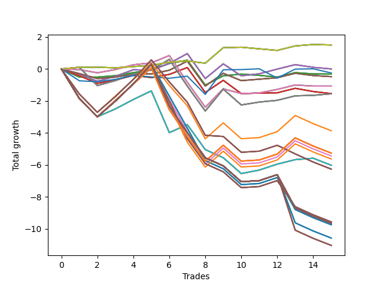

# Short Wallace Doodle 010 
- Symbol: AAPL_Unlimited
- Date Range: 03/23/2022 - 07/08/2022
- Trading Period: 7:20-12:30
- Number of Trades: 15



| Name | Win Percent | Profit | Avg Profit / Trade | Avg Time / Trade |      | Name | Win Percent | Profit | Avg Profit / Trade | Avg Time / Trade |
| ---- | ----------- | ------ | ------------------ | ---------------- | ---- | ---- | ----------- | ------ | ------------------ | ---------------- |
| Sorted By <br> Profit | | | | | | Sorted By <br> Win Percentage ||||
| Seventy | 60.00 | 750.00 | 50.00 | 05:20 |     | Sixty-Nine | 73.33 | -775.00 | -51.67 | 53:54 |
| Sixty-Two | 60.00 | 750.00 | 50.00 | 05:20 |     | Sixty-One | 73.33 | -775.00 | -51.67 | 53:54 |
| Fifty-Four | 60.00 | 750.00 | 50.00 | 05:20 |     | Fifty-Three | 73.33 | -775.00 | -51.67 | 53:54 |
| Forty-Six | 60.00 | 750.00 | 50.00 | 05:20 |     | Forty-Five | 73.33 | -775.00 | -51.67 | 53:54 |
| Six | 60.00 | 750.00 | 50.00 | 05:20 |     | Five | 73.33 | -775.00 | -51.67 | 53:54 |
| Sixty-Six | 53.33 | 0.00 | 0.00 | 24:58 |     | Seventy | 60.00 | 750.00 | 50.00 | 05:20 |
| Fifty-Eight | 53.33 | 0.00 | 0.00 | 24:58 |     | Sixty-Two | 60.00 | 750.00 | 50.00 | 05:20 |
| Fifty | 53.33 | 0.00 | 0.00 | 24:58 |     | Fifty-Four | 60.00 | 750.00 | 50.00 | 05:20 |
| Forty-Two | 53.33 | 0.00 | 0.00 | 24:58 |     | Forty-Six | 60.00 | 750.00 | 50.00 | 05:20 |
| Two | 53.33 | 0.00 | 0.00 | 24:58 |     | Six | 60.00 | 750.00 | 50.00 | 05:20 |
| Seventy-Three | 53.33 | -125.00 | -8.33 | 12:41 |     | Sixty-Seven | 60.00 | -240.00 | -16.00 | 25:21 |
| Sixty-Four | 53.33 | -160.00 | -10.67 | 10:12 |     | Fifty-Nine | 60.00 | -240.00 | -16.00 | 25:21 |
| Fifty-Six | 53.33 | -160.00 | -10.67 | 10:12 |     | Fifty-One | 60.00 | -240.00 | -16.00 | 25:21 |
| Forty-Eight | 53.33 | -160.00 | -10.67 | 10:12 |     | Forty-Three | 60.00 | -240.00 | -16.00 | 25:21 |
| Forty | 53.33 | -160.00 | -10.67 | 10:12 |     | Three | 60.00 | -240.00 | -16.00 | 25:21 |
| Zero | 53.33 | -160.00 | -10.67 | 10:12 |     | Sixty-Six | 53.33 | 0.00 | 0.00 | 24:58 |
| Sixty-Seven | 60.00 | -240.00 | -16.00 | 25:21 |     | Fifty-Eight | 53.33 | 0.00 | 0.00 | 24:58 |
| Fifty-Nine | 60.00 | -240.00 | -16.00 | 25:21 |     | Fifty | 53.33 | 0.00 | 0.00 | 24:58 |
| Fifty-One | 60.00 | -240.00 | -16.00 | 25:21 |     | Forty-Two | 53.33 | 0.00 | 0.00 | 24:58 |
| Forty-Three | 60.00 | -240.00 | -16.00 | 25:21 |     | Two | 53.33 | 0.00 | 0.00 | 24:58 |
| Three | 60.00 | -240.00 | -16.00 | 25:21 |     | Seventy-Three | 53.33 | -125.00 | -8.33 | 12:41 |
| Sixty-Eight | 53.33 | -535.00 | -35.67 | 33:50 |     | Sixty-Four | 53.33 | -160.00 | -10.67 | 10:12 |
| Sixty | 53.33 | -535.00 | -35.67 | 33:50 |     | Fifty-Six | 53.33 | -160.00 | -10.67 | 10:12 |
| Fifty-Two | 53.33 | -535.00 | -35.67 | 33:50 |     | Forty-Eight | 53.33 | -160.00 | -10.67 | 10:12 |
| Forty-Four | 53.33 | -535.00 | -35.67 | 33:50 |     | Forty | 53.33 | -160.00 | -10.67 | 10:12 |
| Four | 53.33 | -535.00 | -35.67 | 33:50 |     | Zero | 53.33 | -160.00 | -10.67 | 10:12 |
| Sixty-Five | 53.33 | -770.00 | -51.33 | 21:54 |     | Sixty-Eight | 53.33 | -535.00 | -35.67 | 33:50 |
| Fifty-Seven | 53.33 | -770.00 | -51.33 | 21:54 |     | Sixty | 53.33 | -535.00 | -35.67 | 33:50 |
| Forty-Nine | 53.33 | -770.00 | -51.33 | 21:54 |     | Fifty-Two | 53.33 | -535.00 | -35.67 | 33:50 |
| Forty-One | 53.33 | -770.00 | -51.33 | 21:54 |     | Forty-Four | 53.33 | -535.00 | -35.67 | 33:50 |
| One | 53.33 | -770.00 | -51.33 | 21:54 |     | Four | 53.33 | -535.00 | -35.67 | 33:50 |
| Sixty-Nine | 73.33 | -775.00 | -51.67 | 53:54 |     | Sixty-Five | 53.33 | -770.00 | -51.33 | 21:54 |
| Sixty-One | 73.33 | -775.00 | -51.67 | 53:54 |     | Fifty-Seven | 53.33 | -770.00 | -51.33 | 21:54 |
| Fifty-Three | 73.33 | -775.00 | -51.67 | 53:54 |     | Forty-Nine | 53.33 | -770.00 | -51.33 | 21:54 |
| Forty-Five | 73.33 | -775.00 | -51.67 | 53:54 |     | Forty-One | 53.33 | -770.00 | -51.33 | 21:54 |
| Five | 73.33 | -775.00 | -51.67 | 53:54 |     | One | 53.33 | -770.00 | -51.33 | 21:54 |
| Ninety-Six | 46.67 | -1930.00 | -128.67 | 95:11 |     | Seventy-One | 53.33 | -3010.00 | -200.67 | 100:22 |
| One Hundred Twenty-Six | 46.67 | -2630.00 | -175.33 | 102:50 |     | Sixty-Three | 53.33 | -3010.00 | -200.67 | 100:22 |
| One Hundred Twenty-One | 46.67 | -2630.00 | -175.33 | 102:50 |     | Fifty-Five | 53.33 | -3010.00 | -200.67 | 100:22 |
| One Hundred Sixteen | 46.67 | -2630.00 | -175.33 | 102:50 |     | Forty-Seven | 53.33 | -3010.00 | -200.67 | 100:22 |
| One Hundred Eleven | 46.67 | -2630.00 | -175.33 | 102:50 |     | Seven | 53.33 | -3010.00 | -200.67 | 100:22 |
| One Hundred One | 46.67 | -2630.00 | -175.33 | 102:50 |     | Ninety-Six | 46.67 | -1930.00 | -128.67 | 95:11 |
| Eighty-One | 46.67 | -2630.00 | -175.33 | 102:50 |     | One Hundred Twenty-Six | 46.67 | -2630.00 | -175.33 | 102:50 |
| Ninety-One | 46.67 | -2720.00 | -181.33 | 100:42 |     | One Hundred Twenty-One | 46.67 | -2630.00 | -175.33 | 102:50 |
| One Hundred Six | 46.67 | -2815.00 | -187.67 | 101:27 |     | One Hundred Sixteen | 46.67 | -2630.00 | -175.33 | 102:50 |
| Seventy-One | 53.33 | -3010.00 | -200.67 | 100:22 |     | One Hundred Eleven | 46.67 | -2630.00 | -175.33 | 102:50 |
| Sixty-Three | 53.33 | -3010.00 | -200.67 | 100:22 |     | One Hundred One | 46.67 | -2630.00 | -175.33 | 102:50 |
| Fifty-Five | 53.33 | -3010.00 | -200.67 | 100:22 |     | Eighty-One | 46.67 | -2630.00 | -175.33 | 102:50 |
| Forty-Seven | 53.33 | -3010.00 | -200.67 | 100:22 |     | Ninety-One | 46.67 | -2720.00 | -181.33 | 100:42 |
| Seven | 53.33 | -3010.00 | -200.67 | 100:22 |     | One Hundred Six | 46.67 | -2815.00 | -187.67 | 101:27 |
| One Hundred | 33.33 | -3130.00 | -208.67 | 111:55 |     | One Hundred | 33.33 | -3130.00 | -208.67 | 111:55 |
| Ninety-Nine | 33.33 | -3130.00 | -208.67 | 111:55 |     | Ninety-Nine | 33.33 | -3130.00 | -208.67 | 111:55 |
| Ninety-Eight | 33.33 | -3130.00 | -208.67 | 111:55 |     | Ninety-Eight | 33.33 | -3130.00 | -208.67 | 111:55 |
| Ninety-Seven | 33.33 | -3130.00 | -208.67 | 111:55 |     | Ninety-Seven | 33.33 | -3130.00 | -208.67 | 111:55 |
| One Hundred Ten | 33.33 | -4780.00 | -318.67 | 122:49 |     | One Hundred Ten | 33.33 | -4780.00 | -318.67 | 122:49 |
| One Hundred Nine | 33.33 | -4780.00 | -318.67 | 122:49 |     | One Hundred Nine | 33.33 | -4780.00 | -318.67 | 122:49 |
| One Hundred Eight | 33.33 | -4780.00 | -318.67 | 122:49 |     | One Hundred Eight | 33.33 | -4780.00 | -318.67 | 122:49 |
| One Hundred Seven | 33.33 | -4780.00 | -318.67 | 122:49 |     | One Hundred Seven | 33.33 | -4780.00 | -318.67 | 122:49 |
| One Hundred Thirty | 33.33 | -4820.00 | -321.33 | 128:36 |     | One Hundred Thirty | 33.33 | -4820.00 | -321.33 | 128:36 |
| One Hundred Twenty-Nine | 33.33 | -4820.00 | -321.33 | 128:36 |     | One Hundred Twenty-Nine | 33.33 | -4820.00 | -321.33 | 128:36 |
| One Hundred Twenty-Eight | 33.33 | -4820.00 | -321.33 | 128:36 |     | One Hundred Twenty-Eight | 33.33 | -4820.00 | -321.33 | 128:36 |
| One Hundred Twenty-Seven | 33.33 | -4820.00 | -321.33 | 128:36 |     | One Hundred Twenty-Seven | 33.33 | -4820.00 | -321.33 | 128:36 |
| One Hundred Twenty-Five | 33.33 | -4820.00 | -321.33 | 128:36 |     | One Hundred Twenty-Five | 33.33 | -4820.00 | -321.33 | 128:36 |
| One Hundred Twenty-Four | 33.33 | -4820.00 | -321.33 | 128:36 |     | One Hundred Twenty-Four | 33.33 | -4820.00 | -321.33 | 128:36 |
| One Hundred Twenty-Three | 33.33 | -4820.00 | -321.33 | 128:36 |     | One Hundred Twenty-Three | 33.33 | -4820.00 | -321.33 | 128:36 |
| One Hundred Twenty-Two | 33.33 | -4820.00 | -321.33 | 128:36 |     | One Hundred Twenty-Two | 33.33 | -4820.00 | -321.33 | 128:36 |
| One Hundred Fifteen | 33.33 | -4820.00 | -321.33 | 128:36 |     | One Hundred Fifteen | 33.33 | -4820.00 | -321.33 | 128:36 |
| One Hundred Fourteen | 33.33 | -4820.00 | -321.33 | 128:36 |     | One Hundred Fourteen | 33.33 | -4820.00 | -321.33 | 128:36 |
| One Hundred Thirteen | 33.33 | -4820.00 | -321.33 | 128:36 |     | One Hundred Thirteen | 33.33 | -4820.00 | -321.33 | 128:36 |
| One Hundred Twelve | 33.33 | -4820.00 | -321.33 | 128:36 |     | One Hundred Twelve | 33.33 | -4820.00 | -321.33 | 128:36 |
| Eighty-Five | 33.33 | -4820.00 | -321.33 | 128:36 |     | Eighty-Five | 33.33 | -4820.00 | -321.33 | 128:36 |
| Eighty-Four | 33.33 | -4820.00 | -321.33 | 128:36 |     | Eighty-Four | 33.33 | -4820.00 | -321.33 | 128:36 |
| Eighty-Three | 33.33 | -4820.00 | -321.33 | 128:36 |     | Eighty-Three | 33.33 | -4820.00 | -321.33 | 128:36 |
| Eighty-Two | 33.33 | -4820.00 | -321.33 | 128:36 |     | Eighty-Two | 33.33 | -4820.00 | -321.33 | 128:36 |
| Ninety-Five | 33.33 | -4870.00 | -324.67 | 122:05 |     | Ninety-Five | 33.33 | -4870.00 | -324.67 | 122:05 |
| Ninety-Four | 33.33 | -4870.00 | -324.67 | 122:05 |     | Ninety-Four | 33.33 | -4870.00 | -324.67 | 122:05 |
| Ninety-Three | 33.33 | -4870.00 | -324.67 | 122:05 |     | Ninety-Three | 33.33 | -4870.00 | -324.67 | 122:05 |
| Ninety-Two | 33.33 | -4870.00 | -324.67 | 122:05 |     | Ninety-Two | 33.33 | -4870.00 | -324.67 | 122:05 |
| One Hundred Five | 33.33 | -5285.00 | -352.33 | 127:36 |     | One Hundred Five | 33.33 | -5285.00 | -352.33 | 127:36 |
| One Hundred Four | 33.33 | -5285.00 | -352.33 | 127:36 |     | One Hundred Four | 33.33 | -5285.00 | -352.33 | 127:36 |
| One Hundred Three | 33.33 | -5285.00 | -352.33 | 127:36 |     | One Hundred Three | 33.33 | -5285.00 | -352.33 | 127:36 |
| One Hundred Two | 33.33 | -5285.00 | -352.33 | 127:36 |     | One Hundred Two | 33.33 | -5285.00 | -352.33 | 127:36 |
| One Hundred Twenty | 33.33 | -5515.00 | -367.67 | 127:47 |     | One Hundred Twenty | 33.33 | -5515.00 | -367.67 | 127:47 |
| One Hundred Ninteen | 33.33 | -5515.00 | -367.67 | 127:47 |     | One Hundred Ninteen | 33.33 | -5515.00 | -367.67 | 127:47 |
| One Hundred Eighteen | 33.33 | -5515.00 | -367.67 | 127:47 |     | One Hundred Eighteen | 33.33 | -5515.00 | -367.67 | 127:47 |
| One Hundred Seventeen | 33.33 | -5515.00 | -367.67 | 127:47 |     | One Hundred Seventeen | 33.33 | -5515.00 | -367.67 | 127:47 |

## NO STOPLOSS

### Test Zero
* Sell when price hits the middle line of the 20p bollinger
* No Stoploss
* Results:
```
Total Trades: 15
Percent Up: 46.67
Percent Down: 53.33
Total Points Moved Down: -0.32
Potential Profit: -160.00
Total Points Ups: 2.35 Count Ups: 7
Total Points Downs: 2.03 Count Downs: 8
```

<details><summary>Trades</summary>

<code>In: 2022-03-24 08:22:00		Out: 2022-03-24 08:49:10		Total Position Time: 27:10		Total Move Down: -0.51		Total to Date: -0.51</code> <br />
<code>In: 2022-03-28 09:57:00		Out: 2022-03-28 10:10:05		Total Position Time: 13:05		Total Move Down: -0.00		Total to Date: -0.51</code> <br />
<code>In: 2022-03-30 10:41:00		Out: 2022-03-30 10:44:30		Total Position Time: 03:30		Total Move Down: 0.09		Total to Date: -0.42</code> <br />
<code>In: 2022-03-30 10:43:00		Out: 2022-03-30 10:44:30		Total Position Time: 01:30		Total Move Down: 0.19		Total to Date: -0.23</code> <br />
<code>In: 2022-04-11 09:52:00		Out: 2022-04-11 09:55:05		Total Position Time: 03:05		Total Move Down: 0.18		Total to Date: -0.05</code> <br />
<code>In: 2022-04-25 09:28:00		Out: 2022-04-25 09:31:10		Total Position Time: 03:10		Total Move Down: 0.39		Total to Date: 0.34</code> <br />
<code>In: 2022-05-20 11:56:00		Out: 2022-05-20 12:02:25		Total Position Time: 06:25		Total Move Down: 0.21		Total to Date: 0.55</code> <br />
<code>In: 2022-05-20 12:24:00		Out: 2022-05-20 12:47:00		Total Position Time: 23:00		Total Move Down: -1.56		Total to Date: -1.01</code> <br />
<code>In: 2022-05-24 09:17:00		Out: 2022-05-24 09:21:30		Total Position Time: 04:30		Total Move Down: 0.58		Total to Date: -0.43</code> <br />
<code>In: 2022-06-01 11:07:00		Out: 2022-06-01 11:11:10		Total Position Time: 04:10		Total Move Down: 0.11		Total to Date: -0.32</code> <br />
<code>In: 2022-06-03 11:21:00		Out: 2022-06-03 11:35:40		Total Position Time: 14:40		Total Move Down: -0.08		Total to Date: -0.40</code> <br />
<code>In: 2022-06-10 10:39:00		Out: 2022-06-10 10:55:15		Total Position Time: 16:15		Total Move Down: -0.11		Total to Date: -0.51</code> <br />
<code>In: 2022-06-15 11:02:00		Out: 2022-06-15 11:03:10		Total Position Time: 01:10		Total Move Down: 0.28		Total to Date: -0.23</code> <br />
<code>In: 2022-06-24 11:17:00		Out: 2022-06-24 11:39:10		Total Position Time: 22:10		Total Move Down: -0.08		Total to Date: -0.31</code> <br />
<code>In: 2022-06-24 11:30:00		Out: 2022-06-24 11:39:10		Total Position Time: 09:10		Total Move Down: -0.01		Total to Date: -0.32</code> <br />


</details>

### Test One
* Sell when the price hits the upper line of the 20p 1std bollinger
* No Stoploss
* Results:
```
Total Trades: 15
Percent Up: 46.67
Percent Down: 53.33
Total Points Moved Down: -1.54
Potential Profit: -770.00
Total Points Ups: 3.76 Count Ups: 7
Total Points Downs: 2.22 Count Downs: 8
```

<details><summary>Trades</summary>

<code>In: 2022-03-24 08:22:00		Out: 2022-03-24 08:50:10		Total Position Time: 28:10		Total Move Down: -0.42		Total to Date: -0.42</code> <br />
<code>In: 2022-03-28 09:57:00		Out: 2022-03-28 10:52:25		Total Position Time: 55:25		Total Move Down: -0.48		Total to Date: -0.90</code> <br />
<code>In: 2022-03-30 10:41:00		Out: 2022-03-30 10:45:20		Total Position Time: 04:20		Total Move Down: 0.20		Total to Date: -0.70</code> <br />
<code>In: 2022-03-30 10:43:00		Out: 2022-03-30 10:45:20		Total Position Time: 02:20		Total Move Down: 0.30		Total to Date: -0.40</code> <br />
<code>In: 2022-04-11 09:52:00		Out: 2022-04-11 10:17:05		Total Position Time: 25:05		Total Move Down: -0.14		Total to Date: -0.54</code> <br />
<code>In: 2022-04-25 09:28:00		Out: 2022-04-25 09:43:40		Total Position Time: 15:40		Total Move Down: 0.20		Total to Date: -0.34</code> <br />
<code>In: 2022-05-20 11:56:00		Out: 2022-05-20 12:03:35		Total Position Time: 07:35		Total Move Down: 0.43		Total to Date: 0.09</code> <br />
<code>In: 2022-05-20 12:24:00		Out: 2022-05-20 12:47:00		Total Position Time: 23:00		Total Move Down: -1.56		Total to Date: -1.47</code> <br />
<code>In: 2022-05-24 09:17:00		Out: 2022-05-24 09:26:55		Total Position Time: 09:55		Total Move Down: 0.76		Total to Date: -0.71</code> <br />
<code>In: 2022-06-01 11:07:00		Out: 2022-06-01 11:46:10		Total Position Time: 39:10		Total Move Down: -0.83		Total to Date: -1.54</code> <br />
<code>In: 2022-06-03 11:21:00		Out: 2022-06-03 11:37:10		Total Position Time: 16:10		Total Move Down: 0.03		Total to Date: -1.51</code> <br />
<code>In: 2022-06-10 10:39:00		Out: 2022-06-10 10:58:20		Total Position Time: 19:20		Total Move Down: 0.02		Total to Date: -1.49</code> <br />
<code>In: 2022-06-15 11:02:00		Out: 2022-06-15 11:03:10		Total Position Time: 01:10		Total Move Down: 0.28		Total to Date: -1.21</code> <br />
<code>In: 2022-06-24 11:17:00		Out: 2022-06-24 12:04:05		Total Position Time: 47:05		Total Move Down: -0.20		Total to Date: -1.41</code> <br />
<code>In: 2022-06-24 11:30:00		Out: 2022-06-24 12:04:05		Total Position Time: 34:05		Total Move Down: -0.13		Total to Date: -1.54</code> <br />


</details>

### Test Two
* Sell when the price hits the upper line of the 20p 2std bollinger
* No Stoploss
* Results:
```
Total Trades: 15
Percent Up: 46.67
Percent Down: 53.33
Total Points Moved Down: 0.00
Potential Profit: 0.00
Total Points Ups: 3.39 Count Ups: 7
Total Points Downs: 3.39 Count Downs: 8
```

<details><summary>Trades</summary>

<code>In: 2022-03-24 08:22:00		Out: 2022-03-24 08:51:00		Total Position Time: 29:00		Total Move Down: -0.31		Total to Date: -0.31</code> <br />
<code>In: 2022-03-28 09:57:00		Out: 2022-03-28 10:54:15		Total Position Time: 57:15		Total Move Down: -0.46		Total to Date: -0.77</code> <br />
<code>In: 2022-03-30 10:41:00		Out: 2022-03-30 10:45:40		Total Position Time: 04:40		Total Move Down: 0.31		Total to Date: -0.46</code> <br />
<code>In: 2022-03-30 10:43:00		Out: 2022-03-30 10:45:40		Total Position Time: 02:40		Total Move Down: 0.41		Total to Date: -0.05</code> <br />
<code>In: 2022-04-11 09:52:00		Out: 2022-04-11 10:20:30		Total Position Time: 28:30		Total Move Down: -0.04		Total to Date: -0.09</code> <br />
<code>In: 2022-04-25 09:28:00		Out: 2022-04-25 09:57:05		Total Position Time: 29:05		Total Move Down: 0.44		Total to Date: 0.35</code> <br />
<code>In: 2022-05-20 11:56:00		Out: 2022-05-20 12:04:40		Total Position Time: 08:40		Total Move Down: 0.61		Total to Date: 0.96</code> <br />
<code>In: 2022-05-20 12:24:00		Out: 2022-05-20 12:47:00		Total Position Time: 23:00		Total Move Down: -1.56		Total to Date: -0.60</code> <br />
<code>In: 2022-05-24 09:17:00		Out: 2022-05-24 09:31:15		Total Position Time: 14:15		Total Move Down: 0.92		Total to Date: 0.32</code> <br />
<code>In: 2022-06-01 11:07:00		Out: 2022-06-01 11:46:35		Total Position Time: 39:35		Total Move Down: -0.75		Total to Date: -0.43</code> <br />
<code>In: 2022-06-03 11:21:00		Out: 2022-06-03 11:38:55		Total Position Time: 17:55		Total Move Down: 0.13		Total to Date: -0.30</code> <br />
<code>In: 2022-06-10 10:39:00		Out: 2022-06-10 11:13:25		Total Position Time: 34:25		Total Move Down: 0.29		Total to Date: -0.01</code> <br />
<code>In: 2022-06-15 11:02:00		Out: 2022-06-15 11:03:10		Total Position Time: 01:10		Total Move Down: 0.28		Total to Date: 0.27</code> <br />
<code>In: 2022-06-24 11:17:00		Out: 2022-06-24 12:05:40		Total Position Time: 48:40		Total Move Down: -0.17		Total to Date: 0.10</code> <br />
<code>In: 2022-06-24 11:30:00		Out: 2022-06-24 12:05:40		Total Position Time: 35:40		Total Move Down: -0.10		Total to Date: 0.00</code> <br />


</details>

### Test Three
* Sell when price hits the middle line of the 50p bollinger
* No Stoploss
* Results:
```
Total Trades: 15
Percent Up: 40.00
Percent Down: 60.00
Total Points Moved Down: -0.48
Potential Profit: -240.00
Total Points Ups: 2.83 Count Ups: 6
Total Points Downs: 2.35 Count Downs: 9
```

<details><summary>Trades</summary>

<code>In: 2022-03-24 08:22:00		Out: 2022-03-24 09:01:40		Total Position Time: 39:40		Total Move Down: -0.29		Total to Date: -0.29</code> <br />
<code>In: 2022-03-28 09:57:00		Out: 2022-03-28 10:55:10		Total Position Time: 58:10		Total Move Down: -0.31		Total to Date: -0.60</code> <br />
<code>In: 2022-03-30 10:41:00		Out: 2022-03-30 10:44:30		Total Position Time: 03:30		Total Move Down: 0.09		Total to Date: -0.51</code> <br />
<code>In: 2022-03-30 10:43:00		Out: 2022-03-30 10:44:30		Total Position Time: 01:30		Total Move Down: 0.19		Total to Date: -0.32</code> <br />
<code>In: 2022-04-11 09:52:00		Out: 2022-04-11 10:20:35		Total Position Time: 28:35		Total Move Down: 0.01		Total to Date: -0.31</code> <br />
<code>In: 2022-04-25 09:28:00		Out: 2022-04-25 09:55:10		Total Position Time: 27:10		Total Move Down: 0.23		Total to Date: -0.08</code> <br />
<code>In: 2022-05-20 11:56:00		Out: 2022-05-20 12:04:35		Total Position Time: 08:35		Total Move Down: 0.57		Total to Date: 0.49</code> <br />
<code>In: 2022-05-20 12:24:00		Out: 2022-05-20 12:47:00		Total Position Time: 23:00		Total Move Down: -1.56		Total to Date: -1.07</code> <br />
<code>In: 2022-05-24 09:17:00		Out: 2022-05-24 09:30:25		Total Position Time: 13:25		Total Move Down: 0.80		Total to Date: -0.27</code> <br />
<code>In: 2022-06-01 11:07:00		Out: 2022-06-01 11:51:15		Total Position Time: 44:15		Total Move Down: -0.46		Total to Date: -0.73</code> <br />
<code>In: 2022-06-03 11:21:00		Out: 2022-06-03 11:37:25		Total Position Time: 16:25		Total Move Down: 0.09		Total to Date: -0.64</code> <br />
<code>In: 2022-06-10 10:39:00		Out: 2022-06-10 11:01:10		Total Position Time: 22:10		Total Move Down: 0.09		Total to Date: -0.55</code> <br />
<code>In: 2022-06-15 11:02:00		Out: 2022-06-15 11:03:10		Total Position Time: 01:10		Total Move Down: 0.28		Total to Date: -0.27</code> <br />
<code>In: 2022-06-24 11:17:00		Out: 2022-06-24 12:09:55		Total Position Time: 52:55		Total Move Down: -0.14		Total to Date: -0.41</code> <br />
<code>In: 2022-06-24 11:30:00		Out: 2022-06-24 12:09:55		Total Position Time: 39:55		Total Move Down: -0.07		Total to Date: -0.48</code> <br />


</details>

### Test Four
* Sell when the price hits the upper line of the 50p 1std bollinger
* No Stoploss
* Results:
```
Total Trades: 15
Percent Up: 46.67
Percent Down: 53.33
Total Points Moved Down: -1.07
Potential Profit: -535.00
Total Points Ups: 3.84 Count Ups: 7
Total Points Downs: 2.77 Count Downs: 8
```

<details><summary>Trades</summary>

<code>In: 2022-03-24 08:22:00		Out: 2022-03-24 09:03:05		Total Position Time: 41:05		Total Move Down: -0.04		Total to Date: -0.04</code> <br />
<code>In: 2022-03-28 09:57:00		Out: 2022-03-28 10:56:45		Total Position Time: 59:45		Total Move Down: -0.20		Total to Date: -0.24</code> <br />
<code>In: 2022-03-30 10:41:00		Out: 2022-03-30 10:45:20		Total Position Time: 04:20		Total Move Down: 0.20		Total to Date: -0.04</code> <br />
<code>In: 2022-03-30 10:43:00		Out: 2022-03-30 10:45:20		Total Position Time: 02:20		Total Move Down: 0.30		Total to Date: 0.26</code> <br />
<code>In: 2022-04-11 09:52:00		Out: 2022-04-11 10:33:40		Total Position Time: 41:40		Total Move Down: 0.12		Total to Date: 0.38</code> <br />
<code>In: 2022-04-25 09:28:00		Out: 2022-04-25 10:01:10		Total Position Time: 33:10		Total Move Down: 0.46		Total to Date: 0.84</code> <br />
<code>In: 2022-05-20 11:56:00		Out: 2022-05-20 12:47:00		Total Position Time: 51:00		Total Move Down: -1.67		Total to Date: -0.83</code> <br />
<code>In: 2022-05-20 12:24:00		Out: 2022-05-20 12:47:00		Total Position Time: 23:00		Total Move Down: -1.56		Total to Date: -2.39</code> <br />
<code>In: 2022-05-24 09:17:00		Out: 2022-05-24 09:32:55		Total Position Time: 15:55		Total Move Down: 1.15		Total to Date: -1.24</code> <br />
<code>In: 2022-06-01 11:07:00		Out: 2022-06-01 12:03:15		Total Position Time: 56:15		Total Move Down: -0.30		Total to Date: -1.54</code> <br />
<code>In: 2022-06-03 11:21:00		Out: 2022-06-03 12:08:00		Total Position Time: 47:00		Total Move Down: 0.04		Total to Date: -1.50</code> <br />
<code>In: 2022-06-10 10:39:00		Out: 2022-06-10 11:12:55		Total Position Time: 33:55		Total Move Down: 0.22		Total to Date: -1.28</code> <br />
<code>In: 2022-06-15 11:02:00		Out: 2022-06-15 11:03:10		Total Position Time: 01:10		Total Move Down: 0.28		Total to Date: -1.00</code> <br />
<code>In: 2022-06-24 11:17:00		Out: 2022-06-24 12:12:00		Total Position Time: 55:00		Total Move Down: -0.07		Total to Date: -1.07</code> <br />
<code>In: 2022-06-24 11:30:00		Out: 2022-06-24 12:12:00		Total Position Time: 42:00		Total Move Down: -0.00		Total to Date: -1.07</code> <br />


</details>

### Test Five
* Sell when the price hits the upper line of the 50p 2std bollinger
* No Stoploss
* Results:
```
Total Trades: 15
Percent Up: 26.67
Percent Down: 73.33
Total Points Moved Down: -1.55
Potential Profit: -775.00
Total Points Ups: 5.36 Count Ups: 4
Total Points Downs: 3.81 Count Downs: 11
```

<details><summary>Trades</summary>

<code>In: 2022-03-24 08:22:00		Out: 2022-03-24 09:11:25		Total Position Time: 49:25		Total Move Down: 0.10		Total to Date: 0.10</code> <br />
<code>In: 2022-03-28 09:57:00		Out: 2022-03-28 12:47:00		Total Position Time: 170:00		Total Move Down: -1.14		Total to Date: -1.04</code> <br />
<code>In: 2022-03-30 10:41:00		Out: 2022-03-30 10:45:40		Total Position Time: 04:40		Total Move Down: 0.31		Total to Date: -0.73</code> <br />
<code>In: 2022-03-30 10:43:00		Out: 2022-03-30 10:45:40		Total Position Time: 02:40		Total Move Down: 0.41		Total to Date: -0.32</code> <br />
<code>In: 2022-04-11 09:52:00		Out: 2022-04-11 11:03:10		Total Position Time: 71:10		Total Move Down: 0.25		Total to Date: -0.07</code> <br />
<code>In: 2022-04-25 09:28:00		Out: 2022-04-25 10:05:25		Total Position Time: 37:25		Total Move Down: 0.67		Total to Date: 0.60</code> <br />
<code>In: 2022-05-20 11:56:00		Out: 2022-05-20 12:47:00		Total Position Time: 51:00		Total Move Down: -1.67		Total to Date: -1.07</code> <br />
<code>In: 2022-05-20 12:24:00		Out: 2022-05-20 12:47:00		Total Position Time: 23:00		Total Move Down: -1.56		Total to Date: -2.63</code> <br />
<code>In: 2022-05-24 09:17:00		Out: 2022-05-24 09:36:50		Total Position Time: 19:50		Total Move Down: 1.37		Total to Date: -1.26</code> <br />
<code>In: 2022-06-01 11:07:00		Out: 2022-06-01 12:47:00		Total Position Time: 100:00		Total Move Down: -0.99		Total to Date: -2.25</code> <br />
<code>In: 2022-06-03 11:21:00		Out: 2022-06-03 12:12:35		Total Position Time: 51:35		Total Move Down: 0.18		Total to Date: -2.07</code> <br />
<code>In: 2022-06-10 10:39:00		Out: 2022-06-10 12:45:25		Total Position Time: 126:25		Total Move Down: 0.11		Total to Date: -1.96</code> <br />
<code>In: 2022-06-15 11:02:00		Out: 2022-06-15 11:03:10		Total Position Time: 01:10		Total Move Down: 0.28		Total to Date: -1.68</code> <br />
<code>In: 2022-06-24 11:17:00		Out: 2022-06-24 12:13:40		Total Position Time: 56:40		Total Move Down: 0.03		Total to Date: -1.65</code> <br />
<code>In: 2022-06-24 11:30:00		Out: 2022-06-24 12:13:40		Total Position Time: 43:40		Total Move Down: 0.10		Total to Date: -1.55</code> <br />


</details>

### Test Six
* Sell when the price hits the middle line of the 1std VWAP
* No Stoploss
* Results:
```
Total Trades: 15
Percent Up: 40.00
Percent Down: 60.00
Total Points Moved Down: 1.50
Potential Profit: 750.00
Total Points Ups: 0.41 Count Ups: 6
Total Points Downs: 1.91 Count Downs: 9
```

<details><summary>Trades</summary>

<code>In: 2022-03-24 08:22:00		Out: 2022-03-24 09:11:35		Total Position Time: 49:35		Total Move Down: 0.11		Total to Date: 0.11</code> <br />
<code>In: 2022-03-28 09:57:00		Out: 2022-03-28 09:58:45		Total Position Time: 01:45		Total Move Down: -0.00		Total to Date: 0.11</code> <br />
<code>In: 2022-03-30 10:41:00		Out: 2022-03-30 10:42:35		Total Position Time: 01:35		Total Move Down: -0.04		Total to Date: 0.07</code> <br />
<code>In: 2022-03-30 10:43:00		Out: 2022-03-30 10:44:10		Total Position Time: 01:10		Total Move Down: 0.08		Total to Date: 0.15</code> <br />
<code>In: 2022-04-11 09:52:00		Out: 2022-04-11 09:53:10		Total Position Time: 01:10		Total Move Down: 0.07		Total to Date: 0.22</code> <br />
<code>In: 2022-04-25 09:28:00		Out: 2022-04-25 09:29:10		Total Position Time: 01:10		Total Move Down: 0.21		Total to Date: 0.43</code> <br />
<code>In: 2022-05-20 11:56:00		Out: 2022-05-20 11:57:10		Total Position Time: 01:10		Total Move Down: 0.07		Total to Date: 0.50</code> <br />
<code>In: 2022-05-20 12:24:00		Out: 2022-05-20 12:25:10		Total Position Time: 01:10		Total Move Down: -0.14		Total to Date: 0.36</code> <br />
<code>In: 2022-05-24 09:17:00		Out: 2022-05-24 09:31:20		Total Position Time: 14:20		Total Move Down: 0.97		Total to Date: 1.33</code> <br />
<code>In: 2022-06-01 11:07:00		Out: 2022-06-01 11:08:10		Total Position Time: 01:10		Total Move Down: 0.03		Total to Date: 1.36</code> <br />
<code>In: 2022-06-03 11:21:00		Out: 2022-06-03 11:22:10		Total Position Time: 01:10		Total Move Down: -0.10		Total to Date: 1.26</code> <br />
<code>In: 2022-06-10 10:39:00		Out: 2022-06-10 10:40:10		Total Position Time: 01:10		Total Move Down: -0.10		Total to Date: 1.16</code> <br />
<code>In: 2022-06-15 11:02:00		Out: 2022-06-15 11:03:10		Total Position Time: 01:10		Total Move Down: 0.28		Total to Date: 1.44</code> <br />
<code>In: 2022-06-24 11:17:00		Out: 2022-06-24 11:18:10		Total Position Time: 01:10		Total Move Down: 0.09		Total to Date: 1.53</code> <br />
<code>In: 2022-06-24 11:30:00		Out: 2022-06-24 11:31:10		Total Position Time: 01:10		Total Move Down: -0.03		Total to Date: 1.50</code> <br />


</details>

### Test Seven
* Sell when the price hits the upper line of the 1std VWAP
* No Stoploss
* Results:
```
Total Trades: 15
Percent Up: 46.67
Percent Down: 53.33
Total Points Moved Down: -6.02
Potential Profit: -3010.00
Total Points Ups: 9.10 Count Ups: 7
Total Points Downs: 3.08 Count Downs: 8
```

<details><summary>Trades</summary>

<code>In: 2022-03-24 08:22:00		Out: 2022-03-24 12:47:00		Total Position Time: 265:00		Total Move Down: -1.85		Total to Date: -1.85</code> <br />
<code>In: 2022-03-28 09:57:00		Out: 2022-03-28 12:47:00		Total Position Time: 170:00		Total Move Down: -1.14		Total to Date: -2.99</code> <br />
<code>In: 2022-03-30 10:41:00		Out: 2022-03-30 11:44:15		Total Position Time: 63:15		Total Move Down: 0.49		Total to Date: -2.50</code> <br />
<code>In: 2022-03-30 10:43:00		Out: 2022-03-30 11:44:15		Total Position Time: 61:15		Total Move Down: 0.59		Total to Date: -1.91</code> <br />
<code>In: 2022-04-11 09:52:00		Out: 2022-04-11 12:16:15		Total Position Time: 144:15		Total Move Down: 0.54		Total to Date: -1.37</code> <br />
<code>In: 2022-04-25 09:28:00		Out: 2022-04-25 12:47:00		Total Position Time: 199:00		Total Move Down: -2.61		Total to Date: -3.98</code> <br />
<code>In: 2022-05-20 11:56:00		Out: 2022-05-20 12:04:25		Total Position Time: 08:25		Total Move Down: 0.50		Total to Date: -3.48</code> <br />
<code>In: 2022-05-20 12:24:00		Out: 2022-05-20 12:47:00		Total Position Time: 23:00		Total Move Down: -1.56		Total to Date: -5.04</code> <br />
<code>In: 2022-05-24 09:17:00		Out: 2022-05-24 12:47:00		Total Position Time: 210:00		Total Move Down: -0.51		Total to Date: -5.55</code> <br />
<code>In: 2022-06-01 11:07:00		Out: 2022-06-01 12:47:00		Total Position Time: 100:00		Total Move Down: -0.99		Total to Date: -6.54</code> <br />
<code>In: 2022-06-03 11:21:00		Out: 2022-06-03 12:14:25		Total Position Time: 53:25		Total Move Down: 0.22		Total to Date: -6.32</code> <br />
<code>In: 2022-06-10 10:39:00		Out: 2022-06-10 12:47:00		Total Position Time: 128:00		Total Move Down: 0.37		Total to Date: -5.95</code> <br />
<code>In: 2022-06-15 11:02:00		Out: 2022-06-15 11:03:10		Total Position Time: 01:10		Total Move Down: 0.28		Total to Date: -5.67</code> <br />
<code>In: 2022-06-24 11:17:00		Out: 2022-06-24 11:18:45		Total Position Time: 01:45		Total Move Down: 0.09		Total to Date: -5.58</code> <br />
<code>In: 2022-06-24 11:30:00		Out: 2022-06-24 12:47:00		Total Position Time: 77:00		Total Move Down: -0.44		Total to Date: -6.02</code> <br />


</details>

## STOPLOSS OF 5

### Test Forty
* Sell when price hits the middle line of the 20p bollinger
* Stoploss is -5 points
* Results:
```
Total Trades: 15
Percent Up: 46.67
Percent Down: 53.33
Total Points Moved Down: -0.32
Potential Profit: -160.00
Total Points Ups: 2.35 Count Ups: 7
Total Points Downs: 2.03 Count Downs: 8
```

<details><summary>Trades</summary>

<code>In: 2022-03-24 08:22:00		Out: 2022-03-24 08:49:10		Total Position Time: 27:10		Total Move Down: -0.51		Total to Date: -0.51</code> <br />
<code>In: 2022-03-28 09:57:00		Out: 2022-03-28 10:10:05		Total Position Time: 13:05		Total Move Down: -0.00		Total to Date: -0.51</code> <br />
<code>In: 2022-03-30 10:41:00		Out: 2022-03-30 10:44:30		Total Position Time: 03:30		Total Move Down: 0.09		Total to Date: -0.42</code> <br />
<code>In: 2022-03-30 10:43:00		Out: 2022-03-30 10:44:30		Total Position Time: 01:30		Total Move Down: 0.19		Total to Date: -0.23</code> <br />
<code>In: 2022-04-11 09:52:00		Out: 2022-04-11 09:55:05		Total Position Time: 03:05		Total Move Down: 0.18		Total to Date: -0.05</code> <br />
<code>In: 2022-04-25 09:28:00		Out: 2022-04-25 09:31:10		Total Position Time: 03:10		Total Move Down: 0.39		Total to Date: 0.34</code> <br />
<code>In: 2022-05-20 11:56:00		Out: 2022-05-20 12:02:25		Total Position Time: 06:25		Total Move Down: 0.21		Total to Date: 0.55</code> <br />
<code>In: 2022-05-20 12:24:00		Out: 2022-05-20 12:47:00		Total Position Time: 23:00		Total Move Down: -1.56		Total to Date: -1.01</code> <br />
<code>In: 2022-05-24 09:17:00		Out: 2022-05-24 09:21:30		Total Position Time: 04:30		Total Move Down: 0.58		Total to Date: -0.43</code> <br />
<code>In: 2022-06-01 11:07:00		Out: 2022-06-01 11:11:10		Total Position Time: 04:10		Total Move Down: 0.11		Total to Date: -0.32</code> <br />
<code>In: 2022-06-03 11:21:00		Out: 2022-06-03 11:35:40		Total Position Time: 14:40		Total Move Down: -0.08		Total to Date: -0.40</code> <br />
<code>In: 2022-06-10 10:39:00		Out: 2022-06-10 10:55:15		Total Position Time: 16:15		Total Move Down: -0.11		Total to Date: -0.51</code> <br />
<code>In: 2022-06-15 11:02:00		Out: 2022-06-15 11:03:10		Total Position Time: 01:10		Total Move Down: 0.28		Total to Date: -0.23</code> <br />
<code>In: 2022-06-24 11:17:00		Out: 2022-06-24 11:39:10		Total Position Time: 22:10		Total Move Down: -0.08		Total to Date: -0.31</code> <br />
<code>In: 2022-06-24 11:30:00		Out: 2022-06-24 11:39:10		Total Position Time: 09:10		Total Move Down: -0.01		Total to Date: -0.32</code> <br />


</details>

### Test Forty-One
* Sell when the price hits the upper line of the 20p 1std bollinger
* Stoploss is -5 points
* Results:
```
Total Trades: 15
Percent Up: 46.67
Percent Down: 53.33
Total Points Moved Down: -1.54
Potential Profit: -770.00
Total Points Ups: 3.76 Count Ups: 7
Total Points Downs: 2.22 Count Downs: 8
```

<details><summary>Trades</summary>

<code>In: 2022-03-24 08:22:00		Out: 2022-03-24 08:50:10		Total Position Time: 28:10		Total Move Down: -0.42		Total to Date: -0.42</code> <br />
<code>In: 2022-03-28 09:57:00		Out: 2022-03-28 10:52:25		Total Position Time: 55:25		Total Move Down: -0.48		Total to Date: -0.90</code> <br />
<code>In: 2022-03-30 10:41:00		Out: 2022-03-30 10:45:20		Total Position Time: 04:20		Total Move Down: 0.20		Total to Date: -0.70</code> <br />
<code>In: 2022-03-30 10:43:00		Out: 2022-03-30 10:45:20		Total Position Time: 02:20		Total Move Down: 0.30		Total to Date: -0.40</code> <br />
<code>In: 2022-04-11 09:52:00		Out: 2022-04-11 10:17:05		Total Position Time: 25:05		Total Move Down: -0.14		Total to Date: -0.54</code> <br />
<code>In: 2022-04-25 09:28:00		Out: 2022-04-25 09:43:40		Total Position Time: 15:40		Total Move Down: 0.20		Total to Date: -0.34</code> <br />
<code>In: 2022-05-20 11:56:00		Out: 2022-05-20 12:03:35		Total Position Time: 07:35		Total Move Down: 0.43		Total to Date: 0.09</code> <br />
<code>In: 2022-05-20 12:24:00		Out: 2022-05-20 12:47:00		Total Position Time: 23:00		Total Move Down: -1.56		Total to Date: -1.47</code> <br />
<code>In: 2022-05-24 09:17:00		Out: 2022-05-24 09:26:55		Total Position Time: 09:55		Total Move Down: 0.76		Total to Date: -0.71</code> <br />
<code>In: 2022-06-01 11:07:00		Out: 2022-06-01 11:46:10		Total Position Time: 39:10		Total Move Down: -0.83		Total to Date: -1.54</code> <br />
<code>In: 2022-06-03 11:21:00		Out: 2022-06-03 11:37:10		Total Position Time: 16:10		Total Move Down: 0.03		Total to Date: -1.51</code> <br />
<code>In: 2022-06-10 10:39:00		Out: 2022-06-10 10:58:20		Total Position Time: 19:20		Total Move Down: 0.02		Total to Date: -1.49</code> <br />
<code>In: 2022-06-15 11:02:00		Out: 2022-06-15 11:03:10		Total Position Time: 01:10		Total Move Down: 0.28		Total to Date: -1.21</code> <br />
<code>In: 2022-06-24 11:17:00		Out: 2022-06-24 12:04:05		Total Position Time: 47:05		Total Move Down: -0.20		Total to Date: -1.41</code> <br />
<code>In: 2022-06-24 11:30:00		Out: 2022-06-24 12:04:05		Total Position Time: 34:05		Total Move Down: -0.13		Total to Date: -1.54</code> <br />


</details>

### Test Forty-Two
* Sell when the price hits the upper line of the 20p 2std bollinger
* Stoploss is -5 points
* Results:
```
Total Trades: 15
Percent Up: 46.67
Percent Down: 53.33
Total Points Moved Down: 0.00
Potential Profit: 0.00
Total Points Ups: 3.39 Count Ups: 7
Total Points Downs: 3.39 Count Downs: 8
```

<details><summary>Trades</summary>

<code>In: 2022-03-24 08:22:00		Out: 2022-03-24 08:51:00		Total Position Time: 29:00		Total Move Down: -0.31		Total to Date: -0.31</code> <br />
<code>In: 2022-03-28 09:57:00		Out: 2022-03-28 10:54:15		Total Position Time: 57:15		Total Move Down: -0.46		Total to Date: -0.77</code> <br />
<code>In: 2022-03-30 10:41:00		Out: 2022-03-30 10:45:40		Total Position Time: 04:40		Total Move Down: 0.31		Total to Date: -0.46</code> <br />
<code>In: 2022-03-30 10:43:00		Out: 2022-03-30 10:45:40		Total Position Time: 02:40		Total Move Down: 0.41		Total to Date: -0.05</code> <br />
<code>In: 2022-04-11 09:52:00		Out: 2022-04-11 10:20:30		Total Position Time: 28:30		Total Move Down: -0.04		Total to Date: -0.09</code> <br />
<code>In: 2022-04-25 09:28:00		Out: 2022-04-25 09:57:05		Total Position Time: 29:05		Total Move Down: 0.44		Total to Date: 0.35</code> <br />
<code>In: 2022-05-20 11:56:00		Out: 2022-05-20 12:04:40		Total Position Time: 08:40		Total Move Down: 0.61		Total to Date: 0.96</code> <br />
<code>In: 2022-05-20 12:24:00		Out: 2022-05-20 12:47:00		Total Position Time: 23:00		Total Move Down: -1.56		Total to Date: -0.60</code> <br />
<code>In: 2022-05-24 09:17:00		Out: 2022-05-24 09:31:15		Total Position Time: 14:15		Total Move Down: 0.92		Total to Date: 0.32</code> <br />
<code>In: 2022-06-01 11:07:00		Out: 2022-06-01 11:46:35		Total Position Time: 39:35		Total Move Down: -0.75		Total to Date: -0.43</code> <br />
<code>In: 2022-06-03 11:21:00		Out: 2022-06-03 11:38:55		Total Position Time: 17:55		Total Move Down: 0.13		Total to Date: -0.30</code> <br />
<code>In: 2022-06-10 10:39:00		Out: 2022-06-10 11:13:25		Total Position Time: 34:25		Total Move Down: 0.29		Total to Date: -0.01</code> <br />
<code>In: 2022-06-15 11:02:00		Out: 2022-06-15 11:03:10		Total Position Time: 01:10		Total Move Down: 0.28		Total to Date: 0.27</code> <br />
<code>In: 2022-06-24 11:17:00		Out: 2022-06-24 12:05:40		Total Position Time: 48:40		Total Move Down: -0.17		Total to Date: 0.10</code> <br />
<code>In: 2022-06-24 11:30:00		Out: 2022-06-24 12:05:40		Total Position Time: 35:40		Total Move Down: -0.10		Total to Date: 0.00</code> <br />


</details>

### Test Forty-Three
* Sell when price hits the middle line of the 50p bollinger
* Stoploss is -5 points
* Results:
```
Total Trades: 15
Percent Up: 40.00
Percent Down: 60.00
Total Points Moved Down: -0.48
Potential Profit: -240.00
Total Points Ups: 2.83 Count Ups: 6
Total Points Downs: 2.35 Count Downs: 9
```

<details><summary>Trades</summary>

<code>In: 2022-03-24 08:22:00		Out: 2022-03-24 09:01:40		Total Position Time: 39:40		Total Move Down: -0.29		Total to Date: -0.29</code> <br />
<code>In: 2022-03-28 09:57:00		Out: 2022-03-28 10:55:10		Total Position Time: 58:10		Total Move Down: -0.31		Total to Date: -0.60</code> <br />
<code>In: 2022-03-30 10:41:00		Out: 2022-03-30 10:44:30		Total Position Time: 03:30		Total Move Down: 0.09		Total to Date: -0.51</code> <br />
<code>In: 2022-03-30 10:43:00		Out: 2022-03-30 10:44:30		Total Position Time: 01:30		Total Move Down: 0.19		Total to Date: -0.32</code> <br />
<code>In: 2022-04-11 09:52:00		Out: 2022-04-11 10:20:35		Total Position Time: 28:35		Total Move Down: 0.01		Total to Date: -0.31</code> <br />
<code>In: 2022-04-25 09:28:00		Out: 2022-04-25 09:55:10		Total Position Time: 27:10		Total Move Down: 0.23		Total to Date: -0.08</code> <br />
<code>In: 2022-05-20 11:56:00		Out: 2022-05-20 12:04:35		Total Position Time: 08:35		Total Move Down: 0.57		Total to Date: 0.49</code> <br />
<code>In: 2022-05-20 12:24:00		Out: 2022-05-20 12:47:00		Total Position Time: 23:00		Total Move Down: -1.56		Total to Date: -1.07</code> <br />
<code>In: 2022-05-24 09:17:00		Out: 2022-05-24 09:30:25		Total Position Time: 13:25		Total Move Down: 0.80		Total to Date: -0.27</code> <br />
<code>In: 2022-06-01 11:07:00		Out: 2022-06-01 11:51:15		Total Position Time: 44:15		Total Move Down: -0.46		Total to Date: -0.73</code> <br />
<code>In: 2022-06-03 11:21:00		Out: 2022-06-03 11:37:25		Total Position Time: 16:25		Total Move Down: 0.09		Total to Date: -0.64</code> <br />
<code>In: 2022-06-10 10:39:00		Out: 2022-06-10 11:01:10		Total Position Time: 22:10		Total Move Down: 0.09		Total to Date: -0.55</code> <br />
<code>In: 2022-06-15 11:02:00		Out: 2022-06-15 11:03:10		Total Position Time: 01:10		Total Move Down: 0.28		Total to Date: -0.27</code> <br />
<code>In: 2022-06-24 11:17:00		Out: 2022-06-24 12:09:55		Total Position Time: 52:55		Total Move Down: -0.14		Total to Date: -0.41</code> <br />
<code>In: 2022-06-24 11:30:00		Out: 2022-06-24 12:09:55		Total Position Time: 39:55		Total Move Down: -0.07		Total to Date: -0.48</code> <br />


</details>

### Test Forty-Four
* Sell when the price hits the upper line of the 50p 1std bollinger
* Stoploss is -5 points
* Results:
```
Total Trades: 15
Percent Up: 46.67
Percent Down: 53.33
Total Points Moved Down: -1.07
Potential Profit: -535.00
Total Points Ups: 3.84 Count Ups: 7
Total Points Downs: 2.77 Count Downs: 8
```

<details><summary>Trades</summary>

<code>In: 2022-03-24 08:22:00		Out: 2022-03-24 09:03:05		Total Position Time: 41:05		Total Move Down: -0.04		Total to Date: -0.04</code> <br />
<code>In: 2022-03-28 09:57:00		Out: 2022-03-28 10:56:45		Total Position Time: 59:45		Total Move Down: -0.20		Total to Date: -0.24</code> <br />
<code>In: 2022-03-30 10:41:00		Out: 2022-03-30 10:45:20		Total Position Time: 04:20		Total Move Down: 0.20		Total to Date: -0.04</code> <br />
<code>In: 2022-03-30 10:43:00		Out: 2022-03-30 10:45:20		Total Position Time: 02:20		Total Move Down: 0.30		Total to Date: 0.26</code> <br />
<code>In: 2022-04-11 09:52:00		Out: 2022-04-11 10:33:40		Total Position Time: 41:40		Total Move Down: 0.12		Total to Date: 0.38</code> <br />
<code>In: 2022-04-25 09:28:00		Out: 2022-04-25 10:01:10		Total Position Time: 33:10		Total Move Down: 0.46		Total to Date: 0.84</code> <br />
<code>In: 2022-05-20 11:56:00		Out: 2022-05-20 12:47:00		Total Position Time: 51:00		Total Move Down: -1.67		Total to Date: -0.83</code> <br />
<code>In: 2022-05-20 12:24:00		Out: 2022-05-20 12:47:00		Total Position Time: 23:00		Total Move Down: -1.56		Total to Date: -2.39</code> <br />
<code>In: 2022-05-24 09:17:00		Out: 2022-05-24 09:32:55		Total Position Time: 15:55		Total Move Down: 1.15		Total to Date: -1.24</code> <br />
<code>In: 2022-06-01 11:07:00		Out: 2022-06-01 12:03:15		Total Position Time: 56:15		Total Move Down: -0.30		Total to Date: -1.54</code> <br />
<code>In: 2022-06-03 11:21:00		Out: 2022-06-03 12:08:00		Total Position Time: 47:00		Total Move Down: 0.04		Total to Date: -1.50</code> <br />
<code>In: 2022-06-10 10:39:00		Out: 2022-06-10 11:12:55		Total Position Time: 33:55		Total Move Down: 0.22		Total to Date: -1.28</code> <br />
<code>In: 2022-06-15 11:02:00		Out: 2022-06-15 11:03:10		Total Position Time: 01:10		Total Move Down: 0.28		Total to Date: -1.00</code> <br />
<code>In: 2022-06-24 11:17:00		Out: 2022-06-24 12:12:00		Total Position Time: 55:00		Total Move Down: -0.07		Total to Date: -1.07</code> <br />
<code>In: 2022-06-24 11:30:00		Out: 2022-06-24 12:12:00		Total Position Time: 42:00		Total Move Down: -0.00		Total to Date: -1.07</code> <br />


</details>

### Test Forty-Five
* Sell when the price hits the upper line of the 50p 2std bollinger
* Stoploss is -5 points
* Results:
```
Total Trades: 15
Percent Up: 26.67
Percent Down: 73.33
Total Points Moved Down: -1.55
Potential Profit: -775.00
Total Points Ups: 5.36 Count Ups: 4
Total Points Downs: 3.81 Count Downs: 11
```

<details><summary>Trades</summary>

<code>In: 2022-03-24 08:22:00		Out: 2022-03-24 09:11:25		Total Position Time: 49:25		Total Move Down: 0.10		Total to Date: 0.10</code> <br />
<code>In: 2022-03-28 09:57:00		Out: 2022-03-28 12:47:00		Total Position Time: 170:00		Total Move Down: -1.14		Total to Date: -1.04</code> <br />
<code>In: 2022-03-30 10:41:00		Out: 2022-03-30 10:45:40		Total Position Time: 04:40		Total Move Down: 0.31		Total to Date: -0.73</code> <br />
<code>In: 2022-03-30 10:43:00		Out: 2022-03-30 10:45:40		Total Position Time: 02:40		Total Move Down: 0.41		Total to Date: -0.32</code> <br />
<code>In: 2022-04-11 09:52:00		Out: 2022-04-11 11:03:10		Total Position Time: 71:10		Total Move Down: 0.25		Total to Date: -0.07</code> <br />
<code>In: 2022-04-25 09:28:00		Out: 2022-04-25 10:05:25		Total Position Time: 37:25		Total Move Down: 0.67		Total to Date: 0.60</code> <br />
<code>In: 2022-05-20 11:56:00		Out: 2022-05-20 12:47:00		Total Position Time: 51:00		Total Move Down: -1.67		Total to Date: -1.07</code> <br />
<code>In: 2022-05-20 12:24:00		Out: 2022-05-20 12:47:00		Total Position Time: 23:00		Total Move Down: -1.56		Total to Date: -2.63</code> <br />
<code>In: 2022-05-24 09:17:00		Out: 2022-05-24 09:36:50		Total Position Time: 19:50		Total Move Down: 1.37		Total to Date: -1.26</code> <br />
<code>In: 2022-06-01 11:07:00		Out: 2022-06-01 12:47:00		Total Position Time: 100:00		Total Move Down: -0.99		Total to Date: -2.25</code> <br />
<code>In: 2022-06-03 11:21:00		Out: 2022-06-03 12:12:35		Total Position Time: 51:35		Total Move Down: 0.18		Total to Date: -2.07</code> <br />
<code>In: 2022-06-10 10:39:00		Out: 2022-06-10 12:45:25		Total Position Time: 126:25		Total Move Down: 0.11		Total to Date: -1.96</code> <br />
<code>In: 2022-06-15 11:02:00		Out: 2022-06-15 11:03:10		Total Position Time: 01:10		Total Move Down: 0.28		Total to Date: -1.68</code> <br />
<code>In: 2022-06-24 11:17:00		Out: 2022-06-24 12:13:40		Total Position Time: 56:40		Total Move Down: 0.03		Total to Date: -1.65</code> <br />
<code>In: 2022-06-24 11:30:00		Out: 2022-06-24 12:13:40		Total Position Time: 43:40		Total Move Down: 0.10		Total to Date: -1.55</code> <br />


</details>

### Test Forty-Six
* Sell when the price hits the middle line of the 1std VWAP
* Stoploss is -5 points
* Results:
```
Total Trades: 15
Percent Up: 40.00
Percent Down: 60.00
Total Points Moved Down: 1.50
Potential Profit: 750.00
Total Points Ups: 0.41 Count Ups: 6
Total Points Downs: 1.91 Count Downs: 9
```

<details><summary>Trades</summary>

<code>In: 2022-03-24 08:22:00		Out: 2022-03-24 09:11:35		Total Position Time: 49:35		Total Move Down: 0.11		Total to Date: 0.11</code> <br />
<code>In: 2022-03-28 09:57:00		Out: 2022-03-28 09:58:45		Total Position Time: 01:45		Total Move Down: -0.00		Total to Date: 0.11</code> <br />
<code>In: 2022-03-30 10:41:00		Out: 2022-03-30 10:42:35		Total Position Time: 01:35		Total Move Down: -0.04		Total to Date: 0.07</code> <br />
<code>In: 2022-03-30 10:43:00		Out: 2022-03-30 10:44:10		Total Position Time: 01:10		Total Move Down: 0.08		Total to Date: 0.15</code> <br />
<code>In: 2022-04-11 09:52:00		Out: 2022-04-11 09:53:10		Total Position Time: 01:10		Total Move Down: 0.07		Total to Date: 0.22</code> <br />
<code>In: 2022-04-25 09:28:00		Out: 2022-04-25 09:29:10		Total Position Time: 01:10		Total Move Down: 0.21		Total to Date: 0.43</code> <br />
<code>In: 2022-05-20 11:56:00		Out: 2022-05-20 11:57:10		Total Position Time: 01:10		Total Move Down: 0.07		Total to Date: 0.50</code> <br />
<code>In: 2022-05-20 12:24:00		Out: 2022-05-20 12:25:10		Total Position Time: 01:10		Total Move Down: -0.14		Total to Date: 0.36</code> <br />
<code>In: 2022-05-24 09:17:00		Out: 2022-05-24 09:31:20		Total Position Time: 14:20		Total Move Down: 0.97		Total to Date: 1.33</code> <br />
<code>In: 2022-06-01 11:07:00		Out: 2022-06-01 11:08:10		Total Position Time: 01:10		Total Move Down: 0.03		Total to Date: 1.36</code> <br />
<code>In: 2022-06-03 11:21:00		Out: 2022-06-03 11:22:10		Total Position Time: 01:10		Total Move Down: -0.10		Total to Date: 1.26</code> <br />
<code>In: 2022-06-10 10:39:00		Out: 2022-06-10 10:40:10		Total Position Time: 01:10		Total Move Down: -0.10		Total to Date: 1.16</code> <br />
<code>In: 2022-06-15 11:02:00		Out: 2022-06-15 11:03:10		Total Position Time: 01:10		Total Move Down: 0.28		Total to Date: 1.44</code> <br />
<code>In: 2022-06-24 11:17:00		Out: 2022-06-24 11:18:10		Total Position Time: 01:10		Total Move Down: 0.09		Total to Date: 1.53</code> <br />
<code>In: 2022-06-24 11:30:00		Out: 2022-06-24 11:31:10		Total Position Time: 01:10		Total Move Down: -0.03		Total to Date: 1.50</code> <br />


</details>

### Test Forty-Seven
* Sell when the price hits the upper line of the 1std VWAP
* Stoploss is -5 points
* Results:
```
Total Trades: 15
Percent Up: 46.67
Percent Down: 53.33
Total Points Moved Down: -6.02
Potential Profit: -3010.00
Total Points Ups: 9.10 Count Ups: 7
Total Points Downs: 3.08 Count Downs: 8
```

<details><summary>Trades</summary>

<code>In: 2022-03-24 08:22:00		Out: 2022-03-24 12:47:00		Total Position Time: 265:00		Total Move Down: -1.85		Total to Date: -1.85</code> <br />
<code>In: 2022-03-28 09:57:00		Out: 2022-03-28 12:47:00		Total Position Time: 170:00		Total Move Down: -1.14		Total to Date: -2.99</code> <br />
<code>In: 2022-03-30 10:41:00		Out: 2022-03-30 11:44:15		Total Position Time: 63:15		Total Move Down: 0.49		Total to Date: -2.50</code> <br />
<code>In: 2022-03-30 10:43:00		Out: 2022-03-30 11:44:15		Total Position Time: 61:15		Total Move Down: 0.59		Total to Date: -1.91</code> <br />
<code>In: 2022-04-11 09:52:00		Out: 2022-04-11 12:16:15		Total Position Time: 144:15		Total Move Down: 0.54		Total to Date: -1.37</code> <br />
<code>In: 2022-04-25 09:28:00		Out: 2022-04-25 12:47:00		Total Position Time: 199:00		Total Move Down: -2.61		Total to Date: -3.98</code> <br />
<code>In: 2022-05-20 11:56:00		Out: 2022-05-20 12:04:25		Total Position Time: 08:25		Total Move Down: 0.50		Total to Date: -3.48</code> <br />
<code>In: 2022-05-20 12:24:00		Out: 2022-05-20 12:47:00		Total Position Time: 23:00		Total Move Down: -1.56		Total to Date: -5.04</code> <br />
<code>In: 2022-05-24 09:17:00		Out: 2022-05-24 12:47:00		Total Position Time: 210:00		Total Move Down: -0.51		Total to Date: -5.55</code> <br />
<code>In: 2022-06-01 11:07:00		Out: 2022-06-01 12:47:00		Total Position Time: 100:00		Total Move Down: -0.99		Total to Date: -6.54</code> <br />
<code>In: 2022-06-03 11:21:00		Out: 2022-06-03 12:14:25		Total Position Time: 53:25		Total Move Down: 0.22		Total to Date: -6.32</code> <br />
<code>In: 2022-06-10 10:39:00		Out: 2022-06-10 12:47:00		Total Position Time: 128:00		Total Move Down: 0.37		Total to Date: -5.95</code> <br />
<code>In: 2022-06-15 11:02:00		Out: 2022-06-15 11:03:10		Total Position Time: 01:10		Total Move Down: 0.28		Total to Date: -5.67</code> <br />
<code>In: 2022-06-24 11:17:00		Out: 2022-06-24 11:18:45		Total Position Time: 01:45		Total Move Down: 0.09		Total to Date: -5.58</code> <br />
<code>In: 2022-06-24 11:30:00		Out: 2022-06-24 12:47:00		Total Position Time: 77:00		Total Move Down: -0.44		Total to Date: -6.02</code> <br />


</details>

## TRAIL STOP OF 5

### Test Forty-Eight
* Sell when price hits the middle line of the 20p bollinger
* Trailing Stop is -5 points
* Results:
```
Total Trades: 15
Percent Up: 46.67
Percent Down: 53.33
Total Points Moved Down: -0.32
Potential Profit: -160.00
Total Points Ups: 2.35 Count Ups: 7
Total Points Downs: 2.03 Count Downs: 8
```

<details><summary>Trades</summary>

<code>In: 2022-03-24 08:22:00		Out: 2022-03-24 08:49:10		Total Position Time: 27:10		Total Move Down: -0.51		Total to Date: -0.51</code> <br />
<code>In: 2022-03-28 09:57:00		Out: 2022-03-28 10:10:05		Total Position Time: 13:05		Total Move Down: -0.00		Total to Date: -0.51</code> <br />
<code>In: 2022-03-30 10:41:00		Out: 2022-03-30 10:44:30		Total Position Time: 03:30		Total Move Down: 0.09		Total to Date: -0.42</code> <br />
<code>In: 2022-03-30 10:43:00		Out: 2022-03-30 10:44:30		Total Position Time: 01:30		Total Move Down: 0.19		Total to Date: -0.23</code> <br />
<code>In: 2022-04-11 09:52:00		Out: 2022-04-11 09:55:05		Total Position Time: 03:05		Total Move Down: 0.18		Total to Date: -0.05</code> <br />
<code>In: 2022-04-25 09:28:00		Out: 2022-04-25 09:31:10		Total Position Time: 03:10		Total Move Down: 0.39		Total to Date: 0.34</code> <br />
<code>In: 2022-05-20 11:56:00		Out: 2022-05-20 12:02:25		Total Position Time: 06:25		Total Move Down: 0.21		Total to Date: 0.55</code> <br />
<code>In: 2022-05-20 12:24:00		Out: 2022-05-20 12:47:00		Total Position Time: 23:00		Total Move Down: -1.56		Total to Date: -1.01</code> <br />
<code>In: 2022-05-24 09:17:00		Out: 2022-05-24 09:21:30		Total Position Time: 04:30		Total Move Down: 0.58		Total to Date: -0.43</code> <br />
<code>In: 2022-06-01 11:07:00		Out: 2022-06-01 11:11:10		Total Position Time: 04:10		Total Move Down: 0.11		Total to Date: -0.32</code> <br />
<code>In: 2022-06-03 11:21:00		Out: 2022-06-03 11:35:40		Total Position Time: 14:40		Total Move Down: -0.08		Total to Date: -0.40</code> <br />
<code>In: 2022-06-10 10:39:00		Out: 2022-06-10 10:55:15		Total Position Time: 16:15		Total Move Down: -0.11		Total to Date: -0.51</code> <br />
<code>In: 2022-06-15 11:02:00		Out: 2022-06-15 11:03:10		Total Position Time: 01:10		Total Move Down: 0.28		Total to Date: -0.23</code> <br />
<code>In: 2022-06-24 11:17:00		Out: 2022-06-24 11:39:10		Total Position Time: 22:10		Total Move Down: -0.08		Total to Date: -0.31</code> <br />
<code>In: 2022-06-24 11:30:00		Out: 2022-06-24 11:39:10		Total Position Time: 09:10		Total Move Down: -0.01		Total to Date: -0.32</code> <br />


</details>

### Test Forty-Nine
* Sell when the price hits the upper line of the 20p 1std bollinger
* Trailing Stop is -5 points
* Results:
```
Total Trades: 15
Percent Up: 46.67
Percent Down: 53.33
Total Points Moved Down: -1.54
Potential Profit: -770.00
Total Points Ups: 3.76 Count Ups: 7
Total Points Downs: 2.22 Count Downs: 8
```

<details><summary>Trades</summary>

<code>In: 2022-03-24 08:22:00		Out: 2022-03-24 08:50:10		Total Position Time: 28:10		Total Move Down: -0.42		Total to Date: -0.42</code> <br />
<code>In: 2022-03-28 09:57:00		Out: 2022-03-28 10:52:25		Total Position Time: 55:25		Total Move Down: -0.48		Total to Date: -0.90</code> <br />
<code>In: 2022-03-30 10:41:00		Out: 2022-03-30 10:45:20		Total Position Time: 04:20		Total Move Down: 0.20		Total to Date: -0.70</code> <br />
<code>In: 2022-03-30 10:43:00		Out: 2022-03-30 10:45:20		Total Position Time: 02:20		Total Move Down: 0.30		Total to Date: -0.40</code> <br />
<code>In: 2022-04-11 09:52:00		Out: 2022-04-11 10:17:05		Total Position Time: 25:05		Total Move Down: -0.14		Total to Date: -0.54</code> <br />
<code>In: 2022-04-25 09:28:00		Out: 2022-04-25 09:43:40		Total Position Time: 15:40		Total Move Down: 0.20		Total to Date: -0.34</code> <br />
<code>In: 2022-05-20 11:56:00		Out: 2022-05-20 12:03:35		Total Position Time: 07:35		Total Move Down: 0.43		Total to Date: 0.09</code> <br />
<code>In: 2022-05-20 12:24:00		Out: 2022-05-20 12:47:00		Total Position Time: 23:00		Total Move Down: -1.56		Total to Date: -1.47</code> <br />
<code>In: 2022-05-24 09:17:00		Out: 2022-05-24 09:26:55		Total Position Time: 09:55		Total Move Down: 0.76		Total to Date: -0.71</code> <br />
<code>In: 2022-06-01 11:07:00		Out: 2022-06-01 11:46:10		Total Position Time: 39:10		Total Move Down: -0.83		Total to Date: -1.54</code> <br />
<code>In: 2022-06-03 11:21:00		Out: 2022-06-03 11:37:10		Total Position Time: 16:10		Total Move Down: 0.03		Total to Date: -1.51</code> <br />
<code>In: 2022-06-10 10:39:00		Out: 2022-06-10 10:58:20		Total Position Time: 19:20		Total Move Down: 0.02		Total to Date: -1.49</code> <br />
<code>In: 2022-06-15 11:02:00		Out: 2022-06-15 11:03:10		Total Position Time: 01:10		Total Move Down: 0.28		Total to Date: -1.21</code> <br />
<code>In: 2022-06-24 11:17:00		Out: 2022-06-24 12:04:05		Total Position Time: 47:05		Total Move Down: -0.20		Total to Date: -1.41</code> <br />
<code>In: 2022-06-24 11:30:00		Out: 2022-06-24 12:04:05		Total Position Time: 34:05		Total Move Down: -0.13		Total to Date: -1.54</code> <br />


</details>

### Test Fifty
* Sell when the price hits the upper line of the 20p 2std bollinger
* Trailing Stop is -5 points
* Results:
```
Total Trades: 15
Percent Up: 46.67
Percent Down: 53.33
Total Points Moved Down: 0.00
Potential Profit: 0.00
Total Points Ups: 3.39 Count Ups: 7
Total Points Downs: 3.39 Count Downs: 8
```

<details><summary>Trades</summary>

<code>In: 2022-03-24 08:22:00		Out: 2022-03-24 08:51:00		Total Position Time: 29:00		Total Move Down: -0.31		Total to Date: -0.31</code> <br />
<code>In: 2022-03-28 09:57:00		Out: 2022-03-28 10:54:15		Total Position Time: 57:15		Total Move Down: -0.46		Total to Date: -0.77</code> <br />
<code>In: 2022-03-30 10:41:00		Out: 2022-03-30 10:45:40		Total Position Time: 04:40		Total Move Down: 0.31		Total to Date: -0.46</code> <br />
<code>In: 2022-03-30 10:43:00		Out: 2022-03-30 10:45:40		Total Position Time: 02:40		Total Move Down: 0.41		Total to Date: -0.05</code> <br />
<code>In: 2022-04-11 09:52:00		Out: 2022-04-11 10:20:30		Total Position Time: 28:30		Total Move Down: -0.04		Total to Date: -0.09</code> <br />
<code>In: 2022-04-25 09:28:00		Out: 2022-04-25 09:57:05		Total Position Time: 29:05		Total Move Down: 0.44		Total to Date: 0.35</code> <br />
<code>In: 2022-05-20 11:56:00		Out: 2022-05-20 12:04:40		Total Position Time: 08:40		Total Move Down: 0.61		Total to Date: 0.96</code> <br />
<code>In: 2022-05-20 12:24:00		Out: 2022-05-20 12:47:00		Total Position Time: 23:00		Total Move Down: -1.56		Total to Date: -0.60</code> <br />
<code>In: 2022-05-24 09:17:00		Out: 2022-05-24 09:31:15		Total Position Time: 14:15		Total Move Down: 0.92		Total to Date: 0.32</code> <br />
<code>In: 2022-06-01 11:07:00		Out: 2022-06-01 11:46:35		Total Position Time: 39:35		Total Move Down: -0.75		Total to Date: -0.43</code> <br />
<code>In: 2022-06-03 11:21:00		Out: 2022-06-03 11:38:55		Total Position Time: 17:55		Total Move Down: 0.13		Total to Date: -0.30</code> <br />
<code>In: 2022-06-10 10:39:00		Out: 2022-06-10 11:13:25		Total Position Time: 34:25		Total Move Down: 0.29		Total to Date: -0.01</code> <br />
<code>In: 2022-06-15 11:02:00		Out: 2022-06-15 11:03:10		Total Position Time: 01:10		Total Move Down: 0.28		Total to Date: 0.27</code> <br />
<code>In: 2022-06-24 11:17:00		Out: 2022-06-24 12:05:40		Total Position Time: 48:40		Total Move Down: -0.17		Total to Date: 0.10</code> <br />
<code>In: 2022-06-24 11:30:00		Out: 2022-06-24 12:05:40		Total Position Time: 35:40		Total Move Down: -0.10		Total to Date: 0.00</code> <br />


</details>

### Test Fifty-One
* Sell when price hits the middle line of the 50p bollinger
* Trailing Stop is -5 points
* Results:
```
Total Trades: 15
Percent Up: 40.00
Percent Down: 60.00
Total Points Moved Down: -0.48
Potential Profit: -240.00
Total Points Ups: 2.83 Count Ups: 6
Total Points Downs: 2.35 Count Downs: 9
```

<details><summary>Trades</summary>

<code>In: 2022-03-24 08:22:00		Out: 2022-03-24 09:01:40		Total Position Time: 39:40		Total Move Down: -0.29		Total to Date: -0.29</code> <br />
<code>In: 2022-03-28 09:57:00		Out: 2022-03-28 10:55:10		Total Position Time: 58:10		Total Move Down: -0.31		Total to Date: -0.60</code> <br />
<code>In: 2022-03-30 10:41:00		Out: 2022-03-30 10:44:30		Total Position Time: 03:30		Total Move Down: 0.09		Total to Date: -0.51</code> <br />
<code>In: 2022-03-30 10:43:00		Out: 2022-03-30 10:44:30		Total Position Time: 01:30		Total Move Down: 0.19		Total to Date: -0.32</code> <br />
<code>In: 2022-04-11 09:52:00		Out: 2022-04-11 10:20:35		Total Position Time: 28:35		Total Move Down: 0.01		Total to Date: -0.31</code> <br />
<code>In: 2022-04-25 09:28:00		Out: 2022-04-25 09:55:10		Total Position Time: 27:10		Total Move Down: 0.23		Total to Date: -0.08</code> <br />
<code>In: 2022-05-20 11:56:00		Out: 2022-05-20 12:04:35		Total Position Time: 08:35		Total Move Down: 0.57		Total to Date: 0.49</code> <br />
<code>In: 2022-05-20 12:24:00		Out: 2022-05-20 12:47:00		Total Position Time: 23:00		Total Move Down: -1.56		Total to Date: -1.07</code> <br />
<code>In: 2022-05-24 09:17:00		Out: 2022-05-24 09:30:25		Total Position Time: 13:25		Total Move Down: 0.80		Total to Date: -0.27</code> <br />
<code>In: 2022-06-01 11:07:00		Out: 2022-06-01 11:51:15		Total Position Time: 44:15		Total Move Down: -0.46		Total to Date: -0.73</code> <br />
<code>In: 2022-06-03 11:21:00		Out: 2022-06-03 11:37:25		Total Position Time: 16:25		Total Move Down: 0.09		Total to Date: -0.64</code> <br />
<code>In: 2022-06-10 10:39:00		Out: 2022-06-10 11:01:10		Total Position Time: 22:10		Total Move Down: 0.09		Total to Date: -0.55</code> <br />
<code>In: 2022-06-15 11:02:00		Out: 2022-06-15 11:03:10		Total Position Time: 01:10		Total Move Down: 0.28		Total to Date: -0.27</code> <br />
<code>In: 2022-06-24 11:17:00		Out: 2022-06-24 12:09:55		Total Position Time: 52:55		Total Move Down: -0.14		Total to Date: -0.41</code> <br />
<code>In: 2022-06-24 11:30:00		Out: 2022-06-24 12:09:55		Total Position Time: 39:55		Total Move Down: -0.07		Total to Date: -0.48</code> <br />


</details>

### Test Fifty-Two
* Sell when the price hits the upper line of the 50p 1std bollinger
* Trailing Stop is -5 points
* Results:
```
Total Trades: 15
Percent Up: 46.67
Percent Down: 53.33
Total Points Moved Down: -1.07
Potential Profit: -535.00
Total Points Ups: 3.84 Count Ups: 7
Total Points Downs: 2.77 Count Downs: 8
```

<details><summary>Trades</summary>

<code>In: 2022-03-24 08:22:00		Out: 2022-03-24 09:03:05		Total Position Time: 41:05		Total Move Down: -0.04		Total to Date: -0.04</code> <br />
<code>In: 2022-03-28 09:57:00		Out: 2022-03-28 10:56:45		Total Position Time: 59:45		Total Move Down: -0.20		Total to Date: -0.24</code> <br />
<code>In: 2022-03-30 10:41:00		Out: 2022-03-30 10:45:20		Total Position Time: 04:20		Total Move Down: 0.20		Total to Date: -0.04</code> <br />
<code>In: 2022-03-30 10:43:00		Out: 2022-03-30 10:45:20		Total Position Time: 02:20		Total Move Down: 0.30		Total to Date: 0.26</code> <br />
<code>In: 2022-04-11 09:52:00		Out: 2022-04-11 10:33:40		Total Position Time: 41:40		Total Move Down: 0.12		Total to Date: 0.38</code> <br />
<code>In: 2022-04-25 09:28:00		Out: 2022-04-25 10:01:10		Total Position Time: 33:10		Total Move Down: 0.46		Total to Date: 0.84</code> <br />
<code>In: 2022-05-20 11:56:00		Out: 2022-05-20 12:47:00		Total Position Time: 51:00		Total Move Down: -1.67		Total to Date: -0.83</code> <br />
<code>In: 2022-05-20 12:24:00		Out: 2022-05-20 12:47:00		Total Position Time: 23:00		Total Move Down: -1.56		Total to Date: -2.39</code> <br />
<code>In: 2022-05-24 09:17:00		Out: 2022-05-24 09:32:55		Total Position Time: 15:55		Total Move Down: 1.15		Total to Date: -1.24</code> <br />
<code>In: 2022-06-01 11:07:00		Out: 2022-06-01 12:03:15		Total Position Time: 56:15		Total Move Down: -0.30		Total to Date: -1.54</code> <br />
<code>In: 2022-06-03 11:21:00		Out: 2022-06-03 12:08:00		Total Position Time: 47:00		Total Move Down: 0.04		Total to Date: -1.50</code> <br />
<code>In: 2022-06-10 10:39:00		Out: 2022-06-10 11:12:55		Total Position Time: 33:55		Total Move Down: 0.22		Total to Date: -1.28</code> <br />
<code>In: 2022-06-15 11:02:00		Out: 2022-06-15 11:03:10		Total Position Time: 01:10		Total Move Down: 0.28		Total to Date: -1.00</code> <br />
<code>In: 2022-06-24 11:17:00		Out: 2022-06-24 12:12:00		Total Position Time: 55:00		Total Move Down: -0.07		Total to Date: -1.07</code> <br />
<code>In: 2022-06-24 11:30:00		Out: 2022-06-24 12:12:00		Total Position Time: 42:00		Total Move Down: -0.00		Total to Date: -1.07</code> <br />


</details>

### Test Fifty-Three
* Sell when the price hits the upper line of the 50p 2std bollinger
* Trailing Stop is -5 points
* Results:
```
Total Trades: 15
Percent Up: 26.67
Percent Down: 73.33
Total Points Moved Down: -1.55
Potential Profit: -775.00
Total Points Ups: 5.36 Count Ups: 4
Total Points Downs: 3.81 Count Downs: 11
```

<details><summary>Trades</summary>

<code>In: 2022-03-24 08:22:00		Out: 2022-03-24 09:11:25		Total Position Time: 49:25		Total Move Down: 0.10		Total to Date: 0.10</code> <br />
<code>In: 2022-03-28 09:57:00		Out: 2022-03-28 12:47:00		Total Position Time: 170:00		Total Move Down: -1.14		Total to Date: -1.04</code> <br />
<code>In: 2022-03-30 10:41:00		Out: 2022-03-30 10:45:40		Total Position Time: 04:40		Total Move Down: 0.31		Total to Date: -0.73</code> <br />
<code>In: 2022-03-30 10:43:00		Out: 2022-03-30 10:45:40		Total Position Time: 02:40		Total Move Down: 0.41		Total to Date: -0.32</code> <br />
<code>In: 2022-04-11 09:52:00		Out: 2022-04-11 11:03:10		Total Position Time: 71:10		Total Move Down: 0.25		Total to Date: -0.07</code> <br />
<code>In: 2022-04-25 09:28:00		Out: 2022-04-25 10:05:25		Total Position Time: 37:25		Total Move Down: 0.67		Total to Date: 0.60</code> <br />
<code>In: 2022-05-20 11:56:00		Out: 2022-05-20 12:47:00		Total Position Time: 51:00		Total Move Down: -1.67		Total to Date: -1.07</code> <br />
<code>In: 2022-05-20 12:24:00		Out: 2022-05-20 12:47:00		Total Position Time: 23:00		Total Move Down: -1.56		Total to Date: -2.63</code> <br />
<code>In: 2022-05-24 09:17:00		Out: 2022-05-24 09:36:50		Total Position Time: 19:50		Total Move Down: 1.37		Total to Date: -1.26</code> <br />
<code>In: 2022-06-01 11:07:00		Out: 2022-06-01 12:47:00		Total Position Time: 100:00		Total Move Down: -0.99		Total to Date: -2.25</code> <br />
<code>In: 2022-06-03 11:21:00		Out: 2022-06-03 12:12:35		Total Position Time: 51:35		Total Move Down: 0.18		Total to Date: -2.07</code> <br />
<code>In: 2022-06-10 10:39:00		Out: 2022-06-10 12:45:25		Total Position Time: 126:25		Total Move Down: 0.11		Total to Date: -1.96</code> <br />
<code>In: 2022-06-15 11:02:00		Out: 2022-06-15 11:03:10		Total Position Time: 01:10		Total Move Down: 0.28		Total to Date: -1.68</code> <br />
<code>In: 2022-06-24 11:17:00		Out: 2022-06-24 12:13:40		Total Position Time: 56:40		Total Move Down: 0.03		Total to Date: -1.65</code> <br />
<code>In: 2022-06-24 11:30:00		Out: 2022-06-24 12:13:40		Total Position Time: 43:40		Total Move Down: 0.10		Total to Date: -1.55</code> <br />


</details>

### Test Fifty-Four
* Sell when the price hits the middle line of the 1std VWAP
* Trailing Stop is -5 points
* Results:
```
Total Trades: 15
Percent Up: 40.00
Percent Down: 60.00
Total Points Moved Down: 1.50
Potential Profit: 750.00
Total Points Ups: 0.41 Count Ups: 6
Total Points Downs: 1.91 Count Downs: 9
```

<details><summary>Trades</summary>

<code>In: 2022-03-24 08:22:00		Out: 2022-03-24 09:11:35		Total Position Time: 49:35		Total Move Down: 0.11		Total to Date: 0.11</code> <br />
<code>In: 2022-03-28 09:57:00		Out: 2022-03-28 09:58:45		Total Position Time: 01:45		Total Move Down: -0.00		Total to Date: 0.11</code> <br />
<code>In: 2022-03-30 10:41:00		Out: 2022-03-30 10:42:35		Total Position Time: 01:35		Total Move Down: -0.04		Total to Date: 0.07</code> <br />
<code>In: 2022-03-30 10:43:00		Out: 2022-03-30 10:44:10		Total Position Time: 01:10		Total Move Down: 0.08		Total to Date: 0.15</code> <br />
<code>In: 2022-04-11 09:52:00		Out: 2022-04-11 09:53:10		Total Position Time: 01:10		Total Move Down: 0.07		Total to Date: 0.22</code> <br />
<code>In: 2022-04-25 09:28:00		Out: 2022-04-25 09:29:10		Total Position Time: 01:10		Total Move Down: 0.21		Total to Date: 0.43</code> <br />
<code>In: 2022-05-20 11:56:00		Out: 2022-05-20 11:57:10		Total Position Time: 01:10		Total Move Down: 0.07		Total to Date: 0.50</code> <br />
<code>In: 2022-05-20 12:24:00		Out: 2022-05-20 12:25:10		Total Position Time: 01:10		Total Move Down: -0.14		Total to Date: 0.36</code> <br />
<code>In: 2022-05-24 09:17:00		Out: 2022-05-24 09:31:20		Total Position Time: 14:20		Total Move Down: 0.97		Total to Date: 1.33</code> <br />
<code>In: 2022-06-01 11:07:00		Out: 2022-06-01 11:08:10		Total Position Time: 01:10		Total Move Down: 0.03		Total to Date: 1.36</code> <br />
<code>In: 2022-06-03 11:21:00		Out: 2022-06-03 11:22:10		Total Position Time: 01:10		Total Move Down: -0.10		Total to Date: 1.26</code> <br />
<code>In: 2022-06-10 10:39:00		Out: 2022-06-10 10:40:10		Total Position Time: 01:10		Total Move Down: -0.10		Total to Date: 1.16</code> <br />
<code>In: 2022-06-15 11:02:00		Out: 2022-06-15 11:03:10		Total Position Time: 01:10		Total Move Down: 0.28		Total to Date: 1.44</code> <br />
<code>In: 2022-06-24 11:17:00		Out: 2022-06-24 11:18:10		Total Position Time: 01:10		Total Move Down: 0.09		Total to Date: 1.53</code> <br />
<code>In: 2022-06-24 11:30:00		Out: 2022-06-24 11:31:10		Total Position Time: 01:10		Total Move Down: -0.03		Total to Date: 1.50</code> <br />


</details>

### Test Fifty-Five
* Sell when the price hits the upper line of the 1std VWAP
* Trailing Stop is -5 points
* Results:
```
Total Trades: 15
Percent Up: 46.67
Percent Down: 53.33
Total Points Moved Down: -6.02
Potential Profit: -3010.00
Total Points Ups: 9.10 Count Ups: 7
Total Points Downs: 3.08 Count Downs: 8
```

<details><summary>Trades</summary>

<code>In: 2022-03-24 08:22:00		Out: 2022-03-24 12:47:00		Total Position Time: 265:00		Total Move Down: -1.85		Total to Date: -1.85</code> <br />
<code>In: 2022-03-28 09:57:00		Out: 2022-03-28 12:47:00		Total Position Time: 170:00		Total Move Down: -1.14		Total to Date: -2.99</code> <br />
<code>In: 2022-03-30 10:41:00		Out: 2022-03-30 11:44:15		Total Position Time: 63:15		Total Move Down: 0.49		Total to Date: -2.50</code> <br />
<code>In: 2022-03-30 10:43:00		Out: 2022-03-30 11:44:15		Total Position Time: 61:15		Total Move Down: 0.59		Total to Date: -1.91</code> <br />
<code>In: 2022-04-11 09:52:00		Out: 2022-04-11 12:16:15		Total Position Time: 144:15		Total Move Down: 0.54		Total to Date: -1.37</code> <br />
<code>In: 2022-04-25 09:28:00		Out: 2022-04-25 12:47:00		Total Position Time: 199:00		Total Move Down: -2.61		Total to Date: -3.98</code> <br />
<code>In: 2022-05-20 11:56:00		Out: 2022-05-20 12:04:25		Total Position Time: 08:25		Total Move Down: 0.50		Total to Date: -3.48</code> <br />
<code>In: 2022-05-20 12:24:00		Out: 2022-05-20 12:47:00		Total Position Time: 23:00		Total Move Down: -1.56		Total to Date: -5.04</code> <br />
<code>In: 2022-05-24 09:17:00		Out: 2022-05-24 12:47:00		Total Position Time: 210:00		Total Move Down: -0.51		Total to Date: -5.55</code> <br />
<code>In: 2022-06-01 11:07:00		Out: 2022-06-01 12:47:00		Total Position Time: 100:00		Total Move Down: -0.99		Total to Date: -6.54</code> <br />
<code>In: 2022-06-03 11:21:00		Out: 2022-06-03 12:14:25		Total Position Time: 53:25		Total Move Down: 0.22		Total to Date: -6.32</code> <br />
<code>In: 2022-06-10 10:39:00		Out: 2022-06-10 12:47:00		Total Position Time: 128:00		Total Move Down: 0.37		Total to Date: -5.95</code> <br />
<code>In: 2022-06-15 11:02:00		Out: 2022-06-15 11:03:10		Total Position Time: 01:10		Total Move Down: 0.28		Total to Date: -5.67</code> <br />
<code>In: 2022-06-24 11:17:00		Out: 2022-06-24 11:18:45		Total Position Time: 01:45		Total Move Down: 0.09		Total to Date: -5.58</code> <br />
<code>In: 2022-06-24 11:30:00		Out: 2022-06-24 12:47:00		Total Position Time: 77:00		Total Move Down: -0.44		Total to Date: -6.02</code> <br />


</details>

## STOPLOSS OF 10

### Test Fifty-Six
* Sell when price hits the middle line of the 20p bollinger
* Stoploss is -10 points
* Results:
```
Total Trades: 15
Percent Up: 46.67
Percent Down: 53.33
Total Points Moved Down: -0.32
Potential Profit: -160.00
Total Points Ups: 2.35 Count Ups: 7
Total Points Downs: 2.03 Count Downs: 8
```

<details><summary>Trades</summary>

<code>In: 2022-03-24 08:22:00		Out: 2022-03-24 08:49:10		Total Position Time: 27:10		Total Move Down: -0.51		Total to Date: -0.51</code> <br />
<code>In: 2022-03-28 09:57:00		Out: 2022-03-28 10:10:05		Total Position Time: 13:05		Total Move Down: -0.00		Total to Date: -0.51</code> <br />
<code>In: 2022-03-30 10:41:00		Out: 2022-03-30 10:44:30		Total Position Time: 03:30		Total Move Down: 0.09		Total to Date: -0.42</code> <br />
<code>In: 2022-03-30 10:43:00		Out: 2022-03-30 10:44:30		Total Position Time: 01:30		Total Move Down: 0.19		Total to Date: -0.23</code> <br />
<code>In: 2022-04-11 09:52:00		Out: 2022-04-11 09:55:05		Total Position Time: 03:05		Total Move Down: 0.18		Total to Date: -0.05</code> <br />
<code>In: 2022-04-25 09:28:00		Out: 2022-04-25 09:31:10		Total Position Time: 03:10		Total Move Down: 0.39		Total to Date: 0.34</code> <br />
<code>In: 2022-05-20 11:56:00		Out: 2022-05-20 12:02:25		Total Position Time: 06:25		Total Move Down: 0.21		Total to Date: 0.55</code> <br />
<code>In: 2022-05-20 12:24:00		Out: 2022-05-20 12:47:00		Total Position Time: 23:00		Total Move Down: -1.56		Total to Date: -1.01</code> <br />
<code>In: 2022-05-24 09:17:00		Out: 2022-05-24 09:21:30		Total Position Time: 04:30		Total Move Down: 0.58		Total to Date: -0.43</code> <br />
<code>In: 2022-06-01 11:07:00		Out: 2022-06-01 11:11:10		Total Position Time: 04:10		Total Move Down: 0.11		Total to Date: -0.32</code> <br />
<code>In: 2022-06-03 11:21:00		Out: 2022-06-03 11:35:40		Total Position Time: 14:40		Total Move Down: -0.08		Total to Date: -0.40</code> <br />
<code>In: 2022-06-10 10:39:00		Out: 2022-06-10 10:55:15		Total Position Time: 16:15		Total Move Down: -0.11		Total to Date: -0.51</code> <br />
<code>In: 2022-06-15 11:02:00		Out: 2022-06-15 11:03:10		Total Position Time: 01:10		Total Move Down: 0.28		Total to Date: -0.23</code> <br />
<code>In: 2022-06-24 11:17:00		Out: 2022-06-24 11:39:10		Total Position Time: 22:10		Total Move Down: -0.08		Total to Date: -0.31</code> <br />
<code>In: 2022-06-24 11:30:00		Out: 2022-06-24 11:39:10		Total Position Time: 09:10		Total Move Down: -0.01		Total to Date: -0.32</code> <br />


</details>

### Test Fifty-Seven
* Sell when the price hits the upper line of the 20p 1std bollinger
* Stoploss is -10 points
* Results:
```
Total Trades: 15
Percent Up: 46.67
Percent Down: 53.33
Total Points Moved Down: -1.54
Potential Profit: -770.00
Total Points Ups: 3.76 Count Ups: 7
Total Points Downs: 2.22 Count Downs: 8
```

<details><summary>Trades</summary>

<code>In: 2022-03-24 08:22:00		Out: 2022-03-24 08:50:10		Total Position Time: 28:10		Total Move Down: -0.42		Total to Date: -0.42</code> <br />
<code>In: 2022-03-28 09:57:00		Out: 2022-03-28 10:52:25		Total Position Time: 55:25		Total Move Down: -0.48		Total to Date: -0.90</code> <br />
<code>In: 2022-03-30 10:41:00		Out: 2022-03-30 10:45:20		Total Position Time: 04:20		Total Move Down: 0.20		Total to Date: -0.70</code> <br />
<code>In: 2022-03-30 10:43:00		Out: 2022-03-30 10:45:20		Total Position Time: 02:20		Total Move Down: 0.30		Total to Date: -0.40</code> <br />
<code>In: 2022-04-11 09:52:00		Out: 2022-04-11 10:17:05		Total Position Time: 25:05		Total Move Down: -0.14		Total to Date: -0.54</code> <br />
<code>In: 2022-04-25 09:28:00		Out: 2022-04-25 09:43:40		Total Position Time: 15:40		Total Move Down: 0.20		Total to Date: -0.34</code> <br />
<code>In: 2022-05-20 11:56:00		Out: 2022-05-20 12:03:35		Total Position Time: 07:35		Total Move Down: 0.43		Total to Date: 0.09</code> <br />
<code>In: 2022-05-20 12:24:00		Out: 2022-05-20 12:47:00		Total Position Time: 23:00		Total Move Down: -1.56		Total to Date: -1.47</code> <br />
<code>In: 2022-05-24 09:17:00		Out: 2022-05-24 09:26:55		Total Position Time: 09:55		Total Move Down: 0.76		Total to Date: -0.71</code> <br />
<code>In: 2022-06-01 11:07:00		Out: 2022-06-01 11:46:10		Total Position Time: 39:10		Total Move Down: -0.83		Total to Date: -1.54</code> <br />
<code>In: 2022-06-03 11:21:00		Out: 2022-06-03 11:37:10		Total Position Time: 16:10		Total Move Down: 0.03		Total to Date: -1.51</code> <br />
<code>In: 2022-06-10 10:39:00		Out: 2022-06-10 10:58:20		Total Position Time: 19:20		Total Move Down: 0.02		Total to Date: -1.49</code> <br />
<code>In: 2022-06-15 11:02:00		Out: 2022-06-15 11:03:10		Total Position Time: 01:10		Total Move Down: 0.28		Total to Date: -1.21</code> <br />
<code>In: 2022-06-24 11:17:00		Out: 2022-06-24 12:04:05		Total Position Time: 47:05		Total Move Down: -0.20		Total to Date: -1.41</code> <br />
<code>In: 2022-06-24 11:30:00		Out: 2022-06-24 12:04:05		Total Position Time: 34:05		Total Move Down: -0.13		Total to Date: -1.54</code> <br />


</details>

### Test Fifty-Eight
* Sell when the price hits the upper line of the 20p 2std bollinger
* Stoploss is -10 points
* Results:
```
Total Trades: 15
Percent Up: 46.67
Percent Down: 53.33
Total Points Moved Down: 0.00
Potential Profit: 0.00
Total Points Ups: 3.39 Count Ups: 7
Total Points Downs: 3.39 Count Downs: 8
```

<details><summary>Trades</summary>

<code>In: 2022-03-24 08:22:00		Out: 2022-03-24 08:51:00		Total Position Time: 29:00		Total Move Down: -0.31		Total to Date: -0.31</code> <br />
<code>In: 2022-03-28 09:57:00		Out: 2022-03-28 10:54:15		Total Position Time: 57:15		Total Move Down: -0.46		Total to Date: -0.77</code> <br />
<code>In: 2022-03-30 10:41:00		Out: 2022-03-30 10:45:40		Total Position Time: 04:40		Total Move Down: 0.31		Total to Date: -0.46</code> <br />
<code>In: 2022-03-30 10:43:00		Out: 2022-03-30 10:45:40		Total Position Time: 02:40		Total Move Down: 0.41		Total to Date: -0.05</code> <br />
<code>In: 2022-04-11 09:52:00		Out: 2022-04-11 10:20:30		Total Position Time: 28:30		Total Move Down: -0.04		Total to Date: -0.09</code> <br />
<code>In: 2022-04-25 09:28:00		Out: 2022-04-25 09:57:05		Total Position Time: 29:05		Total Move Down: 0.44		Total to Date: 0.35</code> <br />
<code>In: 2022-05-20 11:56:00		Out: 2022-05-20 12:04:40		Total Position Time: 08:40		Total Move Down: 0.61		Total to Date: 0.96</code> <br />
<code>In: 2022-05-20 12:24:00		Out: 2022-05-20 12:47:00		Total Position Time: 23:00		Total Move Down: -1.56		Total to Date: -0.60</code> <br />
<code>In: 2022-05-24 09:17:00		Out: 2022-05-24 09:31:15		Total Position Time: 14:15		Total Move Down: 0.92		Total to Date: 0.32</code> <br />
<code>In: 2022-06-01 11:07:00		Out: 2022-06-01 11:46:35		Total Position Time: 39:35		Total Move Down: -0.75		Total to Date: -0.43</code> <br />
<code>In: 2022-06-03 11:21:00		Out: 2022-06-03 11:38:55		Total Position Time: 17:55		Total Move Down: 0.13		Total to Date: -0.30</code> <br />
<code>In: 2022-06-10 10:39:00		Out: 2022-06-10 11:13:25		Total Position Time: 34:25		Total Move Down: 0.29		Total to Date: -0.01</code> <br />
<code>In: 2022-06-15 11:02:00		Out: 2022-06-15 11:03:10		Total Position Time: 01:10		Total Move Down: 0.28		Total to Date: 0.27</code> <br />
<code>In: 2022-06-24 11:17:00		Out: 2022-06-24 12:05:40		Total Position Time: 48:40		Total Move Down: -0.17		Total to Date: 0.10</code> <br />
<code>In: 2022-06-24 11:30:00		Out: 2022-06-24 12:05:40		Total Position Time: 35:40		Total Move Down: -0.10		Total to Date: 0.00</code> <br />


</details>

### Test Fifty-Nine
* Sell when price hits the middle line of the 50p bollinger
* Stoploss is -10 points
* Results:
```
Total Trades: 15
Percent Up: 40.00
Percent Down: 60.00
Total Points Moved Down: -0.48
Potential Profit: -240.00
Total Points Ups: 2.83 Count Ups: 6
Total Points Downs: 2.35 Count Downs: 9
```

<details><summary>Trades</summary>

<code>In: 2022-03-24 08:22:00		Out: 2022-03-24 09:01:40		Total Position Time: 39:40		Total Move Down: -0.29		Total to Date: -0.29</code> <br />
<code>In: 2022-03-28 09:57:00		Out: 2022-03-28 10:55:10		Total Position Time: 58:10		Total Move Down: -0.31		Total to Date: -0.60</code> <br />
<code>In: 2022-03-30 10:41:00		Out: 2022-03-30 10:44:30		Total Position Time: 03:30		Total Move Down: 0.09		Total to Date: -0.51</code> <br />
<code>In: 2022-03-30 10:43:00		Out: 2022-03-30 10:44:30		Total Position Time: 01:30		Total Move Down: 0.19		Total to Date: -0.32</code> <br />
<code>In: 2022-04-11 09:52:00		Out: 2022-04-11 10:20:35		Total Position Time: 28:35		Total Move Down: 0.01		Total to Date: -0.31</code> <br />
<code>In: 2022-04-25 09:28:00		Out: 2022-04-25 09:55:10		Total Position Time: 27:10		Total Move Down: 0.23		Total to Date: -0.08</code> <br />
<code>In: 2022-05-20 11:56:00		Out: 2022-05-20 12:04:35		Total Position Time: 08:35		Total Move Down: 0.57		Total to Date: 0.49</code> <br />
<code>In: 2022-05-20 12:24:00		Out: 2022-05-20 12:47:00		Total Position Time: 23:00		Total Move Down: -1.56		Total to Date: -1.07</code> <br />
<code>In: 2022-05-24 09:17:00		Out: 2022-05-24 09:30:25		Total Position Time: 13:25		Total Move Down: 0.80		Total to Date: -0.27</code> <br />
<code>In: 2022-06-01 11:07:00		Out: 2022-06-01 11:51:15		Total Position Time: 44:15		Total Move Down: -0.46		Total to Date: -0.73</code> <br />
<code>In: 2022-06-03 11:21:00		Out: 2022-06-03 11:37:25		Total Position Time: 16:25		Total Move Down: 0.09		Total to Date: -0.64</code> <br />
<code>In: 2022-06-10 10:39:00		Out: 2022-06-10 11:01:10		Total Position Time: 22:10		Total Move Down: 0.09		Total to Date: -0.55</code> <br />
<code>In: 2022-06-15 11:02:00		Out: 2022-06-15 11:03:10		Total Position Time: 01:10		Total Move Down: 0.28		Total to Date: -0.27</code> <br />
<code>In: 2022-06-24 11:17:00		Out: 2022-06-24 12:09:55		Total Position Time: 52:55		Total Move Down: -0.14		Total to Date: -0.41</code> <br />
<code>In: 2022-06-24 11:30:00		Out: 2022-06-24 12:09:55		Total Position Time: 39:55		Total Move Down: -0.07		Total to Date: -0.48</code> <br />


</details>

### Test Sixty
* Sell when the price hits the upper line of the 50p 1std bollinger
* Stoploss is -10 points
* Results:
```
Total Trades: 15
Percent Up: 46.67
Percent Down: 53.33
Total Points Moved Down: -1.07
Potential Profit: -535.00
Total Points Ups: 3.84 Count Ups: 7
Total Points Downs: 2.77 Count Downs: 8
```

<details><summary>Trades</summary>

<code>In: 2022-03-24 08:22:00		Out: 2022-03-24 09:03:05		Total Position Time: 41:05		Total Move Down: -0.04		Total to Date: -0.04</code> <br />
<code>In: 2022-03-28 09:57:00		Out: 2022-03-28 10:56:45		Total Position Time: 59:45		Total Move Down: -0.20		Total to Date: -0.24</code> <br />
<code>In: 2022-03-30 10:41:00		Out: 2022-03-30 10:45:20		Total Position Time: 04:20		Total Move Down: 0.20		Total to Date: -0.04</code> <br />
<code>In: 2022-03-30 10:43:00		Out: 2022-03-30 10:45:20		Total Position Time: 02:20		Total Move Down: 0.30		Total to Date: 0.26</code> <br />
<code>In: 2022-04-11 09:52:00		Out: 2022-04-11 10:33:40		Total Position Time: 41:40		Total Move Down: 0.12		Total to Date: 0.38</code> <br />
<code>In: 2022-04-25 09:28:00		Out: 2022-04-25 10:01:10		Total Position Time: 33:10		Total Move Down: 0.46		Total to Date: 0.84</code> <br />
<code>In: 2022-05-20 11:56:00		Out: 2022-05-20 12:47:00		Total Position Time: 51:00		Total Move Down: -1.67		Total to Date: -0.83</code> <br />
<code>In: 2022-05-20 12:24:00		Out: 2022-05-20 12:47:00		Total Position Time: 23:00		Total Move Down: -1.56		Total to Date: -2.39</code> <br />
<code>In: 2022-05-24 09:17:00		Out: 2022-05-24 09:32:55		Total Position Time: 15:55		Total Move Down: 1.15		Total to Date: -1.24</code> <br />
<code>In: 2022-06-01 11:07:00		Out: 2022-06-01 12:03:15		Total Position Time: 56:15		Total Move Down: -0.30		Total to Date: -1.54</code> <br />
<code>In: 2022-06-03 11:21:00		Out: 2022-06-03 12:08:00		Total Position Time: 47:00		Total Move Down: 0.04		Total to Date: -1.50</code> <br />
<code>In: 2022-06-10 10:39:00		Out: 2022-06-10 11:12:55		Total Position Time: 33:55		Total Move Down: 0.22		Total to Date: -1.28</code> <br />
<code>In: 2022-06-15 11:02:00		Out: 2022-06-15 11:03:10		Total Position Time: 01:10		Total Move Down: 0.28		Total to Date: -1.00</code> <br />
<code>In: 2022-06-24 11:17:00		Out: 2022-06-24 12:12:00		Total Position Time: 55:00		Total Move Down: -0.07		Total to Date: -1.07</code> <br />
<code>In: 2022-06-24 11:30:00		Out: 2022-06-24 12:12:00		Total Position Time: 42:00		Total Move Down: -0.00		Total to Date: -1.07</code> <br />


</details>

### Test Sixty-One
* Sell when the price hits the upper line of the 50p 2std bollinger
* Stoploss is -10 points
* Results:
```
Total Trades: 15
Percent Up: 26.67
Percent Down: 73.33
Total Points Moved Down: -1.55
Potential Profit: -775.00
Total Points Ups: 5.36 Count Ups: 4
Total Points Downs: 3.81 Count Downs: 11
```

<details><summary>Trades</summary>

<code>In: 2022-03-24 08:22:00		Out: 2022-03-24 09:11:25		Total Position Time: 49:25		Total Move Down: 0.10		Total to Date: 0.10</code> <br />
<code>In: 2022-03-28 09:57:00		Out: 2022-03-28 12:47:00		Total Position Time: 170:00		Total Move Down: -1.14		Total to Date: -1.04</code> <br />
<code>In: 2022-03-30 10:41:00		Out: 2022-03-30 10:45:40		Total Position Time: 04:40		Total Move Down: 0.31		Total to Date: -0.73</code> <br />
<code>In: 2022-03-30 10:43:00		Out: 2022-03-30 10:45:40		Total Position Time: 02:40		Total Move Down: 0.41		Total to Date: -0.32</code> <br />
<code>In: 2022-04-11 09:52:00		Out: 2022-04-11 11:03:10		Total Position Time: 71:10		Total Move Down: 0.25		Total to Date: -0.07</code> <br />
<code>In: 2022-04-25 09:28:00		Out: 2022-04-25 10:05:25		Total Position Time: 37:25		Total Move Down: 0.67		Total to Date: 0.60</code> <br />
<code>In: 2022-05-20 11:56:00		Out: 2022-05-20 12:47:00		Total Position Time: 51:00		Total Move Down: -1.67		Total to Date: -1.07</code> <br />
<code>In: 2022-05-20 12:24:00		Out: 2022-05-20 12:47:00		Total Position Time: 23:00		Total Move Down: -1.56		Total to Date: -2.63</code> <br />
<code>In: 2022-05-24 09:17:00		Out: 2022-05-24 09:36:50		Total Position Time: 19:50		Total Move Down: 1.37		Total to Date: -1.26</code> <br />
<code>In: 2022-06-01 11:07:00		Out: 2022-06-01 12:47:00		Total Position Time: 100:00		Total Move Down: -0.99		Total to Date: -2.25</code> <br />
<code>In: 2022-06-03 11:21:00		Out: 2022-06-03 12:12:35		Total Position Time: 51:35		Total Move Down: 0.18		Total to Date: -2.07</code> <br />
<code>In: 2022-06-10 10:39:00		Out: 2022-06-10 12:45:25		Total Position Time: 126:25		Total Move Down: 0.11		Total to Date: -1.96</code> <br />
<code>In: 2022-06-15 11:02:00		Out: 2022-06-15 11:03:10		Total Position Time: 01:10		Total Move Down: 0.28		Total to Date: -1.68</code> <br />
<code>In: 2022-06-24 11:17:00		Out: 2022-06-24 12:13:40		Total Position Time: 56:40		Total Move Down: 0.03		Total to Date: -1.65</code> <br />
<code>In: 2022-06-24 11:30:00		Out: 2022-06-24 12:13:40		Total Position Time: 43:40		Total Move Down: 0.10		Total to Date: -1.55</code> <br />


</details>

### Test Sixty-Two
* Sell when the price hits the middle line of the 1std VWAP
* Stoploss is -10 points
* Results:
```
Total Trades: 15
Percent Up: 40.00
Percent Down: 60.00
Total Points Moved Down: 1.50
Potential Profit: 750.00
Total Points Ups: 0.41 Count Ups: 6
Total Points Downs: 1.91 Count Downs: 9
```

<details><summary>Trades</summary>

<code>In: 2022-03-24 08:22:00		Out: 2022-03-24 09:11:35		Total Position Time: 49:35		Total Move Down: 0.11		Total to Date: 0.11</code> <br />
<code>In: 2022-03-28 09:57:00		Out: 2022-03-28 09:58:45		Total Position Time: 01:45		Total Move Down: -0.00		Total to Date: 0.11</code> <br />
<code>In: 2022-03-30 10:41:00		Out: 2022-03-30 10:42:35		Total Position Time: 01:35		Total Move Down: -0.04		Total to Date: 0.07</code> <br />
<code>In: 2022-03-30 10:43:00		Out: 2022-03-30 10:44:10		Total Position Time: 01:10		Total Move Down: 0.08		Total to Date: 0.15</code> <br />
<code>In: 2022-04-11 09:52:00		Out: 2022-04-11 09:53:10		Total Position Time: 01:10		Total Move Down: 0.07		Total to Date: 0.22</code> <br />
<code>In: 2022-04-25 09:28:00		Out: 2022-04-25 09:29:10		Total Position Time: 01:10		Total Move Down: 0.21		Total to Date: 0.43</code> <br />
<code>In: 2022-05-20 11:56:00		Out: 2022-05-20 11:57:10		Total Position Time: 01:10		Total Move Down: 0.07		Total to Date: 0.50</code> <br />
<code>In: 2022-05-20 12:24:00		Out: 2022-05-20 12:25:10		Total Position Time: 01:10		Total Move Down: -0.14		Total to Date: 0.36</code> <br />
<code>In: 2022-05-24 09:17:00		Out: 2022-05-24 09:31:20		Total Position Time: 14:20		Total Move Down: 0.97		Total to Date: 1.33</code> <br />
<code>In: 2022-06-01 11:07:00		Out: 2022-06-01 11:08:10		Total Position Time: 01:10		Total Move Down: 0.03		Total to Date: 1.36</code> <br />
<code>In: 2022-06-03 11:21:00		Out: 2022-06-03 11:22:10		Total Position Time: 01:10		Total Move Down: -0.10		Total to Date: 1.26</code> <br />
<code>In: 2022-06-10 10:39:00		Out: 2022-06-10 10:40:10		Total Position Time: 01:10		Total Move Down: -0.10		Total to Date: 1.16</code> <br />
<code>In: 2022-06-15 11:02:00		Out: 2022-06-15 11:03:10		Total Position Time: 01:10		Total Move Down: 0.28		Total to Date: 1.44</code> <br />
<code>In: 2022-06-24 11:17:00		Out: 2022-06-24 11:18:10		Total Position Time: 01:10		Total Move Down: 0.09		Total to Date: 1.53</code> <br />
<code>In: 2022-06-24 11:30:00		Out: 2022-06-24 11:31:10		Total Position Time: 01:10		Total Move Down: -0.03		Total to Date: 1.50</code> <br />


</details>

### Test Sixty-Three
* Sell when the price hits the upper line of the 1std VWAP
* Stoploss is -10 points
* Results:
```
Total Trades: 15
Percent Up: 46.67
Percent Down: 53.33
Total Points Moved Down: -6.02
Potential Profit: -3010.00
Total Points Ups: 9.10 Count Ups: 7
Total Points Downs: 3.08 Count Downs: 8
```

<details><summary>Trades</summary>

<code>In: 2022-03-24 08:22:00		Out: 2022-03-24 12:47:00		Total Position Time: 265:00		Total Move Down: -1.85		Total to Date: -1.85</code> <br />
<code>In: 2022-03-28 09:57:00		Out: 2022-03-28 12:47:00		Total Position Time: 170:00		Total Move Down: -1.14		Total to Date: -2.99</code> <br />
<code>In: 2022-03-30 10:41:00		Out: 2022-03-30 11:44:15		Total Position Time: 63:15		Total Move Down: 0.49		Total to Date: -2.50</code> <br />
<code>In: 2022-03-30 10:43:00		Out: 2022-03-30 11:44:15		Total Position Time: 61:15		Total Move Down: 0.59		Total to Date: -1.91</code> <br />
<code>In: 2022-04-11 09:52:00		Out: 2022-04-11 12:16:15		Total Position Time: 144:15		Total Move Down: 0.54		Total to Date: -1.37</code> <br />
<code>In: 2022-04-25 09:28:00		Out: 2022-04-25 12:47:00		Total Position Time: 199:00		Total Move Down: -2.61		Total to Date: -3.98</code> <br />
<code>In: 2022-05-20 11:56:00		Out: 2022-05-20 12:04:25		Total Position Time: 08:25		Total Move Down: 0.50		Total to Date: -3.48</code> <br />
<code>In: 2022-05-20 12:24:00		Out: 2022-05-20 12:47:00		Total Position Time: 23:00		Total Move Down: -1.56		Total to Date: -5.04</code> <br />
<code>In: 2022-05-24 09:17:00		Out: 2022-05-24 12:47:00		Total Position Time: 210:00		Total Move Down: -0.51		Total to Date: -5.55</code> <br />
<code>In: 2022-06-01 11:07:00		Out: 2022-06-01 12:47:00		Total Position Time: 100:00		Total Move Down: -0.99		Total to Date: -6.54</code> <br />
<code>In: 2022-06-03 11:21:00		Out: 2022-06-03 12:14:25		Total Position Time: 53:25		Total Move Down: 0.22		Total to Date: -6.32</code> <br />
<code>In: 2022-06-10 10:39:00		Out: 2022-06-10 12:47:00		Total Position Time: 128:00		Total Move Down: 0.37		Total to Date: -5.95</code> <br />
<code>In: 2022-06-15 11:02:00		Out: 2022-06-15 11:03:10		Total Position Time: 01:10		Total Move Down: 0.28		Total to Date: -5.67</code> <br />
<code>In: 2022-06-24 11:17:00		Out: 2022-06-24 11:18:45		Total Position Time: 01:45		Total Move Down: 0.09		Total to Date: -5.58</code> <br />
<code>In: 2022-06-24 11:30:00		Out: 2022-06-24 12:47:00		Total Position Time: 77:00		Total Move Down: -0.44		Total to Date: -6.02</code> <br />


</details>

## TRAIL STOP OF 10

### Test Sixty-Four
* Sell when price hits the middle line of the 20p bollinger
* Trailing Stop is -10 points
* Results:
```
Total Trades: 15
Percent Up: 46.67
Percent Down: 53.33
Total Points Moved Down: -0.32
Potential Profit: -160.00
Total Points Ups: 2.35 Count Ups: 7
Total Points Downs: 2.03 Count Downs: 8
```

<details><summary>Trades</summary>

<code>In: 2022-03-24 08:22:00		Out: 2022-03-24 08:49:10		Total Position Time: 27:10		Total Move Down: -0.51		Total to Date: -0.51</code> <br />
<code>In: 2022-03-28 09:57:00		Out: 2022-03-28 10:10:05		Total Position Time: 13:05		Total Move Down: -0.00		Total to Date: -0.51</code> <br />
<code>In: 2022-03-30 10:41:00		Out: 2022-03-30 10:44:30		Total Position Time: 03:30		Total Move Down: 0.09		Total to Date: -0.42</code> <br />
<code>In: 2022-03-30 10:43:00		Out: 2022-03-30 10:44:30		Total Position Time: 01:30		Total Move Down: 0.19		Total to Date: -0.23</code> <br />
<code>In: 2022-04-11 09:52:00		Out: 2022-04-11 09:55:05		Total Position Time: 03:05		Total Move Down: 0.18		Total to Date: -0.05</code> <br />
<code>In: 2022-04-25 09:28:00		Out: 2022-04-25 09:31:10		Total Position Time: 03:10		Total Move Down: 0.39		Total to Date: 0.34</code> <br />
<code>In: 2022-05-20 11:56:00		Out: 2022-05-20 12:02:25		Total Position Time: 06:25		Total Move Down: 0.21		Total to Date: 0.55</code> <br />
<code>In: 2022-05-20 12:24:00		Out: 2022-05-20 12:47:00		Total Position Time: 23:00		Total Move Down: -1.56		Total to Date: -1.01</code> <br />
<code>In: 2022-05-24 09:17:00		Out: 2022-05-24 09:21:30		Total Position Time: 04:30		Total Move Down: 0.58		Total to Date: -0.43</code> <br />
<code>In: 2022-06-01 11:07:00		Out: 2022-06-01 11:11:10		Total Position Time: 04:10		Total Move Down: 0.11		Total to Date: -0.32</code> <br />
<code>In: 2022-06-03 11:21:00		Out: 2022-06-03 11:35:40		Total Position Time: 14:40		Total Move Down: -0.08		Total to Date: -0.40</code> <br />
<code>In: 2022-06-10 10:39:00		Out: 2022-06-10 10:55:15		Total Position Time: 16:15		Total Move Down: -0.11		Total to Date: -0.51</code> <br />
<code>In: 2022-06-15 11:02:00		Out: 2022-06-15 11:03:10		Total Position Time: 01:10		Total Move Down: 0.28		Total to Date: -0.23</code> <br />
<code>In: 2022-06-24 11:17:00		Out: 2022-06-24 11:39:10		Total Position Time: 22:10		Total Move Down: -0.08		Total to Date: -0.31</code> <br />
<code>In: 2022-06-24 11:30:00		Out: 2022-06-24 11:39:10		Total Position Time: 09:10		Total Move Down: -0.01		Total to Date: -0.32</code> <br />


</details>

### Test Sixty-Five
* Sell when the price hits the upper line of the 20p 1std bollinger
* Trailing Stop is -10 points
* Results:
```
Total Trades: 15
Percent Up: 46.67
Percent Down: 53.33
Total Points Moved Down: -1.54
Potential Profit: -770.00
Total Points Ups: 3.76 Count Ups: 7
Total Points Downs: 2.22 Count Downs: 8
```

<details><summary>Trades</summary>

<code>In: 2022-03-24 08:22:00		Out: 2022-03-24 08:50:10		Total Position Time: 28:10		Total Move Down: -0.42		Total to Date: -0.42</code> <br />
<code>In: 2022-03-28 09:57:00		Out: 2022-03-28 10:52:25		Total Position Time: 55:25		Total Move Down: -0.48		Total to Date: -0.90</code> <br />
<code>In: 2022-03-30 10:41:00		Out: 2022-03-30 10:45:20		Total Position Time: 04:20		Total Move Down: 0.20		Total to Date: -0.70</code> <br />
<code>In: 2022-03-30 10:43:00		Out: 2022-03-30 10:45:20		Total Position Time: 02:20		Total Move Down: 0.30		Total to Date: -0.40</code> <br />
<code>In: 2022-04-11 09:52:00		Out: 2022-04-11 10:17:05		Total Position Time: 25:05		Total Move Down: -0.14		Total to Date: -0.54</code> <br />
<code>In: 2022-04-25 09:28:00		Out: 2022-04-25 09:43:40		Total Position Time: 15:40		Total Move Down: 0.20		Total to Date: -0.34</code> <br />
<code>In: 2022-05-20 11:56:00		Out: 2022-05-20 12:03:35		Total Position Time: 07:35		Total Move Down: 0.43		Total to Date: 0.09</code> <br />
<code>In: 2022-05-20 12:24:00		Out: 2022-05-20 12:47:00		Total Position Time: 23:00		Total Move Down: -1.56		Total to Date: -1.47</code> <br />
<code>In: 2022-05-24 09:17:00		Out: 2022-05-24 09:26:55		Total Position Time: 09:55		Total Move Down: 0.76		Total to Date: -0.71</code> <br />
<code>In: 2022-06-01 11:07:00		Out: 2022-06-01 11:46:10		Total Position Time: 39:10		Total Move Down: -0.83		Total to Date: -1.54</code> <br />
<code>In: 2022-06-03 11:21:00		Out: 2022-06-03 11:37:10		Total Position Time: 16:10		Total Move Down: 0.03		Total to Date: -1.51</code> <br />
<code>In: 2022-06-10 10:39:00		Out: 2022-06-10 10:58:20		Total Position Time: 19:20		Total Move Down: 0.02		Total to Date: -1.49</code> <br />
<code>In: 2022-06-15 11:02:00		Out: 2022-06-15 11:03:10		Total Position Time: 01:10		Total Move Down: 0.28		Total to Date: -1.21</code> <br />
<code>In: 2022-06-24 11:17:00		Out: 2022-06-24 12:04:05		Total Position Time: 47:05		Total Move Down: -0.20		Total to Date: -1.41</code> <br />
<code>In: 2022-06-24 11:30:00		Out: 2022-06-24 12:04:05		Total Position Time: 34:05		Total Move Down: -0.13		Total to Date: -1.54</code> <br />


</details>

### Test Sixty-Six
* Sell when the price hits the upper line of the 20p 2std bollinger
* Trailing Stop is -10 points
* Results:
```
Total Trades: 15
Percent Up: 46.67
Percent Down: 53.33
Total Points Moved Down: 0.00
Potential Profit: 0.00
Total Points Ups: 3.39 Count Ups: 7
Total Points Downs: 3.39 Count Downs: 8
```

<details><summary>Trades</summary>

<code>In: 2022-03-24 08:22:00		Out: 2022-03-24 08:51:00		Total Position Time: 29:00		Total Move Down: -0.31		Total to Date: -0.31</code> <br />
<code>In: 2022-03-28 09:57:00		Out: 2022-03-28 10:54:15		Total Position Time: 57:15		Total Move Down: -0.46		Total to Date: -0.77</code> <br />
<code>In: 2022-03-30 10:41:00		Out: 2022-03-30 10:45:40		Total Position Time: 04:40		Total Move Down: 0.31		Total to Date: -0.46</code> <br />
<code>In: 2022-03-30 10:43:00		Out: 2022-03-30 10:45:40		Total Position Time: 02:40		Total Move Down: 0.41		Total to Date: -0.05</code> <br />
<code>In: 2022-04-11 09:52:00		Out: 2022-04-11 10:20:30		Total Position Time: 28:30		Total Move Down: -0.04		Total to Date: -0.09</code> <br />
<code>In: 2022-04-25 09:28:00		Out: 2022-04-25 09:57:05		Total Position Time: 29:05		Total Move Down: 0.44		Total to Date: 0.35</code> <br />
<code>In: 2022-05-20 11:56:00		Out: 2022-05-20 12:04:40		Total Position Time: 08:40		Total Move Down: 0.61		Total to Date: 0.96</code> <br />
<code>In: 2022-05-20 12:24:00		Out: 2022-05-20 12:47:00		Total Position Time: 23:00		Total Move Down: -1.56		Total to Date: -0.60</code> <br />
<code>In: 2022-05-24 09:17:00		Out: 2022-05-24 09:31:15		Total Position Time: 14:15		Total Move Down: 0.92		Total to Date: 0.32</code> <br />
<code>In: 2022-06-01 11:07:00		Out: 2022-06-01 11:46:35		Total Position Time: 39:35		Total Move Down: -0.75		Total to Date: -0.43</code> <br />
<code>In: 2022-06-03 11:21:00		Out: 2022-06-03 11:38:55		Total Position Time: 17:55		Total Move Down: 0.13		Total to Date: -0.30</code> <br />
<code>In: 2022-06-10 10:39:00		Out: 2022-06-10 11:13:25		Total Position Time: 34:25		Total Move Down: 0.29		Total to Date: -0.01</code> <br />
<code>In: 2022-06-15 11:02:00		Out: 2022-06-15 11:03:10		Total Position Time: 01:10		Total Move Down: 0.28		Total to Date: 0.27</code> <br />
<code>In: 2022-06-24 11:17:00		Out: 2022-06-24 12:05:40		Total Position Time: 48:40		Total Move Down: -0.17		Total to Date: 0.10</code> <br />
<code>In: 2022-06-24 11:30:00		Out: 2022-06-24 12:05:40		Total Position Time: 35:40		Total Move Down: -0.10		Total to Date: 0.00</code> <br />


</details>

### Test Sixty-Seven
* Sell when price hits the middle line of the 50p bollinger
* Trailing Stop is -10 points
* Results:
```
Total Trades: 15
Percent Up: 40.00
Percent Down: 60.00
Total Points Moved Down: -0.48
Potential Profit: -240.00
Total Points Ups: 2.83 Count Ups: 6
Total Points Downs: 2.35 Count Downs: 9
```

<details><summary>Trades</summary>

<code>In: 2022-03-24 08:22:00		Out: 2022-03-24 09:01:40		Total Position Time: 39:40		Total Move Down: -0.29		Total to Date: -0.29</code> <br />
<code>In: 2022-03-28 09:57:00		Out: 2022-03-28 10:55:10		Total Position Time: 58:10		Total Move Down: -0.31		Total to Date: -0.60</code> <br />
<code>In: 2022-03-30 10:41:00		Out: 2022-03-30 10:44:30		Total Position Time: 03:30		Total Move Down: 0.09		Total to Date: -0.51</code> <br />
<code>In: 2022-03-30 10:43:00		Out: 2022-03-30 10:44:30		Total Position Time: 01:30		Total Move Down: 0.19		Total to Date: -0.32</code> <br />
<code>In: 2022-04-11 09:52:00		Out: 2022-04-11 10:20:35		Total Position Time: 28:35		Total Move Down: 0.01		Total to Date: -0.31</code> <br />
<code>In: 2022-04-25 09:28:00		Out: 2022-04-25 09:55:10		Total Position Time: 27:10		Total Move Down: 0.23		Total to Date: -0.08</code> <br />
<code>In: 2022-05-20 11:56:00		Out: 2022-05-20 12:04:35		Total Position Time: 08:35		Total Move Down: 0.57		Total to Date: 0.49</code> <br />
<code>In: 2022-05-20 12:24:00		Out: 2022-05-20 12:47:00		Total Position Time: 23:00		Total Move Down: -1.56		Total to Date: -1.07</code> <br />
<code>In: 2022-05-24 09:17:00		Out: 2022-05-24 09:30:25		Total Position Time: 13:25		Total Move Down: 0.80		Total to Date: -0.27</code> <br />
<code>In: 2022-06-01 11:07:00		Out: 2022-06-01 11:51:15		Total Position Time: 44:15		Total Move Down: -0.46		Total to Date: -0.73</code> <br />
<code>In: 2022-06-03 11:21:00		Out: 2022-06-03 11:37:25		Total Position Time: 16:25		Total Move Down: 0.09		Total to Date: -0.64</code> <br />
<code>In: 2022-06-10 10:39:00		Out: 2022-06-10 11:01:10		Total Position Time: 22:10		Total Move Down: 0.09		Total to Date: -0.55</code> <br />
<code>In: 2022-06-15 11:02:00		Out: 2022-06-15 11:03:10		Total Position Time: 01:10		Total Move Down: 0.28		Total to Date: -0.27</code> <br />
<code>In: 2022-06-24 11:17:00		Out: 2022-06-24 12:09:55		Total Position Time: 52:55		Total Move Down: -0.14		Total to Date: -0.41</code> <br />
<code>In: 2022-06-24 11:30:00		Out: 2022-06-24 12:09:55		Total Position Time: 39:55		Total Move Down: -0.07		Total to Date: -0.48</code> <br />


</details>

### Test Sixty-Eight
* Sell when the price hits the upper line of the 50p 1std bollinger
* Trailing Stop is -10 points
* Results:
```
Total Trades: 15
Percent Up: 46.67
Percent Down: 53.33
Total Points Moved Down: -1.07
Potential Profit: -535.00
Total Points Ups: 3.84 Count Ups: 7
Total Points Downs: 2.77 Count Downs: 8
```

<details><summary>Trades</summary>

<code>In: 2022-03-24 08:22:00		Out: 2022-03-24 09:03:05		Total Position Time: 41:05		Total Move Down: -0.04		Total to Date: -0.04</code> <br />
<code>In: 2022-03-28 09:57:00		Out: 2022-03-28 10:56:45		Total Position Time: 59:45		Total Move Down: -0.20		Total to Date: -0.24</code> <br />
<code>In: 2022-03-30 10:41:00		Out: 2022-03-30 10:45:20		Total Position Time: 04:20		Total Move Down: 0.20		Total to Date: -0.04</code> <br />
<code>In: 2022-03-30 10:43:00		Out: 2022-03-30 10:45:20		Total Position Time: 02:20		Total Move Down: 0.30		Total to Date: 0.26</code> <br />
<code>In: 2022-04-11 09:52:00		Out: 2022-04-11 10:33:40		Total Position Time: 41:40		Total Move Down: 0.12		Total to Date: 0.38</code> <br />
<code>In: 2022-04-25 09:28:00		Out: 2022-04-25 10:01:10		Total Position Time: 33:10		Total Move Down: 0.46		Total to Date: 0.84</code> <br />
<code>In: 2022-05-20 11:56:00		Out: 2022-05-20 12:47:00		Total Position Time: 51:00		Total Move Down: -1.67		Total to Date: -0.83</code> <br />
<code>In: 2022-05-20 12:24:00		Out: 2022-05-20 12:47:00		Total Position Time: 23:00		Total Move Down: -1.56		Total to Date: -2.39</code> <br />
<code>In: 2022-05-24 09:17:00		Out: 2022-05-24 09:32:55		Total Position Time: 15:55		Total Move Down: 1.15		Total to Date: -1.24</code> <br />
<code>In: 2022-06-01 11:07:00		Out: 2022-06-01 12:03:15		Total Position Time: 56:15		Total Move Down: -0.30		Total to Date: -1.54</code> <br />
<code>In: 2022-06-03 11:21:00		Out: 2022-06-03 12:08:00		Total Position Time: 47:00		Total Move Down: 0.04		Total to Date: -1.50</code> <br />
<code>In: 2022-06-10 10:39:00		Out: 2022-06-10 11:12:55		Total Position Time: 33:55		Total Move Down: 0.22		Total to Date: -1.28</code> <br />
<code>In: 2022-06-15 11:02:00		Out: 2022-06-15 11:03:10		Total Position Time: 01:10		Total Move Down: 0.28		Total to Date: -1.00</code> <br />
<code>In: 2022-06-24 11:17:00		Out: 2022-06-24 12:12:00		Total Position Time: 55:00		Total Move Down: -0.07		Total to Date: -1.07</code> <br />
<code>In: 2022-06-24 11:30:00		Out: 2022-06-24 12:12:00		Total Position Time: 42:00		Total Move Down: -0.00		Total to Date: -1.07</code> <br />


</details>

### Test Sixty-Nine
* Sell when the price hits the upper line of the 50p 2std bollinger
* Trailing Stop is -10 points
* Results:
```
Total Trades: 15
Percent Up: 26.67
Percent Down: 73.33
Total Points Moved Down: -1.55
Potential Profit: -775.00
Total Points Ups: 5.36 Count Ups: 4
Total Points Downs: 3.81 Count Downs: 11
```

<details><summary>Trades</summary>

<code>In: 2022-03-24 08:22:00		Out: 2022-03-24 09:11:25		Total Position Time: 49:25		Total Move Down: 0.10		Total to Date: 0.10</code> <br />
<code>In: 2022-03-28 09:57:00		Out: 2022-03-28 12:47:00		Total Position Time: 170:00		Total Move Down: -1.14		Total to Date: -1.04</code> <br />
<code>In: 2022-03-30 10:41:00		Out: 2022-03-30 10:45:40		Total Position Time: 04:40		Total Move Down: 0.31		Total to Date: -0.73</code> <br />
<code>In: 2022-03-30 10:43:00		Out: 2022-03-30 10:45:40		Total Position Time: 02:40		Total Move Down: 0.41		Total to Date: -0.32</code> <br />
<code>In: 2022-04-11 09:52:00		Out: 2022-04-11 11:03:10		Total Position Time: 71:10		Total Move Down: 0.25		Total to Date: -0.07</code> <br />
<code>In: 2022-04-25 09:28:00		Out: 2022-04-25 10:05:25		Total Position Time: 37:25		Total Move Down: 0.67		Total to Date: 0.60</code> <br />
<code>In: 2022-05-20 11:56:00		Out: 2022-05-20 12:47:00		Total Position Time: 51:00		Total Move Down: -1.67		Total to Date: -1.07</code> <br />
<code>In: 2022-05-20 12:24:00		Out: 2022-05-20 12:47:00		Total Position Time: 23:00		Total Move Down: -1.56		Total to Date: -2.63</code> <br />
<code>In: 2022-05-24 09:17:00		Out: 2022-05-24 09:36:50		Total Position Time: 19:50		Total Move Down: 1.37		Total to Date: -1.26</code> <br />
<code>In: 2022-06-01 11:07:00		Out: 2022-06-01 12:47:00		Total Position Time: 100:00		Total Move Down: -0.99		Total to Date: -2.25</code> <br />
<code>In: 2022-06-03 11:21:00		Out: 2022-06-03 12:12:35		Total Position Time: 51:35		Total Move Down: 0.18		Total to Date: -2.07</code> <br />
<code>In: 2022-06-10 10:39:00		Out: 2022-06-10 12:45:25		Total Position Time: 126:25		Total Move Down: 0.11		Total to Date: -1.96</code> <br />
<code>In: 2022-06-15 11:02:00		Out: 2022-06-15 11:03:10		Total Position Time: 01:10		Total Move Down: 0.28		Total to Date: -1.68</code> <br />
<code>In: 2022-06-24 11:17:00		Out: 2022-06-24 12:13:40		Total Position Time: 56:40		Total Move Down: 0.03		Total to Date: -1.65</code> <br />
<code>In: 2022-06-24 11:30:00		Out: 2022-06-24 12:13:40		Total Position Time: 43:40		Total Move Down: 0.10		Total to Date: -1.55</code> <br />


</details>

### Test Seventy
* Sell when the price hits the middle line of the 1std VWAP
* Trailing Stop is -10 points
* Results:
```
Total Trades: 15
Percent Up: 40.00
Percent Down: 60.00
Total Points Moved Down: 1.50
Potential Profit: 750.00
Total Points Ups: 0.41 Count Ups: 6
Total Points Downs: 1.91 Count Downs: 9
```

<details><summary>Trades</summary>

<code>In: 2022-03-24 08:22:00		Out: 2022-03-24 09:11:35		Total Position Time: 49:35		Total Move Down: 0.11		Total to Date: 0.11</code> <br />
<code>In: 2022-03-28 09:57:00		Out: 2022-03-28 09:58:45		Total Position Time: 01:45		Total Move Down: -0.00		Total to Date: 0.11</code> <br />
<code>In: 2022-03-30 10:41:00		Out: 2022-03-30 10:42:35		Total Position Time: 01:35		Total Move Down: -0.04		Total to Date: 0.07</code> <br />
<code>In: 2022-03-30 10:43:00		Out: 2022-03-30 10:44:10		Total Position Time: 01:10		Total Move Down: 0.08		Total to Date: 0.15</code> <br />
<code>In: 2022-04-11 09:52:00		Out: 2022-04-11 09:53:10		Total Position Time: 01:10		Total Move Down: 0.07		Total to Date: 0.22</code> <br />
<code>In: 2022-04-25 09:28:00		Out: 2022-04-25 09:29:10		Total Position Time: 01:10		Total Move Down: 0.21		Total to Date: 0.43</code> <br />
<code>In: 2022-05-20 11:56:00		Out: 2022-05-20 11:57:10		Total Position Time: 01:10		Total Move Down: 0.07		Total to Date: 0.50</code> <br />
<code>In: 2022-05-20 12:24:00		Out: 2022-05-20 12:25:10		Total Position Time: 01:10		Total Move Down: -0.14		Total to Date: 0.36</code> <br />
<code>In: 2022-05-24 09:17:00		Out: 2022-05-24 09:31:20		Total Position Time: 14:20		Total Move Down: 0.97		Total to Date: 1.33</code> <br />
<code>In: 2022-06-01 11:07:00		Out: 2022-06-01 11:08:10		Total Position Time: 01:10		Total Move Down: 0.03		Total to Date: 1.36</code> <br />
<code>In: 2022-06-03 11:21:00		Out: 2022-06-03 11:22:10		Total Position Time: 01:10		Total Move Down: -0.10		Total to Date: 1.26</code> <br />
<code>In: 2022-06-10 10:39:00		Out: 2022-06-10 10:40:10		Total Position Time: 01:10		Total Move Down: -0.10		Total to Date: 1.16</code> <br />
<code>In: 2022-06-15 11:02:00		Out: 2022-06-15 11:03:10		Total Position Time: 01:10		Total Move Down: 0.28		Total to Date: 1.44</code> <br />
<code>In: 2022-06-24 11:17:00		Out: 2022-06-24 11:18:10		Total Position Time: 01:10		Total Move Down: 0.09		Total to Date: 1.53</code> <br />
<code>In: 2022-06-24 11:30:00		Out: 2022-06-24 11:31:10		Total Position Time: 01:10		Total Move Down: -0.03		Total to Date: 1.50</code> <br />


</details>

### Test Seventy-One
* Sell when the price hits the upper line of the 1std VWAP
* Trailing Stop is -10 points
* Results:
```
Total Trades: 15
Percent Up: 46.67
Percent Down: 53.33
Total Points Moved Down: -6.02
Potential Profit: -3010.00
Total Points Ups: 9.10 Count Ups: 7
Total Points Downs: 3.08 Count Downs: 8
```

<details><summary>Trades</summary>

<code>In: 2022-03-24 08:22:00		Out: 2022-03-24 12:47:00		Total Position Time: 265:00		Total Move Down: -1.85		Total to Date: -1.85</code> <br />
<code>In: 2022-03-28 09:57:00		Out: 2022-03-28 12:47:00		Total Position Time: 170:00		Total Move Down: -1.14		Total to Date: -2.99</code> <br />
<code>In: 2022-03-30 10:41:00		Out: 2022-03-30 11:44:15		Total Position Time: 63:15		Total Move Down: 0.49		Total to Date: -2.50</code> <br />
<code>In: 2022-03-30 10:43:00		Out: 2022-03-30 11:44:15		Total Position Time: 61:15		Total Move Down: 0.59		Total to Date: -1.91</code> <br />
<code>In: 2022-04-11 09:52:00		Out: 2022-04-11 12:16:15		Total Position Time: 144:15		Total Move Down: 0.54		Total to Date: -1.37</code> <br />
<code>In: 2022-04-25 09:28:00		Out: 2022-04-25 12:47:00		Total Position Time: 199:00		Total Move Down: -2.61		Total to Date: -3.98</code> <br />
<code>In: 2022-05-20 11:56:00		Out: 2022-05-20 12:04:25		Total Position Time: 08:25		Total Move Down: 0.50		Total to Date: -3.48</code> <br />
<code>In: 2022-05-20 12:24:00		Out: 2022-05-20 12:47:00		Total Position Time: 23:00		Total Move Down: -1.56		Total to Date: -5.04</code> <br />
<code>In: 2022-05-24 09:17:00		Out: 2022-05-24 12:47:00		Total Position Time: 210:00		Total Move Down: -0.51		Total to Date: -5.55</code> <br />
<code>In: 2022-06-01 11:07:00		Out: 2022-06-01 12:47:00		Total Position Time: 100:00		Total Move Down: -0.99		Total to Date: -6.54</code> <br />
<code>In: 2022-06-03 11:21:00		Out: 2022-06-03 12:14:25		Total Position Time: 53:25		Total Move Down: 0.22		Total to Date: -6.32</code> <br />
<code>In: 2022-06-10 10:39:00		Out: 2022-06-10 12:47:00		Total Position Time: 128:00		Total Move Down: 0.37		Total to Date: -5.95</code> <br />
<code>In: 2022-06-15 11:02:00		Out: 2022-06-15 11:03:10		Total Position Time: 01:10		Total Move Down: 0.28		Total to Date: -5.67</code> <br />
<code>In: 2022-06-24 11:17:00		Out: 2022-06-24 11:18:45		Total Position Time: 01:45		Total Move Down: 0.09		Total to Date: -5.58</code> <br />
<code>In: 2022-06-24 11:30:00		Out: 2022-06-24 12:47:00		Total Position Time: 77:00		Total Move Down: -0.44		Total to Date: -6.02</code> <br />


</details>

## SPECIAL EXIT CONDITIONS 

### Test Seventy-Three
* Sell when the linear regression slope changes to negative
* No Stoploss
* Results:
```
Total Trades: 15
Percent Up: 46.67
Percent Down: 53.33
Total Points Moved Down: -0.25
Potential Profit: -125.00
Total Points Ups: 2.96 Count Ups: 7
Total Points Downs: 2.71 Count Downs: 8
```

<details><summary>Trades</summary>

<code>In: 2022-03-24 08:22:00		Out: 2022-03-24 08:43:05		Total Position Time: 21:05		Total Move Down: -0.74		Total to Date: -0.74</code> <br />
<code>In: 2022-03-28 09:57:00		Out: 2022-03-28 10:08:05		Total Position Time: 11:05		Total Move Down: -0.06		Total to Date: -0.80</code> <br />
<code>In: 2022-03-30 10:41:00		Out: 2022-03-30 10:53:05		Total Position Time: 12:05		Total Move Down: 0.15		Total to Date: -0.65</code> <br />
<code>In: 2022-03-30 10:43:00		Out: 2022-03-30 10:53:05		Total Position Time: 10:05		Total Move Down: 0.25		Total to Date: -0.40</code> <br />
<code>In: 2022-04-11 09:52:00		Out: 2022-04-11 09:58:05		Total Position Time: 06:05		Total Move Down: -0.10		Total to Date: -0.50</code> <br />
<code>In: 2022-04-25 09:28:00		Out: 2022-04-25 09:35:05		Total Position Time: 07:05		Total Move Down: -0.08		Total to Date: -0.58</code> <br />
<code>In: 2022-05-20 11:56:00		Out: 2022-05-20 12:03:05		Total Position Time: 07:05		Total Move Down: 0.13		Total to Date: -0.45</code> <br />
<code>In: 2022-05-20 12:24:00		Out: 2022-05-20 12:35:05		Total Position Time: 11:05		Total Move Down: -1.14		Total to Date: -1.59</code> <br />
<code>In: 2022-05-24 09:17:00		Out: 2022-05-24 09:45:05		Total Position Time: 28:05		Total Move Down: 1.54		Total to Date: -0.05</code> <br />
<code>In: 2022-06-01 11:07:00		Out: 2022-06-01 11:12:05		Total Position Time: 05:05		Total Move Down: 0.01		Total to Date: -0.04</code> <br />
<code>In: 2022-06-03 11:21:00		Out: 2022-06-03 11:47:05		Total Position Time: 26:05		Total Move Down: 0.05		Total to Date: 0.01</code> <br />
<code>In: 2022-06-10 10:39:00		Out: 2022-06-10 10:51:05		Total Position Time: 12:05		Total Move Down: -0.58		Total to Date: -0.57</code> <br />
<code>In: 2022-06-15 11:02:00		Out: 2022-06-15 11:12:05		Total Position Time: 10:05		Total Move Down: 0.56		Total to Date: -0.01</code> <br />
<code>In: 2022-06-24 11:17:00		Out: 2022-06-24 11:22:05		Total Position Time: 05:05		Total Move Down: 0.02		Total to Date: 0.01</code> <br />
<code>In: 2022-06-24 11:30:00		Out: 2022-06-24 11:48:05		Total Position Time: 18:05		Total Move Down: -0.26		Total to Date: -0.25</code> <br />


</details>

## TAKE PROFIT

### Test Eighty-One
* Take Profit of 1 Point
* No Stoploss
* Results:
```
Total Trades: 15
Percent Up: 53.33
Percent Down: 46.67
Total Points Moved Down: -5.26
Potential Profit: -2630.00
Total Points Ups: 10.77 Count Ups: 8
Total Points Downs: 5.51 Count Downs: 7
```

<details><summary>Trades</summary>

<code>In: 2022-03-24 08:22:00		Out: 2022-03-24 12:47:00		Total Position Time: 265:00		Total Move Down: -1.85		Total to Date: -1.85</code> <br />
<code>In: 2022-03-28 09:57:00		Out: 2022-03-28 12:47:00		Total Position Time: 170:00		Total Move Down: -1.14		Total to Date: -2.99</code> <br />
<code>In: 2022-03-30 10:41:00		Out: 2022-03-30 12:10:10		Total Position Time: 89:10		Total Move Down: 1.02		Total to Date: -1.97</code> <br />
<code>In: 2022-03-30 10:43:00		Out: 2022-03-30 12:05:30		Total Position Time: 82:30		Total Move Down: 1.03		Total to Date: -0.94</code> <br />
<code>In: 2022-04-11 09:52:00		Out: 2022-04-11 12:34:35		Total Position Time: 162:35		Total Move Down: 1.01		Total to Date: 0.07</code> <br />
<code>In: 2022-04-25 09:28:00		Out: 2022-04-25 12:47:00		Total Position Time: 199:00		Total Move Down: -2.61		Total to Date: -2.54</code> <br />
<code>In: 2022-05-20 11:56:00		Out: 2022-05-20 12:47:00		Total Position Time: 51:00		Total Move Down: -1.67		Total to Date: -4.21</code> <br />
<code>In: 2022-05-20 12:24:00		Out: 2022-05-20 12:47:00		Total Position Time: 23:00		Total Move Down: -1.56		Total to Date: -5.77</code> <br />
<code>In: 2022-05-24 09:17:00		Out: 2022-05-24 09:31:45		Total Position Time: 14:45		Total Move Down: 1.00		Total to Date: -4.77</code> <br />
<code>In: 2022-06-01 11:07:00		Out: 2022-06-01 12:47:00		Total Position Time: 100:00		Total Move Down: -0.99		Total to Date: -5.76</code> <br />
<code>In: 2022-06-03 11:21:00		Out: 2022-06-03 12:47:00		Total Position Time: 86:00		Total Move Down: 0.07		Total to Date: -5.69</code> <br />
<code>In: 2022-06-10 10:39:00		Out: 2022-06-10 12:47:00		Total Position Time: 128:00		Total Move Down: 0.37		Total to Date: -5.32</code> <br />
<code>In: 2022-06-15 11:02:00		Out: 2022-06-15 11:06:30		Total Position Time: 04:30		Total Move Down: 1.01		Total to Date: -4.31</code> <br />
<code>In: 2022-06-24 11:17:00		Out: 2022-06-24 12:47:00		Total Position Time: 90:00		Total Move Down: -0.51		Total to Date: -4.82</code> <br />
<code>In: 2022-06-24 11:30:00		Out: 2022-06-24 12:47:00		Total Position Time: 77:00		Total Move Down: -0.44		Total to Date: -5.26</code> <br />


</details>

### Test Eighty-Two
* Take Profit of 2 Point
* No Stoploss
* Results:
```
Total Trades: 15
Percent Up: 66.67
Percent Down: 33.33
Total Points Moved Down: -9.64
Potential Profit: -4820.00
Total Points Ups: 13.36 Count Ups: 10
Total Points Downs: 3.72 Count Downs: 5
```

<details><summary>Trades</summary>

<code>In: 2022-03-24 08:22:00		Out: 2022-03-24 12:47:00		Total Position Time: 265:00		Total Move Down: -1.85		Total to Date: -1.85</code> <br />
<code>In: 2022-03-28 09:57:00		Out: 2022-03-28 12:47:00		Total Position Time: 170:00		Total Move Down: -1.14		Total to Date: -2.99</code> <br />
<code>In: 2022-03-30 10:41:00		Out: 2022-03-30 12:47:00		Total Position Time: 126:00		Total Move Down: 0.98		Total to Date: -2.01</code> <br />
<code>In: 2022-03-30 10:43:00		Out: 2022-03-30 12:47:00		Total Position Time: 124:00		Total Move Down: 1.08		Total to Date: -0.93</code> <br />
<code>In: 2022-04-11 09:52:00		Out: 2022-04-11 12:47:00		Total Position Time: 175:00		Total Move Down: 1.22		Total to Date: 0.29</code> <br />
<code>In: 2022-04-25 09:28:00		Out: 2022-04-25 12:47:00		Total Position Time: 199:00		Total Move Down: -2.61		Total to Date: -2.32</code> <br />
<code>In: 2022-05-20 11:56:00		Out: 2022-05-20 12:47:00		Total Position Time: 51:00		Total Move Down: -1.67		Total to Date: -3.99</code> <br />
<code>In: 2022-05-20 12:24:00		Out: 2022-05-20 12:47:00		Total Position Time: 23:00		Total Move Down: -1.56		Total to Date: -5.55</code> <br />
<code>In: 2022-05-24 09:17:00		Out: 2022-05-24 12:47:00		Total Position Time: 210:00		Total Move Down: -0.51		Total to Date: -6.06</code> <br />
<code>In: 2022-06-01 11:07:00		Out: 2022-06-01 12:47:00		Total Position Time: 100:00		Total Move Down: -0.99		Total to Date: -7.05</code> <br />
<code>In: 2022-06-03 11:21:00		Out: 2022-06-03 12:47:00		Total Position Time: 86:00		Total Move Down: 0.07		Total to Date: -6.98</code> <br />
<code>In: 2022-06-10 10:39:00		Out: 2022-06-10 12:47:00		Total Position Time: 128:00		Total Move Down: 0.37		Total to Date: -6.61</code> <br />
<code>In: 2022-06-15 11:02:00		Out: 2022-06-15 12:47:00		Total Position Time: 105:00		Total Move Down: -2.08		Total to Date: -8.69</code> <br />
<code>In: 2022-06-24 11:17:00		Out: 2022-06-24 12:47:00		Total Position Time: 90:00		Total Move Down: -0.51		Total to Date: -9.20</code> <br />
<code>In: 2022-06-24 11:30:00		Out: 2022-06-24 12:47:00		Total Position Time: 77:00		Total Move Down: -0.44		Total to Date: -9.64</code> <br />


</details>

### Test Eighty-Three
* Take Profit of 3 Point
* No Stoploss
* Results:
```
Total Trades: 15
Percent Up: 66.67
Percent Down: 33.33
Total Points Moved Down: -9.64
Potential Profit: -4820.00
Total Points Ups: 13.36 Count Ups: 10
Total Points Downs: 3.72 Count Downs: 5
```

<details><summary>Trades</summary>

<code>In: 2022-03-24 08:22:00		Out: 2022-03-24 12:47:00		Total Position Time: 265:00		Total Move Down: -1.85		Total to Date: -1.85</code> <br />
<code>In: 2022-03-28 09:57:00		Out: 2022-03-28 12:47:00		Total Position Time: 170:00		Total Move Down: -1.14		Total to Date: -2.99</code> <br />
<code>In: 2022-03-30 10:41:00		Out: 2022-03-30 12:47:00		Total Position Time: 126:00		Total Move Down: 0.98		Total to Date: -2.01</code> <br />
<code>In: 2022-03-30 10:43:00		Out: 2022-03-30 12:47:00		Total Position Time: 124:00		Total Move Down: 1.08		Total to Date: -0.93</code> <br />
<code>In: 2022-04-11 09:52:00		Out: 2022-04-11 12:47:00		Total Position Time: 175:00		Total Move Down: 1.22		Total to Date: 0.29</code> <br />
<code>In: 2022-04-25 09:28:00		Out: 2022-04-25 12:47:00		Total Position Time: 199:00		Total Move Down: -2.61		Total to Date: -2.32</code> <br />
<code>In: 2022-05-20 11:56:00		Out: 2022-05-20 12:47:00		Total Position Time: 51:00		Total Move Down: -1.67		Total to Date: -3.99</code> <br />
<code>In: 2022-05-20 12:24:00		Out: 2022-05-20 12:47:00		Total Position Time: 23:00		Total Move Down: -1.56		Total to Date: -5.55</code> <br />
<code>In: 2022-05-24 09:17:00		Out: 2022-05-24 12:47:00		Total Position Time: 210:00		Total Move Down: -0.51		Total to Date: -6.06</code> <br />
<code>In: 2022-06-01 11:07:00		Out: 2022-06-01 12:47:00		Total Position Time: 100:00		Total Move Down: -0.99		Total to Date: -7.05</code> <br />
<code>In: 2022-06-03 11:21:00		Out: 2022-06-03 12:47:00		Total Position Time: 86:00		Total Move Down: 0.07		Total to Date: -6.98</code> <br />
<code>In: 2022-06-10 10:39:00		Out: 2022-06-10 12:47:00		Total Position Time: 128:00		Total Move Down: 0.37		Total to Date: -6.61</code> <br />
<code>In: 2022-06-15 11:02:00		Out: 2022-06-15 12:47:00		Total Position Time: 105:00		Total Move Down: -2.08		Total to Date: -8.69</code> <br />
<code>In: 2022-06-24 11:17:00		Out: 2022-06-24 12:47:00		Total Position Time: 90:00		Total Move Down: -0.51		Total to Date: -9.20</code> <br />
<code>In: 2022-06-24 11:30:00		Out: 2022-06-24 12:47:00		Total Position Time: 77:00		Total Move Down: -0.44		Total to Date: -9.64</code> <br />


</details>

### Test Eighty-Four
* Take Profit of 4 Point
* No Stoploss
* Results:
```
Total Trades: 15
Percent Up: 66.67
Percent Down: 33.33
Total Points Moved Down: -9.64
Potential Profit: -4820.00
Total Points Ups: 13.36 Count Ups: 10
Total Points Downs: 3.72 Count Downs: 5
```

<details><summary>Trades</summary>

<code>In: 2022-03-24 08:22:00		Out: 2022-03-24 12:47:00		Total Position Time: 265:00		Total Move Down: -1.85		Total to Date: -1.85</code> <br />
<code>In: 2022-03-28 09:57:00		Out: 2022-03-28 12:47:00		Total Position Time: 170:00		Total Move Down: -1.14		Total to Date: -2.99</code> <br />
<code>In: 2022-03-30 10:41:00		Out: 2022-03-30 12:47:00		Total Position Time: 126:00		Total Move Down: 0.98		Total to Date: -2.01</code> <br />
<code>In: 2022-03-30 10:43:00		Out: 2022-03-30 12:47:00		Total Position Time: 124:00		Total Move Down: 1.08		Total to Date: -0.93</code> <br />
<code>In: 2022-04-11 09:52:00		Out: 2022-04-11 12:47:00		Total Position Time: 175:00		Total Move Down: 1.22		Total to Date: 0.29</code> <br />
<code>In: 2022-04-25 09:28:00		Out: 2022-04-25 12:47:00		Total Position Time: 199:00		Total Move Down: -2.61		Total to Date: -2.32</code> <br />
<code>In: 2022-05-20 11:56:00		Out: 2022-05-20 12:47:00		Total Position Time: 51:00		Total Move Down: -1.67		Total to Date: -3.99</code> <br />
<code>In: 2022-05-20 12:24:00		Out: 2022-05-20 12:47:00		Total Position Time: 23:00		Total Move Down: -1.56		Total to Date: -5.55</code> <br />
<code>In: 2022-05-24 09:17:00		Out: 2022-05-24 12:47:00		Total Position Time: 210:00		Total Move Down: -0.51		Total to Date: -6.06</code> <br />
<code>In: 2022-06-01 11:07:00		Out: 2022-06-01 12:47:00		Total Position Time: 100:00		Total Move Down: -0.99		Total to Date: -7.05</code> <br />
<code>In: 2022-06-03 11:21:00		Out: 2022-06-03 12:47:00		Total Position Time: 86:00		Total Move Down: 0.07		Total to Date: -6.98</code> <br />
<code>In: 2022-06-10 10:39:00		Out: 2022-06-10 12:47:00		Total Position Time: 128:00		Total Move Down: 0.37		Total to Date: -6.61</code> <br />
<code>In: 2022-06-15 11:02:00		Out: 2022-06-15 12:47:00		Total Position Time: 105:00		Total Move Down: -2.08		Total to Date: -8.69</code> <br />
<code>In: 2022-06-24 11:17:00		Out: 2022-06-24 12:47:00		Total Position Time: 90:00		Total Move Down: -0.51		Total to Date: -9.20</code> <br />
<code>In: 2022-06-24 11:30:00		Out: 2022-06-24 12:47:00		Total Position Time: 77:00		Total Move Down: -0.44		Total to Date: -9.64</code> <br />


</details>

### Test Eighty-Five
* Take Profit of 5 Point
* No Stoploss
* Results:
```
Total Trades: 15
Percent Up: 66.67
Percent Down: 33.33
Total Points Moved Down: -9.64
Potential Profit: -4820.00
Total Points Ups: 13.36 Count Ups: 10
Total Points Downs: 3.72 Count Downs: 5
```

<details><summary>Trades</summary>

<code>In: 2022-03-24 08:22:00		Out: 2022-03-24 12:47:00		Total Position Time: 265:00		Total Move Down: -1.85		Total to Date: -1.85</code> <br />
<code>In: 2022-03-28 09:57:00		Out: 2022-03-28 12:47:00		Total Position Time: 170:00		Total Move Down: -1.14		Total to Date: -2.99</code> <br />
<code>In: 2022-03-30 10:41:00		Out: 2022-03-30 12:47:00		Total Position Time: 126:00		Total Move Down: 0.98		Total to Date: -2.01</code> <br />
<code>In: 2022-03-30 10:43:00		Out: 2022-03-30 12:47:00		Total Position Time: 124:00		Total Move Down: 1.08		Total to Date: -0.93</code> <br />
<code>In: 2022-04-11 09:52:00		Out: 2022-04-11 12:47:00		Total Position Time: 175:00		Total Move Down: 1.22		Total to Date: 0.29</code> <br />
<code>In: 2022-04-25 09:28:00		Out: 2022-04-25 12:47:00		Total Position Time: 199:00		Total Move Down: -2.61		Total to Date: -2.32</code> <br />
<code>In: 2022-05-20 11:56:00		Out: 2022-05-20 12:47:00		Total Position Time: 51:00		Total Move Down: -1.67		Total to Date: -3.99</code> <br />
<code>In: 2022-05-20 12:24:00		Out: 2022-05-20 12:47:00		Total Position Time: 23:00		Total Move Down: -1.56		Total to Date: -5.55</code> <br />
<code>In: 2022-05-24 09:17:00		Out: 2022-05-24 12:47:00		Total Position Time: 210:00		Total Move Down: -0.51		Total to Date: -6.06</code> <br />
<code>In: 2022-06-01 11:07:00		Out: 2022-06-01 12:47:00		Total Position Time: 100:00		Total Move Down: -0.99		Total to Date: -7.05</code> <br />
<code>In: 2022-06-03 11:21:00		Out: 2022-06-03 12:47:00		Total Position Time: 86:00		Total Move Down: 0.07		Total to Date: -6.98</code> <br />
<code>In: 2022-06-10 10:39:00		Out: 2022-06-10 12:47:00		Total Position Time: 128:00		Total Move Down: 0.37		Total to Date: -6.61</code> <br />
<code>In: 2022-06-15 11:02:00		Out: 2022-06-15 12:47:00		Total Position Time: 105:00		Total Move Down: -2.08		Total to Date: -8.69</code> <br />
<code>In: 2022-06-24 11:17:00		Out: 2022-06-24 12:47:00		Total Position Time: 90:00		Total Move Down: -0.51		Total to Date: -9.20</code> <br />
<code>In: 2022-06-24 11:30:00		Out: 2022-06-24 12:47:00		Total Position Time: 77:00		Total Move Down: -0.44		Total to Date: -9.64</code> <br />


</details>

## TAKE PROFIT Stoploss of Two

### Test Ninety-One
* Take Profit of 1 Point
* Stoploss is -2 points
* Results:
```
Total Trades: 15
Percent Up: 53.33
Percent Down: 46.67
Total Points Moved Down: -5.44
Potential Profit: -2720.00
Total Points Ups: 10.95 Count Ups: 8
Total Points Downs: 5.51 Count Downs: 7
```

<details><summary>Trades</summary>

<code>In: 2022-03-24 08:22:00		Out: 2022-03-24 12:47:00		Total Position Time: 265:00		Total Move Down: -1.85		Total to Date: -1.85</code> <br />
<code>In: 2022-03-28 09:57:00		Out: 2022-03-28 12:47:00		Total Position Time: 170:00		Total Move Down: -1.14		Total to Date: -2.99</code> <br />
<code>In: 2022-03-30 10:41:00		Out: 2022-03-30 12:10:10		Total Position Time: 89:10		Total Move Down: 1.02		Total to Date: -1.97</code> <br />
<code>In: 2022-03-30 10:43:00		Out: 2022-03-30 12:05:30		Total Position Time: 82:30		Total Move Down: 1.03		Total to Date: -0.94</code> <br />
<code>In: 2022-04-11 09:52:00		Out: 2022-04-11 12:34:35		Total Position Time: 162:35		Total Move Down: 1.01		Total to Date: 0.07</code> <br />
<code>In: 2022-04-25 09:28:00		Out: 2022-04-25 12:25:05		Total Position Time: 177:05		Total Move Down: -1.99		Total to Date: -1.92</code> <br />
<code>In: 2022-05-20 11:56:00		Out: 2022-05-20 12:41:45		Total Position Time: 45:45		Total Move Down: -2.00		Total to Date: -3.92</code> <br />
<code>In: 2022-05-20 12:24:00		Out: 2022-05-20 12:42:15		Total Position Time: 18:15		Total Move Down: -2.03		Total to Date: -5.95</code> <br />
<code>In: 2022-05-24 09:17:00		Out: 2022-05-24 09:31:45		Total Position Time: 14:45		Total Move Down: 1.00		Total to Date: -4.95</code> <br />
<code>In: 2022-06-01 11:07:00		Out: 2022-06-01 12:47:00		Total Position Time: 100:00		Total Move Down: -0.99		Total to Date: -5.94</code> <br />
<code>In: 2022-06-03 11:21:00		Out: 2022-06-03 12:47:00		Total Position Time: 86:00		Total Move Down: 0.07		Total to Date: -5.87</code> <br />
<code>In: 2022-06-10 10:39:00		Out: 2022-06-10 12:47:00		Total Position Time: 128:00		Total Move Down: 0.37		Total to Date: -5.50</code> <br />
<code>In: 2022-06-15 11:02:00		Out: 2022-06-15 11:06:30		Total Position Time: 04:30		Total Move Down: 1.01		Total to Date: -4.49</code> <br />
<code>In: 2022-06-24 11:17:00		Out: 2022-06-24 12:47:00		Total Position Time: 90:00		Total Move Down: -0.51		Total to Date: -5.00</code> <br />
<code>In: 2022-06-24 11:30:00		Out: 2022-06-24 12:47:00		Total Position Time: 77:00		Total Move Down: -0.44		Total to Date: -5.44</code> <br />


</details>

### Test Ninety-Two
* Take Profit of 2 Point
* Stoploss is -2 points
* Results:
```
Total Trades: 15
Percent Up: 66.67
Percent Down: 33.33
Total Points Moved Down: -9.74
Potential Profit: -4870.00
Total Points Ups: 13.46 Count Ups: 10
Total Points Downs: 3.72 Count Downs: 5
```

<details><summary>Trades</summary>

<code>In: 2022-03-24 08:22:00		Out: 2022-03-24 12:47:00		Total Position Time: 265:00		Total Move Down: -1.85		Total to Date: -1.85</code> <br />
<code>In: 2022-03-28 09:57:00		Out: 2022-03-28 12:47:00		Total Position Time: 170:00		Total Move Down: -1.14		Total to Date: -2.99</code> <br />
<code>In: 2022-03-30 10:41:00		Out: 2022-03-30 12:47:00		Total Position Time: 126:00		Total Move Down: 0.98		Total to Date: -2.01</code> <br />
<code>In: 2022-03-30 10:43:00		Out: 2022-03-30 12:47:00		Total Position Time: 124:00		Total Move Down: 1.08		Total to Date: -0.93</code> <br />
<code>In: 2022-04-11 09:52:00		Out: 2022-04-11 12:47:00		Total Position Time: 175:00		Total Move Down: 1.22		Total to Date: 0.29</code> <br />
<code>In: 2022-04-25 09:28:00		Out: 2022-04-25 12:25:05		Total Position Time: 177:05		Total Move Down: -1.99		Total to Date: -1.70</code> <br />
<code>In: 2022-05-20 11:56:00		Out: 2022-05-20 12:41:45		Total Position Time: 45:45		Total Move Down: -2.00		Total to Date: -3.70</code> <br />
<code>In: 2022-05-20 12:24:00		Out: 2022-05-20 12:42:15		Total Position Time: 18:15		Total Move Down: -2.03		Total to Date: -5.73</code> <br />
<code>In: 2022-05-24 09:17:00		Out: 2022-05-24 12:47:00		Total Position Time: 210:00		Total Move Down: -0.51		Total to Date: -6.24</code> <br />
<code>In: 2022-06-01 11:07:00		Out: 2022-06-01 12:47:00		Total Position Time: 100:00		Total Move Down: -0.99		Total to Date: -7.23</code> <br />
<code>In: 2022-06-03 11:21:00		Out: 2022-06-03 12:47:00		Total Position Time: 86:00		Total Move Down: 0.07		Total to Date: -7.16</code> <br />
<code>In: 2022-06-10 10:39:00		Out: 2022-06-10 12:47:00		Total Position Time: 128:00		Total Move Down: 0.37		Total to Date: -6.79</code> <br />
<code>In: 2022-06-15 11:02:00		Out: 2022-06-15 11:41:15		Total Position Time: 39:15		Total Move Down: -2.00		Total to Date: -8.79</code> <br />
<code>In: 2022-06-24 11:17:00		Out: 2022-06-24 12:47:00		Total Position Time: 90:00		Total Move Down: -0.51		Total to Date: -9.30</code> <br />
<code>In: 2022-06-24 11:30:00		Out: 2022-06-24 12:47:00		Total Position Time: 77:00		Total Move Down: -0.44		Total to Date: -9.74</code> <br />


</details>

### Test Ninety-Three
* Take Profit of 3 Point
* Stoploss is -2 points
* Results:
```
Total Trades: 15
Percent Up: 66.67
Percent Down: 33.33
Total Points Moved Down: -9.74
Potential Profit: -4870.00
Total Points Ups: 13.46 Count Ups: 10
Total Points Downs: 3.72 Count Downs: 5
```

<details><summary>Trades</summary>

<code>In: 2022-03-24 08:22:00		Out: 2022-03-24 12:47:00		Total Position Time: 265:00		Total Move Down: -1.85		Total to Date: -1.85</code> <br />
<code>In: 2022-03-28 09:57:00		Out: 2022-03-28 12:47:00		Total Position Time: 170:00		Total Move Down: -1.14		Total to Date: -2.99</code> <br />
<code>In: 2022-03-30 10:41:00		Out: 2022-03-30 12:47:00		Total Position Time: 126:00		Total Move Down: 0.98		Total to Date: -2.01</code> <br />
<code>In: 2022-03-30 10:43:00		Out: 2022-03-30 12:47:00		Total Position Time: 124:00		Total Move Down: 1.08		Total to Date: -0.93</code> <br />
<code>In: 2022-04-11 09:52:00		Out: 2022-04-11 12:47:00		Total Position Time: 175:00		Total Move Down: 1.22		Total to Date: 0.29</code> <br />
<code>In: 2022-04-25 09:28:00		Out: 2022-04-25 12:25:05		Total Position Time: 177:05		Total Move Down: -1.99		Total to Date: -1.70</code> <br />
<code>In: 2022-05-20 11:56:00		Out: 2022-05-20 12:41:45		Total Position Time: 45:45		Total Move Down: -2.00		Total to Date: -3.70</code> <br />
<code>In: 2022-05-20 12:24:00		Out: 2022-05-20 12:42:15		Total Position Time: 18:15		Total Move Down: -2.03		Total to Date: -5.73</code> <br />
<code>In: 2022-05-24 09:17:00		Out: 2022-05-24 12:47:00		Total Position Time: 210:00		Total Move Down: -0.51		Total to Date: -6.24</code> <br />
<code>In: 2022-06-01 11:07:00		Out: 2022-06-01 12:47:00		Total Position Time: 100:00		Total Move Down: -0.99		Total to Date: -7.23</code> <br />
<code>In: 2022-06-03 11:21:00		Out: 2022-06-03 12:47:00		Total Position Time: 86:00		Total Move Down: 0.07		Total to Date: -7.16</code> <br />
<code>In: 2022-06-10 10:39:00		Out: 2022-06-10 12:47:00		Total Position Time: 128:00		Total Move Down: 0.37		Total to Date: -6.79</code> <br />
<code>In: 2022-06-15 11:02:00		Out: 2022-06-15 11:41:15		Total Position Time: 39:15		Total Move Down: -2.00		Total to Date: -8.79</code> <br />
<code>In: 2022-06-24 11:17:00		Out: 2022-06-24 12:47:00		Total Position Time: 90:00		Total Move Down: -0.51		Total to Date: -9.30</code> <br />
<code>In: 2022-06-24 11:30:00		Out: 2022-06-24 12:47:00		Total Position Time: 77:00		Total Move Down: -0.44		Total to Date: -9.74</code> <br />


</details>

### Test Ninety-Four
* Take Profit of 4 Point
* Stoploss is -2 points
* Results:
```
Total Trades: 15
Percent Up: 66.67
Percent Down: 33.33
Total Points Moved Down: -9.74
Potential Profit: -4870.00
Total Points Ups: 13.46 Count Ups: 10
Total Points Downs: 3.72 Count Downs: 5
```

<details><summary>Trades</summary>

<code>In: 2022-03-24 08:22:00		Out: 2022-03-24 12:47:00		Total Position Time: 265:00		Total Move Down: -1.85		Total to Date: -1.85</code> <br />
<code>In: 2022-03-28 09:57:00		Out: 2022-03-28 12:47:00		Total Position Time: 170:00		Total Move Down: -1.14		Total to Date: -2.99</code> <br />
<code>In: 2022-03-30 10:41:00		Out: 2022-03-30 12:47:00		Total Position Time: 126:00		Total Move Down: 0.98		Total to Date: -2.01</code> <br />
<code>In: 2022-03-30 10:43:00		Out: 2022-03-30 12:47:00		Total Position Time: 124:00		Total Move Down: 1.08		Total to Date: -0.93</code> <br />
<code>In: 2022-04-11 09:52:00		Out: 2022-04-11 12:47:00		Total Position Time: 175:00		Total Move Down: 1.22		Total to Date: 0.29</code> <br />
<code>In: 2022-04-25 09:28:00		Out: 2022-04-25 12:25:05		Total Position Time: 177:05		Total Move Down: -1.99		Total to Date: -1.70</code> <br />
<code>In: 2022-05-20 11:56:00		Out: 2022-05-20 12:41:45		Total Position Time: 45:45		Total Move Down: -2.00		Total to Date: -3.70</code> <br />
<code>In: 2022-05-20 12:24:00		Out: 2022-05-20 12:42:15		Total Position Time: 18:15		Total Move Down: -2.03		Total to Date: -5.73</code> <br />
<code>In: 2022-05-24 09:17:00		Out: 2022-05-24 12:47:00		Total Position Time: 210:00		Total Move Down: -0.51		Total to Date: -6.24</code> <br />
<code>In: 2022-06-01 11:07:00		Out: 2022-06-01 12:47:00		Total Position Time: 100:00		Total Move Down: -0.99		Total to Date: -7.23</code> <br />
<code>In: 2022-06-03 11:21:00		Out: 2022-06-03 12:47:00		Total Position Time: 86:00		Total Move Down: 0.07		Total to Date: -7.16</code> <br />
<code>In: 2022-06-10 10:39:00		Out: 2022-06-10 12:47:00		Total Position Time: 128:00		Total Move Down: 0.37		Total to Date: -6.79</code> <br />
<code>In: 2022-06-15 11:02:00		Out: 2022-06-15 11:41:15		Total Position Time: 39:15		Total Move Down: -2.00		Total to Date: -8.79</code> <br />
<code>In: 2022-06-24 11:17:00		Out: 2022-06-24 12:47:00		Total Position Time: 90:00		Total Move Down: -0.51		Total to Date: -9.30</code> <br />
<code>In: 2022-06-24 11:30:00		Out: 2022-06-24 12:47:00		Total Position Time: 77:00		Total Move Down: -0.44		Total to Date: -9.74</code> <br />


</details>

### Test Ninety-Five
* Take Profit of 5 Point
* Stoploss is -2 points
* Results:
```
Total Trades: 15
Percent Up: 66.67
Percent Down: 33.33
Total Points Moved Down: -9.74
Potential Profit: -4870.00
Total Points Ups: 13.46 Count Ups: 10
Total Points Downs: 3.72 Count Downs: 5
```

<details><summary>Trades</summary>

<code>In: 2022-03-24 08:22:00		Out: 2022-03-24 12:47:00		Total Position Time: 265:00		Total Move Down: -1.85		Total to Date: -1.85</code> <br />
<code>In: 2022-03-28 09:57:00		Out: 2022-03-28 12:47:00		Total Position Time: 170:00		Total Move Down: -1.14		Total to Date: -2.99</code> <br />
<code>In: 2022-03-30 10:41:00		Out: 2022-03-30 12:47:00		Total Position Time: 126:00		Total Move Down: 0.98		Total to Date: -2.01</code> <br />
<code>In: 2022-03-30 10:43:00		Out: 2022-03-30 12:47:00		Total Position Time: 124:00		Total Move Down: 1.08		Total to Date: -0.93</code> <br />
<code>In: 2022-04-11 09:52:00		Out: 2022-04-11 12:47:00		Total Position Time: 175:00		Total Move Down: 1.22		Total to Date: 0.29</code> <br />
<code>In: 2022-04-25 09:28:00		Out: 2022-04-25 12:25:05		Total Position Time: 177:05		Total Move Down: -1.99		Total to Date: -1.70</code> <br />
<code>In: 2022-05-20 11:56:00		Out: 2022-05-20 12:41:45		Total Position Time: 45:45		Total Move Down: -2.00		Total to Date: -3.70</code> <br />
<code>In: 2022-05-20 12:24:00		Out: 2022-05-20 12:42:15		Total Position Time: 18:15		Total Move Down: -2.03		Total to Date: -5.73</code> <br />
<code>In: 2022-05-24 09:17:00		Out: 2022-05-24 12:47:00		Total Position Time: 210:00		Total Move Down: -0.51		Total to Date: -6.24</code> <br />
<code>In: 2022-06-01 11:07:00		Out: 2022-06-01 12:47:00		Total Position Time: 100:00		Total Move Down: -0.99		Total to Date: -7.23</code> <br />
<code>In: 2022-06-03 11:21:00		Out: 2022-06-03 12:47:00		Total Position Time: 86:00		Total Move Down: 0.07		Total to Date: -7.16</code> <br />
<code>In: 2022-06-10 10:39:00		Out: 2022-06-10 12:47:00		Total Position Time: 128:00		Total Move Down: 0.37		Total to Date: -6.79</code> <br />
<code>In: 2022-06-15 11:02:00		Out: 2022-06-15 11:41:15		Total Position Time: 39:15		Total Move Down: -2.00		Total to Date: -8.79</code> <br />
<code>In: 2022-06-24 11:17:00		Out: 2022-06-24 12:47:00		Total Position Time: 90:00		Total Move Down: -0.51		Total to Date: -9.30</code> <br />
<code>In: 2022-06-24 11:30:00		Out: 2022-06-24 12:47:00		Total Position Time: 77:00		Total Move Down: -0.44		Total to Date: -9.74</code> <br />


</details>

## TAKE PROFIT Trailstop of Two

### Test Ninety-Six
* Take Profit of 1 Point
* Trailing stop is -2 points
* Results:
```
Total Trades: 15
Percent Up: 53.33
Percent Down: 46.67
Total Points Moved Down: -3.86
Potential Profit: -1930.00
Total Points Ups: 9.37 Count Ups: 8
Total Points Downs: 5.51 Count Downs: 7
```

<details><summary>Trades</summary>

<code>In: 2022-03-24 08:22:00		Out: 2022-03-24 12:10:30		Total Position Time: 228:30		Total Move Down: -1.57		Total to Date: -1.57</code> <br />
<code>In: 2022-03-28 09:57:00		Out: 2022-03-28 12:47:00		Total Position Time: 170:00		Total Move Down: -1.14		Total to Date: -2.71</code> <br />
<code>In: 2022-03-30 10:41:00		Out: 2022-03-30 12:10:10		Total Position Time: 89:10		Total Move Down: 1.02		Total to Date: -1.69</code> <br />
<code>In: 2022-03-30 10:43:00		Out: 2022-03-30 12:05:30		Total Position Time: 82:30		Total Move Down: 1.03		Total to Date: -0.66</code> <br />
<code>In: 2022-04-11 09:52:00		Out: 2022-04-11 12:34:35		Total Position Time: 162:35		Total Move Down: 1.01		Total to Date: 0.35</code> <br />
<code>In: 2022-04-25 09:28:00		Out: 2022-04-25 11:46:15		Total Position Time: 138:15		Total Move Down: -1.38		Total to Date: -1.03</code> <br />
<code>In: 2022-05-20 11:56:00		Out: 2022-05-20 12:34:00		Total Position Time: 38:00		Total Move Down: -1.27		Total to Date: -2.30</code> <br />
<code>In: 2022-05-20 12:24:00		Out: 2022-05-20 12:42:30		Total Position Time: 18:30		Total Move Down: -2.07		Total to Date: -4.37</code> <br />
<code>In: 2022-05-24 09:17:00		Out: 2022-05-24 09:31:45		Total Position Time: 14:45		Total Move Down: 1.00		Total to Date: -3.37</code> <br />
<code>In: 2022-06-01 11:07:00		Out: 2022-06-01 12:47:00		Total Position Time: 100:00		Total Move Down: -0.99		Total to Date: -4.36</code> <br />
<code>In: 2022-06-03 11:21:00		Out: 2022-06-03 12:47:00		Total Position Time: 86:00		Total Move Down: 0.07		Total to Date: -4.29</code> <br />
<code>In: 2022-06-10 10:39:00		Out: 2022-06-10 12:47:00		Total Position Time: 128:00		Total Move Down: 0.37		Total to Date: -3.92</code> <br />
<code>In: 2022-06-15 11:02:00		Out: 2022-06-15 11:06:30		Total Position Time: 04:30		Total Move Down: 1.01		Total to Date: -2.91</code> <br />
<code>In: 2022-06-24 11:17:00		Out: 2022-06-24 12:47:00		Total Position Time: 90:00		Total Move Down: -0.51		Total to Date: -3.42</code> <br />
<code>In: 2022-06-24 11:30:00		Out: 2022-06-24 12:47:00		Total Position Time: 77:00		Total Move Down: -0.44		Total to Date: -3.86</code> <br />


</details>

### Test Ninety-Seven
* Take Profit of 2 Point
* Trailing stop is -2 points
* Results:
```
Total Trades: 15
Percent Up: 66.67
Percent Down: 33.33
Total Points Moved Down: -6.26
Potential Profit: -3130.00
Total Points Ups: 9.98 Count Ups: 10
Total Points Downs: 3.72 Count Downs: 5
```

<details><summary>Trades</summary>

<code>In: 2022-03-24 08:22:00		Out: 2022-03-24 12:10:30		Total Position Time: 228:30		Total Move Down: -1.57		Total to Date: -1.57</code> <br />
<code>In: 2022-03-28 09:57:00		Out: 2022-03-28 12:47:00		Total Position Time: 170:00		Total Move Down: -1.14		Total to Date: -2.71</code> <br />
<code>In: 2022-03-30 10:41:00		Out: 2022-03-30 12:47:00		Total Position Time: 126:00		Total Move Down: 0.98		Total to Date: -1.73</code> <br />
<code>In: 2022-03-30 10:43:00		Out: 2022-03-30 12:47:00		Total Position Time: 124:00		Total Move Down: 1.08		Total to Date: -0.65</code> <br />
<code>In: 2022-04-11 09:52:00		Out: 2022-04-11 12:47:00		Total Position Time: 175:00		Total Move Down: 1.22		Total to Date: 0.57</code> <br />
<code>In: 2022-04-25 09:28:00		Out: 2022-04-25 11:46:15		Total Position Time: 138:15		Total Move Down: -1.38		Total to Date: -0.81</code> <br />
<code>In: 2022-05-20 11:56:00		Out: 2022-05-20 12:34:00		Total Position Time: 38:00		Total Move Down: -1.27		Total to Date: -2.08</code> <br />
<code>In: 2022-05-20 12:24:00		Out: 2022-05-20 12:42:30		Total Position Time: 18:30		Total Move Down: -2.07		Total to Date: -4.15</code> <br />
<code>In: 2022-05-24 09:17:00		Out: 2022-05-24 11:40:30		Total Position Time: 143:30		Total Move Down: -0.07		Total to Date: -4.22</code> <br />
<code>In: 2022-06-01 11:07:00		Out: 2022-06-01 12:47:00		Total Position Time: 100:00		Total Move Down: -0.99		Total to Date: -5.21</code> <br />
<code>In: 2022-06-03 11:21:00		Out: 2022-06-03 12:47:00		Total Position Time: 86:00		Total Move Down: 0.07		Total to Date: -5.14</code> <br />
<code>In: 2022-06-10 10:39:00		Out: 2022-06-10 12:47:00		Total Position Time: 128:00		Total Move Down: 0.37		Total to Date: -4.77</code> <br />
<code>In: 2022-06-15 11:02:00		Out: 2022-06-15 11:38:10		Total Position Time: 36:10		Total Move Down: -0.54		Total to Date: -5.31</code> <br />
<code>In: 2022-06-24 11:17:00		Out: 2022-06-24 12:47:00		Total Position Time: 90:00		Total Move Down: -0.51		Total to Date: -5.82</code> <br />
<code>In: 2022-06-24 11:30:00		Out: 2022-06-24 12:47:00		Total Position Time: 77:00		Total Move Down: -0.44		Total to Date: -6.26</code> <br />


</details>

### Test Ninety-Eight
* Take Profit of 3 Point
* Trailing stop is -2 points
* Results:
```
Total Trades: 15
Percent Up: 66.67
Percent Down: 33.33
Total Points Moved Down: -6.26
Potential Profit: -3130.00
Total Points Ups: 9.98 Count Ups: 10
Total Points Downs: 3.72 Count Downs: 5
```

<details><summary>Trades</summary>

<code>In: 2022-03-24 08:22:00		Out: 2022-03-24 12:10:30		Total Position Time: 228:30		Total Move Down: -1.57		Total to Date: -1.57</code> <br />
<code>In: 2022-03-28 09:57:00		Out: 2022-03-28 12:47:00		Total Position Time: 170:00		Total Move Down: -1.14		Total to Date: -2.71</code> <br />
<code>In: 2022-03-30 10:41:00		Out: 2022-03-30 12:47:00		Total Position Time: 126:00		Total Move Down: 0.98		Total to Date: -1.73</code> <br />
<code>In: 2022-03-30 10:43:00		Out: 2022-03-30 12:47:00		Total Position Time: 124:00		Total Move Down: 1.08		Total to Date: -0.65</code> <br />
<code>In: 2022-04-11 09:52:00		Out: 2022-04-11 12:47:00		Total Position Time: 175:00		Total Move Down: 1.22		Total to Date: 0.57</code> <br />
<code>In: 2022-04-25 09:28:00		Out: 2022-04-25 11:46:15		Total Position Time: 138:15		Total Move Down: -1.38		Total to Date: -0.81</code> <br />
<code>In: 2022-05-20 11:56:00		Out: 2022-05-20 12:34:00		Total Position Time: 38:00		Total Move Down: -1.27		Total to Date: -2.08</code> <br />
<code>In: 2022-05-20 12:24:00		Out: 2022-05-20 12:42:30		Total Position Time: 18:30		Total Move Down: -2.07		Total to Date: -4.15</code> <br />
<code>In: 2022-05-24 09:17:00		Out: 2022-05-24 11:40:30		Total Position Time: 143:30		Total Move Down: -0.07		Total to Date: -4.22</code> <br />
<code>In: 2022-06-01 11:07:00		Out: 2022-06-01 12:47:00		Total Position Time: 100:00		Total Move Down: -0.99		Total to Date: -5.21</code> <br />
<code>In: 2022-06-03 11:21:00		Out: 2022-06-03 12:47:00		Total Position Time: 86:00		Total Move Down: 0.07		Total to Date: -5.14</code> <br />
<code>In: 2022-06-10 10:39:00		Out: 2022-06-10 12:47:00		Total Position Time: 128:00		Total Move Down: 0.37		Total to Date: -4.77</code> <br />
<code>In: 2022-06-15 11:02:00		Out: 2022-06-15 11:38:10		Total Position Time: 36:10		Total Move Down: -0.54		Total to Date: -5.31</code> <br />
<code>In: 2022-06-24 11:17:00		Out: 2022-06-24 12:47:00		Total Position Time: 90:00		Total Move Down: -0.51		Total to Date: -5.82</code> <br />
<code>In: 2022-06-24 11:30:00		Out: 2022-06-24 12:47:00		Total Position Time: 77:00		Total Move Down: -0.44		Total to Date: -6.26</code> <br />


</details>

### Test Ninety-Nine
* Take Profit of 4 Point
* Trailing stop is -2 points
* Results:
```
Total Trades: 15
Percent Up: 66.67
Percent Down: 33.33
Total Points Moved Down: -6.26
Potential Profit: -3130.00
Total Points Ups: 9.98 Count Ups: 10
Total Points Downs: 3.72 Count Downs: 5
```

<details><summary>Trades</summary>

<code>In: 2022-03-24 08:22:00		Out: 2022-03-24 12:10:30		Total Position Time: 228:30		Total Move Down: -1.57		Total to Date: -1.57</code> <br />
<code>In: 2022-03-28 09:57:00		Out: 2022-03-28 12:47:00		Total Position Time: 170:00		Total Move Down: -1.14		Total to Date: -2.71</code> <br />
<code>In: 2022-03-30 10:41:00		Out: 2022-03-30 12:47:00		Total Position Time: 126:00		Total Move Down: 0.98		Total to Date: -1.73</code> <br />
<code>In: 2022-03-30 10:43:00		Out: 2022-03-30 12:47:00		Total Position Time: 124:00		Total Move Down: 1.08		Total to Date: -0.65</code> <br />
<code>In: 2022-04-11 09:52:00		Out: 2022-04-11 12:47:00		Total Position Time: 175:00		Total Move Down: 1.22		Total to Date: 0.57</code> <br />
<code>In: 2022-04-25 09:28:00		Out: 2022-04-25 11:46:15		Total Position Time: 138:15		Total Move Down: -1.38		Total to Date: -0.81</code> <br />
<code>In: 2022-05-20 11:56:00		Out: 2022-05-20 12:34:00		Total Position Time: 38:00		Total Move Down: -1.27		Total to Date: -2.08</code> <br />
<code>In: 2022-05-20 12:24:00		Out: 2022-05-20 12:42:30		Total Position Time: 18:30		Total Move Down: -2.07		Total to Date: -4.15</code> <br />
<code>In: 2022-05-24 09:17:00		Out: 2022-05-24 11:40:30		Total Position Time: 143:30		Total Move Down: -0.07		Total to Date: -4.22</code> <br />
<code>In: 2022-06-01 11:07:00		Out: 2022-06-01 12:47:00		Total Position Time: 100:00		Total Move Down: -0.99		Total to Date: -5.21</code> <br />
<code>In: 2022-06-03 11:21:00		Out: 2022-06-03 12:47:00		Total Position Time: 86:00		Total Move Down: 0.07		Total to Date: -5.14</code> <br />
<code>In: 2022-06-10 10:39:00		Out: 2022-06-10 12:47:00		Total Position Time: 128:00		Total Move Down: 0.37		Total to Date: -4.77</code> <br />
<code>In: 2022-06-15 11:02:00		Out: 2022-06-15 11:38:10		Total Position Time: 36:10		Total Move Down: -0.54		Total to Date: -5.31</code> <br />
<code>In: 2022-06-24 11:17:00		Out: 2022-06-24 12:47:00		Total Position Time: 90:00		Total Move Down: -0.51		Total to Date: -5.82</code> <br />
<code>In: 2022-06-24 11:30:00		Out: 2022-06-24 12:47:00		Total Position Time: 77:00		Total Move Down: -0.44		Total to Date: -6.26</code> <br />


</details>

### Test One Hundred
* Take Profit of 5 Point
* Trailing stop is -2 points
* Results:
```
Total Trades: 15
Percent Up: 66.67
Percent Down: 33.33
Total Points Moved Down: -6.26
Potential Profit: -3130.00
Total Points Ups: 9.98 Count Ups: 10
Total Points Downs: 3.72 Count Downs: 5
```

<details><summary>Trades</summary>

<code>In: 2022-03-24 08:22:00		Out: 2022-03-24 12:10:30		Total Position Time: 228:30		Total Move Down: -1.57		Total to Date: -1.57</code> <br />
<code>In: 2022-03-28 09:57:00		Out: 2022-03-28 12:47:00		Total Position Time: 170:00		Total Move Down: -1.14		Total to Date: -2.71</code> <br />
<code>In: 2022-03-30 10:41:00		Out: 2022-03-30 12:47:00		Total Position Time: 126:00		Total Move Down: 0.98		Total to Date: -1.73</code> <br />
<code>In: 2022-03-30 10:43:00		Out: 2022-03-30 12:47:00		Total Position Time: 124:00		Total Move Down: 1.08		Total to Date: -0.65</code> <br />
<code>In: 2022-04-11 09:52:00		Out: 2022-04-11 12:47:00		Total Position Time: 175:00		Total Move Down: 1.22		Total to Date: 0.57</code> <br />
<code>In: 2022-04-25 09:28:00		Out: 2022-04-25 11:46:15		Total Position Time: 138:15		Total Move Down: -1.38		Total to Date: -0.81</code> <br />
<code>In: 2022-05-20 11:56:00		Out: 2022-05-20 12:34:00		Total Position Time: 38:00		Total Move Down: -1.27		Total to Date: -2.08</code> <br />
<code>In: 2022-05-20 12:24:00		Out: 2022-05-20 12:42:30		Total Position Time: 18:30		Total Move Down: -2.07		Total to Date: -4.15</code> <br />
<code>In: 2022-05-24 09:17:00		Out: 2022-05-24 11:40:30		Total Position Time: 143:30		Total Move Down: -0.07		Total to Date: -4.22</code> <br />
<code>In: 2022-06-01 11:07:00		Out: 2022-06-01 12:47:00		Total Position Time: 100:00		Total Move Down: -0.99		Total to Date: -5.21</code> <br />
<code>In: 2022-06-03 11:21:00		Out: 2022-06-03 12:47:00		Total Position Time: 86:00		Total Move Down: 0.07		Total to Date: -5.14</code> <br />
<code>In: 2022-06-10 10:39:00		Out: 2022-06-10 12:47:00		Total Position Time: 128:00		Total Move Down: 0.37		Total to Date: -4.77</code> <br />
<code>In: 2022-06-15 11:02:00		Out: 2022-06-15 11:38:10		Total Position Time: 36:10		Total Move Down: -0.54		Total to Date: -5.31</code> <br />
<code>In: 2022-06-24 11:17:00		Out: 2022-06-24 12:47:00		Total Position Time: 90:00		Total Move Down: -0.51		Total to Date: -5.82</code> <br />
<code>In: 2022-06-24 11:30:00		Out: 2022-06-24 12:47:00		Total Position Time: 77:00		Total Move Down: -0.44		Total to Date: -6.26</code> <br />


</details>

## TAKE PROFIT Stoploss of Three

### Test One Hundred One
* Take Profit of 1 Point
* Stoploss is -3 points
* Results:
```
Total Trades: 15
Percent Up: 53.33
Percent Down: 46.67
Total Points Moved Down: -5.26
Potential Profit: -2630.00
Total Points Ups: 10.77 Count Ups: 8
Total Points Downs: 5.51 Count Downs: 7
```

<details><summary>Trades</summary>

<code>In: 2022-03-24 08:22:00		Out: 2022-03-24 12:47:00		Total Position Time: 265:00		Total Move Down: -1.85		Total to Date: -1.85</code> <br />
<code>In: 2022-03-28 09:57:00		Out: 2022-03-28 12:47:00		Total Position Time: 170:00		Total Move Down: -1.14		Total to Date: -2.99</code> <br />
<code>In: 2022-03-30 10:41:00		Out: 2022-03-30 12:10:10		Total Position Time: 89:10		Total Move Down: 1.02		Total to Date: -1.97</code> <br />
<code>In: 2022-03-30 10:43:00		Out: 2022-03-30 12:05:30		Total Position Time: 82:30		Total Move Down: 1.03		Total to Date: -0.94</code> <br />
<code>In: 2022-04-11 09:52:00		Out: 2022-04-11 12:34:35		Total Position Time: 162:35		Total Move Down: 1.01		Total to Date: 0.07</code> <br />
<code>In: 2022-04-25 09:28:00		Out: 2022-04-25 12:47:00		Total Position Time: 199:00		Total Move Down: -2.61		Total to Date: -2.54</code> <br />
<code>In: 2022-05-20 11:56:00		Out: 2022-05-20 12:47:00		Total Position Time: 51:00		Total Move Down: -1.67		Total to Date: -4.21</code> <br />
<code>In: 2022-05-20 12:24:00		Out: 2022-05-20 12:47:00		Total Position Time: 23:00		Total Move Down: -1.56		Total to Date: -5.77</code> <br />
<code>In: 2022-05-24 09:17:00		Out: 2022-05-24 09:31:45		Total Position Time: 14:45		Total Move Down: 1.00		Total to Date: -4.77</code> <br />
<code>In: 2022-06-01 11:07:00		Out: 2022-06-01 12:47:00		Total Position Time: 100:00		Total Move Down: -0.99		Total to Date: -5.76</code> <br />
<code>In: 2022-06-03 11:21:00		Out: 2022-06-03 12:47:00		Total Position Time: 86:00		Total Move Down: 0.07		Total to Date: -5.69</code> <br />
<code>In: 2022-06-10 10:39:00		Out: 2022-06-10 12:47:00		Total Position Time: 128:00		Total Move Down: 0.37		Total to Date: -5.32</code> <br />
<code>In: 2022-06-15 11:02:00		Out: 2022-06-15 11:06:30		Total Position Time: 04:30		Total Move Down: 1.01		Total to Date: -4.31</code> <br />
<code>In: 2022-06-24 11:17:00		Out: 2022-06-24 12:47:00		Total Position Time: 90:00		Total Move Down: -0.51		Total to Date: -4.82</code> <br />
<code>In: 2022-06-24 11:30:00		Out: 2022-06-24 12:47:00		Total Position Time: 77:00		Total Move Down: -0.44		Total to Date: -5.26</code> <br />


</details>

### Test One Hundred Two
* Take Profit of 2 Point
* Stoploss is -3 points
* Results:
```
Total Trades: 15
Percent Up: 66.67
Percent Down: 33.33
Total Points Moved Down: -10.57
Potential Profit: -5285.00
Total Points Ups: 14.29 Count Ups: 10
Total Points Downs: 3.72 Count Downs: 5
```

<details><summary>Trades</summary>

<code>In: 2022-03-24 08:22:00		Out: 2022-03-24 12:47:00		Total Position Time: 265:00		Total Move Down: -1.85		Total to Date: -1.85</code> <br />
<code>In: 2022-03-28 09:57:00		Out: 2022-03-28 12:47:00		Total Position Time: 170:00		Total Move Down: -1.14		Total to Date: -2.99</code> <br />
<code>In: 2022-03-30 10:41:00		Out: 2022-03-30 12:47:00		Total Position Time: 126:00		Total Move Down: 0.98		Total to Date: -2.01</code> <br />
<code>In: 2022-03-30 10:43:00		Out: 2022-03-30 12:47:00		Total Position Time: 124:00		Total Move Down: 1.08		Total to Date: -0.93</code> <br />
<code>In: 2022-04-11 09:52:00		Out: 2022-04-11 12:47:00		Total Position Time: 175:00		Total Move Down: 1.22		Total to Date: 0.29</code> <br />
<code>In: 2022-04-25 09:28:00		Out: 2022-04-25 12:47:00		Total Position Time: 199:00		Total Move Down: -2.61		Total to Date: -2.32</code> <br />
<code>In: 2022-05-20 11:56:00		Out: 2022-05-20 12:47:00		Total Position Time: 51:00		Total Move Down: -1.67		Total to Date: -3.99</code> <br />
<code>In: 2022-05-20 12:24:00		Out: 2022-05-20 12:47:00		Total Position Time: 23:00		Total Move Down: -1.56		Total to Date: -5.55</code> <br />
<code>In: 2022-05-24 09:17:00		Out: 2022-05-24 12:47:00		Total Position Time: 210:00		Total Move Down: -0.51		Total to Date: -6.06</code> <br />
<code>In: 2022-06-01 11:07:00		Out: 2022-06-01 12:47:00		Total Position Time: 100:00		Total Move Down: -0.99		Total to Date: -7.05</code> <br />
<code>In: 2022-06-03 11:21:00		Out: 2022-06-03 12:47:00		Total Position Time: 86:00		Total Move Down: 0.07		Total to Date: -6.98</code> <br />
<code>In: 2022-06-10 10:39:00		Out: 2022-06-10 12:47:00		Total Position Time: 128:00		Total Move Down: 0.37		Total to Date: -6.61</code> <br />
<code>In: 2022-06-15 11:02:00		Out: 2022-06-15 12:32:10		Total Position Time: 90:10		Total Move Down: -3.01		Total to Date: -9.62</code> <br />
<code>In: 2022-06-24 11:17:00		Out: 2022-06-24 12:47:00		Total Position Time: 90:00		Total Move Down: -0.51		Total to Date: -10.13</code> <br />
<code>In: 2022-06-24 11:30:00		Out: 2022-06-24 12:47:00		Total Position Time: 77:00		Total Move Down: -0.44		Total to Date: -10.57</code> <br />


</details>

### Test One Hundred Three
* Take Profit of 3 Point
* Stoploss is -3 points
* Results:
```
Total Trades: 15
Percent Up: 66.67
Percent Down: 33.33
Total Points Moved Down: -10.57
Potential Profit: -5285.00
Total Points Ups: 14.29 Count Ups: 10
Total Points Downs: 3.72 Count Downs: 5
```

<details><summary>Trades</summary>

<code>In: 2022-03-24 08:22:00		Out: 2022-03-24 12:47:00		Total Position Time: 265:00		Total Move Down: -1.85		Total to Date: -1.85</code> <br />
<code>In: 2022-03-28 09:57:00		Out: 2022-03-28 12:47:00		Total Position Time: 170:00		Total Move Down: -1.14		Total to Date: -2.99</code> <br />
<code>In: 2022-03-30 10:41:00		Out: 2022-03-30 12:47:00		Total Position Time: 126:00		Total Move Down: 0.98		Total to Date: -2.01</code> <br />
<code>In: 2022-03-30 10:43:00		Out: 2022-03-30 12:47:00		Total Position Time: 124:00		Total Move Down: 1.08		Total to Date: -0.93</code> <br />
<code>In: 2022-04-11 09:52:00		Out: 2022-04-11 12:47:00		Total Position Time: 175:00		Total Move Down: 1.22		Total to Date: 0.29</code> <br />
<code>In: 2022-04-25 09:28:00		Out: 2022-04-25 12:47:00		Total Position Time: 199:00		Total Move Down: -2.61		Total to Date: -2.32</code> <br />
<code>In: 2022-05-20 11:56:00		Out: 2022-05-20 12:47:00		Total Position Time: 51:00		Total Move Down: -1.67		Total to Date: -3.99</code> <br />
<code>In: 2022-05-20 12:24:00		Out: 2022-05-20 12:47:00		Total Position Time: 23:00		Total Move Down: -1.56		Total to Date: -5.55</code> <br />
<code>In: 2022-05-24 09:17:00		Out: 2022-05-24 12:47:00		Total Position Time: 210:00		Total Move Down: -0.51		Total to Date: -6.06</code> <br />
<code>In: 2022-06-01 11:07:00		Out: 2022-06-01 12:47:00		Total Position Time: 100:00		Total Move Down: -0.99		Total to Date: -7.05</code> <br />
<code>In: 2022-06-03 11:21:00		Out: 2022-06-03 12:47:00		Total Position Time: 86:00		Total Move Down: 0.07		Total to Date: -6.98</code> <br />
<code>In: 2022-06-10 10:39:00		Out: 2022-06-10 12:47:00		Total Position Time: 128:00		Total Move Down: 0.37		Total to Date: -6.61</code> <br />
<code>In: 2022-06-15 11:02:00		Out: 2022-06-15 12:32:10		Total Position Time: 90:10		Total Move Down: -3.01		Total to Date: -9.62</code> <br />
<code>In: 2022-06-24 11:17:00		Out: 2022-06-24 12:47:00		Total Position Time: 90:00		Total Move Down: -0.51		Total to Date: -10.13</code> <br />
<code>In: 2022-06-24 11:30:00		Out: 2022-06-24 12:47:00		Total Position Time: 77:00		Total Move Down: -0.44		Total to Date: -10.57</code> <br />


</details>

### Test One Hundred Four
* Take Profit of 4 Point
* Stoploss is -3 points
* Results:
```
Total Trades: 15
Percent Up: 66.67
Percent Down: 33.33
Total Points Moved Down: -10.57
Potential Profit: -5285.00
Total Points Ups: 14.29 Count Ups: 10
Total Points Downs: 3.72 Count Downs: 5
```

<details><summary>Trades</summary>

<code>In: 2022-03-24 08:22:00		Out: 2022-03-24 12:47:00		Total Position Time: 265:00		Total Move Down: -1.85		Total to Date: -1.85</code> <br />
<code>In: 2022-03-28 09:57:00		Out: 2022-03-28 12:47:00		Total Position Time: 170:00		Total Move Down: -1.14		Total to Date: -2.99</code> <br />
<code>In: 2022-03-30 10:41:00		Out: 2022-03-30 12:47:00		Total Position Time: 126:00		Total Move Down: 0.98		Total to Date: -2.01</code> <br />
<code>In: 2022-03-30 10:43:00		Out: 2022-03-30 12:47:00		Total Position Time: 124:00		Total Move Down: 1.08		Total to Date: -0.93</code> <br />
<code>In: 2022-04-11 09:52:00		Out: 2022-04-11 12:47:00		Total Position Time: 175:00		Total Move Down: 1.22		Total to Date: 0.29</code> <br />
<code>In: 2022-04-25 09:28:00		Out: 2022-04-25 12:47:00		Total Position Time: 199:00		Total Move Down: -2.61		Total to Date: -2.32</code> <br />
<code>In: 2022-05-20 11:56:00		Out: 2022-05-20 12:47:00		Total Position Time: 51:00		Total Move Down: -1.67		Total to Date: -3.99</code> <br />
<code>In: 2022-05-20 12:24:00		Out: 2022-05-20 12:47:00		Total Position Time: 23:00		Total Move Down: -1.56		Total to Date: -5.55</code> <br />
<code>In: 2022-05-24 09:17:00		Out: 2022-05-24 12:47:00		Total Position Time: 210:00		Total Move Down: -0.51		Total to Date: -6.06</code> <br />
<code>In: 2022-06-01 11:07:00		Out: 2022-06-01 12:47:00		Total Position Time: 100:00		Total Move Down: -0.99		Total to Date: -7.05</code> <br />
<code>In: 2022-06-03 11:21:00		Out: 2022-06-03 12:47:00		Total Position Time: 86:00		Total Move Down: 0.07		Total to Date: -6.98</code> <br />
<code>In: 2022-06-10 10:39:00		Out: 2022-06-10 12:47:00		Total Position Time: 128:00		Total Move Down: 0.37		Total to Date: -6.61</code> <br />
<code>In: 2022-06-15 11:02:00		Out: 2022-06-15 12:32:10		Total Position Time: 90:10		Total Move Down: -3.01		Total to Date: -9.62</code> <br />
<code>In: 2022-06-24 11:17:00		Out: 2022-06-24 12:47:00		Total Position Time: 90:00		Total Move Down: -0.51		Total to Date: -10.13</code> <br />
<code>In: 2022-06-24 11:30:00		Out: 2022-06-24 12:47:00		Total Position Time: 77:00		Total Move Down: -0.44		Total to Date: -10.57</code> <br />


</details>

### Test One Hundred Five
* Take Profit of 5 Point
* Stoploss is -3 points
* Results:
```
Total Trades: 15
Percent Up: 66.67
Percent Down: 33.33
Total Points Moved Down: -10.57
Potential Profit: -5285.00
Total Points Ups: 14.29 Count Ups: 10
Total Points Downs: 3.72 Count Downs: 5
```

<details><summary>Trades</summary>

<code>In: 2022-03-24 08:22:00		Out: 2022-03-24 12:47:00		Total Position Time: 265:00		Total Move Down: -1.85		Total to Date: -1.85</code> <br />
<code>In: 2022-03-28 09:57:00		Out: 2022-03-28 12:47:00		Total Position Time: 170:00		Total Move Down: -1.14		Total to Date: -2.99</code> <br />
<code>In: 2022-03-30 10:41:00		Out: 2022-03-30 12:47:00		Total Position Time: 126:00		Total Move Down: 0.98		Total to Date: -2.01</code> <br />
<code>In: 2022-03-30 10:43:00		Out: 2022-03-30 12:47:00		Total Position Time: 124:00		Total Move Down: 1.08		Total to Date: -0.93</code> <br />
<code>In: 2022-04-11 09:52:00		Out: 2022-04-11 12:47:00		Total Position Time: 175:00		Total Move Down: 1.22		Total to Date: 0.29</code> <br />
<code>In: 2022-04-25 09:28:00		Out: 2022-04-25 12:47:00		Total Position Time: 199:00		Total Move Down: -2.61		Total to Date: -2.32</code> <br />
<code>In: 2022-05-20 11:56:00		Out: 2022-05-20 12:47:00		Total Position Time: 51:00		Total Move Down: -1.67		Total to Date: -3.99</code> <br />
<code>In: 2022-05-20 12:24:00		Out: 2022-05-20 12:47:00		Total Position Time: 23:00		Total Move Down: -1.56		Total to Date: -5.55</code> <br />
<code>In: 2022-05-24 09:17:00		Out: 2022-05-24 12:47:00		Total Position Time: 210:00		Total Move Down: -0.51		Total to Date: -6.06</code> <br />
<code>In: 2022-06-01 11:07:00		Out: 2022-06-01 12:47:00		Total Position Time: 100:00		Total Move Down: -0.99		Total to Date: -7.05</code> <br />
<code>In: 2022-06-03 11:21:00		Out: 2022-06-03 12:47:00		Total Position Time: 86:00		Total Move Down: 0.07		Total to Date: -6.98</code> <br />
<code>In: 2022-06-10 10:39:00		Out: 2022-06-10 12:47:00		Total Position Time: 128:00		Total Move Down: 0.37		Total to Date: -6.61</code> <br />
<code>In: 2022-06-15 11:02:00		Out: 2022-06-15 12:32:10		Total Position Time: 90:10		Total Move Down: -3.01		Total to Date: -9.62</code> <br />
<code>In: 2022-06-24 11:17:00		Out: 2022-06-24 12:47:00		Total Position Time: 90:00		Total Move Down: -0.51		Total to Date: -10.13</code> <br />
<code>In: 2022-06-24 11:30:00		Out: 2022-06-24 12:47:00		Total Position Time: 77:00		Total Move Down: -0.44		Total to Date: -10.57</code> <br />


</details>

## TAKE PROFIT Trailstop of Three

### Test One Hundred Six
* Take Profit of 1 Point
* Trailing stop is -3 points
* Results:
```
Total Trades: 15
Percent Up: 53.33
Percent Down: 46.67
Total Points Moved Down: -5.63
Potential Profit: -2815.00
Total Points Ups: 11.14 Count Ups: 8
Total Points Downs: 5.51 Count Downs: 7
```

<details><summary>Trades</summary>

<code>In: 2022-03-24 08:22:00		Out: 2022-03-24 12:47:00		Total Position Time: 265:00		Total Move Down: -1.85		Total to Date: -1.85</code> <br />
<code>In: 2022-03-28 09:57:00		Out: 2022-03-28 12:47:00		Total Position Time: 170:00		Total Move Down: -1.14		Total to Date: -2.99</code> <br />
<code>In: 2022-03-30 10:41:00		Out: 2022-03-30 12:10:10		Total Position Time: 89:10		Total Move Down: 1.02		Total to Date: -1.97</code> <br />
<code>In: 2022-03-30 10:43:00		Out: 2022-03-30 12:05:30		Total Position Time: 82:30		Total Move Down: 1.03		Total to Date: -0.94</code> <br />
<code>In: 2022-04-11 09:52:00		Out: 2022-04-11 12:34:35		Total Position Time: 162:35		Total Move Down: 1.01		Total to Date: 0.07</code> <br />
<code>In: 2022-04-25 09:28:00		Out: 2022-04-25 12:30:40		Total Position Time: 182:40		Total Move Down: -2.31		Total to Date: -2.24</code> <br />
<code>In: 2022-05-20 11:56:00		Out: 2022-05-20 12:42:40		Total Position Time: 46:40		Total Move Down: -2.34		Total to Date: -4.58</code> <br />
<code>In: 2022-05-20 12:24:00		Out: 2022-05-20 12:47:00		Total Position Time: 23:00		Total Move Down: -1.56		Total to Date: -6.14</code> <br />
<code>In: 2022-05-24 09:17:00		Out: 2022-05-24 09:31:45		Total Position Time: 14:45		Total Move Down: 1.00		Total to Date: -5.14</code> <br />
<code>In: 2022-06-01 11:07:00		Out: 2022-06-01 12:47:00		Total Position Time: 100:00		Total Move Down: -0.99		Total to Date: -6.13</code> <br />
<code>In: 2022-06-03 11:21:00		Out: 2022-06-03 12:47:00		Total Position Time: 86:00		Total Move Down: 0.07		Total to Date: -6.06</code> <br />
<code>In: 2022-06-10 10:39:00		Out: 2022-06-10 12:47:00		Total Position Time: 128:00		Total Move Down: 0.37		Total to Date: -5.69</code> <br />
<code>In: 2022-06-15 11:02:00		Out: 2022-06-15 11:06:30		Total Position Time: 04:30		Total Move Down: 1.01		Total to Date: -4.68</code> <br />
<code>In: 2022-06-24 11:17:00		Out: 2022-06-24 12:47:00		Total Position Time: 90:00		Total Move Down: -0.51		Total to Date: -5.19</code> <br />
<code>In: 2022-06-24 11:30:00		Out: 2022-06-24 12:47:00		Total Position Time: 77:00		Total Move Down: -0.44		Total to Date: -5.63</code> <br />


</details>

### Test One Hundred Seven
* Take Profit of 2 Point
* Trailing stop is -3 points
* Results:
```
Total Trades: 15
Percent Up: 66.67
Percent Down: 33.33
Total Points Moved Down: -9.56
Potential Profit: -4780.00
Total Points Ups: 13.28 Count Ups: 10
Total Points Downs: 3.72 Count Downs: 5
```

<details><summary>Trades</summary>

<code>In: 2022-03-24 08:22:00		Out: 2022-03-24 12:47:00		Total Position Time: 265:00		Total Move Down: -1.85		Total to Date: -1.85</code> <br />
<code>In: 2022-03-28 09:57:00		Out: 2022-03-28 12:47:00		Total Position Time: 170:00		Total Move Down: -1.14		Total to Date: -2.99</code> <br />
<code>In: 2022-03-30 10:41:00		Out: 2022-03-30 12:47:00		Total Position Time: 126:00		Total Move Down: 0.98		Total to Date: -2.01</code> <br />
<code>In: 2022-03-30 10:43:00		Out: 2022-03-30 12:47:00		Total Position Time: 124:00		Total Move Down: 1.08		Total to Date: -0.93</code> <br />
<code>In: 2022-04-11 09:52:00		Out: 2022-04-11 12:47:00		Total Position Time: 175:00		Total Move Down: 1.22		Total to Date: 0.29</code> <br />
<code>In: 2022-04-25 09:28:00		Out: 2022-04-25 12:30:40		Total Position Time: 182:40		Total Move Down: -2.31		Total to Date: -2.02</code> <br />
<code>In: 2022-05-20 11:56:00		Out: 2022-05-20 12:42:40		Total Position Time: 46:40		Total Move Down: -2.34		Total to Date: -4.36</code> <br />
<code>In: 2022-05-20 12:24:00		Out: 2022-05-20 12:47:00		Total Position Time: 23:00		Total Move Down: -1.56		Total to Date: -5.92</code> <br />
<code>In: 2022-05-24 09:17:00		Out: 2022-05-24 12:47:00		Total Position Time: 210:00		Total Move Down: -0.51		Total to Date: -6.43</code> <br />
<code>In: 2022-06-01 11:07:00		Out: 2022-06-01 12:47:00		Total Position Time: 100:00		Total Move Down: -0.99		Total to Date: -7.42</code> <br />
<code>In: 2022-06-03 11:21:00		Out: 2022-06-03 12:47:00		Total Position Time: 86:00		Total Move Down: 0.07		Total to Date: -7.35</code> <br />
<code>In: 2022-06-10 10:39:00		Out: 2022-06-10 12:47:00		Total Position Time: 128:00		Total Move Down: 0.37		Total to Date: -6.98</code> <br />
<code>In: 2022-06-15 11:02:00		Out: 2022-06-15 11:41:05		Total Position Time: 39:05		Total Move Down: -1.63		Total to Date: -8.61</code> <br />
<code>In: 2022-06-24 11:17:00		Out: 2022-06-24 12:47:00		Total Position Time: 90:00		Total Move Down: -0.51		Total to Date: -9.12</code> <br />
<code>In: 2022-06-24 11:30:00		Out: 2022-06-24 12:47:00		Total Position Time: 77:00		Total Move Down: -0.44		Total to Date: -9.56</code> <br />


</details>

### Test One Hundred Eight
* Take Profit of 3 Point
* Trailing stop is -3 points
* Results:
```
Total Trades: 15
Percent Up: 66.67
Percent Down: 33.33
Total Points Moved Down: -9.56
Potential Profit: -4780.00
Total Points Ups: 13.28 Count Ups: 10
Total Points Downs: 3.72 Count Downs: 5
```

<details><summary>Trades</summary>

<code>In: 2022-03-24 08:22:00		Out: 2022-03-24 12:47:00		Total Position Time: 265:00		Total Move Down: -1.85		Total to Date: -1.85</code> <br />
<code>In: 2022-03-28 09:57:00		Out: 2022-03-28 12:47:00		Total Position Time: 170:00		Total Move Down: -1.14		Total to Date: -2.99</code> <br />
<code>In: 2022-03-30 10:41:00		Out: 2022-03-30 12:47:00		Total Position Time: 126:00		Total Move Down: 0.98		Total to Date: -2.01</code> <br />
<code>In: 2022-03-30 10:43:00		Out: 2022-03-30 12:47:00		Total Position Time: 124:00		Total Move Down: 1.08		Total to Date: -0.93</code> <br />
<code>In: 2022-04-11 09:52:00		Out: 2022-04-11 12:47:00		Total Position Time: 175:00		Total Move Down: 1.22		Total to Date: 0.29</code> <br />
<code>In: 2022-04-25 09:28:00		Out: 2022-04-25 12:30:40		Total Position Time: 182:40		Total Move Down: -2.31		Total to Date: -2.02</code> <br />
<code>In: 2022-05-20 11:56:00		Out: 2022-05-20 12:42:40		Total Position Time: 46:40		Total Move Down: -2.34		Total to Date: -4.36</code> <br />
<code>In: 2022-05-20 12:24:00		Out: 2022-05-20 12:47:00		Total Position Time: 23:00		Total Move Down: -1.56		Total to Date: -5.92</code> <br />
<code>In: 2022-05-24 09:17:00		Out: 2022-05-24 12:47:00		Total Position Time: 210:00		Total Move Down: -0.51		Total to Date: -6.43</code> <br />
<code>In: 2022-06-01 11:07:00		Out: 2022-06-01 12:47:00		Total Position Time: 100:00		Total Move Down: -0.99		Total to Date: -7.42</code> <br />
<code>In: 2022-06-03 11:21:00		Out: 2022-06-03 12:47:00		Total Position Time: 86:00		Total Move Down: 0.07		Total to Date: -7.35</code> <br />
<code>In: 2022-06-10 10:39:00		Out: 2022-06-10 12:47:00		Total Position Time: 128:00		Total Move Down: 0.37		Total to Date: -6.98</code> <br />
<code>In: 2022-06-15 11:02:00		Out: 2022-06-15 11:41:05		Total Position Time: 39:05		Total Move Down: -1.63		Total to Date: -8.61</code> <br />
<code>In: 2022-06-24 11:17:00		Out: 2022-06-24 12:47:00		Total Position Time: 90:00		Total Move Down: -0.51		Total to Date: -9.12</code> <br />
<code>In: 2022-06-24 11:30:00		Out: 2022-06-24 12:47:00		Total Position Time: 77:00		Total Move Down: -0.44		Total to Date: -9.56</code> <br />


</details>

### Test One Hundred Nine
* Take Profit of 4 Point
* Trailing stop is -3 points
* Results:
```
Total Trades: 15
Percent Up: 66.67
Percent Down: 33.33
Total Points Moved Down: -9.56
Potential Profit: -4780.00
Total Points Ups: 13.28 Count Ups: 10
Total Points Downs: 3.72 Count Downs: 5
```

<details><summary>Trades</summary>

<code>In: 2022-03-24 08:22:00		Out: 2022-03-24 12:47:00		Total Position Time: 265:00		Total Move Down: -1.85		Total to Date: -1.85</code> <br />
<code>In: 2022-03-28 09:57:00		Out: 2022-03-28 12:47:00		Total Position Time: 170:00		Total Move Down: -1.14		Total to Date: -2.99</code> <br />
<code>In: 2022-03-30 10:41:00		Out: 2022-03-30 12:47:00		Total Position Time: 126:00		Total Move Down: 0.98		Total to Date: -2.01</code> <br />
<code>In: 2022-03-30 10:43:00		Out: 2022-03-30 12:47:00		Total Position Time: 124:00		Total Move Down: 1.08		Total to Date: -0.93</code> <br />
<code>In: 2022-04-11 09:52:00		Out: 2022-04-11 12:47:00		Total Position Time: 175:00		Total Move Down: 1.22		Total to Date: 0.29</code> <br />
<code>In: 2022-04-25 09:28:00		Out: 2022-04-25 12:30:40		Total Position Time: 182:40		Total Move Down: -2.31		Total to Date: -2.02</code> <br />
<code>In: 2022-05-20 11:56:00		Out: 2022-05-20 12:42:40		Total Position Time: 46:40		Total Move Down: -2.34		Total to Date: -4.36</code> <br />
<code>In: 2022-05-20 12:24:00		Out: 2022-05-20 12:47:00		Total Position Time: 23:00		Total Move Down: -1.56		Total to Date: -5.92</code> <br />
<code>In: 2022-05-24 09:17:00		Out: 2022-05-24 12:47:00		Total Position Time: 210:00		Total Move Down: -0.51		Total to Date: -6.43</code> <br />
<code>In: 2022-06-01 11:07:00		Out: 2022-06-01 12:47:00		Total Position Time: 100:00		Total Move Down: -0.99		Total to Date: -7.42</code> <br />
<code>In: 2022-06-03 11:21:00		Out: 2022-06-03 12:47:00		Total Position Time: 86:00		Total Move Down: 0.07		Total to Date: -7.35</code> <br />
<code>In: 2022-06-10 10:39:00		Out: 2022-06-10 12:47:00		Total Position Time: 128:00		Total Move Down: 0.37		Total to Date: -6.98</code> <br />
<code>In: 2022-06-15 11:02:00		Out: 2022-06-15 11:41:05		Total Position Time: 39:05		Total Move Down: -1.63		Total to Date: -8.61</code> <br />
<code>In: 2022-06-24 11:17:00		Out: 2022-06-24 12:47:00		Total Position Time: 90:00		Total Move Down: -0.51		Total to Date: -9.12</code> <br />
<code>In: 2022-06-24 11:30:00		Out: 2022-06-24 12:47:00		Total Position Time: 77:00		Total Move Down: -0.44		Total to Date: -9.56</code> <br />


</details>

### Test One Hundred Ten
* Take Profit of 5 Point
* Trailing stop is -3 points
* Results:
```
Total Trades: 15
Percent Up: 66.67
Percent Down: 33.33
Total Points Moved Down: -9.56
Potential Profit: -4780.00
Total Points Ups: 13.28 Count Ups: 10
Total Points Downs: 3.72 Count Downs: 5
```

<details><summary>Trades</summary>

<code>In: 2022-03-24 08:22:00		Out: 2022-03-24 12:47:00		Total Position Time: 265:00		Total Move Down: -1.85		Total to Date: -1.85</code> <br />
<code>In: 2022-03-28 09:57:00		Out: 2022-03-28 12:47:00		Total Position Time: 170:00		Total Move Down: -1.14		Total to Date: -2.99</code> <br />
<code>In: 2022-03-30 10:41:00		Out: 2022-03-30 12:47:00		Total Position Time: 126:00		Total Move Down: 0.98		Total to Date: -2.01</code> <br />
<code>In: 2022-03-30 10:43:00		Out: 2022-03-30 12:47:00		Total Position Time: 124:00		Total Move Down: 1.08		Total to Date: -0.93</code> <br />
<code>In: 2022-04-11 09:52:00		Out: 2022-04-11 12:47:00		Total Position Time: 175:00		Total Move Down: 1.22		Total to Date: 0.29</code> <br />
<code>In: 2022-04-25 09:28:00		Out: 2022-04-25 12:30:40		Total Position Time: 182:40		Total Move Down: -2.31		Total to Date: -2.02</code> <br />
<code>In: 2022-05-20 11:56:00		Out: 2022-05-20 12:42:40		Total Position Time: 46:40		Total Move Down: -2.34		Total to Date: -4.36</code> <br />
<code>In: 2022-05-20 12:24:00		Out: 2022-05-20 12:47:00		Total Position Time: 23:00		Total Move Down: -1.56		Total to Date: -5.92</code> <br />
<code>In: 2022-05-24 09:17:00		Out: 2022-05-24 12:47:00		Total Position Time: 210:00		Total Move Down: -0.51		Total to Date: -6.43</code> <br />
<code>In: 2022-06-01 11:07:00		Out: 2022-06-01 12:47:00		Total Position Time: 100:00		Total Move Down: -0.99		Total to Date: -7.42</code> <br />
<code>In: 2022-06-03 11:21:00		Out: 2022-06-03 12:47:00		Total Position Time: 86:00		Total Move Down: 0.07		Total to Date: -7.35</code> <br />
<code>In: 2022-06-10 10:39:00		Out: 2022-06-10 12:47:00		Total Position Time: 128:00		Total Move Down: 0.37		Total to Date: -6.98</code> <br />
<code>In: 2022-06-15 11:02:00		Out: 2022-06-15 11:41:05		Total Position Time: 39:05		Total Move Down: -1.63		Total to Date: -8.61</code> <br />
<code>In: 2022-06-24 11:17:00		Out: 2022-06-24 12:47:00		Total Position Time: 90:00		Total Move Down: -0.51		Total to Date: -9.12</code> <br />
<code>In: 2022-06-24 11:30:00		Out: 2022-06-24 12:47:00		Total Position Time: 77:00		Total Move Down: -0.44		Total to Date: -9.56</code> <br />


</details>

## TAKE PROFIT Stoploss of Five

### Test One Hundred Eleven
* Take Profit of 1 Point
* Stoploss is -5 points
* Results:
```
Total Trades: 15
Percent Up: 53.33
Percent Down: 46.67
Total Points Moved Down: -5.26
Potential Profit: -2630.00
Total Points Ups: 10.77 Count Ups: 8
Total Points Downs: 5.51 Count Downs: 7
```

<details><summary>Trades</summary>

<code>In: 2022-03-24 08:22:00		Out: 2022-03-24 12:47:00		Total Position Time: 265:00		Total Move Down: -1.85		Total to Date: -1.85</code> <br />
<code>In: 2022-03-28 09:57:00		Out: 2022-03-28 12:47:00		Total Position Time: 170:00		Total Move Down: -1.14		Total to Date: -2.99</code> <br />
<code>In: 2022-03-30 10:41:00		Out: 2022-03-30 12:10:10		Total Position Time: 89:10		Total Move Down: 1.02		Total to Date: -1.97</code> <br />
<code>In: 2022-03-30 10:43:00		Out: 2022-03-30 12:05:30		Total Position Time: 82:30		Total Move Down: 1.03		Total to Date: -0.94</code> <br />
<code>In: 2022-04-11 09:52:00		Out: 2022-04-11 12:34:35		Total Position Time: 162:35		Total Move Down: 1.01		Total to Date: 0.07</code> <br />
<code>In: 2022-04-25 09:28:00		Out: 2022-04-25 12:47:00		Total Position Time: 199:00		Total Move Down: -2.61		Total to Date: -2.54</code> <br />
<code>In: 2022-05-20 11:56:00		Out: 2022-05-20 12:47:00		Total Position Time: 51:00		Total Move Down: -1.67		Total to Date: -4.21</code> <br />
<code>In: 2022-05-20 12:24:00		Out: 2022-05-20 12:47:00		Total Position Time: 23:00		Total Move Down: -1.56		Total to Date: -5.77</code> <br />
<code>In: 2022-05-24 09:17:00		Out: 2022-05-24 09:31:45		Total Position Time: 14:45		Total Move Down: 1.00		Total to Date: -4.77</code> <br />
<code>In: 2022-06-01 11:07:00		Out: 2022-06-01 12:47:00		Total Position Time: 100:00		Total Move Down: -0.99		Total to Date: -5.76</code> <br />
<code>In: 2022-06-03 11:21:00		Out: 2022-06-03 12:47:00		Total Position Time: 86:00		Total Move Down: 0.07		Total to Date: -5.69</code> <br />
<code>In: 2022-06-10 10:39:00		Out: 2022-06-10 12:47:00		Total Position Time: 128:00		Total Move Down: 0.37		Total to Date: -5.32</code> <br />
<code>In: 2022-06-15 11:02:00		Out: 2022-06-15 11:06:30		Total Position Time: 04:30		Total Move Down: 1.01		Total to Date: -4.31</code> <br />
<code>In: 2022-06-24 11:17:00		Out: 2022-06-24 12:47:00		Total Position Time: 90:00		Total Move Down: -0.51		Total to Date: -4.82</code> <br />
<code>In: 2022-06-24 11:30:00		Out: 2022-06-24 12:47:00		Total Position Time: 77:00		Total Move Down: -0.44		Total to Date: -5.26</code> <br />


</details>

### Test One Hundred Twelve
* Take Profit of 2 Point
* Stoploss is -5 points
* Results:
```
Total Trades: 15
Percent Up: 66.67
Percent Down: 33.33
Total Points Moved Down: -9.64
Potential Profit: -4820.00
Total Points Ups: 13.36 Count Ups: 10
Total Points Downs: 3.72 Count Downs: 5
```

<details><summary>Trades</summary>

<code>In: 2022-03-24 08:22:00		Out: 2022-03-24 12:47:00		Total Position Time: 265:00		Total Move Down: -1.85		Total to Date: -1.85</code> <br />
<code>In: 2022-03-28 09:57:00		Out: 2022-03-28 12:47:00		Total Position Time: 170:00		Total Move Down: -1.14		Total to Date: -2.99</code> <br />
<code>In: 2022-03-30 10:41:00		Out: 2022-03-30 12:47:00		Total Position Time: 126:00		Total Move Down: 0.98		Total to Date: -2.01</code> <br />
<code>In: 2022-03-30 10:43:00		Out: 2022-03-30 12:47:00		Total Position Time: 124:00		Total Move Down: 1.08		Total to Date: -0.93</code> <br />
<code>In: 2022-04-11 09:52:00		Out: 2022-04-11 12:47:00		Total Position Time: 175:00		Total Move Down: 1.22		Total to Date: 0.29</code> <br />
<code>In: 2022-04-25 09:28:00		Out: 2022-04-25 12:47:00		Total Position Time: 199:00		Total Move Down: -2.61		Total to Date: -2.32</code> <br />
<code>In: 2022-05-20 11:56:00		Out: 2022-05-20 12:47:00		Total Position Time: 51:00		Total Move Down: -1.67		Total to Date: -3.99</code> <br />
<code>In: 2022-05-20 12:24:00		Out: 2022-05-20 12:47:00		Total Position Time: 23:00		Total Move Down: -1.56		Total to Date: -5.55</code> <br />
<code>In: 2022-05-24 09:17:00		Out: 2022-05-24 12:47:00		Total Position Time: 210:00		Total Move Down: -0.51		Total to Date: -6.06</code> <br />
<code>In: 2022-06-01 11:07:00		Out: 2022-06-01 12:47:00		Total Position Time: 100:00		Total Move Down: -0.99		Total to Date: -7.05</code> <br />
<code>In: 2022-06-03 11:21:00		Out: 2022-06-03 12:47:00		Total Position Time: 86:00		Total Move Down: 0.07		Total to Date: -6.98</code> <br />
<code>In: 2022-06-10 10:39:00		Out: 2022-06-10 12:47:00		Total Position Time: 128:00		Total Move Down: 0.37		Total to Date: -6.61</code> <br />
<code>In: 2022-06-15 11:02:00		Out: 2022-06-15 12:47:00		Total Position Time: 105:00		Total Move Down: -2.08		Total to Date: -8.69</code> <br />
<code>In: 2022-06-24 11:17:00		Out: 2022-06-24 12:47:00		Total Position Time: 90:00		Total Move Down: -0.51		Total to Date: -9.20</code> <br />
<code>In: 2022-06-24 11:30:00		Out: 2022-06-24 12:47:00		Total Position Time: 77:00		Total Move Down: -0.44		Total to Date: -9.64</code> <br />


</details>

### Test One Hundred Thirteen
* Take Profit of 3 Point
* Stoploss is -5 points
* Results:
```
Total Trades: 15
Percent Up: 66.67
Percent Down: 33.33
Total Points Moved Down: -9.64
Potential Profit: -4820.00
Total Points Ups: 13.36 Count Ups: 10
Total Points Downs: 3.72 Count Downs: 5
```

<details><summary>Trades</summary>

<code>In: 2022-03-24 08:22:00		Out: 2022-03-24 12:47:00		Total Position Time: 265:00		Total Move Down: -1.85		Total to Date: -1.85</code> <br />
<code>In: 2022-03-28 09:57:00		Out: 2022-03-28 12:47:00		Total Position Time: 170:00		Total Move Down: -1.14		Total to Date: -2.99</code> <br />
<code>In: 2022-03-30 10:41:00		Out: 2022-03-30 12:47:00		Total Position Time: 126:00		Total Move Down: 0.98		Total to Date: -2.01</code> <br />
<code>In: 2022-03-30 10:43:00		Out: 2022-03-30 12:47:00		Total Position Time: 124:00		Total Move Down: 1.08		Total to Date: -0.93</code> <br />
<code>In: 2022-04-11 09:52:00		Out: 2022-04-11 12:47:00		Total Position Time: 175:00		Total Move Down: 1.22		Total to Date: 0.29</code> <br />
<code>In: 2022-04-25 09:28:00		Out: 2022-04-25 12:47:00		Total Position Time: 199:00		Total Move Down: -2.61		Total to Date: -2.32</code> <br />
<code>In: 2022-05-20 11:56:00		Out: 2022-05-20 12:47:00		Total Position Time: 51:00		Total Move Down: -1.67		Total to Date: -3.99</code> <br />
<code>In: 2022-05-20 12:24:00		Out: 2022-05-20 12:47:00		Total Position Time: 23:00		Total Move Down: -1.56		Total to Date: -5.55</code> <br />
<code>In: 2022-05-24 09:17:00		Out: 2022-05-24 12:47:00		Total Position Time: 210:00		Total Move Down: -0.51		Total to Date: -6.06</code> <br />
<code>In: 2022-06-01 11:07:00		Out: 2022-06-01 12:47:00		Total Position Time: 100:00		Total Move Down: -0.99		Total to Date: -7.05</code> <br />
<code>In: 2022-06-03 11:21:00		Out: 2022-06-03 12:47:00		Total Position Time: 86:00		Total Move Down: 0.07		Total to Date: -6.98</code> <br />
<code>In: 2022-06-10 10:39:00		Out: 2022-06-10 12:47:00		Total Position Time: 128:00		Total Move Down: 0.37		Total to Date: -6.61</code> <br />
<code>In: 2022-06-15 11:02:00		Out: 2022-06-15 12:47:00		Total Position Time: 105:00		Total Move Down: -2.08		Total to Date: -8.69</code> <br />
<code>In: 2022-06-24 11:17:00		Out: 2022-06-24 12:47:00		Total Position Time: 90:00		Total Move Down: -0.51		Total to Date: -9.20</code> <br />
<code>In: 2022-06-24 11:30:00		Out: 2022-06-24 12:47:00		Total Position Time: 77:00		Total Move Down: -0.44		Total to Date: -9.64</code> <br />


</details>

### Test One Hundred Fourteen
* Take Profit of 4 Point
* Stoploss is -5 points
* Results:
```
Total Trades: 15
Percent Up: 66.67
Percent Down: 33.33
Total Points Moved Down: -9.64
Potential Profit: -4820.00
Total Points Ups: 13.36 Count Ups: 10
Total Points Downs: 3.72 Count Downs: 5
```

<details><summary>Trades</summary>

<code>In: 2022-03-24 08:22:00		Out: 2022-03-24 12:47:00		Total Position Time: 265:00		Total Move Down: -1.85		Total to Date: -1.85</code> <br />
<code>In: 2022-03-28 09:57:00		Out: 2022-03-28 12:47:00		Total Position Time: 170:00		Total Move Down: -1.14		Total to Date: -2.99</code> <br />
<code>In: 2022-03-30 10:41:00		Out: 2022-03-30 12:47:00		Total Position Time: 126:00		Total Move Down: 0.98		Total to Date: -2.01</code> <br />
<code>In: 2022-03-30 10:43:00		Out: 2022-03-30 12:47:00		Total Position Time: 124:00		Total Move Down: 1.08		Total to Date: -0.93</code> <br />
<code>In: 2022-04-11 09:52:00		Out: 2022-04-11 12:47:00		Total Position Time: 175:00		Total Move Down: 1.22		Total to Date: 0.29</code> <br />
<code>In: 2022-04-25 09:28:00		Out: 2022-04-25 12:47:00		Total Position Time: 199:00		Total Move Down: -2.61		Total to Date: -2.32</code> <br />
<code>In: 2022-05-20 11:56:00		Out: 2022-05-20 12:47:00		Total Position Time: 51:00		Total Move Down: -1.67		Total to Date: -3.99</code> <br />
<code>In: 2022-05-20 12:24:00		Out: 2022-05-20 12:47:00		Total Position Time: 23:00		Total Move Down: -1.56		Total to Date: -5.55</code> <br />
<code>In: 2022-05-24 09:17:00		Out: 2022-05-24 12:47:00		Total Position Time: 210:00		Total Move Down: -0.51		Total to Date: -6.06</code> <br />
<code>In: 2022-06-01 11:07:00		Out: 2022-06-01 12:47:00		Total Position Time: 100:00		Total Move Down: -0.99		Total to Date: -7.05</code> <br />
<code>In: 2022-06-03 11:21:00		Out: 2022-06-03 12:47:00		Total Position Time: 86:00		Total Move Down: 0.07		Total to Date: -6.98</code> <br />
<code>In: 2022-06-10 10:39:00		Out: 2022-06-10 12:47:00		Total Position Time: 128:00		Total Move Down: 0.37		Total to Date: -6.61</code> <br />
<code>In: 2022-06-15 11:02:00		Out: 2022-06-15 12:47:00		Total Position Time: 105:00		Total Move Down: -2.08		Total to Date: -8.69</code> <br />
<code>In: 2022-06-24 11:17:00		Out: 2022-06-24 12:47:00		Total Position Time: 90:00		Total Move Down: -0.51		Total to Date: -9.20</code> <br />
<code>In: 2022-06-24 11:30:00		Out: 2022-06-24 12:47:00		Total Position Time: 77:00		Total Move Down: -0.44		Total to Date: -9.64</code> <br />


</details>

### Test One Hundred Fifteen
* Take Profit of 5 Point
* Stoploss is -5 points
* Results:
```
Total Trades: 15
Percent Up: 66.67
Percent Down: 33.33
Total Points Moved Down: -9.64
Potential Profit: -4820.00
Total Points Ups: 13.36 Count Ups: 10
Total Points Downs: 3.72 Count Downs: 5
```

<details><summary>Trades</summary>

<code>In: 2022-03-24 08:22:00		Out: 2022-03-24 12:47:00		Total Position Time: 265:00		Total Move Down: -1.85		Total to Date: -1.85</code> <br />
<code>In: 2022-03-28 09:57:00		Out: 2022-03-28 12:47:00		Total Position Time: 170:00		Total Move Down: -1.14		Total to Date: -2.99</code> <br />
<code>In: 2022-03-30 10:41:00		Out: 2022-03-30 12:47:00		Total Position Time: 126:00		Total Move Down: 0.98		Total to Date: -2.01</code> <br />
<code>In: 2022-03-30 10:43:00		Out: 2022-03-30 12:47:00		Total Position Time: 124:00		Total Move Down: 1.08		Total to Date: -0.93</code> <br />
<code>In: 2022-04-11 09:52:00		Out: 2022-04-11 12:47:00		Total Position Time: 175:00		Total Move Down: 1.22		Total to Date: 0.29</code> <br />
<code>In: 2022-04-25 09:28:00		Out: 2022-04-25 12:47:00		Total Position Time: 199:00		Total Move Down: -2.61		Total to Date: -2.32</code> <br />
<code>In: 2022-05-20 11:56:00		Out: 2022-05-20 12:47:00		Total Position Time: 51:00		Total Move Down: -1.67		Total to Date: -3.99</code> <br />
<code>In: 2022-05-20 12:24:00		Out: 2022-05-20 12:47:00		Total Position Time: 23:00		Total Move Down: -1.56		Total to Date: -5.55</code> <br />
<code>In: 2022-05-24 09:17:00		Out: 2022-05-24 12:47:00		Total Position Time: 210:00		Total Move Down: -0.51		Total to Date: -6.06</code> <br />
<code>In: 2022-06-01 11:07:00		Out: 2022-06-01 12:47:00		Total Position Time: 100:00		Total Move Down: -0.99		Total to Date: -7.05</code> <br />
<code>In: 2022-06-03 11:21:00		Out: 2022-06-03 12:47:00		Total Position Time: 86:00		Total Move Down: 0.07		Total to Date: -6.98</code> <br />
<code>In: 2022-06-10 10:39:00		Out: 2022-06-10 12:47:00		Total Position Time: 128:00		Total Move Down: 0.37		Total to Date: -6.61</code> <br />
<code>In: 2022-06-15 11:02:00		Out: 2022-06-15 12:47:00		Total Position Time: 105:00		Total Move Down: -2.08		Total to Date: -8.69</code> <br />
<code>In: 2022-06-24 11:17:00		Out: 2022-06-24 12:47:00		Total Position Time: 90:00		Total Move Down: -0.51		Total to Date: -9.20</code> <br />
<code>In: 2022-06-24 11:30:00		Out: 2022-06-24 12:47:00		Total Position Time: 77:00		Total Move Down: -0.44		Total to Date: -9.64</code> <br />


</details>

## TAKE PROFIT Trailstop of Five

### Test One Hundred Sixteen
* Take Profit of 1 Point
* Trailing stop is -5 points
* Results:
```
Total Trades: 15
Percent Up: 53.33
Percent Down: 46.67
Total Points Moved Down: -5.26
Potential Profit: -2630.00
Total Points Ups: 10.77 Count Ups: 8
Total Points Downs: 5.51 Count Downs: 7
```

<details><summary>Trades</summary>

<code>In: 2022-03-24 08:22:00		Out: 2022-03-24 12:47:00		Total Position Time: 265:00		Total Move Down: -1.85		Total to Date: -1.85</code> <br />
<code>In: 2022-03-28 09:57:00		Out: 2022-03-28 12:47:00		Total Position Time: 170:00		Total Move Down: -1.14		Total to Date: -2.99</code> <br />
<code>In: 2022-03-30 10:41:00		Out: 2022-03-30 12:10:10		Total Position Time: 89:10		Total Move Down: 1.02		Total to Date: -1.97</code> <br />
<code>In: 2022-03-30 10:43:00		Out: 2022-03-30 12:05:30		Total Position Time: 82:30		Total Move Down: 1.03		Total to Date: -0.94</code> <br />
<code>In: 2022-04-11 09:52:00		Out: 2022-04-11 12:34:35		Total Position Time: 162:35		Total Move Down: 1.01		Total to Date: 0.07</code> <br />
<code>In: 2022-04-25 09:28:00		Out: 2022-04-25 12:47:00		Total Position Time: 199:00		Total Move Down: -2.61		Total to Date: -2.54</code> <br />
<code>In: 2022-05-20 11:56:00		Out: 2022-05-20 12:47:00		Total Position Time: 51:00		Total Move Down: -1.67		Total to Date: -4.21</code> <br />
<code>In: 2022-05-20 12:24:00		Out: 2022-05-20 12:47:00		Total Position Time: 23:00		Total Move Down: -1.56		Total to Date: -5.77</code> <br />
<code>In: 2022-05-24 09:17:00		Out: 2022-05-24 09:31:45		Total Position Time: 14:45		Total Move Down: 1.00		Total to Date: -4.77</code> <br />
<code>In: 2022-06-01 11:07:00		Out: 2022-06-01 12:47:00		Total Position Time: 100:00		Total Move Down: -0.99		Total to Date: -5.76</code> <br />
<code>In: 2022-06-03 11:21:00		Out: 2022-06-03 12:47:00		Total Position Time: 86:00		Total Move Down: 0.07		Total to Date: -5.69</code> <br />
<code>In: 2022-06-10 10:39:00		Out: 2022-06-10 12:47:00		Total Position Time: 128:00		Total Move Down: 0.37		Total to Date: -5.32</code> <br />
<code>In: 2022-06-15 11:02:00		Out: 2022-06-15 11:06:30		Total Position Time: 04:30		Total Move Down: 1.01		Total to Date: -4.31</code> <br />
<code>In: 2022-06-24 11:17:00		Out: 2022-06-24 12:47:00		Total Position Time: 90:00		Total Move Down: -0.51		Total to Date: -4.82</code> <br />
<code>In: 2022-06-24 11:30:00		Out: 2022-06-24 12:47:00		Total Position Time: 77:00		Total Move Down: -0.44		Total to Date: -5.26</code> <br />


</details>

### Test One Hundred Seventeen
* Take Profit of 2 Point
* Trailing stop is -5 points
* Results:
```
Total Trades: 15
Percent Up: 66.67
Percent Down: 33.33
Total Points Moved Down: -11.03
Potential Profit: -5515.00
Total Points Ups: 14.75 Count Ups: 10
Total Points Downs: 3.72 Count Downs: 5
```

<details><summary>Trades</summary>

<code>In: 2022-03-24 08:22:00		Out: 2022-03-24 12:47:00		Total Position Time: 265:00		Total Move Down: -1.85		Total to Date: -1.85</code> <br />
<code>In: 2022-03-28 09:57:00		Out: 2022-03-28 12:47:00		Total Position Time: 170:00		Total Move Down: -1.14		Total to Date: -2.99</code> <br />
<code>In: 2022-03-30 10:41:00		Out: 2022-03-30 12:47:00		Total Position Time: 126:00		Total Move Down: 0.98		Total to Date: -2.01</code> <br />
<code>In: 2022-03-30 10:43:00		Out: 2022-03-30 12:47:00		Total Position Time: 124:00		Total Move Down: 1.08		Total to Date: -0.93</code> <br />
<code>In: 2022-04-11 09:52:00		Out: 2022-04-11 12:47:00		Total Position Time: 175:00		Total Move Down: 1.22		Total to Date: 0.29</code> <br />
<code>In: 2022-04-25 09:28:00		Out: 2022-04-25 12:47:00		Total Position Time: 199:00		Total Move Down: -2.61		Total to Date: -2.32</code> <br />
<code>In: 2022-05-20 11:56:00		Out: 2022-05-20 12:47:00		Total Position Time: 51:00		Total Move Down: -1.67		Total to Date: -3.99</code> <br />
<code>In: 2022-05-20 12:24:00		Out: 2022-05-20 12:47:00		Total Position Time: 23:00		Total Move Down: -1.56		Total to Date: -5.55</code> <br />
<code>In: 2022-05-24 09:17:00		Out: 2022-05-24 12:47:00		Total Position Time: 210:00		Total Move Down: -0.51		Total to Date: -6.06</code> <br />
<code>In: 2022-06-01 11:07:00		Out: 2022-06-01 12:47:00		Total Position Time: 100:00		Total Move Down: -0.99		Total to Date: -7.05</code> <br />
<code>In: 2022-06-03 11:21:00		Out: 2022-06-03 12:47:00		Total Position Time: 86:00		Total Move Down: 0.07		Total to Date: -6.98</code> <br />
<code>In: 2022-06-10 10:39:00		Out: 2022-06-10 12:47:00		Total Position Time: 128:00		Total Move Down: 0.37		Total to Date: -6.61</code> <br />
<code>In: 2022-06-15 11:02:00		Out: 2022-06-15 12:34:55		Total Position Time: 92:55		Total Move Down: -3.47		Total to Date: -10.08</code> <br />
<code>In: 2022-06-24 11:17:00		Out: 2022-06-24 12:47:00		Total Position Time: 90:00		Total Move Down: -0.51		Total to Date: -10.59</code> <br />
<code>In: 2022-06-24 11:30:00		Out: 2022-06-24 12:47:00		Total Position Time: 77:00		Total Move Down: -0.44		Total to Date: -11.03</code> <br />


</details>

### Test One Hundred Eighteen
* Take Profit of 3 Point
* Trailing stop is -5 points
* Results:
```
Total Trades: 15
Percent Up: 66.67
Percent Down: 33.33
Total Points Moved Down: -11.03
Potential Profit: -5515.00
Total Points Ups: 14.75 Count Ups: 10
Total Points Downs: 3.72 Count Downs: 5
```

<details><summary>Trades</summary>

<code>In: 2022-03-24 08:22:00		Out: 2022-03-24 12:47:00		Total Position Time: 265:00		Total Move Down: -1.85		Total to Date: -1.85</code> <br />
<code>In: 2022-03-28 09:57:00		Out: 2022-03-28 12:47:00		Total Position Time: 170:00		Total Move Down: -1.14		Total to Date: -2.99</code> <br />
<code>In: 2022-03-30 10:41:00		Out: 2022-03-30 12:47:00		Total Position Time: 126:00		Total Move Down: 0.98		Total to Date: -2.01</code> <br />
<code>In: 2022-03-30 10:43:00		Out: 2022-03-30 12:47:00		Total Position Time: 124:00		Total Move Down: 1.08		Total to Date: -0.93</code> <br />
<code>In: 2022-04-11 09:52:00		Out: 2022-04-11 12:47:00		Total Position Time: 175:00		Total Move Down: 1.22		Total to Date: 0.29</code> <br />
<code>In: 2022-04-25 09:28:00		Out: 2022-04-25 12:47:00		Total Position Time: 199:00		Total Move Down: -2.61		Total to Date: -2.32</code> <br />
<code>In: 2022-05-20 11:56:00		Out: 2022-05-20 12:47:00		Total Position Time: 51:00		Total Move Down: -1.67		Total to Date: -3.99</code> <br />
<code>In: 2022-05-20 12:24:00		Out: 2022-05-20 12:47:00		Total Position Time: 23:00		Total Move Down: -1.56		Total to Date: -5.55</code> <br />
<code>In: 2022-05-24 09:17:00		Out: 2022-05-24 12:47:00		Total Position Time: 210:00		Total Move Down: -0.51		Total to Date: -6.06</code> <br />
<code>In: 2022-06-01 11:07:00		Out: 2022-06-01 12:47:00		Total Position Time: 100:00		Total Move Down: -0.99		Total to Date: -7.05</code> <br />
<code>In: 2022-06-03 11:21:00		Out: 2022-06-03 12:47:00		Total Position Time: 86:00		Total Move Down: 0.07		Total to Date: -6.98</code> <br />
<code>In: 2022-06-10 10:39:00		Out: 2022-06-10 12:47:00		Total Position Time: 128:00		Total Move Down: 0.37		Total to Date: -6.61</code> <br />
<code>In: 2022-06-15 11:02:00		Out: 2022-06-15 12:34:55		Total Position Time: 92:55		Total Move Down: -3.47		Total to Date: -10.08</code> <br />
<code>In: 2022-06-24 11:17:00		Out: 2022-06-24 12:47:00		Total Position Time: 90:00		Total Move Down: -0.51		Total to Date: -10.59</code> <br />
<code>In: 2022-06-24 11:30:00		Out: 2022-06-24 12:47:00		Total Position Time: 77:00		Total Move Down: -0.44		Total to Date: -11.03</code> <br />


</details>

### Test One Hundred Ninteen
* Take Profit of 4 Point
* Trailing stop is -5 points
* Results:
```
Total Trades: 15
Percent Up: 66.67
Percent Down: 33.33
Total Points Moved Down: -11.03
Potential Profit: -5515.00
Total Points Ups: 14.75 Count Ups: 10
Total Points Downs: 3.72 Count Downs: 5
```

<details><summary>Trades</summary>

<code>In: 2022-03-24 08:22:00		Out: 2022-03-24 12:47:00		Total Position Time: 265:00		Total Move Down: -1.85		Total to Date: -1.85</code> <br />
<code>In: 2022-03-28 09:57:00		Out: 2022-03-28 12:47:00		Total Position Time: 170:00		Total Move Down: -1.14		Total to Date: -2.99</code> <br />
<code>In: 2022-03-30 10:41:00		Out: 2022-03-30 12:47:00		Total Position Time: 126:00		Total Move Down: 0.98		Total to Date: -2.01</code> <br />
<code>In: 2022-03-30 10:43:00		Out: 2022-03-30 12:47:00		Total Position Time: 124:00		Total Move Down: 1.08		Total to Date: -0.93</code> <br />
<code>In: 2022-04-11 09:52:00		Out: 2022-04-11 12:47:00		Total Position Time: 175:00		Total Move Down: 1.22		Total to Date: 0.29</code> <br />
<code>In: 2022-04-25 09:28:00		Out: 2022-04-25 12:47:00		Total Position Time: 199:00		Total Move Down: -2.61		Total to Date: -2.32</code> <br />
<code>In: 2022-05-20 11:56:00		Out: 2022-05-20 12:47:00		Total Position Time: 51:00		Total Move Down: -1.67		Total to Date: -3.99</code> <br />
<code>In: 2022-05-20 12:24:00		Out: 2022-05-20 12:47:00		Total Position Time: 23:00		Total Move Down: -1.56		Total to Date: -5.55</code> <br />
<code>In: 2022-05-24 09:17:00		Out: 2022-05-24 12:47:00		Total Position Time: 210:00		Total Move Down: -0.51		Total to Date: -6.06</code> <br />
<code>In: 2022-06-01 11:07:00		Out: 2022-06-01 12:47:00		Total Position Time: 100:00		Total Move Down: -0.99		Total to Date: -7.05</code> <br />
<code>In: 2022-06-03 11:21:00		Out: 2022-06-03 12:47:00		Total Position Time: 86:00		Total Move Down: 0.07		Total to Date: -6.98</code> <br />
<code>In: 2022-06-10 10:39:00		Out: 2022-06-10 12:47:00		Total Position Time: 128:00		Total Move Down: 0.37		Total to Date: -6.61</code> <br />
<code>In: 2022-06-15 11:02:00		Out: 2022-06-15 12:34:55		Total Position Time: 92:55		Total Move Down: -3.47		Total to Date: -10.08</code> <br />
<code>In: 2022-06-24 11:17:00		Out: 2022-06-24 12:47:00		Total Position Time: 90:00		Total Move Down: -0.51		Total to Date: -10.59</code> <br />
<code>In: 2022-06-24 11:30:00		Out: 2022-06-24 12:47:00		Total Position Time: 77:00		Total Move Down: -0.44		Total to Date: -11.03</code> <br />


</details>

### Test One Hundred Twenty
* Take Profit of 5 Point
* Trailing stop is -5 points
* Results:
```
Total Trades: 15
Percent Up: 66.67
Percent Down: 33.33
Total Points Moved Down: -11.03
Potential Profit: -5515.00
Total Points Ups: 14.75 Count Ups: 10
Total Points Downs: 3.72 Count Downs: 5
```

<details><summary>Trades</summary>

<code>In: 2022-03-24 08:22:00		Out: 2022-03-24 12:47:00		Total Position Time: 265:00		Total Move Down: -1.85		Total to Date: -1.85</code> <br />
<code>In: 2022-03-28 09:57:00		Out: 2022-03-28 12:47:00		Total Position Time: 170:00		Total Move Down: -1.14		Total to Date: -2.99</code> <br />
<code>In: 2022-03-30 10:41:00		Out: 2022-03-30 12:47:00		Total Position Time: 126:00		Total Move Down: 0.98		Total to Date: -2.01</code> <br />
<code>In: 2022-03-30 10:43:00		Out: 2022-03-30 12:47:00		Total Position Time: 124:00		Total Move Down: 1.08		Total to Date: -0.93</code> <br />
<code>In: 2022-04-11 09:52:00		Out: 2022-04-11 12:47:00		Total Position Time: 175:00		Total Move Down: 1.22		Total to Date: 0.29</code> <br />
<code>In: 2022-04-25 09:28:00		Out: 2022-04-25 12:47:00		Total Position Time: 199:00		Total Move Down: -2.61		Total to Date: -2.32</code> <br />
<code>In: 2022-05-20 11:56:00		Out: 2022-05-20 12:47:00		Total Position Time: 51:00		Total Move Down: -1.67		Total to Date: -3.99</code> <br />
<code>In: 2022-05-20 12:24:00		Out: 2022-05-20 12:47:00		Total Position Time: 23:00		Total Move Down: -1.56		Total to Date: -5.55</code> <br />
<code>In: 2022-05-24 09:17:00		Out: 2022-05-24 12:47:00		Total Position Time: 210:00		Total Move Down: -0.51		Total to Date: -6.06</code> <br />
<code>In: 2022-06-01 11:07:00		Out: 2022-06-01 12:47:00		Total Position Time: 100:00		Total Move Down: -0.99		Total to Date: -7.05</code> <br />
<code>In: 2022-06-03 11:21:00		Out: 2022-06-03 12:47:00		Total Position Time: 86:00		Total Move Down: 0.07		Total to Date: -6.98</code> <br />
<code>In: 2022-06-10 10:39:00		Out: 2022-06-10 12:47:00		Total Position Time: 128:00		Total Move Down: 0.37		Total to Date: -6.61</code> <br />
<code>In: 2022-06-15 11:02:00		Out: 2022-06-15 12:34:55		Total Position Time: 92:55		Total Move Down: -3.47		Total to Date: -10.08</code> <br />
<code>In: 2022-06-24 11:17:00		Out: 2022-06-24 12:47:00		Total Position Time: 90:00		Total Move Down: -0.51		Total to Date: -10.59</code> <br />
<code>In: 2022-06-24 11:30:00		Out: 2022-06-24 12:47:00		Total Position Time: 77:00		Total Move Down: -0.44		Total to Date: -11.03</code> <br />


</details>

## TAKE PROFIT Stoploss of Ten

### Test One Hundred Twenty-One
* Take Profit of 1 Point
* Stoploss is -10 points
* Results:
```
Total Trades: 15
Percent Up: 53.33
Percent Down: 46.67
Total Points Moved Down: -5.26
Potential Profit: -2630.00
Total Points Ups: 10.77 Count Ups: 8
Total Points Downs: 5.51 Count Downs: 7
```

<details><summary>Trades</summary>

<code>In: 2022-03-24 08:22:00		Out: 2022-03-24 12:47:00		Total Position Time: 265:00		Total Move Down: -1.85		Total to Date: -1.85</code> <br />
<code>In: 2022-03-28 09:57:00		Out: 2022-03-28 12:47:00		Total Position Time: 170:00		Total Move Down: -1.14		Total to Date: -2.99</code> <br />
<code>In: 2022-03-30 10:41:00		Out: 2022-03-30 12:10:10		Total Position Time: 89:10		Total Move Down: 1.02		Total to Date: -1.97</code> <br />
<code>In: 2022-03-30 10:43:00		Out: 2022-03-30 12:05:30		Total Position Time: 82:30		Total Move Down: 1.03		Total to Date: -0.94</code> <br />
<code>In: 2022-04-11 09:52:00		Out: 2022-04-11 12:34:35		Total Position Time: 162:35		Total Move Down: 1.01		Total to Date: 0.07</code> <br />
<code>In: 2022-04-25 09:28:00		Out: 2022-04-25 12:47:00		Total Position Time: 199:00		Total Move Down: -2.61		Total to Date: -2.54</code> <br />
<code>In: 2022-05-20 11:56:00		Out: 2022-05-20 12:47:00		Total Position Time: 51:00		Total Move Down: -1.67		Total to Date: -4.21</code> <br />
<code>In: 2022-05-20 12:24:00		Out: 2022-05-20 12:47:00		Total Position Time: 23:00		Total Move Down: -1.56		Total to Date: -5.77</code> <br />
<code>In: 2022-05-24 09:17:00		Out: 2022-05-24 09:31:45		Total Position Time: 14:45		Total Move Down: 1.00		Total to Date: -4.77</code> <br />
<code>In: 2022-06-01 11:07:00		Out: 2022-06-01 12:47:00		Total Position Time: 100:00		Total Move Down: -0.99		Total to Date: -5.76</code> <br />
<code>In: 2022-06-03 11:21:00		Out: 2022-06-03 12:47:00		Total Position Time: 86:00		Total Move Down: 0.07		Total to Date: -5.69</code> <br />
<code>In: 2022-06-10 10:39:00		Out: 2022-06-10 12:47:00		Total Position Time: 128:00		Total Move Down: 0.37		Total to Date: -5.32</code> <br />
<code>In: 2022-06-15 11:02:00		Out: 2022-06-15 11:06:30		Total Position Time: 04:30		Total Move Down: 1.01		Total to Date: -4.31</code> <br />
<code>In: 2022-06-24 11:17:00		Out: 2022-06-24 12:47:00		Total Position Time: 90:00		Total Move Down: -0.51		Total to Date: -4.82</code> <br />
<code>In: 2022-06-24 11:30:00		Out: 2022-06-24 12:47:00		Total Position Time: 77:00		Total Move Down: -0.44		Total to Date: -5.26</code> <br />


</details>

### Test One Hundred Twenty-Two
* Take Profit of 2 Point
* Stoploss is -10 points
* Results:
```
Total Trades: 15
Percent Up: 66.67
Percent Down: 33.33
Total Points Moved Down: -9.64
Potential Profit: -4820.00
Total Points Ups: 13.36 Count Ups: 10
Total Points Downs: 3.72 Count Downs: 5
```

<details><summary>Trades</summary>

<code>In: 2022-03-24 08:22:00		Out: 2022-03-24 12:47:00		Total Position Time: 265:00		Total Move Down: -1.85		Total to Date: -1.85</code> <br />
<code>In: 2022-03-28 09:57:00		Out: 2022-03-28 12:47:00		Total Position Time: 170:00		Total Move Down: -1.14		Total to Date: -2.99</code> <br />
<code>In: 2022-03-30 10:41:00		Out: 2022-03-30 12:47:00		Total Position Time: 126:00		Total Move Down: 0.98		Total to Date: -2.01</code> <br />
<code>In: 2022-03-30 10:43:00		Out: 2022-03-30 12:47:00		Total Position Time: 124:00		Total Move Down: 1.08		Total to Date: -0.93</code> <br />
<code>In: 2022-04-11 09:52:00		Out: 2022-04-11 12:47:00		Total Position Time: 175:00		Total Move Down: 1.22		Total to Date: 0.29</code> <br />
<code>In: 2022-04-25 09:28:00		Out: 2022-04-25 12:47:00		Total Position Time: 199:00		Total Move Down: -2.61		Total to Date: -2.32</code> <br />
<code>In: 2022-05-20 11:56:00		Out: 2022-05-20 12:47:00		Total Position Time: 51:00		Total Move Down: -1.67		Total to Date: -3.99</code> <br />
<code>In: 2022-05-20 12:24:00		Out: 2022-05-20 12:47:00		Total Position Time: 23:00		Total Move Down: -1.56		Total to Date: -5.55</code> <br />
<code>In: 2022-05-24 09:17:00		Out: 2022-05-24 12:47:00		Total Position Time: 210:00		Total Move Down: -0.51		Total to Date: -6.06</code> <br />
<code>In: 2022-06-01 11:07:00		Out: 2022-06-01 12:47:00		Total Position Time: 100:00		Total Move Down: -0.99		Total to Date: -7.05</code> <br />
<code>In: 2022-06-03 11:21:00		Out: 2022-06-03 12:47:00		Total Position Time: 86:00		Total Move Down: 0.07		Total to Date: -6.98</code> <br />
<code>In: 2022-06-10 10:39:00		Out: 2022-06-10 12:47:00		Total Position Time: 128:00		Total Move Down: 0.37		Total to Date: -6.61</code> <br />
<code>In: 2022-06-15 11:02:00		Out: 2022-06-15 12:47:00		Total Position Time: 105:00		Total Move Down: -2.08		Total to Date: -8.69</code> <br />
<code>In: 2022-06-24 11:17:00		Out: 2022-06-24 12:47:00		Total Position Time: 90:00		Total Move Down: -0.51		Total to Date: -9.20</code> <br />
<code>In: 2022-06-24 11:30:00		Out: 2022-06-24 12:47:00		Total Position Time: 77:00		Total Move Down: -0.44		Total to Date: -9.64</code> <br />


</details>

### Test One Hundred Twenty-Three
* Take Profit of 3 Point
* Stoploss is -10 points
* Results:
```
Total Trades: 15
Percent Up: 66.67
Percent Down: 33.33
Total Points Moved Down: -9.64
Potential Profit: -4820.00
Total Points Ups: 13.36 Count Ups: 10
Total Points Downs: 3.72 Count Downs: 5
```

<details><summary>Trades</summary>

<code>In: 2022-03-24 08:22:00		Out: 2022-03-24 12:47:00		Total Position Time: 265:00		Total Move Down: -1.85		Total to Date: -1.85</code> <br />
<code>In: 2022-03-28 09:57:00		Out: 2022-03-28 12:47:00		Total Position Time: 170:00		Total Move Down: -1.14		Total to Date: -2.99</code> <br />
<code>In: 2022-03-30 10:41:00		Out: 2022-03-30 12:47:00		Total Position Time: 126:00		Total Move Down: 0.98		Total to Date: -2.01</code> <br />
<code>In: 2022-03-30 10:43:00		Out: 2022-03-30 12:47:00		Total Position Time: 124:00		Total Move Down: 1.08		Total to Date: -0.93</code> <br />
<code>In: 2022-04-11 09:52:00		Out: 2022-04-11 12:47:00		Total Position Time: 175:00		Total Move Down: 1.22		Total to Date: 0.29</code> <br />
<code>In: 2022-04-25 09:28:00		Out: 2022-04-25 12:47:00		Total Position Time: 199:00		Total Move Down: -2.61		Total to Date: -2.32</code> <br />
<code>In: 2022-05-20 11:56:00		Out: 2022-05-20 12:47:00		Total Position Time: 51:00		Total Move Down: -1.67		Total to Date: -3.99</code> <br />
<code>In: 2022-05-20 12:24:00		Out: 2022-05-20 12:47:00		Total Position Time: 23:00		Total Move Down: -1.56		Total to Date: -5.55</code> <br />
<code>In: 2022-05-24 09:17:00		Out: 2022-05-24 12:47:00		Total Position Time: 210:00		Total Move Down: -0.51		Total to Date: -6.06</code> <br />
<code>In: 2022-06-01 11:07:00		Out: 2022-06-01 12:47:00		Total Position Time: 100:00		Total Move Down: -0.99		Total to Date: -7.05</code> <br />
<code>In: 2022-06-03 11:21:00		Out: 2022-06-03 12:47:00		Total Position Time: 86:00		Total Move Down: 0.07		Total to Date: -6.98</code> <br />
<code>In: 2022-06-10 10:39:00		Out: 2022-06-10 12:47:00		Total Position Time: 128:00		Total Move Down: 0.37		Total to Date: -6.61</code> <br />
<code>In: 2022-06-15 11:02:00		Out: 2022-06-15 12:47:00		Total Position Time: 105:00		Total Move Down: -2.08		Total to Date: -8.69</code> <br />
<code>In: 2022-06-24 11:17:00		Out: 2022-06-24 12:47:00		Total Position Time: 90:00		Total Move Down: -0.51		Total to Date: -9.20</code> <br />
<code>In: 2022-06-24 11:30:00		Out: 2022-06-24 12:47:00		Total Position Time: 77:00		Total Move Down: -0.44		Total to Date: -9.64</code> <br />


</details>

### Test One Hundred Twenty-Four
* Take Profit of 4 Point
* Stoploss is -10 points
* Results:
```
Total Trades: 15
Percent Up: 66.67
Percent Down: 33.33
Total Points Moved Down: -9.64
Potential Profit: -4820.00
Total Points Ups: 13.36 Count Ups: 10
Total Points Downs: 3.72 Count Downs: 5
```

<details><summary>Trades</summary>

<code>In: 2022-03-24 08:22:00		Out: 2022-03-24 12:47:00		Total Position Time: 265:00		Total Move Down: -1.85		Total to Date: -1.85</code> <br />
<code>In: 2022-03-28 09:57:00		Out: 2022-03-28 12:47:00		Total Position Time: 170:00		Total Move Down: -1.14		Total to Date: -2.99</code> <br />
<code>In: 2022-03-30 10:41:00		Out: 2022-03-30 12:47:00		Total Position Time: 126:00		Total Move Down: 0.98		Total to Date: -2.01</code> <br />
<code>In: 2022-03-30 10:43:00		Out: 2022-03-30 12:47:00		Total Position Time: 124:00		Total Move Down: 1.08		Total to Date: -0.93</code> <br />
<code>In: 2022-04-11 09:52:00		Out: 2022-04-11 12:47:00		Total Position Time: 175:00		Total Move Down: 1.22		Total to Date: 0.29</code> <br />
<code>In: 2022-04-25 09:28:00		Out: 2022-04-25 12:47:00		Total Position Time: 199:00		Total Move Down: -2.61		Total to Date: -2.32</code> <br />
<code>In: 2022-05-20 11:56:00		Out: 2022-05-20 12:47:00		Total Position Time: 51:00		Total Move Down: -1.67		Total to Date: -3.99</code> <br />
<code>In: 2022-05-20 12:24:00		Out: 2022-05-20 12:47:00		Total Position Time: 23:00		Total Move Down: -1.56		Total to Date: -5.55</code> <br />
<code>In: 2022-05-24 09:17:00		Out: 2022-05-24 12:47:00		Total Position Time: 210:00		Total Move Down: -0.51		Total to Date: -6.06</code> <br />
<code>In: 2022-06-01 11:07:00		Out: 2022-06-01 12:47:00		Total Position Time: 100:00		Total Move Down: -0.99		Total to Date: -7.05</code> <br />
<code>In: 2022-06-03 11:21:00		Out: 2022-06-03 12:47:00		Total Position Time: 86:00		Total Move Down: 0.07		Total to Date: -6.98</code> <br />
<code>In: 2022-06-10 10:39:00		Out: 2022-06-10 12:47:00		Total Position Time: 128:00		Total Move Down: 0.37		Total to Date: -6.61</code> <br />
<code>In: 2022-06-15 11:02:00		Out: 2022-06-15 12:47:00		Total Position Time: 105:00		Total Move Down: -2.08		Total to Date: -8.69</code> <br />
<code>In: 2022-06-24 11:17:00		Out: 2022-06-24 12:47:00		Total Position Time: 90:00		Total Move Down: -0.51		Total to Date: -9.20</code> <br />
<code>In: 2022-06-24 11:30:00		Out: 2022-06-24 12:47:00		Total Position Time: 77:00		Total Move Down: -0.44		Total to Date: -9.64</code> <br />


</details>

### Test One Hundred Twenty-Five
* Take Profit of 5 Point
* Stoploss is -10 points
* Results:
```
Total Trades: 15
Percent Up: 66.67
Percent Down: 33.33
Total Points Moved Down: -9.64
Potential Profit: -4820.00
Total Points Ups: 13.36 Count Ups: 10
Total Points Downs: 3.72 Count Downs: 5
```

<details><summary>Trades</summary>

<code>In: 2022-03-24 08:22:00		Out: 2022-03-24 12:47:00		Total Position Time: 265:00		Total Move Down: -1.85		Total to Date: -1.85</code> <br />
<code>In: 2022-03-28 09:57:00		Out: 2022-03-28 12:47:00		Total Position Time: 170:00		Total Move Down: -1.14		Total to Date: -2.99</code> <br />
<code>In: 2022-03-30 10:41:00		Out: 2022-03-30 12:47:00		Total Position Time: 126:00		Total Move Down: 0.98		Total to Date: -2.01</code> <br />
<code>In: 2022-03-30 10:43:00		Out: 2022-03-30 12:47:00		Total Position Time: 124:00		Total Move Down: 1.08		Total to Date: -0.93</code> <br />
<code>In: 2022-04-11 09:52:00		Out: 2022-04-11 12:47:00		Total Position Time: 175:00		Total Move Down: 1.22		Total to Date: 0.29</code> <br />
<code>In: 2022-04-25 09:28:00		Out: 2022-04-25 12:47:00		Total Position Time: 199:00		Total Move Down: -2.61		Total to Date: -2.32</code> <br />
<code>In: 2022-05-20 11:56:00		Out: 2022-05-20 12:47:00		Total Position Time: 51:00		Total Move Down: -1.67		Total to Date: -3.99</code> <br />
<code>In: 2022-05-20 12:24:00		Out: 2022-05-20 12:47:00		Total Position Time: 23:00		Total Move Down: -1.56		Total to Date: -5.55</code> <br />
<code>In: 2022-05-24 09:17:00		Out: 2022-05-24 12:47:00		Total Position Time: 210:00		Total Move Down: -0.51		Total to Date: -6.06</code> <br />
<code>In: 2022-06-01 11:07:00		Out: 2022-06-01 12:47:00		Total Position Time: 100:00		Total Move Down: -0.99		Total to Date: -7.05</code> <br />
<code>In: 2022-06-03 11:21:00		Out: 2022-06-03 12:47:00		Total Position Time: 86:00		Total Move Down: 0.07		Total to Date: -6.98</code> <br />
<code>In: 2022-06-10 10:39:00		Out: 2022-06-10 12:47:00		Total Position Time: 128:00		Total Move Down: 0.37		Total to Date: -6.61</code> <br />
<code>In: 2022-06-15 11:02:00		Out: 2022-06-15 12:47:00		Total Position Time: 105:00		Total Move Down: -2.08		Total to Date: -8.69</code> <br />
<code>In: 2022-06-24 11:17:00		Out: 2022-06-24 12:47:00		Total Position Time: 90:00		Total Move Down: -0.51		Total to Date: -9.20</code> <br />
<code>In: 2022-06-24 11:30:00		Out: 2022-06-24 12:47:00		Total Position Time: 77:00		Total Move Down: -0.44		Total to Date: -9.64</code> <br />


</details>

## TAKE PROFIT Trailstop of Ten

### Test One Hundred Twenty-Six
* Take Profit of 1 Point
* Trailing stop is -10 points
* Results:
```
Total Trades: 15
Percent Up: 53.33
Percent Down: 46.67
Total Points Moved Down: -5.26
Potential Profit: -2630.00
Total Points Ups: 10.77 Count Ups: 8
Total Points Downs: 5.51 Count Downs: 7
```

<details><summary>Trades</summary>

<code>In: 2022-03-24 08:22:00		Out: 2022-03-24 12:47:00		Total Position Time: 265:00		Total Move Down: -1.85		Total to Date: -1.85</code> <br />
<code>In: 2022-03-28 09:57:00		Out: 2022-03-28 12:47:00		Total Position Time: 170:00		Total Move Down: -1.14		Total to Date: -2.99</code> <br />
<code>In: 2022-03-30 10:41:00		Out: 2022-03-30 12:10:10		Total Position Time: 89:10		Total Move Down: 1.02		Total to Date: -1.97</code> <br />
<code>In: 2022-03-30 10:43:00		Out: 2022-03-30 12:05:30		Total Position Time: 82:30		Total Move Down: 1.03		Total to Date: -0.94</code> <br />
<code>In: 2022-04-11 09:52:00		Out: 2022-04-11 12:34:35		Total Position Time: 162:35		Total Move Down: 1.01		Total to Date: 0.07</code> <br />
<code>In: 2022-04-25 09:28:00		Out: 2022-04-25 12:47:00		Total Position Time: 199:00		Total Move Down: -2.61		Total to Date: -2.54</code> <br />
<code>In: 2022-05-20 11:56:00		Out: 2022-05-20 12:47:00		Total Position Time: 51:00		Total Move Down: -1.67		Total to Date: -4.21</code> <br />
<code>In: 2022-05-20 12:24:00		Out: 2022-05-20 12:47:00		Total Position Time: 23:00		Total Move Down: -1.56		Total to Date: -5.77</code> <br />
<code>In: 2022-05-24 09:17:00		Out: 2022-05-24 09:31:45		Total Position Time: 14:45		Total Move Down: 1.00		Total to Date: -4.77</code> <br />
<code>In: 2022-06-01 11:07:00		Out: 2022-06-01 12:47:00		Total Position Time: 100:00		Total Move Down: -0.99		Total to Date: -5.76</code> <br />
<code>In: 2022-06-03 11:21:00		Out: 2022-06-03 12:47:00		Total Position Time: 86:00		Total Move Down: 0.07		Total to Date: -5.69</code> <br />
<code>In: 2022-06-10 10:39:00		Out: 2022-06-10 12:47:00		Total Position Time: 128:00		Total Move Down: 0.37		Total to Date: -5.32</code> <br />
<code>In: 2022-06-15 11:02:00		Out: 2022-06-15 11:06:30		Total Position Time: 04:30		Total Move Down: 1.01		Total to Date: -4.31</code> <br />
<code>In: 2022-06-24 11:17:00		Out: 2022-06-24 12:47:00		Total Position Time: 90:00		Total Move Down: -0.51		Total to Date: -4.82</code> <br />
<code>In: 2022-06-24 11:30:00		Out: 2022-06-24 12:47:00		Total Position Time: 77:00		Total Move Down: -0.44		Total to Date: -5.26</code> <br />


</details>

### Test One Hundred Twenty-Seven
* Take Profit of 2 Point
* Trailing stop is -10 points
* Results:
```
Total Trades: 15
Percent Up: 66.67
Percent Down: 33.33
Total Points Moved Down: -9.64
Potential Profit: -4820.00
Total Points Ups: 13.36 Count Ups: 10
Total Points Downs: 3.72 Count Downs: 5
```

<details><summary>Trades</summary>

<code>In: 2022-03-24 08:22:00		Out: 2022-03-24 12:47:00		Total Position Time: 265:00		Total Move Down: -1.85		Total to Date: -1.85</code> <br />
<code>In: 2022-03-28 09:57:00		Out: 2022-03-28 12:47:00		Total Position Time: 170:00		Total Move Down: -1.14		Total to Date: -2.99</code> <br />
<code>In: 2022-03-30 10:41:00		Out: 2022-03-30 12:47:00		Total Position Time: 126:00		Total Move Down: 0.98		Total to Date: -2.01</code> <br />
<code>In: 2022-03-30 10:43:00		Out: 2022-03-30 12:47:00		Total Position Time: 124:00		Total Move Down: 1.08		Total to Date: -0.93</code> <br />
<code>In: 2022-04-11 09:52:00		Out: 2022-04-11 12:47:00		Total Position Time: 175:00		Total Move Down: 1.22		Total to Date: 0.29</code> <br />
<code>In: 2022-04-25 09:28:00		Out: 2022-04-25 12:47:00		Total Position Time: 199:00		Total Move Down: -2.61		Total to Date: -2.32</code> <br />
<code>In: 2022-05-20 11:56:00		Out: 2022-05-20 12:47:00		Total Position Time: 51:00		Total Move Down: -1.67		Total to Date: -3.99</code> <br />
<code>In: 2022-05-20 12:24:00		Out: 2022-05-20 12:47:00		Total Position Time: 23:00		Total Move Down: -1.56		Total to Date: -5.55</code> <br />
<code>In: 2022-05-24 09:17:00		Out: 2022-05-24 12:47:00		Total Position Time: 210:00		Total Move Down: -0.51		Total to Date: -6.06</code> <br />
<code>In: 2022-06-01 11:07:00		Out: 2022-06-01 12:47:00		Total Position Time: 100:00		Total Move Down: -0.99		Total to Date: -7.05</code> <br />
<code>In: 2022-06-03 11:21:00		Out: 2022-06-03 12:47:00		Total Position Time: 86:00		Total Move Down: 0.07		Total to Date: -6.98</code> <br />
<code>In: 2022-06-10 10:39:00		Out: 2022-06-10 12:47:00		Total Position Time: 128:00		Total Move Down: 0.37		Total to Date: -6.61</code> <br />
<code>In: 2022-06-15 11:02:00		Out: 2022-06-15 12:47:00		Total Position Time: 105:00		Total Move Down: -2.08		Total to Date: -8.69</code> <br />
<code>In: 2022-06-24 11:17:00		Out: 2022-06-24 12:47:00		Total Position Time: 90:00		Total Move Down: -0.51		Total to Date: -9.20</code> <br />
<code>In: 2022-06-24 11:30:00		Out: 2022-06-24 12:47:00		Total Position Time: 77:00		Total Move Down: -0.44		Total to Date: -9.64</code> <br />


</details>

### Test One Hundred Twenty-Eight
* Take Profit of 3 Point
* Trailing stop is -10 points
* Results:
```
Total Trades: 15
Percent Up: 66.67
Percent Down: 33.33
Total Points Moved Down: -9.64
Potential Profit: -4820.00
Total Points Ups: 13.36 Count Ups: 10
Total Points Downs: 3.72 Count Downs: 5
```

<details><summary>Trades</summary>

<code>In: 2022-03-24 08:22:00		Out: 2022-03-24 12:47:00		Total Position Time: 265:00		Total Move Down: -1.85		Total to Date: -1.85</code> <br />
<code>In: 2022-03-28 09:57:00		Out: 2022-03-28 12:47:00		Total Position Time: 170:00		Total Move Down: -1.14		Total to Date: -2.99</code> <br />
<code>In: 2022-03-30 10:41:00		Out: 2022-03-30 12:47:00		Total Position Time: 126:00		Total Move Down: 0.98		Total to Date: -2.01</code> <br />
<code>In: 2022-03-30 10:43:00		Out: 2022-03-30 12:47:00		Total Position Time: 124:00		Total Move Down: 1.08		Total to Date: -0.93</code> <br />
<code>In: 2022-04-11 09:52:00		Out: 2022-04-11 12:47:00		Total Position Time: 175:00		Total Move Down: 1.22		Total to Date: 0.29</code> <br />
<code>In: 2022-04-25 09:28:00		Out: 2022-04-25 12:47:00		Total Position Time: 199:00		Total Move Down: -2.61		Total to Date: -2.32</code> <br />
<code>In: 2022-05-20 11:56:00		Out: 2022-05-20 12:47:00		Total Position Time: 51:00		Total Move Down: -1.67		Total to Date: -3.99</code> <br />
<code>In: 2022-05-20 12:24:00		Out: 2022-05-20 12:47:00		Total Position Time: 23:00		Total Move Down: -1.56		Total to Date: -5.55</code> <br />
<code>In: 2022-05-24 09:17:00		Out: 2022-05-24 12:47:00		Total Position Time: 210:00		Total Move Down: -0.51		Total to Date: -6.06</code> <br />
<code>In: 2022-06-01 11:07:00		Out: 2022-06-01 12:47:00		Total Position Time: 100:00		Total Move Down: -0.99		Total to Date: -7.05</code> <br />
<code>In: 2022-06-03 11:21:00		Out: 2022-06-03 12:47:00		Total Position Time: 86:00		Total Move Down: 0.07		Total to Date: -6.98</code> <br />
<code>In: 2022-06-10 10:39:00		Out: 2022-06-10 12:47:00		Total Position Time: 128:00		Total Move Down: 0.37		Total to Date: -6.61</code> <br />
<code>In: 2022-06-15 11:02:00		Out: 2022-06-15 12:47:00		Total Position Time: 105:00		Total Move Down: -2.08		Total to Date: -8.69</code> <br />
<code>In: 2022-06-24 11:17:00		Out: 2022-06-24 12:47:00		Total Position Time: 90:00		Total Move Down: -0.51		Total to Date: -9.20</code> <br />
<code>In: 2022-06-24 11:30:00		Out: 2022-06-24 12:47:00		Total Position Time: 77:00		Total Move Down: -0.44		Total to Date: -9.64</code> <br />


</details>

### Test One Hundred Twenty-Nine
* Take Profit of 4 Point
* Trailing stop is -10 points
* Results:
```
Total Trades: 15
Percent Up: 66.67
Percent Down: 33.33
Total Points Moved Down: -9.64
Potential Profit: -4820.00
Total Points Ups: 13.36 Count Ups: 10
Total Points Downs: 3.72 Count Downs: 5
```

<details><summary>Trades</summary>

<code>In: 2022-03-24 08:22:00		Out: 2022-03-24 12:47:00		Total Position Time: 265:00		Total Move Down: -1.85		Total to Date: -1.85</code> <br />
<code>In: 2022-03-28 09:57:00		Out: 2022-03-28 12:47:00		Total Position Time: 170:00		Total Move Down: -1.14		Total to Date: -2.99</code> <br />
<code>In: 2022-03-30 10:41:00		Out: 2022-03-30 12:47:00		Total Position Time: 126:00		Total Move Down: 0.98		Total to Date: -2.01</code> <br />
<code>In: 2022-03-30 10:43:00		Out: 2022-03-30 12:47:00		Total Position Time: 124:00		Total Move Down: 1.08		Total to Date: -0.93</code> <br />
<code>In: 2022-04-11 09:52:00		Out: 2022-04-11 12:47:00		Total Position Time: 175:00		Total Move Down: 1.22		Total to Date: 0.29</code> <br />
<code>In: 2022-04-25 09:28:00		Out: 2022-04-25 12:47:00		Total Position Time: 199:00		Total Move Down: -2.61		Total to Date: -2.32</code> <br />
<code>In: 2022-05-20 11:56:00		Out: 2022-05-20 12:47:00		Total Position Time: 51:00		Total Move Down: -1.67		Total to Date: -3.99</code> <br />
<code>In: 2022-05-20 12:24:00		Out: 2022-05-20 12:47:00		Total Position Time: 23:00		Total Move Down: -1.56		Total to Date: -5.55</code> <br />
<code>In: 2022-05-24 09:17:00		Out: 2022-05-24 12:47:00		Total Position Time: 210:00		Total Move Down: -0.51		Total to Date: -6.06</code> <br />
<code>In: 2022-06-01 11:07:00		Out: 2022-06-01 12:47:00		Total Position Time: 100:00		Total Move Down: -0.99		Total to Date: -7.05</code> <br />
<code>In: 2022-06-03 11:21:00		Out: 2022-06-03 12:47:00		Total Position Time: 86:00		Total Move Down: 0.07		Total to Date: -6.98</code> <br />
<code>In: 2022-06-10 10:39:00		Out: 2022-06-10 12:47:00		Total Position Time: 128:00		Total Move Down: 0.37		Total to Date: -6.61</code> <br />
<code>In: 2022-06-15 11:02:00		Out: 2022-06-15 12:47:00		Total Position Time: 105:00		Total Move Down: -2.08		Total to Date: -8.69</code> <br />
<code>In: 2022-06-24 11:17:00		Out: 2022-06-24 12:47:00		Total Position Time: 90:00		Total Move Down: -0.51		Total to Date: -9.20</code> <br />
<code>In: 2022-06-24 11:30:00		Out: 2022-06-24 12:47:00		Total Position Time: 77:00		Total Move Down: -0.44		Total to Date: -9.64</code> <br />


</details>

### Test One Hundred Thirty
* Take Profit of 5 Point
* Trailing stop is -10 points
* Results:
```
Total Trades: 15
Percent Up: 66.67
Percent Down: 33.33
Total Points Moved Down: -9.64
Potential Profit: -4820.00
Total Points Ups: 13.36 Count Ups: 10
Total Points Downs: 3.72 Count Downs: 5
```

<details><summary>Trades</summary>

<code>In: 2022-03-24 08:22:00		Out: 2022-03-24 12:47:00		Total Position Time: 265:00		Total Move Down: -1.85		Total to Date: -1.85</code> <br />
<code>In: 2022-03-28 09:57:00		Out: 2022-03-28 12:47:00		Total Position Time: 170:00		Total Move Down: -1.14		Total to Date: -2.99</code> <br />
<code>In: 2022-03-30 10:41:00		Out: 2022-03-30 12:47:00		Total Position Time: 126:00		Total Move Down: 0.98		Total to Date: -2.01</code> <br />
<code>In: 2022-03-30 10:43:00		Out: 2022-03-30 12:47:00		Total Position Time: 124:00		Total Move Down: 1.08		Total to Date: -0.93</code> <br />
<code>In: 2022-04-11 09:52:00		Out: 2022-04-11 12:47:00		Total Position Time: 175:00		Total Move Down: 1.22		Total to Date: 0.29</code> <br />
<code>In: 2022-04-25 09:28:00		Out: 2022-04-25 12:47:00		Total Position Time: 199:00		Total Move Down: -2.61		Total to Date: -2.32</code> <br />
<code>In: 2022-05-20 11:56:00		Out: 2022-05-20 12:47:00		Total Position Time: 51:00		Total Move Down: -1.67		Total to Date: -3.99</code> <br />
<code>In: 2022-05-20 12:24:00		Out: 2022-05-20 12:47:00		Total Position Time: 23:00		Total Move Down: -1.56		Total to Date: -5.55</code> <br />
<code>In: 2022-05-24 09:17:00		Out: 2022-05-24 12:47:00		Total Position Time: 210:00		Total Move Down: -0.51		Total to Date: -6.06</code> <br />
<code>In: 2022-06-01 11:07:00		Out: 2022-06-01 12:47:00		Total Position Time: 100:00		Total Move Down: -0.99		Total to Date: -7.05</code> <br />
<code>In: 2022-06-03 11:21:00		Out: 2022-06-03 12:47:00		Total Position Time: 86:00		Total Move Down: 0.07		Total to Date: -6.98</code> <br />
<code>In: 2022-06-10 10:39:00		Out: 2022-06-10 12:47:00		Total Position Time: 128:00		Total Move Down: 0.37		Total to Date: -6.61</code> <br />
<code>In: 2022-06-15 11:02:00		Out: 2022-06-15 12:47:00		Total Position Time: 105:00		Total Move Down: -2.08		Total to Date: -8.69</code> <br />
<code>In: 2022-06-24 11:17:00		Out: 2022-06-24 12:47:00		Total Position Time: 90:00		Total Move Down: -0.51		Total to Date: -9.20</code> <br />
<code>In: 2022-06-24 11:30:00		Out: 2022-06-24 12:47:00		Total Position Time: 77:00		Total Move Down: -0.44		Total to Date: -9.64</code> <br />


</details>