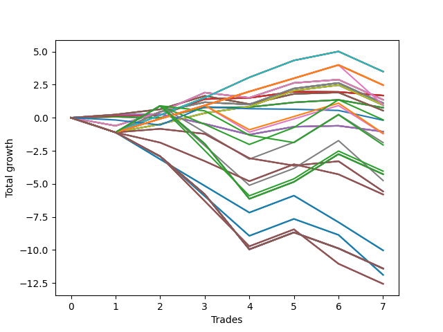

# Short Wallace Doodle 013 
- Symbol: AAPL_Unlimited
- Date Range: 03/23/2022 - 07/08/2022
- Trading Period: 7:20-12:30
- Number of Trades: 7



| Name | Win Percent | Profit | Avg Profit / Trade | Avg Time / Trade |      | Name | Win Percent | Profit | Avg Profit / Trade | Avg Time / Trade |
| ---- | ----------- | ------ | ------------------ | ---------------- | ---- | ---- | ----------- | ------ | ------------------ | ---------------- |
| Sorted By <br> Profit | | | | | | Sorted By <br> Win Percentage ||||
| Seventy-One | 71.43 | 1745.00 | 249.29 | 92:52 |     | Seventy-One | 71.43 | 1745.00 | 249.29 | 92:52 |
| Sixty-Three | 71.43 | 1745.00 | 249.29 | 92:52 |     | Sixty-Three | 71.43 | 1745.00 | 249.29 | 92:52 |
| Fifty-Five | 71.43 | 1745.00 | 249.29 | 92:52 |     | Fifty-Five | 71.43 | 1745.00 | 249.29 | 92:52 |
| Forty-Seven | 71.43 | 1745.00 | 249.29 | 92:52 |     | Forty-Seven | 71.43 | 1745.00 | 249.29 | 92:52 |
| Seven | 71.43 | 1745.00 | 249.29 | 92:52 |     | Seven | 71.43 | 1745.00 | 249.29 | 92:52 |
| One Hundred Twenty-Six | 71.43 | 1235.00 | 176.43 | 61:41 |     | One Hundred Twenty-Six | 71.43 | 1235.00 | 176.43 | 61:41 |
| One Hundred Twenty-One | 71.43 | 1235.00 | 176.43 | 61:41 |     | One Hundred Twenty-One | 71.43 | 1235.00 | 176.43 | 61:41 |
| One Hundred Sixteen | 71.43 | 1235.00 | 176.43 | 61:41 |     | One Hundred Sixteen | 71.43 | 1235.00 | 176.43 | 61:41 |
| One Hundred Eleven | 71.43 | 1235.00 | 176.43 | 61:41 |     | One Hundred Eleven | 71.43 | 1235.00 | 176.43 | 61:41 |
| One Hundred Six | 71.43 | 1235.00 | 176.43 | 61:41 |     | One Hundred Six | 71.43 | 1235.00 | 176.43 | 61:41 |
| Eighty-One | 71.43 | 1235.00 | 176.43 | 61:41 |     | Eighty-One | 71.43 | 1235.00 | 176.43 | 61:41 |
| Sixty-Five | 71.43 | 840.00 | 120.00 | 17:47 |     | Sixty-Five | 71.43 | 840.00 | 120.00 | 17:47 |
| Fifty-Seven | 71.43 | 840.00 | 120.00 | 17:47 |     | Fifty-Seven | 71.43 | 840.00 | 120.00 | 17:47 |
| Forty-Nine | 71.43 | 840.00 | 120.00 | 17:47 |     | Forty-Nine | 71.43 | 840.00 | 120.00 | 17:47 |
| Forty-One | 71.43 | 840.00 | 120.00 | 17:47 |     | Forty-One | 71.43 | 840.00 | 120.00 | 17:47 |
| One | 71.43 | 840.00 | 120.00 | 17:47 |     | One | 71.43 | 840.00 | 120.00 | 17:47 |
| Sixty-Eight | 57.14 | 680.00 | 97.14 | 54:21 |     | One Hundred One | 71.43 | 485.00 | 69.29 | 60:01 |
| Sixty | 57.14 | 680.00 | 97.14 | 54:21 |     | Seventy | 71.43 | 475.00 | 67.86 | 60:28 |
| Fifty-Two | 57.14 | 680.00 | 97.14 | 54:21 |     | Sixty-Two | 71.43 | 475.00 | 67.86 | 60:28 |
| Forty-Four | 57.14 | 680.00 | 97.14 | 54:21 |     | Fifty-Four | 71.43 | 475.00 | 67.86 | 60:28 |
| Four | 57.14 | 680.00 | 97.14 | 54:21 |     | Forty-Six | 71.43 | 475.00 | 67.86 | 60:28 |
| Sixty-Nine | 57.14 | 555.00 | 79.29 | 76:45 |     | Six | 71.43 | 475.00 | 67.86 | 60:28 |
| Sixty-One | 57.14 | 555.00 | 79.29 | 76:45 |     | Sixty-Four | 71.43 | 380.00 | 54.29 | 11:15 |
| Fifty-Three | 57.14 | 555.00 | 79.29 | 76:45 |     | Fifty-Six | 71.43 | 380.00 | 54.29 | 11:15 |
| Forty-Five | 57.14 | 555.00 | 79.29 | 76:45 |     | Forty-Eight | 71.43 | 380.00 | 54.29 | 11:15 |
| Five | 57.14 | 555.00 | 79.29 | 76:45 |     | Forty | 71.43 | 380.00 | 54.29 | 11:15 |
| One Hundred One | 71.43 | 485.00 | 69.29 | 60:01 |     | Zero | 71.43 | 380.00 | 54.29 | 11:15 |
| Seventy | 71.43 | 475.00 | 67.86 | 60:28 |     | Sixty-Seven | 71.43 | 270.00 | 38.57 | 38:02 |
| Sixty-Two | 71.43 | 475.00 | 67.86 | 60:28 |     | Fifty-Nine | 71.43 | 270.00 | 38.57 | 38:02 |
| Fifty-Four | 71.43 | 475.00 | 67.86 | 60:28 |     | Fifty-One | 71.43 | 270.00 | 38.57 | 38:02 |
| Forty-Six | 71.43 | 475.00 | 67.86 | 60:28 |     | Forty-Three | 71.43 | 270.00 | 38.57 | 38:02 |
| Six | 71.43 | 475.00 | 67.86 | 60:28 |     | Three | 71.43 | 270.00 | 38.57 | 38:02 |
| Sixty-Four | 71.43 | 380.00 | 54.29 | 11:15 |     | Sixty-Eight | 57.14 | 680.00 | 97.14 | 54:21 |
| Fifty-Six | 71.43 | 380.00 | 54.29 | 11:15 |     | Sixty | 57.14 | 680.00 | 97.14 | 54:21 |
| Forty-Eight | 71.43 | 380.00 | 54.29 | 11:15 |     | Fifty-Two | 57.14 | 680.00 | 97.14 | 54:21 |
| Forty | 71.43 | 380.00 | 54.29 | 11:15 |     | Forty-Four | 57.14 | 680.00 | 97.14 | 54:21 |
| Zero | 71.43 | 380.00 | 54.29 | 11:15 |     | Four | 57.14 | 680.00 | 97.14 | 54:21 |
| Sixty-Seven | 71.43 | 270.00 | 38.57 | 38:02 |     | Sixty-Nine | 57.14 | 555.00 | 79.29 | 76:45 |
| Fifty-Nine | 71.43 | 270.00 | 38.57 | 38:02 |     | Sixty-One | 57.14 | 555.00 | 79.29 | 76:45 |
| Fifty-One | 71.43 | 270.00 | 38.57 | 38:02 |     | Fifty-Three | 57.14 | 555.00 | 79.29 | 76:45 |
| Forty-Three | 71.43 | 270.00 | 38.57 | 38:02 |     | Forty-Five | 57.14 | 555.00 | 79.29 | 76:45 |
| Three | 71.43 | 270.00 | 38.57 | 38:02 |     | Five | 57.14 | 555.00 | 79.29 | 76:45 |
| One Hundred Seven | 42.86 | -80.00 | -11.43 | 115:36 |     | Sixty-Six | 57.14 | -525.00 | -75.00 | 39:42 |
| Seventy-Three | 14.29 | -95.00 | -13.57 | 15:56 |     | Fifty-Eight | 57.14 | -525.00 | -75.00 | 39:42 |
| Sixty-Six | 57.14 | -525.00 | -75.00 | 39:42 |     | Fifty | 57.14 | -525.00 | -75.00 | 39:42 |
| Fifty-Eight | 57.14 | -525.00 | -75.00 | 39:42 |     | Forty-Two | 57.14 | -525.00 | -75.00 | 39:42 |
| Fifty | 57.14 | -525.00 | -75.00 | 39:42 |     | Two | 57.14 | -525.00 | -75.00 | 39:42 |
| Forty-Two | 57.14 | -525.00 | -75.00 | 39:42 |     | Ninety-Six | 57.14 | -590.00 | -84.29 | 54:22 |
| Two | 57.14 | -525.00 | -75.00 | 39:42 |     | Ninety-One | 57.14 | -605.00 | -86.43 | 48:07 |
| Ninety-Six | 57.14 | -590.00 | -84.29 | 54:22 |     | One Hundred Seven | 42.86 | -80.00 | -11.43 | 115:36 |
| Ninety-One | 57.14 | -605.00 | -86.43 | 48:07 |     | Ninety-Two | 42.86 | -940.00 | -134.29 | 113:29 |
| Ninety-Two | 42.86 | -940.00 | -134.29 | 113:29 |     | One Hundred Seventeen | 42.86 | -2020.00 | -288.57 | 155:33 |
| Ninety-Seven | 28.57 | -1030.00 | -147.14 | 94:00 |     | One Hundred Twenty-Seven | 42.86 | -2135.00 | -305.00 | 163:23 |
| One Hundred Seventeen | 42.86 | -2020.00 | -288.57 | 155:33 |     | One Hundred Twenty-Two | 42.86 | -2135.00 | -305.00 | 163:23 |
| One Hundred Twenty-Seven | 42.86 | -2135.00 | -305.00 | 163:23 |     | One Hundred Twelve | 42.86 | -2135.00 | -305.00 | 163:23 |
| One Hundred Twenty-Two | 42.86 | -2135.00 | -305.00 | 163:23 |     | Eighty-Two | 42.86 | -2135.00 | -305.00 | 163:23 |
| One Hundred Twelve | 42.86 | -2135.00 | -305.00 | 163:23 |     | One Hundred Two | 42.86 | -2375.00 | -339.29 | 138:46 |
| Eighty-Two | 42.86 | -2135.00 | -305.00 | 163:23 |     | Ninety-Seven | 28.57 | -1030.00 | -147.14 | 94:00 |
| One Hundred Two | 42.86 | -2375.00 | -339.29 | 138:46 |     | One Hundred | 28.57 | -2785.00 | -397.86 | 107:22 |
| One Hundred | 28.57 | -2785.00 | -397.86 | 107:22 |     | Ninety-Nine | 28.57 | -2785.00 | -397.86 | 107:22 |
| Ninety-Nine | 28.57 | -2785.00 | -397.86 | 107:22 |     | Ninety-Eight | 28.57 | -2785.00 | -397.86 | 107:22 |
| Ninety-Eight | 28.57 | -2785.00 | -397.86 | 107:22 |     | Seventy-Three | 14.29 | -95.00 | -13.57 | 15:56 |
| One Hundred Ten | 14.29 | -2900.00 | -414.29 | 146:01 |     | One Hundred Ten | 14.29 | -2900.00 | -414.29 | 146:01 |
| One Hundred Nine | 14.29 | -2900.00 | -414.29 | 146:01 |     | One Hundred Nine | 14.29 | -2900.00 | -414.29 | 146:01 |
| One Hundred Eight | 14.29 | -2900.00 | -414.29 | 146:01 |     | One Hundred Eight | 14.29 | -2900.00 | -414.29 | 146:01 |
| Ninety-Five | 14.29 | -5015.00 | -716.43 | 159:08 |     | Ninety-Five | 14.29 | -5015.00 | -716.43 | 159:08 |
| Ninety-Four | 14.29 | -5015.00 | -716.43 | 159:08 |     | Ninety-Four | 14.29 | -5015.00 | -716.43 | 159:08 |
| Ninety-Three | 14.29 | -5015.00 | -716.43 | 159:08 |     | Ninety-Three | 14.29 | -5015.00 | -716.43 | 159:08 |
| One Hundred Thirty | 14.29 | -5700.00 | -814.29 | 211:51 |     | One Hundred Thirty | 14.29 | -5700.00 | -814.29 | 211:51 |
| One Hundred Twenty-Nine | 14.29 | -5700.00 | -814.29 | 211:51 |     | One Hundred Twenty-Nine | 14.29 | -5700.00 | -814.29 | 211:51 |
| One Hundred Twenty-Eight | 14.29 | -5700.00 | -814.29 | 211:51 |     | One Hundred Twenty-Eight | 14.29 | -5700.00 | -814.29 | 211:51 |
| One Hundred Twenty-Five | 14.29 | -5700.00 | -814.29 | 211:51 |     | One Hundred Twenty-Five | 14.29 | -5700.00 | -814.29 | 211:51 |
| One Hundred Twenty-Four | 14.29 | -5700.00 | -814.29 | 211:51 |     | One Hundred Twenty-Four | 14.29 | -5700.00 | -814.29 | 211:51 |
| One Hundred Twenty-Three | 14.29 | -5700.00 | -814.29 | 211:51 |     | One Hundred Twenty-Three | 14.29 | -5700.00 | -814.29 | 211:51 |
| One Hundred Fifteen | 14.29 | -5700.00 | -814.29 | 211:51 |     | One Hundred Fifteen | 14.29 | -5700.00 | -814.29 | 211:51 |
| One Hundred Fourteen | 14.29 | -5700.00 | -814.29 | 211:51 |     | One Hundred Fourteen | 14.29 | -5700.00 | -814.29 | 211:51 |
| One Hundred Thirteen | 14.29 | -5700.00 | -814.29 | 211:51 |     | One Hundred Thirteen | 14.29 | -5700.00 | -814.29 | 211:51 |
| Eighty-Five | 14.29 | -5700.00 | -814.29 | 211:51 |     | Eighty-Five | 14.29 | -5700.00 | -814.29 | 211:51 |
| Eighty-Four | 14.29 | -5700.00 | -814.29 | 211:51 |     | Eighty-Four | 14.29 | -5700.00 | -814.29 | 211:51 |
| Eighty-Three | 14.29 | -5700.00 | -814.29 | 211:51 |     | Eighty-Three | 14.29 | -5700.00 | -814.29 | 211:51 |
| One Hundred Five | 14.29 | -5940.00 | -848.57 | 187:14 |     | One Hundred Five | 14.29 | -5940.00 | -848.57 | 187:14 |
| One Hundred Four | 14.29 | -5940.00 | -848.57 | 187:14 |     | One Hundred Four | 14.29 | -5940.00 | -848.57 | 187:14 |
| One Hundred Three | 14.29 | -5940.00 | -848.57 | 187:14 |     | One Hundred Three | 14.29 | -5940.00 | -848.57 | 187:14 |
| One Hundred Twenty | 14.29 | -6280.00 | -897.14 | 202:17 |     | One Hundred Twenty | 14.29 | -6280.00 | -897.14 | 202:17 |
| One Hundred Ninteen | 14.29 | -6280.00 | -897.14 | 202:17 |     | One Hundred Ninteen | 14.29 | -6280.00 | -897.14 | 202:17 |
| One Hundred Eighteen | 14.29 | -6280.00 | -897.14 | 202:17 |     | One Hundred Eighteen | 14.29 | -6280.00 | -897.14 | 202:17 |

## NO STOPLOSS

### Test Zero
* Sell when price hits the middle line of the 20p bollinger
* No Stoploss
* Results:
```
Total Trades: 7
Percent Up: 28.57
Percent Down: 71.43
Total Points Moved Down: 0.76
Potential Profit: 380.00
Total Points Ups: 0.67 Count Ups: 2
Total Points Downs: 1.43 Count Downs: 5
```

<details><summary>Trades</summary>

<code>In: 2022-03-29 10:50:00		Out: 2022-03-29 11:04:05		Total Position Time: 14:05		Total Move Down: 0.07		Total to Date: 0.07</code> <br />
<code>In: 2022-04-25 07:28:00		Out: 2022-04-25 07:43:00		Total Position Time: 15:00		Total Move Down: -0.08		Total to Date: -0.01</code> <br />
<code>In: 2022-04-28 07:23:00		Out: 2022-04-28 07:27:00		Total Position Time: 04:00		Total Move Down: 0.79		Total to Date: 0.78</code> <br />
<code>In: 2022-05-04 09:24:00		Out: 2022-05-04 09:42:25		Total Position Time: 18:25		Total Move Down: 0.02		Total to Date: 0.80</code> <br />
<code>In: 2022-05-16 08:57:00		Out: 2022-05-16 09:05:45		Total Position Time: 08:45		Total Move Down: 0.36		Total to Date: 1.16</code> <br />
<code>In: 2022-06-15 09:04:00		Out: 2022-06-15 09:08:20		Total Position Time: 04:20		Total Move Down: 0.19		Total to Date: 1.35</code> <br />
<code>In: 2022-06-15 11:40:00		Out: 2022-06-15 11:54:15		Total Position Time: 14:15		Total Move Down: -0.59		Total to Date: 0.76</code> <br />


</details>

### Test One
* Sell when the price hits the upper line of the 20p 1std bollinger
* No Stoploss
* Results:
```
Total Trades: 7
Percent Up: 28.57
Percent Down: 71.43
Total Points Moved Down: 1.68
Potential Profit: 840.00
Total Points Ups: 0.29 Count Ups: 2
Total Points Downs: 1.97 Count Downs: 5
```

<details><summary>Trades</summary>

<code>In: 2022-03-29 10:50:00		Out: 2022-03-29 11:06:05		Total Position Time: 16:05		Total Move Down: 0.15		Total to Date: 0.15</code> <br />
<code>In: 2022-04-25 07:28:00		Out: 2022-04-25 07:45:10		Total Position Time: 17:10		Total Move Down: 0.05		Total to Date: 0.20</code> <br />
<code>In: 2022-04-28 07:23:00		Out: 2022-04-28 07:29:40		Total Position Time: 06:40		Total Move Down: 1.21		Total to Date: 1.41</code> <br />
<code>In: 2022-05-04 09:24:00		Out: 2022-05-04 09:46:30		Total Position Time: 22:30		Total Move Down: 0.09		Total to Date: 1.50</code> <br />
<code>In: 2022-05-16 08:57:00		Out: 2022-05-16 09:11:30		Total Position Time: 14:30		Total Move Down: 0.47		Total to Date: 1.97</code> <br />
<code>In: 2022-06-15 09:04:00		Out: 2022-06-15 09:33:30		Total Position Time: 29:30		Total Move Down: -0.02		Total to Date: 1.95</code> <br />
<code>In: 2022-06-15 11:40:00		Out: 2022-06-15 11:58:05		Total Position Time: 18:05		Total Move Down: -0.27		Total to Date: 1.68</code> <br />


</details>

### Test Two
* Sell when the price hits the upper line of the 20p 2std bollinger
* No Stoploss
* Results:
```
Total Trades: 7
Percent Up: 42.86
Percent Down: 57.14
Total Points Moved Down: -1.05
Potential Profit: -525.00
Total Points Ups: 1.99 Count Ups: 3
Total Points Downs: 0.94 Count Downs: 4
```

<details><summary>Trades</summary>

<code>In: 2022-03-29 10:50:00		Out: 2022-03-29 11:07:05		Total Position Time: 17:05		Total Move Down: 0.21		Total to Date: 0.21</code> <br />
<code>In: 2022-04-25 07:28:00		Out: 2022-04-25 07:51:05		Total Position Time: 23:05		Total Move Down: 0.06		Total to Date: 0.27</code> <br />
<code>In: 2022-04-28 07:23:00		Out: 2022-04-28 08:28:30		Total Position Time: 65:30		Total Move Down: -0.73		Total to Date: -0.46</code> <br />
<code>In: 2022-05-04 09:24:00		Out: 2022-05-04 10:55:15		Total Position Time: 91:15		Total Move Down: -0.82		Total to Date: -1.28</code> <br />
<code>In: 2022-05-16 08:57:00		Out: 2022-05-16 09:14:40		Total Position Time: 17:40		Total Move Down: 0.60		Total to Date: -0.68</code> <br />
<code>In: 2022-06-15 09:04:00		Out: 2022-06-15 09:34:20		Total Position Time: 30:20		Total Move Down: 0.07		Total to Date: -0.61</code> <br />
<code>In: 2022-06-15 11:40:00		Out: 2022-06-15 12:13:05		Total Position Time: 33:05		Total Move Down: -0.44		Total to Date: -1.05</code> <br />


</details>

### Test Three
* Sell when price hits the middle line of the 50p bollinger
* No Stoploss
* Results:
```
Total Trades: 7
Percent Up: 28.57
Percent Down: 71.43
Total Points Moved Down: 0.54
Potential Profit: 270.00
Total Points Ups: 1.99 Count Ups: 2
Total Points Downs: 2.53 Count Downs: 5
```

<details><summary>Trades</summary>

<code>In: 2022-03-29 10:50:00		Out: 2022-03-29 11:18:35		Total Position Time: 28:35		Total Move Down: 0.24		Total to Date: 0.24</code> <br />
<code>In: 2022-04-25 07:28:00		Out: 2022-04-25 07:52:55		Total Position Time: 24:55		Total Move Down: 0.40		Total to Date: 0.64</code> <br />
<code>In: 2022-04-28 07:23:00		Out: 2022-04-28 07:27:10		Total Position Time: 04:10		Total Move Down: 1.01		Total to Date: 1.65</code> <br />
<code>In: 2022-05-04 09:24:00		Out: 2022-05-04 11:00:20		Total Position Time: 96:20		Total Move Down: -0.62		Total to Date: 1.03</code> <br />
<code>In: 2022-05-16 08:57:00		Out: 2022-05-16 09:15:45		Total Position Time: 18:45		Total Move Down: 0.77		Total to Date: 1.80</code> <br />
<code>In: 2022-06-15 09:04:00		Out: 2022-06-15 09:34:25		Total Position Time: 30:25		Total Move Down: 0.11		Total to Date: 1.91</code> <br />
<code>In: 2022-06-15 11:40:00		Out: 2022-06-15 12:43:05		Total Position Time: 63:05		Total Move Down: -1.37		Total to Date: 0.54</code> <br />


</details>

### Test Four
* Sell when the price hits the upper line of the 50p 1std bollinger
* No Stoploss
* Results:
```
Total Trades: 7
Percent Up: 42.86
Percent Down: 57.14
Total Points Moved Down: 1.36
Potential Profit: 680.00
Total Points Ups: 2.52 Count Ups: 3
Total Points Downs: 3.88 Count Downs: 4
```

<details><summary>Trades</summary>

<code>In: 2022-03-29 10:50:00		Out: 2022-03-29 12:43:05		Total Position Time: 113:05		Total Move Down: -0.61		Total to Date: -0.61</code> <br />
<code>In: 2022-04-25 07:28:00		Out: 2022-04-25 07:59:25		Total Position Time: 31:25		Total Move Down: 1.03		Total to Date: 0.42</code> <br />
<code>In: 2022-04-28 07:23:00		Out: 2022-04-28 07:33:30		Total Position Time: 10:30		Total Move Down: 1.48		Total to Date: 1.90</code> <br />
<code>In: 2022-05-04 09:24:00		Out: 2022-05-04 11:00:25		Total Position Time: 96:25		Total Move Down: -0.39		Total to Date: 1.51</code> <br />
<code>In: 2022-05-16 08:57:00		Out: 2022-05-16 09:24:25		Total Position Time: 27:25		Total Move Down: 1.12		Total to Date: 2.63</code> <br />
<code>In: 2022-06-15 09:04:00		Out: 2022-06-15 09:38:40		Total Position Time: 34:40		Total Move Down: 0.25		Total to Date: 2.88</code> <br />
<code>In: 2022-06-15 11:40:00		Out: 2022-06-15 12:47:00		Total Position Time: 67:00		Total Move Down: -1.52		Total to Date: 1.36</code> <br />


</details>

### Test Five
* Sell when the price hits the upper line of the 50p 2std bollinger
* No Stoploss
* Results:
```
Total Trades: 7
Percent Up: 42.86
Percent Down: 57.14
Total Points Moved Down: 1.11
Potential Profit: 555.00
Total Points Ups: 2.80 Count Ups: 3
Total Points Downs: 3.91 Count Downs: 4
```

<details><summary>Trades</summary>

<code>In: 2022-03-29 10:50:00		Out: 2022-03-29 12:47:00		Total Position Time: 117:00		Total Move Down: -1.11		Total to Date: -1.11</code> <br />
<code>In: 2022-04-25 07:28:00		Out: 2022-04-25 08:43:15		Total Position Time: 75:15		Total Move Down: 1.56		Total to Date: 0.45</code> <br />
<code>In: 2022-04-28 07:23:00		Out: 2022-04-28 08:57:40		Total Position Time: 94:40		Total Move Down: 0.72		Total to Date: 1.17</code> <br />
<code>In: 2022-05-04 09:24:00		Out: 2022-05-04 11:07:40		Total Position Time: 103:40		Total Move Down: -0.17		Total to Date: 1.00</code> <br />
<code>In: 2022-05-16 08:57:00		Out: 2022-05-16 09:39:00		Total Position Time: 42:00		Total Move Down: 1.21		Total to Date: 2.21</code> <br />
<code>In: 2022-06-15 09:04:00		Out: 2022-06-15 09:41:40		Total Position Time: 37:40		Total Move Down: 0.42		Total to Date: 2.63</code> <br />
<code>In: 2022-06-15 11:40:00		Out: 2022-06-15 12:47:00		Total Position Time: 67:00		Total Move Down: -1.52		Total to Date: 1.11</code> <br />


</details>

### Test Six
* Sell when the price hits the middle line of the 1std VWAP
* No Stoploss
* Results:
```
Total Trades: 7
Percent Up: 28.57
Percent Down: 71.43
Total Points Moved Down: 0.95
Potential Profit: 475.00
Total Points Ups: 2.63 Count Ups: 2
Total Points Downs: 3.58 Count Downs: 5
```

<details><summary>Trades</summary>

<code>In: 2022-03-29 10:50:00		Out: 2022-03-29 12:47:00		Total Position Time: 117:00		Total Move Down: -1.11		Total to Date: -1.11</code> <br />
<code>In: 2022-04-25 07:28:00		Out: 2022-04-25 07:56:45		Total Position Time: 28:45		Total Move Down: 0.62		Total to Date: -0.49</code> <br />
<code>In: 2022-04-28 07:23:00		Out: 2022-04-28 07:27:05		Total Position Time: 04:05		Total Move Down: 0.84		Total to Date: 0.35</code> <br />
<code>In: 2022-05-04 09:24:00		Out: 2022-05-04 11:30:50		Total Position Time: 126:50		Total Move Down: 0.49		Total to Date: 0.84</code> <br />
<code>In: 2022-05-16 08:57:00		Out: 2022-05-16 09:39:00		Total Position Time: 42:00		Total Move Down: 1.21		Total to Date: 2.05</code> <br />
<code>In: 2022-06-15 09:04:00		Out: 2022-06-15 09:41:40		Total Position Time: 37:40		Total Move Down: 0.42		Total to Date: 2.47</code> <br />
<code>In: 2022-06-15 11:40:00		Out: 2022-06-15 12:47:00		Total Position Time: 67:00		Total Move Down: -1.52		Total to Date: 0.95</code> <br />


</details>

### Test Seven
* Sell when the price hits the upper line of the 1std VWAP
* No Stoploss
* Results:
```
Total Trades: 7
Percent Up: 28.57
Percent Down: 71.43
Total Points Moved Down: 3.49
Potential Profit: 1745.00
Total Points Ups: 2.63 Count Ups: 2
Total Points Downs: 6.12 Count Downs: 5
```

<details><summary>Trades</summary>

<code>In: 2022-03-29 10:50:00		Out: 2022-03-29 12:47:00		Total Position Time: 117:00		Total Move Down: -1.11		Total to Date: -1.11</code> <br />
<code>In: 2022-04-25 07:28:00		Out: 2022-04-25 08:15:50		Total Position Time: 47:50		Total Move Down: 1.31		Total to Date: 0.20</code> <br />
<code>In: 2022-04-28 07:23:00		Out: 2022-04-28 07:31:15		Total Position Time: 08:15		Total Move Down: 1.31		Total to Date: 1.51</code> <br />
<code>In: 2022-05-04 09:24:00		Out: 2022-05-04 11:35:05		Total Position Time: 131:05		Total Move Down: 1.54		Total to Date: 3.05</code> <br />
<code>In: 2022-05-16 08:57:00		Out: 2022-05-16 12:47:00		Total Position Time: 230:00		Total Move Down: 1.28		Total to Date: 4.33</code> <br />
<code>In: 2022-06-15 09:04:00		Out: 2022-06-15 09:52:55		Total Position Time: 48:55		Total Move Down: 0.68		Total to Date: 5.01</code> <br />
<code>In: 2022-06-15 11:40:00		Out: 2022-06-15 12:47:00		Total Position Time: 67:00		Total Move Down: -1.52		Total to Date: 3.49</code> <br />


</details>

## STOPLOSS OF 5

### Test Forty
* Sell when price hits the middle line of the 20p bollinger
* Stoploss is -5 points
* Results:
```
Total Trades: 7
Percent Up: 28.57
Percent Down: 71.43
Total Points Moved Down: 0.76
Potential Profit: 380.00
Total Points Ups: 0.67 Count Ups: 2
Total Points Downs: 1.43 Count Downs: 5
```

<details><summary>Trades</summary>

<code>In: 2022-03-29 10:50:00		Out: 2022-03-29 11:04:05		Total Position Time: 14:05		Total Move Down: 0.07		Total to Date: 0.07</code> <br />
<code>In: 2022-04-25 07:28:00		Out: 2022-04-25 07:43:00		Total Position Time: 15:00		Total Move Down: -0.08		Total to Date: -0.01</code> <br />
<code>In: 2022-04-28 07:23:00		Out: 2022-04-28 07:27:00		Total Position Time: 04:00		Total Move Down: 0.79		Total to Date: 0.78</code> <br />
<code>In: 2022-05-04 09:24:00		Out: 2022-05-04 09:42:25		Total Position Time: 18:25		Total Move Down: 0.02		Total to Date: 0.80</code> <br />
<code>In: 2022-05-16 08:57:00		Out: 2022-05-16 09:05:45		Total Position Time: 08:45		Total Move Down: 0.36		Total to Date: 1.16</code> <br />
<code>In: 2022-06-15 09:04:00		Out: 2022-06-15 09:08:20		Total Position Time: 04:20		Total Move Down: 0.19		Total to Date: 1.35</code> <br />
<code>In: 2022-06-15 11:40:00		Out: 2022-06-15 11:54:15		Total Position Time: 14:15		Total Move Down: -0.59		Total to Date: 0.76</code> <br />


</details>

### Test Forty-One
* Sell when the price hits the upper line of the 20p 1std bollinger
* Stoploss is -5 points
* Results:
```
Total Trades: 7
Percent Up: 28.57
Percent Down: 71.43
Total Points Moved Down: 1.68
Potential Profit: 840.00
Total Points Ups: 0.29 Count Ups: 2
Total Points Downs: 1.97 Count Downs: 5
```

<details><summary>Trades</summary>

<code>In: 2022-03-29 10:50:00		Out: 2022-03-29 11:06:05		Total Position Time: 16:05		Total Move Down: 0.15		Total to Date: 0.15</code> <br />
<code>In: 2022-04-25 07:28:00		Out: 2022-04-25 07:45:10		Total Position Time: 17:10		Total Move Down: 0.05		Total to Date: 0.20</code> <br />
<code>In: 2022-04-28 07:23:00		Out: 2022-04-28 07:29:40		Total Position Time: 06:40		Total Move Down: 1.21		Total to Date: 1.41</code> <br />
<code>In: 2022-05-04 09:24:00		Out: 2022-05-04 09:46:30		Total Position Time: 22:30		Total Move Down: 0.09		Total to Date: 1.50</code> <br />
<code>In: 2022-05-16 08:57:00		Out: 2022-05-16 09:11:30		Total Position Time: 14:30		Total Move Down: 0.47		Total to Date: 1.97</code> <br />
<code>In: 2022-06-15 09:04:00		Out: 2022-06-15 09:33:30		Total Position Time: 29:30		Total Move Down: -0.02		Total to Date: 1.95</code> <br />
<code>In: 2022-06-15 11:40:00		Out: 2022-06-15 11:58:05		Total Position Time: 18:05		Total Move Down: -0.27		Total to Date: 1.68</code> <br />


</details>

### Test Forty-Two
* Sell when the price hits the upper line of the 20p 2std bollinger
* Stoploss is -5 points
* Results:
```
Total Trades: 7
Percent Up: 42.86
Percent Down: 57.14
Total Points Moved Down: -1.05
Potential Profit: -525.00
Total Points Ups: 1.99 Count Ups: 3
Total Points Downs: 0.94 Count Downs: 4
```

<details><summary>Trades</summary>

<code>In: 2022-03-29 10:50:00		Out: 2022-03-29 11:07:05		Total Position Time: 17:05		Total Move Down: 0.21		Total to Date: 0.21</code> <br />
<code>In: 2022-04-25 07:28:00		Out: 2022-04-25 07:51:05		Total Position Time: 23:05		Total Move Down: 0.06		Total to Date: 0.27</code> <br />
<code>In: 2022-04-28 07:23:00		Out: 2022-04-28 08:28:30		Total Position Time: 65:30		Total Move Down: -0.73		Total to Date: -0.46</code> <br />
<code>In: 2022-05-04 09:24:00		Out: 2022-05-04 10:55:15		Total Position Time: 91:15		Total Move Down: -0.82		Total to Date: -1.28</code> <br />
<code>In: 2022-05-16 08:57:00		Out: 2022-05-16 09:14:40		Total Position Time: 17:40		Total Move Down: 0.60		Total to Date: -0.68</code> <br />
<code>In: 2022-06-15 09:04:00		Out: 2022-06-15 09:34:20		Total Position Time: 30:20		Total Move Down: 0.07		Total to Date: -0.61</code> <br />
<code>In: 2022-06-15 11:40:00		Out: 2022-06-15 12:13:05		Total Position Time: 33:05		Total Move Down: -0.44		Total to Date: -1.05</code> <br />


</details>

### Test Forty-Three
* Sell when price hits the middle line of the 50p bollinger
* Stoploss is -5 points
* Results:
```
Total Trades: 7
Percent Up: 28.57
Percent Down: 71.43
Total Points Moved Down: 0.54
Potential Profit: 270.00
Total Points Ups: 1.99 Count Ups: 2
Total Points Downs: 2.53 Count Downs: 5
```

<details><summary>Trades</summary>

<code>In: 2022-03-29 10:50:00		Out: 2022-03-29 11:18:35		Total Position Time: 28:35		Total Move Down: 0.24		Total to Date: 0.24</code> <br />
<code>In: 2022-04-25 07:28:00		Out: 2022-04-25 07:52:55		Total Position Time: 24:55		Total Move Down: 0.40		Total to Date: 0.64</code> <br />
<code>In: 2022-04-28 07:23:00		Out: 2022-04-28 07:27:10		Total Position Time: 04:10		Total Move Down: 1.01		Total to Date: 1.65</code> <br />
<code>In: 2022-05-04 09:24:00		Out: 2022-05-04 11:00:20		Total Position Time: 96:20		Total Move Down: -0.62		Total to Date: 1.03</code> <br />
<code>In: 2022-05-16 08:57:00		Out: 2022-05-16 09:15:45		Total Position Time: 18:45		Total Move Down: 0.77		Total to Date: 1.80</code> <br />
<code>In: 2022-06-15 09:04:00		Out: 2022-06-15 09:34:25		Total Position Time: 30:25		Total Move Down: 0.11		Total to Date: 1.91</code> <br />
<code>In: 2022-06-15 11:40:00		Out: 2022-06-15 12:43:05		Total Position Time: 63:05		Total Move Down: -1.37		Total to Date: 0.54</code> <br />


</details>

### Test Forty-Four
* Sell when the price hits the upper line of the 50p 1std bollinger
* Stoploss is -5 points
* Results:
```
Total Trades: 7
Percent Up: 42.86
Percent Down: 57.14
Total Points Moved Down: 1.36
Potential Profit: 680.00
Total Points Ups: 2.52 Count Ups: 3
Total Points Downs: 3.88 Count Downs: 4
```

<details><summary>Trades</summary>

<code>In: 2022-03-29 10:50:00		Out: 2022-03-29 12:43:05		Total Position Time: 113:05		Total Move Down: -0.61		Total to Date: -0.61</code> <br />
<code>In: 2022-04-25 07:28:00		Out: 2022-04-25 07:59:25		Total Position Time: 31:25		Total Move Down: 1.03		Total to Date: 0.42</code> <br />
<code>In: 2022-04-28 07:23:00		Out: 2022-04-28 07:33:30		Total Position Time: 10:30		Total Move Down: 1.48		Total to Date: 1.90</code> <br />
<code>In: 2022-05-04 09:24:00		Out: 2022-05-04 11:00:25		Total Position Time: 96:25		Total Move Down: -0.39		Total to Date: 1.51</code> <br />
<code>In: 2022-05-16 08:57:00		Out: 2022-05-16 09:24:25		Total Position Time: 27:25		Total Move Down: 1.12		Total to Date: 2.63</code> <br />
<code>In: 2022-06-15 09:04:00		Out: 2022-06-15 09:38:40		Total Position Time: 34:40		Total Move Down: 0.25		Total to Date: 2.88</code> <br />
<code>In: 2022-06-15 11:40:00		Out: 2022-06-15 12:47:00		Total Position Time: 67:00		Total Move Down: -1.52		Total to Date: 1.36</code> <br />


</details>

### Test Forty-Five
* Sell when the price hits the upper line of the 50p 2std bollinger
* Stoploss is -5 points
* Results:
```
Total Trades: 7
Percent Up: 42.86
Percent Down: 57.14
Total Points Moved Down: 1.11
Potential Profit: 555.00
Total Points Ups: 2.80 Count Ups: 3
Total Points Downs: 3.91 Count Downs: 4
```

<details><summary>Trades</summary>

<code>In: 2022-03-29 10:50:00		Out: 2022-03-29 12:47:00		Total Position Time: 117:00		Total Move Down: -1.11		Total to Date: -1.11</code> <br />
<code>In: 2022-04-25 07:28:00		Out: 2022-04-25 08:43:15		Total Position Time: 75:15		Total Move Down: 1.56		Total to Date: 0.45</code> <br />
<code>In: 2022-04-28 07:23:00		Out: 2022-04-28 08:57:40		Total Position Time: 94:40		Total Move Down: 0.72		Total to Date: 1.17</code> <br />
<code>In: 2022-05-04 09:24:00		Out: 2022-05-04 11:07:40		Total Position Time: 103:40		Total Move Down: -0.17		Total to Date: 1.00</code> <br />
<code>In: 2022-05-16 08:57:00		Out: 2022-05-16 09:39:00		Total Position Time: 42:00		Total Move Down: 1.21		Total to Date: 2.21</code> <br />
<code>In: 2022-06-15 09:04:00		Out: 2022-06-15 09:41:40		Total Position Time: 37:40		Total Move Down: 0.42		Total to Date: 2.63</code> <br />
<code>In: 2022-06-15 11:40:00		Out: 2022-06-15 12:47:00		Total Position Time: 67:00		Total Move Down: -1.52		Total to Date: 1.11</code> <br />


</details>

### Test Forty-Six
* Sell when the price hits the middle line of the 1std VWAP
* Stoploss is -5 points
* Results:
```
Total Trades: 7
Percent Up: 28.57
Percent Down: 71.43
Total Points Moved Down: 0.95
Potential Profit: 475.00
Total Points Ups: 2.63 Count Ups: 2
Total Points Downs: 3.58 Count Downs: 5
```

<details><summary>Trades</summary>

<code>In: 2022-03-29 10:50:00		Out: 2022-03-29 12:47:00		Total Position Time: 117:00		Total Move Down: -1.11		Total to Date: -1.11</code> <br />
<code>In: 2022-04-25 07:28:00		Out: 2022-04-25 07:56:45		Total Position Time: 28:45		Total Move Down: 0.62		Total to Date: -0.49</code> <br />
<code>In: 2022-04-28 07:23:00		Out: 2022-04-28 07:27:05		Total Position Time: 04:05		Total Move Down: 0.84		Total to Date: 0.35</code> <br />
<code>In: 2022-05-04 09:24:00		Out: 2022-05-04 11:30:50		Total Position Time: 126:50		Total Move Down: 0.49		Total to Date: 0.84</code> <br />
<code>In: 2022-05-16 08:57:00		Out: 2022-05-16 09:39:00		Total Position Time: 42:00		Total Move Down: 1.21		Total to Date: 2.05</code> <br />
<code>In: 2022-06-15 09:04:00		Out: 2022-06-15 09:41:40		Total Position Time: 37:40		Total Move Down: 0.42		Total to Date: 2.47</code> <br />
<code>In: 2022-06-15 11:40:00		Out: 2022-06-15 12:47:00		Total Position Time: 67:00		Total Move Down: -1.52		Total to Date: 0.95</code> <br />


</details>

### Test Forty-Seven
* Sell when the price hits the upper line of the 1std VWAP
* Stoploss is -5 points
* Results:
```
Total Trades: 7
Percent Up: 28.57
Percent Down: 71.43
Total Points Moved Down: 3.49
Potential Profit: 1745.00
Total Points Ups: 2.63 Count Ups: 2
Total Points Downs: 6.12 Count Downs: 5
```

<details><summary>Trades</summary>

<code>In: 2022-03-29 10:50:00		Out: 2022-03-29 12:47:00		Total Position Time: 117:00		Total Move Down: -1.11		Total to Date: -1.11</code> <br />
<code>In: 2022-04-25 07:28:00		Out: 2022-04-25 08:15:50		Total Position Time: 47:50		Total Move Down: 1.31		Total to Date: 0.20</code> <br />
<code>In: 2022-04-28 07:23:00		Out: 2022-04-28 07:31:15		Total Position Time: 08:15		Total Move Down: 1.31		Total to Date: 1.51</code> <br />
<code>In: 2022-05-04 09:24:00		Out: 2022-05-04 11:35:05		Total Position Time: 131:05		Total Move Down: 1.54		Total to Date: 3.05</code> <br />
<code>In: 2022-05-16 08:57:00		Out: 2022-05-16 12:47:00		Total Position Time: 230:00		Total Move Down: 1.28		Total to Date: 4.33</code> <br />
<code>In: 2022-06-15 09:04:00		Out: 2022-06-15 09:52:55		Total Position Time: 48:55		Total Move Down: 0.68		Total to Date: 5.01</code> <br />
<code>In: 2022-06-15 11:40:00		Out: 2022-06-15 12:47:00		Total Position Time: 67:00		Total Move Down: -1.52		Total to Date: 3.49</code> <br />


</details>

## TRAIL STOP OF 5

### Test Forty-Eight
* Sell when price hits the middle line of the 20p bollinger
* Trailing Stop is -5 points
* Results:
```
Total Trades: 7
Percent Up: 28.57
Percent Down: 71.43
Total Points Moved Down: 0.76
Potential Profit: 380.00
Total Points Ups: 0.67 Count Ups: 2
Total Points Downs: 1.43 Count Downs: 5
```

<details><summary>Trades</summary>

<code>In: 2022-03-29 10:50:00		Out: 2022-03-29 11:04:05		Total Position Time: 14:05		Total Move Down: 0.07		Total to Date: 0.07</code> <br />
<code>In: 2022-04-25 07:28:00		Out: 2022-04-25 07:43:00		Total Position Time: 15:00		Total Move Down: -0.08		Total to Date: -0.01</code> <br />
<code>In: 2022-04-28 07:23:00		Out: 2022-04-28 07:27:00		Total Position Time: 04:00		Total Move Down: 0.79		Total to Date: 0.78</code> <br />
<code>In: 2022-05-04 09:24:00		Out: 2022-05-04 09:42:25		Total Position Time: 18:25		Total Move Down: 0.02		Total to Date: 0.80</code> <br />
<code>In: 2022-05-16 08:57:00		Out: 2022-05-16 09:05:45		Total Position Time: 08:45		Total Move Down: 0.36		Total to Date: 1.16</code> <br />
<code>In: 2022-06-15 09:04:00		Out: 2022-06-15 09:08:20		Total Position Time: 04:20		Total Move Down: 0.19		Total to Date: 1.35</code> <br />
<code>In: 2022-06-15 11:40:00		Out: 2022-06-15 11:54:15		Total Position Time: 14:15		Total Move Down: -0.59		Total to Date: 0.76</code> <br />


</details>

### Test Forty-Nine
* Sell when the price hits the upper line of the 20p 1std bollinger
* Trailing Stop is -5 points
* Results:
```
Total Trades: 7
Percent Up: 28.57
Percent Down: 71.43
Total Points Moved Down: 1.68
Potential Profit: 840.00
Total Points Ups: 0.29 Count Ups: 2
Total Points Downs: 1.97 Count Downs: 5
```

<details><summary>Trades</summary>

<code>In: 2022-03-29 10:50:00		Out: 2022-03-29 11:06:05		Total Position Time: 16:05		Total Move Down: 0.15		Total to Date: 0.15</code> <br />
<code>In: 2022-04-25 07:28:00		Out: 2022-04-25 07:45:10		Total Position Time: 17:10		Total Move Down: 0.05		Total to Date: 0.20</code> <br />
<code>In: 2022-04-28 07:23:00		Out: 2022-04-28 07:29:40		Total Position Time: 06:40		Total Move Down: 1.21		Total to Date: 1.41</code> <br />
<code>In: 2022-05-04 09:24:00		Out: 2022-05-04 09:46:30		Total Position Time: 22:30		Total Move Down: 0.09		Total to Date: 1.50</code> <br />
<code>In: 2022-05-16 08:57:00		Out: 2022-05-16 09:11:30		Total Position Time: 14:30		Total Move Down: 0.47		Total to Date: 1.97</code> <br />
<code>In: 2022-06-15 09:04:00		Out: 2022-06-15 09:33:30		Total Position Time: 29:30		Total Move Down: -0.02		Total to Date: 1.95</code> <br />
<code>In: 2022-06-15 11:40:00		Out: 2022-06-15 11:58:05		Total Position Time: 18:05		Total Move Down: -0.27		Total to Date: 1.68</code> <br />


</details>

### Test Fifty
* Sell when the price hits the upper line of the 20p 2std bollinger
* Trailing Stop is -5 points
* Results:
```
Total Trades: 7
Percent Up: 42.86
Percent Down: 57.14
Total Points Moved Down: -1.05
Potential Profit: -525.00
Total Points Ups: 1.99 Count Ups: 3
Total Points Downs: 0.94 Count Downs: 4
```

<details><summary>Trades</summary>

<code>In: 2022-03-29 10:50:00		Out: 2022-03-29 11:07:05		Total Position Time: 17:05		Total Move Down: 0.21		Total to Date: 0.21</code> <br />
<code>In: 2022-04-25 07:28:00		Out: 2022-04-25 07:51:05		Total Position Time: 23:05		Total Move Down: 0.06		Total to Date: 0.27</code> <br />
<code>In: 2022-04-28 07:23:00		Out: 2022-04-28 08:28:30		Total Position Time: 65:30		Total Move Down: -0.73		Total to Date: -0.46</code> <br />
<code>In: 2022-05-04 09:24:00		Out: 2022-05-04 10:55:15		Total Position Time: 91:15		Total Move Down: -0.82		Total to Date: -1.28</code> <br />
<code>In: 2022-05-16 08:57:00		Out: 2022-05-16 09:14:40		Total Position Time: 17:40		Total Move Down: 0.60		Total to Date: -0.68</code> <br />
<code>In: 2022-06-15 09:04:00		Out: 2022-06-15 09:34:20		Total Position Time: 30:20		Total Move Down: 0.07		Total to Date: -0.61</code> <br />
<code>In: 2022-06-15 11:40:00		Out: 2022-06-15 12:13:05		Total Position Time: 33:05		Total Move Down: -0.44		Total to Date: -1.05</code> <br />


</details>

### Test Fifty-One
* Sell when price hits the middle line of the 50p bollinger
* Trailing Stop is -5 points
* Results:
```
Total Trades: 7
Percent Up: 28.57
Percent Down: 71.43
Total Points Moved Down: 0.54
Potential Profit: 270.00
Total Points Ups: 1.99 Count Ups: 2
Total Points Downs: 2.53 Count Downs: 5
```

<details><summary>Trades</summary>

<code>In: 2022-03-29 10:50:00		Out: 2022-03-29 11:18:35		Total Position Time: 28:35		Total Move Down: 0.24		Total to Date: 0.24</code> <br />
<code>In: 2022-04-25 07:28:00		Out: 2022-04-25 07:52:55		Total Position Time: 24:55		Total Move Down: 0.40		Total to Date: 0.64</code> <br />
<code>In: 2022-04-28 07:23:00		Out: 2022-04-28 07:27:10		Total Position Time: 04:10		Total Move Down: 1.01		Total to Date: 1.65</code> <br />
<code>In: 2022-05-04 09:24:00		Out: 2022-05-04 11:00:20		Total Position Time: 96:20		Total Move Down: -0.62		Total to Date: 1.03</code> <br />
<code>In: 2022-05-16 08:57:00		Out: 2022-05-16 09:15:45		Total Position Time: 18:45		Total Move Down: 0.77		Total to Date: 1.80</code> <br />
<code>In: 2022-06-15 09:04:00		Out: 2022-06-15 09:34:25		Total Position Time: 30:25		Total Move Down: 0.11		Total to Date: 1.91</code> <br />
<code>In: 2022-06-15 11:40:00		Out: 2022-06-15 12:43:05		Total Position Time: 63:05		Total Move Down: -1.37		Total to Date: 0.54</code> <br />


</details>

### Test Fifty-Two
* Sell when the price hits the upper line of the 50p 1std bollinger
* Trailing Stop is -5 points
* Results:
```
Total Trades: 7
Percent Up: 42.86
Percent Down: 57.14
Total Points Moved Down: 1.36
Potential Profit: 680.00
Total Points Ups: 2.52 Count Ups: 3
Total Points Downs: 3.88 Count Downs: 4
```

<details><summary>Trades</summary>

<code>In: 2022-03-29 10:50:00		Out: 2022-03-29 12:43:05		Total Position Time: 113:05		Total Move Down: -0.61		Total to Date: -0.61</code> <br />
<code>In: 2022-04-25 07:28:00		Out: 2022-04-25 07:59:25		Total Position Time: 31:25		Total Move Down: 1.03		Total to Date: 0.42</code> <br />
<code>In: 2022-04-28 07:23:00		Out: 2022-04-28 07:33:30		Total Position Time: 10:30		Total Move Down: 1.48		Total to Date: 1.90</code> <br />
<code>In: 2022-05-04 09:24:00		Out: 2022-05-04 11:00:25		Total Position Time: 96:25		Total Move Down: -0.39		Total to Date: 1.51</code> <br />
<code>In: 2022-05-16 08:57:00		Out: 2022-05-16 09:24:25		Total Position Time: 27:25		Total Move Down: 1.12		Total to Date: 2.63</code> <br />
<code>In: 2022-06-15 09:04:00		Out: 2022-06-15 09:38:40		Total Position Time: 34:40		Total Move Down: 0.25		Total to Date: 2.88</code> <br />
<code>In: 2022-06-15 11:40:00		Out: 2022-06-15 12:47:00		Total Position Time: 67:00		Total Move Down: -1.52		Total to Date: 1.36</code> <br />


</details>

### Test Fifty-Three
* Sell when the price hits the upper line of the 50p 2std bollinger
* Trailing Stop is -5 points
* Results:
```
Total Trades: 7
Percent Up: 42.86
Percent Down: 57.14
Total Points Moved Down: 1.11
Potential Profit: 555.00
Total Points Ups: 2.80 Count Ups: 3
Total Points Downs: 3.91 Count Downs: 4
```

<details><summary>Trades</summary>

<code>In: 2022-03-29 10:50:00		Out: 2022-03-29 12:47:00		Total Position Time: 117:00		Total Move Down: -1.11		Total to Date: -1.11</code> <br />
<code>In: 2022-04-25 07:28:00		Out: 2022-04-25 08:43:15		Total Position Time: 75:15		Total Move Down: 1.56		Total to Date: 0.45</code> <br />
<code>In: 2022-04-28 07:23:00		Out: 2022-04-28 08:57:40		Total Position Time: 94:40		Total Move Down: 0.72		Total to Date: 1.17</code> <br />
<code>In: 2022-05-04 09:24:00		Out: 2022-05-04 11:07:40		Total Position Time: 103:40		Total Move Down: -0.17		Total to Date: 1.00</code> <br />
<code>In: 2022-05-16 08:57:00		Out: 2022-05-16 09:39:00		Total Position Time: 42:00		Total Move Down: 1.21		Total to Date: 2.21</code> <br />
<code>In: 2022-06-15 09:04:00		Out: 2022-06-15 09:41:40		Total Position Time: 37:40		Total Move Down: 0.42		Total to Date: 2.63</code> <br />
<code>In: 2022-06-15 11:40:00		Out: 2022-06-15 12:47:00		Total Position Time: 67:00		Total Move Down: -1.52		Total to Date: 1.11</code> <br />


</details>

### Test Fifty-Four
* Sell when the price hits the middle line of the 1std VWAP
* Trailing Stop is -5 points
* Results:
```
Total Trades: 7
Percent Up: 28.57
Percent Down: 71.43
Total Points Moved Down: 0.95
Potential Profit: 475.00
Total Points Ups: 2.63 Count Ups: 2
Total Points Downs: 3.58 Count Downs: 5
```

<details><summary>Trades</summary>

<code>In: 2022-03-29 10:50:00		Out: 2022-03-29 12:47:00		Total Position Time: 117:00		Total Move Down: -1.11		Total to Date: -1.11</code> <br />
<code>In: 2022-04-25 07:28:00		Out: 2022-04-25 07:56:45		Total Position Time: 28:45		Total Move Down: 0.62		Total to Date: -0.49</code> <br />
<code>In: 2022-04-28 07:23:00		Out: 2022-04-28 07:27:05		Total Position Time: 04:05		Total Move Down: 0.84		Total to Date: 0.35</code> <br />
<code>In: 2022-05-04 09:24:00		Out: 2022-05-04 11:30:50		Total Position Time: 126:50		Total Move Down: 0.49		Total to Date: 0.84</code> <br />
<code>In: 2022-05-16 08:57:00		Out: 2022-05-16 09:39:00		Total Position Time: 42:00		Total Move Down: 1.21		Total to Date: 2.05</code> <br />
<code>In: 2022-06-15 09:04:00		Out: 2022-06-15 09:41:40		Total Position Time: 37:40		Total Move Down: 0.42		Total to Date: 2.47</code> <br />
<code>In: 2022-06-15 11:40:00		Out: 2022-06-15 12:47:00		Total Position Time: 67:00		Total Move Down: -1.52		Total to Date: 0.95</code> <br />


</details>

### Test Fifty-Five
* Sell when the price hits the upper line of the 1std VWAP
* Trailing Stop is -5 points
* Results:
```
Total Trades: 7
Percent Up: 28.57
Percent Down: 71.43
Total Points Moved Down: 3.49
Potential Profit: 1745.00
Total Points Ups: 2.63 Count Ups: 2
Total Points Downs: 6.12 Count Downs: 5
```

<details><summary>Trades</summary>

<code>In: 2022-03-29 10:50:00		Out: 2022-03-29 12:47:00		Total Position Time: 117:00		Total Move Down: -1.11		Total to Date: -1.11</code> <br />
<code>In: 2022-04-25 07:28:00		Out: 2022-04-25 08:15:50		Total Position Time: 47:50		Total Move Down: 1.31		Total to Date: 0.20</code> <br />
<code>In: 2022-04-28 07:23:00		Out: 2022-04-28 07:31:15		Total Position Time: 08:15		Total Move Down: 1.31		Total to Date: 1.51</code> <br />
<code>In: 2022-05-04 09:24:00		Out: 2022-05-04 11:35:05		Total Position Time: 131:05		Total Move Down: 1.54		Total to Date: 3.05</code> <br />
<code>In: 2022-05-16 08:57:00		Out: 2022-05-16 12:47:00		Total Position Time: 230:00		Total Move Down: 1.28		Total to Date: 4.33</code> <br />
<code>In: 2022-06-15 09:04:00		Out: 2022-06-15 09:52:55		Total Position Time: 48:55		Total Move Down: 0.68		Total to Date: 5.01</code> <br />
<code>In: 2022-06-15 11:40:00		Out: 2022-06-15 12:47:00		Total Position Time: 67:00		Total Move Down: -1.52		Total to Date: 3.49</code> <br />


</details>

## STOPLOSS OF 10

### Test Fifty-Six
* Sell when price hits the middle line of the 20p bollinger
* Stoploss is -10 points
* Results:
```
Total Trades: 7
Percent Up: 28.57
Percent Down: 71.43
Total Points Moved Down: 0.76
Potential Profit: 380.00
Total Points Ups: 0.67 Count Ups: 2
Total Points Downs: 1.43 Count Downs: 5
```

<details><summary>Trades</summary>

<code>In: 2022-03-29 10:50:00		Out: 2022-03-29 11:04:05		Total Position Time: 14:05		Total Move Down: 0.07		Total to Date: 0.07</code> <br />
<code>In: 2022-04-25 07:28:00		Out: 2022-04-25 07:43:00		Total Position Time: 15:00		Total Move Down: -0.08		Total to Date: -0.01</code> <br />
<code>In: 2022-04-28 07:23:00		Out: 2022-04-28 07:27:00		Total Position Time: 04:00		Total Move Down: 0.79		Total to Date: 0.78</code> <br />
<code>In: 2022-05-04 09:24:00		Out: 2022-05-04 09:42:25		Total Position Time: 18:25		Total Move Down: 0.02		Total to Date: 0.80</code> <br />
<code>In: 2022-05-16 08:57:00		Out: 2022-05-16 09:05:45		Total Position Time: 08:45		Total Move Down: 0.36		Total to Date: 1.16</code> <br />
<code>In: 2022-06-15 09:04:00		Out: 2022-06-15 09:08:20		Total Position Time: 04:20		Total Move Down: 0.19		Total to Date: 1.35</code> <br />
<code>In: 2022-06-15 11:40:00		Out: 2022-06-15 11:54:15		Total Position Time: 14:15		Total Move Down: -0.59		Total to Date: 0.76</code> <br />


</details>

### Test Fifty-Seven
* Sell when the price hits the upper line of the 20p 1std bollinger
* Stoploss is -10 points
* Results:
```
Total Trades: 7
Percent Up: 28.57
Percent Down: 71.43
Total Points Moved Down: 1.68
Potential Profit: 840.00
Total Points Ups: 0.29 Count Ups: 2
Total Points Downs: 1.97 Count Downs: 5
```

<details><summary>Trades</summary>

<code>In: 2022-03-29 10:50:00		Out: 2022-03-29 11:06:05		Total Position Time: 16:05		Total Move Down: 0.15		Total to Date: 0.15</code> <br />
<code>In: 2022-04-25 07:28:00		Out: 2022-04-25 07:45:10		Total Position Time: 17:10		Total Move Down: 0.05		Total to Date: 0.20</code> <br />
<code>In: 2022-04-28 07:23:00		Out: 2022-04-28 07:29:40		Total Position Time: 06:40		Total Move Down: 1.21		Total to Date: 1.41</code> <br />
<code>In: 2022-05-04 09:24:00		Out: 2022-05-04 09:46:30		Total Position Time: 22:30		Total Move Down: 0.09		Total to Date: 1.50</code> <br />
<code>In: 2022-05-16 08:57:00		Out: 2022-05-16 09:11:30		Total Position Time: 14:30		Total Move Down: 0.47		Total to Date: 1.97</code> <br />
<code>In: 2022-06-15 09:04:00		Out: 2022-06-15 09:33:30		Total Position Time: 29:30		Total Move Down: -0.02		Total to Date: 1.95</code> <br />
<code>In: 2022-06-15 11:40:00		Out: 2022-06-15 11:58:05		Total Position Time: 18:05		Total Move Down: -0.27		Total to Date: 1.68</code> <br />


</details>

### Test Fifty-Eight
* Sell when the price hits the upper line of the 20p 2std bollinger
* Stoploss is -10 points
* Results:
```
Total Trades: 7
Percent Up: 42.86
Percent Down: 57.14
Total Points Moved Down: -1.05
Potential Profit: -525.00
Total Points Ups: 1.99 Count Ups: 3
Total Points Downs: 0.94 Count Downs: 4
```

<details><summary>Trades</summary>

<code>In: 2022-03-29 10:50:00		Out: 2022-03-29 11:07:05		Total Position Time: 17:05		Total Move Down: 0.21		Total to Date: 0.21</code> <br />
<code>In: 2022-04-25 07:28:00		Out: 2022-04-25 07:51:05		Total Position Time: 23:05		Total Move Down: 0.06		Total to Date: 0.27</code> <br />
<code>In: 2022-04-28 07:23:00		Out: 2022-04-28 08:28:30		Total Position Time: 65:30		Total Move Down: -0.73		Total to Date: -0.46</code> <br />
<code>In: 2022-05-04 09:24:00		Out: 2022-05-04 10:55:15		Total Position Time: 91:15		Total Move Down: -0.82		Total to Date: -1.28</code> <br />
<code>In: 2022-05-16 08:57:00		Out: 2022-05-16 09:14:40		Total Position Time: 17:40		Total Move Down: 0.60		Total to Date: -0.68</code> <br />
<code>In: 2022-06-15 09:04:00		Out: 2022-06-15 09:34:20		Total Position Time: 30:20		Total Move Down: 0.07		Total to Date: -0.61</code> <br />
<code>In: 2022-06-15 11:40:00		Out: 2022-06-15 12:13:05		Total Position Time: 33:05		Total Move Down: -0.44		Total to Date: -1.05</code> <br />


</details>

### Test Fifty-Nine
* Sell when price hits the middle line of the 50p bollinger
* Stoploss is -10 points
* Results:
```
Total Trades: 7
Percent Up: 28.57
Percent Down: 71.43
Total Points Moved Down: 0.54
Potential Profit: 270.00
Total Points Ups: 1.99 Count Ups: 2
Total Points Downs: 2.53 Count Downs: 5
```

<details><summary>Trades</summary>

<code>In: 2022-03-29 10:50:00		Out: 2022-03-29 11:18:35		Total Position Time: 28:35		Total Move Down: 0.24		Total to Date: 0.24</code> <br />
<code>In: 2022-04-25 07:28:00		Out: 2022-04-25 07:52:55		Total Position Time: 24:55		Total Move Down: 0.40		Total to Date: 0.64</code> <br />
<code>In: 2022-04-28 07:23:00		Out: 2022-04-28 07:27:10		Total Position Time: 04:10		Total Move Down: 1.01		Total to Date: 1.65</code> <br />
<code>In: 2022-05-04 09:24:00		Out: 2022-05-04 11:00:20		Total Position Time: 96:20		Total Move Down: -0.62		Total to Date: 1.03</code> <br />
<code>In: 2022-05-16 08:57:00		Out: 2022-05-16 09:15:45		Total Position Time: 18:45		Total Move Down: 0.77		Total to Date: 1.80</code> <br />
<code>In: 2022-06-15 09:04:00		Out: 2022-06-15 09:34:25		Total Position Time: 30:25		Total Move Down: 0.11		Total to Date: 1.91</code> <br />
<code>In: 2022-06-15 11:40:00		Out: 2022-06-15 12:43:05		Total Position Time: 63:05		Total Move Down: -1.37		Total to Date: 0.54</code> <br />


</details>

### Test Sixty
* Sell when the price hits the upper line of the 50p 1std bollinger
* Stoploss is -10 points
* Results:
```
Total Trades: 7
Percent Up: 42.86
Percent Down: 57.14
Total Points Moved Down: 1.36
Potential Profit: 680.00
Total Points Ups: 2.52 Count Ups: 3
Total Points Downs: 3.88 Count Downs: 4
```

<details><summary>Trades</summary>

<code>In: 2022-03-29 10:50:00		Out: 2022-03-29 12:43:05		Total Position Time: 113:05		Total Move Down: -0.61		Total to Date: -0.61</code> <br />
<code>In: 2022-04-25 07:28:00		Out: 2022-04-25 07:59:25		Total Position Time: 31:25		Total Move Down: 1.03		Total to Date: 0.42</code> <br />
<code>In: 2022-04-28 07:23:00		Out: 2022-04-28 07:33:30		Total Position Time: 10:30		Total Move Down: 1.48		Total to Date: 1.90</code> <br />
<code>In: 2022-05-04 09:24:00		Out: 2022-05-04 11:00:25		Total Position Time: 96:25		Total Move Down: -0.39		Total to Date: 1.51</code> <br />
<code>In: 2022-05-16 08:57:00		Out: 2022-05-16 09:24:25		Total Position Time: 27:25		Total Move Down: 1.12		Total to Date: 2.63</code> <br />
<code>In: 2022-06-15 09:04:00		Out: 2022-06-15 09:38:40		Total Position Time: 34:40		Total Move Down: 0.25		Total to Date: 2.88</code> <br />
<code>In: 2022-06-15 11:40:00		Out: 2022-06-15 12:47:00		Total Position Time: 67:00		Total Move Down: -1.52		Total to Date: 1.36</code> <br />


</details>

### Test Sixty-One
* Sell when the price hits the upper line of the 50p 2std bollinger
* Stoploss is -10 points
* Results:
```
Total Trades: 7
Percent Up: 42.86
Percent Down: 57.14
Total Points Moved Down: 1.11
Potential Profit: 555.00
Total Points Ups: 2.80 Count Ups: 3
Total Points Downs: 3.91 Count Downs: 4
```

<details><summary>Trades</summary>

<code>In: 2022-03-29 10:50:00		Out: 2022-03-29 12:47:00		Total Position Time: 117:00		Total Move Down: -1.11		Total to Date: -1.11</code> <br />
<code>In: 2022-04-25 07:28:00		Out: 2022-04-25 08:43:15		Total Position Time: 75:15		Total Move Down: 1.56		Total to Date: 0.45</code> <br />
<code>In: 2022-04-28 07:23:00		Out: 2022-04-28 08:57:40		Total Position Time: 94:40		Total Move Down: 0.72		Total to Date: 1.17</code> <br />
<code>In: 2022-05-04 09:24:00		Out: 2022-05-04 11:07:40		Total Position Time: 103:40		Total Move Down: -0.17		Total to Date: 1.00</code> <br />
<code>In: 2022-05-16 08:57:00		Out: 2022-05-16 09:39:00		Total Position Time: 42:00		Total Move Down: 1.21		Total to Date: 2.21</code> <br />
<code>In: 2022-06-15 09:04:00		Out: 2022-06-15 09:41:40		Total Position Time: 37:40		Total Move Down: 0.42		Total to Date: 2.63</code> <br />
<code>In: 2022-06-15 11:40:00		Out: 2022-06-15 12:47:00		Total Position Time: 67:00		Total Move Down: -1.52		Total to Date: 1.11</code> <br />


</details>

### Test Sixty-Two
* Sell when the price hits the middle line of the 1std VWAP
* Stoploss is -10 points
* Results:
```
Total Trades: 7
Percent Up: 28.57
Percent Down: 71.43
Total Points Moved Down: 0.95
Potential Profit: 475.00
Total Points Ups: 2.63 Count Ups: 2
Total Points Downs: 3.58 Count Downs: 5
```

<details><summary>Trades</summary>

<code>In: 2022-03-29 10:50:00		Out: 2022-03-29 12:47:00		Total Position Time: 117:00		Total Move Down: -1.11		Total to Date: -1.11</code> <br />
<code>In: 2022-04-25 07:28:00		Out: 2022-04-25 07:56:45		Total Position Time: 28:45		Total Move Down: 0.62		Total to Date: -0.49</code> <br />
<code>In: 2022-04-28 07:23:00		Out: 2022-04-28 07:27:05		Total Position Time: 04:05		Total Move Down: 0.84		Total to Date: 0.35</code> <br />
<code>In: 2022-05-04 09:24:00		Out: 2022-05-04 11:30:50		Total Position Time: 126:50		Total Move Down: 0.49		Total to Date: 0.84</code> <br />
<code>In: 2022-05-16 08:57:00		Out: 2022-05-16 09:39:00		Total Position Time: 42:00		Total Move Down: 1.21		Total to Date: 2.05</code> <br />
<code>In: 2022-06-15 09:04:00		Out: 2022-06-15 09:41:40		Total Position Time: 37:40		Total Move Down: 0.42		Total to Date: 2.47</code> <br />
<code>In: 2022-06-15 11:40:00		Out: 2022-06-15 12:47:00		Total Position Time: 67:00		Total Move Down: -1.52		Total to Date: 0.95</code> <br />


</details>

### Test Sixty-Three
* Sell when the price hits the upper line of the 1std VWAP
* Stoploss is -10 points
* Results:
```
Total Trades: 7
Percent Up: 28.57
Percent Down: 71.43
Total Points Moved Down: 3.49
Potential Profit: 1745.00
Total Points Ups: 2.63 Count Ups: 2
Total Points Downs: 6.12 Count Downs: 5
```

<details><summary>Trades</summary>

<code>In: 2022-03-29 10:50:00		Out: 2022-03-29 12:47:00		Total Position Time: 117:00		Total Move Down: -1.11		Total to Date: -1.11</code> <br />
<code>In: 2022-04-25 07:28:00		Out: 2022-04-25 08:15:50		Total Position Time: 47:50		Total Move Down: 1.31		Total to Date: 0.20</code> <br />
<code>In: 2022-04-28 07:23:00		Out: 2022-04-28 07:31:15		Total Position Time: 08:15		Total Move Down: 1.31		Total to Date: 1.51</code> <br />
<code>In: 2022-05-04 09:24:00		Out: 2022-05-04 11:35:05		Total Position Time: 131:05		Total Move Down: 1.54		Total to Date: 3.05</code> <br />
<code>In: 2022-05-16 08:57:00		Out: 2022-05-16 12:47:00		Total Position Time: 230:00		Total Move Down: 1.28		Total to Date: 4.33</code> <br />
<code>In: 2022-06-15 09:04:00		Out: 2022-06-15 09:52:55		Total Position Time: 48:55		Total Move Down: 0.68		Total to Date: 5.01</code> <br />
<code>In: 2022-06-15 11:40:00		Out: 2022-06-15 12:47:00		Total Position Time: 67:00		Total Move Down: -1.52		Total to Date: 3.49</code> <br />


</details>

## TRAIL STOP OF 10

### Test Sixty-Four
* Sell when price hits the middle line of the 20p bollinger
* Trailing Stop is -10 points
* Results:
```
Total Trades: 7
Percent Up: 28.57
Percent Down: 71.43
Total Points Moved Down: 0.76
Potential Profit: 380.00
Total Points Ups: 0.67 Count Ups: 2
Total Points Downs: 1.43 Count Downs: 5
```

<details><summary>Trades</summary>

<code>In: 2022-03-29 10:50:00		Out: 2022-03-29 11:04:05		Total Position Time: 14:05		Total Move Down: 0.07		Total to Date: 0.07</code> <br />
<code>In: 2022-04-25 07:28:00		Out: 2022-04-25 07:43:00		Total Position Time: 15:00		Total Move Down: -0.08		Total to Date: -0.01</code> <br />
<code>In: 2022-04-28 07:23:00		Out: 2022-04-28 07:27:00		Total Position Time: 04:00		Total Move Down: 0.79		Total to Date: 0.78</code> <br />
<code>In: 2022-05-04 09:24:00		Out: 2022-05-04 09:42:25		Total Position Time: 18:25		Total Move Down: 0.02		Total to Date: 0.80</code> <br />
<code>In: 2022-05-16 08:57:00		Out: 2022-05-16 09:05:45		Total Position Time: 08:45		Total Move Down: 0.36		Total to Date: 1.16</code> <br />
<code>In: 2022-06-15 09:04:00		Out: 2022-06-15 09:08:20		Total Position Time: 04:20		Total Move Down: 0.19		Total to Date: 1.35</code> <br />
<code>In: 2022-06-15 11:40:00		Out: 2022-06-15 11:54:15		Total Position Time: 14:15		Total Move Down: -0.59		Total to Date: 0.76</code> <br />


</details>

### Test Sixty-Five
* Sell when the price hits the upper line of the 20p 1std bollinger
* Trailing Stop is -10 points
* Results:
```
Total Trades: 7
Percent Up: 28.57
Percent Down: 71.43
Total Points Moved Down: 1.68
Potential Profit: 840.00
Total Points Ups: 0.29 Count Ups: 2
Total Points Downs: 1.97 Count Downs: 5
```

<details><summary>Trades</summary>

<code>In: 2022-03-29 10:50:00		Out: 2022-03-29 11:06:05		Total Position Time: 16:05		Total Move Down: 0.15		Total to Date: 0.15</code> <br />
<code>In: 2022-04-25 07:28:00		Out: 2022-04-25 07:45:10		Total Position Time: 17:10		Total Move Down: 0.05		Total to Date: 0.20</code> <br />
<code>In: 2022-04-28 07:23:00		Out: 2022-04-28 07:29:40		Total Position Time: 06:40		Total Move Down: 1.21		Total to Date: 1.41</code> <br />
<code>In: 2022-05-04 09:24:00		Out: 2022-05-04 09:46:30		Total Position Time: 22:30		Total Move Down: 0.09		Total to Date: 1.50</code> <br />
<code>In: 2022-05-16 08:57:00		Out: 2022-05-16 09:11:30		Total Position Time: 14:30		Total Move Down: 0.47		Total to Date: 1.97</code> <br />
<code>In: 2022-06-15 09:04:00		Out: 2022-06-15 09:33:30		Total Position Time: 29:30		Total Move Down: -0.02		Total to Date: 1.95</code> <br />
<code>In: 2022-06-15 11:40:00		Out: 2022-06-15 11:58:05		Total Position Time: 18:05		Total Move Down: -0.27		Total to Date: 1.68</code> <br />


</details>

### Test Sixty-Six
* Sell when the price hits the upper line of the 20p 2std bollinger
* Trailing Stop is -10 points
* Results:
```
Total Trades: 7
Percent Up: 42.86
Percent Down: 57.14
Total Points Moved Down: -1.05
Potential Profit: -525.00
Total Points Ups: 1.99 Count Ups: 3
Total Points Downs: 0.94 Count Downs: 4
```

<details><summary>Trades</summary>

<code>In: 2022-03-29 10:50:00		Out: 2022-03-29 11:07:05		Total Position Time: 17:05		Total Move Down: 0.21		Total to Date: 0.21</code> <br />
<code>In: 2022-04-25 07:28:00		Out: 2022-04-25 07:51:05		Total Position Time: 23:05		Total Move Down: 0.06		Total to Date: 0.27</code> <br />
<code>In: 2022-04-28 07:23:00		Out: 2022-04-28 08:28:30		Total Position Time: 65:30		Total Move Down: -0.73		Total to Date: -0.46</code> <br />
<code>In: 2022-05-04 09:24:00		Out: 2022-05-04 10:55:15		Total Position Time: 91:15		Total Move Down: -0.82		Total to Date: -1.28</code> <br />
<code>In: 2022-05-16 08:57:00		Out: 2022-05-16 09:14:40		Total Position Time: 17:40		Total Move Down: 0.60		Total to Date: -0.68</code> <br />
<code>In: 2022-06-15 09:04:00		Out: 2022-06-15 09:34:20		Total Position Time: 30:20		Total Move Down: 0.07		Total to Date: -0.61</code> <br />
<code>In: 2022-06-15 11:40:00		Out: 2022-06-15 12:13:05		Total Position Time: 33:05		Total Move Down: -0.44		Total to Date: -1.05</code> <br />


</details>

### Test Sixty-Seven
* Sell when price hits the middle line of the 50p bollinger
* Trailing Stop is -10 points
* Results:
```
Total Trades: 7
Percent Up: 28.57
Percent Down: 71.43
Total Points Moved Down: 0.54
Potential Profit: 270.00
Total Points Ups: 1.99 Count Ups: 2
Total Points Downs: 2.53 Count Downs: 5
```

<details><summary>Trades</summary>

<code>In: 2022-03-29 10:50:00		Out: 2022-03-29 11:18:35		Total Position Time: 28:35		Total Move Down: 0.24		Total to Date: 0.24</code> <br />
<code>In: 2022-04-25 07:28:00		Out: 2022-04-25 07:52:55		Total Position Time: 24:55		Total Move Down: 0.40		Total to Date: 0.64</code> <br />
<code>In: 2022-04-28 07:23:00		Out: 2022-04-28 07:27:10		Total Position Time: 04:10		Total Move Down: 1.01		Total to Date: 1.65</code> <br />
<code>In: 2022-05-04 09:24:00		Out: 2022-05-04 11:00:20		Total Position Time: 96:20		Total Move Down: -0.62		Total to Date: 1.03</code> <br />
<code>In: 2022-05-16 08:57:00		Out: 2022-05-16 09:15:45		Total Position Time: 18:45		Total Move Down: 0.77		Total to Date: 1.80</code> <br />
<code>In: 2022-06-15 09:04:00		Out: 2022-06-15 09:34:25		Total Position Time: 30:25		Total Move Down: 0.11		Total to Date: 1.91</code> <br />
<code>In: 2022-06-15 11:40:00		Out: 2022-06-15 12:43:05		Total Position Time: 63:05		Total Move Down: -1.37		Total to Date: 0.54</code> <br />


</details>

### Test Sixty-Eight
* Sell when the price hits the upper line of the 50p 1std bollinger
* Trailing Stop is -10 points
* Results:
```
Total Trades: 7
Percent Up: 42.86
Percent Down: 57.14
Total Points Moved Down: 1.36
Potential Profit: 680.00
Total Points Ups: 2.52 Count Ups: 3
Total Points Downs: 3.88 Count Downs: 4
```

<details><summary>Trades</summary>

<code>In: 2022-03-29 10:50:00		Out: 2022-03-29 12:43:05		Total Position Time: 113:05		Total Move Down: -0.61		Total to Date: -0.61</code> <br />
<code>In: 2022-04-25 07:28:00		Out: 2022-04-25 07:59:25		Total Position Time: 31:25		Total Move Down: 1.03		Total to Date: 0.42</code> <br />
<code>In: 2022-04-28 07:23:00		Out: 2022-04-28 07:33:30		Total Position Time: 10:30		Total Move Down: 1.48		Total to Date: 1.90</code> <br />
<code>In: 2022-05-04 09:24:00		Out: 2022-05-04 11:00:25		Total Position Time: 96:25		Total Move Down: -0.39		Total to Date: 1.51</code> <br />
<code>In: 2022-05-16 08:57:00		Out: 2022-05-16 09:24:25		Total Position Time: 27:25		Total Move Down: 1.12		Total to Date: 2.63</code> <br />
<code>In: 2022-06-15 09:04:00		Out: 2022-06-15 09:38:40		Total Position Time: 34:40		Total Move Down: 0.25		Total to Date: 2.88</code> <br />
<code>In: 2022-06-15 11:40:00		Out: 2022-06-15 12:47:00		Total Position Time: 67:00		Total Move Down: -1.52		Total to Date: 1.36</code> <br />


</details>

### Test Sixty-Nine
* Sell when the price hits the upper line of the 50p 2std bollinger
* Trailing Stop is -10 points
* Results:
```
Total Trades: 7
Percent Up: 42.86
Percent Down: 57.14
Total Points Moved Down: 1.11
Potential Profit: 555.00
Total Points Ups: 2.80 Count Ups: 3
Total Points Downs: 3.91 Count Downs: 4
```

<details><summary>Trades</summary>

<code>In: 2022-03-29 10:50:00		Out: 2022-03-29 12:47:00		Total Position Time: 117:00		Total Move Down: -1.11		Total to Date: -1.11</code> <br />
<code>In: 2022-04-25 07:28:00		Out: 2022-04-25 08:43:15		Total Position Time: 75:15		Total Move Down: 1.56		Total to Date: 0.45</code> <br />
<code>In: 2022-04-28 07:23:00		Out: 2022-04-28 08:57:40		Total Position Time: 94:40		Total Move Down: 0.72		Total to Date: 1.17</code> <br />
<code>In: 2022-05-04 09:24:00		Out: 2022-05-04 11:07:40		Total Position Time: 103:40		Total Move Down: -0.17		Total to Date: 1.00</code> <br />
<code>In: 2022-05-16 08:57:00		Out: 2022-05-16 09:39:00		Total Position Time: 42:00		Total Move Down: 1.21		Total to Date: 2.21</code> <br />
<code>In: 2022-06-15 09:04:00		Out: 2022-06-15 09:41:40		Total Position Time: 37:40		Total Move Down: 0.42		Total to Date: 2.63</code> <br />
<code>In: 2022-06-15 11:40:00		Out: 2022-06-15 12:47:00		Total Position Time: 67:00		Total Move Down: -1.52		Total to Date: 1.11</code> <br />


</details>

### Test Seventy
* Sell when the price hits the middle line of the 1std VWAP
* Trailing Stop is -10 points
* Results:
```
Total Trades: 7
Percent Up: 28.57
Percent Down: 71.43
Total Points Moved Down: 0.95
Potential Profit: 475.00
Total Points Ups: 2.63 Count Ups: 2
Total Points Downs: 3.58 Count Downs: 5
```

<details><summary>Trades</summary>

<code>In: 2022-03-29 10:50:00		Out: 2022-03-29 12:47:00		Total Position Time: 117:00		Total Move Down: -1.11		Total to Date: -1.11</code> <br />
<code>In: 2022-04-25 07:28:00		Out: 2022-04-25 07:56:45		Total Position Time: 28:45		Total Move Down: 0.62		Total to Date: -0.49</code> <br />
<code>In: 2022-04-28 07:23:00		Out: 2022-04-28 07:27:05		Total Position Time: 04:05		Total Move Down: 0.84		Total to Date: 0.35</code> <br />
<code>In: 2022-05-04 09:24:00		Out: 2022-05-04 11:30:50		Total Position Time: 126:50		Total Move Down: 0.49		Total to Date: 0.84</code> <br />
<code>In: 2022-05-16 08:57:00		Out: 2022-05-16 09:39:00		Total Position Time: 42:00		Total Move Down: 1.21		Total to Date: 2.05</code> <br />
<code>In: 2022-06-15 09:04:00		Out: 2022-06-15 09:41:40		Total Position Time: 37:40		Total Move Down: 0.42		Total to Date: 2.47</code> <br />
<code>In: 2022-06-15 11:40:00		Out: 2022-06-15 12:47:00		Total Position Time: 67:00		Total Move Down: -1.52		Total to Date: 0.95</code> <br />


</details>

### Test Seventy-One
* Sell when the price hits the upper line of the 1std VWAP
* Trailing Stop is -10 points
* Results:
```
Total Trades: 7
Percent Up: 28.57
Percent Down: 71.43
Total Points Moved Down: 3.49
Potential Profit: 1745.00
Total Points Ups: 2.63 Count Ups: 2
Total Points Downs: 6.12 Count Downs: 5
```

<details><summary>Trades</summary>

<code>In: 2022-03-29 10:50:00		Out: 2022-03-29 12:47:00		Total Position Time: 117:00		Total Move Down: -1.11		Total to Date: -1.11</code> <br />
<code>In: 2022-04-25 07:28:00		Out: 2022-04-25 08:15:50		Total Position Time: 47:50		Total Move Down: 1.31		Total to Date: 0.20</code> <br />
<code>In: 2022-04-28 07:23:00		Out: 2022-04-28 07:31:15		Total Position Time: 08:15		Total Move Down: 1.31		Total to Date: 1.51</code> <br />
<code>In: 2022-05-04 09:24:00		Out: 2022-05-04 11:35:05		Total Position Time: 131:05		Total Move Down: 1.54		Total to Date: 3.05</code> <br />
<code>In: 2022-05-16 08:57:00		Out: 2022-05-16 12:47:00		Total Position Time: 230:00		Total Move Down: 1.28		Total to Date: 4.33</code> <br />
<code>In: 2022-06-15 09:04:00		Out: 2022-06-15 09:52:55		Total Position Time: 48:55		Total Move Down: 0.68		Total to Date: 5.01</code> <br />
<code>In: 2022-06-15 11:40:00		Out: 2022-06-15 12:47:00		Total Position Time: 67:00		Total Move Down: -1.52		Total to Date: 3.49</code> <br />


</details>

## SPECIAL EXIT CONDITIONS 

### Test Seventy-Three
* Sell when the linear regression slope changes to negative
* No Stoploss
* Results:
```
Total Trades: 7
Percent Up: 85.71
Percent Down: 14.29
Total Points Moved Down: -0.19
Potential Profit: -95.00
Total Points Ups: 1.57 Count Ups: 6
Total Points Downs: 1.38 Count Downs: 1
```

<details><summary>Trades</summary>

<code>In: 2022-03-29 10:50:00		Out: 2022-03-29 11:02:05		Total Position Time: 12:05		Total Move Down: -0.17		Total to Date: -0.17</code> <br />
<code>In: 2022-04-25 07:28:00		Out: 2022-04-25 07:50:05		Total Position Time: 22:05		Total Move Down: -0.38		Total to Date: -0.55</code> <br />
<code>In: 2022-04-28 07:23:00		Out: 2022-04-28 07:40:05		Total Position Time: 17:05		Total Move Down: 1.38		Total to Date: 0.83</code> <br />
<code>In: 2022-05-04 09:24:00		Out: 2022-05-04 09:41:05		Total Position Time: 17:05		Total Move Down: -0.15		Total to Date: 0.68</code> <br />
<code>In: 2022-05-16 08:57:00		Out: 2022-05-16 09:04:05		Total Position Time: 07:05		Total Move Down: -0.04		Total to Date: 0.64</code> <br />
<code>In: 2022-06-15 09:04:00		Out: 2022-06-15 09:17:05		Total Position Time: 13:05		Total Move Down: -0.09		Total to Date: 0.55</code> <br />
<code>In: 2022-06-15 11:40:00		Out: 2022-06-15 12:03:05		Total Position Time: 23:05		Total Move Down: -0.74		Total to Date: -0.19</code> <br />


</details>

## TAKE PROFIT

### Test Eighty-One
* Take Profit of 1 Point
* No Stoploss
* Results:
```
Total Trades: 7
Percent Up: 28.57
Percent Down: 71.43
Total Points Moved Down: 2.47
Potential Profit: 1235.00
Total Points Ups: 2.63 Count Ups: 2
Total Points Downs: 5.10 Count Downs: 5
```

<details><summary>Trades</summary>

<code>In: 2022-03-29 10:50:00		Out: 2022-03-29 12:47:00		Total Position Time: 117:00		Total Move Down: -1.11		Total to Date: -1.11</code> <br />
<code>In: 2022-04-25 07:28:00		Out: 2022-04-25 07:59:25		Total Position Time: 31:25		Total Move Down: 1.03		Total to Date: -0.08</code> <br />
<code>In: 2022-04-28 07:23:00		Out: 2022-04-28 07:27:10		Total Position Time: 04:10		Total Move Down: 1.01		Total to Date: 0.93</code> <br />
<code>In: 2022-05-04 09:24:00		Out: 2022-05-04 11:34:05		Total Position Time: 130:05		Total Move Down: 1.05		Total to Date: 1.98</code> <br />
<code>In: 2022-05-16 08:57:00		Out: 2022-05-16 09:24:05		Total Position Time: 27:05		Total Move Down: 1.00		Total to Date: 2.98</code> <br />
<code>In: 2022-06-15 09:04:00		Out: 2022-06-15 09:59:05		Total Position Time: 55:05		Total Move Down: 1.01		Total to Date: 3.99</code> <br />
<code>In: 2022-06-15 11:40:00		Out: 2022-06-15 12:47:00		Total Position Time: 67:00		Total Move Down: -1.52		Total to Date: 2.47</code> <br />


</details>

### Test Eighty-Two
* Take Profit of 2 Point
* No Stoploss
* Results:
```
Total Trades: 7
Percent Up: 57.14
Percent Down: 42.86
Total Points Moved Down: -4.27
Potential Profit: -2135.00
Total Points Ups: 9.66 Count Ups: 4
Total Points Downs: 5.39 Count Downs: 3
```

<details><summary>Trades</summary>

<code>In: 2022-03-29 10:50:00		Out: 2022-03-29 12:47:00		Total Position Time: 117:00		Total Move Down: -1.11		Total to Date: -1.11</code> <br />
<code>In: 2022-04-25 07:28:00		Out: 2022-04-25 08:48:05		Total Position Time: 80:05		Total Move Down: 2.01		Total to Date: 0.90</code> <br />
<code>In: 2022-04-28 07:23:00		Out: 2022-04-28 12:47:00		Total Position Time: 324:00		Total Move Down: -2.87		Total to Date: -1.97</code> <br />
<code>In: 2022-05-04 09:24:00		Out: 2022-05-04 12:47:00		Total Position Time: 203:00		Total Move Down: -4.16		Total to Date: -6.13</code> <br />
<code>In: 2022-05-16 08:57:00		Out: 2022-05-16 12:47:00		Total Position Time: 230:00		Total Move Down: 1.28		Total to Date: -4.85</code> <br />
<code>In: 2022-06-15 09:04:00		Out: 2022-06-15 11:06:40		Total Position Time: 122:40		Total Move Down: 2.10		Total to Date: -2.75</code> <br />
<code>In: 2022-06-15 11:40:00		Out: 2022-06-15 12:47:00		Total Position Time: 67:00		Total Move Down: -1.52		Total to Date: -4.27</code> <br />


</details>

### Test Eighty-Three
* Take Profit of 3 Point
* No Stoploss
* Results:
```
Total Trades: 7
Percent Up: 85.71
Percent Down: 14.29
Total Points Moved Down: -11.40
Potential Profit: -5700.00
Total Points Ups: 12.68 Count Ups: 6
Total Points Downs: 1.28 Count Downs: 1
```

<details><summary>Trades</summary>

<code>In: 2022-03-29 10:50:00		Out: 2022-03-29 12:47:00		Total Position Time: 117:00		Total Move Down: -1.11		Total to Date: -1.11</code> <br />
<code>In: 2022-04-25 07:28:00		Out: 2022-04-25 12:47:00		Total Position Time: 319:00		Total Move Down: -1.81		Total to Date: -2.92</code> <br />
<code>In: 2022-04-28 07:23:00		Out: 2022-04-28 12:47:00		Total Position Time: 324:00		Total Move Down: -2.87		Total to Date: -5.79</code> <br />
<code>In: 2022-05-04 09:24:00		Out: 2022-05-04 12:47:00		Total Position Time: 203:00		Total Move Down: -4.16		Total to Date: -9.95</code> <br />
<code>In: 2022-05-16 08:57:00		Out: 2022-05-16 12:47:00		Total Position Time: 230:00		Total Move Down: 1.28		Total to Date: -8.67</code> <br />
<code>In: 2022-06-15 09:04:00		Out: 2022-06-15 12:47:00		Total Position Time: 223:00		Total Move Down: -1.21		Total to Date: -9.88</code> <br />
<code>In: 2022-06-15 11:40:00		Out: 2022-06-15 12:47:00		Total Position Time: 67:00		Total Move Down: -1.52		Total to Date: -11.40</code> <br />


</details>

### Test Eighty-Four
* Take Profit of 4 Point
* No Stoploss
* Results:
```
Total Trades: 7
Percent Up: 85.71
Percent Down: 14.29
Total Points Moved Down: -11.40
Potential Profit: -5700.00
Total Points Ups: 12.68 Count Ups: 6
Total Points Downs: 1.28 Count Downs: 1
```

<details><summary>Trades</summary>

<code>In: 2022-03-29 10:50:00		Out: 2022-03-29 12:47:00		Total Position Time: 117:00		Total Move Down: -1.11		Total to Date: -1.11</code> <br />
<code>In: 2022-04-25 07:28:00		Out: 2022-04-25 12:47:00		Total Position Time: 319:00		Total Move Down: -1.81		Total to Date: -2.92</code> <br />
<code>In: 2022-04-28 07:23:00		Out: 2022-04-28 12:47:00		Total Position Time: 324:00		Total Move Down: -2.87		Total to Date: -5.79</code> <br />
<code>In: 2022-05-04 09:24:00		Out: 2022-05-04 12:47:00		Total Position Time: 203:00		Total Move Down: -4.16		Total to Date: -9.95</code> <br />
<code>In: 2022-05-16 08:57:00		Out: 2022-05-16 12:47:00		Total Position Time: 230:00		Total Move Down: 1.28		Total to Date: -8.67</code> <br />
<code>In: 2022-06-15 09:04:00		Out: 2022-06-15 12:47:00		Total Position Time: 223:00		Total Move Down: -1.21		Total to Date: -9.88</code> <br />
<code>In: 2022-06-15 11:40:00		Out: 2022-06-15 12:47:00		Total Position Time: 67:00		Total Move Down: -1.52		Total to Date: -11.40</code> <br />


</details>

### Test Eighty-Five
* Take Profit of 5 Point
* No Stoploss
* Results:
```
Total Trades: 7
Percent Up: 85.71
Percent Down: 14.29
Total Points Moved Down: -11.40
Potential Profit: -5700.00
Total Points Ups: 12.68 Count Ups: 6
Total Points Downs: 1.28 Count Downs: 1
```

<details><summary>Trades</summary>

<code>In: 2022-03-29 10:50:00		Out: 2022-03-29 12:47:00		Total Position Time: 117:00		Total Move Down: -1.11		Total to Date: -1.11</code> <br />
<code>In: 2022-04-25 07:28:00		Out: 2022-04-25 12:47:00		Total Position Time: 319:00		Total Move Down: -1.81		Total to Date: -2.92</code> <br />
<code>In: 2022-04-28 07:23:00		Out: 2022-04-28 12:47:00		Total Position Time: 324:00		Total Move Down: -2.87		Total to Date: -5.79</code> <br />
<code>In: 2022-05-04 09:24:00		Out: 2022-05-04 12:47:00		Total Position Time: 203:00		Total Move Down: -4.16		Total to Date: -9.95</code> <br />
<code>In: 2022-05-16 08:57:00		Out: 2022-05-16 12:47:00		Total Position Time: 230:00		Total Move Down: 1.28		Total to Date: -8.67</code> <br />
<code>In: 2022-06-15 09:04:00		Out: 2022-06-15 12:47:00		Total Position Time: 223:00		Total Move Down: -1.21		Total to Date: -9.88</code> <br />
<code>In: 2022-06-15 11:40:00		Out: 2022-06-15 12:47:00		Total Position Time: 67:00		Total Move Down: -1.52		Total to Date: -11.40</code> <br />


</details>

## TAKE PROFIT Stoploss of Two

### Test Ninety-One
* Take Profit of 1 Point
* Stoploss is -2 points
* Results:
```
Total Trades: 7
Percent Up: 42.86
Percent Down: 57.14
Total Points Moved Down: -1.21
Potential Profit: -605.00
Total Points Ups: 5.26 Count Ups: 3
Total Points Downs: 4.05 Count Downs: 4
```

<details><summary>Trades</summary>

<code>In: 2022-03-29 10:50:00		Out: 2022-03-29 12:47:00		Total Position Time: 117:00		Total Move Down: -1.11		Total to Date: -1.11</code> <br />
<code>In: 2022-04-25 07:28:00		Out: 2022-04-25 07:59:25		Total Position Time: 31:25		Total Move Down: 1.03		Total to Date: -0.08</code> <br />
<code>In: 2022-04-28 07:23:00		Out: 2022-04-28 07:27:10		Total Position Time: 04:10		Total Move Down: 1.01		Total to Date: 0.93</code> <br />
<code>In: 2022-05-04 09:24:00		Out: 2022-05-04 11:01:05		Total Position Time: 97:05		Total Move Down: -2.02		Total to Date: -1.09</code> <br />
<code>In: 2022-05-16 08:57:00		Out: 2022-05-16 09:24:05		Total Position Time: 27:05		Total Move Down: 1.00		Total to Date: -0.09</code> <br />
<code>In: 2022-06-15 09:04:00		Out: 2022-06-15 09:59:05		Total Position Time: 55:05		Total Move Down: 1.01		Total to Date: 0.92</code> <br />
<code>In: 2022-06-15 11:40:00		Out: 2022-06-15 11:45:05		Total Position Time: 05:05		Total Move Down: -2.13		Total to Date: -1.21</code> <br />


</details>

### Test Ninety-Two
* Take Profit of 2 Point
* Stoploss is -2 points
* Results:
```
Total Trades: 7
Percent Up: 57.14
Percent Down: 42.86
Total Points Moved Down: -1.88
Potential Profit: -940.00
Total Points Ups: 7.27 Count Ups: 4
Total Points Downs: 5.39 Count Downs: 3
```

<details><summary>Trades</summary>

<code>In: 2022-03-29 10:50:00		Out: 2022-03-29 12:47:00		Total Position Time: 117:00		Total Move Down: -1.11		Total to Date: -1.11</code> <br />
<code>In: 2022-04-25 07:28:00		Out: 2022-04-25 08:48:05		Total Position Time: 80:05		Total Move Down: 2.01		Total to Date: 0.90</code> <br />
<code>In: 2022-04-28 07:23:00		Out: 2022-04-28 09:45:30		Total Position Time: 142:30		Total Move Down: -2.01		Total to Date: -1.11</code> <br />
<code>In: 2022-05-04 09:24:00		Out: 2022-05-04 11:01:05		Total Position Time: 97:05		Total Move Down: -2.02		Total to Date: -3.13</code> <br />
<code>In: 2022-05-16 08:57:00		Out: 2022-05-16 12:47:00		Total Position Time: 230:00		Total Move Down: 1.28		Total to Date: -1.85</code> <br />
<code>In: 2022-06-15 09:04:00		Out: 2022-06-15 11:06:40		Total Position Time: 122:40		Total Move Down: 2.10		Total to Date: 0.25</code> <br />
<code>In: 2022-06-15 11:40:00		Out: 2022-06-15 11:45:05		Total Position Time: 05:05		Total Move Down: -2.13		Total to Date: -1.88</code> <br />


</details>

### Test Ninety-Three
* Take Profit of 3 Point
* Stoploss is -2 points
* Results:
```
Total Trades: 7
Percent Up: 85.71
Percent Down: 14.29
Total Points Moved Down: -10.03
Potential Profit: -5015.00
Total Points Ups: 11.31 Count Ups: 6
Total Points Downs: 1.28 Count Downs: 1
```

<details><summary>Trades</summary>

<code>In: 2022-03-29 10:50:00		Out: 2022-03-29 12:47:00		Total Position Time: 117:00		Total Move Down: -1.11		Total to Date: -1.11</code> <br />
<code>In: 2022-04-25 07:28:00		Out: 2022-04-25 12:44:30		Total Position Time: 316:30		Total Move Down: -2.03		Total to Date: -3.14</code> <br />
<code>In: 2022-04-28 07:23:00		Out: 2022-04-28 09:45:30		Total Position Time: 142:30		Total Move Down: -2.01		Total to Date: -5.15</code> <br />
<code>In: 2022-05-04 09:24:00		Out: 2022-05-04 11:01:05		Total Position Time: 97:05		Total Move Down: -2.02		Total to Date: -7.17</code> <br />
<code>In: 2022-05-16 08:57:00		Out: 2022-05-16 12:47:00		Total Position Time: 230:00		Total Move Down: 1.28		Total to Date: -5.89</code> <br />
<code>In: 2022-06-15 09:04:00		Out: 2022-06-15 12:29:50		Total Position Time: 205:50		Total Move Down: -2.01		Total to Date: -7.90</code> <br />
<code>In: 2022-06-15 11:40:00		Out: 2022-06-15 11:45:05		Total Position Time: 05:05		Total Move Down: -2.13		Total to Date: -10.03</code> <br />


</details>

### Test Ninety-Four
* Take Profit of 4 Point
* Stoploss is -2 points
* Results:
```
Total Trades: 7
Percent Up: 85.71
Percent Down: 14.29
Total Points Moved Down: -10.03
Potential Profit: -5015.00
Total Points Ups: 11.31 Count Ups: 6
Total Points Downs: 1.28 Count Downs: 1
```

<details><summary>Trades</summary>

<code>In: 2022-03-29 10:50:00		Out: 2022-03-29 12:47:00		Total Position Time: 117:00		Total Move Down: -1.11		Total to Date: -1.11</code> <br />
<code>In: 2022-04-25 07:28:00		Out: 2022-04-25 12:44:30		Total Position Time: 316:30		Total Move Down: -2.03		Total to Date: -3.14</code> <br />
<code>In: 2022-04-28 07:23:00		Out: 2022-04-28 09:45:30		Total Position Time: 142:30		Total Move Down: -2.01		Total to Date: -5.15</code> <br />
<code>In: 2022-05-04 09:24:00		Out: 2022-05-04 11:01:05		Total Position Time: 97:05		Total Move Down: -2.02		Total to Date: -7.17</code> <br />
<code>In: 2022-05-16 08:57:00		Out: 2022-05-16 12:47:00		Total Position Time: 230:00		Total Move Down: 1.28		Total to Date: -5.89</code> <br />
<code>In: 2022-06-15 09:04:00		Out: 2022-06-15 12:29:50		Total Position Time: 205:50		Total Move Down: -2.01		Total to Date: -7.90</code> <br />
<code>In: 2022-06-15 11:40:00		Out: 2022-06-15 11:45:05		Total Position Time: 05:05		Total Move Down: -2.13		Total to Date: -10.03</code> <br />


</details>

### Test Ninety-Five
* Take Profit of 5 Point
* Stoploss is -2 points
* Results:
```
Total Trades: 7
Percent Up: 85.71
Percent Down: 14.29
Total Points Moved Down: -10.03
Potential Profit: -5015.00
Total Points Ups: 11.31 Count Ups: 6
Total Points Downs: 1.28 Count Downs: 1
```

<details><summary>Trades</summary>

<code>In: 2022-03-29 10:50:00		Out: 2022-03-29 12:47:00		Total Position Time: 117:00		Total Move Down: -1.11		Total to Date: -1.11</code> <br />
<code>In: 2022-04-25 07:28:00		Out: 2022-04-25 12:44:30		Total Position Time: 316:30		Total Move Down: -2.03		Total to Date: -3.14</code> <br />
<code>In: 2022-04-28 07:23:00		Out: 2022-04-28 09:45:30		Total Position Time: 142:30		Total Move Down: -2.01		Total to Date: -5.15</code> <br />
<code>In: 2022-05-04 09:24:00		Out: 2022-05-04 11:01:05		Total Position Time: 97:05		Total Move Down: -2.02		Total to Date: -7.17</code> <br />
<code>In: 2022-05-16 08:57:00		Out: 2022-05-16 12:47:00		Total Position Time: 230:00		Total Move Down: 1.28		Total to Date: -5.89</code> <br />
<code>In: 2022-06-15 09:04:00		Out: 2022-06-15 12:29:50		Total Position Time: 205:50		Total Move Down: -2.01		Total to Date: -7.90</code> <br />
<code>In: 2022-06-15 11:40:00		Out: 2022-06-15 11:45:05		Total Position Time: 05:05		Total Move Down: -2.13		Total to Date: -10.03</code> <br />


</details>

## TAKE PROFIT Trailstop of Two

### Test Ninety-Six
* Take Profit of 1 Point
* Trailing stop is -2 points
* Results:
```
Total Trades: 7
Percent Up: 42.86
Percent Down: 57.14
Total Points Moved Down: -1.18
Potential Profit: -590.00
Total Points Ups: 5.23 Count Ups: 3
Total Points Downs: 4.05 Count Downs: 4
```

<details><summary>Trades</summary>

<code>In: 2022-03-29 10:50:00		Out: 2022-03-29 12:47:00		Total Position Time: 117:00		Total Move Down: -1.11		Total to Date: -1.11</code> <br />
<code>In: 2022-04-25 07:28:00		Out: 2022-04-25 07:59:25		Total Position Time: 31:25		Total Move Down: 1.03		Total to Date: -0.08</code> <br />
<code>In: 2022-04-28 07:23:00		Out: 2022-04-28 07:27:10		Total Position Time: 04:10		Total Move Down: 1.01		Total to Date: 0.93</code> <br />
<code>In: 2022-05-04 09:24:00		Out: 2022-05-04 11:00:40		Total Position Time: 96:40		Total Move Down: -1.84		Total to Date: -0.91</code> <br />
<code>In: 2022-05-16 08:57:00		Out: 2022-05-16 09:24:05		Total Position Time: 27:05		Total Move Down: 1.00		Total to Date: 0.09</code> <br />
<code>In: 2022-06-15 09:04:00		Out: 2022-06-15 09:59:05		Total Position Time: 55:05		Total Move Down: 1.01		Total to Date: 1.10</code> <br />
<code>In: 2022-06-15 11:40:00		Out: 2022-06-15 12:29:10		Total Position Time: 49:10		Total Move Down: -2.28		Total to Date: -1.18</code> <br />


</details>

### Test Ninety-Seven
* Take Profit of 2 Point
* Trailing stop is -2 points
* Results:
```
Total Trades: 7
Percent Up: 71.43
Percent Down: 28.57
Total Points Moved Down: -2.06
Potential Profit: -1030.00
Total Points Ups: 6.17 Count Ups: 5
Total Points Downs: 4.11 Count Downs: 2
```

<details><summary>Trades</summary>

<code>In: 2022-03-29 10:50:00		Out: 2022-03-29 12:47:00		Total Position Time: 117:00		Total Move Down: -1.11		Total to Date: -1.11</code> <br />
<code>In: 2022-04-25 07:28:00		Out: 2022-04-25 08:48:05		Total Position Time: 80:05		Total Move Down: 2.01		Total to Date: 0.90</code> <br />
<code>In: 2022-04-28 07:23:00		Out: 2022-04-28 08:03:40		Total Position Time: 40:40		Total Move Down: -0.38		Total to Date: 0.52</code> <br />
<code>In: 2022-05-04 09:24:00		Out: 2022-05-04 11:00:40		Total Position Time: 96:40		Total Move Down: -1.84		Total to Date: -1.32</code> <br />
<code>In: 2022-05-16 08:57:00		Out: 2022-05-16 11:28:45		Total Position Time: 151:45		Total Move Down: -0.56		Total to Date: -1.88</code> <br />
<code>In: 2022-06-15 09:04:00		Out: 2022-06-15 11:06:40		Total Position Time: 122:40		Total Move Down: 2.10		Total to Date: 0.22</code> <br />
<code>In: 2022-06-15 11:40:00		Out: 2022-06-15 12:29:10		Total Position Time: 49:10		Total Move Down: -2.28		Total to Date: -2.06</code> <br />


</details>

### Test Ninety-Eight
* Take Profit of 3 Point
* Trailing stop is -2 points
* Results:
```
Total Trades: 7
Percent Up: 71.43
Percent Down: 28.57
Total Points Moved Down: -5.57
Potential Profit: -2785.00
Total Points Ups: 6.17 Count Ups: 5
Total Points Downs: 0.60 Count Downs: 2
```

<details><summary>Trades</summary>

<code>In: 2022-03-29 10:50:00		Out: 2022-03-29 12:47:00		Total Position Time: 117:00		Total Move Down: -1.11		Total to Date: -1.11</code> <br />
<code>In: 2022-04-25 07:28:00		Out: 2022-04-25 09:50:15		Total Position Time: 142:15		Total Move Down: 0.27		Total to Date: -0.84</code> <br />
<code>In: 2022-04-28 07:23:00		Out: 2022-04-28 08:03:40		Total Position Time: 40:40		Total Move Down: -0.38		Total to Date: -1.22</code> <br />
<code>In: 2022-05-04 09:24:00		Out: 2022-05-04 11:00:40		Total Position Time: 96:40		Total Move Down: -1.84		Total to Date: -3.06</code> <br />
<code>In: 2022-05-16 08:57:00		Out: 2022-05-16 11:28:45		Total Position Time: 151:45		Total Move Down: -0.56		Total to Date: -3.62</code> <br />
<code>In: 2022-06-15 09:04:00		Out: 2022-06-15 11:38:10		Total Position Time: 154:10		Total Move Down: 0.33		Total to Date: -3.29</code> <br />
<code>In: 2022-06-15 11:40:00		Out: 2022-06-15 12:29:10		Total Position Time: 49:10		Total Move Down: -2.28		Total to Date: -5.57</code> <br />


</details>

### Test Ninety-Nine
* Take Profit of 4 Point
* Trailing stop is -2 points
* Results:
```
Total Trades: 7
Percent Up: 71.43
Percent Down: 28.57
Total Points Moved Down: -5.57
Potential Profit: -2785.00
Total Points Ups: 6.17 Count Ups: 5
Total Points Downs: 0.60 Count Downs: 2
```

<details><summary>Trades</summary>

<code>In: 2022-03-29 10:50:00		Out: 2022-03-29 12:47:00		Total Position Time: 117:00		Total Move Down: -1.11		Total to Date: -1.11</code> <br />
<code>In: 2022-04-25 07:28:00		Out: 2022-04-25 09:50:15		Total Position Time: 142:15		Total Move Down: 0.27		Total to Date: -0.84</code> <br />
<code>In: 2022-04-28 07:23:00		Out: 2022-04-28 08:03:40		Total Position Time: 40:40		Total Move Down: -0.38		Total to Date: -1.22</code> <br />
<code>In: 2022-05-04 09:24:00		Out: 2022-05-04 11:00:40		Total Position Time: 96:40		Total Move Down: -1.84		Total to Date: -3.06</code> <br />
<code>In: 2022-05-16 08:57:00		Out: 2022-05-16 11:28:45		Total Position Time: 151:45		Total Move Down: -0.56		Total to Date: -3.62</code> <br />
<code>In: 2022-06-15 09:04:00		Out: 2022-06-15 11:38:10		Total Position Time: 154:10		Total Move Down: 0.33		Total to Date: -3.29</code> <br />
<code>In: 2022-06-15 11:40:00		Out: 2022-06-15 12:29:10		Total Position Time: 49:10		Total Move Down: -2.28		Total to Date: -5.57</code> <br />


</details>

### Test One Hundred
* Take Profit of 5 Point
* Trailing stop is -2 points
* Results:
```
Total Trades: 7
Percent Up: 71.43
Percent Down: 28.57
Total Points Moved Down: -5.57
Potential Profit: -2785.00
Total Points Ups: 6.17 Count Ups: 5
Total Points Downs: 0.60 Count Downs: 2
```

<details><summary>Trades</summary>

<code>In: 2022-03-29 10:50:00		Out: 2022-03-29 12:47:00		Total Position Time: 117:00		Total Move Down: -1.11		Total to Date: -1.11</code> <br />
<code>In: 2022-04-25 07:28:00		Out: 2022-04-25 09:50:15		Total Position Time: 142:15		Total Move Down: 0.27		Total to Date: -0.84</code> <br />
<code>In: 2022-04-28 07:23:00		Out: 2022-04-28 08:03:40		Total Position Time: 40:40		Total Move Down: -0.38		Total to Date: -1.22</code> <br />
<code>In: 2022-05-04 09:24:00		Out: 2022-05-04 11:00:40		Total Position Time: 96:40		Total Move Down: -1.84		Total to Date: -3.06</code> <br />
<code>In: 2022-05-16 08:57:00		Out: 2022-05-16 11:28:45		Total Position Time: 151:45		Total Move Down: -0.56		Total to Date: -3.62</code> <br />
<code>In: 2022-06-15 09:04:00		Out: 2022-06-15 11:38:10		Total Position Time: 154:10		Total Move Down: 0.33		Total to Date: -3.29</code> <br />
<code>In: 2022-06-15 11:40:00		Out: 2022-06-15 12:29:10		Total Position Time: 49:10		Total Move Down: -2.28		Total to Date: -5.57</code> <br />


</details>

## TAKE PROFIT Stoploss of Three

### Test One Hundred One
* Take Profit of 1 Point
* Stoploss is -3 points
* Results:
```
Total Trades: 7
Percent Up: 28.57
Percent Down: 71.43
Total Points Moved Down: 0.97
Potential Profit: 485.00
Total Points Ups: 4.13 Count Ups: 2
Total Points Downs: 5.10 Count Downs: 5
```

<details><summary>Trades</summary>

<code>In: 2022-03-29 10:50:00		Out: 2022-03-29 12:47:00		Total Position Time: 117:00		Total Move Down: -1.11		Total to Date: -1.11</code> <br />
<code>In: 2022-04-25 07:28:00		Out: 2022-04-25 07:59:25		Total Position Time: 31:25		Total Move Down: 1.03		Total to Date: -0.08</code> <br />
<code>In: 2022-04-28 07:23:00		Out: 2022-04-28 07:27:10		Total Position Time: 04:10		Total Move Down: 1.01		Total to Date: 0.93</code> <br />
<code>In: 2022-05-04 09:24:00		Out: 2022-05-04 11:34:05		Total Position Time: 130:05		Total Move Down: 1.05		Total to Date: 1.98</code> <br />
<code>In: 2022-05-16 08:57:00		Out: 2022-05-16 09:24:05		Total Position Time: 27:05		Total Move Down: 1.00		Total to Date: 2.98</code> <br />
<code>In: 2022-06-15 09:04:00		Out: 2022-06-15 09:59:05		Total Position Time: 55:05		Total Move Down: 1.01		Total to Date: 3.99</code> <br />
<code>In: 2022-06-15 11:40:00		Out: 2022-06-15 12:35:20		Total Position Time: 55:20		Total Move Down: -3.02		Total to Date: 0.97</code> <br />


</details>

### Test One Hundred Two
* Take Profit of 2 Point
* Stoploss is -3 points
* Results:
```
Total Trades: 7
Percent Up: 57.14
Percent Down: 42.86
Total Points Moved Down: -4.75
Potential Profit: -2375.00
Total Points Ups: 10.14 Count Ups: 4
Total Points Downs: 5.39 Count Downs: 3
```

<details><summary>Trades</summary>

<code>In: 2022-03-29 10:50:00		Out: 2022-03-29 12:47:00		Total Position Time: 117:00		Total Move Down: -1.11		Total to Date: -1.11</code> <br />
<code>In: 2022-04-25 07:28:00		Out: 2022-04-25 08:48:05		Total Position Time: 80:05		Total Move Down: 2.01		Total to Date: 0.90</code> <br />
<code>In: 2022-04-28 07:23:00		Out: 2022-04-28 10:39:45		Total Position Time: 196:45		Total Move Down: -3.01		Total to Date: -2.11</code> <br />
<code>In: 2022-05-04 09:24:00		Out: 2022-05-04 12:13:35		Total Position Time: 169:35		Total Move Down: -3.00		Total to Date: -5.11</code> <br />
<code>In: 2022-05-16 08:57:00		Out: 2022-05-16 12:47:00		Total Position Time: 230:00		Total Move Down: 1.28		Total to Date: -3.83</code> <br />
<code>In: 2022-06-15 09:04:00		Out: 2022-06-15 11:06:40		Total Position Time: 122:40		Total Move Down: 2.10		Total to Date: -1.73</code> <br />
<code>In: 2022-06-15 11:40:00		Out: 2022-06-15 12:35:20		Total Position Time: 55:20		Total Move Down: -3.02		Total to Date: -4.75</code> <br />


</details>

### Test One Hundred Three
* Take Profit of 3 Point
* Stoploss is -3 points
* Results:
```
Total Trades: 7
Percent Up: 85.71
Percent Down: 14.29
Total Points Moved Down: -11.88
Potential Profit: -5940.00
Total Points Ups: 13.16 Count Ups: 6
Total Points Downs: 1.28 Count Downs: 1
```

<details><summary>Trades</summary>

<code>In: 2022-03-29 10:50:00		Out: 2022-03-29 12:47:00		Total Position Time: 117:00		Total Move Down: -1.11		Total to Date: -1.11</code> <br />
<code>In: 2022-04-25 07:28:00		Out: 2022-04-25 12:47:00		Total Position Time: 319:00		Total Move Down: -1.81		Total to Date: -2.92</code> <br />
<code>In: 2022-04-28 07:23:00		Out: 2022-04-28 10:39:45		Total Position Time: 196:45		Total Move Down: -3.01		Total to Date: -5.93</code> <br />
<code>In: 2022-05-04 09:24:00		Out: 2022-05-04 12:13:35		Total Position Time: 169:35		Total Move Down: -3.00		Total to Date: -8.93</code> <br />
<code>In: 2022-05-16 08:57:00		Out: 2022-05-16 12:47:00		Total Position Time: 230:00		Total Move Down: 1.28		Total to Date: -7.65</code> <br />
<code>In: 2022-06-15 09:04:00		Out: 2022-06-15 12:47:00		Total Position Time: 223:00		Total Move Down: -1.21		Total to Date: -8.86</code> <br />
<code>In: 2022-06-15 11:40:00		Out: 2022-06-15 12:35:20		Total Position Time: 55:20		Total Move Down: -3.02		Total to Date: -11.88</code> <br />


</details>

### Test One Hundred Four
* Take Profit of 4 Point
* Stoploss is -3 points
* Results:
```
Total Trades: 7
Percent Up: 85.71
Percent Down: 14.29
Total Points Moved Down: -11.88
Potential Profit: -5940.00
Total Points Ups: 13.16 Count Ups: 6
Total Points Downs: 1.28 Count Downs: 1
```

<details><summary>Trades</summary>

<code>In: 2022-03-29 10:50:00		Out: 2022-03-29 12:47:00		Total Position Time: 117:00		Total Move Down: -1.11		Total to Date: -1.11</code> <br />
<code>In: 2022-04-25 07:28:00		Out: 2022-04-25 12:47:00		Total Position Time: 319:00		Total Move Down: -1.81		Total to Date: -2.92</code> <br />
<code>In: 2022-04-28 07:23:00		Out: 2022-04-28 10:39:45		Total Position Time: 196:45		Total Move Down: -3.01		Total to Date: -5.93</code> <br />
<code>In: 2022-05-04 09:24:00		Out: 2022-05-04 12:13:35		Total Position Time: 169:35		Total Move Down: -3.00		Total to Date: -8.93</code> <br />
<code>In: 2022-05-16 08:57:00		Out: 2022-05-16 12:47:00		Total Position Time: 230:00		Total Move Down: 1.28		Total to Date: -7.65</code> <br />
<code>In: 2022-06-15 09:04:00		Out: 2022-06-15 12:47:00		Total Position Time: 223:00		Total Move Down: -1.21		Total to Date: -8.86</code> <br />
<code>In: 2022-06-15 11:40:00		Out: 2022-06-15 12:35:20		Total Position Time: 55:20		Total Move Down: -3.02		Total to Date: -11.88</code> <br />


</details>

### Test One Hundred Five
* Take Profit of 5 Point
* Stoploss is -3 points
* Results:
```
Total Trades: 7
Percent Up: 85.71
Percent Down: 14.29
Total Points Moved Down: -11.88
Potential Profit: -5940.00
Total Points Ups: 13.16 Count Ups: 6
Total Points Downs: 1.28 Count Downs: 1
```

<details><summary>Trades</summary>

<code>In: 2022-03-29 10:50:00		Out: 2022-03-29 12:47:00		Total Position Time: 117:00		Total Move Down: -1.11		Total to Date: -1.11</code> <br />
<code>In: 2022-04-25 07:28:00		Out: 2022-04-25 12:47:00		Total Position Time: 319:00		Total Move Down: -1.81		Total to Date: -2.92</code> <br />
<code>In: 2022-04-28 07:23:00		Out: 2022-04-28 10:39:45		Total Position Time: 196:45		Total Move Down: -3.01		Total to Date: -5.93</code> <br />
<code>In: 2022-05-04 09:24:00		Out: 2022-05-04 12:13:35		Total Position Time: 169:35		Total Move Down: -3.00		Total to Date: -8.93</code> <br />
<code>In: 2022-05-16 08:57:00		Out: 2022-05-16 12:47:00		Total Position Time: 230:00		Total Move Down: 1.28		Total to Date: -7.65</code> <br />
<code>In: 2022-06-15 09:04:00		Out: 2022-06-15 12:47:00		Total Position Time: 223:00		Total Move Down: -1.21		Total to Date: -8.86</code> <br />
<code>In: 2022-06-15 11:40:00		Out: 2022-06-15 12:35:20		Total Position Time: 55:20		Total Move Down: -3.02		Total to Date: -11.88</code> <br />


</details>

## TAKE PROFIT Trailstop of Three

### Test One Hundred Six
* Take Profit of 1 Point
* Trailing stop is -3 points
* Results:
```
Total Trades: 7
Percent Up: 28.57
Percent Down: 71.43
Total Points Moved Down: 2.47
Potential Profit: 1235.00
Total Points Ups: 2.63 Count Ups: 2
Total Points Downs: 5.10 Count Downs: 5
```

<details><summary>Trades</summary>

<code>In: 2022-03-29 10:50:00		Out: 2022-03-29 12:47:00		Total Position Time: 117:00		Total Move Down: -1.11		Total to Date: -1.11</code> <br />
<code>In: 2022-04-25 07:28:00		Out: 2022-04-25 07:59:25		Total Position Time: 31:25		Total Move Down: 1.03		Total to Date: -0.08</code> <br />
<code>In: 2022-04-28 07:23:00		Out: 2022-04-28 07:27:10		Total Position Time: 04:10		Total Move Down: 1.01		Total to Date: 0.93</code> <br />
<code>In: 2022-05-04 09:24:00		Out: 2022-05-04 11:34:05		Total Position Time: 130:05		Total Move Down: 1.05		Total to Date: 1.98</code> <br />
<code>In: 2022-05-16 08:57:00		Out: 2022-05-16 09:24:05		Total Position Time: 27:05		Total Move Down: 1.00		Total to Date: 2.98</code> <br />
<code>In: 2022-06-15 09:04:00		Out: 2022-06-15 09:59:05		Total Position Time: 55:05		Total Move Down: 1.01		Total to Date: 3.99</code> <br />
<code>In: 2022-06-15 11:40:00		Out: 2022-06-15 12:47:00		Total Position Time: 67:00		Total Move Down: -1.52		Total to Date: 2.47</code> <br />


</details>

### Test One Hundred Seven
* Take Profit of 2 Point
* Trailing stop is -3 points
* Results:
```
Total Trades: 7
Percent Up: 57.14
Percent Down: 42.86
Total Points Moved Down: -0.16
Potential Profit: -80.00
Total Points Ups: 5.55 Count Ups: 4
Total Points Downs: 5.39 Count Downs: 3
```

<details><summary>Trades</summary>

<code>In: 2022-03-29 10:50:00		Out: 2022-03-29 12:47:00		Total Position Time: 117:00		Total Move Down: -1.11		Total to Date: -1.11</code> <br />
<code>In: 2022-04-25 07:28:00		Out: 2022-04-25 08:48:05		Total Position Time: 80:05		Total Move Down: 2.01		Total to Date: 0.90</code> <br />
<code>In: 2022-04-28 07:23:00		Out: 2022-04-28 08:12:30		Total Position Time: 49:30		Total Move Down: -1.40		Total to Date: -0.50</code> <br />
<code>In: 2022-05-04 09:24:00		Out: 2022-05-04 11:47:00		Total Position Time: 143:00		Total Move Down: -1.52		Total to Date: -2.02</code> <br />
<code>In: 2022-05-16 08:57:00		Out: 2022-05-16 12:47:00		Total Position Time: 230:00		Total Move Down: 1.28		Total to Date: -0.74</code> <br />
<code>In: 2022-06-15 09:04:00		Out: 2022-06-15 11:06:40		Total Position Time: 122:40		Total Move Down: 2.10		Total to Date: 1.36</code> <br />
<code>In: 2022-06-15 11:40:00		Out: 2022-06-15 12:47:00		Total Position Time: 67:00		Total Move Down: -1.52		Total to Date: -0.16</code> <br />


</details>

### Test One Hundred Eight
* Take Profit of 3 Point
* Trailing stop is -3 points
* Results:
```
Total Trades: 7
Percent Up: 85.71
Percent Down: 14.29
Total Points Moved Down: -5.80
Potential Profit: -2900.00
Total Points Ups: 7.08 Count Ups: 6
Total Points Downs: 1.28 Count Downs: 1
```

<details><summary>Trades</summary>

<code>In: 2022-03-29 10:50:00		Out: 2022-03-29 12:47:00		Total Position Time: 117:00		Total Move Down: -1.11		Total to Date: -1.11</code> <br />
<code>In: 2022-04-25 07:28:00		Out: 2022-04-25 11:46:35		Total Position Time: 258:35		Total Move Down: -0.77		Total to Date: -1.88</code> <br />
<code>In: 2022-04-28 07:23:00		Out: 2022-04-28 08:12:30		Total Position Time: 49:30		Total Move Down: -1.40		Total to Date: -3.28</code> <br />
<code>In: 2022-05-04 09:24:00		Out: 2022-05-04 11:47:00		Total Position Time: 143:00		Total Move Down: -1.52		Total to Date: -4.80</code> <br />
<code>In: 2022-05-16 08:57:00		Out: 2022-05-16 12:47:00		Total Position Time: 230:00		Total Move Down: 1.28		Total to Date: -3.52</code> <br />
<code>In: 2022-06-15 09:04:00		Out: 2022-06-15 11:41:05		Total Position Time: 157:05		Total Move Down: -0.76		Total to Date: -4.28</code> <br />
<code>In: 2022-06-15 11:40:00		Out: 2022-06-15 12:47:00		Total Position Time: 67:00		Total Move Down: -1.52		Total to Date: -5.80</code> <br />


</details>

### Test One Hundred Nine
* Take Profit of 4 Point
* Trailing stop is -3 points
* Results:
```
Total Trades: 7
Percent Up: 85.71
Percent Down: 14.29
Total Points Moved Down: -5.80
Potential Profit: -2900.00
Total Points Ups: 7.08 Count Ups: 6
Total Points Downs: 1.28 Count Downs: 1
```

<details><summary>Trades</summary>

<code>In: 2022-03-29 10:50:00		Out: 2022-03-29 12:47:00		Total Position Time: 117:00		Total Move Down: -1.11		Total to Date: -1.11</code> <br />
<code>In: 2022-04-25 07:28:00		Out: 2022-04-25 11:46:35		Total Position Time: 258:35		Total Move Down: -0.77		Total to Date: -1.88</code> <br />
<code>In: 2022-04-28 07:23:00		Out: 2022-04-28 08:12:30		Total Position Time: 49:30		Total Move Down: -1.40		Total to Date: -3.28</code> <br />
<code>In: 2022-05-04 09:24:00		Out: 2022-05-04 11:47:00		Total Position Time: 143:00		Total Move Down: -1.52		Total to Date: -4.80</code> <br />
<code>In: 2022-05-16 08:57:00		Out: 2022-05-16 12:47:00		Total Position Time: 230:00		Total Move Down: 1.28		Total to Date: -3.52</code> <br />
<code>In: 2022-06-15 09:04:00		Out: 2022-06-15 11:41:05		Total Position Time: 157:05		Total Move Down: -0.76		Total to Date: -4.28</code> <br />
<code>In: 2022-06-15 11:40:00		Out: 2022-06-15 12:47:00		Total Position Time: 67:00		Total Move Down: -1.52		Total to Date: -5.80</code> <br />


</details>

### Test One Hundred Ten
* Take Profit of 5 Point
* Trailing stop is -3 points
* Results:
```
Total Trades: 7
Percent Up: 85.71
Percent Down: 14.29
Total Points Moved Down: -5.80
Potential Profit: -2900.00
Total Points Ups: 7.08 Count Ups: 6
Total Points Downs: 1.28 Count Downs: 1
```

<details><summary>Trades</summary>

<code>In: 2022-03-29 10:50:00		Out: 2022-03-29 12:47:00		Total Position Time: 117:00		Total Move Down: -1.11		Total to Date: -1.11</code> <br />
<code>In: 2022-04-25 07:28:00		Out: 2022-04-25 11:46:35		Total Position Time: 258:35		Total Move Down: -0.77		Total to Date: -1.88</code> <br />
<code>In: 2022-04-28 07:23:00		Out: 2022-04-28 08:12:30		Total Position Time: 49:30		Total Move Down: -1.40		Total to Date: -3.28</code> <br />
<code>In: 2022-05-04 09:24:00		Out: 2022-05-04 11:47:00		Total Position Time: 143:00		Total Move Down: -1.52		Total to Date: -4.80</code> <br />
<code>In: 2022-05-16 08:57:00		Out: 2022-05-16 12:47:00		Total Position Time: 230:00		Total Move Down: 1.28		Total to Date: -3.52</code> <br />
<code>In: 2022-06-15 09:04:00		Out: 2022-06-15 11:41:05		Total Position Time: 157:05		Total Move Down: -0.76		Total to Date: -4.28</code> <br />
<code>In: 2022-06-15 11:40:00		Out: 2022-06-15 12:47:00		Total Position Time: 67:00		Total Move Down: -1.52		Total to Date: -5.80</code> <br />


</details>

## TAKE PROFIT Stoploss of Five

### Test One Hundred Eleven
* Take Profit of 1 Point
* Stoploss is -5 points
* Results:
```
Total Trades: 7
Percent Up: 28.57
Percent Down: 71.43
Total Points Moved Down: 2.47
Potential Profit: 1235.00
Total Points Ups: 2.63 Count Ups: 2
Total Points Downs: 5.10 Count Downs: 5
```

<details><summary>Trades</summary>

<code>In: 2022-03-29 10:50:00		Out: 2022-03-29 12:47:00		Total Position Time: 117:00		Total Move Down: -1.11		Total to Date: -1.11</code> <br />
<code>In: 2022-04-25 07:28:00		Out: 2022-04-25 07:59:25		Total Position Time: 31:25		Total Move Down: 1.03		Total to Date: -0.08</code> <br />
<code>In: 2022-04-28 07:23:00		Out: 2022-04-28 07:27:10		Total Position Time: 04:10		Total Move Down: 1.01		Total to Date: 0.93</code> <br />
<code>In: 2022-05-04 09:24:00		Out: 2022-05-04 11:34:05		Total Position Time: 130:05		Total Move Down: 1.05		Total to Date: 1.98</code> <br />
<code>In: 2022-05-16 08:57:00		Out: 2022-05-16 09:24:05		Total Position Time: 27:05		Total Move Down: 1.00		Total to Date: 2.98</code> <br />
<code>In: 2022-06-15 09:04:00		Out: 2022-06-15 09:59:05		Total Position Time: 55:05		Total Move Down: 1.01		Total to Date: 3.99</code> <br />
<code>In: 2022-06-15 11:40:00		Out: 2022-06-15 12:47:00		Total Position Time: 67:00		Total Move Down: -1.52		Total to Date: 2.47</code> <br />


</details>

### Test One Hundred Twelve
* Take Profit of 2 Point
* Stoploss is -5 points
* Results:
```
Total Trades: 7
Percent Up: 57.14
Percent Down: 42.86
Total Points Moved Down: -4.27
Potential Profit: -2135.00
Total Points Ups: 9.66 Count Ups: 4
Total Points Downs: 5.39 Count Downs: 3
```

<details><summary>Trades</summary>

<code>In: 2022-03-29 10:50:00		Out: 2022-03-29 12:47:00		Total Position Time: 117:00		Total Move Down: -1.11		Total to Date: -1.11</code> <br />
<code>In: 2022-04-25 07:28:00		Out: 2022-04-25 08:48:05		Total Position Time: 80:05		Total Move Down: 2.01		Total to Date: 0.90</code> <br />
<code>In: 2022-04-28 07:23:00		Out: 2022-04-28 12:47:00		Total Position Time: 324:00		Total Move Down: -2.87		Total to Date: -1.97</code> <br />
<code>In: 2022-05-04 09:24:00		Out: 2022-05-04 12:47:00		Total Position Time: 203:00		Total Move Down: -4.16		Total to Date: -6.13</code> <br />
<code>In: 2022-05-16 08:57:00		Out: 2022-05-16 12:47:00		Total Position Time: 230:00		Total Move Down: 1.28		Total to Date: -4.85</code> <br />
<code>In: 2022-06-15 09:04:00		Out: 2022-06-15 11:06:40		Total Position Time: 122:40		Total Move Down: 2.10		Total to Date: -2.75</code> <br />
<code>In: 2022-06-15 11:40:00		Out: 2022-06-15 12:47:00		Total Position Time: 67:00		Total Move Down: -1.52		Total to Date: -4.27</code> <br />


</details>

### Test One Hundred Thirteen
* Take Profit of 3 Point
* Stoploss is -5 points
* Results:
```
Total Trades: 7
Percent Up: 85.71
Percent Down: 14.29
Total Points Moved Down: -11.40
Potential Profit: -5700.00
Total Points Ups: 12.68 Count Ups: 6
Total Points Downs: 1.28 Count Downs: 1
```

<details><summary>Trades</summary>

<code>In: 2022-03-29 10:50:00		Out: 2022-03-29 12:47:00		Total Position Time: 117:00		Total Move Down: -1.11		Total to Date: -1.11</code> <br />
<code>In: 2022-04-25 07:28:00		Out: 2022-04-25 12:47:00		Total Position Time: 319:00		Total Move Down: -1.81		Total to Date: -2.92</code> <br />
<code>In: 2022-04-28 07:23:00		Out: 2022-04-28 12:47:00		Total Position Time: 324:00		Total Move Down: -2.87		Total to Date: -5.79</code> <br />
<code>In: 2022-05-04 09:24:00		Out: 2022-05-04 12:47:00		Total Position Time: 203:00		Total Move Down: -4.16		Total to Date: -9.95</code> <br />
<code>In: 2022-05-16 08:57:00		Out: 2022-05-16 12:47:00		Total Position Time: 230:00		Total Move Down: 1.28		Total to Date: -8.67</code> <br />
<code>In: 2022-06-15 09:04:00		Out: 2022-06-15 12:47:00		Total Position Time: 223:00		Total Move Down: -1.21		Total to Date: -9.88</code> <br />
<code>In: 2022-06-15 11:40:00		Out: 2022-06-15 12:47:00		Total Position Time: 67:00		Total Move Down: -1.52		Total to Date: -11.40</code> <br />


</details>

### Test One Hundred Fourteen
* Take Profit of 4 Point
* Stoploss is -5 points
* Results:
```
Total Trades: 7
Percent Up: 85.71
Percent Down: 14.29
Total Points Moved Down: -11.40
Potential Profit: -5700.00
Total Points Ups: 12.68 Count Ups: 6
Total Points Downs: 1.28 Count Downs: 1
```

<details><summary>Trades</summary>

<code>In: 2022-03-29 10:50:00		Out: 2022-03-29 12:47:00		Total Position Time: 117:00		Total Move Down: -1.11		Total to Date: -1.11</code> <br />
<code>In: 2022-04-25 07:28:00		Out: 2022-04-25 12:47:00		Total Position Time: 319:00		Total Move Down: -1.81		Total to Date: -2.92</code> <br />
<code>In: 2022-04-28 07:23:00		Out: 2022-04-28 12:47:00		Total Position Time: 324:00		Total Move Down: -2.87		Total to Date: -5.79</code> <br />
<code>In: 2022-05-04 09:24:00		Out: 2022-05-04 12:47:00		Total Position Time: 203:00		Total Move Down: -4.16		Total to Date: -9.95</code> <br />
<code>In: 2022-05-16 08:57:00		Out: 2022-05-16 12:47:00		Total Position Time: 230:00		Total Move Down: 1.28		Total to Date: -8.67</code> <br />
<code>In: 2022-06-15 09:04:00		Out: 2022-06-15 12:47:00		Total Position Time: 223:00		Total Move Down: -1.21		Total to Date: -9.88</code> <br />
<code>In: 2022-06-15 11:40:00		Out: 2022-06-15 12:47:00		Total Position Time: 67:00		Total Move Down: -1.52		Total to Date: -11.40</code> <br />


</details>

### Test One Hundred Fifteen
* Take Profit of 5 Point
* Stoploss is -5 points
* Results:
```
Total Trades: 7
Percent Up: 85.71
Percent Down: 14.29
Total Points Moved Down: -11.40
Potential Profit: -5700.00
Total Points Ups: 12.68 Count Ups: 6
Total Points Downs: 1.28 Count Downs: 1
```

<details><summary>Trades</summary>

<code>In: 2022-03-29 10:50:00		Out: 2022-03-29 12:47:00		Total Position Time: 117:00		Total Move Down: -1.11		Total to Date: -1.11</code> <br />
<code>In: 2022-04-25 07:28:00		Out: 2022-04-25 12:47:00		Total Position Time: 319:00		Total Move Down: -1.81		Total to Date: -2.92</code> <br />
<code>In: 2022-04-28 07:23:00		Out: 2022-04-28 12:47:00		Total Position Time: 324:00		Total Move Down: -2.87		Total to Date: -5.79</code> <br />
<code>In: 2022-05-04 09:24:00		Out: 2022-05-04 12:47:00		Total Position Time: 203:00		Total Move Down: -4.16		Total to Date: -9.95</code> <br />
<code>In: 2022-05-16 08:57:00		Out: 2022-05-16 12:47:00		Total Position Time: 230:00		Total Move Down: 1.28		Total to Date: -8.67</code> <br />
<code>In: 2022-06-15 09:04:00		Out: 2022-06-15 12:47:00		Total Position Time: 223:00		Total Move Down: -1.21		Total to Date: -9.88</code> <br />
<code>In: 2022-06-15 11:40:00		Out: 2022-06-15 12:47:00		Total Position Time: 67:00		Total Move Down: -1.52		Total to Date: -11.40</code> <br />


</details>

## TAKE PROFIT Trailstop of Five

### Test One Hundred Sixteen
* Take Profit of 1 Point
* Trailing stop is -5 points
* Results:
```
Total Trades: 7
Percent Up: 28.57
Percent Down: 71.43
Total Points Moved Down: 2.47
Potential Profit: 1235.00
Total Points Ups: 2.63 Count Ups: 2
Total Points Downs: 5.10 Count Downs: 5
```

<details><summary>Trades</summary>

<code>In: 2022-03-29 10:50:00		Out: 2022-03-29 12:47:00		Total Position Time: 117:00		Total Move Down: -1.11		Total to Date: -1.11</code> <br />
<code>In: 2022-04-25 07:28:00		Out: 2022-04-25 07:59:25		Total Position Time: 31:25		Total Move Down: 1.03		Total to Date: -0.08</code> <br />
<code>In: 2022-04-28 07:23:00		Out: 2022-04-28 07:27:10		Total Position Time: 04:10		Total Move Down: 1.01		Total to Date: 0.93</code> <br />
<code>In: 2022-05-04 09:24:00		Out: 2022-05-04 11:34:05		Total Position Time: 130:05		Total Move Down: 1.05		Total to Date: 1.98</code> <br />
<code>In: 2022-05-16 08:57:00		Out: 2022-05-16 09:24:05		Total Position Time: 27:05		Total Move Down: 1.00		Total to Date: 2.98</code> <br />
<code>In: 2022-06-15 09:04:00		Out: 2022-06-15 09:59:05		Total Position Time: 55:05		Total Move Down: 1.01		Total to Date: 3.99</code> <br />
<code>In: 2022-06-15 11:40:00		Out: 2022-06-15 12:47:00		Total Position Time: 67:00		Total Move Down: -1.52		Total to Date: 2.47</code> <br />


</details>

### Test One Hundred Seventeen
* Take Profit of 2 Point
* Trailing stop is -5 points
* Results:
```
Total Trades: 7
Percent Up: 57.14
Percent Down: 42.86
Total Points Moved Down: -4.04
Potential Profit: -2020.00
Total Points Ups: 9.43 Count Ups: 4
Total Points Downs: 5.39 Count Downs: 3
```

<details><summary>Trades</summary>

<code>In: 2022-03-29 10:50:00		Out: 2022-03-29 12:47:00		Total Position Time: 117:00		Total Move Down: -1.11		Total to Date: -1.11</code> <br />
<code>In: 2022-04-25 07:28:00		Out: 2022-04-25 08:48:05		Total Position Time: 80:05		Total Move Down: 2.01		Total to Date: 0.90</code> <br />
<code>In: 2022-04-28 07:23:00		Out: 2022-04-28 12:22:50		Total Position Time: 299:50		Total Move Down: -3.38		Total to Date: -2.48</code> <br />
<code>In: 2022-05-04 09:24:00		Out: 2022-05-04 12:16:20		Total Position Time: 172:20		Total Move Down: -3.42		Total to Date: -5.90</code> <br />
<code>In: 2022-05-16 08:57:00		Out: 2022-05-16 12:47:00		Total Position Time: 230:00		Total Move Down: 1.28		Total to Date: -4.62</code> <br />
<code>In: 2022-06-15 09:04:00		Out: 2022-06-15 11:06:40		Total Position Time: 122:40		Total Move Down: 2.10		Total to Date: -2.52</code> <br />
<code>In: 2022-06-15 11:40:00		Out: 2022-06-15 12:47:00		Total Position Time: 67:00		Total Move Down: -1.52		Total to Date: -4.04</code> <br />


</details>

### Test One Hundred Eighteen
* Take Profit of 3 Point
* Trailing stop is -5 points
* Results:
```
Total Trades: 7
Percent Up: 85.71
Percent Down: 14.29
Total Points Moved Down: -12.56
Potential Profit: -6280.00
Total Points Ups: 13.84 Count Ups: 6
Total Points Downs: 1.28 Count Downs: 1
```

<details><summary>Trades</summary>

<code>In: 2022-03-29 10:50:00		Out: 2022-03-29 12:47:00		Total Position Time: 117:00		Total Move Down: -1.11		Total to Date: -1.11</code> <br />
<code>In: 2022-04-25 07:28:00		Out: 2022-04-25 12:47:00		Total Position Time: 319:00		Total Move Down: -1.81		Total to Date: -2.92</code> <br />
<code>In: 2022-04-28 07:23:00		Out: 2022-04-28 12:22:50		Total Position Time: 299:50		Total Move Down: -3.38		Total to Date: -6.30</code> <br />
<code>In: 2022-05-04 09:24:00		Out: 2022-05-04 12:16:20		Total Position Time: 172:20		Total Move Down: -3.42		Total to Date: -9.72</code> <br />
<code>In: 2022-05-16 08:57:00		Out: 2022-05-16 12:47:00		Total Position Time: 230:00		Total Move Down: 1.28		Total to Date: -8.44</code> <br />
<code>In: 2022-06-15 09:04:00		Out: 2022-06-15 12:34:55		Total Position Time: 210:55		Total Move Down: -2.60		Total to Date: -11.04</code> <br />
<code>In: 2022-06-15 11:40:00		Out: 2022-06-15 12:47:00		Total Position Time: 67:00		Total Move Down: -1.52		Total to Date: -12.56</code> <br />


</details>

### Test One Hundred Ninteen
* Take Profit of 4 Point
* Trailing stop is -5 points
* Results:
```
Total Trades: 7
Percent Up: 85.71
Percent Down: 14.29
Total Points Moved Down: -12.56
Potential Profit: -6280.00
Total Points Ups: 13.84 Count Ups: 6
Total Points Downs: 1.28 Count Downs: 1
```

<details><summary>Trades</summary>

<code>In: 2022-03-29 10:50:00		Out: 2022-03-29 12:47:00		Total Position Time: 117:00		Total Move Down: -1.11		Total to Date: -1.11</code> <br />
<code>In: 2022-04-25 07:28:00		Out: 2022-04-25 12:47:00		Total Position Time: 319:00		Total Move Down: -1.81		Total to Date: -2.92</code> <br />
<code>In: 2022-04-28 07:23:00		Out: 2022-04-28 12:22:50		Total Position Time: 299:50		Total Move Down: -3.38		Total to Date: -6.30</code> <br />
<code>In: 2022-05-04 09:24:00		Out: 2022-05-04 12:16:20		Total Position Time: 172:20		Total Move Down: -3.42		Total to Date: -9.72</code> <br />
<code>In: 2022-05-16 08:57:00		Out: 2022-05-16 12:47:00		Total Position Time: 230:00		Total Move Down: 1.28		Total to Date: -8.44</code> <br />
<code>In: 2022-06-15 09:04:00		Out: 2022-06-15 12:34:55		Total Position Time: 210:55		Total Move Down: -2.60		Total to Date: -11.04</code> <br />
<code>In: 2022-06-15 11:40:00		Out: 2022-06-15 12:47:00		Total Position Time: 67:00		Total Move Down: -1.52		Total to Date: -12.56</code> <br />


</details>

### Test One Hundred Twenty
* Take Profit of 5 Point
* Trailing stop is -5 points
* Results:
```
Total Trades: 7
Percent Up: 85.71
Percent Down: 14.29
Total Points Moved Down: -12.56
Potential Profit: -6280.00
Total Points Ups: 13.84 Count Ups: 6
Total Points Downs: 1.28 Count Downs: 1
```

<details><summary>Trades</summary>

<code>In: 2022-03-29 10:50:00		Out: 2022-03-29 12:47:00		Total Position Time: 117:00		Total Move Down: -1.11		Total to Date: -1.11</code> <br />
<code>In: 2022-04-25 07:28:00		Out: 2022-04-25 12:47:00		Total Position Time: 319:00		Total Move Down: -1.81		Total to Date: -2.92</code> <br />
<code>In: 2022-04-28 07:23:00		Out: 2022-04-28 12:22:50		Total Position Time: 299:50		Total Move Down: -3.38		Total to Date: -6.30</code> <br />
<code>In: 2022-05-04 09:24:00		Out: 2022-05-04 12:16:20		Total Position Time: 172:20		Total Move Down: -3.42		Total to Date: -9.72</code> <br />
<code>In: 2022-05-16 08:57:00		Out: 2022-05-16 12:47:00		Total Position Time: 230:00		Total Move Down: 1.28		Total to Date: -8.44</code> <br />
<code>In: 2022-06-15 09:04:00		Out: 2022-06-15 12:34:55		Total Position Time: 210:55		Total Move Down: -2.60		Total to Date: -11.04</code> <br />
<code>In: 2022-06-15 11:40:00		Out: 2022-06-15 12:47:00		Total Position Time: 67:00		Total Move Down: -1.52		Total to Date: -12.56</code> <br />


</details>

## TAKE PROFIT Stoploss of Ten

### Test One Hundred Twenty-One
* Take Profit of 1 Point
* Stoploss is -10 points
* Results:
```
Total Trades: 7
Percent Up: 28.57
Percent Down: 71.43
Total Points Moved Down: 2.47
Potential Profit: 1235.00
Total Points Ups: 2.63 Count Ups: 2
Total Points Downs: 5.10 Count Downs: 5
```

<details><summary>Trades</summary>

<code>In: 2022-03-29 10:50:00		Out: 2022-03-29 12:47:00		Total Position Time: 117:00		Total Move Down: -1.11		Total to Date: -1.11</code> <br />
<code>In: 2022-04-25 07:28:00		Out: 2022-04-25 07:59:25		Total Position Time: 31:25		Total Move Down: 1.03		Total to Date: -0.08</code> <br />
<code>In: 2022-04-28 07:23:00		Out: 2022-04-28 07:27:10		Total Position Time: 04:10		Total Move Down: 1.01		Total to Date: 0.93</code> <br />
<code>In: 2022-05-04 09:24:00		Out: 2022-05-04 11:34:05		Total Position Time: 130:05		Total Move Down: 1.05		Total to Date: 1.98</code> <br />
<code>In: 2022-05-16 08:57:00		Out: 2022-05-16 09:24:05		Total Position Time: 27:05		Total Move Down: 1.00		Total to Date: 2.98</code> <br />
<code>In: 2022-06-15 09:04:00		Out: 2022-06-15 09:59:05		Total Position Time: 55:05		Total Move Down: 1.01		Total to Date: 3.99</code> <br />
<code>In: 2022-06-15 11:40:00		Out: 2022-06-15 12:47:00		Total Position Time: 67:00		Total Move Down: -1.52		Total to Date: 2.47</code> <br />


</details>

### Test One Hundred Twenty-Two
* Take Profit of 2 Point
* Stoploss is -10 points
* Results:
```
Total Trades: 7
Percent Up: 57.14
Percent Down: 42.86
Total Points Moved Down: -4.27
Potential Profit: -2135.00
Total Points Ups: 9.66 Count Ups: 4
Total Points Downs: 5.39 Count Downs: 3
```

<details><summary>Trades</summary>

<code>In: 2022-03-29 10:50:00		Out: 2022-03-29 12:47:00		Total Position Time: 117:00		Total Move Down: -1.11		Total to Date: -1.11</code> <br />
<code>In: 2022-04-25 07:28:00		Out: 2022-04-25 08:48:05		Total Position Time: 80:05		Total Move Down: 2.01		Total to Date: 0.90</code> <br />
<code>In: 2022-04-28 07:23:00		Out: 2022-04-28 12:47:00		Total Position Time: 324:00		Total Move Down: -2.87		Total to Date: -1.97</code> <br />
<code>In: 2022-05-04 09:24:00		Out: 2022-05-04 12:47:00		Total Position Time: 203:00		Total Move Down: -4.16		Total to Date: -6.13</code> <br />
<code>In: 2022-05-16 08:57:00		Out: 2022-05-16 12:47:00		Total Position Time: 230:00		Total Move Down: 1.28		Total to Date: -4.85</code> <br />
<code>In: 2022-06-15 09:04:00		Out: 2022-06-15 11:06:40		Total Position Time: 122:40		Total Move Down: 2.10		Total to Date: -2.75</code> <br />
<code>In: 2022-06-15 11:40:00		Out: 2022-06-15 12:47:00		Total Position Time: 67:00		Total Move Down: -1.52		Total to Date: -4.27</code> <br />


</details>

### Test One Hundred Twenty-Three
* Take Profit of 3 Point
* Stoploss is -10 points
* Results:
```
Total Trades: 7
Percent Up: 85.71
Percent Down: 14.29
Total Points Moved Down: -11.40
Potential Profit: -5700.00
Total Points Ups: 12.68 Count Ups: 6
Total Points Downs: 1.28 Count Downs: 1
```

<details><summary>Trades</summary>

<code>In: 2022-03-29 10:50:00		Out: 2022-03-29 12:47:00		Total Position Time: 117:00		Total Move Down: -1.11		Total to Date: -1.11</code> <br />
<code>In: 2022-04-25 07:28:00		Out: 2022-04-25 12:47:00		Total Position Time: 319:00		Total Move Down: -1.81		Total to Date: -2.92</code> <br />
<code>In: 2022-04-28 07:23:00		Out: 2022-04-28 12:47:00		Total Position Time: 324:00		Total Move Down: -2.87		Total to Date: -5.79</code> <br />
<code>In: 2022-05-04 09:24:00		Out: 2022-05-04 12:47:00		Total Position Time: 203:00		Total Move Down: -4.16		Total to Date: -9.95</code> <br />
<code>In: 2022-05-16 08:57:00		Out: 2022-05-16 12:47:00		Total Position Time: 230:00		Total Move Down: 1.28		Total to Date: -8.67</code> <br />
<code>In: 2022-06-15 09:04:00		Out: 2022-06-15 12:47:00		Total Position Time: 223:00		Total Move Down: -1.21		Total to Date: -9.88</code> <br />
<code>In: 2022-06-15 11:40:00		Out: 2022-06-15 12:47:00		Total Position Time: 67:00		Total Move Down: -1.52		Total to Date: -11.40</code> <br />


</details>

### Test One Hundred Twenty-Four
* Take Profit of 4 Point
* Stoploss is -10 points
* Results:
```
Total Trades: 7
Percent Up: 85.71
Percent Down: 14.29
Total Points Moved Down: -11.40
Potential Profit: -5700.00
Total Points Ups: 12.68 Count Ups: 6
Total Points Downs: 1.28 Count Downs: 1
```

<details><summary>Trades</summary>

<code>In: 2022-03-29 10:50:00		Out: 2022-03-29 12:47:00		Total Position Time: 117:00		Total Move Down: -1.11		Total to Date: -1.11</code> <br />
<code>In: 2022-04-25 07:28:00		Out: 2022-04-25 12:47:00		Total Position Time: 319:00		Total Move Down: -1.81		Total to Date: -2.92</code> <br />
<code>In: 2022-04-28 07:23:00		Out: 2022-04-28 12:47:00		Total Position Time: 324:00		Total Move Down: -2.87		Total to Date: -5.79</code> <br />
<code>In: 2022-05-04 09:24:00		Out: 2022-05-04 12:47:00		Total Position Time: 203:00		Total Move Down: -4.16		Total to Date: -9.95</code> <br />
<code>In: 2022-05-16 08:57:00		Out: 2022-05-16 12:47:00		Total Position Time: 230:00		Total Move Down: 1.28		Total to Date: -8.67</code> <br />
<code>In: 2022-06-15 09:04:00		Out: 2022-06-15 12:47:00		Total Position Time: 223:00		Total Move Down: -1.21		Total to Date: -9.88</code> <br />
<code>In: 2022-06-15 11:40:00		Out: 2022-06-15 12:47:00		Total Position Time: 67:00		Total Move Down: -1.52		Total to Date: -11.40</code> <br />


</details>

### Test One Hundred Twenty-Five
* Take Profit of 5 Point
* Stoploss is -10 points
* Results:
```
Total Trades: 7
Percent Up: 85.71
Percent Down: 14.29
Total Points Moved Down: -11.40
Potential Profit: -5700.00
Total Points Ups: 12.68 Count Ups: 6
Total Points Downs: 1.28 Count Downs: 1
```

<details><summary>Trades</summary>

<code>In: 2022-03-29 10:50:00		Out: 2022-03-29 12:47:00		Total Position Time: 117:00		Total Move Down: -1.11		Total to Date: -1.11</code> <br />
<code>In: 2022-04-25 07:28:00		Out: 2022-04-25 12:47:00		Total Position Time: 319:00		Total Move Down: -1.81		Total to Date: -2.92</code> <br />
<code>In: 2022-04-28 07:23:00		Out: 2022-04-28 12:47:00		Total Position Time: 324:00		Total Move Down: -2.87		Total to Date: -5.79</code> <br />
<code>In: 2022-05-04 09:24:00		Out: 2022-05-04 12:47:00		Total Position Time: 203:00		Total Move Down: -4.16		Total to Date: -9.95</code> <br />
<code>In: 2022-05-16 08:57:00		Out: 2022-05-16 12:47:00		Total Position Time: 230:00		Total Move Down: 1.28		Total to Date: -8.67</code> <br />
<code>In: 2022-06-15 09:04:00		Out: 2022-06-15 12:47:00		Total Position Time: 223:00		Total Move Down: -1.21		Total to Date: -9.88</code> <br />
<code>In: 2022-06-15 11:40:00		Out: 2022-06-15 12:47:00		Total Position Time: 67:00		Total Move Down: -1.52		Total to Date: -11.40</code> <br />


</details>

## TAKE PROFIT Trailstop of Ten

### Test One Hundred Twenty-Six
* Take Profit of 1 Point
* Trailing stop is -10 points
* Results:
```
Total Trades: 7
Percent Up: 28.57
Percent Down: 71.43
Total Points Moved Down: 2.47
Potential Profit: 1235.00
Total Points Ups: 2.63 Count Ups: 2
Total Points Downs: 5.10 Count Downs: 5
```

<details><summary>Trades</summary>

<code>In: 2022-03-29 10:50:00		Out: 2022-03-29 12:47:00		Total Position Time: 117:00		Total Move Down: -1.11		Total to Date: -1.11</code> <br />
<code>In: 2022-04-25 07:28:00		Out: 2022-04-25 07:59:25		Total Position Time: 31:25		Total Move Down: 1.03		Total to Date: -0.08</code> <br />
<code>In: 2022-04-28 07:23:00		Out: 2022-04-28 07:27:10		Total Position Time: 04:10		Total Move Down: 1.01		Total to Date: 0.93</code> <br />
<code>In: 2022-05-04 09:24:00		Out: 2022-05-04 11:34:05		Total Position Time: 130:05		Total Move Down: 1.05		Total to Date: 1.98</code> <br />
<code>In: 2022-05-16 08:57:00		Out: 2022-05-16 09:24:05		Total Position Time: 27:05		Total Move Down: 1.00		Total to Date: 2.98</code> <br />
<code>In: 2022-06-15 09:04:00		Out: 2022-06-15 09:59:05		Total Position Time: 55:05		Total Move Down: 1.01		Total to Date: 3.99</code> <br />
<code>In: 2022-06-15 11:40:00		Out: 2022-06-15 12:47:00		Total Position Time: 67:00		Total Move Down: -1.52		Total to Date: 2.47</code> <br />


</details>

### Test One Hundred Twenty-Seven
* Take Profit of 2 Point
* Trailing stop is -10 points
* Results:
```
Total Trades: 7
Percent Up: 57.14
Percent Down: 42.86
Total Points Moved Down: -4.27
Potential Profit: -2135.00
Total Points Ups: 9.66 Count Ups: 4
Total Points Downs: 5.39 Count Downs: 3
```

<details><summary>Trades</summary>

<code>In: 2022-03-29 10:50:00		Out: 2022-03-29 12:47:00		Total Position Time: 117:00		Total Move Down: -1.11		Total to Date: -1.11</code> <br />
<code>In: 2022-04-25 07:28:00		Out: 2022-04-25 08:48:05		Total Position Time: 80:05		Total Move Down: 2.01		Total to Date: 0.90</code> <br />
<code>In: 2022-04-28 07:23:00		Out: 2022-04-28 12:47:00		Total Position Time: 324:00		Total Move Down: -2.87		Total to Date: -1.97</code> <br />
<code>In: 2022-05-04 09:24:00		Out: 2022-05-04 12:47:00		Total Position Time: 203:00		Total Move Down: -4.16		Total to Date: -6.13</code> <br />
<code>In: 2022-05-16 08:57:00		Out: 2022-05-16 12:47:00		Total Position Time: 230:00		Total Move Down: 1.28		Total to Date: -4.85</code> <br />
<code>In: 2022-06-15 09:04:00		Out: 2022-06-15 11:06:40		Total Position Time: 122:40		Total Move Down: 2.10		Total to Date: -2.75</code> <br />
<code>In: 2022-06-15 11:40:00		Out: 2022-06-15 12:47:00		Total Position Time: 67:00		Total Move Down: -1.52		Total to Date: -4.27</code> <br />


</details>

### Test One Hundred Twenty-Eight
* Take Profit of 3 Point
* Trailing stop is -10 points
* Results:
```
Total Trades: 7
Percent Up: 85.71
Percent Down: 14.29
Total Points Moved Down: -11.40
Potential Profit: -5700.00
Total Points Ups: 12.68 Count Ups: 6
Total Points Downs: 1.28 Count Downs: 1
```

<details><summary>Trades</summary>

<code>In: 2022-03-29 10:50:00		Out: 2022-03-29 12:47:00		Total Position Time: 117:00		Total Move Down: -1.11		Total to Date: -1.11</code> <br />
<code>In: 2022-04-25 07:28:00		Out: 2022-04-25 12:47:00		Total Position Time: 319:00		Total Move Down: -1.81		Total to Date: -2.92</code> <br />
<code>In: 2022-04-28 07:23:00		Out: 2022-04-28 12:47:00		Total Position Time: 324:00		Total Move Down: -2.87		Total to Date: -5.79</code> <br />
<code>In: 2022-05-04 09:24:00		Out: 2022-05-04 12:47:00		Total Position Time: 203:00		Total Move Down: -4.16		Total to Date: -9.95</code> <br />
<code>In: 2022-05-16 08:57:00		Out: 2022-05-16 12:47:00		Total Position Time: 230:00		Total Move Down: 1.28		Total to Date: -8.67</code> <br />
<code>In: 2022-06-15 09:04:00		Out: 2022-06-15 12:47:00		Total Position Time: 223:00		Total Move Down: -1.21		Total to Date: -9.88</code> <br />
<code>In: 2022-06-15 11:40:00		Out: 2022-06-15 12:47:00		Total Position Time: 67:00		Total Move Down: -1.52		Total to Date: -11.40</code> <br />


</details>

### Test One Hundred Twenty-Nine
* Take Profit of 4 Point
* Trailing stop is -10 points
* Results:
```
Total Trades: 7
Percent Up: 85.71
Percent Down: 14.29
Total Points Moved Down: -11.40
Potential Profit: -5700.00
Total Points Ups: 12.68 Count Ups: 6
Total Points Downs: 1.28 Count Downs: 1
```

<details><summary>Trades</summary>

<code>In: 2022-03-29 10:50:00		Out: 2022-03-29 12:47:00		Total Position Time: 117:00		Total Move Down: -1.11		Total to Date: -1.11</code> <br />
<code>In: 2022-04-25 07:28:00		Out: 2022-04-25 12:47:00		Total Position Time: 319:00		Total Move Down: -1.81		Total to Date: -2.92</code> <br />
<code>In: 2022-04-28 07:23:00		Out: 2022-04-28 12:47:00		Total Position Time: 324:00		Total Move Down: -2.87		Total to Date: -5.79</code> <br />
<code>In: 2022-05-04 09:24:00		Out: 2022-05-04 12:47:00		Total Position Time: 203:00		Total Move Down: -4.16		Total to Date: -9.95</code> <br />
<code>In: 2022-05-16 08:57:00		Out: 2022-05-16 12:47:00		Total Position Time: 230:00		Total Move Down: 1.28		Total to Date: -8.67</code> <br />
<code>In: 2022-06-15 09:04:00		Out: 2022-06-15 12:47:00		Total Position Time: 223:00		Total Move Down: -1.21		Total to Date: -9.88</code> <br />
<code>In: 2022-06-15 11:40:00		Out: 2022-06-15 12:47:00		Total Position Time: 67:00		Total Move Down: -1.52		Total to Date: -11.40</code> <br />


</details>

### Test One Hundred Thirty
* Take Profit of 5 Point
* Trailing stop is -10 points
* Results:
```
Total Trades: 7
Percent Up: 85.71
Percent Down: 14.29
Total Points Moved Down: -11.40
Potential Profit: -5700.00
Total Points Ups: 12.68 Count Ups: 6
Total Points Downs: 1.28 Count Downs: 1
```

<details><summary>Trades</summary>

<code>In: 2022-03-29 10:50:00		Out: 2022-03-29 12:47:00		Total Position Time: 117:00		Total Move Down: -1.11		Total to Date: -1.11</code> <br />
<code>In: 2022-04-25 07:28:00		Out: 2022-04-25 12:47:00		Total Position Time: 319:00		Total Move Down: -1.81		Total to Date: -2.92</code> <br />
<code>In: 2022-04-28 07:23:00		Out: 2022-04-28 12:47:00		Total Position Time: 324:00		Total Move Down: -2.87		Total to Date: -5.79</code> <br />
<code>In: 2022-05-04 09:24:00		Out: 2022-05-04 12:47:00		Total Position Time: 203:00		Total Move Down: -4.16		Total to Date: -9.95</code> <br />
<code>In: 2022-05-16 08:57:00		Out: 2022-05-16 12:47:00		Total Position Time: 230:00		Total Move Down: 1.28		Total to Date: -8.67</code> <br />
<code>In: 2022-06-15 09:04:00		Out: 2022-06-15 12:47:00		Total Position Time: 223:00		Total Move Down: -1.21		Total to Date: -9.88</code> <br />
<code>In: 2022-06-15 11:40:00		Out: 2022-06-15 12:47:00		Total Position Time: 67:00		Total Move Down: -1.52		Total to Date: -11.40</code> <br />


</details>