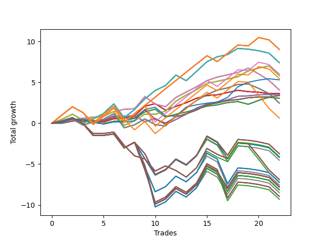

# Short Wallace Doodle 014 
- Symbol: AAPL_Unlimited
- Date Range: 03/23/2022 - 07/08/2022
- Trading Period: 7:20-12:30
- Number of Trades: 22



| Name | Win Percent | Profit | Avg Profit / Trade | Avg Time / Trade |      | Name | Win Percent | Profit | Avg Profit / Trade | Avg Time / Trade |
| ---- | ----------- | ------ | ------------------ | ---------------- | ---- | ---- | ----------- | ------ | ------------------ | ---------------- |
| Sorted By <br> Profit | | | | | | Sorted By <br> Win Percentage ||||
| One Hundred Twenty-Six | 68.18 | 4510.00 | 205.00 | 114:12 |     | Seventy | 81.82 | 2915.00 | 132.50 | 65:55 |
| One Hundred Twenty-One | 68.18 | 4510.00 | 205.00 | 114:12 |     | Sixty-Two | 81.82 | 2915.00 | 132.50 | 65:55 |
| One Hundred Sixteen | 68.18 | 4510.00 | 205.00 | 114:12 |     | Fifty-Four | 81.82 | 2915.00 | 132.50 | 65:55 |
| One Hundred Eleven | 68.18 | 4510.00 | 205.00 | 114:12 |     | Forty-Six | 81.82 | 2915.00 | 132.50 | 65:55 |
| One Hundred One | 68.18 | 4510.00 | 205.00 | 114:12 |     | Six | 81.82 | 2915.00 | 132.50 | 65:55 |
| Eighty-One | 68.18 | 4510.00 | 205.00 | 114:12 |     | Sixty-Eight | 77.27 | 2035.00 | 92.50 | 41:26 |
| Seventy-One | 68.18 | 3700.00 | 168.18 | 111:36 |     | Sixty | 77.27 | 2035.00 | 92.50 | 41:26 |
| Sixty-Three | 68.18 | 3700.00 | 168.18 | 111:36 |     | Fifty-Two | 77.27 | 2035.00 | 92.50 | 41:26 |
| Fifty-Five | 68.18 | 3700.00 | 168.18 | 111:36 |     | Forty-Four | 77.27 | 2035.00 | 92.50 | 41:26 |
| Forty-Seven | 68.18 | 3700.00 | 168.18 | 111:36 |     | Four | 77.27 | 2035.00 | 92.50 | 41:26 |
| Seven | 68.18 | 3700.00 | 168.18 | 111:36 |     | Sixty-Six | 77.27 | 1770.00 | 80.45 | 23:25 |
| Ninety-One | 63.64 | 3000.00 | 136.36 | 112:32 |     | Fifty-Eight | 77.27 | 1770.00 | 80.45 | 23:25 |
| Seventy | 81.82 | 2915.00 | 132.50 | 65:55 |     | Fifty | 77.27 | 1770.00 | 80.45 | 23:25 |
| Sixty-Two | 81.82 | 2915.00 | 132.50 | 65:55 |     | Forty-Two | 77.27 | 1770.00 | 80.45 | 23:25 |
| Fifty-Four | 81.82 | 2915.00 | 132.50 | 65:55 |     | Two | 77.27 | 1770.00 | 80.45 | 23:25 |
| Forty-Six | 81.82 | 2915.00 | 132.50 | 65:55 |     | Sixty-Four | 72.73 | 1525.00 | 69.32 | 09:12 |
| Six | 81.82 | 2915.00 | 132.50 | 65:55 |     | Fifty-Six | 72.73 | 1525.00 | 69.32 | 09:12 |
| One Hundred Six | 63.64 | 2730.00 | 124.09 | 112:40 |     | Forty-Eight | 72.73 | 1525.00 | 69.32 | 09:12 |
| Seventy-Three | 68.18 | 2650.00 | 120.45 | 13:54 |     | Forty | 72.73 | 1525.00 | 69.32 | 09:12 |
| Sixty-Eight | 77.27 | 2035.00 | 92.50 | 41:26 |     | Zero | 72.73 | 1525.00 | 69.32 | 09:12 |
| Sixty | 77.27 | 2035.00 | 92.50 | 41:26 |     | One Hundred Twenty-Six | 68.18 | 4510.00 | 205.00 | 114:12 |
| Fifty-Two | 77.27 | 2035.00 | 92.50 | 41:26 |     | One Hundred Twenty-One | 68.18 | 4510.00 | 205.00 | 114:12 |
| Forty-Four | 77.27 | 2035.00 | 92.50 | 41:26 |     | One Hundred Sixteen | 68.18 | 4510.00 | 205.00 | 114:12 |
| Four | 77.27 | 2035.00 | 92.50 | 41:26 |     | One Hundred Eleven | 68.18 | 4510.00 | 205.00 | 114:12 |
| Sixty-Five | 68.18 | 1815.00 | 82.50 | 16:31 |     | One Hundred One | 68.18 | 4510.00 | 205.00 | 114:12 |
| Fifty-Seven | 68.18 | 1815.00 | 82.50 | 16:31 |     | Eighty-One | 68.18 | 4510.00 | 205.00 | 114:12 |
| Forty-Nine | 68.18 | 1815.00 | 82.50 | 16:31 |     | Seventy-One | 68.18 | 3700.00 | 168.18 | 111:36 |
| Forty-One | 68.18 | 1815.00 | 82.50 | 16:31 |     | Sixty-Three | 68.18 | 3700.00 | 168.18 | 111:36 |
| One | 68.18 | 1815.00 | 82.50 | 16:31 |     | Fifty-Five | 68.18 | 3700.00 | 168.18 | 111:36 |
| Sixty-Six | 77.27 | 1770.00 | 80.45 | 23:25 |     | Forty-Seven | 68.18 | 3700.00 | 168.18 | 111:36 |
| Fifty-Eight | 77.27 | 1770.00 | 80.45 | 23:25 |     | Seven | 68.18 | 3700.00 | 168.18 | 111:36 |
| Fifty | 77.27 | 1770.00 | 80.45 | 23:25 |     | Seventy-Three | 68.18 | 2650.00 | 120.45 | 13:54 |
| Forty-Two | 77.27 | 1770.00 | 80.45 | 23:25 |     | Sixty-Five | 68.18 | 1815.00 | 82.50 | 16:31 |
| Two | 77.27 | 1770.00 | 80.45 | 23:25 |     | Fifty-Seven | 68.18 | 1815.00 | 82.50 | 16:31 |
| Sixty-Seven | 63.64 | 1690.00 | 76.82 | 26:41 |     | Forty-Nine | 68.18 | 1815.00 | 82.50 | 16:31 |
| Fifty-Nine | 63.64 | 1690.00 | 76.82 | 26:41 |     | Forty-One | 68.18 | 1815.00 | 82.50 | 16:31 |
| Fifty-One | 63.64 | 1690.00 | 76.82 | 26:41 |     | One | 68.18 | 1815.00 | 82.50 | 16:31 |
| Forty-Three | 63.64 | 1690.00 | 76.82 | 26:41 |     | Sixty-Nine | 68.18 | 1230.00 | 55.91 | 62:49 |
| Three | 63.64 | 1690.00 | 76.82 | 26:41 |     | Sixty-One | 68.18 | 1230.00 | 55.91 | 62:49 |
| Sixty-Four | 72.73 | 1525.00 | 69.32 | 09:12 |     | Fifty-Three | 68.18 | 1230.00 | 55.91 | 62:49 |
| Fifty-Six | 72.73 | 1525.00 | 69.32 | 09:12 |     | Forty-Five | 68.18 | 1230.00 | 55.91 | 62:49 |
| Forty-Eight | 72.73 | 1525.00 | 69.32 | 09:12 |     | Five | 68.18 | 1230.00 | 55.91 | 62:49 |
| Forty | 72.73 | 1525.00 | 69.32 | 09:12 |     | Ninety-One | 63.64 | 3000.00 | 136.36 | 112:32 |
| Zero | 72.73 | 1525.00 | 69.32 | 09:12 |     | One Hundred Six | 63.64 | 2730.00 | 124.09 | 112:40 |
| Sixty-Nine | 68.18 | 1230.00 | 55.91 | 62:49 |     | Sixty-Seven | 63.64 | 1690.00 | 76.82 | 26:41 |
| Sixty-One | 68.18 | 1230.00 | 55.91 | 62:49 |     | Fifty-Nine | 63.64 | 1690.00 | 76.82 | 26:41 |
| Fifty-Three | 68.18 | 1230.00 | 55.91 | 62:49 |     | Fifty-One | 63.64 | 1690.00 | 76.82 | 26:41 |
| Forty-Five | 68.18 | 1230.00 | 55.91 | 62:49 |     | Forty-Three | 63.64 | 1690.00 | 76.82 | 26:41 |
| Five | 68.18 | 1230.00 | 55.91 | 62:49 |     | Three | 63.64 | 1690.00 | 76.82 | 26:41 |
| Ninety-Six | 54.55 | 315.00 | 14.32 | 85:52 |     | Ninety-Six | 54.55 | 315.00 | 14.32 | 85:52 |
| One Hundred Ten | 40.91 | -1870.00 | -85.00 | 161:15 |     | One Hundred Ten | 40.91 | -1870.00 | -85.00 | 161:15 |
| One Hundred Nine | 40.91 | -1870.00 | -85.00 | 161:15 |     | One Hundred Nine | 40.91 | -1870.00 | -85.00 | 161:15 |
| One Hundred Eight | 40.91 | -1870.00 | -85.00 | 161:15 |     | One Hundred Eight | 40.91 | -1870.00 | -85.00 | 161:15 |
| One Hundred Seven | 40.91 | -2045.00 | -92.95 | 159:35 |     | One Hundred Seven | 40.91 | -2045.00 | -92.95 | 159:35 |
| Ninety-Five | 40.91 | -2090.00 | -95.00 | 165:22 |     | Ninety-Five | 40.91 | -2090.00 | -95.00 | 165:22 |
| Ninety-Four | 40.91 | -2090.00 | -95.00 | 165:22 |     | Ninety-Four | 40.91 | -2090.00 | -95.00 | 165:22 |
| Ninety-Three | 40.91 | -2090.00 | -95.00 | 165:22 |     | Ninety-Three | 40.91 | -2090.00 | -95.00 | 165:22 |
| Ninety-Two | 40.91 | -2265.00 | -102.95 | 163:42 |     | Ninety-Two | 40.91 | -2265.00 | -102.95 | 163:42 |
| One Hundred | 31.82 | -3445.00 | -156.59 | 126:23 |     | One Hundred Five | 40.91 | -3610.00 | -164.09 | 172:43 |
| Ninety-Nine | 31.82 | -3445.00 | -156.59 | 126:23 |     | One Hundred Four | 40.91 | -3610.00 | -164.09 | 172:43 |
| Ninety-Eight | 31.82 | -3445.00 | -156.59 | 126:23 |     | One Hundred Three | 40.91 | -3610.00 | -164.09 | 172:43 |
| One Hundred Five | 40.91 | -3610.00 | -164.09 | 172:43 |     | One Hundred Two | 40.91 | -3785.00 | -172.05 | 171:03 |
| One Hundred Four | 40.91 | -3610.00 | -164.09 | 172:43 |     | One Hundred Thirty | 40.91 | -3900.00 | -177.27 | 181:32 |
| One Hundred Three | 40.91 | -3610.00 | -164.09 | 172:43 |     | One Hundred Twenty-Nine | 40.91 | -3900.00 | -177.27 | 181:32 |
| Ninety-Seven | 31.82 | -3620.00 | -164.55 | 124:43 |     | One Hundred Twenty-Eight | 40.91 | -3900.00 | -177.27 | 181:32 |
| One Hundred Two | 40.91 | -3785.00 | -172.05 | 171:03 |     | One Hundred Twenty-Five | 40.91 | -3900.00 | -177.27 | 181:32 |
| One Hundred Thirty | 40.91 | -3900.00 | -177.27 | 181:32 |     | One Hundred Twenty-Four | 40.91 | -3900.00 | -177.27 | 181:32 |
| One Hundred Twenty-Nine | 40.91 | -3900.00 | -177.27 | 181:32 |     | One Hundred Twenty-Three | 40.91 | -3900.00 | -177.27 | 181:32 |
| One Hundred Twenty-Eight | 40.91 | -3900.00 | -177.27 | 181:32 |     | Eighty-Five | 40.91 | -3900.00 | -177.27 | 181:32 |
| One Hundred Twenty-Five | 40.91 | -3900.00 | -177.27 | 181:32 |     | Eighty-Four | 40.91 | -3900.00 | -177.27 | 181:32 |
| One Hundred Twenty-Four | 40.91 | -3900.00 | -177.27 | 181:32 |     | Eighty-Three | 40.91 | -3900.00 | -177.27 | 181:32 |
| One Hundred Twenty-Three | 40.91 | -3900.00 | -177.27 | 181:32 |     | One Hundred Twenty-Seven | 40.91 | -4075.00 | -185.23 | 179:52 |
| Eighty-Five | 40.91 | -3900.00 | -177.27 | 181:32 |     | One Hundred Twenty-Two | 40.91 | -4075.00 | -185.23 | 179:52 |
| Eighty-Four | 40.91 | -3900.00 | -177.27 | 181:32 |     | One Hundred Fifteen | 40.91 | -4075.00 | -185.23 | 181:19 |
| Eighty-Three | 40.91 | -3900.00 | -177.27 | 181:32 |     | One Hundred Fourteen | 40.91 | -4075.00 | -185.23 | 181:19 |
| One Hundred Twenty-Seven | 40.91 | -4075.00 | -185.23 | 179:52 |     | One Hundred Thirteen | 40.91 | -4075.00 | -185.23 | 181:19 |
| One Hundred Twenty-Two | 40.91 | -4075.00 | -185.23 | 179:52 |     | Eighty-Two | 40.91 | -4075.00 | -185.23 | 179:52 |
| One Hundred Fifteen | 40.91 | -4075.00 | -185.23 | 181:19 |     | One Hundred Twelve | 40.91 | -4250.00 | -193.18 | 179:39 |
| One Hundred Fourteen | 40.91 | -4075.00 | -185.23 | 181:19 |     | One Hundred Twenty | 40.91 | -4480.00 | -203.64 | 178:30 |
| One Hundred Thirteen | 40.91 | -4075.00 | -185.23 | 181:19 |     | One Hundred Ninteen | 40.91 | -4480.00 | -203.64 | 178:30 |
| Eighty-Two | 40.91 | -4075.00 | -185.23 | 179:52 |     | One Hundred Eighteen | 40.91 | -4480.00 | -203.64 | 178:30 |
| One Hundred Twelve | 40.91 | -4250.00 | -193.18 | 179:39 |     | One Hundred Seventeen | 40.91 | -4655.00 | -211.59 | 176:50 |
| One Hundred Twenty | 40.91 | -4480.00 | -203.64 | 178:30 |     | One Hundred | 31.82 | -3445.00 | -156.59 | 126:23 |
| One Hundred Ninteen | 40.91 | -4480.00 | -203.64 | 178:30 |     | Ninety-Nine | 31.82 | -3445.00 | -156.59 | 126:23 |
| One Hundred Eighteen | 40.91 | -4480.00 | -203.64 | 178:30 |     | Ninety-Eight | 31.82 | -3445.00 | -156.59 | 126:23 |
| One Hundred Seventeen | 40.91 | -4655.00 | -211.59 | 176:50 |     | Ninety-Seven | 31.82 | -3620.00 | -164.55 | 124:43 |

## NO STOPLOSS

### Test Zero
* Sell when price hits the middle line of the 20p bollinger
* No Stoploss
* Results:
```
Total Trades: 22
Percent Up: 27.27
Percent Down: 72.73
Total Points Moved Down: 3.05
Potential Profit: 1525.00
Total Points Ups: 1.79 Count Ups: 6
Total Points Downs: 4.84 Count Downs: 16
```

<details><summary>Trades</summary>

<code>In: 2022-03-25 11:05:00		Out: 2022-03-25 11:17:45		Total Position Time: 12:45		Total Move Down: 0.05		Total to Date: 0.05</code> <br />
<code>In: 2022-03-25 12:01:00		Out: 2022-03-25 12:02:10		Total Position Time: 01:10		Total Move Down: 0.25		Total to Date: 0.30</code> <br />
<code>In: 2022-03-28 10:26:00		Out: 2022-03-28 10:43:50		Total Position Time: 17:50		Total Move Down: -0.05		Total to Date: 0.25</code> <br />
<code>In: 2022-03-29 08:22:00		Out: 2022-03-29 08:40:35		Total Position Time: 18:35		Total Move Down: -0.18		Total to Date: 0.07</code> <br />
<code>In: 2022-04-20 07:31:00		Out: 2022-04-20 07:37:05		Total Position Time: 06:05		Total Move Down: -0.13		Total to Date: -0.06</code> <br />
<code>In: 2022-04-20 10:49:00		Out: 2022-04-20 10:50:10		Total Position Time: 01:10		Total Move Down: 0.29		Total to Date: 0.23</code> <br />
<code>In: 2022-04-25 11:25:00		Out: 2022-04-25 11:40:00		Total Position Time: 15:00		Total Move Down: 0.08		Total to Date: 0.31</code> <br />
<code>In: 2022-04-27 08:04:00		Out: 2022-04-27 08:10:10		Total Position Time: 06:10		Total Move Down: 0.28		Total to Date: 0.59</code> <br />
<code>In: 2022-04-28 07:23:00		Out: 2022-04-28 07:27:00		Total Position Time: 04:00		Total Move Down: 0.79		Total to Date: 1.38</code> <br />
<code>In: 2022-05-04 08:56:00		Out: 2022-05-04 09:04:40		Total Position Time: 08:40		Total Move Down: 0.33		Total to Date: 1.71</code> <br />
<code>In: 2022-05-10 10:37:00		Out: 2022-05-10 11:05:55		Total Position Time: 28:55		Total Move Down: -0.98		Total to Date: 0.73</code> <br />
<code>In: 2022-05-16 08:57:00		Out: 2022-05-16 09:05:45		Total Position Time: 08:45		Total Move Down: 0.36		Total to Date: 1.09</code> <br />
<code>In: 2022-05-24 11:41:00		Out: 2022-05-24 11:42:20		Total Position Time: 01:20		Total Move Down: 0.27		Total to Date: 1.36</code> <br />
<code>In: 2022-06-10 12:29:00		Out: 2022-06-10 12:31:00		Total Position Time: 02:00		Total Move Down: 0.38		Total to Date: 1.74</code> <br />
<code>In: 2022-06-13 08:26:00		Out: 2022-06-13 08:37:10		Total Position Time: 11:10		Total Move Down: 0.34		Total to Date: 2.08</code> <br />
<code>In: 2022-06-14 08:47:00		Out: 2022-06-14 08:51:40		Total Position Time: 04:40		Total Move Down: 0.16		Total to Date: 2.24</code> <br />
<code>In: 2022-06-15 11:02:00		Out: 2022-06-15 11:03:10		Total Position Time: 01:10		Total Move Down: 0.28		Total to Date: 2.52</code> <br />
<code>In: 2022-06-16 10:32:00		Out: 2022-06-16 10:37:00		Total Position Time: 05:00		Total Move Down: 0.12		Total to Date: 2.64</code> <br />
<code>In: 2022-06-17 08:21:00		Out: 2022-06-17 08:38:40		Total Position Time: 17:40		Total Move Down: -0.33		Total to Date: 2.31</code> <br />
<code>In: 2022-06-30 08:29:00		Out: 2022-06-30 08:36:00		Total Position Time: 07:00		Total Move Down: 0.48		Total to Date: 2.79</code> <br />
<code>In: 2022-06-30 08:30:00		Out: 2022-06-30 08:36:00		Total Position Time: 06:00		Total Move Down: 0.38		Total to Date: 3.17</code> <br />
<code>In: 2022-07-01 10:47:00		Out: 2022-07-01 11:04:25		Total Position Time: 17:25		Total Move Down: -0.12		Total to Date: 3.05</code> <br />


</details>

### Test One
* Sell when the price hits the upper line of the 20p 1std bollinger
* No Stoploss
* Results:
```
Total Trades: 22
Percent Up: 31.82
Percent Down: 68.18
Total Points Moved Down: 3.63
Potential Profit: 1815.00
Total Points Ups: 1.42 Count Ups: 7
Total Points Downs: 5.05 Count Downs: 15
```

<details><summary>Trades</summary>

<code>In: 2022-03-25 11:05:00		Out: 2022-03-25 11:19:05		Total Position Time: 14:05		Total Move Down: 0.11		Total to Date: 0.11</code> <br />
<code>In: 2022-03-25 12:01:00		Out: 2022-03-25 12:02:10		Total Position Time: 01:10		Total Move Down: 0.25		Total to Date: 0.36</code> <br />
<code>In: 2022-03-28 10:26:00		Out: 2022-03-28 10:52:25		Total Position Time: 26:25		Total Move Down: -0.04		Total to Date: 0.32</code> <br />
<code>In: 2022-03-29 08:22:00		Out: 2022-03-29 08:41:15		Total Position Time: 19:15		Total Move Down: -0.06		Total to Date: 0.26</code> <br />
<code>In: 2022-04-20 07:31:00		Out: 2022-04-20 07:47:05		Total Position Time: 16:05		Total Move Down: -0.12		Total to Date: 0.14</code> <br />
<code>In: 2022-04-20 10:49:00		Out: 2022-04-20 10:54:05		Total Position Time: 05:05		Total Move Down: 0.40		Total to Date: 0.54</code> <br />
<code>In: 2022-04-25 11:25:00		Out: 2022-04-25 11:44:50		Total Position Time: 19:50		Total Move Down: 0.07		Total to Date: 0.61</code> <br />
<code>In: 2022-04-27 08:04:00		Out: 2022-04-27 08:20:25		Total Position Time: 16:25		Total Move Down: 0.26		Total to Date: 0.87</code> <br />
<code>In: 2022-04-28 07:23:00		Out: 2022-04-28 07:29:40		Total Position Time: 06:40		Total Move Down: 1.21		Total to Date: 2.08</code> <br />
<code>In: 2022-05-04 08:56:00		Out: 2022-05-04 09:10:15		Total Position Time: 14:15		Total Move Down: 0.30		Total to Date: 2.38</code> <br />
<code>In: 2022-05-10 10:37:00		Out: 2022-05-10 11:06:35		Total Position Time: 29:35		Total Move Down: -0.79		Total to Date: 1.59</code> <br />
<code>In: 2022-05-16 08:57:00		Out: 2022-05-16 09:11:30		Total Position Time: 14:30		Total Move Down: 0.47		Total to Date: 2.06</code> <br />
<code>In: 2022-05-24 11:41:00		Out: 2022-05-24 11:43:45		Total Position Time: 02:45		Total Move Down: 0.44		Total to Date: 2.50</code> <br />
<code>In: 2022-06-10 12:29:00		Out: 2022-06-10 12:42:25		Total Position Time: 13:25		Total Move Down: 0.55		Total to Date: 3.05</code> <br />
<code>In: 2022-06-13 08:26:00		Out: 2022-06-13 08:46:30		Total Position Time: 20:30		Total Move Down: 0.33		Total to Date: 3.38</code> <br />
<code>In: 2022-06-14 08:47:00		Out: 2022-06-14 09:02:10		Total Position Time: 15:10		Total Move Down: 0.09		Total to Date: 3.47</code> <br />
<code>In: 2022-06-15 11:02:00		Out: 2022-06-15 11:03:10		Total Position Time: 01:10		Total Move Down: 0.28		Total to Date: 3.75</code> <br />
<code>In: 2022-06-16 10:32:00		Out: 2022-06-16 10:43:50		Total Position Time: 11:50		Total Move Down: 0.28		Total to Date: 4.03</code> <br />
<code>In: 2022-06-17 08:21:00		Out: 2022-06-17 08:42:50		Total Position Time: 21:50		Total Move Down: -0.17		Total to Date: 3.86</code> <br />
<code>In: 2022-06-30 08:29:00		Out: 2022-06-30 09:05:45		Total Position Time: 36:45		Total Move Down: -0.07		Total to Date: 3.79</code> <br />
<code>In: 2022-06-30 08:30:00		Out: 2022-06-30 09:05:45		Total Position Time: 35:45		Total Move Down: -0.17		Total to Date: 3.62</code> <br />
<code>In: 2022-07-01 10:47:00		Out: 2022-07-01 11:07:55		Total Position Time: 20:55		Total Move Down: 0.01		Total to Date: 3.63</code> <br />


</details>

### Test Two
* Sell when the price hits the upper line of the 20p 2std bollinger
* No Stoploss
* Results:
```
Total Trades: 22
Percent Up: 22.73
Percent Down: 77.27
Total Points Moved Down: 3.54
Potential Profit: 1770.00
Total Points Ups: 1.61 Count Ups: 5
Total Points Downs: 5.15 Count Downs: 17
```

<details><summary>Trades</summary>

<code>In: 2022-03-25 11:05:00		Out: 2022-03-25 11:19:55		Total Position Time: 14:55		Total Move Down: 0.18		Total to Date: 0.18</code> <br />
<code>In: 2022-03-25 12:01:00		Out: 2022-03-25 12:02:10		Total Position Time: 01:10		Total Move Down: 0.25		Total to Date: 0.43</code> <br />
<code>In: 2022-03-28 10:26:00		Out: 2022-03-28 10:54:15		Total Position Time: 28:15		Total Move Down: -0.02		Total to Date: 0.41</code> <br />
<code>In: 2022-03-29 08:22:00		Out: 2022-03-29 08:57:40		Total Position Time: 35:40		Total Move Down: -0.09		Total to Date: 0.32</code> <br />
<code>In: 2022-04-20 07:31:00		Out: 2022-04-20 07:47:45		Total Position Time: 16:45		Total Move Down: 0.02		Total to Date: 0.34</code> <br />
<code>In: 2022-04-20 10:49:00		Out: 2022-04-20 11:03:15		Total Position Time: 14:15		Total Move Down: 0.55		Total to Date: 0.89</code> <br />
<code>In: 2022-04-25 11:25:00		Out: 2022-04-25 12:03:15		Total Position Time: 38:15		Total Move Down: -0.03		Total to Date: 0.86</code> <br />
<code>In: 2022-04-27 08:04:00		Out: 2022-04-27 08:52:25		Total Position Time: 48:25		Total Move Down: 0.05		Total to Date: 0.91</code> <br />
<code>In: 2022-04-28 07:23:00		Out: 2022-04-28 08:28:30		Total Position Time: 65:30		Total Move Down: -0.73		Total to Date: 0.18</code> <br />
<code>In: 2022-05-04 08:56:00		Out: 2022-05-04 09:12:25		Total Position Time: 16:25		Total Move Down: 0.40		Total to Date: 0.58</code> <br />
<code>In: 2022-05-10 10:37:00		Out: 2022-05-10 11:07:10		Total Position Time: 30:10		Total Move Down: -0.74		Total to Date: -0.16</code> <br />
<code>In: 2022-05-16 08:57:00		Out: 2022-05-16 09:14:40		Total Position Time: 17:40		Total Move Down: 0.60		Total to Date: 0.44</code> <br />
<code>In: 2022-05-24 11:41:00		Out: 2022-05-24 11:44:05		Total Position Time: 03:05		Total Move Down: 0.67		Total to Date: 1.11</code> <br />
<code>In: 2022-06-10 12:29:00		Out: 2022-06-10 12:43:15		Total Position Time: 14:15		Total Move Down: 0.75		Total to Date: 1.86</code> <br />
<code>In: 2022-06-13 08:26:00		Out: 2022-06-13 08:47:05		Total Position Time: 21:05		Total Move Down: 0.48		Total to Date: 2.34</code> <br />
<code>In: 2022-06-14 08:47:00		Out: 2022-06-14 09:03:00		Total Position Time: 16:00		Total Move Down: 0.24		Total to Date: 2.58</code> <br />
<code>In: 2022-06-15 11:02:00		Out: 2022-06-15 11:03:10		Total Position Time: 01:10		Total Move Down: 0.28		Total to Date: 2.86</code> <br />
<code>In: 2022-06-16 10:32:00		Out: 2022-06-16 10:45:10		Total Position Time: 13:10		Total Move Down: 0.43		Total to Date: 3.29</code> <br />
<code>In: 2022-06-17 08:21:00		Out: 2022-06-17 08:44:55		Total Position Time: 23:55		Total Move Down: 0.06		Total to Date: 3.35</code> <br />
<code>In: 2022-06-30 08:29:00		Out: 2022-06-30 09:06:25		Total Position Time: 37:25		Total Move Down: 0.12		Total to Date: 3.47</code> <br />
<code>In: 2022-06-30 08:30:00		Out: 2022-06-30 09:06:25		Total Position Time: 36:25		Total Move Down: 0.02		Total to Date: 3.49</code> <br />
<code>In: 2022-07-01 10:47:00		Out: 2022-07-01 11:08:25		Total Position Time: 21:25		Total Move Down: 0.05		Total to Date: 3.54</code> <br />


</details>

### Test Three
* Sell when price hits the middle line of the 50p bollinger
* No Stoploss
* Results:
```
Total Trades: 22
Percent Up: 36.36
Percent Down: 63.64
Total Points Moved Down: 3.38
Potential Profit: 1690.00
Total Points Ups: 1.84 Count Ups: 8
Total Points Downs: 5.22 Count Downs: 14
```

<details><summary>Trades</summary>

<code>In: 2022-03-25 11:05:00		Out: 2022-03-25 11:49:20		Total Position Time: 44:20		Total Move Down: -0.00		Total to Date: 0.00</code> <br />
<code>In: 2022-03-25 12:01:00		Out: 2022-03-25 12:02:10		Total Position Time: 01:10		Total Move Down: 0.25		Total to Date: 0.25</code> <br />
<code>In: 2022-03-28 10:26:00		Out: 2022-03-28 10:55:10		Total Position Time: 29:10		Total Move Down: 0.13		Total to Date: 0.38</code> <br />
<code>In: 2022-03-29 08:22:00		Out: 2022-03-29 08:57:55		Total Position Time: 35:55		Total Move Down: -0.06		Total to Date: 0.32</code> <br />
<code>In: 2022-04-20 07:31:00		Out: 2022-04-20 07:57:45		Total Position Time: 26:45		Total Move Down: -0.02		Total to Date: 0.30</code> <br />
<code>In: 2022-04-20 10:49:00		Out: 2022-04-20 10:55:30		Total Position Time: 06:30		Total Move Down: 0.44		Total to Date: 0.74</code> <br />
<code>In: 2022-04-25 11:25:00		Out: 2022-04-25 12:03:10		Total Position Time: 38:10		Total Move Down: -0.06		Total to Date: 0.68</code> <br />
<code>In: 2022-04-27 08:04:00		Out: 2022-04-27 08:45:20		Total Position Time: 41:20		Total Move Down: -0.05		Total to Date: 0.63</code> <br />
<code>In: 2022-04-28 07:23:00		Out: 2022-04-28 07:27:10		Total Position Time: 04:10		Total Move Down: 1.01		Total to Date: 1.64</code> <br />
<code>In: 2022-05-04 08:56:00		Out: 2022-05-04 11:00:20		Total Position Time: 124:20		Total Move Down: -1.15		Total to Date: 0.49</code> <br />
<code>In: 2022-05-10 10:37:00		Out: 2022-05-10 11:16:20		Total Position Time: 39:20		Total Move Down: -0.50		Total to Date: -0.01</code> <br />
<code>In: 2022-05-16 08:57:00		Out: 2022-05-16 09:15:45		Total Position Time: 18:45		Total Move Down: 0.77		Total to Date: 0.76</code> <br />
<code>In: 2022-05-24 11:41:00		Out: 2022-05-24 11:43:30		Total Position Time: 02:30		Total Move Down: 0.38		Total to Date: 1.14</code> <br />
<code>In: 2022-06-10 12:29:00		Out: 2022-06-10 12:33:05		Total Position Time: 04:05		Total Move Down: 0.47		Total to Date: 1.61</code> <br />
<code>In: 2022-06-13 08:26:00		Out: 2022-06-13 08:51:55		Total Position Time: 25:55		Total Move Down: 0.63		Total to Date: 2.24</code> <br />
<code>In: 2022-06-14 08:47:00		Out: 2022-06-14 09:03:00		Total Position Time: 16:00		Total Move Down: 0.24		Total to Date: 2.48</code> <br />
<code>In: 2022-06-15 11:02:00		Out: 2022-06-15 11:03:10		Total Position Time: 01:10		Total Move Down: 0.28		Total to Date: 2.76</code> <br />
<code>In: 2022-06-16 10:32:00		Out: 2022-06-16 10:37:30		Total Position Time: 05:30		Total Move Down: 0.13		Total to Date: 2.89</code> <br />
<code>In: 2022-06-17 08:21:00		Out: 2022-06-17 08:45:15		Total Position Time: 24:15		Total Move Down: 0.22		Total to Date: 3.11</code> <br />
<code>In: 2022-06-30 08:29:00		Out: 2022-06-30 09:06:20		Total Position Time: 37:20		Total Move Down: 0.10		Total to Date: 3.21</code> <br />
<code>In: 2022-06-30 08:30:00		Out: 2022-06-30 09:06:20		Total Position Time: 36:20		Total Move Down: -0.00		Total to Date: 3.21</code> <br />
<code>In: 2022-07-01 10:47:00		Out: 2022-07-01 11:11:05		Total Position Time: 24:05		Total Move Down: 0.17		Total to Date: 3.38</code> <br />


</details>

### Test Four
* Sell when the price hits the upper line of the 50p 1std bollinger
* No Stoploss
* Results:
```
Total Trades: 22
Percent Up: 22.73
Percent Down: 77.27
Total Points Moved Down: 4.07
Potential Profit: 2035.00
Total Points Ups: 3.90 Count Ups: 5
Total Points Downs: 7.97 Count Downs: 17
```

<details><summary>Trades</summary>

<code>In: 2022-03-25 11:05:00		Out: 2022-03-25 12:02:00		Total Position Time: 57:00		Total Move Down: 0.12		Total to Date: 0.12</code> <br />
<code>In: 2022-03-25 12:01:00		Out: 2022-03-25 12:02:10		Total Position Time: 01:10		Total Move Down: 0.25		Total to Date: 0.37</code> <br />
<code>In: 2022-03-28 10:26:00		Out: 2022-03-28 10:56:45		Total Position Time: 30:45		Total Move Down: 0.24		Total to Date: 0.61</code> <br />
<code>In: 2022-03-29 08:22:00		Out: 2022-03-29 09:01:35		Total Position Time: 39:35		Total Move Down: 0.13		Total to Date: 0.74</code> <br />
<code>In: 2022-04-20 07:31:00		Out: 2022-04-20 08:00:20		Total Position Time: 29:20		Total Move Down: 0.11		Total to Date: 0.85</code> <br />
<code>In: 2022-04-20 10:49:00		Out: 2022-04-20 11:03:15		Total Position Time: 14:15		Total Move Down: 0.55		Total to Date: 1.40</code> <br />
<code>In: 2022-04-25 11:25:00		Out: 2022-04-25 12:05:20		Total Position Time: 40:20		Total Move Down: 0.30		Total to Date: 1.70</code> <br />
<code>In: 2022-04-27 08:04:00		Out: 2022-04-27 08:52:55		Total Position Time: 48:55		Total Move Down: 0.07		Total to Date: 1.77</code> <br />
<code>In: 2022-04-28 07:23:00		Out: 2022-04-28 07:33:30		Total Position Time: 10:30		Total Move Down: 1.48		Total to Date: 3.25</code> <br />
<code>In: 2022-05-04 08:56:00		Out: 2022-05-04 11:00:25		Total Position Time: 124:25		Total Move Down: -0.92		Total to Date: 2.33</code> <br />
<code>In: 2022-05-10 10:37:00		Out: 2022-05-10 11:24:10		Total Position Time: 47:10		Total Move Down: -0.31		Total to Date: 2.02</code> <br />
<code>In: 2022-05-16 08:57:00		Out: 2022-05-16 09:24:25		Total Position Time: 27:25		Total Move Down: 1.12		Total to Date: 3.14</code> <br />
<code>In: 2022-05-24 11:41:00		Out: 2022-05-24 11:44:05		Total Position Time: 03:05		Total Move Down: 0.67		Total to Date: 3.81</code> <br />
<code>In: 2022-06-10 12:29:00		Out: 2022-06-10 12:42:40		Total Position Time: 13:40		Total Move Down: 0.65		Total to Date: 4.46</code> <br />
<code>In: 2022-06-13 08:26:00		Out: 2022-06-13 09:04:10		Total Position Time: 38:10		Total Move Down: 0.74		Total to Date: 5.20</code> <br />
<code>In: 2022-06-14 08:47:00		Out: 2022-06-14 09:07:10		Total Position Time: 20:10		Total Move Down: 0.44		Total to Date: 5.64</code> <br />
<code>In: 2022-06-15 11:02:00		Out: 2022-06-15 11:03:10		Total Position Time: 01:10		Total Move Down: 0.28		Total to Date: 5.92</code> <br />
<code>In: 2022-06-16 10:32:00		Out: 2022-06-16 10:44:00		Total Position Time: 12:00		Total Move Down: 0.29		Total to Date: 6.21</code> <br />
<code>In: 2022-06-17 08:21:00		Out: 2022-06-17 08:52:10		Total Position Time: 31:10		Total Move Down: 0.53		Total to Date: 6.74</code> <br />
<code>In: 2022-06-30 08:29:00		Out: 2022-06-30 10:10:15		Total Position Time: 101:15		Total Move Down: -0.70		Total to Date: 6.04</code> <br />
<code>In: 2022-06-30 08:30:00		Out: 2022-06-30 10:10:15		Total Position Time: 100:15		Total Move Down: -0.80		Total to Date: 5.24</code> <br />
<code>In: 2022-07-01 10:47:00		Out: 2022-07-01 12:47:00		Total Position Time: 120:00		Total Move Down: -1.17		Total to Date: 4.07</code> <br />


</details>

### Test Five
* Sell when the price hits the upper line of the 50p 2std bollinger
* No Stoploss
* Results:
```
Total Trades: 22
Percent Up: 31.82
Percent Down: 68.18
Total Points Moved Down: 2.46
Potential Profit: 1230.00
Total Points Ups: 5.59 Count Ups: 7
Total Points Downs: 8.05 Count Downs: 15
```

<details><summary>Trades</summary>

<code>In: 2022-03-25 11:05:00		Out: 2022-03-25 12:02:20		Total Position Time: 57:20		Total Move Down: 0.18		Total to Date: 0.18</code> <br />
<code>In: 2022-03-25 12:01:00		Out: 2022-03-25 12:02:20		Total Position Time: 01:20		Total Move Down: 0.30		Total to Date: 0.48</code> <br />
<code>In: 2022-03-28 10:26:00		Out: 2022-03-28 12:47:00		Total Position Time: 141:00		Total Move Down: -0.70		Total to Date: -0.22</code> <br />
<code>In: 2022-03-29 08:22:00		Out: 2022-03-29 09:02:20		Total Position Time: 40:20		Total Move Down: 0.34		Total to Date: 0.12</code> <br />
<code>In: 2022-04-20 07:31:00		Out: 2022-04-20 08:00:45		Total Position Time: 29:45		Total Move Down: 0.37		Total to Date: 0.49</code> <br />
<code>In: 2022-04-20 10:49:00		Out: 2022-04-20 11:19:30		Total Position Time: 30:30		Total Move Down: 0.65		Total to Date: 1.14</code> <br />
<code>In: 2022-04-25 11:25:00		Out: 2022-04-25 12:47:00		Total Position Time: 82:00		Total Move Down: -1.70		Total to Date: -0.56</code> <br />
<code>In: 2022-04-27 08:04:00		Out: 2022-04-27 08:54:15		Total Position Time: 50:15		Total Move Down: 0.36		Total to Date: -0.20</code> <br />
<code>In: 2022-04-28 07:23:00		Out: 2022-04-28 08:57:40		Total Position Time: 94:40		Total Move Down: 0.72		Total to Date: 0.52</code> <br />
<code>In: 2022-05-04 08:56:00		Out: 2022-05-04 11:07:40		Total Position Time: 131:40		Total Move Down: -0.70		Total to Date: -0.18</code> <br />
<code>In: 2022-05-10 10:37:00		Out: 2022-05-10 11:27:05		Total Position Time: 50:05		Total Move Down: -0.16		Total to Date: -0.34</code> <br />
<code>In: 2022-05-16 08:57:00		Out: 2022-05-16 09:39:00		Total Position Time: 42:00		Total Move Down: 1.21		Total to Date: 0.87</code> <br />
<code>In: 2022-05-24 11:41:00		Out: 2022-05-24 11:49:20		Total Position Time: 08:20		Total Move Down: 1.02		Total to Date: 1.89</code> <br />
<code>In: 2022-06-10 12:29:00		Out: 2022-06-10 12:45:25		Total Position Time: 16:25		Total Move Down: 0.88		Total to Date: 2.77</code> <br />
<code>In: 2022-06-13 08:26:00		Out: 2022-06-13 10:00:15		Total Position Time: 94:15		Total Move Down: 0.73		Total to Date: 3.50</code> <br />
<code>In: 2022-06-14 08:47:00		Out: 2022-06-14 09:14:40		Total Position Time: 27:40		Total Move Down: 0.54		Total to Date: 4.04</code> <br />
<code>In: 2022-06-15 11:02:00		Out: 2022-06-15 11:03:10		Total Position Time: 01:10		Total Move Down: 0.28		Total to Date: 4.32</code> <br />
<code>In: 2022-06-16 10:32:00		Out: 2022-06-16 10:45:10		Total Position Time: 13:10		Total Move Down: 0.43		Total to Date: 4.75</code> <br />
<code>In: 2022-06-17 08:21:00		Out: 2022-06-17 10:46:35		Total Position Time: 145:35		Total Move Down: 0.04		Total to Date: 4.79</code> <br />
<code>In: 2022-06-30 08:29:00		Out: 2022-06-30 10:11:50		Total Position Time: 102:50		Total Move Down: -0.53		Total to Date: 4.26</code> <br />
<code>In: 2022-06-30 08:30:00		Out: 2022-06-30 10:11:50		Total Position Time: 101:50		Total Move Down: -0.63		Total to Date: 3.63</code> <br />
<code>In: 2022-07-01 10:47:00		Out: 2022-07-01 12:47:00		Total Position Time: 120:00		Total Move Down: -1.17		Total to Date: 2.46</code> <br />


</details>

### Test Six
* Sell when the price hits the middle line of the 1std VWAP
* No Stoploss
* Results:
```
Total Trades: 22
Percent Up: 18.18
Percent Down: 81.82
Total Points Moved Down: 5.83
Potential Profit: 2915.00
Total Points Ups: 3.61 Count Ups: 4
Total Points Downs: 9.44 Count Downs: 18
```

<details><summary>Trades</summary>

<code>In: 2022-03-25 11:05:00		Out: 2022-03-25 12:17:45		Total Position Time: 72:45		Total Move Down: 0.49		Total to Date: 0.49</code> <br />
<code>In: 2022-03-25 12:01:00		Out: 2022-03-25 12:17:45		Total Position Time: 16:45		Total Move Down: 0.61		Total to Date: 1.10</code> <br />
<code>In: 2022-03-28 10:26:00		Out: 2022-03-28 12:47:00		Total Position Time: 141:00		Total Move Down: -0.70		Total to Date: 0.40</code> <br />
<code>In: 2022-03-29 08:22:00		Out: 2022-03-29 09:02:15		Total Position Time: 40:15		Total Move Down: 0.29		Total to Date: 0.69</code> <br />
<code>In: 2022-04-20 07:31:00		Out: 2022-04-20 08:00:25		Total Position Time: 29:25		Total Move Down: 0.13		Total to Date: 0.82</code> <br />
<code>In: 2022-04-20 10:49:00		Out: 2022-04-20 11:19:25		Total Position Time: 30:25		Total Move Down: 0.62		Total to Date: 1.44</code> <br />
<code>In: 2022-04-25 11:25:00		Out: 2022-04-25 12:47:00		Total Position Time: 82:00		Total Move Down: -1.70		Total to Date: -0.26</code> <br />
<code>In: 2022-04-27 08:04:00		Out: 2022-04-27 09:01:30		Total Position Time: 57:30		Total Move Down: 0.54		Total to Date: 0.28</code> <br />
<code>In: 2022-04-28 07:23:00		Out: 2022-04-28 07:27:05		Total Position Time: 04:05		Total Move Down: 0.84		Total to Date: 1.12</code> <br />
<code>In: 2022-05-04 08:56:00		Out: 2022-05-04 11:30:50		Total Position Time: 154:50		Total Move Down: -0.04		Total to Date: 1.08</code> <br />
<code>In: 2022-05-10 10:37:00		Out: 2022-05-10 12:30:15		Total Position Time: 113:15		Total Move Down: 0.39		Total to Date: 1.47</code> <br />
<code>In: 2022-05-16 08:57:00		Out: 2022-05-16 09:39:00		Total Position Time: 42:00		Total Move Down: 1.21		Total to Date: 2.68</code> <br />
<code>In: 2022-05-24 11:41:00		Out: 2022-05-24 11:45:00		Total Position Time: 04:00		Total Move Down: 0.77		Total to Date: 3.45</code> <br />
<code>In: 2022-06-10 12:29:00		Out: 2022-06-10 12:42:40		Total Position Time: 13:40		Total Move Down: 0.65		Total to Date: 4.10</code> <br />
<code>In: 2022-06-13 08:26:00		Out: 2022-06-13 08:52:25		Total Position Time: 26:25		Total Move Down: 0.78		Total to Date: 4.88</code> <br />
<code>In: 2022-06-14 08:47:00		Out: 2022-06-14 09:03:00		Total Position Time: 16:00		Total Move Down: 0.24		Total to Date: 5.12</code> <br />
<code>In: 2022-06-15 11:02:00		Out: 2022-06-15 11:03:10		Total Position Time: 01:10		Total Move Down: 0.28		Total to Date: 5.40</code> <br />
<code>In: 2022-06-16 10:32:00		Out: 2022-06-16 10:44:00		Total Position Time: 12:00		Total Move Down: 0.29		Total to Date: 5.69</code> <br />
<code>In: 2022-06-17 08:21:00		Out: 2022-06-17 09:01:30		Total Position Time: 40:30		Total Move Down: 0.71		Total to Date: 6.40</code> <br />
<code>In: 2022-06-30 08:29:00		Out: 2022-06-30 12:05:40		Total Position Time: 216:40		Total Move Down: 0.35		Total to Date: 6.75</code> <br />
<code>In: 2022-06-30 08:30:00		Out: 2022-06-30 12:05:40		Total Position Time: 215:40		Total Move Down: 0.25		Total to Date: 7.00</code> <br />
<code>In: 2022-07-01 10:47:00		Out: 2022-07-01 12:47:00		Total Position Time: 120:00		Total Move Down: -1.17		Total to Date: 5.83</code> <br />


</details>

### Test Seven
* Sell when the price hits the upper line of the 1std VWAP
* No Stoploss
* Results:
```
Total Trades: 22
Percent Up: 31.82
Percent Down: 68.18
Total Points Moved Down: 7.40
Potential Profit: 3700.00
Total Points Ups: 4.84 Count Ups: 7
Total Points Downs: 12.24 Count Downs: 15
```

<details><summary>Trades</summary>

<code>In: 2022-03-25 11:05:00		Out: 2022-03-25 12:47:00		Total Position Time: 102:00		Total Move Down: 0.28		Total to Date: 0.28</code> <br />
<code>In: 2022-03-25 12:01:00		Out: 2022-03-25 12:47:00		Total Position Time: 46:00		Total Move Down: 0.40		Total to Date: 0.68</code> <br />
<code>In: 2022-03-28 10:26:00		Out: 2022-03-28 12:47:00		Total Position Time: 141:00		Total Move Down: -0.70		Total to Date: -0.02</code> <br />
<code>In: 2022-03-29 08:22:00		Out: 2022-03-29 09:31:15		Total Position Time: 69:15		Total Move Down: 0.53		Total to Date: 0.51</code> <br />
<code>In: 2022-04-20 07:31:00		Out: 2022-04-20 08:08:20		Total Position Time: 37:20		Total Move Down: 0.67		Total to Date: 1.18</code> <br />
<code>In: 2022-04-20 10:49:00		Out: 2022-04-20 11:52:05		Total Position Time: 63:05		Total Move Down: 1.19		Total to Date: 2.37</code> <br />
<code>In: 2022-04-25 11:25:00		Out: 2022-04-25 12:47:00		Total Position Time: 82:00		Total Move Down: -1.70		Total to Date: 0.67</code> <br />
<code>In: 2022-04-27 08:04:00		Out: 2022-04-27 11:56:25		Total Position Time: 232:25		Total Move Down: 1.00		Total to Date: 1.67</code> <br />
<code>In: 2022-04-28 07:23:00		Out: 2022-04-28 07:31:15		Total Position Time: 08:15		Total Move Down: 1.31		Total to Date: 2.98</code> <br />
<code>In: 2022-05-04 08:56:00		Out: 2022-05-04 11:35:05		Total Position Time: 159:05		Total Move Down: 1.01		Total to Date: 3.99</code> <br />
<code>In: 2022-05-10 10:37:00		Out: 2022-05-10 12:47:00		Total Position Time: 130:00		Total Move Down: 0.62		Total to Date: 4.61</code> <br />
<code>In: 2022-05-16 08:57:00		Out: 2022-05-16 12:47:00		Total Position Time: 230:00		Total Move Down: 1.28		Total to Date: 5.89</code> <br />
<code>In: 2022-05-24 11:41:00		Out: 2022-05-24 12:47:00		Total Position Time: 66:00		Total Move Down: -0.69		Total to Date: 5.20</code> <br />
<code>In: 2022-06-10 12:29:00		Out: 2022-06-10 12:47:00		Total Position Time: 18:00		Total Move Down: 1.14		Total to Date: 6.34</code> <br />
<code>In: 2022-06-13 08:26:00		Out: 2022-06-13 10:27:50		Total Position Time: 121:50		Total Move Down: 1.18		Total to Date: 7.52</code> <br />
<code>In: 2022-06-14 08:47:00		Out: 2022-06-14 09:15:25		Total Position Time: 28:25		Total Move Down: 0.60		Total to Date: 8.12</code> <br />
<code>In: 2022-06-15 11:02:00		Out: 2022-06-15 11:03:10		Total Position Time: 01:10		Total Move Down: 0.28		Total to Date: 8.40</code> <br />
<code>In: 2022-06-16 10:32:00		Out: 2022-06-16 10:50:30		Total Position Time: 18:30		Total Move Down: 0.75		Total to Date: 9.15</code> <br />
<code>In: 2022-06-17 08:21:00		Out: 2022-06-17 12:47:00		Total Position Time: 266:00		Total Move Down: -0.10		Total to Date: 9.05</code> <br />
<code>In: 2022-06-30 08:29:00		Out: 2022-06-30 12:47:00		Total Position Time: 258:00		Total Move Down: -0.19		Total to Date: 8.86</code> <br />
<code>In: 2022-06-30 08:30:00		Out: 2022-06-30 12:47:00		Total Position Time: 257:00		Total Move Down: -0.29		Total to Date: 8.57</code> <br />
<code>In: 2022-07-01 10:47:00		Out: 2022-07-01 12:47:00		Total Position Time: 120:00		Total Move Down: -1.17		Total to Date: 7.40</code> <br />


</details>

## STOPLOSS OF 5

### Test Forty
* Sell when price hits the middle line of the 20p bollinger
* Stoploss is -5 points
* Results:
```
Total Trades: 22
Percent Up: 27.27
Percent Down: 72.73
Total Points Moved Down: 3.05
Potential Profit: 1525.00
Total Points Ups: 1.79 Count Ups: 6
Total Points Downs: 4.84 Count Downs: 16
```

<details><summary>Trades</summary>

<code>In: 2022-03-25 11:05:00		Out: 2022-03-25 11:17:45		Total Position Time: 12:45		Total Move Down: 0.05		Total to Date: 0.05</code> <br />
<code>In: 2022-03-25 12:01:00		Out: 2022-03-25 12:02:10		Total Position Time: 01:10		Total Move Down: 0.25		Total to Date: 0.30</code> <br />
<code>In: 2022-03-28 10:26:00		Out: 2022-03-28 10:43:50		Total Position Time: 17:50		Total Move Down: -0.05		Total to Date: 0.25</code> <br />
<code>In: 2022-03-29 08:22:00		Out: 2022-03-29 08:40:35		Total Position Time: 18:35		Total Move Down: -0.18		Total to Date: 0.07</code> <br />
<code>In: 2022-04-20 07:31:00		Out: 2022-04-20 07:37:05		Total Position Time: 06:05		Total Move Down: -0.13		Total to Date: -0.06</code> <br />
<code>In: 2022-04-20 10:49:00		Out: 2022-04-20 10:50:10		Total Position Time: 01:10		Total Move Down: 0.29		Total to Date: 0.23</code> <br />
<code>In: 2022-04-25 11:25:00		Out: 2022-04-25 11:40:00		Total Position Time: 15:00		Total Move Down: 0.08		Total to Date: 0.31</code> <br />
<code>In: 2022-04-27 08:04:00		Out: 2022-04-27 08:10:10		Total Position Time: 06:10		Total Move Down: 0.28		Total to Date: 0.59</code> <br />
<code>In: 2022-04-28 07:23:00		Out: 2022-04-28 07:27:00		Total Position Time: 04:00		Total Move Down: 0.79		Total to Date: 1.38</code> <br />
<code>In: 2022-05-04 08:56:00		Out: 2022-05-04 09:04:40		Total Position Time: 08:40		Total Move Down: 0.33		Total to Date: 1.71</code> <br />
<code>In: 2022-05-10 10:37:00		Out: 2022-05-10 11:05:55		Total Position Time: 28:55		Total Move Down: -0.98		Total to Date: 0.73</code> <br />
<code>In: 2022-05-16 08:57:00		Out: 2022-05-16 09:05:45		Total Position Time: 08:45		Total Move Down: 0.36		Total to Date: 1.09</code> <br />
<code>In: 2022-05-24 11:41:00		Out: 2022-05-24 11:42:20		Total Position Time: 01:20		Total Move Down: 0.27		Total to Date: 1.36</code> <br />
<code>In: 2022-06-10 12:29:00		Out: 2022-06-10 12:31:00		Total Position Time: 02:00		Total Move Down: 0.38		Total to Date: 1.74</code> <br />
<code>In: 2022-06-13 08:26:00		Out: 2022-06-13 08:37:10		Total Position Time: 11:10		Total Move Down: 0.34		Total to Date: 2.08</code> <br />
<code>In: 2022-06-14 08:47:00		Out: 2022-06-14 08:51:40		Total Position Time: 04:40		Total Move Down: 0.16		Total to Date: 2.24</code> <br />
<code>In: 2022-06-15 11:02:00		Out: 2022-06-15 11:03:10		Total Position Time: 01:10		Total Move Down: 0.28		Total to Date: 2.52</code> <br />
<code>In: 2022-06-16 10:32:00		Out: 2022-06-16 10:37:00		Total Position Time: 05:00		Total Move Down: 0.12		Total to Date: 2.64</code> <br />
<code>In: 2022-06-17 08:21:00		Out: 2022-06-17 08:38:40		Total Position Time: 17:40		Total Move Down: -0.33		Total to Date: 2.31</code> <br />
<code>In: 2022-06-30 08:29:00		Out: 2022-06-30 08:36:00		Total Position Time: 07:00		Total Move Down: 0.48		Total to Date: 2.79</code> <br />
<code>In: 2022-06-30 08:30:00		Out: 2022-06-30 08:36:00		Total Position Time: 06:00		Total Move Down: 0.38		Total to Date: 3.17</code> <br />
<code>In: 2022-07-01 10:47:00		Out: 2022-07-01 11:04:25		Total Position Time: 17:25		Total Move Down: -0.12		Total to Date: 3.05</code> <br />


</details>

### Test Forty-One
* Sell when the price hits the upper line of the 20p 1std bollinger
* Stoploss is -5 points
* Results:
```
Total Trades: 22
Percent Up: 31.82
Percent Down: 68.18
Total Points Moved Down: 3.63
Potential Profit: 1815.00
Total Points Ups: 1.42 Count Ups: 7
Total Points Downs: 5.05 Count Downs: 15
```

<details><summary>Trades</summary>

<code>In: 2022-03-25 11:05:00		Out: 2022-03-25 11:19:05		Total Position Time: 14:05		Total Move Down: 0.11		Total to Date: 0.11</code> <br />
<code>In: 2022-03-25 12:01:00		Out: 2022-03-25 12:02:10		Total Position Time: 01:10		Total Move Down: 0.25		Total to Date: 0.36</code> <br />
<code>In: 2022-03-28 10:26:00		Out: 2022-03-28 10:52:25		Total Position Time: 26:25		Total Move Down: -0.04		Total to Date: 0.32</code> <br />
<code>In: 2022-03-29 08:22:00		Out: 2022-03-29 08:41:15		Total Position Time: 19:15		Total Move Down: -0.06		Total to Date: 0.26</code> <br />
<code>In: 2022-04-20 07:31:00		Out: 2022-04-20 07:47:05		Total Position Time: 16:05		Total Move Down: -0.12		Total to Date: 0.14</code> <br />
<code>In: 2022-04-20 10:49:00		Out: 2022-04-20 10:54:05		Total Position Time: 05:05		Total Move Down: 0.40		Total to Date: 0.54</code> <br />
<code>In: 2022-04-25 11:25:00		Out: 2022-04-25 11:44:50		Total Position Time: 19:50		Total Move Down: 0.07		Total to Date: 0.61</code> <br />
<code>In: 2022-04-27 08:04:00		Out: 2022-04-27 08:20:25		Total Position Time: 16:25		Total Move Down: 0.26		Total to Date: 0.87</code> <br />
<code>In: 2022-04-28 07:23:00		Out: 2022-04-28 07:29:40		Total Position Time: 06:40		Total Move Down: 1.21		Total to Date: 2.08</code> <br />
<code>In: 2022-05-04 08:56:00		Out: 2022-05-04 09:10:15		Total Position Time: 14:15		Total Move Down: 0.30		Total to Date: 2.38</code> <br />
<code>In: 2022-05-10 10:37:00		Out: 2022-05-10 11:06:35		Total Position Time: 29:35		Total Move Down: -0.79		Total to Date: 1.59</code> <br />
<code>In: 2022-05-16 08:57:00		Out: 2022-05-16 09:11:30		Total Position Time: 14:30		Total Move Down: 0.47		Total to Date: 2.06</code> <br />
<code>In: 2022-05-24 11:41:00		Out: 2022-05-24 11:43:45		Total Position Time: 02:45		Total Move Down: 0.44		Total to Date: 2.50</code> <br />
<code>In: 2022-06-10 12:29:00		Out: 2022-06-10 12:42:25		Total Position Time: 13:25		Total Move Down: 0.55		Total to Date: 3.05</code> <br />
<code>In: 2022-06-13 08:26:00		Out: 2022-06-13 08:46:30		Total Position Time: 20:30		Total Move Down: 0.33		Total to Date: 3.38</code> <br />
<code>In: 2022-06-14 08:47:00		Out: 2022-06-14 09:02:10		Total Position Time: 15:10		Total Move Down: 0.09		Total to Date: 3.47</code> <br />
<code>In: 2022-06-15 11:02:00		Out: 2022-06-15 11:03:10		Total Position Time: 01:10		Total Move Down: 0.28		Total to Date: 3.75</code> <br />
<code>In: 2022-06-16 10:32:00		Out: 2022-06-16 10:43:50		Total Position Time: 11:50		Total Move Down: 0.28		Total to Date: 4.03</code> <br />
<code>In: 2022-06-17 08:21:00		Out: 2022-06-17 08:42:50		Total Position Time: 21:50		Total Move Down: -0.17		Total to Date: 3.86</code> <br />
<code>In: 2022-06-30 08:29:00		Out: 2022-06-30 09:05:45		Total Position Time: 36:45		Total Move Down: -0.07		Total to Date: 3.79</code> <br />
<code>In: 2022-06-30 08:30:00		Out: 2022-06-30 09:05:45		Total Position Time: 35:45		Total Move Down: -0.17		Total to Date: 3.62</code> <br />
<code>In: 2022-07-01 10:47:00		Out: 2022-07-01 11:07:55		Total Position Time: 20:55		Total Move Down: 0.01		Total to Date: 3.63</code> <br />


</details>

### Test Forty-Two
* Sell when the price hits the upper line of the 20p 2std bollinger
* Stoploss is -5 points
* Results:
```
Total Trades: 22
Percent Up: 22.73
Percent Down: 77.27
Total Points Moved Down: 3.54
Potential Profit: 1770.00
Total Points Ups: 1.61 Count Ups: 5
Total Points Downs: 5.15 Count Downs: 17
```

<details><summary>Trades</summary>

<code>In: 2022-03-25 11:05:00		Out: 2022-03-25 11:19:55		Total Position Time: 14:55		Total Move Down: 0.18		Total to Date: 0.18</code> <br />
<code>In: 2022-03-25 12:01:00		Out: 2022-03-25 12:02:10		Total Position Time: 01:10		Total Move Down: 0.25		Total to Date: 0.43</code> <br />
<code>In: 2022-03-28 10:26:00		Out: 2022-03-28 10:54:15		Total Position Time: 28:15		Total Move Down: -0.02		Total to Date: 0.41</code> <br />
<code>In: 2022-03-29 08:22:00		Out: 2022-03-29 08:57:40		Total Position Time: 35:40		Total Move Down: -0.09		Total to Date: 0.32</code> <br />
<code>In: 2022-04-20 07:31:00		Out: 2022-04-20 07:47:45		Total Position Time: 16:45		Total Move Down: 0.02		Total to Date: 0.34</code> <br />
<code>In: 2022-04-20 10:49:00		Out: 2022-04-20 11:03:15		Total Position Time: 14:15		Total Move Down: 0.55		Total to Date: 0.89</code> <br />
<code>In: 2022-04-25 11:25:00		Out: 2022-04-25 12:03:15		Total Position Time: 38:15		Total Move Down: -0.03		Total to Date: 0.86</code> <br />
<code>In: 2022-04-27 08:04:00		Out: 2022-04-27 08:52:25		Total Position Time: 48:25		Total Move Down: 0.05		Total to Date: 0.91</code> <br />
<code>In: 2022-04-28 07:23:00		Out: 2022-04-28 08:28:30		Total Position Time: 65:30		Total Move Down: -0.73		Total to Date: 0.18</code> <br />
<code>In: 2022-05-04 08:56:00		Out: 2022-05-04 09:12:25		Total Position Time: 16:25		Total Move Down: 0.40		Total to Date: 0.58</code> <br />
<code>In: 2022-05-10 10:37:00		Out: 2022-05-10 11:07:10		Total Position Time: 30:10		Total Move Down: -0.74		Total to Date: -0.16</code> <br />
<code>In: 2022-05-16 08:57:00		Out: 2022-05-16 09:14:40		Total Position Time: 17:40		Total Move Down: 0.60		Total to Date: 0.44</code> <br />
<code>In: 2022-05-24 11:41:00		Out: 2022-05-24 11:44:05		Total Position Time: 03:05		Total Move Down: 0.67		Total to Date: 1.11</code> <br />
<code>In: 2022-06-10 12:29:00		Out: 2022-06-10 12:43:15		Total Position Time: 14:15		Total Move Down: 0.75		Total to Date: 1.86</code> <br />
<code>In: 2022-06-13 08:26:00		Out: 2022-06-13 08:47:05		Total Position Time: 21:05		Total Move Down: 0.48		Total to Date: 2.34</code> <br />
<code>In: 2022-06-14 08:47:00		Out: 2022-06-14 09:03:00		Total Position Time: 16:00		Total Move Down: 0.24		Total to Date: 2.58</code> <br />
<code>In: 2022-06-15 11:02:00		Out: 2022-06-15 11:03:10		Total Position Time: 01:10		Total Move Down: 0.28		Total to Date: 2.86</code> <br />
<code>In: 2022-06-16 10:32:00		Out: 2022-06-16 10:45:10		Total Position Time: 13:10		Total Move Down: 0.43		Total to Date: 3.29</code> <br />
<code>In: 2022-06-17 08:21:00		Out: 2022-06-17 08:44:55		Total Position Time: 23:55		Total Move Down: 0.06		Total to Date: 3.35</code> <br />
<code>In: 2022-06-30 08:29:00		Out: 2022-06-30 09:06:25		Total Position Time: 37:25		Total Move Down: 0.12		Total to Date: 3.47</code> <br />
<code>In: 2022-06-30 08:30:00		Out: 2022-06-30 09:06:25		Total Position Time: 36:25		Total Move Down: 0.02		Total to Date: 3.49</code> <br />
<code>In: 2022-07-01 10:47:00		Out: 2022-07-01 11:08:25		Total Position Time: 21:25		Total Move Down: 0.05		Total to Date: 3.54</code> <br />


</details>

### Test Forty-Three
* Sell when price hits the middle line of the 50p bollinger
* Stoploss is -5 points
* Results:
```
Total Trades: 22
Percent Up: 36.36
Percent Down: 63.64
Total Points Moved Down: 3.38
Potential Profit: 1690.00
Total Points Ups: 1.84 Count Ups: 8
Total Points Downs: 5.22 Count Downs: 14
```

<details><summary>Trades</summary>

<code>In: 2022-03-25 11:05:00		Out: 2022-03-25 11:49:20		Total Position Time: 44:20		Total Move Down: -0.00		Total to Date: 0.00</code> <br />
<code>In: 2022-03-25 12:01:00		Out: 2022-03-25 12:02:10		Total Position Time: 01:10		Total Move Down: 0.25		Total to Date: 0.25</code> <br />
<code>In: 2022-03-28 10:26:00		Out: 2022-03-28 10:55:10		Total Position Time: 29:10		Total Move Down: 0.13		Total to Date: 0.38</code> <br />
<code>In: 2022-03-29 08:22:00		Out: 2022-03-29 08:57:55		Total Position Time: 35:55		Total Move Down: -0.06		Total to Date: 0.32</code> <br />
<code>In: 2022-04-20 07:31:00		Out: 2022-04-20 07:57:45		Total Position Time: 26:45		Total Move Down: -0.02		Total to Date: 0.30</code> <br />
<code>In: 2022-04-20 10:49:00		Out: 2022-04-20 10:55:30		Total Position Time: 06:30		Total Move Down: 0.44		Total to Date: 0.74</code> <br />
<code>In: 2022-04-25 11:25:00		Out: 2022-04-25 12:03:10		Total Position Time: 38:10		Total Move Down: -0.06		Total to Date: 0.68</code> <br />
<code>In: 2022-04-27 08:04:00		Out: 2022-04-27 08:45:20		Total Position Time: 41:20		Total Move Down: -0.05		Total to Date: 0.63</code> <br />
<code>In: 2022-04-28 07:23:00		Out: 2022-04-28 07:27:10		Total Position Time: 04:10		Total Move Down: 1.01		Total to Date: 1.64</code> <br />
<code>In: 2022-05-04 08:56:00		Out: 2022-05-04 11:00:20		Total Position Time: 124:20		Total Move Down: -1.15		Total to Date: 0.49</code> <br />
<code>In: 2022-05-10 10:37:00		Out: 2022-05-10 11:16:20		Total Position Time: 39:20		Total Move Down: -0.50		Total to Date: -0.01</code> <br />
<code>In: 2022-05-16 08:57:00		Out: 2022-05-16 09:15:45		Total Position Time: 18:45		Total Move Down: 0.77		Total to Date: 0.76</code> <br />
<code>In: 2022-05-24 11:41:00		Out: 2022-05-24 11:43:30		Total Position Time: 02:30		Total Move Down: 0.38		Total to Date: 1.14</code> <br />
<code>In: 2022-06-10 12:29:00		Out: 2022-06-10 12:33:05		Total Position Time: 04:05		Total Move Down: 0.47		Total to Date: 1.61</code> <br />
<code>In: 2022-06-13 08:26:00		Out: 2022-06-13 08:51:55		Total Position Time: 25:55		Total Move Down: 0.63		Total to Date: 2.24</code> <br />
<code>In: 2022-06-14 08:47:00		Out: 2022-06-14 09:03:00		Total Position Time: 16:00		Total Move Down: 0.24		Total to Date: 2.48</code> <br />
<code>In: 2022-06-15 11:02:00		Out: 2022-06-15 11:03:10		Total Position Time: 01:10		Total Move Down: 0.28		Total to Date: 2.76</code> <br />
<code>In: 2022-06-16 10:32:00		Out: 2022-06-16 10:37:30		Total Position Time: 05:30		Total Move Down: 0.13		Total to Date: 2.89</code> <br />
<code>In: 2022-06-17 08:21:00		Out: 2022-06-17 08:45:15		Total Position Time: 24:15		Total Move Down: 0.22		Total to Date: 3.11</code> <br />
<code>In: 2022-06-30 08:29:00		Out: 2022-06-30 09:06:20		Total Position Time: 37:20		Total Move Down: 0.10		Total to Date: 3.21</code> <br />
<code>In: 2022-06-30 08:30:00		Out: 2022-06-30 09:06:20		Total Position Time: 36:20		Total Move Down: -0.00		Total to Date: 3.21</code> <br />
<code>In: 2022-07-01 10:47:00		Out: 2022-07-01 11:11:05		Total Position Time: 24:05		Total Move Down: 0.17		Total to Date: 3.38</code> <br />


</details>

### Test Forty-Four
* Sell when the price hits the upper line of the 50p 1std bollinger
* Stoploss is -5 points
* Results:
```
Total Trades: 22
Percent Up: 22.73
Percent Down: 77.27
Total Points Moved Down: 4.07
Potential Profit: 2035.00
Total Points Ups: 3.90 Count Ups: 5
Total Points Downs: 7.97 Count Downs: 17
```

<details><summary>Trades</summary>

<code>In: 2022-03-25 11:05:00		Out: 2022-03-25 12:02:00		Total Position Time: 57:00		Total Move Down: 0.12		Total to Date: 0.12</code> <br />
<code>In: 2022-03-25 12:01:00		Out: 2022-03-25 12:02:10		Total Position Time: 01:10		Total Move Down: 0.25		Total to Date: 0.37</code> <br />
<code>In: 2022-03-28 10:26:00		Out: 2022-03-28 10:56:45		Total Position Time: 30:45		Total Move Down: 0.24		Total to Date: 0.61</code> <br />
<code>In: 2022-03-29 08:22:00		Out: 2022-03-29 09:01:35		Total Position Time: 39:35		Total Move Down: 0.13		Total to Date: 0.74</code> <br />
<code>In: 2022-04-20 07:31:00		Out: 2022-04-20 08:00:20		Total Position Time: 29:20		Total Move Down: 0.11		Total to Date: 0.85</code> <br />
<code>In: 2022-04-20 10:49:00		Out: 2022-04-20 11:03:15		Total Position Time: 14:15		Total Move Down: 0.55		Total to Date: 1.40</code> <br />
<code>In: 2022-04-25 11:25:00		Out: 2022-04-25 12:05:20		Total Position Time: 40:20		Total Move Down: 0.30		Total to Date: 1.70</code> <br />
<code>In: 2022-04-27 08:04:00		Out: 2022-04-27 08:52:55		Total Position Time: 48:55		Total Move Down: 0.07		Total to Date: 1.77</code> <br />
<code>In: 2022-04-28 07:23:00		Out: 2022-04-28 07:33:30		Total Position Time: 10:30		Total Move Down: 1.48		Total to Date: 3.25</code> <br />
<code>In: 2022-05-04 08:56:00		Out: 2022-05-04 11:00:25		Total Position Time: 124:25		Total Move Down: -0.92		Total to Date: 2.33</code> <br />
<code>In: 2022-05-10 10:37:00		Out: 2022-05-10 11:24:10		Total Position Time: 47:10		Total Move Down: -0.31		Total to Date: 2.02</code> <br />
<code>In: 2022-05-16 08:57:00		Out: 2022-05-16 09:24:25		Total Position Time: 27:25		Total Move Down: 1.12		Total to Date: 3.14</code> <br />
<code>In: 2022-05-24 11:41:00		Out: 2022-05-24 11:44:05		Total Position Time: 03:05		Total Move Down: 0.67		Total to Date: 3.81</code> <br />
<code>In: 2022-06-10 12:29:00		Out: 2022-06-10 12:42:40		Total Position Time: 13:40		Total Move Down: 0.65		Total to Date: 4.46</code> <br />
<code>In: 2022-06-13 08:26:00		Out: 2022-06-13 09:04:10		Total Position Time: 38:10		Total Move Down: 0.74		Total to Date: 5.20</code> <br />
<code>In: 2022-06-14 08:47:00		Out: 2022-06-14 09:07:10		Total Position Time: 20:10		Total Move Down: 0.44		Total to Date: 5.64</code> <br />
<code>In: 2022-06-15 11:02:00		Out: 2022-06-15 11:03:10		Total Position Time: 01:10		Total Move Down: 0.28		Total to Date: 5.92</code> <br />
<code>In: 2022-06-16 10:32:00		Out: 2022-06-16 10:44:00		Total Position Time: 12:00		Total Move Down: 0.29		Total to Date: 6.21</code> <br />
<code>In: 2022-06-17 08:21:00		Out: 2022-06-17 08:52:10		Total Position Time: 31:10		Total Move Down: 0.53		Total to Date: 6.74</code> <br />
<code>In: 2022-06-30 08:29:00		Out: 2022-06-30 10:10:15		Total Position Time: 101:15		Total Move Down: -0.70		Total to Date: 6.04</code> <br />
<code>In: 2022-06-30 08:30:00		Out: 2022-06-30 10:10:15		Total Position Time: 100:15		Total Move Down: -0.80		Total to Date: 5.24</code> <br />
<code>In: 2022-07-01 10:47:00		Out: 2022-07-01 12:47:00		Total Position Time: 120:00		Total Move Down: -1.17		Total to Date: 4.07</code> <br />


</details>

### Test Forty-Five
* Sell when the price hits the upper line of the 50p 2std bollinger
* Stoploss is -5 points
* Results:
```
Total Trades: 22
Percent Up: 31.82
Percent Down: 68.18
Total Points Moved Down: 2.46
Potential Profit: 1230.00
Total Points Ups: 5.59 Count Ups: 7
Total Points Downs: 8.05 Count Downs: 15
```

<details><summary>Trades</summary>

<code>In: 2022-03-25 11:05:00		Out: 2022-03-25 12:02:20		Total Position Time: 57:20		Total Move Down: 0.18		Total to Date: 0.18</code> <br />
<code>In: 2022-03-25 12:01:00		Out: 2022-03-25 12:02:20		Total Position Time: 01:20		Total Move Down: 0.30		Total to Date: 0.48</code> <br />
<code>In: 2022-03-28 10:26:00		Out: 2022-03-28 12:47:00		Total Position Time: 141:00		Total Move Down: -0.70		Total to Date: -0.22</code> <br />
<code>In: 2022-03-29 08:22:00		Out: 2022-03-29 09:02:20		Total Position Time: 40:20		Total Move Down: 0.34		Total to Date: 0.12</code> <br />
<code>In: 2022-04-20 07:31:00		Out: 2022-04-20 08:00:45		Total Position Time: 29:45		Total Move Down: 0.37		Total to Date: 0.49</code> <br />
<code>In: 2022-04-20 10:49:00		Out: 2022-04-20 11:19:30		Total Position Time: 30:30		Total Move Down: 0.65		Total to Date: 1.14</code> <br />
<code>In: 2022-04-25 11:25:00		Out: 2022-04-25 12:47:00		Total Position Time: 82:00		Total Move Down: -1.70		Total to Date: -0.56</code> <br />
<code>In: 2022-04-27 08:04:00		Out: 2022-04-27 08:54:15		Total Position Time: 50:15		Total Move Down: 0.36		Total to Date: -0.20</code> <br />
<code>In: 2022-04-28 07:23:00		Out: 2022-04-28 08:57:40		Total Position Time: 94:40		Total Move Down: 0.72		Total to Date: 0.52</code> <br />
<code>In: 2022-05-04 08:56:00		Out: 2022-05-04 11:07:40		Total Position Time: 131:40		Total Move Down: -0.70		Total to Date: -0.18</code> <br />
<code>In: 2022-05-10 10:37:00		Out: 2022-05-10 11:27:05		Total Position Time: 50:05		Total Move Down: -0.16		Total to Date: -0.34</code> <br />
<code>In: 2022-05-16 08:57:00		Out: 2022-05-16 09:39:00		Total Position Time: 42:00		Total Move Down: 1.21		Total to Date: 0.87</code> <br />
<code>In: 2022-05-24 11:41:00		Out: 2022-05-24 11:49:20		Total Position Time: 08:20		Total Move Down: 1.02		Total to Date: 1.89</code> <br />
<code>In: 2022-06-10 12:29:00		Out: 2022-06-10 12:45:25		Total Position Time: 16:25		Total Move Down: 0.88		Total to Date: 2.77</code> <br />
<code>In: 2022-06-13 08:26:00		Out: 2022-06-13 10:00:15		Total Position Time: 94:15		Total Move Down: 0.73		Total to Date: 3.50</code> <br />
<code>In: 2022-06-14 08:47:00		Out: 2022-06-14 09:14:40		Total Position Time: 27:40		Total Move Down: 0.54		Total to Date: 4.04</code> <br />
<code>In: 2022-06-15 11:02:00		Out: 2022-06-15 11:03:10		Total Position Time: 01:10		Total Move Down: 0.28		Total to Date: 4.32</code> <br />
<code>In: 2022-06-16 10:32:00		Out: 2022-06-16 10:45:10		Total Position Time: 13:10		Total Move Down: 0.43		Total to Date: 4.75</code> <br />
<code>In: 2022-06-17 08:21:00		Out: 2022-06-17 10:46:35		Total Position Time: 145:35		Total Move Down: 0.04		Total to Date: 4.79</code> <br />
<code>In: 2022-06-30 08:29:00		Out: 2022-06-30 10:11:50		Total Position Time: 102:50		Total Move Down: -0.53		Total to Date: 4.26</code> <br />
<code>In: 2022-06-30 08:30:00		Out: 2022-06-30 10:11:50		Total Position Time: 101:50		Total Move Down: -0.63		Total to Date: 3.63</code> <br />
<code>In: 2022-07-01 10:47:00		Out: 2022-07-01 12:47:00		Total Position Time: 120:00		Total Move Down: -1.17		Total to Date: 2.46</code> <br />


</details>

### Test Forty-Six
* Sell when the price hits the middle line of the 1std VWAP
* Stoploss is -5 points
* Results:
```
Total Trades: 22
Percent Up: 18.18
Percent Down: 81.82
Total Points Moved Down: 5.83
Potential Profit: 2915.00
Total Points Ups: 3.61 Count Ups: 4
Total Points Downs: 9.44 Count Downs: 18
```

<details><summary>Trades</summary>

<code>In: 2022-03-25 11:05:00		Out: 2022-03-25 12:17:45		Total Position Time: 72:45		Total Move Down: 0.49		Total to Date: 0.49</code> <br />
<code>In: 2022-03-25 12:01:00		Out: 2022-03-25 12:17:45		Total Position Time: 16:45		Total Move Down: 0.61		Total to Date: 1.10</code> <br />
<code>In: 2022-03-28 10:26:00		Out: 2022-03-28 12:47:00		Total Position Time: 141:00		Total Move Down: -0.70		Total to Date: 0.40</code> <br />
<code>In: 2022-03-29 08:22:00		Out: 2022-03-29 09:02:15		Total Position Time: 40:15		Total Move Down: 0.29		Total to Date: 0.69</code> <br />
<code>In: 2022-04-20 07:31:00		Out: 2022-04-20 08:00:25		Total Position Time: 29:25		Total Move Down: 0.13		Total to Date: 0.82</code> <br />
<code>In: 2022-04-20 10:49:00		Out: 2022-04-20 11:19:25		Total Position Time: 30:25		Total Move Down: 0.62		Total to Date: 1.44</code> <br />
<code>In: 2022-04-25 11:25:00		Out: 2022-04-25 12:47:00		Total Position Time: 82:00		Total Move Down: -1.70		Total to Date: -0.26</code> <br />
<code>In: 2022-04-27 08:04:00		Out: 2022-04-27 09:01:30		Total Position Time: 57:30		Total Move Down: 0.54		Total to Date: 0.28</code> <br />
<code>In: 2022-04-28 07:23:00		Out: 2022-04-28 07:27:05		Total Position Time: 04:05		Total Move Down: 0.84		Total to Date: 1.12</code> <br />
<code>In: 2022-05-04 08:56:00		Out: 2022-05-04 11:30:50		Total Position Time: 154:50		Total Move Down: -0.04		Total to Date: 1.08</code> <br />
<code>In: 2022-05-10 10:37:00		Out: 2022-05-10 12:30:15		Total Position Time: 113:15		Total Move Down: 0.39		Total to Date: 1.47</code> <br />
<code>In: 2022-05-16 08:57:00		Out: 2022-05-16 09:39:00		Total Position Time: 42:00		Total Move Down: 1.21		Total to Date: 2.68</code> <br />
<code>In: 2022-05-24 11:41:00		Out: 2022-05-24 11:45:00		Total Position Time: 04:00		Total Move Down: 0.77		Total to Date: 3.45</code> <br />
<code>In: 2022-06-10 12:29:00		Out: 2022-06-10 12:42:40		Total Position Time: 13:40		Total Move Down: 0.65		Total to Date: 4.10</code> <br />
<code>In: 2022-06-13 08:26:00		Out: 2022-06-13 08:52:25		Total Position Time: 26:25		Total Move Down: 0.78		Total to Date: 4.88</code> <br />
<code>In: 2022-06-14 08:47:00		Out: 2022-06-14 09:03:00		Total Position Time: 16:00		Total Move Down: 0.24		Total to Date: 5.12</code> <br />
<code>In: 2022-06-15 11:02:00		Out: 2022-06-15 11:03:10		Total Position Time: 01:10		Total Move Down: 0.28		Total to Date: 5.40</code> <br />
<code>In: 2022-06-16 10:32:00		Out: 2022-06-16 10:44:00		Total Position Time: 12:00		Total Move Down: 0.29		Total to Date: 5.69</code> <br />
<code>In: 2022-06-17 08:21:00		Out: 2022-06-17 09:01:30		Total Position Time: 40:30		Total Move Down: 0.71		Total to Date: 6.40</code> <br />
<code>In: 2022-06-30 08:29:00		Out: 2022-06-30 12:05:40		Total Position Time: 216:40		Total Move Down: 0.35		Total to Date: 6.75</code> <br />
<code>In: 2022-06-30 08:30:00		Out: 2022-06-30 12:05:40		Total Position Time: 215:40		Total Move Down: 0.25		Total to Date: 7.00</code> <br />
<code>In: 2022-07-01 10:47:00		Out: 2022-07-01 12:47:00		Total Position Time: 120:00		Total Move Down: -1.17		Total to Date: 5.83</code> <br />


</details>

### Test Forty-Seven
* Sell when the price hits the upper line of the 1std VWAP
* Stoploss is -5 points
* Results:
```
Total Trades: 22
Percent Up: 31.82
Percent Down: 68.18
Total Points Moved Down: 7.40
Potential Profit: 3700.00
Total Points Ups: 4.84 Count Ups: 7
Total Points Downs: 12.24 Count Downs: 15
```

<details><summary>Trades</summary>

<code>In: 2022-03-25 11:05:00		Out: 2022-03-25 12:47:00		Total Position Time: 102:00		Total Move Down: 0.28		Total to Date: 0.28</code> <br />
<code>In: 2022-03-25 12:01:00		Out: 2022-03-25 12:47:00		Total Position Time: 46:00		Total Move Down: 0.40		Total to Date: 0.68</code> <br />
<code>In: 2022-03-28 10:26:00		Out: 2022-03-28 12:47:00		Total Position Time: 141:00		Total Move Down: -0.70		Total to Date: -0.02</code> <br />
<code>In: 2022-03-29 08:22:00		Out: 2022-03-29 09:31:15		Total Position Time: 69:15		Total Move Down: 0.53		Total to Date: 0.51</code> <br />
<code>In: 2022-04-20 07:31:00		Out: 2022-04-20 08:08:20		Total Position Time: 37:20		Total Move Down: 0.67		Total to Date: 1.18</code> <br />
<code>In: 2022-04-20 10:49:00		Out: 2022-04-20 11:52:05		Total Position Time: 63:05		Total Move Down: 1.19		Total to Date: 2.37</code> <br />
<code>In: 2022-04-25 11:25:00		Out: 2022-04-25 12:47:00		Total Position Time: 82:00		Total Move Down: -1.70		Total to Date: 0.67</code> <br />
<code>In: 2022-04-27 08:04:00		Out: 2022-04-27 11:56:25		Total Position Time: 232:25		Total Move Down: 1.00		Total to Date: 1.67</code> <br />
<code>In: 2022-04-28 07:23:00		Out: 2022-04-28 07:31:15		Total Position Time: 08:15		Total Move Down: 1.31		Total to Date: 2.98</code> <br />
<code>In: 2022-05-04 08:56:00		Out: 2022-05-04 11:35:05		Total Position Time: 159:05		Total Move Down: 1.01		Total to Date: 3.99</code> <br />
<code>In: 2022-05-10 10:37:00		Out: 2022-05-10 12:47:00		Total Position Time: 130:00		Total Move Down: 0.62		Total to Date: 4.61</code> <br />
<code>In: 2022-05-16 08:57:00		Out: 2022-05-16 12:47:00		Total Position Time: 230:00		Total Move Down: 1.28		Total to Date: 5.89</code> <br />
<code>In: 2022-05-24 11:41:00		Out: 2022-05-24 12:47:00		Total Position Time: 66:00		Total Move Down: -0.69		Total to Date: 5.20</code> <br />
<code>In: 2022-06-10 12:29:00		Out: 2022-06-10 12:47:00		Total Position Time: 18:00		Total Move Down: 1.14		Total to Date: 6.34</code> <br />
<code>In: 2022-06-13 08:26:00		Out: 2022-06-13 10:27:50		Total Position Time: 121:50		Total Move Down: 1.18		Total to Date: 7.52</code> <br />
<code>In: 2022-06-14 08:47:00		Out: 2022-06-14 09:15:25		Total Position Time: 28:25		Total Move Down: 0.60		Total to Date: 8.12</code> <br />
<code>In: 2022-06-15 11:02:00		Out: 2022-06-15 11:03:10		Total Position Time: 01:10		Total Move Down: 0.28		Total to Date: 8.40</code> <br />
<code>In: 2022-06-16 10:32:00		Out: 2022-06-16 10:50:30		Total Position Time: 18:30		Total Move Down: 0.75		Total to Date: 9.15</code> <br />
<code>In: 2022-06-17 08:21:00		Out: 2022-06-17 12:47:00		Total Position Time: 266:00		Total Move Down: -0.10		Total to Date: 9.05</code> <br />
<code>In: 2022-06-30 08:29:00		Out: 2022-06-30 12:47:00		Total Position Time: 258:00		Total Move Down: -0.19		Total to Date: 8.86</code> <br />
<code>In: 2022-06-30 08:30:00		Out: 2022-06-30 12:47:00		Total Position Time: 257:00		Total Move Down: -0.29		Total to Date: 8.57</code> <br />
<code>In: 2022-07-01 10:47:00		Out: 2022-07-01 12:47:00		Total Position Time: 120:00		Total Move Down: -1.17		Total to Date: 7.40</code> <br />


</details>

## TRAIL STOP OF 5

### Test Forty-Eight
* Sell when price hits the middle line of the 20p bollinger
* Trailing Stop is -5 points
* Results:
```
Total Trades: 22
Percent Up: 27.27
Percent Down: 72.73
Total Points Moved Down: 3.05
Potential Profit: 1525.00
Total Points Ups: 1.79 Count Ups: 6
Total Points Downs: 4.84 Count Downs: 16
```

<details><summary>Trades</summary>

<code>In: 2022-03-25 11:05:00		Out: 2022-03-25 11:17:45		Total Position Time: 12:45		Total Move Down: 0.05		Total to Date: 0.05</code> <br />
<code>In: 2022-03-25 12:01:00		Out: 2022-03-25 12:02:10		Total Position Time: 01:10		Total Move Down: 0.25		Total to Date: 0.30</code> <br />
<code>In: 2022-03-28 10:26:00		Out: 2022-03-28 10:43:50		Total Position Time: 17:50		Total Move Down: -0.05		Total to Date: 0.25</code> <br />
<code>In: 2022-03-29 08:22:00		Out: 2022-03-29 08:40:35		Total Position Time: 18:35		Total Move Down: -0.18		Total to Date: 0.07</code> <br />
<code>In: 2022-04-20 07:31:00		Out: 2022-04-20 07:37:05		Total Position Time: 06:05		Total Move Down: -0.13		Total to Date: -0.06</code> <br />
<code>In: 2022-04-20 10:49:00		Out: 2022-04-20 10:50:10		Total Position Time: 01:10		Total Move Down: 0.29		Total to Date: 0.23</code> <br />
<code>In: 2022-04-25 11:25:00		Out: 2022-04-25 11:40:00		Total Position Time: 15:00		Total Move Down: 0.08		Total to Date: 0.31</code> <br />
<code>In: 2022-04-27 08:04:00		Out: 2022-04-27 08:10:10		Total Position Time: 06:10		Total Move Down: 0.28		Total to Date: 0.59</code> <br />
<code>In: 2022-04-28 07:23:00		Out: 2022-04-28 07:27:00		Total Position Time: 04:00		Total Move Down: 0.79		Total to Date: 1.38</code> <br />
<code>In: 2022-05-04 08:56:00		Out: 2022-05-04 09:04:40		Total Position Time: 08:40		Total Move Down: 0.33		Total to Date: 1.71</code> <br />
<code>In: 2022-05-10 10:37:00		Out: 2022-05-10 11:05:55		Total Position Time: 28:55		Total Move Down: -0.98		Total to Date: 0.73</code> <br />
<code>In: 2022-05-16 08:57:00		Out: 2022-05-16 09:05:45		Total Position Time: 08:45		Total Move Down: 0.36		Total to Date: 1.09</code> <br />
<code>In: 2022-05-24 11:41:00		Out: 2022-05-24 11:42:20		Total Position Time: 01:20		Total Move Down: 0.27		Total to Date: 1.36</code> <br />
<code>In: 2022-06-10 12:29:00		Out: 2022-06-10 12:31:00		Total Position Time: 02:00		Total Move Down: 0.38		Total to Date: 1.74</code> <br />
<code>In: 2022-06-13 08:26:00		Out: 2022-06-13 08:37:10		Total Position Time: 11:10		Total Move Down: 0.34		Total to Date: 2.08</code> <br />
<code>In: 2022-06-14 08:47:00		Out: 2022-06-14 08:51:40		Total Position Time: 04:40		Total Move Down: 0.16		Total to Date: 2.24</code> <br />
<code>In: 2022-06-15 11:02:00		Out: 2022-06-15 11:03:10		Total Position Time: 01:10		Total Move Down: 0.28		Total to Date: 2.52</code> <br />
<code>In: 2022-06-16 10:32:00		Out: 2022-06-16 10:37:00		Total Position Time: 05:00		Total Move Down: 0.12		Total to Date: 2.64</code> <br />
<code>In: 2022-06-17 08:21:00		Out: 2022-06-17 08:38:40		Total Position Time: 17:40		Total Move Down: -0.33		Total to Date: 2.31</code> <br />
<code>In: 2022-06-30 08:29:00		Out: 2022-06-30 08:36:00		Total Position Time: 07:00		Total Move Down: 0.48		Total to Date: 2.79</code> <br />
<code>In: 2022-06-30 08:30:00		Out: 2022-06-30 08:36:00		Total Position Time: 06:00		Total Move Down: 0.38		Total to Date: 3.17</code> <br />
<code>In: 2022-07-01 10:47:00		Out: 2022-07-01 11:04:25		Total Position Time: 17:25		Total Move Down: -0.12		Total to Date: 3.05</code> <br />


</details>

### Test Forty-Nine
* Sell when the price hits the upper line of the 20p 1std bollinger
* Trailing Stop is -5 points
* Results:
```
Total Trades: 22
Percent Up: 31.82
Percent Down: 68.18
Total Points Moved Down: 3.63
Potential Profit: 1815.00
Total Points Ups: 1.42 Count Ups: 7
Total Points Downs: 5.05 Count Downs: 15
```

<details><summary>Trades</summary>

<code>In: 2022-03-25 11:05:00		Out: 2022-03-25 11:19:05		Total Position Time: 14:05		Total Move Down: 0.11		Total to Date: 0.11</code> <br />
<code>In: 2022-03-25 12:01:00		Out: 2022-03-25 12:02:10		Total Position Time: 01:10		Total Move Down: 0.25		Total to Date: 0.36</code> <br />
<code>In: 2022-03-28 10:26:00		Out: 2022-03-28 10:52:25		Total Position Time: 26:25		Total Move Down: -0.04		Total to Date: 0.32</code> <br />
<code>In: 2022-03-29 08:22:00		Out: 2022-03-29 08:41:15		Total Position Time: 19:15		Total Move Down: -0.06		Total to Date: 0.26</code> <br />
<code>In: 2022-04-20 07:31:00		Out: 2022-04-20 07:47:05		Total Position Time: 16:05		Total Move Down: -0.12		Total to Date: 0.14</code> <br />
<code>In: 2022-04-20 10:49:00		Out: 2022-04-20 10:54:05		Total Position Time: 05:05		Total Move Down: 0.40		Total to Date: 0.54</code> <br />
<code>In: 2022-04-25 11:25:00		Out: 2022-04-25 11:44:50		Total Position Time: 19:50		Total Move Down: 0.07		Total to Date: 0.61</code> <br />
<code>In: 2022-04-27 08:04:00		Out: 2022-04-27 08:20:25		Total Position Time: 16:25		Total Move Down: 0.26		Total to Date: 0.87</code> <br />
<code>In: 2022-04-28 07:23:00		Out: 2022-04-28 07:29:40		Total Position Time: 06:40		Total Move Down: 1.21		Total to Date: 2.08</code> <br />
<code>In: 2022-05-04 08:56:00		Out: 2022-05-04 09:10:15		Total Position Time: 14:15		Total Move Down: 0.30		Total to Date: 2.38</code> <br />
<code>In: 2022-05-10 10:37:00		Out: 2022-05-10 11:06:35		Total Position Time: 29:35		Total Move Down: -0.79		Total to Date: 1.59</code> <br />
<code>In: 2022-05-16 08:57:00		Out: 2022-05-16 09:11:30		Total Position Time: 14:30		Total Move Down: 0.47		Total to Date: 2.06</code> <br />
<code>In: 2022-05-24 11:41:00		Out: 2022-05-24 11:43:45		Total Position Time: 02:45		Total Move Down: 0.44		Total to Date: 2.50</code> <br />
<code>In: 2022-06-10 12:29:00		Out: 2022-06-10 12:42:25		Total Position Time: 13:25		Total Move Down: 0.55		Total to Date: 3.05</code> <br />
<code>In: 2022-06-13 08:26:00		Out: 2022-06-13 08:46:30		Total Position Time: 20:30		Total Move Down: 0.33		Total to Date: 3.38</code> <br />
<code>In: 2022-06-14 08:47:00		Out: 2022-06-14 09:02:10		Total Position Time: 15:10		Total Move Down: 0.09		Total to Date: 3.47</code> <br />
<code>In: 2022-06-15 11:02:00		Out: 2022-06-15 11:03:10		Total Position Time: 01:10		Total Move Down: 0.28		Total to Date: 3.75</code> <br />
<code>In: 2022-06-16 10:32:00		Out: 2022-06-16 10:43:50		Total Position Time: 11:50		Total Move Down: 0.28		Total to Date: 4.03</code> <br />
<code>In: 2022-06-17 08:21:00		Out: 2022-06-17 08:42:50		Total Position Time: 21:50		Total Move Down: -0.17		Total to Date: 3.86</code> <br />
<code>In: 2022-06-30 08:29:00		Out: 2022-06-30 09:05:45		Total Position Time: 36:45		Total Move Down: -0.07		Total to Date: 3.79</code> <br />
<code>In: 2022-06-30 08:30:00		Out: 2022-06-30 09:05:45		Total Position Time: 35:45		Total Move Down: -0.17		Total to Date: 3.62</code> <br />
<code>In: 2022-07-01 10:47:00		Out: 2022-07-01 11:07:55		Total Position Time: 20:55		Total Move Down: 0.01		Total to Date: 3.63</code> <br />


</details>

### Test Fifty
* Sell when the price hits the upper line of the 20p 2std bollinger
* Trailing Stop is -5 points
* Results:
```
Total Trades: 22
Percent Up: 22.73
Percent Down: 77.27
Total Points Moved Down: 3.54
Potential Profit: 1770.00
Total Points Ups: 1.61 Count Ups: 5
Total Points Downs: 5.15 Count Downs: 17
```

<details><summary>Trades</summary>

<code>In: 2022-03-25 11:05:00		Out: 2022-03-25 11:19:55		Total Position Time: 14:55		Total Move Down: 0.18		Total to Date: 0.18</code> <br />
<code>In: 2022-03-25 12:01:00		Out: 2022-03-25 12:02:10		Total Position Time: 01:10		Total Move Down: 0.25		Total to Date: 0.43</code> <br />
<code>In: 2022-03-28 10:26:00		Out: 2022-03-28 10:54:15		Total Position Time: 28:15		Total Move Down: -0.02		Total to Date: 0.41</code> <br />
<code>In: 2022-03-29 08:22:00		Out: 2022-03-29 08:57:40		Total Position Time: 35:40		Total Move Down: -0.09		Total to Date: 0.32</code> <br />
<code>In: 2022-04-20 07:31:00		Out: 2022-04-20 07:47:45		Total Position Time: 16:45		Total Move Down: 0.02		Total to Date: 0.34</code> <br />
<code>In: 2022-04-20 10:49:00		Out: 2022-04-20 11:03:15		Total Position Time: 14:15		Total Move Down: 0.55		Total to Date: 0.89</code> <br />
<code>In: 2022-04-25 11:25:00		Out: 2022-04-25 12:03:15		Total Position Time: 38:15		Total Move Down: -0.03		Total to Date: 0.86</code> <br />
<code>In: 2022-04-27 08:04:00		Out: 2022-04-27 08:52:25		Total Position Time: 48:25		Total Move Down: 0.05		Total to Date: 0.91</code> <br />
<code>In: 2022-04-28 07:23:00		Out: 2022-04-28 08:28:30		Total Position Time: 65:30		Total Move Down: -0.73		Total to Date: 0.18</code> <br />
<code>In: 2022-05-04 08:56:00		Out: 2022-05-04 09:12:25		Total Position Time: 16:25		Total Move Down: 0.40		Total to Date: 0.58</code> <br />
<code>In: 2022-05-10 10:37:00		Out: 2022-05-10 11:07:10		Total Position Time: 30:10		Total Move Down: -0.74		Total to Date: -0.16</code> <br />
<code>In: 2022-05-16 08:57:00		Out: 2022-05-16 09:14:40		Total Position Time: 17:40		Total Move Down: 0.60		Total to Date: 0.44</code> <br />
<code>In: 2022-05-24 11:41:00		Out: 2022-05-24 11:44:05		Total Position Time: 03:05		Total Move Down: 0.67		Total to Date: 1.11</code> <br />
<code>In: 2022-06-10 12:29:00		Out: 2022-06-10 12:43:15		Total Position Time: 14:15		Total Move Down: 0.75		Total to Date: 1.86</code> <br />
<code>In: 2022-06-13 08:26:00		Out: 2022-06-13 08:47:05		Total Position Time: 21:05		Total Move Down: 0.48		Total to Date: 2.34</code> <br />
<code>In: 2022-06-14 08:47:00		Out: 2022-06-14 09:03:00		Total Position Time: 16:00		Total Move Down: 0.24		Total to Date: 2.58</code> <br />
<code>In: 2022-06-15 11:02:00		Out: 2022-06-15 11:03:10		Total Position Time: 01:10		Total Move Down: 0.28		Total to Date: 2.86</code> <br />
<code>In: 2022-06-16 10:32:00		Out: 2022-06-16 10:45:10		Total Position Time: 13:10		Total Move Down: 0.43		Total to Date: 3.29</code> <br />
<code>In: 2022-06-17 08:21:00		Out: 2022-06-17 08:44:55		Total Position Time: 23:55		Total Move Down: 0.06		Total to Date: 3.35</code> <br />
<code>In: 2022-06-30 08:29:00		Out: 2022-06-30 09:06:25		Total Position Time: 37:25		Total Move Down: 0.12		Total to Date: 3.47</code> <br />
<code>In: 2022-06-30 08:30:00		Out: 2022-06-30 09:06:25		Total Position Time: 36:25		Total Move Down: 0.02		Total to Date: 3.49</code> <br />
<code>In: 2022-07-01 10:47:00		Out: 2022-07-01 11:08:25		Total Position Time: 21:25		Total Move Down: 0.05		Total to Date: 3.54</code> <br />


</details>

### Test Fifty-One
* Sell when price hits the middle line of the 50p bollinger
* Trailing Stop is -5 points
* Results:
```
Total Trades: 22
Percent Up: 36.36
Percent Down: 63.64
Total Points Moved Down: 3.38
Potential Profit: 1690.00
Total Points Ups: 1.84 Count Ups: 8
Total Points Downs: 5.22 Count Downs: 14
```

<details><summary>Trades</summary>

<code>In: 2022-03-25 11:05:00		Out: 2022-03-25 11:49:20		Total Position Time: 44:20		Total Move Down: -0.00		Total to Date: 0.00</code> <br />
<code>In: 2022-03-25 12:01:00		Out: 2022-03-25 12:02:10		Total Position Time: 01:10		Total Move Down: 0.25		Total to Date: 0.25</code> <br />
<code>In: 2022-03-28 10:26:00		Out: 2022-03-28 10:55:10		Total Position Time: 29:10		Total Move Down: 0.13		Total to Date: 0.38</code> <br />
<code>In: 2022-03-29 08:22:00		Out: 2022-03-29 08:57:55		Total Position Time: 35:55		Total Move Down: -0.06		Total to Date: 0.32</code> <br />
<code>In: 2022-04-20 07:31:00		Out: 2022-04-20 07:57:45		Total Position Time: 26:45		Total Move Down: -0.02		Total to Date: 0.30</code> <br />
<code>In: 2022-04-20 10:49:00		Out: 2022-04-20 10:55:30		Total Position Time: 06:30		Total Move Down: 0.44		Total to Date: 0.74</code> <br />
<code>In: 2022-04-25 11:25:00		Out: 2022-04-25 12:03:10		Total Position Time: 38:10		Total Move Down: -0.06		Total to Date: 0.68</code> <br />
<code>In: 2022-04-27 08:04:00		Out: 2022-04-27 08:45:20		Total Position Time: 41:20		Total Move Down: -0.05		Total to Date: 0.63</code> <br />
<code>In: 2022-04-28 07:23:00		Out: 2022-04-28 07:27:10		Total Position Time: 04:10		Total Move Down: 1.01		Total to Date: 1.64</code> <br />
<code>In: 2022-05-04 08:56:00		Out: 2022-05-04 11:00:20		Total Position Time: 124:20		Total Move Down: -1.15		Total to Date: 0.49</code> <br />
<code>In: 2022-05-10 10:37:00		Out: 2022-05-10 11:16:20		Total Position Time: 39:20		Total Move Down: -0.50		Total to Date: -0.01</code> <br />
<code>In: 2022-05-16 08:57:00		Out: 2022-05-16 09:15:45		Total Position Time: 18:45		Total Move Down: 0.77		Total to Date: 0.76</code> <br />
<code>In: 2022-05-24 11:41:00		Out: 2022-05-24 11:43:30		Total Position Time: 02:30		Total Move Down: 0.38		Total to Date: 1.14</code> <br />
<code>In: 2022-06-10 12:29:00		Out: 2022-06-10 12:33:05		Total Position Time: 04:05		Total Move Down: 0.47		Total to Date: 1.61</code> <br />
<code>In: 2022-06-13 08:26:00		Out: 2022-06-13 08:51:55		Total Position Time: 25:55		Total Move Down: 0.63		Total to Date: 2.24</code> <br />
<code>In: 2022-06-14 08:47:00		Out: 2022-06-14 09:03:00		Total Position Time: 16:00		Total Move Down: 0.24		Total to Date: 2.48</code> <br />
<code>In: 2022-06-15 11:02:00		Out: 2022-06-15 11:03:10		Total Position Time: 01:10		Total Move Down: 0.28		Total to Date: 2.76</code> <br />
<code>In: 2022-06-16 10:32:00		Out: 2022-06-16 10:37:30		Total Position Time: 05:30		Total Move Down: 0.13		Total to Date: 2.89</code> <br />
<code>In: 2022-06-17 08:21:00		Out: 2022-06-17 08:45:15		Total Position Time: 24:15		Total Move Down: 0.22		Total to Date: 3.11</code> <br />
<code>In: 2022-06-30 08:29:00		Out: 2022-06-30 09:06:20		Total Position Time: 37:20		Total Move Down: 0.10		Total to Date: 3.21</code> <br />
<code>In: 2022-06-30 08:30:00		Out: 2022-06-30 09:06:20		Total Position Time: 36:20		Total Move Down: -0.00		Total to Date: 3.21</code> <br />
<code>In: 2022-07-01 10:47:00		Out: 2022-07-01 11:11:05		Total Position Time: 24:05		Total Move Down: 0.17		Total to Date: 3.38</code> <br />


</details>

### Test Fifty-Two
* Sell when the price hits the upper line of the 50p 1std bollinger
* Trailing Stop is -5 points
* Results:
```
Total Trades: 22
Percent Up: 22.73
Percent Down: 77.27
Total Points Moved Down: 4.07
Potential Profit: 2035.00
Total Points Ups: 3.90 Count Ups: 5
Total Points Downs: 7.97 Count Downs: 17
```

<details><summary>Trades</summary>

<code>In: 2022-03-25 11:05:00		Out: 2022-03-25 12:02:00		Total Position Time: 57:00		Total Move Down: 0.12		Total to Date: 0.12</code> <br />
<code>In: 2022-03-25 12:01:00		Out: 2022-03-25 12:02:10		Total Position Time: 01:10		Total Move Down: 0.25		Total to Date: 0.37</code> <br />
<code>In: 2022-03-28 10:26:00		Out: 2022-03-28 10:56:45		Total Position Time: 30:45		Total Move Down: 0.24		Total to Date: 0.61</code> <br />
<code>In: 2022-03-29 08:22:00		Out: 2022-03-29 09:01:35		Total Position Time: 39:35		Total Move Down: 0.13		Total to Date: 0.74</code> <br />
<code>In: 2022-04-20 07:31:00		Out: 2022-04-20 08:00:20		Total Position Time: 29:20		Total Move Down: 0.11		Total to Date: 0.85</code> <br />
<code>In: 2022-04-20 10:49:00		Out: 2022-04-20 11:03:15		Total Position Time: 14:15		Total Move Down: 0.55		Total to Date: 1.40</code> <br />
<code>In: 2022-04-25 11:25:00		Out: 2022-04-25 12:05:20		Total Position Time: 40:20		Total Move Down: 0.30		Total to Date: 1.70</code> <br />
<code>In: 2022-04-27 08:04:00		Out: 2022-04-27 08:52:55		Total Position Time: 48:55		Total Move Down: 0.07		Total to Date: 1.77</code> <br />
<code>In: 2022-04-28 07:23:00		Out: 2022-04-28 07:33:30		Total Position Time: 10:30		Total Move Down: 1.48		Total to Date: 3.25</code> <br />
<code>In: 2022-05-04 08:56:00		Out: 2022-05-04 11:00:25		Total Position Time: 124:25		Total Move Down: -0.92		Total to Date: 2.33</code> <br />
<code>In: 2022-05-10 10:37:00		Out: 2022-05-10 11:24:10		Total Position Time: 47:10		Total Move Down: -0.31		Total to Date: 2.02</code> <br />
<code>In: 2022-05-16 08:57:00		Out: 2022-05-16 09:24:25		Total Position Time: 27:25		Total Move Down: 1.12		Total to Date: 3.14</code> <br />
<code>In: 2022-05-24 11:41:00		Out: 2022-05-24 11:44:05		Total Position Time: 03:05		Total Move Down: 0.67		Total to Date: 3.81</code> <br />
<code>In: 2022-06-10 12:29:00		Out: 2022-06-10 12:42:40		Total Position Time: 13:40		Total Move Down: 0.65		Total to Date: 4.46</code> <br />
<code>In: 2022-06-13 08:26:00		Out: 2022-06-13 09:04:10		Total Position Time: 38:10		Total Move Down: 0.74		Total to Date: 5.20</code> <br />
<code>In: 2022-06-14 08:47:00		Out: 2022-06-14 09:07:10		Total Position Time: 20:10		Total Move Down: 0.44		Total to Date: 5.64</code> <br />
<code>In: 2022-06-15 11:02:00		Out: 2022-06-15 11:03:10		Total Position Time: 01:10		Total Move Down: 0.28		Total to Date: 5.92</code> <br />
<code>In: 2022-06-16 10:32:00		Out: 2022-06-16 10:44:00		Total Position Time: 12:00		Total Move Down: 0.29		Total to Date: 6.21</code> <br />
<code>In: 2022-06-17 08:21:00		Out: 2022-06-17 08:52:10		Total Position Time: 31:10		Total Move Down: 0.53		Total to Date: 6.74</code> <br />
<code>In: 2022-06-30 08:29:00		Out: 2022-06-30 10:10:15		Total Position Time: 101:15		Total Move Down: -0.70		Total to Date: 6.04</code> <br />
<code>In: 2022-06-30 08:30:00		Out: 2022-06-30 10:10:15		Total Position Time: 100:15		Total Move Down: -0.80		Total to Date: 5.24</code> <br />
<code>In: 2022-07-01 10:47:00		Out: 2022-07-01 12:47:00		Total Position Time: 120:00		Total Move Down: -1.17		Total to Date: 4.07</code> <br />


</details>

### Test Fifty-Three
* Sell when the price hits the upper line of the 50p 2std bollinger
* Trailing Stop is -5 points
* Results:
```
Total Trades: 22
Percent Up: 31.82
Percent Down: 68.18
Total Points Moved Down: 2.46
Potential Profit: 1230.00
Total Points Ups: 5.59 Count Ups: 7
Total Points Downs: 8.05 Count Downs: 15
```

<details><summary>Trades</summary>

<code>In: 2022-03-25 11:05:00		Out: 2022-03-25 12:02:20		Total Position Time: 57:20		Total Move Down: 0.18		Total to Date: 0.18</code> <br />
<code>In: 2022-03-25 12:01:00		Out: 2022-03-25 12:02:20		Total Position Time: 01:20		Total Move Down: 0.30		Total to Date: 0.48</code> <br />
<code>In: 2022-03-28 10:26:00		Out: 2022-03-28 12:47:00		Total Position Time: 141:00		Total Move Down: -0.70		Total to Date: -0.22</code> <br />
<code>In: 2022-03-29 08:22:00		Out: 2022-03-29 09:02:20		Total Position Time: 40:20		Total Move Down: 0.34		Total to Date: 0.12</code> <br />
<code>In: 2022-04-20 07:31:00		Out: 2022-04-20 08:00:45		Total Position Time: 29:45		Total Move Down: 0.37		Total to Date: 0.49</code> <br />
<code>In: 2022-04-20 10:49:00		Out: 2022-04-20 11:19:30		Total Position Time: 30:30		Total Move Down: 0.65		Total to Date: 1.14</code> <br />
<code>In: 2022-04-25 11:25:00		Out: 2022-04-25 12:47:00		Total Position Time: 82:00		Total Move Down: -1.70		Total to Date: -0.56</code> <br />
<code>In: 2022-04-27 08:04:00		Out: 2022-04-27 08:54:15		Total Position Time: 50:15		Total Move Down: 0.36		Total to Date: -0.20</code> <br />
<code>In: 2022-04-28 07:23:00		Out: 2022-04-28 08:57:40		Total Position Time: 94:40		Total Move Down: 0.72		Total to Date: 0.52</code> <br />
<code>In: 2022-05-04 08:56:00		Out: 2022-05-04 11:07:40		Total Position Time: 131:40		Total Move Down: -0.70		Total to Date: -0.18</code> <br />
<code>In: 2022-05-10 10:37:00		Out: 2022-05-10 11:27:05		Total Position Time: 50:05		Total Move Down: -0.16		Total to Date: -0.34</code> <br />
<code>In: 2022-05-16 08:57:00		Out: 2022-05-16 09:39:00		Total Position Time: 42:00		Total Move Down: 1.21		Total to Date: 0.87</code> <br />
<code>In: 2022-05-24 11:41:00		Out: 2022-05-24 11:49:20		Total Position Time: 08:20		Total Move Down: 1.02		Total to Date: 1.89</code> <br />
<code>In: 2022-06-10 12:29:00		Out: 2022-06-10 12:45:25		Total Position Time: 16:25		Total Move Down: 0.88		Total to Date: 2.77</code> <br />
<code>In: 2022-06-13 08:26:00		Out: 2022-06-13 10:00:15		Total Position Time: 94:15		Total Move Down: 0.73		Total to Date: 3.50</code> <br />
<code>In: 2022-06-14 08:47:00		Out: 2022-06-14 09:14:40		Total Position Time: 27:40		Total Move Down: 0.54		Total to Date: 4.04</code> <br />
<code>In: 2022-06-15 11:02:00		Out: 2022-06-15 11:03:10		Total Position Time: 01:10		Total Move Down: 0.28		Total to Date: 4.32</code> <br />
<code>In: 2022-06-16 10:32:00		Out: 2022-06-16 10:45:10		Total Position Time: 13:10		Total Move Down: 0.43		Total to Date: 4.75</code> <br />
<code>In: 2022-06-17 08:21:00		Out: 2022-06-17 10:46:35		Total Position Time: 145:35		Total Move Down: 0.04		Total to Date: 4.79</code> <br />
<code>In: 2022-06-30 08:29:00		Out: 2022-06-30 10:11:50		Total Position Time: 102:50		Total Move Down: -0.53		Total to Date: 4.26</code> <br />
<code>In: 2022-06-30 08:30:00		Out: 2022-06-30 10:11:50		Total Position Time: 101:50		Total Move Down: -0.63		Total to Date: 3.63</code> <br />
<code>In: 2022-07-01 10:47:00		Out: 2022-07-01 12:47:00		Total Position Time: 120:00		Total Move Down: -1.17		Total to Date: 2.46</code> <br />


</details>

### Test Fifty-Four
* Sell when the price hits the middle line of the 1std VWAP
* Trailing Stop is -5 points
* Results:
```
Total Trades: 22
Percent Up: 18.18
Percent Down: 81.82
Total Points Moved Down: 5.83
Potential Profit: 2915.00
Total Points Ups: 3.61 Count Ups: 4
Total Points Downs: 9.44 Count Downs: 18
```

<details><summary>Trades</summary>

<code>In: 2022-03-25 11:05:00		Out: 2022-03-25 12:17:45		Total Position Time: 72:45		Total Move Down: 0.49		Total to Date: 0.49</code> <br />
<code>In: 2022-03-25 12:01:00		Out: 2022-03-25 12:17:45		Total Position Time: 16:45		Total Move Down: 0.61		Total to Date: 1.10</code> <br />
<code>In: 2022-03-28 10:26:00		Out: 2022-03-28 12:47:00		Total Position Time: 141:00		Total Move Down: -0.70		Total to Date: 0.40</code> <br />
<code>In: 2022-03-29 08:22:00		Out: 2022-03-29 09:02:15		Total Position Time: 40:15		Total Move Down: 0.29		Total to Date: 0.69</code> <br />
<code>In: 2022-04-20 07:31:00		Out: 2022-04-20 08:00:25		Total Position Time: 29:25		Total Move Down: 0.13		Total to Date: 0.82</code> <br />
<code>In: 2022-04-20 10:49:00		Out: 2022-04-20 11:19:25		Total Position Time: 30:25		Total Move Down: 0.62		Total to Date: 1.44</code> <br />
<code>In: 2022-04-25 11:25:00		Out: 2022-04-25 12:47:00		Total Position Time: 82:00		Total Move Down: -1.70		Total to Date: -0.26</code> <br />
<code>In: 2022-04-27 08:04:00		Out: 2022-04-27 09:01:30		Total Position Time: 57:30		Total Move Down: 0.54		Total to Date: 0.28</code> <br />
<code>In: 2022-04-28 07:23:00		Out: 2022-04-28 07:27:05		Total Position Time: 04:05		Total Move Down: 0.84		Total to Date: 1.12</code> <br />
<code>In: 2022-05-04 08:56:00		Out: 2022-05-04 11:30:50		Total Position Time: 154:50		Total Move Down: -0.04		Total to Date: 1.08</code> <br />
<code>In: 2022-05-10 10:37:00		Out: 2022-05-10 12:30:15		Total Position Time: 113:15		Total Move Down: 0.39		Total to Date: 1.47</code> <br />
<code>In: 2022-05-16 08:57:00		Out: 2022-05-16 09:39:00		Total Position Time: 42:00		Total Move Down: 1.21		Total to Date: 2.68</code> <br />
<code>In: 2022-05-24 11:41:00		Out: 2022-05-24 11:45:00		Total Position Time: 04:00		Total Move Down: 0.77		Total to Date: 3.45</code> <br />
<code>In: 2022-06-10 12:29:00		Out: 2022-06-10 12:42:40		Total Position Time: 13:40		Total Move Down: 0.65		Total to Date: 4.10</code> <br />
<code>In: 2022-06-13 08:26:00		Out: 2022-06-13 08:52:25		Total Position Time: 26:25		Total Move Down: 0.78		Total to Date: 4.88</code> <br />
<code>In: 2022-06-14 08:47:00		Out: 2022-06-14 09:03:00		Total Position Time: 16:00		Total Move Down: 0.24		Total to Date: 5.12</code> <br />
<code>In: 2022-06-15 11:02:00		Out: 2022-06-15 11:03:10		Total Position Time: 01:10		Total Move Down: 0.28		Total to Date: 5.40</code> <br />
<code>In: 2022-06-16 10:32:00		Out: 2022-06-16 10:44:00		Total Position Time: 12:00		Total Move Down: 0.29		Total to Date: 5.69</code> <br />
<code>In: 2022-06-17 08:21:00		Out: 2022-06-17 09:01:30		Total Position Time: 40:30		Total Move Down: 0.71		Total to Date: 6.40</code> <br />
<code>In: 2022-06-30 08:29:00		Out: 2022-06-30 12:05:40		Total Position Time: 216:40		Total Move Down: 0.35		Total to Date: 6.75</code> <br />
<code>In: 2022-06-30 08:30:00		Out: 2022-06-30 12:05:40		Total Position Time: 215:40		Total Move Down: 0.25		Total to Date: 7.00</code> <br />
<code>In: 2022-07-01 10:47:00		Out: 2022-07-01 12:47:00		Total Position Time: 120:00		Total Move Down: -1.17		Total to Date: 5.83</code> <br />


</details>

### Test Fifty-Five
* Sell when the price hits the upper line of the 1std VWAP
* Trailing Stop is -5 points
* Results:
```
Total Trades: 22
Percent Up: 31.82
Percent Down: 68.18
Total Points Moved Down: 7.40
Potential Profit: 3700.00
Total Points Ups: 4.84 Count Ups: 7
Total Points Downs: 12.24 Count Downs: 15
```

<details><summary>Trades</summary>

<code>In: 2022-03-25 11:05:00		Out: 2022-03-25 12:47:00		Total Position Time: 102:00		Total Move Down: 0.28		Total to Date: 0.28</code> <br />
<code>In: 2022-03-25 12:01:00		Out: 2022-03-25 12:47:00		Total Position Time: 46:00		Total Move Down: 0.40		Total to Date: 0.68</code> <br />
<code>In: 2022-03-28 10:26:00		Out: 2022-03-28 12:47:00		Total Position Time: 141:00		Total Move Down: -0.70		Total to Date: -0.02</code> <br />
<code>In: 2022-03-29 08:22:00		Out: 2022-03-29 09:31:15		Total Position Time: 69:15		Total Move Down: 0.53		Total to Date: 0.51</code> <br />
<code>In: 2022-04-20 07:31:00		Out: 2022-04-20 08:08:20		Total Position Time: 37:20		Total Move Down: 0.67		Total to Date: 1.18</code> <br />
<code>In: 2022-04-20 10:49:00		Out: 2022-04-20 11:52:05		Total Position Time: 63:05		Total Move Down: 1.19		Total to Date: 2.37</code> <br />
<code>In: 2022-04-25 11:25:00		Out: 2022-04-25 12:47:00		Total Position Time: 82:00		Total Move Down: -1.70		Total to Date: 0.67</code> <br />
<code>In: 2022-04-27 08:04:00		Out: 2022-04-27 11:56:25		Total Position Time: 232:25		Total Move Down: 1.00		Total to Date: 1.67</code> <br />
<code>In: 2022-04-28 07:23:00		Out: 2022-04-28 07:31:15		Total Position Time: 08:15		Total Move Down: 1.31		Total to Date: 2.98</code> <br />
<code>In: 2022-05-04 08:56:00		Out: 2022-05-04 11:35:05		Total Position Time: 159:05		Total Move Down: 1.01		Total to Date: 3.99</code> <br />
<code>In: 2022-05-10 10:37:00		Out: 2022-05-10 12:47:00		Total Position Time: 130:00		Total Move Down: 0.62		Total to Date: 4.61</code> <br />
<code>In: 2022-05-16 08:57:00		Out: 2022-05-16 12:47:00		Total Position Time: 230:00		Total Move Down: 1.28		Total to Date: 5.89</code> <br />
<code>In: 2022-05-24 11:41:00		Out: 2022-05-24 12:47:00		Total Position Time: 66:00		Total Move Down: -0.69		Total to Date: 5.20</code> <br />
<code>In: 2022-06-10 12:29:00		Out: 2022-06-10 12:47:00		Total Position Time: 18:00		Total Move Down: 1.14		Total to Date: 6.34</code> <br />
<code>In: 2022-06-13 08:26:00		Out: 2022-06-13 10:27:50		Total Position Time: 121:50		Total Move Down: 1.18		Total to Date: 7.52</code> <br />
<code>In: 2022-06-14 08:47:00		Out: 2022-06-14 09:15:25		Total Position Time: 28:25		Total Move Down: 0.60		Total to Date: 8.12</code> <br />
<code>In: 2022-06-15 11:02:00		Out: 2022-06-15 11:03:10		Total Position Time: 01:10		Total Move Down: 0.28		Total to Date: 8.40</code> <br />
<code>In: 2022-06-16 10:32:00		Out: 2022-06-16 10:50:30		Total Position Time: 18:30		Total Move Down: 0.75		Total to Date: 9.15</code> <br />
<code>In: 2022-06-17 08:21:00		Out: 2022-06-17 12:47:00		Total Position Time: 266:00		Total Move Down: -0.10		Total to Date: 9.05</code> <br />
<code>In: 2022-06-30 08:29:00		Out: 2022-06-30 12:47:00		Total Position Time: 258:00		Total Move Down: -0.19		Total to Date: 8.86</code> <br />
<code>In: 2022-06-30 08:30:00		Out: 2022-06-30 12:47:00		Total Position Time: 257:00		Total Move Down: -0.29		Total to Date: 8.57</code> <br />
<code>In: 2022-07-01 10:47:00		Out: 2022-07-01 12:47:00		Total Position Time: 120:00		Total Move Down: -1.17		Total to Date: 7.40</code> <br />


</details>

## STOPLOSS OF 10

### Test Fifty-Six
* Sell when price hits the middle line of the 20p bollinger
* Stoploss is -10 points
* Results:
```
Total Trades: 22
Percent Up: 27.27
Percent Down: 72.73
Total Points Moved Down: 3.05
Potential Profit: 1525.00
Total Points Ups: 1.79 Count Ups: 6
Total Points Downs: 4.84 Count Downs: 16
```

<details><summary>Trades</summary>

<code>In: 2022-03-25 11:05:00		Out: 2022-03-25 11:17:45		Total Position Time: 12:45		Total Move Down: 0.05		Total to Date: 0.05</code> <br />
<code>In: 2022-03-25 12:01:00		Out: 2022-03-25 12:02:10		Total Position Time: 01:10		Total Move Down: 0.25		Total to Date: 0.30</code> <br />
<code>In: 2022-03-28 10:26:00		Out: 2022-03-28 10:43:50		Total Position Time: 17:50		Total Move Down: -0.05		Total to Date: 0.25</code> <br />
<code>In: 2022-03-29 08:22:00		Out: 2022-03-29 08:40:35		Total Position Time: 18:35		Total Move Down: -0.18		Total to Date: 0.07</code> <br />
<code>In: 2022-04-20 07:31:00		Out: 2022-04-20 07:37:05		Total Position Time: 06:05		Total Move Down: -0.13		Total to Date: -0.06</code> <br />
<code>In: 2022-04-20 10:49:00		Out: 2022-04-20 10:50:10		Total Position Time: 01:10		Total Move Down: 0.29		Total to Date: 0.23</code> <br />
<code>In: 2022-04-25 11:25:00		Out: 2022-04-25 11:40:00		Total Position Time: 15:00		Total Move Down: 0.08		Total to Date: 0.31</code> <br />
<code>In: 2022-04-27 08:04:00		Out: 2022-04-27 08:10:10		Total Position Time: 06:10		Total Move Down: 0.28		Total to Date: 0.59</code> <br />
<code>In: 2022-04-28 07:23:00		Out: 2022-04-28 07:27:00		Total Position Time: 04:00		Total Move Down: 0.79		Total to Date: 1.38</code> <br />
<code>In: 2022-05-04 08:56:00		Out: 2022-05-04 09:04:40		Total Position Time: 08:40		Total Move Down: 0.33		Total to Date: 1.71</code> <br />
<code>In: 2022-05-10 10:37:00		Out: 2022-05-10 11:05:55		Total Position Time: 28:55		Total Move Down: -0.98		Total to Date: 0.73</code> <br />
<code>In: 2022-05-16 08:57:00		Out: 2022-05-16 09:05:45		Total Position Time: 08:45		Total Move Down: 0.36		Total to Date: 1.09</code> <br />
<code>In: 2022-05-24 11:41:00		Out: 2022-05-24 11:42:20		Total Position Time: 01:20		Total Move Down: 0.27		Total to Date: 1.36</code> <br />
<code>In: 2022-06-10 12:29:00		Out: 2022-06-10 12:31:00		Total Position Time: 02:00		Total Move Down: 0.38		Total to Date: 1.74</code> <br />
<code>In: 2022-06-13 08:26:00		Out: 2022-06-13 08:37:10		Total Position Time: 11:10		Total Move Down: 0.34		Total to Date: 2.08</code> <br />
<code>In: 2022-06-14 08:47:00		Out: 2022-06-14 08:51:40		Total Position Time: 04:40		Total Move Down: 0.16		Total to Date: 2.24</code> <br />
<code>In: 2022-06-15 11:02:00		Out: 2022-06-15 11:03:10		Total Position Time: 01:10		Total Move Down: 0.28		Total to Date: 2.52</code> <br />
<code>In: 2022-06-16 10:32:00		Out: 2022-06-16 10:37:00		Total Position Time: 05:00		Total Move Down: 0.12		Total to Date: 2.64</code> <br />
<code>In: 2022-06-17 08:21:00		Out: 2022-06-17 08:38:40		Total Position Time: 17:40		Total Move Down: -0.33		Total to Date: 2.31</code> <br />
<code>In: 2022-06-30 08:29:00		Out: 2022-06-30 08:36:00		Total Position Time: 07:00		Total Move Down: 0.48		Total to Date: 2.79</code> <br />
<code>In: 2022-06-30 08:30:00		Out: 2022-06-30 08:36:00		Total Position Time: 06:00		Total Move Down: 0.38		Total to Date: 3.17</code> <br />
<code>In: 2022-07-01 10:47:00		Out: 2022-07-01 11:04:25		Total Position Time: 17:25		Total Move Down: -0.12		Total to Date: 3.05</code> <br />


</details>

### Test Fifty-Seven
* Sell when the price hits the upper line of the 20p 1std bollinger
* Stoploss is -10 points
* Results:
```
Total Trades: 22
Percent Up: 31.82
Percent Down: 68.18
Total Points Moved Down: 3.63
Potential Profit: 1815.00
Total Points Ups: 1.42 Count Ups: 7
Total Points Downs: 5.05 Count Downs: 15
```

<details><summary>Trades</summary>

<code>In: 2022-03-25 11:05:00		Out: 2022-03-25 11:19:05		Total Position Time: 14:05		Total Move Down: 0.11		Total to Date: 0.11</code> <br />
<code>In: 2022-03-25 12:01:00		Out: 2022-03-25 12:02:10		Total Position Time: 01:10		Total Move Down: 0.25		Total to Date: 0.36</code> <br />
<code>In: 2022-03-28 10:26:00		Out: 2022-03-28 10:52:25		Total Position Time: 26:25		Total Move Down: -0.04		Total to Date: 0.32</code> <br />
<code>In: 2022-03-29 08:22:00		Out: 2022-03-29 08:41:15		Total Position Time: 19:15		Total Move Down: -0.06		Total to Date: 0.26</code> <br />
<code>In: 2022-04-20 07:31:00		Out: 2022-04-20 07:47:05		Total Position Time: 16:05		Total Move Down: -0.12		Total to Date: 0.14</code> <br />
<code>In: 2022-04-20 10:49:00		Out: 2022-04-20 10:54:05		Total Position Time: 05:05		Total Move Down: 0.40		Total to Date: 0.54</code> <br />
<code>In: 2022-04-25 11:25:00		Out: 2022-04-25 11:44:50		Total Position Time: 19:50		Total Move Down: 0.07		Total to Date: 0.61</code> <br />
<code>In: 2022-04-27 08:04:00		Out: 2022-04-27 08:20:25		Total Position Time: 16:25		Total Move Down: 0.26		Total to Date: 0.87</code> <br />
<code>In: 2022-04-28 07:23:00		Out: 2022-04-28 07:29:40		Total Position Time: 06:40		Total Move Down: 1.21		Total to Date: 2.08</code> <br />
<code>In: 2022-05-04 08:56:00		Out: 2022-05-04 09:10:15		Total Position Time: 14:15		Total Move Down: 0.30		Total to Date: 2.38</code> <br />
<code>In: 2022-05-10 10:37:00		Out: 2022-05-10 11:06:35		Total Position Time: 29:35		Total Move Down: -0.79		Total to Date: 1.59</code> <br />
<code>In: 2022-05-16 08:57:00		Out: 2022-05-16 09:11:30		Total Position Time: 14:30		Total Move Down: 0.47		Total to Date: 2.06</code> <br />
<code>In: 2022-05-24 11:41:00		Out: 2022-05-24 11:43:45		Total Position Time: 02:45		Total Move Down: 0.44		Total to Date: 2.50</code> <br />
<code>In: 2022-06-10 12:29:00		Out: 2022-06-10 12:42:25		Total Position Time: 13:25		Total Move Down: 0.55		Total to Date: 3.05</code> <br />
<code>In: 2022-06-13 08:26:00		Out: 2022-06-13 08:46:30		Total Position Time: 20:30		Total Move Down: 0.33		Total to Date: 3.38</code> <br />
<code>In: 2022-06-14 08:47:00		Out: 2022-06-14 09:02:10		Total Position Time: 15:10		Total Move Down: 0.09		Total to Date: 3.47</code> <br />
<code>In: 2022-06-15 11:02:00		Out: 2022-06-15 11:03:10		Total Position Time: 01:10		Total Move Down: 0.28		Total to Date: 3.75</code> <br />
<code>In: 2022-06-16 10:32:00		Out: 2022-06-16 10:43:50		Total Position Time: 11:50		Total Move Down: 0.28		Total to Date: 4.03</code> <br />
<code>In: 2022-06-17 08:21:00		Out: 2022-06-17 08:42:50		Total Position Time: 21:50		Total Move Down: -0.17		Total to Date: 3.86</code> <br />
<code>In: 2022-06-30 08:29:00		Out: 2022-06-30 09:05:45		Total Position Time: 36:45		Total Move Down: -0.07		Total to Date: 3.79</code> <br />
<code>In: 2022-06-30 08:30:00		Out: 2022-06-30 09:05:45		Total Position Time: 35:45		Total Move Down: -0.17		Total to Date: 3.62</code> <br />
<code>In: 2022-07-01 10:47:00		Out: 2022-07-01 11:07:55		Total Position Time: 20:55		Total Move Down: 0.01		Total to Date: 3.63</code> <br />


</details>

### Test Fifty-Eight
* Sell when the price hits the upper line of the 20p 2std bollinger
* Stoploss is -10 points
* Results:
```
Total Trades: 22
Percent Up: 22.73
Percent Down: 77.27
Total Points Moved Down: 3.54
Potential Profit: 1770.00
Total Points Ups: 1.61 Count Ups: 5
Total Points Downs: 5.15 Count Downs: 17
```

<details><summary>Trades</summary>

<code>In: 2022-03-25 11:05:00		Out: 2022-03-25 11:19:55		Total Position Time: 14:55		Total Move Down: 0.18		Total to Date: 0.18</code> <br />
<code>In: 2022-03-25 12:01:00		Out: 2022-03-25 12:02:10		Total Position Time: 01:10		Total Move Down: 0.25		Total to Date: 0.43</code> <br />
<code>In: 2022-03-28 10:26:00		Out: 2022-03-28 10:54:15		Total Position Time: 28:15		Total Move Down: -0.02		Total to Date: 0.41</code> <br />
<code>In: 2022-03-29 08:22:00		Out: 2022-03-29 08:57:40		Total Position Time: 35:40		Total Move Down: -0.09		Total to Date: 0.32</code> <br />
<code>In: 2022-04-20 07:31:00		Out: 2022-04-20 07:47:45		Total Position Time: 16:45		Total Move Down: 0.02		Total to Date: 0.34</code> <br />
<code>In: 2022-04-20 10:49:00		Out: 2022-04-20 11:03:15		Total Position Time: 14:15		Total Move Down: 0.55		Total to Date: 0.89</code> <br />
<code>In: 2022-04-25 11:25:00		Out: 2022-04-25 12:03:15		Total Position Time: 38:15		Total Move Down: -0.03		Total to Date: 0.86</code> <br />
<code>In: 2022-04-27 08:04:00		Out: 2022-04-27 08:52:25		Total Position Time: 48:25		Total Move Down: 0.05		Total to Date: 0.91</code> <br />
<code>In: 2022-04-28 07:23:00		Out: 2022-04-28 08:28:30		Total Position Time: 65:30		Total Move Down: -0.73		Total to Date: 0.18</code> <br />
<code>In: 2022-05-04 08:56:00		Out: 2022-05-04 09:12:25		Total Position Time: 16:25		Total Move Down: 0.40		Total to Date: 0.58</code> <br />
<code>In: 2022-05-10 10:37:00		Out: 2022-05-10 11:07:10		Total Position Time: 30:10		Total Move Down: -0.74		Total to Date: -0.16</code> <br />
<code>In: 2022-05-16 08:57:00		Out: 2022-05-16 09:14:40		Total Position Time: 17:40		Total Move Down: 0.60		Total to Date: 0.44</code> <br />
<code>In: 2022-05-24 11:41:00		Out: 2022-05-24 11:44:05		Total Position Time: 03:05		Total Move Down: 0.67		Total to Date: 1.11</code> <br />
<code>In: 2022-06-10 12:29:00		Out: 2022-06-10 12:43:15		Total Position Time: 14:15		Total Move Down: 0.75		Total to Date: 1.86</code> <br />
<code>In: 2022-06-13 08:26:00		Out: 2022-06-13 08:47:05		Total Position Time: 21:05		Total Move Down: 0.48		Total to Date: 2.34</code> <br />
<code>In: 2022-06-14 08:47:00		Out: 2022-06-14 09:03:00		Total Position Time: 16:00		Total Move Down: 0.24		Total to Date: 2.58</code> <br />
<code>In: 2022-06-15 11:02:00		Out: 2022-06-15 11:03:10		Total Position Time: 01:10		Total Move Down: 0.28		Total to Date: 2.86</code> <br />
<code>In: 2022-06-16 10:32:00		Out: 2022-06-16 10:45:10		Total Position Time: 13:10		Total Move Down: 0.43		Total to Date: 3.29</code> <br />
<code>In: 2022-06-17 08:21:00		Out: 2022-06-17 08:44:55		Total Position Time: 23:55		Total Move Down: 0.06		Total to Date: 3.35</code> <br />
<code>In: 2022-06-30 08:29:00		Out: 2022-06-30 09:06:25		Total Position Time: 37:25		Total Move Down: 0.12		Total to Date: 3.47</code> <br />
<code>In: 2022-06-30 08:30:00		Out: 2022-06-30 09:06:25		Total Position Time: 36:25		Total Move Down: 0.02		Total to Date: 3.49</code> <br />
<code>In: 2022-07-01 10:47:00		Out: 2022-07-01 11:08:25		Total Position Time: 21:25		Total Move Down: 0.05		Total to Date: 3.54</code> <br />


</details>

### Test Fifty-Nine
* Sell when price hits the middle line of the 50p bollinger
* Stoploss is -10 points
* Results:
```
Total Trades: 22
Percent Up: 36.36
Percent Down: 63.64
Total Points Moved Down: 3.38
Potential Profit: 1690.00
Total Points Ups: 1.84 Count Ups: 8
Total Points Downs: 5.22 Count Downs: 14
```

<details><summary>Trades</summary>

<code>In: 2022-03-25 11:05:00		Out: 2022-03-25 11:49:20		Total Position Time: 44:20		Total Move Down: -0.00		Total to Date: 0.00</code> <br />
<code>In: 2022-03-25 12:01:00		Out: 2022-03-25 12:02:10		Total Position Time: 01:10		Total Move Down: 0.25		Total to Date: 0.25</code> <br />
<code>In: 2022-03-28 10:26:00		Out: 2022-03-28 10:55:10		Total Position Time: 29:10		Total Move Down: 0.13		Total to Date: 0.38</code> <br />
<code>In: 2022-03-29 08:22:00		Out: 2022-03-29 08:57:55		Total Position Time: 35:55		Total Move Down: -0.06		Total to Date: 0.32</code> <br />
<code>In: 2022-04-20 07:31:00		Out: 2022-04-20 07:57:45		Total Position Time: 26:45		Total Move Down: -0.02		Total to Date: 0.30</code> <br />
<code>In: 2022-04-20 10:49:00		Out: 2022-04-20 10:55:30		Total Position Time: 06:30		Total Move Down: 0.44		Total to Date: 0.74</code> <br />
<code>In: 2022-04-25 11:25:00		Out: 2022-04-25 12:03:10		Total Position Time: 38:10		Total Move Down: -0.06		Total to Date: 0.68</code> <br />
<code>In: 2022-04-27 08:04:00		Out: 2022-04-27 08:45:20		Total Position Time: 41:20		Total Move Down: -0.05		Total to Date: 0.63</code> <br />
<code>In: 2022-04-28 07:23:00		Out: 2022-04-28 07:27:10		Total Position Time: 04:10		Total Move Down: 1.01		Total to Date: 1.64</code> <br />
<code>In: 2022-05-04 08:56:00		Out: 2022-05-04 11:00:20		Total Position Time: 124:20		Total Move Down: -1.15		Total to Date: 0.49</code> <br />
<code>In: 2022-05-10 10:37:00		Out: 2022-05-10 11:16:20		Total Position Time: 39:20		Total Move Down: -0.50		Total to Date: -0.01</code> <br />
<code>In: 2022-05-16 08:57:00		Out: 2022-05-16 09:15:45		Total Position Time: 18:45		Total Move Down: 0.77		Total to Date: 0.76</code> <br />
<code>In: 2022-05-24 11:41:00		Out: 2022-05-24 11:43:30		Total Position Time: 02:30		Total Move Down: 0.38		Total to Date: 1.14</code> <br />
<code>In: 2022-06-10 12:29:00		Out: 2022-06-10 12:33:05		Total Position Time: 04:05		Total Move Down: 0.47		Total to Date: 1.61</code> <br />
<code>In: 2022-06-13 08:26:00		Out: 2022-06-13 08:51:55		Total Position Time: 25:55		Total Move Down: 0.63		Total to Date: 2.24</code> <br />
<code>In: 2022-06-14 08:47:00		Out: 2022-06-14 09:03:00		Total Position Time: 16:00		Total Move Down: 0.24		Total to Date: 2.48</code> <br />
<code>In: 2022-06-15 11:02:00		Out: 2022-06-15 11:03:10		Total Position Time: 01:10		Total Move Down: 0.28		Total to Date: 2.76</code> <br />
<code>In: 2022-06-16 10:32:00		Out: 2022-06-16 10:37:30		Total Position Time: 05:30		Total Move Down: 0.13		Total to Date: 2.89</code> <br />
<code>In: 2022-06-17 08:21:00		Out: 2022-06-17 08:45:15		Total Position Time: 24:15		Total Move Down: 0.22		Total to Date: 3.11</code> <br />
<code>In: 2022-06-30 08:29:00		Out: 2022-06-30 09:06:20		Total Position Time: 37:20		Total Move Down: 0.10		Total to Date: 3.21</code> <br />
<code>In: 2022-06-30 08:30:00		Out: 2022-06-30 09:06:20		Total Position Time: 36:20		Total Move Down: -0.00		Total to Date: 3.21</code> <br />
<code>In: 2022-07-01 10:47:00		Out: 2022-07-01 11:11:05		Total Position Time: 24:05		Total Move Down: 0.17		Total to Date: 3.38</code> <br />


</details>

### Test Sixty
* Sell when the price hits the upper line of the 50p 1std bollinger
* Stoploss is -10 points
* Results:
```
Total Trades: 22
Percent Up: 22.73
Percent Down: 77.27
Total Points Moved Down: 4.07
Potential Profit: 2035.00
Total Points Ups: 3.90 Count Ups: 5
Total Points Downs: 7.97 Count Downs: 17
```

<details><summary>Trades</summary>

<code>In: 2022-03-25 11:05:00		Out: 2022-03-25 12:02:00		Total Position Time: 57:00		Total Move Down: 0.12		Total to Date: 0.12</code> <br />
<code>In: 2022-03-25 12:01:00		Out: 2022-03-25 12:02:10		Total Position Time: 01:10		Total Move Down: 0.25		Total to Date: 0.37</code> <br />
<code>In: 2022-03-28 10:26:00		Out: 2022-03-28 10:56:45		Total Position Time: 30:45		Total Move Down: 0.24		Total to Date: 0.61</code> <br />
<code>In: 2022-03-29 08:22:00		Out: 2022-03-29 09:01:35		Total Position Time: 39:35		Total Move Down: 0.13		Total to Date: 0.74</code> <br />
<code>In: 2022-04-20 07:31:00		Out: 2022-04-20 08:00:20		Total Position Time: 29:20		Total Move Down: 0.11		Total to Date: 0.85</code> <br />
<code>In: 2022-04-20 10:49:00		Out: 2022-04-20 11:03:15		Total Position Time: 14:15		Total Move Down: 0.55		Total to Date: 1.40</code> <br />
<code>In: 2022-04-25 11:25:00		Out: 2022-04-25 12:05:20		Total Position Time: 40:20		Total Move Down: 0.30		Total to Date: 1.70</code> <br />
<code>In: 2022-04-27 08:04:00		Out: 2022-04-27 08:52:55		Total Position Time: 48:55		Total Move Down: 0.07		Total to Date: 1.77</code> <br />
<code>In: 2022-04-28 07:23:00		Out: 2022-04-28 07:33:30		Total Position Time: 10:30		Total Move Down: 1.48		Total to Date: 3.25</code> <br />
<code>In: 2022-05-04 08:56:00		Out: 2022-05-04 11:00:25		Total Position Time: 124:25		Total Move Down: -0.92		Total to Date: 2.33</code> <br />
<code>In: 2022-05-10 10:37:00		Out: 2022-05-10 11:24:10		Total Position Time: 47:10		Total Move Down: -0.31		Total to Date: 2.02</code> <br />
<code>In: 2022-05-16 08:57:00		Out: 2022-05-16 09:24:25		Total Position Time: 27:25		Total Move Down: 1.12		Total to Date: 3.14</code> <br />
<code>In: 2022-05-24 11:41:00		Out: 2022-05-24 11:44:05		Total Position Time: 03:05		Total Move Down: 0.67		Total to Date: 3.81</code> <br />
<code>In: 2022-06-10 12:29:00		Out: 2022-06-10 12:42:40		Total Position Time: 13:40		Total Move Down: 0.65		Total to Date: 4.46</code> <br />
<code>In: 2022-06-13 08:26:00		Out: 2022-06-13 09:04:10		Total Position Time: 38:10		Total Move Down: 0.74		Total to Date: 5.20</code> <br />
<code>In: 2022-06-14 08:47:00		Out: 2022-06-14 09:07:10		Total Position Time: 20:10		Total Move Down: 0.44		Total to Date: 5.64</code> <br />
<code>In: 2022-06-15 11:02:00		Out: 2022-06-15 11:03:10		Total Position Time: 01:10		Total Move Down: 0.28		Total to Date: 5.92</code> <br />
<code>In: 2022-06-16 10:32:00		Out: 2022-06-16 10:44:00		Total Position Time: 12:00		Total Move Down: 0.29		Total to Date: 6.21</code> <br />
<code>In: 2022-06-17 08:21:00		Out: 2022-06-17 08:52:10		Total Position Time: 31:10		Total Move Down: 0.53		Total to Date: 6.74</code> <br />
<code>In: 2022-06-30 08:29:00		Out: 2022-06-30 10:10:15		Total Position Time: 101:15		Total Move Down: -0.70		Total to Date: 6.04</code> <br />
<code>In: 2022-06-30 08:30:00		Out: 2022-06-30 10:10:15		Total Position Time: 100:15		Total Move Down: -0.80		Total to Date: 5.24</code> <br />
<code>In: 2022-07-01 10:47:00		Out: 2022-07-01 12:47:00		Total Position Time: 120:00		Total Move Down: -1.17		Total to Date: 4.07</code> <br />


</details>

### Test Sixty-One
* Sell when the price hits the upper line of the 50p 2std bollinger
* Stoploss is -10 points
* Results:
```
Total Trades: 22
Percent Up: 31.82
Percent Down: 68.18
Total Points Moved Down: 2.46
Potential Profit: 1230.00
Total Points Ups: 5.59 Count Ups: 7
Total Points Downs: 8.05 Count Downs: 15
```

<details><summary>Trades</summary>

<code>In: 2022-03-25 11:05:00		Out: 2022-03-25 12:02:20		Total Position Time: 57:20		Total Move Down: 0.18		Total to Date: 0.18</code> <br />
<code>In: 2022-03-25 12:01:00		Out: 2022-03-25 12:02:20		Total Position Time: 01:20		Total Move Down: 0.30		Total to Date: 0.48</code> <br />
<code>In: 2022-03-28 10:26:00		Out: 2022-03-28 12:47:00		Total Position Time: 141:00		Total Move Down: -0.70		Total to Date: -0.22</code> <br />
<code>In: 2022-03-29 08:22:00		Out: 2022-03-29 09:02:20		Total Position Time: 40:20		Total Move Down: 0.34		Total to Date: 0.12</code> <br />
<code>In: 2022-04-20 07:31:00		Out: 2022-04-20 08:00:45		Total Position Time: 29:45		Total Move Down: 0.37		Total to Date: 0.49</code> <br />
<code>In: 2022-04-20 10:49:00		Out: 2022-04-20 11:19:30		Total Position Time: 30:30		Total Move Down: 0.65		Total to Date: 1.14</code> <br />
<code>In: 2022-04-25 11:25:00		Out: 2022-04-25 12:47:00		Total Position Time: 82:00		Total Move Down: -1.70		Total to Date: -0.56</code> <br />
<code>In: 2022-04-27 08:04:00		Out: 2022-04-27 08:54:15		Total Position Time: 50:15		Total Move Down: 0.36		Total to Date: -0.20</code> <br />
<code>In: 2022-04-28 07:23:00		Out: 2022-04-28 08:57:40		Total Position Time: 94:40		Total Move Down: 0.72		Total to Date: 0.52</code> <br />
<code>In: 2022-05-04 08:56:00		Out: 2022-05-04 11:07:40		Total Position Time: 131:40		Total Move Down: -0.70		Total to Date: -0.18</code> <br />
<code>In: 2022-05-10 10:37:00		Out: 2022-05-10 11:27:05		Total Position Time: 50:05		Total Move Down: -0.16		Total to Date: -0.34</code> <br />
<code>In: 2022-05-16 08:57:00		Out: 2022-05-16 09:39:00		Total Position Time: 42:00		Total Move Down: 1.21		Total to Date: 0.87</code> <br />
<code>In: 2022-05-24 11:41:00		Out: 2022-05-24 11:49:20		Total Position Time: 08:20		Total Move Down: 1.02		Total to Date: 1.89</code> <br />
<code>In: 2022-06-10 12:29:00		Out: 2022-06-10 12:45:25		Total Position Time: 16:25		Total Move Down: 0.88		Total to Date: 2.77</code> <br />
<code>In: 2022-06-13 08:26:00		Out: 2022-06-13 10:00:15		Total Position Time: 94:15		Total Move Down: 0.73		Total to Date: 3.50</code> <br />
<code>In: 2022-06-14 08:47:00		Out: 2022-06-14 09:14:40		Total Position Time: 27:40		Total Move Down: 0.54		Total to Date: 4.04</code> <br />
<code>In: 2022-06-15 11:02:00		Out: 2022-06-15 11:03:10		Total Position Time: 01:10		Total Move Down: 0.28		Total to Date: 4.32</code> <br />
<code>In: 2022-06-16 10:32:00		Out: 2022-06-16 10:45:10		Total Position Time: 13:10		Total Move Down: 0.43		Total to Date: 4.75</code> <br />
<code>In: 2022-06-17 08:21:00		Out: 2022-06-17 10:46:35		Total Position Time: 145:35		Total Move Down: 0.04		Total to Date: 4.79</code> <br />
<code>In: 2022-06-30 08:29:00		Out: 2022-06-30 10:11:50		Total Position Time: 102:50		Total Move Down: -0.53		Total to Date: 4.26</code> <br />
<code>In: 2022-06-30 08:30:00		Out: 2022-06-30 10:11:50		Total Position Time: 101:50		Total Move Down: -0.63		Total to Date: 3.63</code> <br />
<code>In: 2022-07-01 10:47:00		Out: 2022-07-01 12:47:00		Total Position Time: 120:00		Total Move Down: -1.17		Total to Date: 2.46</code> <br />


</details>

### Test Sixty-Two
* Sell when the price hits the middle line of the 1std VWAP
* Stoploss is -10 points
* Results:
```
Total Trades: 22
Percent Up: 18.18
Percent Down: 81.82
Total Points Moved Down: 5.83
Potential Profit: 2915.00
Total Points Ups: 3.61 Count Ups: 4
Total Points Downs: 9.44 Count Downs: 18
```

<details><summary>Trades</summary>

<code>In: 2022-03-25 11:05:00		Out: 2022-03-25 12:17:45		Total Position Time: 72:45		Total Move Down: 0.49		Total to Date: 0.49</code> <br />
<code>In: 2022-03-25 12:01:00		Out: 2022-03-25 12:17:45		Total Position Time: 16:45		Total Move Down: 0.61		Total to Date: 1.10</code> <br />
<code>In: 2022-03-28 10:26:00		Out: 2022-03-28 12:47:00		Total Position Time: 141:00		Total Move Down: -0.70		Total to Date: 0.40</code> <br />
<code>In: 2022-03-29 08:22:00		Out: 2022-03-29 09:02:15		Total Position Time: 40:15		Total Move Down: 0.29		Total to Date: 0.69</code> <br />
<code>In: 2022-04-20 07:31:00		Out: 2022-04-20 08:00:25		Total Position Time: 29:25		Total Move Down: 0.13		Total to Date: 0.82</code> <br />
<code>In: 2022-04-20 10:49:00		Out: 2022-04-20 11:19:25		Total Position Time: 30:25		Total Move Down: 0.62		Total to Date: 1.44</code> <br />
<code>In: 2022-04-25 11:25:00		Out: 2022-04-25 12:47:00		Total Position Time: 82:00		Total Move Down: -1.70		Total to Date: -0.26</code> <br />
<code>In: 2022-04-27 08:04:00		Out: 2022-04-27 09:01:30		Total Position Time: 57:30		Total Move Down: 0.54		Total to Date: 0.28</code> <br />
<code>In: 2022-04-28 07:23:00		Out: 2022-04-28 07:27:05		Total Position Time: 04:05		Total Move Down: 0.84		Total to Date: 1.12</code> <br />
<code>In: 2022-05-04 08:56:00		Out: 2022-05-04 11:30:50		Total Position Time: 154:50		Total Move Down: -0.04		Total to Date: 1.08</code> <br />
<code>In: 2022-05-10 10:37:00		Out: 2022-05-10 12:30:15		Total Position Time: 113:15		Total Move Down: 0.39		Total to Date: 1.47</code> <br />
<code>In: 2022-05-16 08:57:00		Out: 2022-05-16 09:39:00		Total Position Time: 42:00		Total Move Down: 1.21		Total to Date: 2.68</code> <br />
<code>In: 2022-05-24 11:41:00		Out: 2022-05-24 11:45:00		Total Position Time: 04:00		Total Move Down: 0.77		Total to Date: 3.45</code> <br />
<code>In: 2022-06-10 12:29:00		Out: 2022-06-10 12:42:40		Total Position Time: 13:40		Total Move Down: 0.65		Total to Date: 4.10</code> <br />
<code>In: 2022-06-13 08:26:00		Out: 2022-06-13 08:52:25		Total Position Time: 26:25		Total Move Down: 0.78		Total to Date: 4.88</code> <br />
<code>In: 2022-06-14 08:47:00		Out: 2022-06-14 09:03:00		Total Position Time: 16:00		Total Move Down: 0.24		Total to Date: 5.12</code> <br />
<code>In: 2022-06-15 11:02:00		Out: 2022-06-15 11:03:10		Total Position Time: 01:10		Total Move Down: 0.28		Total to Date: 5.40</code> <br />
<code>In: 2022-06-16 10:32:00		Out: 2022-06-16 10:44:00		Total Position Time: 12:00		Total Move Down: 0.29		Total to Date: 5.69</code> <br />
<code>In: 2022-06-17 08:21:00		Out: 2022-06-17 09:01:30		Total Position Time: 40:30		Total Move Down: 0.71		Total to Date: 6.40</code> <br />
<code>In: 2022-06-30 08:29:00		Out: 2022-06-30 12:05:40		Total Position Time: 216:40		Total Move Down: 0.35		Total to Date: 6.75</code> <br />
<code>In: 2022-06-30 08:30:00		Out: 2022-06-30 12:05:40		Total Position Time: 215:40		Total Move Down: 0.25		Total to Date: 7.00</code> <br />
<code>In: 2022-07-01 10:47:00		Out: 2022-07-01 12:47:00		Total Position Time: 120:00		Total Move Down: -1.17		Total to Date: 5.83</code> <br />


</details>

### Test Sixty-Three
* Sell when the price hits the upper line of the 1std VWAP
* Stoploss is -10 points
* Results:
```
Total Trades: 22
Percent Up: 31.82
Percent Down: 68.18
Total Points Moved Down: 7.40
Potential Profit: 3700.00
Total Points Ups: 4.84 Count Ups: 7
Total Points Downs: 12.24 Count Downs: 15
```

<details><summary>Trades</summary>

<code>In: 2022-03-25 11:05:00		Out: 2022-03-25 12:47:00		Total Position Time: 102:00		Total Move Down: 0.28		Total to Date: 0.28</code> <br />
<code>In: 2022-03-25 12:01:00		Out: 2022-03-25 12:47:00		Total Position Time: 46:00		Total Move Down: 0.40		Total to Date: 0.68</code> <br />
<code>In: 2022-03-28 10:26:00		Out: 2022-03-28 12:47:00		Total Position Time: 141:00		Total Move Down: -0.70		Total to Date: -0.02</code> <br />
<code>In: 2022-03-29 08:22:00		Out: 2022-03-29 09:31:15		Total Position Time: 69:15		Total Move Down: 0.53		Total to Date: 0.51</code> <br />
<code>In: 2022-04-20 07:31:00		Out: 2022-04-20 08:08:20		Total Position Time: 37:20		Total Move Down: 0.67		Total to Date: 1.18</code> <br />
<code>In: 2022-04-20 10:49:00		Out: 2022-04-20 11:52:05		Total Position Time: 63:05		Total Move Down: 1.19		Total to Date: 2.37</code> <br />
<code>In: 2022-04-25 11:25:00		Out: 2022-04-25 12:47:00		Total Position Time: 82:00		Total Move Down: -1.70		Total to Date: 0.67</code> <br />
<code>In: 2022-04-27 08:04:00		Out: 2022-04-27 11:56:25		Total Position Time: 232:25		Total Move Down: 1.00		Total to Date: 1.67</code> <br />
<code>In: 2022-04-28 07:23:00		Out: 2022-04-28 07:31:15		Total Position Time: 08:15		Total Move Down: 1.31		Total to Date: 2.98</code> <br />
<code>In: 2022-05-04 08:56:00		Out: 2022-05-04 11:35:05		Total Position Time: 159:05		Total Move Down: 1.01		Total to Date: 3.99</code> <br />
<code>In: 2022-05-10 10:37:00		Out: 2022-05-10 12:47:00		Total Position Time: 130:00		Total Move Down: 0.62		Total to Date: 4.61</code> <br />
<code>In: 2022-05-16 08:57:00		Out: 2022-05-16 12:47:00		Total Position Time: 230:00		Total Move Down: 1.28		Total to Date: 5.89</code> <br />
<code>In: 2022-05-24 11:41:00		Out: 2022-05-24 12:47:00		Total Position Time: 66:00		Total Move Down: -0.69		Total to Date: 5.20</code> <br />
<code>In: 2022-06-10 12:29:00		Out: 2022-06-10 12:47:00		Total Position Time: 18:00		Total Move Down: 1.14		Total to Date: 6.34</code> <br />
<code>In: 2022-06-13 08:26:00		Out: 2022-06-13 10:27:50		Total Position Time: 121:50		Total Move Down: 1.18		Total to Date: 7.52</code> <br />
<code>In: 2022-06-14 08:47:00		Out: 2022-06-14 09:15:25		Total Position Time: 28:25		Total Move Down: 0.60		Total to Date: 8.12</code> <br />
<code>In: 2022-06-15 11:02:00		Out: 2022-06-15 11:03:10		Total Position Time: 01:10		Total Move Down: 0.28		Total to Date: 8.40</code> <br />
<code>In: 2022-06-16 10:32:00		Out: 2022-06-16 10:50:30		Total Position Time: 18:30		Total Move Down: 0.75		Total to Date: 9.15</code> <br />
<code>In: 2022-06-17 08:21:00		Out: 2022-06-17 12:47:00		Total Position Time: 266:00		Total Move Down: -0.10		Total to Date: 9.05</code> <br />
<code>In: 2022-06-30 08:29:00		Out: 2022-06-30 12:47:00		Total Position Time: 258:00		Total Move Down: -0.19		Total to Date: 8.86</code> <br />
<code>In: 2022-06-30 08:30:00		Out: 2022-06-30 12:47:00		Total Position Time: 257:00		Total Move Down: -0.29		Total to Date: 8.57</code> <br />
<code>In: 2022-07-01 10:47:00		Out: 2022-07-01 12:47:00		Total Position Time: 120:00		Total Move Down: -1.17		Total to Date: 7.40</code> <br />


</details>

## TRAIL STOP OF 10

### Test Sixty-Four
* Sell when price hits the middle line of the 20p bollinger
* Trailing Stop is -10 points
* Results:
```
Total Trades: 22
Percent Up: 27.27
Percent Down: 72.73
Total Points Moved Down: 3.05
Potential Profit: 1525.00
Total Points Ups: 1.79 Count Ups: 6
Total Points Downs: 4.84 Count Downs: 16
```

<details><summary>Trades</summary>

<code>In: 2022-03-25 11:05:00		Out: 2022-03-25 11:17:45		Total Position Time: 12:45		Total Move Down: 0.05		Total to Date: 0.05</code> <br />
<code>In: 2022-03-25 12:01:00		Out: 2022-03-25 12:02:10		Total Position Time: 01:10		Total Move Down: 0.25		Total to Date: 0.30</code> <br />
<code>In: 2022-03-28 10:26:00		Out: 2022-03-28 10:43:50		Total Position Time: 17:50		Total Move Down: -0.05		Total to Date: 0.25</code> <br />
<code>In: 2022-03-29 08:22:00		Out: 2022-03-29 08:40:35		Total Position Time: 18:35		Total Move Down: -0.18		Total to Date: 0.07</code> <br />
<code>In: 2022-04-20 07:31:00		Out: 2022-04-20 07:37:05		Total Position Time: 06:05		Total Move Down: -0.13		Total to Date: -0.06</code> <br />
<code>In: 2022-04-20 10:49:00		Out: 2022-04-20 10:50:10		Total Position Time: 01:10		Total Move Down: 0.29		Total to Date: 0.23</code> <br />
<code>In: 2022-04-25 11:25:00		Out: 2022-04-25 11:40:00		Total Position Time: 15:00		Total Move Down: 0.08		Total to Date: 0.31</code> <br />
<code>In: 2022-04-27 08:04:00		Out: 2022-04-27 08:10:10		Total Position Time: 06:10		Total Move Down: 0.28		Total to Date: 0.59</code> <br />
<code>In: 2022-04-28 07:23:00		Out: 2022-04-28 07:27:00		Total Position Time: 04:00		Total Move Down: 0.79		Total to Date: 1.38</code> <br />
<code>In: 2022-05-04 08:56:00		Out: 2022-05-04 09:04:40		Total Position Time: 08:40		Total Move Down: 0.33		Total to Date: 1.71</code> <br />
<code>In: 2022-05-10 10:37:00		Out: 2022-05-10 11:05:55		Total Position Time: 28:55		Total Move Down: -0.98		Total to Date: 0.73</code> <br />
<code>In: 2022-05-16 08:57:00		Out: 2022-05-16 09:05:45		Total Position Time: 08:45		Total Move Down: 0.36		Total to Date: 1.09</code> <br />
<code>In: 2022-05-24 11:41:00		Out: 2022-05-24 11:42:20		Total Position Time: 01:20		Total Move Down: 0.27		Total to Date: 1.36</code> <br />
<code>In: 2022-06-10 12:29:00		Out: 2022-06-10 12:31:00		Total Position Time: 02:00		Total Move Down: 0.38		Total to Date: 1.74</code> <br />
<code>In: 2022-06-13 08:26:00		Out: 2022-06-13 08:37:10		Total Position Time: 11:10		Total Move Down: 0.34		Total to Date: 2.08</code> <br />
<code>In: 2022-06-14 08:47:00		Out: 2022-06-14 08:51:40		Total Position Time: 04:40		Total Move Down: 0.16		Total to Date: 2.24</code> <br />
<code>In: 2022-06-15 11:02:00		Out: 2022-06-15 11:03:10		Total Position Time: 01:10		Total Move Down: 0.28		Total to Date: 2.52</code> <br />
<code>In: 2022-06-16 10:32:00		Out: 2022-06-16 10:37:00		Total Position Time: 05:00		Total Move Down: 0.12		Total to Date: 2.64</code> <br />
<code>In: 2022-06-17 08:21:00		Out: 2022-06-17 08:38:40		Total Position Time: 17:40		Total Move Down: -0.33		Total to Date: 2.31</code> <br />
<code>In: 2022-06-30 08:29:00		Out: 2022-06-30 08:36:00		Total Position Time: 07:00		Total Move Down: 0.48		Total to Date: 2.79</code> <br />
<code>In: 2022-06-30 08:30:00		Out: 2022-06-30 08:36:00		Total Position Time: 06:00		Total Move Down: 0.38		Total to Date: 3.17</code> <br />
<code>In: 2022-07-01 10:47:00		Out: 2022-07-01 11:04:25		Total Position Time: 17:25		Total Move Down: -0.12		Total to Date: 3.05</code> <br />


</details>

### Test Sixty-Five
* Sell when the price hits the upper line of the 20p 1std bollinger
* Trailing Stop is -10 points
* Results:
```
Total Trades: 22
Percent Up: 31.82
Percent Down: 68.18
Total Points Moved Down: 3.63
Potential Profit: 1815.00
Total Points Ups: 1.42 Count Ups: 7
Total Points Downs: 5.05 Count Downs: 15
```

<details><summary>Trades</summary>

<code>In: 2022-03-25 11:05:00		Out: 2022-03-25 11:19:05		Total Position Time: 14:05		Total Move Down: 0.11		Total to Date: 0.11</code> <br />
<code>In: 2022-03-25 12:01:00		Out: 2022-03-25 12:02:10		Total Position Time: 01:10		Total Move Down: 0.25		Total to Date: 0.36</code> <br />
<code>In: 2022-03-28 10:26:00		Out: 2022-03-28 10:52:25		Total Position Time: 26:25		Total Move Down: -0.04		Total to Date: 0.32</code> <br />
<code>In: 2022-03-29 08:22:00		Out: 2022-03-29 08:41:15		Total Position Time: 19:15		Total Move Down: -0.06		Total to Date: 0.26</code> <br />
<code>In: 2022-04-20 07:31:00		Out: 2022-04-20 07:47:05		Total Position Time: 16:05		Total Move Down: -0.12		Total to Date: 0.14</code> <br />
<code>In: 2022-04-20 10:49:00		Out: 2022-04-20 10:54:05		Total Position Time: 05:05		Total Move Down: 0.40		Total to Date: 0.54</code> <br />
<code>In: 2022-04-25 11:25:00		Out: 2022-04-25 11:44:50		Total Position Time: 19:50		Total Move Down: 0.07		Total to Date: 0.61</code> <br />
<code>In: 2022-04-27 08:04:00		Out: 2022-04-27 08:20:25		Total Position Time: 16:25		Total Move Down: 0.26		Total to Date: 0.87</code> <br />
<code>In: 2022-04-28 07:23:00		Out: 2022-04-28 07:29:40		Total Position Time: 06:40		Total Move Down: 1.21		Total to Date: 2.08</code> <br />
<code>In: 2022-05-04 08:56:00		Out: 2022-05-04 09:10:15		Total Position Time: 14:15		Total Move Down: 0.30		Total to Date: 2.38</code> <br />
<code>In: 2022-05-10 10:37:00		Out: 2022-05-10 11:06:35		Total Position Time: 29:35		Total Move Down: -0.79		Total to Date: 1.59</code> <br />
<code>In: 2022-05-16 08:57:00		Out: 2022-05-16 09:11:30		Total Position Time: 14:30		Total Move Down: 0.47		Total to Date: 2.06</code> <br />
<code>In: 2022-05-24 11:41:00		Out: 2022-05-24 11:43:45		Total Position Time: 02:45		Total Move Down: 0.44		Total to Date: 2.50</code> <br />
<code>In: 2022-06-10 12:29:00		Out: 2022-06-10 12:42:25		Total Position Time: 13:25		Total Move Down: 0.55		Total to Date: 3.05</code> <br />
<code>In: 2022-06-13 08:26:00		Out: 2022-06-13 08:46:30		Total Position Time: 20:30		Total Move Down: 0.33		Total to Date: 3.38</code> <br />
<code>In: 2022-06-14 08:47:00		Out: 2022-06-14 09:02:10		Total Position Time: 15:10		Total Move Down: 0.09		Total to Date: 3.47</code> <br />
<code>In: 2022-06-15 11:02:00		Out: 2022-06-15 11:03:10		Total Position Time: 01:10		Total Move Down: 0.28		Total to Date: 3.75</code> <br />
<code>In: 2022-06-16 10:32:00		Out: 2022-06-16 10:43:50		Total Position Time: 11:50		Total Move Down: 0.28		Total to Date: 4.03</code> <br />
<code>In: 2022-06-17 08:21:00		Out: 2022-06-17 08:42:50		Total Position Time: 21:50		Total Move Down: -0.17		Total to Date: 3.86</code> <br />
<code>In: 2022-06-30 08:29:00		Out: 2022-06-30 09:05:45		Total Position Time: 36:45		Total Move Down: -0.07		Total to Date: 3.79</code> <br />
<code>In: 2022-06-30 08:30:00		Out: 2022-06-30 09:05:45		Total Position Time: 35:45		Total Move Down: -0.17		Total to Date: 3.62</code> <br />
<code>In: 2022-07-01 10:47:00		Out: 2022-07-01 11:07:55		Total Position Time: 20:55		Total Move Down: 0.01		Total to Date: 3.63</code> <br />


</details>

### Test Sixty-Six
* Sell when the price hits the upper line of the 20p 2std bollinger
* Trailing Stop is -10 points
* Results:
```
Total Trades: 22
Percent Up: 22.73
Percent Down: 77.27
Total Points Moved Down: 3.54
Potential Profit: 1770.00
Total Points Ups: 1.61 Count Ups: 5
Total Points Downs: 5.15 Count Downs: 17
```

<details><summary>Trades</summary>

<code>In: 2022-03-25 11:05:00		Out: 2022-03-25 11:19:55		Total Position Time: 14:55		Total Move Down: 0.18		Total to Date: 0.18</code> <br />
<code>In: 2022-03-25 12:01:00		Out: 2022-03-25 12:02:10		Total Position Time: 01:10		Total Move Down: 0.25		Total to Date: 0.43</code> <br />
<code>In: 2022-03-28 10:26:00		Out: 2022-03-28 10:54:15		Total Position Time: 28:15		Total Move Down: -0.02		Total to Date: 0.41</code> <br />
<code>In: 2022-03-29 08:22:00		Out: 2022-03-29 08:57:40		Total Position Time: 35:40		Total Move Down: -0.09		Total to Date: 0.32</code> <br />
<code>In: 2022-04-20 07:31:00		Out: 2022-04-20 07:47:45		Total Position Time: 16:45		Total Move Down: 0.02		Total to Date: 0.34</code> <br />
<code>In: 2022-04-20 10:49:00		Out: 2022-04-20 11:03:15		Total Position Time: 14:15		Total Move Down: 0.55		Total to Date: 0.89</code> <br />
<code>In: 2022-04-25 11:25:00		Out: 2022-04-25 12:03:15		Total Position Time: 38:15		Total Move Down: -0.03		Total to Date: 0.86</code> <br />
<code>In: 2022-04-27 08:04:00		Out: 2022-04-27 08:52:25		Total Position Time: 48:25		Total Move Down: 0.05		Total to Date: 0.91</code> <br />
<code>In: 2022-04-28 07:23:00		Out: 2022-04-28 08:28:30		Total Position Time: 65:30		Total Move Down: -0.73		Total to Date: 0.18</code> <br />
<code>In: 2022-05-04 08:56:00		Out: 2022-05-04 09:12:25		Total Position Time: 16:25		Total Move Down: 0.40		Total to Date: 0.58</code> <br />
<code>In: 2022-05-10 10:37:00		Out: 2022-05-10 11:07:10		Total Position Time: 30:10		Total Move Down: -0.74		Total to Date: -0.16</code> <br />
<code>In: 2022-05-16 08:57:00		Out: 2022-05-16 09:14:40		Total Position Time: 17:40		Total Move Down: 0.60		Total to Date: 0.44</code> <br />
<code>In: 2022-05-24 11:41:00		Out: 2022-05-24 11:44:05		Total Position Time: 03:05		Total Move Down: 0.67		Total to Date: 1.11</code> <br />
<code>In: 2022-06-10 12:29:00		Out: 2022-06-10 12:43:15		Total Position Time: 14:15		Total Move Down: 0.75		Total to Date: 1.86</code> <br />
<code>In: 2022-06-13 08:26:00		Out: 2022-06-13 08:47:05		Total Position Time: 21:05		Total Move Down: 0.48		Total to Date: 2.34</code> <br />
<code>In: 2022-06-14 08:47:00		Out: 2022-06-14 09:03:00		Total Position Time: 16:00		Total Move Down: 0.24		Total to Date: 2.58</code> <br />
<code>In: 2022-06-15 11:02:00		Out: 2022-06-15 11:03:10		Total Position Time: 01:10		Total Move Down: 0.28		Total to Date: 2.86</code> <br />
<code>In: 2022-06-16 10:32:00		Out: 2022-06-16 10:45:10		Total Position Time: 13:10		Total Move Down: 0.43		Total to Date: 3.29</code> <br />
<code>In: 2022-06-17 08:21:00		Out: 2022-06-17 08:44:55		Total Position Time: 23:55		Total Move Down: 0.06		Total to Date: 3.35</code> <br />
<code>In: 2022-06-30 08:29:00		Out: 2022-06-30 09:06:25		Total Position Time: 37:25		Total Move Down: 0.12		Total to Date: 3.47</code> <br />
<code>In: 2022-06-30 08:30:00		Out: 2022-06-30 09:06:25		Total Position Time: 36:25		Total Move Down: 0.02		Total to Date: 3.49</code> <br />
<code>In: 2022-07-01 10:47:00		Out: 2022-07-01 11:08:25		Total Position Time: 21:25		Total Move Down: 0.05		Total to Date: 3.54</code> <br />


</details>

### Test Sixty-Seven
* Sell when price hits the middle line of the 50p bollinger
* Trailing Stop is -10 points
* Results:
```
Total Trades: 22
Percent Up: 36.36
Percent Down: 63.64
Total Points Moved Down: 3.38
Potential Profit: 1690.00
Total Points Ups: 1.84 Count Ups: 8
Total Points Downs: 5.22 Count Downs: 14
```

<details><summary>Trades</summary>

<code>In: 2022-03-25 11:05:00		Out: 2022-03-25 11:49:20		Total Position Time: 44:20		Total Move Down: -0.00		Total to Date: 0.00</code> <br />
<code>In: 2022-03-25 12:01:00		Out: 2022-03-25 12:02:10		Total Position Time: 01:10		Total Move Down: 0.25		Total to Date: 0.25</code> <br />
<code>In: 2022-03-28 10:26:00		Out: 2022-03-28 10:55:10		Total Position Time: 29:10		Total Move Down: 0.13		Total to Date: 0.38</code> <br />
<code>In: 2022-03-29 08:22:00		Out: 2022-03-29 08:57:55		Total Position Time: 35:55		Total Move Down: -0.06		Total to Date: 0.32</code> <br />
<code>In: 2022-04-20 07:31:00		Out: 2022-04-20 07:57:45		Total Position Time: 26:45		Total Move Down: -0.02		Total to Date: 0.30</code> <br />
<code>In: 2022-04-20 10:49:00		Out: 2022-04-20 10:55:30		Total Position Time: 06:30		Total Move Down: 0.44		Total to Date: 0.74</code> <br />
<code>In: 2022-04-25 11:25:00		Out: 2022-04-25 12:03:10		Total Position Time: 38:10		Total Move Down: -0.06		Total to Date: 0.68</code> <br />
<code>In: 2022-04-27 08:04:00		Out: 2022-04-27 08:45:20		Total Position Time: 41:20		Total Move Down: -0.05		Total to Date: 0.63</code> <br />
<code>In: 2022-04-28 07:23:00		Out: 2022-04-28 07:27:10		Total Position Time: 04:10		Total Move Down: 1.01		Total to Date: 1.64</code> <br />
<code>In: 2022-05-04 08:56:00		Out: 2022-05-04 11:00:20		Total Position Time: 124:20		Total Move Down: -1.15		Total to Date: 0.49</code> <br />
<code>In: 2022-05-10 10:37:00		Out: 2022-05-10 11:16:20		Total Position Time: 39:20		Total Move Down: -0.50		Total to Date: -0.01</code> <br />
<code>In: 2022-05-16 08:57:00		Out: 2022-05-16 09:15:45		Total Position Time: 18:45		Total Move Down: 0.77		Total to Date: 0.76</code> <br />
<code>In: 2022-05-24 11:41:00		Out: 2022-05-24 11:43:30		Total Position Time: 02:30		Total Move Down: 0.38		Total to Date: 1.14</code> <br />
<code>In: 2022-06-10 12:29:00		Out: 2022-06-10 12:33:05		Total Position Time: 04:05		Total Move Down: 0.47		Total to Date: 1.61</code> <br />
<code>In: 2022-06-13 08:26:00		Out: 2022-06-13 08:51:55		Total Position Time: 25:55		Total Move Down: 0.63		Total to Date: 2.24</code> <br />
<code>In: 2022-06-14 08:47:00		Out: 2022-06-14 09:03:00		Total Position Time: 16:00		Total Move Down: 0.24		Total to Date: 2.48</code> <br />
<code>In: 2022-06-15 11:02:00		Out: 2022-06-15 11:03:10		Total Position Time: 01:10		Total Move Down: 0.28		Total to Date: 2.76</code> <br />
<code>In: 2022-06-16 10:32:00		Out: 2022-06-16 10:37:30		Total Position Time: 05:30		Total Move Down: 0.13		Total to Date: 2.89</code> <br />
<code>In: 2022-06-17 08:21:00		Out: 2022-06-17 08:45:15		Total Position Time: 24:15		Total Move Down: 0.22		Total to Date: 3.11</code> <br />
<code>In: 2022-06-30 08:29:00		Out: 2022-06-30 09:06:20		Total Position Time: 37:20		Total Move Down: 0.10		Total to Date: 3.21</code> <br />
<code>In: 2022-06-30 08:30:00		Out: 2022-06-30 09:06:20		Total Position Time: 36:20		Total Move Down: -0.00		Total to Date: 3.21</code> <br />
<code>In: 2022-07-01 10:47:00		Out: 2022-07-01 11:11:05		Total Position Time: 24:05		Total Move Down: 0.17		Total to Date: 3.38</code> <br />


</details>

### Test Sixty-Eight
* Sell when the price hits the upper line of the 50p 1std bollinger
* Trailing Stop is -10 points
* Results:
```
Total Trades: 22
Percent Up: 22.73
Percent Down: 77.27
Total Points Moved Down: 4.07
Potential Profit: 2035.00
Total Points Ups: 3.90 Count Ups: 5
Total Points Downs: 7.97 Count Downs: 17
```

<details><summary>Trades</summary>

<code>In: 2022-03-25 11:05:00		Out: 2022-03-25 12:02:00		Total Position Time: 57:00		Total Move Down: 0.12		Total to Date: 0.12</code> <br />
<code>In: 2022-03-25 12:01:00		Out: 2022-03-25 12:02:10		Total Position Time: 01:10		Total Move Down: 0.25		Total to Date: 0.37</code> <br />
<code>In: 2022-03-28 10:26:00		Out: 2022-03-28 10:56:45		Total Position Time: 30:45		Total Move Down: 0.24		Total to Date: 0.61</code> <br />
<code>In: 2022-03-29 08:22:00		Out: 2022-03-29 09:01:35		Total Position Time: 39:35		Total Move Down: 0.13		Total to Date: 0.74</code> <br />
<code>In: 2022-04-20 07:31:00		Out: 2022-04-20 08:00:20		Total Position Time: 29:20		Total Move Down: 0.11		Total to Date: 0.85</code> <br />
<code>In: 2022-04-20 10:49:00		Out: 2022-04-20 11:03:15		Total Position Time: 14:15		Total Move Down: 0.55		Total to Date: 1.40</code> <br />
<code>In: 2022-04-25 11:25:00		Out: 2022-04-25 12:05:20		Total Position Time: 40:20		Total Move Down: 0.30		Total to Date: 1.70</code> <br />
<code>In: 2022-04-27 08:04:00		Out: 2022-04-27 08:52:55		Total Position Time: 48:55		Total Move Down: 0.07		Total to Date: 1.77</code> <br />
<code>In: 2022-04-28 07:23:00		Out: 2022-04-28 07:33:30		Total Position Time: 10:30		Total Move Down: 1.48		Total to Date: 3.25</code> <br />
<code>In: 2022-05-04 08:56:00		Out: 2022-05-04 11:00:25		Total Position Time: 124:25		Total Move Down: -0.92		Total to Date: 2.33</code> <br />
<code>In: 2022-05-10 10:37:00		Out: 2022-05-10 11:24:10		Total Position Time: 47:10		Total Move Down: -0.31		Total to Date: 2.02</code> <br />
<code>In: 2022-05-16 08:57:00		Out: 2022-05-16 09:24:25		Total Position Time: 27:25		Total Move Down: 1.12		Total to Date: 3.14</code> <br />
<code>In: 2022-05-24 11:41:00		Out: 2022-05-24 11:44:05		Total Position Time: 03:05		Total Move Down: 0.67		Total to Date: 3.81</code> <br />
<code>In: 2022-06-10 12:29:00		Out: 2022-06-10 12:42:40		Total Position Time: 13:40		Total Move Down: 0.65		Total to Date: 4.46</code> <br />
<code>In: 2022-06-13 08:26:00		Out: 2022-06-13 09:04:10		Total Position Time: 38:10		Total Move Down: 0.74		Total to Date: 5.20</code> <br />
<code>In: 2022-06-14 08:47:00		Out: 2022-06-14 09:07:10		Total Position Time: 20:10		Total Move Down: 0.44		Total to Date: 5.64</code> <br />
<code>In: 2022-06-15 11:02:00		Out: 2022-06-15 11:03:10		Total Position Time: 01:10		Total Move Down: 0.28		Total to Date: 5.92</code> <br />
<code>In: 2022-06-16 10:32:00		Out: 2022-06-16 10:44:00		Total Position Time: 12:00		Total Move Down: 0.29		Total to Date: 6.21</code> <br />
<code>In: 2022-06-17 08:21:00		Out: 2022-06-17 08:52:10		Total Position Time: 31:10		Total Move Down: 0.53		Total to Date: 6.74</code> <br />
<code>In: 2022-06-30 08:29:00		Out: 2022-06-30 10:10:15		Total Position Time: 101:15		Total Move Down: -0.70		Total to Date: 6.04</code> <br />
<code>In: 2022-06-30 08:30:00		Out: 2022-06-30 10:10:15		Total Position Time: 100:15		Total Move Down: -0.80		Total to Date: 5.24</code> <br />
<code>In: 2022-07-01 10:47:00		Out: 2022-07-01 12:47:00		Total Position Time: 120:00		Total Move Down: -1.17		Total to Date: 4.07</code> <br />


</details>

### Test Sixty-Nine
* Sell when the price hits the upper line of the 50p 2std bollinger
* Trailing Stop is -10 points
* Results:
```
Total Trades: 22
Percent Up: 31.82
Percent Down: 68.18
Total Points Moved Down: 2.46
Potential Profit: 1230.00
Total Points Ups: 5.59 Count Ups: 7
Total Points Downs: 8.05 Count Downs: 15
```

<details><summary>Trades</summary>

<code>In: 2022-03-25 11:05:00		Out: 2022-03-25 12:02:20		Total Position Time: 57:20		Total Move Down: 0.18		Total to Date: 0.18</code> <br />
<code>In: 2022-03-25 12:01:00		Out: 2022-03-25 12:02:20		Total Position Time: 01:20		Total Move Down: 0.30		Total to Date: 0.48</code> <br />
<code>In: 2022-03-28 10:26:00		Out: 2022-03-28 12:47:00		Total Position Time: 141:00		Total Move Down: -0.70		Total to Date: -0.22</code> <br />
<code>In: 2022-03-29 08:22:00		Out: 2022-03-29 09:02:20		Total Position Time: 40:20		Total Move Down: 0.34		Total to Date: 0.12</code> <br />
<code>In: 2022-04-20 07:31:00		Out: 2022-04-20 08:00:45		Total Position Time: 29:45		Total Move Down: 0.37		Total to Date: 0.49</code> <br />
<code>In: 2022-04-20 10:49:00		Out: 2022-04-20 11:19:30		Total Position Time: 30:30		Total Move Down: 0.65		Total to Date: 1.14</code> <br />
<code>In: 2022-04-25 11:25:00		Out: 2022-04-25 12:47:00		Total Position Time: 82:00		Total Move Down: -1.70		Total to Date: -0.56</code> <br />
<code>In: 2022-04-27 08:04:00		Out: 2022-04-27 08:54:15		Total Position Time: 50:15		Total Move Down: 0.36		Total to Date: -0.20</code> <br />
<code>In: 2022-04-28 07:23:00		Out: 2022-04-28 08:57:40		Total Position Time: 94:40		Total Move Down: 0.72		Total to Date: 0.52</code> <br />
<code>In: 2022-05-04 08:56:00		Out: 2022-05-04 11:07:40		Total Position Time: 131:40		Total Move Down: -0.70		Total to Date: -0.18</code> <br />
<code>In: 2022-05-10 10:37:00		Out: 2022-05-10 11:27:05		Total Position Time: 50:05		Total Move Down: -0.16		Total to Date: -0.34</code> <br />
<code>In: 2022-05-16 08:57:00		Out: 2022-05-16 09:39:00		Total Position Time: 42:00		Total Move Down: 1.21		Total to Date: 0.87</code> <br />
<code>In: 2022-05-24 11:41:00		Out: 2022-05-24 11:49:20		Total Position Time: 08:20		Total Move Down: 1.02		Total to Date: 1.89</code> <br />
<code>In: 2022-06-10 12:29:00		Out: 2022-06-10 12:45:25		Total Position Time: 16:25		Total Move Down: 0.88		Total to Date: 2.77</code> <br />
<code>In: 2022-06-13 08:26:00		Out: 2022-06-13 10:00:15		Total Position Time: 94:15		Total Move Down: 0.73		Total to Date: 3.50</code> <br />
<code>In: 2022-06-14 08:47:00		Out: 2022-06-14 09:14:40		Total Position Time: 27:40		Total Move Down: 0.54		Total to Date: 4.04</code> <br />
<code>In: 2022-06-15 11:02:00		Out: 2022-06-15 11:03:10		Total Position Time: 01:10		Total Move Down: 0.28		Total to Date: 4.32</code> <br />
<code>In: 2022-06-16 10:32:00		Out: 2022-06-16 10:45:10		Total Position Time: 13:10		Total Move Down: 0.43		Total to Date: 4.75</code> <br />
<code>In: 2022-06-17 08:21:00		Out: 2022-06-17 10:46:35		Total Position Time: 145:35		Total Move Down: 0.04		Total to Date: 4.79</code> <br />
<code>In: 2022-06-30 08:29:00		Out: 2022-06-30 10:11:50		Total Position Time: 102:50		Total Move Down: -0.53		Total to Date: 4.26</code> <br />
<code>In: 2022-06-30 08:30:00		Out: 2022-06-30 10:11:50		Total Position Time: 101:50		Total Move Down: -0.63		Total to Date: 3.63</code> <br />
<code>In: 2022-07-01 10:47:00		Out: 2022-07-01 12:47:00		Total Position Time: 120:00		Total Move Down: -1.17		Total to Date: 2.46</code> <br />


</details>

### Test Seventy
* Sell when the price hits the middle line of the 1std VWAP
* Trailing Stop is -10 points
* Results:
```
Total Trades: 22
Percent Up: 18.18
Percent Down: 81.82
Total Points Moved Down: 5.83
Potential Profit: 2915.00
Total Points Ups: 3.61 Count Ups: 4
Total Points Downs: 9.44 Count Downs: 18
```

<details><summary>Trades</summary>

<code>In: 2022-03-25 11:05:00		Out: 2022-03-25 12:17:45		Total Position Time: 72:45		Total Move Down: 0.49		Total to Date: 0.49</code> <br />
<code>In: 2022-03-25 12:01:00		Out: 2022-03-25 12:17:45		Total Position Time: 16:45		Total Move Down: 0.61		Total to Date: 1.10</code> <br />
<code>In: 2022-03-28 10:26:00		Out: 2022-03-28 12:47:00		Total Position Time: 141:00		Total Move Down: -0.70		Total to Date: 0.40</code> <br />
<code>In: 2022-03-29 08:22:00		Out: 2022-03-29 09:02:15		Total Position Time: 40:15		Total Move Down: 0.29		Total to Date: 0.69</code> <br />
<code>In: 2022-04-20 07:31:00		Out: 2022-04-20 08:00:25		Total Position Time: 29:25		Total Move Down: 0.13		Total to Date: 0.82</code> <br />
<code>In: 2022-04-20 10:49:00		Out: 2022-04-20 11:19:25		Total Position Time: 30:25		Total Move Down: 0.62		Total to Date: 1.44</code> <br />
<code>In: 2022-04-25 11:25:00		Out: 2022-04-25 12:47:00		Total Position Time: 82:00		Total Move Down: -1.70		Total to Date: -0.26</code> <br />
<code>In: 2022-04-27 08:04:00		Out: 2022-04-27 09:01:30		Total Position Time: 57:30		Total Move Down: 0.54		Total to Date: 0.28</code> <br />
<code>In: 2022-04-28 07:23:00		Out: 2022-04-28 07:27:05		Total Position Time: 04:05		Total Move Down: 0.84		Total to Date: 1.12</code> <br />
<code>In: 2022-05-04 08:56:00		Out: 2022-05-04 11:30:50		Total Position Time: 154:50		Total Move Down: -0.04		Total to Date: 1.08</code> <br />
<code>In: 2022-05-10 10:37:00		Out: 2022-05-10 12:30:15		Total Position Time: 113:15		Total Move Down: 0.39		Total to Date: 1.47</code> <br />
<code>In: 2022-05-16 08:57:00		Out: 2022-05-16 09:39:00		Total Position Time: 42:00		Total Move Down: 1.21		Total to Date: 2.68</code> <br />
<code>In: 2022-05-24 11:41:00		Out: 2022-05-24 11:45:00		Total Position Time: 04:00		Total Move Down: 0.77		Total to Date: 3.45</code> <br />
<code>In: 2022-06-10 12:29:00		Out: 2022-06-10 12:42:40		Total Position Time: 13:40		Total Move Down: 0.65		Total to Date: 4.10</code> <br />
<code>In: 2022-06-13 08:26:00		Out: 2022-06-13 08:52:25		Total Position Time: 26:25		Total Move Down: 0.78		Total to Date: 4.88</code> <br />
<code>In: 2022-06-14 08:47:00		Out: 2022-06-14 09:03:00		Total Position Time: 16:00		Total Move Down: 0.24		Total to Date: 5.12</code> <br />
<code>In: 2022-06-15 11:02:00		Out: 2022-06-15 11:03:10		Total Position Time: 01:10		Total Move Down: 0.28		Total to Date: 5.40</code> <br />
<code>In: 2022-06-16 10:32:00		Out: 2022-06-16 10:44:00		Total Position Time: 12:00		Total Move Down: 0.29		Total to Date: 5.69</code> <br />
<code>In: 2022-06-17 08:21:00		Out: 2022-06-17 09:01:30		Total Position Time: 40:30		Total Move Down: 0.71		Total to Date: 6.40</code> <br />
<code>In: 2022-06-30 08:29:00		Out: 2022-06-30 12:05:40		Total Position Time: 216:40		Total Move Down: 0.35		Total to Date: 6.75</code> <br />
<code>In: 2022-06-30 08:30:00		Out: 2022-06-30 12:05:40		Total Position Time: 215:40		Total Move Down: 0.25		Total to Date: 7.00</code> <br />
<code>In: 2022-07-01 10:47:00		Out: 2022-07-01 12:47:00		Total Position Time: 120:00		Total Move Down: -1.17		Total to Date: 5.83</code> <br />


</details>

### Test Seventy-One
* Sell when the price hits the upper line of the 1std VWAP
* Trailing Stop is -10 points
* Results:
```
Total Trades: 22
Percent Up: 31.82
Percent Down: 68.18
Total Points Moved Down: 7.40
Potential Profit: 3700.00
Total Points Ups: 4.84 Count Ups: 7
Total Points Downs: 12.24 Count Downs: 15
```

<details><summary>Trades</summary>

<code>In: 2022-03-25 11:05:00		Out: 2022-03-25 12:47:00		Total Position Time: 102:00		Total Move Down: 0.28		Total to Date: 0.28</code> <br />
<code>In: 2022-03-25 12:01:00		Out: 2022-03-25 12:47:00		Total Position Time: 46:00		Total Move Down: 0.40		Total to Date: 0.68</code> <br />
<code>In: 2022-03-28 10:26:00		Out: 2022-03-28 12:47:00		Total Position Time: 141:00		Total Move Down: -0.70		Total to Date: -0.02</code> <br />
<code>In: 2022-03-29 08:22:00		Out: 2022-03-29 09:31:15		Total Position Time: 69:15		Total Move Down: 0.53		Total to Date: 0.51</code> <br />
<code>In: 2022-04-20 07:31:00		Out: 2022-04-20 08:08:20		Total Position Time: 37:20		Total Move Down: 0.67		Total to Date: 1.18</code> <br />
<code>In: 2022-04-20 10:49:00		Out: 2022-04-20 11:52:05		Total Position Time: 63:05		Total Move Down: 1.19		Total to Date: 2.37</code> <br />
<code>In: 2022-04-25 11:25:00		Out: 2022-04-25 12:47:00		Total Position Time: 82:00		Total Move Down: -1.70		Total to Date: 0.67</code> <br />
<code>In: 2022-04-27 08:04:00		Out: 2022-04-27 11:56:25		Total Position Time: 232:25		Total Move Down: 1.00		Total to Date: 1.67</code> <br />
<code>In: 2022-04-28 07:23:00		Out: 2022-04-28 07:31:15		Total Position Time: 08:15		Total Move Down: 1.31		Total to Date: 2.98</code> <br />
<code>In: 2022-05-04 08:56:00		Out: 2022-05-04 11:35:05		Total Position Time: 159:05		Total Move Down: 1.01		Total to Date: 3.99</code> <br />
<code>In: 2022-05-10 10:37:00		Out: 2022-05-10 12:47:00		Total Position Time: 130:00		Total Move Down: 0.62		Total to Date: 4.61</code> <br />
<code>In: 2022-05-16 08:57:00		Out: 2022-05-16 12:47:00		Total Position Time: 230:00		Total Move Down: 1.28		Total to Date: 5.89</code> <br />
<code>In: 2022-05-24 11:41:00		Out: 2022-05-24 12:47:00		Total Position Time: 66:00		Total Move Down: -0.69		Total to Date: 5.20</code> <br />
<code>In: 2022-06-10 12:29:00		Out: 2022-06-10 12:47:00		Total Position Time: 18:00		Total Move Down: 1.14		Total to Date: 6.34</code> <br />
<code>In: 2022-06-13 08:26:00		Out: 2022-06-13 10:27:50		Total Position Time: 121:50		Total Move Down: 1.18		Total to Date: 7.52</code> <br />
<code>In: 2022-06-14 08:47:00		Out: 2022-06-14 09:15:25		Total Position Time: 28:25		Total Move Down: 0.60		Total to Date: 8.12</code> <br />
<code>In: 2022-06-15 11:02:00		Out: 2022-06-15 11:03:10		Total Position Time: 01:10		Total Move Down: 0.28		Total to Date: 8.40</code> <br />
<code>In: 2022-06-16 10:32:00		Out: 2022-06-16 10:50:30		Total Position Time: 18:30		Total Move Down: 0.75		Total to Date: 9.15</code> <br />
<code>In: 2022-06-17 08:21:00		Out: 2022-06-17 12:47:00		Total Position Time: 266:00		Total Move Down: -0.10		Total to Date: 9.05</code> <br />
<code>In: 2022-06-30 08:29:00		Out: 2022-06-30 12:47:00		Total Position Time: 258:00		Total Move Down: -0.19		Total to Date: 8.86</code> <br />
<code>In: 2022-06-30 08:30:00		Out: 2022-06-30 12:47:00		Total Position Time: 257:00		Total Move Down: -0.29		Total to Date: 8.57</code> <br />
<code>In: 2022-07-01 10:47:00		Out: 2022-07-01 12:47:00		Total Position Time: 120:00		Total Move Down: -1.17		Total to Date: 7.40</code> <br />


</details>

## SPECIAL EXIT CONDITIONS 

### Test Seventy-Three
* Sell when the linear regression slope changes to negative
* No Stoploss
* Results:
```
Total Trades: 22
Percent Up: 31.82
Percent Down: 68.18
Total Points Moved Down: 5.30
Potential Profit: 2650.00
Total Points Ups: 1.85 Count Ups: 7
Total Points Downs: 7.15 Count Downs: 15
```

<details><summary>Trades</summary>

<code>In: 2022-03-25 11:05:00		Out: 2022-03-25 11:19:05		Total Position Time: 14:05		Total Move Down: 0.11		Total to Date: 0.11</code> <br />
<code>In: 2022-03-25 12:01:00		Out: 2022-03-25 12:14:05		Total Position Time: 13:05		Total Move Down: 0.39		Total to Date: 0.50</code> <br />
<code>In: 2022-03-28 10:26:00		Out: 2022-03-28 10:34:05		Total Position Time: 08:05		Total Move Down: -0.01		Total to Date: 0.49</code> <br />
<code>In: 2022-03-29 08:22:00		Out: 2022-03-29 08:47:05		Total Position Time: 25:05		Total Move Down: -0.28		Total to Date: 0.21</code> <br />
<code>In: 2022-04-20 07:31:00		Out: 2022-04-20 07:34:05		Total Position Time: 03:05		Total Move Down: -0.33		Total to Date: -0.12</code> <br />
<code>In: 2022-04-20 10:49:00		Out: 2022-04-20 11:00:05		Total Position Time: 11:05		Total Move Down: 0.27		Total to Date: 0.15</code> <br />
<code>In: 2022-04-25 11:25:00		Out: 2022-04-25 11:31:05		Total Position Time: 06:05		Total Move Down: -0.00		Total to Date: 0.15</code> <br />
<code>In: 2022-04-27 08:04:00		Out: 2022-04-27 08:10:05		Total Position Time: 06:05		Total Move Down: 0.15		Total to Date: 0.30</code> <br />
<code>In: 2022-04-28 07:23:00		Out: 2022-04-28 07:40:05		Total Position Time: 17:05		Total Move Down: 1.38		Total to Date: 1.68</code> <br />
<code>In: 2022-05-04 08:56:00		Out: 2022-05-04 09:11:05		Total Position Time: 15:05		Total Move Down: 0.27		Total to Date: 1.95</code> <br />
<code>In: 2022-05-10 10:37:00		Out: 2022-05-10 10:49:05		Total Position Time: 12:05		Total Move Down: -1.05		Total to Date: 0.90</code> <br />
<code>In: 2022-05-16 08:57:00		Out: 2022-05-16 09:04:05		Total Position Time: 07:05		Total Move Down: -0.04		Total to Date: 0.86</code> <br />
<code>In: 2022-05-24 11:41:00		Out: 2022-05-24 11:55:05		Total Position Time: 14:05		Total Move Down: 1.10		Total to Date: 1.96</code> <br />
<code>In: 2022-06-10 12:29:00		Out: 2022-06-10 12:41:05		Total Position Time: 12:05		Total Move Down: 0.29		Total to Date: 2.25</code> <br />
<code>In: 2022-06-13 08:26:00		Out: 2022-06-13 08:38:05		Total Position Time: 12:05		Total Move Down: 0.20		Total to Date: 2.45</code> <br />
<code>In: 2022-06-14 08:47:00		Out: 2022-06-14 08:52:05		Total Position Time: 05:05		Total Move Down: 0.14		Total to Date: 2.59</code> <br />
<code>In: 2022-06-15 11:02:00		Out: 2022-06-15 11:12:05		Total Position Time: 10:05		Total Move Down: 0.56		Total to Date: 3.15</code> <br />
<code>In: 2022-06-16 10:32:00		Out: 2022-06-16 11:15:05		Total Position Time: 43:05		Total Move Down: 1.31		Total to Date: 4.46</code> <br />
<code>In: 2022-06-17 08:21:00		Out: 2022-06-17 09:00:05		Total Position Time: 39:05		Total Move Down: 0.54		Total to Date: 5.00</code> <br />
<code>In: 2022-06-30 08:29:00		Out: 2022-06-30 08:43:05		Total Position Time: 14:05		Total Move Down: 0.27		Total to Date: 5.27</code> <br />
<code>In: 2022-06-30 08:30:00		Out: 2022-06-30 08:43:05		Total Position Time: 13:05		Total Move Down: 0.17		Total to Date: 5.44</code> <br />
<code>In: 2022-07-01 10:47:00		Out: 2022-07-01 10:52:05		Total Position Time: 05:05		Total Move Down: -0.14		Total to Date: 5.30</code> <br />


</details>

## TAKE PROFIT

### Test Eighty-One
* Take Profit of 1 Point
* No Stoploss
* Results:
```
Total Trades: 22
Percent Up: 31.82
Percent Down: 68.18
Total Points Moved Down: 9.02
Potential Profit: 4510.00
Total Points Ups: 6.15 Count Ups: 7
Total Points Downs: 15.17 Count Downs: 15
```

<details><summary>Trades</summary>

<code>In: 2022-03-25 11:05:00		Out: 2022-03-25 12:23:40		Total Position Time: 78:40		Total Move Down: 1.01		Total to Date: 1.01</code> <br />
<code>In: 2022-03-25 12:01:00		Out: 2022-03-25 12:23:15		Total Position Time: 22:15		Total Move Down: 1.00		Total to Date: 2.01</code> <br />
<code>In: 2022-03-28 10:26:00		Out: 2022-03-28 12:47:00		Total Position Time: 141:00		Total Move Down: -0.70		Total to Date: 1.31</code> <br />
<code>In: 2022-03-29 08:22:00		Out: 2022-03-29 12:47:00		Total Position Time: 265:00		Total Move Down: -1.47		Total to Date: -0.16</code> <br />
<code>In: 2022-04-20 07:31:00		Out: 2022-04-20 08:16:40		Total Position Time: 45:40		Total Move Down: 1.01		Total to Date: 0.85</code> <br />
<code>In: 2022-04-20 10:49:00		Out: 2022-04-20 11:36:05		Total Position Time: 47:05		Total Move Down: 1.01		Total to Date: 1.86</code> <br />
<code>In: 2022-04-25 11:25:00		Out: 2022-04-25 12:47:00		Total Position Time: 82:00		Total Move Down: -1.70		Total to Date: 0.16</code> <br />
<code>In: 2022-04-27 08:04:00		Out: 2022-04-27 11:56:25		Total Position Time: 232:25		Total Move Down: 1.00		Total to Date: 1.16</code> <br />
<code>In: 2022-04-28 07:23:00		Out: 2022-04-28 07:27:10		Total Position Time: 04:10		Total Move Down: 1.01		Total to Date: 2.17</code> <br />
<code>In: 2022-05-04 08:56:00		Out: 2022-05-04 11:35:05		Total Position Time: 159:05		Total Move Down: 1.01		Total to Date: 3.18</code> <br />
<code>In: 2022-05-10 10:37:00		Out: 2022-05-10 12:38:20		Total Position Time: 121:20		Total Move Down: 1.04		Total to Date: 4.22</code> <br />
<code>In: 2022-05-16 08:57:00		Out: 2022-05-16 09:24:05		Total Position Time: 27:05		Total Move Down: 1.00		Total to Date: 5.22</code> <br />
<code>In: 2022-05-24 11:41:00		Out: 2022-05-24 11:49:20		Total Position Time: 08:20		Total Move Down: 1.02		Total to Date: 6.24</code> <br />
<code>In: 2022-06-10 12:29:00		Out: 2022-06-10 12:46:05		Total Position Time: 17:05		Total Move Down: 1.01		Total to Date: 7.25</code> <br />
<code>In: 2022-06-13 08:26:00		Out: 2022-06-13 10:24:35		Total Position Time: 118:35		Total Move Down: 1.00		Total to Date: 8.25</code> <br />
<code>In: 2022-06-14 08:47:00		Out: 2022-06-14 12:47:00		Total Position Time: 240:00		Total Move Down: -0.72		Total to Date: 7.53</code> <br />
<code>In: 2022-06-15 11:02:00		Out: 2022-06-15 11:06:30		Total Position Time: 04:30		Total Move Down: 1.01		Total to Date: 8.54</code> <br />
<code>In: 2022-06-16 10:32:00		Out: 2022-06-16 10:58:40		Total Position Time: 26:40		Total Move Down: 1.02		Total to Date: 9.56</code> <br />
<code>In: 2022-06-17 08:21:00		Out: 2022-06-17 12:47:00		Total Position Time: 266:00		Total Move Down: -0.10		Total to Date: 9.46</code> <br />
<code>In: 2022-06-30 08:29:00		Out: 2022-06-30 12:17:50		Total Position Time: 228:50		Total Move Down: 1.02		Total to Date: 10.48</code> <br />
<code>In: 2022-06-30 08:30:00		Out: 2022-06-30 12:47:00		Total Position Time: 257:00		Total Move Down: -0.29		Total to Date: 10.19</code> <br />
<code>In: 2022-07-01 10:47:00		Out: 2022-07-01 12:47:00		Total Position Time: 120:00		Total Move Down: -1.17		Total to Date: 9.02</code> <br />


</details>

### Test Eighty-Two
* Take Profit of 2 Point
* No Stoploss
* Results:
```
Total Trades: 22
Percent Up: 59.09
Percent Down: 40.91
Total Points Moved Down: -8.15
Potential Profit: -4075.00
Total Points Ups: 16.67 Count Ups: 13
Total Points Downs: 8.52 Count Downs: 9
```

<details><summary>Trades</summary>

<code>In: 2022-03-25 11:05:00		Out: 2022-03-25 12:47:00		Total Position Time: 102:00		Total Move Down: 0.28		Total to Date: 0.28</code> <br />
<code>In: 2022-03-25 12:01:00		Out: 2022-03-25 12:47:00		Total Position Time: 46:00		Total Move Down: 0.40		Total to Date: 0.68</code> <br />
<code>In: 2022-03-28 10:26:00		Out: 2022-03-28 12:47:00		Total Position Time: 141:00		Total Move Down: -0.70		Total to Date: -0.02</code> <br />
<code>In: 2022-03-29 08:22:00		Out: 2022-03-29 12:47:00		Total Position Time: 265:00		Total Move Down: -1.47		Total to Date: -1.49</code> <br />
<code>In: 2022-04-20 07:31:00		Out: 2022-04-20 12:47:00		Total Position Time: 316:00		Total Move Down: -0.00		Total to Date: -1.49</code> <br />
<code>In: 2022-04-20 10:49:00		Out: 2022-04-20 12:47:00		Total Position Time: 118:00		Total Move Down: 0.17		Total to Date: -1.32</code> <br />
<code>In: 2022-04-25 11:25:00		Out: 2022-04-25 12:47:00		Total Position Time: 82:00		Total Move Down: -1.70		Total to Date: -3.02</code> <br />
<code>In: 2022-04-27 08:04:00		Out: 2022-04-27 12:47:00		Total Position Time: 283:00		Total Move Down: 0.69		Total to Date: -2.33</code> <br />
<code>In: 2022-04-28 07:23:00		Out: 2022-04-28 12:47:00		Total Position Time: 324:00		Total Move Down: -2.87		Total to Date: -5.20</code> <br />
<code>In: 2022-05-04 08:56:00		Out: 2022-05-04 12:47:00		Total Position Time: 231:00		Total Move Down: -4.69		Total to Date: -9.89</code> <br />
<code>In: 2022-05-10 10:37:00		Out: 2022-05-10 12:47:00		Total Position Time: 130:00		Total Move Down: 0.62		Total to Date: -9.27</code> <br />
<code>In: 2022-05-16 08:57:00		Out: 2022-05-16 12:47:00		Total Position Time: 230:00		Total Move Down: 1.28		Total to Date: -7.99</code> <br />
<code>In: 2022-05-24 11:41:00		Out: 2022-05-24 12:47:00		Total Position Time: 66:00		Total Move Down: -0.69		Total to Date: -8.68</code> <br />
<code>In: 2022-06-10 12:29:00		Out: 2022-06-10 12:47:00		Total Position Time: 18:00		Total Move Down: 1.14		Total to Date: -7.54</code> <br />
<code>In: 2022-06-13 08:26:00		Out: 2022-06-13 12:10:25		Total Position Time: 224:25		Total Move Down: 2.01		Total to Date: -5.53</code> <br />
<code>In: 2022-06-14 08:47:00		Out: 2022-06-14 12:47:00		Total Position Time: 240:00		Total Move Down: -0.72		Total to Date: -6.25</code> <br />
<code>In: 2022-06-15 11:02:00		Out: 2022-06-15 12:47:00		Total Position Time: 105:00		Total Move Down: -2.08		Total to Date: -8.33</code> <br />
<code>In: 2022-06-16 10:32:00		Out: 2022-06-16 12:47:00		Total Position Time: 135:00		Total Move Down: 1.93		Total to Date: -6.40</code> <br />
<code>In: 2022-06-17 08:21:00		Out: 2022-06-17 12:47:00		Total Position Time: 266:00		Total Move Down: -0.10		Total to Date: -6.50</code> <br />
<code>In: 2022-06-30 08:29:00		Out: 2022-06-30 12:47:00		Total Position Time: 258:00		Total Move Down: -0.19		Total to Date: -6.69</code> <br />
<code>In: 2022-06-30 08:30:00		Out: 2022-06-30 12:47:00		Total Position Time: 257:00		Total Move Down: -0.29		Total to Date: -6.98</code> <br />
<code>In: 2022-07-01 10:47:00		Out: 2022-07-01 12:47:00		Total Position Time: 120:00		Total Move Down: -1.17		Total to Date: -8.15</code> <br />


</details>

### Test Eighty-Three
* Take Profit of 3 Point
* No Stoploss
* Results:
```
Total Trades: 22
Percent Up: 59.09
Percent Down: 40.91
Total Points Moved Down: -7.80
Potential Profit: -3900.00
Total Points Ups: 16.67 Count Ups: 13
Total Points Downs: 8.87 Count Downs: 9
```

<details><summary>Trades</summary>

<code>In: 2022-03-25 11:05:00		Out: 2022-03-25 12:47:00		Total Position Time: 102:00		Total Move Down: 0.28		Total to Date: 0.28</code> <br />
<code>In: 2022-03-25 12:01:00		Out: 2022-03-25 12:47:00		Total Position Time: 46:00		Total Move Down: 0.40		Total to Date: 0.68</code> <br />
<code>In: 2022-03-28 10:26:00		Out: 2022-03-28 12:47:00		Total Position Time: 141:00		Total Move Down: -0.70		Total to Date: -0.02</code> <br />
<code>In: 2022-03-29 08:22:00		Out: 2022-03-29 12:47:00		Total Position Time: 265:00		Total Move Down: -1.47		Total to Date: -1.49</code> <br />
<code>In: 2022-04-20 07:31:00		Out: 2022-04-20 12:47:00		Total Position Time: 316:00		Total Move Down: -0.00		Total to Date: -1.49</code> <br />
<code>In: 2022-04-20 10:49:00		Out: 2022-04-20 12:47:00		Total Position Time: 118:00		Total Move Down: 0.17		Total to Date: -1.32</code> <br />
<code>In: 2022-04-25 11:25:00		Out: 2022-04-25 12:47:00		Total Position Time: 82:00		Total Move Down: -1.70		Total to Date: -3.02</code> <br />
<code>In: 2022-04-27 08:04:00		Out: 2022-04-27 12:47:00		Total Position Time: 283:00		Total Move Down: 0.69		Total to Date: -2.33</code> <br />
<code>In: 2022-04-28 07:23:00		Out: 2022-04-28 12:47:00		Total Position Time: 324:00		Total Move Down: -2.87		Total to Date: -5.20</code> <br />
<code>In: 2022-05-04 08:56:00		Out: 2022-05-04 12:47:00		Total Position Time: 231:00		Total Move Down: -4.69		Total to Date: -9.89</code> <br />
<code>In: 2022-05-10 10:37:00		Out: 2022-05-10 12:47:00		Total Position Time: 130:00		Total Move Down: 0.62		Total to Date: -9.27</code> <br />
<code>In: 2022-05-16 08:57:00		Out: 2022-05-16 12:47:00		Total Position Time: 230:00		Total Move Down: 1.28		Total to Date: -7.99</code> <br />
<code>In: 2022-05-24 11:41:00		Out: 2022-05-24 12:47:00		Total Position Time: 66:00		Total Move Down: -0.69		Total to Date: -8.68</code> <br />
<code>In: 2022-06-10 12:29:00		Out: 2022-06-10 12:47:00		Total Position Time: 18:00		Total Move Down: 1.14		Total to Date: -7.54</code> <br />
<code>In: 2022-06-13 08:26:00		Out: 2022-06-13 12:47:00		Total Position Time: 261:00		Total Move Down: 2.36		Total to Date: -5.18</code> <br />
<code>In: 2022-06-14 08:47:00		Out: 2022-06-14 12:47:00		Total Position Time: 240:00		Total Move Down: -0.72		Total to Date: -5.90</code> <br />
<code>In: 2022-06-15 11:02:00		Out: 2022-06-15 12:47:00		Total Position Time: 105:00		Total Move Down: -2.08		Total to Date: -7.98</code> <br />
<code>In: 2022-06-16 10:32:00		Out: 2022-06-16 12:47:00		Total Position Time: 135:00		Total Move Down: 1.93		Total to Date: -6.05</code> <br />
<code>In: 2022-06-17 08:21:00		Out: 2022-06-17 12:47:00		Total Position Time: 266:00		Total Move Down: -0.10		Total to Date: -6.15</code> <br />
<code>In: 2022-06-30 08:29:00		Out: 2022-06-30 12:47:00		Total Position Time: 258:00		Total Move Down: -0.19		Total to Date: -6.34</code> <br />
<code>In: 2022-06-30 08:30:00		Out: 2022-06-30 12:47:00		Total Position Time: 257:00		Total Move Down: -0.29		Total to Date: -6.63</code> <br />
<code>In: 2022-07-01 10:47:00		Out: 2022-07-01 12:47:00		Total Position Time: 120:00		Total Move Down: -1.17		Total to Date: -7.80</code> <br />


</details>

### Test Eighty-Four
* Take Profit of 4 Point
* No Stoploss
* Results:
```
Total Trades: 22
Percent Up: 59.09
Percent Down: 40.91
Total Points Moved Down: -7.80
Potential Profit: -3900.00
Total Points Ups: 16.67 Count Ups: 13
Total Points Downs: 8.87 Count Downs: 9
```

<details><summary>Trades</summary>

<code>In: 2022-03-25 11:05:00		Out: 2022-03-25 12:47:00		Total Position Time: 102:00		Total Move Down: 0.28		Total to Date: 0.28</code> <br />
<code>In: 2022-03-25 12:01:00		Out: 2022-03-25 12:47:00		Total Position Time: 46:00		Total Move Down: 0.40		Total to Date: 0.68</code> <br />
<code>In: 2022-03-28 10:26:00		Out: 2022-03-28 12:47:00		Total Position Time: 141:00		Total Move Down: -0.70		Total to Date: -0.02</code> <br />
<code>In: 2022-03-29 08:22:00		Out: 2022-03-29 12:47:00		Total Position Time: 265:00		Total Move Down: -1.47		Total to Date: -1.49</code> <br />
<code>In: 2022-04-20 07:31:00		Out: 2022-04-20 12:47:00		Total Position Time: 316:00		Total Move Down: -0.00		Total to Date: -1.49</code> <br />
<code>In: 2022-04-20 10:49:00		Out: 2022-04-20 12:47:00		Total Position Time: 118:00		Total Move Down: 0.17		Total to Date: -1.32</code> <br />
<code>In: 2022-04-25 11:25:00		Out: 2022-04-25 12:47:00		Total Position Time: 82:00		Total Move Down: -1.70		Total to Date: -3.02</code> <br />
<code>In: 2022-04-27 08:04:00		Out: 2022-04-27 12:47:00		Total Position Time: 283:00		Total Move Down: 0.69		Total to Date: -2.33</code> <br />
<code>In: 2022-04-28 07:23:00		Out: 2022-04-28 12:47:00		Total Position Time: 324:00		Total Move Down: -2.87		Total to Date: -5.20</code> <br />
<code>In: 2022-05-04 08:56:00		Out: 2022-05-04 12:47:00		Total Position Time: 231:00		Total Move Down: -4.69		Total to Date: -9.89</code> <br />
<code>In: 2022-05-10 10:37:00		Out: 2022-05-10 12:47:00		Total Position Time: 130:00		Total Move Down: 0.62		Total to Date: -9.27</code> <br />
<code>In: 2022-05-16 08:57:00		Out: 2022-05-16 12:47:00		Total Position Time: 230:00		Total Move Down: 1.28		Total to Date: -7.99</code> <br />
<code>In: 2022-05-24 11:41:00		Out: 2022-05-24 12:47:00		Total Position Time: 66:00		Total Move Down: -0.69		Total to Date: -8.68</code> <br />
<code>In: 2022-06-10 12:29:00		Out: 2022-06-10 12:47:00		Total Position Time: 18:00		Total Move Down: 1.14		Total to Date: -7.54</code> <br />
<code>In: 2022-06-13 08:26:00		Out: 2022-06-13 12:47:00		Total Position Time: 261:00		Total Move Down: 2.36		Total to Date: -5.18</code> <br />
<code>In: 2022-06-14 08:47:00		Out: 2022-06-14 12:47:00		Total Position Time: 240:00		Total Move Down: -0.72		Total to Date: -5.90</code> <br />
<code>In: 2022-06-15 11:02:00		Out: 2022-06-15 12:47:00		Total Position Time: 105:00		Total Move Down: -2.08		Total to Date: -7.98</code> <br />
<code>In: 2022-06-16 10:32:00		Out: 2022-06-16 12:47:00		Total Position Time: 135:00		Total Move Down: 1.93		Total to Date: -6.05</code> <br />
<code>In: 2022-06-17 08:21:00		Out: 2022-06-17 12:47:00		Total Position Time: 266:00		Total Move Down: -0.10		Total to Date: -6.15</code> <br />
<code>In: 2022-06-30 08:29:00		Out: 2022-06-30 12:47:00		Total Position Time: 258:00		Total Move Down: -0.19		Total to Date: -6.34</code> <br />
<code>In: 2022-06-30 08:30:00		Out: 2022-06-30 12:47:00		Total Position Time: 257:00		Total Move Down: -0.29		Total to Date: -6.63</code> <br />
<code>In: 2022-07-01 10:47:00		Out: 2022-07-01 12:47:00		Total Position Time: 120:00		Total Move Down: -1.17		Total to Date: -7.80</code> <br />


</details>

### Test Eighty-Five
* Take Profit of 5 Point
* No Stoploss
* Results:
```
Total Trades: 22
Percent Up: 59.09
Percent Down: 40.91
Total Points Moved Down: -7.80
Potential Profit: -3900.00
Total Points Ups: 16.67 Count Ups: 13
Total Points Downs: 8.87 Count Downs: 9
```

<details><summary>Trades</summary>

<code>In: 2022-03-25 11:05:00		Out: 2022-03-25 12:47:00		Total Position Time: 102:00		Total Move Down: 0.28		Total to Date: 0.28</code> <br />
<code>In: 2022-03-25 12:01:00		Out: 2022-03-25 12:47:00		Total Position Time: 46:00		Total Move Down: 0.40		Total to Date: 0.68</code> <br />
<code>In: 2022-03-28 10:26:00		Out: 2022-03-28 12:47:00		Total Position Time: 141:00		Total Move Down: -0.70		Total to Date: -0.02</code> <br />
<code>In: 2022-03-29 08:22:00		Out: 2022-03-29 12:47:00		Total Position Time: 265:00		Total Move Down: -1.47		Total to Date: -1.49</code> <br />
<code>In: 2022-04-20 07:31:00		Out: 2022-04-20 12:47:00		Total Position Time: 316:00		Total Move Down: -0.00		Total to Date: -1.49</code> <br />
<code>In: 2022-04-20 10:49:00		Out: 2022-04-20 12:47:00		Total Position Time: 118:00		Total Move Down: 0.17		Total to Date: -1.32</code> <br />
<code>In: 2022-04-25 11:25:00		Out: 2022-04-25 12:47:00		Total Position Time: 82:00		Total Move Down: -1.70		Total to Date: -3.02</code> <br />
<code>In: 2022-04-27 08:04:00		Out: 2022-04-27 12:47:00		Total Position Time: 283:00		Total Move Down: 0.69		Total to Date: -2.33</code> <br />
<code>In: 2022-04-28 07:23:00		Out: 2022-04-28 12:47:00		Total Position Time: 324:00		Total Move Down: -2.87		Total to Date: -5.20</code> <br />
<code>In: 2022-05-04 08:56:00		Out: 2022-05-04 12:47:00		Total Position Time: 231:00		Total Move Down: -4.69		Total to Date: -9.89</code> <br />
<code>In: 2022-05-10 10:37:00		Out: 2022-05-10 12:47:00		Total Position Time: 130:00		Total Move Down: 0.62		Total to Date: -9.27</code> <br />
<code>In: 2022-05-16 08:57:00		Out: 2022-05-16 12:47:00		Total Position Time: 230:00		Total Move Down: 1.28		Total to Date: -7.99</code> <br />
<code>In: 2022-05-24 11:41:00		Out: 2022-05-24 12:47:00		Total Position Time: 66:00		Total Move Down: -0.69		Total to Date: -8.68</code> <br />
<code>In: 2022-06-10 12:29:00		Out: 2022-06-10 12:47:00		Total Position Time: 18:00		Total Move Down: 1.14		Total to Date: -7.54</code> <br />
<code>In: 2022-06-13 08:26:00		Out: 2022-06-13 12:47:00		Total Position Time: 261:00		Total Move Down: 2.36		Total to Date: -5.18</code> <br />
<code>In: 2022-06-14 08:47:00		Out: 2022-06-14 12:47:00		Total Position Time: 240:00		Total Move Down: -0.72		Total to Date: -5.90</code> <br />
<code>In: 2022-06-15 11:02:00		Out: 2022-06-15 12:47:00		Total Position Time: 105:00		Total Move Down: -2.08		Total to Date: -7.98</code> <br />
<code>In: 2022-06-16 10:32:00		Out: 2022-06-16 12:47:00		Total Position Time: 135:00		Total Move Down: 1.93		Total to Date: -6.05</code> <br />
<code>In: 2022-06-17 08:21:00		Out: 2022-06-17 12:47:00		Total Position Time: 266:00		Total Move Down: -0.10		Total to Date: -6.15</code> <br />
<code>In: 2022-06-30 08:29:00		Out: 2022-06-30 12:47:00		Total Position Time: 258:00		Total Move Down: -0.19		Total to Date: -6.34</code> <br />
<code>In: 2022-06-30 08:30:00		Out: 2022-06-30 12:47:00		Total Position Time: 257:00		Total Move Down: -0.29		Total to Date: -6.63</code> <br />
<code>In: 2022-07-01 10:47:00		Out: 2022-07-01 12:47:00		Total Position Time: 120:00		Total Move Down: -1.17		Total to Date: -7.80</code> <br />


</details>

## TAKE PROFIT Stoploss of Two

### Test Ninety-One
* Take Profit of 1 Point
* Stoploss is -2 points
* Results:
```
Total Trades: 22
Percent Up: 36.36
Percent Down: 63.64
Total Points Moved Down: 6.00
Potential Profit: 3000.00
Total Points Ups: 8.16 Count Ups: 8
Total Points Downs: 14.16 Count Downs: 14
```

<details><summary>Trades</summary>

<code>In: 2022-03-25 11:05:00		Out: 2022-03-25 12:23:40		Total Position Time: 78:40		Total Move Down: 1.01		Total to Date: 1.01</code> <br />
<code>In: 2022-03-25 12:01:00		Out: 2022-03-25 12:23:15		Total Position Time: 22:15		Total Move Down: 1.00		Total to Date: 2.01</code> <br />
<code>In: 2022-03-28 10:26:00		Out: 2022-03-28 12:47:00		Total Position Time: 141:00		Total Move Down: -0.70		Total to Date: 1.31</code> <br />
<code>In: 2022-03-29 08:22:00		Out: 2022-03-29 12:47:00		Total Position Time: 265:00		Total Move Down: -1.47		Total to Date: -0.16</code> <br />
<code>In: 2022-04-20 07:31:00		Out: 2022-04-20 08:16:40		Total Position Time: 45:40		Total Move Down: 1.01		Total to Date: 0.85</code> <br />
<code>In: 2022-04-20 10:49:00		Out: 2022-04-20 11:36:05		Total Position Time: 47:05		Total Move Down: 1.01		Total to Date: 1.86</code> <br />
<code>In: 2022-04-25 11:25:00		Out: 2022-04-25 12:47:00		Total Position Time: 82:00		Total Move Down: -1.70		Total to Date: 0.16</code> <br />
<code>In: 2022-04-27 08:04:00		Out: 2022-04-27 11:56:25		Total Position Time: 232:25		Total Move Down: 1.00		Total to Date: 1.16</code> <br />
<code>In: 2022-04-28 07:23:00		Out: 2022-04-28 07:27:10		Total Position Time: 04:10		Total Move Down: 1.01		Total to Date: 2.17</code> <br />
<code>In: 2022-05-04 08:56:00		Out: 2022-05-04 10:58:20		Total Position Time: 122:20		Total Move Down: -2.01		Total to Date: 0.16</code> <br />
<code>In: 2022-05-10 10:37:00		Out: 2022-05-10 12:38:20		Total Position Time: 121:20		Total Move Down: 1.04		Total to Date: 1.20</code> <br />
<code>In: 2022-05-16 08:57:00		Out: 2022-05-16 09:24:05		Total Position Time: 27:05		Total Move Down: 1.00		Total to Date: 2.20</code> <br />
<code>In: 2022-05-24 11:41:00		Out: 2022-05-24 11:49:20		Total Position Time: 08:20		Total Move Down: 1.02		Total to Date: 3.22</code> <br />
<code>In: 2022-06-10 12:29:00		Out: 2022-06-10 12:46:05		Total Position Time: 17:05		Total Move Down: 1.01		Total to Date: 4.23</code> <br />
<code>In: 2022-06-13 08:26:00		Out: 2022-06-13 10:24:35		Total Position Time: 118:35		Total Move Down: 1.00		Total to Date: 5.23</code> <br />
<code>In: 2022-06-14 08:47:00		Out: 2022-06-14 12:47:00		Total Position Time: 240:00		Total Move Down: -0.72		Total to Date: 4.51</code> <br />
<code>In: 2022-06-15 11:02:00		Out: 2022-06-15 11:06:30		Total Position Time: 04:30		Total Move Down: 1.01		Total to Date: 5.52</code> <br />
<code>In: 2022-06-16 10:32:00		Out: 2022-06-16 10:58:40		Total Position Time: 26:40		Total Move Down: 1.02		Total to Date: 6.54</code> <br />
<code>In: 2022-06-17 08:21:00		Out: 2022-06-17 12:47:00		Total Position Time: 266:00		Total Move Down: -0.10		Total to Date: 6.44</code> <br />
<code>In: 2022-06-30 08:29:00		Out: 2022-06-30 12:17:50		Total Position Time: 228:50		Total Move Down: 1.02		Total to Date: 7.46</code> <br />
<code>In: 2022-06-30 08:30:00		Out: 2022-06-30 12:47:00		Total Position Time: 257:00		Total Move Down: -0.29		Total to Date: 7.17</code> <br />
<code>In: 2022-07-01 10:47:00		Out: 2022-07-01 12:47:00		Total Position Time: 120:00		Total Move Down: -1.17		Total to Date: 6.00</code> <br />


</details>

### Test Ninety-Two
* Take Profit of 2 Point
* Stoploss is -2 points
* Results:
```
Total Trades: 22
Percent Up: 59.09
Percent Down: 40.91
Total Points Moved Down: -4.53
Potential Profit: -2265.00
Total Points Ups: 13.05 Count Ups: 13
Total Points Downs: 8.52 Count Downs: 9
```

<details><summary>Trades</summary>

<code>In: 2022-03-25 11:05:00		Out: 2022-03-25 12:47:00		Total Position Time: 102:00		Total Move Down: 0.28		Total to Date: 0.28</code> <br />
<code>In: 2022-03-25 12:01:00		Out: 2022-03-25 12:47:00		Total Position Time: 46:00		Total Move Down: 0.40		Total to Date: 0.68</code> <br />
<code>In: 2022-03-28 10:26:00		Out: 2022-03-28 12:47:00		Total Position Time: 141:00		Total Move Down: -0.70		Total to Date: -0.02</code> <br />
<code>In: 2022-03-29 08:22:00		Out: 2022-03-29 12:47:00		Total Position Time: 265:00		Total Move Down: -1.47		Total to Date: -1.49</code> <br />
<code>In: 2022-04-20 07:31:00		Out: 2022-04-20 12:47:00		Total Position Time: 316:00		Total Move Down: -0.00		Total to Date: -1.49</code> <br />
<code>In: 2022-04-20 10:49:00		Out: 2022-04-20 12:47:00		Total Position Time: 118:00		Total Move Down: 0.17		Total to Date: -1.32</code> <br />
<code>In: 2022-04-25 11:25:00		Out: 2022-04-25 12:47:00		Total Position Time: 82:00		Total Move Down: -1.70		Total to Date: -3.02</code> <br />
<code>In: 2022-04-27 08:04:00		Out: 2022-04-27 12:47:00		Total Position Time: 283:00		Total Move Down: 0.69		Total to Date: -2.33</code> <br />
<code>In: 2022-04-28 07:23:00		Out: 2022-04-28 09:45:30		Total Position Time: 142:30		Total Move Down: -2.01		Total to Date: -4.34</code> <br />
<code>In: 2022-05-04 08:56:00		Out: 2022-05-04 10:58:20		Total Position Time: 122:20		Total Move Down: -2.01		Total to Date: -6.35</code> <br />
<code>In: 2022-05-10 10:37:00		Out: 2022-05-10 12:47:00		Total Position Time: 130:00		Total Move Down: 0.62		Total to Date: -5.73</code> <br />
<code>In: 2022-05-16 08:57:00		Out: 2022-05-16 12:47:00		Total Position Time: 230:00		Total Move Down: 1.28		Total to Date: -4.45</code> <br />
<code>In: 2022-05-24 11:41:00		Out: 2022-05-24 12:47:00		Total Position Time: 66:00		Total Move Down: -0.69		Total to Date: -5.14</code> <br />
<code>In: 2022-06-10 12:29:00		Out: 2022-06-10 12:47:00		Total Position Time: 18:00		Total Move Down: 1.14		Total to Date: -4.00</code> <br />
<code>In: 2022-06-13 08:26:00		Out: 2022-06-13 12:10:25		Total Position Time: 224:25		Total Move Down: 2.01		Total to Date: -1.99</code> <br />
<code>In: 2022-06-14 08:47:00		Out: 2022-06-14 12:47:00		Total Position Time: 240:00		Total Move Down: -0.72		Total to Date: -2.71</code> <br />
<code>In: 2022-06-15 11:02:00		Out: 2022-06-15 11:41:15		Total Position Time: 39:15		Total Move Down: -2.00		Total to Date: -4.71</code> <br />
<code>In: 2022-06-16 10:32:00		Out: 2022-06-16 12:47:00		Total Position Time: 135:00		Total Move Down: 1.93		Total to Date: -2.78</code> <br />
<code>In: 2022-06-17 08:21:00		Out: 2022-06-17 12:47:00		Total Position Time: 266:00		Total Move Down: -0.10		Total to Date: -2.88</code> <br />
<code>In: 2022-06-30 08:29:00		Out: 2022-06-30 12:47:00		Total Position Time: 258:00		Total Move Down: -0.19		Total to Date: -3.07</code> <br />
<code>In: 2022-06-30 08:30:00		Out: 2022-06-30 12:47:00		Total Position Time: 257:00		Total Move Down: -0.29		Total to Date: -3.36</code> <br />
<code>In: 2022-07-01 10:47:00		Out: 2022-07-01 12:47:00		Total Position Time: 120:00		Total Move Down: -1.17		Total to Date: -4.53</code> <br />


</details>

### Test Ninety-Three
* Take Profit of 3 Point
* Stoploss is -2 points
* Results:
```
Total Trades: 22
Percent Up: 59.09
Percent Down: 40.91
Total Points Moved Down: -4.18
Potential Profit: -2090.00
Total Points Ups: 13.05 Count Ups: 13
Total Points Downs: 8.87 Count Downs: 9
```

<details><summary>Trades</summary>

<code>In: 2022-03-25 11:05:00		Out: 2022-03-25 12:47:00		Total Position Time: 102:00		Total Move Down: 0.28		Total to Date: 0.28</code> <br />
<code>In: 2022-03-25 12:01:00		Out: 2022-03-25 12:47:00		Total Position Time: 46:00		Total Move Down: 0.40		Total to Date: 0.68</code> <br />
<code>In: 2022-03-28 10:26:00		Out: 2022-03-28 12:47:00		Total Position Time: 141:00		Total Move Down: -0.70		Total to Date: -0.02</code> <br />
<code>In: 2022-03-29 08:22:00		Out: 2022-03-29 12:47:00		Total Position Time: 265:00		Total Move Down: -1.47		Total to Date: -1.49</code> <br />
<code>In: 2022-04-20 07:31:00		Out: 2022-04-20 12:47:00		Total Position Time: 316:00		Total Move Down: -0.00		Total to Date: -1.49</code> <br />
<code>In: 2022-04-20 10:49:00		Out: 2022-04-20 12:47:00		Total Position Time: 118:00		Total Move Down: 0.17		Total to Date: -1.32</code> <br />
<code>In: 2022-04-25 11:25:00		Out: 2022-04-25 12:47:00		Total Position Time: 82:00		Total Move Down: -1.70		Total to Date: -3.02</code> <br />
<code>In: 2022-04-27 08:04:00		Out: 2022-04-27 12:47:00		Total Position Time: 283:00		Total Move Down: 0.69		Total to Date: -2.33</code> <br />
<code>In: 2022-04-28 07:23:00		Out: 2022-04-28 09:45:30		Total Position Time: 142:30		Total Move Down: -2.01		Total to Date: -4.34</code> <br />
<code>In: 2022-05-04 08:56:00		Out: 2022-05-04 10:58:20		Total Position Time: 122:20		Total Move Down: -2.01		Total to Date: -6.35</code> <br />
<code>In: 2022-05-10 10:37:00		Out: 2022-05-10 12:47:00		Total Position Time: 130:00		Total Move Down: 0.62		Total to Date: -5.73</code> <br />
<code>In: 2022-05-16 08:57:00		Out: 2022-05-16 12:47:00		Total Position Time: 230:00		Total Move Down: 1.28		Total to Date: -4.45</code> <br />
<code>In: 2022-05-24 11:41:00		Out: 2022-05-24 12:47:00		Total Position Time: 66:00		Total Move Down: -0.69		Total to Date: -5.14</code> <br />
<code>In: 2022-06-10 12:29:00		Out: 2022-06-10 12:47:00		Total Position Time: 18:00		Total Move Down: 1.14		Total to Date: -4.00</code> <br />
<code>In: 2022-06-13 08:26:00		Out: 2022-06-13 12:47:00		Total Position Time: 261:00		Total Move Down: 2.36		Total to Date: -1.64</code> <br />
<code>In: 2022-06-14 08:47:00		Out: 2022-06-14 12:47:00		Total Position Time: 240:00		Total Move Down: -0.72		Total to Date: -2.36</code> <br />
<code>In: 2022-06-15 11:02:00		Out: 2022-06-15 11:41:15		Total Position Time: 39:15		Total Move Down: -2.00		Total to Date: -4.36</code> <br />
<code>In: 2022-06-16 10:32:00		Out: 2022-06-16 12:47:00		Total Position Time: 135:00		Total Move Down: 1.93		Total to Date: -2.43</code> <br />
<code>In: 2022-06-17 08:21:00		Out: 2022-06-17 12:47:00		Total Position Time: 266:00		Total Move Down: -0.10		Total to Date: -2.53</code> <br />
<code>In: 2022-06-30 08:29:00		Out: 2022-06-30 12:47:00		Total Position Time: 258:00		Total Move Down: -0.19		Total to Date: -2.72</code> <br />
<code>In: 2022-06-30 08:30:00		Out: 2022-06-30 12:47:00		Total Position Time: 257:00		Total Move Down: -0.29		Total to Date: -3.01</code> <br />
<code>In: 2022-07-01 10:47:00		Out: 2022-07-01 12:47:00		Total Position Time: 120:00		Total Move Down: -1.17		Total to Date: -4.18</code> <br />


</details>

### Test Ninety-Four
* Take Profit of 4 Point
* Stoploss is -2 points
* Results:
```
Total Trades: 22
Percent Up: 59.09
Percent Down: 40.91
Total Points Moved Down: -4.18
Potential Profit: -2090.00
Total Points Ups: 13.05 Count Ups: 13
Total Points Downs: 8.87 Count Downs: 9
```

<details><summary>Trades</summary>

<code>In: 2022-03-25 11:05:00		Out: 2022-03-25 12:47:00		Total Position Time: 102:00		Total Move Down: 0.28		Total to Date: 0.28</code> <br />
<code>In: 2022-03-25 12:01:00		Out: 2022-03-25 12:47:00		Total Position Time: 46:00		Total Move Down: 0.40		Total to Date: 0.68</code> <br />
<code>In: 2022-03-28 10:26:00		Out: 2022-03-28 12:47:00		Total Position Time: 141:00		Total Move Down: -0.70		Total to Date: -0.02</code> <br />
<code>In: 2022-03-29 08:22:00		Out: 2022-03-29 12:47:00		Total Position Time: 265:00		Total Move Down: -1.47		Total to Date: -1.49</code> <br />
<code>In: 2022-04-20 07:31:00		Out: 2022-04-20 12:47:00		Total Position Time: 316:00		Total Move Down: -0.00		Total to Date: -1.49</code> <br />
<code>In: 2022-04-20 10:49:00		Out: 2022-04-20 12:47:00		Total Position Time: 118:00		Total Move Down: 0.17		Total to Date: -1.32</code> <br />
<code>In: 2022-04-25 11:25:00		Out: 2022-04-25 12:47:00		Total Position Time: 82:00		Total Move Down: -1.70		Total to Date: -3.02</code> <br />
<code>In: 2022-04-27 08:04:00		Out: 2022-04-27 12:47:00		Total Position Time: 283:00		Total Move Down: 0.69		Total to Date: -2.33</code> <br />
<code>In: 2022-04-28 07:23:00		Out: 2022-04-28 09:45:30		Total Position Time: 142:30		Total Move Down: -2.01		Total to Date: -4.34</code> <br />
<code>In: 2022-05-04 08:56:00		Out: 2022-05-04 10:58:20		Total Position Time: 122:20		Total Move Down: -2.01		Total to Date: -6.35</code> <br />
<code>In: 2022-05-10 10:37:00		Out: 2022-05-10 12:47:00		Total Position Time: 130:00		Total Move Down: 0.62		Total to Date: -5.73</code> <br />
<code>In: 2022-05-16 08:57:00		Out: 2022-05-16 12:47:00		Total Position Time: 230:00		Total Move Down: 1.28		Total to Date: -4.45</code> <br />
<code>In: 2022-05-24 11:41:00		Out: 2022-05-24 12:47:00		Total Position Time: 66:00		Total Move Down: -0.69		Total to Date: -5.14</code> <br />
<code>In: 2022-06-10 12:29:00		Out: 2022-06-10 12:47:00		Total Position Time: 18:00		Total Move Down: 1.14		Total to Date: -4.00</code> <br />
<code>In: 2022-06-13 08:26:00		Out: 2022-06-13 12:47:00		Total Position Time: 261:00		Total Move Down: 2.36		Total to Date: -1.64</code> <br />
<code>In: 2022-06-14 08:47:00		Out: 2022-06-14 12:47:00		Total Position Time: 240:00		Total Move Down: -0.72		Total to Date: -2.36</code> <br />
<code>In: 2022-06-15 11:02:00		Out: 2022-06-15 11:41:15		Total Position Time: 39:15		Total Move Down: -2.00		Total to Date: -4.36</code> <br />
<code>In: 2022-06-16 10:32:00		Out: 2022-06-16 12:47:00		Total Position Time: 135:00		Total Move Down: 1.93		Total to Date: -2.43</code> <br />
<code>In: 2022-06-17 08:21:00		Out: 2022-06-17 12:47:00		Total Position Time: 266:00		Total Move Down: -0.10		Total to Date: -2.53</code> <br />
<code>In: 2022-06-30 08:29:00		Out: 2022-06-30 12:47:00		Total Position Time: 258:00		Total Move Down: -0.19		Total to Date: -2.72</code> <br />
<code>In: 2022-06-30 08:30:00		Out: 2022-06-30 12:47:00		Total Position Time: 257:00		Total Move Down: -0.29		Total to Date: -3.01</code> <br />
<code>In: 2022-07-01 10:47:00		Out: 2022-07-01 12:47:00		Total Position Time: 120:00		Total Move Down: -1.17		Total to Date: -4.18</code> <br />


</details>

### Test Ninety-Five
* Take Profit of 5 Point
* Stoploss is -2 points
* Results:
```
Total Trades: 22
Percent Up: 59.09
Percent Down: 40.91
Total Points Moved Down: -4.18
Potential Profit: -2090.00
Total Points Ups: 13.05 Count Ups: 13
Total Points Downs: 8.87 Count Downs: 9
```

<details><summary>Trades</summary>

<code>In: 2022-03-25 11:05:00		Out: 2022-03-25 12:47:00		Total Position Time: 102:00		Total Move Down: 0.28		Total to Date: 0.28</code> <br />
<code>In: 2022-03-25 12:01:00		Out: 2022-03-25 12:47:00		Total Position Time: 46:00		Total Move Down: 0.40		Total to Date: 0.68</code> <br />
<code>In: 2022-03-28 10:26:00		Out: 2022-03-28 12:47:00		Total Position Time: 141:00		Total Move Down: -0.70		Total to Date: -0.02</code> <br />
<code>In: 2022-03-29 08:22:00		Out: 2022-03-29 12:47:00		Total Position Time: 265:00		Total Move Down: -1.47		Total to Date: -1.49</code> <br />
<code>In: 2022-04-20 07:31:00		Out: 2022-04-20 12:47:00		Total Position Time: 316:00		Total Move Down: -0.00		Total to Date: -1.49</code> <br />
<code>In: 2022-04-20 10:49:00		Out: 2022-04-20 12:47:00		Total Position Time: 118:00		Total Move Down: 0.17		Total to Date: -1.32</code> <br />
<code>In: 2022-04-25 11:25:00		Out: 2022-04-25 12:47:00		Total Position Time: 82:00		Total Move Down: -1.70		Total to Date: -3.02</code> <br />
<code>In: 2022-04-27 08:04:00		Out: 2022-04-27 12:47:00		Total Position Time: 283:00		Total Move Down: 0.69		Total to Date: -2.33</code> <br />
<code>In: 2022-04-28 07:23:00		Out: 2022-04-28 09:45:30		Total Position Time: 142:30		Total Move Down: -2.01		Total to Date: -4.34</code> <br />
<code>In: 2022-05-04 08:56:00		Out: 2022-05-04 10:58:20		Total Position Time: 122:20		Total Move Down: -2.01		Total to Date: -6.35</code> <br />
<code>In: 2022-05-10 10:37:00		Out: 2022-05-10 12:47:00		Total Position Time: 130:00		Total Move Down: 0.62		Total to Date: -5.73</code> <br />
<code>In: 2022-05-16 08:57:00		Out: 2022-05-16 12:47:00		Total Position Time: 230:00		Total Move Down: 1.28		Total to Date: -4.45</code> <br />
<code>In: 2022-05-24 11:41:00		Out: 2022-05-24 12:47:00		Total Position Time: 66:00		Total Move Down: -0.69		Total to Date: -5.14</code> <br />
<code>In: 2022-06-10 12:29:00		Out: 2022-06-10 12:47:00		Total Position Time: 18:00		Total Move Down: 1.14		Total to Date: -4.00</code> <br />
<code>In: 2022-06-13 08:26:00		Out: 2022-06-13 12:47:00		Total Position Time: 261:00		Total Move Down: 2.36		Total to Date: -1.64</code> <br />
<code>In: 2022-06-14 08:47:00		Out: 2022-06-14 12:47:00		Total Position Time: 240:00		Total Move Down: -0.72		Total to Date: -2.36</code> <br />
<code>In: 2022-06-15 11:02:00		Out: 2022-06-15 11:41:15		Total Position Time: 39:15		Total Move Down: -2.00		Total to Date: -4.36</code> <br />
<code>In: 2022-06-16 10:32:00		Out: 2022-06-16 12:47:00		Total Position Time: 135:00		Total Move Down: 1.93		Total to Date: -2.43</code> <br />
<code>In: 2022-06-17 08:21:00		Out: 2022-06-17 12:47:00		Total Position Time: 266:00		Total Move Down: -0.10		Total to Date: -2.53</code> <br />
<code>In: 2022-06-30 08:29:00		Out: 2022-06-30 12:47:00		Total Position Time: 258:00		Total Move Down: -0.19		Total to Date: -2.72</code> <br />
<code>In: 2022-06-30 08:30:00		Out: 2022-06-30 12:47:00		Total Position Time: 257:00		Total Move Down: -0.29		Total to Date: -3.01</code> <br />
<code>In: 2022-07-01 10:47:00		Out: 2022-07-01 12:47:00		Total Position Time: 120:00		Total Move Down: -1.17		Total to Date: -4.18</code> <br />


</details>

## TAKE PROFIT Trailstop of Two

### Test Ninety-Six
* Take Profit of 1 Point
* Trailing stop is -2 points
* Results:
```
Total Trades: 22
Percent Up: 45.45
Percent Down: 54.55
Total Points Moved Down: 0.63
Potential Profit: 315.00
Total Points Ups: 11.51 Count Ups: 10
Total Points Downs: 12.14 Count Downs: 12
```

<details><summary>Trades</summary>

<code>In: 2022-03-25 11:05:00		Out: 2022-03-25 12:23:40		Total Position Time: 78:40		Total Move Down: 1.01		Total to Date: 1.01</code> <br />
<code>In: 2022-03-25 12:01:00		Out: 2022-03-25 12:23:15		Total Position Time: 22:15		Total Move Down: 1.00		Total to Date: 2.01</code> <br />
<code>In: 2022-03-28 10:26:00		Out: 2022-03-28 12:47:00		Total Position Time: 141:00		Total Move Down: -0.70		Total to Date: 1.31</code> <br />
<code>In: 2022-03-29 08:22:00		Out: 2022-03-29 12:07:50		Total Position Time: 225:50		Total Move Down: -1.24		Total to Date: 0.07</code> <br />
<code>In: 2022-04-20 07:31:00		Out: 2022-04-20 08:16:40		Total Position Time: 45:40		Total Move Down: 1.01		Total to Date: 1.08</code> <br />
<code>In: 2022-04-20 10:49:00		Out: 2022-04-20 11:36:05		Total Position Time: 47:05		Total Move Down: 1.01		Total to Date: 2.09</code> <br />
<code>In: 2022-04-25 11:25:00		Out: 2022-04-25 12:35:35		Total Position Time: 70:35		Total Move Down: -1.61		Total to Date: 0.48</code> <br />
<code>In: 2022-04-27 08:04:00		Out: 2022-04-27 09:24:05		Total Position Time: 80:05		Total Move Down: -1.29		Total to Date: -0.81</code> <br />
<code>In: 2022-04-28 07:23:00		Out: 2022-04-28 07:27:10		Total Position Time: 04:10		Total Move Down: 1.01		Total to Date: 0.20</code> <br />
<code>In: 2022-05-04 08:56:00		Out: 2022-05-04 10:35:00		Total Position Time: 99:00		Total Move Down: -1.48		Total to Date: -1.28</code> <br />
<code>In: 2022-05-10 10:37:00		Out: 2022-05-10 12:38:20		Total Position Time: 121:20		Total Move Down: 1.04		Total to Date: -0.24</code> <br />
<code>In: 2022-05-16 08:57:00		Out: 2022-05-16 09:24:05		Total Position Time: 27:05		Total Move Down: 1.00		Total to Date: 0.76</code> <br />
<code>In: 2022-05-24 11:41:00		Out: 2022-05-24 11:49:20		Total Position Time: 08:20		Total Move Down: 1.02		Total to Date: 1.78</code> <br />
<code>In: 2022-06-10 12:29:00		Out: 2022-06-10 12:46:05		Total Position Time: 17:05		Total Move Down: 1.01		Total to Date: 2.79</code> <br />
<code>In: 2022-06-13 08:26:00		Out: 2022-06-13 10:24:35		Total Position Time: 118:35		Total Move Down: 1.00		Total to Date: 3.79</code> <br />
<code>In: 2022-06-14 08:47:00		Out: 2022-06-14 12:47:00		Total Position Time: 240:00		Total Move Down: -0.72		Total to Date: 3.07</code> <br />
<code>In: 2022-06-15 11:02:00		Out: 2022-06-15 11:06:30		Total Position Time: 04:30		Total Move Down: 1.01		Total to Date: 4.08</code> <br />
<code>In: 2022-06-16 10:32:00		Out: 2022-06-16 10:58:40		Total Position Time: 26:40		Total Move Down: 1.02		Total to Date: 5.10</code> <br />
<code>In: 2022-06-17 08:21:00		Out: 2022-06-17 12:47:00		Total Position Time: 266:00		Total Move Down: -0.10		Total to Date: 5.00</code> <br />
<code>In: 2022-06-30 08:29:00		Out: 2022-06-30 09:32:15		Total Position Time: 63:15		Total Move Down: -1.55		Total to Date: 3.45</code> <br />
<code>In: 2022-06-30 08:30:00		Out: 2022-06-30 09:32:15		Total Position Time: 62:15		Total Move Down: -1.65		Total to Date: 1.80</code> <br />
<code>In: 2022-07-01 10:47:00		Out: 2022-07-01 12:47:00		Total Position Time: 120:00		Total Move Down: -1.17		Total to Date: 0.63</code> <br />


</details>

### Test Ninety-Seven
* Take Profit of 2 Point
* Trailing stop is -2 points
* Results:
```
Total Trades: 22
Percent Up: 68.18
Percent Down: 31.82
Total Points Moved Down: -7.24
Potential Profit: -3620.00
Total Points Ups: 13.79 Count Ups: 15
Total Points Downs: 6.55 Count Downs: 7
```

<details><summary>Trades</summary>

<code>In: 2022-03-25 11:05:00		Out: 2022-03-25 12:47:00		Total Position Time: 102:00		Total Move Down: 0.28		Total to Date: 0.28</code> <br />
<code>In: 2022-03-25 12:01:00		Out: 2022-03-25 12:47:00		Total Position Time: 46:00		Total Move Down: 0.40		Total to Date: 0.68</code> <br />
<code>In: 2022-03-28 10:26:00		Out: 2022-03-28 12:47:00		Total Position Time: 141:00		Total Move Down: -0.70		Total to Date: -0.02</code> <br />
<code>In: 2022-03-29 08:22:00		Out: 2022-03-29 12:07:50		Total Position Time: 225:50		Total Move Down: -1.24		Total to Date: -1.26</code> <br />
<code>In: 2022-04-20 07:31:00		Out: 2022-04-20 12:47:00		Total Position Time: 316:00		Total Move Down: -0.00		Total to Date: -1.26</code> <br />
<code>In: 2022-04-20 10:49:00		Out: 2022-04-20 12:47:00		Total Position Time: 118:00		Total Move Down: 0.17		Total to Date: -1.09</code> <br />
<code>In: 2022-04-25 11:25:00		Out: 2022-04-25 12:35:35		Total Position Time: 70:35		Total Move Down: -1.61		Total to Date: -2.70</code> <br />
<code>In: 2022-04-27 08:04:00		Out: 2022-04-27 09:24:05		Total Position Time: 80:05		Total Move Down: -1.29		Total to Date: -3.99</code> <br />
<code>In: 2022-04-28 07:23:00		Out: 2022-04-28 08:03:40		Total Position Time: 40:40		Total Move Down: -0.38		Total to Date: -4.37</code> <br />
<code>In: 2022-05-04 08:56:00		Out: 2022-05-04 10:35:00		Total Position Time: 99:00		Total Move Down: -1.48		Total to Date: -5.85</code> <br />
<code>In: 2022-05-10 10:37:00		Out: 2022-05-10 12:47:00		Total Position Time: 130:00		Total Move Down: 0.62		Total to Date: -5.23</code> <br />
<code>In: 2022-05-16 08:57:00		Out: 2022-05-16 11:28:45		Total Position Time: 151:45		Total Move Down: -0.56		Total to Date: -5.79</code> <br />
<code>In: 2022-05-24 11:41:00		Out: 2022-05-24 12:39:05		Total Position Time: 58:05		Total Move Down: -0.80		Total to Date: -6.59</code> <br />
<code>In: 2022-06-10 12:29:00		Out: 2022-06-10 12:47:00		Total Position Time: 18:00		Total Move Down: 1.14		Total to Date: -5.45</code> <br />
<code>In: 2022-06-13 08:26:00		Out: 2022-06-13 12:10:25		Total Position Time: 224:25		Total Move Down: 2.01		Total to Date: -3.44</code> <br />
<code>In: 2022-06-14 08:47:00		Out: 2022-06-14 12:47:00		Total Position Time: 240:00		Total Move Down: -0.72		Total to Date: -4.16</code> <br />
<code>In: 2022-06-15 11:02:00		Out: 2022-06-15 11:38:10		Total Position Time: 36:10		Total Move Down: -0.54		Total to Date: -4.70</code> <br />
<code>In: 2022-06-16 10:32:00		Out: 2022-06-16 12:47:00		Total Position Time: 135:00		Total Move Down: 1.93		Total to Date: -2.77</code> <br />
<code>In: 2022-06-17 08:21:00		Out: 2022-06-17 12:47:00		Total Position Time: 266:00		Total Move Down: -0.10		Total to Date: -2.87</code> <br />
<code>In: 2022-06-30 08:29:00		Out: 2022-06-30 09:32:15		Total Position Time: 63:15		Total Move Down: -1.55		Total to Date: -4.42</code> <br />
<code>In: 2022-06-30 08:30:00		Out: 2022-06-30 09:32:15		Total Position Time: 62:15		Total Move Down: -1.65		Total to Date: -6.07</code> <br />
<code>In: 2022-07-01 10:47:00		Out: 2022-07-01 12:47:00		Total Position Time: 120:00		Total Move Down: -1.17		Total to Date: -7.24</code> <br />


</details>

### Test Ninety-Eight
* Take Profit of 3 Point
* Trailing stop is -2 points
* Results:
```
Total Trades: 22
Percent Up: 68.18
Percent Down: 31.82
Total Points Moved Down: -6.89
Potential Profit: -3445.00
Total Points Ups: 13.79 Count Ups: 15
Total Points Downs: 6.90 Count Downs: 7
```

<details><summary>Trades</summary>

<code>In: 2022-03-25 11:05:00		Out: 2022-03-25 12:47:00		Total Position Time: 102:00		Total Move Down: 0.28		Total to Date: 0.28</code> <br />
<code>In: 2022-03-25 12:01:00		Out: 2022-03-25 12:47:00		Total Position Time: 46:00		Total Move Down: 0.40		Total to Date: 0.68</code> <br />
<code>In: 2022-03-28 10:26:00		Out: 2022-03-28 12:47:00		Total Position Time: 141:00		Total Move Down: -0.70		Total to Date: -0.02</code> <br />
<code>In: 2022-03-29 08:22:00		Out: 2022-03-29 12:07:50		Total Position Time: 225:50		Total Move Down: -1.24		Total to Date: -1.26</code> <br />
<code>In: 2022-04-20 07:31:00		Out: 2022-04-20 12:47:00		Total Position Time: 316:00		Total Move Down: -0.00		Total to Date: -1.26</code> <br />
<code>In: 2022-04-20 10:49:00		Out: 2022-04-20 12:47:00		Total Position Time: 118:00		Total Move Down: 0.17		Total to Date: -1.09</code> <br />
<code>In: 2022-04-25 11:25:00		Out: 2022-04-25 12:35:35		Total Position Time: 70:35		Total Move Down: -1.61		Total to Date: -2.70</code> <br />
<code>In: 2022-04-27 08:04:00		Out: 2022-04-27 09:24:05		Total Position Time: 80:05		Total Move Down: -1.29		Total to Date: -3.99</code> <br />
<code>In: 2022-04-28 07:23:00		Out: 2022-04-28 08:03:40		Total Position Time: 40:40		Total Move Down: -0.38		Total to Date: -4.37</code> <br />
<code>In: 2022-05-04 08:56:00		Out: 2022-05-04 10:35:00		Total Position Time: 99:00		Total Move Down: -1.48		Total to Date: -5.85</code> <br />
<code>In: 2022-05-10 10:37:00		Out: 2022-05-10 12:47:00		Total Position Time: 130:00		Total Move Down: 0.62		Total to Date: -5.23</code> <br />
<code>In: 2022-05-16 08:57:00		Out: 2022-05-16 11:28:45		Total Position Time: 151:45		Total Move Down: -0.56		Total to Date: -5.79</code> <br />
<code>In: 2022-05-24 11:41:00		Out: 2022-05-24 12:39:05		Total Position Time: 58:05		Total Move Down: -0.80		Total to Date: -6.59</code> <br />
<code>In: 2022-06-10 12:29:00		Out: 2022-06-10 12:47:00		Total Position Time: 18:00		Total Move Down: 1.14		Total to Date: -5.45</code> <br />
<code>In: 2022-06-13 08:26:00		Out: 2022-06-13 12:47:00		Total Position Time: 261:00		Total Move Down: 2.36		Total to Date: -3.09</code> <br />
<code>In: 2022-06-14 08:47:00		Out: 2022-06-14 12:47:00		Total Position Time: 240:00		Total Move Down: -0.72		Total to Date: -3.81</code> <br />
<code>In: 2022-06-15 11:02:00		Out: 2022-06-15 11:38:10		Total Position Time: 36:10		Total Move Down: -0.54		Total to Date: -4.35</code> <br />
<code>In: 2022-06-16 10:32:00		Out: 2022-06-16 12:47:00		Total Position Time: 135:00		Total Move Down: 1.93		Total to Date: -2.42</code> <br />
<code>In: 2022-06-17 08:21:00		Out: 2022-06-17 12:47:00		Total Position Time: 266:00		Total Move Down: -0.10		Total to Date: -2.52</code> <br />
<code>In: 2022-06-30 08:29:00		Out: 2022-06-30 09:32:15		Total Position Time: 63:15		Total Move Down: -1.55		Total to Date: -4.07</code> <br />
<code>In: 2022-06-30 08:30:00		Out: 2022-06-30 09:32:15		Total Position Time: 62:15		Total Move Down: -1.65		Total to Date: -5.72</code> <br />
<code>In: 2022-07-01 10:47:00		Out: 2022-07-01 12:47:00		Total Position Time: 120:00		Total Move Down: -1.17		Total to Date: -6.89</code> <br />


</details>

### Test Ninety-Nine
* Take Profit of 4 Point
* Trailing stop is -2 points
* Results:
```
Total Trades: 22
Percent Up: 68.18
Percent Down: 31.82
Total Points Moved Down: -6.89
Potential Profit: -3445.00
Total Points Ups: 13.79 Count Ups: 15
Total Points Downs: 6.90 Count Downs: 7
```

<details><summary>Trades</summary>

<code>In: 2022-03-25 11:05:00		Out: 2022-03-25 12:47:00		Total Position Time: 102:00		Total Move Down: 0.28		Total to Date: 0.28</code> <br />
<code>In: 2022-03-25 12:01:00		Out: 2022-03-25 12:47:00		Total Position Time: 46:00		Total Move Down: 0.40		Total to Date: 0.68</code> <br />
<code>In: 2022-03-28 10:26:00		Out: 2022-03-28 12:47:00		Total Position Time: 141:00		Total Move Down: -0.70		Total to Date: -0.02</code> <br />
<code>In: 2022-03-29 08:22:00		Out: 2022-03-29 12:07:50		Total Position Time: 225:50		Total Move Down: -1.24		Total to Date: -1.26</code> <br />
<code>In: 2022-04-20 07:31:00		Out: 2022-04-20 12:47:00		Total Position Time: 316:00		Total Move Down: -0.00		Total to Date: -1.26</code> <br />
<code>In: 2022-04-20 10:49:00		Out: 2022-04-20 12:47:00		Total Position Time: 118:00		Total Move Down: 0.17		Total to Date: -1.09</code> <br />
<code>In: 2022-04-25 11:25:00		Out: 2022-04-25 12:35:35		Total Position Time: 70:35		Total Move Down: -1.61		Total to Date: -2.70</code> <br />
<code>In: 2022-04-27 08:04:00		Out: 2022-04-27 09:24:05		Total Position Time: 80:05		Total Move Down: -1.29		Total to Date: -3.99</code> <br />
<code>In: 2022-04-28 07:23:00		Out: 2022-04-28 08:03:40		Total Position Time: 40:40		Total Move Down: -0.38		Total to Date: -4.37</code> <br />
<code>In: 2022-05-04 08:56:00		Out: 2022-05-04 10:35:00		Total Position Time: 99:00		Total Move Down: -1.48		Total to Date: -5.85</code> <br />
<code>In: 2022-05-10 10:37:00		Out: 2022-05-10 12:47:00		Total Position Time: 130:00		Total Move Down: 0.62		Total to Date: -5.23</code> <br />
<code>In: 2022-05-16 08:57:00		Out: 2022-05-16 11:28:45		Total Position Time: 151:45		Total Move Down: -0.56		Total to Date: -5.79</code> <br />
<code>In: 2022-05-24 11:41:00		Out: 2022-05-24 12:39:05		Total Position Time: 58:05		Total Move Down: -0.80		Total to Date: -6.59</code> <br />
<code>In: 2022-06-10 12:29:00		Out: 2022-06-10 12:47:00		Total Position Time: 18:00		Total Move Down: 1.14		Total to Date: -5.45</code> <br />
<code>In: 2022-06-13 08:26:00		Out: 2022-06-13 12:47:00		Total Position Time: 261:00		Total Move Down: 2.36		Total to Date: -3.09</code> <br />
<code>In: 2022-06-14 08:47:00		Out: 2022-06-14 12:47:00		Total Position Time: 240:00		Total Move Down: -0.72		Total to Date: -3.81</code> <br />
<code>In: 2022-06-15 11:02:00		Out: 2022-06-15 11:38:10		Total Position Time: 36:10		Total Move Down: -0.54		Total to Date: -4.35</code> <br />
<code>In: 2022-06-16 10:32:00		Out: 2022-06-16 12:47:00		Total Position Time: 135:00		Total Move Down: 1.93		Total to Date: -2.42</code> <br />
<code>In: 2022-06-17 08:21:00		Out: 2022-06-17 12:47:00		Total Position Time: 266:00		Total Move Down: -0.10		Total to Date: -2.52</code> <br />
<code>In: 2022-06-30 08:29:00		Out: 2022-06-30 09:32:15		Total Position Time: 63:15		Total Move Down: -1.55		Total to Date: -4.07</code> <br />
<code>In: 2022-06-30 08:30:00		Out: 2022-06-30 09:32:15		Total Position Time: 62:15		Total Move Down: -1.65		Total to Date: -5.72</code> <br />
<code>In: 2022-07-01 10:47:00		Out: 2022-07-01 12:47:00		Total Position Time: 120:00		Total Move Down: -1.17		Total to Date: -6.89</code> <br />


</details>

### Test One Hundred
* Take Profit of 5 Point
* Trailing stop is -2 points
* Results:
```
Total Trades: 22
Percent Up: 68.18
Percent Down: 31.82
Total Points Moved Down: -6.89
Potential Profit: -3445.00
Total Points Ups: 13.79 Count Ups: 15
Total Points Downs: 6.90 Count Downs: 7
```

<details><summary>Trades</summary>

<code>In: 2022-03-25 11:05:00		Out: 2022-03-25 12:47:00		Total Position Time: 102:00		Total Move Down: 0.28		Total to Date: 0.28</code> <br />
<code>In: 2022-03-25 12:01:00		Out: 2022-03-25 12:47:00		Total Position Time: 46:00		Total Move Down: 0.40		Total to Date: 0.68</code> <br />
<code>In: 2022-03-28 10:26:00		Out: 2022-03-28 12:47:00		Total Position Time: 141:00		Total Move Down: -0.70		Total to Date: -0.02</code> <br />
<code>In: 2022-03-29 08:22:00		Out: 2022-03-29 12:07:50		Total Position Time: 225:50		Total Move Down: -1.24		Total to Date: -1.26</code> <br />
<code>In: 2022-04-20 07:31:00		Out: 2022-04-20 12:47:00		Total Position Time: 316:00		Total Move Down: -0.00		Total to Date: -1.26</code> <br />
<code>In: 2022-04-20 10:49:00		Out: 2022-04-20 12:47:00		Total Position Time: 118:00		Total Move Down: 0.17		Total to Date: -1.09</code> <br />
<code>In: 2022-04-25 11:25:00		Out: 2022-04-25 12:35:35		Total Position Time: 70:35		Total Move Down: -1.61		Total to Date: -2.70</code> <br />
<code>In: 2022-04-27 08:04:00		Out: 2022-04-27 09:24:05		Total Position Time: 80:05		Total Move Down: -1.29		Total to Date: -3.99</code> <br />
<code>In: 2022-04-28 07:23:00		Out: 2022-04-28 08:03:40		Total Position Time: 40:40		Total Move Down: -0.38		Total to Date: -4.37</code> <br />
<code>In: 2022-05-04 08:56:00		Out: 2022-05-04 10:35:00		Total Position Time: 99:00		Total Move Down: -1.48		Total to Date: -5.85</code> <br />
<code>In: 2022-05-10 10:37:00		Out: 2022-05-10 12:47:00		Total Position Time: 130:00		Total Move Down: 0.62		Total to Date: -5.23</code> <br />
<code>In: 2022-05-16 08:57:00		Out: 2022-05-16 11:28:45		Total Position Time: 151:45		Total Move Down: -0.56		Total to Date: -5.79</code> <br />
<code>In: 2022-05-24 11:41:00		Out: 2022-05-24 12:39:05		Total Position Time: 58:05		Total Move Down: -0.80		Total to Date: -6.59</code> <br />
<code>In: 2022-06-10 12:29:00		Out: 2022-06-10 12:47:00		Total Position Time: 18:00		Total Move Down: 1.14		Total to Date: -5.45</code> <br />
<code>In: 2022-06-13 08:26:00		Out: 2022-06-13 12:47:00		Total Position Time: 261:00		Total Move Down: 2.36		Total to Date: -3.09</code> <br />
<code>In: 2022-06-14 08:47:00		Out: 2022-06-14 12:47:00		Total Position Time: 240:00		Total Move Down: -0.72		Total to Date: -3.81</code> <br />
<code>In: 2022-06-15 11:02:00		Out: 2022-06-15 11:38:10		Total Position Time: 36:10		Total Move Down: -0.54		Total to Date: -4.35</code> <br />
<code>In: 2022-06-16 10:32:00		Out: 2022-06-16 12:47:00		Total Position Time: 135:00		Total Move Down: 1.93		Total to Date: -2.42</code> <br />
<code>In: 2022-06-17 08:21:00		Out: 2022-06-17 12:47:00		Total Position Time: 266:00		Total Move Down: -0.10		Total to Date: -2.52</code> <br />
<code>In: 2022-06-30 08:29:00		Out: 2022-06-30 09:32:15		Total Position Time: 63:15		Total Move Down: -1.55		Total to Date: -4.07</code> <br />
<code>In: 2022-06-30 08:30:00		Out: 2022-06-30 09:32:15		Total Position Time: 62:15		Total Move Down: -1.65		Total to Date: -5.72</code> <br />
<code>In: 2022-07-01 10:47:00		Out: 2022-07-01 12:47:00		Total Position Time: 120:00		Total Move Down: -1.17		Total to Date: -6.89</code> <br />


</details>

## TAKE PROFIT Stoploss of Three

### Test One Hundred One
* Take Profit of 1 Point
* Stoploss is -3 points
* Results:
```
Total Trades: 22
Percent Up: 31.82
Percent Down: 68.18
Total Points Moved Down: 9.02
Potential Profit: 4510.00
Total Points Ups: 6.15 Count Ups: 7
Total Points Downs: 15.17 Count Downs: 15
```

<details><summary>Trades</summary>

<code>In: 2022-03-25 11:05:00		Out: 2022-03-25 12:23:40		Total Position Time: 78:40		Total Move Down: 1.01		Total to Date: 1.01</code> <br />
<code>In: 2022-03-25 12:01:00		Out: 2022-03-25 12:23:15		Total Position Time: 22:15		Total Move Down: 1.00		Total to Date: 2.01</code> <br />
<code>In: 2022-03-28 10:26:00		Out: 2022-03-28 12:47:00		Total Position Time: 141:00		Total Move Down: -0.70		Total to Date: 1.31</code> <br />
<code>In: 2022-03-29 08:22:00		Out: 2022-03-29 12:47:00		Total Position Time: 265:00		Total Move Down: -1.47		Total to Date: -0.16</code> <br />
<code>In: 2022-04-20 07:31:00		Out: 2022-04-20 08:16:40		Total Position Time: 45:40		Total Move Down: 1.01		Total to Date: 0.85</code> <br />
<code>In: 2022-04-20 10:49:00		Out: 2022-04-20 11:36:05		Total Position Time: 47:05		Total Move Down: 1.01		Total to Date: 1.86</code> <br />
<code>In: 2022-04-25 11:25:00		Out: 2022-04-25 12:47:00		Total Position Time: 82:00		Total Move Down: -1.70		Total to Date: 0.16</code> <br />
<code>In: 2022-04-27 08:04:00		Out: 2022-04-27 11:56:25		Total Position Time: 232:25		Total Move Down: 1.00		Total to Date: 1.16</code> <br />
<code>In: 2022-04-28 07:23:00		Out: 2022-04-28 07:27:10		Total Position Time: 04:10		Total Move Down: 1.01		Total to Date: 2.17</code> <br />
<code>In: 2022-05-04 08:56:00		Out: 2022-05-04 11:35:05		Total Position Time: 159:05		Total Move Down: 1.01		Total to Date: 3.18</code> <br />
<code>In: 2022-05-10 10:37:00		Out: 2022-05-10 12:38:20		Total Position Time: 121:20		Total Move Down: 1.04		Total to Date: 4.22</code> <br />
<code>In: 2022-05-16 08:57:00		Out: 2022-05-16 09:24:05		Total Position Time: 27:05		Total Move Down: 1.00		Total to Date: 5.22</code> <br />
<code>In: 2022-05-24 11:41:00		Out: 2022-05-24 11:49:20		Total Position Time: 08:20		Total Move Down: 1.02		Total to Date: 6.24</code> <br />
<code>In: 2022-06-10 12:29:00		Out: 2022-06-10 12:46:05		Total Position Time: 17:05		Total Move Down: 1.01		Total to Date: 7.25</code> <br />
<code>In: 2022-06-13 08:26:00		Out: 2022-06-13 10:24:35		Total Position Time: 118:35		Total Move Down: 1.00		Total to Date: 8.25</code> <br />
<code>In: 2022-06-14 08:47:00		Out: 2022-06-14 12:47:00		Total Position Time: 240:00		Total Move Down: -0.72		Total to Date: 7.53</code> <br />
<code>In: 2022-06-15 11:02:00		Out: 2022-06-15 11:06:30		Total Position Time: 04:30		Total Move Down: 1.01		Total to Date: 8.54</code> <br />
<code>In: 2022-06-16 10:32:00		Out: 2022-06-16 10:58:40		Total Position Time: 26:40		Total Move Down: 1.02		Total to Date: 9.56</code> <br />
<code>In: 2022-06-17 08:21:00		Out: 2022-06-17 12:47:00		Total Position Time: 266:00		Total Move Down: -0.10		Total to Date: 9.46</code> <br />
<code>In: 2022-06-30 08:29:00		Out: 2022-06-30 12:17:50		Total Position Time: 228:50		Total Move Down: 1.02		Total to Date: 10.48</code> <br />
<code>In: 2022-06-30 08:30:00		Out: 2022-06-30 12:47:00		Total Position Time: 257:00		Total Move Down: -0.29		Total to Date: 10.19</code> <br />
<code>In: 2022-07-01 10:47:00		Out: 2022-07-01 12:47:00		Total Position Time: 120:00		Total Move Down: -1.17		Total to Date: 9.02</code> <br />


</details>

### Test One Hundred Two
* Take Profit of 2 Point
* Stoploss is -3 points
* Results:
```
Total Trades: 22
Percent Up: 59.09
Percent Down: 40.91
Total Points Moved Down: -7.57
Potential Profit: -3785.00
Total Points Ups: 16.09 Count Ups: 13
Total Points Downs: 8.52 Count Downs: 9
```

<details><summary>Trades</summary>

<code>In: 2022-03-25 11:05:00		Out: 2022-03-25 12:47:00		Total Position Time: 102:00		Total Move Down: 0.28		Total to Date: 0.28</code> <br />
<code>In: 2022-03-25 12:01:00		Out: 2022-03-25 12:47:00		Total Position Time: 46:00		Total Move Down: 0.40		Total to Date: 0.68</code> <br />
<code>In: 2022-03-28 10:26:00		Out: 2022-03-28 12:47:00		Total Position Time: 141:00		Total Move Down: -0.70		Total to Date: -0.02</code> <br />
<code>In: 2022-03-29 08:22:00		Out: 2022-03-29 12:47:00		Total Position Time: 265:00		Total Move Down: -1.47		Total to Date: -1.49</code> <br />
<code>In: 2022-04-20 07:31:00		Out: 2022-04-20 12:47:00		Total Position Time: 316:00		Total Move Down: -0.00		Total to Date: -1.49</code> <br />
<code>In: 2022-04-20 10:49:00		Out: 2022-04-20 12:47:00		Total Position Time: 118:00		Total Move Down: 0.17		Total to Date: -1.32</code> <br />
<code>In: 2022-04-25 11:25:00		Out: 2022-04-25 12:47:00		Total Position Time: 82:00		Total Move Down: -1.70		Total to Date: -3.02</code> <br />
<code>In: 2022-04-27 08:04:00		Out: 2022-04-27 12:47:00		Total Position Time: 283:00		Total Move Down: 0.69		Total to Date: -2.33</code> <br />
<code>In: 2022-04-28 07:23:00		Out: 2022-04-28 10:39:45		Total Position Time: 196:45		Total Move Down: -3.01		Total to Date: -5.34</code> <br />
<code>In: 2022-05-04 08:56:00		Out: 2022-05-04 11:54:55		Total Position Time: 178:55		Total Move Down: -3.04		Total to Date: -8.38</code> <br />
<code>In: 2022-05-10 10:37:00		Out: 2022-05-10 12:47:00		Total Position Time: 130:00		Total Move Down: 0.62		Total to Date: -7.76</code> <br />
<code>In: 2022-05-16 08:57:00		Out: 2022-05-16 12:47:00		Total Position Time: 230:00		Total Move Down: 1.28		Total to Date: -6.48</code> <br />
<code>In: 2022-05-24 11:41:00		Out: 2022-05-24 12:47:00		Total Position Time: 66:00		Total Move Down: -0.69		Total to Date: -7.17</code> <br />
<code>In: 2022-06-10 12:29:00		Out: 2022-06-10 12:47:00		Total Position Time: 18:00		Total Move Down: 1.14		Total to Date: -6.03</code> <br />
<code>In: 2022-06-13 08:26:00		Out: 2022-06-13 12:10:25		Total Position Time: 224:25		Total Move Down: 2.01		Total to Date: -4.02</code> <br />
<code>In: 2022-06-14 08:47:00		Out: 2022-06-14 12:47:00		Total Position Time: 240:00		Total Move Down: -0.72		Total to Date: -4.74</code> <br />
<code>In: 2022-06-15 11:02:00		Out: 2022-06-15 12:32:10		Total Position Time: 90:10		Total Move Down: -3.01		Total to Date: -7.75</code> <br />
<code>In: 2022-06-16 10:32:00		Out: 2022-06-16 12:47:00		Total Position Time: 135:00		Total Move Down: 1.93		Total to Date: -5.82</code> <br />
<code>In: 2022-06-17 08:21:00		Out: 2022-06-17 12:47:00		Total Position Time: 266:00		Total Move Down: -0.10		Total to Date: -5.92</code> <br />
<code>In: 2022-06-30 08:29:00		Out: 2022-06-30 12:47:00		Total Position Time: 258:00		Total Move Down: -0.19		Total to Date: -6.11</code> <br />
<code>In: 2022-06-30 08:30:00		Out: 2022-06-30 12:47:00		Total Position Time: 257:00		Total Move Down: -0.29		Total to Date: -6.40</code> <br />
<code>In: 2022-07-01 10:47:00		Out: 2022-07-01 12:47:00		Total Position Time: 120:00		Total Move Down: -1.17		Total to Date: -7.57</code> <br />


</details>

### Test One Hundred Three
* Take Profit of 3 Point
* Stoploss is -3 points
* Results:
```
Total Trades: 22
Percent Up: 59.09
Percent Down: 40.91
Total Points Moved Down: -7.22
Potential Profit: -3610.00
Total Points Ups: 16.09 Count Ups: 13
Total Points Downs: 8.87 Count Downs: 9
```

<details><summary>Trades</summary>

<code>In: 2022-03-25 11:05:00		Out: 2022-03-25 12:47:00		Total Position Time: 102:00		Total Move Down: 0.28		Total to Date: 0.28</code> <br />
<code>In: 2022-03-25 12:01:00		Out: 2022-03-25 12:47:00		Total Position Time: 46:00		Total Move Down: 0.40		Total to Date: 0.68</code> <br />
<code>In: 2022-03-28 10:26:00		Out: 2022-03-28 12:47:00		Total Position Time: 141:00		Total Move Down: -0.70		Total to Date: -0.02</code> <br />
<code>In: 2022-03-29 08:22:00		Out: 2022-03-29 12:47:00		Total Position Time: 265:00		Total Move Down: -1.47		Total to Date: -1.49</code> <br />
<code>In: 2022-04-20 07:31:00		Out: 2022-04-20 12:47:00		Total Position Time: 316:00		Total Move Down: -0.00		Total to Date: -1.49</code> <br />
<code>In: 2022-04-20 10:49:00		Out: 2022-04-20 12:47:00		Total Position Time: 118:00		Total Move Down: 0.17		Total to Date: -1.32</code> <br />
<code>In: 2022-04-25 11:25:00		Out: 2022-04-25 12:47:00		Total Position Time: 82:00		Total Move Down: -1.70		Total to Date: -3.02</code> <br />
<code>In: 2022-04-27 08:04:00		Out: 2022-04-27 12:47:00		Total Position Time: 283:00		Total Move Down: 0.69		Total to Date: -2.33</code> <br />
<code>In: 2022-04-28 07:23:00		Out: 2022-04-28 10:39:45		Total Position Time: 196:45		Total Move Down: -3.01		Total to Date: -5.34</code> <br />
<code>In: 2022-05-04 08:56:00		Out: 2022-05-04 11:54:55		Total Position Time: 178:55		Total Move Down: -3.04		Total to Date: -8.38</code> <br />
<code>In: 2022-05-10 10:37:00		Out: 2022-05-10 12:47:00		Total Position Time: 130:00		Total Move Down: 0.62		Total to Date: -7.76</code> <br />
<code>In: 2022-05-16 08:57:00		Out: 2022-05-16 12:47:00		Total Position Time: 230:00		Total Move Down: 1.28		Total to Date: -6.48</code> <br />
<code>In: 2022-05-24 11:41:00		Out: 2022-05-24 12:47:00		Total Position Time: 66:00		Total Move Down: -0.69		Total to Date: -7.17</code> <br />
<code>In: 2022-06-10 12:29:00		Out: 2022-06-10 12:47:00		Total Position Time: 18:00		Total Move Down: 1.14		Total to Date: -6.03</code> <br />
<code>In: 2022-06-13 08:26:00		Out: 2022-06-13 12:47:00		Total Position Time: 261:00		Total Move Down: 2.36		Total to Date: -3.67</code> <br />
<code>In: 2022-06-14 08:47:00		Out: 2022-06-14 12:47:00		Total Position Time: 240:00		Total Move Down: -0.72		Total to Date: -4.39</code> <br />
<code>In: 2022-06-15 11:02:00		Out: 2022-06-15 12:32:10		Total Position Time: 90:10		Total Move Down: -3.01		Total to Date: -7.40</code> <br />
<code>In: 2022-06-16 10:32:00		Out: 2022-06-16 12:47:00		Total Position Time: 135:00		Total Move Down: 1.93		Total to Date: -5.47</code> <br />
<code>In: 2022-06-17 08:21:00		Out: 2022-06-17 12:47:00		Total Position Time: 266:00		Total Move Down: -0.10		Total to Date: -5.57</code> <br />
<code>In: 2022-06-30 08:29:00		Out: 2022-06-30 12:47:00		Total Position Time: 258:00		Total Move Down: -0.19		Total to Date: -5.76</code> <br />
<code>In: 2022-06-30 08:30:00		Out: 2022-06-30 12:47:00		Total Position Time: 257:00		Total Move Down: -0.29		Total to Date: -6.05</code> <br />
<code>In: 2022-07-01 10:47:00		Out: 2022-07-01 12:47:00		Total Position Time: 120:00		Total Move Down: -1.17		Total to Date: -7.22</code> <br />


</details>

### Test One Hundred Four
* Take Profit of 4 Point
* Stoploss is -3 points
* Results:
```
Total Trades: 22
Percent Up: 59.09
Percent Down: 40.91
Total Points Moved Down: -7.22
Potential Profit: -3610.00
Total Points Ups: 16.09 Count Ups: 13
Total Points Downs: 8.87 Count Downs: 9
```

<details><summary>Trades</summary>

<code>In: 2022-03-25 11:05:00		Out: 2022-03-25 12:47:00		Total Position Time: 102:00		Total Move Down: 0.28		Total to Date: 0.28</code> <br />
<code>In: 2022-03-25 12:01:00		Out: 2022-03-25 12:47:00		Total Position Time: 46:00		Total Move Down: 0.40		Total to Date: 0.68</code> <br />
<code>In: 2022-03-28 10:26:00		Out: 2022-03-28 12:47:00		Total Position Time: 141:00		Total Move Down: -0.70		Total to Date: -0.02</code> <br />
<code>In: 2022-03-29 08:22:00		Out: 2022-03-29 12:47:00		Total Position Time: 265:00		Total Move Down: -1.47		Total to Date: -1.49</code> <br />
<code>In: 2022-04-20 07:31:00		Out: 2022-04-20 12:47:00		Total Position Time: 316:00		Total Move Down: -0.00		Total to Date: -1.49</code> <br />
<code>In: 2022-04-20 10:49:00		Out: 2022-04-20 12:47:00		Total Position Time: 118:00		Total Move Down: 0.17		Total to Date: -1.32</code> <br />
<code>In: 2022-04-25 11:25:00		Out: 2022-04-25 12:47:00		Total Position Time: 82:00		Total Move Down: -1.70		Total to Date: -3.02</code> <br />
<code>In: 2022-04-27 08:04:00		Out: 2022-04-27 12:47:00		Total Position Time: 283:00		Total Move Down: 0.69		Total to Date: -2.33</code> <br />
<code>In: 2022-04-28 07:23:00		Out: 2022-04-28 10:39:45		Total Position Time: 196:45		Total Move Down: -3.01		Total to Date: -5.34</code> <br />
<code>In: 2022-05-04 08:56:00		Out: 2022-05-04 11:54:55		Total Position Time: 178:55		Total Move Down: -3.04		Total to Date: -8.38</code> <br />
<code>In: 2022-05-10 10:37:00		Out: 2022-05-10 12:47:00		Total Position Time: 130:00		Total Move Down: 0.62		Total to Date: -7.76</code> <br />
<code>In: 2022-05-16 08:57:00		Out: 2022-05-16 12:47:00		Total Position Time: 230:00		Total Move Down: 1.28		Total to Date: -6.48</code> <br />
<code>In: 2022-05-24 11:41:00		Out: 2022-05-24 12:47:00		Total Position Time: 66:00		Total Move Down: -0.69		Total to Date: -7.17</code> <br />
<code>In: 2022-06-10 12:29:00		Out: 2022-06-10 12:47:00		Total Position Time: 18:00		Total Move Down: 1.14		Total to Date: -6.03</code> <br />
<code>In: 2022-06-13 08:26:00		Out: 2022-06-13 12:47:00		Total Position Time: 261:00		Total Move Down: 2.36		Total to Date: -3.67</code> <br />
<code>In: 2022-06-14 08:47:00		Out: 2022-06-14 12:47:00		Total Position Time: 240:00		Total Move Down: -0.72		Total to Date: -4.39</code> <br />
<code>In: 2022-06-15 11:02:00		Out: 2022-06-15 12:32:10		Total Position Time: 90:10		Total Move Down: -3.01		Total to Date: -7.40</code> <br />
<code>In: 2022-06-16 10:32:00		Out: 2022-06-16 12:47:00		Total Position Time: 135:00		Total Move Down: 1.93		Total to Date: -5.47</code> <br />
<code>In: 2022-06-17 08:21:00		Out: 2022-06-17 12:47:00		Total Position Time: 266:00		Total Move Down: -0.10		Total to Date: -5.57</code> <br />
<code>In: 2022-06-30 08:29:00		Out: 2022-06-30 12:47:00		Total Position Time: 258:00		Total Move Down: -0.19		Total to Date: -5.76</code> <br />
<code>In: 2022-06-30 08:30:00		Out: 2022-06-30 12:47:00		Total Position Time: 257:00		Total Move Down: -0.29		Total to Date: -6.05</code> <br />
<code>In: 2022-07-01 10:47:00		Out: 2022-07-01 12:47:00		Total Position Time: 120:00		Total Move Down: -1.17		Total to Date: -7.22</code> <br />


</details>

### Test One Hundred Five
* Take Profit of 5 Point
* Stoploss is -3 points
* Results:
```
Total Trades: 22
Percent Up: 59.09
Percent Down: 40.91
Total Points Moved Down: -7.22
Potential Profit: -3610.00
Total Points Ups: 16.09 Count Ups: 13
Total Points Downs: 8.87 Count Downs: 9
```

<details><summary>Trades</summary>

<code>In: 2022-03-25 11:05:00		Out: 2022-03-25 12:47:00		Total Position Time: 102:00		Total Move Down: 0.28		Total to Date: 0.28</code> <br />
<code>In: 2022-03-25 12:01:00		Out: 2022-03-25 12:47:00		Total Position Time: 46:00		Total Move Down: 0.40		Total to Date: 0.68</code> <br />
<code>In: 2022-03-28 10:26:00		Out: 2022-03-28 12:47:00		Total Position Time: 141:00		Total Move Down: -0.70		Total to Date: -0.02</code> <br />
<code>In: 2022-03-29 08:22:00		Out: 2022-03-29 12:47:00		Total Position Time: 265:00		Total Move Down: -1.47		Total to Date: -1.49</code> <br />
<code>In: 2022-04-20 07:31:00		Out: 2022-04-20 12:47:00		Total Position Time: 316:00		Total Move Down: -0.00		Total to Date: -1.49</code> <br />
<code>In: 2022-04-20 10:49:00		Out: 2022-04-20 12:47:00		Total Position Time: 118:00		Total Move Down: 0.17		Total to Date: -1.32</code> <br />
<code>In: 2022-04-25 11:25:00		Out: 2022-04-25 12:47:00		Total Position Time: 82:00		Total Move Down: -1.70		Total to Date: -3.02</code> <br />
<code>In: 2022-04-27 08:04:00		Out: 2022-04-27 12:47:00		Total Position Time: 283:00		Total Move Down: 0.69		Total to Date: -2.33</code> <br />
<code>In: 2022-04-28 07:23:00		Out: 2022-04-28 10:39:45		Total Position Time: 196:45		Total Move Down: -3.01		Total to Date: -5.34</code> <br />
<code>In: 2022-05-04 08:56:00		Out: 2022-05-04 11:54:55		Total Position Time: 178:55		Total Move Down: -3.04		Total to Date: -8.38</code> <br />
<code>In: 2022-05-10 10:37:00		Out: 2022-05-10 12:47:00		Total Position Time: 130:00		Total Move Down: 0.62		Total to Date: -7.76</code> <br />
<code>In: 2022-05-16 08:57:00		Out: 2022-05-16 12:47:00		Total Position Time: 230:00		Total Move Down: 1.28		Total to Date: -6.48</code> <br />
<code>In: 2022-05-24 11:41:00		Out: 2022-05-24 12:47:00		Total Position Time: 66:00		Total Move Down: -0.69		Total to Date: -7.17</code> <br />
<code>In: 2022-06-10 12:29:00		Out: 2022-06-10 12:47:00		Total Position Time: 18:00		Total Move Down: 1.14		Total to Date: -6.03</code> <br />
<code>In: 2022-06-13 08:26:00		Out: 2022-06-13 12:47:00		Total Position Time: 261:00		Total Move Down: 2.36		Total to Date: -3.67</code> <br />
<code>In: 2022-06-14 08:47:00		Out: 2022-06-14 12:47:00		Total Position Time: 240:00		Total Move Down: -0.72		Total to Date: -4.39</code> <br />
<code>In: 2022-06-15 11:02:00		Out: 2022-06-15 12:32:10		Total Position Time: 90:10		Total Move Down: -3.01		Total to Date: -7.40</code> <br />
<code>In: 2022-06-16 10:32:00		Out: 2022-06-16 12:47:00		Total Position Time: 135:00		Total Move Down: 1.93		Total to Date: -5.47</code> <br />
<code>In: 2022-06-17 08:21:00		Out: 2022-06-17 12:47:00		Total Position Time: 266:00		Total Move Down: -0.10		Total to Date: -5.57</code> <br />
<code>In: 2022-06-30 08:29:00		Out: 2022-06-30 12:47:00		Total Position Time: 258:00		Total Move Down: -0.19		Total to Date: -5.76</code> <br />
<code>In: 2022-06-30 08:30:00		Out: 2022-06-30 12:47:00		Total Position Time: 257:00		Total Move Down: -0.29		Total to Date: -6.05</code> <br />
<code>In: 2022-07-01 10:47:00		Out: 2022-07-01 12:47:00		Total Position Time: 120:00		Total Move Down: -1.17		Total to Date: -7.22</code> <br />


</details>

## TAKE PROFIT Trailstop of Three

### Test One Hundred Six
* Take Profit of 1 Point
* Trailing stop is -3 points
* Results:
```
Total Trades: 22
Percent Up: 36.36
Percent Down: 63.64
Total Points Moved Down: 5.46
Potential Profit: 2730.00
Total Points Ups: 8.70 Count Ups: 8
Total Points Downs: 14.16 Count Downs: 14
```

<details><summary>Trades</summary>

<code>In: 2022-03-25 11:05:00		Out: 2022-03-25 12:23:40		Total Position Time: 78:40		Total Move Down: 1.01		Total to Date: 1.01</code> <br />
<code>In: 2022-03-25 12:01:00		Out: 2022-03-25 12:23:15		Total Position Time: 22:15		Total Move Down: 1.00		Total to Date: 2.01</code> <br />
<code>In: 2022-03-28 10:26:00		Out: 2022-03-28 12:47:00		Total Position Time: 141:00		Total Move Down: -0.70		Total to Date: 1.31</code> <br />
<code>In: 2022-03-29 08:22:00		Out: 2022-03-29 12:47:00		Total Position Time: 265:00		Total Move Down: -1.47		Total to Date: -0.16</code> <br />
<code>In: 2022-04-20 07:31:00		Out: 2022-04-20 08:16:40		Total Position Time: 45:40		Total Move Down: 1.01		Total to Date: 0.85</code> <br />
<code>In: 2022-04-20 10:49:00		Out: 2022-04-20 11:36:05		Total Position Time: 47:05		Total Move Down: 1.01		Total to Date: 1.86</code> <br />
<code>In: 2022-04-25 11:25:00		Out: 2022-04-25 12:47:00		Total Position Time: 82:00		Total Move Down: -1.70		Total to Date: 0.16</code> <br />
<code>In: 2022-04-27 08:04:00		Out: 2022-04-27 11:56:25		Total Position Time: 232:25		Total Move Down: 1.00		Total to Date: 1.16</code> <br />
<code>In: 2022-04-28 07:23:00		Out: 2022-04-28 07:27:10		Total Position Time: 04:10		Total Move Down: 1.01		Total to Date: 2.17</code> <br />
<code>In: 2022-05-04 08:56:00		Out: 2022-05-04 11:01:05		Total Position Time: 125:05		Total Move Down: -2.55		Total to Date: -0.38</code> <br />
<code>In: 2022-05-10 10:37:00		Out: 2022-05-10 12:38:20		Total Position Time: 121:20		Total Move Down: 1.04		Total to Date: 0.66</code> <br />
<code>In: 2022-05-16 08:57:00		Out: 2022-05-16 09:24:05		Total Position Time: 27:05		Total Move Down: 1.00		Total to Date: 1.66</code> <br />
<code>In: 2022-05-24 11:41:00		Out: 2022-05-24 11:49:20		Total Position Time: 08:20		Total Move Down: 1.02		Total to Date: 2.68</code> <br />
<code>In: 2022-06-10 12:29:00		Out: 2022-06-10 12:46:05		Total Position Time: 17:05		Total Move Down: 1.01		Total to Date: 3.69</code> <br />
<code>In: 2022-06-13 08:26:00		Out: 2022-06-13 10:24:35		Total Position Time: 118:35		Total Move Down: 1.00		Total to Date: 4.69</code> <br />
<code>In: 2022-06-14 08:47:00		Out: 2022-06-14 12:47:00		Total Position Time: 240:00		Total Move Down: -0.72		Total to Date: 3.97</code> <br />
<code>In: 2022-06-15 11:02:00		Out: 2022-06-15 11:06:30		Total Position Time: 04:30		Total Move Down: 1.01		Total to Date: 4.98</code> <br />
<code>In: 2022-06-16 10:32:00		Out: 2022-06-16 10:58:40		Total Position Time: 26:40		Total Move Down: 1.02		Total to Date: 6.00</code> <br />
<code>In: 2022-06-17 08:21:00		Out: 2022-06-17 12:47:00		Total Position Time: 266:00		Total Move Down: -0.10		Total to Date: 5.90</code> <br />
<code>In: 2022-06-30 08:29:00		Out: 2022-06-30 12:17:50		Total Position Time: 228:50		Total Move Down: 1.02		Total to Date: 6.92</code> <br />
<code>In: 2022-06-30 08:30:00		Out: 2022-06-30 12:47:00		Total Position Time: 257:00		Total Move Down: -0.29		Total to Date: 6.63</code> <br />
<code>In: 2022-07-01 10:47:00		Out: 2022-07-01 12:47:00		Total Position Time: 120:00		Total Move Down: -1.17		Total to Date: 5.46</code> <br />


</details>

### Test One Hundred Seven
* Take Profit of 2 Point
* Trailing stop is -3 points
* Results:
```
Total Trades: 22
Percent Up: 59.09
Percent Down: 40.91
Total Points Moved Down: -4.09
Potential Profit: -2045.00
Total Points Ups: 12.61 Count Ups: 13
Total Points Downs: 8.52 Count Downs: 9
```

<details><summary>Trades</summary>

<code>In: 2022-03-25 11:05:00		Out: 2022-03-25 12:47:00		Total Position Time: 102:00		Total Move Down: 0.28		Total to Date: 0.28</code> <br />
<code>In: 2022-03-25 12:01:00		Out: 2022-03-25 12:47:00		Total Position Time: 46:00		Total Move Down: 0.40		Total to Date: 0.68</code> <br />
<code>In: 2022-03-28 10:26:00		Out: 2022-03-28 12:47:00		Total Position Time: 141:00		Total Move Down: -0.70		Total to Date: -0.02</code> <br />
<code>In: 2022-03-29 08:22:00		Out: 2022-03-29 12:47:00		Total Position Time: 265:00		Total Move Down: -1.47		Total to Date: -1.49</code> <br />
<code>In: 2022-04-20 07:31:00		Out: 2022-04-20 12:47:00		Total Position Time: 316:00		Total Move Down: -0.00		Total to Date: -1.49</code> <br />
<code>In: 2022-04-20 10:49:00		Out: 2022-04-20 12:47:00		Total Position Time: 118:00		Total Move Down: 0.17		Total to Date: -1.32</code> <br />
<code>In: 2022-04-25 11:25:00		Out: 2022-04-25 12:47:00		Total Position Time: 82:00		Total Move Down: -1.70		Total to Date: -3.02</code> <br />
<code>In: 2022-04-27 08:04:00		Out: 2022-04-27 12:47:00		Total Position Time: 283:00		Total Move Down: 0.69		Total to Date: -2.33</code> <br />
<code>In: 2022-04-28 07:23:00		Out: 2022-04-28 08:12:30		Total Position Time: 49:30		Total Move Down: -1.40		Total to Date: -3.73</code> <br />
<code>In: 2022-05-04 08:56:00		Out: 2022-05-04 11:01:05		Total Position Time: 125:05		Total Move Down: -2.55		Total to Date: -6.28</code> <br />
<code>In: 2022-05-10 10:37:00		Out: 2022-05-10 12:47:00		Total Position Time: 130:00		Total Move Down: 0.62		Total to Date: -5.66</code> <br />
<code>In: 2022-05-16 08:57:00		Out: 2022-05-16 12:47:00		Total Position Time: 230:00		Total Move Down: 1.28		Total to Date: -4.38</code> <br />
<code>In: 2022-05-24 11:41:00		Out: 2022-05-24 12:47:00		Total Position Time: 66:00		Total Move Down: -0.69		Total to Date: -5.07</code> <br />
<code>In: 2022-06-10 12:29:00		Out: 2022-06-10 12:47:00		Total Position Time: 18:00		Total Move Down: 1.14		Total to Date: -3.93</code> <br />
<code>In: 2022-06-13 08:26:00		Out: 2022-06-13 12:10:25		Total Position Time: 224:25		Total Move Down: 2.01		Total to Date: -1.92</code> <br />
<code>In: 2022-06-14 08:47:00		Out: 2022-06-14 12:47:00		Total Position Time: 240:00		Total Move Down: -0.72		Total to Date: -2.64</code> <br />
<code>In: 2022-06-15 11:02:00		Out: 2022-06-15 11:41:05		Total Position Time: 39:05		Total Move Down: -1.63		Total to Date: -4.27</code> <br />
<code>In: 2022-06-16 10:32:00		Out: 2022-06-16 12:47:00		Total Position Time: 135:00		Total Move Down: 1.93		Total to Date: -2.34</code> <br />
<code>In: 2022-06-17 08:21:00		Out: 2022-06-17 12:47:00		Total Position Time: 266:00		Total Move Down: -0.10		Total to Date: -2.44</code> <br />
<code>In: 2022-06-30 08:29:00		Out: 2022-06-30 12:47:00		Total Position Time: 258:00		Total Move Down: -0.19		Total to Date: -2.63</code> <br />
<code>In: 2022-06-30 08:30:00		Out: 2022-06-30 12:47:00		Total Position Time: 257:00		Total Move Down: -0.29		Total to Date: -2.92</code> <br />
<code>In: 2022-07-01 10:47:00		Out: 2022-07-01 12:47:00		Total Position Time: 120:00		Total Move Down: -1.17		Total to Date: -4.09</code> <br />


</details>

### Test One Hundred Eight
* Take Profit of 3 Point
* Trailing stop is -3 points
* Results:
```
Total Trades: 22
Percent Up: 59.09
Percent Down: 40.91
Total Points Moved Down: -3.74
Potential Profit: -1870.00
Total Points Ups: 12.61 Count Ups: 13
Total Points Downs: 8.87 Count Downs: 9
```

<details><summary>Trades</summary>

<code>In: 2022-03-25 11:05:00		Out: 2022-03-25 12:47:00		Total Position Time: 102:00		Total Move Down: 0.28		Total to Date: 0.28</code> <br />
<code>In: 2022-03-25 12:01:00		Out: 2022-03-25 12:47:00		Total Position Time: 46:00		Total Move Down: 0.40		Total to Date: 0.68</code> <br />
<code>In: 2022-03-28 10:26:00		Out: 2022-03-28 12:47:00		Total Position Time: 141:00		Total Move Down: -0.70		Total to Date: -0.02</code> <br />
<code>In: 2022-03-29 08:22:00		Out: 2022-03-29 12:47:00		Total Position Time: 265:00		Total Move Down: -1.47		Total to Date: -1.49</code> <br />
<code>In: 2022-04-20 07:31:00		Out: 2022-04-20 12:47:00		Total Position Time: 316:00		Total Move Down: -0.00		Total to Date: -1.49</code> <br />
<code>In: 2022-04-20 10:49:00		Out: 2022-04-20 12:47:00		Total Position Time: 118:00		Total Move Down: 0.17		Total to Date: -1.32</code> <br />
<code>In: 2022-04-25 11:25:00		Out: 2022-04-25 12:47:00		Total Position Time: 82:00		Total Move Down: -1.70		Total to Date: -3.02</code> <br />
<code>In: 2022-04-27 08:04:00		Out: 2022-04-27 12:47:00		Total Position Time: 283:00		Total Move Down: 0.69		Total to Date: -2.33</code> <br />
<code>In: 2022-04-28 07:23:00		Out: 2022-04-28 08:12:30		Total Position Time: 49:30		Total Move Down: -1.40		Total to Date: -3.73</code> <br />
<code>In: 2022-05-04 08:56:00		Out: 2022-05-04 11:01:05		Total Position Time: 125:05		Total Move Down: -2.55		Total to Date: -6.28</code> <br />
<code>In: 2022-05-10 10:37:00		Out: 2022-05-10 12:47:00		Total Position Time: 130:00		Total Move Down: 0.62		Total to Date: -5.66</code> <br />
<code>In: 2022-05-16 08:57:00		Out: 2022-05-16 12:47:00		Total Position Time: 230:00		Total Move Down: 1.28		Total to Date: -4.38</code> <br />
<code>In: 2022-05-24 11:41:00		Out: 2022-05-24 12:47:00		Total Position Time: 66:00		Total Move Down: -0.69		Total to Date: -5.07</code> <br />
<code>In: 2022-06-10 12:29:00		Out: 2022-06-10 12:47:00		Total Position Time: 18:00		Total Move Down: 1.14		Total to Date: -3.93</code> <br />
<code>In: 2022-06-13 08:26:00		Out: 2022-06-13 12:47:00		Total Position Time: 261:00		Total Move Down: 2.36		Total to Date: -1.57</code> <br />
<code>In: 2022-06-14 08:47:00		Out: 2022-06-14 12:47:00		Total Position Time: 240:00		Total Move Down: -0.72		Total to Date: -2.29</code> <br />
<code>In: 2022-06-15 11:02:00		Out: 2022-06-15 11:41:05		Total Position Time: 39:05		Total Move Down: -1.63		Total to Date: -3.92</code> <br />
<code>In: 2022-06-16 10:32:00		Out: 2022-06-16 12:47:00		Total Position Time: 135:00		Total Move Down: 1.93		Total to Date: -1.99</code> <br />
<code>In: 2022-06-17 08:21:00		Out: 2022-06-17 12:47:00		Total Position Time: 266:00		Total Move Down: -0.10		Total to Date: -2.09</code> <br />
<code>In: 2022-06-30 08:29:00		Out: 2022-06-30 12:47:00		Total Position Time: 258:00		Total Move Down: -0.19		Total to Date: -2.28</code> <br />
<code>In: 2022-06-30 08:30:00		Out: 2022-06-30 12:47:00		Total Position Time: 257:00		Total Move Down: -0.29		Total to Date: -2.57</code> <br />
<code>In: 2022-07-01 10:47:00		Out: 2022-07-01 12:47:00		Total Position Time: 120:00		Total Move Down: -1.17		Total to Date: -3.74</code> <br />


</details>

### Test One Hundred Nine
* Take Profit of 4 Point
* Trailing stop is -3 points
* Results:
```
Total Trades: 22
Percent Up: 59.09
Percent Down: 40.91
Total Points Moved Down: -3.74
Potential Profit: -1870.00
Total Points Ups: 12.61 Count Ups: 13
Total Points Downs: 8.87 Count Downs: 9
```

<details><summary>Trades</summary>

<code>In: 2022-03-25 11:05:00		Out: 2022-03-25 12:47:00		Total Position Time: 102:00		Total Move Down: 0.28		Total to Date: 0.28</code> <br />
<code>In: 2022-03-25 12:01:00		Out: 2022-03-25 12:47:00		Total Position Time: 46:00		Total Move Down: 0.40		Total to Date: 0.68</code> <br />
<code>In: 2022-03-28 10:26:00		Out: 2022-03-28 12:47:00		Total Position Time: 141:00		Total Move Down: -0.70		Total to Date: -0.02</code> <br />
<code>In: 2022-03-29 08:22:00		Out: 2022-03-29 12:47:00		Total Position Time: 265:00		Total Move Down: -1.47		Total to Date: -1.49</code> <br />
<code>In: 2022-04-20 07:31:00		Out: 2022-04-20 12:47:00		Total Position Time: 316:00		Total Move Down: -0.00		Total to Date: -1.49</code> <br />
<code>In: 2022-04-20 10:49:00		Out: 2022-04-20 12:47:00		Total Position Time: 118:00		Total Move Down: 0.17		Total to Date: -1.32</code> <br />
<code>In: 2022-04-25 11:25:00		Out: 2022-04-25 12:47:00		Total Position Time: 82:00		Total Move Down: -1.70		Total to Date: -3.02</code> <br />
<code>In: 2022-04-27 08:04:00		Out: 2022-04-27 12:47:00		Total Position Time: 283:00		Total Move Down: 0.69		Total to Date: -2.33</code> <br />
<code>In: 2022-04-28 07:23:00		Out: 2022-04-28 08:12:30		Total Position Time: 49:30		Total Move Down: -1.40		Total to Date: -3.73</code> <br />
<code>In: 2022-05-04 08:56:00		Out: 2022-05-04 11:01:05		Total Position Time: 125:05		Total Move Down: -2.55		Total to Date: -6.28</code> <br />
<code>In: 2022-05-10 10:37:00		Out: 2022-05-10 12:47:00		Total Position Time: 130:00		Total Move Down: 0.62		Total to Date: -5.66</code> <br />
<code>In: 2022-05-16 08:57:00		Out: 2022-05-16 12:47:00		Total Position Time: 230:00		Total Move Down: 1.28		Total to Date: -4.38</code> <br />
<code>In: 2022-05-24 11:41:00		Out: 2022-05-24 12:47:00		Total Position Time: 66:00		Total Move Down: -0.69		Total to Date: -5.07</code> <br />
<code>In: 2022-06-10 12:29:00		Out: 2022-06-10 12:47:00		Total Position Time: 18:00		Total Move Down: 1.14		Total to Date: -3.93</code> <br />
<code>In: 2022-06-13 08:26:00		Out: 2022-06-13 12:47:00		Total Position Time: 261:00		Total Move Down: 2.36		Total to Date: -1.57</code> <br />
<code>In: 2022-06-14 08:47:00		Out: 2022-06-14 12:47:00		Total Position Time: 240:00		Total Move Down: -0.72		Total to Date: -2.29</code> <br />
<code>In: 2022-06-15 11:02:00		Out: 2022-06-15 11:41:05		Total Position Time: 39:05		Total Move Down: -1.63		Total to Date: -3.92</code> <br />
<code>In: 2022-06-16 10:32:00		Out: 2022-06-16 12:47:00		Total Position Time: 135:00		Total Move Down: 1.93		Total to Date: -1.99</code> <br />
<code>In: 2022-06-17 08:21:00		Out: 2022-06-17 12:47:00		Total Position Time: 266:00		Total Move Down: -0.10		Total to Date: -2.09</code> <br />
<code>In: 2022-06-30 08:29:00		Out: 2022-06-30 12:47:00		Total Position Time: 258:00		Total Move Down: -0.19		Total to Date: -2.28</code> <br />
<code>In: 2022-06-30 08:30:00		Out: 2022-06-30 12:47:00		Total Position Time: 257:00		Total Move Down: -0.29		Total to Date: -2.57</code> <br />
<code>In: 2022-07-01 10:47:00		Out: 2022-07-01 12:47:00		Total Position Time: 120:00		Total Move Down: -1.17		Total to Date: -3.74</code> <br />


</details>

### Test One Hundred Ten
* Take Profit of 5 Point
* Trailing stop is -3 points
* Results:
```
Total Trades: 22
Percent Up: 59.09
Percent Down: 40.91
Total Points Moved Down: -3.74
Potential Profit: -1870.00
Total Points Ups: 12.61 Count Ups: 13
Total Points Downs: 8.87 Count Downs: 9
```

<details><summary>Trades</summary>

<code>In: 2022-03-25 11:05:00		Out: 2022-03-25 12:47:00		Total Position Time: 102:00		Total Move Down: 0.28		Total to Date: 0.28</code> <br />
<code>In: 2022-03-25 12:01:00		Out: 2022-03-25 12:47:00		Total Position Time: 46:00		Total Move Down: 0.40		Total to Date: 0.68</code> <br />
<code>In: 2022-03-28 10:26:00		Out: 2022-03-28 12:47:00		Total Position Time: 141:00		Total Move Down: -0.70		Total to Date: -0.02</code> <br />
<code>In: 2022-03-29 08:22:00		Out: 2022-03-29 12:47:00		Total Position Time: 265:00		Total Move Down: -1.47		Total to Date: -1.49</code> <br />
<code>In: 2022-04-20 07:31:00		Out: 2022-04-20 12:47:00		Total Position Time: 316:00		Total Move Down: -0.00		Total to Date: -1.49</code> <br />
<code>In: 2022-04-20 10:49:00		Out: 2022-04-20 12:47:00		Total Position Time: 118:00		Total Move Down: 0.17		Total to Date: -1.32</code> <br />
<code>In: 2022-04-25 11:25:00		Out: 2022-04-25 12:47:00		Total Position Time: 82:00		Total Move Down: -1.70		Total to Date: -3.02</code> <br />
<code>In: 2022-04-27 08:04:00		Out: 2022-04-27 12:47:00		Total Position Time: 283:00		Total Move Down: 0.69		Total to Date: -2.33</code> <br />
<code>In: 2022-04-28 07:23:00		Out: 2022-04-28 08:12:30		Total Position Time: 49:30		Total Move Down: -1.40		Total to Date: -3.73</code> <br />
<code>In: 2022-05-04 08:56:00		Out: 2022-05-04 11:01:05		Total Position Time: 125:05		Total Move Down: -2.55		Total to Date: -6.28</code> <br />
<code>In: 2022-05-10 10:37:00		Out: 2022-05-10 12:47:00		Total Position Time: 130:00		Total Move Down: 0.62		Total to Date: -5.66</code> <br />
<code>In: 2022-05-16 08:57:00		Out: 2022-05-16 12:47:00		Total Position Time: 230:00		Total Move Down: 1.28		Total to Date: -4.38</code> <br />
<code>In: 2022-05-24 11:41:00		Out: 2022-05-24 12:47:00		Total Position Time: 66:00		Total Move Down: -0.69		Total to Date: -5.07</code> <br />
<code>In: 2022-06-10 12:29:00		Out: 2022-06-10 12:47:00		Total Position Time: 18:00		Total Move Down: 1.14		Total to Date: -3.93</code> <br />
<code>In: 2022-06-13 08:26:00		Out: 2022-06-13 12:47:00		Total Position Time: 261:00		Total Move Down: 2.36		Total to Date: -1.57</code> <br />
<code>In: 2022-06-14 08:47:00		Out: 2022-06-14 12:47:00		Total Position Time: 240:00		Total Move Down: -0.72		Total to Date: -2.29</code> <br />
<code>In: 2022-06-15 11:02:00		Out: 2022-06-15 11:41:05		Total Position Time: 39:05		Total Move Down: -1.63		Total to Date: -3.92</code> <br />
<code>In: 2022-06-16 10:32:00		Out: 2022-06-16 12:47:00		Total Position Time: 135:00		Total Move Down: 1.93		Total to Date: -1.99</code> <br />
<code>In: 2022-06-17 08:21:00		Out: 2022-06-17 12:47:00		Total Position Time: 266:00		Total Move Down: -0.10		Total to Date: -2.09</code> <br />
<code>In: 2022-06-30 08:29:00		Out: 2022-06-30 12:47:00		Total Position Time: 258:00		Total Move Down: -0.19		Total to Date: -2.28</code> <br />
<code>In: 2022-06-30 08:30:00		Out: 2022-06-30 12:47:00		Total Position Time: 257:00		Total Move Down: -0.29		Total to Date: -2.57</code> <br />
<code>In: 2022-07-01 10:47:00		Out: 2022-07-01 12:47:00		Total Position Time: 120:00		Total Move Down: -1.17		Total to Date: -3.74</code> <br />


</details>

## TAKE PROFIT Stoploss of Five

### Test One Hundred Eleven
* Take Profit of 1 Point
* Stoploss is -5 points
* Results:
```
Total Trades: 22
Percent Up: 31.82
Percent Down: 68.18
Total Points Moved Down: 9.02
Potential Profit: 4510.00
Total Points Ups: 6.15 Count Ups: 7
Total Points Downs: 15.17 Count Downs: 15
```

<details><summary>Trades</summary>

<code>In: 2022-03-25 11:05:00		Out: 2022-03-25 12:23:40		Total Position Time: 78:40		Total Move Down: 1.01		Total to Date: 1.01</code> <br />
<code>In: 2022-03-25 12:01:00		Out: 2022-03-25 12:23:15		Total Position Time: 22:15		Total Move Down: 1.00		Total to Date: 2.01</code> <br />
<code>In: 2022-03-28 10:26:00		Out: 2022-03-28 12:47:00		Total Position Time: 141:00		Total Move Down: -0.70		Total to Date: 1.31</code> <br />
<code>In: 2022-03-29 08:22:00		Out: 2022-03-29 12:47:00		Total Position Time: 265:00		Total Move Down: -1.47		Total to Date: -0.16</code> <br />
<code>In: 2022-04-20 07:31:00		Out: 2022-04-20 08:16:40		Total Position Time: 45:40		Total Move Down: 1.01		Total to Date: 0.85</code> <br />
<code>In: 2022-04-20 10:49:00		Out: 2022-04-20 11:36:05		Total Position Time: 47:05		Total Move Down: 1.01		Total to Date: 1.86</code> <br />
<code>In: 2022-04-25 11:25:00		Out: 2022-04-25 12:47:00		Total Position Time: 82:00		Total Move Down: -1.70		Total to Date: 0.16</code> <br />
<code>In: 2022-04-27 08:04:00		Out: 2022-04-27 11:56:25		Total Position Time: 232:25		Total Move Down: 1.00		Total to Date: 1.16</code> <br />
<code>In: 2022-04-28 07:23:00		Out: 2022-04-28 07:27:10		Total Position Time: 04:10		Total Move Down: 1.01		Total to Date: 2.17</code> <br />
<code>In: 2022-05-04 08:56:00		Out: 2022-05-04 11:35:05		Total Position Time: 159:05		Total Move Down: 1.01		Total to Date: 3.18</code> <br />
<code>In: 2022-05-10 10:37:00		Out: 2022-05-10 12:38:20		Total Position Time: 121:20		Total Move Down: 1.04		Total to Date: 4.22</code> <br />
<code>In: 2022-05-16 08:57:00		Out: 2022-05-16 09:24:05		Total Position Time: 27:05		Total Move Down: 1.00		Total to Date: 5.22</code> <br />
<code>In: 2022-05-24 11:41:00		Out: 2022-05-24 11:49:20		Total Position Time: 08:20		Total Move Down: 1.02		Total to Date: 6.24</code> <br />
<code>In: 2022-06-10 12:29:00		Out: 2022-06-10 12:46:05		Total Position Time: 17:05		Total Move Down: 1.01		Total to Date: 7.25</code> <br />
<code>In: 2022-06-13 08:26:00		Out: 2022-06-13 10:24:35		Total Position Time: 118:35		Total Move Down: 1.00		Total to Date: 8.25</code> <br />
<code>In: 2022-06-14 08:47:00		Out: 2022-06-14 12:47:00		Total Position Time: 240:00		Total Move Down: -0.72		Total to Date: 7.53</code> <br />
<code>In: 2022-06-15 11:02:00		Out: 2022-06-15 11:06:30		Total Position Time: 04:30		Total Move Down: 1.01		Total to Date: 8.54</code> <br />
<code>In: 2022-06-16 10:32:00		Out: 2022-06-16 10:58:40		Total Position Time: 26:40		Total Move Down: 1.02		Total to Date: 9.56</code> <br />
<code>In: 2022-06-17 08:21:00		Out: 2022-06-17 12:47:00		Total Position Time: 266:00		Total Move Down: -0.10		Total to Date: 9.46</code> <br />
<code>In: 2022-06-30 08:29:00		Out: 2022-06-30 12:17:50		Total Position Time: 228:50		Total Move Down: 1.02		Total to Date: 10.48</code> <br />
<code>In: 2022-06-30 08:30:00		Out: 2022-06-30 12:47:00		Total Position Time: 257:00		Total Move Down: -0.29		Total to Date: 10.19</code> <br />
<code>In: 2022-07-01 10:47:00		Out: 2022-07-01 12:47:00		Total Position Time: 120:00		Total Move Down: -1.17		Total to Date: 9.02</code> <br />


</details>

### Test One Hundred Twelve
* Take Profit of 2 Point
* Stoploss is -5 points
* Results:
```
Total Trades: 22
Percent Up: 59.09
Percent Down: 40.91
Total Points Moved Down: -8.50
Potential Profit: -4250.00
Total Points Ups: 17.02 Count Ups: 13
Total Points Downs: 8.52 Count Downs: 9
```

<details><summary>Trades</summary>

<code>In: 2022-03-25 11:05:00		Out: 2022-03-25 12:47:00		Total Position Time: 102:00		Total Move Down: 0.28		Total to Date: 0.28</code> <br />
<code>In: 2022-03-25 12:01:00		Out: 2022-03-25 12:47:00		Total Position Time: 46:00		Total Move Down: 0.40		Total to Date: 0.68</code> <br />
<code>In: 2022-03-28 10:26:00		Out: 2022-03-28 12:47:00		Total Position Time: 141:00		Total Move Down: -0.70		Total to Date: -0.02</code> <br />
<code>In: 2022-03-29 08:22:00		Out: 2022-03-29 12:47:00		Total Position Time: 265:00		Total Move Down: -1.47		Total to Date: -1.49</code> <br />
<code>In: 2022-04-20 07:31:00		Out: 2022-04-20 12:47:00		Total Position Time: 316:00		Total Move Down: -0.00		Total to Date: -1.49</code> <br />
<code>In: 2022-04-20 10:49:00		Out: 2022-04-20 12:47:00		Total Position Time: 118:00		Total Move Down: 0.17		Total to Date: -1.32</code> <br />
<code>In: 2022-04-25 11:25:00		Out: 2022-04-25 12:47:00		Total Position Time: 82:00		Total Move Down: -1.70		Total to Date: -3.02</code> <br />
<code>In: 2022-04-27 08:04:00		Out: 2022-04-27 12:47:00		Total Position Time: 283:00		Total Move Down: 0.69		Total to Date: -2.33</code> <br />
<code>In: 2022-04-28 07:23:00		Out: 2022-04-28 12:47:00		Total Position Time: 324:00		Total Move Down: -2.87		Total to Date: -5.20</code> <br />
<code>In: 2022-05-04 08:56:00		Out: 2022-05-04 12:42:10		Total Position Time: 226:10		Total Move Down: -5.04		Total to Date: -10.24</code> <br />
<code>In: 2022-05-10 10:37:00		Out: 2022-05-10 12:47:00		Total Position Time: 130:00		Total Move Down: 0.62		Total to Date: -9.62</code> <br />
<code>In: 2022-05-16 08:57:00		Out: 2022-05-16 12:47:00		Total Position Time: 230:00		Total Move Down: 1.28		Total to Date: -8.34</code> <br />
<code>In: 2022-05-24 11:41:00		Out: 2022-05-24 12:47:00		Total Position Time: 66:00		Total Move Down: -0.69		Total to Date: -9.03</code> <br />
<code>In: 2022-06-10 12:29:00		Out: 2022-06-10 12:47:00		Total Position Time: 18:00		Total Move Down: 1.14		Total to Date: -7.89</code> <br />
<code>In: 2022-06-13 08:26:00		Out: 2022-06-13 12:10:25		Total Position Time: 224:25		Total Move Down: 2.01		Total to Date: -5.88</code> <br />
<code>In: 2022-06-14 08:47:00		Out: 2022-06-14 12:47:00		Total Position Time: 240:00		Total Move Down: -0.72		Total to Date: -6.60</code> <br />
<code>In: 2022-06-15 11:02:00		Out: 2022-06-15 12:47:00		Total Position Time: 105:00		Total Move Down: -2.08		Total to Date: -8.68</code> <br />
<code>In: 2022-06-16 10:32:00		Out: 2022-06-16 12:47:00		Total Position Time: 135:00		Total Move Down: 1.93		Total to Date: -6.75</code> <br />
<code>In: 2022-06-17 08:21:00		Out: 2022-06-17 12:47:00		Total Position Time: 266:00		Total Move Down: -0.10		Total to Date: -6.85</code> <br />
<code>In: 2022-06-30 08:29:00		Out: 2022-06-30 12:47:00		Total Position Time: 258:00		Total Move Down: -0.19		Total to Date: -7.04</code> <br />
<code>In: 2022-06-30 08:30:00		Out: 2022-06-30 12:47:00		Total Position Time: 257:00		Total Move Down: -0.29		Total to Date: -7.33</code> <br />
<code>In: 2022-07-01 10:47:00		Out: 2022-07-01 12:47:00		Total Position Time: 120:00		Total Move Down: -1.17		Total to Date: -8.50</code> <br />


</details>

### Test One Hundred Thirteen
* Take Profit of 3 Point
* Stoploss is -5 points
* Results:
```
Total Trades: 22
Percent Up: 59.09
Percent Down: 40.91
Total Points Moved Down: -8.15
Potential Profit: -4075.00
Total Points Ups: 17.02 Count Ups: 13
Total Points Downs: 8.87 Count Downs: 9
```

<details><summary>Trades</summary>

<code>In: 2022-03-25 11:05:00		Out: 2022-03-25 12:47:00		Total Position Time: 102:00		Total Move Down: 0.28		Total to Date: 0.28</code> <br />
<code>In: 2022-03-25 12:01:00		Out: 2022-03-25 12:47:00		Total Position Time: 46:00		Total Move Down: 0.40		Total to Date: 0.68</code> <br />
<code>In: 2022-03-28 10:26:00		Out: 2022-03-28 12:47:00		Total Position Time: 141:00		Total Move Down: -0.70		Total to Date: -0.02</code> <br />
<code>In: 2022-03-29 08:22:00		Out: 2022-03-29 12:47:00		Total Position Time: 265:00		Total Move Down: -1.47		Total to Date: -1.49</code> <br />
<code>In: 2022-04-20 07:31:00		Out: 2022-04-20 12:47:00		Total Position Time: 316:00		Total Move Down: -0.00		Total to Date: -1.49</code> <br />
<code>In: 2022-04-20 10:49:00		Out: 2022-04-20 12:47:00		Total Position Time: 118:00		Total Move Down: 0.17		Total to Date: -1.32</code> <br />
<code>In: 2022-04-25 11:25:00		Out: 2022-04-25 12:47:00		Total Position Time: 82:00		Total Move Down: -1.70		Total to Date: -3.02</code> <br />
<code>In: 2022-04-27 08:04:00		Out: 2022-04-27 12:47:00		Total Position Time: 283:00		Total Move Down: 0.69		Total to Date: -2.33</code> <br />
<code>In: 2022-04-28 07:23:00		Out: 2022-04-28 12:47:00		Total Position Time: 324:00		Total Move Down: -2.87		Total to Date: -5.20</code> <br />
<code>In: 2022-05-04 08:56:00		Out: 2022-05-04 12:42:10		Total Position Time: 226:10		Total Move Down: -5.04		Total to Date: -10.24</code> <br />
<code>In: 2022-05-10 10:37:00		Out: 2022-05-10 12:47:00		Total Position Time: 130:00		Total Move Down: 0.62		Total to Date: -9.62</code> <br />
<code>In: 2022-05-16 08:57:00		Out: 2022-05-16 12:47:00		Total Position Time: 230:00		Total Move Down: 1.28		Total to Date: -8.34</code> <br />
<code>In: 2022-05-24 11:41:00		Out: 2022-05-24 12:47:00		Total Position Time: 66:00		Total Move Down: -0.69		Total to Date: -9.03</code> <br />
<code>In: 2022-06-10 12:29:00		Out: 2022-06-10 12:47:00		Total Position Time: 18:00		Total Move Down: 1.14		Total to Date: -7.89</code> <br />
<code>In: 2022-06-13 08:26:00		Out: 2022-06-13 12:47:00		Total Position Time: 261:00		Total Move Down: 2.36		Total to Date: -5.53</code> <br />
<code>In: 2022-06-14 08:47:00		Out: 2022-06-14 12:47:00		Total Position Time: 240:00		Total Move Down: -0.72		Total to Date: -6.25</code> <br />
<code>In: 2022-06-15 11:02:00		Out: 2022-06-15 12:47:00		Total Position Time: 105:00		Total Move Down: -2.08		Total to Date: -8.33</code> <br />
<code>In: 2022-06-16 10:32:00		Out: 2022-06-16 12:47:00		Total Position Time: 135:00		Total Move Down: 1.93		Total to Date: -6.40</code> <br />
<code>In: 2022-06-17 08:21:00		Out: 2022-06-17 12:47:00		Total Position Time: 266:00		Total Move Down: -0.10		Total to Date: -6.50</code> <br />
<code>In: 2022-06-30 08:29:00		Out: 2022-06-30 12:47:00		Total Position Time: 258:00		Total Move Down: -0.19		Total to Date: -6.69</code> <br />
<code>In: 2022-06-30 08:30:00		Out: 2022-06-30 12:47:00		Total Position Time: 257:00		Total Move Down: -0.29		Total to Date: -6.98</code> <br />
<code>In: 2022-07-01 10:47:00		Out: 2022-07-01 12:47:00		Total Position Time: 120:00		Total Move Down: -1.17		Total to Date: -8.15</code> <br />


</details>

### Test One Hundred Fourteen
* Take Profit of 4 Point
* Stoploss is -5 points
* Results:
```
Total Trades: 22
Percent Up: 59.09
Percent Down: 40.91
Total Points Moved Down: -8.15
Potential Profit: -4075.00
Total Points Ups: 17.02 Count Ups: 13
Total Points Downs: 8.87 Count Downs: 9
```

<details><summary>Trades</summary>

<code>In: 2022-03-25 11:05:00		Out: 2022-03-25 12:47:00		Total Position Time: 102:00		Total Move Down: 0.28		Total to Date: 0.28</code> <br />
<code>In: 2022-03-25 12:01:00		Out: 2022-03-25 12:47:00		Total Position Time: 46:00		Total Move Down: 0.40		Total to Date: 0.68</code> <br />
<code>In: 2022-03-28 10:26:00		Out: 2022-03-28 12:47:00		Total Position Time: 141:00		Total Move Down: -0.70		Total to Date: -0.02</code> <br />
<code>In: 2022-03-29 08:22:00		Out: 2022-03-29 12:47:00		Total Position Time: 265:00		Total Move Down: -1.47		Total to Date: -1.49</code> <br />
<code>In: 2022-04-20 07:31:00		Out: 2022-04-20 12:47:00		Total Position Time: 316:00		Total Move Down: -0.00		Total to Date: -1.49</code> <br />
<code>In: 2022-04-20 10:49:00		Out: 2022-04-20 12:47:00		Total Position Time: 118:00		Total Move Down: 0.17		Total to Date: -1.32</code> <br />
<code>In: 2022-04-25 11:25:00		Out: 2022-04-25 12:47:00		Total Position Time: 82:00		Total Move Down: -1.70		Total to Date: -3.02</code> <br />
<code>In: 2022-04-27 08:04:00		Out: 2022-04-27 12:47:00		Total Position Time: 283:00		Total Move Down: 0.69		Total to Date: -2.33</code> <br />
<code>In: 2022-04-28 07:23:00		Out: 2022-04-28 12:47:00		Total Position Time: 324:00		Total Move Down: -2.87		Total to Date: -5.20</code> <br />
<code>In: 2022-05-04 08:56:00		Out: 2022-05-04 12:42:10		Total Position Time: 226:10		Total Move Down: -5.04		Total to Date: -10.24</code> <br />
<code>In: 2022-05-10 10:37:00		Out: 2022-05-10 12:47:00		Total Position Time: 130:00		Total Move Down: 0.62		Total to Date: -9.62</code> <br />
<code>In: 2022-05-16 08:57:00		Out: 2022-05-16 12:47:00		Total Position Time: 230:00		Total Move Down: 1.28		Total to Date: -8.34</code> <br />
<code>In: 2022-05-24 11:41:00		Out: 2022-05-24 12:47:00		Total Position Time: 66:00		Total Move Down: -0.69		Total to Date: -9.03</code> <br />
<code>In: 2022-06-10 12:29:00		Out: 2022-06-10 12:47:00		Total Position Time: 18:00		Total Move Down: 1.14		Total to Date: -7.89</code> <br />
<code>In: 2022-06-13 08:26:00		Out: 2022-06-13 12:47:00		Total Position Time: 261:00		Total Move Down: 2.36		Total to Date: -5.53</code> <br />
<code>In: 2022-06-14 08:47:00		Out: 2022-06-14 12:47:00		Total Position Time: 240:00		Total Move Down: -0.72		Total to Date: -6.25</code> <br />
<code>In: 2022-06-15 11:02:00		Out: 2022-06-15 12:47:00		Total Position Time: 105:00		Total Move Down: -2.08		Total to Date: -8.33</code> <br />
<code>In: 2022-06-16 10:32:00		Out: 2022-06-16 12:47:00		Total Position Time: 135:00		Total Move Down: 1.93		Total to Date: -6.40</code> <br />
<code>In: 2022-06-17 08:21:00		Out: 2022-06-17 12:47:00		Total Position Time: 266:00		Total Move Down: -0.10		Total to Date: -6.50</code> <br />
<code>In: 2022-06-30 08:29:00		Out: 2022-06-30 12:47:00		Total Position Time: 258:00		Total Move Down: -0.19		Total to Date: -6.69</code> <br />
<code>In: 2022-06-30 08:30:00		Out: 2022-06-30 12:47:00		Total Position Time: 257:00		Total Move Down: -0.29		Total to Date: -6.98</code> <br />
<code>In: 2022-07-01 10:47:00		Out: 2022-07-01 12:47:00		Total Position Time: 120:00		Total Move Down: -1.17		Total to Date: -8.15</code> <br />


</details>

### Test One Hundred Fifteen
* Take Profit of 5 Point
* Stoploss is -5 points
* Results:
```
Total Trades: 22
Percent Up: 59.09
Percent Down: 40.91
Total Points Moved Down: -8.15
Potential Profit: -4075.00
Total Points Ups: 17.02 Count Ups: 13
Total Points Downs: 8.87 Count Downs: 9
```

<details><summary>Trades</summary>

<code>In: 2022-03-25 11:05:00		Out: 2022-03-25 12:47:00		Total Position Time: 102:00		Total Move Down: 0.28		Total to Date: 0.28</code> <br />
<code>In: 2022-03-25 12:01:00		Out: 2022-03-25 12:47:00		Total Position Time: 46:00		Total Move Down: 0.40		Total to Date: 0.68</code> <br />
<code>In: 2022-03-28 10:26:00		Out: 2022-03-28 12:47:00		Total Position Time: 141:00		Total Move Down: -0.70		Total to Date: -0.02</code> <br />
<code>In: 2022-03-29 08:22:00		Out: 2022-03-29 12:47:00		Total Position Time: 265:00		Total Move Down: -1.47		Total to Date: -1.49</code> <br />
<code>In: 2022-04-20 07:31:00		Out: 2022-04-20 12:47:00		Total Position Time: 316:00		Total Move Down: -0.00		Total to Date: -1.49</code> <br />
<code>In: 2022-04-20 10:49:00		Out: 2022-04-20 12:47:00		Total Position Time: 118:00		Total Move Down: 0.17		Total to Date: -1.32</code> <br />
<code>In: 2022-04-25 11:25:00		Out: 2022-04-25 12:47:00		Total Position Time: 82:00		Total Move Down: -1.70		Total to Date: -3.02</code> <br />
<code>In: 2022-04-27 08:04:00		Out: 2022-04-27 12:47:00		Total Position Time: 283:00		Total Move Down: 0.69		Total to Date: -2.33</code> <br />
<code>In: 2022-04-28 07:23:00		Out: 2022-04-28 12:47:00		Total Position Time: 324:00		Total Move Down: -2.87		Total to Date: -5.20</code> <br />
<code>In: 2022-05-04 08:56:00		Out: 2022-05-04 12:42:10		Total Position Time: 226:10		Total Move Down: -5.04		Total to Date: -10.24</code> <br />
<code>In: 2022-05-10 10:37:00		Out: 2022-05-10 12:47:00		Total Position Time: 130:00		Total Move Down: 0.62		Total to Date: -9.62</code> <br />
<code>In: 2022-05-16 08:57:00		Out: 2022-05-16 12:47:00		Total Position Time: 230:00		Total Move Down: 1.28		Total to Date: -8.34</code> <br />
<code>In: 2022-05-24 11:41:00		Out: 2022-05-24 12:47:00		Total Position Time: 66:00		Total Move Down: -0.69		Total to Date: -9.03</code> <br />
<code>In: 2022-06-10 12:29:00		Out: 2022-06-10 12:47:00		Total Position Time: 18:00		Total Move Down: 1.14		Total to Date: -7.89</code> <br />
<code>In: 2022-06-13 08:26:00		Out: 2022-06-13 12:47:00		Total Position Time: 261:00		Total Move Down: 2.36		Total to Date: -5.53</code> <br />
<code>In: 2022-06-14 08:47:00		Out: 2022-06-14 12:47:00		Total Position Time: 240:00		Total Move Down: -0.72		Total to Date: -6.25</code> <br />
<code>In: 2022-06-15 11:02:00		Out: 2022-06-15 12:47:00		Total Position Time: 105:00		Total Move Down: -2.08		Total to Date: -8.33</code> <br />
<code>In: 2022-06-16 10:32:00		Out: 2022-06-16 12:47:00		Total Position Time: 135:00		Total Move Down: 1.93		Total to Date: -6.40</code> <br />
<code>In: 2022-06-17 08:21:00		Out: 2022-06-17 12:47:00		Total Position Time: 266:00		Total Move Down: -0.10		Total to Date: -6.50</code> <br />
<code>In: 2022-06-30 08:29:00		Out: 2022-06-30 12:47:00		Total Position Time: 258:00		Total Move Down: -0.19		Total to Date: -6.69</code> <br />
<code>In: 2022-06-30 08:30:00		Out: 2022-06-30 12:47:00		Total Position Time: 257:00		Total Move Down: -0.29		Total to Date: -6.98</code> <br />
<code>In: 2022-07-01 10:47:00		Out: 2022-07-01 12:47:00		Total Position Time: 120:00		Total Move Down: -1.17		Total to Date: -8.15</code> <br />


</details>

## TAKE PROFIT Trailstop of Five

### Test One Hundred Sixteen
* Take Profit of 1 Point
* Trailing stop is -5 points
* Results:
```
Total Trades: 22
Percent Up: 31.82
Percent Down: 68.18
Total Points Moved Down: 9.02
Potential Profit: 4510.00
Total Points Ups: 6.15 Count Ups: 7
Total Points Downs: 15.17 Count Downs: 15
```

<details><summary>Trades</summary>

<code>In: 2022-03-25 11:05:00		Out: 2022-03-25 12:23:40		Total Position Time: 78:40		Total Move Down: 1.01		Total to Date: 1.01</code> <br />
<code>In: 2022-03-25 12:01:00		Out: 2022-03-25 12:23:15		Total Position Time: 22:15		Total Move Down: 1.00		Total to Date: 2.01</code> <br />
<code>In: 2022-03-28 10:26:00		Out: 2022-03-28 12:47:00		Total Position Time: 141:00		Total Move Down: -0.70		Total to Date: 1.31</code> <br />
<code>In: 2022-03-29 08:22:00		Out: 2022-03-29 12:47:00		Total Position Time: 265:00		Total Move Down: -1.47		Total to Date: -0.16</code> <br />
<code>In: 2022-04-20 07:31:00		Out: 2022-04-20 08:16:40		Total Position Time: 45:40		Total Move Down: 1.01		Total to Date: 0.85</code> <br />
<code>In: 2022-04-20 10:49:00		Out: 2022-04-20 11:36:05		Total Position Time: 47:05		Total Move Down: 1.01		Total to Date: 1.86</code> <br />
<code>In: 2022-04-25 11:25:00		Out: 2022-04-25 12:47:00		Total Position Time: 82:00		Total Move Down: -1.70		Total to Date: 0.16</code> <br />
<code>In: 2022-04-27 08:04:00		Out: 2022-04-27 11:56:25		Total Position Time: 232:25		Total Move Down: 1.00		Total to Date: 1.16</code> <br />
<code>In: 2022-04-28 07:23:00		Out: 2022-04-28 07:27:10		Total Position Time: 04:10		Total Move Down: 1.01		Total to Date: 2.17</code> <br />
<code>In: 2022-05-04 08:56:00		Out: 2022-05-04 11:35:05		Total Position Time: 159:05		Total Move Down: 1.01		Total to Date: 3.18</code> <br />
<code>In: 2022-05-10 10:37:00		Out: 2022-05-10 12:38:20		Total Position Time: 121:20		Total Move Down: 1.04		Total to Date: 4.22</code> <br />
<code>In: 2022-05-16 08:57:00		Out: 2022-05-16 09:24:05		Total Position Time: 27:05		Total Move Down: 1.00		Total to Date: 5.22</code> <br />
<code>In: 2022-05-24 11:41:00		Out: 2022-05-24 11:49:20		Total Position Time: 08:20		Total Move Down: 1.02		Total to Date: 6.24</code> <br />
<code>In: 2022-06-10 12:29:00		Out: 2022-06-10 12:46:05		Total Position Time: 17:05		Total Move Down: 1.01		Total to Date: 7.25</code> <br />
<code>In: 2022-06-13 08:26:00		Out: 2022-06-13 10:24:35		Total Position Time: 118:35		Total Move Down: 1.00		Total to Date: 8.25</code> <br />
<code>In: 2022-06-14 08:47:00		Out: 2022-06-14 12:47:00		Total Position Time: 240:00		Total Move Down: -0.72		Total to Date: 7.53</code> <br />
<code>In: 2022-06-15 11:02:00		Out: 2022-06-15 11:06:30		Total Position Time: 04:30		Total Move Down: 1.01		Total to Date: 8.54</code> <br />
<code>In: 2022-06-16 10:32:00		Out: 2022-06-16 10:58:40		Total Position Time: 26:40		Total Move Down: 1.02		Total to Date: 9.56</code> <br />
<code>In: 2022-06-17 08:21:00		Out: 2022-06-17 12:47:00		Total Position Time: 266:00		Total Move Down: -0.10		Total to Date: 9.46</code> <br />
<code>In: 2022-06-30 08:29:00		Out: 2022-06-30 12:17:50		Total Position Time: 228:50		Total Move Down: 1.02		Total to Date: 10.48</code> <br />
<code>In: 2022-06-30 08:30:00		Out: 2022-06-30 12:47:00		Total Position Time: 257:00		Total Move Down: -0.29		Total to Date: 10.19</code> <br />
<code>In: 2022-07-01 10:47:00		Out: 2022-07-01 12:47:00		Total Position Time: 120:00		Total Move Down: -1.17		Total to Date: 9.02</code> <br />


</details>

### Test One Hundred Seventeen
* Take Profit of 2 Point
* Trailing stop is -5 points
* Results:
```
Total Trades: 22
Percent Up: 59.09
Percent Down: 40.91
Total Points Moved Down: -9.31
Potential Profit: -4655.00
Total Points Ups: 17.83 Count Ups: 13
Total Points Downs: 8.52 Count Downs: 9
```

<details><summary>Trades</summary>

<code>In: 2022-03-25 11:05:00		Out: 2022-03-25 12:47:00		Total Position Time: 102:00		Total Move Down: 0.28		Total to Date: 0.28</code> <br />
<code>In: 2022-03-25 12:01:00		Out: 2022-03-25 12:47:00		Total Position Time: 46:00		Total Move Down: 0.40		Total to Date: 0.68</code> <br />
<code>In: 2022-03-28 10:26:00		Out: 2022-03-28 12:47:00		Total Position Time: 141:00		Total Move Down: -0.70		Total to Date: -0.02</code> <br />
<code>In: 2022-03-29 08:22:00		Out: 2022-03-29 12:47:00		Total Position Time: 265:00		Total Move Down: -1.47		Total to Date: -1.49</code> <br />
<code>In: 2022-04-20 07:31:00		Out: 2022-04-20 12:47:00		Total Position Time: 316:00		Total Move Down: -0.00		Total to Date: -1.49</code> <br />
<code>In: 2022-04-20 10:49:00		Out: 2022-04-20 12:47:00		Total Position Time: 118:00		Total Move Down: 0.17		Total to Date: -1.32</code> <br />
<code>In: 2022-04-25 11:25:00		Out: 2022-04-25 12:47:00		Total Position Time: 82:00		Total Move Down: -1.70		Total to Date: -3.02</code> <br />
<code>In: 2022-04-27 08:04:00		Out: 2022-04-27 12:47:00		Total Position Time: 283:00		Total Move Down: 0.69		Total to Date: -2.33</code> <br />
<code>In: 2022-04-28 07:23:00		Out: 2022-04-28 12:22:50		Total Position Time: 299:50		Total Move Down: -3.38		Total to Date: -5.71</code> <br />
<code>In: 2022-05-04 08:56:00		Out: 2022-05-04 12:16:20		Total Position Time: 200:20		Total Move Down: -3.95		Total to Date: -9.66</code> <br />
<code>In: 2022-05-10 10:37:00		Out: 2022-05-10 12:47:00		Total Position Time: 130:00		Total Move Down: 0.62		Total to Date: -9.04</code> <br />
<code>In: 2022-05-16 08:57:00		Out: 2022-05-16 12:47:00		Total Position Time: 230:00		Total Move Down: 1.28		Total to Date: -7.76</code> <br />
<code>In: 2022-05-24 11:41:00		Out: 2022-05-24 12:47:00		Total Position Time: 66:00		Total Move Down: -0.69		Total to Date: -8.45</code> <br />
<code>In: 2022-06-10 12:29:00		Out: 2022-06-10 12:47:00		Total Position Time: 18:00		Total Move Down: 1.14		Total to Date: -7.31</code> <br />
<code>In: 2022-06-13 08:26:00		Out: 2022-06-13 12:10:25		Total Position Time: 224:25		Total Move Down: 2.01		Total to Date: -5.30</code> <br />
<code>In: 2022-06-14 08:47:00		Out: 2022-06-14 12:47:00		Total Position Time: 240:00		Total Move Down: -0.72		Total to Date: -6.02</code> <br />
<code>In: 2022-06-15 11:02:00		Out: 2022-06-15 12:34:55		Total Position Time: 92:55		Total Move Down: -3.47		Total to Date: -9.49</code> <br />
<code>In: 2022-06-16 10:32:00		Out: 2022-06-16 12:47:00		Total Position Time: 135:00		Total Move Down: 1.93		Total to Date: -7.56</code> <br />
<code>In: 2022-06-17 08:21:00		Out: 2022-06-17 12:47:00		Total Position Time: 266:00		Total Move Down: -0.10		Total to Date: -7.66</code> <br />
<code>In: 2022-06-30 08:29:00		Out: 2022-06-30 12:47:00		Total Position Time: 258:00		Total Move Down: -0.19		Total to Date: -7.85</code> <br />
<code>In: 2022-06-30 08:30:00		Out: 2022-06-30 12:47:00		Total Position Time: 257:00		Total Move Down: -0.29		Total to Date: -8.14</code> <br />
<code>In: 2022-07-01 10:47:00		Out: 2022-07-01 12:47:00		Total Position Time: 120:00		Total Move Down: -1.17		Total to Date: -9.31</code> <br />


</details>

### Test One Hundred Eighteen
* Take Profit of 3 Point
* Trailing stop is -5 points
* Results:
```
Total Trades: 22
Percent Up: 59.09
Percent Down: 40.91
Total Points Moved Down: -8.96
Potential Profit: -4480.00
Total Points Ups: 17.83 Count Ups: 13
Total Points Downs: 8.87 Count Downs: 9
```

<details><summary>Trades</summary>

<code>In: 2022-03-25 11:05:00		Out: 2022-03-25 12:47:00		Total Position Time: 102:00		Total Move Down: 0.28		Total to Date: 0.28</code> <br />
<code>In: 2022-03-25 12:01:00		Out: 2022-03-25 12:47:00		Total Position Time: 46:00		Total Move Down: 0.40		Total to Date: 0.68</code> <br />
<code>In: 2022-03-28 10:26:00		Out: 2022-03-28 12:47:00		Total Position Time: 141:00		Total Move Down: -0.70		Total to Date: -0.02</code> <br />
<code>In: 2022-03-29 08:22:00		Out: 2022-03-29 12:47:00		Total Position Time: 265:00		Total Move Down: -1.47		Total to Date: -1.49</code> <br />
<code>In: 2022-04-20 07:31:00		Out: 2022-04-20 12:47:00		Total Position Time: 316:00		Total Move Down: -0.00		Total to Date: -1.49</code> <br />
<code>In: 2022-04-20 10:49:00		Out: 2022-04-20 12:47:00		Total Position Time: 118:00		Total Move Down: 0.17		Total to Date: -1.32</code> <br />
<code>In: 2022-04-25 11:25:00		Out: 2022-04-25 12:47:00		Total Position Time: 82:00		Total Move Down: -1.70		Total to Date: -3.02</code> <br />
<code>In: 2022-04-27 08:04:00		Out: 2022-04-27 12:47:00		Total Position Time: 283:00		Total Move Down: 0.69		Total to Date: -2.33</code> <br />
<code>In: 2022-04-28 07:23:00		Out: 2022-04-28 12:22:50		Total Position Time: 299:50		Total Move Down: -3.38		Total to Date: -5.71</code> <br />
<code>In: 2022-05-04 08:56:00		Out: 2022-05-04 12:16:20		Total Position Time: 200:20		Total Move Down: -3.95		Total to Date: -9.66</code> <br />
<code>In: 2022-05-10 10:37:00		Out: 2022-05-10 12:47:00		Total Position Time: 130:00		Total Move Down: 0.62		Total to Date: -9.04</code> <br />
<code>In: 2022-05-16 08:57:00		Out: 2022-05-16 12:47:00		Total Position Time: 230:00		Total Move Down: 1.28		Total to Date: -7.76</code> <br />
<code>In: 2022-05-24 11:41:00		Out: 2022-05-24 12:47:00		Total Position Time: 66:00		Total Move Down: -0.69		Total to Date: -8.45</code> <br />
<code>In: 2022-06-10 12:29:00		Out: 2022-06-10 12:47:00		Total Position Time: 18:00		Total Move Down: 1.14		Total to Date: -7.31</code> <br />
<code>In: 2022-06-13 08:26:00		Out: 2022-06-13 12:47:00		Total Position Time: 261:00		Total Move Down: 2.36		Total to Date: -4.95</code> <br />
<code>In: 2022-06-14 08:47:00		Out: 2022-06-14 12:47:00		Total Position Time: 240:00		Total Move Down: -0.72		Total to Date: -5.67</code> <br />
<code>In: 2022-06-15 11:02:00		Out: 2022-06-15 12:34:55		Total Position Time: 92:55		Total Move Down: -3.47		Total to Date: -9.14</code> <br />
<code>In: 2022-06-16 10:32:00		Out: 2022-06-16 12:47:00		Total Position Time: 135:00		Total Move Down: 1.93		Total to Date: -7.21</code> <br />
<code>In: 2022-06-17 08:21:00		Out: 2022-06-17 12:47:00		Total Position Time: 266:00		Total Move Down: -0.10		Total to Date: -7.31</code> <br />
<code>In: 2022-06-30 08:29:00		Out: 2022-06-30 12:47:00		Total Position Time: 258:00		Total Move Down: -0.19		Total to Date: -7.50</code> <br />
<code>In: 2022-06-30 08:30:00		Out: 2022-06-30 12:47:00		Total Position Time: 257:00		Total Move Down: -0.29		Total to Date: -7.79</code> <br />
<code>In: 2022-07-01 10:47:00		Out: 2022-07-01 12:47:00		Total Position Time: 120:00		Total Move Down: -1.17		Total to Date: -8.96</code> <br />


</details>

### Test One Hundred Ninteen
* Take Profit of 4 Point
* Trailing stop is -5 points
* Results:
```
Total Trades: 22
Percent Up: 59.09
Percent Down: 40.91
Total Points Moved Down: -8.96
Potential Profit: -4480.00
Total Points Ups: 17.83 Count Ups: 13
Total Points Downs: 8.87 Count Downs: 9
```

<details><summary>Trades</summary>

<code>In: 2022-03-25 11:05:00		Out: 2022-03-25 12:47:00		Total Position Time: 102:00		Total Move Down: 0.28		Total to Date: 0.28</code> <br />
<code>In: 2022-03-25 12:01:00		Out: 2022-03-25 12:47:00		Total Position Time: 46:00		Total Move Down: 0.40		Total to Date: 0.68</code> <br />
<code>In: 2022-03-28 10:26:00		Out: 2022-03-28 12:47:00		Total Position Time: 141:00		Total Move Down: -0.70		Total to Date: -0.02</code> <br />
<code>In: 2022-03-29 08:22:00		Out: 2022-03-29 12:47:00		Total Position Time: 265:00		Total Move Down: -1.47		Total to Date: -1.49</code> <br />
<code>In: 2022-04-20 07:31:00		Out: 2022-04-20 12:47:00		Total Position Time: 316:00		Total Move Down: -0.00		Total to Date: -1.49</code> <br />
<code>In: 2022-04-20 10:49:00		Out: 2022-04-20 12:47:00		Total Position Time: 118:00		Total Move Down: 0.17		Total to Date: -1.32</code> <br />
<code>In: 2022-04-25 11:25:00		Out: 2022-04-25 12:47:00		Total Position Time: 82:00		Total Move Down: -1.70		Total to Date: -3.02</code> <br />
<code>In: 2022-04-27 08:04:00		Out: 2022-04-27 12:47:00		Total Position Time: 283:00		Total Move Down: 0.69		Total to Date: -2.33</code> <br />
<code>In: 2022-04-28 07:23:00		Out: 2022-04-28 12:22:50		Total Position Time: 299:50		Total Move Down: -3.38		Total to Date: -5.71</code> <br />
<code>In: 2022-05-04 08:56:00		Out: 2022-05-04 12:16:20		Total Position Time: 200:20		Total Move Down: -3.95		Total to Date: -9.66</code> <br />
<code>In: 2022-05-10 10:37:00		Out: 2022-05-10 12:47:00		Total Position Time: 130:00		Total Move Down: 0.62		Total to Date: -9.04</code> <br />
<code>In: 2022-05-16 08:57:00		Out: 2022-05-16 12:47:00		Total Position Time: 230:00		Total Move Down: 1.28		Total to Date: -7.76</code> <br />
<code>In: 2022-05-24 11:41:00		Out: 2022-05-24 12:47:00		Total Position Time: 66:00		Total Move Down: -0.69		Total to Date: -8.45</code> <br />
<code>In: 2022-06-10 12:29:00		Out: 2022-06-10 12:47:00		Total Position Time: 18:00		Total Move Down: 1.14		Total to Date: -7.31</code> <br />
<code>In: 2022-06-13 08:26:00		Out: 2022-06-13 12:47:00		Total Position Time: 261:00		Total Move Down: 2.36		Total to Date: -4.95</code> <br />
<code>In: 2022-06-14 08:47:00		Out: 2022-06-14 12:47:00		Total Position Time: 240:00		Total Move Down: -0.72		Total to Date: -5.67</code> <br />
<code>In: 2022-06-15 11:02:00		Out: 2022-06-15 12:34:55		Total Position Time: 92:55		Total Move Down: -3.47		Total to Date: -9.14</code> <br />
<code>In: 2022-06-16 10:32:00		Out: 2022-06-16 12:47:00		Total Position Time: 135:00		Total Move Down: 1.93		Total to Date: -7.21</code> <br />
<code>In: 2022-06-17 08:21:00		Out: 2022-06-17 12:47:00		Total Position Time: 266:00		Total Move Down: -0.10		Total to Date: -7.31</code> <br />
<code>In: 2022-06-30 08:29:00		Out: 2022-06-30 12:47:00		Total Position Time: 258:00		Total Move Down: -0.19		Total to Date: -7.50</code> <br />
<code>In: 2022-06-30 08:30:00		Out: 2022-06-30 12:47:00		Total Position Time: 257:00		Total Move Down: -0.29		Total to Date: -7.79</code> <br />
<code>In: 2022-07-01 10:47:00		Out: 2022-07-01 12:47:00		Total Position Time: 120:00		Total Move Down: -1.17		Total to Date: -8.96</code> <br />


</details>

### Test One Hundred Twenty
* Take Profit of 5 Point
* Trailing stop is -5 points
* Results:
```
Total Trades: 22
Percent Up: 59.09
Percent Down: 40.91
Total Points Moved Down: -8.96
Potential Profit: -4480.00
Total Points Ups: 17.83 Count Ups: 13
Total Points Downs: 8.87 Count Downs: 9
```

<details><summary>Trades</summary>

<code>In: 2022-03-25 11:05:00		Out: 2022-03-25 12:47:00		Total Position Time: 102:00		Total Move Down: 0.28		Total to Date: 0.28</code> <br />
<code>In: 2022-03-25 12:01:00		Out: 2022-03-25 12:47:00		Total Position Time: 46:00		Total Move Down: 0.40		Total to Date: 0.68</code> <br />
<code>In: 2022-03-28 10:26:00		Out: 2022-03-28 12:47:00		Total Position Time: 141:00		Total Move Down: -0.70		Total to Date: -0.02</code> <br />
<code>In: 2022-03-29 08:22:00		Out: 2022-03-29 12:47:00		Total Position Time: 265:00		Total Move Down: -1.47		Total to Date: -1.49</code> <br />
<code>In: 2022-04-20 07:31:00		Out: 2022-04-20 12:47:00		Total Position Time: 316:00		Total Move Down: -0.00		Total to Date: -1.49</code> <br />
<code>In: 2022-04-20 10:49:00		Out: 2022-04-20 12:47:00		Total Position Time: 118:00		Total Move Down: 0.17		Total to Date: -1.32</code> <br />
<code>In: 2022-04-25 11:25:00		Out: 2022-04-25 12:47:00		Total Position Time: 82:00		Total Move Down: -1.70		Total to Date: -3.02</code> <br />
<code>In: 2022-04-27 08:04:00		Out: 2022-04-27 12:47:00		Total Position Time: 283:00		Total Move Down: 0.69		Total to Date: -2.33</code> <br />
<code>In: 2022-04-28 07:23:00		Out: 2022-04-28 12:22:50		Total Position Time: 299:50		Total Move Down: -3.38		Total to Date: -5.71</code> <br />
<code>In: 2022-05-04 08:56:00		Out: 2022-05-04 12:16:20		Total Position Time: 200:20		Total Move Down: -3.95		Total to Date: -9.66</code> <br />
<code>In: 2022-05-10 10:37:00		Out: 2022-05-10 12:47:00		Total Position Time: 130:00		Total Move Down: 0.62		Total to Date: -9.04</code> <br />
<code>In: 2022-05-16 08:57:00		Out: 2022-05-16 12:47:00		Total Position Time: 230:00		Total Move Down: 1.28		Total to Date: -7.76</code> <br />
<code>In: 2022-05-24 11:41:00		Out: 2022-05-24 12:47:00		Total Position Time: 66:00		Total Move Down: -0.69		Total to Date: -8.45</code> <br />
<code>In: 2022-06-10 12:29:00		Out: 2022-06-10 12:47:00		Total Position Time: 18:00		Total Move Down: 1.14		Total to Date: -7.31</code> <br />
<code>In: 2022-06-13 08:26:00		Out: 2022-06-13 12:47:00		Total Position Time: 261:00		Total Move Down: 2.36		Total to Date: -4.95</code> <br />
<code>In: 2022-06-14 08:47:00		Out: 2022-06-14 12:47:00		Total Position Time: 240:00		Total Move Down: -0.72		Total to Date: -5.67</code> <br />
<code>In: 2022-06-15 11:02:00		Out: 2022-06-15 12:34:55		Total Position Time: 92:55		Total Move Down: -3.47		Total to Date: -9.14</code> <br />
<code>In: 2022-06-16 10:32:00		Out: 2022-06-16 12:47:00		Total Position Time: 135:00		Total Move Down: 1.93		Total to Date: -7.21</code> <br />
<code>In: 2022-06-17 08:21:00		Out: 2022-06-17 12:47:00		Total Position Time: 266:00		Total Move Down: -0.10		Total to Date: -7.31</code> <br />
<code>In: 2022-06-30 08:29:00		Out: 2022-06-30 12:47:00		Total Position Time: 258:00		Total Move Down: -0.19		Total to Date: -7.50</code> <br />
<code>In: 2022-06-30 08:30:00		Out: 2022-06-30 12:47:00		Total Position Time: 257:00		Total Move Down: -0.29		Total to Date: -7.79</code> <br />
<code>In: 2022-07-01 10:47:00		Out: 2022-07-01 12:47:00		Total Position Time: 120:00		Total Move Down: -1.17		Total to Date: -8.96</code> <br />


</details>

## TAKE PROFIT Stoploss of Ten

### Test One Hundred Twenty-One
* Take Profit of 1 Point
* Stoploss is -10 points
* Results:
```
Total Trades: 22
Percent Up: 31.82
Percent Down: 68.18
Total Points Moved Down: 9.02
Potential Profit: 4510.00
Total Points Ups: 6.15 Count Ups: 7
Total Points Downs: 15.17 Count Downs: 15
```

<details><summary>Trades</summary>

<code>In: 2022-03-25 11:05:00		Out: 2022-03-25 12:23:40		Total Position Time: 78:40		Total Move Down: 1.01		Total to Date: 1.01</code> <br />
<code>In: 2022-03-25 12:01:00		Out: 2022-03-25 12:23:15		Total Position Time: 22:15		Total Move Down: 1.00		Total to Date: 2.01</code> <br />
<code>In: 2022-03-28 10:26:00		Out: 2022-03-28 12:47:00		Total Position Time: 141:00		Total Move Down: -0.70		Total to Date: 1.31</code> <br />
<code>In: 2022-03-29 08:22:00		Out: 2022-03-29 12:47:00		Total Position Time: 265:00		Total Move Down: -1.47		Total to Date: -0.16</code> <br />
<code>In: 2022-04-20 07:31:00		Out: 2022-04-20 08:16:40		Total Position Time: 45:40		Total Move Down: 1.01		Total to Date: 0.85</code> <br />
<code>In: 2022-04-20 10:49:00		Out: 2022-04-20 11:36:05		Total Position Time: 47:05		Total Move Down: 1.01		Total to Date: 1.86</code> <br />
<code>In: 2022-04-25 11:25:00		Out: 2022-04-25 12:47:00		Total Position Time: 82:00		Total Move Down: -1.70		Total to Date: 0.16</code> <br />
<code>In: 2022-04-27 08:04:00		Out: 2022-04-27 11:56:25		Total Position Time: 232:25		Total Move Down: 1.00		Total to Date: 1.16</code> <br />
<code>In: 2022-04-28 07:23:00		Out: 2022-04-28 07:27:10		Total Position Time: 04:10		Total Move Down: 1.01		Total to Date: 2.17</code> <br />
<code>In: 2022-05-04 08:56:00		Out: 2022-05-04 11:35:05		Total Position Time: 159:05		Total Move Down: 1.01		Total to Date: 3.18</code> <br />
<code>In: 2022-05-10 10:37:00		Out: 2022-05-10 12:38:20		Total Position Time: 121:20		Total Move Down: 1.04		Total to Date: 4.22</code> <br />
<code>In: 2022-05-16 08:57:00		Out: 2022-05-16 09:24:05		Total Position Time: 27:05		Total Move Down: 1.00		Total to Date: 5.22</code> <br />
<code>In: 2022-05-24 11:41:00		Out: 2022-05-24 11:49:20		Total Position Time: 08:20		Total Move Down: 1.02		Total to Date: 6.24</code> <br />
<code>In: 2022-06-10 12:29:00		Out: 2022-06-10 12:46:05		Total Position Time: 17:05		Total Move Down: 1.01		Total to Date: 7.25</code> <br />
<code>In: 2022-06-13 08:26:00		Out: 2022-06-13 10:24:35		Total Position Time: 118:35		Total Move Down: 1.00		Total to Date: 8.25</code> <br />
<code>In: 2022-06-14 08:47:00		Out: 2022-06-14 12:47:00		Total Position Time: 240:00		Total Move Down: -0.72		Total to Date: 7.53</code> <br />
<code>In: 2022-06-15 11:02:00		Out: 2022-06-15 11:06:30		Total Position Time: 04:30		Total Move Down: 1.01		Total to Date: 8.54</code> <br />
<code>In: 2022-06-16 10:32:00		Out: 2022-06-16 10:58:40		Total Position Time: 26:40		Total Move Down: 1.02		Total to Date: 9.56</code> <br />
<code>In: 2022-06-17 08:21:00		Out: 2022-06-17 12:47:00		Total Position Time: 266:00		Total Move Down: -0.10		Total to Date: 9.46</code> <br />
<code>In: 2022-06-30 08:29:00		Out: 2022-06-30 12:17:50		Total Position Time: 228:50		Total Move Down: 1.02		Total to Date: 10.48</code> <br />
<code>In: 2022-06-30 08:30:00		Out: 2022-06-30 12:47:00		Total Position Time: 257:00		Total Move Down: -0.29		Total to Date: 10.19</code> <br />
<code>In: 2022-07-01 10:47:00		Out: 2022-07-01 12:47:00		Total Position Time: 120:00		Total Move Down: -1.17		Total to Date: 9.02</code> <br />


</details>

### Test One Hundred Twenty-Two
* Take Profit of 2 Point
* Stoploss is -10 points
* Results:
```
Total Trades: 22
Percent Up: 59.09
Percent Down: 40.91
Total Points Moved Down: -8.15
Potential Profit: -4075.00
Total Points Ups: 16.67 Count Ups: 13
Total Points Downs: 8.52 Count Downs: 9
```

<details><summary>Trades</summary>

<code>In: 2022-03-25 11:05:00		Out: 2022-03-25 12:47:00		Total Position Time: 102:00		Total Move Down: 0.28		Total to Date: 0.28</code> <br />
<code>In: 2022-03-25 12:01:00		Out: 2022-03-25 12:47:00		Total Position Time: 46:00		Total Move Down: 0.40		Total to Date: 0.68</code> <br />
<code>In: 2022-03-28 10:26:00		Out: 2022-03-28 12:47:00		Total Position Time: 141:00		Total Move Down: -0.70		Total to Date: -0.02</code> <br />
<code>In: 2022-03-29 08:22:00		Out: 2022-03-29 12:47:00		Total Position Time: 265:00		Total Move Down: -1.47		Total to Date: -1.49</code> <br />
<code>In: 2022-04-20 07:31:00		Out: 2022-04-20 12:47:00		Total Position Time: 316:00		Total Move Down: -0.00		Total to Date: -1.49</code> <br />
<code>In: 2022-04-20 10:49:00		Out: 2022-04-20 12:47:00		Total Position Time: 118:00		Total Move Down: 0.17		Total to Date: -1.32</code> <br />
<code>In: 2022-04-25 11:25:00		Out: 2022-04-25 12:47:00		Total Position Time: 82:00		Total Move Down: -1.70		Total to Date: -3.02</code> <br />
<code>In: 2022-04-27 08:04:00		Out: 2022-04-27 12:47:00		Total Position Time: 283:00		Total Move Down: 0.69		Total to Date: -2.33</code> <br />
<code>In: 2022-04-28 07:23:00		Out: 2022-04-28 12:47:00		Total Position Time: 324:00		Total Move Down: -2.87		Total to Date: -5.20</code> <br />
<code>In: 2022-05-04 08:56:00		Out: 2022-05-04 12:47:00		Total Position Time: 231:00		Total Move Down: -4.69		Total to Date: -9.89</code> <br />
<code>In: 2022-05-10 10:37:00		Out: 2022-05-10 12:47:00		Total Position Time: 130:00		Total Move Down: 0.62		Total to Date: -9.27</code> <br />
<code>In: 2022-05-16 08:57:00		Out: 2022-05-16 12:47:00		Total Position Time: 230:00		Total Move Down: 1.28		Total to Date: -7.99</code> <br />
<code>In: 2022-05-24 11:41:00		Out: 2022-05-24 12:47:00		Total Position Time: 66:00		Total Move Down: -0.69		Total to Date: -8.68</code> <br />
<code>In: 2022-06-10 12:29:00		Out: 2022-06-10 12:47:00		Total Position Time: 18:00		Total Move Down: 1.14		Total to Date: -7.54</code> <br />
<code>In: 2022-06-13 08:26:00		Out: 2022-06-13 12:10:25		Total Position Time: 224:25		Total Move Down: 2.01		Total to Date: -5.53</code> <br />
<code>In: 2022-06-14 08:47:00		Out: 2022-06-14 12:47:00		Total Position Time: 240:00		Total Move Down: -0.72		Total to Date: -6.25</code> <br />
<code>In: 2022-06-15 11:02:00		Out: 2022-06-15 12:47:00		Total Position Time: 105:00		Total Move Down: -2.08		Total to Date: -8.33</code> <br />
<code>In: 2022-06-16 10:32:00		Out: 2022-06-16 12:47:00		Total Position Time: 135:00		Total Move Down: 1.93		Total to Date: -6.40</code> <br />
<code>In: 2022-06-17 08:21:00		Out: 2022-06-17 12:47:00		Total Position Time: 266:00		Total Move Down: -0.10		Total to Date: -6.50</code> <br />
<code>In: 2022-06-30 08:29:00		Out: 2022-06-30 12:47:00		Total Position Time: 258:00		Total Move Down: -0.19		Total to Date: -6.69</code> <br />
<code>In: 2022-06-30 08:30:00		Out: 2022-06-30 12:47:00		Total Position Time: 257:00		Total Move Down: -0.29		Total to Date: -6.98</code> <br />
<code>In: 2022-07-01 10:47:00		Out: 2022-07-01 12:47:00		Total Position Time: 120:00		Total Move Down: -1.17		Total to Date: -8.15</code> <br />


</details>

### Test One Hundred Twenty-Three
* Take Profit of 3 Point
* Stoploss is -10 points
* Results:
```
Total Trades: 22
Percent Up: 59.09
Percent Down: 40.91
Total Points Moved Down: -7.80
Potential Profit: -3900.00
Total Points Ups: 16.67 Count Ups: 13
Total Points Downs: 8.87 Count Downs: 9
```

<details><summary>Trades</summary>

<code>In: 2022-03-25 11:05:00		Out: 2022-03-25 12:47:00		Total Position Time: 102:00		Total Move Down: 0.28		Total to Date: 0.28</code> <br />
<code>In: 2022-03-25 12:01:00		Out: 2022-03-25 12:47:00		Total Position Time: 46:00		Total Move Down: 0.40		Total to Date: 0.68</code> <br />
<code>In: 2022-03-28 10:26:00		Out: 2022-03-28 12:47:00		Total Position Time: 141:00		Total Move Down: -0.70		Total to Date: -0.02</code> <br />
<code>In: 2022-03-29 08:22:00		Out: 2022-03-29 12:47:00		Total Position Time: 265:00		Total Move Down: -1.47		Total to Date: -1.49</code> <br />
<code>In: 2022-04-20 07:31:00		Out: 2022-04-20 12:47:00		Total Position Time: 316:00		Total Move Down: -0.00		Total to Date: -1.49</code> <br />
<code>In: 2022-04-20 10:49:00		Out: 2022-04-20 12:47:00		Total Position Time: 118:00		Total Move Down: 0.17		Total to Date: -1.32</code> <br />
<code>In: 2022-04-25 11:25:00		Out: 2022-04-25 12:47:00		Total Position Time: 82:00		Total Move Down: -1.70		Total to Date: -3.02</code> <br />
<code>In: 2022-04-27 08:04:00		Out: 2022-04-27 12:47:00		Total Position Time: 283:00		Total Move Down: 0.69		Total to Date: -2.33</code> <br />
<code>In: 2022-04-28 07:23:00		Out: 2022-04-28 12:47:00		Total Position Time: 324:00		Total Move Down: -2.87		Total to Date: -5.20</code> <br />
<code>In: 2022-05-04 08:56:00		Out: 2022-05-04 12:47:00		Total Position Time: 231:00		Total Move Down: -4.69		Total to Date: -9.89</code> <br />
<code>In: 2022-05-10 10:37:00		Out: 2022-05-10 12:47:00		Total Position Time: 130:00		Total Move Down: 0.62		Total to Date: -9.27</code> <br />
<code>In: 2022-05-16 08:57:00		Out: 2022-05-16 12:47:00		Total Position Time: 230:00		Total Move Down: 1.28		Total to Date: -7.99</code> <br />
<code>In: 2022-05-24 11:41:00		Out: 2022-05-24 12:47:00		Total Position Time: 66:00		Total Move Down: -0.69		Total to Date: -8.68</code> <br />
<code>In: 2022-06-10 12:29:00		Out: 2022-06-10 12:47:00		Total Position Time: 18:00		Total Move Down: 1.14		Total to Date: -7.54</code> <br />
<code>In: 2022-06-13 08:26:00		Out: 2022-06-13 12:47:00		Total Position Time: 261:00		Total Move Down: 2.36		Total to Date: -5.18</code> <br />
<code>In: 2022-06-14 08:47:00		Out: 2022-06-14 12:47:00		Total Position Time: 240:00		Total Move Down: -0.72		Total to Date: -5.90</code> <br />
<code>In: 2022-06-15 11:02:00		Out: 2022-06-15 12:47:00		Total Position Time: 105:00		Total Move Down: -2.08		Total to Date: -7.98</code> <br />
<code>In: 2022-06-16 10:32:00		Out: 2022-06-16 12:47:00		Total Position Time: 135:00		Total Move Down: 1.93		Total to Date: -6.05</code> <br />
<code>In: 2022-06-17 08:21:00		Out: 2022-06-17 12:47:00		Total Position Time: 266:00		Total Move Down: -0.10		Total to Date: -6.15</code> <br />
<code>In: 2022-06-30 08:29:00		Out: 2022-06-30 12:47:00		Total Position Time: 258:00		Total Move Down: -0.19		Total to Date: -6.34</code> <br />
<code>In: 2022-06-30 08:30:00		Out: 2022-06-30 12:47:00		Total Position Time: 257:00		Total Move Down: -0.29		Total to Date: -6.63</code> <br />
<code>In: 2022-07-01 10:47:00		Out: 2022-07-01 12:47:00		Total Position Time: 120:00		Total Move Down: -1.17		Total to Date: -7.80</code> <br />


</details>

### Test One Hundred Twenty-Four
* Take Profit of 4 Point
* Stoploss is -10 points
* Results:
```
Total Trades: 22
Percent Up: 59.09
Percent Down: 40.91
Total Points Moved Down: -7.80
Potential Profit: -3900.00
Total Points Ups: 16.67 Count Ups: 13
Total Points Downs: 8.87 Count Downs: 9
```

<details><summary>Trades</summary>

<code>In: 2022-03-25 11:05:00		Out: 2022-03-25 12:47:00		Total Position Time: 102:00		Total Move Down: 0.28		Total to Date: 0.28</code> <br />
<code>In: 2022-03-25 12:01:00		Out: 2022-03-25 12:47:00		Total Position Time: 46:00		Total Move Down: 0.40		Total to Date: 0.68</code> <br />
<code>In: 2022-03-28 10:26:00		Out: 2022-03-28 12:47:00		Total Position Time: 141:00		Total Move Down: -0.70		Total to Date: -0.02</code> <br />
<code>In: 2022-03-29 08:22:00		Out: 2022-03-29 12:47:00		Total Position Time: 265:00		Total Move Down: -1.47		Total to Date: -1.49</code> <br />
<code>In: 2022-04-20 07:31:00		Out: 2022-04-20 12:47:00		Total Position Time: 316:00		Total Move Down: -0.00		Total to Date: -1.49</code> <br />
<code>In: 2022-04-20 10:49:00		Out: 2022-04-20 12:47:00		Total Position Time: 118:00		Total Move Down: 0.17		Total to Date: -1.32</code> <br />
<code>In: 2022-04-25 11:25:00		Out: 2022-04-25 12:47:00		Total Position Time: 82:00		Total Move Down: -1.70		Total to Date: -3.02</code> <br />
<code>In: 2022-04-27 08:04:00		Out: 2022-04-27 12:47:00		Total Position Time: 283:00		Total Move Down: 0.69		Total to Date: -2.33</code> <br />
<code>In: 2022-04-28 07:23:00		Out: 2022-04-28 12:47:00		Total Position Time: 324:00		Total Move Down: -2.87		Total to Date: -5.20</code> <br />
<code>In: 2022-05-04 08:56:00		Out: 2022-05-04 12:47:00		Total Position Time: 231:00		Total Move Down: -4.69		Total to Date: -9.89</code> <br />
<code>In: 2022-05-10 10:37:00		Out: 2022-05-10 12:47:00		Total Position Time: 130:00		Total Move Down: 0.62		Total to Date: -9.27</code> <br />
<code>In: 2022-05-16 08:57:00		Out: 2022-05-16 12:47:00		Total Position Time: 230:00		Total Move Down: 1.28		Total to Date: -7.99</code> <br />
<code>In: 2022-05-24 11:41:00		Out: 2022-05-24 12:47:00		Total Position Time: 66:00		Total Move Down: -0.69		Total to Date: -8.68</code> <br />
<code>In: 2022-06-10 12:29:00		Out: 2022-06-10 12:47:00		Total Position Time: 18:00		Total Move Down: 1.14		Total to Date: -7.54</code> <br />
<code>In: 2022-06-13 08:26:00		Out: 2022-06-13 12:47:00		Total Position Time: 261:00		Total Move Down: 2.36		Total to Date: -5.18</code> <br />
<code>In: 2022-06-14 08:47:00		Out: 2022-06-14 12:47:00		Total Position Time: 240:00		Total Move Down: -0.72		Total to Date: -5.90</code> <br />
<code>In: 2022-06-15 11:02:00		Out: 2022-06-15 12:47:00		Total Position Time: 105:00		Total Move Down: -2.08		Total to Date: -7.98</code> <br />
<code>In: 2022-06-16 10:32:00		Out: 2022-06-16 12:47:00		Total Position Time: 135:00		Total Move Down: 1.93		Total to Date: -6.05</code> <br />
<code>In: 2022-06-17 08:21:00		Out: 2022-06-17 12:47:00		Total Position Time: 266:00		Total Move Down: -0.10		Total to Date: -6.15</code> <br />
<code>In: 2022-06-30 08:29:00		Out: 2022-06-30 12:47:00		Total Position Time: 258:00		Total Move Down: -0.19		Total to Date: -6.34</code> <br />
<code>In: 2022-06-30 08:30:00		Out: 2022-06-30 12:47:00		Total Position Time: 257:00		Total Move Down: -0.29		Total to Date: -6.63</code> <br />
<code>In: 2022-07-01 10:47:00		Out: 2022-07-01 12:47:00		Total Position Time: 120:00		Total Move Down: -1.17		Total to Date: -7.80</code> <br />


</details>

### Test One Hundred Twenty-Five
* Take Profit of 5 Point
* Stoploss is -10 points
* Results:
```
Total Trades: 22
Percent Up: 59.09
Percent Down: 40.91
Total Points Moved Down: -7.80
Potential Profit: -3900.00
Total Points Ups: 16.67 Count Ups: 13
Total Points Downs: 8.87 Count Downs: 9
```

<details><summary>Trades</summary>

<code>In: 2022-03-25 11:05:00		Out: 2022-03-25 12:47:00		Total Position Time: 102:00		Total Move Down: 0.28		Total to Date: 0.28</code> <br />
<code>In: 2022-03-25 12:01:00		Out: 2022-03-25 12:47:00		Total Position Time: 46:00		Total Move Down: 0.40		Total to Date: 0.68</code> <br />
<code>In: 2022-03-28 10:26:00		Out: 2022-03-28 12:47:00		Total Position Time: 141:00		Total Move Down: -0.70		Total to Date: -0.02</code> <br />
<code>In: 2022-03-29 08:22:00		Out: 2022-03-29 12:47:00		Total Position Time: 265:00		Total Move Down: -1.47		Total to Date: -1.49</code> <br />
<code>In: 2022-04-20 07:31:00		Out: 2022-04-20 12:47:00		Total Position Time: 316:00		Total Move Down: -0.00		Total to Date: -1.49</code> <br />
<code>In: 2022-04-20 10:49:00		Out: 2022-04-20 12:47:00		Total Position Time: 118:00		Total Move Down: 0.17		Total to Date: -1.32</code> <br />
<code>In: 2022-04-25 11:25:00		Out: 2022-04-25 12:47:00		Total Position Time: 82:00		Total Move Down: -1.70		Total to Date: -3.02</code> <br />
<code>In: 2022-04-27 08:04:00		Out: 2022-04-27 12:47:00		Total Position Time: 283:00		Total Move Down: 0.69		Total to Date: -2.33</code> <br />
<code>In: 2022-04-28 07:23:00		Out: 2022-04-28 12:47:00		Total Position Time: 324:00		Total Move Down: -2.87		Total to Date: -5.20</code> <br />
<code>In: 2022-05-04 08:56:00		Out: 2022-05-04 12:47:00		Total Position Time: 231:00		Total Move Down: -4.69		Total to Date: -9.89</code> <br />
<code>In: 2022-05-10 10:37:00		Out: 2022-05-10 12:47:00		Total Position Time: 130:00		Total Move Down: 0.62		Total to Date: -9.27</code> <br />
<code>In: 2022-05-16 08:57:00		Out: 2022-05-16 12:47:00		Total Position Time: 230:00		Total Move Down: 1.28		Total to Date: -7.99</code> <br />
<code>In: 2022-05-24 11:41:00		Out: 2022-05-24 12:47:00		Total Position Time: 66:00		Total Move Down: -0.69		Total to Date: -8.68</code> <br />
<code>In: 2022-06-10 12:29:00		Out: 2022-06-10 12:47:00		Total Position Time: 18:00		Total Move Down: 1.14		Total to Date: -7.54</code> <br />
<code>In: 2022-06-13 08:26:00		Out: 2022-06-13 12:47:00		Total Position Time: 261:00		Total Move Down: 2.36		Total to Date: -5.18</code> <br />
<code>In: 2022-06-14 08:47:00		Out: 2022-06-14 12:47:00		Total Position Time: 240:00		Total Move Down: -0.72		Total to Date: -5.90</code> <br />
<code>In: 2022-06-15 11:02:00		Out: 2022-06-15 12:47:00		Total Position Time: 105:00		Total Move Down: -2.08		Total to Date: -7.98</code> <br />
<code>In: 2022-06-16 10:32:00		Out: 2022-06-16 12:47:00		Total Position Time: 135:00		Total Move Down: 1.93		Total to Date: -6.05</code> <br />
<code>In: 2022-06-17 08:21:00		Out: 2022-06-17 12:47:00		Total Position Time: 266:00		Total Move Down: -0.10		Total to Date: -6.15</code> <br />
<code>In: 2022-06-30 08:29:00		Out: 2022-06-30 12:47:00		Total Position Time: 258:00		Total Move Down: -0.19		Total to Date: -6.34</code> <br />
<code>In: 2022-06-30 08:30:00		Out: 2022-06-30 12:47:00		Total Position Time: 257:00		Total Move Down: -0.29		Total to Date: -6.63</code> <br />
<code>In: 2022-07-01 10:47:00		Out: 2022-07-01 12:47:00		Total Position Time: 120:00		Total Move Down: -1.17		Total to Date: -7.80</code> <br />


</details>

## TAKE PROFIT Trailstop of Ten

### Test One Hundred Twenty-Six
* Take Profit of 1 Point
* Trailing stop is -10 points
* Results:
```
Total Trades: 22
Percent Up: 31.82
Percent Down: 68.18
Total Points Moved Down: 9.02
Potential Profit: 4510.00
Total Points Ups: 6.15 Count Ups: 7
Total Points Downs: 15.17 Count Downs: 15
```

<details><summary>Trades</summary>

<code>In: 2022-03-25 11:05:00		Out: 2022-03-25 12:23:40		Total Position Time: 78:40		Total Move Down: 1.01		Total to Date: 1.01</code> <br />
<code>In: 2022-03-25 12:01:00		Out: 2022-03-25 12:23:15		Total Position Time: 22:15		Total Move Down: 1.00		Total to Date: 2.01</code> <br />
<code>In: 2022-03-28 10:26:00		Out: 2022-03-28 12:47:00		Total Position Time: 141:00		Total Move Down: -0.70		Total to Date: 1.31</code> <br />
<code>In: 2022-03-29 08:22:00		Out: 2022-03-29 12:47:00		Total Position Time: 265:00		Total Move Down: -1.47		Total to Date: -0.16</code> <br />
<code>In: 2022-04-20 07:31:00		Out: 2022-04-20 08:16:40		Total Position Time: 45:40		Total Move Down: 1.01		Total to Date: 0.85</code> <br />
<code>In: 2022-04-20 10:49:00		Out: 2022-04-20 11:36:05		Total Position Time: 47:05		Total Move Down: 1.01		Total to Date: 1.86</code> <br />
<code>In: 2022-04-25 11:25:00		Out: 2022-04-25 12:47:00		Total Position Time: 82:00		Total Move Down: -1.70		Total to Date: 0.16</code> <br />
<code>In: 2022-04-27 08:04:00		Out: 2022-04-27 11:56:25		Total Position Time: 232:25		Total Move Down: 1.00		Total to Date: 1.16</code> <br />
<code>In: 2022-04-28 07:23:00		Out: 2022-04-28 07:27:10		Total Position Time: 04:10		Total Move Down: 1.01		Total to Date: 2.17</code> <br />
<code>In: 2022-05-04 08:56:00		Out: 2022-05-04 11:35:05		Total Position Time: 159:05		Total Move Down: 1.01		Total to Date: 3.18</code> <br />
<code>In: 2022-05-10 10:37:00		Out: 2022-05-10 12:38:20		Total Position Time: 121:20		Total Move Down: 1.04		Total to Date: 4.22</code> <br />
<code>In: 2022-05-16 08:57:00		Out: 2022-05-16 09:24:05		Total Position Time: 27:05		Total Move Down: 1.00		Total to Date: 5.22</code> <br />
<code>In: 2022-05-24 11:41:00		Out: 2022-05-24 11:49:20		Total Position Time: 08:20		Total Move Down: 1.02		Total to Date: 6.24</code> <br />
<code>In: 2022-06-10 12:29:00		Out: 2022-06-10 12:46:05		Total Position Time: 17:05		Total Move Down: 1.01		Total to Date: 7.25</code> <br />
<code>In: 2022-06-13 08:26:00		Out: 2022-06-13 10:24:35		Total Position Time: 118:35		Total Move Down: 1.00		Total to Date: 8.25</code> <br />
<code>In: 2022-06-14 08:47:00		Out: 2022-06-14 12:47:00		Total Position Time: 240:00		Total Move Down: -0.72		Total to Date: 7.53</code> <br />
<code>In: 2022-06-15 11:02:00		Out: 2022-06-15 11:06:30		Total Position Time: 04:30		Total Move Down: 1.01		Total to Date: 8.54</code> <br />
<code>In: 2022-06-16 10:32:00		Out: 2022-06-16 10:58:40		Total Position Time: 26:40		Total Move Down: 1.02		Total to Date: 9.56</code> <br />
<code>In: 2022-06-17 08:21:00		Out: 2022-06-17 12:47:00		Total Position Time: 266:00		Total Move Down: -0.10		Total to Date: 9.46</code> <br />
<code>In: 2022-06-30 08:29:00		Out: 2022-06-30 12:17:50		Total Position Time: 228:50		Total Move Down: 1.02		Total to Date: 10.48</code> <br />
<code>In: 2022-06-30 08:30:00		Out: 2022-06-30 12:47:00		Total Position Time: 257:00		Total Move Down: -0.29		Total to Date: 10.19</code> <br />
<code>In: 2022-07-01 10:47:00		Out: 2022-07-01 12:47:00		Total Position Time: 120:00		Total Move Down: -1.17		Total to Date: 9.02</code> <br />


</details>

### Test One Hundred Twenty-Seven
* Take Profit of 2 Point
* Trailing stop is -10 points
* Results:
```
Total Trades: 22
Percent Up: 59.09
Percent Down: 40.91
Total Points Moved Down: -8.15
Potential Profit: -4075.00
Total Points Ups: 16.67 Count Ups: 13
Total Points Downs: 8.52 Count Downs: 9
```

<details><summary>Trades</summary>

<code>In: 2022-03-25 11:05:00		Out: 2022-03-25 12:47:00		Total Position Time: 102:00		Total Move Down: 0.28		Total to Date: 0.28</code> <br />
<code>In: 2022-03-25 12:01:00		Out: 2022-03-25 12:47:00		Total Position Time: 46:00		Total Move Down: 0.40		Total to Date: 0.68</code> <br />
<code>In: 2022-03-28 10:26:00		Out: 2022-03-28 12:47:00		Total Position Time: 141:00		Total Move Down: -0.70		Total to Date: -0.02</code> <br />
<code>In: 2022-03-29 08:22:00		Out: 2022-03-29 12:47:00		Total Position Time: 265:00		Total Move Down: -1.47		Total to Date: -1.49</code> <br />
<code>In: 2022-04-20 07:31:00		Out: 2022-04-20 12:47:00		Total Position Time: 316:00		Total Move Down: -0.00		Total to Date: -1.49</code> <br />
<code>In: 2022-04-20 10:49:00		Out: 2022-04-20 12:47:00		Total Position Time: 118:00		Total Move Down: 0.17		Total to Date: -1.32</code> <br />
<code>In: 2022-04-25 11:25:00		Out: 2022-04-25 12:47:00		Total Position Time: 82:00		Total Move Down: -1.70		Total to Date: -3.02</code> <br />
<code>In: 2022-04-27 08:04:00		Out: 2022-04-27 12:47:00		Total Position Time: 283:00		Total Move Down: 0.69		Total to Date: -2.33</code> <br />
<code>In: 2022-04-28 07:23:00		Out: 2022-04-28 12:47:00		Total Position Time: 324:00		Total Move Down: -2.87		Total to Date: -5.20</code> <br />
<code>In: 2022-05-04 08:56:00		Out: 2022-05-04 12:47:00		Total Position Time: 231:00		Total Move Down: -4.69		Total to Date: -9.89</code> <br />
<code>In: 2022-05-10 10:37:00		Out: 2022-05-10 12:47:00		Total Position Time: 130:00		Total Move Down: 0.62		Total to Date: -9.27</code> <br />
<code>In: 2022-05-16 08:57:00		Out: 2022-05-16 12:47:00		Total Position Time: 230:00		Total Move Down: 1.28		Total to Date: -7.99</code> <br />
<code>In: 2022-05-24 11:41:00		Out: 2022-05-24 12:47:00		Total Position Time: 66:00		Total Move Down: -0.69		Total to Date: -8.68</code> <br />
<code>In: 2022-06-10 12:29:00		Out: 2022-06-10 12:47:00		Total Position Time: 18:00		Total Move Down: 1.14		Total to Date: -7.54</code> <br />
<code>In: 2022-06-13 08:26:00		Out: 2022-06-13 12:10:25		Total Position Time: 224:25		Total Move Down: 2.01		Total to Date: -5.53</code> <br />
<code>In: 2022-06-14 08:47:00		Out: 2022-06-14 12:47:00		Total Position Time: 240:00		Total Move Down: -0.72		Total to Date: -6.25</code> <br />
<code>In: 2022-06-15 11:02:00		Out: 2022-06-15 12:47:00		Total Position Time: 105:00		Total Move Down: -2.08		Total to Date: -8.33</code> <br />
<code>In: 2022-06-16 10:32:00		Out: 2022-06-16 12:47:00		Total Position Time: 135:00		Total Move Down: 1.93		Total to Date: -6.40</code> <br />
<code>In: 2022-06-17 08:21:00		Out: 2022-06-17 12:47:00		Total Position Time: 266:00		Total Move Down: -0.10		Total to Date: -6.50</code> <br />
<code>In: 2022-06-30 08:29:00		Out: 2022-06-30 12:47:00		Total Position Time: 258:00		Total Move Down: -0.19		Total to Date: -6.69</code> <br />
<code>In: 2022-06-30 08:30:00		Out: 2022-06-30 12:47:00		Total Position Time: 257:00		Total Move Down: -0.29		Total to Date: -6.98</code> <br />
<code>In: 2022-07-01 10:47:00		Out: 2022-07-01 12:47:00		Total Position Time: 120:00		Total Move Down: -1.17		Total to Date: -8.15</code> <br />


</details>

### Test One Hundred Twenty-Eight
* Take Profit of 3 Point
* Trailing stop is -10 points
* Results:
```
Total Trades: 22
Percent Up: 59.09
Percent Down: 40.91
Total Points Moved Down: -7.80
Potential Profit: -3900.00
Total Points Ups: 16.67 Count Ups: 13
Total Points Downs: 8.87 Count Downs: 9
```

<details><summary>Trades</summary>

<code>In: 2022-03-25 11:05:00		Out: 2022-03-25 12:47:00		Total Position Time: 102:00		Total Move Down: 0.28		Total to Date: 0.28</code> <br />
<code>In: 2022-03-25 12:01:00		Out: 2022-03-25 12:47:00		Total Position Time: 46:00		Total Move Down: 0.40		Total to Date: 0.68</code> <br />
<code>In: 2022-03-28 10:26:00		Out: 2022-03-28 12:47:00		Total Position Time: 141:00		Total Move Down: -0.70		Total to Date: -0.02</code> <br />
<code>In: 2022-03-29 08:22:00		Out: 2022-03-29 12:47:00		Total Position Time: 265:00		Total Move Down: -1.47		Total to Date: -1.49</code> <br />
<code>In: 2022-04-20 07:31:00		Out: 2022-04-20 12:47:00		Total Position Time: 316:00		Total Move Down: -0.00		Total to Date: -1.49</code> <br />
<code>In: 2022-04-20 10:49:00		Out: 2022-04-20 12:47:00		Total Position Time: 118:00		Total Move Down: 0.17		Total to Date: -1.32</code> <br />
<code>In: 2022-04-25 11:25:00		Out: 2022-04-25 12:47:00		Total Position Time: 82:00		Total Move Down: -1.70		Total to Date: -3.02</code> <br />
<code>In: 2022-04-27 08:04:00		Out: 2022-04-27 12:47:00		Total Position Time: 283:00		Total Move Down: 0.69		Total to Date: -2.33</code> <br />
<code>In: 2022-04-28 07:23:00		Out: 2022-04-28 12:47:00		Total Position Time: 324:00		Total Move Down: -2.87		Total to Date: -5.20</code> <br />
<code>In: 2022-05-04 08:56:00		Out: 2022-05-04 12:47:00		Total Position Time: 231:00		Total Move Down: -4.69		Total to Date: -9.89</code> <br />
<code>In: 2022-05-10 10:37:00		Out: 2022-05-10 12:47:00		Total Position Time: 130:00		Total Move Down: 0.62		Total to Date: -9.27</code> <br />
<code>In: 2022-05-16 08:57:00		Out: 2022-05-16 12:47:00		Total Position Time: 230:00		Total Move Down: 1.28		Total to Date: -7.99</code> <br />
<code>In: 2022-05-24 11:41:00		Out: 2022-05-24 12:47:00		Total Position Time: 66:00		Total Move Down: -0.69		Total to Date: -8.68</code> <br />
<code>In: 2022-06-10 12:29:00		Out: 2022-06-10 12:47:00		Total Position Time: 18:00		Total Move Down: 1.14		Total to Date: -7.54</code> <br />
<code>In: 2022-06-13 08:26:00		Out: 2022-06-13 12:47:00		Total Position Time: 261:00		Total Move Down: 2.36		Total to Date: -5.18</code> <br />
<code>In: 2022-06-14 08:47:00		Out: 2022-06-14 12:47:00		Total Position Time: 240:00		Total Move Down: -0.72		Total to Date: -5.90</code> <br />
<code>In: 2022-06-15 11:02:00		Out: 2022-06-15 12:47:00		Total Position Time: 105:00		Total Move Down: -2.08		Total to Date: -7.98</code> <br />
<code>In: 2022-06-16 10:32:00		Out: 2022-06-16 12:47:00		Total Position Time: 135:00		Total Move Down: 1.93		Total to Date: -6.05</code> <br />
<code>In: 2022-06-17 08:21:00		Out: 2022-06-17 12:47:00		Total Position Time: 266:00		Total Move Down: -0.10		Total to Date: -6.15</code> <br />
<code>In: 2022-06-30 08:29:00		Out: 2022-06-30 12:47:00		Total Position Time: 258:00		Total Move Down: -0.19		Total to Date: -6.34</code> <br />
<code>In: 2022-06-30 08:30:00		Out: 2022-06-30 12:47:00		Total Position Time: 257:00		Total Move Down: -0.29		Total to Date: -6.63</code> <br />
<code>In: 2022-07-01 10:47:00		Out: 2022-07-01 12:47:00		Total Position Time: 120:00		Total Move Down: -1.17		Total to Date: -7.80</code> <br />


</details>

### Test One Hundred Twenty-Nine
* Take Profit of 4 Point
* Trailing stop is -10 points
* Results:
```
Total Trades: 22
Percent Up: 59.09
Percent Down: 40.91
Total Points Moved Down: -7.80
Potential Profit: -3900.00
Total Points Ups: 16.67 Count Ups: 13
Total Points Downs: 8.87 Count Downs: 9
```

<details><summary>Trades</summary>

<code>In: 2022-03-25 11:05:00		Out: 2022-03-25 12:47:00		Total Position Time: 102:00		Total Move Down: 0.28		Total to Date: 0.28</code> <br />
<code>In: 2022-03-25 12:01:00		Out: 2022-03-25 12:47:00		Total Position Time: 46:00		Total Move Down: 0.40		Total to Date: 0.68</code> <br />
<code>In: 2022-03-28 10:26:00		Out: 2022-03-28 12:47:00		Total Position Time: 141:00		Total Move Down: -0.70		Total to Date: -0.02</code> <br />
<code>In: 2022-03-29 08:22:00		Out: 2022-03-29 12:47:00		Total Position Time: 265:00		Total Move Down: -1.47		Total to Date: -1.49</code> <br />
<code>In: 2022-04-20 07:31:00		Out: 2022-04-20 12:47:00		Total Position Time: 316:00		Total Move Down: -0.00		Total to Date: -1.49</code> <br />
<code>In: 2022-04-20 10:49:00		Out: 2022-04-20 12:47:00		Total Position Time: 118:00		Total Move Down: 0.17		Total to Date: -1.32</code> <br />
<code>In: 2022-04-25 11:25:00		Out: 2022-04-25 12:47:00		Total Position Time: 82:00		Total Move Down: -1.70		Total to Date: -3.02</code> <br />
<code>In: 2022-04-27 08:04:00		Out: 2022-04-27 12:47:00		Total Position Time: 283:00		Total Move Down: 0.69		Total to Date: -2.33</code> <br />
<code>In: 2022-04-28 07:23:00		Out: 2022-04-28 12:47:00		Total Position Time: 324:00		Total Move Down: -2.87		Total to Date: -5.20</code> <br />
<code>In: 2022-05-04 08:56:00		Out: 2022-05-04 12:47:00		Total Position Time: 231:00		Total Move Down: -4.69		Total to Date: -9.89</code> <br />
<code>In: 2022-05-10 10:37:00		Out: 2022-05-10 12:47:00		Total Position Time: 130:00		Total Move Down: 0.62		Total to Date: -9.27</code> <br />
<code>In: 2022-05-16 08:57:00		Out: 2022-05-16 12:47:00		Total Position Time: 230:00		Total Move Down: 1.28		Total to Date: -7.99</code> <br />
<code>In: 2022-05-24 11:41:00		Out: 2022-05-24 12:47:00		Total Position Time: 66:00		Total Move Down: -0.69		Total to Date: -8.68</code> <br />
<code>In: 2022-06-10 12:29:00		Out: 2022-06-10 12:47:00		Total Position Time: 18:00		Total Move Down: 1.14		Total to Date: -7.54</code> <br />
<code>In: 2022-06-13 08:26:00		Out: 2022-06-13 12:47:00		Total Position Time: 261:00		Total Move Down: 2.36		Total to Date: -5.18</code> <br />
<code>In: 2022-06-14 08:47:00		Out: 2022-06-14 12:47:00		Total Position Time: 240:00		Total Move Down: -0.72		Total to Date: -5.90</code> <br />
<code>In: 2022-06-15 11:02:00		Out: 2022-06-15 12:47:00		Total Position Time: 105:00		Total Move Down: -2.08		Total to Date: -7.98</code> <br />
<code>In: 2022-06-16 10:32:00		Out: 2022-06-16 12:47:00		Total Position Time: 135:00		Total Move Down: 1.93		Total to Date: -6.05</code> <br />
<code>In: 2022-06-17 08:21:00		Out: 2022-06-17 12:47:00		Total Position Time: 266:00		Total Move Down: -0.10		Total to Date: -6.15</code> <br />
<code>In: 2022-06-30 08:29:00		Out: 2022-06-30 12:47:00		Total Position Time: 258:00		Total Move Down: -0.19		Total to Date: -6.34</code> <br />
<code>In: 2022-06-30 08:30:00		Out: 2022-06-30 12:47:00		Total Position Time: 257:00		Total Move Down: -0.29		Total to Date: -6.63</code> <br />
<code>In: 2022-07-01 10:47:00		Out: 2022-07-01 12:47:00		Total Position Time: 120:00		Total Move Down: -1.17		Total to Date: -7.80</code> <br />


</details>

### Test One Hundred Thirty
* Take Profit of 5 Point
* Trailing stop is -10 points
* Results:
```
Total Trades: 22
Percent Up: 59.09
Percent Down: 40.91
Total Points Moved Down: -7.80
Potential Profit: -3900.00
Total Points Ups: 16.67 Count Ups: 13
Total Points Downs: 8.87 Count Downs: 9
```

<details><summary>Trades</summary>

<code>In: 2022-03-25 11:05:00		Out: 2022-03-25 12:47:00		Total Position Time: 102:00		Total Move Down: 0.28		Total to Date: 0.28</code> <br />
<code>In: 2022-03-25 12:01:00		Out: 2022-03-25 12:47:00		Total Position Time: 46:00		Total Move Down: 0.40		Total to Date: 0.68</code> <br />
<code>In: 2022-03-28 10:26:00		Out: 2022-03-28 12:47:00		Total Position Time: 141:00		Total Move Down: -0.70		Total to Date: -0.02</code> <br />
<code>In: 2022-03-29 08:22:00		Out: 2022-03-29 12:47:00		Total Position Time: 265:00		Total Move Down: -1.47		Total to Date: -1.49</code> <br />
<code>In: 2022-04-20 07:31:00		Out: 2022-04-20 12:47:00		Total Position Time: 316:00		Total Move Down: -0.00		Total to Date: -1.49</code> <br />
<code>In: 2022-04-20 10:49:00		Out: 2022-04-20 12:47:00		Total Position Time: 118:00		Total Move Down: 0.17		Total to Date: -1.32</code> <br />
<code>In: 2022-04-25 11:25:00		Out: 2022-04-25 12:47:00		Total Position Time: 82:00		Total Move Down: -1.70		Total to Date: -3.02</code> <br />
<code>In: 2022-04-27 08:04:00		Out: 2022-04-27 12:47:00		Total Position Time: 283:00		Total Move Down: 0.69		Total to Date: -2.33</code> <br />
<code>In: 2022-04-28 07:23:00		Out: 2022-04-28 12:47:00		Total Position Time: 324:00		Total Move Down: -2.87		Total to Date: -5.20</code> <br />
<code>In: 2022-05-04 08:56:00		Out: 2022-05-04 12:47:00		Total Position Time: 231:00		Total Move Down: -4.69		Total to Date: -9.89</code> <br />
<code>In: 2022-05-10 10:37:00		Out: 2022-05-10 12:47:00		Total Position Time: 130:00		Total Move Down: 0.62		Total to Date: -9.27</code> <br />
<code>In: 2022-05-16 08:57:00		Out: 2022-05-16 12:47:00		Total Position Time: 230:00		Total Move Down: 1.28		Total to Date: -7.99</code> <br />
<code>In: 2022-05-24 11:41:00		Out: 2022-05-24 12:47:00		Total Position Time: 66:00		Total Move Down: -0.69		Total to Date: -8.68</code> <br />
<code>In: 2022-06-10 12:29:00		Out: 2022-06-10 12:47:00		Total Position Time: 18:00		Total Move Down: 1.14		Total to Date: -7.54</code> <br />
<code>In: 2022-06-13 08:26:00		Out: 2022-06-13 12:47:00		Total Position Time: 261:00		Total Move Down: 2.36		Total to Date: -5.18</code> <br />
<code>In: 2022-06-14 08:47:00		Out: 2022-06-14 12:47:00		Total Position Time: 240:00		Total Move Down: -0.72		Total to Date: -5.90</code> <br />
<code>In: 2022-06-15 11:02:00		Out: 2022-06-15 12:47:00		Total Position Time: 105:00		Total Move Down: -2.08		Total to Date: -7.98</code> <br />
<code>In: 2022-06-16 10:32:00		Out: 2022-06-16 12:47:00		Total Position Time: 135:00		Total Move Down: 1.93		Total to Date: -6.05</code> <br />
<code>In: 2022-06-17 08:21:00		Out: 2022-06-17 12:47:00		Total Position Time: 266:00		Total Move Down: -0.10		Total to Date: -6.15</code> <br />
<code>In: 2022-06-30 08:29:00		Out: 2022-06-30 12:47:00		Total Position Time: 258:00		Total Move Down: -0.19		Total to Date: -6.34</code> <br />
<code>In: 2022-06-30 08:30:00		Out: 2022-06-30 12:47:00		Total Position Time: 257:00		Total Move Down: -0.29		Total to Date: -6.63</code> <br />
<code>In: 2022-07-01 10:47:00		Out: 2022-07-01 12:47:00		Total Position Time: 120:00		Total Move Down: -1.17		Total to Date: -7.80</code> <br />


</details>