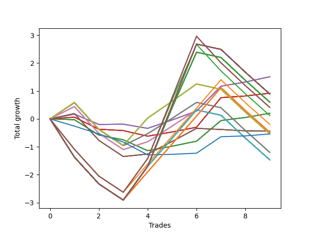

# Short Wallace Doodle 016 
- Symbol: AAPL_Unlimited
- Date Range: 03/23/2022 - 07/08/2022
- Trading Period: 7:20-12:30
- Number of Trades: 9



| Name | Win Percent | Profit | Avg Profit / Trade | Avg Time / Trade |      | Name | Win Percent | Profit | Avg Profit / Trade | Avg Time / Trade |
| ---- | ----------- | ------ | ------------------ | ---------------- | ---- | ---- | ----------- | ------ | ------------------ | ---------------- |
| Sorted By <br> Profit | | | | | | Sorted By <br> Win Percentage ||||
| Sixty-Six | 77.78 | 755.00 | 83.89 | 22:38 |     | Sixty-Six | 77.78 | 755.00 | 83.89 | 22:38 |
| Fifty-Eight | 77.78 | 755.00 | 83.89 | 22:38 |     | Fifty-Eight | 77.78 | 755.00 | 83.89 | 22:38 |
| Fifty | 77.78 | 755.00 | 83.89 | 22:38 |     | Fifty | 77.78 | 755.00 | 83.89 | 22:38 |
| Forty-Two | 77.78 | 755.00 | 83.89 | 22:38 |     | Forty-Two | 77.78 | 755.00 | 83.89 | 22:38 |
| Two | 77.78 | 755.00 | 83.89 | 22:38 |     | Two | 77.78 | 755.00 | 83.89 | 22:38 |
| Sixty-Five | 66.67 | 460.00 | 51.11 | 18:47 |     | Sixty-Five | 66.67 | 460.00 | 51.11 | 18:47 |
| Fifty-Seven | 66.67 | 460.00 | 51.11 | 18:47 |     | Fifty-Seven | 66.67 | 460.00 | 51.11 | 18:47 |
| Forty-Nine | 66.67 | 460.00 | 51.11 | 18:47 |     | Forty-Nine | 66.67 | 460.00 | 51.11 | 18:47 |
| Forty-One | 66.67 | 460.00 | 51.11 | 18:47 |     | Forty-One | 66.67 | 460.00 | 51.11 | 18:47 |
| One | 66.67 | 460.00 | 51.11 | 18:47 |     | One | 66.67 | 460.00 | 51.11 | 18:47 |
| One Hundred Thirty | 33.33 | 445.00 | 49.44 | 131:20 |     | Sixty-Four | 55.56 | 100.00 | 11.11 | 12:47 |
| One Hundred Twenty-Nine | 33.33 | 445.00 | 49.44 | 131:20 |     | Fifty-Six | 55.56 | 100.00 | 11.11 | 12:47 |
| One Hundred Twenty-Eight | 33.33 | 445.00 | 49.44 | 131:20 |     | Forty-Eight | 55.56 | 100.00 | 11.11 | 12:47 |
| One Hundred Twenty-Five | 33.33 | 445.00 | 49.44 | 131:20 |     | Forty | 55.56 | 100.00 | 11.11 | 12:47 |
| One Hundred Twenty-Four | 33.33 | 445.00 | 49.44 | 131:20 |     | Zero | 55.56 | 100.00 | 11.11 | 12:47 |
| One Hundred Twenty-Three | 33.33 | 445.00 | 49.44 | 131:20 |     | Seventy-Three | 55.56 | -270.00 | -30.00 | 10:05 |
| One Hundred Twenty | 33.33 | 445.00 | 49.44 | 131:20 |     | Ninety-Six | 44.44 | -100.00 | -11.11 | 89:02 |
| One Hundred Ninteen | 33.33 | 445.00 | 49.44 | 131:20 |     | Sixty-Seven | 44.44 | -220.00 | -24.44 | 37:11 |
| One Hundred Eighteen | 33.33 | 445.00 | 49.44 | 131:20 |     | Fifty-Nine | 44.44 | -220.00 | -24.44 | 37:11 |
| One Hundred Fifteen | 33.33 | 445.00 | 49.44 | 131:20 |     | Fifty-One | 44.44 | -220.00 | -24.44 | 37:11 |
| One Hundred Fourteen | 33.33 | 445.00 | 49.44 | 131:20 |     | Forty-Three | 44.44 | -220.00 | -24.44 | 37:11 |
| One Hundred Thirteen | 33.33 | 445.00 | 49.44 | 131:20 |     | Three | 44.44 | -220.00 | -24.44 | 37:11 |
| One Hundred Ten | 33.33 | 445.00 | 49.44 | 131:20 |     | One Hundred Twenty-Six | 44.44 | -240.00 | -26.67 | 93:05 |
| One Hundred Nine | 33.33 | 445.00 | 49.44 | 131:20 |     | One Hundred Twenty-One | 44.44 | -240.00 | -26.67 | 93:05 |
| One Hundred Eight | 33.33 | 445.00 | 49.44 | 131:20 |     | One Hundred Sixteen | 44.44 | -240.00 | -26.67 | 93:05 |
| One Hundred Five | 33.33 | 445.00 | 49.44 | 131:20 |     | One Hundred Eleven | 44.44 | -240.00 | -26.67 | 93:05 |
| One Hundred Four | 33.33 | 445.00 | 49.44 | 131:20 |     | One Hundred Six | 44.44 | -240.00 | -26.67 | 93:05 |
| One Hundred Three | 33.33 | 445.00 | 49.44 | 131:20 |     | One Hundred One | 44.44 | -240.00 | -26.67 | 93:05 |
| Ninety-Five | 33.33 | 445.00 | 49.44 | 131:20 |     | Ninety-One | 44.44 | -240.00 | -26.67 | 93:05 |
| Ninety-Four | 33.33 | 445.00 | 49.44 | 131:20 |     | Eighty-One | 44.44 | -240.00 | -26.67 | 93:05 |
| Ninety-Three | 33.33 | 445.00 | 49.44 | 131:20 |     | Seventy | 44.44 | -270.00 | -30.00 | 53:24 |
| Eighty-Five | 33.33 | 445.00 | 49.44 | 131:20 |     | Sixty-Two | 44.44 | -270.00 | -30.00 | 53:24 |
| Eighty-Four | 33.33 | 445.00 | 49.44 | 131:20 |     | Fifty-Four | 44.44 | -270.00 | -30.00 | 53:24 |
| Eighty-Three | 33.33 | 445.00 | 49.44 | 131:20 |     | Forty-Six | 44.44 | -270.00 | -30.00 | 53:24 |
| One Hundred Twenty-Seven | 33.33 | 300.00 | 33.33 | 124:12 |     | Six | 44.44 | -270.00 | -30.00 | 53:24 |
| One Hundred Twenty-Two | 33.33 | 300.00 | 33.33 | 124:12 |     | Sixty-Nine | 44.44 | -600.00 | -66.67 | 61:26 |
| One Hundred Seventeen | 33.33 | 300.00 | 33.33 | 124:12 |     | Sixty-One | 44.44 | -600.00 | -66.67 | 61:26 |
| One Hundred Twelve | 33.33 | 300.00 | 33.33 | 124:12 |     | Fifty-Three | 44.44 | -600.00 | -66.67 | 61:26 |
| One Hundred Seven | 33.33 | 300.00 | 33.33 | 124:12 |     | Forty-Five | 44.44 | -600.00 | -66.67 | 61:26 |
| One Hundred Two | 33.33 | 300.00 | 33.33 | 124:12 |     | Five | 44.44 | -600.00 | -66.67 | 61:26 |
| Ninety-Two | 33.33 | 300.00 | 33.33 | 124:12 |     | Sixty-Eight | 44.44 | -735.00 | -81.67 | 47:43 |
| Eighty-Two | 33.33 | 300.00 | 33.33 | 124:12 |     | Sixty | 44.44 | -735.00 | -81.67 | 47:43 |
| One Hundred | 33.33 | 205.00 | 22.78 | 125:17 |     | Fifty-Two | 44.44 | -735.00 | -81.67 | 47:43 |
| Ninety-Nine | 33.33 | 205.00 | 22.78 | 125:17 |     | Forty-Four | 44.44 | -735.00 | -81.67 | 47:43 |
| Ninety-Eight | 33.33 | 205.00 | 22.78 | 125:17 |     | Four | 44.44 | -735.00 | -81.67 | 47:43 |
| Sixty-Four | 55.56 | 100.00 | 11.11 | 12:47 |     | One Hundred Thirty | 33.33 | 445.00 | 49.44 | 131:20 |
| Fifty-Six | 55.56 | 100.00 | 11.11 | 12:47 |     | One Hundred Twenty-Nine | 33.33 | 445.00 | 49.44 | 131:20 |
| Forty-Eight | 55.56 | 100.00 | 11.11 | 12:47 |     | One Hundred Twenty-Eight | 33.33 | 445.00 | 49.44 | 131:20 |
| Forty | 55.56 | 100.00 | 11.11 | 12:47 |     | One Hundred Twenty-Five | 33.33 | 445.00 | 49.44 | 131:20 |
| Zero | 55.56 | 100.00 | 11.11 | 12:47 |     | One Hundred Twenty-Four | 33.33 | 445.00 | 49.44 | 131:20 |
| Ninety-Seven | 33.33 | 60.00 | 6.67 | 118:10 |     | One Hundred Twenty-Three | 33.33 | 445.00 | 49.44 | 131:20 |
| Ninety-Six | 44.44 | -100.00 | -11.11 | 89:02 |     | One Hundred Twenty | 33.33 | 445.00 | 49.44 | 131:20 |
| Sixty-Seven | 44.44 | -220.00 | -24.44 | 37:11 |     | One Hundred Ninteen | 33.33 | 445.00 | 49.44 | 131:20 |
| Fifty-Nine | 44.44 | -220.00 | -24.44 | 37:11 |     | One Hundred Eighteen | 33.33 | 445.00 | 49.44 | 131:20 |
| Fifty-One | 44.44 | -220.00 | -24.44 | 37:11 |     | One Hundred Fifteen | 33.33 | 445.00 | 49.44 | 131:20 |
| Forty-Three | 44.44 | -220.00 | -24.44 | 37:11 |     | One Hundred Fourteen | 33.33 | 445.00 | 49.44 | 131:20 |
| Three | 44.44 | -220.00 | -24.44 | 37:11 |     | One Hundred Thirteen | 33.33 | 445.00 | 49.44 | 131:20 |
| One Hundred Twenty-Six | 44.44 | -240.00 | -26.67 | 93:05 |     | One Hundred Ten | 33.33 | 445.00 | 49.44 | 131:20 |
| One Hundred Twenty-One | 44.44 | -240.00 | -26.67 | 93:05 |     | One Hundred Nine | 33.33 | 445.00 | 49.44 | 131:20 |
| One Hundred Sixteen | 44.44 | -240.00 | -26.67 | 93:05 |     | One Hundred Eight | 33.33 | 445.00 | 49.44 | 131:20 |
| One Hundred Eleven | 44.44 | -240.00 | -26.67 | 93:05 |     | One Hundred Five | 33.33 | 445.00 | 49.44 | 131:20 |
| One Hundred Six | 44.44 | -240.00 | -26.67 | 93:05 |     | One Hundred Four | 33.33 | 445.00 | 49.44 | 131:20 |
| One Hundred One | 44.44 | -240.00 | -26.67 | 93:05 |     | One Hundred Three | 33.33 | 445.00 | 49.44 | 131:20 |
| Ninety-One | 44.44 | -240.00 | -26.67 | 93:05 |     | Ninety-Five | 33.33 | 445.00 | 49.44 | 131:20 |
| Eighty-One | 44.44 | -240.00 | -26.67 | 93:05 |     | Ninety-Four | 33.33 | 445.00 | 49.44 | 131:20 |
| Seventy-Three | 55.56 | -270.00 | -30.00 | 10:05 |     | Ninety-Three | 33.33 | 445.00 | 49.44 | 131:20 |
| Seventy | 44.44 | -270.00 | -30.00 | 53:24 |     | Eighty-Five | 33.33 | 445.00 | 49.44 | 131:20 |
| Sixty-Two | 44.44 | -270.00 | -30.00 | 53:24 |     | Eighty-Four | 33.33 | 445.00 | 49.44 | 131:20 |
| Fifty-Four | 44.44 | -270.00 | -30.00 | 53:24 |     | Eighty-Three | 33.33 | 445.00 | 49.44 | 131:20 |
| Forty-Six | 44.44 | -270.00 | -30.00 | 53:24 |     | One Hundred Twenty-Seven | 33.33 | 300.00 | 33.33 | 124:12 |
| Six | 44.44 | -270.00 | -30.00 | 53:24 |     | One Hundred Twenty-Two | 33.33 | 300.00 | 33.33 | 124:12 |
| Sixty-Nine | 44.44 | -600.00 | -66.67 | 61:26 |     | One Hundred Seventeen | 33.33 | 300.00 | 33.33 | 124:12 |
| Sixty-One | 44.44 | -600.00 | -66.67 | 61:26 |     | One Hundred Twelve | 33.33 | 300.00 | 33.33 | 124:12 |
| Fifty-Three | 44.44 | -600.00 | -66.67 | 61:26 |     | One Hundred Seven | 33.33 | 300.00 | 33.33 | 124:12 |
| Forty-Five | 44.44 | -600.00 | -66.67 | 61:26 |     | One Hundred Two | 33.33 | 300.00 | 33.33 | 124:12 |
| Five | 44.44 | -600.00 | -66.67 | 61:26 |     | Ninety-Two | 33.33 | 300.00 | 33.33 | 124:12 |
| Sixty-Eight | 44.44 | -735.00 | -81.67 | 47:43 |     | Eighty-Two | 33.33 | 300.00 | 33.33 | 124:12 |
| Sixty | 44.44 | -735.00 | -81.67 | 47:43 |     | One Hundred | 33.33 | 205.00 | 22.78 | 125:17 |
| Fifty-Two | 44.44 | -735.00 | -81.67 | 47:43 |     | Ninety-Nine | 33.33 | 205.00 | 22.78 | 125:17 |
| Forty-Four | 44.44 | -735.00 | -81.67 | 47:43 |     | Ninety-Eight | 33.33 | 205.00 | 22.78 | 125:17 |
| Four | 44.44 | -735.00 | -81.67 | 47:43 |     | Ninety-Seven | 33.33 | 60.00 | 6.67 | 118:10 |
| Seventy-One | 33.33 | -735.00 | -81.67 | 100:24 |     | Seventy-One | 33.33 | -735.00 | -81.67 | 100:24 |
| Sixty-Three | 33.33 | -735.00 | -81.67 | 100:24 |     | Sixty-Three | 33.33 | -735.00 | -81.67 | 100:24 |
| Fifty-Five | 33.33 | -735.00 | -81.67 | 100:24 |     | Fifty-Five | 33.33 | -735.00 | -81.67 | 100:24 |
| Forty-Seven | 33.33 | -735.00 | -81.67 | 100:24 |     | Forty-Seven | 33.33 | -735.00 | -81.67 | 100:24 |
| Seven | 33.33 | -735.00 | -81.67 | 100:24 |     | Seven | 33.33 | -735.00 | -81.67 | 100:24 |

## NO STOPLOSS

### Test Zero
* Sell when price hits the middle line of the 20p bollinger
* No Stoploss
* Results:
```
Total Trades: 9
Percent Up: 44.44
Percent Down: 55.56
Total Points Moved Down: 0.20
Potential Profit: 100.00
Total Points Ups: 1.14 Count Ups: 4
Total Points Downs: 1.34 Count Downs: 5
```

<details><summary>Trades</summary>

<code>In: 2022-03-24 08:33:00		Out: 2022-03-24 08:49:10		Total Position Time: 16:10		Total Move Down: -0.03		Total to Date: -0.03</code> <br />
<code>In: 2022-04-07 11:57:00		Out: 2022-04-07 12:20:15		Total Position Time: 23:15		Total Move Down: -0.55		Total to Date: -0.58</code> <br />
<code>In: 2022-04-07 12:04:00		Out: 2022-04-07 12:20:15		Total Position Time: 16:15		Total Move Down: -0.17		Total to Date: -0.75</code> <br />
<code>In: 2022-05-10 10:45:00		Out: 2022-05-10 11:05:55		Total Position Time: 20:55		Total Move Down: -0.39		Total to Date: -1.14</code> <br />
<code>In: 2022-06-13 08:27:00		Out: 2022-06-13 08:37:10		Total Position Time: 10:10		Total Move Down: 0.16		Total to Date: -0.98</code> <br />
<code>In: 2022-06-13 08:29:00		Out: 2022-06-13 08:37:10		Total Position Time: 08:10		Total Move Down: 0.18		Total to Date: -0.80</code> <br />
<code>In: 2022-06-15 11:48:00		Out: 2022-06-15 11:54:15		Total Position Time: 06:15		Total Move Down: 0.74		Total to Date: -0.06</code> <br />
<code>In: 2022-06-23 11:37:00		Out: 2022-06-23 11:46:00		Total Position Time: 09:00		Total Move Down: 0.11		Total to Date: 0.05</code> <br />
<code>In: 2022-06-23 11:41:00		Out: 2022-06-23 11:46:00		Total Position Time: 05:00		Total Move Down: 0.15		Total to Date: 0.20</code> <br />


</details>

### Test One
* Sell when the price hits the upper line of the 20p 1std bollinger
* No Stoploss
* Results:
```
Total Trades: 9
Percent Up: 33.33
Percent Down: 66.67
Total Points Moved Down: 0.92
Potential Profit: 460.00
Total Points Ups: 0.68 Count Ups: 3
Total Points Downs: 1.60 Count Downs: 6
```

<details><summary>Trades</summary>

<code>In: 2022-03-24 08:33:00		Out: 2022-03-24 08:50:10		Total Position Time: 17:10		Total Move Down: 0.06		Total to Date: 0.06</code> <br />
<code>In: 2022-04-07 11:57:00		Out: 2022-04-07 12:27:40		Total Position Time: 30:40		Total Move Down: -0.43		Total to Date: -0.37</code> <br />
<code>In: 2022-04-07 12:04:00		Out: 2022-04-07 12:27:40		Total Position Time: 23:40		Total Move Down: -0.05		Total to Date: -0.42</code> <br />
<code>In: 2022-05-10 10:45:00		Out: 2022-05-10 11:06:35		Total Position Time: 21:35		Total Move Down: -0.20		Total to Date: -0.62</code> <br />
<code>In: 2022-06-13 08:27:00		Out: 2022-06-13 08:46:30		Total Position Time: 19:30		Total Move Down: 0.15		Total to Date: -0.47</code> <br />
<code>In: 2022-06-13 08:29:00		Out: 2022-06-13 08:46:30		Total Position Time: 17:30		Total Move Down: 0.17		Total to Date: -0.30</code> <br />
<code>In: 2022-06-15 11:48:00		Out: 2022-06-15 11:58:05		Total Position Time: 10:05		Total Move Down: 1.06		Total to Date: 0.76</code> <br />
<code>In: 2022-06-23 11:37:00		Out: 2022-06-23 11:53:30		Total Position Time: 16:30		Total Move Down: 0.06		Total to Date: 0.82</code> <br />
<code>In: 2022-06-23 11:41:00		Out: 2022-06-23 11:53:30		Total Position Time: 12:30		Total Move Down: 0.10		Total to Date: 0.92</code> <br />


</details>

### Test Two
* Sell when the price hits the upper line of the 20p 2std bollinger
* No Stoploss
* Results:
```
Total Trades: 9
Percent Up: 22.22
Percent Down: 77.78
Total Points Moved Down: 1.51
Potential Profit: 755.00
Total Points Ups: 0.52 Count Ups: 2
Total Points Downs: 2.03 Count Downs: 7
```

<details><summary>Trades</summary>

<code>In: 2022-03-24 08:33:00		Out: 2022-03-24 08:51:00		Total Position Time: 18:00		Total Move Down: 0.17		Total to Date: 0.17</code> <br />
<code>In: 2022-04-07 11:57:00		Out: 2022-04-07 12:28:30		Total Position Time: 31:30		Total Move Down: -0.37		Total to Date: -0.20</code> <br />
<code>In: 2022-04-07 12:04:00		Out: 2022-04-07 12:28:30		Total Position Time: 24:30		Total Move Down: 0.01		Total to Date: -0.19</code> <br />
<code>In: 2022-05-10 10:45:00		Out: 2022-05-10 11:07:10		Total Position Time: 22:10		Total Move Down: -0.15		Total to Date: -0.34</code> <br />
<code>In: 2022-06-13 08:27:00		Out: 2022-06-13 08:47:05		Total Position Time: 20:05		Total Move Down: 0.30		Total to Date: -0.04</code> <br />
<code>In: 2022-06-13 08:29:00		Out: 2022-06-13 08:47:05		Total Position Time: 18:05		Total Move Down: 0.32		Total to Date: 0.28</code> <br />
<code>In: 2022-06-15 11:48:00		Out: 2022-06-15 12:13:05		Total Position Time: 25:05		Total Move Down: 0.89		Total to Date: 1.17</code> <br />
<code>In: 2022-06-23 11:37:00		Out: 2022-06-23 12:01:10		Total Position Time: 24:10		Total Move Down: 0.15		Total to Date: 1.32</code> <br />
<code>In: 2022-06-23 11:41:00		Out: 2022-06-23 12:01:10		Total Position Time: 20:10		Total Move Down: 0.19		Total to Date: 1.51</code> <br />


</details>

### Test Three
* Sell when price hits the middle line of the 50p bollinger
* No Stoploss
* Results:
```
Total Trades: 9
Percent Up: 55.56
Percent Down: 44.44
Total Points Moved Down: -0.44
Potential Profit: -220.00
Total Points Ups: 1.64 Count Ups: 5
Total Points Downs: 1.20 Count Downs: 4
```

<details><summary>Trades</summary>

<code>In: 2022-03-24 08:33:00		Out: 2022-03-24 09:01:40		Total Position Time: 28:40		Total Move Down: 0.19		Total to Date: 0.19</code> <br />
<code>In: 2022-04-07 11:57:00		Out: 2022-04-07 12:47:00		Total Position Time: 50:00		Total Move Down: -0.96		Total to Date: -0.77</code> <br />
<code>In: 2022-04-07 12:04:00		Out: 2022-04-07 12:47:00		Total Position Time: 43:00		Total Move Down: -0.58		Total to Date: -1.35</code> <br />
<code>In: 2022-05-10 10:45:00		Out: 2022-05-10 11:16:20		Total Position Time: 31:20		Total Move Down: 0.09		Total to Date: -1.26</code> <br />
<code>In: 2022-06-13 08:27:00		Out: 2022-06-13 08:51:55		Total Position Time: 24:55		Total Move Down: 0.45		Total to Date: -0.81</code> <br />
<code>In: 2022-06-13 08:29:00		Out: 2022-06-13 08:51:55		Total Position Time: 22:55		Total Move Down: 0.47		Total to Date: -0.34</code> <br />
<code>In: 2022-06-15 11:48:00		Out: 2022-06-15 12:43:05		Total Position Time: 55:05		Total Move Down: -0.04		Total to Date: -0.38</code> <br />
<code>In: 2022-06-23 11:37:00		Out: 2022-06-23 12:18:25		Total Position Time: 41:25		Total Move Down: -0.05		Total to Date: -0.43</code> <br />
<code>In: 2022-06-23 11:41:00		Out: 2022-06-23 12:18:25		Total Position Time: 37:25		Total Move Down: -0.01		Total to Date: -0.44</code> <br />


</details>

### Test Four
* Sell when the price hits the upper line of the 50p 1std bollinger
* No Stoploss
* Results:
```
Total Trades: 9
Percent Up: 55.56
Percent Down: 44.44
Total Points Moved Down: -1.47
Potential Profit: -735.00
Total Points Ups: 3.33 Count Ups: 5
Total Points Downs: 1.86 Count Downs: 4
```

<details><summary>Trades</summary>

<code>In: 2022-03-24 08:33:00		Out: 2022-03-24 09:03:05		Total Position Time: 30:05		Total Move Down: 0.44		Total to Date: 0.44</code> <br />
<code>In: 2022-04-07 11:57:00		Out: 2022-04-07 12:47:00		Total Position Time: 50:00		Total Move Down: -0.96		Total to Date: -0.52</code> <br />
<code>In: 2022-04-07 12:04:00		Out: 2022-04-07 12:47:00		Total Position Time: 43:00		Total Move Down: -0.58		Total to Date: -1.10</code> <br />
<code>In: 2022-05-10 10:45:00		Out: 2022-05-10 11:24:10		Total Position Time: 39:10		Total Move Down: 0.28		Total to Date: -0.82</code> <br />
<code>In: 2022-06-13 08:27:00		Out: 2022-06-13 09:04:10		Total Position Time: 37:10		Total Move Down: 0.56		Total to Date: -0.26</code> <br />
<code>In: 2022-06-13 08:29:00		Out: 2022-06-13 09:04:10		Total Position Time: 35:10		Total Move Down: 0.58		Total to Date: 0.32</code> <br />
<code>In: 2022-06-15 11:48:00		Out: 2022-06-15 12:47:00		Total Position Time: 59:00		Total Move Down: -0.19		Total to Date: 0.13</code> <br />
<code>In: 2022-06-23 11:37:00		Out: 2022-06-23 12:47:00		Total Position Time: 70:00		Total Move Down: -0.82		Total to Date: -0.69</code> <br />
<code>In: 2022-06-23 11:41:00		Out: 2022-06-23 12:47:00		Total Position Time: 66:00		Total Move Down: -0.78		Total to Date: -1.47</code> <br />


</details>

### Test Five
* Sell when the price hits the upper line of the 50p 2std bollinger
* No Stoploss
* Results:
```
Total Trades: 9
Percent Up: 55.56
Percent Down: 44.44
Total Points Moved Down: -1.20
Potential Profit: -600.00
Total Points Ups: 3.33 Count Ups: 5
Total Points Downs: 2.13 Count Downs: 4
```

<details><summary>Trades</summary>

<code>In: 2022-03-24 08:33:00		Out: 2022-03-24 09:11:25		Total Position Time: 38:25		Total Move Down: 0.58		Total to Date: 0.58</code> <br />
<code>In: 2022-04-07 11:57:00		Out: 2022-04-07 12:47:00		Total Position Time: 50:00		Total Move Down: -0.96		Total to Date: -0.38</code> <br />
<code>In: 2022-04-07 12:04:00		Out: 2022-04-07 12:47:00		Total Position Time: 43:00		Total Move Down: -0.58		Total to Date: -0.96</code> <br />
<code>In: 2022-05-10 10:45:00		Out: 2022-05-10 11:27:05		Total Position Time: 42:05		Total Move Down: 0.43		Total to Date: -0.53</code> <br />
<code>In: 2022-06-13 08:27:00		Out: 2022-06-13 10:00:15		Total Position Time: 93:15		Total Move Down: 0.55		Total to Date: 0.02</code> <br />
<code>In: 2022-06-13 08:29:00		Out: 2022-06-13 10:00:15		Total Position Time: 91:15		Total Move Down: 0.57		Total to Date: 0.59</code> <br />
<code>In: 2022-06-15 11:48:00		Out: 2022-06-15 12:47:00		Total Position Time: 59:00		Total Move Down: -0.19		Total to Date: 0.40</code> <br />
<code>In: 2022-06-23 11:37:00		Out: 2022-06-23 12:47:00		Total Position Time: 70:00		Total Move Down: -0.82		Total to Date: -0.42</code> <br />
<code>In: 2022-06-23 11:41:00		Out: 2022-06-23 12:47:00		Total Position Time: 66:00		Total Move Down: -0.78		Total to Date: -1.20</code> <br />


</details>

### Test Six
* Sell when the price hits the middle line of the 1std VWAP
* No Stoploss
* Results:
```
Total Trades: 9
Percent Up: 55.56
Percent Down: 44.44
Total Points Moved Down: -0.54
Potential Profit: -270.00
Total Points Ups: 3.33 Count Ups: 5
Total Points Downs: 2.79 Count Downs: 4
```

<details><summary>Trades</summary>

<code>In: 2022-03-24 08:33:00		Out: 2022-03-24 09:11:35		Total Position Time: 38:35		Total Move Down: 0.59		Total to Date: 0.59</code> <br />
<code>In: 2022-04-07 11:57:00		Out: 2022-04-07 12:47:00		Total Position Time: 50:00		Total Move Down: -0.96		Total to Date: -0.37</code> <br />
<code>In: 2022-04-07 12:04:00		Out: 2022-04-07 12:47:00		Total Position Time: 43:00		Total Move Down: -0.58		Total to Date: -0.95</code> <br />
<code>In: 2022-05-10 10:45:00		Out: 2022-05-10 12:30:15		Total Position Time: 105:15		Total Move Down: 0.98		Total to Date: 0.03</code> <br />
<code>In: 2022-06-13 08:27:00		Out: 2022-06-13 08:52:25		Total Position Time: 25:25		Total Move Down: 0.60		Total to Date: 0.63</code> <br />
<code>In: 2022-06-13 08:29:00		Out: 2022-06-13 08:52:25		Total Position Time: 23:25		Total Move Down: 0.62		Total to Date: 1.25</code> <br />
<code>In: 2022-06-15 11:48:00		Out: 2022-06-15 12:47:00		Total Position Time: 59:00		Total Move Down: -0.19		Total to Date: 1.06</code> <br />
<code>In: 2022-06-23 11:37:00		Out: 2022-06-23 12:47:00		Total Position Time: 70:00		Total Move Down: -0.82		Total to Date: 0.24</code> <br />
<code>In: 2022-06-23 11:41:00		Out: 2022-06-23 12:47:00		Total Position Time: 66:00		Total Move Down: -0.78		Total to Date: -0.54</code> <br />


</details>

### Test Seven
* Sell when the price hits the upper line of the 1std VWAP
* No Stoploss
* Results:
```
Total Trades: 9
Percent Up: 66.67
Percent Down: 33.33
Total Points Moved Down: -1.47
Potential Profit: -735.00
Total Points Ups: 4.70 Count Ups: 6
Total Points Downs: 3.23 Count Downs: 3
```

<details><summary>Trades</summary>

<code>In: 2022-03-24 08:33:00		Out: 2022-03-24 12:47:00		Total Position Time: 254:00		Total Move Down: -1.37		Total to Date: -1.37</code> <br />
<code>In: 2022-04-07 11:57:00		Out: 2022-04-07 12:47:00		Total Position Time: 50:00		Total Move Down: -0.96		Total to Date: -2.33</code> <br />
<code>In: 2022-04-07 12:04:00		Out: 2022-04-07 12:47:00		Total Position Time: 43:00		Total Move Down: -0.58		Total to Date: -2.91</code> <br />
<code>In: 2022-05-10 10:45:00		Out: 2022-05-10 12:47:00		Total Position Time: 122:00		Total Move Down: 1.21		Total to Date: -1.70</code> <br />
<code>In: 2022-06-13 08:27:00		Out: 2022-06-13 10:27:50		Total Position Time: 120:50		Total Move Down: 1.00		Total to Date: -0.70</code> <br />
<code>In: 2022-06-13 08:29:00		Out: 2022-06-13 10:27:50		Total Position Time: 118:50		Total Move Down: 1.02		Total to Date: 0.32</code> <br />
<code>In: 2022-06-15 11:48:00		Out: 2022-06-15 12:47:00		Total Position Time: 59:00		Total Move Down: -0.19		Total to Date: 0.13</code> <br />
<code>In: 2022-06-23 11:37:00		Out: 2022-06-23 12:47:00		Total Position Time: 70:00		Total Move Down: -0.82		Total to Date: -0.69</code> <br />
<code>In: 2022-06-23 11:41:00		Out: 2022-06-23 12:47:00		Total Position Time: 66:00		Total Move Down: -0.78		Total to Date: -1.47</code> <br />


</details>

## STOPLOSS OF 5

### Test Forty
* Sell when price hits the middle line of the 20p bollinger
* Stoploss is -5 points
* Results:
```
Total Trades: 9
Percent Up: 44.44
Percent Down: 55.56
Total Points Moved Down: 0.20
Potential Profit: 100.00
Total Points Ups: 1.14 Count Ups: 4
Total Points Downs: 1.34 Count Downs: 5
```

<details><summary>Trades</summary>

<code>In: 2022-03-24 08:33:00		Out: 2022-03-24 08:49:10		Total Position Time: 16:10		Total Move Down: -0.03		Total to Date: -0.03</code> <br />
<code>In: 2022-04-07 11:57:00		Out: 2022-04-07 12:20:15		Total Position Time: 23:15		Total Move Down: -0.55		Total to Date: -0.58</code> <br />
<code>In: 2022-04-07 12:04:00		Out: 2022-04-07 12:20:15		Total Position Time: 16:15		Total Move Down: -0.17		Total to Date: -0.75</code> <br />
<code>In: 2022-05-10 10:45:00		Out: 2022-05-10 11:05:55		Total Position Time: 20:55		Total Move Down: -0.39		Total to Date: -1.14</code> <br />
<code>In: 2022-06-13 08:27:00		Out: 2022-06-13 08:37:10		Total Position Time: 10:10		Total Move Down: 0.16		Total to Date: -0.98</code> <br />
<code>In: 2022-06-13 08:29:00		Out: 2022-06-13 08:37:10		Total Position Time: 08:10		Total Move Down: 0.18		Total to Date: -0.80</code> <br />
<code>In: 2022-06-15 11:48:00		Out: 2022-06-15 11:54:15		Total Position Time: 06:15		Total Move Down: 0.74		Total to Date: -0.06</code> <br />
<code>In: 2022-06-23 11:37:00		Out: 2022-06-23 11:46:00		Total Position Time: 09:00		Total Move Down: 0.11		Total to Date: 0.05</code> <br />
<code>In: 2022-06-23 11:41:00		Out: 2022-06-23 11:46:00		Total Position Time: 05:00		Total Move Down: 0.15		Total to Date: 0.20</code> <br />


</details>

### Test Forty-One
* Sell when the price hits the upper line of the 20p 1std bollinger
* Stoploss is -5 points
* Results:
```
Total Trades: 9
Percent Up: 33.33
Percent Down: 66.67
Total Points Moved Down: 0.92
Potential Profit: 460.00
Total Points Ups: 0.68 Count Ups: 3
Total Points Downs: 1.60 Count Downs: 6
```

<details><summary>Trades</summary>

<code>In: 2022-03-24 08:33:00		Out: 2022-03-24 08:50:10		Total Position Time: 17:10		Total Move Down: 0.06		Total to Date: 0.06</code> <br />
<code>In: 2022-04-07 11:57:00		Out: 2022-04-07 12:27:40		Total Position Time: 30:40		Total Move Down: -0.43		Total to Date: -0.37</code> <br />
<code>In: 2022-04-07 12:04:00		Out: 2022-04-07 12:27:40		Total Position Time: 23:40		Total Move Down: -0.05		Total to Date: -0.42</code> <br />
<code>In: 2022-05-10 10:45:00		Out: 2022-05-10 11:06:35		Total Position Time: 21:35		Total Move Down: -0.20		Total to Date: -0.62</code> <br />
<code>In: 2022-06-13 08:27:00		Out: 2022-06-13 08:46:30		Total Position Time: 19:30		Total Move Down: 0.15		Total to Date: -0.47</code> <br />
<code>In: 2022-06-13 08:29:00		Out: 2022-06-13 08:46:30		Total Position Time: 17:30		Total Move Down: 0.17		Total to Date: -0.30</code> <br />
<code>In: 2022-06-15 11:48:00		Out: 2022-06-15 11:58:05		Total Position Time: 10:05		Total Move Down: 1.06		Total to Date: 0.76</code> <br />
<code>In: 2022-06-23 11:37:00		Out: 2022-06-23 11:53:30		Total Position Time: 16:30		Total Move Down: 0.06		Total to Date: 0.82</code> <br />
<code>In: 2022-06-23 11:41:00		Out: 2022-06-23 11:53:30		Total Position Time: 12:30		Total Move Down: 0.10		Total to Date: 0.92</code> <br />


</details>

### Test Forty-Two
* Sell when the price hits the upper line of the 20p 2std bollinger
* Stoploss is -5 points
* Results:
```
Total Trades: 9
Percent Up: 22.22
Percent Down: 77.78
Total Points Moved Down: 1.51
Potential Profit: 755.00
Total Points Ups: 0.52 Count Ups: 2
Total Points Downs: 2.03 Count Downs: 7
```

<details><summary>Trades</summary>

<code>In: 2022-03-24 08:33:00		Out: 2022-03-24 08:51:00		Total Position Time: 18:00		Total Move Down: 0.17		Total to Date: 0.17</code> <br />
<code>In: 2022-04-07 11:57:00		Out: 2022-04-07 12:28:30		Total Position Time: 31:30		Total Move Down: -0.37		Total to Date: -0.20</code> <br />
<code>In: 2022-04-07 12:04:00		Out: 2022-04-07 12:28:30		Total Position Time: 24:30		Total Move Down: 0.01		Total to Date: -0.19</code> <br />
<code>In: 2022-05-10 10:45:00		Out: 2022-05-10 11:07:10		Total Position Time: 22:10		Total Move Down: -0.15		Total to Date: -0.34</code> <br />
<code>In: 2022-06-13 08:27:00		Out: 2022-06-13 08:47:05		Total Position Time: 20:05		Total Move Down: 0.30		Total to Date: -0.04</code> <br />
<code>In: 2022-06-13 08:29:00		Out: 2022-06-13 08:47:05		Total Position Time: 18:05		Total Move Down: 0.32		Total to Date: 0.28</code> <br />
<code>In: 2022-06-15 11:48:00		Out: 2022-06-15 12:13:05		Total Position Time: 25:05		Total Move Down: 0.89		Total to Date: 1.17</code> <br />
<code>In: 2022-06-23 11:37:00		Out: 2022-06-23 12:01:10		Total Position Time: 24:10		Total Move Down: 0.15		Total to Date: 1.32</code> <br />
<code>In: 2022-06-23 11:41:00		Out: 2022-06-23 12:01:10		Total Position Time: 20:10		Total Move Down: 0.19		Total to Date: 1.51</code> <br />


</details>

### Test Forty-Three
* Sell when price hits the middle line of the 50p bollinger
* Stoploss is -5 points
* Results:
```
Total Trades: 9
Percent Up: 55.56
Percent Down: 44.44
Total Points Moved Down: -0.44
Potential Profit: -220.00
Total Points Ups: 1.64 Count Ups: 5
Total Points Downs: 1.20 Count Downs: 4
```

<details><summary>Trades</summary>

<code>In: 2022-03-24 08:33:00		Out: 2022-03-24 09:01:40		Total Position Time: 28:40		Total Move Down: 0.19		Total to Date: 0.19</code> <br />
<code>In: 2022-04-07 11:57:00		Out: 2022-04-07 12:47:00		Total Position Time: 50:00		Total Move Down: -0.96		Total to Date: -0.77</code> <br />
<code>In: 2022-04-07 12:04:00		Out: 2022-04-07 12:47:00		Total Position Time: 43:00		Total Move Down: -0.58		Total to Date: -1.35</code> <br />
<code>In: 2022-05-10 10:45:00		Out: 2022-05-10 11:16:20		Total Position Time: 31:20		Total Move Down: 0.09		Total to Date: -1.26</code> <br />
<code>In: 2022-06-13 08:27:00		Out: 2022-06-13 08:51:55		Total Position Time: 24:55		Total Move Down: 0.45		Total to Date: -0.81</code> <br />
<code>In: 2022-06-13 08:29:00		Out: 2022-06-13 08:51:55		Total Position Time: 22:55		Total Move Down: 0.47		Total to Date: -0.34</code> <br />
<code>In: 2022-06-15 11:48:00		Out: 2022-06-15 12:43:05		Total Position Time: 55:05		Total Move Down: -0.04		Total to Date: -0.38</code> <br />
<code>In: 2022-06-23 11:37:00		Out: 2022-06-23 12:18:25		Total Position Time: 41:25		Total Move Down: -0.05		Total to Date: -0.43</code> <br />
<code>In: 2022-06-23 11:41:00		Out: 2022-06-23 12:18:25		Total Position Time: 37:25		Total Move Down: -0.01		Total to Date: -0.44</code> <br />


</details>

### Test Forty-Four
* Sell when the price hits the upper line of the 50p 1std bollinger
* Stoploss is -5 points
* Results:
```
Total Trades: 9
Percent Up: 55.56
Percent Down: 44.44
Total Points Moved Down: -1.47
Potential Profit: -735.00
Total Points Ups: 3.33 Count Ups: 5
Total Points Downs: 1.86 Count Downs: 4
```

<details><summary>Trades</summary>

<code>In: 2022-03-24 08:33:00		Out: 2022-03-24 09:03:05		Total Position Time: 30:05		Total Move Down: 0.44		Total to Date: 0.44</code> <br />
<code>In: 2022-04-07 11:57:00		Out: 2022-04-07 12:47:00		Total Position Time: 50:00		Total Move Down: -0.96		Total to Date: -0.52</code> <br />
<code>In: 2022-04-07 12:04:00		Out: 2022-04-07 12:47:00		Total Position Time: 43:00		Total Move Down: -0.58		Total to Date: -1.10</code> <br />
<code>In: 2022-05-10 10:45:00		Out: 2022-05-10 11:24:10		Total Position Time: 39:10		Total Move Down: 0.28		Total to Date: -0.82</code> <br />
<code>In: 2022-06-13 08:27:00		Out: 2022-06-13 09:04:10		Total Position Time: 37:10		Total Move Down: 0.56		Total to Date: -0.26</code> <br />
<code>In: 2022-06-13 08:29:00		Out: 2022-06-13 09:04:10		Total Position Time: 35:10		Total Move Down: 0.58		Total to Date: 0.32</code> <br />
<code>In: 2022-06-15 11:48:00		Out: 2022-06-15 12:47:00		Total Position Time: 59:00		Total Move Down: -0.19		Total to Date: 0.13</code> <br />
<code>In: 2022-06-23 11:37:00		Out: 2022-06-23 12:47:00		Total Position Time: 70:00		Total Move Down: -0.82		Total to Date: -0.69</code> <br />
<code>In: 2022-06-23 11:41:00		Out: 2022-06-23 12:47:00		Total Position Time: 66:00		Total Move Down: -0.78		Total to Date: -1.47</code> <br />


</details>

### Test Forty-Five
* Sell when the price hits the upper line of the 50p 2std bollinger
* Stoploss is -5 points
* Results:
```
Total Trades: 9
Percent Up: 55.56
Percent Down: 44.44
Total Points Moved Down: -1.20
Potential Profit: -600.00
Total Points Ups: 3.33 Count Ups: 5
Total Points Downs: 2.13 Count Downs: 4
```

<details><summary>Trades</summary>

<code>In: 2022-03-24 08:33:00		Out: 2022-03-24 09:11:25		Total Position Time: 38:25		Total Move Down: 0.58		Total to Date: 0.58</code> <br />
<code>In: 2022-04-07 11:57:00		Out: 2022-04-07 12:47:00		Total Position Time: 50:00		Total Move Down: -0.96		Total to Date: -0.38</code> <br />
<code>In: 2022-04-07 12:04:00		Out: 2022-04-07 12:47:00		Total Position Time: 43:00		Total Move Down: -0.58		Total to Date: -0.96</code> <br />
<code>In: 2022-05-10 10:45:00		Out: 2022-05-10 11:27:05		Total Position Time: 42:05		Total Move Down: 0.43		Total to Date: -0.53</code> <br />
<code>In: 2022-06-13 08:27:00		Out: 2022-06-13 10:00:15		Total Position Time: 93:15		Total Move Down: 0.55		Total to Date: 0.02</code> <br />
<code>In: 2022-06-13 08:29:00		Out: 2022-06-13 10:00:15		Total Position Time: 91:15		Total Move Down: 0.57		Total to Date: 0.59</code> <br />
<code>In: 2022-06-15 11:48:00		Out: 2022-06-15 12:47:00		Total Position Time: 59:00		Total Move Down: -0.19		Total to Date: 0.40</code> <br />
<code>In: 2022-06-23 11:37:00		Out: 2022-06-23 12:47:00		Total Position Time: 70:00		Total Move Down: -0.82		Total to Date: -0.42</code> <br />
<code>In: 2022-06-23 11:41:00		Out: 2022-06-23 12:47:00		Total Position Time: 66:00		Total Move Down: -0.78		Total to Date: -1.20</code> <br />


</details>

### Test Forty-Six
* Sell when the price hits the middle line of the 1std VWAP
* Stoploss is -5 points
* Results:
```
Total Trades: 9
Percent Up: 55.56
Percent Down: 44.44
Total Points Moved Down: -0.54
Potential Profit: -270.00
Total Points Ups: 3.33 Count Ups: 5
Total Points Downs: 2.79 Count Downs: 4
```

<details><summary>Trades</summary>

<code>In: 2022-03-24 08:33:00		Out: 2022-03-24 09:11:35		Total Position Time: 38:35		Total Move Down: 0.59		Total to Date: 0.59</code> <br />
<code>In: 2022-04-07 11:57:00		Out: 2022-04-07 12:47:00		Total Position Time: 50:00		Total Move Down: -0.96		Total to Date: -0.37</code> <br />
<code>In: 2022-04-07 12:04:00		Out: 2022-04-07 12:47:00		Total Position Time: 43:00		Total Move Down: -0.58		Total to Date: -0.95</code> <br />
<code>In: 2022-05-10 10:45:00		Out: 2022-05-10 12:30:15		Total Position Time: 105:15		Total Move Down: 0.98		Total to Date: 0.03</code> <br />
<code>In: 2022-06-13 08:27:00		Out: 2022-06-13 08:52:25		Total Position Time: 25:25		Total Move Down: 0.60		Total to Date: 0.63</code> <br />
<code>In: 2022-06-13 08:29:00		Out: 2022-06-13 08:52:25		Total Position Time: 23:25		Total Move Down: 0.62		Total to Date: 1.25</code> <br />
<code>In: 2022-06-15 11:48:00		Out: 2022-06-15 12:47:00		Total Position Time: 59:00		Total Move Down: -0.19		Total to Date: 1.06</code> <br />
<code>In: 2022-06-23 11:37:00		Out: 2022-06-23 12:47:00		Total Position Time: 70:00		Total Move Down: -0.82		Total to Date: 0.24</code> <br />
<code>In: 2022-06-23 11:41:00		Out: 2022-06-23 12:47:00		Total Position Time: 66:00		Total Move Down: -0.78		Total to Date: -0.54</code> <br />


</details>

### Test Forty-Seven
* Sell when the price hits the upper line of the 1std VWAP
* Stoploss is -5 points
* Results:
```
Total Trades: 9
Percent Up: 66.67
Percent Down: 33.33
Total Points Moved Down: -1.47
Potential Profit: -735.00
Total Points Ups: 4.70 Count Ups: 6
Total Points Downs: 3.23 Count Downs: 3
```

<details><summary>Trades</summary>

<code>In: 2022-03-24 08:33:00		Out: 2022-03-24 12:47:00		Total Position Time: 254:00		Total Move Down: -1.37		Total to Date: -1.37</code> <br />
<code>In: 2022-04-07 11:57:00		Out: 2022-04-07 12:47:00		Total Position Time: 50:00		Total Move Down: -0.96		Total to Date: -2.33</code> <br />
<code>In: 2022-04-07 12:04:00		Out: 2022-04-07 12:47:00		Total Position Time: 43:00		Total Move Down: -0.58		Total to Date: -2.91</code> <br />
<code>In: 2022-05-10 10:45:00		Out: 2022-05-10 12:47:00		Total Position Time: 122:00		Total Move Down: 1.21		Total to Date: -1.70</code> <br />
<code>In: 2022-06-13 08:27:00		Out: 2022-06-13 10:27:50		Total Position Time: 120:50		Total Move Down: 1.00		Total to Date: -0.70</code> <br />
<code>In: 2022-06-13 08:29:00		Out: 2022-06-13 10:27:50		Total Position Time: 118:50		Total Move Down: 1.02		Total to Date: 0.32</code> <br />
<code>In: 2022-06-15 11:48:00		Out: 2022-06-15 12:47:00		Total Position Time: 59:00		Total Move Down: -0.19		Total to Date: 0.13</code> <br />
<code>In: 2022-06-23 11:37:00		Out: 2022-06-23 12:47:00		Total Position Time: 70:00		Total Move Down: -0.82		Total to Date: -0.69</code> <br />
<code>In: 2022-06-23 11:41:00		Out: 2022-06-23 12:47:00		Total Position Time: 66:00		Total Move Down: -0.78		Total to Date: -1.47</code> <br />


</details>

## TRAIL STOP OF 5

### Test Forty-Eight
* Sell when price hits the middle line of the 20p bollinger
* Trailing Stop is -5 points
* Results:
```
Total Trades: 9
Percent Up: 44.44
Percent Down: 55.56
Total Points Moved Down: 0.20
Potential Profit: 100.00
Total Points Ups: 1.14 Count Ups: 4
Total Points Downs: 1.34 Count Downs: 5
```

<details><summary>Trades</summary>

<code>In: 2022-03-24 08:33:00		Out: 2022-03-24 08:49:10		Total Position Time: 16:10		Total Move Down: -0.03		Total to Date: -0.03</code> <br />
<code>In: 2022-04-07 11:57:00		Out: 2022-04-07 12:20:15		Total Position Time: 23:15		Total Move Down: -0.55		Total to Date: -0.58</code> <br />
<code>In: 2022-04-07 12:04:00		Out: 2022-04-07 12:20:15		Total Position Time: 16:15		Total Move Down: -0.17		Total to Date: -0.75</code> <br />
<code>In: 2022-05-10 10:45:00		Out: 2022-05-10 11:05:55		Total Position Time: 20:55		Total Move Down: -0.39		Total to Date: -1.14</code> <br />
<code>In: 2022-06-13 08:27:00		Out: 2022-06-13 08:37:10		Total Position Time: 10:10		Total Move Down: 0.16		Total to Date: -0.98</code> <br />
<code>In: 2022-06-13 08:29:00		Out: 2022-06-13 08:37:10		Total Position Time: 08:10		Total Move Down: 0.18		Total to Date: -0.80</code> <br />
<code>In: 2022-06-15 11:48:00		Out: 2022-06-15 11:54:15		Total Position Time: 06:15		Total Move Down: 0.74		Total to Date: -0.06</code> <br />
<code>In: 2022-06-23 11:37:00		Out: 2022-06-23 11:46:00		Total Position Time: 09:00		Total Move Down: 0.11		Total to Date: 0.05</code> <br />
<code>In: 2022-06-23 11:41:00		Out: 2022-06-23 11:46:00		Total Position Time: 05:00		Total Move Down: 0.15		Total to Date: 0.20</code> <br />


</details>

### Test Forty-Nine
* Sell when the price hits the upper line of the 20p 1std bollinger
* Trailing Stop is -5 points
* Results:
```
Total Trades: 9
Percent Up: 33.33
Percent Down: 66.67
Total Points Moved Down: 0.92
Potential Profit: 460.00
Total Points Ups: 0.68 Count Ups: 3
Total Points Downs: 1.60 Count Downs: 6
```

<details><summary>Trades</summary>

<code>In: 2022-03-24 08:33:00		Out: 2022-03-24 08:50:10		Total Position Time: 17:10		Total Move Down: 0.06		Total to Date: 0.06</code> <br />
<code>In: 2022-04-07 11:57:00		Out: 2022-04-07 12:27:40		Total Position Time: 30:40		Total Move Down: -0.43		Total to Date: -0.37</code> <br />
<code>In: 2022-04-07 12:04:00		Out: 2022-04-07 12:27:40		Total Position Time: 23:40		Total Move Down: -0.05		Total to Date: -0.42</code> <br />
<code>In: 2022-05-10 10:45:00		Out: 2022-05-10 11:06:35		Total Position Time: 21:35		Total Move Down: -0.20		Total to Date: -0.62</code> <br />
<code>In: 2022-06-13 08:27:00		Out: 2022-06-13 08:46:30		Total Position Time: 19:30		Total Move Down: 0.15		Total to Date: -0.47</code> <br />
<code>In: 2022-06-13 08:29:00		Out: 2022-06-13 08:46:30		Total Position Time: 17:30		Total Move Down: 0.17		Total to Date: -0.30</code> <br />
<code>In: 2022-06-15 11:48:00		Out: 2022-06-15 11:58:05		Total Position Time: 10:05		Total Move Down: 1.06		Total to Date: 0.76</code> <br />
<code>In: 2022-06-23 11:37:00		Out: 2022-06-23 11:53:30		Total Position Time: 16:30		Total Move Down: 0.06		Total to Date: 0.82</code> <br />
<code>In: 2022-06-23 11:41:00		Out: 2022-06-23 11:53:30		Total Position Time: 12:30		Total Move Down: 0.10		Total to Date: 0.92</code> <br />


</details>

### Test Fifty
* Sell when the price hits the upper line of the 20p 2std bollinger
* Trailing Stop is -5 points
* Results:
```
Total Trades: 9
Percent Up: 22.22
Percent Down: 77.78
Total Points Moved Down: 1.51
Potential Profit: 755.00
Total Points Ups: 0.52 Count Ups: 2
Total Points Downs: 2.03 Count Downs: 7
```

<details><summary>Trades</summary>

<code>In: 2022-03-24 08:33:00		Out: 2022-03-24 08:51:00		Total Position Time: 18:00		Total Move Down: 0.17		Total to Date: 0.17</code> <br />
<code>In: 2022-04-07 11:57:00		Out: 2022-04-07 12:28:30		Total Position Time: 31:30		Total Move Down: -0.37		Total to Date: -0.20</code> <br />
<code>In: 2022-04-07 12:04:00		Out: 2022-04-07 12:28:30		Total Position Time: 24:30		Total Move Down: 0.01		Total to Date: -0.19</code> <br />
<code>In: 2022-05-10 10:45:00		Out: 2022-05-10 11:07:10		Total Position Time: 22:10		Total Move Down: -0.15		Total to Date: -0.34</code> <br />
<code>In: 2022-06-13 08:27:00		Out: 2022-06-13 08:47:05		Total Position Time: 20:05		Total Move Down: 0.30		Total to Date: -0.04</code> <br />
<code>In: 2022-06-13 08:29:00		Out: 2022-06-13 08:47:05		Total Position Time: 18:05		Total Move Down: 0.32		Total to Date: 0.28</code> <br />
<code>In: 2022-06-15 11:48:00		Out: 2022-06-15 12:13:05		Total Position Time: 25:05		Total Move Down: 0.89		Total to Date: 1.17</code> <br />
<code>In: 2022-06-23 11:37:00		Out: 2022-06-23 12:01:10		Total Position Time: 24:10		Total Move Down: 0.15		Total to Date: 1.32</code> <br />
<code>In: 2022-06-23 11:41:00		Out: 2022-06-23 12:01:10		Total Position Time: 20:10		Total Move Down: 0.19		Total to Date: 1.51</code> <br />


</details>

### Test Fifty-One
* Sell when price hits the middle line of the 50p bollinger
* Trailing Stop is -5 points
* Results:
```
Total Trades: 9
Percent Up: 55.56
Percent Down: 44.44
Total Points Moved Down: -0.44
Potential Profit: -220.00
Total Points Ups: 1.64 Count Ups: 5
Total Points Downs: 1.20 Count Downs: 4
```

<details><summary>Trades</summary>

<code>In: 2022-03-24 08:33:00		Out: 2022-03-24 09:01:40		Total Position Time: 28:40		Total Move Down: 0.19		Total to Date: 0.19</code> <br />
<code>In: 2022-04-07 11:57:00		Out: 2022-04-07 12:47:00		Total Position Time: 50:00		Total Move Down: -0.96		Total to Date: -0.77</code> <br />
<code>In: 2022-04-07 12:04:00		Out: 2022-04-07 12:47:00		Total Position Time: 43:00		Total Move Down: -0.58		Total to Date: -1.35</code> <br />
<code>In: 2022-05-10 10:45:00		Out: 2022-05-10 11:16:20		Total Position Time: 31:20		Total Move Down: 0.09		Total to Date: -1.26</code> <br />
<code>In: 2022-06-13 08:27:00		Out: 2022-06-13 08:51:55		Total Position Time: 24:55		Total Move Down: 0.45		Total to Date: -0.81</code> <br />
<code>In: 2022-06-13 08:29:00		Out: 2022-06-13 08:51:55		Total Position Time: 22:55		Total Move Down: 0.47		Total to Date: -0.34</code> <br />
<code>In: 2022-06-15 11:48:00		Out: 2022-06-15 12:43:05		Total Position Time: 55:05		Total Move Down: -0.04		Total to Date: -0.38</code> <br />
<code>In: 2022-06-23 11:37:00		Out: 2022-06-23 12:18:25		Total Position Time: 41:25		Total Move Down: -0.05		Total to Date: -0.43</code> <br />
<code>In: 2022-06-23 11:41:00		Out: 2022-06-23 12:18:25		Total Position Time: 37:25		Total Move Down: -0.01		Total to Date: -0.44</code> <br />


</details>

### Test Fifty-Two
* Sell when the price hits the upper line of the 50p 1std bollinger
* Trailing Stop is -5 points
* Results:
```
Total Trades: 9
Percent Up: 55.56
Percent Down: 44.44
Total Points Moved Down: -1.47
Potential Profit: -735.00
Total Points Ups: 3.33 Count Ups: 5
Total Points Downs: 1.86 Count Downs: 4
```

<details><summary>Trades</summary>

<code>In: 2022-03-24 08:33:00		Out: 2022-03-24 09:03:05		Total Position Time: 30:05		Total Move Down: 0.44		Total to Date: 0.44</code> <br />
<code>In: 2022-04-07 11:57:00		Out: 2022-04-07 12:47:00		Total Position Time: 50:00		Total Move Down: -0.96		Total to Date: -0.52</code> <br />
<code>In: 2022-04-07 12:04:00		Out: 2022-04-07 12:47:00		Total Position Time: 43:00		Total Move Down: -0.58		Total to Date: -1.10</code> <br />
<code>In: 2022-05-10 10:45:00		Out: 2022-05-10 11:24:10		Total Position Time: 39:10		Total Move Down: 0.28		Total to Date: -0.82</code> <br />
<code>In: 2022-06-13 08:27:00		Out: 2022-06-13 09:04:10		Total Position Time: 37:10		Total Move Down: 0.56		Total to Date: -0.26</code> <br />
<code>In: 2022-06-13 08:29:00		Out: 2022-06-13 09:04:10		Total Position Time: 35:10		Total Move Down: 0.58		Total to Date: 0.32</code> <br />
<code>In: 2022-06-15 11:48:00		Out: 2022-06-15 12:47:00		Total Position Time: 59:00		Total Move Down: -0.19		Total to Date: 0.13</code> <br />
<code>In: 2022-06-23 11:37:00		Out: 2022-06-23 12:47:00		Total Position Time: 70:00		Total Move Down: -0.82		Total to Date: -0.69</code> <br />
<code>In: 2022-06-23 11:41:00		Out: 2022-06-23 12:47:00		Total Position Time: 66:00		Total Move Down: -0.78		Total to Date: -1.47</code> <br />


</details>

### Test Fifty-Three
* Sell when the price hits the upper line of the 50p 2std bollinger
* Trailing Stop is -5 points
* Results:
```
Total Trades: 9
Percent Up: 55.56
Percent Down: 44.44
Total Points Moved Down: -1.20
Potential Profit: -600.00
Total Points Ups: 3.33 Count Ups: 5
Total Points Downs: 2.13 Count Downs: 4
```

<details><summary>Trades</summary>

<code>In: 2022-03-24 08:33:00		Out: 2022-03-24 09:11:25		Total Position Time: 38:25		Total Move Down: 0.58		Total to Date: 0.58</code> <br />
<code>In: 2022-04-07 11:57:00		Out: 2022-04-07 12:47:00		Total Position Time: 50:00		Total Move Down: -0.96		Total to Date: -0.38</code> <br />
<code>In: 2022-04-07 12:04:00		Out: 2022-04-07 12:47:00		Total Position Time: 43:00		Total Move Down: -0.58		Total to Date: -0.96</code> <br />
<code>In: 2022-05-10 10:45:00		Out: 2022-05-10 11:27:05		Total Position Time: 42:05		Total Move Down: 0.43		Total to Date: -0.53</code> <br />
<code>In: 2022-06-13 08:27:00		Out: 2022-06-13 10:00:15		Total Position Time: 93:15		Total Move Down: 0.55		Total to Date: 0.02</code> <br />
<code>In: 2022-06-13 08:29:00		Out: 2022-06-13 10:00:15		Total Position Time: 91:15		Total Move Down: 0.57		Total to Date: 0.59</code> <br />
<code>In: 2022-06-15 11:48:00		Out: 2022-06-15 12:47:00		Total Position Time: 59:00		Total Move Down: -0.19		Total to Date: 0.40</code> <br />
<code>In: 2022-06-23 11:37:00		Out: 2022-06-23 12:47:00		Total Position Time: 70:00		Total Move Down: -0.82		Total to Date: -0.42</code> <br />
<code>In: 2022-06-23 11:41:00		Out: 2022-06-23 12:47:00		Total Position Time: 66:00		Total Move Down: -0.78		Total to Date: -1.20</code> <br />


</details>

### Test Fifty-Four
* Sell when the price hits the middle line of the 1std VWAP
* Trailing Stop is -5 points
* Results:
```
Total Trades: 9
Percent Up: 55.56
Percent Down: 44.44
Total Points Moved Down: -0.54
Potential Profit: -270.00
Total Points Ups: 3.33 Count Ups: 5
Total Points Downs: 2.79 Count Downs: 4
```

<details><summary>Trades</summary>

<code>In: 2022-03-24 08:33:00		Out: 2022-03-24 09:11:35		Total Position Time: 38:35		Total Move Down: 0.59		Total to Date: 0.59</code> <br />
<code>In: 2022-04-07 11:57:00		Out: 2022-04-07 12:47:00		Total Position Time: 50:00		Total Move Down: -0.96		Total to Date: -0.37</code> <br />
<code>In: 2022-04-07 12:04:00		Out: 2022-04-07 12:47:00		Total Position Time: 43:00		Total Move Down: -0.58		Total to Date: -0.95</code> <br />
<code>In: 2022-05-10 10:45:00		Out: 2022-05-10 12:30:15		Total Position Time: 105:15		Total Move Down: 0.98		Total to Date: 0.03</code> <br />
<code>In: 2022-06-13 08:27:00		Out: 2022-06-13 08:52:25		Total Position Time: 25:25		Total Move Down: 0.60		Total to Date: 0.63</code> <br />
<code>In: 2022-06-13 08:29:00		Out: 2022-06-13 08:52:25		Total Position Time: 23:25		Total Move Down: 0.62		Total to Date: 1.25</code> <br />
<code>In: 2022-06-15 11:48:00		Out: 2022-06-15 12:47:00		Total Position Time: 59:00		Total Move Down: -0.19		Total to Date: 1.06</code> <br />
<code>In: 2022-06-23 11:37:00		Out: 2022-06-23 12:47:00		Total Position Time: 70:00		Total Move Down: -0.82		Total to Date: 0.24</code> <br />
<code>In: 2022-06-23 11:41:00		Out: 2022-06-23 12:47:00		Total Position Time: 66:00		Total Move Down: -0.78		Total to Date: -0.54</code> <br />


</details>

### Test Fifty-Five
* Sell when the price hits the upper line of the 1std VWAP
* Trailing Stop is -5 points
* Results:
```
Total Trades: 9
Percent Up: 66.67
Percent Down: 33.33
Total Points Moved Down: -1.47
Potential Profit: -735.00
Total Points Ups: 4.70 Count Ups: 6
Total Points Downs: 3.23 Count Downs: 3
```

<details><summary>Trades</summary>

<code>In: 2022-03-24 08:33:00		Out: 2022-03-24 12:47:00		Total Position Time: 254:00		Total Move Down: -1.37		Total to Date: -1.37</code> <br />
<code>In: 2022-04-07 11:57:00		Out: 2022-04-07 12:47:00		Total Position Time: 50:00		Total Move Down: -0.96		Total to Date: -2.33</code> <br />
<code>In: 2022-04-07 12:04:00		Out: 2022-04-07 12:47:00		Total Position Time: 43:00		Total Move Down: -0.58		Total to Date: -2.91</code> <br />
<code>In: 2022-05-10 10:45:00		Out: 2022-05-10 12:47:00		Total Position Time: 122:00		Total Move Down: 1.21		Total to Date: -1.70</code> <br />
<code>In: 2022-06-13 08:27:00		Out: 2022-06-13 10:27:50		Total Position Time: 120:50		Total Move Down: 1.00		Total to Date: -0.70</code> <br />
<code>In: 2022-06-13 08:29:00		Out: 2022-06-13 10:27:50		Total Position Time: 118:50		Total Move Down: 1.02		Total to Date: 0.32</code> <br />
<code>In: 2022-06-15 11:48:00		Out: 2022-06-15 12:47:00		Total Position Time: 59:00		Total Move Down: -0.19		Total to Date: 0.13</code> <br />
<code>In: 2022-06-23 11:37:00		Out: 2022-06-23 12:47:00		Total Position Time: 70:00		Total Move Down: -0.82		Total to Date: -0.69</code> <br />
<code>In: 2022-06-23 11:41:00		Out: 2022-06-23 12:47:00		Total Position Time: 66:00		Total Move Down: -0.78		Total to Date: -1.47</code> <br />


</details>

## STOPLOSS OF 10

### Test Fifty-Six
* Sell when price hits the middle line of the 20p bollinger
* Stoploss is -10 points
* Results:
```
Total Trades: 9
Percent Up: 44.44
Percent Down: 55.56
Total Points Moved Down: 0.20
Potential Profit: 100.00
Total Points Ups: 1.14 Count Ups: 4
Total Points Downs: 1.34 Count Downs: 5
```

<details><summary>Trades</summary>

<code>In: 2022-03-24 08:33:00		Out: 2022-03-24 08:49:10		Total Position Time: 16:10		Total Move Down: -0.03		Total to Date: -0.03</code> <br />
<code>In: 2022-04-07 11:57:00		Out: 2022-04-07 12:20:15		Total Position Time: 23:15		Total Move Down: -0.55		Total to Date: -0.58</code> <br />
<code>In: 2022-04-07 12:04:00		Out: 2022-04-07 12:20:15		Total Position Time: 16:15		Total Move Down: -0.17		Total to Date: -0.75</code> <br />
<code>In: 2022-05-10 10:45:00		Out: 2022-05-10 11:05:55		Total Position Time: 20:55		Total Move Down: -0.39		Total to Date: -1.14</code> <br />
<code>In: 2022-06-13 08:27:00		Out: 2022-06-13 08:37:10		Total Position Time: 10:10		Total Move Down: 0.16		Total to Date: -0.98</code> <br />
<code>In: 2022-06-13 08:29:00		Out: 2022-06-13 08:37:10		Total Position Time: 08:10		Total Move Down: 0.18		Total to Date: -0.80</code> <br />
<code>In: 2022-06-15 11:48:00		Out: 2022-06-15 11:54:15		Total Position Time: 06:15		Total Move Down: 0.74		Total to Date: -0.06</code> <br />
<code>In: 2022-06-23 11:37:00		Out: 2022-06-23 11:46:00		Total Position Time: 09:00		Total Move Down: 0.11		Total to Date: 0.05</code> <br />
<code>In: 2022-06-23 11:41:00		Out: 2022-06-23 11:46:00		Total Position Time: 05:00		Total Move Down: 0.15		Total to Date: 0.20</code> <br />


</details>

### Test Fifty-Seven
* Sell when the price hits the upper line of the 20p 1std bollinger
* Stoploss is -10 points
* Results:
```
Total Trades: 9
Percent Up: 33.33
Percent Down: 66.67
Total Points Moved Down: 0.92
Potential Profit: 460.00
Total Points Ups: 0.68 Count Ups: 3
Total Points Downs: 1.60 Count Downs: 6
```

<details><summary>Trades</summary>

<code>In: 2022-03-24 08:33:00		Out: 2022-03-24 08:50:10		Total Position Time: 17:10		Total Move Down: 0.06		Total to Date: 0.06</code> <br />
<code>In: 2022-04-07 11:57:00		Out: 2022-04-07 12:27:40		Total Position Time: 30:40		Total Move Down: -0.43		Total to Date: -0.37</code> <br />
<code>In: 2022-04-07 12:04:00		Out: 2022-04-07 12:27:40		Total Position Time: 23:40		Total Move Down: -0.05		Total to Date: -0.42</code> <br />
<code>In: 2022-05-10 10:45:00		Out: 2022-05-10 11:06:35		Total Position Time: 21:35		Total Move Down: -0.20		Total to Date: -0.62</code> <br />
<code>In: 2022-06-13 08:27:00		Out: 2022-06-13 08:46:30		Total Position Time: 19:30		Total Move Down: 0.15		Total to Date: -0.47</code> <br />
<code>In: 2022-06-13 08:29:00		Out: 2022-06-13 08:46:30		Total Position Time: 17:30		Total Move Down: 0.17		Total to Date: -0.30</code> <br />
<code>In: 2022-06-15 11:48:00		Out: 2022-06-15 11:58:05		Total Position Time: 10:05		Total Move Down: 1.06		Total to Date: 0.76</code> <br />
<code>In: 2022-06-23 11:37:00		Out: 2022-06-23 11:53:30		Total Position Time: 16:30		Total Move Down: 0.06		Total to Date: 0.82</code> <br />
<code>In: 2022-06-23 11:41:00		Out: 2022-06-23 11:53:30		Total Position Time: 12:30		Total Move Down: 0.10		Total to Date: 0.92</code> <br />


</details>

### Test Fifty-Eight
* Sell when the price hits the upper line of the 20p 2std bollinger
* Stoploss is -10 points
* Results:
```
Total Trades: 9
Percent Up: 22.22
Percent Down: 77.78
Total Points Moved Down: 1.51
Potential Profit: 755.00
Total Points Ups: 0.52 Count Ups: 2
Total Points Downs: 2.03 Count Downs: 7
```

<details><summary>Trades</summary>

<code>In: 2022-03-24 08:33:00		Out: 2022-03-24 08:51:00		Total Position Time: 18:00		Total Move Down: 0.17		Total to Date: 0.17</code> <br />
<code>In: 2022-04-07 11:57:00		Out: 2022-04-07 12:28:30		Total Position Time: 31:30		Total Move Down: -0.37		Total to Date: -0.20</code> <br />
<code>In: 2022-04-07 12:04:00		Out: 2022-04-07 12:28:30		Total Position Time: 24:30		Total Move Down: 0.01		Total to Date: -0.19</code> <br />
<code>In: 2022-05-10 10:45:00		Out: 2022-05-10 11:07:10		Total Position Time: 22:10		Total Move Down: -0.15		Total to Date: -0.34</code> <br />
<code>In: 2022-06-13 08:27:00		Out: 2022-06-13 08:47:05		Total Position Time: 20:05		Total Move Down: 0.30		Total to Date: -0.04</code> <br />
<code>In: 2022-06-13 08:29:00		Out: 2022-06-13 08:47:05		Total Position Time: 18:05		Total Move Down: 0.32		Total to Date: 0.28</code> <br />
<code>In: 2022-06-15 11:48:00		Out: 2022-06-15 12:13:05		Total Position Time: 25:05		Total Move Down: 0.89		Total to Date: 1.17</code> <br />
<code>In: 2022-06-23 11:37:00		Out: 2022-06-23 12:01:10		Total Position Time: 24:10		Total Move Down: 0.15		Total to Date: 1.32</code> <br />
<code>In: 2022-06-23 11:41:00		Out: 2022-06-23 12:01:10		Total Position Time: 20:10		Total Move Down: 0.19		Total to Date: 1.51</code> <br />


</details>

### Test Fifty-Nine
* Sell when price hits the middle line of the 50p bollinger
* Stoploss is -10 points
* Results:
```
Total Trades: 9
Percent Up: 55.56
Percent Down: 44.44
Total Points Moved Down: -0.44
Potential Profit: -220.00
Total Points Ups: 1.64 Count Ups: 5
Total Points Downs: 1.20 Count Downs: 4
```

<details><summary>Trades</summary>

<code>In: 2022-03-24 08:33:00		Out: 2022-03-24 09:01:40		Total Position Time: 28:40		Total Move Down: 0.19		Total to Date: 0.19</code> <br />
<code>In: 2022-04-07 11:57:00		Out: 2022-04-07 12:47:00		Total Position Time: 50:00		Total Move Down: -0.96		Total to Date: -0.77</code> <br />
<code>In: 2022-04-07 12:04:00		Out: 2022-04-07 12:47:00		Total Position Time: 43:00		Total Move Down: -0.58		Total to Date: -1.35</code> <br />
<code>In: 2022-05-10 10:45:00		Out: 2022-05-10 11:16:20		Total Position Time: 31:20		Total Move Down: 0.09		Total to Date: -1.26</code> <br />
<code>In: 2022-06-13 08:27:00		Out: 2022-06-13 08:51:55		Total Position Time: 24:55		Total Move Down: 0.45		Total to Date: -0.81</code> <br />
<code>In: 2022-06-13 08:29:00		Out: 2022-06-13 08:51:55		Total Position Time: 22:55		Total Move Down: 0.47		Total to Date: -0.34</code> <br />
<code>In: 2022-06-15 11:48:00		Out: 2022-06-15 12:43:05		Total Position Time: 55:05		Total Move Down: -0.04		Total to Date: -0.38</code> <br />
<code>In: 2022-06-23 11:37:00		Out: 2022-06-23 12:18:25		Total Position Time: 41:25		Total Move Down: -0.05		Total to Date: -0.43</code> <br />
<code>In: 2022-06-23 11:41:00		Out: 2022-06-23 12:18:25		Total Position Time: 37:25		Total Move Down: -0.01		Total to Date: -0.44</code> <br />


</details>

### Test Sixty
* Sell when the price hits the upper line of the 50p 1std bollinger
* Stoploss is -10 points
* Results:
```
Total Trades: 9
Percent Up: 55.56
Percent Down: 44.44
Total Points Moved Down: -1.47
Potential Profit: -735.00
Total Points Ups: 3.33 Count Ups: 5
Total Points Downs: 1.86 Count Downs: 4
```

<details><summary>Trades</summary>

<code>In: 2022-03-24 08:33:00		Out: 2022-03-24 09:03:05		Total Position Time: 30:05		Total Move Down: 0.44		Total to Date: 0.44</code> <br />
<code>In: 2022-04-07 11:57:00		Out: 2022-04-07 12:47:00		Total Position Time: 50:00		Total Move Down: -0.96		Total to Date: -0.52</code> <br />
<code>In: 2022-04-07 12:04:00		Out: 2022-04-07 12:47:00		Total Position Time: 43:00		Total Move Down: -0.58		Total to Date: -1.10</code> <br />
<code>In: 2022-05-10 10:45:00		Out: 2022-05-10 11:24:10		Total Position Time: 39:10		Total Move Down: 0.28		Total to Date: -0.82</code> <br />
<code>In: 2022-06-13 08:27:00		Out: 2022-06-13 09:04:10		Total Position Time: 37:10		Total Move Down: 0.56		Total to Date: -0.26</code> <br />
<code>In: 2022-06-13 08:29:00		Out: 2022-06-13 09:04:10		Total Position Time: 35:10		Total Move Down: 0.58		Total to Date: 0.32</code> <br />
<code>In: 2022-06-15 11:48:00		Out: 2022-06-15 12:47:00		Total Position Time: 59:00		Total Move Down: -0.19		Total to Date: 0.13</code> <br />
<code>In: 2022-06-23 11:37:00		Out: 2022-06-23 12:47:00		Total Position Time: 70:00		Total Move Down: -0.82		Total to Date: -0.69</code> <br />
<code>In: 2022-06-23 11:41:00		Out: 2022-06-23 12:47:00		Total Position Time: 66:00		Total Move Down: -0.78		Total to Date: -1.47</code> <br />


</details>

### Test Sixty-One
* Sell when the price hits the upper line of the 50p 2std bollinger
* Stoploss is -10 points
* Results:
```
Total Trades: 9
Percent Up: 55.56
Percent Down: 44.44
Total Points Moved Down: -1.20
Potential Profit: -600.00
Total Points Ups: 3.33 Count Ups: 5
Total Points Downs: 2.13 Count Downs: 4
```

<details><summary>Trades</summary>

<code>In: 2022-03-24 08:33:00		Out: 2022-03-24 09:11:25		Total Position Time: 38:25		Total Move Down: 0.58		Total to Date: 0.58</code> <br />
<code>In: 2022-04-07 11:57:00		Out: 2022-04-07 12:47:00		Total Position Time: 50:00		Total Move Down: -0.96		Total to Date: -0.38</code> <br />
<code>In: 2022-04-07 12:04:00		Out: 2022-04-07 12:47:00		Total Position Time: 43:00		Total Move Down: -0.58		Total to Date: -0.96</code> <br />
<code>In: 2022-05-10 10:45:00		Out: 2022-05-10 11:27:05		Total Position Time: 42:05		Total Move Down: 0.43		Total to Date: -0.53</code> <br />
<code>In: 2022-06-13 08:27:00		Out: 2022-06-13 10:00:15		Total Position Time: 93:15		Total Move Down: 0.55		Total to Date: 0.02</code> <br />
<code>In: 2022-06-13 08:29:00		Out: 2022-06-13 10:00:15		Total Position Time: 91:15		Total Move Down: 0.57		Total to Date: 0.59</code> <br />
<code>In: 2022-06-15 11:48:00		Out: 2022-06-15 12:47:00		Total Position Time: 59:00		Total Move Down: -0.19		Total to Date: 0.40</code> <br />
<code>In: 2022-06-23 11:37:00		Out: 2022-06-23 12:47:00		Total Position Time: 70:00		Total Move Down: -0.82		Total to Date: -0.42</code> <br />
<code>In: 2022-06-23 11:41:00		Out: 2022-06-23 12:47:00		Total Position Time: 66:00		Total Move Down: -0.78		Total to Date: -1.20</code> <br />


</details>

### Test Sixty-Two
* Sell when the price hits the middle line of the 1std VWAP
* Stoploss is -10 points
* Results:
```
Total Trades: 9
Percent Up: 55.56
Percent Down: 44.44
Total Points Moved Down: -0.54
Potential Profit: -270.00
Total Points Ups: 3.33 Count Ups: 5
Total Points Downs: 2.79 Count Downs: 4
```

<details><summary>Trades</summary>

<code>In: 2022-03-24 08:33:00		Out: 2022-03-24 09:11:35		Total Position Time: 38:35		Total Move Down: 0.59		Total to Date: 0.59</code> <br />
<code>In: 2022-04-07 11:57:00		Out: 2022-04-07 12:47:00		Total Position Time: 50:00		Total Move Down: -0.96		Total to Date: -0.37</code> <br />
<code>In: 2022-04-07 12:04:00		Out: 2022-04-07 12:47:00		Total Position Time: 43:00		Total Move Down: -0.58		Total to Date: -0.95</code> <br />
<code>In: 2022-05-10 10:45:00		Out: 2022-05-10 12:30:15		Total Position Time: 105:15		Total Move Down: 0.98		Total to Date: 0.03</code> <br />
<code>In: 2022-06-13 08:27:00		Out: 2022-06-13 08:52:25		Total Position Time: 25:25		Total Move Down: 0.60		Total to Date: 0.63</code> <br />
<code>In: 2022-06-13 08:29:00		Out: 2022-06-13 08:52:25		Total Position Time: 23:25		Total Move Down: 0.62		Total to Date: 1.25</code> <br />
<code>In: 2022-06-15 11:48:00		Out: 2022-06-15 12:47:00		Total Position Time: 59:00		Total Move Down: -0.19		Total to Date: 1.06</code> <br />
<code>In: 2022-06-23 11:37:00		Out: 2022-06-23 12:47:00		Total Position Time: 70:00		Total Move Down: -0.82		Total to Date: 0.24</code> <br />
<code>In: 2022-06-23 11:41:00		Out: 2022-06-23 12:47:00		Total Position Time: 66:00		Total Move Down: -0.78		Total to Date: -0.54</code> <br />


</details>

### Test Sixty-Three
* Sell when the price hits the upper line of the 1std VWAP
* Stoploss is -10 points
* Results:
```
Total Trades: 9
Percent Up: 66.67
Percent Down: 33.33
Total Points Moved Down: -1.47
Potential Profit: -735.00
Total Points Ups: 4.70 Count Ups: 6
Total Points Downs: 3.23 Count Downs: 3
```

<details><summary>Trades</summary>

<code>In: 2022-03-24 08:33:00		Out: 2022-03-24 12:47:00		Total Position Time: 254:00		Total Move Down: -1.37		Total to Date: -1.37</code> <br />
<code>In: 2022-04-07 11:57:00		Out: 2022-04-07 12:47:00		Total Position Time: 50:00		Total Move Down: -0.96		Total to Date: -2.33</code> <br />
<code>In: 2022-04-07 12:04:00		Out: 2022-04-07 12:47:00		Total Position Time: 43:00		Total Move Down: -0.58		Total to Date: -2.91</code> <br />
<code>In: 2022-05-10 10:45:00		Out: 2022-05-10 12:47:00		Total Position Time: 122:00		Total Move Down: 1.21		Total to Date: -1.70</code> <br />
<code>In: 2022-06-13 08:27:00		Out: 2022-06-13 10:27:50		Total Position Time: 120:50		Total Move Down: 1.00		Total to Date: -0.70</code> <br />
<code>In: 2022-06-13 08:29:00		Out: 2022-06-13 10:27:50		Total Position Time: 118:50		Total Move Down: 1.02		Total to Date: 0.32</code> <br />
<code>In: 2022-06-15 11:48:00		Out: 2022-06-15 12:47:00		Total Position Time: 59:00		Total Move Down: -0.19		Total to Date: 0.13</code> <br />
<code>In: 2022-06-23 11:37:00		Out: 2022-06-23 12:47:00		Total Position Time: 70:00		Total Move Down: -0.82		Total to Date: -0.69</code> <br />
<code>In: 2022-06-23 11:41:00		Out: 2022-06-23 12:47:00		Total Position Time: 66:00		Total Move Down: -0.78		Total to Date: -1.47</code> <br />


</details>

## TRAIL STOP OF 10

### Test Sixty-Four
* Sell when price hits the middle line of the 20p bollinger
* Trailing Stop is -10 points
* Results:
```
Total Trades: 9
Percent Up: 44.44
Percent Down: 55.56
Total Points Moved Down: 0.20
Potential Profit: 100.00
Total Points Ups: 1.14 Count Ups: 4
Total Points Downs: 1.34 Count Downs: 5
```

<details><summary>Trades</summary>

<code>In: 2022-03-24 08:33:00		Out: 2022-03-24 08:49:10		Total Position Time: 16:10		Total Move Down: -0.03		Total to Date: -0.03</code> <br />
<code>In: 2022-04-07 11:57:00		Out: 2022-04-07 12:20:15		Total Position Time: 23:15		Total Move Down: -0.55		Total to Date: -0.58</code> <br />
<code>In: 2022-04-07 12:04:00		Out: 2022-04-07 12:20:15		Total Position Time: 16:15		Total Move Down: -0.17		Total to Date: -0.75</code> <br />
<code>In: 2022-05-10 10:45:00		Out: 2022-05-10 11:05:55		Total Position Time: 20:55		Total Move Down: -0.39		Total to Date: -1.14</code> <br />
<code>In: 2022-06-13 08:27:00		Out: 2022-06-13 08:37:10		Total Position Time: 10:10		Total Move Down: 0.16		Total to Date: -0.98</code> <br />
<code>In: 2022-06-13 08:29:00		Out: 2022-06-13 08:37:10		Total Position Time: 08:10		Total Move Down: 0.18		Total to Date: -0.80</code> <br />
<code>In: 2022-06-15 11:48:00		Out: 2022-06-15 11:54:15		Total Position Time: 06:15		Total Move Down: 0.74		Total to Date: -0.06</code> <br />
<code>In: 2022-06-23 11:37:00		Out: 2022-06-23 11:46:00		Total Position Time: 09:00		Total Move Down: 0.11		Total to Date: 0.05</code> <br />
<code>In: 2022-06-23 11:41:00		Out: 2022-06-23 11:46:00		Total Position Time: 05:00		Total Move Down: 0.15		Total to Date: 0.20</code> <br />


</details>

### Test Sixty-Five
* Sell when the price hits the upper line of the 20p 1std bollinger
* Trailing Stop is -10 points
* Results:
```
Total Trades: 9
Percent Up: 33.33
Percent Down: 66.67
Total Points Moved Down: 0.92
Potential Profit: 460.00
Total Points Ups: 0.68 Count Ups: 3
Total Points Downs: 1.60 Count Downs: 6
```

<details><summary>Trades</summary>

<code>In: 2022-03-24 08:33:00		Out: 2022-03-24 08:50:10		Total Position Time: 17:10		Total Move Down: 0.06		Total to Date: 0.06</code> <br />
<code>In: 2022-04-07 11:57:00		Out: 2022-04-07 12:27:40		Total Position Time: 30:40		Total Move Down: -0.43		Total to Date: -0.37</code> <br />
<code>In: 2022-04-07 12:04:00		Out: 2022-04-07 12:27:40		Total Position Time: 23:40		Total Move Down: -0.05		Total to Date: -0.42</code> <br />
<code>In: 2022-05-10 10:45:00		Out: 2022-05-10 11:06:35		Total Position Time: 21:35		Total Move Down: -0.20		Total to Date: -0.62</code> <br />
<code>In: 2022-06-13 08:27:00		Out: 2022-06-13 08:46:30		Total Position Time: 19:30		Total Move Down: 0.15		Total to Date: -0.47</code> <br />
<code>In: 2022-06-13 08:29:00		Out: 2022-06-13 08:46:30		Total Position Time: 17:30		Total Move Down: 0.17		Total to Date: -0.30</code> <br />
<code>In: 2022-06-15 11:48:00		Out: 2022-06-15 11:58:05		Total Position Time: 10:05		Total Move Down: 1.06		Total to Date: 0.76</code> <br />
<code>In: 2022-06-23 11:37:00		Out: 2022-06-23 11:53:30		Total Position Time: 16:30		Total Move Down: 0.06		Total to Date: 0.82</code> <br />
<code>In: 2022-06-23 11:41:00		Out: 2022-06-23 11:53:30		Total Position Time: 12:30		Total Move Down: 0.10		Total to Date: 0.92</code> <br />


</details>

### Test Sixty-Six
* Sell when the price hits the upper line of the 20p 2std bollinger
* Trailing Stop is -10 points
* Results:
```
Total Trades: 9
Percent Up: 22.22
Percent Down: 77.78
Total Points Moved Down: 1.51
Potential Profit: 755.00
Total Points Ups: 0.52 Count Ups: 2
Total Points Downs: 2.03 Count Downs: 7
```

<details><summary>Trades</summary>

<code>In: 2022-03-24 08:33:00		Out: 2022-03-24 08:51:00		Total Position Time: 18:00		Total Move Down: 0.17		Total to Date: 0.17</code> <br />
<code>In: 2022-04-07 11:57:00		Out: 2022-04-07 12:28:30		Total Position Time: 31:30		Total Move Down: -0.37		Total to Date: -0.20</code> <br />
<code>In: 2022-04-07 12:04:00		Out: 2022-04-07 12:28:30		Total Position Time: 24:30		Total Move Down: 0.01		Total to Date: -0.19</code> <br />
<code>In: 2022-05-10 10:45:00		Out: 2022-05-10 11:07:10		Total Position Time: 22:10		Total Move Down: -0.15		Total to Date: -0.34</code> <br />
<code>In: 2022-06-13 08:27:00		Out: 2022-06-13 08:47:05		Total Position Time: 20:05		Total Move Down: 0.30		Total to Date: -0.04</code> <br />
<code>In: 2022-06-13 08:29:00		Out: 2022-06-13 08:47:05		Total Position Time: 18:05		Total Move Down: 0.32		Total to Date: 0.28</code> <br />
<code>In: 2022-06-15 11:48:00		Out: 2022-06-15 12:13:05		Total Position Time: 25:05		Total Move Down: 0.89		Total to Date: 1.17</code> <br />
<code>In: 2022-06-23 11:37:00		Out: 2022-06-23 12:01:10		Total Position Time: 24:10		Total Move Down: 0.15		Total to Date: 1.32</code> <br />
<code>In: 2022-06-23 11:41:00		Out: 2022-06-23 12:01:10		Total Position Time: 20:10		Total Move Down: 0.19		Total to Date: 1.51</code> <br />


</details>

### Test Sixty-Seven
* Sell when price hits the middle line of the 50p bollinger
* Trailing Stop is -10 points
* Results:
```
Total Trades: 9
Percent Up: 55.56
Percent Down: 44.44
Total Points Moved Down: -0.44
Potential Profit: -220.00
Total Points Ups: 1.64 Count Ups: 5
Total Points Downs: 1.20 Count Downs: 4
```

<details><summary>Trades</summary>

<code>In: 2022-03-24 08:33:00		Out: 2022-03-24 09:01:40		Total Position Time: 28:40		Total Move Down: 0.19		Total to Date: 0.19</code> <br />
<code>In: 2022-04-07 11:57:00		Out: 2022-04-07 12:47:00		Total Position Time: 50:00		Total Move Down: -0.96		Total to Date: -0.77</code> <br />
<code>In: 2022-04-07 12:04:00		Out: 2022-04-07 12:47:00		Total Position Time: 43:00		Total Move Down: -0.58		Total to Date: -1.35</code> <br />
<code>In: 2022-05-10 10:45:00		Out: 2022-05-10 11:16:20		Total Position Time: 31:20		Total Move Down: 0.09		Total to Date: -1.26</code> <br />
<code>In: 2022-06-13 08:27:00		Out: 2022-06-13 08:51:55		Total Position Time: 24:55		Total Move Down: 0.45		Total to Date: -0.81</code> <br />
<code>In: 2022-06-13 08:29:00		Out: 2022-06-13 08:51:55		Total Position Time: 22:55		Total Move Down: 0.47		Total to Date: -0.34</code> <br />
<code>In: 2022-06-15 11:48:00		Out: 2022-06-15 12:43:05		Total Position Time: 55:05		Total Move Down: -0.04		Total to Date: -0.38</code> <br />
<code>In: 2022-06-23 11:37:00		Out: 2022-06-23 12:18:25		Total Position Time: 41:25		Total Move Down: -0.05		Total to Date: -0.43</code> <br />
<code>In: 2022-06-23 11:41:00		Out: 2022-06-23 12:18:25		Total Position Time: 37:25		Total Move Down: -0.01		Total to Date: -0.44</code> <br />


</details>

### Test Sixty-Eight
* Sell when the price hits the upper line of the 50p 1std bollinger
* Trailing Stop is -10 points
* Results:
```
Total Trades: 9
Percent Up: 55.56
Percent Down: 44.44
Total Points Moved Down: -1.47
Potential Profit: -735.00
Total Points Ups: 3.33 Count Ups: 5
Total Points Downs: 1.86 Count Downs: 4
```

<details><summary>Trades</summary>

<code>In: 2022-03-24 08:33:00		Out: 2022-03-24 09:03:05		Total Position Time: 30:05		Total Move Down: 0.44		Total to Date: 0.44</code> <br />
<code>In: 2022-04-07 11:57:00		Out: 2022-04-07 12:47:00		Total Position Time: 50:00		Total Move Down: -0.96		Total to Date: -0.52</code> <br />
<code>In: 2022-04-07 12:04:00		Out: 2022-04-07 12:47:00		Total Position Time: 43:00		Total Move Down: -0.58		Total to Date: -1.10</code> <br />
<code>In: 2022-05-10 10:45:00		Out: 2022-05-10 11:24:10		Total Position Time: 39:10		Total Move Down: 0.28		Total to Date: -0.82</code> <br />
<code>In: 2022-06-13 08:27:00		Out: 2022-06-13 09:04:10		Total Position Time: 37:10		Total Move Down: 0.56		Total to Date: -0.26</code> <br />
<code>In: 2022-06-13 08:29:00		Out: 2022-06-13 09:04:10		Total Position Time: 35:10		Total Move Down: 0.58		Total to Date: 0.32</code> <br />
<code>In: 2022-06-15 11:48:00		Out: 2022-06-15 12:47:00		Total Position Time: 59:00		Total Move Down: -0.19		Total to Date: 0.13</code> <br />
<code>In: 2022-06-23 11:37:00		Out: 2022-06-23 12:47:00		Total Position Time: 70:00		Total Move Down: -0.82		Total to Date: -0.69</code> <br />
<code>In: 2022-06-23 11:41:00		Out: 2022-06-23 12:47:00		Total Position Time: 66:00		Total Move Down: -0.78		Total to Date: -1.47</code> <br />


</details>

### Test Sixty-Nine
* Sell when the price hits the upper line of the 50p 2std bollinger
* Trailing Stop is -10 points
* Results:
```
Total Trades: 9
Percent Up: 55.56
Percent Down: 44.44
Total Points Moved Down: -1.20
Potential Profit: -600.00
Total Points Ups: 3.33 Count Ups: 5
Total Points Downs: 2.13 Count Downs: 4
```

<details><summary>Trades</summary>

<code>In: 2022-03-24 08:33:00		Out: 2022-03-24 09:11:25		Total Position Time: 38:25		Total Move Down: 0.58		Total to Date: 0.58</code> <br />
<code>In: 2022-04-07 11:57:00		Out: 2022-04-07 12:47:00		Total Position Time: 50:00		Total Move Down: -0.96		Total to Date: -0.38</code> <br />
<code>In: 2022-04-07 12:04:00		Out: 2022-04-07 12:47:00		Total Position Time: 43:00		Total Move Down: -0.58		Total to Date: -0.96</code> <br />
<code>In: 2022-05-10 10:45:00		Out: 2022-05-10 11:27:05		Total Position Time: 42:05		Total Move Down: 0.43		Total to Date: -0.53</code> <br />
<code>In: 2022-06-13 08:27:00		Out: 2022-06-13 10:00:15		Total Position Time: 93:15		Total Move Down: 0.55		Total to Date: 0.02</code> <br />
<code>In: 2022-06-13 08:29:00		Out: 2022-06-13 10:00:15		Total Position Time: 91:15		Total Move Down: 0.57		Total to Date: 0.59</code> <br />
<code>In: 2022-06-15 11:48:00		Out: 2022-06-15 12:47:00		Total Position Time: 59:00		Total Move Down: -0.19		Total to Date: 0.40</code> <br />
<code>In: 2022-06-23 11:37:00		Out: 2022-06-23 12:47:00		Total Position Time: 70:00		Total Move Down: -0.82		Total to Date: -0.42</code> <br />
<code>In: 2022-06-23 11:41:00		Out: 2022-06-23 12:47:00		Total Position Time: 66:00		Total Move Down: -0.78		Total to Date: -1.20</code> <br />


</details>

### Test Seventy
* Sell when the price hits the middle line of the 1std VWAP
* Trailing Stop is -10 points
* Results:
```
Total Trades: 9
Percent Up: 55.56
Percent Down: 44.44
Total Points Moved Down: -0.54
Potential Profit: -270.00
Total Points Ups: 3.33 Count Ups: 5
Total Points Downs: 2.79 Count Downs: 4
```

<details><summary>Trades</summary>

<code>In: 2022-03-24 08:33:00		Out: 2022-03-24 09:11:35		Total Position Time: 38:35		Total Move Down: 0.59		Total to Date: 0.59</code> <br />
<code>In: 2022-04-07 11:57:00		Out: 2022-04-07 12:47:00		Total Position Time: 50:00		Total Move Down: -0.96		Total to Date: -0.37</code> <br />
<code>In: 2022-04-07 12:04:00		Out: 2022-04-07 12:47:00		Total Position Time: 43:00		Total Move Down: -0.58		Total to Date: -0.95</code> <br />
<code>In: 2022-05-10 10:45:00		Out: 2022-05-10 12:30:15		Total Position Time: 105:15		Total Move Down: 0.98		Total to Date: 0.03</code> <br />
<code>In: 2022-06-13 08:27:00		Out: 2022-06-13 08:52:25		Total Position Time: 25:25		Total Move Down: 0.60		Total to Date: 0.63</code> <br />
<code>In: 2022-06-13 08:29:00		Out: 2022-06-13 08:52:25		Total Position Time: 23:25		Total Move Down: 0.62		Total to Date: 1.25</code> <br />
<code>In: 2022-06-15 11:48:00		Out: 2022-06-15 12:47:00		Total Position Time: 59:00		Total Move Down: -0.19		Total to Date: 1.06</code> <br />
<code>In: 2022-06-23 11:37:00		Out: 2022-06-23 12:47:00		Total Position Time: 70:00		Total Move Down: -0.82		Total to Date: 0.24</code> <br />
<code>In: 2022-06-23 11:41:00		Out: 2022-06-23 12:47:00		Total Position Time: 66:00		Total Move Down: -0.78		Total to Date: -0.54</code> <br />


</details>

### Test Seventy-One
* Sell when the price hits the upper line of the 1std VWAP
* Trailing Stop is -10 points
* Results:
```
Total Trades: 9
Percent Up: 66.67
Percent Down: 33.33
Total Points Moved Down: -1.47
Potential Profit: -735.00
Total Points Ups: 4.70 Count Ups: 6
Total Points Downs: 3.23 Count Downs: 3
```

<details><summary>Trades</summary>

<code>In: 2022-03-24 08:33:00		Out: 2022-03-24 12:47:00		Total Position Time: 254:00		Total Move Down: -1.37		Total to Date: -1.37</code> <br />
<code>In: 2022-04-07 11:57:00		Out: 2022-04-07 12:47:00		Total Position Time: 50:00		Total Move Down: -0.96		Total to Date: -2.33</code> <br />
<code>In: 2022-04-07 12:04:00		Out: 2022-04-07 12:47:00		Total Position Time: 43:00		Total Move Down: -0.58		Total to Date: -2.91</code> <br />
<code>In: 2022-05-10 10:45:00		Out: 2022-05-10 12:47:00		Total Position Time: 122:00		Total Move Down: 1.21		Total to Date: -1.70</code> <br />
<code>In: 2022-06-13 08:27:00		Out: 2022-06-13 10:27:50		Total Position Time: 120:50		Total Move Down: 1.00		Total to Date: -0.70</code> <br />
<code>In: 2022-06-13 08:29:00		Out: 2022-06-13 10:27:50		Total Position Time: 118:50		Total Move Down: 1.02		Total to Date: 0.32</code> <br />
<code>In: 2022-06-15 11:48:00		Out: 2022-06-15 12:47:00		Total Position Time: 59:00		Total Move Down: -0.19		Total to Date: 0.13</code> <br />
<code>In: 2022-06-23 11:37:00		Out: 2022-06-23 12:47:00		Total Position Time: 70:00		Total Move Down: -0.82		Total to Date: -0.69</code> <br />
<code>In: 2022-06-23 11:41:00		Out: 2022-06-23 12:47:00		Total Position Time: 66:00		Total Move Down: -0.78		Total to Date: -1.47</code> <br />


</details>

## SPECIAL EXIT CONDITIONS 

### Test Seventy-Three
* Sell when the linear regression slope changes to negative
* No Stoploss
* Results:
```
Total Trades: 9
Percent Up: 44.44
Percent Down: 55.56
Total Points Moved Down: -0.54
Potential Profit: -270.00
Total Points Ups: 1.29 Count Ups: 4
Total Points Downs: 0.75 Count Downs: 5
```

<details><summary>Trades</summary>

<code>In: 2022-03-24 08:33:00		Out: 2022-03-24 08:43:05		Total Position Time: 10:05		Total Move Down: -0.26		Total to Date: -0.26</code> <br />
<code>In: 2022-04-07 11:57:00		Out: 2022-04-07 12:00:05		Total Position Time: 03:05		Total Move Down: -0.28		Total to Date: -0.54</code> <br />
<code>In: 2022-04-07 12:04:00		Out: 2022-04-07 12:12:05		Total Position Time: 08:05		Total Move Down: -0.29		Total to Date: -0.83</code> <br />
<code>In: 2022-05-10 10:45:00		Out: 2022-05-10 10:49:05		Total Position Time: 04:05		Total Move Down: -0.46		Total to Date: -1.29</code> <br />
<code>In: 2022-06-13 08:27:00		Out: 2022-06-13 08:38:05		Total Position Time: 11:05		Total Move Down: 0.02		Total to Date: -1.27</code> <br />
<code>In: 2022-06-13 08:29:00		Out: 2022-06-13 08:38:05		Total Position Time: 09:05		Total Move Down: 0.04		Total to Date: -1.23</code> <br />
<code>In: 2022-06-15 11:48:00		Out: 2022-06-15 12:03:05		Total Position Time: 15:05		Total Move Down: 0.59		Total to Date: -0.64</code> <br />
<code>In: 2022-06-23 11:37:00		Out: 2022-06-23 11:54:05		Total Position Time: 17:05		Total Move Down: 0.03		Total to Date: -0.61</code> <br />
<code>In: 2022-06-23 11:41:00		Out: 2022-06-23 11:54:05		Total Position Time: 13:05		Total Move Down: 0.07		Total to Date: -0.54</code> <br />


</details>

## TAKE PROFIT

### Test Eighty-One
* Take Profit of 1 Point
* No Stoploss
* Results:
```
Total Trades: 9
Percent Up: 55.56
Percent Down: 44.44
Total Points Moved Down: -0.48
Potential Profit: -240.00
Total Points Ups: 4.51 Count Ups: 5
Total Points Downs: 4.03 Count Downs: 4
```

<details><summary>Trades</summary>

<code>In: 2022-03-24 08:33:00		Out: 2022-03-24 12:47:00		Total Position Time: 254:00		Total Move Down: -1.37		Total to Date: -1.37</code> <br />
<code>In: 2022-04-07 11:57:00		Out: 2022-04-07 12:47:00		Total Position Time: 50:00		Total Move Down: -0.96		Total to Date: -2.33</code> <br />
<code>In: 2022-04-07 12:04:00		Out: 2022-04-07 12:47:00		Total Position Time: 43:00		Total Move Down: -0.58		Total to Date: -2.91</code> <br />
<code>In: 2022-05-10 10:45:00		Out: 2022-05-10 12:30:20		Total Position Time: 105:20		Total Move Down: 1.01		Total to Date: -1.90</code> <br />
<code>In: 2022-06-13 08:27:00		Out: 2022-06-13 10:27:50		Total Position Time: 120:50		Total Move Down: 1.00		Total to Date: -0.90</code> <br />
<code>In: 2022-06-13 08:29:00		Out: 2022-06-13 10:27:45		Total Position Time: 118:45		Total Move Down: 1.00		Total to Date: 0.10</code> <br />
<code>In: 2022-06-15 11:48:00		Out: 2022-06-15 11:57:55		Total Position Time: 09:55		Total Move Down: 1.02		Total to Date: 1.12</code> <br />
<code>In: 2022-06-23 11:37:00		Out: 2022-06-23 12:47:00		Total Position Time: 70:00		Total Move Down: -0.82		Total to Date: 0.30</code> <br />
<code>In: 2022-06-23 11:41:00		Out: 2022-06-23 12:47:00		Total Position Time: 66:00		Total Move Down: -0.78		Total to Date: -0.48</code> <br />


</details>

### Test Eighty-Two
* Take Profit of 2 Point
* No Stoploss
* Results:
```
Total Trades: 9
Percent Up: 66.67
Percent Down: 33.33
Total Points Moved Down: 0.60
Potential Profit: 300.00
Total Points Ups: 4.70 Count Ups: 6
Total Points Downs: 5.30 Count Downs: 3
```

<details><summary>Trades</summary>

<code>In: 2022-03-24 08:33:00		Out: 2022-03-24 12:47:00		Total Position Time: 254:00		Total Move Down: -1.37		Total to Date: -1.37</code> <br />
<code>In: 2022-04-07 11:57:00		Out: 2022-04-07 12:47:00		Total Position Time: 50:00		Total Move Down: -0.96		Total to Date: -2.33</code> <br />
<code>In: 2022-04-07 12:04:00		Out: 2022-04-07 12:47:00		Total Position Time: 43:00		Total Move Down: -0.58		Total to Date: -2.91</code> <br />
<code>In: 2022-05-10 10:45:00		Out: 2022-05-10 12:47:00		Total Position Time: 122:00		Total Move Down: 1.21		Total to Date: -1.70</code> <br />
<code>In: 2022-06-13 08:27:00		Out: 2022-06-13 12:15:55		Total Position Time: 228:55		Total Move Down: 2.10		Total to Date: 0.40</code> <br />
<code>In: 2022-06-13 08:29:00		Out: 2022-06-13 12:14:00		Total Position Time: 225:00		Total Move Down: 1.99		Total to Date: 2.39</code> <br />
<code>In: 2022-06-15 11:48:00		Out: 2022-06-15 12:47:00		Total Position Time: 59:00		Total Move Down: -0.19		Total to Date: 2.20</code> <br />
<code>In: 2022-06-23 11:37:00		Out: 2022-06-23 12:47:00		Total Position Time: 70:00		Total Move Down: -0.82		Total to Date: 1.38</code> <br />
<code>In: 2022-06-23 11:41:00		Out: 2022-06-23 12:47:00		Total Position Time: 66:00		Total Move Down: -0.78		Total to Date: 0.60</code> <br />


</details>

### Test Eighty-Three
* Take Profit of 3 Point
* No Stoploss
* Results:
```
Total Trades: 9
Percent Up: 66.67
Percent Down: 33.33
Total Points Moved Down: 0.89
Potential Profit: 445.00
Total Points Ups: 4.70 Count Ups: 6
Total Points Downs: 5.59 Count Downs: 3
```

<details><summary>Trades</summary>

<code>In: 2022-03-24 08:33:00		Out: 2022-03-24 12:47:00		Total Position Time: 254:00		Total Move Down: -1.37		Total to Date: -1.37</code> <br />
<code>In: 2022-04-07 11:57:00		Out: 2022-04-07 12:47:00		Total Position Time: 50:00		Total Move Down: -0.96		Total to Date: -2.33</code> <br />
<code>In: 2022-04-07 12:04:00		Out: 2022-04-07 12:47:00		Total Position Time: 43:00		Total Move Down: -0.58		Total to Date: -2.91</code> <br />
<code>In: 2022-05-10 10:45:00		Out: 2022-05-10 12:47:00		Total Position Time: 122:00		Total Move Down: 1.21		Total to Date: -1.70</code> <br />
<code>In: 2022-06-13 08:27:00		Out: 2022-06-13 12:47:00		Total Position Time: 260:00		Total Move Down: 2.18		Total to Date: 0.48</code> <br />
<code>In: 2022-06-13 08:29:00		Out: 2022-06-13 12:47:00		Total Position Time: 258:00		Total Move Down: 2.20		Total to Date: 2.68</code> <br />
<code>In: 2022-06-15 11:48:00		Out: 2022-06-15 12:47:00		Total Position Time: 59:00		Total Move Down: -0.19		Total to Date: 2.49</code> <br />
<code>In: 2022-06-23 11:37:00		Out: 2022-06-23 12:47:00		Total Position Time: 70:00		Total Move Down: -0.82		Total to Date: 1.67</code> <br />
<code>In: 2022-06-23 11:41:00		Out: 2022-06-23 12:47:00		Total Position Time: 66:00		Total Move Down: -0.78		Total to Date: 0.89</code> <br />


</details>

### Test Eighty-Four
* Take Profit of 4 Point
* No Stoploss
* Results:
```
Total Trades: 9
Percent Up: 66.67
Percent Down: 33.33
Total Points Moved Down: 0.89
Potential Profit: 445.00
Total Points Ups: 4.70 Count Ups: 6
Total Points Downs: 5.59 Count Downs: 3
```

<details><summary>Trades</summary>

<code>In: 2022-03-24 08:33:00		Out: 2022-03-24 12:47:00		Total Position Time: 254:00		Total Move Down: -1.37		Total to Date: -1.37</code> <br />
<code>In: 2022-04-07 11:57:00		Out: 2022-04-07 12:47:00		Total Position Time: 50:00		Total Move Down: -0.96		Total to Date: -2.33</code> <br />
<code>In: 2022-04-07 12:04:00		Out: 2022-04-07 12:47:00		Total Position Time: 43:00		Total Move Down: -0.58		Total to Date: -2.91</code> <br />
<code>In: 2022-05-10 10:45:00		Out: 2022-05-10 12:47:00		Total Position Time: 122:00		Total Move Down: 1.21		Total to Date: -1.70</code> <br />
<code>In: 2022-06-13 08:27:00		Out: 2022-06-13 12:47:00		Total Position Time: 260:00		Total Move Down: 2.18		Total to Date: 0.48</code> <br />
<code>In: 2022-06-13 08:29:00		Out: 2022-06-13 12:47:00		Total Position Time: 258:00		Total Move Down: 2.20		Total to Date: 2.68</code> <br />
<code>In: 2022-06-15 11:48:00		Out: 2022-06-15 12:47:00		Total Position Time: 59:00		Total Move Down: -0.19		Total to Date: 2.49</code> <br />
<code>In: 2022-06-23 11:37:00		Out: 2022-06-23 12:47:00		Total Position Time: 70:00		Total Move Down: -0.82		Total to Date: 1.67</code> <br />
<code>In: 2022-06-23 11:41:00		Out: 2022-06-23 12:47:00		Total Position Time: 66:00		Total Move Down: -0.78		Total to Date: 0.89</code> <br />


</details>

### Test Eighty-Five
* Take Profit of 5 Point
* No Stoploss
* Results:
```
Total Trades: 9
Percent Up: 66.67
Percent Down: 33.33
Total Points Moved Down: 0.89
Potential Profit: 445.00
Total Points Ups: 4.70 Count Ups: 6
Total Points Downs: 5.59 Count Downs: 3
```

<details><summary>Trades</summary>

<code>In: 2022-03-24 08:33:00		Out: 2022-03-24 12:47:00		Total Position Time: 254:00		Total Move Down: -1.37		Total to Date: -1.37</code> <br />
<code>In: 2022-04-07 11:57:00		Out: 2022-04-07 12:47:00		Total Position Time: 50:00		Total Move Down: -0.96		Total to Date: -2.33</code> <br />
<code>In: 2022-04-07 12:04:00		Out: 2022-04-07 12:47:00		Total Position Time: 43:00		Total Move Down: -0.58		Total to Date: -2.91</code> <br />
<code>In: 2022-05-10 10:45:00		Out: 2022-05-10 12:47:00		Total Position Time: 122:00		Total Move Down: 1.21		Total to Date: -1.70</code> <br />
<code>In: 2022-06-13 08:27:00		Out: 2022-06-13 12:47:00		Total Position Time: 260:00		Total Move Down: 2.18		Total to Date: 0.48</code> <br />
<code>In: 2022-06-13 08:29:00		Out: 2022-06-13 12:47:00		Total Position Time: 258:00		Total Move Down: 2.20		Total to Date: 2.68</code> <br />
<code>In: 2022-06-15 11:48:00		Out: 2022-06-15 12:47:00		Total Position Time: 59:00		Total Move Down: -0.19		Total to Date: 2.49</code> <br />
<code>In: 2022-06-23 11:37:00		Out: 2022-06-23 12:47:00		Total Position Time: 70:00		Total Move Down: -0.82		Total to Date: 1.67</code> <br />
<code>In: 2022-06-23 11:41:00		Out: 2022-06-23 12:47:00		Total Position Time: 66:00		Total Move Down: -0.78		Total to Date: 0.89</code> <br />


</details>

## TAKE PROFIT Stoploss of Two

### Test Ninety-One
* Take Profit of 1 Point
* Stoploss is -2 points
* Results:
```
Total Trades: 9
Percent Up: 55.56
Percent Down: 44.44
Total Points Moved Down: -0.48
Potential Profit: -240.00
Total Points Ups: 4.51 Count Ups: 5
Total Points Downs: 4.03 Count Downs: 4
```

<details><summary>Trades</summary>

<code>In: 2022-03-24 08:33:00		Out: 2022-03-24 12:47:00		Total Position Time: 254:00		Total Move Down: -1.37		Total to Date: -1.37</code> <br />
<code>In: 2022-04-07 11:57:00		Out: 2022-04-07 12:47:00		Total Position Time: 50:00		Total Move Down: -0.96		Total to Date: -2.33</code> <br />
<code>In: 2022-04-07 12:04:00		Out: 2022-04-07 12:47:00		Total Position Time: 43:00		Total Move Down: -0.58		Total to Date: -2.91</code> <br />
<code>In: 2022-05-10 10:45:00		Out: 2022-05-10 12:30:20		Total Position Time: 105:20		Total Move Down: 1.01		Total to Date: -1.90</code> <br />
<code>In: 2022-06-13 08:27:00		Out: 2022-06-13 10:27:50		Total Position Time: 120:50		Total Move Down: 1.00		Total to Date: -0.90</code> <br />
<code>In: 2022-06-13 08:29:00		Out: 2022-06-13 10:27:45		Total Position Time: 118:45		Total Move Down: 1.00		Total to Date: 0.10</code> <br />
<code>In: 2022-06-15 11:48:00		Out: 2022-06-15 11:57:55		Total Position Time: 09:55		Total Move Down: 1.02		Total to Date: 1.12</code> <br />
<code>In: 2022-06-23 11:37:00		Out: 2022-06-23 12:47:00		Total Position Time: 70:00		Total Move Down: -0.82		Total to Date: 0.30</code> <br />
<code>In: 2022-06-23 11:41:00		Out: 2022-06-23 12:47:00		Total Position Time: 66:00		Total Move Down: -0.78		Total to Date: -0.48</code> <br />


</details>

### Test Ninety-Two
* Take Profit of 2 Point
* Stoploss is -2 points
* Results:
```
Total Trades: 9
Percent Up: 66.67
Percent Down: 33.33
Total Points Moved Down: 0.60
Potential Profit: 300.00
Total Points Ups: 4.70 Count Ups: 6
Total Points Downs: 5.30 Count Downs: 3
```

<details><summary>Trades</summary>

<code>In: 2022-03-24 08:33:00		Out: 2022-03-24 12:47:00		Total Position Time: 254:00		Total Move Down: -1.37		Total to Date: -1.37</code> <br />
<code>In: 2022-04-07 11:57:00		Out: 2022-04-07 12:47:00		Total Position Time: 50:00		Total Move Down: -0.96		Total to Date: -2.33</code> <br />
<code>In: 2022-04-07 12:04:00		Out: 2022-04-07 12:47:00		Total Position Time: 43:00		Total Move Down: -0.58		Total to Date: -2.91</code> <br />
<code>In: 2022-05-10 10:45:00		Out: 2022-05-10 12:47:00		Total Position Time: 122:00		Total Move Down: 1.21		Total to Date: -1.70</code> <br />
<code>In: 2022-06-13 08:27:00		Out: 2022-06-13 12:15:55		Total Position Time: 228:55		Total Move Down: 2.10		Total to Date: 0.40</code> <br />
<code>In: 2022-06-13 08:29:00		Out: 2022-06-13 12:14:00		Total Position Time: 225:00		Total Move Down: 1.99		Total to Date: 2.39</code> <br />
<code>In: 2022-06-15 11:48:00		Out: 2022-06-15 12:47:00		Total Position Time: 59:00		Total Move Down: -0.19		Total to Date: 2.20</code> <br />
<code>In: 2022-06-23 11:37:00		Out: 2022-06-23 12:47:00		Total Position Time: 70:00		Total Move Down: -0.82		Total to Date: 1.38</code> <br />
<code>In: 2022-06-23 11:41:00		Out: 2022-06-23 12:47:00		Total Position Time: 66:00		Total Move Down: -0.78		Total to Date: 0.60</code> <br />


</details>

### Test Ninety-Three
* Take Profit of 3 Point
* Stoploss is -2 points
* Results:
```
Total Trades: 9
Percent Up: 66.67
Percent Down: 33.33
Total Points Moved Down: 0.89
Potential Profit: 445.00
Total Points Ups: 4.70 Count Ups: 6
Total Points Downs: 5.59 Count Downs: 3
```

<details><summary>Trades</summary>

<code>In: 2022-03-24 08:33:00		Out: 2022-03-24 12:47:00		Total Position Time: 254:00		Total Move Down: -1.37		Total to Date: -1.37</code> <br />
<code>In: 2022-04-07 11:57:00		Out: 2022-04-07 12:47:00		Total Position Time: 50:00		Total Move Down: -0.96		Total to Date: -2.33</code> <br />
<code>In: 2022-04-07 12:04:00		Out: 2022-04-07 12:47:00		Total Position Time: 43:00		Total Move Down: -0.58		Total to Date: -2.91</code> <br />
<code>In: 2022-05-10 10:45:00		Out: 2022-05-10 12:47:00		Total Position Time: 122:00		Total Move Down: 1.21		Total to Date: -1.70</code> <br />
<code>In: 2022-06-13 08:27:00		Out: 2022-06-13 12:47:00		Total Position Time: 260:00		Total Move Down: 2.18		Total to Date: 0.48</code> <br />
<code>In: 2022-06-13 08:29:00		Out: 2022-06-13 12:47:00		Total Position Time: 258:00		Total Move Down: 2.20		Total to Date: 2.68</code> <br />
<code>In: 2022-06-15 11:48:00		Out: 2022-06-15 12:47:00		Total Position Time: 59:00		Total Move Down: -0.19		Total to Date: 2.49</code> <br />
<code>In: 2022-06-23 11:37:00		Out: 2022-06-23 12:47:00		Total Position Time: 70:00		Total Move Down: -0.82		Total to Date: 1.67</code> <br />
<code>In: 2022-06-23 11:41:00		Out: 2022-06-23 12:47:00		Total Position Time: 66:00		Total Move Down: -0.78		Total to Date: 0.89</code> <br />


</details>

### Test Ninety-Four
* Take Profit of 4 Point
* Stoploss is -2 points
* Results:
```
Total Trades: 9
Percent Up: 66.67
Percent Down: 33.33
Total Points Moved Down: 0.89
Potential Profit: 445.00
Total Points Ups: 4.70 Count Ups: 6
Total Points Downs: 5.59 Count Downs: 3
```

<details><summary>Trades</summary>

<code>In: 2022-03-24 08:33:00		Out: 2022-03-24 12:47:00		Total Position Time: 254:00		Total Move Down: -1.37		Total to Date: -1.37</code> <br />
<code>In: 2022-04-07 11:57:00		Out: 2022-04-07 12:47:00		Total Position Time: 50:00		Total Move Down: -0.96		Total to Date: -2.33</code> <br />
<code>In: 2022-04-07 12:04:00		Out: 2022-04-07 12:47:00		Total Position Time: 43:00		Total Move Down: -0.58		Total to Date: -2.91</code> <br />
<code>In: 2022-05-10 10:45:00		Out: 2022-05-10 12:47:00		Total Position Time: 122:00		Total Move Down: 1.21		Total to Date: -1.70</code> <br />
<code>In: 2022-06-13 08:27:00		Out: 2022-06-13 12:47:00		Total Position Time: 260:00		Total Move Down: 2.18		Total to Date: 0.48</code> <br />
<code>In: 2022-06-13 08:29:00		Out: 2022-06-13 12:47:00		Total Position Time: 258:00		Total Move Down: 2.20		Total to Date: 2.68</code> <br />
<code>In: 2022-06-15 11:48:00		Out: 2022-06-15 12:47:00		Total Position Time: 59:00		Total Move Down: -0.19		Total to Date: 2.49</code> <br />
<code>In: 2022-06-23 11:37:00		Out: 2022-06-23 12:47:00		Total Position Time: 70:00		Total Move Down: -0.82		Total to Date: 1.67</code> <br />
<code>In: 2022-06-23 11:41:00		Out: 2022-06-23 12:47:00		Total Position Time: 66:00		Total Move Down: -0.78		Total to Date: 0.89</code> <br />


</details>

### Test Ninety-Five
* Take Profit of 5 Point
* Stoploss is -2 points
* Results:
```
Total Trades: 9
Percent Up: 66.67
Percent Down: 33.33
Total Points Moved Down: 0.89
Potential Profit: 445.00
Total Points Ups: 4.70 Count Ups: 6
Total Points Downs: 5.59 Count Downs: 3
```

<details><summary>Trades</summary>

<code>In: 2022-03-24 08:33:00		Out: 2022-03-24 12:47:00		Total Position Time: 254:00		Total Move Down: -1.37		Total to Date: -1.37</code> <br />
<code>In: 2022-04-07 11:57:00		Out: 2022-04-07 12:47:00		Total Position Time: 50:00		Total Move Down: -0.96		Total to Date: -2.33</code> <br />
<code>In: 2022-04-07 12:04:00		Out: 2022-04-07 12:47:00		Total Position Time: 43:00		Total Move Down: -0.58		Total to Date: -2.91</code> <br />
<code>In: 2022-05-10 10:45:00		Out: 2022-05-10 12:47:00		Total Position Time: 122:00		Total Move Down: 1.21		Total to Date: -1.70</code> <br />
<code>In: 2022-06-13 08:27:00		Out: 2022-06-13 12:47:00		Total Position Time: 260:00		Total Move Down: 2.18		Total to Date: 0.48</code> <br />
<code>In: 2022-06-13 08:29:00		Out: 2022-06-13 12:47:00		Total Position Time: 258:00		Total Move Down: 2.20		Total to Date: 2.68</code> <br />
<code>In: 2022-06-15 11:48:00		Out: 2022-06-15 12:47:00		Total Position Time: 59:00		Total Move Down: -0.19		Total to Date: 2.49</code> <br />
<code>In: 2022-06-23 11:37:00		Out: 2022-06-23 12:47:00		Total Position Time: 70:00		Total Move Down: -0.82		Total to Date: 1.67</code> <br />
<code>In: 2022-06-23 11:41:00		Out: 2022-06-23 12:47:00		Total Position Time: 66:00		Total Move Down: -0.78		Total to Date: 0.89</code> <br />


</details>

## TAKE PROFIT Trailstop of Two

### Test Ninety-Six
* Take Profit of 1 Point
* Trailing stop is -2 points
* Results:
```
Total Trades: 9
Percent Up: 55.56
Percent Down: 44.44
Total Points Moved Down: -0.20
Potential Profit: -100.00
Total Points Ups: 4.23 Count Ups: 5
Total Points Downs: 4.03 Count Downs: 4
```

<details><summary>Trades</summary>

<code>In: 2022-03-24 08:33:00		Out: 2022-03-24 12:10:30		Total Position Time: 217:30		Total Move Down: -1.09		Total to Date: -1.09</code> <br />
<code>In: 2022-04-07 11:57:00		Out: 2022-04-07 12:47:00		Total Position Time: 50:00		Total Move Down: -0.96		Total to Date: -2.05</code> <br />
<code>In: 2022-04-07 12:04:00		Out: 2022-04-07 12:47:00		Total Position Time: 43:00		Total Move Down: -0.58		Total to Date: -2.63</code> <br />
<code>In: 2022-05-10 10:45:00		Out: 2022-05-10 12:30:20		Total Position Time: 105:20		Total Move Down: 1.01		Total to Date: -1.62</code> <br />
<code>In: 2022-06-13 08:27:00		Out: 2022-06-13 10:27:50		Total Position Time: 120:50		Total Move Down: 1.00		Total to Date: -0.62</code> <br />
<code>In: 2022-06-13 08:29:00		Out: 2022-06-13 10:27:45		Total Position Time: 118:45		Total Move Down: 1.00		Total to Date: 0.38</code> <br />
<code>In: 2022-06-15 11:48:00		Out: 2022-06-15 11:57:55		Total Position Time: 09:55		Total Move Down: 1.02		Total to Date: 1.40</code> <br />
<code>In: 2022-06-23 11:37:00		Out: 2022-06-23 12:47:00		Total Position Time: 70:00		Total Move Down: -0.82		Total to Date: 0.58</code> <br />
<code>In: 2022-06-23 11:41:00		Out: 2022-06-23 12:47:00		Total Position Time: 66:00		Total Move Down: -0.78		Total to Date: -0.20</code> <br />


</details>

### Test Ninety-Seven
* Take Profit of 2 Point
* Trailing stop is -2 points
* Results:
```
Total Trades: 9
Percent Up: 66.67
Percent Down: 33.33
Total Points Moved Down: 0.12
Potential Profit: 60.00
Total Points Ups: 5.18 Count Ups: 6
Total Points Downs: 5.30 Count Downs: 3
```

<details><summary>Trades</summary>

<code>In: 2022-03-24 08:33:00		Out: 2022-03-24 12:10:30		Total Position Time: 217:30		Total Move Down: -1.09		Total to Date: -1.09</code> <br />
<code>In: 2022-04-07 11:57:00		Out: 2022-04-07 12:47:00		Total Position Time: 50:00		Total Move Down: -0.96		Total to Date: -2.05</code> <br />
<code>In: 2022-04-07 12:04:00		Out: 2022-04-07 12:47:00		Total Position Time: 43:00		Total Move Down: -0.58		Total to Date: -2.63</code> <br />
<code>In: 2022-05-10 10:45:00		Out: 2022-05-10 12:47:00		Total Position Time: 122:00		Total Move Down: 1.21		Total to Date: -1.42</code> <br />
<code>In: 2022-06-13 08:27:00		Out: 2022-06-13 12:15:55		Total Position Time: 228:55		Total Move Down: 2.10		Total to Date: 0.68</code> <br />
<code>In: 2022-06-13 08:29:00		Out: 2022-06-13 12:14:00		Total Position Time: 225:00		Total Move Down: 1.99		Total to Date: 2.67</code> <br />
<code>In: 2022-06-15 11:48:00		Out: 2022-06-15 12:29:10		Total Position Time: 41:10		Total Move Down: -0.95		Total to Date: 1.72</code> <br />
<code>In: 2022-06-23 11:37:00		Out: 2022-06-23 12:47:00		Total Position Time: 70:00		Total Move Down: -0.82		Total to Date: 0.90</code> <br />
<code>In: 2022-06-23 11:41:00		Out: 2022-06-23 12:47:00		Total Position Time: 66:00		Total Move Down: -0.78		Total to Date: 0.12</code> <br />


</details>

### Test Ninety-Eight
* Take Profit of 3 Point
* Trailing stop is -2 points
* Results:
```
Total Trades: 9
Percent Up: 66.67
Percent Down: 33.33
Total Points Moved Down: 0.41
Potential Profit: 205.00
Total Points Ups: 5.18 Count Ups: 6
Total Points Downs: 5.59 Count Downs: 3
```

<details><summary>Trades</summary>

<code>In: 2022-03-24 08:33:00		Out: 2022-03-24 12:10:30		Total Position Time: 217:30		Total Move Down: -1.09		Total to Date: -1.09</code> <br />
<code>In: 2022-04-07 11:57:00		Out: 2022-04-07 12:47:00		Total Position Time: 50:00		Total Move Down: -0.96		Total to Date: -2.05</code> <br />
<code>In: 2022-04-07 12:04:00		Out: 2022-04-07 12:47:00		Total Position Time: 43:00		Total Move Down: -0.58		Total to Date: -2.63</code> <br />
<code>In: 2022-05-10 10:45:00		Out: 2022-05-10 12:47:00		Total Position Time: 122:00		Total Move Down: 1.21		Total to Date: -1.42</code> <br />
<code>In: 2022-06-13 08:27:00		Out: 2022-06-13 12:47:00		Total Position Time: 260:00		Total Move Down: 2.18		Total to Date: 0.76</code> <br />
<code>In: 2022-06-13 08:29:00		Out: 2022-06-13 12:47:00		Total Position Time: 258:00		Total Move Down: 2.20		Total to Date: 2.96</code> <br />
<code>In: 2022-06-15 11:48:00		Out: 2022-06-15 12:29:10		Total Position Time: 41:10		Total Move Down: -0.95		Total to Date: 2.01</code> <br />
<code>In: 2022-06-23 11:37:00		Out: 2022-06-23 12:47:00		Total Position Time: 70:00		Total Move Down: -0.82		Total to Date: 1.19</code> <br />
<code>In: 2022-06-23 11:41:00		Out: 2022-06-23 12:47:00		Total Position Time: 66:00		Total Move Down: -0.78		Total to Date: 0.41</code> <br />


</details>

### Test Ninety-Nine
* Take Profit of 4 Point
* Trailing stop is -2 points
* Results:
```
Total Trades: 9
Percent Up: 66.67
Percent Down: 33.33
Total Points Moved Down: 0.41
Potential Profit: 205.00
Total Points Ups: 5.18 Count Ups: 6
Total Points Downs: 5.59 Count Downs: 3
```

<details><summary>Trades</summary>

<code>In: 2022-03-24 08:33:00		Out: 2022-03-24 12:10:30		Total Position Time: 217:30		Total Move Down: -1.09		Total to Date: -1.09</code> <br />
<code>In: 2022-04-07 11:57:00		Out: 2022-04-07 12:47:00		Total Position Time: 50:00		Total Move Down: -0.96		Total to Date: -2.05</code> <br />
<code>In: 2022-04-07 12:04:00		Out: 2022-04-07 12:47:00		Total Position Time: 43:00		Total Move Down: -0.58		Total to Date: -2.63</code> <br />
<code>In: 2022-05-10 10:45:00		Out: 2022-05-10 12:47:00		Total Position Time: 122:00		Total Move Down: 1.21		Total to Date: -1.42</code> <br />
<code>In: 2022-06-13 08:27:00		Out: 2022-06-13 12:47:00		Total Position Time: 260:00		Total Move Down: 2.18		Total to Date: 0.76</code> <br />
<code>In: 2022-06-13 08:29:00		Out: 2022-06-13 12:47:00		Total Position Time: 258:00		Total Move Down: 2.20		Total to Date: 2.96</code> <br />
<code>In: 2022-06-15 11:48:00		Out: 2022-06-15 12:29:10		Total Position Time: 41:10		Total Move Down: -0.95		Total to Date: 2.01</code> <br />
<code>In: 2022-06-23 11:37:00		Out: 2022-06-23 12:47:00		Total Position Time: 70:00		Total Move Down: -0.82		Total to Date: 1.19</code> <br />
<code>In: 2022-06-23 11:41:00		Out: 2022-06-23 12:47:00		Total Position Time: 66:00		Total Move Down: -0.78		Total to Date: 0.41</code> <br />


</details>

### Test One Hundred
* Take Profit of 5 Point
* Trailing stop is -2 points
* Results:
```
Total Trades: 9
Percent Up: 66.67
Percent Down: 33.33
Total Points Moved Down: 0.41
Potential Profit: 205.00
Total Points Ups: 5.18 Count Ups: 6
Total Points Downs: 5.59 Count Downs: 3
```

<details><summary>Trades</summary>

<code>In: 2022-03-24 08:33:00		Out: 2022-03-24 12:10:30		Total Position Time: 217:30		Total Move Down: -1.09		Total to Date: -1.09</code> <br />
<code>In: 2022-04-07 11:57:00		Out: 2022-04-07 12:47:00		Total Position Time: 50:00		Total Move Down: -0.96		Total to Date: -2.05</code> <br />
<code>In: 2022-04-07 12:04:00		Out: 2022-04-07 12:47:00		Total Position Time: 43:00		Total Move Down: -0.58		Total to Date: -2.63</code> <br />
<code>In: 2022-05-10 10:45:00		Out: 2022-05-10 12:47:00		Total Position Time: 122:00		Total Move Down: 1.21		Total to Date: -1.42</code> <br />
<code>In: 2022-06-13 08:27:00		Out: 2022-06-13 12:47:00		Total Position Time: 260:00		Total Move Down: 2.18		Total to Date: 0.76</code> <br />
<code>In: 2022-06-13 08:29:00		Out: 2022-06-13 12:47:00		Total Position Time: 258:00		Total Move Down: 2.20		Total to Date: 2.96</code> <br />
<code>In: 2022-06-15 11:48:00		Out: 2022-06-15 12:29:10		Total Position Time: 41:10		Total Move Down: -0.95		Total to Date: 2.01</code> <br />
<code>In: 2022-06-23 11:37:00		Out: 2022-06-23 12:47:00		Total Position Time: 70:00		Total Move Down: -0.82		Total to Date: 1.19</code> <br />
<code>In: 2022-06-23 11:41:00		Out: 2022-06-23 12:47:00		Total Position Time: 66:00		Total Move Down: -0.78		Total to Date: 0.41</code> <br />


</details>

## TAKE PROFIT Stoploss of Three

### Test One Hundred One
* Take Profit of 1 Point
* Stoploss is -3 points
* Results:
```
Total Trades: 9
Percent Up: 55.56
Percent Down: 44.44
Total Points Moved Down: -0.48
Potential Profit: -240.00
Total Points Ups: 4.51 Count Ups: 5
Total Points Downs: 4.03 Count Downs: 4
```

<details><summary>Trades</summary>

<code>In: 2022-03-24 08:33:00		Out: 2022-03-24 12:47:00		Total Position Time: 254:00		Total Move Down: -1.37		Total to Date: -1.37</code> <br />
<code>In: 2022-04-07 11:57:00		Out: 2022-04-07 12:47:00		Total Position Time: 50:00		Total Move Down: -0.96		Total to Date: -2.33</code> <br />
<code>In: 2022-04-07 12:04:00		Out: 2022-04-07 12:47:00		Total Position Time: 43:00		Total Move Down: -0.58		Total to Date: -2.91</code> <br />
<code>In: 2022-05-10 10:45:00		Out: 2022-05-10 12:30:20		Total Position Time: 105:20		Total Move Down: 1.01		Total to Date: -1.90</code> <br />
<code>In: 2022-06-13 08:27:00		Out: 2022-06-13 10:27:50		Total Position Time: 120:50		Total Move Down: 1.00		Total to Date: -0.90</code> <br />
<code>In: 2022-06-13 08:29:00		Out: 2022-06-13 10:27:45		Total Position Time: 118:45		Total Move Down: 1.00		Total to Date: 0.10</code> <br />
<code>In: 2022-06-15 11:48:00		Out: 2022-06-15 11:57:55		Total Position Time: 09:55		Total Move Down: 1.02		Total to Date: 1.12</code> <br />
<code>In: 2022-06-23 11:37:00		Out: 2022-06-23 12:47:00		Total Position Time: 70:00		Total Move Down: -0.82		Total to Date: 0.30</code> <br />
<code>In: 2022-06-23 11:41:00		Out: 2022-06-23 12:47:00		Total Position Time: 66:00		Total Move Down: -0.78		Total to Date: -0.48</code> <br />


</details>

### Test One Hundred Two
* Take Profit of 2 Point
* Stoploss is -3 points
* Results:
```
Total Trades: 9
Percent Up: 66.67
Percent Down: 33.33
Total Points Moved Down: 0.60
Potential Profit: 300.00
Total Points Ups: 4.70 Count Ups: 6
Total Points Downs: 5.30 Count Downs: 3
```

<details><summary>Trades</summary>

<code>In: 2022-03-24 08:33:00		Out: 2022-03-24 12:47:00		Total Position Time: 254:00		Total Move Down: -1.37		Total to Date: -1.37</code> <br />
<code>In: 2022-04-07 11:57:00		Out: 2022-04-07 12:47:00		Total Position Time: 50:00		Total Move Down: -0.96		Total to Date: -2.33</code> <br />
<code>In: 2022-04-07 12:04:00		Out: 2022-04-07 12:47:00		Total Position Time: 43:00		Total Move Down: -0.58		Total to Date: -2.91</code> <br />
<code>In: 2022-05-10 10:45:00		Out: 2022-05-10 12:47:00		Total Position Time: 122:00		Total Move Down: 1.21		Total to Date: -1.70</code> <br />
<code>In: 2022-06-13 08:27:00		Out: 2022-06-13 12:15:55		Total Position Time: 228:55		Total Move Down: 2.10		Total to Date: 0.40</code> <br />
<code>In: 2022-06-13 08:29:00		Out: 2022-06-13 12:14:00		Total Position Time: 225:00		Total Move Down: 1.99		Total to Date: 2.39</code> <br />
<code>In: 2022-06-15 11:48:00		Out: 2022-06-15 12:47:00		Total Position Time: 59:00		Total Move Down: -0.19		Total to Date: 2.20</code> <br />
<code>In: 2022-06-23 11:37:00		Out: 2022-06-23 12:47:00		Total Position Time: 70:00		Total Move Down: -0.82		Total to Date: 1.38</code> <br />
<code>In: 2022-06-23 11:41:00		Out: 2022-06-23 12:47:00		Total Position Time: 66:00		Total Move Down: -0.78		Total to Date: 0.60</code> <br />


</details>

### Test One Hundred Three
* Take Profit of 3 Point
* Stoploss is -3 points
* Results:
```
Total Trades: 9
Percent Up: 66.67
Percent Down: 33.33
Total Points Moved Down: 0.89
Potential Profit: 445.00
Total Points Ups: 4.70 Count Ups: 6
Total Points Downs: 5.59 Count Downs: 3
```

<details><summary>Trades</summary>

<code>In: 2022-03-24 08:33:00		Out: 2022-03-24 12:47:00		Total Position Time: 254:00		Total Move Down: -1.37		Total to Date: -1.37</code> <br />
<code>In: 2022-04-07 11:57:00		Out: 2022-04-07 12:47:00		Total Position Time: 50:00		Total Move Down: -0.96		Total to Date: -2.33</code> <br />
<code>In: 2022-04-07 12:04:00		Out: 2022-04-07 12:47:00		Total Position Time: 43:00		Total Move Down: -0.58		Total to Date: -2.91</code> <br />
<code>In: 2022-05-10 10:45:00		Out: 2022-05-10 12:47:00		Total Position Time: 122:00		Total Move Down: 1.21		Total to Date: -1.70</code> <br />
<code>In: 2022-06-13 08:27:00		Out: 2022-06-13 12:47:00		Total Position Time: 260:00		Total Move Down: 2.18		Total to Date: 0.48</code> <br />
<code>In: 2022-06-13 08:29:00		Out: 2022-06-13 12:47:00		Total Position Time: 258:00		Total Move Down: 2.20		Total to Date: 2.68</code> <br />
<code>In: 2022-06-15 11:48:00		Out: 2022-06-15 12:47:00		Total Position Time: 59:00		Total Move Down: -0.19		Total to Date: 2.49</code> <br />
<code>In: 2022-06-23 11:37:00		Out: 2022-06-23 12:47:00		Total Position Time: 70:00		Total Move Down: -0.82		Total to Date: 1.67</code> <br />
<code>In: 2022-06-23 11:41:00		Out: 2022-06-23 12:47:00		Total Position Time: 66:00		Total Move Down: -0.78		Total to Date: 0.89</code> <br />


</details>

### Test One Hundred Four
* Take Profit of 4 Point
* Stoploss is -3 points
* Results:
```
Total Trades: 9
Percent Up: 66.67
Percent Down: 33.33
Total Points Moved Down: 0.89
Potential Profit: 445.00
Total Points Ups: 4.70 Count Ups: 6
Total Points Downs: 5.59 Count Downs: 3
```

<details><summary>Trades</summary>

<code>In: 2022-03-24 08:33:00		Out: 2022-03-24 12:47:00		Total Position Time: 254:00		Total Move Down: -1.37		Total to Date: -1.37</code> <br />
<code>In: 2022-04-07 11:57:00		Out: 2022-04-07 12:47:00		Total Position Time: 50:00		Total Move Down: -0.96		Total to Date: -2.33</code> <br />
<code>In: 2022-04-07 12:04:00		Out: 2022-04-07 12:47:00		Total Position Time: 43:00		Total Move Down: -0.58		Total to Date: -2.91</code> <br />
<code>In: 2022-05-10 10:45:00		Out: 2022-05-10 12:47:00		Total Position Time: 122:00		Total Move Down: 1.21		Total to Date: -1.70</code> <br />
<code>In: 2022-06-13 08:27:00		Out: 2022-06-13 12:47:00		Total Position Time: 260:00		Total Move Down: 2.18		Total to Date: 0.48</code> <br />
<code>In: 2022-06-13 08:29:00		Out: 2022-06-13 12:47:00		Total Position Time: 258:00		Total Move Down: 2.20		Total to Date: 2.68</code> <br />
<code>In: 2022-06-15 11:48:00		Out: 2022-06-15 12:47:00		Total Position Time: 59:00		Total Move Down: -0.19		Total to Date: 2.49</code> <br />
<code>In: 2022-06-23 11:37:00		Out: 2022-06-23 12:47:00		Total Position Time: 70:00		Total Move Down: -0.82		Total to Date: 1.67</code> <br />
<code>In: 2022-06-23 11:41:00		Out: 2022-06-23 12:47:00		Total Position Time: 66:00		Total Move Down: -0.78		Total to Date: 0.89</code> <br />


</details>

### Test One Hundred Five
* Take Profit of 5 Point
* Stoploss is -3 points
* Results:
```
Total Trades: 9
Percent Up: 66.67
Percent Down: 33.33
Total Points Moved Down: 0.89
Potential Profit: 445.00
Total Points Ups: 4.70 Count Ups: 6
Total Points Downs: 5.59 Count Downs: 3
```

<details><summary>Trades</summary>

<code>In: 2022-03-24 08:33:00		Out: 2022-03-24 12:47:00		Total Position Time: 254:00		Total Move Down: -1.37		Total to Date: -1.37</code> <br />
<code>In: 2022-04-07 11:57:00		Out: 2022-04-07 12:47:00		Total Position Time: 50:00		Total Move Down: -0.96		Total to Date: -2.33</code> <br />
<code>In: 2022-04-07 12:04:00		Out: 2022-04-07 12:47:00		Total Position Time: 43:00		Total Move Down: -0.58		Total to Date: -2.91</code> <br />
<code>In: 2022-05-10 10:45:00		Out: 2022-05-10 12:47:00		Total Position Time: 122:00		Total Move Down: 1.21		Total to Date: -1.70</code> <br />
<code>In: 2022-06-13 08:27:00		Out: 2022-06-13 12:47:00		Total Position Time: 260:00		Total Move Down: 2.18		Total to Date: 0.48</code> <br />
<code>In: 2022-06-13 08:29:00		Out: 2022-06-13 12:47:00		Total Position Time: 258:00		Total Move Down: 2.20		Total to Date: 2.68</code> <br />
<code>In: 2022-06-15 11:48:00		Out: 2022-06-15 12:47:00		Total Position Time: 59:00		Total Move Down: -0.19		Total to Date: 2.49</code> <br />
<code>In: 2022-06-23 11:37:00		Out: 2022-06-23 12:47:00		Total Position Time: 70:00		Total Move Down: -0.82		Total to Date: 1.67</code> <br />
<code>In: 2022-06-23 11:41:00		Out: 2022-06-23 12:47:00		Total Position Time: 66:00		Total Move Down: -0.78		Total to Date: 0.89</code> <br />


</details>

## TAKE PROFIT Trailstop of Three

### Test One Hundred Six
* Take Profit of 1 Point
* Trailing stop is -3 points
* Results:
```
Total Trades: 9
Percent Up: 55.56
Percent Down: 44.44
Total Points Moved Down: -0.48
Potential Profit: -240.00
Total Points Ups: 4.51 Count Ups: 5
Total Points Downs: 4.03 Count Downs: 4
```

<details><summary>Trades</summary>

<code>In: 2022-03-24 08:33:00		Out: 2022-03-24 12:47:00		Total Position Time: 254:00		Total Move Down: -1.37		Total to Date: -1.37</code> <br />
<code>In: 2022-04-07 11:57:00		Out: 2022-04-07 12:47:00		Total Position Time: 50:00		Total Move Down: -0.96		Total to Date: -2.33</code> <br />
<code>In: 2022-04-07 12:04:00		Out: 2022-04-07 12:47:00		Total Position Time: 43:00		Total Move Down: -0.58		Total to Date: -2.91</code> <br />
<code>In: 2022-05-10 10:45:00		Out: 2022-05-10 12:30:20		Total Position Time: 105:20		Total Move Down: 1.01		Total to Date: -1.90</code> <br />
<code>In: 2022-06-13 08:27:00		Out: 2022-06-13 10:27:50		Total Position Time: 120:50		Total Move Down: 1.00		Total to Date: -0.90</code> <br />
<code>In: 2022-06-13 08:29:00		Out: 2022-06-13 10:27:45		Total Position Time: 118:45		Total Move Down: 1.00		Total to Date: 0.10</code> <br />
<code>In: 2022-06-15 11:48:00		Out: 2022-06-15 11:57:55		Total Position Time: 09:55		Total Move Down: 1.02		Total to Date: 1.12</code> <br />
<code>In: 2022-06-23 11:37:00		Out: 2022-06-23 12:47:00		Total Position Time: 70:00		Total Move Down: -0.82		Total to Date: 0.30</code> <br />
<code>In: 2022-06-23 11:41:00		Out: 2022-06-23 12:47:00		Total Position Time: 66:00		Total Move Down: -0.78		Total to Date: -0.48</code> <br />


</details>

### Test One Hundred Seven
* Take Profit of 2 Point
* Trailing stop is -3 points
* Results:
```
Total Trades: 9
Percent Up: 66.67
Percent Down: 33.33
Total Points Moved Down: 0.60
Potential Profit: 300.00
Total Points Ups: 4.70 Count Ups: 6
Total Points Downs: 5.30 Count Downs: 3
```

<details><summary>Trades</summary>

<code>In: 2022-03-24 08:33:00		Out: 2022-03-24 12:47:00		Total Position Time: 254:00		Total Move Down: -1.37		Total to Date: -1.37</code> <br />
<code>In: 2022-04-07 11:57:00		Out: 2022-04-07 12:47:00		Total Position Time: 50:00		Total Move Down: -0.96		Total to Date: -2.33</code> <br />
<code>In: 2022-04-07 12:04:00		Out: 2022-04-07 12:47:00		Total Position Time: 43:00		Total Move Down: -0.58		Total to Date: -2.91</code> <br />
<code>In: 2022-05-10 10:45:00		Out: 2022-05-10 12:47:00		Total Position Time: 122:00		Total Move Down: 1.21		Total to Date: -1.70</code> <br />
<code>In: 2022-06-13 08:27:00		Out: 2022-06-13 12:15:55		Total Position Time: 228:55		Total Move Down: 2.10		Total to Date: 0.40</code> <br />
<code>In: 2022-06-13 08:29:00		Out: 2022-06-13 12:14:00		Total Position Time: 225:00		Total Move Down: 1.99		Total to Date: 2.39</code> <br />
<code>In: 2022-06-15 11:48:00		Out: 2022-06-15 12:47:00		Total Position Time: 59:00		Total Move Down: -0.19		Total to Date: 2.20</code> <br />
<code>In: 2022-06-23 11:37:00		Out: 2022-06-23 12:47:00		Total Position Time: 70:00		Total Move Down: -0.82		Total to Date: 1.38</code> <br />
<code>In: 2022-06-23 11:41:00		Out: 2022-06-23 12:47:00		Total Position Time: 66:00		Total Move Down: -0.78		Total to Date: 0.60</code> <br />


</details>

### Test One Hundred Eight
* Take Profit of 3 Point
* Trailing stop is -3 points
* Results:
```
Total Trades: 9
Percent Up: 66.67
Percent Down: 33.33
Total Points Moved Down: 0.89
Potential Profit: 445.00
Total Points Ups: 4.70 Count Ups: 6
Total Points Downs: 5.59 Count Downs: 3
```

<details><summary>Trades</summary>

<code>In: 2022-03-24 08:33:00		Out: 2022-03-24 12:47:00		Total Position Time: 254:00		Total Move Down: -1.37		Total to Date: -1.37</code> <br />
<code>In: 2022-04-07 11:57:00		Out: 2022-04-07 12:47:00		Total Position Time: 50:00		Total Move Down: -0.96		Total to Date: -2.33</code> <br />
<code>In: 2022-04-07 12:04:00		Out: 2022-04-07 12:47:00		Total Position Time: 43:00		Total Move Down: -0.58		Total to Date: -2.91</code> <br />
<code>In: 2022-05-10 10:45:00		Out: 2022-05-10 12:47:00		Total Position Time: 122:00		Total Move Down: 1.21		Total to Date: -1.70</code> <br />
<code>In: 2022-06-13 08:27:00		Out: 2022-06-13 12:47:00		Total Position Time: 260:00		Total Move Down: 2.18		Total to Date: 0.48</code> <br />
<code>In: 2022-06-13 08:29:00		Out: 2022-06-13 12:47:00		Total Position Time: 258:00		Total Move Down: 2.20		Total to Date: 2.68</code> <br />
<code>In: 2022-06-15 11:48:00		Out: 2022-06-15 12:47:00		Total Position Time: 59:00		Total Move Down: -0.19		Total to Date: 2.49</code> <br />
<code>In: 2022-06-23 11:37:00		Out: 2022-06-23 12:47:00		Total Position Time: 70:00		Total Move Down: -0.82		Total to Date: 1.67</code> <br />
<code>In: 2022-06-23 11:41:00		Out: 2022-06-23 12:47:00		Total Position Time: 66:00		Total Move Down: -0.78		Total to Date: 0.89</code> <br />


</details>

### Test One Hundred Nine
* Take Profit of 4 Point
* Trailing stop is -3 points
* Results:
```
Total Trades: 9
Percent Up: 66.67
Percent Down: 33.33
Total Points Moved Down: 0.89
Potential Profit: 445.00
Total Points Ups: 4.70 Count Ups: 6
Total Points Downs: 5.59 Count Downs: 3
```

<details><summary>Trades</summary>

<code>In: 2022-03-24 08:33:00		Out: 2022-03-24 12:47:00		Total Position Time: 254:00		Total Move Down: -1.37		Total to Date: -1.37</code> <br />
<code>In: 2022-04-07 11:57:00		Out: 2022-04-07 12:47:00		Total Position Time: 50:00		Total Move Down: -0.96		Total to Date: -2.33</code> <br />
<code>In: 2022-04-07 12:04:00		Out: 2022-04-07 12:47:00		Total Position Time: 43:00		Total Move Down: -0.58		Total to Date: -2.91</code> <br />
<code>In: 2022-05-10 10:45:00		Out: 2022-05-10 12:47:00		Total Position Time: 122:00		Total Move Down: 1.21		Total to Date: -1.70</code> <br />
<code>In: 2022-06-13 08:27:00		Out: 2022-06-13 12:47:00		Total Position Time: 260:00		Total Move Down: 2.18		Total to Date: 0.48</code> <br />
<code>In: 2022-06-13 08:29:00		Out: 2022-06-13 12:47:00		Total Position Time: 258:00		Total Move Down: 2.20		Total to Date: 2.68</code> <br />
<code>In: 2022-06-15 11:48:00		Out: 2022-06-15 12:47:00		Total Position Time: 59:00		Total Move Down: -0.19		Total to Date: 2.49</code> <br />
<code>In: 2022-06-23 11:37:00		Out: 2022-06-23 12:47:00		Total Position Time: 70:00		Total Move Down: -0.82		Total to Date: 1.67</code> <br />
<code>In: 2022-06-23 11:41:00		Out: 2022-06-23 12:47:00		Total Position Time: 66:00		Total Move Down: -0.78		Total to Date: 0.89</code> <br />


</details>

### Test One Hundred Ten
* Take Profit of 5 Point
* Trailing stop is -3 points
* Results:
```
Total Trades: 9
Percent Up: 66.67
Percent Down: 33.33
Total Points Moved Down: 0.89
Potential Profit: 445.00
Total Points Ups: 4.70 Count Ups: 6
Total Points Downs: 5.59 Count Downs: 3
```

<details><summary>Trades</summary>

<code>In: 2022-03-24 08:33:00		Out: 2022-03-24 12:47:00		Total Position Time: 254:00		Total Move Down: -1.37		Total to Date: -1.37</code> <br />
<code>In: 2022-04-07 11:57:00		Out: 2022-04-07 12:47:00		Total Position Time: 50:00		Total Move Down: -0.96		Total to Date: -2.33</code> <br />
<code>In: 2022-04-07 12:04:00		Out: 2022-04-07 12:47:00		Total Position Time: 43:00		Total Move Down: -0.58		Total to Date: -2.91</code> <br />
<code>In: 2022-05-10 10:45:00		Out: 2022-05-10 12:47:00		Total Position Time: 122:00		Total Move Down: 1.21		Total to Date: -1.70</code> <br />
<code>In: 2022-06-13 08:27:00		Out: 2022-06-13 12:47:00		Total Position Time: 260:00		Total Move Down: 2.18		Total to Date: 0.48</code> <br />
<code>In: 2022-06-13 08:29:00		Out: 2022-06-13 12:47:00		Total Position Time: 258:00		Total Move Down: 2.20		Total to Date: 2.68</code> <br />
<code>In: 2022-06-15 11:48:00		Out: 2022-06-15 12:47:00		Total Position Time: 59:00		Total Move Down: -0.19		Total to Date: 2.49</code> <br />
<code>In: 2022-06-23 11:37:00		Out: 2022-06-23 12:47:00		Total Position Time: 70:00		Total Move Down: -0.82		Total to Date: 1.67</code> <br />
<code>In: 2022-06-23 11:41:00		Out: 2022-06-23 12:47:00		Total Position Time: 66:00		Total Move Down: -0.78		Total to Date: 0.89</code> <br />


</details>

## TAKE PROFIT Stoploss of Five

### Test One Hundred Eleven
* Take Profit of 1 Point
* Stoploss is -5 points
* Results:
```
Total Trades: 9
Percent Up: 55.56
Percent Down: 44.44
Total Points Moved Down: -0.48
Potential Profit: -240.00
Total Points Ups: 4.51 Count Ups: 5
Total Points Downs: 4.03 Count Downs: 4
```

<details><summary>Trades</summary>

<code>In: 2022-03-24 08:33:00		Out: 2022-03-24 12:47:00		Total Position Time: 254:00		Total Move Down: -1.37		Total to Date: -1.37</code> <br />
<code>In: 2022-04-07 11:57:00		Out: 2022-04-07 12:47:00		Total Position Time: 50:00		Total Move Down: -0.96		Total to Date: -2.33</code> <br />
<code>In: 2022-04-07 12:04:00		Out: 2022-04-07 12:47:00		Total Position Time: 43:00		Total Move Down: -0.58		Total to Date: -2.91</code> <br />
<code>In: 2022-05-10 10:45:00		Out: 2022-05-10 12:30:20		Total Position Time: 105:20		Total Move Down: 1.01		Total to Date: -1.90</code> <br />
<code>In: 2022-06-13 08:27:00		Out: 2022-06-13 10:27:50		Total Position Time: 120:50		Total Move Down: 1.00		Total to Date: -0.90</code> <br />
<code>In: 2022-06-13 08:29:00		Out: 2022-06-13 10:27:45		Total Position Time: 118:45		Total Move Down: 1.00		Total to Date: 0.10</code> <br />
<code>In: 2022-06-15 11:48:00		Out: 2022-06-15 11:57:55		Total Position Time: 09:55		Total Move Down: 1.02		Total to Date: 1.12</code> <br />
<code>In: 2022-06-23 11:37:00		Out: 2022-06-23 12:47:00		Total Position Time: 70:00		Total Move Down: -0.82		Total to Date: 0.30</code> <br />
<code>In: 2022-06-23 11:41:00		Out: 2022-06-23 12:47:00		Total Position Time: 66:00		Total Move Down: -0.78		Total to Date: -0.48</code> <br />


</details>

### Test One Hundred Twelve
* Take Profit of 2 Point
* Stoploss is -5 points
* Results:
```
Total Trades: 9
Percent Up: 66.67
Percent Down: 33.33
Total Points Moved Down: 0.60
Potential Profit: 300.00
Total Points Ups: 4.70 Count Ups: 6
Total Points Downs: 5.30 Count Downs: 3
```

<details><summary>Trades</summary>

<code>In: 2022-03-24 08:33:00		Out: 2022-03-24 12:47:00		Total Position Time: 254:00		Total Move Down: -1.37		Total to Date: -1.37</code> <br />
<code>In: 2022-04-07 11:57:00		Out: 2022-04-07 12:47:00		Total Position Time: 50:00		Total Move Down: -0.96		Total to Date: -2.33</code> <br />
<code>In: 2022-04-07 12:04:00		Out: 2022-04-07 12:47:00		Total Position Time: 43:00		Total Move Down: -0.58		Total to Date: -2.91</code> <br />
<code>In: 2022-05-10 10:45:00		Out: 2022-05-10 12:47:00		Total Position Time: 122:00		Total Move Down: 1.21		Total to Date: -1.70</code> <br />
<code>In: 2022-06-13 08:27:00		Out: 2022-06-13 12:15:55		Total Position Time: 228:55		Total Move Down: 2.10		Total to Date: 0.40</code> <br />
<code>In: 2022-06-13 08:29:00		Out: 2022-06-13 12:14:00		Total Position Time: 225:00		Total Move Down: 1.99		Total to Date: 2.39</code> <br />
<code>In: 2022-06-15 11:48:00		Out: 2022-06-15 12:47:00		Total Position Time: 59:00		Total Move Down: -0.19		Total to Date: 2.20</code> <br />
<code>In: 2022-06-23 11:37:00		Out: 2022-06-23 12:47:00		Total Position Time: 70:00		Total Move Down: -0.82		Total to Date: 1.38</code> <br />
<code>In: 2022-06-23 11:41:00		Out: 2022-06-23 12:47:00		Total Position Time: 66:00		Total Move Down: -0.78		Total to Date: 0.60</code> <br />


</details>

### Test One Hundred Thirteen
* Take Profit of 3 Point
* Stoploss is -5 points
* Results:
```
Total Trades: 9
Percent Up: 66.67
Percent Down: 33.33
Total Points Moved Down: 0.89
Potential Profit: 445.00
Total Points Ups: 4.70 Count Ups: 6
Total Points Downs: 5.59 Count Downs: 3
```

<details><summary>Trades</summary>

<code>In: 2022-03-24 08:33:00		Out: 2022-03-24 12:47:00		Total Position Time: 254:00		Total Move Down: -1.37		Total to Date: -1.37</code> <br />
<code>In: 2022-04-07 11:57:00		Out: 2022-04-07 12:47:00		Total Position Time: 50:00		Total Move Down: -0.96		Total to Date: -2.33</code> <br />
<code>In: 2022-04-07 12:04:00		Out: 2022-04-07 12:47:00		Total Position Time: 43:00		Total Move Down: -0.58		Total to Date: -2.91</code> <br />
<code>In: 2022-05-10 10:45:00		Out: 2022-05-10 12:47:00		Total Position Time: 122:00		Total Move Down: 1.21		Total to Date: -1.70</code> <br />
<code>In: 2022-06-13 08:27:00		Out: 2022-06-13 12:47:00		Total Position Time: 260:00		Total Move Down: 2.18		Total to Date: 0.48</code> <br />
<code>In: 2022-06-13 08:29:00		Out: 2022-06-13 12:47:00		Total Position Time: 258:00		Total Move Down: 2.20		Total to Date: 2.68</code> <br />
<code>In: 2022-06-15 11:48:00		Out: 2022-06-15 12:47:00		Total Position Time: 59:00		Total Move Down: -0.19		Total to Date: 2.49</code> <br />
<code>In: 2022-06-23 11:37:00		Out: 2022-06-23 12:47:00		Total Position Time: 70:00		Total Move Down: -0.82		Total to Date: 1.67</code> <br />
<code>In: 2022-06-23 11:41:00		Out: 2022-06-23 12:47:00		Total Position Time: 66:00		Total Move Down: -0.78		Total to Date: 0.89</code> <br />


</details>

### Test One Hundred Fourteen
* Take Profit of 4 Point
* Stoploss is -5 points
* Results:
```
Total Trades: 9
Percent Up: 66.67
Percent Down: 33.33
Total Points Moved Down: 0.89
Potential Profit: 445.00
Total Points Ups: 4.70 Count Ups: 6
Total Points Downs: 5.59 Count Downs: 3
```

<details><summary>Trades</summary>

<code>In: 2022-03-24 08:33:00		Out: 2022-03-24 12:47:00		Total Position Time: 254:00		Total Move Down: -1.37		Total to Date: -1.37</code> <br />
<code>In: 2022-04-07 11:57:00		Out: 2022-04-07 12:47:00		Total Position Time: 50:00		Total Move Down: -0.96		Total to Date: -2.33</code> <br />
<code>In: 2022-04-07 12:04:00		Out: 2022-04-07 12:47:00		Total Position Time: 43:00		Total Move Down: -0.58		Total to Date: -2.91</code> <br />
<code>In: 2022-05-10 10:45:00		Out: 2022-05-10 12:47:00		Total Position Time: 122:00		Total Move Down: 1.21		Total to Date: -1.70</code> <br />
<code>In: 2022-06-13 08:27:00		Out: 2022-06-13 12:47:00		Total Position Time: 260:00		Total Move Down: 2.18		Total to Date: 0.48</code> <br />
<code>In: 2022-06-13 08:29:00		Out: 2022-06-13 12:47:00		Total Position Time: 258:00		Total Move Down: 2.20		Total to Date: 2.68</code> <br />
<code>In: 2022-06-15 11:48:00		Out: 2022-06-15 12:47:00		Total Position Time: 59:00		Total Move Down: -0.19		Total to Date: 2.49</code> <br />
<code>In: 2022-06-23 11:37:00		Out: 2022-06-23 12:47:00		Total Position Time: 70:00		Total Move Down: -0.82		Total to Date: 1.67</code> <br />
<code>In: 2022-06-23 11:41:00		Out: 2022-06-23 12:47:00		Total Position Time: 66:00		Total Move Down: -0.78		Total to Date: 0.89</code> <br />


</details>

### Test One Hundred Fifteen
* Take Profit of 5 Point
* Stoploss is -5 points
* Results:
```
Total Trades: 9
Percent Up: 66.67
Percent Down: 33.33
Total Points Moved Down: 0.89
Potential Profit: 445.00
Total Points Ups: 4.70 Count Ups: 6
Total Points Downs: 5.59 Count Downs: 3
```

<details><summary>Trades</summary>

<code>In: 2022-03-24 08:33:00		Out: 2022-03-24 12:47:00		Total Position Time: 254:00		Total Move Down: -1.37		Total to Date: -1.37</code> <br />
<code>In: 2022-04-07 11:57:00		Out: 2022-04-07 12:47:00		Total Position Time: 50:00		Total Move Down: -0.96		Total to Date: -2.33</code> <br />
<code>In: 2022-04-07 12:04:00		Out: 2022-04-07 12:47:00		Total Position Time: 43:00		Total Move Down: -0.58		Total to Date: -2.91</code> <br />
<code>In: 2022-05-10 10:45:00		Out: 2022-05-10 12:47:00		Total Position Time: 122:00		Total Move Down: 1.21		Total to Date: -1.70</code> <br />
<code>In: 2022-06-13 08:27:00		Out: 2022-06-13 12:47:00		Total Position Time: 260:00		Total Move Down: 2.18		Total to Date: 0.48</code> <br />
<code>In: 2022-06-13 08:29:00		Out: 2022-06-13 12:47:00		Total Position Time: 258:00		Total Move Down: 2.20		Total to Date: 2.68</code> <br />
<code>In: 2022-06-15 11:48:00		Out: 2022-06-15 12:47:00		Total Position Time: 59:00		Total Move Down: -0.19		Total to Date: 2.49</code> <br />
<code>In: 2022-06-23 11:37:00		Out: 2022-06-23 12:47:00		Total Position Time: 70:00		Total Move Down: -0.82		Total to Date: 1.67</code> <br />
<code>In: 2022-06-23 11:41:00		Out: 2022-06-23 12:47:00		Total Position Time: 66:00		Total Move Down: -0.78		Total to Date: 0.89</code> <br />


</details>

## TAKE PROFIT Trailstop of Five

### Test One Hundred Sixteen
* Take Profit of 1 Point
* Trailing stop is -5 points
* Results:
```
Total Trades: 9
Percent Up: 55.56
Percent Down: 44.44
Total Points Moved Down: -0.48
Potential Profit: -240.00
Total Points Ups: 4.51 Count Ups: 5
Total Points Downs: 4.03 Count Downs: 4
```

<details><summary>Trades</summary>

<code>In: 2022-03-24 08:33:00		Out: 2022-03-24 12:47:00		Total Position Time: 254:00		Total Move Down: -1.37		Total to Date: -1.37</code> <br />
<code>In: 2022-04-07 11:57:00		Out: 2022-04-07 12:47:00		Total Position Time: 50:00		Total Move Down: -0.96		Total to Date: -2.33</code> <br />
<code>In: 2022-04-07 12:04:00		Out: 2022-04-07 12:47:00		Total Position Time: 43:00		Total Move Down: -0.58		Total to Date: -2.91</code> <br />
<code>In: 2022-05-10 10:45:00		Out: 2022-05-10 12:30:20		Total Position Time: 105:20		Total Move Down: 1.01		Total to Date: -1.90</code> <br />
<code>In: 2022-06-13 08:27:00		Out: 2022-06-13 10:27:50		Total Position Time: 120:50		Total Move Down: 1.00		Total to Date: -0.90</code> <br />
<code>In: 2022-06-13 08:29:00		Out: 2022-06-13 10:27:45		Total Position Time: 118:45		Total Move Down: 1.00		Total to Date: 0.10</code> <br />
<code>In: 2022-06-15 11:48:00		Out: 2022-06-15 11:57:55		Total Position Time: 09:55		Total Move Down: 1.02		Total to Date: 1.12</code> <br />
<code>In: 2022-06-23 11:37:00		Out: 2022-06-23 12:47:00		Total Position Time: 70:00		Total Move Down: -0.82		Total to Date: 0.30</code> <br />
<code>In: 2022-06-23 11:41:00		Out: 2022-06-23 12:47:00		Total Position Time: 66:00		Total Move Down: -0.78		Total to Date: -0.48</code> <br />


</details>

### Test One Hundred Seventeen
* Take Profit of 2 Point
* Trailing stop is -5 points
* Results:
```
Total Trades: 9
Percent Up: 66.67
Percent Down: 33.33
Total Points Moved Down: 0.60
Potential Profit: 300.00
Total Points Ups: 4.70 Count Ups: 6
Total Points Downs: 5.30 Count Downs: 3
```

<details><summary>Trades</summary>

<code>In: 2022-03-24 08:33:00		Out: 2022-03-24 12:47:00		Total Position Time: 254:00		Total Move Down: -1.37		Total to Date: -1.37</code> <br />
<code>In: 2022-04-07 11:57:00		Out: 2022-04-07 12:47:00		Total Position Time: 50:00		Total Move Down: -0.96		Total to Date: -2.33</code> <br />
<code>In: 2022-04-07 12:04:00		Out: 2022-04-07 12:47:00		Total Position Time: 43:00		Total Move Down: -0.58		Total to Date: -2.91</code> <br />
<code>In: 2022-05-10 10:45:00		Out: 2022-05-10 12:47:00		Total Position Time: 122:00		Total Move Down: 1.21		Total to Date: -1.70</code> <br />
<code>In: 2022-06-13 08:27:00		Out: 2022-06-13 12:15:55		Total Position Time: 228:55		Total Move Down: 2.10		Total to Date: 0.40</code> <br />
<code>In: 2022-06-13 08:29:00		Out: 2022-06-13 12:14:00		Total Position Time: 225:00		Total Move Down: 1.99		Total to Date: 2.39</code> <br />
<code>In: 2022-06-15 11:48:00		Out: 2022-06-15 12:47:00		Total Position Time: 59:00		Total Move Down: -0.19		Total to Date: 2.20</code> <br />
<code>In: 2022-06-23 11:37:00		Out: 2022-06-23 12:47:00		Total Position Time: 70:00		Total Move Down: -0.82		Total to Date: 1.38</code> <br />
<code>In: 2022-06-23 11:41:00		Out: 2022-06-23 12:47:00		Total Position Time: 66:00		Total Move Down: -0.78		Total to Date: 0.60</code> <br />


</details>

### Test One Hundred Eighteen
* Take Profit of 3 Point
* Trailing stop is -5 points
* Results:
```
Total Trades: 9
Percent Up: 66.67
Percent Down: 33.33
Total Points Moved Down: 0.89
Potential Profit: 445.00
Total Points Ups: 4.70 Count Ups: 6
Total Points Downs: 5.59 Count Downs: 3
```

<details><summary>Trades</summary>

<code>In: 2022-03-24 08:33:00		Out: 2022-03-24 12:47:00		Total Position Time: 254:00		Total Move Down: -1.37		Total to Date: -1.37</code> <br />
<code>In: 2022-04-07 11:57:00		Out: 2022-04-07 12:47:00		Total Position Time: 50:00		Total Move Down: -0.96		Total to Date: -2.33</code> <br />
<code>In: 2022-04-07 12:04:00		Out: 2022-04-07 12:47:00		Total Position Time: 43:00		Total Move Down: -0.58		Total to Date: -2.91</code> <br />
<code>In: 2022-05-10 10:45:00		Out: 2022-05-10 12:47:00		Total Position Time: 122:00		Total Move Down: 1.21		Total to Date: -1.70</code> <br />
<code>In: 2022-06-13 08:27:00		Out: 2022-06-13 12:47:00		Total Position Time: 260:00		Total Move Down: 2.18		Total to Date: 0.48</code> <br />
<code>In: 2022-06-13 08:29:00		Out: 2022-06-13 12:47:00		Total Position Time: 258:00		Total Move Down: 2.20		Total to Date: 2.68</code> <br />
<code>In: 2022-06-15 11:48:00		Out: 2022-06-15 12:47:00		Total Position Time: 59:00		Total Move Down: -0.19		Total to Date: 2.49</code> <br />
<code>In: 2022-06-23 11:37:00		Out: 2022-06-23 12:47:00		Total Position Time: 70:00		Total Move Down: -0.82		Total to Date: 1.67</code> <br />
<code>In: 2022-06-23 11:41:00		Out: 2022-06-23 12:47:00		Total Position Time: 66:00		Total Move Down: -0.78		Total to Date: 0.89</code> <br />


</details>

### Test One Hundred Ninteen
* Take Profit of 4 Point
* Trailing stop is -5 points
* Results:
```
Total Trades: 9
Percent Up: 66.67
Percent Down: 33.33
Total Points Moved Down: 0.89
Potential Profit: 445.00
Total Points Ups: 4.70 Count Ups: 6
Total Points Downs: 5.59 Count Downs: 3
```

<details><summary>Trades</summary>

<code>In: 2022-03-24 08:33:00		Out: 2022-03-24 12:47:00		Total Position Time: 254:00		Total Move Down: -1.37		Total to Date: -1.37</code> <br />
<code>In: 2022-04-07 11:57:00		Out: 2022-04-07 12:47:00		Total Position Time: 50:00		Total Move Down: -0.96		Total to Date: -2.33</code> <br />
<code>In: 2022-04-07 12:04:00		Out: 2022-04-07 12:47:00		Total Position Time: 43:00		Total Move Down: -0.58		Total to Date: -2.91</code> <br />
<code>In: 2022-05-10 10:45:00		Out: 2022-05-10 12:47:00		Total Position Time: 122:00		Total Move Down: 1.21		Total to Date: -1.70</code> <br />
<code>In: 2022-06-13 08:27:00		Out: 2022-06-13 12:47:00		Total Position Time: 260:00		Total Move Down: 2.18		Total to Date: 0.48</code> <br />
<code>In: 2022-06-13 08:29:00		Out: 2022-06-13 12:47:00		Total Position Time: 258:00		Total Move Down: 2.20		Total to Date: 2.68</code> <br />
<code>In: 2022-06-15 11:48:00		Out: 2022-06-15 12:47:00		Total Position Time: 59:00		Total Move Down: -0.19		Total to Date: 2.49</code> <br />
<code>In: 2022-06-23 11:37:00		Out: 2022-06-23 12:47:00		Total Position Time: 70:00		Total Move Down: -0.82		Total to Date: 1.67</code> <br />
<code>In: 2022-06-23 11:41:00		Out: 2022-06-23 12:47:00		Total Position Time: 66:00		Total Move Down: -0.78		Total to Date: 0.89</code> <br />


</details>

### Test One Hundred Twenty
* Take Profit of 5 Point
* Trailing stop is -5 points
* Results:
```
Total Trades: 9
Percent Up: 66.67
Percent Down: 33.33
Total Points Moved Down: 0.89
Potential Profit: 445.00
Total Points Ups: 4.70 Count Ups: 6
Total Points Downs: 5.59 Count Downs: 3
```

<details><summary>Trades</summary>

<code>In: 2022-03-24 08:33:00		Out: 2022-03-24 12:47:00		Total Position Time: 254:00		Total Move Down: -1.37		Total to Date: -1.37</code> <br />
<code>In: 2022-04-07 11:57:00		Out: 2022-04-07 12:47:00		Total Position Time: 50:00		Total Move Down: -0.96		Total to Date: -2.33</code> <br />
<code>In: 2022-04-07 12:04:00		Out: 2022-04-07 12:47:00		Total Position Time: 43:00		Total Move Down: -0.58		Total to Date: -2.91</code> <br />
<code>In: 2022-05-10 10:45:00		Out: 2022-05-10 12:47:00		Total Position Time: 122:00		Total Move Down: 1.21		Total to Date: -1.70</code> <br />
<code>In: 2022-06-13 08:27:00		Out: 2022-06-13 12:47:00		Total Position Time: 260:00		Total Move Down: 2.18		Total to Date: 0.48</code> <br />
<code>In: 2022-06-13 08:29:00		Out: 2022-06-13 12:47:00		Total Position Time: 258:00		Total Move Down: 2.20		Total to Date: 2.68</code> <br />
<code>In: 2022-06-15 11:48:00		Out: 2022-06-15 12:47:00		Total Position Time: 59:00		Total Move Down: -0.19		Total to Date: 2.49</code> <br />
<code>In: 2022-06-23 11:37:00		Out: 2022-06-23 12:47:00		Total Position Time: 70:00		Total Move Down: -0.82		Total to Date: 1.67</code> <br />
<code>In: 2022-06-23 11:41:00		Out: 2022-06-23 12:47:00		Total Position Time: 66:00		Total Move Down: -0.78		Total to Date: 0.89</code> <br />


</details>

## TAKE PROFIT Stoploss of Ten

### Test One Hundred Twenty-One
* Take Profit of 1 Point
* Stoploss is -10 points
* Results:
```
Total Trades: 9
Percent Up: 55.56
Percent Down: 44.44
Total Points Moved Down: -0.48
Potential Profit: -240.00
Total Points Ups: 4.51 Count Ups: 5
Total Points Downs: 4.03 Count Downs: 4
```

<details><summary>Trades</summary>

<code>In: 2022-03-24 08:33:00		Out: 2022-03-24 12:47:00		Total Position Time: 254:00		Total Move Down: -1.37		Total to Date: -1.37</code> <br />
<code>In: 2022-04-07 11:57:00		Out: 2022-04-07 12:47:00		Total Position Time: 50:00		Total Move Down: -0.96		Total to Date: -2.33</code> <br />
<code>In: 2022-04-07 12:04:00		Out: 2022-04-07 12:47:00		Total Position Time: 43:00		Total Move Down: -0.58		Total to Date: -2.91</code> <br />
<code>In: 2022-05-10 10:45:00		Out: 2022-05-10 12:30:20		Total Position Time: 105:20		Total Move Down: 1.01		Total to Date: -1.90</code> <br />
<code>In: 2022-06-13 08:27:00		Out: 2022-06-13 10:27:50		Total Position Time: 120:50		Total Move Down: 1.00		Total to Date: -0.90</code> <br />
<code>In: 2022-06-13 08:29:00		Out: 2022-06-13 10:27:45		Total Position Time: 118:45		Total Move Down: 1.00		Total to Date: 0.10</code> <br />
<code>In: 2022-06-15 11:48:00		Out: 2022-06-15 11:57:55		Total Position Time: 09:55		Total Move Down: 1.02		Total to Date: 1.12</code> <br />
<code>In: 2022-06-23 11:37:00		Out: 2022-06-23 12:47:00		Total Position Time: 70:00		Total Move Down: -0.82		Total to Date: 0.30</code> <br />
<code>In: 2022-06-23 11:41:00		Out: 2022-06-23 12:47:00		Total Position Time: 66:00		Total Move Down: -0.78		Total to Date: -0.48</code> <br />


</details>

### Test One Hundred Twenty-Two
* Take Profit of 2 Point
* Stoploss is -10 points
* Results:
```
Total Trades: 9
Percent Up: 66.67
Percent Down: 33.33
Total Points Moved Down: 0.60
Potential Profit: 300.00
Total Points Ups: 4.70 Count Ups: 6
Total Points Downs: 5.30 Count Downs: 3
```

<details><summary>Trades</summary>

<code>In: 2022-03-24 08:33:00		Out: 2022-03-24 12:47:00		Total Position Time: 254:00		Total Move Down: -1.37		Total to Date: -1.37</code> <br />
<code>In: 2022-04-07 11:57:00		Out: 2022-04-07 12:47:00		Total Position Time: 50:00		Total Move Down: -0.96		Total to Date: -2.33</code> <br />
<code>In: 2022-04-07 12:04:00		Out: 2022-04-07 12:47:00		Total Position Time: 43:00		Total Move Down: -0.58		Total to Date: -2.91</code> <br />
<code>In: 2022-05-10 10:45:00		Out: 2022-05-10 12:47:00		Total Position Time: 122:00		Total Move Down: 1.21		Total to Date: -1.70</code> <br />
<code>In: 2022-06-13 08:27:00		Out: 2022-06-13 12:15:55		Total Position Time: 228:55		Total Move Down: 2.10		Total to Date: 0.40</code> <br />
<code>In: 2022-06-13 08:29:00		Out: 2022-06-13 12:14:00		Total Position Time: 225:00		Total Move Down: 1.99		Total to Date: 2.39</code> <br />
<code>In: 2022-06-15 11:48:00		Out: 2022-06-15 12:47:00		Total Position Time: 59:00		Total Move Down: -0.19		Total to Date: 2.20</code> <br />
<code>In: 2022-06-23 11:37:00		Out: 2022-06-23 12:47:00		Total Position Time: 70:00		Total Move Down: -0.82		Total to Date: 1.38</code> <br />
<code>In: 2022-06-23 11:41:00		Out: 2022-06-23 12:47:00		Total Position Time: 66:00		Total Move Down: -0.78		Total to Date: 0.60</code> <br />


</details>

### Test One Hundred Twenty-Three
* Take Profit of 3 Point
* Stoploss is -10 points
* Results:
```
Total Trades: 9
Percent Up: 66.67
Percent Down: 33.33
Total Points Moved Down: 0.89
Potential Profit: 445.00
Total Points Ups: 4.70 Count Ups: 6
Total Points Downs: 5.59 Count Downs: 3
```

<details><summary>Trades</summary>

<code>In: 2022-03-24 08:33:00		Out: 2022-03-24 12:47:00		Total Position Time: 254:00		Total Move Down: -1.37		Total to Date: -1.37</code> <br />
<code>In: 2022-04-07 11:57:00		Out: 2022-04-07 12:47:00		Total Position Time: 50:00		Total Move Down: -0.96		Total to Date: -2.33</code> <br />
<code>In: 2022-04-07 12:04:00		Out: 2022-04-07 12:47:00		Total Position Time: 43:00		Total Move Down: -0.58		Total to Date: -2.91</code> <br />
<code>In: 2022-05-10 10:45:00		Out: 2022-05-10 12:47:00		Total Position Time: 122:00		Total Move Down: 1.21		Total to Date: -1.70</code> <br />
<code>In: 2022-06-13 08:27:00		Out: 2022-06-13 12:47:00		Total Position Time: 260:00		Total Move Down: 2.18		Total to Date: 0.48</code> <br />
<code>In: 2022-06-13 08:29:00		Out: 2022-06-13 12:47:00		Total Position Time: 258:00		Total Move Down: 2.20		Total to Date: 2.68</code> <br />
<code>In: 2022-06-15 11:48:00		Out: 2022-06-15 12:47:00		Total Position Time: 59:00		Total Move Down: -0.19		Total to Date: 2.49</code> <br />
<code>In: 2022-06-23 11:37:00		Out: 2022-06-23 12:47:00		Total Position Time: 70:00		Total Move Down: -0.82		Total to Date: 1.67</code> <br />
<code>In: 2022-06-23 11:41:00		Out: 2022-06-23 12:47:00		Total Position Time: 66:00		Total Move Down: -0.78		Total to Date: 0.89</code> <br />


</details>

### Test One Hundred Twenty-Four
* Take Profit of 4 Point
* Stoploss is -10 points
* Results:
```
Total Trades: 9
Percent Up: 66.67
Percent Down: 33.33
Total Points Moved Down: 0.89
Potential Profit: 445.00
Total Points Ups: 4.70 Count Ups: 6
Total Points Downs: 5.59 Count Downs: 3
```

<details><summary>Trades</summary>

<code>In: 2022-03-24 08:33:00		Out: 2022-03-24 12:47:00		Total Position Time: 254:00		Total Move Down: -1.37		Total to Date: -1.37</code> <br />
<code>In: 2022-04-07 11:57:00		Out: 2022-04-07 12:47:00		Total Position Time: 50:00		Total Move Down: -0.96		Total to Date: -2.33</code> <br />
<code>In: 2022-04-07 12:04:00		Out: 2022-04-07 12:47:00		Total Position Time: 43:00		Total Move Down: -0.58		Total to Date: -2.91</code> <br />
<code>In: 2022-05-10 10:45:00		Out: 2022-05-10 12:47:00		Total Position Time: 122:00		Total Move Down: 1.21		Total to Date: -1.70</code> <br />
<code>In: 2022-06-13 08:27:00		Out: 2022-06-13 12:47:00		Total Position Time: 260:00		Total Move Down: 2.18		Total to Date: 0.48</code> <br />
<code>In: 2022-06-13 08:29:00		Out: 2022-06-13 12:47:00		Total Position Time: 258:00		Total Move Down: 2.20		Total to Date: 2.68</code> <br />
<code>In: 2022-06-15 11:48:00		Out: 2022-06-15 12:47:00		Total Position Time: 59:00		Total Move Down: -0.19		Total to Date: 2.49</code> <br />
<code>In: 2022-06-23 11:37:00		Out: 2022-06-23 12:47:00		Total Position Time: 70:00		Total Move Down: -0.82		Total to Date: 1.67</code> <br />
<code>In: 2022-06-23 11:41:00		Out: 2022-06-23 12:47:00		Total Position Time: 66:00		Total Move Down: -0.78		Total to Date: 0.89</code> <br />


</details>

### Test One Hundred Twenty-Five
* Take Profit of 5 Point
* Stoploss is -10 points
* Results:
```
Total Trades: 9
Percent Up: 66.67
Percent Down: 33.33
Total Points Moved Down: 0.89
Potential Profit: 445.00
Total Points Ups: 4.70 Count Ups: 6
Total Points Downs: 5.59 Count Downs: 3
```

<details><summary>Trades</summary>

<code>In: 2022-03-24 08:33:00		Out: 2022-03-24 12:47:00		Total Position Time: 254:00		Total Move Down: -1.37		Total to Date: -1.37</code> <br />
<code>In: 2022-04-07 11:57:00		Out: 2022-04-07 12:47:00		Total Position Time: 50:00		Total Move Down: -0.96		Total to Date: -2.33</code> <br />
<code>In: 2022-04-07 12:04:00		Out: 2022-04-07 12:47:00		Total Position Time: 43:00		Total Move Down: -0.58		Total to Date: -2.91</code> <br />
<code>In: 2022-05-10 10:45:00		Out: 2022-05-10 12:47:00		Total Position Time: 122:00		Total Move Down: 1.21		Total to Date: -1.70</code> <br />
<code>In: 2022-06-13 08:27:00		Out: 2022-06-13 12:47:00		Total Position Time: 260:00		Total Move Down: 2.18		Total to Date: 0.48</code> <br />
<code>In: 2022-06-13 08:29:00		Out: 2022-06-13 12:47:00		Total Position Time: 258:00		Total Move Down: 2.20		Total to Date: 2.68</code> <br />
<code>In: 2022-06-15 11:48:00		Out: 2022-06-15 12:47:00		Total Position Time: 59:00		Total Move Down: -0.19		Total to Date: 2.49</code> <br />
<code>In: 2022-06-23 11:37:00		Out: 2022-06-23 12:47:00		Total Position Time: 70:00		Total Move Down: -0.82		Total to Date: 1.67</code> <br />
<code>In: 2022-06-23 11:41:00		Out: 2022-06-23 12:47:00		Total Position Time: 66:00		Total Move Down: -0.78		Total to Date: 0.89</code> <br />


</details>

## TAKE PROFIT Trailstop of Ten

### Test One Hundred Twenty-Six
* Take Profit of 1 Point
* Trailing stop is -10 points
* Results:
```
Total Trades: 9
Percent Up: 55.56
Percent Down: 44.44
Total Points Moved Down: -0.48
Potential Profit: -240.00
Total Points Ups: 4.51 Count Ups: 5
Total Points Downs: 4.03 Count Downs: 4
```

<details><summary>Trades</summary>

<code>In: 2022-03-24 08:33:00		Out: 2022-03-24 12:47:00		Total Position Time: 254:00		Total Move Down: -1.37		Total to Date: -1.37</code> <br />
<code>In: 2022-04-07 11:57:00		Out: 2022-04-07 12:47:00		Total Position Time: 50:00		Total Move Down: -0.96		Total to Date: -2.33</code> <br />
<code>In: 2022-04-07 12:04:00		Out: 2022-04-07 12:47:00		Total Position Time: 43:00		Total Move Down: -0.58		Total to Date: -2.91</code> <br />
<code>In: 2022-05-10 10:45:00		Out: 2022-05-10 12:30:20		Total Position Time: 105:20		Total Move Down: 1.01		Total to Date: -1.90</code> <br />
<code>In: 2022-06-13 08:27:00		Out: 2022-06-13 10:27:50		Total Position Time: 120:50		Total Move Down: 1.00		Total to Date: -0.90</code> <br />
<code>In: 2022-06-13 08:29:00		Out: 2022-06-13 10:27:45		Total Position Time: 118:45		Total Move Down: 1.00		Total to Date: 0.10</code> <br />
<code>In: 2022-06-15 11:48:00		Out: 2022-06-15 11:57:55		Total Position Time: 09:55		Total Move Down: 1.02		Total to Date: 1.12</code> <br />
<code>In: 2022-06-23 11:37:00		Out: 2022-06-23 12:47:00		Total Position Time: 70:00		Total Move Down: -0.82		Total to Date: 0.30</code> <br />
<code>In: 2022-06-23 11:41:00		Out: 2022-06-23 12:47:00		Total Position Time: 66:00		Total Move Down: -0.78		Total to Date: -0.48</code> <br />


</details>

### Test One Hundred Twenty-Seven
* Take Profit of 2 Point
* Trailing stop is -10 points
* Results:
```
Total Trades: 9
Percent Up: 66.67
Percent Down: 33.33
Total Points Moved Down: 0.60
Potential Profit: 300.00
Total Points Ups: 4.70 Count Ups: 6
Total Points Downs: 5.30 Count Downs: 3
```

<details><summary>Trades</summary>

<code>In: 2022-03-24 08:33:00		Out: 2022-03-24 12:47:00		Total Position Time: 254:00		Total Move Down: -1.37		Total to Date: -1.37</code> <br />
<code>In: 2022-04-07 11:57:00		Out: 2022-04-07 12:47:00		Total Position Time: 50:00		Total Move Down: -0.96		Total to Date: -2.33</code> <br />
<code>In: 2022-04-07 12:04:00		Out: 2022-04-07 12:47:00		Total Position Time: 43:00		Total Move Down: -0.58		Total to Date: -2.91</code> <br />
<code>In: 2022-05-10 10:45:00		Out: 2022-05-10 12:47:00		Total Position Time: 122:00		Total Move Down: 1.21		Total to Date: -1.70</code> <br />
<code>In: 2022-06-13 08:27:00		Out: 2022-06-13 12:15:55		Total Position Time: 228:55		Total Move Down: 2.10		Total to Date: 0.40</code> <br />
<code>In: 2022-06-13 08:29:00		Out: 2022-06-13 12:14:00		Total Position Time: 225:00		Total Move Down: 1.99		Total to Date: 2.39</code> <br />
<code>In: 2022-06-15 11:48:00		Out: 2022-06-15 12:47:00		Total Position Time: 59:00		Total Move Down: -0.19		Total to Date: 2.20</code> <br />
<code>In: 2022-06-23 11:37:00		Out: 2022-06-23 12:47:00		Total Position Time: 70:00		Total Move Down: -0.82		Total to Date: 1.38</code> <br />
<code>In: 2022-06-23 11:41:00		Out: 2022-06-23 12:47:00		Total Position Time: 66:00		Total Move Down: -0.78		Total to Date: 0.60</code> <br />


</details>

### Test One Hundred Twenty-Eight
* Take Profit of 3 Point
* Trailing stop is -10 points
* Results:
```
Total Trades: 9
Percent Up: 66.67
Percent Down: 33.33
Total Points Moved Down: 0.89
Potential Profit: 445.00
Total Points Ups: 4.70 Count Ups: 6
Total Points Downs: 5.59 Count Downs: 3
```

<details><summary>Trades</summary>

<code>In: 2022-03-24 08:33:00		Out: 2022-03-24 12:47:00		Total Position Time: 254:00		Total Move Down: -1.37		Total to Date: -1.37</code> <br />
<code>In: 2022-04-07 11:57:00		Out: 2022-04-07 12:47:00		Total Position Time: 50:00		Total Move Down: -0.96		Total to Date: -2.33</code> <br />
<code>In: 2022-04-07 12:04:00		Out: 2022-04-07 12:47:00		Total Position Time: 43:00		Total Move Down: -0.58		Total to Date: -2.91</code> <br />
<code>In: 2022-05-10 10:45:00		Out: 2022-05-10 12:47:00		Total Position Time: 122:00		Total Move Down: 1.21		Total to Date: -1.70</code> <br />
<code>In: 2022-06-13 08:27:00		Out: 2022-06-13 12:47:00		Total Position Time: 260:00		Total Move Down: 2.18		Total to Date: 0.48</code> <br />
<code>In: 2022-06-13 08:29:00		Out: 2022-06-13 12:47:00		Total Position Time: 258:00		Total Move Down: 2.20		Total to Date: 2.68</code> <br />
<code>In: 2022-06-15 11:48:00		Out: 2022-06-15 12:47:00		Total Position Time: 59:00		Total Move Down: -0.19		Total to Date: 2.49</code> <br />
<code>In: 2022-06-23 11:37:00		Out: 2022-06-23 12:47:00		Total Position Time: 70:00		Total Move Down: -0.82		Total to Date: 1.67</code> <br />
<code>In: 2022-06-23 11:41:00		Out: 2022-06-23 12:47:00		Total Position Time: 66:00		Total Move Down: -0.78		Total to Date: 0.89</code> <br />


</details>

### Test One Hundred Twenty-Nine
* Take Profit of 4 Point
* Trailing stop is -10 points
* Results:
```
Total Trades: 9
Percent Up: 66.67
Percent Down: 33.33
Total Points Moved Down: 0.89
Potential Profit: 445.00
Total Points Ups: 4.70 Count Ups: 6
Total Points Downs: 5.59 Count Downs: 3
```

<details><summary>Trades</summary>

<code>In: 2022-03-24 08:33:00		Out: 2022-03-24 12:47:00		Total Position Time: 254:00		Total Move Down: -1.37		Total to Date: -1.37</code> <br />
<code>In: 2022-04-07 11:57:00		Out: 2022-04-07 12:47:00		Total Position Time: 50:00		Total Move Down: -0.96		Total to Date: -2.33</code> <br />
<code>In: 2022-04-07 12:04:00		Out: 2022-04-07 12:47:00		Total Position Time: 43:00		Total Move Down: -0.58		Total to Date: -2.91</code> <br />
<code>In: 2022-05-10 10:45:00		Out: 2022-05-10 12:47:00		Total Position Time: 122:00		Total Move Down: 1.21		Total to Date: -1.70</code> <br />
<code>In: 2022-06-13 08:27:00		Out: 2022-06-13 12:47:00		Total Position Time: 260:00		Total Move Down: 2.18		Total to Date: 0.48</code> <br />
<code>In: 2022-06-13 08:29:00		Out: 2022-06-13 12:47:00		Total Position Time: 258:00		Total Move Down: 2.20		Total to Date: 2.68</code> <br />
<code>In: 2022-06-15 11:48:00		Out: 2022-06-15 12:47:00		Total Position Time: 59:00		Total Move Down: -0.19		Total to Date: 2.49</code> <br />
<code>In: 2022-06-23 11:37:00		Out: 2022-06-23 12:47:00		Total Position Time: 70:00		Total Move Down: -0.82		Total to Date: 1.67</code> <br />
<code>In: 2022-06-23 11:41:00		Out: 2022-06-23 12:47:00		Total Position Time: 66:00		Total Move Down: -0.78		Total to Date: 0.89</code> <br />


</details>

### Test One Hundred Thirty
* Take Profit of 5 Point
* Trailing stop is -10 points
* Results:
```
Total Trades: 9
Percent Up: 66.67
Percent Down: 33.33
Total Points Moved Down: 0.89
Potential Profit: 445.00
Total Points Ups: 4.70 Count Ups: 6
Total Points Downs: 5.59 Count Downs: 3
```

<details><summary>Trades</summary>

<code>In: 2022-03-24 08:33:00		Out: 2022-03-24 12:47:00		Total Position Time: 254:00		Total Move Down: -1.37		Total to Date: -1.37</code> <br />
<code>In: 2022-04-07 11:57:00		Out: 2022-04-07 12:47:00		Total Position Time: 50:00		Total Move Down: -0.96		Total to Date: -2.33</code> <br />
<code>In: 2022-04-07 12:04:00		Out: 2022-04-07 12:47:00		Total Position Time: 43:00		Total Move Down: -0.58		Total to Date: -2.91</code> <br />
<code>In: 2022-05-10 10:45:00		Out: 2022-05-10 12:47:00		Total Position Time: 122:00		Total Move Down: 1.21		Total to Date: -1.70</code> <br />
<code>In: 2022-06-13 08:27:00		Out: 2022-06-13 12:47:00		Total Position Time: 260:00		Total Move Down: 2.18		Total to Date: 0.48</code> <br />
<code>In: 2022-06-13 08:29:00		Out: 2022-06-13 12:47:00		Total Position Time: 258:00		Total Move Down: 2.20		Total to Date: 2.68</code> <br />
<code>In: 2022-06-15 11:48:00		Out: 2022-06-15 12:47:00		Total Position Time: 59:00		Total Move Down: -0.19		Total to Date: 2.49</code> <br />
<code>In: 2022-06-23 11:37:00		Out: 2022-06-23 12:47:00		Total Position Time: 70:00		Total Move Down: -0.82		Total to Date: 1.67</code> <br />
<code>In: 2022-06-23 11:41:00		Out: 2022-06-23 12:47:00		Total Position Time: 66:00		Total Move Down: -0.78		Total to Date: 0.89</code> <br />


</details>