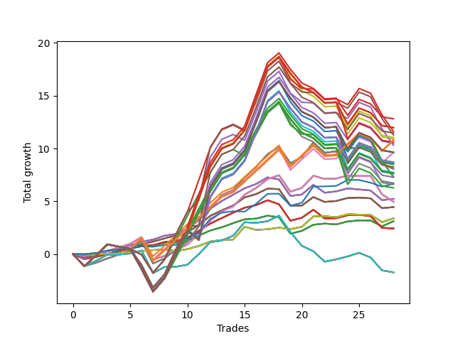

# Short Wallace Doodle 012 
- Symbol: AAPL_Unlimited
- Date Range: 03/23/2022 - 07/08/2022
- Trading Period: 7:20-12:30
- Number of Trades: 28



| Name | Win Percent | Profit | Avg Profit / Trade | Avg Time / Trade |      | Name | Win Percent | Profit | Avg Profit / Trade | Avg Time / Trade |
| ---- | ----------- | ------ | ------------------ | ---------------- | ---- | ---- | ----------- | ------ | ------------------ | ---------------- |
| Sorted By <br> Profit | | | | | | Sorted By <br> Win Percentage ||||
| One Hundred Eight | 53.57 | 6405.00 | 228.75 | 142:52 |     | Sixty-Nine | 78.57 | 4030.00 | 143.93 | 50:08 |
| One Hundred Twenty-Eight | 53.57 | 5990.00 | 213.93 | 146:48 |     | Sixty-One | 78.57 | 4030.00 | 143.93 | 50:08 |
| One Hundred Twenty-Three | 53.57 | 5990.00 | 213.93 | 146:48 |     | Fifty-Three | 78.57 | 4030.00 | 143.93 | 50:08 |
| One Hundred Thirteen | 53.57 | 5990.00 | 213.93 | 146:48 |     | Forty-Five | 78.57 | 4030.00 | 143.93 | 50:08 |
| Eighty-Three | 53.57 | 5990.00 | 213.93 | 146:48 |     | Five | 78.57 | 4030.00 | 143.93 | 50:08 |
| Ninety-Eight | 50.00 | 5810.00 | 207.50 | 117:25 |     | Sixty-Seven | 78.57 | 2225.00 | 79.46 | 21:37 |
| One Hundred Ten | 53.57 | 5735.00 | 204.82 | 149:53 |     | Fifty-Nine | 78.57 | 2225.00 | 79.46 | 21:37 |
| One Hundred | 50.00 | 5640.00 | 201.43 | 124:05 |     | Fifty-One | 78.57 | 2225.00 | 79.46 | 21:37 |
| One Hundred Three | 53.57 | 5525.00 | 197.32 | 146:16 |     | Forty-Three | 78.57 | 2225.00 | 79.46 | 21:37 |
| Ninety-Three | 53.57 | 5455.00 | 194.82 | 136:00 |     | Three | 78.57 | 2225.00 | 79.46 | 21:37 |
| One Hundred Twenty-Six | 71.43 | 5395.00 | 192.68 | 87:25 |     | Sixty-Six | 75.00 | 2615.00 | 93.39 | 23:26 |
| One Hundred Twenty-One | 71.43 | 5395.00 | 192.68 | 87:25 |     | Fifty-Eight | 75.00 | 2615.00 | 93.39 | 23:26 |
| One Hundred Sixteen | 71.43 | 5395.00 | 192.68 | 87:25 |     | Fifty | 75.00 | 2615.00 | 93.39 | 23:26 |
| One Hundred Eleven | 71.43 | 5395.00 | 192.68 | 87:25 |     | Forty-Two | 75.00 | 2615.00 | 93.39 | 23:26 |
| One Hundred Six | 71.43 | 5395.00 | 192.68 | 87:25 |     | Two | 75.00 | 2615.00 | 93.39 | 23:26 |
| One Hundred One | 71.43 | 5395.00 | 192.68 | 87:25 |     | Sixty-Four | 75.00 | 1555.00 | 55.54 | 09:26 |
| Eighty-One | 71.43 | 5395.00 | 192.68 | 87:25 |     | Fifty-Six | 75.00 | 1555.00 | 55.54 | 09:26 |
| One Hundred Eighteen | 53.57 | 5295.00 | 189.11 | 146:22 |     | Forty-Eight | 75.00 | 1555.00 | 55.54 | 09:26 |
| One Hundred Nine | 53.57 | 5250.00 | 187.50 | 149:14 |     | Forty | 75.00 | 1555.00 | 55.54 | 09:26 |
| Ninety-Nine | 50.00 | 5155.00 | 184.11 | 123:26 |     | Zero | 75.00 | 1555.00 | 55.54 | 09:26 |
| Ninety-One | 71.43 | 4820.00 | 172.14 | 78:58 |     | Sixty-Five | 75.00 | 1210.00 | 43.21 | 17:52 |
| One Hundred Thirty | 50.00 | 4820.00 | 172.14 | 154:43 |     | Fifty-Seven | 75.00 | 1210.00 | 43.21 | 17:52 |
| One Hundred Twenty-Five | 50.00 | 4820.00 | 172.14 | 154:43 |     | Forty-Nine | 75.00 | 1210.00 | 43.21 | 17:52 |
| One Hundred Fifteen | 50.00 | 4820.00 | 172.14 | 154:43 |     | Forty-One | 75.00 | 1210.00 | 43.21 | 17:52 |
| Eighty-Five | 50.00 | 4820.00 | 172.14 | 154:43 |     | One | 75.00 | 1210.00 | 43.21 | 17:52 |
| One Hundred Five | 50.00 | 4355.00 | 155.54 | 154:11 |     | One Hundred Twenty-Six | 71.43 | 5395.00 | 192.68 | 87:25 |
| One Hundred Twenty-Nine | 50.00 | 4335.00 | 154.82 | 154:04 |     | One Hundred Twenty-One | 71.43 | 5395.00 | 192.68 | 87:25 |
| One Hundred Twenty-Four | 50.00 | 4335.00 | 154.82 | 154:04 |     | One Hundred Sixteen | 71.43 | 5395.00 | 192.68 | 87:25 |
| One Hundred Fourteen | 50.00 | 4335.00 | 154.82 | 154:04 |     | One Hundred Eleven | 71.43 | 5395.00 | 192.68 | 87:25 |
| Eighty-Four | 50.00 | 4335.00 | 154.82 | 154:04 |     | One Hundred Six | 71.43 | 5395.00 | 192.68 | 87:25 |
| Ninety-Five | 50.00 | 4285.00 | 153.04 | 143:55 |     | One Hundred One | 71.43 | 5395.00 | 192.68 | 87:25 |
| One Hundred Seven | 53.57 | 4245.00 | 151.61 | 135:38 |     | Eighty-One | 71.43 | 5395.00 | 192.68 | 87:25 |
| One Hundred Twenty | 50.00 | 4125.00 | 147.32 | 154:17 |     | Ninety-One | 71.43 | 4820.00 | 172.14 | 78:58 |
| Sixty-Nine | 78.57 | 4030.00 | 143.93 | 50:08 |     | Seventy-Three | 71.43 | 3330.00 | 118.93 | 13:13 |
| Sixty-One | 78.57 | 4030.00 | 143.93 | 50:08 |     | Sixty-Eight | 71.43 | 2480.00 | 88.57 | 37:13 |
| Fifty-Three | 78.57 | 4030.00 | 143.93 | 50:08 |     | Sixty | 71.43 | 2480.00 | 88.57 | 37:13 |
| Forty-Five | 78.57 | 4030.00 | 143.93 | 50:08 |     | Fifty-Two | 71.43 | 2480.00 | 88.57 | 37:13 |
| Five | 78.57 | 4030.00 | 143.93 | 50:08 |     | Forty-Four | 71.43 | 2480.00 | 88.57 | 37:13 |
| One Hundred Four | 50.00 | 3870.00 | 138.21 | 153:32 |     | Four | 71.43 | 2480.00 | 88.57 | 37:13 |
| One Hundred Twenty-Seven | 53.57 | 3830.00 | 136.79 | 139:34 |     | Ninety-Six | 67.86 | 3640.00 | 130.00 | 72:33 |
| One Hundred Twenty-Two | 53.57 | 3830.00 | 136.79 | 139:34 |     | Seventy | 67.86 | 1690.00 | 60.36 | 19:29 |
| One Hundred Twelve | 53.57 | 3830.00 | 136.79 | 139:34 |     | Sixty-Two | 67.86 | 1690.00 | 60.36 | 19:29 |
| Eighty-Two | 53.57 | 3830.00 | 136.79 | 139:34 |     | Fifty-Four | 67.86 | 1690.00 | 60.36 | 19:29 |
| Ninety-Four | 50.00 | 3800.00 | 135.71 | 143:16 |     | Forty-Six | 67.86 | 1690.00 | 60.36 | 19:29 |
| Ninety-Seven | 50.00 | 3650.00 | 130.36 | 110:11 |     | Six | 67.86 | 1690.00 | 60.36 | 19:29 |
| Ninety-Six | 67.86 | 3640.00 | 130.00 | 72:33 |     | Seventy-One | 64.29 | -865.00 | -30.89 | 82:57 |
| One Hundred Ninteen | 50.00 | 3640.00 | 130.00 | 153:38 |     | Sixty-Three | 64.29 | -865.00 | -30.89 | 82:57 |
| One Hundred Two | 53.57 | 3365.00 | 120.18 | 139:02 |     | Fifty-Five | 64.29 | -865.00 | -30.89 | 82:57 |
| Seventy-Three | 71.43 | 3330.00 | 118.93 | 13:13 |     | Forty-Seven | 64.29 | -865.00 | -30.89 | 82:57 |
| Ninety-Two | 53.57 | 3295.00 | 117.68 | 128:46 |     | Seven | 64.29 | -865.00 | -30.89 | 82:57 |
| One Hundred Seventeen | 53.57 | 3135.00 | 111.96 | 139:08 |     | One Hundred Eight | 53.57 | 6405.00 | 228.75 | 142:52 |
| Sixty-Six | 75.00 | 2615.00 | 93.39 | 23:26 |     | One Hundred Twenty-Eight | 53.57 | 5990.00 | 213.93 | 146:48 |
| Fifty-Eight | 75.00 | 2615.00 | 93.39 | 23:26 |     | One Hundred Twenty-Three | 53.57 | 5990.00 | 213.93 | 146:48 |
| Fifty | 75.00 | 2615.00 | 93.39 | 23:26 |     | One Hundred Thirteen | 53.57 | 5990.00 | 213.93 | 146:48 |
| Forty-Two | 75.00 | 2615.00 | 93.39 | 23:26 |     | Eighty-Three | 53.57 | 5990.00 | 213.93 | 146:48 |
| Two | 75.00 | 2615.00 | 93.39 | 23:26 |     | One Hundred Ten | 53.57 | 5735.00 | 204.82 | 149:53 |
| Sixty-Eight | 71.43 | 2480.00 | 88.57 | 37:13 |     | One Hundred Three | 53.57 | 5525.00 | 197.32 | 146:16 |
| Sixty | 71.43 | 2480.00 | 88.57 | 37:13 |     | Ninety-Three | 53.57 | 5455.00 | 194.82 | 136:00 |
| Fifty-Two | 71.43 | 2480.00 | 88.57 | 37:13 |     | One Hundred Eighteen | 53.57 | 5295.00 | 189.11 | 146:22 |
| Forty-Four | 71.43 | 2480.00 | 88.57 | 37:13 |     | One Hundred Nine | 53.57 | 5250.00 | 187.50 | 149:14 |
| Four | 71.43 | 2480.00 | 88.57 | 37:13 |     | One Hundred Seven | 53.57 | 4245.00 | 151.61 | 135:38 |
| Sixty-Seven | 78.57 | 2225.00 | 79.46 | 21:37 |     | One Hundred Twenty-Seven | 53.57 | 3830.00 | 136.79 | 139:34 |
| Fifty-Nine | 78.57 | 2225.00 | 79.46 | 21:37 |     | One Hundred Twenty-Two | 53.57 | 3830.00 | 136.79 | 139:34 |
| Fifty-One | 78.57 | 2225.00 | 79.46 | 21:37 |     | One Hundred Twelve | 53.57 | 3830.00 | 136.79 | 139:34 |
| Forty-Three | 78.57 | 2225.00 | 79.46 | 21:37 |     | Eighty-Two | 53.57 | 3830.00 | 136.79 | 139:34 |
| Three | 78.57 | 2225.00 | 79.46 | 21:37 |     | One Hundred Two | 53.57 | 3365.00 | 120.18 | 139:02 |
| Seventy | 67.86 | 1690.00 | 60.36 | 19:29 |     | Ninety-Two | 53.57 | 3295.00 | 117.68 | 128:46 |
| Sixty-Two | 67.86 | 1690.00 | 60.36 | 19:29 |     | One Hundred Seventeen | 53.57 | 3135.00 | 111.96 | 139:08 |
| Fifty-Four | 67.86 | 1690.00 | 60.36 | 19:29 |     | Ninety-Eight | 50.00 | 5810.00 | 207.50 | 117:25 |
| Forty-Six | 67.86 | 1690.00 | 60.36 | 19:29 |     | One Hundred | 50.00 | 5640.00 | 201.43 | 124:05 |
| Six | 67.86 | 1690.00 | 60.36 | 19:29 |     | Ninety-Nine | 50.00 | 5155.00 | 184.11 | 123:26 |
| Sixty-Four | 75.00 | 1555.00 | 55.54 | 09:26 |     | One Hundred Thirty | 50.00 | 4820.00 | 172.14 | 154:43 |
| Fifty-Six | 75.00 | 1555.00 | 55.54 | 09:26 |     | One Hundred Twenty-Five | 50.00 | 4820.00 | 172.14 | 154:43 |
| Forty-Eight | 75.00 | 1555.00 | 55.54 | 09:26 |     | One Hundred Fifteen | 50.00 | 4820.00 | 172.14 | 154:43 |
| Forty | 75.00 | 1555.00 | 55.54 | 09:26 |     | Eighty-Five | 50.00 | 4820.00 | 172.14 | 154:43 |
| Zero | 75.00 | 1555.00 | 55.54 | 09:26 |     | One Hundred Five | 50.00 | 4355.00 | 155.54 | 154:11 |
| Sixty-Five | 75.00 | 1210.00 | 43.21 | 17:52 |     | One Hundred Twenty-Nine | 50.00 | 4335.00 | 154.82 | 154:04 |
| Fifty-Seven | 75.00 | 1210.00 | 43.21 | 17:52 |     | One Hundred Twenty-Four | 50.00 | 4335.00 | 154.82 | 154:04 |
| Forty-Nine | 75.00 | 1210.00 | 43.21 | 17:52 |     | One Hundred Fourteen | 50.00 | 4335.00 | 154.82 | 154:04 |
| Forty-One | 75.00 | 1210.00 | 43.21 | 17:52 |     | Eighty-Four | 50.00 | 4335.00 | 154.82 | 154:04 |
| One | 75.00 | 1210.00 | 43.21 | 17:52 |     | Ninety-Five | 50.00 | 4285.00 | 153.04 | 143:55 |
| Seventy-One | 64.29 | -865.00 | -30.89 | 82:57 |     | One Hundred Twenty | 50.00 | 4125.00 | 147.32 | 154:17 |
| Sixty-Three | 64.29 | -865.00 | -30.89 | 82:57 |     | One Hundred Four | 50.00 | 3870.00 | 138.21 | 153:32 |
| Fifty-Five | 64.29 | -865.00 | -30.89 | 82:57 |     | Ninety-Four | 50.00 | 3800.00 | 135.71 | 143:16 |
| Forty-Seven | 64.29 | -865.00 | -30.89 | 82:57 |     | Ninety-Seven | 50.00 | 3650.00 | 130.36 | 110:11 |
| Seven | 64.29 | -865.00 | -30.89 | 82:57 |     | One Hundred Ninteen | 50.00 | 3640.00 | 130.00 | 153:38 |

## NO STOPLOSS

### Test Zero
* Sell when price hits the middle line of the 20p bollinger
* No Stoploss
* Results:
```
Total Trades: 28
Percent Up: 25.00
Percent Down: 75.00
Total Points Moved Down: 3.11
Potential Profit: 1555.00
Total Points Ups: 2.35 Count Ups: 7
Total Points Downs: 5.46 Count Downs: 21
```

<details><summary>Trades</summary>

<code>In: 2022-03-28 09:57:00		Out: 2022-03-28 10:10:05		Total Position Time: 13:05		Total Move Down: -0.00		Total to Date: 0.00</code> <br />
<code>In: 2022-03-30 10:41:00		Out: 2022-03-30 10:44:30		Total Position Time: 03:30		Total Move Down: 0.09		Total to Date: 0.09</code> <br />
<code>In: 2022-03-30 10:43:00		Out: 2022-03-30 10:44:30		Total Position Time: 01:30		Total Move Down: 0.19		Total to Date: 0.28</code> <br />
<code>In: 2022-04-01 09:26:00		Out: 2022-04-01 09:32:15		Total Position Time: 06:15		Total Move Down: 0.13		Total to Date: 0.41</code> <br />
<code>In: 2022-04-01 09:31:00		Out: 2022-04-01 09:32:15		Total Position Time: 01:15		Total Move Down: 0.14		Total to Date: 0.55</code> <br />
<code>In: 2022-04-07 09:12:00		Out: 2022-04-07 09:18:10		Total Position Time: 06:10		Total Move Down: 0.28		Total to Date: 0.83</code> <br />
<code>In: 2022-04-07 10:14:00		Out: 2022-04-07 10:35:20		Total Position Time: 21:20		Total Move Down: -0.00		Total to Date: 0.83</code> <br />
<code>In: 2022-04-11 08:55:00		Out: 2022-04-11 09:01:10		Total Position Time: 06:10		Total Move Down: 0.22		Total to Date: 1.05</code> <br />
<code>In: 2022-04-22 09:35:00		Out: 2022-04-22 09:50:45		Total Position Time: 15:45		Total Move Down: 0.03		Total to Date: 1.08</code> <br />
<code>In: 2022-04-29 10:39:00		Out: 2022-04-29 10:40:10		Total Position Time: 01:10		Total Move Down: 0.19		Total to Date: 1.27</code> <br />
<code>In: 2022-05-02 09:23:00		Out: 2022-05-02 09:31:25		Total Position Time: 08:25		Total Move Down: 0.49		Total to Date: 1.76</code> <br />
<code>In: 2022-05-11 08:40:00		Out: 2022-05-11 08:47:05		Total Position Time: 07:05		Total Move Down: 0.47		Total to Date: 2.23</code> <br />
<code>In: 2022-05-11 11:47:00		Out: 2022-05-11 11:49:30		Total Position Time: 02:30		Total Move Down: 0.31		Total to Date: 2.54</code> <br />
<code>In: 2022-05-12 12:25:00		Out: 2022-05-12 12:37:15		Total Position Time: 12:15		Total Move Down: 0.39		Total to Date: 2.93</code> <br />
<code>In: 2022-05-16 08:57:00		Out: 2022-05-16 09:05:45		Total Position Time: 08:45		Total Move Down: 0.36		Total to Date: 3.29</code> <br />
<code>In: 2022-05-18 09:54:00		Out: 2022-05-18 10:05:05		Total Position Time: 11:05		Total Move Down: 0.07		Total to Date: 3.36</code> <br />
<code>In: 2022-05-18 09:56:00		Out: 2022-05-18 10:05:05		Total Position Time: 09:05		Total Move Down: 0.28		Total to Date: 3.64</code> <br />
<code>In: 2022-05-19 11:40:00		Out: 2022-05-19 11:58:05		Total Position Time: 18:05		Total Move Down: -0.15		Total to Date: 3.49</code> <br />
<code>In: 2022-05-20 12:24:00		Out: 2022-05-20 12:47:00		Total Position Time: 23:00		Total Move Down: -1.56		Total to Date: 1.93</code> <br />
<code>In: 2022-05-24 08:51:00		Out: 2022-05-24 09:02:55		Total Position Time: 11:55		Total Move Down: 0.27		Total to Date: 2.20</code> <br />
<code>In: 2022-05-24 09:17:00		Out: 2022-05-24 09:21:30		Total Position Time: 04:30		Total Move Down: 0.58		Total to Date: 2.78</code> <br />
<code>In: 2022-06-01 11:07:00		Out: 2022-06-01 11:11:10		Total Position Time: 04:10		Total Move Down: 0.11		Total to Date: 2.89</code> <br />
<code>In: 2022-06-03 11:21:00		Out: 2022-06-03 11:35:40		Total Position Time: 14:40		Total Move Down: -0.08		Total to Date: 2.81</code> <br />
<code>In: 2022-06-15 11:02:00		Out: 2022-06-15 11:03:10		Total Position Time: 01:10		Total Move Down: 0.28		Total to Date: 3.09</code> <br />
<code>In: 2022-06-16 09:31:00		Out: 2022-06-16 09:42:10		Total Position Time: 11:10		Total Move Down: 0.10		Total to Date: 3.19</code> <br />
<code>In: 2022-06-24 11:30:00		Out: 2022-06-24 11:39:10		Total Position Time: 09:10		Total Move Down: -0.01		Total to Date: 3.18</code> <br />
<code>In: 2022-06-30 08:12:00		Out: 2022-06-30 08:36:00		Total Position Time: 24:00		Total Move Down: -0.55		Total to Date: 2.63</code> <br />
<code>In: 2022-06-30 08:29:00		Out: 2022-06-30 08:36:00		Total Position Time: 07:00		Total Move Down: 0.48		Total to Date: 3.11</code> <br />


</details>

### Test One
* Sell when the price hits the upper line of the 20p 1std bollinger
* No Stoploss
* Results:
```
Total Trades: 28
Percent Up: 25.00
Percent Down: 75.00
Total Points Moved Down: 2.42
Potential Profit: 1210.00
Total Points Ups: 4.55 Count Ups: 7
Total Points Downs: 6.97 Count Downs: 21
```

<details><summary>Trades</summary>

<code>In: 2022-03-28 09:57:00		Out: 2022-03-28 10:52:25		Total Position Time: 55:25		Total Move Down: -0.48		Total to Date: -0.48</code> <br />
<code>In: 2022-03-30 10:41:00		Out: 2022-03-30 10:45:20		Total Position Time: 04:20		Total Move Down: 0.20		Total to Date: -0.28</code> <br />
<code>In: 2022-03-30 10:43:00		Out: 2022-03-30 10:45:20		Total Position Time: 02:20		Total Move Down: 0.30		Total to Date: 0.02</code> <br />
<code>In: 2022-04-01 09:26:00		Out: 2022-04-01 09:34:10		Total Position Time: 08:10		Total Move Down: 0.24		Total to Date: 0.26</code> <br />
<code>In: 2022-04-01 09:31:00		Out: 2022-04-01 09:34:10		Total Position Time: 03:10		Total Move Down: 0.25		Total to Date: 0.51</code> <br />
<code>In: 2022-04-07 09:12:00		Out: 2022-04-07 09:24:05		Total Position Time: 12:05		Total Move Down: 0.25		Total to Date: 0.76</code> <br />
<code>In: 2022-04-07 10:14:00		Out: 2022-04-07 10:37:30		Total Position Time: 23:30		Total Move Down: 0.08		Total to Date: 0.84</code> <br />
<code>In: 2022-04-11 08:55:00		Out: 2022-04-11 09:02:15		Total Position Time: 07:15		Total Move Down: 0.30		Total to Date: 1.14</code> <br />
<code>In: 2022-04-22 09:35:00		Out: 2022-04-22 09:52:30		Total Position Time: 17:30		Total Move Down: 0.11		Total to Date: 1.25</code> <br />
<code>In: 2022-04-29 10:39:00		Out: 2022-04-29 10:40:35		Total Position Time: 01:35		Total Move Down: 0.29		Total to Date: 1.54</code> <br />
<code>In: 2022-05-02 09:23:00		Out: 2022-05-02 09:36:15		Total Position Time: 13:15		Total Move Down: 0.66		Total to Date: 2.20</code> <br />
<code>In: 2022-05-11 08:40:00		Out: 2022-05-11 08:50:15		Total Position Time: 10:15		Total Move Down: 0.69		Total to Date: 2.89</code> <br />
<code>In: 2022-05-11 11:47:00		Out: 2022-05-11 11:50:30		Total Position Time: 03:30		Total Move Down: 0.52		Total to Date: 3.41</code> <br />
<code>In: 2022-05-12 12:25:00		Out: 2022-05-12 12:43:40		Total Position Time: 18:40		Total Move Down: 0.51		Total to Date: 3.92</code> <br />
<code>In: 2022-05-16 08:57:00		Out: 2022-05-16 09:11:30		Total Position Time: 14:30		Total Move Down: 0.47		Total to Date: 4.39</code> <br />
<code>In: 2022-05-18 09:54:00		Out: 2022-05-18 10:07:25		Total Position Time: 13:25		Total Move Down: 0.25		Total to Date: 4.64</code> <br />
<code>In: 2022-05-18 09:56:00		Out: 2022-05-18 10:07:25		Total Position Time: 11:25		Total Move Down: 0.46		Total to Date: 5.10</code> <br />
<code>In: 2022-05-19 11:40:00		Out: 2022-05-19 12:09:55		Total Position Time: 29:55		Total Move Down: -0.38		Total to Date: 4.72</code> <br />
<code>In: 2022-05-20 12:24:00		Out: 2022-05-20 12:47:00		Total Position Time: 23:00		Total Move Down: -1.56		Total to Date: 3.16</code> <br />
<code>In: 2022-05-24 08:51:00		Out: 2022-05-24 09:06:05		Total Position Time: 15:05		Total Move Down: 0.28		Total to Date: 3.44</code> <br />
<code>In: 2022-05-24 09:17:00		Out: 2022-05-24 09:26:55		Total Position Time: 09:55		Total Move Down: 0.76		Total to Date: 4.20</code> <br />
<code>In: 2022-06-01 11:07:00		Out: 2022-06-01 11:46:10		Total Position Time: 39:10		Total Move Down: -0.83		Total to Date: 3.37</code> <br />
<code>In: 2022-06-03 11:21:00		Out: 2022-06-03 11:37:10		Total Position Time: 16:10		Total Move Down: 0.03		Total to Date: 3.40</code> <br />
<code>In: 2022-06-15 11:02:00		Out: 2022-06-15 11:03:10		Total Position Time: 01:10		Total Move Down: 0.28		Total to Date: 3.68</code> <br />
<code>In: 2022-06-16 09:31:00		Out: 2022-06-16 09:52:10		Total Position Time: 21:10		Total Move Down: 0.04		Total to Date: 3.72</code> <br />
<code>In: 2022-06-24 11:30:00		Out: 2022-06-24 12:04:05		Total Position Time: 34:05		Total Move Down: -0.13		Total to Date: 3.59</code> <br />
<code>In: 2022-06-30 08:12:00		Out: 2022-06-30 09:05:45		Total Position Time: 53:45		Total Move Down: -1.10		Total to Date: 2.49</code> <br />
<code>In: 2022-06-30 08:29:00		Out: 2022-06-30 09:05:45		Total Position Time: 36:45		Total Move Down: -0.07		Total to Date: 2.42</code> <br />


</details>

### Test Two
* Sell when the price hits the upper line of the 20p 2std bollinger
* No Stoploss
* Results:
```
Total Trades: 28
Percent Up: 25.00
Percent Down: 75.00
Total Points Moved Down: 5.23
Potential Profit: 2615.00
Total Points Ups: 4.07 Count Ups: 7
Total Points Downs: 9.30 Count Downs: 21
```

<details><summary>Trades</summary>

<code>In: 2022-03-28 09:57:00		Out: 2022-03-28 10:54:15		Total Position Time: 57:15		Total Move Down: -0.46		Total to Date: -0.46</code> <br />
<code>In: 2022-03-30 10:41:00		Out: 2022-03-30 10:45:40		Total Position Time: 04:40		Total Move Down: 0.31		Total to Date: -0.15</code> <br />
<code>In: 2022-03-30 10:43:00		Out: 2022-03-30 10:45:40		Total Position Time: 02:40		Total Move Down: 0.41		Total to Date: 0.26</code> <br />
<code>In: 2022-04-01 09:26:00		Out: 2022-04-01 09:58:40		Total Position Time: 32:40		Total Move Down: 0.27		Total to Date: 0.53</code> <br />
<code>In: 2022-04-01 09:31:00		Out: 2022-04-01 09:58:40		Total Position Time: 27:40		Total Move Down: 0.28		Total to Date: 0.81</code> <br />
<code>In: 2022-04-07 09:12:00		Out: 2022-04-07 09:27:55		Total Position Time: 15:55		Total Move Down: 0.36		Total to Date: 1.17</code> <br />
<code>In: 2022-04-07 10:14:00		Out: 2022-04-07 10:39:55		Total Position Time: 25:55		Total Move Down: 0.20		Total to Date: 1.37</code> <br />
<code>In: 2022-04-11 08:55:00		Out: 2022-04-11 09:13:50		Total Position Time: 18:50		Total Move Down: 0.37		Total to Date: 1.74</code> <br />
<code>In: 2022-04-22 09:35:00		Out: 2022-04-22 09:54:15		Total Position Time: 19:15		Total Move Down: 0.17		Total to Date: 1.91</code> <br />
<code>In: 2022-04-29 10:39:00		Out: 2022-04-29 10:44:15		Total Position Time: 05:15		Total Move Down: 0.50		Total to Date: 2.41</code> <br />
<code>In: 2022-05-02 09:23:00		Out: 2022-05-02 09:39:35		Total Position Time: 16:35		Total Move Down: 0.81		Total to Date: 3.22</code> <br />
<code>In: 2022-05-11 08:40:00		Out: 2022-05-11 08:53:45		Total Position Time: 13:45		Total Move Down: 1.07		Total to Date: 4.29</code> <br />
<code>In: 2022-05-11 11:47:00		Out: 2022-05-11 11:53:15		Total Position Time: 06:15		Total Move Down: 0.74		Total to Date: 5.03</code> <br />
<code>In: 2022-05-12 12:25:00		Out: 2022-05-12 12:43:50		Total Position Time: 18:50		Total Move Down: 0.60		Total to Date: 5.63</code> <br />
<code>In: 2022-05-16 08:57:00		Out: 2022-05-16 09:14:40		Total Position Time: 17:40		Total Move Down: 0.60		Total to Date: 6.23</code> <br />
<code>In: 2022-05-18 09:54:00		Out: 2022-05-18 10:09:15		Total Position Time: 15:15		Total Move Down: 0.41		Total to Date: 6.64</code> <br />
<code>In: 2022-05-18 09:56:00		Out: 2022-05-18 10:09:15		Total Position Time: 13:15		Total Move Down: 0.62		Total to Date: 7.26</code> <br />
<code>In: 2022-05-19 11:40:00		Out: 2022-05-19 12:10:15		Total Position Time: 30:15		Total Move Down: -0.19		Total to Date: 7.07</code> <br />
<code>In: 2022-05-20 12:24:00		Out: 2022-05-20 12:47:00		Total Position Time: 23:00		Total Move Down: -1.56		Total to Date: 5.51</code> <br />
<code>In: 2022-05-24 08:51:00		Out: 2022-05-24 09:31:15		Total Position Time: 40:15		Total Move Down: 0.13		Total to Date: 5.64</code> <br />
<code>In: 2022-05-24 09:17:00		Out: 2022-05-24 09:31:15		Total Position Time: 14:15		Total Move Down: 0.92		Total to Date: 6.56</code> <br />
<code>In: 2022-06-01 11:07:00		Out: 2022-06-01 11:46:35		Total Position Time: 39:35		Total Move Down: -0.75		Total to Date: 5.81</code> <br />
<code>In: 2022-06-03 11:21:00		Out: 2022-06-03 11:38:55		Total Position Time: 17:55		Total Move Down: 0.13		Total to Date: 5.94</code> <br />
<code>In: 2022-06-15 11:02:00		Out: 2022-06-15 11:03:10		Total Position Time: 01:10		Total Move Down: 0.28		Total to Date: 6.22</code> <br />
<code>In: 2022-06-16 09:31:00		Out: 2022-06-16 10:21:35		Total Position Time: 50:35		Total Move Down: -0.10		Total to Date: 6.12</code> <br />
<code>In: 2022-06-24 11:30:00		Out: 2022-06-24 12:05:40		Total Position Time: 35:40		Total Move Down: -0.10		Total to Date: 6.02</code> <br />
<code>In: 2022-06-30 08:12:00		Out: 2022-06-30 09:06:25		Total Position Time: 54:25		Total Move Down: -0.91		Total to Date: 5.11</code> <br />
<code>In: 2022-06-30 08:29:00		Out: 2022-06-30 09:06:25		Total Position Time: 37:25		Total Move Down: 0.12		Total to Date: 5.23</code> <br />


</details>

### Test Three
* Sell when price hits the middle line of the 50p bollinger
* No Stoploss
* Results:
```
Total Trades: 28
Percent Up: 21.43
Percent Down: 78.57
Total Points Moved Down: 4.45
Potential Profit: 2225.00
Total Points Ups: 3.38 Count Ups: 6
Total Points Downs: 7.83 Count Downs: 22
```

<details><summary>Trades</summary>

<code>In: 2022-03-28 09:57:00		Out: 2022-03-28 10:55:10		Total Position Time: 58:10		Total Move Down: -0.31		Total to Date: -0.31</code> <br />
<code>In: 2022-03-30 10:41:00		Out: 2022-03-30 10:44:30		Total Position Time: 03:30		Total Move Down: 0.09		Total to Date: -0.22</code> <br />
<code>In: 2022-03-30 10:43:00		Out: 2022-03-30 10:44:30		Total Position Time: 01:30		Total Move Down: 0.19		Total to Date: -0.03</code> <br />
<code>In: 2022-04-01 09:26:00		Out: 2022-04-01 09:36:10		Total Position Time: 10:10		Total Move Down: 0.27		Total to Date: 0.24</code> <br />
<code>In: 2022-04-01 09:31:00		Out: 2022-04-01 09:36:10		Total Position Time: 05:10		Total Move Down: 0.28		Total to Date: 0.52</code> <br />
<code>In: 2022-04-07 09:12:00		Out: 2022-04-07 09:28:15		Total Position Time: 16:15		Total Move Down: 0.42		Total to Date: 0.94</code> <br />
<code>In: 2022-04-07 10:14:00		Out: 2022-04-07 10:47:20		Total Position Time: 33:20		Total Move Down: 0.24		Total to Date: 1.18</code> <br />
<code>In: 2022-04-11 08:55:00		Out: 2022-04-11 09:13:10		Total Position Time: 18:10		Total Move Down: 0.30		Total to Date: 1.48</code> <br />
<code>In: 2022-04-22 09:35:00		Out: 2022-04-22 09:57:30		Total Position Time: 22:30		Total Move Down: 0.30		Total to Date: 1.78</code> <br />
<code>In: 2022-04-29 10:39:00		Out: 2022-04-29 10:40:35		Total Position Time: 01:35		Total Move Down: 0.29		Total to Date: 2.07</code> <br />
<code>In: 2022-05-02 09:23:00		Out: 2022-05-02 09:39:30		Total Position Time: 16:30		Total Move Down: 0.69		Total to Date: 2.76</code> <br />
<code>In: 2022-05-11 08:40:00		Out: 2022-05-11 08:51:00		Total Position Time: 11:00		Total Move Down: 0.86		Total to Date: 3.62</code> <br />
<code>In: 2022-05-11 11:47:00		Out: 2022-05-11 11:50:30		Total Position Time: 03:30		Total Move Down: 0.52		Total to Date: 4.14</code> <br />
<code>In: 2022-05-12 12:25:00		Out: 2022-05-12 12:47:00		Total Position Time: 22:00		Total Move Down: 0.46		Total to Date: 4.60</code> <br />
<code>In: 2022-05-16 08:57:00		Out: 2022-05-16 09:15:45		Total Position Time: 18:45		Total Move Down: 0.77		Total to Date: 5.37</code> <br />
<code>In: 2022-05-18 09:54:00		Out: 2022-05-18 10:07:35		Total Position Time: 13:35		Total Move Down: 0.31		Total to Date: 5.68</code> <br />
<code>In: 2022-05-18 09:56:00		Out: 2022-05-18 10:07:35		Total Position Time: 11:35		Total Move Down: 0.52		Total to Date: 6.20</code> <br />
<code>In: 2022-05-19 11:40:00		Out: 2022-05-19 12:13:35		Total Position Time: 33:35		Total Move Down: -0.05		Total to Date: 6.15</code> <br />
<code>In: 2022-05-20 12:24:00		Out: 2022-05-20 12:47:00		Total Position Time: 23:00		Total Move Down: -1.56		Total to Date: 4.59</code> <br />
<code>In: 2022-05-24 08:51:00		Out: 2022-05-24 09:30:25		Total Position Time: 39:25		Total Move Down: 0.01		Total to Date: 4.60</code> <br />
<code>In: 2022-05-24 09:17:00		Out: 2022-05-24 09:30:25		Total Position Time: 13:25		Total Move Down: 0.80		Total to Date: 5.40</code> <br />
<code>In: 2022-06-01 11:07:00		Out: 2022-06-01 11:51:15		Total Position Time: 44:15		Total Move Down: -0.46		Total to Date: 4.94</code> <br />
<code>In: 2022-06-03 11:21:00		Out: 2022-06-03 11:37:25		Total Position Time: 16:25		Total Move Down: 0.09		Total to Date: 5.03</code> <br />
<code>In: 2022-06-15 11:02:00		Out: 2022-06-15 11:03:10		Total Position Time: 01:10		Total Move Down: 0.28		Total to Date: 5.31</code> <br />
<code>In: 2022-06-16 09:31:00		Out: 2022-06-16 10:06:30		Total Position Time: 35:30		Total Move Down: 0.04		Total to Date: 5.35</code> <br />
<code>In: 2022-06-24 11:30:00		Out: 2022-06-24 12:09:55		Total Position Time: 39:55		Total Move Down: -0.07		Total to Date: 5.28</code> <br />
<code>In: 2022-06-30 08:12:00		Out: 2022-06-30 09:06:20		Total Position Time: 54:20		Total Move Down: -0.93		Total to Date: 4.35</code> <br />
<code>In: 2022-06-30 08:29:00		Out: 2022-06-30 09:06:20		Total Position Time: 37:20		Total Move Down: 0.10		Total to Date: 4.45</code> <br />


</details>

### Test Four
* Sell when the price hits the upper line of the 50p 1std bollinger
* No Stoploss
* Results:
```
Total Trades: 28
Percent Up: 28.57
Percent Down: 71.43
Total Points Moved Down: 4.96
Potential Profit: 2480.00
Total Points Ups: 6.67 Count Ups: 8
Total Points Downs: 11.63 Count Downs: 20
```

<details><summary>Trades</summary>

<code>In: 2022-03-28 09:57:00		Out: 2022-03-28 10:56:45		Total Position Time: 59:45		Total Move Down: -0.20		Total to Date: -0.20</code> <br />
<code>In: 2022-03-30 10:41:00		Out: 2022-03-30 10:45:20		Total Position Time: 04:20		Total Move Down: 0.20		Total to Date: 0.00</code> <br />
<code>In: 2022-03-30 10:43:00		Out: 2022-03-30 10:45:20		Total Position Time: 02:20		Total Move Down: 0.30		Total to Date: 0.30</code> <br />
<code>In: 2022-04-01 09:26:00		Out: 2022-04-01 09:58:45		Total Position Time: 32:45		Total Move Down: 0.33		Total to Date: 0.63</code> <br />
<code>In: 2022-04-01 09:31:00		Out: 2022-04-01 09:58:45		Total Position Time: 27:45		Total Move Down: 0.34		Total to Date: 0.97</code> <br />
<code>In: 2022-04-07 09:12:00		Out: 2022-04-07 09:34:00		Total Position Time: 22:00		Total Move Down: 0.63		Total to Date: 1.60</code> <br />
<code>In: 2022-04-07 10:14:00		Out: 2022-04-07 12:47:00		Total Position Time: 153:00		Total Move Down: -2.13		Total to Date: -0.53</code> <br />
<code>In: 2022-04-11 08:55:00		Out: 2022-04-11 09:26:00		Total Position Time: 31:00		Total Move Down: 0.36		Total to Date: -0.17</code> <br />
<code>In: 2022-04-22 09:35:00		Out: 2022-04-22 10:02:00		Total Position Time: 27:00		Total Move Down: 0.56		Total to Date: 0.39</code> <br />
<code>In: 2022-04-29 10:39:00		Out: 2022-04-29 10:45:00		Total Position Time: 06:00		Total Move Down: 0.51		Total to Date: 0.90</code> <br />
<code>In: 2022-05-02 09:23:00		Out: 2022-05-02 09:42:15		Total Position Time: 19:15		Total Move Down: 1.03		Total to Date: 1.93</code> <br />
<code>In: 2022-05-11 08:40:00		Out: 2022-05-11 09:00:40		Total Position Time: 20:40		Total Move Down: 1.23		Total to Date: 3.16</code> <br />
<code>In: 2022-05-11 11:47:00		Out: 2022-05-11 11:56:45		Total Position Time: 09:45		Total Move Down: 0.89		Total to Date: 4.05</code> <br />
<code>In: 2022-05-12 12:25:00		Out: 2022-05-12 12:47:00		Total Position Time: 22:00		Total Move Down: 0.46		Total to Date: 4.51</code> <br />
<code>In: 2022-05-16 08:57:00		Out: 2022-05-16 09:24:25		Total Position Time: 27:25		Total Move Down: 1.12		Total to Date: 5.63</code> <br />
<code>In: 2022-05-18 09:54:00		Out: 2022-05-18 10:14:35		Total Position Time: 20:35		Total Move Down: 0.63		Total to Date: 6.26</code> <br />
<code>In: 2022-05-18 09:56:00		Out: 2022-05-18 10:14:35		Total Position Time: 18:35		Total Move Down: 0.84		Total to Date: 7.10</code> <br />
<code>In: 2022-05-19 11:40:00		Out: 2022-05-19 12:18:20		Total Position Time: 38:20		Total Move Down: 0.37		Total to Date: 7.47</code> <br />
<code>In: 2022-05-20 12:24:00		Out: 2022-05-20 12:47:00		Total Position Time: 23:00		Total Move Down: -1.56		Total to Date: 5.91</code> <br />
<code>In: 2022-05-24 08:51:00		Out: 2022-05-24 09:32:55		Total Position Time: 41:55		Total Move Down: 0.36		Total to Date: 6.27</code> <br />
<code>In: 2022-05-24 09:17:00		Out: 2022-05-24 09:32:55		Total Position Time: 15:55		Total Move Down: 1.15		Total to Date: 7.42</code> <br />
<code>In: 2022-06-01 11:07:00		Out: 2022-06-01 12:03:15		Total Position Time: 56:15		Total Move Down: -0.30		Total to Date: 7.12</code> <br />
<code>In: 2022-06-03 11:21:00		Out: 2022-06-03 12:08:00		Total Position Time: 47:00		Total Move Down: 0.04		Total to Date: 7.16</code> <br />
<code>In: 2022-06-15 11:02:00		Out: 2022-06-15 11:03:10		Total Position Time: 01:10		Total Move Down: 0.28		Total to Date: 7.44</code> <br />
<code>In: 2022-06-16 09:31:00		Out: 2022-06-16 10:23:50		Total Position Time: 52:50		Total Move Down: -0.05		Total to Date: 7.39</code> <br />
<code>In: 2022-06-24 11:30:00		Out: 2022-06-24 12:12:00		Total Position Time: 42:00		Total Move Down: -0.00		Total to Date: 7.39</code> <br />
<code>In: 2022-06-30 08:12:00		Out: 2022-06-30 10:10:15		Total Position Time: 118:15		Total Move Down: -1.73		Total to Date: 5.66</code> <br />
<code>In: 2022-06-30 08:29:00		Out: 2022-06-30 10:10:15		Total Position Time: 101:15		Total Move Down: -0.70		Total to Date: 4.96</code> <br />


</details>

### Test Five
* Sell when the price hits the upper line of the 50p 2std bollinger
* No Stoploss
* Results:
```
Total Trades: 28
Percent Up: 21.43
Percent Down: 78.57
Total Points Moved Down: 8.06
Potential Profit: 4030.00
Total Points Ups: 7.91 Count Ups: 6
Total Points Downs: 15.97 Count Downs: 22
```

<details><summary>Trades</summary>

<code>In: 2022-03-28 09:57:00		Out: 2022-03-28 12:47:00		Total Position Time: 170:00		Total Move Down: -1.14		Total to Date: -1.14</code> <br />
<code>In: 2022-03-30 10:41:00		Out: 2022-03-30 10:45:40		Total Position Time: 04:40		Total Move Down: 0.31		Total to Date: -0.83</code> <br />
<code>In: 2022-03-30 10:43:00		Out: 2022-03-30 10:45:40		Total Position Time: 02:40		Total Move Down: 0.41		Total to Date: -0.42</code> <br />
<code>In: 2022-04-01 09:26:00		Out: 2022-04-01 10:00:00		Total Position Time: 34:00		Total Move Down: 0.37		Total to Date: -0.05</code> <br />
<code>In: 2022-04-01 09:31:00		Out: 2022-04-01 10:00:00		Total Position Time: 29:00		Total Move Down: 0.38		Total to Date: 0.33</code> <br />
<code>In: 2022-04-07 09:12:00		Out: 2022-04-07 09:44:05		Total Position Time: 32:05		Total Move Down: 0.91		Total to Date: 1.24</code> <br />
<code>In: 2022-04-07 10:14:00		Out: 2022-04-07 12:47:00		Total Position Time: 153:00		Total Move Down: -2.13		Total to Date: -0.89</code> <br />
<code>In: 2022-04-11 08:55:00		Out: 2022-04-11 09:27:15		Total Position Time: 32:15		Total Move Down: 0.48		Total to Date: -0.41</code> <br />
<code>In: 2022-04-22 09:35:00		Out: 2022-04-22 10:23:00		Total Position Time: 48:00		Total Move Down: 0.82		Total to Date: 0.41</code> <br />
<code>In: 2022-04-29 10:39:00		Out: 2022-04-29 11:46:45		Total Position Time: 67:45		Total Move Down: 0.77		Total to Date: 1.18</code> <br />
<code>In: 2022-05-02 09:23:00		Out: 2022-05-02 09:55:15		Total Position Time: 32:15		Total Move Down: 1.45		Total to Date: 2.63</code> <br />
<code>In: 2022-05-11 08:40:00		Out: 2022-05-11 09:11:05		Total Position Time: 31:05		Total Move Down: 1.67		Total to Date: 4.30</code> <br />
<code>In: 2022-05-11 11:47:00		Out: 2022-05-11 12:04:30		Total Position Time: 17:30		Total Move Down: 1.29		Total to Date: 5.59</code> <br />
<code>In: 2022-05-12 12:25:00		Out: 2022-05-12 12:47:00		Total Position Time: 22:00		Total Move Down: 0.46		Total to Date: 6.05</code> <br />
<code>In: 2022-05-16 08:57:00		Out: 2022-05-16 09:39:00		Total Position Time: 42:00		Total Move Down: 1.21		Total to Date: 7.26</code> <br />
<code>In: 2022-05-18 09:54:00		Out: 2022-05-18 10:24:55		Total Position Time: 30:55		Total Move Down: 0.99		Total to Date: 8.25</code> <br />
<code>In: 2022-05-18 09:56:00		Out: 2022-05-18 10:24:55		Total Position Time: 28:55		Total Move Down: 1.20		Total to Date: 9.45</code> <br />
<code>In: 2022-05-19 11:40:00		Out: 2022-05-19 12:23:55		Total Position Time: 43:55		Total Move Down: 0.72		Total to Date: 10.17</code> <br />
<code>In: 2022-05-20 12:24:00		Out: 2022-05-20 12:47:00		Total Position Time: 23:00		Total Move Down: -1.56		Total to Date: 8.61</code> <br />
<code>In: 2022-05-24 08:51:00		Out: 2022-05-24 09:36:50		Total Position Time: 45:50		Total Move Down: 0.58		Total to Date: 9.19</code> <br />
<code>In: 2022-05-24 09:17:00		Out: 2022-05-24 09:36:50		Total Position Time: 19:50		Total Move Down: 1.37		Total to Date: 10.56</code> <br />
<code>In: 2022-06-01 11:07:00		Out: 2022-06-01 12:47:00		Total Position Time: 100:00		Total Move Down: -0.99		Total to Date: 9.57</code> <br />
<code>In: 2022-06-03 11:21:00		Out: 2022-06-03 12:12:35		Total Position Time: 51:35		Total Move Down: 0.18		Total to Date: 9.75</code> <br />
<code>In: 2022-06-15 11:02:00		Out: 2022-06-15 11:03:10		Total Position Time: 01:10		Total Move Down: 0.28		Total to Date: 10.03</code> <br />
<code>In: 2022-06-16 09:31:00		Out: 2022-06-16 10:45:10		Total Position Time: 74:10		Total Move Down: 0.02		Total to Date: 10.05</code> <br />
<code>In: 2022-06-24 11:30:00		Out: 2022-06-24 12:13:40		Total Position Time: 43:40		Total Move Down: 0.10		Total to Date: 10.15</code> <br />
<code>In: 2022-06-30 08:12:00		Out: 2022-06-30 10:11:50		Total Position Time: 119:50		Total Move Down: -1.56		Total to Date: 8.59</code> <br />
<code>In: 2022-06-30 08:29:00		Out: 2022-06-30 10:11:50		Total Position Time: 102:50		Total Move Down: -0.53		Total to Date: 8.06</code> <br />


</details>

### Test Six
* Sell when the price hits the middle line of the 1std VWAP
* No Stoploss
* Results:
```
Total Trades: 28
Percent Up: 32.14
Percent Down: 67.86
Total Points Moved Down: 3.38
Potential Profit: 1690.00
Total Points Ups: 1.47 Count Ups: 9
Total Points Downs: 4.85 Count Downs: 19
```

<details><summary>Trades</summary>

<code>In: 2022-03-28 09:57:00		Out: 2022-03-28 09:58:45		Total Position Time: 01:45		Total Move Down: -0.00		Total to Date: 0.00</code> <br />
<code>In: 2022-03-30 10:41:00		Out: 2022-03-30 10:42:35		Total Position Time: 01:35		Total Move Down: -0.04		Total to Date: -0.04</code> <br />
<code>In: 2022-03-30 10:43:00		Out: 2022-03-30 10:44:10		Total Position Time: 01:10		Total Move Down: 0.08		Total to Date: 0.04</code> <br />
<code>In: 2022-04-01 09:26:00		Out: 2022-04-01 09:27:10		Total Position Time: 01:10		Total Move Down: 0.01		Total to Date: 0.05</code> <br />
<code>In: 2022-04-01 09:31:00		Out: 2022-04-01 09:32:10		Total Position Time: 01:10		Total Move Down: 0.10		Total to Date: 0.15</code> <br />
<code>In: 2022-04-07 09:12:00		Out: 2022-04-07 09:13:10		Total Position Time: 01:10		Total Move Down: 0.13		Total to Date: 0.28</code> <br />
<code>In: 2022-04-07 10:14:00		Out: 2022-04-07 10:15:10		Total Position Time: 01:10		Total Move Down: 0.10		Total to Date: 0.38</code> <br />
<code>In: 2022-04-11 08:55:00		Out: 2022-04-11 08:56:10		Total Position Time: 01:10		Total Move Down: 0.05		Total to Date: 0.43</code> <br />
<code>In: 2022-04-22 09:35:00		Out: 2022-04-22 09:36:10		Total Position Time: 01:10		Total Move Down: -0.15		Total to Date: 0.28</code> <br />
<code>In: 2022-04-29 10:39:00		Out: 2022-04-29 10:40:10		Total Position Time: 01:10		Total Move Down: 0.19		Total to Date: 0.47</code> <br />
<code>In: 2022-05-02 09:23:00		Out: 2022-05-02 09:25:45		Total Position Time: 02:45		Total Move Down: 0.30		Total to Date: 0.77</code> <br />
<code>In: 2022-05-11 08:40:00		Out: 2022-05-11 08:46:50		Total Position Time: 06:50		Total Move Down: 0.42		Total to Date: 1.19</code> <br />
<code>In: 2022-05-11 11:47:00		Out: 2022-05-11 11:48:10		Total Position Time: 01:10		Total Move Down: 0.15		Total to Date: 1.34</code> <br />
<code>In: 2022-05-12 12:25:00		Out: 2022-05-12 12:26:10		Total Position Time: 01:10		Total Move Down: 0.04		Total to Date: 1.38</code> <br />
<code>In: 2022-05-16 08:57:00		Out: 2022-05-16 09:39:00		Total Position Time: 42:00		Total Move Down: 1.21		Total to Date: 2.59</code> <br />
<code>In: 2022-05-18 09:54:00		Out: 2022-05-18 09:55:10		Total Position Time: 01:10		Total Move Down: -0.30		Total to Date: 2.29</code> <br />
<code>In: 2022-05-18 09:56:00		Out: 2022-05-18 09:57:10		Total Position Time: 01:10		Total Move Down: 0.06		Total to Date: 2.35</code> <br />
<code>In: 2022-05-19 11:40:00		Out: 2022-05-19 11:41:10		Total Position Time: 01:10		Total Move Down: 0.15		Total to Date: 2.50</code> <br />
<code>In: 2022-05-20 12:24:00		Out: 2022-05-20 12:25:10		Total Position Time: 01:10		Total Move Down: -0.14		Total to Date: 2.36</code> <br />
<code>In: 2022-05-24 08:51:00		Out: 2022-05-24 08:54:55		Total Position Time: 03:55		Total Move Down: 0.23		Total to Date: 2.59</code> <br />
<code>In: 2022-05-24 09:17:00		Out: 2022-05-24 09:31:20		Total Position Time: 14:20		Total Move Down: 0.97		Total to Date: 3.56</code> <br />
<code>In: 2022-06-01 11:07:00		Out: 2022-06-01 11:08:10		Total Position Time: 01:10		Total Move Down: 0.03		Total to Date: 3.59</code> <br />
<code>In: 2022-06-03 11:21:00		Out: 2022-06-03 11:22:10		Total Position Time: 01:10		Total Move Down: -0.10		Total to Date: 3.49</code> <br />
<code>In: 2022-06-15 11:02:00		Out: 2022-06-15 11:03:10		Total Position Time: 01:10		Total Move Down: 0.28		Total to Date: 3.77</code> <br />
<code>In: 2022-06-16 09:31:00		Out: 2022-06-16 09:32:10		Total Position Time: 01:10		Total Move Down: -0.03		Total to Date: 3.74</code> <br />
<code>In: 2022-06-24 11:30:00		Out: 2022-06-24 11:31:10		Total Position Time: 01:10		Total Move Down: -0.03		Total to Date: 3.71</code> <br />
<code>In: 2022-06-30 08:12:00		Out: 2022-06-30 12:05:40		Total Position Time: 233:40		Total Move Down: -0.68		Total to Date: 3.03</code> <br />
<code>In: 2022-06-30 08:29:00		Out: 2022-06-30 12:05:40		Total Position Time: 216:40		Total Move Down: 0.35		Total to Date: 3.38</code> <br />


</details>

### Test Seven
* Sell when the price hits the upper line of the 1std VWAP
* No Stoploss
* Results:
```
Total Trades: 28
Percent Up: 35.71
Percent Down: 64.29
Total Points Moved Down: -1.73
Potential Profit: -865.00
Total Points Ups: 9.54 Count Ups: 10
Total Points Downs: 7.81 Count Downs: 18
```

<details><summary>Trades</summary>

<code>In: 2022-03-28 09:57:00		Out: 2022-03-28 12:47:00		Total Position Time: 170:00		Total Move Down: -1.14		Total to Date: -1.14</code> <br />
<code>In: 2022-03-30 10:41:00		Out: 2022-03-30 11:44:15		Total Position Time: 63:15		Total Move Down: 0.49		Total to Date: -0.65</code> <br />
<code>In: 2022-03-30 10:43:00		Out: 2022-03-30 11:44:15		Total Position Time: 61:15		Total Move Down: 0.59		Total to Date: -0.06</code> <br />
<code>In: 2022-04-01 09:26:00		Out: 2022-04-01 09:27:10		Total Position Time: 01:10		Total Move Down: 0.01		Total to Date: -0.05</code> <br />
<code>In: 2022-04-01 09:31:00		Out: 2022-04-01 09:32:10		Total Position Time: 01:10		Total Move Down: 0.10		Total to Date: 0.05</code> <br />
<code>In: 2022-04-07 09:12:00		Out: 2022-04-07 09:18:10		Total Position Time: 06:10		Total Move Down: 0.28		Total to Date: 0.33</code> <br />
<code>In: 2022-04-07 10:14:00		Out: 2022-04-07 12:47:00		Total Position Time: 153:00		Total Move Down: -2.13		Total to Date: -1.80</code> <br />
<code>In: 2022-04-11 08:55:00		Out: 2022-04-11 12:16:15		Total Position Time: 201:15		Total Move Down: 0.57		Total to Date: -1.23</code> <br />
<code>In: 2022-04-22 09:35:00		Out: 2022-04-22 09:38:05		Total Position Time: 03:05		Total Move Down: 0.03		Total to Date: -1.20</code> <br />
<code>In: 2022-04-29 10:39:00		Out: 2022-04-29 10:40:10		Total Position Time: 01:10		Total Move Down: 0.19		Total to Date: -1.01</code> <br />
<code>In: 2022-05-02 09:23:00		Out: 2022-05-02 09:42:05		Total Position Time: 19:05		Total Move Down: 1.01		Total to Date: -0.00</code> <br />
<code>In: 2022-05-11 08:40:00		Out: 2022-05-11 08:56:35		Total Position Time: 16:35		Total Move Down: 1.13		Total to Date: 1.13</code> <br />
<code>In: 2022-05-11 11:47:00		Out: 2022-05-11 11:48:10		Total Position Time: 01:10		Total Move Down: 0.15		Total to Date: 1.28</code> <br />
<code>In: 2022-05-12 12:25:00		Out: 2022-05-12 12:47:00		Total Position Time: 22:00		Total Move Down: 0.46		Total to Date: 1.74</code> <br />
<code>In: 2022-05-16 08:57:00		Out: 2022-05-16 12:47:00		Total Position Time: 230:00		Total Move Down: 1.28		Total to Date: 3.02</code> <br />
<code>In: 2022-05-18 09:54:00		Out: 2022-05-18 10:04:05		Total Position Time: 10:05		Total Move Down: -0.06		Total to Date: 2.96</code> <br />
<code>In: 2022-05-18 09:56:00		Out: 2022-05-18 10:04:05		Total Position Time: 08:05		Total Move Down: 0.15		Total to Date: 3.11</code> <br />
<code>In: 2022-05-19 11:40:00		Out: 2022-05-19 12:21:05		Total Position Time: 41:05		Total Move Down: 0.53		Total to Date: 3.64</code> <br />
<code>In: 2022-05-20 12:24:00		Out: 2022-05-20 12:47:00		Total Position Time: 23:00		Total Move Down: -1.56		Total to Date: 2.08</code> <br />
<code>In: 2022-05-24 08:51:00		Out: 2022-05-24 12:47:00		Total Position Time: 236:00		Total Move Down: -1.30		Total to Date: 0.78</code> <br />
<code>In: 2022-05-24 09:17:00		Out: 2022-05-24 12:47:00		Total Position Time: 210:00		Total Move Down: -0.51		Total to Date: 0.27</code> <br />
<code>In: 2022-06-01 11:07:00		Out: 2022-06-01 12:47:00		Total Position Time: 100:00		Total Move Down: -0.99		Total to Date: -0.72</code> <br />
<code>In: 2022-06-03 11:21:00		Out: 2022-06-03 12:14:25		Total Position Time: 53:25		Total Move Down: 0.22		Total to Date: -0.50</code> <br />
<code>In: 2022-06-15 11:02:00		Out: 2022-06-15 11:03:10		Total Position Time: 01:10		Total Move Down: 0.28		Total to Date: -0.22</code> <br />
<code>In: 2022-06-16 09:31:00		Out: 2022-06-16 10:50:30		Total Position Time: 79:30		Total Move Down: 0.34		Total to Date: 0.12</code> <br />
<code>In: 2022-06-24 11:30:00		Out: 2022-06-24 12:47:00		Total Position Time: 77:00		Total Move Down: -0.44		Total to Date: -0.32</code> <br />
<code>In: 2022-06-30 08:12:00		Out: 2022-06-30 12:47:00		Total Position Time: 275:00		Total Move Down: -1.22		Total to Date: -1.54</code> <br />
<code>In: 2022-06-30 08:29:00		Out: 2022-06-30 12:47:00		Total Position Time: 258:00		Total Move Down: -0.19		Total to Date: -1.73</code> <br />


</details>

## STOPLOSS OF 5

### Test Forty
* Sell when price hits the middle line of the 20p bollinger
* Stoploss is -5 points
* Results:
```
Total Trades: 28
Percent Up: 25.00
Percent Down: 75.00
Total Points Moved Down: 3.11
Potential Profit: 1555.00
Total Points Ups: 2.35 Count Ups: 7
Total Points Downs: 5.46 Count Downs: 21
```

<details><summary>Trades</summary>

<code>In: 2022-03-28 09:57:00		Out: 2022-03-28 10:10:05		Total Position Time: 13:05		Total Move Down: -0.00		Total to Date: 0.00</code> <br />
<code>In: 2022-03-30 10:41:00		Out: 2022-03-30 10:44:30		Total Position Time: 03:30		Total Move Down: 0.09		Total to Date: 0.09</code> <br />
<code>In: 2022-03-30 10:43:00		Out: 2022-03-30 10:44:30		Total Position Time: 01:30		Total Move Down: 0.19		Total to Date: 0.28</code> <br />
<code>In: 2022-04-01 09:26:00		Out: 2022-04-01 09:32:15		Total Position Time: 06:15		Total Move Down: 0.13		Total to Date: 0.41</code> <br />
<code>In: 2022-04-01 09:31:00		Out: 2022-04-01 09:32:15		Total Position Time: 01:15		Total Move Down: 0.14		Total to Date: 0.55</code> <br />
<code>In: 2022-04-07 09:12:00		Out: 2022-04-07 09:18:10		Total Position Time: 06:10		Total Move Down: 0.28		Total to Date: 0.83</code> <br />
<code>In: 2022-04-07 10:14:00		Out: 2022-04-07 10:35:20		Total Position Time: 21:20		Total Move Down: -0.00		Total to Date: 0.83</code> <br />
<code>In: 2022-04-11 08:55:00		Out: 2022-04-11 09:01:10		Total Position Time: 06:10		Total Move Down: 0.22		Total to Date: 1.05</code> <br />
<code>In: 2022-04-22 09:35:00		Out: 2022-04-22 09:50:45		Total Position Time: 15:45		Total Move Down: 0.03		Total to Date: 1.08</code> <br />
<code>In: 2022-04-29 10:39:00		Out: 2022-04-29 10:40:10		Total Position Time: 01:10		Total Move Down: 0.19		Total to Date: 1.27</code> <br />
<code>In: 2022-05-02 09:23:00		Out: 2022-05-02 09:31:25		Total Position Time: 08:25		Total Move Down: 0.49		Total to Date: 1.76</code> <br />
<code>In: 2022-05-11 08:40:00		Out: 2022-05-11 08:47:05		Total Position Time: 07:05		Total Move Down: 0.47		Total to Date: 2.23</code> <br />
<code>In: 2022-05-11 11:47:00		Out: 2022-05-11 11:49:30		Total Position Time: 02:30		Total Move Down: 0.31		Total to Date: 2.54</code> <br />
<code>In: 2022-05-12 12:25:00		Out: 2022-05-12 12:37:15		Total Position Time: 12:15		Total Move Down: 0.39		Total to Date: 2.93</code> <br />
<code>In: 2022-05-16 08:57:00		Out: 2022-05-16 09:05:45		Total Position Time: 08:45		Total Move Down: 0.36		Total to Date: 3.29</code> <br />
<code>In: 2022-05-18 09:54:00		Out: 2022-05-18 10:05:05		Total Position Time: 11:05		Total Move Down: 0.07		Total to Date: 3.36</code> <br />
<code>In: 2022-05-18 09:56:00		Out: 2022-05-18 10:05:05		Total Position Time: 09:05		Total Move Down: 0.28		Total to Date: 3.64</code> <br />
<code>In: 2022-05-19 11:40:00		Out: 2022-05-19 11:58:05		Total Position Time: 18:05		Total Move Down: -0.15		Total to Date: 3.49</code> <br />
<code>In: 2022-05-20 12:24:00		Out: 2022-05-20 12:47:00		Total Position Time: 23:00		Total Move Down: -1.56		Total to Date: 1.93</code> <br />
<code>In: 2022-05-24 08:51:00		Out: 2022-05-24 09:02:55		Total Position Time: 11:55		Total Move Down: 0.27		Total to Date: 2.20</code> <br />
<code>In: 2022-05-24 09:17:00		Out: 2022-05-24 09:21:30		Total Position Time: 04:30		Total Move Down: 0.58		Total to Date: 2.78</code> <br />
<code>In: 2022-06-01 11:07:00		Out: 2022-06-01 11:11:10		Total Position Time: 04:10		Total Move Down: 0.11		Total to Date: 2.89</code> <br />
<code>In: 2022-06-03 11:21:00		Out: 2022-06-03 11:35:40		Total Position Time: 14:40		Total Move Down: -0.08		Total to Date: 2.81</code> <br />
<code>In: 2022-06-15 11:02:00		Out: 2022-06-15 11:03:10		Total Position Time: 01:10		Total Move Down: 0.28		Total to Date: 3.09</code> <br />
<code>In: 2022-06-16 09:31:00		Out: 2022-06-16 09:42:10		Total Position Time: 11:10		Total Move Down: 0.10		Total to Date: 3.19</code> <br />
<code>In: 2022-06-24 11:30:00		Out: 2022-06-24 11:39:10		Total Position Time: 09:10		Total Move Down: -0.01		Total to Date: 3.18</code> <br />
<code>In: 2022-06-30 08:12:00		Out: 2022-06-30 08:36:00		Total Position Time: 24:00		Total Move Down: -0.55		Total to Date: 2.63</code> <br />
<code>In: 2022-06-30 08:29:00		Out: 2022-06-30 08:36:00		Total Position Time: 07:00		Total Move Down: 0.48		Total to Date: 3.11</code> <br />


</details>

### Test Forty-One
* Sell when the price hits the upper line of the 20p 1std bollinger
* Stoploss is -5 points
* Results:
```
Total Trades: 28
Percent Up: 25.00
Percent Down: 75.00
Total Points Moved Down: 2.42
Potential Profit: 1210.00
Total Points Ups: 4.55 Count Ups: 7
Total Points Downs: 6.97 Count Downs: 21
```

<details><summary>Trades</summary>

<code>In: 2022-03-28 09:57:00		Out: 2022-03-28 10:52:25		Total Position Time: 55:25		Total Move Down: -0.48		Total to Date: -0.48</code> <br />
<code>In: 2022-03-30 10:41:00		Out: 2022-03-30 10:45:20		Total Position Time: 04:20		Total Move Down: 0.20		Total to Date: -0.28</code> <br />
<code>In: 2022-03-30 10:43:00		Out: 2022-03-30 10:45:20		Total Position Time: 02:20		Total Move Down: 0.30		Total to Date: 0.02</code> <br />
<code>In: 2022-04-01 09:26:00		Out: 2022-04-01 09:34:10		Total Position Time: 08:10		Total Move Down: 0.24		Total to Date: 0.26</code> <br />
<code>In: 2022-04-01 09:31:00		Out: 2022-04-01 09:34:10		Total Position Time: 03:10		Total Move Down: 0.25		Total to Date: 0.51</code> <br />
<code>In: 2022-04-07 09:12:00		Out: 2022-04-07 09:24:05		Total Position Time: 12:05		Total Move Down: 0.25		Total to Date: 0.76</code> <br />
<code>In: 2022-04-07 10:14:00		Out: 2022-04-07 10:37:30		Total Position Time: 23:30		Total Move Down: 0.08		Total to Date: 0.84</code> <br />
<code>In: 2022-04-11 08:55:00		Out: 2022-04-11 09:02:15		Total Position Time: 07:15		Total Move Down: 0.30		Total to Date: 1.14</code> <br />
<code>In: 2022-04-22 09:35:00		Out: 2022-04-22 09:52:30		Total Position Time: 17:30		Total Move Down: 0.11		Total to Date: 1.25</code> <br />
<code>In: 2022-04-29 10:39:00		Out: 2022-04-29 10:40:35		Total Position Time: 01:35		Total Move Down: 0.29		Total to Date: 1.54</code> <br />
<code>In: 2022-05-02 09:23:00		Out: 2022-05-02 09:36:15		Total Position Time: 13:15		Total Move Down: 0.66		Total to Date: 2.20</code> <br />
<code>In: 2022-05-11 08:40:00		Out: 2022-05-11 08:50:15		Total Position Time: 10:15		Total Move Down: 0.69		Total to Date: 2.89</code> <br />
<code>In: 2022-05-11 11:47:00		Out: 2022-05-11 11:50:30		Total Position Time: 03:30		Total Move Down: 0.52		Total to Date: 3.41</code> <br />
<code>In: 2022-05-12 12:25:00		Out: 2022-05-12 12:43:40		Total Position Time: 18:40		Total Move Down: 0.51		Total to Date: 3.92</code> <br />
<code>In: 2022-05-16 08:57:00		Out: 2022-05-16 09:11:30		Total Position Time: 14:30		Total Move Down: 0.47		Total to Date: 4.39</code> <br />
<code>In: 2022-05-18 09:54:00		Out: 2022-05-18 10:07:25		Total Position Time: 13:25		Total Move Down: 0.25		Total to Date: 4.64</code> <br />
<code>In: 2022-05-18 09:56:00		Out: 2022-05-18 10:07:25		Total Position Time: 11:25		Total Move Down: 0.46		Total to Date: 5.10</code> <br />
<code>In: 2022-05-19 11:40:00		Out: 2022-05-19 12:09:55		Total Position Time: 29:55		Total Move Down: -0.38		Total to Date: 4.72</code> <br />
<code>In: 2022-05-20 12:24:00		Out: 2022-05-20 12:47:00		Total Position Time: 23:00		Total Move Down: -1.56		Total to Date: 3.16</code> <br />
<code>In: 2022-05-24 08:51:00		Out: 2022-05-24 09:06:05		Total Position Time: 15:05		Total Move Down: 0.28		Total to Date: 3.44</code> <br />
<code>In: 2022-05-24 09:17:00		Out: 2022-05-24 09:26:55		Total Position Time: 09:55		Total Move Down: 0.76		Total to Date: 4.20</code> <br />
<code>In: 2022-06-01 11:07:00		Out: 2022-06-01 11:46:10		Total Position Time: 39:10		Total Move Down: -0.83		Total to Date: 3.37</code> <br />
<code>In: 2022-06-03 11:21:00		Out: 2022-06-03 11:37:10		Total Position Time: 16:10		Total Move Down: 0.03		Total to Date: 3.40</code> <br />
<code>In: 2022-06-15 11:02:00		Out: 2022-06-15 11:03:10		Total Position Time: 01:10		Total Move Down: 0.28		Total to Date: 3.68</code> <br />
<code>In: 2022-06-16 09:31:00		Out: 2022-06-16 09:52:10		Total Position Time: 21:10		Total Move Down: 0.04		Total to Date: 3.72</code> <br />
<code>In: 2022-06-24 11:30:00		Out: 2022-06-24 12:04:05		Total Position Time: 34:05		Total Move Down: -0.13		Total to Date: 3.59</code> <br />
<code>In: 2022-06-30 08:12:00		Out: 2022-06-30 09:05:45		Total Position Time: 53:45		Total Move Down: -1.10		Total to Date: 2.49</code> <br />
<code>In: 2022-06-30 08:29:00		Out: 2022-06-30 09:05:45		Total Position Time: 36:45		Total Move Down: -0.07		Total to Date: 2.42</code> <br />


</details>

### Test Forty-Two
* Sell when the price hits the upper line of the 20p 2std bollinger
* Stoploss is -5 points
* Results:
```
Total Trades: 28
Percent Up: 25.00
Percent Down: 75.00
Total Points Moved Down: 5.23
Potential Profit: 2615.00
Total Points Ups: 4.07 Count Ups: 7
Total Points Downs: 9.30 Count Downs: 21
```

<details><summary>Trades</summary>

<code>In: 2022-03-28 09:57:00		Out: 2022-03-28 10:54:15		Total Position Time: 57:15		Total Move Down: -0.46		Total to Date: -0.46</code> <br />
<code>In: 2022-03-30 10:41:00		Out: 2022-03-30 10:45:40		Total Position Time: 04:40		Total Move Down: 0.31		Total to Date: -0.15</code> <br />
<code>In: 2022-03-30 10:43:00		Out: 2022-03-30 10:45:40		Total Position Time: 02:40		Total Move Down: 0.41		Total to Date: 0.26</code> <br />
<code>In: 2022-04-01 09:26:00		Out: 2022-04-01 09:58:40		Total Position Time: 32:40		Total Move Down: 0.27		Total to Date: 0.53</code> <br />
<code>In: 2022-04-01 09:31:00		Out: 2022-04-01 09:58:40		Total Position Time: 27:40		Total Move Down: 0.28		Total to Date: 0.81</code> <br />
<code>In: 2022-04-07 09:12:00		Out: 2022-04-07 09:27:55		Total Position Time: 15:55		Total Move Down: 0.36		Total to Date: 1.17</code> <br />
<code>In: 2022-04-07 10:14:00		Out: 2022-04-07 10:39:55		Total Position Time: 25:55		Total Move Down: 0.20		Total to Date: 1.37</code> <br />
<code>In: 2022-04-11 08:55:00		Out: 2022-04-11 09:13:50		Total Position Time: 18:50		Total Move Down: 0.37		Total to Date: 1.74</code> <br />
<code>In: 2022-04-22 09:35:00		Out: 2022-04-22 09:54:15		Total Position Time: 19:15		Total Move Down: 0.17		Total to Date: 1.91</code> <br />
<code>In: 2022-04-29 10:39:00		Out: 2022-04-29 10:44:15		Total Position Time: 05:15		Total Move Down: 0.50		Total to Date: 2.41</code> <br />
<code>In: 2022-05-02 09:23:00		Out: 2022-05-02 09:39:35		Total Position Time: 16:35		Total Move Down: 0.81		Total to Date: 3.22</code> <br />
<code>In: 2022-05-11 08:40:00		Out: 2022-05-11 08:53:45		Total Position Time: 13:45		Total Move Down: 1.07		Total to Date: 4.29</code> <br />
<code>In: 2022-05-11 11:47:00		Out: 2022-05-11 11:53:15		Total Position Time: 06:15		Total Move Down: 0.74		Total to Date: 5.03</code> <br />
<code>In: 2022-05-12 12:25:00		Out: 2022-05-12 12:43:50		Total Position Time: 18:50		Total Move Down: 0.60		Total to Date: 5.63</code> <br />
<code>In: 2022-05-16 08:57:00		Out: 2022-05-16 09:14:40		Total Position Time: 17:40		Total Move Down: 0.60		Total to Date: 6.23</code> <br />
<code>In: 2022-05-18 09:54:00		Out: 2022-05-18 10:09:15		Total Position Time: 15:15		Total Move Down: 0.41		Total to Date: 6.64</code> <br />
<code>In: 2022-05-18 09:56:00		Out: 2022-05-18 10:09:15		Total Position Time: 13:15		Total Move Down: 0.62		Total to Date: 7.26</code> <br />
<code>In: 2022-05-19 11:40:00		Out: 2022-05-19 12:10:15		Total Position Time: 30:15		Total Move Down: -0.19		Total to Date: 7.07</code> <br />
<code>In: 2022-05-20 12:24:00		Out: 2022-05-20 12:47:00		Total Position Time: 23:00		Total Move Down: -1.56		Total to Date: 5.51</code> <br />
<code>In: 2022-05-24 08:51:00		Out: 2022-05-24 09:31:15		Total Position Time: 40:15		Total Move Down: 0.13		Total to Date: 5.64</code> <br />
<code>In: 2022-05-24 09:17:00		Out: 2022-05-24 09:31:15		Total Position Time: 14:15		Total Move Down: 0.92		Total to Date: 6.56</code> <br />
<code>In: 2022-06-01 11:07:00		Out: 2022-06-01 11:46:35		Total Position Time: 39:35		Total Move Down: -0.75		Total to Date: 5.81</code> <br />
<code>In: 2022-06-03 11:21:00		Out: 2022-06-03 11:38:55		Total Position Time: 17:55		Total Move Down: 0.13		Total to Date: 5.94</code> <br />
<code>In: 2022-06-15 11:02:00		Out: 2022-06-15 11:03:10		Total Position Time: 01:10		Total Move Down: 0.28		Total to Date: 6.22</code> <br />
<code>In: 2022-06-16 09:31:00		Out: 2022-06-16 10:21:35		Total Position Time: 50:35		Total Move Down: -0.10		Total to Date: 6.12</code> <br />
<code>In: 2022-06-24 11:30:00		Out: 2022-06-24 12:05:40		Total Position Time: 35:40		Total Move Down: -0.10		Total to Date: 6.02</code> <br />
<code>In: 2022-06-30 08:12:00		Out: 2022-06-30 09:06:25		Total Position Time: 54:25		Total Move Down: -0.91		Total to Date: 5.11</code> <br />
<code>In: 2022-06-30 08:29:00		Out: 2022-06-30 09:06:25		Total Position Time: 37:25		Total Move Down: 0.12		Total to Date: 5.23</code> <br />


</details>

### Test Forty-Three
* Sell when price hits the middle line of the 50p bollinger
* Stoploss is -5 points
* Results:
```
Total Trades: 28
Percent Up: 21.43
Percent Down: 78.57
Total Points Moved Down: 4.45
Potential Profit: 2225.00
Total Points Ups: 3.38 Count Ups: 6
Total Points Downs: 7.83 Count Downs: 22
```

<details><summary>Trades</summary>

<code>In: 2022-03-28 09:57:00		Out: 2022-03-28 10:55:10		Total Position Time: 58:10		Total Move Down: -0.31		Total to Date: -0.31</code> <br />
<code>In: 2022-03-30 10:41:00		Out: 2022-03-30 10:44:30		Total Position Time: 03:30		Total Move Down: 0.09		Total to Date: -0.22</code> <br />
<code>In: 2022-03-30 10:43:00		Out: 2022-03-30 10:44:30		Total Position Time: 01:30		Total Move Down: 0.19		Total to Date: -0.03</code> <br />
<code>In: 2022-04-01 09:26:00		Out: 2022-04-01 09:36:10		Total Position Time: 10:10		Total Move Down: 0.27		Total to Date: 0.24</code> <br />
<code>In: 2022-04-01 09:31:00		Out: 2022-04-01 09:36:10		Total Position Time: 05:10		Total Move Down: 0.28		Total to Date: 0.52</code> <br />
<code>In: 2022-04-07 09:12:00		Out: 2022-04-07 09:28:15		Total Position Time: 16:15		Total Move Down: 0.42		Total to Date: 0.94</code> <br />
<code>In: 2022-04-07 10:14:00		Out: 2022-04-07 10:47:20		Total Position Time: 33:20		Total Move Down: 0.24		Total to Date: 1.18</code> <br />
<code>In: 2022-04-11 08:55:00		Out: 2022-04-11 09:13:10		Total Position Time: 18:10		Total Move Down: 0.30		Total to Date: 1.48</code> <br />
<code>In: 2022-04-22 09:35:00		Out: 2022-04-22 09:57:30		Total Position Time: 22:30		Total Move Down: 0.30		Total to Date: 1.78</code> <br />
<code>In: 2022-04-29 10:39:00		Out: 2022-04-29 10:40:35		Total Position Time: 01:35		Total Move Down: 0.29		Total to Date: 2.07</code> <br />
<code>In: 2022-05-02 09:23:00		Out: 2022-05-02 09:39:30		Total Position Time: 16:30		Total Move Down: 0.69		Total to Date: 2.76</code> <br />
<code>In: 2022-05-11 08:40:00		Out: 2022-05-11 08:51:00		Total Position Time: 11:00		Total Move Down: 0.86		Total to Date: 3.62</code> <br />
<code>In: 2022-05-11 11:47:00		Out: 2022-05-11 11:50:30		Total Position Time: 03:30		Total Move Down: 0.52		Total to Date: 4.14</code> <br />
<code>In: 2022-05-12 12:25:00		Out: 2022-05-12 12:47:00		Total Position Time: 22:00		Total Move Down: 0.46		Total to Date: 4.60</code> <br />
<code>In: 2022-05-16 08:57:00		Out: 2022-05-16 09:15:45		Total Position Time: 18:45		Total Move Down: 0.77		Total to Date: 5.37</code> <br />
<code>In: 2022-05-18 09:54:00		Out: 2022-05-18 10:07:35		Total Position Time: 13:35		Total Move Down: 0.31		Total to Date: 5.68</code> <br />
<code>In: 2022-05-18 09:56:00		Out: 2022-05-18 10:07:35		Total Position Time: 11:35		Total Move Down: 0.52		Total to Date: 6.20</code> <br />
<code>In: 2022-05-19 11:40:00		Out: 2022-05-19 12:13:35		Total Position Time: 33:35		Total Move Down: -0.05		Total to Date: 6.15</code> <br />
<code>In: 2022-05-20 12:24:00		Out: 2022-05-20 12:47:00		Total Position Time: 23:00		Total Move Down: -1.56		Total to Date: 4.59</code> <br />
<code>In: 2022-05-24 08:51:00		Out: 2022-05-24 09:30:25		Total Position Time: 39:25		Total Move Down: 0.01		Total to Date: 4.60</code> <br />
<code>In: 2022-05-24 09:17:00		Out: 2022-05-24 09:30:25		Total Position Time: 13:25		Total Move Down: 0.80		Total to Date: 5.40</code> <br />
<code>In: 2022-06-01 11:07:00		Out: 2022-06-01 11:51:15		Total Position Time: 44:15		Total Move Down: -0.46		Total to Date: 4.94</code> <br />
<code>In: 2022-06-03 11:21:00		Out: 2022-06-03 11:37:25		Total Position Time: 16:25		Total Move Down: 0.09		Total to Date: 5.03</code> <br />
<code>In: 2022-06-15 11:02:00		Out: 2022-06-15 11:03:10		Total Position Time: 01:10		Total Move Down: 0.28		Total to Date: 5.31</code> <br />
<code>In: 2022-06-16 09:31:00		Out: 2022-06-16 10:06:30		Total Position Time: 35:30		Total Move Down: 0.04		Total to Date: 5.35</code> <br />
<code>In: 2022-06-24 11:30:00		Out: 2022-06-24 12:09:55		Total Position Time: 39:55		Total Move Down: -0.07		Total to Date: 5.28</code> <br />
<code>In: 2022-06-30 08:12:00		Out: 2022-06-30 09:06:20		Total Position Time: 54:20		Total Move Down: -0.93		Total to Date: 4.35</code> <br />
<code>In: 2022-06-30 08:29:00		Out: 2022-06-30 09:06:20		Total Position Time: 37:20		Total Move Down: 0.10		Total to Date: 4.45</code> <br />


</details>

### Test Forty-Four
* Sell when the price hits the upper line of the 50p 1std bollinger
* Stoploss is -5 points
* Results:
```
Total Trades: 28
Percent Up: 28.57
Percent Down: 71.43
Total Points Moved Down: 4.96
Potential Profit: 2480.00
Total Points Ups: 6.67 Count Ups: 8
Total Points Downs: 11.63 Count Downs: 20
```

<details><summary>Trades</summary>

<code>In: 2022-03-28 09:57:00		Out: 2022-03-28 10:56:45		Total Position Time: 59:45		Total Move Down: -0.20		Total to Date: -0.20</code> <br />
<code>In: 2022-03-30 10:41:00		Out: 2022-03-30 10:45:20		Total Position Time: 04:20		Total Move Down: 0.20		Total to Date: 0.00</code> <br />
<code>In: 2022-03-30 10:43:00		Out: 2022-03-30 10:45:20		Total Position Time: 02:20		Total Move Down: 0.30		Total to Date: 0.30</code> <br />
<code>In: 2022-04-01 09:26:00		Out: 2022-04-01 09:58:45		Total Position Time: 32:45		Total Move Down: 0.33		Total to Date: 0.63</code> <br />
<code>In: 2022-04-01 09:31:00		Out: 2022-04-01 09:58:45		Total Position Time: 27:45		Total Move Down: 0.34		Total to Date: 0.97</code> <br />
<code>In: 2022-04-07 09:12:00		Out: 2022-04-07 09:34:00		Total Position Time: 22:00		Total Move Down: 0.63		Total to Date: 1.60</code> <br />
<code>In: 2022-04-07 10:14:00		Out: 2022-04-07 12:47:00		Total Position Time: 153:00		Total Move Down: -2.13		Total to Date: -0.53</code> <br />
<code>In: 2022-04-11 08:55:00		Out: 2022-04-11 09:26:00		Total Position Time: 31:00		Total Move Down: 0.36		Total to Date: -0.17</code> <br />
<code>In: 2022-04-22 09:35:00		Out: 2022-04-22 10:02:00		Total Position Time: 27:00		Total Move Down: 0.56		Total to Date: 0.39</code> <br />
<code>In: 2022-04-29 10:39:00		Out: 2022-04-29 10:45:00		Total Position Time: 06:00		Total Move Down: 0.51		Total to Date: 0.90</code> <br />
<code>In: 2022-05-02 09:23:00		Out: 2022-05-02 09:42:15		Total Position Time: 19:15		Total Move Down: 1.03		Total to Date: 1.93</code> <br />
<code>In: 2022-05-11 08:40:00		Out: 2022-05-11 09:00:40		Total Position Time: 20:40		Total Move Down: 1.23		Total to Date: 3.16</code> <br />
<code>In: 2022-05-11 11:47:00		Out: 2022-05-11 11:56:45		Total Position Time: 09:45		Total Move Down: 0.89		Total to Date: 4.05</code> <br />
<code>In: 2022-05-12 12:25:00		Out: 2022-05-12 12:47:00		Total Position Time: 22:00		Total Move Down: 0.46		Total to Date: 4.51</code> <br />
<code>In: 2022-05-16 08:57:00		Out: 2022-05-16 09:24:25		Total Position Time: 27:25		Total Move Down: 1.12		Total to Date: 5.63</code> <br />
<code>In: 2022-05-18 09:54:00		Out: 2022-05-18 10:14:35		Total Position Time: 20:35		Total Move Down: 0.63		Total to Date: 6.26</code> <br />
<code>In: 2022-05-18 09:56:00		Out: 2022-05-18 10:14:35		Total Position Time: 18:35		Total Move Down: 0.84		Total to Date: 7.10</code> <br />
<code>In: 2022-05-19 11:40:00		Out: 2022-05-19 12:18:20		Total Position Time: 38:20		Total Move Down: 0.37		Total to Date: 7.47</code> <br />
<code>In: 2022-05-20 12:24:00		Out: 2022-05-20 12:47:00		Total Position Time: 23:00		Total Move Down: -1.56		Total to Date: 5.91</code> <br />
<code>In: 2022-05-24 08:51:00		Out: 2022-05-24 09:32:55		Total Position Time: 41:55		Total Move Down: 0.36		Total to Date: 6.27</code> <br />
<code>In: 2022-05-24 09:17:00		Out: 2022-05-24 09:32:55		Total Position Time: 15:55		Total Move Down: 1.15		Total to Date: 7.42</code> <br />
<code>In: 2022-06-01 11:07:00		Out: 2022-06-01 12:03:15		Total Position Time: 56:15		Total Move Down: -0.30		Total to Date: 7.12</code> <br />
<code>In: 2022-06-03 11:21:00		Out: 2022-06-03 12:08:00		Total Position Time: 47:00		Total Move Down: 0.04		Total to Date: 7.16</code> <br />
<code>In: 2022-06-15 11:02:00		Out: 2022-06-15 11:03:10		Total Position Time: 01:10		Total Move Down: 0.28		Total to Date: 7.44</code> <br />
<code>In: 2022-06-16 09:31:00		Out: 2022-06-16 10:23:50		Total Position Time: 52:50		Total Move Down: -0.05		Total to Date: 7.39</code> <br />
<code>In: 2022-06-24 11:30:00		Out: 2022-06-24 12:12:00		Total Position Time: 42:00		Total Move Down: -0.00		Total to Date: 7.39</code> <br />
<code>In: 2022-06-30 08:12:00		Out: 2022-06-30 10:10:15		Total Position Time: 118:15		Total Move Down: -1.73		Total to Date: 5.66</code> <br />
<code>In: 2022-06-30 08:29:00		Out: 2022-06-30 10:10:15		Total Position Time: 101:15		Total Move Down: -0.70		Total to Date: 4.96</code> <br />


</details>

### Test Forty-Five
* Sell when the price hits the upper line of the 50p 2std bollinger
* Stoploss is -5 points
* Results:
```
Total Trades: 28
Percent Up: 21.43
Percent Down: 78.57
Total Points Moved Down: 8.06
Potential Profit: 4030.00
Total Points Ups: 7.91 Count Ups: 6
Total Points Downs: 15.97 Count Downs: 22
```

<details><summary>Trades</summary>

<code>In: 2022-03-28 09:57:00		Out: 2022-03-28 12:47:00		Total Position Time: 170:00		Total Move Down: -1.14		Total to Date: -1.14</code> <br />
<code>In: 2022-03-30 10:41:00		Out: 2022-03-30 10:45:40		Total Position Time: 04:40		Total Move Down: 0.31		Total to Date: -0.83</code> <br />
<code>In: 2022-03-30 10:43:00		Out: 2022-03-30 10:45:40		Total Position Time: 02:40		Total Move Down: 0.41		Total to Date: -0.42</code> <br />
<code>In: 2022-04-01 09:26:00		Out: 2022-04-01 10:00:00		Total Position Time: 34:00		Total Move Down: 0.37		Total to Date: -0.05</code> <br />
<code>In: 2022-04-01 09:31:00		Out: 2022-04-01 10:00:00		Total Position Time: 29:00		Total Move Down: 0.38		Total to Date: 0.33</code> <br />
<code>In: 2022-04-07 09:12:00		Out: 2022-04-07 09:44:05		Total Position Time: 32:05		Total Move Down: 0.91		Total to Date: 1.24</code> <br />
<code>In: 2022-04-07 10:14:00		Out: 2022-04-07 12:47:00		Total Position Time: 153:00		Total Move Down: -2.13		Total to Date: -0.89</code> <br />
<code>In: 2022-04-11 08:55:00		Out: 2022-04-11 09:27:15		Total Position Time: 32:15		Total Move Down: 0.48		Total to Date: -0.41</code> <br />
<code>In: 2022-04-22 09:35:00		Out: 2022-04-22 10:23:00		Total Position Time: 48:00		Total Move Down: 0.82		Total to Date: 0.41</code> <br />
<code>In: 2022-04-29 10:39:00		Out: 2022-04-29 11:46:45		Total Position Time: 67:45		Total Move Down: 0.77		Total to Date: 1.18</code> <br />
<code>In: 2022-05-02 09:23:00		Out: 2022-05-02 09:55:15		Total Position Time: 32:15		Total Move Down: 1.45		Total to Date: 2.63</code> <br />
<code>In: 2022-05-11 08:40:00		Out: 2022-05-11 09:11:05		Total Position Time: 31:05		Total Move Down: 1.67		Total to Date: 4.30</code> <br />
<code>In: 2022-05-11 11:47:00		Out: 2022-05-11 12:04:30		Total Position Time: 17:30		Total Move Down: 1.29		Total to Date: 5.59</code> <br />
<code>In: 2022-05-12 12:25:00		Out: 2022-05-12 12:47:00		Total Position Time: 22:00		Total Move Down: 0.46		Total to Date: 6.05</code> <br />
<code>In: 2022-05-16 08:57:00		Out: 2022-05-16 09:39:00		Total Position Time: 42:00		Total Move Down: 1.21		Total to Date: 7.26</code> <br />
<code>In: 2022-05-18 09:54:00		Out: 2022-05-18 10:24:55		Total Position Time: 30:55		Total Move Down: 0.99		Total to Date: 8.25</code> <br />
<code>In: 2022-05-18 09:56:00		Out: 2022-05-18 10:24:55		Total Position Time: 28:55		Total Move Down: 1.20		Total to Date: 9.45</code> <br />
<code>In: 2022-05-19 11:40:00		Out: 2022-05-19 12:23:55		Total Position Time: 43:55		Total Move Down: 0.72		Total to Date: 10.17</code> <br />
<code>In: 2022-05-20 12:24:00		Out: 2022-05-20 12:47:00		Total Position Time: 23:00		Total Move Down: -1.56		Total to Date: 8.61</code> <br />
<code>In: 2022-05-24 08:51:00		Out: 2022-05-24 09:36:50		Total Position Time: 45:50		Total Move Down: 0.58		Total to Date: 9.19</code> <br />
<code>In: 2022-05-24 09:17:00		Out: 2022-05-24 09:36:50		Total Position Time: 19:50		Total Move Down: 1.37		Total to Date: 10.56</code> <br />
<code>In: 2022-06-01 11:07:00		Out: 2022-06-01 12:47:00		Total Position Time: 100:00		Total Move Down: -0.99		Total to Date: 9.57</code> <br />
<code>In: 2022-06-03 11:21:00		Out: 2022-06-03 12:12:35		Total Position Time: 51:35		Total Move Down: 0.18		Total to Date: 9.75</code> <br />
<code>In: 2022-06-15 11:02:00		Out: 2022-06-15 11:03:10		Total Position Time: 01:10		Total Move Down: 0.28		Total to Date: 10.03</code> <br />
<code>In: 2022-06-16 09:31:00		Out: 2022-06-16 10:45:10		Total Position Time: 74:10		Total Move Down: 0.02		Total to Date: 10.05</code> <br />
<code>In: 2022-06-24 11:30:00		Out: 2022-06-24 12:13:40		Total Position Time: 43:40		Total Move Down: 0.10		Total to Date: 10.15</code> <br />
<code>In: 2022-06-30 08:12:00		Out: 2022-06-30 10:11:50		Total Position Time: 119:50		Total Move Down: -1.56		Total to Date: 8.59</code> <br />
<code>In: 2022-06-30 08:29:00		Out: 2022-06-30 10:11:50		Total Position Time: 102:50		Total Move Down: -0.53		Total to Date: 8.06</code> <br />


</details>

### Test Forty-Six
* Sell when the price hits the middle line of the 1std VWAP
* Stoploss is -5 points
* Results:
```
Total Trades: 28
Percent Up: 32.14
Percent Down: 67.86
Total Points Moved Down: 3.38
Potential Profit: 1690.00
Total Points Ups: 1.47 Count Ups: 9
Total Points Downs: 4.85 Count Downs: 19
```

<details><summary>Trades</summary>

<code>In: 2022-03-28 09:57:00		Out: 2022-03-28 09:58:45		Total Position Time: 01:45		Total Move Down: -0.00		Total to Date: 0.00</code> <br />
<code>In: 2022-03-30 10:41:00		Out: 2022-03-30 10:42:35		Total Position Time: 01:35		Total Move Down: -0.04		Total to Date: -0.04</code> <br />
<code>In: 2022-03-30 10:43:00		Out: 2022-03-30 10:44:10		Total Position Time: 01:10		Total Move Down: 0.08		Total to Date: 0.04</code> <br />
<code>In: 2022-04-01 09:26:00		Out: 2022-04-01 09:27:10		Total Position Time: 01:10		Total Move Down: 0.01		Total to Date: 0.05</code> <br />
<code>In: 2022-04-01 09:31:00		Out: 2022-04-01 09:32:10		Total Position Time: 01:10		Total Move Down: 0.10		Total to Date: 0.15</code> <br />
<code>In: 2022-04-07 09:12:00		Out: 2022-04-07 09:13:10		Total Position Time: 01:10		Total Move Down: 0.13		Total to Date: 0.28</code> <br />
<code>In: 2022-04-07 10:14:00		Out: 2022-04-07 10:15:10		Total Position Time: 01:10		Total Move Down: 0.10		Total to Date: 0.38</code> <br />
<code>In: 2022-04-11 08:55:00		Out: 2022-04-11 08:56:10		Total Position Time: 01:10		Total Move Down: 0.05		Total to Date: 0.43</code> <br />
<code>In: 2022-04-22 09:35:00		Out: 2022-04-22 09:36:10		Total Position Time: 01:10		Total Move Down: -0.15		Total to Date: 0.28</code> <br />
<code>In: 2022-04-29 10:39:00		Out: 2022-04-29 10:40:10		Total Position Time: 01:10		Total Move Down: 0.19		Total to Date: 0.47</code> <br />
<code>In: 2022-05-02 09:23:00		Out: 2022-05-02 09:25:45		Total Position Time: 02:45		Total Move Down: 0.30		Total to Date: 0.77</code> <br />
<code>In: 2022-05-11 08:40:00		Out: 2022-05-11 08:46:50		Total Position Time: 06:50		Total Move Down: 0.42		Total to Date: 1.19</code> <br />
<code>In: 2022-05-11 11:47:00		Out: 2022-05-11 11:48:10		Total Position Time: 01:10		Total Move Down: 0.15		Total to Date: 1.34</code> <br />
<code>In: 2022-05-12 12:25:00		Out: 2022-05-12 12:26:10		Total Position Time: 01:10		Total Move Down: 0.04		Total to Date: 1.38</code> <br />
<code>In: 2022-05-16 08:57:00		Out: 2022-05-16 09:39:00		Total Position Time: 42:00		Total Move Down: 1.21		Total to Date: 2.59</code> <br />
<code>In: 2022-05-18 09:54:00		Out: 2022-05-18 09:55:10		Total Position Time: 01:10		Total Move Down: -0.30		Total to Date: 2.29</code> <br />
<code>In: 2022-05-18 09:56:00		Out: 2022-05-18 09:57:10		Total Position Time: 01:10		Total Move Down: 0.06		Total to Date: 2.35</code> <br />
<code>In: 2022-05-19 11:40:00		Out: 2022-05-19 11:41:10		Total Position Time: 01:10		Total Move Down: 0.15		Total to Date: 2.50</code> <br />
<code>In: 2022-05-20 12:24:00		Out: 2022-05-20 12:25:10		Total Position Time: 01:10		Total Move Down: -0.14		Total to Date: 2.36</code> <br />
<code>In: 2022-05-24 08:51:00		Out: 2022-05-24 08:54:55		Total Position Time: 03:55		Total Move Down: 0.23		Total to Date: 2.59</code> <br />
<code>In: 2022-05-24 09:17:00		Out: 2022-05-24 09:31:20		Total Position Time: 14:20		Total Move Down: 0.97		Total to Date: 3.56</code> <br />
<code>In: 2022-06-01 11:07:00		Out: 2022-06-01 11:08:10		Total Position Time: 01:10		Total Move Down: 0.03		Total to Date: 3.59</code> <br />
<code>In: 2022-06-03 11:21:00		Out: 2022-06-03 11:22:10		Total Position Time: 01:10		Total Move Down: -0.10		Total to Date: 3.49</code> <br />
<code>In: 2022-06-15 11:02:00		Out: 2022-06-15 11:03:10		Total Position Time: 01:10		Total Move Down: 0.28		Total to Date: 3.77</code> <br />
<code>In: 2022-06-16 09:31:00		Out: 2022-06-16 09:32:10		Total Position Time: 01:10		Total Move Down: -0.03		Total to Date: 3.74</code> <br />
<code>In: 2022-06-24 11:30:00		Out: 2022-06-24 11:31:10		Total Position Time: 01:10		Total Move Down: -0.03		Total to Date: 3.71</code> <br />
<code>In: 2022-06-30 08:12:00		Out: 2022-06-30 12:05:40		Total Position Time: 233:40		Total Move Down: -0.68		Total to Date: 3.03</code> <br />
<code>In: 2022-06-30 08:29:00		Out: 2022-06-30 12:05:40		Total Position Time: 216:40		Total Move Down: 0.35		Total to Date: 3.38</code> <br />


</details>

### Test Forty-Seven
* Sell when the price hits the upper line of the 1std VWAP
* Stoploss is -5 points
* Results:
```
Total Trades: 28
Percent Up: 35.71
Percent Down: 64.29
Total Points Moved Down: -1.73
Potential Profit: -865.00
Total Points Ups: 9.54 Count Ups: 10
Total Points Downs: 7.81 Count Downs: 18
```

<details><summary>Trades</summary>

<code>In: 2022-03-28 09:57:00		Out: 2022-03-28 12:47:00		Total Position Time: 170:00		Total Move Down: -1.14		Total to Date: -1.14</code> <br />
<code>In: 2022-03-30 10:41:00		Out: 2022-03-30 11:44:15		Total Position Time: 63:15		Total Move Down: 0.49		Total to Date: -0.65</code> <br />
<code>In: 2022-03-30 10:43:00		Out: 2022-03-30 11:44:15		Total Position Time: 61:15		Total Move Down: 0.59		Total to Date: -0.06</code> <br />
<code>In: 2022-04-01 09:26:00		Out: 2022-04-01 09:27:10		Total Position Time: 01:10		Total Move Down: 0.01		Total to Date: -0.05</code> <br />
<code>In: 2022-04-01 09:31:00		Out: 2022-04-01 09:32:10		Total Position Time: 01:10		Total Move Down: 0.10		Total to Date: 0.05</code> <br />
<code>In: 2022-04-07 09:12:00		Out: 2022-04-07 09:18:10		Total Position Time: 06:10		Total Move Down: 0.28		Total to Date: 0.33</code> <br />
<code>In: 2022-04-07 10:14:00		Out: 2022-04-07 12:47:00		Total Position Time: 153:00		Total Move Down: -2.13		Total to Date: -1.80</code> <br />
<code>In: 2022-04-11 08:55:00		Out: 2022-04-11 12:16:15		Total Position Time: 201:15		Total Move Down: 0.57		Total to Date: -1.23</code> <br />
<code>In: 2022-04-22 09:35:00		Out: 2022-04-22 09:38:05		Total Position Time: 03:05		Total Move Down: 0.03		Total to Date: -1.20</code> <br />
<code>In: 2022-04-29 10:39:00		Out: 2022-04-29 10:40:10		Total Position Time: 01:10		Total Move Down: 0.19		Total to Date: -1.01</code> <br />
<code>In: 2022-05-02 09:23:00		Out: 2022-05-02 09:42:05		Total Position Time: 19:05		Total Move Down: 1.01		Total to Date: -0.00</code> <br />
<code>In: 2022-05-11 08:40:00		Out: 2022-05-11 08:56:35		Total Position Time: 16:35		Total Move Down: 1.13		Total to Date: 1.13</code> <br />
<code>In: 2022-05-11 11:47:00		Out: 2022-05-11 11:48:10		Total Position Time: 01:10		Total Move Down: 0.15		Total to Date: 1.28</code> <br />
<code>In: 2022-05-12 12:25:00		Out: 2022-05-12 12:47:00		Total Position Time: 22:00		Total Move Down: 0.46		Total to Date: 1.74</code> <br />
<code>In: 2022-05-16 08:57:00		Out: 2022-05-16 12:47:00		Total Position Time: 230:00		Total Move Down: 1.28		Total to Date: 3.02</code> <br />
<code>In: 2022-05-18 09:54:00		Out: 2022-05-18 10:04:05		Total Position Time: 10:05		Total Move Down: -0.06		Total to Date: 2.96</code> <br />
<code>In: 2022-05-18 09:56:00		Out: 2022-05-18 10:04:05		Total Position Time: 08:05		Total Move Down: 0.15		Total to Date: 3.11</code> <br />
<code>In: 2022-05-19 11:40:00		Out: 2022-05-19 12:21:05		Total Position Time: 41:05		Total Move Down: 0.53		Total to Date: 3.64</code> <br />
<code>In: 2022-05-20 12:24:00		Out: 2022-05-20 12:47:00		Total Position Time: 23:00		Total Move Down: -1.56		Total to Date: 2.08</code> <br />
<code>In: 2022-05-24 08:51:00		Out: 2022-05-24 12:47:00		Total Position Time: 236:00		Total Move Down: -1.30		Total to Date: 0.78</code> <br />
<code>In: 2022-05-24 09:17:00		Out: 2022-05-24 12:47:00		Total Position Time: 210:00		Total Move Down: -0.51		Total to Date: 0.27</code> <br />
<code>In: 2022-06-01 11:07:00		Out: 2022-06-01 12:47:00		Total Position Time: 100:00		Total Move Down: -0.99		Total to Date: -0.72</code> <br />
<code>In: 2022-06-03 11:21:00		Out: 2022-06-03 12:14:25		Total Position Time: 53:25		Total Move Down: 0.22		Total to Date: -0.50</code> <br />
<code>In: 2022-06-15 11:02:00		Out: 2022-06-15 11:03:10		Total Position Time: 01:10		Total Move Down: 0.28		Total to Date: -0.22</code> <br />
<code>In: 2022-06-16 09:31:00		Out: 2022-06-16 10:50:30		Total Position Time: 79:30		Total Move Down: 0.34		Total to Date: 0.12</code> <br />
<code>In: 2022-06-24 11:30:00		Out: 2022-06-24 12:47:00		Total Position Time: 77:00		Total Move Down: -0.44		Total to Date: -0.32</code> <br />
<code>In: 2022-06-30 08:12:00		Out: 2022-06-30 12:47:00		Total Position Time: 275:00		Total Move Down: -1.22		Total to Date: -1.54</code> <br />
<code>In: 2022-06-30 08:29:00		Out: 2022-06-30 12:47:00		Total Position Time: 258:00		Total Move Down: -0.19		Total to Date: -1.73</code> <br />


</details>

## TRAIL STOP OF 5

### Test Forty-Eight
* Sell when price hits the middle line of the 20p bollinger
* Trailing Stop is -5 points
* Results:
```
Total Trades: 28
Percent Up: 25.00
Percent Down: 75.00
Total Points Moved Down: 3.11
Potential Profit: 1555.00
Total Points Ups: 2.35 Count Ups: 7
Total Points Downs: 5.46 Count Downs: 21
```

<details><summary>Trades</summary>

<code>In: 2022-03-28 09:57:00		Out: 2022-03-28 10:10:05		Total Position Time: 13:05		Total Move Down: -0.00		Total to Date: 0.00</code> <br />
<code>In: 2022-03-30 10:41:00		Out: 2022-03-30 10:44:30		Total Position Time: 03:30		Total Move Down: 0.09		Total to Date: 0.09</code> <br />
<code>In: 2022-03-30 10:43:00		Out: 2022-03-30 10:44:30		Total Position Time: 01:30		Total Move Down: 0.19		Total to Date: 0.28</code> <br />
<code>In: 2022-04-01 09:26:00		Out: 2022-04-01 09:32:15		Total Position Time: 06:15		Total Move Down: 0.13		Total to Date: 0.41</code> <br />
<code>In: 2022-04-01 09:31:00		Out: 2022-04-01 09:32:15		Total Position Time: 01:15		Total Move Down: 0.14		Total to Date: 0.55</code> <br />
<code>In: 2022-04-07 09:12:00		Out: 2022-04-07 09:18:10		Total Position Time: 06:10		Total Move Down: 0.28		Total to Date: 0.83</code> <br />
<code>In: 2022-04-07 10:14:00		Out: 2022-04-07 10:35:20		Total Position Time: 21:20		Total Move Down: -0.00		Total to Date: 0.83</code> <br />
<code>In: 2022-04-11 08:55:00		Out: 2022-04-11 09:01:10		Total Position Time: 06:10		Total Move Down: 0.22		Total to Date: 1.05</code> <br />
<code>In: 2022-04-22 09:35:00		Out: 2022-04-22 09:50:45		Total Position Time: 15:45		Total Move Down: 0.03		Total to Date: 1.08</code> <br />
<code>In: 2022-04-29 10:39:00		Out: 2022-04-29 10:40:10		Total Position Time: 01:10		Total Move Down: 0.19		Total to Date: 1.27</code> <br />
<code>In: 2022-05-02 09:23:00		Out: 2022-05-02 09:31:25		Total Position Time: 08:25		Total Move Down: 0.49		Total to Date: 1.76</code> <br />
<code>In: 2022-05-11 08:40:00		Out: 2022-05-11 08:47:05		Total Position Time: 07:05		Total Move Down: 0.47		Total to Date: 2.23</code> <br />
<code>In: 2022-05-11 11:47:00		Out: 2022-05-11 11:49:30		Total Position Time: 02:30		Total Move Down: 0.31		Total to Date: 2.54</code> <br />
<code>In: 2022-05-12 12:25:00		Out: 2022-05-12 12:37:15		Total Position Time: 12:15		Total Move Down: 0.39		Total to Date: 2.93</code> <br />
<code>In: 2022-05-16 08:57:00		Out: 2022-05-16 09:05:45		Total Position Time: 08:45		Total Move Down: 0.36		Total to Date: 3.29</code> <br />
<code>In: 2022-05-18 09:54:00		Out: 2022-05-18 10:05:05		Total Position Time: 11:05		Total Move Down: 0.07		Total to Date: 3.36</code> <br />
<code>In: 2022-05-18 09:56:00		Out: 2022-05-18 10:05:05		Total Position Time: 09:05		Total Move Down: 0.28		Total to Date: 3.64</code> <br />
<code>In: 2022-05-19 11:40:00		Out: 2022-05-19 11:58:05		Total Position Time: 18:05		Total Move Down: -0.15		Total to Date: 3.49</code> <br />
<code>In: 2022-05-20 12:24:00		Out: 2022-05-20 12:47:00		Total Position Time: 23:00		Total Move Down: -1.56		Total to Date: 1.93</code> <br />
<code>In: 2022-05-24 08:51:00		Out: 2022-05-24 09:02:55		Total Position Time: 11:55		Total Move Down: 0.27		Total to Date: 2.20</code> <br />
<code>In: 2022-05-24 09:17:00		Out: 2022-05-24 09:21:30		Total Position Time: 04:30		Total Move Down: 0.58		Total to Date: 2.78</code> <br />
<code>In: 2022-06-01 11:07:00		Out: 2022-06-01 11:11:10		Total Position Time: 04:10		Total Move Down: 0.11		Total to Date: 2.89</code> <br />
<code>In: 2022-06-03 11:21:00		Out: 2022-06-03 11:35:40		Total Position Time: 14:40		Total Move Down: -0.08		Total to Date: 2.81</code> <br />
<code>In: 2022-06-15 11:02:00		Out: 2022-06-15 11:03:10		Total Position Time: 01:10		Total Move Down: 0.28		Total to Date: 3.09</code> <br />
<code>In: 2022-06-16 09:31:00		Out: 2022-06-16 09:42:10		Total Position Time: 11:10		Total Move Down: 0.10		Total to Date: 3.19</code> <br />
<code>In: 2022-06-24 11:30:00		Out: 2022-06-24 11:39:10		Total Position Time: 09:10		Total Move Down: -0.01		Total to Date: 3.18</code> <br />
<code>In: 2022-06-30 08:12:00		Out: 2022-06-30 08:36:00		Total Position Time: 24:00		Total Move Down: -0.55		Total to Date: 2.63</code> <br />
<code>In: 2022-06-30 08:29:00		Out: 2022-06-30 08:36:00		Total Position Time: 07:00		Total Move Down: 0.48		Total to Date: 3.11</code> <br />


</details>

### Test Forty-Nine
* Sell when the price hits the upper line of the 20p 1std bollinger
* Trailing Stop is -5 points
* Results:
```
Total Trades: 28
Percent Up: 25.00
Percent Down: 75.00
Total Points Moved Down: 2.42
Potential Profit: 1210.00
Total Points Ups: 4.55 Count Ups: 7
Total Points Downs: 6.97 Count Downs: 21
```

<details><summary>Trades</summary>

<code>In: 2022-03-28 09:57:00		Out: 2022-03-28 10:52:25		Total Position Time: 55:25		Total Move Down: -0.48		Total to Date: -0.48</code> <br />
<code>In: 2022-03-30 10:41:00		Out: 2022-03-30 10:45:20		Total Position Time: 04:20		Total Move Down: 0.20		Total to Date: -0.28</code> <br />
<code>In: 2022-03-30 10:43:00		Out: 2022-03-30 10:45:20		Total Position Time: 02:20		Total Move Down: 0.30		Total to Date: 0.02</code> <br />
<code>In: 2022-04-01 09:26:00		Out: 2022-04-01 09:34:10		Total Position Time: 08:10		Total Move Down: 0.24		Total to Date: 0.26</code> <br />
<code>In: 2022-04-01 09:31:00		Out: 2022-04-01 09:34:10		Total Position Time: 03:10		Total Move Down: 0.25		Total to Date: 0.51</code> <br />
<code>In: 2022-04-07 09:12:00		Out: 2022-04-07 09:24:05		Total Position Time: 12:05		Total Move Down: 0.25		Total to Date: 0.76</code> <br />
<code>In: 2022-04-07 10:14:00		Out: 2022-04-07 10:37:30		Total Position Time: 23:30		Total Move Down: 0.08		Total to Date: 0.84</code> <br />
<code>In: 2022-04-11 08:55:00		Out: 2022-04-11 09:02:15		Total Position Time: 07:15		Total Move Down: 0.30		Total to Date: 1.14</code> <br />
<code>In: 2022-04-22 09:35:00		Out: 2022-04-22 09:52:30		Total Position Time: 17:30		Total Move Down: 0.11		Total to Date: 1.25</code> <br />
<code>In: 2022-04-29 10:39:00		Out: 2022-04-29 10:40:35		Total Position Time: 01:35		Total Move Down: 0.29		Total to Date: 1.54</code> <br />
<code>In: 2022-05-02 09:23:00		Out: 2022-05-02 09:36:15		Total Position Time: 13:15		Total Move Down: 0.66		Total to Date: 2.20</code> <br />
<code>In: 2022-05-11 08:40:00		Out: 2022-05-11 08:50:15		Total Position Time: 10:15		Total Move Down: 0.69		Total to Date: 2.89</code> <br />
<code>In: 2022-05-11 11:47:00		Out: 2022-05-11 11:50:30		Total Position Time: 03:30		Total Move Down: 0.52		Total to Date: 3.41</code> <br />
<code>In: 2022-05-12 12:25:00		Out: 2022-05-12 12:43:40		Total Position Time: 18:40		Total Move Down: 0.51		Total to Date: 3.92</code> <br />
<code>In: 2022-05-16 08:57:00		Out: 2022-05-16 09:11:30		Total Position Time: 14:30		Total Move Down: 0.47		Total to Date: 4.39</code> <br />
<code>In: 2022-05-18 09:54:00		Out: 2022-05-18 10:07:25		Total Position Time: 13:25		Total Move Down: 0.25		Total to Date: 4.64</code> <br />
<code>In: 2022-05-18 09:56:00		Out: 2022-05-18 10:07:25		Total Position Time: 11:25		Total Move Down: 0.46		Total to Date: 5.10</code> <br />
<code>In: 2022-05-19 11:40:00		Out: 2022-05-19 12:09:55		Total Position Time: 29:55		Total Move Down: -0.38		Total to Date: 4.72</code> <br />
<code>In: 2022-05-20 12:24:00		Out: 2022-05-20 12:47:00		Total Position Time: 23:00		Total Move Down: -1.56		Total to Date: 3.16</code> <br />
<code>In: 2022-05-24 08:51:00		Out: 2022-05-24 09:06:05		Total Position Time: 15:05		Total Move Down: 0.28		Total to Date: 3.44</code> <br />
<code>In: 2022-05-24 09:17:00		Out: 2022-05-24 09:26:55		Total Position Time: 09:55		Total Move Down: 0.76		Total to Date: 4.20</code> <br />
<code>In: 2022-06-01 11:07:00		Out: 2022-06-01 11:46:10		Total Position Time: 39:10		Total Move Down: -0.83		Total to Date: 3.37</code> <br />
<code>In: 2022-06-03 11:21:00		Out: 2022-06-03 11:37:10		Total Position Time: 16:10		Total Move Down: 0.03		Total to Date: 3.40</code> <br />
<code>In: 2022-06-15 11:02:00		Out: 2022-06-15 11:03:10		Total Position Time: 01:10		Total Move Down: 0.28		Total to Date: 3.68</code> <br />
<code>In: 2022-06-16 09:31:00		Out: 2022-06-16 09:52:10		Total Position Time: 21:10		Total Move Down: 0.04		Total to Date: 3.72</code> <br />
<code>In: 2022-06-24 11:30:00		Out: 2022-06-24 12:04:05		Total Position Time: 34:05		Total Move Down: -0.13		Total to Date: 3.59</code> <br />
<code>In: 2022-06-30 08:12:00		Out: 2022-06-30 09:05:45		Total Position Time: 53:45		Total Move Down: -1.10		Total to Date: 2.49</code> <br />
<code>In: 2022-06-30 08:29:00		Out: 2022-06-30 09:05:45		Total Position Time: 36:45		Total Move Down: -0.07		Total to Date: 2.42</code> <br />


</details>

### Test Fifty
* Sell when the price hits the upper line of the 20p 2std bollinger
* Trailing Stop is -5 points
* Results:
```
Total Trades: 28
Percent Up: 25.00
Percent Down: 75.00
Total Points Moved Down: 5.23
Potential Profit: 2615.00
Total Points Ups: 4.07 Count Ups: 7
Total Points Downs: 9.30 Count Downs: 21
```

<details><summary>Trades</summary>

<code>In: 2022-03-28 09:57:00		Out: 2022-03-28 10:54:15		Total Position Time: 57:15		Total Move Down: -0.46		Total to Date: -0.46</code> <br />
<code>In: 2022-03-30 10:41:00		Out: 2022-03-30 10:45:40		Total Position Time: 04:40		Total Move Down: 0.31		Total to Date: -0.15</code> <br />
<code>In: 2022-03-30 10:43:00		Out: 2022-03-30 10:45:40		Total Position Time: 02:40		Total Move Down: 0.41		Total to Date: 0.26</code> <br />
<code>In: 2022-04-01 09:26:00		Out: 2022-04-01 09:58:40		Total Position Time: 32:40		Total Move Down: 0.27		Total to Date: 0.53</code> <br />
<code>In: 2022-04-01 09:31:00		Out: 2022-04-01 09:58:40		Total Position Time: 27:40		Total Move Down: 0.28		Total to Date: 0.81</code> <br />
<code>In: 2022-04-07 09:12:00		Out: 2022-04-07 09:27:55		Total Position Time: 15:55		Total Move Down: 0.36		Total to Date: 1.17</code> <br />
<code>In: 2022-04-07 10:14:00		Out: 2022-04-07 10:39:55		Total Position Time: 25:55		Total Move Down: 0.20		Total to Date: 1.37</code> <br />
<code>In: 2022-04-11 08:55:00		Out: 2022-04-11 09:13:50		Total Position Time: 18:50		Total Move Down: 0.37		Total to Date: 1.74</code> <br />
<code>In: 2022-04-22 09:35:00		Out: 2022-04-22 09:54:15		Total Position Time: 19:15		Total Move Down: 0.17		Total to Date: 1.91</code> <br />
<code>In: 2022-04-29 10:39:00		Out: 2022-04-29 10:44:15		Total Position Time: 05:15		Total Move Down: 0.50		Total to Date: 2.41</code> <br />
<code>In: 2022-05-02 09:23:00		Out: 2022-05-02 09:39:35		Total Position Time: 16:35		Total Move Down: 0.81		Total to Date: 3.22</code> <br />
<code>In: 2022-05-11 08:40:00		Out: 2022-05-11 08:53:45		Total Position Time: 13:45		Total Move Down: 1.07		Total to Date: 4.29</code> <br />
<code>In: 2022-05-11 11:47:00		Out: 2022-05-11 11:53:15		Total Position Time: 06:15		Total Move Down: 0.74		Total to Date: 5.03</code> <br />
<code>In: 2022-05-12 12:25:00		Out: 2022-05-12 12:43:50		Total Position Time: 18:50		Total Move Down: 0.60		Total to Date: 5.63</code> <br />
<code>In: 2022-05-16 08:57:00		Out: 2022-05-16 09:14:40		Total Position Time: 17:40		Total Move Down: 0.60		Total to Date: 6.23</code> <br />
<code>In: 2022-05-18 09:54:00		Out: 2022-05-18 10:09:15		Total Position Time: 15:15		Total Move Down: 0.41		Total to Date: 6.64</code> <br />
<code>In: 2022-05-18 09:56:00		Out: 2022-05-18 10:09:15		Total Position Time: 13:15		Total Move Down: 0.62		Total to Date: 7.26</code> <br />
<code>In: 2022-05-19 11:40:00		Out: 2022-05-19 12:10:15		Total Position Time: 30:15		Total Move Down: -0.19		Total to Date: 7.07</code> <br />
<code>In: 2022-05-20 12:24:00		Out: 2022-05-20 12:47:00		Total Position Time: 23:00		Total Move Down: -1.56		Total to Date: 5.51</code> <br />
<code>In: 2022-05-24 08:51:00		Out: 2022-05-24 09:31:15		Total Position Time: 40:15		Total Move Down: 0.13		Total to Date: 5.64</code> <br />
<code>In: 2022-05-24 09:17:00		Out: 2022-05-24 09:31:15		Total Position Time: 14:15		Total Move Down: 0.92		Total to Date: 6.56</code> <br />
<code>In: 2022-06-01 11:07:00		Out: 2022-06-01 11:46:35		Total Position Time: 39:35		Total Move Down: -0.75		Total to Date: 5.81</code> <br />
<code>In: 2022-06-03 11:21:00		Out: 2022-06-03 11:38:55		Total Position Time: 17:55		Total Move Down: 0.13		Total to Date: 5.94</code> <br />
<code>In: 2022-06-15 11:02:00		Out: 2022-06-15 11:03:10		Total Position Time: 01:10		Total Move Down: 0.28		Total to Date: 6.22</code> <br />
<code>In: 2022-06-16 09:31:00		Out: 2022-06-16 10:21:35		Total Position Time: 50:35		Total Move Down: -0.10		Total to Date: 6.12</code> <br />
<code>In: 2022-06-24 11:30:00		Out: 2022-06-24 12:05:40		Total Position Time: 35:40		Total Move Down: -0.10		Total to Date: 6.02</code> <br />
<code>In: 2022-06-30 08:12:00		Out: 2022-06-30 09:06:25		Total Position Time: 54:25		Total Move Down: -0.91		Total to Date: 5.11</code> <br />
<code>In: 2022-06-30 08:29:00		Out: 2022-06-30 09:06:25		Total Position Time: 37:25		Total Move Down: 0.12		Total to Date: 5.23</code> <br />


</details>

### Test Fifty-One
* Sell when price hits the middle line of the 50p bollinger
* Trailing Stop is -5 points
* Results:
```
Total Trades: 28
Percent Up: 21.43
Percent Down: 78.57
Total Points Moved Down: 4.45
Potential Profit: 2225.00
Total Points Ups: 3.38 Count Ups: 6
Total Points Downs: 7.83 Count Downs: 22
```

<details><summary>Trades</summary>

<code>In: 2022-03-28 09:57:00		Out: 2022-03-28 10:55:10		Total Position Time: 58:10		Total Move Down: -0.31		Total to Date: -0.31</code> <br />
<code>In: 2022-03-30 10:41:00		Out: 2022-03-30 10:44:30		Total Position Time: 03:30		Total Move Down: 0.09		Total to Date: -0.22</code> <br />
<code>In: 2022-03-30 10:43:00		Out: 2022-03-30 10:44:30		Total Position Time: 01:30		Total Move Down: 0.19		Total to Date: -0.03</code> <br />
<code>In: 2022-04-01 09:26:00		Out: 2022-04-01 09:36:10		Total Position Time: 10:10		Total Move Down: 0.27		Total to Date: 0.24</code> <br />
<code>In: 2022-04-01 09:31:00		Out: 2022-04-01 09:36:10		Total Position Time: 05:10		Total Move Down: 0.28		Total to Date: 0.52</code> <br />
<code>In: 2022-04-07 09:12:00		Out: 2022-04-07 09:28:15		Total Position Time: 16:15		Total Move Down: 0.42		Total to Date: 0.94</code> <br />
<code>In: 2022-04-07 10:14:00		Out: 2022-04-07 10:47:20		Total Position Time: 33:20		Total Move Down: 0.24		Total to Date: 1.18</code> <br />
<code>In: 2022-04-11 08:55:00		Out: 2022-04-11 09:13:10		Total Position Time: 18:10		Total Move Down: 0.30		Total to Date: 1.48</code> <br />
<code>In: 2022-04-22 09:35:00		Out: 2022-04-22 09:57:30		Total Position Time: 22:30		Total Move Down: 0.30		Total to Date: 1.78</code> <br />
<code>In: 2022-04-29 10:39:00		Out: 2022-04-29 10:40:35		Total Position Time: 01:35		Total Move Down: 0.29		Total to Date: 2.07</code> <br />
<code>In: 2022-05-02 09:23:00		Out: 2022-05-02 09:39:30		Total Position Time: 16:30		Total Move Down: 0.69		Total to Date: 2.76</code> <br />
<code>In: 2022-05-11 08:40:00		Out: 2022-05-11 08:51:00		Total Position Time: 11:00		Total Move Down: 0.86		Total to Date: 3.62</code> <br />
<code>In: 2022-05-11 11:47:00		Out: 2022-05-11 11:50:30		Total Position Time: 03:30		Total Move Down: 0.52		Total to Date: 4.14</code> <br />
<code>In: 2022-05-12 12:25:00		Out: 2022-05-12 12:47:00		Total Position Time: 22:00		Total Move Down: 0.46		Total to Date: 4.60</code> <br />
<code>In: 2022-05-16 08:57:00		Out: 2022-05-16 09:15:45		Total Position Time: 18:45		Total Move Down: 0.77		Total to Date: 5.37</code> <br />
<code>In: 2022-05-18 09:54:00		Out: 2022-05-18 10:07:35		Total Position Time: 13:35		Total Move Down: 0.31		Total to Date: 5.68</code> <br />
<code>In: 2022-05-18 09:56:00		Out: 2022-05-18 10:07:35		Total Position Time: 11:35		Total Move Down: 0.52		Total to Date: 6.20</code> <br />
<code>In: 2022-05-19 11:40:00		Out: 2022-05-19 12:13:35		Total Position Time: 33:35		Total Move Down: -0.05		Total to Date: 6.15</code> <br />
<code>In: 2022-05-20 12:24:00		Out: 2022-05-20 12:47:00		Total Position Time: 23:00		Total Move Down: -1.56		Total to Date: 4.59</code> <br />
<code>In: 2022-05-24 08:51:00		Out: 2022-05-24 09:30:25		Total Position Time: 39:25		Total Move Down: 0.01		Total to Date: 4.60</code> <br />
<code>In: 2022-05-24 09:17:00		Out: 2022-05-24 09:30:25		Total Position Time: 13:25		Total Move Down: 0.80		Total to Date: 5.40</code> <br />
<code>In: 2022-06-01 11:07:00		Out: 2022-06-01 11:51:15		Total Position Time: 44:15		Total Move Down: -0.46		Total to Date: 4.94</code> <br />
<code>In: 2022-06-03 11:21:00		Out: 2022-06-03 11:37:25		Total Position Time: 16:25		Total Move Down: 0.09		Total to Date: 5.03</code> <br />
<code>In: 2022-06-15 11:02:00		Out: 2022-06-15 11:03:10		Total Position Time: 01:10		Total Move Down: 0.28		Total to Date: 5.31</code> <br />
<code>In: 2022-06-16 09:31:00		Out: 2022-06-16 10:06:30		Total Position Time: 35:30		Total Move Down: 0.04		Total to Date: 5.35</code> <br />
<code>In: 2022-06-24 11:30:00		Out: 2022-06-24 12:09:55		Total Position Time: 39:55		Total Move Down: -0.07		Total to Date: 5.28</code> <br />
<code>In: 2022-06-30 08:12:00		Out: 2022-06-30 09:06:20		Total Position Time: 54:20		Total Move Down: -0.93		Total to Date: 4.35</code> <br />
<code>In: 2022-06-30 08:29:00		Out: 2022-06-30 09:06:20		Total Position Time: 37:20		Total Move Down: 0.10		Total to Date: 4.45</code> <br />


</details>

### Test Fifty-Two
* Sell when the price hits the upper line of the 50p 1std bollinger
* Trailing Stop is -5 points
* Results:
```
Total Trades: 28
Percent Up: 28.57
Percent Down: 71.43
Total Points Moved Down: 4.96
Potential Profit: 2480.00
Total Points Ups: 6.67 Count Ups: 8
Total Points Downs: 11.63 Count Downs: 20
```

<details><summary>Trades</summary>

<code>In: 2022-03-28 09:57:00		Out: 2022-03-28 10:56:45		Total Position Time: 59:45		Total Move Down: -0.20		Total to Date: -0.20</code> <br />
<code>In: 2022-03-30 10:41:00		Out: 2022-03-30 10:45:20		Total Position Time: 04:20		Total Move Down: 0.20		Total to Date: 0.00</code> <br />
<code>In: 2022-03-30 10:43:00		Out: 2022-03-30 10:45:20		Total Position Time: 02:20		Total Move Down: 0.30		Total to Date: 0.30</code> <br />
<code>In: 2022-04-01 09:26:00		Out: 2022-04-01 09:58:45		Total Position Time: 32:45		Total Move Down: 0.33		Total to Date: 0.63</code> <br />
<code>In: 2022-04-01 09:31:00		Out: 2022-04-01 09:58:45		Total Position Time: 27:45		Total Move Down: 0.34		Total to Date: 0.97</code> <br />
<code>In: 2022-04-07 09:12:00		Out: 2022-04-07 09:34:00		Total Position Time: 22:00		Total Move Down: 0.63		Total to Date: 1.60</code> <br />
<code>In: 2022-04-07 10:14:00		Out: 2022-04-07 12:47:00		Total Position Time: 153:00		Total Move Down: -2.13		Total to Date: -0.53</code> <br />
<code>In: 2022-04-11 08:55:00		Out: 2022-04-11 09:26:00		Total Position Time: 31:00		Total Move Down: 0.36		Total to Date: -0.17</code> <br />
<code>In: 2022-04-22 09:35:00		Out: 2022-04-22 10:02:00		Total Position Time: 27:00		Total Move Down: 0.56		Total to Date: 0.39</code> <br />
<code>In: 2022-04-29 10:39:00		Out: 2022-04-29 10:45:00		Total Position Time: 06:00		Total Move Down: 0.51		Total to Date: 0.90</code> <br />
<code>In: 2022-05-02 09:23:00		Out: 2022-05-02 09:42:15		Total Position Time: 19:15		Total Move Down: 1.03		Total to Date: 1.93</code> <br />
<code>In: 2022-05-11 08:40:00		Out: 2022-05-11 09:00:40		Total Position Time: 20:40		Total Move Down: 1.23		Total to Date: 3.16</code> <br />
<code>In: 2022-05-11 11:47:00		Out: 2022-05-11 11:56:45		Total Position Time: 09:45		Total Move Down: 0.89		Total to Date: 4.05</code> <br />
<code>In: 2022-05-12 12:25:00		Out: 2022-05-12 12:47:00		Total Position Time: 22:00		Total Move Down: 0.46		Total to Date: 4.51</code> <br />
<code>In: 2022-05-16 08:57:00		Out: 2022-05-16 09:24:25		Total Position Time: 27:25		Total Move Down: 1.12		Total to Date: 5.63</code> <br />
<code>In: 2022-05-18 09:54:00		Out: 2022-05-18 10:14:35		Total Position Time: 20:35		Total Move Down: 0.63		Total to Date: 6.26</code> <br />
<code>In: 2022-05-18 09:56:00		Out: 2022-05-18 10:14:35		Total Position Time: 18:35		Total Move Down: 0.84		Total to Date: 7.10</code> <br />
<code>In: 2022-05-19 11:40:00		Out: 2022-05-19 12:18:20		Total Position Time: 38:20		Total Move Down: 0.37		Total to Date: 7.47</code> <br />
<code>In: 2022-05-20 12:24:00		Out: 2022-05-20 12:47:00		Total Position Time: 23:00		Total Move Down: -1.56		Total to Date: 5.91</code> <br />
<code>In: 2022-05-24 08:51:00		Out: 2022-05-24 09:32:55		Total Position Time: 41:55		Total Move Down: 0.36		Total to Date: 6.27</code> <br />
<code>In: 2022-05-24 09:17:00		Out: 2022-05-24 09:32:55		Total Position Time: 15:55		Total Move Down: 1.15		Total to Date: 7.42</code> <br />
<code>In: 2022-06-01 11:07:00		Out: 2022-06-01 12:03:15		Total Position Time: 56:15		Total Move Down: -0.30		Total to Date: 7.12</code> <br />
<code>In: 2022-06-03 11:21:00		Out: 2022-06-03 12:08:00		Total Position Time: 47:00		Total Move Down: 0.04		Total to Date: 7.16</code> <br />
<code>In: 2022-06-15 11:02:00		Out: 2022-06-15 11:03:10		Total Position Time: 01:10		Total Move Down: 0.28		Total to Date: 7.44</code> <br />
<code>In: 2022-06-16 09:31:00		Out: 2022-06-16 10:23:50		Total Position Time: 52:50		Total Move Down: -0.05		Total to Date: 7.39</code> <br />
<code>In: 2022-06-24 11:30:00		Out: 2022-06-24 12:12:00		Total Position Time: 42:00		Total Move Down: -0.00		Total to Date: 7.39</code> <br />
<code>In: 2022-06-30 08:12:00		Out: 2022-06-30 10:10:15		Total Position Time: 118:15		Total Move Down: -1.73		Total to Date: 5.66</code> <br />
<code>In: 2022-06-30 08:29:00		Out: 2022-06-30 10:10:15		Total Position Time: 101:15		Total Move Down: -0.70		Total to Date: 4.96</code> <br />


</details>

### Test Fifty-Three
* Sell when the price hits the upper line of the 50p 2std bollinger
* Trailing Stop is -5 points
* Results:
```
Total Trades: 28
Percent Up: 21.43
Percent Down: 78.57
Total Points Moved Down: 8.06
Potential Profit: 4030.00
Total Points Ups: 7.91 Count Ups: 6
Total Points Downs: 15.97 Count Downs: 22
```

<details><summary>Trades</summary>

<code>In: 2022-03-28 09:57:00		Out: 2022-03-28 12:47:00		Total Position Time: 170:00		Total Move Down: -1.14		Total to Date: -1.14</code> <br />
<code>In: 2022-03-30 10:41:00		Out: 2022-03-30 10:45:40		Total Position Time: 04:40		Total Move Down: 0.31		Total to Date: -0.83</code> <br />
<code>In: 2022-03-30 10:43:00		Out: 2022-03-30 10:45:40		Total Position Time: 02:40		Total Move Down: 0.41		Total to Date: -0.42</code> <br />
<code>In: 2022-04-01 09:26:00		Out: 2022-04-01 10:00:00		Total Position Time: 34:00		Total Move Down: 0.37		Total to Date: -0.05</code> <br />
<code>In: 2022-04-01 09:31:00		Out: 2022-04-01 10:00:00		Total Position Time: 29:00		Total Move Down: 0.38		Total to Date: 0.33</code> <br />
<code>In: 2022-04-07 09:12:00		Out: 2022-04-07 09:44:05		Total Position Time: 32:05		Total Move Down: 0.91		Total to Date: 1.24</code> <br />
<code>In: 2022-04-07 10:14:00		Out: 2022-04-07 12:47:00		Total Position Time: 153:00		Total Move Down: -2.13		Total to Date: -0.89</code> <br />
<code>In: 2022-04-11 08:55:00		Out: 2022-04-11 09:27:15		Total Position Time: 32:15		Total Move Down: 0.48		Total to Date: -0.41</code> <br />
<code>In: 2022-04-22 09:35:00		Out: 2022-04-22 10:23:00		Total Position Time: 48:00		Total Move Down: 0.82		Total to Date: 0.41</code> <br />
<code>In: 2022-04-29 10:39:00		Out: 2022-04-29 11:46:45		Total Position Time: 67:45		Total Move Down: 0.77		Total to Date: 1.18</code> <br />
<code>In: 2022-05-02 09:23:00		Out: 2022-05-02 09:55:15		Total Position Time: 32:15		Total Move Down: 1.45		Total to Date: 2.63</code> <br />
<code>In: 2022-05-11 08:40:00		Out: 2022-05-11 09:11:05		Total Position Time: 31:05		Total Move Down: 1.67		Total to Date: 4.30</code> <br />
<code>In: 2022-05-11 11:47:00		Out: 2022-05-11 12:04:30		Total Position Time: 17:30		Total Move Down: 1.29		Total to Date: 5.59</code> <br />
<code>In: 2022-05-12 12:25:00		Out: 2022-05-12 12:47:00		Total Position Time: 22:00		Total Move Down: 0.46		Total to Date: 6.05</code> <br />
<code>In: 2022-05-16 08:57:00		Out: 2022-05-16 09:39:00		Total Position Time: 42:00		Total Move Down: 1.21		Total to Date: 7.26</code> <br />
<code>In: 2022-05-18 09:54:00		Out: 2022-05-18 10:24:55		Total Position Time: 30:55		Total Move Down: 0.99		Total to Date: 8.25</code> <br />
<code>In: 2022-05-18 09:56:00		Out: 2022-05-18 10:24:55		Total Position Time: 28:55		Total Move Down: 1.20		Total to Date: 9.45</code> <br />
<code>In: 2022-05-19 11:40:00		Out: 2022-05-19 12:23:55		Total Position Time: 43:55		Total Move Down: 0.72		Total to Date: 10.17</code> <br />
<code>In: 2022-05-20 12:24:00		Out: 2022-05-20 12:47:00		Total Position Time: 23:00		Total Move Down: -1.56		Total to Date: 8.61</code> <br />
<code>In: 2022-05-24 08:51:00		Out: 2022-05-24 09:36:50		Total Position Time: 45:50		Total Move Down: 0.58		Total to Date: 9.19</code> <br />
<code>In: 2022-05-24 09:17:00		Out: 2022-05-24 09:36:50		Total Position Time: 19:50		Total Move Down: 1.37		Total to Date: 10.56</code> <br />
<code>In: 2022-06-01 11:07:00		Out: 2022-06-01 12:47:00		Total Position Time: 100:00		Total Move Down: -0.99		Total to Date: 9.57</code> <br />
<code>In: 2022-06-03 11:21:00		Out: 2022-06-03 12:12:35		Total Position Time: 51:35		Total Move Down: 0.18		Total to Date: 9.75</code> <br />
<code>In: 2022-06-15 11:02:00		Out: 2022-06-15 11:03:10		Total Position Time: 01:10		Total Move Down: 0.28		Total to Date: 10.03</code> <br />
<code>In: 2022-06-16 09:31:00		Out: 2022-06-16 10:45:10		Total Position Time: 74:10		Total Move Down: 0.02		Total to Date: 10.05</code> <br />
<code>In: 2022-06-24 11:30:00		Out: 2022-06-24 12:13:40		Total Position Time: 43:40		Total Move Down: 0.10		Total to Date: 10.15</code> <br />
<code>In: 2022-06-30 08:12:00		Out: 2022-06-30 10:11:50		Total Position Time: 119:50		Total Move Down: -1.56		Total to Date: 8.59</code> <br />
<code>In: 2022-06-30 08:29:00		Out: 2022-06-30 10:11:50		Total Position Time: 102:50		Total Move Down: -0.53		Total to Date: 8.06</code> <br />


</details>

### Test Fifty-Four
* Sell when the price hits the middle line of the 1std VWAP
* Trailing Stop is -5 points
* Results:
```
Total Trades: 28
Percent Up: 32.14
Percent Down: 67.86
Total Points Moved Down: 3.38
Potential Profit: 1690.00
Total Points Ups: 1.47 Count Ups: 9
Total Points Downs: 4.85 Count Downs: 19
```

<details><summary>Trades</summary>

<code>In: 2022-03-28 09:57:00		Out: 2022-03-28 09:58:45		Total Position Time: 01:45		Total Move Down: -0.00		Total to Date: 0.00</code> <br />
<code>In: 2022-03-30 10:41:00		Out: 2022-03-30 10:42:35		Total Position Time: 01:35		Total Move Down: -0.04		Total to Date: -0.04</code> <br />
<code>In: 2022-03-30 10:43:00		Out: 2022-03-30 10:44:10		Total Position Time: 01:10		Total Move Down: 0.08		Total to Date: 0.04</code> <br />
<code>In: 2022-04-01 09:26:00		Out: 2022-04-01 09:27:10		Total Position Time: 01:10		Total Move Down: 0.01		Total to Date: 0.05</code> <br />
<code>In: 2022-04-01 09:31:00		Out: 2022-04-01 09:32:10		Total Position Time: 01:10		Total Move Down: 0.10		Total to Date: 0.15</code> <br />
<code>In: 2022-04-07 09:12:00		Out: 2022-04-07 09:13:10		Total Position Time: 01:10		Total Move Down: 0.13		Total to Date: 0.28</code> <br />
<code>In: 2022-04-07 10:14:00		Out: 2022-04-07 10:15:10		Total Position Time: 01:10		Total Move Down: 0.10		Total to Date: 0.38</code> <br />
<code>In: 2022-04-11 08:55:00		Out: 2022-04-11 08:56:10		Total Position Time: 01:10		Total Move Down: 0.05		Total to Date: 0.43</code> <br />
<code>In: 2022-04-22 09:35:00		Out: 2022-04-22 09:36:10		Total Position Time: 01:10		Total Move Down: -0.15		Total to Date: 0.28</code> <br />
<code>In: 2022-04-29 10:39:00		Out: 2022-04-29 10:40:10		Total Position Time: 01:10		Total Move Down: 0.19		Total to Date: 0.47</code> <br />
<code>In: 2022-05-02 09:23:00		Out: 2022-05-02 09:25:45		Total Position Time: 02:45		Total Move Down: 0.30		Total to Date: 0.77</code> <br />
<code>In: 2022-05-11 08:40:00		Out: 2022-05-11 08:46:50		Total Position Time: 06:50		Total Move Down: 0.42		Total to Date: 1.19</code> <br />
<code>In: 2022-05-11 11:47:00		Out: 2022-05-11 11:48:10		Total Position Time: 01:10		Total Move Down: 0.15		Total to Date: 1.34</code> <br />
<code>In: 2022-05-12 12:25:00		Out: 2022-05-12 12:26:10		Total Position Time: 01:10		Total Move Down: 0.04		Total to Date: 1.38</code> <br />
<code>In: 2022-05-16 08:57:00		Out: 2022-05-16 09:39:00		Total Position Time: 42:00		Total Move Down: 1.21		Total to Date: 2.59</code> <br />
<code>In: 2022-05-18 09:54:00		Out: 2022-05-18 09:55:10		Total Position Time: 01:10		Total Move Down: -0.30		Total to Date: 2.29</code> <br />
<code>In: 2022-05-18 09:56:00		Out: 2022-05-18 09:57:10		Total Position Time: 01:10		Total Move Down: 0.06		Total to Date: 2.35</code> <br />
<code>In: 2022-05-19 11:40:00		Out: 2022-05-19 11:41:10		Total Position Time: 01:10		Total Move Down: 0.15		Total to Date: 2.50</code> <br />
<code>In: 2022-05-20 12:24:00		Out: 2022-05-20 12:25:10		Total Position Time: 01:10		Total Move Down: -0.14		Total to Date: 2.36</code> <br />
<code>In: 2022-05-24 08:51:00		Out: 2022-05-24 08:54:55		Total Position Time: 03:55		Total Move Down: 0.23		Total to Date: 2.59</code> <br />
<code>In: 2022-05-24 09:17:00		Out: 2022-05-24 09:31:20		Total Position Time: 14:20		Total Move Down: 0.97		Total to Date: 3.56</code> <br />
<code>In: 2022-06-01 11:07:00		Out: 2022-06-01 11:08:10		Total Position Time: 01:10		Total Move Down: 0.03		Total to Date: 3.59</code> <br />
<code>In: 2022-06-03 11:21:00		Out: 2022-06-03 11:22:10		Total Position Time: 01:10		Total Move Down: -0.10		Total to Date: 3.49</code> <br />
<code>In: 2022-06-15 11:02:00		Out: 2022-06-15 11:03:10		Total Position Time: 01:10		Total Move Down: 0.28		Total to Date: 3.77</code> <br />
<code>In: 2022-06-16 09:31:00		Out: 2022-06-16 09:32:10		Total Position Time: 01:10		Total Move Down: -0.03		Total to Date: 3.74</code> <br />
<code>In: 2022-06-24 11:30:00		Out: 2022-06-24 11:31:10		Total Position Time: 01:10		Total Move Down: -0.03		Total to Date: 3.71</code> <br />
<code>In: 2022-06-30 08:12:00		Out: 2022-06-30 12:05:40		Total Position Time: 233:40		Total Move Down: -0.68		Total to Date: 3.03</code> <br />
<code>In: 2022-06-30 08:29:00		Out: 2022-06-30 12:05:40		Total Position Time: 216:40		Total Move Down: 0.35		Total to Date: 3.38</code> <br />


</details>

### Test Fifty-Five
* Sell when the price hits the upper line of the 1std VWAP
* Trailing Stop is -5 points
* Results:
```
Total Trades: 28
Percent Up: 35.71
Percent Down: 64.29
Total Points Moved Down: -1.73
Potential Profit: -865.00
Total Points Ups: 9.54 Count Ups: 10
Total Points Downs: 7.81 Count Downs: 18
```

<details><summary>Trades</summary>

<code>In: 2022-03-28 09:57:00		Out: 2022-03-28 12:47:00		Total Position Time: 170:00		Total Move Down: -1.14		Total to Date: -1.14</code> <br />
<code>In: 2022-03-30 10:41:00		Out: 2022-03-30 11:44:15		Total Position Time: 63:15		Total Move Down: 0.49		Total to Date: -0.65</code> <br />
<code>In: 2022-03-30 10:43:00		Out: 2022-03-30 11:44:15		Total Position Time: 61:15		Total Move Down: 0.59		Total to Date: -0.06</code> <br />
<code>In: 2022-04-01 09:26:00		Out: 2022-04-01 09:27:10		Total Position Time: 01:10		Total Move Down: 0.01		Total to Date: -0.05</code> <br />
<code>In: 2022-04-01 09:31:00		Out: 2022-04-01 09:32:10		Total Position Time: 01:10		Total Move Down: 0.10		Total to Date: 0.05</code> <br />
<code>In: 2022-04-07 09:12:00		Out: 2022-04-07 09:18:10		Total Position Time: 06:10		Total Move Down: 0.28		Total to Date: 0.33</code> <br />
<code>In: 2022-04-07 10:14:00		Out: 2022-04-07 12:47:00		Total Position Time: 153:00		Total Move Down: -2.13		Total to Date: -1.80</code> <br />
<code>In: 2022-04-11 08:55:00		Out: 2022-04-11 12:16:15		Total Position Time: 201:15		Total Move Down: 0.57		Total to Date: -1.23</code> <br />
<code>In: 2022-04-22 09:35:00		Out: 2022-04-22 09:38:05		Total Position Time: 03:05		Total Move Down: 0.03		Total to Date: -1.20</code> <br />
<code>In: 2022-04-29 10:39:00		Out: 2022-04-29 10:40:10		Total Position Time: 01:10		Total Move Down: 0.19		Total to Date: -1.01</code> <br />
<code>In: 2022-05-02 09:23:00		Out: 2022-05-02 09:42:05		Total Position Time: 19:05		Total Move Down: 1.01		Total to Date: -0.00</code> <br />
<code>In: 2022-05-11 08:40:00		Out: 2022-05-11 08:56:35		Total Position Time: 16:35		Total Move Down: 1.13		Total to Date: 1.13</code> <br />
<code>In: 2022-05-11 11:47:00		Out: 2022-05-11 11:48:10		Total Position Time: 01:10		Total Move Down: 0.15		Total to Date: 1.28</code> <br />
<code>In: 2022-05-12 12:25:00		Out: 2022-05-12 12:47:00		Total Position Time: 22:00		Total Move Down: 0.46		Total to Date: 1.74</code> <br />
<code>In: 2022-05-16 08:57:00		Out: 2022-05-16 12:47:00		Total Position Time: 230:00		Total Move Down: 1.28		Total to Date: 3.02</code> <br />
<code>In: 2022-05-18 09:54:00		Out: 2022-05-18 10:04:05		Total Position Time: 10:05		Total Move Down: -0.06		Total to Date: 2.96</code> <br />
<code>In: 2022-05-18 09:56:00		Out: 2022-05-18 10:04:05		Total Position Time: 08:05		Total Move Down: 0.15		Total to Date: 3.11</code> <br />
<code>In: 2022-05-19 11:40:00		Out: 2022-05-19 12:21:05		Total Position Time: 41:05		Total Move Down: 0.53		Total to Date: 3.64</code> <br />
<code>In: 2022-05-20 12:24:00		Out: 2022-05-20 12:47:00		Total Position Time: 23:00		Total Move Down: -1.56		Total to Date: 2.08</code> <br />
<code>In: 2022-05-24 08:51:00		Out: 2022-05-24 12:47:00		Total Position Time: 236:00		Total Move Down: -1.30		Total to Date: 0.78</code> <br />
<code>In: 2022-05-24 09:17:00		Out: 2022-05-24 12:47:00		Total Position Time: 210:00		Total Move Down: -0.51		Total to Date: 0.27</code> <br />
<code>In: 2022-06-01 11:07:00		Out: 2022-06-01 12:47:00		Total Position Time: 100:00		Total Move Down: -0.99		Total to Date: -0.72</code> <br />
<code>In: 2022-06-03 11:21:00		Out: 2022-06-03 12:14:25		Total Position Time: 53:25		Total Move Down: 0.22		Total to Date: -0.50</code> <br />
<code>In: 2022-06-15 11:02:00		Out: 2022-06-15 11:03:10		Total Position Time: 01:10		Total Move Down: 0.28		Total to Date: -0.22</code> <br />
<code>In: 2022-06-16 09:31:00		Out: 2022-06-16 10:50:30		Total Position Time: 79:30		Total Move Down: 0.34		Total to Date: 0.12</code> <br />
<code>In: 2022-06-24 11:30:00		Out: 2022-06-24 12:47:00		Total Position Time: 77:00		Total Move Down: -0.44		Total to Date: -0.32</code> <br />
<code>In: 2022-06-30 08:12:00		Out: 2022-06-30 12:47:00		Total Position Time: 275:00		Total Move Down: -1.22		Total to Date: -1.54</code> <br />
<code>In: 2022-06-30 08:29:00		Out: 2022-06-30 12:47:00		Total Position Time: 258:00		Total Move Down: -0.19		Total to Date: -1.73</code> <br />


</details>

## STOPLOSS OF 10

### Test Fifty-Six
* Sell when price hits the middle line of the 20p bollinger
* Stoploss is -10 points
* Results:
```
Total Trades: 28
Percent Up: 25.00
Percent Down: 75.00
Total Points Moved Down: 3.11
Potential Profit: 1555.00
Total Points Ups: 2.35 Count Ups: 7
Total Points Downs: 5.46 Count Downs: 21
```

<details><summary>Trades</summary>

<code>In: 2022-03-28 09:57:00		Out: 2022-03-28 10:10:05		Total Position Time: 13:05		Total Move Down: -0.00		Total to Date: 0.00</code> <br />
<code>In: 2022-03-30 10:41:00		Out: 2022-03-30 10:44:30		Total Position Time: 03:30		Total Move Down: 0.09		Total to Date: 0.09</code> <br />
<code>In: 2022-03-30 10:43:00		Out: 2022-03-30 10:44:30		Total Position Time: 01:30		Total Move Down: 0.19		Total to Date: 0.28</code> <br />
<code>In: 2022-04-01 09:26:00		Out: 2022-04-01 09:32:15		Total Position Time: 06:15		Total Move Down: 0.13		Total to Date: 0.41</code> <br />
<code>In: 2022-04-01 09:31:00		Out: 2022-04-01 09:32:15		Total Position Time: 01:15		Total Move Down: 0.14		Total to Date: 0.55</code> <br />
<code>In: 2022-04-07 09:12:00		Out: 2022-04-07 09:18:10		Total Position Time: 06:10		Total Move Down: 0.28		Total to Date: 0.83</code> <br />
<code>In: 2022-04-07 10:14:00		Out: 2022-04-07 10:35:20		Total Position Time: 21:20		Total Move Down: -0.00		Total to Date: 0.83</code> <br />
<code>In: 2022-04-11 08:55:00		Out: 2022-04-11 09:01:10		Total Position Time: 06:10		Total Move Down: 0.22		Total to Date: 1.05</code> <br />
<code>In: 2022-04-22 09:35:00		Out: 2022-04-22 09:50:45		Total Position Time: 15:45		Total Move Down: 0.03		Total to Date: 1.08</code> <br />
<code>In: 2022-04-29 10:39:00		Out: 2022-04-29 10:40:10		Total Position Time: 01:10		Total Move Down: 0.19		Total to Date: 1.27</code> <br />
<code>In: 2022-05-02 09:23:00		Out: 2022-05-02 09:31:25		Total Position Time: 08:25		Total Move Down: 0.49		Total to Date: 1.76</code> <br />
<code>In: 2022-05-11 08:40:00		Out: 2022-05-11 08:47:05		Total Position Time: 07:05		Total Move Down: 0.47		Total to Date: 2.23</code> <br />
<code>In: 2022-05-11 11:47:00		Out: 2022-05-11 11:49:30		Total Position Time: 02:30		Total Move Down: 0.31		Total to Date: 2.54</code> <br />
<code>In: 2022-05-12 12:25:00		Out: 2022-05-12 12:37:15		Total Position Time: 12:15		Total Move Down: 0.39		Total to Date: 2.93</code> <br />
<code>In: 2022-05-16 08:57:00		Out: 2022-05-16 09:05:45		Total Position Time: 08:45		Total Move Down: 0.36		Total to Date: 3.29</code> <br />
<code>In: 2022-05-18 09:54:00		Out: 2022-05-18 10:05:05		Total Position Time: 11:05		Total Move Down: 0.07		Total to Date: 3.36</code> <br />
<code>In: 2022-05-18 09:56:00		Out: 2022-05-18 10:05:05		Total Position Time: 09:05		Total Move Down: 0.28		Total to Date: 3.64</code> <br />
<code>In: 2022-05-19 11:40:00		Out: 2022-05-19 11:58:05		Total Position Time: 18:05		Total Move Down: -0.15		Total to Date: 3.49</code> <br />
<code>In: 2022-05-20 12:24:00		Out: 2022-05-20 12:47:00		Total Position Time: 23:00		Total Move Down: -1.56		Total to Date: 1.93</code> <br />
<code>In: 2022-05-24 08:51:00		Out: 2022-05-24 09:02:55		Total Position Time: 11:55		Total Move Down: 0.27		Total to Date: 2.20</code> <br />
<code>In: 2022-05-24 09:17:00		Out: 2022-05-24 09:21:30		Total Position Time: 04:30		Total Move Down: 0.58		Total to Date: 2.78</code> <br />
<code>In: 2022-06-01 11:07:00		Out: 2022-06-01 11:11:10		Total Position Time: 04:10		Total Move Down: 0.11		Total to Date: 2.89</code> <br />
<code>In: 2022-06-03 11:21:00		Out: 2022-06-03 11:35:40		Total Position Time: 14:40		Total Move Down: -0.08		Total to Date: 2.81</code> <br />
<code>In: 2022-06-15 11:02:00		Out: 2022-06-15 11:03:10		Total Position Time: 01:10		Total Move Down: 0.28		Total to Date: 3.09</code> <br />
<code>In: 2022-06-16 09:31:00		Out: 2022-06-16 09:42:10		Total Position Time: 11:10		Total Move Down: 0.10		Total to Date: 3.19</code> <br />
<code>In: 2022-06-24 11:30:00		Out: 2022-06-24 11:39:10		Total Position Time: 09:10		Total Move Down: -0.01		Total to Date: 3.18</code> <br />
<code>In: 2022-06-30 08:12:00		Out: 2022-06-30 08:36:00		Total Position Time: 24:00		Total Move Down: -0.55		Total to Date: 2.63</code> <br />
<code>In: 2022-06-30 08:29:00		Out: 2022-06-30 08:36:00		Total Position Time: 07:00		Total Move Down: 0.48		Total to Date: 3.11</code> <br />


</details>

### Test Fifty-Seven
* Sell when the price hits the upper line of the 20p 1std bollinger
* Stoploss is -10 points
* Results:
```
Total Trades: 28
Percent Up: 25.00
Percent Down: 75.00
Total Points Moved Down: 2.42
Potential Profit: 1210.00
Total Points Ups: 4.55 Count Ups: 7
Total Points Downs: 6.97 Count Downs: 21
```

<details><summary>Trades</summary>

<code>In: 2022-03-28 09:57:00		Out: 2022-03-28 10:52:25		Total Position Time: 55:25		Total Move Down: -0.48		Total to Date: -0.48</code> <br />
<code>In: 2022-03-30 10:41:00		Out: 2022-03-30 10:45:20		Total Position Time: 04:20		Total Move Down: 0.20		Total to Date: -0.28</code> <br />
<code>In: 2022-03-30 10:43:00		Out: 2022-03-30 10:45:20		Total Position Time: 02:20		Total Move Down: 0.30		Total to Date: 0.02</code> <br />
<code>In: 2022-04-01 09:26:00		Out: 2022-04-01 09:34:10		Total Position Time: 08:10		Total Move Down: 0.24		Total to Date: 0.26</code> <br />
<code>In: 2022-04-01 09:31:00		Out: 2022-04-01 09:34:10		Total Position Time: 03:10		Total Move Down: 0.25		Total to Date: 0.51</code> <br />
<code>In: 2022-04-07 09:12:00		Out: 2022-04-07 09:24:05		Total Position Time: 12:05		Total Move Down: 0.25		Total to Date: 0.76</code> <br />
<code>In: 2022-04-07 10:14:00		Out: 2022-04-07 10:37:30		Total Position Time: 23:30		Total Move Down: 0.08		Total to Date: 0.84</code> <br />
<code>In: 2022-04-11 08:55:00		Out: 2022-04-11 09:02:15		Total Position Time: 07:15		Total Move Down: 0.30		Total to Date: 1.14</code> <br />
<code>In: 2022-04-22 09:35:00		Out: 2022-04-22 09:52:30		Total Position Time: 17:30		Total Move Down: 0.11		Total to Date: 1.25</code> <br />
<code>In: 2022-04-29 10:39:00		Out: 2022-04-29 10:40:35		Total Position Time: 01:35		Total Move Down: 0.29		Total to Date: 1.54</code> <br />
<code>In: 2022-05-02 09:23:00		Out: 2022-05-02 09:36:15		Total Position Time: 13:15		Total Move Down: 0.66		Total to Date: 2.20</code> <br />
<code>In: 2022-05-11 08:40:00		Out: 2022-05-11 08:50:15		Total Position Time: 10:15		Total Move Down: 0.69		Total to Date: 2.89</code> <br />
<code>In: 2022-05-11 11:47:00		Out: 2022-05-11 11:50:30		Total Position Time: 03:30		Total Move Down: 0.52		Total to Date: 3.41</code> <br />
<code>In: 2022-05-12 12:25:00		Out: 2022-05-12 12:43:40		Total Position Time: 18:40		Total Move Down: 0.51		Total to Date: 3.92</code> <br />
<code>In: 2022-05-16 08:57:00		Out: 2022-05-16 09:11:30		Total Position Time: 14:30		Total Move Down: 0.47		Total to Date: 4.39</code> <br />
<code>In: 2022-05-18 09:54:00		Out: 2022-05-18 10:07:25		Total Position Time: 13:25		Total Move Down: 0.25		Total to Date: 4.64</code> <br />
<code>In: 2022-05-18 09:56:00		Out: 2022-05-18 10:07:25		Total Position Time: 11:25		Total Move Down: 0.46		Total to Date: 5.10</code> <br />
<code>In: 2022-05-19 11:40:00		Out: 2022-05-19 12:09:55		Total Position Time: 29:55		Total Move Down: -0.38		Total to Date: 4.72</code> <br />
<code>In: 2022-05-20 12:24:00		Out: 2022-05-20 12:47:00		Total Position Time: 23:00		Total Move Down: -1.56		Total to Date: 3.16</code> <br />
<code>In: 2022-05-24 08:51:00		Out: 2022-05-24 09:06:05		Total Position Time: 15:05		Total Move Down: 0.28		Total to Date: 3.44</code> <br />
<code>In: 2022-05-24 09:17:00		Out: 2022-05-24 09:26:55		Total Position Time: 09:55		Total Move Down: 0.76		Total to Date: 4.20</code> <br />
<code>In: 2022-06-01 11:07:00		Out: 2022-06-01 11:46:10		Total Position Time: 39:10		Total Move Down: -0.83		Total to Date: 3.37</code> <br />
<code>In: 2022-06-03 11:21:00		Out: 2022-06-03 11:37:10		Total Position Time: 16:10		Total Move Down: 0.03		Total to Date: 3.40</code> <br />
<code>In: 2022-06-15 11:02:00		Out: 2022-06-15 11:03:10		Total Position Time: 01:10		Total Move Down: 0.28		Total to Date: 3.68</code> <br />
<code>In: 2022-06-16 09:31:00		Out: 2022-06-16 09:52:10		Total Position Time: 21:10		Total Move Down: 0.04		Total to Date: 3.72</code> <br />
<code>In: 2022-06-24 11:30:00		Out: 2022-06-24 12:04:05		Total Position Time: 34:05		Total Move Down: -0.13		Total to Date: 3.59</code> <br />
<code>In: 2022-06-30 08:12:00		Out: 2022-06-30 09:05:45		Total Position Time: 53:45		Total Move Down: -1.10		Total to Date: 2.49</code> <br />
<code>In: 2022-06-30 08:29:00		Out: 2022-06-30 09:05:45		Total Position Time: 36:45		Total Move Down: -0.07		Total to Date: 2.42</code> <br />


</details>

### Test Fifty-Eight
* Sell when the price hits the upper line of the 20p 2std bollinger
* Stoploss is -10 points
* Results:
```
Total Trades: 28
Percent Up: 25.00
Percent Down: 75.00
Total Points Moved Down: 5.23
Potential Profit: 2615.00
Total Points Ups: 4.07 Count Ups: 7
Total Points Downs: 9.30 Count Downs: 21
```

<details><summary>Trades</summary>

<code>In: 2022-03-28 09:57:00		Out: 2022-03-28 10:54:15		Total Position Time: 57:15		Total Move Down: -0.46		Total to Date: -0.46</code> <br />
<code>In: 2022-03-30 10:41:00		Out: 2022-03-30 10:45:40		Total Position Time: 04:40		Total Move Down: 0.31		Total to Date: -0.15</code> <br />
<code>In: 2022-03-30 10:43:00		Out: 2022-03-30 10:45:40		Total Position Time: 02:40		Total Move Down: 0.41		Total to Date: 0.26</code> <br />
<code>In: 2022-04-01 09:26:00		Out: 2022-04-01 09:58:40		Total Position Time: 32:40		Total Move Down: 0.27		Total to Date: 0.53</code> <br />
<code>In: 2022-04-01 09:31:00		Out: 2022-04-01 09:58:40		Total Position Time: 27:40		Total Move Down: 0.28		Total to Date: 0.81</code> <br />
<code>In: 2022-04-07 09:12:00		Out: 2022-04-07 09:27:55		Total Position Time: 15:55		Total Move Down: 0.36		Total to Date: 1.17</code> <br />
<code>In: 2022-04-07 10:14:00		Out: 2022-04-07 10:39:55		Total Position Time: 25:55		Total Move Down: 0.20		Total to Date: 1.37</code> <br />
<code>In: 2022-04-11 08:55:00		Out: 2022-04-11 09:13:50		Total Position Time: 18:50		Total Move Down: 0.37		Total to Date: 1.74</code> <br />
<code>In: 2022-04-22 09:35:00		Out: 2022-04-22 09:54:15		Total Position Time: 19:15		Total Move Down: 0.17		Total to Date: 1.91</code> <br />
<code>In: 2022-04-29 10:39:00		Out: 2022-04-29 10:44:15		Total Position Time: 05:15		Total Move Down: 0.50		Total to Date: 2.41</code> <br />
<code>In: 2022-05-02 09:23:00		Out: 2022-05-02 09:39:35		Total Position Time: 16:35		Total Move Down: 0.81		Total to Date: 3.22</code> <br />
<code>In: 2022-05-11 08:40:00		Out: 2022-05-11 08:53:45		Total Position Time: 13:45		Total Move Down: 1.07		Total to Date: 4.29</code> <br />
<code>In: 2022-05-11 11:47:00		Out: 2022-05-11 11:53:15		Total Position Time: 06:15		Total Move Down: 0.74		Total to Date: 5.03</code> <br />
<code>In: 2022-05-12 12:25:00		Out: 2022-05-12 12:43:50		Total Position Time: 18:50		Total Move Down: 0.60		Total to Date: 5.63</code> <br />
<code>In: 2022-05-16 08:57:00		Out: 2022-05-16 09:14:40		Total Position Time: 17:40		Total Move Down: 0.60		Total to Date: 6.23</code> <br />
<code>In: 2022-05-18 09:54:00		Out: 2022-05-18 10:09:15		Total Position Time: 15:15		Total Move Down: 0.41		Total to Date: 6.64</code> <br />
<code>In: 2022-05-18 09:56:00		Out: 2022-05-18 10:09:15		Total Position Time: 13:15		Total Move Down: 0.62		Total to Date: 7.26</code> <br />
<code>In: 2022-05-19 11:40:00		Out: 2022-05-19 12:10:15		Total Position Time: 30:15		Total Move Down: -0.19		Total to Date: 7.07</code> <br />
<code>In: 2022-05-20 12:24:00		Out: 2022-05-20 12:47:00		Total Position Time: 23:00		Total Move Down: -1.56		Total to Date: 5.51</code> <br />
<code>In: 2022-05-24 08:51:00		Out: 2022-05-24 09:31:15		Total Position Time: 40:15		Total Move Down: 0.13		Total to Date: 5.64</code> <br />
<code>In: 2022-05-24 09:17:00		Out: 2022-05-24 09:31:15		Total Position Time: 14:15		Total Move Down: 0.92		Total to Date: 6.56</code> <br />
<code>In: 2022-06-01 11:07:00		Out: 2022-06-01 11:46:35		Total Position Time: 39:35		Total Move Down: -0.75		Total to Date: 5.81</code> <br />
<code>In: 2022-06-03 11:21:00		Out: 2022-06-03 11:38:55		Total Position Time: 17:55		Total Move Down: 0.13		Total to Date: 5.94</code> <br />
<code>In: 2022-06-15 11:02:00		Out: 2022-06-15 11:03:10		Total Position Time: 01:10		Total Move Down: 0.28		Total to Date: 6.22</code> <br />
<code>In: 2022-06-16 09:31:00		Out: 2022-06-16 10:21:35		Total Position Time: 50:35		Total Move Down: -0.10		Total to Date: 6.12</code> <br />
<code>In: 2022-06-24 11:30:00		Out: 2022-06-24 12:05:40		Total Position Time: 35:40		Total Move Down: -0.10		Total to Date: 6.02</code> <br />
<code>In: 2022-06-30 08:12:00		Out: 2022-06-30 09:06:25		Total Position Time: 54:25		Total Move Down: -0.91		Total to Date: 5.11</code> <br />
<code>In: 2022-06-30 08:29:00		Out: 2022-06-30 09:06:25		Total Position Time: 37:25		Total Move Down: 0.12		Total to Date: 5.23</code> <br />


</details>

### Test Fifty-Nine
* Sell when price hits the middle line of the 50p bollinger
* Stoploss is -10 points
* Results:
```
Total Trades: 28
Percent Up: 21.43
Percent Down: 78.57
Total Points Moved Down: 4.45
Potential Profit: 2225.00
Total Points Ups: 3.38 Count Ups: 6
Total Points Downs: 7.83 Count Downs: 22
```

<details><summary>Trades</summary>

<code>In: 2022-03-28 09:57:00		Out: 2022-03-28 10:55:10		Total Position Time: 58:10		Total Move Down: -0.31		Total to Date: -0.31</code> <br />
<code>In: 2022-03-30 10:41:00		Out: 2022-03-30 10:44:30		Total Position Time: 03:30		Total Move Down: 0.09		Total to Date: -0.22</code> <br />
<code>In: 2022-03-30 10:43:00		Out: 2022-03-30 10:44:30		Total Position Time: 01:30		Total Move Down: 0.19		Total to Date: -0.03</code> <br />
<code>In: 2022-04-01 09:26:00		Out: 2022-04-01 09:36:10		Total Position Time: 10:10		Total Move Down: 0.27		Total to Date: 0.24</code> <br />
<code>In: 2022-04-01 09:31:00		Out: 2022-04-01 09:36:10		Total Position Time: 05:10		Total Move Down: 0.28		Total to Date: 0.52</code> <br />
<code>In: 2022-04-07 09:12:00		Out: 2022-04-07 09:28:15		Total Position Time: 16:15		Total Move Down: 0.42		Total to Date: 0.94</code> <br />
<code>In: 2022-04-07 10:14:00		Out: 2022-04-07 10:47:20		Total Position Time: 33:20		Total Move Down: 0.24		Total to Date: 1.18</code> <br />
<code>In: 2022-04-11 08:55:00		Out: 2022-04-11 09:13:10		Total Position Time: 18:10		Total Move Down: 0.30		Total to Date: 1.48</code> <br />
<code>In: 2022-04-22 09:35:00		Out: 2022-04-22 09:57:30		Total Position Time: 22:30		Total Move Down: 0.30		Total to Date: 1.78</code> <br />
<code>In: 2022-04-29 10:39:00		Out: 2022-04-29 10:40:35		Total Position Time: 01:35		Total Move Down: 0.29		Total to Date: 2.07</code> <br />
<code>In: 2022-05-02 09:23:00		Out: 2022-05-02 09:39:30		Total Position Time: 16:30		Total Move Down: 0.69		Total to Date: 2.76</code> <br />
<code>In: 2022-05-11 08:40:00		Out: 2022-05-11 08:51:00		Total Position Time: 11:00		Total Move Down: 0.86		Total to Date: 3.62</code> <br />
<code>In: 2022-05-11 11:47:00		Out: 2022-05-11 11:50:30		Total Position Time: 03:30		Total Move Down: 0.52		Total to Date: 4.14</code> <br />
<code>In: 2022-05-12 12:25:00		Out: 2022-05-12 12:47:00		Total Position Time: 22:00		Total Move Down: 0.46		Total to Date: 4.60</code> <br />
<code>In: 2022-05-16 08:57:00		Out: 2022-05-16 09:15:45		Total Position Time: 18:45		Total Move Down: 0.77		Total to Date: 5.37</code> <br />
<code>In: 2022-05-18 09:54:00		Out: 2022-05-18 10:07:35		Total Position Time: 13:35		Total Move Down: 0.31		Total to Date: 5.68</code> <br />
<code>In: 2022-05-18 09:56:00		Out: 2022-05-18 10:07:35		Total Position Time: 11:35		Total Move Down: 0.52		Total to Date: 6.20</code> <br />
<code>In: 2022-05-19 11:40:00		Out: 2022-05-19 12:13:35		Total Position Time: 33:35		Total Move Down: -0.05		Total to Date: 6.15</code> <br />
<code>In: 2022-05-20 12:24:00		Out: 2022-05-20 12:47:00		Total Position Time: 23:00		Total Move Down: -1.56		Total to Date: 4.59</code> <br />
<code>In: 2022-05-24 08:51:00		Out: 2022-05-24 09:30:25		Total Position Time: 39:25		Total Move Down: 0.01		Total to Date: 4.60</code> <br />
<code>In: 2022-05-24 09:17:00		Out: 2022-05-24 09:30:25		Total Position Time: 13:25		Total Move Down: 0.80		Total to Date: 5.40</code> <br />
<code>In: 2022-06-01 11:07:00		Out: 2022-06-01 11:51:15		Total Position Time: 44:15		Total Move Down: -0.46		Total to Date: 4.94</code> <br />
<code>In: 2022-06-03 11:21:00		Out: 2022-06-03 11:37:25		Total Position Time: 16:25		Total Move Down: 0.09		Total to Date: 5.03</code> <br />
<code>In: 2022-06-15 11:02:00		Out: 2022-06-15 11:03:10		Total Position Time: 01:10		Total Move Down: 0.28		Total to Date: 5.31</code> <br />
<code>In: 2022-06-16 09:31:00		Out: 2022-06-16 10:06:30		Total Position Time: 35:30		Total Move Down: 0.04		Total to Date: 5.35</code> <br />
<code>In: 2022-06-24 11:30:00		Out: 2022-06-24 12:09:55		Total Position Time: 39:55		Total Move Down: -0.07		Total to Date: 5.28</code> <br />
<code>In: 2022-06-30 08:12:00		Out: 2022-06-30 09:06:20		Total Position Time: 54:20		Total Move Down: -0.93		Total to Date: 4.35</code> <br />
<code>In: 2022-06-30 08:29:00		Out: 2022-06-30 09:06:20		Total Position Time: 37:20		Total Move Down: 0.10		Total to Date: 4.45</code> <br />


</details>

### Test Sixty
* Sell when the price hits the upper line of the 50p 1std bollinger
* Stoploss is -10 points
* Results:
```
Total Trades: 28
Percent Up: 28.57
Percent Down: 71.43
Total Points Moved Down: 4.96
Potential Profit: 2480.00
Total Points Ups: 6.67 Count Ups: 8
Total Points Downs: 11.63 Count Downs: 20
```

<details><summary>Trades</summary>

<code>In: 2022-03-28 09:57:00		Out: 2022-03-28 10:56:45		Total Position Time: 59:45		Total Move Down: -0.20		Total to Date: -0.20</code> <br />
<code>In: 2022-03-30 10:41:00		Out: 2022-03-30 10:45:20		Total Position Time: 04:20		Total Move Down: 0.20		Total to Date: 0.00</code> <br />
<code>In: 2022-03-30 10:43:00		Out: 2022-03-30 10:45:20		Total Position Time: 02:20		Total Move Down: 0.30		Total to Date: 0.30</code> <br />
<code>In: 2022-04-01 09:26:00		Out: 2022-04-01 09:58:45		Total Position Time: 32:45		Total Move Down: 0.33		Total to Date: 0.63</code> <br />
<code>In: 2022-04-01 09:31:00		Out: 2022-04-01 09:58:45		Total Position Time: 27:45		Total Move Down: 0.34		Total to Date: 0.97</code> <br />
<code>In: 2022-04-07 09:12:00		Out: 2022-04-07 09:34:00		Total Position Time: 22:00		Total Move Down: 0.63		Total to Date: 1.60</code> <br />
<code>In: 2022-04-07 10:14:00		Out: 2022-04-07 12:47:00		Total Position Time: 153:00		Total Move Down: -2.13		Total to Date: -0.53</code> <br />
<code>In: 2022-04-11 08:55:00		Out: 2022-04-11 09:26:00		Total Position Time: 31:00		Total Move Down: 0.36		Total to Date: -0.17</code> <br />
<code>In: 2022-04-22 09:35:00		Out: 2022-04-22 10:02:00		Total Position Time: 27:00		Total Move Down: 0.56		Total to Date: 0.39</code> <br />
<code>In: 2022-04-29 10:39:00		Out: 2022-04-29 10:45:00		Total Position Time: 06:00		Total Move Down: 0.51		Total to Date: 0.90</code> <br />
<code>In: 2022-05-02 09:23:00		Out: 2022-05-02 09:42:15		Total Position Time: 19:15		Total Move Down: 1.03		Total to Date: 1.93</code> <br />
<code>In: 2022-05-11 08:40:00		Out: 2022-05-11 09:00:40		Total Position Time: 20:40		Total Move Down: 1.23		Total to Date: 3.16</code> <br />
<code>In: 2022-05-11 11:47:00		Out: 2022-05-11 11:56:45		Total Position Time: 09:45		Total Move Down: 0.89		Total to Date: 4.05</code> <br />
<code>In: 2022-05-12 12:25:00		Out: 2022-05-12 12:47:00		Total Position Time: 22:00		Total Move Down: 0.46		Total to Date: 4.51</code> <br />
<code>In: 2022-05-16 08:57:00		Out: 2022-05-16 09:24:25		Total Position Time: 27:25		Total Move Down: 1.12		Total to Date: 5.63</code> <br />
<code>In: 2022-05-18 09:54:00		Out: 2022-05-18 10:14:35		Total Position Time: 20:35		Total Move Down: 0.63		Total to Date: 6.26</code> <br />
<code>In: 2022-05-18 09:56:00		Out: 2022-05-18 10:14:35		Total Position Time: 18:35		Total Move Down: 0.84		Total to Date: 7.10</code> <br />
<code>In: 2022-05-19 11:40:00		Out: 2022-05-19 12:18:20		Total Position Time: 38:20		Total Move Down: 0.37		Total to Date: 7.47</code> <br />
<code>In: 2022-05-20 12:24:00		Out: 2022-05-20 12:47:00		Total Position Time: 23:00		Total Move Down: -1.56		Total to Date: 5.91</code> <br />
<code>In: 2022-05-24 08:51:00		Out: 2022-05-24 09:32:55		Total Position Time: 41:55		Total Move Down: 0.36		Total to Date: 6.27</code> <br />
<code>In: 2022-05-24 09:17:00		Out: 2022-05-24 09:32:55		Total Position Time: 15:55		Total Move Down: 1.15		Total to Date: 7.42</code> <br />
<code>In: 2022-06-01 11:07:00		Out: 2022-06-01 12:03:15		Total Position Time: 56:15		Total Move Down: -0.30		Total to Date: 7.12</code> <br />
<code>In: 2022-06-03 11:21:00		Out: 2022-06-03 12:08:00		Total Position Time: 47:00		Total Move Down: 0.04		Total to Date: 7.16</code> <br />
<code>In: 2022-06-15 11:02:00		Out: 2022-06-15 11:03:10		Total Position Time: 01:10		Total Move Down: 0.28		Total to Date: 7.44</code> <br />
<code>In: 2022-06-16 09:31:00		Out: 2022-06-16 10:23:50		Total Position Time: 52:50		Total Move Down: -0.05		Total to Date: 7.39</code> <br />
<code>In: 2022-06-24 11:30:00		Out: 2022-06-24 12:12:00		Total Position Time: 42:00		Total Move Down: -0.00		Total to Date: 7.39</code> <br />
<code>In: 2022-06-30 08:12:00		Out: 2022-06-30 10:10:15		Total Position Time: 118:15		Total Move Down: -1.73		Total to Date: 5.66</code> <br />
<code>In: 2022-06-30 08:29:00		Out: 2022-06-30 10:10:15		Total Position Time: 101:15		Total Move Down: -0.70		Total to Date: 4.96</code> <br />


</details>

### Test Sixty-One
* Sell when the price hits the upper line of the 50p 2std bollinger
* Stoploss is -10 points
* Results:
```
Total Trades: 28
Percent Up: 21.43
Percent Down: 78.57
Total Points Moved Down: 8.06
Potential Profit: 4030.00
Total Points Ups: 7.91 Count Ups: 6
Total Points Downs: 15.97 Count Downs: 22
```

<details><summary>Trades</summary>

<code>In: 2022-03-28 09:57:00		Out: 2022-03-28 12:47:00		Total Position Time: 170:00		Total Move Down: -1.14		Total to Date: -1.14</code> <br />
<code>In: 2022-03-30 10:41:00		Out: 2022-03-30 10:45:40		Total Position Time: 04:40		Total Move Down: 0.31		Total to Date: -0.83</code> <br />
<code>In: 2022-03-30 10:43:00		Out: 2022-03-30 10:45:40		Total Position Time: 02:40		Total Move Down: 0.41		Total to Date: -0.42</code> <br />
<code>In: 2022-04-01 09:26:00		Out: 2022-04-01 10:00:00		Total Position Time: 34:00		Total Move Down: 0.37		Total to Date: -0.05</code> <br />
<code>In: 2022-04-01 09:31:00		Out: 2022-04-01 10:00:00		Total Position Time: 29:00		Total Move Down: 0.38		Total to Date: 0.33</code> <br />
<code>In: 2022-04-07 09:12:00		Out: 2022-04-07 09:44:05		Total Position Time: 32:05		Total Move Down: 0.91		Total to Date: 1.24</code> <br />
<code>In: 2022-04-07 10:14:00		Out: 2022-04-07 12:47:00		Total Position Time: 153:00		Total Move Down: -2.13		Total to Date: -0.89</code> <br />
<code>In: 2022-04-11 08:55:00		Out: 2022-04-11 09:27:15		Total Position Time: 32:15		Total Move Down: 0.48		Total to Date: -0.41</code> <br />
<code>In: 2022-04-22 09:35:00		Out: 2022-04-22 10:23:00		Total Position Time: 48:00		Total Move Down: 0.82		Total to Date: 0.41</code> <br />
<code>In: 2022-04-29 10:39:00		Out: 2022-04-29 11:46:45		Total Position Time: 67:45		Total Move Down: 0.77		Total to Date: 1.18</code> <br />
<code>In: 2022-05-02 09:23:00		Out: 2022-05-02 09:55:15		Total Position Time: 32:15		Total Move Down: 1.45		Total to Date: 2.63</code> <br />
<code>In: 2022-05-11 08:40:00		Out: 2022-05-11 09:11:05		Total Position Time: 31:05		Total Move Down: 1.67		Total to Date: 4.30</code> <br />
<code>In: 2022-05-11 11:47:00		Out: 2022-05-11 12:04:30		Total Position Time: 17:30		Total Move Down: 1.29		Total to Date: 5.59</code> <br />
<code>In: 2022-05-12 12:25:00		Out: 2022-05-12 12:47:00		Total Position Time: 22:00		Total Move Down: 0.46		Total to Date: 6.05</code> <br />
<code>In: 2022-05-16 08:57:00		Out: 2022-05-16 09:39:00		Total Position Time: 42:00		Total Move Down: 1.21		Total to Date: 7.26</code> <br />
<code>In: 2022-05-18 09:54:00		Out: 2022-05-18 10:24:55		Total Position Time: 30:55		Total Move Down: 0.99		Total to Date: 8.25</code> <br />
<code>In: 2022-05-18 09:56:00		Out: 2022-05-18 10:24:55		Total Position Time: 28:55		Total Move Down: 1.20		Total to Date: 9.45</code> <br />
<code>In: 2022-05-19 11:40:00		Out: 2022-05-19 12:23:55		Total Position Time: 43:55		Total Move Down: 0.72		Total to Date: 10.17</code> <br />
<code>In: 2022-05-20 12:24:00		Out: 2022-05-20 12:47:00		Total Position Time: 23:00		Total Move Down: -1.56		Total to Date: 8.61</code> <br />
<code>In: 2022-05-24 08:51:00		Out: 2022-05-24 09:36:50		Total Position Time: 45:50		Total Move Down: 0.58		Total to Date: 9.19</code> <br />
<code>In: 2022-05-24 09:17:00		Out: 2022-05-24 09:36:50		Total Position Time: 19:50		Total Move Down: 1.37		Total to Date: 10.56</code> <br />
<code>In: 2022-06-01 11:07:00		Out: 2022-06-01 12:47:00		Total Position Time: 100:00		Total Move Down: -0.99		Total to Date: 9.57</code> <br />
<code>In: 2022-06-03 11:21:00		Out: 2022-06-03 12:12:35		Total Position Time: 51:35		Total Move Down: 0.18		Total to Date: 9.75</code> <br />
<code>In: 2022-06-15 11:02:00		Out: 2022-06-15 11:03:10		Total Position Time: 01:10		Total Move Down: 0.28		Total to Date: 10.03</code> <br />
<code>In: 2022-06-16 09:31:00		Out: 2022-06-16 10:45:10		Total Position Time: 74:10		Total Move Down: 0.02		Total to Date: 10.05</code> <br />
<code>In: 2022-06-24 11:30:00		Out: 2022-06-24 12:13:40		Total Position Time: 43:40		Total Move Down: 0.10		Total to Date: 10.15</code> <br />
<code>In: 2022-06-30 08:12:00		Out: 2022-06-30 10:11:50		Total Position Time: 119:50		Total Move Down: -1.56		Total to Date: 8.59</code> <br />
<code>In: 2022-06-30 08:29:00		Out: 2022-06-30 10:11:50		Total Position Time: 102:50		Total Move Down: -0.53		Total to Date: 8.06</code> <br />


</details>

### Test Sixty-Two
* Sell when the price hits the middle line of the 1std VWAP
* Stoploss is -10 points
* Results:
```
Total Trades: 28
Percent Up: 32.14
Percent Down: 67.86
Total Points Moved Down: 3.38
Potential Profit: 1690.00
Total Points Ups: 1.47 Count Ups: 9
Total Points Downs: 4.85 Count Downs: 19
```

<details><summary>Trades</summary>

<code>In: 2022-03-28 09:57:00		Out: 2022-03-28 09:58:45		Total Position Time: 01:45		Total Move Down: -0.00		Total to Date: 0.00</code> <br />
<code>In: 2022-03-30 10:41:00		Out: 2022-03-30 10:42:35		Total Position Time: 01:35		Total Move Down: -0.04		Total to Date: -0.04</code> <br />
<code>In: 2022-03-30 10:43:00		Out: 2022-03-30 10:44:10		Total Position Time: 01:10		Total Move Down: 0.08		Total to Date: 0.04</code> <br />
<code>In: 2022-04-01 09:26:00		Out: 2022-04-01 09:27:10		Total Position Time: 01:10		Total Move Down: 0.01		Total to Date: 0.05</code> <br />
<code>In: 2022-04-01 09:31:00		Out: 2022-04-01 09:32:10		Total Position Time: 01:10		Total Move Down: 0.10		Total to Date: 0.15</code> <br />
<code>In: 2022-04-07 09:12:00		Out: 2022-04-07 09:13:10		Total Position Time: 01:10		Total Move Down: 0.13		Total to Date: 0.28</code> <br />
<code>In: 2022-04-07 10:14:00		Out: 2022-04-07 10:15:10		Total Position Time: 01:10		Total Move Down: 0.10		Total to Date: 0.38</code> <br />
<code>In: 2022-04-11 08:55:00		Out: 2022-04-11 08:56:10		Total Position Time: 01:10		Total Move Down: 0.05		Total to Date: 0.43</code> <br />
<code>In: 2022-04-22 09:35:00		Out: 2022-04-22 09:36:10		Total Position Time: 01:10		Total Move Down: -0.15		Total to Date: 0.28</code> <br />
<code>In: 2022-04-29 10:39:00		Out: 2022-04-29 10:40:10		Total Position Time: 01:10		Total Move Down: 0.19		Total to Date: 0.47</code> <br />
<code>In: 2022-05-02 09:23:00		Out: 2022-05-02 09:25:45		Total Position Time: 02:45		Total Move Down: 0.30		Total to Date: 0.77</code> <br />
<code>In: 2022-05-11 08:40:00		Out: 2022-05-11 08:46:50		Total Position Time: 06:50		Total Move Down: 0.42		Total to Date: 1.19</code> <br />
<code>In: 2022-05-11 11:47:00		Out: 2022-05-11 11:48:10		Total Position Time: 01:10		Total Move Down: 0.15		Total to Date: 1.34</code> <br />
<code>In: 2022-05-12 12:25:00		Out: 2022-05-12 12:26:10		Total Position Time: 01:10		Total Move Down: 0.04		Total to Date: 1.38</code> <br />
<code>In: 2022-05-16 08:57:00		Out: 2022-05-16 09:39:00		Total Position Time: 42:00		Total Move Down: 1.21		Total to Date: 2.59</code> <br />
<code>In: 2022-05-18 09:54:00		Out: 2022-05-18 09:55:10		Total Position Time: 01:10		Total Move Down: -0.30		Total to Date: 2.29</code> <br />
<code>In: 2022-05-18 09:56:00		Out: 2022-05-18 09:57:10		Total Position Time: 01:10		Total Move Down: 0.06		Total to Date: 2.35</code> <br />
<code>In: 2022-05-19 11:40:00		Out: 2022-05-19 11:41:10		Total Position Time: 01:10		Total Move Down: 0.15		Total to Date: 2.50</code> <br />
<code>In: 2022-05-20 12:24:00		Out: 2022-05-20 12:25:10		Total Position Time: 01:10		Total Move Down: -0.14		Total to Date: 2.36</code> <br />
<code>In: 2022-05-24 08:51:00		Out: 2022-05-24 08:54:55		Total Position Time: 03:55		Total Move Down: 0.23		Total to Date: 2.59</code> <br />
<code>In: 2022-05-24 09:17:00		Out: 2022-05-24 09:31:20		Total Position Time: 14:20		Total Move Down: 0.97		Total to Date: 3.56</code> <br />
<code>In: 2022-06-01 11:07:00		Out: 2022-06-01 11:08:10		Total Position Time: 01:10		Total Move Down: 0.03		Total to Date: 3.59</code> <br />
<code>In: 2022-06-03 11:21:00		Out: 2022-06-03 11:22:10		Total Position Time: 01:10		Total Move Down: -0.10		Total to Date: 3.49</code> <br />
<code>In: 2022-06-15 11:02:00		Out: 2022-06-15 11:03:10		Total Position Time: 01:10		Total Move Down: 0.28		Total to Date: 3.77</code> <br />
<code>In: 2022-06-16 09:31:00		Out: 2022-06-16 09:32:10		Total Position Time: 01:10		Total Move Down: -0.03		Total to Date: 3.74</code> <br />
<code>In: 2022-06-24 11:30:00		Out: 2022-06-24 11:31:10		Total Position Time: 01:10		Total Move Down: -0.03		Total to Date: 3.71</code> <br />
<code>In: 2022-06-30 08:12:00		Out: 2022-06-30 12:05:40		Total Position Time: 233:40		Total Move Down: -0.68		Total to Date: 3.03</code> <br />
<code>In: 2022-06-30 08:29:00		Out: 2022-06-30 12:05:40		Total Position Time: 216:40		Total Move Down: 0.35		Total to Date: 3.38</code> <br />


</details>

### Test Sixty-Three
* Sell when the price hits the upper line of the 1std VWAP
* Stoploss is -10 points
* Results:
```
Total Trades: 28
Percent Up: 35.71
Percent Down: 64.29
Total Points Moved Down: -1.73
Potential Profit: -865.00
Total Points Ups: 9.54 Count Ups: 10
Total Points Downs: 7.81 Count Downs: 18
```

<details><summary>Trades</summary>

<code>In: 2022-03-28 09:57:00		Out: 2022-03-28 12:47:00		Total Position Time: 170:00		Total Move Down: -1.14		Total to Date: -1.14</code> <br />
<code>In: 2022-03-30 10:41:00		Out: 2022-03-30 11:44:15		Total Position Time: 63:15		Total Move Down: 0.49		Total to Date: -0.65</code> <br />
<code>In: 2022-03-30 10:43:00		Out: 2022-03-30 11:44:15		Total Position Time: 61:15		Total Move Down: 0.59		Total to Date: -0.06</code> <br />
<code>In: 2022-04-01 09:26:00		Out: 2022-04-01 09:27:10		Total Position Time: 01:10		Total Move Down: 0.01		Total to Date: -0.05</code> <br />
<code>In: 2022-04-01 09:31:00		Out: 2022-04-01 09:32:10		Total Position Time: 01:10		Total Move Down: 0.10		Total to Date: 0.05</code> <br />
<code>In: 2022-04-07 09:12:00		Out: 2022-04-07 09:18:10		Total Position Time: 06:10		Total Move Down: 0.28		Total to Date: 0.33</code> <br />
<code>In: 2022-04-07 10:14:00		Out: 2022-04-07 12:47:00		Total Position Time: 153:00		Total Move Down: -2.13		Total to Date: -1.80</code> <br />
<code>In: 2022-04-11 08:55:00		Out: 2022-04-11 12:16:15		Total Position Time: 201:15		Total Move Down: 0.57		Total to Date: -1.23</code> <br />
<code>In: 2022-04-22 09:35:00		Out: 2022-04-22 09:38:05		Total Position Time: 03:05		Total Move Down: 0.03		Total to Date: -1.20</code> <br />
<code>In: 2022-04-29 10:39:00		Out: 2022-04-29 10:40:10		Total Position Time: 01:10		Total Move Down: 0.19		Total to Date: -1.01</code> <br />
<code>In: 2022-05-02 09:23:00		Out: 2022-05-02 09:42:05		Total Position Time: 19:05		Total Move Down: 1.01		Total to Date: -0.00</code> <br />
<code>In: 2022-05-11 08:40:00		Out: 2022-05-11 08:56:35		Total Position Time: 16:35		Total Move Down: 1.13		Total to Date: 1.13</code> <br />
<code>In: 2022-05-11 11:47:00		Out: 2022-05-11 11:48:10		Total Position Time: 01:10		Total Move Down: 0.15		Total to Date: 1.28</code> <br />
<code>In: 2022-05-12 12:25:00		Out: 2022-05-12 12:47:00		Total Position Time: 22:00		Total Move Down: 0.46		Total to Date: 1.74</code> <br />
<code>In: 2022-05-16 08:57:00		Out: 2022-05-16 12:47:00		Total Position Time: 230:00		Total Move Down: 1.28		Total to Date: 3.02</code> <br />
<code>In: 2022-05-18 09:54:00		Out: 2022-05-18 10:04:05		Total Position Time: 10:05		Total Move Down: -0.06		Total to Date: 2.96</code> <br />
<code>In: 2022-05-18 09:56:00		Out: 2022-05-18 10:04:05		Total Position Time: 08:05		Total Move Down: 0.15		Total to Date: 3.11</code> <br />
<code>In: 2022-05-19 11:40:00		Out: 2022-05-19 12:21:05		Total Position Time: 41:05		Total Move Down: 0.53		Total to Date: 3.64</code> <br />
<code>In: 2022-05-20 12:24:00		Out: 2022-05-20 12:47:00		Total Position Time: 23:00		Total Move Down: -1.56		Total to Date: 2.08</code> <br />
<code>In: 2022-05-24 08:51:00		Out: 2022-05-24 12:47:00		Total Position Time: 236:00		Total Move Down: -1.30		Total to Date: 0.78</code> <br />
<code>In: 2022-05-24 09:17:00		Out: 2022-05-24 12:47:00		Total Position Time: 210:00		Total Move Down: -0.51		Total to Date: 0.27</code> <br />
<code>In: 2022-06-01 11:07:00		Out: 2022-06-01 12:47:00		Total Position Time: 100:00		Total Move Down: -0.99		Total to Date: -0.72</code> <br />
<code>In: 2022-06-03 11:21:00		Out: 2022-06-03 12:14:25		Total Position Time: 53:25		Total Move Down: 0.22		Total to Date: -0.50</code> <br />
<code>In: 2022-06-15 11:02:00		Out: 2022-06-15 11:03:10		Total Position Time: 01:10		Total Move Down: 0.28		Total to Date: -0.22</code> <br />
<code>In: 2022-06-16 09:31:00		Out: 2022-06-16 10:50:30		Total Position Time: 79:30		Total Move Down: 0.34		Total to Date: 0.12</code> <br />
<code>In: 2022-06-24 11:30:00		Out: 2022-06-24 12:47:00		Total Position Time: 77:00		Total Move Down: -0.44		Total to Date: -0.32</code> <br />
<code>In: 2022-06-30 08:12:00		Out: 2022-06-30 12:47:00		Total Position Time: 275:00		Total Move Down: -1.22		Total to Date: -1.54</code> <br />
<code>In: 2022-06-30 08:29:00		Out: 2022-06-30 12:47:00		Total Position Time: 258:00		Total Move Down: -0.19		Total to Date: -1.73</code> <br />


</details>

## TRAIL STOP OF 10

### Test Sixty-Four
* Sell when price hits the middle line of the 20p bollinger
* Trailing Stop is -10 points
* Results:
```
Total Trades: 28
Percent Up: 25.00
Percent Down: 75.00
Total Points Moved Down: 3.11
Potential Profit: 1555.00
Total Points Ups: 2.35 Count Ups: 7
Total Points Downs: 5.46 Count Downs: 21
```

<details><summary>Trades</summary>

<code>In: 2022-03-28 09:57:00		Out: 2022-03-28 10:10:05		Total Position Time: 13:05		Total Move Down: -0.00		Total to Date: 0.00</code> <br />
<code>In: 2022-03-30 10:41:00		Out: 2022-03-30 10:44:30		Total Position Time: 03:30		Total Move Down: 0.09		Total to Date: 0.09</code> <br />
<code>In: 2022-03-30 10:43:00		Out: 2022-03-30 10:44:30		Total Position Time: 01:30		Total Move Down: 0.19		Total to Date: 0.28</code> <br />
<code>In: 2022-04-01 09:26:00		Out: 2022-04-01 09:32:15		Total Position Time: 06:15		Total Move Down: 0.13		Total to Date: 0.41</code> <br />
<code>In: 2022-04-01 09:31:00		Out: 2022-04-01 09:32:15		Total Position Time: 01:15		Total Move Down: 0.14		Total to Date: 0.55</code> <br />
<code>In: 2022-04-07 09:12:00		Out: 2022-04-07 09:18:10		Total Position Time: 06:10		Total Move Down: 0.28		Total to Date: 0.83</code> <br />
<code>In: 2022-04-07 10:14:00		Out: 2022-04-07 10:35:20		Total Position Time: 21:20		Total Move Down: -0.00		Total to Date: 0.83</code> <br />
<code>In: 2022-04-11 08:55:00		Out: 2022-04-11 09:01:10		Total Position Time: 06:10		Total Move Down: 0.22		Total to Date: 1.05</code> <br />
<code>In: 2022-04-22 09:35:00		Out: 2022-04-22 09:50:45		Total Position Time: 15:45		Total Move Down: 0.03		Total to Date: 1.08</code> <br />
<code>In: 2022-04-29 10:39:00		Out: 2022-04-29 10:40:10		Total Position Time: 01:10		Total Move Down: 0.19		Total to Date: 1.27</code> <br />
<code>In: 2022-05-02 09:23:00		Out: 2022-05-02 09:31:25		Total Position Time: 08:25		Total Move Down: 0.49		Total to Date: 1.76</code> <br />
<code>In: 2022-05-11 08:40:00		Out: 2022-05-11 08:47:05		Total Position Time: 07:05		Total Move Down: 0.47		Total to Date: 2.23</code> <br />
<code>In: 2022-05-11 11:47:00		Out: 2022-05-11 11:49:30		Total Position Time: 02:30		Total Move Down: 0.31		Total to Date: 2.54</code> <br />
<code>In: 2022-05-12 12:25:00		Out: 2022-05-12 12:37:15		Total Position Time: 12:15		Total Move Down: 0.39		Total to Date: 2.93</code> <br />
<code>In: 2022-05-16 08:57:00		Out: 2022-05-16 09:05:45		Total Position Time: 08:45		Total Move Down: 0.36		Total to Date: 3.29</code> <br />
<code>In: 2022-05-18 09:54:00		Out: 2022-05-18 10:05:05		Total Position Time: 11:05		Total Move Down: 0.07		Total to Date: 3.36</code> <br />
<code>In: 2022-05-18 09:56:00		Out: 2022-05-18 10:05:05		Total Position Time: 09:05		Total Move Down: 0.28		Total to Date: 3.64</code> <br />
<code>In: 2022-05-19 11:40:00		Out: 2022-05-19 11:58:05		Total Position Time: 18:05		Total Move Down: -0.15		Total to Date: 3.49</code> <br />
<code>In: 2022-05-20 12:24:00		Out: 2022-05-20 12:47:00		Total Position Time: 23:00		Total Move Down: -1.56		Total to Date: 1.93</code> <br />
<code>In: 2022-05-24 08:51:00		Out: 2022-05-24 09:02:55		Total Position Time: 11:55		Total Move Down: 0.27		Total to Date: 2.20</code> <br />
<code>In: 2022-05-24 09:17:00		Out: 2022-05-24 09:21:30		Total Position Time: 04:30		Total Move Down: 0.58		Total to Date: 2.78</code> <br />
<code>In: 2022-06-01 11:07:00		Out: 2022-06-01 11:11:10		Total Position Time: 04:10		Total Move Down: 0.11		Total to Date: 2.89</code> <br />
<code>In: 2022-06-03 11:21:00		Out: 2022-06-03 11:35:40		Total Position Time: 14:40		Total Move Down: -0.08		Total to Date: 2.81</code> <br />
<code>In: 2022-06-15 11:02:00		Out: 2022-06-15 11:03:10		Total Position Time: 01:10		Total Move Down: 0.28		Total to Date: 3.09</code> <br />
<code>In: 2022-06-16 09:31:00		Out: 2022-06-16 09:42:10		Total Position Time: 11:10		Total Move Down: 0.10		Total to Date: 3.19</code> <br />
<code>In: 2022-06-24 11:30:00		Out: 2022-06-24 11:39:10		Total Position Time: 09:10		Total Move Down: -0.01		Total to Date: 3.18</code> <br />
<code>In: 2022-06-30 08:12:00		Out: 2022-06-30 08:36:00		Total Position Time: 24:00		Total Move Down: -0.55		Total to Date: 2.63</code> <br />
<code>In: 2022-06-30 08:29:00		Out: 2022-06-30 08:36:00		Total Position Time: 07:00		Total Move Down: 0.48		Total to Date: 3.11</code> <br />


</details>

### Test Sixty-Five
* Sell when the price hits the upper line of the 20p 1std bollinger
* Trailing Stop is -10 points
* Results:
```
Total Trades: 28
Percent Up: 25.00
Percent Down: 75.00
Total Points Moved Down: 2.42
Potential Profit: 1210.00
Total Points Ups: 4.55 Count Ups: 7
Total Points Downs: 6.97 Count Downs: 21
```

<details><summary>Trades</summary>

<code>In: 2022-03-28 09:57:00		Out: 2022-03-28 10:52:25		Total Position Time: 55:25		Total Move Down: -0.48		Total to Date: -0.48</code> <br />
<code>In: 2022-03-30 10:41:00		Out: 2022-03-30 10:45:20		Total Position Time: 04:20		Total Move Down: 0.20		Total to Date: -0.28</code> <br />
<code>In: 2022-03-30 10:43:00		Out: 2022-03-30 10:45:20		Total Position Time: 02:20		Total Move Down: 0.30		Total to Date: 0.02</code> <br />
<code>In: 2022-04-01 09:26:00		Out: 2022-04-01 09:34:10		Total Position Time: 08:10		Total Move Down: 0.24		Total to Date: 0.26</code> <br />
<code>In: 2022-04-01 09:31:00		Out: 2022-04-01 09:34:10		Total Position Time: 03:10		Total Move Down: 0.25		Total to Date: 0.51</code> <br />
<code>In: 2022-04-07 09:12:00		Out: 2022-04-07 09:24:05		Total Position Time: 12:05		Total Move Down: 0.25		Total to Date: 0.76</code> <br />
<code>In: 2022-04-07 10:14:00		Out: 2022-04-07 10:37:30		Total Position Time: 23:30		Total Move Down: 0.08		Total to Date: 0.84</code> <br />
<code>In: 2022-04-11 08:55:00		Out: 2022-04-11 09:02:15		Total Position Time: 07:15		Total Move Down: 0.30		Total to Date: 1.14</code> <br />
<code>In: 2022-04-22 09:35:00		Out: 2022-04-22 09:52:30		Total Position Time: 17:30		Total Move Down: 0.11		Total to Date: 1.25</code> <br />
<code>In: 2022-04-29 10:39:00		Out: 2022-04-29 10:40:35		Total Position Time: 01:35		Total Move Down: 0.29		Total to Date: 1.54</code> <br />
<code>In: 2022-05-02 09:23:00		Out: 2022-05-02 09:36:15		Total Position Time: 13:15		Total Move Down: 0.66		Total to Date: 2.20</code> <br />
<code>In: 2022-05-11 08:40:00		Out: 2022-05-11 08:50:15		Total Position Time: 10:15		Total Move Down: 0.69		Total to Date: 2.89</code> <br />
<code>In: 2022-05-11 11:47:00		Out: 2022-05-11 11:50:30		Total Position Time: 03:30		Total Move Down: 0.52		Total to Date: 3.41</code> <br />
<code>In: 2022-05-12 12:25:00		Out: 2022-05-12 12:43:40		Total Position Time: 18:40		Total Move Down: 0.51		Total to Date: 3.92</code> <br />
<code>In: 2022-05-16 08:57:00		Out: 2022-05-16 09:11:30		Total Position Time: 14:30		Total Move Down: 0.47		Total to Date: 4.39</code> <br />
<code>In: 2022-05-18 09:54:00		Out: 2022-05-18 10:07:25		Total Position Time: 13:25		Total Move Down: 0.25		Total to Date: 4.64</code> <br />
<code>In: 2022-05-18 09:56:00		Out: 2022-05-18 10:07:25		Total Position Time: 11:25		Total Move Down: 0.46		Total to Date: 5.10</code> <br />
<code>In: 2022-05-19 11:40:00		Out: 2022-05-19 12:09:55		Total Position Time: 29:55		Total Move Down: -0.38		Total to Date: 4.72</code> <br />
<code>In: 2022-05-20 12:24:00		Out: 2022-05-20 12:47:00		Total Position Time: 23:00		Total Move Down: -1.56		Total to Date: 3.16</code> <br />
<code>In: 2022-05-24 08:51:00		Out: 2022-05-24 09:06:05		Total Position Time: 15:05		Total Move Down: 0.28		Total to Date: 3.44</code> <br />
<code>In: 2022-05-24 09:17:00		Out: 2022-05-24 09:26:55		Total Position Time: 09:55		Total Move Down: 0.76		Total to Date: 4.20</code> <br />
<code>In: 2022-06-01 11:07:00		Out: 2022-06-01 11:46:10		Total Position Time: 39:10		Total Move Down: -0.83		Total to Date: 3.37</code> <br />
<code>In: 2022-06-03 11:21:00		Out: 2022-06-03 11:37:10		Total Position Time: 16:10		Total Move Down: 0.03		Total to Date: 3.40</code> <br />
<code>In: 2022-06-15 11:02:00		Out: 2022-06-15 11:03:10		Total Position Time: 01:10		Total Move Down: 0.28		Total to Date: 3.68</code> <br />
<code>In: 2022-06-16 09:31:00		Out: 2022-06-16 09:52:10		Total Position Time: 21:10		Total Move Down: 0.04		Total to Date: 3.72</code> <br />
<code>In: 2022-06-24 11:30:00		Out: 2022-06-24 12:04:05		Total Position Time: 34:05		Total Move Down: -0.13		Total to Date: 3.59</code> <br />
<code>In: 2022-06-30 08:12:00		Out: 2022-06-30 09:05:45		Total Position Time: 53:45		Total Move Down: -1.10		Total to Date: 2.49</code> <br />
<code>In: 2022-06-30 08:29:00		Out: 2022-06-30 09:05:45		Total Position Time: 36:45		Total Move Down: -0.07		Total to Date: 2.42</code> <br />


</details>

### Test Sixty-Six
* Sell when the price hits the upper line of the 20p 2std bollinger
* Trailing Stop is -10 points
* Results:
```
Total Trades: 28
Percent Up: 25.00
Percent Down: 75.00
Total Points Moved Down: 5.23
Potential Profit: 2615.00
Total Points Ups: 4.07 Count Ups: 7
Total Points Downs: 9.30 Count Downs: 21
```

<details><summary>Trades</summary>

<code>In: 2022-03-28 09:57:00		Out: 2022-03-28 10:54:15		Total Position Time: 57:15		Total Move Down: -0.46		Total to Date: -0.46</code> <br />
<code>In: 2022-03-30 10:41:00		Out: 2022-03-30 10:45:40		Total Position Time: 04:40		Total Move Down: 0.31		Total to Date: -0.15</code> <br />
<code>In: 2022-03-30 10:43:00		Out: 2022-03-30 10:45:40		Total Position Time: 02:40		Total Move Down: 0.41		Total to Date: 0.26</code> <br />
<code>In: 2022-04-01 09:26:00		Out: 2022-04-01 09:58:40		Total Position Time: 32:40		Total Move Down: 0.27		Total to Date: 0.53</code> <br />
<code>In: 2022-04-01 09:31:00		Out: 2022-04-01 09:58:40		Total Position Time: 27:40		Total Move Down: 0.28		Total to Date: 0.81</code> <br />
<code>In: 2022-04-07 09:12:00		Out: 2022-04-07 09:27:55		Total Position Time: 15:55		Total Move Down: 0.36		Total to Date: 1.17</code> <br />
<code>In: 2022-04-07 10:14:00		Out: 2022-04-07 10:39:55		Total Position Time: 25:55		Total Move Down: 0.20		Total to Date: 1.37</code> <br />
<code>In: 2022-04-11 08:55:00		Out: 2022-04-11 09:13:50		Total Position Time: 18:50		Total Move Down: 0.37		Total to Date: 1.74</code> <br />
<code>In: 2022-04-22 09:35:00		Out: 2022-04-22 09:54:15		Total Position Time: 19:15		Total Move Down: 0.17		Total to Date: 1.91</code> <br />
<code>In: 2022-04-29 10:39:00		Out: 2022-04-29 10:44:15		Total Position Time: 05:15		Total Move Down: 0.50		Total to Date: 2.41</code> <br />
<code>In: 2022-05-02 09:23:00		Out: 2022-05-02 09:39:35		Total Position Time: 16:35		Total Move Down: 0.81		Total to Date: 3.22</code> <br />
<code>In: 2022-05-11 08:40:00		Out: 2022-05-11 08:53:45		Total Position Time: 13:45		Total Move Down: 1.07		Total to Date: 4.29</code> <br />
<code>In: 2022-05-11 11:47:00		Out: 2022-05-11 11:53:15		Total Position Time: 06:15		Total Move Down: 0.74		Total to Date: 5.03</code> <br />
<code>In: 2022-05-12 12:25:00		Out: 2022-05-12 12:43:50		Total Position Time: 18:50		Total Move Down: 0.60		Total to Date: 5.63</code> <br />
<code>In: 2022-05-16 08:57:00		Out: 2022-05-16 09:14:40		Total Position Time: 17:40		Total Move Down: 0.60		Total to Date: 6.23</code> <br />
<code>In: 2022-05-18 09:54:00		Out: 2022-05-18 10:09:15		Total Position Time: 15:15		Total Move Down: 0.41		Total to Date: 6.64</code> <br />
<code>In: 2022-05-18 09:56:00		Out: 2022-05-18 10:09:15		Total Position Time: 13:15		Total Move Down: 0.62		Total to Date: 7.26</code> <br />
<code>In: 2022-05-19 11:40:00		Out: 2022-05-19 12:10:15		Total Position Time: 30:15		Total Move Down: -0.19		Total to Date: 7.07</code> <br />
<code>In: 2022-05-20 12:24:00		Out: 2022-05-20 12:47:00		Total Position Time: 23:00		Total Move Down: -1.56		Total to Date: 5.51</code> <br />
<code>In: 2022-05-24 08:51:00		Out: 2022-05-24 09:31:15		Total Position Time: 40:15		Total Move Down: 0.13		Total to Date: 5.64</code> <br />
<code>In: 2022-05-24 09:17:00		Out: 2022-05-24 09:31:15		Total Position Time: 14:15		Total Move Down: 0.92		Total to Date: 6.56</code> <br />
<code>In: 2022-06-01 11:07:00		Out: 2022-06-01 11:46:35		Total Position Time: 39:35		Total Move Down: -0.75		Total to Date: 5.81</code> <br />
<code>In: 2022-06-03 11:21:00		Out: 2022-06-03 11:38:55		Total Position Time: 17:55		Total Move Down: 0.13		Total to Date: 5.94</code> <br />
<code>In: 2022-06-15 11:02:00		Out: 2022-06-15 11:03:10		Total Position Time: 01:10		Total Move Down: 0.28		Total to Date: 6.22</code> <br />
<code>In: 2022-06-16 09:31:00		Out: 2022-06-16 10:21:35		Total Position Time: 50:35		Total Move Down: -0.10		Total to Date: 6.12</code> <br />
<code>In: 2022-06-24 11:30:00		Out: 2022-06-24 12:05:40		Total Position Time: 35:40		Total Move Down: -0.10		Total to Date: 6.02</code> <br />
<code>In: 2022-06-30 08:12:00		Out: 2022-06-30 09:06:25		Total Position Time: 54:25		Total Move Down: -0.91		Total to Date: 5.11</code> <br />
<code>In: 2022-06-30 08:29:00		Out: 2022-06-30 09:06:25		Total Position Time: 37:25		Total Move Down: 0.12		Total to Date: 5.23</code> <br />


</details>

### Test Sixty-Seven
* Sell when price hits the middle line of the 50p bollinger
* Trailing Stop is -10 points
* Results:
```
Total Trades: 28
Percent Up: 21.43
Percent Down: 78.57
Total Points Moved Down: 4.45
Potential Profit: 2225.00
Total Points Ups: 3.38 Count Ups: 6
Total Points Downs: 7.83 Count Downs: 22
```

<details><summary>Trades</summary>

<code>In: 2022-03-28 09:57:00		Out: 2022-03-28 10:55:10		Total Position Time: 58:10		Total Move Down: -0.31		Total to Date: -0.31</code> <br />
<code>In: 2022-03-30 10:41:00		Out: 2022-03-30 10:44:30		Total Position Time: 03:30		Total Move Down: 0.09		Total to Date: -0.22</code> <br />
<code>In: 2022-03-30 10:43:00		Out: 2022-03-30 10:44:30		Total Position Time: 01:30		Total Move Down: 0.19		Total to Date: -0.03</code> <br />
<code>In: 2022-04-01 09:26:00		Out: 2022-04-01 09:36:10		Total Position Time: 10:10		Total Move Down: 0.27		Total to Date: 0.24</code> <br />
<code>In: 2022-04-01 09:31:00		Out: 2022-04-01 09:36:10		Total Position Time: 05:10		Total Move Down: 0.28		Total to Date: 0.52</code> <br />
<code>In: 2022-04-07 09:12:00		Out: 2022-04-07 09:28:15		Total Position Time: 16:15		Total Move Down: 0.42		Total to Date: 0.94</code> <br />
<code>In: 2022-04-07 10:14:00		Out: 2022-04-07 10:47:20		Total Position Time: 33:20		Total Move Down: 0.24		Total to Date: 1.18</code> <br />
<code>In: 2022-04-11 08:55:00		Out: 2022-04-11 09:13:10		Total Position Time: 18:10		Total Move Down: 0.30		Total to Date: 1.48</code> <br />
<code>In: 2022-04-22 09:35:00		Out: 2022-04-22 09:57:30		Total Position Time: 22:30		Total Move Down: 0.30		Total to Date: 1.78</code> <br />
<code>In: 2022-04-29 10:39:00		Out: 2022-04-29 10:40:35		Total Position Time: 01:35		Total Move Down: 0.29		Total to Date: 2.07</code> <br />
<code>In: 2022-05-02 09:23:00		Out: 2022-05-02 09:39:30		Total Position Time: 16:30		Total Move Down: 0.69		Total to Date: 2.76</code> <br />
<code>In: 2022-05-11 08:40:00		Out: 2022-05-11 08:51:00		Total Position Time: 11:00		Total Move Down: 0.86		Total to Date: 3.62</code> <br />
<code>In: 2022-05-11 11:47:00		Out: 2022-05-11 11:50:30		Total Position Time: 03:30		Total Move Down: 0.52		Total to Date: 4.14</code> <br />
<code>In: 2022-05-12 12:25:00		Out: 2022-05-12 12:47:00		Total Position Time: 22:00		Total Move Down: 0.46		Total to Date: 4.60</code> <br />
<code>In: 2022-05-16 08:57:00		Out: 2022-05-16 09:15:45		Total Position Time: 18:45		Total Move Down: 0.77		Total to Date: 5.37</code> <br />
<code>In: 2022-05-18 09:54:00		Out: 2022-05-18 10:07:35		Total Position Time: 13:35		Total Move Down: 0.31		Total to Date: 5.68</code> <br />
<code>In: 2022-05-18 09:56:00		Out: 2022-05-18 10:07:35		Total Position Time: 11:35		Total Move Down: 0.52		Total to Date: 6.20</code> <br />
<code>In: 2022-05-19 11:40:00		Out: 2022-05-19 12:13:35		Total Position Time: 33:35		Total Move Down: -0.05		Total to Date: 6.15</code> <br />
<code>In: 2022-05-20 12:24:00		Out: 2022-05-20 12:47:00		Total Position Time: 23:00		Total Move Down: -1.56		Total to Date: 4.59</code> <br />
<code>In: 2022-05-24 08:51:00		Out: 2022-05-24 09:30:25		Total Position Time: 39:25		Total Move Down: 0.01		Total to Date: 4.60</code> <br />
<code>In: 2022-05-24 09:17:00		Out: 2022-05-24 09:30:25		Total Position Time: 13:25		Total Move Down: 0.80		Total to Date: 5.40</code> <br />
<code>In: 2022-06-01 11:07:00		Out: 2022-06-01 11:51:15		Total Position Time: 44:15		Total Move Down: -0.46		Total to Date: 4.94</code> <br />
<code>In: 2022-06-03 11:21:00		Out: 2022-06-03 11:37:25		Total Position Time: 16:25		Total Move Down: 0.09		Total to Date: 5.03</code> <br />
<code>In: 2022-06-15 11:02:00		Out: 2022-06-15 11:03:10		Total Position Time: 01:10		Total Move Down: 0.28		Total to Date: 5.31</code> <br />
<code>In: 2022-06-16 09:31:00		Out: 2022-06-16 10:06:30		Total Position Time: 35:30		Total Move Down: 0.04		Total to Date: 5.35</code> <br />
<code>In: 2022-06-24 11:30:00		Out: 2022-06-24 12:09:55		Total Position Time: 39:55		Total Move Down: -0.07		Total to Date: 5.28</code> <br />
<code>In: 2022-06-30 08:12:00		Out: 2022-06-30 09:06:20		Total Position Time: 54:20		Total Move Down: -0.93		Total to Date: 4.35</code> <br />
<code>In: 2022-06-30 08:29:00		Out: 2022-06-30 09:06:20		Total Position Time: 37:20		Total Move Down: 0.10		Total to Date: 4.45</code> <br />


</details>

### Test Sixty-Eight
* Sell when the price hits the upper line of the 50p 1std bollinger
* Trailing Stop is -10 points
* Results:
```
Total Trades: 28
Percent Up: 28.57
Percent Down: 71.43
Total Points Moved Down: 4.96
Potential Profit: 2480.00
Total Points Ups: 6.67 Count Ups: 8
Total Points Downs: 11.63 Count Downs: 20
```

<details><summary>Trades</summary>

<code>In: 2022-03-28 09:57:00		Out: 2022-03-28 10:56:45		Total Position Time: 59:45		Total Move Down: -0.20		Total to Date: -0.20</code> <br />
<code>In: 2022-03-30 10:41:00		Out: 2022-03-30 10:45:20		Total Position Time: 04:20		Total Move Down: 0.20		Total to Date: 0.00</code> <br />
<code>In: 2022-03-30 10:43:00		Out: 2022-03-30 10:45:20		Total Position Time: 02:20		Total Move Down: 0.30		Total to Date: 0.30</code> <br />
<code>In: 2022-04-01 09:26:00		Out: 2022-04-01 09:58:45		Total Position Time: 32:45		Total Move Down: 0.33		Total to Date: 0.63</code> <br />
<code>In: 2022-04-01 09:31:00		Out: 2022-04-01 09:58:45		Total Position Time: 27:45		Total Move Down: 0.34		Total to Date: 0.97</code> <br />
<code>In: 2022-04-07 09:12:00		Out: 2022-04-07 09:34:00		Total Position Time: 22:00		Total Move Down: 0.63		Total to Date: 1.60</code> <br />
<code>In: 2022-04-07 10:14:00		Out: 2022-04-07 12:47:00		Total Position Time: 153:00		Total Move Down: -2.13		Total to Date: -0.53</code> <br />
<code>In: 2022-04-11 08:55:00		Out: 2022-04-11 09:26:00		Total Position Time: 31:00		Total Move Down: 0.36		Total to Date: -0.17</code> <br />
<code>In: 2022-04-22 09:35:00		Out: 2022-04-22 10:02:00		Total Position Time: 27:00		Total Move Down: 0.56		Total to Date: 0.39</code> <br />
<code>In: 2022-04-29 10:39:00		Out: 2022-04-29 10:45:00		Total Position Time: 06:00		Total Move Down: 0.51		Total to Date: 0.90</code> <br />
<code>In: 2022-05-02 09:23:00		Out: 2022-05-02 09:42:15		Total Position Time: 19:15		Total Move Down: 1.03		Total to Date: 1.93</code> <br />
<code>In: 2022-05-11 08:40:00		Out: 2022-05-11 09:00:40		Total Position Time: 20:40		Total Move Down: 1.23		Total to Date: 3.16</code> <br />
<code>In: 2022-05-11 11:47:00		Out: 2022-05-11 11:56:45		Total Position Time: 09:45		Total Move Down: 0.89		Total to Date: 4.05</code> <br />
<code>In: 2022-05-12 12:25:00		Out: 2022-05-12 12:47:00		Total Position Time: 22:00		Total Move Down: 0.46		Total to Date: 4.51</code> <br />
<code>In: 2022-05-16 08:57:00		Out: 2022-05-16 09:24:25		Total Position Time: 27:25		Total Move Down: 1.12		Total to Date: 5.63</code> <br />
<code>In: 2022-05-18 09:54:00		Out: 2022-05-18 10:14:35		Total Position Time: 20:35		Total Move Down: 0.63		Total to Date: 6.26</code> <br />
<code>In: 2022-05-18 09:56:00		Out: 2022-05-18 10:14:35		Total Position Time: 18:35		Total Move Down: 0.84		Total to Date: 7.10</code> <br />
<code>In: 2022-05-19 11:40:00		Out: 2022-05-19 12:18:20		Total Position Time: 38:20		Total Move Down: 0.37		Total to Date: 7.47</code> <br />
<code>In: 2022-05-20 12:24:00		Out: 2022-05-20 12:47:00		Total Position Time: 23:00		Total Move Down: -1.56		Total to Date: 5.91</code> <br />
<code>In: 2022-05-24 08:51:00		Out: 2022-05-24 09:32:55		Total Position Time: 41:55		Total Move Down: 0.36		Total to Date: 6.27</code> <br />
<code>In: 2022-05-24 09:17:00		Out: 2022-05-24 09:32:55		Total Position Time: 15:55		Total Move Down: 1.15		Total to Date: 7.42</code> <br />
<code>In: 2022-06-01 11:07:00		Out: 2022-06-01 12:03:15		Total Position Time: 56:15		Total Move Down: -0.30		Total to Date: 7.12</code> <br />
<code>In: 2022-06-03 11:21:00		Out: 2022-06-03 12:08:00		Total Position Time: 47:00		Total Move Down: 0.04		Total to Date: 7.16</code> <br />
<code>In: 2022-06-15 11:02:00		Out: 2022-06-15 11:03:10		Total Position Time: 01:10		Total Move Down: 0.28		Total to Date: 7.44</code> <br />
<code>In: 2022-06-16 09:31:00		Out: 2022-06-16 10:23:50		Total Position Time: 52:50		Total Move Down: -0.05		Total to Date: 7.39</code> <br />
<code>In: 2022-06-24 11:30:00		Out: 2022-06-24 12:12:00		Total Position Time: 42:00		Total Move Down: -0.00		Total to Date: 7.39</code> <br />
<code>In: 2022-06-30 08:12:00		Out: 2022-06-30 10:10:15		Total Position Time: 118:15		Total Move Down: -1.73		Total to Date: 5.66</code> <br />
<code>In: 2022-06-30 08:29:00		Out: 2022-06-30 10:10:15		Total Position Time: 101:15		Total Move Down: -0.70		Total to Date: 4.96</code> <br />


</details>

### Test Sixty-Nine
* Sell when the price hits the upper line of the 50p 2std bollinger
* Trailing Stop is -10 points
* Results:
```
Total Trades: 28
Percent Up: 21.43
Percent Down: 78.57
Total Points Moved Down: 8.06
Potential Profit: 4030.00
Total Points Ups: 7.91 Count Ups: 6
Total Points Downs: 15.97 Count Downs: 22
```

<details><summary>Trades</summary>

<code>In: 2022-03-28 09:57:00		Out: 2022-03-28 12:47:00		Total Position Time: 170:00		Total Move Down: -1.14		Total to Date: -1.14</code> <br />
<code>In: 2022-03-30 10:41:00		Out: 2022-03-30 10:45:40		Total Position Time: 04:40		Total Move Down: 0.31		Total to Date: -0.83</code> <br />
<code>In: 2022-03-30 10:43:00		Out: 2022-03-30 10:45:40		Total Position Time: 02:40		Total Move Down: 0.41		Total to Date: -0.42</code> <br />
<code>In: 2022-04-01 09:26:00		Out: 2022-04-01 10:00:00		Total Position Time: 34:00		Total Move Down: 0.37		Total to Date: -0.05</code> <br />
<code>In: 2022-04-01 09:31:00		Out: 2022-04-01 10:00:00		Total Position Time: 29:00		Total Move Down: 0.38		Total to Date: 0.33</code> <br />
<code>In: 2022-04-07 09:12:00		Out: 2022-04-07 09:44:05		Total Position Time: 32:05		Total Move Down: 0.91		Total to Date: 1.24</code> <br />
<code>In: 2022-04-07 10:14:00		Out: 2022-04-07 12:47:00		Total Position Time: 153:00		Total Move Down: -2.13		Total to Date: -0.89</code> <br />
<code>In: 2022-04-11 08:55:00		Out: 2022-04-11 09:27:15		Total Position Time: 32:15		Total Move Down: 0.48		Total to Date: -0.41</code> <br />
<code>In: 2022-04-22 09:35:00		Out: 2022-04-22 10:23:00		Total Position Time: 48:00		Total Move Down: 0.82		Total to Date: 0.41</code> <br />
<code>In: 2022-04-29 10:39:00		Out: 2022-04-29 11:46:45		Total Position Time: 67:45		Total Move Down: 0.77		Total to Date: 1.18</code> <br />
<code>In: 2022-05-02 09:23:00		Out: 2022-05-02 09:55:15		Total Position Time: 32:15		Total Move Down: 1.45		Total to Date: 2.63</code> <br />
<code>In: 2022-05-11 08:40:00		Out: 2022-05-11 09:11:05		Total Position Time: 31:05		Total Move Down: 1.67		Total to Date: 4.30</code> <br />
<code>In: 2022-05-11 11:47:00		Out: 2022-05-11 12:04:30		Total Position Time: 17:30		Total Move Down: 1.29		Total to Date: 5.59</code> <br />
<code>In: 2022-05-12 12:25:00		Out: 2022-05-12 12:47:00		Total Position Time: 22:00		Total Move Down: 0.46		Total to Date: 6.05</code> <br />
<code>In: 2022-05-16 08:57:00		Out: 2022-05-16 09:39:00		Total Position Time: 42:00		Total Move Down: 1.21		Total to Date: 7.26</code> <br />
<code>In: 2022-05-18 09:54:00		Out: 2022-05-18 10:24:55		Total Position Time: 30:55		Total Move Down: 0.99		Total to Date: 8.25</code> <br />
<code>In: 2022-05-18 09:56:00		Out: 2022-05-18 10:24:55		Total Position Time: 28:55		Total Move Down: 1.20		Total to Date: 9.45</code> <br />
<code>In: 2022-05-19 11:40:00		Out: 2022-05-19 12:23:55		Total Position Time: 43:55		Total Move Down: 0.72		Total to Date: 10.17</code> <br />
<code>In: 2022-05-20 12:24:00		Out: 2022-05-20 12:47:00		Total Position Time: 23:00		Total Move Down: -1.56		Total to Date: 8.61</code> <br />
<code>In: 2022-05-24 08:51:00		Out: 2022-05-24 09:36:50		Total Position Time: 45:50		Total Move Down: 0.58		Total to Date: 9.19</code> <br />
<code>In: 2022-05-24 09:17:00		Out: 2022-05-24 09:36:50		Total Position Time: 19:50		Total Move Down: 1.37		Total to Date: 10.56</code> <br />
<code>In: 2022-06-01 11:07:00		Out: 2022-06-01 12:47:00		Total Position Time: 100:00		Total Move Down: -0.99		Total to Date: 9.57</code> <br />
<code>In: 2022-06-03 11:21:00		Out: 2022-06-03 12:12:35		Total Position Time: 51:35		Total Move Down: 0.18		Total to Date: 9.75</code> <br />
<code>In: 2022-06-15 11:02:00		Out: 2022-06-15 11:03:10		Total Position Time: 01:10		Total Move Down: 0.28		Total to Date: 10.03</code> <br />
<code>In: 2022-06-16 09:31:00		Out: 2022-06-16 10:45:10		Total Position Time: 74:10		Total Move Down: 0.02		Total to Date: 10.05</code> <br />
<code>In: 2022-06-24 11:30:00		Out: 2022-06-24 12:13:40		Total Position Time: 43:40		Total Move Down: 0.10		Total to Date: 10.15</code> <br />
<code>In: 2022-06-30 08:12:00		Out: 2022-06-30 10:11:50		Total Position Time: 119:50		Total Move Down: -1.56		Total to Date: 8.59</code> <br />
<code>In: 2022-06-30 08:29:00		Out: 2022-06-30 10:11:50		Total Position Time: 102:50		Total Move Down: -0.53		Total to Date: 8.06</code> <br />


</details>

### Test Seventy
* Sell when the price hits the middle line of the 1std VWAP
* Trailing Stop is -10 points
* Results:
```
Total Trades: 28
Percent Up: 32.14
Percent Down: 67.86
Total Points Moved Down: 3.38
Potential Profit: 1690.00
Total Points Ups: 1.47 Count Ups: 9
Total Points Downs: 4.85 Count Downs: 19
```

<details><summary>Trades</summary>

<code>In: 2022-03-28 09:57:00		Out: 2022-03-28 09:58:45		Total Position Time: 01:45		Total Move Down: -0.00		Total to Date: 0.00</code> <br />
<code>In: 2022-03-30 10:41:00		Out: 2022-03-30 10:42:35		Total Position Time: 01:35		Total Move Down: -0.04		Total to Date: -0.04</code> <br />
<code>In: 2022-03-30 10:43:00		Out: 2022-03-30 10:44:10		Total Position Time: 01:10		Total Move Down: 0.08		Total to Date: 0.04</code> <br />
<code>In: 2022-04-01 09:26:00		Out: 2022-04-01 09:27:10		Total Position Time: 01:10		Total Move Down: 0.01		Total to Date: 0.05</code> <br />
<code>In: 2022-04-01 09:31:00		Out: 2022-04-01 09:32:10		Total Position Time: 01:10		Total Move Down: 0.10		Total to Date: 0.15</code> <br />
<code>In: 2022-04-07 09:12:00		Out: 2022-04-07 09:13:10		Total Position Time: 01:10		Total Move Down: 0.13		Total to Date: 0.28</code> <br />
<code>In: 2022-04-07 10:14:00		Out: 2022-04-07 10:15:10		Total Position Time: 01:10		Total Move Down: 0.10		Total to Date: 0.38</code> <br />
<code>In: 2022-04-11 08:55:00		Out: 2022-04-11 08:56:10		Total Position Time: 01:10		Total Move Down: 0.05		Total to Date: 0.43</code> <br />
<code>In: 2022-04-22 09:35:00		Out: 2022-04-22 09:36:10		Total Position Time: 01:10		Total Move Down: -0.15		Total to Date: 0.28</code> <br />
<code>In: 2022-04-29 10:39:00		Out: 2022-04-29 10:40:10		Total Position Time: 01:10		Total Move Down: 0.19		Total to Date: 0.47</code> <br />
<code>In: 2022-05-02 09:23:00		Out: 2022-05-02 09:25:45		Total Position Time: 02:45		Total Move Down: 0.30		Total to Date: 0.77</code> <br />
<code>In: 2022-05-11 08:40:00		Out: 2022-05-11 08:46:50		Total Position Time: 06:50		Total Move Down: 0.42		Total to Date: 1.19</code> <br />
<code>In: 2022-05-11 11:47:00		Out: 2022-05-11 11:48:10		Total Position Time: 01:10		Total Move Down: 0.15		Total to Date: 1.34</code> <br />
<code>In: 2022-05-12 12:25:00		Out: 2022-05-12 12:26:10		Total Position Time: 01:10		Total Move Down: 0.04		Total to Date: 1.38</code> <br />
<code>In: 2022-05-16 08:57:00		Out: 2022-05-16 09:39:00		Total Position Time: 42:00		Total Move Down: 1.21		Total to Date: 2.59</code> <br />
<code>In: 2022-05-18 09:54:00		Out: 2022-05-18 09:55:10		Total Position Time: 01:10		Total Move Down: -0.30		Total to Date: 2.29</code> <br />
<code>In: 2022-05-18 09:56:00		Out: 2022-05-18 09:57:10		Total Position Time: 01:10		Total Move Down: 0.06		Total to Date: 2.35</code> <br />
<code>In: 2022-05-19 11:40:00		Out: 2022-05-19 11:41:10		Total Position Time: 01:10		Total Move Down: 0.15		Total to Date: 2.50</code> <br />
<code>In: 2022-05-20 12:24:00		Out: 2022-05-20 12:25:10		Total Position Time: 01:10		Total Move Down: -0.14		Total to Date: 2.36</code> <br />
<code>In: 2022-05-24 08:51:00		Out: 2022-05-24 08:54:55		Total Position Time: 03:55		Total Move Down: 0.23		Total to Date: 2.59</code> <br />
<code>In: 2022-05-24 09:17:00		Out: 2022-05-24 09:31:20		Total Position Time: 14:20		Total Move Down: 0.97		Total to Date: 3.56</code> <br />
<code>In: 2022-06-01 11:07:00		Out: 2022-06-01 11:08:10		Total Position Time: 01:10		Total Move Down: 0.03		Total to Date: 3.59</code> <br />
<code>In: 2022-06-03 11:21:00		Out: 2022-06-03 11:22:10		Total Position Time: 01:10		Total Move Down: -0.10		Total to Date: 3.49</code> <br />
<code>In: 2022-06-15 11:02:00		Out: 2022-06-15 11:03:10		Total Position Time: 01:10		Total Move Down: 0.28		Total to Date: 3.77</code> <br />
<code>In: 2022-06-16 09:31:00		Out: 2022-06-16 09:32:10		Total Position Time: 01:10		Total Move Down: -0.03		Total to Date: 3.74</code> <br />
<code>In: 2022-06-24 11:30:00		Out: 2022-06-24 11:31:10		Total Position Time: 01:10		Total Move Down: -0.03		Total to Date: 3.71</code> <br />
<code>In: 2022-06-30 08:12:00		Out: 2022-06-30 12:05:40		Total Position Time: 233:40		Total Move Down: -0.68		Total to Date: 3.03</code> <br />
<code>In: 2022-06-30 08:29:00		Out: 2022-06-30 12:05:40		Total Position Time: 216:40		Total Move Down: 0.35		Total to Date: 3.38</code> <br />


</details>

### Test Seventy-One
* Sell when the price hits the upper line of the 1std VWAP
* Trailing Stop is -10 points
* Results:
```
Total Trades: 28
Percent Up: 35.71
Percent Down: 64.29
Total Points Moved Down: -1.73
Potential Profit: -865.00
Total Points Ups: 9.54 Count Ups: 10
Total Points Downs: 7.81 Count Downs: 18
```

<details><summary>Trades</summary>

<code>In: 2022-03-28 09:57:00		Out: 2022-03-28 12:47:00		Total Position Time: 170:00		Total Move Down: -1.14		Total to Date: -1.14</code> <br />
<code>In: 2022-03-30 10:41:00		Out: 2022-03-30 11:44:15		Total Position Time: 63:15		Total Move Down: 0.49		Total to Date: -0.65</code> <br />
<code>In: 2022-03-30 10:43:00		Out: 2022-03-30 11:44:15		Total Position Time: 61:15		Total Move Down: 0.59		Total to Date: -0.06</code> <br />
<code>In: 2022-04-01 09:26:00		Out: 2022-04-01 09:27:10		Total Position Time: 01:10		Total Move Down: 0.01		Total to Date: -0.05</code> <br />
<code>In: 2022-04-01 09:31:00		Out: 2022-04-01 09:32:10		Total Position Time: 01:10		Total Move Down: 0.10		Total to Date: 0.05</code> <br />
<code>In: 2022-04-07 09:12:00		Out: 2022-04-07 09:18:10		Total Position Time: 06:10		Total Move Down: 0.28		Total to Date: 0.33</code> <br />
<code>In: 2022-04-07 10:14:00		Out: 2022-04-07 12:47:00		Total Position Time: 153:00		Total Move Down: -2.13		Total to Date: -1.80</code> <br />
<code>In: 2022-04-11 08:55:00		Out: 2022-04-11 12:16:15		Total Position Time: 201:15		Total Move Down: 0.57		Total to Date: -1.23</code> <br />
<code>In: 2022-04-22 09:35:00		Out: 2022-04-22 09:38:05		Total Position Time: 03:05		Total Move Down: 0.03		Total to Date: -1.20</code> <br />
<code>In: 2022-04-29 10:39:00		Out: 2022-04-29 10:40:10		Total Position Time: 01:10		Total Move Down: 0.19		Total to Date: -1.01</code> <br />
<code>In: 2022-05-02 09:23:00		Out: 2022-05-02 09:42:05		Total Position Time: 19:05		Total Move Down: 1.01		Total to Date: -0.00</code> <br />
<code>In: 2022-05-11 08:40:00		Out: 2022-05-11 08:56:35		Total Position Time: 16:35		Total Move Down: 1.13		Total to Date: 1.13</code> <br />
<code>In: 2022-05-11 11:47:00		Out: 2022-05-11 11:48:10		Total Position Time: 01:10		Total Move Down: 0.15		Total to Date: 1.28</code> <br />
<code>In: 2022-05-12 12:25:00		Out: 2022-05-12 12:47:00		Total Position Time: 22:00		Total Move Down: 0.46		Total to Date: 1.74</code> <br />
<code>In: 2022-05-16 08:57:00		Out: 2022-05-16 12:47:00		Total Position Time: 230:00		Total Move Down: 1.28		Total to Date: 3.02</code> <br />
<code>In: 2022-05-18 09:54:00		Out: 2022-05-18 10:04:05		Total Position Time: 10:05		Total Move Down: -0.06		Total to Date: 2.96</code> <br />
<code>In: 2022-05-18 09:56:00		Out: 2022-05-18 10:04:05		Total Position Time: 08:05		Total Move Down: 0.15		Total to Date: 3.11</code> <br />
<code>In: 2022-05-19 11:40:00		Out: 2022-05-19 12:21:05		Total Position Time: 41:05		Total Move Down: 0.53		Total to Date: 3.64</code> <br />
<code>In: 2022-05-20 12:24:00		Out: 2022-05-20 12:47:00		Total Position Time: 23:00		Total Move Down: -1.56		Total to Date: 2.08</code> <br />
<code>In: 2022-05-24 08:51:00		Out: 2022-05-24 12:47:00		Total Position Time: 236:00		Total Move Down: -1.30		Total to Date: 0.78</code> <br />
<code>In: 2022-05-24 09:17:00		Out: 2022-05-24 12:47:00		Total Position Time: 210:00		Total Move Down: -0.51		Total to Date: 0.27</code> <br />
<code>In: 2022-06-01 11:07:00		Out: 2022-06-01 12:47:00		Total Position Time: 100:00		Total Move Down: -0.99		Total to Date: -0.72</code> <br />
<code>In: 2022-06-03 11:21:00		Out: 2022-06-03 12:14:25		Total Position Time: 53:25		Total Move Down: 0.22		Total to Date: -0.50</code> <br />
<code>In: 2022-06-15 11:02:00		Out: 2022-06-15 11:03:10		Total Position Time: 01:10		Total Move Down: 0.28		Total to Date: -0.22</code> <br />
<code>In: 2022-06-16 09:31:00		Out: 2022-06-16 10:50:30		Total Position Time: 79:30		Total Move Down: 0.34		Total to Date: 0.12</code> <br />
<code>In: 2022-06-24 11:30:00		Out: 2022-06-24 12:47:00		Total Position Time: 77:00		Total Move Down: -0.44		Total to Date: -0.32</code> <br />
<code>In: 2022-06-30 08:12:00		Out: 2022-06-30 12:47:00		Total Position Time: 275:00		Total Move Down: -1.22		Total to Date: -1.54</code> <br />
<code>In: 2022-06-30 08:29:00		Out: 2022-06-30 12:47:00		Total Position Time: 258:00		Total Move Down: -0.19		Total to Date: -1.73</code> <br />


</details>

## SPECIAL EXIT CONDITIONS 

### Test Seventy-Three
* Sell when the linear regression slope changes to negative
* No Stoploss
* Results:
```
Total Trades: 28
Percent Up: 28.57
Percent Down: 71.43
Total Points Moved Down: 6.66
Potential Profit: 3330.00
Total Points Ups: 1.91 Count Ups: 8
Total Points Downs: 8.57 Count Downs: 20
```

<details><summary>Trades</summary>

<code>In: 2022-03-28 09:57:00		Out: 2022-03-28 10:08:05		Total Position Time: 11:05		Total Move Down: -0.06		Total to Date: -0.06</code> <br />
<code>In: 2022-03-30 10:41:00		Out: 2022-03-30 10:53:05		Total Position Time: 12:05		Total Move Down: 0.15		Total to Date: 0.09</code> <br />
<code>In: 2022-03-30 10:43:00		Out: 2022-03-30 10:53:05		Total Position Time: 10:05		Total Move Down: 0.25		Total to Date: 0.34</code> <br />
<code>In: 2022-04-01 09:26:00		Out: 2022-04-01 09:44:05		Total Position Time: 18:05		Total Move Down: 0.09		Total to Date: 0.43</code> <br />
<code>In: 2022-04-01 09:31:00		Out: 2022-04-01 09:44:05		Total Position Time: 13:05		Total Move Down: 0.10		Total to Date: 0.53</code> <br />
<code>In: 2022-04-07 09:12:00		Out: 2022-04-07 09:17:05		Total Position Time: 05:05		Total Move Down: 0.20		Total to Date: 0.73</code> <br />
<code>In: 2022-04-07 10:14:00		Out: 2022-04-07 10:20:05		Total Position Time: 06:05		Total Move Down: -0.04		Total to Date: 0.69</code> <br />
<code>In: 2022-04-11 08:55:00		Out: 2022-04-11 09:01:05		Total Position Time: 06:05		Total Move Down: 0.17		Total to Date: 0.86</code> <br />
<code>In: 2022-04-22 09:35:00		Out: 2022-04-22 09:42:05		Total Position Time: 07:05		Total Move Down: -0.00		Total to Date: 0.86</code> <br />
<code>In: 2022-04-29 10:39:00		Out: 2022-04-29 10:53:05		Total Position Time: 14:05		Total Move Down: 0.59		Total to Date: 1.45</code> <br />
<code>In: 2022-05-02 09:23:00		Out: 2022-05-02 09:37:05		Total Position Time: 14:05		Total Move Down: 0.59		Total to Date: 2.04</code> <br />
<code>In: 2022-05-11 08:40:00		Out: 2022-05-11 09:02:05		Total Position Time: 22:05		Total Move Down: 1.29		Total to Date: 3.33</code> <br />
<code>In: 2022-05-11 11:47:00		Out: 2022-05-11 11:51:05		Total Position Time: 04:05		Total Move Down: 0.59		Total to Date: 3.92</code> <br />
<code>In: 2022-05-12 12:25:00		Out: 2022-05-12 12:35:05		Total Position Time: 10:05		Total Move Down: 0.14		Total to Date: 4.06</code> <br />
<code>In: 2022-05-16 08:57:00		Out: 2022-05-16 09:04:05		Total Position Time: 07:05		Total Move Down: -0.04		Total to Date: 4.02</code> <br />
<code>In: 2022-05-18 09:54:00		Out: 2022-05-18 10:21:05		Total Position Time: 27:05		Total Move Down: 0.74		Total to Date: 4.76</code> <br />
<code>In: 2022-05-18 09:56:00		Out: 2022-05-18 10:21:05		Total Position Time: 25:05		Total Move Down: 0.95		Total to Date: 5.71</code> <br />
<code>In: 2022-05-19 11:40:00		Out: 2022-05-19 11:47:05		Total Position Time: 07:05		Total Move Down: 0.01		Total to Date: 5.72</code> <br />
<code>In: 2022-05-20 12:24:00		Out: 2022-05-20 12:35:05		Total Position Time: 11:05		Total Move Down: -1.14		Total to Date: 4.58</code> <br />
<code>In: 2022-05-24 08:51:00		Out: 2022-05-24 09:06:05		Total Position Time: 15:05		Total Move Down: 0.28		Total to Date: 4.86</code> <br />
<code>In: 2022-05-24 09:17:00		Out: 2022-05-24 09:45:05		Total Position Time: 28:05		Total Move Down: 1.54		Total to Date: 6.40</code> <br />
<code>In: 2022-06-01 11:07:00		Out: 2022-06-01 11:12:05		Total Position Time: 05:05		Total Move Down: 0.01		Total to Date: 6.41</code> <br />
<code>In: 2022-06-03 11:21:00		Out: 2022-06-03 11:47:05		Total Position Time: 26:05		Total Move Down: 0.05		Total to Date: 6.46</code> <br />
<code>In: 2022-06-15 11:02:00		Out: 2022-06-15 11:12:05		Total Position Time: 10:05		Total Move Down: 0.56		Total to Date: 7.02</code> <br />
<code>In: 2022-06-16 09:31:00		Out: 2022-06-16 09:43:05		Total Position Time: 12:05		Total Move Down: -0.00		Total to Date: 7.02</code> <br />
<code>In: 2022-06-24 11:30:00		Out: 2022-06-24 11:48:05		Total Position Time: 18:05		Total Move Down: -0.26		Total to Date: 6.76</code> <br />
<code>In: 2022-06-30 08:12:00		Out: 2022-06-30 08:23:05		Total Position Time: 11:05		Total Move Down: -0.37		Total to Date: 6.39</code> <br />
<code>In: 2022-06-30 08:29:00		Out: 2022-06-30 08:43:05		Total Position Time: 14:05		Total Move Down: 0.27		Total to Date: 6.66</code> <br />


</details>

## TAKE PROFIT

### Test Eighty-One
* Take Profit of 1 Point
* No Stoploss
* Results:
```
Total Trades: 28
Percent Up: 28.57
Percent Down: 71.43
Total Points Moved Down: 10.79
Potential Profit: 5395.00
Total Points Ups: 7.89 Count Ups: 8
Total Points Downs: 18.68 Count Downs: 20
```

<details><summary>Trades</summary>

<code>In: 2022-03-28 09:57:00		Out: 2022-03-28 12:47:00		Total Position Time: 170:00		Total Move Down: -1.14		Total to Date: -1.14</code> <br />
<code>In: 2022-03-30 10:41:00		Out: 2022-03-30 12:10:10		Total Position Time: 89:10		Total Move Down: 1.02		Total to Date: -0.12</code> <br />
<code>In: 2022-03-30 10:43:00		Out: 2022-03-30 12:05:30		Total Position Time: 82:30		Total Move Down: 1.03		Total to Date: 0.91</code> <br />
<code>In: 2022-04-01 09:26:00		Out: 2022-04-01 12:47:00		Total Position Time: 201:00		Total Move Down: -0.21		Total to Date: 0.70</code> <br />
<code>In: 2022-04-01 09:31:00		Out: 2022-04-01 12:47:00		Total Position Time: 196:00		Total Move Down: -0.20		Total to Date: 0.50</code> <br />
<code>In: 2022-04-07 09:12:00		Out: 2022-04-07 09:44:55		Total Position Time: 32:55		Total Move Down: 1.00		Total to Date: 1.50</code> <br />
<code>In: 2022-04-07 10:14:00		Out: 2022-04-07 12:47:00		Total Position Time: 153:00		Total Move Down: -2.13		Total to Date: -0.63</code> <br />
<code>In: 2022-04-11 08:55:00		Out: 2022-04-11 12:34:25		Total Position Time: 219:25		Total Move Down: 1.00		Total to Date: 0.37</code> <br />
<code>In: 2022-04-22 09:35:00		Out: 2022-04-22 10:26:20		Total Position Time: 51:20		Total Move Down: 1.00		Total to Date: 1.37</code> <br />
<code>In: 2022-04-29 10:39:00		Out: 2022-04-29 11:55:10		Total Position Time: 76:10		Total Move Down: 1.04		Total to Date: 2.41</code> <br />
<code>In: 2022-05-02 09:23:00		Out: 2022-05-02 09:42:05		Total Position Time: 19:05		Total Move Down: 1.01		Total to Date: 3.42</code> <br />
<code>In: 2022-05-11 08:40:00		Out: 2022-05-11 08:53:25		Total Position Time: 13:25		Total Move Down: 1.01		Total to Date: 4.43</code> <br />
<code>In: 2022-05-11 11:47:00		Out: 2022-05-11 12:00:30		Total Position Time: 13:30		Total Move Down: 1.00		Total to Date: 5.43</code> <br />
<code>In: 2022-05-12 12:25:00		Out: 2022-05-12 12:47:00		Total Position Time: 22:00		Total Move Down: 0.46		Total to Date: 5.89</code> <br />
<code>In: 2022-05-16 08:57:00		Out: 2022-05-16 09:24:05		Total Position Time: 27:05		Total Move Down: 1.00		Total to Date: 6.89</code> <br />
<code>In: 2022-05-18 09:54:00		Out: 2022-05-18 10:24:55		Total Position Time: 30:55		Total Move Down: 0.99		Total to Date: 7.88</code> <br />
<code>In: 2022-05-18 09:56:00		Out: 2022-05-18 10:19:20		Total Position Time: 23:20		Total Move Down: 1.01		Total to Date: 8.89</code> <br />
<code>In: 2022-05-19 11:40:00		Out: 2022-05-19 12:27:30		Total Position Time: 47:30		Total Move Down: 1.00		Total to Date: 9.89</code> <br />
<code>In: 2022-05-20 12:24:00		Out: 2022-05-20 12:47:00		Total Position Time: 23:00		Total Move Down: -1.56		Total to Date: 8.33</code> <br />
<code>In: 2022-05-24 08:51:00		Out: 2022-05-24 10:05:00		Total Position Time: 74:00		Total Move Down: 1.01		Total to Date: 9.34</code> <br />
<code>In: 2022-05-24 09:17:00		Out: 2022-05-24 09:31:45		Total Position Time: 14:45		Total Move Down: 1.00		Total to Date: 10.34</code> <br />
<code>In: 2022-06-01 11:07:00		Out: 2022-06-01 12:47:00		Total Position Time: 100:00		Total Move Down: -0.99		Total to Date: 9.35</code> <br />
<code>In: 2022-06-03 11:21:00		Out: 2022-06-03 12:47:00		Total Position Time: 86:00		Total Move Down: 0.07		Total to Date: 9.42</code> <br />
<code>In: 2022-06-15 11:02:00		Out: 2022-06-15 11:06:30		Total Position Time: 04:30		Total Move Down: 1.01		Total to Date: 10.43</code> <br />
<code>In: 2022-06-16 09:31:00		Out: 2022-06-16 11:07:15		Total Position Time: 96:15		Total Move Down: 1.00		Total to Date: 11.43</code> <br />
<code>In: 2022-06-24 11:30:00		Out: 2022-06-24 12:47:00		Total Position Time: 77:00		Total Move Down: -0.44		Total to Date: 10.99</code> <br />
<code>In: 2022-06-30 08:12:00		Out: 2022-06-30 12:47:00		Total Position Time: 275:00		Total Move Down: -1.22		Total to Date: 9.77</code> <br />
<code>In: 2022-06-30 08:29:00		Out: 2022-06-30 12:17:50		Total Position Time: 228:50		Total Move Down: 1.02		Total to Date: 10.79</code> <br />


</details>

### Test Eighty-Two
* Take Profit of 2 Point
* No Stoploss
* Results:
```
Total Trades: 28
Percent Up: 46.43
Percent Down: 53.57
Total Points Moved Down: 7.66
Potential Profit: 3830.00
Total Points Ups: 13.90 Count Ups: 13
Total Points Downs: 21.56 Count Downs: 15
```

<details><summary>Trades</summary>

<code>In: 2022-03-28 09:57:00		Out: 2022-03-28 12:47:00		Total Position Time: 170:00		Total Move Down: -1.14		Total to Date: -1.14</code> <br />
<code>In: 2022-03-30 10:41:00		Out: 2022-03-30 12:47:00		Total Position Time: 126:00		Total Move Down: 0.98		Total to Date: -0.16</code> <br />
<code>In: 2022-03-30 10:43:00		Out: 2022-03-30 12:47:00		Total Position Time: 124:00		Total Move Down: 1.08		Total to Date: 0.92</code> <br />
<code>In: 2022-04-01 09:26:00		Out: 2022-04-01 12:47:00		Total Position Time: 201:00		Total Move Down: -0.21		Total to Date: 0.71</code> <br />
<code>In: 2022-04-01 09:31:00		Out: 2022-04-01 12:47:00		Total Position Time: 196:00		Total Move Down: -0.20		Total to Date: 0.51</code> <br />
<code>In: 2022-04-07 09:12:00		Out: 2022-04-07 12:47:00		Total Position Time: 215:00		Total Move Down: -1.93		Total to Date: -1.42</code> <br />
<code>In: 2022-04-07 10:14:00		Out: 2022-04-07 12:47:00		Total Position Time: 153:00		Total Move Down: -2.13		Total to Date: -3.55</code> <br />
<code>In: 2022-04-11 08:55:00		Out: 2022-04-11 12:47:00		Total Position Time: 232:00		Total Move Down: 1.25		Total to Date: -2.30</code> <br />
<code>In: 2022-04-22 09:35:00		Out: 2022-04-22 11:35:05		Total Position Time: 120:05		Total Move Down: 2.00		Total to Date: -0.30</code> <br />
<code>In: 2022-04-29 10:39:00		Out: 2022-04-29 12:45:40		Total Position Time: 126:40		Total Move Down: 2.13		Total to Date: 1.83</code> <br />
<code>In: 2022-05-02 09:23:00		Out: 2022-05-02 10:28:55		Total Position Time: 65:55		Total Move Down: 2.11		Total to Date: 3.94</code> <br />
<code>In: 2022-05-11 08:40:00		Out: 2022-05-11 09:29:50		Total Position Time: 49:50		Total Move Down: 2.01		Total to Date: 5.95</code> <br />
<code>In: 2022-05-11 11:47:00		Out: 2022-05-11 12:47:00		Total Position Time: 60:00		Total Move Down: 1.71		Total to Date: 7.66</code> <br />
<code>In: 2022-05-12 12:25:00		Out: 2022-05-12 12:47:00		Total Position Time: 22:00		Total Move Down: 0.46		Total to Date: 8.12</code> <br />
<code>In: 2022-05-16 08:57:00		Out: 2022-05-16 12:47:00		Total Position Time: 230:00		Total Move Down: 1.28		Total to Date: 9.40</code> <br />
<code>In: 2022-05-18 09:54:00		Out: 2022-05-18 11:29:10		Total Position Time: 95:10		Total Move Down: 2.02		Total to Date: 11.42</code> <br />
<code>In: 2022-05-18 09:56:00		Out: 2022-05-18 11:24:20		Total Position Time: 88:20		Total Move Down: 2.01		Total to Date: 13.43</code> <br />
<code>In: 2022-05-19 11:40:00		Out: 2022-05-19 12:47:00		Total Position Time: 67:00		Total Move Down: 0.93		Total to Date: 14.36</code> <br />
<code>In: 2022-05-20 12:24:00		Out: 2022-05-20 12:47:00		Total Position Time: 23:00		Total Move Down: -1.56		Total to Date: 12.80</code> <br />
<code>In: 2022-05-24 08:51:00		Out: 2022-05-24 12:47:00		Total Position Time: 236:00		Total Move Down: -1.30		Total to Date: 11.50</code> <br />
<code>In: 2022-05-24 09:17:00		Out: 2022-05-24 12:47:00		Total Position Time: 210:00		Total Move Down: -0.51		Total to Date: 10.99</code> <br />
<code>In: 2022-06-01 11:07:00		Out: 2022-06-01 12:47:00		Total Position Time: 100:00		Total Move Down: -0.99		Total to Date: 10.00</code> <br />
<code>In: 2022-06-03 11:21:00		Out: 2022-06-03 12:47:00		Total Position Time: 86:00		Total Move Down: 0.07		Total to Date: 10.07</code> <br />
<code>In: 2022-06-15 11:02:00		Out: 2022-06-15 12:47:00		Total Position Time: 105:00		Total Move Down: -2.08		Total to Date: 7.99</code> <br />
<code>In: 2022-06-16 09:31:00		Out: 2022-06-16 12:47:00		Total Position Time: 196:00		Total Move Down: 1.52		Total to Date: 9.51</code> <br />
<code>In: 2022-06-24 11:30:00		Out: 2022-06-24 12:47:00		Total Position Time: 77:00		Total Move Down: -0.44		Total to Date: 9.07</code> <br />
<code>In: 2022-06-30 08:12:00		Out: 2022-06-30 12:47:00		Total Position Time: 275:00		Total Move Down: -1.22		Total to Date: 7.85</code> <br />
<code>In: 2022-06-30 08:29:00		Out: 2022-06-30 12:47:00		Total Position Time: 258:00		Total Move Down: -0.19		Total to Date: 7.66</code> <br />


</details>

### Test Eighty-Three
* Take Profit of 3 Point
* No Stoploss
* Results:
```
Total Trades: 28
Percent Up: 46.43
Percent Down: 53.57
Total Points Moved Down: 11.98
Potential Profit: 5990.00
Total Points Ups: 13.90 Count Ups: 13
Total Points Downs: 25.88 Count Downs: 15
```

<details><summary>Trades</summary>

<code>In: 2022-03-28 09:57:00		Out: 2022-03-28 12:47:00		Total Position Time: 170:00		Total Move Down: -1.14		Total to Date: -1.14</code> <br />
<code>In: 2022-03-30 10:41:00		Out: 2022-03-30 12:47:00		Total Position Time: 126:00		Total Move Down: 0.98		Total to Date: -0.16</code> <br />
<code>In: 2022-03-30 10:43:00		Out: 2022-03-30 12:47:00		Total Position Time: 124:00		Total Move Down: 1.08		Total to Date: 0.92</code> <br />
<code>In: 2022-04-01 09:26:00		Out: 2022-04-01 12:47:00		Total Position Time: 201:00		Total Move Down: -0.21		Total to Date: 0.71</code> <br />
<code>In: 2022-04-01 09:31:00		Out: 2022-04-01 12:47:00		Total Position Time: 196:00		Total Move Down: -0.20		Total to Date: 0.51</code> <br />
<code>In: 2022-04-07 09:12:00		Out: 2022-04-07 12:47:00		Total Position Time: 215:00		Total Move Down: -1.93		Total to Date: -1.42</code> <br />
<code>In: 2022-04-07 10:14:00		Out: 2022-04-07 12:47:00		Total Position Time: 153:00		Total Move Down: -2.13		Total to Date: -3.55</code> <br />
<code>In: 2022-04-11 08:55:00		Out: 2022-04-11 12:47:00		Total Position Time: 232:00		Total Move Down: 1.25		Total to Date: -2.30</code> <br />
<code>In: 2022-04-22 09:35:00		Out: 2022-04-22 12:47:00		Total Position Time: 192:00		Total Move Down: 2.38		Total to Date: 0.08</code> <br />
<code>In: 2022-04-29 10:39:00		Out: 2022-04-29 12:47:00		Total Position Time: 128:00		Total Move Down: 2.14		Total to Date: 2.22</code> <br />
<code>In: 2022-05-02 09:23:00		Out: 2022-05-02 11:43:15		Total Position Time: 140:15		Total Move Down: 3.03		Total to Date: 5.25</code> <br />
<code>In: 2022-05-11 08:40:00		Out: 2022-05-11 09:53:20		Total Position Time: 73:20		Total Move Down: 3.03		Total to Date: 8.28</code> <br />
<code>In: 2022-05-11 11:47:00		Out: 2022-05-11 12:47:00		Total Position Time: 60:00		Total Move Down: 1.71		Total to Date: 9.99</code> <br />
<code>In: 2022-05-12 12:25:00		Out: 2022-05-12 12:47:00		Total Position Time: 22:00		Total Move Down: 0.46		Total to Date: 10.45</code> <br />
<code>In: 2022-05-16 08:57:00		Out: 2022-05-16 12:47:00		Total Position Time: 230:00		Total Move Down: 1.28		Total to Date: 11.73</code> <br />
<code>In: 2022-05-18 09:54:00		Out: 2022-05-18 11:48:10		Total Position Time: 114:10		Total Move Down: 3.01		Total to Date: 14.74</code> <br />
<code>In: 2022-05-18 09:56:00		Out: 2022-05-18 11:36:50		Total Position Time: 100:50		Total Move Down: 3.01		Total to Date: 17.75</code> <br />
<code>In: 2022-05-19 11:40:00		Out: 2022-05-19 12:47:00		Total Position Time: 67:00		Total Move Down: 0.93		Total to Date: 18.68</code> <br />
<code>In: 2022-05-20 12:24:00		Out: 2022-05-20 12:47:00		Total Position Time: 23:00		Total Move Down: -1.56		Total to Date: 17.12</code> <br />
<code>In: 2022-05-24 08:51:00		Out: 2022-05-24 12:47:00		Total Position Time: 236:00		Total Move Down: -1.30		Total to Date: 15.82</code> <br />
<code>In: 2022-05-24 09:17:00		Out: 2022-05-24 12:47:00		Total Position Time: 210:00		Total Move Down: -0.51		Total to Date: 15.31</code> <br />
<code>In: 2022-06-01 11:07:00		Out: 2022-06-01 12:47:00		Total Position Time: 100:00		Total Move Down: -0.99		Total to Date: 14.32</code> <br />
<code>In: 2022-06-03 11:21:00		Out: 2022-06-03 12:47:00		Total Position Time: 86:00		Total Move Down: 0.07		Total to Date: 14.39</code> <br />
<code>In: 2022-06-15 11:02:00		Out: 2022-06-15 12:47:00		Total Position Time: 105:00		Total Move Down: -2.08		Total to Date: 12.31</code> <br />
<code>In: 2022-06-16 09:31:00		Out: 2022-06-16 12:47:00		Total Position Time: 196:00		Total Move Down: 1.52		Total to Date: 13.83</code> <br />
<code>In: 2022-06-24 11:30:00		Out: 2022-06-24 12:47:00		Total Position Time: 77:00		Total Move Down: -0.44		Total to Date: 13.39</code> <br />
<code>In: 2022-06-30 08:12:00		Out: 2022-06-30 12:47:00		Total Position Time: 275:00		Total Move Down: -1.22		Total to Date: 12.17</code> <br />
<code>In: 2022-06-30 08:29:00		Out: 2022-06-30 12:47:00		Total Position Time: 258:00		Total Move Down: -0.19		Total to Date: 11.98</code> <br />


</details>

### Test Eighty-Four
* Take Profit of 4 Point
* No Stoploss
* Results:
```
Total Trades: 28
Percent Up: 50.00
Percent Down: 50.00
Total Points Moved Down: 8.67
Potential Profit: 4335.00
Total Points Ups: 14.79 Count Ups: 14
Total Points Downs: 23.46 Count Downs: 14
```

<details><summary>Trades</summary>

<code>In: 2022-03-28 09:57:00		Out: 2022-03-28 12:47:00		Total Position Time: 170:00		Total Move Down: -1.14		Total to Date: -1.14</code> <br />
<code>In: 2022-03-30 10:41:00		Out: 2022-03-30 12:47:00		Total Position Time: 126:00		Total Move Down: 0.98		Total to Date: -0.16</code> <br />
<code>In: 2022-03-30 10:43:00		Out: 2022-03-30 12:47:00		Total Position Time: 124:00		Total Move Down: 1.08		Total to Date: 0.92</code> <br />
<code>In: 2022-04-01 09:26:00		Out: 2022-04-01 12:47:00		Total Position Time: 201:00		Total Move Down: -0.21		Total to Date: 0.71</code> <br />
<code>In: 2022-04-01 09:31:00		Out: 2022-04-01 12:47:00		Total Position Time: 196:00		Total Move Down: -0.20		Total to Date: 0.51</code> <br />
<code>In: 2022-04-07 09:12:00		Out: 2022-04-07 12:47:00		Total Position Time: 215:00		Total Move Down: -1.93		Total to Date: -1.42</code> <br />
<code>In: 2022-04-07 10:14:00		Out: 2022-04-07 12:47:00		Total Position Time: 153:00		Total Move Down: -2.13		Total to Date: -3.55</code> <br />
<code>In: 2022-04-11 08:55:00		Out: 2022-04-11 12:47:00		Total Position Time: 232:00		Total Move Down: 1.25		Total to Date: -2.30</code> <br />
<code>In: 2022-04-22 09:35:00		Out: 2022-04-22 12:47:00		Total Position Time: 192:00		Total Move Down: 2.38		Total to Date: 0.08</code> <br />
<code>In: 2022-04-29 10:39:00		Out: 2022-04-29 12:47:00		Total Position Time: 128:00		Total Move Down: 2.14		Total to Date: 2.22</code> <br />
<code>In: 2022-05-02 09:23:00		Out: 2022-05-02 12:47:00		Total Position Time: 204:00		Total Move Down: -0.89		Total to Date: 1.33</code> <br />
<code>In: 2022-05-11 08:40:00		Out: 2022-05-11 10:03:55		Total Position Time: 83:55		Total Move Down: 4.05		Total to Date: 5.38</code> <br />
<code>In: 2022-05-11 11:47:00		Out: 2022-05-11 12:47:00		Total Position Time: 60:00		Total Move Down: 1.71		Total to Date: 7.09</code> <br />
<code>In: 2022-05-12 12:25:00		Out: 2022-05-12 12:47:00		Total Position Time: 22:00		Total Move Down: 0.46		Total to Date: 7.55</code> <br />
<code>In: 2022-05-16 08:57:00		Out: 2022-05-16 12:47:00		Total Position Time: 230:00		Total Move Down: 1.28		Total to Date: 8.83</code> <br />
<code>In: 2022-05-18 09:54:00		Out: 2022-05-18 12:47:00		Total Position Time: 173:00		Total Move Down: 2.70		Total to Date: 11.53</code> <br />
<code>In: 2022-05-18 09:56:00		Out: 2022-05-18 12:47:00		Total Position Time: 171:00		Total Move Down: 2.91		Total to Date: 14.44</code> <br />
<code>In: 2022-05-19 11:40:00		Out: 2022-05-19 12:47:00		Total Position Time: 67:00		Total Move Down: 0.93		Total to Date: 15.37</code> <br />
<code>In: 2022-05-20 12:24:00		Out: 2022-05-20 12:47:00		Total Position Time: 23:00		Total Move Down: -1.56		Total to Date: 13.81</code> <br />
<code>In: 2022-05-24 08:51:00		Out: 2022-05-24 12:47:00		Total Position Time: 236:00		Total Move Down: -1.30		Total to Date: 12.51</code> <br />
<code>In: 2022-05-24 09:17:00		Out: 2022-05-24 12:47:00		Total Position Time: 210:00		Total Move Down: -0.51		Total to Date: 12.00</code> <br />
<code>In: 2022-06-01 11:07:00		Out: 2022-06-01 12:47:00		Total Position Time: 100:00		Total Move Down: -0.99		Total to Date: 11.01</code> <br />
<code>In: 2022-06-03 11:21:00		Out: 2022-06-03 12:47:00		Total Position Time: 86:00		Total Move Down: 0.07		Total to Date: 11.08</code> <br />
<code>In: 2022-06-15 11:02:00		Out: 2022-06-15 12:47:00		Total Position Time: 105:00		Total Move Down: -2.08		Total to Date: 9.00</code> <br />
<code>In: 2022-06-16 09:31:00		Out: 2022-06-16 12:47:00		Total Position Time: 196:00		Total Move Down: 1.52		Total to Date: 10.52</code> <br />
<code>In: 2022-06-24 11:30:00		Out: 2022-06-24 12:47:00		Total Position Time: 77:00		Total Move Down: -0.44		Total to Date: 10.08</code> <br />
<code>In: 2022-06-30 08:12:00		Out: 2022-06-30 12:47:00		Total Position Time: 275:00		Total Move Down: -1.22		Total to Date: 8.86</code> <br />
<code>In: 2022-06-30 08:29:00		Out: 2022-06-30 12:47:00		Total Position Time: 258:00		Total Move Down: -0.19		Total to Date: 8.67</code> <br />


</details>

### Test Eighty-Five
* Take Profit of 5 Point
* No Stoploss
* Results:
```
Total Trades: 28
Percent Up: 50.00
Percent Down: 50.00
Total Points Moved Down: 9.64
Potential Profit: 4820.00
Total Points Ups: 14.79 Count Ups: 14
Total Points Downs: 24.43 Count Downs: 14
```

<details><summary>Trades</summary>

<code>In: 2022-03-28 09:57:00		Out: 2022-03-28 12:47:00		Total Position Time: 170:00		Total Move Down: -1.14		Total to Date: -1.14</code> <br />
<code>In: 2022-03-30 10:41:00		Out: 2022-03-30 12:47:00		Total Position Time: 126:00		Total Move Down: 0.98		Total to Date: -0.16</code> <br />
<code>In: 2022-03-30 10:43:00		Out: 2022-03-30 12:47:00		Total Position Time: 124:00		Total Move Down: 1.08		Total to Date: 0.92</code> <br />
<code>In: 2022-04-01 09:26:00		Out: 2022-04-01 12:47:00		Total Position Time: 201:00		Total Move Down: -0.21		Total to Date: 0.71</code> <br />
<code>In: 2022-04-01 09:31:00		Out: 2022-04-01 12:47:00		Total Position Time: 196:00		Total Move Down: -0.20		Total to Date: 0.51</code> <br />
<code>In: 2022-04-07 09:12:00		Out: 2022-04-07 12:47:00		Total Position Time: 215:00		Total Move Down: -1.93		Total to Date: -1.42</code> <br />
<code>In: 2022-04-07 10:14:00		Out: 2022-04-07 12:47:00		Total Position Time: 153:00		Total Move Down: -2.13		Total to Date: -3.55</code> <br />
<code>In: 2022-04-11 08:55:00		Out: 2022-04-11 12:47:00		Total Position Time: 232:00		Total Move Down: 1.25		Total to Date: -2.30</code> <br />
<code>In: 2022-04-22 09:35:00		Out: 2022-04-22 12:47:00		Total Position Time: 192:00		Total Move Down: 2.38		Total to Date: 0.08</code> <br />
<code>In: 2022-04-29 10:39:00		Out: 2022-04-29 12:47:00		Total Position Time: 128:00		Total Move Down: 2.14		Total to Date: 2.22</code> <br />
<code>In: 2022-05-02 09:23:00		Out: 2022-05-02 12:47:00		Total Position Time: 204:00		Total Move Down: -0.89		Total to Date: 1.33</code> <br />
<code>In: 2022-05-11 08:40:00		Out: 2022-05-11 10:22:05		Total Position Time: 102:05		Total Move Down: 5.02		Total to Date: 6.35</code> <br />
<code>In: 2022-05-11 11:47:00		Out: 2022-05-11 12:47:00		Total Position Time: 60:00		Total Move Down: 1.71		Total to Date: 8.06</code> <br />
<code>In: 2022-05-12 12:25:00		Out: 2022-05-12 12:47:00		Total Position Time: 22:00		Total Move Down: 0.46		Total to Date: 8.52</code> <br />
<code>In: 2022-05-16 08:57:00		Out: 2022-05-16 12:47:00		Total Position Time: 230:00		Total Move Down: 1.28		Total to Date: 9.80</code> <br />
<code>In: 2022-05-18 09:54:00		Out: 2022-05-18 12:47:00		Total Position Time: 173:00		Total Move Down: 2.70		Total to Date: 12.50</code> <br />
<code>In: 2022-05-18 09:56:00		Out: 2022-05-18 12:47:00		Total Position Time: 171:00		Total Move Down: 2.91		Total to Date: 15.41</code> <br />
<code>In: 2022-05-19 11:40:00		Out: 2022-05-19 12:47:00		Total Position Time: 67:00		Total Move Down: 0.93		Total to Date: 16.34</code> <br />
<code>In: 2022-05-20 12:24:00		Out: 2022-05-20 12:47:00		Total Position Time: 23:00		Total Move Down: -1.56		Total to Date: 14.78</code> <br />
<code>In: 2022-05-24 08:51:00		Out: 2022-05-24 12:47:00		Total Position Time: 236:00		Total Move Down: -1.30		Total to Date: 13.48</code> <br />
<code>In: 2022-05-24 09:17:00		Out: 2022-05-24 12:47:00		Total Position Time: 210:00		Total Move Down: -0.51		Total to Date: 12.97</code> <br />
<code>In: 2022-06-01 11:07:00		Out: 2022-06-01 12:47:00		Total Position Time: 100:00		Total Move Down: -0.99		Total to Date: 11.98</code> <br />
<code>In: 2022-06-03 11:21:00		Out: 2022-06-03 12:47:00		Total Position Time: 86:00		Total Move Down: 0.07		Total to Date: 12.05</code> <br />
<code>In: 2022-06-15 11:02:00		Out: 2022-06-15 12:47:00		Total Position Time: 105:00		Total Move Down: -2.08		Total to Date: 9.97</code> <br />
<code>In: 2022-06-16 09:31:00		Out: 2022-06-16 12:47:00		Total Position Time: 196:00		Total Move Down: 1.52		Total to Date: 11.49</code> <br />
<code>In: 2022-06-24 11:30:00		Out: 2022-06-24 12:47:00		Total Position Time: 77:00		Total Move Down: -0.44		Total to Date: 11.05</code> <br />
<code>In: 2022-06-30 08:12:00		Out: 2022-06-30 12:47:00		Total Position Time: 275:00		Total Move Down: -1.22		Total to Date: 9.83</code> <br />
<code>In: 2022-06-30 08:29:00		Out: 2022-06-30 12:47:00		Total Position Time: 258:00		Total Move Down: -0.19		Total to Date: 9.64</code> <br />


</details>

## TAKE PROFIT Stoploss of Two

### Test Ninety-One
* Take Profit of 1 Point
* Stoploss is -2 points
* Results:
```
Total Trades: 28
Percent Up: 28.57
Percent Down: 71.43
Total Points Moved Down: 9.64
Potential Profit: 4820.00
Total Points Ups: 9.04 Count Ups: 8
Total Points Downs: 18.68 Count Downs: 20
```

<details><summary>Trades</summary>

<code>In: 2022-03-28 09:57:00		Out: 2022-03-28 12:47:00		Total Position Time: 170:00		Total Move Down: -1.14		Total to Date: -1.14</code> <br />
<code>In: 2022-03-30 10:41:00		Out: 2022-03-30 12:10:10		Total Position Time: 89:10		Total Move Down: 1.02		Total to Date: -0.12</code> <br />
<code>In: 2022-03-30 10:43:00		Out: 2022-03-30 12:05:30		Total Position Time: 82:30		Total Move Down: 1.03		Total to Date: 0.91</code> <br />
<code>In: 2022-04-01 09:26:00		Out: 2022-04-01 12:47:00		Total Position Time: 201:00		Total Move Down: -0.21		Total to Date: 0.70</code> <br />
<code>In: 2022-04-01 09:31:00		Out: 2022-04-01 12:47:00		Total Position Time: 196:00		Total Move Down: -0.20		Total to Date: 0.50</code> <br />
<code>In: 2022-04-07 09:12:00		Out: 2022-04-07 09:44:55		Total Position Time: 32:55		Total Move Down: 1.00		Total to Date: 1.50</code> <br />
<code>In: 2022-04-07 10:14:00		Out: 2022-04-07 12:16:50		Total Position Time: 122:50		Total Move Down: -2.03		Total to Date: -0.53</code> <br />
<code>In: 2022-04-11 08:55:00		Out: 2022-04-11 12:34:25		Total Position Time: 219:25		Total Move Down: 1.00		Total to Date: 0.47</code> <br />
<code>In: 2022-04-22 09:35:00		Out: 2022-04-22 10:26:20		Total Position Time: 51:20		Total Move Down: 1.00		Total to Date: 1.47</code> <br />
<code>In: 2022-04-29 10:39:00		Out: 2022-04-29 11:55:10		Total Position Time: 76:10		Total Move Down: 1.04		Total to Date: 2.51</code> <br />
<code>In: 2022-05-02 09:23:00		Out: 2022-05-02 09:42:05		Total Position Time: 19:05		Total Move Down: 1.01		Total to Date: 3.52</code> <br />
<code>In: 2022-05-11 08:40:00		Out: 2022-05-11 08:53:25		Total Position Time: 13:25		Total Move Down: 1.01		Total to Date: 4.53</code> <br />
<code>In: 2022-05-11 11:47:00		Out: 2022-05-11 12:00:30		Total Position Time: 13:30		Total Move Down: 1.00		Total to Date: 5.53</code> <br />
<code>In: 2022-05-12 12:25:00		Out: 2022-05-12 12:47:00		Total Position Time: 22:00		Total Move Down: 0.46		Total to Date: 5.99</code> <br />
<code>In: 2022-05-16 08:57:00		Out: 2022-05-16 09:24:05		Total Position Time: 27:05		Total Move Down: 1.00		Total to Date: 6.99</code> <br />
<code>In: 2022-05-18 09:54:00		Out: 2022-05-18 10:24:55		Total Position Time: 30:55		Total Move Down: 0.99		Total to Date: 7.98</code> <br />
<code>In: 2022-05-18 09:56:00		Out: 2022-05-18 10:19:20		Total Position Time: 23:20		Total Move Down: 1.01		Total to Date: 8.99</code> <br />
<code>In: 2022-05-19 11:40:00		Out: 2022-05-19 12:27:30		Total Position Time: 47:30		Total Move Down: 1.00		Total to Date: 9.99</code> <br />
<code>In: 2022-05-20 12:24:00		Out: 2022-05-20 12:42:15		Total Position Time: 18:15		Total Move Down: -2.03		Total to Date: 7.96</code> <br />
<code>In: 2022-05-24 08:51:00		Out: 2022-05-24 10:05:00		Total Position Time: 74:00		Total Move Down: 1.01		Total to Date: 8.97</code> <br />
<code>In: 2022-05-24 09:17:00		Out: 2022-05-24 09:31:45		Total Position Time: 14:45		Total Move Down: 1.00		Total to Date: 9.97</code> <br />
<code>In: 2022-06-01 11:07:00		Out: 2022-06-01 12:47:00		Total Position Time: 100:00		Total Move Down: -0.99		Total to Date: 8.98</code> <br />
<code>In: 2022-06-03 11:21:00		Out: 2022-06-03 12:47:00		Total Position Time: 86:00		Total Move Down: 0.07		Total to Date: 9.05</code> <br />
<code>In: 2022-06-15 11:02:00		Out: 2022-06-15 11:06:30		Total Position Time: 04:30		Total Move Down: 1.01		Total to Date: 10.06</code> <br />
<code>In: 2022-06-16 09:31:00		Out: 2022-06-16 11:07:15		Total Position Time: 96:15		Total Move Down: 1.00		Total to Date: 11.06</code> <br />
<code>In: 2022-06-24 11:30:00		Out: 2022-06-24 12:47:00		Total Position Time: 77:00		Total Move Down: -0.44		Total to Date: 10.62</code> <br />
<code>In: 2022-06-30 08:12:00		Out: 2022-06-30 09:25:30		Total Position Time: 73:30		Total Move Down: -2.00		Total to Date: 8.62</code> <br />
<code>In: 2022-06-30 08:29:00		Out: 2022-06-30 12:17:50		Total Position Time: 228:50		Total Move Down: 1.02		Total to Date: 9.64</code> <br />


</details>

### Test Ninety-Two
* Take Profit of 2 Point
* Stoploss is -2 points
* Results:
```
Total Trades: 28
Percent Up: 46.43
Percent Down: 53.57
Total Points Moved Down: 6.59
Potential Profit: 3295.00
Total Points Ups: 14.97 Count Ups: 13
Total Points Downs: 21.56 Count Downs: 15
```

<details><summary>Trades</summary>

<code>In: 2022-03-28 09:57:00		Out: 2022-03-28 12:47:00		Total Position Time: 170:00		Total Move Down: -1.14		Total to Date: -1.14</code> <br />
<code>In: 2022-03-30 10:41:00		Out: 2022-03-30 12:47:00		Total Position Time: 126:00		Total Move Down: 0.98		Total to Date: -0.16</code> <br />
<code>In: 2022-03-30 10:43:00		Out: 2022-03-30 12:47:00		Total Position Time: 124:00		Total Move Down: 1.08		Total to Date: 0.92</code> <br />
<code>In: 2022-04-01 09:26:00		Out: 2022-04-01 12:47:00		Total Position Time: 201:00		Total Move Down: -0.21		Total to Date: 0.71</code> <br />
<code>In: 2022-04-01 09:31:00		Out: 2022-04-01 12:47:00		Total Position Time: 196:00		Total Move Down: -0.20		Total to Date: 0.51</code> <br />
<code>In: 2022-04-07 09:12:00		Out: 2022-04-07 12:47:00		Total Position Time: 215:00		Total Move Down: -1.93		Total to Date: -1.42</code> <br />
<code>In: 2022-04-07 10:14:00		Out: 2022-04-07 12:16:50		Total Position Time: 122:50		Total Move Down: -2.03		Total to Date: -3.45</code> <br />
<code>In: 2022-04-11 08:55:00		Out: 2022-04-11 12:47:00		Total Position Time: 232:00		Total Move Down: 1.25		Total to Date: -2.20</code> <br />
<code>In: 2022-04-22 09:35:00		Out: 2022-04-22 11:35:05		Total Position Time: 120:05		Total Move Down: 2.00		Total to Date: -0.20</code> <br />
<code>In: 2022-04-29 10:39:00		Out: 2022-04-29 12:45:40		Total Position Time: 126:40		Total Move Down: 2.13		Total to Date: 1.93</code> <br />
<code>In: 2022-05-02 09:23:00		Out: 2022-05-02 10:28:55		Total Position Time: 65:55		Total Move Down: 2.11		Total to Date: 4.04</code> <br />
<code>In: 2022-05-11 08:40:00		Out: 2022-05-11 09:29:50		Total Position Time: 49:50		Total Move Down: 2.01		Total to Date: 6.05</code> <br />
<code>In: 2022-05-11 11:47:00		Out: 2022-05-11 12:47:00		Total Position Time: 60:00		Total Move Down: 1.71		Total to Date: 7.76</code> <br />
<code>In: 2022-05-12 12:25:00		Out: 2022-05-12 12:47:00		Total Position Time: 22:00		Total Move Down: 0.46		Total to Date: 8.22</code> <br />
<code>In: 2022-05-16 08:57:00		Out: 2022-05-16 12:47:00		Total Position Time: 230:00		Total Move Down: 1.28		Total to Date: 9.50</code> <br />
<code>In: 2022-05-18 09:54:00		Out: 2022-05-18 11:29:10		Total Position Time: 95:10		Total Move Down: 2.02		Total to Date: 11.52</code> <br />
<code>In: 2022-05-18 09:56:00		Out: 2022-05-18 11:24:20		Total Position Time: 88:20		Total Move Down: 2.01		Total to Date: 13.53</code> <br />
<code>In: 2022-05-19 11:40:00		Out: 2022-05-19 12:47:00		Total Position Time: 67:00		Total Move Down: 0.93		Total to Date: 14.46</code> <br />
<code>In: 2022-05-20 12:24:00		Out: 2022-05-20 12:42:15		Total Position Time: 18:15		Total Move Down: -2.03		Total to Date: 12.43</code> <br />
<code>In: 2022-05-24 08:51:00		Out: 2022-05-24 12:47:00		Total Position Time: 236:00		Total Move Down: -1.30		Total to Date: 11.13</code> <br />
<code>In: 2022-05-24 09:17:00		Out: 2022-05-24 12:47:00		Total Position Time: 210:00		Total Move Down: -0.51		Total to Date: 10.62</code> <br />
<code>In: 2022-06-01 11:07:00		Out: 2022-06-01 12:47:00		Total Position Time: 100:00		Total Move Down: -0.99		Total to Date: 9.63</code> <br />
<code>In: 2022-06-03 11:21:00		Out: 2022-06-03 12:47:00		Total Position Time: 86:00		Total Move Down: 0.07		Total to Date: 9.70</code> <br />
<code>In: 2022-06-15 11:02:00		Out: 2022-06-15 11:41:15		Total Position Time: 39:15		Total Move Down: -2.00		Total to Date: 7.70</code> <br />
<code>In: 2022-06-16 09:31:00		Out: 2022-06-16 12:47:00		Total Position Time: 196:00		Total Move Down: 1.52		Total to Date: 9.22</code> <br />
<code>In: 2022-06-24 11:30:00		Out: 2022-06-24 12:47:00		Total Position Time: 77:00		Total Move Down: -0.44		Total to Date: 8.78</code> <br />
<code>In: 2022-06-30 08:12:00		Out: 2022-06-30 09:25:30		Total Position Time: 73:30		Total Move Down: -2.00		Total to Date: 6.78</code> <br />
<code>In: 2022-06-30 08:29:00		Out: 2022-06-30 12:47:00		Total Position Time: 258:00		Total Move Down: -0.19		Total to Date: 6.59</code> <br />


</details>

### Test Ninety-Three
* Take Profit of 3 Point
* Stoploss is -2 points
* Results:
```
Total Trades: 28
Percent Up: 46.43
Percent Down: 53.57
Total Points Moved Down: 10.91
Potential Profit: 5455.00
Total Points Ups: 14.97 Count Ups: 13
Total Points Downs: 25.88 Count Downs: 15
```

<details><summary>Trades</summary>

<code>In: 2022-03-28 09:57:00		Out: 2022-03-28 12:47:00		Total Position Time: 170:00		Total Move Down: -1.14		Total to Date: -1.14</code> <br />
<code>In: 2022-03-30 10:41:00		Out: 2022-03-30 12:47:00		Total Position Time: 126:00		Total Move Down: 0.98		Total to Date: -0.16</code> <br />
<code>In: 2022-03-30 10:43:00		Out: 2022-03-30 12:47:00		Total Position Time: 124:00		Total Move Down: 1.08		Total to Date: 0.92</code> <br />
<code>In: 2022-04-01 09:26:00		Out: 2022-04-01 12:47:00		Total Position Time: 201:00		Total Move Down: -0.21		Total to Date: 0.71</code> <br />
<code>In: 2022-04-01 09:31:00		Out: 2022-04-01 12:47:00		Total Position Time: 196:00		Total Move Down: -0.20		Total to Date: 0.51</code> <br />
<code>In: 2022-04-07 09:12:00		Out: 2022-04-07 12:47:00		Total Position Time: 215:00		Total Move Down: -1.93		Total to Date: -1.42</code> <br />
<code>In: 2022-04-07 10:14:00		Out: 2022-04-07 12:16:50		Total Position Time: 122:50		Total Move Down: -2.03		Total to Date: -3.45</code> <br />
<code>In: 2022-04-11 08:55:00		Out: 2022-04-11 12:47:00		Total Position Time: 232:00		Total Move Down: 1.25		Total to Date: -2.20</code> <br />
<code>In: 2022-04-22 09:35:00		Out: 2022-04-22 12:47:00		Total Position Time: 192:00		Total Move Down: 2.38		Total to Date: 0.18</code> <br />
<code>In: 2022-04-29 10:39:00		Out: 2022-04-29 12:47:00		Total Position Time: 128:00		Total Move Down: 2.14		Total to Date: 2.32</code> <br />
<code>In: 2022-05-02 09:23:00		Out: 2022-05-02 11:43:15		Total Position Time: 140:15		Total Move Down: 3.03		Total to Date: 5.35</code> <br />
<code>In: 2022-05-11 08:40:00		Out: 2022-05-11 09:53:20		Total Position Time: 73:20		Total Move Down: 3.03		Total to Date: 8.38</code> <br />
<code>In: 2022-05-11 11:47:00		Out: 2022-05-11 12:47:00		Total Position Time: 60:00		Total Move Down: 1.71		Total to Date: 10.09</code> <br />
<code>In: 2022-05-12 12:25:00		Out: 2022-05-12 12:47:00		Total Position Time: 22:00		Total Move Down: 0.46		Total to Date: 10.55</code> <br />
<code>In: 2022-05-16 08:57:00		Out: 2022-05-16 12:47:00		Total Position Time: 230:00		Total Move Down: 1.28		Total to Date: 11.83</code> <br />
<code>In: 2022-05-18 09:54:00		Out: 2022-05-18 11:48:10		Total Position Time: 114:10		Total Move Down: 3.01		Total to Date: 14.84</code> <br />
<code>In: 2022-05-18 09:56:00		Out: 2022-05-18 11:36:50		Total Position Time: 100:50		Total Move Down: 3.01		Total to Date: 17.85</code> <br />
<code>In: 2022-05-19 11:40:00		Out: 2022-05-19 12:47:00		Total Position Time: 67:00		Total Move Down: 0.93		Total to Date: 18.78</code> <br />
<code>In: 2022-05-20 12:24:00		Out: 2022-05-20 12:42:15		Total Position Time: 18:15		Total Move Down: -2.03		Total to Date: 16.75</code> <br />
<code>In: 2022-05-24 08:51:00		Out: 2022-05-24 12:47:00		Total Position Time: 236:00		Total Move Down: -1.30		Total to Date: 15.45</code> <br />
<code>In: 2022-05-24 09:17:00		Out: 2022-05-24 12:47:00		Total Position Time: 210:00		Total Move Down: -0.51		Total to Date: 14.94</code> <br />
<code>In: 2022-06-01 11:07:00		Out: 2022-06-01 12:47:00		Total Position Time: 100:00		Total Move Down: -0.99		Total to Date: 13.95</code> <br />
<code>In: 2022-06-03 11:21:00		Out: 2022-06-03 12:47:00		Total Position Time: 86:00		Total Move Down: 0.07		Total to Date: 14.02</code> <br />
<code>In: 2022-06-15 11:02:00		Out: 2022-06-15 11:41:15		Total Position Time: 39:15		Total Move Down: -2.00		Total to Date: 12.02</code> <br />
<code>In: 2022-06-16 09:31:00		Out: 2022-06-16 12:47:00		Total Position Time: 196:00		Total Move Down: 1.52		Total to Date: 13.54</code> <br />
<code>In: 2022-06-24 11:30:00		Out: 2022-06-24 12:47:00		Total Position Time: 77:00		Total Move Down: -0.44		Total to Date: 13.10</code> <br />
<code>In: 2022-06-30 08:12:00		Out: 2022-06-30 09:25:30		Total Position Time: 73:30		Total Move Down: -2.00		Total to Date: 11.10</code> <br />
<code>In: 2022-06-30 08:29:00		Out: 2022-06-30 12:47:00		Total Position Time: 258:00		Total Move Down: -0.19		Total to Date: 10.91</code> <br />


</details>

### Test Ninety-Four
* Take Profit of 4 Point
* Stoploss is -2 points
* Results:
```
Total Trades: 28
Percent Up: 50.00
Percent Down: 50.00
Total Points Moved Down: 7.60
Potential Profit: 3800.00
Total Points Ups: 15.86 Count Ups: 14
Total Points Downs: 23.46 Count Downs: 14
```

<details><summary>Trades</summary>

<code>In: 2022-03-28 09:57:00		Out: 2022-03-28 12:47:00		Total Position Time: 170:00		Total Move Down: -1.14		Total to Date: -1.14</code> <br />
<code>In: 2022-03-30 10:41:00		Out: 2022-03-30 12:47:00		Total Position Time: 126:00		Total Move Down: 0.98		Total to Date: -0.16</code> <br />
<code>In: 2022-03-30 10:43:00		Out: 2022-03-30 12:47:00		Total Position Time: 124:00		Total Move Down: 1.08		Total to Date: 0.92</code> <br />
<code>In: 2022-04-01 09:26:00		Out: 2022-04-01 12:47:00		Total Position Time: 201:00		Total Move Down: -0.21		Total to Date: 0.71</code> <br />
<code>In: 2022-04-01 09:31:00		Out: 2022-04-01 12:47:00		Total Position Time: 196:00		Total Move Down: -0.20		Total to Date: 0.51</code> <br />
<code>In: 2022-04-07 09:12:00		Out: 2022-04-07 12:47:00		Total Position Time: 215:00		Total Move Down: -1.93		Total to Date: -1.42</code> <br />
<code>In: 2022-04-07 10:14:00		Out: 2022-04-07 12:16:50		Total Position Time: 122:50		Total Move Down: -2.03		Total to Date: -3.45</code> <br />
<code>In: 2022-04-11 08:55:00		Out: 2022-04-11 12:47:00		Total Position Time: 232:00		Total Move Down: 1.25		Total to Date: -2.20</code> <br />
<code>In: 2022-04-22 09:35:00		Out: 2022-04-22 12:47:00		Total Position Time: 192:00		Total Move Down: 2.38		Total to Date: 0.18</code> <br />
<code>In: 2022-04-29 10:39:00		Out: 2022-04-29 12:47:00		Total Position Time: 128:00		Total Move Down: 2.14		Total to Date: 2.32</code> <br />
<code>In: 2022-05-02 09:23:00		Out: 2022-05-02 12:47:00		Total Position Time: 204:00		Total Move Down: -0.89		Total to Date: 1.43</code> <br />
<code>In: 2022-05-11 08:40:00		Out: 2022-05-11 10:03:55		Total Position Time: 83:55		Total Move Down: 4.05		Total to Date: 5.48</code> <br />
<code>In: 2022-05-11 11:47:00		Out: 2022-05-11 12:47:00		Total Position Time: 60:00		Total Move Down: 1.71		Total to Date: 7.19</code> <br />
<code>In: 2022-05-12 12:25:00		Out: 2022-05-12 12:47:00		Total Position Time: 22:00		Total Move Down: 0.46		Total to Date: 7.65</code> <br />
<code>In: 2022-05-16 08:57:00		Out: 2022-05-16 12:47:00		Total Position Time: 230:00		Total Move Down: 1.28		Total to Date: 8.93</code> <br />
<code>In: 2022-05-18 09:54:00		Out: 2022-05-18 12:47:00		Total Position Time: 173:00		Total Move Down: 2.70		Total to Date: 11.63</code> <br />
<code>In: 2022-05-18 09:56:00		Out: 2022-05-18 12:47:00		Total Position Time: 171:00		Total Move Down: 2.91		Total to Date: 14.54</code> <br />
<code>In: 2022-05-19 11:40:00		Out: 2022-05-19 12:47:00		Total Position Time: 67:00		Total Move Down: 0.93		Total to Date: 15.47</code> <br />
<code>In: 2022-05-20 12:24:00		Out: 2022-05-20 12:42:15		Total Position Time: 18:15		Total Move Down: -2.03		Total to Date: 13.44</code> <br />
<code>In: 2022-05-24 08:51:00		Out: 2022-05-24 12:47:00		Total Position Time: 236:00		Total Move Down: -1.30		Total to Date: 12.14</code> <br />
<code>In: 2022-05-24 09:17:00		Out: 2022-05-24 12:47:00		Total Position Time: 210:00		Total Move Down: -0.51		Total to Date: 11.63</code> <br />
<code>In: 2022-06-01 11:07:00		Out: 2022-06-01 12:47:00		Total Position Time: 100:00		Total Move Down: -0.99		Total to Date: 10.64</code> <br />
<code>In: 2022-06-03 11:21:00		Out: 2022-06-03 12:47:00		Total Position Time: 86:00		Total Move Down: 0.07		Total to Date: 10.71</code> <br />
<code>In: 2022-06-15 11:02:00		Out: 2022-06-15 11:41:15		Total Position Time: 39:15		Total Move Down: -2.00		Total to Date: 8.71</code> <br />
<code>In: 2022-06-16 09:31:00		Out: 2022-06-16 12:47:00		Total Position Time: 196:00		Total Move Down: 1.52		Total to Date: 10.23</code> <br />
<code>In: 2022-06-24 11:30:00		Out: 2022-06-24 12:47:00		Total Position Time: 77:00		Total Move Down: -0.44		Total to Date: 9.79</code> <br />
<code>In: 2022-06-30 08:12:00		Out: 2022-06-30 09:25:30		Total Position Time: 73:30		Total Move Down: -2.00		Total to Date: 7.79</code> <br />
<code>In: 2022-06-30 08:29:00		Out: 2022-06-30 12:47:00		Total Position Time: 258:00		Total Move Down: -0.19		Total to Date: 7.60</code> <br />


</details>

### Test Ninety-Five
* Take Profit of 5 Point
* Stoploss is -2 points
* Results:
```
Total Trades: 28
Percent Up: 50.00
Percent Down: 50.00
Total Points Moved Down: 8.57
Potential Profit: 4285.00
Total Points Ups: 15.86 Count Ups: 14
Total Points Downs: 24.43 Count Downs: 14
```

<details><summary>Trades</summary>

<code>In: 2022-03-28 09:57:00		Out: 2022-03-28 12:47:00		Total Position Time: 170:00		Total Move Down: -1.14		Total to Date: -1.14</code> <br />
<code>In: 2022-03-30 10:41:00		Out: 2022-03-30 12:47:00		Total Position Time: 126:00		Total Move Down: 0.98		Total to Date: -0.16</code> <br />
<code>In: 2022-03-30 10:43:00		Out: 2022-03-30 12:47:00		Total Position Time: 124:00		Total Move Down: 1.08		Total to Date: 0.92</code> <br />
<code>In: 2022-04-01 09:26:00		Out: 2022-04-01 12:47:00		Total Position Time: 201:00		Total Move Down: -0.21		Total to Date: 0.71</code> <br />
<code>In: 2022-04-01 09:31:00		Out: 2022-04-01 12:47:00		Total Position Time: 196:00		Total Move Down: -0.20		Total to Date: 0.51</code> <br />
<code>In: 2022-04-07 09:12:00		Out: 2022-04-07 12:47:00		Total Position Time: 215:00		Total Move Down: -1.93		Total to Date: -1.42</code> <br />
<code>In: 2022-04-07 10:14:00		Out: 2022-04-07 12:16:50		Total Position Time: 122:50		Total Move Down: -2.03		Total to Date: -3.45</code> <br />
<code>In: 2022-04-11 08:55:00		Out: 2022-04-11 12:47:00		Total Position Time: 232:00		Total Move Down: 1.25		Total to Date: -2.20</code> <br />
<code>In: 2022-04-22 09:35:00		Out: 2022-04-22 12:47:00		Total Position Time: 192:00		Total Move Down: 2.38		Total to Date: 0.18</code> <br />
<code>In: 2022-04-29 10:39:00		Out: 2022-04-29 12:47:00		Total Position Time: 128:00		Total Move Down: 2.14		Total to Date: 2.32</code> <br />
<code>In: 2022-05-02 09:23:00		Out: 2022-05-02 12:47:00		Total Position Time: 204:00		Total Move Down: -0.89		Total to Date: 1.43</code> <br />
<code>In: 2022-05-11 08:40:00		Out: 2022-05-11 10:22:05		Total Position Time: 102:05		Total Move Down: 5.02		Total to Date: 6.45</code> <br />
<code>In: 2022-05-11 11:47:00		Out: 2022-05-11 12:47:00		Total Position Time: 60:00		Total Move Down: 1.71		Total to Date: 8.16</code> <br />
<code>In: 2022-05-12 12:25:00		Out: 2022-05-12 12:47:00		Total Position Time: 22:00		Total Move Down: 0.46		Total to Date: 8.62</code> <br />
<code>In: 2022-05-16 08:57:00		Out: 2022-05-16 12:47:00		Total Position Time: 230:00		Total Move Down: 1.28		Total to Date: 9.90</code> <br />
<code>In: 2022-05-18 09:54:00		Out: 2022-05-18 12:47:00		Total Position Time: 173:00		Total Move Down: 2.70		Total to Date: 12.60</code> <br />
<code>In: 2022-05-18 09:56:00		Out: 2022-05-18 12:47:00		Total Position Time: 171:00		Total Move Down: 2.91		Total to Date: 15.51</code> <br />
<code>In: 2022-05-19 11:40:00		Out: 2022-05-19 12:47:00		Total Position Time: 67:00		Total Move Down: 0.93		Total to Date: 16.44</code> <br />
<code>In: 2022-05-20 12:24:00		Out: 2022-05-20 12:42:15		Total Position Time: 18:15		Total Move Down: -2.03		Total to Date: 14.41</code> <br />
<code>In: 2022-05-24 08:51:00		Out: 2022-05-24 12:47:00		Total Position Time: 236:00		Total Move Down: -1.30		Total to Date: 13.11</code> <br />
<code>In: 2022-05-24 09:17:00		Out: 2022-05-24 12:47:00		Total Position Time: 210:00		Total Move Down: -0.51		Total to Date: 12.60</code> <br />
<code>In: 2022-06-01 11:07:00		Out: 2022-06-01 12:47:00		Total Position Time: 100:00		Total Move Down: -0.99		Total to Date: 11.61</code> <br />
<code>In: 2022-06-03 11:21:00		Out: 2022-06-03 12:47:00		Total Position Time: 86:00		Total Move Down: 0.07		Total to Date: 11.68</code> <br />
<code>In: 2022-06-15 11:02:00		Out: 2022-06-15 11:41:15		Total Position Time: 39:15		Total Move Down: -2.00		Total to Date: 9.68</code> <br />
<code>In: 2022-06-16 09:31:00		Out: 2022-06-16 12:47:00		Total Position Time: 196:00		Total Move Down: 1.52		Total to Date: 11.20</code> <br />
<code>In: 2022-06-24 11:30:00		Out: 2022-06-24 12:47:00		Total Position Time: 77:00		Total Move Down: -0.44		Total to Date: 10.76</code> <br />
<code>In: 2022-06-30 08:12:00		Out: 2022-06-30 09:25:30		Total Position Time: 73:30		Total Move Down: -2.00		Total to Date: 8.76</code> <br />
<code>In: 2022-06-30 08:29:00		Out: 2022-06-30 12:47:00		Total Position Time: 258:00		Total Move Down: -0.19		Total to Date: 8.57</code> <br />


</details>

## TAKE PROFIT Trailstop of Two

### Test Ninety-Six
* Take Profit of 1 Point
* Trailing stop is -2 points
* Results:
```
Total Trades: 28
Percent Up: 32.14
Percent Down: 67.86
Total Points Moved Down: 7.28
Potential Profit: 3640.00
Total Points Ups: 10.38 Count Ups: 9
Total Points Downs: 17.66 Count Downs: 19
```

<details><summary>Trades</summary>

<code>In: 2022-03-28 09:57:00		Out: 2022-03-28 12:47:00		Total Position Time: 170:00		Total Move Down: -1.14		Total to Date: -1.14</code> <br />
<code>In: 2022-03-30 10:41:00		Out: 2022-03-30 12:10:10		Total Position Time: 89:10		Total Move Down: 1.02		Total to Date: -0.12</code> <br />
<code>In: 2022-03-30 10:43:00		Out: 2022-03-30 12:05:30		Total Position Time: 82:30		Total Move Down: 1.03		Total to Date: 0.91</code> <br />
<code>In: 2022-04-01 09:26:00		Out: 2022-04-01 12:47:00		Total Position Time: 201:00		Total Move Down: -0.21		Total to Date: 0.70</code> <br />
<code>In: 2022-04-01 09:31:00		Out: 2022-04-01 12:47:00		Total Position Time: 196:00		Total Move Down: -0.20		Total to Date: 0.50</code> <br />
<code>In: 2022-04-07 09:12:00		Out: 2022-04-07 09:44:55		Total Position Time: 32:55		Total Move Down: 1.00		Total to Date: 1.50</code> <br />
<code>In: 2022-04-07 10:14:00		Out: 2022-04-07 12:02:20		Total Position Time: 108:20		Total Move Down: -1.71		Total to Date: -0.21</code> <br />
<code>In: 2022-04-11 08:55:00		Out: 2022-04-11 12:34:25		Total Position Time: 219:25		Total Move Down: 1.00		Total to Date: 0.79</code> <br />
<code>In: 2022-04-22 09:35:00		Out: 2022-04-22 10:26:20		Total Position Time: 51:20		Total Move Down: 1.00		Total to Date: 1.79</code> <br />
<code>In: 2022-04-29 10:39:00		Out: 2022-04-29 11:55:10		Total Position Time: 76:10		Total Move Down: 1.04		Total to Date: 2.83</code> <br />
<code>In: 2022-05-02 09:23:00		Out: 2022-05-02 09:42:05		Total Position Time: 19:05		Total Move Down: 1.01		Total to Date: 3.84</code> <br />
<code>In: 2022-05-11 08:40:00		Out: 2022-05-11 08:53:25		Total Position Time: 13:25		Total Move Down: 1.01		Total to Date: 4.85</code> <br />
<code>In: 2022-05-11 11:47:00		Out: 2022-05-11 12:00:30		Total Position Time: 13:30		Total Move Down: 1.00		Total to Date: 5.85</code> <br />
<code>In: 2022-05-12 12:25:00		Out: 2022-05-12 12:47:00		Total Position Time: 22:00		Total Move Down: 0.46		Total to Date: 6.31</code> <br />
<code>In: 2022-05-16 08:57:00		Out: 2022-05-16 09:24:05		Total Position Time: 27:05		Total Move Down: 1.00		Total to Date: 7.31</code> <br />
<code>In: 2022-05-18 09:54:00		Out: 2022-05-18 10:24:55		Total Position Time: 30:55		Total Move Down: 0.99		Total to Date: 8.30</code> <br />
<code>In: 2022-05-18 09:56:00		Out: 2022-05-18 10:19:20		Total Position Time: 23:20		Total Move Down: 1.01		Total to Date: 9.31</code> <br />
<code>In: 2022-05-19 11:40:00		Out: 2022-05-19 12:27:30		Total Position Time: 47:30		Total Move Down: 1.00		Total to Date: 10.31</code> <br />
<code>In: 2022-05-20 12:24:00		Out: 2022-05-20 12:42:30		Total Position Time: 18:30		Total Move Down: -2.07		Total to Date: 8.24</code> <br />
<code>In: 2022-05-24 08:51:00		Out: 2022-05-24 10:05:00		Total Position Time: 74:00		Total Move Down: 1.01		Total to Date: 9.25</code> <br />
<code>In: 2022-05-24 09:17:00		Out: 2022-05-24 09:31:45		Total Position Time: 14:45		Total Move Down: 1.00		Total to Date: 10.25</code> <br />
<code>In: 2022-06-01 11:07:00		Out: 2022-06-01 12:47:00		Total Position Time: 100:00		Total Move Down: -0.99		Total to Date: 9.26</code> <br />
<code>In: 2022-06-03 11:21:00		Out: 2022-06-03 12:47:00		Total Position Time: 86:00		Total Move Down: 0.07		Total to Date: 9.33</code> <br />
<code>In: 2022-06-15 11:02:00		Out: 2022-06-15 11:06:30		Total Position Time: 04:30		Total Move Down: 1.01		Total to Date: 10.34</code> <br />
<code>In: 2022-06-16 09:31:00		Out: 2022-06-16 11:07:15		Total Position Time: 96:15		Total Move Down: 1.00		Total to Date: 11.34</code> <br />
<code>In: 2022-06-24 11:30:00		Out: 2022-06-24 12:47:00		Total Position Time: 77:00		Total Move Down: -0.44		Total to Date: 10.90</code> <br />
<code>In: 2022-06-30 08:12:00		Out: 2022-06-30 09:25:35		Total Position Time: 73:35		Total Move Down: -2.07		Total to Date: 8.83</code> <br />
<code>In: 2022-06-30 08:29:00		Out: 2022-06-30 09:32:15		Total Position Time: 63:15		Total Move Down: -1.55		Total to Date: 7.28</code> <br />


</details>

### Test Ninety-Seven
* Take Profit of 2 Point
* Trailing stop is -2 points
* Results:
```
Total Trades: 28
Percent Up: 50.00
Percent Down: 50.00
Total Points Moved Down: 7.30
Potential Profit: 3650.00
Total Points Ups: 12.98 Count Ups: 14
Total Points Downs: 20.28 Count Downs: 14
```

<details><summary>Trades</summary>

<code>In: 2022-03-28 09:57:00		Out: 2022-03-28 12:47:00		Total Position Time: 170:00		Total Move Down: -1.14		Total to Date: -1.14</code> <br />
<code>In: 2022-03-30 10:41:00		Out: 2022-03-30 12:47:00		Total Position Time: 126:00		Total Move Down: 0.98		Total to Date: -0.16</code> <br />
<code>In: 2022-03-30 10:43:00		Out: 2022-03-30 12:47:00		Total Position Time: 124:00		Total Move Down: 1.08		Total to Date: 0.92</code> <br />
<code>In: 2022-04-01 09:26:00		Out: 2022-04-01 12:47:00		Total Position Time: 201:00		Total Move Down: -0.21		Total to Date: 0.71</code> <br />
<code>In: 2022-04-01 09:31:00		Out: 2022-04-01 12:47:00		Total Position Time: 196:00		Total Move Down: -0.20		Total to Date: 0.51</code> <br />
<code>In: 2022-04-07 09:12:00		Out: 2022-04-07 11:09:55		Total Position Time: 117:55		Total Move Down: -0.57		Total to Date: -0.06</code> <br />
<code>In: 2022-04-07 10:14:00		Out: 2022-04-07 12:02:20		Total Position Time: 108:20		Total Move Down: -1.71		Total to Date: -1.77</code> <br />
<code>In: 2022-04-11 08:55:00		Out: 2022-04-11 12:47:00		Total Position Time: 232:00		Total Move Down: 1.25		Total to Date: -0.52</code> <br />
<code>In: 2022-04-22 09:35:00		Out: 2022-04-22 11:35:05		Total Position Time: 120:05		Total Move Down: 2.00		Total to Date: 1.48</code> <br />
<code>In: 2022-04-29 10:39:00		Out: 2022-04-29 12:45:40		Total Position Time: 126:40		Total Move Down: 2.13		Total to Date: 3.61</code> <br />
<code>In: 2022-05-02 09:23:00		Out: 2022-05-02 10:28:55		Total Position Time: 65:55		Total Move Down: 2.11		Total to Date: 5.72</code> <br />
<code>In: 2022-05-11 08:40:00		Out: 2022-05-11 09:29:50		Total Position Time: 49:50		Total Move Down: 2.01		Total to Date: 7.73</code> <br />
<code>In: 2022-05-11 11:47:00		Out: 2022-05-11 12:47:00		Total Position Time: 60:00		Total Move Down: 1.71		Total to Date: 9.44</code> <br />
<code>In: 2022-05-12 12:25:00		Out: 2022-05-12 12:47:00		Total Position Time: 22:00		Total Move Down: 0.46		Total to Date: 9.90</code> <br />
<code>In: 2022-05-16 08:57:00		Out: 2022-05-16 11:28:45		Total Position Time: 151:45		Total Move Down: -0.56		Total to Date: 9.34</code> <br />
<code>In: 2022-05-18 09:54:00		Out: 2022-05-18 11:29:10		Total Position Time: 95:10		Total Move Down: 2.02		Total to Date: 11.36</code> <br />
<code>In: 2022-05-18 09:56:00		Out: 2022-05-18 11:24:20		Total Position Time: 88:20		Total Move Down: 2.01		Total to Date: 13.37</code> <br />
<code>In: 2022-05-19 11:40:00		Out: 2022-05-19 12:47:00		Total Position Time: 67:00		Total Move Down: 0.93		Total to Date: 14.30</code> <br />
<code>In: 2022-05-20 12:24:00		Out: 2022-05-20 12:42:30		Total Position Time: 18:30		Total Move Down: -2.07		Total to Date: 12.23</code> <br />
<code>In: 2022-05-24 08:51:00		Out: 2022-05-24 11:40:30		Total Position Time: 169:30		Total Move Down: -0.86		Total to Date: 11.37</code> <br />
<code>In: 2022-05-24 09:17:00		Out: 2022-05-24 11:40:30		Total Position Time: 143:30		Total Move Down: -0.07		Total to Date: 11.30</code> <br />
<code>In: 2022-06-01 11:07:00		Out: 2022-06-01 12:47:00		Total Position Time: 100:00		Total Move Down: -0.99		Total to Date: 10.31</code> <br />
<code>In: 2022-06-03 11:21:00		Out: 2022-06-03 12:47:00		Total Position Time: 86:00		Total Move Down: 0.07		Total to Date: 10.38</code> <br />
<code>In: 2022-06-15 11:02:00		Out: 2022-06-15 11:38:10		Total Position Time: 36:10		Total Move Down: -0.54		Total to Date: 9.84</code> <br />
<code>In: 2022-06-16 09:31:00		Out: 2022-06-16 12:47:00		Total Position Time: 196:00		Total Move Down: 1.52		Total to Date: 11.36</code> <br />
<code>In: 2022-06-24 11:30:00		Out: 2022-06-24 12:47:00		Total Position Time: 77:00		Total Move Down: -0.44		Total to Date: 10.92</code> <br />
<code>In: 2022-06-30 08:12:00		Out: 2022-06-30 09:25:35		Total Position Time: 73:35		Total Move Down: -2.07		Total to Date: 8.85</code> <br />
<code>In: 2022-06-30 08:29:00		Out: 2022-06-30 09:32:15		Total Position Time: 63:15		Total Move Down: -1.55		Total to Date: 7.30</code> <br />


</details>

### Test Ninety-Eight
* Take Profit of 3 Point
* Trailing stop is -2 points
* Results:
```
Total Trades: 28
Percent Up: 50.00
Percent Down: 50.00
Total Points Moved Down: 11.62
Potential Profit: 5810.00
Total Points Ups: 12.98 Count Ups: 14
Total Points Downs: 24.60 Count Downs: 14
```

<details><summary>Trades</summary>

<code>In: 2022-03-28 09:57:00		Out: 2022-03-28 12:47:00		Total Position Time: 170:00		Total Move Down: -1.14		Total to Date: -1.14</code> <br />
<code>In: 2022-03-30 10:41:00		Out: 2022-03-30 12:47:00		Total Position Time: 126:00		Total Move Down: 0.98		Total to Date: -0.16</code> <br />
<code>In: 2022-03-30 10:43:00		Out: 2022-03-30 12:47:00		Total Position Time: 124:00		Total Move Down: 1.08		Total to Date: 0.92</code> <br />
<code>In: 2022-04-01 09:26:00		Out: 2022-04-01 12:47:00		Total Position Time: 201:00		Total Move Down: -0.21		Total to Date: 0.71</code> <br />
<code>In: 2022-04-01 09:31:00		Out: 2022-04-01 12:47:00		Total Position Time: 196:00		Total Move Down: -0.20		Total to Date: 0.51</code> <br />
<code>In: 2022-04-07 09:12:00		Out: 2022-04-07 11:09:55		Total Position Time: 117:55		Total Move Down: -0.57		Total to Date: -0.06</code> <br />
<code>In: 2022-04-07 10:14:00		Out: 2022-04-07 12:02:20		Total Position Time: 108:20		Total Move Down: -1.71		Total to Date: -1.77</code> <br />
<code>In: 2022-04-11 08:55:00		Out: 2022-04-11 12:47:00		Total Position Time: 232:00		Total Move Down: 1.25		Total to Date: -0.52</code> <br />
<code>In: 2022-04-22 09:35:00		Out: 2022-04-22 12:47:00		Total Position Time: 192:00		Total Move Down: 2.38		Total to Date: 1.86</code> <br />
<code>In: 2022-04-29 10:39:00		Out: 2022-04-29 12:47:00		Total Position Time: 128:00		Total Move Down: 2.14		Total to Date: 4.00</code> <br />
<code>In: 2022-05-02 09:23:00		Out: 2022-05-02 11:43:15		Total Position Time: 140:15		Total Move Down: 3.03		Total to Date: 7.03</code> <br />
<code>In: 2022-05-11 08:40:00		Out: 2022-05-11 09:53:20		Total Position Time: 73:20		Total Move Down: 3.03		Total to Date: 10.06</code> <br />
<code>In: 2022-05-11 11:47:00		Out: 2022-05-11 12:47:00		Total Position Time: 60:00		Total Move Down: 1.71		Total to Date: 11.77</code> <br />
<code>In: 2022-05-12 12:25:00		Out: 2022-05-12 12:47:00		Total Position Time: 22:00		Total Move Down: 0.46		Total to Date: 12.23</code> <br />
<code>In: 2022-05-16 08:57:00		Out: 2022-05-16 11:28:45		Total Position Time: 151:45		Total Move Down: -0.56		Total to Date: 11.67</code> <br />
<code>In: 2022-05-18 09:54:00		Out: 2022-05-18 11:48:10		Total Position Time: 114:10		Total Move Down: 3.01		Total to Date: 14.68</code> <br />
<code>In: 2022-05-18 09:56:00		Out: 2022-05-18 11:36:50		Total Position Time: 100:50		Total Move Down: 3.01		Total to Date: 17.69</code> <br />
<code>In: 2022-05-19 11:40:00		Out: 2022-05-19 12:47:00		Total Position Time: 67:00		Total Move Down: 0.93		Total to Date: 18.62</code> <br />
<code>In: 2022-05-20 12:24:00		Out: 2022-05-20 12:42:30		Total Position Time: 18:30		Total Move Down: -2.07		Total to Date: 16.55</code> <br />
<code>In: 2022-05-24 08:51:00		Out: 2022-05-24 11:40:30		Total Position Time: 169:30		Total Move Down: -0.86		Total to Date: 15.69</code> <br />
<code>In: 2022-05-24 09:17:00		Out: 2022-05-24 11:40:30		Total Position Time: 143:30		Total Move Down: -0.07		Total to Date: 15.62</code> <br />
<code>In: 2022-06-01 11:07:00		Out: 2022-06-01 12:47:00		Total Position Time: 100:00		Total Move Down: -0.99		Total to Date: 14.63</code> <br />
<code>In: 2022-06-03 11:21:00		Out: 2022-06-03 12:47:00		Total Position Time: 86:00		Total Move Down: 0.07		Total to Date: 14.70</code> <br />
<code>In: 2022-06-15 11:02:00		Out: 2022-06-15 11:38:10		Total Position Time: 36:10		Total Move Down: -0.54		Total to Date: 14.16</code> <br />
<code>In: 2022-06-16 09:31:00		Out: 2022-06-16 12:47:00		Total Position Time: 196:00		Total Move Down: 1.52		Total to Date: 15.68</code> <br />
<code>In: 2022-06-24 11:30:00		Out: 2022-06-24 12:47:00		Total Position Time: 77:00		Total Move Down: -0.44		Total to Date: 15.24</code> <br />
<code>In: 2022-06-30 08:12:00		Out: 2022-06-30 09:25:35		Total Position Time: 73:35		Total Move Down: -2.07		Total to Date: 13.17</code> <br />
<code>In: 2022-06-30 08:29:00		Out: 2022-06-30 09:32:15		Total Position Time: 63:15		Total Move Down: -1.55		Total to Date: 11.62</code> <br />


</details>

### Test Ninety-Nine
* Take Profit of 4 Point
* Trailing stop is -2 points
* Results:
```
Total Trades: 28
Percent Up: 50.00
Percent Down: 50.00
Total Points Moved Down: 10.31
Potential Profit: 5155.00
Total Points Ups: 12.98 Count Ups: 14
Total Points Downs: 23.29 Count Downs: 14
```

<details><summary>Trades</summary>

<code>In: 2022-03-28 09:57:00		Out: 2022-03-28 12:47:00		Total Position Time: 170:00		Total Move Down: -1.14		Total to Date: -1.14</code> <br />
<code>In: 2022-03-30 10:41:00		Out: 2022-03-30 12:47:00		Total Position Time: 126:00		Total Move Down: 0.98		Total to Date: -0.16</code> <br />
<code>In: 2022-03-30 10:43:00		Out: 2022-03-30 12:47:00		Total Position Time: 124:00		Total Move Down: 1.08		Total to Date: 0.92</code> <br />
<code>In: 2022-04-01 09:26:00		Out: 2022-04-01 12:47:00		Total Position Time: 201:00		Total Move Down: -0.21		Total to Date: 0.71</code> <br />
<code>In: 2022-04-01 09:31:00		Out: 2022-04-01 12:47:00		Total Position Time: 196:00		Total Move Down: -0.20		Total to Date: 0.51</code> <br />
<code>In: 2022-04-07 09:12:00		Out: 2022-04-07 11:09:55		Total Position Time: 117:55		Total Move Down: -0.57		Total to Date: -0.06</code> <br />
<code>In: 2022-04-07 10:14:00		Out: 2022-04-07 12:02:20		Total Position Time: 108:20		Total Move Down: -1.71		Total to Date: -1.77</code> <br />
<code>In: 2022-04-11 08:55:00		Out: 2022-04-11 12:47:00		Total Position Time: 232:00		Total Move Down: 1.25		Total to Date: -0.52</code> <br />
<code>In: 2022-04-22 09:35:00		Out: 2022-04-22 12:47:00		Total Position Time: 192:00		Total Move Down: 2.38		Total to Date: 1.86</code> <br />
<code>In: 2022-04-29 10:39:00		Out: 2022-04-29 12:47:00		Total Position Time: 128:00		Total Move Down: 2.14		Total to Date: 4.00</code> <br />
<code>In: 2022-05-02 09:23:00		Out: 2022-05-02 12:12:00		Total Position Time: 169:00		Total Move Down: 1.11		Total to Date: 5.11</code> <br />
<code>In: 2022-05-11 08:40:00		Out: 2022-05-11 10:03:55		Total Position Time: 83:55		Total Move Down: 4.05		Total to Date: 9.16</code> <br />
<code>In: 2022-05-11 11:47:00		Out: 2022-05-11 12:47:00		Total Position Time: 60:00		Total Move Down: 1.71		Total to Date: 10.87</code> <br />
<code>In: 2022-05-12 12:25:00		Out: 2022-05-12 12:47:00		Total Position Time: 22:00		Total Move Down: 0.46		Total to Date: 11.33</code> <br />
<code>In: 2022-05-16 08:57:00		Out: 2022-05-16 11:28:45		Total Position Time: 151:45		Total Move Down: -0.56		Total to Date: 10.77</code> <br />
<code>In: 2022-05-18 09:54:00		Out: 2022-05-18 12:47:00		Total Position Time: 173:00		Total Move Down: 2.70		Total to Date: 13.47</code> <br />
<code>In: 2022-05-18 09:56:00		Out: 2022-05-18 12:47:00		Total Position Time: 171:00		Total Move Down: 2.91		Total to Date: 16.38</code> <br />
<code>In: 2022-05-19 11:40:00		Out: 2022-05-19 12:47:00		Total Position Time: 67:00		Total Move Down: 0.93		Total to Date: 17.31</code> <br />
<code>In: 2022-05-20 12:24:00		Out: 2022-05-20 12:42:30		Total Position Time: 18:30		Total Move Down: -2.07		Total to Date: 15.24</code> <br />
<code>In: 2022-05-24 08:51:00		Out: 2022-05-24 11:40:30		Total Position Time: 169:30		Total Move Down: -0.86		Total to Date: 14.38</code> <br />
<code>In: 2022-05-24 09:17:00		Out: 2022-05-24 11:40:30		Total Position Time: 143:30		Total Move Down: -0.07		Total to Date: 14.31</code> <br />
<code>In: 2022-06-01 11:07:00		Out: 2022-06-01 12:47:00		Total Position Time: 100:00		Total Move Down: -0.99		Total to Date: 13.32</code> <br />
<code>In: 2022-06-03 11:21:00		Out: 2022-06-03 12:47:00		Total Position Time: 86:00		Total Move Down: 0.07		Total to Date: 13.39</code> <br />
<code>In: 2022-06-15 11:02:00		Out: 2022-06-15 11:38:10		Total Position Time: 36:10		Total Move Down: -0.54		Total to Date: 12.85</code> <br />
<code>In: 2022-06-16 09:31:00		Out: 2022-06-16 12:47:00		Total Position Time: 196:00		Total Move Down: 1.52		Total to Date: 14.37</code> <br />
<code>In: 2022-06-24 11:30:00		Out: 2022-06-24 12:47:00		Total Position Time: 77:00		Total Move Down: -0.44		Total to Date: 13.93</code> <br />
<code>In: 2022-06-30 08:12:00		Out: 2022-06-30 09:25:35		Total Position Time: 73:35		Total Move Down: -2.07		Total to Date: 11.86</code> <br />
<code>In: 2022-06-30 08:29:00		Out: 2022-06-30 09:32:15		Total Position Time: 63:15		Total Move Down: -1.55		Total to Date: 10.31</code> <br />


</details>

### Test One Hundred
* Take Profit of 5 Point
* Trailing stop is -2 points
* Results:
```
Total Trades: 28
Percent Up: 50.00
Percent Down: 50.00
Total Points Moved Down: 11.28
Potential Profit: 5640.00
Total Points Ups: 12.98 Count Ups: 14
Total Points Downs: 24.26 Count Downs: 14
```

<details><summary>Trades</summary>

<code>In: 2022-03-28 09:57:00		Out: 2022-03-28 12:47:00		Total Position Time: 170:00		Total Move Down: -1.14		Total to Date: -1.14</code> <br />
<code>In: 2022-03-30 10:41:00		Out: 2022-03-30 12:47:00		Total Position Time: 126:00		Total Move Down: 0.98		Total to Date: -0.16</code> <br />
<code>In: 2022-03-30 10:43:00		Out: 2022-03-30 12:47:00		Total Position Time: 124:00		Total Move Down: 1.08		Total to Date: 0.92</code> <br />
<code>In: 2022-04-01 09:26:00		Out: 2022-04-01 12:47:00		Total Position Time: 201:00		Total Move Down: -0.21		Total to Date: 0.71</code> <br />
<code>In: 2022-04-01 09:31:00		Out: 2022-04-01 12:47:00		Total Position Time: 196:00		Total Move Down: -0.20		Total to Date: 0.51</code> <br />
<code>In: 2022-04-07 09:12:00		Out: 2022-04-07 11:09:55		Total Position Time: 117:55		Total Move Down: -0.57		Total to Date: -0.06</code> <br />
<code>In: 2022-04-07 10:14:00		Out: 2022-04-07 12:02:20		Total Position Time: 108:20		Total Move Down: -1.71		Total to Date: -1.77</code> <br />
<code>In: 2022-04-11 08:55:00		Out: 2022-04-11 12:47:00		Total Position Time: 232:00		Total Move Down: 1.25		Total to Date: -0.52</code> <br />
<code>In: 2022-04-22 09:35:00		Out: 2022-04-22 12:47:00		Total Position Time: 192:00		Total Move Down: 2.38		Total to Date: 1.86</code> <br />
<code>In: 2022-04-29 10:39:00		Out: 2022-04-29 12:47:00		Total Position Time: 128:00		Total Move Down: 2.14		Total to Date: 4.00</code> <br />
<code>In: 2022-05-02 09:23:00		Out: 2022-05-02 12:12:00		Total Position Time: 169:00		Total Move Down: 1.11		Total to Date: 5.11</code> <br />
<code>In: 2022-05-11 08:40:00		Out: 2022-05-11 10:22:05		Total Position Time: 102:05		Total Move Down: 5.02		Total to Date: 10.13</code> <br />
<code>In: 2022-05-11 11:47:00		Out: 2022-05-11 12:47:00		Total Position Time: 60:00		Total Move Down: 1.71		Total to Date: 11.84</code> <br />
<code>In: 2022-05-12 12:25:00		Out: 2022-05-12 12:47:00		Total Position Time: 22:00		Total Move Down: 0.46		Total to Date: 12.30</code> <br />
<code>In: 2022-05-16 08:57:00		Out: 2022-05-16 11:28:45		Total Position Time: 151:45		Total Move Down: -0.56		Total to Date: 11.74</code> <br />
<code>In: 2022-05-18 09:54:00		Out: 2022-05-18 12:47:00		Total Position Time: 173:00		Total Move Down: 2.70		Total to Date: 14.44</code> <br />
<code>In: 2022-05-18 09:56:00		Out: 2022-05-18 12:47:00		Total Position Time: 171:00		Total Move Down: 2.91		Total to Date: 17.35</code> <br />
<code>In: 2022-05-19 11:40:00		Out: 2022-05-19 12:47:00		Total Position Time: 67:00		Total Move Down: 0.93		Total to Date: 18.28</code> <br />
<code>In: 2022-05-20 12:24:00		Out: 2022-05-20 12:42:30		Total Position Time: 18:30		Total Move Down: -2.07		Total to Date: 16.21</code> <br />
<code>In: 2022-05-24 08:51:00		Out: 2022-05-24 11:40:30		Total Position Time: 169:30		Total Move Down: -0.86		Total to Date: 15.35</code> <br />
<code>In: 2022-05-24 09:17:00		Out: 2022-05-24 11:40:30		Total Position Time: 143:30		Total Move Down: -0.07		Total to Date: 15.28</code> <br />
<code>In: 2022-06-01 11:07:00		Out: 2022-06-01 12:47:00		Total Position Time: 100:00		Total Move Down: -0.99		Total to Date: 14.29</code> <br />
<code>In: 2022-06-03 11:21:00		Out: 2022-06-03 12:47:00		Total Position Time: 86:00		Total Move Down: 0.07		Total to Date: 14.36</code> <br />
<code>In: 2022-06-15 11:02:00		Out: 2022-06-15 11:38:10		Total Position Time: 36:10		Total Move Down: -0.54		Total to Date: 13.82</code> <br />
<code>In: 2022-06-16 09:31:00		Out: 2022-06-16 12:47:00		Total Position Time: 196:00		Total Move Down: 1.52		Total to Date: 15.34</code> <br />
<code>In: 2022-06-24 11:30:00		Out: 2022-06-24 12:47:00		Total Position Time: 77:00		Total Move Down: -0.44		Total to Date: 14.90</code> <br />
<code>In: 2022-06-30 08:12:00		Out: 2022-06-30 09:25:35		Total Position Time: 73:35		Total Move Down: -2.07		Total to Date: 12.83</code> <br />
<code>In: 2022-06-30 08:29:00		Out: 2022-06-30 09:32:15		Total Position Time: 63:15		Total Move Down: -1.55		Total to Date: 11.28</code> <br />


</details>

## TAKE PROFIT Stoploss of Three

### Test One Hundred One
* Take Profit of 1 Point
* Stoploss is -3 points
* Results:
```
Total Trades: 28
Percent Up: 28.57
Percent Down: 71.43
Total Points Moved Down: 10.79
Potential Profit: 5395.00
Total Points Ups: 7.89 Count Ups: 8
Total Points Downs: 18.68 Count Downs: 20
```

<details><summary>Trades</summary>

<code>In: 2022-03-28 09:57:00		Out: 2022-03-28 12:47:00		Total Position Time: 170:00		Total Move Down: -1.14		Total to Date: -1.14</code> <br />
<code>In: 2022-03-30 10:41:00		Out: 2022-03-30 12:10:10		Total Position Time: 89:10		Total Move Down: 1.02		Total to Date: -0.12</code> <br />
<code>In: 2022-03-30 10:43:00		Out: 2022-03-30 12:05:30		Total Position Time: 82:30		Total Move Down: 1.03		Total to Date: 0.91</code> <br />
<code>In: 2022-04-01 09:26:00		Out: 2022-04-01 12:47:00		Total Position Time: 201:00		Total Move Down: -0.21		Total to Date: 0.70</code> <br />
<code>In: 2022-04-01 09:31:00		Out: 2022-04-01 12:47:00		Total Position Time: 196:00		Total Move Down: -0.20		Total to Date: 0.50</code> <br />
<code>In: 2022-04-07 09:12:00		Out: 2022-04-07 09:44:55		Total Position Time: 32:55		Total Move Down: 1.00		Total to Date: 1.50</code> <br />
<code>In: 2022-04-07 10:14:00		Out: 2022-04-07 12:47:00		Total Position Time: 153:00		Total Move Down: -2.13		Total to Date: -0.63</code> <br />
<code>In: 2022-04-11 08:55:00		Out: 2022-04-11 12:34:25		Total Position Time: 219:25		Total Move Down: 1.00		Total to Date: 0.37</code> <br />
<code>In: 2022-04-22 09:35:00		Out: 2022-04-22 10:26:20		Total Position Time: 51:20		Total Move Down: 1.00		Total to Date: 1.37</code> <br />
<code>In: 2022-04-29 10:39:00		Out: 2022-04-29 11:55:10		Total Position Time: 76:10		Total Move Down: 1.04		Total to Date: 2.41</code> <br />
<code>In: 2022-05-02 09:23:00		Out: 2022-05-02 09:42:05		Total Position Time: 19:05		Total Move Down: 1.01		Total to Date: 3.42</code> <br />
<code>In: 2022-05-11 08:40:00		Out: 2022-05-11 08:53:25		Total Position Time: 13:25		Total Move Down: 1.01		Total to Date: 4.43</code> <br />
<code>In: 2022-05-11 11:47:00		Out: 2022-05-11 12:00:30		Total Position Time: 13:30		Total Move Down: 1.00		Total to Date: 5.43</code> <br />
<code>In: 2022-05-12 12:25:00		Out: 2022-05-12 12:47:00		Total Position Time: 22:00		Total Move Down: 0.46		Total to Date: 5.89</code> <br />
<code>In: 2022-05-16 08:57:00		Out: 2022-05-16 09:24:05		Total Position Time: 27:05		Total Move Down: 1.00		Total to Date: 6.89</code> <br />
<code>In: 2022-05-18 09:54:00		Out: 2022-05-18 10:24:55		Total Position Time: 30:55		Total Move Down: 0.99		Total to Date: 7.88</code> <br />
<code>In: 2022-05-18 09:56:00		Out: 2022-05-18 10:19:20		Total Position Time: 23:20		Total Move Down: 1.01		Total to Date: 8.89</code> <br />
<code>In: 2022-05-19 11:40:00		Out: 2022-05-19 12:27:30		Total Position Time: 47:30		Total Move Down: 1.00		Total to Date: 9.89</code> <br />
<code>In: 2022-05-20 12:24:00		Out: 2022-05-20 12:47:00		Total Position Time: 23:00		Total Move Down: -1.56		Total to Date: 8.33</code> <br />
<code>In: 2022-05-24 08:51:00		Out: 2022-05-24 10:05:00		Total Position Time: 74:00		Total Move Down: 1.01		Total to Date: 9.34</code> <br />
<code>In: 2022-05-24 09:17:00		Out: 2022-05-24 09:31:45		Total Position Time: 14:45		Total Move Down: 1.00		Total to Date: 10.34</code> <br />
<code>In: 2022-06-01 11:07:00		Out: 2022-06-01 12:47:00		Total Position Time: 100:00		Total Move Down: -0.99		Total to Date: 9.35</code> <br />
<code>In: 2022-06-03 11:21:00		Out: 2022-06-03 12:47:00		Total Position Time: 86:00		Total Move Down: 0.07		Total to Date: 9.42</code> <br />
<code>In: 2022-06-15 11:02:00		Out: 2022-06-15 11:06:30		Total Position Time: 04:30		Total Move Down: 1.01		Total to Date: 10.43</code> <br />
<code>In: 2022-06-16 09:31:00		Out: 2022-06-16 11:07:15		Total Position Time: 96:15		Total Move Down: 1.00		Total to Date: 11.43</code> <br />
<code>In: 2022-06-24 11:30:00		Out: 2022-06-24 12:47:00		Total Position Time: 77:00		Total Move Down: -0.44		Total to Date: 10.99</code> <br />
<code>In: 2022-06-30 08:12:00		Out: 2022-06-30 12:47:00		Total Position Time: 275:00		Total Move Down: -1.22		Total to Date: 9.77</code> <br />
<code>In: 2022-06-30 08:29:00		Out: 2022-06-30 12:17:50		Total Position Time: 228:50		Total Move Down: 1.02		Total to Date: 10.79</code> <br />


</details>

### Test One Hundred Two
* Take Profit of 2 Point
* Stoploss is -3 points
* Results:
```
Total Trades: 28
Percent Up: 46.43
Percent Down: 53.57
Total Points Moved Down: 6.73
Potential Profit: 3365.00
Total Points Ups: 14.83 Count Ups: 13
Total Points Downs: 21.56 Count Downs: 15
```

<details><summary>Trades</summary>

<code>In: 2022-03-28 09:57:00		Out: 2022-03-28 12:47:00		Total Position Time: 170:00		Total Move Down: -1.14		Total to Date: -1.14</code> <br />
<code>In: 2022-03-30 10:41:00		Out: 2022-03-30 12:47:00		Total Position Time: 126:00		Total Move Down: 0.98		Total to Date: -0.16</code> <br />
<code>In: 2022-03-30 10:43:00		Out: 2022-03-30 12:47:00		Total Position Time: 124:00		Total Move Down: 1.08		Total to Date: 0.92</code> <br />
<code>In: 2022-04-01 09:26:00		Out: 2022-04-01 12:47:00		Total Position Time: 201:00		Total Move Down: -0.21		Total to Date: 0.71</code> <br />
<code>In: 2022-04-01 09:31:00		Out: 2022-04-01 12:47:00		Total Position Time: 196:00		Total Move Down: -0.20		Total to Date: 0.51</code> <br />
<code>In: 2022-04-07 09:12:00		Out: 2022-04-07 12:47:00		Total Position Time: 215:00		Total Move Down: -1.93		Total to Date: -1.42</code> <br />
<code>In: 2022-04-07 10:14:00		Out: 2022-04-07 12:47:00		Total Position Time: 153:00		Total Move Down: -2.13		Total to Date: -3.55</code> <br />
<code>In: 2022-04-11 08:55:00		Out: 2022-04-11 12:47:00		Total Position Time: 232:00		Total Move Down: 1.25		Total to Date: -2.30</code> <br />
<code>In: 2022-04-22 09:35:00		Out: 2022-04-22 11:35:05		Total Position Time: 120:05		Total Move Down: 2.00		Total to Date: -0.30</code> <br />
<code>In: 2022-04-29 10:39:00		Out: 2022-04-29 12:45:40		Total Position Time: 126:40		Total Move Down: 2.13		Total to Date: 1.83</code> <br />
<code>In: 2022-05-02 09:23:00		Out: 2022-05-02 10:28:55		Total Position Time: 65:55		Total Move Down: 2.11		Total to Date: 3.94</code> <br />
<code>In: 2022-05-11 08:40:00		Out: 2022-05-11 09:29:50		Total Position Time: 49:50		Total Move Down: 2.01		Total to Date: 5.95</code> <br />
<code>In: 2022-05-11 11:47:00		Out: 2022-05-11 12:47:00		Total Position Time: 60:00		Total Move Down: 1.71		Total to Date: 7.66</code> <br />
<code>In: 2022-05-12 12:25:00		Out: 2022-05-12 12:47:00		Total Position Time: 22:00		Total Move Down: 0.46		Total to Date: 8.12</code> <br />
<code>In: 2022-05-16 08:57:00		Out: 2022-05-16 12:47:00		Total Position Time: 230:00		Total Move Down: 1.28		Total to Date: 9.40</code> <br />
<code>In: 2022-05-18 09:54:00		Out: 2022-05-18 11:29:10		Total Position Time: 95:10		Total Move Down: 2.02		Total to Date: 11.42</code> <br />
<code>In: 2022-05-18 09:56:00		Out: 2022-05-18 11:24:20		Total Position Time: 88:20		Total Move Down: 2.01		Total to Date: 13.43</code> <br />
<code>In: 2022-05-19 11:40:00		Out: 2022-05-19 12:47:00		Total Position Time: 67:00		Total Move Down: 0.93		Total to Date: 14.36</code> <br />
<code>In: 2022-05-20 12:24:00		Out: 2022-05-20 12:47:00		Total Position Time: 23:00		Total Move Down: -1.56		Total to Date: 12.80</code> <br />
<code>In: 2022-05-24 08:51:00		Out: 2022-05-24 12:47:00		Total Position Time: 236:00		Total Move Down: -1.30		Total to Date: 11.50</code> <br />
<code>In: 2022-05-24 09:17:00		Out: 2022-05-24 12:47:00		Total Position Time: 210:00		Total Move Down: -0.51		Total to Date: 10.99</code> <br />
<code>In: 2022-06-01 11:07:00		Out: 2022-06-01 12:47:00		Total Position Time: 100:00		Total Move Down: -0.99		Total to Date: 10.00</code> <br />
<code>In: 2022-06-03 11:21:00		Out: 2022-06-03 12:47:00		Total Position Time: 86:00		Total Move Down: 0.07		Total to Date: 10.07</code> <br />
<code>In: 2022-06-15 11:02:00		Out: 2022-06-15 12:32:10		Total Position Time: 90:10		Total Move Down: -3.01		Total to Date: 7.06</code> <br />
<code>In: 2022-06-16 09:31:00		Out: 2022-06-16 12:47:00		Total Position Time: 196:00		Total Move Down: 1.52		Total to Date: 8.58</code> <br />
<code>In: 2022-06-24 11:30:00		Out: 2022-06-24 12:47:00		Total Position Time: 77:00		Total Move Down: -0.44		Total to Date: 8.14</code> <br />
<code>In: 2022-06-30 08:12:00		Out: 2022-06-30 12:47:00		Total Position Time: 275:00		Total Move Down: -1.22		Total to Date: 6.92</code> <br />
<code>In: 2022-06-30 08:29:00		Out: 2022-06-30 12:47:00		Total Position Time: 258:00		Total Move Down: -0.19		Total to Date: 6.73</code> <br />


</details>

### Test One Hundred Three
* Take Profit of 3 Point
* Stoploss is -3 points
* Results:
```
Total Trades: 28
Percent Up: 46.43
Percent Down: 53.57
Total Points Moved Down: 11.05
Potential Profit: 5525.00
Total Points Ups: 14.83 Count Ups: 13
Total Points Downs: 25.88 Count Downs: 15
```

<details><summary>Trades</summary>

<code>In: 2022-03-28 09:57:00		Out: 2022-03-28 12:47:00		Total Position Time: 170:00		Total Move Down: -1.14		Total to Date: -1.14</code> <br />
<code>In: 2022-03-30 10:41:00		Out: 2022-03-30 12:47:00		Total Position Time: 126:00		Total Move Down: 0.98		Total to Date: -0.16</code> <br />
<code>In: 2022-03-30 10:43:00		Out: 2022-03-30 12:47:00		Total Position Time: 124:00		Total Move Down: 1.08		Total to Date: 0.92</code> <br />
<code>In: 2022-04-01 09:26:00		Out: 2022-04-01 12:47:00		Total Position Time: 201:00		Total Move Down: -0.21		Total to Date: 0.71</code> <br />
<code>In: 2022-04-01 09:31:00		Out: 2022-04-01 12:47:00		Total Position Time: 196:00		Total Move Down: -0.20		Total to Date: 0.51</code> <br />
<code>In: 2022-04-07 09:12:00		Out: 2022-04-07 12:47:00		Total Position Time: 215:00		Total Move Down: -1.93		Total to Date: -1.42</code> <br />
<code>In: 2022-04-07 10:14:00		Out: 2022-04-07 12:47:00		Total Position Time: 153:00		Total Move Down: -2.13		Total to Date: -3.55</code> <br />
<code>In: 2022-04-11 08:55:00		Out: 2022-04-11 12:47:00		Total Position Time: 232:00		Total Move Down: 1.25		Total to Date: -2.30</code> <br />
<code>In: 2022-04-22 09:35:00		Out: 2022-04-22 12:47:00		Total Position Time: 192:00		Total Move Down: 2.38		Total to Date: 0.08</code> <br />
<code>In: 2022-04-29 10:39:00		Out: 2022-04-29 12:47:00		Total Position Time: 128:00		Total Move Down: 2.14		Total to Date: 2.22</code> <br />
<code>In: 2022-05-02 09:23:00		Out: 2022-05-02 11:43:15		Total Position Time: 140:15		Total Move Down: 3.03		Total to Date: 5.25</code> <br />
<code>In: 2022-05-11 08:40:00		Out: 2022-05-11 09:53:20		Total Position Time: 73:20		Total Move Down: 3.03		Total to Date: 8.28</code> <br />
<code>In: 2022-05-11 11:47:00		Out: 2022-05-11 12:47:00		Total Position Time: 60:00		Total Move Down: 1.71		Total to Date: 9.99</code> <br />
<code>In: 2022-05-12 12:25:00		Out: 2022-05-12 12:47:00		Total Position Time: 22:00		Total Move Down: 0.46		Total to Date: 10.45</code> <br />
<code>In: 2022-05-16 08:57:00		Out: 2022-05-16 12:47:00		Total Position Time: 230:00		Total Move Down: 1.28		Total to Date: 11.73</code> <br />
<code>In: 2022-05-18 09:54:00		Out: 2022-05-18 11:48:10		Total Position Time: 114:10		Total Move Down: 3.01		Total to Date: 14.74</code> <br />
<code>In: 2022-05-18 09:56:00		Out: 2022-05-18 11:36:50		Total Position Time: 100:50		Total Move Down: 3.01		Total to Date: 17.75</code> <br />
<code>In: 2022-05-19 11:40:00		Out: 2022-05-19 12:47:00		Total Position Time: 67:00		Total Move Down: 0.93		Total to Date: 18.68</code> <br />
<code>In: 2022-05-20 12:24:00		Out: 2022-05-20 12:47:00		Total Position Time: 23:00		Total Move Down: -1.56		Total to Date: 17.12</code> <br />
<code>In: 2022-05-24 08:51:00		Out: 2022-05-24 12:47:00		Total Position Time: 236:00		Total Move Down: -1.30		Total to Date: 15.82</code> <br />
<code>In: 2022-05-24 09:17:00		Out: 2022-05-24 12:47:00		Total Position Time: 210:00		Total Move Down: -0.51		Total to Date: 15.31</code> <br />
<code>In: 2022-06-01 11:07:00		Out: 2022-06-01 12:47:00		Total Position Time: 100:00		Total Move Down: -0.99		Total to Date: 14.32</code> <br />
<code>In: 2022-06-03 11:21:00		Out: 2022-06-03 12:47:00		Total Position Time: 86:00		Total Move Down: 0.07		Total to Date: 14.39</code> <br />
<code>In: 2022-06-15 11:02:00		Out: 2022-06-15 12:32:10		Total Position Time: 90:10		Total Move Down: -3.01		Total to Date: 11.38</code> <br />
<code>In: 2022-06-16 09:31:00		Out: 2022-06-16 12:47:00		Total Position Time: 196:00		Total Move Down: 1.52		Total to Date: 12.90</code> <br />
<code>In: 2022-06-24 11:30:00		Out: 2022-06-24 12:47:00		Total Position Time: 77:00		Total Move Down: -0.44		Total to Date: 12.46</code> <br />
<code>In: 2022-06-30 08:12:00		Out: 2022-06-30 12:47:00		Total Position Time: 275:00		Total Move Down: -1.22		Total to Date: 11.24</code> <br />
<code>In: 2022-06-30 08:29:00		Out: 2022-06-30 12:47:00		Total Position Time: 258:00		Total Move Down: -0.19		Total to Date: 11.05</code> <br />


</details>

### Test One Hundred Four
* Take Profit of 4 Point
* Stoploss is -3 points
* Results:
```
Total Trades: 28
Percent Up: 50.00
Percent Down: 50.00
Total Points Moved Down: 7.74
Potential Profit: 3870.00
Total Points Ups: 15.72 Count Ups: 14
Total Points Downs: 23.46 Count Downs: 14
```

<details><summary>Trades</summary>

<code>In: 2022-03-28 09:57:00		Out: 2022-03-28 12:47:00		Total Position Time: 170:00		Total Move Down: -1.14		Total to Date: -1.14</code> <br />
<code>In: 2022-03-30 10:41:00		Out: 2022-03-30 12:47:00		Total Position Time: 126:00		Total Move Down: 0.98		Total to Date: -0.16</code> <br />
<code>In: 2022-03-30 10:43:00		Out: 2022-03-30 12:47:00		Total Position Time: 124:00		Total Move Down: 1.08		Total to Date: 0.92</code> <br />
<code>In: 2022-04-01 09:26:00		Out: 2022-04-01 12:47:00		Total Position Time: 201:00		Total Move Down: -0.21		Total to Date: 0.71</code> <br />
<code>In: 2022-04-01 09:31:00		Out: 2022-04-01 12:47:00		Total Position Time: 196:00		Total Move Down: -0.20		Total to Date: 0.51</code> <br />
<code>In: 2022-04-07 09:12:00		Out: 2022-04-07 12:47:00		Total Position Time: 215:00		Total Move Down: -1.93		Total to Date: -1.42</code> <br />
<code>In: 2022-04-07 10:14:00		Out: 2022-04-07 12:47:00		Total Position Time: 153:00		Total Move Down: -2.13		Total to Date: -3.55</code> <br />
<code>In: 2022-04-11 08:55:00		Out: 2022-04-11 12:47:00		Total Position Time: 232:00		Total Move Down: 1.25		Total to Date: -2.30</code> <br />
<code>In: 2022-04-22 09:35:00		Out: 2022-04-22 12:47:00		Total Position Time: 192:00		Total Move Down: 2.38		Total to Date: 0.08</code> <br />
<code>In: 2022-04-29 10:39:00		Out: 2022-04-29 12:47:00		Total Position Time: 128:00		Total Move Down: 2.14		Total to Date: 2.22</code> <br />
<code>In: 2022-05-02 09:23:00		Out: 2022-05-02 12:47:00		Total Position Time: 204:00		Total Move Down: -0.89		Total to Date: 1.33</code> <br />
<code>In: 2022-05-11 08:40:00		Out: 2022-05-11 10:03:55		Total Position Time: 83:55		Total Move Down: 4.05		Total to Date: 5.38</code> <br />
<code>In: 2022-05-11 11:47:00		Out: 2022-05-11 12:47:00		Total Position Time: 60:00		Total Move Down: 1.71		Total to Date: 7.09</code> <br />
<code>In: 2022-05-12 12:25:00		Out: 2022-05-12 12:47:00		Total Position Time: 22:00		Total Move Down: 0.46		Total to Date: 7.55</code> <br />
<code>In: 2022-05-16 08:57:00		Out: 2022-05-16 12:47:00		Total Position Time: 230:00		Total Move Down: 1.28		Total to Date: 8.83</code> <br />
<code>In: 2022-05-18 09:54:00		Out: 2022-05-18 12:47:00		Total Position Time: 173:00		Total Move Down: 2.70		Total to Date: 11.53</code> <br />
<code>In: 2022-05-18 09:56:00		Out: 2022-05-18 12:47:00		Total Position Time: 171:00		Total Move Down: 2.91		Total to Date: 14.44</code> <br />
<code>In: 2022-05-19 11:40:00		Out: 2022-05-19 12:47:00		Total Position Time: 67:00		Total Move Down: 0.93		Total to Date: 15.37</code> <br />
<code>In: 2022-05-20 12:24:00		Out: 2022-05-20 12:47:00		Total Position Time: 23:00		Total Move Down: -1.56		Total to Date: 13.81</code> <br />
<code>In: 2022-05-24 08:51:00		Out: 2022-05-24 12:47:00		Total Position Time: 236:00		Total Move Down: -1.30		Total to Date: 12.51</code> <br />
<code>In: 2022-05-24 09:17:00		Out: 2022-05-24 12:47:00		Total Position Time: 210:00		Total Move Down: -0.51		Total to Date: 12.00</code> <br />
<code>In: 2022-06-01 11:07:00		Out: 2022-06-01 12:47:00		Total Position Time: 100:00		Total Move Down: -0.99		Total to Date: 11.01</code> <br />
<code>In: 2022-06-03 11:21:00		Out: 2022-06-03 12:47:00		Total Position Time: 86:00		Total Move Down: 0.07		Total to Date: 11.08</code> <br />
<code>In: 2022-06-15 11:02:00		Out: 2022-06-15 12:32:10		Total Position Time: 90:10		Total Move Down: -3.01		Total to Date: 8.07</code> <br />
<code>In: 2022-06-16 09:31:00		Out: 2022-06-16 12:47:00		Total Position Time: 196:00		Total Move Down: 1.52		Total to Date: 9.59</code> <br />
<code>In: 2022-06-24 11:30:00		Out: 2022-06-24 12:47:00		Total Position Time: 77:00		Total Move Down: -0.44		Total to Date: 9.15</code> <br />
<code>In: 2022-06-30 08:12:00		Out: 2022-06-30 12:47:00		Total Position Time: 275:00		Total Move Down: -1.22		Total to Date: 7.93</code> <br />
<code>In: 2022-06-30 08:29:00		Out: 2022-06-30 12:47:00		Total Position Time: 258:00		Total Move Down: -0.19		Total to Date: 7.74</code> <br />


</details>

### Test One Hundred Five
* Take Profit of 5 Point
* Stoploss is -3 points
* Results:
```
Total Trades: 28
Percent Up: 50.00
Percent Down: 50.00
Total Points Moved Down: 8.71
Potential Profit: 4355.00
Total Points Ups: 15.72 Count Ups: 14
Total Points Downs: 24.43 Count Downs: 14
```

<details><summary>Trades</summary>

<code>In: 2022-03-28 09:57:00		Out: 2022-03-28 12:47:00		Total Position Time: 170:00		Total Move Down: -1.14		Total to Date: -1.14</code> <br />
<code>In: 2022-03-30 10:41:00		Out: 2022-03-30 12:47:00		Total Position Time: 126:00		Total Move Down: 0.98		Total to Date: -0.16</code> <br />
<code>In: 2022-03-30 10:43:00		Out: 2022-03-30 12:47:00		Total Position Time: 124:00		Total Move Down: 1.08		Total to Date: 0.92</code> <br />
<code>In: 2022-04-01 09:26:00		Out: 2022-04-01 12:47:00		Total Position Time: 201:00		Total Move Down: -0.21		Total to Date: 0.71</code> <br />
<code>In: 2022-04-01 09:31:00		Out: 2022-04-01 12:47:00		Total Position Time: 196:00		Total Move Down: -0.20		Total to Date: 0.51</code> <br />
<code>In: 2022-04-07 09:12:00		Out: 2022-04-07 12:47:00		Total Position Time: 215:00		Total Move Down: -1.93		Total to Date: -1.42</code> <br />
<code>In: 2022-04-07 10:14:00		Out: 2022-04-07 12:47:00		Total Position Time: 153:00		Total Move Down: -2.13		Total to Date: -3.55</code> <br />
<code>In: 2022-04-11 08:55:00		Out: 2022-04-11 12:47:00		Total Position Time: 232:00		Total Move Down: 1.25		Total to Date: -2.30</code> <br />
<code>In: 2022-04-22 09:35:00		Out: 2022-04-22 12:47:00		Total Position Time: 192:00		Total Move Down: 2.38		Total to Date: 0.08</code> <br />
<code>In: 2022-04-29 10:39:00		Out: 2022-04-29 12:47:00		Total Position Time: 128:00		Total Move Down: 2.14		Total to Date: 2.22</code> <br />
<code>In: 2022-05-02 09:23:00		Out: 2022-05-02 12:47:00		Total Position Time: 204:00		Total Move Down: -0.89		Total to Date: 1.33</code> <br />
<code>In: 2022-05-11 08:40:00		Out: 2022-05-11 10:22:05		Total Position Time: 102:05		Total Move Down: 5.02		Total to Date: 6.35</code> <br />
<code>In: 2022-05-11 11:47:00		Out: 2022-05-11 12:47:00		Total Position Time: 60:00		Total Move Down: 1.71		Total to Date: 8.06</code> <br />
<code>In: 2022-05-12 12:25:00		Out: 2022-05-12 12:47:00		Total Position Time: 22:00		Total Move Down: 0.46		Total to Date: 8.52</code> <br />
<code>In: 2022-05-16 08:57:00		Out: 2022-05-16 12:47:00		Total Position Time: 230:00		Total Move Down: 1.28		Total to Date: 9.80</code> <br />
<code>In: 2022-05-18 09:54:00		Out: 2022-05-18 12:47:00		Total Position Time: 173:00		Total Move Down: 2.70		Total to Date: 12.50</code> <br />
<code>In: 2022-05-18 09:56:00		Out: 2022-05-18 12:47:00		Total Position Time: 171:00		Total Move Down: 2.91		Total to Date: 15.41</code> <br />
<code>In: 2022-05-19 11:40:00		Out: 2022-05-19 12:47:00		Total Position Time: 67:00		Total Move Down: 0.93		Total to Date: 16.34</code> <br />
<code>In: 2022-05-20 12:24:00		Out: 2022-05-20 12:47:00		Total Position Time: 23:00		Total Move Down: -1.56		Total to Date: 14.78</code> <br />
<code>In: 2022-05-24 08:51:00		Out: 2022-05-24 12:47:00		Total Position Time: 236:00		Total Move Down: -1.30		Total to Date: 13.48</code> <br />
<code>In: 2022-05-24 09:17:00		Out: 2022-05-24 12:47:00		Total Position Time: 210:00		Total Move Down: -0.51		Total to Date: 12.97</code> <br />
<code>In: 2022-06-01 11:07:00		Out: 2022-06-01 12:47:00		Total Position Time: 100:00		Total Move Down: -0.99		Total to Date: 11.98</code> <br />
<code>In: 2022-06-03 11:21:00		Out: 2022-06-03 12:47:00		Total Position Time: 86:00		Total Move Down: 0.07		Total to Date: 12.05</code> <br />
<code>In: 2022-06-15 11:02:00		Out: 2022-06-15 12:32:10		Total Position Time: 90:10		Total Move Down: -3.01		Total to Date: 9.04</code> <br />
<code>In: 2022-06-16 09:31:00		Out: 2022-06-16 12:47:00		Total Position Time: 196:00		Total Move Down: 1.52		Total to Date: 10.56</code> <br />
<code>In: 2022-06-24 11:30:00		Out: 2022-06-24 12:47:00		Total Position Time: 77:00		Total Move Down: -0.44		Total to Date: 10.12</code> <br />
<code>In: 2022-06-30 08:12:00		Out: 2022-06-30 12:47:00		Total Position Time: 275:00		Total Move Down: -1.22		Total to Date: 8.90</code> <br />
<code>In: 2022-06-30 08:29:00		Out: 2022-06-30 12:47:00		Total Position Time: 258:00		Total Move Down: -0.19		Total to Date: 8.71</code> <br />


</details>

## TAKE PROFIT Trailstop of Three

### Test One Hundred Six
* Take Profit of 1 Point
* Trailing stop is -3 points
* Results:
```
Total Trades: 28
Percent Up: 28.57
Percent Down: 71.43
Total Points Moved Down: 10.79
Potential Profit: 5395.00
Total Points Ups: 7.89 Count Ups: 8
Total Points Downs: 18.68 Count Downs: 20
```

<details><summary>Trades</summary>

<code>In: 2022-03-28 09:57:00		Out: 2022-03-28 12:47:00		Total Position Time: 170:00		Total Move Down: -1.14		Total to Date: -1.14</code> <br />
<code>In: 2022-03-30 10:41:00		Out: 2022-03-30 12:10:10		Total Position Time: 89:10		Total Move Down: 1.02		Total to Date: -0.12</code> <br />
<code>In: 2022-03-30 10:43:00		Out: 2022-03-30 12:05:30		Total Position Time: 82:30		Total Move Down: 1.03		Total to Date: 0.91</code> <br />
<code>In: 2022-04-01 09:26:00		Out: 2022-04-01 12:47:00		Total Position Time: 201:00		Total Move Down: -0.21		Total to Date: 0.70</code> <br />
<code>In: 2022-04-01 09:31:00		Out: 2022-04-01 12:47:00		Total Position Time: 196:00		Total Move Down: -0.20		Total to Date: 0.50</code> <br />
<code>In: 2022-04-07 09:12:00		Out: 2022-04-07 09:44:55		Total Position Time: 32:55		Total Move Down: 1.00		Total to Date: 1.50</code> <br />
<code>In: 2022-04-07 10:14:00		Out: 2022-04-07 12:47:00		Total Position Time: 153:00		Total Move Down: -2.13		Total to Date: -0.63</code> <br />
<code>In: 2022-04-11 08:55:00		Out: 2022-04-11 12:34:25		Total Position Time: 219:25		Total Move Down: 1.00		Total to Date: 0.37</code> <br />
<code>In: 2022-04-22 09:35:00		Out: 2022-04-22 10:26:20		Total Position Time: 51:20		Total Move Down: 1.00		Total to Date: 1.37</code> <br />
<code>In: 2022-04-29 10:39:00		Out: 2022-04-29 11:55:10		Total Position Time: 76:10		Total Move Down: 1.04		Total to Date: 2.41</code> <br />
<code>In: 2022-05-02 09:23:00		Out: 2022-05-02 09:42:05		Total Position Time: 19:05		Total Move Down: 1.01		Total to Date: 3.42</code> <br />
<code>In: 2022-05-11 08:40:00		Out: 2022-05-11 08:53:25		Total Position Time: 13:25		Total Move Down: 1.01		Total to Date: 4.43</code> <br />
<code>In: 2022-05-11 11:47:00		Out: 2022-05-11 12:00:30		Total Position Time: 13:30		Total Move Down: 1.00		Total to Date: 5.43</code> <br />
<code>In: 2022-05-12 12:25:00		Out: 2022-05-12 12:47:00		Total Position Time: 22:00		Total Move Down: 0.46		Total to Date: 5.89</code> <br />
<code>In: 2022-05-16 08:57:00		Out: 2022-05-16 09:24:05		Total Position Time: 27:05		Total Move Down: 1.00		Total to Date: 6.89</code> <br />
<code>In: 2022-05-18 09:54:00		Out: 2022-05-18 10:24:55		Total Position Time: 30:55		Total Move Down: 0.99		Total to Date: 7.88</code> <br />
<code>In: 2022-05-18 09:56:00		Out: 2022-05-18 10:19:20		Total Position Time: 23:20		Total Move Down: 1.01		Total to Date: 8.89</code> <br />
<code>In: 2022-05-19 11:40:00		Out: 2022-05-19 12:27:30		Total Position Time: 47:30		Total Move Down: 1.00		Total to Date: 9.89</code> <br />
<code>In: 2022-05-20 12:24:00		Out: 2022-05-20 12:47:00		Total Position Time: 23:00		Total Move Down: -1.56		Total to Date: 8.33</code> <br />
<code>In: 2022-05-24 08:51:00		Out: 2022-05-24 10:05:00		Total Position Time: 74:00		Total Move Down: 1.01		Total to Date: 9.34</code> <br />
<code>In: 2022-05-24 09:17:00		Out: 2022-05-24 09:31:45		Total Position Time: 14:45		Total Move Down: 1.00		Total to Date: 10.34</code> <br />
<code>In: 2022-06-01 11:07:00		Out: 2022-06-01 12:47:00		Total Position Time: 100:00		Total Move Down: -0.99		Total to Date: 9.35</code> <br />
<code>In: 2022-06-03 11:21:00		Out: 2022-06-03 12:47:00		Total Position Time: 86:00		Total Move Down: 0.07		Total to Date: 9.42</code> <br />
<code>In: 2022-06-15 11:02:00		Out: 2022-06-15 11:06:30		Total Position Time: 04:30		Total Move Down: 1.01		Total to Date: 10.43</code> <br />
<code>In: 2022-06-16 09:31:00		Out: 2022-06-16 11:07:15		Total Position Time: 96:15		Total Move Down: 1.00		Total to Date: 11.43</code> <br />
<code>In: 2022-06-24 11:30:00		Out: 2022-06-24 12:47:00		Total Position Time: 77:00		Total Move Down: -0.44		Total to Date: 10.99</code> <br />
<code>In: 2022-06-30 08:12:00		Out: 2022-06-30 12:47:00		Total Position Time: 275:00		Total Move Down: -1.22		Total to Date: 9.77</code> <br />
<code>In: 2022-06-30 08:29:00		Out: 2022-06-30 12:17:50		Total Position Time: 228:50		Total Move Down: 1.02		Total to Date: 10.79</code> <br />


</details>

### Test One Hundred Seven
* Take Profit of 2 Point
* Trailing stop is -3 points
* Results:
```
Total Trades: 28
Percent Up: 46.43
Percent Down: 53.57
Total Points Moved Down: 8.49
Potential Profit: 4245.00
Total Points Ups: 13.07 Count Ups: 13
Total Points Downs: 21.56 Count Downs: 15
```

<details><summary>Trades</summary>

<code>In: 2022-03-28 09:57:00		Out: 2022-03-28 12:47:00		Total Position Time: 170:00		Total Move Down: -1.14		Total to Date: -1.14</code> <br />
<code>In: 2022-03-30 10:41:00		Out: 2022-03-30 12:47:00		Total Position Time: 126:00		Total Move Down: 0.98		Total to Date: -0.16</code> <br />
<code>In: 2022-03-30 10:43:00		Out: 2022-03-30 12:47:00		Total Position Time: 124:00		Total Move Down: 1.08		Total to Date: 0.92</code> <br />
<code>In: 2022-04-01 09:26:00		Out: 2022-04-01 12:47:00		Total Position Time: 201:00		Total Move Down: -0.21		Total to Date: 0.71</code> <br />
<code>In: 2022-04-01 09:31:00		Out: 2022-04-01 12:47:00		Total Position Time: 196:00		Total Move Down: -0.20		Total to Date: 0.51</code> <br />
<code>In: 2022-04-07 09:12:00		Out: 2022-04-07 12:02:55		Total Position Time: 170:55		Total Move Down: -1.55		Total to Date: -1.04</code> <br />
<code>In: 2022-04-07 10:14:00		Out: 2022-04-07 12:47:00		Total Position Time: 153:00		Total Move Down: -2.13		Total to Date: -3.17</code> <br />
<code>In: 2022-04-11 08:55:00		Out: 2022-04-11 12:47:00		Total Position Time: 232:00		Total Move Down: 1.25		Total to Date: -1.92</code> <br />
<code>In: 2022-04-22 09:35:00		Out: 2022-04-22 11:35:05		Total Position Time: 120:05		Total Move Down: 2.00		Total to Date: 0.08</code> <br />
<code>In: 2022-04-29 10:39:00		Out: 2022-04-29 12:45:40		Total Position Time: 126:40		Total Move Down: 2.13		Total to Date: 2.21</code> <br />
<code>In: 2022-05-02 09:23:00		Out: 2022-05-02 10:28:55		Total Position Time: 65:55		Total Move Down: 2.11		Total to Date: 4.32</code> <br />
<code>In: 2022-05-11 08:40:00		Out: 2022-05-11 09:29:50		Total Position Time: 49:50		Total Move Down: 2.01		Total to Date: 6.33</code> <br />
<code>In: 2022-05-11 11:47:00		Out: 2022-05-11 12:47:00		Total Position Time: 60:00		Total Move Down: 1.71		Total to Date: 8.04</code> <br />
<code>In: 2022-05-12 12:25:00		Out: 2022-05-12 12:47:00		Total Position Time: 22:00		Total Move Down: 0.46		Total to Date: 8.50</code> <br />
<code>In: 2022-05-16 08:57:00		Out: 2022-05-16 12:47:00		Total Position Time: 230:00		Total Move Down: 1.28		Total to Date: 9.78</code> <br />
<code>In: 2022-05-18 09:54:00		Out: 2022-05-18 11:29:10		Total Position Time: 95:10		Total Move Down: 2.02		Total to Date: 11.80</code> <br />
<code>In: 2022-05-18 09:56:00		Out: 2022-05-18 11:24:20		Total Position Time: 88:20		Total Move Down: 2.01		Total to Date: 13.81</code> <br />
<code>In: 2022-05-19 11:40:00		Out: 2022-05-19 12:47:00		Total Position Time: 67:00		Total Move Down: 0.93		Total to Date: 14.74</code> <br />
<code>In: 2022-05-20 12:24:00		Out: 2022-05-20 12:47:00		Total Position Time: 23:00		Total Move Down: -1.56		Total to Date: 13.18</code> <br />
<code>In: 2022-05-24 08:51:00		Out: 2022-05-24 12:47:00		Total Position Time: 236:00		Total Move Down: -1.30		Total to Date: 11.88</code> <br />
<code>In: 2022-05-24 09:17:00		Out: 2022-05-24 12:47:00		Total Position Time: 210:00		Total Move Down: -0.51		Total to Date: 11.37</code> <br />
<code>In: 2022-06-01 11:07:00		Out: 2022-06-01 12:47:00		Total Position Time: 100:00		Total Move Down: -0.99		Total to Date: 10.38</code> <br />
<code>In: 2022-06-03 11:21:00		Out: 2022-06-03 12:47:00		Total Position Time: 86:00		Total Move Down: 0.07		Total to Date: 10.45</code> <br />
<code>In: 2022-06-15 11:02:00		Out: 2022-06-15 11:41:05		Total Position Time: 39:05		Total Move Down: -1.63		Total to Date: 8.82</code> <br />
<code>In: 2022-06-16 09:31:00		Out: 2022-06-16 12:47:00		Total Position Time: 196:00		Total Move Down: 1.52		Total to Date: 10.34</code> <br />
<code>In: 2022-06-24 11:30:00		Out: 2022-06-24 12:47:00		Total Position Time: 77:00		Total Move Down: -0.44		Total to Date: 9.90</code> <br />
<code>In: 2022-06-30 08:12:00		Out: 2022-06-30 12:47:00		Total Position Time: 275:00		Total Move Down: -1.22		Total to Date: 8.68</code> <br />
<code>In: 2022-06-30 08:29:00		Out: 2022-06-30 12:47:00		Total Position Time: 258:00		Total Move Down: -0.19		Total to Date: 8.49</code> <br />


</details>

### Test One Hundred Eight
* Take Profit of 3 Point
* Trailing stop is -3 points
* Results:
```
Total Trades: 28
Percent Up: 46.43
Percent Down: 53.57
Total Points Moved Down: 12.81
Potential Profit: 6405.00
Total Points Ups: 13.07 Count Ups: 13
Total Points Downs: 25.88 Count Downs: 15
```

<details><summary>Trades</summary>

<code>In: 2022-03-28 09:57:00		Out: 2022-03-28 12:47:00		Total Position Time: 170:00		Total Move Down: -1.14		Total to Date: -1.14</code> <br />
<code>In: 2022-03-30 10:41:00		Out: 2022-03-30 12:47:00		Total Position Time: 126:00		Total Move Down: 0.98		Total to Date: -0.16</code> <br />
<code>In: 2022-03-30 10:43:00		Out: 2022-03-30 12:47:00		Total Position Time: 124:00		Total Move Down: 1.08		Total to Date: 0.92</code> <br />
<code>In: 2022-04-01 09:26:00		Out: 2022-04-01 12:47:00		Total Position Time: 201:00		Total Move Down: -0.21		Total to Date: 0.71</code> <br />
<code>In: 2022-04-01 09:31:00		Out: 2022-04-01 12:47:00		Total Position Time: 196:00		Total Move Down: -0.20		Total to Date: 0.51</code> <br />
<code>In: 2022-04-07 09:12:00		Out: 2022-04-07 12:02:55		Total Position Time: 170:55		Total Move Down: -1.55		Total to Date: -1.04</code> <br />
<code>In: 2022-04-07 10:14:00		Out: 2022-04-07 12:47:00		Total Position Time: 153:00		Total Move Down: -2.13		Total to Date: -3.17</code> <br />
<code>In: 2022-04-11 08:55:00		Out: 2022-04-11 12:47:00		Total Position Time: 232:00		Total Move Down: 1.25		Total to Date: -1.92</code> <br />
<code>In: 2022-04-22 09:35:00		Out: 2022-04-22 12:47:00		Total Position Time: 192:00		Total Move Down: 2.38		Total to Date: 0.46</code> <br />
<code>In: 2022-04-29 10:39:00		Out: 2022-04-29 12:47:00		Total Position Time: 128:00		Total Move Down: 2.14		Total to Date: 2.60</code> <br />
<code>In: 2022-05-02 09:23:00		Out: 2022-05-02 11:43:15		Total Position Time: 140:15		Total Move Down: 3.03		Total to Date: 5.63</code> <br />
<code>In: 2022-05-11 08:40:00		Out: 2022-05-11 09:53:20		Total Position Time: 73:20		Total Move Down: 3.03		Total to Date: 8.66</code> <br />
<code>In: 2022-05-11 11:47:00		Out: 2022-05-11 12:47:00		Total Position Time: 60:00		Total Move Down: 1.71		Total to Date: 10.37</code> <br />
<code>In: 2022-05-12 12:25:00		Out: 2022-05-12 12:47:00		Total Position Time: 22:00		Total Move Down: 0.46		Total to Date: 10.83</code> <br />
<code>In: 2022-05-16 08:57:00		Out: 2022-05-16 12:47:00		Total Position Time: 230:00		Total Move Down: 1.28		Total to Date: 12.11</code> <br />
<code>In: 2022-05-18 09:54:00		Out: 2022-05-18 11:48:10		Total Position Time: 114:10		Total Move Down: 3.01		Total to Date: 15.12</code> <br />
<code>In: 2022-05-18 09:56:00		Out: 2022-05-18 11:36:50		Total Position Time: 100:50		Total Move Down: 3.01		Total to Date: 18.13</code> <br />
<code>In: 2022-05-19 11:40:00		Out: 2022-05-19 12:47:00		Total Position Time: 67:00		Total Move Down: 0.93		Total to Date: 19.06</code> <br />
<code>In: 2022-05-20 12:24:00		Out: 2022-05-20 12:47:00		Total Position Time: 23:00		Total Move Down: -1.56		Total to Date: 17.50</code> <br />
<code>In: 2022-05-24 08:51:00		Out: 2022-05-24 12:47:00		Total Position Time: 236:00		Total Move Down: -1.30		Total to Date: 16.20</code> <br />
<code>In: 2022-05-24 09:17:00		Out: 2022-05-24 12:47:00		Total Position Time: 210:00		Total Move Down: -0.51		Total to Date: 15.69</code> <br />
<code>In: 2022-06-01 11:07:00		Out: 2022-06-01 12:47:00		Total Position Time: 100:00		Total Move Down: -0.99		Total to Date: 14.70</code> <br />
<code>In: 2022-06-03 11:21:00		Out: 2022-06-03 12:47:00		Total Position Time: 86:00		Total Move Down: 0.07		Total to Date: 14.77</code> <br />
<code>In: 2022-06-15 11:02:00		Out: 2022-06-15 11:41:05		Total Position Time: 39:05		Total Move Down: -1.63		Total to Date: 13.14</code> <br />
<code>In: 2022-06-16 09:31:00		Out: 2022-06-16 12:47:00		Total Position Time: 196:00		Total Move Down: 1.52		Total to Date: 14.66</code> <br />
<code>In: 2022-06-24 11:30:00		Out: 2022-06-24 12:47:00		Total Position Time: 77:00		Total Move Down: -0.44		Total to Date: 14.22</code> <br />
<code>In: 2022-06-30 08:12:00		Out: 2022-06-30 12:47:00		Total Position Time: 275:00		Total Move Down: -1.22		Total to Date: 13.00</code> <br />
<code>In: 2022-06-30 08:29:00		Out: 2022-06-30 12:47:00		Total Position Time: 258:00		Total Move Down: -0.19		Total to Date: 12.81</code> <br />


</details>

### Test One Hundred Nine
* Take Profit of 4 Point
* Trailing stop is -3 points
* Results:
```
Total Trades: 28
Percent Up: 46.43
Percent Down: 53.57
Total Points Moved Down: 10.50
Potential Profit: 5250.00
Total Points Ups: 13.07 Count Ups: 13
Total Points Downs: 23.57 Count Downs: 15
```

<details><summary>Trades</summary>

<code>In: 2022-03-28 09:57:00		Out: 2022-03-28 12:47:00		Total Position Time: 170:00		Total Move Down: -1.14		Total to Date: -1.14</code> <br />
<code>In: 2022-03-30 10:41:00		Out: 2022-03-30 12:47:00		Total Position Time: 126:00		Total Move Down: 0.98		Total to Date: -0.16</code> <br />
<code>In: 2022-03-30 10:43:00		Out: 2022-03-30 12:47:00		Total Position Time: 124:00		Total Move Down: 1.08		Total to Date: 0.92</code> <br />
<code>In: 2022-04-01 09:26:00		Out: 2022-04-01 12:47:00		Total Position Time: 201:00		Total Move Down: -0.21		Total to Date: 0.71</code> <br />
<code>In: 2022-04-01 09:31:00		Out: 2022-04-01 12:47:00		Total Position Time: 196:00		Total Move Down: -0.20		Total to Date: 0.51</code> <br />
<code>In: 2022-04-07 09:12:00		Out: 2022-04-07 12:02:55		Total Position Time: 170:55		Total Move Down: -1.55		Total to Date: -1.04</code> <br />
<code>In: 2022-04-07 10:14:00		Out: 2022-04-07 12:47:00		Total Position Time: 153:00		Total Move Down: -2.13		Total to Date: -3.17</code> <br />
<code>In: 2022-04-11 08:55:00		Out: 2022-04-11 12:47:00		Total Position Time: 232:00		Total Move Down: 1.25		Total to Date: -1.92</code> <br />
<code>In: 2022-04-22 09:35:00		Out: 2022-04-22 12:47:00		Total Position Time: 192:00		Total Move Down: 2.38		Total to Date: 0.46</code> <br />
<code>In: 2022-04-29 10:39:00		Out: 2022-04-29 12:47:00		Total Position Time: 128:00		Total Move Down: 2.14		Total to Date: 2.60</code> <br />
<code>In: 2022-05-02 09:23:00		Out: 2022-05-02 12:21:40		Total Position Time: 178:40		Total Move Down: 0.11		Total to Date: 2.71</code> <br />
<code>In: 2022-05-11 08:40:00		Out: 2022-05-11 10:03:55		Total Position Time: 83:55		Total Move Down: 4.05		Total to Date: 6.76</code> <br />
<code>In: 2022-05-11 11:47:00		Out: 2022-05-11 12:47:00		Total Position Time: 60:00		Total Move Down: 1.71		Total to Date: 8.47</code> <br />
<code>In: 2022-05-12 12:25:00		Out: 2022-05-12 12:47:00		Total Position Time: 22:00		Total Move Down: 0.46		Total to Date: 8.93</code> <br />
<code>In: 2022-05-16 08:57:00		Out: 2022-05-16 12:47:00		Total Position Time: 230:00		Total Move Down: 1.28		Total to Date: 10.21</code> <br />
<code>In: 2022-05-18 09:54:00		Out: 2022-05-18 12:47:00		Total Position Time: 173:00		Total Move Down: 2.70		Total to Date: 12.91</code> <br />
<code>In: 2022-05-18 09:56:00		Out: 2022-05-18 12:47:00		Total Position Time: 171:00		Total Move Down: 2.91		Total to Date: 15.82</code> <br />
<code>In: 2022-05-19 11:40:00		Out: 2022-05-19 12:47:00		Total Position Time: 67:00		Total Move Down: 0.93		Total to Date: 16.75</code> <br />
<code>In: 2022-05-20 12:24:00		Out: 2022-05-20 12:47:00		Total Position Time: 23:00		Total Move Down: -1.56		Total to Date: 15.19</code> <br />
<code>In: 2022-05-24 08:51:00		Out: 2022-05-24 12:47:00		Total Position Time: 236:00		Total Move Down: -1.30		Total to Date: 13.89</code> <br />
<code>In: 2022-05-24 09:17:00		Out: 2022-05-24 12:47:00		Total Position Time: 210:00		Total Move Down: -0.51		Total to Date: 13.38</code> <br />
<code>In: 2022-06-01 11:07:00		Out: 2022-06-01 12:47:00		Total Position Time: 100:00		Total Move Down: -0.99		Total to Date: 12.39</code> <br />
<code>In: 2022-06-03 11:21:00		Out: 2022-06-03 12:47:00		Total Position Time: 86:00		Total Move Down: 0.07		Total to Date: 12.46</code> <br />
<code>In: 2022-06-15 11:02:00		Out: 2022-06-15 11:41:05		Total Position Time: 39:05		Total Move Down: -1.63		Total to Date: 10.83</code> <br />
<code>In: 2022-06-16 09:31:00		Out: 2022-06-16 12:47:00		Total Position Time: 196:00		Total Move Down: 1.52		Total to Date: 12.35</code> <br />
<code>In: 2022-06-24 11:30:00		Out: 2022-06-24 12:47:00		Total Position Time: 77:00		Total Move Down: -0.44		Total to Date: 11.91</code> <br />
<code>In: 2022-06-30 08:12:00		Out: 2022-06-30 12:47:00		Total Position Time: 275:00		Total Move Down: -1.22		Total to Date: 10.69</code> <br />
<code>In: 2022-06-30 08:29:00		Out: 2022-06-30 12:47:00		Total Position Time: 258:00		Total Move Down: -0.19		Total to Date: 10.50</code> <br />


</details>

### Test One Hundred Ten
* Take Profit of 5 Point
* Trailing stop is -3 points
* Results:
```
Total Trades: 28
Percent Up: 46.43
Percent Down: 53.57
Total Points Moved Down: 11.47
Potential Profit: 5735.00
Total Points Ups: 13.07 Count Ups: 13
Total Points Downs: 24.54 Count Downs: 15
```

<details><summary>Trades</summary>

<code>In: 2022-03-28 09:57:00		Out: 2022-03-28 12:47:00		Total Position Time: 170:00		Total Move Down: -1.14		Total to Date: -1.14</code> <br />
<code>In: 2022-03-30 10:41:00		Out: 2022-03-30 12:47:00		Total Position Time: 126:00		Total Move Down: 0.98		Total to Date: -0.16</code> <br />
<code>In: 2022-03-30 10:43:00		Out: 2022-03-30 12:47:00		Total Position Time: 124:00		Total Move Down: 1.08		Total to Date: 0.92</code> <br />
<code>In: 2022-04-01 09:26:00		Out: 2022-04-01 12:47:00		Total Position Time: 201:00		Total Move Down: -0.21		Total to Date: 0.71</code> <br />
<code>In: 2022-04-01 09:31:00		Out: 2022-04-01 12:47:00		Total Position Time: 196:00		Total Move Down: -0.20		Total to Date: 0.51</code> <br />
<code>In: 2022-04-07 09:12:00		Out: 2022-04-07 12:02:55		Total Position Time: 170:55		Total Move Down: -1.55		Total to Date: -1.04</code> <br />
<code>In: 2022-04-07 10:14:00		Out: 2022-04-07 12:47:00		Total Position Time: 153:00		Total Move Down: -2.13		Total to Date: -3.17</code> <br />
<code>In: 2022-04-11 08:55:00		Out: 2022-04-11 12:47:00		Total Position Time: 232:00		Total Move Down: 1.25		Total to Date: -1.92</code> <br />
<code>In: 2022-04-22 09:35:00		Out: 2022-04-22 12:47:00		Total Position Time: 192:00		Total Move Down: 2.38		Total to Date: 0.46</code> <br />
<code>In: 2022-04-29 10:39:00		Out: 2022-04-29 12:47:00		Total Position Time: 128:00		Total Move Down: 2.14		Total to Date: 2.60</code> <br />
<code>In: 2022-05-02 09:23:00		Out: 2022-05-02 12:21:40		Total Position Time: 178:40		Total Move Down: 0.11		Total to Date: 2.71</code> <br />
<code>In: 2022-05-11 08:40:00		Out: 2022-05-11 10:22:05		Total Position Time: 102:05		Total Move Down: 5.02		Total to Date: 7.73</code> <br />
<code>In: 2022-05-11 11:47:00		Out: 2022-05-11 12:47:00		Total Position Time: 60:00		Total Move Down: 1.71		Total to Date: 9.44</code> <br />
<code>In: 2022-05-12 12:25:00		Out: 2022-05-12 12:47:00		Total Position Time: 22:00		Total Move Down: 0.46		Total to Date: 9.90</code> <br />
<code>In: 2022-05-16 08:57:00		Out: 2022-05-16 12:47:00		Total Position Time: 230:00		Total Move Down: 1.28		Total to Date: 11.18</code> <br />
<code>In: 2022-05-18 09:54:00		Out: 2022-05-18 12:47:00		Total Position Time: 173:00		Total Move Down: 2.70		Total to Date: 13.88</code> <br />
<code>In: 2022-05-18 09:56:00		Out: 2022-05-18 12:47:00		Total Position Time: 171:00		Total Move Down: 2.91		Total to Date: 16.79</code> <br />
<code>In: 2022-05-19 11:40:00		Out: 2022-05-19 12:47:00		Total Position Time: 67:00		Total Move Down: 0.93		Total to Date: 17.72</code> <br />
<code>In: 2022-05-20 12:24:00		Out: 2022-05-20 12:47:00		Total Position Time: 23:00		Total Move Down: -1.56		Total to Date: 16.16</code> <br />
<code>In: 2022-05-24 08:51:00		Out: 2022-05-24 12:47:00		Total Position Time: 236:00		Total Move Down: -1.30		Total to Date: 14.86</code> <br />
<code>In: 2022-05-24 09:17:00		Out: 2022-05-24 12:47:00		Total Position Time: 210:00		Total Move Down: -0.51		Total to Date: 14.35</code> <br />
<code>In: 2022-06-01 11:07:00		Out: 2022-06-01 12:47:00		Total Position Time: 100:00		Total Move Down: -0.99		Total to Date: 13.36</code> <br />
<code>In: 2022-06-03 11:21:00		Out: 2022-06-03 12:47:00		Total Position Time: 86:00		Total Move Down: 0.07		Total to Date: 13.43</code> <br />
<code>In: 2022-06-15 11:02:00		Out: 2022-06-15 11:41:05		Total Position Time: 39:05		Total Move Down: -1.63		Total to Date: 11.80</code> <br />
<code>In: 2022-06-16 09:31:00		Out: 2022-06-16 12:47:00		Total Position Time: 196:00		Total Move Down: 1.52		Total to Date: 13.32</code> <br />
<code>In: 2022-06-24 11:30:00		Out: 2022-06-24 12:47:00		Total Position Time: 77:00		Total Move Down: -0.44		Total to Date: 12.88</code> <br />
<code>In: 2022-06-30 08:12:00		Out: 2022-06-30 12:47:00		Total Position Time: 275:00		Total Move Down: -1.22		Total to Date: 11.66</code> <br />
<code>In: 2022-06-30 08:29:00		Out: 2022-06-30 12:47:00		Total Position Time: 258:00		Total Move Down: -0.19		Total to Date: 11.47</code> <br />


</details>

## TAKE PROFIT Stoploss of Five

### Test One Hundred Eleven
* Take Profit of 1 Point
* Stoploss is -5 points
* Results:
```
Total Trades: 28
Percent Up: 28.57
Percent Down: 71.43
Total Points Moved Down: 10.79
Potential Profit: 5395.00
Total Points Ups: 7.89 Count Ups: 8
Total Points Downs: 18.68 Count Downs: 20
```

<details><summary>Trades</summary>

<code>In: 2022-03-28 09:57:00		Out: 2022-03-28 12:47:00		Total Position Time: 170:00		Total Move Down: -1.14		Total to Date: -1.14</code> <br />
<code>In: 2022-03-30 10:41:00		Out: 2022-03-30 12:10:10		Total Position Time: 89:10		Total Move Down: 1.02		Total to Date: -0.12</code> <br />
<code>In: 2022-03-30 10:43:00		Out: 2022-03-30 12:05:30		Total Position Time: 82:30		Total Move Down: 1.03		Total to Date: 0.91</code> <br />
<code>In: 2022-04-01 09:26:00		Out: 2022-04-01 12:47:00		Total Position Time: 201:00		Total Move Down: -0.21		Total to Date: 0.70</code> <br />
<code>In: 2022-04-01 09:31:00		Out: 2022-04-01 12:47:00		Total Position Time: 196:00		Total Move Down: -0.20		Total to Date: 0.50</code> <br />
<code>In: 2022-04-07 09:12:00		Out: 2022-04-07 09:44:55		Total Position Time: 32:55		Total Move Down: 1.00		Total to Date: 1.50</code> <br />
<code>In: 2022-04-07 10:14:00		Out: 2022-04-07 12:47:00		Total Position Time: 153:00		Total Move Down: -2.13		Total to Date: -0.63</code> <br />
<code>In: 2022-04-11 08:55:00		Out: 2022-04-11 12:34:25		Total Position Time: 219:25		Total Move Down: 1.00		Total to Date: 0.37</code> <br />
<code>In: 2022-04-22 09:35:00		Out: 2022-04-22 10:26:20		Total Position Time: 51:20		Total Move Down: 1.00		Total to Date: 1.37</code> <br />
<code>In: 2022-04-29 10:39:00		Out: 2022-04-29 11:55:10		Total Position Time: 76:10		Total Move Down: 1.04		Total to Date: 2.41</code> <br />
<code>In: 2022-05-02 09:23:00		Out: 2022-05-02 09:42:05		Total Position Time: 19:05		Total Move Down: 1.01		Total to Date: 3.42</code> <br />
<code>In: 2022-05-11 08:40:00		Out: 2022-05-11 08:53:25		Total Position Time: 13:25		Total Move Down: 1.01		Total to Date: 4.43</code> <br />
<code>In: 2022-05-11 11:47:00		Out: 2022-05-11 12:00:30		Total Position Time: 13:30		Total Move Down: 1.00		Total to Date: 5.43</code> <br />
<code>In: 2022-05-12 12:25:00		Out: 2022-05-12 12:47:00		Total Position Time: 22:00		Total Move Down: 0.46		Total to Date: 5.89</code> <br />
<code>In: 2022-05-16 08:57:00		Out: 2022-05-16 09:24:05		Total Position Time: 27:05		Total Move Down: 1.00		Total to Date: 6.89</code> <br />
<code>In: 2022-05-18 09:54:00		Out: 2022-05-18 10:24:55		Total Position Time: 30:55		Total Move Down: 0.99		Total to Date: 7.88</code> <br />
<code>In: 2022-05-18 09:56:00		Out: 2022-05-18 10:19:20		Total Position Time: 23:20		Total Move Down: 1.01		Total to Date: 8.89</code> <br />
<code>In: 2022-05-19 11:40:00		Out: 2022-05-19 12:27:30		Total Position Time: 47:30		Total Move Down: 1.00		Total to Date: 9.89</code> <br />
<code>In: 2022-05-20 12:24:00		Out: 2022-05-20 12:47:00		Total Position Time: 23:00		Total Move Down: -1.56		Total to Date: 8.33</code> <br />
<code>In: 2022-05-24 08:51:00		Out: 2022-05-24 10:05:00		Total Position Time: 74:00		Total Move Down: 1.01		Total to Date: 9.34</code> <br />
<code>In: 2022-05-24 09:17:00		Out: 2022-05-24 09:31:45		Total Position Time: 14:45		Total Move Down: 1.00		Total to Date: 10.34</code> <br />
<code>In: 2022-06-01 11:07:00		Out: 2022-06-01 12:47:00		Total Position Time: 100:00		Total Move Down: -0.99		Total to Date: 9.35</code> <br />
<code>In: 2022-06-03 11:21:00		Out: 2022-06-03 12:47:00		Total Position Time: 86:00		Total Move Down: 0.07		Total to Date: 9.42</code> <br />
<code>In: 2022-06-15 11:02:00		Out: 2022-06-15 11:06:30		Total Position Time: 04:30		Total Move Down: 1.01		Total to Date: 10.43</code> <br />
<code>In: 2022-06-16 09:31:00		Out: 2022-06-16 11:07:15		Total Position Time: 96:15		Total Move Down: 1.00		Total to Date: 11.43</code> <br />
<code>In: 2022-06-24 11:30:00		Out: 2022-06-24 12:47:00		Total Position Time: 77:00		Total Move Down: -0.44		Total to Date: 10.99</code> <br />
<code>In: 2022-06-30 08:12:00		Out: 2022-06-30 12:47:00		Total Position Time: 275:00		Total Move Down: -1.22		Total to Date: 9.77</code> <br />
<code>In: 2022-06-30 08:29:00		Out: 2022-06-30 12:17:50		Total Position Time: 228:50		Total Move Down: 1.02		Total to Date: 10.79</code> <br />


</details>

### Test One Hundred Twelve
* Take Profit of 2 Point
* Stoploss is -5 points
* Results:
```
Total Trades: 28
Percent Up: 46.43
Percent Down: 53.57
Total Points Moved Down: 7.66
Potential Profit: 3830.00
Total Points Ups: 13.90 Count Ups: 13
Total Points Downs: 21.56 Count Downs: 15
```

<details><summary>Trades</summary>

<code>In: 2022-03-28 09:57:00		Out: 2022-03-28 12:47:00		Total Position Time: 170:00		Total Move Down: -1.14		Total to Date: -1.14</code> <br />
<code>In: 2022-03-30 10:41:00		Out: 2022-03-30 12:47:00		Total Position Time: 126:00		Total Move Down: 0.98		Total to Date: -0.16</code> <br />
<code>In: 2022-03-30 10:43:00		Out: 2022-03-30 12:47:00		Total Position Time: 124:00		Total Move Down: 1.08		Total to Date: 0.92</code> <br />
<code>In: 2022-04-01 09:26:00		Out: 2022-04-01 12:47:00		Total Position Time: 201:00		Total Move Down: -0.21		Total to Date: 0.71</code> <br />
<code>In: 2022-04-01 09:31:00		Out: 2022-04-01 12:47:00		Total Position Time: 196:00		Total Move Down: -0.20		Total to Date: 0.51</code> <br />
<code>In: 2022-04-07 09:12:00		Out: 2022-04-07 12:47:00		Total Position Time: 215:00		Total Move Down: -1.93		Total to Date: -1.42</code> <br />
<code>In: 2022-04-07 10:14:00		Out: 2022-04-07 12:47:00		Total Position Time: 153:00		Total Move Down: -2.13		Total to Date: -3.55</code> <br />
<code>In: 2022-04-11 08:55:00		Out: 2022-04-11 12:47:00		Total Position Time: 232:00		Total Move Down: 1.25		Total to Date: -2.30</code> <br />
<code>In: 2022-04-22 09:35:00		Out: 2022-04-22 11:35:05		Total Position Time: 120:05		Total Move Down: 2.00		Total to Date: -0.30</code> <br />
<code>In: 2022-04-29 10:39:00		Out: 2022-04-29 12:45:40		Total Position Time: 126:40		Total Move Down: 2.13		Total to Date: 1.83</code> <br />
<code>In: 2022-05-02 09:23:00		Out: 2022-05-02 10:28:55		Total Position Time: 65:55		Total Move Down: 2.11		Total to Date: 3.94</code> <br />
<code>In: 2022-05-11 08:40:00		Out: 2022-05-11 09:29:50		Total Position Time: 49:50		Total Move Down: 2.01		Total to Date: 5.95</code> <br />
<code>In: 2022-05-11 11:47:00		Out: 2022-05-11 12:47:00		Total Position Time: 60:00		Total Move Down: 1.71		Total to Date: 7.66</code> <br />
<code>In: 2022-05-12 12:25:00		Out: 2022-05-12 12:47:00		Total Position Time: 22:00		Total Move Down: 0.46		Total to Date: 8.12</code> <br />
<code>In: 2022-05-16 08:57:00		Out: 2022-05-16 12:47:00		Total Position Time: 230:00		Total Move Down: 1.28		Total to Date: 9.40</code> <br />
<code>In: 2022-05-18 09:54:00		Out: 2022-05-18 11:29:10		Total Position Time: 95:10		Total Move Down: 2.02		Total to Date: 11.42</code> <br />
<code>In: 2022-05-18 09:56:00		Out: 2022-05-18 11:24:20		Total Position Time: 88:20		Total Move Down: 2.01		Total to Date: 13.43</code> <br />
<code>In: 2022-05-19 11:40:00		Out: 2022-05-19 12:47:00		Total Position Time: 67:00		Total Move Down: 0.93		Total to Date: 14.36</code> <br />
<code>In: 2022-05-20 12:24:00		Out: 2022-05-20 12:47:00		Total Position Time: 23:00		Total Move Down: -1.56		Total to Date: 12.80</code> <br />
<code>In: 2022-05-24 08:51:00		Out: 2022-05-24 12:47:00		Total Position Time: 236:00		Total Move Down: -1.30		Total to Date: 11.50</code> <br />
<code>In: 2022-05-24 09:17:00		Out: 2022-05-24 12:47:00		Total Position Time: 210:00		Total Move Down: -0.51		Total to Date: 10.99</code> <br />
<code>In: 2022-06-01 11:07:00		Out: 2022-06-01 12:47:00		Total Position Time: 100:00		Total Move Down: -0.99		Total to Date: 10.00</code> <br />
<code>In: 2022-06-03 11:21:00		Out: 2022-06-03 12:47:00		Total Position Time: 86:00		Total Move Down: 0.07		Total to Date: 10.07</code> <br />
<code>In: 2022-06-15 11:02:00		Out: 2022-06-15 12:47:00		Total Position Time: 105:00		Total Move Down: -2.08		Total to Date: 7.99</code> <br />
<code>In: 2022-06-16 09:31:00		Out: 2022-06-16 12:47:00		Total Position Time: 196:00		Total Move Down: 1.52		Total to Date: 9.51</code> <br />
<code>In: 2022-06-24 11:30:00		Out: 2022-06-24 12:47:00		Total Position Time: 77:00		Total Move Down: -0.44		Total to Date: 9.07</code> <br />
<code>In: 2022-06-30 08:12:00		Out: 2022-06-30 12:47:00		Total Position Time: 275:00		Total Move Down: -1.22		Total to Date: 7.85</code> <br />
<code>In: 2022-06-30 08:29:00		Out: 2022-06-30 12:47:00		Total Position Time: 258:00		Total Move Down: -0.19		Total to Date: 7.66</code> <br />


</details>

### Test One Hundred Thirteen
* Take Profit of 3 Point
* Stoploss is -5 points
* Results:
```
Total Trades: 28
Percent Up: 46.43
Percent Down: 53.57
Total Points Moved Down: 11.98
Potential Profit: 5990.00
Total Points Ups: 13.90 Count Ups: 13
Total Points Downs: 25.88 Count Downs: 15
```

<details><summary>Trades</summary>

<code>In: 2022-03-28 09:57:00		Out: 2022-03-28 12:47:00		Total Position Time: 170:00		Total Move Down: -1.14		Total to Date: -1.14</code> <br />
<code>In: 2022-03-30 10:41:00		Out: 2022-03-30 12:47:00		Total Position Time: 126:00		Total Move Down: 0.98		Total to Date: -0.16</code> <br />
<code>In: 2022-03-30 10:43:00		Out: 2022-03-30 12:47:00		Total Position Time: 124:00		Total Move Down: 1.08		Total to Date: 0.92</code> <br />
<code>In: 2022-04-01 09:26:00		Out: 2022-04-01 12:47:00		Total Position Time: 201:00		Total Move Down: -0.21		Total to Date: 0.71</code> <br />
<code>In: 2022-04-01 09:31:00		Out: 2022-04-01 12:47:00		Total Position Time: 196:00		Total Move Down: -0.20		Total to Date: 0.51</code> <br />
<code>In: 2022-04-07 09:12:00		Out: 2022-04-07 12:47:00		Total Position Time: 215:00		Total Move Down: -1.93		Total to Date: -1.42</code> <br />
<code>In: 2022-04-07 10:14:00		Out: 2022-04-07 12:47:00		Total Position Time: 153:00		Total Move Down: -2.13		Total to Date: -3.55</code> <br />
<code>In: 2022-04-11 08:55:00		Out: 2022-04-11 12:47:00		Total Position Time: 232:00		Total Move Down: 1.25		Total to Date: -2.30</code> <br />
<code>In: 2022-04-22 09:35:00		Out: 2022-04-22 12:47:00		Total Position Time: 192:00		Total Move Down: 2.38		Total to Date: 0.08</code> <br />
<code>In: 2022-04-29 10:39:00		Out: 2022-04-29 12:47:00		Total Position Time: 128:00		Total Move Down: 2.14		Total to Date: 2.22</code> <br />
<code>In: 2022-05-02 09:23:00		Out: 2022-05-02 11:43:15		Total Position Time: 140:15		Total Move Down: 3.03		Total to Date: 5.25</code> <br />
<code>In: 2022-05-11 08:40:00		Out: 2022-05-11 09:53:20		Total Position Time: 73:20		Total Move Down: 3.03		Total to Date: 8.28</code> <br />
<code>In: 2022-05-11 11:47:00		Out: 2022-05-11 12:47:00		Total Position Time: 60:00		Total Move Down: 1.71		Total to Date: 9.99</code> <br />
<code>In: 2022-05-12 12:25:00		Out: 2022-05-12 12:47:00		Total Position Time: 22:00		Total Move Down: 0.46		Total to Date: 10.45</code> <br />
<code>In: 2022-05-16 08:57:00		Out: 2022-05-16 12:47:00		Total Position Time: 230:00		Total Move Down: 1.28		Total to Date: 11.73</code> <br />
<code>In: 2022-05-18 09:54:00		Out: 2022-05-18 11:48:10		Total Position Time: 114:10		Total Move Down: 3.01		Total to Date: 14.74</code> <br />
<code>In: 2022-05-18 09:56:00		Out: 2022-05-18 11:36:50		Total Position Time: 100:50		Total Move Down: 3.01		Total to Date: 17.75</code> <br />
<code>In: 2022-05-19 11:40:00		Out: 2022-05-19 12:47:00		Total Position Time: 67:00		Total Move Down: 0.93		Total to Date: 18.68</code> <br />
<code>In: 2022-05-20 12:24:00		Out: 2022-05-20 12:47:00		Total Position Time: 23:00		Total Move Down: -1.56		Total to Date: 17.12</code> <br />
<code>In: 2022-05-24 08:51:00		Out: 2022-05-24 12:47:00		Total Position Time: 236:00		Total Move Down: -1.30		Total to Date: 15.82</code> <br />
<code>In: 2022-05-24 09:17:00		Out: 2022-05-24 12:47:00		Total Position Time: 210:00		Total Move Down: -0.51		Total to Date: 15.31</code> <br />
<code>In: 2022-06-01 11:07:00		Out: 2022-06-01 12:47:00		Total Position Time: 100:00		Total Move Down: -0.99		Total to Date: 14.32</code> <br />
<code>In: 2022-06-03 11:21:00		Out: 2022-06-03 12:47:00		Total Position Time: 86:00		Total Move Down: 0.07		Total to Date: 14.39</code> <br />
<code>In: 2022-06-15 11:02:00		Out: 2022-06-15 12:47:00		Total Position Time: 105:00		Total Move Down: -2.08		Total to Date: 12.31</code> <br />
<code>In: 2022-06-16 09:31:00		Out: 2022-06-16 12:47:00		Total Position Time: 196:00		Total Move Down: 1.52		Total to Date: 13.83</code> <br />
<code>In: 2022-06-24 11:30:00		Out: 2022-06-24 12:47:00		Total Position Time: 77:00		Total Move Down: -0.44		Total to Date: 13.39</code> <br />
<code>In: 2022-06-30 08:12:00		Out: 2022-06-30 12:47:00		Total Position Time: 275:00		Total Move Down: -1.22		Total to Date: 12.17</code> <br />
<code>In: 2022-06-30 08:29:00		Out: 2022-06-30 12:47:00		Total Position Time: 258:00		Total Move Down: -0.19		Total to Date: 11.98</code> <br />


</details>

### Test One Hundred Fourteen
* Take Profit of 4 Point
* Stoploss is -5 points
* Results:
```
Total Trades: 28
Percent Up: 50.00
Percent Down: 50.00
Total Points Moved Down: 8.67
Potential Profit: 4335.00
Total Points Ups: 14.79 Count Ups: 14
Total Points Downs: 23.46 Count Downs: 14
```

<details><summary>Trades</summary>

<code>In: 2022-03-28 09:57:00		Out: 2022-03-28 12:47:00		Total Position Time: 170:00		Total Move Down: -1.14		Total to Date: -1.14</code> <br />
<code>In: 2022-03-30 10:41:00		Out: 2022-03-30 12:47:00		Total Position Time: 126:00		Total Move Down: 0.98		Total to Date: -0.16</code> <br />
<code>In: 2022-03-30 10:43:00		Out: 2022-03-30 12:47:00		Total Position Time: 124:00		Total Move Down: 1.08		Total to Date: 0.92</code> <br />
<code>In: 2022-04-01 09:26:00		Out: 2022-04-01 12:47:00		Total Position Time: 201:00		Total Move Down: -0.21		Total to Date: 0.71</code> <br />
<code>In: 2022-04-01 09:31:00		Out: 2022-04-01 12:47:00		Total Position Time: 196:00		Total Move Down: -0.20		Total to Date: 0.51</code> <br />
<code>In: 2022-04-07 09:12:00		Out: 2022-04-07 12:47:00		Total Position Time: 215:00		Total Move Down: -1.93		Total to Date: -1.42</code> <br />
<code>In: 2022-04-07 10:14:00		Out: 2022-04-07 12:47:00		Total Position Time: 153:00		Total Move Down: -2.13		Total to Date: -3.55</code> <br />
<code>In: 2022-04-11 08:55:00		Out: 2022-04-11 12:47:00		Total Position Time: 232:00		Total Move Down: 1.25		Total to Date: -2.30</code> <br />
<code>In: 2022-04-22 09:35:00		Out: 2022-04-22 12:47:00		Total Position Time: 192:00		Total Move Down: 2.38		Total to Date: 0.08</code> <br />
<code>In: 2022-04-29 10:39:00		Out: 2022-04-29 12:47:00		Total Position Time: 128:00		Total Move Down: 2.14		Total to Date: 2.22</code> <br />
<code>In: 2022-05-02 09:23:00		Out: 2022-05-02 12:47:00		Total Position Time: 204:00		Total Move Down: -0.89		Total to Date: 1.33</code> <br />
<code>In: 2022-05-11 08:40:00		Out: 2022-05-11 10:03:55		Total Position Time: 83:55		Total Move Down: 4.05		Total to Date: 5.38</code> <br />
<code>In: 2022-05-11 11:47:00		Out: 2022-05-11 12:47:00		Total Position Time: 60:00		Total Move Down: 1.71		Total to Date: 7.09</code> <br />
<code>In: 2022-05-12 12:25:00		Out: 2022-05-12 12:47:00		Total Position Time: 22:00		Total Move Down: 0.46		Total to Date: 7.55</code> <br />
<code>In: 2022-05-16 08:57:00		Out: 2022-05-16 12:47:00		Total Position Time: 230:00		Total Move Down: 1.28		Total to Date: 8.83</code> <br />
<code>In: 2022-05-18 09:54:00		Out: 2022-05-18 12:47:00		Total Position Time: 173:00		Total Move Down: 2.70		Total to Date: 11.53</code> <br />
<code>In: 2022-05-18 09:56:00		Out: 2022-05-18 12:47:00		Total Position Time: 171:00		Total Move Down: 2.91		Total to Date: 14.44</code> <br />
<code>In: 2022-05-19 11:40:00		Out: 2022-05-19 12:47:00		Total Position Time: 67:00		Total Move Down: 0.93		Total to Date: 15.37</code> <br />
<code>In: 2022-05-20 12:24:00		Out: 2022-05-20 12:47:00		Total Position Time: 23:00		Total Move Down: -1.56		Total to Date: 13.81</code> <br />
<code>In: 2022-05-24 08:51:00		Out: 2022-05-24 12:47:00		Total Position Time: 236:00		Total Move Down: -1.30		Total to Date: 12.51</code> <br />
<code>In: 2022-05-24 09:17:00		Out: 2022-05-24 12:47:00		Total Position Time: 210:00		Total Move Down: -0.51		Total to Date: 12.00</code> <br />
<code>In: 2022-06-01 11:07:00		Out: 2022-06-01 12:47:00		Total Position Time: 100:00		Total Move Down: -0.99		Total to Date: 11.01</code> <br />
<code>In: 2022-06-03 11:21:00		Out: 2022-06-03 12:47:00		Total Position Time: 86:00		Total Move Down: 0.07		Total to Date: 11.08</code> <br />
<code>In: 2022-06-15 11:02:00		Out: 2022-06-15 12:47:00		Total Position Time: 105:00		Total Move Down: -2.08		Total to Date: 9.00</code> <br />
<code>In: 2022-06-16 09:31:00		Out: 2022-06-16 12:47:00		Total Position Time: 196:00		Total Move Down: 1.52		Total to Date: 10.52</code> <br />
<code>In: 2022-06-24 11:30:00		Out: 2022-06-24 12:47:00		Total Position Time: 77:00		Total Move Down: -0.44		Total to Date: 10.08</code> <br />
<code>In: 2022-06-30 08:12:00		Out: 2022-06-30 12:47:00		Total Position Time: 275:00		Total Move Down: -1.22		Total to Date: 8.86</code> <br />
<code>In: 2022-06-30 08:29:00		Out: 2022-06-30 12:47:00		Total Position Time: 258:00		Total Move Down: -0.19		Total to Date: 8.67</code> <br />


</details>

### Test One Hundred Fifteen
* Take Profit of 5 Point
* Stoploss is -5 points
* Results:
```
Total Trades: 28
Percent Up: 50.00
Percent Down: 50.00
Total Points Moved Down: 9.64
Potential Profit: 4820.00
Total Points Ups: 14.79 Count Ups: 14
Total Points Downs: 24.43 Count Downs: 14
```

<details><summary>Trades</summary>

<code>In: 2022-03-28 09:57:00		Out: 2022-03-28 12:47:00		Total Position Time: 170:00		Total Move Down: -1.14		Total to Date: -1.14</code> <br />
<code>In: 2022-03-30 10:41:00		Out: 2022-03-30 12:47:00		Total Position Time: 126:00		Total Move Down: 0.98		Total to Date: -0.16</code> <br />
<code>In: 2022-03-30 10:43:00		Out: 2022-03-30 12:47:00		Total Position Time: 124:00		Total Move Down: 1.08		Total to Date: 0.92</code> <br />
<code>In: 2022-04-01 09:26:00		Out: 2022-04-01 12:47:00		Total Position Time: 201:00		Total Move Down: -0.21		Total to Date: 0.71</code> <br />
<code>In: 2022-04-01 09:31:00		Out: 2022-04-01 12:47:00		Total Position Time: 196:00		Total Move Down: -0.20		Total to Date: 0.51</code> <br />
<code>In: 2022-04-07 09:12:00		Out: 2022-04-07 12:47:00		Total Position Time: 215:00		Total Move Down: -1.93		Total to Date: -1.42</code> <br />
<code>In: 2022-04-07 10:14:00		Out: 2022-04-07 12:47:00		Total Position Time: 153:00		Total Move Down: -2.13		Total to Date: -3.55</code> <br />
<code>In: 2022-04-11 08:55:00		Out: 2022-04-11 12:47:00		Total Position Time: 232:00		Total Move Down: 1.25		Total to Date: -2.30</code> <br />
<code>In: 2022-04-22 09:35:00		Out: 2022-04-22 12:47:00		Total Position Time: 192:00		Total Move Down: 2.38		Total to Date: 0.08</code> <br />
<code>In: 2022-04-29 10:39:00		Out: 2022-04-29 12:47:00		Total Position Time: 128:00		Total Move Down: 2.14		Total to Date: 2.22</code> <br />
<code>In: 2022-05-02 09:23:00		Out: 2022-05-02 12:47:00		Total Position Time: 204:00		Total Move Down: -0.89		Total to Date: 1.33</code> <br />
<code>In: 2022-05-11 08:40:00		Out: 2022-05-11 10:22:05		Total Position Time: 102:05		Total Move Down: 5.02		Total to Date: 6.35</code> <br />
<code>In: 2022-05-11 11:47:00		Out: 2022-05-11 12:47:00		Total Position Time: 60:00		Total Move Down: 1.71		Total to Date: 8.06</code> <br />
<code>In: 2022-05-12 12:25:00		Out: 2022-05-12 12:47:00		Total Position Time: 22:00		Total Move Down: 0.46		Total to Date: 8.52</code> <br />
<code>In: 2022-05-16 08:57:00		Out: 2022-05-16 12:47:00		Total Position Time: 230:00		Total Move Down: 1.28		Total to Date: 9.80</code> <br />
<code>In: 2022-05-18 09:54:00		Out: 2022-05-18 12:47:00		Total Position Time: 173:00		Total Move Down: 2.70		Total to Date: 12.50</code> <br />
<code>In: 2022-05-18 09:56:00		Out: 2022-05-18 12:47:00		Total Position Time: 171:00		Total Move Down: 2.91		Total to Date: 15.41</code> <br />
<code>In: 2022-05-19 11:40:00		Out: 2022-05-19 12:47:00		Total Position Time: 67:00		Total Move Down: 0.93		Total to Date: 16.34</code> <br />
<code>In: 2022-05-20 12:24:00		Out: 2022-05-20 12:47:00		Total Position Time: 23:00		Total Move Down: -1.56		Total to Date: 14.78</code> <br />
<code>In: 2022-05-24 08:51:00		Out: 2022-05-24 12:47:00		Total Position Time: 236:00		Total Move Down: -1.30		Total to Date: 13.48</code> <br />
<code>In: 2022-05-24 09:17:00		Out: 2022-05-24 12:47:00		Total Position Time: 210:00		Total Move Down: -0.51		Total to Date: 12.97</code> <br />
<code>In: 2022-06-01 11:07:00		Out: 2022-06-01 12:47:00		Total Position Time: 100:00		Total Move Down: -0.99		Total to Date: 11.98</code> <br />
<code>In: 2022-06-03 11:21:00		Out: 2022-06-03 12:47:00		Total Position Time: 86:00		Total Move Down: 0.07		Total to Date: 12.05</code> <br />
<code>In: 2022-06-15 11:02:00		Out: 2022-06-15 12:47:00		Total Position Time: 105:00		Total Move Down: -2.08		Total to Date: 9.97</code> <br />
<code>In: 2022-06-16 09:31:00		Out: 2022-06-16 12:47:00		Total Position Time: 196:00		Total Move Down: 1.52		Total to Date: 11.49</code> <br />
<code>In: 2022-06-24 11:30:00		Out: 2022-06-24 12:47:00		Total Position Time: 77:00		Total Move Down: -0.44		Total to Date: 11.05</code> <br />
<code>In: 2022-06-30 08:12:00		Out: 2022-06-30 12:47:00		Total Position Time: 275:00		Total Move Down: -1.22		Total to Date: 9.83</code> <br />
<code>In: 2022-06-30 08:29:00		Out: 2022-06-30 12:47:00		Total Position Time: 258:00		Total Move Down: -0.19		Total to Date: 9.64</code> <br />


</details>

## TAKE PROFIT Trailstop of Five

### Test One Hundred Sixteen
* Take Profit of 1 Point
* Trailing stop is -5 points
* Results:
```
Total Trades: 28
Percent Up: 28.57
Percent Down: 71.43
Total Points Moved Down: 10.79
Potential Profit: 5395.00
Total Points Ups: 7.89 Count Ups: 8
Total Points Downs: 18.68 Count Downs: 20
```

<details><summary>Trades</summary>

<code>In: 2022-03-28 09:57:00		Out: 2022-03-28 12:47:00		Total Position Time: 170:00		Total Move Down: -1.14		Total to Date: -1.14</code> <br />
<code>In: 2022-03-30 10:41:00		Out: 2022-03-30 12:10:10		Total Position Time: 89:10		Total Move Down: 1.02		Total to Date: -0.12</code> <br />
<code>In: 2022-03-30 10:43:00		Out: 2022-03-30 12:05:30		Total Position Time: 82:30		Total Move Down: 1.03		Total to Date: 0.91</code> <br />
<code>In: 2022-04-01 09:26:00		Out: 2022-04-01 12:47:00		Total Position Time: 201:00		Total Move Down: -0.21		Total to Date: 0.70</code> <br />
<code>In: 2022-04-01 09:31:00		Out: 2022-04-01 12:47:00		Total Position Time: 196:00		Total Move Down: -0.20		Total to Date: 0.50</code> <br />
<code>In: 2022-04-07 09:12:00		Out: 2022-04-07 09:44:55		Total Position Time: 32:55		Total Move Down: 1.00		Total to Date: 1.50</code> <br />
<code>In: 2022-04-07 10:14:00		Out: 2022-04-07 12:47:00		Total Position Time: 153:00		Total Move Down: -2.13		Total to Date: -0.63</code> <br />
<code>In: 2022-04-11 08:55:00		Out: 2022-04-11 12:34:25		Total Position Time: 219:25		Total Move Down: 1.00		Total to Date: 0.37</code> <br />
<code>In: 2022-04-22 09:35:00		Out: 2022-04-22 10:26:20		Total Position Time: 51:20		Total Move Down: 1.00		Total to Date: 1.37</code> <br />
<code>In: 2022-04-29 10:39:00		Out: 2022-04-29 11:55:10		Total Position Time: 76:10		Total Move Down: 1.04		Total to Date: 2.41</code> <br />
<code>In: 2022-05-02 09:23:00		Out: 2022-05-02 09:42:05		Total Position Time: 19:05		Total Move Down: 1.01		Total to Date: 3.42</code> <br />
<code>In: 2022-05-11 08:40:00		Out: 2022-05-11 08:53:25		Total Position Time: 13:25		Total Move Down: 1.01		Total to Date: 4.43</code> <br />
<code>In: 2022-05-11 11:47:00		Out: 2022-05-11 12:00:30		Total Position Time: 13:30		Total Move Down: 1.00		Total to Date: 5.43</code> <br />
<code>In: 2022-05-12 12:25:00		Out: 2022-05-12 12:47:00		Total Position Time: 22:00		Total Move Down: 0.46		Total to Date: 5.89</code> <br />
<code>In: 2022-05-16 08:57:00		Out: 2022-05-16 09:24:05		Total Position Time: 27:05		Total Move Down: 1.00		Total to Date: 6.89</code> <br />
<code>In: 2022-05-18 09:54:00		Out: 2022-05-18 10:24:55		Total Position Time: 30:55		Total Move Down: 0.99		Total to Date: 7.88</code> <br />
<code>In: 2022-05-18 09:56:00		Out: 2022-05-18 10:19:20		Total Position Time: 23:20		Total Move Down: 1.01		Total to Date: 8.89</code> <br />
<code>In: 2022-05-19 11:40:00		Out: 2022-05-19 12:27:30		Total Position Time: 47:30		Total Move Down: 1.00		Total to Date: 9.89</code> <br />
<code>In: 2022-05-20 12:24:00		Out: 2022-05-20 12:47:00		Total Position Time: 23:00		Total Move Down: -1.56		Total to Date: 8.33</code> <br />
<code>In: 2022-05-24 08:51:00		Out: 2022-05-24 10:05:00		Total Position Time: 74:00		Total Move Down: 1.01		Total to Date: 9.34</code> <br />
<code>In: 2022-05-24 09:17:00		Out: 2022-05-24 09:31:45		Total Position Time: 14:45		Total Move Down: 1.00		Total to Date: 10.34</code> <br />
<code>In: 2022-06-01 11:07:00		Out: 2022-06-01 12:47:00		Total Position Time: 100:00		Total Move Down: -0.99		Total to Date: 9.35</code> <br />
<code>In: 2022-06-03 11:21:00		Out: 2022-06-03 12:47:00		Total Position Time: 86:00		Total Move Down: 0.07		Total to Date: 9.42</code> <br />
<code>In: 2022-06-15 11:02:00		Out: 2022-06-15 11:06:30		Total Position Time: 04:30		Total Move Down: 1.01		Total to Date: 10.43</code> <br />
<code>In: 2022-06-16 09:31:00		Out: 2022-06-16 11:07:15		Total Position Time: 96:15		Total Move Down: 1.00		Total to Date: 11.43</code> <br />
<code>In: 2022-06-24 11:30:00		Out: 2022-06-24 12:47:00		Total Position Time: 77:00		Total Move Down: -0.44		Total to Date: 10.99</code> <br />
<code>In: 2022-06-30 08:12:00		Out: 2022-06-30 12:47:00		Total Position Time: 275:00		Total Move Down: -1.22		Total to Date: 9.77</code> <br />
<code>In: 2022-06-30 08:29:00		Out: 2022-06-30 12:17:50		Total Position Time: 228:50		Total Move Down: 1.02		Total to Date: 10.79</code> <br />


</details>

### Test One Hundred Seventeen
* Take Profit of 2 Point
* Trailing stop is -5 points
* Results:
```
Total Trades: 28
Percent Up: 46.43
Percent Down: 53.57
Total Points Moved Down: 6.27
Potential Profit: 3135.00
Total Points Ups: 15.29 Count Ups: 13
Total Points Downs: 21.56 Count Downs: 15
```

<details><summary>Trades</summary>

<code>In: 2022-03-28 09:57:00		Out: 2022-03-28 12:47:00		Total Position Time: 170:00		Total Move Down: -1.14		Total to Date: -1.14</code> <br />
<code>In: 2022-03-30 10:41:00		Out: 2022-03-30 12:47:00		Total Position Time: 126:00		Total Move Down: 0.98		Total to Date: -0.16</code> <br />
<code>In: 2022-03-30 10:43:00		Out: 2022-03-30 12:47:00		Total Position Time: 124:00		Total Move Down: 1.08		Total to Date: 0.92</code> <br />
<code>In: 2022-04-01 09:26:00		Out: 2022-04-01 12:47:00		Total Position Time: 201:00		Total Move Down: -0.21		Total to Date: 0.71</code> <br />
<code>In: 2022-04-01 09:31:00		Out: 2022-04-01 12:47:00		Total Position Time: 196:00		Total Move Down: -0.20		Total to Date: 0.51</code> <br />
<code>In: 2022-04-07 09:12:00		Out: 2022-04-07 12:47:00		Total Position Time: 215:00		Total Move Down: -1.93		Total to Date: -1.42</code> <br />
<code>In: 2022-04-07 10:14:00		Out: 2022-04-07 12:47:00		Total Position Time: 153:00		Total Move Down: -2.13		Total to Date: -3.55</code> <br />
<code>In: 2022-04-11 08:55:00		Out: 2022-04-11 12:47:00		Total Position Time: 232:00		Total Move Down: 1.25		Total to Date: -2.30</code> <br />
<code>In: 2022-04-22 09:35:00		Out: 2022-04-22 11:35:05		Total Position Time: 120:05		Total Move Down: 2.00		Total to Date: -0.30</code> <br />
<code>In: 2022-04-29 10:39:00		Out: 2022-04-29 12:45:40		Total Position Time: 126:40		Total Move Down: 2.13		Total to Date: 1.83</code> <br />
<code>In: 2022-05-02 09:23:00		Out: 2022-05-02 10:28:55		Total Position Time: 65:55		Total Move Down: 2.11		Total to Date: 3.94</code> <br />
<code>In: 2022-05-11 08:40:00		Out: 2022-05-11 09:29:50		Total Position Time: 49:50		Total Move Down: 2.01		Total to Date: 5.95</code> <br />
<code>In: 2022-05-11 11:47:00		Out: 2022-05-11 12:47:00		Total Position Time: 60:00		Total Move Down: 1.71		Total to Date: 7.66</code> <br />
<code>In: 2022-05-12 12:25:00		Out: 2022-05-12 12:47:00		Total Position Time: 22:00		Total Move Down: 0.46		Total to Date: 8.12</code> <br />
<code>In: 2022-05-16 08:57:00		Out: 2022-05-16 12:47:00		Total Position Time: 230:00		Total Move Down: 1.28		Total to Date: 9.40</code> <br />
<code>In: 2022-05-18 09:54:00		Out: 2022-05-18 11:29:10		Total Position Time: 95:10		Total Move Down: 2.02		Total to Date: 11.42</code> <br />
<code>In: 2022-05-18 09:56:00		Out: 2022-05-18 11:24:20		Total Position Time: 88:20		Total Move Down: 2.01		Total to Date: 13.43</code> <br />
<code>In: 2022-05-19 11:40:00		Out: 2022-05-19 12:47:00		Total Position Time: 67:00		Total Move Down: 0.93		Total to Date: 14.36</code> <br />
<code>In: 2022-05-20 12:24:00		Out: 2022-05-20 12:47:00		Total Position Time: 23:00		Total Move Down: -1.56		Total to Date: 12.80</code> <br />
<code>In: 2022-05-24 08:51:00		Out: 2022-05-24 12:47:00		Total Position Time: 236:00		Total Move Down: -1.30		Total to Date: 11.50</code> <br />
<code>In: 2022-05-24 09:17:00		Out: 2022-05-24 12:47:00		Total Position Time: 210:00		Total Move Down: -0.51		Total to Date: 10.99</code> <br />
<code>In: 2022-06-01 11:07:00		Out: 2022-06-01 12:47:00		Total Position Time: 100:00		Total Move Down: -0.99		Total to Date: 10.00</code> <br />
<code>In: 2022-06-03 11:21:00		Out: 2022-06-03 12:47:00		Total Position Time: 86:00		Total Move Down: 0.07		Total to Date: 10.07</code> <br />
<code>In: 2022-06-15 11:02:00		Out: 2022-06-15 12:34:55		Total Position Time: 92:55		Total Move Down: -3.47		Total to Date: 6.60</code> <br />
<code>In: 2022-06-16 09:31:00		Out: 2022-06-16 12:47:00		Total Position Time: 196:00		Total Move Down: 1.52		Total to Date: 8.12</code> <br />
<code>In: 2022-06-24 11:30:00		Out: 2022-06-24 12:47:00		Total Position Time: 77:00		Total Move Down: -0.44		Total to Date: 7.68</code> <br />
<code>In: 2022-06-30 08:12:00		Out: 2022-06-30 12:47:00		Total Position Time: 275:00		Total Move Down: -1.22		Total to Date: 6.46</code> <br />
<code>In: 2022-06-30 08:29:00		Out: 2022-06-30 12:47:00		Total Position Time: 258:00		Total Move Down: -0.19		Total to Date: 6.27</code> <br />


</details>

### Test One Hundred Eighteen
* Take Profit of 3 Point
* Trailing stop is -5 points
* Results:
```
Total Trades: 28
Percent Up: 46.43
Percent Down: 53.57
Total Points Moved Down: 10.59
Potential Profit: 5295.00
Total Points Ups: 15.29 Count Ups: 13
Total Points Downs: 25.88 Count Downs: 15
```

<details><summary>Trades</summary>

<code>In: 2022-03-28 09:57:00		Out: 2022-03-28 12:47:00		Total Position Time: 170:00		Total Move Down: -1.14		Total to Date: -1.14</code> <br />
<code>In: 2022-03-30 10:41:00		Out: 2022-03-30 12:47:00		Total Position Time: 126:00		Total Move Down: 0.98		Total to Date: -0.16</code> <br />
<code>In: 2022-03-30 10:43:00		Out: 2022-03-30 12:47:00		Total Position Time: 124:00		Total Move Down: 1.08		Total to Date: 0.92</code> <br />
<code>In: 2022-04-01 09:26:00		Out: 2022-04-01 12:47:00		Total Position Time: 201:00		Total Move Down: -0.21		Total to Date: 0.71</code> <br />
<code>In: 2022-04-01 09:31:00		Out: 2022-04-01 12:47:00		Total Position Time: 196:00		Total Move Down: -0.20		Total to Date: 0.51</code> <br />
<code>In: 2022-04-07 09:12:00		Out: 2022-04-07 12:47:00		Total Position Time: 215:00		Total Move Down: -1.93		Total to Date: -1.42</code> <br />
<code>In: 2022-04-07 10:14:00		Out: 2022-04-07 12:47:00		Total Position Time: 153:00		Total Move Down: -2.13		Total to Date: -3.55</code> <br />
<code>In: 2022-04-11 08:55:00		Out: 2022-04-11 12:47:00		Total Position Time: 232:00		Total Move Down: 1.25		Total to Date: -2.30</code> <br />
<code>In: 2022-04-22 09:35:00		Out: 2022-04-22 12:47:00		Total Position Time: 192:00		Total Move Down: 2.38		Total to Date: 0.08</code> <br />
<code>In: 2022-04-29 10:39:00		Out: 2022-04-29 12:47:00		Total Position Time: 128:00		Total Move Down: 2.14		Total to Date: 2.22</code> <br />
<code>In: 2022-05-02 09:23:00		Out: 2022-05-02 11:43:15		Total Position Time: 140:15		Total Move Down: 3.03		Total to Date: 5.25</code> <br />
<code>In: 2022-05-11 08:40:00		Out: 2022-05-11 09:53:20		Total Position Time: 73:20		Total Move Down: 3.03		Total to Date: 8.28</code> <br />
<code>In: 2022-05-11 11:47:00		Out: 2022-05-11 12:47:00		Total Position Time: 60:00		Total Move Down: 1.71		Total to Date: 9.99</code> <br />
<code>In: 2022-05-12 12:25:00		Out: 2022-05-12 12:47:00		Total Position Time: 22:00		Total Move Down: 0.46		Total to Date: 10.45</code> <br />
<code>In: 2022-05-16 08:57:00		Out: 2022-05-16 12:47:00		Total Position Time: 230:00		Total Move Down: 1.28		Total to Date: 11.73</code> <br />
<code>In: 2022-05-18 09:54:00		Out: 2022-05-18 11:48:10		Total Position Time: 114:10		Total Move Down: 3.01		Total to Date: 14.74</code> <br />
<code>In: 2022-05-18 09:56:00		Out: 2022-05-18 11:36:50		Total Position Time: 100:50		Total Move Down: 3.01		Total to Date: 17.75</code> <br />
<code>In: 2022-05-19 11:40:00		Out: 2022-05-19 12:47:00		Total Position Time: 67:00		Total Move Down: 0.93		Total to Date: 18.68</code> <br />
<code>In: 2022-05-20 12:24:00		Out: 2022-05-20 12:47:00		Total Position Time: 23:00		Total Move Down: -1.56		Total to Date: 17.12</code> <br />
<code>In: 2022-05-24 08:51:00		Out: 2022-05-24 12:47:00		Total Position Time: 236:00		Total Move Down: -1.30		Total to Date: 15.82</code> <br />
<code>In: 2022-05-24 09:17:00		Out: 2022-05-24 12:47:00		Total Position Time: 210:00		Total Move Down: -0.51		Total to Date: 15.31</code> <br />
<code>In: 2022-06-01 11:07:00		Out: 2022-06-01 12:47:00		Total Position Time: 100:00		Total Move Down: -0.99		Total to Date: 14.32</code> <br />
<code>In: 2022-06-03 11:21:00		Out: 2022-06-03 12:47:00		Total Position Time: 86:00		Total Move Down: 0.07		Total to Date: 14.39</code> <br />
<code>In: 2022-06-15 11:02:00		Out: 2022-06-15 12:34:55		Total Position Time: 92:55		Total Move Down: -3.47		Total to Date: 10.92</code> <br />
<code>In: 2022-06-16 09:31:00		Out: 2022-06-16 12:47:00		Total Position Time: 196:00		Total Move Down: 1.52		Total to Date: 12.44</code> <br />
<code>In: 2022-06-24 11:30:00		Out: 2022-06-24 12:47:00		Total Position Time: 77:00		Total Move Down: -0.44		Total to Date: 12.00</code> <br />
<code>In: 2022-06-30 08:12:00		Out: 2022-06-30 12:47:00		Total Position Time: 275:00		Total Move Down: -1.22		Total to Date: 10.78</code> <br />
<code>In: 2022-06-30 08:29:00		Out: 2022-06-30 12:47:00		Total Position Time: 258:00		Total Move Down: -0.19		Total to Date: 10.59</code> <br />


</details>

### Test One Hundred Ninteen
* Take Profit of 4 Point
* Trailing stop is -5 points
* Results:
```
Total Trades: 28
Percent Up: 50.00
Percent Down: 50.00
Total Points Moved Down: 7.28
Potential Profit: 3640.00
Total Points Ups: 16.18 Count Ups: 14
Total Points Downs: 23.46 Count Downs: 14
```

<details><summary>Trades</summary>

<code>In: 2022-03-28 09:57:00		Out: 2022-03-28 12:47:00		Total Position Time: 170:00		Total Move Down: -1.14		Total to Date: -1.14</code> <br />
<code>In: 2022-03-30 10:41:00		Out: 2022-03-30 12:47:00		Total Position Time: 126:00		Total Move Down: 0.98		Total to Date: -0.16</code> <br />
<code>In: 2022-03-30 10:43:00		Out: 2022-03-30 12:47:00		Total Position Time: 124:00		Total Move Down: 1.08		Total to Date: 0.92</code> <br />
<code>In: 2022-04-01 09:26:00		Out: 2022-04-01 12:47:00		Total Position Time: 201:00		Total Move Down: -0.21		Total to Date: 0.71</code> <br />
<code>In: 2022-04-01 09:31:00		Out: 2022-04-01 12:47:00		Total Position Time: 196:00		Total Move Down: -0.20		Total to Date: 0.51</code> <br />
<code>In: 2022-04-07 09:12:00		Out: 2022-04-07 12:47:00		Total Position Time: 215:00		Total Move Down: -1.93		Total to Date: -1.42</code> <br />
<code>In: 2022-04-07 10:14:00		Out: 2022-04-07 12:47:00		Total Position Time: 153:00		Total Move Down: -2.13		Total to Date: -3.55</code> <br />
<code>In: 2022-04-11 08:55:00		Out: 2022-04-11 12:47:00		Total Position Time: 232:00		Total Move Down: 1.25		Total to Date: -2.30</code> <br />
<code>In: 2022-04-22 09:35:00		Out: 2022-04-22 12:47:00		Total Position Time: 192:00		Total Move Down: 2.38		Total to Date: 0.08</code> <br />
<code>In: 2022-04-29 10:39:00		Out: 2022-04-29 12:47:00		Total Position Time: 128:00		Total Move Down: 2.14		Total to Date: 2.22</code> <br />
<code>In: 2022-05-02 09:23:00		Out: 2022-05-02 12:47:00		Total Position Time: 204:00		Total Move Down: -0.89		Total to Date: 1.33</code> <br />
<code>In: 2022-05-11 08:40:00		Out: 2022-05-11 10:03:55		Total Position Time: 83:55		Total Move Down: 4.05		Total to Date: 5.38</code> <br />
<code>In: 2022-05-11 11:47:00		Out: 2022-05-11 12:47:00		Total Position Time: 60:00		Total Move Down: 1.71		Total to Date: 7.09</code> <br />
<code>In: 2022-05-12 12:25:00		Out: 2022-05-12 12:47:00		Total Position Time: 22:00		Total Move Down: 0.46		Total to Date: 7.55</code> <br />
<code>In: 2022-05-16 08:57:00		Out: 2022-05-16 12:47:00		Total Position Time: 230:00		Total Move Down: 1.28		Total to Date: 8.83</code> <br />
<code>In: 2022-05-18 09:54:00		Out: 2022-05-18 12:47:00		Total Position Time: 173:00		Total Move Down: 2.70		Total to Date: 11.53</code> <br />
<code>In: 2022-05-18 09:56:00		Out: 2022-05-18 12:47:00		Total Position Time: 171:00		Total Move Down: 2.91		Total to Date: 14.44</code> <br />
<code>In: 2022-05-19 11:40:00		Out: 2022-05-19 12:47:00		Total Position Time: 67:00		Total Move Down: 0.93		Total to Date: 15.37</code> <br />
<code>In: 2022-05-20 12:24:00		Out: 2022-05-20 12:47:00		Total Position Time: 23:00		Total Move Down: -1.56		Total to Date: 13.81</code> <br />
<code>In: 2022-05-24 08:51:00		Out: 2022-05-24 12:47:00		Total Position Time: 236:00		Total Move Down: -1.30		Total to Date: 12.51</code> <br />
<code>In: 2022-05-24 09:17:00		Out: 2022-05-24 12:47:00		Total Position Time: 210:00		Total Move Down: -0.51		Total to Date: 12.00</code> <br />
<code>In: 2022-06-01 11:07:00		Out: 2022-06-01 12:47:00		Total Position Time: 100:00		Total Move Down: -0.99		Total to Date: 11.01</code> <br />
<code>In: 2022-06-03 11:21:00		Out: 2022-06-03 12:47:00		Total Position Time: 86:00		Total Move Down: 0.07		Total to Date: 11.08</code> <br />
<code>In: 2022-06-15 11:02:00		Out: 2022-06-15 12:34:55		Total Position Time: 92:55		Total Move Down: -3.47		Total to Date: 7.61</code> <br />
<code>In: 2022-06-16 09:31:00		Out: 2022-06-16 12:47:00		Total Position Time: 196:00		Total Move Down: 1.52		Total to Date: 9.13</code> <br />
<code>In: 2022-06-24 11:30:00		Out: 2022-06-24 12:47:00		Total Position Time: 77:00		Total Move Down: -0.44		Total to Date: 8.69</code> <br />
<code>In: 2022-06-30 08:12:00		Out: 2022-06-30 12:47:00		Total Position Time: 275:00		Total Move Down: -1.22		Total to Date: 7.47</code> <br />
<code>In: 2022-06-30 08:29:00		Out: 2022-06-30 12:47:00		Total Position Time: 258:00		Total Move Down: -0.19		Total to Date: 7.28</code> <br />


</details>

### Test One Hundred Twenty
* Take Profit of 5 Point
* Trailing stop is -5 points
* Results:
```
Total Trades: 28
Percent Up: 50.00
Percent Down: 50.00
Total Points Moved Down: 8.25
Potential Profit: 4125.00
Total Points Ups: 16.18 Count Ups: 14
Total Points Downs: 24.43 Count Downs: 14
```

<details><summary>Trades</summary>

<code>In: 2022-03-28 09:57:00		Out: 2022-03-28 12:47:00		Total Position Time: 170:00		Total Move Down: -1.14		Total to Date: -1.14</code> <br />
<code>In: 2022-03-30 10:41:00		Out: 2022-03-30 12:47:00		Total Position Time: 126:00		Total Move Down: 0.98		Total to Date: -0.16</code> <br />
<code>In: 2022-03-30 10:43:00		Out: 2022-03-30 12:47:00		Total Position Time: 124:00		Total Move Down: 1.08		Total to Date: 0.92</code> <br />
<code>In: 2022-04-01 09:26:00		Out: 2022-04-01 12:47:00		Total Position Time: 201:00		Total Move Down: -0.21		Total to Date: 0.71</code> <br />
<code>In: 2022-04-01 09:31:00		Out: 2022-04-01 12:47:00		Total Position Time: 196:00		Total Move Down: -0.20		Total to Date: 0.51</code> <br />
<code>In: 2022-04-07 09:12:00		Out: 2022-04-07 12:47:00		Total Position Time: 215:00		Total Move Down: -1.93		Total to Date: -1.42</code> <br />
<code>In: 2022-04-07 10:14:00		Out: 2022-04-07 12:47:00		Total Position Time: 153:00		Total Move Down: -2.13		Total to Date: -3.55</code> <br />
<code>In: 2022-04-11 08:55:00		Out: 2022-04-11 12:47:00		Total Position Time: 232:00		Total Move Down: 1.25		Total to Date: -2.30</code> <br />
<code>In: 2022-04-22 09:35:00		Out: 2022-04-22 12:47:00		Total Position Time: 192:00		Total Move Down: 2.38		Total to Date: 0.08</code> <br />
<code>In: 2022-04-29 10:39:00		Out: 2022-04-29 12:47:00		Total Position Time: 128:00		Total Move Down: 2.14		Total to Date: 2.22</code> <br />
<code>In: 2022-05-02 09:23:00		Out: 2022-05-02 12:47:00		Total Position Time: 204:00		Total Move Down: -0.89		Total to Date: 1.33</code> <br />
<code>In: 2022-05-11 08:40:00		Out: 2022-05-11 10:22:05		Total Position Time: 102:05		Total Move Down: 5.02		Total to Date: 6.35</code> <br />
<code>In: 2022-05-11 11:47:00		Out: 2022-05-11 12:47:00		Total Position Time: 60:00		Total Move Down: 1.71		Total to Date: 8.06</code> <br />
<code>In: 2022-05-12 12:25:00		Out: 2022-05-12 12:47:00		Total Position Time: 22:00		Total Move Down: 0.46		Total to Date: 8.52</code> <br />
<code>In: 2022-05-16 08:57:00		Out: 2022-05-16 12:47:00		Total Position Time: 230:00		Total Move Down: 1.28		Total to Date: 9.80</code> <br />
<code>In: 2022-05-18 09:54:00		Out: 2022-05-18 12:47:00		Total Position Time: 173:00		Total Move Down: 2.70		Total to Date: 12.50</code> <br />
<code>In: 2022-05-18 09:56:00		Out: 2022-05-18 12:47:00		Total Position Time: 171:00		Total Move Down: 2.91		Total to Date: 15.41</code> <br />
<code>In: 2022-05-19 11:40:00		Out: 2022-05-19 12:47:00		Total Position Time: 67:00		Total Move Down: 0.93		Total to Date: 16.34</code> <br />
<code>In: 2022-05-20 12:24:00		Out: 2022-05-20 12:47:00		Total Position Time: 23:00		Total Move Down: -1.56		Total to Date: 14.78</code> <br />
<code>In: 2022-05-24 08:51:00		Out: 2022-05-24 12:47:00		Total Position Time: 236:00		Total Move Down: -1.30		Total to Date: 13.48</code> <br />
<code>In: 2022-05-24 09:17:00		Out: 2022-05-24 12:47:00		Total Position Time: 210:00		Total Move Down: -0.51		Total to Date: 12.97</code> <br />
<code>In: 2022-06-01 11:07:00		Out: 2022-06-01 12:47:00		Total Position Time: 100:00		Total Move Down: -0.99		Total to Date: 11.98</code> <br />
<code>In: 2022-06-03 11:21:00		Out: 2022-06-03 12:47:00		Total Position Time: 86:00		Total Move Down: 0.07		Total to Date: 12.05</code> <br />
<code>In: 2022-06-15 11:02:00		Out: 2022-06-15 12:34:55		Total Position Time: 92:55		Total Move Down: -3.47		Total to Date: 8.58</code> <br />
<code>In: 2022-06-16 09:31:00		Out: 2022-06-16 12:47:00		Total Position Time: 196:00		Total Move Down: 1.52		Total to Date: 10.10</code> <br />
<code>In: 2022-06-24 11:30:00		Out: 2022-06-24 12:47:00		Total Position Time: 77:00		Total Move Down: -0.44		Total to Date: 9.66</code> <br />
<code>In: 2022-06-30 08:12:00		Out: 2022-06-30 12:47:00		Total Position Time: 275:00		Total Move Down: -1.22		Total to Date: 8.44</code> <br />
<code>In: 2022-06-30 08:29:00		Out: 2022-06-30 12:47:00		Total Position Time: 258:00		Total Move Down: -0.19		Total to Date: 8.25</code> <br />


</details>

## TAKE PROFIT Stoploss of Ten

### Test One Hundred Twenty-One
* Take Profit of 1 Point
* Stoploss is -10 points
* Results:
```
Total Trades: 28
Percent Up: 28.57
Percent Down: 71.43
Total Points Moved Down: 10.79
Potential Profit: 5395.00
Total Points Ups: 7.89 Count Ups: 8
Total Points Downs: 18.68 Count Downs: 20
```

<details><summary>Trades</summary>

<code>In: 2022-03-28 09:57:00		Out: 2022-03-28 12:47:00		Total Position Time: 170:00		Total Move Down: -1.14		Total to Date: -1.14</code> <br />
<code>In: 2022-03-30 10:41:00		Out: 2022-03-30 12:10:10		Total Position Time: 89:10		Total Move Down: 1.02		Total to Date: -0.12</code> <br />
<code>In: 2022-03-30 10:43:00		Out: 2022-03-30 12:05:30		Total Position Time: 82:30		Total Move Down: 1.03		Total to Date: 0.91</code> <br />
<code>In: 2022-04-01 09:26:00		Out: 2022-04-01 12:47:00		Total Position Time: 201:00		Total Move Down: -0.21		Total to Date: 0.70</code> <br />
<code>In: 2022-04-01 09:31:00		Out: 2022-04-01 12:47:00		Total Position Time: 196:00		Total Move Down: -0.20		Total to Date: 0.50</code> <br />
<code>In: 2022-04-07 09:12:00		Out: 2022-04-07 09:44:55		Total Position Time: 32:55		Total Move Down: 1.00		Total to Date: 1.50</code> <br />
<code>In: 2022-04-07 10:14:00		Out: 2022-04-07 12:47:00		Total Position Time: 153:00		Total Move Down: -2.13		Total to Date: -0.63</code> <br />
<code>In: 2022-04-11 08:55:00		Out: 2022-04-11 12:34:25		Total Position Time: 219:25		Total Move Down: 1.00		Total to Date: 0.37</code> <br />
<code>In: 2022-04-22 09:35:00		Out: 2022-04-22 10:26:20		Total Position Time: 51:20		Total Move Down: 1.00		Total to Date: 1.37</code> <br />
<code>In: 2022-04-29 10:39:00		Out: 2022-04-29 11:55:10		Total Position Time: 76:10		Total Move Down: 1.04		Total to Date: 2.41</code> <br />
<code>In: 2022-05-02 09:23:00		Out: 2022-05-02 09:42:05		Total Position Time: 19:05		Total Move Down: 1.01		Total to Date: 3.42</code> <br />
<code>In: 2022-05-11 08:40:00		Out: 2022-05-11 08:53:25		Total Position Time: 13:25		Total Move Down: 1.01		Total to Date: 4.43</code> <br />
<code>In: 2022-05-11 11:47:00		Out: 2022-05-11 12:00:30		Total Position Time: 13:30		Total Move Down: 1.00		Total to Date: 5.43</code> <br />
<code>In: 2022-05-12 12:25:00		Out: 2022-05-12 12:47:00		Total Position Time: 22:00		Total Move Down: 0.46		Total to Date: 5.89</code> <br />
<code>In: 2022-05-16 08:57:00		Out: 2022-05-16 09:24:05		Total Position Time: 27:05		Total Move Down: 1.00		Total to Date: 6.89</code> <br />
<code>In: 2022-05-18 09:54:00		Out: 2022-05-18 10:24:55		Total Position Time: 30:55		Total Move Down: 0.99		Total to Date: 7.88</code> <br />
<code>In: 2022-05-18 09:56:00		Out: 2022-05-18 10:19:20		Total Position Time: 23:20		Total Move Down: 1.01		Total to Date: 8.89</code> <br />
<code>In: 2022-05-19 11:40:00		Out: 2022-05-19 12:27:30		Total Position Time: 47:30		Total Move Down: 1.00		Total to Date: 9.89</code> <br />
<code>In: 2022-05-20 12:24:00		Out: 2022-05-20 12:47:00		Total Position Time: 23:00		Total Move Down: -1.56		Total to Date: 8.33</code> <br />
<code>In: 2022-05-24 08:51:00		Out: 2022-05-24 10:05:00		Total Position Time: 74:00		Total Move Down: 1.01		Total to Date: 9.34</code> <br />
<code>In: 2022-05-24 09:17:00		Out: 2022-05-24 09:31:45		Total Position Time: 14:45		Total Move Down: 1.00		Total to Date: 10.34</code> <br />
<code>In: 2022-06-01 11:07:00		Out: 2022-06-01 12:47:00		Total Position Time: 100:00		Total Move Down: -0.99		Total to Date: 9.35</code> <br />
<code>In: 2022-06-03 11:21:00		Out: 2022-06-03 12:47:00		Total Position Time: 86:00		Total Move Down: 0.07		Total to Date: 9.42</code> <br />
<code>In: 2022-06-15 11:02:00		Out: 2022-06-15 11:06:30		Total Position Time: 04:30		Total Move Down: 1.01		Total to Date: 10.43</code> <br />
<code>In: 2022-06-16 09:31:00		Out: 2022-06-16 11:07:15		Total Position Time: 96:15		Total Move Down: 1.00		Total to Date: 11.43</code> <br />
<code>In: 2022-06-24 11:30:00		Out: 2022-06-24 12:47:00		Total Position Time: 77:00		Total Move Down: -0.44		Total to Date: 10.99</code> <br />
<code>In: 2022-06-30 08:12:00		Out: 2022-06-30 12:47:00		Total Position Time: 275:00		Total Move Down: -1.22		Total to Date: 9.77</code> <br />
<code>In: 2022-06-30 08:29:00		Out: 2022-06-30 12:17:50		Total Position Time: 228:50		Total Move Down: 1.02		Total to Date: 10.79</code> <br />


</details>

### Test One Hundred Twenty-Two
* Take Profit of 2 Point
* Stoploss is -10 points
* Results:
```
Total Trades: 28
Percent Up: 46.43
Percent Down: 53.57
Total Points Moved Down: 7.66
Potential Profit: 3830.00
Total Points Ups: 13.90 Count Ups: 13
Total Points Downs: 21.56 Count Downs: 15
```

<details><summary>Trades</summary>

<code>In: 2022-03-28 09:57:00		Out: 2022-03-28 12:47:00		Total Position Time: 170:00		Total Move Down: -1.14		Total to Date: -1.14</code> <br />
<code>In: 2022-03-30 10:41:00		Out: 2022-03-30 12:47:00		Total Position Time: 126:00		Total Move Down: 0.98		Total to Date: -0.16</code> <br />
<code>In: 2022-03-30 10:43:00		Out: 2022-03-30 12:47:00		Total Position Time: 124:00		Total Move Down: 1.08		Total to Date: 0.92</code> <br />
<code>In: 2022-04-01 09:26:00		Out: 2022-04-01 12:47:00		Total Position Time: 201:00		Total Move Down: -0.21		Total to Date: 0.71</code> <br />
<code>In: 2022-04-01 09:31:00		Out: 2022-04-01 12:47:00		Total Position Time: 196:00		Total Move Down: -0.20		Total to Date: 0.51</code> <br />
<code>In: 2022-04-07 09:12:00		Out: 2022-04-07 12:47:00		Total Position Time: 215:00		Total Move Down: -1.93		Total to Date: -1.42</code> <br />
<code>In: 2022-04-07 10:14:00		Out: 2022-04-07 12:47:00		Total Position Time: 153:00		Total Move Down: -2.13		Total to Date: -3.55</code> <br />
<code>In: 2022-04-11 08:55:00		Out: 2022-04-11 12:47:00		Total Position Time: 232:00		Total Move Down: 1.25		Total to Date: -2.30</code> <br />
<code>In: 2022-04-22 09:35:00		Out: 2022-04-22 11:35:05		Total Position Time: 120:05		Total Move Down: 2.00		Total to Date: -0.30</code> <br />
<code>In: 2022-04-29 10:39:00		Out: 2022-04-29 12:45:40		Total Position Time: 126:40		Total Move Down: 2.13		Total to Date: 1.83</code> <br />
<code>In: 2022-05-02 09:23:00		Out: 2022-05-02 10:28:55		Total Position Time: 65:55		Total Move Down: 2.11		Total to Date: 3.94</code> <br />
<code>In: 2022-05-11 08:40:00		Out: 2022-05-11 09:29:50		Total Position Time: 49:50		Total Move Down: 2.01		Total to Date: 5.95</code> <br />
<code>In: 2022-05-11 11:47:00		Out: 2022-05-11 12:47:00		Total Position Time: 60:00		Total Move Down: 1.71		Total to Date: 7.66</code> <br />
<code>In: 2022-05-12 12:25:00		Out: 2022-05-12 12:47:00		Total Position Time: 22:00		Total Move Down: 0.46		Total to Date: 8.12</code> <br />
<code>In: 2022-05-16 08:57:00		Out: 2022-05-16 12:47:00		Total Position Time: 230:00		Total Move Down: 1.28		Total to Date: 9.40</code> <br />
<code>In: 2022-05-18 09:54:00		Out: 2022-05-18 11:29:10		Total Position Time: 95:10		Total Move Down: 2.02		Total to Date: 11.42</code> <br />
<code>In: 2022-05-18 09:56:00		Out: 2022-05-18 11:24:20		Total Position Time: 88:20		Total Move Down: 2.01		Total to Date: 13.43</code> <br />
<code>In: 2022-05-19 11:40:00		Out: 2022-05-19 12:47:00		Total Position Time: 67:00		Total Move Down: 0.93		Total to Date: 14.36</code> <br />
<code>In: 2022-05-20 12:24:00		Out: 2022-05-20 12:47:00		Total Position Time: 23:00		Total Move Down: -1.56		Total to Date: 12.80</code> <br />
<code>In: 2022-05-24 08:51:00		Out: 2022-05-24 12:47:00		Total Position Time: 236:00		Total Move Down: -1.30		Total to Date: 11.50</code> <br />
<code>In: 2022-05-24 09:17:00		Out: 2022-05-24 12:47:00		Total Position Time: 210:00		Total Move Down: -0.51		Total to Date: 10.99</code> <br />
<code>In: 2022-06-01 11:07:00		Out: 2022-06-01 12:47:00		Total Position Time: 100:00		Total Move Down: -0.99		Total to Date: 10.00</code> <br />
<code>In: 2022-06-03 11:21:00		Out: 2022-06-03 12:47:00		Total Position Time: 86:00		Total Move Down: 0.07		Total to Date: 10.07</code> <br />
<code>In: 2022-06-15 11:02:00		Out: 2022-06-15 12:47:00		Total Position Time: 105:00		Total Move Down: -2.08		Total to Date: 7.99</code> <br />
<code>In: 2022-06-16 09:31:00		Out: 2022-06-16 12:47:00		Total Position Time: 196:00		Total Move Down: 1.52		Total to Date: 9.51</code> <br />
<code>In: 2022-06-24 11:30:00		Out: 2022-06-24 12:47:00		Total Position Time: 77:00		Total Move Down: -0.44		Total to Date: 9.07</code> <br />
<code>In: 2022-06-30 08:12:00		Out: 2022-06-30 12:47:00		Total Position Time: 275:00		Total Move Down: -1.22		Total to Date: 7.85</code> <br />
<code>In: 2022-06-30 08:29:00		Out: 2022-06-30 12:47:00		Total Position Time: 258:00		Total Move Down: -0.19		Total to Date: 7.66</code> <br />


</details>

### Test One Hundred Twenty-Three
* Take Profit of 3 Point
* Stoploss is -10 points
* Results:
```
Total Trades: 28
Percent Up: 46.43
Percent Down: 53.57
Total Points Moved Down: 11.98
Potential Profit: 5990.00
Total Points Ups: 13.90 Count Ups: 13
Total Points Downs: 25.88 Count Downs: 15
```

<details><summary>Trades</summary>

<code>In: 2022-03-28 09:57:00		Out: 2022-03-28 12:47:00		Total Position Time: 170:00		Total Move Down: -1.14		Total to Date: -1.14</code> <br />
<code>In: 2022-03-30 10:41:00		Out: 2022-03-30 12:47:00		Total Position Time: 126:00		Total Move Down: 0.98		Total to Date: -0.16</code> <br />
<code>In: 2022-03-30 10:43:00		Out: 2022-03-30 12:47:00		Total Position Time: 124:00		Total Move Down: 1.08		Total to Date: 0.92</code> <br />
<code>In: 2022-04-01 09:26:00		Out: 2022-04-01 12:47:00		Total Position Time: 201:00		Total Move Down: -0.21		Total to Date: 0.71</code> <br />
<code>In: 2022-04-01 09:31:00		Out: 2022-04-01 12:47:00		Total Position Time: 196:00		Total Move Down: -0.20		Total to Date: 0.51</code> <br />
<code>In: 2022-04-07 09:12:00		Out: 2022-04-07 12:47:00		Total Position Time: 215:00		Total Move Down: -1.93		Total to Date: -1.42</code> <br />
<code>In: 2022-04-07 10:14:00		Out: 2022-04-07 12:47:00		Total Position Time: 153:00		Total Move Down: -2.13		Total to Date: -3.55</code> <br />
<code>In: 2022-04-11 08:55:00		Out: 2022-04-11 12:47:00		Total Position Time: 232:00		Total Move Down: 1.25		Total to Date: -2.30</code> <br />
<code>In: 2022-04-22 09:35:00		Out: 2022-04-22 12:47:00		Total Position Time: 192:00		Total Move Down: 2.38		Total to Date: 0.08</code> <br />
<code>In: 2022-04-29 10:39:00		Out: 2022-04-29 12:47:00		Total Position Time: 128:00		Total Move Down: 2.14		Total to Date: 2.22</code> <br />
<code>In: 2022-05-02 09:23:00		Out: 2022-05-02 11:43:15		Total Position Time: 140:15		Total Move Down: 3.03		Total to Date: 5.25</code> <br />
<code>In: 2022-05-11 08:40:00		Out: 2022-05-11 09:53:20		Total Position Time: 73:20		Total Move Down: 3.03		Total to Date: 8.28</code> <br />
<code>In: 2022-05-11 11:47:00		Out: 2022-05-11 12:47:00		Total Position Time: 60:00		Total Move Down: 1.71		Total to Date: 9.99</code> <br />
<code>In: 2022-05-12 12:25:00		Out: 2022-05-12 12:47:00		Total Position Time: 22:00		Total Move Down: 0.46		Total to Date: 10.45</code> <br />
<code>In: 2022-05-16 08:57:00		Out: 2022-05-16 12:47:00		Total Position Time: 230:00		Total Move Down: 1.28		Total to Date: 11.73</code> <br />
<code>In: 2022-05-18 09:54:00		Out: 2022-05-18 11:48:10		Total Position Time: 114:10		Total Move Down: 3.01		Total to Date: 14.74</code> <br />
<code>In: 2022-05-18 09:56:00		Out: 2022-05-18 11:36:50		Total Position Time: 100:50		Total Move Down: 3.01		Total to Date: 17.75</code> <br />
<code>In: 2022-05-19 11:40:00		Out: 2022-05-19 12:47:00		Total Position Time: 67:00		Total Move Down: 0.93		Total to Date: 18.68</code> <br />
<code>In: 2022-05-20 12:24:00		Out: 2022-05-20 12:47:00		Total Position Time: 23:00		Total Move Down: -1.56		Total to Date: 17.12</code> <br />
<code>In: 2022-05-24 08:51:00		Out: 2022-05-24 12:47:00		Total Position Time: 236:00		Total Move Down: -1.30		Total to Date: 15.82</code> <br />
<code>In: 2022-05-24 09:17:00		Out: 2022-05-24 12:47:00		Total Position Time: 210:00		Total Move Down: -0.51		Total to Date: 15.31</code> <br />
<code>In: 2022-06-01 11:07:00		Out: 2022-06-01 12:47:00		Total Position Time: 100:00		Total Move Down: -0.99		Total to Date: 14.32</code> <br />
<code>In: 2022-06-03 11:21:00		Out: 2022-06-03 12:47:00		Total Position Time: 86:00		Total Move Down: 0.07		Total to Date: 14.39</code> <br />
<code>In: 2022-06-15 11:02:00		Out: 2022-06-15 12:47:00		Total Position Time: 105:00		Total Move Down: -2.08		Total to Date: 12.31</code> <br />
<code>In: 2022-06-16 09:31:00		Out: 2022-06-16 12:47:00		Total Position Time: 196:00		Total Move Down: 1.52		Total to Date: 13.83</code> <br />
<code>In: 2022-06-24 11:30:00		Out: 2022-06-24 12:47:00		Total Position Time: 77:00		Total Move Down: -0.44		Total to Date: 13.39</code> <br />
<code>In: 2022-06-30 08:12:00		Out: 2022-06-30 12:47:00		Total Position Time: 275:00		Total Move Down: -1.22		Total to Date: 12.17</code> <br />
<code>In: 2022-06-30 08:29:00		Out: 2022-06-30 12:47:00		Total Position Time: 258:00		Total Move Down: -0.19		Total to Date: 11.98</code> <br />


</details>

### Test One Hundred Twenty-Four
* Take Profit of 4 Point
* Stoploss is -10 points
* Results:
```
Total Trades: 28
Percent Up: 50.00
Percent Down: 50.00
Total Points Moved Down: 8.67
Potential Profit: 4335.00
Total Points Ups: 14.79 Count Ups: 14
Total Points Downs: 23.46 Count Downs: 14
```

<details><summary>Trades</summary>

<code>In: 2022-03-28 09:57:00		Out: 2022-03-28 12:47:00		Total Position Time: 170:00		Total Move Down: -1.14		Total to Date: -1.14</code> <br />
<code>In: 2022-03-30 10:41:00		Out: 2022-03-30 12:47:00		Total Position Time: 126:00		Total Move Down: 0.98		Total to Date: -0.16</code> <br />
<code>In: 2022-03-30 10:43:00		Out: 2022-03-30 12:47:00		Total Position Time: 124:00		Total Move Down: 1.08		Total to Date: 0.92</code> <br />
<code>In: 2022-04-01 09:26:00		Out: 2022-04-01 12:47:00		Total Position Time: 201:00		Total Move Down: -0.21		Total to Date: 0.71</code> <br />
<code>In: 2022-04-01 09:31:00		Out: 2022-04-01 12:47:00		Total Position Time: 196:00		Total Move Down: -0.20		Total to Date: 0.51</code> <br />
<code>In: 2022-04-07 09:12:00		Out: 2022-04-07 12:47:00		Total Position Time: 215:00		Total Move Down: -1.93		Total to Date: -1.42</code> <br />
<code>In: 2022-04-07 10:14:00		Out: 2022-04-07 12:47:00		Total Position Time: 153:00		Total Move Down: -2.13		Total to Date: -3.55</code> <br />
<code>In: 2022-04-11 08:55:00		Out: 2022-04-11 12:47:00		Total Position Time: 232:00		Total Move Down: 1.25		Total to Date: -2.30</code> <br />
<code>In: 2022-04-22 09:35:00		Out: 2022-04-22 12:47:00		Total Position Time: 192:00		Total Move Down: 2.38		Total to Date: 0.08</code> <br />
<code>In: 2022-04-29 10:39:00		Out: 2022-04-29 12:47:00		Total Position Time: 128:00		Total Move Down: 2.14		Total to Date: 2.22</code> <br />
<code>In: 2022-05-02 09:23:00		Out: 2022-05-02 12:47:00		Total Position Time: 204:00		Total Move Down: -0.89		Total to Date: 1.33</code> <br />
<code>In: 2022-05-11 08:40:00		Out: 2022-05-11 10:03:55		Total Position Time: 83:55		Total Move Down: 4.05		Total to Date: 5.38</code> <br />
<code>In: 2022-05-11 11:47:00		Out: 2022-05-11 12:47:00		Total Position Time: 60:00		Total Move Down: 1.71		Total to Date: 7.09</code> <br />
<code>In: 2022-05-12 12:25:00		Out: 2022-05-12 12:47:00		Total Position Time: 22:00		Total Move Down: 0.46		Total to Date: 7.55</code> <br />
<code>In: 2022-05-16 08:57:00		Out: 2022-05-16 12:47:00		Total Position Time: 230:00		Total Move Down: 1.28		Total to Date: 8.83</code> <br />
<code>In: 2022-05-18 09:54:00		Out: 2022-05-18 12:47:00		Total Position Time: 173:00		Total Move Down: 2.70		Total to Date: 11.53</code> <br />
<code>In: 2022-05-18 09:56:00		Out: 2022-05-18 12:47:00		Total Position Time: 171:00		Total Move Down: 2.91		Total to Date: 14.44</code> <br />
<code>In: 2022-05-19 11:40:00		Out: 2022-05-19 12:47:00		Total Position Time: 67:00		Total Move Down: 0.93		Total to Date: 15.37</code> <br />
<code>In: 2022-05-20 12:24:00		Out: 2022-05-20 12:47:00		Total Position Time: 23:00		Total Move Down: -1.56		Total to Date: 13.81</code> <br />
<code>In: 2022-05-24 08:51:00		Out: 2022-05-24 12:47:00		Total Position Time: 236:00		Total Move Down: -1.30		Total to Date: 12.51</code> <br />
<code>In: 2022-05-24 09:17:00		Out: 2022-05-24 12:47:00		Total Position Time: 210:00		Total Move Down: -0.51		Total to Date: 12.00</code> <br />
<code>In: 2022-06-01 11:07:00		Out: 2022-06-01 12:47:00		Total Position Time: 100:00		Total Move Down: -0.99		Total to Date: 11.01</code> <br />
<code>In: 2022-06-03 11:21:00		Out: 2022-06-03 12:47:00		Total Position Time: 86:00		Total Move Down: 0.07		Total to Date: 11.08</code> <br />
<code>In: 2022-06-15 11:02:00		Out: 2022-06-15 12:47:00		Total Position Time: 105:00		Total Move Down: -2.08		Total to Date: 9.00</code> <br />
<code>In: 2022-06-16 09:31:00		Out: 2022-06-16 12:47:00		Total Position Time: 196:00		Total Move Down: 1.52		Total to Date: 10.52</code> <br />
<code>In: 2022-06-24 11:30:00		Out: 2022-06-24 12:47:00		Total Position Time: 77:00		Total Move Down: -0.44		Total to Date: 10.08</code> <br />
<code>In: 2022-06-30 08:12:00		Out: 2022-06-30 12:47:00		Total Position Time: 275:00		Total Move Down: -1.22		Total to Date: 8.86</code> <br />
<code>In: 2022-06-30 08:29:00		Out: 2022-06-30 12:47:00		Total Position Time: 258:00		Total Move Down: -0.19		Total to Date: 8.67</code> <br />


</details>

### Test One Hundred Twenty-Five
* Take Profit of 5 Point
* Stoploss is -10 points
* Results:
```
Total Trades: 28
Percent Up: 50.00
Percent Down: 50.00
Total Points Moved Down: 9.64
Potential Profit: 4820.00
Total Points Ups: 14.79 Count Ups: 14
Total Points Downs: 24.43 Count Downs: 14
```

<details><summary>Trades</summary>

<code>In: 2022-03-28 09:57:00		Out: 2022-03-28 12:47:00		Total Position Time: 170:00		Total Move Down: -1.14		Total to Date: -1.14</code> <br />
<code>In: 2022-03-30 10:41:00		Out: 2022-03-30 12:47:00		Total Position Time: 126:00		Total Move Down: 0.98		Total to Date: -0.16</code> <br />
<code>In: 2022-03-30 10:43:00		Out: 2022-03-30 12:47:00		Total Position Time: 124:00		Total Move Down: 1.08		Total to Date: 0.92</code> <br />
<code>In: 2022-04-01 09:26:00		Out: 2022-04-01 12:47:00		Total Position Time: 201:00		Total Move Down: -0.21		Total to Date: 0.71</code> <br />
<code>In: 2022-04-01 09:31:00		Out: 2022-04-01 12:47:00		Total Position Time: 196:00		Total Move Down: -0.20		Total to Date: 0.51</code> <br />
<code>In: 2022-04-07 09:12:00		Out: 2022-04-07 12:47:00		Total Position Time: 215:00		Total Move Down: -1.93		Total to Date: -1.42</code> <br />
<code>In: 2022-04-07 10:14:00		Out: 2022-04-07 12:47:00		Total Position Time: 153:00		Total Move Down: -2.13		Total to Date: -3.55</code> <br />
<code>In: 2022-04-11 08:55:00		Out: 2022-04-11 12:47:00		Total Position Time: 232:00		Total Move Down: 1.25		Total to Date: -2.30</code> <br />
<code>In: 2022-04-22 09:35:00		Out: 2022-04-22 12:47:00		Total Position Time: 192:00		Total Move Down: 2.38		Total to Date: 0.08</code> <br />
<code>In: 2022-04-29 10:39:00		Out: 2022-04-29 12:47:00		Total Position Time: 128:00		Total Move Down: 2.14		Total to Date: 2.22</code> <br />
<code>In: 2022-05-02 09:23:00		Out: 2022-05-02 12:47:00		Total Position Time: 204:00		Total Move Down: -0.89		Total to Date: 1.33</code> <br />
<code>In: 2022-05-11 08:40:00		Out: 2022-05-11 10:22:05		Total Position Time: 102:05		Total Move Down: 5.02		Total to Date: 6.35</code> <br />
<code>In: 2022-05-11 11:47:00		Out: 2022-05-11 12:47:00		Total Position Time: 60:00		Total Move Down: 1.71		Total to Date: 8.06</code> <br />
<code>In: 2022-05-12 12:25:00		Out: 2022-05-12 12:47:00		Total Position Time: 22:00		Total Move Down: 0.46		Total to Date: 8.52</code> <br />
<code>In: 2022-05-16 08:57:00		Out: 2022-05-16 12:47:00		Total Position Time: 230:00		Total Move Down: 1.28		Total to Date: 9.80</code> <br />
<code>In: 2022-05-18 09:54:00		Out: 2022-05-18 12:47:00		Total Position Time: 173:00		Total Move Down: 2.70		Total to Date: 12.50</code> <br />
<code>In: 2022-05-18 09:56:00		Out: 2022-05-18 12:47:00		Total Position Time: 171:00		Total Move Down: 2.91		Total to Date: 15.41</code> <br />
<code>In: 2022-05-19 11:40:00		Out: 2022-05-19 12:47:00		Total Position Time: 67:00		Total Move Down: 0.93		Total to Date: 16.34</code> <br />
<code>In: 2022-05-20 12:24:00		Out: 2022-05-20 12:47:00		Total Position Time: 23:00		Total Move Down: -1.56		Total to Date: 14.78</code> <br />
<code>In: 2022-05-24 08:51:00		Out: 2022-05-24 12:47:00		Total Position Time: 236:00		Total Move Down: -1.30		Total to Date: 13.48</code> <br />
<code>In: 2022-05-24 09:17:00		Out: 2022-05-24 12:47:00		Total Position Time: 210:00		Total Move Down: -0.51		Total to Date: 12.97</code> <br />
<code>In: 2022-06-01 11:07:00		Out: 2022-06-01 12:47:00		Total Position Time: 100:00		Total Move Down: -0.99		Total to Date: 11.98</code> <br />
<code>In: 2022-06-03 11:21:00		Out: 2022-06-03 12:47:00		Total Position Time: 86:00		Total Move Down: 0.07		Total to Date: 12.05</code> <br />
<code>In: 2022-06-15 11:02:00		Out: 2022-06-15 12:47:00		Total Position Time: 105:00		Total Move Down: -2.08		Total to Date: 9.97</code> <br />
<code>In: 2022-06-16 09:31:00		Out: 2022-06-16 12:47:00		Total Position Time: 196:00		Total Move Down: 1.52		Total to Date: 11.49</code> <br />
<code>In: 2022-06-24 11:30:00		Out: 2022-06-24 12:47:00		Total Position Time: 77:00		Total Move Down: -0.44		Total to Date: 11.05</code> <br />
<code>In: 2022-06-30 08:12:00		Out: 2022-06-30 12:47:00		Total Position Time: 275:00		Total Move Down: -1.22		Total to Date: 9.83</code> <br />
<code>In: 2022-06-30 08:29:00		Out: 2022-06-30 12:47:00		Total Position Time: 258:00		Total Move Down: -0.19		Total to Date: 9.64</code> <br />


</details>

## TAKE PROFIT Trailstop of Ten

### Test One Hundred Twenty-Six
* Take Profit of 1 Point
* Trailing stop is -10 points
* Results:
```
Total Trades: 28
Percent Up: 28.57
Percent Down: 71.43
Total Points Moved Down: 10.79
Potential Profit: 5395.00
Total Points Ups: 7.89 Count Ups: 8
Total Points Downs: 18.68 Count Downs: 20
```

<details><summary>Trades</summary>

<code>In: 2022-03-28 09:57:00		Out: 2022-03-28 12:47:00		Total Position Time: 170:00		Total Move Down: -1.14		Total to Date: -1.14</code> <br />
<code>In: 2022-03-30 10:41:00		Out: 2022-03-30 12:10:10		Total Position Time: 89:10		Total Move Down: 1.02		Total to Date: -0.12</code> <br />
<code>In: 2022-03-30 10:43:00		Out: 2022-03-30 12:05:30		Total Position Time: 82:30		Total Move Down: 1.03		Total to Date: 0.91</code> <br />
<code>In: 2022-04-01 09:26:00		Out: 2022-04-01 12:47:00		Total Position Time: 201:00		Total Move Down: -0.21		Total to Date: 0.70</code> <br />
<code>In: 2022-04-01 09:31:00		Out: 2022-04-01 12:47:00		Total Position Time: 196:00		Total Move Down: -0.20		Total to Date: 0.50</code> <br />
<code>In: 2022-04-07 09:12:00		Out: 2022-04-07 09:44:55		Total Position Time: 32:55		Total Move Down: 1.00		Total to Date: 1.50</code> <br />
<code>In: 2022-04-07 10:14:00		Out: 2022-04-07 12:47:00		Total Position Time: 153:00		Total Move Down: -2.13		Total to Date: -0.63</code> <br />
<code>In: 2022-04-11 08:55:00		Out: 2022-04-11 12:34:25		Total Position Time: 219:25		Total Move Down: 1.00		Total to Date: 0.37</code> <br />
<code>In: 2022-04-22 09:35:00		Out: 2022-04-22 10:26:20		Total Position Time: 51:20		Total Move Down: 1.00		Total to Date: 1.37</code> <br />
<code>In: 2022-04-29 10:39:00		Out: 2022-04-29 11:55:10		Total Position Time: 76:10		Total Move Down: 1.04		Total to Date: 2.41</code> <br />
<code>In: 2022-05-02 09:23:00		Out: 2022-05-02 09:42:05		Total Position Time: 19:05		Total Move Down: 1.01		Total to Date: 3.42</code> <br />
<code>In: 2022-05-11 08:40:00		Out: 2022-05-11 08:53:25		Total Position Time: 13:25		Total Move Down: 1.01		Total to Date: 4.43</code> <br />
<code>In: 2022-05-11 11:47:00		Out: 2022-05-11 12:00:30		Total Position Time: 13:30		Total Move Down: 1.00		Total to Date: 5.43</code> <br />
<code>In: 2022-05-12 12:25:00		Out: 2022-05-12 12:47:00		Total Position Time: 22:00		Total Move Down: 0.46		Total to Date: 5.89</code> <br />
<code>In: 2022-05-16 08:57:00		Out: 2022-05-16 09:24:05		Total Position Time: 27:05		Total Move Down: 1.00		Total to Date: 6.89</code> <br />
<code>In: 2022-05-18 09:54:00		Out: 2022-05-18 10:24:55		Total Position Time: 30:55		Total Move Down: 0.99		Total to Date: 7.88</code> <br />
<code>In: 2022-05-18 09:56:00		Out: 2022-05-18 10:19:20		Total Position Time: 23:20		Total Move Down: 1.01		Total to Date: 8.89</code> <br />
<code>In: 2022-05-19 11:40:00		Out: 2022-05-19 12:27:30		Total Position Time: 47:30		Total Move Down: 1.00		Total to Date: 9.89</code> <br />
<code>In: 2022-05-20 12:24:00		Out: 2022-05-20 12:47:00		Total Position Time: 23:00		Total Move Down: -1.56		Total to Date: 8.33</code> <br />
<code>In: 2022-05-24 08:51:00		Out: 2022-05-24 10:05:00		Total Position Time: 74:00		Total Move Down: 1.01		Total to Date: 9.34</code> <br />
<code>In: 2022-05-24 09:17:00		Out: 2022-05-24 09:31:45		Total Position Time: 14:45		Total Move Down: 1.00		Total to Date: 10.34</code> <br />
<code>In: 2022-06-01 11:07:00		Out: 2022-06-01 12:47:00		Total Position Time: 100:00		Total Move Down: -0.99		Total to Date: 9.35</code> <br />
<code>In: 2022-06-03 11:21:00		Out: 2022-06-03 12:47:00		Total Position Time: 86:00		Total Move Down: 0.07		Total to Date: 9.42</code> <br />
<code>In: 2022-06-15 11:02:00		Out: 2022-06-15 11:06:30		Total Position Time: 04:30		Total Move Down: 1.01		Total to Date: 10.43</code> <br />
<code>In: 2022-06-16 09:31:00		Out: 2022-06-16 11:07:15		Total Position Time: 96:15		Total Move Down: 1.00		Total to Date: 11.43</code> <br />
<code>In: 2022-06-24 11:30:00		Out: 2022-06-24 12:47:00		Total Position Time: 77:00		Total Move Down: -0.44		Total to Date: 10.99</code> <br />
<code>In: 2022-06-30 08:12:00		Out: 2022-06-30 12:47:00		Total Position Time: 275:00		Total Move Down: -1.22		Total to Date: 9.77</code> <br />
<code>In: 2022-06-30 08:29:00		Out: 2022-06-30 12:17:50		Total Position Time: 228:50		Total Move Down: 1.02		Total to Date: 10.79</code> <br />


</details>

### Test One Hundred Twenty-Seven
* Take Profit of 2 Point
* Trailing stop is -10 points
* Results:
```
Total Trades: 28
Percent Up: 46.43
Percent Down: 53.57
Total Points Moved Down: 7.66
Potential Profit: 3830.00
Total Points Ups: 13.90 Count Ups: 13
Total Points Downs: 21.56 Count Downs: 15
```

<details><summary>Trades</summary>

<code>In: 2022-03-28 09:57:00		Out: 2022-03-28 12:47:00		Total Position Time: 170:00		Total Move Down: -1.14		Total to Date: -1.14</code> <br />
<code>In: 2022-03-30 10:41:00		Out: 2022-03-30 12:47:00		Total Position Time: 126:00		Total Move Down: 0.98		Total to Date: -0.16</code> <br />
<code>In: 2022-03-30 10:43:00		Out: 2022-03-30 12:47:00		Total Position Time: 124:00		Total Move Down: 1.08		Total to Date: 0.92</code> <br />
<code>In: 2022-04-01 09:26:00		Out: 2022-04-01 12:47:00		Total Position Time: 201:00		Total Move Down: -0.21		Total to Date: 0.71</code> <br />
<code>In: 2022-04-01 09:31:00		Out: 2022-04-01 12:47:00		Total Position Time: 196:00		Total Move Down: -0.20		Total to Date: 0.51</code> <br />
<code>In: 2022-04-07 09:12:00		Out: 2022-04-07 12:47:00		Total Position Time: 215:00		Total Move Down: -1.93		Total to Date: -1.42</code> <br />
<code>In: 2022-04-07 10:14:00		Out: 2022-04-07 12:47:00		Total Position Time: 153:00		Total Move Down: -2.13		Total to Date: -3.55</code> <br />
<code>In: 2022-04-11 08:55:00		Out: 2022-04-11 12:47:00		Total Position Time: 232:00		Total Move Down: 1.25		Total to Date: -2.30</code> <br />
<code>In: 2022-04-22 09:35:00		Out: 2022-04-22 11:35:05		Total Position Time: 120:05		Total Move Down: 2.00		Total to Date: -0.30</code> <br />
<code>In: 2022-04-29 10:39:00		Out: 2022-04-29 12:45:40		Total Position Time: 126:40		Total Move Down: 2.13		Total to Date: 1.83</code> <br />
<code>In: 2022-05-02 09:23:00		Out: 2022-05-02 10:28:55		Total Position Time: 65:55		Total Move Down: 2.11		Total to Date: 3.94</code> <br />
<code>In: 2022-05-11 08:40:00		Out: 2022-05-11 09:29:50		Total Position Time: 49:50		Total Move Down: 2.01		Total to Date: 5.95</code> <br />
<code>In: 2022-05-11 11:47:00		Out: 2022-05-11 12:47:00		Total Position Time: 60:00		Total Move Down: 1.71		Total to Date: 7.66</code> <br />
<code>In: 2022-05-12 12:25:00		Out: 2022-05-12 12:47:00		Total Position Time: 22:00		Total Move Down: 0.46		Total to Date: 8.12</code> <br />
<code>In: 2022-05-16 08:57:00		Out: 2022-05-16 12:47:00		Total Position Time: 230:00		Total Move Down: 1.28		Total to Date: 9.40</code> <br />
<code>In: 2022-05-18 09:54:00		Out: 2022-05-18 11:29:10		Total Position Time: 95:10		Total Move Down: 2.02		Total to Date: 11.42</code> <br />
<code>In: 2022-05-18 09:56:00		Out: 2022-05-18 11:24:20		Total Position Time: 88:20		Total Move Down: 2.01		Total to Date: 13.43</code> <br />
<code>In: 2022-05-19 11:40:00		Out: 2022-05-19 12:47:00		Total Position Time: 67:00		Total Move Down: 0.93		Total to Date: 14.36</code> <br />
<code>In: 2022-05-20 12:24:00		Out: 2022-05-20 12:47:00		Total Position Time: 23:00		Total Move Down: -1.56		Total to Date: 12.80</code> <br />
<code>In: 2022-05-24 08:51:00		Out: 2022-05-24 12:47:00		Total Position Time: 236:00		Total Move Down: -1.30		Total to Date: 11.50</code> <br />
<code>In: 2022-05-24 09:17:00		Out: 2022-05-24 12:47:00		Total Position Time: 210:00		Total Move Down: -0.51		Total to Date: 10.99</code> <br />
<code>In: 2022-06-01 11:07:00		Out: 2022-06-01 12:47:00		Total Position Time: 100:00		Total Move Down: -0.99		Total to Date: 10.00</code> <br />
<code>In: 2022-06-03 11:21:00		Out: 2022-06-03 12:47:00		Total Position Time: 86:00		Total Move Down: 0.07		Total to Date: 10.07</code> <br />
<code>In: 2022-06-15 11:02:00		Out: 2022-06-15 12:47:00		Total Position Time: 105:00		Total Move Down: -2.08		Total to Date: 7.99</code> <br />
<code>In: 2022-06-16 09:31:00		Out: 2022-06-16 12:47:00		Total Position Time: 196:00		Total Move Down: 1.52		Total to Date: 9.51</code> <br />
<code>In: 2022-06-24 11:30:00		Out: 2022-06-24 12:47:00		Total Position Time: 77:00		Total Move Down: -0.44		Total to Date: 9.07</code> <br />
<code>In: 2022-06-30 08:12:00		Out: 2022-06-30 12:47:00		Total Position Time: 275:00		Total Move Down: -1.22		Total to Date: 7.85</code> <br />
<code>In: 2022-06-30 08:29:00		Out: 2022-06-30 12:47:00		Total Position Time: 258:00		Total Move Down: -0.19		Total to Date: 7.66</code> <br />


</details>

### Test One Hundred Twenty-Eight
* Take Profit of 3 Point
* Trailing stop is -10 points
* Results:
```
Total Trades: 28
Percent Up: 46.43
Percent Down: 53.57
Total Points Moved Down: 11.98
Potential Profit: 5990.00
Total Points Ups: 13.90 Count Ups: 13
Total Points Downs: 25.88 Count Downs: 15
```

<details><summary>Trades</summary>

<code>In: 2022-03-28 09:57:00		Out: 2022-03-28 12:47:00		Total Position Time: 170:00		Total Move Down: -1.14		Total to Date: -1.14</code> <br />
<code>In: 2022-03-30 10:41:00		Out: 2022-03-30 12:47:00		Total Position Time: 126:00		Total Move Down: 0.98		Total to Date: -0.16</code> <br />
<code>In: 2022-03-30 10:43:00		Out: 2022-03-30 12:47:00		Total Position Time: 124:00		Total Move Down: 1.08		Total to Date: 0.92</code> <br />
<code>In: 2022-04-01 09:26:00		Out: 2022-04-01 12:47:00		Total Position Time: 201:00		Total Move Down: -0.21		Total to Date: 0.71</code> <br />
<code>In: 2022-04-01 09:31:00		Out: 2022-04-01 12:47:00		Total Position Time: 196:00		Total Move Down: -0.20		Total to Date: 0.51</code> <br />
<code>In: 2022-04-07 09:12:00		Out: 2022-04-07 12:47:00		Total Position Time: 215:00		Total Move Down: -1.93		Total to Date: -1.42</code> <br />
<code>In: 2022-04-07 10:14:00		Out: 2022-04-07 12:47:00		Total Position Time: 153:00		Total Move Down: -2.13		Total to Date: -3.55</code> <br />
<code>In: 2022-04-11 08:55:00		Out: 2022-04-11 12:47:00		Total Position Time: 232:00		Total Move Down: 1.25		Total to Date: -2.30</code> <br />
<code>In: 2022-04-22 09:35:00		Out: 2022-04-22 12:47:00		Total Position Time: 192:00		Total Move Down: 2.38		Total to Date: 0.08</code> <br />
<code>In: 2022-04-29 10:39:00		Out: 2022-04-29 12:47:00		Total Position Time: 128:00		Total Move Down: 2.14		Total to Date: 2.22</code> <br />
<code>In: 2022-05-02 09:23:00		Out: 2022-05-02 11:43:15		Total Position Time: 140:15		Total Move Down: 3.03		Total to Date: 5.25</code> <br />
<code>In: 2022-05-11 08:40:00		Out: 2022-05-11 09:53:20		Total Position Time: 73:20		Total Move Down: 3.03		Total to Date: 8.28</code> <br />
<code>In: 2022-05-11 11:47:00		Out: 2022-05-11 12:47:00		Total Position Time: 60:00		Total Move Down: 1.71		Total to Date: 9.99</code> <br />
<code>In: 2022-05-12 12:25:00		Out: 2022-05-12 12:47:00		Total Position Time: 22:00		Total Move Down: 0.46		Total to Date: 10.45</code> <br />
<code>In: 2022-05-16 08:57:00		Out: 2022-05-16 12:47:00		Total Position Time: 230:00		Total Move Down: 1.28		Total to Date: 11.73</code> <br />
<code>In: 2022-05-18 09:54:00		Out: 2022-05-18 11:48:10		Total Position Time: 114:10		Total Move Down: 3.01		Total to Date: 14.74</code> <br />
<code>In: 2022-05-18 09:56:00		Out: 2022-05-18 11:36:50		Total Position Time: 100:50		Total Move Down: 3.01		Total to Date: 17.75</code> <br />
<code>In: 2022-05-19 11:40:00		Out: 2022-05-19 12:47:00		Total Position Time: 67:00		Total Move Down: 0.93		Total to Date: 18.68</code> <br />
<code>In: 2022-05-20 12:24:00		Out: 2022-05-20 12:47:00		Total Position Time: 23:00		Total Move Down: -1.56		Total to Date: 17.12</code> <br />
<code>In: 2022-05-24 08:51:00		Out: 2022-05-24 12:47:00		Total Position Time: 236:00		Total Move Down: -1.30		Total to Date: 15.82</code> <br />
<code>In: 2022-05-24 09:17:00		Out: 2022-05-24 12:47:00		Total Position Time: 210:00		Total Move Down: -0.51		Total to Date: 15.31</code> <br />
<code>In: 2022-06-01 11:07:00		Out: 2022-06-01 12:47:00		Total Position Time: 100:00		Total Move Down: -0.99		Total to Date: 14.32</code> <br />
<code>In: 2022-06-03 11:21:00		Out: 2022-06-03 12:47:00		Total Position Time: 86:00		Total Move Down: 0.07		Total to Date: 14.39</code> <br />
<code>In: 2022-06-15 11:02:00		Out: 2022-06-15 12:47:00		Total Position Time: 105:00		Total Move Down: -2.08		Total to Date: 12.31</code> <br />
<code>In: 2022-06-16 09:31:00		Out: 2022-06-16 12:47:00		Total Position Time: 196:00		Total Move Down: 1.52		Total to Date: 13.83</code> <br />
<code>In: 2022-06-24 11:30:00		Out: 2022-06-24 12:47:00		Total Position Time: 77:00		Total Move Down: -0.44		Total to Date: 13.39</code> <br />
<code>In: 2022-06-30 08:12:00		Out: 2022-06-30 12:47:00		Total Position Time: 275:00		Total Move Down: -1.22		Total to Date: 12.17</code> <br />
<code>In: 2022-06-30 08:29:00		Out: 2022-06-30 12:47:00		Total Position Time: 258:00		Total Move Down: -0.19		Total to Date: 11.98</code> <br />


</details>

### Test One Hundred Twenty-Nine
* Take Profit of 4 Point
* Trailing stop is -10 points
* Results:
```
Total Trades: 28
Percent Up: 50.00
Percent Down: 50.00
Total Points Moved Down: 8.67
Potential Profit: 4335.00
Total Points Ups: 14.79 Count Ups: 14
Total Points Downs: 23.46 Count Downs: 14
```

<details><summary>Trades</summary>

<code>In: 2022-03-28 09:57:00		Out: 2022-03-28 12:47:00		Total Position Time: 170:00		Total Move Down: -1.14		Total to Date: -1.14</code> <br />
<code>In: 2022-03-30 10:41:00		Out: 2022-03-30 12:47:00		Total Position Time: 126:00		Total Move Down: 0.98		Total to Date: -0.16</code> <br />
<code>In: 2022-03-30 10:43:00		Out: 2022-03-30 12:47:00		Total Position Time: 124:00		Total Move Down: 1.08		Total to Date: 0.92</code> <br />
<code>In: 2022-04-01 09:26:00		Out: 2022-04-01 12:47:00		Total Position Time: 201:00		Total Move Down: -0.21		Total to Date: 0.71</code> <br />
<code>In: 2022-04-01 09:31:00		Out: 2022-04-01 12:47:00		Total Position Time: 196:00		Total Move Down: -0.20		Total to Date: 0.51</code> <br />
<code>In: 2022-04-07 09:12:00		Out: 2022-04-07 12:47:00		Total Position Time: 215:00		Total Move Down: -1.93		Total to Date: -1.42</code> <br />
<code>In: 2022-04-07 10:14:00		Out: 2022-04-07 12:47:00		Total Position Time: 153:00		Total Move Down: -2.13		Total to Date: -3.55</code> <br />
<code>In: 2022-04-11 08:55:00		Out: 2022-04-11 12:47:00		Total Position Time: 232:00		Total Move Down: 1.25		Total to Date: -2.30</code> <br />
<code>In: 2022-04-22 09:35:00		Out: 2022-04-22 12:47:00		Total Position Time: 192:00		Total Move Down: 2.38		Total to Date: 0.08</code> <br />
<code>In: 2022-04-29 10:39:00		Out: 2022-04-29 12:47:00		Total Position Time: 128:00		Total Move Down: 2.14		Total to Date: 2.22</code> <br />
<code>In: 2022-05-02 09:23:00		Out: 2022-05-02 12:47:00		Total Position Time: 204:00		Total Move Down: -0.89		Total to Date: 1.33</code> <br />
<code>In: 2022-05-11 08:40:00		Out: 2022-05-11 10:03:55		Total Position Time: 83:55		Total Move Down: 4.05		Total to Date: 5.38</code> <br />
<code>In: 2022-05-11 11:47:00		Out: 2022-05-11 12:47:00		Total Position Time: 60:00		Total Move Down: 1.71		Total to Date: 7.09</code> <br />
<code>In: 2022-05-12 12:25:00		Out: 2022-05-12 12:47:00		Total Position Time: 22:00		Total Move Down: 0.46		Total to Date: 7.55</code> <br />
<code>In: 2022-05-16 08:57:00		Out: 2022-05-16 12:47:00		Total Position Time: 230:00		Total Move Down: 1.28		Total to Date: 8.83</code> <br />
<code>In: 2022-05-18 09:54:00		Out: 2022-05-18 12:47:00		Total Position Time: 173:00		Total Move Down: 2.70		Total to Date: 11.53</code> <br />
<code>In: 2022-05-18 09:56:00		Out: 2022-05-18 12:47:00		Total Position Time: 171:00		Total Move Down: 2.91		Total to Date: 14.44</code> <br />
<code>In: 2022-05-19 11:40:00		Out: 2022-05-19 12:47:00		Total Position Time: 67:00		Total Move Down: 0.93		Total to Date: 15.37</code> <br />
<code>In: 2022-05-20 12:24:00		Out: 2022-05-20 12:47:00		Total Position Time: 23:00		Total Move Down: -1.56		Total to Date: 13.81</code> <br />
<code>In: 2022-05-24 08:51:00		Out: 2022-05-24 12:47:00		Total Position Time: 236:00		Total Move Down: -1.30		Total to Date: 12.51</code> <br />
<code>In: 2022-05-24 09:17:00		Out: 2022-05-24 12:47:00		Total Position Time: 210:00		Total Move Down: -0.51		Total to Date: 12.00</code> <br />
<code>In: 2022-06-01 11:07:00		Out: 2022-06-01 12:47:00		Total Position Time: 100:00		Total Move Down: -0.99		Total to Date: 11.01</code> <br />
<code>In: 2022-06-03 11:21:00		Out: 2022-06-03 12:47:00		Total Position Time: 86:00		Total Move Down: 0.07		Total to Date: 11.08</code> <br />
<code>In: 2022-06-15 11:02:00		Out: 2022-06-15 12:47:00		Total Position Time: 105:00		Total Move Down: -2.08		Total to Date: 9.00</code> <br />
<code>In: 2022-06-16 09:31:00		Out: 2022-06-16 12:47:00		Total Position Time: 196:00		Total Move Down: 1.52		Total to Date: 10.52</code> <br />
<code>In: 2022-06-24 11:30:00		Out: 2022-06-24 12:47:00		Total Position Time: 77:00		Total Move Down: -0.44		Total to Date: 10.08</code> <br />
<code>In: 2022-06-30 08:12:00		Out: 2022-06-30 12:47:00		Total Position Time: 275:00		Total Move Down: -1.22		Total to Date: 8.86</code> <br />
<code>In: 2022-06-30 08:29:00		Out: 2022-06-30 12:47:00		Total Position Time: 258:00		Total Move Down: -0.19		Total to Date: 8.67</code> <br />


</details>

### Test One Hundred Thirty
* Take Profit of 5 Point
* Trailing stop is -10 points
* Results:
```
Total Trades: 28
Percent Up: 50.00
Percent Down: 50.00
Total Points Moved Down: 9.64
Potential Profit: 4820.00
Total Points Ups: 14.79 Count Ups: 14
Total Points Downs: 24.43 Count Downs: 14
```

<details><summary>Trades</summary>

<code>In: 2022-03-28 09:57:00		Out: 2022-03-28 12:47:00		Total Position Time: 170:00		Total Move Down: -1.14		Total to Date: -1.14</code> <br />
<code>In: 2022-03-30 10:41:00		Out: 2022-03-30 12:47:00		Total Position Time: 126:00		Total Move Down: 0.98		Total to Date: -0.16</code> <br />
<code>In: 2022-03-30 10:43:00		Out: 2022-03-30 12:47:00		Total Position Time: 124:00		Total Move Down: 1.08		Total to Date: 0.92</code> <br />
<code>In: 2022-04-01 09:26:00		Out: 2022-04-01 12:47:00		Total Position Time: 201:00		Total Move Down: -0.21		Total to Date: 0.71</code> <br />
<code>In: 2022-04-01 09:31:00		Out: 2022-04-01 12:47:00		Total Position Time: 196:00		Total Move Down: -0.20		Total to Date: 0.51</code> <br />
<code>In: 2022-04-07 09:12:00		Out: 2022-04-07 12:47:00		Total Position Time: 215:00		Total Move Down: -1.93		Total to Date: -1.42</code> <br />
<code>In: 2022-04-07 10:14:00		Out: 2022-04-07 12:47:00		Total Position Time: 153:00		Total Move Down: -2.13		Total to Date: -3.55</code> <br />
<code>In: 2022-04-11 08:55:00		Out: 2022-04-11 12:47:00		Total Position Time: 232:00		Total Move Down: 1.25		Total to Date: -2.30</code> <br />
<code>In: 2022-04-22 09:35:00		Out: 2022-04-22 12:47:00		Total Position Time: 192:00		Total Move Down: 2.38		Total to Date: 0.08</code> <br />
<code>In: 2022-04-29 10:39:00		Out: 2022-04-29 12:47:00		Total Position Time: 128:00		Total Move Down: 2.14		Total to Date: 2.22</code> <br />
<code>In: 2022-05-02 09:23:00		Out: 2022-05-02 12:47:00		Total Position Time: 204:00		Total Move Down: -0.89		Total to Date: 1.33</code> <br />
<code>In: 2022-05-11 08:40:00		Out: 2022-05-11 10:22:05		Total Position Time: 102:05		Total Move Down: 5.02		Total to Date: 6.35</code> <br />
<code>In: 2022-05-11 11:47:00		Out: 2022-05-11 12:47:00		Total Position Time: 60:00		Total Move Down: 1.71		Total to Date: 8.06</code> <br />
<code>In: 2022-05-12 12:25:00		Out: 2022-05-12 12:47:00		Total Position Time: 22:00		Total Move Down: 0.46		Total to Date: 8.52</code> <br />
<code>In: 2022-05-16 08:57:00		Out: 2022-05-16 12:47:00		Total Position Time: 230:00		Total Move Down: 1.28		Total to Date: 9.80</code> <br />
<code>In: 2022-05-18 09:54:00		Out: 2022-05-18 12:47:00		Total Position Time: 173:00		Total Move Down: 2.70		Total to Date: 12.50</code> <br />
<code>In: 2022-05-18 09:56:00		Out: 2022-05-18 12:47:00		Total Position Time: 171:00		Total Move Down: 2.91		Total to Date: 15.41</code> <br />
<code>In: 2022-05-19 11:40:00		Out: 2022-05-19 12:47:00		Total Position Time: 67:00		Total Move Down: 0.93		Total to Date: 16.34</code> <br />
<code>In: 2022-05-20 12:24:00		Out: 2022-05-20 12:47:00		Total Position Time: 23:00		Total Move Down: -1.56		Total to Date: 14.78</code> <br />
<code>In: 2022-05-24 08:51:00		Out: 2022-05-24 12:47:00		Total Position Time: 236:00		Total Move Down: -1.30		Total to Date: 13.48</code> <br />
<code>In: 2022-05-24 09:17:00		Out: 2022-05-24 12:47:00		Total Position Time: 210:00		Total Move Down: -0.51		Total to Date: 12.97</code> <br />
<code>In: 2022-06-01 11:07:00		Out: 2022-06-01 12:47:00		Total Position Time: 100:00		Total Move Down: -0.99		Total to Date: 11.98</code> <br />
<code>In: 2022-06-03 11:21:00		Out: 2022-06-03 12:47:00		Total Position Time: 86:00		Total Move Down: 0.07		Total to Date: 12.05</code> <br />
<code>In: 2022-06-15 11:02:00		Out: 2022-06-15 12:47:00		Total Position Time: 105:00		Total Move Down: -2.08		Total to Date: 9.97</code> <br />
<code>In: 2022-06-16 09:31:00		Out: 2022-06-16 12:47:00		Total Position Time: 196:00		Total Move Down: 1.52		Total to Date: 11.49</code> <br />
<code>In: 2022-06-24 11:30:00		Out: 2022-06-24 12:47:00		Total Position Time: 77:00		Total Move Down: -0.44		Total to Date: 11.05</code> <br />
<code>In: 2022-06-30 08:12:00		Out: 2022-06-30 12:47:00		Total Position Time: 275:00		Total Move Down: -1.22		Total to Date: 9.83</code> <br />
<code>In: 2022-06-30 08:29:00		Out: 2022-06-30 12:47:00		Total Position Time: 258:00		Total Move Down: -0.19		Total to Date: 9.64</code> <br />


</details>