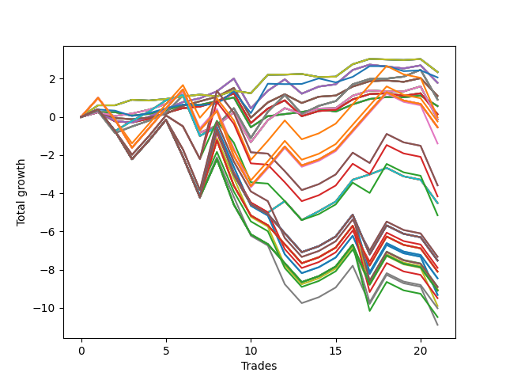

# Short Wallace Doodle 0225_009 
- Symbol: AAPL_Unlimited
- Date Range: 03/23/2022 - 07/08/2022
- Trading Period: 7:20-12:30
- Number of Trades: 21



| Name | Win Percent | Profit | Avg Profit / Trade | Avg Time / Trade |      | Name | Win Percent | Profit | Avg Profit / Trade | Avg Time / Trade |
| ---- | ----------- | ------ | ------------------ | ---------------- | ---- | ---- | ----------- | ------ | ------------------ | ---------------- |
| Sorted By <br> Profit | | | | | | Sorted By <br> Win Percentage ||||
| Seventy | 61.90 | 1175.00 | 55.95 | 16:47 |     | Sixty-Nine | 76.19 | 455.00 | 21.67 | 45:39 |
| Sixty-Two | 61.90 | 1175.00 | 55.95 | 16:47 |     | Sixty-One | 76.19 | 455.00 | 21.67 | 45:39 |
| Fifty-Four | 61.90 | 1175.00 | 55.95 | 16:47 |     | Fifty-Three | 76.19 | 455.00 | 21.67 | 45:39 |
| Forty-Six | 61.90 | 1175.00 | 55.95 | 16:47 |     | Forty-Five | 76.19 | 455.00 | 21.67 | 45:39 |
| Six | 61.90 | 1175.00 | 55.95 | 16:47 |     | Five | 76.19 | 455.00 | 21.67 | 45:39 |
| Seventy-Three | 57.14 | 1035.00 | 49.29 | 13:05 |     | Sixty-Seven | 71.43 | 550.00 | 26.19 | 19:55 |
| Sixty-Six | 66.67 | 895.00 | 42.62 | 22:33 |     | Fifty-Nine | 71.43 | 550.00 | 26.19 | 19:55 |
| Fifty-Eight | 66.67 | 895.00 | 42.62 | 22:33 |     | Fifty-One | 71.43 | 550.00 | 26.19 | 19:55 |
| Fifty | 66.67 | 895.00 | 42.62 | 22:33 |     | Forty-Three | 71.43 | 550.00 | 26.19 | 19:55 |
| Forty-Two | 66.67 | 895.00 | 42.62 | 22:33 |     | Three | 71.43 | 550.00 | 26.19 | 19:55 |
| Two | 66.67 | 895.00 | 42.62 | 22:33 |     | Sixty-Five | 71.43 | 70.00 | 3.33 | 17:28 |
| Sixty-Seven | 71.43 | 550.00 | 26.19 | 19:55 |     | Fifty-Seven | 71.43 | 70.00 | 3.33 | 17:28 |
| Fifty-Nine | 71.43 | 550.00 | 26.19 | 19:55 |     | Forty-Nine | 71.43 | 70.00 | 3.33 | 17:28 |
| Fifty-One | 71.43 | 550.00 | 26.19 | 19:55 |     | Forty-One | 71.43 | 70.00 | 3.33 | 17:28 |
| Forty-Three | 71.43 | 550.00 | 26.19 | 19:55 |     | One | 71.43 | 70.00 | 3.33 | 17:28 |
| Three | 71.43 | 550.00 | 26.19 | 19:55 |     | Sixty-Six | 66.67 | 895.00 | 42.62 | 22:33 |
| Sixty-Nine | 76.19 | 455.00 | 21.67 | 45:39 |     | Fifty-Eight | 66.67 | 895.00 | 42.62 | 22:33 |
| Sixty-One | 76.19 | 455.00 | 21.67 | 45:39 |     | Fifty | 66.67 | 895.00 | 42.62 | 22:33 |
| Fifty-Three | 76.19 | 455.00 | 21.67 | 45:39 |     | Forty-Two | 66.67 | 895.00 | 42.62 | 22:33 |
| Forty-Five | 76.19 | 455.00 | 21.67 | 45:39 |     | Two | 66.67 | 895.00 | 42.62 | 22:33 |
| Five | 76.19 | 455.00 | 21.67 | 45:39 |     | Sixty-Four | 66.67 | 285.00 | 13.57 | 08:34 |
| Sixty-Four | 66.67 | 285.00 | 13.57 | 08:34 |     | Fifty-Six | 66.67 | 285.00 | 13.57 | 08:34 |
| Fifty-Six | 66.67 | 285.00 | 13.57 | 08:34 |     | Forty-Eight | 66.67 | 285.00 | 13.57 | 08:34 |
| Forty-Eight | 66.67 | 285.00 | 13.57 | 08:34 |     | Forty | 66.67 | 285.00 | 13.57 | 08:34 |
| Forty | 66.67 | 285.00 | 13.57 | 08:34 |     | Zero | 66.67 | 285.00 | 13.57 | 08:34 |
| Zero | 66.67 | 285.00 | 13.57 | 08:34 |     | Sixty-Eight | 66.67 | -65.00 | -3.10 | 35:17 |
| Sixty-Five | 71.43 | 70.00 | 3.33 | 17:28 |     | Sixty | 66.67 | -65.00 | -3.10 | 35:17 |
| Fifty-Seven | 71.43 | 70.00 | 3.33 | 17:28 |     | Fifty-Two | 66.67 | -65.00 | -3.10 | 35:17 |
| Forty-Nine | 71.43 | 70.00 | 3.33 | 17:28 |     | Forty-Four | 66.67 | -65.00 | -3.10 | 35:17 |
| Forty-One | 71.43 | 70.00 | 3.33 | 17:28 |     | Four | 66.67 | -65.00 | -3.10 | 35:17 |
| One | 71.43 | 70.00 | 3.33 | 17:28 |     | Seventy | 61.90 | 1175.00 | 55.95 | 16:47 |
| Ninety-Six | 57.14 | -10.00 | -0.48 | 69:50 |     | Sixty-Two | 61.90 | 1175.00 | 55.95 | 16:47 |
| Sixty-Eight | 66.67 | -65.00 | -3.10 | 35:17 |     | Fifty-Four | 61.90 | 1175.00 | 55.95 | 16:47 |
| Sixty | 66.67 | -65.00 | -3.10 | 35:17 |     | Forty-Six | 61.90 | 1175.00 | 55.95 | 16:47 |
| Fifty-Two | 66.67 | -65.00 | -3.10 | 35:17 |     | Six | 61.90 | 1175.00 | 55.95 | 16:47 |
| Forty-Four | 66.67 | -65.00 | -3.10 | 35:17 |     | Seventy-Three | 57.14 | 1035.00 | 49.29 | 13:05 |
| Four | 66.67 | -65.00 | -3.10 | 35:17 |     | Ninety-Six | 57.14 | -10.00 | -0.48 | 69:50 |
| One Hundred Six | 57.14 | -120.00 | -5.71 | 85:45 |     | One Hundred Six | 57.14 | -120.00 | -5.71 | 85:45 |
| One Hundred Twenty-Six | 57.14 | -270.00 | -12.86 | 86:31 |     | One Hundred Twenty-Six | 57.14 | -270.00 | -12.86 | 86:31 |
| One Hundred Twenty-One | 57.14 | -270.00 | -12.86 | 86:31 |     | One Hundred Twenty-One | 57.14 | -270.00 | -12.86 | 86:31 |
| One Hundred Sixteen | 57.14 | -270.00 | -12.86 | 86:31 |     | One Hundred Sixteen | 57.14 | -270.00 | -12.86 | 86:31 |
| One Hundred Eleven | 57.14 | -270.00 | -12.86 | 86:31 |     | One Hundred Eleven | 57.14 | -270.00 | -12.86 | 86:31 |
| One Hundred One | 57.14 | -270.00 | -12.86 | 86:31 |     | One Hundred One | 57.14 | -270.00 | -12.86 | 86:31 |
| Eighty-One | 57.14 | -270.00 | -12.86 | 86:31 |     | Eighty-One | 57.14 | -270.00 | -12.86 | 86:31 |
| Ninety-One | 57.14 | -695.00 | -33.10 | 74:27 |     | Ninety-One | 57.14 | -695.00 | -33.10 | 74:27 |
| One Hundred | 38.10 | -1790.00 | -85.24 | 104:03 |     | Seventy-One | 57.14 | -2255.00 | -107.38 | 80:59 |
| Ninety-Nine | 38.10 | -1790.00 | -85.24 | 104:03 |     | Sixty-Three | 57.14 | -2255.00 | -107.38 | 80:59 |
| Ninety-Eight | 38.10 | -2080.00 | -99.05 | 100:29 |     | Fifty-Five | 57.14 | -2255.00 | -107.38 | 80:59 |
| Seventy-One | 57.14 | -2255.00 | -107.38 | 80:59 |     | Forty-Seven | 57.14 | -2255.00 | -107.38 | 80:59 |
| Sixty-Three | 57.14 | -2255.00 | -107.38 | 80:59 |     | Seven | 57.14 | -2255.00 | -107.38 | 80:59 |
| Fifty-Five | 57.14 | -2255.00 | -107.38 | 80:59 |     | One Hundred | 38.10 | -1790.00 | -85.24 | 104:03 |
| Forty-Seven | 57.14 | -2255.00 | -107.38 | 80:59 |     | Ninety-Nine | 38.10 | -1790.00 | -85.24 | 104:03 |
| Seven | 57.14 | -2255.00 | -107.38 | 80:59 |     | Ninety-Eight | 38.10 | -2080.00 | -99.05 | 100:29 |
| Ninety-Seven | 38.10 | -2575.00 | -122.62 | 93:46 |     | Ninety-Seven | 38.10 | -2575.00 | -122.62 | 93:46 |
| One Hundred Ten | 38.10 | -3660.00 | -174.29 | 127:40 |     | One Hundred Ten | 38.10 | -3660.00 | -174.29 | 127:40 |
| One Hundred Nine | 38.10 | -3660.00 | -174.29 | 127:40 |     | One Hundred Nine | 38.10 | -3660.00 | -174.29 | 127:40 |
| One Hundred Thirty | 38.10 | -3760.00 | -179.05 | 135:28 |     | One Hundred Thirty | 38.10 | -3760.00 | -179.05 | 135:28 |
| One Hundred Twenty-Nine | 38.10 | -3760.00 | -179.05 | 135:28 |     | One Hundred Twenty-Nine | 38.10 | -3760.00 | -179.05 | 135:28 |
| One Hundred Twenty-Five | 38.10 | -3760.00 | -179.05 | 135:28 |     | One Hundred Twenty-Five | 38.10 | -3760.00 | -179.05 | 135:28 |
| One Hundred Twenty-Four | 38.10 | -3760.00 | -179.05 | 135:28 |     | One Hundred Twenty-Four | 38.10 | -3760.00 | -179.05 | 135:28 |
| One Hundred Fifteen | 38.10 | -3760.00 | -179.05 | 135:28 |     | One Hundred Fifteen | 38.10 | -3760.00 | -179.05 | 135:28 |
| One Hundred Fourteen | 38.10 | -3760.00 | -179.05 | 135:28 |     | One Hundred Fourteen | 38.10 | -3760.00 | -179.05 | 135:28 |
| Eighty-Five | 38.10 | -3760.00 | -179.05 | 135:28 |     | Eighty-Five | 38.10 | -3760.00 | -179.05 | 135:28 |
| Eighty-Four | 38.10 | -3760.00 | -179.05 | 135:28 |     | Eighty-Four | 38.10 | -3760.00 | -179.05 | 135:28 |
| One Hundred Eight | 38.10 | -3950.00 | -188.10 | 124:07 |     | One Hundred Eight | 38.10 | -3950.00 | -188.10 | 124:07 |
| One Hundred Twenty-Eight | 38.10 | -4050.00 | -192.86 | 131:54 |     | One Hundred Twenty-Eight | 38.10 | -4050.00 | -192.86 | 131:54 |
| One Hundred Twenty-Three | 38.10 | -4050.00 | -192.86 | 131:54 |     | One Hundred Twenty-Three | 38.10 | -4050.00 | -192.86 | 131:54 |
| One Hundred Thirteen | 38.10 | -4050.00 | -192.86 | 131:54 |     | One Hundred Thirteen | 38.10 | -4050.00 | -192.86 | 131:54 |
| Eighty-Three | 38.10 | -4050.00 | -192.86 | 131:54 |     | Eighty-Three | 38.10 | -4050.00 | -192.86 | 131:54 |
| One Hundred Five | 38.10 | -4225.00 | -201.19 | 134:46 |     | One Hundred Five | 38.10 | -4225.00 | -201.19 | 134:46 |
| One Hundred Four | 38.10 | -4225.00 | -201.19 | 134:46 |     | One Hundred Four | 38.10 | -4225.00 | -201.19 | 134:46 |
| One Hundred Seven | 38.10 | -4445.00 | -211.67 | 117:24 |     | One Hundred Seven | 38.10 | -4445.00 | -211.67 | 117:24 |
| One Hundred Twenty | 38.10 | -4455.00 | -212.14 | 134:54 |     | One Hundred Twenty | 38.10 | -4455.00 | -212.14 | 134:54 |
| One Hundred Ninteen | 38.10 | -4455.00 | -212.14 | 134:54 |     | One Hundred Ninteen | 38.10 | -4455.00 | -212.14 | 134:54 |
| One Hundred Three | 38.10 | -4515.00 | -215.00 | 131:12 |     | One Hundred Three | 38.10 | -4515.00 | -215.00 | 131:12 |
| One Hundred Twenty-Seven | 38.10 | -4545.00 | -216.43 | 125:11 |     | One Hundred Twenty-Seven | 38.10 | -4545.00 | -216.43 | 125:11 |
| One Hundred Twenty-Two | 38.10 | -4545.00 | -216.43 | 125:11 |     | One Hundred Twenty-Two | 38.10 | -4545.00 | -216.43 | 125:11 |
| One Hundred Twelve | 38.10 | -4545.00 | -216.43 | 125:11 |     | One Hundred Twelve | 38.10 | -4545.00 | -216.43 | 125:11 |
| Eighty-Two | 38.10 | -4545.00 | -216.43 | 125:11 |     | Eighty-Two | 38.10 | -4545.00 | -216.43 | 125:11 |
| Ninety-Five | 38.10 | -4660.00 | -221.90 | 118:34 |     | Ninety-Five | 38.10 | -4660.00 | -221.90 | 118:34 |
| Ninety-Four | 38.10 | -4660.00 | -221.90 | 118:34 |     | Ninety-Four | 38.10 | -4660.00 | -221.90 | 118:34 |
| One Hundred Eighteen | 38.10 | -4745.00 | -225.95 | 131:20 |     | One Hundred Eighteen | 38.10 | -4745.00 | -225.95 | 131:20 |
| Ninety-Three | 38.10 | -4950.00 | -235.71 | 115:00 |     | Ninety-Three | 38.10 | -4950.00 | -235.71 | 115:00 |
| One Hundred Two | 38.10 | -5010.00 | -238.57 | 124:29 |     | One Hundred Two | 38.10 | -5010.00 | -238.57 | 124:29 |
| One Hundred Seventeen | 38.10 | -5240.00 | -249.52 | 124:37 |     | One Hundred Seventeen | 38.10 | -5240.00 | -249.52 | 124:37 |
| Ninety-Two | 38.10 | -5445.00 | -259.29 | 108:17 |     | Ninety-Two | 38.10 | -5445.00 | -259.29 | 108:17 |

## NO STOPLOSS

### Test Zero
* Sell when price hits the middle line of the 20p bollinger
* No Stoploss
* Results:
```
Total Trades: 21
Percent Up: 33.33
Percent Down: 66.67
Total Points Moved Down: 0.57
Potential Profit: 285.00
Total Points Ups: 2.44 Count Ups: 7
Total Points Downs: 3.01 Count Downs: 14
```

<details><summary>Trades</summary>

<code>In: 2022-03-25 12:01:00		Out: 2022-03-25 12:02:10		Total Position Time: 01:10		Total Move Down: 0.25		Total to Date: 0.25</code> <br />
<code>In: 2022-03-28 09:57:00		Out: 2022-03-28 10:10:05		Total Position Time: 13:05		Total Move Down: -0.00		Total to Date: 0.25</code> <br />
<code>In: 2022-03-29 08:22:00		Out: 2022-03-29 08:40:35		Total Position Time: 18:35		Total Move Down: -0.18		Total to Date: 0.07</code> <br />
<code>In: 2022-03-30 10:41:00		Out: 2022-03-30 10:44:30		Total Position Time: 03:30		Total Move Down: 0.09		Total to Date: 0.16</code> <br />
<code>In: 2022-03-30 10:43:00		Out: 2022-03-30 10:44:30		Total Position Time: 01:30		Total Move Down: 0.19		Total to Date: 0.35</code> <br />
<code>In: 2022-04-07 09:12:00		Out: 2022-04-07 09:18:10		Total Position Time: 06:10		Total Move Down: 0.28		Total to Date: 0.63</code> <br />
<code>In: 2022-04-07 10:14:00		Out: 2022-04-07 10:35:20		Total Position Time: 21:20		Total Move Down: -0.00		Total to Date: 0.63</code> <br />
<code>In: 2022-04-22 08:11:00		Out: 2022-04-22 08:16:05		Total Position Time: 05:05		Total Move Down: 0.20		Total to Date: 0.83</code> <br />
<code>In: 2022-04-25 09:52:00		Out: 2022-04-25 09:53:10		Total Position Time: 01:10		Total Move Down: 0.19		Total to Date: 1.02</code> <br />
<code>In: 2022-05-20 12:24:00		Out: 2022-05-20 12:47:00		Total Position Time: 23:00		Total Move Down: -1.56		Total to Date: -0.54</code> <br />
<code>In: 2022-05-24 09:17:00		Out: 2022-05-24 09:21:30		Total Position Time: 04:30		Total Move Down: 0.58		Total to Date: 0.04</code> <br />
<code>In: 2022-05-25 11:04:00		Out: 2022-05-25 11:05:40		Total Position Time: 01:40		Total Move Down: 0.11		Total to Date: 0.15</code> <br />
<code>In: 2022-06-01 11:07:00		Out: 2022-06-01 11:11:10		Total Position Time: 04:10		Total Move Down: 0.11		Total to Date: 0.26</code> <br />
<code>In: 2022-06-03 11:31:00		Out: 2022-06-03 11:35:40		Total Position Time: 04:40		Total Move Down: 0.16		Total to Date: 0.42</code> <br />
<code>In: 2022-06-10 11:51:00		Out: 2022-06-10 12:03:25		Total Position Time: 12:25		Total Move Down: -0.14		Total to Date: 0.28</code> <br />
<code>In: 2022-06-10 12:29:00		Out: 2022-06-10 12:31:00		Total Position Time: 02:00		Total Move Down: 0.38		Total to Date: 0.66</code> <br />
<code>In: 2022-06-15 11:02:00		Out: 2022-06-15 11:03:10		Total Position Time: 01:10		Total Move Down: 0.28		Total to Date: 0.94</code> <br />
<code>In: 2022-06-16 09:31:00		Out: 2022-06-16 09:42:10		Total Position Time: 11:10		Total Move Down: 0.10		Total to Date: 1.04</code> <br />
<code>In: 2022-06-24 11:30:00		Out: 2022-06-24 11:39:10		Total Position Time: 09:10		Total Move Down: -0.01		Total to Date: 1.03</code> <br />
<code>In: 2022-06-24 11:51:00		Out: 2022-06-24 12:01:35		Total Position Time: 10:35		Total Move Down: 0.09		Total to Date: 1.12</code> <br />
<code>In: 2022-06-30 08:12:00		Out: 2022-06-30 08:36:00		Total Position Time: 24:00		Total Move Down: -0.55		Total to Date: 0.57</code> <br />


</details>

### Test One
* Sell when the price hits the upper line of the 20p 1std bollinger
* No Stoploss
* Results:
```
Total Trades: 21
Percent Up: 28.57
Percent Down: 71.43
Total Points Moved Down: 0.14
Potential Profit: 70.00
Total Points Ups: 4.16 Count Ups: 6
Total Points Downs: 4.30 Count Downs: 15
```

<details><summary>Trades</summary>

<code>In: 2022-03-25 12:01:00		Out: 2022-03-25 12:02:10		Total Position Time: 01:10		Total Move Down: 0.25		Total to Date: 0.25</code> <br />
<code>In: 2022-03-28 09:57:00		Out: 2022-03-28 10:52:25		Total Position Time: 55:25		Total Move Down: -0.48		Total to Date: -0.23</code> <br />
<code>In: 2022-03-29 08:22:00		Out: 2022-03-29 08:41:15		Total Position Time: 19:15		Total Move Down: -0.06		Total to Date: -0.29</code> <br />
<code>In: 2022-03-30 10:41:00		Out: 2022-03-30 10:45:20		Total Position Time: 04:20		Total Move Down: 0.20		Total to Date: -0.09</code> <br />
<code>In: 2022-03-30 10:43:00		Out: 2022-03-30 10:45:20		Total Position Time: 02:20		Total Move Down: 0.30		Total to Date: 0.21</code> <br />
<code>In: 2022-04-07 09:12:00		Out: 2022-04-07 09:24:05		Total Position Time: 12:05		Total Move Down: 0.25		Total to Date: 0.46</code> <br />
<code>In: 2022-04-07 10:14:00		Out: 2022-04-07 10:37:30		Total Position Time: 23:30		Total Move Down: 0.08		Total to Date: 0.54</code> <br />
<code>In: 2022-04-22 08:11:00		Out: 2022-04-22 08:25:05		Total Position Time: 14:05		Total Move Down: 0.27		Total to Date: 0.81</code> <br />
<code>In: 2022-04-25 09:52:00		Out: 2022-04-25 09:55:05		Total Position Time: 03:05		Total Move Down: 0.43		Total to Date: 1.24</code> <br />
<code>In: 2022-05-20 12:24:00		Out: 2022-05-20 12:47:00		Total Position Time: 23:00		Total Move Down: -1.56		Total to Date: -0.32</code> <br />
<code>In: 2022-05-24 09:17:00		Out: 2022-05-24 09:26:55		Total Position Time: 09:55		Total Move Down: 0.76		Total to Date: 0.44</code> <br />
<code>In: 2022-05-25 11:04:00		Out: 2022-05-25 11:06:35		Total Position Time: 02:35		Total Move Down: 0.43		Total to Date: 0.87</code> <br />
<code>In: 2022-06-01 11:07:00		Out: 2022-06-01 11:46:10		Total Position Time: 39:10		Total Move Down: -0.83		Total to Date: 0.04</code> <br />
<code>In: 2022-06-03 11:31:00		Out: 2022-06-03 11:37:10		Total Position Time: 06:10		Total Move Down: 0.27		Total to Date: 0.31</code> <br />
<code>In: 2022-06-10 11:51:00		Out: 2022-06-10 12:05:10		Total Position Time: 14:10		Total Move Down: 0.06		Total to Date: 0.37</code> <br />
<code>In: 2022-06-10 12:29:00		Out: 2022-06-10 12:42:25		Total Position Time: 13:25		Total Move Down: 0.55		Total to Date: 0.92</code> <br />
<code>In: 2022-06-15 11:02:00		Out: 2022-06-15 11:03:10		Total Position Time: 01:10		Total Move Down: 0.28		Total to Date: 1.20</code> <br />
<code>In: 2022-06-16 09:31:00		Out: 2022-06-16 09:52:10		Total Position Time: 21:10		Total Move Down: 0.04		Total to Date: 1.24</code> <br />
<code>In: 2022-06-24 11:30:00		Out: 2022-06-24 12:04:05		Total Position Time: 34:05		Total Move Down: -0.13		Total to Date: 1.11</code> <br />
<code>In: 2022-06-24 11:51:00		Out: 2022-06-24 12:04:05		Total Position Time: 13:05		Total Move Down: 0.13		Total to Date: 1.24</code> <br />
<code>In: 2022-06-30 08:12:00		Out: 2022-06-30 09:05:45		Total Position Time: 53:45		Total Move Down: -1.10		Total to Date: 0.14</code> <br />


</details>

### Test Two
* Sell when the price hits the upper line of the 20p 2std bollinger
* No Stoploss
* Results:
```
Total Trades: 21
Percent Up: 33.33
Percent Down: 66.67
Total Points Moved Down: 1.79
Potential Profit: 895.00
Total Points Ups: 3.97 Count Ups: 7
Total Points Downs: 5.76 Count Downs: 14
```

<details><summary>Trades</summary>

<code>In: 2022-03-25 12:01:00		Out: 2022-03-25 12:02:10		Total Position Time: 01:10		Total Move Down: 0.25		Total to Date: 0.25</code> <br />
<code>In: 2022-03-28 09:57:00		Out: 2022-03-28 10:54:15		Total Position Time: 57:15		Total Move Down: -0.46		Total to Date: -0.21</code> <br />
<code>In: 2022-03-29 08:22:00		Out: 2022-03-29 08:57:40		Total Position Time: 35:40		Total Move Down: -0.09		Total to Date: -0.30</code> <br />
<code>In: 2022-03-30 10:41:00		Out: 2022-03-30 10:45:40		Total Position Time: 04:40		Total Move Down: 0.31		Total to Date: 0.01</code> <br />
<code>In: 2022-03-30 10:43:00		Out: 2022-03-30 10:45:40		Total Position Time: 02:40		Total Move Down: 0.41		Total to Date: 0.42</code> <br />
<code>In: 2022-04-07 09:12:00		Out: 2022-04-07 09:27:55		Total Position Time: 15:55		Total Move Down: 0.36		Total to Date: 0.78</code> <br />
<code>In: 2022-04-07 10:14:00		Out: 2022-04-07 10:39:55		Total Position Time: 25:55		Total Move Down: 0.20		Total to Date: 0.98</code> <br />
<code>In: 2022-04-22 08:11:00		Out: 2022-04-22 08:26:05		Total Position Time: 15:05		Total Move Down: 0.36		Total to Date: 1.34</code> <br />
<code>In: 2022-04-25 09:52:00		Out: 2022-04-25 09:57:05		Total Position Time: 05:05		Total Move Down: 0.67		Total to Date: 2.01</code> <br />
<code>In: 2022-05-20 12:24:00		Out: 2022-05-20 12:47:00		Total Position Time: 23:00		Total Move Down: -1.56		Total to Date: 0.45</code> <br />
<code>In: 2022-05-24 09:17:00		Out: 2022-05-24 09:31:15		Total Position Time: 14:15		Total Move Down: 0.92		Total to Date: 1.37</code> <br />
<code>In: 2022-05-25 11:04:00		Out: 2022-05-25 11:06:40		Total Position Time: 02:40		Total Move Down: 0.60		Total to Date: 1.97</code> <br />
<code>In: 2022-06-01 11:07:00		Out: 2022-06-01 11:46:35		Total Position Time: 39:35		Total Move Down: -0.75		Total to Date: 1.22</code> <br />
<code>In: 2022-06-03 11:31:00		Out: 2022-06-03 11:38:55		Total Position Time: 07:55		Total Move Down: 0.37		Total to Date: 1.59</code> <br />
<code>In: 2022-06-10 11:51:00		Out: 2022-06-10 12:43:15		Total Position Time: 52:15		Total Move Down: 0.12		Total to Date: 1.71</code> <br />
<code>In: 2022-06-10 12:29:00		Out: 2022-06-10 12:43:15		Total Position Time: 14:15		Total Move Down: 0.75		Total to Date: 2.46</code> <br />
<code>In: 2022-06-15 11:02:00		Out: 2022-06-15 11:03:10		Total Position Time: 01:10		Total Move Down: 0.28		Total to Date: 2.74</code> <br />
<code>In: 2022-06-16 09:31:00		Out: 2022-06-16 10:21:35		Total Position Time: 50:35		Total Move Down: -0.10		Total to Date: 2.64</code> <br />
<code>In: 2022-06-24 11:30:00		Out: 2022-06-24 12:05:40		Total Position Time: 35:40		Total Move Down: -0.10		Total to Date: 2.54</code> <br />
<code>In: 2022-06-24 11:51:00		Out: 2022-06-24 12:05:40		Total Position Time: 14:40		Total Move Down: 0.16		Total to Date: 2.70</code> <br />
<code>In: 2022-06-30 08:12:00		Out: 2022-06-30 09:06:25		Total Position Time: 54:25		Total Move Down: -0.91		Total to Date: 1.79</code> <br />


</details>

### Test Three
* Sell when price hits the middle line of the 50p bollinger
* No Stoploss
* Results:
```
Total Trades: 21
Percent Up: 28.57
Percent Down: 71.43
Total Points Moved Down: 1.10
Potential Profit: 550.00
Total Points Ups: 3.39 Count Ups: 6
Total Points Downs: 4.49 Count Downs: 15
```

<details><summary>Trades</summary>

<code>In: 2022-03-25 12:01:00		Out: 2022-03-25 12:02:10		Total Position Time: 01:10		Total Move Down: 0.25		Total to Date: 0.25</code> <br />
<code>In: 2022-03-28 09:57:00		Out: 2022-03-28 10:55:10		Total Position Time: 58:10		Total Move Down: -0.31		Total to Date: -0.06</code> <br />
<code>In: 2022-03-29 08:22:00		Out: 2022-03-29 08:57:55		Total Position Time: 35:55		Total Move Down: -0.06		Total to Date: -0.12</code> <br />
<code>In: 2022-03-30 10:41:00		Out: 2022-03-30 10:44:30		Total Position Time: 03:30		Total Move Down: 0.09		Total to Date: -0.03</code> <br />
<code>In: 2022-03-30 10:43:00		Out: 2022-03-30 10:44:30		Total Position Time: 01:30		Total Move Down: 0.19		Total to Date: 0.16</code> <br />
<code>In: 2022-04-07 09:12:00		Out: 2022-04-07 09:28:15		Total Position Time: 16:15		Total Move Down: 0.42		Total to Date: 0.58</code> <br />
<code>In: 2022-04-07 10:14:00		Out: 2022-04-07 10:47:20		Total Position Time: 33:20		Total Move Down: 0.24		Total to Date: 0.82</code> <br />
<code>In: 2022-04-22 08:11:00		Out: 2022-04-22 08:18:30		Total Position Time: 07:30		Total Move Down: 0.24		Total to Date: 1.06</code> <br />
<code>In: 2022-04-25 09:52:00		Out: 2022-04-25 09:55:10		Total Position Time: 03:10		Total Move Down: 0.46		Total to Date: 1.52</code> <br />
<code>In: 2022-05-20 12:24:00		Out: 2022-05-20 12:47:00		Total Position Time: 23:00		Total Move Down: -1.56		Total to Date: -0.04</code> <br />
<code>In: 2022-05-24 09:17:00		Out: 2022-05-24 09:30:25		Total Position Time: 13:25		Total Move Down: 0.80		Total to Date: 0.76</code> <br />
<code>In: 2022-05-25 11:04:00		Out: 2022-05-25 11:06:35		Total Position Time: 02:35		Total Move Down: 0.43		Total to Date: 1.19</code> <br />
<code>In: 2022-06-01 11:07:00		Out: 2022-06-01 11:51:15		Total Position Time: 44:15		Total Move Down: -0.46		Total to Date: 0.73</code> <br />
<code>In: 2022-06-03 11:31:00		Out: 2022-06-03 11:37:25		Total Position Time: 06:25		Total Move Down: 0.33		Total to Date: 1.06</code> <br />
<code>In: 2022-06-10 11:51:00		Out: 2022-06-10 12:05:10		Total Position Time: 14:10		Total Move Down: 0.06		Total to Date: 1.12</code> <br />
<code>In: 2022-06-10 12:29:00		Out: 2022-06-10 12:33:05		Total Position Time: 04:05		Total Move Down: 0.47		Total to Date: 1.59</code> <br />
<code>In: 2022-06-15 11:02:00		Out: 2022-06-15 11:03:10		Total Position Time: 01:10		Total Move Down: 0.28		Total to Date: 1.87</code> <br />
<code>In: 2022-06-16 09:31:00		Out: 2022-06-16 10:06:30		Total Position Time: 35:30		Total Move Down: 0.04		Total to Date: 1.91</code> <br />
<code>In: 2022-06-24 11:30:00		Out: 2022-06-24 12:09:55		Total Position Time: 39:55		Total Move Down: -0.07		Total to Date: 1.84</code> <br />
<code>In: 2022-06-24 11:51:00		Out: 2022-06-24 12:09:55		Total Position Time: 18:55		Total Move Down: 0.19		Total to Date: 2.03</code> <br />
<code>In: 2022-06-30 08:12:00		Out: 2022-06-30 09:06:20		Total Position Time: 54:20		Total Move Down: -0.93		Total to Date: 1.10</code> <br />


</details>

### Test Four
* Sell when the price hits the upper line of the 50p 1std bollinger
* No Stoploss
* Results:
```
Total Trades: 21
Percent Up: 33.33
Percent Down: 66.67
Total Points Moved Down: -0.13
Potential Profit: -65.00
Total Points Ups: 5.97 Count Ups: 7
Total Points Downs: 5.84 Count Downs: 14
```

<details><summary>Trades</summary>

<code>In: 2022-03-25 12:01:00		Out: 2022-03-25 12:02:10		Total Position Time: 01:10		Total Move Down: 0.25		Total to Date: 0.25</code> <br />
<code>In: 2022-03-28 09:57:00		Out: 2022-03-28 10:56:45		Total Position Time: 59:45		Total Move Down: -0.20		Total to Date: 0.05</code> <br />
<code>In: 2022-03-29 08:22:00		Out: 2022-03-29 09:01:35		Total Position Time: 39:35		Total Move Down: 0.13		Total to Date: 0.18</code> <br />
<code>In: 2022-03-30 10:41:00		Out: 2022-03-30 10:45:20		Total Position Time: 04:20		Total Move Down: 0.20		Total to Date: 0.38</code> <br />
<code>In: 2022-03-30 10:43:00		Out: 2022-03-30 10:45:20		Total Position Time: 02:20		Total Move Down: 0.30		Total to Date: 0.68</code> <br />
<code>In: 2022-04-07 09:12:00		Out: 2022-04-07 09:34:00		Total Position Time: 22:00		Total Move Down: 0.63		Total to Date: 1.31</code> <br />
<code>In: 2022-04-07 10:14:00		Out: 2022-04-07 12:47:00		Total Position Time: 153:00		Total Move Down: -2.13		Total to Date: -0.82</code> <br />
<code>In: 2022-04-22 08:11:00		Out: 2022-04-22 08:25:15		Total Position Time: 14:15		Total Move Down: 0.37		Total to Date: -0.45</code> <br />
<code>In: 2022-04-25 09:52:00		Out: 2022-04-25 10:01:10		Total Position Time: 09:10		Total Move Down: 0.69		Total to Date: 0.24</code> <br />
<code>In: 2022-05-20 12:24:00		Out: 2022-05-20 12:47:00		Total Position Time: 23:00		Total Move Down: -1.56		Total to Date: -1.32</code> <br />
<code>In: 2022-05-24 09:17:00		Out: 2022-05-24 09:32:55		Total Position Time: 15:55		Total Move Down: 1.15		Total to Date: -0.17</code> <br />
<code>In: 2022-05-25 11:04:00		Out: 2022-05-25 11:06:45		Total Position Time: 02:45		Total Move Down: 0.63		Total to Date: 0.46</code> <br />
<code>In: 2022-06-01 11:07:00		Out: 2022-06-01 12:03:15		Total Position Time: 56:15		Total Move Down: -0.30		Total to Date: 0.16</code> <br />
<code>In: 2022-06-03 11:31:00		Out: 2022-06-03 12:08:00		Total Position Time: 37:00		Total Move Down: 0.28		Total to Date: 0.44</code> <br />
<code>In: 2022-06-10 11:51:00		Out: 2022-06-10 12:42:40		Total Position Time: 51:40		Total Move Down: 0.02		Total to Date: 0.46</code> <br />
<code>In: 2022-06-10 12:29:00		Out: 2022-06-10 12:42:40		Total Position Time: 13:40		Total Move Down: 0.65		Total to Date: 1.11</code> <br />
<code>In: 2022-06-15 11:02:00		Out: 2022-06-15 11:03:10		Total Position Time: 01:10		Total Move Down: 0.28		Total to Date: 1.39</code> <br />
<code>In: 2022-06-16 09:31:00		Out: 2022-06-16 10:23:50		Total Position Time: 52:50		Total Move Down: -0.05		Total to Date: 1.34</code> <br />
<code>In: 2022-06-24 11:30:00		Out: 2022-06-24 12:12:00		Total Position Time: 42:00		Total Move Down: -0.00		Total to Date: 1.34</code> <br />
<code>In: 2022-06-24 11:51:00		Out: 2022-06-24 12:12:00		Total Position Time: 21:00		Total Move Down: 0.26		Total to Date: 1.60</code> <br />
<code>In: 2022-06-30 08:12:00		Out: 2022-06-30 10:10:15		Total Position Time: 118:15		Total Move Down: -1.73		Total to Date: -0.13</code> <br />


</details>

### Test Five
* Sell when the price hits the upper line of the 50p 2std bollinger
* No Stoploss
* Results:
```
Total Trades: 21
Percent Up: 23.81
Percent Down: 76.19
Total Points Moved Down: 0.91
Potential Profit: 455.00
Total Points Ups: 7.38 Count Ups: 5
Total Points Downs: 8.29 Count Downs: 16
```

<details><summary>Trades</summary>

<code>In: 2022-03-25 12:01:00		Out: 2022-03-25 12:02:20		Total Position Time: 01:20		Total Move Down: 0.30		Total to Date: 0.30</code> <br />
<code>In: 2022-03-28 09:57:00		Out: 2022-03-28 12:47:00		Total Position Time: 170:00		Total Move Down: -1.14		Total to Date: -0.84</code> <br />
<code>In: 2022-03-29 08:22:00		Out: 2022-03-29 09:02:20		Total Position Time: 40:20		Total Move Down: 0.34		Total to Date: -0.50</code> <br />
<code>In: 2022-03-30 10:41:00		Out: 2022-03-30 10:45:40		Total Position Time: 04:40		Total Move Down: 0.31		Total to Date: -0.19</code> <br />
<code>In: 2022-03-30 10:43:00		Out: 2022-03-30 10:45:40		Total Position Time: 02:40		Total Move Down: 0.41		Total to Date: 0.22</code> <br />
<code>In: 2022-04-07 09:12:00		Out: 2022-04-07 09:44:05		Total Position Time: 32:05		Total Move Down: 0.91		Total to Date: 1.13</code> <br />
<code>In: 2022-04-07 10:14:00		Out: 2022-04-07 12:47:00		Total Position Time: 153:00		Total Move Down: -2.13		Total to Date: -1.00</code> <br />
<code>In: 2022-04-22 08:11:00		Out: 2022-04-22 08:32:20		Total Position Time: 21:20		Total Move Down: 0.56		Total to Date: -0.44</code> <br />
<code>In: 2022-04-25 09:52:00		Out: 2022-04-25 10:05:25		Total Position Time: 13:25		Total Move Down: 0.90		Total to Date: 0.46</code> <br />
<code>In: 2022-05-20 12:24:00		Out: 2022-05-20 12:47:00		Total Position Time: 23:00		Total Move Down: -1.56		Total to Date: -1.10</code> <br />
<code>In: 2022-05-24 09:17:00		Out: 2022-05-24 09:36:50		Total Position Time: 19:50		Total Move Down: 1.37		Total to Date: 0.27</code> <br />
<code>In: 2022-05-25 11:04:00		Out: 2022-05-25 11:07:10		Total Position Time: 03:10		Total Move Down: 0.88		Total to Date: 1.15</code> <br />
<code>In: 2022-06-01 11:07:00		Out: 2022-06-01 12:47:00		Total Position Time: 100:00		Total Move Down: -0.99		Total to Date: 0.16</code> <br />
<code>In: 2022-06-03 11:31:00		Out: 2022-06-03 12:12:35		Total Position Time: 41:35		Total Move Down: 0.42		Total to Date: 0.58</code> <br />
<code>In: 2022-06-10 11:51:00		Out: 2022-06-10 12:45:25		Total Position Time: 54:25		Total Move Down: 0.25		Total to Date: 0.83</code> <br />
<code>In: 2022-06-10 12:29:00		Out: 2022-06-10 12:45:25		Total Position Time: 16:25		Total Move Down: 0.88		Total to Date: 1.71</code> <br />
<code>In: 2022-06-15 11:02:00		Out: 2022-06-15 11:03:10		Total Position Time: 01:10		Total Move Down: 0.28		Total to Date: 1.99</code> <br />
<code>In: 2022-06-16 09:31:00		Out: 2022-06-16 10:45:10		Total Position Time: 74:10		Total Move Down: 0.02		Total to Date: 2.01</code> <br />
<code>In: 2022-06-24 11:30:00		Out: 2022-06-24 12:13:40		Total Position Time: 43:40		Total Move Down: 0.10		Total to Date: 2.11</code> <br />
<code>In: 2022-06-24 11:51:00		Out: 2022-06-24 12:13:40		Total Position Time: 22:40		Total Move Down: 0.36		Total to Date: 2.47</code> <br />
<code>In: 2022-06-30 08:12:00		Out: 2022-06-30 10:11:50		Total Position Time: 119:50		Total Move Down: -1.56		Total to Date: 0.91</code> <br />


</details>

### Test Six
* Sell when the price hits the middle line of the 1std VWAP
* No Stoploss
* Results:
```
Total Trades: 21
Percent Up: 38.10
Percent Down: 61.90
Total Points Moved Down: 2.35
Potential Profit: 1175.00
Total Points Ups: 1.17 Count Ups: 8
Total Points Downs: 3.52 Count Downs: 13
```

<details><summary>Trades</summary>

<code>In: 2022-03-25 12:01:00		Out: 2022-03-25 12:17:45		Total Position Time: 16:45		Total Move Down: 0.61		Total to Date: 0.61</code> <br />
<code>In: 2022-03-28 09:57:00		Out: 2022-03-28 09:58:45		Total Position Time: 01:45		Total Move Down: -0.00		Total to Date: 0.61</code> <br />
<code>In: 2022-03-29 08:22:00		Out: 2022-03-29 09:02:15		Total Position Time: 40:15		Total Move Down: 0.29		Total to Date: 0.90</code> <br />
<code>In: 2022-03-30 10:41:00		Out: 2022-03-30 10:42:35		Total Position Time: 01:35		Total Move Down: -0.04		Total to Date: 0.86</code> <br />
<code>In: 2022-03-30 10:43:00		Out: 2022-03-30 10:44:10		Total Position Time: 01:10		Total Move Down: 0.08		Total to Date: 0.94</code> <br />
<code>In: 2022-04-07 09:12:00		Out: 2022-04-07 09:13:10		Total Position Time: 01:10		Total Move Down: 0.13		Total to Date: 1.07</code> <br />
<code>In: 2022-04-07 10:14:00		Out: 2022-04-07 10:15:10		Total Position Time: 01:10		Total Move Down: 0.10		Total to Date: 1.17</code> <br />
<code>In: 2022-04-22 08:11:00		Out: 2022-04-22 08:12:10		Total Position Time: 01:10		Total Move Down: -0.09		Total to Date: 1.08</code> <br />
<code>In: 2022-04-25 09:52:00		Out: 2022-04-25 09:54:35		Total Position Time: 02:35		Total Move Down: 0.30		Total to Date: 1.38</code> <br />
<code>In: 2022-05-20 12:24:00		Out: 2022-05-20 12:25:10		Total Position Time: 01:10		Total Move Down: -0.14		Total to Date: 1.24</code> <br />
<code>In: 2022-05-24 09:17:00		Out: 2022-05-24 09:31:20		Total Position Time: 14:20		Total Move Down: 0.97		Total to Date: 2.21</code> <br />
<code>In: 2022-05-25 11:04:00		Out: 2022-05-25 11:05:30		Total Position Time: 01:30		Total Move Down: 0.01		Total to Date: 2.22</code> <br />
<code>In: 2022-06-01 11:07:00		Out: 2022-06-01 11:08:10		Total Position Time: 01:10		Total Move Down: 0.03		Total to Date: 2.25</code> <br />
<code>In: 2022-06-03 11:31:00		Out: 2022-06-03 11:32:10		Total Position Time: 01:10		Total Move Down: -0.16		Total to Date: 2.09</code> <br />
<code>In: 2022-06-10 11:51:00		Out: 2022-06-10 12:04:35		Total Position Time: 13:35		Total Move Down: 0.02		Total to Date: 2.11</code> <br />
<code>In: 2022-06-10 12:29:00		Out: 2022-06-10 12:42:40		Total Position Time: 13:40		Total Move Down: 0.65		Total to Date: 2.76</code> <br />
<code>In: 2022-06-15 11:02:00		Out: 2022-06-15 11:03:10		Total Position Time: 01:10		Total Move Down: 0.28		Total to Date: 3.04</code> <br />
<code>In: 2022-06-16 09:31:00		Out: 2022-06-16 09:32:10		Total Position Time: 01:10		Total Move Down: -0.03		Total to Date: 3.01</code> <br />
<code>In: 2022-06-24 11:30:00		Out: 2022-06-24 11:31:10		Total Position Time: 01:10		Total Move Down: -0.03		Total to Date: 2.98</code> <br />
<code>In: 2022-06-24 11:51:00		Out: 2022-06-24 11:52:10		Total Position Time: 01:10		Total Move Down: 0.05		Total to Date: 3.03</code> <br />
<code>In: 2022-06-30 08:12:00		Out: 2022-06-30 12:05:40		Total Position Time: 233:40		Total Move Down: -0.68		Total to Date: 2.35</code> <br />


</details>

### Test Seven
* Sell when the price hits the upper line of the 1std VWAP
* No Stoploss
* Results:
```
Total Trades: 21
Percent Up: 42.86
Percent Down: 57.14
Total Points Moved Down: -4.51
Potential Profit: -2255.00
Total Points Ups: 10.55 Count Ups: 9
Total Points Downs: 6.04 Count Downs: 12
```

<details><summary>Trades</summary>

<code>In: 2022-03-25 12:01:00		Out: 2022-03-25 12:47:00		Total Position Time: 46:00		Total Move Down: 0.40		Total to Date: 0.40</code> <br />
<code>In: 2022-03-28 09:57:00		Out: 2022-03-28 12:47:00		Total Position Time: 170:00		Total Move Down: -1.14		Total to Date: -0.74</code> <br />
<code>In: 2022-03-29 08:22:00		Out: 2022-03-29 09:31:15		Total Position Time: 69:15		Total Move Down: 0.53		Total to Date: -0.21</code> <br />
<code>In: 2022-03-30 10:41:00		Out: 2022-03-30 11:44:15		Total Position Time: 63:15		Total Move Down: 0.49		Total to Date: 0.28</code> <br />
<code>In: 2022-03-30 10:43:00		Out: 2022-03-30 11:44:15		Total Position Time: 61:15		Total Move Down: 0.59		Total to Date: 0.87</code> <br />
<code>In: 2022-04-07 09:12:00		Out: 2022-04-07 09:18:10		Total Position Time: 06:10		Total Move Down: 0.28		Total to Date: 1.15</code> <br />
<code>In: 2022-04-07 10:14:00		Out: 2022-04-07 12:47:00		Total Position Time: 153:00		Total Move Down: -2.13		Total to Date: -0.98</code> <br />
<code>In: 2022-04-22 08:11:00		Out: 2022-04-22 08:26:10		Total Position Time: 15:10		Total Move Down: 0.42		Total to Date: -0.56</code> <br />
<code>In: 2022-04-25 09:52:00		Out: 2022-04-25 12:47:00		Total Position Time: 175:00		Total Move Down: -2.38		Total to Date: -2.94</code> <br />
<code>In: 2022-05-20 12:24:00		Out: 2022-05-20 12:47:00		Total Position Time: 23:00		Total Move Down: -1.56		Total to Date: -4.50</code> <br />
<code>In: 2022-05-24 09:17:00		Out: 2022-05-24 12:47:00		Total Position Time: 210:00		Total Move Down: -0.51		Total to Date: -5.01</code> <br />
<code>In: 2022-05-25 11:04:00		Out: 2022-05-25 11:06:40		Total Position Time: 02:40		Total Move Down: 0.60		Total to Date: -4.41</code> <br />
<code>In: 2022-06-01 11:07:00		Out: 2022-06-01 12:47:00		Total Position Time: 100:00		Total Move Down: -0.99		Total to Date: -5.40</code> <br />
<code>In: 2022-06-03 11:31:00		Out: 2022-06-03 12:14:25		Total Position Time: 43:25		Total Move Down: 0.46		Total to Date: -4.94</code> <br />
<code>In: 2022-06-10 11:51:00		Out: 2022-06-10 12:47:00		Total Position Time: 56:00		Total Move Down: 0.51		Total to Date: -4.43</code> <br />
<code>In: 2022-06-10 12:29:00		Out: 2022-06-10 12:47:00		Total Position Time: 18:00		Total Move Down: 1.14		Total to Date: -3.29</code> <br />
<code>In: 2022-06-15 11:02:00		Out: 2022-06-15 11:03:10		Total Position Time: 01:10		Total Move Down: 0.28		Total to Date: -3.01</code> <br />
<code>In: 2022-06-16 09:31:00		Out: 2022-06-16 10:50:30		Total Position Time: 79:30		Total Move Down: 0.34		Total to Date: -2.67</code> <br />
<code>In: 2022-06-24 11:30:00		Out: 2022-06-24 12:47:00		Total Position Time: 77:00		Total Move Down: -0.44		Total to Date: -3.11</code> <br />
<code>In: 2022-06-24 11:51:00		Out: 2022-06-24 12:47:00		Total Position Time: 56:00		Total Move Down: -0.18		Total to Date: -3.29</code> <br />
<code>In: 2022-06-30 08:12:00		Out: 2022-06-30 12:47:00		Total Position Time: 275:00		Total Move Down: -1.22		Total to Date: -4.51</code> <br />


</details>

## STOPLOSS OF 5

### Test Forty
* Sell when price hits the middle line of the 20p bollinger
* Stoploss is -5 points
* Results:
```
Total Trades: 21
Percent Up: 33.33
Percent Down: 66.67
Total Points Moved Down: 0.57
Potential Profit: 285.00
Total Points Ups: 2.44 Count Ups: 7
Total Points Downs: 3.01 Count Downs: 14
```

<details><summary>Trades</summary>

<code>In: 2022-03-25 12:01:00		Out: 2022-03-25 12:02:10		Total Position Time: 01:10		Total Move Down: 0.25		Total to Date: 0.25</code> <br />
<code>In: 2022-03-28 09:57:00		Out: 2022-03-28 10:10:05		Total Position Time: 13:05		Total Move Down: -0.00		Total to Date: 0.25</code> <br />
<code>In: 2022-03-29 08:22:00		Out: 2022-03-29 08:40:35		Total Position Time: 18:35		Total Move Down: -0.18		Total to Date: 0.07</code> <br />
<code>In: 2022-03-30 10:41:00		Out: 2022-03-30 10:44:30		Total Position Time: 03:30		Total Move Down: 0.09		Total to Date: 0.16</code> <br />
<code>In: 2022-03-30 10:43:00		Out: 2022-03-30 10:44:30		Total Position Time: 01:30		Total Move Down: 0.19		Total to Date: 0.35</code> <br />
<code>In: 2022-04-07 09:12:00		Out: 2022-04-07 09:18:10		Total Position Time: 06:10		Total Move Down: 0.28		Total to Date: 0.63</code> <br />
<code>In: 2022-04-07 10:14:00		Out: 2022-04-07 10:35:20		Total Position Time: 21:20		Total Move Down: -0.00		Total to Date: 0.63</code> <br />
<code>In: 2022-04-22 08:11:00		Out: 2022-04-22 08:16:05		Total Position Time: 05:05		Total Move Down: 0.20		Total to Date: 0.83</code> <br />
<code>In: 2022-04-25 09:52:00		Out: 2022-04-25 09:53:10		Total Position Time: 01:10		Total Move Down: 0.19		Total to Date: 1.02</code> <br />
<code>In: 2022-05-20 12:24:00		Out: 2022-05-20 12:47:00		Total Position Time: 23:00		Total Move Down: -1.56		Total to Date: -0.54</code> <br />
<code>In: 2022-05-24 09:17:00		Out: 2022-05-24 09:21:30		Total Position Time: 04:30		Total Move Down: 0.58		Total to Date: 0.04</code> <br />
<code>In: 2022-05-25 11:04:00		Out: 2022-05-25 11:05:40		Total Position Time: 01:40		Total Move Down: 0.11		Total to Date: 0.15</code> <br />
<code>In: 2022-06-01 11:07:00		Out: 2022-06-01 11:11:10		Total Position Time: 04:10		Total Move Down: 0.11		Total to Date: 0.26</code> <br />
<code>In: 2022-06-03 11:31:00		Out: 2022-06-03 11:35:40		Total Position Time: 04:40		Total Move Down: 0.16		Total to Date: 0.42</code> <br />
<code>In: 2022-06-10 11:51:00		Out: 2022-06-10 12:03:25		Total Position Time: 12:25		Total Move Down: -0.14		Total to Date: 0.28</code> <br />
<code>In: 2022-06-10 12:29:00		Out: 2022-06-10 12:31:00		Total Position Time: 02:00		Total Move Down: 0.38		Total to Date: 0.66</code> <br />
<code>In: 2022-06-15 11:02:00		Out: 2022-06-15 11:03:10		Total Position Time: 01:10		Total Move Down: 0.28		Total to Date: 0.94</code> <br />
<code>In: 2022-06-16 09:31:00		Out: 2022-06-16 09:42:10		Total Position Time: 11:10		Total Move Down: 0.10		Total to Date: 1.04</code> <br />
<code>In: 2022-06-24 11:30:00		Out: 2022-06-24 11:39:10		Total Position Time: 09:10		Total Move Down: -0.01		Total to Date: 1.03</code> <br />
<code>In: 2022-06-24 11:51:00		Out: 2022-06-24 12:01:35		Total Position Time: 10:35		Total Move Down: 0.09		Total to Date: 1.12</code> <br />
<code>In: 2022-06-30 08:12:00		Out: 2022-06-30 08:36:00		Total Position Time: 24:00		Total Move Down: -0.55		Total to Date: 0.57</code> <br />


</details>

### Test Forty-One
* Sell when the price hits the upper line of the 20p 1std bollinger
* Stoploss is -5 points
* Results:
```
Total Trades: 21
Percent Up: 28.57
Percent Down: 71.43
Total Points Moved Down: 0.14
Potential Profit: 70.00
Total Points Ups: 4.16 Count Ups: 6
Total Points Downs: 4.30 Count Downs: 15
```

<details><summary>Trades</summary>

<code>In: 2022-03-25 12:01:00		Out: 2022-03-25 12:02:10		Total Position Time: 01:10		Total Move Down: 0.25		Total to Date: 0.25</code> <br />
<code>In: 2022-03-28 09:57:00		Out: 2022-03-28 10:52:25		Total Position Time: 55:25		Total Move Down: -0.48		Total to Date: -0.23</code> <br />
<code>In: 2022-03-29 08:22:00		Out: 2022-03-29 08:41:15		Total Position Time: 19:15		Total Move Down: -0.06		Total to Date: -0.29</code> <br />
<code>In: 2022-03-30 10:41:00		Out: 2022-03-30 10:45:20		Total Position Time: 04:20		Total Move Down: 0.20		Total to Date: -0.09</code> <br />
<code>In: 2022-03-30 10:43:00		Out: 2022-03-30 10:45:20		Total Position Time: 02:20		Total Move Down: 0.30		Total to Date: 0.21</code> <br />
<code>In: 2022-04-07 09:12:00		Out: 2022-04-07 09:24:05		Total Position Time: 12:05		Total Move Down: 0.25		Total to Date: 0.46</code> <br />
<code>In: 2022-04-07 10:14:00		Out: 2022-04-07 10:37:30		Total Position Time: 23:30		Total Move Down: 0.08		Total to Date: 0.54</code> <br />
<code>In: 2022-04-22 08:11:00		Out: 2022-04-22 08:25:05		Total Position Time: 14:05		Total Move Down: 0.27		Total to Date: 0.81</code> <br />
<code>In: 2022-04-25 09:52:00		Out: 2022-04-25 09:55:05		Total Position Time: 03:05		Total Move Down: 0.43		Total to Date: 1.24</code> <br />
<code>In: 2022-05-20 12:24:00		Out: 2022-05-20 12:47:00		Total Position Time: 23:00		Total Move Down: -1.56		Total to Date: -0.32</code> <br />
<code>In: 2022-05-24 09:17:00		Out: 2022-05-24 09:26:55		Total Position Time: 09:55		Total Move Down: 0.76		Total to Date: 0.44</code> <br />
<code>In: 2022-05-25 11:04:00		Out: 2022-05-25 11:06:35		Total Position Time: 02:35		Total Move Down: 0.43		Total to Date: 0.87</code> <br />
<code>In: 2022-06-01 11:07:00		Out: 2022-06-01 11:46:10		Total Position Time: 39:10		Total Move Down: -0.83		Total to Date: 0.04</code> <br />
<code>In: 2022-06-03 11:31:00		Out: 2022-06-03 11:37:10		Total Position Time: 06:10		Total Move Down: 0.27		Total to Date: 0.31</code> <br />
<code>In: 2022-06-10 11:51:00		Out: 2022-06-10 12:05:10		Total Position Time: 14:10		Total Move Down: 0.06		Total to Date: 0.37</code> <br />
<code>In: 2022-06-10 12:29:00		Out: 2022-06-10 12:42:25		Total Position Time: 13:25		Total Move Down: 0.55		Total to Date: 0.92</code> <br />
<code>In: 2022-06-15 11:02:00		Out: 2022-06-15 11:03:10		Total Position Time: 01:10		Total Move Down: 0.28		Total to Date: 1.20</code> <br />
<code>In: 2022-06-16 09:31:00		Out: 2022-06-16 09:52:10		Total Position Time: 21:10		Total Move Down: 0.04		Total to Date: 1.24</code> <br />
<code>In: 2022-06-24 11:30:00		Out: 2022-06-24 12:04:05		Total Position Time: 34:05		Total Move Down: -0.13		Total to Date: 1.11</code> <br />
<code>In: 2022-06-24 11:51:00		Out: 2022-06-24 12:04:05		Total Position Time: 13:05		Total Move Down: 0.13		Total to Date: 1.24</code> <br />
<code>In: 2022-06-30 08:12:00		Out: 2022-06-30 09:05:45		Total Position Time: 53:45		Total Move Down: -1.10		Total to Date: 0.14</code> <br />


</details>

### Test Forty-Two
* Sell when the price hits the upper line of the 20p 2std bollinger
* Stoploss is -5 points
* Results:
```
Total Trades: 21
Percent Up: 33.33
Percent Down: 66.67
Total Points Moved Down: 1.79
Potential Profit: 895.00
Total Points Ups: 3.97 Count Ups: 7
Total Points Downs: 5.76 Count Downs: 14
```

<details><summary>Trades</summary>

<code>In: 2022-03-25 12:01:00		Out: 2022-03-25 12:02:10		Total Position Time: 01:10		Total Move Down: 0.25		Total to Date: 0.25</code> <br />
<code>In: 2022-03-28 09:57:00		Out: 2022-03-28 10:54:15		Total Position Time: 57:15		Total Move Down: -0.46		Total to Date: -0.21</code> <br />
<code>In: 2022-03-29 08:22:00		Out: 2022-03-29 08:57:40		Total Position Time: 35:40		Total Move Down: -0.09		Total to Date: -0.30</code> <br />
<code>In: 2022-03-30 10:41:00		Out: 2022-03-30 10:45:40		Total Position Time: 04:40		Total Move Down: 0.31		Total to Date: 0.01</code> <br />
<code>In: 2022-03-30 10:43:00		Out: 2022-03-30 10:45:40		Total Position Time: 02:40		Total Move Down: 0.41		Total to Date: 0.42</code> <br />
<code>In: 2022-04-07 09:12:00		Out: 2022-04-07 09:27:55		Total Position Time: 15:55		Total Move Down: 0.36		Total to Date: 0.78</code> <br />
<code>In: 2022-04-07 10:14:00		Out: 2022-04-07 10:39:55		Total Position Time: 25:55		Total Move Down: 0.20		Total to Date: 0.98</code> <br />
<code>In: 2022-04-22 08:11:00		Out: 2022-04-22 08:26:05		Total Position Time: 15:05		Total Move Down: 0.36		Total to Date: 1.34</code> <br />
<code>In: 2022-04-25 09:52:00		Out: 2022-04-25 09:57:05		Total Position Time: 05:05		Total Move Down: 0.67		Total to Date: 2.01</code> <br />
<code>In: 2022-05-20 12:24:00		Out: 2022-05-20 12:47:00		Total Position Time: 23:00		Total Move Down: -1.56		Total to Date: 0.45</code> <br />
<code>In: 2022-05-24 09:17:00		Out: 2022-05-24 09:31:15		Total Position Time: 14:15		Total Move Down: 0.92		Total to Date: 1.37</code> <br />
<code>In: 2022-05-25 11:04:00		Out: 2022-05-25 11:06:40		Total Position Time: 02:40		Total Move Down: 0.60		Total to Date: 1.97</code> <br />
<code>In: 2022-06-01 11:07:00		Out: 2022-06-01 11:46:35		Total Position Time: 39:35		Total Move Down: -0.75		Total to Date: 1.22</code> <br />
<code>In: 2022-06-03 11:31:00		Out: 2022-06-03 11:38:55		Total Position Time: 07:55		Total Move Down: 0.37		Total to Date: 1.59</code> <br />
<code>In: 2022-06-10 11:51:00		Out: 2022-06-10 12:43:15		Total Position Time: 52:15		Total Move Down: 0.12		Total to Date: 1.71</code> <br />
<code>In: 2022-06-10 12:29:00		Out: 2022-06-10 12:43:15		Total Position Time: 14:15		Total Move Down: 0.75		Total to Date: 2.46</code> <br />
<code>In: 2022-06-15 11:02:00		Out: 2022-06-15 11:03:10		Total Position Time: 01:10		Total Move Down: 0.28		Total to Date: 2.74</code> <br />
<code>In: 2022-06-16 09:31:00		Out: 2022-06-16 10:21:35		Total Position Time: 50:35		Total Move Down: -0.10		Total to Date: 2.64</code> <br />
<code>In: 2022-06-24 11:30:00		Out: 2022-06-24 12:05:40		Total Position Time: 35:40		Total Move Down: -0.10		Total to Date: 2.54</code> <br />
<code>In: 2022-06-24 11:51:00		Out: 2022-06-24 12:05:40		Total Position Time: 14:40		Total Move Down: 0.16		Total to Date: 2.70</code> <br />
<code>In: 2022-06-30 08:12:00		Out: 2022-06-30 09:06:25		Total Position Time: 54:25		Total Move Down: -0.91		Total to Date: 1.79</code> <br />


</details>

### Test Forty-Three
* Sell when price hits the middle line of the 50p bollinger
* Stoploss is -5 points
* Results:
```
Total Trades: 21
Percent Up: 28.57
Percent Down: 71.43
Total Points Moved Down: 1.10
Potential Profit: 550.00
Total Points Ups: 3.39 Count Ups: 6
Total Points Downs: 4.49 Count Downs: 15
```

<details><summary>Trades</summary>

<code>In: 2022-03-25 12:01:00		Out: 2022-03-25 12:02:10		Total Position Time: 01:10		Total Move Down: 0.25		Total to Date: 0.25</code> <br />
<code>In: 2022-03-28 09:57:00		Out: 2022-03-28 10:55:10		Total Position Time: 58:10		Total Move Down: -0.31		Total to Date: -0.06</code> <br />
<code>In: 2022-03-29 08:22:00		Out: 2022-03-29 08:57:55		Total Position Time: 35:55		Total Move Down: -0.06		Total to Date: -0.12</code> <br />
<code>In: 2022-03-30 10:41:00		Out: 2022-03-30 10:44:30		Total Position Time: 03:30		Total Move Down: 0.09		Total to Date: -0.03</code> <br />
<code>In: 2022-03-30 10:43:00		Out: 2022-03-30 10:44:30		Total Position Time: 01:30		Total Move Down: 0.19		Total to Date: 0.16</code> <br />
<code>In: 2022-04-07 09:12:00		Out: 2022-04-07 09:28:15		Total Position Time: 16:15		Total Move Down: 0.42		Total to Date: 0.58</code> <br />
<code>In: 2022-04-07 10:14:00		Out: 2022-04-07 10:47:20		Total Position Time: 33:20		Total Move Down: 0.24		Total to Date: 0.82</code> <br />
<code>In: 2022-04-22 08:11:00		Out: 2022-04-22 08:18:30		Total Position Time: 07:30		Total Move Down: 0.24		Total to Date: 1.06</code> <br />
<code>In: 2022-04-25 09:52:00		Out: 2022-04-25 09:55:10		Total Position Time: 03:10		Total Move Down: 0.46		Total to Date: 1.52</code> <br />
<code>In: 2022-05-20 12:24:00		Out: 2022-05-20 12:47:00		Total Position Time: 23:00		Total Move Down: -1.56		Total to Date: -0.04</code> <br />
<code>In: 2022-05-24 09:17:00		Out: 2022-05-24 09:30:25		Total Position Time: 13:25		Total Move Down: 0.80		Total to Date: 0.76</code> <br />
<code>In: 2022-05-25 11:04:00		Out: 2022-05-25 11:06:35		Total Position Time: 02:35		Total Move Down: 0.43		Total to Date: 1.19</code> <br />
<code>In: 2022-06-01 11:07:00		Out: 2022-06-01 11:51:15		Total Position Time: 44:15		Total Move Down: -0.46		Total to Date: 0.73</code> <br />
<code>In: 2022-06-03 11:31:00		Out: 2022-06-03 11:37:25		Total Position Time: 06:25		Total Move Down: 0.33		Total to Date: 1.06</code> <br />
<code>In: 2022-06-10 11:51:00		Out: 2022-06-10 12:05:10		Total Position Time: 14:10		Total Move Down: 0.06		Total to Date: 1.12</code> <br />
<code>In: 2022-06-10 12:29:00		Out: 2022-06-10 12:33:05		Total Position Time: 04:05		Total Move Down: 0.47		Total to Date: 1.59</code> <br />
<code>In: 2022-06-15 11:02:00		Out: 2022-06-15 11:03:10		Total Position Time: 01:10		Total Move Down: 0.28		Total to Date: 1.87</code> <br />
<code>In: 2022-06-16 09:31:00		Out: 2022-06-16 10:06:30		Total Position Time: 35:30		Total Move Down: 0.04		Total to Date: 1.91</code> <br />
<code>In: 2022-06-24 11:30:00		Out: 2022-06-24 12:09:55		Total Position Time: 39:55		Total Move Down: -0.07		Total to Date: 1.84</code> <br />
<code>In: 2022-06-24 11:51:00		Out: 2022-06-24 12:09:55		Total Position Time: 18:55		Total Move Down: 0.19		Total to Date: 2.03</code> <br />
<code>In: 2022-06-30 08:12:00		Out: 2022-06-30 09:06:20		Total Position Time: 54:20		Total Move Down: -0.93		Total to Date: 1.10</code> <br />


</details>

### Test Forty-Four
* Sell when the price hits the upper line of the 50p 1std bollinger
* Stoploss is -5 points
* Results:
```
Total Trades: 21
Percent Up: 33.33
Percent Down: 66.67
Total Points Moved Down: -0.13
Potential Profit: -65.00
Total Points Ups: 5.97 Count Ups: 7
Total Points Downs: 5.84 Count Downs: 14
```

<details><summary>Trades</summary>

<code>In: 2022-03-25 12:01:00		Out: 2022-03-25 12:02:10		Total Position Time: 01:10		Total Move Down: 0.25		Total to Date: 0.25</code> <br />
<code>In: 2022-03-28 09:57:00		Out: 2022-03-28 10:56:45		Total Position Time: 59:45		Total Move Down: -0.20		Total to Date: 0.05</code> <br />
<code>In: 2022-03-29 08:22:00		Out: 2022-03-29 09:01:35		Total Position Time: 39:35		Total Move Down: 0.13		Total to Date: 0.18</code> <br />
<code>In: 2022-03-30 10:41:00		Out: 2022-03-30 10:45:20		Total Position Time: 04:20		Total Move Down: 0.20		Total to Date: 0.38</code> <br />
<code>In: 2022-03-30 10:43:00		Out: 2022-03-30 10:45:20		Total Position Time: 02:20		Total Move Down: 0.30		Total to Date: 0.68</code> <br />
<code>In: 2022-04-07 09:12:00		Out: 2022-04-07 09:34:00		Total Position Time: 22:00		Total Move Down: 0.63		Total to Date: 1.31</code> <br />
<code>In: 2022-04-07 10:14:00		Out: 2022-04-07 12:47:00		Total Position Time: 153:00		Total Move Down: -2.13		Total to Date: -0.82</code> <br />
<code>In: 2022-04-22 08:11:00		Out: 2022-04-22 08:25:15		Total Position Time: 14:15		Total Move Down: 0.37		Total to Date: -0.45</code> <br />
<code>In: 2022-04-25 09:52:00		Out: 2022-04-25 10:01:10		Total Position Time: 09:10		Total Move Down: 0.69		Total to Date: 0.24</code> <br />
<code>In: 2022-05-20 12:24:00		Out: 2022-05-20 12:47:00		Total Position Time: 23:00		Total Move Down: -1.56		Total to Date: -1.32</code> <br />
<code>In: 2022-05-24 09:17:00		Out: 2022-05-24 09:32:55		Total Position Time: 15:55		Total Move Down: 1.15		Total to Date: -0.17</code> <br />
<code>In: 2022-05-25 11:04:00		Out: 2022-05-25 11:06:45		Total Position Time: 02:45		Total Move Down: 0.63		Total to Date: 0.46</code> <br />
<code>In: 2022-06-01 11:07:00		Out: 2022-06-01 12:03:15		Total Position Time: 56:15		Total Move Down: -0.30		Total to Date: 0.16</code> <br />
<code>In: 2022-06-03 11:31:00		Out: 2022-06-03 12:08:00		Total Position Time: 37:00		Total Move Down: 0.28		Total to Date: 0.44</code> <br />
<code>In: 2022-06-10 11:51:00		Out: 2022-06-10 12:42:40		Total Position Time: 51:40		Total Move Down: 0.02		Total to Date: 0.46</code> <br />
<code>In: 2022-06-10 12:29:00		Out: 2022-06-10 12:42:40		Total Position Time: 13:40		Total Move Down: 0.65		Total to Date: 1.11</code> <br />
<code>In: 2022-06-15 11:02:00		Out: 2022-06-15 11:03:10		Total Position Time: 01:10		Total Move Down: 0.28		Total to Date: 1.39</code> <br />
<code>In: 2022-06-16 09:31:00		Out: 2022-06-16 10:23:50		Total Position Time: 52:50		Total Move Down: -0.05		Total to Date: 1.34</code> <br />
<code>In: 2022-06-24 11:30:00		Out: 2022-06-24 12:12:00		Total Position Time: 42:00		Total Move Down: -0.00		Total to Date: 1.34</code> <br />
<code>In: 2022-06-24 11:51:00		Out: 2022-06-24 12:12:00		Total Position Time: 21:00		Total Move Down: 0.26		Total to Date: 1.60</code> <br />
<code>In: 2022-06-30 08:12:00		Out: 2022-06-30 10:10:15		Total Position Time: 118:15		Total Move Down: -1.73		Total to Date: -0.13</code> <br />


</details>

### Test Forty-Five
* Sell when the price hits the upper line of the 50p 2std bollinger
* Stoploss is -5 points
* Results:
```
Total Trades: 21
Percent Up: 23.81
Percent Down: 76.19
Total Points Moved Down: 0.91
Potential Profit: 455.00
Total Points Ups: 7.38 Count Ups: 5
Total Points Downs: 8.29 Count Downs: 16
```

<details><summary>Trades</summary>

<code>In: 2022-03-25 12:01:00		Out: 2022-03-25 12:02:20		Total Position Time: 01:20		Total Move Down: 0.30		Total to Date: 0.30</code> <br />
<code>In: 2022-03-28 09:57:00		Out: 2022-03-28 12:47:00		Total Position Time: 170:00		Total Move Down: -1.14		Total to Date: -0.84</code> <br />
<code>In: 2022-03-29 08:22:00		Out: 2022-03-29 09:02:20		Total Position Time: 40:20		Total Move Down: 0.34		Total to Date: -0.50</code> <br />
<code>In: 2022-03-30 10:41:00		Out: 2022-03-30 10:45:40		Total Position Time: 04:40		Total Move Down: 0.31		Total to Date: -0.19</code> <br />
<code>In: 2022-03-30 10:43:00		Out: 2022-03-30 10:45:40		Total Position Time: 02:40		Total Move Down: 0.41		Total to Date: 0.22</code> <br />
<code>In: 2022-04-07 09:12:00		Out: 2022-04-07 09:44:05		Total Position Time: 32:05		Total Move Down: 0.91		Total to Date: 1.13</code> <br />
<code>In: 2022-04-07 10:14:00		Out: 2022-04-07 12:47:00		Total Position Time: 153:00		Total Move Down: -2.13		Total to Date: -1.00</code> <br />
<code>In: 2022-04-22 08:11:00		Out: 2022-04-22 08:32:20		Total Position Time: 21:20		Total Move Down: 0.56		Total to Date: -0.44</code> <br />
<code>In: 2022-04-25 09:52:00		Out: 2022-04-25 10:05:25		Total Position Time: 13:25		Total Move Down: 0.90		Total to Date: 0.46</code> <br />
<code>In: 2022-05-20 12:24:00		Out: 2022-05-20 12:47:00		Total Position Time: 23:00		Total Move Down: -1.56		Total to Date: -1.10</code> <br />
<code>In: 2022-05-24 09:17:00		Out: 2022-05-24 09:36:50		Total Position Time: 19:50		Total Move Down: 1.37		Total to Date: 0.27</code> <br />
<code>In: 2022-05-25 11:04:00		Out: 2022-05-25 11:07:10		Total Position Time: 03:10		Total Move Down: 0.88		Total to Date: 1.15</code> <br />
<code>In: 2022-06-01 11:07:00		Out: 2022-06-01 12:47:00		Total Position Time: 100:00		Total Move Down: -0.99		Total to Date: 0.16</code> <br />
<code>In: 2022-06-03 11:31:00		Out: 2022-06-03 12:12:35		Total Position Time: 41:35		Total Move Down: 0.42		Total to Date: 0.58</code> <br />
<code>In: 2022-06-10 11:51:00		Out: 2022-06-10 12:45:25		Total Position Time: 54:25		Total Move Down: 0.25		Total to Date: 0.83</code> <br />
<code>In: 2022-06-10 12:29:00		Out: 2022-06-10 12:45:25		Total Position Time: 16:25		Total Move Down: 0.88		Total to Date: 1.71</code> <br />
<code>In: 2022-06-15 11:02:00		Out: 2022-06-15 11:03:10		Total Position Time: 01:10		Total Move Down: 0.28		Total to Date: 1.99</code> <br />
<code>In: 2022-06-16 09:31:00		Out: 2022-06-16 10:45:10		Total Position Time: 74:10		Total Move Down: 0.02		Total to Date: 2.01</code> <br />
<code>In: 2022-06-24 11:30:00		Out: 2022-06-24 12:13:40		Total Position Time: 43:40		Total Move Down: 0.10		Total to Date: 2.11</code> <br />
<code>In: 2022-06-24 11:51:00		Out: 2022-06-24 12:13:40		Total Position Time: 22:40		Total Move Down: 0.36		Total to Date: 2.47</code> <br />
<code>In: 2022-06-30 08:12:00		Out: 2022-06-30 10:11:50		Total Position Time: 119:50		Total Move Down: -1.56		Total to Date: 0.91</code> <br />


</details>

### Test Forty-Six
* Sell when the price hits the middle line of the 1std VWAP
* Stoploss is -5 points
* Results:
```
Total Trades: 21
Percent Up: 38.10
Percent Down: 61.90
Total Points Moved Down: 2.35
Potential Profit: 1175.00
Total Points Ups: 1.17 Count Ups: 8
Total Points Downs: 3.52 Count Downs: 13
```

<details><summary>Trades</summary>

<code>In: 2022-03-25 12:01:00		Out: 2022-03-25 12:17:45		Total Position Time: 16:45		Total Move Down: 0.61		Total to Date: 0.61</code> <br />
<code>In: 2022-03-28 09:57:00		Out: 2022-03-28 09:58:45		Total Position Time: 01:45		Total Move Down: -0.00		Total to Date: 0.61</code> <br />
<code>In: 2022-03-29 08:22:00		Out: 2022-03-29 09:02:15		Total Position Time: 40:15		Total Move Down: 0.29		Total to Date: 0.90</code> <br />
<code>In: 2022-03-30 10:41:00		Out: 2022-03-30 10:42:35		Total Position Time: 01:35		Total Move Down: -0.04		Total to Date: 0.86</code> <br />
<code>In: 2022-03-30 10:43:00		Out: 2022-03-30 10:44:10		Total Position Time: 01:10		Total Move Down: 0.08		Total to Date: 0.94</code> <br />
<code>In: 2022-04-07 09:12:00		Out: 2022-04-07 09:13:10		Total Position Time: 01:10		Total Move Down: 0.13		Total to Date: 1.07</code> <br />
<code>In: 2022-04-07 10:14:00		Out: 2022-04-07 10:15:10		Total Position Time: 01:10		Total Move Down: 0.10		Total to Date: 1.17</code> <br />
<code>In: 2022-04-22 08:11:00		Out: 2022-04-22 08:12:10		Total Position Time: 01:10		Total Move Down: -0.09		Total to Date: 1.08</code> <br />
<code>In: 2022-04-25 09:52:00		Out: 2022-04-25 09:54:35		Total Position Time: 02:35		Total Move Down: 0.30		Total to Date: 1.38</code> <br />
<code>In: 2022-05-20 12:24:00		Out: 2022-05-20 12:25:10		Total Position Time: 01:10		Total Move Down: -0.14		Total to Date: 1.24</code> <br />
<code>In: 2022-05-24 09:17:00		Out: 2022-05-24 09:31:20		Total Position Time: 14:20		Total Move Down: 0.97		Total to Date: 2.21</code> <br />
<code>In: 2022-05-25 11:04:00		Out: 2022-05-25 11:05:30		Total Position Time: 01:30		Total Move Down: 0.01		Total to Date: 2.22</code> <br />
<code>In: 2022-06-01 11:07:00		Out: 2022-06-01 11:08:10		Total Position Time: 01:10		Total Move Down: 0.03		Total to Date: 2.25</code> <br />
<code>In: 2022-06-03 11:31:00		Out: 2022-06-03 11:32:10		Total Position Time: 01:10		Total Move Down: -0.16		Total to Date: 2.09</code> <br />
<code>In: 2022-06-10 11:51:00		Out: 2022-06-10 12:04:35		Total Position Time: 13:35		Total Move Down: 0.02		Total to Date: 2.11</code> <br />
<code>In: 2022-06-10 12:29:00		Out: 2022-06-10 12:42:40		Total Position Time: 13:40		Total Move Down: 0.65		Total to Date: 2.76</code> <br />
<code>In: 2022-06-15 11:02:00		Out: 2022-06-15 11:03:10		Total Position Time: 01:10		Total Move Down: 0.28		Total to Date: 3.04</code> <br />
<code>In: 2022-06-16 09:31:00		Out: 2022-06-16 09:32:10		Total Position Time: 01:10		Total Move Down: -0.03		Total to Date: 3.01</code> <br />
<code>In: 2022-06-24 11:30:00		Out: 2022-06-24 11:31:10		Total Position Time: 01:10		Total Move Down: -0.03		Total to Date: 2.98</code> <br />
<code>In: 2022-06-24 11:51:00		Out: 2022-06-24 11:52:10		Total Position Time: 01:10		Total Move Down: 0.05		Total to Date: 3.03</code> <br />
<code>In: 2022-06-30 08:12:00		Out: 2022-06-30 12:05:40		Total Position Time: 233:40		Total Move Down: -0.68		Total to Date: 2.35</code> <br />


</details>

### Test Forty-Seven
* Sell when the price hits the upper line of the 1std VWAP
* Stoploss is -5 points
* Results:
```
Total Trades: 21
Percent Up: 42.86
Percent Down: 57.14
Total Points Moved Down: -4.51
Potential Profit: -2255.00
Total Points Ups: 10.55 Count Ups: 9
Total Points Downs: 6.04 Count Downs: 12
```

<details><summary>Trades</summary>

<code>In: 2022-03-25 12:01:00		Out: 2022-03-25 12:47:00		Total Position Time: 46:00		Total Move Down: 0.40		Total to Date: 0.40</code> <br />
<code>In: 2022-03-28 09:57:00		Out: 2022-03-28 12:47:00		Total Position Time: 170:00		Total Move Down: -1.14		Total to Date: -0.74</code> <br />
<code>In: 2022-03-29 08:22:00		Out: 2022-03-29 09:31:15		Total Position Time: 69:15		Total Move Down: 0.53		Total to Date: -0.21</code> <br />
<code>In: 2022-03-30 10:41:00		Out: 2022-03-30 11:44:15		Total Position Time: 63:15		Total Move Down: 0.49		Total to Date: 0.28</code> <br />
<code>In: 2022-03-30 10:43:00		Out: 2022-03-30 11:44:15		Total Position Time: 61:15		Total Move Down: 0.59		Total to Date: 0.87</code> <br />
<code>In: 2022-04-07 09:12:00		Out: 2022-04-07 09:18:10		Total Position Time: 06:10		Total Move Down: 0.28		Total to Date: 1.15</code> <br />
<code>In: 2022-04-07 10:14:00		Out: 2022-04-07 12:47:00		Total Position Time: 153:00		Total Move Down: -2.13		Total to Date: -0.98</code> <br />
<code>In: 2022-04-22 08:11:00		Out: 2022-04-22 08:26:10		Total Position Time: 15:10		Total Move Down: 0.42		Total to Date: -0.56</code> <br />
<code>In: 2022-04-25 09:52:00		Out: 2022-04-25 12:47:00		Total Position Time: 175:00		Total Move Down: -2.38		Total to Date: -2.94</code> <br />
<code>In: 2022-05-20 12:24:00		Out: 2022-05-20 12:47:00		Total Position Time: 23:00		Total Move Down: -1.56		Total to Date: -4.50</code> <br />
<code>In: 2022-05-24 09:17:00		Out: 2022-05-24 12:47:00		Total Position Time: 210:00		Total Move Down: -0.51		Total to Date: -5.01</code> <br />
<code>In: 2022-05-25 11:04:00		Out: 2022-05-25 11:06:40		Total Position Time: 02:40		Total Move Down: 0.60		Total to Date: -4.41</code> <br />
<code>In: 2022-06-01 11:07:00		Out: 2022-06-01 12:47:00		Total Position Time: 100:00		Total Move Down: -0.99		Total to Date: -5.40</code> <br />
<code>In: 2022-06-03 11:31:00		Out: 2022-06-03 12:14:25		Total Position Time: 43:25		Total Move Down: 0.46		Total to Date: -4.94</code> <br />
<code>In: 2022-06-10 11:51:00		Out: 2022-06-10 12:47:00		Total Position Time: 56:00		Total Move Down: 0.51		Total to Date: -4.43</code> <br />
<code>In: 2022-06-10 12:29:00		Out: 2022-06-10 12:47:00		Total Position Time: 18:00		Total Move Down: 1.14		Total to Date: -3.29</code> <br />
<code>In: 2022-06-15 11:02:00		Out: 2022-06-15 11:03:10		Total Position Time: 01:10		Total Move Down: 0.28		Total to Date: -3.01</code> <br />
<code>In: 2022-06-16 09:31:00		Out: 2022-06-16 10:50:30		Total Position Time: 79:30		Total Move Down: 0.34		Total to Date: -2.67</code> <br />
<code>In: 2022-06-24 11:30:00		Out: 2022-06-24 12:47:00		Total Position Time: 77:00		Total Move Down: -0.44		Total to Date: -3.11</code> <br />
<code>In: 2022-06-24 11:51:00		Out: 2022-06-24 12:47:00		Total Position Time: 56:00		Total Move Down: -0.18		Total to Date: -3.29</code> <br />
<code>In: 2022-06-30 08:12:00		Out: 2022-06-30 12:47:00		Total Position Time: 275:00		Total Move Down: -1.22		Total to Date: -4.51</code> <br />


</details>

## TRAIL STOP OF 5

### Test Forty-Eight
* Sell when price hits the middle line of the 20p bollinger
* Trailing Stop is -5 points
* Results:
```
Total Trades: 21
Percent Up: 33.33
Percent Down: 66.67
Total Points Moved Down: 0.57
Potential Profit: 285.00
Total Points Ups: 2.44 Count Ups: 7
Total Points Downs: 3.01 Count Downs: 14
```

<details><summary>Trades</summary>

<code>In: 2022-03-25 12:01:00		Out: 2022-03-25 12:02:10		Total Position Time: 01:10		Total Move Down: 0.25		Total to Date: 0.25</code> <br />
<code>In: 2022-03-28 09:57:00		Out: 2022-03-28 10:10:05		Total Position Time: 13:05		Total Move Down: -0.00		Total to Date: 0.25</code> <br />
<code>In: 2022-03-29 08:22:00		Out: 2022-03-29 08:40:35		Total Position Time: 18:35		Total Move Down: -0.18		Total to Date: 0.07</code> <br />
<code>In: 2022-03-30 10:41:00		Out: 2022-03-30 10:44:30		Total Position Time: 03:30		Total Move Down: 0.09		Total to Date: 0.16</code> <br />
<code>In: 2022-03-30 10:43:00		Out: 2022-03-30 10:44:30		Total Position Time: 01:30		Total Move Down: 0.19		Total to Date: 0.35</code> <br />
<code>In: 2022-04-07 09:12:00		Out: 2022-04-07 09:18:10		Total Position Time: 06:10		Total Move Down: 0.28		Total to Date: 0.63</code> <br />
<code>In: 2022-04-07 10:14:00		Out: 2022-04-07 10:35:20		Total Position Time: 21:20		Total Move Down: -0.00		Total to Date: 0.63</code> <br />
<code>In: 2022-04-22 08:11:00		Out: 2022-04-22 08:16:05		Total Position Time: 05:05		Total Move Down: 0.20		Total to Date: 0.83</code> <br />
<code>In: 2022-04-25 09:52:00		Out: 2022-04-25 09:53:10		Total Position Time: 01:10		Total Move Down: 0.19		Total to Date: 1.02</code> <br />
<code>In: 2022-05-20 12:24:00		Out: 2022-05-20 12:47:00		Total Position Time: 23:00		Total Move Down: -1.56		Total to Date: -0.54</code> <br />
<code>In: 2022-05-24 09:17:00		Out: 2022-05-24 09:21:30		Total Position Time: 04:30		Total Move Down: 0.58		Total to Date: 0.04</code> <br />
<code>In: 2022-05-25 11:04:00		Out: 2022-05-25 11:05:40		Total Position Time: 01:40		Total Move Down: 0.11		Total to Date: 0.15</code> <br />
<code>In: 2022-06-01 11:07:00		Out: 2022-06-01 11:11:10		Total Position Time: 04:10		Total Move Down: 0.11		Total to Date: 0.26</code> <br />
<code>In: 2022-06-03 11:31:00		Out: 2022-06-03 11:35:40		Total Position Time: 04:40		Total Move Down: 0.16		Total to Date: 0.42</code> <br />
<code>In: 2022-06-10 11:51:00		Out: 2022-06-10 12:03:25		Total Position Time: 12:25		Total Move Down: -0.14		Total to Date: 0.28</code> <br />
<code>In: 2022-06-10 12:29:00		Out: 2022-06-10 12:31:00		Total Position Time: 02:00		Total Move Down: 0.38		Total to Date: 0.66</code> <br />
<code>In: 2022-06-15 11:02:00		Out: 2022-06-15 11:03:10		Total Position Time: 01:10		Total Move Down: 0.28		Total to Date: 0.94</code> <br />
<code>In: 2022-06-16 09:31:00		Out: 2022-06-16 09:42:10		Total Position Time: 11:10		Total Move Down: 0.10		Total to Date: 1.04</code> <br />
<code>In: 2022-06-24 11:30:00		Out: 2022-06-24 11:39:10		Total Position Time: 09:10		Total Move Down: -0.01		Total to Date: 1.03</code> <br />
<code>In: 2022-06-24 11:51:00		Out: 2022-06-24 12:01:35		Total Position Time: 10:35		Total Move Down: 0.09		Total to Date: 1.12</code> <br />
<code>In: 2022-06-30 08:12:00		Out: 2022-06-30 08:36:00		Total Position Time: 24:00		Total Move Down: -0.55		Total to Date: 0.57</code> <br />


</details>

### Test Forty-Nine
* Sell when the price hits the upper line of the 20p 1std bollinger
* Trailing Stop is -5 points
* Results:
```
Total Trades: 21
Percent Up: 28.57
Percent Down: 71.43
Total Points Moved Down: 0.14
Potential Profit: 70.00
Total Points Ups: 4.16 Count Ups: 6
Total Points Downs: 4.30 Count Downs: 15
```

<details><summary>Trades</summary>

<code>In: 2022-03-25 12:01:00		Out: 2022-03-25 12:02:10		Total Position Time: 01:10		Total Move Down: 0.25		Total to Date: 0.25</code> <br />
<code>In: 2022-03-28 09:57:00		Out: 2022-03-28 10:52:25		Total Position Time: 55:25		Total Move Down: -0.48		Total to Date: -0.23</code> <br />
<code>In: 2022-03-29 08:22:00		Out: 2022-03-29 08:41:15		Total Position Time: 19:15		Total Move Down: -0.06		Total to Date: -0.29</code> <br />
<code>In: 2022-03-30 10:41:00		Out: 2022-03-30 10:45:20		Total Position Time: 04:20		Total Move Down: 0.20		Total to Date: -0.09</code> <br />
<code>In: 2022-03-30 10:43:00		Out: 2022-03-30 10:45:20		Total Position Time: 02:20		Total Move Down: 0.30		Total to Date: 0.21</code> <br />
<code>In: 2022-04-07 09:12:00		Out: 2022-04-07 09:24:05		Total Position Time: 12:05		Total Move Down: 0.25		Total to Date: 0.46</code> <br />
<code>In: 2022-04-07 10:14:00		Out: 2022-04-07 10:37:30		Total Position Time: 23:30		Total Move Down: 0.08		Total to Date: 0.54</code> <br />
<code>In: 2022-04-22 08:11:00		Out: 2022-04-22 08:25:05		Total Position Time: 14:05		Total Move Down: 0.27		Total to Date: 0.81</code> <br />
<code>In: 2022-04-25 09:52:00		Out: 2022-04-25 09:55:05		Total Position Time: 03:05		Total Move Down: 0.43		Total to Date: 1.24</code> <br />
<code>In: 2022-05-20 12:24:00		Out: 2022-05-20 12:47:00		Total Position Time: 23:00		Total Move Down: -1.56		Total to Date: -0.32</code> <br />
<code>In: 2022-05-24 09:17:00		Out: 2022-05-24 09:26:55		Total Position Time: 09:55		Total Move Down: 0.76		Total to Date: 0.44</code> <br />
<code>In: 2022-05-25 11:04:00		Out: 2022-05-25 11:06:35		Total Position Time: 02:35		Total Move Down: 0.43		Total to Date: 0.87</code> <br />
<code>In: 2022-06-01 11:07:00		Out: 2022-06-01 11:46:10		Total Position Time: 39:10		Total Move Down: -0.83		Total to Date: 0.04</code> <br />
<code>In: 2022-06-03 11:31:00		Out: 2022-06-03 11:37:10		Total Position Time: 06:10		Total Move Down: 0.27		Total to Date: 0.31</code> <br />
<code>In: 2022-06-10 11:51:00		Out: 2022-06-10 12:05:10		Total Position Time: 14:10		Total Move Down: 0.06		Total to Date: 0.37</code> <br />
<code>In: 2022-06-10 12:29:00		Out: 2022-06-10 12:42:25		Total Position Time: 13:25		Total Move Down: 0.55		Total to Date: 0.92</code> <br />
<code>In: 2022-06-15 11:02:00		Out: 2022-06-15 11:03:10		Total Position Time: 01:10		Total Move Down: 0.28		Total to Date: 1.20</code> <br />
<code>In: 2022-06-16 09:31:00		Out: 2022-06-16 09:52:10		Total Position Time: 21:10		Total Move Down: 0.04		Total to Date: 1.24</code> <br />
<code>In: 2022-06-24 11:30:00		Out: 2022-06-24 12:04:05		Total Position Time: 34:05		Total Move Down: -0.13		Total to Date: 1.11</code> <br />
<code>In: 2022-06-24 11:51:00		Out: 2022-06-24 12:04:05		Total Position Time: 13:05		Total Move Down: 0.13		Total to Date: 1.24</code> <br />
<code>In: 2022-06-30 08:12:00		Out: 2022-06-30 09:05:45		Total Position Time: 53:45		Total Move Down: -1.10		Total to Date: 0.14</code> <br />


</details>

### Test Fifty
* Sell when the price hits the upper line of the 20p 2std bollinger
* Trailing Stop is -5 points
* Results:
```
Total Trades: 21
Percent Up: 33.33
Percent Down: 66.67
Total Points Moved Down: 1.79
Potential Profit: 895.00
Total Points Ups: 3.97 Count Ups: 7
Total Points Downs: 5.76 Count Downs: 14
```

<details><summary>Trades</summary>

<code>In: 2022-03-25 12:01:00		Out: 2022-03-25 12:02:10		Total Position Time: 01:10		Total Move Down: 0.25		Total to Date: 0.25</code> <br />
<code>In: 2022-03-28 09:57:00		Out: 2022-03-28 10:54:15		Total Position Time: 57:15		Total Move Down: -0.46		Total to Date: -0.21</code> <br />
<code>In: 2022-03-29 08:22:00		Out: 2022-03-29 08:57:40		Total Position Time: 35:40		Total Move Down: -0.09		Total to Date: -0.30</code> <br />
<code>In: 2022-03-30 10:41:00		Out: 2022-03-30 10:45:40		Total Position Time: 04:40		Total Move Down: 0.31		Total to Date: 0.01</code> <br />
<code>In: 2022-03-30 10:43:00		Out: 2022-03-30 10:45:40		Total Position Time: 02:40		Total Move Down: 0.41		Total to Date: 0.42</code> <br />
<code>In: 2022-04-07 09:12:00		Out: 2022-04-07 09:27:55		Total Position Time: 15:55		Total Move Down: 0.36		Total to Date: 0.78</code> <br />
<code>In: 2022-04-07 10:14:00		Out: 2022-04-07 10:39:55		Total Position Time: 25:55		Total Move Down: 0.20		Total to Date: 0.98</code> <br />
<code>In: 2022-04-22 08:11:00		Out: 2022-04-22 08:26:05		Total Position Time: 15:05		Total Move Down: 0.36		Total to Date: 1.34</code> <br />
<code>In: 2022-04-25 09:52:00		Out: 2022-04-25 09:57:05		Total Position Time: 05:05		Total Move Down: 0.67		Total to Date: 2.01</code> <br />
<code>In: 2022-05-20 12:24:00		Out: 2022-05-20 12:47:00		Total Position Time: 23:00		Total Move Down: -1.56		Total to Date: 0.45</code> <br />
<code>In: 2022-05-24 09:17:00		Out: 2022-05-24 09:31:15		Total Position Time: 14:15		Total Move Down: 0.92		Total to Date: 1.37</code> <br />
<code>In: 2022-05-25 11:04:00		Out: 2022-05-25 11:06:40		Total Position Time: 02:40		Total Move Down: 0.60		Total to Date: 1.97</code> <br />
<code>In: 2022-06-01 11:07:00		Out: 2022-06-01 11:46:35		Total Position Time: 39:35		Total Move Down: -0.75		Total to Date: 1.22</code> <br />
<code>In: 2022-06-03 11:31:00		Out: 2022-06-03 11:38:55		Total Position Time: 07:55		Total Move Down: 0.37		Total to Date: 1.59</code> <br />
<code>In: 2022-06-10 11:51:00		Out: 2022-06-10 12:43:15		Total Position Time: 52:15		Total Move Down: 0.12		Total to Date: 1.71</code> <br />
<code>In: 2022-06-10 12:29:00		Out: 2022-06-10 12:43:15		Total Position Time: 14:15		Total Move Down: 0.75		Total to Date: 2.46</code> <br />
<code>In: 2022-06-15 11:02:00		Out: 2022-06-15 11:03:10		Total Position Time: 01:10		Total Move Down: 0.28		Total to Date: 2.74</code> <br />
<code>In: 2022-06-16 09:31:00		Out: 2022-06-16 10:21:35		Total Position Time: 50:35		Total Move Down: -0.10		Total to Date: 2.64</code> <br />
<code>In: 2022-06-24 11:30:00		Out: 2022-06-24 12:05:40		Total Position Time: 35:40		Total Move Down: -0.10		Total to Date: 2.54</code> <br />
<code>In: 2022-06-24 11:51:00		Out: 2022-06-24 12:05:40		Total Position Time: 14:40		Total Move Down: 0.16		Total to Date: 2.70</code> <br />
<code>In: 2022-06-30 08:12:00		Out: 2022-06-30 09:06:25		Total Position Time: 54:25		Total Move Down: -0.91		Total to Date: 1.79</code> <br />


</details>

### Test Fifty-One
* Sell when price hits the middle line of the 50p bollinger
* Trailing Stop is -5 points
* Results:
```
Total Trades: 21
Percent Up: 28.57
Percent Down: 71.43
Total Points Moved Down: 1.10
Potential Profit: 550.00
Total Points Ups: 3.39 Count Ups: 6
Total Points Downs: 4.49 Count Downs: 15
```

<details><summary>Trades</summary>

<code>In: 2022-03-25 12:01:00		Out: 2022-03-25 12:02:10		Total Position Time: 01:10		Total Move Down: 0.25		Total to Date: 0.25</code> <br />
<code>In: 2022-03-28 09:57:00		Out: 2022-03-28 10:55:10		Total Position Time: 58:10		Total Move Down: -0.31		Total to Date: -0.06</code> <br />
<code>In: 2022-03-29 08:22:00		Out: 2022-03-29 08:57:55		Total Position Time: 35:55		Total Move Down: -0.06		Total to Date: -0.12</code> <br />
<code>In: 2022-03-30 10:41:00		Out: 2022-03-30 10:44:30		Total Position Time: 03:30		Total Move Down: 0.09		Total to Date: -0.03</code> <br />
<code>In: 2022-03-30 10:43:00		Out: 2022-03-30 10:44:30		Total Position Time: 01:30		Total Move Down: 0.19		Total to Date: 0.16</code> <br />
<code>In: 2022-04-07 09:12:00		Out: 2022-04-07 09:28:15		Total Position Time: 16:15		Total Move Down: 0.42		Total to Date: 0.58</code> <br />
<code>In: 2022-04-07 10:14:00		Out: 2022-04-07 10:47:20		Total Position Time: 33:20		Total Move Down: 0.24		Total to Date: 0.82</code> <br />
<code>In: 2022-04-22 08:11:00		Out: 2022-04-22 08:18:30		Total Position Time: 07:30		Total Move Down: 0.24		Total to Date: 1.06</code> <br />
<code>In: 2022-04-25 09:52:00		Out: 2022-04-25 09:55:10		Total Position Time: 03:10		Total Move Down: 0.46		Total to Date: 1.52</code> <br />
<code>In: 2022-05-20 12:24:00		Out: 2022-05-20 12:47:00		Total Position Time: 23:00		Total Move Down: -1.56		Total to Date: -0.04</code> <br />
<code>In: 2022-05-24 09:17:00		Out: 2022-05-24 09:30:25		Total Position Time: 13:25		Total Move Down: 0.80		Total to Date: 0.76</code> <br />
<code>In: 2022-05-25 11:04:00		Out: 2022-05-25 11:06:35		Total Position Time: 02:35		Total Move Down: 0.43		Total to Date: 1.19</code> <br />
<code>In: 2022-06-01 11:07:00		Out: 2022-06-01 11:51:15		Total Position Time: 44:15		Total Move Down: -0.46		Total to Date: 0.73</code> <br />
<code>In: 2022-06-03 11:31:00		Out: 2022-06-03 11:37:25		Total Position Time: 06:25		Total Move Down: 0.33		Total to Date: 1.06</code> <br />
<code>In: 2022-06-10 11:51:00		Out: 2022-06-10 12:05:10		Total Position Time: 14:10		Total Move Down: 0.06		Total to Date: 1.12</code> <br />
<code>In: 2022-06-10 12:29:00		Out: 2022-06-10 12:33:05		Total Position Time: 04:05		Total Move Down: 0.47		Total to Date: 1.59</code> <br />
<code>In: 2022-06-15 11:02:00		Out: 2022-06-15 11:03:10		Total Position Time: 01:10		Total Move Down: 0.28		Total to Date: 1.87</code> <br />
<code>In: 2022-06-16 09:31:00		Out: 2022-06-16 10:06:30		Total Position Time: 35:30		Total Move Down: 0.04		Total to Date: 1.91</code> <br />
<code>In: 2022-06-24 11:30:00		Out: 2022-06-24 12:09:55		Total Position Time: 39:55		Total Move Down: -0.07		Total to Date: 1.84</code> <br />
<code>In: 2022-06-24 11:51:00		Out: 2022-06-24 12:09:55		Total Position Time: 18:55		Total Move Down: 0.19		Total to Date: 2.03</code> <br />
<code>In: 2022-06-30 08:12:00		Out: 2022-06-30 09:06:20		Total Position Time: 54:20		Total Move Down: -0.93		Total to Date: 1.10</code> <br />


</details>

### Test Fifty-Two
* Sell when the price hits the upper line of the 50p 1std bollinger
* Trailing Stop is -5 points
* Results:
```
Total Trades: 21
Percent Up: 33.33
Percent Down: 66.67
Total Points Moved Down: -0.13
Potential Profit: -65.00
Total Points Ups: 5.97 Count Ups: 7
Total Points Downs: 5.84 Count Downs: 14
```

<details><summary>Trades</summary>

<code>In: 2022-03-25 12:01:00		Out: 2022-03-25 12:02:10		Total Position Time: 01:10		Total Move Down: 0.25		Total to Date: 0.25</code> <br />
<code>In: 2022-03-28 09:57:00		Out: 2022-03-28 10:56:45		Total Position Time: 59:45		Total Move Down: -0.20		Total to Date: 0.05</code> <br />
<code>In: 2022-03-29 08:22:00		Out: 2022-03-29 09:01:35		Total Position Time: 39:35		Total Move Down: 0.13		Total to Date: 0.18</code> <br />
<code>In: 2022-03-30 10:41:00		Out: 2022-03-30 10:45:20		Total Position Time: 04:20		Total Move Down: 0.20		Total to Date: 0.38</code> <br />
<code>In: 2022-03-30 10:43:00		Out: 2022-03-30 10:45:20		Total Position Time: 02:20		Total Move Down: 0.30		Total to Date: 0.68</code> <br />
<code>In: 2022-04-07 09:12:00		Out: 2022-04-07 09:34:00		Total Position Time: 22:00		Total Move Down: 0.63		Total to Date: 1.31</code> <br />
<code>In: 2022-04-07 10:14:00		Out: 2022-04-07 12:47:00		Total Position Time: 153:00		Total Move Down: -2.13		Total to Date: -0.82</code> <br />
<code>In: 2022-04-22 08:11:00		Out: 2022-04-22 08:25:15		Total Position Time: 14:15		Total Move Down: 0.37		Total to Date: -0.45</code> <br />
<code>In: 2022-04-25 09:52:00		Out: 2022-04-25 10:01:10		Total Position Time: 09:10		Total Move Down: 0.69		Total to Date: 0.24</code> <br />
<code>In: 2022-05-20 12:24:00		Out: 2022-05-20 12:47:00		Total Position Time: 23:00		Total Move Down: -1.56		Total to Date: -1.32</code> <br />
<code>In: 2022-05-24 09:17:00		Out: 2022-05-24 09:32:55		Total Position Time: 15:55		Total Move Down: 1.15		Total to Date: -0.17</code> <br />
<code>In: 2022-05-25 11:04:00		Out: 2022-05-25 11:06:45		Total Position Time: 02:45		Total Move Down: 0.63		Total to Date: 0.46</code> <br />
<code>In: 2022-06-01 11:07:00		Out: 2022-06-01 12:03:15		Total Position Time: 56:15		Total Move Down: -0.30		Total to Date: 0.16</code> <br />
<code>In: 2022-06-03 11:31:00		Out: 2022-06-03 12:08:00		Total Position Time: 37:00		Total Move Down: 0.28		Total to Date: 0.44</code> <br />
<code>In: 2022-06-10 11:51:00		Out: 2022-06-10 12:42:40		Total Position Time: 51:40		Total Move Down: 0.02		Total to Date: 0.46</code> <br />
<code>In: 2022-06-10 12:29:00		Out: 2022-06-10 12:42:40		Total Position Time: 13:40		Total Move Down: 0.65		Total to Date: 1.11</code> <br />
<code>In: 2022-06-15 11:02:00		Out: 2022-06-15 11:03:10		Total Position Time: 01:10		Total Move Down: 0.28		Total to Date: 1.39</code> <br />
<code>In: 2022-06-16 09:31:00		Out: 2022-06-16 10:23:50		Total Position Time: 52:50		Total Move Down: -0.05		Total to Date: 1.34</code> <br />
<code>In: 2022-06-24 11:30:00		Out: 2022-06-24 12:12:00		Total Position Time: 42:00		Total Move Down: -0.00		Total to Date: 1.34</code> <br />
<code>In: 2022-06-24 11:51:00		Out: 2022-06-24 12:12:00		Total Position Time: 21:00		Total Move Down: 0.26		Total to Date: 1.60</code> <br />
<code>In: 2022-06-30 08:12:00		Out: 2022-06-30 10:10:15		Total Position Time: 118:15		Total Move Down: -1.73		Total to Date: -0.13</code> <br />


</details>

### Test Fifty-Three
* Sell when the price hits the upper line of the 50p 2std bollinger
* Trailing Stop is -5 points
* Results:
```
Total Trades: 21
Percent Up: 23.81
Percent Down: 76.19
Total Points Moved Down: 0.91
Potential Profit: 455.00
Total Points Ups: 7.38 Count Ups: 5
Total Points Downs: 8.29 Count Downs: 16
```

<details><summary>Trades</summary>

<code>In: 2022-03-25 12:01:00		Out: 2022-03-25 12:02:20		Total Position Time: 01:20		Total Move Down: 0.30		Total to Date: 0.30</code> <br />
<code>In: 2022-03-28 09:57:00		Out: 2022-03-28 12:47:00		Total Position Time: 170:00		Total Move Down: -1.14		Total to Date: -0.84</code> <br />
<code>In: 2022-03-29 08:22:00		Out: 2022-03-29 09:02:20		Total Position Time: 40:20		Total Move Down: 0.34		Total to Date: -0.50</code> <br />
<code>In: 2022-03-30 10:41:00		Out: 2022-03-30 10:45:40		Total Position Time: 04:40		Total Move Down: 0.31		Total to Date: -0.19</code> <br />
<code>In: 2022-03-30 10:43:00		Out: 2022-03-30 10:45:40		Total Position Time: 02:40		Total Move Down: 0.41		Total to Date: 0.22</code> <br />
<code>In: 2022-04-07 09:12:00		Out: 2022-04-07 09:44:05		Total Position Time: 32:05		Total Move Down: 0.91		Total to Date: 1.13</code> <br />
<code>In: 2022-04-07 10:14:00		Out: 2022-04-07 12:47:00		Total Position Time: 153:00		Total Move Down: -2.13		Total to Date: -1.00</code> <br />
<code>In: 2022-04-22 08:11:00		Out: 2022-04-22 08:32:20		Total Position Time: 21:20		Total Move Down: 0.56		Total to Date: -0.44</code> <br />
<code>In: 2022-04-25 09:52:00		Out: 2022-04-25 10:05:25		Total Position Time: 13:25		Total Move Down: 0.90		Total to Date: 0.46</code> <br />
<code>In: 2022-05-20 12:24:00		Out: 2022-05-20 12:47:00		Total Position Time: 23:00		Total Move Down: -1.56		Total to Date: -1.10</code> <br />
<code>In: 2022-05-24 09:17:00		Out: 2022-05-24 09:36:50		Total Position Time: 19:50		Total Move Down: 1.37		Total to Date: 0.27</code> <br />
<code>In: 2022-05-25 11:04:00		Out: 2022-05-25 11:07:10		Total Position Time: 03:10		Total Move Down: 0.88		Total to Date: 1.15</code> <br />
<code>In: 2022-06-01 11:07:00		Out: 2022-06-01 12:47:00		Total Position Time: 100:00		Total Move Down: -0.99		Total to Date: 0.16</code> <br />
<code>In: 2022-06-03 11:31:00		Out: 2022-06-03 12:12:35		Total Position Time: 41:35		Total Move Down: 0.42		Total to Date: 0.58</code> <br />
<code>In: 2022-06-10 11:51:00		Out: 2022-06-10 12:45:25		Total Position Time: 54:25		Total Move Down: 0.25		Total to Date: 0.83</code> <br />
<code>In: 2022-06-10 12:29:00		Out: 2022-06-10 12:45:25		Total Position Time: 16:25		Total Move Down: 0.88		Total to Date: 1.71</code> <br />
<code>In: 2022-06-15 11:02:00		Out: 2022-06-15 11:03:10		Total Position Time: 01:10		Total Move Down: 0.28		Total to Date: 1.99</code> <br />
<code>In: 2022-06-16 09:31:00		Out: 2022-06-16 10:45:10		Total Position Time: 74:10		Total Move Down: 0.02		Total to Date: 2.01</code> <br />
<code>In: 2022-06-24 11:30:00		Out: 2022-06-24 12:13:40		Total Position Time: 43:40		Total Move Down: 0.10		Total to Date: 2.11</code> <br />
<code>In: 2022-06-24 11:51:00		Out: 2022-06-24 12:13:40		Total Position Time: 22:40		Total Move Down: 0.36		Total to Date: 2.47</code> <br />
<code>In: 2022-06-30 08:12:00		Out: 2022-06-30 10:11:50		Total Position Time: 119:50		Total Move Down: -1.56		Total to Date: 0.91</code> <br />


</details>

### Test Fifty-Four
* Sell when the price hits the middle line of the 1std VWAP
* Trailing Stop is -5 points
* Results:
```
Total Trades: 21
Percent Up: 38.10
Percent Down: 61.90
Total Points Moved Down: 2.35
Potential Profit: 1175.00
Total Points Ups: 1.17 Count Ups: 8
Total Points Downs: 3.52 Count Downs: 13
```

<details><summary>Trades</summary>

<code>In: 2022-03-25 12:01:00		Out: 2022-03-25 12:17:45		Total Position Time: 16:45		Total Move Down: 0.61		Total to Date: 0.61</code> <br />
<code>In: 2022-03-28 09:57:00		Out: 2022-03-28 09:58:45		Total Position Time: 01:45		Total Move Down: -0.00		Total to Date: 0.61</code> <br />
<code>In: 2022-03-29 08:22:00		Out: 2022-03-29 09:02:15		Total Position Time: 40:15		Total Move Down: 0.29		Total to Date: 0.90</code> <br />
<code>In: 2022-03-30 10:41:00		Out: 2022-03-30 10:42:35		Total Position Time: 01:35		Total Move Down: -0.04		Total to Date: 0.86</code> <br />
<code>In: 2022-03-30 10:43:00		Out: 2022-03-30 10:44:10		Total Position Time: 01:10		Total Move Down: 0.08		Total to Date: 0.94</code> <br />
<code>In: 2022-04-07 09:12:00		Out: 2022-04-07 09:13:10		Total Position Time: 01:10		Total Move Down: 0.13		Total to Date: 1.07</code> <br />
<code>In: 2022-04-07 10:14:00		Out: 2022-04-07 10:15:10		Total Position Time: 01:10		Total Move Down: 0.10		Total to Date: 1.17</code> <br />
<code>In: 2022-04-22 08:11:00		Out: 2022-04-22 08:12:10		Total Position Time: 01:10		Total Move Down: -0.09		Total to Date: 1.08</code> <br />
<code>In: 2022-04-25 09:52:00		Out: 2022-04-25 09:54:35		Total Position Time: 02:35		Total Move Down: 0.30		Total to Date: 1.38</code> <br />
<code>In: 2022-05-20 12:24:00		Out: 2022-05-20 12:25:10		Total Position Time: 01:10		Total Move Down: -0.14		Total to Date: 1.24</code> <br />
<code>In: 2022-05-24 09:17:00		Out: 2022-05-24 09:31:20		Total Position Time: 14:20		Total Move Down: 0.97		Total to Date: 2.21</code> <br />
<code>In: 2022-05-25 11:04:00		Out: 2022-05-25 11:05:30		Total Position Time: 01:30		Total Move Down: 0.01		Total to Date: 2.22</code> <br />
<code>In: 2022-06-01 11:07:00		Out: 2022-06-01 11:08:10		Total Position Time: 01:10		Total Move Down: 0.03		Total to Date: 2.25</code> <br />
<code>In: 2022-06-03 11:31:00		Out: 2022-06-03 11:32:10		Total Position Time: 01:10		Total Move Down: -0.16		Total to Date: 2.09</code> <br />
<code>In: 2022-06-10 11:51:00		Out: 2022-06-10 12:04:35		Total Position Time: 13:35		Total Move Down: 0.02		Total to Date: 2.11</code> <br />
<code>In: 2022-06-10 12:29:00		Out: 2022-06-10 12:42:40		Total Position Time: 13:40		Total Move Down: 0.65		Total to Date: 2.76</code> <br />
<code>In: 2022-06-15 11:02:00		Out: 2022-06-15 11:03:10		Total Position Time: 01:10		Total Move Down: 0.28		Total to Date: 3.04</code> <br />
<code>In: 2022-06-16 09:31:00		Out: 2022-06-16 09:32:10		Total Position Time: 01:10		Total Move Down: -0.03		Total to Date: 3.01</code> <br />
<code>In: 2022-06-24 11:30:00		Out: 2022-06-24 11:31:10		Total Position Time: 01:10		Total Move Down: -0.03		Total to Date: 2.98</code> <br />
<code>In: 2022-06-24 11:51:00		Out: 2022-06-24 11:52:10		Total Position Time: 01:10		Total Move Down: 0.05		Total to Date: 3.03</code> <br />
<code>In: 2022-06-30 08:12:00		Out: 2022-06-30 12:05:40		Total Position Time: 233:40		Total Move Down: -0.68		Total to Date: 2.35</code> <br />


</details>

### Test Fifty-Five
* Sell when the price hits the upper line of the 1std VWAP
* Trailing Stop is -5 points
* Results:
```
Total Trades: 21
Percent Up: 42.86
Percent Down: 57.14
Total Points Moved Down: -4.51
Potential Profit: -2255.00
Total Points Ups: 10.55 Count Ups: 9
Total Points Downs: 6.04 Count Downs: 12
```

<details><summary>Trades</summary>

<code>In: 2022-03-25 12:01:00		Out: 2022-03-25 12:47:00		Total Position Time: 46:00		Total Move Down: 0.40		Total to Date: 0.40</code> <br />
<code>In: 2022-03-28 09:57:00		Out: 2022-03-28 12:47:00		Total Position Time: 170:00		Total Move Down: -1.14		Total to Date: -0.74</code> <br />
<code>In: 2022-03-29 08:22:00		Out: 2022-03-29 09:31:15		Total Position Time: 69:15		Total Move Down: 0.53		Total to Date: -0.21</code> <br />
<code>In: 2022-03-30 10:41:00		Out: 2022-03-30 11:44:15		Total Position Time: 63:15		Total Move Down: 0.49		Total to Date: 0.28</code> <br />
<code>In: 2022-03-30 10:43:00		Out: 2022-03-30 11:44:15		Total Position Time: 61:15		Total Move Down: 0.59		Total to Date: 0.87</code> <br />
<code>In: 2022-04-07 09:12:00		Out: 2022-04-07 09:18:10		Total Position Time: 06:10		Total Move Down: 0.28		Total to Date: 1.15</code> <br />
<code>In: 2022-04-07 10:14:00		Out: 2022-04-07 12:47:00		Total Position Time: 153:00		Total Move Down: -2.13		Total to Date: -0.98</code> <br />
<code>In: 2022-04-22 08:11:00		Out: 2022-04-22 08:26:10		Total Position Time: 15:10		Total Move Down: 0.42		Total to Date: -0.56</code> <br />
<code>In: 2022-04-25 09:52:00		Out: 2022-04-25 12:47:00		Total Position Time: 175:00		Total Move Down: -2.38		Total to Date: -2.94</code> <br />
<code>In: 2022-05-20 12:24:00		Out: 2022-05-20 12:47:00		Total Position Time: 23:00		Total Move Down: -1.56		Total to Date: -4.50</code> <br />
<code>In: 2022-05-24 09:17:00		Out: 2022-05-24 12:47:00		Total Position Time: 210:00		Total Move Down: -0.51		Total to Date: -5.01</code> <br />
<code>In: 2022-05-25 11:04:00		Out: 2022-05-25 11:06:40		Total Position Time: 02:40		Total Move Down: 0.60		Total to Date: -4.41</code> <br />
<code>In: 2022-06-01 11:07:00		Out: 2022-06-01 12:47:00		Total Position Time: 100:00		Total Move Down: -0.99		Total to Date: -5.40</code> <br />
<code>In: 2022-06-03 11:31:00		Out: 2022-06-03 12:14:25		Total Position Time: 43:25		Total Move Down: 0.46		Total to Date: -4.94</code> <br />
<code>In: 2022-06-10 11:51:00		Out: 2022-06-10 12:47:00		Total Position Time: 56:00		Total Move Down: 0.51		Total to Date: -4.43</code> <br />
<code>In: 2022-06-10 12:29:00		Out: 2022-06-10 12:47:00		Total Position Time: 18:00		Total Move Down: 1.14		Total to Date: -3.29</code> <br />
<code>In: 2022-06-15 11:02:00		Out: 2022-06-15 11:03:10		Total Position Time: 01:10		Total Move Down: 0.28		Total to Date: -3.01</code> <br />
<code>In: 2022-06-16 09:31:00		Out: 2022-06-16 10:50:30		Total Position Time: 79:30		Total Move Down: 0.34		Total to Date: -2.67</code> <br />
<code>In: 2022-06-24 11:30:00		Out: 2022-06-24 12:47:00		Total Position Time: 77:00		Total Move Down: -0.44		Total to Date: -3.11</code> <br />
<code>In: 2022-06-24 11:51:00		Out: 2022-06-24 12:47:00		Total Position Time: 56:00		Total Move Down: -0.18		Total to Date: -3.29</code> <br />
<code>In: 2022-06-30 08:12:00		Out: 2022-06-30 12:47:00		Total Position Time: 275:00		Total Move Down: -1.22		Total to Date: -4.51</code> <br />


</details>

## STOPLOSS OF 10

### Test Fifty-Six
* Sell when price hits the middle line of the 20p bollinger
* Stoploss is -10 points
* Results:
```
Total Trades: 21
Percent Up: 33.33
Percent Down: 66.67
Total Points Moved Down: 0.57
Potential Profit: 285.00
Total Points Ups: 2.44 Count Ups: 7
Total Points Downs: 3.01 Count Downs: 14
```

<details><summary>Trades</summary>

<code>In: 2022-03-25 12:01:00		Out: 2022-03-25 12:02:10		Total Position Time: 01:10		Total Move Down: 0.25		Total to Date: 0.25</code> <br />
<code>In: 2022-03-28 09:57:00		Out: 2022-03-28 10:10:05		Total Position Time: 13:05		Total Move Down: -0.00		Total to Date: 0.25</code> <br />
<code>In: 2022-03-29 08:22:00		Out: 2022-03-29 08:40:35		Total Position Time: 18:35		Total Move Down: -0.18		Total to Date: 0.07</code> <br />
<code>In: 2022-03-30 10:41:00		Out: 2022-03-30 10:44:30		Total Position Time: 03:30		Total Move Down: 0.09		Total to Date: 0.16</code> <br />
<code>In: 2022-03-30 10:43:00		Out: 2022-03-30 10:44:30		Total Position Time: 01:30		Total Move Down: 0.19		Total to Date: 0.35</code> <br />
<code>In: 2022-04-07 09:12:00		Out: 2022-04-07 09:18:10		Total Position Time: 06:10		Total Move Down: 0.28		Total to Date: 0.63</code> <br />
<code>In: 2022-04-07 10:14:00		Out: 2022-04-07 10:35:20		Total Position Time: 21:20		Total Move Down: -0.00		Total to Date: 0.63</code> <br />
<code>In: 2022-04-22 08:11:00		Out: 2022-04-22 08:16:05		Total Position Time: 05:05		Total Move Down: 0.20		Total to Date: 0.83</code> <br />
<code>In: 2022-04-25 09:52:00		Out: 2022-04-25 09:53:10		Total Position Time: 01:10		Total Move Down: 0.19		Total to Date: 1.02</code> <br />
<code>In: 2022-05-20 12:24:00		Out: 2022-05-20 12:47:00		Total Position Time: 23:00		Total Move Down: -1.56		Total to Date: -0.54</code> <br />
<code>In: 2022-05-24 09:17:00		Out: 2022-05-24 09:21:30		Total Position Time: 04:30		Total Move Down: 0.58		Total to Date: 0.04</code> <br />
<code>In: 2022-05-25 11:04:00		Out: 2022-05-25 11:05:40		Total Position Time: 01:40		Total Move Down: 0.11		Total to Date: 0.15</code> <br />
<code>In: 2022-06-01 11:07:00		Out: 2022-06-01 11:11:10		Total Position Time: 04:10		Total Move Down: 0.11		Total to Date: 0.26</code> <br />
<code>In: 2022-06-03 11:31:00		Out: 2022-06-03 11:35:40		Total Position Time: 04:40		Total Move Down: 0.16		Total to Date: 0.42</code> <br />
<code>In: 2022-06-10 11:51:00		Out: 2022-06-10 12:03:25		Total Position Time: 12:25		Total Move Down: -0.14		Total to Date: 0.28</code> <br />
<code>In: 2022-06-10 12:29:00		Out: 2022-06-10 12:31:00		Total Position Time: 02:00		Total Move Down: 0.38		Total to Date: 0.66</code> <br />
<code>In: 2022-06-15 11:02:00		Out: 2022-06-15 11:03:10		Total Position Time: 01:10		Total Move Down: 0.28		Total to Date: 0.94</code> <br />
<code>In: 2022-06-16 09:31:00		Out: 2022-06-16 09:42:10		Total Position Time: 11:10		Total Move Down: 0.10		Total to Date: 1.04</code> <br />
<code>In: 2022-06-24 11:30:00		Out: 2022-06-24 11:39:10		Total Position Time: 09:10		Total Move Down: -0.01		Total to Date: 1.03</code> <br />
<code>In: 2022-06-24 11:51:00		Out: 2022-06-24 12:01:35		Total Position Time: 10:35		Total Move Down: 0.09		Total to Date: 1.12</code> <br />
<code>In: 2022-06-30 08:12:00		Out: 2022-06-30 08:36:00		Total Position Time: 24:00		Total Move Down: -0.55		Total to Date: 0.57</code> <br />


</details>

### Test Fifty-Seven
* Sell when the price hits the upper line of the 20p 1std bollinger
* Stoploss is -10 points
* Results:
```
Total Trades: 21
Percent Up: 28.57
Percent Down: 71.43
Total Points Moved Down: 0.14
Potential Profit: 70.00
Total Points Ups: 4.16 Count Ups: 6
Total Points Downs: 4.30 Count Downs: 15
```

<details><summary>Trades</summary>

<code>In: 2022-03-25 12:01:00		Out: 2022-03-25 12:02:10		Total Position Time: 01:10		Total Move Down: 0.25		Total to Date: 0.25</code> <br />
<code>In: 2022-03-28 09:57:00		Out: 2022-03-28 10:52:25		Total Position Time: 55:25		Total Move Down: -0.48		Total to Date: -0.23</code> <br />
<code>In: 2022-03-29 08:22:00		Out: 2022-03-29 08:41:15		Total Position Time: 19:15		Total Move Down: -0.06		Total to Date: -0.29</code> <br />
<code>In: 2022-03-30 10:41:00		Out: 2022-03-30 10:45:20		Total Position Time: 04:20		Total Move Down: 0.20		Total to Date: -0.09</code> <br />
<code>In: 2022-03-30 10:43:00		Out: 2022-03-30 10:45:20		Total Position Time: 02:20		Total Move Down: 0.30		Total to Date: 0.21</code> <br />
<code>In: 2022-04-07 09:12:00		Out: 2022-04-07 09:24:05		Total Position Time: 12:05		Total Move Down: 0.25		Total to Date: 0.46</code> <br />
<code>In: 2022-04-07 10:14:00		Out: 2022-04-07 10:37:30		Total Position Time: 23:30		Total Move Down: 0.08		Total to Date: 0.54</code> <br />
<code>In: 2022-04-22 08:11:00		Out: 2022-04-22 08:25:05		Total Position Time: 14:05		Total Move Down: 0.27		Total to Date: 0.81</code> <br />
<code>In: 2022-04-25 09:52:00		Out: 2022-04-25 09:55:05		Total Position Time: 03:05		Total Move Down: 0.43		Total to Date: 1.24</code> <br />
<code>In: 2022-05-20 12:24:00		Out: 2022-05-20 12:47:00		Total Position Time: 23:00		Total Move Down: -1.56		Total to Date: -0.32</code> <br />
<code>In: 2022-05-24 09:17:00		Out: 2022-05-24 09:26:55		Total Position Time: 09:55		Total Move Down: 0.76		Total to Date: 0.44</code> <br />
<code>In: 2022-05-25 11:04:00		Out: 2022-05-25 11:06:35		Total Position Time: 02:35		Total Move Down: 0.43		Total to Date: 0.87</code> <br />
<code>In: 2022-06-01 11:07:00		Out: 2022-06-01 11:46:10		Total Position Time: 39:10		Total Move Down: -0.83		Total to Date: 0.04</code> <br />
<code>In: 2022-06-03 11:31:00		Out: 2022-06-03 11:37:10		Total Position Time: 06:10		Total Move Down: 0.27		Total to Date: 0.31</code> <br />
<code>In: 2022-06-10 11:51:00		Out: 2022-06-10 12:05:10		Total Position Time: 14:10		Total Move Down: 0.06		Total to Date: 0.37</code> <br />
<code>In: 2022-06-10 12:29:00		Out: 2022-06-10 12:42:25		Total Position Time: 13:25		Total Move Down: 0.55		Total to Date: 0.92</code> <br />
<code>In: 2022-06-15 11:02:00		Out: 2022-06-15 11:03:10		Total Position Time: 01:10		Total Move Down: 0.28		Total to Date: 1.20</code> <br />
<code>In: 2022-06-16 09:31:00		Out: 2022-06-16 09:52:10		Total Position Time: 21:10		Total Move Down: 0.04		Total to Date: 1.24</code> <br />
<code>In: 2022-06-24 11:30:00		Out: 2022-06-24 12:04:05		Total Position Time: 34:05		Total Move Down: -0.13		Total to Date: 1.11</code> <br />
<code>In: 2022-06-24 11:51:00		Out: 2022-06-24 12:04:05		Total Position Time: 13:05		Total Move Down: 0.13		Total to Date: 1.24</code> <br />
<code>In: 2022-06-30 08:12:00		Out: 2022-06-30 09:05:45		Total Position Time: 53:45		Total Move Down: -1.10		Total to Date: 0.14</code> <br />


</details>

### Test Fifty-Eight
* Sell when the price hits the upper line of the 20p 2std bollinger
* Stoploss is -10 points
* Results:
```
Total Trades: 21
Percent Up: 33.33
Percent Down: 66.67
Total Points Moved Down: 1.79
Potential Profit: 895.00
Total Points Ups: 3.97 Count Ups: 7
Total Points Downs: 5.76 Count Downs: 14
```

<details><summary>Trades</summary>

<code>In: 2022-03-25 12:01:00		Out: 2022-03-25 12:02:10		Total Position Time: 01:10		Total Move Down: 0.25		Total to Date: 0.25</code> <br />
<code>In: 2022-03-28 09:57:00		Out: 2022-03-28 10:54:15		Total Position Time: 57:15		Total Move Down: -0.46		Total to Date: -0.21</code> <br />
<code>In: 2022-03-29 08:22:00		Out: 2022-03-29 08:57:40		Total Position Time: 35:40		Total Move Down: -0.09		Total to Date: -0.30</code> <br />
<code>In: 2022-03-30 10:41:00		Out: 2022-03-30 10:45:40		Total Position Time: 04:40		Total Move Down: 0.31		Total to Date: 0.01</code> <br />
<code>In: 2022-03-30 10:43:00		Out: 2022-03-30 10:45:40		Total Position Time: 02:40		Total Move Down: 0.41		Total to Date: 0.42</code> <br />
<code>In: 2022-04-07 09:12:00		Out: 2022-04-07 09:27:55		Total Position Time: 15:55		Total Move Down: 0.36		Total to Date: 0.78</code> <br />
<code>In: 2022-04-07 10:14:00		Out: 2022-04-07 10:39:55		Total Position Time: 25:55		Total Move Down: 0.20		Total to Date: 0.98</code> <br />
<code>In: 2022-04-22 08:11:00		Out: 2022-04-22 08:26:05		Total Position Time: 15:05		Total Move Down: 0.36		Total to Date: 1.34</code> <br />
<code>In: 2022-04-25 09:52:00		Out: 2022-04-25 09:57:05		Total Position Time: 05:05		Total Move Down: 0.67		Total to Date: 2.01</code> <br />
<code>In: 2022-05-20 12:24:00		Out: 2022-05-20 12:47:00		Total Position Time: 23:00		Total Move Down: -1.56		Total to Date: 0.45</code> <br />
<code>In: 2022-05-24 09:17:00		Out: 2022-05-24 09:31:15		Total Position Time: 14:15		Total Move Down: 0.92		Total to Date: 1.37</code> <br />
<code>In: 2022-05-25 11:04:00		Out: 2022-05-25 11:06:40		Total Position Time: 02:40		Total Move Down: 0.60		Total to Date: 1.97</code> <br />
<code>In: 2022-06-01 11:07:00		Out: 2022-06-01 11:46:35		Total Position Time: 39:35		Total Move Down: -0.75		Total to Date: 1.22</code> <br />
<code>In: 2022-06-03 11:31:00		Out: 2022-06-03 11:38:55		Total Position Time: 07:55		Total Move Down: 0.37		Total to Date: 1.59</code> <br />
<code>In: 2022-06-10 11:51:00		Out: 2022-06-10 12:43:15		Total Position Time: 52:15		Total Move Down: 0.12		Total to Date: 1.71</code> <br />
<code>In: 2022-06-10 12:29:00		Out: 2022-06-10 12:43:15		Total Position Time: 14:15		Total Move Down: 0.75		Total to Date: 2.46</code> <br />
<code>In: 2022-06-15 11:02:00		Out: 2022-06-15 11:03:10		Total Position Time: 01:10		Total Move Down: 0.28		Total to Date: 2.74</code> <br />
<code>In: 2022-06-16 09:31:00		Out: 2022-06-16 10:21:35		Total Position Time: 50:35		Total Move Down: -0.10		Total to Date: 2.64</code> <br />
<code>In: 2022-06-24 11:30:00		Out: 2022-06-24 12:05:40		Total Position Time: 35:40		Total Move Down: -0.10		Total to Date: 2.54</code> <br />
<code>In: 2022-06-24 11:51:00		Out: 2022-06-24 12:05:40		Total Position Time: 14:40		Total Move Down: 0.16		Total to Date: 2.70</code> <br />
<code>In: 2022-06-30 08:12:00		Out: 2022-06-30 09:06:25		Total Position Time: 54:25		Total Move Down: -0.91		Total to Date: 1.79</code> <br />


</details>

### Test Fifty-Nine
* Sell when price hits the middle line of the 50p bollinger
* Stoploss is -10 points
* Results:
```
Total Trades: 21
Percent Up: 28.57
Percent Down: 71.43
Total Points Moved Down: 1.10
Potential Profit: 550.00
Total Points Ups: 3.39 Count Ups: 6
Total Points Downs: 4.49 Count Downs: 15
```

<details><summary>Trades</summary>

<code>In: 2022-03-25 12:01:00		Out: 2022-03-25 12:02:10		Total Position Time: 01:10		Total Move Down: 0.25		Total to Date: 0.25</code> <br />
<code>In: 2022-03-28 09:57:00		Out: 2022-03-28 10:55:10		Total Position Time: 58:10		Total Move Down: -0.31		Total to Date: -0.06</code> <br />
<code>In: 2022-03-29 08:22:00		Out: 2022-03-29 08:57:55		Total Position Time: 35:55		Total Move Down: -0.06		Total to Date: -0.12</code> <br />
<code>In: 2022-03-30 10:41:00		Out: 2022-03-30 10:44:30		Total Position Time: 03:30		Total Move Down: 0.09		Total to Date: -0.03</code> <br />
<code>In: 2022-03-30 10:43:00		Out: 2022-03-30 10:44:30		Total Position Time: 01:30		Total Move Down: 0.19		Total to Date: 0.16</code> <br />
<code>In: 2022-04-07 09:12:00		Out: 2022-04-07 09:28:15		Total Position Time: 16:15		Total Move Down: 0.42		Total to Date: 0.58</code> <br />
<code>In: 2022-04-07 10:14:00		Out: 2022-04-07 10:47:20		Total Position Time: 33:20		Total Move Down: 0.24		Total to Date: 0.82</code> <br />
<code>In: 2022-04-22 08:11:00		Out: 2022-04-22 08:18:30		Total Position Time: 07:30		Total Move Down: 0.24		Total to Date: 1.06</code> <br />
<code>In: 2022-04-25 09:52:00		Out: 2022-04-25 09:55:10		Total Position Time: 03:10		Total Move Down: 0.46		Total to Date: 1.52</code> <br />
<code>In: 2022-05-20 12:24:00		Out: 2022-05-20 12:47:00		Total Position Time: 23:00		Total Move Down: -1.56		Total to Date: -0.04</code> <br />
<code>In: 2022-05-24 09:17:00		Out: 2022-05-24 09:30:25		Total Position Time: 13:25		Total Move Down: 0.80		Total to Date: 0.76</code> <br />
<code>In: 2022-05-25 11:04:00		Out: 2022-05-25 11:06:35		Total Position Time: 02:35		Total Move Down: 0.43		Total to Date: 1.19</code> <br />
<code>In: 2022-06-01 11:07:00		Out: 2022-06-01 11:51:15		Total Position Time: 44:15		Total Move Down: -0.46		Total to Date: 0.73</code> <br />
<code>In: 2022-06-03 11:31:00		Out: 2022-06-03 11:37:25		Total Position Time: 06:25		Total Move Down: 0.33		Total to Date: 1.06</code> <br />
<code>In: 2022-06-10 11:51:00		Out: 2022-06-10 12:05:10		Total Position Time: 14:10		Total Move Down: 0.06		Total to Date: 1.12</code> <br />
<code>In: 2022-06-10 12:29:00		Out: 2022-06-10 12:33:05		Total Position Time: 04:05		Total Move Down: 0.47		Total to Date: 1.59</code> <br />
<code>In: 2022-06-15 11:02:00		Out: 2022-06-15 11:03:10		Total Position Time: 01:10		Total Move Down: 0.28		Total to Date: 1.87</code> <br />
<code>In: 2022-06-16 09:31:00		Out: 2022-06-16 10:06:30		Total Position Time: 35:30		Total Move Down: 0.04		Total to Date: 1.91</code> <br />
<code>In: 2022-06-24 11:30:00		Out: 2022-06-24 12:09:55		Total Position Time: 39:55		Total Move Down: -0.07		Total to Date: 1.84</code> <br />
<code>In: 2022-06-24 11:51:00		Out: 2022-06-24 12:09:55		Total Position Time: 18:55		Total Move Down: 0.19		Total to Date: 2.03</code> <br />
<code>In: 2022-06-30 08:12:00		Out: 2022-06-30 09:06:20		Total Position Time: 54:20		Total Move Down: -0.93		Total to Date: 1.10</code> <br />


</details>

### Test Sixty
* Sell when the price hits the upper line of the 50p 1std bollinger
* Stoploss is -10 points
* Results:
```
Total Trades: 21
Percent Up: 33.33
Percent Down: 66.67
Total Points Moved Down: -0.13
Potential Profit: -65.00
Total Points Ups: 5.97 Count Ups: 7
Total Points Downs: 5.84 Count Downs: 14
```

<details><summary>Trades</summary>

<code>In: 2022-03-25 12:01:00		Out: 2022-03-25 12:02:10		Total Position Time: 01:10		Total Move Down: 0.25		Total to Date: 0.25</code> <br />
<code>In: 2022-03-28 09:57:00		Out: 2022-03-28 10:56:45		Total Position Time: 59:45		Total Move Down: -0.20		Total to Date: 0.05</code> <br />
<code>In: 2022-03-29 08:22:00		Out: 2022-03-29 09:01:35		Total Position Time: 39:35		Total Move Down: 0.13		Total to Date: 0.18</code> <br />
<code>In: 2022-03-30 10:41:00		Out: 2022-03-30 10:45:20		Total Position Time: 04:20		Total Move Down: 0.20		Total to Date: 0.38</code> <br />
<code>In: 2022-03-30 10:43:00		Out: 2022-03-30 10:45:20		Total Position Time: 02:20		Total Move Down: 0.30		Total to Date: 0.68</code> <br />
<code>In: 2022-04-07 09:12:00		Out: 2022-04-07 09:34:00		Total Position Time: 22:00		Total Move Down: 0.63		Total to Date: 1.31</code> <br />
<code>In: 2022-04-07 10:14:00		Out: 2022-04-07 12:47:00		Total Position Time: 153:00		Total Move Down: -2.13		Total to Date: -0.82</code> <br />
<code>In: 2022-04-22 08:11:00		Out: 2022-04-22 08:25:15		Total Position Time: 14:15		Total Move Down: 0.37		Total to Date: -0.45</code> <br />
<code>In: 2022-04-25 09:52:00		Out: 2022-04-25 10:01:10		Total Position Time: 09:10		Total Move Down: 0.69		Total to Date: 0.24</code> <br />
<code>In: 2022-05-20 12:24:00		Out: 2022-05-20 12:47:00		Total Position Time: 23:00		Total Move Down: -1.56		Total to Date: -1.32</code> <br />
<code>In: 2022-05-24 09:17:00		Out: 2022-05-24 09:32:55		Total Position Time: 15:55		Total Move Down: 1.15		Total to Date: -0.17</code> <br />
<code>In: 2022-05-25 11:04:00		Out: 2022-05-25 11:06:45		Total Position Time: 02:45		Total Move Down: 0.63		Total to Date: 0.46</code> <br />
<code>In: 2022-06-01 11:07:00		Out: 2022-06-01 12:03:15		Total Position Time: 56:15		Total Move Down: -0.30		Total to Date: 0.16</code> <br />
<code>In: 2022-06-03 11:31:00		Out: 2022-06-03 12:08:00		Total Position Time: 37:00		Total Move Down: 0.28		Total to Date: 0.44</code> <br />
<code>In: 2022-06-10 11:51:00		Out: 2022-06-10 12:42:40		Total Position Time: 51:40		Total Move Down: 0.02		Total to Date: 0.46</code> <br />
<code>In: 2022-06-10 12:29:00		Out: 2022-06-10 12:42:40		Total Position Time: 13:40		Total Move Down: 0.65		Total to Date: 1.11</code> <br />
<code>In: 2022-06-15 11:02:00		Out: 2022-06-15 11:03:10		Total Position Time: 01:10		Total Move Down: 0.28		Total to Date: 1.39</code> <br />
<code>In: 2022-06-16 09:31:00		Out: 2022-06-16 10:23:50		Total Position Time: 52:50		Total Move Down: -0.05		Total to Date: 1.34</code> <br />
<code>In: 2022-06-24 11:30:00		Out: 2022-06-24 12:12:00		Total Position Time: 42:00		Total Move Down: -0.00		Total to Date: 1.34</code> <br />
<code>In: 2022-06-24 11:51:00		Out: 2022-06-24 12:12:00		Total Position Time: 21:00		Total Move Down: 0.26		Total to Date: 1.60</code> <br />
<code>In: 2022-06-30 08:12:00		Out: 2022-06-30 10:10:15		Total Position Time: 118:15		Total Move Down: -1.73		Total to Date: -0.13</code> <br />


</details>

### Test Sixty-One
* Sell when the price hits the upper line of the 50p 2std bollinger
* Stoploss is -10 points
* Results:
```
Total Trades: 21
Percent Up: 23.81
Percent Down: 76.19
Total Points Moved Down: 0.91
Potential Profit: 455.00
Total Points Ups: 7.38 Count Ups: 5
Total Points Downs: 8.29 Count Downs: 16
```

<details><summary>Trades</summary>

<code>In: 2022-03-25 12:01:00		Out: 2022-03-25 12:02:20		Total Position Time: 01:20		Total Move Down: 0.30		Total to Date: 0.30</code> <br />
<code>In: 2022-03-28 09:57:00		Out: 2022-03-28 12:47:00		Total Position Time: 170:00		Total Move Down: -1.14		Total to Date: -0.84</code> <br />
<code>In: 2022-03-29 08:22:00		Out: 2022-03-29 09:02:20		Total Position Time: 40:20		Total Move Down: 0.34		Total to Date: -0.50</code> <br />
<code>In: 2022-03-30 10:41:00		Out: 2022-03-30 10:45:40		Total Position Time: 04:40		Total Move Down: 0.31		Total to Date: -0.19</code> <br />
<code>In: 2022-03-30 10:43:00		Out: 2022-03-30 10:45:40		Total Position Time: 02:40		Total Move Down: 0.41		Total to Date: 0.22</code> <br />
<code>In: 2022-04-07 09:12:00		Out: 2022-04-07 09:44:05		Total Position Time: 32:05		Total Move Down: 0.91		Total to Date: 1.13</code> <br />
<code>In: 2022-04-07 10:14:00		Out: 2022-04-07 12:47:00		Total Position Time: 153:00		Total Move Down: -2.13		Total to Date: -1.00</code> <br />
<code>In: 2022-04-22 08:11:00		Out: 2022-04-22 08:32:20		Total Position Time: 21:20		Total Move Down: 0.56		Total to Date: -0.44</code> <br />
<code>In: 2022-04-25 09:52:00		Out: 2022-04-25 10:05:25		Total Position Time: 13:25		Total Move Down: 0.90		Total to Date: 0.46</code> <br />
<code>In: 2022-05-20 12:24:00		Out: 2022-05-20 12:47:00		Total Position Time: 23:00		Total Move Down: -1.56		Total to Date: -1.10</code> <br />
<code>In: 2022-05-24 09:17:00		Out: 2022-05-24 09:36:50		Total Position Time: 19:50		Total Move Down: 1.37		Total to Date: 0.27</code> <br />
<code>In: 2022-05-25 11:04:00		Out: 2022-05-25 11:07:10		Total Position Time: 03:10		Total Move Down: 0.88		Total to Date: 1.15</code> <br />
<code>In: 2022-06-01 11:07:00		Out: 2022-06-01 12:47:00		Total Position Time: 100:00		Total Move Down: -0.99		Total to Date: 0.16</code> <br />
<code>In: 2022-06-03 11:31:00		Out: 2022-06-03 12:12:35		Total Position Time: 41:35		Total Move Down: 0.42		Total to Date: 0.58</code> <br />
<code>In: 2022-06-10 11:51:00		Out: 2022-06-10 12:45:25		Total Position Time: 54:25		Total Move Down: 0.25		Total to Date: 0.83</code> <br />
<code>In: 2022-06-10 12:29:00		Out: 2022-06-10 12:45:25		Total Position Time: 16:25		Total Move Down: 0.88		Total to Date: 1.71</code> <br />
<code>In: 2022-06-15 11:02:00		Out: 2022-06-15 11:03:10		Total Position Time: 01:10		Total Move Down: 0.28		Total to Date: 1.99</code> <br />
<code>In: 2022-06-16 09:31:00		Out: 2022-06-16 10:45:10		Total Position Time: 74:10		Total Move Down: 0.02		Total to Date: 2.01</code> <br />
<code>In: 2022-06-24 11:30:00		Out: 2022-06-24 12:13:40		Total Position Time: 43:40		Total Move Down: 0.10		Total to Date: 2.11</code> <br />
<code>In: 2022-06-24 11:51:00		Out: 2022-06-24 12:13:40		Total Position Time: 22:40		Total Move Down: 0.36		Total to Date: 2.47</code> <br />
<code>In: 2022-06-30 08:12:00		Out: 2022-06-30 10:11:50		Total Position Time: 119:50		Total Move Down: -1.56		Total to Date: 0.91</code> <br />


</details>

### Test Sixty-Two
* Sell when the price hits the middle line of the 1std VWAP
* Stoploss is -10 points
* Results:
```
Total Trades: 21
Percent Up: 38.10
Percent Down: 61.90
Total Points Moved Down: 2.35
Potential Profit: 1175.00
Total Points Ups: 1.17 Count Ups: 8
Total Points Downs: 3.52 Count Downs: 13
```

<details><summary>Trades</summary>

<code>In: 2022-03-25 12:01:00		Out: 2022-03-25 12:17:45		Total Position Time: 16:45		Total Move Down: 0.61		Total to Date: 0.61</code> <br />
<code>In: 2022-03-28 09:57:00		Out: 2022-03-28 09:58:45		Total Position Time: 01:45		Total Move Down: -0.00		Total to Date: 0.61</code> <br />
<code>In: 2022-03-29 08:22:00		Out: 2022-03-29 09:02:15		Total Position Time: 40:15		Total Move Down: 0.29		Total to Date: 0.90</code> <br />
<code>In: 2022-03-30 10:41:00		Out: 2022-03-30 10:42:35		Total Position Time: 01:35		Total Move Down: -0.04		Total to Date: 0.86</code> <br />
<code>In: 2022-03-30 10:43:00		Out: 2022-03-30 10:44:10		Total Position Time: 01:10		Total Move Down: 0.08		Total to Date: 0.94</code> <br />
<code>In: 2022-04-07 09:12:00		Out: 2022-04-07 09:13:10		Total Position Time: 01:10		Total Move Down: 0.13		Total to Date: 1.07</code> <br />
<code>In: 2022-04-07 10:14:00		Out: 2022-04-07 10:15:10		Total Position Time: 01:10		Total Move Down: 0.10		Total to Date: 1.17</code> <br />
<code>In: 2022-04-22 08:11:00		Out: 2022-04-22 08:12:10		Total Position Time: 01:10		Total Move Down: -0.09		Total to Date: 1.08</code> <br />
<code>In: 2022-04-25 09:52:00		Out: 2022-04-25 09:54:35		Total Position Time: 02:35		Total Move Down: 0.30		Total to Date: 1.38</code> <br />
<code>In: 2022-05-20 12:24:00		Out: 2022-05-20 12:25:10		Total Position Time: 01:10		Total Move Down: -0.14		Total to Date: 1.24</code> <br />
<code>In: 2022-05-24 09:17:00		Out: 2022-05-24 09:31:20		Total Position Time: 14:20		Total Move Down: 0.97		Total to Date: 2.21</code> <br />
<code>In: 2022-05-25 11:04:00		Out: 2022-05-25 11:05:30		Total Position Time: 01:30		Total Move Down: 0.01		Total to Date: 2.22</code> <br />
<code>In: 2022-06-01 11:07:00		Out: 2022-06-01 11:08:10		Total Position Time: 01:10		Total Move Down: 0.03		Total to Date: 2.25</code> <br />
<code>In: 2022-06-03 11:31:00		Out: 2022-06-03 11:32:10		Total Position Time: 01:10		Total Move Down: -0.16		Total to Date: 2.09</code> <br />
<code>In: 2022-06-10 11:51:00		Out: 2022-06-10 12:04:35		Total Position Time: 13:35		Total Move Down: 0.02		Total to Date: 2.11</code> <br />
<code>In: 2022-06-10 12:29:00		Out: 2022-06-10 12:42:40		Total Position Time: 13:40		Total Move Down: 0.65		Total to Date: 2.76</code> <br />
<code>In: 2022-06-15 11:02:00		Out: 2022-06-15 11:03:10		Total Position Time: 01:10		Total Move Down: 0.28		Total to Date: 3.04</code> <br />
<code>In: 2022-06-16 09:31:00		Out: 2022-06-16 09:32:10		Total Position Time: 01:10		Total Move Down: -0.03		Total to Date: 3.01</code> <br />
<code>In: 2022-06-24 11:30:00		Out: 2022-06-24 11:31:10		Total Position Time: 01:10		Total Move Down: -0.03		Total to Date: 2.98</code> <br />
<code>In: 2022-06-24 11:51:00		Out: 2022-06-24 11:52:10		Total Position Time: 01:10		Total Move Down: 0.05		Total to Date: 3.03</code> <br />
<code>In: 2022-06-30 08:12:00		Out: 2022-06-30 12:05:40		Total Position Time: 233:40		Total Move Down: -0.68		Total to Date: 2.35</code> <br />


</details>

### Test Sixty-Three
* Sell when the price hits the upper line of the 1std VWAP
* Stoploss is -10 points
* Results:
```
Total Trades: 21
Percent Up: 42.86
Percent Down: 57.14
Total Points Moved Down: -4.51
Potential Profit: -2255.00
Total Points Ups: 10.55 Count Ups: 9
Total Points Downs: 6.04 Count Downs: 12
```

<details><summary>Trades</summary>

<code>In: 2022-03-25 12:01:00		Out: 2022-03-25 12:47:00		Total Position Time: 46:00		Total Move Down: 0.40		Total to Date: 0.40</code> <br />
<code>In: 2022-03-28 09:57:00		Out: 2022-03-28 12:47:00		Total Position Time: 170:00		Total Move Down: -1.14		Total to Date: -0.74</code> <br />
<code>In: 2022-03-29 08:22:00		Out: 2022-03-29 09:31:15		Total Position Time: 69:15		Total Move Down: 0.53		Total to Date: -0.21</code> <br />
<code>In: 2022-03-30 10:41:00		Out: 2022-03-30 11:44:15		Total Position Time: 63:15		Total Move Down: 0.49		Total to Date: 0.28</code> <br />
<code>In: 2022-03-30 10:43:00		Out: 2022-03-30 11:44:15		Total Position Time: 61:15		Total Move Down: 0.59		Total to Date: 0.87</code> <br />
<code>In: 2022-04-07 09:12:00		Out: 2022-04-07 09:18:10		Total Position Time: 06:10		Total Move Down: 0.28		Total to Date: 1.15</code> <br />
<code>In: 2022-04-07 10:14:00		Out: 2022-04-07 12:47:00		Total Position Time: 153:00		Total Move Down: -2.13		Total to Date: -0.98</code> <br />
<code>In: 2022-04-22 08:11:00		Out: 2022-04-22 08:26:10		Total Position Time: 15:10		Total Move Down: 0.42		Total to Date: -0.56</code> <br />
<code>In: 2022-04-25 09:52:00		Out: 2022-04-25 12:47:00		Total Position Time: 175:00		Total Move Down: -2.38		Total to Date: -2.94</code> <br />
<code>In: 2022-05-20 12:24:00		Out: 2022-05-20 12:47:00		Total Position Time: 23:00		Total Move Down: -1.56		Total to Date: -4.50</code> <br />
<code>In: 2022-05-24 09:17:00		Out: 2022-05-24 12:47:00		Total Position Time: 210:00		Total Move Down: -0.51		Total to Date: -5.01</code> <br />
<code>In: 2022-05-25 11:04:00		Out: 2022-05-25 11:06:40		Total Position Time: 02:40		Total Move Down: 0.60		Total to Date: -4.41</code> <br />
<code>In: 2022-06-01 11:07:00		Out: 2022-06-01 12:47:00		Total Position Time: 100:00		Total Move Down: -0.99		Total to Date: -5.40</code> <br />
<code>In: 2022-06-03 11:31:00		Out: 2022-06-03 12:14:25		Total Position Time: 43:25		Total Move Down: 0.46		Total to Date: -4.94</code> <br />
<code>In: 2022-06-10 11:51:00		Out: 2022-06-10 12:47:00		Total Position Time: 56:00		Total Move Down: 0.51		Total to Date: -4.43</code> <br />
<code>In: 2022-06-10 12:29:00		Out: 2022-06-10 12:47:00		Total Position Time: 18:00		Total Move Down: 1.14		Total to Date: -3.29</code> <br />
<code>In: 2022-06-15 11:02:00		Out: 2022-06-15 11:03:10		Total Position Time: 01:10		Total Move Down: 0.28		Total to Date: -3.01</code> <br />
<code>In: 2022-06-16 09:31:00		Out: 2022-06-16 10:50:30		Total Position Time: 79:30		Total Move Down: 0.34		Total to Date: -2.67</code> <br />
<code>In: 2022-06-24 11:30:00		Out: 2022-06-24 12:47:00		Total Position Time: 77:00		Total Move Down: -0.44		Total to Date: -3.11</code> <br />
<code>In: 2022-06-24 11:51:00		Out: 2022-06-24 12:47:00		Total Position Time: 56:00		Total Move Down: -0.18		Total to Date: -3.29</code> <br />
<code>In: 2022-06-30 08:12:00		Out: 2022-06-30 12:47:00		Total Position Time: 275:00		Total Move Down: -1.22		Total to Date: -4.51</code> <br />


</details>

## TRAIL STOP OF 10

### Test Sixty-Four
* Sell when price hits the middle line of the 20p bollinger
* Trailing Stop is -10 points
* Results:
```
Total Trades: 21
Percent Up: 33.33
Percent Down: 66.67
Total Points Moved Down: 0.57
Potential Profit: 285.00
Total Points Ups: 2.44 Count Ups: 7
Total Points Downs: 3.01 Count Downs: 14
```

<details><summary>Trades</summary>

<code>In: 2022-03-25 12:01:00		Out: 2022-03-25 12:02:10		Total Position Time: 01:10		Total Move Down: 0.25		Total to Date: 0.25</code> <br />
<code>In: 2022-03-28 09:57:00		Out: 2022-03-28 10:10:05		Total Position Time: 13:05		Total Move Down: -0.00		Total to Date: 0.25</code> <br />
<code>In: 2022-03-29 08:22:00		Out: 2022-03-29 08:40:35		Total Position Time: 18:35		Total Move Down: -0.18		Total to Date: 0.07</code> <br />
<code>In: 2022-03-30 10:41:00		Out: 2022-03-30 10:44:30		Total Position Time: 03:30		Total Move Down: 0.09		Total to Date: 0.16</code> <br />
<code>In: 2022-03-30 10:43:00		Out: 2022-03-30 10:44:30		Total Position Time: 01:30		Total Move Down: 0.19		Total to Date: 0.35</code> <br />
<code>In: 2022-04-07 09:12:00		Out: 2022-04-07 09:18:10		Total Position Time: 06:10		Total Move Down: 0.28		Total to Date: 0.63</code> <br />
<code>In: 2022-04-07 10:14:00		Out: 2022-04-07 10:35:20		Total Position Time: 21:20		Total Move Down: -0.00		Total to Date: 0.63</code> <br />
<code>In: 2022-04-22 08:11:00		Out: 2022-04-22 08:16:05		Total Position Time: 05:05		Total Move Down: 0.20		Total to Date: 0.83</code> <br />
<code>In: 2022-04-25 09:52:00		Out: 2022-04-25 09:53:10		Total Position Time: 01:10		Total Move Down: 0.19		Total to Date: 1.02</code> <br />
<code>In: 2022-05-20 12:24:00		Out: 2022-05-20 12:47:00		Total Position Time: 23:00		Total Move Down: -1.56		Total to Date: -0.54</code> <br />
<code>In: 2022-05-24 09:17:00		Out: 2022-05-24 09:21:30		Total Position Time: 04:30		Total Move Down: 0.58		Total to Date: 0.04</code> <br />
<code>In: 2022-05-25 11:04:00		Out: 2022-05-25 11:05:40		Total Position Time: 01:40		Total Move Down: 0.11		Total to Date: 0.15</code> <br />
<code>In: 2022-06-01 11:07:00		Out: 2022-06-01 11:11:10		Total Position Time: 04:10		Total Move Down: 0.11		Total to Date: 0.26</code> <br />
<code>In: 2022-06-03 11:31:00		Out: 2022-06-03 11:35:40		Total Position Time: 04:40		Total Move Down: 0.16		Total to Date: 0.42</code> <br />
<code>In: 2022-06-10 11:51:00		Out: 2022-06-10 12:03:25		Total Position Time: 12:25		Total Move Down: -0.14		Total to Date: 0.28</code> <br />
<code>In: 2022-06-10 12:29:00		Out: 2022-06-10 12:31:00		Total Position Time: 02:00		Total Move Down: 0.38		Total to Date: 0.66</code> <br />
<code>In: 2022-06-15 11:02:00		Out: 2022-06-15 11:03:10		Total Position Time: 01:10		Total Move Down: 0.28		Total to Date: 0.94</code> <br />
<code>In: 2022-06-16 09:31:00		Out: 2022-06-16 09:42:10		Total Position Time: 11:10		Total Move Down: 0.10		Total to Date: 1.04</code> <br />
<code>In: 2022-06-24 11:30:00		Out: 2022-06-24 11:39:10		Total Position Time: 09:10		Total Move Down: -0.01		Total to Date: 1.03</code> <br />
<code>In: 2022-06-24 11:51:00		Out: 2022-06-24 12:01:35		Total Position Time: 10:35		Total Move Down: 0.09		Total to Date: 1.12</code> <br />
<code>In: 2022-06-30 08:12:00		Out: 2022-06-30 08:36:00		Total Position Time: 24:00		Total Move Down: -0.55		Total to Date: 0.57</code> <br />


</details>

### Test Sixty-Five
* Sell when the price hits the upper line of the 20p 1std bollinger
* Trailing Stop is -10 points
* Results:
```
Total Trades: 21
Percent Up: 28.57
Percent Down: 71.43
Total Points Moved Down: 0.14
Potential Profit: 70.00
Total Points Ups: 4.16 Count Ups: 6
Total Points Downs: 4.30 Count Downs: 15
```

<details><summary>Trades</summary>

<code>In: 2022-03-25 12:01:00		Out: 2022-03-25 12:02:10		Total Position Time: 01:10		Total Move Down: 0.25		Total to Date: 0.25</code> <br />
<code>In: 2022-03-28 09:57:00		Out: 2022-03-28 10:52:25		Total Position Time: 55:25		Total Move Down: -0.48		Total to Date: -0.23</code> <br />
<code>In: 2022-03-29 08:22:00		Out: 2022-03-29 08:41:15		Total Position Time: 19:15		Total Move Down: -0.06		Total to Date: -0.29</code> <br />
<code>In: 2022-03-30 10:41:00		Out: 2022-03-30 10:45:20		Total Position Time: 04:20		Total Move Down: 0.20		Total to Date: -0.09</code> <br />
<code>In: 2022-03-30 10:43:00		Out: 2022-03-30 10:45:20		Total Position Time: 02:20		Total Move Down: 0.30		Total to Date: 0.21</code> <br />
<code>In: 2022-04-07 09:12:00		Out: 2022-04-07 09:24:05		Total Position Time: 12:05		Total Move Down: 0.25		Total to Date: 0.46</code> <br />
<code>In: 2022-04-07 10:14:00		Out: 2022-04-07 10:37:30		Total Position Time: 23:30		Total Move Down: 0.08		Total to Date: 0.54</code> <br />
<code>In: 2022-04-22 08:11:00		Out: 2022-04-22 08:25:05		Total Position Time: 14:05		Total Move Down: 0.27		Total to Date: 0.81</code> <br />
<code>In: 2022-04-25 09:52:00		Out: 2022-04-25 09:55:05		Total Position Time: 03:05		Total Move Down: 0.43		Total to Date: 1.24</code> <br />
<code>In: 2022-05-20 12:24:00		Out: 2022-05-20 12:47:00		Total Position Time: 23:00		Total Move Down: -1.56		Total to Date: -0.32</code> <br />
<code>In: 2022-05-24 09:17:00		Out: 2022-05-24 09:26:55		Total Position Time: 09:55		Total Move Down: 0.76		Total to Date: 0.44</code> <br />
<code>In: 2022-05-25 11:04:00		Out: 2022-05-25 11:06:35		Total Position Time: 02:35		Total Move Down: 0.43		Total to Date: 0.87</code> <br />
<code>In: 2022-06-01 11:07:00		Out: 2022-06-01 11:46:10		Total Position Time: 39:10		Total Move Down: -0.83		Total to Date: 0.04</code> <br />
<code>In: 2022-06-03 11:31:00		Out: 2022-06-03 11:37:10		Total Position Time: 06:10		Total Move Down: 0.27		Total to Date: 0.31</code> <br />
<code>In: 2022-06-10 11:51:00		Out: 2022-06-10 12:05:10		Total Position Time: 14:10		Total Move Down: 0.06		Total to Date: 0.37</code> <br />
<code>In: 2022-06-10 12:29:00		Out: 2022-06-10 12:42:25		Total Position Time: 13:25		Total Move Down: 0.55		Total to Date: 0.92</code> <br />
<code>In: 2022-06-15 11:02:00		Out: 2022-06-15 11:03:10		Total Position Time: 01:10		Total Move Down: 0.28		Total to Date: 1.20</code> <br />
<code>In: 2022-06-16 09:31:00		Out: 2022-06-16 09:52:10		Total Position Time: 21:10		Total Move Down: 0.04		Total to Date: 1.24</code> <br />
<code>In: 2022-06-24 11:30:00		Out: 2022-06-24 12:04:05		Total Position Time: 34:05		Total Move Down: -0.13		Total to Date: 1.11</code> <br />
<code>In: 2022-06-24 11:51:00		Out: 2022-06-24 12:04:05		Total Position Time: 13:05		Total Move Down: 0.13		Total to Date: 1.24</code> <br />
<code>In: 2022-06-30 08:12:00		Out: 2022-06-30 09:05:45		Total Position Time: 53:45		Total Move Down: -1.10		Total to Date: 0.14</code> <br />


</details>

### Test Sixty-Six
* Sell when the price hits the upper line of the 20p 2std bollinger
* Trailing Stop is -10 points
* Results:
```
Total Trades: 21
Percent Up: 33.33
Percent Down: 66.67
Total Points Moved Down: 1.79
Potential Profit: 895.00
Total Points Ups: 3.97 Count Ups: 7
Total Points Downs: 5.76 Count Downs: 14
```

<details><summary>Trades</summary>

<code>In: 2022-03-25 12:01:00		Out: 2022-03-25 12:02:10		Total Position Time: 01:10		Total Move Down: 0.25		Total to Date: 0.25</code> <br />
<code>In: 2022-03-28 09:57:00		Out: 2022-03-28 10:54:15		Total Position Time: 57:15		Total Move Down: -0.46		Total to Date: -0.21</code> <br />
<code>In: 2022-03-29 08:22:00		Out: 2022-03-29 08:57:40		Total Position Time: 35:40		Total Move Down: -0.09		Total to Date: -0.30</code> <br />
<code>In: 2022-03-30 10:41:00		Out: 2022-03-30 10:45:40		Total Position Time: 04:40		Total Move Down: 0.31		Total to Date: 0.01</code> <br />
<code>In: 2022-03-30 10:43:00		Out: 2022-03-30 10:45:40		Total Position Time: 02:40		Total Move Down: 0.41		Total to Date: 0.42</code> <br />
<code>In: 2022-04-07 09:12:00		Out: 2022-04-07 09:27:55		Total Position Time: 15:55		Total Move Down: 0.36		Total to Date: 0.78</code> <br />
<code>In: 2022-04-07 10:14:00		Out: 2022-04-07 10:39:55		Total Position Time: 25:55		Total Move Down: 0.20		Total to Date: 0.98</code> <br />
<code>In: 2022-04-22 08:11:00		Out: 2022-04-22 08:26:05		Total Position Time: 15:05		Total Move Down: 0.36		Total to Date: 1.34</code> <br />
<code>In: 2022-04-25 09:52:00		Out: 2022-04-25 09:57:05		Total Position Time: 05:05		Total Move Down: 0.67		Total to Date: 2.01</code> <br />
<code>In: 2022-05-20 12:24:00		Out: 2022-05-20 12:47:00		Total Position Time: 23:00		Total Move Down: -1.56		Total to Date: 0.45</code> <br />
<code>In: 2022-05-24 09:17:00		Out: 2022-05-24 09:31:15		Total Position Time: 14:15		Total Move Down: 0.92		Total to Date: 1.37</code> <br />
<code>In: 2022-05-25 11:04:00		Out: 2022-05-25 11:06:40		Total Position Time: 02:40		Total Move Down: 0.60		Total to Date: 1.97</code> <br />
<code>In: 2022-06-01 11:07:00		Out: 2022-06-01 11:46:35		Total Position Time: 39:35		Total Move Down: -0.75		Total to Date: 1.22</code> <br />
<code>In: 2022-06-03 11:31:00		Out: 2022-06-03 11:38:55		Total Position Time: 07:55		Total Move Down: 0.37		Total to Date: 1.59</code> <br />
<code>In: 2022-06-10 11:51:00		Out: 2022-06-10 12:43:15		Total Position Time: 52:15		Total Move Down: 0.12		Total to Date: 1.71</code> <br />
<code>In: 2022-06-10 12:29:00		Out: 2022-06-10 12:43:15		Total Position Time: 14:15		Total Move Down: 0.75		Total to Date: 2.46</code> <br />
<code>In: 2022-06-15 11:02:00		Out: 2022-06-15 11:03:10		Total Position Time: 01:10		Total Move Down: 0.28		Total to Date: 2.74</code> <br />
<code>In: 2022-06-16 09:31:00		Out: 2022-06-16 10:21:35		Total Position Time: 50:35		Total Move Down: -0.10		Total to Date: 2.64</code> <br />
<code>In: 2022-06-24 11:30:00		Out: 2022-06-24 12:05:40		Total Position Time: 35:40		Total Move Down: -0.10		Total to Date: 2.54</code> <br />
<code>In: 2022-06-24 11:51:00		Out: 2022-06-24 12:05:40		Total Position Time: 14:40		Total Move Down: 0.16		Total to Date: 2.70</code> <br />
<code>In: 2022-06-30 08:12:00		Out: 2022-06-30 09:06:25		Total Position Time: 54:25		Total Move Down: -0.91		Total to Date: 1.79</code> <br />


</details>

### Test Sixty-Seven
* Sell when price hits the middle line of the 50p bollinger
* Trailing Stop is -10 points
* Results:
```
Total Trades: 21
Percent Up: 28.57
Percent Down: 71.43
Total Points Moved Down: 1.10
Potential Profit: 550.00
Total Points Ups: 3.39 Count Ups: 6
Total Points Downs: 4.49 Count Downs: 15
```

<details><summary>Trades</summary>

<code>In: 2022-03-25 12:01:00		Out: 2022-03-25 12:02:10		Total Position Time: 01:10		Total Move Down: 0.25		Total to Date: 0.25</code> <br />
<code>In: 2022-03-28 09:57:00		Out: 2022-03-28 10:55:10		Total Position Time: 58:10		Total Move Down: -0.31		Total to Date: -0.06</code> <br />
<code>In: 2022-03-29 08:22:00		Out: 2022-03-29 08:57:55		Total Position Time: 35:55		Total Move Down: -0.06		Total to Date: -0.12</code> <br />
<code>In: 2022-03-30 10:41:00		Out: 2022-03-30 10:44:30		Total Position Time: 03:30		Total Move Down: 0.09		Total to Date: -0.03</code> <br />
<code>In: 2022-03-30 10:43:00		Out: 2022-03-30 10:44:30		Total Position Time: 01:30		Total Move Down: 0.19		Total to Date: 0.16</code> <br />
<code>In: 2022-04-07 09:12:00		Out: 2022-04-07 09:28:15		Total Position Time: 16:15		Total Move Down: 0.42		Total to Date: 0.58</code> <br />
<code>In: 2022-04-07 10:14:00		Out: 2022-04-07 10:47:20		Total Position Time: 33:20		Total Move Down: 0.24		Total to Date: 0.82</code> <br />
<code>In: 2022-04-22 08:11:00		Out: 2022-04-22 08:18:30		Total Position Time: 07:30		Total Move Down: 0.24		Total to Date: 1.06</code> <br />
<code>In: 2022-04-25 09:52:00		Out: 2022-04-25 09:55:10		Total Position Time: 03:10		Total Move Down: 0.46		Total to Date: 1.52</code> <br />
<code>In: 2022-05-20 12:24:00		Out: 2022-05-20 12:47:00		Total Position Time: 23:00		Total Move Down: -1.56		Total to Date: -0.04</code> <br />
<code>In: 2022-05-24 09:17:00		Out: 2022-05-24 09:30:25		Total Position Time: 13:25		Total Move Down: 0.80		Total to Date: 0.76</code> <br />
<code>In: 2022-05-25 11:04:00		Out: 2022-05-25 11:06:35		Total Position Time: 02:35		Total Move Down: 0.43		Total to Date: 1.19</code> <br />
<code>In: 2022-06-01 11:07:00		Out: 2022-06-01 11:51:15		Total Position Time: 44:15		Total Move Down: -0.46		Total to Date: 0.73</code> <br />
<code>In: 2022-06-03 11:31:00		Out: 2022-06-03 11:37:25		Total Position Time: 06:25		Total Move Down: 0.33		Total to Date: 1.06</code> <br />
<code>In: 2022-06-10 11:51:00		Out: 2022-06-10 12:05:10		Total Position Time: 14:10		Total Move Down: 0.06		Total to Date: 1.12</code> <br />
<code>In: 2022-06-10 12:29:00		Out: 2022-06-10 12:33:05		Total Position Time: 04:05		Total Move Down: 0.47		Total to Date: 1.59</code> <br />
<code>In: 2022-06-15 11:02:00		Out: 2022-06-15 11:03:10		Total Position Time: 01:10		Total Move Down: 0.28		Total to Date: 1.87</code> <br />
<code>In: 2022-06-16 09:31:00		Out: 2022-06-16 10:06:30		Total Position Time: 35:30		Total Move Down: 0.04		Total to Date: 1.91</code> <br />
<code>In: 2022-06-24 11:30:00		Out: 2022-06-24 12:09:55		Total Position Time: 39:55		Total Move Down: -0.07		Total to Date: 1.84</code> <br />
<code>In: 2022-06-24 11:51:00		Out: 2022-06-24 12:09:55		Total Position Time: 18:55		Total Move Down: 0.19		Total to Date: 2.03</code> <br />
<code>In: 2022-06-30 08:12:00		Out: 2022-06-30 09:06:20		Total Position Time: 54:20		Total Move Down: -0.93		Total to Date: 1.10</code> <br />


</details>

### Test Sixty-Eight
* Sell when the price hits the upper line of the 50p 1std bollinger
* Trailing Stop is -10 points
* Results:
```
Total Trades: 21
Percent Up: 33.33
Percent Down: 66.67
Total Points Moved Down: -0.13
Potential Profit: -65.00
Total Points Ups: 5.97 Count Ups: 7
Total Points Downs: 5.84 Count Downs: 14
```

<details><summary>Trades</summary>

<code>In: 2022-03-25 12:01:00		Out: 2022-03-25 12:02:10		Total Position Time: 01:10		Total Move Down: 0.25		Total to Date: 0.25</code> <br />
<code>In: 2022-03-28 09:57:00		Out: 2022-03-28 10:56:45		Total Position Time: 59:45		Total Move Down: -0.20		Total to Date: 0.05</code> <br />
<code>In: 2022-03-29 08:22:00		Out: 2022-03-29 09:01:35		Total Position Time: 39:35		Total Move Down: 0.13		Total to Date: 0.18</code> <br />
<code>In: 2022-03-30 10:41:00		Out: 2022-03-30 10:45:20		Total Position Time: 04:20		Total Move Down: 0.20		Total to Date: 0.38</code> <br />
<code>In: 2022-03-30 10:43:00		Out: 2022-03-30 10:45:20		Total Position Time: 02:20		Total Move Down: 0.30		Total to Date: 0.68</code> <br />
<code>In: 2022-04-07 09:12:00		Out: 2022-04-07 09:34:00		Total Position Time: 22:00		Total Move Down: 0.63		Total to Date: 1.31</code> <br />
<code>In: 2022-04-07 10:14:00		Out: 2022-04-07 12:47:00		Total Position Time: 153:00		Total Move Down: -2.13		Total to Date: -0.82</code> <br />
<code>In: 2022-04-22 08:11:00		Out: 2022-04-22 08:25:15		Total Position Time: 14:15		Total Move Down: 0.37		Total to Date: -0.45</code> <br />
<code>In: 2022-04-25 09:52:00		Out: 2022-04-25 10:01:10		Total Position Time: 09:10		Total Move Down: 0.69		Total to Date: 0.24</code> <br />
<code>In: 2022-05-20 12:24:00		Out: 2022-05-20 12:47:00		Total Position Time: 23:00		Total Move Down: -1.56		Total to Date: -1.32</code> <br />
<code>In: 2022-05-24 09:17:00		Out: 2022-05-24 09:32:55		Total Position Time: 15:55		Total Move Down: 1.15		Total to Date: -0.17</code> <br />
<code>In: 2022-05-25 11:04:00		Out: 2022-05-25 11:06:45		Total Position Time: 02:45		Total Move Down: 0.63		Total to Date: 0.46</code> <br />
<code>In: 2022-06-01 11:07:00		Out: 2022-06-01 12:03:15		Total Position Time: 56:15		Total Move Down: -0.30		Total to Date: 0.16</code> <br />
<code>In: 2022-06-03 11:31:00		Out: 2022-06-03 12:08:00		Total Position Time: 37:00		Total Move Down: 0.28		Total to Date: 0.44</code> <br />
<code>In: 2022-06-10 11:51:00		Out: 2022-06-10 12:42:40		Total Position Time: 51:40		Total Move Down: 0.02		Total to Date: 0.46</code> <br />
<code>In: 2022-06-10 12:29:00		Out: 2022-06-10 12:42:40		Total Position Time: 13:40		Total Move Down: 0.65		Total to Date: 1.11</code> <br />
<code>In: 2022-06-15 11:02:00		Out: 2022-06-15 11:03:10		Total Position Time: 01:10		Total Move Down: 0.28		Total to Date: 1.39</code> <br />
<code>In: 2022-06-16 09:31:00		Out: 2022-06-16 10:23:50		Total Position Time: 52:50		Total Move Down: -0.05		Total to Date: 1.34</code> <br />
<code>In: 2022-06-24 11:30:00		Out: 2022-06-24 12:12:00		Total Position Time: 42:00		Total Move Down: -0.00		Total to Date: 1.34</code> <br />
<code>In: 2022-06-24 11:51:00		Out: 2022-06-24 12:12:00		Total Position Time: 21:00		Total Move Down: 0.26		Total to Date: 1.60</code> <br />
<code>In: 2022-06-30 08:12:00		Out: 2022-06-30 10:10:15		Total Position Time: 118:15		Total Move Down: -1.73		Total to Date: -0.13</code> <br />


</details>

### Test Sixty-Nine
* Sell when the price hits the upper line of the 50p 2std bollinger
* Trailing Stop is -10 points
* Results:
```
Total Trades: 21
Percent Up: 23.81
Percent Down: 76.19
Total Points Moved Down: 0.91
Potential Profit: 455.00
Total Points Ups: 7.38 Count Ups: 5
Total Points Downs: 8.29 Count Downs: 16
```

<details><summary>Trades</summary>

<code>In: 2022-03-25 12:01:00		Out: 2022-03-25 12:02:20		Total Position Time: 01:20		Total Move Down: 0.30		Total to Date: 0.30</code> <br />
<code>In: 2022-03-28 09:57:00		Out: 2022-03-28 12:47:00		Total Position Time: 170:00		Total Move Down: -1.14		Total to Date: -0.84</code> <br />
<code>In: 2022-03-29 08:22:00		Out: 2022-03-29 09:02:20		Total Position Time: 40:20		Total Move Down: 0.34		Total to Date: -0.50</code> <br />
<code>In: 2022-03-30 10:41:00		Out: 2022-03-30 10:45:40		Total Position Time: 04:40		Total Move Down: 0.31		Total to Date: -0.19</code> <br />
<code>In: 2022-03-30 10:43:00		Out: 2022-03-30 10:45:40		Total Position Time: 02:40		Total Move Down: 0.41		Total to Date: 0.22</code> <br />
<code>In: 2022-04-07 09:12:00		Out: 2022-04-07 09:44:05		Total Position Time: 32:05		Total Move Down: 0.91		Total to Date: 1.13</code> <br />
<code>In: 2022-04-07 10:14:00		Out: 2022-04-07 12:47:00		Total Position Time: 153:00		Total Move Down: -2.13		Total to Date: -1.00</code> <br />
<code>In: 2022-04-22 08:11:00		Out: 2022-04-22 08:32:20		Total Position Time: 21:20		Total Move Down: 0.56		Total to Date: -0.44</code> <br />
<code>In: 2022-04-25 09:52:00		Out: 2022-04-25 10:05:25		Total Position Time: 13:25		Total Move Down: 0.90		Total to Date: 0.46</code> <br />
<code>In: 2022-05-20 12:24:00		Out: 2022-05-20 12:47:00		Total Position Time: 23:00		Total Move Down: -1.56		Total to Date: -1.10</code> <br />
<code>In: 2022-05-24 09:17:00		Out: 2022-05-24 09:36:50		Total Position Time: 19:50		Total Move Down: 1.37		Total to Date: 0.27</code> <br />
<code>In: 2022-05-25 11:04:00		Out: 2022-05-25 11:07:10		Total Position Time: 03:10		Total Move Down: 0.88		Total to Date: 1.15</code> <br />
<code>In: 2022-06-01 11:07:00		Out: 2022-06-01 12:47:00		Total Position Time: 100:00		Total Move Down: -0.99		Total to Date: 0.16</code> <br />
<code>In: 2022-06-03 11:31:00		Out: 2022-06-03 12:12:35		Total Position Time: 41:35		Total Move Down: 0.42		Total to Date: 0.58</code> <br />
<code>In: 2022-06-10 11:51:00		Out: 2022-06-10 12:45:25		Total Position Time: 54:25		Total Move Down: 0.25		Total to Date: 0.83</code> <br />
<code>In: 2022-06-10 12:29:00		Out: 2022-06-10 12:45:25		Total Position Time: 16:25		Total Move Down: 0.88		Total to Date: 1.71</code> <br />
<code>In: 2022-06-15 11:02:00		Out: 2022-06-15 11:03:10		Total Position Time: 01:10		Total Move Down: 0.28		Total to Date: 1.99</code> <br />
<code>In: 2022-06-16 09:31:00		Out: 2022-06-16 10:45:10		Total Position Time: 74:10		Total Move Down: 0.02		Total to Date: 2.01</code> <br />
<code>In: 2022-06-24 11:30:00		Out: 2022-06-24 12:13:40		Total Position Time: 43:40		Total Move Down: 0.10		Total to Date: 2.11</code> <br />
<code>In: 2022-06-24 11:51:00		Out: 2022-06-24 12:13:40		Total Position Time: 22:40		Total Move Down: 0.36		Total to Date: 2.47</code> <br />
<code>In: 2022-06-30 08:12:00		Out: 2022-06-30 10:11:50		Total Position Time: 119:50		Total Move Down: -1.56		Total to Date: 0.91</code> <br />


</details>

### Test Seventy
* Sell when the price hits the middle line of the 1std VWAP
* Trailing Stop is -10 points
* Results:
```
Total Trades: 21
Percent Up: 38.10
Percent Down: 61.90
Total Points Moved Down: 2.35
Potential Profit: 1175.00
Total Points Ups: 1.17 Count Ups: 8
Total Points Downs: 3.52 Count Downs: 13
```

<details><summary>Trades</summary>

<code>In: 2022-03-25 12:01:00		Out: 2022-03-25 12:17:45		Total Position Time: 16:45		Total Move Down: 0.61		Total to Date: 0.61</code> <br />
<code>In: 2022-03-28 09:57:00		Out: 2022-03-28 09:58:45		Total Position Time: 01:45		Total Move Down: -0.00		Total to Date: 0.61</code> <br />
<code>In: 2022-03-29 08:22:00		Out: 2022-03-29 09:02:15		Total Position Time: 40:15		Total Move Down: 0.29		Total to Date: 0.90</code> <br />
<code>In: 2022-03-30 10:41:00		Out: 2022-03-30 10:42:35		Total Position Time: 01:35		Total Move Down: -0.04		Total to Date: 0.86</code> <br />
<code>In: 2022-03-30 10:43:00		Out: 2022-03-30 10:44:10		Total Position Time: 01:10		Total Move Down: 0.08		Total to Date: 0.94</code> <br />
<code>In: 2022-04-07 09:12:00		Out: 2022-04-07 09:13:10		Total Position Time: 01:10		Total Move Down: 0.13		Total to Date: 1.07</code> <br />
<code>In: 2022-04-07 10:14:00		Out: 2022-04-07 10:15:10		Total Position Time: 01:10		Total Move Down: 0.10		Total to Date: 1.17</code> <br />
<code>In: 2022-04-22 08:11:00		Out: 2022-04-22 08:12:10		Total Position Time: 01:10		Total Move Down: -0.09		Total to Date: 1.08</code> <br />
<code>In: 2022-04-25 09:52:00		Out: 2022-04-25 09:54:35		Total Position Time: 02:35		Total Move Down: 0.30		Total to Date: 1.38</code> <br />
<code>In: 2022-05-20 12:24:00		Out: 2022-05-20 12:25:10		Total Position Time: 01:10		Total Move Down: -0.14		Total to Date: 1.24</code> <br />
<code>In: 2022-05-24 09:17:00		Out: 2022-05-24 09:31:20		Total Position Time: 14:20		Total Move Down: 0.97		Total to Date: 2.21</code> <br />
<code>In: 2022-05-25 11:04:00		Out: 2022-05-25 11:05:30		Total Position Time: 01:30		Total Move Down: 0.01		Total to Date: 2.22</code> <br />
<code>In: 2022-06-01 11:07:00		Out: 2022-06-01 11:08:10		Total Position Time: 01:10		Total Move Down: 0.03		Total to Date: 2.25</code> <br />
<code>In: 2022-06-03 11:31:00		Out: 2022-06-03 11:32:10		Total Position Time: 01:10		Total Move Down: -0.16		Total to Date: 2.09</code> <br />
<code>In: 2022-06-10 11:51:00		Out: 2022-06-10 12:04:35		Total Position Time: 13:35		Total Move Down: 0.02		Total to Date: 2.11</code> <br />
<code>In: 2022-06-10 12:29:00		Out: 2022-06-10 12:42:40		Total Position Time: 13:40		Total Move Down: 0.65		Total to Date: 2.76</code> <br />
<code>In: 2022-06-15 11:02:00		Out: 2022-06-15 11:03:10		Total Position Time: 01:10		Total Move Down: 0.28		Total to Date: 3.04</code> <br />
<code>In: 2022-06-16 09:31:00		Out: 2022-06-16 09:32:10		Total Position Time: 01:10		Total Move Down: -0.03		Total to Date: 3.01</code> <br />
<code>In: 2022-06-24 11:30:00		Out: 2022-06-24 11:31:10		Total Position Time: 01:10		Total Move Down: -0.03		Total to Date: 2.98</code> <br />
<code>In: 2022-06-24 11:51:00		Out: 2022-06-24 11:52:10		Total Position Time: 01:10		Total Move Down: 0.05		Total to Date: 3.03</code> <br />
<code>In: 2022-06-30 08:12:00		Out: 2022-06-30 12:05:40		Total Position Time: 233:40		Total Move Down: -0.68		Total to Date: 2.35</code> <br />


</details>

### Test Seventy-One
* Sell when the price hits the upper line of the 1std VWAP
* Trailing Stop is -10 points
* Results:
```
Total Trades: 21
Percent Up: 42.86
Percent Down: 57.14
Total Points Moved Down: -4.51
Potential Profit: -2255.00
Total Points Ups: 10.55 Count Ups: 9
Total Points Downs: 6.04 Count Downs: 12
```

<details><summary>Trades</summary>

<code>In: 2022-03-25 12:01:00		Out: 2022-03-25 12:47:00		Total Position Time: 46:00		Total Move Down: 0.40		Total to Date: 0.40</code> <br />
<code>In: 2022-03-28 09:57:00		Out: 2022-03-28 12:47:00		Total Position Time: 170:00		Total Move Down: -1.14		Total to Date: -0.74</code> <br />
<code>In: 2022-03-29 08:22:00		Out: 2022-03-29 09:31:15		Total Position Time: 69:15		Total Move Down: 0.53		Total to Date: -0.21</code> <br />
<code>In: 2022-03-30 10:41:00		Out: 2022-03-30 11:44:15		Total Position Time: 63:15		Total Move Down: 0.49		Total to Date: 0.28</code> <br />
<code>In: 2022-03-30 10:43:00		Out: 2022-03-30 11:44:15		Total Position Time: 61:15		Total Move Down: 0.59		Total to Date: 0.87</code> <br />
<code>In: 2022-04-07 09:12:00		Out: 2022-04-07 09:18:10		Total Position Time: 06:10		Total Move Down: 0.28		Total to Date: 1.15</code> <br />
<code>In: 2022-04-07 10:14:00		Out: 2022-04-07 12:47:00		Total Position Time: 153:00		Total Move Down: -2.13		Total to Date: -0.98</code> <br />
<code>In: 2022-04-22 08:11:00		Out: 2022-04-22 08:26:10		Total Position Time: 15:10		Total Move Down: 0.42		Total to Date: -0.56</code> <br />
<code>In: 2022-04-25 09:52:00		Out: 2022-04-25 12:47:00		Total Position Time: 175:00		Total Move Down: -2.38		Total to Date: -2.94</code> <br />
<code>In: 2022-05-20 12:24:00		Out: 2022-05-20 12:47:00		Total Position Time: 23:00		Total Move Down: -1.56		Total to Date: -4.50</code> <br />
<code>In: 2022-05-24 09:17:00		Out: 2022-05-24 12:47:00		Total Position Time: 210:00		Total Move Down: -0.51		Total to Date: -5.01</code> <br />
<code>In: 2022-05-25 11:04:00		Out: 2022-05-25 11:06:40		Total Position Time: 02:40		Total Move Down: 0.60		Total to Date: -4.41</code> <br />
<code>In: 2022-06-01 11:07:00		Out: 2022-06-01 12:47:00		Total Position Time: 100:00		Total Move Down: -0.99		Total to Date: -5.40</code> <br />
<code>In: 2022-06-03 11:31:00		Out: 2022-06-03 12:14:25		Total Position Time: 43:25		Total Move Down: 0.46		Total to Date: -4.94</code> <br />
<code>In: 2022-06-10 11:51:00		Out: 2022-06-10 12:47:00		Total Position Time: 56:00		Total Move Down: 0.51		Total to Date: -4.43</code> <br />
<code>In: 2022-06-10 12:29:00		Out: 2022-06-10 12:47:00		Total Position Time: 18:00		Total Move Down: 1.14		Total to Date: -3.29</code> <br />
<code>In: 2022-06-15 11:02:00		Out: 2022-06-15 11:03:10		Total Position Time: 01:10		Total Move Down: 0.28		Total to Date: -3.01</code> <br />
<code>In: 2022-06-16 09:31:00		Out: 2022-06-16 10:50:30		Total Position Time: 79:30		Total Move Down: 0.34		Total to Date: -2.67</code> <br />
<code>In: 2022-06-24 11:30:00		Out: 2022-06-24 12:47:00		Total Position Time: 77:00		Total Move Down: -0.44		Total to Date: -3.11</code> <br />
<code>In: 2022-06-24 11:51:00		Out: 2022-06-24 12:47:00		Total Position Time: 56:00		Total Move Down: -0.18		Total to Date: -3.29</code> <br />
<code>In: 2022-06-30 08:12:00		Out: 2022-06-30 12:47:00		Total Position Time: 275:00		Total Move Down: -1.22		Total to Date: -4.51</code> <br />


</details>

## SPECIAL EXIT CONDITIONS 

### Test Seventy-Three
* Sell when the linear regression slope changes to negative
* No Stoploss
* Results:
```
Total Trades: 21
Percent Up: 42.86
Percent Down: 57.14
Total Points Moved Down: 2.07
Potential Profit: 1035.00
Total Points Ups: 2.38 Count Ups: 9
Total Points Downs: 4.45 Count Downs: 12
```

<details><summary>Trades</summary>

<code>In: 2022-03-25 12:01:00		Out: 2022-03-25 12:14:05		Total Position Time: 13:05		Total Move Down: 0.39		Total to Date: 0.39</code> <br />
<code>In: 2022-03-28 09:57:00		Out: 2022-03-28 10:08:05		Total Position Time: 11:05		Total Move Down: -0.06		Total to Date: 0.33</code> <br />
<code>In: 2022-03-29 08:22:00		Out: 2022-03-29 08:47:05		Total Position Time: 25:05		Total Move Down: -0.28		Total to Date: 0.05</code> <br />
<code>In: 2022-03-30 10:41:00		Out: 2022-03-30 10:53:05		Total Position Time: 12:05		Total Move Down: 0.15		Total to Date: 0.20</code> <br />
<code>In: 2022-03-30 10:43:00		Out: 2022-03-30 10:53:05		Total Position Time: 10:05		Total Move Down: 0.25		Total to Date: 0.45</code> <br />
<code>In: 2022-04-07 09:12:00		Out: 2022-04-07 09:17:05		Total Position Time: 05:05		Total Move Down: 0.20		Total to Date: 0.65</code> <br />
<code>In: 2022-04-07 10:14:00		Out: 2022-04-07 10:20:05		Total Position Time: 06:05		Total Move Down: -0.04		Total to Date: 0.61</code> <br />
<code>In: 2022-04-22 08:11:00		Out: 2022-04-22 08:23:05		Total Position Time: 12:05		Total Move Down: 0.08		Total to Date: 0.69</code> <br />
<code>In: 2022-04-25 09:52:00		Out: 2022-04-25 10:07:05		Total Position Time: 15:05		Total Move Down: 0.65		Total to Date: 1.34</code> <br />
<code>In: 2022-05-20 12:24:00		Out: 2022-05-20 12:35:05		Total Position Time: 11:05		Total Move Down: -1.14		Total to Date: 0.20</code> <br />
<code>In: 2022-05-24 09:17:00		Out: 2022-05-24 09:45:05		Total Position Time: 28:05		Total Move Down: 1.54		Total to Date: 1.74</code> <br />
<code>In: 2022-05-25 11:04:00		Out: 2022-05-25 11:16:05		Total Position Time: 12:05		Total Move Down: -0.02		Total to Date: 1.72</code> <br />
<code>In: 2022-06-01 11:07:00		Out: 2022-06-01 11:12:05		Total Position Time: 05:05		Total Move Down: 0.01		Total to Date: 1.73</code> <br />
<code>In: 2022-06-03 11:31:00		Out: 2022-06-03 11:47:05		Total Position Time: 16:05		Total Move Down: 0.29		Total to Date: 2.02</code> <br />
<code>In: 2022-06-10 11:51:00		Out: 2022-06-10 12:14:05		Total Position Time: 23:05		Total Move Down: -0.21		Total to Date: 1.81</code> <br />
<code>In: 2022-06-10 12:29:00		Out: 2022-06-10 12:41:05		Total Position Time: 12:05		Total Move Down: 0.29		Total to Date: 2.10</code> <br />
<code>In: 2022-06-15 11:02:00		Out: 2022-06-15 11:12:05		Total Position Time: 10:05		Total Move Down: 0.56		Total to Date: 2.66</code> <br />
<code>In: 2022-06-16 09:31:00		Out: 2022-06-16 09:43:05		Total Position Time: 12:05		Total Move Down: -0.00		Total to Date: 2.66</code> <br />
<code>In: 2022-06-24 11:30:00		Out: 2022-06-24 11:48:05		Total Position Time: 18:05		Total Move Down: -0.26		Total to Date: 2.40</code> <br />
<code>In: 2022-06-24 11:51:00		Out: 2022-06-24 11:57:05		Total Position Time: 06:05		Total Move Down: 0.04		Total to Date: 2.44</code> <br />
<code>In: 2022-06-30 08:12:00		Out: 2022-06-30 08:23:05		Total Position Time: 11:05		Total Move Down: -0.37		Total to Date: 2.07</code> <br />


</details>

## TAKE PROFIT

### Test Eighty-One
* Take Profit of 1 Point
* No Stoploss
* Results:
```
Total Trades: 21
Percent Up: 42.86
Percent Down: 57.14
Total Points Moved Down: -0.54
Potential Profit: -270.00
Total Points Ups: 11.51 Count Ups: 9
Total Points Downs: 10.97 Count Downs: 12
```

<details><summary>Trades</summary>

<code>In: 2022-03-25 12:01:00		Out: 2022-03-25 12:23:15		Total Position Time: 22:15		Total Move Down: 1.00		Total to Date: 1.00</code> <br />
<code>In: 2022-03-28 09:57:00		Out: 2022-03-28 12:47:00		Total Position Time: 170:00		Total Move Down: -1.14		Total to Date: -0.14</code> <br />
<code>In: 2022-03-29 08:22:00		Out: 2022-03-29 12:47:00		Total Position Time: 265:00		Total Move Down: -1.47		Total to Date: -1.61</code> <br />
<code>In: 2022-03-30 10:41:00		Out: 2022-03-30 12:10:10		Total Position Time: 89:10		Total Move Down: 1.02		Total to Date: -0.59</code> <br />
<code>In: 2022-03-30 10:43:00		Out: 2022-03-30 12:05:30		Total Position Time: 82:30		Total Move Down: 1.03		Total to Date: 0.44</code> <br />
<code>In: 2022-04-07 09:12:00		Out: 2022-04-07 09:44:55		Total Position Time: 32:55		Total Move Down: 1.00		Total to Date: 1.44</code> <br />
<code>In: 2022-04-07 10:14:00		Out: 2022-04-07 12:47:00		Total Position Time: 153:00		Total Move Down: -2.13		Total to Date: -0.69</code> <br />
<code>In: 2022-04-22 08:11:00		Out: 2022-04-22 08:39:20		Total Position Time: 28:20		Total Move Down: 1.01		Total to Date: 0.32</code> <br />
<code>In: 2022-04-25 09:52:00		Out: 2022-04-25 12:47:00		Total Position Time: 175:00		Total Move Down: -2.38		Total to Date: -2.06</code> <br />
<code>In: 2022-05-20 12:24:00		Out: 2022-05-20 12:47:00		Total Position Time: 23:00		Total Move Down: -1.56		Total to Date: -3.62</code> <br />
<code>In: 2022-05-24 09:17:00		Out: 2022-05-24 09:31:45		Total Position Time: 14:45		Total Move Down: 1.00		Total to Date: -2.62</code> <br />
<code>In: 2022-05-25 11:04:00		Out: 2022-05-25 11:07:20		Total Position Time: 03:20		Total Move Down: 1.07		Total to Date: -1.55</code> <br />
<code>In: 2022-06-01 11:07:00		Out: 2022-06-01 12:47:00		Total Position Time: 100:00		Total Move Down: -0.99		Total to Date: -2.54</code> <br />
<code>In: 2022-06-03 11:31:00		Out: 2022-06-03 12:47:00		Total Position Time: 76:00		Total Move Down: 0.31		Total to Date: -2.23</code> <br />
<code>In: 2022-06-10 11:51:00		Out: 2022-06-10 12:47:00		Total Position Time: 56:00		Total Move Down: 0.51		Total to Date: -1.72</code> <br />
<code>In: 2022-06-10 12:29:00		Out: 2022-06-10 12:46:05		Total Position Time: 17:05		Total Move Down: 1.01		Total to Date: -0.71</code> <br />
<code>In: 2022-06-15 11:02:00		Out: 2022-06-15 11:06:30		Total Position Time: 04:30		Total Move Down: 1.01		Total to Date: 0.30</code> <br />
<code>In: 2022-06-16 09:31:00		Out: 2022-06-16 11:07:15		Total Position Time: 96:15		Total Move Down: 1.00		Total to Date: 1.30</code> <br />
<code>In: 2022-06-24 11:30:00		Out: 2022-06-24 12:47:00		Total Position Time: 77:00		Total Move Down: -0.44		Total to Date: 0.86</code> <br />
<code>In: 2022-06-24 11:51:00		Out: 2022-06-24 12:47:00		Total Position Time: 56:00		Total Move Down: -0.18		Total to Date: 0.68</code> <br />
<code>In: 2022-06-30 08:12:00		Out: 2022-06-30 12:47:00		Total Position Time: 275:00		Total Move Down: -1.22		Total to Date: -0.54</code> <br />


</details>

### Test Eighty-Two
* Take Profit of 2 Point
* No Stoploss
* Results:
```
Total Trades: 21
Percent Up: 61.90
Percent Down: 38.10
Total Points Moved Down: -9.09
Potential Profit: -4545.00
Total Points Ups: 17.03 Count Ups: 13
Total Points Downs: 7.94 Count Downs: 8
```

<details><summary>Trades</summary>

<code>In: 2022-03-25 12:01:00		Out: 2022-03-25 12:47:00		Total Position Time: 46:00		Total Move Down: 0.40		Total to Date: 0.40</code> <br />
<code>In: 2022-03-28 09:57:00		Out: 2022-03-28 12:47:00		Total Position Time: 170:00		Total Move Down: -1.14		Total to Date: -0.74</code> <br />
<code>In: 2022-03-29 08:22:00		Out: 2022-03-29 12:47:00		Total Position Time: 265:00		Total Move Down: -1.47		Total to Date: -2.21</code> <br />
<code>In: 2022-03-30 10:41:00		Out: 2022-03-30 12:47:00		Total Position Time: 126:00		Total Move Down: 0.98		Total to Date: -1.23</code> <br />
<code>In: 2022-03-30 10:43:00		Out: 2022-03-30 12:47:00		Total Position Time: 124:00		Total Move Down: 1.08		Total to Date: -0.15</code> <br />
<code>In: 2022-04-07 09:12:00		Out: 2022-04-07 12:47:00		Total Position Time: 215:00		Total Move Down: -1.93		Total to Date: -2.08</code> <br />
<code>In: 2022-04-07 10:14:00		Out: 2022-04-07 12:47:00		Total Position Time: 153:00		Total Move Down: -2.13		Total to Date: -4.21</code> <br />
<code>In: 2022-04-22 08:11:00		Out: 2022-04-22 09:11:10		Total Position Time: 60:10		Total Move Down: 2.00		Total to Date: -2.21</code> <br />
<code>In: 2022-04-25 09:52:00		Out: 2022-04-25 12:47:00		Total Position Time: 175:00		Total Move Down: -2.38		Total to Date: -4.59</code> <br />
<code>In: 2022-05-20 12:24:00		Out: 2022-05-20 12:47:00		Total Position Time: 23:00		Total Move Down: -1.56		Total to Date: -6.15</code> <br />
<code>In: 2022-05-24 09:17:00		Out: 2022-05-24 12:47:00		Total Position Time: 210:00		Total Move Down: -0.51		Total to Date: -6.66</code> <br />
<code>In: 2022-05-25 11:04:00		Out: 2022-05-25 12:47:00		Total Position Time: 103:00		Total Move Down: -1.00		Total to Date: -7.66</code> <br />
<code>In: 2022-06-01 11:07:00		Out: 2022-06-01 12:47:00		Total Position Time: 100:00		Total Move Down: -0.99		Total to Date: -8.65</code> <br />
<code>In: 2022-06-03 11:31:00		Out: 2022-06-03 12:47:00		Total Position Time: 76:00		Total Move Down: 0.31		Total to Date: -8.34</code> <br />
<code>In: 2022-06-10 11:51:00		Out: 2022-06-10 12:47:00		Total Position Time: 56:00		Total Move Down: 0.51		Total to Date: -7.83</code> <br />
<code>In: 2022-06-10 12:29:00		Out: 2022-06-10 12:47:00		Total Position Time: 18:00		Total Move Down: 1.14		Total to Date: -6.69</code> <br />
<code>In: 2022-06-15 11:02:00		Out: 2022-06-15 12:47:00		Total Position Time: 105:00		Total Move Down: -2.08		Total to Date: -8.77</code> <br />
<code>In: 2022-06-16 09:31:00		Out: 2022-06-16 12:47:00		Total Position Time: 196:00		Total Move Down: 1.52		Total to Date: -7.25</code> <br />
<code>In: 2022-06-24 11:30:00		Out: 2022-06-24 12:47:00		Total Position Time: 77:00		Total Move Down: -0.44		Total to Date: -7.69</code> <br />
<code>In: 2022-06-24 11:51:00		Out: 2022-06-24 12:47:00		Total Position Time: 56:00		Total Move Down: -0.18		Total to Date: -7.87</code> <br />
<code>In: 2022-06-30 08:12:00		Out: 2022-06-30 12:47:00		Total Position Time: 275:00		Total Move Down: -1.22		Total to Date: -9.09</code> <br />


</details>

### Test Eighty-Three
* Take Profit of 3 Point
* No Stoploss
* Results:
```
Total Trades: 21
Percent Up: 61.90
Percent Down: 38.10
Total Points Moved Down: -8.10
Potential Profit: -4050.00
Total Points Ups: 17.03 Count Ups: 13
Total Points Downs: 8.93 Count Downs: 8
```

<details><summary>Trades</summary>

<code>In: 2022-03-25 12:01:00		Out: 2022-03-25 12:47:00		Total Position Time: 46:00		Total Move Down: 0.40		Total to Date: 0.40</code> <br />
<code>In: 2022-03-28 09:57:00		Out: 2022-03-28 12:47:00		Total Position Time: 170:00		Total Move Down: -1.14		Total to Date: -0.74</code> <br />
<code>In: 2022-03-29 08:22:00		Out: 2022-03-29 12:47:00		Total Position Time: 265:00		Total Move Down: -1.47		Total to Date: -2.21</code> <br />
<code>In: 2022-03-30 10:41:00		Out: 2022-03-30 12:47:00		Total Position Time: 126:00		Total Move Down: 0.98		Total to Date: -1.23</code> <br />
<code>In: 2022-03-30 10:43:00		Out: 2022-03-30 12:47:00		Total Position Time: 124:00		Total Move Down: 1.08		Total to Date: -0.15</code> <br />
<code>In: 2022-04-07 09:12:00		Out: 2022-04-07 12:47:00		Total Position Time: 215:00		Total Move Down: -1.93		Total to Date: -2.08</code> <br />
<code>In: 2022-04-07 10:14:00		Out: 2022-04-07 12:47:00		Total Position Time: 153:00		Total Move Down: -2.13		Total to Date: -4.21</code> <br />
<code>In: 2022-04-22 08:11:00		Out: 2022-04-22 11:32:10		Total Position Time: 201:10		Total Move Down: 2.99		Total to Date: -1.22</code> <br />
<code>In: 2022-04-25 09:52:00		Out: 2022-04-25 12:47:00		Total Position Time: 175:00		Total Move Down: -2.38		Total to Date: -3.60</code> <br />
<code>In: 2022-05-20 12:24:00		Out: 2022-05-20 12:47:00		Total Position Time: 23:00		Total Move Down: -1.56		Total to Date: -5.16</code> <br />
<code>In: 2022-05-24 09:17:00		Out: 2022-05-24 12:47:00		Total Position Time: 210:00		Total Move Down: -0.51		Total to Date: -5.67</code> <br />
<code>In: 2022-05-25 11:04:00		Out: 2022-05-25 12:47:00		Total Position Time: 103:00		Total Move Down: -1.00		Total to Date: -6.67</code> <br />
<code>In: 2022-06-01 11:07:00		Out: 2022-06-01 12:47:00		Total Position Time: 100:00		Total Move Down: -0.99		Total to Date: -7.66</code> <br />
<code>In: 2022-06-03 11:31:00		Out: 2022-06-03 12:47:00		Total Position Time: 76:00		Total Move Down: 0.31		Total to Date: -7.35</code> <br />
<code>In: 2022-06-10 11:51:00		Out: 2022-06-10 12:47:00		Total Position Time: 56:00		Total Move Down: 0.51		Total to Date: -6.84</code> <br />
<code>In: 2022-06-10 12:29:00		Out: 2022-06-10 12:47:00		Total Position Time: 18:00		Total Move Down: 1.14		Total to Date: -5.70</code> <br />
<code>In: 2022-06-15 11:02:00		Out: 2022-06-15 12:47:00		Total Position Time: 105:00		Total Move Down: -2.08		Total to Date: -7.78</code> <br />
<code>In: 2022-06-16 09:31:00		Out: 2022-06-16 12:47:00		Total Position Time: 196:00		Total Move Down: 1.52		Total to Date: -6.26</code> <br />
<code>In: 2022-06-24 11:30:00		Out: 2022-06-24 12:47:00		Total Position Time: 77:00		Total Move Down: -0.44		Total to Date: -6.70</code> <br />
<code>In: 2022-06-24 11:51:00		Out: 2022-06-24 12:47:00		Total Position Time: 56:00		Total Move Down: -0.18		Total to Date: -6.88</code> <br />
<code>In: 2022-06-30 08:12:00		Out: 2022-06-30 12:47:00		Total Position Time: 275:00		Total Move Down: -1.22		Total to Date: -8.10</code> <br />


</details>

### Test Eighty-Four
* Take Profit of 4 Point
* No Stoploss
* Results:
```
Total Trades: 21
Percent Up: 61.90
Percent Down: 38.10
Total Points Moved Down: -7.52
Potential Profit: -3760.00
Total Points Ups: 17.03 Count Ups: 13
Total Points Downs: 9.51 Count Downs: 8
```

<details><summary>Trades</summary>

<code>In: 2022-03-25 12:01:00		Out: 2022-03-25 12:47:00		Total Position Time: 46:00		Total Move Down: 0.40		Total to Date: 0.40</code> <br />
<code>In: 2022-03-28 09:57:00		Out: 2022-03-28 12:47:00		Total Position Time: 170:00		Total Move Down: -1.14		Total to Date: -0.74</code> <br />
<code>In: 2022-03-29 08:22:00		Out: 2022-03-29 12:47:00		Total Position Time: 265:00		Total Move Down: -1.47		Total to Date: -2.21</code> <br />
<code>In: 2022-03-30 10:41:00		Out: 2022-03-30 12:47:00		Total Position Time: 126:00		Total Move Down: 0.98		Total to Date: -1.23</code> <br />
<code>In: 2022-03-30 10:43:00		Out: 2022-03-30 12:47:00		Total Position Time: 124:00		Total Move Down: 1.08		Total to Date: -0.15</code> <br />
<code>In: 2022-04-07 09:12:00		Out: 2022-04-07 12:47:00		Total Position Time: 215:00		Total Move Down: -1.93		Total to Date: -2.08</code> <br />
<code>In: 2022-04-07 10:14:00		Out: 2022-04-07 12:47:00		Total Position Time: 153:00		Total Move Down: -2.13		Total to Date: -4.21</code> <br />
<code>In: 2022-04-22 08:11:00		Out: 2022-04-22 12:47:00		Total Position Time: 276:00		Total Move Down: 3.57		Total to Date: -0.64</code> <br />
<code>In: 2022-04-25 09:52:00		Out: 2022-04-25 12:47:00		Total Position Time: 175:00		Total Move Down: -2.38		Total to Date: -3.02</code> <br />
<code>In: 2022-05-20 12:24:00		Out: 2022-05-20 12:47:00		Total Position Time: 23:00		Total Move Down: -1.56		Total to Date: -4.58</code> <br />
<code>In: 2022-05-24 09:17:00		Out: 2022-05-24 12:47:00		Total Position Time: 210:00		Total Move Down: -0.51		Total to Date: -5.09</code> <br />
<code>In: 2022-05-25 11:04:00		Out: 2022-05-25 12:47:00		Total Position Time: 103:00		Total Move Down: -1.00		Total to Date: -6.09</code> <br />
<code>In: 2022-06-01 11:07:00		Out: 2022-06-01 12:47:00		Total Position Time: 100:00		Total Move Down: -0.99		Total to Date: -7.08</code> <br />
<code>In: 2022-06-03 11:31:00		Out: 2022-06-03 12:47:00		Total Position Time: 76:00		Total Move Down: 0.31		Total to Date: -6.77</code> <br />
<code>In: 2022-06-10 11:51:00		Out: 2022-06-10 12:47:00		Total Position Time: 56:00		Total Move Down: 0.51		Total to Date: -6.26</code> <br />
<code>In: 2022-06-10 12:29:00		Out: 2022-06-10 12:47:00		Total Position Time: 18:00		Total Move Down: 1.14		Total to Date: -5.12</code> <br />
<code>In: 2022-06-15 11:02:00		Out: 2022-06-15 12:47:00		Total Position Time: 105:00		Total Move Down: -2.08		Total to Date: -7.20</code> <br />
<code>In: 2022-06-16 09:31:00		Out: 2022-06-16 12:47:00		Total Position Time: 196:00		Total Move Down: 1.52		Total to Date: -5.68</code> <br />
<code>In: 2022-06-24 11:30:00		Out: 2022-06-24 12:47:00		Total Position Time: 77:00		Total Move Down: -0.44		Total to Date: -6.12</code> <br />
<code>In: 2022-06-24 11:51:00		Out: 2022-06-24 12:47:00		Total Position Time: 56:00		Total Move Down: -0.18		Total to Date: -6.30</code> <br />
<code>In: 2022-06-30 08:12:00		Out: 2022-06-30 12:47:00		Total Position Time: 275:00		Total Move Down: -1.22		Total to Date: -7.52</code> <br />


</details>

### Test Eighty-Five
* Take Profit of 5 Point
* No Stoploss
* Results:
```
Total Trades: 21
Percent Up: 61.90
Percent Down: 38.10
Total Points Moved Down: -7.52
Potential Profit: -3760.00
Total Points Ups: 17.03 Count Ups: 13
Total Points Downs: 9.51 Count Downs: 8
```

<details><summary>Trades</summary>

<code>In: 2022-03-25 12:01:00		Out: 2022-03-25 12:47:00		Total Position Time: 46:00		Total Move Down: 0.40		Total to Date: 0.40</code> <br />
<code>In: 2022-03-28 09:57:00		Out: 2022-03-28 12:47:00		Total Position Time: 170:00		Total Move Down: -1.14		Total to Date: -0.74</code> <br />
<code>In: 2022-03-29 08:22:00		Out: 2022-03-29 12:47:00		Total Position Time: 265:00		Total Move Down: -1.47		Total to Date: -2.21</code> <br />
<code>In: 2022-03-30 10:41:00		Out: 2022-03-30 12:47:00		Total Position Time: 126:00		Total Move Down: 0.98		Total to Date: -1.23</code> <br />
<code>In: 2022-03-30 10:43:00		Out: 2022-03-30 12:47:00		Total Position Time: 124:00		Total Move Down: 1.08		Total to Date: -0.15</code> <br />
<code>In: 2022-04-07 09:12:00		Out: 2022-04-07 12:47:00		Total Position Time: 215:00		Total Move Down: -1.93		Total to Date: -2.08</code> <br />
<code>In: 2022-04-07 10:14:00		Out: 2022-04-07 12:47:00		Total Position Time: 153:00		Total Move Down: -2.13		Total to Date: -4.21</code> <br />
<code>In: 2022-04-22 08:11:00		Out: 2022-04-22 12:47:00		Total Position Time: 276:00		Total Move Down: 3.57		Total to Date: -0.64</code> <br />
<code>In: 2022-04-25 09:52:00		Out: 2022-04-25 12:47:00		Total Position Time: 175:00		Total Move Down: -2.38		Total to Date: -3.02</code> <br />
<code>In: 2022-05-20 12:24:00		Out: 2022-05-20 12:47:00		Total Position Time: 23:00		Total Move Down: -1.56		Total to Date: -4.58</code> <br />
<code>In: 2022-05-24 09:17:00		Out: 2022-05-24 12:47:00		Total Position Time: 210:00		Total Move Down: -0.51		Total to Date: -5.09</code> <br />
<code>In: 2022-05-25 11:04:00		Out: 2022-05-25 12:47:00		Total Position Time: 103:00		Total Move Down: -1.00		Total to Date: -6.09</code> <br />
<code>In: 2022-06-01 11:07:00		Out: 2022-06-01 12:47:00		Total Position Time: 100:00		Total Move Down: -0.99		Total to Date: -7.08</code> <br />
<code>In: 2022-06-03 11:31:00		Out: 2022-06-03 12:47:00		Total Position Time: 76:00		Total Move Down: 0.31		Total to Date: -6.77</code> <br />
<code>In: 2022-06-10 11:51:00		Out: 2022-06-10 12:47:00		Total Position Time: 56:00		Total Move Down: 0.51		Total to Date: -6.26</code> <br />
<code>In: 2022-06-10 12:29:00		Out: 2022-06-10 12:47:00		Total Position Time: 18:00		Total Move Down: 1.14		Total to Date: -5.12</code> <br />
<code>In: 2022-06-15 11:02:00		Out: 2022-06-15 12:47:00		Total Position Time: 105:00		Total Move Down: -2.08		Total to Date: -7.20</code> <br />
<code>In: 2022-06-16 09:31:00		Out: 2022-06-16 12:47:00		Total Position Time: 196:00		Total Move Down: 1.52		Total to Date: -5.68</code> <br />
<code>In: 2022-06-24 11:30:00		Out: 2022-06-24 12:47:00		Total Position Time: 77:00		Total Move Down: -0.44		Total to Date: -6.12</code> <br />
<code>In: 2022-06-24 11:51:00		Out: 2022-06-24 12:47:00		Total Position Time: 56:00		Total Move Down: -0.18		Total to Date: -6.30</code> <br />
<code>In: 2022-06-30 08:12:00		Out: 2022-06-30 12:47:00		Total Position Time: 275:00		Total Move Down: -1.22		Total to Date: -7.52</code> <br />


</details>

## TAKE PROFIT Stoploss of Two

### Test Ninety-One
* Take Profit of 1 Point
* Stoploss is -2 points
* Results:
```
Total Trades: 21
Percent Up: 42.86
Percent Down: 57.14
Total Points Moved Down: -1.39
Potential Profit: -695.00
Total Points Ups: 12.36 Count Ups: 9
Total Points Downs: 10.97 Count Downs: 12
```

<details><summary>Trades</summary>

<code>In: 2022-03-25 12:01:00		Out: 2022-03-25 12:23:15		Total Position Time: 22:15		Total Move Down: 1.00		Total to Date: 1.00</code> <br />
<code>In: 2022-03-28 09:57:00		Out: 2022-03-28 12:47:00		Total Position Time: 170:00		Total Move Down: -1.14		Total to Date: -0.14</code> <br />
<code>In: 2022-03-29 08:22:00		Out: 2022-03-29 12:47:00		Total Position Time: 265:00		Total Move Down: -1.47		Total to Date: -1.61</code> <br />
<code>In: 2022-03-30 10:41:00		Out: 2022-03-30 12:10:10		Total Position Time: 89:10		Total Move Down: 1.02		Total to Date: -0.59</code> <br />
<code>In: 2022-03-30 10:43:00		Out: 2022-03-30 12:05:30		Total Position Time: 82:30		Total Move Down: 1.03		Total to Date: 0.44</code> <br />
<code>In: 2022-04-07 09:12:00		Out: 2022-04-07 09:44:55		Total Position Time: 32:55		Total Move Down: 1.00		Total to Date: 1.44</code> <br />
<code>In: 2022-04-07 10:14:00		Out: 2022-04-07 12:16:50		Total Position Time: 122:50		Total Move Down: -2.03		Total to Date: -0.59</code> <br />
<code>In: 2022-04-22 08:11:00		Out: 2022-04-22 08:39:20		Total Position Time: 28:20		Total Move Down: 1.01		Total to Date: 0.42</code> <br />
<code>In: 2022-04-25 09:52:00		Out: 2022-04-25 12:29:55		Total Position Time: 157:55		Total Move Down: -2.08		Total to Date: -1.66</code> <br />
<code>In: 2022-05-20 12:24:00		Out: 2022-05-20 12:42:15		Total Position Time: 18:15		Total Move Down: -2.03		Total to Date: -3.69</code> <br />
<code>In: 2022-05-24 09:17:00		Out: 2022-05-24 09:31:45		Total Position Time: 14:45		Total Move Down: 1.00		Total to Date: -2.69</code> <br />
<code>In: 2022-05-25 11:04:00		Out: 2022-05-25 11:07:20		Total Position Time: 03:20		Total Move Down: 1.07		Total to Date: -1.62</code> <br />
<code>In: 2022-06-01 11:07:00		Out: 2022-06-01 12:47:00		Total Position Time: 100:00		Total Move Down: -0.99		Total to Date: -2.61</code> <br />
<code>In: 2022-06-03 11:31:00		Out: 2022-06-03 12:47:00		Total Position Time: 76:00		Total Move Down: 0.31		Total to Date: -2.30</code> <br />
<code>In: 2022-06-10 11:51:00		Out: 2022-06-10 12:47:00		Total Position Time: 56:00		Total Move Down: 0.51		Total to Date: -1.79</code> <br />
<code>In: 2022-06-10 12:29:00		Out: 2022-06-10 12:46:05		Total Position Time: 17:05		Total Move Down: 1.01		Total to Date: -0.78</code> <br />
<code>In: 2022-06-15 11:02:00		Out: 2022-06-15 11:06:30		Total Position Time: 04:30		Total Move Down: 1.01		Total to Date: 0.23</code> <br />
<code>In: 2022-06-16 09:31:00		Out: 2022-06-16 11:07:15		Total Position Time: 96:15		Total Move Down: 1.00		Total to Date: 1.23</code> <br />
<code>In: 2022-06-24 11:30:00		Out: 2022-06-24 12:47:00		Total Position Time: 77:00		Total Move Down: -0.44		Total to Date: 0.79</code> <br />
<code>In: 2022-06-24 11:51:00		Out: 2022-06-24 12:47:00		Total Position Time: 56:00		Total Move Down: -0.18		Total to Date: 0.61</code> <br />
<code>In: 2022-06-30 08:12:00		Out: 2022-06-30 09:25:30		Total Position Time: 73:30		Total Move Down: -2.00		Total to Date: -1.39</code> <br />


</details>

### Test Ninety-Two
* Take Profit of 2 Point
* Stoploss is -2 points
* Results:
```
Total Trades: 21
Percent Up: 61.90
Percent Down: 38.10
Total Points Moved Down: -10.89
Potential Profit: -5445.00
Total Points Ups: 18.83 Count Ups: 13
Total Points Downs: 7.94 Count Downs: 8
```

<details><summary>Trades</summary>

<code>In: 2022-03-25 12:01:00		Out: 2022-03-25 12:47:00		Total Position Time: 46:00		Total Move Down: 0.40		Total to Date: 0.40</code> <br />
<code>In: 2022-03-28 09:57:00		Out: 2022-03-28 12:47:00		Total Position Time: 170:00		Total Move Down: -1.14		Total to Date: -0.74</code> <br />
<code>In: 2022-03-29 08:22:00		Out: 2022-03-29 12:47:00		Total Position Time: 265:00		Total Move Down: -1.47		Total to Date: -2.21</code> <br />
<code>In: 2022-03-30 10:41:00		Out: 2022-03-30 12:47:00		Total Position Time: 126:00		Total Move Down: 0.98		Total to Date: -1.23</code> <br />
<code>In: 2022-03-30 10:43:00		Out: 2022-03-30 12:47:00		Total Position Time: 124:00		Total Move Down: 1.08		Total to Date: -0.15</code> <br />
<code>In: 2022-04-07 09:12:00		Out: 2022-04-07 12:47:00		Total Position Time: 215:00		Total Move Down: -1.93		Total to Date: -2.08</code> <br />
<code>In: 2022-04-07 10:14:00		Out: 2022-04-07 12:16:50		Total Position Time: 122:50		Total Move Down: -2.03		Total to Date: -4.11</code> <br />
<code>In: 2022-04-22 08:11:00		Out: 2022-04-22 09:11:10		Total Position Time: 60:10		Total Move Down: 2.00		Total to Date: -2.11</code> <br />
<code>In: 2022-04-25 09:52:00		Out: 2022-04-25 12:29:55		Total Position Time: 157:55		Total Move Down: -2.08		Total to Date: -4.19</code> <br />
<code>In: 2022-05-20 12:24:00		Out: 2022-05-20 12:42:15		Total Position Time: 18:15		Total Move Down: -2.03		Total to Date: -6.22</code> <br />
<code>In: 2022-05-24 09:17:00		Out: 2022-05-24 12:47:00		Total Position Time: 210:00		Total Move Down: -0.51		Total to Date: -6.73</code> <br />
<code>In: 2022-05-25 11:04:00		Out: 2022-05-25 12:11:15		Total Position Time: 67:15		Total Move Down: -2.03		Total to Date: -8.76</code> <br />
<code>In: 2022-06-01 11:07:00		Out: 2022-06-01 12:47:00		Total Position Time: 100:00		Total Move Down: -0.99		Total to Date: -9.75</code> <br />
<code>In: 2022-06-03 11:31:00		Out: 2022-06-03 12:47:00		Total Position Time: 76:00		Total Move Down: 0.31		Total to Date: -9.44</code> <br />
<code>In: 2022-06-10 11:51:00		Out: 2022-06-10 12:47:00		Total Position Time: 56:00		Total Move Down: 0.51		Total to Date: -8.93</code> <br />
<code>In: 2022-06-10 12:29:00		Out: 2022-06-10 12:47:00		Total Position Time: 18:00		Total Move Down: 1.14		Total to Date: -7.79</code> <br />
<code>In: 2022-06-15 11:02:00		Out: 2022-06-15 11:41:15		Total Position Time: 39:15		Total Move Down: -2.00		Total to Date: -9.79</code> <br />
<code>In: 2022-06-16 09:31:00		Out: 2022-06-16 12:47:00		Total Position Time: 196:00		Total Move Down: 1.52		Total to Date: -8.27</code> <br />
<code>In: 2022-06-24 11:30:00		Out: 2022-06-24 12:47:00		Total Position Time: 77:00		Total Move Down: -0.44		Total to Date: -8.71</code> <br />
<code>In: 2022-06-24 11:51:00		Out: 2022-06-24 12:47:00		Total Position Time: 56:00		Total Move Down: -0.18		Total to Date: -8.89</code> <br />
<code>In: 2022-06-30 08:12:00		Out: 2022-06-30 09:25:30		Total Position Time: 73:30		Total Move Down: -2.00		Total to Date: -10.89</code> <br />


</details>

### Test Ninety-Three
* Take Profit of 3 Point
* Stoploss is -2 points
* Results:
```
Total Trades: 21
Percent Up: 61.90
Percent Down: 38.10
Total Points Moved Down: -9.90
Potential Profit: -4950.00
Total Points Ups: 18.83 Count Ups: 13
Total Points Downs: 8.93 Count Downs: 8
```

<details><summary>Trades</summary>

<code>In: 2022-03-25 12:01:00		Out: 2022-03-25 12:47:00		Total Position Time: 46:00		Total Move Down: 0.40		Total to Date: 0.40</code> <br />
<code>In: 2022-03-28 09:57:00		Out: 2022-03-28 12:47:00		Total Position Time: 170:00		Total Move Down: -1.14		Total to Date: -0.74</code> <br />
<code>In: 2022-03-29 08:22:00		Out: 2022-03-29 12:47:00		Total Position Time: 265:00		Total Move Down: -1.47		Total to Date: -2.21</code> <br />
<code>In: 2022-03-30 10:41:00		Out: 2022-03-30 12:47:00		Total Position Time: 126:00		Total Move Down: 0.98		Total to Date: -1.23</code> <br />
<code>In: 2022-03-30 10:43:00		Out: 2022-03-30 12:47:00		Total Position Time: 124:00		Total Move Down: 1.08		Total to Date: -0.15</code> <br />
<code>In: 2022-04-07 09:12:00		Out: 2022-04-07 12:47:00		Total Position Time: 215:00		Total Move Down: -1.93		Total to Date: -2.08</code> <br />
<code>In: 2022-04-07 10:14:00		Out: 2022-04-07 12:16:50		Total Position Time: 122:50		Total Move Down: -2.03		Total to Date: -4.11</code> <br />
<code>In: 2022-04-22 08:11:00		Out: 2022-04-22 11:32:10		Total Position Time: 201:10		Total Move Down: 2.99		Total to Date: -1.12</code> <br />
<code>In: 2022-04-25 09:52:00		Out: 2022-04-25 12:29:55		Total Position Time: 157:55		Total Move Down: -2.08		Total to Date: -3.20</code> <br />
<code>In: 2022-05-20 12:24:00		Out: 2022-05-20 12:42:15		Total Position Time: 18:15		Total Move Down: -2.03		Total to Date: -5.23</code> <br />
<code>In: 2022-05-24 09:17:00		Out: 2022-05-24 12:47:00		Total Position Time: 210:00		Total Move Down: -0.51		Total to Date: -5.74</code> <br />
<code>In: 2022-05-25 11:04:00		Out: 2022-05-25 12:11:15		Total Position Time: 67:15		Total Move Down: -2.03		Total to Date: -7.77</code> <br />
<code>In: 2022-06-01 11:07:00		Out: 2022-06-01 12:47:00		Total Position Time: 100:00		Total Move Down: -0.99		Total to Date: -8.76</code> <br />
<code>In: 2022-06-03 11:31:00		Out: 2022-06-03 12:47:00		Total Position Time: 76:00		Total Move Down: 0.31		Total to Date: -8.45</code> <br />
<code>In: 2022-06-10 11:51:00		Out: 2022-06-10 12:47:00		Total Position Time: 56:00		Total Move Down: 0.51		Total to Date: -7.94</code> <br />
<code>In: 2022-06-10 12:29:00		Out: 2022-06-10 12:47:00		Total Position Time: 18:00		Total Move Down: 1.14		Total to Date: -6.80</code> <br />
<code>In: 2022-06-15 11:02:00		Out: 2022-06-15 11:41:15		Total Position Time: 39:15		Total Move Down: -2.00		Total to Date: -8.80</code> <br />
<code>In: 2022-06-16 09:31:00		Out: 2022-06-16 12:47:00		Total Position Time: 196:00		Total Move Down: 1.52		Total to Date: -7.28</code> <br />
<code>In: 2022-06-24 11:30:00		Out: 2022-06-24 12:47:00		Total Position Time: 77:00		Total Move Down: -0.44		Total to Date: -7.72</code> <br />
<code>In: 2022-06-24 11:51:00		Out: 2022-06-24 12:47:00		Total Position Time: 56:00		Total Move Down: -0.18		Total to Date: -7.90</code> <br />
<code>In: 2022-06-30 08:12:00		Out: 2022-06-30 09:25:30		Total Position Time: 73:30		Total Move Down: -2.00		Total to Date: -9.90</code> <br />


</details>

### Test Ninety-Four
* Take Profit of 4 Point
* Stoploss is -2 points
* Results:
```
Total Trades: 21
Percent Up: 61.90
Percent Down: 38.10
Total Points Moved Down: -9.32
Potential Profit: -4660.00
Total Points Ups: 18.83 Count Ups: 13
Total Points Downs: 9.51 Count Downs: 8
```

<details><summary>Trades</summary>

<code>In: 2022-03-25 12:01:00		Out: 2022-03-25 12:47:00		Total Position Time: 46:00		Total Move Down: 0.40		Total to Date: 0.40</code> <br />
<code>In: 2022-03-28 09:57:00		Out: 2022-03-28 12:47:00		Total Position Time: 170:00		Total Move Down: -1.14		Total to Date: -0.74</code> <br />
<code>In: 2022-03-29 08:22:00		Out: 2022-03-29 12:47:00		Total Position Time: 265:00		Total Move Down: -1.47		Total to Date: -2.21</code> <br />
<code>In: 2022-03-30 10:41:00		Out: 2022-03-30 12:47:00		Total Position Time: 126:00		Total Move Down: 0.98		Total to Date: -1.23</code> <br />
<code>In: 2022-03-30 10:43:00		Out: 2022-03-30 12:47:00		Total Position Time: 124:00		Total Move Down: 1.08		Total to Date: -0.15</code> <br />
<code>In: 2022-04-07 09:12:00		Out: 2022-04-07 12:47:00		Total Position Time: 215:00		Total Move Down: -1.93		Total to Date: -2.08</code> <br />
<code>In: 2022-04-07 10:14:00		Out: 2022-04-07 12:16:50		Total Position Time: 122:50		Total Move Down: -2.03		Total to Date: -4.11</code> <br />
<code>In: 2022-04-22 08:11:00		Out: 2022-04-22 12:47:00		Total Position Time: 276:00		Total Move Down: 3.57		Total to Date: -0.54</code> <br />
<code>In: 2022-04-25 09:52:00		Out: 2022-04-25 12:29:55		Total Position Time: 157:55		Total Move Down: -2.08		Total to Date: -2.62</code> <br />
<code>In: 2022-05-20 12:24:00		Out: 2022-05-20 12:42:15		Total Position Time: 18:15		Total Move Down: -2.03		Total to Date: -4.65</code> <br />
<code>In: 2022-05-24 09:17:00		Out: 2022-05-24 12:47:00		Total Position Time: 210:00		Total Move Down: -0.51		Total to Date: -5.16</code> <br />
<code>In: 2022-05-25 11:04:00		Out: 2022-05-25 12:11:15		Total Position Time: 67:15		Total Move Down: -2.03		Total to Date: -7.19</code> <br />
<code>In: 2022-06-01 11:07:00		Out: 2022-06-01 12:47:00		Total Position Time: 100:00		Total Move Down: -0.99		Total to Date: -8.18</code> <br />
<code>In: 2022-06-03 11:31:00		Out: 2022-06-03 12:47:00		Total Position Time: 76:00		Total Move Down: 0.31		Total to Date: -7.87</code> <br />
<code>In: 2022-06-10 11:51:00		Out: 2022-06-10 12:47:00		Total Position Time: 56:00		Total Move Down: 0.51		Total to Date: -7.36</code> <br />
<code>In: 2022-06-10 12:29:00		Out: 2022-06-10 12:47:00		Total Position Time: 18:00		Total Move Down: 1.14		Total to Date: -6.22</code> <br />
<code>In: 2022-06-15 11:02:00		Out: 2022-06-15 11:41:15		Total Position Time: 39:15		Total Move Down: -2.00		Total to Date: -8.22</code> <br />
<code>In: 2022-06-16 09:31:00		Out: 2022-06-16 12:47:00		Total Position Time: 196:00		Total Move Down: 1.52		Total to Date: -6.70</code> <br />
<code>In: 2022-06-24 11:30:00		Out: 2022-06-24 12:47:00		Total Position Time: 77:00		Total Move Down: -0.44		Total to Date: -7.14</code> <br />
<code>In: 2022-06-24 11:51:00		Out: 2022-06-24 12:47:00		Total Position Time: 56:00		Total Move Down: -0.18		Total to Date: -7.32</code> <br />
<code>In: 2022-06-30 08:12:00		Out: 2022-06-30 09:25:30		Total Position Time: 73:30		Total Move Down: -2.00		Total to Date: -9.32</code> <br />


</details>

### Test Ninety-Five
* Take Profit of 5 Point
* Stoploss is -2 points
* Results:
```
Total Trades: 21
Percent Up: 61.90
Percent Down: 38.10
Total Points Moved Down: -9.32
Potential Profit: -4660.00
Total Points Ups: 18.83 Count Ups: 13
Total Points Downs: 9.51 Count Downs: 8
```

<details><summary>Trades</summary>

<code>In: 2022-03-25 12:01:00		Out: 2022-03-25 12:47:00		Total Position Time: 46:00		Total Move Down: 0.40		Total to Date: 0.40</code> <br />
<code>In: 2022-03-28 09:57:00		Out: 2022-03-28 12:47:00		Total Position Time: 170:00		Total Move Down: -1.14		Total to Date: -0.74</code> <br />
<code>In: 2022-03-29 08:22:00		Out: 2022-03-29 12:47:00		Total Position Time: 265:00		Total Move Down: -1.47		Total to Date: -2.21</code> <br />
<code>In: 2022-03-30 10:41:00		Out: 2022-03-30 12:47:00		Total Position Time: 126:00		Total Move Down: 0.98		Total to Date: -1.23</code> <br />
<code>In: 2022-03-30 10:43:00		Out: 2022-03-30 12:47:00		Total Position Time: 124:00		Total Move Down: 1.08		Total to Date: -0.15</code> <br />
<code>In: 2022-04-07 09:12:00		Out: 2022-04-07 12:47:00		Total Position Time: 215:00		Total Move Down: -1.93		Total to Date: -2.08</code> <br />
<code>In: 2022-04-07 10:14:00		Out: 2022-04-07 12:16:50		Total Position Time: 122:50		Total Move Down: -2.03		Total to Date: -4.11</code> <br />
<code>In: 2022-04-22 08:11:00		Out: 2022-04-22 12:47:00		Total Position Time: 276:00		Total Move Down: 3.57		Total to Date: -0.54</code> <br />
<code>In: 2022-04-25 09:52:00		Out: 2022-04-25 12:29:55		Total Position Time: 157:55		Total Move Down: -2.08		Total to Date: -2.62</code> <br />
<code>In: 2022-05-20 12:24:00		Out: 2022-05-20 12:42:15		Total Position Time: 18:15		Total Move Down: -2.03		Total to Date: -4.65</code> <br />
<code>In: 2022-05-24 09:17:00		Out: 2022-05-24 12:47:00		Total Position Time: 210:00		Total Move Down: -0.51		Total to Date: -5.16</code> <br />
<code>In: 2022-05-25 11:04:00		Out: 2022-05-25 12:11:15		Total Position Time: 67:15		Total Move Down: -2.03		Total to Date: -7.19</code> <br />
<code>In: 2022-06-01 11:07:00		Out: 2022-06-01 12:47:00		Total Position Time: 100:00		Total Move Down: -0.99		Total to Date: -8.18</code> <br />
<code>In: 2022-06-03 11:31:00		Out: 2022-06-03 12:47:00		Total Position Time: 76:00		Total Move Down: 0.31		Total to Date: -7.87</code> <br />
<code>In: 2022-06-10 11:51:00		Out: 2022-06-10 12:47:00		Total Position Time: 56:00		Total Move Down: 0.51		Total to Date: -7.36</code> <br />
<code>In: 2022-06-10 12:29:00		Out: 2022-06-10 12:47:00		Total Position Time: 18:00		Total Move Down: 1.14		Total to Date: -6.22</code> <br />
<code>In: 2022-06-15 11:02:00		Out: 2022-06-15 11:41:15		Total Position Time: 39:15		Total Move Down: -2.00		Total to Date: -8.22</code> <br />
<code>In: 2022-06-16 09:31:00		Out: 2022-06-16 12:47:00		Total Position Time: 196:00		Total Move Down: 1.52		Total to Date: -6.70</code> <br />
<code>In: 2022-06-24 11:30:00		Out: 2022-06-24 12:47:00		Total Position Time: 77:00		Total Move Down: -0.44		Total to Date: -7.14</code> <br />
<code>In: 2022-06-24 11:51:00		Out: 2022-06-24 12:47:00		Total Position Time: 56:00		Total Move Down: -0.18		Total to Date: -7.32</code> <br />
<code>In: 2022-06-30 08:12:00		Out: 2022-06-30 09:25:30		Total Position Time: 73:30		Total Move Down: -2.00		Total to Date: -9.32</code> <br />


</details>

## TAKE PROFIT Trailstop of Two

### Test Ninety-Six
* Take Profit of 1 Point
* Trailing stop is -2 points
* Results:
```
Total Trades: 21
Percent Up: 42.86
Percent Down: 57.14
Total Points Moved Down: -0.02
Potential Profit: -10.00
Total Points Ups: 10.99 Count Ups: 9
Total Points Downs: 10.97 Count Downs: 12
```

<details><summary>Trades</summary>

<code>In: 2022-03-25 12:01:00		Out: 2022-03-25 12:23:15		Total Position Time: 22:15		Total Move Down: 1.00		Total to Date: 1.00</code> <br />
<code>In: 2022-03-28 09:57:00		Out: 2022-03-28 12:47:00		Total Position Time: 170:00		Total Move Down: -1.14		Total to Date: -0.14</code> <br />
<code>In: 2022-03-29 08:22:00		Out: 2022-03-29 12:07:50		Total Position Time: 225:50		Total Move Down: -1.24		Total to Date: -1.38</code> <br />
<code>In: 2022-03-30 10:41:00		Out: 2022-03-30 12:10:10		Total Position Time: 89:10		Total Move Down: 1.02		Total to Date: -0.36</code> <br />
<code>In: 2022-03-30 10:43:00		Out: 2022-03-30 12:05:30		Total Position Time: 82:30		Total Move Down: 1.03		Total to Date: 0.67</code> <br />
<code>In: 2022-04-07 09:12:00		Out: 2022-04-07 09:44:55		Total Position Time: 32:55		Total Move Down: 1.00		Total to Date: 1.67</code> <br />
<code>In: 2022-04-07 10:14:00		Out: 2022-04-07 12:02:20		Total Position Time: 108:20		Total Move Down: -1.71		Total to Date: -0.04</code> <br />
<code>In: 2022-04-22 08:11:00		Out: 2022-04-22 08:39:20		Total Position Time: 28:20		Total Move Down: 1.01		Total to Date: 0.97</code> <br />
<code>In: 2022-04-25 09:52:00		Out: 2022-04-25 11:46:15		Total Position Time: 114:15		Total Move Down: -1.15		Total to Date: -0.18</code> <br />
<code>In: 2022-05-20 12:24:00		Out: 2022-05-20 12:42:30		Total Position Time: 18:30		Total Move Down: -2.07		Total to Date: -2.25</code> <br />
<code>In: 2022-05-24 09:17:00		Out: 2022-05-24 09:31:45		Total Position Time: 14:45		Total Move Down: 1.00		Total to Date: -1.25</code> <br />
<code>In: 2022-05-25 11:04:00		Out: 2022-05-25 11:07:20		Total Position Time: 03:20		Total Move Down: 1.07		Total to Date: -0.18</code> <br />
<code>In: 2022-06-01 11:07:00		Out: 2022-06-01 12:47:00		Total Position Time: 100:00		Total Move Down: -0.99		Total to Date: -1.17</code> <br />
<code>In: 2022-06-03 11:31:00		Out: 2022-06-03 12:47:00		Total Position Time: 76:00		Total Move Down: 0.31		Total to Date: -0.86</code> <br />
<code>In: 2022-06-10 11:51:00		Out: 2022-06-10 12:47:00		Total Position Time: 56:00		Total Move Down: 0.51		Total to Date: -0.35</code> <br />
<code>In: 2022-06-10 12:29:00		Out: 2022-06-10 12:46:05		Total Position Time: 17:05		Total Move Down: 1.01		Total to Date: 0.66</code> <br />
<code>In: 2022-06-15 11:02:00		Out: 2022-06-15 11:06:30		Total Position Time: 04:30		Total Move Down: 1.01		Total to Date: 1.67</code> <br />
<code>In: 2022-06-16 09:31:00		Out: 2022-06-16 11:07:15		Total Position Time: 96:15		Total Move Down: 1.00		Total to Date: 2.67</code> <br />
<code>In: 2022-06-24 11:30:00		Out: 2022-06-24 12:47:00		Total Position Time: 77:00		Total Move Down: -0.44		Total to Date: 2.23</code> <br />
<code>In: 2022-06-24 11:51:00		Out: 2022-06-24 12:47:00		Total Position Time: 56:00		Total Move Down: -0.18		Total to Date: 2.05</code> <br />
<code>In: 2022-06-30 08:12:00		Out: 2022-06-30 09:25:35		Total Position Time: 73:35		Total Move Down: -2.07		Total to Date: -0.02</code> <br />


</details>

### Test Ninety-Seven
* Take Profit of 2 Point
* Trailing stop is -2 points
* Results:
```
Total Trades: 21
Percent Up: 61.90
Percent Down: 38.10
Total Points Moved Down: -5.15
Potential Profit: -2575.00
Total Points Ups: 13.09 Count Ups: 13
Total Points Downs: 7.94 Count Downs: 8
```

<details><summary>Trades</summary>

<code>In: 2022-03-25 12:01:00		Out: 2022-03-25 12:47:00		Total Position Time: 46:00		Total Move Down: 0.40		Total to Date: 0.40</code> <br />
<code>In: 2022-03-28 09:57:00		Out: 2022-03-28 12:47:00		Total Position Time: 170:00		Total Move Down: -1.14		Total to Date: -0.74</code> <br />
<code>In: 2022-03-29 08:22:00		Out: 2022-03-29 12:07:50		Total Position Time: 225:50		Total Move Down: -1.24		Total to Date: -1.98</code> <br />
<code>In: 2022-03-30 10:41:00		Out: 2022-03-30 12:47:00		Total Position Time: 126:00		Total Move Down: 0.98		Total to Date: -1.00</code> <br />
<code>In: 2022-03-30 10:43:00		Out: 2022-03-30 12:47:00		Total Position Time: 124:00		Total Move Down: 1.08		Total to Date: 0.08</code> <br />
<code>In: 2022-04-07 09:12:00		Out: 2022-04-07 11:09:55		Total Position Time: 117:55		Total Move Down: -0.57		Total to Date: -0.49</code> <br />
<code>In: 2022-04-07 10:14:00		Out: 2022-04-07 12:02:20		Total Position Time: 108:20		Total Move Down: -1.71		Total to Date: -2.20</code> <br />
<code>In: 2022-04-22 08:11:00		Out: 2022-04-22 09:11:10		Total Position Time: 60:10		Total Move Down: 2.00		Total to Date: -0.20</code> <br />
<code>In: 2022-04-25 09:52:00		Out: 2022-04-25 11:46:15		Total Position Time: 114:15		Total Move Down: -1.15		Total to Date: -1.35</code> <br />
<code>In: 2022-05-20 12:24:00		Out: 2022-05-20 12:42:30		Total Position Time: 18:30		Total Move Down: -2.07		Total to Date: -3.42</code> <br />
<code>In: 2022-05-24 09:17:00		Out: 2022-05-24 11:40:30		Total Position Time: 143:30		Total Move Down: -0.07		Total to Date: -3.49</code> <br />
<code>In: 2022-05-25 11:04:00		Out: 2022-05-25 11:30:10		Total Position Time: 26:10		Total Move Down: -0.92		Total to Date: -4.41</code> <br />
<code>In: 2022-06-01 11:07:00		Out: 2022-06-01 12:47:00		Total Position Time: 100:00		Total Move Down: -0.99		Total to Date: -5.40</code> <br />
<code>In: 2022-06-03 11:31:00		Out: 2022-06-03 12:47:00		Total Position Time: 76:00		Total Move Down: 0.31		Total to Date: -5.09</code> <br />
<code>In: 2022-06-10 11:51:00		Out: 2022-06-10 12:47:00		Total Position Time: 56:00		Total Move Down: 0.51		Total to Date: -4.58</code> <br />
<code>In: 2022-06-10 12:29:00		Out: 2022-06-10 12:47:00		Total Position Time: 18:00		Total Move Down: 1.14		Total to Date: -3.44</code> <br />
<code>In: 2022-06-15 11:02:00		Out: 2022-06-15 11:38:10		Total Position Time: 36:10		Total Move Down: -0.54		Total to Date: -3.98</code> <br />
<code>In: 2022-06-16 09:31:00		Out: 2022-06-16 12:47:00		Total Position Time: 196:00		Total Move Down: 1.52		Total to Date: -2.46</code> <br />
<code>In: 2022-06-24 11:30:00		Out: 2022-06-24 12:47:00		Total Position Time: 77:00		Total Move Down: -0.44		Total to Date: -2.90</code> <br />
<code>In: 2022-06-24 11:51:00		Out: 2022-06-24 12:47:00		Total Position Time: 56:00		Total Move Down: -0.18		Total to Date: -3.08</code> <br />
<code>In: 2022-06-30 08:12:00		Out: 2022-06-30 09:25:35		Total Position Time: 73:35		Total Move Down: -2.07		Total to Date: -5.15</code> <br />


</details>

### Test Ninety-Eight
* Take Profit of 3 Point
* Trailing stop is -2 points
* Results:
```
Total Trades: 21
Percent Up: 61.90
Percent Down: 38.10
Total Points Moved Down: -4.16
Potential Profit: -2080.00
Total Points Ups: 13.09 Count Ups: 13
Total Points Downs: 8.93 Count Downs: 8
```

<details><summary>Trades</summary>

<code>In: 2022-03-25 12:01:00		Out: 2022-03-25 12:47:00		Total Position Time: 46:00		Total Move Down: 0.40		Total to Date: 0.40</code> <br />
<code>In: 2022-03-28 09:57:00		Out: 2022-03-28 12:47:00		Total Position Time: 170:00		Total Move Down: -1.14		Total to Date: -0.74</code> <br />
<code>In: 2022-03-29 08:22:00		Out: 2022-03-29 12:07:50		Total Position Time: 225:50		Total Move Down: -1.24		Total to Date: -1.98</code> <br />
<code>In: 2022-03-30 10:41:00		Out: 2022-03-30 12:47:00		Total Position Time: 126:00		Total Move Down: 0.98		Total to Date: -1.00</code> <br />
<code>In: 2022-03-30 10:43:00		Out: 2022-03-30 12:47:00		Total Position Time: 124:00		Total Move Down: 1.08		Total to Date: 0.08</code> <br />
<code>In: 2022-04-07 09:12:00		Out: 2022-04-07 11:09:55		Total Position Time: 117:55		Total Move Down: -0.57		Total to Date: -0.49</code> <br />
<code>In: 2022-04-07 10:14:00		Out: 2022-04-07 12:02:20		Total Position Time: 108:20		Total Move Down: -1.71		Total to Date: -2.20</code> <br />
<code>In: 2022-04-22 08:11:00		Out: 2022-04-22 11:32:10		Total Position Time: 201:10		Total Move Down: 2.99		Total to Date: 0.79</code> <br />
<code>In: 2022-04-25 09:52:00		Out: 2022-04-25 11:46:15		Total Position Time: 114:15		Total Move Down: -1.15		Total to Date: -0.36</code> <br />
<code>In: 2022-05-20 12:24:00		Out: 2022-05-20 12:42:30		Total Position Time: 18:30		Total Move Down: -2.07		Total to Date: -2.43</code> <br />
<code>In: 2022-05-24 09:17:00		Out: 2022-05-24 11:40:30		Total Position Time: 143:30		Total Move Down: -0.07		Total to Date: -2.50</code> <br />
<code>In: 2022-05-25 11:04:00		Out: 2022-05-25 11:30:10		Total Position Time: 26:10		Total Move Down: -0.92		Total to Date: -3.42</code> <br />
<code>In: 2022-06-01 11:07:00		Out: 2022-06-01 12:47:00		Total Position Time: 100:00		Total Move Down: -0.99		Total to Date: -4.41</code> <br />
<code>In: 2022-06-03 11:31:00		Out: 2022-06-03 12:47:00		Total Position Time: 76:00		Total Move Down: 0.31		Total to Date: -4.10</code> <br />
<code>In: 2022-06-10 11:51:00		Out: 2022-06-10 12:47:00		Total Position Time: 56:00		Total Move Down: 0.51		Total to Date: -3.59</code> <br />
<code>In: 2022-06-10 12:29:00		Out: 2022-06-10 12:47:00		Total Position Time: 18:00		Total Move Down: 1.14		Total to Date: -2.45</code> <br />
<code>In: 2022-06-15 11:02:00		Out: 2022-06-15 11:38:10		Total Position Time: 36:10		Total Move Down: -0.54		Total to Date: -2.99</code> <br />
<code>In: 2022-06-16 09:31:00		Out: 2022-06-16 12:47:00		Total Position Time: 196:00		Total Move Down: 1.52		Total to Date: -1.47</code> <br />
<code>In: 2022-06-24 11:30:00		Out: 2022-06-24 12:47:00		Total Position Time: 77:00		Total Move Down: -0.44		Total to Date: -1.91</code> <br />
<code>In: 2022-06-24 11:51:00		Out: 2022-06-24 12:47:00		Total Position Time: 56:00		Total Move Down: -0.18		Total to Date: -2.09</code> <br />
<code>In: 2022-06-30 08:12:00		Out: 2022-06-30 09:25:35		Total Position Time: 73:35		Total Move Down: -2.07		Total to Date: -4.16</code> <br />


</details>

### Test Ninety-Nine
* Take Profit of 4 Point
* Trailing stop is -2 points
* Results:
```
Total Trades: 21
Percent Up: 61.90
Percent Down: 38.10
Total Points Moved Down: -3.58
Potential Profit: -1790.00
Total Points Ups: 13.09 Count Ups: 13
Total Points Downs: 9.51 Count Downs: 8
```

<details><summary>Trades</summary>

<code>In: 2022-03-25 12:01:00		Out: 2022-03-25 12:47:00		Total Position Time: 46:00		Total Move Down: 0.40		Total to Date: 0.40</code> <br />
<code>In: 2022-03-28 09:57:00		Out: 2022-03-28 12:47:00		Total Position Time: 170:00		Total Move Down: -1.14		Total to Date: -0.74</code> <br />
<code>In: 2022-03-29 08:22:00		Out: 2022-03-29 12:07:50		Total Position Time: 225:50		Total Move Down: -1.24		Total to Date: -1.98</code> <br />
<code>In: 2022-03-30 10:41:00		Out: 2022-03-30 12:47:00		Total Position Time: 126:00		Total Move Down: 0.98		Total to Date: -1.00</code> <br />
<code>In: 2022-03-30 10:43:00		Out: 2022-03-30 12:47:00		Total Position Time: 124:00		Total Move Down: 1.08		Total to Date: 0.08</code> <br />
<code>In: 2022-04-07 09:12:00		Out: 2022-04-07 11:09:55		Total Position Time: 117:55		Total Move Down: -0.57		Total to Date: -0.49</code> <br />
<code>In: 2022-04-07 10:14:00		Out: 2022-04-07 12:02:20		Total Position Time: 108:20		Total Move Down: -1.71		Total to Date: -2.20</code> <br />
<code>In: 2022-04-22 08:11:00		Out: 2022-04-22 12:47:00		Total Position Time: 276:00		Total Move Down: 3.57		Total to Date: 1.37</code> <br />
<code>In: 2022-04-25 09:52:00		Out: 2022-04-25 11:46:15		Total Position Time: 114:15		Total Move Down: -1.15		Total to Date: 0.22</code> <br />
<code>In: 2022-05-20 12:24:00		Out: 2022-05-20 12:42:30		Total Position Time: 18:30		Total Move Down: -2.07		Total to Date: -1.85</code> <br />
<code>In: 2022-05-24 09:17:00		Out: 2022-05-24 11:40:30		Total Position Time: 143:30		Total Move Down: -0.07		Total to Date: -1.92</code> <br />
<code>In: 2022-05-25 11:04:00		Out: 2022-05-25 11:30:10		Total Position Time: 26:10		Total Move Down: -0.92		Total to Date: -2.84</code> <br />
<code>In: 2022-06-01 11:07:00		Out: 2022-06-01 12:47:00		Total Position Time: 100:00		Total Move Down: -0.99		Total to Date: -3.83</code> <br />
<code>In: 2022-06-03 11:31:00		Out: 2022-06-03 12:47:00		Total Position Time: 76:00		Total Move Down: 0.31		Total to Date: -3.52</code> <br />
<code>In: 2022-06-10 11:51:00		Out: 2022-06-10 12:47:00		Total Position Time: 56:00		Total Move Down: 0.51		Total to Date: -3.01</code> <br />
<code>In: 2022-06-10 12:29:00		Out: 2022-06-10 12:47:00		Total Position Time: 18:00		Total Move Down: 1.14		Total to Date: -1.87</code> <br />
<code>In: 2022-06-15 11:02:00		Out: 2022-06-15 11:38:10		Total Position Time: 36:10		Total Move Down: -0.54		Total to Date: -2.41</code> <br />
<code>In: 2022-06-16 09:31:00		Out: 2022-06-16 12:47:00		Total Position Time: 196:00		Total Move Down: 1.52		Total to Date: -0.89</code> <br />
<code>In: 2022-06-24 11:30:00		Out: 2022-06-24 12:47:00		Total Position Time: 77:00		Total Move Down: -0.44		Total to Date: -1.33</code> <br />
<code>In: 2022-06-24 11:51:00		Out: 2022-06-24 12:47:00		Total Position Time: 56:00		Total Move Down: -0.18		Total to Date: -1.51</code> <br />
<code>In: 2022-06-30 08:12:00		Out: 2022-06-30 09:25:35		Total Position Time: 73:35		Total Move Down: -2.07		Total to Date: -3.58</code> <br />


</details>

### Test One Hundred
* Take Profit of 5 Point
* Trailing stop is -2 points
* Results:
```
Total Trades: 21
Percent Up: 61.90
Percent Down: 38.10
Total Points Moved Down: -3.58
Potential Profit: -1790.00
Total Points Ups: 13.09 Count Ups: 13
Total Points Downs: 9.51 Count Downs: 8
```

<details><summary>Trades</summary>

<code>In: 2022-03-25 12:01:00		Out: 2022-03-25 12:47:00		Total Position Time: 46:00		Total Move Down: 0.40		Total to Date: 0.40</code> <br />
<code>In: 2022-03-28 09:57:00		Out: 2022-03-28 12:47:00		Total Position Time: 170:00		Total Move Down: -1.14		Total to Date: -0.74</code> <br />
<code>In: 2022-03-29 08:22:00		Out: 2022-03-29 12:07:50		Total Position Time: 225:50		Total Move Down: -1.24		Total to Date: -1.98</code> <br />
<code>In: 2022-03-30 10:41:00		Out: 2022-03-30 12:47:00		Total Position Time: 126:00		Total Move Down: 0.98		Total to Date: -1.00</code> <br />
<code>In: 2022-03-30 10:43:00		Out: 2022-03-30 12:47:00		Total Position Time: 124:00		Total Move Down: 1.08		Total to Date: 0.08</code> <br />
<code>In: 2022-04-07 09:12:00		Out: 2022-04-07 11:09:55		Total Position Time: 117:55		Total Move Down: -0.57		Total to Date: -0.49</code> <br />
<code>In: 2022-04-07 10:14:00		Out: 2022-04-07 12:02:20		Total Position Time: 108:20		Total Move Down: -1.71		Total to Date: -2.20</code> <br />
<code>In: 2022-04-22 08:11:00		Out: 2022-04-22 12:47:00		Total Position Time: 276:00		Total Move Down: 3.57		Total to Date: 1.37</code> <br />
<code>In: 2022-04-25 09:52:00		Out: 2022-04-25 11:46:15		Total Position Time: 114:15		Total Move Down: -1.15		Total to Date: 0.22</code> <br />
<code>In: 2022-05-20 12:24:00		Out: 2022-05-20 12:42:30		Total Position Time: 18:30		Total Move Down: -2.07		Total to Date: -1.85</code> <br />
<code>In: 2022-05-24 09:17:00		Out: 2022-05-24 11:40:30		Total Position Time: 143:30		Total Move Down: -0.07		Total to Date: -1.92</code> <br />
<code>In: 2022-05-25 11:04:00		Out: 2022-05-25 11:30:10		Total Position Time: 26:10		Total Move Down: -0.92		Total to Date: -2.84</code> <br />
<code>In: 2022-06-01 11:07:00		Out: 2022-06-01 12:47:00		Total Position Time: 100:00		Total Move Down: -0.99		Total to Date: -3.83</code> <br />
<code>In: 2022-06-03 11:31:00		Out: 2022-06-03 12:47:00		Total Position Time: 76:00		Total Move Down: 0.31		Total to Date: -3.52</code> <br />
<code>In: 2022-06-10 11:51:00		Out: 2022-06-10 12:47:00		Total Position Time: 56:00		Total Move Down: 0.51		Total to Date: -3.01</code> <br />
<code>In: 2022-06-10 12:29:00		Out: 2022-06-10 12:47:00		Total Position Time: 18:00		Total Move Down: 1.14		Total to Date: -1.87</code> <br />
<code>In: 2022-06-15 11:02:00		Out: 2022-06-15 11:38:10		Total Position Time: 36:10		Total Move Down: -0.54		Total to Date: -2.41</code> <br />
<code>In: 2022-06-16 09:31:00		Out: 2022-06-16 12:47:00		Total Position Time: 196:00		Total Move Down: 1.52		Total to Date: -0.89</code> <br />
<code>In: 2022-06-24 11:30:00		Out: 2022-06-24 12:47:00		Total Position Time: 77:00		Total Move Down: -0.44		Total to Date: -1.33</code> <br />
<code>In: 2022-06-24 11:51:00		Out: 2022-06-24 12:47:00		Total Position Time: 56:00		Total Move Down: -0.18		Total to Date: -1.51</code> <br />
<code>In: 2022-06-30 08:12:00		Out: 2022-06-30 09:25:35		Total Position Time: 73:35		Total Move Down: -2.07		Total to Date: -3.58</code> <br />


</details>

## TAKE PROFIT Stoploss of Three

### Test One Hundred One
* Take Profit of 1 Point
* Stoploss is -3 points
* Results:
```
Total Trades: 21
Percent Up: 42.86
Percent Down: 57.14
Total Points Moved Down: -0.54
Potential Profit: -270.00
Total Points Ups: 11.51 Count Ups: 9
Total Points Downs: 10.97 Count Downs: 12
```

<details><summary>Trades</summary>

<code>In: 2022-03-25 12:01:00		Out: 2022-03-25 12:23:15		Total Position Time: 22:15		Total Move Down: 1.00		Total to Date: 1.00</code> <br />
<code>In: 2022-03-28 09:57:00		Out: 2022-03-28 12:47:00		Total Position Time: 170:00		Total Move Down: -1.14		Total to Date: -0.14</code> <br />
<code>In: 2022-03-29 08:22:00		Out: 2022-03-29 12:47:00		Total Position Time: 265:00		Total Move Down: -1.47		Total to Date: -1.61</code> <br />
<code>In: 2022-03-30 10:41:00		Out: 2022-03-30 12:10:10		Total Position Time: 89:10		Total Move Down: 1.02		Total to Date: -0.59</code> <br />
<code>In: 2022-03-30 10:43:00		Out: 2022-03-30 12:05:30		Total Position Time: 82:30		Total Move Down: 1.03		Total to Date: 0.44</code> <br />
<code>In: 2022-04-07 09:12:00		Out: 2022-04-07 09:44:55		Total Position Time: 32:55		Total Move Down: 1.00		Total to Date: 1.44</code> <br />
<code>In: 2022-04-07 10:14:00		Out: 2022-04-07 12:47:00		Total Position Time: 153:00		Total Move Down: -2.13		Total to Date: -0.69</code> <br />
<code>In: 2022-04-22 08:11:00		Out: 2022-04-22 08:39:20		Total Position Time: 28:20		Total Move Down: 1.01		Total to Date: 0.32</code> <br />
<code>In: 2022-04-25 09:52:00		Out: 2022-04-25 12:47:00		Total Position Time: 175:00		Total Move Down: -2.38		Total to Date: -2.06</code> <br />
<code>In: 2022-05-20 12:24:00		Out: 2022-05-20 12:47:00		Total Position Time: 23:00		Total Move Down: -1.56		Total to Date: -3.62</code> <br />
<code>In: 2022-05-24 09:17:00		Out: 2022-05-24 09:31:45		Total Position Time: 14:45		Total Move Down: 1.00		Total to Date: -2.62</code> <br />
<code>In: 2022-05-25 11:04:00		Out: 2022-05-25 11:07:20		Total Position Time: 03:20		Total Move Down: 1.07		Total to Date: -1.55</code> <br />
<code>In: 2022-06-01 11:07:00		Out: 2022-06-01 12:47:00		Total Position Time: 100:00		Total Move Down: -0.99		Total to Date: -2.54</code> <br />
<code>In: 2022-06-03 11:31:00		Out: 2022-06-03 12:47:00		Total Position Time: 76:00		Total Move Down: 0.31		Total to Date: -2.23</code> <br />
<code>In: 2022-06-10 11:51:00		Out: 2022-06-10 12:47:00		Total Position Time: 56:00		Total Move Down: 0.51		Total to Date: -1.72</code> <br />
<code>In: 2022-06-10 12:29:00		Out: 2022-06-10 12:46:05		Total Position Time: 17:05		Total Move Down: 1.01		Total to Date: -0.71</code> <br />
<code>In: 2022-06-15 11:02:00		Out: 2022-06-15 11:06:30		Total Position Time: 04:30		Total Move Down: 1.01		Total to Date: 0.30</code> <br />
<code>In: 2022-06-16 09:31:00		Out: 2022-06-16 11:07:15		Total Position Time: 96:15		Total Move Down: 1.00		Total to Date: 1.30</code> <br />
<code>In: 2022-06-24 11:30:00		Out: 2022-06-24 12:47:00		Total Position Time: 77:00		Total Move Down: -0.44		Total to Date: 0.86</code> <br />
<code>In: 2022-06-24 11:51:00		Out: 2022-06-24 12:47:00		Total Position Time: 56:00		Total Move Down: -0.18		Total to Date: 0.68</code> <br />
<code>In: 2022-06-30 08:12:00		Out: 2022-06-30 12:47:00		Total Position Time: 275:00		Total Move Down: -1.22		Total to Date: -0.54</code> <br />


</details>

### Test One Hundred Two
* Take Profit of 2 Point
* Stoploss is -3 points
* Results:
```
Total Trades: 21
Percent Up: 61.90
Percent Down: 38.10
Total Points Moved Down: -10.02
Potential Profit: -5010.00
Total Points Ups: 17.96 Count Ups: 13
Total Points Downs: 7.94 Count Downs: 8
```

<details><summary>Trades</summary>

<code>In: 2022-03-25 12:01:00		Out: 2022-03-25 12:47:00		Total Position Time: 46:00		Total Move Down: 0.40		Total to Date: 0.40</code> <br />
<code>In: 2022-03-28 09:57:00		Out: 2022-03-28 12:47:00		Total Position Time: 170:00		Total Move Down: -1.14		Total to Date: -0.74</code> <br />
<code>In: 2022-03-29 08:22:00		Out: 2022-03-29 12:47:00		Total Position Time: 265:00		Total Move Down: -1.47		Total to Date: -2.21</code> <br />
<code>In: 2022-03-30 10:41:00		Out: 2022-03-30 12:47:00		Total Position Time: 126:00		Total Move Down: 0.98		Total to Date: -1.23</code> <br />
<code>In: 2022-03-30 10:43:00		Out: 2022-03-30 12:47:00		Total Position Time: 124:00		Total Move Down: 1.08		Total to Date: -0.15</code> <br />
<code>In: 2022-04-07 09:12:00		Out: 2022-04-07 12:47:00		Total Position Time: 215:00		Total Move Down: -1.93		Total to Date: -2.08</code> <br />
<code>In: 2022-04-07 10:14:00		Out: 2022-04-07 12:47:00		Total Position Time: 153:00		Total Move Down: -2.13		Total to Date: -4.21</code> <br />
<code>In: 2022-04-22 08:11:00		Out: 2022-04-22 09:11:10		Total Position Time: 60:10		Total Move Down: 2.00		Total to Date: -2.21</code> <br />
<code>In: 2022-04-25 09:52:00		Out: 2022-04-25 12:47:00		Total Position Time: 175:00		Total Move Down: -2.38		Total to Date: -4.59</code> <br />
<code>In: 2022-05-20 12:24:00		Out: 2022-05-20 12:47:00		Total Position Time: 23:00		Total Move Down: -1.56		Total to Date: -6.15</code> <br />
<code>In: 2022-05-24 09:17:00		Out: 2022-05-24 12:47:00		Total Position Time: 210:00		Total Move Down: -0.51		Total to Date: -6.66</code> <br />
<code>In: 2022-05-25 11:04:00		Out: 2022-05-25 12:47:00		Total Position Time: 103:00		Total Move Down: -1.00		Total to Date: -7.66</code> <br />
<code>In: 2022-06-01 11:07:00		Out: 2022-06-01 12:47:00		Total Position Time: 100:00		Total Move Down: -0.99		Total to Date: -8.65</code> <br />
<code>In: 2022-06-03 11:31:00		Out: 2022-06-03 12:47:00		Total Position Time: 76:00		Total Move Down: 0.31		Total to Date: -8.34</code> <br />
<code>In: 2022-06-10 11:51:00		Out: 2022-06-10 12:47:00		Total Position Time: 56:00		Total Move Down: 0.51		Total to Date: -7.83</code> <br />
<code>In: 2022-06-10 12:29:00		Out: 2022-06-10 12:47:00		Total Position Time: 18:00		Total Move Down: 1.14		Total to Date: -6.69</code> <br />
<code>In: 2022-06-15 11:02:00		Out: 2022-06-15 12:32:10		Total Position Time: 90:10		Total Move Down: -3.01		Total to Date: -9.70</code> <br />
<code>In: 2022-06-16 09:31:00		Out: 2022-06-16 12:47:00		Total Position Time: 196:00		Total Move Down: 1.52		Total to Date: -8.18</code> <br />
<code>In: 2022-06-24 11:30:00		Out: 2022-06-24 12:47:00		Total Position Time: 77:00		Total Move Down: -0.44		Total to Date: -8.62</code> <br />
<code>In: 2022-06-24 11:51:00		Out: 2022-06-24 12:47:00		Total Position Time: 56:00		Total Move Down: -0.18		Total to Date: -8.80</code> <br />
<code>In: 2022-06-30 08:12:00		Out: 2022-06-30 12:47:00		Total Position Time: 275:00		Total Move Down: -1.22		Total to Date: -10.02</code> <br />


</details>

### Test One Hundred Three
* Take Profit of 3 Point
* Stoploss is -3 points
* Results:
```
Total Trades: 21
Percent Up: 61.90
Percent Down: 38.10
Total Points Moved Down: -9.03
Potential Profit: -4515.00
Total Points Ups: 17.96 Count Ups: 13
Total Points Downs: 8.93 Count Downs: 8
```

<details><summary>Trades</summary>

<code>In: 2022-03-25 12:01:00		Out: 2022-03-25 12:47:00		Total Position Time: 46:00		Total Move Down: 0.40		Total to Date: 0.40</code> <br />
<code>In: 2022-03-28 09:57:00		Out: 2022-03-28 12:47:00		Total Position Time: 170:00		Total Move Down: -1.14		Total to Date: -0.74</code> <br />
<code>In: 2022-03-29 08:22:00		Out: 2022-03-29 12:47:00		Total Position Time: 265:00		Total Move Down: -1.47		Total to Date: -2.21</code> <br />
<code>In: 2022-03-30 10:41:00		Out: 2022-03-30 12:47:00		Total Position Time: 126:00		Total Move Down: 0.98		Total to Date: -1.23</code> <br />
<code>In: 2022-03-30 10:43:00		Out: 2022-03-30 12:47:00		Total Position Time: 124:00		Total Move Down: 1.08		Total to Date: -0.15</code> <br />
<code>In: 2022-04-07 09:12:00		Out: 2022-04-07 12:47:00		Total Position Time: 215:00		Total Move Down: -1.93		Total to Date: -2.08</code> <br />
<code>In: 2022-04-07 10:14:00		Out: 2022-04-07 12:47:00		Total Position Time: 153:00		Total Move Down: -2.13		Total to Date: -4.21</code> <br />
<code>In: 2022-04-22 08:11:00		Out: 2022-04-22 11:32:10		Total Position Time: 201:10		Total Move Down: 2.99		Total to Date: -1.22</code> <br />
<code>In: 2022-04-25 09:52:00		Out: 2022-04-25 12:47:00		Total Position Time: 175:00		Total Move Down: -2.38		Total to Date: -3.60</code> <br />
<code>In: 2022-05-20 12:24:00		Out: 2022-05-20 12:47:00		Total Position Time: 23:00		Total Move Down: -1.56		Total to Date: -5.16</code> <br />
<code>In: 2022-05-24 09:17:00		Out: 2022-05-24 12:47:00		Total Position Time: 210:00		Total Move Down: -0.51		Total to Date: -5.67</code> <br />
<code>In: 2022-05-25 11:04:00		Out: 2022-05-25 12:47:00		Total Position Time: 103:00		Total Move Down: -1.00		Total to Date: -6.67</code> <br />
<code>In: 2022-06-01 11:07:00		Out: 2022-06-01 12:47:00		Total Position Time: 100:00		Total Move Down: -0.99		Total to Date: -7.66</code> <br />
<code>In: 2022-06-03 11:31:00		Out: 2022-06-03 12:47:00		Total Position Time: 76:00		Total Move Down: 0.31		Total to Date: -7.35</code> <br />
<code>In: 2022-06-10 11:51:00		Out: 2022-06-10 12:47:00		Total Position Time: 56:00		Total Move Down: 0.51		Total to Date: -6.84</code> <br />
<code>In: 2022-06-10 12:29:00		Out: 2022-06-10 12:47:00		Total Position Time: 18:00		Total Move Down: 1.14		Total to Date: -5.70</code> <br />
<code>In: 2022-06-15 11:02:00		Out: 2022-06-15 12:32:10		Total Position Time: 90:10		Total Move Down: -3.01		Total to Date: -8.71</code> <br />
<code>In: 2022-06-16 09:31:00		Out: 2022-06-16 12:47:00		Total Position Time: 196:00		Total Move Down: 1.52		Total to Date: -7.19</code> <br />
<code>In: 2022-06-24 11:30:00		Out: 2022-06-24 12:47:00		Total Position Time: 77:00		Total Move Down: -0.44		Total to Date: -7.63</code> <br />
<code>In: 2022-06-24 11:51:00		Out: 2022-06-24 12:47:00		Total Position Time: 56:00		Total Move Down: -0.18		Total to Date: -7.81</code> <br />
<code>In: 2022-06-30 08:12:00		Out: 2022-06-30 12:47:00		Total Position Time: 275:00		Total Move Down: -1.22		Total to Date: -9.03</code> <br />


</details>

### Test One Hundred Four
* Take Profit of 4 Point
* Stoploss is -3 points
* Results:
```
Total Trades: 21
Percent Up: 61.90
Percent Down: 38.10
Total Points Moved Down: -8.45
Potential Profit: -4225.00
Total Points Ups: 17.96 Count Ups: 13
Total Points Downs: 9.51 Count Downs: 8
```

<details><summary>Trades</summary>

<code>In: 2022-03-25 12:01:00		Out: 2022-03-25 12:47:00		Total Position Time: 46:00		Total Move Down: 0.40		Total to Date: 0.40</code> <br />
<code>In: 2022-03-28 09:57:00		Out: 2022-03-28 12:47:00		Total Position Time: 170:00		Total Move Down: -1.14		Total to Date: -0.74</code> <br />
<code>In: 2022-03-29 08:22:00		Out: 2022-03-29 12:47:00		Total Position Time: 265:00		Total Move Down: -1.47		Total to Date: -2.21</code> <br />
<code>In: 2022-03-30 10:41:00		Out: 2022-03-30 12:47:00		Total Position Time: 126:00		Total Move Down: 0.98		Total to Date: -1.23</code> <br />
<code>In: 2022-03-30 10:43:00		Out: 2022-03-30 12:47:00		Total Position Time: 124:00		Total Move Down: 1.08		Total to Date: -0.15</code> <br />
<code>In: 2022-04-07 09:12:00		Out: 2022-04-07 12:47:00		Total Position Time: 215:00		Total Move Down: -1.93		Total to Date: -2.08</code> <br />
<code>In: 2022-04-07 10:14:00		Out: 2022-04-07 12:47:00		Total Position Time: 153:00		Total Move Down: -2.13		Total to Date: -4.21</code> <br />
<code>In: 2022-04-22 08:11:00		Out: 2022-04-22 12:47:00		Total Position Time: 276:00		Total Move Down: 3.57		Total to Date: -0.64</code> <br />
<code>In: 2022-04-25 09:52:00		Out: 2022-04-25 12:47:00		Total Position Time: 175:00		Total Move Down: -2.38		Total to Date: -3.02</code> <br />
<code>In: 2022-05-20 12:24:00		Out: 2022-05-20 12:47:00		Total Position Time: 23:00		Total Move Down: -1.56		Total to Date: -4.58</code> <br />
<code>In: 2022-05-24 09:17:00		Out: 2022-05-24 12:47:00		Total Position Time: 210:00		Total Move Down: -0.51		Total to Date: -5.09</code> <br />
<code>In: 2022-05-25 11:04:00		Out: 2022-05-25 12:47:00		Total Position Time: 103:00		Total Move Down: -1.00		Total to Date: -6.09</code> <br />
<code>In: 2022-06-01 11:07:00		Out: 2022-06-01 12:47:00		Total Position Time: 100:00		Total Move Down: -0.99		Total to Date: -7.08</code> <br />
<code>In: 2022-06-03 11:31:00		Out: 2022-06-03 12:47:00		Total Position Time: 76:00		Total Move Down: 0.31		Total to Date: -6.77</code> <br />
<code>In: 2022-06-10 11:51:00		Out: 2022-06-10 12:47:00		Total Position Time: 56:00		Total Move Down: 0.51		Total to Date: -6.26</code> <br />
<code>In: 2022-06-10 12:29:00		Out: 2022-06-10 12:47:00		Total Position Time: 18:00		Total Move Down: 1.14		Total to Date: -5.12</code> <br />
<code>In: 2022-06-15 11:02:00		Out: 2022-06-15 12:32:10		Total Position Time: 90:10		Total Move Down: -3.01		Total to Date: -8.13</code> <br />
<code>In: 2022-06-16 09:31:00		Out: 2022-06-16 12:47:00		Total Position Time: 196:00		Total Move Down: 1.52		Total to Date: -6.61</code> <br />
<code>In: 2022-06-24 11:30:00		Out: 2022-06-24 12:47:00		Total Position Time: 77:00		Total Move Down: -0.44		Total to Date: -7.05</code> <br />
<code>In: 2022-06-24 11:51:00		Out: 2022-06-24 12:47:00		Total Position Time: 56:00		Total Move Down: -0.18		Total to Date: -7.23</code> <br />
<code>In: 2022-06-30 08:12:00		Out: 2022-06-30 12:47:00		Total Position Time: 275:00		Total Move Down: -1.22		Total to Date: -8.45</code> <br />


</details>

### Test One Hundred Five
* Take Profit of 5 Point
* Stoploss is -3 points
* Results:
```
Total Trades: 21
Percent Up: 61.90
Percent Down: 38.10
Total Points Moved Down: -8.45
Potential Profit: -4225.00
Total Points Ups: 17.96 Count Ups: 13
Total Points Downs: 9.51 Count Downs: 8
```

<details><summary>Trades</summary>

<code>In: 2022-03-25 12:01:00		Out: 2022-03-25 12:47:00		Total Position Time: 46:00		Total Move Down: 0.40		Total to Date: 0.40</code> <br />
<code>In: 2022-03-28 09:57:00		Out: 2022-03-28 12:47:00		Total Position Time: 170:00		Total Move Down: -1.14		Total to Date: -0.74</code> <br />
<code>In: 2022-03-29 08:22:00		Out: 2022-03-29 12:47:00		Total Position Time: 265:00		Total Move Down: -1.47		Total to Date: -2.21</code> <br />
<code>In: 2022-03-30 10:41:00		Out: 2022-03-30 12:47:00		Total Position Time: 126:00		Total Move Down: 0.98		Total to Date: -1.23</code> <br />
<code>In: 2022-03-30 10:43:00		Out: 2022-03-30 12:47:00		Total Position Time: 124:00		Total Move Down: 1.08		Total to Date: -0.15</code> <br />
<code>In: 2022-04-07 09:12:00		Out: 2022-04-07 12:47:00		Total Position Time: 215:00		Total Move Down: -1.93		Total to Date: -2.08</code> <br />
<code>In: 2022-04-07 10:14:00		Out: 2022-04-07 12:47:00		Total Position Time: 153:00		Total Move Down: -2.13		Total to Date: -4.21</code> <br />
<code>In: 2022-04-22 08:11:00		Out: 2022-04-22 12:47:00		Total Position Time: 276:00		Total Move Down: 3.57		Total to Date: -0.64</code> <br />
<code>In: 2022-04-25 09:52:00		Out: 2022-04-25 12:47:00		Total Position Time: 175:00		Total Move Down: -2.38		Total to Date: -3.02</code> <br />
<code>In: 2022-05-20 12:24:00		Out: 2022-05-20 12:47:00		Total Position Time: 23:00		Total Move Down: -1.56		Total to Date: -4.58</code> <br />
<code>In: 2022-05-24 09:17:00		Out: 2022-05-24 12:47:00		Total Position Time: 210:00		Total Move Down: -0.51		Total to Date: -5.09</code> <br />
<code>In: 2022-05-25 11:04:00		Out: 2022-05-25 12:47:00		Total Position Time: 103:00		Total Move Down: -1.00		Total to Date: -6.09</code> <br />
<code>In: 2022-06-01 11:07:00		Out: 2022-06-01 12:47:00		Total Position Time: 100:00		Total Move Down: -0.99		Total to Date: -7.08</code> <br />
<code>In: 2022-06-03 11:31:00		Out: 2022-06-03 12:47:00		Total Position Time: 76:00		Total Move Down: 0.31		Total to Date: -6.77</code> <br />
<code>In: 2022-06-10 11:51:00		Out: 2022-06-10 12:47:00		Total Position Time: 56:00		Total Move Down: 0.51		Total to Date: -6.26</code> <br />
<code>In: 2022-06-10 12:29:00		Out: 2022-06-10 12:47:00		Total Position Time: 18:00		Total Move Down: 1.14		Total to Date: -5.12</code> <br />
<code>In: 2022-06-15 11:02:00		Out: 2022-06-15 12:32:10		Total Position Time: 90:10		Total Move Down: -3.01		Total to Date: -8.13</code> <br />
<code>In: 2022-06-16 09:31:00		Out: 2022-06-16 12:47:00		Total Position Time: 196:00		Total Move Down: 1.52		Total to Date: -6.61</code> <br />
<code>In: 2022-06-24 11:30:00		Out: 2022-06-24 12:47:00		Total Position Time: 77:00		Total Move Down: -0.44		Total to Date: -7.05</code> <br />
<code>In: 2022-06-24 11:51:00		Out: 2022-06-24 12:47:00		Total Position Time: 56:00		Total Move Down: -0.18		Total to Date: -7.23</code> <br />
<code>In: 2022-06-30 08:12:00		Out: 2022-06-30 12:47:00		Total Position Time: 275:00		Total Move Down: -1.22		Total to Date: -8.45</code> <br />


</details>

## TAKE PROFIT Trailstop of Three

### Test One Hundred Six
* Take Profit of 1 Point
* Trailing stop is -3 points
* Results:
```
Total Trades: 21
Percent Up: 42.86
Percent Down: 57.14
Total Points Moved Down: -0.24
Potential Profit: -120.00
Total Points Ups: 11.21 Count Ups: 9
Total Points Downs: 10.97 Count Downs: 12
```

<details><summary>Trades</summary>

<code>In: 2022-03-25 12:01:00		Out: 2022-03-25 12:23:15		Total Position Time: 22:15		Total Move Down: 1.00		Total to Date: 1.00</code> <br />
<code>In: 2022-03-28 09:57:00		Out: 2022-03-28 12:47:00		Total Position Time: 170:00		Total Move Down: -1.14		Total to Date: -0.14</code> <br />
<code>In: 2022-03-29 08:22:00		Out: 2022-03-29 12:47:00		Total Position Time: 265:00		Total Move Down: -1.47		Total to Date: -1.61</code> <br />
<code>In: 2022-03-30 10:41:00		Out: 2022-03-30 12:10:10		Total Position Time: 89:10		Total Move Down: 1.02		Total to Date: -0.59</code> <br />
<code>In: 2022-03-30 10:43:00		Out: 2022-03-30 12:05:30		Total Position Time: 82:30		Total Move Down: 1.03		Total to Date: 0.44</code> <br />
<code>In: 2022-04-07 09:12:00		Out: 2022-04-07 09:44:55		Total Position Time: 32:55		Total Move Down: 1.00		Total to Date: 1.44</code> <br />
<code>In: 2022-04-07 10:14:00		Out: 2022-04-07 12:47:00		Total Position Time: 153:00		Total Move Down: -2.13		Total to Date: -0.69</code> <br />
<code>In: 2022-04-22 08:11:00		Out: 2022-04-22 08:39:20		Total Position Time: 28:20		Total Move Down: 1.01		Total to Date: 0.32</code> <br />
<code>In: 2022-04-25 09:52:00		Out: 2022-04-25 12:30:40		Total Position Time: 158:40		Total Move Down: -2.08		Total to Date: -1.76</code> <br />
<code>In: 2022-05-20 12:24:00		Out: 2022-05-20 12:47:00		Total Position Time: 23:00		Total Move Down: -1.56		Total to Date: -3.32</code> <br />
<code>In: 2022-05-24 09:17:00		Out: 2022-05-24 09:31:45		Total Position Time: 14:45		Total Move Down: 1.00		Total to Date: -2.32</code> <br />
<code>In: 2022-05-25 11:04:00		Out: 2022-05-25 11:07:20		Total Position Time: 03:20		Total Move Down: 1.07		Total to Date: -1.25</code> <br />
<code>In: 2022-06-01 11:07:00		Out: 2022-06-01 12:47:00		Total Position Time: 100:00		Total Move Down: -0.99		Total to Date: -2.24</code> <br />
<code>In: 2022-06-03 11:31:00		Out: 2022-06-03 12:47:00		Total Position Time: 76:00		Total Move Down: 0.31		Total to Date: -1.93</code> <br />
<code>In: 2022-06-10 11:51:00		Out: 2022-06-10 12:47:00		Total Position Time: 56:00		Total Move Down: 0.51		Total to Date: -1.42</code> <br />
<code>In: 2022-06-10 12:29:00		Out: 2022-06-10 12:46:05		Total Position Time: 17:05		Total Move Down: 1.01		Total to Date: -0.41</code> <br />
<code>In: 2022-06-15 11:02:00		Out: 2022-06-15 11:06:30		Total Position Time: 04:30		Total Move Down: 1.01		Total to Date: 0.60</code> <br />
<code>In: 2022-06-16 09:31:00		Out: 2022-06-16 11:07:15		Total Position Time: 96:15		Total Move Down: 1.00		Total to Date: 1.60</code> <br />
<code>In: 2022-06-24 11:30:00		Out: 2022-06-24 12:47:00		Total Position Time: 77:00		Total Move Down: -0.44		Total to Date: 1.16</code> <br />
<code>In: 2022-06-24 11:51:00		Out: 2022-06-24 12:47:00		Total Position Time: 56:00		Total Move Down: -0.18		Total to Date: 0.98</code> <br />
<code>In: 2022-06-30 08:12:00		Out: 2022-06-30 12:47:00		Total Position Time: 275:00		Total Move Down: -1.22		Total to Date: -0.24</code> <br />


</details>

### Test One Hundred Seven
* Take Profit of 2 Point
* Trailing stop is -3 points
* Results:
```
Total Trades: 21
Percent Up: 61.90
Percent Down: 38.10
Total Points Moved Down: -8.89
Potential Profit: -4445.00
Total Points Ups: 16.83 Count Ups: 13
Total Points Downs: 7.94 Count Downs: 8
```

<details><summary>Trades</summary>

<code>In: 2022-03-25 12:01:00		Out: 2022-03-25 12:47:00		Total Position Time: 46:00		Total Move Down: 0.40		Total to Date: 0.40</code> <br />
<code>In: 2022-03-28 09:57:00		Out: 2022-03-28 12:47:00		Total Position Time: 170:00		Total Move Down: -1.14		Total to Date: -0.74</code> <br />
<code>In: 2022-03-29 08:22:00		Out: 2022-03-29 12:47:00		Total Position Time: 265:00		Total Move Down: -1.47		Total to Date: -2.21</code> <br />
<code>In: 2022-03-30 10:41:00		Out: 2022-03-30 12:47:00		Total Position Time: 126:00		Total Move Down: 0.98		Total to Date: -1.23</code> <br />
<code>In: 2022-03-30 10:43:00		Out: 2022-03-30 12:47:00		Total Position Time: 124:00		Total Move Down: 1.08		Total to Date: -0.15</code> <br />
<code>In: 2022-04-07 09:12:00		Out: 2022-04-07 12:02:55		Total Position Time: 170:55		Total Move Down: -1.55		Total to Date: -1.70</code> <br />
<code>In: 2022-04-07 10:14:00		Out: 2022-04-07 12:47:00		Total Position Time: 153:00		Total Move Down: -2.13		Total to Date: -3.83</code> <br />
<code>In: 2022-04-22 08:11:00		Out: 2022-04-22 09:11:10		Total Position Time: 60:10		Total Move Down: 2.00		Total to Date: -1.83</code> <br />
<code>In: 2022-04-25 09:52:00		Out: 2022-04-25 12:30:40		Total Position Time: 158:40		Total Move Down: -2.08		Total to Date: -3.91</code> <br />
<code>In: 2022-05-20 12:24:00		Out: 2022-05-20 12:47:00		Total Position Time: 23:00		Total Move Down: -1.56		Total to Date: -5.47</code> <br />
<code>In: 2022-05-24 09:17:00		Out: 2022-05-24 12:47:00		Total Position Time: 210:00		Total Move Down: -0.51		Total to Date: -5.98</code> <br />
<code>In: 2022-05-25 11:04:00		Out: 2022-05-25 12:09:40		Total Position Time: 65:40		Total Move Down: -1.93		Total to Date: -7.91</code> <br />
<code>In: 2022-06-01 11:07:00		Out: 2022-06-01 12:47:00		Total Position Time: 100:00		Total Move Down: -0.99		Total to Date: -8.90</code> <br />
<code>In: 2022-06-03 11:31:00		Out: 2022-06-03 12:47:00		Total Position Time: 76:00		Total Move Down: 0.31		Total to Date: -8.59</code> <br />
<code>In: 2022-06-10 11:51:00		Out: 2022-06-10 12:47:00		Total Position Time: 56:00		Total Move Down: 0.51		Total to Date: -8.08</code> <br />
<code>In: 2022-06-10 12:29:00		Out: 2022-06-10 12:47:00		Total Position Time: 18:00		Total Move Down: 1.14		Total to Date: -6.94</code> <br />
<code>In: 2022-06-15 11:02:00		Out: 2022-06-15 11:41:05		Total Position Time: 39:05		Total Move Down: -1.63		Total to Date: -8.57</code> <br />
<code>In: 2022-06-16 09:31:00		Out: 2022-06-16 12:47:00		Total Position Time: 196:00		Total Move Down: 1.52		Total to Date: -7.05</code> <br />
<code>In: 2022-06-24 11:30:00		Out: 2022-06-24 12:47:00		Total Position Time: 77:00		Total Move Down: -0.44		Total to Date: -7.49</code> <br />
<code>In: 2022-06-24 11:51:00		Out: 2022-06-24 12:47:00		Total Position Time: 56:00		Total Move Down: -0.18		Total to Date: -7.67</code> <br />
<code>In: 2022-06-30 08:12:00		Out: 2022-06-30 12:47:00		Total Position Time: 275:00		Total Move Down: -1.22		Total to Date: -8.89</code> <br />


</details>

### Test One Hundred Eight
* Take Profit of 3 Point
* Trailing stop is -3 points
* Results:
```
Total Trades: 21
Percent Up: 61.90
Percent Down: 38.10
Total Points Moved Down: -7.90
Potential Profit: -3950.00
Total Points Ups: 16.83 Count Ups: 13
Total Points Downs: 8.93 Count Downs: 8
```

<details><summary>Trades</summary>

<code>In: 2022-03-25 12:01:00		Out: 2022-03-25 12:47:00		Total Position Time: 46:00		Total Move Down: 0.40		Total to Date: 0.40</code> <br />
<code>In: 2022-03-28 09:57:00		Out: 2022-03-28 12:47:00		Total Position Time: 170:00		Total Move Down: -1.14		Total to Date: -0.74</code> <br />
<code>In: 2022-03-29 08:22:00		Out: 2022-03-29 12:47:00		Total Position Time: 265:00		Total Move Down: -1.47		Total to Date: -2.21</code> <br />
<code>In: 2022-03-30 10:41:00		Out: 2022-03-30 12:47:00		Total Position Time: 126:00		Total Move Down: 0.98		Total to Date: -1.23</code> <br />
<code>In: 2022-03-30 10:43:00		Out: 2022-03-30 12:47:00		Total Position Time: 124:00		Total Move Down: 1.08		Total to Date: -0.15</code> <br />
<code>In: 2022-04-07 09:12:00		Out: 2022-04-07 12:02:55		Total Position Time: 170:55		Total Move Down: -1.55		Total to Date: -1.70</code> <br />
<code>In: 2022-04-07 10:14:00		Out: 2022-04-07 12:47:00		Total Position Time: 153:00		Total Move Down: -2.13		Total to Date: -3.83</code> <br />
<code>In: 2022-04-22 08:11:00		Out: 2022-04-22 11:32:10		Total Position Time: 201:10		Total Move Down: 2.99		Total to Date: -0.84</code> <br />
<code>In: 2022-04-25 09:52:00		Out: 2022-04-25 12:30:40		Total Position Time: 158:40		Total Move Down: -2.08		Total to Date: -2.92</code> <br />
<code>In: 2022-05-20 12:24:00		Out: 2022-05-20 12:47:00		Total Position Time: 23:00		Total Move Down: -1.56		Total to Date: -4.48</code> <br />
<code>In: 2022-05-24 09:17:00		Out: 2022-05-24 12:47:00		Total Position Time: 210:00		Total Move Down: -0.51		Total to Date: -4.99</code> <br />
<code>In: 2022-05-25 11:04:00		Out: 2022-05-25 12:09:40		Total Position Time: 65:40		Total Move Down: -1.93		Total to Date: -6.92</code> <br />
<code>In: 2022-06-01 11:07:00		Out: 2022-06-01 12:47:00		Total Position Time: 100:00		Total Move Down: -0.99		Total to Date: -7.91</code> <br />
<code>In: 2022-06-03 11:31:00		Out: 2022-06-03 12:47:00		Total Position Time: 76:00		Total Move Down: 0.31		Total to Date: -7.60</code> <br />
<code>In: 2022-06-10 11:51:00		Out: 2022-06-10 12:47:00		Total Position Time: 56:00		Total Move Down: 0.51		Total to Date: -7.09</code> <br />
<code>In: 2022-06-10 12:29:00		Out: 2022-06-10 12:47:00		Total Position Time: 18:00		Total Move Down: 1.14		Total to Date: -5.95</code> <br />
<code>In: 2022-06-15 11:02:00		Out: 2022-06-15 11:41:05		Total Position Time: 39:05		Total Move Down: -1.63		Total to Date: -7.58</code> <br />
<code>In: 2022-06-16 09:31:00		Out: 2022-06-16 12:47:00		Total Position Time: 196:00		Total Move Down: 1.52		Total to Date: -6.06</code> <br />
<code>In: 2022-06-24 11:30:00		Out: 2022-06-24 12:47:00		Total Position Time: 77:00		Total Move Down: -0.44		Total to Date: -6.50</code> <br />
<code>In: 2022-06-24 11:51:00		Out: 2022-06-24 12:47:00		Total Position Time: 56:00		Total Move Down: -0.18		Total to Date: -6.68</code> <br />
<code>In: 2022-06-30 08:12:00		Out: 2022-06-30 12:47:00		Total Position Time: 275:00		Total Move Down: -1.22		Total to Date: -7.90</code> <br />


</details>

### Test One Hundred Nine
* Take Profit of 4 Point
* Trailing stop is -3 points
* Results:
```
Total Trades: 21
Percent Up: 61.90
Percent Down: 38.10
Total Points Moved Down: -7.32
Potential Profit: -3660.00
Total Points Ups: 16.83 Count Ups: 13
Total Points Downs: 9.51 Count Downs: 8
```

<details><summary>Trades</summary>

<code>In: 2022-03-25 12:01:00		Out: 2022-03-25 12:47:00		Total Position Time: 46:00		Total Move Down: 0.40		Total to Date: 0.40</code> <br />
<code>In: 2022-03-28 09:57:00		Out: 2022-03-28 12:47:00		Total Position Time: 170:00		Total Move Down: -1.14		Total to Date: -0.74</code> <br />
<code>In: 2022-03-29 08:22:00		Out: 2022-03-29 12:47:00		Total Position Time: 265:00		Total Move Down: -1.47		Total to Date: -2.21</code> <br />
<code>In: 2022-03-30 10:41:00		Out: 2022-03-30 12:47:00		Total Position Time: 126:00		Total Move Down: 0.98		Total to Date: -1.23</code> <br />
<code>In: 2022-03-30 10:43:00		Out: 2022-03-30 12:47:00		Total Position Time: 124:00		Total Move Down: 1.08		Total to Date: -0.15</code> <br />
<code>In: 2022-04-07 09:12:00		Out: 2022-04-07 12:02:55		Total Position Time: 170:55		Total Move Down: -1.55		Total to Date: -1.70</code> <br />
<code>In: 2022-04-07 10:14:00		Out: 2022-04-07 12:47:00		Total Position Time: 153:00		Total Move Down: -2.13		Total to Date: -3.83</code> <br />
<code>In: 2022-04-22 08:11:00		Out: 2022-04-22 12:47:00		Total Position Time: 276:00		Total Move Down: 3.57		Total to Date: -0.26</code> <br />
<code>In: 2022-04-25 09:52:00		Out: 2022-04-25 12:30:40		Total Position Time: 158:40		Total Move Down: -2.08		Total to Date: -2.34</code> <br />
<code>In: 2022-05-20 12:24:00		Out: 2022-05-20 12:47:00		Total Position Time: 23:00		Total Move Down: -1.56		Total to Date: -3.90</code> <br />
<code>In: 2022-05-24 09:17:00		Out: 2022-05-24 12:47:00		Total Position Time: 210:00		Total Move Down: -0.51		Total to Date: -4.41</code> <br />
<code>In: 2022-05-25 11:04:00		Out: 2022-05-25 12:09:40		Total Position Time: 65:40		Total Move Down: -1.93		Total to Date: -6.34</code> <br />
<code>In: 2022-06-01 11:07:00		Out: 2022-06-01 12:47:00		Total Position Time: 100:00		Total Move Down: -0.99		Total to Date: -7.33</code> <br />
<code>In: 2022-06-03 11:31:00		Out: 2022-06-03 12:47:00		Total Position Time: 76:00		Total Move Down: 0.31		Total to Date: -7.02</code> <br />
<code>In: 2022-06-10 11:51:00		Out: 2022-06-10 12:47:00		Total Position Time: 56:00		Total Move Down: 0.51		Total to Date: -6.51</code> <br />
<code>In: 2022-06-10 12:29:00		Out: 2022-06-10 12:47:00		Total Position Time: 18:00		Total Move Down: 1.14		Total to Date: -5.37</code> <br />
<code>In: 2022-06-15 11:02:00		Out: 2022-06-15 11:41:05		Total Position Time: 39:05		Total Move Down: -1.63		Total to Date: -7.00</code> <br />
<code>In: 2022-06-16 09:31:00		Out: 2022-06-16 12:47:00		Total Position Time: 196:00		Total Move Down: 1.52		Total to Date: -5.48</code> <br />
<code>In: 2022-06-24 11:30:00		Out: 2022-06-24 12:47:00		Total Position Time: 77:00		Total Move Down: -0.44		Total to Date: -5.92</code> <br />
<code>In: 2022-06-24 11:51:00		Out: 2022-06-24 12:47:00		Total Position Time: 56:00		Total Move Down: -0.18		Total to Date: -6.10</code> <br />
<code>In: 2022-06-30 08:12:00		Out: 2022-06-30 12:47:00		Total Position Time: 275:00		Total Move Down: -1.22		Total to Date: -7.32</code> <br />


</details>

### Test One Hundred Ten
* Take Profit of 5 Point
* Trailing stop is -3 points
* Results:
```
Total Trades: 21
Percent Up: 61.90
Percent Down: 38.10
Total Points Moved Down: -7.32
Potential Profit: -3660.00
Total Points Ups: 16.83 Count Ups: 13
Total Points Downs: 9.51 Count Downs: 8
```

<details><summary>Trades</summary>

<code>In: 2022-03-25 12:01:00		Out: 2022-03-25 12:47:00		Total Position Time: 46:00		Total Move Down: 0.40		Total to Date: 0.40</code> <br />
<code>In: 2022-03-28 09:57:00		Out: 2022-03-28 12:47:00		Total Position Time: 170:00		Total Move Down: -1.14		Total to Date: -0.74</code> <br />
<code>In: 2022-03-29 08:22:00		Out: 2022-03-29 12:47:00		Total Position Time: 265:00		Total Move Down: -1.47		Total to Date: -2.21</code> <br />
<code>In: 2022-03-30 10:41:00		Out: 2022-03-30 12:47:00		Total Position Time: 126:00		Total Move Down: 0.98		Total to Date: -1.23</code> <br />
<code>In: 2022-03-30 10:43:00		Out: 2022-03-30 12:47:00		Total Position Time: 124:00		Total Move Down: 1.08		Total to Date: -0.15</code> <br />
<code>In: 2022-04-07 09:12:00		Out: 2022-04-07 12:02:55		Total Position Time: 170:55		Total Move Down: -1.55		Total to Date: -1.70</code> <br />
<code>In: 2022-04-07 10:14:00		Out: 2022-04-07 12:47:00		Total Position Time: 153:00		Total Move Down: -2.13		Total to Date: -3.83</code> <br />
<code>In: 2022-04-22 08:11:00		Out: 2022-04-22 12:47:00		Total Position Time: 276:00		Total Move Down: 3.57		Total to Date: -0.26</code> <br />
<code>In: 2022-04-25 09:52:00		Out: 2022-04-25 12:30:40		Total Position Time: 158:40		Total Move Down: -2.08		Total to Date: -2.34</code> <br />
<code>In: 2022-05-20 12:24:00		Out: 2022-05-20 12:47:00		Total Position Time: 23:00		Total Move Down: -1.56		Total to Date: -3.90</code> <br />
<code>In: 2022-05-24 09:17:00		Out: 2022-05-24 12:47:00		Total Position Time: 210:00		Total Move Down: -0.51		Total to Date: -4.41</code> <br />
<code>In: 2022-05-25 11:04:00		Out: 2022-05-25 12:09:40		Total Position Time: 65:40		Total Move Down: -1.93		Total to Date: -6.34</code> <br />
<code>In: 2022-06-01 11:07:00		Out: 2022-06-01 12:47:00		Total Position Time: 100:00		Total Move Down: -0.99		Total to Date: -7.33</code> <br />
<code>In: 2022-06-03 11:31:00		Out: 2022-06-03 12:47:00		Total Position Time: 76:00		Total Move Down: 0.31		Total to Date: -7.02</code> <br />
<code>In: 2022-06-10 11:51:00		Out: 2022-06-10 12:47:00		Total Position Time: 56:00		Total Move Down: 0.51		Total to Date: -6.51</code> <br />
<code>In: 2022-06-10 12:29:00		Out: 2022-06-10 12:47:00		Total Position Time: 18:00		Total Move Down: 1.14		Total to Date: -5.37</code> <br />
<code>In: 2022-06-15 11:02:00		Out: 2022-06-15 11:41:05		Total Position Time: 39:05		Total Move Down: -1.63		Total to Date: -7.00</code> <br />
<code>In: 2022-06-16 09:31:00		Out: 2022-06-16 12:47:00		Total Position Time: 196:00		Total Move Down: 1.52		Total to Date: -5.48</code> <br />
<code>In: 2022-06-24 11:30:00		Out: 2022-06-24 12:47:00		Total Position Time: 77:00		Total Move Down: -0.44		Total to Date: -5.92</code> <br />
<code>In: 2022-06-24 11:51:00		Out: 2022-06-24 12:47:00		Total Position Time: 56:00		Total Move Down: -0.18		Total to Date: -6.10</code> <br />
<code>In: 2022-06-30 08:12:00		Out: 2022-06-30 12:47:00		Total Position Time: 275:00		Total Move Down: -1.22		Total to Date: -7.32</code> <br />


</details>

## TAKE PROFIT Stoploss of Five

### Test One Hundred Eleven
* Take Profit of 1 Point
* Stoploss is -5 points
* Results:
```
Total Trades: 21
Percent Up: 42.86
Percent Down: 57.14
Total Points Moved Down: -0.54
Potential Profit: -270.00
Total Points Ups: 11.51 Count Ups: 9
Total Points Downs: 10.97 Count Downs: 12
```

<details><summary>Trades</summary>

<code>In: 2022-03-25 12:01:00		Out: 2022-03-25 12:23:15		Total Position Time: 22:15		Total Move Down: 1.00		Total to Date: 1.00</code> <br />
<code>In: 2022-03-28 09:57:00		Out: 2022-03-28 12:47:00		Total Position Time: 170:00		Total Move Down: -1.14		Total to Date: -0.14</code> <br />
<code>In: 2022-03-29 08:22:00		Out: 2022-03-29 12:47:00		Total Position Time: 265:00		Total Move Down: -1.47		Total to Date: -1.61</code> <br />
<code>In: 2022-03-30 10:41:00		Out: 2022-03-30 12:10:10		Total Position Time: 89:10		Total Move Down: 1.02		Total to Date: -0.59</code> <br />
<code>In: 2022-03-30 10:43:00		Out: 2022-03-30 12:05:30		Total Position Time: 82:30		Total Move Down: 1.03		Total to Date: 0.44</code> <br />
<code>In: 2022-04-07 09:12:00		Out: 2022-04-07 09:44:55		Total Position Time: 32:55		Total Move Down: 1.00		Total to Date: 1.44</code> <br />
<code>In: 2022-04-07 10:14:00		Out: 2022-04-07 12:47:00		Total Position Time: 153:00		Total Move Down: -2.13		Total to Date: -0.69</code> <br />
<code>In: 2022-04-22 08:11:00		Out: 2022-04-22 08:39:20		Total Position Time: 28:20		Total Move Down: 1.01		Total to Date: 0.32</code> <br />
<code>In: 2022-04-25 09:52:00		Out: 2022-04-25 12:47:00		Total Position Time: 175:00		Total Move Down: -2.38		Total to Date: -2.06</code> <br />
<code>In: 2022-05-20 12:24:00		Out: 2022-05-20 12:47:00		Total Position Time: 23:00		Total Move Down: -1.56		Total to Date: -3.62</code> <br />
<code>In: 2022-05-24 09:17:00		Out: 2022-05-24 09:31:45		Total Position Time: 14:45		Total Move Down: 1.00		Total to Date: -2.62</code> <br />
<code>In: 2022-05-25 11:04:00		Out: 2022-05-25 11:07:20		Total Position Time: 03:20		Total Move Down: 1.07		Total to Date: -1.55</code> <br />
<code>In: 2022-06-01 11:07:00		Out: 2022-06-01 12:47:00		Total Position Time: 100:00		Total Move Down: -0.99		Total to Date: -2.54</code> <br />
<code>In: 2022-06-03 11:31:00		Out: 2022-06-03 12:47:00		Total Position Time: 76:00		Total Move Down: 0.31		Total to Date: -2.23</code> <br />
<code>In: 2022-06-10 11:51:00		Out: 2022-06-10 12:47:00		Total Position Time: 56:00		Total Move Down: 0.51		Total to Date: -1.72</code> <br />
<code>In: 2022-06-10 12:29:00		Out: 2022-06-10 12:46:05		Total Position Time: 17:05		Total Move Down: 1.01		Total to Date: -0.71</code> <br />
<code>In: 2022-06-15 11:02:00		Out: 2022-06-15 11:06:30		Total Position Time: 04:30		Total Move Down: 1.01		Total to Date: 0.30</code> <br />
<code>In: 2022-06-16 09:31:00		Out: 2022-06-16 11:07:15		Total Position Time: 96:15		Total Move Down: 1.00		Total to Date: 1.30</code> <br />
<code>In: 2022-06-24 11:30:00		Out: 2022-06-24 12:47:00		Total Position Time: 77:00		Total Move Down: -0.44		Total to Date: 0.86</code> <br />
<code>In: 2022-06-24 11:51:00		Out: 2022-06-24 12:47:00		Total Position Time: 56:00		Total Move Down: -0.18		Total to Date: 0.68</code> <br />
<code>In: 2022-06-30 08:12:00		Out: 2022-06-30 12:47:00		Total Position Time: 275:00		Total Move Down: -1.22		Total to Date: -0.54</code> <br />


</details>

### Test One Hundred Twelve
* Take Profit of 2 Point
* Stoploss is -5 points
* Results:
```
Total Trades: 21
Percent Up: 61.90
Percent Down: 38.10
Total Points Moved Down: -9.09
Potential Profit: -4545.00
Total Points Ups: 17.03 Count Ups: 13
Total Points Downs: 7.94 Count Downs: 8
```

<details><summary>Trades</summary>

<code>In: 2022-03-25 12:01:00		Out: 2022-03-25 12:47:00		Total Position Time: 46:00		Total Move Down: 0.40		Total to Date: 0.40</code> <br />
<code>In: 2022-03-28 09:57:00		Out: 2022-03-28 12:47:00		Total Position Time: 170:00		Total Move Down: -1.14		Total to Date: -0.74</code> <br />
<code>In: 2022-03-29 08:22:00		Out: 2022-03-29 12:47:00		Total Position Time: 265:00		Total Move Down: -1.47		Total to Date: -2.21</code> <br />
<code>In: 2022-03-30 10:41:00		Out: 2022-03-30 12:47:00		Total Position Time: 126:00		Total Move Down: 0.98		Total to Date: -1.23</code> <br />
<code>In: 2022-03-30 10:43:00		Out: 2022-03-30 12:47:00		Total Position Time: 124:00		Total Move Down: 1.08		Total to Date: -0.15</code> <br />
<code>In: 2022-04-07 09:12:00		Out: 2022-04-07 12:47:00		Total Position Time: 215:00		Total Move Down: -1.93		Total to Date: -2.08</code> <br />
<code>In: 2022-04-07 10:14:00		Out: 2022-04-07 12:47:00		Total Position Time: 153:00		Total Move Down: -2.13		Total to Date: -4.21</code> <br />
<code>In: 2022-04-22 08:11:00		Out: 2022-04-22 09:11:10		Total Position Time: 60:10		Total Move Down: 2.00		Total to Date: -2.21</code> <br />
<code>In: 2022-04-25 09:52:00		Out: 2022-04-25 12:47:00		Total Position Time: 175:00		Total Move Down: -2.38		Total to Date: -4.59</code> <br />
<code>In: 2022-05-20 12:24:00		Out: 2022-05-20 12:47:00		Total Position Time: 23:00		Total Move Down: -1.56		Total to Date: -6.15</code> <br />
<code>In: 2022-05-24 09:17:00		Out: 2022-05-24 12:47:00		Total Position Time: 210:00		Total Move Down: -0.51		Total to Date: -6.66</code> <br />
<code>In: 2022-05-25 11:04:00		Out: 2022-05-25 12:47:00		Total Position Time: 103:00		Total Move Down: -1.00		Total to Date: -7.66</code> <br />
<code>In: 2022-06-01 11:07:00		Out: 2022-06-01 12:47:00		Total Position Time: 100:00		Total Move Down: -0.99		Total to Date: -8.65</code> <br />
<code>In: 2022-06-03 11:31:00		Out: 2022-06-03 12:47:00		Total Position Time: 76:00		Total Move Down: 0.31		Total to Date: -8.34</code> <br />
<code>In: 2022-06-10 11:51:00		Out: 2022-06-10 12:47:00		Total Position Time: 56:00		Total Move Down: 0.51		Total to Date: -7.83</code> <br />
<code>In: 2022-06-10 12:29:00		Out: 2022-06-10 12:47:00		Total Position Time: 18:00		Total Move Down: 1.14		Total to Date: -6.69</code> <br />
<code>In: 2022-06-15 11:02:00		Out: 2022-06-15 12:47:00		Total Position Time: 105:00		Total Move Down: -2.08		Total to Date: -8.77</code> <br />
<code>In: 2022-06-16 09:31:00		Out: 2022-06-16 12:47:00		Total Position Time: 196:00		Total Move Down: 1.52		Total to Date: -7.25</code> <br />
<code>In: 2022-06-24 11:30:00		Out: 2022-06-24 12:47:00		Total Position Time: 77:00		Total Move Down: -0.44		Total to Date: -7.69</code> <br />
<code>In: 2022-06-24 11:51:00		Out: 2022-06-24 12:47:00		Total Position Time: 56:00		Total Move Down: -0.18		Total to Date: -7.87</code> <br />
<code>In: 2022-06-30 08:12:00		Out: 2022-06-30 12:47:00		Total Position Time: 275:00		Total Move Down: -1.22		Total to Date: -9.09</code> <br />


</details>

### Test One Hundred Thirteen
* Take Profit of 3 Point
* Stoploss is -5 points
* Results:
```
Total Trades: 21
Percent Up: 61.90
Percent Down: 38.10
Total Points Moved Down: -8.10
Potential Profit: -4050.00
Total Points Ups: 17.03 Count Ups: 13
Total Points Downs: 8.93 Count Downs: 8
```

<details><summary>Trades</summary>

<code>In: 2022-03-25 12:01:00		Out: 2022-03-25 12:47:00		Total Position Time: 46:00		Total Move Down: 0.40		Total to Date: 0.40</code> <br />
<code>In: 2022-03-28 09:57:00		Out: 2022-03-28 12:47:00		Total Position Time: 170:00		Total Move Down: -1.14		Total to Date: -0.74</code> <br />
<code>In: 2022-03-29 08:22:00		Out: 2022-03-29 12:47:00		Total Position Time: 265:00		Total Move Down: -1.47		Total to Date: -2.21</code> <br />
<code>In: 2022-03-30 10:41:00		Out: 2022-03-30 12:47:00		Total Position Time: 126:00		Total Move Down: 0.98		Total to Date: -1.23</code> <br />
<code>In: 2022-03-30 10:43:00		Out: 2022-03-30 12:47:00		Total Position Time: 124:00		Total Move Down: 1.08		Total to Date: -0.15</code> <br />
<code>In: 2022-04-07 09:12:00		Out: 2022-04-07 12:47:00		Total Position Time: 215:00		Total Move Down: -1.93		Total to Date: -2.08</code> <br />
<code>In: 2022-04-07 10:14:00		Out: 2022-04-07 12:47:00		Total Position Time: 153:00		Total Move Down: -2.13		Total to Date: -4.21</code> <br />
<code>In: 2022-04-22 08:11:00		Out: 2022-04-22 11:32:10		Total Position Time: 201:10		Total Move Down: 2.99		Total to Date: -1.22</code> <br />
<code>In: 2022-04-25 09:52:00		Out: 2022-04-25 12:47:00		Total Position Time: 175:00		Total Move Down: -2.38		Total to Date: -3.60</code> <br />
<code>In: 2022-05-20 12:24:00		Out: 2022-05-20 12:47:00		Total Position Time: 23:00		Total Move Down: -1.56		Total to Date: -5.16</code> <br />
<code>In: 2022-05-24 09:17:00		Out: 2022-05-24 12:47:00		Total Position Time: 210:00		Total Move Down: -0.51		Total to Date: -5.67</code> <br />
<code>In: 2022-05-25 11:04:00		Out: 2022-05-25 12:47:00		Total Position Time: 103:00		Total Move Down: -1.00		Total to Date: -6.67</code> <br />
<code>In: 2022-06-01 11:07:00		Out: 2022-06-01 12:47:00		Total Position Time: 100:00		Total Move Down: -0.99		Total to Date: -7.66</code> <br />
<code>In: 2022-06-03 11:31:00		Out: 2022-06-03 12:47:00		Total Position Time: 76:00		Total Move Down: 0.31		Total to Date: -7.35</code> <br />
<code>In: 2022-06-10 11:51:00		Out: 2022-06-10 12:47:00		Total Position Time: 56:00		Total Move Down: 0.51		Total to Date: -6.84</code> <br />
<code>In: 2022-06-10 12:29:00		Out: 2022-06-10 12:47:00		Total Position Time: 18:00		Total Move Down: 1.14		Total to Date: -5.70</code> <br />
<code>In: 2022-06-15 11:02:00		Out: 2022-06-15 12:47:00		Total Position Time: 105:00		Total Move Down: -2.08		Total to Date: -7.78</code> <br />
<code>In: 2022-06-16 09:31:00		Out: 2022-06-16 12:47:00		Total Position Time: 196:00		Total Move Down: 1.52		Total to Date: -6.26</code> <br />
<code>In: 2022-06-24 11:30:00		Out: 2022-06-24 12:47:00		Total Position Time: 77:00		Total Move Down: -0.44		Total to Date: -6.70</code> <br />
<code>In: 2022-06-24 11:51:00		Out: 2022-06-24 12:47:00		Total Position Time: 56:00		Total Move Down: -0.18		Total to Date: -6.88</code> <br />
<code>In: 2022-06-30 08:12:00		Out: 2022-06-30 12:47:00		Total Position Time: 275:00		Total Move Down: -1.22		Total to Date: -8.10</code> <br />


</details>

### Test One Hundred Fourteen
* Take Profit of 4 Point
* Stoploss is -5 points
* Results:
```
Total Trades: 21
Percent Up: 61.90
Percent Down: 38.10
Total Points Moved Down: -7.52
Potential Profit: -3760.00
Total Points Ups: 17.03 Count Ups: 13
Total Points Downs: 9.51 Count Downs: 8
```

<details><summary>Trades</summary>

<code>In: 2022-03-25 12:01:00		Out: 2022-03-25 12:47:00		Total Position Time: 46:00		Total Move Down: 0.40		Total to Date: 0.40</code> <br />
<code>In: 2022-03-28 09:57:00		Out: 2022-03-28 12:47:00		Total Position Time: 170:00		Total Move Down: -1.14		Total to Date: -0.74</code> <br />
<code>In: 2022-03-29 08:22:00		Out: 2022-03-29 12:47:00		Total Position Time: 265:00		Total Move Down: -1.47		Total to Date: -2.21</code> <br />
<code>In: 2022-03-30 10:41:00		Out: 2022-03-30 12:47:00		Total Position Time: 126:00		Total Move Down: 0.98		Total to Date: -1.23</code> <br />
<code>In: 2022-03-30 10:43:00		Out: 2022-03-30 12:47:00		Total Position Time: 124:00		Total Move Down: 1.08		Total to Date: -0.15</code> <br />
<code>In: 2022-04-07 09:12:00		Out: 2022-04-07 12:47:00		Total Position Time: 215:00		Total Move Down: -1.93		Total to Date: -2.08</code> <br />
<code>In: 2022-04-07 10:14:00		Out: 2022-04-07 12:47:00		Total Position Time: 153:00		Total Move Down: -2.13		Total to Date: -4.21</code> <br />
<code>In: 2022-04-22 08:11:00		Out: 2022-04-22 12:47:00		Total Position Time: 276:00		Total Move Down: 3.57		Total to Date: -0.64</code> <br />
<code>In: 2022-04-25 09:52:00		Out: 2022-04-25 12:47:00		Total Position Time: 175:00		Total Move Down: -2.38		Total to Date: -3.02</code> <br />
<code>In: 2022-05-20 12:24:00		Out: 2022-05-20 12:47:00		Total Position Time: 23:00		Total Move Down: -1.56		Total to Date: -4.58</code> <br />
<code>In: 2022-05-24 09:17:00		Out: 2022-05-24 12:47:00		Total Position Time: 210:00		Total Move Down: -0.51		Total to Date: -5.09</code> <br />
<code>In: 2022-05-25 11:04:00		Out: 2022-05-25 12:47:00		Total Position Time: 103:00		Total Move Down: -1.00		Total to Date: -6.09</code> <br />
<code>In: 2022-06-01 11:07:00		Out: 2022-06-01 12:47:00		Total Position Time: 100:00		Total Move Down: -0.99		Total to Date: -7.08</code> <br />
<code>In: 2022-06-03 11:31:00		Out: 2022-06-03 12:47:00		Total Position Time: 76:00		Total Move Down: 0.31		Total to Date: -6.77</code> <br />
<code>In: 2022-06-10 11:51:00		Out: 2022-06-10 12:47:00		Total Position Time: 56:00		Total Move Down: 0.51		Total to Date: -6.26</code> <br />
<code>In: 2022-06-10 12:29:00		Out: 2022-06-10 12:47:00		Total Position Time: 18:00		Total Move Down: 1.14		Total to Date: -5.12</code> <br />
<code>In: 2022-06-15 11:02:00		Out: 2022-06-15 12:47:00		Total Position Time: 105:00		Total Move Down: -2.08		Total to Date: -7.20</code> <br />
<code>In: 2022-06-16 09:31:00		Out: 2022-06-16 12:47:00		Total Position Time: 196:00		Total Move Down: 1.52		Total to Date: -5.68</code> <br />
<code>In: 2022-06-24 11:30:00		Out: 2022-06-24 12:47:00		Total Position Time: 77:00		Total Move Down: -0.44		Total to Date: -6.12</code> <br />
<code>In: 2022-06-24 11:51:00		Out: 2022-06-24 12:47:00		Total Position Time: 56:00		Total Move Down: -0.18		Total to Date: -6.30</code> <br />
<code>In: 2022-06-30 08:12:00		Out: 2022-06-30 12:47:00		Total Position Time: 275:00		Total Move Down: -1.22		Total to Date: -7.52</code> <br />


</details>

### Test One Hundred Fifteen
* Take Profit of 5 Point
* Stoploss is -5 points
* Results:
```
Total Trades: 21
Percent Up: 61.90
Percent Down: 38.10
Total Points Moved Down: -7.52
Potential Profit: -3760.00
Total Points Ups: 17.03 Count Ups: 13
Total Points Downs: 9.51 Count Downs: 8
```

<details><summary>Trades</summary>

<code>In: 2022-03-25 12:01:00		Out: 2022-03-25 12:47:00		Total Position Time: 46:00		Total Move Down: 0.40		Total to Date: 0.40</code> <br />
<code>In: 2022-03-28 09:57:00		Out: 2022-03-28 12:47:00		Total Position Time: 170:00		Total Move Down: -1.14		Total to Date: -0.74</code> <br />
<code>In: 2022-03-29 08:22:00		Out: 2022-03-29 12:47:00		Total Position Time: 265:00		Total Move Down: -1.47		Total to Date: -2.21</code> <br />
<code>In: 2022-03-30 10:41:00		Out: 2022-03-30 12:47:00		Total Position Time: 126:00		Total Move Down: 0.98		Total to Date: -1.23</code> <br />
<code>In: 2022-03-30 10:43:00		Out: 2022-03-30 12:47:00		Total Position Time: 124:00		Total Move Down: 1.08		Total to Date: -0.15</code> <br />
<code>In: 2022-04-07 09:12:00		Out: 2022-04-07 12:47:00		Total Position Time: 215:00		Total Move Down: -1.93		Total to Date: -2.08</code> <br />
<code>In: 2022-04-07 10:14:00		Out: 2022-04-07 12:47:00		Total Position Time: 153:00		Total Move Down: -2.13		Total to Date: -4.21</code> <br />
<code>In: 2022-04-22 08:11:00		Out: 2022-04-22 12:47:00		Total Position Time: 276:00		Total Move Down: 3.57		Total to Date: -0.64</code> <br />
<code>In: 2022-04-25 09:52:00		Out: 2022-04-25 12:47:00		Total Position Time: 175:00		Total Move Down: -2.38		Total to Date: -3.02</code> <br />
<code>In: 2022-05-20 12:24:00		Out: 2022-05-20 12:47:00		Total Position Time: 23:00		Total Move Down: -1.56		Total to Date: -4.58</code> <br />
<code>In: 2022-05-24 09:17:00		Out: 2022-05-24 12:47:00		Total Position Time: 210:00		Total Move Down: -0.51		Total to Date: -5.09</code> <br />
<code>In: 2022-05-25 11:04:00		Out: 2022-05-25 12:47:00		Total Position Time: 103:00		Total Move Down: -1.00		Total to Date: -6.09</code> <br />
<code>In: 2022-06-01 11:07:00		Out: 2022-06-01 12:47:00		Total Position Time: 100:00		Total Move Down: -0.99		Total to Date: -7.08</code> <br />
<code>In: 2022-06-03 11:31:00		Out: 2022-06-03 12:47:00		Total Position Time: 76:00		Total Move Down: 0.31		Total to Date: -6.77</code> <br />
<code>In: 2022-06-10 11:51:00		Out: 2022-06-10 12:47:00		Total Position Time: 56:00		Total Move Down: 0.51		Total to Date: -6.26</code> <br />
<code>In: 2022-06-10 12:29:00		Out: 2022-06-10 12:47:00		Total Position Time: 18:00		Total Move Down: 1.14		Total to Date: -5.12</code> <br />
<code>In: 2022-06-15 11:02:00		Out: 2022-06-15 12:47:00		Total Position Time: 105:00		Total Move Down: -2.08		Total to Date: -7.20</code> <br />
<code>In: 2022-06-16 09:31:00		Out: 2022-06-16 12:47:00		Total Position Time: 196:00		Total Move Down: 1.52		Total to Date: -5.68</code> <br />
<code>In: 2022-06-24 11:30:00		Out: 2022-06-24 12:47:00		Total Position Time: 77:00		Total Move Down: -0.44		Total to Date: -6.12</code> <br />
<code>In: 2022-06-24 11:51:00		Out: 2022-06-24 12:47:00		Total Position Time: 56:00		Total Move Down: -0.18		Total to Date: -6.30</code> <br />
<code>In: 2022-06-30 08:12:00		Out: 2022-06-30 12:47:00		Total Position Time: 275:00		Total Move Down: -1.22		Total to Date: -7.52</code> <br />


</details>

## TAKE PROFIT Trailstop of Five

### Test One Hundred Sixteen
* Take Profit of 1 Point
* Trailing stop is -5 points
* Results:
```
Total Trades: 21
Percent Up: 42.86
Percent Down: 57.14
Total Points Moved Down: -0.54
Potential Profit: -270.00
Total Points Ups: 11.51 Count Ups: 9
Total Points Downs: 10.97 Count Downs: 12
```

<details><summary>Trades</summary>

<code>In: 2022-03-25 12:01:00		Out: 2022-03-25 12:23:15		Total Position Time: 22:15		Total Move Down: 1.00		Total to Date: 1.00</code> <br />
<code>In: 2022-03-28 09:57:00		Out: 2022-03-28 12:47:00		Total Position Time: 170:00		Total Move Down: -1.14		Total to Date: -0.14</code> <br />
<code>In: 2022-03-29 08:22:00		Out: 2022-03-29 12:47:00		Total Position Time: 265:00		Total Move Down: -1.47		Total to Date: -1.61</code> <br />
<code>In: 2022-03-30 10:41:00		Out: 2022-03-30 12:10:10		Total Position Time: 89:10		Total Move Down: 1.02		Total to Date: -0.59</code> <br />
<code>In: 2022-03-30 10:43:00		Out: 2022-03-30 12:05:30		Total Position Time: 82:30		Total Move Down: 1.03		Total to Date: 0.44</code> <br />
<code>In: 2022-04-07 09:12:00		Out: 2022-04-07 09:44:55		Total Position Time: 32:55		Total Move Down: 1.00		Total to Date: 1.44</code> <br />
<code>In: 2022-04-07 10:14:00		Out: 2022-04-07 12:47:00		Total Position Time: 153:00		Total Move Down: -2.13		Total to Date: -0.69</code> <br />
<code>In: 2022-04-22 08:11:00		Out: 2022-04-22 08:39:20		Total Position Time: 28:20		Total Move Down: 1.01		Total to Date: 0.32</code> <br />
<code>In: 2022-04-25 09:52:00		Out: 2022-04-25 12:47:00		Total Position Time: 175:00		Total Move Down: -2.38		Total to Date: -2.06</code> <br />
<code>In: 2022-05-20 12:24:00		Out: 2022-05-20 12:47:00		Total Position Time: 23:00		Total Move Down: -1.56		Total to Date: -3.62</code> <br />
<code>In: 2022-05-24 09:17:00		Out: 2022-05-24 09:31:45		Total Position Time: 14:45		Total Move Down: 1.00		Total to Date: -2.62</code> <br />
<code>In: 2022-05-25 11:04:00		Out: 2022-05-25 11:07:20		Total Position Time: 03:20		Total Move Down: 1.07		Total to Date: -1.55</code> <br />
<code>In: 2022-06-01 11:07:00		Out: 2022-06-01 12:47:00		Total Position Time: 100:00		Total Move Down: -0.99		Total to Date: -2.54</code> <br />
<code>In: 2022-06-03 11:31:00		Out: 2022-06-03 12:47:00		Total Position Time: 76:00		Total Move Down: 0.31		Total to Date: -2.23</code> <br />
<code>In: 2022-06-10 11:51:00		Out: 2022-06-10 12:47:00		Total Position Time: 56:00		Total Move Down: 0.51		Total to Date: -1.72</code> <br />
<code>In: 2022-06-10 12:29:00		Out: 2022-06-10 12:46:05		Total Position Time: 17:05		Total Move Down: 1.01		Total to Date: -0.71</code> <br />
<code>In: 2022-06-15 11:02:00		Out: 2022-06-15 11:06:30		Total Position Time: 04:30		Total Move Down: 1.01		Total to Date: 0.30</code> <br />
<code>In: 2022-06-16 09:31:00		Out: 2022-06-16 11:07:15		Total Position Time: 96:15		Total Move Down: 1.00		Total to Date: 1.30</code> <br />
<code>In: 2022-06-24 11:30:00		Out: 2022-06-24 12:47:00		Total Position Time: 77:00		Total Move Down: -0.44		Total to Date: 0.86</code> <br />
<code>In: 2022-06-24 11:51:00		Out: 2022-06-24 12:47:00		Total Position Time: 56:00		Total Move Down: -0.18		Total to Date: 0.68</code> <br />
<code>In: 2022-06-30 08:12:00		Out: 2022-06-30 12:47:00		Total Position Time: 275:00		Total Move Down: -1.22		Total to Date: -0.54</code> <br />


</details>

### Test One Hundred Seventeen
* Take Profit of 2 Point
* Trailing stop is -5 points
* Results:
```
Total Trades: 21
Percent Up: 61.90
Percent Down: 38.10
Total Points Moved Down: -10.48
Potential Profit: -5240.00
Total Points Ups: 18.42 Count Ups: 13
Total Points Downs: 7.94 Count Downs: 8
```

<details><summary>Trades</summary>

<code>In: 2022-03-25 12:01:00		Out: 2022-03-25 12:47:00		Total Position Time: 46:00		Total Move Down: 0.40		Total to Date: 0.40</code> <br />
<code>In: 2022-03-28 09:57:00		Out: 2022-03-28 12:47:00		Total Position Time: 170:00		Total Move Down: -1.14		Total to Date: -0.74</code> <br />
<code>In: 2022-03-29 08:22:00		Out: 2022-03-29 12:47:00		Total Position Time: 265:00		Total Move Down: -1.47		Total to Date: -2.21</code> <br />
<code>In: 2022-03-30 10:41:00		Out: 2022-03-30 12:47:00		Total Position Time: 126:00		Total Move Down: 0.98		Total to Date: -1.23</code> <br />
<code>In: 2022-03-30 10:43:00		Out: 2022-03-30 12:47:00		Total Position Time: 124:00		Total Move Down: 1.08		Total to Date: -0.15</code> <br />
<code>In: 2022-04-07 09:12:00		Out: 2022-04-07 12:47:00		Total Position Time: 215:00		Total Move Down: -1.93		Total to Date: -2.08</code> <br />
<code>In: 2022-04-07 10:14:00		Out: 2022-04-07 12:47:00		Total Position Time: 153:00		Total Move Down: -2.13		Total to Date: -4.21</code> <br />
<code>In: 2022-04-22 08:11:00		Out: 2022-04-22 09:11:10		Total Position Time: 60:10		Total Move Down: 2.00		Total to Date: -2.21</code> <br />
<code>In: 2022-04-25 09:52:00		Out: 2022-04-25 12:47:00		Total Position Time: 175:00		Total Move Down: -2.38		Total to Date: -4.59</code> <br />
<code>In: 2022-05-20 12:24:00		Out: 2022-05-20 12:47:00		Total Position Time: 23:00		Total Move Down: -1.56		Total to Date: -6.15</code> <br />
<code>In: 2022-05-24 09:17:00		Out: 2022-05-24 12:47:00		Total Position Time: 210:00		Total Move Down: -0.51		Total to Date: -6.66</code> <br />
<code>In: 2022-05-25 11:04:00		Out: 2022-05-25 12:47:00		Total Position Time: 103:00		Total Move Down: -1.00		Total to Date: -7.66</code> <br />
<code>In: 2022-06-01 11:07:00		Out: 2022-06-01 12:47:00		Total Position Time: 100:00		Total Move Down: -0.99		Total to Date: -8.65</code> <br />
<code>In: 2022-06-03 11:31:00		Out: 2022-06-03 12:47:00		Total Position Time: 76:00		Total Move Down: 0.31		Total to Date: -8.34</code> <br />
<code>In: 2022-06-10 11:51:00		Out: 2022-06-10 12:47:00		Total Position Time: 56:00		Total Move Down: 0.51		Total to Date: -7.83</code> <br />
<code>In: 2022-06-10 12:29:00		Out: 2022-06-10 12:47:00		Total Position Time: 18:00		Total Move Down: 1.14		Total to Date: -6.69</code> <br />
<code>In: 2022-06-15 11:02:00		Out: 2022-06-15 12:34:55		Total Position Time: 92:55		Total Move Down: -3.47		Total to Date: -10.16</code> <br />
<code>In: 2022-06-16 09:31:00		Out: 2022-06-16 12:47:00		Total Position Time: 196:00		Total Move Down: 1.52		Total to Date: -8.64</code> <br />
<code>In: 2022-06-24 11:30:00		Out: 2022-06-24 12:47:00		Total Position Time: 77:00		Total Move Down: -0.44		Total to Date: -9.08</code> <br />
<code>In: 2022-06-24 11:51:00		Out: 2022-06-24 12:47:00		Total Position Time: 56:00		Total Move Down: -0.18		Total to Date: -9.26</code> <br />
<code>In: 2022-06-30 08:12:00		Out: 2022-06-30 12:47:00		Total Position Time: 275:00		Total Move Down: -1.22		Total to Date: -10.48</code> <br />


</details>

### Test One Hundred Eighteen
* Take Profit of 3 Point
* Trailing stop is -5 points
* Results:
```
Total Trades: 21
Percent Up: 61.90
Percent Down: 38.10
Total Points Moved Down: -9.49
Potential Profit: -4745.00
Total Points Ups: 18.42 Count Ups: 13
Total Points Downs: 8.93 Count Downs: 8
```

<details><summary>Trades</summary>

<code>In: 2022-03-25 12:01:00		Out: 2022-03-25 12:47:00		Total Position Time: 46:00		Total Move Down: 0.40		Total to Date: 0.40</code> <br />
<code>In: 2022-03-28 09:57:00		Out: 2022-03-28 12:47:00		Total Position Time: 170:00		Total Move Down: -1.14		Total to Date: -0.74</code> <br />
<code>In: 2022-03-29 08:22:00		Out: 2022-03-29 12:47:00		Total Position Time: 265:00		Total Move Down: -1.47		Total to Date: -2.21</code> <br />
<code>In: 2022-03-30 10:41:00		Out: 2022-03-30 12:47:00		Total Position Time: 126:00		Total Move Down: 0.98		Total to Date: -1.23</code> <br />
<code>In: 2022-03-30 10:43:00		Out: 2022-03-30 12:47:00		Total Position Time: 124:00		Total Move Down: 1.08		Total to Date: -0.15</code> <br />
<code>In: 2022-04-07 09:12:00		Out: 2022-04-07 12:47:00		Total Position Time: 215:00		Total Move Down: -1.93		Total to Date: -2.08</code> <br />
<code>In: 2022-04-07 10:14:00		Out: 2022-04-07 12:47:00		Total Position Time: 153:00		Total Move Down: -2.13		Total to Date: -4.21</code> <br />
<code>In: 2022-04-22 08:11:00		Out: 2022-04-22 11:32:10		Total Position Time: 201:10		Total Move Down: 2.99		Total to Date: -1.22</code> <br />
<code>In: 2022-04-25 09:52:00		Out: 2022-04-25 12:47:00		Total Position Time: 175:00		Total Move Down: -2.38		Total to Date: -3.60</code> <br />
<code>In: 2022-05-20 12:24:00		Out: 2022-05-20 12:47:00		Total Position Time: 23:00		Total Move Down: -1.56		Total to Date: -5.16</code> <br />
<code>In: 2022-05-24 09:17:00		Out: 2022-05-24 12:47:00		Total Position Time: 210:00		Total Move Down: -0.51		Total to Date: -5.67</code> <br />
<code>In: 2022-05-25 11:04:00		Out: 2022-05-25 12:47:00		Total Position Time: 103:00		Total Move Down: -1.00		Total to Date: -6.67</code> <br />
<code>In: 2022-06-01 11:07:00		Out: 2022-06-01 12:47:00		Total Position Time: 100:00		Total Move Down: -0.99		Total to Date: -7.66</code> <br />
<code>In: 2022-06-03 11:31:00		Out: 2022-06-03 12:47:00		Total Position Time: 76:00		Total Move Down: 0.31		Total to Date: -7.35</code> <br />
<code>In: 2022-06-10 11:51:00		Out: 2022-06-10 12:47:00		Total Position Time: 56:00		Total Move Down: 0.51		Total to Date: -6.84</code> <br />
<code>In: 2022-06-10 12:29:00		Out: 2022-06-10 12:47:00		Total Position Time: 18:00		Total Move Down: 1.14		Total to Date: -5.70</code> <br />
<code>In: 2022-06-15 11:02:00		Out: 2022-06-15 12:34:55		Total Position Time: 92:55		Total Move Down: -3.47		Total to Date: -9.17</code> <br />
<code>In: 2022-06-16 09:31:00		Out: 2022-06-16 12:47:00		Total Position Time: 196:00		Total Move Down: 1.52		Total to Date: -7.65</code> <br />
<code>In: 2022-06-24 11:30:00		Out: 2022-06-24 12:47:00		Total Position Time: 77:00		Total Move Down: -0.44		Total to Date: -8.09</code> <br />
<code>In: 2022-06-24 11:51:00		Out: 2022-06-24 12:47:00		Total Position Time: 56:00		Total Move Down: -0.18		Total to Date: -8.27</code> <br />
<code>In: 2022-06-30 08:12:00		Out: 2022-06-30 12:47:00		Total Position Time: 275:00		Total Move Down: -1.22		Total to Date: -9.49</code> <br />


</details>

### Test One Hundred Ninteen
* Take Profit of 4 Point
* Trailing stop is -5 points
* Results:
```
Total Trades: 21
Percent Up: 61.90
Percent Down: 38.10
Total Points Moved Down: -8.91
Potential Profit: -4455.00
Total Points Ups: 18.42 Count Ups: 13
Total Points Downs: 9.51 Count Downs: 8
```

<details><summary>Trades</summary>

<code>In: 2022-03-25 12:01:00		Out: 2022-03-25 12:47:00		Total Position Time: 46:00		Total Move Down: 0.40		Total to Date: 0.40</code> <br />
<code>In: 2022-03-28 09:57:00		Out: 2022-03-28 12:47:00		Total Position Time: 170:00		Total Move Down: -1.14		Total to Date: -0.74</code> <br />
<code>In: 2022-03-29 08:22:00		Out: 2022-03-29 12:47:00		Total Position Time: 265:00		Total Move Down: -1.47		Total to Date: -2.21</code> <br />
<code>In: 2022-03-30 10:41:00		Out: 2022-03-30 12:47:00		Total Position Time: 126:00		Total Move Down: 0.98		Total to Date: -1.23</code> <br />
<code>In: 2022-03-30 10:43:00		Out: 2022-03-30 12:47:00		Total Position Time: 124:00		Total Move Down: 1.08		Total to Date: -0.15</code> <br />
<code>In: 2022-04-07 09:12:00		Out: 2022-04-07 12:47:00		Total Position Time: 215:00		Total Move Down: -1.93		Total to Date: -2.08</code> <br />
<code>In: 2022-04-07 10:14:00		Out: 2022-04-07 12:47:00		Total Position Time: 153:00		Total Move Down: -2.13		Total to Date: -4.21</code> <br />
<code>In: 2022-04-22 08:11:00		Out: 2022-04-22 12:47:00		Total Position Time: 276:00		Total Move Down: 3.57		Total to Date: -0.64</code> <br />
<code>In: 2022-04-25 09:52:00		Out: 2022-04-25 12:47:00		Total Position Time: 175:00		Total Move Down: -2.38		Total to Date: -3.02</code> <br />
<code>In: 2022-05-20 12:24:00		Out: 2022-05-20 12:47:00		Total Position Time: 23:00		Total Move Down: -1.56		Total to Date: -4.58</code> <br />
<code>In: 2022-05-24 09:17:00		Out: 2022-05-24 12:47:00		Total Position Time: 210:00		Total Move Down: -0.51		Total to Date: -5.09</code> <br />
<code>In: 2022-05-25 11:04:00		Out: 2022-05-25 12:47:00		Total Position Time: 103:00		Total Move Down: -1.00		Total to Date: -6.09</code> <br />
<code>In: 2022-06-01 11:07:00		Out: 2022-06-01 12:47:00		Total Position Time: 100:00		Total Move Down: -0.99		Total to Date: -7.08</code> <br />
<code>In: 2022-06-03 11:31:00		Out: 2022-06-03 12:47:00		Total Position Time: 76:00		Total Move Down: 0.31		Total to Date: -6.77</code> <br />
<code>In: 2022-06-10 11:51:00		Out: 2022-06-10 12:47:00		Total Position Time: 56:00		Total Move Down: 0.51		Total to Date: -6.26</code> <br />
<code>In: 2022-06-10 12:29:00		Out: 2022-06-10 12:47:00		Total Position Time: 18:00		Total Move Down: 1.14		Total to Date: -5.12</code> <br />
<code>In: 2022-06-15 11:02:00		Out: 2022-06-15 12:34:55		Total Position Time: 92:55		Total Move Down: -3.47		Total to Date: -8.59</code> <br />
<code>In: 2022-06-16 09:31:00		Out: 2022-06-16 12:47:00		Total Position Time: 196:00		Total Move Down: 1.52		Total to Date: -7.07</code> <br />
<code>In: 2022-06-24 11:30:00		Out: 2022-06-24 12:47:00		Total Position Time: 77:00		Total Move Down: -0.44		Total to Date: -7.51</code> <br />
<code>In: 2022-06-24 11:51:00		Out: 2022-06-24 12:47:00		Total Position Time: 56:00		Total Move Down: -0.18		Total to Date: -7.69</code> <br />
<code>In: 2022-06-30 08:12:00		Out: 2022-06-30 12:47:00		Total Position Time: 275:00		Total Move Down: -1.22		Total to Date: -8.91</code> <br />


</details>

### Test One Hundred Twenty
* Take Profit of 5 Point
* Trailing stop is -5 points
* Results:
```
Total Trades: 21
Percent Up: 61.90
Percent Down: 38.10
Total Points Moved Down: -8.91
Potential Profit: -4455.00
Total Points Ups: 18.42 Count Ups: 13
Total Points Downs: 9.51 Count Downs: 8
```

<details><summary>Trades</summary>

<code>In: 2022-03-25 12:01:00		Out: 2022-03-25 12:47:00		Total Position Time: 46:00		Total Move Down: 0.40		Total to Date: 0.40</code> <br />
<code>In: 2022-03-28 09:57:00		Out: 2022-03-28 12:47:00		Total Position Time: 170:00		Total Move Down: -1.14		Total to Date: -0.74</code> <br />
<code>In: 2022-03-29 08:22:00		Out: 2022-03-29 12:47:00		Total Position Time: 265:00		Total Move Down: -1.47		Total to Date: -2.21</code> <br />
<code>In: 2022-03-30 10:41:00		Out: 2022-03-30 12:47:00		Total Position Time: 126:00		Total Move Down: 0.98		Total to Date: -1.23</code> <br />
<code>In: 2022-03-30 10:43:00		Out: 2022-03-30 12:47:00		Total Position Time: 124:00		Total Move Down: 1.08		Total to Date: -0.15</code> <br />
<code>In: 2022-04-07 09:12:00		Out: 2022-04-07 12:47:00		Total Position Time: 215:00		Total Move Down: -1.93		Total to Date: -2.08</code> <br />
<code>In: 2022-04-07 10:14:00		Out: 2022-04-07 12:47:00		Total Position Time: 153:00		Total Move Down: -2.13		Total to Date: -4.21</code> <br />
<code>In: 2022-04-22 08:11:00		Out: 2022-04-22 12:47:00		Total Position Time: 276:00		Total Move Down: 3.57		Total to Date: -0.64</code> <br />
<code>In: 2022-04-25 09:52:00		Out: 2022-04-25 12:47:00		Total Position Time: 175:00		Total Move Down: -2.38		Total to Date: -3.02</code> <br />
<code>In: 2022-05-20 12:24:00		Out: 2022-05-20 12:47:00		Total Position Time: 23:00		Total Move Down: -1.56		Total to Date: -4.58</code> <br />
<code>In: 2022-05-24 09:17:00		Out: 2022-05-24 12:47:00		Total Position Time: 210:00		Total Move Down: -0.51		Total to Date: -5.09</code> <br />
<code>In: 2022-05-25 11:04:00		Out: 2022-05-25 12:47:00		Total Position Time: 103:00		Total Move Down: -1.00		Total to Date: -6.09</code> <br />
<code>In: 2022-06-01 11:07:00		Out: 2022-06-01 12:47:00		Total Position Time: 100:00		Total Move Down: -0.99		Total to Date: -7.08</code> <br />
<code>In: 2022-06-03 11:31:00		Out: 2022-06-03 12:47:00		Total Position Time: 76:00		Total Move Down: 0.31		Total to Date: -6.77</code> <br />
<code>In: 2022-06-10 11:51:00		Out: 2022-06-10 12:47:00		Total Position Time: 56:00		Total Move Down: 0.51		Total to Date: -6.26</code> <br />
<code>In: 2022-06-10 12:29:00		Out: 2022-06-10 12:47:00		Total Position Time: 18:00		Total Move Down: 1.14		Total to Date: -5.12</code> <br />
<code>In: 2022-06-15 11:02:00		Out: 2022-06-15 12:34:55		Total Position Time: 92:55		Total Move Down: -3.47		Total to Date: -8.59</code> <br />
<code>In: 2022-06-16 09:31:00		Out: 2022-06-16 12:47:00		Total Position Time: 196:00		Total Move Down: 1.52		Total to Date: -7.07</code> <br />
<code>In: 2022-06-24 11:30:00		Out: 2022-06-24 12:47:00		Total Position Time: 77:00		Total Move Down: -0.44		Total to Date: -7.51</code> <br />
<code>In: 2022-06-24 11:51:00		Out: 2022-06-24 12:47:00		Total Position Time: 56:00		Total Move Down: -0.18		Total to Date: -7.69</code> <br />
<code>In: 2022-06-30 08:12:00		Out: 2022-06-30 12:47:00		Total Position Time: 275:00		Total Move Down: -1.22		Total to Date: -8.91</code> <br />


</details>

## TAKE PROFIT Stoploss of Ten

### Test One Hundred Twenty-One
* Take Profit of 1 Point
* Stoploss is -10 points
* Results:
```
Total Trades: 21
Percent Up: 42.86
Percent Down: 57.14
Total Points Moved Down: -0.54
Potential Profit: -270.00
Total Points Ups: 11.51 Count Ups: 9
Total Points Downs: 10.97 Count Downs: 12
```

<details><summary>Trades</summary>

<code>In: 2022-03-25 12:01:00		Out: 2022-03-25 12:23:15		Total Position Time: 22:15		Total Move Down: 1.00		Total to Date: 1.00</code> <br />
<code>In: 2022-03-28 09:57:00		Out: 2022-03-28 12:47:00		Total Position Time: 170:00		Total Move Down: -1.14		Total to Date: -0.14</code> <br />
<code>In: 2022-03-29 08:22:00		Out: 2022-03-29 12:47:00		Total Position Time: 265:00		Total Move Down: -1.47		Total to Date: -1.61</code> <br />
<code>In: 2022-03-30 10:41:00		Out: 2022-03-30 12:10:10		Total Position Time: 89:10		Total Move Down: 1.02		Total to Date: -0.59</code> <br />
<code>In: 2022-03-30 10:43:00		Out: 2022-03-30 12:05:30		Total Position Time: 82:30		Total Move Down: 1.03		Total to Date: 0.44</code> <br />
<code>In: 2022-04-07 09:12:00		Out: 2022-04-07 09:44:55		Total Position Time: 32:55		Total Move Down: 1.00		Total to Date: 1.44</code> <br />
<code>In: 2022-04-07 10:14:00		Out: 2022-04-07 12:47:00		Total Position Time: 153:00		Total Move Down: -2.13		Total to Date: -0.69</code> <br />
<code>In: 2022-04-22 08:11:00		Out: 2022-04-22 08:39:20		Total Position Time: 28:20		Total Move Down: 1.01		Total to Date: 0.32</code> <br />
<code>In: 2022-04-25 09:52:00		Out: 2022-04-25 12:47:00		Total Position Time: 175:00		Total Move Down: -2.38		Total to Date: -2.06</code> <br />
<code>In: 2022-05-20 12:24:00		Out: 2022-05-20 12:47:00		Total Position Time: 23:00		Total Move Down: -1.56		Total to Date: -3.62</code> <br />
<code>In: 2022-05-24 09:17:00		Out: 2022-05-24 09:31:45		Total Position Time: 14:45		Total Move Down: 1.00		Total to Date: -2.62</code> <br />
<code>In: 2022-05-25 11:04:00		Out: 2022-05-25 11:07:20		Total Position Time: 03:20		Total Move Down: 1.07		Total to Date: -1.55</code> <br />
<code>In: 2022-06-01 11:07:00		Out: 2022-06-01 12:47:00		Total Position Time: 100:00		Total Move Down: -0.99		Total to Date: -2.54</code> <br />
<code>In: 2022-06-03 11:31:00		Out: 2022-06-03 12:47:00		Total Position Time: 76:00		Total Move Down: 0.31		Total to Date: -2.23</code> <br />
<code>In: 2022-06-10 11:51:00		Out: 2022-06-10 12:47:00		Total Position Time: 56:00		Total Move Down: 0.51		Total to Date: -1.72</code> <br />
<code>In: 2022-06-10 12:29:00		Out: 2022-06-10 12:46:05		Total Position Time: 17:05		Total Move Down: 1.01		Total to Date: -0.71</code> <br />
<code>In: 2022-06-15 11:02:00		Out: 2022-06-15 11:06:30		Total Position Time: 04:30		Total Move Down: 1.01		Total to Date: 0.30</code> <br />
<code>In: 2022-06-16 09:31:00		Out: 2022-06-16 11:07:15		Total Position Time: 96:15		Total Move Down: 1.00		Total to Date: 1.30</code> <br />
<code>In: 2022-06-24 11:30:00		Out: 2022-06-24 12:47:00		Total Position Time: 77:00		Total Move Down: -0.44		Total to Date: 0.86</code> <br />
<code>In: 2022-06-24 11:51:00		Out: 2022-06-24 12:47:00		Total Position Time: 56:00		Total Move Down: -0.18		Total to Date: 0.68</code> <br />
<code>In: 2022-06-30 08:12:00		Out: 2022-06-30 12:47:00		Total Position Time: 275:00		Total Move Down: -1.22		Total to Date: -0.54</code> <br />


</details>

### Test One Hundred Twenty-Two
* Take Profit of 2 Point
* Stoploss is -10 points
* Results:
```
Total Trades: 21
Percent Up: 61.90
Percent Down: 38.10
Total Points Moved Down: -9.09
Potential Profit: -4545.00
Total Points Ups: 17.03 Count Ups: 13
Total Points Downs: 7.94 Count Downs: 8
```

<details><summary>Trades</summary>

<code>In: 2022-03-25 12:01:00		Out: 2022-03-25 12:47:00		Total Position Time: 46:00		Total Move Down: 0.40		Total to Date: 0.40</code> <br />
<code>In: 2022-03-28 09:57:00		Out: 2022-03-28 12:47:00		Total Position Time: 170:00		Total Move Down: -1.14		Total to Date: -0.74</code> <br />
<code>In: 2022-03-29 08:22:00		Out: 2022-03-29 12:47:00		Total Position Time: 265:00		Total Move Down: -1.47		Total to Date: -2.21</code> <br />
<code>In: 2022-03-30 10:41:00		Out: 2022-03-30 12:47:00		Total Position Time: 126:00		Total Move Down: 0.98		Total to Date: -1.23</code> <br />
<code>In: 2022-03-30 10:43:00		Out: 2022-03-30 12:47:00		Total Position Time: 124:00		Total Move Down: 1.08		Total to Date: -0.15</code> <br />
<code>In: 2022-04-07 09:12:00		Out: 2022-04-07 12:47:00		Total Position Time: 215:00		Total Move Down: -1.93		Total to Date: -2.08</code> <br />
<code>In: 2022-04-07 10:14:00		Out: 2022-04-07 12:47:00		Total Position Time: 153:00		Total Move Down: -2.13		Total to Date: -4.21</code> <br />
<code>In: 2022-04-22 08:11:00		Out: 2022-04-22 09:11:10		Total Position Time: 60:10		Total Move Down: 2.00		Total to Date: -2.21</code> <br />
<code>In: 2022-04-25 09:52:00		Out: 2022-04-25 12:47:00		Total Position Time: 175:00		Total Move Down: -2.38		Total to Date: -4.59</code> <br />
<code>In: 2022-05-20 12:24:00		Out: 2022-05-20 12:47:00		Total Position Time: 23:00		Total Move Down: -1.56		Total to Date: -6.15</code> <br />
<code>In: 2022-05-24 09:17:00		Out: 2022-05-24 12:47:00		Total Position Time: 210:00		Total Move Down: -0.51		Total to Date: -6.66</code> <br />
<code>In: 2022-05-25 11:04:00		Out: 2022-05-25 12:47:00		Total Position Time: 103:00		Total Move Down: -1.00		Total to Date: -7.66</code> <br />
<code>In: 2022-06-01 11:07:00		Out: 2022-06-01 12:47:00		Total Position Time: 100:00		Total Move Down: -0.99		Total to Date: -8.65</code> <br />
<code>In: 2022-06-03 11:31:00		Out: 2022-06-03 12:47:00		Total Position Time: 76:00		Total Move Down: 0.31		Total to Date: -8.34</code> <br />
<code>In: 2022-06-10 11:51:00		Out: 2022-06-10 12:47:00		Total Position Time: 56:00		Total Move Down: 0.51		Total to Date: -7.83</code> <br />
<code>In: 2022-06-10 12:29:00		Out: 2022-06-10 12:47:00		Total Position Time: 18:00		Total Move Down: 1.14		Total to Date: -6.69</code> <br />
<code>In: 2022-06-15 11:02:00		Out: 2022-06-15 12:47:00		Total Position Time: 105:00		Total Move Down: -2.08		Total to Date: -8.77</code> <br />
<code>In: 2022-06-16 09:31:00		Out: 2022-06-16 12:47:00		Total Position Time: 196:00		Total Move Down: 1.52		Total to Date: -7.25</code> <br />
<code>In: 2022-06-24 11:30:00		Out: 2022-06-24 12:47:00		Total Position Time: 77:00		Total Move Down: -0.44		Total to Date: -7.69</code> <br />
<code>In: 2022-06-24 11:51:00		Out: 2022-06-24 12:47:00		Total Position Time: 56:00		Total Move Down: -0.18		Total to Date: -7.87</code> <br />
<code>In: 2022-06-30 08:12:00		Out: 2022-06-30 12:47:00		Total Position Time: 275:00		Total Move Down: -1.22		Total to Date: -9.09</code> <br />


</details>

### Test One Hundred Twenty-Three
* Take Profit of 3 Point
* Stoploss is -10 points
* Results:
```
Total Trades: 21
Percent Up: 61.90
Percent Down: 38.10
Total Points Moved Down: -8.10
Potential Profit: -4050.00
Total Points Ups: 17.03 Count Ups: 13
Total Points Downs: 8.93 Count Downs: 8
```

<details><summary>Trades</summary>

<code>In: 2022-03-25 12:01:00		Out: 2022-03-25 12:47:00		Total Position Time: 46:00		Total Move Down: 0.40		Total to Date: 0.40</code> <br />
<code>In: 2022-03-28 09:57:00		Out: 2022-03-28 12:47:00		Total Position Time: 170:00		Total Move Down: -1.14		Total to Date: -0.74</code> <br />
<code>In: 2022-03-29 08:22:00		Out: 2022-03-29 12:47:00		Total Position Time: 265:00		Total Move Down: -1.47		Total to Date: -2.21</code> <br />
<code>In: 2022-03-30 10:41:00		Out: 2022-03-30 12:47:00		Total Position Time: 126:00		Total Move Down: 0.98		Total to Date: -1.23</code> <br />
<code>In: 2022-03-30 10:43:00		Out: 2022-03-30 12:47:00		Total Position Time: 124:00		Total Move Down: 1.08		Total to Date: -0.15</code> <br />
<code>In: 2022-04-07 09:12:00		Out: 2022-04-07 12:47:00		Total Position Time: 215:00		Total Move Down: -1.93		Total to Date: -2.08</code> <br />
<code>In: 2022-04-07 10:14:00		Out: 2022-04-07 12:47:00		Total Position Time: 153:00		Total Move Down: -2.13		Total to Date: -4.21</code> <br />
<code>In: 2022-04-22 08:11:00		Out: 2022-04-22 11:32:10		Total Position Time: 201:10		Total Move Down: 2.99		Total to Date: -1.22</code> <br />
<code>In: 2022-04-25 09:52:00		Out: 2022-04-25 12:47:00		Total Position Time: 175:00		Total Move Down: -2.38		Total to Date: -3.60</code> <br />
<code>In: 2022-05-20 12:24:00		Out: 2022-05-20 12:47:00		Total Position Time: 23:00		Total Move Down: -1.56		Total to Date: -5.16</code> <br />
<code>In: 2022-05-24 09:17:00		Out: 2022-05-24 12:47:00		Total Position Time: 210:00		Total Move Down: -0.51		Total to Date: -5.67</code> <br />
<code>In: 2022-05-25 11:04:00		Out: 2022-05-25 12:47:00		Total Position Time: 103:00		Total Move Down: -1.00		Total to Date: -6.67</code> <br />
<code>In: 2022-06-01 11:07:00		Out: 2022-06-01 12:47:00		Total Position Time: 100:00		Total Move Down: -0.99		Total to Date: -7.66</code> <br />
<code>In: 2022-06-03 11:31:00		Out: 2022-06-03 12:47:00		Total Position Time: 76:00		Total Move Down: 0.31		Total to Date: -7.35</code> <br />
<code>In: 2022-06-10 11:51:00		Out: 2022-06-10 12:47:00		Total Position Time: 56:00		Total Move Down: 0.51		Total to Date: -6.84</code> <br />
<code>In: 2022-06-10 12:29:00		Out: 2022-06-10 12:47:00		Total Position Time: 18:00		Total Move Down: 1.14		Total to Date: -5.70</code> <br />
<code>In: 2022-06-15 11:02:00		Out: 2022-06-15 12:47:00		Total Position Time: 105:00		Total Move Down: -2.08		Total to Date: -7.78</code> <br />
<code>In: 2022-06-16 09:31:00		Out: 2022-06-16 12:47:00		Total Position Time: 196:00		Total Move Down: 1.52		Total to Date: -6.26</code> <br />
<code>In: 2022-06-24 11:30:00		Out: 2022-06-24 12:47:00		Total Position Time: 77:00		Total Move Down: -0.44		Total to Date: -6.70</code> <br />
<code>In: 2022-06-24 11:51:00		Out: 2022-06-24 12:47:00		Total Position Time: 56:00		Total Move Down: -0.18		Total to Date: -6.88</code> <br />
<code>In: 2022-06-30 08:12:00		Out: 2022-06-30 12:47:00		Total Position Time: 275:00		Total Move Down: -1.22		Total to Date: -8.10</code> <br />


</details>

### Test One Hundred Twenty-Four
* Take Profit of 4 Point
* Stoploss is -10 points
* Results:
```
Total Trades: 21
Percent Up: 61.90
Percent Down: 38.10
Total Points Moved Down: -7.52
Potential Profit: -3760.00
Total Points Ups: 17.03 Count Ups: 13
Total Points Downs: 9.51 Count Downs: 8
```

<details><summary>Trades</summary>

<code>In: 2022-03-25 12:01:00		Out: 2022-03-25 12:47:00		Total Position Time: 46:00		Total Move Down: 0.40		Total to Date: 0.40</code> <br />
<code>In: 2022-03-28 09:57:00		Out: 2022-03-28 12:47:00		Total Position Time: 170:00		Total Move Down: -1.14		Total to Date: -0.74</code> <br />
<code>In: 2022-03-29 08:22:00		Out: 2022-03-29 12:47:00		Total Position Time: 265:00		Total Move Down: -1.47		Total to Date: -2.21</code> <br />
<code>In: 2022-03-30 10:41:00		Out: 2022-03-30 12:47:00		Total Position Time: 126:00		Total Move Down: 0.98		Total to Date: -1.23</code> <br />
<code>In: 2022-03-30 10:43:00		Out: 2022-03-30 12:47:00		Total Position Time: 124:00		Total Move Down: 1.08		Total to Date: -0.15</code> <br />
<code>In: 2022-04-07 09:12:00		Out: 2022-04-07 12:47:00		Total Position Time: 215:00		Total Move Down: -1.93		Total to Date: -2.08</code> <br />
<code>In: 2022-04-07 10:14:00		Out: 2022-04-07 12:47:00		Total Position Time: 153:00		Total Move Down: -2.13		Total to Date: -4.21</code> <br />
<code>In: 2022-04-22 08:11:00		Out: 2022-04-22 12:47:00		Total Position Time: 276:00		Total Move Down: 3.57		Total to Date: -0.64</code> <br />
<code>In: 2022-04-25 09:52:00		Out: 2022-04-25 12:47:00		Total Position Time: 175:00		Total Move Down: -2.38		Total to Date: -3.02</code> <br />
<code>In: 2022-05-20 12:24:00		Out: 2022-05-20 12:47:00		Total Position Time: 23:00		Total Move Down: -1.56		Total to Date: -4.58</code> <br />
<code>In: 2022-05-24 09:17:00		Out: 2022-05-24 12:47:00		Total Position Time: 210:00		Total Move Down: -0.51		Total to Date: -5.09</code> <br />
<code>In: 2022-05-25 11:04:00		Out: 2022-05-25 12:47:00		Total Position Time: 103:00		Total Move Down: -1.00		Total to Date: -6.09</code> <br />
<code>In: 2022-06-01 11:07:00		Out: 2022-06-01 12:47:00		Total Position Time: 100:00		Total Move Down: -0.99		Total to Date: -7.08</code> <br />
<code>In: 2022-06-03 11:31:00		Out: 2022-06-03 12:47:00		Total Position Time: 76:00		Total Move Down: 0.31		Total to Date: -6.77</code> <br />
<code>In: 2022-06-10 11:51:00		Out: 2022-06-10 12:47:00		Total Position Time: 56:00		Total Move Down: 0.51		Total to Date: -6.26</code> <br />
<code>In: 2022-06-10 12:29:00		Out: 2022-06-10 12:47:00		Total Position Time: 18:00		Total Move Down: 1.14		Total to Date: -5.12</code> <br />
<code>In: 2022-06-15 11:02:00		Out: 2022-06-15 12:47:00		Total Position Time: 105:00		Total Move Down: -2.08		Total to Date: -7.20</code> <br />
<code>In: 2022-06-16 09:31:00		Out: 2022-06-16 12:47:00		Total Position Time: 196:00		Total Move Down: 1.52		Total to Date: -5.68</code> <br />
<code>In: 2022-06-24 11:30:00		Out: 2022-06-24 12:47:00		Total Position Time: 77:00		Total Move Down: -0.44		Total to Date: -6.12</code> <br />
<code>In: 2022-06-24 11:51:00		Out: 2022-06-24 12:47:00		Total Position Time: 56:00		Total Move Down: -0.18		Total to Date: -6.30</code> <br />
<code>In: 2022-06-30 08:12:00		Out: 2022-06-30 12:47:00		Total Position Time: 275:00		Total Move Down: -1.22		Total to Date: -7.52</code> <br />


</details>

### Test One Hundred Twenty-Five
* Take Profit of 5 Point
* Stoploss is -10 points
* Results:
```
Total Trades: 21
Percent Up: 61.90
Percent Down: 38.10
Total Points Moved Down: -7.52
Potential Profit: -3760.00
Total Points Ups: 17.03 Count Ups: 13
Total Points Downs: 9.51 Count Downs: 8
```

<details><summary>Trades</summary>

<code>In: 2022-03-25 12:01:00		Out: 2022-03-25 12:47:00		Total Position Time: 46:00		Total Move Down: 0.40		Total to Date: 0.40</code> <br />
<code>In: 2022-03-28 09:57:00		Out: 2022-03-28 12:47:00		Total Position Time: 170:00		Total Move Down: -1.14		Total to Date: -0.74</code> <br />
<code>In: 2022-03-29 08:22:00		Out: 2022-03-29 12:47:00		Total Position Time: 265:00		Total Move Down: -1.47		Total to Date: -2.21</code> <br />
<code>In: 2022-03-30 10:41:00		Out: 2022-03-30 12:47:00		Total Position Time: 126:00		Total Move Down: 0.98		Total to Date: -1.23</code> <br />
<code>In: 2022-03-30 10:43:00		Out: 2022-03-30 12:47:00		Total Position Time: 124:00		Total Move Down: 1.08		Total to Date: -0.15</code> <br />
<code>In: 2022-04-07 09:12:00		Out: 2022-04-07 12:47:00		Total Position Time: 215:00		Total Move Down: -1.93		Total to Date: -2.08</code> <br />
<code>In: 2022-04-07 10:14:00		Out: 2022-04-07 12:47:00		Total Position Time: 153:00		Total Move Down: -2.13		Total to Date: -4.21</code> <br />
<code>In: 2022-04-22 08:11:00		Out: 2022-04-22 12:47:00		Total Position Time: 276:00		Total Move Down: 3.57		Total to Date: -0.64</code> <br />
<code>In: 2022-04-25 09:52:00		Out: 2022-04-25 12:47:00		Total Position Time: 175:00		Total Move Down: -2.38		Total to Date: -3.02</code> <br />
<code>In: 2022-05-20 12:24:00		Out: 2022-05-20 12:47:00		Total Position Time: 23:00		Total Move Down: -1.56		Total to Date: -4.58</code> <br />
<code>In: 2022-05-24 09:17:00		Out: 2022-05-24 12:47:00		Total Position Time: 210:00		Total Move Down: -0.51		Total to Date: -5.09</code> <br />
<code>In: 2022-05-25 11:04:00		Out: 2022-05-25 12:47:00		Total Position Time: 103:00		Total Move Down: -1.00		Total to Date: -6.09</code> <br />
<code>In: 2022-06-01 11:07:00		Out: 2022-06-01 12:47:00		Total Position Time: 100:00		Total Move Down: -0.99		Total to Date: -7.08</code> <br />
<code>In: 2022-06-03 11:31:00		Out: 2022-06-03 12:47:00		Total Position Time: 76:00		Total Move Down: 0.31		Total to Date: -6.77</code> <br />
<code>In: 2022-06-10 11:51:00		Out: 2022-06-10 12:47:00		Total Position Time: 56:00		Total Move Down: 0.51		Total to Date: -6.26</code> <br />
<code>In: 2022-06-10 12:29:00		Out: 2022-06-10 12:47:00		Total Position Time: 18:00		Total Move Down: 1.14		Total to Date: -5.12</code> <br />
<code>In: 2022-06-15 11:02:00		Out: 2022-06-15 12:47:00		Total Position Time: 105:00		Total Move Down: -2.08		Total to Date: -7.20</code> <br />
<code>In: 2022-06-16 09:31:00		Out: 2022-06-16 12:47:00		Total Position Time: 196:00		Total Move Down: 1.52		Total to Date: -5.68</code> <br />
<code>In: 2022-06-24 11:30:00		Out: 2022-06-24 12:47:00		Total Position Time: 77:00		Total Move Down: -0.44		Total to Date: -6.12</code> <br />
<code>In: 2022-06-24 11:51:00		Out: 2022-06-24 12:47:00		Total Position Time: 56:00		Total Move Down: -0.18		Total to Date: -6.30</code> <br />
<code>In: 2022-06-30 08:12:00		Out: 2022-06-30 12:47:00		Total Position Time: 275:00		Total Move Down: -1.22		Total to Date: -7.52</code> <br />


</details>

## TAKE PROFIT Trailstop of Ten

### Test One Hundred Twenty-Six
* Take Profit of 1 Point
* Trailing stop is -10 points
* Results:
```
Total Trades: 21
Percent Up: 42.86
Percent Down: 57.14
Total Points Moved Down: -0.54
Potential Profit: -270.00
Total Points Ups: 11.51 Count Ups: 9
Total Points Downs: 10.97 Count Downs: 12
```

<details><summary>Trades</summary>

<code>In: 2022-03-25 12:01:00		Out: 2022-03-25 12:23:15		Total Position Time: 22:15		Total Move Down: 1.00		Total to Date: 1.00</code> <br />
<code>In: 2022-03-28 09:57:00		Out: 2022-03-28 12:47:00		Total Position Time: 170:00		Total Move Down: -1.14		Total to Date: -0.14</code> <br />
<code>In: 2022-03-29 08:22:00		Out: 2022-03-29 12:47:00		Total Position Time: 265:00		Total Move Down: -1.47		Total to Date: -1.61</code> <br />
<code>In: 2022-03-30 10:41:00		Out: 2022-03-30 12:10:10		Total Position Time: 89:10		Total Move Down: 1.02		Total to Date: -0.59</code> <br />
<code>In: 2022-03-30 10:43:00		Out: 2022-03-30 12:05:30		Total Position Time: 82:30		Total Move Down: 1.03		Total to Date: 0.44</code> <br />
<code>In: 2022-04-07 09:12:00		Out: 2022-04-07 09:44:55		Total Position Time: 32:55		Total Move Down: 1.00		Total to Date: 1.44</code> <br />
<code>In: 2022-04-07 10:14:00		Out: 2022-04-07 12:47:00		Total Position Time: 153:00		Total Move Down: -2.13		Total to Date: -0.69</code> <br />
<code>In: 2022-04-22 08:11:00		Out: 2022-04-22 08:39:20		Total Position Time: 28:20		Total Move Down: 1.01		Total to Date: 0.32</code> <br />
<code>In: 2022-04-25 09:52:00		Out: 2022-04-25 12:47:00		Total Position Time: 175:00		Total Move Down: -2.38		Total to Date: -2.06</code> <br />
<code>In: 2022-05-20 12:24:00		Out: 2022-05-20 12:47:00		Total Position Time: 23:00		Total Move Down: -1.56		Total to Date: -3.62</code> <br />
<code>In: 2022-05-24 09:17:00		Out: 2022-05-24 09:31:45		Total Position Time: 14:45		Total Move Down: 1.00		Total to Date: -2.62</code> <br />
<code>In: 2022-05-25 11:04:00		Out: 2022-05-25 11:07:20		Total Position Time: 03:20		Total Move Down: 1.07		Total to Date: -1.55</code> <br />
<code>In: 2022-06-01 11:07:00		Out: 2022-06-01 12:47:00		Total Position Time: 100:00		Total Move Down: -0.99		Total to Date: -2.54</code> <br />
<code>In: 2022-06-03 11:31:00		Out: 2022-06-03 12:47:00		Total Position Time: 76:00		Total Move Down: 0.31		Total to Date: -2.23</code> <br />
<code>In: 2022-06-10 11:51:00		Out: 2022-06-10 12:47:00		Total Position Time: 56:00		Total Move Down: 0.51		Total to Date: -1.72</code> <br />
<code>In: 2022-06-10 12:29:00		Out: 2022-06-10 12:46:05		Total Position Time: 17:05		Total Move Down: 1.01		Total to Date: -0.71</code> <br />
<code>In: 2022-06-15 11:02:00		Out: 2022-06-15 11:06:30		Total Position Time: 04:30		Total Move Down: 1.01		Total to Date: 0.30</code> <br />
<code>In: 2022-06-16 09:31:00		Out: 2022-06-16 11:07:15		Total Position Time: 96:15		Total Move Down: 1.00		Total to Date: 1.30</code> <br />
<code>In: 2022-06-24 11:30:00		Out: 2022-06-24 12:47:00		Total Position Time: 77:00		Total Move Down: -0.44		Total to Date: 0.86</code> <br />
<code>In: 2022-06-24 11:51:00		Out: 2022-06-24 12:47:00		Total Position Time: 56:00		Total Move Down: -0.18		Total to Date: 0.68</code> <br />
<code>In: 2022-06-30 08:12:00		Out: 2022-06-30 12:47:00		Total Position Time: 275:00		Total Move Down: -1.22		Total to Date: -0.54</code> <br />


</details>

### Test One Hundred Twenty-Seven
* Take Profit of 2 Point
* Trailing stop is -10 points
* Results:
```
Total Trades: 21
Percent Up: 61.90
Percent Down: 38.10
Total Points Moved Down: -9.09
Potential Profit: -4545.00
Total Points Ups: 17.03 Count Ups: 13
Total Points Downs: 7.94 Count Downs: 8
```

<details><summary>Trades</summary>

<code>In: 2022-03-25 12:01:00		Out: 2022-03-25 12:47:00		Total Position Time: 46:00		Total Move Down: 0.40		Total to Date: 0.40</code> <br />
<code>In: 2022-03-28 09:57:00		Out: 2022-03-28 12:47:00		Total Position Time: 170:00		Total Move Down: -1.14		Total to Date: -0.74</code> <br />
<code>In: 2022-03-29 08:22:00		Out: 2022-03-29 12:47:00		Total Position Time: 265:00		Total Move Down: -1.47		Total to Date: -2.21</code> <br />
<code>In: 2022-03-30 10:41:00		Out: 2022-03-30 12:47:00		Total Position Time: 126:00		Total Move Down: 0.98		Total to Date: -1.23</code> <br />
<code>In: 2022-03-30 10:43:00		Out: 2022-03-30 12:47:00		Total Position Time: 124:00		Total Move Down: 1.08		Total to Date: -0.15</code> <br />
<code>In: 2022-04-07 09:12:00		Out: 2022-04-07 12:47:00		Total Position Time: 215:00		Total Move Down: -1.93		Total to Date: -2.08</code> <br />
<code>In: 2022-04-07 10:14:00		Out: 2022-04-07 12:47:00		Total Position Time: 153:00		Total Move Down: -2.13		Total to Date: -4.21</code> <br />
<code>In: 2022-04-22 08:11:00		Out: 2022-04-22 09:11:10		Total Position Time: 60:10		Total Move Down: 2.00		Total to Date: -2.21</code> <br />
<code>In: 2022-04-25 09:52:00		Out: 2022-04-25 12:47:00		Total Position Time: 175:00		Total Move Down: -2.38		Total to Date: -4.59</code> <br />
<code>In: 2022-05-20 12:24:00		Out: 2022-05-20 12:47:00		Total Position Time: 23:00		Total Move Down: -1.56		Total to Date: -6.15</code> <br />
<code>In: 2022-05-24 09:17:00		Out: 2022-05-24 12:47:00		Total Position Time: 210:00		Total Move Down: -0.51		Total to Date: -6.66</code> <br />
<code>In: 2022-05-25 11:04:00		Out: 2022-05-25 12:47:00		Total Position Time: 103:00		Total Move Down: -1.00		Total to Date: -7.66</code> <br />
<code>In: 2022-06-01 11:07:00		Out: 2022-06-01 12:47:00		Total Position Time: 100:00		Total Move Down: -0.99		Total to Date: -8.65</code> <br />
<code>In: 2022-06-03 11:31:00		Out: 2022-06-03 12:47:00		Total Position Time: 76:00		Total Move Down: 0.31		Total to Date: -8.34</code> <br />
<code>In: 2022-06-10 11:51:00		Out: 2022-06-10 12:47:00		Total Position Time: 56:00		Total Move Down: 0.51		Total to Date: -7.83</code> <br />
<code>In: 2022-06-10 12:29:00		Out: 2022-06-10 12:47:00		Total Position Time: 18:00		Total Move Down: 1.14		Total to Date: -6.69</code> <br />
<code>In: 2022-06-15 11:02:00		Out: 2022-06-15 12:47:00		Total Position Time: 105:00		Total Move Down: -2.08		Total to Date: -8.77</code> <br />
<code>In: 2022-06-16 09:31:00		Out: 2022-06-16 12:47:00		Total Position Time: 196:00		Total Move Down: 1.52		Total to Date: -7.25</code> <br />
<code>In: 2022-06-24 11:30:00		Out: 2022-06-24 12:47:00		Total Position Time: 77:00		Total Move Down: -0.44		Total to Date: -7.69</code> <br />
<code>In: 2022-06-24 11:51:00		Out: 2022-06-24 12:47:00		Total Position Time: 56:00		Total Move Down: -0.18		Total to Date: -7.87</code> <br />
<code>In: 2022-06-30 08:12:00		Out: 2022-06-30 12:47:00		Total Position Time: 275:00		Total Move Down: -1.22		Total to Date: -9.09</code> <br />


</details>

### Test One Hundred Twenty-Eight
* Take Profit of 3 Point
* Trailing stop is -10 points
* Results:
```
Total Trades: 21
Percent Up: 61.90
Percent Down: 38.10
Total Points Moved Down: -8.10
Potential Profit: -4050.00
Total Points Ups: 17.03 Count Ups: 13
Total Points Downs: 8.93 Count Downs: 8
```

<details><summary>Trades</summary>

<code>In: 2022-03-25 12:01:00		Out: 2022-03-25 12:47:00		Total Position Time: 46:00		Total Move Down: 0.40		Total to Date: 0.40</code> <br />
<code>In: 2022-03-28 09:57:00		Out: 2022-03-28 12:47:00		Total Position Time: 170:00		Total Move Down: -1.14		Total to Date: -0.74</code> <br />
<code>In: 2022-03-29 08:22:00		Out: 2022-03-29 12:47:00		Total Position Time: 265:00		Total Move Down: -1.47		Total to Date: -2.21</code> <br />
<code>In: 2022-03-30 10:41:00		Out: 2022-03-30 12:47:00		Total Position Time: 126:00		Total Move Down: 0.98		Total to Date: -1.23</code> <br />
<code>In: 2022-03-30 10:43:00		Out: 2022-03-30 12:47:00		Total Position Time: 124:00		Total Move Down: 1.08		Total to Date: -0.15</code> <br />
<code>In: 2022-04-07 09:12:00		Out: 2022-04-07 12:47:00		Total Position Time: 215:00		Total Move Down: -1.93		Total to Date: -2.08</code> <br />
<code>In: 2022-04-07 10:14:00		Out: 2022-04-07 12:47:00		Total Position Time: 153:00		Total Move Down: -2.13		Total to Date: -4.21</code> <br />
<code>In: 2022-04-22 08:11:00		Out: 2022-04-22 11:32:10		Total Position Time: 201:10		Total Move Down: 2.99		Total to Date: -1.22</code> <br />
<code>In: 2022-04-25 09:52:00		Out: 2022-04-25 12:47:00		Total Position Time: 175:00		Total Move Down: -2.38		Total to Date: -3.60</code> <br />
<code>In: 2022-05-20 12:24:00		Out: 2022-05-20 12:47:00		Total Position Time: 23:00		Total Move Down: -1.56		Total to Date: -5.16</code> <br />
<code>In: 2022-05-24 09:17:00		Out: 2022-05-24 12:47:00		Total Position Time: 210:00		Total Move Down: -0.51		Total to Date: -5.67</code> <br />
<code>In: 2022-05-25 11:04:00		Out: 2022-05-25 12:47:00		Total Position Time: 103:00		Total Move Down: -1.00		Total to Date: -6.67</code> <br />
<code>In: 2022-06-01 11:07:00		Out: 2022-06-01 12:47:00		Total Position Time: 100:00		Total Move Down: -0.99		Total to Date: -7.66</code> <br />
<code>In: 2022-06-03 11:31:00		Out: 2022-06-03 12:47:00		Total Position Time: 76:00		Total Move Down: 0.31		Total to Date: -7.35</code> <br />
<code>In: 2022-06-10 11:51:00		Out: 2022-06-10 12:47:00		Total Position Time: 56:00		Total Move Down: 0.51		Total to Date: -6.84</code> <br />
<code>In: 2022-06-10 12:29:00		Out: 2022-06-10 12:47:00		Total Position Time: 18:00		Total Move Down: 1.14		Total to Date: -5.70</code> <br />
<code>In: 2022-06-15 11:02:00		Out: 2022-06-15 12:47:00		Total Position Time: 105:00		Total Move Down: -2.08		Total to Date: -7.78</code> <br />
<code>In: 2022-06-16 09:31:00		Out: 2022-06-16 12:47:00		Total Position Time: 196:00		Total Move Down: 1.52		Total to Date: -6.26</code> <br />
<code>In: 2022-06-24 11:30:00		Out: 2022-06-24 12:47:00		Total Position Time: 77:00		Total Move Down: -0.44		Total to Date: -6.70</code> <br />
<code>In: 2022-06-24 11:51:00		Out: 2022-06-24 12:47:00		Total Position Time: 56:00		Total Move Down: -0.18		Total to Date: -6.88</code> <br />
<code>In: 2022-06-30 08:12:00		Out: 2022-06-30 12:47:00		Total Position Time: 275:00		Total Move Down: -1.22		Total to Date: -8.10</code> <br />


</details>

### Test One Hundred Twenty-Nine
* Take Profit of 4 Point
* Trailing stop is -10 points
* Results:
```
Total Trades: 21
Percent Up: 61.90
Percent Down: 38.10
Total Points Moved Down: -7.52
Potential Profit: -3760.00
Total Points Ups: 17.03 Count Ups: 13
Total Points Downs: 9.51 Count Downs: 8
```

<details><summary>Trades</summary>

<code>In: 2022-03-25 12:01:00		Out: 2022-03-25 12:47:00		Total Position Time: 46:00		Total Move Down: 0.40		Total to Date: 0.40</code> <br />
<code>In: 2022-03-28 09:57:00		Out: 2022-03-28 12:47:00		Total Position Time: 170:00		Total Move Down: -1.14		Total to Date: -0.74</code> <br />
<code>In: 2022-03-29 08:22:00		Out: 2022-03-29 12:47:00		Total Position Time: 265:00		Total Move Down: -1.47		Total to Date: -2.21</code> <br />
<code>In: 2022-03-30 10:41:00		Out: 2022-03-30 12:47:00		Total Position Time: 126:00		Total Move Down: 0.98		Total to Date: -1.23</code> <br />
<code>In: 2022-03-30 10:43:00		Out: 2022-03-30 12:47:00		Total Position Time: 124:00		Total Move Down: 1.08		Total to Date: -0.15</code> <br />
<code>In: 2022-04-07 09:12:00		Out: 2022-04-07 12:47:00		Total Position Time: 215:00		Total Move Down: -1.93		Total to Date: -2.08</code> <br />
<code>In: 2022-04-07 10:14:00		Out: 2022-04-07 12:47:00		Total Position Time: 153:00		Total Move Down: -2.13		Total to Date: -4.21</code> <br />
<code>In: 2022-04-22 08:11:00		Out: 2022-04-22 12:47:00		Total Position Time: 276:00		Total Move Down: 3.57		Total to Date: -0.64</code> <br />
<code>In: 2022-04-25 09:52:00		Out: 2022-04-25 12:47:00		Total Position Time: 175:00		Total Move Down: -2.38		Total to Date: -3.02</code> <br />
<code>In: 2022-05-20 12:24:00		Out: 2022-05-20 12:47:00		Total Position Time: 23:00		Total Move Down: -1.56		Total to Date: -4.58</code> <br />
<code>In: 2022-05-24 09:17:00		Out: 2022-05-24 12:47:00		Total Position Time: 210:00		Total Move Down: -0.51		Total to Date: -5.09</code> <br />
<code>In: 2022-05-25 11:04:00		Out: 2022-05-25 12:47:00		Total Position Time: 103:00		Total Move Down: -1.00		Total to Date: -6.09</code> <br />
<code>In: 2022-06-01 11:07:00		Out: 2022-06-01 12:47:00		Total Position Time: 100:00		Total Move Down: -0.99		Total to Date: -7.08</code> <br />
<code>In: 2022-06-03 11:31:00		Out: 2022-06-03 12:47:00		Total Position Time: 76:00		Total Move Down: 0.31		Total to Date: -6.77</code> <br />
<code>In: 2022-06-10 11:51:00		Out: 2022-06-10 12:47:00		Total Position Time: 56:00		Total Move Down: 0.51		Total to Date: -6.26</code> <br />
<code>In: 2022-06-10 12:29:00		Out: 2022-06-10 12:47:00		Total Position Time: 18:00		Total Move Down: 1.14		Total to Date: -5.12</code> <br />
<code>In: 2022-06-15 11:02:00		Out: 2022-06-15 12:47:00		Total Position Time: 105:00		Total Move Down: -2.08		Total to Date: -7.20</code> <br />
<code>In: 2022-06-16 09:31:00		Out: 2022-06-16 12:47:00		Total Position Time: 196:00		Total Move Down: 1.52		Total to Date: -5.68</code> <br />
<code>In: 2022-06-24 11:30:00		Out: 2022-06-24 12:47:00		Total Position Time: 77:00		Total Move Down: -0.44		Total to Date: -6.12</code> <br />
<code>In: 2022-06-24 11:51:00		Out: 2022-06-24 12:47:00		Total Position Time: 56:00		Total Move Down: -0.18		Total to Date: -6.30</code> <br />
<code>In: 2022-06-30 08:12:00		Out: 2022-06-30 12:47:00		Total Position Time: 275:00		Total Move Down: -1.22		Total to Date: -7.52</code> <br />


</details>

### Test One Hundred Thirty
* Take Profit of 5 Point
* Trailing stop is -10 points
* Results:
```
Total Trades: 21
Percent Up: 61.90
Percent Down: 38.10
Total Points Moved Down: -7.52
Potential Profit: -3760.00
Total Points Ups: 17.03 Count Ups: 13
Total Points Downs: 9.51 Count Downs: 8
```

<details><summary>Trades</summary>

<code>In: 2022-03-25 12:01:00		Out: 2022-03-25 12:47:00		Total Position Time: 46:00		Total Move Down: 0.40		Total to Date: 0.40</code> <br />
<code>In: 2022-03-28 09:57:00		Out: 2022-03-28 12:47:00		Total Position Time: 170:00		Total Move Down: -1.14		Total to Date: -0.74</code> <br />
<code>In: 2022-03-29 08:22:00		Out: 2022-03-29 12:47:00		Total Position Time: 265:00		Total Move Down: -1.47		Total to Date: -2.21</code> <br />
<code>In: 2022-03-30 10:41:00		Out: 2022-03-30 12:47:00		Total Position Time: 126:00		Total Move Down: 0.98		Total to Date: -1.23</code> <br />
<code>In: 2022-03-30 10:43:00		Out: 2022-03-30 12:47:00		Total Position Time: 124:00		Total Move Down: 1.08		Total to Date: -0.15</code> <br />
<code>In: 2022-04-07 09:12:00		Out: 2022-04-07 12:47:00		Total Position Time: 215:00		Total Move Down: -1.93		Total to Date: -2.08</code> <br />
<code>In: 2022-04-07 10:14:00		Out: 2022-04-07 12:47:00		Total Position Time: 153:00		Total Move Down: -2.13		Total to Date: -4.21</code> <br />
<code>In: 2022-04-22 08:11:00		Out: 2022-04-22 12:47:00		Total Position Time: 276:00		Total Move Down: 3.57		Total to Date: -0.64</code> <br />
<code>In: 2022-04-25 09:52:00		Out: 2022-04-25 12:47:00		Total Position Time: 175:00		Total Move Down: -2.38		Total to Date: -3.02</code> <br />
<code>In: 2022-05-20 12:24:00		Out: 2022-05-20 12:47:00		Total Position Time: 23:00		Total Move Down: -1.56		Total to Date: -4.58</code> <br />
<code>In: 2022-05-24 09:17:00		Out: 2022-05-24 12:47:00		Total Position Time: 210:00		Total Move Down: -0.51		Total to Date: -5.09</code> <br />
<code>In: 2022-05-25 11:04:00		Out: 2022-05-25 12:47:00		Total Position Time: 103:00		Total Move Down: -1.00		Total to Date: -6.09</code> <br />
<code>In: 2022-06-01 11:07:00		Out: 2022-06-01 12:47:00		Total Position Time: 100:00		Total Move Down: -0.99		Total to Date: -7.08</code> <br />
<code>In: 2022-06-03 11:31:00		Out: 2022-06-03 12:47:00		Total Position Time: 76:00		Total Move Down: 0.31		Total to Date: -6.77</code> <br />
<code>In: 2022-06-10 11:51:00		Out: 2022-06-10 12:47:00		Total Position Time: 56:00		Total Move Down: 0.51		Total to Date: -6.26</code> <br />
<code>In: 2022-06-10 12:29:00		Out: 2022-06-10 12:47:00		Total Position Time: 18:00		Total Move Down: 1.14		Total to Date: -5.12</code> <br />
<code>In: 2022-06-15 11:02:00		Out: 2022-06-15 12:47:00		Total Position Time: 105:00		Total Move Down: -2.08		Total to Date: -7.20</code> <br />
<code>In: 2022-06-16 09:31:00		Out: 2022-06-16 12:47:00		Total Position Time: 196:00		Total Move Down: 1.52		Total to Date: -5.68</code> <br />
<code>In: 2022-06-24 11:30:00		Out: 2022-06-24 12:47:00		Total Position Time: 77:00		Total Move Down: -0.44		Total to Date: -6.12</code> <br />
<code>In: 2022-06-24 11:51:00		Out: 2022-06-24 12:47:00		Total Position Time: 56:00		Total Move Down: -0.18		Total to Date: -6.30</code> <br />
<code>In: 2022-06-30 08:12:00		Out: 2022-06-30 12:47:00		Total Position Time: 275:00		Total Move Down: -1.22		Total to Date: -7.52</code> <br />


</details>