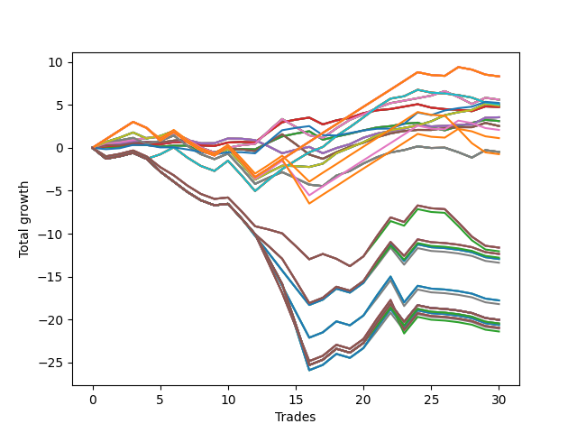

# Short Wallace Doodle 011 
- Symbol: AAPL_Unlimited
- Date Range: 03/23/2022 - 07/08/2022
- Trading Period: 7:20-12:30
- Number of Trades: 30



| Name | Win Percent | Profit | Avg Profit / Trade | Avg Time / Trade |      | Name | Win Percent | Profit | Avg Profit / Trade | Avg Time / Trade |
| ---- | ----------- | ------ | ------------------ | ---------------- | ---- | ---- | ----------- | ------ | ------------------ | ---------------- |
| Sorted By <br> Profit | | | | | | Sorted By <br> Win Percentage ||||
| One Hundred Twenty-Six | 60.00 | 4160.00 | 138.67 | 101:18 |     | Sixty-Eight | 70.00 | 2805.00 | 93.50 | 43:54 |
| One Hundred Twenty-One | 60.00 | 4160.00 | 138.67 | 101:18 |     | Sixty | 70.00 | 2805.00 | 93.50 | 43:54 |
| One Hundred Sixteen | 60.00 | 4160.00 | 138.67 | 101:18 |     | Fifty-Two | 70.00 | 2805.00 | 93.50 | 43:54 |
| One Hundred Eleven | 60.00 | 4160.00 | 138.67 | 101:18 |     | Forty-Four | 70.00 | 2805.00 | 93.50 | 43:54 |
| One Hundred One | 60.00 | 4160.00 | 138.67 | 101:18 |     | Four | 70.00 | 2805.00 | 93.50 | 43:54 |
| Eighty-One | 60.00 | 4160.00 | 138.67 | 101:18 |     | Seventy | 70.00 | 2455.00 | 81.83 | 64:01 |
| Sixty-Eight | 70.00 | 2805.00 | 93.50 | 43:54 |     | Sixty-Two | 70.00 | 2455.00 | 81.83 | 64:01 |
| Sixty | 70.00 | 2805.00 | 93.50 | 43:54 |     | Fifty-Four | 70.00 | 2455.00 | 81.83 | 64:01 |
| Fifty-Two | 70.00 | 2805.00 | 93.50 | 43:54 |     | Forty-Six | 70.00 | 2455.00 | 81.83 | 64:01 |
| Forty-Four | 70.00 | 2805.00 | 93.50 | 43:54 |     | Six | 70.00 | 2455.00 | 81.83 | 64:01 |
| Four | 70.00 | 2805.00 | 93.50 | 43:54 |     | Sixty-Six | 70.00 | 1780.00 | 59.33 | 25:03 |
| Seventy-Three | 60.00 | 2615.00 | 87.17 | 13:59 |     | Fifty-Eight | 70.00 | 1780.00 | 59.33 | 25:03 |
| Seventy-One | 56.67 | 2530.00 | 84.33 | 115:57 |     | Fifty | 70.00 | 1780.00 | 59.33 | 25:03 |
| Sixty-Three | 56.67 | 2530.00 | 84.33 | 115:57 |     | Forty-Two | 70.00 | 1780.00 | 59.33 | 25:03 |
| Fifty-Five | 56.67 | 2530.00 | 84.33 | 115:57 |     | Two | 70.00 | 1780.00 | 59.33 | 25:03 |
| Forty-Seven | 56.67 | 2530.00 | 84.33 | 115:57 |     | Sixty-Four | 66.67 | 1560.00 | 52.00 | 11:44 |
| Seven | 56.67 | 2530.00 | 84.33 | 115:57 |     | Fifty-Six | 66.67 | 1560.00 | 52.00 | 11:44 |
| Seventy | 70.00 | 2455.00 | 81.83 | 64:01 |     | Forty-Eight | 66.67 | 1560.00 | 52.00 | 11:44 |
| Sixty-Two | 70.00 | 2455.00 | 81.83 | 64:01 |     | Forty | 66.67 | 1560.00 | 52.00 | 11:44 |
| Fifty-Four | 70.00 | 2455.00 | 81.83 | 64:01 |     | Zero | 66.67 | 1560.00 | 52.00 | 11:44 |
| Forty-Six | 70.00 | 2455.00 | 81.83 | 64:01 |     | Sixty-Five | 63.33 | 2380.00 | 79.33 | 17:39 |
| Six | 70.00 | 2455.00 | 81.83 | 64:01 |     | Fifty-Seven | 63.33 | 2380.00 | 79.33 | 17:39 |
| Sixty-Five | 63.33 | 2380.00 | 79.33 | 17:39 |     | Forty-Nine | 63.33 | 2380.00 | 79.33 | 17:39 |
| Fifty-Seven | 63.33 | 2380.00 | 79.33 | 17:39 |     | Forty-One | 63.33 | 2380.00 | 79.33 | 17:39 |
| Forty-Nine | 63.33 | 2380.00 | 79.33 | 17:39 |     | One | 63.33 | 2380.00 | 79.33 | 17:39 |
| Forty-One | 63.33 | 2380.00 | 79.33 | 17:39 |     | One Hundred Twenty-Six | 60.00 | 4160.00 | 138.67 | 101:18 |
| One | 63.33 | 2380.00 | 79.33 | 17:39 |     | One Hundred Twenty-One | 60.00 | 4160.00 | 138.67 | 101:18 |
| Sixty-Six | 70.00 | 1780.00 | 59.33 | 25:03 |     | One Hundred Sixteen | 60.00 | 4160.00 | 138.67 | 101:18 |
| Fifty-Eight | 70.00 | 1780.00 | 59.33 | 25:03 |     | One Hundred Eleven | 60.00 | 4160.00 | 138.67 | 101:18 |
| Fifty | 70.00 | 1780.00 | 59.33 | 25:03 |     | One Hundred One | 60.00 | 4160.00 | 138.67 | 101:18 |
| Forty-Two | 70.00 | 1780.00 | 59.33 | 25:03 |     | Eighty-One | 60.00 | 4160.00 | 138.67 | 101:18 |
| Two | 70.00 | 1780.00 | 59.33 | 25:03 |     | Seventy-Three | 60.00 | 2615.00 | 87.17 | 13:59 |
| Sixty-Four | 66.67 | 1560.00 | 52.00 | 11:44 |     | Sixty-Seven | 60.00 | 1270.00 | 42.33 | 32:34 |
| Fifty-Six | 66.67 | 1560.00 | 52.00 | 11:44 |     | Fifty-Nine | 60.00 | 1270.00 | 42.33 | 32:34 |
| Forty-Eight | 66.67 | 1560.00 | 52.00 | 11:44 |     | Fifty-One | 60.00 | 1270.00 | 42.33 | 32:34 |
| Forty | 66.67 | 1560.00 | 52.00 | 11:44 |     | Forty-Three | 60.00 | 1270.00 | 42.33 | 32:34 |
| Zero | 66.67 | 1560.00 | 52.00 | 11:44 |     | Three | 60.00 | 1270.00 | 42.33 | 32:34 |
| Sixty-Seven | 60.00 | 1270.00 | 42.33 | 32:34 |     | Seventy-One | 56.67 | 2530.00 | 84.33 | 115:57 |
| Fifty-Nine | 60.00 | 1270.00 | 42.33 | 32:34 |     | Sixty-Three | 56.67 | 2530.00 | 84.33 | 115:57 |
| Fifty-One | 60.00 | 1270.00 | 42.33 | 32:34 |     | Fifty-Five | 56.67 | 2530.00 | 84.33 | 115:57 |
| Forty-Three | 60.00 | 1270.00 | 42.33 | 32:34 |     | Forty-Seven | 56.67 | 2530.00 | 84.33 | 115:57 |
| Three | 60.00 | 1270.00 | 42.33 | 32:34 |     | Seven | 56.67 | 2530.00 | 84.33 | 115:57 |
| Ninety-One | 53.33 | 1045.00 | 34.83 | 98:44 |     | Sixty-Nine | 56.67 | -240.00 | -8.00 | 74:23 |
| One Hundred Six | 53.33 | 565.00 | 18.83 | 99:01 |     | Sixty-One | 56.67 | -240.00 | -8.00 | 74:23 |
| Sixty-Nine | 56.67 | -240.00 | -8.00 | 74:23 |     | Fifty-Three | 56.67 | -240.00 | -8.00 | 74:23 |
| Sixty-One | 56.67 | -240.00 | -8.00 | 74:23 |     | Forty-Five | 56.67 | -240.00 | -8.00 | 74:23 |
| Fifty-Three | 56.67 | -240.00 | -8.00 | 74:23 |     | Five | 56.67 | -240.00 | -8.00 | 74:23 |
| Forty-Five | 56.67 | -240.00 | -8.00 | 74:23 |     | Ninety-One | 53.33 | 1045.00 | 34.83 | 98:44 |
| Five | 56.67 | -240.00 | -8.00 | 74:23 |     | One Hundred Six | 53.33 | 565.00 | 18.83 | 99:01 |
| Ninety-Six | 50.00 | -370.00 | -12.33 | 82:25 |     | Ninety-Six | 50.00 | -370.00 | -12.33 | 82:25 |
| One Hundred | 26.67 | -5810.00 | -193.67 | 123:41 |     | One Hundred Ten | 30.00 | -6180.00 | -206.00 | 148:34 |
| Ninety-Nine | 26.67 | -5810.00 | -193.67 | 123:41 |     | One Hundred Nine | 30.00 | -6180.00 | -206.00 | 148:34 |
| Ninety-Eight | 26.67 | -5810.00 | -193.67 | 123:41 |     | One Hundred Eight | 30.00 | -6180.00 | -206.00 | 148:34 |
| Ninety-Seven | 26.67 | -6025.00 | -200.83 | 121:25 |     | One Hundred Seven | 30.00 | -6395.00 | -213.17 | 146:19 |
| One Hundred Ten | 30.00 | -6180.00 | -206.00 | 148:34 |     | Ninety-Five | 30.00 | -6475.00 | -215.83 | 154:29 |
| One Hundred Nine | 30.00 | -6180.00 | -206.00 | 148:34 |     | Ninety-Four | 30.00 | -6475.00 | -215.83 | 154:29 |
| One Hundred Eight | 30.00 | -6180.00 | -206.00 | 148:34 |     | Ninety-Three | 30.00 | -6475.00 | -215.83 | 154:29 |
| One Hundred Seven | 30.00 | -6395.00 | -213.17 | 146:19 |     | Ninety-Two | 30.00 | -6690.00 | -223.00 | 152:14 |
| Ninety-Five | 30.00 | -6475.00 | -215.83 | 154:29 |     | One Hundred Five | 30.00 | -8885.00 | -296.17 | 163:37 |
| Ninety-Four | 30.00 | -6475.00 | -215.83 | 154:29 |     | One Hundred Four | 30.00 | -8885.00 | -296.17 | 163:37 |
| Ninety-Three | 30.00 | -6475.00 | -215.83 | 154:29 |     | One Hundred Three | 30.00 | -8885.00 | -296.17 | 163:37 |
| Ninety-Two | 30.00 | -6690.00 | -223.00 | 152:14 |     | One Hundred Two | 30.00 | -9100.00 | -303.33 | 161:22 |
| One Hundred Five | 30.00 | -8885.00 | -296.17 | 163:37 |     | One Hundred Thirty | 30.00 | -10015.00 | -333.83 | 176:08 |
| One Hundred Four | 30.00 | -8885.00 | -296.17 | 163:37 |     | One Hundred Twenty-Nine | 30.00 | -10015.00 | -333.83 | 176:08 |
| One Hundred Three | 30.00 | -8885.00 | -296.17 | 163:37 |     | One Hundred Twenty-Eight | 30.00 | -10015.00 | -333.83 | 176:08 |
| One Hundred Two | 30.00 | -9100.00 | -303.33 | 161:22 |     | One Hundred Twenty-Five | 30.00 | -10015.00 | -333.83 | 176:08 |
| One Hundred Thirty | 30.00 | -10015.00 | -333.83 | 176:08 |     | One Hundred Twenty-Four | 30.00 | -10015.00 | -333.83 | 176:08 |
| One Hundred Twenty-Nine | 30.00 | -10015.00 | -333.83 | 176:08 |     | One Hundred Twenty-Three | 30.00 | -10015.00 | -333.83 | 176:08 |
| One Hundred Twenty-Eight | 30.00 | -10015.00 | -333.83 | 176:08 |     | Eighty-Five | 30.00 | -10015.00 | -333.83 | 176:08 |
| One Hundred Twenty-Five | 30.00 | -10015.00 | -333.83 | 176:08 |     | Eighty-Four | 30.00 | -10015.00 | -333.83 | 176:08 |
| One Hundred Twenty-Four | 30.00 | -10015.00 | -333.83 | 176:08 |     | Eighty-Three | 30.00 | -10015.00 | -333.83 | 176:08 |
| One Hundred Twenty-Three | 30.00 | -10015.00 | -333.83 | 176:08 |     | One Hundred Twenty-Seven | 30.00 | -10230.00 | -341.00 | 173:52 |
| Eighty-Five | 30.00 | -10015.00 | -333.83 | 176:08 |     | One Hundred Twenty-Two | 30.00 | -10230.00 | -341.00 | 173:52 |
| Eighty-Four | 30.00 | -10015.00 | -333.83 | 176:08 |     | Eighty-Two | 30.00 | -10230.00 | -341.00 | 173:52 |
| Eighty-Three | 30.00 | -10015.00 | -333.83 | 176:08 |     | One Hundred Fifteen | 30.00 | -10315.00 | -343.83 | 175:42 |
| One Hundred Twenty-Seven | 30.00 | -10230.00 | -341.00 | 173:52 |     | One Hundred Fourteen | 30.00 | -10315.00 | -343.83 | 175:42 |
| One Hundred Twenty-Two | 30.00 | -10230.00 | -341.00 | 173:52 |     | One Hundred Thirteen | 30.00 | -10315.00 | -343.83 | 175:42 |
| Eighty-Two | 30.00 | -10230.00 | -341.00 | 173:52 |     | One Hundred Twenty | 30.00 | -10480.00 | -349.33 | 172:04 |
| One Hundred Fifteen | 30.00 | -10315.00 | -343.83 | 175:42 |     | One Hundred Ninteen | 30.00 | -10480.00 | -349.33 | 172:04 |
| One Hundred Fourteen | 30.00 | -10315.00 | -343.83 | 175:42 |     | One Hundred Eighteen | 30.00 | -10480.00 | -349.33 | 172:04 |
| One Hundred Thirteen | 30.00 | -10315.00 | -343.83 | 175:42 |     | One Hundred Twelve | 30.00 | -10530.00 | -351.00 | 173:27 |
| One Hundred Twenty | 30.00 | -10480.00 | -349.33 | 172:04 |     | One Hundred Seventeen | 30.00 | -10695.00 | -356.50 | 169:49 |
| One Hundred Ninteen | 30.00 | -10480.00 | -349.33 | 172:04 |     | One Hundred | 26.67 | -5810.00 | -193.67 | 123:41 |
| One Hundred Eighteen | 30.00 | -10480.00 | -349.33 | 172:04 |     | Ninety-Nine | 26.67 | -5810.00 | -193.67 | 123:41 |
| One Hundred Twelve | 30.00 | -10530.00 | -351.00 | 173:27 |     | Ninety-Eight | 26.67 | -5810.00 | -193.67 | 123:41 |
| One Hundred Seventeen | 30.00 | -10695.00 | -356.50 | 169:49 |     | Ninety-Seven | 26.67 | -6025.00 | -200.83 | 121:25 |

## NO STOPLOSS

### Test Zero
* Sell when price hits the middle line of the 20p bollinger
* No Stoploss
* Results:
```
Total Trades: 30
Percent Up: 33.33
Percent Down: 66.67
Total Points Moved Down: 3.12
Potential Profit: 1560.00
Total Points Ups: 3.04 Count Ups: 10
Total Points Downs: 6.16 Count Downs: 20
```

<details><summary>Trades</summary>

<code>In: 2022-03-24 08:32:00		Out: 2022-03-24 08:49:10		Total Position Time: 17:10		Total Move Down: 0.07		Total to Date: 0.07</code> <br />
<code>In: 2022-03-25 11:05:00		Out: 2022-03-25 11:17:45		Total Position Time: 12:45		Total Move Down: 0.05		Total to Date: 0.12</code> <br />
<code>In: 2022-03-25 12:01:00		Out: 2022-03-25 12:02:10		Total Position Time: 01:10		Total Move Down: 0.25		Total to Date: 0.37</code> <br />
<code>In: 2022-03-28 10:26:00		Out: 2022-03-28 10:43:50		Total Position Time: 17:50		Total Move Down: -0.05		Total to Date: 0.32</code> <br />
<code>In: 2022-03-29 08:22:00		Out: 2022-03-29 08:40:35		Total Position Time: 18:35		Total Move Down: -0.18		Total to Date: 0.14</code> <br />
<code>In: 2022-03-29 08:29:00		Out: 2022-03-29 08:40:35		Total Position Time: 11:35		Total Move Down: 0.11		Total to Date: 0.25</code> <br />
<code>In: 2022-03-29 10:51:00		Out: 2022-03-29 11:04:05		Total Position Time: 13:05		Total Move Down: -0.01		Total to Date: 0.24</code> <br />
<code>In: 2022-04-07 11:53:00		Out: 2022-04-07 12:20:15		Total Position Time: 27:15		Total Move Down: -0.57		Total to Date: -0.33</code> <br />
<code>In: 2022-04-07 12:04:00		Out: 2022-04-07 12:20:15		Total Position Time: 16:15		Total Move Down: -0.17		Total to Date: -0.50</code> <br />
<code>In: 2022-04-20 10:49:00		Out: 2022-04-20 10:50:10		Total Position Time: 01:10		Total Move Down: 0.29		Total to Date: -0.21</code> <br />
<code>In: 2022-04-25 11:25:00		Out: 2022-04-25 11:40:00		Total Position Time: 15:00		Total Move Down: 0.08		Total to Date: -0.13</code> <br />
<code>In: 2022-04-25 11:26:00		Out: 2022-04-25 11:40:00		Total Position Time: 14:00		Total Move Down: -0.05		Total to Date: -0.18</code> <br />
<code>In: 2022-04-28 07:23:00		Out: 2022-04-28 07:27:00		Total Position Time: 04:00		Total Move Down: 0.79		Total to Date: 0.61</code> <br />
<code>In: 2022-04-28 07:24:00		Out: 2022-04-28 07:27:00		Total Position Time: 03:00		Total Move Down: 0.72		Total to Date: 1.33</code> <br />
<code>In: 2022-05-04 08:56:00		Out: 2022-05-04 09:04:40		Total Position Time: 08:40		Total Move Down: 0.33		Total to Date: 1.66</code> <br />
<code>In: 2022-05-04 08:57:00		Out: 2022-05-04 09:04:40		Total Position Time: 07:40		Total Move Down: 0.27		Total to Date: 1.93</code> <br />
<code>In: 2022-05-10 10:37:00		Out: 2022-05-10 11:05:55		Total Position Time: 28:55		Total Move Down: -0.98		Total to Date: 0.95</code> <br />
<code>In: 2022-05-16 08:57:00		Out: 2022-05-16 09:05:45		Total Position Time: 08:45		Total Move Down: 0.36		Total to Date: 1.31</code> <br />
<code>In: 2022-05-17 08:37:00		Out: 2022-05-17 08:47:25		Total Position Time: 10:25		Total Move Down: 0.34		Total to Date: 1.65</code> <br />
<code>In: 2022-06-10 12:29:00		Out: 2022-06-10 12:31:00		Total Position Time: 02:00		Total Move Down: 0.38		Total to Date: 2.03</code> <br />
<code>In: 2022-06-13 08:26:00		Out: 2022-06-13 08:37:10		Total Position Time: 11:10		Total Move Down: 0.34		Total to Date: 2.37</code> <br />
<code>In: 2022-06-13 08:27:00		Out: 2022-06-13 08:37:10		Total Position Time: 10:10		Total Move Down: 0.16		Total to Date: 2.53</code> <br />
<code>In: 2022-06-15 11:02:00		Out: 2022-06-15 11:03:10		Total Position Time: 01:10		Total Move Down: 0.28		Total to Date: 2.81</code> <br />
<code>In: 2022-06-16 10:32:00		Out: 2022-06-16 10:37:00		Total Position Time: 05:00		Total Move Down: 0.12		Total to Date: 2.93</code> <br />
<code>In: 2022-06-17 08:11:00		Out: 2022-06-17 08:38:40		Total Position Time: 27:40		Total Move Down: -0.56		Total to Date: 2.37</code> <br />
<code>In: 2022-06-17 08:21:00		Out: 2022-06-17 08:38:40		Total Position Time: 17:40		Total Move Down: -0.33		Total to Date: 2.04</code> <br />
<code>In: 2022-06-30 08:29:00		Out: 2022-06-30 08:36:00		Total Position Time: 07:00		Total Move Down: 0.48		Total to Date: 2.52</code> <br />
<code>In: 2022-06-30 08:30:00		Out: 2022-06-30 08:36:00		Total Position Time: 06:00		Total Move Down: 0.38		Total to Date: 2.90</code> <br />
<code>In: 2022-07-06 11:10:00		Out: 2022-07-06 11:11:10		Total Position Time: 01:10		Total Move Down: 0.36		Total to Date: 3.26</code> <br />
<code>In: 2022-07-06 11:35:00		Out: 2022-07-06 12:00:50		Total Position Time: 25:50		Total Move Down: -0.14		Total to Date: 3.12</code> <br />


</details>

### Test One
* Sell when the price hits the upper line of the 20p 1std bollinger
* No Stoploss
* Results:
```
Total Trades: 30
Percent Up: 36.67
Percent Down: 63.33
Total Points Moved Down: 4.76
Potential Profit: 2380.00
Total Points Ups: 2.32 Count Ups: 11
Total Points Downs: 7.08 Count Downs: 19
```

<details><summary>Trades</summary>

<code>In: 2022-03-24 08:32:00		Out: 2022-03-24 08:50:10		Total Position Time: 18:10		Total Move Down: 0.16		Total to Date: 0.16</code> <br />
<code>In: 2022-03-25 11:05:00		Out: 2022-03-25 11:19:05		Total Position Time: 14:05		Total Move Down: 0.11		Total to Date: 0.27</code> <br />
<code>In: 2022-03-25 12:01:00		Out: 2022-03-25 12:02:10		Total Position Time: 01:10		Total Move Down: 0.25		Total to Date: 0.52</code> <br />
<code>In: 2022-03-28 10:26:00		Out: 2022-03-28 10:52:25		Total Position Time: 26:25		Total Move Down: -0.04		Total to Date: 0.48</code> <br />
<code>In: 2022-03-29 08:22:00		Out: 2022-03-29 08:41:15		Total Position Time: 19:15		Total Move Down: -0.06		Total to Date: 0.42</code> <br />
<code>In: 2022-03-29 08:29:00		Out: 2022-03-29 08:41:15		Total Position Time: 12:15		Total Move Down: 0.23		Total to Date: 0.65</code> <br />
<code>In: 2022-03-29 10:51:00		Out: 2022-03-29 11:06:05		Total Position Time: 15:05		Total Move Down: 0.07		Total to Date: 0.72</code> <br />
<code>In: 2022-04-07 11:53:00		Out: 2022-04-07 12:27:40		Total Position Time: 34:40		Total Move Down: -0.45		Total to Date: 0.27</code> <br />
<code>In: 2022-04-07 12:04:00		Out: 2022-04-07 12:27:40		Total Position Time: 23:40		Total Move Down: -0.05		Total to Date: 0.22</code> <br />
<code>In: 2022-04-20 10:49:00		Out: 2022-04-20 10:54:05		Total Position Time: 05:05		Total Move Down: 0.40		Total to Date: 0.62</code> <br />
<code>In: 2022-04-25 11:25:00		Out: 2022-04-25 11:44:50		Total Position Time: 19:50		Total Move Down: 0.07		Total to Date: 0.69</code> <br />
<code>In: 2022-04-25 11:26:00		Out: 2022-04-25 11:44:50		Total Position Time: 18:50		Total Move Down: -0.06		Total to Date: 0.63</code> <br />
<code>In: 2022-04-28 07:23:00		Out: 2022-04-28 07:29:40		Total Position Time: 06:40		Total Move Down: 1.21		Total to Date: 1.84</code> <br />
<code>In: 2022-04-28 07:24:00		Out: 2022-04-28 07:29:40		Total Position Time: 05:40		Total Move Down: 1.14		Total to Date: 2.98</code> <br />
<code>In: 2022-05-04 08:56:00		Out: 2022-05-04 09:10:15		Total Position Time: 14:15		Total Move Down: 0.30		Total to Date: 3.28</code> <br />
<code>In: 2022-05-04 08:57:00		Out: 2022-05-04 09:10:15		Total Position Time: 13:15		Total Move Down: 0.24		Total to Date: 3.52</code> <br />
<code>In: 2022-05-10 10:37:00		Out: 2022-05-10 11:06:35		Total Position Time: 29:35		Total Move Down: -0.79		Total to Date: 2.73</code> <br />
<code>In: 2022-05-16 08:57:00		Out: 2022-05-16 09:11:30		Total Position Time: 14:30		Total Move Down: 0.47		Total to Date: 3.20</code> <br />
<code>In: 2022-05-17 08:37:00		Out: 2022-05-17 08:53:40		Total Position Time: 16:40		Total Move Down: 0.29		Total to Date: 3.49</code> <br />
<code>In: 2022-06-10 12:29:00		Out: 2022-06-10 12:42:25		Total Position Time: 13:25		Total Move Down: 0.55		Total to Date: 4.04</code> <br />
<code>In: 2022-06-13 08:26:00		Out: 2022-06-13 08:46:30		Total Position Time: 20:30		Total Move Down: 0.33		Total to Date: 4.37</code> <br />
<code>In: 2022-06-13 08:27:00		Out: 2022-06-13 08:46:30		Total Position Time: 19:30		Total Move Down: 0.15		Total to Date: 4.52</code> <br />
<code>In: 2022-06-15 11:02:00		Out: 2022-06-15 11:03:10		Total Position Time: 01:10		Total Move Down: 0.28		Total to Date: 4.80</code> <br />
<code>In: 2022-06-16 10:32:00		Out: 2022-06-16 10:43:50		Total Position Time: 11:50		Total Move Down: 0.28		Total to Date: 5.08</code> <br />
<code>In: 2022-06-17 08:11:00		Out: 2022-06-17 08:42:50		Total Position Time: 31:50		Total Move Down: -0.40		Total to Date: 4.68</code> <br />
<code>In: 2022-06-17 08:21:00		Out: 2022-06-17 08:42:50		Total Position Time: 21:50		Total Move Down: -0.17		Total to Date: 4.51</code> <br />
<code>In: 2022-06-30 08:29:00		Out: 2022-06-30 09:05:45		Total Position Time: 36:45		Total Move Down: -0.07		Total to Date: 4.44</code> <br />
<code>In: 2022-06-30 08:30:00		Out: 2022-06-30 09:05:45		Total Position Time: 35:45		Total Move Down: -0.17		Total to Date: 4.27</code> <br />
<code>In: 2022-07-06 11:10:00		Out: 2022-07-06 11:11:50		Total Position Time: 01:50		Total Move Down: 0.55		Total to Date: 4.82</code> <br />
<code>In: 2022-07-06 11:35:00		Out: 2022-07-06 12:01:25		Total Position Time: 26:25		Total Move Down: -0.06		Total to Date: 4.76</code> <br />


</details>

### Test Two
* Sell when the price hits the upper line of the 20p 2std bollinger
* No Stoploss
* Results:
```
Total Trades: 30
Percent Up: 30.00
Percent Down: 70.00
Total Points Moved Down: 3.56
Potential Profit: 1780.00
Total Points Ups: 3.13 Count Ups: 9
Total Points Downs: 6.69 Count Downs: 21
```

<details><summary>Trades</summary>

<code>In: 2022-03-24 08:32:00		Out: 2022-03-24 08:51:00		Total Position Time: 19:00		Total Move Down: 0.27		Total to Date: 0.27</code> <br />
<code>In: 2022-03-25 11:05:00		Out: 2022-03-25 11:19:55		Total Position Time: 14:55		Total Move Down: 0.18		Total to Date: 0.45</code> <br />
<code>In: 2022-03-25 12:01:00		Out: 2022-03-25 12:02:10		Total Position Time: 01:10		Total Move Down: 0.25		Total to Date: 0.70</code> <br />
<code>In: 2022-03-28 10:26:00		Out: 2022-03-28 10:54:15		Total Position Time: 28:15		Total Move Down: -0.02		Total to Date: 0.68</code> <br />
<code>In: 2022-03-29 08:22:00		Out: 2022-03-29 08:57:40		Total Position Time: 35:40		Total Move Down: -0.09		Total to Date: 0.59</code> <br />
<code>In: 2022-03-29 08:29:00		Out: 2022-03-29 08:57:40		Total Position Time: 28:40		Total Move Down: 0.20		Total to Date: 0.79</code> <br />
<code>In: 2022-03-29 10:51:00		Out: 2022-03-29 11:07:05		Total Position Time: 16:05		Total Move Down: 0.13		Total to Date: 0.92</code> <br />
<code>In: 2022-04-07 11:53:00		Out: 2022-04-07 12:28:30		Total Position Time: 35:30		Total Move Down: -0.39		Total to Date: 0.53</code> <br />
<code>In: 2022-04-07 12:04:00		Out: 2022-04-07 12:28:30		Total Position Time: 24:30		Total Move Down: 0.01		Total to Date: 0.54</code> <br />
<code>In: 2022-04-20 10:49:00		Out: 2022-04-20 11:03:15		Total Position Time: 14:15		Total Move Down: 0.55		Total to Date: 1.09</code> <br />
<code>In: 2022-04-25 11:25:00		Out: 2022-04-25 12:03:15		Total Position Time: 38:15		Total Move Down: -0.03		Total to Date: 1.06</code> <br />
<code>In: 2022-04-25 11:26:00		Out: 2022-04-25 12:03:15		Total Position Time: 37:15		Total Move Down: -0.16		Total to Date: 0.90</code> <br />
<code>In: 2022-04-28 07:23:00		Out: 2022-04-28 08:28:30		Total Position Time: 65:30		Total Move Down: -0.73		Total to Date: 0.17</code> <br />
<code>In: 2022-04-28 07:24:00		Out: 2022-04-28 08:28:30		Total Position Time: 64:30		Total Move Down: -0.80		Total to Date: -0.63</code> <br />
<code>In: 2022-05-04 08:56:00		Out: 2022-05-04 09:12:25		Total Position Time: 16:25		Total Move Down: 0.40		Total to Date: -0.23</code> <br />
<code>In: 2022-05-04 08:57:00		Out: 2022-05-04 09:12:25		Total Position Time: 15:25		Total Move Down: 0.34		Total to Date: 0.11</code> <br />
<code>In: 2022-05-10 10:37:00		Out: 2022-05-10 11:07:10		Total Position Time: 30:10		Total Move Down: -0.74		Total to Date: -0.63</code> <br />
<code>In: 2022-05-16 08:57:00		Out: 2022-05-16 09:14:40		Total Position Time: 17:40		Total Move Down: 0.60		Total to Date: -0.03</code> <br />
<code>In: 2022-05-17 08:37:00		Out: 2022-05-17 08:55:15		Total Position Time: 18:15		Total Move Down: 0.46		Total to Date: 0.43</code> <br />
<code>In: 2022-06-10 12:29:00		Out: 2022-06-10 12:43:15		Total Position Time: 14:15		Total Move Down: 0.75		Total to Date: 1.18</code> <br />
<code>In: 2022-06-13 08:26:00		Out: 2022-06-13 08:47:05		Total Position Time: 21:05		Total Move Down: 0.48		Total to Date: 1.66</code> <br />
<code>In: 2022-06-13 08:27:00		Out: 2022-06-13 08:47:05		Total Position Time: 20:05		Total Move Down: 0.30		Total to Date: 1.96</code> <br />
<code>In: 2022-06-15 11:02:00		Out: 2022-06-15 11:03:10		Total Position Time: 01:10		Total Move Down: 0.28		Total to Date: 2.24</code> <br />
<code>In: 2022-06-16 10:32:00		Out: 2022-06-16 10:45:10		Total Position Time: 13:10		Total Move Down: 0.43		Total to Date: 2.67</code> <br />
<code>In: 2022-06-17 08:11:00		Out: 2022-06-17 08:44:55		Total Position Time: 33:55		Total Move Down: -0.17		Total to Date: 2.50</code> <br />
<code>In: 2022-06-17 08:21:00		Out: 2022-06-17 08:44:55		Total Position Time: 23:55		Total Move Down: 0.06		Total to Date: 2.56</code> <br />
<code>In: 2022-06-30 08:29:00		Out: 2022-06-30 09:06:25		Total Position Time: 37:25		Total Move Down: 0.12		Total to Date: 2.68</code> <br />
<code>In: 2022-06-30 08:30:00		Out: 2022-06-30 09:06:25		Total Position Time: 36:25		Total Move Down: 0.02		Total to Date: 2.70</code> <br />
<code>In: 2022-07-06 11:10:00		Out: 2022-07-06 11:12:25		Total Position Time: 02:25		Total Move Down: 0.81		Total to Date: 3.51</code> <br />
<code>In: 2022-07-06 11:35:00		Out: 2022-07-06 12:01:40		Total Position Time: 26:40		Total Move Down: 0.05		Total to Date: 3.56</code> <br />


</details>

### Test Three
* Sell when price hits the middle line of the 50p bollinger
* No Stoploss
* Results:
```
Total Trades: 30
Percent Up: 40.00
Percent Down: 60.00
Total Points Moved Down: 2.54
Potential Profit: 1270.00
Total Points Ups: 5.10 Count Ups: 12
Total Points Downs: 7.64 Count Downs: 18
```

<details><summary>Trades</summary>

<code>In: 2022-03-24 08:32:00		Out: 2022-03-24 09:01:40		Total Position Time: 29:40		Total Move Down: 0.29		Total to Date: 0.29</code> <br />
<code>In: 2022-03-25 11:05:00		Out: 2022-03-25 11:49:20		Total Position Time: 44:20		Total Move Down: -0.00		Total to Date: 0.29</code> <br />
<code>In: 2022-03-25 12:01:00		Out: 2022-03-25 12:02:10		Total Position Time: 01:10		Total Move Down: 0.25		Total to Date: 0.54</code> <br />
<code>In: 2022-03-28 10:26:00		Out: 2022-03-28 10:55:10		Total Position Time: 29:10		Total Move Down: 0.13		Total to Date: 0.67</code> <br />
<code>In: 2022-03-29 08:22:00		Out: 2022-03-29 08:57:55		Total Position Time: 35:55		Total Move Down: -0.06		Total to Date: 0.61</code> <br />
<code>In: 2022-03-29 08:29:00		Out: 2022-03-29 08:57:55		Total Position Time: 28:55		Total Move Down: 0.23		Total to Date: 0.84</code> <br />
<code>In: 2022-03-29 10:51:00		Out: 2022-03-29 11:18:35		Total Position Time: 27:35		Total Move Down: 0.16		Total to Date: 1.00</code> <br />
<code>In: 2022-04-07 11:53:00		Out: 2022-04-07 12:47:00		Total Position Time: 54:00		Total Move Down: -0.98		Total to Date: 0.02</code> <br />
<code>In: 2022-04-07 12:04:00		Out: 2022-04-07 12:47:00		Total Position Time: 43:00		Total Move Down: -0.58		Total to Date: -0.56</code> <br />
<code>In: 2022-04-20 10:49:00		Out: 2022-04-20 10:55:30		Total Position Time: 06:30		Total Move Down: 0.44		Total to Date: -0.12</code> <br />
<code>In: 2022-04-25 11:25:00		Out: 2022-04-25 12:03:10		Total Position Time: 38:10		Total Move Down: -0.06		Total to Date: -0.18</code> <br />
<code>In: 2022-04-25 11:26:00		Out: 2022-04-25 12:03:10		Total Position Time: 37:10		Total Move Down: -0.19		Total to Date: -0.37</code> <br />
<code>In: 2022-04-28 07:23:00		Out: 2022-04-28 07:27:10		Total Position Time: 04:10		Total Move Down: 1.01		Total to Date: 0.64</code> <br />
<code>In: 2022-04-28 07:24:00		Out: 2022-04-28 07:27:10		Total Position Time: 03:10		Total Move Down: 0.94		Total to Date: 1.58</code> <br />
<code>In: 2022-05-04 08:56:00		Out: 2022-05-04 11:00:20		Total Position Time: 124:20		Total Move Down: -1.15		Total to Date: 0.43</code> <br />
<code>In: 2022-05-04 08:57:00		Out: 2022-05-04 11:00:20		Total Position Time: 123:20		Total Move Down: -1.21		Total to Date: -0.78</code> <br />
<code>In: 2022-05-10 10:37:00		Out: 2022-05-10 11:16:20		Total Position Time: 39:20		Total Move Down: -0.50		Total to Date: -1.28</code> <br />
<code>In: 2022-05-16 08:57:00		Out: 2022-05-16 09:15:45		Total Position Time: 18:45		Total Move Down: 0.77		Total to Date: -0.51</code> <br />
<code>In: 2022-05-17 08:37:00		Out: 2022-05-17 09:00:15		Total Position Time: 23:15		Total Move Down: 0.64		Total to Date: 0.13</code> <br />
<code>In: 2022-06-10 12:29:00		Out: 2022-06-10 12:33:05		Total Position Time: 04:05		Total Move Down: 0.47		Total to Date: 0.60</code> <br />
<code>In: 2022-06-13 08:26:00		Out: 2022-06-13 08:51:55		Total Position Time: 25:55		Total Move Down: 0.63		Total to Date: 1.23</code> <br />
<code>In: 2022-06-13 08:27:00		Out: 2022-06-13 08:51:55		Total Position Time: 24:55		Total Move Down: 0.45		Total to Date: 1.68</code> <br />
<code>In: 2022-06-15 11:02:00		Out: 2022-06-15 11:03:10		Total Position Time: 01:10		Total Move Down: 0.28		Total to Date: 1.96</code> <br />
<code>In: 2022-06-16 10:32:00		Out: 2022-06-16 10:37:30		Total Position Time: 05:30		Total Move Down: 0.13		Total to Date: 2.09</code> <br />
<code>In: 2022-06-17 08:11:00		Out: 2022-06-17 08:45:15		Total Position Time: 34:15		Total Move Down: -0.01		Total to Date: 2.08</code> <br />
<code>In: 2022-06-17 08:21:00		Out: 2022-06-17 08:45:15		Total Position Time: 24:15		Total Move Down: 0.22		Total to Date: 2.30</code> <br />
<code>In: 2022-06-30 08:29:00		Out: 2022-06-30 09:06:20		Total Position Time: 37:20		Total Move Down: 0.10		Total to Date: 2.40</code> <br />
<code>In: 2022-06-30 08:30:00		Out: 2022-06-30 09:06:20		Total Position Time: 36:20		Total Move Down: -0.00		Total to Date: 2.40</code> <br />
<code>In: 2022-07-06 11:10:00		Out: 2022-07-06 11:11:40		Total Position Time: 01:40		Total Move Down: 0.50		Total to Date: 2.90</code> <br />
<code>In: 2022-07-06 11:35:00		Out: 2022-07-06 12:44:40		Total Position Time: 69:40		Total Move Down: -0.36		Total to Date: 2.54</code> <br />


</details>

### Test Four
* Sell when the price hits the upper line of the 50p 1std bollinger
* No Stoploss
* Results:
```
Total Trades: 30
Percent Up: 30.00
Percent Down: 70.00
Total Points Moved Down: 5.61
Potential Profit: 2805.00
Total Points Ups: 6.18 Count Ups: 9
Total Points Downs: 11.79 Count Downs: 21
```

<details><summary>Trades</summary>

<code>In: 2022-03-24 08:32:00		Out: 2022-03-24 09:03:05		Total Position Time: 31:05		Total Move Down: 0.54		Total to Date: 0.54</code> <br />
<code>In: 2022-03-25 11:05:00		Out: 2022-03-25 12:02:00		Total Position Time: 57:00		Total Move Down: 0.12		Total to Date: 0.66</code> <br />
<code>In: 2022-03-25 12:01:00		Out: 2022-03-25 12:02:10		Total Position Time: 01:10		Total Move Down: 0.25		Total to Date: 0.91</code> <br />
<code>In: 2022-03-28 10:26:00		Out: 2022-03-28 10:56:45		Total Position Time: 30:45		Total Move Down: 0.24		Total to Date: 1.15</code> <br />
<code>In: 2022-03-29 08:22:00		Out: 2022-03-29 09:01:35		Total Position Time: 39:35		Total Move Down: 0.13		Total to Date: 1.28</code> <br />
<code>In: 2022-03-29 08:29:00		Out: 2022-03-29 09:01:35		Total Position Time: 32:35		Total Move Down: 0.42		Total to Date: 1.70</code> <br />
<code>In: 2022-03-29 10:51:00		Out: 2022-03-29 12:43:05		Total Position Time: 112:05		Total Move Down: -0.69		Total to Date: 1.01</code> <br />
<code>In: 2022-04-07 11:53:00		Out: 2022-04-07 12:47:00		Total Position Time: 54:00		Total Move Down: -0.98		Total to Date: 0.03</code> <br />
<code>In: 2022-04-07 12:04:00		Out: 2022-04-07 12:47:00		Total Position Time: 43:00		Total Move Down: -0.58		Total to Date: -0.55</code> <br />
<code>In: 2022-04-20 10:49:00		Out: 2022-04-20 11:03:15		Total Position Time: 14:15		Total Move Down: 0.55		Total to Date: 0.00</code> <br />
<code>In: 2022-04-25 11:25:00		Out: 2022-04-25 12:05:20		Total Position Time: 40:20		Total Move Down: 0.30		Total to Date: 0.30</code> <br />
<code>In: 2022-04-25 11:26:00		Out: 2022-04-25 12:05:20		Total Position Time: 39:20		Total Move Down: 0.17		Total to Date: 0.47</code> <br />
<code>In: 2022-04-28 07:23:00		Out: 2022-04-28 07:33:30		Total Position Time: 10:30		Total Move Down: 1.48		Total to Date: 1.95</code> <br />
<code>In: 2022-04-28 07:24:00		Out: 2022-04-28 07:33:30		Total Position Time: 09:30		Total Move Down: 1.41		Total to Date: 3.36</code> <br />
<code>In: 2022-05-04 08:56:00		Out: 2022-05-04 11:00:25		Total Position Time: 124:25		Total Move Down: -0.92		Total to Date: 2.44</code> <br />
<code>In: 2022-05-04 08:57:00		Out: 2022-05-04 11:00:25		Total Position Time: 123:25		Total Move Down: -0.98		Total to Date: 1.46</code> <br />
<code>In: 2022-05-10 10:37:00		Out: 2022-05-10 11:24:10		Total Position Time: 47:10		Total Move Down: -0.31		Total to Date: 1.15</code> <br />
<code>In: 2022-05-16 08:57:00		Out: 2022-05-16 09:24:25		Total Position Time: 27:25		Total Move Down: 1.12		Total to Date: 2.27</code> <br />
<code>In: 2022-05-17 08:37:00		Out: 2022-05-17 09:06:45		Total Position Time: 29:45		Total Move Down: 0.99		Total to Date: 3.26</code> <br />
<code>In: 2022-06-10 12:29:00		Out: 2022-06-10 12:42:40		Total Position Time: 13:40		Total Move Down: 0.65		Total to Date: 3.91</code> <br />
<code>In: 2022-06-13 08:26:00		Out: 2022-06-13 09:04:10		Total Position Time: 38:10		Total Move Down: 0.74		Total to Date: 4.65</code> <br />
<code>In: 2022-06-13 08:27:00		Out: 2022-06-13 09:04:10		Total Position Time: 37:10		Total Move Down: 0.56		Total to Date: 5.21</code> <br />
<code>In: 2022-06-15 11:02:00		Out: 2022-06-15 11:03:10		Total Position Time: 01:10		Total Move Down: 0.28		Total to Date: 5.49</code> <br />
<code>In: 2022-06-16 10:32:00		Out: 2022-06-16 10:44:00		Total Position Time: 12:00		Total Move Down: 0.29		Total to Date: 5.78</code> <br />
<code>In: 2022-06-17 08:11:00		Out: 2022-06-17 08:52:10		Total Position Time: 41:10		Total Move Down: 0.30		Total to Date: 6.08</code> <br />
<code>In: 2022-06-17 08:21:00		Out: 2022-06-17 08:52:10		Total Position Time: 31:10		Total Move Down: 0.53		Total to Date: 6.61</code> <br />
<code>In: 2022-06-30 08:29:00		Out: 2022-06-30 10:10:15		Total Position Time: 101:15		Total Move Down: -0.70		Total to Date: 5.91</code> <br />
<code>In: 2022-06-30 08:30:00		Out: 2022-06-30 10:10:15		Total Position Time: 100:15		Total Move Down: -0.80		Total to Date: 5.11</code> <br />
<code>In: 2022-07-06 11:10:00		Out: 2022-07-06 11:12:15		Total Position Time: 02:15		Total Move Down: 0.72		Total to Date: 5.83</code> <br />
<code>In: 2022-07-06 11:35:00		Out: 2022-07-06 12:46:40		Total Position Time: 71:40		Total Move Down: -0.22		Total to Date: 5.61</code> <br />


</details>

### Test Five
* Sell when the price hits the upper line of the 50p 2std bollinger
* No Stoploss
* Results:
```
Total Trades: 30
Percent Up: 43.33
Percent Down: 56.67
Total Points Moved Down: -0.48
Potential Profit: -240.00
Total Points Ups: 10.16 Count Ups: 13
Total Points Downs: 9.68 Count Downs: 17
```

<details><summary>Trades</summary>

<code>In: 2022-03-24 08:32:00		Out: 2022-03-24 09:11:25		Total Position Time: 39:25		Total Move Down: 0.68		Total to Date: 0.68</code> <br />
<code>In: 2022-03-25 11:05:00		Out: 2022-03-25 12:02:20		Total Position Time: 57:20		Total Move Down: 0.18		Total to Date: 0.86</code> <br />
<code>In: 2022-03-25 12:01:00		Out: 2022-03-25 12:02:20		Total Position Time: 01:20		Total Move Down: 0.30		Total to Date: 1.16</code> <br />
<code>In: 2022-03-28 10:26:00		Out: 2022-03-28 12:47:00		Total Position Time: 141:00		Total Move Down: -0.70		Total to Date: 0.46</code> <br />
<code>In: 2022-03-29 08:22:00		Out: 2022-03-29 09:02:20		Total Position Time: 40:20		Total Move Down: 0.34		Total to Date: 0.80</code> <br />
<code>In: 2022-03-29 08:29:00		Out: 2022-03-29 09:02:20		Total Position Time: 33:20		Total Move Down: 0.63		Total to Date: 1.43</code> <br />
<code>In: 2022-03-29 10:51:00		Out: 2022-03-29 12:47:00		Total Position Time: 116:00		Total Move Down: -1.19		Total to Date: 0.24</code> <br />
<code>In: 2022-04-07 11:53:00		Out: 2022-04-07 12:47:00		Total Position Time: 54:00		Total Move Down: -0.98		Total to Date: -0.74</code> <br />
<code>In: 2022-04-07 12:04:00		Out: 2022-04-07 12:47:00		Total Position Time: 43:00		Total Move Down: -0.58		Total to Date: -1.32</code> <br />
<code>In: 2022-04-20 10:49:00		Out: 2022-04-20 11:19:30		Total Position Time: 30:30		Total Move Down: 0.65		Total to Date: -0.67</code> <br />
<code>In: 2022-04-25 11:25:00		Out: 2022-04-25 12:47:00		Total Position Time: 82:00		Total Move Down: -1.70		Total to Date: -2.37</code> <br />
<code>In: 2022-04-25 11:26:00		Out: 2022-04-25 12:47:00		Total Position Time: 81:00		Total Move Down: -1.83		Total to Date: -4.20</code> <br />
<code>In: 2022-04-28 07:23:00		Out: 2022-04-28 08:57:40		Total Position Time: 94:40		Total Move Down: 0.72		Total to Date: -3.48</code> <br />
<code>In: 2022-04-28 07:24:00		Out: 2022-04-28 08:57:40		Total Position Time: 93:40		Total Move Down: 0.65		Total to Date: -2.83</code> <br />
<code>In: 2022-05-04 08:56:00		Out: 2022-05-04 11:07:40		Total Position Time: 131:40		Total Move Down: -0.70		Total to Date: -3.53</code> <br />
<code>In: 2022-05-04 08:57:00		Out: 2022-05-04 11:07:40		Total Position Time: 130:40		Total Move Down: -0.76		Total to Date: -4.29</code> <br />
<code>In: 2022-05-10 10:37:00		Out: 2022-05-10 11:27:05		Total Position Time: 50:05		Total Move Down: -0.16		Total to Date: -4.45</code> <br />
<code>In: 2022-05-16 08:57:00		Out: 2022-05-16 09:39:00		Total Position Time: 42:00		Total Move Down: 1.21		Total to Date: -3.24</code> <br />
<code>In: 2022-05-17 08:37:00		Out: 2022-05-17 11:13:45		Total Position Time: 156:45		Total Move Down: 0.54		Total to Date: -2.70</code> <br />
<code>In: 2022-06-10 12:29:00		Out: 2022-06-10 12:45:25		Total Position Time: 16:25		Total Move Down: 0.88		Total to Date: -1.82</code> <br />
<code>In: 2022-06-13 08:26:00		Out: 2022-06-13 10:00:15		Total Position Time: 94:15		Total Move Down: 0.73		Total to Date: -1.09</code> <br />
<code>In: 2022-06-13 08:27:00		Out: 2022-06-13 10:00:15		Total Position Time: 93:15		Total Move Down: 0.55		Total to Date: -0.54</code> <br />
<code>In: 2022-06-15 11:02:00		Out: 2022-06-15 11:03:10		Total Position Time: 01:10		Total Move Down: 0.28		Total to Date: -0.26</code> <br />
<code>In: 2022-06-16 10:32:00		Out: 2022-06-16 10:45:10		Total Position Time: 13:10		Total Move Down: 0.43		Total to Date: 0.17</code> <br />
<code>In: 2022-06-17 08:11:00		Out: 2022-06-17 10:46:35		Total Position Time: 155:35		Total Move Down: -0.19		Total to Date: -0.02</code> <br />
<code>In: 2022-06-17 08:21:00		Out: 2022-06-17 10:46:35		Total Position Time: 145:35		Total Move Down: 0.04		Total to Date: 0.02</code> <br />
<code>In: 2022-06-30 08:29:00		Out: 2022-06-30 10:11:50		Total Position Time: 102:50		Total Move Down: -0.53		Total to Date: -0.51</code> <br />
<code>In: 2022-06-30 08:30:00		Out: 2022-06-30 10:11:50		Total Position Time: 101:50		Total Move Down: -0.63		Total to Date: -1.14</code> <br />
<code>In: 2022-07-06 11:10:00		Out: 2022-07-06 11:26:55		Total Position Time: 16:55		Total Move Down: 0.87		Total to Date: -0.27</code> <br />
<code>In: 2022-07-06 11:35:00		Out: 2022-07-06 12:47:00		Total Position Time: 72:00		Total Move Down: -0.21		Total to Date: -0.48</code> <br />


</details>

### Test Six
* Sell when the price hits the middle line of the 1std VWAP
* No Stoploss
* Results:
```
Total Trades: 30
Percent Up: 30.00
Percent Down: 70.00
Total Points Moved Down: 4.91
Potential Profit: 2455.00
Total Points Ups: 7.33 Count Ups: 9
Total Points Downs: 12.24 Count Downs: 21
```

<details><summary>Trades</summary>

<code>In: 2022-03-24 08:32:00		Out: 2022-03-24 09:11:35		Total Position Time: 39:35		Total Move Down: 0.69		Total to Date: 0.69</code> <br />
<code>In: 2022-03-25 11:05:00		Out: 2022-03-25 12:17:45		Total Position Time: 72:45		Total Move Down: 0.49		Total to Date: 1.18</code> <br />
<code>In: 2022-03-25 12:01:00		Out: 2022-03-25 12:17:45		Total Position Time: 16:45		Total Move Down: 0.61		Total to Date: 1.79</code> <br />
<code>In: 2022-03-28 10:26:00		Out: 2022-03-28 12:47:00		Total Position Time: 141:00		Total Move Down: -0.70		Total to Date: 1.09</code> <br />
<code>In: 2022-03-29 08:22:00		Out: 2022-03-29 09:02:15		Total Position Time: 40:15		Total Move Down: 0.29		Total to Date: 1.38</code> <br />
<code>In: 2022-03-29 08:29:00		Out: 2022-03-29 09:02:15		Total Position Time: 33:15		Total Move Down: 0.58		Total to Date: 1.96</code> <br />
<code>In: 2022-03-29 10:51:00		Out: 2022-03-29 12:47:00		Total Position Time: 116:00		Total Move Down: -1.19		Total to Date: 0.77</code> <br />
<code>In: 2022-04-07 11:53:00		Out: 2022-04-07 12:47:00		Total Position Time: 54:00		Total Move Down: -0.98		Total to Date: -0.21</code> <br />
<code>In: 2022-04-07 12:04:00		Out: 2022-04-07 12:47:00		Total Position Time: 43:00		Total Move Down: -0.58		Total to Date: -0.79</code> <br />
<code>In: 2022-04-20 10:49:00		Out: 2022-04-20 11:19:25		Total Position Time: 30:25		Total Move Down: 0.62		Total to Date: -0.17</code> <br />
<code>In: 2022-04-25 11:25:00		Out: 2022-04-25 12:47:00		Total Position Time: 82:00		Total Move Down: -1.70		Total to Date: -1.87</code> <br />
<code>In: 2022-04-25 11:26:00		Out: 2022-04-25 12:47:00		Total Position Time: 81:00		Total Move Down: -1.83		Total to Date: -3.70</code> <br />
<code>In: 2022-04-28 07:23:00		Out: 2022-04-28 07:27:05		Total Position Time: 04:05		Total Move Down: 0.84		Total to Date: -2.86</code> <br />
<code>In: 2022-04-28 07:24:00		Out: 2022-04-28 07:27:05		Total Position Time: 03:05		Total Move Down: 0.77		Total to Date: -2.09</code> <br />
<code>In: 2022-05-04 08:56:00		Out: 2022-05-04 11:30:50		Total Position Time: 154:50		Total Move Down: -0.04		Total to Date: -2.13</code> <br />
<code>In: 2022-05-04 08:57:00		Out: 2022-05-04 11:30:50		Total Position Time: 153:50		Total Move Down: -0.10		Total to Date: -2.23</code> <br />
<code>In: 2022-05-10 10:37:00		Out: 2022-05-10 12:30:15		Total Position Time: 113:15		Total Move Down: 0.39		Total to Date: -1.84</code> <br />
<code>In: 2022-05-16 08:57:00		Out: 2022-05-16 09:39:00		Total Position Time: 42:00		Total Move Down: 1.21		Total to Date: -0.63</code> <br />
<code>In: 2022-05-17 08:37:00		Out: 2022-05-17 09:00:15		Total Position Time: 23:15		Total Move Down: 0.64		Total to Date: 0.01</code> <br />
<code>In: 2022-06-10 12:29:00		Out: 2022-06-10 12:42:40		Total Position Time: 13:40		Total Move Down: 0.65		Total to Date: 0.66</code> <br />
<code>In: 2022-06-13 08:26:00		Out: 2022-06-13 08:52:25		Total Position Time: 26:25		Total Move Down: 0.78		Total to Date: 1.44</code> <br />
<code>In: 2022-06-13 08:27:00		Out: 2022-06-13 08:52:25		Total Position Time: 25:25		Total Move Down: 0.60		Total to Date: 2.04</code> <br />
<code>In: 2022-06-15 11:02:00		Out: 2022-06-15 11:03:10		Total Position Time: 01:10		Total Move Down: 0.28		Total to Date: 2.32</code> <br />
<code>In: 2022-06-16 10:32:00		Out: 2022-06-16 10:44:00		Total Position Time: 12:00		Total Move Down: 0.29		Total to Date: 2.61</code> <br />
<code>In: 2022-06-17 08:11:00		Out: 2022-06-17 09:01:30		Total Position Time: 50:30		Total Move Down: 0.48		Total to Date: 3.09</code> <br />
<code>In: 2022-06-17 08:21:00		Out: 2022-06-17 09:01:30		Total Position Time: 40:30		Total Move Down: 0.71		Total to Date: 3.80</code> <br />
<code>In: 2022-06-30 08:29:00		Out: 2022-06-30 12:05:40		Total Position Time: 216:40		Total Move Down: 0.35		Total to Date: 4.15</code> <br />
<code>In: 2022-06-30 08:30:00		Out: 2022-06-30 12:05:40		Total Position Time: 215:40		Total Move Down: 0.25		Total to Date: 4.40</code> <br />
<code>In: 2022-07-06 11:10:00		Out: 2022-07-06 11:12:15		Total Position Time: 02:15		Total Move Down: 0.72		Total to Date: 5.12</code> <br />
<code>In: 2022-07-06 11:35:00		Out: 2022-07-06 12:47:00		Total Position Time: 72:00		Total Move Down: -0.21		Total to Date: 4.91</code> <br />


</details>

### Test Seven
* Sell when the price hits the upper line of the 1std VWAP
* No Stoploss
* Results:
```
Total Trades: 30
Percent Up: 43.33
Percent Down: 56.67
Total Points Moved Down: 5.06
Potential Profit: 2530.00
Total Points Ups: 9.95 Count Ups: 13
Total Points Downs: 15.01 Count Downs: 17
```

<details><summary>Trades</summary>

<code>In: 2022-03-24 08:32:00		Out: 2022-03-24 12:47:00		Total Position Time: 255:00		Total Move Down: -1.27		Total to Date: -1.27</code> <br />
<code>In: 2022-03-25 11:05:00		Out: 2022-03-25 12:47:00		Total Position Time: 102:00		Total Move Down: 0.28		Total to Date: -0.99</code> <br />
<code>In: 2022-03-25 12:01:00		Out: 2022-03-25 12:47:00		Total Position Time: 46:00		Total Move Down: 0.40		Total to Date: -0.59</code> <br />
<code>In: 2022-03-28 10:26:00		Out: 2022-03-28 12:47:00		Total Position Time: 141:00		Total Move Down: -0.70		Total to Date: -1.29</code> <br />
<code>In: 2022-03-29 08:22:00		Out: 2022-03-29 09:31:15		Total Position Time: 69:15		Total Move Down: 0.53		Total to Date: -0.76</code> <br />
<code>In: 2022-03-29 08:29:00		Out: 2022-03-29 09:31:15		Total Position Time: 62:15		Total Move Down: 0.82		Total to Date: 0.06</code> <br />
<code>In: 2022-03-29 10:51:00		Out: 2022-03-29 12:47:00		Total Position Time: 116:00		Total Move Down: -1.19		Total to Date: -1.13</code> <br />
<code>In: 2022-04-07 11:53:00		Out: 2022-04-07 12:47:00		Total Position Time: 54:00		Total Move Down: -0.98		Total to Date: -2.11</code> <br />
<code>In: 2022-04-07 12:04:00		Out: 2022-04-07 12:47:00		Total Position Time: 43:00		Total Move Down: -0.58		Total to Date: -2.69</code> <br />
<code>In: 2022-04-20 10:49:00		Out: 2022-04-20 11:52:05		Total Position Time: 63:05		Total Move Down: 1.19		Total to Date: -1.50</code> <br />
<code>In: 2022-04-25 11:25:00		Out: 2022-04-25 12:47:00		Total Position Time: 82:00		Total Move Down: -1.70		Total to Date: -3.20</code> <br />
<code>In: 2022-04-25 11:26:00		Out: 2022-04-25 12:47:00		Total Position Time: 81:00		Total Move Down: -1.83		Total to Date: -5.03</code> <br />
<code>In: 2022-04-28 07:23:00		Out: 2022-04-28 07:31:15		Total Position Time: 08:15		Total Move Down: 1.31		Total to Date: -3.72</code> <br />
<code>In: 2022-04-28 07:24:00		Out: 2022-04-28 07:31:15		Total Position Time: 07:15		Total Move Down: 1.24		Total to Date: -2.48</code> <br />
<code>In: 2022-05-04 08:56:00		Out: 2022-05-04 11:35:05		Total Position Time: 159:05		Total Move Down: 1.01		Total to Date: -1.47</code> <br />
<code>In: 2022-05-04 08:57:00		Out: 2022-05-04 11:35:05		Total Position Time: 158:05		Total Move Down: 0.95		Total to Date: -0.52</code> <br />
<code>In: 2022-05-10 10:37:00		Out: 2022-05-10 12:47:00		Total Position Time: 130:00		Total Move Down: 0.62		Total to Date: 0.10</code> <br />
<code>In: 2022-05-16 08:57:00		Out: 2022-05-16 12:47:00		Total Position Time: 230:00		Total Move Down: 1.28		Total to Date: 1.38</code> <br />
<code>In: 2022-05-17 08:37:00		Out: 2022-05-17 11:22:05		Total Position Time: 165:05		Total Move Down: 1.03		Total to Date: 2.41</code> <br />
<code>In: 2022-06-10 12:29:00		Out: 2022-06-10 12:47:00		Total Position Time: 18:00		Total Move Down: 1.14		Total to Date: 3.55</code> <br />
<code>In: 2022-06-13 08:26:00		Out: 2022-06-13 10:27:50		Total Position Time: 121:50		Total Move Down: 1.18		Total to Date: 4.73</code> <br />
<code>In: 2022-06-13 08:27:00		Out: 2022-06-13 10:27:50		Total Position Time: 120:50		Total Move Down: 1.00		Total to Date: 5.73</code> <br />
<code>In: 2022-06-15 11:02:00		Out: 2022-06-15 11:03:10		Total Position Time: 01:10		Total Move Down: 0.28		Total to Date: 6.01</code> <br />
<code>In: 2022-06-16 10:32:00		Out: 2022-06-16 10:50:30		Total Position Time: 18:30		Total Move Down: 0.75		Total to Date: 6.76</code> <br />
<code>In: 2022-06-17 08:11:00		Out: 2022-06-17 12:47:00		Total Position Time: 276:00		Total Move Down: -0.33		Total to Date: 6.43</code> <br />
<code>In: 2022-06-17 08:21:00		Out: 2022-06-17 12:47:00		Total Position Time: 266:00		Total Move Down: -0.10		Total to Date: 6.33</code> <br />
<code>In: 2022-06-30 08:29:00		Out: 2022-06-30 12:47:00		Total Position Time: 258:00		Total Move Down: -0.19		Total to Date: 6.14</code> <br />
<code>In: 2022-06-30 08:30:00		Out: 2022-06-30 12:47:00		Total Position Time: 257:00		Total Move Down: -0.29		Total to Date: 5.85</code> <br />
<code>In: 2022-07-06 11:10:00		Out: 2022-07-06 12:47:00		Total Position Time: 97:00		Total Move Down: -0.58		Total to Date: 5.27</code> <br />
<code>In: 2022-07-06 11:35:00		Out: 2022-07-06 12:47:00		Total Position Time: 72:00		Total Move Down: -0.21		Total to Date: 5.06</code> <br />


</details>

## STOPLOSS OF 5

### Test Forty
* Sell when price hits the middle line of the 20p bollinger
* Stoploss is -5 points
* Results:
```
Total Trades: 30
Percent Up: 33.33
Percent Down: 66.67
Total Points Moved Down: 3.12
Potential Profit: 1560.00
Total Points Ups: 3.04 Count Ups: 10
Total Points Downs: 6.16 Count Downs: 20
```

<details><summary>Trades</summary>

<code>In: 2022-03-24 08:32:00		Out: 2022-03-24 08:49:10		Total Position Time: 17:10		Total Move Down: 0.07		Total to Date: 0.07</code> <br />
<code>In: 2022-03-25 11:05:00		Out: 2022-03-25 11:17:45		Total Position Time: 12:45		Total Move Down: 0.05		Total to Date: 0.12</code> <br />
<code>In: 2022-03-25 12:01:00		Out: 2022-03-25 12:02:10		Total Position Time: 01:10		Total Move Down: 0.25		Total to Date: 0.37</code> <br />
<code>In: 2022-03-28 10:26:00		Out: 2022-03-28 10:43:50		Total Position Time: 17:50		Total Move Down: -0.05		Total to Date: 0.32</code> <br />
<code>In: 2022-03-29 08:22:00		Out: 2022-03-29 08:40:35		Total Position Time: 18:35		Total Move Down: -0.18		Total to Date: 0.14</code> <br />
<code>In: 2022-03-29 08:29:00		Out: 2022-03-29 08:40:35		Total Position Time: 11:35		Total Move Down: 0.11		Total to Date: 0.25</code> <br />
<code>In: 2022-03-29 10:51:00		Out: 2022-03-29 11:04:05		Total Position Time: 13:05		Total Move Down: -0.01		Total to Date: 0.24</code> <br />
<code>In: 2022-04-07 11:53:00		Out: 2022-04-07 12:20:15		Total Position Time: 27:15		Total Move Down: -0.57		Total to Date: -0.33</code> <br />
<code>In: 2022-04-07 12:04:00		Out: 2022-04-07 12:20:15		Total Position Time: 16:15		Total Move Down: -0.17		Total to Date: -0.50</code> <br />
<code>In: 2022-04-20 10:49:00		Out: 2022-04-20 10:50:10		Total Position Time: 01:10		Total Move Down: 0.29		Total to Date: -0.21</code> <br />
<code>In: 2022-04-25 11:25:00		Out: 2022-04-25 11:40:00		Total Position Time: 15:00		Total Move Down: 0.08		Total to Date: -0.13</code> <br />
<code>In: 2022-04-25 11:26:00		Out: 2022-04-25 11:40:00		Total Position Time: 14:00		Total Move Down: -0.05		Total to Date: -0.18</code> <br />
<code>In: 2022-04-28 07:23:00		Out: 2022-04-28 07:27:00		Total Position Time: 04:00		Total Move Down: 0.79		Total to Date: 0.61</code> <br />
<code>In: 2022-04-28 07:24:00		Out: 2022-04-28 07:27:00		Total Position Time: 03:00		Total Move Down: 0.72		Total to Date: 1.33</code> <br />
<code>In: 2022-05-04 08:56:00		Out: 2022-05-04 09:04:40		Total Position Time: 08:40		Total Move Down: 0.33		Total to Date: 1.66</code> <br />
<code>In: 2022-05-04 08:57:00		Out: 2022-05-04 09:04:40		Total Position Time: 07:40		Total Move Down: 0.27		Total to Date: 1.93</code> <br />
<code>In: 2022-05-10 10:37:00		Out: 2022-05-10 11:05:55		Total Position Time: 28:55		Total Move Down: -0.98		Total to Date: 0.95</code> <br />
<code>In: 2022-05-16 08:57:00		Out: 2022-05-16 09:05:45		Total Position Time: 08:45		Total Move Down: 0.36		Total to Date: 1.31</code> <br />
<code>In: 2022-05-17 08:37:00		Out: 2022-05-17 08:47:25		Total Position Time: 10:25		Total Move Down: 0.34		Total to Date: 1.65</code> <br />
<code>In: 2022-06-10 12:29:00		Out: 2022-06-10 12:31:00		Total Position Time: 02:00		Total Move Down: 0.38		Total to Date: 2.03</code> <br />
<code>In: 2022-06-13 08:26:00		Out: 2022-06-13 08:37:10		Total Position Time: 11:10		Total Move Down: 0.34		Total to Date: 2.37</code> <br />
<code>In: 2022-06-13 08:27:00		Out: 2022-06-13 08:37:10		Total Position Time: 10:10		Total Move Down: 0.16		Total to Date: 2.53</code> <br />
<code>In: 2022-06-15 11:02:00		Out: 2022-06-15 11:03:10		Total Position Time: 01:10		Total Move Down: 0.28		Total to Date: 2.81</code> <br />
<code>In: 2022-06-16 10:32:00		Out: 2022-06-16 10:37:00		Total Position Time: 05:00		Total Move Down: 0.12		Total to Date: 2.93</code> <br />
<code>In: 2022-06-17 08:11:00		Out: 2022-06-17 08:38:40		Total Position Time: 27:40		Total Move Down: -0.56		Total to Date: 2.37</code> <br />
<code>In: 2022-06-17 08:21:00		Out: 2022-06-17 08:38:40		Total Position Time: 17:40		Total Move Down: -0.33		Total to Date: 2.04</code> <br />
<code>In: 2022-06-30 08:29:00		Out: 2022-06-30 08:36:00		Total Position Time: 07:00		Total Move Down: 0.48		Total to Date: 2.52</code> <br />
<code>In: 2022-06-30 08:30:00		Out: 2022-06-30 08:36:00		Total Position Time: 06:00		Total Move Down: 0.38		Total to Date: 2.90</code> <br />
<code>In: 2022-07-06 11:10:00		Out: 2022-07-06 11:11:10		Total Position Time: 01:10		Total Move Down: 0.36		Total to Date: 3.26</code> <br />
<code>In: 2022-07-06 11:35:00		Out: 2022-07-06 12:00:50		Total Position Time: 25:50		Total Move Down: -0.14		Total to Date: 3.12</code> <br />


</details>

### Test Forty-One
* Sell when the price hits the upper line of the 20p 1std bollinger
* Stoploss is -5 points
* Results:
```
Total Trades: 30
Percent Up: 36.67
Percent Down: 63.33
Total Points Moved Down: 4.76
Potential Profit: 2380.00
Total Points Ups: 2.32 Count Ups: 11
Total Points Downs: 7.08 Count Downs: 19
```

<details><summary>Trades</summary>

<code>In: 2022-03-24 08:32:00		Out: 2022-03-24 08:50:10		Total Position Time: 18:10		Total Move Down: 0.16		Total to Date: 0.16</code> <br />
<code>In: 2022-03-25 11:05:00		Out: 2022-03-25 11:19:05		Total Position Time: 14:05		Total Move Down: 0.11		Total to Date: 0.27</code> <br />
<code>In: 2022-03-25 12:01:00		Out: 2022-03-25 12:02:10		Total Position Time: 01:10		Total Move Down: 0.25		Total to Date: 0.52</code> <br />
<code>In: 2022-03-28 10:26:00		Out: 2022-03-28 10:52:25		Total Position Time: 26:25		Total Move Down: -0.04		Total to Date: 0.48</code> <br />
<code>In: 2022-03-29 08:22:00		Out: 2022-03-29 08:41:15		Total Position Time: 19:15		Total Move Down: -0.06		Total to Date: 0.42</code> <br />
<code>In: 2022-03-29 08:29:00		Out: 2022-03-29 08:41:15		Total Position Time: 12:15		Total Move Down: 0.23		Total to Date: 0.65</code> <br />
<code>In: 2022-03-29 10:51:00		Out: 2022-03-29 11:06:05		Total Position Time: 15:05		Total Move Down: 0.07		Total to Date: 0.72</code> <br />
<code>In: 2022-04-07 11:53:00		Out: 2022-04-07 12:27:40		Total Position Time: 34:40		Total Move Down: -0.45		Total to Date: 0.27</code> <br />
<code>In: 2022-04-07 12:04:00		Out: 2022-04-07 12:27:40		Total Position Time: 23:40		Total Move Down: -0.05		Total to Date: 0.22</code> <br />
<code>In: 2022-04-20 10:49:00		Out: 2022-04-20 10:54:05		Total Position Time: 05:05		Total Move Down: 0.40		Total to Date: 0.62</code> <br />
<code>In: 2022-04-25 11:25:00		Out: 2022-04-25 11:44:50		Total Position Time: 19:50		Total Move Down: 0.07		Total to Date: 0.69</code> <br />
<code>In: 2022-04-25 11:26:00		Out: 2022-04-25 11:44:50		Total Position Time: 18:50		Total Move Down: -0.06		Total to Date: 0.63</code> <br />
<code>In: 2022-04-28 07:23:00		Out: 2022-04-28 07:29:40		Total Position Time: 06:40		Total Move Down: 1.21		Total to Date: 1.84</code> <br />
<code>In: 2022-04-28 07:24:00		Out: 2022-04-28 07:29:40		Total Position Time: 05:40		Total Move Down: 1.14		Total to Date: 2.98</code> <br />
<code>In: 2022-05-04 08:56:00		Out: 2022-05-04 09:10:15		Total Position Time: 14:15		Total Move Down: 0.30		Total to Date: 3.28</code> <br />
<code>In: 2022-05-04 08:57:00		Out: 2022-05-04 09:10:15		Total Position Time: 13:15		Total Move Down: 0.24		Total to Date: 3.52</code> <br />
<code>In: 2022-05-10 10:37:00		Out: 2022-05-10 11:06:35		Total Position Time: 29:35		Total Move Down: -0.79		Total to Date: 2.73</code> <br />
<code>In: 2022-05-16 08:57:00		Out: 2022-05-16 09:11:30		Total Position Time: 14:30		Total Move Down: 0.47		Total to Date: 3.20</code> <br />
<code>In: 2022-05-17 08:37:00		Out: 2022-05-17 08:53:40		Total Position Time: 16:40		Total Move Down: 0.29		Total to Date: 3.49</code> <br />
<code>In: 2022-06-10 12:29:00		Out: 2022-06-10 12:42:25		Total Position Time: 13:25		Total Move Down: 0.55		Total to Date: 4.04</code> <br />
<code>In: 2022-06-13 08:26:00		Out: 2022-06-13 08:46:30		Total Position Time: 20:30		Total Move Down: 0.33		Total to Date: 4.37</code> <br />
<code>In: 2022-06-13 08:27:00		Out: 2022-06-13 08:46:30		Total Position Time: 19:30		Total Move Down: 0.15		Total to Date: 4.52</code> <br />
<code>In: 2022-06-15 11:02:00		Out: 2022-06-15 11:03:10		Total Position Time: 01:10		Total Move Down: 0.28		Total to Date: 4.80</code> <br />
<code>In: 2022-06-16 10:32:00		Out: 2022-06-16 10:43:50		Total Position Time: 11:50		Total Move Down: 0.28		Total to Date: 5.08</code> <br />
<code>In: 2022-06-17 08:11:00		Out: 2022-06-17 08:42:50		Total Position Time: 31:50		Total Move Down: -0.40		Total to Date: 4.68</code> <br />
<code>In: 2022-06-17 08:21:00		Out: 2022-06-17 08:42:50		Total Position Time: 21:50		Total Move Down: -0.17		Total to Date: 4.51</code> <br />
<code>In: 2022-06-30 08:29:00		Out: 2022-06-30 09:05:45		Total Position Time: 36:45		Total Move Down: -0.07		Total to Date: 4.44</code> <br />
<code>In: 2022-06-30 08:30:00		Out: 2022-06-30 09:05:45		Total Position Time: 35:45		Total Move Down: -0.17		Total to Date: 4.27</code> <br />
<code>In: 2022-07-06 11:10:00		Out: 2022-07-06 11:11:50		Total Position Time: 01:50		Total Move Down: 0.55		Total to Date: 4.82</code> <br />
<code>In: 2022-07-06 11:35:00		Out: 2022-07-06 12:01:25		Total Position Time: 26:25		Total Move Down: -0.06		Total to Date: 4.76</code> <br />


</details>

### Test Forty-Two
* Sell when the price hits the upper line of the 20p 2std bollinger
* Stoploss is -5 points
* Results:
```
Total Trades: 30
Percent Up: 30.00
Percent Down: 70.00
Total Points Moved Down: 3.56
Potential Profit: 1780.00
Total Points Ups: 3.13 Count Ups: 9
Total Points Downs: 6.69 Count Downs: 21
```

<details><summary>Trades</summary>

<code>In: 2022-03-24 08:32:00		Out: 2022-03-24 08:51:00		Total Position Time: 19:00		Total Move Down: 0.27		Total to Date: 0.27</code> <br />
<code>In: 2022-03-25 11:05:00		Out: 2022-03-25 11:19:55		Total Position Time: 14:55		Total Move Down: 0.18		Total to Date: 0.45</code> <br />
<code>In: 2022-03-25 12:01:00		Out: 2022-03-25 12:02:10		Total Position Time: 01:10		Total Move Down: 0.25		Total to Date: 0.70</code> <br />
<code>In: 2022-03-28 10:26:00		Out: 2022-03-28 10:54:15		Total Position Time: 28:15		Total Move Down: -0.02		Total to Date: 0.68</code> <br />
<code>In: 2022-03-29 08:22:00		Out: 2022-03-29 08:57:40		Total Position Time: 35:40		Total Move Down: -0.09		Total to Date: 0.59</code> <br />
<code>In: 2022-03-29 08:29:00		Out: 2022-03-29 08:57:40		Total Position Time: 28:40		Total Move Down: 0.20		Total to Date: 0.79</code> <br />
<code>In: 2022-03-29 10:51:00		Out: 2022-03-29 11:07:05		Total Position Time: 16:05		Total Move Down: 0.13		Total to Date: 0.92</code> <br />
<code>In: 2022-04-07 11:53:00		Out: 2022-04-07 12:28:30		Total Position Time: 35:30		Total Move Down: -0.39		Total to Date: 0.53</code> <br />
<code>In: 2022-04-07 12:04:00		Out: 2022-04-07 12:28:30		Total Position Time: 24:30		Total Move Down: 0.01		Total to Date: 0.54</code> <br />
<code>In: 2022-04-20 10:49:00		Out: 2022-04-20 11:03:15		Total Position Time: 14:15		Total Move Down: 0.55		Total to Date: 1.09</code> <br />
<code>In: 2022-04-25 11:25:00		Out: 2022-04-25 12:03:15		Total Position Time: 38:15		Total Move Down: -0.03		Total to Date: 1.06</code> <br />
<code>In: 2022-04-25 11:26:00		Out: 2022-04-25 12:03:15		Total Position Time: 37:15		Total Move Down: -0.16		Total to Date: 0.90</code> <br />
<code>In: 2022-04-28 07:23:00		Out: 2022-04-28 08:28:30		Total Position Time: 65:30		Total Move Down: -0.73		Total to Date: 0.17</code> <br />
<code>In: 2022-04-28 07:24:00		Out: 2022-04-28 08:28:30		Total Position Time: 64:30		Total Move Down: -0.80		Total to Date: -0.63</code> <br />
<code>In: 2022-05-04 08:56:00		Out: 2022-05-04 09:12:25		Total Position Time: 16:25		Total Move Down: 0.40		Total to Date: -0.23</code> <br />
<code>In: 2022-05-04 08:57:00		Out: 2022-05-04 09:12:25		Total Position Time: 15:25		Total Move Down: 0.34		Total to Date: 0.11</code> <br />
<code>In: 2022-05-10 10:37:00		Out: 2022-05-10 11:07:10		Total Position Time: 30:10		Total Move Down: -0.74		Total to Date: -0.63</code> <br />
<code>In: 2022-05-16 08:57:00		Out: 2022-05-16 09:14:40		Total Position Time: 17:40		Total Move Down: 0.60		Total to Date: -0.03</code> <br />
<code>In: 2022-05-17 08:37:00		Out: 2022-05-17 08:55:15		Total Position Time: 18:15		Total Move Down: 0.46		Total to Date: 0.43</code> <br />
<code>In: 2022-06-10 12:29:00		Out: 2022-06-10 12:43:15		Total Position Time: 14:15		Total Move Down: 0.75		Total to Date: 1.18</code> <br />
<code>In: 2022-06-13 08:26:00		Out: 2022-06-13 08:47:05		Total Position Time: 21:05		Total Move Down: 0.48		Total to Date: 1.66</code> <br />
<code>In: 2022-06-13 08:27:00		Out: 2022-06-13 08:47:05		Total Position Time: 20:05		Total Move Down: 0.30		Total to Date: 1.96</code> <br />
<code>In: 2022-06-15 11:02:00		Out: 2022-06-15 11:03:10		Total Position Time: 01:10		Total Move Down: 0.28		Total to Date: 2.24</code> <br />
<code>In: 2022-06-16 10:32:00		Out: 2022-06-16 10:45:10		Total Position Time: 13:10		Total Move Down: 0.43		Total to Date: 2.67</code> <br />
<code>In: 2022-06-17 08:11:00		Out: 2022-06-17 08:44:55		Total Position Time: 33:55		Total Move Down: -0.17		Total to Date: 2.50</code> <br />
<code>In: 2022-06-17 08:21:00		Out: 2022-06-17 08:44:55		Total Position Time: 23:55		Total Move Down: 0.06		Total to Date: 2.56</code> <br />
<code>In: 2022-06-30 08:29:00		Out: 2022-06-30 09:06:25		Total Position Time: 37:25		Total Move Down: 0.12		Total to Date: 2.68</code> <br />
<code>In: 2022-06-30 08:30:00		Out: 2022-06-30 09:06:25		Total Position Time: 36:25		Total Move Down: 0.02		Total to Date: 2.70</code> <br />
<code>In: 2022-07-06 11:10:00		Out: 2022-07-06 11:12:25		Total Position Time: 02:25		Total Move Down: 0.81		Total to Date: 3.51</code> <br />
<code>In: 2022-07-06 11:35:00		Out: 2022-07-06 12:01:40		Total Position Time: 26:40		Total Move Down: 0.05		Total to Date: 3.56</code> <br />


</details>

### Test Forty-Three
* Sell when price hits the middle line of the 50p bollinger
* Stoploss is -5 points
* Results:
```
Total Trades: 30
Percent Up: 40.00
Percent Down: 60.00
Total Points Moved Down: 2.54
Potential Profit: 1270.00
Total Points Ups: 5.10 Count Ups: 12
Total Points Downs: 7.64 Count Downs: 18
```

<details><summary>Trades</summary>

<code>In: 2022-03-24 08:32:00		Out: 2022-03-24 09:01:40		Total Position Time: 29:40		Total Move Down: 0.29		Total to Date: 0.29</code> <br />
<code>In: 2022-03-25 11:05:00		Out: 2022-03-25 11:49:20		Total Position Time: 44:20		Total Move Down: -0.00		Total to Date: 0.29</code> <br />
<code>In: 2022-03-25 12:01:00		Out: 2022-03-25 12:02:10		Total Position Time: 01:10		Total Move Down: 0.25		Total to Date: 0.54</code> <br />
<code>In: 2022-03-28 10:26:00		Out: 2022-03-28 10:55:10		Total Position Time: 29:10		Total Move Down: 0.13		Total to Date: 0.67</code> <br />
<code>In: 2022-03-29 08:22:00		Out: 2022-03-29 08:57:55		Total Position Time: 35:55		Total Move Down: -0.06		Total to Date: 0.61</code> <br />
<code>In: 2022-03-29 08:29:00		Out: 2022-03-29 08:57:55		Total Position Time: 28:55		Total Move Down: 0.23		Total to Date: 0.84</code> <br />
<code>In: 2022-03-29 10:51:00		Out: 2022-03-29 11:18:35		Total Position Time: 27:35		Total Move Down: 0.16		Total to Date: 1.00</code> <br />
<code>In: 2022-04-07 11:53:00		Out: 2022-04-07 12:47:00		Total Position Time: 54:00		Total Move Down: -0.98		Total to Date: 0.02</code> <br />
<code>In: 2022-04-07 12:04:00		Out: 2022-04-07 12:47:00		Total Position Time: 43:00		Total Move Down: -0.58		Total to Date: -0.56</code> <br />
<code>In: 2022-04-20 10:49:00		Out: 2022-04-20 10:55:30		Total Position Time: 06:30		Total Move Down: 0.44		Total to Date: -0.12</code> <br />
<code>In: 2022-04-25 11:25:00		Out: 2022-04-25 12:03:10		Total Position Time: 38:10		Total Move Down: -0.06		Total to Date: -0.18</code> <br />
<code>In: 2022-04-25 11:26:00		Out: 2022-04-25 12:03:10		Total Position Time: 37:10		Total Move Down: -0.19		Total to Date: -0.37</code> <br />
<code>In: 2022-04-28 07:23:00		Out: 2022-04-28 07:27:10		Total Position Time: 04:10		Total Move Down: 1.01		Total to Date: 0.64</code> <br />
<code>In: 2022-04-28 07:24:00		Out: 2022-04-28 07:27:10		Total Position Time: 03:10		Total Move Down: 0.94		Total to Date: 1.58</code> <br />
<code>In: 2022-05-04 08:56:00		Out: 2022-05-04 11:00:20		Total Position Time: 124:20		Total Move Down: -1.15		Total to Date: 0.43</code> <br />
<code>In: 2022-05-04 08:57:00		Out: 2022-05-04 11:00:20		Total Position Time: 123:20		Total Move Down: -1.21		Total to Date: -0.78</code> <br />
<code>In: 2022-05-10 10:37:00		Out: 2022-05-10 11:16:20		Total Position Time: 39:20		Total Move Down: -0.50		Total to Date: -1.28</code> <br />
<code>In: 2022-05-16 08:57:00		Out: 2022-05-16 09:15:45		Total Position Time: 18:45		Total Move Down: 0.77		Total to Date: -0.51</code> <br />
<code>In: 2022-05-17 08:37:00		Out: 2022-05-17 09:00:15		Total Position Time: 23:15		Total Move Down: 0.64		Total to Date: 0.13</code> <br />
<code>In: 2022-06-10 12:29:00		Out: 2022-06-10 12:33:05		Total Position Time: 04:05		Total Move Down: 0.47		Total to Date: 0.60</code> <br />
<code>In: 2022-06-13 08:26:00		Out: 2022-06-13 08:51:55		Total Position Time: 25:55		Total Move Down: 0.63		Total to Date: 1.23</code> <br />
<code>In: 2022-06-13 08:27:00		Out: 2022-06-13 08:51:55		Total Position Time: 24:55		Total Move Down: 0.45		Total to Date: 1.68</code> <br />
<code>In: 2022-06-15 11:02:00		Out: 2022-06-15 11:03:10		Total Position Time: 01:10		Total Move Down: 0.28		Total to Date: 1.96</code> <br />
<code>In: 2022-06-16 10:32:00		Out: 2022-06-16 10:37:30		Total Position Time: 05:30		Total Move Down: 0.13		Total to Date: 2.09</code> <br />
<code>In: 2022-06-17 08:11:00		Out: 2022-06-17 08:45:15		Total Position Time: 34:15		Total Move Down: -0.01		Total to Date: 2.08</code> <br />
<code>In: 2022-06-17 08:21:00		Out: 2022-06-17 08:45:15		Total Position Time: 24:15		Total Move Down: 0.22		Total to Date: 2.30</code> <br />
<code>In: 2022-06-30 08:29:00		Out: 2022-06-30 09:06:20		Total Position Time: 37:20		Total Move Down: 0.10		Total to Date: 2.40</code> <br />
<code>In: 2022-06-30 08:30:00		Out: 2022-06-30 09:06:20		Total Position Time: 36:20		Total Move Down: -0.00		Total to Date: 2.40</code> <br />
<code>In: 2022-07-06 11:10:00		Out: 2022-07-06 11:11:40		Total Position Time: 01:40		Total Move Down: 0.50		Total to Date: 2.90</code> <br />
<code>In: 2022-07-06 11:35:00		Out: 2022-07-06 12:44:40		Total Position Time: 69:40		Total Move Down: -0.36		Total to Date: 2.54</code> <br />


</details>

### Test Forty-Four
* Sell when the price hits the upper line of the 50p 1std bollinger
* Stoploss is -5 points
* Results:
```
Total Trades: 30
Percent Up: 30.00
Percent Down: 70.00
Total Points Moved Down: 5.61
Potential Profit: 2805.00
Total Points Ups: 6.18 Count Ups: 9
Total Points Downs: 11.79 Count Downs: 21
```

<details><summary>Trades</summary>

<code>In: 2022-03-24 08:32:00		Out: 2022-03-24 09:03:05		Total Position Time: 31:05		Total Move Down: 0.54		Total to Date: 0.54</code> <br />
<code>In: 2022-03-25 11:05:00		Out: 2022-03-25 12:02:00		Total Position Time: 57:00		Total Move Down: 0.12		Total to Date: 0.66</code> <br />
<code>In: 2022-03-25 12:01:00		Out: 2022-03-25 12:02:10		Total Position Time: 01:10		Total Move Down: 0.25		Total to Date: 0.91</code> <br />
<code>In: 2022-03-28 10:26:00		Out: 2022-03-28 10:56:45		Total Position Time: 30:45		Total Move Down: 0.24		Total to Date: 1.15</code> <br />
<code>In: 2022-03-29 08:22:00		Out: 2022-03-29 09:01:35		Total Position Time: 39:35		Total Move Down: 0.13		Total to Date: 1.28</code> <br />
<code>In: 2022-03-29 08:29:00		Out: 2022-03-29 09:01:35		Total Position Time: 32:35		Total Move Down: 0.42		Total to Date: 1.70</code> <br />
<code>In: 2022-03-29 10:51:00		Out: 2022-03-29 12:43:05		Total Position Time: 112:05		Total Move Down: -0.69		Total to Date: 1.01</code> <br />
<code>In: 2022-04-07 11:53:00		Out: 2022-04-07 12:47:00		Total Position Time: 54:00		Total Move Down: -0.98		Total to Date: 0.03</code> <br />
<code>In: 2022-04-07 12:04:00		Out: 2022-04-07 12:47:00		Total Position Time: 43:00		Total Move Down: -0.58		Total to Date: -0.55</code> <br />
<code>In: 2022-04-20 10:49:00		Out: 2022-04-20 11:03:15		Total Position Time: 14:15		Total Move Down: 0.55		Total to Date: 0.00</code> <br />
<code>In: 2022-04-25 11:25:00		Out: 2022-04-25 12:05:20		Total Position Time: 40:20		Total Move Down: 0.30		Total to Date: 0.30</code> <br />
<code>In: 2022-04-25 11:26:00		Out: 2022-04-25 12:05:20		Total Position Time: 39:20		Total Move Down: 0.17		Total to Date: 0.47</code> <br />
<code>In: 2022-04-28 07:23:00		Out: 2022-04-28 07:33:30		Total Position Time: 10:30		Total Move Down: 1.48		Total to Date: 1.95</code> <br />
<code>In: 2022-04-28 07:24:00		Out: 2022-04-28 07:33:30		Total Position Time: 09:30		Total Move Down: 1.41		Total to Date: 3.36</code> <br />
<code>In: 2022-05-04 08:56:00		Out: 2022-05-04 11:00:25		Total Position Time: 124:25		Total Move Down: -0.92		Total to Date: 2.44</code> <br />
<code>In: 2022-05-04 08:57:00		Out: 2022-05-04 11:00:25		Total Position Time: 123:25		Total Move Down: -0.98		Total to Date: 1.46</code> <br />
<code>In: 2022-05-10 10:37:00		Out: 2022-05-10 11:24:10		Total Position Time: 47:10		Total Move Down: -0.31		Total to Date: 1.15</code> <br />
<code>In: 2022-05-16 08:57:00		Out: 2022-05-16 09:24:25		Total Position Time: 27:25		Total Move Down: 1.12		Total to Date: 2.27</code> <br />
<code>In: 2022-05-17 08:37:00		Out: 2022-05-17 09:06:45		Total Position Time: 29:45		Total Move Down: 0.99		Total to Date: 3.26</code> <br />
<code>In: 2022-06-10 12:29:00		Out: 2022-06-10 12:42:40		Total Position Time: 13:40		Total Move Down: 0.65		Total to Date: 3.91</code> <br />
<code>In: 2022-06-13 08:26:00		Out: 2022-06-13 09:04:10		Total Position Time: 38:10		Total Move Down: 0.74		Total to Date: 4.65</code> <br />
<code>In: 2022-06-13 08:27:00		Out: 2022-06-13 09:04:10		Total Position Time: 37:10		Total Move Down: 0.56		Total to Date: 5.21</code> <br />
<code>In: 2022-06-15 11:02:00		Out: 2022-06-15 11:03:10		Total Position Time: 01:10		Total Move Down: 0.28		Total to Date: 5.49</code> <br />
<code>In: 2022-06-16 10:32:00		Out: 2022-06-16 10:44:00		Total Position Time: 12:00		Total Move Down: 0.29		Total to Date: 5.78</code> <br />
<code>In: 2022-06-17 08:11:00		Out: 2022-06-17 08:52:10		Total Position Time: 41:10		Total Move Down: 0.30		Total to Date: 6.08</code> <br />
<code>In: 2022-06-17 08:21:00		Out: 2022-06-17 08:52:10		Total Position Time: 31:10		Total Move Down: 0.53		Total to Date: 6.61</code> <br />
<code>In: 2022-06-30 08:29:00		Out: 2022-06-30 10:10:15		Total Position Time: 101:15		Total Move Down: -0.70		Total to Date: 5.91</code> <br />
<code>In: 2022-06-30 08:30:00		Out: 2022-06-30 10:10:15		Total Position Time: 100:15		Total Move Down: -0.80		Total to Date: 5.11</code> <br />
<code>In: 2022-07-06 11:10:00		Out: 2022-07-06 11:12:15		Total Position Time: 02:15		Total Move Down: 0.72		Total to Date: 5.83</code> <br />
<code>In: 2022-07-06 11:35:00		Out: 2022-07-06 12:46:40		Total Position Time: 71:40		Total Move Down: -0.22		Total to Date: 5.61</code> <br />


</details>

### Test Forty-Five
* Sell when the price hits the upper line of the 50p 2std bollinger
* Stoploss is -5 points
* Results:
```
Total Trades: 30
Percent Up: 43.33
Percent Down: 56.67
Total Points Moved Down: -0.48
Potential Profit: -240.00
Total Points Ups: 10.16 Count Ups: 13
Total Points Downs: 9.68 Count Downs: 17
```

<details><summary>Trades</summary>

<code>In: 2022-03-24 08:32:00		Out: 2022-03-24 09:11:25		Total Position Time: 39:25		Total Move Down: 0.68		Total to Date: 0.68</code> <br />
<code>In: 2022-03-25 11:05:00		Out: 2022-03-25 12:02:20		Total Position Time: 57:20		Total Move Down: 0.18		Total to Date: 0.86</code> <br />
<code>In: 2022-03-25 12:01:00		Out: 2022-03-25 12:02:20		Total Position Time: 01:20		Total Move Down: 0.30		Total to Date: 1.16</code> <br />
<code>In: 2022-03-28 10:26:00		Out: 2022-03-28 12:47:00		Total Position Time: 141:00		Total Move Down: -0.70		Total to Date: 0.46</code> <br />
<code>In: 2022-03-29 08:22:00		Out: 2022-03-29 09:02:20		Total Position Time: 40:20		Total Move Down: 0.34		Total to Date: 0.80</code> <br />
<code>In: 2022-03-29 08:29:00		Out: 2022-03-29 09:02:20		Total Position Time: 33:20		Total Move Down: 0.63		Total to Date: 1.43</code> <br />
<code>In: 2022-03-29 10:51:00		Out: 2022-03-29 12:47:00		Total Position Time: 116:00		Total Move Down: -1.19		Total to Date: 0.24</code> <br />
<code>In: 2022-04-07 11:53:00		Out: 2022-04-07 12:47:00		Total Position Time: 54:00		Total Move Down: -0.98		Total to Date: -0.74</code> <br />
<code>In: 2022-04-07 12:04:00		Out: 2022-04-07 12:47:00		Total Position Time: 43:00		Total Move Down: -0.58		Total to Date: -1.32</code> <br />
<code>In: 2022-04-20 10:49:00		Out: 2022-04-20 11:19:30		Total Position Time: 30:30		Total Move Down: 0.65		Total to Date: -0.67</code> <br />
<code>In: 2022-04-25 11:25:00		Out: 2022-04-25 12:47:00		Total Position Time: 82:00		Total Move Down: -1.70		Total to Date: -2.37</code> <br />
<code>In: 2022-04-25 11:26:00		Out: 2022-04-25 12:47:00		Total Position Time: 81:00		Total Move Down: -1.83		Total to Date: -4.20</code> <br />
<code>In: 2022-04-28 07:23:00		Out: 2022-04-28 08:57:40		Total Position Time: 94:40		Total Move Down: 0.72		Total to Date: -3.48</code> <br />
<code>In: 2022-04-28 07:24:00		Out: 2022-04-28 08:57:40		Total Position Time: 93:40		Total Move Down: 0.65		Total to Date: -2.83</code> <br />
<code>In: 2022-05-04 08:56:00		Out: 2022-05-04 11:07:40		Total Position Time: 131:40		Total Move Down: -0.70		Total to Date: -3.53</code> <br />
<code>In: 2022-05-04 08:57:00		Out: 2022-05-04 11:07:40		Total Position Time: 130:40		Total Move Down: -0.76		Total to Date: -4.29</code> <br />
<code>In: 2022-05-10 10:37:00		Out: 2022-05-10 11:27:05		Total Position Time: 50:05		Total Move Down: -0.16		Total to Date: -4.45</code> <br />
<code>In: 2022-05-16 08:57:00		Out: 2022-05-16 09:39:00		Total Position Time: 42:00		Total Move Down: 1.21		Total to Date: -3.24</code> <br />
<code>In: 2022-05-17 08:37:00		Out: 2022-05-17 11:13:45		Total Position Time: 156:45		Total Move Down: 0.54		Total to Date: -2.70</code> <br />
<code>In: 2022-06-10 12:29:00		Out: 2022-06-10 12:45:25		Total Position Time: 16:25		Total Move Down: 0.88		Total to Date: -1.82</code> <br />
<code>In: 2022-06-13 08:26:00		Out: 2022-06-13 10:00:15		Total Position Time: 94:15		Total Move Down: 0.73		Total to Date: -1.09</code> <br />
<code>In: 2022-06-13 08:27:00		Out: 2022-06-13 10:00:15		Total Position Time: 93:15		Total Move Down: 0.55		Total to Date: -0.54</code> <br />
<code>In: 2022-06-15 11:02:00		Out: 2022-06-15 11:03:10		Total Position Time: 01:10		Total Move Down: 0.28		Total to Date: -0.26</code> <br />
<code>In: 2022-06-16 10:32:00		Out: 2022-06-16 10:45:10		Total Position Time: 13:10		Total Move Down: 0.43		Total to Date: 0.17</code> <br />
<code>In: 2022-06-17 08:11:00		Out: 2022-06-17 10:46:35		Total Position Time: 155:35		Total Move Down: -0.19		Total to Date: -0.02</code> <br />
<code>In: 2022-06-17 08:21:00		Out: 2022-06-17 10:46:35		Total Position Time: 145:35		Total Move Down: 0.04		Total to Date: 0.02</code> <br />
<code>In: 2022-06-30 08:29:00		Out: 2022-06-30 10:11:50		Total Position Time: 102:50		Total Move Down: -0.53		Total to Date: -0.51</code> <br />
<code>In: 2022-06-30 08:30:00		Out: 2022-06-30 10:11:50		Total Position Time: 101:50		Total Move Down: -0.63		Total to Date: -1.14</code> <br />
<code>In: 2022-07-06 11:10:00		Out: 2022-07-06 11:26:55		Total Position Time: 16:55		Total Move Down: 0.87		Total to Date: -0.27</code> <br />
<code>In: 2022-07-06 11:35:00		Out: 2022-07-06 12:47:00		Total Position Time: 72:00		Total Move Down: -0.21		Total to Date: -0.48</code> <br />


</details>

### Test Forty-Six
* Sell when the price hits the middle line of the 1std VWAP
* Stoploss is -5 points
* Results:
```
Total Trades: 30
Percent Up: 30.00
Percent Down: 70.00
Total Points Moved Down: 4.91
Potential Profit: 2455.00
Total Points Ups: 7.33 Count Ups: 9
Total Points Downs: 12.24 Count Downs: 21
```

<details><summary>Trades</summary>

<code>In: 2022-03-24 08:32:00		Out: 2022-03-24 09:11:35		Total Position Time: 39:35		Total Move Down: 0.69		Total to Date: 0.69</code> <br />
<code>In: 2022-03-25 11:05:00		Out: 2022-03-25 12:17:45		Total Position Time: 72:45		Total Move Down: 0.49		Total to Date: 1.18</code> <br />
<code>In: 2022-03-25 12:01:00		Out: 2022-03-25 12:17:45		Total Position Time: 16:45		Total Move Down: 0.61		Total to Date: 1.79</code> <br />
<code>In: 2022-03-28 10:26:00		Out: 2022-03-28 12:47:00		Total Position Time: 141:00		Total Move Down: -0.70		Total to Date: 1.09</code> <br />
<code>In: 2022-03-29 08:22:00		Out: 2022-03-29 09:02:15		Total Position Time: 40:15		Total Move Down: 0.29		Total to Date: 1.38</code> <br />
<code>In: 2022-03-29 08:29:00		Out: 2022-03-29 09:02:15		Total Position Time: 33:15		Total Move Down: 0.58		Total to Date: 1.96</code> <br />
<code>In: 2022-03-29 10:51:00		Out: 2022-03-29 12:47:00		Total Position Time: 116:00		Total Move Down: -1.19		Total to Date: 0.77</code> <br />
<code>In: 2022-04-07 11:53:00		Out: 2022-04-07 12:47:00		Total Position Time: 54:00		Total Move Down: -0.98		Total to Date: -0.21</code> <br />
<code>In: 2022-04-07 12:04:00		Out: 2022-04-07 12:47:00		Total Position Time: 43:00		Total Move Down: -0.58		Total to Date: -0.79</code> <br />
<code>In: 2022-04-20 10:49:00		Out: 2022-04-20 11:19:25		Total Position Time: 30:25		Total Move Down: 0.62		Total to Date: -0.17</code> <br />
<code>In: 2022-04-25 11:25:00		Out: 2022-04-25 12:47:00		Total Position Time: 82:00		Total Move Down: -1.70		Total to Date: -1.87</code> <br />
<code>In: 2022-04-25 11:26:00		Out: 2022-04-25 12:47:00		Total Position Time: 81:00		Total Move Down: -1.83		Total to Date: -3.70</code> <br />
<code>In: 2022-04-28 07:23:00		Out: 2022-04-28 07:27:05		Total Position Time: 04:05		Total Move Down: 0.84		Total to Date: -2.86</code> <br />
<code>In: 2022-04-28 07:24:00		Out: 2022-04-28 07:27:05		Total Position Time: 03:05		Total Move Down: 0.77		Total to Date: -2.09</code> <br />
<code>In: 2022-05-04 08:56:00		Out: 2022-05-04 11:30:50		Total Position Time: 154:50		Total Move Down: -0.04		Total to Date: -2.13</code> <br />
<code>In: 2022-05-04 08:57:00		Out: 2022-05-04 11:30:50		Total Position Time: 153:50		Total Move Down: -0.10		Total to Date: -2.23</code> <br />
<code>In: 2022-05-10 10:37:00		Out: 2022-05-10 12:30:15		Total Position Time: 113:15		Total Move Down: 0.39		Total to Date: -1.84</code> <br />
<code>In: 2022-05-16 08:57:00		Out: 2022-05-16 09:39:00		Total Position Time: 42:00		Total Move Down: 1.21		Total to Date: -0.63</code> <br />
<code>In: 2022-05-17 08:37:00		Out: 2022-05-17 09:00:15		Total Position Time: 23:15		Total Move Down: 0.64		Total to Date: 0.01</code> <br />
<code>In: 2022-06-10 12:29:00		Out: 2022-06-10 12:42:40		Total Position Time: 13:40		Total Move Down: 0.65		Total to Date: 0.66</code> <br />
<code>In: 2022-06-13 08:26:00		Out: 2022-06-13 08:52:25		Total Position Time: 26:25		Total Move Down: 0.78		Total to Date: 1.44</code> <br />
<code>In: 2022-06-13 08:27:00		Out: 2022-06-13 08:52:25		Total Position Time: 25:25		Total Move Down: 0.60		Total to Date: 2.04</code> <br />
<code>In: 2022-06-15 11:02:00		Out: 2022-06-15 11:03:10		Total Position Time: 01:10		Total Move Down: 0.28		Total to Date: 2.32</code> <br />
<code>In: 2022-06-16 10:32:00		Out: 2022-06-16 10:44:00		Total Position Time: 12:00		Total Move Down: 0.29		Total to Date: 2.61</code> <br />
<code>In: 2022-06-17 08:11:00		Out: 2022-06-17 09:01:30		Total Position Time: 50:30		Total Move Down: 0.48		Total to Date: 3.09</code> <br />
<code>In: 2022-06-17 08:21:00		Out: 2022-06-17 09:01:30		Total Position Time: 40:30		Total Move Down: 0.71		Total to Date: 3.80</code> <br />
<code>In: 2022-06-30 08:29:00		Out: 2022-06-30 12:05:40		Total Position Time: 216:40		Total Move Down: 0.35		Total to Date: 4.15</code> <br />
<code>In: 2022-06-30 08:30:00		Out: 2022-06-30 12:05:40		Total Position Time: 215:40		Total Move Down: 0.25		Total to Date: 4.40</code> <br />
<code>In: 2022-07-06 11:10:00		Out: 2022-07-06 11:12:15		Total Position Time: 02:15		Total Move Down: 0.72		Total to Date: 5.12</code> <br />
<code>In: 2022-07-06 11:35:00		Out: 2022-07-06 12:47:00		Total Position Time: 72:00		Total Move Down: -0.21		Total to Date: 4.91</code> <br />


</details>

### Test Forty-Seven
* Sell when the price hits the upper line of the 1std VWAP
* Stoploss is -5 points
* Results:
```
Total Trades: 30
Percent Up: 43.33
Percent Down: 56.67
Total Points Moved Down: 5.06
Potential Profit: 2530.00
Total Points Ups: 9.95 Count Ups: 13
Total Points Downs: 15.01 Count Downs: 17
```

<details><summary>Trades</summary>

<code>In: 2022-03-24 08:32:00		Out: 2022-03-24 12:47:00		Total Position Time: 255:00		Total Move Down: -1.27		Total to Date: -1.27</code> <br />
<code>In: 2022-03-25 11:05:00		Out: 2022-03-25 12:47:00		Total Position Time: 102:00		Total Move Down: 0.28		Total to Date: -0.99</code> <br />
<code>In: 2022-03-25 12:01:00		Out: 2022-03-25 12:47:00		Total Position Time: 46:00		Total Move Down: 0.40		Total to Date: -0.59</code> <br />
<code>In: 2022-03-28 10:26:00		Out: 2022-03-28 12:47:00		Total Position Time: 141:00		Total Move Down: -0.70		Total to Date: -1.29</code> <br />
<code>In: 2022-03-29 08:22:00		Out: 2022-03-29 09:31:15		Total Position Time: 69:15		Total Move Down: 0.53		Total to Date: -0.76</code> <br />
<code>In: 2022-03-29 08:29:00		Out: 2022-03-29 09:31:15		Total Position Time: 62:15		Total Move Down: 0.82		Total to Date: 0.06</code> <br />
<code>In: 2022-03-29 10:51:00		Out: 2022-03-29 12:47:00		Total Position Time: 116:00		Total Move Down: -1.19		Total to Date: -1.13</code> <br />
<code>In: 2022-04-07 11:53:00		Out: 2022-04-07 12:47:00		Total Position Time: 54:00		Total Move Down: -0.98		Total to Date: -2.11</code> <br />
<code>In: 2022-04-07 12:04:00		Out: 2022-04-07 12:47:00		Total Position Time: 43:00		Total Move Down: -0.58		Total to Date: -2.69</code> <br />
<code>In: 2022-04-20 10:49:00		Out: 2022-04-20 11:52:05		Total Position Time: 63:05		Total Move Down: 1.19		Total to Date: -1.50</code> <br />
<code>In: 2022-04-25 11:25:00		Out: 2022-04-25 12:47:00		Total Position Time: 82:00		Total Move Down: -1.70		Total to Date: -3.20</code> <br />
<code>In: 2022-04-25 11:26:00		Out: 2022-04-25 12:47:00		Total Position Time: 81:00		Total Move Down: -1.83		Total to Date: -5.03</code> <br />
<code>In: 2022-04-28 07:23:00		Out: 2022-04-28 07:31:15		Total Position Time: 08:15		Total Move Down: 1.31		Total to Date: -3.72</code> <br />
<code>In: 2022-04-28 07:24:00		Out: 2022-04-28 07:31:15		Total Position Time: 07:15		Total Move Down: 1.24		Total to Date: -2.48</code> <br />
<code>In: 2022-05-04 08:56:00		Out: 2022-05-04 11:35:05		Total Position Time: 159:05		Total Move Down: 1.01		Total to Date: -1.47</code> <br />
<code>In: 2022-05-04 08:57:00		Out: 2022-05-04 11:35:05		Total Position Time: 158:05		Total Move Down: 0.95		Total to Date: -0.52</code> <br />
<code>In: 2022-05-10 10:37:00		Out: 2022-05-10 12:47:00		Total Position Time: 130:00		Total Move Down: 0.62		Total to Date: 0.10</code> <br />
<code>In: 2022-05-16 08:57:00		Out: 2022-05-16 12:47:00		Total Position Time: 230:00		Total Move Down: 1.28		Total to Date: 1.38</code> <br />
<code>In: 2022-05-17 08:37:00		Out: 2022-05-17 11:22:05		Total Position Time: 165:05		Total Move Down: 1.03		Total to Date: 2.41</code> <br />
<code>In: 2022-06-10 12:29:00		Out: 2022-06-10 12:47:00		Total Position Time: 18:00		Total Move Down: 1.14		Total to Date: 3.55</code> <br />
<code>In: 2022-06-13 08:26:00		Out: 2022-06-13 10:27:50		Total Position Time: 121:50		Total Move Down: 1.18		Total to Date: 4.73</code> <br />
<code>In: 2022-06-13 08:27:00		Out: 2022-06-13 10:27:50		Total Position Time: 120:50		Total Move Down: 1.00		Total to Date: 5.73</code> <br />
<code>In: 2022-06-15 11:02:00		Out: 2022-06-15 11:03:10		Total Position Time: 01:10		Total Move Down: 0.28		Total to Date: 6.01</code> <br />
<code>In: 2022-06-16 10:32:00		Out: 2022-06-16 10:50:30		Total Position Time: 18:30		Total Move Down: 0.75		Total to Date: 6.76</code> <br />
<code>In: 2022-06-17 08:11:00		Out: 2022-06-17 12:47:00		Total Position Time: 276:00		Total Move Down: -0.33		Total to Date: 6.43</code> <br />
<code>In: 2022-06-17 08:21:00		Out: 2022-06-17 12:47:00		Total Position Time: 266:00		Total Move Down: -0.10		Total to Date: 6.33</code> <br />
<code>In: 2022-06-30 08:29:00		Out: 2022-06-30 12:47:00		Total Position Time: 258:00		Total Move Down: -0.19		Total to Date: 6.14</code> <br />
<code>In: 2022-06-30 08:30:00		Out: 2022-06-30 12:47:00		Total Position Time: 257:00		Total Move Down: -0.29		Total to Date: 5.85</code> <br />
<code>In: 2022-07-06 11:10:00		Out: 2022-07-06 12:47:00		Total Position Time: 97:00		Total Move Down: -0.58		Total to Date: 5.27</code> <br />
<code>In: 2022-07-06 11:35:00		Out: 2022-07-06 12:47:00		Total Position Time: 72:00		Total Move Down: -0.21		Total to Date: 5.06</code> <br />


</details>

## TRAIL STOP OF 5

### Test Forty-Eight
* Sell when price hits the middle line of the 20p bollinger
* Trailing Stop is -5 points
* Results:
```
Total Trades: 30
Percent Up: 33.33
Percent Down: 66.67
Total Points Moved Down: 3.12
Potential Profit: 1560.00
Total Points Ups: 3.04 Count Ups: 10
Total Points Downs: 6.16 Count Downs: 20
```

<details><summary>Trades</summary>

<code>In: 2022-03-24 08:32:00		Out: 2022-03-24 08:49:10		Total Position Time: 17:10		Total Move Down: 0.07		Total to Date: 0.07</code> <br />
<code>In: 2022-03-25 11:05:00		Out: 2022-03-25 11:17:45		Total Position Time: 12:45		Total Move Down: 0.05		Total to Date: 0.12</code> <br />
<code>In: 2022-03-25 12:01:00		Out: 2022-03-25 12:02:10		Total Position Time: 01:10		Total Move Down: 0.25		Total to Date: 0.37</code> <br />
<code>In: 2022-03-28 10:26:00		Out: 2022-03-28 10:43:50		Total Position Time: 17:50		Total Move Down: -0.05		Total to Date: 0.32</code> <br />
<code>In: 2022-03-29 08:22:00		Out: 2022-03-29 08:40:35		Total Position Time: 18:35		Total Move Down: -0.18		Total to Date: 0.14</code> <br />
<code>In: 2022-03-29 08:29:00		Out: 2022-03-29 08:40:35		Total Position Time: 11:35		Total Move Down: 0.11		Total to Date: 0.25</code> <br />
<code>In: 2022-03-29 10:51:00		Out: 2022-03-29 11:04:05		Total Position Time: 13:05		Total Move Down: -0.01		Total to Date: 0.24</code> <br />
<code>In: 2022-04-07 11:53:00		Out: 2022-04-07 12:20:15		Total Position Time: 27:15		Total Move Down: -0.57		Total to Date: -0.33</code> <br />
<code>In: 2022-04-07 12:04:00		Out: 2022-04-07 12:20:15		Total Position Time: 16:15		Total Move Down: -0.17		Total to Date: -0.50</code> <br />
<code>In: 2022-04-20 10:49:00		Out: 2022-04-20 10:50:10		Total Position Time: 01:10		Total Move Down: 0.29		Total to Date: -0.21</code> <br />
<code>In: 2022-04-25 11:25:00		Out: 2022-04-25 11:40:00		Total Position Time: 15:00		Total Move Down: 0.08		Total to Date: -0.13</code> <br />
<code>In: 2022-04-25 11:26:00		Out: 2022-04-25 11:40:00		Total Position Time: 14:00		Total Move Down: -0.05		Total to Date: -0.18</code> <br />
<code>In: 2022-04-28 07:23:00		Out: 2022-04-28 07:27:00		Total Position Time: 04:00		Total Move Down: 0.79		Total to Date: 0.61</code> <br />
<code>In: 2022-04-28 07:24:00		Out: 2022-04-28 07:27:00		Total Position Time: 03:00		Total Move Down: 0.72		Total to Date: 1.33</code> <br />
<code>In: 2022-05-04 08:56:00		Out: 2022-05-04 09:04:40		Total Position Time: 08:40		Total Move Down: 0.33		Total to Date: 1.66</code> <br />
<code>In: 2022-05-04 08:57:00		Out: 2022-05-04 09:04:40		Total Position Time: 07:40		Total Move Down: 0.27		Total to Date: 1.93</code> <br />
<code>In: 2022-05-10 10:37:00		Out: 2022-05-10 11:05:55		Total Position Time: 28:55		Total Move Down: -0.98		Total to Date: 0.95</code> <br />
<code>In: 2022-05-16 08:57:00		Out: 2022-05-16 09:05:45		Total Position Time: 08:45		Total Move Down: 0.36		Total to Date: 1.31</code> <br />
<code>In: 2022-05-17 08:37:00		Out: 2022-05-17 08:47:25		Total Position Time: 10:25		Total Move Down: 0.34		Total to Date: 1.65</code> <br />
<code>In: 2022-06-10 12:29:00		Out: 2022-06-10 12:31:00		Total Position Time: 02:00		Total Move Down: 0.38		Total to Date: 2.03</code> <br />
<code>In: 2022-06-13 08:26:00		Out: 2022-06-13 08:37:10		Total Position Time: 11:10		Total Move Down: 0.34		Total to Date: 2.37</code> <br />
<code>In: 2022-06-13 08:27:00		Out: 2022-06-13 08:37:10		Total Position Time: 10:10		Total Move Down: 0.16		Total to Date: 2.53</code> <br />
<code>In: 2022-06-15 11:02:00		Out: 2022-06-15 11:03:10		Total Position Time: 01:10		Total Move Down: 0.28		Total to Date: 2.81</code> <br />
<code>In: 2022-06-16 10:32:00		Out: 2022-06-16 10:37:00		Total Position Time: 05:00		Total Move Down: 0.12		Total to Date: 2.93</code> <br />
<code>In: 2022-06-17 08:11:00		Out: 2022-06-17 08:38:40		Total Position Time: 27:40		Total Move Down: -0.56		Total to Date: 2.37</code> <br />
<code>In: 2022-06-17 08:21:00		Out: 2022-06-17 08:38:40		Total Position Time: 17:40		Total Move Down: -0.33		Total to Date: 2.04</code> <br />
<code>In: 2022-06-30 08:29:00		Out: 2022-06-30 08:36:00		Total Position Time: 07:00		Total Move Down: 0.48		Total to Date: 2.52</code> <br />
<code>In: 2022-06-30 08:30:00		Out: 2022-06-30 08:36:00		Total Position Time: 06:00		Total Move Down: 0.38		Total to Date: 2.90</code> <br />
<code>In: 2022-07-06 11:10:00		Out: 2022-07-06 11:11:10		Total Position Time: 01:10		Total Move Down: 0.36		Total to Date: 3.26</code> <br />
<code>In: 2022-07-06 11:35:00		Out: 2022-07-06 12:00:50		Total Position Time: 25:50		Total Move Down: -0.14		Total to Date: 3.12</code> <br />


</details>

### Test Forty-Nine
* Sell when the price hits the upper line of the 20p 1std bollinger
* Trailing Stop is -5 points
* Results:
```
Total Trades: 30
Percent Up: 36.67
Percent Down: 63.33
Total Points Moved Down: 4.76
Potential Profit: 2380.00
Total Points Ups: 2.32 Count Ups: 11
Total Points Downs: 7.08 Count Downs: 19
```

<details><summary>Trades</summary>

<code>In: 2022-03-24 08:32:00		Out: 2022-03-24 08:50:10		Total Position Time: 18:10		Total Move Down: 0.16		Total to Date: 0.16</code> <br />
<code>In: 2022-03-25 11:05:00		Out: 2022-03-25 11:19:05		Total Position Time: 14:05		Total Move Down: 0.11		Total to Date: 0.27</code> <br />
<code>In: 2022-03-25 12:01:00		Out: 2022-03-25 12:02:10		Total Position Time: 01:10		Total Move Down: 0.25		Total to Date: 0.52</code> <br />
<code>In: 2022-03-28 10:26:00		Out: 2022-03-28 10:52:25		Total Position Time: 26:25		Total Move Down: -0.04		Total to Date: 0.48</code> <br />
<code>In: 2022-03-29 08:22:00		Out: 2022-03-29 08:41:15		Total Position Time: 19:15		Total Move Down: -0.06		Total to Date: 0.42</code> <br />
<code>In: 2022-03-29 08:29:00		Out: 2022-03-29 08:41:15		Total Position Time: 12:15		Total Move Down: 0.23		Total to Date: 0.65</code> <br />
<code>In: 2022-03-29 10:51:00		Out: 2022-03-29 11:06:05		Total Position Time: 15:05		Total Move Down: 0.07		Total to Date: 0.72</code> <br />
<code>In: 2022-04-07 11:53:00		Out: 2022-04-07 12:27:40		Total Position Time: 34:40		Total Move Down: -0.45		Total to Date: 0.27</code> <br />
<code>In: 2022-04-07 12:04:00		Out: 2022-04-07 12:27:40		Total Position Time: 23:40		Total Move Down: -0.05		Total to Date: 0.22</code> <br />
<code>In: 2022-04-20 10:49:00		Out: 2022-04-20 10:54:05		Total Position Time: 05:05		Total Move Down: 0.40		Total to Date: 0.62</code> <br />
<code>In: 2022-04-25 11:25:00		Out: 2022-04-25 11:44:50		Total Position Time: 19:50		Total Move Down: 0.07		Total to Date: 0.69</code> <br />
<code>In: 2022-04-25 11:26:00		Out: 2022-04-25 11:44:50		Total Position Time: 18:50		Total Move Down: -0.06		Total to Date: 0.63</code> <br />
<code>In: 2022-04-28 07:23:00		Out: 2022-04-28 07:29:40		Total Position Time: 06:40		Total Move Down: 1.21		Total to Date: 1.84</code> <br />
<code>In: 2022-04-28 07:24:00		Out: 2022-04-28 07:29:40		Total Position Time: 05:40		Total Move Down: 1.14		Total to Date: 2.98</code> <br />
<code>In: 2022-05-04 08:56:00		Out: 2022-05-04 09:10:15		Total Position Time: 14:15		Total Move Down: 0.30		Total to Date: 3.28</code> <br />
<code>In: 2022-05-04 08:57:00		Out: 2022-05-04 09:10:15		Total Position Time: 13:15		Total Move Down: 0.24		Total to Date: 3.52</code> <br />
<code>In: 2022-05-10 10:37:00		Out: 2022-05-10 11:06:35		Total Position Time: 29:35		Total Move Down: -0.79		Total to Date: 2.73</code> <br />
<code>In: 2022-05-16 08:57:00		Out: 2022-05-16 09:11:30		Total Position Time: 14:30		Total Move Down: 0.47		Total to Date: 3.20</code> <br />
<code>In: 2022-05-17 08:37:00		Out: 2022-05-17 08:53:40		Total Position Time: 16:40		Total Move Down: 0.29		Total to Date: 3.49</code> <br />
<code>In: 2022-06-10 12:29:00		Out: 2022-06-10 12:42:25		Total Position Time: 13:25		Total Move Down: 0.55		Total to Date: 4.04</code> <br />
<code>In: 2022-06-13 08:26:00		Out: 2022-06-13 08:46:30		Total Position Time: 20:30		Total Move Down: 0.33		Total to Date: 4.37</code> <br />
<code>In: 2022-06-13 08:27:00		Out: 2022-06-13 08:46:30		Total Position Time: 19:30		Total Move Down: 0.15		Total to Date: 4.52</code> <br />
<code>In: 2022-06-15 11:02:00		Out: 2022-06-15 11:03:10		Total Position Time: 01:10		Total Move Down: 0.28		Total to Date: 4.80</code> <br />
<code>In: 2022-06-16 10:32:00		Out: 2022-06-16 10:43:50		Total Position Time: 11:50		Total Move Down: 0.28		Total to Date: 5.08</code> <br />
<code>In: 2022-06-17 08:11:00		Out: 2022-06-17 08:42:50		Total Position Time: 31:50		Total Move Down: -0.40		Total to Date: 4.68</code> <br />
<code>In: 2022-06-17 08:21:00		Out: 2022-06-17 08:42:50		Total Position Time: 21:50		Total Move Down: -0.17		Total to Date: 4.51</code> <br />
<code>In: 2022-06-30 08:29:00		Out: 2022-06-30 09:05:45		Total Position Time: 36:45		Total Move Down: -0.07		Total to Date: 4.44</code> <br />
<code>In: 2022-06-30 08:30:00		Out: 2022-06-30 09:05:45		Total Position Time: 35:45		Total Move Down: -0.17		Total to Date: 4.27</code> <br />
<code>In: 2022-07-06 11:10:00		Out: 2022-07-06 11:11:50		Total Position Time: 01:50		Total Move Down: 0.55		Total to Date: 4.82</code> <br />
<code>In: 2022-07-06 11:35:00		Out: 2022-07-06 12:01:25		Total Position Time: 26:25		Total Move Down: -0.06		Total to Date: 4.76</code> <br />


</details>

### Test Fifty
* Sell when the price hits the upper line of the 20p 2std bollinger
* Trailing Stop is -5 points
* Results:
```
Total Trades: 30
Percent Up: 30.00
Percent Down: 70.00
Total Points Moved Down: 3.56
Potential Profit: 1780.00
Total Points Ups: 3.13 Count Ups: 9
Total Points Downs: 6.69 Count Downs: 21
```

<details><summary>Trades</summary>

<code>In: 2022-03-24 08:32:00		Out: 2022-03-24 08:51:00		Total Position Time: 19:00		Total Move Down: 0.27		Total to Date: 0.27</code> <br />
<code>In: 2022-03-25 11:05:00		Out: 2022-03-25 11:19:55		Total Position Time: 14:55		Total Move Down: 0.18		Total to Date: 0.45</code> <br />
<code>In: 2022-03-25 12:01:00		Out: 2022-03-25 12:02:10		Total Position Time: 01:10		Total Move Down: 0.25		Total to Date: 0.70</code> <br />
<code>In: 2022-03-28 10:26:00		Out: 2022-03-28 10:54:15		Total Position Time: 28:15		Total Move Down: -0.02		Total to Date: 0.68</code> <br />
<code>In: 2022-03-29 08:22:00		Out: 2022-03-29 08:57:40		Total Position Time: 35:40		Total Move Down: -0.09		Total to Date: 0.59</code> <br />
<code>In: 2022-03-29 08:29:00		Out: 2022-03-29 08:57:40		Total Position Time: 28:40		Total Move Down: 0.20		Total to Date: 0.79</code> <br />
<code>In: 2022-03-29 10:51:00		Out: 2022-03-29 11:07:05		Total Position Time: 16:05		Total Move Down: 0.13		Total to Date: 0.92</code> <br />
<code>In: 2022-04-07 11:53:00		Out: 2022-04-07 12:28:30		Total Position Time: 35:30		Total Move Down: -0.39		Total to Date: 0.53</code> <br />
<code>In: 2022-04-07 12:04:00		Out: 2022-04-07 12:28:30		Total Position Time: 24:30		Total Move Down: 0.01		Total to Date: 0.54</code> <br />
<code>In: 2022-04-20 10:49:00		Out: 2022-04-20 11:03:15		Total Position Time: 14:15		Total Move Down: 0.55		Total to Date: 1.09</code> <br />
<code>In: 2022-04-25 11:25:00		Out: 2022-04-25 12:03:15		Total Position Time: 38:15		Total Move Down: -0.03		Total to Date: 1.06</code> <br />
<code>In: 2022-04-25 11:26:00		Out: 2022-04-25 12:03:15		Total Position Time: 37:15		Total Move Down: -0.16		Total to Date: 0.90</code> <br />
<code>In: 2022-04-28 07:23:00		Out: 2022-04-28 08:28:30		Total Position Time: 65:30		Total Move Down: -0.73		Total to Date: 0.17</code> <br />
<code>In: 2022-04-28 07:24:00		Out: 2022-04-28 08:28:30		Total Position Time: 64:30		Total Move Down: -0.80		Total to Date: -0.63</code> <br />
<code>In: 2022-05-04 08:56:00		Out: 2022-05-04 09:12:25		Total Position Time: 16:25		Total Move Down: 0.40		Total to Date: -0.23</code> <br />
<code>In: 2022-05-04 08:57:00		Out: 2022-05-04 09:12:25		Total Position Time: 15:25		Total Move Down: 0.34		Total to Date: 0.11</code> <br />
<code>In: 2022-05-10 10:37:00		Out: 2022-05-10 11:07:10		Total Position Time: 30:10		Total Move Down: -0.74		Total to Date: -0.63</code> <br />
<code>In: 2022-05-16 08:57:00		Out: 2022-05-16 09:14:40		Total Position Time: 17:40		Total Move Down: 0.60		Total to Date: -0.03</code> <br />
<code>In: 2022-05-17 08:37:00		Out: 2022-05-17 08:55:15		Total Position Time: 18:15		Total Move Down: 0.46		Total to Date: 0.43</code> <br />
<code>In: 2022-06-10 12:29:00		Out: 2022-06-10 12:43:15		Total Position Time: 14:15		Total Move Down: 0.75		Total to Date: 1.18</code> <br />
<code>In: 2022-06-13 08:26:00		Out: 2022-06-13 08:47:05		Total Position Time: 21:05		Total Move Down: 0.48		Total to Date: 1.66</code> <br />
<code>In: 2022-06-13 08:27:00		Out: 2022-06-13 08:47:05		Total Position Time: 20:05		Total Move Down: 0.30		Total to Date: 1.96</code> <br />
<code>In: 2022-06-15 11:02:00		Out: 2022-06-15 11:03:10		Total Position Time: 01:10		Total Move Down: 0.28		Total to Date: 2.24</code> <br />
<code>In: 2022-06-16 10:32:00		Out: 2022-06-16 10:45:10		Total Position Time: 13:10		Total Move Down: 0.43		Total to Date: 2.67</code> <br />
<code>In: 2022-06-17 08:11:00		Out: 2022-06-17 08:44:55		Total Position Time: 33:55		Total Move Down: -0.17		Total to Date: 2.50</code> <br />
<code>In: 2022-06-17 08:21:00		Out: 2022-06-17 08:44:55		Total Position Time: 23:55		Total Move Down: 0.06		Total to Date: 2.56</code> <br />
<code>In: 2022-06-30 08:29:00		Out: 2022-06-30 09:06:25		Total Position Time: 37:25		Total Move Down: 0.12		Total to Date: 2.68</code> <br />
<code>In: 2022-06-30 08:30:00		Out: 2022-06-30 09:06:25		Total Position Time: 36:25		Total Move Down: 0.02		Total to Date: 2.70</code> <br />
<code>In: 2022-07-06 11:10:00		Out: 2022-07-06 11:12:25		Total Position Time: 02:25		Total Move Down: 0.81		Total to Date: 3.51</code> <br />
<code>In: 2022-07-06 11:35:00		Out: 2022-07-06 12:01:40		Total Position Time: 26:40		Total Move Down: 0.05		Total to Date: 3.56</code> <br />


</details>

### Test Fifty-One
* Sell when price hits the middle line of the 50p bollinger
* Trailing Stop is -5 points
* Results:
```
Total Trades: 30
Percent Up: 40.00
Percent Down: 60.00
Total Points Moved Down: 2.54
Potential Profit: 1270.00
Total Points Ups: 5.10 Count Ups: 12
Total Points Downs: 7.64 Count Downs: 18
```

<details><summary>Trades</summary>

<code>In: 2022-03-24 08:32:00		Out: 2022-03-24 09:01:40		Total Position Time: 29:40		Total Move Down: 0.29		Total to Date: 0.29</code> <br />
<code>In: 2022-03-25 11:05:00		Out: 2022-03-25 11:49:20		Total Position Time: 44:20		Total Move Down: -0.00		Total to Date: 0.29</code> <br />
<code>In: 2022-03-25 12:01:00		Out: 2022-03-25 12:02:10		Total Position Time: 01:10		Total Move Down: 0.25		Total to Date: 0.54</code> <br />
<code>In: 2022-03-28 10:26:00		Out: 2022-03-28 10:55:10		Total Position Time: 29:10		Total Move Down: 0.13		Total to Date: 0.67</code> <br />
<code>In: 2022-03-29 08:22:00		Out: 2022-03-29 08:57:55		Total Position Time: 35:55		Total Move Down: -0.06		Total to Date: 0.61</code> <br />
<code>In: 2022-03-29 08:29:00		Out: 2022-03-29 08:57:55		Total Position Time: 28:55		Total Move Down: 0.23		Total to Date: 0.84</code> <br />
<code>In: 2022-03-29 10:51:00		Out: 2022-03-29 11:18:35		Total Position Time: 27:35		Total Move Down: 0.16		Total to Date: 1.00</code> <br />
<code>In: 2022-04-07 11:53:00		Out: 2022-04-07 12:47:00		Total Position Time: 54:00		Total Move Down: -0.98		Total to Date: 0.02</code> <br />
<code>In: 2022-04-07 12:04:00		Out: 2022-04-07 12:47:00		Total Position Time: 43:00		Total Move Down: -0.58		Total to Date: -0.56</code> <br />
<code>In: 2022-04-20 10:49:00		Out: 2022-04-20 10:55:30		Total Position Time: 06:30		Total Move Down: 0.44		Total to Date: -0.12</code> <br />
<code>In: 2022-04-25 11:25:00		Out: 2022-04-25 12:03:10		Total Position Time: 38:10		Total Move Down: -0.06		Total to Date: -0.18</code> <br />
<code>In: 2022-04-25 11:26:00		Out: 2022-04-25 12:03:10		Total Position Time: 37:10		Total Move Down: -0.19		Total to Date: -0.37</code> <br />
<code>In: 2022-04-28 07:23:00		Out: 2022-04-28 07:27:10		Total Position Time: 04:10		Total Move Down: 1.01		Total to Date: 0.64</code> <br />
<code>In: 2022-04-28 07:24:00		Out: 2022-04-28 07:27:10		Total Position Time: 03:10		Total Move Down: 0.94		Total to Date: 1.58</code> <br />
<code>In: 2022-05-04 08:56:00		Out: 2022-05-04 11:00:20		Total Position Time: 124:20		Total Move Down: -1.15		Total to Date: 0.43</code> <br />
<code>In: 2022-05-04 08:57:00		Out: 2022-05-04 11:00:20		Total Position Time: 123:20		Total Move Down: -1.21		Total to Date: -0.78</code> <br />
<code>In: 2022-05-10 10:37:00		Out: 2022-05-10 11:16:20		Total Position Time: 39:20		Total Move Down: -0.50		Total to Date: -1.28</code> <br />
<code>In: 2022-05-16 08:57:00		Out: 2022-05-16 09:15:45		Total Position Time: 18:45		Total Move Down: 0.77		Total to Date: -0.51</code> <br />
<code>In: 2022-05-17 08:37:00		Out: 2022-05-17 09:00:15		Total Position Time: 23:15		Total Move Down: 0.64		Total to Date: 0.13</code> <br />
<code>In: 2022-06-10 12:29:00		Out: 2022-06-10 12:33:05		Total Position Time: 04:05		Total Move Down: 0.47		Total to Date: 0.60</code> <br />
<code>In: 2022-06-13 08:26:00		Out: 2022-06-13 08:51:55		Total Position Time: 25:55		Total Move Down: 0.63		Total to Date: 1.23</code> <br />
<code>In: 2022-06-13 08:27:00		Out: 2022-06-13 08:51:55		Total Position Time: 24:55		Total Move Down: 0.45		Total to Date: 1.68</code> <br />
<code>In: 2022-06-15 11:02:00		Out: 2022-06-15 11:03:10		Total Position Time: 01:10		Total Move Down: 0.28		Total to Date: 1.96</code> <br />
<code>In: 2022-06-16 10:32:00		Out: 2022-06-16 10:37:30		Total Position Time: 05:30		Total Move Down: 0.13		Total to Date: 2.09</code> <br />
<code>In: 2022-06-17 08:11:00		Out: 2022-06-17 08:45:15		Total Position Time: 34:15		Total Move Down: -0.01		Total to Date: 2.08</code> <br />
<code>In: 2022-06-17 08:21:00		Out: 2022-06-17 08:45:15		Total Position Time: 24:15		Total Move Down: 0.22		Total to Date: 2.30</code> <br />
<code>In: 2022-06-30 08:29:00		Out: 2022-06-30 09:06:20		Total Position Time: 37:20		Total Move Down: 0.10		Total to Date: 2.40</code> <br />
<code>In: 2022-06-30 08:30:00		Out: 2022-06-30 09:06:20		Total Position Time: 36:20		Total Move Down: -0.00		Total to Date: 2.40</code> <br />
<code>In: 2022-07-06 11:10:00		Out: 2022-07-06 11:11:40		Total Position Time: 01:40		Total Move Down: 0.50		Total to Date: 2.90</code> <br />
<code>In: 2022-07-06 11:35:00		Out: 2022-07-06 12:44:40		Total Position Time: 69:40		Total Move Down: -0.36		Total to Date: 2.54</code> <br />


</details>

### Test Fifty-Two
* Sell when the price hits the upper line of the 50p 1std bollinger
* Trailing Stop is -5 points
* Results:
```
Total Trades: 30
Percent Up: 30.00
Percent Down: 70.00
Total Points Moved Down: 5.61
Potential Profit: 2805.00
Total Points Ups: 6.18 Count Ups: 9
Total Points Downs: 11.79 Count Downs: 21
```

<details><summary>Trades</summary>

<code>In: 2022-03-24 08:32:00		Out: 2022-03-24 09:03:05		Total Position Time: 31:05		Total Move Down: 0.54		Total to Date: 0.54</code> <br />
<code>In: 2022-03-25 11:05:00		Out: 2022-03-25 12:02:00		Total Position Time: 57:00		Total Move Down: 0.12		Total to Date: 0.66</code> <br />
<code>In: 2022-03-25 12:01:00		Out: 2022-03-25 12:02:10		Total Position Time: 01:10		Total Move Down: 0.25		Total to Date: 0.91</code> <br />
<code>In: 2022-03-28 10:26:00		Out: 2022-03-28 10:56:45		Total Position Time: 30:45		Total Move Down: 0.24		Total to Date: 1.15</code> <br />
<code>In: 2022-03-29 08:22:00		Out: 2022-03-29 09:01:35		Total Position Time: 39:35		Total Move Down: 0.13		Total to Date: 1.28</code> <br />
<code>In: 2022-03-29 08:29:00		Out: 2022-03-29 09:01:35		Total Position Time: 32:35		Total Move Down: 0.42		Total to Date: 1.70</code> <br />
<code>In: 2022-03-29 10:51:00		Out: 2022-03-29 12:43:05		Total Position Time: 112:05		Total Move Down: -0.69		Total to Date: 1.01</code> <br />
<code>In: 2022-04-07 11:53:00		Out: 2022-04-07 12:47:00		Total Position Time: 54:00		Total Move Down: -0.98		Total to Date: 0.03</code> <br />
<code>In: 2022-04-07 12:04:00		Out: 2022-04-07 12:47:00		Total Position Time: 43:00		Total Move Down: -0.58		Total to Date: -0.55</code> <br />
<code>In: 2022-04-20 10:49:00		Out: 2022-04-20 11:03:15		Total Position Time: 14:15		Total Move Down: 0.55		Total to Date: 0.00</code> <br />
<code>In: 2022-04-25 11:25:00		Out: 2022-04-25 12:05:20		Total Position Time: 40:20		Total Move Down: 0.30		Total to Date: 0.30</code> <br />
<code>In: 2022-04-25 11:26:00		Out: 2022-04-25 12:05:20		Total Position Time: 39:20		Total Move Down: 0.17		Total to Date: 0.47</code> <br />
<code>In: 2022-04-28 07:23:00		Out: 2022-04-28 07:33:30		Total Position Time: 10:30		Total Move Down: 1.48		Total to Date: 1.95</code> <br />
<code>In: 2022-04-28 07:24:00		Out: 2022-04-28 07:33:30		Total Position Time: 09:30		Total Move Down: 1.41		Total to Date: 3.36</code> <br />
<code>In: 2022-05-04 08:56:00		Out: 2022-05-04 11:00:25		Total Position Time: 124:25		Total Move Down: -0.92		Total to Date: 2.44</code> <br />
<code>In: 2022-05-04 08:57:00		Out: 2022-05-04 11:00:25		Total Position Time: 123:25		Total Move Down: -0.98		Total to Date: 1.46</code> <br />
<code>In: 2022-05-10 10:37:00		Out: 2022-05-10 11:24:10		Total Position Time: 47:10		Total Move Down: -0.31		Total to Date: 1.15</code> <br />
<code>In: 2022-05-16 08:57:00		Out: 2022-05-16 09:24:25		Total Position Time: 27:25		Total Move Down: 1.12		Total to Date: 2.27</code> <br />
<code>In: 2022-05-17 08:37:00		Out: 2022-05-17 09:06:45		Total Position Time: 29:45		Total Move Down: 0.99		Total to Date: 3.26</code> <br />
<code>In: 2022-06-10 12:29:00		Out: 2022-06-10 12:42:40		Total Position Time: 13:40		Total Move Down: 0.65		Total to Date: 3.91</code> <br />
<code>In: 2022-06-13 08:26:00		Out: 2022-06-13 09:04:10		Total Position Time: 38:10		Total Move Down: 0.74		Total to Date: 4.65</code> <br />
<code>In: 2022-06-13 08:27:00		Out: 2022-06-13 09:04:10		Total Position Time: 37:10		Total Move Down: 0.56		Total to Date: 5.21</code> <br />
<code>In: 2022-06-15 11:02:00		Out: 2022-06-15 11:03:10		Total Position Time: 01:10		Total Move Down: 0.28		Total to Date: 5.49</code> <br />
<code>In: 2022-06-16 10:32:00		Out: 2022-06-16 10:44:00		Total Position Time: 12:00		Total Move Down: 0.29		Total to Date: 5.78</code> <br />
<code>In: 2022-06-17 08:11:00		Out: 2022-06-17 08:52:10		Total Position Time: 41:10		Total Move Down: 0.30		Total to Date: 6.08</code> <br />
<code>In: 2022-06-17 08:21:00		Out: 2022-06-17 08:52:10		Total Position Time: 31:10		Total Move Down: 0.53		Total to Date: 6.61</code> <br />
<code>In: 2022-06-30 08:29:00		Out: 2022-06-30 10:10:15		Total Position Time: 101:15		Total Move Down: -0.70		Total to Date: 5.91</code> <br />
<code>In: 2022-06-30 08:30:00		Out: 2022-06-30 10:10:15		Total Position Time: 100:15		Total Move Down: -0.80		Total to Date: 5.11</code> <br />
<code>In: 2022-07-06 11:10:00		Out: 2022-07-06 11:12:15		Total Position Time: 02:15		Total Move Down: 0.72		Total to Date: 5.83</code> <br />
<code>In: 2022-07-06 11:35:00		Out: 2022-07-06 12:46:40		Total Position Time: 71:40		Total Move Down: -0.22		Total to Date: 5.61</code> <br />


</details>

### Test Fifty-Three
* Sell when the price hits the upper line of the 50p 2std bollinger
* Trailing Stop is -5 points
* Results:
```
Total Trades: 30
Percent Up: 43.33
Percent Down: 56.67
Total Points Moved Down: -0.48
Potential Profit: -240.00
Total Points Ups: 10.16 Count Ups: 13
Total Points Downs: 9.68 Count Downs: 17
```

<details><summary>Trades</summary>

<code>In: 2022-03-24 08:32:00		Out: 2022-03-24 09:11:25		Total Position Time: 39:25		Total Move Down: 0.68		Total to Date: 0.68</code> <br />
<code>In: 2022-03-25 11:05:00		Out: 2022-03-25 12:02:20		Total Position Time: 57:20		Total Move Down: 0.18		Total to Date: 0.86</code> <br />
<code>In: 2022-03-25 12:01:00		Out: 2022-03-25 12:02:20		Total Position Time: 01:20		Total Move Down: 0.30		Total to Date: 1.16</code> <br />
<code>In: 2022-03-28 10:26:00		Out: 2022-03-28 12:47:00		Total Position Time: 141:00		Total Move Down: -0.70		Total to Date: 0.46</code> <br />
<code>In: 2022-03-29 08:22:00		Out: 2022-03-29 09:02:20		Total Position Time: 40:20		Total Move Down: 0.34		Total to Date: 0.80</code> <br />
<code>In: 2022-03-29 08:29:00		Out: 2022-03-29 09:02:20		Total Position Time: 33:20		Total Move Down: 0.63		Total to Date: 1.43</code> <br />
<code>In: 2022-03-29 10:51:00		Out: 2022-03-29 12:47:00		Total Position Time: 116:00		Total Move Down: -1.19		Total to Date: 0.24</code> <br />
<code>In: 2022-04-07 11:53:00		Out: 2022-04-07 12:47:00		Total Position Time: 54:00		Total Move Down: -0.98		Total to Date: -0.74</code> <br />
<code>In: 2022-04-07 12:04:00		Out: 2022-04-07 12:47:00		Total Position Time: 43:00		Total Move Down: -0.58		Total to Date: -1.32</code> <br />
<code>In: 2022-04-20 10:49:00		Out: 2022-04-20 11:19:30		Total Position Time: 30:30		Total Move Down: 0.65		Total to Date: -0.67</code> <br />
<code>In: 2022-04-25 11:25:00		Out: 2022-04-25 12:47:00		Total Position Time: 82:00		Total Move Down: -1.70		Total to Date: -2.37</code> <br />
<code>In: 2022-04-25 11:26:00		Out: 2022-04-25 12:47:00		Total Position Time: 81:00		Total Move Down: -1.83		Total to Date: -4.20</code> <br />
<code>In: 2022-04-28 07:23:00		Out: 2022-04-28 08:57:40		Total Position Time: 94:40		Total Move Down: 0.72		Total to Date: -3.48</code> <br />
<code>In: 2022-04-28 07:24:00		Out: 2022-04-28 08:57:40		Total Position Time: 93:40		Total Move Down: 0.65		Total to Date: -2.83</code> <br />
<code>In: 2022-05-04 08:56:00		Out: 2022-05-04 11:07:40		Total Position Time: 131:40		Total Move Down: -0.70		Total to Date: -3.53</code> <br />
<code>In: 2022-05-04 08:57:00		Out: 2022-05-04 11:07:40		Total Position Time: 130:40		Total Move Down: -0.76		Total to Date: -4.29</code> <br />
<code>In: 2022-05-10 10:37:00		Out: 2022-05-10 11:27:05		Total Position Time: 50:05		Total Move Down: -0.16		Total to Date: -4.45</code> <br />
<code>In: 2022-05-16 08:57:00		Out: 2022-05-16 09:39:00		Total Position Time: 42:00		Total Move Down: 1.21		Total to Date: -3.24</code> <br />
<code>In: 2022-05-17 08:37:00		Out: 2022-05-17 11:13:45		Total Position Time: 156:45		Total Move Down: 0.54		Total to Date: -2.70</code> <br />
<code>In: 2022-06-10 12:29:00		Out: 2022-06-10 12:45:25		Total Position Time: 16:25		Total Move Down: 0.88		Total to Date: -1.82</code> <br />
<code>In: 2022-06-13 08:26:00		Out: 2022-06-13 10:00:15		Total Position Time: 94:15		Total Move Down: 0.73		Total to Date: -1.09</code> <br />
<code>In: 2022-06-13 08:27:00		Out: 2022-06-13 10:00:15		Total Position Time: 93:15		Total Move Down: 0.55		Total to Date: -0.54</code> <br />
<code>In: 2022-06-15 11:02:00		Out: 2022-06-15 11:03:10		Total Position Time: 01:10		Total Move Down: 0.28		Total to Date: -0.26</code> <br />
<code>In: 2022-06-16 10:32:00		Out: 2022-06-16 10:45:10		Total Position Time: 13:10		Total Move Down: 0.43		Total to Date: 0.17</code> <br />
<code>In: 2022-06-17 08:11:00		Out: 2022-06-17 10:46:35		Total Position Time: 155:35		Total Move Down: -0.19		Total to Date: -0.02</code> <br />
<code>In: 2022-06-17 08:21:00		Out: 2022-06-17 10:46:35		Total Position Time: 145:35		Total Move Down: 0.04		Total to Date: 0.02</code> <br />
<code>In: 2022-06-30 08:29:00		Out: 2022-06-30 10:11:50		Total Position Time: 102:50		Total Move Down: -0.53		Total to Date: -0.51</code> <br />
<code>In: 2022-06-30 08:30:00		Out: 2022-06-30 10:11:50		Total Position Time: 101:50		Total Move Down: -0.63		Total to Date: -1.14</code> <br />
<code>In: 2022-07-06 11:10:00		Out: 2022-07-06 11:26:55		Total Position Time: 16:55		Total Move Down: 0.87		Total to Date: -0.27</code> <br />
<code>In: 2022-07-06 11:35:00		Out: 2022-07-06 12:47:00		Total Position Time: 72:00		Total Move Down: -0.21		Total to Date: -0.48</code> <br />


</details>

### Test Fifty-Four
* Sell when the price hits the middle line of the 1std VWAP
* Trailing Stop is -5 points
* Results:
```
Total Trades: 30
Percent Up: 30.00
Percent Down: 70.00
Total Points Moved Down: 4.91
Potential Profit: 2455.00
Total Points Ups: 7.33 Count Ups: 9
Total Points Downs: 12.24 Count Downs: 21
```

<details><summary>Trades</summary>

<code>In: 2022-03-24 08:32:00		Out: 2022-03-24 09:11:35		Total Position Time: 39:35		Total Move Down: 0.69		Total to Date: 0.69</code> <br />
<code>In: 2022-03-25 11:05:00		Out: 2022-03-25 12:17:45		Total Position Time: 72:45		Total Move Down: 0.49		Total to Date: 1.18</code> <br />
<code>In: 2022-03-25 12:01:00		Out: 2022-03-25 12:17:45		Total Position Time: 16:45		Total Move Down: 0.61		Total to Date: 1.79</code> <br />
<code>In: 2022-03-28 10:26:00		Out: 2022-03-28 12:47:00		Total Position Time: 141:00		Total Move Down: -0.70		Total to Date: 1.09</code> <br />
<code>In: 2022-03-29 08:22:00		Out: 2022-03-29 09:02:15		Total Position Time: 40:15		Total Move Down: 0.29		Total to Date: 1.38</code> <br />
<code>In: 2022-03-29 08:29:00		Out: 2022-03-29 09:02:15		Total Position Time: 33:15		Total Move Down: 0.58		Total to Date: 1.96</code> <br />
<code>In: 2022-03-29 10:51:00		Out: 2022-03-29 12:47:00		Total Position Time: 116:00		Total Move Down: -1.19		Total to Date: 0.77</code> <br />
<code>In: 2022-04-07 11:53:00		Out: 2022-04-07 12:47:00		Total Position Time: 54:00		Total Move Down: -0.98		Total to Date: -0.21</code> <br />
<code>In: 2022-04-07 12:04:00		Out: 2022-04-07 12:47:00		Total Position Time: 43:00		Total Move Down: -0.58		Total to Date: -0.79</code> <br />
<code>In: 2022-04-20 10:49:00		Out: 2022-04-20 11:19:25		Total Position Time: 30:25		Total Move Down: 0.62		Total to Date: -0.17</code> <br />
<code>In: 2022-04-25 11:25:00		Out: 2022-04-25 12:47:00		Total Position Time: 82:00		Total Move Down: -1.70		Total to Date: -1.87</code> <br />
<code>In: 2022-04-25 11:26:00		Out: 2022-04-25 12:47:00		Total Position Time: 81:00		Total Move Down: -1.83		Total to Date: -3.70</code> <br />
<code>In: 2022-04-28 07:23:00		Out: 2022-04-28 07:27:05		Total Position Time: 04:05		Total Move Down: 0.84		Total to Date: -2.86</code> <br />
<code>In: 2022-04-28 07:24:00		Out: 2022-04-28 07:27:05		Total Position Time: 03:05		Total Move Down: 0.77		Total to Date: -2.09</code> <br />
<code>In: 2022-05-04 08:56:00		Out: 2022-05-04 11:30:50		Total Position Time: 154:50		Total Move Down: -0.04		Total to Date: -2.13</code> <br />
<code>In: 2022-05-04 08:57:00		Out: 2022-05-04 11:30:50		Total Position Time: 153:50		Total Move Down: -0.10		Total to Date: -2.23</code> <br />
<code>In: 2022-05-10 10:37:00		Out: 2022-05-10 12:30:15		Total Position Time: 113:15		Total Move Down: 0.39		Total to Date: -1.84</code> <br />
<code>In: 2022-05-16 08:57:00		Out: 2022-05-16 09:39:00		Total Position Time: 42:00		Total Move Down: 1.21		Total to Date: -0.63</code> <br />
<code>In: 2022-05-17 08:37:00		Out: 2022-05-17 09:00:15		Total Position Time: 23:15		Total Move Down: 0.64		Total to Date: 0.01</code> <br />
<code>In: 2022-06-10 12:29:00		Out: 2022-06-10 12:42:40		Total Position Time: 13:40		Total Move Down: 0.65		Total to Date: 0.66</code> <br />
<code>In: 2022-06-13 08:26:00		Out: 2022-06-13 08:52:25		Total Position Time: 26:25		Total Move Down: 0.78		Total to Date: 1.44</code> <br />
<code>In: 2022-06-13 08:27:00		Out: 2022-06-13 08:52:25		Total Position Time: 25:25		Total Move Down: 0.60		Total to Date: 2.04</code> <br />
<code>In: 2022-06-15 11:02:00		Out: 2022-06-15 11:03:10		Total Position Time: 01:10		Total Move Down: 0.28		Total to Date: 2.32</code> <br />
<code>In: 2022-06-16 10:32:00		Out: 2022-06-16 10:44:00		Total Position Time: 12:00		Total Move Down: 0.29		Total to Date: 2.61</code> <br />
<code>In: 2022-06-17 08:11:00		Out: 2022-06-17 09:01:30		Total Position Time: 50:30		Total Move Down: 0.48		Total to Date: 3.09</code> <br />
<code>In: 2022-06-17 08:21:00		Out: 2022-06-17 09:01:30		Total Position Time: 40:30		Total Move Down: 0.71		Total to Date: 3.80</code> <br />
<code>In: 2022-06-30 08:29:00		Out: 2022-06-30 12:05:40		Total Position Time: 216:40		Total Move Down: 0.35		Total to Date: 4.15</code> <br />
<code>In: 2022-06-30 08:30:00		Out: 2022-06-30 12:05:40		Total Position Time: 215:40		Total Move Down: 0.25		Total to Date: 4.40</code> <br />
<code>In: 2022-07-06 11:10:00		Out: 2022-07-06 11:12:15		Total Position Time: 02:15		Total Move Down: 0.72		Total to Date: 5.12</code> <br />
<code>In: 2022-07-06 11:35:00		Out: 2022-07-06 12:47:00		Total Position Time: 72:00		Total Move Down: -0.21		Total to Date: 4.91</code> <br />


</details>

### Test Fifty-Five
* Sell when the price hits the upper line of the 1std VWAP
* Trailing Stop is -5 points
* Results:
```
Total Trades: 30
Percent Up: 43.33
Percent Down: 56.67
Total Points Moved Down: 5.06
Potential Profit: 2530.00
Total Points Ups: 9.95 Count Ups: 13
Total Points Downs: 15.01 Count Downs: 17
```

<details><summary>Trades</summary>

<code>In: 2022-03-24 08:32:00		Out: 2022-03-24 12:47:00		Total Position Time: 255:00		Total Move Down: -1.27		Total to Date: -1.27</code> <br />
<code>In: 2022-03-25 11:05:00		Out: 2022-03-25 12:47:00		Total Position Time: 102:00		Total Move Down: 0.28		Total to Date: -0.99</code> <br />
<code>In: 2022-03-25 12:01:00		Out: 2022-03-25 12:47:00		Total Position Time: 46:00		Total Move Down: 0.40		Total to Date: -0.59</code> <br />
<code>In: 2022-03-28 10:26:00		Out: 2022-03-28 12:47:00		Total Position Time: 141:00		Total Move Down: -0.70		Total to Date: -1.29</code> <br />
<code>In: 2022-03-29 08:22:00		Out: 2022-03-29 09:31:15		Total Position Time: 69:15		Total Move Down: 0.53		Total to Date: -0.76</code> <br />
<code>In: 2022-03-29 08:29:00		Out: 2022-03-29 09:31:15		Total Position Time: 62:15		Total Move Down: 0.82		Total to Date: 0.06</code> <br />
<code>In: 2022-03-29 10:51:00		Out: 2022-03-29 12:47:00		Total Position Time: 116:00		Total Move Down: -1.19		Total to Date: -1.13</code> <br />
<code>In: 2022-04-07 11:53:00		Out: 2022-04-07 12:47:00		Total Position Time: 54:00		Total Move Down: -0.98		Total to Date: -2.11</code> <br />
<code>In: 2022-04-07 12:04:00		Out: 2022-04-07 12:47:00		Total Position Time: 43:00		Total Move Down: -0.58		Total to Date: -2.69</code> <br />
<code>In: 2022-04-20 10:49:00		Out: 2022-04-20 11:52:05		Total Position Time: 63:05		Total Move Down: 1.19		Total to Date: -1.50</code> <br />
<code>In: 2022-04-25 11:25:00		Out: 2022-04-25 12:47:00		Total Position Time: 82:00		Total Move Down: -1.70		Total to Date: -3.20</code> <br />
<code>In: 2022-04-25 11:26:00		Out: 2022-04-25 12:47:00		Total Position Time: 81:00		Total Move Down: -1.83		Total to Date: -5.03</code> <br />
<code>In: 2022-04-28 07:23:00		Out: 2022-04-28 07:31:15		Total Position Time: 08:15		Total Move Down: 1.31		Total to Date: -3.72</code> <br />
<code>In: 2022-04-28 07:24:00		Out: 2022-04-28 07:31:15		Total Position Time: 07:15		Total Move Down: 1.24		Total to Date: -2.48</code> <br />
<code>In: 2022-05-04 08:56:00		Out: 2022-05-04 11:35:05		Total Position Time: 159:05		Total Move Down: 1.01		Total to Date: -1.47</code> <br />
<code>In: 2022-05-04 08:57:00		Out: 2022-05-04 11:35:05		Total Position Time: 158:05		Total Move Down: 0.95		Total to Date: -0.52</code> <br />
<code>In: 2022-05-10 10:37:00		Out: 2022-05-10 12:47:00		Total Position Time: 130:00		Total Move Down: 0.62		Total to Date: 0.10</code> <br />
<code>In: 2022-05-16 08:57:00		Out: 2022-05-16 12:47:00		Total Position Time: 230:00		Total Move Down: 1.28		Total to Date: 1.38</code> <br />
<code>In: 2022-05-17 08:37:00		Out: 2022-05-17 11:22:05		Total Position Time: 165:05		Total Move Down: 1.03		Total to Date: 2.41</code> <br />
<code>In: 2022-06-10 12:29:00		Out: 2022-06-10 12:47:00		Total Position Time: 18:00		Total Move Down: 1.14		Total to Date: 3.55</code> <br />
<code>In: 2022-06-13 08:26:00		Out: 2022-06-13 10:27:50		Total Position Time: 121:50		Total Move Down: 1.18		Total to Date: 4.73</code> <br />
<code>In: 2022-06-13 08:27:00		Out: 2022-06-13 10:27:50		Total Position Time: 120:50		Total Move Down: 1.00		Total to Date: 5.73</code> <br />
<code>In: 2022-06-15 11:02:00		Out: 2022-06-15 11:03:10		Total Position Time: 01:10		Total Move Down: 0.28		Total to Date: 6.01</code> <br />
<code>In: 2022-06-16 10:32:00		Out: 2022-06-16 10:50:30		Total Position Time: 18:30		Total Move Down: 0.75		Total to Date: 6.76</code> <br />
<code>In: 2022-06-17 08:11:00		Out: 2022-06-17 12:47:00		Total Position Time: 276:00		Total Move Down: -0.33		Total to Date: 6.43</code> <br />
<code>In: 2022-06-17 08:21:00		Out: 2022-06-17 12:47:00		Total Position Time: 266:00		Total Move Down: -0.10		Total to Date: 6.33</code> <br />
<code>In: 2022-06-30 08:29:00		Out: 2022-06-30 12:47:00		Total Position Time: 258:00		Total Move Down: -0.19		Total to Date: 6.14</code> <br />
<code>In: 2022-06-30 08:30:00		Out: 2022-06-30 12:47:00		Total Position Time: 257:00		Total Move Down: -0.29		Total to Date: 5.85</code> <br />
<code>In: 2022-07-06 11:10:00		Out: 2022-07-06 12:47:00		Total Position Time: 97:00		Total Move Down: -0.58		Total to Date: 5.27</code> <br />
<code>In: 2022-07-06 11:35:00		Out: 2022-07-06 12:47:00		Total Position Time: 72:00		Total Move Down: -0.21		Total to Date: 5.06</code> <br />


</details>

## STOPLOSS OF 10

### Test Fifty-Six
* Sell when price hits the middle line of the 20p bollinger
* Stoploss is -10 points
* Results:
```
Total Trades: 30
Percent Up: 33.33
Percent Down: 66.67
Total Points Moved Down: 3.12
Potential Profit: 1560.00
Total Points Ups: 3.04 Count Ups: 10
Total Points Downs: 6.16 Count Downs: 20
```

<details><summary>Trades</summary>

<code>In: 2022-03-24 08:32:00		Out: 2022-03-24 08:49:10		Total Position Time: 17:10		Total Move Down: 0.07		Total to Date: 0.07</code> <br />
<code>In: 2022-03-25 11:05:00		Out: 2022-03-25 11:17:45		Total Position Time: 12:45		Total Move Down: 0.05		Total to Date: 0.12</code> <br />
<code>In: 2022-03-25 12:01:00		Out: 2022-03-25 12:02:10		Total Position Time: 01:10		Total Move Down: 0.25		Total to Date: 0.37</code> <br />
<code>In: 2022-03-28 10:26:00		Out: 2022-03-28 10:43:50		Total Position Time: 17:50		Total Move Down: -0.05		Total to Date: 0.32</code> <br />
<code>In: 2022-03-29 08:22:00		Out: 2022-03-29 08:40:35		Total Position Time: 18:35		Total Move Down: -0.18		Total to Date: 0.14</code> <br />
<code>In: 2022-03-29 08:29:00		Out: 2022-03-29 08:40:35		Total Position Time: 11:35		Total Move Down: 0.11		Total to Date: 0.25</code> <br />
<code>In: 2022-03-29 10:51:00		Out: 2022-03-29 11:04:05		Total Position Time: 13:05		Total Move Down: -0.01		Total to Date: 0.24</code> <br />
<code>In: 2022-04-07 11:53:00		Out: 2022-04-07 12:20:15		Total Position Time: 27:15		Total Move Down: -0.57		Total to Date: -0.33</code> <br />
<code>In: 2022-04-07 12:04:00		Out: 2022-04-07 12:20:15		Total Position Time: 16:15		Total Move Down: -0.17		Total to Date: -0.50</code> <br />
<code>In: 2022-04-20 10:49:00		Out: 2022-04-20 10:50:10		Total Position Time: 01:10		Total Move Down: 0.29		Total to Date: -0.21</code> <br />
<code>In: 2022-04-25 11:25:00		Out: 2022-04-25 11:40:00		Total Position Time: 15:00		Total Move Down: 0.08		Total to Date: -0.13</code> <br />
<code>In: 2022-04-25 11:26:00		Out: 2022-04-25 11:40:00		Total Position Time: 14:00		Total Move Down: -0.05		Total to Date: -0.18</code> <br />
<code>In: 2022-04-28 07:23:00		Out: 2022-04-28 07:27:00		Total Position Time: 04:00		Total Move Down: 0.79		Total to Date: 0.61</code> <br />
<code>In: 2022-04-28 07:24:00		Out: 2022-04-28 07:27:00		Total Position Time: 03:00		Total Move Down: 0.72		Total to Date: 1.33</code> <br />
<code>In: 2022-05-04 08:56:00		Out: 2022-05-04 09:04:40		Total Position Time: 08:40		Total Move Down: 0.33		Total to Date: 1.66</code> <br />
<code>In: 2022-05-04 08:57:00		Out: 2022-05-04 09:04:40		Total Position Time: 07:40		Total Move Down: 0.27		Total to Date: 1.93</code> <br />
<code>In: 2022-05-10 10:37:00		Out: 2022-05-10 11:05:55		Total Position Time: 28:55		Total Move Down: -0.98		Total to Date: 0.95</code> <br />
<code>In: 2022-05-16 08:57:00		Out: 2022-05-16 09:05:45		Total Position Time: 08:45		Total Move Down: 0.36		Total to Date: 1.31</code> <br />
<code>In: 2022-05-17 08:37:00		Out: 2022-05-17 08:47:25		Total Position Time: 10:25		Total Move Down: 0.34		Total to Date: 1.65</code> <br />
<code>In: 2022-06-10 12:29:00		Out: 2022-06-10 12:31:00		Total Position Time: 02:00		Total Move Down: 0.38		Total to Date: 2.03</code> <br />
<code>In: 2022-06-13 08:26:00		Out: 2022-06-13 08:37:10		Total Position Time: 11:10		Total Move Down: 0.34		Total to Date: 2.37</code> <br />
<code>In: 2022-06-13 08:27:00		Out: 2022-06-13 08:37:10		Total Position Time: 10:10		Total Move Down: 0.16		Total to Date: 2.53</code> <br />
<code>In: 2022-06-15 11:02:00		Out: 2022-06-15 11:03:10		Total Position Time: 01:10		Total Move Down: 0.28		Total to Date: 2.81</code> <br />
<code>In: 2022-06-16 10:32:00		Out: 2022-06-16 10:37:00		Total Position Time: 05:00		Total Move Down: 0.12		Total to Date: 2.93</code> <br />
<code>In: 2022-06-17 08:11:00		Out: 2022-06-17 08:38:40		Total Position Time: 27:40		Total Move Down: -0.56		Total to Date: 2.37</code> <br />
<code>In: 2022-06-17 08:21:00		Out: 2022-06-17 08:38:40		Total Position Time: 17:40		Total Move Down: -0.33		Total to Date: 2.04</code> <br />
<code>In: 2022-06-30 08:29:00		Out: 2022-06-30 08:36:00		Total Position Time: 07:00		Total Move Down: 0.48		Total to Date: 2.52</code> <br />
<code>In: 2022-06-30 08:30:00		Out: 2022-06-30 08:36:00		Total Position Time: 06:00		Total Move Down: 0.38		Total to Date: 2.90</code> <br />
<code>In: 2022-07-06 11:10:00		Out: 2022-07-06 11:11:10		Total Position Time: 01:10		Total Move Down: 0.36		Total to Date: 3.26</code> <br />
<code>In: 2022-07-06 11:35:00		Out: 2022-07-06 12:00:50		Total Position Time: 25:50		Total Move Down: -0.14		Total to Date: 3.12</code> <br />


</details>

### Test Fifty-Seven
* Sell when the price hits the upper line of the 20p 1std bollinger
* Stoploss is -10 points
* Results:
```
Total Trades: 30
Percent Up: 36.67
Percent Down: 63.33
Total Points Moved Down: 4.76
Potential Profit: 2380.00
Total Points Ups: 2.32 Count Ups: 11
Total Points Downs: 7.08 Count Downs: 19
```

<details><summary>Trades</summary>

<code>In: 2022-03-24 08:32:00		Out: 2022-03-24 08:50:10		Total Position Time: 18:10		Total Move Down: 0.16		Total to Date: 0.16</code> <br />
<code>In: 2022-03-25 11:05:00		Out: 2022-03-25 11:19:05		Total Position Time: 14:05		Total Move Down: 0.11		Total to Date: 0.27</code> <br />
<code>In: 2022-03-25 12:01:00		Out: 2022-03-25 12:02:10		Total Position Time: 01:10		Total Move Down: 0.25		Total to Date: 0.52</code> <br />
<code>In: 2022-03-28 10:26:00		Out: 2022-03-28 10:52:25		Total Position Time: 26:25		Total Move Down: -0.04		Total to Date: 0.48</code> <br />
<code>In: 2022-03-29 08:22:00		Out: 2022-03-29 08:41:15		Total Position Time: 19:15		Total Move Down: -0.06		Total to Date: 0.42</code> <br />
<code>In: 2022-03-29 08:29:00		Out: 2022-03-29 08:41:15		Total Position Time: 12:15		Total Move Down: 0.23		Total to Date: 0.65</code> <br />
<code>In: 2022-03-29 10:51:00		Out: 2022-03-29 11:06:05		Total Position Time: 15:05		Total Move Down: 0.07		Total to Date: 0.72</code> <br />
<code>In: 2022-04-07 11:53:00		Out: 2022-04-07 12:27:40		Total Position Time: 34:40		Total Move Down: -0.45		Total to Date: 0.27</code> <br />
<code>In: 2022-04-07 12:04:00		Out: 2022-04-07 12:27:40		Total Position Time: 23:40		Total Move Down: -0.05		Total to Date: 0.22</code> <br />
<code>In: 2022-04-20 10:49:00		Out: 2022-04-20 10:54:05		Total Position Time: 05:05		Total Move Down: 0.40		Total to Date: 0.62</code> <br />
<code>In: 2022-04-25 11:25:00		Out: 2022-04-25 11:44:50		Total Position Time: 19:50		Total Move Down: 0.07		Total to Date: 0.69</code> <br />
<code>In: 2022-04-25 11:26:00		Out: 2022-04-25 11:44:50		Total Position Time: 18:50		Total Move Down: -0.06		Total to Date: 0.63</code> <br />
<code>In: 2022-04-28 07:23:00		Out: 2022-04-28 07:29:40		Total Position Time: 06:40		Total Move Down: 1.21		Total to Date: 1.84</code> <br />
<code>In: 2022-04-28 07:24:00		Out: 2022-04-28 07:29:40		Total Position Time: 05:40		Total Move Down: 1.14		Total to Date: 2.98</code> <br />
<code>In: 2022-05-04 08:56:00		Out: 2022-05-04 09:10:15		Total Position Time: 14:15		Total Move Down: 0.30		Total to Date: 3.28</code> <br />
<code>In: 2022-05-04 08:57:00		Out: 2022-05-04 09:10:15		Total Position Time: 13:15		Total Move Down: 0.24		Total to Date: 3.52</code> <br />
<code>In: 2022-05-10 10:37:00		Out: 2022-05-10 11:06:35		Total Position Time: 29:35		Total Move Down: -0.79		Total to Date: 2.73</code> <br />
<code>In: 2022-05-16 08:57:00		Out: 2022-05-16 09:11:30		Total Position Time: 14:30		Total Move Down: 0.47		Total to Date: 3.20</code> <br />
<code>In: 2022-05-17 08:37:00		Out: 2022-05-17 08:53:40		Total Position Time: 16:40		Total Move Down: 0.29		Total to Date: 3.49</code> <br />
<code>In: 2022-06-10 12:29:00		Out: 2022-06-10 12:42:25		Total Position Time: 13:25		Total Move Down: 0.55		Total to Date: 4.04</code> <br />
<code>In: 2022-06-13 08:26:00		Out: 2022-06-13 08:46:30		Total Position Time: 20:30		Total Move Down: 0.33		Total to Date: 4.37</code> <br />
<code>In: 2022-06-13 08:27:00		Out: 2022-06-13 08:46:30		Total Position Time: 19:30		Total Move Down: 0.15		Total to Date: 4.52</code> <br />
<code>In: 2022-06-15 11:02:00		Out: 2022-06-15 11:03:10		Total Position Time: 01:10		Total Move Down: 0.28		Total to Date: 4.80</code> <br />
<code>In: 2022-06-16 10:32:00		Out: 2022-06-16 10:43:50		Total Position Time: 11:50		Total Move Down: 0.28		Total to Date: 5.08</code> <br />
<code>In: 2022-06-17 08:11:00		Out: 2022-06-17 08:42:50		Total Position Time: 31:50		Total Move Down: -0.40		Total to Date: 4.68</code> <br />
<code>In: 2022-06-17 08:21:00		Out: 2022-06-17 08:42:50		Total Position Time: 21:50		Total Move Down: -0.17		Total to Date: 4.51</code> <br />
<code>In: 2022-06-30 08:29:00		Out: 2022-06-30 09:05:45		Total Position Time: 36:45		Total Move Down: -0.07		Total to Date: 4.44</code> <br />
<code>In: 2022-06-30 08:30:00		Out: 2022-06-30 09:05:45		Total Position Time: 35:45		Total Move Down: -0.17		Total to Date: 4.27</code> <br />
<code>In: 2022-07-06 11:10:00		Out: 2022-07-06 11:11:50		Total Position Time: 01:50		Total Move Down: 0.55		Total to Date: 4.82</code> <br />
<code>In: 2022-07-06 11:35:00		Out: 2022-07-06 12:01:25		Total Position Time: 26:25		Total Move Down: -0.06		Total to Date: 4.76</code> <br />


</details>

### Test Fifty-Eight
* Sell when the price hits the upper line of the 20p 2std bollinger
* Stoploss is -10 points
* Results:
```
Total Trades: 30
Percent Up: 30.00
Percent Down: 70.00
Total Points Moved Down: 3.56
Potential Profit: 1780.00
Total Points Ups: 3.13 Count Ups: 9
Total Points Downs: 6.69 Count Downs: 21
```

<details><summary>Trades</summary>

<code>In: 2022-03-24 08:32:00		Out: 2022-03-24 08:51:00		Total Position Time: 19:00		Total Move Down: 0.27		Total to Date: 0.27</code> <br />
<code>In: 2022-03-25 11:05:00		Out: 2022-03-25 11:19:55		Total Position Time: 14:55		Total Move Down: 0.18		Total to Date: 0.45</code> <br />
<code>In: 2022-03-25 12:01:00		Out: 2022-03-25 12:02:10		Total Position Time: 01:10		Total Move Down: 0.25		Total to Date: 0.70</code> <br />
<code>In: 2022-03-28 10:26:00		Out: 2022-03-28 10:54:15		Total Position Time: 28:15		Total Move Down: -0.02		Total to Date: 0.68</code> <br />
<code>In: 2022-03-29 08:22:00		Out: 2022-03-29 08:57:40		Total Position Time: 35:40		Total Move Down: -0.09		Total to Date: 0.59</code> <br />
<code>In: 2022-03-29 08:29:00		Out: 2022-03-29 08:57:40		Total Position Time: 28:40		Total Move Down: 0.20		Total to Date: 0.79</code> <br />
<code>In: 2022-03-29 10:51:00		Out: 2022-03-29 11:07:05		Total Position Time: 16:05		Total Move Down: 0.13		Total to Date: 0.92</code> <br />
<code>In: 2022-04-07 11:53:00		Out: 2022-04-07 12:28:30		Total Position Time: 35:30		Total Move Down: -0.39		Total to Date: 0.53</code> <br />
<code>In: 2022-04-07 12:04:00		Out: 2022-04-07 12:28:30		Total Position Time: 24:30		Total Move Down: 0.01		Total to Date: 0.54</code> <br />
<code>In: 2022-04-20 10:49:00		Out: 2022-04-20 11:03:15		Total Position Time: 14:15		Total Move Down: 0.55		Total to Date: 1.09</code> <br />
<code>In: 2022-04-25 11:25:00		Out: 2022-04-25 12:03:15		Total Position Time: 38:15		Total Move Down: -0.03		Total to Date: 1.06</code> <br />
<code>In: 2022-04-25 11:26:00		Out: 2022-04-25 12:03:15		Total Position Time: 37:15		Total Move Down: -0.16		Total to Date: 0.90</code> <br />
<code>In: 2022-04-28 07:23:00		Out: 2022-04-28 08:28:30		Total Position Time: 65:30		Total Move Down: -0.73		Total to Date: 0.17</code> <br />
<code>In: 2022-04-28 07:24:00		Out: 2022-04-28 08:28:30		Total Position Time: 64:30		Total Move Down: -0.80		Total to Date: -0.63</code> <br />
<code>In: 2022-05-04 08:56:00		Out: 2022-05-04 09:12:25		Total Position Time: 16:25		Total Move Down: 0.40		Total to Date: -0.23</code> <br />
<code>In: 2022-05-04 08:57:00		Out: 2022-05-04 09:12:25		Total Position Time: 15:25		Total Move Down: 0.34		Total to Date: 0.11</code> <br />
<code>In: 2022-05-10 10:37:00		Out: 2022-05-10 11:07:10		Total Position Time: 30:10		Total Move Down: -0.74		Total to Date: -0.63</code> <br />
<code>In: 2022-05-16 08:57:00		Out: 2022-05-16 09:14:40		Total Position Time: 17:40		Total Move Down: 0.60		Total to Date: -0.03</code> <br />
<code>In: 2022-05-17 08:37:00		Out: 2022-05-17 08:55:15		Total Position Time: 18:15		Total Move Down: 0.46		Total to Date: 0.43</code> <br />
<code>In: 2022-06-10 12:29:00		Out: 2022-06-10 12:43:15		Total Position Time: 14:15		Total Move Down: 0.75		Total to Date: 1.18</code> <br />
<code>In: 2022-06-13 08:26:00		Out: 2022-06-13 08:47:05		Total Position Time: 21:05		Total Move Down: 0.48		Total to Date: 1.66</code> <br />
<code>In: 2022-06-13 08:27:00		Out: 2022-06-13 08:47:05		Total Position Time: 20:05		Total Move Down: 0.30		Total to Date: 1.96</code> <br />
<code>In: 2022-06-15 11:02:00		Out: 2022-06-15 11:03:10		Total Position Time: 01:10		Total Move Down: 0.28		Total to Date: 2.24</code> <br />
<code>In: 2022-06-16 10:32:00		Out: 2022-06-16 10:45:10		Total Position Time: 13:10		Total Move Down: 0.43		Total to Date: 2.67</code> <br />
<code>In: 2022-06-17 08:11:00		Out: 2022-06-17 08:44:55		Total Position Time: 33:55		Total Move Down: -0.17		Total to Date: 2.50</code> <br />
<code>In: 2022-06-17 08:21:00		Out: 2022-06-17 08:44:55		Total Position Time: 23:55		Total Move Down: 0.06		Total to Date: 2.56</code> <br />
<code>In: 2022-06-30 08:29:00		Out: 2022-06-30 09:06:25		Total Position Time: 37:25		Total Move Down: 0.12		Total to Date: 2.68</code> <br />
<code>In: 2022-06-30 08:30:00		Out: 2022-06-30 09:06:25		Total Position Time: 36:25		Total Move Down: 0.02		Total to Date: 2.70</code> <br />
<code>In: 2022-07-06 11:10:00		Out: 2022-07-06 11:12:25		Total Position Time: 02:25		Total Move Down: 0.81		Total to Date: 3.51</code> <br />
<code>In: 2022-07-06 11:35:00		Out: 2022-07-06 12:01:40		Total Position Time: 26:40		Total Move Down: 0.05		Total to Date: 3.56</code> <br />


</details>

### Test Fifty-Nine
* Sell when price hits the middle line of the 50p bollinger
* Stoploss is -10 points
* Results:
```
Total Trades: 30
Percent Up: 40.00
Percent Down: 60.00
Total Points Moved Down: 2.54
Potential Profit: 1270.00
Total Points Ups: 5.10 Count Ups: 12
Total Points Downs: 7.64 Count Downs: 18
```

<details><summary>Trades</summary>

<code>In: 2022-03-24 08:32:00		Out: 2022-03-24 09:01:40		Total Position Time: 29:40		Total Move Down: 0.29		Total to Date: 0.29</code> <br />
<code>In: 2022-03-25 11:05:00		Out: 2022-03-25 11:49:20		Total Position Time: 44:20		Total Move Down: -0.00		Total to Date: 0.29</code> <br />
<code>In: 2022-03-25 12:01:00		Out: 2022-03-25 12:02:10		Total Position Time: 01:10		Total Move Down: 0.25		Total to Date: 0.54</code> <br />
<code>In: 2022-03-28 10:26:00		Out: 2022-03-28 10:55:10		Total Position Time: 29:10		Total Move Down: 0.13		Total to Date: 0.67</code> <br />
<code>In: 2022-03-29 08:22:00		Out: 2022-03-29 08:57:55		Total Position Time: 35:55		Total Move Down: -0.06		Total to Date: 0.61</code> <br />
<code>In: 2022-03-29 08:29:00		Out: 2022-03-29 08:57:55		Total Position Time: 28:55		Total Move Down: 0.23		Total to Date: 0.84</code> <br />
<code>In: 2022-03-29 10:51:00		Out: 2022-03-29 11:18:35		Total Position Time: 27:35		Total Move Down: 0.16		Total to Date: 1.00</code> <br />
<code>In: 2022-04-07 11:53:00		Out: 2022-04-07 12:47:00		Total Position Time: 54:00		Total Move Down: -0.98		Total to Date: 0.02</code> <br />
<code>In: 2022-04-07 12:04:00		Out: 2022-04-07 12:47:00		Total Position Time: 43:00		Total Move Down: -0.58		Total to Date: -0.56</code> <br />
<code>In: 2022-04-20 10:49:00		Out: 2022-04-20 10:55:30		Total Position Time: 06:30		Total Move Down: 0.44		Total to Date: -0.12</code> <br />
<code>In: 2022-04-25 11:25:00		Out: 2022-04-25 12:03:10		Total Position Time: 38:10		Total Move Down: -0.06		Total to Date: -0.18</code> <br />
<code>In: 2022-04-25 11:26:00		Out: 2022-04-25 12:03:10		Total Position Time: 37:10		Total Move Down: -0.19		Total to Date: -0.37</code> <br />
<code>In: 2022-04-28 07:23:00		Out: 2022-04-28 07:27:10		Total Position Time: 04:10		Total Move Down: 1.01		Total to Date: 0.64</code> <br />
<code>In: 2022-04-28 07:24:00		Out: 2022-04-28 07:27:10		Total Position Time: 03:10		Total Move Down: 0.94		Total to Date: 1.58</code> <br />
<code>In: 2022-05-04 08:56:00		Out: 2022-05-04 11:00:20		Total Position Time: 124:20		Total Move Down: -1.15		Total to Date: 0.43</code> <br />
<code>In: 2022-05-04 08:57:00		Out: 2022-05-04 11:00:20		Total Position Time: 123:20		Total Move Down: -1.21		Total to Date: -0.78</code> <br />
<code>In: 2022-05-10 10:37:00		Out: 2022-05-10 11:16:20		Total Position Time: 39:20		Total Move Down: -0.50		Total to Date: -1.28</code> <br />
<code>In: 2022-05-16 08:57:00		Out: 2022-05-16 09:15:45		Total Position Time: 18:45		Total Move Down: 0.77		Total to Date: -0.51</code> <br />
<code>In: 2022-05-17 08:37:00		Out: 2022-05-17 09:00:15		Total Position Time: 23:15		Total Move Down: 0.64		Total to Date: 0.13</code> <br />
<code>In: 2022-06-10 12:29:00		Out: 2022-06-10 12:33:05		Total Position Time: 04:05		Total Move Down: 0.47		Total to Date: 0.60</code> <br />
<code>In: 2022-06-13 08:26:00		Out: 2022-06-13 08:51:55		Total Position Time: 25:55		Total Move Down: 0.63		Total to Date: 1.23</code> <br />
<code>In: 2022-06-13 08:27:00		Out: 2022-06-13 08:51:55		Total Position Time: 24:55		Total Move Down: 0.45		Total to Date: 1.68</code> <br />
<code>In: 2022-06-15 11:02:00		Out: 2022-06-15 11:03:10		Total Position Time: 01:10		Total Move Down: 0.28		Total to Date: 1.96</code> <br />
<code>In: 2022-06-16 10:32:00		Out: 2022-06-16 10:37:30		Total Position Time: 05:30		Total Move Down: 0.13		Total to Date: 2.09</code> <br />
<code>In: 2022-06-17 08:11:00		Out: 2022-06-17 08:45:15		Total Position Time: 34:15		Total Move Down: -0.01		Total to Date: 2.08</code> <br />
<code>In: 2022-06-17 08:21:00		Out: 2022-06-17 08:45:15		Total Position Time: 24:15		Total Move Down: 0.22		Total to Date: 2.30</code> <br />
<code>In: 2022-06-30 08:29:00		Out: 2022-06-30 09:06:20		Total Position Time: 37:20		Total Move Down: 0.10		Total to Date: 2.40</code> <br />
<code>In: 2022-06-30 08:30:00		Out: 2022-06-30 09:06:20		Total Position Time: 36:20		Total Move Down: -0.00		Total to Date: 2.40</code> <br />
<code>In: 2022-07-06 11:10:00		Out: 2022-07-06 11:11:40		Total Position Time: 01:40		Total Move Down: 0.50		Total to Date: 2.90</code> <br />
<code>In: 2022-07-06 11:35:00		Out: 2022-07-06 12:44:40		Total Position Time: 69:40		Total Move Down: -0.36		Total to Date: 2.54</code> <br />


</details>

### Test Sixty
* Sell when the price hits the upper line of the 50p 1std bollinger
* Stoploss is -10 points
* Results:
```
Total Trades: 30
Percent Up: 30.00
Percent Down: 70.00
Total Points Moved Down: 5.61
Potential Profit: 2805.00
Total Points Ups: 6.18 Count Ups: 9
Total Points Downs: 11.79 Count Downs: 21
```

<details><summary>Trades</summary>

<code>In: 2022-03-24 08:32:00		Out: 2022-03-24 09:03:05		Total Position Time: 31:05		Total Move Down: 0.54		Total to Date: 0.54</code> <br />
<code>In: 2022-03-25 11:05:00		Out: 2022-03-25 12:02:00		Total Position Time: 57:00		Total Move Down: 0.12		Total to Date: 0.66</code> <br />
<code>In: 2022-03-25 12:01:00		Out: 2022-03-25 12:02:10		Total Position Time: 01:10		Total Move Down: 0.25		Total to Date: 0.91</code> <br />
<code>In: 2022-03-28 10:26:00		Out: 2022-03-28 10:56:45		Total Position Time: 30:45		Total Move Down: 0.24		Total to Date: 1.15</code> <br />
<code>In: 2022-03-29 08:22:00		Out: 2022-03-29 09:01:35		Total Position Time: 39:35		Total Move Down: 0.13		Total to Date: 1.28</code> <br />
<code>In: 2022-03-29 08:29:00		Out: 2022-03-29 09:01:35		Total Position Time: 32:35		Total Move Down: 0.42		Total to Date: 1.70</code> <br />
<code>In: 2022-03-29 10:51:00		Out: 2022-03-29 12:43:05		Total Position Time: 112:05		Total Move Down: -0.69		Total to Date: 1.01</code> <br />
<code>In: 2022-04-07 11:53:00		Out: 2022-04-07 12:47:00		Total Position Time: 54:00		Total Move Down: -0.98		Total to Date: 0.03</code> <br />
<code>In: 2022-04-07 12:04:00		Out: 2022-04-07 12:47:00		Total Position Time: 43:00		Total Move Down: -0.58		Total to Date: -0.55</code> <br />
<code>In: 2022-04-20 10:49:00		Out: 2022-04-20 11:03:15		Total Position Time: 14:15		Total Move Down: 0.55		Total to Date: 0.00</code> <br />
<code>In: 2022-04-25 11:25:00		Out: 2022-04-25 12:05:20		Total Position Time: 40:20		Total Move Down: 0.30		Total to Date: 0.30</code> <br />
<code>In: 2022-04-25 11:26:00		Out: 2022-04-25 12:05:20		Total Position Time: 39:20		Total Move Down: 0.17		Total to Date: 0.47</code> <br />
<code>In: 2022-04-28 07:23:00		Out: 2022-04-28 07:33:30		Total Position Time: 10:30		Total Move Down: 1.48		Total to Date: 1.95</code> <br />
<code>In: 2022-04-28 07:24:00		Out: 2022-04-28 07:33:30		Total Position Time: 09:30		Total Move Down: 1.41		Total to Date: 3.36</code> <br />
<code>In: 2022-05-04 08:56:00		Out: 2022-05-04 11:00:25		Total Position Time: 124:25		Total Move Down: -0.92		Total to Date: 2.44</code> <br />
<code>In: 2022-05-04 08:57:00		Out: 2022-05-04 11:00:25		Total Position Time: 123:25		Total Move Down: -0.98		Total to Date: 1.46</code> <br />
<code>In: 2022-05-10 10:37:00		Out: 2022-05-10 11:24:10		Total Position Time: 47:10		Total Move Down: -0.31		Total to Date: 1.15</code> <br />
<code>In: 2022-05-16 08:57:00		Out: 2022-05-16 09:24:25		Total Position Time: 27:25		Total Move Down: 1.12		Total to Date: 2.27</code> <br />
<code>In: 2022-05-17 08:37:00		Out: 2022-05-17 09:06:45		Total Position Time: 29:45		Total Move Down: 0.99		Total to Date: 3.26</code> <br />
<code>In: 2022-06-10 12:29:00		Out: 2022-06-10 12:42:40		Total Position Time: 13:40		Total Move Down: 0.65		Total to Date: 3.91</code> <br />
<code>In: 2022-06-13 08:26:00		Out: 2022-06-13 09:04:10		Total Position Time: 38:10		Total Move Down: 0.74		Total to Date: 4.65</code> <br />
<code>In: 2022-06-13 08:27:00		Out: 2022-06-13 09:04:10		Total Position Time: 37:10		Total Move Down: 0.56		Total to Date: 5.21</code> <br />
<code>In: 2022-06-15 11:02:00		Out: 2022-06-15 11:03:10		Total Position Time: 01:10		Total Move Down: 0.28		Total to Date: 5.49</code> <br />
<code>In: 2022-06-16 10:32:00		Out: 2022-06-16 10:44:00		Total Position Time: 12:00		Total Move Down: 0.29		Total to Date: 5.78</code> <br />
<code>In: 2022-06-17 08:11:00		Out: 2022-06-17 08:52:10		Total Position Time: 41:10		Total Move Down: 0.30		Total to Date: 6.08</code> <br />
<code>In: 2022-06-17 08:21:00		Out: 2022-06-17 08:52:10		Total Position Time: 31:10		Total Move Down: 0.53		Total to Date: 6.61</code> <br />
<code>In: 2022-06-30 08:29:00		Out: 2022-06-30 10:10:15		Total Position Time: 101:15		Total Move Down: -0.70		Total to Date: 5.91</code> <br />
<code>In: 2022-06-30 08:30:00		Out: 2022-06-30 10:10:15		Total Position Time: 100:15		Total Move Down: -0.80		Total to Date: 5.11</code> <br />
<code>In: 2022-07-06 11:10:00		Out: 2022-07-06 11:12:15		Total Position Time: 02:15		Total Move Down: 0.72		Total to Date: 5.83</code> <br />
<code>In: 2022-07-06 11:35:00		Out: 2022-07-06 12:46:40		Total Position Time: 71:40		Total Move Down: -0.22		Total to Date: 5.61</code> <br />


</details>

### Test Sixty-One
* Sell when the price hits the upper line of the 50p 2std bollinger
* Stoploss is -10 points
* Results:
```
Total Trades: 30
Percent Up: 43.33
Percent Down: 56.67
Total Points Moved Down: -0.48
Potential Profit: -240.00
Total Points Ups: 10.16 Count Ups: 13
Total Points Downs: 9.68 Count Downs: 17
```

<details><summary>Trades</summary>

<code>In: 2022-03-24 08:32:00		Out: 2022-03-24 09:11:25		Total Position Time: 39:25		Total Move Down: 0.68		Total to Date: 0.68</code> <br />
<code>In: 2022-03-25 11:05:00		Out: 2022-03-25 12:02:20		Total Position Time: 57:20		Total Move Down: 0.18		Total to Date: 0.86</code> <br />
<code>In: 2022-03-25 12:01:00		Out: 2022-03-25 12:02:20		Total Position Time: 01:20		Total Move Down: 0.30		Total to Date: 1.16</code> <br />
<code>In: 2022-03-28 10:26:00		Out: 2022-03-28 12:47:00		Total Position Time: 141:00		Total Move Down: -0.70		Total to Date: 0.46</code> <br />
<code>In: 2022-03-29 08:22:00		Out: 2022-03-29 09:02:20		Total Position Time: 40:20		Total Move Down: 0.34		Total to Date: 0.80</code> <br />
<code>In: 2022-03-29 08:29:00		Out: 2022-03-29 09:02:20		Total Position Time: 33:20		Total Move Down: 0.63		Total to Date: 1.43</code> <br />
<code>In: 2022-03-29 10:51:00		Out: 2022-03-29 12:47:00		Total Position Time: 116:00		Total Move Down: -1.19		Total to Date: 0.24</code> <br />
<code>In: 2022-04-07 11:53:00		Out: 2022-04-07 12:47:00		Total Position Time: 54:00		Total Move Down: -0.98		Total to Date: -0.74</code> <br />
<code>In: 2022-04-07 12:04:00		Out: 2022-04-07 12:47:00		Total Position Time: 43:00		Total Move Down: -0.58		Total to Date: -1.32</code> <br />
<code>In: 2022-04-20 10:49:00		Out: 2022-04-20 11:19:30		Total Position Time: 30:30		Total Move Down: 0.65		Total to Date: -0.67</code> <br />
<code>In: 2022-04-25 11:25:00		Out: 2022-04-25 12:47:00		Total Position Time: 82:00		Total Move Down: -1.70		Total to Date: -2.37</code> <br />
<code>In: 2022-04-25 11:26:00		Out: 2022-04-25 12:47:00		Total Position Time: 81:00		Total Move Down: -1.83		Total to Date: -4.20</code> <br />
<code>In: 2022-04-28 07:23:00		Out: 2022-04-28 08:57:40		Total Position Time: 94:40		Total Move Down: 0.72		Total to Date: -3.48</code> <br />
<code>In: 2022-04-28 07:24:00		Out: 2022-04-28 08:57:40		Total Position Time: 93:40		Total Move Down: 0.65		Total to Date: -2.83</code> <br />
<code>In: 2022-05-04 08:56:00		Out: 2022-05-04 11:07:40		Total Position Time: 131:40		Total Move Down: -0.70		Total to Date: -3.53</code> <br />
<code>In: 2022-05-04 08:57:00		Out: 2022-05-04 11:07:40		Total Position Time: 130:40		Total Move Down: -0.76		Total to Date: -4.29</code> <br />
<code>In: 2022-05-10 10:37:00		Out: 2022-05-10 11:27:05		Total Position Time: 50:05		Total Move Down: -0.16		Total to Date: -4.45</code> <br />
<code>In: 2022-05-16 08:57:00		Out: 2022-05-16 09:39:00		Total Position Time: 42:00		Total Move Down: 1.21		Total to Date: -3.24</code> <br />
<code>In: 2022-05-17 08:37:00		Out: 2022-05-17 11:13:45		Total Position Time: 156:45		Total Move Down: 0.54		Total to Date: -2.70</code> <br />
<code>In: 2022-06-10 12:29:00		Out: 2022-06-10 12:45:25		Total Position Time: 16:25		Total Move Down: 0.88		Total to Date: -1.82</code> <br />
<code>In: 2022-06-13 08:26:00		Out: 2022-06-13 10:00:15		Total Position Time: 94:15		Total Move Down: 0.73		Total to Date: -1.09</code> <br />
<code>In: 2022-06-13 08:27:00		Out: 2022-06-13 10:00:15		Total Position Time: 93:15		Total Move Down: 0.55		Total to Date: -0.54</code> <br />
<code>In: 2022-06-15 11:02:00		Out: 2022-06-15 11:03:10		Total Position Time: 01:10		Total Move Down: 0.28		Total to Date: -0.26</code> <br />
<code>In: 2022-06-16 10:32:00		Out: 2022-06-16 10:45:10		Total Position Time: 13:10		Total Move Down: 0.43		Total to Date: 0.17</code> <br />
<code>In: 2022-06-17 08:11:00		Out: 2022-06-17 10:46:35		Total Position Time: 155:35		Total Move Down: -0.19		Total to Date: -0.02</code> <br />
<code>In: 2022-06-17 08:21:00		Out: 2022-06-17 10:46:35		Total Position Time: 145:35		Total Move Down: 0.04		Total to Date: 0.02</code> <br />
<code>In: 2022-06-30 08:29:00		Out: 2022-06-30 10:11:50		Total Position Time: 102:50		Total Move Down: -0.53		Total to Date: -0.51</code> <br />
<code>In: 2022-06-30 08:30:00		Out: 2022-06-30 10:11:50		Total Position Time: 101:50		Total Move Down: -0.63		Total to Date: -1.14</code> <br />
<code>In: 2022-07-06 11:10:00		Out: 2022-07-06 11:26:55		Total Position Time: 16:55		Total Move Down: 0.87		Total to Date: -0.27</code> <br />
<code>In: 2022-07-06 11:35:00		Out: 2022-07-06 12:47:00		Total Position Time: 72:00		Total Move Down: -0.21		Total to Date: -0.48</code> <br />


</details>

### Test Sixty-Two
* Sell when the price hits the middle line of the 1std VWAP
* Stoploss is -10 points
* Results:
```
Total Trades: 30
Percent Up: 30.00
Percent Down: 70.00
Total Points Moved Down: 4.91
Potential Profit: 2455.00
Total Points Ups: 7.33 Count Ups: 9
Total Points Downs: 12.24 Count Downs: 21
```

<details><summary>Trades</summary>

<code>In: 2022-03-24 08:32:00		Out: 2022-03-24 09:11:35		Total Position Time: 39:35		Total Move Down: 0.69		Total to Date: 0.69</code> <br />
<code>In: 2022-03-25 11:05:00		Out: 2022-03-25 12:17:45		Total Position Time: 72:45		Total Move Down: 0.49		Total to Date: 1.18</code> <br />
<code>In: 2022-03-25 12:01:00		Out: 2022-03-25 12:17:45		Total Position Time: 16:45		Total Move Down: 0.61		Total to Date: 1.79</code> <br />
<code>In: 2022-03-28 10:26:00		Out: 2022-03-28 12:47:00		Total Position Time: 141:00		Total Move Down: -0.70		Total to Date: 1.09</code> <br />
<code>In: 2022-03-29 08:22:00		Out: 2022-03-29 09:02:15		Total Position Time: 40:15		Total Move Down: 0.29		Total to Date: 1.38</code> <br />
<code>In: 2022-03-29 08:29:00		Out: 2022-03-29 09:02:15		Total Position Time: 33:15		Total Move Down: 0.58		Total to Date: 1.96</code> <br />
<code>In: 2022-03-29 10:51:00		Out: 2022-03-29 12:47:00		Total Position Time: 116:00		Total Move Down: -1.19		Total to Date: 0.77</code> <br />
<code>In: 2022-04-07 11:53:00		Out: 2022-04-07 12:47:00		Total Position Time: 54:00		Total Move Down: -0.98		Total to Date: -0.21</code> <br />
<code>In: 2022-04-07 12:04:00		Out: 2022-04-07 12:47:00		Total Position Time: 43:00		Total Move Down: -0.58		Total to Date: -0.79</code> <br />
<code>In: 2022-04-20 10:49:00		Out: 2022-04-20 11:19:25		Total Position Time: 30:25		Total Move Down: 0.62		Total to Date: -0.17</code> <br />
<code>In: 2022-04-25 11:25:00		Out: 2022-04-25 12:47:00		Total Position Time: 82:00		Total Move Down: -1.70		Total to Date: -1.87</code> <br />
<code>In: 2022-04-25 11:26:00		Out: 2022-04-25 12:47:00		Total Position Time: 81:00		Total Move Down: -1.83		Total to Date: -3.70</code> <br />
<code>In: 2022-04-28 07:23:00		Out: 2022-04-28 07:27:05		Total Position Time: 04:05		Total Move Down: 0.84		Total to Date: -2.86</code> <br />
<code>In: 2022-04-28 07:24:00		Out: 2022-04-28 07:27:05		Total Position Time: 03:05		Total Move Down: 0.77		Total to Date: -2.09</code> <br />
<code>In: 2022-05-04 08:56:00		Out: 2022-05-04 11:30:50		Total Position Time: 154:50		Total Move Down: -0.04		Total to Date: -2.13</code> <br />
<code>In: 2022-05-04 08:57:00		Out: 2022-05-04 11:30:50		Total Position Time: 153:50		Total Move Down: -0.10		Total to Date: -2.23</code> <br />
<code>In: 2022-05-10 10:37:00		Out: 2022-05-10 12:30:15		Total Position Time: 113:15		Total Move Down: 0.39		Total to Date: -1.84</code> <br />
<code>In: 2022-05-16 08:57:00		Out: 2022-05-16 09:39:00		Total Position Time: 42:00		Total Move Down: 1.21		Total to Date: -0.63</code> <br />
<code>In: 2022-05-17 08:37:00		Out: 2022-05-17 09:00:15		Total Position Time: 23:15		Total Move Down: 0.64		Total to Date: 0.01</code> <br />
<code>In: 2022-06-10 12:29:00		Out: 2022-06-10 12:42:40		Total Position Time: 13:40		Total Move Down: 0.65		Total to Date: 0.66</code> <br />
<code>In: 2022-06-13 08:26:00		Out: 2022-06-13 08:52:25		Total Position Time: 26:25		Total Move Down: 0.78		Total to Date: 1.44</code> <br />
<code>In: 2022-06-13 08:27:00		Out: 2022-06-13 08:52:25		Total Position Time: 25:25		Total Move Down: 0.60		Total to Date: 2.04</code> <br />
<code>In: 2022-06-15 11:02:00		Out: 2022-06-15 11:03:10		Total Position Time: 01:10		Total Move Down: 0.28		Total to Date: 2.32</code> <br />
<code>In: 2022-06-16 10:32:00		Out: 2022-06-16 10:44:00		Total Position Time: 12:00		Total Move Down: 0.29		Total to Date: 2.61</code> <br />
<code>In: 2022-06-17 08:11:00		Out: 2022-06-17 09:01:30		Total Position Time: 50:30		Total Move Down: 0.48		Total to Date: 3.09</code> <br />
<code>In: 2022-06-17 08:21:00		Out: 2022-06-17 09:01:30		Total Position Time: 40:30		Total Move Down: 0.71		Total to Date: 3.80</code> <br />
<code>In: 2022-06-30 08:29:00		Out: 2022-06-30 12:05:40		Total Position Time: 216:40		Total Move Down: 0.35		Total to Date: 4.15</code> <br />
<code>In: 2022-06-30 08:30:00		Out: 2022-06-30 12:05:40		Total Position Time: 215:40		Total Move Down: 0.25		Total to Date: 4.40</code> <br />
<code>In: 2022-07-06 11:10:00		Out: 2022-07-06 11:12:15		Total Position Time: 02:15		Total Move Down: 0.72		Total to Date: 5.12</code> <br />
<code>In: 2022-07-06 11:35:00		Out: 2022-07-06 12:47:00		Total Position Time: 72:00		Total Move Down: -0.21		Total to Date: 4.91</code> <br />


</details>

### Test Sixty-Three
* Sell when the price hits the upper line of the 1std VWAP
* Stoploss is -10 points
* Results:
```
Total Trades: 30
Percent Up: 43.33
Percent Down: 56.67
Total Points Moved Down: 5.06
Potential Profit: 2530.00
Total Points Ups: 9.95 Count Ups: 13
Total Points Downs: 15.01 Count Downs: 17
```

<details><summary>Trades</summary>

<code>In: 2022-03-24 08:32:00		Out: 2022-03-24 12:47:00		Total Position Time: 255:00		Total Move Down: -1.27		Total to Date: -1.27</code> <br />
<code>In: 2022-03-25 11:05:00		Out: 2022-03-25 12:47:00		Total Position Time: 102:00		Total Move Down: 0.28		Total to Date: -0.99</code> <br />
<code>In: 2022-03-25 12:01:00		Out: 2022-03-25 12:47:00		Total Position Time: 46:00		Total Move Down: 0.40		Total to Date: -0.59</code> <br />
<code>In: 2022-03-28 10:26:00		Out: 2022-03-28 12:47:00		Total Position Time: 141:00		Total Move Down: -0.70		Total to Date: -1.29</code> <br />
<code>In: 2022-03-29 08:22:00		Out: 2022-03-29 09:31:15		Total Position Time: 69:15		Total Move Down: 0.53		Total to Date: -0.76</code> <br />
<code>In: 2022-03-29 08:29:00		Out: 2022-03-29 09:31:15		Total Position Time: 62:15		Total Move Down: 0.82		Total to Date: 0.06</code> <br />
<code>In: 2022-03-29 10:51:00		Out: 2022-03-29 12:47:00		Total Position Time: 116:00		Total Move Down: -1.19		Total to Date: -1.13</code> <br />
<code>In: 2022-04-07 11:53:00		Out: 2022-04-07 12:47:00		Total Position Time: 54:00		Total Move Down: -0.98		Total to Date: -2.11</code> <br />
<code>In: 2022-04-07 12:04:00		Out: 2022-04-07 12:47:00		Total Position Time: 43:00		Total Move Down: -0.58		Total to Date: -2.69</code> <br />
<code>In: 2022-04-20 10:49:00		Out: 2022-04-20 11:52:05		Total Position Time: 63:05		Total Move Down: 1.19		Total to Date: -1.50</code> <br />
<code>In: 2022-04-25 11:25:00		Out: 2022-04-25 12:47:00		Total Position Time: 82:00		Total Move Down: -1.70		Total to Date: -3.20</code> <br />
<code>In: 2022-04-25 11:26:00		Out: 2022-04-25 12:47:00		Total Position Time: 81:00		Total Move Down: -1.83		Total to Date: -5.03</code> <br />
<code>In: 2022-04-28 07:23:00		Out: 2022-04-28 07:31:15		Total Position Time: 08:15		Total Move Down: 1.31		Total to Date: -3.72</code> <br />
<code>In: 2022-04-28 07:24:00		Out: 2022-04-28 07:31:15		Total Position Time: 07:15		Total Move Down: 1.24		Total to Date: -2.48</code> <br />
<code>In: 2022-05-04 08:56:00		Out: 2022-05-04 11:35:05		Total Position Time: 159:05		Total Move Down: 1.01		Total to Date: -1.47</code> <br />
<code>In: 2022-05-04 08:57:00		Out: 2022-05-04 11:35:05		Total Position Time: 158:05		Total Move Down: 0.95		Total to Date: -0.52</code> <br />
<code>In: 2022-05-10 10:37:00		Out: 2022-05-10 12:47:00		Total Position Time: 130:00		Total Move Down: 0.62		Total to Date: 0.10</code> <br />
<code>In: 2022-05-16 08:57:00		Out: 2022-05-16 12:47:00		Total Position Time: 230:00		Total Move Down: 1.28		Total to Date: 1.38</code> <br />
<code>In: 2022-05-17 08:37:00		Out: 2022-05-17 11:22:05		Total Position Time: 165:05		Total Move Down: 1.03		Total to Date: 2.41</code> <br />
<code>In: 2022-06-10 12:29:00		Out: 2022-06-10 12:47:00		Total Position Time: 18:00		Total Move Down: 1.14		Total to Date: 3.55</code> <br />
<code>In: 2022-06-13 08:26:00		Out: 2022-06-13 10:27:50		Total Position Time: 121:50		Total Move Down: 1.18		Total to Date: 4.73</code> <br />
<code>In: 2022-06-13 08:27:00		Out: 2022-06-13 10:27:50		Total Position Time: 120:50		Total Move Down: 1.00		Total to Date: 5.73</code> <br />
<code>In: 2022-06-15 11:02:00		Out: 2022-06-15 11:03:10		Total Position Time: 01:10		Total Move Down: 0.28		Total to Date: 6.01</code> <br />
<code>In: 2022-06-16 10:32:00		Out: 2022-06-16 10:50:30		Total Position Time: 18:30		Total Move Down: 0.75		Total to Date: 6.76</code> <br />
<code>In: 2022-06-17 08:11:00		Out: 2022-06-17 12:47:00		Total Position Time: 276:00		Total Move Down: -0.33		Total to Date: 6.43</code> <br />
<code>In: 2022-06-17 08:21:00		Out: 2022-06-17 12:47:00		Total Position Time: 266:00		Total Move Down: -0.10		Total to Date: 6.33</code> <br />
<code>In: 2022-06-30 08:29:00		Out: 2022-06-30 12:47:00		Total Position Time: 258:00		Total Move Down: -0.19		Total to Date: 6.14</code> <br />
<code>In: 2022-06-30 08:30:00		Out: 2022-06-30 12:47:00		Total Position Time: 257:00		Total Move Down: -0.29		Total to Date: 5.85</code> <br />
<code>In: 2022-07-06 11:10:00		Out: 2022-07-06 12:47:00		Total Position Time: 97:00		Total Move Down: -0.58		Total to Date: 5.27</code> <br />
<code>In: 2022-07-06 11:35:00		Out: 2022-07-06 12:47:00		Total Position Time: 72:00		Total Move Down: -0.21		Total to Date: 5.06</code> <br />


</details>

## TRAIL STOP OF 10

### Test Sixty-Four
* Sell when price hits the middle line of the 20p bollinger
* Trailing Stop is -10 points
* Results:
```
Total Trades: 30
Percent Up: 33.33
Percent Down: 66.67
Total Points Moved Down: 3.12
Potential Profit: 1560.00
Total Points Ups: 3.04 Count Ups: 10
Total Points Downs: 6.16 Count Downs: 20
```

<details><summary>Trades</summary>

<code>In: 2022-03-24 08:32:00		Out: 2022-03-24 08:49:10		Total Position Time: 17:10		Total Move Down: 0.07		Total to Date: 0.07</code> <br />
<code>In: 2022-03-25 11:05:00		Out: 2022-03-25 11:17:45		Total Position Time: 12:45		Total Move Down: 0.05		Total to Date: 0.12</code> <br />
<code>In: 2022-03-25 12:01:00		Out: 2022-03-25 12:02:10		Total Position Time: 01:10		Total Move Down: 0.25		Total to Date: 0.37</code> <br />
<code>In: 2022-03-28 10:26:00		Out: 2022-03-28 10:43:50		Total Position Time: 17:50		Total Move Down: -0.05		Total to Date: 0.32</code> <br />
<code>In: 2022-03-29 08:22:00		Out: 2022-03-29 08:40:35		Total Position Time: 18:35		Total Move Down: -0.18		Total to Date: 0.14</code> <br />
<code>In: 2022-03-29 08:29:00		Out: 2022-03-29 08:40:35		Total Position Time: 11:35		Total Move Down: 0.11		Total to Date: 0.25</code> <br />
<code>In: 2022-03-29 10:51:00		Out: 2022-03-29 11:04:05		Total Position Time: 13:05		Total Move Down: -0.01		Total to Date: 0.24</code> <br />
<code>In: 2022-04-07 11:53:00		Out: 2022-04-07 12:20:15		Total Position Time: 27:15		Total Move Down: -0.57		Total to Date: -0.33</code> <br />
<code>In: 2022-04-07 12:04:00		Out: 2022-04-07 12:20:15		Total Position Time: 16:15		Total Move Down: -0.17		Total to Date: -0.50</code> <br />
<code>In: 2022-04-20 10:49:00		Out: 2022-04-20 10:50:10		Total Position Time: 01:10		Total Move Down: 0.29		Total to Date: -0.21</code> <br />
<code>In: 2022-04-25 11:25:00		Out: 2022-04-25 11:40:00		Total Position Time: 15:00		Total Move Down: 0.08		Total to Date: -0.13</code> <br />
<code>In: 2022-04-25 11:26:00		Out: 2022-04-25 11:40:00		Total Position Time: 14:00		Total Move Down: -0.05		Total to Date: -0.18</code> <br />
<code>In: 2022-04-28 07:23:00		Out: 2022-04-28 07:27:00		Total Position Time: 04:00		Total Move Down: 0.79		Total to Date: 0.61</code> <br />
<code>In: 2022-04-28 07:24:00		Out: 2022-04-28 07:27:00		Total Position Time: 03:00		Total Move Down: 0.72		Total to Date: 1.33</code> <br />
<code>In: 2022-05-04 08:56:00		Out: 2022-05-04 09:04:40		Total Position Time: 08:40		Total Move Down: 0.33		Total to Date: 1.66</code> <br />
<code>In: 2022-05-04 08:57:00		Out: 2022-05-04 09:04:40		Total Position Time: 07:40		Total Move Down: 0.27		Total to Date: 1.93</code> <br />
<code>In: 2022-05-10 10:37:00		Out: 2022-05-10 11:05:55		Total Position Time: 28:55		Total Move Down: -0.98		Total to Date: 0.95</code> <br />
<code>In: 2022-05-16 08:57:00		Out: 2022-05-16 09:05:45		Total Position Time: 08:45		Total Move Down: 0.36		Total to Date: 1.31</code> <br />
<code>In: 2022-05-17 08:37:00		Out: 2022-05-17 08:47:25		Total Position Time: 10:25		Total Move Down: 0.34		Total to Date: 1.65</code> <br />
<code>In: 2022-06-10 12:29:00		Out: 2022-06-10 12:31:00		Total Position Time: 02:00		Total Move Down: 0.38		Total to Date: 2.03</code> <br />
<code>In: 2022-06-13 08:26:00		Out: 2022-06-13 08:37:10		Total Position Time: 11:10		Total Move Down: 0.34		Total to Date: 2.37</code> <br />
<code>In: 2022-06-13 08:27:00		Out: 2022-06-13 08:37:10		Total Position Time: 10:10		Total Move Down: 0.16		Total to Date: 2.53</code> <br />
<code>In: 2022-06-15 11:02:00		Out: 2022-06-15 11:03:10		Total Position Time: 01:10		Total Move Down: 0.28		Total to Date: 2.81</code> <br />
<code>In: 2022-06-16 10:32:00		Out: 2022-06-16 10:37:00		Total Position Time: 05:00		Total Move Down: 0.12		Total to Date: 2.93</code> <br />
<code>In: 2022-06-17 08:11:00		Out: 2022-06-17 08:38:40		Total Position Time: 27:40		Total Move Down: -0.56		Total to Date: 2.37</code> <br />
<code>In: 2022-06-17 08:21:00		Out: 2022-06-17 08:38:40		Total Position Time: 17:40		Total Move Down: -0.33		Total to Date: 2.04</code> <br />
<code>In: 2022-06-30 08:29:00		Out: 2022-06-30 08:36:00		Total Position Time: 07:00		Total Move Down: 0.48		Total to Date: 2.52</code> <br />
<code>In: 2022-06-30 08:30:00		Out: 2022-06-30 08:36:00		Total Position Time: 06:00		Total Move Down: 0.38		Total to Date: 2.90</code> <br />
<code>In: 2022-07-06 11:10:00		Out: 2022-07-06 11:11:10		Total Position Time: 01:10		Total Move Down: 0.36		Total to Date: 3.26</code> <br />
<code>In: 2022-07-06 11:35:00		Out: 2022-07-06 12:00:50		Total Position Time: 25:50		Total Move Down: -0.14		Total to Date: 3.12</code> <br />


</details>

### Test Sixty-Five
* Sell when the price hits the upper line of the 20p 1std bollinger
* Trailing Stop is -10 points
* Results:
```
Total Trades: 30
Percent Up: 36.67
Percent Down: 63.33
Total Points Moved Down: 4.76
Potential Profit: 2380.00
Total Points Ups: 2.32 Count Ups: 11
Total Points Downs: 7.08 Count Downs: 19
```

<details><summary>Trades</summary>

<code>In: 2022-03-24 08:32:00		Out: 2022-03-24 08:50:10		Total Position Time: 18:10		Total Move Down: 0.16		Total to Date: 0.16</code> <br />
<code>In: 2022-03-25 11:05:00		Out: 2022-03-25 11:19:05		Total Position Time: 14:05		Total Move Down: 0.11		Total to Date: 0.27</code> <br />
<code>In: 2022-03-25 12:01:00		Out: 2022-03-25 12:02:10		Total Position Time: 01:10		Total Move Down: 0.25		Total to Date: 0.52</code> <br />
<code>In: 2022-03-28 10:26:00		Out: 2022-03-28 10:52:25		Total Position Time: 26:25		Total Move Down: -0.04		Total to Date: 0.48</code> <br />
<code>In: 2022-03-29 08:22:00		Out: 2022-03-29 08:41:15		Total Position Time: 19:15		Total Move Down: -0.06		Total to Date: 0.42</code> <br />
<code>In: 2022-03-29 08:29:00		Out: 2022-03-29 08:41:15		Total Position Time: 12:15		Total Move Down: 0.23		Total to Date: 0.65</code> <br />
<code>In: 2022-03-29 10:51:00		Out: 2022-03-29 11:06:05		Total Position Time: 15:05		Total Move Down: 0.07		Total to Date: 0.72</code> <br />
<code>In: 2022-04-07 11:53:00		Out: 2022-04-07 12:27:40		Total Position Time: 34:40		Total Move Down: -0.45		Total to Date: 0.27</code> <br />
<code>In: 2022-04-07 12:04:00		Out: 2022-04-07 12:27:40		Total Position Time: 23:40		Total Move Down: -0.05		Total to Date: 0.22</code> <br />
<code>In: 2022-04-20 10:49:00		Out: 2022-04-20 10:54:05		Total Position Time: 05:05		Total Move Down: 0.40		Total to Date: 0.62</code> <br />
<code>In: 2022-04-25 11:25:00		Out: 2022-04-25 11:44:50		Total Position Time: 19:50		Total Move Down: 0.07		Total to Date: 0.69</code> <br />
<code>In: 2022-04-25 11:26:00		Out: 2022-04-25 11:44:50		Total Position Time: 18:50		Total Move Down: -0.06		Total to Date: 0.63</code> <br />
<code>In: 2022-04-28 07:23:00		Out: 2022-04-28 07:29:40		Total Position Time: 06:40		Total Move Down: 1.21		Total to Date: 1.84</code> <br />
<code>In: 2022-04-28 07:24:00		Out: 2022-04-28 07:29:40		Total Position Time: 05:40		Total Move Down: 1.14		Total to Date: 2.98</code> <br />
<code>In: 2022-05-04 08:56:00		Out: 2022-05-04 09:10:15		Total Position Time: 14:15		Total Move Down: 0.30		Total to Date: 3.28</code> <br />
<code>In: 2022-05-04 08:57:00		Out: 2022-05-04 09:10:15		Total Position Time: 13:15		Total Move Down: 0.24		Total to Date: 3.52</code> <br />
<code>In: 2022-05-10 10:37:00		Out: 2022-05-10 11:06:35		Total Position Time: 29:35		Total Move Down: -0.79		Total to Date: 2.73</code> <br />
<code>In: 2022-05-16 08:57:00		Out: 2022-05-16 09:11:30		Total Position Time: 14:30		Total Move Down: 0.47		Total to Date: 3.20</code> <br />
<code>In: 2022-05-17 08:37:00		Out: 2022-05-17 08:53:40		Total Position Time: 16:40		Total Move Down: 0.29		Total to Date: 3.49</code> <br />
<code>In: 2022-06-10 12:29:00		Out: 2022-06-10 12:42:25		Total Position Time: 13:25		Total Move Down: 0.55		Total to Date: 4.04</code> <br />
<code>In: 2022-06-13 08:26:00		Out: 2022-06-13 08:46:30		Total Position Time: 20:30		Total Move Down: 0.33		Total to Date: 4.37</code> <br />
<code>In: 2022-06-13 08:27:00		Out: 2022-06-13 08:46:30		Total Position Time: 19:30		Total Move Down: 0.15		Total to Date: 4.52</code> <br />
<code>In: 2022-06-15 11:02:00		Out: 2022-06-15 11:03:10		Total Position Time: 01:10		Total Move Down: 0.28		Total to Date: 4.80</code> <br />
<code>In: 2022-06-16 10:32:00		Out: 2022-06-16 10:43:50		Total Position Time: 11:50		Total Move Down: 0.28		Total to Date: 5.08</code> <br />
<code>In: 2022-06-17 08:11:00		Out: 2022-06-17 08:42:50		Total Position Time: 31:50		Total Move Down: -0.40		Total to Date: 4.68</code> <br />
<code>In: 2022-06-17 08:21:00		Out: 2022-06-17 08:42:50		Total Position Time: 21:50		Total Move Down: -0.17		Total to Date: 4.51</code> <br />
<code>In: 2022-06-30 08:29:00		Out: 2022-06-30 09:05:45		Total Position Time: 36:45		Total Move Down: -0.07		Total to Date: 4.44</code> <br />
<code>In: 2022-06-30 08:30:00		Out: 2022-06-30 09:05:45		Total Position Time: 35:45		Total Move Down: -0.17		Total to Date: 4.27</code> <br />
<code>In: 2022-07-06 11:10:00		Out: 2022-07-06 11:11:50		Total Position Time: 01:50		Total Move Down: 0.55		Total to Date: 4.82</code> <br />
<code>In: 2022-07-06 11:35:00		Out: 2022-07-06 12:01:25		Total Position Time: 26:25		Total Move Down: -0.06		Total to Date: 4.76</code> <br />


</details>

### Test Sixty-Six
* Sell when the price hits the upper line of the 20p 2std bollinger
* Trailing Stop is -10 points
* Results:
```
Total Trades: 30
Percent Up: 30.00
Percent Down: 70.00
Total Points Moved Down: 3.56
Potential Profit: 1780.00
Total Points Ups: 3.13 Count Ups: 9
Total Points Downs: 6.69 Count Downs: 21
```

<details><summary>Trades</summary>

<code>In: 2022-03-24 08:32:00		Out: 2022-03-24 08:51:00		Total Position Time: 19:00		Total Move Down: 0.27		Total to Date: 0.27</code> <br />
<code>In: 2022-03-25 11:05:00		Out: 2022-03-25 11:19:55		Total Position Time: 14:55		Total Move Down: 0.18		Total to Date: 0.45</code> <br />
<code>In: 2022-03-25 12:01:00		Out: 2022-03-25 12:02:10		Total Position Time: 01:10		Total Move Down: 0.25		Total to Date: 0.70</code> <br />
<code>In: 2022-03-28 10:26:00		Out: 2022-03-28 10:54:15		Total Position Time: 28:15		Total Move Down: -0.02		Total to Date: 0.68</code> <br />
<code>In: 2022-03-29 08:22:00		Out: 2022-03-29 08:57:40		Total Position Time: 35:40		Total Move Down: -0.09		Total to Date: 0.59</code> <br />
<code>In: 2022-03-29 08:29:00		Out: 2022-03-29 08:57:40		Total Position Time: 28:40		Total Move Down: 0.20		Total to Date: 0.79</code> <br />
<code>In: 2022-03-29 10:51:00		Out: 2022-03-29 11:07:05		Total Position Time: 16:05		Total Move Down: 0.13		Total to Date: 0.92</code> <br />
<code>In: 2022-04-07 11:53:00		Out: 2022-04-07 12:28:30		Total Position Time: 35:30		Total Move Down: -0.39		Total to Date: 0.53</code> <br />
<code>In: 2022-04-07 12:04:00		Out: 2022-04-07 12:28:30		Total Position Time: 24:30		Total Move Down: 0.01		Total to Date: 0.54</code> <br />
<code>In: 2022-04-20 10:49:00		Out: 2022-04-20 11:03:15		Total Position Time: 14:15		Total Move Down: 0.55		Total to Date: 1.09</code> <br />
<code>In: 2022-04-25 11:25:00		Out: 2022-04-25 12:03:15		Total Position Time: 38:15		Total Move Down: -0.03		Total to Date: 1.06</code> <br />
<code>In: 2022-04-25 11:26:00		Out: 2022-04-25 12:03:15		Total Position Time: 37:15		Total Move Down: -0.16		Total to Date: 0.90</code> <br />
<code>In: 2022-04-28 07:23:00		Out: 2022-04-28 08:28:30		Total Position Time: 65:30		Total Move Down: -0.73		Total to Date: 0.17</code> <br />
<code>In: 2022-04-28 07:24:00		Out: 2022-04-28 08:28:30		Total Position Time: 64:30		Total Move Down: -0.80		Total to Date: -0.63</code> <br />
<code>In: 2022-05-04 08:56:00		Out: 2022-05-04 09:12:25		Total Position Time: 16:25		Total Move Down: 0.40		Total to Date: -0.23</code> <br />
<code>In: 2022-05-04 08:57:00		Out: 2022-05-04 09:12:25		Total Position Time: 15:25		Total Move Down: 0.34		Total to Date: 0.11</code> <br />
<code>In: 2022-05-10 10:37:00		Out: 2022-05-10 11:07:10		Total Position Time: 30:10		Total Move Down: -0.74		Total to Date: -0.63</code> <br />
<code>In: 2022-05-16 08:57:00		Out: 2022-05-16 09:14:40		Total Position Time: 17:40		Total Move Down: 0.60		Total to Date: -0.03</code> <br />
<code>In: 2022-05-17 08:37:00		Out: 2022-05-17 08:55:15		Total Position Time: 18:15		Total Move Down: 0.46		Total to Date: 0.43</code> <br />
<code>In: 2022-06-10 12:29:00		Out: 2022-06-10 12:43:15		Total Position Time: 14:15		Total Move Down: 0.75		Total to Date: 1.18</code> <br />
<code>In: 2022-06-13 08:26:00		Out: 2022-06-13 08:47:05		Total Position Time: 21:05		Total Move Down: 0.48		Total to Date: 1.66</code> <br />
<code>In: 2022-06-13 08:27:00		Out: 2022-06-13 08:47:05		Total Position Time: 20:05		Total Move Down: 0.30		Total to Date: 1.96</code> <br />
<code>In: 2022-06-15 11:02:00		Out: 2022-06-15 11:03:10		Total Position Time: 01:10		Total Move Down: 0.28		Total to Date: 2.24</code> <br />
<code>In: 2022-06-16 10:32:00		Out: 2022-06-16 10:45:10		Total Position Time: 13:10		Total Move Down: 0.43		Total to Date: 2.67</code> <br />
<code>In: 2022-06-17 08:11:00		Out: 2022-06-17 08:44:55		Total Position Time: 33:55		Total Move Down: -0.17		Total to Date: 2.50</code> <br />
<code>In: 2022-06-17 08:21:00		Out: 2022-06-17 08:44:55		Total Position Time: 23:55		Total Move Down: 0.06		Total to Date: 2.56</code> <br />
<code>In: 2022-06-30 08:29:00		Out: 2022-06-30 09:06:25		Total Position Time: 37:25		Total Move Down: 0.12		Total to Date: 2.68</code> <br />
<code>In: 2022-06-30 08:30:00		Out: 2022-06-30 09:06:25		Total Position Time: 36:25		Total Move Down: 0.02		Total to Date: 2.70</code> <br />
<code>In: 2022-07-06 11:10:00		Out: 2022-07-06 11:12:25		Total Position Time: 02:25		Total Move Down: 0.81		Total to Date: 3.51</code> <br />
<code>In: 2022-07-06 11:35:00		Out: 2022-07-06 12:01:40		Total Position Time: 26:40		Total Move Down: 0.05		Total to Date: 3.56</code> <br />


</details>

### Test Sixty-Seven
* Sell when price hits the middle line of the 50p bollinger
* Trailing Stop is -10 points
* Results:
```
Total Trades: 30
Percent Up: 40.00
Percent Down: 60.00
Total Points Moved Down: 2.54
Potential Profit: 1270.00
Total Points Ups: 5.10 Count Ups: 12
Total Points Downs: 7.64 Count Downs: 18
```

<details><summary>Trades</summary>

<code>In: 2022-03-24 08:32:00		Out: 2022-03-24 09:01:40		Total Position Time: 29:40		Total Move Down: 0.29		Total to Date: 0.29</code> <br />
<code>In: 2022-03-25 11:05:00		Out: 2022-03-25 11:49:20		Total Position Time: 44:20		Total Move Down: -0.00		Total to Date: 0.29</code> <br />
<code>In: 2022-03-25 12:01:00		Out: 2022-03-25 12:02:10		Total Position Time: 01:10		Total Move Down: 0.25		Total to Date: 0.54</code> <br />
<code>In: 2022-03-28 10:26:00		Out: 2022-03-28 10:55:10		Total Position Time: 29:10		Total Move Down: 0.13		Total to Date: 0.67</code> <br />
<code>In: 2022-03-29 08:22:00		Out: 2022-03-29 08:57:55		Total Position Time: 35:55		Total Move Down: -0.06		Total to Date: 0.61</code> <br />
<code>In: 2022-03-29 08:29:00		Out: 2022-03-29 08:57:55		Total Position Time: 28:55		Total Move Down: 0.23		Total to Date: 0.84</code> <br />
<code>In: 2022-03-29 10:51:00		Out: 2022-03-29 11:18:35		Total Position Time: 27:35		Total Move Down: 0.16		Total to Date: 1.00</code> <br />
<code>In: 2022-04-07 11:53:00		Out: 2022-04-07 12:47:00		Total Position Time: 54:00		Total Move Down: -0.98		Total to Date: 0.02</code> <br />
<code>In: 2022-04-07 12:04:00		Out: 2022-04-07 12:47:00		Total Position Time: 43:00		Total Move Down: -0.58		Total to Date: -0.56</code> <br />
<code>In: 2022-04-20 10:49:00		Out: 2022-04-20 10:55:30		Total Position Time: 06:30		Total Move Down: 0.44		Total to Date: -0.12</code> <br />
<code>In: 2022-04-25 11:25:00		Out: 2022-04-25 12:03:10		Total Position Time: 38:10		Total Move Down: -0.06		Total to Date: -0.18</code> <br />
<code>In: 2022-04-25 11:26:00		Out: 2022-04-25 12:03:10		Total Position Time: 37:10		Total Move Down: -0.19		Total to Date: -0.37</code> <br />
<code>In: 2022-04-28 07:23:00		Out: 2022-04-28 07:27:10		Total Position Time: 04:10		Total Move Down: 1.01		Total to Date: 0.64</code> <br />
<code>In: 2022-04-28 07:24:00		Out: 2022-04-28 07:27:10		Total Position Time: 03:10		Total Move Down: 0.94		Total to Date: 1.58</code> <br />
<code>In: 2022-05-04 08:56:00		Out: 2022-05-04 11:00:20		Total Position Time: 124:20		Total Move Down: -1.15		Total to Date: 0.43</code> <br />
<code>In: 2022-05-04 08:57:00		Out: 2022-05-04 11:00:20		Total Position Time: 123:20		Total Move Down: -1.21		Total to Date: -0.78</code> <br />
<code>In: 2022-05-10 10:37:00		Out: 2022-05-10 11:16:20		Total Position Time: 39:20		Total Move Down: -0.50		Total to Date: -1.28</code> <br />
<code>In: 2022-05-16 08:57:00		Out: 2022-05-16 09:15:45		Total Position Time: 18:45		Total Move Down: 0.77		Total to Date: -0.51</code> <br />
<code>In: 2022-05-17 08:37:00		Out: 2022-05-17 09:00:15		Total Position Time: 23:15		Total Move Down: 0.64		Total to Date: 0.13</code> <br />
<code>In: 2022-06-10 12:29:00		Out: 2022-06-10 12:33:05		Total Position Time: 04:05		Total Move Down: 0.47		Total to Date: 0.60</code> <br />
<code>In: 2022-06-13 08:26:00		Out: 2022-06-13 08:51:55		Total Position Time: 25:55		Total Move Down: 0.63		Total to Date: 1.23</code> <br />
<code>In: 2022-06-13 08:27:00		Out: 2022-06-13 08:51:55		Total Position Time: 24:55		Total Move Down: 0.45		Total to Date: 1.68</code> <br />
<code>In: 2022-06-15 11:02:00		Out: 2022-06-15 11:03:10		Total Position Time: 01:10		Total Move Down: 0.28		Total to Date: 1.96</code> <br />
<code>In: 2022-06-16 10:32:00		Out: 2022-06-16 10:37:30		Total Position Time: 05:30		Total Move Down: 0.13		Total to Date: 2.09</code> <br />
<code>In: 2022-06-17 08:11:00		Out: 2022-06-17 08:45:15		Total Position Time: 34:15		Total Move Down: -0.01		Total to Date: 2.08</code> <br />
<code>In: 2022-06-17 08:21:00		Out: 2022-06-17 08:45:15		Total Position Time: 24:15		Total Move Down: 0.22		Total to Date: 2.30</code> <br />
<code>In: 2022-06-30 08:29:00		Out: 2022-06-30 09:06:20		Total Position Time: 37:20		Total Move Down: 0.10		Total to Date: 2.40</code> <br />
<code>In: 2022-06-30 08:30:00		Out: 2022-06-30 09:06:20		Total Position Time: 36:20		Total Move Down: -0.00		Total to Date: 2.40</code> <br />
<code>In: 2022-07-06 11:10:00		Out: 2022-07-06 11:11:40		Total Position Time: 01:40		Total Move Down: 0.50		Total to Date: 2.90</code> <br />
<code>In: 2022-07-06 11:35:00		Out: 2022-07-06 12:44:40		Total Position Time: 69:40		Total Move Down: -0.36		Total to Date: 2.54</code> <br />


</details>

### Test Sixty-Eight
* Sell when the price hits the upper line of the 50p 1std bollinger
* Trailing Stop is -10 points
* Results:
```
Total Trades: 30
Percent Up: 30.00
Percent Down: 70.00
Total Points Moved Down: 5.61
Potential Profit: 2805.00
Total Points Ups: 6.18 Count Ups: 9
Total Points Downs: 11.79 Count Downs: 21
```

<details><summary>Trades</summary>

<code>In: 2022-03-24 08:32:00		Out: 2022-03-24 09:03:05		Total Position Time: 31:05		Total Move Down: 0.54		Total to Date: 0.54</code> <br />
<code>In: 2022-03-25 11:05:00		Out: 2022-03-25 12:02:00		Total Position Time: 57:00		Total Move Down: 0.12		Total to Date: 0.66</code> <br />
<code>In: 2022-03-25 12:01:00		Out: 2022-03-25 12:02:10		Total Position Time: 01:10		Total Move Down: 0.25		Total to Date: 0.91</code> <br />
<code>In: 2022-03-28 10:26:00		Out: 2022-03-28 10:56:45		Total Position Time: 30:45		Total Move Down: 0.24		Total to Date: 1.15</code> <br />
<code>In: 2022-03-29 08:22:00		Out: 2022-03-29 09:01:35		Total Position Time: 39:35		Total Move Down: 0.13		Total to Date: 1.28</code> <br />
<code>In: 2022-03-29 08:29:00		Out: 2022-03-29 09:01:35		Total Position Time: 32:35		Total Move Down: 0.42		Total to Date: 1.70</code> <br />
<code>In: 2022-03-29 10:51:00		Out: 2022-03-29 12:43:05		Total Position Time: 112:05		Total Move Down: -0.69		Total to Date: 1.01</code> <br />
<code>In: 2022-04-07 11:53:00		Out: 2022-04-07 12:47:00		Total Position Time: 54:00		Total Move Down: -0.98		Total to Date: 0.03</code> <br />
<code>In: 2022-04-07 12:04:00		Out: 2022-04-07 12:47:00		Total Position Time: 43:00		Total Move Down: -0.58		Total to Date: -0.55</code> <br />
<code>In: 2022-04-20 10:49:00		Out: 2022-04-20 11:03:15		Total Position Time: 14:15		Total Move Down: 0.55		Total to Date: 0.00</code> <br />
<code>In: 2022-04-25 11:25:00		Out: 2022-04-25 12:05:20		Total Position Time: 40:20		Total Move Down: 0.30		Total to Date: 0.30</code> <br />
<code>In: 2022-04-25 11:26:00		Out: 2022-04-25 12:05:20		Total Position Time: 39:20		Total Move Down: 0.17		Total to Date: 0.47</code> <br />
<code>In: 2022-04-28 07:23:00		Out: 2022-04-28 07:33:30		Total Position Time: 10:30		Total Move Down: 1.48		Total to Date: 1.95</code> <br />
<code>In: 2022-04-28 07:24:00		Out: 2022-04-28 07:33:30		Total Position Time: 09:30		Total Move Down: 1.41		Total to Date: 3.36</code> <br />
<code>In: 2022-05-04 08:56:00		Out: 2022-05-04 11:00:25		Total Position Time: 124:25		Total Move Down: -0.92		Total to Date: 2.44</code> <br />
<code>In: 2022-05-04 08:57:00		Out: 2022-05-04 11:00:25		Total Position Time: 123:25		Total Move Down: -0.98		Total to Date: 1.46</code> <br />
<code>In: 2022-05-10 10:37:00		Out: 2022-05-10 11:24:10		Total Position Time: 47:10		Total Move Down: -0.31		Total to Date: 1.15</code> <br />
<code>In: 2022-05-16 08:57:00		Out: 2022-05-16 09:24:25		Total Position Time: 27:25		Total Move Down: 1.12		Total to Date: 2.27</code> <br />
<code>In: 2022-05-17 08:37:00		Out: 2022-05-17 09:06:45		Total Position Time: 29:45		Total Move Down: 0.99		Total to Date: 3.26</code> <br />
<code>In: 2022-06-10 12:29:00		Out: 2022-06-10 12:42:40		Total Position Time: 13:40		Total Move Down: 0.65		Total to Date: 3.91</code> <br />
<code>In: 2022-06-13 08:26:00		Out: 2022-06-13 09:04:10		Total Position Time: 38:10		Total Move Down: 0.74		Total to Date: 4.65</code> <br />
<code>In: 2022-06-13 08:27:00		Out: 2022-06-13 09:04:10		Total Position Time: 37:10		Total Move Down: 0.56		Total to Date: 5.21</code> <br />
<code>In: 2022-06-15 11:02:00		Out: 2022-06-15 11:03:10		Total Position Time: 01:10		Total Move Down: 0.28		Total to Date: 5.49</code> <br />
<code>In: 2022-06-16 10:32:00		Out: 2022-06-16 10:44:00		Total Position Time: 12:00		Total Move Down: 0.29		Total to Date: 5.78</code> <br />
<code>In: 2022-06-17 08:11:00		Out: 2022-06-17 08:52:10		Total Position Time: 41:10		Total Move Down: 0.30		Total to Date: 6.08</code> <br />
<code>In: 2022-06-17 08:21:00		Out: 2022-06-17 08:52:10		Total Position Time: 31:10		Total Move Down: 0.53		Total to Date: 6.61</code> <br />
<code>In: 2022-06-30 08:29:00		Out: 2022-06-30 10:10:15		Total Position Time: 101:15		Total Move Down: -0.70		Total to Date: 5.91</code> <br />
<code>In: 2022-06-30 08:30:00		Out: 2022-06-30 10:10:15		Total Position Time: 100:15		Total Move Down: -0.80		Total to Date: 5.11</code> <br />
<code>In: 2022-07-06 11:10:00		Out: 2022-07-06 11:12:15		Total Position Time: 02:15		Total Move Down: 0.72		Total to Date: 5.83</code> <br />
<code>In: 2022-07-06 11:35:00		Out: 2022-07-06 12:46:40		Total Position Time: 71:40		Total Move Down: -0.22		Total to Date: 5.61</code> <br />


</details>

### Test Sixty-Nine
* Sell when the price hits the upper line of the 50p 2std bollinger
* Trailing Stop is -10 points
* Results:
```
Total Trades: 30
Percent Up: 43.33
Percent Down: 56.67
Total Points Moved Down: -0.48
Potential Profit: -240.00
Total Points Ups: 10.16 Count Ups: 13
Total Points Downs: 9.68 Count Downs: 17
```

<details><summary>Trades</summary>

<code>In: 2022-03-24 08:32:00		Out: 2022-03-24 09:11:25		Total Position Time: 39:25		Total Move Down: 0.68		Total to Date: 0.68</code> <br />
<code>In: 2022-03-25 11:05:00		Out: 2022-03-25 12:02:20		Total Position Time: 57:20		Total Move Down: 0.18		Total to Date: 0.86</code> <br />
<code>In: 2022-03-25 12:01:00		Out: 2022-03-25 12:02:20		Total Position Time: 01:20		Total Move Down: 0.30		Total to Date: 1.16</code> <br />
<code>In: 2022-03-28 10:26:00		Out: 2022-03-28 12:47:00		Total Position Time: 141:00		Total Move Down: -0.70		Total to Date: 0.46</code> <br />
<code>In: 2022-03-29 08:22:00		Out: 2022-03-29 09:02:20		Total Position Time: 40:20		Total Move Down: 0.34		Total to Date: 0.80</code> <br />
<code>In: 2022-03-29 08:29:00		Out: 2022-03-29 09:02:20		Total Position Time: 33:20		Total Move Down: 0.63		Total to Date: 1.43</code> <br />
<code>In: 2022-03-29 10:51:00		Out: 2022-03-29 12:47:00		Total Position Time: 116:00		Total Move Down: -1.19		Total to Date: 0.24</code> <br />
<code>In: 2022-04-07 11:53:00		Out: 2022-04-07 12:47:00		Total Position Time: 54:00		Total Move Down: -0.98		Total to Date: -0.74</code> <br />
<code>In: 2022-04-07 12:04:00		Out: 2022-04-07 12:47:00		Total Position Time: 43:00		Total Move Down: -0.58		Total to Date: -1.32</code> <br />
<code>In: 2022-04-20 10:49:00		Out: 2022-04-20 11:19:30		Total Position Time: 30:30		Total Move Down: 0.65		Total to Date: -0.67</code> <br />
<code>In: 2022-04-25 11:25:00		Out: 2022-04-25 12:47:00		Total Position Time: 82:00		Total Move Down: -1.70		Total to Date: -2.37</code> <br />
<code>In: 2022-04-25 11:26:00		Out: 2022-04-25 12:47:00		Total Position Time: 81:00		Total Move Down: -1.83		Total to Date: -4.20</code> <br />
<code>In: 2022-04-28 07:23:00		Out: 2022-04-28 08:57:40		Total Position Time: 94:40		Total Move Down: 0.72		Total to Date: -3.48</code> <br />
<code>In: 2022-04-28 07:24:00		Out: 2022-04-28 08:57:40		Total Position Time: 93:40		Total Move Down: 0.65		Total to Date: -2.83</code> <br />
<code>In: 2022-05-04 08:56:00		Out: 2022-05-04 11:07:40		Total Position Time: 131:40		Total Move Down: -0.70		Total to Date: -3.53</code> <br />
<code>In: 2022-05-04 08:57:00		Out: 2022-05-04 11:07:40		Total Position Time: 130:40		Total Move Down: -0.76		Total to Date: -4.29</code> <br />
<code>In: 2022-05-10 10:37:00		Out: 2022-05-10 11:27:05		Total Position Time: 50:05		Total Move Down: -0.16		Total to Date: -4.45</code> <br />
<code>In: 2022-05-16 08:57:00		Out: 2022-05-16 09:39:00		Total Position Time: 42:00		Total Move Down: 1.21		Total to Date: -3.24</code> <br />
<code>In: 2022-05-17 08:37:00		Out: 2022-05-17 11:13:45		Total Position Time: 156:45		Total Move Down: 0.54		Total to Date: -2.70</code> <br />
<code>In: 2022-06-10 12:29:00		Out: 2022-06-10 12:45:25		Total Position Time: 16:25		Total Move Down: 0.88		Total to Date: -1.82</code> <br />
<code>In: 2022-06-13 08:26:00		Out: 2022-06-13 10:00:15		Total Position Time: 94:15		Total Move Down: 0.73		Total to Date: -1.09</code> <br />
<code>In: 2022-06-13 08:27:00		Out: 2022-06-13 10:00:15		Total Position Time: 93:15		Total Move Down: 0.55		Total to Date: -0.54</code> <br />
<code>In: 2022-06-15 11:02:00		Out: 2022-06-15 11:03:10		Total Position Time: 01:10		Total Move Down: 0.28		Total to Date: -0.26</code> <br />
<code>In: 2022-06-16 10:32:00		Out: 2022-06-16 10:45:10		Total Position Time: 13:10		Total Move Down: 0.43		Total to Date: 0.17</code> <br />
<code>In: 2022-06-17 08:11:00		Out: 2022-06-17 10:46:35		Total Position Time: 155:35		Total Move Down: -0.19		Total to Date: -0.02</code> <br />
<code>In: 2022-06-17 08:21:00		Out: 2022-06-17 10:46:35		Total Position Time: 145:35		Total Move Down: 0.04		Total to Date: 0.02</code> <br />
<code>In: 2022-06-30 08:29:00		Out: 2022-06-30 10:11:50		Total Position Time: 102:50		Total Move Down: -0.53		Total to Date: -0.51</code> <br />
<code>In: 2022-06-30 08:30:00		Out: 2022-06-30 10:11:50		Total Position Time: 101:50		Total Move Down: -0.63		Total to Date: -1.14</code> <br />
<code>In: 2022-07-06 11:10:00		Out: 2022-07-06 11:26:55		Total Position Time: 16:55		Total Move Down: 0.87		Total to Date: -0.27</code> <br />
<code>In: 2022-07-06 11:35:00		Out: 2022-07-06 12:47:00		Total Position Time: 72:00		Total Move Down: -0.21		Total to Date: -0.48</code> <br />


</details>

### Test Seventy
* Sell when the price hits the middle line of the 1std VWAP
* Trailing Stop is -10 points
* Results:
```
Total Trades: 30
Percent Up: 30.00
Percent Down: 70.00
Total Points Moved Down: 4.91
Potential Profit: 2455.00
Total Points Ups: 7.33 Count Ups: 9
Total Points Downs: 12.24 Count Downs: 21
```

<details><summary>Trades</summary>

<code>In: 2022-03-24 08:32:00		Out: 2022-03-24 09:11:35		Total Position Time: 39:35		Total Move Down: 0.69		Total to Date: 0.69</code> <br />
<code>In: 2022-03-25 11:05:00		Out: 2022-03-25 12:17:45		Total Position Time: 72:45		Total Move Down: 0.49		Total to Date: 1.18</code> <br />
<code>In: 2022-03-25 12:01:00		Out: 2022-03-25 12:17:45		Total Position Time: 16:45		Total Move Down: 0.61		Total to Date: 1.79</code> <br />
<code>In: 2022-03-28 10:26:00		Out: 2022-03-28 12:47:00		Total Position Time: 141:00		Total Move Down: -0.70		Total to Date: 1.09</code> <br />
<code>In: 2022-03-29 08:22:00		Out: 2022-03-29 09:02:15		Total Position Time: 40:15		Total Move Down: 0.29		Total to Date: 1.38</code> <br />
<code>In: 2022-03-29 08:29:00		Out: 2022-03-29 09:02:15		Total Position Time: 33:15		Total Move Down: 0.58		Total to Date: 1.96</code> <br />
<code>In: 2022-03-29 10:51:00		Out: 2022-03-29 12:47:00		Total Position Time: 116:00		Total Move Down: -1.19		Total to Date: 0.77</code> <br />
<code>In: 2022-04-07 11:53:00		Out: 2022-04-07 12:47:00		Total Position Time: 54:00		Total Move Down: -0.98		Total to Date: -0.21</code> <br />
<code>In: 2022-04-07 12:04:00		Out: 2022-04-07 12:47:00		Total Position Time: 43:00		Total Move Down: -0.58		Total to Date: -0.79</code> <br />
<code>In: 2022-04-20 10:49:00		Out: 2022-04-20 11:19:25		Total Position Time: 30:25		Total Move Down: 0.62		Total to Date: -0.17</code> <br />
<code>In: 2022-04-25 11:25:00		Out: 2022-04-25 12:47:00		Total Position Time: 82:00		Total Move Down: -1.70		Total to Date: -1.87</code> <br />
<code>In: 2022-04-25 11:26:00		Out: 2022-04-25 12:47:00		Total Position Time: 81:00		Total Move Down: -1.83		Total to Date: -3.70</code> <br />
<code>In: 2022-04-28 07:23:00		Out: 2022-04-28 07:27:05		Total Position Time: 04:05		Total Move Down: 0.84		Total to Date: -2.86</code> <br />
<code>In: 2022-04-28 07:24:00		Out: 2022-04-28 07:27:05		Total Position Time: 03:05		Total Move Down: 0.77		Total to Date: -2.09</code> <br />
<code>In: 2022-05-04 08:56:00		Out: 2022-05-04 11:30:50		Total Position Time: 154:50		Total Move Down: -0.04		Total to Date: -2.13</code> <br />
<code>In: 2022-05-04 08:57:00		Out: 2022-05-04 11:30:50		Total Position Time: 153:50		Total Move Down: -0.10		Total to Date: -2.23</code> <br />
<code>In: 2022-05-10 10:37:00		Out: 2022-05-10 12:30:15		Total Position Time: 113:15		Total Move Down: 0.39		Total to Date: -1.84</code> <br />
<code>In: 2022-05-16 08:57:00		Out: 2022-05-16 09:39:00		Total Position Time: 42:00		Total Move Down: 1.21		Total to Date: -0.63</code> <br />
<code>In: 2022-05-17 08:37:00		Out: 2022-05-17 09:00:15		Total Position Time: 23:15		Total Move Down: 0.64		Total to Date: 0.01</code> <br />
<code>In: 2022-06-10 12:29:00		Out: 2022-06-10 12:42:40		Total Position Time: 13:40		Total Move Down: 0.65		Total to Date: 0.66</code> <br />
<code>In: 2022-06-13 08:26:00		Out: 2022-06-13 08:52:25		Total Position Time: 26:25		Total Move Down: 0.78		Total to Date: 1.44</code> <br />
<code>In: 2022-06-13 08:27:00		Out: 2022-06-13 08:52:25		Total Position Time: 25:25		Total Move Down: 0.60		Total to Date: 2.04</code> <br />
<code>In: 2022-06-15 11:02:00		Out: 2022-06-15 11:03:10		Total Position Time: 01:10		Total Move Down: 0.28		Total to Date: 2.32</code> <br />
<code>In: 2022-06-16 10:32:00		Out: 2022-06-16 10:44:00		Total Position Time: 12:00		Total Move Down: 0.29		Total to Date: 2.61</code> <br />
<code>In: 2022-06-17 08:11:00		Out: 2022-06-17 09:01:30		Total Position Time: 50:30		Total Move Down: 0.48		Total to Date: 3.09</code> <br />
<code>In: 2022-06-17 08:21:00		Out: 2022-06-17 09:01:30		Total Position Time: 40:30		Total Move Down: 0.71		Total to Date: 3.80</code> <br />
<code>In: 2022-06-30 08:29:00		Out: 2022-06-30 12:05:40		Total Position Time: 216:40		Total Move Down: 0.35		Total to Date: 4.15</code> <br />
<code>In: 2022-06-30 08:30:00		Out: 2022-06-30 12:05:40		Total Position Time: 215:40		Total Move Down: 0.25		Total to Date: 4.40</code> <br />
<code>In: 2022-07-06 11:10:00		Out: 2022-07-06 11:12:15		Total Position Time: 02:15		Total Move Down: 0.72		Total to Date: 5.12</code> <br />
<code>In: 2022-07-06 11:35:00		Out: 2022-07-06 12:47:00		Total Position Time: 72:00		Total Move Down: -0.21		Total to Date: 4.91</code> <br />


</details>

### Test Seventy-One
* Sell when the price hits the upper line of the 1std VWAP
* Trailing Stop is -10 points
* Results:
```
Total Trades: 30
Percent Up: 43.33
Percent Down: 56.67
Total Points Moved Down: 5.06
Potential Profit: 2530.00
Total Points Ups: 9.95 Count Ups: 13
Total Points Downs: 15.01 Count Downs: 17
```

<details><summary>Trades</summary>

<code>In: 2022-03-24 08:32:00		Out: 2022-03-24 12:47:00		Total Position Time: 255:00		Total Move Down: -1.27		Total to Date: -1.27</code> <br />
<code>In: 2022-03-25 11:05:00		Out: 2022-03-25 12:47:00		Total Position Time: 102:00		Total Move Down: 0.28		Total to Date: -0.99</code> <br />
<code>In: 2022-03-25 12:01:00		Out: 2022-03-25 12:47:00		Total Position Time: 46:00		Total Move Down: 0.40		Total to Date: -0.59</code> <br />
<code>In: 2022-03-28 10:26:00		Out: 2022-03-28 12:47:00		Total Position Time: 141:00		Total Move Down: -0.70		Total to Date: -1.29</code> <br />
<code>In: 2022-03-29 08:22:00		Out: 2022-03-29 09:31:15		Total Position Time: 69:15		Total Move Down: 0.53		Total to Date: -0.76</code> <br />
<code>In: 2022-03-29 08:29:00		Out: 2022-03-29 09:31:15		Total Position Time: 62:15		Total Move Down: 0.82		Total to Date: 0.06</code> <br />
<code>In: 2022-03-29 10:51:00		Out: 2022-03-29 12:47:00		Total Position Time: 116:00		Total Move Down: -1.19		Total to Date: -1.13</code> <br />
<code>In: 2022-04-07 11:53:00		Out: 2022-04-07 12:47:00		Total Position Time: 54:00		Total Move Down: -0.98		Total to Date: -2.11</code> <br />
<code>In: 2022-04-07 12:04:00		Out: 2022-04-07 12:47:00		Total Position Time: 43:00		Total Move Down: -0.58		Total to Date: -2.69</code> <br />
<code>In: 2022-04-20 10:49:00		Out: 2022-04-20 11:52:05		Total Position Time: 63:05		Total Move Down: 1.19		Total to Date: -1.50</code> <br />
<code>In: 2022-04-25 11:25:00		Out: 2022-04-25 12:47:00		Total Position Time: 82:00		Total Move Down: -1.70		Total to Date: -3.20</code> <br />
<code>In: 2022-04-25 11:26:00		Out: 2022-04-25 12:47:00		Total Position Time: 81:00		Total Move Down: -1.83		Total to Date: -5.03</code> <br />
<code>In: 2022-04-28 07:23:00		Out: 2022-04-28 07:31:15		Total Position Time: 08:15		Total Move Down: 1.31		Total to Date: -3.72</code> <br />
<code>In: 2022-04-28 07:24:00		Out: 2022-04-28 07:31:15		Total Position Time: 07:15		Total Move Down: 1.24		Total to Date: -2.48</code> <br />
<code>In: 2022-05-04 08:56:00		Out: 2022-05-04 11:35:05		Total Position Time: 159:05		Total Move Down: 1.01		Total to Date: -1.47</code> <br />
<code>In: 2022-05-04 08:57:00		Out: 2022-05-04 11:35:05		Total Position Time: 158:05		Total Move Down: 0.95		Total to Date: -0.52</code> <br />
<code>In: 2022-05-10 10:37:00		Out: 2022-05-10 12:47:00		Total Position Time: 130:00		Total Move Down: 0.62		Total to Date: 0.10</code> <br />
<code>In: 2022-05-16 08:57:00		Out: 2022-05-16 12:47:00		Total Position Time: 230:00		Total Move Down: 1.28		Total to Date: 1.38</code> <br />
<code>In: 2022-05-17 08:37:00		Out: 2022-05-17 11:22:05		Total Position Time: 165:05		Total Move Down: 1.03		Total to Date: 2.41</code> <br />
<code>In: 2022-06-10 12:29:00		Out: 2022-06-10 12:47:00		Total Position Time: 18:00		Total Move Down: 1.14		Total to Date: 3.55</code> <br />
<code>In: 2022-06-13 08:26:00		Out: 2022-06-13 10:27:50		Total Position Time: 121:50		Total Move Down: 1.18		Total to Date: 4.73</code> <br />
<code>In: 2022-06-13 08:27:00		Out: 2022-06-13 10:27:50		Total Position Time: 120:50		Total Move Down: 1.00		Total to Date: 5.73</code> <br />
<code>In: 2022-06-15 11:02:00		Out: 2022-06-15 11:03:10		Total Position Time: 01:10		Total Move Down: 0.28		Total to Date: 6.01</code> <br />
<code>In: 2022-06-16 10:32:00		Out: 2022-06-16 10:50:30		Total Position Time: 18:30		Total Move Down: 0.75		Total to Date: 6.76</code> <br />
<code>In: 2022-06-17 08:11:00		Out: 2022-06-17 12:47:00		Total Position Time: 276:00		Total Move Down: -0.33		Total to Date: 6.43</code> <br />
<code>In: 2022-06-17 08:21:00		Out: 2022-06-17 12:47:00		Total Position Time: 266:00		Total Move Down: -0.10		Total to Date: 6.33</code> <br />
<code>In: 2022-06-30 08:29:00		Out: 2022-06-30 12:47:00		Total Position Time: 258:00		Total Move Down: -0.19		Total to Date: 6.14</code> <br />
<code>In: 2022-06-30 08:30:00		Out: 2022-06-30 12:47:00		Total Position Time: 257:00		Total Move Down: -0.29		Total to Date: 5.85</code> <br />
<code>In: 2022-07-06 11:10:00		Out: 2022-07-06 12:47:00		Total Position Time: 97:00		Total Move Down: -0.58		Total to Date: 5.27</code> <br />
<code>In: 2022-07-06 11:35:00		Out: 2022-07-06 12:47:00		Total Position Time: 72:00		Total Move Down: -0.21		Total to Date: 5.06</code> <br />


</details>

## SPECIAL EXIT CONDITIONS 

### Test Seventy-Three
* Sell when the linear regression slope changes to negative
* No Stoploss
* Results:
```
Total Trades: 30
Percent Up: 40.00
Percent Down: 60.00
Total Points Moved Down: 5.23
Potential Profit: 2615.00
Total Points Ups: 2.94 Count Ups: 12
Total Points Downs: 8.17 Count Downs: 18
```

<details><summary>Trades</summary>

<code>In: 2022-03-24 08:32:00		Out: 2022-03-24 08:43:05		Total Position Time: 11:05		Total Move Down: -0.16		Total to Date: -0.16</code> <br />
<code>In: 2022-03-25 11:05:00		Out: 2022-03-25 11:19:05		Total Position Time: 14:05		Total Move Down: 0.11		Total to Date: -0.05</code> <br />
<code>In: 2022-03-25 12:01:00		Out: 2022-03-25 12:14:05		Total Position Time: 13:05		Total Move Down: 0.39		Total to Date: 0.34</code> <br />
<code>In: 2022-03-28 10:26:00		Out: 2022-03-28 10:34:05		Total Position Time: 08:05		Total Move Down: -0.01		Total to Date: 0.33</code> <br />
<code>In: 2022-03-29 08:22:00		Out: 2022-03-29 08:47:05		Total Position Time: 25:05		Total Move Down: -0.28		Total to Date: 0.05</code> <br />
<code>In: 2022-03-29 08:29:00		Out: 2022-03-29 08:47:05		Total Position Time: 18:05		Total Move Down: 0.01		Total to Date: 0.06</code> <br />
<code>In: 2022-03-29 10:51:00		Out: 2022-03-29 11:02:05		Total Position Time: 11:05		Total Move Down: -0.25		Total to Date: -0.19</code> <br />
<code>In: 2022-04-07 11:53:00		Out: 2022-04-07 12:00:05		Total Position Time: 07:05		Total Move Down: -0.30		Total to Date: -0.49</code> <br />
<code>In: 2022-04-07 12:04:00		Out: 2022-04-07 12:12:05		Total Position Time: 08:05		Total Move Down: -0.29		Total to Date: -0.78</code> <br />
<code>In: 2022-04-20 10:49:00		Out: 2022-04-20 11:00:05		Total Position Time: 11:05		Total Move Down: 0.27		Total to Date: -0.51</code> <br />
<code>In: 2022-04-25 11:25:00		Out: 2022-04-25 11:31:05		Total Position Time: 06:05		Total Move Down: -0.00		Total to Date: -0.51</code> <br />
<code>In: 2022-04-25 11:26:00		Out: 2022-04-25 11:31:05		Total Position Time: 05:05		Total Move Down: -0.13		Total to Date: -0.64</code> <br />
<code>In: 2022-04-28 07:23:00		Out: 2022-04-28 07:40:05		Total Position Time: 17:05		Total Move Down: 1.38		Total to Date: 0.74</code> <br />
<code>In: 2022-04-28 07:24:00		Out: 2022-04-28 07:40:05		Total Position Time: 16:05		Total Move Down: 1.31		Total to Date: 2.05</code> <br />
<code>In: 2022-05-04 08:56:00		Out: 2022-05-04 09:11:05		Total Position Time: 15:05		Total Move Down: 0.27		Total to Date: 2.32</code> <br />
<code>In: 2022-05-04 08:57:00		Out: 2022-05-04 09:11:05		Total Position Time: 14:05		Total Move Down: 0.21		Total to Date: 2.53</code> <br />
<code>In: 2022-05-10 10:37:00		Out: 2022-05-10 10:49:05		Total Position Time: 12:05		Total Move Down: -1.05		Total to Date: 1.48</code> <br />
<code>In: 2022-05-16 08:57:00		Out: 2022-05-16 09:04:05		Total Position Time: 07:05		Total Move Down: -0.04		Total to Date: 1.44</code> <br />
<code>In: 2022-05-17 08:37:00		Out: 2022-05-17 08:54:05		Total Position Time: 17:05		Total Move Down: 0.29		Total to Date: 1.73</code> <br />
<code>In: 2022-06-10 12:29:00		Out: 2022-06-10 12:41:05		Total Position Time: 12:05		Total Move Down: 0.29		Total to Date: 2.02</code> <br />
<code>In: 2022-06-13 08:26:00		Out: 2022-06-13 08:38:05		Total Position Time: 12:05		Total Move Down: 0.20		Total to Date: 2.22</code> <br />
<code>In: 2022-06-13 08:27:00		Out: 2022-06-13 08:38:05		Total Position Time: 11:05		Total Move Down: 0.02		Total to Date: 2.24</code> <br />
<code>In: 2022-06-15 11:02:00		Out: 2022-06-15 11:12:05		Total Position Time: 10:05		Total Move Down: 0.56		Total to Date: 2.80</code> <br />
<code>In: 2022-06-16 10:32:00		Out: 2022-06-16 11:15:05		Total Position Time: 43:05		Total Move Down: 1.31		Total to Date: 4.11</code> <br />
<code>In: 2022-06-17 08:11:00		Out: 2022-06-17 08:19:05		Total Position Time: 08:05		Total Move Down: -0.30		Total to Date: 3.81</code> <br />
<code>In: 2022-06-17 08:21:00		Out: 2022-06-17 09:00:05		Total Position Time: 39:05		Total Move Down: 0.54		Total to Date: 4.35</code> <br />
<code>In: 2022-06-30 08:29:00		Out: 2022-06-30 08:43:05		Total Position Time: 14:05		Total Move Down: 0.27		Total to Date: 4.62</code> <br />
<code>In: 2022-06-30 08:30:00		Out: 2022-06-30 08:43:05		Total Position Time: 13:05		Total Move Down: 0.17		Total to Date: 4.79</code> <br />
<code>In: 2022-07-06 11:10:00		Out: 2022-07-06 11:24:05		Total Position Time: 14:05		Total Move Down: 0.57		Total to Date: 5.36</code> <br />
<code>In: 2022-07-06 11:35:00		Out: 2022-07-06 11:41:05		Total Position Time: 06:05		Total Move Down: -0.13		Total to Date: 5.23</code> <br />


</details>

## TAKE PROFIT

### Test Eighty-One
* Take Profit of 1 Point
* No Stoploss
* Results:
```
Total Trades: 30
Percent Up: 40.00
Percent Down: 60.00
Total Points Moved Down: 8.32
Potential Profit: 4160.00
Total Points Ups: 9.96 Count Ups: 12
Total Points Downs: 18.28 Count Downs: 18
```

<details><summary>Trades</summary>

<code>In: 2022-03-24 08:32:00		Out: 2022-03-24 09:29:15		Total Position Time: 57:15		Total Move Down: 1.01		Total to Date: 1.01</code> <br />
<code>In: 2022-03-25 11:05:00		Out: 2022-03-25 12:23:40		Total Position Time: 78:40		Total Move Down: 1.01		Total to Date: 2.02</code> <br />
<code>In: 2022-03-25 12:01:00		Out: 2022-03-25 12:23:15		Total Position Time: 22:15		Total Move Down: 1.00		Total to Date: 3.02</code> <br />
<code>In: 2022-03-28 10:26:00		Out: 2022-03-28 12:47:00		Total Position Time: 141:00		Total Move Down: -0.70		Total to Date: 2.32</code> <br />
<code>In: 2022-03-29 08:22:00		Out: 2022-03-29 12:47:00		Total Position Time: 265:00		Total Move Down: -1.47		Total to Date: 0.85</code> <br />
<code>In: 2022-03-29 08:29:00		Out: 2022-03-29 09:33:15		Total Position Time: 64:15		Total Move Down: 1.01		Total to Date: 1.86</code> <br />
<code>In: 2022-03-29 10:51:00		Out: 2022-03-29 12:47:00		Total Position Time: 116:00		Total Move Down: -1.19		Total to Date: 0.67</code> <br />
<code>In: 2022-04-07 11:53:00		Out: 2022-04-07 12:47:00		Total Position Time: 54:00		Total Move Down: -0.98		Total to Date: -0.31</code> <br />
<code>In: 2022-04-07 12:04:00		Out: 2022-04-07 12:47:00		Total Position Time: 43:00		Total Move Down: -0.58		Total to Date: -0.89</code> <br />
<code>In: 2022-04-20 10:49:00		Out: 2022-04-20 11:36:05		Total Position Time: 47:05		Total Move Down: 1.01		Total to Date: 0.12</code> <br />
<code>In: 2022-04-25 11:25:00		Out: 2022-04-25 12:47:00		Total Position Time: 82:00		Total Move Down: -1.70		Total to Date: -1.58</code> <br />
<code>In: 2022-04-25 11:26:00		Out: 2022-04-25 12:47:00		Total Position Time: 81:00		Total Move Down: -1.83		Total to Date: -3.41</code> <br />
<code>In: 2022-04-28 07:23:00		Out: 2022-04-28 07:27:10		Total Position Time: 04:10		Total Move Down: 1.01		Total to Date: -2.40</code> <br />
<code>In: 2022-04-28 07:24:00		Out: 2022-04-28 07:27:15		Total Position Time: 03:15		Total Move Down: 1.07		Total to Date: -1.33</code> <br />
<code>In: 2022-05-04 08:56:00		Out: 2022-05-04 11:35:05		Total Position Time: 159:05		Total Move Down: 1.01		Total to Date: -0.32</code> <br />
<code>In: 2022-05-04 08:57:00		Out: 2022-05-04 11:35:20		Total Position Time: 158:20		Total Move Down: 1.02		Total to Date: 0.70</code> <br />
<code>In: 2022-05-10 10:37:00		Out: 2022-05-10 12:38:20		Total Position Time: 121:20		Total Move Down: 1.04		Total to Date: 1.74</code> <br />
<code>In: 2022-05-16 08:57:00		Out: 2022-05-16 09:24:05		Total Position Time: 27:05		Total Move Down: 1.00		Total to Date: 2.74</code> <br />
<code>In: 2022-05-17 08:37:00		Out: 2022-05-17 09:06:50		Total Position Time: 29:50		Total Move Down: 1.03		Total to Date: 3.77</code> <br />
<code>In: 2022-06-10 12:29:00		Out: 2022-06-10 12:46:05		Total Position Time: 17:05		Total Move Down: 1.01		Total to Date: 4.78</code> <br />
<code>In: 2022-06-13 08:26:00		Out: 2022-06-13 10:24:35		Total Position Time: 118:35		Total Move Down: 1.00		Total to Date: 5.78</code> <br />
<code>In: 2022-06-13 08:27:00		Out: 2022-06-13 10:27:50		Total Position Time: 120:50		Total Move Down: 1.00		Total to Date: 6.78</code> <br />
<code>In: 2022-06-15 11:02:00		Out: 2022-06-15 11:06:30		Total Position Time: 04:30		Total Move Down: 1.01		Total to Date: 7.79</code> <br />
<code>In: 2022-06-16 10:32:00		Out: 2022-06-16 10:58:40		Total Position Time: 26:40		Total Move Down: 1.02		Total to Date: 8.81</code> <br />
<code>In: 2022-06-17 08:11:00		Out: 2022-06-17 12:47:00		Total Position Time: 276:00		Total Move Down: -0.33		Total to Date: 8.48</code> <br />
<code>In: 2022-06-17 08:21:00		Out: 2022-06-17 12:47:00		Total Position Time: 266:00		Total Move Down: -0.10		Total to Date: 8.38</code> <br />
<code>In: 2022-06-30 08:29:00		Out: 2022-06-30 12:17:50		Total Position Time: 228:50		Total Move Down: 1.02		Total to Date: 9.40</code> <br />
<code>In: 2022-06-30 08:30:00		Out: 2022-06-30 12:47:00		Total Position Time: 257:00		Total Move Down: -0.29		Total to Date: 9.11</code> <br />
<code>In: 2022-07-06 11:10:00		Out: 2022-07-06 12:47:00		Total Position Time: 97:00		Total Move Down: -0.58		Total to Date: 8.53</code> <br />
<code>In: 2022-07-06 11:35:00		Out: 2022-07-06 12:47:00		Total Position Time: 72:00		Total Move Down: -0.21		Total to Date: 8.32</code> <br />


</details>

### Test Eighty-Two
* Take Profit of 2 Point
* No Stoploss
* Results:
```
Total Trades: 30
Percent Up: 70.00
Percent Down: 30.00
Total Points Moved Down: -20.46
Potential Profit: -10230.00
Total Points Ups: 30.39 Count Ups: 21
Total Points Downs: 9.93 Count Downs: 9
```

<details><summary>Trades</summary>

<code>In: 2022-03-24 08:32:00		Out: 2022-03-24 12:47:00		Total Position Time: 255:00		Total Move Down: -1.27		Total to Date: -1.27</code> <br />
<code>In: 2022-03-25 11:05:00		Out: 2022-03-25 12:47:00		Total Position Time: 102:00		Total Move Down: 0.28		Total to Date: -0.99</code> <br />
<code>In: 2022-03-25 12:01:00		Out: 2022-03-25 12:47:00		Total Position Time: 46:00		Total Move Down: 0.40		Total to Date: -0.59</code> <br />
<code>In: 2022-03-28 10:26:00		Out: 2022-03-28 12:47:00		Total Position Time: 141:00		Total Move Down: -0.70		Total to Date: -1.29</code> <br />
<code>In: 2022-03-29 08:22:00		Out: 2022-03-29 12:47:00		Total Position Time: 265:00		Total Move Down: -1.47		Total to Date: -2.76</code> <br />
<code>In: 2022-03-29 08:29:00		Out: 2022-03-29 12:47:00		Total Position Time: 258:00		Total Move Down: -1.18		Total to Date: -3.94</code> <br />
<code>In: 2022-03-29 10:51:00		Out: 2022-03-29 12:47:00		Total Position Time: 116:00		Total Move Down: -1.19		Total to Date: -5.13</code> <br />
<code>In: 2022-04-07 11:53:00		Out: 2022-04-07 12:47:00		Total Position Time: 54:00		Total Move Down: -0.98		Total to Date: -6.11</code> <br />
<code>In: 2022-04-07 12:04:00		Out: 2022-04-07 12:47:00		Total Position Time: 43:00		Total Move Down: -0.58		Total to Date: -6.69</code> <br />
<code>In: 2022-04-20 10:49:00		Out: 2022-04-20 12:47:00		Total Position Time: 118:00		Total Move Down: 0.17		Total to Date: -6.52</code> <br />
<code>In: 2022-04-25 11:25:00		Out: 2022-04-25 12:47:00		Total Position Time: 82:00		Total Move Down: -1.70		Total to Date: -8.22</code> <br />
<code>In: 2022-04-25 11:26:00		Out: 2022-04-25 12:47:00		Total Position Time: 81:00		Total Move Down: -1.83		Total to Date: -10.05</code> <br />
<code>In: 2022-04-28 07:23:00		Out: 2022-04-28 12:47:00		Total Position Time: 324:00		Total Move Down: -2.87		Total to Date: -12.92</code> <br />
<code>In: 2022-04-28 07:24:00		Out: 2022-04-28 12:47:00		Total Position Time: 323:00		Total Move Down: -2.94		Total to Date: -15.86</code> <br />
<code>In: 2022-05-04 08:56:00		Out: 2022-05-04 12:47:00		Total Position Time: 231:00		Total Move Down: -4.69		Total to Date: -20.55</code> <br />
<code>In: 2022-05-04 08:57:00		Out: 2022-05-04 12:47:00		Total Position Time: 230:00		Total Move Down: -4.75		Total to Date: -25.30</code> <br />
<code>In: 2022-05-10 10:37:00		Out: 2022-05-10 12:47:00		Total Position Time: 130:00		Total Move Down: 0.62		Total to Date: -24.68</code> <br />
<code>In: 2022-05-16 08:57:00		Out: 2022-05-16 12:47:00		Total Position Time: 230:00		Total Move Down: 1.28		Total to Date: -23.40</code> <br />
<code>In: 2022-05-17 08:37:00		Out: 2022-05-17 12:47:00		Total Position Time: 250:00		Total Move Down: -0.46		Total to Date: -23.86</code> <br />
<code>In: 2022-06-10 12:29:00		Out: 2022-06-10 12:47:00		Total Position Time: 18:00		Total Move Down: 1.14		Total to Date: -22.72</code> <br />
<code>In: 2022-06-13 08:26:00		Out: 2022-06-13 12:10:25		Total Position Time: 224:25		Total Move Down: 2.01		Total to Date: -20.71</code> <br />
<code>In: 2022-06-13 08:27:00		Out: 2022-06-13 12:15:55		Total Position Time: 228:55		Total Move Down: 2.10		Total to Date: -18.61</code> <br />
<code>In: 2022-06-15 11:02:00		Out: 2022-06-15 12:47:00		Total Position Time: 105:00		Total Move Down: -2.08		Total to Date: -20.69</code> <br />
<code>In: 2022-06-16 10:32:00		Out: 2022-06-16 12:47:00		Total Position Time: 135:00		Total Move Down: 1.93		Total to Date: -18.76</code> <br />
<code>In: 2022-06-17 08:11:00		Out: 2022-06-17 12:47:00		Total Position Time: 276:00		Total Move Down: -0.33		Total to Date: -19.09</code> <br />
<code>In: 2022-06-17 08:21:00		Out: 2022-06-17 12:47:00		Total Position Time: 266:00		Total Move Down: -0.10		Total to Date: -19.19</code> <br />
<code>In: 2022-06-30 08:29:00		Out: 2022-06-30 12:47:00		Total Position Time: 258:00		Total Move Down: -0.19		Total to Date: -19.38</code> <br />
<code>In: 2022-06-30 08:30:00		Out: 2022-06-30 12:47:00		Total Position Time: 257:00		Total Move Down: -0.29		Total to Date: -19.67</code> <br />
<code>In: 2022-07-06 11:10:00		Out: 2022-07-06 12:47:00		Total Position Time: 97:00		Total Move Down: -0.58		Total to Date: -20.25</code> <br />
<code>In: 2022-07-06 11:35:00		Out: 2022-07-06 12:47:00		Total Position Time: 72:00		Total Move Down: -0.21		Total to Date: -20.46</code> <br />


</details>

### Test Eighty-Three
* Take Profit of 3 Point
* No Stoploss
* Results:
```
Total Trades: 30
Percent Up: 70.00
Percent Down: 30.00
Total Points Moved Down: -20.03
Potential Profit: -10015.00
Total Points Ups: 30.39 Count Ups: 21
Total Points Downs: 10.36 Count Downs: 9
```

<details><summary>Trades</summary>

<code>In: 2022-03-24 08:32:00		Out: 2022-03-24 12:47:00		Total Position Time: 255:00		Total Move Down: -1.27		Total to Date: -1.27</code> <br />
<code>In: 2022-03-25 11:05:00		Out: 2022-03-25 12:47:00		Total Position Time: 102:00		Total Move Down: 0.28		Total to Date: -0.99</code> <br />
<code>In: 2022-03-25 12:01:00		Out: 2022-03-25 12:47:00		Total Position Time: 46:00		Total Move Down: 0.40		Total to Date: -0.59</code> <br />
<code>In: 2022-03-28 10:26:00		Out: 2022-03-28 12:47:00		Total Position Time: 141:00		Total Move Down: -0.70		Total to Date: -1.29</code> <br />
<code>In: 2022-03-29 08:22:00		Out: 2022-03-29 12:47:00		Total Position Time: 265:00		Total Move Down: -1.47		Total to Date: -2.76</code> <br />
<code>In: 2022-03-29 08:29:00		Out: 2022-03-29 12:47:00		Total Position Time: 258:00		Total Move Down: -1.18		Total to Date: -3.94</code> <br />
<code>In: 2022-03-29 10:51:00		Out: 2022-03-29 12:47:00		Total Position Time: 116:00		Total Move Down: -1.19		Total to Date: -5.13</code> <br />
<code>In: 2022-04-07 11:53:00		Out: 2022-04-07 12:47:00		Total Position Time: 54:00		Total Move Down: -0.98		Total to Date: -6.11</code> <br />
<code>In: 2022-04-07 12:04:00		Out: 2022-04-07 12:47:00		Total Position Time: 43:00		Total Move Down: -0.58		Total to Date: -6.69</code> <br />
<code>In: 2022-04-20 10:49:00		Out: 2022-04-20 12:47:00		Total Position Time: 118:00		Total Move Down: 0.17		Total to Date: -6.52</code> <br />
<code>In: 2022-04-25 11:25:00		Out: 2022-04-25 12:47:00		Total Position Time: 82:00		Total Move Down: -1.70		Total to Date: -8.22</code> <br />
<code>In: 2022-04-25 11:26:00		Out: 2022-04-25 12:47:00		Total Position Time: 81:00		Total Move Down: -1.83		Total to Date: -10.05</code> <br />
<code>In: 2022-04-28 07:23:00		Out: 2022-04-28 12:47:00		Total Position Time: 324:00		Total Move Down: -2.87		Total to Date: -12.92</code> <br />
<code>In: 2022-04-28 07:24:00		Out: 2022-04-28 12:47:00		Total Position Time: 323:00		Total Move Down: -2.94		Total to Date: -15.86</code> <br />
<code>In: 2022-05-04 08:56:00		Out: 2022-05-04 12:47:00		Total Position Time: 231:00		Total Move Down: -4.69		Total to Date: -20.55</code> <br />
<code>In: 2022-05-04 08:57:00		Out: 2022-05-04 12:47:00		Total Position Time: 230:00		Total Move Down: -4.75		Total to Date: -25.30</code> <br />
<code>In: 2022-05-10 10:37:00		Out: 2022-05-10 12:47:00		Total Position Time: 130:00		Total Move Down: 0.62		Total to Date: -24.68</code> <br />
<code>In: 2022-05-16 08:57:00		Out: 2022-05-16 12:47:00		Total Position Time: 230:00		Total Move Down: 1.28		Total to Date: -23.40</code> <br />
<code>In: 2022-05-17 08:37:00		Out: 2022-05-17 12:47:00		Total Position Time: 250:00		Total Move Down: -0.46		Total to Date: -23.86</code> <br />
<code>In: 2022-06-10 12:29:00		Out: 2022-06-10 12:47:00		Total Position Time: 18:00		Total Move Down: 1.14		Total to Date: -22.72</code> <br />
<code>In: 2022-06-13 08:26:00		Out: 2022-06-13 12:47:00		Total Position Time: 261:00		Total Move Down: 2.36		Total to Date: -20.36</code> <br />
<code>In: 2022-06-13 08:27:00		Out: 2022-06-13 12:47:00		Total Position Time: 260:00		Total Move Down: 2.18		Total to Date: -18.18</code> <br />
<code>In: 2022-06-15 11:02:00		Out: 2022-06-15 12:47:00		Total Position Time: 105:00		Total Move Down: -2.08		Total to Date: -20.26</code> <br />
<code>In: 2022-06-16 10:32:00		Out: 2022-06-16 12:47:00		Total Position Time: 135:00		Total Move Down: 1.93		Total to Date: -18.33</code> <br />
<code>In: 2022-06-17 08:11:00		Out: 2022-06-17 12:47:00		Total Position Time: 276:00		Total Move Down: -0.33		Total to Date: -18.66</code> <br />
<code>In: 2022-06-17 08:21:00		Out: 2022-06-17 12:47:00		Total Position Time: 266:00		Total Move Down: -0.10		Total to Date: -18.76</code> <br />
<code>In: 2022-06-30 08:29:00		Out: 2022-06-30 12:47:00		Total Position Time: 258:00		Total Move Down: -0.19		Total to Date: -18.95</code> <br />
<code>In: 2022-06-30 08:30:00		Out: 2022-06-30 12:47:00		Total Position Time: 257:00		Total Move Down: -0.29		Total to Date: -19.24</code> <br />
<code>In: 2022-07-06 11:10:00		Out: 2022-07-06 12:47:00		Total Position Time: 97:00		Total Move Down: -0.58		Total to Date: -19.82</code> <br />
<code>In: 2022-07-06 11:35:00		Out: 2022-07-06 12:47:00		Total Position Time: 72:00		Total Move Down: -0.21		Total to Date: -20.03</code> <br />


</details>

### Test Eighty-Four
* Take Profit of 4 Point
* No Stoploss
* Results:
```
Total Trades: 30
Percent Up: 70.00
Percent Down: 30.00
Total Points Moved Down: -20.03
Potential Profit: -10015.00
Total Points Ups: 30.39 Count Ups: 21
Total Points Downs: 10.36 Count Downs: 9
```

<details><summary>Trades</summary>

<code>In: 2022-03-24 08:32:00		Out: 2022-03-24 12:47:00		Total Position Time: 255:00		Total Move Down: -1.27		Total to Date: -1.27</code> <br />
<code>In: 2022-03-25 11:05:00		Out: 2022-03-25 12:47:00		Total Position Time: 102:00		Total Move Down: 0.28		Total to Date: -0.99</code> <br />
<code>In: 2022-03-25 12:01:00		Out: 2022-03-25 12:47:00		Total Position Time: 46:00		Total Move Down: 0.40		Total to Date: -0.59</code> <br />
<code>In: 2022-03-28 10:26:00		Out: 2022-03-28 12:47:00		Total Position Time: 141:00		Total Move Down: -0.70		Total to Date: -1.29</code> <br />
<code>In: 2022-03-29 08:22:00		Out: 2022-03-29 12:47:00		Total Position Time: 265:00		Total Move Down: -1.47		Total to Date: -2.76</code> <br />
<code>In: 2022-03-29 08:29:00		Out: 2022-03-29 12:47:00		Total Position Time: 258:00		Total Move Down: -1.18		Total to Date: -3.94</code> <br />
<code>In: 2022-03-29 10:51:00		Out: 2022-03-29 12:47:00		Total Position Time: 116:00		Total Move Down: -1.19		Total to Date: -5.13</code> <br />
<code>In: 2022-04-07 11:53:00		Out: 2022-04-07 12:47:00		Total Position Time: 54:00		Total Move Down: -0.98		Total to Date: -6.11</code> <br />
<code>In: 2022-04-07 12:04:00		Out: 2022-04-07 12:47:00		Total Position Time: 43:00		Total Move Down: -0.58		Total to Date: -6.69</code> <br />
<code>In: 2022-04-20 10:49:00		Out: 2022-04-20 12:47:00		Total Position Time: 118:00		Total Move Down: 0.17		Total to Date: -6.52</code> <br />
<code>In: 2022-04-25 11:25:00		Out: 2022-04-25 12:47:00		Total Position Time: 82:00		Total Move Down: -1.70		Total to Date: -8.22</code> <br />
<code>In: 2022-04-25 11:26:00		Out: 2022-04-25 12:47:00		Total Position Time: 81:00		Total Move Down: -1.83		Total to Date: -10.05</code> <br />
<code>In: 2022-04-28 07:23:00		Out: 2022-04-28 12:47:00		Total Position Time: 324:00		Total Move Down: -2.87		Total to Date: -12.92</code> <br />
<code>In: 2022-04-28 07:24:00		Out: 2022-04-28 12:47:00		Total Position Time: 323:00		Total Move Down: -2.94		Total to Date: -15.86</code> <br />
<code>In: 2022-05-04 08:56:00		Out: 2022-05-04 12:47:00		Total Position Time: 231:00		Total Move Down: -4.69		Total to Date: -20.55</code> <br />
<code>In: 2022-05-04 08:57:00		Out: 2022-05-04 12:47:00		Total Position Time: 230:00		Total Move Down: -4.75		Total to Date: -25.30</code> <br />
<code>In: 2022-05-10 10:37:00		Out: 2022-05-10 12:47:00		Total Position Time: 130:00		Total Move Down: 0.62		Total to Date: -24.68</code> <br />
<code>In: 2022-05-16 08:57:00		Out: 2022-05-16 12:47:00		Total Position Time: 230:00		Total Move Down: 1.28		Total to Date: -23.40</code> <br />
<code>In: 2022-05-17 08:37:00		Out: 2022-05-17 12:47:00		Total Position Time: 250:00		Total Move Down: -0.46		Total to Date: -23.86</code> <br />
<code>In: 2022-06-10 12:29:00		Out: 2022-06-10 12:47:00		Total Position Time: 18:00		Total Move Down: 1.14		Total to Date: -22.72</code> <br />
<code>In: 2022-06-13 08:26:00		Out: 2022-06-13 12:47:00		Total Position Time: 261:00		Total Move Down: 2.36		Total to Date: -20.36</code> <br />
<code>In: 2022-06-13 08:27:00		Out: 2022-06-13 12:47:00		Total Position Time: 260:00		Total Move Down: 2.18		Total to Date: -18.18</code> <br />
<code>In: 2022-06-15 11:02:00		Out: 2022-06-15 12:47:00		Total Position Time: 105:00		Total Move Down: -2.08		Total to Date: -20.26</code> <br />
<code>In: 2022-06-16 10:32:00		Out: 2022-06-16 12:47:00		Total Position Time: 135:00		Total Move Down: 1.93		Total to Date: -18.33</code> <br />
<code>In: 2022-06-17 08:11:00		Out: 2022-06-17 12:47:00		Total Position Time: 276:00		Total Move Down: -0.33		Total to Date: -18.66</code> <br />
<code>In: 2022-06-17 08:21:00		Out: 2022-06-17 12:47:00		Total Position Time: 266:00		Total Move Down: -0.10		Total to Date: -18.76</code> <br />
<code>In: 2022-06-30 08:29:00		Out: 2022-06-30 12:47:00		Total Position Time: 258:00		Total Move Down: -0.19		Total to Date: -18.95</code> <br />
<code>In: 2022-06-30 08:30:00		Out: 2022-06-30 12:47:00		Total Position Time: 257:00		Total Move Down: -0.29		Total to Date: -19.24</code> <br />
<code>In: 2022-07-06 11:10:00		Out: 2022-07-06 12:47:00		Total Position Time: 97:00		Total Move Down: -0.58		Total to Date: -19.82</code> <br />
<code>In: 2022-07-06 11:35:00		Out: 2022-07-06 12:47:00		Total Position Time: 72:00		Total Move Down: -0.21		Total to Date: -20.03</code> <br />


</details>

### Test Eighty-Five
* Take Profit of 5 Point
* No Stoploss
* Results:
```
Total Trades: 30
Percent Up: 70.00
Percent Down: 30.00
Total Points Moved Down: -20.03
Potential Profit: -10015.00
Total Points Ups: 30.39 Count Ups: 21
Total Points Downs: 10.36 Count Downs: 9
```

<details><summary>Trades</summary>

<code>In: 2022-03-24 08:32:00		Out: 2022-03-24 12:47:00		Total Position Time: 255:00		Total Move Down: -1.27		Total to Date: -1.27</code> <br />
<code>In: 2022-03-25 11:05:00		Out: 2022-03-25 12:47:00		Total Position Time: 102:00		Total Move Down: 0.28		Total to Date: -0.99</code> <br />
<code>In: 2022-03-25 12:01:00		Out: 2022-03-25 12:47:00		Total Position Time: 46:00		Total Move Down: 0.40		Total to Date: -0.59</code> <br />
<code>In: 2022-03-28 10:26:00		Out: 2022-03-28 12:47:00		Total Position Time: 141:00		Total Move Down: -0.70		Total to Date: -1.29</code> <br />
<code>In: 2022-03-29 08:22:00		Out: 2022-03-29 12:47:00		Total Position Time: 265:00		Total Move Down: -1.47		Total to Date: -2.76</code> <br />
<code>In: 2022-03-29 08:29:00		Out: 2022-03-29 12:47:00		Total Position Time: 258:00		Total Move Down: -1.18		Total to Date: -3.94</code> <br />
<code>In: 2022-03-29 10:51:00		Out: 2022-03-29 12:47:00		Total Position Time: 116:00		Total Move Down: -1.19		Total to Date: -5.13</code> <br />
<code>In: 2022-04-07 11:53:00		Out: 2022-04-07 12:47:00		Total Position Time: 54:00		Total Move Down: -0.98		Total to Date: -6.11</code> <br />
<code>In: 2022-04-07 12:04:00		Out: 2022-04-07 12:47:00		Total Position Time: 43:00		Total Move Down: -0.58		Total to Date: -6.69</code> <br />
<code>In: 2022-04-20 10:49:00		Out: 2022-04-20 12:47:00		Total Position Time: 118:00		Total Move Down: 0.17		Total to Date: -6.52</code> <br />
<code>In: 2022-04-25 11:25:00		Out: 2022-04-25 12:47:00		Total Position Time: 82:00		Total Move Down: -1.70		Total to Date: -8.22</code> <br />
<code>In: 2022-04-25 11:26:00		Out: 2022-04-25 12:47:00		Total Position Time: 81:00		Total Move Down: -1.83		Total to Date: -10.05</code> <br />
<code>In: 2022-04-28 07:23:00		Out: 2022-04-28 12:47:00		Total Position Time: 324:00		Total Move Down: -2.87		Total to Date: -12.92</code> <br />
<code>In: 2022-04-28 07:24:00		Out: 2022-04-28 12:47:00		Total Position Time: 323:00		Total Move Down: -2.94		Total to Date: -15.86</code> <br />
<code>In: 2022-05-04 08:56:00		Out: 2022-05-04 12:47:00		Total Position Time: 231:00		Total Move Down: -4.69		Total to Date: -20.55</code> <br />
<code>In: 2022-05-04 08:57:00		Out: 2022-05-04 12:47:00		Total Position Time: 230:00		Total Move Down: -4.75		Total to Date: -25.30</code> <br />
<code>In: 2022-05-10 10:37:00		Out: 2022-05-10 12:47:00		Total Position Time: 130:00		Total Move Down: 0.62		Total to Date: -24.68</code> <br />
<code>In: 2022-05-16 08:57:00		Out: 2022-05-16 12:47:00		Total Position Time: 230:00		Total Move Down: 1.28		Total to Date: -23.40</code> <br />
<code>In: 2022-05-17 08:37:00		Out: 2022-05-17 12:47:00		Total Position Time: 250:00		Total Move Down: -0.46		Total to Date: -23.86</code> <br />
<code>In: 2022-06-10 12:29:00		Out: 2022-06-10 12:47:00		Total Position Time: 18:00		Total Move Down: 1.14		Total to Date: -22.72</code> <br />
<code>In: 2022-06-13 08:26:00		Out: 2022-06-13 12:47:00		Total Position Time: 261:00		Total Move Down: 2.36		Total to Date: -20.36</code> <br />
<code>In: 2022-06-13 08:27:00		Out: 2022-06-13 12:47:00		Total Position Time: 260:00		Total Move Down: 2.18		Total to Date: -18.18</code> <br />
<code>In: 2022-06-15 11:02:00		Out: 2022-06-15 12:47:00		Total Position Time: 105:00		Total Move Down: -2.08		Total to Date: -20.26</code> <br />
<code>In: 2022-06-16 10:32:00		Out: 2022-06-16 12:47:00		Total Position Time: 135:00		Total Move Down: 1.93		Total to Date: -18.33</code> <br />
<code>In: 2022-06-17 08:11:00		Out: 2022-06-17 12:47:00		Total Position Time: 276:00		Total Move Down: -0.33		Total to Date: -18.66</code> <br />
<code>In: 2022-06-17 08:21:00		Out: 2022-06-17 12:47:00		Total Position Time: 266:00		Total Move Down: -0.10		Total to Date: -18.76</code> <br />
<code>In: 2022-06-30 08:29:00		Out: 2022-06-30 12:47:00		Total Position Time: 258:00		Total Move Down: -0.19		Total to Date: -18.95</code> <br />
<code>In: 2022-06-30 08:30:00		Out: 2022-06-30 12:47:00		Total Position Time: 257:00		Total Move Down: -0.29		Total to Date: -19.24</code> <br />
<code>In: 2022-07-06 11:10:00		Out: 2022-07-06 12:47:00		Total Position Time: 97:00		Total Move Down: -0.58		Total to Date: -19.82</code> <br />
<code>In: 2022-07-06 11:35:00		Out: 2022-07-06 12:47:00		Total Position Time: 72:00		Total Move Down: -0.21		Total to Date: -20.03</code> <br />


</details>

## TAKE PROFIT Stoploss of Two

### Test Ninety-One
* Take Profit of 1 Point
* Stoploss is -2 points
* Results:
```
Total Trades: 30
Percent Up: 46.67
Percent Down: 53.33
Total Points Moved Down: 2.09
Potential Profit: 1045.00
Total Points Ups: 14.16 Count Ups: 14
Total Points Downs: 16.25 Count Downs: 16
```

<details><summary>Trades</summary>

<code>In: 2022-03-24 08:32:00		Out: 2022-03-24 09:29:15		Total Position Time: 57:15		Total Move Down: 1.01		Total to Date: 1.01</code> <br />
<code>In: 2022-03-25 11:05:00		Out: 2022-03-25 12:23:40		Total Position Time: 78:40		Total Move Down: 1.01		Total to Date: 2.02</code> <br />
<code>In: 2022-03-25 12:01:00		Out: 2022-03-25 12:23:15		Total Position Time: 22:15		Total Move Down: 1.00		Total to Date: 3.02</code> <br />
<code>In: 2022-03-28 10:26:00		Out: 2022-03-28 12:47:00		Total Position Time: 141:00		Total Move Down: -0.70		Total to Date: 2.32</code> <br />
<code>In: 2022-03-29 08:22:00		Out: 2022-03-29 12:47:00		Total Position Time: 265:00		Total Move Down: -1.47		Total to Date: 0.85</code> <br />
<code>In: 2022-03-29 08:29:00		Out: 2022-03-29 09:33:15		Total Position Time: 64:15		Total Move Down: 1.01		Total to Date: 1.86</code> <br />
<code>In: 2022-03-29 10:51:00		Out: 2022-03-29 12:47:00		Total Position Time: 116:00		Total Move Down: -1.19		Total to Date: 0.67</code> <br />
<code>In: 2022-04-07 11:53:00		Out: 2022-04-07 12:47:00		Total Position Time: 54:00		Total Move Down: -0.98		Total to Date: -0.31</code> <br />
<code>In: 2022-04-07 12:04:00		Out: 2022-04-07 12:47:00		Total Position Time: 43:00		Total Move Down: -0.58		Total to Date: -0.89</code> <br />
<code>In: 2022-04-20 10:49:00		Out: 2022-04-20 11:36:05		Total Position Time: 47:05		Total Move Down: 1.01		Total to Date: 0.12</code> <br />
<code>In: 2022-04-25 11:25:00		Out: 2022-04-25 12:47:00		Total Position Time: 82:00		Total Move Down: -1.70		Total to Date: -1.58</code> <br />
<code>In: 2022-04-25 11:26:00		Out: 2022-04-25 12:44:05		Total Position Time: 78:05		Total Move Down: -2.02		Total to Date: -3.60</code> <br />
<code>In: 2022-04-28 07:23:00		Out: 2022-04-28 07:27:10		Total Position Time: 04:10		Total Move Down: 1.01		Total to Date: -2.59</code> <br />
<code>In: 2022-04-28 07:24:00		Out: 2022-04-28 07:27:15		Total Position Time: 03:15		Total Move Down: 1.07		Total to Date: -1.52</code> <br />
<code>In: 2022-05-04 08:56:00		Out: 2022-05-04 10:58:20		Total Position Time: 122:20		Total Move Down: -2.01		Total to Date: -3.53</code> <br />
<code>In: 2022-05-04 08:57:00		Out: 2022-05-04 10:58:15		Total Position Time: 121:15		Total Move Down: -2.00		Total to Date: -5.53</code> <br />
<code>In: 2022-05-10 10:37:00		Out: 2022-05-10 12:38:20		Total Position Time: 121:20		Total Move Down: 1.04		Total to Date: -4.49</code> <br />
<code>In: 2022-05-16 08:57:00		Out: 2022-05-16 09:24:05		Total Position Time: 27:05		Total Move Down: 1.00		Total to Date: -3.49</code> <br />
<code>In: 2022-05-17 08:37:00		Out: 2022-05-17 09:06:50		Total Position Time: 29:50		Total Move Down: 1.03		Total to Date: -2.46</code> <br />
<code>In: 2022-06-10 12:29:00		Out: 2022-06-10 12:46:05		Total Position Time: 17:05		Total Move Down: 1.01		Total to Date: -1.45</code> <br />
<code>In: 2022-06-13 08:26:00		Out: 2022-06-13 10:24:35		Total Position Time: 118:35		Total Move Down: 1.00		Total to Date: -0.45</code> <br />
<code>In: 2022-06-13 08:27:00		Out: 2022-06-13 10:27:50		Total Position Time: 120:50		Total Move Down: 1.00		Total to Date: 0.55</code> <br />
<code>In: 2022-06-15 11:02:00		Out: 2022-06-15 11:06:30		Total Position Time: 04:30		Total Move Down: 1.01		Total to Date: 1.56</code> <br />
<code>In: 2022-06-16 10:32:00		Out: 2022-06-16 10:58:40		Total Position Time: 26:40		Total Move Down: 1.02		Total to Date: 2.58</code> <br />
<code>In: 2022-06-17 08:11:00		Out: 2022-06-17 12:47:00		Total Position Time: 276:00		Total Move Down: -0.33		Total to Date: 2.25</code> <br />
<code>In: 2022-06-17 08:21:00		Out: 2022-06-17 12:47:00		Total Position Time: 266:00		Total Move Down: -0.10		Total to Date: 2.15</code> <br />
<code>In: 2022-06-30 08:29:00		Out: 2022-06-30 12:17:50		Total Position Time: 228:50		Total Move Down: 1.02		Total to Date: 3.17</code> <br />
<code>In: 2022-06-30 08:30:00		Out: 2022-06-30 12:47:00		Total Position Time: 257:00		Total Move Down: -0.29		Total to Date: 2.88</code> <br />
<code>In: 2022-07-06 11:10:00		Out: 2022-07-06 12:47:00		Total Position Time: 97:00		Total Move Down: -0.58		Total to Date: 2.30</code> <br />
<code>In: 2022-07-06 11:35:00		Out: 2022-07-06 12:47:00		Total Position Time: 72:00		Total Move Down: -0.21		Total to Date: 2.09</code> <br />


</details>

### Test Ninety-Two
* Take Profit of 2 Point
* Stoploss is -2 points
* Results:
```
Total Trades: 30
Percent Up: 70.00
Percent Down: 30.00
Total Points Moved Down: -13.38
Potential Profit: -6690.00
Total Points Ups: 23.31 Count Ups: 21
Total Points Downs: 9.93 Count Downs: 9
```

<details><summary>Trades</summary>

<code>In: 2022-03-24 08:32:00		Out: 2022-03-24 12:47:00		Total Position Time: 255:00		Total Move Down: -1.27		Total to Date: -1.27</code> <br />
<code>In: 2022-03-25 11:05:00		Out: 2022-03-25 12:47:00		Total Position Time: 102:00		Total Move Down: 0.28		Total to Date: -0.99</code> <br />
<code>In: 2022-03-25 12:01:00		Out: 2022-03-25 12:47:00		Total Position Time: 46:00		Total Move Down: 0.40		Total to Date: -0.59</code> <br />
<code>In: 2022-03-28 10:26:00		Out: 2022-03-28 12:47:00		Total Position Time: 141:00		Total Move Down: -0.70		Total to Date: -1.29</code> <br />
<code>In: 2022-03-29 08:22:00		Out: 2022-03-29 12:47:00		Total Position Time: 265:00		Total Move Down: -1.47		Total to Date: -2.76</code> <br />
<code>In: 2022-03-29 08:29:00		Out: 2022-03-29 12:47:00		Total Position Time: 258:00		Total Move Down: -1.18		Total to Date: -3.94</code> <br />
<code>In: 2022-03-29 10:51:00		Out: 2022-03-29 12:47:00		Total Position Time: 116:00		Total Move Down: -1.19		Total to Date: -5.13</code> <br />
<code>In: 2022-04-07 11:53:00		Out: 2022-04-07 12:47:00		Total Position Time: 54:00		Total Move Down: -0.98		Total to Date: -6.11</code> <br />
<code>In: 2022-04-07 12:04:00		Out: 2022-04-07 12:47:00		Total Position Time: 43:00		Total Move Down: -0.58		Total to Date: -6.69</code> <br />
<code>In: 2022-04-20 10:49:00		Out: 2022-04-20 12:47:00		Total Position Time: 118:00		Total Move Down: 0.17		Total to Date: -6.52</code> <br />
<code>In: 2022-04-25 11:25:00		Out: 2022-04-25 12:47:00		Total Position Time: 82:00		Total Move Down: -1.70		Total to Date: -8.22</code> <br />
<code>In: 2022-04-25 11:26:00		Out: 2022-04-25 12:44:05		Total Position Time: 78:05		Total Move Down: -2.02		Total to Date: -10.24</code> <br />
<code>In: 2022-04-28 07:23:00		Out: 2022-04-28 09:45:30		Total Position Time: 142:30		Total Move Down: -2.01		Total to Date: -12.25</code> <br />
<code>In: 2022-04-28 07:24:00		Out: 2022-04-28 09:45:15		Total Position Time: 141:15		Total Move Down: -2.04		Total to Date: -14.29</code> <br />
<code>In: 2022-05-04 08:56:00		Out: 2022-05-04 10:58:20		Total Position Time: 122:20		Total Move Down: -2.01		Total to Date: -16.30</code> <br />
<code>In: 2022-05-04 08:57:00		Out: 2022-05-04 10:58:15		Total Position Time: 121:15		Total Move Down: -2.00		Total to Date: -18.30</code> <br />
<code>In: 2022-05-10 10:37:00		Out: 2022-05-10 12:47:00		Total Position Time: 130:00		Total Move Down: 0.62		Total to Date: -17.68</code> <br />
<code>In: 2022-05-16 08:57:00		Out: 2022-05-16 12:47:00		Total Position Time: 230:00		Total Move Down: 1.28		Total to Date: -16.40</code> <br />
<code>In: 2022-05-17 08:37:00		Out: 2022-05-17 12:47:00		Total Position Time: 250:00		Total Move Down: -0.46		Total to Date: -16.86</code> <br />
<code>In: 2022-06-10 12:29:00		Out: 2022-06-10 12:47:00		Total Position Time: 18:00		Total Move Down: 1.14		Total to Date: -15.72</code> <br />
<code>In: 2022-06-13 08:26:00		Out: 2022-06-13 12:10:25		Total Position Time: 224:25		Total Move Down: 2.01		Total to Date: -13.71</code> <br />
<code>In: 2022-06-13 08:27:00		Out: 2022-06-13 12:15:55		Total Position Time: 228:55		Total Move Down: 2.10		Total to Date: -11.61</code> <br />
<code>In: 2022-06-15 11:02:00		Out: 2022-06-15 11:41:15		Total Position Time: 39:15		Total Move Down: -2.00		Total to Date: -13.61</code> <br />
<code>In: 2022-06-16 10:32:00		Out: 2022-06-16 12:47:00		Total Position Time: 135:00		Total Move Down: 1.93		Total to Date: -11.68</code> <br />
<code>In: 2022-06-17 08:11:00		Out: 2022-06-17 12:47:00		Total Position Time: 276:00		Total Move Down: -0.33		Total to Date: -12.01</code> <br />
<code>In: 2022-06-17 08:21:00		Out: 2022-06-17 12:47:00		Total Position Time: 266:00		Total Move Down: -0.10		Total to Date: -12.11</code> <br />
<code>In: 2022-06-30 08:29:00		Out: 2022-06-30 12:47:00		Total Position Time: 258:00		Total Move Down: -0.19		Total to Date: -12.30</code> <br />
<code>In: 2022-06-30 08:30:00		Out: 2022-06-30 12:47:00		Total Position Time: 257:00		Total Move Down: -0.29		Total to Date: -12.59</code> <br />
<code>In: 2022-07-06 11:10:00		Out: 2022-07-06 12:47:00		Total Position Time: 97:00		Total Move Down: -0.58		Total to Date: -13.17</code> <br />
<code>In: 2022-07-06 11:35:00		Out: 2022-07-06 12:47:00		Total Position Time: 72:00		Total Move Down: -0.21		Total to Date: -13.38</code> <br />


</details>

### Test Ninety-Three
* Take Profit of 3 Point
* Stoploss is -2 points
* Results:
```
Total Trades: 30
Percent Up: 70.00
Percent Down: 30.00
Total Points Moved Down: -12.95
Potential Profit: -6475.00
Total Points Ups: 23.31 Count Ups: 21
Total Points Downs: 10.36 Count Downs: 9
```

<details><summary>Trades</summary>

<code>In: 2022-03-24 08:32:00		Out: 2022-03-24 12:47:00		Total Position Time: 255:00		Total Move Down: -1.27		Total to Date: -1.27</code> <br />
<code>In: 2022-03-25 11:05:00		Out: 2022-03-25 12:47:00		Total Position Time: 102:00		Total Move Down: 0.28		Total to Date: -0.99</code> <br />
<code>In: 2022-03-25 12:01:00		Out: 2022-03-25 12:47:00		Total Position Time: 46:00		Total Move Down: 0.40		Total to Date: -0.59</code> <br />
<code>In: 2022-03-28 10:26:00		Out: 2022-03-28 12:47:00		Total Position Time: 141:00		Total Move Down: -0.70		Total to Date: -1.29</code> <br />
<code>In: 2022-03-29 08:22:00		Out: 2022-03-29 12:47:00		Total Position Time: 265:00		Total Move Down: -1.47		Total to Date: -2.76</code> <br />
<code>In: 2022-03-29 08:29:00		Out: 2022-03-29 12:47:00		Total Position Time: 258:00		Total Move Down: -1.18		Total to Date: -3.94</code> <br />
<code>In: 2022-03-29 10:51:00		Out: 2022-03-29 12:47:00		Total Position Time: 116:00		Total Move Down: -1.19		Total to Date: -5.13</code> <br />
<code>In: 2022-04-07 11:53:00		Out: 2022-04-07 12:47:00		Total Position Time: 54:00		Total Move Down: -0.98		Total to Date: -6.11</code> <br />
<code>In: 2022-04-07 12:04:00		Out: 2022-04-07 12:47:00		Total Position Time: 43:00		Total Move Down: -0.58		Total to Date: -6.69</code> <br />
<code>In: 2022-04-20 10:49:00		Out: 2022-04-20 12:47:00		Total Position Time: 118:00		Total Move Down: 0.17		Total to Date: -6.52</code> <br />
<code>In: 2022-04-25 11:25:00		Out: 2022-04-25 12:47:00		Total Position Time: 82:00		Total Move Down: -1.70		Total to Date: -8.22</code> <br />
<code>In: 2022-04-25 11:26:00		Out: 2022-04-25 12:44:05		Total Position Time: 78:05		Total Move Down: -2.02		Total to Date: -10.24</code> <br />
<code>In: 2022-04-28 07:23:00		Out: 2022-04-28 09:45:30		Total Position Time: 142:30		Total Move Down: -2.01		Total to Date: -12.25</code> <br />
<code>In: 2022-04-28 07:24:00		Out: 2022-04-28 09:45:15		Total Position Time: 141:15		Total Move Down: -2.04		Total to Date: -14.29</code> <br />
<code>In: 2022-05-04 08:56:00		Out: 2022-05-04 10:58:20		Total Position Time: 122:20		Total Move Down: -2.01		Total to Date: -16.30</code> <br />
<code>In: 2022-05-04 08:57:00		Out: 2022-05-04 10:58:15		Total Position Time: 121:15		Total Move Down: -2.00		Total to Date: -18.30</code> <br />
<code>In: 2022-05-10 10:37:00		Out: 2022-05-10 12:47:00		Total Position Time: 130:00		Total Move Down: 0.62		Total to Date: -17.68</code> <br />
<code>In: 2022-05-16 08:57:00		Out: 2022-05-16 12:47:00		Total Position Time: 230:00		Total Move Down: 1.28		Total to Date: -16.40</code> <br />
<code>In: 2022-05-17 08:37:00		Out: 2022-05-17 12:47:00		Total Position Time: 250:00		Total Move Down: -0.46		Total to Date: -16.86</code> <br />
<code>In: 2022-06-10 12:29:00		Out: 2022-06-10 12:47:00		Total Position Time: 18:00		Total Move Down: 1.14		Total to Date: -15.72</code> <br />
<code>In: 2022-06-13 08:26:00		Out: 2022-06-13 12:47:00		Total Position Time: 261:00		Total Move Down: 2.36		Total to Date: -13.36</code> <br />
<code>In: 2022-06-13 08:27:00		Out: 2022-06-13 12:47:00		Total Position Time: 260:00		Total Move Down: 2.18		Total to Date: -11.18</code> <br />
<code>In: 2022-06-15 11:02:00		Out: 2022-06-15 11:41:15		Total Position Time: 39:15		Total Move Down: -2.00		Total to Date: -13.18</code> <br />
<code>In: 2022-06-16 10:32:00		Out: 2022-06-16 12:47:00		Total Position Time: 135:00		Total Move Down: 1.93		Total to Date: -11.25</code> <br />
<code>In: 2022-06-17 08:11:00		Out: 2022-06-17 12:47:00		Total Position Time: 276:00		Total Move Down: -0.33		Total to Date: -11.58</code> <br />
<code>In: 2022-06-17 08:21:00		Out: 2022-06-17 12:47:00		Total Position Time: 266:00		Total Move Down: -0.10		Total to Date: -11.68</code> <br />
<code>In: 2022-06-30 08:29:00		Out: 2022-06-30 12:47:00		Total Position Time: 258:00		Total Move Down: -0.19		Total to Date: -11.87</code> <br />
<code>In: 2022-06-30 08:30:00		Out: 2022-06-30 12:47:00		Total Position Time: 257:00		Total Move Down: -0.29		Total to Date: -12.16</code> <br />
<code>In: 2022-07-06 11:10:00		Out: 2022-07-06 12:47:00		Total Position Time: 97:00		Total Move Down: -0.58		Total to Date: -12.74</code> <br />
<code>In: 2022-07-06 11:35:00		Out: 2022-07-06 12:47:00		Total Position Time: 72:00		Total Move Down: -0.21		Total to Date: -12.95</code> <br />


</details>

### Test Ninety-Four
* Take Profit of 4 Point
* Stoploss is -2 points
* Results:
```
Total Trades: 30
Percent Up: 70.00
Percent Down: 30.00
Total Points Moved Down: -12.95
Potential Profit: -6475.00
Total Points Ups: 23.31 Count Ups: 21
Total Points Downs: 10.36 Count Downs: 9
```

<details><summary>Trades</summary>

<code>In: 2022-03-24 08:32:00		Out: 2022-03-24 12:47:00		Total Position Time: 255:00		Total Move Down: -1.27		Total to Date: -1.27</code> <br />
<code>In: 2022-03-25 11:05:00		Out: 2022-03-25 12:47:00		Total Position Time: 102:00		Total Move Down: 0.28		Total to Date: -0.99</code> <br />
<code>In: 2022-03-25 12:01:00		Out: 2022-03-25 12:47:00		Total Position Time: 46:00		Total Move Down: 0.40		Total to Date: -0.59</code> <br />
<code>In: 2022-03-28 10:26:00		Out: 2022-03-28 12:47:00		Total Position Time: 141:00		Total Move Down: -0.70		Total to Date: -1.29</code> <br />
<code>In: 2022-03-29 08:22:00		Out: 2022-03-29 12:47:00		Total Position Time: 265:00		Total Move Down: -1.47		Total to Date: -2.76</code> <br />
<code>In: 2022-03-29 08:29:00		Out: 2022-03-29 12:47:00		Total Position Time: 258:00		Total Move Down: -1.18		Total to Date: -3.94</code> <br />
<code>In: 2022-03-29 10:51:00		Out: 2022-03-29 12:47:00		Total Position Time: 116:00		Total Move Down: -1.19		Total to Date: -5.13</code> <br />
<code>In: 2022-04-07 11:53:00		Out: 2022-04-07 12:47:00		Total Position Time: 54:00		Total Move Down: -0.98		Total to Date: -6.11</code> <br />
<code>In: 2022-04-07 12:04:00		Out: 2022-04-07 12:47:00		Total Position Time: 43:00		Total Move Down: -0.58		Total to Date: -6.69</code> <br />
<code>In: 2022-04-20 10:49:00		Out: 2022-04-20 12:47:00		Total Position Time: 118:00		Total Move Down: 0.17		Total to Date: -6.52</code> <br />
<code>In: 2022-04-25 11:25:00		Out: 2022-04-25 12:47:00		Total Position Time: 82:00		Total Move Down: -1.70		Total to Date: -8.22</code> <br />
<code>In: 2022-04-25 11:26:00		Out: 2022-04-25 12:44:05		Total Position Time: 78:05		Total Move Down: -2.02		Total to Date: -10.24</code> <br />
<code>In: 2022-04-28 07:23:00		Out: 2022-04-28 09:45:30		Total Position Time: 142:30		Total Move Down: -2.01		Total to Date: -12.25</code> <br />
<code>In: 2022-04-28 07:24:00		Out: 2022-04-28 09:45:15		Total Position Time: 141:15		Total Move Down: -2.04		Total to Date: -14.29</code> <br />
<code>In: 2022-05-04 08:56:00		Out: 2022-05-04 10:58:20		Total Position Time: 122:20		Total Move Down: -2.01		Total to Date: -16.30</code> <br />
<code>In: 2022-05-04 08:57:00		Out: 2022-05-04 10:58:15		Total Position Time: 121:15		Total Move Down: -2.00		Total to Date: -18.30</code> <br />
<code>In: 2022-05-10 10:37:00		Out: 2022-05-10 12:47:00		Total Position Time: 130:00		Total Move Down: 0.62		Total to Date: -17.68</code> <br />
<code>In: 2022-05-16 08:57:00		Out: 2022-05-16 12:47:00		Total Position Time: 230:00		Total Move Down: 1.28		Total to Date: -16.40</code> <br />
<code>In: 2022-05-17 08:37:00		Out: 2022-05-17 12:47:00		Total Position Time: 250:00		Total Move Down: -0.46		Total to Date: -16.86</code> <br />
<code>In: 2022-06-10 12:29:00		Out: 2022-06-10 12:47:00		Total Position Time: 18:00		Total Move Down: 1.14		Total to Date: -15.72</code> <br />
<code>In: 2022-06-13 08:26:00		Out: 2022-06-13 12:47:00		Total Position Time: 261:00		Total Move Down: 2.36		Total to Date: -13.36</code> <br />
<code>In: 2022-06-13 08:27:00		Out: 2022-06-13 12:47:00		Total Position Time: 260:00		Total Move Down: 2.18		Total to Date: -11.18</code> <br />
<code>In: 2022-06-15 11:02:00		Out: 2022-06-15 11:41:15		Total Position Time: 39:15		Total Move Down: -2.00		Total to Date: -13.18</code> <br />
<code>In: 2022-06-16 10:32:00		Out: 2022-06-16 12:47:00		Total Position Time: 135:00		Total Move Down: 1.93		Total to Date: -11.25</code> <br />
<code>In: 2022-06-17 08:11:00		Out: 2022-06-17 12:47:00		Total Position Time: 276:00		Total Move Down: -0.33		Total to Date: -11.58</code> <br />
<code>In: 2022-06-17 08:21:00		Out: 2022-06-17 12:47:00		Total Position Time: 266:00		Total Move Down: -0.10		Total to Date: -11.68</code> <br />
<code>In: 2022-06-30 08:29:00		Out: 2022-06-30 12:47:00		Total Position Time: 258:00		Total Move Down: -0.19		Total to Date: -11.87</code> <br />
<code>In: 2022-06-30 08:30:00		Out: 2022-06-30 12:47:00		Total Position Time: 257:00		Total Move Down: -0.29		Total to Date: -12.16</code> <br />
<code>In: 2022-07-06 11:10:00		Out: 2022-07-06 12:47:00		Total Position Time: 97:00		Total Move Down: -0.58		Total to Date: -12.74</code> <br />
<code>In: 2022-07-06 11:35:00		Out: 2022-07-06 12:47:00		Total Position Time: 72:00		Total Move Down: -0.21		Total to Date: -12.95</code> <br />


</details>

### Test Ninety-Five
* Take Profit of 5 Point
* Stoploss is -2 points
* Results:
```
Total Trades: 30
Percent Up: 70.00
Percent Down: 30.00
Total Points Moved Down: -12.95
Potential Profit: -6475.00
Total Points Ups: 23.31 Count Ups: 21
Total Points Downs: 10.36 Count Downs: 9
```

<details><summary>Trades</summary>

<code>In: 2022-03-24 08:32:00		Out: 2022-03-24 12:47:00		Total Position Time: 255:00		Total Move Down: -1.27		Total to Date: -1.27</code> <br />
<code>In: 2022-03-25 11:05:00		Out: 2022-03-25 12:47:00		Total Position Time: 102:00		Total Move Down: 0.28		Total to Date: -0.99</code> <br />
<code>In: 2022-03-25 12:01:00		Out: 2022-03-25 12:47:00		Total Position Time: 46:00		Total Move Down: 0.40		Total to Date: -0.59</code> <br />
<code>In: 2022-03-28 10:26:00		Out: 2022-03-28 12:47:00		Total Position Time: 141:00		Total Move Down: -0.70		Total to Date: -1.29</code> <br />
<code>In: 2022-03-29 08:22:00		Out: 2022-03-29 12:47:00		Total Position Time: 265:00		Total Move Down: -1.47		Total to Date: -2.76</code> <br />
<code>In: 2022-03-29 08:29:00		Out: 2022-03-29 12:47:00		Total Position Time: 258:00		Total Move Down: -1.18		Total to Date: -3.94</code> <br />
<code>In: 2022-03-29 10:51:00		Out: 2022-03-29 12:47:00		Total Position Time: 116:00		Total Move Down: -1.19		Total to Date: -5.13</code> <br />
<code>In: 2022-04-07 11:53:00		Out: 2022-04-07 12:47:00		Total Position Time: 54:00		Total Move Down: -0.98		Total to Date: -6.11</code> <br />
<code>In: 2022-04-07 12:04:00		Out: 2022-04-07 12:47:00		Total Position Time: 43:00		Total Move Down: -0.58		Total to Date: -6.69</code> <br />
<code>In: 2022-04-20 10:49:00		Out: 2022-04-20 12:47:00		Total Position Time: 118:00		Total Move Down: 0.17		Total to Date: -6.52</code> <br />
<code>In: 2022-04-25 11:25:00		Out: 2022-04-25 12:47:00		Total Position Time: 82:00		Total Move Down: -1.70		Total to Date: -8.22</code> <br />
<code>In: 2022-04-25 11:26:00		Out: 2022-04-25 12:44:05		Total Position Time: 78:05		Total Move Down: -2.02		Total to Date: -10.24</code> <br />
<code>In: 2022-04-28 07:23:00		Out: 2022-04-28 09:45:30		Total Position Time: 142:30		Total Move Down: -2.01		Total to Date: -12.25</code> <br />
<code>In: 2022-04-28 07:24:00		Out: 2022-04-28 09:45:15		Total Position Time: 141:15		Total Move Down: -2.04		Total to Date: -14.29</code> <br />
<code>In: 2022-05-04 08:56:00		Out: 2022-05-04 10:58:20		Total Position Time: 122:20		Total Move Down: -2.01		Total to Date: -16.30</code> <br />
<code>In: 2022-05-04 08:57:00		Out: 2022-05-04 10:58:15		Total Position Time: 121:15		Total Move Down: -2.00		Total to Date: -18.30</code> <br />
<code>In: 2022-05-10 10:37:00		Out: 2022-05-10 12:47:00		Total Position Time: 130:00		Total Move Down: 0.62		Total to Date: -17.68</code> <br />
<code>In: 2022-05-16 08:57:00		Out: 2022-05-16 12:47:00		Total Position Time: 230:00		Total Move Down: 1.28		Total to Date: -16.40</code> <br />
<code>In: 2022-05-17 08:37:00		Out: 2022-05-17 12:47:00		Total Position Time: 250:00		Total Move Down: -0.46		Total to Date: -16.86</code> <br />
<code>In: 2022-06-10 12:29:00		Out: 2022-06-10 12:47:00		Total Position Time: 18:00		Total Move Down: 1.14		Total to Date: -15.72</code> <br />
<code>In: 2022-06-13 08:26:00		Out: 2022-06-13 12:47:00		Total Position Time: 261:00		Total Move Down: 2.36		Total to Date: -13.36</code> <br />
<code>In: 2022-06-13 08:27:00		Out: 2022-06-13 12:47:00		Total Position Time: 260:00		Total Move Down: 2.18		Total to Date: -11.18</code> <br />
<code>In: 2022-06-15 11:02:00		Out: 2022-06-15 11:41:15		Total Position Time: 39:15		Total Move Down: -2.00		Total to Date: -13.18</code> <br />
<code>In: 2022-06-16 10:32:00		Out: 2022-06-16 12:47:00		Total Position Time: 135:00		Total Move Down: 1.93		Total to Date: -11.25</code> <br />
<code>In: 2022-06-17 08:11:00		Out: 2022-06-17 12:47:00		Total Position Time: 276:00		Total Move Down: -0.33		Total to Date: -11.58</code> <br />
<code>In: 2022-06-17 08:21:00		Out: 2022-06-17 12:47:00		Total Position Time: 266:00		Total Move Down: -0.10		Total to Date: -11.68</code> <br />
<code>In: 2022-06-30 08:29:00		Out: 2022-06-30 12:47:00		Total Position Time: 258:00		Total Move Down: -0.19		Total to Date: -11.87</code> <br />
<code>In: 2022-06-30 08:30:00		Out: 2022-06-30 12:47:00		Total Position Time: 257:00		Total Move Down: -0.29		Total to Date: -12.16</code> <br />
<code>In: 2022-07-06 11:10:00		Out: 2022-07-06 12:47:00		Total Position Time: 97:00		Total Move Down: -0.58		Total to Date: -12.74</code> <br />
<code>In: 2022-07-06 11:35:00		Out: 2022-07-06 12:47:00		Total Position Time: 72:00		Total Move Down: -0.21		Total to Date: -12.95</code> <br />


</details>

## TAKE PROFIT Trailstop of Two

### Test Ninety-Six
* Take Profit of 1 Point
* Trailing stop is -2 points
* Results:
```
Total Trades: 30
Percent Up: 50.00
Percent Down: 50.00
Total Points Moved Down: -0.74
Potential Profit: -370.00
Total Points Ups: 15.97 Count Ups: 15
Total Points Downs: 15.23 Count Downs: 15
```

<details><summary>Trades</summary>

<code>In: 2022-03-24 08:32:00		Out: 2022-03-24 09:29:15		Total Position Time: 57:15		Total Move Down: 1.01		Total to Date: 1.01</code> <br />
<code>In: 2022-03-25 11:05:00		Out: 2022-03-25 12:23:40		Total Position Time: 78:40		Total Move Down: 1.01		Total to Date: 2.02</code> <br />
<code>In: 2022-03-25 12:01:00		Out: 2022-03-25 12:23:15		Total Position Time: 22:15		Total Move Down: 1.00		Total to Date: 3.02</code> <br />
<code>In: 2022-03-28 10:26:00		Out: 2022-03-28 12:47:00		Total Position Time: 141:00		Total Move Down: -0.70		Total to Date: 2.32</code> <br />
<code>In: 2022-03-29 08:22:00		Out: 2022-03-29 12:07:50		Total Position Time: 225:50		Total Move Down: -1.24		Total to Date: 1.08</code> <br />
<code>In: 2022-03-29 08:29:00		Out: 2022-03-29 09:33:15		Total Position Time: 64:15		Total Move Down: 1.01		Total to Date: 2.09</code> <br />
<code>In: 2022-03-29 10:51:00		Out: 2022-03-29 12:47:00		Total Position Time: 116:00		Total Move Down: -1.19		Total to Date: 0.90</code> <br />
<code>In: 2022-04-07 11:53:00		Out: 2022-04-07 12:47:00		Total Position Time: 54:00		Total Move Down: -0.98		Total to Date: -0.08</code> <br />
<code>In: 2022-04-07 12:04:00		Out: 2022-04-07 12:47:00		Total Position Time: 43:00		Total Move Down: -0.58		Total to Date: -0.66</code> <br />
<code>In: 2022-04-20 10:49:00		Out: 2022-04-20 11:36:05		Total Position Time: 47:05		Total Move Down: 1.01		Total to Date: 0.35</code> <br />
<code>In: 2022-04-25 11:25:00		Out: 2022-04-25 12:35:35		Total Position Time: 70:35		Total Move Down: -1.61		Total to Date: -1.26</code> <br />
<code>In: 2022-04-25 11:26:00		Out: 2022-04-25 12:35:35		Total Position Time: 69:35		Total Move Down: -1.74		Total to Date: -3.00</code> <br />
<code>In: 2022-04-28 07:23:00		Out: 2022-04-28 07:27:10		Total Position Time: 04:10		Total Move Down: 1.01		Total to Date: -1.99</code> <br />
<code>In: 2022-04-28 07:24:00		Out: 2022-04-28 07:27:15		Total Position Time: 03:15		Total Move Down: 1.07		Total to Date: -0.92</code> <br />
<code>In: 2022-05-04 08:56:00		Out: 2022-05-04 10:35:00		Total Position Time: 99:00		Total Move Down: -1.48		Total to Date: -2.40</code> <br />
<code>In: 2022-05-04 08:57:00		Out: 2022-05-04 10:35:00		Total Position Time: 98:00		Total Move Down: -1.54		Total to Date: -3.94</code> <br />
<code>In: 2022-05-10 10:37:00		Out: 2022-05-10 12:38:20		Total Position Time: 121:20		Total Move Down: 1.04		Total to Date: -2.90</code> <br />
<code>In: 2022-05-16 08:57:00		Out: 2022-05-16 09:24:05		Total Position Time: 27:05		Total Move Down: 1.00		Total to Date: -1.90</code> <br />
<code>In: 2022-05-17 08:37:00		Out: 2022-05-17 09:06:50		Total Position Time: 29:50		Total Move Down: 1.03		Total to Date: -0.87</code> <br />
<code>In: 2022-06-10 12:29:00		Out: 2022-06-10 12:46:05		Total Position Time: 17:05		Total Move Down: 1.01		Total to Date: 0.14</code> <br />
<code>In: 2022-06-13 08:26:00		Out: 2022-06-13 10:24:35		Total Position Time: 118:35		Total Move Down: 1.00		Total to Date: 1.14</code> <br />
<code>In: 2022-06-13 08:27:00		Out: 2022-06-13 10:27:50		Total Position Time: 120:50		Total Move Down: 1.00		Total to Date: 2.14</code> <br />
<code>In: 2022-06-15 11:02:00		Out: 2022-06-15 11:06:30		Total Position Time: 04:30		Total Move Down: 1.01		Total to Date: 3.15</code> <br />
<code>In: 2022-06-16 10:32:00		Out: 2022-06-16 10:58:40		Total Position Time: 26:40		Total Move Down: 1.02		Total to Date: 4.17</code> <br />
<code>In: 2022-06-17 08:11:00		Out: 2022-06-17 12:47:00		Total Position Time: 276:00		Total Move Down: -0.33		Total to Date: 3.84</code> <br />
<code>In: 2022-06-17 08:21:00		Out: 2022-06-17 12:47:00		Total Position Time: 266:00		Total Move Down: -0.10		Total to Date: 3.74</code> <br />
<code>In: 2022-06-30 08:29:00		Out: 2022-06-30 09:32:15		Total Position Time: 63:15		Total Move Down: -1.55		Total to Date: 2.19</code> <br />
<code>In: 2022-06-30 08:30:00		Out: 2022-06-30 09:32:15		Total Position Time: 62:15		Total Move Down: -1.65		Total to Date: 0.54</code> <br />
<code>In: 2022-07-06 11:10:00		Out: 2022-07-06 12:23:20		Total Position Time: 73:20		Total Move Down: -1.07		Total to Date: -0.53</code> <br />
<code>In: 2022-07-06 11:35:00		Out: 2022-07-06 12:47:00		Total Position Time: 72:00		Total Move Down: -0.21		Total to Date: -0.74</code> <br />


</details>

### Test Ninety-Seven
* Take Profit of 2 Point
* Trailing stop is -2 points
* Results:
```
Total Trades: 30
Percent Up: 73.33
Percent Down: 26.67
Total Points Moved Down: -12.05
Potential Profit: -6025.00
Total Points Ups: 20.70 Count Ups: 22
Total Points Downs: 8.65 Count Downs: 8
```

<details><summary>Trades</summary>

<code>In: 2022-03-24 08:32:00		Out: 2022-03-24 12:10:30		Total Position Time: 218:30		Total Move Down: -0.99		Total to Date: -0.99</code> <br />
<code>In: 2022-03-25 11:05:00		Out: 2022-03-25 12:47:00		Total Position Time: 102:00		Total Move Down: 0.28		Total to Date: -0.71</code> <br />
<code>In: 2022-03-25 12:01:00		Out: 2022-03-25 12:47:00		Total Position Time: 46:00		Total Move Down: 0.40		Total to Date: -0.31</code> <br />
<code>In: 2022-03-28 10:26:00		Out: 2022-03-28 12:47:00		Total Position Time: 141:00		Total Move Down: -0.70		Total to Date: -1.01</code> <br />
<code>In: 2022-03-29 08:22:00		Out: 2022-03-29 12:07:50		Total Position Time: 225:50		Total Move Down: -1.24		Total to Date: -2.25</code> <br />
<code>In: 2022-03-29 08:29:00		Out: 2022-03-29 12:07:50		Total Position Time: 218:50		Total Move Down: -0.95		Total to Date: -3.20</code> <br />
<code>In: 2022-03-29 10:51:00		Out: 2022-03-29 12:47:00		Total Position Time: 116:00		Total Move Down: -1.19		Total to Date: -4.39</code> <br />
<code>In: 2022-04-07 11:53:00		Out: 2022-04-07 12:47:00		Total Position Time: 54:00		Total Move Down: -0.98		Total to Date: -5.37</code> <br />
<code>In: 2022-04-07 12:04:00		Out: 2022-04-07 12:47:00		Total Position Time: 43:00		Total Move Down: -0.58		Total to Date: -5.95</code> <br />
<code>In: 2022-04-20 10:49:00		Out: 2022-04-20 12:47:00		Total Position Time: 118:00		Total Move Down: 0.17		Total to Date: -5.78</code> <br />
<code>In: 2022-04-25 11:25:00		Out: 2022-04-25 12:35:35		Total Position Time: 70:35		Total Move Down: -1.61		Total to Date: -7.39</code> <br />
<code>In: 2022-04-25 11:26:00		Out: 2022-04-25 12:35:35		Total Position Time: 69:35		Total Move Down: -1.74		Total to Date: -9.13</code> <br />
<code>In: 2022-04-28 07:23:00		Out: 2022-04-28 08:03:40		Total Position Time: 40:40		Total Move Down: -0.38		Total to Date: -9.51</code> <br />
<code>In: 2022-04-28 07:24:00		Out: 2022-04-28 08:03:40		Total Position Time: 39:40		Total Move Down: -0.45		Total to Date: -9.96</code> <br />
<code>In: 2022-05-04 08:56:00		Out: 2022-05-04 10:35:00		Total Position Time: 99:00		Total Move Down: -1.48		Total to Date: -11.44</code> <br />
<code>In: 2022-05-04 08:57:00		Out: 2022-05-04 10:35:00		Total Position Time: 98:00		Total Move Down: -1.54		Total to Date: -12.98</code> <br />
<code>In: 2022-05-10 10:37:00		Out: 2022-05-10 12:47:00		Total Position Time: 130:00		Total Move Down: 0.62		Total to Date: -12.36</code> <br />
<code>In: 2022-05-16 08:57:00		Out: 2022-05-16 11:28:45		Total Position Time: 151:45		Total Move Down: -0.56		Total to Date: -12.92</code> <br />
<code>In: 2022-05-17 08:37:00		Out: 2022-05-17 12:02:10		Total Position Time: 205:10		Total Move Down: -0.86		Total to Date: -13.78</code> <br />
<code>In: 2022-06-10 12:29:00		Out: 2022-06-10 12:47:00		Total Position Time: 18:00		Total Move Down: 1.14		Total to Date: -12.64</code> <br />
<code>In: 2022-06-13 08:26:00		Out: 2022-06-13 12:10:25		Total Position Time: 224:25		Total Move Down: 2.01		Total to Date: -10.63</code> <br />
<code>In: 2022-06-13 08:27:00		Out: 2022-06-13 12:15:55		Total Position Time: 228:55		Total Move Down: 2.10		Total to Date: -8.53</code> <br />
<code>In: 2022-06-15 11:02:00		Out: 2022-06-15 11:38:10		Total Position Time: 36:10		Total Move Down: -0.54		Total to Date: -9.07</code> <br />
<code>In: 2022-06-16 10:32:00		Out: 2022-06-16 12:47:00		Total Position Time: 135:00		Total Move Down: 1.93		Total to Date: -7.14</code> <br />
<code>In: 2022-06-17 08:11:00		Out: 2022-06-17 12:47:00		Total Position Time: 276:00		Total Move Down: -0.33		Total to Date: -7.47</code> <br />
<code>In: 2022-06-17 08:21:00		Out: 2022-06-17 12:47:00		Total Position Time: 266:00		Total Move Down: -0.10		Total to Date: -7.57</code> <br />
<code>In: 2022-06-30 08:29:00		Out: 2022-06-30 09:32:15		Total Position Time: 63:15		Total Move Down: -1.55		Total to Date: -9.12</code> <br />
<code>In: 2022-06-30 08:30:00		Out: 2022-06-30 09:32:15		Total Position Time: 62:15		Total Move Down: -1.65		Total to Date: -10.77</code> <br />
<code>In: 2022-07-06 11:10:00		Out: 2022-07-06 12:23:20		Total Position Time: 73:20		Total Move Down: -1.07		Total to Date: -11.84</code> <br />
<code>In: 2022-07-06 11:35:00		Out: 2022-07-06 12:47:00		Total Position Time: 72:00		Total Move Down: -0.21		Total to Date: -12.05</code> <br />


</details>

### Test Ninety-Eight
* Take Profit of 3 Point
* Trailing stop is -2 points
* Results:
```
Total Trades: 30
Percent Up: 73.33
Percent Down: 26.67
Total Points Moved Down: -11.62
Potential Profit: -5810.00
Total Points Ups: 20.70 Count Ups: 22
Total Points Downs: 9.08 Count Downs: 8
```

<details><summary>Trades</summary>

<code>In: 2022-03-24 08:32:00		Out: 2022-03-24 12:10:30		Total Position Time: 218:30		Total Move Down: -0.99		Total to Date: -0.99</code> <br />
<code>In: 2022-03-25 11:05:00		Out: 2022-03-25 12:47:00		Total Position Time: 102:00		Total Move Down: 0.28		Total to Date: -0.71</code> <br />
<code>In: 2022-03-25 12:01:00		Out: 2022-03-25 12:47:00		Total Position Time: 46:00		Total Move Down: 0.40		Total to Date: -0.31</code> <br />
<code>In: 2022-03-28 10:26:00		Out: 2022-03-28 12:47:00		Total Position Time: 141:00		Total Move Down: -0.70		Total to Date: -1.01</code> <br />
<code>In: 2022-03-29 08:22:00		Out: 2022-03-29 12:07:50		Total Position Time: 225:50		Total Move Down: -1.24		Total to Date: -2.25</code> <br />
<code>In: 2022-03-29 08:29:00		Out: 2022-03-29 12:07:50		Total Position Time: 218:50		Total Move Down: -0.95		Total to Date: -3.20</code> <br />
<code>In: 2022-03-29 10:51:00		Out: 2022-03-29 12:47:00		Total Position Time: 116:00		Total Move Down: -1.19		Total to Date: -4.39</code> <br />
<code>In: 2022-04-07 11:53:00		Out: 2022-04-07 12:47:00		Total Position Time: 54:00		Total Move Down: -0.98		Total to Date: -5.37</code> <br />
<code>In: 2022-04-07 12:04:00		Out: 2022-04-07 12:47:00		Total Position Time: 43:00		Total Move Down: -0.58		Total to Date: -5.95</code> <br />
<code>In: 2022-04-20 10:49:00		Out: 2022-04-20 12:47:00		Total Position Time: 118:00		Total Move Down: 0.17		Total to Date: -5.78</code> <br />
<code>In: 2022-04-25 11:25:00		Out: 2022-04-25 12:35:35		Total Position Time: 70:35		Total Move Down: -1.61		Total to Date: -7.39</code> <br />
<code>In: 2022-04-25 11:26:00		Out: 2022-04-25 12:35:35		Total Position Time: 69:35		Total Move Down: -1.74		Total to Date: -9.13</code> <br />
<code>In: 2022-04-28 07:23:00		Out: 2022-04-28 08:03:40		Total Position Time: 40:40		Total Move Down: -0.38		Total to Date: -9.51</code> <br />
<code>In: 2022-04-28 07:24:00		Out: 2022-04-28 08:03:40		Total Position Time: 39:40		Total Move Down: -0.45		Total to Date: -9.96</code> <br />
<code>In: 2022-05-04 08:56:00		Out: 2022-05-04 10:35:00		Total Position Time: 99:00		Total Move Down: -1.48		Total to Date: -11.44</code> <br />
<code>In: 2022-05-04 08:57:00		Out: 2022-05-04 10:35:00		Total Position Time: 98:00		Total Move Down: -1.54		Total to Date: -12.98</code> <br />
<code>In: 2022-05-10 10:37:00		Out: 2022-05-10 12:47:00		Total Position Time: 130:00		Total Move Down: 0.62		Total to Date: -12.36</code> <br />
<code>In: 2022-05-16 08:57:00		Out: 2022-05-16 11:28:45		Total Position Time: 151:45		Total Move Down: -0.56		Total to Date: -12.92</code> <br />
<code>In: 2022-05-17 08:37:00		Out: 2022-05-17 12:02:10		Total Position Time: 205:10		Total Move Down: -0.86		Total to Date: -13.78</code> <br />
<code>In: 2022-06-10 12:29:00		Out: 2022-06-10 12:47:00		Total Position Time: 18:00		Total Move Down: 1.14		Total to Date: -12.64</code> <br />
<code>In: 2022-06-13 08:26:00		Out: 2022-06-13 12:47:00		Total Position Time: 261:00		Total Move Down: 2.36		Total to Date: -10.28</code> <br />
<code>In: 2022-06-13 08:27:00		Out: 2022-06-13 12:47:00		Total Position Time: 260:00		Total Move Down: 2.18		Total to Date: -8.10</code> <br />
<code>In: 2022-06-15 11:02:00		Out: 2022-06-15 11:38:10		Total Position Time: 36:10		Total Move Down: -0.54		Total to Date: -8.64</code> <br />
<code>In: 2022-06-16 10:32:00		Out: 2022-06-16 12:47:00		Total Position Time: 135:00		Total Move Down: 1.93		Total to Date: -6.71</code> <br />
<code>In: 2022-06-17 08:11:00		Out: 2022-06-17 12:47:00		Total Position Time: 276:00		Total Move Down: -0.33		Total to Date: -7.04</code> <br />
<code>In: 2022-06-17 08:21:00		Out: 2022-06-17 12:47:00		Total Position Time: 266:00		Total Move Down: -0.10		Total to Date: -7.14</code> <br />
<code>In: 2022-06-30 08:29:00		Out: 2022-06-30 09:32:15		Total Position Time: 63:15		Total Move Down: -1.55		Total to Date: -8.69</code> <br />
<code>In: 2022-06-30 08:30:00		Out: 2022-06-30 09:32:15		Total Position Time: 62:15		Total Move Down: -1.65		Total to Date: -10.34</code> <br />
<code>In: 2022-07-06 11:10:00		Out: 2022-07-06 12:23:20		Total Position Time: 73:20		Total Move Down: -1.07		Total to Date: -11.41</code> <br />
<code>In: 2022-07-06 11:35:00		Out: 2022-07-06 12:47:00		Total Position Time: 72:00		Total Move Down: -0.21		Total to Date: -11.62</code> <br />


</details>

### Test Ninety-Nine
* Take Profit of 4 Point
* Trailing stop is -2 points
* Results:
```
Total Trades: 30
Percent Up: 73.33
Percent Down: 26.67
Total Points Moved Down: -11.62
Potential Profit: -5810.00
Total Points Ups: 20.70 Count Ups: 22
Total Points Downs: 9.08 Count Downs: 8
```

<details><summary>Trades</summary>

<code>In: 2022-03-24 08:32:00		Out: 2022-03-24 12:10:30		Total Position Time: 218:30		Total Move Down: -0.99		Total to Date: -0.99</code> <br />
<code>In: 2022-03-25 11:05:00		Out: 2022-03-25 12:47:00		Total Position Time: 102:00		Total Move Down: 0.28		Total to Date: -0.71</code> <br />
<code>In: 2022-03-25 12:01:00		Out: 2022-03-25 12:47:00		Total Position Time: 46:00		Total Move Down: 0.40		Total to Date: -0.31</code> <br />
<code>In: 2022-03-28 10:26:00		Out: 2022-03-28 12:47:00		Total Position Time: 141:00		Total Move Down: -0.70		Total to Date: -1.01</code> <br />
<code>In: 2022-03-29 08:22:00		Out: 2022-03-29 12:07:50		Total Position Time: 225:50		Total Move Down: -1.24		Total to Date: -2.25</code> <br />
<code>In: 2022-03-29 08:29:00		Out: 2022-03-29 12:07:50		Total Position Time: 218:50		Total Move Down: -0.95		Total to Date: -3.20</code> <br />
<code>In: 2022-03-29 10:51:00		Out: 2022-03-29 12:47:00		Total Position Time: 116:00		Total Move Down: -1.19		Total to Date: -4.39</code> <br />
<code>In: 2022-04-07 11:53:00		Out: 2022-04-07 12:47:00		Total Position Time: 54:00		Total Move Down: -0.98		Total to Date: -5.37</code> <br />
<code>In: 2022-04-07 12:04:00		Out: 2022-04-07 12:47:00		Total Position Time: 43:00		Total Move Down: -0.58		Total to Date: -5.95</code> <br />
<code>In: 2022-04-20 10:49:00		Out: 2022-04-20 12:47:00		Total Position Time: 118:00		Total Move Down: 0.17		Total to Date: -5.78</code> <br />
<code>In: 2022-04-25 11:25:00		Out: 2022-04-25 12:35:35		Total Position Time: 70:35		Total Move Down: -1.61		Total to Date: -7.39</code> <br />
<code>In: 2022-04-25 11:26:00		Out: 2022-04-25 12:35:35		Total Position Time: 69:35		Total Move Down: -1.74		Total to Date: -9.13</code> <br />
<code>In: 2022-04-28 07:23:00		Out: 2022-04-28 08:03:40		Total Position Time: 40:40		Total Move Down: -0.38		Total to Date: -9.51</code> <br />
<code>In: 2022-04-28 07:24:00		Out: 2022-04-28 08:03:40		Total Position Time: 39:40		Total Move Down: -0.45		Total to Date: -9.96</code> <br />
<code>In: 2022-05-04 08:56:00		Out: 2022-05-04 10:35:00		Total Position Time: 99:00		Total Move Down: -1.48		Total to Date: -11.44</code> <br />
<code>In: 2022-05-04 08:57:00		Out: 2022-05-04 10:35:00		Total Position Time: 98:00		Total Move Down: -1.54		Total to Date: -12.98</code> <br />
<code>In: 2022-05-10 10:37:00		Out: 2022-05-10 12:47:00		Total Position Time: 130:00		Total Move Down: 0.62		Total to Date: -12.36</code> <br />
<code>In: 2022-05-16 08:57:00		Out: 2022-05-16 11:28:45		Total Position Time: 151:45		Total Move Down: -0.56		Total to Date: -12.92</code> <br />
<code>In: 2022-05-17 08:37:00		Out: 2022-05-17 12:02:10		Total Position Time: 205:10		Total Move Down: -0.86		Total to Date: -13.78</code> <br />
<code>In: 2022-06-10 12:29:00		Out: 2022-06-10 12:47:00		Total Position Time: 18:00		Total Move Down: 1.14		Total to Date: -12.64</code> <br />
<code>In: 2022-06-13 08:26:00		Out: 2022-06-13 12:47:00		Total Position Time: 261:00		Total Move Down: 2.36		Total to Date: -10.28</code> <br />
<code>In: 2022-06-13 08:27:00		Out: 2022-06-13 12:47:00		Total Position Time: 260:00		Total Move Down: 2.18		Total to Date: -8.10</code> <br />
<code>In: 2022-06-15 11:02:00		Out: 2022-06-15 11:38:10		Total Position Time: 36:10		Total Move Down: -0.54		Total to Date: -8.64</code> <br />
<code>In: 2022-06-16 10:32:00		Out: 2022-06-16 12:47:00		Total Position Time: 135:00		Total Move Down: 1.93		Total to Date: -6.71</code> <br />
<code>In: 2022-06-17 08:11:00		Out: 2022-06-17 12:47:00		Total Position Time: 276:00		Total Move Down: -0.33		Total to Date: -7.04</code> <br />
<code>In: 2022-06-17 08:21:00		Out: 2022-06-17 12:47:00		Total Position Time: 266:00		Total Move Down: -0.10		Total to Date: -7.14</code> <br />
<code>In: 2022-06-30 08:29:00		Out: 2022-06-30 09:32:15		Total Position Time: 63:15		Total Move Down: -1.55		Total to Date: -8.69</code> <br />
<code>In: 2022-06-30 08:30:00		Out: 2022-06-30 09:32:15		Total Position Time: 62:15		Total Move Down: -1.65		Total to Date: -10.34</code> <br />
<code>In: 2022-07-06 11:10:00		Out: 2022-07-06 12:23:20		Total Position Time: 73:20		Total Move Down: -1.07		Total to Date: -11.41</code> <br />
<code>In: 2022-07-06 11:35:00		Out: 2022-07-06 12:47:00		Total Position Time: 72:00		Total Move Down: -0.21		Total to Date: -11.62</code> <br />


</details>

### Test One Hundred
* Take Profit of 5 Point
* Trailing stop is -2 points
* Results:
```
Total Trades: 30
Percent Up: 73.33
Percent Down: 26.67
Total Points Moved Down: -11.62
Potential Profit: -5810.00
Total Points Ups: 20.70 Count Ups: 22
Total Points Downs: 9.08 Count Downs: 8
```

<details><summary>Trades</summary>

<code>In: 2022-03-24 08:32:00		Out: 2022-03-24 12:10:30		Total Position Time: 218:30		Total Move Down: -0.99		Total to Date: -0.99</code> <br />
<code>In: 2022-03-25 11:05:00		Out: 2022-03-25 12:47:00		Total Position Time: 102:00		Total Move Down: 0.28		Total to Date: -0.71</code> <br />
<code>In: 2022-03-25 12:01:00		Out: 2022-03-25 12:47:00		Total Position Time: 46:00		Total Move Down: 0.40		Total to Date: -0.31</code> <br />
<code>In: 2022-03-28 10:26:00		Out: 2022-03-28 12:47:00		Total Position Time: 141:00		Total Move Down: -0.70		Total to Date: -1.01</code> <br />
<code>In: 2022-03-29 08:22:00		Out: 2022-03-29 12:07:50		Total Position Time: 225:50		Total Move Down: -1.24		Total to Date: -2.25</code> <br />
<code>In: 2022-03-29 08:29:00		Out: 2022-03-29 12:07:50		Total Position Time: 218:50		Total Move Down: -0.95		Total to Date: -3.20</code> <br />
<code>In: 2022-03-29 10:51:00		Out: 2022-03-29 12:47:00		Total Position Time: 116:00		Total Move Down: -1.19		Total to Date: -4.39</code> <br />
<code>In: 2022-04-07 11:53:00		Out: 2022-04-07 12:47:00		Total Position Time: 54:00		Total Move Down: -0.98		Total to Date: -5.37</code> <br />
<code>In: 2022-04-07 12:04:00		Out: 2022-04-07 12:47:00		Total Position Time: 43:00		Total Move Down: -0.58		Total to Date: -5.95</code> <br />
<code>In: 2022-04-20 10:49:00		Out: 2022-04-20 12:47:00		Total Position Time: 118:00		Total Move Down: 0.17		Total to Date: -5.78</code> <br />
<code>In: 2022-04-25 11:25:00		Out: 2022-04-25 12:35:35		Total Position Time: 70:35		Total Move Down: -1.61		Total to Date: -7.39</code> <br />
<code>In: 2022-04-25 11:26:00		Out: 2022-04-25 12:35:35		Total Position Time: 69:35		Total Move Down: -1.74		Total to Date: -9.13</code> <br />
<code>In: 2022-04-28 07:23:00		Out: 2022-04-28 08:03:40		Total Position Time: 40:40		Total Move Down: -0.38		Total to Date: -9.51</code> <br />
<code>In: 2022-04-28 07:24:00		Out: 2022-04-28 08:03:40		Total Position Time: 39:40		Total Move Down: -0.45		Total to Date: -9.96</code> <br />
<code>In: 2022-05-04 08:56:00		Out: 2022-05-04 10:35:00		Total Position Time: 99:00		Total Move Down: -1.48		Total to Date: -11.44</code> <br />
<code>In: 2022-05-04 08:57:00		Out: 2022-05-04 10:35:00		Total Position Time: 98:00		Total Move Down: -1.54		Total to Date: -12.98</code> <br />
<code>In: 2022-05-10 10:37:00		Out: 2022-05-10 12:47:00		Total Position Time: 130:00		Total Move Down: 0.62		Total to Date: -12.36</code> <br />
<code>In: 2022-05-16 08:57:00		Out: 2022-05-16 11:28:45		Total Position Time: 151:45		Total Move Down: -0.56		Total to Date: -12.92</code> <br />
<code>In: 2022-05-17 08:37:00		Out: 2022-05-17 12:02:10		Total Position Time: 205:10		Total Move Down: -0.86		Total to Date: -13.78</code> <br />
<code>In: 2022-06-10 12:29:00		Out: 2022-06-10 12:47:00		Total Position Time: 18:00		Total Move Down: 1.14		Total to Date: -12.64</code> <br />
<code>In: 2022-06-13 08:26:00		Out: 2022-06-13 12:47:00		Total Position Time: 261:00		Total Move Down: 2.36		Total to Date: -10.28</code> <br />
<code>In: 2022-06-13 08:27:00		Out: 2022-06-13 12:47:00		Total Position Time: 260:00		Total Move Down: 2.18		Total to Date: -8.10</code> <br />
<code>In: 2022-06-15 11:02:00		Out: 2022-06-15 11:38:10		Total Position Time: 36:10		Total Move Down: -0.54		Total to Date: -8.64</code> <br />
<code>In: 2022-06-16 10:32:00		Out: 2022-06-16 12:47:00		Total Position Time: 135:00		Total Move Down: 1.93		Total to Date: -6.71</code> <br />
<code>In: 2022-06-17 08:11:00		Out: 2022-06-17 12:47:00		Total Position Time: 276:00		Total Move Down: -0.33		Total to Date: -7.04</code> <br />
<code>In: 2022-06-17 08:21:00		Out: 2022-06-17 12:47:00		Total Position Time: 266:00		Total Move Down: -0.10		Total to Date: -7.14</code> <br />
<code>In: 2022-06-30 08:29:00		Out: 2022-06-30 09:32:15		Total Position Time: 63:15		Total Move Down: -1.55		Total to Date: -8.69</code> <br />
<code>In: 2022-06-30 08:30:00		Out: 2022-06-30 09:32:15		Total Position Time: 62:15		Total Move Down: -1.65		Total to Date: -10.34</code> <br />
<code>In: 2022-07-06 11:10:00		Out: 2022-07-06 12:23:20		Total Position Time: 73:20		Total Move Down: -1.07		Total to Date: -11.41</code> <br />
<code>In: 2022-07-06 11:35:00		Out: 2022-07-06 12:47:00		Total Position Time: 72:00		Total Move Down: -0.21		Total to Date: -11.62</code> <br />


</details>

## TAKE PROFIT Stoploss of Three

### Test One Hundred One
* Take Profit of 1 Point
* Stoploss is -3 points
* Results:
```
Total Trades: 30
Percent Up: 40.00
Percent Down: 60.00
Total Points Moved Down: 8.32
Potential Profit: 4160.00
Total Points Ups: 9.96 Count Ups: 12
Total Points Downs: 18.28 Count Downs: 18
```

<details><summary>Trades</summary>

<code>In: 2022-03-24 08:32:00		Out: 2022-03-24 09:29:15		Total Position Time: 57:15		Total Move Down: 1.01		Total to Date: 1.01</code> <br />
<code>In: 2022-03-25 11:05:00		Out: 2022-03-25 12:23:40		Total Position Time: 78:40		Total Move Down: 1.01		Total to Date: 2.02</code> <br />
<code>In: 2022-03-25 12:01:00		Out: 2022-03-25 12:23:15		Total Position Time: 22:15		Total Move Down: 1.00		Total to Date: 3.02</code> <br />
<code>In: 2022-03-28 10:26:00		Out: 2022-03-28 12:47:00		Total Position Time: 141:00		Total Move Down: -0.70		Total to Date: 2.32</code> <br />
<code>In: 2022-03-29 08:22:00		Out: 2022-03-29 12:47:00		Total Position Time: 265:00		Total Move Down: -1.47		Total to Date: 0.85</code> <br />
<code>In: 2022-03-29 08:29:00		Out: 2022-03-29 09:33:15		Total Position Time: 64:15		Total Move Down: 1.01		Total to Date: 1.86</code> <br />
<code>In: 2022-03-29 10:51:00		Out: 2022-03-29 12:47:00		Total Position Time: 116:00		Total Move Down: -1.19		Total to Date: 0.67</code> <br />
<code>In: 2022-04-07 11:53:00		Out: 2022-04-07 12:47:00		Total Position Time: 54:00		Total Move Down: -0.98		Total to Date: -0.31</code> <br />
<code>In: 2022-04-07 12:04:00		Out: 2022-04-07 12:47:00		Total Position Time: 43:00		Total Move Down: -0.58		Total to Date: -0.89</code> <br />
<code>In: 2022-04-20 10:49:00		Out: 2022-04-20 11:36:05		Total Position Time: 47:05		Total Move Down: 1.01		Total to Date: 0.12</code> <br />
<code>In: 2022-04-25 11:25:00		Out: 2022-04-25 12:47:00		Total Position Time: 82:00		Total Move Down: -1.70		Total to Date: -1.58</code> <br />
<code>In: 2022-04-25 11:26:00		Out: 2022-04-25 12:47:00		Total Position Time: 81:00		Total Move Down: -1.83		Total to Date: -3.41</code> <br />
<code>In: 2022-04-28 07:23:00		Out: 2022-04-28 07:27:10		Total Position Time: 04:10		Total Move Down: 1.01		Total to Date: -2.40</code> <br />
<code>In: 2022-04-28 07:24:00		Out: 2022-04-28 07:27:15		Total Position Time: 03:15		Total Move Down: 1.07		Total to Date: -1.33</code> <br />
<code>In: 2022-05-04 08:56:00		Out: 2022-05-04 11:35:05		Total Position Time: 159:05		Total Move Down: 1.01		Total to Date: -0.32</code> <br />
<code>In: 2022-05-04 08:57:00		Out: 2022-05-04 11:35:20		Total Position Time: 158:20		Total Move Down: 1.02		Total to Date: 0.70</code> <br />
<code>In: 2022-05-10 10:37:00		Out: 2022-05-10 12:38:20		Total Position Time: 121:20		Total Move Down: 1.04		Total to Date: 1.74</code> <br />
<code>In: 2022-05-16 08:57:00		Out: 2022-05-16 09:24:05		Total Position Time: 27:05		Total Move Down: 1.00		Total to Date: 2.74</code> <br />
<code>In: 2022-05-17 08:37:00		Out: 2022-05-17 09:06:50		Total Position Time: 29:50		Total Move Down: 1.03		Total to Date: 3.77</code> <br />
<code>In: 2022-06-10 12:29:00		Out: 2022-06-10 12:46:05		Total Position Time: 17:05		Total Move Down: 1.01		Total to Date: 4.78</code> <br />
<code>In: 2022-06-13 08:26:00		Out: 2022-06-13 10:24:35		Total Position Time: 118:35		Total Move Down: 1.00		Total to Date: 5.78</code> <br />
<code>In: 2022-06-13 08:27:00		Out: 2022-06-13 10:27:50		Total Position Time: 120:50		Total Move Down: 1.00		Total to Date: 6.78</code> <br />
<code>In: 2022-06-15 11:02:00		Out: 2022-06-15 11:06:30		Total Position Time: 04:30		Total Move Down: 1.01		Total to Date: 7.79</code> <br />
<code>In: 2022-06-16 10:32:00		Out: 2022-06-16 10:58:40		Total Position Time: 26:40		Total Move Down: 1.02		Total to Date: 8.81</code> <br />
<code>In: 2022-06-17 08:11:00		Out: 2022-06-17 12:47:00		Total Position Time: 276:00		Total Move Down: -0.33		Total to Date: 8.48</code> <br />
<code>In: 2022-06-17 08:21:00		Out: 2022-06-17 12:47:00		Total Position Time: 266:00		Total Move Down: -0.10		Total to Date: 8.38</code> <br />
<code>In: 2022-06-30 08:29:00		Out: 2022-06-30 12:17:50		Total Position Time: 228:50		Total Move Down: 1.02		Total to Date: 9.40</code> <br />
<code>In: 2022-06-30 08:30:00		Out: 2022-06-30 12:47:00		Total Position Time: 257:00		Total Move Down: -0.29		Total to Date: 9.11</code> <br />
<code>In: 2022-07-06 11:10:00		Out: 2022-07-06 12:47:00		Total Position Time: 97:00		Total Move Down: -0.58		Total to Date: 8.53</code> <br />
<code>In: 2022-07-06 11:35:00		Out: 2022-07-06 12:47:00		Total Position Time: 72:00		Total Move Down: -0.21		Total to Date: 8.32</code> <br />


</details>

### Test One Hundred Two
* Take Profit of 2 Point
* Stoploss is -3 points
* Results:
```
Total Trades: 30
Percent Up: 70.00
Percent Down: 30.00
Total Points Moved Down: -18.20
Potential Profit: -9100.00
Total Points Ups: 28.13 Count Ups: 21
Total Points Downs: 9.93 Count Downs: 9
```

<details><summary>Trades</summary>

<code>In: 2022-03-24 08:32:00		Out: 2022-03-24 12:47:00		Total Position Time: 255:00		Total Move Down: -1.27		Total to Date: -1.27</code> <br />
<code>In: 2022-03-25 11:05:00		Out: 2022-03-25 12:47:00		Total Position Time: 102:00		Total Move Down: 0.28		Total to Date: -0.99</code> <br />
<code>In: 2022-03-25 12:01:00		Out: 2022-03-25 12:47:00		Total Position Time: 46:00		Total Move Down: 0.40		Total to Date: -0.59</code> <br />
<code>In: 2022-03-28 10:26:00		Out: 2022-03-28 12:47:00		Total Position Time: 141:00		Total Move Down: -0.70		Total to Date: -1.29</code> <br />
<code>In: 2022-03-29 08:22:00		Out: 2022-03-29 12:47:00		Total Position Time: 265:00		Total Move Down: -1.47		Total to Date: -2.76</code> <br />
<code>In: 2022-03-29 08:29:00		Out: 2022-03-29 12:47:00		Total Position Time: 258:00		Total Move Down: -1.18		Total to Date: -3.94</code> <br />
<code>In: 2022-03-29 10:51:00		Out: 2022-03-29 12:47:00		Total Position Time: 116:00		Total Move Down: -1.19		Total to Date: -5.13</code> <br />
<code>In: 2022-04-07 11:53:00		Out: 2022-04-07 12:47:00		Total Position Time: 54:00		Total Move Down: -0.98		Total to Date: -6.11</code> <br />
<code>In: 2022-04-07 12:04:00		Out: 2022-04-07 12:47:00		Total Position Time: 43:00		Total Move Down: -0.58		Total to Date: -6.69</code> <br />
<code>In: 2022-04-20 10:49:00		Out: 2022-04-20 12:47:00		Total Position Time: 118:00		Total Move Down: 0.17		Total to Date: -6.52</code> <br />
<code>In: 2022-04-25 11:25:00		Out: 2022-04-25 12:47:00		Total Position Time: 82:00		Total Move Down: -1.70		Total to Date: -8.22</code> <br />
<code>In: 2022-04-25 11:26:00		Out: 2022-04-25 12:47:00		Total Position Time: 81:00		Total Move Down: -1.83		Total to Date: -10.05</code> <br />
<code>In: 2022-04-28 07:23:00		Out: 2022-04-28 10:39:45		Total Position Time: 196:45		Total Move Down: -3.01		Total to Date: -13.06</code> <br />
<code>In: 2022-04-28 07:24:00		Out: 2022-04-28 10:38:55		Total Position Time: 194:55		Total Move Down: -3.00		Total to Date: -16.06</code> <br />
<code>In: 2022-05-04 08:56:00		Out: 2022-05-04 11:54:55		Total Position Time: 178:55		Total Move Down: -3.04		Total to Date: -19.10</code> <br />
<code>In: 2022-05-04 08:57:00		Out: 2022-05-04 11:54:00		Total Position Time: 177:00		Total Move Down: -3.01		Total to Date: -22.11</code> <br />
<code>In: 2022-05-10 10:37:00		Out: 2022-05-10 12:47:00		Total Position Time: 130:00		Total Move Down: 0.62		Total to Date: -21.49</code> <br />
<code>In: 2022-05-16 08:57:00		Out: 2022-05-16 12:47:00		Total Position Time: 230:00		Total Move Down: 1.28		Total to Date: -20.21</code> <br />
<code>In: 2022-05-17 08:37:00		Out: 2022-05-17 12:47:00		Total Position Time: 250:00		Total Move Down: -0.46		Total to Date: -20.67</code> <br />
<code>In: 2022-06-10 12:29:00		Out: 2022-06-10 12:47:00		Total Position Time: 18:00		Total Move Down: 1.14		Total to Date: -19.53</code> <br />
<code>In: 2022-06-13 08:26:00		Out: 2022-06-13 12:10:25		Total Position Time: 224:25		Total Move Down: 2.01		Total to Date: -17.52</code> <br />
<code>In: 2022-06-13 08:27:00		Out: 2022-06-13 12:15:55		Total Position Time: 228:55		Total Move Down: 2.10		Total to Date: -15.42</code> <br />
<code>In: 2022-06-15 11:02:00		Out: 2022-06-15 12:32:10		Total Position Time: 90:10		Total Move Down: -3.01		Total to Date: -18.43</code> <br />
<code>In: 2022-06-16 10:32:00		Out: 2022-06-16 12:47:00		Total Position Time: 135:00		Total Move Down: 1.93		Total to Date: -16.50</code> <br />
<code>In: 2022-06-17 08:11:00		Out: 2022-06-17 12:47:00		Total Position Time: 276:00		Total Move Down: -0.33		Total to Date: -16.83</code> <br />
<code>In: 2022-06-17 08:21:00		Out: 2022-06-17 12:47:00		Total Position Time: 266:00		Total Move Down: -0.10		Total to Date: -16.93</code> <br />
<code>In: 2022-06-30 08:29:00		Out: 2022-06-30 12:47:00		Total Position Time: 258:00		Total Move Down: -0.19		Total to Date: -17.12</code> <br />
<code>In: 2022-06-30 08:30:00		Out: 2022-06-30 12:47:00		Total Position Time: 257:00		Total Move Down: -0.29		Total to Date: -17.41</code> <br />
<code>In: 2022-07-06 11:10:00		Out: 2022-07-06 12:47:00		Total Position Time: 97:00		Total Move Down: -0.58		Total to Date: -17.99</code> <br />
<code>In: 2022-07-06 11:35:00		Out: 2022-07-06 12:47:00		Total Position Time: 72:00		Total Move Down: -0.21		Total to Date: -18.20</code> <br />


</details>

### Test One Hundred Three
* Take Profit of 3 Point
* Stoploss is -3 points
* Results:
```
Total Trades: 30
Percent Up: 70.00
Percent Down: 30.00
Total Points Moved Down: -17.77
Potential Profit: -8885.00
Total Points Ups: 28.13 Count Ups: 21
Total Points Downs: 10.36 Count Downs: 9
```

<details><summary>Trades</summary>

<code>In: 2022-03-24 08:32:00		Out: 2022-03-24 12:47:00		Total Position Time: 255:00		Total Move Down: -1.27		Total to Date: -1.27</code> <br />
<code>In: 2022-03-25 11:05:00		Out: 2022-03-25 12:47:00		Total Position Time: 102:00		Total Move Down: 0.28		Total to Date: -0.99</code> <br />
<code>In: 2022-03-25 12:01:00		Out: 2022-03-25 12:47:00		Total Position Time: 46:00		Total Move Down: 0.40		Total to Date: -0.59</code> <br />
<code>In: 2022-03-28 10:26:00		Out: 2022-03-28 12:47:00		Total Position Time: 141:00		Total Move Down: -0.70		Total to Date: -1.29</code> <br />
<code>In: 2022-03-29 08:22:00		Out: 2022-03-29 12:47:00		Total Position Time: 265:00		Total Move Down: -1.47		Total to Date: -2.76</code> <br />
<code>In: 2022-03-29 08:29:00		Out: 2022-03-29 12:47:00		Total Position Time: 258:00		Total Move Down: -1.18		Total to Date: -3.94</code> <br />
<code>In: 2022-03-29 10:51:00		Out: 2022-03-29 12:47:00		Total Position Time: 116:00		Total Move Down: -1.19		Total to Date: -5.13</code> <br />
<code>In: 2022-04-07 11:53:00		Out: 2022-04-07 12:47:00		Total Position Time: 54:00		Total Move Down: -0.98		Total to Date: -6.11</code> <br />
<code>In: 2022-04-07 12:04:00		Out: 2022-04-07 12:47:00		Total Position Time: 43:00		Total Move Down: -0.58		Total to Date: -6.69</code> <br />
<code>In: 2022-04-20 10:49:00		Out: 2022-04-20 12:47:00		Total Position Time: 118:00		Total Move Down: 0.17		Total to Date: -6.52</code> <br />
<code>In: 2022-04-25 11:25:00		Out: 2022-04-25 12:47:00		Total Position Time: 82:00		Total Move Down: -1.70		Total to Date: -8.22</code> <br />
<code>In: 2022-04-25 11:26:00		Out: 2022-04-25 12:47:00		Total Position Time: 81:00		Total Move Down: -1.83		Total to Date: -10.05</code> <br />
<code>In: 2022-04-28 07:23:00		Out: 2022-04-28 10:39:45		Total Position Time: 196:45		Total Move Down: -3.01		Total to Date: -13.06</code> <br />
<code>In: 2022-04-28 07:24:00		Out: 2022-04-28 10:38:55		Total Position Time: 194:55		Total Move Down: -3.00		Total to Date: -16.06</code> <br />
<code>In: 2022-05-04 08:56:00		Out: 2022-05-04 11:54:55		Total Position Time: 178:55		Total Move Down: -3.04		Total to Date: -19.10</code> <br />
<code>In: 2022-05-04 08:57:00		Out: 2022-05-04 11:54:00		Total Position Time: 177:00		Total Move Down: -3.01		Total to Date: -22.11</code> <br />
<code>In: 2022-05-10 10:37:00		Out: 2022-05-10 12:47:00		Total Position Time: 130:00		Total Move Down: 0.62		Total to Date: -21.49</code> <br />
<code>In: 2022-05-16 08:57:00		Out: 2022-05-16 12:47:00		Total Position Time: 230:00		Total Move Down: 1.28		Total to Date: -20.21</code> <br />
<code>In: 2022-05-17 08:37:00		Out: 2022-05-17 12:47:00		Total Position Time: 250:00		Total Move Down: -0.46		Total to Date: -20.67</code> <br />
<code>In: 2022-06-10 12:29:00		Out: 2022-06-10 12:47:00		Total Position Time: 18:00		Total Move Down: 1.14		Total to Date: -19.53</code> <br />
<code>In: 2022-06-13 08:26:00		Out: 2022-06-13 12:47:00		Total Position Time: 261:00		Total Move Down: 2.36		Total to Date: -17.17</code> <br />
<code>In: 2022-06-13 08:27:00		Out: 2022-06-13 12:47:00		Total Position Time: 260:00		Total Move Down: 2.18		Total to Date: -14.99</code> <br />
<code>In: 2022-06-15 11:02:00		Out: 2022-06-15 12:32:10		Total Position Time: 90:10		Total Move Down: -3.01		Total to Date: -18.00</code> <br />
<code>In: 2022-06-16 10:32:00		Out: 2022-06-16 12:47:00		Total Position Time: 135:00		Total Move Down: 1.93		Total to Date: -16.07</code> <br />
<code>In: 2022-06-17 08:11:00		Out: 2022-06-17 12:47:00		Total Position Time: 276:00		Total Move Down: -0.33		Total to Date: -16.40</code> <br />
<code>In: 2022-06-17 08:21:00		Out: 2022-06-17 12:47:00		Total Position Time: 266:00		Total Move Down: -0.10		Total to Date: -16.50</code> <br />
<code>In: 2022-06-30 08:29:00		Out: 2022-06-30 12:47:00		Total Position Time: 258:00		Total Move Down: -0.19		Total to Date: -16.69</code> <br />
<code>In: 2022-06-30 08:30:00		Out: 2022-06-30 12:47:00		Total Position Time: 257:00		Total Move Down: -0.29		Total to Date: -16.98</code> <br />
<code>In: 2022-07-06 11:10:00		Out: 2022-07-06 12:47:00		Total Position Time: 97:00		Total Move Down: -0.58		Total to Date: -17.56</code> <br />
<code>In: 2022-07-06 11:35:00		Out: 2022-07-06 12:47:00		Total Position Time: 72:00		Total Move Down: -0.21		Total to Date: -17.77</code> <br />


</details>

### Test One Hundred Four
* Take Profit of 4 Point
* Stoploss is -3 points
* Results:
```
Total Trades: 30
Percent Up: 70.00
Percent Down: 30.00
Total Points Moved Down: -17.77
Potential Profit: -8885.00
Total Points Ups: 28.13 Count Ups: 21
Total Points Downs: 10.36 Count Downs: 9
```

<details><summary>Trades</summary>

<code>In: 2022-03-24 08:32:00		Out: 2022-03-24 12:47:00		Total Position Time: 255:00		Total Move Down: -1.27		Total to Date: -1.27</code> <br />
<code>In: 2022-03-25 11:05:00		Out: 2022-03-25 12:47:00		Total Position Time: 102:00		Total Move Down: 0.28		Total to Date: -0.99</code> <br />
<code>In: 2022-03-25 12:01:00		Out: 2022-03-25 12:47:00		Total Position Time: 46:00		Total Move Down: 0.40		Total to Date: -0.59</code> <br />
<code>In: 2022-03-28 10:26:00		Out: 2022-03-28 12:47:00		Total Position Time: 141:00		Total Move Down: -0.70		Total to Date: -1.29</code> <br />
<code>In: 2022-03-29 08:22:00		Out: 2022-03-29 12:47:00		Total Position Time: 265:00		Total Move Down: -1.47		Total to Date: -2.76</code> <br />
<code>In: 2022-03-29 08:29:00		Out: 2022-03-29 12:47:00		Total Position Time: 258:00		Total Move Down: -1.18		Total to Date: -3.94</code> <br />
<code>In: 2022-03-29 10:51:00		Out: 2022-03-29 12:47:00		Total Position Time: 116:00		Total Move Down: -1.19		Total to Date: -5.13</code> <br />
<code>In: 2022-04-07 11:53:00		Out: 2022-04-07 12:47:00		Total Position Time: 54:00		Total Move Down: -0.98		Total to Date: -6.11</code> <br />
<code>In: 2022-04-07 12:04:00		Out: 2022-04-07 12:47:00		Total Position Time: 43:00		Total Move Down: -0.58		Total to Date: -6.69</code> <br />
<code>In: 2022-04-20 10:49:00		Out: 2022-04-20 12:47:00		Total Position Time: 118:00		Total Move Down: 0.17		Total to Date: -6.52</code> <br />
<code>In: 2022-04-25 11:25:00		Out: 2022-04-25 12:47:00		Total Position Time: 82:00		Total Move Down: -1.70		Total to Date: -8.22</code> <br />
<code>In: 2022-04-25 11:26:00		Out: 2022-04-25 12:47:00		Total Position Time: 81:00		Total Move Down: -1.83		Total to Date: -10.05</code> <br />
<code>In: 2022-04-28 07:23:00		Out: 2022-04-28 10:39:45		Total Position Time: 196:45		Total Move Down: -3.01		Total to Date: -13.06</code> <br />
<code>In: 2022-04-28 07:24:00		Out: 2022-04-28 10:38:55		Total Position Time: 194:55		Total Move Down: -3.00		Total to Date: -16.06</code> <br />
<code>In: 2022-05-04 08:56:00		Out: 2022-05-04 11:54:55		Total Position Time: 178:55		Total Move Down: -3.04		Total to Date: -19.10</code> <br />
<code>In: 2022-05-04 08:57:00		Out: 2022-05-04 11:54:00		Total Position Time: 177:00		Total Move Down: -3.01		Total to Date: -22.11</code> <br />
<code>In: 2022-05-10 10:37:00		Out: 2022-05-10 12:47:00		Total Position Time: 130:00		Total Move Down: 0.62		Total to Date: -21.49</code> <br />
<code>In: 2022-05-16 08:57:00		Out: 2022-05-16 12:47:00		Total Position Time: 230:00		Total Move Down: 1.28		Total to Date: -20.21</code> <br />
<code>In: 2022-05-17 08:37:00		Out: 2022-05-17 12:47:00		Total Position Time: 250:00		Total Move Down: -0.46		Total to Date: -20.67</code> <br />
<code>In: 2022-06-10 12:29:00		Out: 2022-06-10 12:47:00		Total Position Time: 18:00		Total Move Down: 1.14		Total to Date: -19.53</code> <br />
<code>In: 2022-06-13 08:26:00		Out: 2022-06-13 12:47:00		Total Position Time: 261:00		Total Move Down: 2.36		Total to Date: -17.17</code> <br />
<code>In: 2022-06-13 08:27:00		Out: 2022-06-13 12:47:00		Total Position Time: 260:00		Total Move Down: 2.18		Total to Date: -14.99</code> <br />
<code>In: 2022-06-15 11:02:00		Out: 2022-06-15 12:32:10		Total Position Time: 90:10		Total Move Down: -3.01		Total to Date: -18.00</code> <br />
<code>In: 2022-06-16 10:32:00		Out: 2022-06-16 12:47:00		Total Position Time: 135:00		Total Move Down: 1.93		Total to Date: -16.07</code> <br />
<code>In: 2022-06-17 08:11:00		Out: 2022-06-17 12:47:00		Total Position Time: 276:00		Total Move Down: -0.33		Total to Date: -16.40</code> <br />
<code>In: 2022-06-17 08:21:00		Out: 2022-06-17 12:47:00		Total Position Time: 266:00		Total Move Down: -0.10		Total to Date: -16.50</code> <br />
<code>In: 2022-06-30 08:29:00		Out: 2022-06-30 12:47:00		Total Position Time: 258:00		Total Move Down: -0.19		Total to Date: -16.69</code> <br />
<code>In: 2022-06-30 08:30:00		Out: 2022-06-30 12:47:00		Total Position Time: 257:00		Total Move Down: -0.29		Total to Date: -16.98</code> <br />
<code>In: 2022-07-06 11:10:00		Out: 2022-07-06 12:47:00		Total Position Time: 97:00		Total Move Down: -0.58		Total to Date: -17.56</code> <br />
<code>In: 2022-07-06 11:35:00		Out: 2022-07-06 12:47:00		Total Position Time: 72:00		Total Move Down: -0.21		Total to Date: -17.77</code> <br />


</details>

### Test One Hundred Five
* Take Profit of 5 Point
* Stoploss is -3 points
* Results:
```
Total Trades: 30
Percent Up: 70.00
Percent Down: 30.00
Total Points Moved Down: -17.77
Potential Profit: -8885.00
Total Points Ups: 28.13 Count Ups: 21
Total Points Downs: 10.36 Count Downs: 9
```

<details><summary>Trades</summary>

<code>In: 2022-03-24 08:32:00		Out: 2022-03-24 12:47:00		Total Position Time: 255:00		Total Move Down: -1.27		Total to Date: -1.27</code> <br />
<code>In: 2022-03-25 11:05:00		Out: 2022-03-25 12:47:00		Total Position Time: 102:00		Total Move Down: 0.28		Total to Date: -0.99</code> <br />
<code>In: 2022-03-25 12:01:00		Out: 2022-03-25 12:47:00		Total Position Time: 46:00		Total Move Down: 0.40		Total to Date: -0.59</code> <br />
<code>In: 2022-03-28 10:26:00		Out: 2022-03-28 12:47:00		Total Position Time: 141:00		Total Move Down: -0.70		Total to Date: -1.29</code> <br />
<code>In: 2022-03-29 08:22:00		Out: 2022-03-29 12:47:00		Total Position Time: 265:00		Total Move Down: -1.47		Total to Date: -2.76</code> <br />
<code>In: 2022-03-29 08:29:00		Out: 2022-03-29 12:47:00		Total Position Time: 258:00		Total Move Down: -1.18		Total to Date: -3.94</code> <br />
<code>In: 2022-03-29 10:51:00		Out: 2022-03-29 12:47:00		Total Position Time: 116:00		Total Move Down: -1.19		Total to Date: -5.13</code> <br />
<code>In: 2022-04-07 11:53:00		Out: 2022-04-07 12:47:00		Total Position Time: 54:00		Total Move Down: -0.98		Total to Date: -6.11</code> <br />
<code>In: 2022-04-07 12:04:00		Out: 2022-04-07 12:47:00		Total Position Time: 43:00		Total Move Down: -0.58		Total to Date: -6.69</code> <br />
<code>In: 2022-04-20 10:49:00		Out: 2022-04-20 12:47:00		Total Position Time: 118:00		Total Move Down: 0.17		Total to Date: -6.52</code> <br />
<code>In: 2022-04-25 11:25:00		Out: 2022-04-25 12:47:00		Total Position Time: 82:00		Total Move Down: -1.70		Total to Date: -8.22</code> <br />
<code>In: 2022-04-25 11:26:00		Out: 2022-04-25 12:47:00		Total Position Time: 81:00		Total Move Down: -1.83		Total to Date: -10.05</code> <br />
<code>In: 2022-04-28 07:23:00		Out: 2022-04-28 10:39:45		Total Position Time: 196:45		Total Move Down: -3.01		Total to Date: -13.06</code> <br />
<code>In: 2022-04-28 07:24:00		Out: 2022-04-28 10:38:55		Total Position Time: 194:55		Total Move Down: -3.00		Total to Date: -16.06</code> <br />
<code>In: 2022-05-04 08:56:00		Out: 2022-05-04 11:54:55		Total Position Time: 178:55		Total Move Down: -3.04		Total to Date: -19.10</code> <br />
<code>In: 2022-05-04 08:57:00		Out: 2022-05-04 11:54:00		Total Position Time: 177:00		Total Move Down: -3.01		Total to Date: -22.11</code> <br />
<code>In: 2022-05-10 10:37:00		Out: 2022-05-10 12:47:00		Total Position Time: 130:00		Total Move Down: 0.62		Total to Date: -21.49</code> <br />
<code>In: 2022-05-16 08:57:00		Out: 2022-05-16 12:47:00		Total Position Time: 230:00		Total Move Down: 1.28		Total to Date: -20.21</code> <br />
<code>In: 2022-05-17 08:37:00		Out: 2022-05-17 12:47:00		Total Position Time: 250:00		Total Move Down: -0.46		Total to Date: -20.67</code> <br />
<code>In: 2022-06-10 12:29:00		Out: 2022-06-10 12:47:00		Total Position Time: 18:00		Total Move Down: 1.14		Total to Date: -19.53</code> <br />
<code>In: 2022-06-13 08:26:00		Out: 2022-06-13 12:47:00		Total Position Time: 261:00		Total Move Down: 2.36		Total to Date: -17.17</code> <br />
<code>In: 2022-06-13 08:27:00		Out: 2022-06-13 12:47:00		Total Position Time: 260:00		Total Move Down: 2.18		Total to Date: -14.99</code> <br />
<code>In: 2022-06-15 11:02:00		Out: 2022-06-15 12:32:10		Total Position Time: 90:10		Total Move Down: -3.01		Total to Date: -18.00</code> <br />
<code>In: 2022-06-16 10:32:00		Out: 2022-06-16 12:47:00		Total Position Time: 135:00		Total Move Down: 1.93		Total to Date: -16.07</code> <br />
<code>In: 2022-06-17 08:11:00		Out: 2022-06-17 12:47:00		Total Position Time: 276:00		Total Move Down: -0.33		Total to Date: -16.40</code> <br />
<code>In: 2022-06-17 08:21:00		Out: 2022-06-17 12:47:00		Total Position Time: 266:00		Total Move Down: -0.10		Total to Date: -16.50</code> <br />
<code>In: 2022-06-30 08:29:00		Out: 2022-06-30 12:47:00		Total Position Time: 258:00		Total Move Down: -0.19		Total to Date: -16.69</code> <br />
<code>In: 2022-06-30 08:30:00		Out: 2022-06-30 12:47:00		Total Position Time: 257:00		Total Move Down: -0.29		Total to Date: -16.98</code> <br />
<code>In: 2022-07-06 11:10:00		Out: 2022-07-06 12:47:00		Total Position Time: 97:00		Total Move Down: -0.58		Total to Date: -17.56</code> <br />
<code>In: 2022-07-06 11:35:00		Out: 2022-07-06 12:47:00		Total Position Time: 72:00		Total Move Down: -0.21		Total to Date: -17.77</code> <br />


</details>

## TAKE PROFIT Trailstop of Three

### Test One Hundred Six
* Take Profit of 1 Point
* Trailing stop is -3 points
* Results:
```
Total Trades: 30
Percent Up: 46.67
Percent Down: 53.33
Total Points Moved Down: 1.13
Potential Profit: 565.00
Total Points Ups: 15.12 Count Ups: 14
Total Points Downs: 16.25 Count Downs: 16
```

<details><summary>Trades</summary>

<code>In: 2022-03-24 08:32:00		Out: 2022-03-24 09:29:15		Total Position Time: 57:15		Total Move Down: 1.01		Total to Date: 1.01</code> <br />
<code>In: 2022-03-25 11:05:00		Out: 2022-03-25 12:23:40		Total Position Time: 78:40		Total Move Down: 1.01		Total to Date: 2.02</code> <br />
<code>In: 2022-03-25 12:01:00		Out: 2022-03-25 12:23:15		Total Position Time: 22:15		Total Move Down: 1.00		Total to Date: 3.02</code> <br />
<code>In: 2022-03-28 10:26:00		Out: 2022-03-28 12:47:00		Total Position Time: 141:00		Total Move Down: -0.70		Total to Date: 2.32</code> <br />
<code>In: 2022-03-29 08:22:00		Out: 2022-03-29 12:47:00		Total Position Time: 265:00		Total Move Down: -1.47		Total to Date: 0.85</code> <br />
<code>In: 2022-03-29 08:29:00		Out: 2022-03-29 09:33:15		Total Position Time: 64:15		Total Move Down: 1.01		Total to Date: 1.86</code> <br />
<code>In: 2022-03-29 10:51:00		Out: 2022-03-29 12:47:00		Total Position Time: 116:00		Total Move Down: -1.19		Total to Date: 0.67</code> <br />
<code>In: 2022-04-07 11:53:00		Out: 2022-04-07 12:47:00		Total Position Time: 54:00		Total Move Down: -0.98		Total to Date: -0.31</code> <br />
<code>In: 2022-04-07 12:04:00		Out: 2022-04-07 12:47:00		Total Position Time: 43:00		Total Move Down: -0.58		Total to Date: -0.89</code> <br />
<code>In: 2022-04-20 10:49:00		Out: 2022-04-20 11:36:05		Total Position Time: 47:05		Total Move Down: 1.01		Total to Date: 0.12</code> <br />
<code>In: 2022-04-25 11:25:00		Out: 2022-04-25 12:47:00		Total Position Time: 82:00		Total Move Down: -1.70		Total to Date: -1.58</code> <br />
<code>In: 2022-04-25 11:26:00		Out: 2022-04-25 12:47:00		Total Position Time: 81:00		Total Move Down: -1.83		Total to Date: -3.41</code> <br />
<code>In: 2022-04-28 07:23:00		Out: 2022-04-28 07:27:10		Total Position Time: 04:10		Total Move Down: 1.01		Total to Date: -2.40</code> <br />
<code>In: 2022-04-28 07:24:00		Out: 2022-04-28 07:27:15		Total Position Time: 03:15		Total Move Down: 1.07		Total to Date: -1.33</code> <br />
<code>In: 2022-05-04 08:56:00		Out: 2022-05-04 11:01:05		Total Position Time: 125:05		Total Move Down: -2.55		Total to Date: -3.88</code> <br />
<code>In: 2022-05-04 08:57:00		Out: 2022-05-04 11:01:05		Total Position Time: 124:05		Total Move Down: -2.61		Total to Date: -6.49</code> <br />
<code>In: 2022-05-10 10:37:00		Out: 2022-05-10 12:38:20		Total Position Time: 121:20		Total Move Down: 1.04		Total to Date: -5.45</code> <br />
<code>In: 2022-05-16 08:57:00		Out: 2022-05-16 09:24:05		Total Position Time: 27:05		Total Move Down: 1.00		Total to Date: -4.45</code> <br />
<code>In: 2022-05-17 08:37:00		Out: 2022-05-17 09:06:50		Total Position Time: 29:50		Total Move Down: 1.03		Total to Date: -3.42</code> <br />
<code>In: 2022-06-10 12:29:00		Out: 2022-06-10 12:46:05		Total Position Time: 17:05		Total Move Down: 1.01		Total to Date: -2.41</code> <br />
<code>In: 2022-06-13 08:26:00		Out: 2022-06-13 10:24:35		Total Position Time: 118:35		Total Move Down: 1.00		Total to Date: -1.41</code> <br />
<code>In: 2022-06-13 08:27:00		Out: 2022-06-13 10:27:50		Total Position Time: 120:50		Total Move Down: 1.00		Total to Date: -0.41</code> <br />
<code>In: 2022-06-15 11:02:00		Out: 2022-06-15 11:06:30		Total Position Time: 04:30		Total Move Down: 1.01		Total to Date: 0.60</code> <br />
<code>In: 2022-06-16 10:32:00		Out: 2022-06-16 10:58:40		Total Position Time: 26:40		Total Move Down: 1.02		Total to Date: 1.62</code> <br />
<code>In: 2022-06-17 08:11:00		Out: 2022-06-17 12:47:00		Total Position Time: 276:00		Total Move Down: -0.33		Total to Date: 1.29</code> <br />
<code>In: 2022-06-17 08:21:00		Out: 2022-06-17 12:47:00		Total Position Time: 266:00		Total Move Down: -0.10		Total to Date: 1.19</code> <br />
<code>In: 2022-06-30 08:29:00		Out: 2022-06-30 12:17:50		Total Position Time: 228:50		Total Move Down: 1.02		Total to Date: 2.21</code> <br />
<code>In: 2022-06-30 08:30:00		Out: 2022-06-30 12:47:00		Total Position Time: 257:00		Total Move Down: -0.29		Total to Date: 1.92</code> <br />
<code>In: 2022-07-06 11:10:00		Out: 2022-07-06 12:47:00		Total Position Time: 97:00		Total Move Down: -0.58		Total to Date: 1.34</code> <br />
<code>In: 2022-07-06 11:35:00		Out: 2022-07-06 12:47:00		Total Position Time: 72:00		Total Move Down: -0.21		Total to Date: 1.13</code> <br />


</details>

### Test One Hundred Seven
* Take Profit of 2 Point
* Trailing stop is -3 points
* Results:
```
Total Trades: 30
Percent Up: 70.00
Percent Down: 30.00
Total Points Moved Down: -12.79
Potential Profit: -6395.00
Total Points Ups: 22.72 Count Ups: 21
Total Points Downs: 9.93 Count Downs: 9
```

<details><summary>Trades</summary>

<code>In: 2022-03-24 08:32:00		Out: 2022-03-24 12:47:00		Total Position Time: 255:00		Total Move Down: -1.27		Total to Date: -1.27</code> <br />
<code>In: 2022-03-25 11:05:00		Out: 2022-03-25 12:47:00		Total Position Time: 102:00		Total Move Down: 0.28		Total to Date: -0.99</code> <br />
<code>In: 2022-03-25 12:01:00		Out: 2022-03-25 12:47:00		Total Position Time: 46:00		Total Move Down: 0.40		Total to Date: -0.59</code> <br />
<code>In: 2022-03-28 10:26:00		Out: 2022-03-28 12:47:00		Total Position Time: 141:00		Total Move Down: -0.70		Total to Date: -1.29</code> <br />
<code>In: 2022-03-29 08:22:00		Out: 2022-03-29 12:47:00		Total Position Time: 265:00		Total Move Down: -1.47		Total to Date: -2.76</code> <br />
<code>In: 2022-03-29 08:29:00		Out: 2022-03-29 12:47:00		Total Position Time: 258:00		Total Move Down: -1.18		Total to Date: -3.94</code> <br />
<code>In: 2022-03-29 10:51:00		Out: 2022-03-29 12:47:00		Total Position Time: 116:00		Total Move Down: -1.19		Total to Date: -5.13</code> <br />
<code>In: 2022-04-07 11:53:00		Out: 2022-04-07 12:47:00		Total Position Time: 54:00		Total Move Down: -0.98		Total to Date: -6.11</code> <br />
<code>In: 2022-04-07 12:04:00		Out: 2022-04-07 12:47:00		Total Position Time: 43:00		Total Move Down: -0.58		Total to Date: -6.69</code> <br />
<code>In: 2022-04-20 10:49:00		Out: 2022-04-20 12:47:00		Total Position Time: 118:00		Total Move Down: 0.17		Total to Date: -6.52</code> <br />
<code>In: 2022-04-25 11:25:00		Out: 2022-04-25 12:47:00		Total Position Time: 82:00		Total Move Down: -1.70		Total to Date: -8.22</code> <br />
<code>In: 2022-04-25 11:26:00		Out: 2022-04-25 12:47:00		Total Position Time: 81:00		Total Move Down: -1.83		Total to Date: -10.05</code> <br />
<code>In: 2022-04-28 07:23:00		Out: 2022-04-28 08:12:30		Total Position Time: 49:30		Total Move Down: -1.40		Total to Date: -11.45</code> <br />
<code>In: 2022-04-28 07:24:00		Out: 2022-04-28 08:12:30		Total Position Time: 48:30		Total Move Down: -1.47		Total to Date: -12.92</code> <br />
<code>In: 2022-05-04 08:56:00		Out: 2022-05-04 11:01:05		Total Position Time: 125:05		Total Move Down: -2.55		Total to Date: -15.47</code> <br />
<code>In: 2022-05-04 08:57:00		Out: 2022-05-04 11:01:05		Total Position Time: 124:05		Total Move Down: -2.61		Total to Date: -18.08</code> <br />
<code>In: 2022-05-10 10:37:00		Out: 2022-05-10 12:47:00		Total Position Time: 130:00		Total Move Down: 0.62		Total to Date: -17.46</code> <br />
<code>In: 2022-05-16 08:57:00		Out: 2022-05-16 12:47:00		Total Position Time: 230:00		Total Move Down: 1.28		Total to Date: -16.18</code> <br />
<code>In: 2022-05-17 08:37:00		Out: 2022-05-17 12:47:00		Total Position Time: 250:00		Total Move Down: -0.46		Total to Date: -16.64</code> <br />
<code>In: 2022-06-10 12:29:00		Out: 2022-06-10 12:47:00		Total Position Time: 18:00		Total Move Down: 1.14		Total to Date: -15.50</code> <br />
<code>In: 2022-06-13 08:26:00		Out: 2022-06-13 12:10:25		Total Position Time: 224:25		Total Move Down: 2.01		Total to Date: -13.49</code> <br />
<code>In: 2022-06-13 08:27:00		Out: 2022-06-13 12:15:55		Total Position Time: 228:55		Total Move Down: 2.10		Total to Date: -11.39</code> <br />
<code>In: 2022-06-15 11:02:00		Out: 2022-06-15 11:41:05		Total Position Time: 39:05		Total Move Down: -1.63		Total to Date: -13.02</code> <br />
<code>In: 2022-06-16 10:32:00		Out: 2022-06-16 12:47:00		Total Position Time: 135:00		Total Move Down: 1.93		Total to Date: -11.09</code> <br />
<code>In: 2022-06-17 08:11:00		Out: 2022-06-17 12:47:00		Total Position Time: 276:00		Total Move Down: -0.33		Total to Date: -11.42</code> <br />
<code>In: 2022-06-17 08:21:00		Out: 2022-06-17 12:47:00		Total Position Time: 266:00		Total Move Down: -0.10		Total to Date: -11.52</code> <br />
<code>In: 2022-06-30 08:29:00		Out: 2022-06-30 12:47:00		Total Position Time: 258:00		Total Move Down: -0.19		Total to Date: -11.71</code> <br />
<code>In: 2022-06-30 08:30:00		Out: 2022-06-30 12:47:00		Total Position Time: 257:00		Total Move Down: -0.29		Total to Date: -12.00</code> <br />
<code>In: 2022-07-06 11:10:00		Out: 2022-07-06 12:47:00		Total Position Time: 97:00		Total Move Down: -0.58		Total to Date: -12.58</code> <br />
<code>In: 2022-07-06 11:35:00		Out: 2022-07-06 12:47:00		Total Position Time: 72:00		Total Move Down: -0.21		Total to Date: -12.79</code> <br />


</details>

### Test One Hundred Eight
* Take Profit of 3 Point
* Trailing stop is -3 points
* Results:
```
Total Trades: 30
Percent Up: 70.00
Percent Down: 30.00
Total Points Moved Down: -12.36
Potential Profit: -6180.00
Total Points Ups: 22.72 Count Ups: 21
Total Points Downs: 10.36 Count Downs: 9
```

<details><summary>Trades</summary>

<code>In: 2022-03-24 08:32:00		Out: 2022-03-24 12:47:00		Total Position Time: 255:00		Total Move Down: -1.27		Total to Date: -1.27</code> <br />
<code>In: 2022-03-25 11:05:00		Out: 2022-03-25 12:47:00		Total Position Time: 102:00		Total Move Down: 0.28		Total to Date: -0.99</code> <br />
<code>In: 2022-03-25 12:01:00		Out: 2022-03-25 12:47:00		Total Position Time: 46:00		Total Move Down: 0.40		Total to Date: -0.59</code> <br />
<code>In: 2022-03-28 10:26:00		Out: 2022-03-28 12:47:00		Total Position Time: 141:00		Total Move Down: -0.70		Total to Date: -1.29</code> <br />
<code>In: 2022-03-29 08:22:00		Out: 2022-03-29 12:47:00		Total Position Time: 265:00		Total Move Down: -1.47		Total to Date: -2.76</code> <br />
<code>In: 2022-03-29 08:29:00		Out: 2022-03-29 12:47:00		Total Position Time: 258:00		Total Move Down: -1.18		Total to Date: -3.94</code> <br />
<code>In: 2022-03-29 10:51:00		Out: 2022-03-29 12:47:00		Total Position Time: 116:00		Total Move Down: -1.19		Total to Date: -5.13</code> <br />
<code>In: 2022-04-07 11:53:00		Out: 2022-04-07 12:47:00		Total Position Time: 54:00		Total Move Down: -0.98		Total to Date: -6.11</code> <br />
<code>In: 2022-04-07 12:04:00		Out: 2022-04-07 12:47:00		Total Position Time: 43:00		Total Move Down: -0.58		Total to Date: -6.69</code> <br />
<code>In: 2022-04-20 10:49:00		Out: 2022-04-20 12:47:00		Total Position Time: 118:00		Total Move Down: 0.17		Total to Date: -6.52</code> <br />
<code>In: 2022-04-25 11:25:00		Out: 2022-04-25 12:47:00		Total Position Time: 82:00		Total Move Down: -1.70		Total to Date: -8.22</code> <br />
<code>In: 2022-04-25 11:26:00		Out: 2022-04-25 12:47:00		Total Position Time: 81:00		Total Move Down: -1.83		Total to Date: -10.05</code> <br />
<code>In: 2022-04-28 07:23:00		Out: 2022-04-28 08:12:30		Total Position Time: 49:30		Total Move Down: -1.40		Total to Date: -11.45</code> <br />
<code>In: 2022-04-28 07:24:00		Out: 2022-04-28 08:12:30		Total Position Time: 48:30		Total Move Down: -1.47		Total to Date: -12.92</code> <br />
<code>In: 2022-05-04 08:56:00		Out: 2022-05-04 11:01:05		Total Position Time: 125:05		Total Move Down: -2.55		Total to Date: -15.47</code> <br />
<code>In: 2022-05-04 08:57:00		Out: 2022-05-04 11:01:05		Total Position Time: 124:05		Total Move Down: -2.61		Total to Date: -18.08</code> <br />
<code>In: 2022-05-10 10:37:00		Out: 2022-05-10 12:47:00		Total Position Time: 130:00		Total Move Down: 0.62		Total to Date: -17.46</code> <br />
<code>In: 2022-05-16 08:57:00		Out: 2022-05-16 12:47:00		Total Position Time: 230:00		Total Move Down: 1.28		Total to Date: -16.18</code> <br />
<code>In: 2022-05-17 08:37:00		Out: 2022-05-17 12:47:00		Total Position Time: 250:00		Total Move Down: -0.46		Total to Date: -16.64</code> <br />
<code>In: 2022-06-10 12:29:00		Out: 2022-06-10 12:47:00		Total Position Time: 18:00		Total Move Down: 1.14		Total to Date: -15.50</code> <br />
<code>In: 2022-06-13 08:26:00		Out: 2022-06-13 12:47:00		Total Position Time: 261:00		Total Move Down: 2.36		Total to Date: -13.14</code> <br />
<code>In: 2022-06-13 08:27:00		Out: 2022-06-13 12:47:00		Total Position Time: 260:00		Total Move Down: 2.18		Total to Date: -10.96</code> <br />
<code>In: 2022-06-15 11:02:00		Out: 2022-06-15 11:41:05		Total Position Time: 39:05		Total Move Down: -1.63		Total to Date: -12.59</code> <br />
<code>In: 2022-06-16 10:32:00		Out: 2022-06-16 12:47:00		Total Position Time: 135:00		Total Move Down: 1.93		Total to Date: -10.66</code> <br />
<code>In: 2022-06-17 08:11:00		Out: 2022-06-17 12:47:00		Total Position Time: 276:00		Total Move Down: -0.33		Total to Date: -10.99</code> <br />
<code>In: 2022-06-17 08:21:00		Out: 2022-06-17 12:47:00		Total Position Time: 266:00		Total Move Down: -0.10		Total to Date: -11.09</code> <br />
<code>In: 2022-06-30 08:29:00		Out: 2022-06-30 12:47:00		Total Position Time: 258:00		Total Move Down: -0.19		Total to Date: -11.28</code> <br />
<code>In: 2022-06-30 08:30:00		Out: 2022-06-30 12:47:00		Total Position Time: 257:00		Total Move Down: -0.29		Total to Date: -11.57</code> <br />
<code>In: 2022-07-06 11:10:00		Out: 2022-07-06 12:47:00		Total Position Time: 97:00		Total Move Down: -0.58		Total to Date: -12.15</code> <br />
<code>In: 2022-07-06 11:35:00		Out: 2022-07-06 12:47:00		Total Position Time: 72:00		Total Move Down: -0.21		Total to Date: -12.36</code> <br />


</details>

### Test One Hundred Nine
* Take Profit of 4 Point
* Trailing stop is -3 points
* Results:
```
Total Trades: 30
Percent Up: 70.00
Percent Down: 30.00
Total Points Moved Down: -12.36
Potential Profit: -6180.00
Total Points Ups: 22.72 Count Ups: 21
Total Points Downs: 10.36 Count Downs: 9
```

<details><summary>Trades</summary>

<code>In: 2022-03-24 08:32:00		Out: 2022-03-24 12:47:00		Total Position Time: 255:00		Total Move Down: -1.27		Total to Date: -1.27</code> <br />
<code>In: 2022-03-25 11:05:00		Out: 2022-03-25 12:47:00		Total Position Time: 102:00		Total Move Down: 0.28		Total to Date: -0.99</code> <br />
<code>In: 2022-03-25 12:01:00		Out: 2022-03-25 12:47:00		Total Position Time: 46:00		Total Move Down: 0.40		Total to Date: -0.59</code> <br />
<code>In: 2022-03-28 10:26:00		Out: 2022-03-28 12:47:00		Total Position Time: 141:00		Total Move Down: -0.70		Total to Date: -1.29</code> <br />
<code>In: 2022-03-29 08:22:00		Out: 2022-03-29 12:47:00		Total Position Time: 265:00		Total Move Down: -1.47		Total to Date: -2.76</code> <br />
<code>In: 2022-03-29 08:29:00		Out: 2022-03-29 12:47:00		Total Position Time: 258:00		Total Move Down: -1.18		Total to Date: -3.94</code> <br />
<code>In: 2022-03-29 10:51:00		Out: 2022-03-29 12:47:00		Total Position Time: 116:00		Total Move Down: -1.19		Total to Date: -5.13</code> <br />
<code>In: 2022-04-07 11:53:00		Out: 2022-04-07 12:47:00		Total Position Time: 54:00		Total Move Down: -0.98		Total to Date: -6.11</code> <br />
<code>In: 2022-04-07 12:04:00		Out: 2022-04-07 12:47:00		Total Position Time: 43:00		Total Move Down: -0.58		Total to Date: -6.69</code> <br />
<code>In: 2022-04-20 10:49:00		Out: 2022-04-20 12:47:00		Total Position Time: 118:00		Total Move Down: 0.17		Total to Date: -6.52</code> <br />
<code>In: 2022-04-25 11:25:00		Out: 2022-04-25 12:47:00		Total Position Time: 82:00		Total Move Down: -1.70		Total to Date: -8.22</code> <br />
<code>In: 2022-04-25 11:26:00		Out: 2022-04-25 12:47:00		Total Position Time: 81:00		Total Move Down: -1.83		Total to Date: -10.05</code> <br />
<code>In: 2022-04-28 07:23:00		Out: 2022-04-28 08:12:30		Total Position Time: 49:30		Total Move Down: -1.40		Total to Date: -11.45</code> <br />
<code>In: 2022-04-28 07:24:00		Out: 2022-04-28 08:12:30		Total Position Time: 48:30		Total Move Down: -1.47		Total to Date: -12.92</code> <br />
<code>In: 2022-05-04 08:56:00		Out: 2022-05-04 11:01:05		Total Position Time: 125:05		Total Move Down: -2.55		Total to Date: -15.47</code> <br />
<code>In: 2022-05-04 08:57:00		Out: 2022-05-04 11:01:05		Total Position Time: 124:05		Total Move Down: -2.61		Total to Date: -18.08</code> <br />
<code>In: 2022-05-10 10:37:00		Out: 2022-05-10 12:47:00		Total Position Time: 130:00		Total Move Down: 0.62		Total to Date: -17.46</code> <br />
<code>In: 2022-05-16 08:57:00		Out: 2022-05-16 12:47:00		Total Position Time: 230:00		Total Move Down: 1.28		Total to Date: -16.18</code> <br />
<code>In: 2022-05-17 08:37:00		Out: 2022-05-17 12:47:00		Total Position Time: 250:00		Total Move Down: -0.46		Total to Date: -16.64</code> <br />
<code>In: 2022-06-10 12:29:00		Out: 2022-06-10 12:47:00		Total Position Time: 18:00		Total Move Down: 1.14		Total to Date: -15.50</code> <br />
<code>In: 2022-06-13 08:26:00		Out: 2022-06-13 12:47:00		Total Position Time: 261:00		Total Move Down: 2.36		Total to Date: -13.14</code> <br />
<code>In: 2022-06-13 08:27:00		Out: 2022-06-13 12:47:00		Total Position Time: 260:00		Total Move Down: 2.18		Total to Date: -10.96</code> <br />
<code>In: 2022-06-15 11:02:00		Out: 2022-06-15 11:41:05		Total Position Time: 39:05		Total Move Down: -1.63		Total to Date: -12.59</code> <br />
<code>In: 2022-06-16 10:32:00		Out: 2022-06-16 12:47:00		Total Position Time: 135:00		Total Move Down: 1.93		Total to Date: -10.66</code> <br />
<code>In: 2022-06-17 08:11:00		Out: 2022-06-17 12:47:00		Total Position Time: 276:00		Total Move Down: -0.33		Total to Date: -10.99</code> <br />
<code>In: 2022-06-17 08:21:00		Out: 2022-06-17 12:47:00		Total Position Time: 266:00		Total Move Down: -0.10		Total to Date: -11.09</code> <br />
<code>In: 2022-06-30 08:29:00		Out: 2022-06-30 12:47:00		Total Position Time: 258:00		Total Move Down: -0.19		Total to Date: -11.28</code> <br />
<code>In: 2022-06-30 08:30:00		Out: 2022-06-30 12:47:00		Total Position Time: 257:00		Total Move Down: -0.29		Total to Date: -11.57</code> <br />
<code>In: 2022-07-06 11:10:00		Out: 2022-07-06 12:47:00		Total Position Time: 97:00		Total Move Down: -0.58		Total to Date: -12.15</code> <br />
<code>In: 2022-07-06 11:35:00		Out: 2022-07-06 12:47:00		Total Position Time: 72:00		Total Move Down: -0.21		Total to Date: -12.36</code> <br />


</details>

### Test One Hundred Ten
* Take Profit of 5 Point
* Trailing stop is -3 points
* Results:
```
Total Trades: 30
Percent Up: 70.00
Percent Down: 30.00
Total Points Moved Down: -12.36
Potential Profit: -6180.00
Total Points Ups: 22.72 Count Ups: 21
Total Points Downs: 10.36 Count Downs: 9
```

<details><summary>Trades</summary>

<code>In: 2022-03-24 08:32:00		Out: 2022-03-24 12:47:00		Total Position Time: 255:00		Total Move Down: -1.27		Total to Date: -1.27</code> <br />
<code>In: 2022-03-25 11:05:00		Out: 2022-03-25 12:47:00		Total Position Time: 102:00		Total Move Down: 0.28		Total to Date: -0.99</code> <br />
<code>In: 2022-03-25 12:01:00		Out: 2022-03-25 12:47:00		Total Position Time: 46:00		Total Move Down: 0.40		Total to Date: -0.59</code> <br />
<code>In: 2022-03-28 10:26:00		Out: 2022-03-28 12:47:00		Total Position Time: 141:00		Total Move Down: -0.70		Total to Date: -1.29</code> <br />
<code>In: 2022-03-29 08:22:00		Out: 2022-03-29 12:47:00		Total Position Time: 265:00		Total Move Down: -1.47		Total to Date: -2.76</code> <br />
<code>In: 2022-03-29 08:29:00		Out: 2022-03-29 12:47:00		Total Position Time: 258:00		Total Move Down: -1.18		Total to Date: -3.94</code> <br />
<code>In: 2022-03-29 10:51:00		Out: 2022-03-29 12:47:00		Total Position Time: 116:00		Total Move Down: -1.19		Total to Date: -5.13</code> <br />
<code>In: 2022-04-07 11:53:00		Out: 2022-04-07 12:47:00		Total Position Time: 54:00		Total Move Down: -0.98		Total to Date: -6.11</code> <br />
<code>In: 2022-04-07 12:04:00		Out: 2022-04-07 12:47:00		Total Position Time: 43:00		Total Move Down: -0.58		Total to Date: -6.69</code> <br />
<code>In: 2022-04-20 10:49:00		Out: 2022-04-20 12:47:00		Total Position Time: 118:00		Total Move Down: 0.17		Total to Date: -6.52</code> <br />
<code>In: 2022-04-25 11:25:00		Out: 2022-04-25 12:47:00		Total Position Time: 82:00		Total Move Down: -1.70		Total to Date: -8.22</code> <br />
<code>In: 2022-04-25 11:26:00		Out: 2022-04-25 12:47:00		Total Position Time: 81:00		Total Move Down: -1.83		Total to Date: -10.05</code> <br />
<code>In: 2022-04-28 07:23:00		Out: 2022-04-28 08:12:30		Total Position Time: 49:30		Total Move Down: -1.40		Total to Date: -11.45</code> <br />
<code>In: 2022-04-28 07:24:00		Out: 2022-04-28 08:12:30		Total Position Time: 48:30		Total Move Down: -1.47		Total to Date: -12.92</code> <br />
<code>In: 2022-05-04 08:56:00		Out: 2022-05-04 11:01:05		Total Position Time: 125:05		Total Move Down: -2.55		Total to Date: -15.47</code> <br />
<code>In: 2022-05-04 08:57:00		Out: 2022-05-04 11:01:05		Total Position Time: 124:05		Total Move Down: -2.61		Total to Date: -18.08</code> <br />
<code>In: 2022-05-10 10:37:00		Out: 2022-05-10 12:47:00		Total Position Time: 130:00		Total Move Down: 0.62		Total to Date: -17.46</code> <br />
<code>In: 2022-05-16 08:57:00		Out: 2022-05-16 12:47:00		Total Position Time: 230:00		Total Move Down: 1.28		Total to Date: -16.18</code> <br />
<code>In: 2022-05-17 08:37:00		Out: 2022-05-17 12:47:00		Total Position Time: 250:00		Total Move Down: -0.46		Total to Date: -16.64</code> <br />
<code>In: 2022-06-10 12:29:00		Out: 2022-06-10 12:47:00		Total Position Time: 18:00		Total Move Down: 1.14		Total to Date: -15.50</code> <br />
<code>In: 2022-06-13 08:26:00		Out: 2022-06-13 12:47:00		Total Position Time: 261:00		Total Move Down: 2.36		Total to Date: -13.14</code> <br />
<code>In: 2022-06-13 08:27:00		Out: 2022-06-13 12:47:00		Total Position Time: 260:00		Total Move Down: 2.18		Total to Date: -10.96</code> <br />
<code>In: 2022-06-15 11:02:00		Out: 2022-06-15 11:41:05		Total Position Time: 39:05		Total Move Down: -1.63		Total to Date: -12.59</code> <br />
<code>In: 2022-06-16 10:32:00		Out: 2022-06-16 12:47:00		Total Position Time: 135:00		Total Move Down: 1.93		Total to Date: -10.66</code> <br />
<code>In: 2022-06-17 08:11:00		Out: 2022-06-17 12:47:00		Total Position Time: 276:00		Total Move Down: -0.33		Total to Date: -10.99</code> <br />
<code>In: 2022-06-17 08:21:00		Out: 2022-06-17 12:47:00		Total Position Time: 266:00		Total Move Down: -0.10		Total to Date: -11.09</code> <br />
<code>In: 2022-06-30 08:29:00		Out: 2022-06-30 12:47:00		Total Position Time: 258:00		Total Move Down: -0.19		Total to Date: -11.28</code> <br />
<code>In: 2022-06-30 08:30:00		Out: 2022-06-30 12:47:00		Total Position Time: 257:00		Total Move Down: -0.29		Total to Date: -11.57</code> <br />
<code>In: 2022-07-06 11:10:00		Out: 2022-07-06 12:47:00		Total Position Time: 97:00		Total Move Down: -0.58		Total to Date: -12.15</code> <br />
<code>In: 2022-07-06 11:35:00		Out: 2022-07-06 12:47:00		Total Position Time: 72:00		Total Move Down: -0.21		Total to Date: -12.36</code> <br />


</details>

## TAKE PROFIT Stoploss of Five

### Test One Hundred Eleven
* Take Profit of 1 Point
* Stoploss is -5 points
* Results:
```
Total Trades: 30
Percent Up: 40.00
Percent Down: 60.00
Total Points Moved Down: 8.32
Potential Profit: 4160.00
Total Points Ups: 9.96 Count Ups: 12
Total Points Downs: 18.28 Count Downs: 18
```

<details><summary>Trades</summary>

<code>In: 2022-03-24 08:32:00		Out: 2022-03-24 09:29:15		Total Position Time: 57:15		Total Move Down: 1.01		Total to Date: 1.01</code> <br />
<code>In: 2022-03-25 11:05:00		Out: 2022-03-25 12:23:40		Total Position Time: 78:40		Total Move Down: 1.01		Total to Date: 2.02</code> <br />
<code>In: 2022-03-25 12:01:00		Out: 2022-03-25 12:23:15		Total Position Time: 22:15		Total Move Down: 1.00		Total to Date: 3.02</code> <br />
<code>In: 2022-03-28 10:26:00		Out: 2022-03-28 12:47:00		Total Position Time: 141:00		Total Move Down: -0.70		Total to Date: 2.32</code> <br />
<code>In: 2022-03-29 08:22:00		Out: 2022-03-29 12:47:00		Total Position Time: 265:00		Total Move Down: -1.47		Total to Date: 0.85</code> <br />
<code>In: 2022-03-29 08:29:00		Out: 2022-03-29 09:33:15		Total Position Time: 64:15		Total Move Down: 1.01		Total to Date: 1.86</code> <br />
<code>In: 2022-03-29 10:51:00		Out: 2022-03-29 12:47:00		Total Position Time: 116:00		Total Move Down: -1.19		Total to Date: 0.67</code> <br />
<code>In: 2022-04-07 11:53:00		Out: 2022-04-07 12:47:00		Total Position Time: 54:00		Total Move Down: -0.98		Total to Date: -0.31</code> <br />
<code>In: 2022-04-07 12:04:00		Out: 2022-04-07 12:47:00		Total Position Time: 43:00		Total Move Down: -0.58		Total to Date: -0.89</code> <br />
<code>In: 2022-04-20 10:49:00		Out: 2022-04-20 11:36:05		Total Position Time: 47:05		Total Move Down: 1.01		Total to Date: 0.12</code> <br />
<code>In: 2022-04-25 11:25:00		Out: 2022-04-25 12:47:00		Total Position Time: 82:00		Total Move Down: -1.70		Total to Date: -1.58</code> <br />
<code>In: 2022-04-25 11:26:00		Out: 2022-04-25 12:47:00		Total Position Time: 81:00		Total Move Down: -1.83		Total to Date: -3.41</code> <br />
<code>In: 2022-04-28 07:23:00		Out: 2022-04-28 07:27:10		Total Position Time: 04:10		Total Move Down: 1.01		Total to Date: -2.40</code> <br />
<code>In: 2022-04-28 07:24:00		Out: 2022-04-28 07:27:15		Total Position Time: 03:15		Total Move Down: 1.07		Total to Date: -1.33</code> <br />
<code>In: 2022-05-04 08:56:00		Out: 2022-05-04 11:35:05		Total Position Time: 159:05		Total Move Down: 1.01		Total to Date: -0.32</code> <br />
<code>In: 2022-05-04 08:57:00		Out: 2022-05-04 11:35:20		Total Position Time: 158:20		Total Move Down: 1.02		Total to Date: 0.70</code> <br />
<code>In: 2022-05-10 10:37:00		Out: 2022-05-10 12:38:20		Total Position Time: 121:20		Total Move Down: 1.04		Total to Date: 1.74</code> <br />
<code>In: 2022-05-16 08:57:00		Out: 2022-05-16 09:24:05		Total Position Time: 27:05		Total Move Down: 1.00		Total to Date: 2.74</code> <br />
<code>In: 2022-05-17 08:37:00		Out: 2022-05-17 09:06:50		Total Position Time: 29:50		Total Move Down: 1.03		Total to Date: 3.77</code> <br />
<code>In: 2022-06-10 12:29:00		Out: 2022-06-10 12:46:05		Total Position Time: 17:05		Total Move Down: 1.01		Total to Date: 4.78</code> <br />
<code>In: 2022-06-13 08:26:00		Out: 2022-06-13 10:24:35		Total Position Time: 118:35		Total Move Down: 1.00		Total to Date: 5.78</code> <br />
<code>In: 2022-06-13 08:27:00		Out: 2022-06-13 10:27:50		Total Position Time: 120:50		Total Move Down: 1.00		Total to Date: 6.78</code> <br />
<code>In: 2022-06-15 11:02:00		Out: 2022-06-15 11:06:30		Total Position Time: 04:30		Total Move Down: 1.01		Total to Date: 7.79</code> <br />
<code>In: 2022-06-16 10:32:00		Out: 2022-06-16 10:58:40		Total Position Time: 26:40		Total Move Down: 1.02		Total to Date: 8.81</code> <br />
<code>In: 2022-06-17 08:11:00		Out: 2022-06-17 12:47:00		Total Position Time: 276:00		Total Move Down: -0.33		Total to Date: 8.48</code> <br />
<code>In: 2022-06-17 08:21:00		Out: 2022-06-17 12:47:00		Total Position Time: 266:00		Total Move Down: -0.10		Total to Date: 8.38</code> <br />
<code>In: 2022-06-30 08:29:00		Out: 2022-06-30 12:17:50		Total Position Time: 228:50		Total Move Down: 1.02		Total to Date: 9.40</code> <br />
<code>In: 2022-06-30 08:30:00		Out: 2022-06-30 12:47:00		Total Position Time: 257:00		Total Move Down: -0.29		Total to Date: 9.11</code> <br />
<code>In: 2022-07-06 11:10:00		Out: 2022-07-06 12:47:00		Total Position Time: 97:00		Total Move Down: -0.58		Total to Date: 8.53</code> <br />
<code>In: 2022-07-06 11:35:00		Out: 2022-07-06 12:47:00		Total Position Time: 72:00		Total Move Down: -0.21		Total to Date: 8.32</code> <br />


</details>

### Test One Hundred Twelve
* Take Profit of 2 Point
* Stoploss is -5 points
* Results:
```
Total Trades: 30
Percent Up: 70.00
Percent Down: 30.00
Total Points Moved Down: -21.06
Potential Profit: -10530.00
Total Points Ups: 30.99 Count Ups: 21
Total Points Downs: 9.93 Count Downs: 9
```

<details><summary>Trades</summary>

<code>In: 2022-03-24 08:32:00		Out: 2022-03-24 12:47:00		Total Position Time: 255:00		Total Move Down: -1.27		Total to Date: -1.27</code> <br />
<code>In: 2022-03-25 11:05:00		Out: 2022-03-25 12:47:00		Total Position Time: 102:00		Total Move Down: 0.28		Total to Date: -0.99</code> <br />
<code>In: 2022-03-25 12:01:00		Out: 2022-03-25 12:47:00		Total Position Time: 46:00		Total Move Down: 0.40		Total to Date: -0.59</code> <br />
<code>In: 2022-03-28 10:26:00		Out: 2022-03-28 12:47:00		Total Position Time: 141:00		Total Move Down: -0.70		Total to Date: -1.29</code> <br />
<code>In: 2022-03-29 08:22:00		Out: 2022-03-29 12:47:00		Total Position Time: 265:00		Total Move Down: -1.47		Total to Date: -2.76</code> <br />
<code>In: 2022-03-29 08:29:00		Out: 2022-03-29 12:47:00		Total Position Time: 258:00		Total Move Down: -1.18		Total to Date: -3.94</code> <br />
<code>In: 2022-03-29 10:51:00		Out: 2022-03-29 12:47:00		Total Position Time: 116:00		Total Move Down: -1.19		Total to Date: -5.13</code> <br />
<code>In: 2022-04-07 11:53:00		Out: 2022-04-07 12:47:00		Total Position Time: 54:00		Total Move Down: -0.98		Total to Date: -6.11</code> <br />
<code>In: 2022-04-07 12:04:00		Out: 2022-04-07 12:47:00		Total Position Time: 43:00		Total Move Down: -0.58		Total to Date: -6.69</code> <br />
<code>In: 2022-04-20 10:49:00		Out: 2022-04-20 12:47:00		Total Position Time: 118:00		Total Move Down: 0.17		Total to Date: -6.52</code> <br />
<code>In: 2022-04-25 11:25:00		Out: 2022-04-25 12:47:00		Total Position Time: 82:00		Total Move Down: -1.70		Total to Date: -8.22</code> <br />
<code>In: 2022-04-25 11:26:00		Out: 2022-04-25 12:47:00		Total Position Time: 81:00		Total Move Down: -1.83		Total to Date: -10.05</code> <br />
<code>In: 2022-04-28 07:23:00		Out: 2022-04-28 12:47:00		Total Position Time: 324:00		Total Move Down: -2.87		Total to Date: -12.92</code> <br />
<code>In: 2022-04-28 07:24:00		Out: 2022-04-28 12:47:00		Total Position Time: 323:00		Total Move Down: -2.94		Total to Date: -15.86</code> <br />
<code>In: 2022-05-04 08:56:00		Out: 2022-05-04 12:42:10		Total Position Time: 226:10		Total Move Down: -5.04		Total to Date: -20.90</code> <br />
<code>In: 2022-05-04 08:57:00		Out: 2022-05-04 12:39:15		Total Position Time: 222:15		Total Move Down: -5.00		Total to Date: -25.90</code> <br />
<code>In: 2022-05-10 10:37:00		Out: 2022-05-10 12:47:00		Total Position Time: 130:00		Total Move Down: 0.62		Total to Date: -25.28</code> <br />
<code>In: 2022-05-16 08:57:00		Out: 2022-05-16 12:47:00		Total Position Time: 230:00		Total Move Down: 1.28		Total to Date: -24.00</code> <br />
<code>In: 2022-05-17 08:37:00		Out: 2022-05-17 12:47:00		Total Position Time: 250:00		Total Move Down: -0.46		Total to Date: -24.46</code> <br />
<code>In: 2022-06-10 12:29:00		Out: 2022-06-10 12:47:00		Total Position Time: 18:00		Total Move Down: 1.14		Total to Date: -23.32</code> <br />
<code>In: 2022-06-13 08:26:00		Out: 2022-06-13 12:10:25		Total Position Time: 224:25		Total Move Down: 2.01		Total to Date: -21.31</code> <br />
<code>In: 2022-06-13 08:27:00		Out: 2022-06-13 12:15:55		Total Position Time: 228:55		Total Move Down: 2.10		Total to Date: -19.21</code> <br />
<code>In: 2022-06-15 11:02:00		Out: 2022-06-15 12:47:00		Total Position Time: 105:00		Total Move Down: -2.08		Total to Date: -21.29</code> <br />
<code>In: 2022-06-16 10:32:00		Out: 2022-06-16 12:47:00		Total Position Time: 135:00		Total Move Down: 1.93		Total to Date: -19.36</code> <br />
<code>In: 2022-06-17 08:11:00		Out: 2022-06-17 12:47:00		Total Position Time: 276:00		Total Move Down: -0.33		Total to Date: -19.69</code> <br />
<code>In: 2022-06-17 08:21:00		Out: 2022-06-17 12:47:00		Total Position Time: 266:00		Total Move Down: -0.10		Total to Date: -19.79</code> <br />
<code>In: 2022-06-30 08:29:00		Out: 2022-06-30 12:47:00		Total Position Time: 258:00		Total Move Down: -0.19		Total to Date: -19.98</code> <br />
<code>In: 2022-06-30 08:30:00		Out: 2022-06-30 12:47:00		Total Position Time: 257:00		Total Move Down: -0.29		Total to Date: -20.27</code> <br />
<code>In: 2022-07-06 11:10:00		Out: 2022-07-06 12:47:00		Total Position Time: 97:00		Total Move Down: -0.58		Total to Date: -20.85</code> <br />
<code>In: 2022-07-06 11:35:00		Out: 2022-07-06 12:47:00		Total Position Time: 72:00		Total Move Down: -0.21		Total to Date: -21.06</code> <br />


</details>

### Test One Hundred Thirteen
* Take Profit of 3 Point
* Stoploss is -5 points
* Results:
```
Total Trades: 30
Percent Up: 70.00
Percent Down: 30.00
Total Points Moved Down: -20.63
Potential Profit: -10315.00
Total Points Ups: 30.99 Count Ups: 21
Total Points Downs: 10.36 Count Downs: 9
```

<details><summary>Trades</summary>

<code>In: 2022-03-24 08:32:00		Out: 2022-03-24 12:47:00		Total Position Time: 255:00		Total Move Down: -1.27		Total to Date: -1.27</code> <br />
<code>In: 2022-03-25 11:05:00		Out: 2022-03-25 12:47:00		Total Position Time: 102:00		Total Move Down: 0.28		Total to Date: -0.99</code> <br />
<code>In: 2022-03-25 12:01:00		Out: 2022-03-25 12:47:00		Total Position Time: 46:00		Total Move Down: 0.40		Total to Date: -0.59</code> <br />
<code>In: 2022-03-28 10:26:00		Out: 2022-03-28 12:47:00		Total Position Time: 141:00		Total Move Down: -0.70		Total to Date: -1.29</code> <br />
<code>In: 2022-03-29 08:22:00		Out: 2022-03-29 12:47:00		Total Position Time: 265:00		Total Move Down: -1.47		Total to Date: -2.76</code> <br />
<code>In: 2022-03-29 08:29:00		Out: 2022-03-29 12:47:00		Total Position Time: 258:00		Total Move Down: -1.18		Total to Date: -3.94</code> <br />
<code>In: 2022-03-29 10:51:00		Out: 2022-03-29 12:47:00		Total Position Time: 116:00		Total Move Down: -1.19		Total to Date: -5.13</code> <br />
<code>In: 2022-04-07 11:53:00		Out: 2022-04-07 12:47:00		Total Position Time: 54:00		Total Move Down: -0.98		Total to Date: -6.11</code> <br />
<code>In: 2022-04-07 12:04:00		Out: 2022-04-07 12:47:00		Total Position Time: 43:00		Total Move Down: -0.58		Total to Date: -6.69</code> <br />
<code>In: 2022-04-20 10:49:00		Out: 2022-04-20 12:47:00		Total Position Time: 118:00		Total Move Down: 0.17		Total to Date: -6.52</code> <br />
<code>In: 2022-04-25 11:25:00		Out: 2022-04-25 12:47:00		Total Position Time: 82:00		Total Move Down: -1.70		Total to Date: -8.22</code> <br />
<code>In: 2022-04-25 11:26:00		Out: 2022-04-25 12:47:00		Total Position Time: 81:00		Total Move Down: -1.83		Total to Date: -10.05</code> <br />
<code>In: 2022-04-28 07:23:00		Out: 2022-04-28 12:47:00		Total Position Time: 324:00		Total Move Down: -2.87		Total to Date: -12.92</code> <br />
<code>In: 2022-04-28 07:24:00		Out: 2022-04-28 12:47:00		Total Position Time: 323:00		Total Move Down: -2.94		Total to Date: -15.86</code> <br />
<code>In: 2022-05-04 08:56:00		Out: 2022-05-04 12:42:10		Total Position Time: 226:10		Total Move Down: -5.04		Total to Date: -20.90</code> <br />
<code>In: 2022-05-04 08:57:00		Out: 2022-05-04 12:39:15		Total Position Time: 222:15		Total Move Down: -5.00		Total to Date: -25.90</code> <br />
<code>In: 2022-05-10 10:37:00		Out: 2022-05-10 12:47:00		Total Position Time: 130:00		Total Move Down: 0.62		Total to Date: -25.28</code> <br />
<code>In: 2022-05-16 08:57:00		Out: 2022-05-16 12:47:00		Total Position Time: 230:00		Total Move Down: 1.28		Total to Date: -24.00</code> <br />
<code>In: 2022-05-17 08:37:00		Out: 2022-05-17 12:47:00		Total Position Time: 250:00		Total Move Down: -0.46		Total to Date: -24.46</code> <br />
<code>In: 2022-06-10 12:29:00		Out: 2022-06-10 12:47:00		Total Position Time: 18:00		Total Move Down: 1.14		Total to Date: -23.32</code> <br />
<code>In: 2022-06-13 08:26:00		Out: 2022-06-13 12:47:00		Total Position Time: 261:00		Total Move Down: 2.36		Total to Date: -20.96</code> <br />
<code>In: 2022-06-13 08:27:00		Out: 2022-06-13 12:47:00		Total Position Time: 260:00		Total Move Down: 2.18		Total to Date: -18.78</code> <br />
<code>In: 2022-06-15 11:02:00		Out: 2022-06-15 12:47:00		Total Position Time: 105:00		Total Move Down: -2.08		Total to Date: -20.86</code> <br />
<code>In: 2022-06-16 10:32:00		Out: 2022-06-16 12:47:00		Total Position Time: 135:00		Total Move Down: 1.93		Total to Date: -18.93</code> <br />
<code>In: 2022-06-17 08:11:00		Out: 2022-06-17 12:47:00		Total Position Time: 276:00		Total Move Down: -0.33		Total to Date: -19.26</code> <br />
<code>In: 2022-06-17 08:21:00		Out: 2022-06-17 12:47:00		Total Position Time: 266:00		Total Move Down: -0.10		Total to Date: -19.36</code> <br />
<code>In: 2022-06-30 08:29:00		Out: 2022-06-30 12:47:00		Total Position Time: 258:00		Total Move Down: -0.19		Total to Date: -19.55</code> <br />
<code>In: 2022-06-30 08:30:00		Out: 2022-06-30 12:47:00		Total Position Time: 257:00		Total Move Down: -0.29		Total to Date: -19.84</code> <br />
<code>In: 2022-07-06 11:10:00		Out: 2022-07-06 12:47:00		Total Position Time: 97:00		Total Move Down: -0.58		Total to Date: -20.42</code> <br />
<code>In: 2022-07-06 11:35:00		Out: 2022-07-06 12:47:00		Total Position Time: 72:00		Total Move Down: -0.21		Total to Date: -20.63</code> <br />


</details>

### Test One Hundred Fourteen
* Take Profit of 4 Point
* Stoploss is -5 points
* Results:
```
Total Trades: 30
Percent Up: 70.00
Percent Down: 30.00
Total Points Moved Down: -20.63
Potential Profit: -10315.00
Total Points Ups: 30.99 Count Ups: 21
Total Points Downs: 10.36 Count Downs: 9
```

<details><summary>Trades</summary>

<code>In: 2022-03-24 08:32:00		Out: 2022-03-24 12:47:00		Total Position Time: 255:00		Total Move Down: -1.27		Total to Date: -1.27</code> <br />
<code>In: 2022-03-25 11:05:00		Out: 2022-03-25 12:47:00		Total Position Time: 102:00		Total Move Down: 0.28		Total to Date: -0.99</code> <br />
<code>In: 2022-03-25 12:01:00		Out: 2022-03-25 12:47:00		Total Position Time: 46:00		Total Move Down: 0.40		Total to Date: -0.59</code> <br />
<code>In: 2022-03-28 10:26:00		Out: 2022-03-28 12:47:00		Total Position Time: 141:00		Total Move Down: -0.70		Total to Date: -1.29</code> <br />
<code>In: 2022-03-29 08:22:00		Out: 2022-03-29 12:47:00		Total Position Time: 265:00		Total Move Down: -1.47		Total to Date: -2.76</code> <br />
<code>In: 2022-03-29 08:29:00		Out: 2022-03-29 12:47:00		Total Position Time: 258:00		Total Move Down: -1.18		Total to Date: -3.94</code> <br />
<code>In: 2022-03-29 10:51:00		Out: 2022-03-29 12:47:00		Total Position Time: 116:00		Total Move Down: -1.19		Total to Date: -5.13</code> <br />
<code>In: 2022-04-07 11:53:00		Out: 2022-04-07 12:47:00		Total Position Time: 54:00		Total Move Down: -0.98		Total to Date: -6.11</code> <br />
<code>In: 2022-04-07 12:04:00		Out: 2022-04-07 12:47:00		Total Position Time: 43:00		Total Move Down: -0.58		Total to Date: -6.69</code> <br />
<code>In: 2022-04-20 10:49:00		Out: 2022-04-20 12:47:00		Total Position Time: 118:00		Total Move Down: 0.17		Total to Date: -6.52</code> <br />
<code>In: 2022-04-25 11:25:00		Out: 2022-04-25 12:47:00		Total Position Time: 82:00		Total Move Down: -1.70		Total to Date: -8.22</code> <br />
<code>In: 2022-04-25 11:26:00		Out: 2022-04-25 12:47:00		Total Position Time: 81:00		Total Move Down: -1.83		Total to Date: -10.05</code> <br />
<code>In: 2022-04-28 07:23:00		Out: 2022-04-28 12:47:00		Total Position Time: 324:00		Total Move Down: -2.87		Total to Date: -12.92</code> <br />
<code>In: 2022-04-28 07:24:00		Out: 2022-04-28 12:47:00		Total Position Time: 323:00		Total Move Down: -2.94		Total to Date: -15.86</code> <br />
<code>In: 2022-05-04 08:56:00		Out: 2022-05-04 12:42:10		Total Position Time: 226:10		Total Move Down: -5.04		Total to Date: -20.90</code> <br />
<code>In: 2022-05-04 08:57:00		Out: 2022-05-04 12:39:15		Total Position Time: 222:15		Total Move Down: -5.00		Total to Date: -25.90</code> <br />
<code>In: 2022-05-10 10:37:00		Out: 2022-05-10 12:47:00		Total Position Time: 130:00		Total Move Down: 0.62		Total to Date: -25.28</code> <br />
<code>In: 2022-05-16 08:57:00		Out: 2022-05-16 12:47:00		Total Position Time: 230:00		Total Move Down: 1.28		Total to Date: -24.00</code> <br />
<code>In: 2022-05-17 08:37:00		Out: 2022-05-17 12:47:00		Total Position Time: 250:00		Total Move Down: -0.46		Total to Date: -24.46</code> <br />
<code>In: 2022-06-10 12:29:00		Out: 2022-06-10 12:47:00		Total Position Time: 18:00		Total Move Down: 1.14		Total to Date: -23.32</code> <br />
<code>In: 2022-06-13 08:26:00		Out: 2022-06-13 12:47:00		Total Position Time: 261:00		Total Move Down: 2.36		Total to Date: -20.96</code> <br />
<code>In: 2022-06-13 08:27:00		Out: 2022-06-13 12:47:00		Total Position Time: 260:00		Total Move Down: 2.18		Total to Date: -18.78</code> <br />
<code>In: 2022-06-15 11:02:00		Out: 2022-06-15 12:47:00		Total Position Time: 105:00		Total Move Down: -2.08		Total to Date: -20.86</code> <br />
<code>In: 2022-06-16 10:32:00		Out: 2022-06-16 12:47:00		Total Position Time: 135:00		Total Move Down: 1.93		Total to Date: -18.93</code> <br />
<code>In: 2022-06-17 08:11:00		Out: 2022-06-17 12:47:00		Total Position Time: 276:00		Total Move Down: -0.33		Total to Date: -19.26</code> <br />
<code>In: 2022-06-17 08:21:00		Out: 2022-06-17 12:47:00		Total Position Time: 266:00		Total Move Down: -0.10		Total to Date: -19.36</code> <br />
<code>In: 2022-06-30 08:29:00		Out: 2022-06-30 12:47:00		Total Position Time: 258:00		Total Move Down: -0.19		Total to Date: -19.55</code> <br />
<code>In: 2022-06-30 08:30:00		Out: 2022-06-30 12:47:00		Total Position Time: 257:00		Total Move Down: -0.29		Total to Date: -19.84</code> <br />
<code>In: 2022-07-06 11:10:00		Out: 2022-07-06 12:47:00		Total Position Time: 97:00		Total Move Down: -0.58		Total to Date: -20.42</code> <br />
<code>In: 2022-07-06 11:35:00		Out: 2022-07-06 12:47:00		Total Position Time: 72:00		Total Move Down: -0.21		Total to Date: -20.63</code> <br />


</details>

### Test One Hundred Fifteen
* Take Profit of 5 Point
* Stoploss is -5 points
* Results:
```
Total Trades: 30
Percent Up: 70.00
Percent Down: 30.00
Total Points Moved Down: -20.63
Potential Profit: -10315.00
Total Points Ups: 30.99 Count Ups: 21
Total Points Downs: 10.36 Count Downs: 9
```

<details><summary>Trades</summary>

<code>In: 2022-03-24 08:32:00		Out: 2022-03-24 12:47:00		Total Position Time: 255:00		Total Move Down: -1.27		Total to Date: -1.27</code> <br />
<code>In: 2022-03-25 11:05:00		Out: 2022-03-25 12:47:00		Total Position Time: 102:00		Total Move Down: 0.28		Total to Date: -0.99</code> <br />
<code>In: 2022-03-25 12:01:00		Out: 2022-03-25 12:47:00		Total Position Time: 46:00		Total Move Down: 0.40		Total to Date: -0.59</code> <br />
<code>In: 2022-03-28 10:26:00		Out: 2022-03-28 12:47:00		Total Position Time: 141:00		Total Move Down: -0.70		Total to Date: -1.29</code> <br />
<code>In: 2022-03-29 08:22:00		Out: 2022-03-29 12:47:00		Total Position Time: 265:00		Total Move Down: -1.47		Total to Date: -2.76</code> <br />
<code>In: 2022-03-29 08:29:00		Out: 2022-03-29 12:47:00		Total Position Time: 258:00		Total Move Down: -1.18		Total to Date: -3.94</code> <br />
<code>In: 2022-03-29 10:51:00		Out: 2022-03-29 12:47:00		Total Position Time: 116:00		Total Move Down: -1.19		Total to Date: -5.13</code> <br />
<code>In: 2022-04-07 11:53:00		Out: 2022-04-07 12:47:00		Total Position Time: 54:00		Total Move Down: -0.98		Total to Date: -6.11</code> <br />
<code>In: 2022-04-07 12:04:00		Out: 2022-04-07 12:47:00		Total Position Time: 43:00		Total Move Down: -0.58		Total to Date: -6.69</code> <br />
<code>In: 2022-04-20 10:49:00		Out: 2022-04-20 12:47:00		Total Position Time: 118:00		Total Move Down: 0.17		Total to Date: -6.52</code> <br />
<code>In: 2022-04-25 11:25:00		Out: 2022-04-25 12:47:00		Total Position Time: 82:00		Total Move Down: -1.70		Total to Date: -8.22</code> <br />
<code>In: 2022-04-25 11:26:00		Out: 2022-04-25 12:47:00		Total Position Time: 81:00		Total Move Down: -1.83		Total to Date: -10.05</code> <br />
<code>In: 2022-04-28 07:23:00		Out: 2022-04-28 12:47:00		Total Position Time: 324:00		Total Move Down: -2.87		Total to Date: -12.92</code> <br />
<code>In: 2022-04-28 07:24:00		Out: 2022-04-28 12:47:00		Total Position Time: 323:00		Total Move Down: -2.94		Total to Date: -15.86</code> <br />
<code>In: 2022-05-04 08:56:00		Out: 2022-05-04 12:42:10		Total Position Time: 226:10		Total Move Down: -5.04		Total to Date: -20.90</code> <br />
<code>In: 2022-05-04 08:57:00		Out: 2022-05-04 12:39:15		Total Position Time: 222:15		Total Move Down: -5.00		Total to Date: -25.90</code> <br />
<code>In: 2022-05-10 10:37:00		Out: 2022-05-10 12:47:00		Total Position Time: 130:00		Total Move Down: 0.62		Total to Date: -25.28</code> <br />
<code>In: 2022-05-16 08:57:00		Out: 2022-05-16 12:47:00		Total Position Time: 230:00		Total Move Down: 1.28		Total to Date: -24.00</code> <br />
<code>In: 2022-05-17 08:37:00		Out: 2022-05-17 12:47:00		Total Position Time: 250:00		Total Move Down: -0.46		Total to Date: -24.46</code> <br />
<code>In: 2022-06-10 12:29:00		Out: 2022-06-10 12:47:00		Total Position Time: 18:00		Total Move Down: 1.14		Total to Date: -23.32</code> <br />
<code>In: 2022-06-13 08:26:00		Out: 2022-06-13 12:47:00		Total Position Time: 261:00		Total Move Down: 2.36		Total to Date: -20.96</code> <br />
<code>In: 2022-06-13 08:27:00		Out: 2022-06-13 12:47:00		Total Position Time: 260:00		Total Move Down: 2.18		Total to Date: -18.78</code> <br />
<code>In: 2022-06-15 11:02:00		Out: 2022-06-15 12:47:00		Total Position Time: 105:00		Total Move Down: -2.08		Total to Date: -20.86</code> <br />
<code>In: 2022-06-16 10:32:00		Out: 2022-06-16 12:47:00		Total Position Time: 135:00		Total Move Down: 1.93		Total to Date: -18.93</code> <br />
<code>In: 2022-06-17 08:11:00		Out: 2022-06-17 12:47:00		Total Position Time: 276:00		Total Move Down: -0.33		Total to Date: -19.26</code> <br />
<code>In: 2022-06-17 08:21:00		Out: 2022-06-17 12:47:00		Total Position Time: 266:00		Total Move Down: -0.10		Total to Date: -19.36</code> <br />
<code>In: 2022-06-30 08:29:00		Out: 2022-06-30 12:47:00		Total Position Time: 258:00		Total Move Down: -0.19		Total to Date: -19.55</code> <br />
<code>In: 2022-06-30 08:30:00		Out: 2022-06-30 12:47:00		Total Position Time: 257:00		Total Move Down: -0.29		Total to Date: -19.84</code> <br />
<code>In: 2022-07-06 11:10:00		Out: 2022-07-06 12:47:00		Total Position Time: 97:00		Total Move Down: -0.58		Total to Date: -20.42</code> <br />
<code>In: 2022-07-06 11:35:00		Out: 2022-07-06 12:47:00		Total Position Time: 72:00		Total Move Down: -0.21		Total to Date: -20.63</code> <br />


</details>

## TAKE PROFIT Trailstop of Five

### Test One Hundred Sixteen
* Take Profit of 1 Point
* Trailing stop is -5 points
* Results:
```
Total Trades: 30
Percent Up: 40.00
Percent Down: 60.00
Total Points Moved Down: 8.32
Potential Profit: 4160.00
Total Points Ups: 9.96 Count Ups: 12
Total Points Downs: 18.28 Count Downs: 18
```

<details><summary>Trades</summary>

<code>In: 2022-03-24 08:32:00		Out: 2022-03-24 09:29:15		Total Position Time: 57:15		Total Move Down: 1.01		Total to Date: 1.01</code> <br />
<code>In: 2022-03-25 11:05:00		Out: 2022-03-25 12:23:40		Total Position Time: 78:40		Total Move Down: 1.01		Total to Date: 2.02</code> <br />
<code>In: 2022-03-25 12:01:00		Out: 2022-03-25 12:23:15		Total Position Time: 22:15		Total Move Down: 1.00		Total to Date: 3.02</code> <br />
<code>In: 2022-03-28 10:26:00		Out: 2022-03-28 12:47:00		Total Position Time: 141:00		Total Move Down: -0.70		Total to Date: 2.32</code> <br />
<code>In: 2022-03-29 08:22:00		Out: 2022-03-29 12:47:00		Total Position Time: 265:00		Total Move Down: -1.47		Total to Date: 0.85</code> <br />
<code>In: 2022-03-29 08:29:00		Out: 2022-03-29 09:33:15		Total Position Time: 64:15		Total Move Down: 1.01		Total to Date: 1.86</code> <br />
<code>In: 2022-03-29 10:51:00		Out: 2022-03-29 12:47:00		Total Position Time: 116:00		Total Move Down: -1.19		Total to Date: 0.67</code> <br />
<code>In: 2022-04-07 11:53:00		Out: 2022-04-07 12:47:00		Total Position Time: 54:00		Total Move Down: -0.98		Total to Date: -0.31</code> <br />
<code>In: 2022-04-07 12:04:00		Out: 2022-04-07 12:47:00		Total Position Time: 43:00		Total Move Down: -0.58		Total to Date: -0.89</code> <br />
<code>In: 2022-04-20 10:49:00		Out: 2022-04-20 11:36:05		Total Position Time: 47:05		Total Move Down: 1.01		Total to Date: 0.12</code> <br />
<code>In: 2022-04-25 11:25:00		Out: 2022-04-25 12:47:00		Total Position Time: 82:00		Total Move Down: -1.70		Total to Date: -1.58</code> <br />
<code>In: 2022-04-25 11:26:00		Out: 2022-04-25 12:47:00		Total Position Time: 81:00		Total Move Down: -1.83		Total to Date: -3.41</code> <br />
<code>In: 2022-04-28 07:23:00		Out: 2022-04-28 07:27:10		Total Position Time: 04:10		Total Move Down: 1.01		Total to Date: -2.40</code> <br />
<code>In: 2022-04-28 07:24:00		Out: 2022-04-28 07:27:15		Total Position Time: 03:15		Total Move Down: 1.07		Total to Date: -1.33</code> <br />
<code>In: 2022-05-04 08:56:00		Out: 2022-05-04 11:35:05		Total Position Time: 159:05		Total Move Down: 1.01		Total to Date: -0.32</code> <br />
<code>In: 2022-05-04 08:57:00		Out: 2022-05-04 11:35:20		Total Position Time: 158:20		Total Move Down: 1.02		Total to Date: 0.70</code> <br />
<code>In: 2022-05-10 10:37:00		Out: 2022-05-10 12:38:20		Total Position Time: 121:20		Total Move Down: 1.04		Total to Date: 1.74</code> <br />
<code>In: 2022-05-16 08:57:00		Out: 2022-05-16 09:24:05		Total Position Time: 27:05		Total Move Down: 1.00		Total to Date: 2.74</code> <br />
<code>In: 2022-05-17 08:37:00		Out: 2022-05-17 09:06:50		Total Position Time: 29:50		Total Move Down: 1.03		Total to Date: 3.77</code> <br />
<code>In: 2022-06-10 12:29:00		Out: 2022-06-10 12:46:05		Total Position Time: 17:05		Total Move Down: 1.01		Total to Date: 4.78</code> <br />
<code>In: 2022-06-13 08:26:00		Out: 2022-06-13 10:24:35		Total Position Time: 118:35		Total Move Down: 1.00		Total to Date: 5.78</code> <br />
<code>In: 2022-06-13 08:27:00		Out: 2022-06-13 10:27:50		Total Position Time: 120:50		Total Move Down: 1.00		Total to Date: 6.78</code> <br />
<code>In: 2022-06-15 11:02:00		Out: 2022-06-15 11:06:30		Total Position Time: 04:30		Total Move Down: 1.01		Total to Date: 7.79</code> <br />
<code>In: 2022-06-16 10:32:00		Out: 2022-06-16 10:58:40		Total Position Time: 26:40		Total Move Down: 1.02		Total to Date: 8.81</code> <br />
<code>In: 2022-06-17 08:11:00		Out: 2022-06-17 12:47:00		Total Position Time: 276:00		Total Move Down: -0.33		Total to Date: 8.48</code> <br />
<code>In: 2022-06-17 08:21:00		Out: 2022-06-17 12:47:00		Total Position Time: 266:00		Total Move Down: -0.10		Total to Date: 8.38</code> <br />
<code>In: 2022-06-30 08:29:00		Out: 2022-06-30 12:17:50		Total Position Time: 228:50		Total Move Down: 1.02		Total to Date: 9.40</code> <br />
<code>In: 2022-06-30 08:30:00		Out: 2022-06-30 12:47:00		Total Position Time: 257:00		Total Move Down: -0.29		Total to Date: 9.11</code> <br />
<code>In: 2022-07-06 11:10:00		Out: 2022-07-06 12:47:00		Total Position Time: 97:00		Total Move Down: -0.58		Total to Date: 8.53</code> <br />
<code>In: 2022-07-06 11:35:00		Out: 2022-07-06 12:47:00		Total Position Time: 72:00		Total Move Down: -0.21		Total to Date: 8.32</code> <br />


</details>

### Test One Hundred Seventeen
* Take Profit of 2 Point
* Trailing stop is -5 points
* Results:
```
Total Trades: 30
Percent Up: 70.00
Percent Down: 30.00
Total Points Moved Down: -21.39
Potential Profit: -10695.00
Total Points Ups: 31.32 Count Ups: 21
Total Points Downs: 9.93 Count Downs: 9
```

<details><summary>Trades</summary>

<code>In: 2022-03-24 08:32:00		Out: 2022-03-24 12:47:00		Total Position Time: 255:00		Total Move Down: -1.27		Total to Date: -1.27</code> <br />
<code>In: 2022-03-25 11:05:00		Out: 2022-03-25 12:47:00		Total Position Time: 102:00		Total Move Down: 0.28		Total to Date: -0.99</code> <br />
<code>In: 2022-03-25 12:01:00		Out: 2022-03-25 12:47:00		Total Position Time: 46:00		Total Move Down: 0.40		Total to Date: -0.59</code> <br />
<code>In: 2022-03-28 10:26:00		Out: 2022-03-28 12:47:00		Total Position Time: 141:00		Total Move Down: -0.70		Total to Date: -1.29</code> <br />
<code>In: 2022-03-29 08:22:00		Out: 2022-03-29 12:47:00		Total Position Time: 265:00		Total Move Down: -1.47		Total to Date: -2.76</code> <br />
<code>In: 2022-03-29 08:29:00		Out: 2022-03-29 12:47:00		Total Position Time: 258:00		Total Move Down: -1.18		Total to Date: -3.94</code> <br />
<code>In: 2022-03-29 10:51:00		Out: 2022-03-29 12:47:00		Total Position Time: 116:00		Total Move Down: -1.19		Total to Date: -5.13</code> <br />
<code>In: 2022-04-07 11:53:00		Out: 2022-04-07 12:47:00		Total Position Time: 54:00		Total Move Down: -0.98		Total to Date: -6.11</code> <br />
<code>In: 2022-04-07 12:04:00		Out: 2022-04-07 12:47:00		Total Position Time: 43:00		Total Move Down: -0.58		Total to Date: -6.69</code> <br />
<code>In: 2022-04-20 10:49:00		Out: 2022-04-20 12:47:00		Total Position Time: 118:00		Total Move Down: 0.17		Total to Date: -6.52</code> <br />
<code>In: 2022-04-25 11:25:00		Out: 2022-04-25 12:47:00		Total Position Time: 82:00		Total Move Down: -1.70		Total to Date: -8.22</code> <br />
<code>In: 2022-04-25 11:26:00		Out: 2022-04-25 12:47:00		Total Position Time: 81:00		Total Move Down: -1.83		Total to Date: -10.05</code> <br />
<code>In: 2022-04-28 07:23:00		Out: 2022-04-28 12:22:50		Total Position Time: 299:50		Total Move Down: -3.38		Total to Date: -13.43</code> <br />
<code>In: 2022-04-28 07:24:00		Out: 2022-04-28 12:22:50		Total Position Time: 298:50		Total Move Down: -3.45		Total to Date: -16.88</code> <br />
<code>In: 2022-05-04 08:56:00		Out: 2022-05-04 12:16:20		Total Position Time: 200:20		Total Move Down: -3.95		Total to Date: -20.83</code> <br />
<code>In: 2022-05-04 08:57:00		Out: 2022-05-04 12:16:20		Total Position Time: 199:20		Total Move Down: -4.01		Total to Date: -24.84</code> <br />
<code>In: 2022-05-10 10:37:00		Out: 2022-05-10 12:47:00		Total Position Time: 130:00		Total Move Down: 0.62		Total to Date: -24.22</code> <br />
<code>In: 2022-05-16 08:57:00		Out: 2022-05-16 12:47:00		Total Position Time: 230:00		Total Move Down: 1.28		Total to Date: -22.94</code> <br />
<code>In: 2022-05-17 08:37:00		Out: 2022-05-17 12:47:00		Total Position Time: 250:00		Total Move Down: -0.46		Total to Date: -23.40</code> <br />
<code>In: 2022-06-10 12:29:00		Out: 2022-06-10 12:47:00		Total Position Time: 18:00		Total Move Down: 1.14		Total to Date: -22.26</code> <br />
<code>In: 2022-06-13 08:26:00		Out: 2022-06-13 12:10:25		Total Position Time: 224:25		Total Move Down: 2.01		Total to Date: -20.25</code> <br />
<code>In: 2022-06-13 08:27:00		Out: 2022-06-13 12:15:55		Total Position Time: 228:55		Total Move Down: 2.10		Total to Date: -18.15</code> <br />
<code>In: 2022-06-15 11:02:00		Out: 2022-06-15 12:34:55		Total Position Time: 92:55		Total Move Down: -3.47		Total to Date: -21.62</code> <br />
<code>In: 2022-06-16 10:32:00		Out: 2022-06-16 12:47:00		Total Position Time: 135:00		Total Move Down: 1.93		Total to Date: -19.69</code> <br />
<code>In: 2022-06-17 08:11:00		Out: 2022-06-17 12:47:00		Total Position Time: 276:00		Total Move Down: -0.33		Total to Date: -20.02</code> <br />
<code>In: 2022-06-17 08:21:00		Out: 2022-06-17 12:47:00		Total Position Time: 266:00		Total Move Down: -0.10		Total to Date: -20.12</code> <br />
<code>In: 2022-06-30 08:29:00		Out: 2022-06-30 12:47:00		Total Position Time: 258:00		Total Move Down: -0.19		Total to Date: -20.31</code> <br />
<code>In: 2022-06-30 08:30:00		Out: 2022-06-30 12:47:00		Total Position Time: 257:00		Total Move Down: -0.29		Total to Date: -20.60</code> <br />
<code>In: 2022-07-06 11:10:00		Out: 2022-07-06 12:47:00		Total Position Time: 97:00		Total Move Down: -0.58		Total to Date: -21.18</code> <br />
<code>In: 2022-07-06 11:35:00		Out: 2022-07-06 12:47:00		Total Position Time: 72:00		Total Move Down: -0.21		Total to Date: -21.39</code> <br />


</details>

### Test One Hundred Eighteen
* Take Profit of 3 Point
* Trailing stop is -5 points
* Results:
```
Total Trades: 30
Percent Up: 70.00
Percent Down: 30.00
Total Points Moved Down: -20.96
Potential Profit: -10480.00
Total Points Ups: 31.32 Count Ups: 21
Total Points Downs: 10.36 Count Downs: 9
```

<details><summary>Trades</summary>

<code>In: 2022-03-24 08:32:00		Out: 2022-03-24 12:47:00		Total Position Time: 255:00		Total Move Down: -1.27		Total to Date: -1.27</code> <br />
<code>In: 2022-03-25 11:05:00		Out: 2022-03-25 12:47:00		Total Position Time: 102:00		Total Move Down: 0.28		Total to Date: -0.99</code> <br />
<code>In: 2022-03-25 12:01:00		Out: 2022-03-25 12:47:00		Total Position Time: 46:00		Total Move Down: 0.40		Total to Date: -0.59</code> <br />
<code>In: 2022-03-28 10:26:00		Out: 2022-03-28 12:47:00		Total Position Time: 141:00		Total Move Down: -0.70		Total to Date: -1.29</code> <br />
<code>In: 2022-03-29 08:22:00		Out: 2022-03-29 12:47:00		Total Position Time: 265:00		Total Move Down: -1.47		Total to Date: -2.76</code> <br />
<code>In: 2022-03-29 08:29:00		Out: 2022-03-29 12:47:00		Total Position Time: 258:00		Total Move Down: -1.18		Total to Date: -3.94</code> <br />
<code>In: 2022-03-29 10:51:00		Out: 2022-03-29 12:47:00		Total Position Time: 116:00		Total Move Down: -1.19		Total to Date: -5.13</code> <br />
<code>In: 2022-04-07 11:53:00		Out: 2022-04-07 12:47:00		Total Position Time: 54:00		Total Move Down: -0.98		Total to Date: -6.11</code> <br />
<code>In: 2022-04-07 12:04:00		Out: 2022-04-07 12:47:00		Total Position Time: 43:00		Total Move Down: -0.58		Total to Date: -6.69</code> <br />
<code>In: 2022-04-20 10:49:00		Out: 2022-04-20 12:47:00		Total Position Time: 118:00		Total Move Down: 0.17		Total to Date: -6.52</code> <br />
<code>In: 2022-04-25 11:25:00		Out: 2022-04-25 12:47:00		Total Position Time: 82:00		Total Move Down: -1.70		Total to Date: -8.22</code> <br />
<code>In: 2022-04-25 11:26:00		Out: 2022-04-25 12:47:00		Total Position Time: 81:00		Total Move Down: -1.83		Total to Date: -10.05</code> <br />
<code>In: 2022-04-28 07:23:00		Out: 2022-04-28 12:22:50		Total Position Time: 299:50		Total Move Down: -3.38		Total to Date: -13.43</code> <br />
<code>In: 2022-04-28 07:24:00		Out: 2022-04-28 12:22:50		Total Position Time: 298:50		Total Move Down: -3.45		Total to Date: -16.88</code> <br />
<code>In: 2022-05-04 08:56:00		Out: 2022-05-04 12:16:20		Total Position Time: 200:20		Total Move Down: -3.95		Total to Date: -20.83</code> <br />
<code>In: 2022-05-04 08:57:00		Out: 2022-05-04 12:16:20		Total Position Time: 199:20		Total Move Down: -4.01		Total to Date: -24.84</code> <br />
<code>In: 2022-05-10 10:37:00		Out: 2022-05-10 12:47:00		Total Position Time: 130:00		Total Move Down: 0.62		Total to Date: -24.22</code> <br />
<code>In: 2022-05-16 08:57:00		Out: 2022-05-16 12:47:00		Total Position Time: 230:00		Total Move Down: 1.28		Total to Date: -22.94</code> <br />
<code>In: 2022-05-17 08:37:00		Out: 2022-05-17 12:47:00		Total Position Time: 250:00		Total Move Down: -0.46		Total to Date: -23.40</code> <br />
<code>In: 2022-06-10 12:29:00		Out: 2022-06-10 12:47:00		Total Position Time: 18:00		Total Move Down: 1.14		Total to Date: -22.26</code> <br />
<code>In: 2022-06-13 08:26:00		Out: 2022-06-13 12:47:00		Total Position Time: 261:00		Total Move Down: 2.36		Total to Date: -19.90</code> <br />
<code>In: 2022-06-13 08:27:00		Out: 2022-06-13 12:47:00		Total Position Time: 260:00		Total Move Down: 2.18		Total to Date: -17.72</code> <br />
<code>In: 2022-06-15 11:02:00		Out: 2022-06-15 12:34:55		Total Position Time: 92:55		Total Move Down: -3.47		Total to Date: -21.19</code> <br />
<code>In: 2022-06-16 10:32:00		Out: 2022-06-16 12:47:00		Total Position Time: 135:00		Total Move Down: 1.93		Total to Date: -19.26</code> <br />
<code>In: 2022-06-17 08:11:00		Out: 2022-06-17 12:47:00		Total Position Time: 276:00		Total Move Down: -0.33		Total to Date: -19.59</code> <br />
<code>In: 2022-06-17 08:21:00		Out: 2022-06-17 12:47:00		Total Position Time: 266:00		Total Move Down: -0.10		Total to Date: -19.69</code> <br />
<code>In: 2022-06-30 08:29:00		Out: 2022-06-30 12:47:00		Total Position Time: 258:00		Total Move Down: -0.19		Total to Date: -19.88</code> <br />
<code>In: 2022-06-30 08:30:00		Out: 2022-06-30 12:47:00		Total Position Time: 257:00		Total Move Down: -0.29		Total to Date: -20.17</code> <br />
<code>In: 2022-07-06 11:10:00		Out: 2022-07-06 12:47:00		Total Position Time: 97:00		Total Move Down: -0.58		Total to Date: -20.75</code> <br />
<code>In: 2022-07-06 11:35:00		Out: 2022-07-06 12:47:00		Total Position Time: 72:00		Total Move Down: -0.21		Total to Date: -20.96</code> <br />


</details>

### Test One Hundred Ninteen
* Take Profit of 4 Point
* Trailing stop is -5 points
* Results:
```
Total Trades: 30
Percent Up: 70.00
Percent Down: 30.00
Total Points Moved Down: -20.96
Potential Profit: -10480.00
Total Points Ups: 31.32 Count Ups: 21
Total Points Downs: 10.36 Count Downs: 9
```

<details><summary>Trades</summary>

<code>In: 2022-03-24 08:32:00		Out: 2022-03-24 12:47:00		Total Position Time: 255:00		Total Move Down: -1.27		Total to Date: -1.27</code> <br />
<code>In: 2022-03-25 11:05:00		Out: 2022-03-25 12:47:00		Total Position Time: 102:00		Total Move Down: 0.28		Total to Date: -0.99</code> <br />
<code>In: 2022-03-25 12:01:00		Out: 2022-03-25 12:47:00		Total Position Time: 46:00		Total Move Down: 0.40		Total to Date: -0.59</code> <br />
<code>In: 2022-03-28 10:26:00		Out: 2022-03-28 12:47:00		Total Position Time: 141:00		Total Move Down: -0.70		Total to Date: -1.29</code> <br />
<code>In: 2022-03-29 08:22:00		Out: 2022-03-29 12:47:00		Total Position Time: 265:00		Total Move Down: -1.47		Total to Date: -2.76</code> <br />
<code>In: 2022-03-29 08:29:00		Out: 2022-03-29 12:47:00		Total Position Time: 258:00		Total Move Down: -1.18		Total to Date: -3.94</code> <br />
<code>In: 2022-03-29 10:51:00		Out: 2022-03-29 12:47:00		Total Position Time: 116:00		Total Move Down: -1.19		Total to Date: -5.13</code> <br />
<code>In: 2022-04-07 11:53:00		Out: 2022-04-07 12:47:00		Total Position Time: 54:00		Total Move Down: -0.98		Total to Date: -6.11</code> <br />
<code>In: 2022-04-07 12:04:00		Out: 2022-04-07 12:47:00		Total Position Time: 43:00		Total Move Down: -0.58		Total to Date: -6.69</code> <br />
<code>In: 2022-04-20 10:49:00		Out: 2022-04-20 12:47:00		Total Position Time: 118:00		Total Move Down: 0.17		Total to Date: -6.52</code> <br />
<code>In: 2022-04-25 11:25:00		Out: 2022-04-25 12:47:00		Total Position Time: 82:00		Total Move Down: -1.70		Total to Date: -8.22</code> <br />
<code>In: 2022-04-25 11:26:00		Out: 2022-04-25 12:47:00		Total Position Time: 81:00		Total Move Down: -1.83		Total to Date: -10.05</code> <br />
<code>In: 2022-04-28 07:23:00		Out: 2022-04-28 12:22:50		Total Position Time: 299:50		Total Move Down: -3.38		Total to Date: -13.43</code> <br />
<code>In: 2022-04-28 07:24:00		Out: 2022-04-28 12:22:50		Total Position Time: 298:50		Total Move Down: -3.45		Total to Date: -16.88</code> <br />
<code>In: 2022-05-04 08:56:00		Out: 2022-05-04 12:16:20		Total Position Time: 200:20		Total Move Down: -3.95		Total to Date: -20.83</code> <br />
<code>In: 2022-05-04 08:57:00		Out: 2022-05-04 12:16:20		Total Position Time: 199:20		Total Move Down: -4.01		Total to Date: -24.84</code> <br />
<code>In: 2022-05-10 10:37:00		Out: 2022-05-10 12:47:00		Total Position Time: 130:00		Total Move Down: 0.62		Total to Date: -24.22</code> <br />
<code>In: 2022-05-16 08:57:00		Out: 2022-05-16 12:47:00		Total Position Time: 230:00		Total Move Down: 1.28		Total to Date: -22.94</code> <br />
<code>In: 2022-05-17 08:37:00		Out: 2022-05-17 12:47:00		Total Position Time: 250:00		Total Move Down: -0.46		Total to Date: -23.40</code> <br />
<code>In: 2022-06-10 12:29:00		Out: 2022-06-10 12:47:00		Total Position Time: 18:00		Total Move Down: 1.14		Total to Date: -22.26</code> <br />
<code>In: 2022-06-13 08:26:00		Out: 2022-06-13 12:47:00		Total Position Time: 261:00		Total Move Down: 2.36		Total to Date: -19.90</code> <br />
<code>In: 2022-06-13 08:27:00		Out: 2022-06-13 12:47:00		Total Position Time: 260:00		Total Move Down: 2.18		Total to Date: -17.72</code> <br />
<code>In: 2022-06-15 11:02:00		Out: 2022-06-15 12:34:55		Total Position Time: 92:55		Total Move Down: -3.47		Total to Date: -21.19</code> <br />
<code>In: 2022-06-16 10:32:00		Out: 2022-06-16 12:47:00		Total Position Time: 135:00		Total Move Down: 1.93		Total to Date: -19.26</code> <br />
<code>In: 2022-06-17 08:11:00		Out: 2022-06-17 12:47:00		Total Position Time: 276:00		Total Move Down: -0.33		Total to Date: -19.59</code> <br />
<code>In: 2022-06-17 08:21:00		Out: 2022-06-17 12:47:00		Total Position Time: 266:00		Total Move Down: -0.10		Total to Date: -19.69</code> <br />
<code>In: 2022-06-30 08:29:00		Out: 2022-06-30 12:47:00		Total Position Time: 258:00		Total Move Down: -0.19		Total to Date: -19.88</code> <br />
<code>In: 2022-06-30 08:30:00		Out: 2022-06-30 12:47:00		Total Position Time: 257:00		Total Move Down: -0.29		Total to Date: -20.17</code> <br />
<code>In: 2022-07-06 11:10:00		Out: 2022-07-06 12:47:00		Total Position Time: 97:00		Total Move Down: -0.58		Total to Date: -20.75</code> <br />
<code>In: 2022-07-06 11:35:00		Out: 2022-07-06 12:47:00		Total Position Time: 72:00		Total Move Down: -0.21		Total to Date: -20.96</code> <br />


</details>

### Test One Hundred Twenty
* Take Profit of 5 Point
* Trailing stop is -5 points
* Results:
```
Total Trades: 30
Percent Up: 70.00
Percent Down: 30.00
Total Points Moved Down: -20.96
Potential Profit: -10480.00
Total Points Ups: 31.32 Count Ups: 21
Total Points Downs: 10.36 Count Downs: 9
```

<details><summary>Trades</summary>

<code>In: 2022-03-24 08:32:00		Out: 2022-03-24 12:47:00		Total Position Time: 255:00		Total Move Down: -1.27		Total to Date: -1.27</code> <br />
<code>In: 2022-03-25 11:05:00		Out: 2022-03-25 12:47:00		Total Position Time: 102:00		Total Move Down: 0.28		Total to Date: -0.99</code> <br />
<code>In: 2022-03-25 12:01:00		Out: 2022-03-25 12:47:00		Total Position Time: 46:00		Total Move Down: 0.40		Total to Date: -0.59</code> <br />
<code>In: 2022-03-28 10:26:00		Out: 2022-03-28 12:47:00		Total Position Time: 141:00		Total Move Down: -0.70		Total to Date: -1.29</code> <br />
<code>In: 2022-03-29 08:22:00		Out: 2022-03-29 12:47:00		Total Position Time: 265:00		Total Move Down: -1.47		Total to Date: -2.76</code> <br />
<code>In: 2022-03-29 08:29:00		Out: 2022-03-29 12:47:00		Total Position Time: 258:00		Total Move Down: -1.18		Total to Date: -3.94</code> <br />
<code>In: 2022-03-29 10:51:00		Out: 2022-03-29 12:47:00		Total Position Time: 116:00		Total Move Down: -1.19		Total to Date: -5.13</code> <br />
<code>In: 2022-04-07 11:53:00		Out: 2022-04-07 12:47:00		Total Position Time: 54:00		Total Move Down: -0.98		Total to Date: -6.11</code> <br />
<code>In: 2022-04-07 12:04:00		Out: 2022-04-07 12:47:00		Total Position Time: 43:00		Total Move Down: -0.58		Total to Date: -6.69</code> <br />
<code>In: 2022-04-20 10:49:00		Out: 2022-04-20 12:47:00		Total Position Time: 118:00		Total Move Down: 0.17		Total to Date: -6.52</code> <br />
<code>In: 2022-04-25 11:25:00		Out: 2022-04-25 12:47:00		Total Position Time: 82:00		Total Move Down: -1.70		Total to Date: -8.22</code> <br />
<code>In: 2022-04-25 11:26:00		Out: 2022-04-25 12:47:00		Total Position Time: 81:00		Total Move Down: -1.83		Total to Date: -10.05</code> <br />
<code>In: 2022-04-28 07:23:00		Out: 2022-04-28 12:22:50		Total Position Time: 299:50		Total Move Down: -3.38		Total to Date: -13.43</code> <br />
<code>In: 2022-04-28 07:24:00		Out: 2022-04-28 12:22:50		Total Position Time: 298:50		Total Move Down: -3.45		Total to Date: -16.88</code> <br />
<code>In: 2022-05-04 08:56:00		Out: 2022-05-04 12:16:20		Total Position Time: 200:20		Total Move Down: -3.95		Total to Date: -20.83</code> <br />
<code>In: 2022-05-04 08:57:00		Out: 2022-05-04 12:16:20		Total Position Time: 199:20		Total Move Down: -4.01		Total to Date: -24.84</code> <br />
<code>In: 2022-05-10 10:37:00		Out: 2022-05-10 12:47:00		Total Position Time: 130:00		Total Move Down: 0.62		Total to Date: -24.22</code> <br />
<code>In: 2022-05-16 08:57:00		Out: 2022-05-16 12:47:00		Total Position Time: 230:00		Total Move Down: 1.28		Total to Date: -22.94</code> <br />
<code>In: 2022-05-17 08:37:00		Out: 2022-05-17 12:47:00		Total Position Time: 250:00		Total Move Down: -0.46		Total to Date: -23.40</code> <br />
<code>In: 2022-06-10 12:29:00		Out: 2022-06-10 12:47:00		Total Position Time: 18:00		Total Move Down: 1.14		Total to Date: -22.26</code> <br />
<code>In: 2022-06-13 08:26:00		Out: 2022-06-13 12:47:00		Total Position Time: 261:00		Total Move Down: 2.36		Total to Date: -19.90</code> <br />
<code>In: 2022-06-13 08:27:00		Out: 2022-06-13 12:47:00		Total Position Time: 260:00		Total Move Down: 2.18		Total to Date: -17.72</code> <br />
<code>In: 2022-06-15 11:02:00		Out: 2022-06-15 12:34:55		Total Position Time: 92:55		Total Move Down: -3.47		Total to Date: -21.19</code> <br />
<code>In: 2022-06-16 10:32:00		Out: 2022-06-16 12:47:00		Total Position Time: 135:00		Total Move Down: 1.93		Total to Date: -19.26</code> <br />
<code>In: 2022-06-17 08:11:00		Out: 2022-06-17 12:47:00		Total Position Time: 276:00		Total Move Down: -0.33		Total to Date: -19.59</code> <br />
<code>In: 2022-06-17 08:21:00		Out: 2022-06-17 12:47:00		Total Position Time: 266:00		Total Move Down: -0.10		Total to Date: -19.69</code> <br />
<code>In: 2022-06-30 08:29:00		Out: 2022-06-30 12:47:00		Total Position Time: 258:00		Total Move Down: -0.19		Total to Date: -19.88</code> <br />
<code>In: 2022-06-30 08:30:00		Out: 2022-06-30 12:47:00		Total Position Time: 257:00		Total Move Down: -0.29		Total to Date: -20.17</code> <br />
<code>In: 2022-07-06 11:10:00		Out: 2022-07-06 12:47:00		Total Position Time: 97:00		Total Move Down: -0.58		Total to Date: -20.75</code> <br />
<code>In: 2022-07-06 11:35:00		Out: 2022-07-06 12:47:00		Total Position Time: 72:00		Total Move Down: -0.21		Total to Date: -20.96</code> <br />


</details>

## TAKE PROFIT Stoploss of Ten

### Test One Hundred Twenty-One
* Take Profit of 1 Point
* Stoploss is -10 points
* Results:
```
Total Trades: 30
Percent Up: 40.00
Percent Down: 60.00
Total Points Moved Down: 8.32
Potential Profit: 4160.00
Total Points Ups: 9.96 Count Ups: 12
Total Points Downs: 18.28 Count Downs: 18
```

<details><summary>Trades</summary>

<code>In: 2022-03-24 08:32:00		Out: 2022-03-24 09:29:15		Total Position Time: 57:15		Total Move Down: 1.01		Total to Date: 1.01</code> <br />
<code>In: 2022-03-25 11:05:00		Out: 2022-03-25 12:23:40		Total Position Time: 78:40		Total Move Down: 1.01		Total to Date: 2.02</code> <br />
<code>In: 2022-03-25 12:01:00		Out: 2022-03-25 12:23:15		Total Position Time: 22:15		Total Move Down: 1.00		Total to Date: 3.02</code> <br />
<code>In: 2022-03-28 10:26:00		Out: 2022-03-28 12:47:00		Total Position Time: 141:00		Total Move Down: -0.70		Total to Date: 2.32</code> <br />
<code>In: 2022-03-29 08:22:00		Out: 2022-03-29 12:47:00		Total Position Time: 265:00		Total Move Down: -1.47		Total to Date: 0.85</code> <br />
<code>In: 2022-03-29 08:29:00		Out: 2022-03-29 09:33:15		Total Position Time: 64:15		Total Move Down: 1.01		Total to Date: 1.86</code> <br />
<code>In: 2022-03-29 10:51:00		Out: 2022-03-29 12:47:00		Total Position Time: 116:00		Total Move Down: -1.19		Total to Date: 0.67</code> <br />
<code>In: 2022-04-07 11:53:00		Out: 2022-04-07 12:47:00		Total Position Time: 54:00		Total Move Down: -0.98		Total to Date: -0.31</code> <br />
<code>In: 2022-04-07 12:04:00		Out: 2022-04-07 12:47:00		Total Position Time: 43:00		Total Move Down: -0.58		Total to Date: -0.89</code> <br />
<code>In: 2022-04-20 10:49:00		Out: 2022-04-20 11:36:05		Total Position Time: 47:05		Total Move Down: 1.01		Total to Date: 0.12</code> <br />
<code>In: 2022-04-25 11:25:00		Out: 2022-04-25 12:47:00		Total Position Time: 82:00		Total Move Down: -1.70		Total to Date: -1.58</code> <br />
<code>In: 2022-04-25 11:26:00		Out: 2022-04-25 12:47:00		Total Position Time: 81:00		Total Move Down: -1.83		Total to Date: -3.41</code> <br />
<code>In: 2022-04-28 07:23:00		Out: 2022-04-28 07:27:10		Total Position Time: 04:10		Total Move Down: 1.01		Total to Date: -2.40</code> <br />
<code>In: 2022-04-28 07:24:00		Out: 2022-04-28 07:27:15		Total Position Time: 03:15		Total Move Down: 1.07		Total to Date: -1.33</code> <br />
<code>In: 2022-05-04 08:56:00		Out: 2022-05-04 11:35:05		Total Position Time: 159:05		Total Move Down: 1.01		Total to Date: -0.32</code> <br />
<code>In: 2022-05-04 08:57:00		Out: 2022-05-04 11:35:20		Total Position Time: 158:20		Total Move Down: 1.02		Total to Date: 0.70</code> <br />
<code>In: 2022-05-10 10:37:00		Out: 2022-05-10 12:38:20		Total Position Time: 121:20		Total Move Down: 1.04		Total to Date: 1.74</code> <br />
<code>In: 2022-05-16 08:57:00		Out: 2022-05-16 09:24:05		Total Position Time: 27:05		Total Move Down: 1.00		Total to Date: 2.74</code> <br />
<code>In: 2022-05-17 08:37:00		Out: 2022-05-17 09:06:50		Total Position Time: 29:50		Total Move Down: 1.03		Total to Date: 3.77</code> <br />
<code>In: 2022-06-10 12:29:00		Out: 2022-06-10 12:46:05		Total Position Time: 17:05		Total Move Down: 1.01		Total to Date: 4.78</code> <br />
<code>In: 2022-06-13 08:26:00		Out: 2022-06-13 10:24:35		Total Position Time: 118:35		Total Move Down: 1.00		Total to Date: 5.78</code> <br />
<code>In: 2022-06-13 08:27:00		Out: 2022-06-13 10:27:50		Total Position Time: 120:50		Total Move Down: 1.00		Total to Date: 6.78</code> <br />
<code>In: 2022-06-15 11:02:00		Out: 2022-06-15 11:06:30		Total Position Time: 04:30		Total Move Down: 1.01		Total to Date: 7.79</code> <br />
<code>In: 2022-06-16 10:32:00		Out: 2022-06-16 10:58:40		Total Position Time: 26:40		Total Move Down: 1.02		Total to Date: 8.81</code> <br />
<code>In: 2022-06-17 08:11:00		Out: 2022-06-17 12:47:00		Total Position Time: 276:00		Total Move Down: -0.33		Total to Date: 8.48</code> <br />
<code>In: 2022-06-17 08:21:00		Out: 2022-06-17 12:47:00		Total Position Time: 266:00		Total Move Down: -0.10		Total to Date: 8.38</code> <br />
<code>In: 2022-06-30 08:29:00		Out: 2022-06-30 12:17:50		Total Position Time: 228:50		Total Move Down: 1.02		Total to Date: 9.40</code> <br />
<code>In: 2022-06-30 08:30:00		Out: 2022-06-30 12:47:00		Total Position Time: 257:00		Total Move Down: -0.29		Total to Date: 9.11</code> <br />
<code>In: 2022-07-06 11:10:00		Out: 2022-07-06 12:47:00		Total Position Time: 97:00		Total Move Down: -0.58		Total to Date: 8.53</code> <br />
<code>In: 2022-07-06 11:35:00		Out: 2022-07-06 12:47:00		Total Position Time: 72:00		Total Move Down: -0.21		Total to Date: 8.32</code> <br />


</details>

### Test One Hundred Twenty-Two
* Take Profit of 2 Point
* Stoploss is -10 points
* Results:
```
Total Trades: 30
Percent Up: 70.00
Percent Down: 30.00
Total Points Moved Down: -20.46
Potential Profit: -10230.00
Total Points Ups: 30.39 Count Ups: 21
Total Points Downs: 9.93 Count Downs: 9
```

<details><summary>Trades</summary>

<code>In: 2022-03-24 08:32:00		Out: 2022-03-24 12:47:00		Total Position Time: 255:00		Total Move Down: -1.27		Total to Date: -1.27</code> <br />
<code>In: 2022-03-25 11:05:00		Out: 2022-03-25 12:47:00		Total Position Time: 102:00		Total Move Down: 0.28		Total to Date: -0.99</code> <br />
<code>In: 2022-03-25 12:01:00		Out: 2022-03-25 12:47:00		Total Position Time: 46:00		Total Move Down: 0.40		Total to Date: -0.59</code> <br />
<code>In: 2022-03-28 10:26:00		Out: 2022-03-28 12:47:00		Total Position Time: 141:00		Total Move Down: -0.70		Total to Date: -1.29</code> <br />
<code>In: 2022-03-29 08:22:00		Out: 2022-03-29 12:47:00		Total Position Time: 265:00		Total Move Down: -1.47		Total to Date: -2.76</code> <br />
<code>In: 2022-03-29 08:29:00		Out: 2022-03-29 12:47:00		Total Position Time: 258:00		Total Move Down: -1.18		Total to Date: -3.94</code> <br />
<code>In: 2022-03-29 10:51:00		Out: 2022-03-29 12:47:00		Total Position Time: 116:00		Total Move Down: -1.19		Total to Date: -5.13</code> <br />
<code>In: 2022-04-07 11:53:00		Out: 2022-04-07 12:47:00		Total Position Time: 54:00		Total Move Down: -0.98		Total to Date: -6.11</code> <br />
<code>In: 2022-04-07 12:04:00		Out: 2022-04-07 12:47:00		Total Position Time: 43:00		Total Move Down: -0.58		Total to Date: -6.69</code> <br />
<code>In: 2022-04-20 10:49:00		Out: 2022-04-20 12:47:00		Total Position Time: 118:00		Total Move Down: 0.17		Total to Date: -6.52</code> <br />
<code>In: 2022-04-25 11:25:00		Out: 2022-04-25 12:47:00		Total Position Time: 82:00		Total Move Down: -1.70		Total to Date: -8.22</code> <br />
<code>In: 2022-04-25 11:26:00		Out: 2022-04-25 12:47:00		Total Position Time: 81:00		Total Move Down: -1.83		Total to Date: -10.05</code> <br />
<code>In: 2022-04-28 07:23:00		Out: 2022-04-28 12:47:00		Total Position Time: 324:00		Total Move Down: -2.87		Total to Date: -12.92</code> <br />
<code>In: 2022-04-28 07:24:00		Out: 2022-04-28 12:47:00		Total Position Time: 323:00		Total Move Down: -2.94		Total to Date: -15.86</code> <br />
<code>In: 2022-05-04 08:56:00		Out: 2022-05-04 12:47:00		Total Position Time: 231:00		Total Move Down: -4.69		Total to Date: -20.55</code> <br />
<code>In: 2022-05-04 08:57:00		Out: 2022-05-04 12:47:00		Total Position Time: 230:00		Total Move Down: -4.75		Total to Date: -25.30</code> <br />
<code>In: 2022-05-10 10:37:00		Out: 2022-05-10 12:47:00		Total Position Time: 130:00		Total Move Down: 0.62		Total to Date: -24.68</code> <br />
<code>In: 2022-05-16 08:57:00		Out: 2022-05-16 12:47:00		Total Position Time: 230:00		Total Move Down: 1.28		Total to Date: -23.40</code> <br />
<code>In: 2022-05-17 08:37:00		Out: 2022-05-17 12:47:00		Total Position Time: 250:00		Total Move Down: -0.46		Total to Date: -23.86</code> <br />
<code>In: 2022-06-10 12:29:00		Out: 2022-06-10 12:47:00		Total Position Time: 18:00		Total Move Down: 1.14		Total to Date: -22.72</code> <br />
<code>In: 2022-06-13 08:26:00		Out: 2022-06-13 12:10:25		Total Position Time: 224:25		Total Move Down: 2.01		Total to Date: -20.71</code> <br />
<code>In: 2022-06-13 08:27:00		Out: 2022-06-13 12:15:55		Total Position Time: 228:55		Total Move Down: 2.10		Total to Date: -18.61</code> <br />
<code>In: 2022-06-15 11:02:00		Out: 2022-06-15 12:47:00		Total Position Time: 105:00		Total Move Down: -2.08		Total to Date: -20.69</code> <br />
<code>In: 2022-06-16 10:32:00		Out: 2022-06-16 12:47:00		Total Position Time: 135:00		Total Move Down: 1.93		Total to Date: -18.76</code> <br />
<code>In: 2022-06-17 08:11:00		Out: 2022-06-17 12:47:00		Total Position Time: 276:00		Total Move Down: -0.33		Total to Date: -19.09</code> <br />
<code>In: 2022-06-17 08:21:00		Out: 2022-06-17 12:47:00		Total Position Time: 266:00		Total Move Down: -0.10		Total to Date: -19.19</code> <br />
<code>In: 2022-06-30 08:29:00		Out: 2022-06-30 12:47:00		Total Position Time: 258:00		Total Move Down: -0.19		Total to Date: -19.38</code> <br />
<code>In: 2022-06-30 08:30:00		Out: 2022-06-30 12:47:00		Total Position Time: 257:00		Total Move Down: -0.29		Total to Date: -19.67</code> <br />
<code>In: 2022-07-06 11:10:00		Out: 2022-07-06 12:47:00		Total Position Time: 97:00		Total Move Down: -0.58		Total to Date: -20.25</code> <br />
<code>In: 2022-07-06 11:35:00		Out: 2022-07-06 12:47:00		Total Position Time: 72:00		Total Move Down: -0.21		Total to Date: -20.46</code> <br />


</details>

### Test One Hundred Twenty-Three
* Take Profit of 3 Point
* Stoploss is -10 points
* Results:
```
Total Trades: 30
Percent Up: 70.00
Percent Down: 30.00
Total Points Moved Down: -20.03
Potential Profit: -10015.00
Total Points Ups: 30.39 Count Ups: 21
Total Points Downs: 10.36 Count Downs: 9
```

<details><summary>Trades</summary>

<code>In: 2022-03-24 08:32:00		Out: 2022-03-24 12:47:00		Total Position Time: 255:00		Total Move Down: -1.27		Total to Date: -1.27</code> <br />
<code>In: 2022-03-25 11:05:00		Out: 2022-03-25 12:47:00		Total Position Time: 102:00		Total Move Down: 0.28		Total to Date: -0.99</code> <br />
<code>In: 2022-03-25 12:01:00		Out: 2022-03-25 12:47:00		Total Position Time: 46:00		Total Move Down: 0.40		Total to Date: -0.59</code> <br />
<code>In: 2022-03-28 10:26:00		Out: 2022-03-28 12:47:00		Total Position Time: 141:00		Total Move Down: -0.70		Total to Date: -1.29</code> <br />
<code>In: 2022-03-29 08:22:00		Out: 2022-03-29 12:47:00		Total Position Time: 265:00		Total Move Down: -1.47		Total to Date: -2.76</code> <br />
<code>In: 2022-03-29 08:29:00		Out: 2022-03-29 12:47:00		Total Position Time: 258:00		Total Move Down: -1.18		Total to Date: -3.94</code> <br />
<code>In: 2022-03-29 10:51:00		Out: 2022-03-29 12:47:00		Total Position Time: 116:00		Total Move Down: -1.19		Total to Date: -5.13</code> <br />
<code>In: 2022-04-07 11:53:00		Out: 2022-04-07 12:47:00		Total Position Time: 54:00		Total Move Down: -0.98		Total to Date: -6.11</code> <br />
<code>In: 2022-04-07 12:04:00		Out: 2022-04-07 12:47:00		Total Position Time: 43:00		Total Move Down: -0.58		Total to Date: -6.69</code> <br />
<code>In: 2022-04-20 10:49:00		Out: 2022-04-20 12:47:00		Total Position Time: 118:00		Total Move Down: 0.17		Total to Date: -6.52</code> <br />
<code>In: 2022-04-25 11:25:00		Out: 2022-04-25 12:47:00		Total Position Time: 82:00		Total Move Down: -1.70		Total to Date: -8.22</code> <br />
<code>In: 2022-04-25 11:26:00		Out: 2022-04-25 12:47:00		Total Position Time: 81:00		Total Move Down: -1.83		Total to Date: -10.05</code> <br />
<code>In: 2022-04-28 07:23:00		Out: 2022-04-28 12:47:00		Total Position Time: 324:00		Total Move Down: -2.87		Total to Date: -12.92</code> <br />
<code>In: 2022-04-28 07:24:00		Out: 2022-04-28 12:47:00		Total Position Time: 323:00		Total Move Down: -2.94		Total to Date: -15.86</code> <br />
<code>In: 2022-05-04 08:56:00		Out: 2022-05-04 12:47:00		Total Position Time: 231:00		Total Move Down: -4.69		Total to Date: -20.55</code> <br />
<code>In: 2022-05-04 08:57:00		Out: 2022-05-04 12:47:00		Total Position Time: 230:00		Total Move Down: -4.75		Total to Date: -25.30</code> <br />
<code>In: 2022-05-10 10:37:00		Out: 2022-05-10 12:47:00		Total Position Time: 130:00		Total Move Down: 0.62		Total to Date: -24.68</code> <br />
<code>In: 2022-05-16 08:57:00		Out: 2022-05-16 12:47:00		Total Position Time: 230:00		Total Move Down: 1.28		Total to Date: -23.40</code> <br />
<code>In: 2022-05-17 08:37:00		Out: 2022-05-17 12:47:00		Total Position Time: 250:00		Total Move Down: -0.46		Total to Date: -23.86</code> <br />
<code>In: 2022-06-10 12:29:00		Out: 2022-06-10 12:47:00		Total Position Time: 18:00		Total Move Down: 1.14		Total to Date: -22.72</code> <br />
<code>In: 2022-06-13 08:26:00		Out: 2022-06-13 12:47:00		Total Position Time: 261:00		Total Move Down: 2.36		Total to Date: -20.36</code> <br />
<code>In: 2022-06-13 08:27:00		Out: 2022-06-13 12:47:00		Total Position Time: 260:00		Total Move Down: 2.18		Total to Date: -18.18</code> <br />
<code>In: 2022-06-15 11:02:00		Out: 2022-06-15 12:47:00		Total Position Time: 105:00		Total Move Down: -2.08		Total to Date: -20.26</code> <br />
<code>In: 2022-06-16 10:32:00		Out: 2022-06-16 12:47:00		Total Position Time: 135:00		Total Move Down: 1.93		Total to Date: -18.33</code> <br />
<code>In: 2022-06-17 08:11:00		Out: 2022-06-17 12:47:00		Total Position Time: 276:00		Total Move Down: -0.33		Total to Date: -18.66</code> <br />
<code>In: 2022-06-17 08:21:00		Out: 2022-06-17 12:47:00		Total Position Time: 266:00		Total Move Down: -0.10		Total to Date: -18.76</code> <br />
<code>In: 2022-06-30 08:29:00		Out: 2022-06-30 12:47:00		Total Position Time: 258:00		Total Move Down: -0.19		Total to Date: -18.95</code> <br />
<code>In: 2022-06-30 08:30:00		Out: 2022-06-30 12:47:00		Total Position Time: 257:00		Total Move Down: -0.29		Total to Date: -19.24</code> <br />
<code>In: 2022-07-06 11:10:00		Out: 2022-07-06 12:47:00		Total Position Time: 97:00		Total Move Down: -0.58		Total to Date: -19.82</code> <br />
<code>In: 2022-07-06 11:35:00		Out: 2022-07-06 12:47:00		Total Position Time: 72:00		Total Move Down: -0.21		Total to Date: -20.03</code> <br />


</details>

### Test One Hundred Twenty-Four
* Take Profit of 4 Point
* Stoploss is -10 points
* Results:
```
Total Trades: 30
Percent Up: 70.00
Percent Down: 30.00
Total Points Moved Down: -20.03
Potential Profit: -10015.00
Total Points Ups: 30.39 Count Ups: 21
Total Points Downs: 10.36 Count Downs: 9
```

<details><summary>Trades</summary>

<code>In: 2022-03-24 08:32:00		Out: 2022-03-24 12:47:00		Total Position Time: 255:00		Total Move Down: -1.27		Total to Date: -1.27</code> <br />
<code>In: 2022-03-25 11:05:00		Out: 2022-03-25 12:47:00		Total Position Time: 102:00		Total Move Down: 0.28		Total to Date: -0.99</code> <br />
<code>In: 2022-03-25 12:01:00		Out: 2022-03-25 12:47:00		Total Position Time: 46:00		Total Move Down: 0.40		Total to Date: -0.59</code> <br />
<code>In: 2022-03-28 10:26:00		Out: 2022-03-28 12:47:00		Total Position Time: 141:00		Total Move Down: -0.70		Total to Date: -1.29</code> <br />
<code>In: 2022-03-29 08:22:00		Out: 2022-03-29 12:47:00		Total Position Time: 265:00		Total Move Down: -1.47		Total to Date: -2.76</code> <br />
<code>In: 2022-03-29 08:29:00		Out: 2022-03-29 12:47:00		Total Position Time: 258:00		Total Move Down: -1.18		Total to Date: -3.94</code> <br />
<code>In: 2022-03-29 10:51:00		Out: 2022-03-29 12:47:00		Total Position Time: 116:00		Total Move Down: -1.19		Total to Date: -5.13</code> <br />
<code>In: 2022-04-07 11:53:00		Out: 2022-04-07 12:47:00		Total Position Time: 54:00		Total Move Down: -0.98		Total to Date: -6.11</code> <br />
<code>In: 2022-04-07 12:04:00		Out: 2022-04-07 12:47:00		Total Position Time: 43:00		Total Move Down: -0.58		Total to Date: -6.69</code> <br />
<code>In: 2022-04-20 10:49:00		Out: 2022-04-20 12:47:00		Total Position Time: 118:00		Total Move Down: 0.17		Total to Date: -6.52</code> <br />
<code>In: 2022-04-25 11:25:00		Out: 2022-04-25 12:47:00		Total Position Time: 82:00		Total Move Down: -1.70		Total to Date: -8.22</code> <br />
<code>In: 2022-04-25 11:26:00		Out: 2022-04-25 12:47:00		Total Position Time: 81:00		Total Move Down: -1.83		Total to Date: -10.05</code> <br />
<code>In: 2022-04-28 07:23:00		Out: 2022-04-28 12:47:00		Total Position Time: 324:00		Total Move Down: -2.87		Total to Date: -12.92</code> <br />
<code>In: 2022-04-28 07:24:00		Out: 2022-04-28 12:47:00		Total Position Time: 323:00		Total Move Down: -2.94		Total to Date: -15.86</code> <br />
<code>In: 2022-05-04 08:56:00		Out: 2022-05-04 12:47:00		Total Position Time: 231:00		Total Move Down: -4.69		Total to Date: -20.55</code> <br />
<code>In: 2022-05-04 08:57:00		Out: 2022-05-04 12:47:00		Total Position Time: 230:00		Total Move Down: -4.75		Total to Date: -25.30</code> <br />
<code>In: 2022-05-10 10:37:00		Out: 2022-05-10 12:47:00		Total Position Time: 130:00		Total Move Down: 0.62		Total to Date: -24.68</code> <br />
<code>In: 2022-05-16 08:57:00		Out: 2022-05-16 12:47:00		Total Position Time: 230:00		Total Move Down: 1.28		Total to Date: -23.40</code> <br />
<code>In: 2022-05-17 08:37:00		Out: 2022-05-17 12:47:00		Total Position Time: 250:00		Total Move Down: -0.46		Total to Date: -23.86</code> <br />
<code>In: 2022-06-10 12:29:00		Out: 2022-06-10 12:47:00		Total Position Time: 18:00		Total Move Down: 1.14		Total to Date: -22.72</code> <br />
<code>In: 2022-06-13 08:26:00		Out: 2022-06-13 12:47:00		Total Position Time: 261:00		Total Move Down: 2.36		Total to Date: -20.36</code> <br />
<code>In: 2022-06-13 08:27:00		Out: 2022-06-13 12:47:00		Total Position Time: 260:00		Total Move Down: 2.18		Total to Date: -18.18</code> <br />
<code>In: 2022-06-15 11:02:00		Out: 2022-06-15 12:47:00		Total Position Time: 105:00		Total Move Down: -2.08		Total to Date: -20.26</code> <br />
<code>In: 2022-06-16 10:32:00		Out: 2022-06-16 12:47:00		Total Position Time: 135:00		Total Move Down: 1.93		Total to Date: -18.33</code> <br />
<code>In: 2022-06-17 08:11:00		Out: 2022-06-17 12:47:00		Total Position Time: 276:00		Total Move Down: -0.33		Total to Date: -18.66</code> <br />
<code>In: 2022-06-17 08:21:00		Out: 2022-06-17 12:47:00		Total Position Time: 266:00		Total Move Down: -0.10		Total to Date: -18.76</code> <br />
<code>In: 2022-06-30 08:29:00		Out: 2022-06-30 12:47:00		Total Position Time: 258:00		Total Move Down: -0.19		Total to Date: -18.95</code> <br />
<code>In: 2022-06-30 08:30:00		Out: 2022-06-30 12:47:00		Total Position Time: 257:00		Total Move Down: -0.29		Total to Date: -19.24</code> <br />
<code>In: 2022-07-06 11:10:00		Out: 2022-07-06 12:47:00		Total Position Time: 97:00		Total Move Down: -0.58		Total to Date: -19.82</code> <br />
<code>In: 2022-07-06 11:35:00		Out: 2022-07-06 12:47:00		Total Position Time: 72:00		Total Move Down: -0.21		Total to Date: -20.03</code> <br />


</details>

### Test One Hundred Twenty-Five
* Take Profit of 5 Point
* Stoploss is -10 points
* Results:
```
Total Trades: 30
Percent Up: 70.00
Percent Down: 30.00
Total Points Moved Down: -20.03
Potential Profit: -10015.00
Total Points Ups: 30.39 Count Ups: 21
Total Points Downs: 10.36 Count Downs: 9
```

<details><summary>Trades</summary>

<code>In: 2022-03-24 08:32:00		Out: 2022-03-24 12:47:00		Total Position Time: 255:00		Total Move Down: -1.27		Total to Date: -1.27</code> <br />
<code>In: 2022-03-25 11:05:00		Out: 2022-03-25 12:47:00		Total Position Time: 102:00		Total Move Down: 0.28		Total to Date: -0.99</code> <br />
<code>In: 2022-03-25 12:01:00		Out: 2022-03-25 12:47:00		Total Position Time: 46:00		Total Move Down: 0.40		Total to Date: -0.59</code> <br />
<code>In: 2022-03-28 10:26:00		Out: 2022-03-28 12:47:00		Total Position Time: 141:00		Total Move Down: -0.70		Total to Date: -1.29</code> <br />
<code>In: 2022-03-29 08:22:00		Out: 2022-03-29 12:47:00		Total Position Time: 265:00		Total Move Down: -1.47		Total to Date: -2.76</code> <br />
<code>In: 2022-03-29 08:29:00		Out: 2022-03-29 12:47:00		Total Position Time: 258:00		Total Move Down: -1.18		Total to Date: -3.94</code> <br />
<code>In: 2022-03-29 10:51:00		Out: 2022-03-29 12:47:00		Total Position Time: 116:00		Total Move Down: -1.19		Total to Date: -5.13</code> <br />
<code>In: 2022-04-07 11:53:00		Out: 2022-04-07 12:47:00		Total Position Time: 54:00		Total Move Down: -0.98		Total to Date: -6.11</code> <br />
<code>In: 2022-04-07 12:04:00		Out: 2022-04-07 12:47:00		Total Position Time: 43:00		Total Move Down: -0.58		Total to Date: -6.69</code> <br />
<code>In: 2022-04-20 10:49:00		Out: 2022-04-20 12:47:00		Total Position Time: 118:00		Total Move Down: 0.17		Total to Date: -6.52</code> <br />
<code>In: 2022-04-25 11:25:00		Out: 2022-04-25 12:47:00		Total Position Time: 82:00		Total Move Down: -1.70		Total to Date: -8.22</code> <br />
<code>In: 2022-04-25 11:26:00		Out: 2022-04-25 12:47:00		Total Position Time: 81:00		Total Move Down: -1.83		Total to Date: -10.05</code> <br />
<code>In: 2022-04-28 07:23:00		Out: 2022-04-28 12:47:00		Total Position Time: 324:00		Total Move Down: -2.87		Total to Date: -12.92</code> <br />
<code>In: 2022-04-28 07:24:00		Out: 2022-04-28 12:47:00		Total Position Time: 323:00		Total Move Down: -2.94		Total to Date: -15.86</code> <br />
<code>In: 2022-05-04 08:56:00		Out: 2022-05-04 12:47:00		Total Position Time: 231:00		Total Move Down: -4.69		Total to Date: -20.55</code> <br />
<code>In: 2022-05-04 08:57:00		Out: 2022-05-04 12:47:00		Total Position Time: 230:00		Total Move Down: -4.75		Total to Date: -25.30</code> <br />
<code>In: 2022-05-10 10:37:00		Out: 2022-05-10 12:47:00		Total Position Time: 130:00		Total Move Down: 0.62		Total to Date: -24.68</code> <br />
<code>In: 2022-05-16 08:57:00		Out: 2022-05-16 12:47:00		Total Position Time: 230:00		Total Move Down: 1.28		Total to Date: -23.40</code> <br />
<code>In: 2022-05-17 08:37:00		Out: 2022-05-17 12:47:00		Total Position Time: 250:00		Total Move Down: -0.46		Total to Date: -23.86</code> <br />
<code>In: 2022-06-10 12:29:00		Out: 2022-06-10 12:47:00		Total Position Time: 18:00		Total Move Down: 1.14		Total to Date: -22.72</code> <br />
<code>In: 2022-06-13 08:26:00		Out: 2022-06-13 12:47:00		Total Position Time: 261:00		Total Move Down: 2.36		Total to Date: -20.36</code> <br />
<code>In: 2022-06-13 08:27:00		Out: 2022-06-13 12:47:00		Total Position Time: 260:00		Total Move Down: 2.18		Total to Date: -18.18</code> <br />
<code>In: 2022-06-15 11:02:00		Out: 2022-06-15 12:47:00		Total Position Time: 105:00		Total Move Down: -2.08		Total to Date: -20.26</code> <br />
<code>In: 2022-06-16 10:32:00		Out: 2022-06-16 12:47:00		Total Position Time: 135:00		Total Move Down: 1.93		Total to Date: -18.33</code> <br />
<code>In: 2022-06-17 08:11:00		Out: 2022-06-17 12:47:00		Total Position Time: 276:00		Total Move Down: -0.33		Total to Date: -18.66</code> <br />
<code>In: 2022-06-17 08:21:00		Out: 2022-06-17 12:47:00		Total Position Time: 266:00		Total Move Down: -0.10		Total to Date: -18.76</code> <br />
<code>In: 2022-06-30 08:29:00		Out: 2022-06-30 12:47:00		Total Position Time: 258:00		Total Move Down: -0.19		Total to Date: -18.95</code> <br />
<code>In: 2022-06-30 08:30:00		Out: 2022-06-30 12:47:00		Total Position Time: 257:00		Total Move Down: -0.29		Total to Date: -19.24</code> <br />
<code>In: 2022-07-06 11:10:00		Out: 2022-07-06 12:47:00		Total Position Time: 97:00		Total Move Down: -0.58		Total to Date: -19.82</code> <br />
<code>In: 2022-07-06 11:35:00		Out: 2022-07-06 12:47:00		Total Position Time: 72:00		Total Move Down: -0.21		Total to Date: -20.03</code> <br />


</details>

## TAKE PROFIT Trailstop of Ten

### Test One Hundred Twenty-Six
* Take Profit of 1 Point
* Trailing stop is -10 points
* Results:
```
Total Trades: 30
Percent Up: 40.00
Percent Down: 60.00
Total Points Moved Down: 8.32
Potential Profit: 4160.00
Total Points Ups: 9.96 Count Ups: 12
Total Points Downs: 18.28 Count Downs: 18
```

<details><summary>Trades</summary>

<code>In: 2022-03-24 08:32:00		Out: 2022-03-24 09:29:15		Total Position Time: 57:15		Total Move Down: 1.01		Total to Date: 1.01</code> <br />
<code>In: 2022-03-25 11:05:00		Out: 2022-03-25 12:23:40		Total Position Time: 78:40		Total Move Down: 1.01		Total to Date: 2.02</code> <br />
<code>In: 2022-03-25 12:01:00		Out: 2022-03-25 12:23:15		Total Position Time: 22:15		Total Move Down: 1.00		Total to Date: 3.02</code> <br />
<code>In: 2022-03-28 10:26:00		Out: 2022-03-28 12:47:00		Total Position Time: 141:00		Total Move Down: -0.70		Total to Date: 2.32</code> <br />
<code>In: 2022-03-29 08:22:00		Out: 2022-03-29 12:47:00		Total Position Time: 265:00		Total Move Down: -1.47		Total to Date: 0.85</code> <br />
<code>In: 2022-03-29 08:29:00		Out: 2022-03-29 09:33:15		Total Position Time: 64:15		Total Move Down: 1.01		Total to Date: 1.86</code> <br />
<code>In: 2022-03-29 10:51:00		Out: 2022-03-29 12:47:00		Total Position Time: 116:00		Total Move Down: -1.19		Total to Date: 0.67</code> <br />
<code>In: 2022-04-07 11:53:00		Out: 2022-04-07 12:47:00		Total Position Time: 54:00		Total Move Down: -0.98		Total to Date: -0.31</code> <br />
<code>In: 2022-04-07 12:04:00		Out: 2022-04-07 12:47:00		Total Position Time: 43:00		Total Move Down: -0.58		Total to Date: -0.89</code> <br />
<code>In: 2022-04-20 10:49:00		Out: 2022-04-20 11:36:05		Total Position Time: 47:05		Total Move Down: 1.01		Total to Date: 0.12</code> <br />
<code>In: 2022-04-25 11:25:00		Out: 2022-04-25 12:47:00		Total Position Time: 82:00		Total Move Down: -1.70		Total to Date: -1.58</code> <br />
<code>In: 2022-04-25 11:26:00		Out: 2022-04-25 12:47:00		Total Position Time: 81:00		Total Move Down: -1.83		Total to Date: -3.41</code> <br />
<code>In: 2022-04-28 07:23:00		Out: 2022-04-28 07:27:10		Total Position Time: 04:10		Total Move Down: 1.01		Total to Date: -2.40</code> <br />
<code>In: 2022-04-28 07:24:00		Out: 2022-04-28 07:27:15		Total Position Time: 03:15		Total Move Down: 1.07		Total to Date: -1.33</code> <br />
<code>In: 2022-05-04 08:56:00		Out: 2022-05-04 11:35:05		Total Position Time: 159:05		Total Move Down: 1.01		Total to Date: -0.32</code> <br />
<code>In: 2022-05-04 08:57:00		Out: 2022-05-04 11:35:20		Total Position Time: 158:20		Total Move Down: 1.02		Total to Date: 0.70</code> <br />
<code>In: 2022-05-10 10:37:00		Out: 2022-05-10 12:38:20		Total Position Time: 121:20		Total Move Down: 1.04		Total to Date: 1.74</code> <br />
<code>In: 2022-05-16 08:57:00		Out: 2022-05-16 09:24:05		Total Position Time: 27:05		Total Move Down: 1.00		Total to Date: 2.74</code> <br />
<code>In: 2022-05-17 08:37:00		Out: 2022-05-17 09:06:50		Total Position Time: 29:50		Total Move Down: 1.03		Total to Date: 3.77</code> <br />
<code>In: 2022-06-10 12:29:00		Out: 2022-06-10 12:46:05		Total Position Time: 17:05		Total Move Down: 1.01		Total to Date: 4.78</code> <br />
<code>In: 2022-06-13 08:26:00		Out: 2022-06-13 10:24:35		Total Position Time: 118:35		Total Move Down: 1.00		Total to Date: 5.78</code> <br />
<code>In: 2022-06-13 08:27:00		Out: 2022-06-13 10:27:50		Total Position Time: 120:50		Total Move Down: 1.00		Total to Date: 6.78</code> <br />
<code>In: 2022-06-15 11:02:00		Out: 2022-06-15 11:06:30		Total Position Time: 04:30		Total Move Down: 1.01		Total to Date: 7.79</code> <br />
<code>In: 2022-06-16 10:32:00		Out: 2022-06-16 10:58:40		Total Position Time: 26:40		Total Move Down: 1.02		Total to Date: 8.81</code> <br />
<code>In: 2022-06-17 08:11:00		Out: 2022-06-17 12:47:00		Total Position Time: 276:00		Total Move Down: -0.33		Total to Date: 8.48</code> <br />
<code>In: 2022-06-17 08:21:00		Out: 2022-06-17 12:47:00		Total Position Time: 266:00		Total Move Down: -0.10		Total to Date: 8.38</code> <br />
<code>In: 2022-06-30 08:29:00		Out: 2022-06-30 12:17:50		Total Position Time: 228:50		Total Move Down: 1.02		Total to Date: 9.40</code> <br />
<code>In: 2022-06-30 08:30:00		Out: 2022-06-30 12:47:00		Total Position Time: 257:00		Total Move Down: -0.29		Total to Date: 9.11</code> <br />
<code>In: 2022-07-06 11:10:00		Out: 2022-07-06 12:47:00		Total Position Time: 97:00		Total Move Down: -0.58		Total to Date: 8.53</code> <br />
<code>In: 2022-07-06 11:35:00		Out: 2022-07-06 12:47:00		Total Position Time: 72:00		Total Move Down: -0.21		Total to Date: 8.32</code> <br />


</details>

### Test One Hundred Twenty-Seven
* Take Profit of 2 Point
* Trailing stop is -10 points
* Results:
```
Total Trades: 30
Percent Up: 70.00
Percent Down: 30.00
Total Points Moved Down: -20.46
Potential Profit: -10230.00
Total Points Ups: 30.39 Count Ups: 21
Total Points Downs: 9.93 Count Downs: 9
```

<details><summary>Trades</summary>

<code>In: 2022-03-24 08:32:00		Out: 2022-03-24 12:47:00		Total Position Time: 255:00		Total Move Down: -1.27		Total to Date: -1.27</code> <br />
<code>In: 2022-03-25 11:05:00		Out: 2022-03-25 12:47:00		Total Position Time: 102:00		Total Move Down: 0.28		Total to Date: -0.99</code> <br />
<code>In: 2022-03-25 12:01:00		Out: 2022-03-25 12:47:00		Total Position Time: 46:00		Total Move Down: 0.40		Total to Date: -0.59</code> <br />
<code>In: 2022-03-28 10:26:00		Out: 2022-03-28 12:47:00		Total Position Time: 141:00		Total Move Down: -0.70		Total to Date: -1.29</code> <br />
<code>In: 2022-03-29 08:22:00		Out: 2022-03-29 12:47:00		Total Position Time: 265:00		Total Move Down: -1.47		Total to Date: -2.76</code> <br />
<code>In: 2022-03-29 08:29:00		Out: 2022-03-29 12:47:00		Total Position Time: 258:00		Total Move Down: -1.18		Total to Date: -3.94</code> <br />
<code>In: 2022-03-29 10:51:00		Out: 2022-03-29 12:47:00		Total Position Time: 116:00		Total Move Down: -1.19		Total to Date: -5.13</code> <br />
<code>In: 2022-04-07 11:53:00		Out: 2022-04-07 12:47:00		Total Position Time: 54:00		Total Move Down: -0.98		Total to Date: -6.11</code> <br />
<code>In: 2022-04-07 12:04:00		Out: 2022-04-07 12:47:00		Total Position Time: 43:00		Total Move Down: -0.58		Total to Date: -6.69</code> <br />
<code>In: 2022-04-20 10:49:00		Out: 2022-04-20 12:47:00		Total Position Time: 118:00		Total Move Down: 0.17		Total to Date: -6.52</code> <br />
<code>In: 2022-04-25 11:25:00		Out: 2022-04-25 12:47:00		Total Position Time: 82:00		Total Move Down: -1.70		Total to Date: -8.22</code> <br />
<code>In: 2022-04-25 11:26:00		Out: 2022-04-25 12:47:00		Total Position Time: 81:00		Total Move Down: -1.83		Total to Date: -10.05</code> <br />
<code>In: 2022-04-28 07:23:00		Out: 2022-04-28 12:47:00		Total Position Time: 324:00		Total Move Down: -2.87		Total to Date: -12.92</code> <br />
<code>In: 2022-04-28 07:24:00		Out: 2022-04-28 12:47:00		Total Position Time: 323:00		Total Move Down: -2.94		Total to Date: -15.86</code> <br />
<code>In: 2022-05-04 08:56:00		Out: 2022-05-04 12:47:00		Total Position Time: 231:00		Total Move Down: -4.69		Total to Date: -20.55</code> <br />
<code>In: 2022-05-04 08:57:00		Out: 2022-05-04 12:47:00		Total Position Time: 230:00		Total Move Down: -4.75		Total to Date: -25.30</code> <br />
<code>In: 2022-05-10 10:37:00		Out: 2022-05-10 12:47:00		Total Position Time: 130:00		Total Move Down: 0.62		Total to Date: -24.68</code> <br />
<code>In: 2022-05-16 08:57:00		Out: 2022-05-16 12:47:00		Total Position Time: 230:00		Total Move Down: 1.28		Total to Date: -23.40</code> <br />
<code>In: 2022-05-17 08:37:00		Out: 2022-05-17 12:47:00		Total Position Time: 250:00		Total Move Down: -0.46		Total to Date: -23.86</code> <br />
<code>In: 2022-06-10 12:29:00		Out: 2022-06-10 12:47:00		Total Position Time: 18:00		Total Move Down: 1.14		Total to Date: -22.72</code> <br />
<code>In: 2022-06-13 08:26:00		Out: 2022-06-13 12:10:25		Total Position Time: 224:25		Total Move Down: 2.01		Total to Date: -20.71</code> <br />
<code>In: 2022-06-13 08:27:00		Out: 2022-06-13 12:15:55		Total Position Time: 228:55		Total Move Down: 2.10		Total to Date: -18.61</code> <br />
<code>In: 2022-06-15 11:02:00		Out: 2022-06-15 12:47:00		Total Position Time: 105:00		Total Move Down: -2.08		Total to Date: -20.69</code> <br />
<code>In: 2022-06-16 10:32:00		Out: 2022-06-16 12:47:00		Total Position Time: 135:00		Total Move Down: 1.93		Total to Date: -18.76</code> <br />
<code>In: 2022-06-17 08:11:00		Out: 2022-06-17 12:47:00		Total Position Time: 276:00		Total Move Down: -0.33		Total to Date: -19.09</code> <br />
<code>In: 2022-06-17 08:21:00		Out: 2022-06-17 12:47:00		Total Position Time: 266:00		Total Move Down: -0.10		Total to Date: -19.19</code> <br />
<code>In: 2022-06-30 08:29:00		Out: 2022-06-30 12:47:00		Total Position Time: 258:00		Total Move Down: -0.19		Total to Date: -19.38</code> <br />
<code>In: 2022-06-30 08:30:00		Out: 2022-06-30 12:47:00		Total Position Time: 257:00		Total Move Down: -0.29		Total to Date: -19.67</code> <br />
<code>In: 2022-07-06 11:10:00		Out: 2022-07-06 12:47:00		Total Position Time: 97:00		Total Move Down: -0.58		Total to Date: -20.25</code> <br />
<code>In: 2022-07-06 11:35:00		Out: 2022-07-06 12:47:00		Total Position Time: 72:00		Total Move Down: -0.21		Total to Date: -20.46</code> <br />


</details>

### Test One Hundred Twenty-Eight
* Take Profit of 3 Point
* Trailing stop is -10 points
* Results:
```
Total Trades: 30
Percent Up: 70.00
Percent Down: 30.00
Total Points Moved Down: -20.03
Potential Profit: -10015.00
Total Points Ups: 30.39 Count Ups: 21
Total Points Downs: 10.36 Count Downs: 9
```

<details><summary>Trades</summary>

<code>In: 2022-03-24 08:32:00		Out: 2022-03-24 12:47:00		Total Position Time: 255:00		Total Move Down: -1.27		Total to Date: -1.27</code> <br />
<code>In: 2022-03-25 11:05:00		Out: 2022-03-25 12:47:00		Total Position Time: 102:00		Total Move Down: 0.28		Total to Date: -0.99</code> <br />
<code>In: 2022-03-25 12:01:00		Out: 2022-03-25 12:47:00		Total Position Time: 46:00		Total Move Down: 0.40		Total to Date: -0.59</code> <br />
<code>In: 2022-03-28 10:26:00		Out: 2022-03-28 12:47:00		Total Position Time: 141:00		Total Move Down: -0.70		Total to Date: -1.29</code> <br />
<code>In: 2022-03-29 08:22:00		Out: 2022-03-29 12:47:00		Total Position Time: 265:00		Total Move Down: -1.47		Total to Date: -2.76</code> <br />
<code>In: 2022-03-29 08:29:00		Out: 2022-03-29 12:47:00		Total Position Time: 258:00		Total Move Down: -1.18		Total to Date: -3.94</code> <br />
<code>In: 2022-03-29 10:51:00		Out: 2022-03-29 12:47:00		Total Position Time: 116:00		Total Move Down: -1.19		Total to Date: -5.13</code> <br />
<code>In: 2022-04-07 11:53:00		Out: 2022-04-07 12:47:00		Total Position Time: 54:00		Total Move Down: -0.98		Total to Date: -6.11</code> <br />
<code>In: 2022-04-07 12:04:00		Out: 2022-04-07 12:47:00		Total Position Time: 43:00		Total Move Down: -0.58		Total to Date: -6.69</code> <br />
<code>In: 2022-04-20 10:49:00		Out: 2022-04-20 12:47:00		Total Position Time: 118:00		Total Move Down: 0.17		Total to Date: -6.52</code> <br />
<code>In: 2022-04-25 11:25:00		Out: 2022-04-25 12:47:00		Total Position Time: 82:00		Total Move Down: -1.70		Total to Date: -8.22</code> <br />
<code>In: 2022-04-25 11:26:00		Out: 2022-04-25 12:47:00		Total Position Time: 81:00		Total Move Down: -1.83		Total to Date: -10.05</code> <br />
<code>In: 2022-04-28 07:23:00		Out: 2022-04-28 12:47:00		Total Position Time: 324:00		Total Move Down: -2.87		Total to Date: -12.92</code> <br />
<code>In: 2022-04-28 07:24:00		Out: 2022-04-28 12:47:00		Total Position Time: 323:00		Total Move Down: -2.94		Total to Date: -15.86</code> <br />
<code>In: 2022-05-04 08:56:00		Out: 2022-05-04 12:47:00		Total Position Time: 231:00		Total Move Down: -4.69		Total to Date: -20.55</code> <br />
<code>In: 2022-05-04 08:57:00		Out: 2022-05-04 12:47:00		Total Position Time: 230:00		Total Move Down: -4.75		Total to Date: -25.30</code> <br />
<code>In: 2022-05-10 10:37:00		Out: 2022-05-10 12:47:00		Total Position Time: 130:00		Total Move Down: 0.62		Total to Date: -24.68</code> <br />
<code>In: 2022-05-16 08:57:00		Out: 2022-05-16 12:47:00		Total Position Time: 230:00		Total Move Down: 1.28		Total to Date: -23.40</code> <br />
<code>In: 2022-05-17 08:37:00		Out: 2022-05-17 12:47:00		Total Position Time: 250:00		Total Move Down: -0.46		Total to Date: -23.86</code> <br />
<code>In: 2022-06-10 12:29:00		Out: 2022-06-10 12:47:00		Total Position Time: 18:00		Total Move Down: 1.14		Total to Date: -22.72</code> <br />
<code>In: 2022-06-13 08:26:00		Out: 2022-06-13 12:47:00		Total Position Time: 261:00		Total Move Down: 2.36		Total to Date: -20.36</code> <br />
<code>In: 2022-06-13 08:27:00		Out: 2022-06-13 12:47:00		Total Position Time: 260:00		Total Move Down: 2.18		Total to Date: -18.18</code> <br />
<code>In: 2022-06-15 11:02:00		Out: 2022-06-15 12:47:00		Total Position Time: 105:00		Total Move Down: -2.08		Total to Date: -20.26</code> <br />
<code>In: 2022-06-16 10:32:00		Out: 2022-06-16 12:47:00		Total Position Time: 135:00		Total Move Down: 1.93		Total to Date: -18.33</code> <br />
<code>In: 2022-06-17 08:11:00		Out: 2022-06-17 12:47:00		Total Position Time: 276:00		Total Move Down: -0.33		Total to Date: -18.66</code> <br />
<code>In: 2022-06-17 08:21:00		Out: 2022-06-17 12:47:00		Total Position Time: 266:00		Total Move Down: -0.10		Total to Date: -18.76</code> <br />
<code>In: 2022-06-30 08:29:00		Out: 2022-06-30 12:47:00		Total Position Time: 258:00		Total Move Down: -0.19		Total to Date: -18.95</code> <br />
<code>In: 2022-06-30 08:30:00		Out: 2022-06-30 12:47:00		Total Position Time: 257:00		Total Move Down: -0.29		Total to Date: -19.24</code> <br />
<code>In: 2022-07-06 11:10:00		Out: 2022-07-06 12:47:00		Total Position Time: 97:00		Total Move Down: -0.58		Total to Date: -19.82</code> <br />
<code>In: 2022-07-06 11:35:00		Out: 2022-07-06 12:47:00		Total Position Time: 72:00		Total Move Down: -0.21		Total to Date: -20.03</code> <br />


</details>

### Test One Hundred Twenty-Nine
* Take Profit of 4 Point
* Trailing stop is -10 points
* Results:
```
Total Trades: 30
Percent Up: 70.00
Percent Down: 30.00
Total Points Moved Down: -20.03
Potential Profit: -10015.00
Total Points Ups: 30.39 Count Ups: 21
Total Points Downs: 10.36 Count Downs: 9
```

<details><summary>Trades</summary>

<code>In: 2022-03-24 08:32:00		Out: 2022-03-24 12:47:00		Total Position Time: 255:00		Total Move Down: -1.27		Total to Date: -1.27</code> <br />
<code>In: 2022-03-25 11:05:00		Out: 2022-03-25 12:47:00		Total Position Time: 102:00		Total Move Down: 0.28		Total to Date: -0.99</code> <br />
<code>In: 2022-03-25 12:01:00		Out: 2022-03-25 12:47:00		Total Position Time: 46:00		Total Move Down: 0.40		Total to Date: -0.59</code> <br />
<code>In: 2022-03-28 10:26:00		Out: 2022-03-28 12:47:00		Total Position Time: 141:00		Total Move Down: -0.70		Total to Date: -1.29</code> <br />
<code>In: 2022-03-29 08:22:00		Out: 2022-03-29 12:47:00		Total Position Time: 265:00		Total Move Down: -1.47		Total to Date: -2.76</code> <br />
<code>In: 2022-03-29 08:29:00		Out: 2022-03-29 12:47:00		Total Position Time: 258:00		Total Move Down: -1.18		Total to Date: -3.94</code> <br />
<code>In: 2022-03-29 10:51:00		Out: 2022-03-29 12:47:00		Total Position Time: 116:00		Total Move Down: -1.19		Total to Date: -5.13</code> <br />
<code>In: 2022-04-07 11:53:00		Out: 2022-04-07 12:47:00		Total Position Time: 54:00		Total Move Down: -0.98		Total to Date: -6.11</code> <br />
<code>In: 2022-04-07 12:04:00		Out: 2022-04-07 12:47:00		Total Position Time: 43:00		Total Move Down: -0.58		Total to Date: -6.69</code> <br />
<code>In: 2022-04-20 10:49:00		Out: 2022-04-20 12:47:00		Total Position Time: 118:00		Total Move Down: 0.17		Total to Date: -6.52</code> <br />
<code>In: 2022-04-25 11:25:00		Out: 2022-04-25 12:47:00		Total Position Time: 82:00		Total Move Down: -1.70		Total to Date: -8.22</code> <br />
<code>In: 2022-04-25 11:26:00		Out: 2022-04-25 12:47:00		Total Position Time: 81:00		Total Move Down: -1.83		Total to Date: -10.05</code> <br />
<code>In: 2022-04-28 07:23:00		Out: 2022-04-28 12:47:00		Total Position Time: 324:00		Total Move Down: -2.87		Total to Date: -12.92</code> <br />
<code>In: 2022-04-28 07:24:00		Out: 2022-04-28 12:47:00		Total Position Time: 323:00		Total Move Down: -2.94		Total to Date: -15.86</code> <br />
<code>In: 2022-05-04 08:56:00		Out: 2022-05-04 12:47:00		Total Position Time: 231:00		Total Move Down: -4.69		Total to Date: -20.55</code> <br />
<code>In: 2022-05-04 08:57:00		Out: 2022-05-04 12:47:00		Total Position Time: 230:00		Total Move Down: -4.75		Total to Date: -25.30</code> <br />
<code>In: 2022-05-10 10:37:00		Out: 2022-05-10 12:47:00		Total Position Time: 130:00		Total Move Down: 0.62		Total to Date: -24.68</code> <br />
<code>In: 2022-05-16 08:57:00		Out: 2022-05-16 12:47:00		Total Position Time: 230:00		Total Move Down: 1.28		Total to Date: -23.40</code> <br />
<code>In: 2022-05-17 08:37:00		Out: 2022-05-17 12:47:00		Total Position Time: 250:00		Total Move Down: -0.46		Total to Date: -23.86</code> <br />
<code>In: 2022-06-10 12:29:00		Out: 2022-06-10 12:47:00		Total Position Time: 18:00		Total Move Down: 1.14		Total to Date: -22.72</code> <br />
<code>In: 2022-06-13 08:26:00		Out: 2022-06-13 12:47:00		Total Position Time: 261:00		Total Move Down: 2.36		Total to Date: -20.36</code> <br />
<code>In: 2022-06-13 08:27:00		Out: 2022-06-13 12:47:00		Total Position Time: 260:00		Total Move Down: 2.18		Total to Date: -18.18</code> <br />
<code>In: 2022-06-15 11:02:00		Out: 2022-06-15 12:47:00		Total Position Time: 105:00		Total Move Down: -2.08		Total to Date: -20.26</code> <br />
<code>In: 2022-06-16 10:32:00		Out: 2022-06-16 12:47:00		Total Position Time: 135:00		Total Move Down: 1.93		Total to Date: -18.33</code> <br />
<code>In: 2022-06-17 08:11:00		Out: 2022-06-17 12:47:00		Total Position Time: 276:00		Total Move Down: -0.33		Total to Date: -18.66</code> <br />
<code>In: 2022-06-17 08:21:00		Out: 2022-06-17 12:47:00		Total Position Time: 266:00		Total Move Down: -0.10		Total to Date: -18.76</code> <br />
<code>In: 2022-06-30 08:29:00		Out: 2022-06-30 12:47:00		Total Position Time: 258:00		Total Move Down: -0.19		Total to Date: -18.95</code> <br />
<code>In: 2022-06-30 08:30:00		Out: 2022-06-30 12:47:00		Total Position Time: 257:00		Total Move Down: -0.29		Total to Date: -19.24</code> <br />
<code>In: 2022-07-06 11:10:00		Out: 2022-07-06 12:47:00		Total Position Time: 97:00		Total Move Down: -0.58		Total to Date: -19.82</code> <br />
<code>In: 2022-07-06 11:35:00		Out: 2022-07-06 12:47:00		Total Position Time: 72:00		Total Move Down: -0.21		Total to Date: -20.03</code> <br />


</details>

### Test One Hundred Thirty
* Take Profit of 5 Point
* Trailing stop is -10 points
* Results:
```
Total Trades: 30
Percent Up: 70.00
Percent Down: 30.00
Total Points Moved Down: -20.03
Potential Profit: -10015.00
Total Points Ups: 30.39 Count Ups: 21
Total Points Downs: 10.36 Count Downs: 9
```

<details><summary>Trades</summary>

<code>In: 2022-03-24 08:32:00		Out: 2022-03-24 12:47:00		Total Position Time: 255:00		Total Move Down: -1.27		Total to Date: -1.27</code> <br />
<code>In: 2022-03-25 11:05:00		Out: 2022-03-25 12:47:00		Total Position Time: 102:00		Total Move Down: 0.28		Total to Date: -0.99</code> <br />
<code>In: 2022-03-25 12:01:00		Out: 2022-03-25 12:47:00		Total Position Time: 46:00		Total Move Down: 0.40		Total to Date: -0.59</code> <br />
<code>In: 2022-03-28 10:26:00		Out: 2022-03-28 12:47:00		Total Position Time: 141:00		Total Move Down: -0.70		Total to Date: -1.29</code> <br />
<code>In: 2022-03-29 08:22:00		Out: 2022-03-29 12:47:00		Total Position Time: 265:00		Total Move Down: -1.47		Total to Date: -2.76</code> <br />
<code>In: 2022-03-29 08:29:00		Out: 2022-03-29 12:47:00		Total Position Time: 258:00		Total Move Down: -1.18		Total to Date: -3.94</code> <br />
<code>In: 2022-03-29 10:51:00		Out: 2022-03-29 12:47:00		Total Position Time: 116:00		Total Move Down: -1.19		Total to Date: -5.13</code> <br />
<code>In: 2022-04-07 11:53:00		Out: 2022-04-07 12:47:00		Total Position Time: 54:00		Total Move Down: -0.98		Total to Date: -6.11</code> <br />
<code>In: 2022-04-07 12:04:00		Out: 2022-04-07 12:47:00		Total Position Time: 43:00		Total Move Down: -0.58		Total to Date: -6.69</code> <br />
<code>In: 2022-04-20 10:49:00		Out: 2022-04-20 12:47:00		Total Position Time: 118:00		Total Move Down: 0.17		Total to Date: -6.52</code> <br />
<code>In: 2022-04-25 11:25:00		Out: 2022-04-25 12:47:00		Total Position Time: 82:00		Total Move Down: -1.70		Total to Date: -8.22</code> <br />
<code>In: 2022-04-25 11:26:00		Out: 2022-04-25 12:47:00		Total Position Time: 81:00		Total Move Down: -1.83		Total to Date: -10.05</code> <br />
<code>In: 2022-04-28 07:23:00		Out: 2022-04-28 12:47:00		Total Position Time: 324:00		Total Move Down: -2.87		Total to Date: -12.92</code> <br />
<code>In: 2022-04-28 07:24:00		Out: 2022-04-28 12:47:00		Total Position Time: 323:00		Total Move Down: -2.94		Total to Date: -15.86</code> <br />
<code>In: 2022-05-04 08:56:00		Out: 2022-05-04 12:47:00		Total Position Time: 231:00		Total Move Down: -4.69		Total to Date: -20.55</code> <br />
<code>In: 2022-05-04 08:57:00		Out: 2022-05-04 12:47:00		Total Position Time: 230:00		Total Move Down: -4.75		Total to Date: -25.30</code> <br />
<code>In: 2022-05-10 10:37:00		Out: 2022-05-10 12:47:00		Total Position Time: 130:00		Total Move Down: 0.62		Total to Date: -24.68</code> <br />
<code>In: 2022-05-16 08:57:00		Out: 2022-05-16 12:47:00		Total Position Time: 230:00		Total Move Down: 1.28		Total to Date: -23.40</code> <br />
<code>In: 2022-05-17 08:37:00		Out: 2022-05-17 12:47:00		Total Position Time: 250:00		Total Move Down: -0.46		Total to Date: -23.86</code> <br />
<code>In: 2022-06-10 12:29:00		Out: 2022-06-10 12:47:00		Total Position Time: 18:00		Total Move Down: 1.14		Total to Date: -22.72</code> <br />
<code>In: 2022-06-13 08:26:00		Out: 2022-06-13 12:47:00		Total Position Time: 261:00		Total Move Down: 2.36		Total to Date: -20.36</code> <br />
<code>In: 2022-06-13 08:27:00		Out: 2022-06-13 12:47:00		Total Position Time: 260:00		Total Move Down: 2.18		Total to Date: -18.18</code> <br />
<code>In: 2022-06-15 11:02:00		Out: 2022-06-15 12:47:00		Total Position Time: 105:00		Total Move Down: -2.08		Total to Date: -20.26</code> <br />
<code>In: 2022-06-16 10:32:00		Out: 2022-06-16 12:47:00		Total Position Time: 135:00		Total Move Down: 1.93		Total to Date: -18.33</code> <br />
<code>In: 2022-06-17 08:11:00		Out: 2022-06-17 12:47:00		Total Position Time: 276:00		Total Move Down: -0.33		Total to Date: -18.66</code> <br />
<code>In: 2022-06-17 08:21:00		Out: 2022-06-17 12:47:00		Total Position Time: 266:00		Total Move Down: -0.10		Total to Date: -18.76</code> <br />
<code>In: 2022-06-30 08:29:00		Out: 2022-06-30 12:47:00		Total Position Time: 258:00		Total Move Down: -0.19		Total to Date: -18.95</code> <br />
<code>In: 2022-06-30 08:30:00		Out: 2022-06-30 12:47:00		Total Position Time: 257:00		Total Move Down: -0.29		Total to Date: -19.24</code> <br />
<code>In: 2022-07-06 11:10:00		Out: 2022-07-06 12:47:00		Total Position Time: 97:00		Total Move Down: -0.58		Total to Date: -19.82</code> <br />
<code>In: 2022-07-06 11:35:00		Out: 2022-07-06 12:47:00		Total Position Time: 72:00		Total Move Down: -0.21		Total to Date: -20.03</code> <br />


</details>