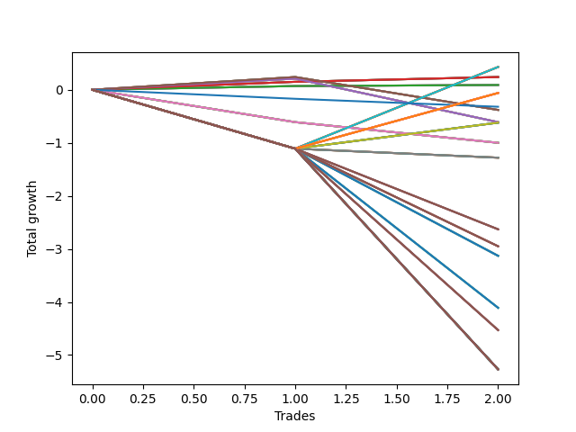

# Short Wallace Doodle 015 
- Symbol: AAPL_Unlimited
- Date Range: 03/23/2022 - 07/08/2022
- Trading Period: 7:20-12:30
- Number of Trades: 2



| Name | Win Percent | Profit | Avg Profit / Trade | Avg Time / Trade |      | Name | Win Percent | Profit | Avg Profit / Trade | Avg Time / Trade |
| ---- | ----------- | ------ | ------------------ | ---------------- | ---- | ---- | ----------- | ------ | ------------------ | ---------------- |
| Sorted By <br> Profit | | | | | | Sorted By <br> Win Percentage ||||
| Seventy-One | 50.00 | 215.00 | 107.50 | 124:02 |     | Sixty-Five | 100.00 | 120.00 | 60.00 | 19:17 |
| Sixty-Three | 50.00 | 215.00 | 107.50 | 124:02 |     | Fifty-Seven | 100.00 | 120.00 | 60.00 | 19:17 |
| Fifty-Five | 50.00 | 215.00 | 107.50 | 124:02 |     | Forty-Nine | 100.00 | 120.00 | 60.00 | 19:17 |
| Forty-Seven | 50.00 | 215.00 | 107.50 | 124:02 |     | Forty-One | 100.00 | 120.00 | 60.00 | 19:17 |
| Seven | 50.00 | 215.00 | 107.50 | 124:02 |     | One | 100.00 | 120.00 | 60.00 | 19:17 |
| Sixty-Five | 100.00 | 120.00 | 60.00 | 19:17 |     | Sixty-Four | 100.00 | 45.00 | 22.50 | 16:15 |
| Fifty-Seven | 100.00 | 120.00 | 60.00 | 19:17 |     | Fifty-Six | 100.00 | 45.00 | 22.50 | 16:15 |
| Forty-Nine | 100.00 | 120.00 | 60.00 | 19:17 |     | Forty-Eight | 100.00 | 45.00 | 22.50 | 16:15 |
| Forty-One | 100.00 | 120.00 | 60.00 | 19:17 |     | Forty | 100.00 | 45.00 | 22.50 | 16:15 |
| One | 100.00 | 120.00 | 60.00 | 19:17 |     | Zero | 100.00 | 45.00 | 22.50 | 16:15 |
| Sixty-Four | 100.00 | 45.00 | 22.50 | 16:15 |     | Seventy-One | 50.00 | 215.00 | 107.50 | 124:02 |
| Fifty-Six | 100.00 | 45.00 | 22.50 | 16:15 |     | Sixty-Three | 50.00 | 215.00 | 107.50 | 124:02 |
| Forty-Eight | 100.00 | 45.00 | 22.50 | 16:15 |     | Fifty-Five | 50.00 | 215.00 | 107.50 | 124:02 |
| Forty | 100.00 | 45.00 | 22.50 | 16:15 |     | Forty-Seven | 50.00 | 215.00 | 107.50 | 124:02 |
| Zero | 100.00 | 45.00 | 22.50 | 16:15 |     | Seven | 50.00 | 215.00 | 107.50 | 124:02 |
| One Hundred Twenty-Six | 50.00 | -30.00 | -15.00 | 123:32 |     | One Hundred Twenty-Six | 50.00 | -30.00 | -15.00 | 123:32 |
| One Hundred Twenty-One | 50.00 | -30.00 | -15.00 | 123:32 |     | One Hundred Twenty-One | 50.00 | -30.00 | -15.00 | 123:32 |
| One Hundred Sixteen | 50.00 | -30.00 | -15.00 | 123:32 |     | One Hundred Sixteen | 50.00 | -30.00 | -15.00 | 123:32 |
| One Hundred Eleven | 50.00 | -30.00 | -15.00 | 123:32 |     | One Hundred Eleven | 50.00 | -30.00 | -15.00 | 123:32 |
| One Hundred Six | 50.00 | -30.00 | -15.00 | 123:32 |     | One Hundred Six | 50.00 | -30.00 | -15.00 | 123:32 |
| One Hundred One | 50.00 | -30.00 | -15.00 | 123:32 |     | One Hundred One | 50.00 | -30.00 | -15.00 | 123:32 |
| Eighty-One | 50.00 | -30.00 | -15.00 | 123:32 |     | Eighty-One | 50.00 | -30.00 | -15.00 | 123:32 |
| Seventy-Three | 0.00 | -160.00 | -80.00 | 14:35 |     | Sixty-Seven | 50.00 | -190.00 | -95.00 | 62:27 |
| Sixty-Seven | 50.00 | -190.00 | -95.00 | 62:27 |     | Fifty-Nine | 50.00 | -190.00 | -95.00 | 62:27 |
| Fifty-Nine | 50.00 | -190.00 | -95.00 | 62:27 |     | Fifty-One | 50.00 | -190.00 | -95.00 | 62:27 |
| Fifty-One | 50.00 | -190.00 | -95.00 | 62:27 |     | Forty-Three | 50.00 | -190.00 | -95.00 | 62:27 |
| Forty-Three | 50.00 | -190.00 | -95.00 | 62:27 |     | Three | 50.00 | -190.00 | -95.00 | 62:27 |
| Three | 50.00 | -190.00 | -95.00 | 62:27 |     | Sixty-Six | 50.00 | -305.00 | -152.50 | 54:10 |
| Sixty-Six | 50.00 | -305.00 | -152.50 | 54:10 |     | Fifty-Eight | 50.00 | -305.00 | -152.50 | 54:10 |
| Fifty-Eight | 50.00 | -305.00 | -152.50 | 54:10 |     | Fifty | 50.00 | -305.00 | -152.50 | 54:10 |
| Fifty | 50.00 | -305.00 | -152.50 | 54:10 |     | Forty-Two | 50.00 | -305.00 | -152.50 | 54:10 |
| Forty-Two | 50.00 | -305.00 | -152.50 | 54:10 |     | Two | 50.00 | -305.00 | -152.50 | 54:10 |
| Two | 50.00 | -305.00 | -152.50 | 54:10 |     | Seventy | 50.00 | -310.00 | -155.00 | 121:55 |
| Seventy | 50.00 | -310.00 | -155.00 | 121:55 |     | Sixty-Two | 50.00 | -310.00 | -155.00 | 121:55 |
| Sixty-Two | 50.00 | -310.00 | -155.00 | 121:55 |     | Fifty-Four | 50.00 | -310.00 | -155.00 | 121:55 |
| Fifty-Four | 50.00 | -310.00 | -155.00 | 121:55 |     | Forty-Six | 50.00 | -310.00 | -155.00 | 121:55 |
| Forty-Six | 50.00 | -310.00 | -155.00 | 121:55 |     | Six | 50.00 | -310.00 | -155.00 | 121:55 |
| Six | 50.00 | -310.00 | -155.00 | 121:55 |     | Seventy-Three | 0.00 | -160.00 | -80.00 | 14:35 |
| Sixty-Eight | 0.00 | -500.00 | -250.00 | 104:45 |     | Sixty-Eight | 0.00 | -500.00 | -250.00 | 104:45 |
| Sixty | 0.00 | -500.00 | -250.00 | 104:45 |     | Sixty | 0.00 | -500.00 | -250.00 | 104:45 |
| Fifty-Two | 0.00 | -500.00 | -250.00 | 104:45 |     | Fifty-Two | 0.00 | -500.00 | -250.00 | 104:45 |
| Forty-Four | 0.00 | -500.00 | -250.00 | 104:45 |     | Forty-Four | 0.00 | -500.00 | -250.00 | 104:45 |
| Four | 0.00 | -500.00 | -250.00 | 104:45 |     | Four | 0.00 | -500.00 | -250.00 | 104:45 |
| Sixty-Nine | 0.00 | -640.00 | -320.00 | 110:20 |     | Sixty-Nine | 0.00 | -640.00 | -320.00 | 110:20 |
| Sixty-One | 0.00 | -640.00 | -320.00 | 110:20 |     | Sixty-One | 0.00 | -640.00 | -320.00 | 110:20 |
| Fifty-Three | 0.00 | -640.00 | -320.00 | 110:20 |     | Fifty-Three | 0.00 | -640.00 | -320.00 | 110:20 |
| Forty-Five | 0.00 | -640.00 | -320.00 | 110:20 |     | Forty-Five | 0.00 | -640.00 | -320.00 | 110:20 |
| Five | 0.00 | -640.00 | -320.00 | 110:20 |     | Five | 0.00 | -640.00 | -320.00 | 110:20 |
| One Hundred Ten | 0.00 | -1315.00 | -657.50 | 130:00 |     | One Hundred Ten | 0.00 | -1315.00 | -657.50 | 130:00 |
| One Hundred Nine | 0.00 | -1315.00 | -657.50 | 130:00 |     | One Hundred Nine | 0.00 | -1315.00 | -657.50 | 130:00 |
| One Hundred Eight | 0.00 | -1315.00 | -657.50 | 130:00 |     | One Hundred Eight | 0.00 | -1315.00 | -657.50 | 130:00 |
| One Hundred Seven | 0.00 | -1315.00 | -657.50 | 130:00 |     | One Hundred Seven | 0.00 | -1315.00 | -657.50 | 130:00 |
| One Hundred | 0.00 | -1475.00 | -737.50 | 106:50 |     | One Hundred | 0.00 | -1475.00 | -737.50 | 106:50 |
| Ninety-Nine | 0.00 | -1475.00 | -737.50 | 106:50 |     | Ninety-Nine | 0.00 | -1475.00 | -737.50 | 106:50 |
| Ninety-Eight | 0.00 | -1475.00 | -737.50 | 106:50 |     | Ninety-Eight | 0.00 | -1475.00 | -737.50 | 106:50 |
| Ninety-Seven | 0.00 | -1475.00 | -737.50 | 106:50 |     | Ninety-Seven | 0.00 | -1475.00 | -737.50 | 106:50 |
| Ninety-Six | 0.00 | -1475.00 | -737.50 | 106:50 |     | Ninety-Six | 0.00 | -1475.00 | -737.50 | 106:50 |
| Ninety-Five | 0.00 | -1565.00 | -782.50 | 107:02 |     | Ninety-Five | 0.00 | -1565.00 | -782.50 | 107:02 |
| Ninety-Four | 0.00 | -1565.00 | -782.50 | 107:02 |     | Ninety-Four | 0.00 | -1565.00 | -782.50 | 107:02 |
| Ninety-Three | 0.00 | -1565.00 | -782.50 | 107:02 |     | Ninety-Three | 0.00 | -1565.00 | -782.50 | 107:02 |
| Ninety-Two | 0.00 | -1565.00 | -782.50 | 107:02 |     | Ninety-Two | 0.00 | -1565.00 | -782.50 | 107:02 |
| Ninety-One | 0.00 | -1565.00 | -782.50 | 107:02 |     | Ninety-One | 0.00 | -1565.00 | -782.50 | 107:02 |
| One Hundred Five | 0.00 | -2055.00 | -1027.50 | 143:17 |     | One Hundred Five | 0.00 | -2055.00 | -1027.50 | 143:17 |
| One Hundred Four | 0.00 | -2055.00 | -1027.50 | 143:17 |     | One Hundred Four | 0.00 | -2055.00 | -1027.50 | 143:17 |
| One Hundred Three | 0.00 | -2055.00 | -1027.50 | 143:17 |     | One Hundred Three | 0.00 | -2055.00 | -1027.50 | 143:17 |
| One Hundred Two | 0.00 | -2055.00 | -1027.50 | 143:17 |     | One Hundred Two | 0.00 | -2055.00 | -1027.50 | 143:17 |
| One Hundred Twenty | 0.00 | -2265.00 | -1132.50 | 144:40 |     | One Hundred Twenty | 0.00 | -2265.00 | -1132.50 | 144:40 |
| One Hundred Ninteen | 0.00 | -2265.00 | -1132.50 | 144:40 |     | One Hundred Ninteen | 0.00 | -2265.00 | -1132.50 | 144:40 |
| One Hundred Eighteen | 0.00 | -2265.00 | -1132.50 | 144:40 |     | One Hundred Eighteen | 0.00 | -2265.00 | -1132.50 | 144:40 |
| One Hundred Seventeen | 0.00 | -2265.00 | -1132.50 | 144:40 |     | One Hundred Seventeen | 0.00 | -2265.00 | -1132.50 | 144:40 |
| One Hundred Thirty | 0.00 | -2635.00 | -1317.50 | 160:00 |     | One Hundred Thirty | 0.00 | -2635.00 | -1317.50 | 160:00 |
| One Hundred Twenty-Nine | 0.00 | -2635.00 | -1317.50 | 160:00 |     | One Hundred Twenty-Nine | 0.00 | -2635.00 | -1317.50 | 160:00 |
| One Hundred Twenty-Eight | 0.00 | -2635.00 | -1317.50 | 160:00 |     | One Hundred Twenty-Eight | 0.00 | -2635.00 | -1317.50 | 160:00 |
| One Hundred Twenty-Seven | 0.00 | -2635.00 | -1317.50 | 160:00 |     | One Hundred Twenty-Seven | 0.00 | -2635.00 | -1317.50 | 160:00 |
| One Hundred Twenty-Five | 0.00 | -2635.00 | -1317.50 | 160:00 |     | One Hundred Twenty-Five | 0.00 | -2635.00 | -1317.50 | 160:00 |
| One Hundred Twenty-Four | 0.00 | -2635.00 | -1317.50 | 160:00 |     | One Hundred Twenty-Four | 0.00 | -2635.00 | -1317.50 | 160:00 |
| One Hundred Twenty-Three | 0.00 | -2635.00 | -1317.50 | 160:00 |     | One Hundred Twenty-Three | 0.00 | -2635.00 | -1317.50 | 160:00 |
| One Hundred Twenty-Two | 0.00 | -2635.00 | -1317.50 | 160:00 |     | One Hundred Twenty-Two | 0.00 | -2635.00 | -1317.50 | 160:00 |
| One Hundred Fifteen | 0.00 | -2635.00 | -1317.50 | 160:00 |     | One Hundred Fifteen | 0.00 | -2635.00 | -1317.50 | 160:00 |
| One Hundred Fourteen | 0.00 | -2635.00 | -1317.50 | 160:00 |     | One Hundred Fourteen | 0.00 | -2635.00 | -1317.50 | 160:00 |
| One Hundred Thirteen | 0.00 | -2635.00 | -1317.50 | 160:00 |     | One Hundred Thirteen | 0.00 | -2635.00 | -1317.50 | 160:00 |
| One Hundred Twelve | 0.00 | -2635.00 | -1317.50 | 160:00 |     | One Hundred Twelve | 0.00 | -2635.00 | -1317.50 | 160:00 |
| Eighty-Five | 0.00 | -2635.00 | -1317.50 | 160:00 |     | Eighty-Five | 0.00 | -2635.00 | -1317.50 | 160:00 |
| Eighty-Four | 0.00 | -2635.00 | -1317.50 | 160:00 |     | Eighty-Four | 0.00 | -2635.00 | -1317.50 | 160:00 |
| Eighty-Three | 0.00 | -2635.00 | -1317.50 | 160:00 |     | Eighty-Three | 0.00 | -2635.00 | -1317.50 | 160:00 |
| Eighty-Two | 0.00 | -2635.00 | -1317.50 | 160:00 |     | Eighty-Two | 0.00 | -2635.00 | -1317.50 | 160:00 |

## NO STOPLOSS

### Test Zero
* Sell when price hits the middle line of the 20p bollinger
* No Stoploss
* Results:
```
Total Trades: 2
Percent Up: 0.00
Percent Down: 100.00
Total Points Moved Down: 0.09
Potential Profit: 45.00
Total Points Ups: 0.00 Count Ups: 0
Total Points Downs: 0.09 Count Downs: 2
```

<details><summary>Trades</summary>

<code>In: 2022-03-29 10:50:00		Out: 2022-03-29 11:04:05		Total Position Time: 14:05		Total Move Down: 0.07		Total to Date: 0.07</code> <br />
<code>In: 2022-05-04 09:24:00		Out: 2022-05-04 09:42:25		Total Position Time: 18:25		Total Move Down: 0.02		Total to Date: 0.09</code> <br />


</details>

### Test One
* Sell when the price hits the upper line of the 20p 1std bollinger
* No Stoploss
* Results:
```
Total Trades: 2
Percent Up: 0.00
Percent Down: 100.00
Total Points Moved Down: 0.24
Potential Profit: 120.00
Total Points Ups: 0.00 Count Ups: 0
Total Points Downs: 0.24 Count Downs: 2
```

<details><summary>Trades</summary>

<code>In: 2022-03-29 10:50:00		Out: 2022-03-29 11:06:05		Total Position Time: 16:05		Total Move Down: 0.15		Total to Date: 0.15</code> <br />
<code>In: 2022-05-04 09:24:00		Out: 2022-05-04 09:46:30		Total Position Time: 22:30		Total Move Down: 0.09		Total to Date: 0.24</code> <br />


</details>

### Test Two
* Sell when the price hits the upper line of the 20p 2std bollinger
* No Stoploss
* Results:
```
Total Trades: 2
Percent Up: 50.00
Percent Down: 50.00
Total Points Moved Down: -0.61
Potential Profit: -305.00
Total Points Ups: 0.82 Count Ups: 1
Total Points Downs: 0.21 Count Downs: 1
```

<details><summary>Trades</summary>

<code>In: 2022-03-29 10:50:00		Out: 2022-03-29 11:07:05		Total Position Time: 17:05		Total Move Down: 0.21		Total to Date: 0.21</code> <br />
<code>In: 2022-05-04 09:24:00		Out: 2022-05-04 10:55:15		Total Position Time: 91:15		Total Move Down: -0.82		Total to Date: -0.61</code> <br />


</details>

### Test Three
* Sell when price hits the middle line of the 50p bollinger
* No Stoploss
* Results:
```
Total Trades: 2
Percent Up: 50.00
Percent Down: 50.00
Total Points Moved Down: -0.38
Potential Profit: -190.00
Total Points Ups: 0.62 Count Ups: 1
Total Points Downs: 0.24 Count Downs: 1
```

<details><summary>Trades</summary>

<code>In: 2022-03-29 10:50:00		Out: 2022-03-29 11:18:35		Total Position Time: 28:35		Total Move Down: 0.24		Total to Date: 0.24</code> <br />
<code>In: 2022-05-04 09:24:00		Out: 2022-05-04 11:00:20		Total Position Time: 96:20		Total Move Down: -0.62		Total to Date: -0.38</code> <br />


</details>

### Test Four
* Sell when the price hits the upper line of the 50p 1std bollinger
* No Stoploss
* Results:
```
Total Trades: 2
Percent Up: 100.00
Percent Down: 0.00
Total Points Moved Down: -1.00
Potential Profit: -500.00
Total Points Ups: 1.00 Count Ups: 2
Total Points Downs: 0.00 Count Downs: 0
```

<details><summary>Trades</summary>

<code>In: 2022-03-29 10:50:00		Out: 2022-03-29 12:43:05		Total Position Time: 113:05		Total Move Down: -0.61		Total to Date: -0.61</code> <br />
<code>In: 2022-05-04 09:24:00		Out: 2022-05-04 11:00:25		Total Position Time: 96:25		Total Move Down: -0.39		Total to Date: -1.00</code> <br />


</details>

### Test Five
* Sell when the price hits the upper line of the 50p 2std bollinger
* No Stoploss
* Results:
```
Total Trades: 2
Percent Up: 100.00
Percent Down: 0.00
Total Points Moved Down: -1.28
Potential Profit: -640.00
Total Points Ups: 1.28 Count Ups: 2
Total Points Downs: 0.00 Count Downs: 0
```

<details><summary>Trades</summary>

<code>In: 2022-03-29 10:50:00		Out: 2022-03-29 12:47:00		Total Position Time: 117:00		Total Move Down: -1.11		Total to Date: -1.11</code> <br />
<code>In: 2022-05-04 09:24:00		Out: 2022-05-04 11:07:40		Total Position Time: 103:40		Total Move Down: -0.17		Total to Date: -1.28</code> <br />


</details>

### Test Six
* Sell when the price hits the middle line of the 1std VWAP
* No Stoploss
* Results:
```
Total Trades: 2
Percent Up: 50.00
Percent Down: 50.00
Total Points Moved Down: -0.62
Potential Profit: -310.00
Total Points Ups: 1.11 Count Ups: 1
Total Points Downs: 0.49 Count Downs: 1
```

<details><summary>Trades</summary>

<code>In: 2022-03-29 10:50:00		Out: 2022-03-29 12:47:00		Total Position Time: 117:00		Total Move Down: -1.11		Total to Date: -1.11</code> <br />
<code>In: 2022-05-04 09:24:00		Out: 2022-05-04 11:30:50		Total Position Time: 126:50		Total Move Down: 0.49		Total to Date: -0.62</code> <br />


</details>

### Test Seven
* Sell when the price hits the upper line of the 1std VWAP
* No Stoploss
* Results:
```
Total Trades: 2
Percent Up: 50.00
Percent Down: 50.00
Total Points Moved Down: 0.43
Potential Profit: 215.00
Total Points Ups: 1.11 Count Ups: 1
Total Points Downs: 1.54 Count Downs: 1
```

<details><summary>Trades</summary>

<code>In: 2022-03-29 10:50:00		Out: 2022-03-29 12:47:00		Total Position Time: 117:00		Total Move Down: -1.11		Total to Date: -1.11</code> <br />
<code>In: 2022-05-04 09:24:00		Out: 2022-05-04 11:35:05		Total Position Time: 131:05		Total Move Down: 1.54		Total to Date: 0.43</code> <br />


</details>

## STOPLOSS OF 5

### Test Forty
* Sell when price hits the middle line of the 20p bollinger
* Stoploss is -5 points
* Results:
```
Total Trades: 2
Percent Up: 0.00
Percent Down: 100.00
Total Points Moved Down: 0.09
Potential Profit: 45.00
Total Points Ups: 0.00 Count Ups: 0
Total Points Downs: 0.09 Count Downs: 2
```

<details><summary>Trades</summary>

<code>In: 2022-03-29 10:50:00		Out: 2022-03-29 11:04:05		Total Position Time: 14:05		Total Move Down: 0.07		Total to Date: 0.07</code> <br />
<code>In: 2022-05-04 09:24:00		Out: 2022-05-04 09:42:25		Total Position Time: 18:25		Total Move Down: 0.02		Total to Date: 0.09</code> <br />


</details>

### Test Forty-One
* Sell when the price hits the upper line of the 20p 1std bollinger
* Stoploss is -5 points
* Results:
```
Total Trades: 2
Percent Up: 0.00
Percent Down: 100.00
Total Points Moved Down: 0.24
Potential Profit: 120.00
Total Points Ups: 0.00 Count Ups: 0
Total Points Downs: 0.24 Count Downs: 2
```

<details><summary>Trades</summary>

<code>In: 2022-03-29 10:50:00		Out: 2022-03-29 11:06:05		Total Position Time: 16:05		Total Move Down: 0.15		Total to Date: 0.15</code> <br />
<code>In: 2022-05-04 09:24:00		Out: 2022-05-04 09:46:30		Total Position Time: 22:30		Total Move Down: 0.09		Total to Date: 0.24</code> <br />


</details>

### Test Forty-Two
* Sell when the price hits the upper line of the 20p 2std bollinger
* Stoploss is -5 points
* Results:
```
Total Trades: 2
Percent Up: 50.00
Percent Down: 50.00
Total Points Moved Down: -0.61
Potential Profit: -305.00
Total Points Ups: 0.82 Count Ups: 1
Total Points Downs: 0.21 Count Downs: 1
```

<details><summary>Trades</summary>

<code>In: 2022-03-29 10:50:00		Out: 2022-03-29 11:07:05		Total Position Time: 17:05		Total Move Down: 0.21		Total to Date: 0.21</code> <br />
<code>In: 2022-05-04 09:24:00		Out: 2022-05-04 10:55:15		Total Position Time: 91:15		Total Move Down: -0.82		Total to Date: -0.61</code> <br />


</details>

### Test Forty-Three
* Sell when price hits the middle line of the 50p bollinger
* Stoploss is -5 points
* Results:
```
Total Trades: 2
Percent Up: 50.00
Percent Down: 50.00
Total Points Moved Down: -0.38
Potential Profit: -190.00
Total Points Ups: 0.62 Count Ups: 1
Total Points Downs: 0.24 Count Downs: 1
```

<details><summary>Trades</summary>

<code>In: 2022-03-29 10:50:00		Out: 2022-03-29 11:18:35		Total Position Time: 28:35		Total Move Down: 0.24		Total to Date: 0.24</code> <br />
<code>In: 2022-05-04 09:24:00		Out: 2022-05-04 11:00:20		Total Position Time: 96:20		Total Move Down: -0.62		Total to Date: -0.38</code> <br />


</details>

### Test Forty-Four
* Sell when the price hits the upper line of the 50p 1std bollinger
* Stoploss is -5 points
* Results:
```
Total Trades: 2
Percent Up: 100.00
Percent Down: 0.00
Total Points Moved Down: -1.00
Potential Profit: -500.00
Total Points Ups: 1.00 Count Ups: 2
Total Points Downs: 0.00 Count Downs: 0
```

<details><summary>Trades</summary>

<code>In: 2022-03-29 10:50:00		Out: 2022-03-29 12:43:05		Total Position Time: 113:05		Total Move Down: -0.61		Total to Date: -0.61</code> <br />
<code>In: 2022-05-04 09:24:00		Out: 2022-05-04 11:00:25		Total Position Time: 96:25		Total Move Down: -0.39		Total to Date: -1.00</code> <br />


</details>

### Test Forty-Five
* Sell when the price hits the upper line of the 50p 2std bollinger
* Stoploss is -5 points
* Results:
```
Total Trades: 2
Percent Up: 100.00
Percent Down: 0.00
Total Points Moved Down: -1.28
Potential Profit: -640.00
Total Points Ups: 1.28 Count Ups: 2
Total Points Downs: 0.00 Count Downs: 0
```

<details><summary>Trades</summary>

<code>In: 2022-03-29 10:50:00		Out: 2022-03-29 12:47:00		Total Position Time: 117:00		Total Move Down: -1.11		Total to Date: -1.11</code> <br />
<code>In: 2022-05-04 09:24:00		Out: 2022-05-04 11:07:40		Total Position Time: 103:40		Total Move Down: -0.17		Total to Date: -1.28</code> <br />


</details>

### Test Forty-Six
* Sell when the price hits the middle line of the 1std VWAP
* Stoploss is -5 points
* Results:
```
Total Trades: 2
Percent Up: 50.00
Percent Down: 50.00
Total Points Moved Down: -0.62
Potential Profit: -310.00
Total Points Ups: 1.11 Count Ups: 1
Total Points Downs: 0.49 Count Downs: 1
```

<details><summary>Trades</summary>

<code>In: 2022-03-29 10:50:00		Out: 2022-03-29 12:47:00		Total Position Time: 117:00		Total Move Down: -1.11		Total to Date: -1.11</code> <br />
<code>In: 2022-05-04 09:24:00		Out: 2022-05-04 11:30:50		Total Position Time: 126:50		Total Move Down: 0.49		Total to Date: -0.62</code> <br />


</details>

### Test Forty-Seven
* Sell when the price hits the upper line of the 1std VWAP
* Stoploss is -5 points
* Results:
```
Total Trades: 2
Percent Up: 50.00
Percent Down: 50.00
Total Points Moved Down: 0.43
Potential Profit: 215.00
Total Points Ups: 1.11 Count Ups: 1
Total Points Downs: 1.54 Count Downs: 1
```

<details><summary>Trades</summary>

<code>In: 2022-03-29 10:50:00		Out: 2022-03-29 12:47:00		Total Position Time: 117:00		Total Move Down: -1.11		Total to Date: -1.11</code> <br />
<code>In: 2022-05-04 09:24:00		Out: 2022-05-04 11:35:05		Total Position Time: 131:05		Total Move Down: 1.54		Total to Date: 0.43</code> <br />


</details>

## TRAIL STOP OF 5

### Test Forty-Eight
* Sell when price hits the middle line of the 20p bollinger
* Trailing Stop is -5 points
* Results:
```
Total Trades: 2
Percent Up: 0.00
Percent Down: 100.00
Total Points Moved Down: 0.09
Potential Profit: 45.00
Total Points Ups: 0.00 Count Ups: 0
Total Points Downs: 0.09 Count Downs: 2
```

<details><summary>Trades</summary>

<code>In: 2022-03-29 10:50:00		Out: 2022-03-29 11:04:05		Total Position Time: 14:05		Total Move Down: 0.07		Total to Date: 0.07</code> <br />
<code>In: 2022-05-04 09:24:00		Out: 2022-05-04 09:42:25		Total Position Time: 18:25		Total Move Down: 0.02		Total to Date: 0.09</code> <br />


</details>

### Test Forty-Nine
* Sell when the price hits the upper line of the 20p 1std bollinger
* Trailing Stop is -5 points
* Results:
```
Total Trades: 2
Percent Up: 0.00
Percent Down: 100.00
Total Points Moved Down: 0.24
Potential Profit: 120.00
Total Points Ups: 0.00 Count Ups: 0
Total Points Downs: 0.24 Count Downs: 2
```

<details><summary>Trades</summary>

<code>In: 2022-03-29 10:50:00		Out: 2022-03-29 11:06:05		Total Position Time: 16:05		Total Move Down: 0.15		Total to Date: 0.15</code> <br />
<code>In: 2022-05-04 09:24:00		Out: 2022-05-04 09:46:30		Total Position Time: 22:30		Total Move Down: 0.09		Total to Date: 0.24</code> <br />


</details>

### Test Fifty
* Sell when the price hits the upper line of the 20p 2std bollinger
* Trailing Stop is -5 points
* Results:
```
Total Trades: 2
Percent Up: 50.00
Percent Down: 50.00
Total Points Moved Down: -0.61
Potential Profit: -305.00
Total Points Ups: 0.82 Count Ups: 1
Total Points Downs: 0.21 Count Downs: 1
```

<details><summary>Trades</summary>

<code>In: 2022-03-29 10:50:00		Out: 2022-03-29 11:07:05		Total Position Time: 17:05		Total Move Down: 0.21		Total to Date: 0.21</code> <br />
<code>In: 2022-05-04 09:24:00		Out: 2022-05-04 10:55:15		Total Position Time: 91:15		Total Move Down: -0.82		Total to Date: -0.61</code> <br />


</details>

### Test Fifty-One
* Sell when price hits the middle line of the 50p bollinger
* Trailing Stop is -5 points
* Results:
```
Total Trades: 2
Percent Up: 50.00
Percent Down: 50.00
Total Points Moved Down: -0.38
Potential Profit: -190.00
Total Points Ups: 0.62 Count Ups: 1
Total Points Downs: 0.24 Count Downs: 1
```

<details><summary>Trades</summary>

<code>In: 2022-03-29 10:50:00		Out: 2022-03-29 11:18:35		Total Position Time: 28:35		Total Move Down: 0.24		Total to Date: 0.24</code> <br />
<code>In: 2022-05-04 09:24:00		Out: 2022-05-04 11:00:20		Total Position Time: 96:20		Total Move Down: -0.62		Total to Date: -0.38</code> <br />


</details>

### Test Fifty-Two
* Sell when the price hits the upper line of the 50p 1std bollinger
* Trailing Stop is -5 points
* Results:
```
Total Trades: 2
Percent Up: 100.00
Percent Down: 0.00
Total Points Moved Down: -1.00
Potential Profit: -500.00
Total Points Ups: 1.00 Count Ups: 2
Total Points Downs: 0.00 Count Downs: 0
```

<details><summary>Trades</summary>

<code>In: 2022-03-29 10:50:00		Out: 2022-03-29 12:43:05		Total Position Time: 113:05		Total Move Down: -0.61		Total to Date: -0.61</code> <br />
<code>In: 2022-05-04 09:24:00		Out: 2022-05-04 11:00:25		Total Position Time: 96:25		Total Move Down: -0.39		Total to Date: -1.00</code> <br />


</details>

### Test Fifty-Three
* Sell when the price hits the upper line of the 50p 2std bollinger
* Trailing Stop is -5 points
* Results:
```
Total Trades: 2
Percent Up: 100.00
Percent Down: 0.00
Total Points Moved Down: -1.28
Potential Profit: -640.00
Total Points Ups: 1.28 Count Ups: 2
Total Points Downs: 0.00 Count Downs: 0
```

<details><summary>Trades</summary>

<code>In: 2022-03-29 10:50:00		Out: 2022-03-29 12:47:00		Total Position Time: 117:00		Total Move Down: -1.11		Total to Date: -1.11</code> <br />
<code>In: 2022-05-04 09:24:00		Out: 2022-05-04 11:07:40		Total Position Time: 103:40		Total Move Down: -0.17		Total to Date: -1.28</code> <br />


</details>

### Test Fifty-Four
* Sell when the price hits the middle line of the 1std VWAP
* Trailing Stop is -5 points
* Results:
```
Total Trades: 2
Percent Up: 50.00
Percent Down: 50.00
Total Points Moved Down: -0.62
Potential Profit: -310.00
Total Points Ups: 1.11 Count Ups: 1
Total Points Downs: 0.49 Count Downs: 1
```

<details><summary>Trades</summary>

<code>In: 2022-03-29 10:50:00		Out: 2022-03-29 12:47:00		Total Position Time: 117:00		Total Move Down: -1.11		Total to Date: -1.11</code> <br />
<code>In: 2022-05-04 09:24:00		Out: 2022-05-04 11:30:50		Total Position Time: 126:50		Total Move Down: 0.49		Total to Date: -0.62</code> <br />


</details>

### Test Fifty-Five
* Sell when the price hits the upper line of the 1std VWAP
* Trailing Stop is -5 points
* Results:
```
Total Trades: 2
Percent Up: 50.00
Percent Down: 50.00
Total Points Moved Down: 0.43
Potential Profit: 215.00
Total Points Ups: 1.11 Count Ups: 1
Total Points Downs: 1.54 Count Downs: 1
```

<details><summary>Trades</summary>

<code>In: 2022-03-29 10:50:00		Out: 2022-03-29 12:47:00		Total Position Time: 117:00		Total Move Down: -1.11		Total to Date: -1.11</code> <br />
<code>In: 2022-05-04 09:24:00		Out: 2022-05-04 11:35:05		Total Position Time: 131:05		Total Move Down: 1.54		Total to Date: 0.43</code> <br />


</details>

## STOPLOSS OF 10

### Test Fifty-Six
* Sell when price hits the middle line of the 20p bollinger
* Stoploss is -10 points
* Results:
```
Total Trades: 2
Percent Up: 0.00
Percent Down: 100.00
Total Points Moved Down: 0.09
Potential Profit: 45.00
Total Points Ups: 0.00 Count Ups: 0
Total Points Downs: 0.09 Count Downs: 2
```

<details><summary>Trades</summary>

<code>In: 2022-03-29 10:50:00		Out: 2022-03-29 11:04:05		Total Position Time: 14:05		Total Move Down: 0.07		Total to Date: 0.07</code> <br />
<code>In: 2022-05-04 09:24:00		Out: 2022-05-04 09:42:25		Total Position Time: 18:25		Total Move Down: 0.02		Total to Date: 0.09</code> <br />


</details>

### Test Fifty-Seven
* Sell when the price hits the upper line of the 20p 1std bollinger
* Stoploss is -10 points
* Results:
```
Total Trades: 2
Percent Up: 0.00
Percent Down: 100.00
Total Points Moved Down: 0.24
Potential Profit: 120.00
Total Points Ups: 0.00 Count Ups: 0
Total Points Downs: 0.24 Count Downs: 2
```

<details><summary>Trades</summary>

<code>In: 2022-03-29 10:50:00		Out: 2022-03-29 11:06:05		Total Position Time: 16:05		Total Move Down: 0.15		Total to Date: 0.15</code> <br />
<code>In: 2022-05-04 09:24:00		Out: 2022-05-04 09:46:30		Total Position Time: 22:30		Total Move Down: 0.09		Total to Date: 0.24</code> <br />


</details>

### Test Fifty-Eight
* Sell when the price hits the upper line of the 20p 2std bollinger
* Stoploss is -10 points
* Results:
```
Total Trades: 2
Percent Up: 50.00
Percent Down: 50.00
Total Points Moved Down: -0.61
Potential Profit: -305.00
Total Points Ups: 0.82 Count Ups: 1
Total Points Downs: 0.21 Count Downs: 1
```

<details><summary>Trades</summary>

<code>In: 2022-03-29 10:50:00		Out: 2022-03-29 11:07:05		Total Position Time: 17:05		Total Move Down: 0.21		Total to Date: 0.21</code> <br />
<code>In: 2022-05-04 09:24:00		Out: 2022-05-04 10:55:15		Total Position Time: 91:15		Total Move Down: -0.82		Total to Date: -0.61</code> <br />


</details>

### Test Fifty-Nine
* Sell when price hits the middle line of the 50p bollinger
* Stoploss is -10 points
* Results:
```
Total Trades: 2
Percent Up: 50.00
Percent Down: 50.00
Total Points Moved Down: -0.38
Potential Profit: -190.00
Total Points Ups: 0.62 Count Ups: 1
Total Points Downs: 0.24 Count Downs: 1
```

<details><summary>Trades</summary>

<code>In: 2022-03-29 10:50:00		Out: 2022-03-29 11:18:35		Total Position Time: 28:35		Total Move Down: 0.24		Total to Date: 0.24</code> <br />
<code>In: 2022-05-04 09:24:00		Out: 2022-05-04 11:00:20		Total Position Time: 96:20		Total Move Down: -0.62		Total to Date: -0.38</code> <br />


</details>

### Test Sixty
* Sell when the price hits the upper line of the 50p 1std bollinger
* Stoploss is -10 points
* Results:
```
Total Trades: 2
Percent Up: 100.00
Percent Down: 0.00
Total Points Moved Down: -1.00
Potential Profit: -500.00
Total Points Ups: 1.00 Count Ups: 2
Total Points Downs: 0.00 Count Downs: 0
```

<details><summary>Trades</summary>

<code>In: 2022-03-29 10:50:00		Out: 2022-03-29 12:43:05		Total Position Time: 113:05		Total Move Down: -0.61		Total to Date: -0.61</code> <br />
<code>In: 2022-05-04 09:24:00		Out: 2022-05-04 11:00:25		Total Position Time: 96:25		Total Move Down: -0.39		Total to Date: -1.00</code> <br />


</details>

### Test Sixty-One
* Sell when the price hits the upper line of the 50p 2std bollinger
* Stoploss is -10 points
* Results:
```
Total Trades: 2
Percent Up: 100.00
Percent Down: 0.00
Total Points Moved Down: -1.28
Potential Profit: -640.00
Total Points Ups: 1.28 Count Ups: 2
Total Points Downs: 0.00 Count Downs: 0
```

<details><summary>Trades</summary>

<code>In: 2022-03-29 10:50:00		Out: 2022-03-29 12:47:00		Total Position Time: 117:00		Total Move Down: -1.11		Total to Date: -1.11</code> <br />
<code>In: 2022-05-04 09:24:00		Out: 2022-05-04 11:07:40		Total Position Time: 103:40		Total Move Down: -0.17		Total to Date: -1.28</code> <br />


</details>

### Test Sixty-Two
* Sell when the price hits the middle line of the 1std VWAP
* Stoploss is -10 points
* Results:
```
Total Trades: 2
Percent Up: 50.00
Percent Down: 50.00
Total Points Moved Down: -0.62
Potential Profit: -310.00
Total Points Ups: 1.11 Count Ups: 1
Total Points Downs: 0.49 Count Downs: 1
```

<details><summary>Trades</summary>

<code>In: 2022-03-29 10:50:00		Out: 2022-03-29 12:47:00		Total Position Time: 117:00		Total Move Down: -1.11		Total to Date: -1.11</code> <br />
<code>In: 2022-05-04 09:24:00		Out: 2022-05-04 11:30:50		Total Position Time: 126:50		Total Move Down: 0.49		Total to Date: -0.62</code> <br />


</details>

### Test Sixty-Three
* Sell when the price hits the upper line of the 1std VWAP
* Stoploss is -10 points
* Results:
```
Total Trades: 2
Percent Up: 50.00
Percent Down: 50.00
Total Points Moved Down: 0.43
Potential Profit: 215.00
Total Points Ups: 1.11 Count Ups: 1
Total Points Downs: 1.54 Count Downs: 1
```

<details><summary>Trades</summary>

<code>In: 2022-03-29 10:50:00		Out: 2022-03-29 12:47:00		Total Position Time: 117:00		Total Move Down: -1.11		Total to Date: -1.11</code> <br />
<code>In: 2022-05-04 09:24:00		Out: 2022-05-04 11:35:05		Total Position Time: 131:05		Total Move Down: 1.54		Total to Date: 0.43</code> <br />


</details>

## TRAIL STOP OF 10

### Test Sixty-Four
* Sell when price hits the middle line of the 20p bollinger
* Trailing Stop is -10 points
* Results:
```
Total Trades: 2
Percent Up: 0.00
Percent Down: 100.00
Total Points Moved Down: 0.09
Potential Profit: 45.00
Total Points Ups: 0.00 Count Ups: 0
Total Points Downs: 0.09 Count Downs: 2
```

<details><summary>Trades</summary>

<code>In: 2022-03-29 10:50:00		Out: 2022-03-29 11:04:05		Total Position Time: 14:05		Total Move Down: 0.07		Total to Date: 0.07</code> <br />
<code>In: 2022-05-04 09:24:00		Out: 2022-05-04 09:42:25		Total Position Time: 18:25		Total Move Down: 0.02		Total to Date: 0.09</code> <br />


</details>

### Test Sixty-Five
* Sell when the price hits the upper line of the 20p 1std bollinger
* Trailing Stop is -10 points
* Results:
```
Total Trades: 2
Percent Up: 0.00
Percent Down: 100.00
Total Points Moved Down: 0.24
Potential Profit: 120.00
Total Points Ups: 0.00 Count Ups: 0
Total Points Downs: 0.24 Count Downs: 2
```

<details><summary>Trades</summary>

<code>In: 2022-03-29 10:50:00		Out: 2022-03-29 11:06:05		Total Position Time: 16:05		Total Move Down: 0.15		Total to Date: 0.15</code> <br />
<code>In: 2022-05-04 09:24:00		Out: 2022-05-04 09:46:30		Total Position Time: 22:30		Total Move Down: 0.09		Total to Date: 0.24</code> <br />


</details>

### Test Sixty-Six
* Sell when the price hits the upper line of the 20p 2std bollinger
* Trailing Stop is -10 points
* Results:
```
Total Trades: 2
Percent Up: 50.00
Percent Down: 50.00
Total Points Moved Down: -0.61
Potential Profit: -305.00
Total Points Ups: 0.82 Count Ups: 1
Total Points Downs: 0.21 Count Downs: 1
```

<details><summary>Trades</summary>

<code>In: 2022-03-29 10:50:00		Out: 2022-03-29 11:07:05		Total Position Time: 17:05		Total Move Down: 0.21		Total to Date: 0.21</code> <br />
<code>In: 2022-05-04 09:24:00		Out: 2022-05-04 10:55:15		Total Position Time: 91:15		Total Move Down: -0.82		Total to Date: -0.61</code> <br />


</details>

### Test Sixty-Seven
* Sell when price hits the middle line of the 50p bollinger
* Trailing Stop is -10 points
* Results:
```
Total Trades: 2
Percent Up: 50.00
Percent Down: 50.00
Total Points Moved Down: -0.38
Potential Profit: -190.00
Total Points Ups: 0.62 Count Ups: 1
Total Points Downs: 0.24 Count Downs: 1
```

<details><summary>Trades</summary>

<code>In: 2022-03-29 10:50:00		Out: 2022-03-29 11:18:35		Total Position Time: 28:35		Total Move Down: 0.24		Total to Date: 0.24</code> <br />
<code>In: 2022-05-04 09:24:00		Out: 2022-05-04 11:00:20		Total Position Time: 96:20		Total Move Down: -0.62		Total to Date: -0.38</code> <br />


</details>

### Test Sixty-Eight
* Sell when the price hits the upper line of the 50p 1std bollinger
* Trailing Stop is -10 points
* Results:
```
Total Trades: 2
Percent Up: 100.00
Percent Down: 0.00
Total Points Moved Down: -1.00
Potential Profit: -500.00
Total Points Ups: 1.00 Count Ups: 2
Total Points Downs: 0.00 Count Downs: 0
```

<details><summary>Trades</summary>

<code>In: 2022-03-29 10:50:00		Out: 2022-03-29 12:43:05		Total Position Time: 113:05		Total Move Down: -0.61		Total to Date: -0.61</code> <br />
<code>In: 2022-05-04 09:24:00		Out: 2022-05-04 11:00:25		Total Position Time: 96:25		Total Move Down: -0.39		Total to Date: -1.00</code> <br />


</details>

### Test Sixty-Nine
* Sell when the price hits the upper line of the 50p 2std bollinger
* Trailing Stop is -10 points
* Results:
```
Total Trades: 2
Percent Up: 100.00
Percent Down: 0.00
Total Points Moved Down: -1.28
Potential Profit: -640.00
Total Points Ups: 1.28 Count Ups: 2
Total Points Downs: 0.00 Count Downs: 0
```

<details><summary>Trades</summary>

<code>In: 2022-03-29 10:50:00		Out: 2022-03-29 12:47:00		Total Position Time: 117:00		Total Move Down: -1.11		Total to Date: -1.11</code> <br />
<code>In: 2022-05-04 09:24:00		Out: 2022-05-04 11:07:40		Total Position Time: 103:40		Total Move Down: -0.17		Total to Date: -1.28</code> <br />


</details>

### Test Seventy
* Sell when the price hits the middle line of the 1std VWAP
* Trailing Stop is -10 points
* Results:
```
Total Trades: 2
Percent Up: 50.00
Percent Down: 50.00
Total Points Moved Down: -0.62
Potential Profit: -310.00
Total Points Ups: 1.11 Count Ups: 1
Total Points Downs: 0.49 Count Downs: 1
```

<details><summary>Trades</summary>

<code>In: 2022-03-29 10:50:00		Out: 2022-03-29 12:47:00		Total Position Time: 117:00		Total Move Down: -1.11		Total to Date: -1.11</code> <br />
<code>In: 2022-05-04 09:24:00		Out: 2022-05-04 11:30:50		Total Position Time: 126:50		Total Move Down: 0.49		Total to Date: -0.62</code> <br />


</details>

### Test Seventy-One
* Sell when the price hits the upper line of the 1std VWAP
* Trailing Stop is -10 points
* Results:
```
Total Trades: 2
Percent Up: 50.00
Percent Down: 50.00
Total Points Moved Down: 0.43
Potential Profit: 215.00
Total Points Ups: 1.11 Count Ups: 1
Total Points Downs: 1.54 Count Downs: 1
```

<details><summary>Trades</summary>

<code>In: 2022-03-29 10:50:00		Out: 2022-03-29 12:47:00		Total Position Time: 117:00		Total Move Down: -1.11		Total to Date: -1.11</code> <br />
<code>In: 2022-05-04 09:24:00		Out: 2022-05-04 11:35:05		Total Position Time: 131:05		Total Move Down: 1.54		Total to Date: 0.43</code> <br />


</details>

## SPECIAL EXIT CONDITIONS 

### Test Seventy-Three
* Sell when the linear regression slope changes to negative
* No Stoploss
* Results:
```
Total Trades: 2
Percent Up: 100.00
Percent Down: 0.00
Total Points Moved Down: -0.32
Potential Profit: -160.00
Total Points Ups: 0.32 Count Ups: 2
Total Points Downs: 0.00 Count Downs: 0
```

<details><summary>Trades</summary>

<code>In: 2022-03-29 10:50:00		Out: 2022-03-29 11:02:05		Total Position Time: 12:05		Total Move Down: -0.17		Total to Date: -0.17</code> <br />
<code>In: 2022-05-04 09:24:00		Out: 2022-05-04 09:41:05		Total Position Time: 17:05		Total Move Down: -0.15		Total to Date: -0.32</code> <br />


</details>

## TAKE PROFIT

### Test Eighty-One
* Take Profit of 1 Point
* No Stoploss
* Results:
```
Total Trades: 2
Percent Up: 50.00
Percent Down: 50.00
Total Points Moved Down: -0.06
Potential Profit: -30.00
Total Points Ups: 1.11 Count Ups: 1
Total Points Downs: 1.05 Count Downs: 1
```

<details><summary>Trades</summary>

<code>In: 2022-03-29 10:50:00		Out: 2022-03-29 12:47:00		Total Position Time: 117:00		Total Move Down: -1.11		Total to Date: -1.11</code> <br />
<code>In: 2022-05-04 09:24:00		Out: 2022-05-04 11:34:05		Total Position Time: 130:05		Total Move Down: 1.05		Total to Date: -0.06</code> <br />


</details>

### Test Eighty-Two
* Take Profit of 2 Point
* No Stoploss
* Results:
```
Total Trades: 2
Percent Up: 100.00
Percent Down: 0.00
Total Points Moved Down: -5.27
Potential Profit: -2635.00
Total Points Ups: 5.27 Count Ups: 2
Total Points Downs: 0.00 Count Downs: 0
```

<details><summary>Trades</summary>

<code>In: 2022-03-29 10:50:00		Out: 2022-03-29 12:47:00		Total Position Time: 117:00		Total Move Down: -1.11		Total to Date: -1.11</code> <br />
<code>In: 2022-05-04 09:24:00		Out: 2022-05-04 12:47:00		Total Position Time: 203:00		Total Move Down: -4.16		Total to Date: -5.27</code> <br />


</details>

### Test Eighty-Three
* Take Profit of 3 Point
* No Stoploss
* Results:
```
Total Trades: 2
Percent Up: 100.00
Percent Down: 0.00
Total Points Moved Down: -5.27
Potential Profit: -2635.00
Total Points Ups: 5.27 Count Ups: 2
Total Points Downs: 0.00 Count Downs: 0
```

<details><summary>Trades</summary>

<code>In: 2022-03-29 10:50:00		Out: 2022-03-29 12:47:00		Total Position Time: 117:00		Total Move Down: -1.11		Total to Date: -1.11</code> <br />
<code>In: 2022-05-04 09:24:00		Out: 2022-05-04 12:47:00		Total Position Time: 203:00		Total Move Down: -4.16		Total to Date: -5.27</code> <br />


</details>

### Test Eighty-Four
* Take Profit of 4 Point
* No Stoploss
* Results:
```
Total Trades: 2
Percent Up: 100.00
Percent Down: 0.00
Total Points Moved Down: -5.27
Potential Profit: -2635.00
Total Points Ups: 5.27 Count Ups: 2
Total Points Downs: 0.00 Count Downs: 0
```

<details><summary>Trades</summary>

<code>In: 2022-03-29 10:50:00		Out: 2022-03-29 12:47:00		Total Position Time: 117:00		Total Move Down: -1.11		Total to Date: -1.11</code> <br />
<code>In: 2022-05-04 09:24:00		Out: 2022-05-04 12:47:00		Total Position Time: 203:00		Total Move Down: -4.16		Total to Date: -5.27</code> <br />


</details>

### Test Eighty-Five
* Take Profit of 5 Point
* No Stoploss
* Results:
```
Total Trades: 2
Percent Up: 100.00
Percent Down: 0.00
Total Points Moved Down: -5.27
Potential Profit: -2635.00
Total Points Ups: 5.27 Count Ups: 2
Total Points Downs: 0.00 Count Downs: 0
```

<details><summary>Trades</summary>

<code>In: 2022-03-29 10:50:00		Out: 2022-03-29 12:47:00		Total Position Time: 117:00		Total Move Down: -1.11		Total to Date: -1.11</code> <br />
<code>In: 2022-05-04 09:24:00		Out: 2022-05-04 12:47:00		Total Position Time: 203:00		Total Move Down: -4.16		Total to Date: -5.27</code> <br />


</details>

## TAKE PROFIT Stoploss of Two

### Test Ninety-One
* Take Profit of 1 Point
* Stoploss is -2 points
* Results:
```
Total Trades: 2
Percent Up: 100.00
Percent Down: 0.00
Total Points Moved Down: -3.13
Potential Profit: -1565.00
Total Points Ups: 3.13 Count Ups: 2
Total Points Downs: 0.00 Count Downs: 0
```

<details><summary>Trades</summary>

<code>In: 2022-03-29 10:50:00		Out: 2022-03-29 12:47:00		Total Position Time: 117:00		Total Move Down: -1.11		Total to Date: -1.11</code> <br />
<code>In: 2022-05-04 09:24:00		Out: 2022-05-04 11:01:05		Total Position Time: 97:05		Total Move Down: -2.02		Total to Date: -3.13</code> <br />


</details>

### Test Ninety-Two
* Take Profit of 2 Point
* Stoploss is -2 points
* Results:
```
Total Trades: 2
Percent Up: 100.00
Percent Down: 0.00
Total Points Moved Down: -3.13
Potential Profit: -1565.00
Total Points Ups: 3.13 Count Ups: 2
Total Points Downs: 0.00 Count Downs: 0
```

<details><summary>Trades</summary>

<code>In: 2022-03-29 10:50:00		Out: 2022-03-29 12:47:00		Total Position Time: 117:00		Total Move Down: -1.11		Total to Date: -1.11</code> <br />
<code>In: 2022-05-04 09:24:00		Out: 2022-05-04 11:01:05		Total Position Time: 97:05		Total Move Down: -2.02		Total to Date: -3.13</code> <br />


</details>

### Test Ninety-Three
* Take Profit of 3 Point
* Stoploss is -2 points
* Results:
```
Total Trades: 2
Percent Up: 100.00
Percent Down: 0.00
Total Points Moved Down: -3.13
Potential Profit: -1565.00
Total Points Ups: 3.13 Count Ups: 2
Total Points Downs: 0.00 Count Downs: 0
```

<details><summary>Trades</summary>

<code>In: 2022-03-29 10:50:00		Out: 2022-03-29 12:47:00		Total Position Time: 117:00		Total Move Down: -1.11		Total to Date: -1.11</code> <br />
<code>In: 2022-05-04 09:24:00		Out: 2022-05-04 11:01:05		Total Position Time: 97:05		Total Move Down: -2.02		Total to Date: -3.13</code> <br />


</details>

### Test Ninety-Four
* Take Profit of 4 Point
* Stoploss is -2 points
* Results:
```
Total Trades: 2
Percent Up: 100.00
Percent Down: 0.00
Total Points Moved Down: -3.13
Potential Profit: -1565.00
Total Points Ups: 3.13 Count Ups: 2
Total Points Downs: 0.00 Count Downs: 0
```

<details><summary>Trades</summary>

<code>In: 2022-03-29 10:50:00		Out: 2022-03-29 12:47:00		Total Position Time: 117:00		Total Move Down: -1.11		Total to Date: -1.11</code> <br />
<code>In: 2022-05-04 09:24:00		Out: 2022-05-04 11:01:05		Total Position Time: 97:05		Total Move Down: -2.02		Total to Date: -3.13</code> <br />


</details>

### Test Ninety-Five
* Take Profit of 5 Point
* Stoploss is -2 points
* Results:
```
Total Trades: 2
Percent Up: 100.00
Percent Down: 0.00
Total Points Moved Down: -3.13
Potential Profit: -1565.00
Total Points Ups: 3.13 Count Ups: 2
Total Points Downs: 0.00 Count Downs: 0
```

<details><summary>Trades</summary>

<code>In: 2022-03-29 10:50:00		Out: 2022-03-29 12:47:00		Total Position Time: 117:00		Total Move Down: -1.11		Total to Date: -1.11</code> <br />
<code>In: 2022-05-04 09:24:00		Out: 2022-05-04 11:01:05		Total Position Time: 97:05		Total Move Down: -2.02		Total to Date: -3.13</code> <br />


</details>

## TAKE PROFIT Trailstop of Two

### Test Ninety-Six
* Take Profit of 1 Point
* Trailing stop is -2 points
* Results:
```
Total Trades: 2
Percent Up: 100.00
Percent Down: 0.00
Total Points Moved Down: -2.95
Potential Profit: -1475.00
Total Points Ups: 2.95 Count Ups: 2
Total Points Downs: 0.00 Count Downs: 0
```

<details><summary>Trades</summary>

<code>In: 2022-03-29 10:50:00		Out: 2022-03-29 12:47:00		Total Position Time: 117:00		Total Move Down: -1.11		Total to Date: -1.11</code> <br />
<code>In: 2022-05-04 09:24:00		Out: 2022-05-04 11:00:40		Total Position Time: 96:40		Total Move Down: -1.84		Total to Date: -2.95</code> <br />


</details>

### Test Ninety-Seven
* Take Profit of 2 Point
* Trailing stop is -2 points
* Results:
```
Total Trades: 2
Percent Up: 100.00
Percent Down: 0.00
Total Points Moved Down: -2.95
Potential Profit: -1475.00
Total Points Ups: 2.95 Count Ups: 2
Total Points Downs: 0.00 Count Downs: 0
```

<details><summary>Trades</summary>

<code>In: 2022-03-29 10:50:00		Out: 2022-03-29 12:47:00		Total Position Time: 117:00		Total Move Down: -1.11		Total to Date: -1.11</code> <br />
<code>In: 2022-05-04 09:24:00		Out: 2022-05-04 11:00:40		Total Position Time: 96:40		Total Move Down: -1.84		Total to Date: -2.95</code> <br />


</details>

### Test Ninety-Eight
* Take Profit of 3 Point
* Trailing stop is -2 points
* Results:
```
Total Trades: 2
Percent Up: 100.00
Percent Down: 0.00
Total Points Moved Down: -2.95
Potential Profit: -1475.00
Total Points Ups: 2.95 Count Ups: 2
Total Points Downs: 0.00 Count Downs: 0
```

<details><summary>Trades</summary>

<code>In: 2022-03-29 10:50:00		Out: 2022-03-29 12:47:00		Total Position Time: 117:00		Total Move Down: -1.11		Total to Date: -1.11</code> <br />
<code>In: 2022-05-04 09:24:00		Out: 2022-05-04 11:00:40		Total Position Time: 96:40		Total Move Down: -1.84		Total to Date: -2.95</code> <br />


</details>

### Test Ninety-Nine
* Take Profit of 4 Point
* Trailing stop is -2 points
* Results:
```
Total Trades: 2
Percent Up: 100.00
Percent Down: 0.00
Total Points Moved Down: -2.95
Potential Profit: -1475.00
Total Points Ups: 2.95 Count Ups: 2
Total Points Downs: 0.00 Count Downs: 0
```

<details><summary>Trades</summary>

<code>In: 2022-03-29 10:50:00		Out: 2022-03-29 12:47:00		Total Position Time: 117:00		Total Move Down: -1.11		Total to Date: -1.11</code> <br />
<code>In: 2022-05-04 09:24:00		Out: 2022-05-04 11:00:40		Total Position Time: 96:40		Total Move Down: -1.84		Total to Date: -2.95</code> <br />


</details>

### Test One Hundred
* Take Profit of 5 Point
* Trailing stop is -2 points
* Results:
```
Total Trades: 2
Percent Up: 100.00
Percent Down: 0.00
Total Points Moved Down: -2.95
Potential Profit: -1475.00
Total Points Ups: 2.95 Count Ups: 2
Total Points Downs: 0.00 Count Downs: 0
```

<details><summary>Trades</summary>

<code>In: 2022-03-29 10:50:00		Out: 2022-03-29 12:47:00		Total Position Time: 117:00		Total Move Down: -1.11		Total to Date: -1.11</code> <br />
<code>In: 2022-05-04 09:24:00		Out: 2022-05-04 11:00:40		Total Position Time: 96:40		Total Move Down: -1.84		Total to Date: -2.95</code> <br />


</details>

## TAKE PROFIT Stoploss of Three

### Test One Hundred One
* Take Profit of 1 Point
* Stoploss is -3 points
* Results:
```
Total Trades: 2
Percent Up: 50.00
Percent Down: 50.00
Total Points Moved Down: -0.06
Potential Profit: -30.00
Total Points Ups: 1.11 Count Ups: 1
Total Points Downs: 1.05 Count Downs: 1
```

<details><summary>Trades</summary>

<code>In: 2022-03-29 10:50:00		Out: 2022-03-29 12:47:00		Total Position Time: 117:00		Total Move Down: -1.11		Total to Date: -1.11</code> <br />
<code>In: 2022-05-04 09:24:00		Out: 2022-05-04 11:34:05		Total Position Time: 130:05		Total Move Down: 1.05		Total to Date: -0.06</code> <br />


</details>

### Test One Hundred Two
* Take Profit of 2 Point
* Stoploss is -3 points
* Results:
```
Total Trades: 2
Percent Up: 100.00
Percent Down: 0.00
Total Points Moved Down: -4.11
Potential Profit: -2055.00
Total Points Ups: 4.11 Count Ups: 2
Total Points Downs: 0.00 Count Downs: 0
```

<details><summary>Trades</summary>

<code>In: 2022-03-29 10:50:00		Out: 2022-03-29 12:47:00		Total Position Time: 117:00		Total Move Down: -1.11		Total to Date: -1.11</code> <br />
<code>In: 2022-05-04 09:24:00		Out: 2022-05-04 12:13:35		Total Position Time: 169:35		Total Move Down: -3.00		Total to Date: -4.11</code> <br />


</details>

### Test One Hundred Three
* Take Profit of 3 Point
* Stoploss is -3 points
* Results:
```
Total Trades: 2
Percent Up: 100.00
Percent Down: 0.00
Total Points Moved Down: -4.11
Potential Profit: -2055.00
Total Points Ups: 4.11 Count Ups: 2
Total Points Downs: 0.00 Count Downs: 0
```

<details><summary>Trades</summary>

<code>In: 2022-03-29 10:50:00		Out: 2022-03-29 12:47:00		Total Position Time: 117:00		Total Move Down: -1.11		Total to Date: -1.11</code> <br />
<code>In: 2022-05-04 09:24:00		Out: 2022-05-04 12:13:35		Total Position Time: 169:35		Total Move Down: -3.00		Total to Date: -4.11</code> <br />


</details>

### Test One Hundred Four
* Take Profit of 4 Point
* Stoploss is -3 points
* Results:
```
Total Trades: 2
Percent Up: 100.00
Percent Down: 0.00
Total Points Moved Down: -4.11
Potential Profit: -2055.00
Total Points Ups: 4.11 Count Ups: 2
Total Points Downs: 0.00 Count Downs: 0
```

<details><summary>Trades</summary>

<code>In: 2022-03-29 10:50:00		Out: 2022-03-29 12:47:00		Total Position Time: 117:00		Total Move Down: -1.11		Total to Date: -1.11</code> <br />
<code>In: 2022-05-04 09:24:00		Out: 2022-05-04 12:13:35		Total Position Time: 169:35		Total Move Down: -3.00		Total to Date: -4.11</code> <br />


</details>

### Test One Hundred Five
* Take Profit of 5 Point
* Stoploss is -3 points
* Results:
```
Total Trades: 2
Percent Up: 100.00
Percent Down: 0.00
Total Points Moved Down: -4.11
Potential Profit: -2055.00
Total Points Ups: 4.11 Count Ups: 2
Total Points Downs: 0.00 Count Downs: 0
```

<details><summary>Trades</summary>

<code>In: 2022-03-29 10:50:00		Out: 2022-03-29 12:47:00		Total Position Time: 117:00		Total Move Down: -1.11		Total to Date: -1.11</code> <br />
<code>In: 2022-05-04 09:24:00		Out: 2022-05-04 12:13:35		Total Position Time: 169:35		Total Move Down: -3.00		Total to Date: -4.11</code> <br />


</details>

## TAKE PROFIT Trailstop of Three

### Test One Hundred Six
* Take Profit of 1 Point
* Trailing stop is -3 points
* Results:
```
Total Trades: 2
Percent Up: 50.00
Percent Down: 50.00
Total Points Moved Down: -0.06
Potential Profit: -30.00
Total Points Ups: 1.11 Count Ups: 1
Total Points Downs: 1.05 Count Downs: 1
```

<details><summary>Trades</summary>

<code>In: 2022-03-29 10:50:00		Out: 2022-03-29 12:47:00		Total Position Time: 117:00		Total Move Down: -1.11		Total to Date: -1.11</code> <br />
<code>In: 2022-05-04 09:24:00		Out: 2022-05-04 11:34:05		Total Position Time: 130:05		Total Move Down: 1.05		Total to Date: -0.06</code> <br />


</details>

### Test One Hundred Seven
* Take Profit of 2 Point
* Trailing stop is -3 points
* Results:
```
Total Trades: 2
Percent Up: 100.00
Percent Down: 0.00
Total Points Moved Down: -2.63
Potential Profit: -1315.00
Total Points Ups: 2.63 Count Ups: 2
Total Points Downs: 0.00 Count Downs: 0
```

<details><summary>Trades</summary>

<code>In: 2022-03-29 10:50:00		Out: 2022-03-29 12:47:00		Total Position Time: 117:00		Total Move Down: -1.11		Total to Date: -1.11</code> <br />
<code>In: 2022-05-04 09:24:00		Out: 2022-05-04 11:47:00		Total Position Time: 143:00		Total Move Down: -1.52		Total to Date: -2.63</code> <br />


</details>

### Test One Hundred Eight
* Take Profit of 3 Point
* Trailing stop is -3 points
* Results:
```
Total Trades: 2
Percent Up: 100.00
Percent Down: 0.00
Total Points Moved Down: -2.63
Potential Profit: -1315.00
Total Points Ups: 2.63 Count Ups: 2
Total Points Downs: 0.00 Count Downs: 0
```

<details><summary>Trades</summary>

<code>In: 2022-03-29 10:50:00		Out: 2022-03-29 12:47:00		Total Position Time: 117:00		Total Move Down: -1.11		Total to Date: -1.11</code> <br />
<code>In: 2022-05-04 09:24:00		Out: 2022-05-04 11:47:00		Total Position Time: 143:00		Total Move Down: -1.52		Total to Date: -2.63</code> <br />


</details>

### Test One Hundred Nine
* Take Profit of 4 Point
* Trailing stop is -3 points
* Results:
```
Total Trades: 2
Percent Up: 100.00
Percent Down: 0.00
Total Points Moved Down: -2.63
Potential Profit: -1315.00
Total Points Ups: 2.63 Count Ups: 2
Total Points Downs: 0.00 Count Downs: 0
```

<details><summary>Trades</summary>

<code>In: 2022-03-29 10:50:00		Out: 2022-03-29 12:47:00		Total Position Time: 117:00		Total Move Down: -1.11		Total to Date: -1.11</code> <br />
<code>In: 2022-05-04 09:24:00		Out: 2022-05-04 11:47:00		Total Position Time: 143:00		Total Move Down: -1.52		Total to Date: -2.63</code> <br />


</details>

### Test One Hundred Ten
* Take Profit of 5 Point
* Trailing stop is -3 points
* Results:
```
Total Trades: 2
Percent Up: 100.00
Percent Down: 0.00
Total Points Moved Down: -2.63
Potential Profit: -1315.00
Total Points Ups: 2.63 Count Ups: 2
Total Points Downs: 0.00 Count Downs: 0
```

<details><summary>Trades</summary>

<code>In: 2022-03-29 10:50:00		Out: 2022-03-29 12:47:00		Total Position Time: 117:00		Total Move Down: -1.11		Total to Date: -1.11</code> <br />
<code>In: 2022-05-04 09:24:00		Out: 2022-05-04 11:47:00		Total Position Time: 143:00		Total Move Down: -1.52		Total to Date: -2.63</code> <br />


</details>

## TAKE PROFIT Stoploss of Five

### Test One Hundred Eleven
* Take Profit of 1 Point
* Stoploss is -5 points
* Results:
```
Total Trades: 2
Percent Up: 50.00
Percent Down: 50.00
Total Points Moved Down: -0.06
Potential Profit: -30.00
Total Points Ups: 1.11 Count Ups: 1
Total Points Downs: 1.05 Count Downs: 1
```

<details><summary>Trades</summary>

<code>In: 2022-03-29 10:50:00		Out: 2022-03-29 12:47:00		Total Position Time: 117:00		Total Move Down: -1.11		Total to Date: -1.11</code> <br />
<code>In: 2022-05-04 09:24:00		Out: 2022-05-04 11:34:05		Total Position Time: 130:05		Total Move Down: 1.05		Total to Date: -0.06</code> <br />


</details>

### Test One Hundred Twelve
* Take Profit of 2 Point
* Stoploss is -5 points
* Results:
```
Total Trades: 2
Percent Up: 100.00
Percent Down: 0.00
Total Points Moved Down: -5.27
Potential Profit: -2635.00
Total Points Ups: 5.27 Count Ups: 2
Total Points Downs: 0.00 Count Downs: 0
```

<details><summary>Trades</summary>

<code>In: 2022-03-29 10:50:00		Out: 2022-03-29 12:47:00		Total Position Time: 117:00		Total Move Down: -1.11		Total to Date: -1.11</code> <br />
<code>In: 2022-05-04 09:24:00		Out: 2022-05-04 12:47:00		Total Position Time: 203:00		Total Move Down: -4.16		Total to Date: -5.27</code> <br />


</details>

### Test One Hundred Thirteen
* Take Profit of 3 Point
* Stoploss is -5 points
* Results:
```
Total Trades: 2
Percent Up: 100.00
Percent Down: 0.00
Total Points Moved Down: -5.27
Potential Profit: -2635.00
Total Points Ups: 5.27 Count Ups: 2
Total Points Downs: 0.00 Count Downs: 0
```

<details><summary>Trades</summary>

<code>In: 2022-03-29 10:50:00		Out: 2022-03-29 12:47:00		Total Position Time: 117:00		Total Move Down: -1.11		Total to Date: -1.11</code> <br />
<code>In: 2022-05-04 09:24:00		Out: 2022-05-04 12:47:00		Total Position Time: 203:00		Total Move Down: -4.16		Total to Date: -5.27</code> <br />


</details>

### Test One Hundred Fourteen
* Take Profit of 4 Point
* Stoploss is -5 points
* Results:
```
Total Trades: 2
Percent Up: 100.00
Percent Down: 0.00
Total Points Moved Down: -5.27
Potential Profit: -2635.00
Total Points Ups: 5.27 Count Ups: 2
Total Points Downs: 0.00 Count Downs: 0
```

<details><summary>Trades</summary>

<code>In: 2022-03-29 10:50:00		Out: 2022-03-29 12:47:00		Total Position Time: 117:00		Total Move Down: -1.11		Total to Date: -1.11</code> <br />
<code>In: 2022-05-04 09:24:00		Out: 2022-05-04 12:47:00		Total Position Time: 203:00		Total Move Down: -4.16		Total to Date: -5.27</code> <br />


</details>

### Test One Hundred Fifteen
* Take Profit of 5 Point
* Stoploss is -5 points
* Results:
```
Total Trades: 2
Percent Up: 100.00
Percent Down: 0.00
Total Points Moved Down: -5.27
Potential Profit: -2635.00
Total Points Ups: 5.27 Count Ups: 2
Total Points Downs: 0.00 Count Downs: 0
```

<details><summary>Trades</summary>

<code>In: 2022-03-29 10:50:00		Out: 2022-03-29 12:47:00		Total Position Time: 117:00		Total Move Down: -1.11		Total to Date: -1.11</code> <br />
<code>In: 2022-05-04 09:24:00		Out: 2022-05-04 12:47:00		Total Position Time: 203:00		Total Move Down: -4.16		Total to Date: -5.27</code> <br />


</details>

## TAKE PROFIT Trailstop of Five

### Test One Hundred Sixteen
* Take Profit of 1 Point
* Trailing stop is -5 points
* Results:
```
Total Trades: 2
Percent Up: 50.00
Percent Down: 50.00
Total Points Moved Down: -0.06
Potential Profit: -30.00
Total Points Ups: 1.11 Count Ups: 1
Total Points Downs: 1.05 Count Downs: 1
```

<details><summary>Trades</summary>

<code>In: 2022-03-29 10:50:00		Out: 2022-03-29 12:47:00		Total Position Time: 117:00		Total Move Down: -1.11		Total to Date: -1.11</code> <br />
<code>In: 2022-05-04 09:24:00		Out: 2022-05-04 11:34:05		Total Position Time: 130:05		Total Move Down: 1.05		Total to Date: -0.06</code> <br />


</details>

### Test One Hundred Seventeen
* Take Profit of 2 Point
* Trailing stop is -5 points
* Results:
```
Total Trades: 2
Percent Up: 100.00
Percent Down: 0.00
Total Points Moved Down: -4.53
Potential Profit: -2265.00
Total Points Ups: 4.53 Count Ups: 2
Total Points Downs: 0.00 Count Downs: 0
```

<details><summary>Trades</summary>

<code>In: 2022-03-29 10:50:00		Out: 2022-03-29 12:47:00		Total Position Time: 117:00		Total Move Down: -1.11		Total to Date: -1.11</code> <br />
<code>In: 2022-05-04 09:24:00		Out: 2022-05-04 12:16:20		Total Position Time: 172:20		Total Move Down: -3.42		Total to Date: -4.53</code> <br />


</details>

### Test One Hundred Eighteen
* Take Profit of 3 Point
* Trailing stop is -5 points
* Results:
```
Total Trades: 2
Percent Up: 100.00
Percent Down: 0.00
Total Points Moved Down: -4.53
Potential Profit: -2265.00
Total Points Ups: 4.53 Count Ups: 2
Total Points Downs: 0.00 Count Downs: 0
```

<details><summary>Trades</summary>

<code>In: 2022-03-29 10:50:00		Out: 2022-03-29 12:47:00		Total Position Time: 117:00		Total Move Down: -1.11		Total to Date: -1.11</code> <br />
<code>In: 2022-05-04 09:24:00		Out: 2022-05-04 12:16:20		Total Position Time: 172:20		Total Move Down: -3.42		Total to Date: -4.53</code> <br />


</details>

### Test One Hundred Ninteen
* Take Profit of 4 Point
* Trailing stop is -5 points
* Results:
```
Total Trades: 2
Percent Up: 100.00
Percent Down: 0.00
Total Points Moved Down: -4.53
Potential Profit: -2265.00
Total Points Ups: 4.53 Count Ups: 2
Total Points Downs: 0.00 Count Downs: 0
```

<details><summary>Trades</summary>

<code>In: 2022-03-29 10:50:00		Out: 2022-03-29 12:47:00		Total Position Time: 117:00		Total Move Down: -1.11		Total to Date: -1.11</code> <br />
<code>In: 2022-05-04 09:24:00		Out: 2022-05-04 12:16:20		Total Position Time: 172:20		Total Move Down: -3.42		Total to Date: -4.53</code> <br />


</details>

### Test One Hundred Twenty
* Take Profit of 5 Point
* Trailing stop is -5 points
* Results:
```
Total Trades: 2
Percent Up: 100.00
Percent Down: 0.00
Total Points Moved Down: -4.53
Potential Profit: -2265.00
Total Points Ups: 4.53 Count Ups: 2
Total Points Downs: 0.00 Count Downs: 0
```

<details><summary>Trades</summary>

<code>In: 2022-03-29 10:50:00		Out: 2022-03-29 12:47:00		Total Position Time: 117:00		Total Move Down: -1.11		Total to Date: -1.11</code> <br />
<code>In: 2022-05-04 09:24:00		Out: 2022-05-04 12:16:20		Total Position Time: 172:20		Total Move Down: -3.42		Total to Date: -4.53</code> <br />


</details>

## TAKE PROFIT Stoploss of Ten

### Test One Hundred Twenty-One
* Take Profit of 1 Point
* Stoploss is -10 points
* Results:
```
Total Trades: 2
Percent Up: 50.00
Percent Down: 50.00
Total Points Moved Down: -0.06
Potential Profit: -30.00
Total Points Ups: 1.11 Count Ups: 1
Total Points Downs: 1.05 Count Downs: 1
```

<details><summary>Trades</summary>

<code>In: 2022-03-29 10:50:00		Out: 2022-03-29 12:47:00		Total Position Time: 117:00		Total Move Down: -1.11		Total to Date: -1.11</code> <br />
<code>In: 2022-05-04 09:24:00		Out: 2022-05-04 11:34:05		Total Position Time: 130:05		Total Move Down: 1.05		Total to Date: -0.06</code> <br />


</details>

### Test One Hundred Twenty-Two
* Take Profit of 2 Point
* Stoploss is -10 points
* Results:
```
Total Trades: 2
Percent Up: 100.00
Percent Down: 0.00
Total Points Moved Down: -5.27
Potential Profit: -2635.00
Total Points Ups: 5.27 Count Ups: 2
Total Points Downs: 0.00 Count Downs: 0
```

<details><summary>Trades</summary>

<code>In: 2022-03-29 10:50:00		Out: 2022-03-29 12:47:00		Total Position Time: 117:00		Total Move Down: -1.11		Total to Date: -1.11</code> <br />
<code>In: 2022-05-04 09:24:00		Out: 2022-05-04 12:47:00		Total Position Time: 203:00		Total Move Down: -4.16		Total to Date: -5.27</code> <br />


</details>

### Test One Hundred Twenty-Three
* Take Profit of 3 Point
* Stoploss is -10 points
* Results:
```
Total Trades: 2
Percent Up: 100.00
Percent Down: 0.00
Total Points Moved Down: -5.27
Potential Profit: -2635.00
Total Points Ups: 5.27 Count Ups: 2
Total Points Downs: 0.00 Count Downs: 0
```

<details><summary>Trades</summary>

<code>In: 2022-03-29 10:50:00		Out: 2022-03-29 12:47:00		Total Position Time: 117:00		Total Move Down: -1.11		Total to Date: -1.11</code> <br />
<code>In: 2022-05-04 09:24:00		Out: 2022-05-04 12:47:00		Total Position Time: 203:00		Total Move Down: -4.16		Total to Date: -5.27</code> <br />


</details>

### Test One Hundred Twenty-Four
* Take Profit of 4 Point
* Stoploss is -10 points
* Results:
```
Total Trades: 2
Percent Up: 100.00
Percent Down: 0.00
Total Points Moved Down: -5.27
Potential Profit: -2635.00
Total Points Ups: 5.27 Count Ups: 2
Total Points Downs: 0.00 Count Downs: 0
```

<details><summary>Trades</summary>

<code>In: 2022-03-29 10:50:00		Out: 2022-03-29 12:47:00		Total Position Time: 117:00		Total Move Down: -1.11		Total to Date: -1.11</code> <br />
<code>In: 2022-05-04 09:24:00		Out: 2022-05-04 12:47:00		Total Position Time: 203:00		Total Move Down: -4.16		Total to Date: -5.27</code> <br />


</details>

### Test One Hundred Twenty-Five
* Take Profit of 5 Point
* Stoploss is -10 points
* Results:
```
Total Trades: 2
Percent Up: 100.00
Percent Down: 0.00
Total Points Moved Down: -5.27
Potential Profit: -2635.00
Total Points Ups: 5.27 Count Ups: 2
Total Points Downs: 0.00 Count Downs: 0
```

<details><summary>Trades</summary>

<code>In: 2022-03-29 10:50:00		Out: 2022-03-29 12:47:00		Total Position Time: 117:00		Total Move Down: -1.11		Total to Date: -1.11</code> <br />
<code>In: 2022-05-04 09:24:00		Out: 2022-05-04 12:47:00		Total Position Time: 203:00		Total Move Down: -4.16		Total to Date: -5.27</code> <br />


</details>

## TAKE PROFIT Trailstop of Ten

### Test One Hundred Twenty-Six
* Take Profit of 1 Point
* Trailing stop is -10 points
* Results:
```
Total Trades: 2
Percent Up: 50.00
Percent Down: 50.00
Total Points Moved Down: -0.06
Potential Profit: -30.00
Total Points Ups: 1.11 Count Ups: 1
Total Points Downs: 1.05 Count Downs: 1
```

<details><summary>Trades</summary>

<code>In: 2022-03-29 10:50:00		Out: 2022-03-29 12:47:00		Total Position Time: 117:00		Total Move Down: -1.11		Total to Date: -1.11</code> <br />
<code>In: 2022-05-04 09:24:00		Out: 2022-05-04 11:34:05		Total Position Time: 130:05		Total Move Down: 1.05		Total to Date: -0.06</code> <br />


</details>

### Test One Hundred Twenty-Seven
* Take Profit of 2 Point
* Trailing stop is -10 points
* Results:
```
Total Trades: 2
Percent Up: 100.00
Percent Down: 0.00
Total Points Moved Down: -5.27
Potential Profit: -2635.00
Total Points Ups: 5.27 Count Ups: 2
Total Points Downs: 0.00 Count Downs: 0
```

<details><summary>Trades</summary>

<code>In: 2022-03-29 10:50:00		Out: 2022-03-29 12:47:00		Total Position Time: 117:00		Total Move Down: -1.11		Total to Date: -1.11</code> <br />
<code>In: 2022-05-04 09:24:00		Out: 2022-05-04 12:47:00		Total Position Time: 203:00		Total Move Down: -4.16		Total to Date: -5.27</code> <br />


</details>

### Test One Hundred Twenty-Eight
* Take Profit of 3 Point
* Trailing stop is -10 points
* Results:
```
Total Trades: 2
Percent Up: 100.00
Percent Down: 0.00
Total Points Moved Down: -5.27
Potential Profit: -2635.00
Total Points Ups: 5.27 Count Ups: 2
Total Points Downs: 0.00 Count Downs: 0
```

<details><summary>Trades</summary>

<code>In: 2022-03-29 10:50:00		Out: 2022-03-29 12:47:00		Total Position Time: 117:00		Total Move Down: -1.11		Total to Date: -1.11</code> <br />
<code>In: 2022-05-04 09:24:00		Out: 2022-05-04 12:47:00		Total Position Time: 203:00		Total Move Down: -4.16		Total to Date: -5.27</code> <br />


</details>

### Test One Hundred Twenty-Nine
* Take Profit of 4 Point
* Trailing stop is -10 points
* Results:
```
Total Trades: 2
Percent Up: 100.00
Percent Down: 0.00
Total Points Moved Down: -5.27
Potential Profit: -2635.00
Total Points Ups: 5.27 Count Ups: 2
Total Points Downs: 0.00 Count Downs: 0
```

<details><summary>Trades</summary>

<code>In: 2022-03-29 10:50:00		Out: 2022-03-29 12:47:00		Total Position Time: 117:00		Total Move Down: -1.11		Total to Date: -1.11</code> <br />
<code>In: 2022-05-04 09:24:00		Out: 2022-05-04 12:47:00		Total Position Time: 203:00		Total Move Down: -4.16		Total to Date: -5.27</code> <br />


</details>

### Test One Hundred Thirty
* Take Profit of 5 Point
* Trailing stop is -10 points
* Results:
```
Total Trades: 2
Percent Up: 100.00
Percent Down: 0.00
Total Points Moved Down: -5.27
Potential Profit: -2635.00
Total Points Ups: 5.27 Count Ups: 2
Total Points Downs: 0.00 Count Downs: 0
```

<details><summary>Trades</summary>

<code>In: 2022-03-29 10:50:00		Out: 2022-03-29 12:47:00		Total Position Time: 117:00		Total Move Down: -1.11		Total to Date: -1.11</code> <br />
<code>In: 2022-05-04 09:24:00		Out: 2022-05-04 12:47:00		Total Position Time: 203:00		Total Move Down: -4.16		Total to Date: -5.27</code> <br />


</details>