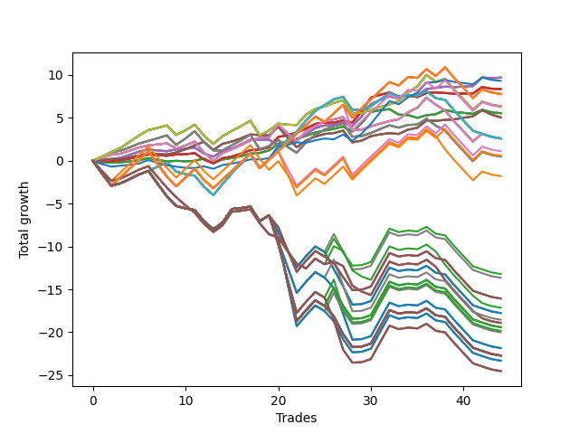

# Short Wallace Doodle 019 
- Symbol: AAPL_Unlimited
- Date Range: 03/23/2022 - 07/08/2022
- Trading Period: 7:20-12:30
- Number of Trades: 44



| Name | Win Percent | Profit | Avg Profit / Trade | Avg Time / Trade |      | Name | Win Percent | Profit | Avg Profit / Trade | Avg Time / Trade |
| ---- | ----------- | ------ | ------------------ | ---------------- | ---- | ---- | ----------- | ------ | ------------------ | ---------------- |
| Sorted By <br> Profit | | | | | | Sorted By <br> Win Percentage ||||
| Sixty-Six | 77.27 | 4850.00 | 110.23 | 24:00 |     | Sixty-Six | 77.27 | 4850.00 | 110.23 | 24:00 |
| Fifty-Eight | 77.27 | 4850.00 | 110.23 | 24:00 |     | Fifty-Eight | 77.27 | 4850.00 | 110.23 | 24:00 |
| Fifty | 77.27 | 4850.00 | 110.23 | 24:00 |     | Fifty | 77.27 | 4850.00 | 110.23 | 24:00 |
| Forty-Two | 77.27 | 4850.00 | 110.23 | 24:00 |     | Forty-Two | 77.27 | 4850.00 | 110.23 | 24:00 |
| Two | 77.27 | 4850.00 | 110.23 | 24:00 |     | Two | 77.27 | 4850.00 | 110.23 | 24:00 |
| Seventy-Three | 59.09 | 4660.00 | 105.91 | 15:58 |     | Sixty-Five | 70.45 | 4180.00 | 95.00 | 18:12 |
| Sixty-Five | 70.45 | 4180.00 | 95.00 | 18:12 |     | Fifty-Seven | 70.45 | 4180.00 | 95.00 | 18:12 |
| Fifty-Seven | 70.45 | 4180.00 | 95.00 | 18:12 |     | Forty-Nine | 70.45 | 4180.00 | 95.00 | 18:12 |
| Forty-Nine | 70.45 | 4180.00 | 95.00 | 18:12 |     | Forty-One | 70.45 | 4180.00 | 95.00 | 18:12 |
| Forty-One | 70.45 | 4180.00 | 95.00 | 18:12 |     | One | 70.45 | 4180.00 | 95.00 | 18:12 |
| One | 70.45 | 4180.00 | 95.00 | 18:12 |     | Seventy | 70.45 | 3170.00 | 72.05 | 57:37 |
| One Hundred Twenty-Six | 59.09 | 3890.00 | 88.41 | 100:28 |     | Sixty-Two | 70.45 | 3170.00 | 72.05 | 57:37 |
| One Hundred Twenty-One | 59.09 | 3890.00 | 88.41 | 100:28 |     | Fifty-Four | 70.45 | 3170.00 | 72.05 | 57:37 |
| One Hundred Sixteen | 59.09 | 3890.00 | 88.41 | 100:28 |     | Forty-Six | 70.45 | 3170.00 | 72.05 | 57:37 |
| One Hundred Eleven | 59.09 | 3890.00 | 88.41 | 100:28 |     | Six | 70.45 | 3170.00 | 72.05 | 57:37 |
| Eighty-One | 59.09 | 3890.00 | 88.41 | 100:28 |     | Sixty-Seven | 70.45 | 2525.00 | 57.39 | 31:30 |
| Seventy | 70.45 | 3170.00 | 72.05 | 57:37 |     | Fifty-Nine | 70.45 | 2525.00 | 57.39 | 31:30 |
| Sixty-Two | 70.45 | 3170.00 | 72.05 | 57:37 |     | Fifty-One | 70.45 | 2525.00 | 57.39 | 31:30 |
| Fifty-Four | 70.45 | 3170.00 | 72.05 | 57:37 |     | Forty-Three | 70.45 | 2525.00 | 57.39 | 31:30 |
| Forty-Six | 70.45 | 3170.00 | 72.05 | 57:37 |     | Three | 70.45 | 2525.00 | 57.39 | 31:30 |
| Six | 70.45 | 3170.00 | 72.05 | 57:37 |     | Sixty-Eight | 70.45 | 1305.00 | 29.66 | 48:20 |
| One Hundred One | 59.09 | 3140.00 | 71.36 | 100:12 |     | Sixty | 70.45 | 1305.00 | 29.66 | 48:20 |
| Sixty-Four | 65.91 | 2770.00 | 62.95 | 12:00 |     | Fifty-Two | 70.45 | 1305.00 | 29.66 | 48:20 |
| Fifty-Six | 65.91 | 2770.00 | 62.95 | 12:00 |     | Forty-Four | 70.45 | 1305.00 | 29.66 | 48:20 |
| Forty-Eight | 65.91 | 2770.00 | 62.95 | 12:00 |     | Four | 70.45 | 1305.00 | 29.66 | 48:20 |
| Forty | 65.91 | 2770.00 | 62.95 | 12:00 |     | Sixty-Four | 65.91 | 2770.00 | 62.95 | 12:00 |
| Zero | 65.91 | 2770.00 | 62.95 | 12:00 |     | Fifty-Six | 65.91 | 2770.00 | 62.95 | 12:00 |
| Sixty-Seven | 70.45 | 2525.00 | 57.39 | 31:30 |     | Forty-Eight | 65.91 | 2770.00 | 62.95 | 12:00 |
| Fifty-Nine | 70.45 | 2525.00 | 57.39 | 31:30 |     | Forty | 65.91 | 2770.00 | 62.95 | 12:00 |
| Fifty-One | 70.45 | 2525.00 | 57.39 | 31:30 |     | Zero | 65.91 | 2770.00 | 62.95 | 12:00 |
| Forty-Three | 70.45 | 2525.00 | 57.39 | 31:30 |     | Sixty-Nine | 63.64 | 250.00 | 5.68 | 66:30 |
| Three | 70.45 | 2525.00 | 57.39 | 31:30 |     | Sixty-One | 63.64 | 250.00 | 5.68 | 66:30 |
| Sixty-Eight | 70.45 | 1305.00 | 29.66 | 48:20 |     | Fifty-Three | 63.64 | 250.00 | 5.68 | 66:30 |
| Sixty | 70.45 | 1305.00 | 29.66 | 48:20 |     | Forty-Five | 63.64 | 250.00 | 5.68 | 66:30 |
| Fifty-Two | 70.45 | 1305.00 | 29.66 | 48:20 |     | Five | 63.64 | 250.00 | 5.68 | 66:30 |
| Forty-Four | 70.45 | 1305.00 | 29.66 | 48:20 |     | Seventy-Three | 59.09 | 4660.00 | 105.91 | 15:58 |
| Four | 70.45 | 1305.00 | 29.66 | 48:20 |     | One Hundred Twenty-Six | 59.09 | 3890.00 | 88.41 | 100:28 |
| Seventy-One | 56.82 | 1295.00 | 29.43 | 113:50 |     | One Hundred Twenty-One | 59.09 | 3890.00 | 88.41 | 100:28 |
| Sixty-Three | 56.82 | 1295.00 | 29.43 | 113:50 |     | One Hundred Sixteen | 59.09 | 3890.00 | 88.41 | 100:28 |
| Fifty-Five | 56.82 | 1295.00 | 29.43 | 113:50 |     | One Hundred Eleven | 59.09 | 3890.00 | 88.41 | 100:28 |
| Forty-Seven | 56.82 | 1295.00 | 29.43 | 113:50 |     | Eighty-One | 59.09 | 3890.00 | 88.41 | 100:28 |
| Seven | 56.82 | 1295.00 | 29.43 | 113:50 |     | One Hundred One | 59.09 | 3140.00 | 71.36 | 100:12 |
| Ninety-One | 54.55 | 555.00 | 12.61 | 97:23 |     | Seventy-One | 56.82 | 1295.00 | 29.43 | 113:50 |
| One Hundred Six | 54.55 | 285.00 | 6.48 | 98:55 |     | Sixty-Three | 56.82 | 1295.00 | 29.43 | 113:50 |
| Sixty-Nine | 63.64 | 250.00 | 5.68 | 66:30 |     | Fifty-Five | 56.82 | 1295.00 | 29.43 | 113:50 |
| Sixty-One | 63.64 | 250.00 | 5.68 | 66:30 |     | Forty-Seven | 56.82 | 1295.00 | 29.43 | 113:50 |
| Fifty-Three | 63.64 | 250.00 | 5.68 | 66:30 |     | Seven | 56.82 | 1295.00 | 29.43 | 113:50 |
| Forty-Five | 63.64 | 250.00 | 5.68 | 66:30 |     | Ninety-One | 54.55 | 555.00 | 12.61 | 97:23 |
| Five | 63.64 | 250.00 | 5.68 | 66:30 |     | One Hundred Six | 54.55 | 285.00 | 6.48 | 98:55 |
| Ninety-Six | 50.00 | -900.00 | -20.45 | 86:24 |     | Ninety-Six | 50.00 | -900.00 | -20.45 | 86:24 |
| One Hundred Seven | 40.91 | -6605.00 | -150.11 | 141:00 |     | One Hundred Seven | 40.91 | -6605.00 | -150.11 | 141:00 |
| Ninety-Two | 40.91 | -6825.00 | -155.11 | 141:35 |     | Ninety-Two | 40.91 | -6825.00 | -155.11 | 141:35 |
| One Hundred Ten | 38.64 | -8035.00 | -182.61 | 141:47 |     | One Hundred Two | 40.91 | -9270.00 | -210.68 | 147:40 |
| One Hundred Nine | 38.64 | -8035.00 | -182.61 | 141:47 |     | One Hundred Twenty-Seven | 40.91 | -9705.00 | -220.57 | 153:33 |
| One Hundred Eight | 38.64 | -8035.00 | -182.61 | 141:47 |     | One Hundred Twenty-Two | 40.91 | -9705.00 | -220.57 | 153:33 |
| Ninety-Seven | 31.82 | -8570.00 | -194.77 | 119:59 |     | Eighty-Two | 40.91 | -9705.00 | -220.57 | 153:33 |
| Ninety-Five | 38.64 | -8880.00 | -201.82 | 143:28 |     | One Hundred Seventeen | 40.91 | -9915.00 | -225.34 | 151:20 |
| Ninety-Four | 38.64 | -8880.00 | -201.82 | 143:28 |     | One Hundred Twelve | 40.91 | -10005.00 | -227.39 | 153:16 |
| Ninety-Three | 38.64 | -8880.00 | -201.82 | 143:28 |     | One Hundred Ten | 38.64 | -8035.00 | -182.61 | 141:47 |
| One Hundred Two | 40.91 | -9270.00 | -210.68 | 147:40 |     | One Hundred Nine | 38.64 | -8035.00 | -182.61 | 141:47 |
| One Hundred | 31.82 | -9455.00 | -214.89 | 120:42 |     | One Hundred Eight | 38.64 | -8035.00 | -182.61 | 141:47 |
| Ninety-Nine | 31.82 | -9455.00 | -214.89 | 120:42 |     | Ninety-Five | 38.64 | -8880.00 | -201.82 | 143:28 |
| Ninety-Eight | 31.82 | -9455.00 | -214.89 | 120:42 |     | Ninety-Four | 38.64 | -8880.00 | -201.82 | 143:28 |
| One Hundred Twenty-Seven | 40.91 | -9705.00 | -220.57 | 153:33 |     | Ninety-Three | 38.64 | -8880.00 | -201.82 | 143:28 |
| One Hundred Twenty-Two | 40.91 | -9705.00 | -220.57 | 153:33 |     | One Hundred Five | 38.64 | -10925.00 | -248.30 | 149:57 |
| Eighty-Two | 40.91 | -9705.00 | -220.57 | 153:33 |     | One Hundred Four | 38.64 | -10925.00 | -248.30 | 149:57 |
| One Hundred Seventeen | 40.91 | -9915.00 | -225.34 | 151:20 |     | One Hundred Three | 38.64 | -10925.00 | -248.30 | 149:57 |
| One Hundred Twelve | 40.91 | -10005.00 | -227.39 | 153:16 |     | One Hundred Thirty | 38.64 | -11360.00 | -258.18 | 155:50 |
| One Hundred Five | 38.64 | -10925.00 | -248.30 | 149:57 |     | One Hundred Twenty-Nine | 38.64 | -11360.00 | -258.18 | 155:50 |
| One Hundred Four | 38.64 | -10925.00 | -248.30 | 149:57 |     | One Hundred Twenty-Eight | 38.64 | -11360.00 | -258.18 | 155:50 |
| One Hundred Three | 38.64 | -10925.00 | -248.30 | 149:57 |     | One Hundred Twenty-Five | 38.64 | -11360.00 | -258.18 | 155:50 |
| One Hundred Thirty | 38.64 | -11360.00 | -258.18 | 155:50 |     | One Hundred Twenty-Four | 38.64 | -11360.00 | -258.18 | 155:50 |
| One Hundred Twenty-Nine | 38.64 | -11360.00 | -258.18 | 155:50 |     | One Hundred Twenty-Three | 38.64 | -11360.00 | -258.18 | 155:50 |
| One Hundred Twenty-Eight | 38.64 | -11360.00 | -258.18 | 155:50 |     | Eighty-Five | 38.64 | -11360.00 | -258.18 | 155:50 |
| One Hundred Twenty-Five | 38.64 | -11360.00 | -258.18 | 155:50 |     | Eighty-Four | 38.64 | -11360.00 | -258.18 | 155:50 |
| One Hundred Twenty-Four | 38.64 | -11360.00 | -258.18 | 155:50 |     | Eighty-Three | 38.64 | -11360.00 | -258.18 | 155:50 |
| One Hundred Twenty-Three | 38.64 | -11360.00 | -258.18 | 155:50 |     | One Hundred Fifteen | 38.64 | -11660.00 | -265.00 | 155:33 |
| Eighty-Five | 38.64 | -11360.00 | -258.18 | 155:50 |     | One Hundred Fourteen | 38.64 | -11660.00 | -265.00 | 155:33 |
| Eighty-Four | 38.64 | -11360.00 | -258.18 | 155:50 |     | One Hundred Thirteen | 38.64 | -11660.00 | -265.00 | 155:33 |
| Eighty-Three | 38.64 | -11360.00 | -258.18 | 155:50 |     | One Hundred Twenty | 38.64 | -12265.00 | -278.75 | 153:20 |
| One Hundred Fifteen | 38.64 | -11660.00 | -265.00 | 155:33 |     | One Hundred Ninteen | 38.64 | -12265.00 | -278.75 | 153:20 |
| One Hundred Fourteen | 38.64 | -11660.00 | -265.00 | 155:33 |     | One Hundred Eighteen | 38.64 | -12265.00 | -278.75 | 153:20 |
| One Hundred Thirteen | 38.64 | -11660.00 | -265.00 | 155:33 |     | Ninety-Seven | 31.82 | -8570.00 | -194.77 | 119:59 |
| One Hundred Twenty | 38.64 | -12265.00 | -278.75 | 153:20 |     | One Hundred | 31.82 | -9455.00 | -214.89 | 120:42 |
| One Hundred Ninteen | 38.64 | -12265.00 | -278.75 | 153:20 |     | Ninety-Nine | 31.82 | -9455.00 | -214.89 | 120:42 |
| One Hundred Eighteen | 38.64 | -12265.00 | -278.75 | 153:20 |     | Ninety-Eight | 31.82 | -9455.00 | -214.89 | 120:42 |

## NO STOPLOSS

### Test Zero
* Sell when price hits the middle line of the 20p bollinger
* No Stoploss
* Results:
```
Total Trades: 44
Percent Up: 34.09
Percent Down: 65.91
Total Points Moved Down: 5.54
Potential Profit: 2770.00
Total Points Ups: 3.68 Count Ups: 15
Total Points Downs: 9.22 Count Downs: 29
```

<details><summary>Trades</summary>

<code>In: 2022-03-24 08:28:00		Out: 2022-03-24 08:49:10		Total Position Time: 21:10		Total Move Down: -0.16		Total to Date: -0.16</code> <br />
<code>In: 2022-03-24 08:29:00		Out: 2022-03-24 08:49:10		Total Position Time: 20:10		Total Move Down: -0.07		Total to Date: -0.23</code> <br />
<code>In: 2022-03-25 11:05:00		Out: 2022-03-25 11:17:45		Total Position Time: 12:45		Total Move Down: 0.05		Total to Date: -0.18</code> <br />
<code>In: 2022-03-25 11:54:00		Out: 2022-03-25 11:58:00		Total Position Time: 04:00		Total Move Down: 0.10		Total to Date: -0.08</code> <br />
<code>In: 2022-03-25 11:56:00		Out: 2022-03-25 11:58:00		Total Position Time: 02:00		Total Move Down: 0.14		Total to Date: 0.06</code> <br />
<code>In: 2022-03-25 12:01:00		Out: 2022-03-25 12:02:10		Total Position Time: 01:10		Total Move Down: 0.25		Total to Date: 0.31</code> <br />
<code>In: 2022-03-29 08:20:00		Out: 2022-03-29 08:40:35		Total Position Time: 20:35		Total Move Down: -0.21		Total to Date: 0.10</code> <br />
<code>In: 2022-03-29 08:22:00		Out: 2022-03-29 08:40:35		Total Position Time: 18:35		Total Move Down: -0.18		Total to Date: -0.08</code> <br />
<code>In: 2022-03-29 10:50:00		Out: 2022-03-29 11:04:05		Total Position Time: 14:05		Total Move Down: 0.07		Total to Date: -0.01</code> <br />
<code>In: 2022-04-06 10:39:00		Out: 2022-04-06 10:56:30		Total Position Time: 17:30		Total Move Down: -0.05		Total to Date: -0.06</code> <br />
<code>In: 2022-04-06 10:41:00		Out: 2022-04-06 10:56:30		Total Position Time: 15:30		Total Move Down: 0.05		Total to Date: -0.01</code> <br />
<code>In: 2022-04-07 11:29:00		Out: 2022-04-07 11:30:10		Total Position Time: 01:10		Total Move Down: 0.27		Total to Date: 0.26</code> <br />
<code>In: 2022-04-07 11:52:00		Out: 2022-04-07 12:20:15		Total Position Time: 28:15		Total Move Down: -0.55		Total to Date: -0.29</code> <br />
<code>In: 2022-04-08 08:03:00		Out: 2022-04-08 08:14:05		Total Position Time: 11:05		Total Move Down: 0.44		Total to Date: 0.15</code> <br />
<code>In: 2022-04-18 11:27:00		Out: 2022-04-18 11:40:55		Total Position Time: 13:55		Total Move Down: 0.16		Total to Date: 0.31</code> <br />
<code>In: 2022-04-20 10:46:00		Out: 2022-04-20 10:50:10		Total Position Time: 04:10		Total Move Down: 0.23		Total to Date: 0.54</code> <br />
<code>In: 2022-04-20 10:49:00		Out: 2022-04-20 10:50:10		Total Position Time: 01:10		Total Move Down: 0.29		Total to Date: 0.83</code> <br />
<code>In: 2022-04-25 11:25:00		Out: 2022-04-25 11:40:00		Total Position Time: 15:00		Total Move Down: 0.08		Total to Date: 0.91</code> <br />
<code>In: 2022-04-27 08:04:00		Out: 2022-04-27 08:10:10		Total Position Time: 06:10		Total Move Down: 0.28		Total to Date: 1.19</code> <br />
<code>In: 2022-04-28 07:23:00		Out: 2022-04-28 07:27:00		Total Position Time: 04:00		Total Move Down: 0.79		Total to Date: 1.98</code> <br />
<code>In: 2022-05-04 08:54:00		Out: 2022-05-04 09:04:40		Total Position Time: 10:40		Total Move Down: 0.24		Total to Date: 2.22</code> <br />
<code>In: 2022-05-04 08:56:00		Out: 2022-05-04 09:04:40		Total Position Time: 08:40		Total Move Down: 0.33		Total to Date: 2.55</code> <br />
<code>In: 2022-05-16 08:57:00		Out: 2022-05-16 09:05:45		Total Position Time: 08:45		Total Move Down: 0.36		Total to Date: 2.91</code> <br />
<code>In: 2022-06-10 12:29:00		Out: 2022-06-10 12:31:00		Total Position Time: 02:00		Total Move Down: 0.38		Total to Date: 3.29</code> <br />
<code>In: 2022-06-14 08:46:00		Out: 2022-06-14 08:51:40		Total Position Time: 05:40		Total Move Down: 0.23		Total to Date: 3.52</code> <br />
<code>In: 2022-06-15 09:04:00		Out: 2022-06-15 09:08:20		Total Position Time: 04:20		Total Move Down: 0.19		Total to Date: 3.71</code> <br />
<code>In: 2022-06-15 11:02:00		Out: 2022-06-15 11:03:10		Total Position Time: 01:10		Total Move Down: 0.28		Total to Date: 3.99</code> <br />
<code>In: 2022-06-15 11:40:00		Out: 2022-06-15 11:54:15		Total Position Time: 14:15		Total Move Down: -0.59		Total to Date: 3.40</code> <br />
<code>In: 2022-06-15 11:44:00		Out: 2022-06-15 11:54:15		Total Position Time: 10:15		Total Move Down: 0.99		Total to Date: 4.39</code> <br />
<code>In: 2022-06-15 11:45:00		Out: 2022-06-15 11:54:15		Total Position Time: 09:15		Total Move Down: 1.29		Total to Date: 5.68</code> <br />
<code>In: 2022-06-16 10:30:00		Out: 2022-06-16 10:32:15		Total Position Time: 02:15		Total Move Down: 0.22		Total to Date: 5.90</code> <br />
<code>In: 2022-06-16 10:32:00		Out: 2022-06-16 10:37:00		Total Position Time: 05:00		Total Move Down: 0.12		Total to Date: 6.02</code> <br />
<code>In: 2022-06-17 08:09:00		Out: 2022-06-17 08:38:40		Total Position Time: 29:40		Total Move Down: -0.64		Total to Date: 5.38</code> <br />
<code>In: 2022-06-17 08:20:00		Out: 2022-06-17 08:38:40		Total Position Time: 18:40		Total Move Down: -0.05		Total to Date: 5.33</code> <br />
<code>In: 2022-06-17 08:21:00		Out: 2022-06-17 08:38:40		Total Position Time: 17:40		Total Move Down: -0.33		Total to Date: 5.00</code> <br />
<code>In: 2022-06-17 08:30:00		Out: 2022-06-17 08:38:40		Total Position Time: 08:40		Total Move Down: 0.31		Total to Date: 5.31</code> <br />
<code>In: 2022-06-23 11:35:00		Out: 2022-06-23 11:46:00		Total Position Time: 11:00		Total Move Down: 0.12		Total to Date: 5.43</code> <br />
<code>In: 2022-06-30 08:29:00		Out: 2022-06-30 08:36:00		Total Position Time: 07:00		Total Move Down: 0.48		Total to Date: 5.91</code> <br />
<code>In: 2022-07-01 10:40:00		Out: 2022-07-01 11:04:25		Total Position Time: 24:25		Total Move Down: -0.22		Total to Date: 5.69</code> <br />
<code>In: 2022-07-01 10:42:00		Out: 2022-07-01 11:04:25		Total Position Time: 22:25		Total Move Down: -0.11		Total to Date: 5.58</code> <br />
<code>In: 2022-07-01 10:47:00		Out: 2022-07-01 11:04:25		Total Position Time: 17:25		Total Move Down: -0.12		Total to Date: 5.46</code> <br />
<code>In: 2022-07-06 11:09:00		Out: 2022-07-06 11:11:05		Total Position Time: 02:05		Total Move Down: 0.48		Total to Date: 5.94</code> <br />
<code>In: 2022-07-06 11:33:00		Out: 2022-07-06 12:00:50		Total Position Time: 27:50		Total Move Down: -0.28		Total to Date: 5.66</code> <br />
<code>In: 2022-07-06 11:34:00		Out: 2022-07-06 12:00:50		Total Position Time: 26:50		Total Move Down: -0.12		Total to Date: 5.54</code> <br />


</details>

### Test One
* Sell when the price hits the upper line of the 20p 1std bollinger
* No Stoploss
* Results:
```
Total Trades: 44
Percent Up: 29.55
Percent Down: 70.45
Total Points Moved Down: 8.36
Potential Profit: 4180.00
Total Points Ups: 2.75 Count Ups: 13
Total Points Downs: 11.11 Count Downs: 31
```

<details><summary>Trades</summary>

<code>In: 2022-03-24 08:28:00		Out: 2022-03-24 08:50:10		Total Position Time: 22:10		Total Move Down: -0.07		Total to Date: -0.07</code> <br />
<code>In: 2022-03-24 08:29:00		Out: 2022-03-24 08:50:10		Total Position Time: 21:10		Total Move Down: 0.02		Total to Date: -0.05</code> <br />
<code>In: 2022-03-25 11:05:00		Out: 2022-03-25 11:19:05		Total Position Time: 14:05		Total Move Down: 0.11		Total to Date: 0.06</code> <br />
<code>In: 2022-03-25 11:54:00		Out: 2022-03-25 12:01:45		Total Position Time: 07:45		Total Move Down: 0.19		Total to Date: 0.25</code> <br />
<code>In: 2022-03-25 11:56:00		Out: 2022-03-25 12:01:45		Total Position Time: 05:45		Total Move Down: 0.23		Total to Date: 0.48</code> <br />
<code>In: 2022-03-25 12:01:00		Out: 2022-03-25 12:02:10		Total Position Time: 01:10		Total Move Down: 0.25		Total to Date: 0.73</code> <br />
<code>In: 2022-03-29 08:20:00		Out: 2022-03-29 08:41:15		Total Position Time: 21:15		Total Move Down: -0.09		Total to Date: 0.64</code> <br />
<code>In: 2022-03-29 08:22:00		Out: 2022-03-29 08:41:15		Total Position Time: 19:15		Total Move Down: -0.06		Total to Date: 0.58</code> <br />
<code>In: 2022-03-29 10:50:00		Out: 2022-03-29 11:06:05		Total Position Time: 16:05		Total Move Down: 0.15		Total to Date: 0.73</code> <br />
<code>In: 2022-04-06 10:39:00		Out: 2022-04-06 10:58:00		Total Position Time: 19:00		Total Move Down: 0.03		Total to Date: 0.76</code> <br />
<code>In: 2022-04-06 10:41:00		Out: 2022-04-06 10:58:00		Total Position Time: 17:00		Total Move Down: 0.13		Total to Date: 0.89</code> <br />
<code>In: 2022-04-07 11:29:00		Out: 2022-04-07 12:27:40		Total Position Time: 58:40		Total Move Down: -0.76		Total to Date: 0.13</code> <br />
<code>In: 2022-04-07 11:52:00		Out: 2022-04-07 12:27:40		Total Position Time: 35:40		Total Move Down: -0.43		Total to Date: -0.30</code> <br />
<code>In: 2022-04-08 08:03:00		Out: 2022-04-08 08:15:40		Total Position Time: 12:40		Total Move Down: 0.60		Total to Date: 0.30</code> <br />
<code>In: 2022-04-18 11:27:00		Out: 2022-04-18 11:44:10		Total Position Time: 17:10		Total Move Down: 0.19		Total to Date: 0.49</code> <br />
<code>In: 2022-04-20 10:46:00		Out: 2022-04-20 10:54:05		Total Position Time: 08:05		Total Move Down: 0.34		Total to Date: 0.83</code> <br />
<code>In: 2022-04-20 10:49:00		Out: 2022-04-20 10:54:05		Total Position Time: 05:05		Total Move Down: 0.40		Total to Date: 1.23</code> <br />
<code>In: 2022-04-25 11:25:00		Out: 2022-04-25 11:44:50		Total Position Time: 19:50		Total Move Down: 0.07		Total to Date: 1.30</code> <br />
<code>In: 2022-04-27 08:04:00		Out: 2022-04-27 08:20:25		Total Position Time: 16:25		Total Move Down: 0.26		Total to Date: 1.56</code> <br />
<code>In: 2022-04-28 07:23:00		Out: 2022-04-28 07:29:40		Total Position Time: 06:40		Total Move Down: 1.21		Total to Date: 2.77</code> <br />
<code>In: 2022-05-04 08:54:00		Out: 2022-05-04 09:10:15		Total Position Time: 16:15		Total Move Down: 0.21		Total to Date: 2.98</code> <br />
<code>In: 2022-05-04 08:56:00		Out: 2022-05-04 09:10:15		Total Position Time: 14:15		Total Move Down: 0.30		Total to Date: 3.28</code> <br />
<code>In: 2022-05-16 08:57:00		Out: 2022-05-16 09:11:30		Total Position Time: 14:30		Total Move Down: 0.47		Total to Date: 3.75</code> <br />
<code>In: 2022-06-10 12:29:00		Out: 2022-06-10 12:42:25		Total Position Time: 13:25		Total Move Down: 0.55		Total to Date: 4.30</code> <br />
<code>In: 2022-06-14 08:46:00		Out: 2022-06-14 09:02:10		Total Position Time: 16:10		Total Move Down: 0.16		Total to Date: 4.46</code> <br />
<code>In: 2022-06-15 09:04:00		Out: 2022-06-15 09:33:30		Total Position Time: 29:30		Total Move Down: -0.02		Total to Date: 4.44</code> <br />
<code>In: 2022-06-15 11:02:00		Out: 2022-06-15 11:03:10		Total Position Time: 01:10		Total Move Down: 0.28		Total to Date: 4.72</code> <br />
<code>In: 2022-06-15 11:40:00		Out: 2022-06-15 11:58:05		Total Position Time: 18:05		Total Move Down: -0.27		Total to Date: 4.45</code> <br />
<code>In: 2022-06-15 11:44:00		Out: 2022-06-15 11:58:05		Total Position Time: 14:05		Total Move Down: 1.31		Total to Date: 5.76</code> <br />
<code>In: 2022-06-15 11:45:00		Out: 2022-06-15 11:58:05		Total Position Time: 13:05		Total Move Down: 1.61		Total to Date: 7.37</code> <br />
<code>In: 2022-06-16 10:30:00		Out: 2022-06-16 10:43:50		Total Position Time: 13:50		Total Move Down: 0.32		Total to Date: 7.69</code> <br />
<code>In: 2022-06-16 10:32:00		Out: 2022-06-16 10:43:50		Total Position Time: 11:50		Total Move Down: 0.28		Total to Date: 7.97</code> <br />
<code>In: 2022-06-17 08:09:00		Out: 2022-06-17 08:42:50		Total Position Time: 33:50		Total Move Down: -0.48		Total to Date: 7.49</code> <br />
<code>In: 2022-06-17 08:20:00		Out: 2022-06-17 08:42:50		Total Position Time: 22:50		Total Move Down: 0.11		Total to Date: 7.60</code> <br />
<code>In: 2022-06-17 08:21:00		Out: 2022-06-17 08:42:50		Total Position Time: 21:50		Total Move Down: -0.17		Total to Date: 7.43</code> <br />
<code>In: 2022-06-17 08:30:00		Out: 2022-06-17 08:42:50		Total Position Time: 12:50		Total Move Down: 0.47		Total to Date: 7.90</code> <br />
<code>In: 2022-06-23 11:35:00		Out: 2022-06-23 11:53:30		Total Position Time: 18:30		Total Move Down: 0.07		Total to Date: 7.97</code> <br />
<code>In: 2022-06-30 08:29:00		Out: 2022-06-30 09:05:45		Total Position Time: 36:45		Total Move Down: -0.07		Total to Date: 7.90</code> <br />
<code>In: 2022-07-01 10:40:00		Out: 2022-07-01 11:07:55		Total Position Time: 27:55		Total Move Down: -0.09		Total to Date: 7.81</code> <br />
<code>In: 2022-07-01 10:42:00		Out: 2022-07-01 11:07:55		Total Position Time: 25:55		Total Move Down: 0.02		Total to Date: 7.83</code> <br />
<code>In: 2022-07-01 10:47:00		Out: 2022-07-01 11:07:55		Total Position Time: 20:55		Total Move Down: 0.01		Total to Date: 7.84</code> <br />
<code>In: 2022-07-06 11:09:00		Out: 2022-07-06 11:11:50		Total Position Time: 02:50		Total Move Down: 0.76		Total to Date: 8.60</code> <br />
<code>In: 2022-07-06 11:33:00		Out: 2022-07-06 12:01:25		Total Position Time: 28:25		Total Move Down: -0.20		Total to Date: 8.40</code> <br />
<code>In: 2022-07-06 11:34:00		Out: 2022-07-06 12:01:25		Total Position Time: 27:25		Total Move Down: -0.04		Total to Date: 8.36</code> <br />


</details>

### Test Two
* Sell when the price hits the upper line of the 20p 2std bollinger
* No Stoploss
* Results:
```
Total Trades: 44
Percent Up: 22.73
Percent Down: 77.27
Total Points Moved Down: 9.70
Potential Profit: 4850.00
Total Points Ups: 2.87 Count Ups: 10
Total Points Downs: 12.57 Count Downs: 34
```

<details><summary>Trades</summary>

<code>In: 2022-03-24 08:28:00		Out: 2022-03-24 08:51:00		Total Position Time: 23:00		Total Move Down: 0.04		Total to Date: 0.04</code> <br />
<code>In: 2022-03-24 08:29:00		Out: 2022-03-24 08:51:00		Total Position Time: 22:00		Total Move Down: 0.13		Total to Date: 0.17</code> <br />
<code>In: 2022-03-25 11:05:00		Out: 2022-03-25 11:19:55		Total Position Time: 14:55		Total Move Down: 0.18		Total to Date: 0.35</code> <br />
<code>In: 2022-03-25 11:54:00		Out: 2022-03-25 12:02:00		Total Position Time: 08:00		Total Move Down: 0.34		Total to Date: 0.69</code> <br />
<code>In: 2022-03-25 11:56:00		Out: 2022-03-25 12:02:00		Total Position Time: 06:00		Total Move Down: 0.38		Total to Date: 1.07</code> <br />
<code>In: 2022-03-25 12:01:00		Out: 2022-03-25 12:02:10		Total Position Time: 01:10		Total Move Down: 0.25		Total to Date: 1.32</code> <br />
<code>In: 2022-03-29 08:20:00		Out: 2022-03-29 08:57:40		Total Position Time: 37:40		Total Move Down: -0.12		Total to Date: 1.20</code> <br />
<code>In: 2022-03-29 08:22:00		Out: 2022-03-29 08:57:40		Total Position Time: 35:40		Total Move Down: -0.09		Total to Date: 1.11</code> <br />
<code>In: 2022-03-29 10:50:00		Out: 2022-03-29 11:07:05		Total Position Time: 17:05		Total Move Down: 0.21		Total to Date: 1.32</code> <br />
<code>In: 2022-04-06 10:39:00		Out: 2022-04-06 10:59:10		Total Position Time: 20:10		Total Move Down: 0.06		Total to Date: 1.38</code> <br />
<code>In: 2022-04-06 10:41:00		Out: 2022-04-06 10:59:10		Total Position Time: 18:10		Total Move Down: 0.16		Total to Date: 1.54</code> <br />
<code>In: 2022-04-07 11:29:00		Out: 2022-04-07 12:28:30		Total Position Time: 59:30		Total Move Down: -0.70		Total to Date: 0.84</code> <br />
<code>In: 2022-04-07 11:52:00		Out: 2022-04-07 12:28:30		Total Position Time: 36:30		Total Move Down: -0.37		Total to Date: 0.47</code> <br />
<code>In: 2022-04-08 08:03:00		Out: 2022-04-08 08:23:20		Total Position Time: 20:20		Total Move Down: 0.67		Total to Date: 1.14</code> <br />
<code>In: 2022-04-18 11:27:00		Out: 2022-04-18 11:46:05		Total Position Time: 19:05		Total Move Down: 0.28		Total to Date: 1.42</code> <br />
<code>In: 2022-04-20 10:46:00		Out: 2022-04-20 11:03:15		Total Position Time: 17:15		Total Move Down: 0.49		Total to Date: 1.91</code> <br />
<code>In: 2022-04-20 10:49:00		Out: 2022-04-20 11:03:15		Total Position Time: 14:15		Total Move Down: 0.55		Total to Date: 2.46</code> <br />
<code>In: 2022-04-25 11:25:00		Out: 2022-04-25 12:03:15		Total Position Time: 38:15		Total Move Down: -0.03		Total to Date: 2.43</code> <br />
<code>In: 2022-04-27 08:04:00		Out: 2022-04-27 08:52:25		Total Position Time: 48:25		Total Move Down: 0.05		Total to Date: 2.48</code> <br />
<code>In: 2022-04-28 07:23:00		Out: 2022-04-28 08:28:30		Total Position Time: 65:30		Total Move Down: -0.73		Total to Date: 1.75</code> <br />
<code>In: 2022-05-04 08:54:00		Out: 2022-05-04 09:12:25		Total Position Time: 18:25		Total Move Down: 0.31		Total to Date: 2.06</code> <br />
<code>In: 2022-05-04 08:56:00		Out: 2022-05-04 09:12:25		Total Position Time: 16:25		Total Move Down: 0.40		Total to Date: 2.46</code> <br />
<code>In: 2022-05-16 08:57:00		Out: 2022-05-16 09:14:40		Total Position Time: 17:40		Total Move Down: 0.60		Total to Date: 3.06</code> <br />
<code>In: 2022-06-10 12:29:00		Out: 2022-06-10 12:43:15		Total Position Time: 14:15		Total Move Down: 0.75		Total to Date: 3.81</code> <br />
<code>In: 2022-06-14 08:46:00		Out: 2022-06-14 09:03:00		Total Position Time: 17:00		Total Move Down: 0.31		Total to Date: 4.12</code> <br />
<code>In: 2022-06-15 09:04:00		Out: 2022-06-15 09:34:20		Total Position Time: 30:20		Total Move Down: 0.07		Total to Date: 4.19</code> <br />
<code>In: 2022-06-15 11:02:00		Out: 2022-06-15 11:03:10		Total Position Time: 01:10		Total Move Down: 0.28		Total to Date: 4.47</code> <br />
<code>In: 2022-06-15 11:40:00		Out: 2022-06-15 12:13:05		Total Position Time: 33:05		Total Move Down: -0.44		Total to Date: 4.03</code> <br />
<code>In: 2022-06-15 11:44:00		Out: 2022-06-15 12:13:05		Total Position Time: 29:05		Total Move Down: 1.14		Total to Date: 5.17</code> <br />
<code>In: 2022-06-15 11:45:00		Out: 2022-06-15 12:13:05		Total Position Time: 28:05		Total Move Down: 1.44		Total to Date: 6.61</code> <br />
<code>In: 2022-06-16 10:30:00		Out: 2022-06-16 10:45:10		Total Position Time: 15:10		Total Move Down: 0.47		Total to Date: 7.08</code> <br />
<code>In: 2022-06-16 10:32:00		Out: 2022-06-16 10:45:10		Total Position Time: 13:10		Total Move Down: 0.43		Total to Date: 7.51</code> <br />
<code>In: 2022-06-17 08:09:00		Out: 2022-06-17 08:44:55		Total Position Time: 35:55		Total Move Down: -0.25		Total to Date: 7.26</code> <br />
<code>In: 2022-06-17 08:20:00		Out: 2022-06-17 08:44:55		Total Position Time: 24:55		Total Move Down: 0.34		Total to Date: 7.60</code> <br />
<code>In: 2022-06-17 08:21:00		Out: 2022-06-17 08:44:55		Total Position Time: 23:55		Total Move Down: 0.06		Total to Date: 7.66</code> <br />
<code>In: 2022-06-17 08:30:00		Out: 2022-06-17 08:44:55		Total Position Time: 14:55		Total Move Down: 0.70		Total to Date: 8.36</code> <br />
<code>In: 2022-06-23 11:35:00		Out: 2022-06-23 12:01:10		Total Position Time: 26:10		Total Move Down: 0.16		Total to Date: 8.52</code> <br />
<code>In: 2022-06-30 08:29:00		Out: 2022-06-30 09:06:25		Total Position Time: 37:25		Total Move Down: 0.12		Total to Date: 8.64</code> <br />
<code>In: 2022-07-01 10:40:00		Out: 2022-07-01 11:08:25		Total Position Time: 28:25		Total Move Down: -0.05		Total to Date: 8.59</code> <br />
<code>In: 2022-07-01 10:42:00		Out: 2022-07-01 11:08:25		Total Position Time: 26:25		Total Move Down: 0.06		Total to Date: 8.65</code> <br />
<code>In: 2022-07-01 10:47:00		Out: 2022-07-01 11:08:25		Total Position Time: 21:25		Total Move Down: 0.05		Total to Date: 8.70</code> <br />
<code>In: 2022-07-06 11:09:00		Out: 2022-07-06 11:12:25		Total Position Time: 03:25		Total Move Down: 1.02		Total to Date: 9.72</code> <br />
<code>In: 2022-07-06 11:33:00		Out: 2022-07-06 12:01:40		Total Position Time: 28:40		Total Move Down: -0.09		Total to Date: 9.63</code> <br />
<code>In: 2022-07-06 11:34:00		Out: 2022-07-06 12:01:40		Total Position Time: 27:40		Total Move Down: 0.07		Total to Date: 9.70</code> <br />


</details>

### Test Three
* Sell when price hits the middle line of the 50p bollinger
* No Stoploss
* Results:
```
Total Trades: 44
Percent Up: 29.55
Percent Down: 70.45
Total Points Moved Down: 5.05
Potential Profit: 2525.00
Total Points Ups: 5.95 Count Ups: 13
Total Points Downs: 11.00 Count Downs: 31
```

<details><summary>Trades</summary>

<code>In: 2022-03-24 08:28:00		Out: 2022-03-24 09:01:40		Total Position Time: 33:40		Total Move Down: 0.06		Total to Date: 0.06</code> <br />
<code>In: 2022-03-24 08:29:00		Out: 2022-03-24 09:01:40		Total Position Time: 32:40		Total Move Down: 0.15		Total to Date: 0.21</code> <br />
<code>In: 2022-03-25 11:05:00		Out: 2022-03-25 11:49:20		Total Position Time: 44:20		Total Move Down: -0.00		Total to Date: 0.21</code> <br />
<code>In: 2022-03-25 11:54:00		Out: 2022-03-25 12:01:45		Total Position Time: 07:45		Total Move Down: 0.19		Total to Date: 0.40</code> <br />
<code>In: 2022-03-25 11:56:00		Out: 2022-03-25 12:01:45		Total Position Time: 05:45		Total Move Down: 0.23		Total to Date: 0.63</code> <br />
<code>In: 2022-03-25 12:01:00		Out: 2022-03-25 12:02:10		Total Position Time: 01:10		Total Move Down: 0.25		Total to Date: 0.88</code> <br />
<code>In: 2022-03-29 08:20:00		Out: 2022-03-29 08:57:55		Total Position Time: 37:55		Total Move Down: -0.09		Total to Date: 0.79</code> <br />
<code>In: 2022-03-29 08:22:00		Out: 2022-03-29 08:57:55		Total Position Time: 35:55		Total Move Down: -0.06		Total to Date: 0.73</code> <br />
<code>In: 2022-03-29 10:50:00		Out: 2022-03-29 11:18:35		Total Position Time: 28:35		Total Move Down: 0.24		Total to Date: 0.97</code> <br />
<code>In: 2022-04-06 10:39:00		Out: 2022-04-06 11:00:10		Total Position Time: 21:10		Total Move Down: 0.37		Total to Date: 1.34</code> <br />
<code>In: 2022-04-06 10:41:00		Out: 2022-04-06 11:00:10		Total Position Time: 19:10		Total Move Down: 0.47		Total to Date: 1.81</code> <br />
<code>In: 2022-04-07 11:29:00		Out: 2022-04-07 11:36:05		Total Position Time: 07:05		Total Move Down: 0.41		Total to Date: 2.22</code> <br />
<code>In: 2022-04-07 11:52:00		Out: 2022-04-07 12:47:00		Total Position Time: 55:00		Total Move Down: -0.96		Total to Date: 1.26</code> <br />
<code>In: 2022-04-08 08:03:00		Out: 2022-04-08 08:24:05		Total Position Time: 21:05		Total Move Down: 0.71		Total to Date: 1.97</code> <br />
<code>In: 2022-04-18 11:27:00		Out: 2022-04-18 11:41:15		Total Position Time: 14:15		Total Move Down: 0.27		Total to Date: 2.24</code> <br />
<code>In: 2022-04-20 10:46:00		Out: 2022-04-20 10:55:30		Total Position Time: 09:30		Total Move Down: 0.38		Total to Date: 2.62</code> <br />
<code>In: 2022-04-20 10:49:00		Out: 2022-04-20 10:55:30		Total Position Time: 06:30		Total Move Down: 0.44		Total to Date: 3.06</code> <br />
<code>In: 2022-04-25 11:25:00		Out: 2022-04-25 12:03:10		Total Position Time: 38:10		Total Move Down: -0.06		Total to Date: 3.00</code> <br />
<code>In: 2022-04-27 08:04:00		Out: 2022-04-27 08:45:20		Total Position Time: 41:20		Total Move Down: -0.05		Total to Date: 2.95</code> <br />
<code>In: 2022-04-28 07:23:00		Out: 2022-04-28 07:27:10		Total Position Time: 04:10		Total Move Down: 1.01		Total to Date: 3.96</code> <br />
<code>In: 2022-05-04 08:54:00		Out: 2022-05-04 11:00:20		Total Position Time: 126:20		Total Move Down: -1.24		Total to Date: 2.72</code> <br />
<code>In: 2022-05-04 08:56:00		Out: 2022-05-04 11:00:20		Total Position Time: 124:20		Total Move Down: -1.15		Total to Date: 1.57</code> <br />
<code>In: 2022-05-16 08:57:00		Out: 2022-05-16 09:15:45		Total Position Time: 18:45		Total Move Down: 0.77		Total to Date: 2.34</code> <br />
<code>In: 2022-06-10 12:29:00		Out: 2022-06-10 12:33:05		Total Position Time: 04:05		Total Move Down: 0.47		Total to Date: 2.81</code> <br />
<code>In: 2022-06-14 08:46:00		Out: 2022-06-14 09:03:00		Total Position Time: 17:00		Total Move Down: 0.31		Total to Date: 3.12</code> <br />
<code>In: 2022-06-15 09:04:00		Out: 2022-06-15 09:34:25		Total Position Time: 30:25		Total Move Down: 0.11		Total to Date: 3.23</code> <br />
<code>In: 2022-06-15 11:02:00		Out: 2022-06-15 11:03:10		Total Position Time: 01:10		Total Move Down: 0.28		Total to Date: 3.51</code> <br />
<code>In: 2022-06-15 11:40:00		Out: 2022-06-15 12:43:05		Total Position Time: 63:05		Total Move Down: -1.37		Total to Date: 2.14</code> <br />
<code>In: 2022-06-15 11:44:00		Out: 2022-06-15 12:43:05		Total Position Time: 59:05		Total Move Down: 0.21		Total to Date: 2.35</code> <br />
<code>In: 2022-06-15 11:45:00		Out: 2022-06-15 12:43:05		Total Position Time: 58:05		Total Move Down: 0.51		Total to Date: 2.86</code> <br />
<code>In: 2022-06-16 10:30:00		Out: 2022-06-16 10:32:15		Total Position Time: 02:15		Total Move Down: 0.22		Total to Date: 3.08</code> <br />
<code>In: 2022-06-16 10:32:00		Out: 2022-06-16 10:37:30		Total Position Time: 05:30		Total Move Down: 0.13		Total to Date: 3.21</code> <br />
<code>In: 2022-06-17 08:09:00		Out: 2022-06-17 08:45:15		Total Position Time: 36:15		Total Move Down: -0.09		Total to Date: 3.12</code> <br />
<code>In: 2022-06-17 08:20:00		Out: 2022-06-17 08:45:15		Total Position Time: 25:15		Total Move Down: 0.50		Total to Date: 3.62</code> <br />
<code>In: 2022-06-17 08:21:00		Out: 2022-06-17 08:45:15		Total Position Time: 24:15		Total Move Down: 0.22		Total to Date: 3.84</code> <br />
<code>In: 2022-06-17 08:30:00		Out: 2022-06-17 08:45:15		Total Position Time: 15:15		Total Move Down: 0.86		Total to Date: 4.70</code> <br />
<code>In: 2022-06-23 11:35:00		Out: 2022-06-23 12:18:25		Total Position Time: 43:25		Total Move Down: -0.04		Total to Date: 4.66</code> <br />
<code>In: 2022-06-30 08:29:00		Out: 2022-06-30 09:06:20		Total Position Time: 37:20		Total Move Down: 0.10		Total to Date: 4.76</code> <br />
<code>In: 2022-07-01 10:40:00		Out: 2022-07-01 11:11:05		Total Position Time: 31:05		Total Move Down: 0.07		Total to Date: 4.83</code> <br />
<code>In: 2022-07-01 10:42:00		Out: 2022-07-01 11:11:05		Total Position Time: 29:05		Total Move Down: 0.18		Total to Date: 5.01</code> <br />
<code>In: 2022-07-01 10:47:00		Out: 2022-07-01 11:11:05		Total Position Time: 24:05		Total Move Down: 0.17		Total to Date: 5.18</code> <br />
<code>In: 2022-07-06 11:09:00		Out: 2022-07-06 11:11:40		Total Position Time: 02:40		Total Move Down: 0.71		Total to Date: 5.89</code> <br />
<code>In: 2022-07-06 11:33:00		Out: 2022-07-06 12:44:40		Total Position Time: 71:40		Total Move Down: -0.50		Total to Date: 5.39</code> <br />
<code>In: 2022-07-06 11:34:00		Out: 2022-07-06 12:44:40		Total Position Time: 70:40		Total Move Down: -0.34		Total to Date: 5.05</code> <br />


</details>

### Test Four
* Sell when the price hits the upper line of the 50p 1std bollinger
* No Stoploss
* Results:
```
Total Trades: 44
Percent Up: 29.55
Percent Down: 70.45
Total Points Moved Down: 2.61
Potential Profit: 1305.00
Total Points Ups: 11.98 Count Ups: 13
Total Points Downs: 14.59 Count Downs: 31
```

<details><summary>Trades</summary>

<code>In: 2022-03-24 08:28:00		Out: 2022-03-24 09:03:05		Total Position Time: 35:05		Total Move Down: 0.31		Total to Date: 0.31</code> <br />
<code>In: 2022-03-24 08:29:00		Out: 2022-03-24 09:03:05		Total Position Time: 34:05		Total Move Down: 0.40		Total to Date: 0.71</code> <br />
<code>In: 2022-03-25 11:05:00		Out: 2022-03-25 12:02:00		Total Position Time: 57:00		Total Move Down: 0.12		Total to Date: 0.83</code> <br />
<code>In: 2022-03-25 11:54:00		Out: 2022-03-25 12:02:00		Total Position Time: 08:00		Total Move Down: 0.34		Total to Date: 1.17</code> <br />
<code>In: 2022-03-25 11:56:00		Out: 2022-03-25 12:02:00		Total Position Time: 06:00		Total Move Down: 0.38		Total to Date: 1.55</code> <br />
<code>In: 2022-03-25 12:01:00		Out: 2022-03-25 12:02:10		Total Position Time: 01:10		Total Move Down: 0.25		Total to Date: 1.80</code> <br />
<code>In: 2022-03-29 08:20:00		Out: 2022-03-29 09:01:35		Total Position Time: 41:35		Total Move Down: 0.10		Total to Date: 1.90</code> <br />
<code>In: 2022-03-29 08:22:00		Out: 2022-03-29 09:01:35		Total Position Time: 39:35		Total Move Down: 0.13		Total to Date: 2.03</code> <br />
<code>In: 2022-03-29 10:50:00		Out: 2022-03-29 12:43:05		Total Position Time: 113:05		Total Move Down: -0.61		Total to Date: 1.42</code> <br />
<code>In: 2022-04-06 10:39:00		Out: 2022-04-06 11:14:10		Total Position Time: 35:10		Total Move Down: 0.36		Total to Date: 1.78</code> <br />
<code>In: 2022-04-06 10:41:00		Out: 2022-04-06 11:14:10		Total Position Time: 33:10		Total Move Down: 0.46		Total to Date: 2.24</code> <br />
<code>In: 2022-04-07 11:29:00		Out: 2022-04-07 12:47:00		Total Position Time: 78:00		Total Move Down: -1.29		Total to Date: 0.95</code> <br />
<code>In: 2022-04-07 11:52:00		Out: 2022-04-07 12:47:00		Total Position Time: 55:00		Total Move Down: -0.96		Total to Date: -0.01</code> <br />
<code>In: 2022-04-08 08:03:00		Out: 2022-04-08 08:37:00		Total Position Time: 34:00		Total Move Down: 0.91		Total to Date: 0.90</code> <br />
<code>In: 2022-04-18 11:27:00		Out: 2022-04-18 12:01:05		Total Position Time: 34:05		Total Move Down: 0.43		Total to Date: 1.33</code> <br />
<code>In: 2022-04-20 10:46:00		Out: 2022-04-20 11:03:15		Total Position Time: 17:15		Total Move Down: 0.49		Total to Date: 1.82</code> <br />
<code>In: 2022-04-20 10:49:00		Out: 2022-04-20 11:03:15		Total Position Time: 14:15		Total Move Down: 0.55		Total to Date: 2.37</code> <br />
<code>In: 2022-04-25 11:25:00		Out: 2022-04-25 12:05:20		Total Position Time: 40:20		Total Move Down: 0.30		Total to Date: 2.67</code> <br />
<code>In: 2022-04-27 08:04:00		Out: 2022-04-27 08:52:55		Total Position Time: 48:55		Total Move Down: 0.07		Total to Date: 2.74</code> <br />
<code>In: 2022-04-28 07:23:00		Out: 2022-04-28 07:33:30		Total Position Time: 10:30		Total Move Down: 1.48		Total to Date: 4.22</code> <br />
<code>In: 2022-05-04 08:54:00		Out: 2022-05-04 11:00:25		Total Position Time: 126:25		Total Move Down: -1.01		Total to Date: 3.21</code> <br />
<code>In: 2022-05-04 08:56:00		Out: 2022-05-04 11:00:25		Total Position Time: 124:25		Total Move Down: -0.92		Total to Date: 2.29</code> <br />
<code>In: 2022-05-16 08:57:00		Out: 2022-05-16 09:24:25		Total Position Time: 27:25		Total Move Down: 1.12		Total to Date: 3.41</code> <br />
<code>In: 2022-06-10 12:29:00		Out: 2022-06-10 12:42:40		Total Position Time: 13:40		Total Move Down: 0.65		Total to Date: 4.06</code> <br />
<code>In: 2022-06-14 08:46:00		Out: 2022-06-14 09:07:10		Total Position Time: 21:10		Total Move Down: 0.51		Total to Date: 4.57</code> <br />
<code>In: 2022-06-15 09:04:00		Out: 2022-06-15 09:38:40		Total Position Time: 34:40		Total Move Down: 0.25		Total to Date: 4.82</code> <br />
<code>In: 2022-06-15 11:02:00		Out: 2022-06-15 11:03:10		Total Position Time: 01:10		Total Move Down: 0.28		Total to Date: 5.10</code> <br />
<code>In: 2022-06-15 11:40:00		Out: 2022-06-15 12:47:00		Total Position Time: 67:00		Total Move Down: -1.52		Total to Date: 3.58</code> <br />
<code>In: 2022-06-15 11:44:00		Out: 2022-06-15 12:47:00		Total Position Time: 63:00		Total Move Down: 0.06		Total to Date: 3.64</code> <br />
<code>In: 2022-06-15 11:45:00		Out: 2022-06-15 12:47:00		Total Position Time: 62:00		Total Move Down: 0.36		Total to Date: 4.00</code> <br />
<code>In: 2022-06-16 10:30:00		Out: 2022-06-16 10:44:00		Total Position Time: 14:00		Total Move Down: 0.33		Total to Date: 4.33</code> <br />
<code>In: 2022-06-16 10:32:00		Out: 2022-06-16 10:44:00		Total Position Time: 12:00		Total Move Down: 0.29		Total to Date: 4.62</code> <br />
<code>In: 2022-06-17 08:09:00		Out: 2022-06-17 08:52:10		Total Position Time: 43:10		Total Move Down: 0.22		Total to Date: 4.84</code> <br />
<code>In: 2022-06-17 08:20:00		Out: 2022-06-17 08:52:10		Total Position Time: 32:10		Total Move Down: 0.81		Total to Date: 5.65</code> <br />
<code>In: 2022-06-17 08:21:00		Out: 2022-06-17 08:52:10		Total Position Time: 31:10		Total Move Down: 0.53		Total to Date: 6.18</code> <br />
<code>In: 2022-06-17 08:30:00		Out: 2022-06-17 08:52:10		Total Position Time: 22:10		Total Move Down: 1.17		Total to Date: 7.35</code> <br />
<code>In: 2022-06-23 11:35:00		Out: 2022-06-23 12:47:00		Total Position Time: 72:00		Total Move Down: -0.81		Total to Date: 6.54</code> <br />
<code>In: 2022-06-30 08:29:00		Out: 2022-06-30 10:10:15		Total Position Time: 101:15		Total Move Down: -0.70		Total to Date: 5.84</code> <br />
<code>In: 2022-07-01 10:40:00		Out: 2022-07-01 12:47:00		Total Position Time: 127:00		Total Move Down: -1.27		Total to Date: 4.57</code> <br />
<code>In: 2022-07-01 10:42:00		Out: 2022-07-01 12:47:00		Total Position Time: 125:00		Total Move Down: -1.16		Total to Date: 3.41</code> <br />
<code>In: 2022-07-01 10:47:00		Out: 2022-07-01 12:47:00		Total Position Time: 120:00		Total Move Down: -1.17		Total to Date: 2.24</code> <br />
<code>In: 2022-07-06 11:09:00		Out: 2022-07-06 11:12:15		Total Position Time: 03:15		Total Move Down: 0.93		Total to Date: 3.17</code> <br />
<code>In: 2022-07-06 11:33:00		Out: 2022-07-06 12:46:40		Total Position Time: 73:40		Total Move Down: -0.36		Total to Date: 2.81</code> <br />
<code>In: 2022-07-06 11:34:00		Out: 2022-07-06 12:46:40		Total Position Time: 72:40		Total Move Down: -0.20		Total to Date: 2.61</code> <br />


</details>

### Test Five
* Sell when the price hits the upper line of the 50p 2std bollinger
* No Stoploss
* Results:
```
Total Trades: 44
Percent Up: 36.36
Percent Down: 63.64
Total Points Moved Down: 0.50
Potential Profit: 250.00
Total Points Ups: 13.82 Count Ups: 16
Total Points Downs: 14.32 Count Downs: 28
```

<details><summary>Trades</summary>

<code>In: 2022-03-24 08:28:00		Out: 2022-03-24 09:11:25		Total Position Time: 43:25		Total Move Down: 0.45		Total to Date: 0.45</code> <br />
<code>In: 2022-03-24 08:29:00		Out: 2022-03-24 09:11:25		Total Position Time: 42:25		Total Move Down: 0.54		Total to Date: 0.99</code> <br />
<code>In: 2022-03-25 11:05:00		Out: 2022-03-25 12:02:20		Total Position Time: 57:20		Total Move Down: 0.18		Total to Date: 1.17</code> <br />
<code>In: 2022-03-25 11:54:00		Out: 2022-03-25 12:02:20		Total Position Time: 08:20		Total Move Down: 0.40		Total to Date: 1.57</code> <br />
<code>In: 2022-03-25 11:56:00		Out: 2022-03-25 12:02:20		Total Position Time: 06:20		Total Move Down: 0.44		Total to Date: 2.01</code> <br />
<code>In: 2022-03-25 12:01:00		Out: 2022-03-25 12:02:20		Total Position Time: 01:20		Total Move Down: 0.30		Total to Date: 2.31</code> <br />
<code>In: 2022-03-29 08:20:00		Out: 2022-03-29 09:02:20		Total Position Time: 42:20		Total Move Down: 0.31		Total to Date: 2.62</code> <br />
<code>In: 2022-03-29 08:22:00		Out: 2022-03-29 09:02:20		Total Position Time: 40:20		Total Move Down: 0.34		Total to Date: 2.96</code> <br />
<code>In: 2022-03-29 10:50:00		Out: 2022-03-29 12:47:00		Total Position Time: 117:00		Total Move Down: -1.11		Total to Date: 1.85</code> <br />
<code>In: 2022-04-06 10:39:00		Out: 2022-04-06 11:15:20		Total Position Time: 36:20		Total Move Down: 0.75		Total to Date: 2.60</code> <br />
<code>In: 2022-04-06 10:41:00		Out: 2022-04-06 11:15:20		Total Position Time: 34:20		Total Move Down: 0.85		Total to Date: 3.45</code> <br />
<code>In: 2022-04-07 11:29:00		Out: 2022-04-07 12:47:00		Total Position Time: 78:00		Total Move Down: -1.29		Total to Date: 2.16</code> <br />
<code>In: 2022-04-07 11:52:00		Out: 2022-04-07 12:47:00		Total Position Time: 55:00		Total Move Down: -0.96		Total to Date: 1.20</code> <br />
<code>In: 2022-04-08 08:03:00		Out: 2022-04-08 10:04:05		Total Position Time: 121:05		Total Move Down: -0.00		Total to Date: 1.20</code> <br />
<code>In: 2022-04-18 11:27:00		Out: 2022-04-18 12:09:30		Total Position Time: 42:30		Total Move Down: 0.60		Total to Date: 1.80</code> <br />
<code>In: 2022-04-20 10:46:00		Out: 2022-04-20 11:19:30		Total Position Time: 33:30		Total Move Down: 0.59		Total to Date: 2.39</code> <br />
<code>In: 2022-04-20 10:49:00		Out: 2022-04-20 11:19:30		Total Position Time: 30:30		Total Move Down: 0.65		Total to Date: 3.04</code> <br />
<code>In: 2022-04-25 11:25:00		Out: 2022-04-25 12:47:00		Total Position Time: 82:00		Total Move Down: -1.70		Total to Date: 1.34</code> <br />
<code>In: 2022-04-27 08:04:00		Out: 2022-04-27 08:54:15		Total Position Time: 50:15		Total Move Down: 0.36		Total to Date: 1.70</code> <br />
<code>In: 2022-04-28 07:23:00		Out: 2022-04-28 08:57:40		Total Position Time: 94:40		Total Move Down: 0.72		Total to Date: 2.42</code> <br />
<code>In: 2022-05-04 08:54:00		Out: 2022-05-04 11:07:40		Total Position Time: 133:40		Total Move Down: -0.79		Total to Date: 1.63</code> <br />
<code>In: 2022-05-04 08:56:00		Out: 2022-05-04 11:07:40		Total Position Time: 131:40		Total Move Down: -0.70		Total to Date: 0.93</code> <br />
<code>In: 2022-05-16 08:57:00		Out: 2022-05-16 09:39:00		Total Position Time: 42:00		Total Move Down: 1.21		Total to Date: 2.14</code> <br />
<code>In: 2022-06-10 12:29:00		Out: 2022-06-10 12:45:25		Total Position Time: 16:25		Total Move Down: 0.88		Total to Date: 3.02</code> <br />
<code>In: 2022-06-14 08:46:00		Out: 2022-06-14 09:14:40		Total Position Time: 28:40		Total Move Down: 0.61		Total to Date: 3.63</code> <br />
<code>In: 2022-06-15 09:04:00		Out: 2022-06-15 09:41:40		Total Position Time: 37:40		Total Move Down: 0.42		Total to Date: 4.05</code> <br />
<code>In: 2022-06-15 11:02:00		Out: 2022-06-15 11:03:10		Total Position Time: 01:10		Total Move Down: 0.28		Total to Date: 4.33</code> <br />
<code>In: 2022-06-15 11:40:00		Out: 2022-06-15 12:47:00		Total Position Time: 67:00		Total Move Down: -1.52		Total to Date: 2.81</code> <br />
<code>In: 2022-06-15 11:44:00		Out: 2022-06-15 12:47:00		Total Position Time: 63:00		Total Move Down: 0.06		Total to Date: 2.87</code> <br />
<code>In: 2022-06-15 11:45:00		Out: 2022-06-15 12:47:00		Total Position Time: 62:00		Total Move Down: 0.36		Total to Date: 3.23</code> <br />
<code>In: 2022-06-16 10:30:00		Out: 2022-06-16 10:45:10		Total Position Time: 15:10		Total Move Down: 0.47		Total to Date: 3.70</code> <br />
<code>In: 2022-06-16 10:32:00		Out: 2022-06-16 10:45:10		Total Position Time: 13:10		Total Move Down: 0.43		Total to Date: 4.13</code> <br />
<code>In: 2022-06-17 08:09:00		Out: 2022-06-17 10:46:35		Total Position Time: 157:35		Total Move Down: -0.27		Total to Date: 3.86</code> <br />
<code>In: 2022-06-17 08:20:00		Out: 2022-06-17 10:46:35		Total Position Time: 146:35		Total Move Down: 0.32		Total to Date: 4.18</code> <br />
<code>In: 2022-06-17 08:21:00		Out: 2022-06-17 10:46:35		Total Position Time: 145:35		Total Move Down: 0.04		Total to Date: 4.22</code> <br />
<code>In: 2022-06-17 08:30:00		Out: 2022-06-17 10:46:35		Total Position Time: 136:35		Total Move Down: 0.68		Total to Date: 4.90</code> <br />
<code>In: 2022-06-23 11:35:00		Out: 2022-06-23 12:47:00		Total Position Time: 72:00		Total Move Down: -0.81		Total to Date: 4.09</code> <br />
<code>In: 2022-06-30 08:29:00		Out: 2022-06-30 10:11:50		Total Position Time: 102:50		Total Move Down: -0.53		Total to Date: 3.56</code> <br />
<code>In: 2022-07-01 10:40:00		Out: 2022-07-01 12:47:00		Total Position Time: 127:00		Total Move Down: -1.27		Total to Date: 2.29</code> <br />
<code>In: 2022-07-01 10:42:00		Out: 2022-07-01 12:47:00		Total Position Time: 125:00		Total Move Down: -1.16		Total to Date: 1.13</code> <br />
<code>In: 2022-07-01 10:47:00		Out: 2022-07-01 12:47:00		Total Position Time: 120:00		Total Move Down: -1.17		Total to Date: -0.04</code> <br />
<code>In: 2022-07-06 11:09:00		Out: 2022-07-06 11:26:55		Total Position Time: 17:55		Total Move Down: 1.08		Total to Date: 1.04</code> <br />
<code>In: 2022-07-06 11:33:00		Out: 2022-07-06 12:47:00		Total Position Time: 74:00		Total Move Down: -0.35		Total to Date: 0.69</code> <br />
<code>In: 2022-07-06 11:34:00		Out: 2022-07-06 12:47:00		Total Position Time: 73:00		Total Move Down: -0.19		Total to Date: 0.50</code> <br />


</details>

### Test Six
* Sell when the price hits the middle line of the 1std VWAP
* No Stoploss
* Results:
```
Total Trades: 44
Percent Up: 29.55
Percent Down: 70.45
Total Points Moved Down: 6.34
Potential Profit: 3170.00
Total Points Ups: 11.70 Count Ups: 13
Total Points Downs: 18.04 Count Downs: 31
```

<details><summary>Trades</summary>

<code>In: 2022-03-24 08:28:00		Out: 2022-03-24 09:11:35		Total Position Time: 43:35		Total Move Down: 0.46		Total to Date: 0.46</code> <br />
<code>In: 2022-03-24 08:29:00		Out: 2022-03-24 09:11:35		Total Position Time: 42:35		Total Move Down: 0.55		Total to Date: 1.01</code> <br />
<code>In: 2022-03-25 11:05:00		Out: 2022-03-25 12:17:45		Total Position Time: 72:45		Total Move Down: 0.49		Total to Date: 1.50</code> <br />
<code>In: 2022-03-25 11:54:00		Out: 2022-03-25 12:17:45		Total Position Time: 23:45		Total Move Down: 0.71		Total to Date: 2.21</code> <br />
<code>In: 2022-03-25 11:56:00		Out: 2022-03-25 12:17:45		Total Position Time: 21:45		Total Move Down: 0.75		Total to Date: 2.96</code> <br />
<code>In: 2022-03-25 12:01:00		Out: 2022-03-25 12:17:45		Total Position Time: 16:45		Total Move Down: 0.61		Total to Date: 3.57</code> <br />
<code>In: 2022-03-29 08:20:00		Out: 2022-03-29 09:02:15		Total Position Time: 42:15		Total Move Down: 0.26		Total to Date: 3.83</code> <br />
<code>In: 2022-03-29 08:22:00		Out: 2022-03-29 09:02:15		Total Position Time: 40:15		Total Move Down: 0.29		Total to Date: 4.12</code> <br />
<code>In: 2022-03-29 10:50:00		Out: 2022-03-29 12:47:00		Total Position Time: 117:00		Total Move Down: -1.11		Total to Date: 3.01</code> <br />
<code>In: 2022-04-06 10:39:00		Out: 2022-04-06 11:14:50		Total Position Time: 35:50		Total Move Down: 0.55		Total to Date: 3.56</code> <br />
<code>In: 2022-04-06 10:41:00		Out: 2022-04-06 11:14:50		Total Position Time: 33:50		Total Move Down: 0.65		Total to Date: 4.21</code> <br />
<code>In: 2022-04-07 11:29:00		Out: 2022-04-07 12:47:00		Total Position Time: 78:00		Total Move Down: -1.29		Total to Date: 2.92</code> <br />
<code>In: 2022-04-07 11:52:00		Out: 2022-04-07 12:47:00		Total Position Time: 55:00		Total Move Down: -0.96		Total to Date: 1.96</code> <br />
<code>In: 2022-04-08 08:03:00		Out: 2022-04-08 08:37:00		Total Position Time: 34:00		Total Move Down: 0.91		Total to Date: 2.87</code> <br />
<code>In: 2022-04-18 11:27:00		Out: 2022-04-18 12:19:45		Total Position Time: 52:45		Total Move Down: 0.61		Total to Date: 3.48</code> <br />
<code>In: 2022-04-20 10:46:00		Out: 2022-04-20 11:19:25		Total Position Time: 33:25		Total Move Down: 0.56		Total to Date: 4.04</code> <br />
<code>In: 2022-04-20 10:49:00		Out: 2022-04-20 11:19:25		Total Position Time: 30:25		Total Move Down: 0.62		Total to Date: 4.66</code> <br />
<code>In: 2022-04-25 11:25:00		Out: 2022-04-25 12:47:00		Total Position Time: 82:00		Total Move Down: -1.70		Total to Date: 2.96</code> <br />
<code>In: 2022-04-27 08:04:00		Out: 2022-04-27 09:01:30		Total Position Time: 57:30		Total Move Down: 0.54		Total to Date: 3.50</code> <br />
<code>In: 2022-04-28 07:23:00		Out: 2022-04-28 07:27:05		Total Position Time: 04:05		Total Move Down: 0.84		Total to Date: 4.34</code> <br />
<code>In: 2022-05-04 08:54:00		Out: 2022-05-04 11:30:50		Total Position Time: 156:50		Total Move Down: -0.13		Total to Date: 4.21</code> <br />
<code>In: 2022-05-04 08:56:00		Out: 2022-05-04 11:30:50		Total Position Time: 154:50		Total Move Down: -0.04		Total to Date: 4.17</code> <br />
<code>In: 2022-05-16 08:57:00		Out: 2022-05-16 09:39:00		Total Position Time: 42:00		Total Move Down: 1.21		Total to Date: 5.38</code> <br />
<code>In: 2022-06-10 12:29:00		Out: 2022-06-10 12:42:40		Total Position Time: 13:40		Total Move Down: 0.65		Total to Date: 6.03</code> <br />
<code>In: 2022-06-14 08:46:00		Out: 2022-06-14 09:03:00		Total Position Time: 17:00		Total Move Down: 0.31		Total to Date: 6.34</code> <br />
<code>In: 2022-06-15 09:04:00		Out: 2022-06-15 09:41:40		Total Position Time: 37:40		Total Move Down: 0.42		Total to Date: 6.76</code> <br />
<code>In: 2022-06-15 11:02:00		Out: 2022-06-15 11:03:10		Total Position Time: 01:10		Total Move Down: 0.28		Total to Date: 7.04</code> <br />
<code>In: 2022-06-15 11:40:00		Out: 2022-06-15 12:47:00		Total Position Time: 67:00		Total Move Down: -1.52		Total to Date: 5.52</code> <br />
<code>In: 2022-06-15 11:44:00		Out: 2022-06-15 12:47:00		Total Position Time: 63:00		Total Move Down: 0.06		Total to Date: 5.58</code> <br />
<code>In: 2022-06-15 11:45:00		Out: 2022-06-15 12:47:00		Total Position Time: 62:00		Total Move Down: 0.36		Total to Date: 5.94</code> <br />
<code>In: 2022-06-16 10:30:00		Out: 2022-06-16 10:44:00		Total Position Time: 14:00		Total Move Down: 0.33		Total to Date: 6.27</code> <br />
<code>In: 2022-06-16 10:32:00		Out: 2022-06-16 10:44:00		Total Position Time: 12:00		Total Move Down: 0.29		Total to Date: 6.56</code> <br />
<code>In: 2022-06-17 08:09:00		Out: 2022-06-17 09:01:30		Total Position Time: 52:30		Total Move Down: 0.40		Total to Date: 6.96</code> <br />
<code>In: 2022-06-17 08:20:00		Out: 2022-06-17 09:01:30		Total Position Time: 41:30		Total Move Down: 0.99		Total to Date: 7.95</code> <br />
<code>In: 2022-06-17 08:21:00		Out: 2022-06-17 09:01:30		Total Position Time: 40:30		Total Move Down: 0.71		Total to Date: 8.66</code> <br />
<code>In: 2022-06-17 08:30:00		Out: 2022-06-17 09:01:30		Total Position Time: 31:30		Total Move Down: 1.35		Total to Date: 10.01</code> <br />
<code>In: 2022-06-23 11:35:00		Out: 2022-06-23 12:47:00		Total Position Time: 72:00		Total Move Down: -0.81		Total to Date: 9.20</code> <br />
<code>In: 2022-06-30 08:29:00		Out: 2022-06-30 12:05:40		Total Position Time: 216:40		Total Move Down: 0.35		Total to Date: 9.55</code> <br />
<code>In: 2022-07-01 10:40:00		Out: 2022-07-01 12:47:00		Total Position Time: 127:00		Total Move Down: -1.27		Total to Date: 8.28</code> <br />
<code>In: 2022-07-01 10:42:00		Out: 2022-07-01 12:47:00		Total Position Time: 125:00		Total Move Down: -1.16		Total to Date: 7.12</code> <br />
<code>In: 2022-07-01 10:47:00		Out: 2022-07-01 12:47:00		Total Position Time: 120:00		Total Move Down: -1.17		Total to Date: 5.95</code> <br />
<code>In: 2022-07-06 11:09:00		Out: 2022-07-06 11:12:15		Total Position Time: 03:15		Total Move Down: 0.93		Total to Date: 6.88</code> <br />
<code>In: 2022-07-06 11:33:00		Out: 2022-07-06 12:47:00		Total Position Time: 74:00		Total Move Down: -0.35		Total to Date: 6.53</code> <br />
<code>In: 2022-07-06 11:34:00		Out: 2022-07-06 12:47:00		Total Position Time: 73:00		Total Move Down: -0.19		Total to Date: 6.34</code> <br />


</details>

### Test Seven
* Sell when the price hits the upper line of the 1std VWAP
* No Stoploss
* Results:
```
Total Trades: 44
Percent Up: 43.18
Percent Down: 56.82
Total Points Moved Down: 2.59
Potential Profit: 1295.00
Total Points Ups: 15.99 Count Ups: 19
Total Points Downs: 18.58 Count Downs: 25
```

<details><summary>Trades</summary>

<code>In: 2022-03-24 08:28:00		Out: 2022-03-24 12:47:00		Total Position Time: 259:00		Total Move Down: -1.50		Total to Date: -1.50</code> <br />
<code>In: 2022-03-24 08:29:00		Out: 2022-03-24 12:47:00		Total Position Time: 258:00		Total Move Down: -1.41		Total to Date: -2.91</code> <br />
<code>In: 2022-03-25 11:05:00		Out: 2022-03-25 12:47:00		Total Position Time: 102:00		Total Move Down: 0.28		Total to Date: -2.63</code> <br />
<code>In: 2022-03-25 11:54:00		Out: 2022-03-25 12:47:00		Total Position Time: 53:00		Total Move Down: 0.50		Total to Date: -2.13</code> <br />
<code>In: 2022-03-25 11:56:00		Out: 2022-03-25 12:47:00		Total Position Time: 51:00		Total Move Down: 0.54		Total to Date: -1.59</code> <br />
<code>In: 2022-03-25 12:01:00		Out: 2022-03-25 12:47:00		Total Position Time: 46:00		Total Move Down: 0.40		Total to Date: -1.19</code> <br />
<code>In: 2022-03-29 08:20:00		Out: 2022-03-29 09:31:15		Total Position Time: 71:15		Total Move Down: 0.50		Total to Date: -0.69</code> <br />
<code>In: 2022-03-29 08:22:00		Out: 2022-03-29 09:31:15		Total Position Time: 69:15		Total Move Down: 0.53		Total to Date: -0.16</code> <br />
<code>In: 2022-03-29 10:50:00		Out: 2022-03-29 12:47:00		Total Position Time: 117:00		Total Move Down: -1.11		Total to Date: -1.27</code> <br />
<code>In: 2022-04-06 10:39:00		Out: 2022-04-06 12:47:00		Total Position Time: 128:00		Total Move Down: -0.29		Total to Date: -1.56</code> <br />
<code>In: 2022-04-06 10:41:00		Out: 2022-04-06 12:47:00		Total Position Time: 126:00		Total Move Down: -0.19		Total to Date: -1.75</code> <br />
<code>In: 2022-04-07 11:29:00		Out: 2022-04-07 12:47:00		Total Position Time: 78:00		Total Move Down: -1.29		Total to Date: -3.04</code> <br />
<code>In: 2022-04-07 11:52:00		Out: 2022-04-07 12:47:00		Total Position Time: 55:00		Total Move Down: -0.96		Total to Date: -4.00</code> <br />
<code>In: 2022-04-08 08:03:00		Out: 2022-04-08 11:02:40		Total Position Time: 179:40		Total Move Down: 1.27		Total to Date: -2.73</code> <br />
<code>In: 2022-04-18 11:27:00		Out: 2022-04-18 12:37:05		Total Position Time: 70:05		Total Move Down: 1.27		Total to Date: -1.46</code> <br />
<code>In: 2022-04-20 10:46:00		Out: 2022-04-20 11:52:05		Total Position Time: 66:05		Total Move Down: 1.13		Total to Date: -0.33</code> <br />
<code>In: 2022-04-20 10:49:00		Out: 2022-04-20 11:52:05		Total Position Time: 63:05		Total Move Down: 1.19		Total to Date: 0.86</code> <br />
<code>In: 2022-04-25 11:25:00		Out: 2022-04-25 12:47:00		Total Position Time: 82:00		Total Move Down: -1.70		Total to Date: -0.84</code> <br />
<code>In: 2022-04-27 08:04:00		Out: 2022-04-27 11:56:25		Total Position Time: 232:25		Total Move Down: 1.00		Total to Date: 0.16</code> <br />
<code>In: 2022-04-28 07:23:00		Out: 2022-04-28 07:31:15		Total Position Time: 08:15		Total Move Down: 1.31		Total to Date: 1.47</code> <br />
<code>In: 2022-05-04 08:54:00		Out: 2022-05-04 11:35:05		Total Position Time: 161:05		Total Move Down: 0.92		Total to Date: 2.39</code> <br />
<code>In: 2022-05-04 08:56:00		Out: 2022-05-04 11:35:05		Total Position Time: 159:05		Total Move Down: 1.01		Total to Date: 3.40</code> <br />
<code>In: 2022-05-16 08:57:00		Out: 2022-05-16 12:47:00		Total Position Time: 230:00		Total Move Down: 1.28		Total to Date: 4.68</code> <br />
<code>In: 2022-06-10 12:29:00		Out: 2022-06-10 12:47:00		Total Position Time: 18:00		Total Move Down: 1.14		Total to Date: 5.82</code> <br />
<code>In: 2022-06-14 08:46:00		Out: 2022-06-14 09:15:25		Total Position Time: 29:25		Total Move Down: 0.67		Total to Date: 6.49</code> <br />
<code>In: 2022-06-15 09:04:00		Out: 2022-06-15 09:52:55		Total Position Time: 48:55		Total Move Down: 0.68		Total to Date: 7.17</code> <br />
<code>In: 2022-06-15 11:02:00		Out: 2022-06-15 11:03:10		Total Position Time: 01:10		Total Move Down: 0.28		Total to Date: 7.45</code> <br />
<code>In: 2022-06-15 11:40:00		Out: 2022-06-15 12:47:00		Total Position Time: 67:00		Total Move Down: -1.52		Total to Date: 5.93</code> <br />
<code>In: 2022-06-15 11:44:00		Out: 2022-06-15 12:47:00		Total Position Time: 63:00		Total Move Down: 0.06		Total to Date: 5.99</code> <br />
<code>In: 2022-06-15 11:45:00		Out: 2022-06-15 12:47:00		Total Position Time: 62:00		Total Move Down: 0.36		Total to Date: 6.35</code> <br />
<code>In: 2022-06-16 10:30:00		Out: 2022-06-16 10:50:30		Total Position Time: 20:30		Total Move Down: 0.79		Total to Date: 7.14</code> <br />
<code>In: 2022-06-16 10:32:00		Out: 2022-06-16 10:50:30		Total Position Time: 18:30		Total Move Down: 0.75		Total to Date: 7.89</code> <br />
<code>In: 2022-06-17 08:09:00		Out: 2022-06-17 12:47:00		Total Position Time: 278:00		Total Move Down: -0.41		Total to Date: 7.48</code> <br />
<code>In: 2022-06-17 08:20:00		Out: 2022-06-17 12:47:00		Total Position Time: 267:00		Total Move Down: 0.18		Total to Date: 7.66</code> <br />
<code>In: 2022-06-17 08:21:00		Out: 2022-06-17 12:47:00		Total Position Time: 266:00		Total Move Down: -0.10		Total to Date: 7.56</code> <br />
<code>In: 2022-06-17 08:30:00		Out: 2022-06-17 12:47:00		Total Position Time: 257:00		Total Move Down: 0.54		Total to Date: 8.10</code> <br />
<code>In: 2022-06-23 11:35:00		Out: 2022-06-23 12:47:00		Total Position Time: 72:00		Total Move Down: -0.81		Total to Date: 7.29</code> <br />
<code>In: 2022-06-30 08:29:00		Out: 2022-06-30 12:47:00		Total Position Time: 258:00		Total Move Down: -0.19		Total to Date: 7.10</code> <br />
<code>In: 2022-07-01 10:40:00		Out: 2022-07-01 12:47:00		Total Position Time: 127:00		Total Move Down: -1.27		Total to Date: 5.83</code> <br />
<code>In: 2022-07-01 10:42:00		Out: 2022-07-01 12:47:00		Total Position Time: 125:00		Total Move Down: -1.16		Total to Date: 4.67</code> <br />
<code>In: 2022-07-01 10:47:00		Out: 2022-07-01 12:47:00		Total Position Time: 120:00		Total Move Down: -1.17		Total to Date: 3.50</code> <br />
<code>In: 2022-07-06 11:09:00		Out: 2022-07-06 12:47:00		Total Position Time: 98:00		Total Move Down: -0.37		Total to Date: 3.13</code> <br />
<code>In: 2022-07-06 11:33:00		Out: 2022-07-06 12:47:00		Total Position Time: 74:00		Total Move Down: -0.35		Total to Date: 2.78</code> <br />
<code>In: 2022-07-06 11:34:00		Out: 2022-07-06 12:47:00		Total Position Time: 73:00		Total Move Down: -0.19		Total to Date: 2.59</code> <br />


</details>

## STOPLOSS OF 5

### Test Forty
* Sell when price hits the middle line of the 20p bollinger
* Stoploss is -5 points
* Results:
```
Total Trades: 44
Percent Up: 34.09
Percent Down: 65.91
Total Points Moved Down: 5.54
Potential Profit: 2770.00
Total Points Ups: 3.68 Count Ups: 15
Total Points Downs: 9.22 Count Downs: 29
```

<details><summary>Trades</summary>

<code>In: 2022-03-24 08:28:00		Out: 2022-03-24 08:49:10		Total Position Time: 21:10		Total Move Down: -0.16		Total to Date: -0.16</code> <br />
<code>In: 2022-03-24 08:29:00		Out: 2022-03-24 08:49:10		Total Position Time: 20:10		Total Move Down: -0.07		Total to Date: -0.23</code> <br />
<code>In: 2022-03-25 11:05:00		Out: 2022-03-25 11:17:45		Total Position Time: 12:45		Total Move Down: 0.05		Total to Date: -0.18</code> <br />
<code>In: 2022-03-25 11:54:00		Out: 2022-03-25 11:58:00		Total Position Time: 04:00		Total Move Down: 0.10		Total to Date: -0.08</code> <br />
<code>In: 2022-03-25 11:56:00		Out: 2022-03-25 11:58:00		Total Position Time: 02:00		Total Move Down: 0.14		Total to Date: 0.06</code> <br />
<code>In: 2022-03-25 12:01:00		Out: 2022-03-25 12:02:10		Total Position Time: 01:10		Total Move Down: 0.25		Total to Date: 0.31</code> <br />
<code>In: 2022-03-29 08:20:00		Out: 2022-03-29 08:40:35		Total Position Time: 20:35		Total Move Down: -0.21		Total to Date: 0.10</code> <br />
<code>In: 2022-03-29 08:22:00		Out: 2022-03-29 08:40:35		Total Position Time: 18:35		Total Move Down: -0.18		Total to Date: -0.08</code> <br />
<code>In: 2022-03-29 10:50:00		Out: 2022-03-29 11:04:05		Total Position Time: 14:05		Total Move Down: 0.07		Total to Date: -0.01</code> <br />
<code>In: 2022-04-06 10:39:00		Out: 2022-04-06 10:56:30		Total Position Time: 17:30		Total Move Down: -0.05		Total to Date: -0.06</code> <br />
<code>In: 2022-04-06 10:41:00		Out: 2022-04-06 10:56:30		Total Position Time: 15:30		Total Move Down: 0.05		Total to Date: -0.01</code> <br />
<code>In: 2022-04-07 11:29:00		Out: 2022-04-07 11:30:10		Total Position Time: 01:10		Total Move Down: 0.27		Total to Date: 0.26</code> <br />
<code>In: 2022-04-07 11:52:00		Out: 2022-04-07 12:20:15		Total Position Time: 28:15		Total Move Down: -0.55		Total to Date: -0.29</code> <br />
<code>In: 2022-04-08 08:03:00		Out: 2022-04-08 08:14:05		Total Position Time: 11:05		Total Move Down: 0.44		Total to Date: 0.15</code> <br />
<code>In: 2022-04-18 11:27:00		Out: 2022-04-18 11:40:55		Total Position Time: 13:55		Total Move Down: 0.16		Total to Date: 0.31</code> <br />
<code>In: 2022-04-20 10:46:00		Out: 2022-04-20 10:50:10		Total Position Time: 04:10		Total Move Down: 0.23		Total to Date: 0.54</code> <br />
<code>In: 2022-04-20 10:49:00		Out: 2022-04-20 10:50:10		Total Position Time: 01:10		Total Move Down: 0.29		Total to Date: 0.83</code> <br />
<code>In: 2022-04-25 11:25:00		Out: 2022-04-25 11:40:00		Total Position Time: 15:00		Total Move Down: 0.08		Total to Date: 0.91</code> <br />
<code>In: 2022-04-27 08:04:00		Out: 2022-04-27 08:10:10		Total Position Time: 06:10		Total Move Down: 0.28		Total to Date: 1.19</code> <br />
<code>In: 2022-04-28 07:23:00		Out: 2022-04-28 07:27:00		Total Position Time: 04:00		Total Move Down: 0.79		Total to Date: 1.98</code> <br />
<code>In: 2022-05-04 08:54:00		Out: 2022-05-04 09:04:40		Total Position Time: 10:40		Total Move Down: 0.24		Total to Date: 2.22</code> <br />
<code>In: 2022-05-04 08:56:00		Out: 2022-05-04 09:04:40		Total Position Time: 08:40		Total Move Down: 0.33		Total to Date: 2.55</code> <br />
<code>In: 2022-05-16 08:57:00		Out: 2022-05-16 09:05:45		Total Position Time: 08:45		Total Move Down: 0.36		Total to Date: 2.91</code> <br />
<code>In: 2022-06-10 12:29:00		Out: 2022-06-10 12:31:00		Total Position Time: 02:00		Total Move Down: 0.38		Total to Date: 3.29</code> <br />
<code>In: 2022-06-14 08:46:00		Out: 2022-06-14 08:51:40		Total Position Time: 05:40		Total Move Down: 0.23		Total to Date: 3.52</code> <br />
<code>In: 2022-06-15 09:04:00		Out: 2022-06-15 09:08:20		Total Position Time: 04:20		Total Move Down: 0.19		Total to Date: 3.71</code> <br />
<code>In: 2022-06-15 11:02:00		Out: 2022-06-15 11:03:10		Total Position Time: 01:10		Total Move Down: 0.28		Total to Date: 3.99</code> <br />
<code>In: 2022-06-15 11:40:00		Out: 2022-06-15 11:54:15		Total Position Time: 14:15		Total Move Down: -0.59		Total to Date: 3.40</code> <br />
<code>In: 2022-06-15 11:44:00		Out: 2022-06-15 11:54:15		Total Position Time: 10:15		Total Move Down: 0.99		Total to Date: 4.39</code> <br />
<code>In: 2022-06-15 11:45:00		Out: 2022-06-15 11:54:15		Total Position Time: 09:15		Total Move Down: 1.29		Total to Date: 5.68</code> <br />
<code>In: 2022-06-16 10:30:00		Out: 2022-06-16 10:32:15		Total Position Time: 02:15		Total Move Down: 0.22		Total to Date: 5.90</code> <br />
<code>In: 2022-06-16 10:32:00		Out: 2022-06-16 10:37:00		Total Position Time: 05:00		Total Move Down: 0.12		Total to Date: 6.02</code> <br />
<code>In: 2022-06-17 08:09:00		Out: 2022-06-17 08:38:40		Total Position Time: 29:40		Total Move Down: -0.64		Total to Date: 5.38</code> <br />
<code>In: 2022-06-17 08:20:00		Out: 2022-06-17 08:38:40		Total Position Time: 18:40		Total Move Down: -0.05		Total to Date: 5.33</code> <br />
<code>In: 2022-06-17 08:21:00		Out: 2022-06-17 08:38:40		Total Position Time: 17:40		Total Move Down: -0.33		Total to Date: 5.00</code> <br />
<code>In: 2022-06-17 08:30:00		Out: 2022-06-17 08:38:40		Total Position Time: 08:40		Total Move Down: 0.31		Total to Date: 5.31</code> <br />
<code>In: 2022-06-23 11:35:00		Out: 2022-06-23 11:46:00		Total Position Time: 11:00		Total Move Down: 0.12		Total to Date: 5.43</code> <br />
<code>In: 2022-06-30 08:29:00		Out: 2022-06-30 08:36:00		Total Position Time: 07:00		Total Move Down: 0.48		Total to Date: 5.91</code> <br />
<code>In: 2022-07-01 10:40:00		Out: 2022-07-01 11:04:25		Total Position Time: 24:25		Total Move Down: -0.22		Total to Date: 5.69</code> <br />
<code>In: 2022-07-01 10:42:00		Out: 2022-07-01 11:04:25		Total Position Time: 22:25		Total Move Down: -0.11		Total to Date: 5.58</code> <br />
<code>In: 2022-07-01 10:47:00		Out: 2022-07-01 11:04:25		Total Position Time: 17:25		Total Move Down: -0.12		Total to Date: 5.46</code> <br />
<code>In: 2022-07-06 11:09:00		Out: 2022-07-06 11:11:05		Total Position Time: 02:05		Total Move Down: 0.48		Total to Date: 5.94</code> <br />
<code>In: 2022-07-06 11:33:00		Out: 2022-07-06 12:00:50		Total Position Time: 27:50		Total Move Down: -0.28		Total to Date: 5.66</code> <br />
<code>In: 2022-07-06 11:34:00		Out: 2022-07-06 12:00:50		Total Position Time: 26:50		Total Move Down: -0.12		Total to Date: 5.54</code> <br />


</details>

### Test Forty-One
* Sell when the price hits the upper line of the 20p 1std bollinger
* Stoploss is -5 points
* Results:
```
Total Trades: 44
Percent Up: 29.55
Percent Down: 70.45
Total Points Moved Down: 8.36
Potential Profit: 4180.00
Total Points Ups: 2.75 Count Ups: 13
Total Points Downs: 11.11 Count Downs: 31
```

<details><summary>Trades</summary>

<code>In: 2022-03-24 08:28:00		Out: 2022-03-24 08:50:10		Total Position Time: 22:10		Total Move Down: -0.07		Total to Date: -0.07</code> <br />
<code>In: 2022-03-24 08:29:00		Out: 2022-03-24 08:50:10		Total Position Time: 21:10		Total Move Down: 0.02		Total to Date: -0.05</code> <br />
<code>In: 2022-03-25 11:05:00		Out: 2022-03-25 11:19:05		Total Position Time: 14:05		Total Move Down: 0.11		Total to Date: 0.06</code> <br />
<code>In: 2022-03-25 11:54:00		Out: 2022-03-25 12:01:45		Total Position Time: 07:45		Total Move Down: 0.19		Total to Date: 0.25</code> <br />
<code>In: 2022-03-25 11:56:00		Out: 2022-03-25 12:01:45		Total Position Time: 05:45		Total Move Down: 0.23		Total to Date: 0.48</code> <br />
<code>In: 2022-03-25 12:01:00		Out: 2022-03-25 12:02:10		Total Position Time: 01:10		Total Move Down: 0.25		Total to Date: 0.73</code> <br />
<code>In: 2022-03-29 08:20:00		Out: 2022-03-29 08:41:15		Total Position Time: 21:15		Total Move Down: -0.09		Total to Date: 0.64</code> <br />
<code>In: 2022-03-29 08:22:00		Out: 2022-03-29 08:41:15		Total Position Time: 19:15		Total Move Down: -0.06		Total to Date: 0.58</code> <br />
<code>In: 2022-03-29 10:50:00		Out: 2022-03-29 11:06:05		Total Position Time: 16:05		Total Move Down: 0.15		Total to Date: 0.73</code> <br />
<code>In: 2022-04-06 10:39:00		Out: 2022-04-06 10:58:00		Total Position Time: 19:00		Total Move Down: 0.03		Total to Date: 0.76</code> <br />
<code>In: 2022-04-06 10:41:00		Out: 2022-04-06 10:58:00		Total Position Time: 17:00		Total Move Down: 0.13		Total to Date: 0.89</code> <br />
<code>In: 2022-04-07 11:29:00		Out: 2022-04-07 12:27:40		Total Position Time: 58:40		Total Move Down: -0.76		Total to Date: 0.13</code> <br />
<code>In: 2022-04-07 11:52:00		Out: 2022-04-07 12:27:40		Total Position Time: 35:40		Total Move Down: -0.43		Total to Date: -0.30</code> <br />
<code>In: 2022-04-08 08:03:00		Out: 2022-04-08 08:15:40		Total Position Time: 12:40		Total Move Down: 0.60		Total to Date: 0.30</code> <br />
<code>In: 2022-04-18 11:27:00		Out: 2022-04-18 11:44:10		Total Position Time: 17:10		Total Move Down: 0.19		Total to Date: 0.49</code> <br />
<code>In: 2022-04-20 10:46:00		Out: 2022-04-20 10:54:05		Total Position Time: 08:05		Total Move Down: 0.34		Total to Date: 0.83</code> <br />
<code>In: 2022-04-20 10:49:00		Out: 2022-04-20 10:54:05		Total Position Time: 05:05		Total Move Down: 0.40		Total to Date: 1.23</code> <br />
<code>In: 2022-04-25 11:25:00		Out: 2022-04-25 11:44:50		Total Position Time: 19:50		Total Move Down: 0.07		Total to Date: 1.30</code> <br />
<code>In: 2022-04-27 08:04:00		Out: 2022-04-27 08:20:25		Total Position Time: 16:25		Total Move Down: 0.26		Total to Date: 1.56</code> <br />
<code>In: 2022-04-28 07:23:00		Out: 2022-04-28 07:29:40		Total Position Time: 06:40		Total Move Down: 1.21		Total to Date: 2.77</code> <br />
<code>In: 2022-05-04 08:54:00		Out: 2022-05-04 09:10:15		Total Position Time: 16:15		Total Move Down: 0.21		Total to Date: 2.98</code> <br />
<code>In: 2022-05-04 08:56:00		Out: 2022-05-04 09:10:15		Total Position Time: 14:15		Total Move Down: 0.30		Total to Date: 3.28</code> <br />
<code>In: 2022-05-16 08:57:00		Out: 2022-05-16 09:11:30		Total Position Time: 14:30		Total Move Down: 0.47		Total to Date: 3.75</code> <br />
<code>In: 2022-06-10 12:29:00		Out: 2022-06-10 12:42:25		Total Position Time: 13:25		Total Move Down: 0.55		Total to Date: 4.30</code> <br />
<code>In: 2022-06-14 08:46:00		Out: 2022-06-14 09:02:10		Total Position Time: 16:10		Total Move Down: 0.16		Total to Date: 4.46</code> <br />
<code>In: 2022-06-15 09:04:00		Out: 2022-06-15 09:33:30		Total Position Time: 29:30		Total Move Down: -0.02		Total to Date: 4.44</code> <br />
<code>In: 2022-06-15 11:02:00		Out: 2022-06-15 11:03:10		Total Position Time: 01:10		Total Move Down: 0.28		Total to Date: 4.72</code> <br />
<code>In: 2022-06-15 11:40:00		Out: 2022-06-15 11:58:05		Total Position Time: 18:05		Total Move Down: -0.27		Total to Date: 4.45</code> <br />
<code>In: 2022-06-15 11:44:00		Out: 2022-06-15 11:58:05		Total Position Time: 14:05		Total Move Down: 1.31		Total to Date: 5.76</code> <br />
<code>In: 2022-06-15 11:45:00		Out: 2022-06-15 11:58:05		Total Position Time: 13:05		Total Move Down: 1.61		Total to Date: 7.37</code> <br />
<code>In: 2022-06-16 10:30:00		Out: 2022-06-16 10:43:50		Total Position Time: 13:50		Total Move Down: 0.32		Total to Date: 7.69</code> <br />
<code>In: 2022-06-16 10:32:00		Out: 2022-06-16 10:43:50		Total Position Time: 11:50		Total Move Down: 0.28		Total to Date: 7.97</code> <br />
<code>In: 2022-06-17 08:09:00		Out: 2022-06-17 08:42:50		Total Position Time: 33:50		Total Move Down: -0.48		Total to Date: 7.49</code> <br />
<code>In: 2022-06-17 08:20:00		Out: 2022-06-17 08:42:50		Total Position Time: 22:50		Total Move Down: 0.11		Total to Date: 7.60</code> <br />
<code>In: 2022-06-17 08:21:00		Out: 2022-06-17 08:42:50		Total Position Time: 21:50		Total Move Down: -0.17		Total to Date: 7.43</code> <br />
<code>In: 2022-06-17 08:30:00		Out: 2022-06-17 08:42:50		Total Position Time: 12:50		Total Move Down: 0.47		Total to Date: 7.90</code> <br />
<code>In: 2022-06-23 11:35:00		Out: 2022-06-23 11:53:30		Total Position Time: 18:30		Total Move Down: 0.07		Total to Date: 7.97</code> <br />
<code>In: 2022-06-30 08:29:00		Out: 2022-06-30 09:05:45		Total Position Time: 36:45		Total Move Down: -0.07		Total to Date: 7.90</code> <br />
<code>In: 2022-07-01 10:40:00		Out: 2022-07-01 11:07:55		Total Position Time: 27:55		Total Move Down: -0.09		Total to Date: 7.81</code> <br />
<code>In: 2022-07-01 10:42:00		Out: 2022-07-01 11:07:55		Total Position Time: 25:55		Total Move Down: 0.02		Total to Date: 7.83</code> <br />
<code>In: 2022-07-01 10:47:00		Out: 2022-07-01 11:07:55		Total Position Time: 20:55		Total Move Down: 0.01		Total to Date: 7.84</code> <br />
<code>In: 2022-07-06 11:09:00		Out: 2022-07-06 11:11:50		Total Position Time: 02:50		Total Move Down: 0.76		Total to Date: 8.60</code> <br />
<code>In: 2022-07-06 11:33:00		Out: 2022-07-06 12:01:25		Total Position Time: 28:25		Total Move Down: -0.20		Total to Date: 8.40</code> <br />
<code>In: 2022-07-06 11:34:00		Out: 2022-07-06 12:01:25		Total Position Time: 27:25		Total Move Down: -0.04		Total to Date: 8.36</code> <br />


</details>

### Test Forty-Two
* Sell when the price hits the upper line of the 20p 2std bollinger
* Stoploss is -5 points
* Results:
```
Total Trades: 44
Percent Up: 22.73
Percent Down: 77.27
Total Points Moved Down: 9.70
Potential Profit: 4850.00
Total Points Ups: 2.87 Count Ups: 10
Total Points Downs: 12.57 Count Downs: 34
```

<details><summary>Trades</summary>

<code>In: 2022-03-24 08:28:00		Out: 2022-03-24 08:51:00		Total Position Time: 23:00		Total Move Down: 0.04		Total to Date: 0.04</code> <br />
<code>In: 2022-03-24 08:29:00		Out: 2022-03-24 08:51:00		Total Position Time: 22:00		Total Move Down: 0.13		Total to Date: 0.17</code> <br />
<code>In: 2022-03-25 11:05:00		Out: 2022-03-25 11:19:55		Total Position Time: 14:55		Total Move Down: 0.18		Total to Date: 0.35</code> <br />
<code>In: 2022-03-25 11:54:00		Out: 2022-03-25 12:02:00		Total Position Time: 08:00		Total Move Down: 0.34		Total to Date: 0.69</code> <br />
<code>In: 2022-03-25 11:56:00		Out: 2022-03-25 12:02:00		Total Position Time: 06:00		Total Move Down: 0.38		Total to Date: 1.07</code> <br />
<code>In: 2022-03-25 12:01:00		Out: 2022-03-25 12:02:10		Total Position Time: 01:10		Total Move Down: 0.25		Total to Date: 1.32</code> <br />
<code>In: 2022-03-29 08:20:00		Out: 2022-03-29 08:57:40		Total Position Time: 37:40		Total Move Down: -0.12		Total to Date: 1.20</code> <br />
<code>In: 2022-03-29 08:22:00		Out: 2022-03-29 08:57:40		Total Position Time: 35:40		Total Move Down: -0.09		Total to Date: 1.11</code> <br />
<code>In: 2022-03-29 10:50:00		Out: 2022-03-29 11:07:05		Total Position Time: 17:05		Total Move Down: 0.21		Total to Date: 1.32</code> <br />
<code>In: 2022-04-06 10:39:00		Out: 2022-04-06 10:59:10		Total Position Time: 20:10		Total Move Down: 0.06		Total to Date: 1.38</code> <br />
<code>In: 2022-04-06 10:41:00		Out: 2022-04-06 10:59:10		Total Position Time: 18:10		Total Move Down: 0.16		Total to Date: 1.54</code> <br />
<code>In: 2022-04-07 11:29:00		Out: 2022-04-07 12:28:30		Total Position Time: 59:30		Total Move Down: -0.70		Total to Date: 0.84</code> <br />
<code>In: 2022-04-07 11:52:00		Out: 2022-04-07 12:28:30		Total Position Time: 36:30		Total Move Down: -0.37		Total to Date: 0.47</code> <br />
<code>In: 2022-04-08 08:03:00		Out: 2022-04-08 08:23:20		Total Position Time: 20:20		Total Move Down: 0.67		Total to Date: 1.14</code> <br />
<code>In: 2022-04-18 11:27:00		Out: 2022-04-18 11:46:05		Total Position Time: 19:05		Total Move Down: 0.28		Total to Date: 1.42</code> <br />
<code>In: 2022-04-20 10:46:00		Out: 2022-04-20 11:03:15		Total Position Time: 17:15		Total Move Down: 0.49		Total to Date: 1.91</code> <br />
<code>In: 2022-04-20 10:49:00		Out: 2022-04-20 11:03:15		Total Position Time: 14:15		Total Move Down: 0.55		Total to Date: 2.46</code> <br />
<code>In: 2022-04-25 11:25:00		Out: 2022-04-25 12:03:15		Total Position Time: 38:15		Total Move Down: -0.03		Total to Date: 2.43</code> <br />
<code>In: 2022-04-27 08:04:00		Out: 2022-04-27 08:52:25		Total Position Time: 48:25		Total Move Down: 0.05		Total to Date: 2.48</code> <br />
<code>In: 2022-04-28 07:23:00		Out: 2022-04-28 08:28:30		Total Position Time: 65:30		Total Move Down: -0.73		Total to Date: 1.75</code> <br />
<code>In: 2022-05-04 08:54:00		Out: 2022-05-04 09:12:25		Total Position Time: 18:25		Total Move Down: 0.31		Total to Date: 2.06</code> <br />
<code>In: 2022-05-04 08:56:00		Out: 2022-05-04 09:12:25		Total Position Time: 16:25		Total Move Down: 0.40		Total to Date: 2.46</code> <br />
<code>In: 2022-05-16 08:57:00		Out: 2022-05-16 09:14:40		Total Position Time: 17:40		Total Move Down: 0.60		Total to Date: 3.06</code> <br />
<code>In: 2022-06-10 12:29:00		Out: 2022-06-10 12:43:15		Total Position Time: 14:15		Total Move Down: 0.75		Total to Date: 3.81</code> <br />
<code>In: 2022-06-14 08:46:00		Out: 2022-06-14 09:03:00		Total Position Time: 17:00		Total Move Down: 0.31		Total to Date: 4.12</code> <br />
<code>In: 2022-06-15 09:04:00		Out: 2022-06-15 09:34:20		Total Position Time: 30:20		Total Move Down: 0.07		Total to Date: 4.19</code> <br />
<code>In: 2022-06-15 11:02:00		Out: 2022-06-15 11:03:10		Total Position Time: 01:10		Total Move Down: 0.28		Total to Date: 4.47</code> <br />
<code>In: 2022-06-15 11:40:00		Out: 2022-06-15 12:13:05		Total Position Time: 33:05		Total Move Down: -0.44		Total to Date: 4.03</code> <br />
<code>In: 2022-06-15 11:44:00		Out: 2022-06-15 12:13:05		Total Position Time: 29:05		Total Move Down: 1.14		Total to Date: 5.17</code> <br />
<code>In: 2022-06-15 11:45:00		Out: 2022-06-15 12:13:05		Total Position Time: 28:05		Total Move Down: 1.44		Total to Date: 6.61</code> <br />
<code>In: 2022-06-16 10:30:00		Out: 2022-06-16 10:45:10		Total Position Time: 15:10		Total Move Down: 0.47		Total to Date: 7.08</code> <br />
<code>In: 2022-06-16 10:32:00		Out: 2022-06-16 10:45:10		Total Position Time: 13:10		Total Move Down: 0.43		Total to Date: 7.51</code> <br />
<code>In: 2022-06-17 08:09:00		Out: 2022-06-17 08:44:55		Total Position Time: 35:55		Total Move Down: -0.25		Total to Date: 7.26</code> <br />
<code>In: 2022-06-17 08:20:00		Out: 2022-06-17 08:44:55		Total Position Time: 24:55		Total Move Down: 0.34		Total to Date: 7.60</code> <br />
<code>In: 2022-06-17 08:21:00		Out: 2022-06-17 08:44:55		Total Position Time: 23:55		Total Move Down: 0.06		Total to Date: 7.66</code> <br />
<code>In: 2022-06-17 08:30:00		Out: 2022-06-17 08:44:55		Total Position Time: 14:55		Total Move Down: 0.70		Total to Date: 8.36</code> <br />
<code>In: 2022-06-23 11:35:00		Out: 2022-06-23 12:01:10		Total Position Time: 26:10		Total Move Down: 0.16		Total to Date: 8.52</code> <br />
<code>In: 2022-06-30 08:29:00		Out: 2022-06-30 09:06:25		Total Position Time: 37:25		Total Move Down: 0.12		Total to Date: 8.64</code> <br />
<code>In: 2022-07-01 10:40:00		Out: 2022-07-01 11:08:25		Total Position Time: 28:25		Total Move Down: -0.05		Total to Date: 8.59</code> <br />
<code>In: 2022-07-01 10:42:00		Out: 2022-07-01 11:08:25		Total Position Time: 26:25		Total Move Down: 0.06		Total to Date: 8.65</code> <br />
<code>In: 2022-07-01 10:47:00		Out: 2022-07-01 11:08:25		Total Position Time: 21:25		Total Move Down: 0.05		Total to Date: 8.70</code> <br />
<code>In: 2022-07-06 11:09:00		Out: 2022-07-06 11:12:25		Total Position Time: 03:25		Total Move Down: 1.02		Total to Date: 9.72</code> <br />
<code>In: 2022-07-06 11:33:00		Out: 2022-07-06 12:01:40		Total Position Time: 28:40		Total Move Down: -0.09		Total to Date: 9.63</code> <br />
<code>In: 2022-07-06 11:34:00		Out: 2022-07-06 12:01:40		Total Position Time: 27:40		Total Move Down: 0.07		Total to Date: 9.70</code> <br />


</details>

### Test Forty-Three
* Sell when price hits the middle line of the 50p bollinger
* Stoploss is -5 points
* Results:
```
Total Trades: 44
Percent Up: 29.55
Percent Down: 70.45
Total Points Moved Down: 5.05
Potential Profit: 2525.00
Total Points Ups: 5.95 Count Ups: 13
Total Points Downs: 11.00 Count Downs: 31
```

<details><summary>Trades</summary>

<code>In: 2022-03-24 08:28:00		Out: 2022-03-24 09:01:40		Total Position Time: 33:40		Total Move Down: 0.06		Total to Date: 0.06</code> <br />
<code>In: 2022-03-24 08:29:00		Out: 2022-03-24 09:01:40		Total Position Time: 32:40		Total Move Down: 0.15		Total to Date: 0.21</code> <br />
<code>In: 2022-03-25 11:05:00		Out: 2022-03-25 11:49:20		Total Position Time: 44:20		Total Move Down: -0.00		Total to Date: 0.21</code> <br />
<code>In: 2022-03-25 11:54:00		Out: 2022-03-25 12:01:45		Total Position Time: 07:45		Total Move Down: 0.19		Total to Date: 0.40</code> <br />
<code>In: 2022-03-25 11:56:00		Out: 2022-03-25 12:01:45		Total Position Time: 05:45		Total Move Down: 0.23		Total to Date: 0.63</code> <br />
<code>In: 2022-03-25 12:01:00		Out: 2022-03-25 12:02:10		Total Position Time: 01:10		Total Move Down: 0.25		Total to Date: 0.88</code> <br />
<code>In: 2022-03-29 08:20:00		Out: 2022-03-29 08:57:55		Total Position Time: 37:55		Total Move Down: -0.09		Total to Date: 0.79</code> <br />
<code>In: 2022-03-29 08:22:00		Out: 2022-03-29 08:57:55		Total Position Time: 35:55		Total Move Down: -0.06		Total to Date: 0.73</code> <br />
<code>In: 2022-03-29 10:50:00		Out: 2022-03-29 11:18:35		Total Position Time: 28:35		Total Move Down: 0.24		Total to Date: 0.97</code> <br />
<code>In: 2022-04-06 10:39:00		Out: 2022-04-06 11:00:10		Total Position Time: 21:10		Total Move Down: 0.37		Total to Date: 1.34</code> <br />
<code>In: 2022-04-06 10:41:00		Out: 2022-04-06 11:00:10		Total Position Time: 19:10		Total Move Down: 0.47		Total to Date: 1.81</code> <br />
<code>In: 2022-04-07 11:29:00		Out: 2022-04-07 11:36:05		Total Position Time: 07:05		Total Move Down: 0.41		Total to Date: 2.22</code> <br />
<code>In: 2022-04-07 11:52:00		Out: 2022-04-07 12:47:00		Total Position Time: 55:00		Total Move Down: -0.96		Total to Date: 1.26</code> <br />
<code>In: 2022-04-08 08:03:00		Out: 2022-04-08 08:24:05		Total Position Time: 21:05		Total Move Down: 0.71		Total to Date: 1.97</code> <br />
<code>In: 2022-04-18 11:27:00		Out: 2022-04-18 11:41:15		Total Position Time: 14:15		Total Move Down: 0.27		Total to Date: 2.24</code> <br />
<code>In: 2022-04-20 10:46:00		Out: 2022-04-20 10:55:30		Total Position Time: 09:30		Total Move Down: 0.38		Total to Date: 2.62</code> <br />
<code>In: 2022-04-20 10:49:00		Out: 2022-04-20 10:55:30		Total Position Time: 06:30		Total Move Down: 0.44		Total to Date: 3.06</code> <br />
<code>In: 2022-04-25 11:25:00		Out: 2022-04-25 12:03:10		Total Position Time: 38:10		Total Move Down: -0.06		Total to Date: 3.00</code> <br />
<code>In: 2022-04-27 08:04:00		Out: 2022-04-27 08:45:20		Total Position Time: 41:20		Total Move Down: -0.05		Total to Date: 2.95</code> <br />
<code>In: 2022-04-28 07:23:00		Out: 2022-04-28 07:27:10		Total Position Time: 04:10		Total Move Down: 1.01		Total to Date: 3.96</code> <br />
<code>In: 2022-05-04 08:54:00		Out: 2022-05-04 11:00:20		Total Position Time: 126:20		Total Move Down: -1.24		Total to Date: 2.72</code> <br />
<code>In: 2022-05-04 08:56:00		Out: 2022-05-04 11:00:20		Total Position Time: 124:20		Total Move Down: -1.15		Total to Date: 1.57</code> <br />
<code>In: 2022-05-16 08:57:00		Out: 2022-05-16 09:15:45		Total Position Time: 18:45		Total Move Down: 0.77		Total to Date: 2.34</code> <br />
<code>In: 2022-06-10 12:29:00		Out: 2022-06-10 12:33:05		Total Position Time: 04:05		Total Move Down: 0.47		Total to Date: 2.81</code> <br />
<code>In: 2022-06-14 08:46:00		Out: 2022-06-14 09:03:00		Total Position Time: 17:00		Total Move Down: 0.31		Total to Date: 3.12</code> <br />
<code>In: 2022-06-15 09:04:00		Out: 2022-06-15 09:34:25		Total Position Time: 30:25		Total Move Down: 0.11		Total to Date: 3.23</code> <br />
<code>In: 2022-06-15 11:02:00		Out: 2022-06-15 11:03:10		Total Position Time: 01:10		Total Move Down: 0.28		Total to Date: 3.51</code> <br />
<code>In: 2022-06-15 11:40:00		Out: 2022-06-15 12:43:05		Total Position Time: 63:05		Total Move Down: -1.37		Total to Date: 2.14</code> <br />
<code>In: 2022-06-15 11:44:00		Out: 2022-06-15 12:43:05		Total Position Time: 59:05		Total Move Down: 0.21		Total to Date: 2.35</code> <br />
<code>In: 2022-06-15 11:45:00		Out: 2022-06-15 12:43:05		Total Position Time: 58:05		Total Move Down: 0.51		Total to Date: 2.86</code> <br />
<code>In: 2022-06-16 10:30:00		Out: 2022-06-16 10:32:15		Total Position Time: 02:15		Total Move Down: 0.22		Total to Date: 3.08</code> <br />
<code>In: 2022-06-16 10:32:00		Out: 2022-06-16 10:37:30		Total Position Time: 05:30		Total Move Down: 0.13		Total to Date: 3.21</code> <br />
<code>In: 2022-06-17 08:09:00		Out: 2022-06-17 08:45:15		Total Position Time: 36:15		Total Move Down: -0.09		Total to Date: 3.12</code> <br />
<code>In: 2022-06-17 08:20:00		Out: 2022-06-17 08:45:15		Total Position Time: 25:15		Total Move Down: 0.50		Total to Date: 3.62</code> <br />
<code>In: 2022-06-17 08:21:00		Out: 2022-06-17 08:45:15		Total Position Time: 24:15		Total Move Down: 0.22		Total to Date: 3.84</code> <br />
<code>In: 2022-06-17 08:30:00		Out: 2022-06-17 08:45:15		Total Position Time: 15:15		Total Move Down: 0.86		Total to Date: 4.70</code> <br />
<code>In: 2022-06-23 11:35:00		Out: 2022-06-23 12:18:25		Total Position Time: 43:25		Total Move Down: -0.04		Total to Date: 4.66</code> <br />
<code>In: 2022-06-30 08:29:00		Out: 2022-06-30 09:06:20		Total Position Time: 37:20		Total Move Down: 0.10		Total to Date: 4.76</code> <br />
<code>In: 2022-07-01 10:40:00		Out: 2022-07-01 11:11:05		Total Position Time: 31:05		Total Move Down: 0.07		Total to Date: 4.83</code> <br />
<code>In: 2022-07-01 10:42:00		Out: 2022-07-01 11:11:05		Total Position Time: 29:05		Total Move Down: 0.18		Total to Date: 5.01</code> <br />
<code>In: 2022-07-01 10:47:00		Out: 2022-07-01 11:11:05		Total Position Time: 24:05		Total Move Down: 0.17		Total to Date: 5.18</code> <br />
<code>In: 2022-07-06 11:09:00		Out: 2022-07-06 11:11:40		Total Position Time: 02:40		Total Move Down: 0.71		Total to Date: 5.89</code> <br />
<code>In: 2022-07-06 11:33:00		Out: 2022-07-06 12:44:40		Total Position Time: 71:40		Total Move Down: -0.50		Total to Date: 5.39</code> <br />
<code>In: 2022-07-06 11:34:00		Out: 2022-07-06 12:44:40		Total Position Time: 70:40		Total Move Down: -0.34		Total to Date: 5.05</code> <br />


</details>

### Test Forty-Four
* Sell when the price hits the upper line of the 50p 1std bollinger
* Stoploss is -5 points
* Results:
```
Total Trades: 44
Percent Up: 29.55
Percent Down: 70.45
Total Points Moved Down: 2.61
Potential Profit: 1305.00
Total Points Ups: 11.98 Count Ups: 13
Total Points Downs: 14.59 Count Downs: 31
```

<details><summary>Trades</summary>

<code>In: 2022-03-24 08:28:00		Out: 2022-03-24 09:03:05		Total Position Time: 35:05		Total Move Down: 0.31		Total to Date: 0.31</code> <br />
<code>In: 2022-03-24 08:29:00		Out: 2022-03-24 09:03:05		Total Position Time: 34:05		Total Move Down: 0.40		Total to Date: 0.71</code> <br />
<code>In: 2022-03-25 11:05:00		Out: 2022-03-25 12:02:00		Total Position Time: 57:00		Total Move Down: 0.12		Total to Date: 0.83</code> <br />
<code>In: 2022-03-25 11:54:00		Out: 2022-03-25 12:02:00		Total Position Time: 08:00		Total Move Down: 0.34		Total to Date: 1.17</code> <br />
<code>In: 2022-03-25 11:56:00		Out: 2022-03-25 12:02:00		Total Position Time: 06:00		Total Move Down: 0.38		Total to Date: 1.55</code> <br />
<code>In: 2022-03-25 12:01:00		Out: 2022-03-25 12:02:10		Total Position Time: 01:10		Total Move Down: 0.25		Total to Date: 1.80</code> <br />
<code>In: 2022-03-29 08:20:00		Out: 2022-03-29 09:01:35		Total Position Time: 41:35		Total Move Down: 0.10		Total to Date: 1.90</code> <br />
<code>In: 2022-03-29 08:22:00		Out: 2022-03-29 09:01:35		Total Position Time: 39:35		Total Move Down: 0.13		Total to Date: 2.03</code> <br />
<code>In: 2022-03-29 10:50:00		Out: 2022-03-29 12:43:05		Total Position Time: 113:05		Total Move Down: -0.61		Total to Date: 1.42</code> <br />
<code>In: 2022-04-06 10:39:00		Out: 2022-04-06 11:14:10		Total Position Time: 35:10		Total Move Down: 0.36		Total to Date: 1.78</code> <br />
<code>In: 2022-04-06 10:41:00		Out: 2022-04-06 11:14:10		Total Position Time: 33:10		Total Move Down: 0.46		Total to Date: 2.24</code> <br />
<code>In: 2022-04-07 11:29:00		Out: 2022-04-07 12:47:00		Total Position Time: 78:00		Total Move Down: -1.29		Total to Date: 0.95</code> <br />
<code>In: 2022-04-07 11:52:00		Out: 2022-04-07 12:47:00		Total Position Time: 55:00		Total Move Down: -0.96		Total to Date: -0.01</code> <br />
<code>In: 2022-04-08 08:03:00		Out: 2022-04-08 08:37:00		Total Position Time: 34:00		Total Move Down: 0.91		Total to Date: 0.90</code> <br />
<code>In: 2022-04-18 11:27:00		Out: 2022-04-18 12:01:05		Total Position Time: 34:05		Total Move Down: 0.43		Total to Date: 1.33</code> <br />
<code>In: 2022-04-20 10:46:00		Out: 2022-04-20 11:03:15		Total Position Time: 17:15		Total Move Down: 0.49		Total to Date: 1.82</code> <br />
<code>In: 2022-04-20 10:49:00		Out: 2022-04-20 11:03:15		Total Position Time: 14:15		Total Move Down: 0.55		Total to Date: 2.37</code> <br />
<code>In: 2022-04-25 11:25:00		Out: 2022-04-25 12:05:20		Total Position Time: 40:20		Total Move Down: 0.30		Total to Date: 2.67</code> <br />
<code>In: 2022-04-27 08:04:00		Out: 2022-04-27 08:52:55		Total Position Time: 48:55		Total Move Down: 0.07		Total to Date: 2.74</code> <br />
<code>In: 2022-04-28 07:23:00		Out: 2022-04-28 07:33:30		Total Position Time: 10:30		Total Move Down: 1.48		Total to Date: 4.22</code> <br />
<code>In: 2022-05-04 08:54:00		Out: 2022-05-04 11:00:25		Total Position Time: 126:25		Total Move Down: -1.01		Total to Date: 3.21</code> <br />
<code>In: 2022-05-04 08:56:00		Out: 2022-05-04 11:00:25		Total Position Time: 124:25		Total Move Down: -0.92		Total to Date: 2.29</code> <br />
<code>In: 2022-05-16 08:57:00		Out: 2022-05-16 09:24:25		Total Position Time: 27:25		Total Move Down: 1.12		Total to Date: 3.41</code> <br />
<code>In: 2022-06-10 12:29:00		Out: 2022-06-10 12:42:40		Total Position Time: 13:40		Total Move Down: 0.65		Total to Date: 4.06</code> <br />
<code>In: 2022-06-14 08:46:00		Out: 2022-06-14 09:07:10		Total Position Time: 21:10		Total Move Down: 0.51		Total to Date: 4.57</code> <br />
<code>In: 2022-06-15 09:04:00		Out: 2022-06-15 09:38:40		Total Position Time: 34:40		Total Move Down: 0.25		Total to Date: 4.82</code> <br />
<code>In: 2022-06-15 11:02:00		Out: 2022-06-15 11:03:10		Total Position Time: 01:10		Total Move Down: 0.28		Total to Date: 5.10</code> <br />
<code>In: 2022-06-15 11:40:00		Out: 2022-06-15 12:47:00		Total Position Time: 67:00		Total Move Down: -1.52		Total to Date: 3.58</code> <br />
<code>In: 2022-06-15 11:44:00		Out: 2022-06-15 12:47:00		Total Position Time: 63:00		Total Move Down: 0.06		Total to Date: 3.64</code> <br />
<code>In: 2022-06-15 11:45:00		Out: 2022-06-15 12:47:00		Total Position Time: 62:00		Total Move Down: 0.36		Total to Date: 4.00</code> <br />
<code>In: 2022-06-16 10:30:00		Out: 2022-06-16 10:44:00		Total Position Time: 14:00		Total Move Down: 0.33		Total to Date: 4.33</code> <br />
<code>In: 2022-06-16 10:32:00		Out: 2022-06-16 10:44:00		Total Position Time: 12:00		Total Move Down: 0.29		Total to Date: 4.62</code> <br />
<code>In: 2022-06-17 08:09:00		Out: 2022-06-17 08:52:10		Total Position Time: 43:10		Total Move Down: 0.22		Total to Date: 4.84</code> <br />
<code>In: 2022-06-17 08:20:00		Out: 2022-06-17 08:52:10		Total Position Time: 32:10		Total Move Down: 0.81		Total to Date: 5.65</code> <br />
<code>In: 2022-06-17 08:21:00		Out: 2022-06-17 08:52:10		Total Position Time: 31:10		Total Move Down: 0.53		Total to Date: 6.18</code> <br />
<code>In: 2022-06-17 08:30:00		Out: 2022-06-17 08:52:10		Total Position Time: 22:10		Total Move Down: 1.17		Total to Date: 7.35</code> <br />
<code>In: 2022-06-23 11:35:00		Out: 2022-06-23 12:47:00		Total Position Time: 72:00		Total Move Down: -0.81		Total to Date: 6.54</code> <br />
<code>In: 2022-06-30 08:29:00		Out: 2022-06-30 10:10:15		Total Position Time: 101:15		Total Move Down: -0.70		Total to Date: 5.84</code> <br />
<code>In: 2022-07-01 10:40:00		Out: 2022-07-01 12:47:00		Total Position Time: 127:00		Total Move Down: -1.27		Total to Date: 4.57</code> <br />
<code>In: 2022-07-01 10:42:00		Out: 2022-07-01 12:47:00		Total Position Time: 125:00		Total Move Down: -1.16		Total to Date: 3.41</code> <br />
<code>In: 2022-07-01 10:47:00		Out: 2022-07-01 12:47:00		Total Position Time: 120:00		Total Move Down: -1.17		Total to Date: 2.24</code> <br />
<code>In: 2022-07-06 11:09:00		Out: 2022-07-06 11:12:15		Total Position Time: 03:15		Total Move Down: 0.93		Total to Date: 3.17</code> <br />
<code>In: 2022-07-06 11:33:00		Out: 2022-07-06 12:46:40		Total Position Time: 73:40		Total Move Down: -0.36		Total to Date: 2.81</code> <br />
<code>In: 2022-07-06 11:34:00		Out: 2022-07-06 12:46:40		Total Position Time: 72:40		Total Move Down: -0.20		Total to Date: 2.61</code> <br />


</details>

### Test Forty-Five
* Sell when the price hits the upper line of the 50p 2std bollinger
* Stoploss is -5 points
* Results:
```
Total Trades: 44
Percent Up: 36.36
Percent Down: 63.64
Total Points Moved Down: 0.50
Potential Profit: 250.00
Total Points Ups: 13.82 Count Ups: 16
Total Points Downs: 14.32 Count Downs: 28
```

<details><summary>Trades</summary>

<code>In: 2022-03-24 08:28:00		Out: 2022-03-24 09:11:25		Total Position Time: 43:25		Total Move Down: 0.45		Total to Date: 0.45</code> <br />
<code>In: 2022-03-24 08:29:00		Out: 2022-03-24 09:11:25		Total Position Time: 42:25		Total Move Down: 0.54		Total to Date: 0.99</code> <br />
<code>In: 2022-03-25 11:05:00		Out: 2022-03-25 12:02:20		Total Position Time: 57:20		Total Move Down: 0.18		Total to Date: 1.17</code> <br />
<code>In: 2022-03-25 11:54:00		Out: 2022-03-25 12:02:20		Total Position Time: 08:20		Total Move Down: 0.40		Total to Date: 1.57</code> <br />
<code>In: 2022-03-25 11:56:00		Out: 2022-03-25 12:02:20		Total Position Time: 06:20		Total Move Down: 0.44		Total to Date: 2.01</code> <br />
<code>In: 2022-03-25 12:01:00		Out: 2022-03-25 12:02:20		Total Position Time: 01:20		Total Move Down: 0.30		Total to Date: 2.31</code> <br />
<code>In: 2022-03-29 08:20:00		Out: 2022-03-29 09:02:20		Total Position Time: 42:20		Total Move Down: 0.31		Total to Date: 2.62</code> <br />
<code>In: 2022-03-29 08:22:00		Out: 2022-03-29 09:02:20		Total Position Time: 40:20		Total Move Down: 0.34		Total to Date: 2.96</code> <br />
<code>In: 2022-03-29 10:50:00		Out: 2022-03-29 12:47:00		Total Position Time: 117:00		Total Move Down: -1.11		Total to Date: 1.85</code> <br />
<code>In: 2022-04-06 10:39:00		Out: 2022-04-06 11:15:20		Total Position Time: 36:20		Total Move Down: 0.75		Total to Date: 2.60</code> <br />
<code>In: 2022-04-06 10:41:00		Out: 2022-04-06 11:15:20		Total Position Time: 34:20		Total Move Down: 0.85		Total to Date: 3.45</code> <br />
<code>In: 2022-04-07 11:29:00		Out: 2022-04-07 12:47:00		Total Position Time: 78:00		Total Move Down: -1.29		Total to Date: 2.16</code> <br />
<code>In: 2022-04-07 11:52:00		Out: 2022-04-07 12:47:00		Total Position Time: 55:00		Total Move Down: -0.96		Total to Date: 1.20</code> <br />
<code>In: 2022-04-08 08:03:00		Out: 2022-04-08 10:04:05		Total Position Time: 121:05		Total Move Down: -0.00		Total to Date: 1.20</code> <br />
<code>In: 2022-04-18 11:27:00		Out: 2022-04-18 12:09:30		Total Position Time: 42:30		Total Move Down: 0.60		Total to Date: 1.80</code> <br />
<code>In: 2022-04-20 10:46:00		Out: 2022-04-20 11:19:30		Total Position Time: 33:30		Total Move Down: 0.59		Total to Date: 2.39</code> <br />
<code>In: 2022-04-20 10:49:00		Out: 2022-04-20 11:19:30		Total Position Time: 30:30		Total Move Down: 0.65		Total to Date: 3.04</code> <br />
<code>In: 2022-04-25 11:25:00		Out: 2022-04-25 12:47:00		Total Position Time: 82:00		Total Move Down: -1.70		Total to Date: 1.34</code> <br />
<code>In: 2022-04-27 08:04:00		Out: 2022-04-27 08:54:15		Total Position Time: 50:15		Total Move Down: 0.36		Total to Date: 1.70</code> <br />
<code>In: 2022-04-28 07:23:00		Out: 2022-04-28 08:57:40		Total Position Time: 94:40		Total Move Down: 0.72		Total to Date: 2.42</code> <br />
<code>In: 2022-05-04 08:54:00		Out: 2022-05-04 11:07:40		Total Position Time: 133:40		Total Move Down: -0.79		Total to Date: 1.63</code> <br />
<code>In: 2022-05-04 08:56:00		Out: 2022-05-04 11:07:40		Total Position Time: 131:40		Total Move Down: -0.70		Total to Date: 0.93</code> <br />
<code>In: 2022-05-16 08:57:00		Out: 2022-05-16 09:39:00		Total Position Time: 42:00		Total Move Down: 1.21		Total to Date: 2.14</code> <br />
<code>In: 2022-06-10 12:29:00		Out: 2022-06-10 12:45:25		Total Position Time: 16:25		Total Move Down: 0.88		Total to Date: 3.02</code> <br />
<code>In: 2022-06-14 08:46:00		Out: 2022-06-14 09:14:40		Total Position Time: 28:40		Total Move Down: 0.61		Total to Date: 3.63</code> <br />
<code>In: 2022-06-15 09:04:00		Out: 2022-06-15 09:41:40		Total Position Time: 37:40		Total Move Down: 0.42		Total to Date: 4.05</code> <br />
<code>In: 2022-06-15 11:02:00		Out: 2022-06-15 11:03:10		Total Position Time: 01:10		Total Move Down: 0.28		Total to Date: 4.33</code> <br />
<code>In: 2022-06-15 11:40:00		Out: 2022-06-15 12:47:00		Total Position Time: 67:00		Total Move Down: -1.52		Total to Date: 2.81</code> <br />
<code>In: 2022-06-15 11:44:00		Out: 2022-06-15 12:47:00		Total Position Time: 63:00		Total Move Down: 0.06		Total to Date: 2.87</code> <br />
<code>In: 2022-06-15 11:45:00		Out: 2022-06-15 12:47:00		Total Position Time: 62:00		Total Move Down: 0.36		Total to Date: 3.23</code> <br />
<code>In: 2022-06-16 10:30:00		Out: 2022-06-16 10:45:10		Total Position Time: 15:10		Total Move Down: 0.47		Total to Date: 3.70</code> <br />
<code>In: 2022-06-16 10:32:00		Out: 2022-06-16 10:45:10		Total Position Time: 13:10		Total Move Down: 0.43		Total to Date: 4.13</code> <br />
<code>In: 2022-06-17 08:09:00		Out: 2022-06-17 10:46:35		Total Position Time: 157:35		Total Move Down: -0.27		Total to Date: 3.86</code> <br />
<code>In: 2022-06-17 08:20:00		Out: 2022-06-17 10:46:35		Total Position Time: 146:35		Total Move Down: 0.32		Total to Date: 4.18</code> <br />
<code>In: 2022-06-17 08:21:00		Out: 2022-06-17 10:46:35		Total Position Time: 145:35		Total Move Down: 0.04		Total to Date: 4.22</code> <br />
<code>In: 2022-06-17 08:30:00		Out: 2022-06-17 10:46:35		Total Position Time: 136:35		Total Move Down: 0.68		Total to Date: 4.90</code> <br />
<code>In: 2022-06-23 11:35:00		Out: 2022-06-23 12:47:00		Total Position Time: 72:00		Total Move Down: -0.81		Total to Date: 4.09</code> <br />
<code>In: 2022-06-30 08:29:00		Out: 2022-06-30 10:11:50		Total Position Time: 102:50		Total Move Down: -0.53		Total to Date: 3.56</code> <br />
<code>In: 2022-07-01 10:40:00		Out: 2022-07-01 12:47:00		Total Position Time: 127:00		Total Move Down: -1.27		Total to Date: 2.29</code> <br />
<code>In: 2022-07-01 10:42:00		Out: 2022-07-01 12:47:00		Total Position Time: 125:00		Total Move Down: -1.16		Total to Date: 1.13</code> <br />
<code>In: 2022-07-01 10:47:00		Out: 2022-07-01 12:47:00		Total Position Time: 120:00		Total Move Down: -1.17		Total to Date: -0.04</code> <br />
<code>In: 2022-07-06 11:09:00		Out: 2022-07-06 11:26:55		Total Position Time: 17:55		Total Move Down: 1.08		Total to Date: 1.04</code> <br />
<code>In: 2022-07-06 11:33:00		Out: 2022-07-06 12:47:00		Total Position Time: 74:00		Total Move Down: -0.35		Total to Date: 0.69</code> <br />
<code>In: 2022-07-06 11:34:00		Out: 2022-07-06 12:47:00		Total Position Time: 73:00		Total Move Down: -0.19		Total to Date: 0.50</code> <br />


</details>

### Test Forty-Six
* Sell when the price hits the middle line of the 1std VWAP
* Stoploss is -5 points
* Results:
```
Total Trades: 44
Percent Up: 29.55
Percent Down: 70.45
Total Points Moved Down: 6.34
Potential Profit: 3170.00
Total Points Ups: 11.70 Count Ups: 13
Total Points Downs: 18.04 Count Downs: 31
```

<details><summary>Trades</summary>

<code>In: 2022-03-24 08:28:00		Out: 2022-03-24 09:11:35		Total Position Time: 43:35		Total Move Down: 0.46		Total to Date: 0.46</code> <br />
<code>In: 2022-03-24 08:29:00		Out: 2022-03-24 09:11:35		Total Position Time: 42:35		Total Move Down: 0.55		Total to Date: 1.01</code> <br />
<code>In: 2022-03-25 11:05:00		Out: 2022-03-25 12:17:45		Total Position Time: 72:45		Total Move Down: 0.49		Total to Date: 1.50</code> <br />
<code>In: 2022-03-25 11:54:00		Out: 2022-03-25 12:17:45		Total Position Time: 23:45		Total Move Down: 0.71		Total to Date: 2.21</code> <br />
<code>In: 2022-03-25 11:56:00		Out: 2022-03-25 12:17:45		Total Position Time: 21:45		Total Move Down: 0.75		Total to Date: 2.96</code> <br />
<code>In: 2022-03-25 12:01:00		Out: 2022-03-25 12:17:45		Total Position Time: 16:45		Total Move Down: 0.61		Total to Date: 3.57</code> <br />
<code>In: 2022-03-29 08:20:00		Out: 2022-03-29 09:02:15		Total Position Time: 42:15		Total Move Down: 0.26		Total to Date: 3.83</code> <br />
<code>In: 2022-03-29 08:22:00		Out: 2022-03-29 09:02:15		Total Position Time: 40:15		Total Move Down: 0.29		Total to Date: 4.12</code> <br />
<code>In: 2022-03-29 10:50:00		Out: 2022-03-29 12:47:00		Total Position Time: 117:00		Total Move Down: -1.11		Total to Date: 3.01</code> <br />
<code>In: 2022-04-06 10:39:00		Out: 2022-04-06 11:14:50		Total Position Time: 35:50		Total Move Down: 0.55		Total to Date: 3.56</code> <br />
<code>In: 2022-04-06 10:41:00		Out: 2022-04-06 11:14:50		Total Position Time: 33:50		Total Move Down: 0.65		Total to Date: 4.21</code> <br />
<code>In: 2022-04-07 11:29:00		Out: 2022-04-07 12:47:00		Total Position Time: 78:00		Total Move Down: -1.29		Total to Date: 2.92</code> <br />
<code>In: 2022-04-07 11:52:00		Out: 2022-04-07 12:47:00		Total Position Time: 55:00		Total Move Down: -0.96		Total to Date: 1.96</code> <br />
<code>In: 2022-04-08 08:03:00		Out: 2022-04-08 08:37:00		Total Position Time: 34:00		Total Move Down: 0.91		Total to Date: 2.87</code> <br />
<code>In: 2022-04-18 11:27:00		Out: 2022-04-18 12:19:45		Total Position Time: 52:45		Total Move Down: 0.61		Total to Date: 3.48</code> <br />
<code>In: 2022-04-20 10:46:00		Out: 2022-04-20 11:19:25		Total Position Time: 33:25		Total Move Down: 0.56		Total to Date: 4.04</code> <br />
<code>In: 2022-04-20 10:49:00		Out: 2022-04-20 11:19:25		Total Position Time: 30:25		Total Move Down: 0.62		Total to Date: 4.66</code> <br />
<code>In: 2022-04-25 11:25:00		Out: 2022-04-25 12:47:00		Total Position Time: 82:00		Total Move Down: -1.70		Total to Date: 2.96</code> <br />
<code>In: 2022-04-27 08:04:00		Out: 2022-04-27 09:01:30		Total Position Time: 57:30		Total Move Down: 0.54		Total to Date: 3.50</code> <br />
<code>In: 2022-04-28 07:23:00		Out: 2022-04-28 07:27:05		Total Position Time: 04:05		Total Move Down: 0.84		Total to Date: 4.34</code> <br />
<code>In: 2022-05-04 08:54:00		Out: 2022-05-04 11:30:50		Total Position Time: 156:50		Total Move Down: -0.13		Total to Date: 4.21</code> <br />
<code>In: 2022-05-04 08:56:00		Out: 2022-05-04 11:30:50		Total Position Time: 154:50		Total Move Down: -0.04		Total to Date: 4.17</code> <br />
<code>In: 2022-05-16 08:57:00		Out: 2022-05-16 09:39:00		Total Position Time: 42:00		Total Move Down: 1.21		Total to Date: 5.38</code> <br />
<code>In: 2022-06-10 12:29:00		Out: 2022-06-10 12:42:40		Total Position Time: 13:40		Total Move Down: 0.65		Total to Date: 6.03</code> <br />
<code>In: 2022-06-14 08:46:00		Out: 2022-06-14 09:03:00		Total Position Time: 17:00		Total Move Down: 0.31		Total to Date: 6.34</code> <br />
<code>In: 2022-06-15 09:04:00		Out: 2022-06-15 09:41:40		Total Position Time: 37:40		Total Move Down: 0.42		Total to Date: 6.76</code> <br />
<code>In: 2022-06-15 11:02:00		Out: 2022-06-15 11:03:10		Total Position Time: 01:10		Total Move Down: 0.28		Total to Date: 7.04</code> <br />
<code>In: 2022-06-15 11:40:00		Out: 2022-06-15 12:47:00		Total Position Time: 67:00		Total Move Down: -1.52		Total to Date: 5.52</code> <br />
<code>In: 2022-06-15 11:44:00		Out: 2022-06-15 12:47:00		Total Position Time: 63:00		Total Move Down: 0.06		Total to Date: 5.58</code> <br />
<code>In: 2022-06-15 11:45:00		Out: 2022-06-15 12:47:00		Total Position Time: 62:00		Total Move Down: 0.36		Total to Date: 5.94</code> <br />
<code>In: 2022-06-16 10:30:00		Out: 2022-06-16 10:44:00		Total Position Time: 14:00		Total Move Down: 0.33		Total to Date: 6.27</code> <br />
<code>In: 2022-06-16 10:32:00		Out: 2022-06-16 10:44:00		Total Position Time: 12:00		Total Move Down: 0.29		Total to Date: 6.56</code> <br />
<code>In: 2022-06-17 08:09:00		Out: 2022-06-17 09:01:30		Total Position Time: 52:30		Total Move Down: 0.40		Total to Date: 6.96</code> <br />
<code>In: 2022-06-17 08:20:00		Out: 2022-06-17 09:01:30		Total Position Time: 41:30		Total Move Down: 0.99		Total to Date: 7.95</code> <br />
<code>In: 2022-06-17 08:21:00		Out: 2022-06-17 09:01:30		Total Position Time: 40:30		Total Move Down: 0.71		Total to Date: 8.66</code> <br />
<code>In: 2022-06-17 08:30:00		Out: 2022-06-17 09:01:30		Total Position Time: 31:30		Total Move Down: 1.35		Total to Date: 10.01</code> <br />
<code>In: 2022-06-23 11:35:00		Out: 2022-06-23 12:47:00		Total Position Time: 72:00		Total Move Down: -0.81		Total to Date: 9.20</code> <br />
<code>In: 2022-06-30 08:29:00		Out: 2022-06-30 12:05:40		Total Position Time: 216:40		Total Move Down: 0.35		Total to Date: 9.55</code> <br />
<code>In: 2022-07-01 10:40:00		Out: 2022-07-01 12:47:00		Total Position Time: 127:00		Total Move Down: -1.27		Total to Date: 8.28</code> <br />
<code>In: 2022-07-01 10:42:00		Out: 2022-07-01 12:47:00		Total Position Time: 125:00		Total Move Down: -1.16		Total to Date: 7.12</code> <br />
<code>In: 2022-07-01 10:47:00		Out: 2022-07-01 12:47:00		Total Position Time: 120:00		Total Move Down: -1.17		Total to Date: 5.95</code> <br />
<code>In: 2022-07-06 11:09:00		Out: 2022-07-06 11:12:15		Total Position Time: 03:15		Total Move Down: 0.93		Total to Date: 6.88</code> <br />
<code>In: 2022-07-06 11:33:00		Out: 2022-07-06 12:47:00		Total Position Time: 74:00		Total Move Down: -0.35		Total to Date: 6.53</code> <br />
<code>In: 2022-07-06 11:34:00		Out: 2022-07-06 12:47:00		Total Position Time: 73:00		Total Move Down: -0.19		Total to Date: 6.34</code> <br />


</details>

### Test Forty-Seven
* Sell when the price hits the upper line of the 1std VWAP
* Stoploss is -5 points
* Results:
```
Total Trades: 44
Percent Up: 43.18
Percent Down: 56.82
Total Points Moved Down: 2.59
Potential Profit: 1295.00
Total Points Ups: 15.99 Count Ups: 19
Total Points Downs: 18.58 Count Downs: 25
```

<details><summary>Trades</summary>

<code>In: 2022-03-24 08:28:00		Out: 2022-03-24 12:47:00		Total Position Time: 259:00		Total Move Down: -1.50		Total to Date: -1.50</code> <br />
<code>In: 2022-03-24 08:29:00		Out: 2022-03-24 12:47:00		Total Position Time: 258:00		Total Move Down: -1.41		Total to Date: -2.91</code> <br />
<code>In: 2022-03-25 11:05:00		Out: 2022-03-25 12:47:00		Total Position Time: 102:00		Total Move Down: 0.28		Total to Date: -2.63</code> <br />
<code>In: 2022-03-25 11:54:00		Out: 2022-03-25 12:47:00		Total Position Time: 53:00		Total Move Down: 0.50		Total to Date: -2.13</code> <br />
<code>In: 2022-03-25 11:56:00		Out: 2022-03-25 12:47:00		Total Position Time: 51:00		Total Move Down: 0.54		Total to Date: -1.59</code> <br />
<code>In: 2022-03-25 12:01:00		Out: 2022-03-25 12:47:00		Total Position Time: 46:00		Total Move Down: 0.40		Total to Date: -1.19</code> <br />
<code>In: 2022-03-29 08:20:00		Out: 2022-03-29 09:31:15		Total Position Time: 71:15		Total Move Down: 0.50		Total to Date: -0.69</code> <br />
<code>In: 2022-03-29 08:22:00		Out: 2022-03-29 09:31:15		Total Position Time: 69:15		Total Move Down: 0.53		Total to Date: -0.16</code> <br />
<code>In: 2022-03-29 10:50:00		Out: 2022-03-29 12:47:00		Total Position Time: 117:00		Total Move Down: -1.11		Total to Date: -1.27</code> <br />
<code>In: 2022-04-06 10:39:00		Out: 2022-04-06 12:47:00		Total Position Time: 128:00		Total Move Down: -0.29		Total to Date: -1.56</code> <br />
<code>In: 2022-04-06 10:41:00		Out: 2022-04-06 12:47:00		Total Position Time: 126:00		Total Move Down: -0.19		Total to Date: -1.75</code> <br />
<code>In: 2022-04-07 11:29:00		Out: 2022-04-07 12:47:00		Total Position Time: 78:00		Total Move Down: -1.29		Total to Date: -3.04</code> <br />
<code>In: 2022-04-07 11:52:00		Out: 2022-04-07 12:47:00		Total Position Time: 55:00		Total Move Down: -0.96		Total to Date: -4.00</code> <br />
<code>In: 2022-04-08 08:03:00		Out: 2022-04-08 11:02:40		Total Position Time: 179:40		Total Move Down: 1.27		Total to Date: -2.73</code> <br />
<code>In: 2022-04-18 11:27:00		Out: 2022-04-18 12:37:05		Total Position Time: 70:05		Total Move Down: 1.27		Total to Date: -1.46</code> <br />
<code>In: 2022-04-20 10:46:00		Out: 2022-04-20 11:52:05		Total Position Time: 66:05		Total Move Down: 1.13		Total to Date: -0.33</code> <br />
<code>In: 2022-04-20 10:49:00		Out: 2022-04-20 11:52:05		Total Position Time: 63:05		Total Move Down: 1.19		Total to Date: 0.86</code> <br />
<code>In: 2022-04-25 11:25:00		Out: 2022-04-25 12:47:00		Total Position Time: 82:00		Total Move Down: -1.70		Total to Date: -0.84</code> <br />
<code>In: 2022-04-27 08:04:00		Out: 2022-04-27 11:56:25		Total Position Time: 232:25		Total Move Down: 1.00		Total to Date: 0.16</code> <br />
<code>In: 2022-04-28 07:23:00		Out: 2022-04-28 07:31:15		Total Position Time: 08:15		Total Move Down: 1.31		Total to Date: 1.47</code> <br />
<code>In: 2022-05-04 08:54:00		Out: 2022-05-04 11:35:05		Total Position Time: 161:05		Total Move Down: 0.92		Total to Date: 2.39</code> <br />
<code>In: 2022-05-04 08:56:00		Out: 2022-05-04 11:35:05		Total Position Time: 159:05		Total Move Down: 1.01		Total to Date: 3.40</code> <br />
<code>In: 2022-05-16 08:57:00		Out: 2022-05-16 12:47:00		Total Position Time: 230:00		Total Move Down: 1.28		Total to Date: 4.68</code> <br />
<code>In: 2022-06-10 12:29:00		Out: 2022-06-10 12:47:00		Total Position Time: 18:00		Total Move Down: 1.14		Total to Date: 5.82</code> <br />
<code>In: 2022-06-14 08:46:00		Out: 2022-06-14 09:15:25		Total Position Time: 29:25		Total Move Down: 0.67		Total to Date: 6.49</code> <br />
<code>In: 2022-06-15 09:04:00		Out: 2022-06-15 09:52:55		Total Position Time: 48:55		Total Move Down: 0.68		Total to Date: 7.17</code> <br />
<code>In: 2022-06-15 11:02:00		Out: 2022-06-15 11:03:10		Total Position Time: 01:10		Total Move Down: 0.28		Total to Date: 7.45</code> <br />
<code>In: 2022-06-15 11:40:00		Out: 2022-06-15 12:47:00		Total Position Time: 67:00		Total Move Down: -1.52		Total to Date: 5.93</code> <br />
<code>In: 2022-06-15 11:44:00		Out: 2022-06-15 12:47:00		Total Position Time: 63:00		Total Move Down: 0.06		Total to Date: 5.99</code> <br />
<code>In: 2022-06-15 11:45:00		Out: 2022-06-15 12:47:00		Total Position Time: 62:00		Total Move Down: 0.36		Total to Date: 6.35</code> <br />
<code>In: 2022-06-16 10:30:00		Out: 2022-06-16 10:50:30		Total Position Time: 20:30		Total Move Down: 0.79		Total to Date: 7.14</code> <br />
<code>In: 2022-06-16 10:32:00		Out: 2022-06-16 10:50:30		Total Position Time: 18:30		Total Move Down: 0.75		Total to Date: 7.89</code> <br />
<code>In: 2022-06-17 08:09:00		Out: 2022-06-17 12:47:00		Total Position Time: 278:00		Total Move Down: -0.41		Total to Date: 7.48</code> <br />
<code>In: 2022-06-17 08:20:00		Out: 2022-06-17 12:47:00		Total Position Time: 267:00		Total Move Down: 0.18		Total to Date: 7.66</code> <br />
<code>In: 2022-06-17 08:21:00		Out: 2022-06-17 12:47:00		Total Position Time: 266:00		Total Move Down: -0.10		Total to Date: 7.56</code> <br />
<code>In: 2022-06-17 08:30:00		Out: 2022-06-17 12:47:00		Total Position Time: 257:00		Total Move Down: 0.54		Total to Date: 8.10</code> <br />
<code>In: 2022-06-23 11:35:00		Out: 2022-06-23 12:47:00		Total Position Time: 72:00		Total Move Down: -0.81		Total to Date: 7.29</code> <br />
<code>In: 2022-06-30 08:29:00		Out: 2022-06-30 12:47:00		Total Position Time: 258:00		Total Move Down: -0.19		Total to Date: 7.10</code> <br />
<code>In: 2022-07-01 10:40:00		Out: 2022-07-01 12:47:00		Total Position Time: 127:00		Total Move Down: -1.27		Total to Date: 5.83</code> <br />
<code>In: 2022-07-01 10:42:00		Out: 2022-07-01 12:47:00		Total Position Time: 125:00		Total Move Down: -1.16		Total to Date: 4.67</code> <br />
<code>In: 2022-07-01 10:47:00		Out: 2022-07-01 12:47:00		Total Position Time: 120:00		Total Move Down: -1.17		Total to Date: 3.50</code> <br />
<code>In: 2022-07-06 11:09:00		Out: 2022-07-06 12:47:00		Total Position Time: 98:00		Total Move Down: -0.37		Total to Date: 3.13</code> <br />
<code>In: 2022-07-06 11:33:00		Out: 2022-07-06 12:47:00		Total Position Time: 74:00		Total Move Down: -0.35		Total to Date: 2.78</code> <br />
<code>In: 2022-07-06 11:34:00		Out: 2022-07-06 12:47:00		Total Position Time: 73:00		Total Move Down: -0.19		Total to Date: 2.59</code> <br />


</details>

## TRAIL STOP OF 5

### Test Forty-Eight
* Sell when price hits the middle line of the 20p bollinger
* Trailing Stop is -5 points
* Results:
```
Total Trades: 44
Percent Up: 34.09
Percent Down: 65.91
Total Points Moved Down: 5.54
Potential Profit: 2770.00
Total Points Ups: 3.68 Count Ups: 15
Total Points Downs: 9.22 Count Downs: 29
```

<details><summary>Trades</summary>

<code>In: 2022-03-24 08:28:00		Out: 2022-03-24 08:49:10		Total Position Time: 21:10		Total Move Down: -0.16		Total to Date: -0.16</code> <br />
<code>In: 2022-03-24 08:29:00		Out: 2022-03-24 08:49:10		Total Position Time: 20:10		Total Move Down: -0.07		Total to Date: -0.23</code> <br />
<code>In: 2022-03-25 11:05:00		Out: 2022-03-25 11:17:45		Total Position Time: 12:45		Total Move Down: 0.05		Total to Date: -0.18</code> <br />
<code>In: 2022-03-25 11:54:00		Out: 2022-03-25 11:58:00		Total Position Time: 04:00		Total Move Down: 0.10		Total to Date: -0.08</code> <br />
<code>In: 2022-03-25 11:56:00		Out: 2022-03-25 11:58:00		Total Position Time: 02:00		Total Move Down: 0.14		Total to Date: 0.06</code> <br />
<code>In: 2022-03-25 12:01:00		Out: 2022-03-25 12:02:10		Total Position Time: 01:10		Total Move Down: 0.25		Total to Date: 0.31</code> <br />
<code>In: 2022-03-29 08:20:00		Out: 2022-03-29 08:40:35		Total Position Time: 20:35		Total Move Down: -0.21		Total to Date: 0.10</code> <br />
<code>In: 2022-03-29 08:22:00		Out: 2022-03-29 08:40:35		Total Position Time: 18:35		Total Move Down: -0.18		Total to Date: -0.08</code> <br />
<code>In: 2022-03-29 10:50:00		Out: 2022-03-29 11:04:05		Total Position Time: 14:05		Total Move Down: 0.07		Total to Date: -0.01</code> <br />
<code>In: 2022-04-06 10:39:00		Out: 2022-04-06 10:56:30		Total Position Time: 17:30		Total Move Down: -0.05		Total to Date: -0.06</code> <br />
<code>In: 2022-04-06 10:41:00		Out: 2022-04-06 10:56:30		Total Position Time: 15:30		Total Move Down: 0.05		Total to Date: -0.01</code> <br />
<code>In: 2022-04-07 11:29:00		Out: 2022-04-07 11:30:10		Total Position Time: 01:10		Total Move Down: 0.27		Total to Date: 0.26</code> <br />
<code>In: 2022-04-07 11:52:00		Out: 2022-04-07 12:20:15		Total Position Time: 28:15		Total Move Down: -0.55		Total to Date: -0.29</code> <br />
<code>In: 2022-04-08 08:03:00		Out: 2022-04-08 08:14:05		Total Position Time: 11:05		Total Move Down: 0.44		Total to Date: 0.15</code> <br />
<code>In: 2022-04-18 11:27:00		Out: 2022-04-18 11:40:55		Total Position Time: 13:55		Total Move Down: 0.16		Total to Date: 0.31</code> <br />
<code>In: 2022-04-20 10:46:00		Out: 2022-04-20 10:50:10		Total Position Time: 04:10		Total Move Down: 0.23		Total to Date: 0.54</code> <br />
<code>In: 2022-04-20 10:49:00		Out: 2022-04-20 10:50:10		Total Position Time: 01:10		Total Move Down: 0.29		Total to Date: 0.83</code> <br />
<code>In: 2022-04-25 11:25:00		Out: 2022-04-25 11:40:00		Total Position Time: 15:00		Total Move Down: 0.08		Total to Date: 0.91</code> <br />
<code>In: 2022-04-27 08:04:00		Out: 2022-04-27 08:10:10		Total Position Time: 06:10		Total Move Down: 0.28		Total to Date: 1.19</code> <br />
<code>In: 2022-04-28 07:23:00		Out: 2022-04-28 07:27:00		Total Position Time: 04:00		Total Move Down: 0.79		Total to Date: 1.98</code> <br />
<code>In: 2022-05-04 08:54:00		Out: 2022-05-04 09:04:40		Total Position Time: 10:40		Total Move Down: 0.24		Total to Date: 2.22</code> <br />
<code>In: 2022-05-04 08:56:00		Out: 2022-05-04 09:04:40		Total Position Time: 08:40		Total Move Down: 0.33		Total to Date: 2.55</code> <br />
<code>In: 2022-05-16 08:57:00		Out: 2022-05-16 09:05:45		Total Position Time: 08:45		Total Move Down: 0.36		Total to Date: 2.91</code> <br />
<code>In: 2022-06-10 12:29:00		Out: 2022-06-10 12:31:00		Total Position Time: 02:00		Total Move Down: 0.38		Total to Date: 3.29</code> <br />
<code>In: 2022-06-14 08:46:00		Out: 2022-06-14 08:51:40		Total Position Time: 05:40		Total Move Down: 0.23		Total to Date: 3.52</code> <br />
<code>In: 2022-06-15 09:04:00		Out: 2022-06-15 09:08:20		Total Position Time: 04:20		Total Move Down: 0.19		Total to Date: 3.71</code> <br />
<code>In: 2022-06-15 11:02:00		Out: 2022-06-15 11:03:10		Total Position Time: 01:10		Total Move Down: 0.28		Total to Date: 3.99</code> <br />
<code>In: 2022-06-15 11:40:00		Out: 2022-06-15 11:54:15		Total Position Time: 14:15		Total Move Down: -0.59		Total to Date: 3.40</code> <br />
<code>In: 2022-06-15 11:44:00		Out: 2022-06-15 11:54:15		Total Position Time: 10:15		Total Move Down: 0.99		Total to Date: 4.39</code> <br />
<code>In: 2022-06-15 11:45:00		Out: 2022-06-15 11:54:15		Total Position Time: 09:15		Total Move Down: 1.29		Total to Date: 5.68</code> <br />
<code>In: 2022-06-16 10:30:00		Out: 2022-06-16 10:32:15		Total Position Time: 02:15		Total Move Down: 0.22		Total to Date: 5.90</code> <br />
<code>In: 2022-06-16 10:32:00		Out: 2022-06-16 10:37:00		Total Position Time: 05:00		Total Move Down: 0.12		Total to Date: 6.02</code> <br />
<code>In: 2022-06-17 08:09:00		Out: 2022-06-17 08:38:40		Total Position Time: 29:40		Total Move Down: -0.64		Total to Date: 5.38</code> <br />
<code>In: 2022-06-17 08:20:00		Out: 2022-06-17 08:38:40		Total Position Time: 18:40		Total Move Down: -0.05		Total to Date: 5.33</code> <br />
<code>In: 2022-06-17 08:21:00		Out: 2022-06-17 08:38:40		Total Position Time: 17:40		Total Move Down: -0.33		Total to Date: 5.00</code> <br />
<code>In: 2022-06-17 08:30:00		Out: 2022-06-17 08:38:40		Total Position Time: 08:40		Total Move Down: 0.31		Total to Date: 5.31</code> <br />
<code>In: 2022-06-23 11:35:00		Out: 2022-06-23 11:46:00		Total Position Time: 11:00		Total Move Down: 0.12		Total to Date: 5.43</code> <br />
<code>In: 2022-06-30 08:29:00		Out: 2022-06-30 08:36:00		Total Position Time: 07:00		Total Move Down: 0.48		Total to Date: 5.91</code> <br />
<code>In: 2022-07-01 10:40:00		Out: 2022-07-01 11:04:25		Total Position Time: 24:25		Total Move Down: -0.22		Total to Date: 5.69</code> <br />
<code>In: 2022-07-01 10:42:00		Out: 2022-07-01 11:04:25		Total Position Time: 22:25		Total Move Down: -0.11		Total to Date: 5.58</code> <br />
<code>In: 2022-07-01 10:47:00		Out: 2022-07-01 11:04:25		Total Position Time: 17:25		Total Move Down: -0.12		Total to Date: 5.46</code> <br />
<code>In: 2022-07-06 11:09:00		Out: 2022-07-06 11:11:05		Total Position Time: 02:05		Total Move Down: 0.48		Total to Date: 5.94</code> <br />
<code>In: 2022-07-06 11:33:00		Out: 2022-07-06 12:00:50		Total Position Time: 27:50		Total Move Down: -0.28		Total to Date: 5.66</code> <br />
<code>In: 2022-07-06 11:34:00		Out: 2022-07-06 12:00:50		Total Position Time: 26:50		Total Move Down: -0.12		Total to Date: 5.54</code> <br />


</details>

### Test Forty-Nine
* Sell when the price hits the upper line of the 20p 1std bollinger
* Trailing Stop is -5 points
* Results:
```
Total Trades: 44
Percent Up: 29.55
Percent Down: 70.45
Total Points Moved Down: 8.36
Potential Profit: 4180.00
Total Points Ups: 2.75 Count Ups: 13
Total Points Downs: 11.11 Count Downs: 31
```

<details><summary>Trades</summary>

<code>In: 2022-03-24 08:28:00		Out: 2022-03-24 08:50:10		Total Position Time: 22:10		Total Move Down: -0.07		Total to Date: -0.07</code> <br />
<code>In: 2022-03-24 08:29:00		Out: 2022-03-24 08:50:10		Total Position Time: 21:10		Total Move Down: 0.02		Total to Date: -0.05</code> <br />
<code>In: 2022-03-25 11:05:00		Out: 2022-03-25 11:19:05		Total Position Time: 14:05		Total Move Down: 0.11		Total to Date: 0.06</code> <br />
<code>In: 2022-03-25 11:54:00		Out: 2022-03-25 12:01:45		Total Position Time: 07:45		Total Move Down: 0.19		Total to Date: 0.25</code> <br />
<code>In: 2022-03-25 11:56:00		Out: 2022-03-25 12:01:45		Total Position Time: 05:45		Total Move Down: 0.23		Total to Date: 0.48</code> <br />
<code>In: 2022-03-25 12:01:00		Out: 2022-03-25 12:02:10		Total Position Time: 01:10		Total Move Down: 0.25		Total to Date: 0.73</code> <br />
<code>In: 2022-03-29 08:20:00		Out: 2022-03-29 08:41:15		Total Position Time: 21:15		Total Move Down: -0.09		Total to Date: 0.64</code> <br />
<code>In: 2022-03-29 08:22:00		Out: 2022-03-29 08:41:15		Total Position Time: 19:15		Total Move Down: -0.06		Total to Date: 0.58</code> <br />
<code>In: 2022-03-29 10:50:00		Out: 2022-03-29 11:06:05		Total Position Time: 16:05		Total Move Down: 0.15		Total to Date: 0.73</code> <br />
<code>In: 2022-04-06 10:39:00		Out: 2022-04-06 10:58:00		Total Position Time: 19:00		Total Move Down: 0.03		Total to Date: 0.76</code> <br />
<code>In: 2022-04-06 10:41:00		Out: 2022-04-06 10:58:00		Total Position Time: 17:00		Total Move Down: 0.13		Total to Date: 0.89</code> <br />
<code>In: 2022-04-07 11:29:00		Out: 2022-04-07 12:27:40		Total Position Time: 58:40		Total Move Down: -0.76		Total to Date: 0.13</code> <br />
<code>In: 2022-04-07 11:52:00		Out: 2022-04-07 12:27:40		Total Position Time: 35:40		Total Move Down: -0.43		Total to Date: -0.30</code> <br />
<code>In: 2022-04-08 08:03:00		Out: 2022-04-08 08:15:40		Total Position Time: 12:40		Total Move Down: 0.60		Total to Date: 0.30</code> <br />
<code>In: 2022-04-18 11:27:00		Out: 2022-04-18 11:44:10		Total Position Time: 17:10		Total Move Down: 0.19		Total to Date: 0.49</code> <br />
<code>In: 2022-04-20 10:46:00		Out: 2022-04-20 10:54:05		Total Position Time: 08:05		Total Move Down: 0.34		Total to Date: 0.83</code> <br />
<code>In: 2022-04-20 10:49:00		Out: 2022-04-20 10:54:05		Total Position Time: 05:05		Total Move Down: 0.40		Total to Date: 1.23</code> <br />
<code>In: 2022-04-25 11:25:00		Out: 2022-04-25 11:44:50		Total Position Time: 19:50		Total Move Down: 0.07		Total to Date: 1.30</code> <br />
<code>In: 2022-04-27 08:04:00		Out: 2022-04-27 08:20:25		Total Position Time: 16:25		Total Move Down: 0.26		Total to Date: 1.56</code> <br />
<code>In: 2022-04-28 07:23:00		Out: 2022-04-28 07:29:40		Total Position Time: 06:40		Total Move Down: 1.21		Total to Date: 2.77</code> <br />
<code>In: 2022-05-04 08:54:00		Out: 2022-05-04 09:10:15		Total Position Time: 16:15		Total Move Down: 0.21		Total to Date: 2.98</code> <br />
<code>In: 2022-05-04 08:56:00		Out: 2022-05-04 09:10:15		Total Position Time: 14:15		Total Move Down: 0.30		Total to Date: 3.28</code> <br />
<code>In: 2022-05-16 08:57:00		Out: 2022-05-16 09:11:30		Total Position Time: 14:30		Total Move Down: 0.47		Total to Date: 3.75</code> <br />
<code>In: 2022-06-10 12:29:00		Out: 2022-06-10 12:42:25		Total Position Time: 13:25		Total Move Down: 0.55		Total to Date: 4.30</code> <br />
<code>In: 2022-06-14 08:46:00		Out: 2022-06-14 09:02:10		Total Position Time: 16:10		Total Move Down: 0.16		Total to Date: 4.46</code> <br />
<code>In: 2022-06-15 09:04:00		Out: 2022-06-15 09:33:30		Total Position Time: 29:30		Total Move Down: -0.02		Total to Date: 4.44</code> <br />
<code>In: 2022-06-15 11:02:00		Out: 2022-06-15 11:03:10		Total Position Time: 01:10		Total Move Down: 0.28		Total to Date: 4.72</code> <br />
<code>In: 2022-06-15 11:40:00		Out: 2022-06-15 11:58:05		Total Position Time: 18:05		Total Move Down: -0.27		Total to Date: 4.45</code> <br />
<code>In: 2022-06-15 11:44:00		Out: 2022-06-15 11:58:05		Total Position Time: 14:05		Total Move Down: 1.31		Total to Date: 5.76</code> <br />
<code>In: 2022-06-15 11:45:00		Out: 2022-06-15 11:58:05		Total Position Time: 13:05		Total Move Down: 1.61		Total to Date: 7.37</code> <br />
<code>In: 2022-06-16 10:30:00		Out: 2022-06-16 10:43:50		Total Position Time: 13:50		Total Move Down: 0.32		Total to Date: 7.69</code> <br />
<code>In: 2022-06-16 10:32:00		Out: 2022-06-16 10:43:50		Total Position Time: 11:50		Total Move Down: 0.28		Total to Date: 7.97</code> <br />
<code>In: 2022-06-17 08:09:00		Out: 2022-06-17 08:42:50		Total Position Time: 33:50		Total Move Down: -0.48		Total to Date: 7.49</code> <br />
<code>In: 2022-06-17 08:20:00		Out: 2022-06-17 08:42:50		Total Position Time: 22:50		Total Move Down: 0.11		Total to Date: 7.60</code> <br />
<code>In: 2022-06-17 08:21:00		Out: 2022-06-17 08:42:50		Total Position Time: 21:50		Total Move Down: -0.17		Total to Date: 7.43</code> <br />
<code>In: 2022-06-17 08:30:00		Out: 2022-06-17 08:42:50		Total Position Time: 12:50		Total Move Down: 0.47		Total to Date: 7.90</code> <br />
<code>In: 2022-06-23 11:35:00		Out: 2022-06-23 11:53:30		Total Position Time: 18:30		Total Move Down: 0.07		Total to Date: 7.97</code> <br />
<code>In: 2022-06-30 08:29:00		Out: 2022-06-30 09:05:45		Total Position Time: 36:45		Total Move Down: -0.07		Total to Date: 7.90</code> <br />
<code>In: 2022-07-01 10:40:00		Out: 2022-07-01 11:07:55		Total Position Time: 27:55		Total Move Down: -0.09		Total to Date: 7.81</code> <br />
<code>In: 2022-07-01 10:42:00		Out: 2022-07-01 11:07:55		Total Position Time: 25:55		Total Move Down: 0.02		Total to Date: 7.83</code> <br />
<code>In: 2022-07-01 10:47:00		Out: 2022-07-01 11:07:55		Total Position Time: 20:55		Total Move Down: 0.01		Total to Date: 7.84</code> <br />
<code>In: 2022-07-06 11:09:00		Out: 2022-07-06 11:11:50		Total Position Time: 02:50		Total Move Down: 0.76		Total to Date: 8.60</code> <br />
<code>In: 2022-07-06 11:33:00		Out: 2022-07-06 12:01:25		Total Position Time: 28:25		Total Move Down: -0.20		Total to Date: 8.40</code> <br />
<code>In: 2022-07-06 11:34:00		Out: 2022-07-06 12:01:25		Total Position Time: 27:25		Total Move Down: -0.04		Total to Date: 8.36</code> <br />


</details>

### Test Fifty
* Sell when the price hits the upper line of the 20p 2std bollinger
* Trailing Stop is -5 points
* Results:
```
Total Trades: 44
Percent Up: 22.73
Percent Down: 77.27
Total Points Moved Down: 9.70
Potential Profit: 4850.00
Total Points Ups: 2.87 Count Ups: 10
Total Points Downs: 12.57 Count Downs: 34
```

<details><summary>Trades</summary>

<code>In: 2022-03-24 08:28:00		Out: 2022-03-24 08:51:00		Total Position Time: 23:00		Total Move Down: 0.04		Total to Date: 0.04</code> <br />
<code>In: 2022-03-24 08:29:00		Out: 2022-03-24 08:51:00		Total Position Time: 22:00		Total Move Down: 0.13		Total to Date: 0.17</code> <br />
<code>In: 2022-03-25 11:05:00		Out: 2022-03-25 11:19:55		Total Position Time: 14:55		Total Move Down: 0.18		Total to Date: 0.35</code> <br />
<code>In: 2022-03-25 11:54:00		Out: 2022-03-25 12:02:00		Total Position Time: 08:00		Total Move Down: 0.34		Total to Date: 0.69</code> <br />
<code>In: 2022-03-25 11:56:00		Out: 2022-03-25 12:02:00		Total Position Time: 06:00		Total Move Down: 0.38		Total to Date: 1.07</code> <br />
<code>In: 2022-03-25 12:01:00		Out: 2022-03-25 12:02:10		Total Position Time: 01:10		Total Move Down: 0.25		Total to Date: 1.32</code> <br />
<code>In: 2022-03-29 08:20:00		Out: 2022-03-29 08:57:40		Total Position Time: 37:40		Total Move Down: -0.12		Total to Date: 1.20</code> <br />
<code>In: 2022-03-29 08:22:00		Out: 2022-03-29 08:57:40		Total Position Time: 35:40		Total Move Down: -0.09		Total to Date: 1.11</code> <br />
<code>In: 2022-03-29 10:50:00		Out: 2022-03-29 11:07:05		Total Position Time: 17:05		Total Move Down: 0.21		Total to Date: 1.32</code> <br />
<code>In: 2022-04-06 10:39:00		Out: 2022-04-06 10:59:10		Total Position Time: 20:10		Total Move Down: 0.06		Total to Date: 1.38</code> <br />
<code>In: 2022-04-06 10:41:00		Out: 2022-04-06 10:59:10		Total Position Time: 18:10		Total Move Down: 0.16		Total to Date: 1.54</code> <br />
<code>In: 2022-04-07 11:29:00		Out: 2022-04-07 12:28:30		Total Position Time: 59:30		Total Move Down: -0.70		Total to Date: 0.84</code> <br />
<code>In: 2022-04-07 11:52:00		Out: 2022-04-07 12:28:30		Total Position Time: 36:30		Total Move Down: -0.37		Total to Date: 0.47</code> <br />
<code>In: 2022-04-08 08:03:00		Out: 2022-04-08 08:23:20		Total Position Time: 20:20		Total Move Down: 0.67		Total to Date: 1.14</code> <br />
<code>In: 2022-04-18 11:27:00		Out: 2022-04-18 11:46:05		Total Position Time: 19:05		Total Move Down: 0.28		Total to Date: 1.42</code> <br />
<code>In: 2022-04-20 10:46:00		Out: 2022-04-20 11:03:15		Total Position Time: 17:15		Total Move Down: 0.49		Total to Date: 1.91</code> <br />
<code>In: 2022-04-20 10:49:00		Out: 2022-04-20 11:03:15		Total Position Time: 14:15		Total Move Down: 0.55		Total to Date: 2.46</code> <br />
<code>In: 2022-04-25 11:25:00		Out: 2022-04-25 12:03:15		Total Position Time: 38:15		Total Move Down: -0.03		Total to Date: 2.43</code> <br />
<code>In: 2022-04-27 08:04:00		Out: 2022-04-27 08:52:25		Total Position Time: 48:25		Total Move Down: 0.05		Total to Date: 2.48</code> <br />
<code>In: 2022-04-28 07:23:00		Out: 2022-04-28 08:28:30		Total Position Time: 65:30		Total Move Down: -0.73		Total to Date: 1.75</code> <br />
<code>In: 2022-05-04 08:54:00		Out: 2022-05-04 09:12:25		Total Position Time: 18:25		Total Move Down: 0.31		Total to Date: 2.06</code> <br />
<code>In: 2022-05-04 08:56:00		Out: 2022-05-04 09:12:25		Total Position Time: 16:25		Total Move Down: 0.40		Total to Date: 2.46</code> <br />
<code>In: 2022-05-16 08:57:00		Out: 2022-05-16 09:14:40		Total Position Time: 17:40		Total Move Down: 0.60		Total to Date: 3.06</code> <br />
<code>In: 2022-06-10 12:29:00		Out: 2022-06-10 12:43:15		Total Position Time: 14:15		Total Move Down: 0.75		Total to Date: 3.81</code> <br />
<code>In: 2022-06-14 08:46:00		Out: 2022-06-14 09:03:00		Total Position Time: 17:00		Total Move Down: 0.31		Total to Date: 4.12</code> <br />
<code>In: 2022-06-15 09:04:00		Out: 2022-06-15 09:34:20		Total Position Time: 30:20		Total Move Down: 0.07		Total to Date: 4.19</code> <br />
<code>In: 2022-06-15 11:02:00		Out: 2022-06-15 11:03:10		Total Position Time: 01:10		Total Move Down: 0.28		Total to Date: 4.47</code> <br />
<code>In: 2022-06-15 11:40:00		Out: 2022-06-15 12:13:05		Total Position Time: 33:05		Total Move Down: -0.44		Total to Date: 4.03</code> <br />
<code>In: 2022-06-15 11:44:00		Out: 2022-06-15 12:13:05		Total Position Time: 29:05		Total Move Down: 1.14		Total to Date: 5.17</code> <br />
<code>In: 2022-06-15 11:45:00		Out: 2022-06-15 12:13:05		Total Position Time: 28:05		Total Move Down: 1.44		Total to Date: 6.61</code> <br />
<code>In: 2022-06-16 10:30:00		Out: 2022-06-16 10:45:10		Total Position Time: 15:10		Total Move Down: 0.47		Total to Date: 7.08</code> <br />
<code>In: 2022-06-16 10:32:00		Out: 2022-06-16 10:45:10		Total Position Time: 13:10		Total Move Down: 0.43		Total to Date: 7.51</code> <br />
<code>In: 2022-06-17 08:09:00		Out: 2022-06-17 08:44:55		Total Position Time: 35:55		Total Move Down: -0.25		Total to Date: 7.26</code> <br />
<code>In: 2022-06-17 08:20:00		Out: 2022-06-17 08:44:55		Total Position Time: 24:55		Total Move Down: 0.34		Total to Date: 7.60</code> <br />
<code>In: 2022-06-17 08:21:00		Out: 2022-06-17 08:44:55		Total Position Time: 23:55		Total Move Down: 0.06		Total to Date: 7.66</code> <br />
<code>In: 2022-06-17 08:30:00		Out: 2022-06-17 08:44:55		Total Position Time: 14:55		Total Move Down: 0.70		Total to Date: 8.36</code> <br />
<code>In: 2022-06-23 11:35:00		Out: 2022-06-23 12:01:10		Total Position Time: 26:10		Total Move Down: 0.16		Total to Date: 8.52</code> <br />
<code>In: 2022-06-30 08:29:00		Out: 2022-06-30 09:06:25		Total Position Time: 37:25		Total Move Down: 0.12		Total to Date: 8.64</code> <br />
<code>In: 2022-07-01 10:40:00		Out: 2022-07-01 11:08:25		Total Position Time: 28:25		Total Move Down: -0.05		Total to Date: 8.59</code> <br />
<code>In: 2022-07-01 10:42:00		Out: 2022-07-01 11:08:25		Total Position Time: 26:25		Total Move Down: 0.06		Total to Date: 8.65</code> <br />
<code>In: 2022-07-01 10:47:00		Out: 2022-07-01 11:08:25		Total Position Time: 21:25		Total Move Down: 0.05		Total to Date: 8.70</code> <br />
<code>In: 2022-07-06 11:09:00		Out: 2022-07-06 11:12:25		Total Position Time: 03:25		Total Move Down: 1.02		Total to Date: 9.72</code> <br />
<code>In: 2022-07-06 11:33:00		Out: 2022-07-06 12:01:40		Total Position Time: 28:40		Total Move Down: -0.09		Total to Date: 9.63</code> <br />
<code>In: 2022-07-06 11:34:00		Out: 2022-07-06 12:01:40		Total Position Time: 27:40		Total Move Down: 0.07		Total to Date: 9.70</code> <br />


</details>

### Test Fifty-One
* Sell when price hits the middle line of the 50p bollinger
* Trailing Stop is -5 points
* Results:
```
Total Trades: 44
Percent Up: 29.55
Percent Down: 70.45
Total Points Moved Down: 5.05
Potential Profit: 2525.00
Total Points Ups: 5.95 Count Ups: 13
Total Points Downs: 11.00 Count Downs: 31
```

<details><summary>Trades</summary>

<code>In: 2022-03-24 08:28:00		Out: 2022-03-24 09:01:40		Total Position Time: 33:40		Total Move Down: 0.06		Total to Date: 0.06</code> <br />
<code>In: 2022-03-24 08:29:00		Out: 2022-03-24 09:01:40		Total Position Time: 32:40		Total Move Down: 0.15		Total to Date: 0.21</code> <br />
<code>In: 2022-03-25 11:05:00		Out: 2022-03-25 11:49:20		Total Position Time: 44:20		Total Move Down: -0.00		Total to Date: 0.21</code> <br />
<code>In: 2022-03-25 11:54:00		Out: 2022-03-25 12:01:45		Total Position Time: 07:45		Total Move Down: 0.19		Total to Date: 0.40</code> <br />
<code>In: 2022-03-25 11:56:00		Out: 2022-03-25 12:01:45		Total Position Time: 05:45		Total Move Down: 0.23		Total to Date: 0.63</code> <br />
<code>In: 2022-03-25 12:01:00		Out: 2022-03-25 12:02:10		Total Position Time: 01:10		Total Move Down: 0.25		Total to Date: 0.88</code> <br />
<code>In: 2022-03-29 08:20:00		Out: 2022-03-29 08:57:55		Total Position Time: 37:55		Total Move Down: -0.09		Total to Date: 0.79</code> <br />
<code>In: 2022-03-29 08:22:00		Out: 2022-03-29 08:57:55		Total Position Time: 35:55		Total Move Down: -0.06		Total to Date: 0.73</code> <br />
<code>In: 2022-03-29 10:50:00		Out: 2022-03-29 11:18:35		Total Position Time: 28:35		Total Move Down: 0.24		Total to Date: 0.97</code> <br />
<code>In: 2022-04-06 10:39:00		Out: 2022-04-06 11:00:10		Total Position Time: 21:10		Total Move Down: 0.37		Total to Date: 1.34</code> <br />
<code>In: 2022-04-06 10:41:00		Out: 2022-04-06 11:00:10		Total Position Time: 19:10		Total Move Down: 0.47		Total to Date: 1.81</code> <br />
<code>In: 2022-04-07 11:29:00		Out: 2022-04-07 11:36:05		Total Position Time: 07:05		Total Move Down: 0.41		Total to Date: 2.22</code> <br />
<code>In: 2022-04-07 11:52:00		Out: 2022-04-07 12:47:00		Total Position Time: 55:00		Total Move Down: -0.96		Total to Date: 1.26</code> <br />
<code>In: 2022-04-08 08:03:00		Out: 2022-04-08 08:24:05		Total Position Time: 21:05		Total Move Down: 0.71		Total to Date: 1.97</code> <br />
<code>In: 2022-04-18 11:27:00		Out: 2022-04-18 11:41:15		Total Position Time: 14:15		Total Move Down: 0.27		Total to Date: 2.24</code> <br />
<code>In: 2022-04-20 10:46:00		Out: 2022-04-20 10:55:30		Total Position Time: 09:30		Total Move Down: 0.38		Total to Date: 2.62</code> <br />
<code>In: 2022-04-20 10:49:00		Out: 2022-04-20 10:55:30		Total Position Time: 06:30		Total Move Down: 0.44		Total to Date: 3.06</code> <br />
<code>In: 2022-04-25 11:25:00		Out: 2022-04-25 12:03:10		Total Position Time: 38:10		Total Move Down: -0.06		Total to Date: 3.00</code> <br />
<code>In: 2022-04-27 08:04:00		Out: 2022-04-27 08:45:20		Total Position Time: 41:20		Total Move Down: -0.05		Total to Date: 2.95</code> <br />
<code>In: 2022-04-28 07:23:00		Out: 2022-04-28 07:27:10		Total Position Time: 04:10		Total Move Down: 1.01		Total to Date: 3.96</code> <br />
<code>In: 2022-05-04 08:54:00		Out: 2022-05-04 11:00:20		Total Position Time: 126:20		Total Move Down: -1.24		Total to Date: 2.72</code> <br />
<code>In: 2022-05-04 08:56:00		Out: 2022-05-04 11:00:20		Total Position Time: 124:20		Total Move Down: -1.15		Total to Date: 1.57</code> <br />
<code>In: 2022-05-16 08:57:00		Out: 2022-05-16 09:15:45		Total Position Time: 18:45		Total Move Down: 0.77		Total to Date: 2.34</code> <br />
<code>In: 2022-06-10 12:29:00		Out: 2022-06-10 12:33:05		Total Position Time: 04:05		Total Move Down: 0.47		Total to Date: 2.81</code> <br />
<code>In: 2022-06-14 08:46:00		Out: 2022-06-14 09:03:00		Total Position Time: 17:00		Total Move Down: 0.31		Total to Date: 3.12</code> <br />
<code>In: 2022-06-15 09:04:00		Out: 2022-06-15 09:34:25		Total Position Time: 30:25		Total Move Down: 0.11		Total to Date: 3.23</code> <br />
<code>In: 2022-06-15 11:02:00		Out: 2022-06-15 11:03:10		Total Position Time: 01:10		Total Move Down: 0.28		Total to Date: 3.51</code> <br />
<code>In: 2022-06-15 11:40:00		Out: 2022-06-15 12:43:05		Total Position Time: 63:05		Total Move Down: -1.37		Total to Date: 2.14</code> <br />
<code>In: 2022-06-15 11:44:00		Out: 2022-06-15 12:43:05		Total Position Time: 59:05		Total Move Down: 0.21		Total to Date: 2.35</code> <br />
<code>In: 2022-06-15 11:45:00		Out: 2022-06-15 12:43:05		Total Position Time: 58:05		Total Move Down: 0.51		Total to Date: 2.86</code> <br />
<code>In: 2022-06-16 10:30:00		Out: 2022-06-16 10:32:15		Total Position Time: 02:15		Total Move Down: 0.22		Total to Date: 3.08</code> <br />
<code>In: 2022-06-16 10:32:00		Out: 2022-06-16 10:37:30		Total Position Time: 05:30		Total Move Down: 0.13		Total to Date: 3.21</code> <br />
<code>In: 2022-06-17 08:09:00		Out: 2022-06-17 08:45:15		Total Position Time: 36:15		Total Move Down: -0.09		Total to Date: 3.12</code> <br />
<code>In: 2022-06-17 08:20:00		Out: 2022-06-17 08:45:15		Total Position Time: 25:15		Total Move Down: 0.50		Total to Date: 3.62</code> <br />
<code>In: 2022-06-17 08:21:00		Out: 2022-06-17 08:45:15		Total Position Time: 24:15		Total Move Down: 0.22		Total to Date: 3.84</code> <br />
<code>In: 2022-06-17 08:30:00		Out: 2022-06-17 08:45:15		Total Position Time: 15:15		Total Move Down: 0.86		Total to Date: 4.70</code> <br />
<code>In: 2022-06-23 11:35:00		Out: 2022-06-23 12:18:25		Total Position Time: 43:25		Total Move Down: -0.04		Total to Date: 4.66</code> <br />
<code>In: 2022-06-30 08:29:00		Out: 2022-06-30 09:06:20		Total Position Time: 37:20		Total Move Down: 0.10		Total to Date: 4.76</code> <br />
<code>In: 2022-07-01 10:40:00		Out: 2022-07-01 11:11:05		Total Position Time: 31:05		Total Move Down: 0.07		Total to Date: 4.83</code> <br />
<code>In: 2022-07-01 10:42:00		Out: 2022-07-01 11:11:05		Total Position Time: 29:05		Total Move Down: 0.18		Total to Date: 5.01</code> <br />
<code>In: 2022-07-01 10:47:00		Out: 2022-07-01 11:11:05		Total Position Time: 24:05		Total Move Down: 0.17		Total to Date: 5.18</code> <br />
<code>In: 2022-07-06 11:09:00		Out: 2022-07-06 11:11:40		Total Position Time: 02:40		Total Move Down: 0.71		Total to Date: 5.89</code> <br />
<code>In: 2022-07-06 11:33:00		Out: 2022-07-06 12:44:40		Total Position Time: 71:40		Total Move Down: -0.50		Total to Date: 5.39</code> <br />
<code>In: 2022-07-06 11:34:00		Out: 2022-07-06 12:44:40		Total Position Time: 70:40		Total Move Down: -0.34		Total to Date: 5.05</code> <br />


</details>

### Test Fifty-Two
* Sell when the price hits the upper line of the 50p 1std bollinger
* Trailing Stop is -5 points
* Results:
```
Total Trades: 44
Percent Up: 29.55
Percent Down: 70.45
Total Points Moved Down: 2.61
Potential Profit: 1305.00
Total Points Ups: 11.98 Count Ups: 13
Total Points Downs: 14.59 Count Downs: 31
```

<details><summary>Trades</summary>

<code>In: 2022-03-24 08:28:00		Out: 2022-03-24 09:03:05		Total Position Time: 35:05		Total Move Down: 0.31		Total to Date: 0.31</code> <br />
<code>In: 2022-03-24 08:29:00		Out: 2022-03-24 09:03:05		Total Position Time: 34:05		Total Move Down: 0.40		Total to Date: 0.71</code> <br />
<code>In: 2022-03-25 11:05:00		Out: 2022-03-25 12:02:00		Total Position Time: 57:00		Total Move Down: 0.12		Total to Date: 0.83</code> <br />
<code>In: 2022-03-25 11:54:00		Out: 2022-03-25 12:02:00		Total Position Time: 08:00		Total Move Down: 0.34		Total to Date: 1.17</code> <br />
<code>In: 2022-03-25 11:56:00		Out: 2022-03-25 12:02:00		Total Position Time: 06:00		Total Move Down: 0.38		Total to Date: 1.55</code> <br />
<code>In: 2022-03-25 12:01:00		Out: 2022-03-25 12:02:10		Total Position Time: 01:10		Total Move Down: 0.25		Total to Date: 1.80</code> <br />
<code>In: 2022-03-29 08:20:00		Out: 2022-03-29 09:01:35		Total Position Time: 41:35		Total Move Down: 0.10		Total to Date: 1.90</code> <br />
<code>In: 2022-03-29 08:22:00		Out: 2022-03-29 09:01:35		Total Position Time: 39:35		Total Move Down: 0.13		Total to Date: 2.03</code> <br />
<code>In: 2022-03-29 10:50:00		Out: 2022-03-29 12:43:05		Total Position Time: 113:05		Total Move Down: -0.61		Total to Date: 1.42</code> <br />
<code>In: 2022-04-06 10:39:00		Out: 2022-04-06 11:14:10		Total Position Time: 35:10		Total Move Down: 0.36		Total to Date: 1.78</code> <br />
<code>In: 2022-04-06 10:41:00		Out: 2022-04-06 11:14:10		Total Position Time: 33:10		Total Move Down: 0.46		Total to Date: 2.24</code> <br />
<code>In: 2022-04-07 11:29:00		Out: 2022-04-07 12:47:00		Total Position Time: 78:00		Total Move Down: -1.29		Total to Date: 0.95</code> <br />
<code>In: 2022-04-07 11:52:00		Out: 2022-04-07 12:47:00		Total Position Time: 55:00		Total Move Down: -0.96		Total to Date: -0.01</code> <br />
<code>In: 2022-04-08 08:03:00		Out: 2022-04-08 08:37:00		Total Position Time: 34:00		Total Move Down: 0.91		Total to Date: 0.90</code> <br />
<code>In: 2022-04-18 11:27:00		Out: 2022-04-18 12:01:05		Total Position Time: 34:05		Total Move Down: 0.43		Total to Date: 1.33</code> <br />
<code>In: 2022-04-20 10:46:00		Out: 2022-04-20 11:03:15		Total Position Time: 17:15		Total Move Down: 0.49		Total to Date: 1.82</code> <br />
<code>In: 2022-04-20 10:49:00		Out: 2022-04-20 11:03:15		Total Position Time: 14:15		Total Move Down: 0.55		Total to Date: 2.37</code> <br />
<code>In: 2022-04-25 11:25:00		Out: 2022-04-25 12:05:20		Total Position Time: 40:20		Total Move Down: 0.30		Total to Date: 2.67</code> <br />
<code>In: 2022-04-27 08:04:00		Out: 2022-04-27 08:52:55		Total Position Time: 48:55		Total Move Down: 0.07		Total to Date: 2.74</code> <br />
<code>In: 2022-04-28 07:23:00		Out: 2022-04-28 07:33:30		Total Position Time: 10:30		Total Move Down: 1.48		Total to Date: 4.22</code> <br />
<code>In: 2022-05-04 08:54:00		Out: 2022-05-04 11:00:25		Total Position Time: 126:25		Total Move Down: -1.01		Total to Date: 3.21</code> <br />
<code>In: 2022-05-04 08:56:00		Out: 2022-05-04 11:00:25		Total Position Time: 124:25		Total Move Down: -0.92		Total to Date: 2.29</code> <br />
<code>In: 2022-05-16 08:57:00		Out: 2022-05-16 09:24:25		Total Position Time: 27:25		Total Move Down: 1.12		Total to Date: 3.41</code> <br />
<code>In: 2022-06-10 12:29:00		Out: 2022-06-10 12:42:40		Total Position Time: 13:40		Total Move Down: 0.65		Total to Date: 4.06</code> <br />
<code>In: 2022-06-14 08:46:00		Out: 2022-06-14 09:07:10		Total Position Time: 21:10		Total Move Down: 0.51		Total to Date: 4.57</code> <br />
<code>In: 2022-06-15 09:04:00		Out: 2022-06-15 09:38:40		Total Position Time: 34:40		Total Move Down: 0.25		Total to Date: 4.82</code> <br />
<code>In: 2022-06-15 11:02:00		Out: 2022-06-15 11:03:10		Total Position Time: 01:10		Total Move Down: 0.28		Total to Date: 5.10</code> <br />
<code>In: 2022-06-15 11:40:00		Out: 2022-06-15 12:47:00		Total Position Time: 67:00		Total Move Down: -1.52		Total to Date: 3.58</code> <br />
<code>In: 2022-06-15 11:44:00		Out: 2022-06-15 12:47:00		Total Position Time: 63:00		Total Move Down: 0.06		Total to Date: 3.64</code> <br />
<code>In: 2022-06-15 11:45:00		Out: 2022-06-15 12:47:00		Total Position Time: 62:00		Total Move Down: 0.36		Total to Date: 4.00</code> <br />
<code>In: 2022-06-16 10:30:00		Out: 2022-06-16 10:44:00		Total Position Time: 14:00		Total Move Down: 0.33		Total to Date: 4.33</code> <br />
<code>In: 2022-06-16 10:32:00		Out: 2022-06-16 10:44:00		Total Position Time: 12:00		Total Move Down: 0.29		Total to Date: 4.62</code> <br />
<code>In: 2022-06-17 08:09:00		Out: 2022-06-17 08:52:10		Total Position Time: 43:10		Total Move Down: 0.22		Total to Date: 4.84</code> <br />
<code>In: 2022-06-17 08:20:00		Out: 2022-06-17 08:52:10		Total Position Time: 32:10		Total Move Down: 0.81		Total to Date: 5.65</code> <br />
<code>In: 2022-06-17 08:21:00		Out: 2022-06-17 08:52:10		Total Position Time: 31:10		Total Move Down: 0.53		Total to Date: 6.18</code> <br />
<code>In: 2022-06-17 08:30:00		Out: 2022-06-17 08:52:10		Total Position Time: 22:10		Total Move Down: 1.17		Total to Date: 7.35</code> <br />
<code>In: 2022-06-23 11:35:00		Out: 2022-06-23 12:47:00		Total Position Time: 72:00		Total Move Down: -0.81		Total to Date: 6.54</code> <br />
<code>In: 2022-06-30 08:29:00		Out: 2022-06-30 10:10:15		Total Position Time: 101:15		Total Move Down: -0.70		Total to Date: 5.84</code> <br />
<code>In: 2022-07-01 10:40:00		Out: 2022-07-01 12:47:00		Total Position Time: 127:00		Total Move Down: -1.27		Total to Date: 4.57</code> <br />
<code>In: 2022-07-01 10:42:00		Out: 2022-07-01 12:47:00		Total Position Time: 125:00		Total Move Down: -1.16		Total to Date: 3.41</code> <br />
<code>In: 2022-07-01 10:47:00		Out: 2022-07-01 12:47:00		Total Position Time: 120:00		Total Move Down: -1.17		Total to Date: 2.24</code> <br />
<code>In: 2022-07-06 11:09:00		Out: 2022-07-06 11:12:15		Total Position Time: 03:15		Total Move Down: 0.93		Total to Date: 3.17</code> <br />
<code>In: 2022-07-06 11:33:00		Out: 2022-07-06 12:46:40		Total Position Time: 73:40		Total Move Down: -0.36		Total to Date: 2.81</code> <br />
<code>In: 2022-07-06 11:34:00		Out: 2022-07-06 12:46:40		Total Position Time: 72:40		Total Move Down: -0.20		Total to Date: 2.61</code> <br />


</details>

### Test Fifty-Three
* Sell when the price hits the upper line of the 50p 2std bollinger
* Trailing Stop is -5 points
* Results:
```
Total Trades: 44
Percent Up: 36.36
Percent Down: 63.64
Total Points Moved Down: 0.50
Potential Profit: 250.00
Total Points Ups: 13.82 Count Ups: 16
Total Points Downs: 14.32 Count Downs: 28
```

<details><summary>Trades</summary>

<code>In: 2022-03-24 08:28:00		Out: 2022-03-24 09:11:25		Total Position Time: 43:25		Total Move Down: 0.45		Total to Date: 0.45</code> <br />
<code>In: 2022-03-24 08:29:00		Out: 2022-03-24 09:11:25		Total Position Time: 42:25		Total Move Down: 0.54		Total to Date: 0.99</code> <br />
<code>In: 2022-03-25 11:05:00		Out: 2022-03-25 12:02:20		Total Position Time: 57:20		Total Move Down: 0.18		Total to Date: 1.17</code> <br />
<code>In: 2022-03-25 11:54:00		Out: 2022-03-25 12:02:20		Total Position Time: 08:20		Total Move Down: 0.40		Total to Date: 1.57</code> <br />
<code>In: 2022-03-25 11:56:00		Out: 2022-03-25 12:02:20		Total Position Time: 06:20		Total Move Down: 0.44		Total to Date: 2.01</code> <br />
<code>In: 2022-03-25 12:01:00		Out: 2022-03-25 12:02:20		Total Position Time: 01:20		Total Move Down: 0.30		Total to Date: 2.31</code> <br />
<code>In: 2022-03-29 08:20:00		Out: 2022-03-29 09:02:20		Total Position Time: 42:20		Total Move Down: 0.31		Total to Date: 2.62</code> <br />
<code>In: 2022-03-29 08:22:00		Out: 2022-03-29 09:02:20		Total Position Time: 40:20		Total Move Down: 0.34		Total to Date: 2.96</code> <br />
<code>In: 2022-03-29 10:50:00		Out: 2022-03-29 12:47:00		Total Position Time: 117:00		Total Move Down: -1.11		Total to Date: 1.85</code> <br />
<code>In: 2022-04-06 10:39:00		Out: 2022-04-06 11:15:20		Total Position Time: 36:20		Total Move Down: 0.75		Total to Date: 2.60</code> <br />
<code>In: 2022-04-06 10:41:00		Out: 2022-04-06 11:15:20		Total Position Time: 34:20		Total Move Down: 0.85		Total to Date: 3.45</code> <br />
<code>In: 2022-04-07 11:29:00		Out: 2022-04-07 12:47:00		Total Position Time: 78:00		Total Move Down: -1.29		Total to Date: 2.16</code> <br />
<code>In: 2022-04-07 11:52:00		Out: 2022-04-07 12:47:00		Total Position Time: 55:00		Total Move Down: -0.96		Total to Date: 1.20</code> <br />
<code>In: 2022-04-08 08:03:00		Out: 2022-04-08 10:04:05		Total Position Time: 121:05		Total Move Down: -0.00		Total to Date: 1.20</code> <br />
<code>In: 2022-04-18 11:27:00		Out: 2022-04-18 12:09:30		Total Position Time: 42:30		Total Move Down: 0.60		Total to Date: 1.80</code> <br />
<code>In: 2022-04-20 10:46:00		Out: 2022-04-20 11:19:30		Total Position Time: 33:30		Total Move Down: 0.59		Total to Date: 2.39</code> <br />
<code>In: 2022-04-20 10:49:00		Out: 2022-04-20 11:19:30		Total Position Time: 30:30		Total Move Down: 0.65		Total to Date: 3.04</code> <br />
<code>In: 2022-04-25 11:25:00		Out: 2022-04-25 12:47:00		Total Position Time: 82:00		Total Move Down: -1.70		Total to Date: 1.34</code> <br />
<code>In: 2022-04-27 08:04:00		Out: 2022-04-27 08:54:15		Total Position Time: 50:15		Total Move Down: 0.36		Total to Date: 1.70</code> <br />
<code>In: 2022-04-28 07:23:00		Out: 2022-04-28 08:57:40		Total Position Time: 94:40		Total Move Down: 0.72		Total to Date: 2.42</code> <br />
<code>In: 2022-05-04 08:54:00		Out: 2022-05-04 11:07:40		Total Position Time: 133:40		Total Move Down: -0.79		Total to Date: 1.63</code> <br />
<code>In: 2022-05-04 08:56:00		Out: 2022-05-04 11:07:40		Total Position Time: 131:40		Total Move Down: -0.70		Total to Date: 0.93</code> <br />
<code>In: 2022-05-16 08:57:00		Out: 2022-05-16 09:39:00		Total Position Time: 42:00		Total Move Down: 1.21		Total to Date: 2.14</code> <br />
<code>In: 2022-06-10 12:29:00		Out: 2022-06-10 12:45:25		Total Position Time: 16:25		Total Move Down: 0.88		Total to Date: 3.02</code> <br />
<code>In: 2022-06-14 08:46:00		Out: 2022-06-14 09:14:40		Total Position Time: 28:40		Total Move Down: 0.61		Total to Date: 3.63</code> <br />
<code>In: 2022-06-15 09:04:00		Out: 2022-06-15 09:41:40		Total Position Time: 37:40		Total Move Down: 0.42		Total to Date: 4.05</code> <br />
<code>In: 2022-06-15 11:02:00		Out: 2022-06-15 11:03:10		Total Position Time: 01:10		Total Move Down: 0.28		Total to Date: 4.33</code> <br />
<code>In: 2022-06-15 11:40:00		Out: 2022-06-15 12:47:00		Total Position Time: 67:00		Total Move Down: -1.52		Total to Date: 2.81</code> <br />
<code>In: 2022-06-15 11:44:00		Out: 2022-06-15 12:47:00		Total Position Time: 63:00		Total Move Down: 0.06		Total to Date: 2.87</code> <br />
<code>In: 2022-06-15 11:45:00		Out: 2022-06-15 12:47:00		Total Position Time: 62:00		Total Move Down: 0.36		Total to Date: 3.23</code> <br />
<code>In: 2022-06-16 10:30:00		Out: 2022-06-16 10:45:10		Total Position Time: 15:10		Total Move Down: 0.47		Total to Date: 3.70</code> <br />
<code>In: 2022-06-16 10:32:00		Out: 2022-06-16 10:45:10		Total Position Time: 13:10		Total Move Down: 0.43		Total to Date: 4.13</code> <br />
<code>In: 2022-06-17 08:09:00		Out: 2022-06-17 10:46:35		Total Position Time: 157:35		Total Move Down: -0.27		Total to Date: 3.86</code> <br />
<code>In: 2022-06-17 08:20:00		Out: 2022-06-17 10:46:35		Total Position Time: 146:35		Total Move Down: 0.32		Total to Date: 4.18</code> <br />
<code>In: 2022-06-17 08:21:00		Out: 2022-06-17 10:46:35		Total Position Time: 145:35		Total Move Down: 0.04		Total to Date: 4.22</code> <br />
<code>In: 2022-06-17 08:30:00		Out: 2022-06-17 10:46:35		Total Position Time: 136:35		Total Move Down: 0.68		Total to Date: 4.90</code> <br />
<code>In: 2022-06-23 11:35:00		Out: 2022-06-23 12:47:00		Total Position Time: 72:00		Total Move Down: -0.81		Total to Date: 4.09</code> <br />
<code>In: 2022-06-30 08:29:00		Out: 2022-06-30 10:11:50		Total Position Time: 102:50		Total Move Down: -0.53		Total to Date: 3.56</code> <br />
<code>In: 2022-07-01 10:40:00		Out: 2022-07-01 12:47:00		Total Position Time: 127:00		Total Move Down: -1.27		Total to Date: 2.29</code> <br />
<code>In: 2022-07-01 10:42:00		Out: 2022-07-01 12:47:00		Total Position Time: 125:00		Total Move Down: -1.16		Total to Date: 1.13</code> <br />
<code>In: 2022-07-01 10:47:00		Out: 2022-07-01 12:47:00		Total Position Time: 120:00		Total Move Down: -1.17		Total to Date: -0.04</code> <br />
<code>In: 2022-07-06 11:09:00		Out: 2022-07-06 11:26:55		Total Position Time: 17:55		Total Move Down: 1.08		Total to Date: 1.04</code> <br />
<code>In: 2022-07-06 11:33:00		Out: 2022-07-06 12:47:00		Total Position Time: 74:00		Total Move Down: -0.35		Total to Date: 0.69</code> <br />
<code>In: 2022-07-06 11:34:00		Out: 2022-07-06 12:47:00		Total Position Time: 73:00		Total Move Down: -0.19		Total to Date: 0.50</code> <br />


</details>

### Test Fifty-Four
* Sell when the price hits the middle line of the 1std VWAP
* Trailing Stop is -5 points
* Results:
```
Total Trades: 44
Percent Up: 29.55
Percent Down: 70.45
Total Points Moved Down: 6.34
Potential Profit: 3170.00
Total Points Ups: 11.70 Count Ups: 13
Total Points Downs: 18.04 Count Downs: 31
```

<details><summary>Trades</summary>

<code>In: 2022-03-24 08:28:00		Out: 2022-03-24 09:11:35		Total Position Time: 43:35		Total Move Down: 0.46		Total to Date: 0.46</code> <br />
<code>In: 2022-03-24 08:29:00		Out: 2022-03-24 09:11:35		Total Position Time: 42:35		Total Move Down: 0.55		Total to Date: 1.01</code> <br />
<code>In: 2022-03-25 11:05:00		Out: 2022-03-25 12:17:45		Total Position Time: 72:45		Total Move Down: 0.49		Total to Date: 1.50</code> <br />
<code>In: 2022-03-25 11:54:00		Out: 2022-03-25 12:17:45		Total Position Time: 23:45		Total Move Down: 0.71		Total to Date: 2.21</code> <br />
<code>In: 2022-03-25 11:56:00		Out: 2022-03-25 12:17:45		Total Position Time: 21:45		Total Move Down: 0.75		Total to Date: 2.96</code> <br />
<code>In: 2022-03-25 12:01:00		Out: 2022-03-25 12:17:45		Total Position Time: 16:45		Total Move Down: 0.61		Total to Date: 3.57</code> <br />
<code>In: 2022-03-29 08:20:00		Out: 2022-03-29 09:02:15		Total Position Time: 42:15		Total Move Down: 0.26		Total to Date: 3.83</code> <br />
<code>In: 2022-03-29 08:22:00		Out: 2022-03-29 09:02:15		Total Position Time: 40:15		Total Move Down: 0.29		Total to Date: 4.12</code> <br />
<code>In: 2022-03-29 10:50:00		Out: 2022-03-29 12:47:00		Total Position Time: 117:00		Total Move Down: -1.11		Total to Date: 3.01</code> <br />
<code>In: 2022-04-06 10:39:00		Out: 2022-04-06 11:14:50		Total Position Time: 35:50		Total Move Down: 0.55		Total to Date: 3.56</code> <br />
<code>In: 2022-04-06 10:41:00		Out: 2022-04-06 11:14:50		Total Position Time: 33:50		Total Move Down: 0.65		Total to Date: 4.21</code> <br />
<code>In: 2022-04-07 11:29:00		Out: 2022-04-07 12:47:00		Total Position Time: 78:00		Total Move Down: -1.29		Total to Date: 2.92</code> <br />
<code>In: 2022-04-07 11:52:00		Out: 2022-04-07 12:47:00		Total Position Time: 55:00		Total Move Down: -0.96		Total to Date: 1.96</code> <br />
<code>In: 2022-04-08 08:03:00		Out: 2022-04-08 08:37:00		Total Position Time: 34:00		Total Move Down: 0.91		Total to Date: 2.87</code> <br />
<code>In: 2022-04-18 11:27:00		Out: 2022-04-18 12:19:45		Total Position Time: 52:45		Total Move Down: 0.61		Total to Date: 3.48</code> <br />
<code>In: 2022-04-20 10:46:00		Out: 2022-04-20 11:19:25		Total Position Time: 33:25		Total Move Down: 0.56		Total to Date: 4.04</code> <br />
<code>In: 2022-04-20 10:49:00		Out: 2022-04-20 11:19:25		Total Position Time: 30:25		Total Move Down: 0.62		Total to Date: 4.66</code> <br />
<code>In: 2022-04-25 11:25:00		Out: 2022-04-25 12:47:00		Total Position Time: 82:00		Total Move Down: -1.70		Total to Date: 2.96</code> <br />
<code>In: 2022-04-27 08:04:00		Out: 2022-04-27 09:01:30		Total Position Time: 57:30		Total Move Down: 0.54		Total to Date: 3.50</code> <br />
<code>In: 2022-04-28 07:23:00		Out: 2022-04-28 07:27:05		Total Position Time: 04:05		Total Move Down: 0.84		Total to Date: 4.34</code> <br />
<code>In: 2022-05-04 08:54:00		Out: 2022-05-04 11:30:50		Total Position Time: 156:50		Total Move Down: -0.13		Total to Date: 4.21</code> <br />
<code>In: 2022-05-04 08:56:00		Out: 2022-05-04 11:30:50		Total Position Time: 154:50		Total Move Down: -0.04		Total to Date: 4.17</code> <br />
<code>In: 2022-05-16 08:57:00		Out: 2022-05-16 09:39:00		Total Position Time: 42:00		Total Move Down: 1.21		Total to Date: 5.38</code> <br />
<code>In: 2022-06-10 12:29:00		Out: 2022-06-10 12:42:40		Total Position Time: 13:40		Total Move Down: 0.65		Total to Date: 6.03</code> <br />
<code>In: 2022-06-14 08:46:00		Out: 2022-06-14 09:03:00		Total Position Time: 17:00		Total Move Down: 0.31		Total to Date: 6.34</code> <br />
<code>In: 2022-06-15 09:04:00		Out: 2022-06-15 09:41:40		Total Position Time: 37:40		Total Move Down: 0.42		Total to Date: 6.76</code> <br />
<code>In: 2022-06-15 11:02:00		Out: 2022-06-15 11:03:10		Total Position Time: 01:10		Total Move Down: 0.28		Total to Date: 7.04</code> <br />
<code>In: 2022-06-15 11:40:00		Out: 2022-06-15 12:47:00		Total Position Time: 67:00		Total Move Down: -1.52		Total to Date: 5.52</code> <br />
<code>In: 2022-06-15 11:44:00		Out: 2022-06-15 12:47:00		Total Position Time: 63:00		Total Move Down: 0.06		Total to Date: 5.58</code> <br />
<code>In: 2022-06-15 11:45:00		Out: 2022-06-15 12:47:00		Total Position Time: 62:00		Total Move Down: 0.36		Total to Date: 5.94</code> <br />
<code>In: 2022-06-16 10:30:00		Out: 2022-06-16 10:44:00		Total Position Time: 14:00		Total Move Down: 0.33		Total to Date: 6.27</code> <br />
<code>In: 2022-06-16 10:32:00		Out: 2022-06-16 10:44:00		Total Position Time: 12:00		Total Move Down: 0.29		Total to Date: 6.56</code> <br />
<code>In: 2022-06-17 08:09:00		Out: 2022-06-17 09:01:30		Total Position Time: 52:30		Total Move Down: 0.40		Total to Date: 6.96</code> <br />
<code>In: 2022-06-17 08:20:00		Out: 2022-06-17 09:01:30		Total Position Time: 41:30		Total Move Down: 0.99		Total to Date: 7.95</code> <br />
<code>In: 2022-06-17 08:21:00		Out: 2022-06-17 09:01:30		Total Position Time: 40:30		Total Move Down: 0.71		Total to Date: 8.66</code> <br />
<code>In: 2022-06-17 08:30:00		Out: 2022-06-17 09:01:30		Total Position Time: 31:30		Total Move Down: 1.35		Total to Date: 10.01</code> <br />
<code>In: 2022-06-23 11:35:00		Out: 2022-06-23 12:47:00		Total Position Time: 72:00		Total Move Down: -0.81		Total to Date: 9.20</code> <br />
<code>In: 2022-06-30 08:29:00		Out: 2022-06-30 12:05:40		Total Position Time: 216:40		Total Move Down: 0.35		Total to Date: 9.55</code> <br />
<code>In: 2022-07-01 10:40:00		Out: 2022-07-01 12:47:00		Total Position Time: 127:00		Total Move Down: -1.27		Total to Date: 8.28</code> <br />
<code>In: 2022-07-01 10:42:00		Out: 2022-07-01 12:47:00		Total Position Time: 125:00		Total Move Down: -1.16		Total to Date: 7.12</code> <br />
<code>In: 2022-07-01 10:47:00		Out: 2022-07-01 12:47:00		Total Position Time: 120:00		Total Move Down: -1.17		Total to Date: 5.95</code> <br />
<code>In: 2022-07-06 11:09:00		Out: 2022-07-06 11:12:15		Total Position Time: 03:15		Total Move Down: 0.93		Total to Date: 6.88</code> <br />
<code>In: 2022-07-06 11:33:00		Out: 2022-07-06 12:47:00		Total Position Time: 74:00		Total Move Down: -0.35		Total to Date: 6.53</code> <br />
<code>In: 2022-07-06 11:34:00		Out: 2022-07-06 12:47:00		Total Position Time: 73:00		Total Move Down: -0.19		Total to Date: 6.34</code> <br />


</details>

### Test Fifty-Five
* Sell when the price hits the upper line of the 1std VWAP
* Trailing Stop is -5 points
* Results:
```
Total Trades: 44
Percent Up: 43.18
Percent Down: 56.82
Total Points Moved Down: 2.59
Potential Profit: 1295.00
Total Points Ups: 15.99 Count Ups: 19
Total Points Downs: 18.58 Count Downs: 25
```

<details><summary>Trades</summary>

<code>In: 2022-03-24 08:28:00		Out: 2022-03-24 12:47:00		Total Position Time: 259:00		Total Move Down: -1.50		Total to Date: -1.50</code> <br />
<code>In: 2022-03-24 08:29:00		Out: 2022-03-24 12:47:00		Total Position Time: 258:00		Total Move Down: -1.41		Total to Date: -2.91</code> <br />
<code>In: 2022-03-25 11:05:00		Out: 2022-03-25 12:47:00		Total Position Time: 102:00		Total Move Down: 0.28		Total to Date: -2.63</code> <br />
<code>In: 2022-03-25 11:54:00		Out: 2022-03-25 12:47:00		Total Position Time: 53:00		Total Move Down: 0.50		Total to Date: -2.13</code> <br />
<code>In: 2022-03-25 11:56:00		Out: 2022-03-25 12:47:00		Total Position Time: 51:00		Total Move Down: 0.54		Total to Date: -1.59</code> <br />
<code>In: 2022-03-25 12:01:00		Out: 2022-03-25 12:47:00		Total Position Time: 46:00		Total Move Down: 0.40		Total to Date: -1.19</code> <br />
<code>In: 2022-03-29 08:20:00		Out: 2022-03-29 09:31:15		Total Position Time: 71:15		Total Move Down: 0.50		Total to Date: -0.69</code> <br />
<code>In: 2022-03-29 08:22:00		Out: 2022-03-29 09:31:15		Total Position Time: 69:15		Total Move Down: 0.53		Total to Date: -0.16</code> <br />
<code>In: 2022-03-29 10:50:00		Out: 2022-03-29 12:47:00		Total Position Time: 117:00		Total Move Down: -1.11		Total to Date: -1.27</code> <br />
<code>In: 2022-04-06 10:39:00		Out: 2022-04-06 12:47:00		Total Position Time: 128:00		Total Move Down: -0.29		Total to Date: -1.56</code> <br />
<code>In: 2022-04-06 10:41:00		Out: 2022-04-06 12:47:00		Total Position Time: 126:00		Total Move Down: -0.19		Total to Date: -1.75</code> <br />
<code>In: 2022-04-07 11:29:00		Out: 2022-04-07 12:47:00		Total Position Time: 78:00		Total Move Down: -1.29		Total to Date: -3.04</code> <br />
<code>In: 2022-04-07 11:52:00		Out: 2022-04-07 12:47:00		Total Position Time: 55:00		Total Move Down: -0.96		Total to Date: -4.00</code> <br />
<code>In: 2022-04-08 08:03:00		Out: 2022-04-08 11:02:40		Total Position Time: 179:40		Total Move Down: 1.27		Total to Date: -2.73</code> <br />
<code>In: 2022-04-18 11:27:00		Out: 2022-04-18 12:37:05		Total Position Time: 70:05		Total Move Down: 1.27		Total to Date: -1.46</code> <br />
<code>In: 2022-04-20 10:46:00		Out: 2022-04-20 11:52:05		Total Position Time: 66:05		Total Move Down: 1.13		Total to Date: -0.33</code> <br />
<code>In: 2022-04-20 10:49:00		Out: 2022-04-20 11:52:05		Total Position Time: 63:05		Total Move Down: 1.19		Total to Date: 0.86</code> <br />
<code>In: 2022-04-25 11:25:00		Out: 2022-04-25 12:47:00		Total Position Time: 82:00		Total Move Down: -1.70		Total to Date: -0.84</code> <br />
<code>In: 2022-04-27 08:04:00		Out: 2022-04-27 11:56:25		Total Position Time: 232:25		Total Move Down: 1.00		Total to Date: 0.16</code> <br />
<code>In: 2022-04-28 07:23:00		Out: 2022-04-28 07:31:15		Total Position Time: 08:15		Total Move Down: 1.31		Total to Date: 1.47</code> <br />
<code>In: 2022-05-04 08:54:00		Out: 2022-05-04 11:35:05		Total Position Time: 161:05		Total Move Down: 0.92		Total to Date: 2.39</code> <br />
<code>In: 2022-05-04 08:56:00		Out: 2022-05-04 11:35:05		Total Position Time: 159:05		Total Move Down: 1.01		Total to Date: 3.40</code> <br />
<code>In: 2022-05-16 08:57:00		Out: 2022-05-16 12:47:00		Total Position Time: 230:00		Total Move Down: 1.28		Total to Date: 4.68</code> <br />
<code>In: 2022-06-10 12:29:00		Out: 2022-06-10 12:47:00		Total Position Time: 18:00		Total Move Down: 1.14		Total to Date: 5.82</code> <br />
<code>In: 2022-06-14 08:46:00		Out: 2022-06-14 09:15:25		Total Position Time: 29:25		Total Move Down: 0.67		Total to Date: 6.49</code> <br />
<code>In: 2022-06-15 09:04:00		Out: 2022-06-15 09:52:55		Total Position Time: 48:55		Total Move Down: 0.68		Total to Date: 7.17</code> <br />
<code>In: 2022-06-15 11:02:00		Out: 2022-06-15 11:03:10		Total Position Time: 01:10		Total Move Down: 0.28		Total to Date: 7.45</code> <br />
<code>In: 2022-06-15 11:40:00		Out: 2022-06-15 12:47:00		Total Position Time: 67:00		Total Move Down: -1.52		Total to Date: 5.93</code> <br />
<code>In: 2022-06-15 11:44:00		Out: 2022-06-15 12:47:00		Total Position Time: 63:00		Total Move Down: 0.06		Total to Date: 5.99</code> <br />
<code>In: 2022-06-15 11:45:00		Out: 2022-06-15 12:47:00		Total Position Time: 62:00		Total Move Down: 0.36		Total to Date: 6.35</code> <br />
<code>In: 2022-06-16 10:30:00		Out: 2022-06-16 10:50:30		Total Position Time: 20:30		Total Move Down: 0.79		Total to Date: 7.14</code> <br />
<code>In: 2022-06-16 10:32:00		Out: 2022-06-16 10:50:30		Total Position Time: 18:30		Total Move Down: 0.75		Total to Date: 7.89</code> <br />
<code>In: 2022-06-17 08:09:00		Out: 2022-06-17 12:47:00		Total Position Time: 278:00		Total Move Down: -0.41		Total to Date: 7.48</code> <br />
<code>In: 2022-06-17 08:20:00		Out: 2022-06-17 12:47:00		Total Position Time: 267:00		Total Move Down: 0.18		Total to Date: 7.66</code> <br />
<code>In: 2022-06-17 08:21:00		Out: 2022-06-17 12:47:00		Total Position Time: 266:00		Total Move Down: -0.10		Total to Date: 7.56</code> <br />
<code>In: 2022-06-17 08:30:00		Out: 2022-06-17 12:47:00		Total Position Time: 257:00		Total Move Down: 0.54		Total to Date: 8.10</code> <br />
<code>In: 2022-06-23 11:35:00		Out: 2022-06-23 12:47:00		Total Position Time: 72:00		Total Move Down: -0.81		Total to Date: 7.29</code> <br />
<code>In: 2022-06-30 08:29:00		Out: 2022-06-30 12:47:00		Total Position Time: 258:00		Total Move Down: -0.19		Total to Date: 7.10</code> <br />
<code>In: 2022-07-01 10:40:00		Out: 2022-07-01 12:47:00		Total Position Time: 127:00		Total Move Down: -1.27		Total to Date: 5.83</code> <br />
<code>In: 2022-07-01 10:42:00		Out: 2022-07-01 12:47:00		Total Position Time: 125:00		Total Move Down: -1.16		Total to Date: 4.67</code> <br />
<code>In: 2022-07-01 10:47:00		Out: 2022-07-01 12:47:00		Total Position Time: 120:00		Total Move Down: -1.17		Total to Date: 3.50</code> <br />
<code>In: 2022-07-06 11:09:00		Out: 2022-07-06 12:47:00		Total Position Time: 98:00		Total Move Down: -0.37		Total to Date: 3.13</code> <br />
<code>In: 2022-07-06 11:33:00		Out: 2022-07-06 12:47:00		Total Position Time: 74:00		Total Move Down: -0.35		Total to Date: 2.78</code> <br />
<code>In: 2022-07-06 11:34:00		Out: 2022-07-06 12:47:00		Total Position Time: 73:00		Total Move Down: -0.19		Total to Date: 2.59</code> <br />


</details>

## STOPLOSS OF 10

### Test Fifty-Six
* Sell when price hits the middle line of the 20p bollinger
* Stoploss is -10 points
* Results:
```
Total Trades: 44
Percent Up: 34.09
Percent Down: 65.91
Total Points Moved Down: 5.54
Potential Profit: 2770.00
Total Points Ups: 3.68 Count Ups: 15
Total Points Downs: 9.22 Count Downs: 29
```

<details><summary>Trades</summary>

<code>In: 2022-03-24 08:28:00		Out: 2022-03-24 08:49:10		Total Position Time: 21:10		Total Move Down: -0.16		Total to Date: -0.16</code> <br />
<code>In: 2022-03-24 08:29:00		Out: 2022-03-24 08:49:10		Total Position Time: 20:10		Total Move Down: -0.07		Total to Date: -0.23</code> <br />
<code>In: 2022-03-25 11:05:00		Out: 2022-03-25 11:17:45		Total Position Time: 12:45		Total Move Down: 0.05		Total to Date: -0.18</code> <br />
<code>In: 2022-03-25 11:54:00		Out: 2022-03-25 11:58:00		Total Position Time: 04:00		Total Move Down: 0.10		Total to Date: -0.08</code> <br />
<code>In: 2022-03-25 11:56:00		Out: 2022-03-25 11:58:00		Total Position Time: 02:00		Total Move Down: 0.14		Total to Date: 0.06</code> <br />
<code>In: 2022-03-25 12:01:00		Out: 2022-03-25 12:02:10		Total Position Time: 01:10		Total Move Down: 0.25		Total to Date: 0.31</code> <br />
<code>In: 2022-03-29 08:20:00		Out: 2022-03-29 08:40:35		Total Position Time: 20:35		Total Move Down: -0.21		Total to Date: 0.10</code> <br />
<code>In: 2022-03-29 08:22:00		Out: 2022-03-29 08:40:35		Total Position Time: 18:35		Total Move Down: -0.18		Total to Date: -0.08</code> <br />
<code>In: 2022-03-29 10:50:00		Out: 2022-03-29 11:04:05		Total Position Time: 14:05		Total Move Down: 0.07		Total to Date: -0.01</code> <br />
<code>In: 2022-04-06 10:39:00		Out: 2022-04-06 10:56:30		Total Position Time: 17:30		Total Move Down: -0.05		Total to Date: -0.06</code> <br />
<code>In: 2022-04-06 10:41:00		Out: 2022-04-06 10:56:30		Total Position Time: 15:30		Total Move Down: 0.05		Total to Date: -0.01</code> <br />
<code>In: 2022-04-07 11:29:00		Out: 2022-04-07 11:30:10		Total Position Time: 01:10		Total Move Down: 0.27		Total to Date: 0.26</code> <br />
<code>In: 2022-04-07 11:52:00		Out: 2022-04-07 12:20:15		Total Position Time: 28:15		Total Move Down: -0.55		Total to Date: -0.29</code> <br />
<code>In: 2022-04-08 08:03:00		Out: 2022-04-08 08:14:05		Total Position Time: 11:05		Total Move Down: 0.44		Total to Date: 0.15</code> <br />
<code>In: 2022-04-18 11:27:00		Out: 2022-04-18 11:40:55		Total Position Time: 13:55		Total Move Down: 0.16		Total to Date: 0.31</code> <br />
<code>In: 2022-04-20 10:46:00		Out: 2022-04-20 10:50:10		Total Position Time: 04:10		Total Move Down: 0.23		Total to Date: 0.54</code> <br />
<code>In: 2022-04-20 10:49:00		Out: 2022-04-20 10:50:10		Total Position Time: 01:10		Total Move Down: 0.29		Total to Date: 0.83</code> <br />
<code>In: 2022-04-25 11:25:00		Out: 2022-04-25 11:40:00		Total Position Time: 15:00		Total Move Down: 0.08		Total to Date: 0.91</code> <br />
<code>In: 2022-04-27 08:04:00		Out: 2022-04-27 08:10:10		Total Position Time: 06:10		Total Move Down: 0.28		Total to Date: 1.19</code> <br />
<code>In: 2022-04-28 07:23:00		Out: 2022-04-28 07:27:00		Total Position Time: 04:00		Total Move Down: 0.79		Total to Date: 1.98</code> <br />
<code>In: 2022-05-04 08:54:00		Out: 2022-05-04 09:04:40		Total Position Time: 10:40		Total Move Down: 0.24		Total to Date: 2.22</code> <br />
<code>In: 2022-05-04 08:56:00		Out: 2022-05-04 09:04:40		Total Position Time: 08:40		Total Move Down: 0.33		Total to Date: 2.55</code> <br />
<code>In: 2022-05-16 08:57:00		Out: 2022-05-16 09:05:45		Total Position Time: 08:45		Total Move Down: 0.36		Total to Date: 2.91</code> <br />
<code>In: 2022-06-10 12:29:00		Out: 2022-06-10 12:31:00		Total Position Time: 02:00		Total Move Down: 0.38		Total to Date: 3.29</code> <br />
<code>In: 2022-06-14 08:46:00		Out: 2022-06-14 08:51:40		Total Position Time: 05:40		Total Move Down: 0.23		Total to Date: 3.52</code> <br />
<code>In: 2022-06-15 09:04:00		Out: 2022-06-15 09:08:20		Total Position Time: 04:20		Total Move Down: 0.19		Total to Date: 3.71</code> <br />
<code>In: 2022-06-15 11:02:00		Out: 2022-06-15 11:03:10		Total Position Time: 01:10		Total Move Down: 0.28		Total to Date: 3.99</code> <br />
<code>In: 2022-06-15 11:40:00		Out: 2022-06-15 11:54:15		Total Position Time: 14:15		Total Move Down: -0.59		Total to Date: 3.40</code> <br />
<code>In: 2022-06-15 11:44:00		Out: 2022-06-15 11:54:15		Total Position Time: 10:15		Total Move Down: 0.99		Total to Date: 4.39</code> <br />
<code>In: 2022-06-15 11:45:00		Out: 2022-06-15 11:54:15		Total Position Time: 09:15		Total Move Down: 1.29		Total to Date: 5.68</code> <br />
<code>In: 2022-06-16 10:30:00		Out: 2022-06-16 10:32:15		Total Position Time: 02:15		Total Move Down: 0.22		Total to Date: 5.90</code> <br />
<code>In: 2022-06-16 10:32:00		Out: 2022-06-16 10:37:00		Total Position Time: 05:00		Total Move Down: 0.12		Total to Date: 6.02</code> <br />
<code>In: 2022-06-17 08:09:00		Out: 2022-06-17 08:38:40		Total Position Time: 29:40		Total Move Down: -0.64		Total to Date: 5.38</code> <br />
<code>In: 2022-06-17 08:20:00		Out: 2022-06-17 08:38:40		Total Position Time: 18:40		Total Move Down: -0.05		Total to Date: 5.33</code> <br />
<code>In: 2022-06-17 08:21:00		Out: 2022-06-17 08:38:40		Total Position Time: 17:40		Total Move Down: -0.33		Total to Date: 5.00</code> <br />
<code>In: 2022-06-17 08:30:00		Out: 2022-06-17 08:38:40		Total Position Time: 08:40		Total Move Down: 0.31		Total to Date: 5.31</code> <br />
<code>In: 2022-06-23 11:35:00		Out: 2022-06-23 11:46:00		Total Position Time: 11:00		Total Move Down: 0.12		Total to Date: 5.43</code> <br />
<code>In: 2022-06-30 08:29:00		Out: 2022-06-30 08:36:00		Total Position Time: 07:00		Total Move Down: 0.48		Total to Date: 5.91</code> <br />
<code>In: 2022-07-01 10:40:00		Out: 2022-07-01 11:04:25		Total Position Time: 24:25		Total Move Down: -0.22		Total to Date: 5.69</code> <br />
<code>In: 2022-07-01 10:42:00		Out: 2022-07-01 11:04:25		Total Position Time: 22:25		Total Move Down: -0.11		Total to Date: 5.58</code> <br />
<code>In: 2022-07-01 10:47:00		Out: 2022-07-01 11:04:25		Total Position Time: 17:25		Total Move Down: -0.12		Total to Date: 5.46</code> <br />
<code>In: 2022-07-06 11:09:00		Out: 2022-07-06 11:11:05		Total Position Time: 02:05		Total Move Down: 0.48		Total to Date: 5.94</code> <br />
<code>In: 2022-07-06 11:33:00		Out: 2022-07-06 12:00:50		Total Position Time: 27:50		Total Move Down: -0.28		Total to Date: 5.66</code> <br />
<code>In: 2022-07-06 11:34:00		Out: 2022-07-06 12:00:50		Total Position Time: 26:50		Total Move Down: -0.12		Total to Date: 5.54</code> <br />


</details>

### Test Fifty-Seven
* Sell when the price hits the upper line of the 20p 1std bollinger
* Stoploss is -10 points
* Results:
```
Total Trades: 44
Percent Up: 29.55
Percent Down: 70.45
Total Points Moved Down: 8.36
Potential Profit: 4180.00
Total Points Ups: 2.75 Count Ups: 13
Total Points Downs: 11.11 Count Downs: 31
```

<details><summary>Trades</summary>

<code>In: 2022-03-24 08:28:00		Out: 2022-03-24 08:50:10		Total Position Time: 22:10		Total Move Down: -0.07		Total to Date: -0.07</code> <br />
<code>In: 2022-03-24 08:29:00		Out: 2022-03-24 08:50:10		Total Position Time: 21:10		Total Move Down: 0.02		Total to Date: -0.05</code> <br />
<code>In: 2022-03-25 11:05:00		Out: 2022-03-25 11:19:05		Total Position Time: 14:05		Total Move Down: 0.11		Total to Date: 0.06</code> <br />
<code>In: 2022-03-25 11:54:00		Out: 2022-03-25 12:01:45		Total Position Time: 07:45		Total Move Down: 0.19		Total to Date: 0.25</code> <br />
<code>In: 2022-03-25 11:56:00		Out: 2022-03-25 12:01:45		Total Position Time: 05:45		Total Move Down: 0.23		Total to Date: 0.48</code> <br />
<code>In: 2022-03-25 12:01:00		Out: 2022-03-25 12:02:10		Total Position Time: 01:10		Total Move Down: 0.25		Total to Date: 0.73</code> <br />
<code>In: 2022-03-29 08:20:00		Out: 2022-03-29 08:41:15		Total Position Time: 21:15		Total Move Down: -0.09		Total to Date: 0.64</code> <br />
<code>In: 2022-03-29 08:22:00		Out: 2022-03-29 08:41:15		Total Position Time: 19:15		Total Move Down: -0.06		Total to Date: 0.58</code> <br />
<code>In: 2022-03-29 10:50:00		Out: 2022-03-29 11:06:05		Total Position Time: 16:05		Total Move Down: 0.15		Total to Date: 0.73</code> <br />
<code>In: 2022-04-06 10:39:00		Out: 2022-04-06 10:58:00		Total Position Time: 19:00		Total Move Down: 0.03		Total to Date: 0.76</code> <br />
<code>In: 2022-04-06 10:41:00		Out: 2022-04-06 10:58:00		Total Position Time: 17:00		Total Move Down: 0.13		Total to Date: 0.89</code> <br />
<code>In: 2022-04-07 11:29:00		Out: 2022-04-07 12:27:40		Total Position Time: 58:40		Total Move Down: -0.76		Total to Date: 0.13</code> <br />
<code>In: 2022-04-07 11:52:00		Out: 2022-04-07 12:27:40		Total Position Time: 35:40		Total Move Down: -0.43		Total to Date: -0.30</code> <br />
<code>In: 2022-04-08 08:03:00		Out: 2022-04-08 08:15:40		Total Position Time: 12:40		Total Move Down: 0.60		Total to Date: 0.30</code> <br />
<code>In: 2022-04-18 11:27:00		Out: 2022-04-18 11:44:10		Total Position Time: 17:10		Total Move Down: 0.19		Total to Date: 0.49</code> <br />
<code>In: 2022-04-20 10:46:00		Out: 2022-04-20 10:54:05		Total Position Time: 08:05		Total Move Down: 0.34		Total to Date: 0.83</code> <br />
<code>In: 2022-04-20 10:49:00		Out: 2022-04-20 10:54:05		Total Position Time: 05:05		Total Move Down: 0.40		Total to Date: 1.23</code> <br />
<code>In: 2022-04-25 11:25:00		Out: 2022-04-25 11:44:50		Total Position Time: 19:50		Total Move Down: 0.07		Total to Date: 1.30</code> <br />
<code>In: 2022-04-27 08:04:00		Out: 2022-04-27 08:20:25		Total Position Time: 16:25		Total Move Down: 0.26		Total to Date: 1.56</code> <br />
<code>In: 2022-04-28 07:23:00		Out: 2022-04-28 07:29:40		Total Position Time: 06:40		Total Move Down: 1.21		Total to Date: 2.77</code> <br />
<code>In: 2022-05-04 08:54:00		Out: 2022-05-04 09:10:15		Total Position Time: 16:15		Total Move Down: 0.21		Total to Date: 2.98</code> <br />
<code>In: 2022-05-04 08:56:00		Out: 2022-05-04 09:10:15		Total Position Time: 14:15		Total Move Down: 0.30		Total to Date: 3.28</code> <br />
<code>In: 2022-05-16 08:57:00		Out: 2022-05-16 09:11:30		Total Position Time: 14:30		Total Move Down: 0.47		Total to Date: 3.75</code> <br />
<code>In: 2022-06-10 12:29:00		Out: 2022-06-10 12:42:25		Total Position Time: 13:25		Total Move Down: 0.55		Total to Date: 4.30</code> <br />
<code>In: 2022-06-14 08:46:00		Out: 2022-06-14 09:02:10		Total Position Time: 16:10		Total Move Down: 0.16		Total to Date: 4.46</code> <br />
<code>In: 2022-06-15 09:04:00		Out: 2022-06-15 09:33:30		Total Position Time: 29:30		Total Move Down: -0.02		Total to Date: 4.44</code> <br />
<code>In: 2022-06-15 11:02:00		Out: 2022-06-15 11:03:10		Total Position Time: 01:10		Total Move Down: 0.28		Total to Date: 4.72</code> <br />
<code>In: 2022-06-15 11:40:00		Out: 2022-06-15 11:58:05		Total Position Time: 18:05		Total Move Down: -0.27		Total to Date: 4.45</code> <br />
<code>In: 2022-06-15 11:44:00		Out: 2022-06-15 11:58:05		Total Position Time: 14:05		Total Move Down: 1.31		Total to Date: 5.76</code> <br />
<code>In: 2022-06-15 11:45:00		Out: 2022-06-15 11:58:05		Total Position Time: 13:05		Total Move Down: 1.61		Total to Date: 7.37</code> <br />
<code>In: 2022-06-16 10:30:00		Out: 2022-06-16 10:43:50		Total Position Time: 13:50		Total Move Down: 0.32		Total to Date: 7.69</code> <br />
<code>In: 2022-06-16 10:32:00		Out: 2022-06-16 10:43:50		Total Position Time: 11:50		Total Move Down: 0.28		Total to Date: 7.97</code> <br />
<code>In: 2022-06-17 08:09:00		Out: 2022-06-17 08:42:50		Total Position Time: 33:50		Total Move Down: -0.48		Total to Date: 7.49</code> <br />
<code>In: 2022-06-17 08:20:00		Out: 2022-06-17 08:42:50		Total Position Time: 22:50		Total Move Down: 0.11		Total to Date: 7.60</code> <br />
<code>In: 2022-06-17 08:21:00		Out: 2022-06-17 08:42:50		Total Position Time: 21:50		Total Move Down: -0.17		Total to Date: 7.43</code> <br />
<code>In: 2022-06-17 08:30:00		Out: 2022-06-17 08:42:50		Total Position Time: 12:50		Total Move Down: 0.47		Total to Date: 7.90</code> <br />
<code>In: 2022-06-23 11:35:00		Out: 2022-06-23 11:53:30		Total Position Time: 18:30		Total Move Down: 0.07		Total to Date: 7.97</code> <br />
<code>In: 2022-06-30 08:29:00		Out: 2022-06-30 09:05:45		Total Position Time: 36:45		Total Move Down: -0.07		Total to Date: 7.90</code> <br />
<code>In: 2022-07-01 10:40:00		Out: 2022-07-01 11:07:55		Total Position Time: 27:55		Total Move Down: -0.09		Total to Date: 7.81</code> <br />
<code>In: 2022-07-01 10:42:00		Out: 2022-07-01 11:07:55		Total Position Time: 25:55		Total Move Down: 0.02		Total to Date: 7.83</code> <br />
<code>In: 2022-07-01 10:47:00		Out: 2022-07-01 11:07:55		Total Position Time: 20:55		Total Move Down: 0.01		Total to Date: 7.84</code> <br />
<code>In: 2022-07-06 11:09:00		Out: 2022-07-06 11:11:50		Total Position Time: 02:50		Total Move Down: 0.76		Total to Date: 8.60</code> <br />
<code>In: 2022-07-06 11:33:00		Out: 2022-07-06 12:01:25		Total Position Time: 28:25		Total Move Down: -0.20		Total to Date: 8.40</code> <br />
<code>In: 2022-07-06 11:34:00		Out: 2022-07-06 12:01:25		Total Position Time: 27:25		Total Move Down: -0.04		Total to Date: 8.36</code> <br />


</details>

### Test Fifty-Eight
* Sell when the price hits the upper line of the 20p 2std bollinger
* Stoploss is -10 points
* Results:
```
Total Trades: 44
Percent Up: 22.73
Percent Down: 77.27
Total Points Moved Down: 9.70
Potential Profit: 4850.00
Total Points Ups: 2.87 Count Ups: 10
Total Points Downs: 12.57 Count Downs: 34
```

<details><summary>Trades</summary>

<code>In: 2022-03-24 08:28:00		Out: 2022-03-24 08:51:00		Total Position Time: 23:00		Total Move Down: 0.04		Total to Date: 0.04</code> <br />
<code>In: 2022-03-24 08:29:00		Out: 2022-03-24 08:51:00		Total Position Time: 22:00		Total Move Down: 0.13		Total to Date: 0.17</code> <br />
<code>In: 2022-03-25 11:05:00		Out: 2022-03-25 11:19:55		Total Position Time: 14:55		Total Move Down: 0.18		Total to Date: 0.35</code> <br />
<code>In: 2022-03-25 11:54:00		Out: 2022-03-25 12:02:00		Total Position Time: 08:00		Total Move Down: 0.34		Total to Date: 0.69</code> <br />
<code>In: 2022-03-25 11:56:00		Out: 2022-03-25 12:02:00		Total Position Time: 06:00		Total Move Down: 0.38		Total to Date: 1.07</code> <br />
<code>In: 2022-03-25 12:01:00		Out: 2022-03-25 12:02:10		Total Position Time: 01:10		Total Move Down: 0.25		Total to Date: 1.32</code> <br />
<code>In: 2022-03-29 08:20:00		Out: 2022-03-29 08:57:40		Total Position Time: 37:40		Total Move Down: -0.12		Total to Date: 1.20</code> <br />
<code>In: 2022-03-29 08:22:00		Out: 2022-03-29 08:57:40		Total Position Time: 35:40		Total Move Down: -0.09		Total to Date: 1.11</code> <br />
<code>In: 2022-03-29 10:50:00		Out: 2022-03-29 11:07:05		Total Position Time: 17:05		Total Move Down: 0.21		Total to Date: 1.32</code> <br />
<code>In: 2022-04-06 10:39:00		Out: 2022-04-06 10:59:10		Total Position Time: 20:10		Total Move Down: 0.06		Total to Date: 1.38</code> <br />
<code>In: 2022-04-06 10:41:00		Out: 2022-04-06 10:59:10		Total Position Time: 18:10		Total Move Down: 0.16		Total to Date: 1.54</code> <br />
<code>In: 2022-04-07 11:29:00		Out: 2022-04-07 12:28:30		Total Position Time: 59:30		Total Move Down: -0.70		Total to Date: 0.84</code> <br />
<code>In: 2022-04-07 11:52:00		Out: 2022-04-07 12:28:30		Total Position Time: 36:30		Total Move Down: -0.37		Total to Date: 0.47</code> <br />
<code>In: 2022-04-08 08:03:00		Out: 2022-04-08 08:23:20		Total Position Time: 20:20		Total Move Down: 0.67		Total to Date: 1.14</code> <br />
<code>In: 2022-04-18 11:27:00		Out: 2022-04-18 11:46:05		Total Position Time: 19:05		Total Move Down: 0.28		Total to Date: 1.42</code> <br />
<code>In: 2022-04-20 10:46:00		Out: 2022-04-20 11:03:15		Total Position Time: 17:15		Total Move Down: 0.49		Total to Date: 1.91</code> <br />
<code>In: 2022-04-20 10:49:00		Out: 2022-04-20 11:03:15		Total Position Time: 14:15		Total Move Down: 0.55		Total to Date: 2.46</code> <br />
<code>In: 2022-04-25 11:25:00		Out: 2022-04-25 12:03:15		Total Position Time: 38:15		Total Move Down: -0.03		Total to Date: 2.43</code> <br />
<code>In: 2022-04-27 08:04:00		Out: 2022-04-27 08:52:25		Total Position Time: 48:25		Total Move Down: 0.05		Total to Date: 2.48</code> <br />
<code>In: 2022-04-28 07:23:00		Out: 2022-04-28 08:28:30		Total Position Time: 65:30		Total Move Down: -0.73		Total to Date: 1.75</code> <br />
<code>In: 2022-05-04 08:54:00		Out: 2022-05-04 09:12:25		Total Position Time: 18:25		Total Move Down: 0.31		Total to Date: 2.06</code> <br />
<code>In: 2022-05-04 08:56:00		Out: 2022-05-04 09:12:25		Total Position Time: 16:25		Total Move Down: 0.40		Total to Date: 2.46</code> <br />
<code>In: 2022-05-16 08:57:00		Out: 2022-05-16 09:14:40		Total Position Time: 17:40		Total Move Down: 0.60		Total to Date: 3.06</code> <br />
<code>In: 2022-06-10 12:29:00		Out: 2022-06-10 12:43:15		Total Position Time: 14:15		Total Move Down: 0.75		Total to Date: 3.81</code> <br />
<code>In: 2022-06-14 08:46:00		Out: 2022-06-14 09:03:00		Total Position Time: 17:00		Total Move Down: 0.31		Total to Date: 4.12</code> <br />
<code>In: 2022-06-15 09:04:00		Out: 2022-06-15 09:34:20		Total Position Time: 30:20		Total Move Down: 0.07		Total to Date: 4.19</code> <br />
<code>In: 2022-06-15 11:02:00		Out: 2022-06-15 11:03:10		Total Position Time: 01:10		Total Move Down: 0.28		Total to Date: 4.47</code> <br />
<code>In: 2022-06-15 11:40:00		Out: 2022-06-15 12:13:05		Total Position Time: 33:05		Total Move Down: -0.44		Total to Date: 4.03</code> <br />
<code>In: 2022-06-15 11:44:00		Out: 2022-06-15 12:13:05		Total Position Time: 29:05		Total Move Down: 1.14		Total to Date: 5.17</code> <br />
<code>In: 2022-06-15 11:45:00		Out: 2022-06-15 12:13:05		Total Position Time: 28:05		Total Move Down: 1.44		Total to Date: 6.61</code> <br />
<code>In: 2022-06-16 10:30:00		Out: 2022-06-16 10:45:10		Total Position Time: 15:10		Total Move Down: 0.47		Total to Date: 7.08</code> <br />
<code>In: 2022-06-16 10:32:00		Out: 2022-06-16 10:45:10		Total Position Time: 13:10		Total Move Down: 0.43		Total to Date: 7.51</code> <br />
<code>In: 2022-06-17 08:09:00		Out: 2022-06-17 08:44:55		Total Position Time: 35:55		Total Move Down: -0.25		Total to Date: 7.26</code> <br />
<code>In: 2022-06-17 08:20:00		Out: 2022-06-17 08:44:55		Total Position Time: 24:55		Total Move Down: 0.34		Total to Date: 7.60</code> <br />
<code>In: 2022-06-17 08:21:00		Out: 2022-06-17 08:44:55		Total Position Time: 23:55		Total Move Down: 0.06		Total to Date: 7.66</code> <br />
<code>In: 2022-06-17 08:30:00		Out: 2022-06-17 08:44:55		Total Position Time: 14:55		Total Move Down: 0.70		Total to Date: 8.36</code> <br />
<code>In: 2022-06-23 11:35:00		Out: 2022-06-23 12:01:10		Total Position Time: 26:10		Total Move Down: 0.16		Total to Date: 8.52</code> <br />
<code>In: 2022-06-30 08:29:00		Out: 2022-06-30 09:06:25		Total Position Time: 37:25		Total Move Down: 0.12		Total to Date: 8.64</code> <br />
<code>In: 2022-07-01 10:40:00		Out: 2022-07-01 11:08:25		Total Position Time: 28:25		Total Move Down: -0.05		Total to Date: 8.59</code> <br />
<code>In: 2022-07-01 10:42:00		Out: 2022-07-01 11:08:25		Total Position Time: 26:25		Total Move Down: 0.06		Total to Date: 8.65</code> <br />
<code>In: 2022-07-01 10:47:00		Out: 2022-07-01 11:08:25		Total Position Time: 21:25		Total Move Down: 0.05		Total to Date: 8.70</code> <br />
<code>In: 2022-07-06 11:09:00		Out: 2022-07-06 11:12:25		Total Position Time: 03:25		Total Move Down: 1.02		Total to Date: 9.72</code> <br />
<code>In: 2022-07-06 11:33:00		Out: 2022-07-06 12:01:40		Total Position Time: 28:40		Total Move Down: -0.09		Total to Date: 9.63</code> <br />
<code>In: 2022-07-06 11:34:00		Out: 2022-07-06 12:01:40		Total Position Time: 27:40		Total Move Down: 0.07		Total to Date: 9.70</code> <br />


</details>

### Test Fifty-Nine
* Sell when price hits the middle line of the 50p bollinger
* Stoploss is -10 points
* Results:
```
Total Trades: 44
Percent Up: 29.55
Percent Down: 70.45
Total Points Moved Down: 5.05
Potential Profit: 2525.00
Total Points Ups: 5.95 Count Ups: 13
Total Points Downs: 11.00 Count Downs: 31
```

<details><summary>Trades</summary>

<code>In: 2022-03-24 08:28:00		Out: 2022-03-24 09:01:40		Total Position Time: 33:40		Total Move Down: 0.06		Total to Date: 0.06</code> <br />
<code>In: 2022-03-24 08:29:00		Out: 2022-03-24 09:01:40		Total Position Time: 32:40		Total Move Down: 0.15		Total to Date: 0.21</code> <br />
<code>In: 2022-03-25 11:05:00		Out: 2022-03-25 11:49:20		Total Position Time: 44:20		Total Move Down: -0.00		Total to Date: 0.21</code> <br />
<code>In: 2022-03-25 11:54:00		Out: 2022-03-25 12:01:45		Total Position Time: 07:45		Total Move Down: 0.19		Total to Date: 0.40</code> <br />
<code>In: 2022-03-25 11:56:00		Out: 2022-03-25 12:01:45		Total Position Time: 05:45		Total Move Down: 0.23		Total to Date: 0.63</code> <br />
<code>In: 2022-03-25 12:01:00		Out: 2022-03-25 12:02:10		Total Position Time: 01:10		Total Move Down: 0.25		Total to Date: 0.88</code> <br />
<code>In: 2022-03-29 08:20:00		Out: 2022-03-29 08:57:55		Total Position Time: 37:55		Total Move Down: -0.09		Total to Date: 0.79</code> <br />
<code>In: 2022-03-29 08:22:00		Out: 2022-03-29 08:57:55		Total Position Time: 35:55		Total Move Down: -0.06		Total to Date: 0.73</code> <br />
<code>In: 2022-03-29 10:50:00		Out: 2022-03-29 11:18:35		Total Position Time: 28:35		Total Move Down: 0.24		Total to Date: 0.97</code> <br />
<code>In: 2022-04-06 10:39:00		Out: 2022-04-06 11:00:10		Total Position Time: 21:10		Total Move Down: 0.37		Total to Date: 1.34</code> <br />
<code>In: 2022-04-06 10:41:00		Out: 2022-04-06 11:00:10		Total Position Time: 19:10		Total Move Down: 0.47		Total to Date: 1.81</code> <br />
<code>In: 2022-04-07 11:29:00		Out: 2022-04-07 11:36:05		Total Position Time: 07:05		Total Move Down: 0.41		Total to Date: 2.22</code> <br />
<code>In: 2022-04-07 11:52:00		Out: 2022-04-07 12:47:00		Total Position Time: 55:00		Total Move Down: -0.96		Total to Date: 1.26</code> <br />
<code>In: 2022-04-08 08:03:00		Out: 2022-04-08 08:24:05		Total Position Time: 21:05		Total Move Down: 0.71		Total to Date: 1.97</code> <br />
<code>In: 2022-04-18 11:27:00		Out: 2022-04-18 11:41:15		Total Position Time: 14:15		Total Move Down: 0.27		Total to Date: 2.24</code> <br />
<code>In: 2022-04-20 10:46:00		Out: 2022-04-20 10:55:30		Total Position Time: 09:30		Total Move Down: 0.38		Total to Date: 2.62</code> <br />
<code>In: 2022-04-20 10:49:00		Out: 2022-04-20 10:55:30		Total Position Time: 06:30		Total Move Down: 0.44		Total to Date: 3.06</code> <br />
<code>In: 2022-04-25 11:25:00		Out: 2022-04-25 12:03:10		Total Position Time: 38:10		Total Move Down: -0.06		Total to Date: 3.00</code> <br />
<code>In: 2022-04-27 08:04:00		Out: 2022-04-27 08:45:20		Total Position Time: 41:20		Total Move Down: -0.05		Total to Date: 2.95</code> <br />
<code>In: 2022-04-28 07:23:00		Out: 2022-04-28 07:27:10		Total Position Time: 04:10		Total Move Down: 1.01		Total to Date: 3.96</code> <br />
<code>In: 2022-05-04 08:54:00		Out: 2022-05-04 11:00:20		Total Position Time: 126:20		Total Move Down: -1.24		Total to Date: 2.72</code> <br />
<code>In: 2022-05-04 08:56:00		Out: 2022-05-04 11:00:20		Total Position Time: 124:20		Total Move Down: -1.15		Total to Date: 1.57</code> <br />
<code>In: 2022-05-16 08:57:00		Out: 2022-05-16 09:15:45		Total Position Time: 18:45		Total Move Down: 0.77		Total to Date: 2.34</code> <br />
<code>In: 2022-06-10 12:29:00		Out: 2022-06-10 12:33:05		Total Position Time: 04:05		Total Move Down: 0.47		Total to Date: 2.81</code> <br />
<code>In: 2022-06-14 08:46:00		Out: 2022-06-14 09:03:00		Total Position Time: 17:00		Total Move Down: 0.31		Total to Date: 3.12</code> <br />
<code>In: 2022-06-15 09:04:00		Out: 2022-06-15 09:34:25		Total Position Time: 30:25		Total Move Down: 0.11		Total to Date: 3.23</code> <br />
<code>In: 2022-06-15 11:02:00		Out: 2022-06-15 11:03:10		Total Position Time: 01:10		Total Move Down: 0.28		Total to Date: 3.51</code> <br />
<code>In: 2022-06-15 11:40:00		Out: 2022-06-15 12:43:05		Total Position Time: 63:05		Total Move Down: -1.37		Total to Date: 2.14</code> <br />
<code>In: 2022-06-15 11:44:00		Out: 2022-06-15 12:43:05		Total Position Time: 59:05		Total Move Down: 0.21		Total to Date: 2.35</code> <br />
<code>In: 2022-06-15 11:45:00		Out: 2022-06-15 12:43:05		Total Position Time: 58:05		Total Move Down: 0.51		Total to Date: 2.86</code> <br />
<code>In: 2022-06-16 10:30:00		Out: 2022-06-16 10:32:15		Total Position Time: 02:15		Total Move Down: 0.22		Total to Date: 3.08</code> <br />
<code>In: 2022-06-16 10:32:00		Out: 2022-06-16 10:37:30		Total Position Time: 05:30		Total Move Down: 0.13		Total to Date: 3.21</code> <br />
<code>In: 2022-06-17 08:09:00		Out: 2022-06-17 08:45:15		Total Position Time: 36:15		Total Move Down: -0.09		Total to Date: 3.12</code> <br />
<code>In: 2022-06-17 08:20:00		Out: 2022-06-17 08:45:15		Total Position Time: 25:15		Total Move Down: 0.50		Total to Date: 3.62</code> <br />
<code>In: 2022-06-17 08:21:00		Out: 2022-06-17 08:45:15		Total Position Time: 24:15		Total Move Down: 0.22		Total to Date: 3.84</code> <br />
<code>In: 2022-06-17 08:30:00		Out: 2022-06-17 08:45:15		Total Position Time: 15:15		Total Move Down: 0.86		Total to Date: 4.70</code> <br />
<code>In: 2022-06-23 11:35:00		Out: 2022-06-23 12:18:25		Total Position Time: 43:25		Total Move Down: -0.04		Total to Date: 4.66</code> <br />
<code>In: 2022-06-30 08:29:00		Out: 2022-06-30 09:06:20		Total Position Time: 37:20		Total Move Down: 0.10		Total to Date: 4.76</code> <br />
<code>In: 2022-07-01 10:40:00		Out: 2022-07-01 11:11:05		Total Position Time: 31:05		Total Move Down: 0.07		Total to Date: 4.83</code> <br />
<code>In: 2022-07-01 10:42:00		Out: 2022-07-01 11:11:05		Total Position Time: 29:05		Total Move Down: 0.18		Total to Date: 5.01</code> <br />
<code>In: 2022-07-01 10:47:00		Out: 2022-07-01 11:11:05		Total Position Time: 24:05		Total Move Down: 0.17		Total to Date: 5.18</code> <br />
<code>In: 2022-07-06 11:09:00		Out: 2022-07-06 11:11:40		Total Position Time: 02:40		Total Move Down: 0.71		Total to Date: 5.89</code> <br />
<code>In: 2022-07-06 11:33:00		Out: 2022-07-06 12:44:40		Total Position Time: 71:40		Total Move Down: -0.50		Total to Date: 5.39</code> <br />
<code>In: 2022-07-06 11:34:00		Out: 2022-07-06 12:44:40		Total Position Time: 70:40		Total Move Down: -0.34		Total to Date: 5.05</code> <br />


</details>

### Test Sixty
* Sell when the price hits the upper line of the 50p 1std bollinger
* Stoploss is -10 points
* Results:
```
Total Trades: 44
Percent Up: 29.55
Percent Down: 70.45
Total Points Moved Down: 2.61
Potential Profit: 1305.00
Total Points Ups: 11.98 Count Ups: 13
Total Points Downs: 14.59 Count Downs: 31
```

<details><summary>Trades</summary>

<code>In: 2022-03-24 08:28:00		Out: 2022-03-24 09:03:05		Total Position Time: 35:05		Total Move Down: 0.31		Total to Date: 0.31</code> <br />
<code>In: 2022-03-24 08:29:00		Out: 2022-03-24 09:03:05		Total Position Time: 34:05		Total Move Down: 0.40		Total to Date: 0.71</code> <br />
<code>In: 2022-03-25 11:05:00		Out: 2022-03-25 12:02:00		Total Position Time: 57:00		Total Move Down: 0.12		Total to Date: 0.83</code> <br />
<code>In: 2022-03-25 11:54:00		Out: 2022-03-25 12:02:00		Total Position Time: 08:00		Total Move Down: 0.34		Total to Date: 1.17</code> <br />
<code>In: 2022-03-25 11:56:00		Out: 2022-03-25 12:02:00		Total Position Time: 06:00		Total Move Down: 0.38		Total to Date: 1.55</code> <br />
<code>In: 2022-03-25 12:01:00		Out: 2022-03-25 12:02:10		Total Position Time: 01:10		Total Move Down: 0.25		Total to Date: 1.80</code> <br />
<code>In: 2022-03-29 08:20:00		Out: 2022-03-29 09:01:35		Total Position Time: 41:35		Total Move Down: 0.10		Total to Date: 1.90</code> <br />
<code>In: 2022-03-29 08:22:00		Out: 2022-03-29 09:01:35		Total Position Time: 39:35		Total Move Down: 0.13		Total to Date: 2.03</code> <br />
<code>In: 2022-03-29 10:50:00		Out: 2022-03-29 12:43:05		Total Position Time: 113:05		Total Move Down: -0.61		Total to Date: 1.42</code> <br />
<code>In: 2022-04-06 10:39:00		Out: 2022-04-06 11:14:10		Total Position Time: 35:10		Total Move Down: 0.36		Total to Date: 1.78</code> <br />
<code>In: 2022-04-06 10:41:00		Out: 2022-04-06 11:14:10		Total Position Time: 33:10		Total Move Down: 0.46		Total to Date: 2.24</code> <br />
<code>In: 2022-04-07 11:29:00		Out: 2022-04-07 12:47:00		Total Position Time: 78:00		Total Move Down: -1.29		Total to Date: 0.95</code> <br />
<code>In: 2022-04-07 11:52:00		Out: 2022-04-07 12:47:00		Total Position Time: 55:00		Total Move Down: -0.96		Total to Date: -0.01</code> <br />
<code>In: 2022-04-08 08:03:00		Out: 2022-04-08 08:37:00		Total Position Time: 34:00		Total Move Down: 0.91		Total to Date: 0.90</code> <br />
<code>In: 2022-04-18 11:27:00		Out: 2022-04-18 12:01:05		Total Position Time: 34:05		Total Move Down: 0.43		Total to Date: 1.33</code> <br />
<code>In: 2022-04-20 10:46:00		Out: 2022-04-20 11:03:15		Total Position Time: 17:15		Total Move Down: 0.49		Total to Date: 1.82</code> <br />
<code>In: 2022-04-20 10:49:00		Out: 2022-04-20 11:03:15		Total Position Time: 14:15		Total Move Down: 0.55		Total to Date: 2.37</code> <br />
<code>In: 2022-04-25 11:25:00		Out: 2022-04-25 12:05:20		Total Position Time: 40:20		Total Move Down: 0.30		Total to Date: 2.67</code> <br />
<code>In: 2022-04-27 08:04:00		Out: 2022-04-27 08:52:55		Total Position Time: 48:55		Total Move Down: 0.07		Total to Date: 2.74</code> <br />
<code>In: 2022-04-28 07:23:00		Out: 2022-04-28 07:33:30		Total Position Time: 10:30		Total Move Down: 1.48		Total to Date: 4.22</code> <br />
<code>In: 2022-05-04 08:54:00		Out: 2022-05-04 11:00:25		Total Position Time: 126:25		Total Move Down: -1.01		Total to Date: 3.21</code> <br />
<code>In: 2022-05-04 08:56:00		Out: 2022-05-04 11:00:25		Total Position Time: 124:25		Total Move Down: -0.92		Total to Date: 2.29</code> <br />
<code>In: 2022-05-16 08:57:00		Out: 2022-05-16 09:24:25		Total Position Time: 27:25		Total Move Down: 1.12		Total to Date: 3.41</code> <br />
<code>In: 2022-06-10 12:29:00		Out: 2022-06-10 12:42:40		Total Position Time: 13:40		Total Move Down: 0.65		Total to Date: 4.06</code> <br />
<code>In: 2022-06-14 08:46:00		Out: 2022-06-14 09:07:10		Total Position Time: 21:10		Total Move Down: 0.51		Total to Date: 4.57</code> <br />
<code>In: 2022-06-15 09:04:00		Out: 2022-06-15 09:38:40		Total Position Time: 34:40		Total Move Down: 0.25		Total to Date: 4.82</code> <br />
<code>In: 2022-06-15 11:02:00		Out: 2022-06-15 11:03:10		Total Position Time: 01:10		Total Move Down: 0.28		Total to Date: 5.10</code> <br />
<code>In: 2022-06-15 11:40:00		Out: 2022-06-15 12:47:00		Total Position Time: 67:00		Total Move Down: -1.52		Total to Date: 3.58</code> <br />
<code>In: 2022-06-15 11:44:00		Out: 2022-06-15 12:47:00		Total Position Time: 63:00		Total Move Down: 0.06		Total to Date: 3.64</code> <br />
<code>In: 2022-06-15 11:45:00		Out: 2022-06-15 12:47:00		Total Position Time: 62:00		Total Move Down: 0.36		Total to Date: 4.00</code> <br />
<code>In: 2022-06-16 10:30:00		Out: 2022-06-16 10:44:00		Total Position Time: 14:00		Total Move Down: 0.33		Total to Date: 4.33</code> <br />
<code>In: 2022-06-16 10:32:00		Out: 2022-06-16 10:44:00		Total Position Time: 12:00		Total Move Down: 0.29		Total to Date: 4.62</code> <br />
<code>In: 2022-06-17 08:09:00		Out: 2022-06-17 08:52:10		Total Position Time: 43:10		Total Move Down: 0.22		Total to Date: 4.84</code> <br />
<code>In: 2022-06-17 08:20:00		Out: 2022-06-17 08:52:10		Total Position Time: 32:10		Total Move Down: 0.81		Total to Date: 5.65</code> <br />
<code>In: 2022-06-17 08:21:00		Out: 2022-06-17 08:52:10		Total Position Time: 31:10		Total Move Down: 0.53		Total to Date: 6.18</code> <br />
<code>In: 2022-06-17 08:30:00		Out: 2022-06-17 08:52:10		Total Position Time: 22:10		Total Move Down: 1.17		Total to Date: 7.35</code> <br />
<code>In: 2022-06-23 11:35:00		Out: 2022-06-23 12:47:00		Total Position Time: 72:00		Total Move Down: -0.81		Total to Date: 6.54</code> <br />
<code>In: 2022-06-30 08:29:00		Out: 2022-06-30 10:10:15		Total Position Time: 101:15		Total Move Down: -0.70		Total to Date: 5.84</code> <br />
<code>In: 2022-07-01 10:40:00		Out: 2022-07-01 12:47:00		Total Position Time: 127:00		Total Move Down: -1.27		Total to Date: 4.57</code> <br />
<code>In: 2022-07-01 10:42:00		Out: 2022-07-01 12:47:00		Total Position Time: 125:00		Total Move Down: -1.16		Total to Date: 3.41</code> <br />
<code>In: 2022-07-01 10:47:00		Out: 2022-07-01 12:47:00		Total Position Time: 120:00		Total Move Down: -1.17		Total to Date: 2.24</code> <br />
<code>In: 2022-07-06 11:09:00		Out: 2022-07-06 11:12:15		Total Position Time: 03:15		Total Move Down: 0.93		Total to Date: 3.17</code> <br />
<code>In: 2022-07-06 11:33:00		Out: 2022-07-06 12:46:40		Total Position Time: 73:40		Total Move Down: -0.36		Total to Date: 2.81</code> <br />
<code>In: 2022-07-06 11:34:00		Out: 2022-07-06 12:46:40		Total Position Time: 72:40		Total Move Down: -0.20		Total to Date: 2.61</code> <br />


</details>

### Test Sixty-One
* Sell when the price hits the upper line of the 50p 2std bollinger
* Stoploss is -10 points
* Results:
```
Total Trades: 44
Percent Up: 36.36
Percent Down: 63.64
Total Points Moved Down: 0.50
Potential Profit: 250.00
Total Points Ups: 13.82 Count Ups: 16
Total Points Downs: 14.32 Count Downs: 28
```

<details><summary>Trades</summary>

<code>In: 2022-03-24 08:28:00		Out: 2022-03-24 09:11:25		Total Position Time: 43:25		Total Move Down: 0.45		Total to Date: 0.45</code> <br />
<code>In: 2022-03-24 08:29:00		Out: 2022-03-24 09:11:25		Total Position Time: 42:25		Total Move Down: 0.54		Total to Date: 0.99</code> <br />
<code>In: 2022-03-25 11:05:00		Out: 2022-03-25 12:02:20		Total Position Time: 57:20		Total Move Down: 0.18		Total to Date: 1.17</code> <br />
<code>In: 2022-03-25 11:54:00		Out: 2022-03-25 12:02:20		Total Position Time: 08:20		Total Move Down: 0.40		Total to Date: 1.57</code> <br />
<code>In: 2022-03-25 11:56:00		Out: 2022-03-25 12:02:20		Total Position Time: 06:20		Total Move Down: 0.44		Total to Date: 2.01</code> <br />
<code>In: 2022-03-25 12:01:00		Out: 2022-03-25 12:02:20		Total Position Time: 01:20		Total Move Down: 0.30		Total to Date: 2.31</code> <br />
<code>In: 2022-03-29 08:20:00		Out: 2022-03-29 09:02:20		Total Position Time: 42:20		Total Move Down: 0.31		Total to Date: 2.62</code> <br />
<code>In: 2022-03-29 08:22:00		Out: 2022-03-29 09:02:20		Total Position Time: 40:20		Total Move Down: 0.34		Total to Date: 2.96</code> <br />
<code>In: 2022-03-29 10:50:00		Out: 2022-03-29 12:47:00		Total Position Time: 117:00		Total Move Down: -1.11		Total to Date: 1.85</code> <br />
<code>In: 2022-04-06 10:39:00		Out: 2022-04-06 11:15:20		Total Position Time: 36:20		Total Move Down: 0.75		Total to Date: 2.60</code> <br />
<code>In: 2022-04-06 10:41:00		Out: 2022-04-06 11:15:20		Total Position Time: 34:20		Total Move Down: 0.85		Total to Date: 3.45</code> <br />
<code>In: 2022-04-07 11:29:00		Out: 2022-04-07 12:47:00		Total Position Time: 78:00		Total Move Down: -1.29		Total to Date: 2.16</code> <br />
<code>In: 2022-04-07 11:52:00		Out: 2022-04-07 12:47:00		Total Position Time: 55:00		Total Move Down: -0.96		Total to Date: 1.20</code> <br />
<code>In: 2022-04-08 08:03:00		Out: 2022-04-08 10:04:05		Total Position Time: 121:05		Total Move Down: -0.00		Total to Date: 1.20</code> <br />
<code>In: 2022-04-18 11:27:00		Out: 2022-04-18 12:09:30		Total Position Time: 42:30		Total Move Down: 0.60		Total to Date: 1.80</code> <br />
<code>In: 2022-04-20 10:46:00		Out: 2022-04-20 11:19:30		Total Position Time: 33:30		Total Move Down: 0.59		Total to Date: 2.39</code> <br />
<code>In: 2022-04-20 10:49:00		Out: 2022-04-20 11:19:30		Total Position Time: 30:30		Total Move Down: 0.65		Total to Date: 3.04</code> <br />
<code>In: 2022-04-25 11:25:00		Out: 2022-04-25 12:47:00		Total Position Time: 82:00		Total Move Down: -1.70		Total to Date: 1.34</code> <br />
<code>In: 2022-04-27 08:04:00		Out: 2022-04-27 08:54:15		Total Position Time: 50:15		Total Move Down: 0.36		Total to Date: 1.70</code> <br />
<code>In: 2022-04-28 07:23:00		Out: 2022-04-28 08:57:40		Total Position Time: 94:40		Total Move Down: 0.72		Total to Date: 2.42</code> <br />
<code>In: 2022-05-04 08:54:00		Out: 2022-05-04 11:07:40		Total Position Time: 133:40		Total Move Down: -0.79		Total to Date: 1.63</code> <br />
<code>In: 2022-05-04 08:56:00		Out: 2022-05-04 11:07:40		Total Position Time: 131:40		Total Move Down: -0.70		Total to Date: 0.93</code> <br />
<code>In: 2022-05-16 08:57:00		Out: 2022-05-16 09:39:00		Total Position Time: 42:00		Total Move Down: 1.21		Total to Date: 2.14</code> <br />
<code>In: 2022-06-10 12:29:00		Out: 2022-06-10 12:45:25		Total Position Time: 16:25		Total Move Down: 0.88		Total to Date: 3.02</code> <br />
<code>In: 2022-06-14 08:46:00		Out: 2022-06-14 09:14:40		Total Position Time: 28:40		Total Move Down: 0.61		Total to Date: 3.63</code> <br />
<code>In: 2022-06-15 09:04:00		Out: 2022-06-15 09:41:40		Total Position Time: 37:40		Total Move Down: 0.42		Total to Date: 4.05</code> <br />
<code>In: 2022-06-15 11:02:00		Out: 2022-06-15 11:03:10		Total Position Time: 01:10		Total Move Down: 0.28		Total to Date: 4.33</code> <br />
<code>In: 2022-06-15 11:40:00		Out: 2022-06-15 12:47:00		Total Position Time: 67:00		Total Move Down: -1.52		Total to Date: 2.81</code> <br />
<code>In: 2022-06-15 11:44:00		Out: 2022-06-15 12:47:00		Total Position Time: 63:00		Total Move Down: 0.06		Total to Date: 2.87</code> <br />
<code>In: 2022-06-15 11:45:00		Out: 2022-06-15 12:47:00		Total Position Time: 62:00		Total Move Down: 0.36		Total to Date: 3.23</code> <br />
<code>In: 2022-06-16 10:30:00		Out: 2022-06-16 10:45:10		Total Position Time: 15:10		Total Move Down: 0.47		Total to Date: 3.70</code> <br />
<code>In: 2022-06-16 10:32:00		Out: 2022-06-16 10:45:10		Total Position Time: 13:10		Total Move Down: 0.43		Total to Date: 4.13</code> <br />
<code>In: 2022-06-17 08:09:00		Out: 2022-06-17 10:46:35		Total Position Time: 157:35		Total Move Down: -0.27		Total to Date: 3.86</code> <br />
<code>In: 2022-06-17 08:20:00		Out: 2022-06-17 10:46:35		Total Position Time: 146:35		Total Move Down: 0.32		Total to Date: 4.18</code> <br />
<code>In: 2022-06-17 08:21:00		Out: 2022-06-17 10:46:35		Total Position Time: 145:35		Total Move Down: 0.04		Total to Date: 4.22</code> <br />
<code>In: 2022-06-17 08:30:00		Out: 2022-06-17 10:46:35		Total Position Time: 136:35		Total Move Down: 0.68		Total to Date: 4.90</code> <br />
<code>In: 2022-06-23 11:35:00		Out: 2022-06-23 12:47:00		Total Position Time: 72:00		Total Move Down: -0.81		Total to Date: 4.09</code> <br />
<code>In: 2022-06-30 08:29:00		Out: 2022-06-30 10:11:50		Total Position Time: 102:50		Total Move Down: -0.53		Total to Date: 3.56</code> <br />
<code>In: 2022-07-01 10:40:00		Out: 2022-07-01 12:47:00		Total Position Time: 127:00		Total Move Down: -1.27		Total to Date: 2.29</code> <br />
<code>In: 2022-07-01 10:42:00		Out: 2022-07-01 12:47:00		Total Position Time: 125:00		Total Move Down: -1.16		Total to Date: 1.13</code> <br />
<code>In: 2022-07-01 10:47:00		Out: 2022-07-01 12:47:00		Total Position Time: 120:00		Total Move Down: -1.17		Total to Date: -0.04</code> <br />
<code>In: 2022-07-06 11:09:00		Out: 2022-07-06 11:26:55		Total Position Time: 17:55		Total Move Down: 1.08		Total to Date: 1.04</code> <br />
<code>In: 2022-07-06 11:33:00		Out: 2022-07-06 12:47:00		Total Position Time: 74:00		Total Move Down: -0.35		Total to Date: 0.69</code> <br />
<code>In: 2022-07-06 11:34:00		Out: 2022-07-06 12:47:00		Total Position Time: 73:00		Total Move Down: -0.19		Total to Date: 0.50</code> <br />


</details>

### Test Sixty-Two
* Sell when the price hits the middle line of the 1std VWAP
* Stoploss is -10 points
* Results:
```
Total Trades: 44
Percent Up: 29.55
Percent Down: 70.45
Total Points Moved Down: 6.34
Potential Profit: 3170.00
Total Points Ups: 11.70 Count Ups: 13
Total Points Downs: 18.04 Count Downs: 31
```

<details><summary>Trades</summary>

<code>In: 2022-03-24 08:28:00		Out: 2022-03-24 09:11:35		Total Position Time: 43:35		Total Move Down: 0.46		Total to Date: 0.46</code> <br />
<code>In: 2022-03-24 08:29:00		Out: 2022-03-24 09:11:35		Total Position Time: 42:35		Total Move Down: 0.55		Total to Date: 1.01</code> <br />
<code>In: 2022-03-25 11:05:00		Out: 2022-03-25 12:17:45		Total Position Time: 72:45		Total Move Down: 0.49		Total to Date: 1.50</code> <br />
<code>In: 2022-03-25 11:54:00		Out: 2022-03-25 12:17:45		Total Position Time: 23:45		Total Move Down: 0.71		Total to Date: 2.21</code> <br />
<code>In: 2022-03-25 11:56:00		Out: 2022-03-25 12:17:45		Total Position Time: 21:45		Total Move Down: 0.75		Total to Date: 2.96</code> <br />
<code>In: 2022-03-25 12:01:00		Out: 2022-03-25 12:17:45		Total Position Time: 16:45		Total Move Down: 0.61		Total to Date: 3.57</code> <br />
<code>In: 2022-03-29 08:20:00		Out: 2022-03-29 09:02:15		Total Position Time: 42:15		Total Move Down: 0.26		Total to Date: 3.83</code> <br />
<code>In: 2022-03-29 08:22:00		Out: 2022-03-29 09:02:15		Total Position Time: 40:15		Total Move Down: 0.29		Total to Date: 4.12</code> <br />
<code>In: 2022-03-29 10:50:00		Out: 2022-03-29 12:47:00		Total Position Time: 117:00		Total Move Down: -1.11		Total to Date: 3.01</code> <br />
<code>In: 2022-04-06 10:39:00		Out: 2022-04-06 11:14:50		Total Position Time: 35:50		Total Move Down: 0.55		Total to Date: 3.56</code> <br />
<code>In: 2022-04-06 10:41:00		Out: 2022-04-06 11:14:50		Total Position Time: 33:50		Total Move Down: 0.65		Total to Date: 4.21</code> <br />
<code>In: 2022-04-07 11:29:00		Out: 2022-04-07 12:47:00		Total Position Time: 78:00		Total Move Down: -1.29		Total to Date: 2.92</code> <br />
<code>In: 2022-04-07 11:52:00		Out: 2022-04-07 12:47:00		Total Position Time: 55:00		Total Move Down: -0.96		Total to Date: 1.96</code> <br />
<code>In: 2022-04-08 08:03:00		Out: 2022-04-08 08:37:00		Total Position Time: 34:00		Total Move Down: 0.91		Total to Date: 2.87</code> <br />
<code>In: 2022-04-18 11:27:00		Out: 2022-04-18 12:19:45		Total Position Time: 52:45		Total Move Down: 0.61		Total to Date: 3.48</code> <br />
<code>In: 2022-04-20 10:46:00		Out: 2022-04-20 11:19:25		Total Position Time: 33:25		Total Move Down: 0.56		Total to Date: 4.04</code> <br />
<code>In: 2022-04-20 10:49:00		Out: 2022-04-20 11:19:25		Total Position Time: 30:25		Total Move Down: 0.62		Total to Date: 4.66</code> <br />
<code>In: 2022-04-25 11:25:00		Out: 2022-04-25 12:47:00		Total Position Time: 82:00		Total Move Down: -1.70		Total to Date: 2.96</code> <br />
<code>In: 2022-04-27 08:04:00		Out: 2022-04-27 09:01:30		Total Position Time: 57:30		Total Move Down: 0.54		Total to Date: 3.50</code> <br />
<code>In: 2022-04-28 07:23:00		Out: 2022-04-28 07:27:05		Total Position Time: 04:05		Total Move Down: 0.84		Total to Date: 4.34</code> <br />
<code>In: 2022-05-04 08:54:00		Out: 2022-05-04 11:30:50		Total Position Time: 156:50		Total Move Down: -0.13		Total to Date: 4.21</code> <br />
<code>In: 2022-05-04 08:56:00		Out: 2022-05-04 11:30:50		Total Position Time: 154:50		Total Move Down: -0.04		Total to Date: 4.17</code> <br />
<code>In: 2022-05-16 08:57:00		Out: 2022-05-16 09:39:00		Total Position Time: 42:00		Total Move Down: 1.21		Total to Date: 5.38</code> <br />
<code>In: 2022-06-10 12:29:00		Out: 2022-06-10 12:42:40		Total Position Time: 13:40		Total Move Down: 0.65		Total to Date: 6.03</code> <br />
<code>In: 2022-06-14 08:46:00		Out: 2022-06-14 09:03:00		Total Position Time: 17:00		Total Move Down: 0.31		Total to Date: 6.34</code> <br />
<code>In: 2022-06-15 09:04:00		Out: 2022-06-15 09:41:40		Total Position Time: 37:40		Total Move Down: 0.42		Total to Date: 6.76</code> <br />
<code>In: 2022-06-15 11:02:00		Out: 2022-06-15 11:03:10		Total Position Time: 01:10		Total Move Down: 0.28		Total to Date: 7.04</code> <br />
<code>In: 2022-06-15 11:40:00		Out: 2022-06-15 12:47:00		Total Position Time: 67:00		Total Move Down: -1.52		Total to Date: 5.52</code> <br />
<code>In: 2022-06-15 11:44:00		Out: 2022-06-15 12:47:00		Total Position Time: 63:00		Total Move Down: 0.06		Total to Date: 5.58</code> <br />
<code>In: 2022-06-15 11:45:00		Out: 2022-06-15 12:47:00		Total Position Time: 62:00		Total Move Down: 0.36		Total to Date: 5.94</code> <br />
<code>In: 2022-06-16 10:30:00		Out: 2022-06-16 10:44:00		Total Position Time: 14:00		Total Move Down: 0.33		Total to Date: 6.27</code> <br />
<code>In: 2022-06-16 10:32:00		Out: 2022-06-16 10:44:00		Total Position Time: 12:00		Total Move Down: 0.29		Total to Date: 6.56</code> <br />
<code>In: 2022-06-17 08:09:00		Out: 2022-06-17 09:01:30		Total Position Time: 52:30		Total Move Down: 0.40		Total to Date: 6.96</code> <br />
<code>In: 2022-06-17 08:20:00		Out: 2022-06-17 09:01:30		Total Position Time: 41:30		Total Move Down: 0.99		Total to Date: 7.95</code> <br />
<code>In: 2022-06-17 08:21:00		Out: 2022-06-17 09:01:30		Total Position Time: 40:30		Total Move Down: 0.71		Total to Date: 8.66</code> <br />
<code>In: 2022-06-17 08:30:00		Out: 2022-06-17 09:01:30		Total Position Time: 31:30		Total Move Down: 1.35		Total to Date: 10.01</code> <br />
<code>In: 2022-06-23 11:35:00		Out: 2022-06-23 12:47:00		Total Position Time: 72:00		Total Move Down: -0.81		Total to Date: 9.20</code> <br />
<code>In: 2022-06-30 08:29:00		Out: 2022-06-30 12:05:40		Total Position Time: 216:40		Total Move Down: 0.35		Total to Date: 9.55</code> <br />
<code>In: 2022-07-01 10:40:00		Out: 2022-07-01 12:47:00		Total Position Time: 127:00		Total Move Down: -1.27		Total to Date: 8.28</code> <br />
<code>In: 2022-07-01 10:42:00		Out: 2022-07-01 12:47:00		Total Position Time: 125:00		Total Move Down: -1.16		Total to Date: 7.12</code> <br />
<code>In: 2022-07-01 10:47:00		Out: 2022-07-01 12:47:00		Total Position Time: 120:00		Total Move Down: -1.17		Total to Date: 5.95</code> <br />
<code>In: 2022-07-06 11:09:00		Out: 2022-07-06 11:12:15		Total Position Time: 03:15		Total Move Down: 0.93		Total to Date: 6.88</code> <br />
<code>In: 2022-07-06 11:33:00		Out: 2022-07-06 12:47:00		Total Position Time: 74:00		Total Move Down: -0.35		Total to Date: 6.53</code> <br />
<code>In: 2022-07-06 11:34:00		Out: 2022-07-06 12:47:00		Total Position Time: 73:00		Total Move Down: -0.19		Total to Date: 6.34</code> <br />


</details>

### Test Sixty-Three
* Sell when the price hits the upper line of the 1std VWAP
* Stoploss is -10 points
* Results:
```
Total Trades: 44
Percent Up: 43.18
Percent Down: 56.82
Total Points Moved Down: 2.59
Potential Profit: 1295.00
Total Points Ups: 15.99 Count Ups: 19
Total Points Downs: 18.58 Count Downs: 25
```

<details><summary>Trades</summary>

<code>In: 2022-03-24 08:28:00		Out: 2022-03-24 12:47:00		Total Position Time: 259:00		Total Move Down: -1.50		Total to Date: -1.50</code> <br />
<code>In: 2022-03-24 08:29:00		Out: 2022-03-24 12:47:00		Total Position Time: 258:00		Total Move Down: -1.41		Total to Date: -2.91</code> <br />
<code>In: 2022-03-25 11:05:00		Out: 2022-03-25 12:47:00		Total Position Time: 102:00		Total Move Down: 0.28		Total to Date: -2.63</code> <br />
<code>In: 2022-03-25 11:54:00		Out: 2022-03-25 12:47:00		Total Position Time: 53:00		Total Move Down: 0.50		Total to Date: -2.13</code> <br />
<code>In: 2022-03-25 11:56:00		Out: 2022-03-25 12:47:00		Total Position Time: 51:00		Total Move Down: 0.54		Total to Date: -1.59</code> <br />
<code>In: 2022-03-25 12:01:00		Out: 2022-03-25 12:47:00		Total Position Time: 46:00		Total Move Down: 0.40		Total to Date: -1.19</code> <br />
<code>In: 2022-03-29 08:20:00		Out: 2022-03-29 09:31:15		Total Position Time: 71:15		Total Move Down: 0.50		Total to Date: -0.69</code> <br />
<code>In: 2022-03-29 08:22:00		Out: 2022-03-29 09:31:15		Total Position Time: 69:15		Total Move Down: 0.53		Total to Date: -0.16</code> <br />
<code>In: 2022-03-29 10:50:00		Out: 2022-03-29 12:47:00		Total Position Time: 117:00		Total Move Down: -1.11		Total to Date: -1.27</code> <br />
<code>In: 2022-04-06 10:39:00		Out: 2022-04-06 12:47:00		Total Position Time: 128:00		Total Move Down: -0.29		Total to Date: -1.56</code> <br />
<code>In: 2022-04-06 10:41:00		Out: 2022-04-06 12:47:00		Total Position Time: 126:00		Total Move Down: -0.19		Total to Date: -1.75</code> <br />
<code>In: 2022-04-07 11:29:00		Out: 2022-04-07 12:47:00		Total Position Time: 78:00		Total Move Down: -1.29		Total to Date: -3.04</code> <br />
<code>In: 2022-04-07 11:52:00		Out: 2022-04-07 12:47:00		Total Position Time: 55:00		Total Move Down: -0.96		Total to Date: -4.00</code> <br />
<code>In: 2022-04-08 08:03:00		Out: 2022-04-08 11:02:40		Total Position Time: 179:40		Total Move Down: 1.27		Total to Date: -2.73</code> <br />
<code>In: 2022-04-18 11:27:00		Out: 2022-04-18 12:37:05		Total Position Time: 70:05		Total Move Down: 1.27		Total to Date: -1.46</code> <br />
<code>In: 2022-04-20 10:46:00		Out: 2022-04-20 11:52:05		Total Position Time: 66:05		Total Move Down: 1.13		Total to Date: -0.33</code> <br />
<code>In: 2022-04-20 10:49:00		Out: 2022-04-20 11:52:05		Total Position Time: 63:05		Total Move Down: 1.19		Total to Date: 0.86</code> <br />
<code>In: 2022-04-25 11:25:00		Out: 2022-04-25 12:47:00		Total Position Time: 82:00		Total Move Down: -1.70		Total to Date: -0.84</code> <br />
<code>In: 2022-04-27 08:04:00		Out: 2022-04-27 11:56:25		Total Position Time: 232:25		Total Move Down: 1.00		Total to Date: 0.16</code> <br />
<code>In: 2022-04-28 07:23:00		Out: 2022-04-28 07:31:15		Total Position Time: 08:15		Total Move Down: 1.31		Total to Date: 1.47</code> <br />
<code>In: 2022-05-04 08:54:00		Out: 2022-05-04 11:35:05		Total Position Time: 161:05		Total Move Down: 0.92		Total to Date: 2.39</code> <br />
<code>In: 2022-05-04 08:56:00		Out: 2022-05-04 11:35:05		Total Position Time: 159:05		Total Move Down: 1.01		Total to Date: 3.40</code> <br />
<code>In: 2022-05-16 08:57:00		Out: 2022-05-16 12:47:00		Total Position Time: 230:00		Total Move Down: 1.28		Total to Date: 4.68</code> <br />
<code>In: 2022-06-10 12:29:00		Out: 2022-06-10 12:47:00		Total Position Time: 18:00		Total Move Down: 1.14		Total to Date: 5.82</code> <br />
<code>In: 2022-06-14 08:46:00		Out: 2022-06-14 09:15:25		Total Position Time: 29:25		Total Move Down: 0.67		Total to Date: 6.49</code> <br />
<code>In: 2022-06-15 09:04:00		Out: 2022-06-15 09:52:55		Total Position Time: 48:55		Total Move Down: 0.68		Total to Date: 7.17</code> <br />
<code>In: 2022-06-15 11:02:00		Out: 2022-06-15 11:03:10		Total Position Time: 01:10		Total Move Down: 0.28		Total to Date: 7.45</code> <br />
<code>In: 2022-06-15 11:40:00		Out: 2022-06-15 12:47:00		Total Position Time: 67:00		Total Move Down: -1.52		Total to Date: 5.93</code> <br />
<code>In: 2022-06-15 11:44:00		Out: 2022-06-15 12:47:00		Total Position Time: 63:00		Total Move Down: 0.06		Total to Date: 5.99</code> <br />
<code>In: 2022-06-15 11:45:00		Out: 2022-06-15 12:47:00		Total Position Time: 62:00		Total Move Down: 0.36		Total to Date: 6.35</code> <br />
<code>In: 2022-06-16 10:30:00		Out: 2022-06-16 10:50:30		Total Position Time: 20:30		Total Move Down: 0.79		Total to Date: 7.14</code> <br />
<code>In: 2022-06-16 10:32:00		Out: 2022-06-16 10:50:30		Total Position Time: 18:30		Total Move Down: 0.75		Total to Date: 7.89</code> <br />
<code>In: 2022-06-17 08:09:00		Out: 2022-06-17 12:47:00		Total Position Time: 278:00		Total Move Down: -0.41		Total to Date: 7.48</code> <br />
<code>In: 2022-06-17 08:20:00		Out: 2022-06-17 12:47:00		Total Position Time: 267:00		Total Move Down: 0.18		Total to Date: 7.66</code> <br />
<code>In: 2022-06-17 08:21:00		Out: 2022-06-17 12:47:00		Total Position Time: 266:00		Total Move Down: -0.10		Total to Date: 7.56</code> <br />
<code>In: 2022-06-17 08:30:00		Out: 2022-06-17 12:47:00		Total Position Time: 257:00		Total Move Down: 0.54		Total to Date: 8.10</code> <br />
<code>In: 2022-06-23 11:35:00		Out: 2022-06-23 12:47:00		Total Position Time: 72:00		Total Move Down: -0.81		Total to Date: 7.29</code> <br />
<code>In: 2022-06-30 08:29:00		Out: 2022-06-30 12:47:00		Total Position Time: 258:00		Total Move Down: -0.19		Total to Date: 7.10</code> <br />
<code>In: 2022-07-01 10:40:00		Out: 2022-07-01 12:47:00		Total Position Time: 127:00		Total Move Down: -1.27		Total to Date: 5.83</code> <br />
<code>In: 2022-07-01 10:42:00		Out: 2022-07-01 12:47:00		Total Position Time: 125:00		Total Move Down: -1.16		Total to Date: 4.67</code> <br />
<code>In: 2022-07-01 10:47:00		Out: 2022-07-01 12:47:00		Total Position Time: 120:00		Total Move Down: -1.17		Total to Date: 3.50</code> <br />
<code>In: 2022-07-06 11:09:00		Out: 2022-07-06 12:47:00		Total Position Time: 98:00		Total Move Down: -0.37		Total to Date: 3.13</code> <br />
<code>In: 2022-07-06 11:33:00		Out: 2022-07-06 12:47:00		Total Position Time: 74:00		Total Move Down: -0.35		Total to Date: 2.78</code> <br />
<code>In: 2022-07-06 11:34:00		Out: 2022-07-06 12:47:00		Total Position Time: 73:00		Total Move Down: -0.19		Total to Date: 2.59</code> <br />


</details>

## TRAIL STOP OF 10

### Test Sixty-Four
* Sell when price hits the middle line of the 20p bollinger
* Trailing Stop is -10 points
* Results:
```
Total Trades: 44
Percent Up: 34.09
Percent Down: 65.91
Total Points Moved Down: 5.54
Potential Profit: 2770.00
Total Points Ups: 3.68 Count Ups: 15
Total Points Downs: 9.22 Count Downs: 29
```

<details><summary>Trades</summary>

<code>In: 2022-03-24 08:28:00		Out: 2022-03-24 08:49:10		Total Position Time: 21:10		Total Move Down: -0.16		Total to Date: -0.16</code> <br />
<code>In: 2022-03-24 08:29:00		Out: 2022-03-24 08:49:10		Total Position Time: 20:10		Total Move Down: -0.07		Total to Date: -0.23</code> <br />
<code>In: 2022-03-25 11:05:00		Out: 2022-03-25 11:17:45		Total Position Time: 12:45		Total Move Down: 0.05		Total to Date: -0.18</code> <br />
<code>In: 2022-03-25 11:54:00		Out: 2022-03-25 11:58:00		Total Position Time: 04:00		Total Move Down: 0.10		Total to Date: -0.08</code> <br />
<code>In: 2022-03-25 11:56:00		Out: 2022-03-25 11:58:00		Total Position Time: 02:00		Total Move Down: 0.14		Total to Date: 0.06</code> <br />
<code>In: 2022-03-25 12:01:00		Out: 2022-03-25 12:02:10		Total Position Time: 01:10		Total Move Down: 0.25		Total to Date: 0.31</code> <br />
<code>In: 2022-03-29 08:20:00		Out: 2022-03-29 08:40:35		Total Position Time: 20:35		Total Move Down: -0.21		Total to Date: 0.10</code> <br />
<code>In: 2022-03-29 08:22:00		Out: 2022-03-29 08:40:35		Total Position Time: 18:35		Total Move Down: -0.18		Total to Date: -0.08</code> <br />
<code>In: 2022-03-29 10:50:00		Out: 2022-03-29 11:04:05		Total Position Time: 14:05		Total Move Down: 0.07		Total to Date: -0.01</code> <br />
<code>In: 2022-04-06 10:39:00		Out: 2022-04-06 10:56:30		Total Position Time: 17:30		Total Move Down: -0.05		Total to Date: -0.06</code> <br />
<code>In: 2022-04-06 10:41:00		Out: 2022-04-06 10:56:30		Total Position Time: 15:30		Total Move Down: 0.05		Total to Date: -0.01</code> <br />
<code>In: 2022-04-07 11:29:00		Out: 2022-04-07 11:30:10		Total Position Time: 01:10		Total Move Down: 0.27		Total to Date: 0.26</code> <br />
<code>In: 2022-04-07 11:52:00		Out: 2022-04-07 12:20:15		Total Position Time: 28:15		Total Move Down: -0.55		Total to Date: -0.29</code> <br />
<code>In: 2022-04-08 08:03:00		Out: 2022-04-08 08:14:05		Total Position Time: 11:05		Total Move Down: 0.44		Total to Date: 0.15</code> <br />
<code>In: 2022-04-18 11:27:00		Out: 2022-04-18 11:40:55		Total Position Time: 13:55		Total Move Down: 0.16		Total to Date: 0.31</code> <br />
<code>In: 2022-04-20 10:46:00		Out: 2022-04-20 10:50:10		Total Position Time: 04:10		Total Move Down: 0.23		Total to Date: 0.54</code> <br />
<code>In: 2022-04-20 10:49:00		Out: 2022-04-20 10:50:10		Total Position Time: 01:10		Total Move Down: 0.29		Total to Date: 0.83</code> <br />
<code>In: 2022-04-25 11:25:00		Out: 2022-04-25 11:40:00		Total Position Time: 15:00		Total Move Down: 0.08		Total to Date: 0.91</code> <br />
<code>In: 2022-04-27 08:04:00		Out: 2022-04-27 08:10:10		Total Position Time: 06:10		Total Move Down: 0.28		Total to Date: 1.19</code> <br />
<code>In: 2022-04-28 07:23:00		Out: 2022-04-28 07:27:00		Total Position Time: 04:00		Total Move Down: 0.79		Total to Date: 1.98</code> <br />
<code>In: 2022-05-04 08:54:00		Out: 2022-05-04 09:04:40		Total Position Time: 10:40		Total Move Down: 0.24		Total to Date: 2.22</code> <br />
<code>In: 2022-05-04 08:56:00		Out: 2022-05-04 09:04:40		Total Position Time: 08:40		Total Move Down: 0.33		Total to Date: 2.55</code> <br />
<code>In: 2022-05-16 08:57:00		Out: 2022-05-16 09:05:45		Total Position Time: 08:45		Total Move Down: 0.36		Total to Date: 2.91</code> <br />
<code>In: 2022-06-10 12:29:00		Out: 2022-06-10 12:31:00		Total Position Time: 02:00		Total Move Down: 0.38		Total to Date: 3.29</code> <br />
<code>In: 2022-06-14 08:46:00		Out: 2022-06-14 08:51:40		Total Position Time: 05:40		Total Move Down: 0.23		Total to Date: 3.52</code> <br />
<code>In: 2022-06-15 09:04:00		Out: 2022-06-15 09:08:20		Total Position Time: 04:20		Total Move Down: 0.19		Total to Date: 3.71</code> <br />
<code>In: 2022-06-15 11:02:00		Out: 2022-06-15 11:03:10		Total Position Time: 01:10		Total Move Down: 0.28		Total to Date: 3.99</code> <br />
<code>In: 2022-06-15 11:40:00		Out: 2022-06-15 11:54:15		Total Position Time: 14:15		Total Move Down: -0.59		Total to Date: 3.40</code> <br />
<code>In: 2022-06-15 11:44:00		Out: 2022-06-15 11:54:15		Total Position Time: 10:15		Total Move Down: 0.99		Total to Date: 4.39</code> <br />
<code>In: 2022-06-15 11:45:00		Out: 2022-06-15 11:54:15		Total Position Time: 09:15		Total Move Down: 1.29		Total to Date: 5.68</code> <br />
<code>In: 2022-06-16 10:30:00		Out: 2022-06-16 10:32:15		Total Position Time: 02:15		Total Move Down: 0.22		Total to Date: 5.90</code> <br />
<code>In: 2022-06-16 10:32:00		Out: 2022-06-16 10:37:00		Total Position Time: 05:00		Total Move Down: 0.12		Total to Date: 6.02</code> <br />
<code>In: 2022-06-17 08:09:00		Out: 2022-06-17 08:38:40		Total Position Time: 29:40		Total Move Down: -0.64		Total to Date: 5.38</code> <br />
<code>In: 2022-06-17 08:20:00		Out: 2022-06-17 08:38:40		Total Position Time: 18:40		Total Move Down: -0.05		Total to Date: 5.33</code> <br />
<code>In: 2022-06-17 08:21:00		Out: 2022-06-17 08:38:40		Total Position Time: 17:40		Total Move Down: -0.33		Total to Date: 5.00</code> <br />
<code>In: 2022-06-17 08:30:00		Out: 2022-06-17 08:38:40		Total Position Time: 08:40		Total Move Down: 0.31		Total to Date: 5.31</code> <br />
<code>In: 2022-06-23 11:35:00		Out: 2022-06-23 11:46:00		Total Position Time: 11:00		Total Move Down: 0.12		Total to Date: 5.43</code> <br />
<code>In: 2022-06-30 08:29:00		Out: 2022-06-30 08:36:00		Total Position Time: 07:00		Total Move Down: 0.48		Total to Date: 5.91</code> <br />
<code>In: 2022-07-01 10:40:00		Out: 2022-07-01 11:04:25		Total Position Time: 24:25		Total Move Down: -0.22		Total to Date: 5.69</code> <br />
<code>In: 2022-07-01 10:42:00		Out: 2022-07-01 11:04:25		Total Position Time: 22:25		Total Move Down: -0.11		Total to Date: 5.58</code> <br />
<code>In: 2022-07-01 10:47:00		Out: 2022-07-01 11:04:25		Total Position Time: 17:25		Total Move Down: -0.12		Total to Date: 5.46</code> <br />
<code>In: 2022-07-06 11:09:00		Out: 2022-07-06 11:11:05		Total Position Time: 02:05		Total Move Down: 0.48		Total to Date: 5.94</code> <br />
<code>In: 2022-07-06 11:33:00		Out: 2022-07-06 12:00:50		Total Position Time: 27:50		Total Move Down: -0.28		Total to Date: 5.66</code> <br />
<code>In: 2022-07-06 11:34:00		Out: 2022-07-06 12:00:50		Total Position Time: 26:50		Total Move Down: -0.12		Total to Date: 5.54</code> <br />


</details>

### Test Sixty-Five
* Sell when the price hits the upper line of the 20p 1std bollinger
* Trailing Stop is -10 points
* Results:
```
Total Trades: 44
Percent Up: 29.55
Percent Down: 70.45
Total Points Moved Down: 8.36
Potential Profit: 4180.00
Total Points Ups: 2.75 Count Ups: 13
Total Points Downs: 11.11 Count Downs: 31
```

<details><summary>Trades</summary>

<code>In: 2022-03-24 08:28:00		Out: 2022-03-24 08:50:10		Total Position Time: 22:10		Total Move Down: -0.07		Total to Date: -0.07</code> <br />
<code>In: 2022-03-24 08:29:00		Out: 2022-03-24 08:50:10		Total Position Time: 21:10		Total Move Down: 0.02		Total to Date: -0.05</code> <br />
<code>In: 2022-03-25 11:05:00		Out: 2022-03-25 11:19:05		Total Position Time: 14:05		Total Move Down: 0.11		Total to Date: 0.06</code> <br />
<code>In: 2022-03-25 11:54:00		Out: 2022-03-25 12:01:45		Total Position Time: 07:45		Total Move Down: 0.19		Total to Date: 0.25</code> <br />
<code>In: 2022-03-25 11:56:00		Out: 2022-03-25 12:01:45		Total Position Time: 05:45		Total Move Down: 0.23		Total to Date: 0.48</code> <br />
<code>In: 2022-03-25 12:01:00		Out: 2022-03-25 12:02:10		Total Position Time: 01:10		Total Move Down: 0.25		Total to Date: 0.73</code> <br />
<code>In: 2022-03-29 08:20:00		Out: 2022-03-29 08:41:15		Total Position Time: 21:15		Total Move Down: -0.09		Total to Date: 0.64</code> <br />
<code>In: 2022-03-29 08:22:00		Out: 2022-03-29 08:41:15		Total Position Time: 19:15		Total Move Down: -0.06		Total to Date: 0.58</code> <br />
<code>In: 2022-03-29 10:50:00		Out: 2022-03-29 11:06:05		Total Position Time: 16:05		Total Move Down: 0.15		Total to Date: 0.73</code> <br />
<code>In: 2022-04-06 10:39:00		Out: 2022-04-06 10:58:00		Total Position Time: 19:00		Total Move Down: 0.03		Total to Date: 0.76</code> <br />
<code>In: 2022-04-06 10:41:00		Out: 2022-04-06 10:58:00		Total Position Time: 17:00		Total Move Down: 0.13		Total to Date: 0.89</code> <br />
<code>In: 2022-04-07 11:29:00		Out: 2022-04-07 12:27:40		Total Position Time: 58:40		Total Move Down: -0.76		Total to Date: 0.13</code> <br />
<code>In: 2022-04-07 11:52:00		Out: 2022-04-07 12:27:40		Total Position Time: 35:40		Total Move Down: -0.43		Total to Date: -0.30</code> <br />
<code>In: 2022-04-08 08:03:00		Out: 2022-04-08 08:15:40		Total Position Time: 12:40		Total Move Down: 0.60		Total to Date: 0.30</code> <br />
<code>In: 2022-04-18 11:27:00		Out: 2022-04-18 11:44:10		Total Position Time: 17:10		Total Move Down: 0.19		Total to Date: 0.49</code> <br />
<code>In: 2022-04-20 10:46:00		Out: 2022-04-20 10:54:05		Total Position Time: 08:05		Total Move Down: 0.34		Total to Date: 0.83</code> <br />
<code>In: 2022-04-20 10:49:00		Out: 2022-04-20 10:54:05		Total Position Time: 05:05		Total Move Down: 0.40		Total to Date: 1.23</code> <br />
<code>In: 2022-04-25 11:25:00		Out: 2022-04-25 11:44:50		Total Position Time: 19:50		Total Move Down: 0.07		Total to Date: 1.30</code> <br />
<code>In: 2022-04-27 08:04:00		Out: 2022-04-27 08:20:25		Total Position Time: 16:25		Total Move Down: 0.26		Total to Date: 1.56</code> <br />
<code>In: 2022-04-28 07:23:00		Out: 2022-04-28 07:29:40		Total Position Time: 06:40		Total Move Down: 1.21		Total to Date: 2.77</code> <br />
<code>In: 2022-05-04 08:54:00		Out: 2022-05-04 09:10:15		Total Position Time: 16:15		Total Move Down: 0.21		Total to Date: 2.98</code> <br />
<code>In: 2022-05-04 08:56:00		Out: 2022-05-04 09:10:15		Total Position Time: 14:15		Total Move Down: 0.30		Total to Date: 3.28</code> <br />
<code>In: 2022-05-16 08:57:00		Out: 2022-05-16 09:11:30		Total Position Time: 14:30		Total Move Down: 0.47		Total to Date: 3.75</code> <br />
<code>In: 2022-06-10 12:29:00		Out: 2022-06-10 12:42:25		Total Position Time: 13:25		Total Move Down: 0.55		Total to Date: 4.30</code> <br />
<code>In: 2022-06-14 08:46:00		Out: 2022-06-14 09:02:10		Total Position Time: 16:10		Total Move Down: 0.16		Total to Date: 4.46</code> <br />
<code>In: 2022-06-15 09:04:00		Out: 2022-06-15 09:33:30		Total Position Time: 29:30		Total Move Down: -0.02		Total to Date: 4.44</code> <br />
<code>In: 2022-06-15 11:02:00		Out: 2022-06-15 11:03:10		Total Position Time: 01:10		Total Move Down: 0.28		Total to Date: 4.72</code> <br />
<code>In: 2022-06-15 11:40:00		Out: 2022-06-15 11:58:05		Total Position Time: 18:05		Total Move Down: -0.27		Total to Date: 4.45</code> <br />
<code>In: 2022-06-15 11:44:00		Out: 2022-06-15 11:58:05		Total Position Time: 14:05		Total Move Down: 1.31		Total to Date: 5.76</code> <br />
<code>In: 2022-06-15 11:45:00		Out: 2022-06-15 11:58:05		Total Position Time: 13:05		Total Move Down: 1.61		Total to Date: 7.37</code> <br />
<code>In: 2022-06-16 10:30:00		Out: 2022-06-16 10:43:50		Total Position Time: 13:50		Total Move Down: 0.32		Total to Date: 7.69</code> <br />
<code>In: 2022-06-16 10:32:00		Out: 2022-06-16 10:43:50		Total Position Time: 11:50		Total Move Down: 0.28		Total to Date: 7.97</code> <br />
<code>In: 2022-06-17 08:09:00		Out: 2022-06-17 08:42:50		Total Position Time: 33:50		Total Move Down: -0.48		Total to Date: 7.49</code> <br />
<code>In: 2022-06-17 08:20:00		Out: 2022-06-17 08:42:50		Total Position Time: 22:50		Total Move Down: 0.11		Total to Date: 7.60</code> <br />
<code>In: 2022-06-17 08:21:00		Out: 2022-06-17 08:42:50		Total Position Time: 21:50		Total Move Down: -0.17		Total to Date: 7.43</code> <br />
<code>In: 2022-06-17 08:30:00		Out: 2022-06-17 08:42:50		Total Position Time: 12:50		Total Move Down: 0.47		Total to Date: 7.90</code> <br />
<code>In: 2022-06-23 11:35:00		Out: 2022-06-23 11:53:30		Total Position Time: 18:30		Total Move Down: 0.07		Total to Date: 7.97</code> <br />
<code>In: 2022-06-30 08:29:00		Out: 2022-06-30 09:05:45		Total Position Time: 36:45		Total Move Down: -0.07		Total to Date: 7.90</code> <br />
<code>In: 2022-07-01 10:40:00		Out: 2022-07-01 11:07:55		Total Position Time: 27:55		Total Move Down: -0.09		Total to Date: 7.81</code> <br />
<code>In: 2022-07-01 10:42:00		Out: 2022-07-01 11:07:55		Total Position Time: 25:55		Total Move Down: 0.02		Total to Date: 7.83</code> <br />
<code>In: 2022-07-01 10:47:00		Out: 2022-07-01 11:07:55		Total Position Time: 20:55		Total Move Down: 0.01		Total to Date: 7.84</code> <br />
<code>In: 2022-07-06 11:09:00		Out: 2022-07-06 11:11:50		Total Position Time: 02:50		Total Move Down: 0.76		Total to Date: 8.60</code> <br />
<code>In: 2022-07-06 11:33:00		Out: 2022-07-06 12:01:25		Total Position Time: 28:25		Total Move Down: -0.20		Total to Date: 8.40</code> <br />
<code>In: 2022-07-06 11:34:00		Out: 2022-07-06 12:01:25		Total Position Time: 27:25		Total Move Down: -0.04		Total to Date: 8.36</code> <br />


</details>

### Test Sixty-Six
* Sell when the price hits the upper line of the 20p 2std bollinger
* Trailing Stop is -10 points
* Results:
```
Total Trades: 44
Percent Up: 22.73
Percent Down: 77.27
Total Points Moved Down: 9.70
Potential Profit: 4850.00
Total Points Ups: 2.87 Count Ups: 10
Total Points Downs: 12.57 Count Downs: 34
```

<details><summary>Trades</summary>

<code>In: 2022-03-24 08:28:00		Out: 2022-03-24 08:51:00		Total Position Time: 23:00		Total Move Down: 0.04		Total to Date: 0.04</code> <br />
<code>In: 2022-03-24 08:29:00		Out: 2022-03-24 08:51:00		Total Position Time: 22:00		Total Move Down: 0.13		Total to Date: 0.17</code> <br />
<code>In: 2022-03-25 11:05:00		Out: 2022-03-25 11:19:55		Total Position Time: 14:55		Total Move Down: 0.18		Total to Date: 0.35</code> <br />
<code>In: 2022-03-25 11:54:00		Out: 2022-03-25 12:02:00		Total Position Time: 08:00		Total Move Down: 0.34		Total to Date: 0.69</code> <br />
<code>In: 2022-03-25 11:56:00		Out: 2022-03-25 12:02:00		Total Position Time: 06:00		Total Move Down: 0.38		Total to Date: 1.07</code> <br />
<code>In: 2022-03-25 12:01:00		Out: 2022-03-25 12:02:10		Total Position Time: 01:10		Total Move Down: 0.25		Total to Date: 1.32</code> <br />
<code>In: 2022-03-29 08:20:00		Out: 2022-03-29 08:57:40		Total Position Time: 37:40		Total Move Down: -0.12		Total to Date: 1.20</code> <br />
<code>In: 2022-03-29 08:22:00		Out: 2022-03-29 08:57:40		Total Position Time: 35:40		Total Move Down: -0.09		Total to Date: 1.11</code> <br />
<code>In: 2022-03-29 10:50:00		Out: 2022-03-29 11:07:05		Total Position Time: 17:05		Total Move Down: 0.21		Total to Date: 1.32</code> <br />
<code>In: 2022-04-06 10:39:00		Out: 2022-04-06 10:59:10		Total Position Time: 20:10		Total Move Down: 0.06		Total to Date: 1.38</code> <br />
<code>In: 2022-04-06 10:41:00		Out: 2022-04-06 10:59:10		Total Position Time: 18:10		Total Move Down: 0.16		Total to Date: 1.54</code> <br />
<code>In: 2022-04-07 11:29:00		Out: 2022-04-07 12:28:30		Total Position Time: 59:30		Total Move Down: -0.70		Total to Date: 0.84</code> <br />
<code>In: 2022-04-07 11:52:00		Out: 2022-04-07 12:28:30		Total Position Time: 36:30		Total Move Down: -0.37		Total to Date: 0.47</code> <br />
<code>In: 2022-04-08 08:03:00		Out: 2022-04-08 08:23:20		Total Position Time: 20:20		Total Move Down: 0.67		Total to Date: 1.14</code> <br />
<code>In: 2022-04-18 11:27:00		Out: 2022-04-18 11:46:05		Total Position Time: 19:05		Total Move Down: 0.28		Total to Date: 1.42</code> <br />
<code>In: 2022-04-20 10:46:00		Out: 2022-04-20 11:03:15		Total Position Time: 17:15		Total Move Down: 0.49		Total to Date: 1.91</code> <br />
<code>In: 2022-04-20 10:49:00		Out: 2022-04-20 11:03:15		Total Position Time: 14:15		Total Move Down: 0.55		Total to Date: 2.46</code> <br />
<code>In: 2022-04-25 11:25:00		Out: 2022-04-25 12:03:15		Total Position Time: 38:15		Total Move Down: -0.03		Total to Date: 2.43</code> <br />
<code>In: 2022-04-27 08:04:00		Out: 2022-04-27 08:52:25		Total Position Time: 48:25		Total Move Down: 0.05		Total to Date: 2.48</code> <br />
<code>In: 2022-04-28 07:23:00		Out: 2022-04-28 08:28:30		Total Position Time: 65:30		Total Move Down: -0.73		Total to Date: 1.75</code> <br />
<code>In: 2022-05-04 08:54:00		Out: 2022-05-04 09:12:25		Total Position Time: 18:25		Total Move Down: 0.31		Total to Date: 2.06</code> <br />
<code>In: 2022-05-04 08:56:00		Out: 2022-05-04 09:12:25		Total Position Time: 16:25		Total Move Down: 0.40		Total to Date: 2.46</code> <br />
<code>In: 2022-05-16 08:57:00		Out: 2022-05-16 09:14:40		Total Position Time: 17:40		Total Move Down: 0.60		Total to Date: 3.06</code> <br />
<code>In: 2022-06-10 12:29:00		Out: 2022-06-10 12:43:15		Total Position Time: 14:15		Total Move Down: 0.75		Total to Date: 3.81</code> <br />
<code>In: 2022-06-14 08:46:00		Out: 2022-06-14 09:03:00		Total Position Time: 17:00		Total Move Down: 0.31		Total to Date: 4.12</code> <br />
<code>In: 2022-06-15 09:04:00		Out: 2022-06-15 09:34:20		Total Position Time: 30:20		Total Move Down: 0.07		Total to Date: 4.19</code> <br />
<code>In: 2022-06-15 11:02:00		Out: 2022-06-15 11:03:10		Total Position Time: 01:10		Total Move Down: 0.28		Total to Date: 4.47</code> <br />
<code>In: 2022-06-15 11:40:00		Out: 2022-06-15 12:13:05		Total Position Time: 33:05		Total Move Down: -0.44		Total to Date: 4.03</code> <br />
<code>In: 2022-06-15 11:44:00		Out: 2022-06-15 12:13:05		Total Position Time: 29:05		Total Move Down: 1.14		Total to Date: 5.17</code> <br />
<code>In: 2022-06-15 11:45:00		Out: 2022-06-15 12:13:05		Total Position Time: 28:05		Total Move Down: 1.44		Total to Date: 6.61</code> <br />
<code>In: 2022-06-16 10:30:00		Out: 2022-06-16 10:45:10		Total Position Time: 15:10		Total Move Down: 0.47		Total to Date: 7.08</code> <br />
<code>In: 2022-06-16 10:32:00		Out: 2022-06-16 10:45:10		Total Position Time: 13:10		Total Move Down: 0.43		Total to Date: 7.51</code> <br />
<code>In: 2022-06-17 08:09:00		Out: 2022-06-17 08:44:55		Total Position Time: 35:55		Total Move Down: -0.25		Total to Date: 7.26</code> <br />
<code>In: 2022-06-17 08:20:00		Out: 2022-06-17 08:44:55		Total Position Time: 24:55		Total Move Down: 0.34		Total to Date: 7.60</code> <br />
<code>In: 2022-06-17 08:21:00		Out: 2022-06-17 08:44:55		Total Position Time: 23:55		Total Move Down: 0.06		Total to Date: 7.66</code> <br />
<code>In: 2022-06-17 08:30:00		Out: 2022-06-17 08:44:55		Total Position Time: 14:55		Total Move Down: 0.70		Total to Date: 8.36</code> <br />
<code>In: 2022-06-23 11:35:00		Out: 2022-06-23 12:01:10		Total Position Time: 26:10		Total Move Down: 0.16		Total to Date: 8.52</code> <br />
<code>In: 2022-06-30 08:29:00		Out: 2022-06-30 09:06:25		Total Position Time: 37:25		Total Move Down: 0.12		Total to Date: 8.64</code> <br />
<code>In: 2022-07-01 10:40:00		Out: 2022-07-01 11:08:25		Total Position Time: 28:25		Total Move Down: -0.05		Total to Date: 8.59</code> <br />
<code>In: 2022-07-01 10:42:00		Out: 2022-07-01 11:08:25		Total Position Time: 26:25		Total Move Down: 0.06		Total to Date: 8.65</code> <br />
<code>In: 2022-07-01 10:47:00		Out: 2022-07-01 11:08:25		Total Position Time: 21:25		Total Move Down: 0.05		Total to Date: 8.70</code> <br />
<code>In: 2022-07-06 11:09:00		Out: 2022-07-06 11:12:25		Total Position Time: 03:25		Total Move Down: 1.02		Total to Date: 9.72</code> <br />
<code>In: 2022-07-06 11:33:00		Out: 2022-07-06 12:01:40		Total Position Time: 28:40		Total Move Down: -0.09		Total to Date: 9.63</code> <br />
<code>In: 2022-07-06 11:34:00		Out: 2022-07-06 12:01:40		Total Position Time: 27:40		Total Move Down: 0.07		Total to Date: 9.70</code> <br />


</details>

### Test Sixty-Seven
* Sell when price hits the middle line of the 50p bollinger
* Trailing Stop is -10 points
* Results:
```
Total Trades: 44
Percent Up: 29.55
Percent Down: 70.45
Total Points Moved Down: 5.05
Potential Profit: 2525.00
Total Points Ups: 5.95 Count Ups: 13
Total Points Downs: 11.00 Count Downs: 31
```

<details><summary>Trades</summary>

<code>In: 2022-03-24 08:28:00		Out: 2022-03-24 09:01:40		Total Position Time: 33:40		Total Move Down: 0.06		Total to Date: 0.06</code> <br />
<code>In: 2022-03-24 08:29:00		Out: 2022-03-24 09:01:40		Total Position Time: 32:40		Total Move Down: 0.15		Total to Date: 0.21</code> <br />
<code>In: 2022-03-25 11:05:00		Out: 2022-03-25 11:49:20		Total Position Time: 44:20		Total Move Down: -0.00		Total to Date: 0.21</code> <br />
<code>In: 2022-03-25 11:54:00		Out: 2022-03-25 12:01:45		Total Position Time: 07:45		Total Move Down: 0.19		Total to Date: 0.40</code> <br />
<code>In: 2022-03-25 11:56:00		Out: 2022-03-25 12:01:45		Total Position Time: 05:45		Total Move Down: 0.23		Total to Date: 0.63</code> <br />
<code>In: 2022-03-25 12:01:00		Out: 2022-03-25 12:02:10		Total Position Time: 01:10		Total Move Down: 0.25		Total to Date: 0.88</code> <br />
<code>In: 2022-03-29 08:20:00		Out: 2022-03-29 08:57:55		Total Position Time: 37:55		Total Move Down: -0.09		Total to Date: 0.79</code> <br />
<code>In: 2022-03-29 08:22:00		Out: 2022-03-29 08:57:55		Total Position Time: 35:55		Total Move Down: -0.06		Total to Date: 0.73</code> <br />
<code>In: 2022-03-29 10:50:00		Out: 2022-03-29 11:18:35		Total Position Time: 28:35		Total Move Down: 0.24		Total to Date: 0.97</code> <br />
<code>In: 2022-04-06 10:39:00		Out: 2022-04-06 11:00:10		Total Position Time: 21:10		Total Move Down: 0.37		Total to Date: 1.34</code> <br />
<code>In: 2022-04-06 10:41:00		Out: 2022-04-06 11:00:10		Total Position Time: 19:10		Total Move Down: 0.47		Total to Date: 1.81</code> <br />
<code>In: 2022-04-07 11:29:00		Out: 2022-04-07 11:36:05		Total Position Time: 07:05		Total Move Down: 0.41		Total to Date: 2.22</code> <br />
<code>In: 2022-04-07 11:52:00		Out: 2022-04-07 12:47:00		Total Position Time: 55:00		Total Move Down: -0.96		Total to Date: 1.26</code> <br />
<code>In: 2022-04-08 08:03:00		Out: 2022-04-08 08:24:05		Total Position Time: 21:05		Total Move Down: 0.71		Total to Date: 1.97</code> <br />
<code>In: 2022-04-18 11:27:00		Out: 2022-04-18 11:41:15		Total Position Time: 14:15		Total Move Down: 0.27		Total to Date: 2.24</code> <br />
<code>In: 2022-04-20 10:46:00		Out: 2022-04-20 10:55:30		Total Position Time: 09:30		Total Move Down: 0.38		Total to Date: 2.62</code> <br />
<code>In: 2022-04-20 10:49:00		Out: 2022-04-20 10:55:30		Total Position Time: 06:30		Total Move Down: 0.44		Total to Date: 3.06</code> <br />
<code>In: 2022-04-25 11:25:00		Out: 2022-04-25 12:03:10		Total Position Time: 38:10		Total Move Down: -0.06		Total to Date: 3.00</code> <br />
<code>In: 2022-04-27 08:04:00		Out: 2022-04-27 08:45:20		Total Position Time: 41:20		Total Move Down: -0.05		Total to Date: 2.95</code> <br />
<code>In: 2022-04-28 07:23:00		Out: 2022-04-28 07:27:10		Total Position Time: 04:10		Total Move Down: 1.01		Total to Date: 3.96</code> <br />
<code>In: 2022-05-04 08:54:00		Out: 2022-05-04 11:00:20		Total Position Time: 126:20		Total Move Down: -1.24		Total to Date: 2.72</code> <br />
<code>In: 2022-05-04 08:56:00		Out: 2022-05-04 11:00:20		Total Position Time: 124:20		Total Move Down: -1.15		Total to Date: 1.57</code> <br />
<code>In: 2022-05-16 08:57:00		Out: 2022-05-16 09:15:45		Total Position Time: 18:45		Total Move Down: 0.77		Total to Date: 2.34</code> <br />
<code>In: 2022-06-10 12:29:00		Out: 2022-06-10 12:33:05		Total Position Time: 04:05		Total Move Down: 0.47		Total to Date: 2.81</code> <br />
<code>In: 2022-06-14 08:46:00		Out: 2022-06-14 09:03:00		Total Position Time: 17:00		Total Move Down: 0.31		Total to Date: 3.12</code> <br />
<code>In: 2022-06-15 09:04:00		Out: 2022-06-15 09:34:25		Total Position Time: 30:25		Total Move Down: 0.11		Total to Date: 3.23</code> <br />
<code>In: 2022-06-15 11:02:00		Out: 2022-06-15 11:03:10		Total Position Time: 01:10		Total Move Down: 0.28		Total to Date: 3.51</code> <br />
<code>In: 2022-06-15 11:40:00		Out: 2022-06-15 12:43:05		Total Position Time: 63:05		Total Move Down: -1.37		Total to Date: 2.14</code> <br />
<code>In: 2022-06-15 11:44:00		Out: 2022-06-15 12:43:05		Total Position Time: 59:05		Total Move Down: 0.21		Total to Date: 2.35</code> <br />
<code>In: 2022-06-15 11:45:00		Out: 2022-06-15 12:43:05		Total Position Time: 58:05		Total Move Down: 0.51		Total to Date: 2.86</code> <br />
<code>In: 2022-06-16 10:30:00		Out: 2022-06-16 10:32:15		Total Position Time: 02:15		Total Move Down: 0.22		Total to Date: 3.08</code> <br />
<code>In: 2022-06-16 10:32:00		Out: 2022-06-16 10:37:30		Total Position Time: 05:30		Total Move Down: 0.13		Total to Date: 3.21</code> <br />
<code>In: 2022-06-17 08:09:00		Out: 2022-06-17 08:45:15		Total Position Time: 36:15		Total Move Down: -0.09		Total to Date: 3.12</code> <br />
<code>In: 2022-06-17 08:20:00		Out: 2022-06-17 08:45:15		Total Position Time: 25:15		Total Move Down: 0.50		Total to Date: 3.62</code> <br />
<code>In: 2022-06-17 08:21:00		Out: 2022-06-17 08:45:15		Total Position Time: 24:15		Total Move Down: 0.22		Total to Date: 3.84</code> <br />
<code>In: 2022-06-17 08:30:00		Out: 2022-06-17 08:45:15		Total Position Time: 15:15		Total Move Down: 0.86		Total to Date: 4.70</code> <br />
<code>In: 2022-06-23 11:35:00		Out: 2022-06-23 12:18:25		Total Position Time: 43:25		Total Move Down: -0.04		Total to Date: 4.66</code> <br />
<code>In: 2022-06-30 08:29:00		Out: 2022-06-30 09:06:20		Total Position Time: 37:20		Total Move Down: 0.10		Total to Date: 4.76</code> <br />
<code>In: 2022-07-01 10:40:00		Out: 2022-07-01 11:11:05		Total Position Time: 31:05		Total Move Down: 0.07		Total to Date: 4.83</code> <br />
<code>In: 2022-07-01 10:42:00		Out: 2022-07-01 11:11:05		Total Position Time: 29:05		Total Move Down: 0.18		Total to Date: 5.01</code> <br />
<code>In: 2022-07-01 10:47:00		Out: 2022-07-01 11:11:05		Total Position Time: 24:05		Total Move Down: 0.17		Total to Date: 5.18</code> <br />
<code>In: 2022-07-06 11:09:00		Out: 2022-07-06 11:11:40		Total Position Time: 02:40		Total Move Down: 0.71		Total to Date: 5.89</code> <br />
<code>In: 2022-07-06 11:33:00		Out: 2022-07-06 12:44:40		Total Position Time: 71:40		Total Move Down: -0.50		Total to Date: 5.39</code> <br />
<code>In: 2022-07-06 11:34:00		Out: 2022-07-06 12:44:40		Total Position Time: 70:40		Total Move Down: -0.34		Total to Date: 5.05</code> <br />


</details>

### Test Sixty-Eight
* Sell when the price hits the upper line of the 50p 1std bollinger
* Trailing Stop is -10 points
* Results:
```
Total Trades: 44
Percent Up: 29.55
Percent Down: 70.45
Total Points Moved Down: 2.61
Potential Profit: 1305.00
Total Points Ups: 11.98 Count Ups: 13
Total Points Downs: 14.59 Count Downs: 31
```

<details><summary>Trades</summary>

<code>In: 2022-03-24 08:28:00		Out: 2022-03-24 09:03:05		Total Position Time: 35:05		Total Move Down: 0.31		Total to Date: 0.31</code> <br />
<code>In: 2022-03-24 08:29:00		Out: 2022-03-24 09:03:05		Total Position Time: 34:05		Total Move Down: 0.40		Total to Date: 0.71</code> <br />
<code>In: 2022-03-25 11:05:00		Out: 2022-03-25 12:02:00		Total Position Time: 57:00		Total Move Down: 0.12		Total to Date: 0.83</code> <br />
<code>In: 2022-03-25 11:54:00		Out: 2022-03-25 12:02:00		Total Position Time: 08:00		Total Move Down: 0.34		Total to Date: 1.17</code> <br />
<code>In: 2022-03-25 11:56:00		Out: 2022-03-25 12:02:00		Total Position Time: 06:00		Total Move Down: 0.38		Total to Date: 1.55</code> <br />
<code>In: 2022-03-25 12:01:00		Out: 2022-03-25 12:02:10		Total Position Time: 01:10		Total Move Down: 0.25		Total to Date: 1.80</code> <br />
<code>In: 2022-03-29 08:20:00		Out: 2022-03-29 09:01:35		Total Position Time: 41:35		Total Move Down: 0.10		Total to Date: 1.90</code> <br />
<code>In: 2022-03-29 08:22:00		Out: 2022-03-29 09:01:35		Total Position Time: 39:35		Total Move Down: 0.13		Total to Date: 2.03</code> <br />
<code>In: 2022-03-29 10:50:00		Out: 2022-03-29 12:43:05		Total Position Time: 113:05		Total Move Down: -0.61		Total to Date: 1.42</code> <br />
<code>In: 2022-04-06 10:39:00		Out: 2022-04-06 11:14:10		Total Position Time: 35:10		Total Move Down: 0.36		Total to Date: 1.78</code> <br />
<code>In: 2022-04-06 10:41:00		Out: 2022-04-06 11:14:10		Total Position Time: 33:10		Total Move Down: 0.46		Total to Date: 2.24</code> <br />
<code>In: 2022-04-07 11:29:00		Out: 2022-04-07 12:47:00		Total Position Time: 78:00		Total Move Down: -1.29		Total to Date: 0.95</code> <br />
<code>In: 2022-04-07 11:52:00		Out: 2022-04-07 12:47:00		Total Position Time: 55:00		Total Move Down: -0.96		Total to Date: -0.01</code> <br />
<code>In: 2022-04-08 08:03:00		Out: 2022-04-08 08:37:00		Total Position Time: 34:00		Total Move Down: 0.91		Total to Date: 0.90</code> <br />
<code>In: 2022-04-18 11:27:00		Out: 2022-04-18 12:01:05		Total Position Time: 34:05		Total Move Down: 0.43		Total to Date: 1.33</code> <br />
<code>In: 2022-04-20 10:46:00		Out: 2022-04-20 11:03:15		Total Position Time: 17:15		Total Move Down: 0.49		Total to Date: 1.82</code> <br />
<code>In: 2022-04-20 10:49:00		Out: 2022-04-20 11:03:15		Total Position Time: 14:15		Total Move Down: 0.55		Total to Date: 2.37</code> <br />
<code>In: 2022-04-25 11:25:00		Out: 2022-04-25 12:05:20		Total Position Time: 40:20		Total Move Down: 0.30		Total to Date: 2.67</code> <br />
<code>In: 2022-04-27 08:04:00		Out: 2022-04-27 08:52:55		Total Position Time: 48:55		Total Move Down: 0.07		Total to Date: 2.74</code> <br />
<code>In: 2022-04-28 07:23:00		Out: 2022-04-28 07:33:30		Total Position Time: 10:30		Total Move Down: 1.48		Total to Date: 4.22</code> <br />
<code>In: 2022-05-04 08:54:00		Out: 2022-05-04 11:00:25		Total Position Time: 126:25		Total Move Down: -1.01		Total to Date: 3.21</code> <br />
<code>In: 2022-05-04 08:56:00		Out: 2022-05-04 11:00:25		Total Position Time: 124:25		Total Move Down: -0.92		Total to Date: 2.29</code> <br />
<code>In: 2022-05-16 08:57:00		Out: 2022-05-16 09:24:25		Total Position Time: 27:25		Total Move Down: 1.12		Total to Date: 3.41</code> <br />
<code>In: 2022-06-10 12:29:00		Out: 2022-06-10 12:42:40		Total Position Time: 13:40		Total Move Down: 0.65		Total to Date: 4.06</code> <br />
<code>In: 2022-06-14 08:46:00		Out: 2022-06-14 09:07:10		Total Position Time: 21:10		Total Move Down: 0.51		Total to Date: 4.57</code> <br />
<code>In: 2022-06-15 09:04:00		Out: 2022-06-15 09:38:40		Total Position Time: 34:40		Total Move Down: 0.25		Total to Date: 4.82</code> <br />
<code>In: 2022-06-15 11:02:00		Out: 2022-06-15 11:03:10		Total Position Time: 01:10		Total Move Down: 0.28		Total to Date: 5.10</code> <br />
<code>In: 2022-06-15 11:40:00		Out: 2022-06-15 12:47:00		Total Position Time: 67:00		Total Move Down: -1.52		Total to Date: 3.58</code> <br />
<code>In: 2022-06-15 11:44:00		Out: 2022-06-15 12:47:00		Total Position Time: 63:00		Total Move Down: 0.06		Total to Date: 3.64</code> <br />
<code>In: 2022-06-15 11:45:00		Out: 2022-06-15 12:47:00		Total Position Time: 62:00		Total Move Down: 0.36		Total to Date: 4.00</code> <br />
<code>In: 2022-06-16 10:30:00		Out: 2022-06-16 10:44:00		Total Position Time: 14:00		Total Move Down: 0.33		Total to Date: 4.33</code> <br />
<code>In: 2022-06-16 10:32:00		Out: 2022-06-16 10:44:00		Total Position Time: 12:00		Total Move Down: 0.29		Total to Date: 4.62</code> <br />
<code>In: 2022-06-17 08:09:00		Out: 2022-06-17 08:52:10		Total Position Time: 43:10		Total Move Down: 0.22		Total to Date: 4.84</code> <br />
<code>In: 2022-06-17 08:20:00		Out: 2022-06-17 08:52:10		Total Position Time: 32:10		Total Move Down: 0.81		Total to Date: 5.65</code> <br />
<code>In: 2022-06-17 08:21:00		Out: 2022-06-17 08:52:10		Total Position Time: 31:10		Total Move Down: 0.53		Total to Date: 6.18</code> <br />
<code>In: 2022-06-17 08:30:00		Out: 2022-06-17 08:52:10		Total Position Time: 22:10		Total Move Down: 1.17		Total to Date: 7.35</code> <br />
<code>In: 2022-06-23 11:35:00		Out: 2022-06-23 12:47:00		Total Position Time: 72:00		Total Move Down: -0.81		Total to Date: 6.54</code> <br />
<code>In: 2022-06-30 08:29:00		Out: 2022-06-30 10:10:15		Total Position Time: 101:15		Total Move Down: -0.70		Total to Date: 5.84</code> <br />
<code>In: 2022-07-01 10:40:00		Out: 2022-07-01 12:47:00		Total Position Time: 127:00		Total Move Down: -1.27		Total to Date: 4.57</code> <br />
<code>In: 2022-07-01 10:42:00		Out: 2022-07-01 12:47:00		Total Position Time: 125:00		Total Move Down: -1.16		Total to Date: 3.41</code> <br />
<code>In: 2022-07-01 10:47:00		Out: 2022-07-01 12:47:00		Total Position Time: 120:00		Total Move Down: -1.17		Total to Date: 2.24</code> <br />
<code>In: 2022-07-06 11:09:00		Out: 2022-07-06 11:12:15		Total Position Time: 03:15		Total Move Down: 0.93		Total to Date: 3.17</code> <br />
<code>In: 2022-07-06 11:33:00		Out: 2022-07-06 12:46:40		Total Position Time: 73:40		Total Move Down: -0.36		Total to Date: 2.81</code> <br />
<code>In: 2022-07-06 11:34:00		Out: 2022-07-06 12:46:40		Total Position Time: 72:40		Total Move Down: -0.20		Total to Date: 2.61</code> <br />


</details>

### Test Sixty-Nine
* Sell when the price hits the upper line of the 50p 2std bollinger
* Trailing Stop is -10 points
* Results:
```
Total Trades: 44
Percent Up: 36.36
Percent Down: 63.64
Total Points Moved Down: 0.50
Potential Profit: 250.00
Total Points Ups: 13.82 Count Ups: 16
Total Points Downs: 14.32 Count Downs: 28
```

<details><summary>Trades</summary>

<code>In: 2022-03-24 08:28:00		Out: 2022-03-24 09:11:25		Total Position Time: 43:25		Total Move Down: 0.45		Total to Date: 0.45</code> <br />
<code>In: 2022-03-24 08:29:00		Out: 2022-03-24 09:11:25		Total Position Time: 42:25		Total Move Down: 0.54		Total to Date: 0.99</code> <br />
<code>In: 2022-03-25 11:05:00		Out: 2022-03-25 12:02:20		Total Position Time: 57:20		Total Move Down: 0.18		Total to Date: 1.17</code> <br />
<code>In: 2022-03-25 11:54:00		Out: 2022-03-25 12:02:20		Total Position Time: 08:20		Total Move Down: 0.40		Total to Date: 1.57</code> <br />
<code>In: 2022-03-25 11:56:00		Out: 2022-03-25 12:02:20		Total Position Time: 06:20		Total Move Down: 0.44		Total to Date: 2.01</code> <br />
<code>In: 2022-03-25 12:01:00		Out: 2022-03-25 12:02:20		Total Position Time: 01:20		Total Move Down: 0.30		Total to Date: 2.31</code> <br />
<code>In: 2022-03-29 08:20:00		Out: 2022-03-29 09:02:20		Total Position Time: 42:20		Total Move Down: 0.31		Total to Date: 2.62</code> <br />
<code>In: 2022-03-29 08:22:00		Out: 2022-03-29 09:02:20		Total Position Time: 40:20		Total Move Down: 0.34		Total to Date: 2.96</code> <br />
<code>In: 2022-03-29 10:50:00		Out: 2022-03-29 12:47:00		Total Position Time: 117:00		Total Move Down: -1.11		Total to Date: 1.85</code> <br />
<code>In: 2022-04-06 10:39:00		Out: 2022-04-06 11:15:20		Total Position Time: 36:20		Total Move Down: 0.75		Total to Date: 2.60</code> <br />
<code>In: 2022-04-06 10:41:00		Out: 2022-04-06 11:15:20		Total Position Time: 34:20		Total Move Down: 0.85		Total to Date: 3.45</code> <br />
<code>In: 2022-04-07 11:29:00		Out: 2022-04-07 12:47:00		Total Position Time: 78:00		Total Move Down: -1.29		Total to Date: 2.16</code> <br />
<code>In: 2022-04-07 11:52:00		Out: 2022-04-07 12:47:00		Total Position Time: 55:00		Total Move Down: -0.96		Total to Date: 1.20</code> <br />
<code>In: 2022-04-08 08:03:00		Out: 2022-04-08 10:04:05		Total Position Time: 121:05		Total Move Down: -0.00		Total to Date: 1.20</code> <br />
<code>In: 2022-04-18 11:27:00		Out: 2022-04-18 12:09:30		Total Position Time: 42:30		Total Move Down: 0.60		Total to Date: 1.80</code> <br />
<code>In: 2022-04-20 10:46:00		Out: 2022-04-20 11:19:30		Total Position Time: 33:30		Total Move Down: 0.59		Total to Date: 2.39</code> <br />
<code>In: 2022-04-20 10:49:00		Out: 2022-04-20 11:19:30		Total Position Time: 30:30		Total Move Down: 0.65		Total to Date: 3.04</code> <br />
<code>In: 2022-04-25 11:25:00		Out: 2022-04-25 12:47:00		Total Position Time: 82:00		Total Move Down: -1.70		Total to Date: 1.34</code> <br />
<code>In: 2022-04-27 08:04:00		Out: 2022-04-27 08:54:15		Total Position Time: 50:15		Total Move Down: 0.36		Total to Date: 1.70</code> <br />
<code>In: 2022-04-28 07:23:00		Out: 2022-04-28 08:57:40		Total Position Time: 94:40		Total Move Down: 0.72		Total to Date: 2.42</code> <br />
<code>In: 2022-05-04 08:54:00		Out: 2022-05-04 11:07:40		Total Position Time: 133:40		Total Move Down: -0.79		Total to Date: 1.63</code> <br />
<code>In: 2022-05-04 08:56:00		Out: 2022-05-04 11:07:40		Total Position Time: 131:40		Total Move Down: -0.70		Total to Date: 0.93</code> <br />
<code>In: 2022-05-16 08:57:00		Out: 2022-05-16 09:39:00		Total Position Time: 42:00		Total Move Down: 1.21		Total to Date: 2.14</code> <br />
<code>In: 2022-06-10 12:29:00		Out: 2022-06-10 12:45:25		Total Position Time: 16:25		Total Move Down: 0.88		Total to Date: 3.02</code> <br />
<code>In: 2022-06-14 08:46:00		Out: 2022-06-14 09:14:40		Total Position Time: 28:40		Total Move Down: 0.61		Total to Date: 3.63</code> <br />
<code>In: 2022-06-15 09:04:00		Out: 2022-06-15 09:41:40		Total Position Time: 37:40		Total Move Down: 0.42		Total to Date: 4.05</code> <br />
<code>In: 2022-06-15 11:02:00		Out: 2022-06-15 11:03:10		Total Position Time: 01:10		Total Move Down: 0.28		Total to Date: 4.33</code> <br />
<code>In: 2022-06-15 11:40:00		Out: 2022-06-15 12:47:00		Total Position Time: 67:00		Total Move Down: -1.52		Total to Date: 2.81</code> <br />
<code>In: 2022-06-15 11:44:00		Out: 2022-06-15 12:47:00		Total Position Time: 63:00		Total Move Down: 0.06		Total to Date: 2.87</code> <br />
<code>In: 2022-06-15 11:45:00		Out: 2022-06-15 12:47:00		Total Position Time: 62:00		Total Move Down: 0.36		Total to Date: 3.23</code> <br />
<code>In: 2022-06-16 10:30:00		Out: 2022-06-16 10:45:10		Total Position Time: 15:10		Total Move Down: 0.47		Total to Date: 3.70</code> <br />
<code>In: 2022-06-16 10:32:00		Out: 2022-06-16 10:45:10		Total Position Time: 13:10		Total Move Down: 0.43		Total to Date: 4.13</code> <br />
<code>In: 2022-06-17 08:09:00		Out: 2022-06-17 10:46:35		Total Position Time: 157:35		Total Move Down: -0.27		Total to Date: 3.86</code> <br />
<code>In: 2022-06-17 08:20:00		Out: 2022-06-17 10:46:35		Total Position Time: 146:35		Total Move Down: 0.32		Total to Date: 4.18</code> <br />
<code>In: 2022-06-17 08:21:00		Out: 2022-06-17 10:46:35		Total Position Time: 145:35		Total Move Down: 0.04		Total to Date: 4.22</code> <br />
<code>In: 2022-06-17 08:30:00		Out: 2022-06-17 10:46:35		Total Position Time: 136:35		Total Move Down: 0.68		Total to Date: 4.90</code> <br />
<code>In: 2022-06-23 11:35:00		Out: 2022-06-23 12:47:00		Total Position Time: 72:00		Total Move Down: -0.81		Total to Date: 4.09</code> <br />
<code>In: 2022-06-30 08:29:00		Out: 2022-06-30 10:11:50		Total Position Time: 102:50		Total Move Down: -0.53		Total to Date: 3.56</code> <br />
<code>In: 2022-07-01 10:40:00		Out: 2022-07-01 12:47:00		Total Position Time: 127:00		Total Move Down: -1.27		Total to Date: 2.29</code> <br />
<code>In: 2022-07-01 10:42:00		Out: 2022-07-01 12:47:00		Total Position Time: 125:00		Total Move Down: -1.16		Total to Date: 1.13</code> <br />
<code>In: 2022-07-01 10:47:00		Out: 2022-07-01 12:47:00		Total Position Time: 120:00		Total Move Down: -1.17		Total to Date: -0.04</code> <br />
<code>In: 2022-07-06 11:09:00		Out: 2022-07-06 11:26:55		Total Position Time: 17:55		Total Move Down: 1.08		Total to Date: 1.04</code> <br />
<code>In: 2022-07-06 11:33:00		Out: 2022-07-06 12:47:00		Total Position Time: 74:00		Total Move Down: -0.35		Total to Date: 0.69</code> <br />
<code>In: 2022-07-06 11:34:00		Out: 2022-07-06 12:47:00		Total Position Time: 73:00		Total Move Down: -0.19		Total to Date: 0.50</code> <br />


</details>

### Test Seventy
* Sell when the price hits the middle line of the 1std VWAP
* Trailing Stop is -10 points
* Results:
```
Total Trades: 44
Percent Up: 29.55
Percent Down: 70.45
Total Points Moved Down: 6.34
Potential Profit: 3170.00
Total Points Ups: 11.70 Count Ups: 13
Total Points Downs: 18.04 Count Downs: 31
```

<details><summary>Trades</summary>

<code>In: 2022-03-24 08:28:00		Out: 2022-03-24 09:11:35		Total Position Time: 43:35		Total Move Down: 0.46		Total to Date: 0.46</code> <br />
<code>In: 2022-03-24 08:29:00		Out: 2022-03-24 09:11:35		Total Position Time: 42:35		Total Move Down: 0.55		Total to Date: 1.01</code> <br />
<code>In: 2022-03-25 11:05:00		Out: 2022-03-25 12:17:45		Total Position Time: 72:45		Total Move Down: 0.49		Total to Date: 1.50</code> <br />
<code>In: 2022-03-25 11:54:00		Out: 2022-03-25 12:17:45		Total Position Time: 23:45		Total Move Down: 0.71		Total to Date: 2.21</code> <br />
<code>In: 2022-03-25 11:56:00		Out: 2022-03-25 12:17:45		Total Position Time: 21:45		Total Move Down: 0.75		Total to Date: 2.96</code> <br />
<code>In: 2022-03-25 12:01:00		Out: 2022-03-25 12:17:45		Total Position Time: 16:45		Total Move Down: 0.61		Total to Date: 3.57</code> <br />
<code>In: 2022-03-29 08:20:00		Out: 2022-03-29 09:02:15		Total Position Time: 42:15		Total Move Down: 0.26		Total to Date: 3.83</code> <br />
<code>In: 2022-03-29 08:22:00		Out: 2022-03-29 09:02:15		Total Position Time: 40:15		Total Move Down: 0.29		Total to Date: 4.12</code> <br />
<code>In: 2022-03-29 10:50:00		Out: 2022-03-29 12:47:00		Total Position Time: 117:00		Total Move Down: -1.11		Total to Date: 3.01</code> <br />
<code>In: 2022-04-06 10:39:00		Out: 2022-04-06 11:14:50		Total Position Time: 35:50		Total Move Down: 0.55		Total to Date: 3.56</code> <br />
<code>In: 2022-04-06 10:41:00		Out: 2022-04-06 11:14:50		Total Position Time: 33:50		Total Move Down: 0.65		Total to Date: 4.21</code> <br />
<code>In: 2022-04-07 11:29:00		Out: 2022-04-07 12:47:00		Total Position Time: 78:00		Total Move Down: -1.29		Total to Date: 2.92</code> <br />
<code>In: 2022-04-07 11:52:00		Out: 2022-04-07 12:47:00		Total Position Time: 55:00		Total Move Down: -0.96		Total to Date: 1.96</code> <br />
<code>In: 2022-04-08 08:03:00		Out: 2022-04-08 08:37:00		Total Position Time: 34:00		Total Move Down: 0.91		Total to Date: 2.87</code> <br />
<code>In: 2022-04-18 11:27:00		Out: 2022-04-18 12:19:45		Total Position Time: 52:45		Total Move Down: 0.61		Total to Date: 3.48</code> <br />
<code>In: 2022-04-20 10:46:00		Out: 2022-04-20 11:19:25		Total Position Time: 33:25		Total Move Down: 0.56		Total to Date: 4.04</code> <br />
<code>In: 2022-04-20 10:49:00		Out: 2022-04-20 11:19:25		Total Position Time: 30:25		Total Move Down: 0.62		Total to Date: 4.66</code> <br />
<code>In: 2022-04-25 11:25:00		Out: 2022-04-25 12:47:00		Total Position Time: 82:00		Total Move Down: -1.70		Total to Date: 2.96</code> <br />
<code>In: 2022-04-27 08:04:00		Out: 2022-04-27 09:01:30		Total Position Time: 57:30		Total Move Down: 0.54		Total to Date: 3.50</code> <br />
<code>In: 2022-04-28 07:23:00		Out: 2022-04-28 07:27:05		Total Position Time: 04:05		Total Move Down: 0.84		Total to Date: 4.34</code> <br />
<code>In: 2022-05-04 08:54:00		Out: 2022-05-04 11:30:50		Total Position Time: 156:50		Total Move Down: -0.13		Total to Date: 4.21</code> <br />
<code>In: 2022-05-04 08:56:00		Out: 2022-05-04 11:30:50		Total Position Time: 154:50		Total Move Down: -0.04		Total to Date: 4.17</code> <br />
<code>In: 2022-05-16 08:57:00		Out: 2022-05-16 09:39:00		Total Position Time: 42:00		Total Move Down: 1.21		Total to Date: 5.38</code> <br />
<code>In: 2022-06-10 12:29:00		Out: 2022-06-10 12:42:40		Total Position Time: 13:40		Total Move Down: 0.65		Total to Date: 6.03</code> <br />
<code>In: 2022-06-14 08:46:00		Out: 2022-06-14 09:03:00		Total Position Time: 17:00		Total Move Down: 0.31		Total to Date: 6.34</code> <br />
<code>In: 2022-06-15 09:04:00		Out: 2022-06-15 09:41:40		Total Position Time: 37:40		Total Move Down: 0.42		Total to Date: 6.76</code> <br />
<code>In: 2022-06-15 11:02:00		Out: 2022-06-15 11:03:10		Total Position Time: 01:10		Total Move Down: 0.28		Total to Date: 7.04</code> <br />
<code>In: 2022-06-15 11:40:00		Out: 2022-06-15 12:47:00		Total Position Time: 67:00		Total Move Down: -1.52		Total to Date: 5.52</code> <br />
<code>In: 2022-06-15 11:44:00		Out: 2022-06-15 12:47:00		Total Position Time: 63:00		Total Move Down: 0.06		Total to Date: 5.58</code> <br />
<code>In: 2022-06-15 11:45:00		Out: 2022-06-15 12:47:00		Total Position Time: 62:00		Total Move Down: 0.36		Total to Date: 5.94</code> <br />
<code>In: 2022-06-16 10:30:00		Out: 2022-06-16 10:44:00		Total Position Time: 14:00		Total Move Down: 0.33		Total to Date: 6.27</code> <br />
<code>In: 2022-06-16 10:32:00		Out: 2022-06-16 10:44:00		Total Position Time: 12:00		Total Move Down: 0.29		Total to Date: 6.56</code> <br />
<code>In: 2022-06-17 08:09:00		Out: 2022-06-17 09:01:30		Total Position Time: 52:30		Total Move Down: 0.40		Total to Date: 6.96</code> <br />
<code>In: 2022-06-17 08:20:00		Out: 2022-06-17 09:01:30		Total Position Time: 41:30		Total Move Down: 0.99		Total to Date: 7.95</code> <br />
<code>In: 2022-06-17 08:21:00		Out: 2022-06-17 09:01:30		Total Position Time: 40:30		Total Move Down: 0.71		Total to Date: 8.66</code> <br />
<code>In: 2022-06-17 08:30:00		Out: 2022-06-17 09:01:30		Total Position Time: 31:30		Total Move Down: 1.35		Total to Date: 10.01</code> <br />
<code>In: 2022-06-23 11:35:00		Out: 2022-06-23 12:47:00		Total Position Time: 72:00		Total Move Down: -0.81		Total to Date: 9.20</code> <br />
<code>In: 2022-06-30 08:29:00		Out: 2022-06-30 12:05:40		Total Position Time: 216:40		Total Move Down: 0.35		Total to Date: 9.55</code> <br />
<code>In: 2022-07-01 10:40:00		Out: 2022-07-01 12:47:00		Total Position Time: 127:00		Total Move Down: -1.27		Total to Date: 8.28</code> <br />
<code>In: 2022-07-01 10:42:00		Out: 2022-07-01 12:47:00		Total Position Time: 125:00		Total Move Down: -1.16		Total to Date: 7.12</code> <br />
<code>In: 2022-07-01 10:47:00		Out: 2022-07-01 12:47:00		Total Position Time: 120:00		Total Move Down: -1.17		Total to Date: 5.95</code> <br />
<code>In: 2022-07-06 11:09:00		Out: 2022-07-06 11:12:15		Total Position Time: 03:15		Total Move Down: 0.93		Total to Date: 6.88</code> <br />
<code>In: 2022-07-06 11:33:00		Out: 2022-07-06 12:47:00		Total Position Time: 74:00		Total Move Down: -0.35		Total to Date: 6.53</code> <br />
<code>In: 2022-07-06 11:34:00		Out: 2022-07-06 12:47:00		Total Position Time: 73:00		Total Move Down: -0.19		Total to Date: 6.34</code> <br />


</details>

### Test Seventy-One
* Sell when the price hits the upper line of the 1std VWAP
* Trailing Stop is -10 points
* Results:
```
Total Trades: 44
Percent Up: 43.18
Percent Down: 56.82
Total Points Moved Down: 2.59
Potential Profit: 1295.00
Total Points Ups: 15.99 Count Ups: 19
Total Points Downs: 18.58 Count Downs: 25
```

<details><summary>Trades</summary>

<code>In: 2022-03-24 08:28:00		Out: 2022-03-24 12:47:00		Total Position Time: 259:00		Total Move Down: -1.50		Total to Date: -1.50</code> <br />
<code>In: 2022-03-24 08:29:00		Out: 2022-03-24 12:47:00		Total Position Time: 258:00		Total Move Down: -1.41		Total to Date: -2.91</code> <br />
<code>In: 2022-03-25 11:05:00		Out: 2022-03-25 12:47:00		Total Position Time: 102:00		Total Move Down: 0.28		Total to Date: -2.63</code> <br />
<code>In: 2022-03-25 11:54:00		Out: 2022-03-25 12:47:00		Total Position Time: 53:00		Total Move Down: 0.50		Total to Date: -2.13</code> <br />
<code>In: 2022-03-25 11:56:00		Out: 2022-03-25 12:47:00		Total Position Time: 51:00		Total Move Down: 0.54		Total to Date: -1.59</code> <br />
<code>In: 2022-03-25 12:01:00		Out: 2022-03-25 12:47:00		Total Position Time: 46:00		Total Move Down: 0.40		Total to Date: -1.19</code> <br />
<code>In: 2022-03-29 08:20:00		Out: 2022-03-29 09:31:15		Total Position Time: 71:15		Total Move Down: 0.50		Total to Date: -0.69</code> <br />
<code>In: 2022-03-29 08:22:00		Out: 2022-03-29 09:31:15		Total Position Time: 69:15		Total Move Down: 0.53		Total to Date: -0.16</code> <br />
<code>In: 2022-03-29 10:50:00		Out: 2022-03-29 12:47:00		Total Position Time: 117:00		Total Move Down: -1.11		Total to Date: -1.27</code> <br />
<code>In: 2022-04-06 10:39:00		Out: 2022-04-06 12:47:00		Total Position Time: 128:00		Total Move Down: -0.29		Total to Date: -1.56</code> <br />
<code>In: 2022-04-06 10:41:00		Out: 2022-04-06 12:47:00		Total Position Time: 126:00		Total Move Down: -0.19		Total to Date: -1.75</code> <br />
<code>In: 2022-04-07 11:29:00		Out: 2022-04-07 12:47:00		Total Position Time: 78:00		Total Move Down: -1.29		Total to Date: -3.04</code> <br />
<code>In: 2022-04-07 11:52:00		Out: 2022-04-07 12:47:00		Total Position Time: 55:00		Total Move Down: -0.96		Total to Date: -4.00</code> <br />
<code>In: 2022-04-08 08:03:00		Out: 2022-04-08 11:02:40		Total Position Time: 179:40		Total Move Down: 1.27		Total to Date: -2.73</code> <br />
<code>In: 2022-04-18 11:27:00		Out: 2022-04-18 12:37:05		Total Position Time: 70:05		Total Move Down: 1.27		Total to Date: -1.46</code> <br />
<code>In: 2022-04-20 10:46:00		Out: 2022-04-20 11:52:05		Total Position Time: 66:05		Total Move Down: 1.13		Total to Date: -0.33</code> <br />
<code>In: 2022-04-20 10:49:00		Out: 2022-04-20 11:52:05		Total Position Time: 63:05		Total Move Down: 1.19		Total to Date: 0.86</code> <br />
<code>In: 2022-04-25 11:25:00		Out: 2022-04-25 12:47:00		Total Position Time: 82:00		Total Move Down: -1.70		Total to Date: -0.84</code> <br />
<code>In: 2022-04-27 08:04:00		Out: 2022-04-27 11:56:25		Total Position Time: 232:25		Total Move Down: 1.00		Total to Date: 0.16</code> <br />
<code>In: 2022-04-28 07:23:00		Out: 2022-04-28 07:31:15		Total Position Time: 08:15		Total Move Down: 1.31		Total to Date: 1.47</code> <br />
<code>In: 2022-05-04 08:54:00		Out: 2022-05-04 11:35:05		Total Position Time: 161:05		Total Move Down: 0.92		Total to Date: 2.39</code> <br />
<code>In: 2022-05-04 08:56:00		Out: 2022-05-04 11:35:05		Total Position Time: 159:05		Total Move Down: 1.01		Total to Date: 3.40</code> <br />
<code>In: 2022-05-16 08:57:00		Out: 2022-05-16 12:47:00		Total Position Time: 230:00		Total Move Down: 1.28		Total to Date: 4.68</code> <br />
<code>In: 2022-06-10 12:29:00		Out: 2022-06-10 12:47:00		Total Position Time: 18:00		Total Move Down: 1.14		Total to Date: 5.82</code> <br />
<code>In: 2022-06-14 08:46:00		Out: 2022-06-14 09:15:25		Total Position Time: 29:25		Total Move Down: 0.67		Total to Date: 6.49</code> <br />
<code>In: 2022-06-15 09:04:00		Out: 2022-06-15 09:52:55		Total Position Time: 48:55		Total Move Down: 0.68		Total to Date: 7.17</code> <br />
<code>In: 2022-06-15 11:02:00		Out: 2022-06-15 11:03:10		Total Position Time: 01:10		Total Move Down: 0.28		Total to Date: 7.45</code> <br />
<code>In: 2022-06-15 11:40:00		Out: 2022-06-15 12:47:00		Total Position Time: 67:00		Total Move Down: -1.52		Total to Date: 5.93</code> <br />
<code>In: 2022-06-15 11:44:00		Out: 2022-06-15 12:47:00		Total Position Time: 63:00		Total Move Down: 0.06		Total to Date: 5.99</code> <br />
<code>In: 2022-06-15 11:45:00		Out: 2022-06-15 12:47:00		Total Position Time: 62:00		Total Move Down: 0.36		Total to Date: 6.35</code> <br />
<code>In: 2022-06-16 10:30:00		Out: 2022-06-16 10:50:30		Total Position Time: 20:30		Total Move Down: 0.79		Total to Date: 7.14</code> <br />
<code>In: 2022-06-16 10:32:00		Out: 2022-06-16 10:50:30		Total Position Time: 18:30		Total Move Down: 0.75		Total to Date: 7.89</code> <br />
<code>In: 2022-06-17 08:09:00		Out: 2022-06-17 12:47:00		Total Position Time: 278:00		Total Move Down: -0.41		Total to Date: 7.48</code> <br />
<code>In: 2022-06-17 08:20:00		Out: 2022-06-17 12:47:00		Total Position Time: 267:00		Total Move Down: 0.18		Total to Date: 7.66</code> <br />
<code>In: 2022-06-17 08:21:00		Out: 2022-06-17 12:47:00		Total Position Time: 266:00		Total Move Down: -0.10		Total to Date: 7.56</code> <br />
<code>In: 2022-06-17 08:30:00		Out: 2022-06-17 12:47:00		Total Position Time: 257:00		Total Move Down: 0.54		Total to Date: 8.10</code> <br />
<code>In: 2022-06-23 11:35:00		Out: 2022-06-23 12:47:00		Total Position Time: 72:00		Total Move Down: -0.81		Total to Date: 7.29</code> <br />
<code>In: 2022-06-30 08:29:00		Out: 2022-06-30 12:47:00		Total Position Time: 258:00		Total Move Down: -0.19		Total to Date: 7.10</code> <br />
<code>In: 2022-07-01 10:40:00		Out: 2022-07-01 12:47:00		Total Position Time: 127:00		Total Move Down: -1.27		Total to Date: 5.83</code> <br />
<code>In: 2022-07-01 10:42:00		Out: 2022-07-01 12:47:00		Total Position Time: 125:00		Total Move Down: -1.16		Total to Date: 4.67</code> <br />
<code>In: 2022-07-01 10:47:00		Out: 2022-07-01 12:47:00		Total Position Time: 120:00		Total Move Down: -1.17		Total to Date: 3.50</code> <br />
<code>In: 2022-07-06 11:09:00		Out: 2022-07-06 12:47:00		Total Position Time: 98:00		Total Move Down: -0.37		Total to Date: 3.13</code> <br />
<code>In: 2022-07-06 11:33:00		Out: 2022-07-06 12:47:00		Total Position Time: 74:00		Total Move Down: -0.35		Total to Date: 2.78</code> <br />
<code>In: 2022-07-06 11:34:00		Out: 2022-07-06 12:47:00		Total Position Time: 73:00		Total Move Down: -0.19		Total to Date: 2.59</code> <br />


</details>

## SPECIAL EXIT CONDITIONS 

### Test Seventy-Three
* Sell when the linear regression slope changes to negative
* No Stoploss
* Results:
```
Total Trades: 44
Percent Up: 40.91
Percent Down: 59.09
Total Points Moved Down: 9.32
Potential Profit: 4660.00
Total Points Ups: 4.03 Count Ups: 18
Total Points Downs: 13.35 Count Downs: 26
```

<details><summary>Trades</summary>

<code>In: 2022-03-24 08:28:00		Out: 2022-03-24 08:43:05		Total Position Time: 15:05		Total Move Down: -0.39		Total to Date: -0.39</code> <br />
<code>In: 2022-03-24 08:29:00		Out: 2022-03-24 08:43:05		Total Position Time: 14:05		Total Move Down: -0.30		Total to Date: -0.69</code> <br />
<code>In: 2022-03-25 11:05:00		Out: 2022-03-25 11:19:05		Total Position Time: 14:05		Total Move Down: 0.11		Total to Date: -0.58</code> <br />
<code>In: 2022-03-25 11:54:00		Out: 2022-03-25 12:01:05		Total Position Time: 07:05		Total Move Down: 0.11		Total to Date: -0.47</code> <br />
<code>In: 2022-03-25 11:56:00		Out: 2022-03-25 12:01:05		Total Position Time: 05:05		Total Move Down: 0.15		Total to Date: -0.32</code> <br />
<code>In: 2022-03-25 12:01:00		Out: 2022-03-25 12:14:05		Total Position Time: 13:05		Total Move Down: 0.39		Total to Date: 0.07</code> <br />
<code>In: 2022-03-29 08:20:00		Out: 2022-03-29 08:47:05		Total Position Time: 27:05		Total Move Down: -0.31		Total to Date: -0.24</code> <br />
<code>In: 2022-03-29 08:22:00		Out: 2022-03-29 08:47:05		Total Position Time: 25:05		Total Move Down: -0.28		Total to Date: -0.52</code> <br />
<code>In: 2022-03-29 10:50:00		Out: 2022-03-29 11:02:05		Total Position Time: 12:05		Total Move Down: -0.17		Total to Date: -0.69</code> <br />
<code>In: 2022-04-06 10:39:00		Out: 2022-04-06 10:52:05		Total Position Time: 13:05		Total Move Down: -0.13		Total to Date: -0.82</code> <br />
<code>In: 2022-04-06 10:41:00		Out: 2022-04-06 10:52:05		Total Position Time: 11:05		Total Move Down: -0.03		Total to Date: -0.85</code> <br />
<code>In: 2022-04-07 11:29:00		Out: 2022-04-07 11:42:05		Total Position Time: 13:05		Total Move Down: 0.19		Total to Date: -0.66</code> <br />
<code>In: 2022-04-07 11:52:00		Out: 2022-04-07 12:00:05		Total Position Time: 08:05		Total Move Down: -0.28		Total to Date: -0.94</code> <br />
<code>In: 2022-04-08 08:03:00		Out: 2022-04-08 08:20:05		Total Position Time: 17:05		Total Move Down: 0.44		Total to Date: -0.50</code> <br />
<code>In: 2022-04-18 11:27:00		Out: 2022-04-18 11:41:05		Total Position Time: 14:05		Total Move Down: 0.17		Total to Date: -0.33</code> <br />
<code>In: 2022-04-20 10:46:00		Out: 2022-04-20 11:00:05		Total Position Time: 14:05		Total Move Down: 0.21		Total to Date: -0.12</code> <br />
<code>In: 2022-04-20 10:49:00		Out: 2022-04-20 11:00:05		Total Position Time: 11:05		Total Move Down: 0.27		Total to Date: 0.15</code> <br />
<code>In: 2022-04-25 11:25:00		Out: 2022-04-25 11:31:05		Total Position Time: 06:05		Total Move Down: -0.00		Total to Date: 0.15</code> <br />
<code>In: 2022-04-27 08:04:00		Out: 2022-04-27 08:10:05		Total Position Time: 06:05		Total Move Down: 0.15		Total to Date: 0.30</code> <br />
<code>In: 2022-04-28 07:23:00		Out: 2022-04-28 07:40:05		Total Position Time: 17:05		Total Move Down: 1.38		Total to Date: 1.68</code> <br />
<code>In: 2022-05-04 08:54:00		Out: 2022-05-04 09:11:05		Total Position Time: 17:05		Total Move Down: 0.18		Total to Date: 1.86</code> <br />
<code>In: 2022-05-04 08:56:00		Out: 2022-05-04 09:11:05		Total Position Time: 15:05		Total Move Down: 0.27		Total to Date: 2.13</code> <br />
<code>In: 2022-05-16 08:57:00		Out: 2022-05-16 09:04:05		Total Position Time: 07:05		Total Move Down: -0.04		Total to Date: 2.09</code> <br />
<code>In: 2022-06-10 12:29:00		Out: 2022-06-10 12:41:05		Total Position Time: 12:05		Total Move Down: 0.29		Total to Date: 2.38</code> <br />
<code>In: 2022-06-14 08:46:00		Out: 2022-06-14 08:52:05		Total Position Time: 06:05		Total Move Down: 0.21		Total to Date: 2.59</code> <br />
<code>In: 2022-06-15 09:04:00		Out: 2022-06-15 09:17:05		Total Position Time: 13:05		Total Move Down: -0.09		Total to Date: 2.50</code> <br />
<code>In: 2022-06-15 11:02:00		Out: 2022-06-15 11:12:05		Total Position Time: 10:05		Total Move Down: 0.56		Total to Date: 3.06</code> <br />
<code>In: 2022-06-15 11:40:00		Out: 2022-06-15 12:03:05		Total Position Time: 23:05		Total Move Down: -0.74		Total to Date: 2.32</code> <br />
<code>In: 2022-06-15 11:44:00		Out: 2022-06-15 12:03:05		Total Position Time: 19:05		Total Move Down: 0.84		Total to Date: 3.16</code> <br />
<code>In: 2022-06-15 11:45:00		Out: 2022-06-15 12:03:05		Total Position Time: 18:05		Total Move Down: 1.14		Total to Date: 4.30</code> <br />
<code>In: 2022-06-16 10:30:00		Out: 2022-06-16 11:15:05		Total Position Time: 45:05		Total Move Down: 1.35		Total to Date: 5.65</code> <br />
<code>In: 2022-06-16 10:32:00		Out: 2022-06-16 11:15:05		Total Position Time: 43:05		Total Move Down: 1.31		Total to Date: 6.96</code> <br />
<code>In: 2022-06-17 08:09:00		Out: 2022-06-17 08:19:05		Total Position Time: 10:05		Total Move Down: -0.38		Total to Date: 6.58</code> <br />
<code>In: 2022-06-17 08:20:00		Out: 2022-06-17 09:00:05		Total Position Time: 40:05		Total Move Down: 0.82		Total to Date: 7.40</code> <br />
<code>In: 2022-06-17 08:21:00		Out: 2022-06-17 09:00:05		Total Position Time: 39:05		Total Move Down: 0.54		Total to Date: 7.94</code> <br />
<code>In: 2022-06-17 08:30:00		Out: 2022-06-17 09:00:05		Total Position Time: 30:05		Total Move Down: 1.18		Total to Date: 9.12</code> <br />
<code>In: 2022-06-23 11:35:00		Out: 2022-06-23 11:54:05		Total Position Time: 19:05		Total Move Down: 0.04		Total to Date: 9.16</code> <br />
<code>In: 2022-06-30 08:29:00		Out: 2022-06-30 08:43:05		Total Position Time: 14:05		Total Move Down: 0.27		Total to Date: 9.43</code> <br />
<code>In: 2022-07-01 10:40:00		Out: 2022-07-01 10:52:05		Total Position Time: 12:05		Total Move Down: -0.24		Total to Date: 9.19</code> <br />
<code>In: 2022-07-01 10:42:00		Out: 2022-07-01 10:52:05		Total Position Time: 10:05		Total Move Down: -0.13		Total to Date: 9.06</code> <br />
<code>In: 2022-07-01 10:47:00		Out: 2022-07-01 10:52:05		Total Position Time: 05:05		Total Move Down: -0.14		Total to Date: 8.92</code> <br />
<code>In: 2022-07-06 11:09:00		Out: 2022-07-06 11:24:05		Total Position Time: 15:05		Total Move Down: 0.78		Total to Date: 9.70</code> <br />
<code>In: 2022-07-06 11:33:00		Out: 2022-07-06 11:41:05		Total Position Time: 08:05		Total Move Down: -0.27		Total to Date: 9.43</code> <br />
<code>In: 2022-07-06 11:34:00		Out: 2022-07-06 11:41:05		Total Position Time: 07:05		Total Move Down: -0.11		Total to Date: 9.32</code> <br />


</details>

## TAKE PROFIT

### Test Eighty-One
* Take Profit of 1 Point
* No Stoploss
* Results:
```
Total Trades: 44
Percent Up: 40.91
Percent Down: 59.09
Total Points Moved Down: 7.78
Potential Profit: 3890.00
Total Points Ups: 18.57 Count Ups: 18
Total Points Downs: 26.35 Count Downs: 26
```

<details><summary>Trades</summary>

<code>In: 2022-03-24 08:28:00		Out: 2022-03-24 12:47:00		Total Position Time: 259:00		Total Move Down: -1.50		Total to Date: -1.50</code> <br />
<code>In: 2022-03-24 08:29:00		Out: 2022-03-24 12:47:00		Total Position Time: 258:00		Total Move Down: -1.41		Total to Date: -2.91</code> <br />
<code>In: 2022-03-25 11:05:00		Out: 2022-03-25 12:23:40		Total Position Time: 78:40		Total Move Down: 1.01		Total to Date: -1.90</code> <br />
<code>In: 2022-03-25 11:54:00		Out: 2022-03-25 12:22:50		Total Position Time: 28:50		Total Move Down: 1.00		Total to Date: -0.90</code> <br />
<code>In: 2022-03-25 11:56:00		Out: 2022-03-25 12:21:45		Total Position Time: 25:45		Total Move Down: 1.00		Total to Date: 0.10</code> <br />
<code>In: 2022-03-25 12:01:00		Out: 2022-03-25 12:23:15		Total Position Time: 22:15		Total Move Down: 1.00		Total to Date: 1.10</code> <br />
<code>In: 2022-03-29 08:20:00		Out: 2022-03-29 12:47:00		Total Position Time: 267:00		Total Move Down: -1.50		Total to Date: -0.40</code> <br />
<code>In: 2022-03-29 08:22:00		Out: 2022-03-29 12:47:00		Total Position Time: 265:00		Total Move Down: -1.47		Total to Date: -1.87</code> <br />
<code>In: 2022-03-29 10:50:00		Out: 2022-03-29 12:47:00		Total Position Time: 117:00		Total Move Down: -1.11		Total to Date: -2.98</code> <br />
<code>In: 2022-04-06 10:39:00		Out: 2022-04-06 11:16:30		Total Position Time: 37:30		Total Move Down: 1.02		Total to Date: -1.96</code> <br />
<code>In: 2022-04-06 10:41:00		Out: 2022-04-06 11:16:15		Total Position Time: 35:15		Total Move Down: 1.01		Total to Date: -0.95</code> <br />
<code>In: 2022-04-07 11:29:00		Out: 2022-04-07 12:47:00		Total Position Time: 78:00		Total Move Down: -1.29		Total to Date: -2.24</code> <br />
<code>In: 2022-04-07 11:52:00		Out: 2022-04-07 12:47:00		Total Position Time: 55:00		Total Move Down: -0.96		Total to Date: -3.20</code> <br />
<code>In: 2022-04-08 08:03:00		Out: 2022-04-08 10:55:05		Total Position Time: 172:05		Total Move Down: 1.01		Total to Date: -2.19</code> <br />
<code>In: 2022-04-18 11:27:00		Out: 2022-04-18 12:33:05		Total Position Time: 66:05		Total Move Down: 1.01		Total to Date: -1.18</code> <br />
<code>In: 2022-04-20 10:46:00		Out: 2022-04-20 11:42:55		Total Position Time: 56:55		Total Move Down: 0.99		Total to Date: -0.19</code> <br />
<code>In: 2022-04-20 10:49:00		Out: 2022-04-20 11:36:05		Total Position Time: 47:05		Total Move Down: 1.01		Total to Date: 0.82</code> <br />
<code>In: 2022-04-25 11:25:00		Out: 2022-04-25 12:47:00		Total Position Time: 82:00		Total Move Down: -1.70		Total to Date: -0.88</code> <br />
<code>In: 2022-04-27 08:04:00		Out: 2022-04-27 11:56:25		Total Position Time: 232:25		Total Move Down: 1.00		Total to Date: 0.12</code> <br />
<code>In: 2022-04-28 07:23:00		Out: 2022-04-28 07:27:10		Total Position Time: 04:10		Total Move Down: 1.01		Total to Date: 1.13</code> <br />
<code>In: 2022-05-04 08:54:00		Out: 2022-05-04 11:35:25		Total Position Time: 161:25		Total Move Down: 1.01		Total to Date: 2.14</code> <br />
<code>In: 2022-05-04 08:56:00		Out: 2022-05-04 11:35:05		Total Position Time: 159:05		Total Move Down: 1.01		Total to Date: 3.15</code> <br />
<code>In: 2022-05-16 08:57:00		Out: 2022-05-16 09:24:05		Total Position Time: 27:05		Total Move Down: 1.00		Total to Date: 4.15</code> <br />
<code>In: 2022-06-10 12:29:00		Out: 2022-06-10 12:46:05		Total Position Time: 17:05		Total Move Down: 1.01		Total to Date: 5.16</code> <br />
<code>In: 2022-06-14 08:46:00		Out: 2022-06-14 12:47:00		Total Position Time: 241:00		Total Move Down: -0.65		Total to Date: 4.51</code> <br />
<code>In: 2022-06-15 09:04:00		Out: 2022-06-15 09:59:05		Total Position Time: 55:05		Total Move Down: 1.01		Total to Date: 5.52</code> <br />
<code>In: 2022-06-15 11:02:00		Out: 2022-06-15 11:06:30		Total Position Time: 04:30		Total Move Down: 1.01		Total to Date: 6.53</code> <br />
<code>In: 2022-06-15 11:40:00		Out: 2022-06-15 12:47:00		Total Position Time: 67:00		Total Move Down: -1.52		Total to Date: 5.01</code> <br />
<code>In: 2022-06-15 11:44:00		Out: 2022-06-15 11:52:30		Total Position Time: 08:30		Total Move Down: 1.11		Total to Date: 6.12</code> <br />
<code>In: 2022-06-15 11:45:00		Out: 2022-06-15 11:52:10		Total Position Time: 07:10		Total Move Down: 1.03		Total to Date: 7.15</code> <br />
<code>In: 2022-06-16 10:30:00		Out: 2022-06-16 10:58:15		Total Position Time: 28:15		Total Move Down: 1.01		Total to Date: 8.16</code> <br />
<code>In: 2022-06-16 10:32:00		Out: 2022-06-16 10:58:40		Total Position Time: 26:40		Total Move Down: 1.02		Total to Date: 9.18</code> <br />
<code>In: 2022-06-17 08:09:00		Out: 2022-06-17 12:47:00		Total Position Time: 278:00		Total Move Down: -0.41		Total to Date: 8.77</code> <br />
<code>In: 2022-06-17 08:20:00		Out: 2022-06-17 09:01:30		Total Position Time: 41:30		Total Move Down: 0.99		Total to Date: 9.76</code> <br />
<code>In: 2022-06-17 08:21:00		Out: 2022-06-17 12:47:00		Total Position Time: 266:00		Total Move Down: -0.10		Total to Date: 9.66</code> <br />
<code>In: 2022-06-17 08:30:00		Out: 2022-06-17 08:51:25		Total Position Time: 21:25		Total Move Down: 1.03		Total to Date: 10.69</code> <br />
<code>In: 2022-06-23 11:35:00		Out: 2022-06-23 12:47:00		Total Position Time: 72:00		Total Move Down: -0.81		Total to Date: 9.88</code> <br />
<code>In: 2022-06-30 08:29:00		Out: 2022-06-30 12:17:50		Total Position Time: 228:50		Total Move Down: 1.02		Total to Date: 10.90</code> <br />
<code>In: 2022-07-01 10:40:00		Out: 2022-07-01 12:47:00		Total Position Time: 127:00		Total Move Down: -1.27		Total to Date: 9.63</code> <br />
<code>In: 2022-07-01 10:42:00		Out: 2022-07-01 12:47:00		Total Position Time: 125:00		Total Move Down: -1.16		Total to Date: 8.47</code> <br />
<code>In: 2022-07-01 10:47:00		Out: 2022-07-01 12:47:00		Total Position Time: 120:00		Total Move Down: -1.17		Total to Date: 7.30</code> <br />
<code>In: 2022-07-06 11:09:00		Out: 2022-07-06 11:12:25		Total Position Time: 03:25		Total Move Down: 1.02		Total to Date: 8.32</code> <br />
<code>In: 2022-07-06 11:33:00		Out: 2022-07-06 12:47:00		Total Position Time: 74:00		Total Move Down: -0.35		Total to Date: 7.97</code> <br />
<code>In: 2022-07-06 11:34:00		Out: 2022-07-06 12:47:00		Total Position Time: 73:00		Total Move Down: -0.19		Total to Date: 7.78</code> <br />


</details>

### Test Eighty-Two
* Take Profit of 2 Point
* No Stoploss
* Results:
```
Total Trades: 44
Percent Up: 59.09
Percent Down: 40.91
Total Points Moved Down: -19.41
Potential Profit: -9705.00
Total Points Ups: 34.03 Count Ups: 26
Total Points Downs: 14.62 Count Downs: 18
```

<details><summary>Trades</summary>

<code>In: 2022-03-24 08:28:00		Out: 2022-03-24 12:47:00		Total Position Time: 259:00		Total Move Down: -1.50		Total to Date: -1.50</code> <br />
<code>In: 2022-03-24 08:29:00		Out: 2022-03-24 12:47:00		Total Position Time: 258:00		Total Move Down: -1.41		Total to Date: -2.91</code> <br />
<code>In: 2022-03-25 11:05:00		Out: 2022-03-25 12:47:00		Total Position Time: 102:00		Total Move Down: 0.28		Total to Date: -2.63</code> <br />
<code>In: 2022-03-25 11:54:00		Out: 2022-03-25 12:47:00		Total Position Time: 53:00		Total Move Down: 0.50		Total to Date: -2.13</code> <br />
<code>In: 2022-03-25 11:56:00		Out: 2022-03-25 12:47:00		Total Position Time: 51:00		Total Move Down: 0.54		Total to Date: -1.59</code> <br />
<code>In: 2022-03-25 12:01:00		Out: 2022-03-25 12:47:00		Total Position Time: 46:00		Total Move Down: 0.40		Total to Date: -1.19</code> <br />
<code>In: 2022-03-29 08:20:00		Out: 2022-03-29 12:47:00		Total Position Time: 267:00		Total Move Down: -1.50		Total to Date: -2.69</code> <br />
<code>In: 2022-03-29 08:22:00		Out: 2022-03-29 12:47:00		Total Position Time: 265:00		Total Move Down: -1.47		Total to Date: -4.16</code> <br />
<code>In: 2022-03-29 10:50:00		Out: 2022-03-29 12:47:00		Total Position Time: 117:00		Total Move Down: -1.11		Total to Date: -5.27</code> <br />
<code>In: 2022-04-06 10:39:00		Out: 2022-04-06 12:47:00		Total Position Time: 128:00		Total Move Down: -0.29		Total to Date: -5.56</code> <br />
<code>In: 2022-04-06 10:41:00		Out: 2022-04-06 12:47:00		Total Position Time: 126:00		Total Move Down: -0.19		Total to Date: -5.75</code> <br />
<code>In: 2022-04-07 11:29:00		Out: 2022-04-07 12:47:00		Total Position Time: 78:00		Total Move Down: -1.29		Total to Date: -7.04</code> <br />
<code>In: 2022-04-07 11:52:00		Out: 2022-04-07 12:47:00		Total Position Time: 55:00		Total Move Down: -0.96		Total to Date: -8.00</code> <br />
<code>In: 2022-04-08 08:03:00		Out: 2022-04-08 12:47:00		Total Position Time: 284:00		Total Move Down: 0.79		Total to Date: -7.21</code> <br />
<code>In: 2022-04-18 11:27:00		Out: 2022-04-18 12:47:00		Total Position Time: 80:00		Total Move Down: 1.58		Total to Date: -5.63</code> <br />
<code>In: 2022-04-20 10:46:00		Out: 2022-04-20 12:47:00		Total Position Time: 121:00		Total Move Down: 0.11		Total to Date: -5.52</code> <br />
<code>In: 2022-04-20 10:49:00		Out: 2022-04-20 12:47:00		Total Position Time: 118:00		Total Move Down: 0.17		Total to Date: -5.35</code> <br />
<code>In: 2022-04-25 11:25:00		Out: 2022-04-25 12:47:00		Total Position Time: 82:00		Total Move Down: -1.70		Total to Date: -7.05</code> <br />
<code>In: 2022-04-27 08:04:00		Out: 2022-04-27 12:47:00		Total Position Time: 283:00		Total Move Down: 0.69		Total to Date: -6.36</code> <br />
<code>In: 2022-04-28 07:23:00		Out: 2022-04-28 12:47:00		Total Position Time: 324:00		Total Move Down: -2.87		Total to Date: -9.23</code> <br />
<code>In: 2022-05-04 08:54:00		Out: 2022-05-04 12:47:00		Total Position Time: 233:00		Total Move Down: -4.78		Total to Date: -14.01</code> <br />
<code>In: 2022-05-04 08:56:00		Out: 2022-05-04 12:47:00		Total Position Time: 231:00		Total Move Down: -4.69		Total to Date: -18.70</code> <br />
<code>In: 2022-05-16 08:57:00		Out: 2022-05-16 12:47:00		Total Position Time: 230:00		Total Move Down: 1.28		Total to Date: -17.42</code> <br />
<code>In: 2022-06-10 12:29:00		Out: 2022-06-10 12:47:00		Total Position Time: 18:00		Total Move Down: 1.14		Total to Date: -16.28</code> <br />
<code>In: 2022-06-14 08:46:00		Out: 2022-06-14 12:47:00		Total Position Time: 241:00		Total Move Down: -0.65		Total to Date: -16.93</code> <br />
<code>In: 2022-06-15 09:04:00		Out: 2022-06-15 11:06:40		Total Position Time: 122:40		Total Move Down: 2.10		Total to Date: -14.83</code> <br />
<code>In: 2022-06-15 11:02:00		Out: 2022-06-15 12:47:00		Total Position Time: 105:00		Total Move Down: -2.08		Total to Date: -16.91</code> <br />
<code>In: 2022-06-15 11:40:00		Out: 2022-06-15 12:47:00		Total Position Time: 67:00		Total Move Down: -1.52		Total to Date: -18.43</code> <br />
<code>In: 2022-06-15 11:44:00		Out: 2022-06-15 12:47:00		Total Position Time: 63:00		Total Move Down: 0.06		Total to Date: -18.37</code> <br />
<code>In: 2022-06-15 11:45:00		Out: 2022-06-15 12:47:00		Total Position Time: 62:00		Total Move Down: 0.36		Total to Date: -18.01</code> <br />
<code>In: 2022-06-16 10:30:00		Out: 2022-06-16 12:47:00		Total Position Time: 137:00		Total Move Down: 1.97		Total to Date: -16.04</code> <br />
<code>In: 2022-06-16 10:32:00		Out: 2022-06-16 12:47:00		Total Position Time: 135:00		Total Move Down: 1.93		Total to Date: -14.11</code> <br />
<code>In: 2022-06-17 08:09:00		Out: 2022-06-17 12:47:00		Total Position Time: 278:00		Total Move Down: -0.41		Total to Date: -14.52</code> <br />
<code>In: 2022-06-17 08:20:00		Out: 2022-06-17 12:47:00		Total Position Time: 267:00		Total Move Down: 0.18		Total to Date: -14.34</code> <br />
<code>In: 2022-06-17 08:21:00		Out: 2022-06-17 12:47:00		Total Position Time: 266:00		Total Move Down: -0.10		Total to Date: -14.44</code> <br />
<code>In: 2022-06-17 08:30:00		Out: 2022-06-17 12:47:00		Total Position Time: 257:00		Total Move Down: 0.54		Total to Date: -13.90</code> <br />
<code>In: 2022-06-23 11:35:00		Out: 2022-06-23 12:47:00		Total Position Time: 72:00		Total Move Down: -0.81		Total to Date: -14.71</code> <br />
<code>In: 2022-06-30 08:29:00		Out: 2022-06-30 12:47:00		Total Position Time: 258:00		Total Move Down: -0.19		Total to Date: -14.90</code> <br />
<code>In: 2022-07-01 10:40:00		Out: 2022-07-01 12:47:00		Total Position Time: 127:00		Total Move Down: -1.27		Total to Date: -16.17</code> <br />
<code>In: 2022-07-01 10:42:00		Out: 2022-07-01 12:47:00		Total Position Time: 125:00		Total Move Down: -1.16		Total to Date: -17.33</code> <br />
<code>In: 2022-07-01 10:47:00		Out: 2022-07-01 12:47:00		Total Position Time: 120:00		Total Move Down: -1.17		Total to Date: -18.50</code> <br />
<code>In: 2022-07-06 11:09:00		Out: 2022-07-06 12:47:00		Total Position Time: 98:00		Total Move Down: -0.37		Total to Date: -18.87</code> <br />
<code>In: 2022-07-06 11:33:00		Out: 2022-07-06 12:47:00		Total Position Time: 74:00		Total Move Down: -0.35		Total to Date: -19.22</code> <br />
<code>In: 2022-07-06 11:34:00		Out: 2022-07-06 12:47:00		Total Position Time: 73:00		Total Move Down: -0.19		Total to Date: -19.41</code> <br />


</details>

### Test Eighty-Three
* Take Profit of 3 Point
* No Stoploss
* Results:
```
Total Trades: 44
Percent Up: 61.36
Percent Down: 38.64
Total Points Moved Down: -22.72
Potential Profit: -11360.00
Total Points Ups: 35.24 Count Ups: 27
Total Points Downs: 12.52 Count Downs: 17
```

<details><summary>Trades</summary>

<code>In: 2022-03-24 08:28:00		Out: 2022-03-24 12:47:00		Total Position Time: 259:00		Total Move Down: -1.50		Total to Date: -1.50</code> <br />
<code>In: 2022-03-24 08:29:00		Out: 2022-03-24 12:47:00		Total Position Time: 258:00		Total Move Down: -1.41		Total to Date: -2.91</code> <br />
<code>In: 2022-03-25 11:05:00		Out: 2022-03-25 12:47:00		Total Position Time: 102:00		Total Move Down: 0.28		Total to Date: -2.63</code> <br />
<code>In: 2022-03-25 11:54:00		Out: 2022-03-25 12:47:00		Total Position Time: 53:00		Total Move Down: 0.50		Total to Date: -2.13</code> <br />
<code>In: 2022-03-25 11:56:00		Out: 2022-03-25 12:47:00		Total Position Time: 51:00		Total Move Down: 0.54		Total to Date: -1.59</code> <br />
<code>In: 2022-03-25 12:01:00		Out: 2022-03-25 12:47:00		Total Position Time: 46:00		Total Move Down: 0.40		Total to Date: -1.19</code> <br />
<code>In: 2022-03-29 08:20:00		Out: 2022-03-29 12:47:00		Total Position Time: 267:00		Total Move Down: -1.50		Total to Date: -2.69</code> <br />
<code>In: 2022-03-29 08:22:00		Out: 2022-03-29 12:47:00		Total Position Time: 265:00		Total Move Down: -1.47		Total to Date: -4.16</code> <br />
<code>In: 2022-03-29 10:50:00		Out: 2022-03-29 12:47:00		Total Position Time: 117:00		Total Move Down: -1.11		Total to Date: -5.27</code> <br />
<code>In: 2022-04-06 10:39:00		Out: 2022-04-06 12:47:00		Total Position Time: 128:00		Total Move Down: -0.29		Total to Date: -5.56</code> <br />
<code>In: 2022-04-06 10:41:00		Out: 2022-04-06 12:47:00		Total Position Time: 126:00		Total Move Down: -0.19		Total to Date: -5.75</code> <br />
<code>In: 2022-04-07 11:29:00		Out: 2022-04-07 12:47:00		Total Position Time: 78:00		Total Move Down: -1.29		Total to Date: -7.04</code> <br />
<code>In: 2022-04-07 11:52:00		Out: 2022-04-07 12:47:00		Total Position Time: 55:00		Total Move Down: -0.96		Total to Date: -8.00</code> <br />
<code>In: 2022-04-08 08:03:00		Out: 2022-04-08 12:47:00		Total Position Time: 284:00		Total Move Down: 0.79		Total to Date: -7.21</code> <br />
<code>In: 2022-04-18 11:27:00		Out: 2022-04-18 12:47:00		Total Position Time: 80:00		Total Move Down: 1.58		Total to Date: -5.63</code> <br />
<code>In: 2022-04-20 10:46:00		Out: 2022-04-20 12:47:00		Total Position Time: 121:00		Total Move Down: 0.11		Total to Date: -5.52</code> <br />
<code>In: 2022-04-20 10:49:00		Out: 2022-04-20 12:47:00		Total Position Time: 118:00		Total Move Down: 0.17		Total to Date: -5.35</code> <br />
<code>In: 2022-04-25 11:25:00		Out: 2022-04-25 12:47:00		Total Position Time: 82:00		Total Move Down: -1.70		Total to Date: -7.05</code> <br />
<code>In: 2022-04-27 08:04:00		Out: 2022-04-27 12:47:00		Total Position Time: 283:00		Total Move Down: 0.69		Total to Date: -6.36</code> <br />
<code>In: 2022-04-28 07:23:00		Out: 2022-04-28 12:47:00		Total Position Time: 324:00		Total Move Down: -2.87		Total to Date: -9.23</code> <br />
<code>In: 2022-05-04 08:54:00		Out: 2022-05-04 12:47:00		Total Position Time: 233:00		Total Move Down: -4.78		Total to Date: -14.01</code> <br />
<code>In: 2022-05-04 08:56:00		Out: 2022-05-04 12:47:00		Total Position Time: 231:00		Total Move Down: -4.69		Total to Date: -18.70</code> <br />
<code>In: 2022-05-16 08:57:00		Out: 2022-05-16 12:47:00		Total Position Time: 230:00		Total Move Down: 1.28		Total to Date: -17.42</code> <br />
<code>In: 2022-06-10 12:29:00		Out: 2022-06-10 12:47:00		Total Position Time: 18:00		Total Move Down: 1.14		Total to Date: -16.28</code> <br />
<code>In: 2022-06-14 08:46:00		Out: 2022-06-14 12:47:00		Total Position Time: 241:00		Total Move Down: -0.65		Total to Date: -16.93</code> <br />
<code>In: 2022-06-15 09:04:00		Out: 2022-06-15 12:47:00		Total Position Time: 223:00		Total Move Down: -1.21		Total to Date: -18.14</code> <br />
<code>In: 2022-06-15 11:02:00		Out: 2022-06-15 12:47:00		Total Position Time: 105:00		Total Move Down: -2.08		Total to Date: -20.22</code> <br />
<code>In: 2022-06-15 11:40:00		Out: 2022-06-15 12:47:00		Total Position Time: 67:00		Total Move Down: -1.52		Total to Date: -21.74</code> <br />
<code>In: 2022-06-15 11:44:00		Out: 2022-06-15 12:47:00		Total Position Time: 63:00		Total Move Down: 0.06		Total to Date: -21.68</code> <br />
<code>In: 2022-06-15 11:45:00		Out: 2022-06-15 12:47:00		Total Position Time: 62:00		Total Move Down: 0.36		Total to Date: -21.32</code> <br />
<code>In: 2022-06-16 10:30:00		Out: 2022-06-16 12:47:00		Total Position Time: 137:00		Total Move Down: 1.97		Total to Date: -19.35</code> <br />
<code>In: 2022-06-16 10:32:00		Out: 2022-06-16 12:47:00		Total Position Time: 135:00		Total Move Down: 1.93		Total to Date: -17.42</code> <br />
<code>In: 2022-06-17 08:09:00		Out: 2022-06-17 12:47:00		Total Position Time: 278:00		Total Move Down: -0.41		Total to Date: -17.83</code> <br />
<code>In: 2022-06-17 08:20:00		Out: 2022-06-17 12:47:00		Total Position Time: 267:00		Total Move Down: 0.18		Total to Date: -17.65</code> <br />
<code>In: 2022-06-17 08:21:00		Out: 2022-06-17 12:47:00		Total Position Time: 266:00		Total Move Down: -0.10		Total to Date: -17.75</code> <br />
<code>In: 2022-06-17 08:30:00		Out: 2022-06-17 12:47:00		Total Position Time: 257:00		Total Move Down: 0.54		Total to Date: -17.21</code> <br />
<code>In: 2022-06-23 11:35:00		Out: 2022-06-23 12:47:00		Total Position Time: 72:00		Total Move Down: -0.81		Total to Date: -18.02</code> <br />
<code>In: 2022-06-30 08:29:00		Out: 2022-06-30 12:47:00		Total Position Time: 258:00		Total Move Down: -0.19		Total to Date: -18.21</code> <br />
<code>In: 2022-07-01 10:40:00		Out: 2022-07-01 12:47:00		Total Position Time: 127:00		Total Move Down: -1.27		Total to Date: -19.48</code> <br />
<code>In: 2022-07-01 10:42:00		Out: 2022-07-01 12:47:00		Total Position Time: 125:00		Total Move Down: -1.16		Total to Date: -20.64</code> <br />
<code>In: 2022-07-01 10:47:00		Out: 2022-07-01 12:47:00		Total Position Time: 120:00		Total Move Down: -1.17		Total to Date: -21.81</code> <br />
<code>In: 2022-07-06 11:09:00		Out: 2022-07-06 12:47:00		Total Position Time: 98:00		Total Move Down: -0.37		Total to Date: -22.18</code> <br />
<code>In: 2022-07-06 11:33:00		Out: 2022-07-06 12:47:00		Total Position Time: 74:00		Total Move Down: -0.35		Total to Date: -22.53</code> <br />
<code>In: 2022-07-06 11:34:00		Out: 2022-07-06 12:47:00		Total Position Time: 73:00		Total Move Down: -0.19		Total to Date: -22.72</code> <br />


</details>

### Test Eighty-Four
* Take Profit of 4 Point
* No Stoploss
* Results:
```
Total Trades: 44
Percent Up: 61.36
Percent Down: 38.64
Total Points Moved Down: -22.72
Potential Profit: -11360.00
Total Points Ups: 35.24 Count Ups: 27
Total Points Downs: 12.52 Count Downs: 17
```

<details><summary>Trades</summary>

<code>In: 2022-03-24 08:28:00		Out: 2022-03-24 12:47:00		Total Position Time: 259:00		Total Move Down: -1.50		Total to Date: -1.50</code> <br />
<code>In: 2022-03-24 08:29:00		Out: 2022-03-24 12:47:00		Total Position Time: 258:00		Total Move Down: -1.41		Total to Date: -2.91</code> <br />
<code>In: 2022-03-25 11:05:00		Out: 2022-03-25 12:47:00		Total Position Time: 102:00		Total Move Down: 0.28		Total to Date: -2.63</code> <br />
<code>In: 2022-03-25 11:54:00		Out: 2022-03-25 12:47:00		Total Position Time: 53:00		Total Move Down: 0.50		Total to Date: -2.13</code> <br />
<code>In: 2022-03-25 11:56:00		Out: 2022-03-25 12:47:00		Total Position Time: 51:00		Total Move Down: 0.54		Total to Date: -1.59</code> <br />
<code>In: 2022-03-25 12:01:00		Out: 2022-03-25 12:47:00		Total Position Time: 46:00		Total Move Down: 0.40		Total to Date: -1.19</code> <br />
<code>In: 2022-03-29 08:20:00		Out: 2022-03-29 12:47:00		Total Position Time: 267:00		Total Move Down: -1.50		Total to Date: -2.69</code> <br />
<code>In: 2022-03-29 08:22:00		Out: 2022-03-29 12:47:00		Total Position Time: 265:00		Total Move Down: -1.47		Total to Date: -4.16</code> <br />
<code>In: 2022-03-29 10:50:00		Out: 2022-03-29 12:47:00		Total Position Time: 117:00		Total Move Down: -1.11		Total to Date: -5.27</code> <br />
<code>In: 2022-04-06 10:39:00		Out: 2022-04-06 12:47:00		Total Position Time: 128:00		Total Move Down: -0.29		Total to Date: -5.56</code> <br />
<code>In: 2022-04-06 10:41:00		Out: 2022-04-06 12:47:00		Total Position Time: 126:00		Total Move Down: -0.19		Total to Date: -5.75</code> <br />
<code>In: 2022-04-07 11:29:00		Out: 2022-04-07 12:47:00		Total Position Time: 78:00		Total Move Down: -1.29		Total to Date: -7.04</code> <br />
<code>In: 2022-04-07 11:52:00		Out: 2022-04-07 12:47:00		Total Position Time: 55:00		Total Move Down: -0.96		Total to Date: -8.00</code> <br />
<code>In: 2022-04-08 08:03:00		Out: 2022-04-08 12:47:00		Total Position Time: 284:00		Total Move Down: 0.79		Total to Date: -7.21</code> <br />
<code>In: 2022-04-18 11:27:00		Out: 2022-04-18 12:47:00		Total Position Time: 80:00		Total Move Down: 1.58		Total to Date: -5.63</code> <br />
<code>In: 2022-04-20 10:46:00		Out: 2022-04-20 12:47:00		Total Position Time: 121:00		Total Move Down: 0.11		Total to Date: -5.52</code> <br />
<code>In: 2022-04-20 10:49:00		Out: 2022-04-20 12:47:00		Total Position Time: 118:00		Total Move Down: 0.17		Total to Date: -5.35</code> <br />
<code>In: 2022-04-25 11:25:00		Out: 2022-04-25 12:47:00		Total Position Time: 82:00		Total Move Down: -1.70		Total to Date: -7.05</code> <br />
<code>In: 2022-04-27 08:04:00		Out: 2022-04-27 12:47:00		Total Position Time: 283:00		Total Move Down: 0.69		Total to Date: -6.36</code> <br />
<code>In: 2022-04-28 07:23:00		Out: 2022-04-28 12:47:00		Total Position Time: 324:00		Total Move Down: -2.87		Total to Date: -9.23</code> <br />
<code>In: 2022-05-04 08:54:00		Out: 2022-05-04 12:47:00		Total Position Time: 233:00		Total Move Down: -4.78		Total to Date: -14.01</code> <br />
<code>In: 2022-05-04 08:56:00		Out: 2022-05-04 12:47:00		Total Position Time: 231:00		Total Move Down: -4.69		Total to Date: -18.70</code> <br />
<code>In: 2022-05-16 08:57:00		Out: 2022-05-16 12:47:00		Total Position Time: 230:00		Total Move Down: 1.28		Total to Date: -17.42</code> <br />
<code>In: 2022-06-10 12:29:00		Out: 2022-06-10 12:47:00		Total Position Time: 18:00		Total Move Down: 1.14		Total to Date: -16.28</code> <br />
<code>In: 2022-06-14 08:46:00		Out: 2022-06-14 12:47:00		Total Position Time: 241:00		Total Move Down: -0.65		Total to Date: -16.93</code> <br />
<code>In: 2022-06-15 09:04:00		Out: 2022-06-15 12:47:00		Total Position Time: 223:00		Total Move Down: -1.21		Total to Date: -18.14</code> <br />
<code>In: 2022-06-15 11:02:00		Out: 2022-06-15 12:47:00		Total Position Time: 105:00		Total Move Down: -2.08		Total to Date: -20.22</code> <br />
<code>In: 2022-06-15 11:40:00		Out: 2022-06-15 12:47:00		Total Position Time: 67:00		Total Move Down: -1.52		Total to Date: -21.74</code> <br />
<code>In: 2022-06-15 11:44:00		Out: 2022-06-15 12:47:00		Total Position Time: 63:00		Total Move Down: 0.06		Total to Date: -21.68</code> <br />
<code>In: 2022-06-15 11:45:00		Out: 2022-06-15 12:47:00		Total Position Time: 62:00		Total Move Down: 0.36		Total to Date: -21.32</code> <br />
<code>In: 2022-06-16 10:30:00		Out: 2022-06-16 12:47:00		Total Position Time: 137:00		Total Move Down: 1.97		Total to Date: -19.35</code> <br />
<code>In: 2022-06-16 10:32:00		Out: 2022-06-16 12:47:00		Total Position Time: 135:00		Total Move Down: 1.93		Total to Date: -17.42</code> <br />
<code>In: 2022-06-17 08:09:00		Out: 2022-06-17 12:47:00		Total Position Time: 278:00		Total Move Down: -0.41		Total to Date: -17.83</code> <br />
<code>In: 2022-06-17 08:20:00		Out: 2022-06-17 12:47:00		Total Position Time: 267:00		Total Move Down: 0.18		Total to Date: -17.65</code> <br />
<code>In: 2022-06-17 08:21:00		Out: 2022-06-17 12:47:00		Total Position Time: 266:00		Total Move Down: -0.10		Total to Date: -17.75</code> <br />
<code>In: 2022-06-17 08:30:00		Out: 2022-06-17 12:47:00		Total Position Time: 257:00		Total Move Down: 0.54		Total to Date: -17.21</code> <br />
<code>In: 2022-06-23 11:35:00		Out: 2022-06-23 12:47:00		Total Position Time: 72:00		Total Move Down: -0.81		Total to Date: -18.02</code> <br />
<code>In: 2022-06-30 08:29:00		Out: 2022-06-30 12:47:00		Total Position Time: 258:00		Total Move Down: -0.19		Total to Date: -18.21</code> <br />
<code>In: 2022-07-01 10:40:00		Out: 2022-07-01 12:47:00		Total Position Time: 127:00		Total Move Down: -1.27		Total to Date: -19.48</code> <br />
<code>In: 2022-07-01 10:42:00		Out: 2022-07-01 12:47:00		Total Position Time: 125:00		Total Move Down: -1.16		Total to Date: -20.64</code> <br />
<code>In: 2022-07-01 10:47:00		Out: 2022-07-01 12:47:00		Total Position Time: 120:00		Total Move Down: -1.17		Total to Date: -21.81</code> <br />
<code>In: 2022-07-06 11:09:00		Out: 2022-07-06 12:47:00		Total Position Time: 98:00		Total Move Down: -0.37		Total to Date: -22.18</code> <br />
<code>In: 2022-07-06 11:33:00		Out: 2022-07-06 12:47:00		Total Position Time: 74:00		Total Move Down: -0.35		Total to Date: -22.53</code> <br />
<code>In: 2022-07-06 11:34:00		Out: 2022-07-06 12:47:00		Total Position Time: 73:00		Total Move Down: -0.19		Total to Date: -22.72</code> <br />


</details>

### Test Eighty-Five
* Take Profit of 5 Point
* No Stoploss
* Results:
```
Total Trades: 44
Percent Up: 61.36
Percent Down: 38.64
Total Points Moved Down: -22.72
Potential Profit: -11360.00
Total Points Ups: 35.24 Count Ups: 27
Total Points Downs: 12.52 Count Downs: 17
```

<details><summary>Trades</summary>

<code>In: 2022-03-24 08:28:00		Out: 2022-03-24 12:47:00		Total Position Time: 259:00		Total Move Down: -1.50		Total to Date: -1.50</code> <br />
<code>In: 2022-03-24 08:29:00		Out: 2022-03-24 12:47:00		Total Position Time: 258:00		Total Move Down: -1.41		Total to Date: -2.91</code> <br />
<code>In: 2022-03-25 11:05:00		Out: 2022-03-25 12:47:00		Total Position Time: 102:00		Total Move Down: 0.28		Total to Date: -2.63</code> <br />
<code>In: 2022-03-25 11:54:00		Out: 2022-03-25 12:47:00		Total Position Time: 53:00		Total Move Down: 0.50		Total to Date: -2.13</code> <br />
<code>In: 2022-03-25 11:56:00		Out: 2022-03-25 12:47:00		Total Position Time: 51:00		Total Move Down: 0.54		Total to Date: -1.59</code> <br />
<code>In: 2022-03-25 12:01:00		Out: 2022-03-25 12:47:00		Total Position Time: 46:00		Total Move Down: 0.40		Total to Date: -1.19</code> <br />
<code>In: 2022-03-29 08:20:00		Out: 2022-03-29 12:47:00		Total Position Time: 267:00		Total Move Down: -1.50		Total to Date: -2.69</code> <br />
<code>In: 2022-03-29 08:22:00		Out: 2022-03-29 12:47:00		Total Position Time: 265:00		Total Move Down: -1.47		Total to Date: -4.16</code> <br />
<code>In: 2022-03-29 10:50:00		Out: 2022-03-29 12:47:00		Total Position Time: 117:00		Total Move Down: -1.11		Total to Date: -5.27</code> <br />
<code>In: 2022-04-06 10:39:00		Out: 2022-04-06 12:47:00		Total Position Time: 128:00		Total Move Down: -0.29		Total to Date: -5.56</code> <br />
<code>In: 2022-04-06 10:41:00		Out: 2022-04-06 12:47:00		Total Position Time: 126:00		Total Move Down: -0.19		Total to Date: -5.75</code> <br />
<code>In: 2022-04-07 11:29:00		Out: 2022-04-07 12:47:00		Total Position Time: 78:00		Total Move Down: -1.29		Total to Date: -7.04</code> <br />
<code>In: 2022-04-07 11:52:00		Out: 2022-04-07 12:47:00		Total Position Time: 55:00		Total Move Down: -0.96		Total to Date: -8.00</code> <br />
<code>In: 2022-04-08 08:03:00		Out: 2022-04-08 12:47:00		Total Position Time: 284:00		Total Move Down: 0.79		Total to Date: -7.21</code> <br />
<code>In: 2022-04-18 11:27:00		Out: 2022-04-18 12:47:00		Total Position Time: 80:00		Total Move Down: 1.58		Total to Date: -5.63</code> <br />
<code>In: 2022-04-20 10:46:00		Out: 2022-04-20 12:47:00		Total Position Time: 121:00		Total Move Down: 0.11		Total to Date: -5.52</code> <br />
<code>In: 2022-04-20 10:49:00		Out: 2022-04-20 12:47:00		Total Position Time: 118:00		Total Move Down: 0.17		Total to Date: -5.35</code> <br />
<code>In: 2022-04-25 11:25:00		Out: 2022-04-25 12:47:00		Total Position Time: 82:00		Total Move Down: -1.70		Total to Date: -7.05</code> <br />
<code>In: 2022-04-27 08:04:00		Out: 2022-04-27 12:47:00		Total Position Time: 283:00		Total Move Down: 0.69		Total to Date: -6.36</code> <br />
<code>In: 2022-04-28 07:23:00		Out: 2022-04-28 12:47:00		Total Position Time: 324:00		Total Move Down: -2.87		Total to Date: -9.23</code> <br />
<code>In: 2022-05-04 08:54:00		Out: 2022-05-04 12:47:00		Total Position Time: 233:00		Total Move Down: -4.78		Total to Date: -14.01</code> <br />
<code>In: 2022-05-04 08:56:00		Out: 2022-05-04 12:47:00		Total Position Time: 231:00		Total Move Down: -4.69		Total to Date: -18.70</code> <br />
<code>In: 2022-05-16 08:57:00		Out: 2022-05-16 12:47:00		Total Position Time: 230:00		Total Move Down: 1.28		Total to Date: -17.42</code> <br />
<code>In: 2022-06-10 12:29:00		Out: 2022-06-10 12:47:00		Total Position Time: 18:00		Total Move Down: 1.14		Total to Date: -16.28</code> <br />
<code>In: 2022-06-14 08:46:00		Out: 2022-06-14 12:47:00		Total Position Time: 241:00		Total Move Down: -0.65		Total to Date: -16.93</code> <br />
<code>In: 2022-06-15 09:04:00		Out: 2022-06-15 12:47:00		Total Position Time: 223:00		Total Move Down: -1.21		Total to Date: -18.14</code> <br />
<code>In: 2022-06-15 11:02:00		Out: 2022-06-15 12:47:00		Total Position Time: 105:00		Total Move Down: -2.08		Total to Date: -20.22</code> <br />
<code>In: 2022-06-15 11:40:00		Out: 2022-06-15 12:47:00		Total Position Time: 67:00		Total Move Down: -1.52		Total to Date: -21.74</code> <br />
<code>In: 2022-06-15 11:44:00		Out: 2022-06-15 12:47:00		Total Position Time: 63:00		Total Move Down: 0.06		Total to Date: -21.68</code> <br />
<code>In: 2022-06-15 11:45:00		Out: 2022-06-15 12:47:00		Total Position Time: 62:00		Total Move Down: 0.36		Total to Date: -21.32</code> <br />
<code>In: 2022-06-16 10:30:00		Out: 2022-06-16 12:47:00		Total Position Time: 137:00		Total Move Down: 1.97		Total to Date: -19.35</code> <br />
<code>In: 2022-06-16 10:32:00		Out: 2022-06-16 12:47:00		Total Position Time: 135:00		Total Move Down: 1.93		Total to Date: -17.42</code> <br />
<code>In: 2022-06-17 08:09:00		Out: 2022-06-17 12:47:00		Total Position Time: 278:00		Total Move Down: -0.41		Total to Date: -17.83</code> <br />
<code>In: 2022-06-17 08:20:00		Out: 2022-06-17 12:47:00		Total Position Time: 267:00		Total Move Down: 0.18		Total to Date: -17.65</code> <br />
<code>In: 2022-06-17 08:21:00		Out: 2022-06-17 12:47:00		Total Position Time: 266:00		Total Move Down: -0.10		Total to Date: -17.75</code> <br />
<code>In: 2022-06-17 08:30:00		Out: 2022-06-17 12:47:00		Total Position Time: 257:00		Total Move Down: 0.54		Total to Date: -17.21</code> <br />
<code>In: 2022-06-23 11:35:00		Out: 2022-06-23 12:47:00		Total Position Time: 72:00		Total Move Down: -0.81		Total to Date: -18.02</code> <br />
<code>In: 2022-06-30 08:29:00		Out: 2022-06-30 12:47:00		Total Position Time: 258:00		Total Move Down: -0.19		Total to Date: -18.21</code> <br />
<code>In: 2022-07-01 10:40:00		Out: 2022-07-01 12:47:00		Total Position Time: 127:00		Total Move Down: -1.27		Total to Date: -19.48</code> <br />
<code>In: 2022-07-01 10:42:00		Out: 2022-07-01 12:47:00		Total Position Time: 125:00		Total Move Down: -1.16		Total to Date: -20.64</code> <br />
<code>In: 2022-07-01 10:47:00		Out: 2022-07-01 12:47:00		Total Position Time: 120:00		Total Move Down: -1.17		Total to Date: -21.81</code> <br />
<code>In: 2022-07-06 11:09:00		Out: 2022-07-06 12:47:00		Total Position Time: 98:00		Total Move Down: -0.37		Total to Date: -22.18</code> <br />
<code>In: 2022-07-06 11:33:00		Out: 2022-07-06 12:47:00		Total Position Time: 74:00		Total Move Down: -0.35		Total to Date: -22.53</code> <br />
<code>In: 2022-07-06 11:34:00		Out: 2022-07-06 12:47:00		Total Position Time: 73:00		Total Move Down: -0.19		Total to Date: -22.72</code> <br />


</details>

## TAKE PROFIT Stoploss of Two

### Test Ninety-One
* Take Profit of 1 Point
* Stoploss is -2 points
* Results:
```
Total Trades: 44
Percent Up: 45.45
Percent Down: 54.55
Total Points Moved Down: 1.11
Potential Profit: 555.00
Total Points Ups: 23.22 Count Ups: 20
Total Points Downs: 24.33 Count Downs: 24
```

<details><summary>Trades</summary>

<code>In: 2022-03-24 08:28:00		Out: 2022-03-24 12:47:00		Total Position Time: 259:00		Total Move Down: -1.50		Total to Date: -1.50</code> <br />
<code>In: 2022-03-24 08:29:00		Out: 2022-03-24 12:47:00		Total Position Time: 258:00		Total Move Down: -1.41		Total to Date: -2.91</code> <br />
<code>In: 2022-03-25 11:05:00		Out: 2022-03-25 12:23:40		Total Position Time: 78:40		Total Move Down: 1.01		Total to Date: -1.90</code> <br />
<code>In: 2022-03-25 11:54:00		Out: 2022-03-25 12:22:50		Total Position Time: 28:50		Total Move Down: 1.00		Total to Date: -0.90</code> <br />
<code>In: 2022-03-25 11:56:00		Out: 2022-03-25 12:21:45		Total Position Time: 25:45		Total Move Down: 1.00		Total to Date: 0.10</code> <br />
<code>In: 2022-03-25 12:01:00		Out: 2022-03-25 12:23:15		Total Position Time: 22:15		Total Move Down: 1.00		Total to Date: 1.10</code> <br />
<code>In: 2022-03-29 08:20:00		Out: 2022-03-29 12:47:00		Total Position Time: 267:00		Total Move Down: -1.50		Total to Date: -0.40</code> <br />
<code>In: 2022-03-29 08:22:00		Out: 2022-03-29 12:47:00		Total Position Time: 265:00		Total Move Down: -1.47		Total to Date: -1.87</code> <br />
<code>In: 2022-03-29 10:50:00		Out: 2022-03-29 12:47:00		Total Position Time: 117:00		Total Move Down: -1.11		Total to Date: -2.98</code> <br />
<code>In: 2022-04-06 10:39:00		Out: 2022-04-06 11:16:30		Total Position Time: 37:30		Total Move Down: 1.02		Total to Date: -1.96</code> <br />
<code>In: 2022-04-06 10:41:00		Out: 2022-04-06 11:16:15		Total Position Time: 35:15		Total Move Down: 1.01		Total to Date: -0.95</code> <br />
<code>In: 2022-04-07 11:29:00		Out: 2022-04-07 12:47:00		Total Position Time: 78:00		Total Move Down: -1.29		Total to Date: -2.24</code> <br />
<code>In: 2022-04-07 11:52:00		Out: 2022-04-07 12:47:00		Total Position Time: 55:00		Total Move Down: -0.96		Total to Date: -3.20</code> <br />
<code>In: 2022-04-08 08:03:00		Out: 2022-04-08 10:55:05		Total Position Time: 172:05		Total Move Down: 1.01		Total to Date: -2.19</code> <br />
<code>In: 2022-04-18 11:27:00		Out: 2022-04-18 12:33:05		Total Position Time: 66:05		Total Move Down: 1.01		Total to Date: -1.18</code> <br />
<code>In: 2022-04-20 10:46:00		Out: 2022-04-20 11:42:55		Total Position Time: 56:55		Total Move Down: 0.99		Total to Date: -0.19</code> <br />
<code>In: 2022-04-20 10:49:00		Out: 2022-04-20 11:36:05		Total Position Time: 47:05		Total Move Down: 1.01		Total to Date: 0.82</code> <br />
<code>In: 2022-04-25 11:25:00		Out: 2022-04-25 12:47:00		Total Position Time: 82:00		Total Move Down: -1.70		Total to Date: -0.88</code> <br />
<code>In: 2022-04-27 08:04:00		Out: 2022-04-27 11:56:25		Total Position Time: 232:25		Total Move Down: 1.00		Total to Date: 0.12</code> <br />
<code>In: 2022-04-28 07:23:00		Out: 2022-04-28 07:27:10		Total Position Time: 04:10		Total Move Down: 1.01		Total to Date: 1.13</code> <br />
<code>In: 2022-05-04 08:54:00		Out: 2022-05-04 10:58:15		Total Position Time: 124:15		Total Move Down: -2.03		Total to Date: -0.90</code> <br />
<code>In: 2022-05-04 08:56:00		Out: 2022-05-04 10:58:20		Total Position Time: 122:20		Total Move Down: -2.01		Total to Date: -2.91</code> <br />
<code>In: 2022-05-16 08:57:00		Out: 2022-05-16 09:24:05		Total Position Time: 27:05		Total Move Down: 1.00		Total to Date: -1.91</code> <br />
<code>In: 2022-06-10 12:29:00		Out: 2022-06-10 12:46:05		Total Position Time: 17:05		Total Move Down: 1.01		Total to Date: -0.90</code> <br />
<code>In: 2022-06-14 08:46:00		Out: 2022-06-14 12:47:00		Total Position Time: 241:00		Total Move Down: -0.65		Total to Date: -1.55</code> <br />
<code>In: 2022-06-15 09:04:00		Out: 2022-06-15 09:59:05		Total Position Time: 55:05		Total Move Down: 1.01		Total to Date: -0.54</code> <br />
<code>In: 2022-06-15 11:02:00		Out: 2022-06-15 11:06:30		Total Position Time: 04:30		Total Move Down: 1.01		Total to Date: 0.47</code> <br />
<code>In: 2022-06-15 11:40:00		Out: 2022-06-15 11:45:05		Total Position Time: 05:05		Total Move Down: -2.13		Total to Date: -1.66</code> <br />
<code>In: 2022-06-15 11:44:00		Out: 2022-06-15 11:52:30		Total Position Time: 08:30		Total Move Down: 1.11		Total to Date: -0.55</code> <br />
<code>In: 2022-06-15 11:45:00		Out: 2022-06-15 11:52:10		Total Position Time: 07:10		Total Move Down: 1.03		Total to Date: 0.48</code> <br />
<code>In: 2022-06-16 10:30:00		Out: 2022-06-16 10:58:15		Total Position Time: 28:15		Total Move Down: 1.01		Total to Date: 1.49</code> <br />
<code>In: 2022-06-16 10:32:00		Out: 2022-06-16 10:58:40		Total Position Time: 26:40		Total Move Down: 1.02		Total to Date: 2.51</code> <br />
<code>In: 2022-06-17 08:09:00		Out: 2022-06-17 12:47:00		Total Position Time: 278:00		Total Move Down: -0.41		Total to Date: 2.10</code> <br />
<code>In: 2022-06-17 08:20:00		Out: 2022-06-17 09:01:30		Total Position Time: 41:30		Total Move Down: 0.99		Total to Date: 3.09</code> <br />
<code>In: 2022-06-17 08:21:00		Out: 2022-06-17 12:47:00		Total Position Time: 266:00		Total Move Down: -0.10		Total to Date: 2.99</code> <br />
<code>In: 2022-06-17 08:30:00		Out: 2022-06-17 08:51:25		Total Position Time: 21:25		Total Move Down: 1.03		Total to Date: 4.02</code> <br />
<code>In: 2022-06-23 11:35:00		Out: 2022-06-23 12:47:00		Total Position Time: 72:00		Total Move Down: -0.81		Total to Date: 3.21</code> <br />
<code>In: 2022-06-30 08:29:00		Out: 2022-06-30 12:17:50		Total Position Time: 228:50		Total Move Down: 1.02		Total to Date: 4.23</code> <br />
<code>In: 2022-07-01 10:40:00		Out: 2022-07-01 12:47:00		Total Position Time: 127:00		Total Move Down: -1.27		Total to Date: 2.96</code> <br />
<code>In: 2022-07-01 10:42:00		Out: 2022-07-01 12:47:00		Total Position Time: 125:00		Total Move Down: -1.16		Total to Date: 1.80</code> <br />
<code>In: 2022-07-01 10:47:00		Out: 2022-07-01 12:47:00		Total Position Time: 120:00		Total Move Down: -1.17		Total to Date: 0.63</code> <br />
<code>In: 2022-07-06 11:09:00		Out: 2022-07-06 11:12:25		Total Position Time: 03:25		Total Move Down: 1.02		Total to Date: 1.65</code> <br />
<code>In: 2022-07-06 11:33:00		Out: 2022-07-06 12:47:00		Total Position Time: 74:00		Total Move Down: -0.35		Total to Date: 1.30</code> <br />
<code>In: 2022-07-06 11:34:00		Out: 2022-07-06 12:47:00		Total Position Time: 73:00		Total Move Down: -0.19		Total to Date: 1.11</code> <br />


</details>

### Test Ninety-Two
* Take Profit of 2 Point
* Stoploss is -2 points
* Results:
```
Total Trades: 44
Percent Up: 59.09
Percent Down: 40.91
Total Points Moved Down: -13.65
Potential Profit: -6825.00
Total Points Ups: 28.27 Count Ups: 26
Total Points Downs: 14.62 Count Downs: 18
```

<details><summary>Trades</summary>

<code>In: 2022-03-24 08:28:00		Out: 2022-03-24 12:47:00		Total Position Time: 259:00		Total Move Down: -1.50		Total to Date: -1.50</code> <br />
<code>In: 2022-03-24 08:29:00		Out: 2022-03-24 12:47:00		Total Position Time: 258:00		Total Move Down: -1.41		Total to Date: -2.91</code> <br />
<code>In: 2022-03-25 11:05:00		Out: 2022-03-25 12:47:00		Total Position Time: 102:00		Total Move Down: 0.28		Total to Date: -2.63</code> <br />
<code>In: 2022-03-25 11:54:00		Out: 2022-03-25 12:47:00		Total Position Time: 53:00		Total Move Down: 0.50		Total to Date: -2.13</code> <br />
<code>In: 2022-03-25 11:56:00		Out: 2022-03-25 12:47:00		Total Position Time: 51:00		Total Move Down: 0.54		Total to Date: -1.59</code> <br />
<code>In: 2022-03-25 12:01:00		Out: 2022-03-25 12:47:00		Total Position Time: 46:00		Total Move Down: 0.40		Total to Date: -1.19</code> <br />
<code>In: 2022-03-29 08:20:00		Out: 2022-03-29 12:47:00		Total Position Time: 267:00		Total Move Down: -1.50		Total to Date: -2.69</code> <br />
<code>In: 2022-03-29 08:22:00		Out: 2022-03-29 12:47:00		Total Position Time: 265:00		Total Move Down: -1.47		Total to Date: -4.16</code> <br />
<code>In: 2022-03-29 10:50:00		Out: 2022-03-29 12:47:00		Total Position Time: 117:00		Total Move Down: -1.11		Total to Date: -5.27</code> <br />
<code>In: 2022-04-06 10:39:00		Out: 2022-04-06 12:47:00		Total Position Time: 128:00		Total Move Down: -0.29		Total to Date: -5.56</code> <br />
<code>In: 2022-04-06 10:41:00		Out: 2022-04-06 12:47:00		Total Position Time: 126:00		Total Move Down: -0.19		Total to Date: -5.75</code> <br />
<code>In: 2022-04-07 11:29:00		Out: 2022-04-07 12:47:00		Total Position Time: 78:00		Total Move Down: -1.29		Total to Date: -7.04</code> <br />
<code>In: 2022-04-07 11:52:00		Out: 2022-04-07 12:47:00		Total Position Time: 55:00		Total Move Down: -0.96		Total to Date: -8.00</code> <br />
<code>In: 2022-04-08 08:03:00		Out: 2022-04-08 12:47:00		Total Position Time: 284:00		Total Move Down: 0.79		Total to Date: -7.21</code> <br />
<code>In: 2022-04-18 11:27:00		Out: 2022-04-18 12:47:00		Total Position Time: 80:00		Total Move Down: 1.58		Total to Date: -5.63</code> <br />
<code>In: 2022-04-20 10:46:00		Out: 2022-04-20 12:47:00		Total Position Time: 121:00		Total Move Down: 0.11		Total to Date: -5.52</code> <br />
<code>In: 2022-04-20 10:49:00		Out: 2022-04-20 12:47:00		Total Position Time: 118:00		Total Move Down: 0.17		Total to Date: -5.35</code> <br />
<code>In: 2022-04-25 11:25:00		Out: 2022-04-25 12:47:00		Total Position Time: 82:00		Total Move Down: -1.70		Total to Date: -7.05</code> <br />
<code>In: 2022-04-27 08:04:00		Out: 2022-04-27 12:47:00		Total Position Time: 283:00		Total Move Down: 0.69		Total to Date: -6.36</code> <br />
<code>In: 2022-04-28 07:23:00		Out: 2022-04-28 09:45:30		Total Position Time: 142:30		Total Move Down: -2.01		Total to Date: -8.37</code> <br />
<code>In: 2022-05-04 08:54:00		Out: 2022-05-04 10:58:15		Total Position Time: 124:15		Total Move Down: -2.03		Total to Date: -10.40</code> <br />
<code>In: 2022-05-04 08:56:00		Out: 2022-05-04 10:58:20		Total Position Time: 122:20		Total Move Down: -2.01		Total to Date: -12.41</code> <br />
<code>In: 2022-05-16 08:57:00		Out: 2022-05-16 12:47:00		Total Position Time: 230:00		Total Move Down: 1.28		Total to Date: -11.13</code> <br />
<code>In: 2022-06-10 12:29:00		Out: 2022-06-10 12:47:00		Total Position Time: 18:00		Total Move Down: 1.14		Total to Date: -9.99</code> <br />
<code>In: 2022-06-14 08:46:00		Out: 2022-06-14 12:47:00		Total Position Time: 241:00		Total Move Down: -0.65		Total to Date: -10.64</code> <br />
<code>In: 2022-06-15 09:04:00		Out: 2022-06-15 11:06:40		Total Position Time: 122:40		Total Move Down: 2.10		Total to Date: -8.54</code> <br />
<code>In: 2022-06-15 11:02:00		Out: 2022-06-15 11:41:15		Total Position Time: 39:15		Total Move Down: -2.00		Total to Date: -10.54</code> <br />
<code>In: 2022-06-15 11:40:00		Out: 2022-06-15 11:45:05		Total Position Time: 05:05		Total Move Down: -2.13		Total to Date: -12.67</code> <br />
<code>In: 2022-06-15 11:44:00		Out: 2022-06-15 12:47:00		Total Position Time: 63:00		Total Move Down: 0.06		Total to Date: -12.61</code> <br />
<code>In: 2022-06-15 11:45:00		Out: 2022-06-15 12:47:00		Total Position Time: 62:00		Total Move Down: 0.36		Total to Date: -12.25</code> <br />
<code>In: 2022-06-16 10:30:00		Out: 2022-06-16 12:47:00		Total Position Time: 137:00		Total Move Down: 1.97		Total to Date: -10.28</code> <br />
<code>In: 2022-06-16 10:32:00		Out: 2022-06-16 12:47:00		Total Position Time: 135:00		Total Move Down: 1.93		Total to Date: -8.35</code> <br />
<code>In: 2022-06-17 08:09:00		Out: 2022-06-17 12:47:00		Total Position Time: 278:00		Total Move Down: -0.41		Total to Date: -8.76</code> <br />
<code>In: 2022-06-17 08:20:00		Out: 2022-06-17 12:47:00		Total Position Time: 267:00		Total Move Down: 0.18		Total to Date: -8.58</code> <br />
<code>In: 2022-06-17 08:21:00		Out: 2022-06-17 12:47:00		Total Position Time: 266:00		Total Move Down: -0.10		Total to Date: -8.68</code> <br />
<code>In: 2022-06-17 08:30:00		Out: 2022-06-17 12:47:00		Total Position Time: 257:00		Total Move Down: 0.54		Total to Date: -8.14</code> <br />
<code>In: 2022-06-23 11:35:00		Out: 2022-06-23 12:47:00		Total Position Time: 72:00		Total Move Down: -0.81		Total to Date: -8.95</code> <br />
<code>In: 2022-06-30 08:29:00		Out: 2022-06-30 12:47:00		Total Position Time: 258:00		Total Move Down: -0.19		Total to Date: -9.14</code> <br />
<code>In: 2022-07-01 10:40:00		Out: 2022-07-01 12:47:00		Total Position Time: 127:00		Total Move Down: -1.27		Total to Date: -10.41</code> <br />
<code>In: 2022-07-01 10:42:00		Out: 2022-07-01 12:47:00		Total Position Time: 125:00		Total Move Down: -1.16		Total to Date: -11.57</code> <br />
<code>In: 2022-07-01 10:47:00		Out: 2022-07-01 12:47:00		Total Position Time: 120:00		Total Move Down: -1.17		Total to Date: -12.74</code> <br />
<code>In: 2022-07-06 11:09:00		Out: 2022-07-06 12:47:00		Total Position Time: 98:00		Total Move Down: -0.37		Total to Date: -13.11</code> <br />
<code>In: 2022-07-06 11:33:00		Out: 2022-07-06 12:47:00		Total Position Time: 74:00		Total Move Down: -0.35		Total to Date: -13.46</code> <br />
<code>In: 2022-07-06 11:34:00		Out: 2022-07-06 12:47:00		Total Position Time: 73:00		Total Move Down: -0.19		Total to Date: -13.65</code> <br />


</details>

### Test Ninety-Three
* Take Profit of 3 Point
* Stoploss is -2 points
* Results:
```
Total Trades: 44
Percent Up: 61.36
Percent Down: 38.64
Total Points Moved Down: -17.76
Potential Profit: -8880.00
Total Points Ups: 30.28 Count Ups: 27
Total Points Downs: 12.52 Count Downs: 17
```

<details><summary>Trades</summary>

<code>In: 2022-03-24 08:28:00		Out: 2022-03-24 12:47:00		Total Position Time: 259:00		Total Move Down: -1.50		Total to Date: -1.50</code> <br />
<code>In: 2022-03-24 08:29:00		Out: 2022-03-24 12:47:00		Total Position Time: 258:00		Total Move Down: -1.41		Total to Date: -2.91</code> <br />
<code>In: 2022-03-25 11:05:00		Out: 2022-03-25 12:47:00		Total Position Time: 102:00		Total Move Down: 0.28		Total to Date: -2.63</code> <br />
<code>In: 2022-03-25 11:54:00		Out: 2022-03-25 12:47:00		Total Position Time: 53:00		Total Move Down: 0.50		Total to Date: -2.13</code> <br />
<code>In: 2022-03-25 11:56:00		Out: 2022-03-25 12:47:00		Total Position Time: 51:00		Total Move Down: 0.54		Total to Date: -1.59</code> <br />
<code>In: 2022-03-25 12:01:00		Out: 2022-03-25 12:47:00		Total Position Time: 46:00		Total Move Down: 0.40		Total to Date: -1.19</code> <br />
<code>In: 2022-03-29 08:20:00		Out: 2022-03-29 12:47:00		Total Position Time: 267:00		Total Move Down: -1.50		Total to Date: -2.69</code> <br />
<code>In: 2022-03-29 08:22:00		Out: 2022-03-29 12:47:00		Total Position Time: 265:00		Total Move Down: -1.47		Total to Date: -4.16</code> <br />
<code>In: 2022-03-29 10:50:00		Out: 2022-03-29 12:47:00		Total Position Time: 117:00		Total Move Down: -1.11		Total to Date: -5.27</code> <br />
<code>In: 2022-04-06 10:39:00		Out: 2022-04-06 12:47:00		Total Position Time: 128:00		Total Move Down: -0.29		Total to Date: -5.56</code> <br />
<code>In: 2022-04-06 10:41:00		Out: 2022-04-06 12:47:00		Total Position Time: 126:00		Total Move Down: -0.19		Total to Date: -5.75</code> <br />
<code>In: 2022-04-07 11:29:00		Out: 2022-04-07 12:47:00		Total Position Time: 78:00		Total Move Down: -1.29		Total to Date: -7.04</code> <br />
<code>In: 2022-04-07 11:52:00		Out: 2022-04-07 12:47:00		Total Position Time: 55:00		Total Move Down: -0.96		Total to Date: -8.00</code> <br />
<code>In: 2022-04-08 08:03:00		Out: 2022-04-08 12:47:00		Total Position Time: 284:00		Total Move Down: 0.79		Total to Date: -7.21</code> <br />
<code>In: 2022-04-18 11:27:00		Out: 2022-04-18 12:47:00		Total Position Time: 80:00		Total Move Down: 1.58		Total to Date: -5.63</code> <br />
<code>In: 2022-04-20 10:46:00		Out: 2022-04-20 12:47:00		Total Position Time: 121:00		Total Move Down: 0.11		Total to Date: -5.52</code> <br />
<code>In: 2022-04-20 10:49:00		Out: 2022-04-20 12:47:00		Total Position Time: 118:00		Total Move Down: 0.17		Total to Date: -5.35</code> <br />
<code>In: 2022-04-25 11:25:00		Out: 2022-04-25 12:47:00		Total Position Time: 82:00		Total Move Down: -1.70		Total to Date: -7.05</code> <br />
<code>In: 2022-04-27 08:04:00		Out: 2022-04-27 12:47:00		Total Position Time: 283:00		Total Move Down: 0.69		Total to Date: -6.36</code> <br />
<code>In: 2022-04-28 07:23:00		Out: 2022-04-28 09:45:30		Total Position Time: 142:30		Total Move Down: -2.01		Total to Date: -8.37</code> <br />
<code>In: 2022-05-04 08:54:00		Out: 2022-05-04 10:58:15		Total Position Time: 124:15		Total Move Down: -2.03		Total to Date: -10.40</code> <br />
<code>In: 2022-05-04 08:56:00		Out: 2022-05-04 10:58:20		Total Position Time: 122:20		Total Move Down: -2.01		Total to Date: -12.41</code> <br />
<code>In: 2022-05-16 08:57:00		Out: 2022-05-16 12:47:00		Total Position Time: 230:00		Total Move Down: 1.28		Total to Date: -11.13</code> <br />
<code>In: 2022-06-10 12:29:00		Out: 2022-06-10 12:47:00		Total Position Time: 18:00		Total Move Down: 1.14		Total to Date: -9.99</code> <br />
<code>In: 2022-06-14 08:46:00		Out: 2022-06-14 12:47:00		Total Position Time: 241:00		Total Move Down: -0.65		Total to Date: -10.64</code> <br />
<code>In: 2022-06-15 09:04:00		Out: 2022-06-15 12:29:50		Total Position Time: 205:50		Total Move Down: -2.01		Total to Date: -12.65</code> <br />
<code>In: 2022-06-15 11:02:00		Out: 2022-06-15 11:41:15		Total Position Time: 39:15		Total Move Down: -2.00		Total to Date: -14.65</code> <br />
<code>In: 2022-06-15 11:40:00		Out: 2022-06-15 11:45:05		Total Position Time: 05:05		Total Move Down: -2.13		Total to Date: -16.78</code> <br />
<code>In: 2022-06-15 11:44:00		Out: 2022-06-15 12:47:00		Total Position Time: 63:00		Total Move Down: 0.06		Total to Date: -16.72</code> <br />
<code>In: 2022-06-15 11:45:00		Out: 2022-06-15 12:47:00		Total Position Time: 62:00		Total Move Down: 0.36		Total to Date: -16.36</code> <br />
<code>In: 2022-06-16 10:30:00		Out: 2022-06-16 12:47:00		Total Position Time: 137:00		Total Move Down: 1.97		Total to Date: -14.39</code> <br />
<code>In: 2022-06-16 10:32:00		Out: 2022-06-16 12:47:00		Total Position Time: 135:00		Total Move Down: 1.93		Total to Date: -12.46</code> <br />
<code>In: 2022-06-17 08:09:00		Out: 2022-06-17 12:47:00		Total Position Time: 278:00		Total Move Down: -0.41		Total to Date: -12.87</code> <br />
<code>In: 2022-06-17 08:20:00		Out: 2022-06-17 12:47:00		Total Position Time: 267:00		Total Move Down: 0.18		Total to Date: -12.69</code> <br />
<code>In: 2022-06-17 08:21:00		Out: 2022-06-17 12:47:00		Total Position Time: 266:00		Total Move Down: -0.10		Total to Date: -12.79</code> <br />
<code>In: 2022-06-17 08:30:00		Out: 2022-06-17 12:47:00		Total Position Time: 257:00		Total Move Down: 0.54		Total to Date: -12.25</code> <br />
<code>In: 2022-06-23 11:35:00		Out: 2022-06-23 12:47:00		Total Position Time: 72:00		Total Move Down: -0.81		Total to Date: -13.06</code> <br />
<code>In: 2022-06-30 08:29:00		Out: 2022-06-30 12:47:00		Total Position Time: 258:00		Total Move Down: -0.19		Total to Date: -13.25</code> <br />
<code>In: 2022-07-01 10:40:00		Out: 2022-07-01 12:47:00		Total Position Time: 127:00		Total Move Down: -1.27		Total to Date: -14.52</code> <br />
<code>In: 2022-07-01 10:42:00		Out: 2022-07-01 12:47:00		Total Position Time: 125:00		Total Move Down: -1.16		Total to Date: -15.68</code> <br />
<code>In: 2022-07-01 10:47:00		Out: 2022-07-01 12:47:00		Total Position Time: 120:00		Total Move Down: -1.17		Total to Date: -16.85</code> <br />
<code>In: 2022-07-06 11:09:00		Out: 2022-07-06 12:47:00		Total Position Time: 98:00		Total Move Down: -0.37		Total to Date: -17.22</code> <br />
<code>In: 2022-07-06 11:33:00		Out: 2022-07-06 12:47:00		Total Position Time: 74:00		Total Move Down: -0.35		Total to Date: -17.57</code> <br />
<code>In: 2022-07-06 11:34:00		Out: 2022-07-06 12:47:00		Total Position Time: 73:00		Total Move Down: -0.19		Total to Date: -17.76</code> <br />


</details>

### Test Ninety-Four
* Take Profit of 4 Point
* Stoploss is -2 points
* Results:
```
Total Trades: 44
Percent Up: 61.36
Percent Down: 38.64
Total Points Moved Down: -17.76
Potential Profit: -8880.00
Total Points Ups: 30.28 Count Ups: 27
Total Points Downs: 12.52 Count Downs: 17
```

<details><summary>Trades</summary>

<code>In: 2022-03-24 08:28:00		Out: 2022-03-24 12:47:00		Total Position Time: 259:00		Total Move Down: -1.50		Total to Date: -1.50</code> <br />
<code>In: 2022-03-24 08:29:00		Out: 2022-03-24 12:47:00		Total Position Time: 258:00		Total Move Down: -1.41		Total to Date: -2.91</code> <br />
<code>In: 2022-03-25 11:05:00		Out: 2022-03-25 12:47:00		Total Position Time: 102:00		Total Move Down: 0.28		Total to Date: -2.63</code> <br />
<code>In: 2022-03-25 11:54:00		Out: 2022-03-25 12:47:00		Total Position Time: 53:00		Total Move Down: 0.50		Total to Date: -2.13</code> <br />
<code>In: 2022-03-25 11:56:00		Out: 2022-03-25 12:47:00		Total Position Time: 51:00		Total Move Down: 0.54		Total to Date: -1.59</code> <br />
<code>In: 2022-03-25 12:01:00		Out: 2022-03-25 12:47:00		Total Position Time: 46:00		Total Move Down: 0.40		Total to Date: -1.19</code> <br />
<code>In: 2022-03-29 08:20:00		Out: 2022-03-29 12:47:00		Total Position Time: 267:00		Total Move Down: -1.50		Total to Date: -2.69</code> <br />
<code>In: 2022-03-29 08:22:00		Out: 2022-03-29 12:47:00		Total Position Time: 265:00		Total Move Down: -1.47		Total to Date: -4.16</code> <br />
<code>In: 2022-03-29 10:50:00		Out: 2022-03-29 12:47:00		Total Position Time: 117:00		Total Move Down: -1.11		Total to Date: -5.27</code> <br />
<code>In: 2022-04-06 10:39:00		Out: 2022-04-06 12:47:00		Total Position Time: 128:00		Total Move Down: -0.29		Total to Date: -5.56</code> <br />
<code>In: 2022-04-06 10:41:00		Out: 2022-04-06 12:47:00		Total Position Time: 126:00		Total Move Down: -0.19		Total to Date: -5.75</code> <br />
<code>In: 2022-04-07 11:29:00		Out: 2022-04-07 12:47:00		Total Position Time: 78:00		Total Move Down: -1.29		Total to Date: -7.04</code> <br />
<code>In: 2022-04-07 11:52:00		Out: 2022-04-07 12:47:00		Total Position Time: 55:00		Total Move Down: -0.96		Total to Date: -8.00</code> <br />
<code>In: 2022-04-08 08:03:00		Out: 2022-04-08 12:47:00		Total Position Time: 284:00		Total Move Down: 0.79		Total to Date: -7.21</code> <br />
<code>In: 2022-04-18 11:27:00		Out: 2022-04-18 12:47:00		Total Position Time: 80:00		Total Move Down: 1.58		Total to Date: -5.63</code> <br />
<code>In: 2022-04-20 10:46:00		Out: 2022-04-20 12:47:00		Total Position Time: 121:00		Total Move Down: 0.11		Total to Date: -5.52</code> <br />
<code>In: 2022-04-20 10:49:00		Out: 2022-04-20 12:47:00		Total Position Time: 118:00		Total Move Down: 0.17		Total to Date: -5.35</code> <br />
<code>In: 2022-04-25 11:25:00		Out: 2022-04-25 12:47:00		Total Position Time: 82:00		Total Move Down: -1.70		Total to Date: -7.05</code> <br />
<code>In: 2022-04-27 08:04:00		Out: 2022-04-27 12:47:00		Total Position Time: 283:00		Total Move Down: 0.69		Total to Date: -6.36</code> <br />
<code>In: 2022-04-28 07:23:00		Out: 2022-04-28 09:45:30		Total Position Time: 142:30		Total Move Down: -2.01		Total to Date: -8.37</code> <br />
<code>In: 2022-05-04 08:54:00		Out: 2022-05-04 10:58:15		Total Position Time: 124:15		Total Move Down: -2.03		Total to Date: -10.40</code> <br />
<code>In: 2022-05-04 08:56:00		Out: 2022-05-04 10:58:20		Total Position Time: 122:20		Total Move Down: -2.01		Total to Date: -12.41</code> <br />
<code>In: 2022-05-16 08:57:00		Out: 2022-05-16 12:47:00		Total Position Time: 230:00		Total Move Down: 1.28		Total to Date: -11.13</code> <br />
<code>In: 2022-06-10 12:29:00		Out: 2022-06-10 12:47:00		Total Position Time: 18:00		Total Move Down: 1.14		Total to Date: -9.99</code> <br />
<code>In: 2022-06-14 08:46:00		Out: 2022-06-14 12:47:00		Total Position Time: 241:00		Total Move Down: -0.65		Total to Date: -10.64</code> <br />
<code>In: 2022-06-15 09:04:00		Out: 2022-06-15 12:29:50		Total Position Time: 205:50		Total Move Down: -2.01		Total to Date: -12.65</code> <br />
<code>In: 2022-06-15 11:02:00		Out: 2022-06-15 11:41:15		Total Position Time: 39:15		Total Move Down: -2.00		Total to Date: -14.65</code> <br />
<code>In: 2022-06-15 11:40:00		Out: 2022-06-15 11:45:05		Total Position Time: 05:05		Total Move Down: -2.13		Total to Date: -16.78</code> <br />
<code>In: 2022-06-15 11:44:00		Out: 2022-06-15 12:47:00		Total Position Time: 63:00		Total Move Down: 0.06		Total to Date: -16.72</code> <br />
<code>In: 2022-06-15 11:45:00		Out: 2022-06-15 12:47:00		Total Position Time: 62:00		Total Move Down: 0.36		Total to Date: -16.36</code> <br />
<code>In: 2022-06-16 10:30:00		Out: 2022-06-16 12:47:00		Total Position Time: 137:00		Total Move Down: 1.97		Total to Date: -14.39</code> <br />
<code>In: 2022-06-16 10:32:00		Out: 2022-06-16 12:47:00		Total Position Time: 135:00		Total Move Down: 1.93		Total to Date: -12.46</code> <br />
<code>In: 2022-06-17 08:09:00		Out: 2022-06-17 12:47:00		Total Position Time: 278:00		Total Move Down: -0.41		Total to Date: -12.87</code> <br />
<code>In: 2022-06-17 08:20:00		Out: 2022-06-17 12:47:00		Total Position Time: 267:00		Total Move Down: 0.18		Total to Date: -12.69</code> <br />
<code>In: 2022-06-17 08:21:00		Out: 2022-06-17 12:47:00		Total Position Time: 266:00		Total Move Down: -0.10		Total to Date: -12.79</code> <br />
<code>In: 2022-06-17 08:30:00		Out: 2022-06-17 12:47:00		Total Position Time: 257:00		Total Move Down: 0.54		Total to Date: -12.25</code> <br />
<code>In: 2022-06-23 11:35:00		Out: 2022-06-23 12:47:00		Total Position Time: 72:00		Total Move Down: -0.81		Total to Date: -13.06</code> <br />
<code>In: 2022-06-30 08:29:00		Out: 2022-06-30 12:47:00		Total Position Time: 258:00		Total Move Down: -0.19		Total to Date: -13.25</code> <br />
<code>In: 2022-07-01 10:40:00		Out: 2022-07-01 12:47:00		Total Position Time: 127:00		Total Move Down: -1.27		Total to Date: -14.52</code> <br />
<code>In: 2022-07-01 10:42:00		Out: 2022-07-01 12:47:00		Total Position Time: 125:00		Total Move Down: -1.16		Total to Date: -15.68</code> <br />
<code>In: 2022-07-01 10:47:00		Out: 2022-07-01 12:47:00		Total Position Time: 120:00		Total Move Down: -1.17		Total to Date: -16.85</code> <br />
<code>In: 2022-07-06 11:09:00		Out: 2022-07-06 12:47:00		Total Position Time: 98:00		Total Move Down: -0.37		Total to Date: -17.22</code> <br />
<code>In: 2022-07-06 11:33:00		Out: 2022-07-06 12:47:00		Total Position Time: 74:00		Total Move Down: -0.35		Total to Date: -17.57</code> <br />
<code>In: 2022-07-06 11:34:00		Out: 2022-07-06 12:47:00		Total Position Time: 73:00		Total Move Down: -0.19		Total to Date: -17.76</code> <br />


</details>

### Test Ninety-Five
* Take Profit of 5 Point
* Stoploss is -2 points
* Results:
```
Total Trades: 44
Percent Up: 61.36
Percent Down: 38.64
Total Points Moved Down: -17.76
Potential Profit: -8880.00
Total Points Ups: 30.28 Count Ups: 27
Total Points Downs: 12.52 Count Downs: 17
```

<details><summary>Trades</summary>

<code>In: 2022-03-24 08:28:00		Out: 2022-03-24 12:47:00		Total Position Time: 259:00		Total Move Down: -1.50		Total to Date: -1.50</code> <br />
<code>In: 2022-03-24 08:29:00		Out: 2022-03-24 12:47:00		Total Position Time: 258:00		Total Move Down: -1.41		Total to Date: -2.91</code> <br />
<code>In: 2022-03-25 11:05:00		Out: 2022-03-25 12:47:00		Total Position Time: 102:00		Total Move Down: 0.28		Total to Date: -2.63</code> <br />
<code>In: 2022-03-25 11:54:00		Out: 2022-03-25 12:47:00		Total Position Time: 53:00		Total Move Down: 0.50		Total to Date: -2.13</code> <br />
<code>In: 2022-03-25 11:56:00		Out: 2022-03-25 12:47:00		Total Position Time: 51:00		Total Move Down: 0.54		Total to Date: -1.59</code> <br />
<code>In: 2022-03-25 12:01:00		Out: 2022-03-25 12:47:00		Total Position Time: 46:00		Total Move Down: 0.40		Total to Date: -1.19</code> <br />
<code>In: 2022-03-29 08:20:00		Out: 2022-03-29 12:47:00		Total Position Time: 267:00		Total Move Down: -1.50		Total to Date: -2.69</code> <br />
<code>In: 2022-03-29 08:22:00		Out: 2022-03-29 12:47:00		Total Position Time: 265:00		Total Move Down: -1.47		Total to Date: -4.16</code> <br />
<code>In: 2022-03-29 10:50:00		Out: 2022-03-29 12:47:00		Total Position Time: 117:00		Total Move Down: -1.11		Total to Date: -5.27</code> <br />
<code>In: 2022-04-06 10:39:00		Out: 2022-04-06 12:47:00		Total Position Time: 128:00		Total Move Down: -0.29		Total to Date: -5.56</code> <br />
<code>In: 2022-04-06 10:41:00		Out: 2022-04-06 12:47:00		Total Position Time: 126:00		Total Move Down: -0.19		Total to Date: -5.75</code> <br />
<code>In: 2022-04-07 11:29:00		Out: 2022-04-07 12:47:00		Total Position Time: 78:00		Total Move Down: -1.29		Total to Date: -7.04</code> <br />
<code>In: 2022-04-07 11:52:00		Out: 2022-04-07 12:47:00		Total Position Time: 55:00		Total Move Down: -0.96		Total to Date: -8.00</code> <br />
<code>In: 2022-04-08 08:03:00		Out: 2022-04-08 12:47:00		Total Position Time: 284:00		Total Move Down: 0.79		Total to Date: -7.21</code> <br />
<code>In: 2022-04-18 11:27:00		Out: 2022-04-18 12:47:00		Total Position Time: 80:00		Total Move Down: 1.58		Total to Date: -5.63</code> <br />
<code>In: 2022-04-20 10:46:00		Out: 2022-04-20 12:47:00		Total Position Time: 121:00		Total Move Down: 0.11		Total to Date: -5.52</code> <br />
<code>In: 2022-04-20 10:49:00		Out: 2022-04-20 12:47:00		Total Position Time: 118:00		Total Move Down: 0.17		Total to Date: -5.35</code> <br />
<code>In: 2022-04-25 11:25:00		Out: 2022-04-25 12:47:00		Total Position Time: 82:00		Total Move Down: -1.70		Total to Date: -7.05</code> <br />
<code>In: 2022-04-27 08:04:00		Out: 2022-04-27 12:47:00		Total Position Time: 283:00		Total Move Down: 0.69		Total to Date: -6.36</code> <br />
<code>In: 2022-04-28 07:23:00		Out: 2022-04-28 09:45:30		Total Position Time: 142:30		Total Move Down: -2.01		Total to Date: -8.37</code> <br />
<code>In: 2022-05-04 08:54:00		Out: 2022-05-04 10:58:15		Total Position Time: 124:15		Total Move Down: -2.03		Total to Date: -10.40</code> <br />
<code>In: 2022-05-04 08:56:00		Out: 2022-05-04 10:58:20		Total Position Time: 122:20		Total Move Down: -2.01		Total to Date: -12.41</code> <br />
<code>In: 2022-05-16 08:57:00		Out: 2022-05-16 12:47:00		Total Position Time: 230:00		Total Move Down: 1.28		Total to Date: -11.13</code> <br />
<code>In: 2022-06-10 12:29:00		Out: 2022-06-10 12:47:00		Total Position Time: 18:00		Total Move Down: 1.14		Total to Date: -9.99</code> <br />
<code>In: 2022-06-14 08:46:00		Out: 2022-06-14 12:47:00		Total Position Time: 241:00		Total Move Down: -0.65		Total to Date: -10.64</code> <br />
<code>In: 2022-06-15 09:04:00		Out: 2022-06-15 12:29:50		Total Position Time: 205:50		Total Move Down: -2.01		Total to Date: -12.65</code> <br />
<code>In: 2022-06-15 11:02:00		Out: 2022-06-15 11:41:15		Total Position Time: 39:15		Total Move Down: -2.00		Total to Date: -14.65</code> <br />
<code>In: 2022-06-15 11:40:00		Out: 2022-06-15 11:45:05		Total Position Time: 05:05		Total Move Down: -2.13		Total to Date: -16.78</code> <br />
<code>In: 2022-06-15 11:44:00		Out: 2022-06-15 12:47:00		Total Position Time: 63:00		Total Move Down: 0.06		Total to Date: -16.72</code> <br />
<code>In: 2022-06-15 11:45:00		Out: 2022-06-15 12:47:00		Total Position Time: 62:00		Total Move Down: 0.36		Total to Date: -16.36</code> <br />
<code>In: 2022-06-16 10:30:00		Out: 2022-06-16 12:47:00		Total Position Time: 137:00		Total Move Down: 1.97		Total to Date: -14.39</code> <br />
<code>In: 2022-06-16 10:32:00		Out: 2022-06-16 12:47:00		Total Position Time: 135:00		Total Move Down: 1.93		Total to Date: -12.46</code> <br />
<code>In: 2022-06-17 08:09:00		Out: 2022-06-17 12:47:00		Total Position Time: 278:00		Total Move Down: -0.41		Total to Date: -12.87</code> <br />
<code>In: 2022-06-17 08:20:00		Out: 2022-06-17 12:47:00		Total Position Time: 267:00		Total Move Down: 0.18		Total to Date: -12.69</code> <br />
<code>In: 2022-06-17 08:21:00		Out: 2022-06-17 12:47:00		Total Position Time: 266:00		Total Move Down: -0.10		Total to Date: -12.79</code> <br />
<code>In: 2022-06-17 08:30:00		Out: 2022-06-17 12:47:00		Total Position Time: 257:00		Total Move Down: 0.54		Total to Date: -12.25</code> <br />
<code>In: 2022-06-23 11:35:00		Out: 2022-06-23 12:47:00		Total Position Time: 72:00		Total Move Down: -0.81		Total to Date: -13.06</code> <br />
<code>In: 2022-06-30 08:29:00		Out: 2022-06-30 12:47:00		Total Position Time: 258:00		Total Move Down: -0.19		Total to Date: -13.25</code> <br />
<code>In: 2022-07-01 10:40:00		Out: 2022-07-01 12:47:00		Total Position Time: 127:00		Total Move Down: -1.27		Total to Date: -14.52</code> <br />
<code>In: 2022-07-01 10:42:00		Out: 2022-07-01 12:47:00		Total Position Time: 125:00		Total Move Down: -1.16		Total to Date: -15.68</code> <br />
<code>In: 2022-07-01 10:47:00		Out: 2022-07-01 12:47:00		Total Position Time: 120:00		Total Move Down: -1.17		Total to Date: -16.85</code> <br />
<code>In: 2022-07-06 11:09:00		Out: 2022-07-06 12:47:00		Total Position Time: 98:00		Total Move Down: -0.37		Total to Date: -17.22</code> <br />
<code>In: 2022-07-06 11:33:00		Out: 2022-07-06 12:47:00		Total Position Time: 74:00		Total Move Down: -0.35		Total to Date: -17.57</code> <br />
<code>In: 2022-07-06 11:34:00		Out: 2022-07-06 12:47:00		Total Position Time: 73:00		Total Move Down: -0.19		Total to Date: -17.76</code> <br />


</details>

## TAKE PROFIT Trailstop of Two

### Test Ninety-Six
* Take Profit of 1 Point
* Trailing stop is -2 points
* Results:
```
Total Trades: 44
Percent Up: 50.00
Percent Down: 50.00
Total Points Moved Down: -1.80
Potential Profit: -900.00
Total Points Ups: 24.11 Count Ups: 22
Total Points Downs: 22.31 Count Downs: 22
```

<details><summary>Trades</summary>

<code>In: 2022-03-24 08:28:00		Out: 2022-03-24 12:10:30		Total Position Time: 222:30		Total Move Down: -1.22		Total to Date: -1.22</code> <br />
<code>In: 2022-03-24 08:29:00		Out: 2022-03-24 12:10:30		Total Position Time: 221:30		Total Move Down: -1.13		Total to Date: -2.35</code> <br />
<code>In: 2022-03-25 11:05:00		Out: 2022-03-25 12:23:40		Total Position Time: 78:40		Total Move Down: 1.01		Total to Date: -1.34</code> <br />
<code>In: 2022-03-25 11:54:00		Out: 2022-03-25 12:22:50		Total Position Time: 28:50		Total Move Down: 1.00		Total to Date: -0.34</code> <br />
<code>In: 2022-03-25 11:56:00		Out: 2022-03-25 12:21:45		Total Position Time: 25:45		Total Move Down: 1.00		Total to Date: 0.66</code> <br />
<code>In: 2022-03-25 12:01:00		Out: 2022-03-25 12:23:15		Total Position Time: 22:15		Total Move Down: 1.00		Total to Date: 1.66</code> <br />
<code>In: 2022-03-29 08:20:00		Out: 2022-03-29 12:07:50		Total Position Time: 227:50		Total Move Down: -1.27		Total to Date: 0.39</code> <br />
<code>In: 2022-03-29 08:22:00		Out: 2022-03-29 12:07:50		Total Position Time: 225:50		Total Move Down: -1.24		Total to Date: -0.85</code> <br />
<code>In: 2022-03-29 10:50:00		Out: 2022-03-29 12:47:00		Total Position Time: 117:00		Total Move Down: -1.11		Total to Date: -1.96</code> <br />
<code>In: 2022-04-06 10:39:00		Out: 2022-04-06 11:16:30		Total Position Time: 37:30		Total Move Down: 1.02		Total to Date: -0.94</code> <br />
<code>In: 2022-04-06 10:41:00		Out: 2022-04-06 11:16:15		Total Position Time: 35:15		Total Move Down: 1.01		Total to Date: 0.07</code> <br />
<code>In: 2022-04-07 11:29:00		Out: 2022-04-07 12:47:00		Total Position Time: 78:00		Total Move Down: -1.29		Total to Date: -1.22</code> <br />
<code>In: 2022-04-07 11:52:00		Out: 2022-04-07 12:47:00		Total Position Time: 55:00		Total Move Down: -0.96		Total to Date: -2.18</code> <br />
<code>In: 2022-04-08 08:03:00		Out: 2022-04-08 10:55:05		Total Position Time: 172:05		Total Move Down: 1.01		Total to Date: -1.17</code> <br />
<code>In: 2022-04-18 11:27:00		Out: 2022-04-18 12:33:05		Total Position Time: 66:05		Total Move Down: 1.01		Total to Date: -0.16</code> <br />
<code>In: 2022-04-20 10:46:00		Out: 2022-04-20 11:42:55		Total Position Time: 56:55		Total Move Down: 0.99		Total to Date: 0.83</code> <br />
<code>In: 2022-04-20 10:49:00		Out: 2022-04-20 11:36:05		Total Position Time: 47:05		Total Move Down: 1.01		Total to Date: 1.84</code> <br />
<code>In: 2022-04-25 11:25:00		Out: 2022-04-25 12:35:35		Total Position Time: 70:35		Total Move Down: -1.61		Total to Date: 0.23</code> <br />
<code>In: 2022-04-27 08:04:00		Out: 2022-04-27 09:24:05		Total Position Time: 80:05		Total Move Down: -1.29		Total to Date: -1.06</code> <br />
<code>In: 2022-04-28 07:23:00		Out: 2022-04-28 07:27:10		Total Position Time: 04:10		Total Move Down: 1.01		Total to Date: -0.05</code> <br />
<code>In: 2022-05-04 08:54:00		Out: 2022-05-04 10:35:00		Total Position Time: 101:00		Total Move Down: -1.57		Total to Date: -1.62</code> <br />
<code>In: 2022-05-04 08:56:00		Out: 2022-05-04 10:35:00		Total Position Time: 99:00		Total Move Down: -1.48		Total to Date: -3.10</code> <br />
<code>In: 2022-05-16 08:57:00		Out: 2022-05-16 09:24:05		Total Position Time: 27:05		Total Move Down: 1.00		Total to Date: -2.10</code> <br />
<code>In: 2022-06-10 12:29:00		Out: 2022-06-10 12:46:05		Total Position Time: 17:05		Total Move Down: 1.01		Total to Date: -1.09</code> <br />
<code>In: 2022-06-14 08:46:00		Out: 2022-06-14 12:47:00		Total Position Time: 241:00		Total Move Down: -0.65		Total to Date: -1.74</code> <br />
<code>In: 2022-06-15 09:04:00		Out: 2022-06-15 09:59:05		Total Position Time: 55:05		Total Move Down: 1.01		Total to Date: -0.73</code> <br />
<code>In: 2022-06-15 11:02:00		Out: 2022-06-15 11:06:30		Total Position Time: 04:30		Total Move Down: 1.01		Total to Date: 0.28</code> <br />
<code>In: 2022-06-15 11:40:00		Out: 2022-06-15 12:29:10		Total Position Time: 49:10		Total Move Down: -2.28		Total to Date: -2.00</code> <br />
<code>In: 2022-06-15 11:44:00		Out: 2022-06-15 11:52:30		Total Position Time: 08:30		Total Move Down: 1.11		Total to Date: -0.89</code> <br />
<code>In: 2022-06-15 11:45:00		Out: 2022-06-15 11:52:10		Total Position Time: 07:10		Total Move Down: 1.03		Total to Date: 0.14</code> <br />
<code>In: 2022-06-16 10:30:00		Out: 2022-06-16 10:58:15		Total Position Time: 28:15		Total Move Down: 1.01		Total to Date: 1.15</code> <br />
<code>In: 2022-06-16 10:32:00		Out: 2022-06-16 10:58:40		Total Position Time: 26:40		Total Move Down: 1.02		Total to Date: 2.17</code> <br />
<code>In: 2022-06-17 08:09:00		Out: 2022-06-17 12:47:00		Total Position Time: 278:00		Total Move Down: -0.41		Total to Date: 1.76</code> <br />
<code>In: 2022-06-17 08:20:00		Out: 2022-06-17 09:01:30		Total Position Time: 41:30		Total Move Down: 0.99		Total to Date: 2.75</code> <br />
<code>In: 2022-06-17 08:21:00		Out: 2022-06-17 12:47:00		Total Position Time: 266:00		Total Move Down: -0.10		Total to Date: 2.65</code> <br />
<code>In: 2022-06-17 08:30:00		Out: 2022-06-17 08:51:25		Total Position Time: 21:25		Total Move Down: 1.03		Total to Date: 3.68</code> <br />
<code>In: 2022-06-23 11:35:00		Out: 2022-06-23 12:47:00		Total Position Time: 72:00		Total Move Down: -0.81		Total to Date: 2.87</code> <br />
<code>In: 2022-06-30 08:29:00		Out: 2022-06-30 09:32:15		Total Position Time: 63:15		Total Move Down: -1.55		Total to Date: 1.32</code> <br />
<code>In: 2022-07-01 10:40:00		Out: 2022-07-01 12:47:00		Total Position Time: 127:00		Total Move Down: -1.27		Total to Date: 0.05</code> <br />
<code>In: 2022-07-01 10:42:00		Out: 2022-07-01 12:47:00		Total Position Time: 125:00		Total Move Down: -1.16		Total to Date: -1.11</code> <br />
<code>In: 2022-07-01 10:47:00		Out: 2022-07-01 12:47:00		Total Position Time: 120:00		Total Move Down: -1.17		Total to Date: -2.28</code> <br />
<code>In: 2022-07-06 11:09:00		Out: 2022-07-06 11:12:25		Total Position Time: 03:25		Total Move Down: 1.02		Total to Date: -1.26</code> <br />
<code>In: 2022-07-06 11:33:00		Out: 2022-07-06 12:47:00		Total Position Time: 74:00		Total Move Down: -0.35		Total to Date: -1.61</code> <br />
<code>In: 2022-07-06 11:34:00		Out: 2022-07-06 12:47:00		Total Position Time: 73:00		Total Move Down: -0.19		Total to Date: -1.80</code> <br />


</details>

### Test Ninety-Seven
* Take Profit of 2 Point
* Trailing stop is -2 points
* Results:
```
Total Trades: 44
Percent Up: 68.18
Percent Down: 31.82
Total Points Moved Down: -17.14
Potential Profit: -8570.00
Total Points Ups: 29.37 Count Ups: 30
Total Points Downs: 12.23 Count Downs: 14
```

<details><summary>Trades</summary>

<code>In: 2022-03-24 08:28:00		Out: 2022-03-24 12:10:30		Total Position Time: 222:30		Total Move Down: -1.22		Total to Date: -1.22</code> <br />
<code>In: 2022-03-24 08:29:00		Out: 2022-03-24 12:10:30		Total Position Time: 221:30		Total Move Down: -1.13		Total to Date: -2.35</code> <br />
<code>In: 2022-03-25 11:05:00		Out: 2022-03-25 12:47:00		Total Position Time: 102:00		Total Move Down: 0.28		Total to Date: -2.07</code> <br />
<code>In: 2022-03-25 11:54:00		Out: 2022-03-25 12:47:00		Total Position Time: 53:00		Total Move Down: 0.50		Total to Date: -1.57</code> <br />
<code>In: 2022-03-25 11:56:00		Out: 2022-03-25 12:47:00		Total Position Time: 51:00		Total Move Down: 0.54		Total to Date: -1.03</code> <br />
<code>In: 2022-03-25 12:01:00		Out: 2022-03-25 12:47:00		Total Position Time: 46:00		Total Move Down: 0.40		Total to Date: -0.63</code> <br />
<code>In: 2022-03-29 08:20:00		Out: 2022-03-29 12:07:50		Total Position Time: 227:50		Total Move Down: -1.27		Total to Date: -1.90</code> <br />
<code>In: 2022-03-29 08:22:00		Out: 2022-03-29 12:07:50		Total Position Time: 225:50		Total Move Down: -1.24		Total to Date: -3.14</code> <br />
<code>In: 2022-03-29 10:50:00		Out: 2022-03-29 12:47:00		Total Position Time: 117:00		Total Move Down: -1.11		Total to Date: -4.25</code> <br />
<code>In: 2022-04-06 10:39:00		Out: 2022-04-06 11:34:30		Total Position Time: 55:30		Total Move Down: -0.96		Total to Date: -5.21</code> <br />
<code>In: 2022-04-06 10:41:00		Out: 2022-04-06 11:34:30		Total Position Time: 53:30		Total Move Down: -0.86		Total to Date: -6.07</code> <br />
<code>In: 2022-04-07 11:29:00		Out: 2022-04-07 12:47:00		Total Position Time: 78:00		Total Move Down: -1.29		Total to Date: -7.36</code> <br />
<code>In: 2022-04-07 11:52:00		Out: 2022-04-07 12:47:00		Total Position Time: 55:00		Total Move Down: -0.96		Total to Date: -8.32</code> <br />
<code>In: 2022-04-08 08:03:00		Out: 2022-04-08 12:47:00		Total Position Time: 284:00		Total Move Down: 0.79		Total to Date: -7.53</code> <br />
<code>In: 2022-04-18 11:27:00		Out: 2022-04-18 12:47:00		Total Position Time: 80:00		Total Move Down: 1.58		Total to Date: -5.95</code> <br />
<code>In: 2022-04-20 10:46:00		Out: 2022-04-20 12:47:00		Total Position Time: 121:00		Total Move Down: 0.11		Total to Date: -5.84</code> <br />
<code>In: 2022-04-20 10:49:00		Out: 2022-04-20 12:47:00		Total Position Time: 118:00		Total Move Down: 0.17		Total to Date: -5.67</code> <br />
<code>In: 2022-04-25 11:25:00		Out: 2022-04-25 12:35:35		Total Position Time: 70:35		Total Move Down: -1.61		Total to Date: -7.28</code> <br />
<code>In: 2022-04-27 08:04:00		Out: 2022-04-27 09:24:05		Total Position Time: 80:05		Total Move Down: -1.29		Total to Date: -8.57</code> <br />
<code>In: 2022-04-28 07:23:00		Out: 2022-04-28 08:03:40		Total Position Time: 40:40		Total Move Down: -0.38		Total to Date: -8.95</code> <br />
<code>In: 2022-05-04 08:54:00		Out: 2022-05-04 10:35:00		Total Position Time: 101:00		Total Move Down: -1.57		Total to Date: -10.52</code> <br />
<code>In: 2022-05-04 08:56:00		Out: 2022-05-04 10:35:00		Total Position Time: 99:00		Total Move Down: -1.48		Total to Date: -12.00</code> <br />
<code>In: 2022-05-16 08:57:00		Out: 2022-05-16 11:28:45		Total Position Time: 151:45		Total Move Down: -0.56		Total to Date: -12.56</code> <br />
<code>In: 2022-06-10 12:29:00		Out: 2022-06-10 12:47:00		Total Position Time: 18:00		Total Move Down: 1.14		Total to Date: -11.42</code> <br />
<code>In: 2022-06-14 08:46:00		Out: 2022-06-14 12:47:00		Total Position Time: 241:00		Total Move Down: -0.65		Total to Date: -12.07</code> <br />
<code>In: 2022-06-15 09:04:00		Out: 2022-06-15 11:06:40		Total Position Time: 122:40		Total Move Down: 2.10		Total to Date: -9.97</code> <br />
<code>In: 2022-06-15 11:02:00		Out: 2022-06-15 11:38:10		Total Position Time: 36:10		Total Move Down: -0.54		Total to Date: -10.51</code> <br />
<code>In: 2022-06-15 11:40:00		Out: 2022-06-15 12:29:10		Total Position Time: 49:10		Total Move Down: -2.28		Total to Date: -12.79</code> <br />
<code>In: 2022-06-15 11:44:00		Out: 2022-06-15 12:29:10		Total Position Time: 45:10		Total Move Down: -0.70		Total to Date: -13.49</code> <br />
<code>In: 2022-06-15 11:45:00		Out: 2022-06-15 12:29:10		Total Position Time: 44:10		Total Move Down: -0.40		Total to Date: -13.89</code> <br />
<code>In: 2022-06-16 10:30:00		Out: 2022-06-16 12:47:00		Total Position Time: 137:00		Total Move Down: 1.97		Total to Date: -11.92</code> <br />
<code>In: 2022-06-16 10:32:00		Out: 2022-06-16 12:47:00		Total Position Time: 135:00		Total Move Down: 1.93		Total to Date: -9.99</code> <br />
<code>In: 2022-06-17 08:09:00		Out: 2022-06-17 12:47:00		Total Position Time: 278:00		Total Move Down: -0.41		Total to Date: -10.40</code> <br />
<code>In: 2022-06-17 08:20:00		Out: 2022-06-17 12:47:00		Total Position Time: 267:00		Total Move Down: 0.18		Total to Date: -10.22</code> <br />
<code>In: 2022-06-17 08:21:00		Out: 2022-06-17 12:47:00		Total Position Time: 266:00		Total Move Down: -0.10		Total to Date: -10.32</code> <br />
<code>In: 2022-06-17 08:30:00		Out: 2022-06-17 12:47:00		Total Position Time: 257:00		Total Move Down: 0.54		Total to Date: -9.78</code> <br />
<code>In: 2022-06-23 11:35:00		Out: 2022-06-23 12:47:00		Total Position Time: 72:00		Total Move Down: -0.81		Total to Date: -10.59</code> <br />
<code>In: 2022-06-30 08:29:00		Out: 2022-06-30 09:32:15		Total Position Time: 63:15		Total Move Down: -1.55		Total to Date: -12.14</code> <br />
<code>In: 2022-07-01 10:40:00		Out: 2022-07-01 12:47:00		Total Position Time: 127:00		Total Move Down: -1.27		Total to Date: -13.41</code> <br />
<code>In: 2022-07-01 10:42:00		Out: 2022-07-01 12:47:00		Total Position Time: 125:00		Total Move Down: -1.16		Total to Date: -14.57</code> <br />
<code>In: 2022-07-01 10:47:00		Out: 2022-07-01 12:47:00		Total Position Time: 120:00		Total Move Down: -1.17		Total to Date: -15.74</code> <br />
<code>In: 2022-07-06 11:09:00		Out: 2022-07-06 12:23:20		Total Position Time: 74:20		Total Move Down: -0.86		Total to Date: -16.60</code> <br />
<code>In: 2022-07-06 11:33:00		Out: 2022-07-06 12:47:00		Total Position Time: 74:00		Total Move Down: -0.35		Total to Date: -16.95</code> <br />
<code>In: 2022-07-06 11:34:00		Out: 2022-07-06 12:47:00		Total Position Time: 73:00		Total Move Down: -0.19		Total to Date: -17.14</code> <br />


</details>

### Test Ninety-Eight
* Take Profit of 3 Point
* Trailing stop is -2 points
* Results:
```
Total Trades: 44
Percent Up: 68.18
Percent Down: 31.82
Total Points Moved Down: -18.91
Potential Profit: -9455.00
Total Points Ups: 29.37 Count Ups: 30
Total Points Downs: 10.46 Count Downs: 14
```

<details><summary>Trades</summary>

<code>In: 2022-03-24 08:28:00		Out: 2022-03-24 12:10:30		Total Position Time: 222:30		Total Move Down: -1.22		Total to Date: -1.22</code> <br />
<code>In: 2022-03-24 08:29:00		Out: 2022-03-24 12:10:30		Total Position Time: 221:30		Total Move Down: -1.13		Total to Date: -2.35</code> <br />
<code>In: 2022-03-25 11:05:00		Out: 2022-03-25 12:47:00		Total Position Time: 102:00		Total Move Down: 0.28		Total to Date: -2.07</code> <br />
<code>In: 2022-03-25 11:54:00		Out: 2022-03-25 12:47:00		Total Position Time: 53:00		Total Move Down: 0.50		Total to Date: -1.57</code> <br />
<code>In: 2022-03-25 11:56:00		Out: 2022-03-25 12:47:00		Total Position Time: 51:00		Total Move Down: 0.54		Total to Date: -1.03</code> <br />
<code>In: 2022-03-25 12:01:00		Out: 2022-03-25 12:47:00		Total Position Time: 46:00		Total Move Down: 0.40		Total to Date: -0.63</code> <br />
<code>In: 2022-03-29 08:20:00		Out: 2022-03-29 12:07:50		Total Position Time: 227:50		Total Move Down: -1.27		Total to Date: -1.90</code> <br />
<code>In: 2022-03-29 08:22:00		Out: 2022-03-29 12:07:50		Total Position Time: 225:50		Total Move Down: -1.24		Total to Date: -3.14</code> <br />
<code>In: 2022-03-29 10:50:00		Out: 2022-03-29 12:47:00		Total Position Time: 117:00		Total Move Down: -1.11		Total to Date: -4.25</code> <br />
<code>In: 2022-04-06 10:39:00		Out: 2022-04-06 11:34:30		Total Position Time: 55:30		Total Move Down: -0.96		Total to Date: -5.21</code> <br />
<code>In: 2022-04-06 10:41:00		Out: 2022-04-06 11:34:30		Total Position Time: 53:30		Total Move Down: -0.86		Total to Date: -6.07</code> <br />
<code>In: 2022-04-07 11:29:00		Out: 2022-04-07 12:47:00		Total Position Time: 78:00		Total Move Down: -1.29		Total to Date: -7.36</code> <br />
<code>In: 2022-04-07 11:52:00		Out: 2022-04-07 12:47:00		Total Position Time: 55:00		Total Move Down: -0.96		Total to Date: -8.32</code> <br />
<code>In: 2022-04-08 08:03:00		Out: 2022-04-08 12:47:00		Total Position Time: 284:00		Total Move Down: 0.79		Total to Date: -7.53</code> <br />
<code>In: 2022-04-18 11:27:00		Out: 2022-04-18 12:47:00		Total Position Time: 80:00		Total Move Down: 1.58		Total to Date: -5.95</code> <br />
<code>In: 2022-04-20 10:46:00		Out: 2022-04-20 12:47:00		Total Position Time: 121:00		Total Move Down: 0.11		Total to Date: -5.84</code> <br />
<code>In: 2022-04-20 10:49:00		Out: 2022-04-20 12:47:00		Total Position Time: 118:00		Total Move Down: 0.17		Total to Date: -5.67</code> <br />
<code>In: 2022-04-25 11:25:00		Out: 2022-04-25 12:35:35		Total Position Time: 70:35		Total Move Down: -1.61		Total to Date: -7.28</code> <br />
<code>In: 2022-04-27 08:04:00		Out: 2022-04-27 09:24:05		Total Position Time: 80:05		Total Move Down: -1.29		Total to Date: -8.57</code> <br />
<code>In: 2022-04-28 07:23:00		Out: 2022-04-28 08:03:40		Total Position Time: 40:40		Total Move Down: -0.38		Total to Date: -8.95</code> <br />
<code>In: 2022-05-04 08:54:00		Out: 2022-05-04 10:35:00		Total Position Time: 101:00		Total Move Down: -1.57		Total to Date: -10.52</code> <br />
<code>In: 2022-05-04 08:56:00		Out: 2022-05-04 10:35:00		Total Position Time: 99:00		Total Move Down: -1.48		Total to Date: -12.00</code> <br />
<code>In: 2022-05-16 08:57:00		Out: 2022-05-16 11:28:45		Total Position Time: 151:45		Total Move Down: -0.56		Total to Date: -12.56</code> <br />
<code>In: 2022-06-10 12:29:00		Out: 2022-06-10 12:47:00		Total Position Time: 18:00		Total Move Down: 1.14		Total to Date: -11.42</code> <br />
<code>In: 2022-06-14 08:46:00		Out: 2022-06-14 12:47:00		Total Position Time: 241:00		Total Move Down: -0.65		Total to Date: -12.07</code> <br />
<code>In: 2022-06-15 09:04:00		Out: 2022-06-15 11:38:10		Total Position Time: 154:10		Total Move Down: 0.33		Total to Date: -11.74</code> <br />
<code>In: 2022-06-15 11:02:00		Out: 2022-06-15 11:38:10		Total Position Time: 36:10		Total Move Down: -0.54		Total to Date: -12.28</code> <br />
<code>In: 2022-06-15 11:40:00		Out: 2022-06-15 12:29:10		Total Position Time: 49:10		Total Move Down: -2.28		Total to Date: -14.56</code> <br />
<code>In: 2022-06-15 11:44:00		Out: 2022-06-15 12:29:10		Total Position Time: 45:10		Total Move Down: -0.70		Total to Date: -15.26</code> <br />
<code>In: 2022-06-15 11:45:00		Out: 2022-06-15 12:29:10		Total Position Time: 44:10		Total Move Down: -0.40		Total to Date: -15.66</code> <br />
<code>In: 2022-06-16 10:30:00		Out: 2022-06-16 12:47:00		Total Position Time: 137:00		Total Move Down: 1.97		Total to Date: -13.69</code> <br />
<code>In: 2022-06-16 10:32:00		Out: 2022-06-16 12:47:00		Total Position Time: 135:00		Total Move Down: 1.93		Total to Date: -11.76</code> <br />
<code>In: 2022-06-17 08:09:00		Out: 2022-06-17 12:47:00		Total Position Time: 278:00		Total Move Down: -0.41		Total to Date: -12.17</code> <br />
<code>In: 2022-06-17 08:20:00		Out: 2022-06-17 12:47:00		Total Position Time: 267:00		Total Move Down: 0.18		Total to Date: -11.99</code> <br />
<code>In: 2022-06-17 08:21:00		Out: 2022-06-17 12:47:00		Total Position Time: 266:00		Total Move Down: -0.10		Total to Date: -12.09</code> <br />
<code>In: 2022-06-17 08:30:00		Out: 2022-06-17 12:47:00		Total Position Time: 257:00		Total Move Down: 0.54		Total to Date: -11.55</code> <br />
<code>In: 2022-06-23 11:35:00		Out: 2022-06-23 12:47:00		Total Position Time: 72:00		Total Move Down: -0.81		Total to Date: -12.36</code> <br />
<code>In: 2022-06-30 08:29:00		Out: 2022-06-30 09:32:15		Total Position Time: 63:15		Total Move Down: -1.55		Total to Date: -13.91</code> <br />
<code>In: 2022-07-01 10:40:00		Out: 2022-07-01 12:47:00		Total Position Time: 127:00		Total Move Down: -1.27		Total to Date: -15.18</code> <br />
<code>In: 2022-07-01 10:42:00		Out: 2022-07-01 12:47:00		Total Position Time: 125:00		Total Move Down: -1.16		Total to Date: -16.34</code> <br />
<code>In: 2022-07-01 10:47:00		Out: 2022-07-01 12:47:00		Total Position Time: 120:00		Total Move Down: -1.17		Total to Date: -17.51</code> <br />
<code>In: 2022-07-06 11:09:00		Out: 2022-07-06 12:23:20		Total Position Time: 74:20		Total Move Down: -0.86		Total to Date: -18.37</code> <br />
<code>In: 2022-07-06 11:33:00		Out: 2022-07-06 12:47:00		Total Position Time: 74:00		Total Move Down: -0.35		Total to Date: -18.72</code> <br />
<code>In: 2022-07-06 11:34:00		Out: 2022-07-06 12:47:00		Total Position Time: 73:00		Total Move Down: -0.19		Total to Date: -18.91</code> <br />


</details>

### Test Ninety-Nine
* Take Profit of 4 Point
* Trailing stop is -2 points
* Results:
```
Total Trades: 44
Percent Up: 68.18
Percent Down: 31.82
Total Points Moved Down: -18.91
Potential Profit: -9455.00
Total Points Ups: 29.37 Count Ups: 30
Total Points Downs: 10.46 Count Downs: 14
```

<details><summary>Trades</summary>

<code>In: 2022-03-24 08:28:00		Out: 2022-03-24 12:10:30		Total Position Time: 222:30		Total Move Down: -1.22		Total to Date: -1.22</code> <br />
<code>In: 2022-03-24 08:29:00		Out: 2022-03-24 12:10:30		Total Position Time: 221:30		Total Move Down: -1.13		Total to Date: -2.35</code> <br />
<code>In: 2022-03-25 11:05:00		Out: 2022-03-25 12:47:00		Total Position Time: 102:00		Total Move Down: 0.28		Total to Date: -2.07</code> <br />
<code>In: 2022-03-25 11:54:00		Out: 2022-03-25 12:47:00		Total Position Time: 53:00		Total Move Down: 0.50		Total to Date: -1.57</code> <br />
<code>In: 2022-03-25 11:56:00		Out: 2022-03-25 12:47:00		Total Position Time: 51:00		Total Move Down: 0.54		Total to Date: -1.03</code> <br />
<code>In: 2022-03-25 12:01:00		Out: 2022-03-25 12:47:00		Total Position Time: 46:00		Total Move Down: 0.40		Total to Date: -0.63</code> <br />
<code>In: 2022-03-29 08:20:00		Out: 2022-03-29 12:07:50		Total Position Time: 227:50		Total Move Down: -1.27		Total to Date: -1.90</code> <br />
<code>In: 2022-03-29 08:22:00		Out: 2022-03-29 12:07:50		Total Position Time: 225:50		Total Move Down: -1.24		Total to Date: -3.14</code> <br />
<code>In: 2022-03-29 10:50:00		Out: 2022-03-29 12:47:00		Total Position Time: 117:00		Total Move Down: -1.11		Total to Date: -4.25</code> <br />
<code>In: 2022-04-06 10:39:00		Out: 2022-04-06 11:34:30		Total Position Time: 55:30		Total Move Down: -0.96		Total to Date: -5.21</code> <br />
<code>In: 2022-04-06 10:41:00		Out: 2022-04-06 11:34:30		Total Position Time: 53:30		Total Move Down: -0.86		Total to Date: -6.07</code> <br />
<code>In: 2022-04-07 11:29:00		Out: 2022-04-07 12:47:00		Total Position Time: 78:00		Total Move Down: -1.29		Total to Date: -7.36</code> <br />
<code>In: 2022-04-07 11:52:00		Out: 2022-04-07 12:47:00		Total Position Time: 55:00		Total Move Down: -0.96		Total to Date: -8.32</code> <br />
<code>In: 2022-04-08 08:03:00		Out: 2022-04-08 12:47:00		Total Position Time: 284:00		Total Move Down: 0.79		Total to Date: -7.53</code> <br />
<code>In: 2022-04-18 11:27:00		Out: 2022-04-18 12:47:00		Total Position Time: 80:00		Total Move Down: 1.58		Total to Date: -5.95</code> <br />
<code>In: 2022-04-20 10:46:00		Out: 2022-04-20 12:47:00		Total Position Time: 121:00		Total Move Down: 0.11		Total to Date: -5.84</code> <br />
<code>In: 2022-04-20 10:49:00		Out: 2022-04-20 12:47:00		Total Position Time: 118:00		Total Move Down: 0.17		Total to Date: -5.67</code> <br />
<code>In: 2022-04-25 11:25:00		Out: 2022-04-25 12:35:35		Total Position Time: 70:35		Total Move Down: -1.61		Total to Date: -7.28</code> <br />
<code>In: 2022-04-27 08:04:00		Out: 2022-04-27 09:24:05		Total Position Time: 80:05		Total Move Down: -1.29		Total to Date: -8.57</code> <br />
<code>In: 2022-04-28 07:23:00		Out: 2022-04-28 08:03:40		Total Position Time: 40:40		Total Move Down: -0.38		Total to Date: -8.95</code> <br />
<code>In: 2022-05-04 08:54:00		Out: 2022-05-04 10:35:00		Total Position Time: 101:00		Total Move Down: -1.57		Total to Date: -10.52</code> <br />
<code>In: 2022-05-04 08:56:00		Out: 2022-05-04 10:35:00		Total Position Time: 99:00		Total Move Down: -1.48		Total to Date: -12.00</code> <br />
<code>In: 2022-05-16 08:57:00		Out: 2022-05-16 11:28:45		Total Position Time: 151:45		Total Move Down: -0.56		Total to Date: -12.56</code> <br />
<code>In: 2022-06-10 12:29:00		Out: 2022-06-10 12:47:00		Total Position Time: 18:00		Total Move Down: 1.14		Total to Date: -11.42</code> <br />
<code>In: 2022-06-14 08:46:00		Out: 2022-06-14 12:47:00		Total Position Time: 241:00		Total Move Down: -0.65		Total to Date: -12.07</code> <br />
<code>In: 2022-06-15 09:04:00		Out: 2022-06-15 11:38:10		Total Position Time: 154:10		Total Move Down: 0.33		Total to Date: -11.74</code> <br />
<code>In: 2022-06-15 11:02:00		Out: 2022-06-15 11:38:10		Total Position Time: 36:10		Total Move Down: -0.54		Total to Date: -12.28</code> <br />
<code>In: 2022-06-15 11:40:00		Out: 2022-06-15 12:29:10		Total Position Time: 49:10		Total Move Down: -2.28		Total to Date: -14.56</code> <br />
<code>In: 2022-06-15 11:44:00		Out: 2022-06-15 12:29:10		Total Position Time: 45:10		Total Move Down: -0.70		Total to Date: -15.26</code> <br />
<code>In: 2022-06-15 11:45:00		Out: 2022-06-15 12:29:10		Total Position Time: 44:10		Total Move Down: -0.40		Total to Date: -15.66</code> <br />
<code>In: 2022-06-16 10:30:00		Out: 2022-06-16 12:47:00		Total Position Time: 137:00		Total Move Down: 1.97		Total to Date: -13.69</code> <br />
<code>In: 2022-06-16 10:32:00		Out: 2022-06-16 12:47:00		Total Position Time: 135:00		Total Move Down: 1.93		Total to Date: -11.76</code> <br />
<code>In: 2022-06-17 08:09:00		Out: 2022-06-17 12:47:00		Total Position Time: 278:00		Total Move Down: -0.41		Total to Date: -12.17</code> <br />
<code>In: 2022-06-17 08:20:00		Out: 2022-06-17 12:47:00		Total Position Time: 267:00		Total Move Down: 0.18		Total to Date: -11.99</code> <br />
<code>In: 2022-06-17 08:21:00		Out: 2022-06-17 12:47:00		Total Position Time: 266:00		Total Move Down: -0.10		Total to Date: -12.09</code> <br />
<code>In: 2022-06-17 08:30:00		Out: 2022-06-17 12:47:00		Total Position Time: 257:00		Total Move Down: 0.54		Total to Date: -11.55</code> <br />
<code>In: 2022-06-23 11:35:00		Out: 2022-06-23 12:47:00		Total Position Time: 72:00		Total Move Down: -0.81		Total to Date: -12.36</code> <br />
<code>In: 2022-06-30 08:29:00		Out: 2022-06-30 09:32:15		Total Position Time: 63:15		Total Move Down: -1.55		Total to Date: -13.91</code> <br />
<code>In: 2022-07-01 10:40:00		Out: 2022-07-01 12:47:00		Total Position Time: 127:00		Total Move Down: -1.27		Total to Date: -15.18</code> <br />
<code>In: 2022-07-01 10:42:00		Out: 2022-07-01 12:47:00		Total Position Time: 125:00		Total Move Down: -1.16		Total to Date: -16.34</code> <br />
<code>In: 2022-07-01 10:47:00		Out: 2022-07-01 12:47:00		Total Position Time: 120:00		Total Move Down: -1.17		Total to Date: -17.51</code> <br />
<code>In: 2022-07-06 11:09:00		Out: 2022-07-06 12:23:20		Total Position Time: 74:20		Total Move Down: -0.86		Total to Date: -18.37</code> <br />
<code>In: 2022-07-06 11:33:00		Out: 2022-07-06 12:47:00		Total Position Time: 74:00		Total Move Down: -0.35		Total to Date: -18.72</code> <br />
<code>In: 2022-07-06 11:34:00		Out: 2022-07-06 12:47:00		Total Position Time: 73:00		Total Move Down: -0.19		Total to Date: -18.91</code> <br />


</details>

### Test One Hundred
* Take Profit of 5 Point
* Trailing stop is -2 points
* Results:
```
Total Trades: 44
Percent Up: 68.18
Percent Down: 31.82
Total Points Moved Down: -18.91
Potential Profit: -9455.00
Total Points Ups: 29.37 Count Ups: 30
Total Points Downs: 10.46 Count Downs: 14
```

<details><summary>Trades</summary>

<code>In: 2022-03-24 08:28:00		Out: 2022-03-24 12:10:30		Total Position Time: 222:30		Total Move Down: -1.22		Total to Date: -1.22</code> <br />
<code>In: 2022-03-24 08:29:00		Out: 2022-03-24 12:10:30		Total Position Time: 221:30		Total Move Down: -1.13		Total to Date: -2.35</code> <br />
<code>In: 2022-03-25 11:05:00		Out: 2022-03-25 12:47:00		Total Position Time: 102:00		Total Move Down: 0.28		Total to Date: -2.07</code> <br />
<code>In: 2022-03-25 11:54:00		Out: 2022-03-25 12:47:00		Total Position Time: 53:00		Total Move Down: 0.50		Total to Date: -1.57</code> <br />
<code>In: 2022-03-25 11:56:00		Out: 2022-03-25 12:47:00		Total Position Time: 51:00		Total Move Down: 0.54		Total to Date: -1.03</code> <br />
<code>In: 2022-03-25 12:01:00		Out: 2022-03-25 12:47:00		Total Position Time: 46:00		Total Move Down: 0.40		Total to Date: -0.63</code> <br />
<code>In: 2022-03-29 08:20:00		Out: 2022-03-29 12:07:50		Total Position Time: 227:50		Total Move Down: -1.27		Total to Date: -1.90</code> <br />
<code>In: 2022-03-29 08:22:00		Out: 2022-03-29 12:07:50		Total Position Time: 225:50		Total Move Down: -1.24		Total to Date: -3.14</code> <br />
<code>In: 2022-03-29 10:50:00		Out: 2022-03-29 12:47:00		Total Position Time: 117:00		Total Move Down: -1.11		Total to Date: -4.25</code> <br />
<code>In: 2022-04-06 10:39:00		Out: 2022-04-06 11:34:30		Total Position Time: 55:30		Total Move Down: -0.96		Total to Date: -5.21</code> <br />
<code>In: 2022-04-06 10:41:00		Out: 2022-04-06 11:34:30		Total Position Time: 53:30		Total Move Down: -0.86		Total to Date: -6.07</code> <br />
<code>In: 2022-04-07 11:29:00		Out: 2022-04-07 12:47:00		Total Position Time: 78:00		Total Move Down: -1.29		Total to Date: -7.36</code> <br />
<code>In: 2022-04-07 11:52:00		Out: 2022-04-07 12:47:00		Total Position Time: 55:00		Total Move Down: -0.96		Total to Date: -8.32</code> <br />
<code>In: 2022-04-08 08:03:00		Out: 2022-04-08 12:47:00		Total Position Time: 284:00		Total Move Down: 0.79		Total to Date: -7.53</code> <br />
<code>In: 2022-04-18 11:27:00		Out: 2022-04-18 12:47:00		Total Position Time: 80:00		Total Move Down: 1.58		Total to Date: -5.95</code> <br />
<code>In: 2022-04-20 10:46:00		Out: 2022-04-20 12:47:00		Total Position Time: 121:00		Total Move Down: 0.11		Total to Date: -5.84</code> <br />
<code>In: 2022-04-20 10:49:00		Out: 2022-04-20 12:47:00		Total Position Time: 118:00		Total Move Down: 0.17		Total to Date: -5.67</code> <br />
<code>In: 2022-04-25 11:25:00		Out: 2022-04-25 12:35:35		Total Position Time: 70:35		Total Move Down: -1.61		Total to Date: -7.28</code> <br />
<code>In: 2022-04-27 08:04:00		Out: 2022-04-27 09:24:05		Total Position Time: 80:05		Total Move Down: -1.29		Total to Date: -8.57</code> <br />
<code>In: 2022-04-28 07:23:00		Out: 2022-04-28 08:03:40		Total Position Time: 40:40		Total Move Down: -0.38		Total to Date: -8.95</code> <br />
<code>In: 2022-05-04 08:54:00		Out: 2022-05-04 10:35:00		Total Position Time: 101:00		Total Move Down: -1.57		Total to Date: -10.52</code> <br />
<code>In: 2022-05-04 08:56:00		Out: 2022-05-04 10:35:00		Total Position Time: 99:00		Total Move Down: -1.48		Total to Date: -12.00</code> <br />
<code>In: 2022-05-16 08:57:00		Out: 2022-05-16 11:28:45		Total Position Time: 151:45		Total Move Down: -0.56		Total to Date: -12.56</code> <br />
<code>In: 2022-06-10 12:29:00		Out: 2022-06-10 12:47:00		Total Position Time: 18:00		Total Move Down: 1.14		Total to Date: -11.42</code> <br />
<code>In: 2022-06-14 08:46:00		Out: 2022-06-14 12:47:00		Total Position Time: 241:00		Total Move Down: -0.65		Total to Date: -12.07</code> <br />
<code>In: 2022-06-15 09:04:00		Out: 2022-06-15 11:38:10		Total Position Time: 154:10		Total Move Down: 0.33		Total to Date: -11.74</code> <br />
<code>In: 2022-06-15 11:02:00		Out: 2022-06-15 11:38:10		Total Position Time: 36:10		Total Move Down: -0.54		Total to Date: -12.28</code> <br />
<code>In: 2022-06-15 11:40:00		Out: 2022-06-15 12:29:10		Total Position Time: 49:10		Total Move Down: -2.28		Total to Date: -14.56</code> <br />
<code>In: 2022-06-15 11:44:00		Out: 2022-06-15 12:29:10		Total Position Time: 45:10		Total Move Down: -0.70		Total to Date: -15.26</code> <br />
<code>In: 2022-06-15 11:45:00		Out: 2022-06-15 12:29:10		Total Position Time: 44:10		Total Move Down: -0.40		Total to Date: -15.66</code> <br />
<code>In: 2022-06-16 10:30:00		Out: 2022-06-16 12:47:00		Total Position Time: 137:00		Total Move Down: 1.97		Total to Date: -13.69</code> <br />
<code>In: 2022-06-16 10:32:00		Out: 2022-06-16 12:47:00		Total Position Time: 135:00		Total Move Down: 1.93		Total to Date: -11.76</code> <br />
<code>In: 2022-06-17 08:09:00		Out: 2022-06-17 12:47:00		Total Position Time: 278:00		Total Move Down: -0.41		Total to Date: -12.17</code> <br />
<code>In: 2022-06-17 08:20:00		Out: 2022-06-17 12:47:00		Total Position Time: 267:00		Total Move Down: 0.18		Total to Date: -11.99</code> <br />
<code>In: 2022-06-17 08:21:00		Out: 2022-06-17 12:47:00		Total Position Time: 266:00		Total Move Down: -0.10		Total to Date: -12.09</code> <br />
<code>In: 2022-06-17 08:30:00		Out: 2022-06-17 12:47:00		Total Position Time: 257:00		Total Move Down: 0.54		Total to Date: -11.55</code> <br />
<code>In: 2022-06-23 11:35:00		Out: 2022-06-23 12:47:00		Total Position Time: 72:00		Total Move Down: -0.81		Total to Date: -12.36</code> <br />
<code>In: 2022-06-30 08:29:00		Out: 2022-06-30 09:32:15		Total Position Time: 63:15		Total Move Down: -1.55		Total to Date: -13.91</code> <br />
<code>In: 2022-07-01 10:40:00		Out: 2022-07-01 12:47:00		Total Position Time: 127:00		Total Move Down: -1.27		Total to Date: -15.18</code> <br />
<code>In: 2022-07-01 10:42:00		Out: 2022-07-01 12:47:00		Total Position Time: 125:00		Total Move Down: -1.16		Total to Date: -16.34</code> <br />
<code>In: 2022-07-01 10:47:00		Out: 2022-07-01 12:47:00		Total Position Time: 120:00		Total Move Down: -1.17		Total to Date: -17.51</code> <br />
<code>In: 2022-07-06 11:09:00		Out: 2022-07-06 12:23:20		Total Position Time: 74:20		Total Move Down: -0.86		Total to Date: -18.37</code> <br />
<code>In: 2022-07-06 11:33:00		Out: 2022-07-06 12:47:00		Total Position Time: 74:00		Total Move Down: -0.35		Total to Date: -18.72</code> <br />
<code>In: 2022-07-06 11:34:00		Out: 2022-07-06 12:47:00		Total Position Time: 73:00		Total Move Down: -0.19		Total to Date: -18.91</code> <br />


</details>

## TAKE PROFIT Stoploss of Three

### Test One Hundred One
* Take Profit of 1 Point
* Stoploss is -3 points
* Results:
```
Total Trades: 44
Percent Up: 40.91
Percent Down: 59.09
Total Points Moved Down: 6.28
Potential Profit: 3140.00
Total Points Ups: 20.07 Count Ups: 18
Total Points Downs: 26.35 Count Downs: 26
```

<details><summary>Trades</summary>

<code>In: 2022-03-24 08:28:00		Out: 2022-03-24 12:47:00		Total Position Time: 259:00		Total Move Down: -1.50		Total to Date: -1.50</code> <br />
<code>In: 2022-03-24 08:29:00		Out: 2022-03-24 12:47:00		Total Position Time: 258:00		Total Move Down: -1.41		Total to Date: -2.91</code> <br />
<code>In: 2022-03-25 11:05:00		Out: 2022-03-25 12:23:40		Total Position Time: 78:40		Total Move Down: 1.01		Total to Date: -1.90</code> <br />
<code>In: 2022-03-25 11:54:00		Out: 2022-03-25 12:22:50		Total Position Time: 28:50		Total Move Down: 1.00		Total to Date: -0.90</code> <br />
<code>In: 2022-03-25 11:56:00		Out: 2022-03-25 12:21:45		Total Position Time: 25:45		Total Move Down: 1.00		Total to Date: 0.10</code> <br />
<code>In: 2022-03-25 12:01:00		Out: 2022-03-25 12:23:15		Total Position Time: 22:15		Total Move Down: 1.00		Total to Date: 1.10</code> <br />
<code>In: 2022-03-29 08:20:00		Out: 2022-03-29 12:47:00		Total Position Time: 267:00		Total Move Down: -1.50		Total to Date: -0.40</code> <br />
<code>In: 2022-03-29 08:22:00		Out: 2022-03-29 12:47:00		Total Position Time: 265:00		Total Move Down: -1.47		Total to Date: -1.87</code> <br />
<code>In: 2022-03-29 10:50:00		Out: 2022-03-29 12:47:00		Total Position Time: 117:00		Total Move Down: -1.11		Total to Date: -2.98</code> <br />
<code>In: 2022-04-06 10:39:00		Out: 2022-04-06 11:16:30		Total Position Time: 37:30		Total Move Down: 1.02		Total to Date: -1.96</code> <br />
<code>In: 2022-04-06 10:41:00		Out: 2022-04-06 11:16:15		Total Position Time: 35:15		Total Move Down: 1.01		Total to Date: -0.95</code> <br />
<code>In: 2022-04-07 11:29:00		Out: 2022-04-07 12:47:00		Total Position Time: 78:00		Total Move Down: -1.29		Total to Date: -2.24</code> <br />
<code>In: 2022-04-07 11:52:00		Out: 2022-04-07 12:47:00		Total Position Time: 55:00		Total Move Down: -0.96		Total to Date: -3.20</code> <br />
<code>In: 2022-04-08 08:03:00		Out: 2022-04-08 10:55:05		Total Position Time: 172:05		Total Move Down: 1.01		Total to Date: -2.19</code> <br />
<code>In: 2022-04-18 11:27:00		Out: 2022-04-18 12:33:05		Total Position Time: 66:05		Total Move Down: 1.01		Total to Date: -1.18</code> <br />
<code>In: 2022-04-20 10:46:00		Out: 2022-04-20 11:42:55		Total Position Time: 56:55		Total Move Down: 0.99		Total to Date: -0.19</code> <br />
<code>In: 2022-04-20 10:49:00		Out: 2022-04-20 11:36:05		Total Position Time: 47:05		Total Move Down: 1.01		Total to Date: 0.82</code> <br />
<code>In: 2022-04-25 11:25:00		Out: 2022-04-25 12:47:00		Total Position Time: 82:00		Total Move Down: -1.70		Total to Date: -0.88</code> <br />
<code>In: 2022-04-27 08:04:00		Out: 2022-04-27 11:56:25		Total Position Time: 232:25		Total Move Down: 1.00		Total to Date: 0.12</code> <br />
<code>In: 2022-04-28 07:23:00		Out: 2022-04-28 07:27:10		Total Position Time: 04:10		Total Move Down: 1.01		Total to Date: 1.13</code> <br />
<code>In: 2022-05-04 08:54:00		Out: 2022-05-04 11:35:25		Total Position Time: 161:25		Total Move Down: 1.01		Total to Date: 2.14</code> <br />
<code>In: 2022-05-04 08:56:00		Out: 2022-05-04 11:35:05		Total Position Time: 159:05		Total Move Down: 1.01		Total to Date: 3.15</code> <br />
<code>In: 2022-05-16 08:57:00		Out: 2022-05-16 09:24:05		Total Position Time: 27:05		Total Move Down: 1.00		Total to Date: 4.15</code> <br />
<code>In: 2022-06-10 12:29:00		Out: 2022-06-10 12:46:05		Total Position Time: 17:05		Total Move Down: 1.01		Total to Date: 5.16</code> <br />
<code>In: 2022-06-14 08:46:00		Out: 2022-06-14 12:47:00		Total Position Time: 241:00		Total Move Down: -0.65		Total to Date: 4.51</code> <br />
<code>In: 2022-06-15 09:04:00		Out: 2022-06-15 09:59:05		Total Position Time: 55:05		Total Move Down: 1.01		Total to Date: 5.52</code> <br />
<code>In: 2022-06-15 11:02:00		Out: 2022-06-15 11:06:30		Total Position Time: 04:30		Total Move Down: 1.01		Total to Date: 6.53</code> <br />
<code>In: 2022-06-15 11:40:00		Out: 2022-06-15 12:35:20		Total Position Time: 55:20		Total Move Down: -3.02		Total to Date: 3.51</code> <br />
<code>In: 2022-06-15 11:44:00		Out: 2022-06-15 11:52:30		Total Position Time: 08:30		Total Move Down: 1.11		Total to Date: 4.62</code> <br />
<code>In: 2022-06-15 11:45:00		Out: 2022-06-15 11:52:10		Total Position Time: 07:10		Total Move Down: 1.03		Total to Date: 5.65</code> <br />
<code>In: 2022-06-16 10:30:00		Out: 2022-06-16 10:58:15		Total Position Time: 28:15		Total Move Down: 1.01		Total to Date: 6.66</code> <br />
<code>In: 2022-06-16 10:32:00		Out: 2022-06-16 10:58:40		Total Position Time: 26:40		Total Move Down: 1.02		Total to Date: 7.68</code> <br />
<code>In: 2022-06-17 08:09:00		Out: 2022-06-17 12:47:00		Total Position Time: 278:00		Total Move Down: -0.41		Total to Date: 7.27</code> <br />
<code>In: 2022-06-17 08:20:00		Out: 2022-06-17 09:01:30		Total Position Time: 41:30		Total Move Down: 0.99		Total to Date: 8.26</code> <br />
<code>In: 2022-06-17 08:21:00		Out: 2022-06-17 12:47:00		Total Position Time: 266:00		Total Move Down: -0.10		Total to Date: 8.16</code> <br />
<code>In: 2022-06-17 08:30:00		Out: 2022-06-17 08:51:25		Total Position Time: 21:25		Total Move Down: 1.03		Total to Date: 9.19</code> <br />
<code>In: 2022-06-23 11:35:00		Out: 2022-06-23 12:47:00		Total Position Time: 72:00		Total Move Down: -0.81		Total to Date: 8.38</code> <br />
<code>In: 2022-06-30 08:29:00		Out: 2022-06-30 12:17:50		Total Position Time: 228:50		Total Move Down: 1.02		Total to Date: 9.40</code> <br />
<code>In: 2022-07-01 10:40:00		Out: 2022-07-01 12:47:00		Total Position Time: 127:00		Total Move Down: -1.27		Total to Date: 8.13</code> <br />
<code>In: 2022-07-01 10:42:00		Out: 2022-07-01 12:47:00		Total Position Time: 125:00		Total Move Down: -1.16		Total to Date: 6.97</code> <br />
<code>In: 2022-07-01 10:47:00		Out: 2022-07-01 12:47:00		Total Position Time: 120:00		Total Move Down: -1.17		Total to Date: 5.80</code> <br />
<code>In: 2022-07-06 11:09:00		Out: 2022-07-06 11:12:25		Total Position Time: 03:25		Total Move Down: 1.02		Total to Date: 6.82</code> <br />
<code>In: 2022-07-06 11:33:00		Out: 2022-07-06 12:47:00		Total Position Time: 74:00		Total Move Down: -0.35		Total to Date: 6.47</code> <br />
<code>In: 2022-07-06 11:34:00		Out: 2022-07-06 12:47:00		Total Position Time: 73:00		Total Move Down: -0.19		Total to Date: 6.28</code> <br />


</details>

### Test One Hundred Two
* Take Profit of 2 Point
* Stoploss is -3 points
* Results:
```
Total Trades: 44
Percent Up: 59.09
Percent Down: 40.91
Total Points Moved Down: -18.54
Potential Profit: -9270.00
Total Points Ups: 33.16 Count Ups: 26
Total Points Downs: 14.62 Count Downs: 18
```

<details><summary>Trades</summary>

<code>In: 2022-03-24 08:28:00		Out: 2022-03-24 12:47:00		Total Position Time: 259:00		Total Move Down: -1.50		Total to Date: -1.50</code> <br />
<code>In: 2022-03-24 08:29:00		Out: 2022-03-24 12:47:00		Total Position Time: 258:00		Total Move Down: -1.41		Total to Date: -2.91</code> <br />
<code>In: 2022-03-25 11:05:00		Out: 2022-03-25 12:47:00		Total Position Time: 102:00		Total Move Down: 0.28		Total to Date: -2.63</code> <br />
<code>In: 2022-03-25 11:54:00		Out: 2022-03-25 12:47:00		Total Position Time: 53:00		Total Move Down: 0.50		Total to Date: -2.13</code> <br />
<code>In: 2022-03-25 11:56:00		Out: 2022-03-25 12:47:00		Total Position Time: 51:00		Total Move Down: 0.54		Total to Date: -1.59</code> <br />
<code>In: 2022-03-25 12:01:00		Out: 2022-03-25 12:47:00		Total Position Time: 46:00		Total Move Down: 0.40		Total to Date: -1.19</code> <br />
<code>In: 2022-03-29 08:20:00		Out: 2022-03-29 12:47:00		Total Position Time: 267:00		Total Move Down: -1.50		Total to Date: -2.69</code> <br />
<code>In: 2022-03-29 08:22:00		Out: 2022-03-29 12:47:00		Total Position Time: 265:00		Total Move Down: -1.47		Total to Date: -4.16</code> <br />
<code>In: 2022-03-29 10:50:00		Out: 2022-03-29 12:47:00		Total Position Time: 117:00		Total Move Down: -1.11		Total to Date: -5.27</code> <br />
<code>In: 2022-04-06 10:39:00		Out: 2022-04-06 12:47:00		Total Position Time: 128:00		Total Move Down: -0.29		Total to Date: -5.56</code> <br />
<code>In: 2022-04-06 10:41:00		Out: 2022-04-06 12:47:00		Total Position Time: 126:00		Total Move Down: -0.19		Total to Date: -5.75</code> <br />
<code>In: 2022-04-07 11:29:00		Out: 2022-04-07 12:47:00		Total Position Time: 78:00		Total Move Down: -1.29		Total to Date: -7.04</code> <br />
<code>In: 2022-04-07 11:52:00		Out: 2022-04-07 12:47:00		Total Position Time: 55:00		Total Move Down: -0.96		Total to Date: -8.00</code> <br />
<code>In: 2022-04-08 08:03:00		Out: 2022-04-08 12:47:00		Total Position Time: 284:00		Total Move Down: 0.79		Total to Date: -7.21</code> <br />
<code>In: 2022-04-18 11:27:00		Out: 2022-04-18 12:47:00		Total Position Time: 80:00		Total Move Down: 1.58		Total to Date: -5.63</code> <br />
<code>In: 2022-04-20 10:46:00		Out: 2022-04-20 12:47:00		Total Position Time: 121:00		Total Move Down: 0.11		Total to Date: -5.52</code> <br />
<code>In: 2022-04-20 10:49:00		Out: 2022-04-20 12:47:00		Total Position Time: 118:00		Total Move Down: 0.17		Total to Date: -5.35</code> <br />
<code>In: 2022-04-25 11:25:00		Out: 2022-04-25 12:47:00		Total Position Time: 82:00		Total Move Down: -1.70		Total to Date: -7.05</code> <br />
<code>In: 2022-04-27 08:04:00		Out: 2022-04-27 12:47:00		Total Position Time: 283:00		Total Move Down: 0.69		Total to Date: -6.36</code> <br />
<code>In: 2022-04-28 07:23:00		Out: 2022-04-28 10:39:45		Total Position Time: 196:45		Total Move Down: -3.01		Total to Date: -9.37</code> <br />
<code>In: 2022-05-04 08:54:00		Out: 2022-05-04 11:53:50		Total Position Time: 179:50		Total Move Down: -2.99		Total to Date: -12.36</code> <br />
<code>In: 2022-05-04 08:56:00		Out: 2022-05-04 11:54:55		Total Position Time: 178:55		Total Move Down: -3.04		Total to Date: -15.40</code> <br />
<code>In: 2022-05-16 08:57:00		Out: 2022-05-16 12:47:00		Total Position Time: 230:00		Total Move Down: 1.28		Total to Date: -14.12</code> <br />
<code>In: 2022-06-10 12:29:00		Out: 2022-06-10 12:47:00		Total Position Time: 18:00		Total Move Down: 1.14		Total to Date: -12.98</code> <br />
<code>In: 2022-06-14 08:46:00		Out: 2022-06-14 12:47:00		Total Position Time: 241:00		Total Move Down: -0.65		Total to Date: -13.63</code> <br />
<code>In: 2022-06-15 09:04:00		Out: 2022-06-15 11:06:40		Total Position Time: 122:40		Total Move Down: 2.10		Total to Date: -11.53</code> <br />
<code>In: 2022-06-15 11:02:00		Out: 2022-06-15 12:32:10		Total Position Time: 90:10		Total Move Down: -3.01		Total to Date: -14.54</code> <br />
<code>In: 2022-06-15 11:40:00		Out: 2022-06-15 12:35:20		Total Position Time: 55:20		Total Move Down: -3.02		Total to Date: -17.56</code> <br />
<code>In: 2022-06-15 11:44:00		Out: 2022-06-15 12:47:00		Total Position Time: 63:00		Total Move Down: 0.06		Total to Date: -17.50</code> <br />
<code>In: 2022-06-15 11:45:00		Out: 2022-06-15 12:47:00		Total Position Time: 62:00		Total Move Down: 0.36		Total to Date: -17.14</code> <br />
<code>In: 2022-06-16 10:30:00		Out: 2022-06-16 12:47:00		Total Position Time: 137:00		Total Move Down: 1.97		Total to Date: -15.17</code> <br />
<code>In: 2022-06-16 10:32:00		Out: 2022-06-16 12:47:00		Total Position Time: 135:00		Total Move Down: 1.93		Total to Date: -13.24</code> <br />
<code>In: 2022-06-17 08:09:00		Out: 2022-06-17 12:47:00		Total Position Time: 278:00		Total Move Down: -0.41		Total to Date: -13.65</code> <br />
<code>In: 2022-06-17 08:20:00		Out: 2022-06-17 12:47:00		Total Position Time: 267:00		Total Move Down: 0.18		Total to Date: -13.47</code> <br />
<code>In: 2022-06-17 08:21:00		Out: 2022-06-17 12:47:00		Total Position Time: 266:00		Total Move Down: -0.10		Total to Date: -13.57</code> <br />
<code>In: 2022-06-17 08:30:00		Out: 2022-06-17 12:47:00		Total Position Time: 257:00		Total Move Down: 0.54		Total to Date: -13.03</code> <br />
<code>In: 2022-06-23 11:35:00		Out: 2022-06-23 12:47:00		Total Position Time: 72:00		Total Move Down: -0.81		Total to Date: -13.84</code> <br />
<code>In: 2022-06-30 08:29:00		Out: 2022-06-30 12:47:00		Total Position Time: 258:00		Total Move Down: -0.19		Total to Date: -14.03</code> <br />
<code>In: 2022-07-01 10:40:00		Out: 2022-07-01 12:47:00		Total Position Time: 127:00		Total Move Down: -1.27		Total to Date: -15.30</code> <br />
<code>In: 2022-07-01 10:42:00		Out: 2022-07-01 12:47:00		Total Position Time: 125:00		Total Move Down: -1.16		Total to Date: -16.46</code> <br />
<code>In: 2022-07-01 10:47:00		Out: 2022-07-01 12:47:00		Total Position Time: 120:00		Total Move Down: -1.17		Total to Date: -17.63</code> <br />
<code>In: 2022-07-06 11:09:00		Out: 2022-07-06 12:47:00		Total Position Time: 98:00		Total Move Down: -0.37		Total to Date: -18.00</code> <br />
<code>In: 2022-07-06 11:33:00		Out: 2022-07-06 12:47:00		Total Position Time: 74:00		Total Move Down: -0.35		Total to Date: -18.35</code> <br />
<code>In: 2022-07-06 11:34:00		Out: 2022-07-06 12:47:00		Total Position Time: 73:00		Total Move Down: -0.19		Total to Date: -18.54</code> <br />


</details>

### Test One Hundred Three
* Take Profit of 3 Point
* Stoploss is -3 points
* Results:
```
Total Trades: 44
Percent Up: 61.36
Percent Down: 38.64
Total Points Moved Down: -21.85
Potential Profit: -10925.00
Total Points Ups: 34.37 Count Ups: 27
Total Points Downs: 12.52 Count Downs: 17
```

<details><summary>Trades</summary>

<code>In: 2022-03-24 08:28:00		Out: 2022-03-24 12:47:00		Total Position Time: 259:00		Total Move Down: -1.50		Total to Date: -1.50</code> <br />
<code>In: 2022-03-24 08:29:00		Out: 2022-03-24 12:47:00		Total Position Time: 258:00		Total Move Down: -1.41		Total to Date: -2.91</code> <br />
<code>In: 2022-03-25 11:05:00		Out: 2022-03-25 12:47:00		Total Position Time: 102:00		Total Move Down: 0.28		Total to Date: -2.63</code> <br />
<code>In: 2022-03-25 11:54:00		Out: 2022-03-25 12:47:00		Total Position Time: 53:00		Total Move Down: 0.50		Total to Date: -2.13</code> <br />
<code>In: 2022-03-25 11:56:00		Out: 2022-03-25 12:47:00		Total Position Time: 51:00		Total Move Down: 0.54		Total to Date: -1.59</code> <br />
<code>In: 2022-03-25 12:01:00		Out: 2022-03-25 12:47:00		Total Position Time: 46:00		Total Move Down: 0.40		Total to Date: -1.19</code> <br />
<code>In: 2022-03-29 08:20:00		Out: 2022-03-29 12:47:00		Total Position Time: 267:00		Total Move Down: -1.50		Total to Date: -2.69</code> <br />
<code>In: 2022-03-29 08:22:00		Out: 2022-03-29 12:47:00		Total Position Time: 265:00		Total Move Down: -1.47		Total to Date: -4.16</code> <br />
<code>In: 2022-03-29 10:50:00		Out: 2022-03-29 12:47:00		Total Position Time: 117:00		Total Move Down: -1.11		Total to Date: -5.27</code> <br />
<code>In: 2022-04-06 10:39:00		Out: 2022-04-06 12:47:00		Total Position Time: 128:00		Total Move Down: -0.29		Total to Date: -5.56</code> <br />
<code>In: 2022-04-06 10:41:00		Out: 2022-04-06 12:47:00		Total Position Time: 126:00		Total Move Down: -0.19		Total to Date: -5.75</code> <br />
<code>In: 2022-04-07 11:29:00		Out: 2022-04-07 12:47:00		Total Position Time: 78:00		Total Move Down: -1.29		Total to Date: -7.04</code> <br />
<code>In: 2022-04-07 11:52:00		Out: 2022-04-07 12:47:00		Total Position Time: 55:00		Total Move Down: -0.96		Total to Date: -8.00</code> <br />
<code>In: 2022-04-08 08:03:00		Out: 2022-04-08 12:47:00		Total Position Time: 284:00		Total Move Down: 0.79		Total to Date: -7.21</code> <br />
<code>In: 2022-04-18 11:27:00		Out: 2022-04-18 12:47:00		Total Position Time: 80:00		Total Move Down: 1.58		Total to Date: -5.63</code> <br />
<code>In: 2022-04-20 10:46:00		Out: 2022-04-20 12:47:00		Total Position Time: 121:00		Total Move Down: 0.11		Total to Date: -5.52</code> <br />
<code>In: 2022-04-20 10:49:00		Out: 2022-04-20 12:47:00		Total Position Time: 118:00		Total Move Down: 0.17		Total to Date: -5.35</code> <br />
<code>In: 2022-04-25 11:25:00		Out: 2022-04-25 12:47:00		Total Position Time: 82:00		Total Move Down: -1.70		Total to Date: -7.05</code> <br />
<code>In: 2022-04-27 08:04:00		Out: 2022-04-27 12:47:00		Total Position Time: 283:00		Total Move Down: 0.69		Total to Date: -6.36</code> <br />
<code>In: 2022-04-28 07:23:00		Out: 2022-04-28 10:39:45		Total Position Time: 196:45		Total Move Down: -3.01		Total to Date: -9.37</code> <br />
<code>In: 2022-05-04 08:54:00		Out: 2022-05-04 11:53:50		Total Position Time: 179:50		Total Move Down: -2.99		Total to Date: -12.36</code> <br />
<code>In: 2022-05-04 08:56:00		Out: 2022-05-04 11:54:55		Total Position Time: 178:55		Total Move Down: -3.04		Total to Date: -15.40</code> <br />
<code>In: 2022-05-16 08:57:00		Out: 2022-05-16 12:47:00		Total Position Time: 230:00		Total Move Down: 1.28		Total to Date: -14.12</code> <br />
<code>In: 2022-06-10 12:29:00		Out: 2022-06-10 12:47:00		Total Position Time: 18:00		Total Move Down: 1.14		Total to Date: -12.98</code> <br />
<code>In: 2022-06-14 08:46:00		Out: 2022-06-14 12:47:00		Total Position Time: 241:00		Total Move Down: -0.65		Total to Date: -13.63</code> <br />
<code>In: 2022-06-15 09:04:00		Out: 2022-06-15 12:47:00		Total Position Time: 223:00		Total Move Down: -1.21		Total to Date: -14.84</code> <br />
<code>In: 2022-06-15 11:02:00		Out: 2022-06-15 12:32:10		Total Position Time: 90:10		Total Move Down: -3.01		Total to Date: -17.85</code> <br />
<code>In: 2022-06-15 11:40:00		Out: 2022-06-15 12:35:20		Total Position Time: 55:20		Total Move Down: -3.02		Total to Date: -20.87</code> <br />
<code>In: 2022-06-15 11:44:00		Out: 2022-06-15 12:47:00		Total Position Time: 63:00		Total Move Down: 0.06		Total to Date: -20.81</code> <br />
<code>In: 2022-06-15 11:45:00		Out: 2022-06-15 12:47:00		Total Position Time: 62:00		Total Move Down: 0.36		Total to Date: -20.45</code> <br />
<code>In: 2022-06-16 10:30:00		Out: 2022-06-16 12:47:00		Total Position Time: 137:00		Total Move Down: 1.97		Total to Date: -18.48</code> <br />
<code>In: 2022-06-16 10:32:00		Out: 2022-06-16 12:47:00		Total Position Time: 135:00		Total Move Down: 1.93		Total to Date: -16.55</code> <br />
<code>In: 2022-06-17 08:09:00		Out: 2022-06-17 12:47:00		Total Position Time: 278:00		Total Move Down: -0.41		Total to Date: -16.96</code> <br />
<code>In: 2022-06-17 08:20:00		Out: 2022-06-17 12:47:00		Total Position Time: 267:00		Total Move Down: 0.18		Total to Date: -16.78</code> <br />
<code>In: 2022-06-17 08:21:00		Out: 2022-06-17 12:47:00		Total Position Time: 266:00		Total Move Down: -0.10		Total to Date: -16.88</code> <br />
<code>In: 2022-06-17 08:30:00		Out: 2022-06-17 12:47:00		Total Position Time: 257:00		Total Move Down: 0.54		Total to Date: -16.34</code> <br />
<code>In: 2022-06-23 11:35:00		Out: 2022-06-23 12:47:00		Total Position Time: 72:00		Total Move Down: -0.81		Total to Date: -17.15</code> <br />
<code>In: 2022-06-30 08:29:00		Out: 2022-06-30 12:47:00		Total Position Time: 258:00		Total Move Down: -0.19		Total to Date: -17.34</code> <br />
<code>In: 2022-07-01 10:40:00		Out: 2022-07-01 12:47:00		Total Position Time: 127:00		Total Move Down: -1.27		Total to Date: -18.61</code> <br />
<code>In: 2022-07-01 10:42:00		Out: 2022-07-01 12:47:00		Total Position Time: 125:00		Total Move Down: -1.16		Total to Date: -19.77</code> <br />
<code>In: 2022-07-01 10:47:00		Out: 2022-07-01 12:47:00		Total Position Time: 120:00		Total Move Down: -1.17		Total to Date: -20.94</code> <br />
<code>In: 2022-07-06 11:09:00		Out: 2022-07-06 12:47:00		Total Position Time: 98:00		Total Move Down: -0.37		Total to Date: -21.31</code> <br />
<code>In: 2022-07-06 11:33:00		Out: 2022-07-06 12:47:00		Total Position Time: 74:00		Total Move Down: -0.35		Total to Date: -21.66</code> <br />
<code>In: 2022-07-06 11:34:00		Out: 2022-07-06 12:47:00		Total Position Time: 73:00		Total Move Down: -0.19		Total to Date: -21.85</code> <br />


</details>

### Test One Hundred Four
* Take Profit of 4 Point
* Stoploss is -3 points
* Results:
```
Total Trades: 44
Percent Up: 61.36
Percent Down: 38.64
Total Points Moved Down: -21.85
Potential Profit: -10925.00
Total Points Ups: 34.37 Count Ups: 27
Total Points Downs: 12.52 Count Downs: 17
```

<details><summary>Trades</summary>

<code>In: 2022-03-24 08:28:00		Out: 2022-03-24 12:47:00		Total Position Time: 259:00		Total Move Down: -1.50		Total to Date: -1.50</code> <br />
<code>In: 2022-03-24 08:29:00		Out: 2022-03-24 12:47:00		Total Position Time: 258:00		Total Move Down: -1.41		Total to Date: -2.91</code> <br />
<code>In: 2022-03-25 11:05:00		Out: 2022-03-25 12:47:00		Total Position Time: 102:00		Total Move Down: 0.28		Total to Date: -2.63</code> <br />
<code>In: 2022-03-25 11:54:00		Out: 2022-03-25 12:47:00		Total Position Time: 53:00		Total Move Down: 0.50		Total to Date: -2.13</code> <br />
<code>In: 2022-03-25 11:56:00		Out: 2022-03-25 12:47:00		Total Position Time: 51:00		Total Move Down: 0.54		Total to Date: -1.59</code> <br />
<code>In: 2022-03-25 12:01:00		Out: 2022-03-25 12:47:00		Total Position Time: 46:00		Total Move Down: 0.40		Total to Date: -1.19</code> <br />
<code>In: 2022-03-29 08:20:00		Out: 2022-03-29 12:47:00		Total Position Time: 267:00		Total Move Down: -1.50		Total to Date: -2.69</code> <br />
<code>In: 2022-03-29 08:22:00		Out: 2022-03-29 12:47:00		Total Position Time: 265:00		Total Move Down: -1.47		Total to Date: -4.16</code> <br />
<code>In: 2022-03-29 10:50:00		Out: 2022-03-29 12:47:00		Total Position Time: 117:00		Total Move Down: -1.11		Total to Date: -5.27</code> <br />
<code>In: 2022-04-06 10:39:00		Out: 2022-04-06 12:47:00		Total Position Time: 128:00		Total Move Down: -0.29		Total to Date: -5.56</code> <br />
<code>In: 2022-04-06 10:41:00		Out: 2022-04-06 12:47:00		Total Position Time: 126:00		Total Move Down: -0.19		Total to Date: -5.75</code> <br />
<code>In: 2022-04-07 11:29:00		Out: 2022-04-07 12:47:00		Total Position Time: 78:00		Total Move Down: -1.29		Total to Date: -7.04</code> <br />
<code>In: 2022-04-07 11:52:00		Out: 2022-04-07 12:47:00		Total Position Time: 55:00		Total Move Down: -0.96		Total to Date: -8.00</code> <br />
<code>In: 2022-04-08 08:03:00		Out: 2022-04-08 12:47:00		Total Position Time: 284:00		Total Move Down: 0.79		Total to Date: -7.21</code> <br />
<code>In: 2022-04-18 11:27:00		Out: 2022-04-18 12:47:00		Total Position Time: 80:00		Total Move Down: 1.58		Total to Date: -5.63</code> <br />
<code>In: 2022-04-20 10:46:00		Out: 2022-04-20 12:47:00		Total Position Time: 121:00		Total Move Down: 0.11		Total to Date: -5.52</code> <br />
<code>In: 2022-04-20 10:49:00		Out: 2022-04-20 12:47:00		Total Position Time: 118:00		Total Move Down: 0.17		Total to Date: -5.35</code> <br />
<code>In: 2022-04-25 11:25:00		Out: 2022-04-25 12:47:00		Total Position Time: 82:00		Total Move Down: -1.70		Total to Date: -7.05</code> <br />
<code>In: 2022-04-27 08:04:00		Out: 2022-04-27 12:47:00		Total Position Time: 283:00		Total Move Down: 0.69		Total to Date: -6.36</code> <br />
<code>In: 2022-04-28 07:23:00		Out: 2022-04-28 10:39:45		Total Position Time: 196:45		Total Move Down: -3.01		Total to Date: -9.37</code> <br />
<code>In: 2022-05-04 08:54:00		Out: 2022-05-04 11:53:50		Total Position Time: 179:50		Total Move Down: -2.99		Total to Date: -12.36</code> <br />
<code>In: 2022-05-04 08:56:00		Out: 2022-05-04 11:54:55		Total Position Time: 178:55		Total Move Down: -3.04		Total to Date: -15.40</code> <br />
<code>In: 2022-05-16 08:57:00		Out: 2022-05-16 12:47:00		Total Position Time: 230:00		Total Move Down: 1.28		Total to Date: -14.12</code> <br />
<code>In: 2022-06-10 12:29:00		Out: 2022-06-10 12:47:00		Total Position Time: 18:00		Total Move Down: 1.14		Total to Date: -12.98</code> <br />
<code>In: 2022-06-14 08:46:00		Out: 2022-06-14 12:47:00		Total Position Time: 241:00		Total Move Down: -0.65		Total to Date: -13.63</code> <br />
<code>In: 2022-06-15 09:04:00		Out: 2022-06-15 12:47:00		Total Position Time: 223:00		Total Move Down: -1.21		Total to Date: -14.84</code> <br />
<code>In: 2022-06-15 11:02:00		Out: 2022-06-15 12:32:10		Total Position Time: 90:10		Total Move Down: -3.01		Total to Date: -17.85</code> <br />
<code>In: 2022-06-15 11:40:00		Out: 2022-06-15 12:35:20		Total Position Time: 55:20		Total Move Down: -3.02		Total to Date: -20.87</code> <br />
<code>In: 2022-06-15 11:44:00		Out: 2022-06-15 12:47:00		Total Position Time: 63:00		Total Move Down: 0.06		Total to Date: -20.81</code> <br />
<code>In: 2022-06-15 11:45:00		Out: 2022-06-15 12:47:00		Total Position Time: 62:00		Total Move Down: 0.36		Total to Date: -20.45</code> <br />
<code>In: 2022-06-16 10:30:00		Out: 2022-06-16 12:47:00		Total Position Time: 137:00		Total Move Down: 1.97		Total to Date: -18.48</code> <br />
<code>In: 2022-06-16 10:32:00		Out: 2022-06-16 12:47:00		Total Position Time: 135:00		Total Move Down: 1.93		Total to Date: -16.55</code> <br />
<code>In: 2022-06-17 08:09:00		Out: 2022-06-17 12:47:00		Total Position Time: 278:00		Total Move Down: -0.41		Total to Date: -16.96</code> <br />
<code>In: 2022-06-17 08:20:00		Out: 2022-06-17 12:47:00		Total Position Time: 267:00		Total Move Down: 0.18		Total to Date: -16.78</code> <br />
<code>In: 2022-06-17 08:21:00		Out: 2022-06-17 12:47:00		Total Position Time: 266:00		Total Move Down: -0.10		Total to Date: -16.88</code> <br />
<code>In: 2022-06-17 08:30:00		Out: 2022-06-17 12:47:00		Total Position Time: 257:00		Total Move Down: 0.54		Total to Date: -16.34</code> <br />
<code>In: 2022-06-23 11:35:00		Out: 2022-06-23 12:47:00		Total Position Time: 72:00		Total Move Down: -0.81		Total to Date: -17.15</code> <br />
<code>In: 2022-06-30 08:29:00		Out: 2022-06-30 12:47:00		Total Position Time: 258:00		Total Move Down: -0.19		Total to Date: -17.34</code> <br />
<code>In: 2022-07-01 10:40:00		Out: 2022-07-01 12:47:00		Total Position Time: 127:00		Total Move Down: -1.27		Total to Date: -18.61</code> <br />
<code>In: 2022-07-01 10:42:00		Out: 2022-07-01 12:47:00		Total Position Time: 125:00		Total Move Down: -1.16		Total to Date: -19.77</code> <br />
<code>In: 2022-07-01 10:47:00		Out: 2022-07-01 12:47:00		Total Position Time: 120:00		Total Move Down: -1.17		Total to Date: -20.94</code> <br />
<code>In: 2022-07-06 11:09:00		Out: 2022-07-06 12:47:00		Total Position Time: 98:00		Total Move Down: -0.37		Total to Date: -21.31</code> <br />
<code>In: 2022-07-06 11:33:00		Out: 2022-07-06 12:47:00		Total Position Time: 74:00		Total Move Down: -0.35		Total to Date: -21.66</code> <br />
<code>In: 2022-07-06 11:34:00		Out: 2022-07-06 12:47:00		Total Position Time: 73:00		Total Move Down: -0.19		Total to Date: -21.85</code> <br />


</details>

### Test One Hundred Five
* Take Profit of 5 Point
* Stoploss is -3 points
* Results:
```
Total Trades: 44
Percent Up: 61.36
Percent Down: 38.64
Total Points Moved Down: -21.85
Potential Profit: -10925.00
Total Points Ups: 34.37 Count Ups: 27
Total Points Downs: 12.52 Count Downs: 17
```

<details><summary>Trades</summary>

<code>In: 2022-03-24 08:28:00		Out: 2022-03-24 12:47:00		Total Position Time: 259:00		Total Move Down: -1.50		Total to Date: -1.50</code> <br />
<code>In: 2022-03-24 08:29:00		Out: 2022-03-24 12:47:00		Total Position Time: 258:00		Total Move Down: -1.41		Total to Date: -2.91</code> <br />
<code>In: 2022-03-25 11:05:00		Out: 2022-03-25 12:47:00		Total Position Time: 102:00		Total Move Down: 0.28		Total to Date: -2.63</code> <br />
<code>In: 2022-03-25 11:54:00		Out: 2022-03-25 12:47:00		Total Position Time: 53:00		Total Move Down: 0.50		Total to Date: -2.13</code> <br />
<code>In: 2022-03-25 11:56:00		Out: 2022-03-25 12:47:00		Total Position Time: 51:00		Total Move Down: 0.54		Total to Date: -1.59</code> <br />
<code>In: 2022-03-25 12:01:00		Out: 2022-03-25 12:47:00		Total Position Time: 46:00		Total Move Down: 0.40		Total to Date: -1.19</code> <br />
<code>In: 2022-03-29 08:20:00		Out: 2022-03-29 12:47:00		Total Position Time: 267:00		Total Move Down: -1.50		Total to Date: -2.69</code> <br />
<code>In: 2022-03-29 08:22:00		Out: 2022-03-29 12:47:00		Total Position Time: 265:00		Total Move Down: -1.47		Total to Date: -4.16</code> <br />
<code>In: 2022-03-29 10:50:00		Out: 2022-03-29 12:47:00		Total Position Time: 117:00		Total Move Down: -1.11		Total to Date: -5.27</code> <br />
<code>In: 2022-04-06 10:39:00		Out: 2022-04-06 12:47:00		Total Position Time: 128:00		Total Move Down: -0.29		Total to Date: -5.56</code> <br />
<code>In: 2022-04-06 10:41:00		Out: 2022-04-06 12:47:00		Total Position Time: 126:00		Total Move Down: -0.19		Total to Date: -5.75</code> <br />
<code>In: 2022-04-07 11:29:00		Out: 2022-04-07 12:47:00		Total Position Time: 78:00		Total Move Down: -1.29		Total to Date: -7.04</code> <br />
<code>In: 2022-04-07 11:52:00		Out: 2022-04-07 12:47:00		Total Position Time: 55:00		Total Move Down: -0.96		Total to Date: -8.00</code> <br />
<code>In: 2022-04-08 08:03:00		Out: 2022-04-08 12:47:00		Total Position Time: 284:00		Total Move Down: 0.79		Total to Date: -7.21</code> <br />
<code>In: 2022-04-18 11:27:00		Out: 2022-04-18 12:47:00		Total Position Time: 80:00		Total Move Down: 1.58		Total to Date: -5.63</code> <br />
<code>In: 2022-04-20 10:46:00		Out: 2022-04-20 12:47:00		Total Position Time: 121:00		Total Move Down: 0.11		Total to Date: -5.52</code> <br />
<code>In: 2022-04-20 10:49:00		Out: 2022-04-20 12:47:00		Total Position Time: 118:00		Total Move Down: 0.17		Total to Date: -5.35</code> <br />
<code>In: 2022-04-25 11:25:00		Out: 2022-04-25 12:47:00		Total Position Time: 82:00		Total Move Down: -1.70		Total to Date: -7.05</code> <br />
<code>In: 2022-04-27 08:04:00		Out: 2022-04-27 12:47:00		Total Position Time: 283:00		Total Move Down: 0.69		Total to Date: -6.36</code> <br />
<code>In: 2022-04-28 07:23:00		Out: 2022-04-28 10:39:45		Total Position Time: 196:45		Total Move Down: -3.01		Total to Date: -9.37</code> <br />
<code>In: 2022-05-04 08:54:00		Out: 2022-05-04 11:53:50		Total Position Time: 179:50		Total Move Down: -2.99		Total to Date: -12.36</code> <br />
<code>In: 2022-05-04 08:56:00		Out: 2022-05-04 11:54:55		Total Position Time: 178:55		Total Move Down: -3.04		Total to Date: -15.40</code> <br />
<code>In: 2022-05-16 08:57:00		Out: 2022-05-16 12:47:00		Total Position Time: 230:00		Total Move Down: 1.28		Total to Date: -14.12</code> <br />
<code>In: 2022-06-10 12:29:00		Out: 2022-06-10 12:47:00		Total Position Time: 18:00		Total Move Down: 1.14		Total to Date: -12.98</code> <br />
<code>In: 2022-06-14 08:46:00		Out: 2022-06-14 12:47:00		Total Position Time: 241:00		Total Move Down: -0.65		Total to Date: -13.63</code> <br />
<code>In: 2022-06-15 09:04:00		Out: 2022-06-15 12:47:00		Total Position Time: 223:00		Total Move Down: -1.21		Total to Date: -14.84</code> <br />
<code>In: 2022-06-15 11:02:00		Out: 2022-06-15 12:32:10		Total Position Time: 90:10		Total Move Down: -3.01		Total to Date: -17.85</code> <br />
<code>In: 2022-06-15 11:40:00		Out: 2022-06-15 12:35:20		Total Position Time: 55:20		Total Move Down: -3.02		Total to Date: -20.87</code> <br />
<code>In: 2022-06-15 11:44:00		Out: 2022-06-15 12:47:00		Total Position Time: 63:00		Total Move Down: 0.06		Total to Date: -20.81</code> <br />
<code>In: 2022-06-15 11:45:00		Out: 2022-06-15 12:47:00		Total Position Time: 62:00		Total Move Down: 0.36		Total to Date: -20.45</code> <br />
<code>In: 2022-06-16 10:30:00		Out: 2022-06-16 12:47:00		Total Position Time: 137:00		Total Move Down: 1.97		Total to Date: -18.48</code> <br />
<code>In: 2022-06-16 10:32:00		Out: 2022-06-16 12:47:00		Total Position Time: 135:00		Total Move Down: 1.93		Total to Date: -16.55</code> <br />
<code>In: 2022-06-17 08:09:00		Out: 2022-06-17 12:47:00		Total Position Time: 278:00		Total Move Down: -0.41		Total to Date: -16.96</code> <br />
<code>In: 2022-06-17 08:20:00		Out: 2022-06-17 12:47:00		Total Position Time: 267:00		Total Move Down: 0.18		Total to Date: -16.78</code> <br />
<code>In: 2022-06-17 08:21:00		Out: 2022-06-17 12:47:00		Total Position Time: 266:00		Total Move Down: -0.10		Total to Date: -16.88</code> <br />
<code>In: 2022-06-17 08:30:00		Out: 2022-06-17 12:47:00		Total Position Time: 257:00		Total Move Down: 0.54		Total to Date: -16.34</code> <br />
<code>In: 2022-06-23 11:35:00		Out: 2022-06-23 12:47:00		Total Position Time: 72:00		Total Move Down: -0.81		Total to Date: -17.15</code> <br />
<code>In: 2022-06-30 08:29:00		Out: 2022-06-30 12:47:00		Total Position Time: 258:00		Total Move Down: -0.19		Total to Date: -17.34</code> <br />
<code>In: 2022-07-01 10:40:00		Out: 2022-07-01 12:47:00		Total Position Time: 127:00		Total Move Down: -1.27		Total to Date: -18.61</code> <br />
<code>In: 2022-07-01 10:42:00		Out: 2022-07-01 12:47:00		Total Position Time: 125:00		Total Move Down: -1.16		Total to Date: -19.77</code> <br />
<code>In: 2022-07-01 10:47:00		Out: 2022-07-01 12:47:00		Total Position Time: 120:00		Total Move Down: -1.17		Total to Date: -20.94</code> <br />
<code>In: 2022-07-06 11:09:00		Out: 2022-07-06 12:47:00		Total Position Time: 98:00		Total Move Down: -0.37		Total to Date: -21.31</code> <br />
<code>In: 2022-07-06 11:33:00		Out: 2022-07-06 12:47:00		Total Position Time: 74:00		Total Move Down: -0.35		Total to Date: -21.66</code> <br />
<code>In: 2022-07-06 11:34:00		Out: 2022-07-06 12:47:00		Total Position Time: 73:00		Total Move Down: -0.19		Total to Date: -21.85</code> <br />


</details>

## TAKE PROFIT Trailstop of Three

### Test One Hundred Six
* Take Profit of 1 Point
* Trailing stop is -3 points
* Results:
```
Total Trades: 44
Percent Up: 45.45
Percent Down: 54.55
Total Points Moved Down: 0.57
Potential Profit: 285.00
Total Points Ups: 23.76 Count Ups: 20
Total Points Downs: 24.33 Count Downs: 24
```

<details><summary>Trades</summary>

<code>In: 2022-03-24 08:28:00		Out: 2022-03-24 12:47:00		Total Position Time: 259:00		Total Move Down: -1.50		Total to Date: -1.50</code> <br />
<code>In: 2022-03-24 08:29:00		Out: 2022-03-24 12:47:00		Total Position Time: 258:00		Total Move Down: -1.41		Total to Date: -2.91</code> <br />
<code>In: 2022-03-25 11:05:00		Out: 2022-03-25 12:23:40		Total Position Time: 78:40		Total Move Down: 1.01		Total to Date: -1.90</code> <br />
<code>In: 2022-03-25 11:54:00		Out: 2022-03-25 12:22:50		Total Position Time: 28:50		Total Move Down: 1.00		Total to Date: -0.90</code> <br />
<code>In: 2022-03-25 11:56:00		Out: 2022-03-25 12:21:45		Total Position Time: 25:45		Total Move Down: 1.00		Total to Date: 0.10</code> <br />
<code>In: 2022-03-25 12:01:00		Out: 2022-03-25 12:23:15		Total Position Time: 22:15		Total Move Down: 1.00		Total to Date: 1.10</code> <br />
<code>In: 2022-03-29 08:20:00		Out: 2022-03-29 12:47:00		Total Position Time: 267:00		Total Move Down: -1.50		Total to Date: -0.40</code> <br />
<code>In: 2022-03-29 08:22:00		Out: 2022-03-29 12:47:00		Total Position Time: 265:00		Total Move Down: -1.47		Total to Date: -1.87</code> <br />
<code>In: 2022-03-29 10:50:00		Out: 2022-03-29 12:47:00		Total Position Time: 117:00		Total Move Down: -1.11		Total to Date: -2.98</code> <br />
<code>In: 2022-04-06 10:39:00		Out: 2022-04-06 11:16:30		Total Position Time: 37:30		Total Move Down: 1.02		Total to Date: -1.96</code> <br />
<code>In: 2022-04-06 10:41:00		Out: 2022-04-06 11:16:15		Total Position Time: 35:15		Total Move Down: 1.01		Total to Date: -0.95</code> <br />
<code>In: 2022-04-07 11:29:00		Out: 2022-04-07 12:47:00		Total Position Time: 78:00		Total Move Down: -1.29		Total to Date: -2.24</code> <br />
<code>In: 2022-04-07 11:52:00		Out: 2022-04-07 12:47:00		Total Position Time: 55:00		Total Move Down: -0.96		Total to Date: -3.20</code> <br />
<code>In: 2022-04-08 08:03:00		Out: 2022-04-08 10:55:05		Total Position Time: 172:05		Total Move Down: 1.01		Total to Date: -2.19</code> <br />
<code>In: 2022-04-18 11:27:00		Out: 2022-04-18 12:33:05		Total Position Time: 66:05		Total Move Down: 1.01		Total to Date: -1.18</code> <br />
<code>In: 2022-04-20 10:46:00		Out: 2022-04-20 11:42:55		Total Position Time: 56:55		Total Move Down: 0.99		Total to Date: -0.19</code> <br />
<code>In: 2022-04-20 10:49:00		Out: 2022-04-20 11:36:05		Total Position Time: 47:05		Total Move Down: 1.01		Total to Date: 0.82</code> <br />
<code>In: 2022-04-25 11:25:00		Out: 2022-04-25 12:47:00		Total Position Time: 82:00		Total Move Down: -1.70		Total to Date: -0.88</code> <br />
<code>In: 2022-04-27 08:04:00		Out: 2022-04-27 11:56:25		Total Position Time: 232:25		Total Move Down: 1.00		Total to Date: 0.12</code> <br />
<code>In: 2022-04-28 07:23:00		Out: 2022-04-28 07:27:10		Total Position Time: 04:10		Total Move Down: 1.01		Total to Date: 1.13</code> <br />
<code>In: 2022-05-04 08:54:00		Out: 2022-05-04 11:01:05		Total Position Time: 127:05		Total Move Down: -2.64		Total to Date: -1.51</code> <br />
<code>In: 2022-05-04 08:56:00		Out: 2022-05-04 11:01:05		Total Position Time: 125:05		Total Move Down: -2.55		Total to Date: -4.06</code> <br />
<code>In: 2022-05-16 08:57:00		Out: 2022-05-16 09:24:05		Total Position Time: 27:05		Total Move Down: 1.00		Total to Date: -3.06</code> <br />
<code>In: 2022-06-10 12:29:00		Out: 2022-06-10 12:46:05		Total Position Time: 17:05		Total Move Down: 1.01		Total to Date: -2.05</code> <br />
<code>In: 2022-06-14 08:46:00		Out: 2022-06-14 12:47:00		Total Position Time: 241:00		Total Move Down: -0.65		Total to Date: -2.70</code> <br />
<code>In: 2022-06-15 09:04:00		Out: 2022-06-15 09:59:05		Total Position Time: 55:05		Total Move Down: 1.01		Total to Date: -1.69</code> <br />
<code>In: 2022-06-15 11:02:00		Out: 2022-06-15 11:06:30		Total Position Time: 04:30		Total Move Down: 1.01		Total to Date: -0.68</code> <br />
<code>In: 2022-06-15 11:40:00		Out: 2022-06-15 12:47:00		Total Position Time: 67:00		Total Move Down: -1.52		Total to Date: -2.20</code> <br />
<code>In: 2022-06-15 11:44:00		Out: 2022-06-15 11:52:30		Total Position Time: 08:30		Total Move Down: 1.11		Total to Date: -1.09</code> <br />
<code>In: 2022-06-15 11:45:00		Out: 2022-06-15 11:52:10		Total Position Time: 07:10		Total Move Down: 1.03		Total to Date: -0.06</code> <br />
<code>In: 2022-06-16 10:30:00		Out: 2022-06-16 10:58:15		Total Position Time: 28:15		Total Move Down: 1.01		Total to Date: 0.95</code> <br />
<code>In: 2022-06-16 10:32:00		Out: 2022-06-16 10:58:40		Total Position Time: 26:40		Total Move Down: 1.02		Total to Date: 1.97</code> <br />
<code>In: 2022-06-17 08:09:00		Out: 2022-06-17 12:47:00		Total Position Time: 278:00		Total Move Down: -0.41		Total to Date: 1.56</code> <br />
<code>In: 2022-06-17 08:20:00		Out: 2022-06-17 09:01:30		Total Position Time: 41:30		Total Move Down: 0.99		Total to Date: 2.55</code> <br />
<code>In: 2022-06-17 08:21:00		Out: 2022-06-17 12:47:00		Total Position Time: 266:00		Total Move Down: -0.10		Total to Date: 2.45</code> <br />
<code>In: 2022-06-17 08:30:00		Out: 2022-06-17 08:51:25		Total Position Time: 21:25		Total Move Down: 1.03		Total to Date: 3.48</code> <br />
<code>In: 2022-06-23 11:35:00		Out: 2022-06-23 12:47:00		Total Position Time: 72:00		Total Move Down: -0.81		Total to Date: 2.67</code> <br />
<code>In: 2022-06-30 08:29:00		Out: 2022-06-30 12:17:50		Total Position Time: 228:50		Total Move Down: 1.02		Total to Date: 3.69</code> <br />
<code>In: 2022-07-01 10:40:00		Out: 2022-07-01 12:47:00		Total Position Time: 127:00		Total Move Down: -1.27		Total to Date: 2.42</code> <br />
<code>In: 2022-07-01 10:42:00		Out: 2022-07-01 12:47:00		Total Position Time: 125:00		Total Move Down: -1.16		Total to Date: 1.26</code> <br />
<code>In: 2022-07-01 10:47:00		Out: 2022-07-01 12:47:00		Total Position Time: 120:00		Total Move Down: -1.17		Total to Date: 0.09</code> <br />
<code>In: 2022-07-06 11:09:00		Out: 2022-07-06 11:12:25		Total Position Time: 03:25		Total Move Down: 1.02		Total to Date: 1.11</code> <br />
<code>In: 2022-07-06 11:33:00		Out: 2022-07-06 12:47:00		Total Position Time: 74:00		Total Move Down: -0.35		Total to Date: 0.76</code> <br />
<code>In: 2022-07-06 11:34:00		Out: 2022-07-06 12:47:00		Total Position Time: 73:00		Total Move Down: -0.19		Total to Date: 0.57</code> <br />


</details>

### Test One Hundred Seven
* Take Profit of 2 Point
* Trailing stop is -3 points
* Results:
```
Total Trades: 44
Percent Up: 59.09
Percent Down: 40.91
Total Points Moved Down: -13.21
Potential Profit: -6605.00
Total Points Ups: 27.83 Count Ups: 26
Total Points Downs: 14.62 Count Downs: 18
```

<details><summary>Trades</summary>

<code>In: 2022-03-24 08:28:00		Out: 2022-03-24 12:47:00		Total Position Time: 259:00		Total Move Down: -1.50		Total to Date: -1.50</code> <br />
<code>In: 2022-03-24 08:29:00		Out: 2022-03-24 12:47:00		Total Position Time: 258:00		Total Move Down: -1.41		Total to Date: -2.91</code> <br />
<code>In: 2022-03-25 11:05:00		Out: 2022-03-25 12:47:00		Total Position Time: 102:00		Total Move Down: 0.28		Total to Date: -2.63</code> <br />
<code>In: 2022-03-25 11:54:00		Out: 2022-03-25 12:47:00		Total Position Time: 53:00		Total Move Down: 0.50		Total to Date: -2.13</code> <br />
<code>In: 2022-03-25 11:56:00		Out: 2022-03-25 12:47:00		Total Position Time: 51:00		Total Move Down: 0.54		Total to Date: -1.59</code> <br />
<code>In: 2022-03-25 12:01:00		Out: 2022-03-25 12:47:00		Total Position Time: 46:00		Total Move Down: 0.40		Total to Date: -1.19</code> <br />
<code>In: 2022-03-29 08:20:00		Out: 2022-03-29 12:47:00		Total Position Time: 267:00		Total Move Down: -1.50		Total to Date: -2.69</code> <br />
<code>In: 2022-03-29 08:22:00		Out: 2022-03-29 12:47:00		Total Position Time: 265:00		Total Move Down: -1.47		Total to Date: -4.16</code> <br />
<code>In: 2022-03-29 10:50:00		Out: 2022-03-29 12:47:00		Total Position Time: 117:00		Total Move Down: -1.11		Total to Date: -5.27</code> <br />
<code>In: 2022-04-06 10:39:00		Out: 2022-04-06 12:47:00		Total Position Time: 128:00		Total Move Down: -0.29		Total to Date: -5.56</code> <br />
<code>In: 2022-04-06 10:41:00		Out: 2022-04-06 12:47:00		Total Position Time: 126:00		Total Move Down: -0.19		Total to Date: -5.75</code> <br />
<code>In: 2022-04-07 11:29:00		Out: 2022-04-07 12:47:00		Total Position Time: 78:00		Total Move Down: -1.29		Total to Date: -7.04</code> <br />
<code>In: 2022-04-07 11:52:00		Out: 2022-04-07 12:47:00		Total Position Time: 55:00		Total Move Down: -0.96		Total to Date: -8.00</code> <br />
<code>In: 2022-04-08 08:03:00		Out: 2022-04-08 12:47:00		Total Position Time: 284:00		Total Move Down: 0.79		Total to Date: -7.21</code> <br />
<code>In: 2022-04-18 11:27:00		Out: 2022-04-18 12:47:00		Total Position Time: 80:00		Total Move Down: 1.58		Total to Date: -5.63</code> <br />
<code>In: 2022-04-20 10:46:00		Out: 2022-04-20 12:47:00		Total Position Time: 121:00		Total Move Down: 0.11		Total to Date: -5.52</code> <br />
<code>In: 2022-04-20 10:49:00		Out: 2022-04-20 12:47:00		Total Position Time: 118:00		Total Move Down: 0.17		Total to Date: -5.35</code> <br />
<code>In: 2022-04-25 11:25:00		Out: 2022-04-25 12:47:00		Total Position Time: 82:00		Total Move Down: -1.70		Total to Date: -7.05</code> <br />
<code>In: 2022-04-27 08:04:00		Out: 2022-04-27 12:47:00		Total Position Time: 283:00		Total Move Down: 0.69		Total to Date: -6.36</code> <br />
<code>In: 2022-04-28 07:23:00		Out: 2022-04-28 08:12:30		Total Position Time: 49:30		Total Move Down: -1.40		Total to Date: -7.76</code> <br />
<code>In: 2022-05-04 08:54:00		Out: 2022-05-04 11:01:05		Total Position Time: 127:05		Total Move Down: -2.64		Total to Date: -10.40</code> <br />
<code>In: 2022-05-04 08:56:00		Out: 2022-05-04 11:01:05		Total Position Time: 125:05		Total Move Down: -2.55		Total to Date: -12.95</code> <br />
<code>In: 2022-05-16 08:57:00		Out: 2022-05-16 12:47:00		Total Position Time: 230:00		Total Move Down: 1.28		Total to Date: -11.67</code> <br />
<code>In: 2022-06-10 12:29:00		Out: 2022-06-10 12:47:00		Total Position Time: 18:00		Total Move Down: 1.14		Total to Date: -10.53</code> <br />
<code>In: 2022-06-14 08:46:00		Out: 2022-06-14 12:47:00		Total Position Time: 241:00		Total Move Down: -0.65		Total to Date: -11.18</code> <br />
<code>In: 2022-06-15 09:04:00		Out: 2022-06-15 11:06:40		Total Position Time: 122:40		Total Move Down: 2.10		Total to Date: -9.08</code> <br />
<code>In: 2022-06-15 11:02:00		Out: 2022-06-15 11:41:05		Total Position Time: 39:05		Total Move Down: -1.63		Total to Date: -10.71</code> <br />
<code>In: 2022-06-15 11:40:00		Out: 2022-06-15 12:47:00		Total Position Time: 67:00		Total Move Down: -1.52		Total to Date: -12.23</code> <br />
<code>In: 2022-06-15 11:44:00		Out: 2022-06-15 12:47:00		Total Position Time: 63:00		Total Move Down: 0.06		Total to Date: -12.17</code> <br />
<code>In: 2022-06-15 11:45:00		Out: 2022-06-15 12:47:00		Total Position Time: 62:00		Total Move Down: 0.36		Total to Date: -11.81</code> <br />
<code>In: 2022-06-16 10:30:00		Out: 2022-06-16 12:47:00		Total Position Time: 137:00		Total Move Down: 1.97		Total to Date: -9.84</code> <br />
<code>In: 2022-06-16 10:32:00		Out: 2022-06-16 12:47:00		Total Position Time: 135:00		Total Move Down: 1.93		Total to Date: -7.91</code> <br />
<code>In: 2022-06-17 08:09:00		Out: 2022-06-17 12:47:00		Total Position Time: 278:00		Total Move Down: -0.41		Total to Date: -8.32</code> <br />
<code>In: 2022-06-17 08:20:00		Out: 2022-06-17 12:47:00		Total Position Time: 267:00		Total Move Down: 0.18		Total to Date: -8.14</code> <br />
<code>In: 2022-06-17 08:21:00		Out: 2022-06-17 12:47:00		Total Position Time: 266:00		Total Move Down: -0.10		Total to Date: -8.24</code> <br />
<code>In: 2022-06-17 08:30:00		Out: 2022-06-17 12:47:00		Total Position Time: 257:00		Total Move Down: 0.54		Total to Date: -7.70</code> <br />
<code>In: 2022-06-23 11:35:00		Out: 2022-06-23 12:47:00		Total Position Time: 72:00		Total Move Down: -0.81		Total to Date: -8.51</code> <br />
<code>In: 2022-06-30 08:29:00		Out: 2022-06-30 12:47:00		Total Position Time: 258:00		Total Move Down: -0.19		Total to Date: -8.70</code> <br />
<code>In: 2022-07-01 10:40:00		Out: 2022-07-01 12:47:00		Total Position Time: 127:00		Total Move Down: -1.27		Total to Date: -9.97</code> <br />
<code>In: 2022-07-01 10:42:00		Out: 2022-07-01 12:47:00		Total Position Time: 125:00		Total Move Down: -1.16		Total to Date: -11.13</code> <br />
<code>In: 2022-07-01 10:47:00		Out: 2022-07-01 12:47:00		Total Position Time: 120:00		Total Move Down: -1.17		Total to Date: -12.30</code> <br />
<code>In: 2022-07-06 11:09:00		Out: 2022-07-06 12:47:00		Total Position Time: 98:00		Total Move Down: -0.37		Total to Date: -12.67</code> <br />
<code>In: 2022-07-06 11:33:00		Out: 2022-07-06 12:47:00		Total Position Time: 74:00		Total Move Down: -0.35		Total to Date: -13.02</code> <br />
<code>In: 2022-07-06 11:34:00		Out: 2022-07-06 12:47:00		Total Position Time: 73:00		Total Move Down: -0.19		Total to Date: -13.21</code> <br />


</details>

### Test One Hundred Eight
* Take Profit of 3 Point
* Trailing stop is -3 points
* Results:
```
Total Trades: 44
Percent Up: 61.36
Percent Down: 38.64
Total Points Moved Down: -16.07
Potential Profit: -8035.00
Total Points Ups: 28.59 Count Ups: 27
Total Points Downs: 12.52 Count Downs: 17
```

<details><summary>Trades</summary>

<code>In: 2022-03-24 08:28:00		Out: 2022-03-24 12:47:00		Total Position Time: 259:00		Total Move Down: -1.50		Total to Date: -1.50</code> <br />
<code>In: 2022-03-24 08:29:00		Out: 2022-03-24 12:47:00		Total Position Time: 258:00		Total Move Down: -1.41		Total to Date: -2.91</code> <br />
<code>In: 2022-03-25 11:05:00		Out: 2022-03-25 12:47:00		Total Position Time: 102:00		Total Move Down: 0.28		Total to Date: -2.63</code> <br />
<code>In: 2022-03-25 11:54:00		Out: 2022-03-25 12:47:00		Total Position Time: 53:00		Total Move Down: 0.50		Total to Date: -2.13</code> <br />
<code>In: 2022-03-25 11:56:00		Out: 2022-03-25 12:47:00		Total Position Time: 51:00		Total Move Down: 0.54		Total to Date: -1.59</code> <br />
<code>In: 2022-03-25 12:01:00		Out: 2022-03-25 12:47:00		Total Position Time: 46:00		Total Move Down: 0.40		Total to Date: -1.19</code> <br />
<code>In: 2022-03-29 08:20:00		Out: 2022-03-29 12:47:00		Total Position Time: 267:00		Total Move Down: -1.50		Total to Date: -2.69</code> <br />
<code>In: 2022-03-29 08:22:00		Out: 2022-03-29 12:47:00		Total Position Time: 265:00		Total Move Down: -1.47		Total to Date: -4.16</code> <br />
<code>In: 2022-03-29 10:50:00		Out: 2022-03-29 12:47:00		Total Position Time: 117:00		Total Move Down: -1.11		Total to Date: -5.27</code> <br />
<code>In: 2022-04-06 10:39:00		Out: 2022-04-06 12:47:00		Total Position Time: 128:00		Total Move Down: -0.29		Total to Date: -5.56</code> <br />
<code>In: 2022-04-06 10:41:00		Out: 2022-04-06 12:47:00		Total Position Time: 126:00		Total Move Down: -0.19		Total to Date: -5.75</code> <br />
<code>In: 2022-04-07 11:29:00		Out: 2022-04-07 12:47:00		Total Position Time: 78:00		Total Move Down: -1.29		Total to Date: -7.04</code> <br />
<code>In: 2022-04-07 11:52:00		Out: 2022-04-07 12:47:00		Total Position Time: 55:00		Total Move Down: -0.96		Total to Date: -8.00</code> <br />
<code>In: 2022-04-08 08:03:00		Out: 2022-04-08 12:47:00		Total Position Time: 284:00		Total Move Down: 0.79		Total to Date: -7.21</code> <br />
<code>In: 2022-04-18 11:27:00		Out: 2022-04-18 12:47:00		Total Position Time: 80:00		Total Move Down: 1.58		Total to Date: -5.63</code> <br />
<code>In: 2022-04-20 10:46:00		Out: 2022-04-20 12:47:00		Total Position Time: 121:00		Total Move Down: 0.11		Total to Date: -5.52</code> <br />
<code>In: 2022-04-20 10:49:00		Out: 2022-04-20 12:47:00		Total Position Time: 118:00		Total Move Down: 0.17		Total to Date: -5.35</code> <br />
<code>In: 2022-04-25 11:25:00		Out: 2022-04-25 12:47:00		Total Position Time: 82:00		Total Move Down: -1.70		Total to Date: -7.05</code> <br />
<code>In: 2022-04-27 08:04:00		Out: 2022-04-27 12:47:00		Total Position Time: 283:00		Total Move Down: 0.69		Total to Date: -6.36</code> <br />
<code>In: 2022-04-28 07:23:00		Out: 2022-04-28 08:12:30		Total Position Time: 49:30		Total Move Down: -1.40		Total to Date: -7.76</code> <br />
<code>In: 2022-05-04 08:54:00		Out: 2022-05-04 11:01:05		Total Position Time: 127:05		Total Move Down: -2.64		Total to Date: -10.40</code> <br />
<code>In: 2022-05-04 08:56:00		Out: 2022-05-04 11:01:05		Total Position Time: 125:05		Total Move Down: -2.55		Total to Date: -12.95</code> <br />
<code>In: 2022-05-16 08:57:00		Out: 2022-05-16 12:47:00		Total Position Time: 230:00		Total Move Down: 1.28		Total to Date: -11.67</code> <br />
<code>In: 2022-06-10 12:29:00		Out: 2022-06-10 12:47:00		Total Position Time: 18:00		Total Move Down: 1.14		Total to Date: -10.53</code> <br />
<code>In: 2022-06-14 08:46:00		Out: 2022-06-14 12:47:00		Total Position Time: 241:00		Total Move Down: -0.65		Total to Date: -11.18</code> <br />
<code>In: 2022-06-15 09:04:00		Out: 2022-06-15 11:41:05		Total Position Time: 157:05		Total Move Down: -0.76		Total to Date: -11.94</code> <br />
<code>In: 2022-06-15 11:02:00		Out: 2022-06-15 11:41:05		Total Position Time: 39:05		Total Move Down: -1.63		Total to Date: -13.57</code> <br />
<code>In: 2022-06-15 11:40:00		Out: 2022-06-15 12:47:00		Total Position Time: 67:00		Total Move Down: -1.52		Total to Date: -15.09</code> <br />
<code>In: 2022-06-15 11:44:00		Out: 2022-06-15 12:47:00		Total Position Time: 63:00		Total Move Down: 0.06		Total to Date: -15.03</code> <br />
<code>In: 2022-06-15 11:45:00		Out: 2022-06-15 12:47:00		Total Position Time: 62:00		Total Move Down: 0.36		Total to Date: -14.67</code> <br />
<code>In: 2022-06-16 10:30:00		Out: 2022-06-16 12:47:00		Total Position Time: 137:00		Total Move Down: 1.97		Total to Date: -12.70</code> <br />
<code>In: 2022-06-16 10:32:00		Out: 2022-06-16 12:47:00		Total Position Time: 135:00		Total Move Down: 1.93		Total to Date: -10.77</code> <br />
<code>In: 2022-06-17 08:09:00		Out: 2022-06-17 12:47:00		Total Position Time: 278:00		Total Move Down: -0.41		Total to Date: -11.18</code> <br />
<code>In: 2022-06-17 08:20:00		Out: 2022-06-17 12:47:00		Total Position Time: 267:00		Total Move Down: 0.18		Total to Date: -11.00</code> <br />
<code>In: 2022-06-17 08:21:00		Out: 2022-06-17 12:47:00		Total Position Time: 266:00		Total Move Down: -0.10		Total to Date: -11.10</code> <br />
<code>In: 2022-06-17 08:30:00		Out: 2022-06-17 12:47:00		Total Position Time: 257:00		Total Move Down: 0.54		Total to Date: -10.56</code> <br />
<code>In: 2022-06-23 11:35:00		Out: 2022-06-23 12:47:00		Total Position Time: 72:00		Total Move Down: -0.81		Total to Date: -11.37</code> <br />
<code>In: 2022-06-30 08:29:00		Out: 2022-06-30 12:47:00		Total Position Time: 258:00		Total Move Down: -0.19		Total to Date: -11.56</code> <br />
<code>In: 2022-07-01 10:40:00		Out: 2022-07-01 12:47:00		Total Position Time: 127:00		Total Move Down: -1.27		Total to Date: -12.83</code> <br />
<code>In: 2022-07-01 10:42:00		Out: 2022-07-01 12:47:00		Total Position Time: 125:00		Total Move Down: -1.16		Total to Date: -13.99</code> <br />
<code>In: 2022-07-01 10:47:00		Out: 2022-07-01 12:47:00		Total Position Time: 120:00		Total Move Down: -1.17		Total to Date: -15.16</code> <br />
<code>In: 2022-07-06 11:09:00		Out: 2022-07-06 12:47:00		Total Position Time: 98:00		Total Move Down: -0.37		Total to Date: -15.53</code> <br />
<code>In: 2022-07-06 11:33:00		Out: 2022-07-06 12:47:00		Total Position Time: 74:00		Total Move Down: -0.35		Total to Date: -15.88</code> <br />
<code>In: 2022-07-06 11:34:00		Out: 2022-07-06 12:47:00		Total Position Time: 73:00		Total Move Down: -0.19		Total to Date: -16.07</code> <br />


</details>

### Test One Hundred Nine
* Take Profit of 4 Point
* Trailing stop is -3 points
* Results:
```
Total Trades: 44
Percent Up: 61.36
Percent Down: 38.64
Total Points Moved Down: -16.07
Potential Profit: -8035.00
Total Points Ups: 28.59 Count Ups: 27
Total Points Downs: 12.52 Count Downs: 17
```

<details><summary>Trades</summary>

<code>In: 2022-03-24 08:28:00		Out: 2022-03-24 12:47:00		Total Position Time: 259:00		Total Move Down: -1.50		Total to Date: -1.50</code> <br />
<code>In: 2022-03-24 08:29:00		Out: 2022-03-24 12:47:00		Total Position Time: 258:00		Total Move Down: -1.41		Total to Date: -2.91</code> <br />
<code>In: 2022-03-25 11:05:00		Out: 2022-03-25 12:47:00		Total Position Time: 102:00		Total Move Down: 0.28		Total to Date: -2.63</code> <br />
<code>In: 2022-03-25 11:54:00		Out: 2022-03-25 12:47:00		Total Position Time: 53:00		Total Move Down: 0.50		Total to Date: -2.13</code> <br />
<code>In: 2022-03-25 11:56:00		Out: 2022-03-25 12:47:00		Total Position Time: 51:00		Total Move Down: 0.54		Total to Date: -1.59</code> <br />
<code>In: 2022-03-25 12:01:00		Out: 2022-03-25 12:47:00		Total Position Time: 46:00		Total Move Down: 0.40		Total to Date: -1.19</code> <br />
<code>In: 2022-03-29 08:20:00		Out: 2022-03-29 12:47:00		Total Position Time: 267:00		Total Move Down: -1.50		Total to Date: -2.69</code> <br />
<code>In: 2022-03-29 08:22:00		Out: 2022-03-29 12:47:00		Total Position Time: 265:00		Total Move Down: -1.47		Total to Date: -4.16</code> <br />
<code>In: 2022-03-29 10:50:00		Out: 2022-03-29 12:47:00		Total Position Time: 117:00		Total Move Down: -1.11		Total to Date: -5.27</code> <br />
<code>In: 2022-04-06 10:39:00		Out: 2022-04-06 12:47:00		Total Position Time: 128:00		Total Move Down: -0.29		Total to Date: -5.56</code> <br />
<code>In: 2022-04-06 10:41:00		Out: 2022-04-06 12:47:00		Total Position Time: 126:00		Total Move Down: -0.19		Total to Date: -5.75</code> <br />
<code>In: 2022-04-07 11:29:00		Out: 2022-04-07 12:47:00		Total Position Time: 78:00		Total Move Down: -1.29		Total to Date: -7.04</code> <br />
<code>In: 2022-04-07 11:52:00		Out: 2022-04-07 12:47:00		Total Position Time: 55:00		Total Move Down: -0.96		Total to Date: -8.00</code> <br />
<code>In: 2022-04-08 08:03:00		Out: 2022-04-08 12:47:00		Total Position Time: 284:00		Total Move Down: 0.79		Total to Date: -7.21</code> <br />
<code>In: 2022-04-18 11:27:00		Out: 2022-04-18 12:47:00		Total Position Time: 80:00		Total Move Down: 1.58		Total to Date: -5.63</code> <br />
<code>In: 2022-04-20 10:46:00		Out: 2022-04-20 12:47:00		Total Position Time: 121:00		Total Move Down: 0.11		Total to Date: -5.52</code> <br />
<code>In: 2022-04-20 10:49:00		Out: 2022-04-20 12:47:00		Total Position Time: 118:00		Total Move Down: 0.17		Total to Date: -5.35</code> <br />
<code>In: 2022-04-25 11:25:00		Out: 2022-04-25 12:47:00		Total Position Time: 82:00		Total Move Down: -1.70		Total to Date: -7.05</code> <br />
<code>In: 2022-04-27 08:04:00		Out: 2022-04-27 12:47:00		Total Position Time: 283:00		Total Move Down: 0.69		Total to Date: -6.36</code> <br />
<code>In: 2022-04-28 07:23:00		Out: 2022-04-28 08:12:30		Total Position Time: 49:30		Total Move Down: -1.40		Total to Date: -7.76</code> <br />
<code>In: 2022-05-04 08:54:00		Out: 2022-05-04 11:01:05		Total Position Time: 127:05		Total Move Down: -2.64		Total to Date: -10.40</code> <br />
<code>In: 2022-05-04 08:56:00		Out: 2022-05-04 11:01:05		Total Position Time: 125:05		Total Move Down: -2.55		Total to Date: -12.95</code> <br />
<code>In: 2022-05-16 08:57:00		Out: 2022-05-16 12:47:00		Total Position Time: 230:00		Total Move Down: 1.28		Total to Date: -11.67</code> <br />
<code>In: 2022-06-10 12:29:00		Out: 2022-06-10 12:47:00		Total Position Time: 18:00		Total Move Down: 1.14		Total to Date: -10.53</code> <br />
<code>In: 2022-06-14 08:46:00		Out: 2022-06-14 12:47:00		Total Position Time: 241:00		Total Move Down: -0.65		Total to Date: -11.18</code> <br />
<code>In: 2022-06-15 09:04:00		Out: 2022-06-15 11:41:05		Total Position Time: 157:05		Total Move Down: -0.76		Total to Date: -11.94</code> <br />
<code>In: 2022-06-15 11:02:00		Out: 2022-06-15 11:41:05		Total Position Time: 39:05		Total Move Down: -1.63		Total to Date: -13.57</code> <br />
<code>In: 2022-06-15 11:40:00		Out: 2022-06-15 12:47:00		Total Position Time: 67:00		Total Move Down: -1.52		Total to Date: -15.09</code> <br />
<code>In: 2022-06-15 11:44:00		Out: 2022-06-15 12:47:00		Total Position Time: 63:00		Total Move Down: 0.06		Total to Date: -15.03</code> <br />
<code>In: 2022-06-15 11:45:00		Out: 2022-06-15 12:47:00		Total Position Time: 62:00		Total Move Down: 0.36		Total to Date: -14.67</code> <br />
<code>In: 2022-06-16 10:30:00		Out: 2022-06-16 12:47:00		Total Position Time: 137:00		Total Move Down: 1.97		Total to Date: -12.70</code> <br />
<code>In: 2022-06-16 10:32:00		Out: 2022-06-16 12:47:00		Total Position Time: 135:00		Total Move Down: 1.93		Total to Date: -10.77</code> <br />
<code>In: 2022-06-17 08:09:00		Out: 2022-06-17 12:47:00		Total Position Time: 278:00		Total Move Down: -0.41		Total to Date: -11.18</code> <br />
<code>In: 2022-06-17 08:20:00		Out: 2022-06-17 12:47:00		Total Position Time: 267:00		Total Move Down: 0.18		Total to Date: -11.00</code> <br />
<code>In: 2022-06-17 08:21:00		Out: 2022-06-17 12:47:00		Total Position Time: 266:00		Total Move Down: -0.10		Total to Date: -11.10</code> <br />
<code>In: 2022-06-17 08:30:00		Out: 2022-06-17 12:47:00		Total Position Time: 257:00		Total Move Down: 0.54		Total to Date: -10.56</code> <br />
<code>In: 2022-06-23 11:35:00		Out: 2022-06-23 12:47:00		Total Position Time: 72:00		Total Move Down: -0.81		Total to Date: -11.37</code> <br />
<code>In: 2022-06-30 08:29:00		Out: 2022-06-30 12:47:00		Total Position Time: 258:00		Total Move Down: -0.19		Total to Date: -11.56</code> <br />
<code>In: 2022-07-01 10:40:00		Out: 2022-07-01 12:47:00		Total Position Time: 127:00		Total Move Down: -1.27		Total to Date: -12.83</code> <br />
<code>In: 2022-07-01 10:42:00		Out: 2022-07-01 12:47:00		Total Position Time: 125:00		Total Move Down: -1.16		Total to Date: -13.99</code> <br />
<code>In: 2022-07-01 10:47:00		Out: 2022-07-01 12:47:00		Total Position Time: 120:00		Total Move Down: -1.17		Total to Date: -15.16</code> <br />
<code>In: 2022-07-06 11:09:00		Out: 2022-07-06 12:47:00		Total Position Time: 98:00		Total Move Down: -0.37		Total to Date: -15.53</code> <br />
<code>In: 2022-07-06 11:33:00		Out: 2022-07-06 12:47:00		Total Position Time: 74:00		Total Move Down: -0.35		Total to Date: -15.88</code> <br />
<code>In: 2022-07-06 11:34:00		Out: 2022-07-06 12:47:00		Total Position Time: 73:00		Total Move Down: -0.19		Total to Date: -16.07</code> <br />


</details>

### Test One Hundred Ten
* Take Profit of 5 Point
* Trailing stop is -3 points
* Results:
```
Total Trades: 44
Percent Up: 61.36
Percent Down: 38.64
Total Points Moved Down: -16.07
Potential Profit: -8035.00
Total Points Ups: 28.59 Count Ups: 27
Total Points Downs: 12.52 Count Downs: 17
```

<details><summary>Trades</summary>

<code>In: 2022-03-24 08:28:00		Out: 2022-03-24 12:47:00		Total Position Time: 259:00		Total Move Down: -1.50		Total to Date: -1.50</code> <br />
<code>In: 2022-03-24 08:29:00		Out: 2022-03-24 12:47:00		Total Position Time: 258:00		Total Move Down: -1.41		Total to Date: -2.91</code> <br />
<code>In: 2022-03-25 11:05:00		Out: 2022-03-25 12:47:00		Total Position Time: 102:00		Total Move Down: 0.28		Total to Date: -2.63</code> <br />
<code>In: 2022-03-25 11:54:00		Out: 2022-03-25 12:47:00		Total Position Time: 53:00		Total Move Down: 0.50		Total to Date: -2.13</code> <br />
<code>In: 2022-03-25 11:56:00		Out: 2022-03-25 12:47:00		Total Position Time: 51:00		Total Move Down: 0.54		Total to Date: -1.59</code> <br />
<code>In: 2022-03-25 12:01:00		Out: 2022-03-25 12:47:00		Total Position Time: 46:00		Total Move Down: 0.40		Total to Date: -1.19</code> <br />
<code>In: 2022-03-29 08:20:00		Out: 2022-03-29 12:47:00		Total Position Time: 267:00		Total Move Down: -1.50		Total to Date: -2.69</code> <br />
<code>In: 2022-03-29 08:22:00		Out: 2022-03-29 12:47:00		Total Position Time: 265:00		Total Move Down: -1.47		Total to Date: -4.16</code> <br />
<code>In: 2022-03-29 10:50:00		Out: 2022-03-29 12:47:00		Total Position Time: 117:00		Total Move Down: -1.11		Total to Date: -5.27</code> <br />
<code>In: 2022-04-06 10:39:00		Out: 2022-04-06 12:47:00		Total Position Time: 128:00		Total Move Down: -0.29		Total to Date: -5.56</code> <br />
<code>In: 2022-04-06 10:41:00		Out: 2022-04-06 12:47:00		Total Position Time: 126:00		Total Move Down: -0.19		Total to Date: -5.75</code> <br />
<code>In: 2022-04-07 11:29:00		Out: 2022-04-07 12:47:00		Total Position Time: 78:00		Total Move Down: -1.29		Total to Date: -7.04</code> <br />
<code>In: 2022-04-07 11:52:00		Out: 2022-04-07 12:47:00		Total Position Time: 55:00		Total Move Down: -0.96		Total to Date: -8.00</code> <br />
<code>In: 2022-04-08 08:03:00		Out: 2022-04-08 12:47:00		Total Position Time: 284:00		Total Move Down: 0.79		Total to Date: -7.21</code> <br />
<code>In: 2022-04-18 11:27:00		Out: 2022-04-18 12:47:00		Total Position Time: 80:00		Total Move Down: 1.58		Total to Date: -5.63</code> <br />
<code>In: 2022-04-20 10:46:00		Out: 2022-04-20 12:47:00		Total Position Time: 121:00		Total Move Down: 0.11		Total to Date: -5.52</code> <br />
<code>In: 2022-04-20 10:49:00		Out: 2022-04-20 12:47:00		Total Position Time: 118:00		Total Move Down: 0.17		Total to Date: -5.35</code> <br />
<code>In: 2022-04-25 11:25:00		Out: 2022-04-25 12:47:00		Total Position Time: 82:00		Total Move Down: -1.70		Total to Date: -7.05</code> <br />
<code>In: 2022-04-27 08:04:00		Out: 2022-04-27 12:47:00		Total Position Time: 283:00		Total Move Down: 0.69		Total to Date: -6.36</code> <br />
<code>In: 2022-04-28 07:23:00		Out: 2022-04-28 08:12:30		Total Position Time: 49:30		Total Move Down: -1.40		Total to Date: -7.76</code> <br />
<code>In: 2022-05-04 08:54:00		Out: 2022-05-04 11:01:05		Total Position Time: 127:05		Total Move Down: -2.64		Total to Date: -10.40</code> <br />
<code>In: 2022-05-04 08:56:00		Out: 2022-05-04 11:01:05		Total Position Time: 125:05		Total Move Down: -2.55		Total to Date: -12.95</code> <br />
<code>In: 2022-05-16 08:57:00		Out: 2022-05-16 12:47:00		Total Position Time: 230:00		Total Move Down: 1.28		Total to Date: -11.67</code> <br />
<code>In: 2022-06-10 12:29:00		Out: 2022-06-10 12:47:00		Total Position Time: 18:00		Total Move Down: 1.14		Total to Date: -10.53</code> <br />
<code>In: 2022-06-14 08:46:00		Out: 2022-06-14 12:47:00		Total Position Time: 241:00		Total Move Down: -0.65		Total to Date: -11.18</code> <br />
<code>In: 2022-06-15 09:04:00		Out: 2022-06-15 11:41:05		Total Position Time: 157:05		Total Move Down: -0.76		Total to Date: -11.94</code> <br />
<code>In: 2022-06-15 11:02:00		Out: 2022-06-15 11:41:05		Total Position Time: 39:05		Total Move Down: -1.63		Total to Date: -13.57</code> <br />
<code>In: 2022-06-15 11:40:00		Out: 2022-06-15 12:47:00		Total Position Time: 67:00		Total Move Down: -1.52		Total to Date: -15.09</code> <br />
<code>In: 2022-06-15 11:44:00		Out: 2022-06-15 12:47:00		Total Position Time: 63:00		Total Move Down: 0.06		Total to Date: -15.03</code> <br />
<code>In: 2022-06-15 11:45:00		Out: 2022-06-15 12:47:00		Total Position Time: 62:00		Total Move Down: 0.36		Total to Date: -14.67</code> <br />
<code>In: 2022-06-16 10:30:00		Out: 2022-06-16 12:47:00		Total Position Time: 137:00		Total Move Down: 1.97		Total to Date: -12.70</code> <br />
<code>In: 2022-06-16 10:32:00		Out: 2022-06-16 12:47:00		Total Position Time: 135:00		Total Move Down: 1.93		Total to Date: -10.77</code> <br />
<code>In: 2022-06-17 08:09:00		Out: 2022-06-17 12:47:00		Total Position Time: 278:00		Total Move Down: -0.41		Total to Date: -11.18</code> <br />
<code>In: 2022-06-17 08:20:00		Out: 2022-06-17 12:47:00		Total Position Time: 267:00		Total Move Down: 0.18		Total to Date: -11.00</code> <br />
<code>In: 2022-06-17 08:21:00		Out: 2022-06-17 12:47:00		Total Position Time: 266:00		Total Move Down: -0.10		Total to Date: -11.10</code> <br />
<code>In: 2022-06-17 08:30:00		Out: 2022-06-17 12:47:00		Total Position Time: 257:00		Total Move Down: 0.54		Total to Date: -10.56</code> <br />
<code>In: 2022-06-23 11:35:00		Out: 2022-06-23 12:47:00		Total Position Time: 72:00		Total Move Down: -0.81		Total to Date: -11.37</code> <br />
<code>In: 2022-06-30 08:29:00		Out: 2022-06-30 12:47:00		Total Position Time: 258:00		Total Move Down: -0.19		Total to Date: -11.56</code> <br />
<code>In: 2022-07-01 10:40:00		Out: 2022-07-01 12:47:00		Total Position Time: 127:00		Total Move Down: -1.27		Total to Date: -12.83</code> <br />
<code>In: 2022-07-01 10:42:00		Out: 2022-07-01 12:47:00		Total Position Time: 125:00		Total Move Down: -1.16		Total to Date: -13.99</code> <br />
<code>In: 2022-07-01 10:47:00		Out: 2022-07-01 12:47:00		Total Position Time: 120:00		Total Move Down: -1.17		Total to Date: -15.16</code> <br />
<code>In: 2022-07-06 11:09:00		Out: 2022-07-06 12:47:00		Total Position Time: 98:00		Total Move Down: -0.37		Total to Date: -15.53</code> <br />
<code>In: 2022-07-06 11:33:00		Out: 2022-07-06 12:47:00		Total Position Time: 74:00		Total Move Down: -0.35		Total to Date: -15.88</code> <br />
<code>In: 2022-07-06 11:34:00		Out: 2022-07-06 12:47:00		Total Position Time: 73:00		Total Move Down: -0.19		Total to Date: -16.07</code> <br />


</details>

## TAKE PROFIT Stoploss of Five

### Test One Hundred Eleven
* Take Profit of 1 Point
* Stoploss is -5 points
* Results:
```
Total Trades: 44
Percent Up: 40.91
Percent Down: 59.09
Total Points Moved Down: 7.78
Potential Profit: 3890.00
Total Points Ups: 18.57 Count Ups: 18
Total Points Downs: 26.35 Count Downs: 26
```

<details><summary>Trades</summary>

<code>In: 2022-03-24 08:28:00		Out: 2022-03-24 12:47:00		Total Position Time: 259:00		Total Move Down: -1.50		Total to Date: -1.50</code> <br />
<code>In: 2022-03-24 08:29:00		Out: 2022-03-24 12:47:00		Total Position Time: 258:00		Total Move Down: -1.41		Total to Date: -2.91</code> <br />
<code>In: 2022-03-25 11:05:00		Out: 2022-03-25 12:23:40		Total Position Time: 78:40		Total Move Down: 1.01		Total to Date: -1.90</code> <br />
<code>In: 2022-03-25 11:54:00		Out: 2022-03-25 12:22:50		Total Position Time: 28:50		Total Move Down: 1.00		Total to Date: -0.90</code> <br />
<code>In: 2022-03-25 11:56:00		Out: 2022-03-25 12:21:45		Total Position Time: 25:45		Total Move Down: 1.00		Total to Date: 0.10</code> <br />
<code>In: 2022-03-25 12:01:00		Out: 2022-03-25 12:23:15		Total Position Time: 22:15		Total Move Down: 1.00		Total to Date: 1.10</code> <br />
<code>In: 2022-03-29 08:20:00		Out: 2022-03-29 12:47:00		Total Position Time: 267:00		Total Move Down: -1.50		Total to Date: -0.40</code> <br />
<code>In: 2022-03-29 08:22:00		Out: 2022-03-29 12:47:00		Total Position Time: 265:00		Total Move Down: -1.47		Total to Date: -1.87</code> <br />
<code>In: 2022-03-29 10:50:00		Out: 2022-03-29 12:47:00		Total Position Time: 117:00		Total Move Down: -1.11		Total to Date: -2.98</code> <br />
<code>In: 2022-04-06 10:39:00		Out: 2022-04-06 11:16:30		Total Position Time: 37:30		Total Move Down: 1.02		Total to Date: -1.96</code> <br />
<code>In: 2022-04-06 10:41:00		Out: 2022-04-06 11:16:15		Total Position Time: 35:15		Total Move Down: 1.01		Total to Date: -0.95</code> <br />
<code>In: 2022-04-07 11:29:00		Out: 2022-04-07 12:47:00		Total Position Time: 78:00		Total Move Down: -1.29		Total to Date: -2.24</code> <br />
<code>In: 2022-04-07 11:52:00		Out: 2022-04-07 12:47:00		Total Position Time: 55:00		Total Move Down: -0.96		Total to Date: -3.20</code> <br />
<code>In: 2022-04-08 08:03:00		Out: 2022-04-08 10:55:05		Total Position Time: 172:05		Total Move Down: 1.01		Total to Date: -2.19</code> <br />
<code>In: 2022-04-18 11:27:00		Out: 2022-04-18 12:33:05		Total Position Time: 66:05		Total Move Down: 1.01		Total to Date: -1.18</code> <br />
<code>In: 2022-04-20 10:46:00		Out: 2022-04-20 11:42:55		Total Position Time: 56:55		Total Move Down: 0.99		Total to Date: -0.19</code> <br />
<code>In: 2022-04-20 10:49:00		Out: 2022-04-20 11:36:05		Total Position Time: 47:05		Total Move Down: 1.01		Total to Date: 0.82</code> <br />
<code>In: 2022-04-25 11:25:00		Out: 2022-04-25 12:47:00		Total Position Time: 82:00		Total Move Down: -1.70		Total to Date: -0.88</code> <br />
<code>In: 2022-04-27 08:04:00		Out: 2022-04-27 11:56:25		Total Position Time: 232:25		Total Move Down: 1.00		Total to Date: 0.12</code> <br />
<code>In: 2022-04-28 07:23:00		Out: 2022-04-28 07:27:10		Total Position Time: 04:10		Total Move Down: 1.01		Total to Date: 1.13</code> <br />
<code>In: 2022-05-04 08:54:00		Out: 2022-05-04 11:35:25		Total Position Time: 161:25		Total Move Down: 1.01		Total to Date: 2.14</code> <br />
<code>In: 2022-05-04 08:56:00		Out: 2022-05-04 11:35:05		Total Position Time: 159:05		Total Move Down: 1.01		Total to Date: 3.15</code> <br />
<code>In: 2022-05-16 08:57:00		Out: 2022-05-16 09:24:05		Total Position Time: 27:05		Total Move Down: 1.00		Total to Date: 4.15</code> <br />
<code>In: 2022-06-10 12:29:00		Out: 2022-06-10 12:46:05		Total Position Time: 17:05		Total Move Down: 1.01		Total to Date: 5.16</code> <br />
<code>In: 2022-06-14 08:46:00		Out: 2022-06-14 12:47:00		Total Position Time: 241:00		Total Move Down: -0.65		Total to Date: 4.51</code> <br />
<code>In: 2022-06-15 09:04:00		Out: 2022-06-15 09:59:05		Total Position Time: 55:05		Total Move Down: 1.01		Total to Date: 5.52</code> <br />
<code>In: 2022-06-15 11:02:00		Out: 2022-06-15 11:06:30		Total Position Time: 04:30		Total Move Down: 1.01		Total to Date: 6.53</code> <br />
<code>In: 2022-06-15 11:40:00		Out: 2022-06-15 12:47:00		Total Position Time: 67:00		Total Move Down: -1.52		Total to Date: 5.01</code> <br />
<code>In: 2022-06-15 11:44:00		Out: 2022-06-15 11:52:30		Total Position Time: 08:30		Total Move Down: 1.11		Total to Date: 6.12</code> <br />
<code>In: 2022-06-15 11:45:00		Out: 2022-06-15 11:52:10		Total Position Time: 07:10		Total Move Down: 1.03		Total to Date: 7.15</code> <br />
<code>In: 2022-06-16 10:30:00		Out: 2022-06-16 10:58:15		Total Position Time: 28:15		Total Move Down: 1.01		Total to Date: 8.16</code> <br />
<code>In: 2022-06-16 10:32:00		Out: 2022-06-16 10:58:40		Total Position Time: 26:40		Total Move Down: 1.02		Total to Date: 9.18</code> <br />
<code>In: 2022-06-17 08:09:00		Out: 2022-06-17 12:47:00		Total Position Time: 278:00		Total Move Down: -0.41		Total to Date: 8.77</code> <br />
<code>In: 2022-06-17 08:20:00		Out: 2022-06-17 09:01:30		Total Position Time: 41:30		Total Move Down: 0.99		Total to Date: 9.76</code> <br />
<code>In: 2022-06-17 08:21:00		Out: 2022-06-17 12:47:00		Total Position Time: 266:00		Total Move Down: -0.10		Total to Date: 9.66</code> <br />
<code>In: 2022-06-17 08:30:00		Out: 2022-06-17 08:51:25		Total Position Time: 21:25		Total Move Down: 1.03		Total to Date: 10.69</code> <br />
<code>In: 2022-06-23 11:35:00		Out: 2022-06-23 12:47:00		Total Position Time: 72:00		Total Move Down: -0.81		Total to Date: 9.88</code> <br />
<code>In: 2022-06-30 08:29:00		Out: 2022-06-30 12:17:50		Total Position Time: 228:50		Total Move Down: 1.02		Total to Date: 10.90</code> <br />
<code>In: 2022-07-01 10:40:00		Out: 2022-07-01 12:47:00		Total Position Time: 127:00		Total Move Down: -1.27		Total to Date: 9.63</code> <br />
<code>In: 2022-07-01 10:42:00		Out: 2022-07-01 12:47:00		Total Position Time: 125:00		Total Move Down: -1.16		Total to Date: 8.47</code> <br />
<code>In: 2022-07-01 10:47:00		Out: 2022-07-01 12:47:00		Total Position Time: 120:00		Total Move Down: -1.17		Total to Date: 7.30</code> <br />
<code>In: 2022-07-06 11:09:00		Out: 2022-07-06 11:12:25		Total Position Time: 03:25		Total Move Down: 1.02		Total to Date: 8.32</code> <br />
<code>In: 2022-07-06 11:33:00		Out: 2022-07-06 12:47:00		Total Position Time: 74:00		Total Move Down: -0.35		Total to Date: 7.97</code> <br />
<code>In: 2022-07-06 11:34:00		Out: 2022-07-06 12:47:00		Total Position Time: 73:00		Total Move Down: -0.19		Total to Date: 7.78</code> <br />


</details>

### Test One Hundred Twelve
* Take Profit of 2 Point
* Stoploss is -5 points
* Results:
```
Total Trades: 44
Percent Up: 59.09
Percent Down: 40.91
Total Points Moved Down: -20.01
Potential Profit: -10005.00
Total Points Ups: 34.63 Count Ups: 26
Total Points Downs: 14.62 Count Downs: 18
```

<details><summary>Trades</summary>

<code>In: 2022-03-24 08:28:00		Out: 2022-03-24 12:47:00		Total Position Time: 259:00		Total Move Down: -1.50		Total to Date: -1.50</code> <br />
<code>In: 2022-03-24 08:29:00		Out: 2022-03-24 12:47:00		Total Position Time: 258:00		Total Move Down: -1.41		Total to Date: -2.91</code> <br />
<code>In: 2022-03-25 11:05:00		Out: 2022-03-25 12:47:00		Total Position Time: 102:00		Total Move Down: 0.28		Total to Date: -2.63</code> <br />
<code>In: 2022-03-25 11:54:00		Out: 2022-03-25 12:47:00		Total Position Time: 53:00		Total Move Down: 0.50		Total to Date: -2.13</code> <br />
<code>In: 2022-03-25 11:56:00		Out: 2022-03-25 12:47:00		Total Position Time: 51:00		Total Move Down: 0.54		Total to Date: -1.59</code> <br />
<code>In: 2022-03-25 12:01:00		Out: 2022-03-25 12:47:00		Total Position Time: 46:00		Total Move Down: 0.40		Total to Date: -1.19</code> <br />
<code>In: 2022-03-29 08:20:00		Out: 2022-03-29 12:47:00		Total Position Time: 267:00		Total Move Down: -1.50		Total to Date: -2.69</code> <br />
<code>In: 2022-03-29 08:22:00		Out: 2022-03-29 12:47:00		Total Position Time: 265:00		Total Move Down: -1.47		Total to Date: -4.16</code> <br />
<code>In: 2022-03-29 10:50:00		Out: 2022-03-29 12:47:00		Total Position Time: 117:00		Total Move Down: -1.11		Total to Date: -5.27</code> <br />
<code>In: 2022-04-06 10:39:00		Out: 2022-04-06 12:47:00		Total Position Time: 128:00		Total Move Down: -0.29		Total to Date: -5.56</code> <br />
<code>In: 2022-04-06 10:41:00		Out: 2022-04-06 12:47:00		Total Position Time: 126:00		Total Move Down: -0.19		Total to Date: -5.75</code> <br />
<code>In: 2022-04-07 11:29:00		Out: 2022-04-07 12:47:00		Total Position Time: 78:00		Total Move Down: -1.29		Total to Date: -7.04</code> <br />
<code>In: 2022-04-07 11:52:00		Out: 2022-04-07 12:47:00		Total Position Time: 55:00		Total Move Down: -0.96		Total to Date: -8.00</code> <br />
<code>In: 2022-04-08 08:03:00		Out: 2022-04-08 12:47:00		Total Position Time: 284:00		Total Move Down: 0.79		Total to Date: -7.21</code> <br />
<code>In: 2022-04-18 11:27:00		Out: 2022-04-18 12:47:00		Total Position Time: 80:00		Total Move Down: 1.58		Total to Date: -5.63</code> <br />
<code>In: 2022-04-20 10:46:00		Out: 2022-04-20 12:47:00		Total Position Time: 121:00		Total Move Down: 0.11		Total to Date: -5.52</code> <br />
<code>In: 2022-04-20 10:49:00		Out: 2022-04-20 12:47:00		Total Position Time: 118:00		Total Move Down: 0.17		Total to Date: -5.35</code> <br />
<code>In: 2022-04-25 11:25:00		Out: 2022-04-25 12:47:00		Total Position Time: 82:00		Total Move Down: -1.70		Total to Date: -7.05</code> <br />
<code>In: 2022-04-27 08:04:00		Out: 2022-04-27 12:47:00		Total Position Time: 283:00		Total Move Down: 0.69		Total to Date: -6.36</code> <br />
<code>In: 2022-04-28 07:23:00		Out: 2022-04-28 12:47:00		Total Position Time: 324:00		Total Move Down: -2.87		Total to Date: -9.23</code> <br />
<code>In: 2022-05-04 08:54:00		Out: 2022-05-04 12:39:15		Total Position Time: 225:15		Total Move Down: -5.03		Total to Date: -14.26</code> <br />
<code>In: 2022-05-04 08:56:00		Out: 2022-05-04 12:42:10		Total Position Time: 226:10		Total Move Down: -5.04		Total to Date: -19.30</code> <br />
<code>In: 2022-05-16 08:57:00		Out: 2022-05-16 12:47:00		Total Position Time: 230:00		Total Move Down: 1.28		Total to Date: -18.02</code> <br />
<code>In: 2022-06-10 12:29:00		Out: 2022-06-10 12:47:00		Total Position Time: 18:00		Total Move Down: 1.14		Total to Date: -16.88</code> <br />
<code>In: 2022-06-14 08:46:00		Out: 2022-06-14 12:47:00		Total Position Time: 241:00		Total Move Down: -0.65		Total to Date: -17.53</code> <br />
<code>In: 2022-06-15 09:04:00		Out: 2022-06-15 11:06:40		Total Position Time: 122:40		Total Move Down: 2.10		Total to Date: -15.43</code> <br />
<code>In: 2022-06-15 11:02:00		Out: 2022-06-15 12:47:00		Total Position Time: 105:00		Total Move Down: -2.08		Total to Date: -17.51</code> <br />
<code>In: 2022-06-15 11:40:00		Out: 2022-06-15 12:47:00		Total Position Time: 67:00		Total Move Down: -1.52		Total to Date: -19.03</code> <br />
<code>In: 2022-06-15 11:44:00		Out: 2022-06-15 12:47:00		Total Position Time: 63:00		Total Move Down: 0.06		Total to Date: -18.97</code> <br />
<code>In: 2022-06-15 11:45:00		Out: 2022-06-15 12:47:00		Total Position Time: 62:00		Total Move Down: 0.36		Total to Date: -18.61</code> <br />
<code>In: 2022-06-16 10:30:00		Out: 2022-06-16 12:47:00		Total Position Time: 137:00		Total Move Down: 1.97		Total to Date: -16.64</code> <br />
<code>In: 2022-06-16 10:32:00		Out: 2022-06-16 12:47:00		Total Position Time: 135:00		Total Move Down: 1.93		Total to Date: -14.71</code> <br />
<code>In: 2022-06-17 08:09:00		Out: 2022-06-17 12:47:00		Total Position Time: 278:00		Total Move Down: -0.41		Total to Date: -15.12</code> <br />
<code>In: 2022-06-17 08:20:00		Out: 2022-06-17 12:47:00		Total Position Time: 267:00		Total Move Down: 0.18		Total to Date: -14.94</code> <br />
<code>In: 2022-06-17 08:21:00		Out: 2022-06-17 12:47:00		Total Position Time: 266:00		Total Move Down: -0.10		Total to Date: -15.04</code> <br />
<code>In: 2022-06-17 08:30:00		Out: 2022-06-17 12:47:00		Total Position Time: 257:00		Total Move Down: 0.54		Total to Date: -14.50</code> <br />
<code>In: 2022-06-23 11:35:00		Out: 2022-06-23 12:47:00		Total Position Time: 72:00		Total Move Down: -0.81		Total to Date: -15.31</code> <br />
<code>In: 2022-06-30 08:29:00		Out: 2022-06-30 12:47:00		Total Position Time: 258:00		Total Move Down: -0.19		Total to Date: -15.50</code> <br />
<code>In: 2022-07-01 10:40:00		Out: 2022-07-01 12:47:00		Total Position Time: 127:00		Total Move Down: -1.27		Total to Date: -16.77</code> <br />
<code>In: 2022-07-01 10:42:00		Out: 2022-07-01 12:47:00		Total Position Time: 125:00		Total Move Down: -1.16		Total to Date: -17.93</code> <br />
<code>In: 2022-07-01 10:47:00		Out: 2022-07-01 12:47:00		Total Position Time: 120:00		Total Move Down: -1.17		Total to Date: -19.10</code> <br />
<code>In: 2022-07-06 11:09:00		Out: 2022-07-06 12:47:00		Total Position Time: 98:00		Total Move Down: -0.37		Total to Date: -19.47</code> <br />
<code>In: 2022-07-06 11:33:00		Out: 2022-07-06 12:47:00		Total Position Time: 74:00		Total Move Down: -0.35		Total to Date: -19.82</code> <br />
<code>In: 2022-07-06 11:34:00		Out: 2022-07-06 12:47:00		Total Position Time: 73:00		Total Move Down: -0.19		Total to Date: -20.01</code> <br />


</details>

### Test One Hundred Thirteen
* Take Profit of 3 Point
* Stoploss is -5 points
* Results:
```
Total Trades: 44
Percent Up: 61.36
Percent Down: 38.64
Total Points Moved Down: -23.32
Potential Profit: -11660.00
Total Points Ups: 35.84 Count Ups: 27
Total Points Downs: 12.52 Count Downs: 17
```

<details><summary>Trades</summary>

<code>In: 2022-03-24 08:28:00		Out: 2022-03-24 12:47:00		Total Position Time: 259:00		Total Move Down: -1.50		Total to Date: -1.50</code> <br />
<code>In: 2022-03-24 08:29:00		Out: 2022-03-24 12:47:00		Total Position Time: 258:00		Total Move Down: -1.41		Total to Date: -2.91</code> <br />
<code>In: 2022-03-25 11:05:00		Out: 2022-03-25 12:47:00		Total Position Time: 102:00		Total Move Down: 0.28		Total to Date: -2.63</code> <br />
<code>In: 2022-03-25 11:54:00		Out: 2022-03-25 12:47:00		Total Position Time: 53:00		Total Move Down: 0.50		Total to Date: -2.13</code> <br />
<code>In: 2022-03-25 11:56:00		Out: 2022-03-25 12:47:00		Total Position Time: 51:00		Total Move Down: 0.54		Total to Date: -1.59</code> <br />
<code>In: 2022-03-25 12:01:00		Out: 2022-03-25 12:47:00		Total Position Time: 46:00		Total Move Down: 0.40		Total to Date: -1.19</code> <br />
<code>In: 2022-03-29 08:20:00		Out: 2022-03-29 12:47:00		Total Position Time: 267:00		Total Move Down: -1.50		Total to Date: -2.69</code> <br />
<code>In: 2022-03-29 08:22:00		Out: 2022-03-29 12:47:00		Total Position Time: 265:00		Total Move Down: -1.47		Total to Date: -4.16</code> <br />
<code>In: 2022-03-29 10:50:00		Out: 2022-03-29 12:47:00		Total Position Time: 117:00		Total Move Down: -1.11		Total to Date: -5.27</code> <br />
<code>In: 2022-04-06 10:39:00		Out: 2022-04-06 12:47:00		Total Position Time: 128:00		Total Move Down: -0.29		Total to Date: -5.56</code> <br />
<code>In: 2022-04-06 10:41:00		Out: 2022-04-06 12:47:00		Total Position Time: 126:00		Total Move Down: -0.19		Total to Date: -5.75</code> <br />
<code>In: 2022-04-07 11:29:00		Out: 2022-04-07 12:47:00		Total Position Time: 78:00		Total Move Down: -1.29		Total to Date: -7.04</code> <br />
<code>In: 2022-04-07 11:52:00		Out: 2022-04-07 12:47:00		Total Position Time: 55:00		Total Move Down: -0.96		Total to Date: -8.00</code> <br />
<code>In: 2022-04-08 08:03:00		Out: 2022-04-08 12:47:00		Total Position Time: 284:00		Total Move Down: 0.79		Total to Date: -7.21</code> <br />
<code>In: 2022-04-18 11:27:00		Out: 2022-04-18 12:47:00		Total Position Time: 80:00		Total Move Down: 1.58		Total to Date: -5.63</code> <br />
<code>In: 2022-04-20 10:46:00		Out: 2022-04-20 12:47:00		Total Position Time: 121:00		Total Move Down: 0.11		Total to Date: -5.52</code> <br />
<code>In: 2022-04-20 10:49:00		Out: 2022-04-20 12:47:00		Total Position Time: 118:00		Total Move Down: 0.17		Total to Date: -5.35</code> <br />
<code>In: 2022-04-25 11:25:00		Out: 2022-04-25 12:47:00		Total Position Time: 82:00		Total Move Down: -1.70		Total to Date: -7.05</code> <br />
<code>In: 2022-04-27 08:04:00		Out: 2022-04-27 12:47:00		Total Position Time: 283:00		Total Move Down: 0.69		Total to Date: -6.36</code> <br />
<code>In: 2022-04-28 07:23:00		Out: 2022-04-28 12:47:00		Total Position Time: 324:00		Total Move Down: -2.87		Total to Date: -9.23</code> <br />
<code>In: 2022-05-04 08:54:00		Out: 2022-05-04 12:39:15		Total Position Time: 225:15		Total Move Down: -5.03		Total to Date: -14.26</code> <br />
<code>In: 2022-05-04 08:56:00		Out: 2022-05-04 12:42:10		Total Position Time: 226:10		Total Move Down: -5.04		Total to Date: -19.30</code> <br />
<code>In: 2022-05-16 08:57:00		Out: 2022-05-16 12:47:00		Total Position Time: 230:00		Total Move Down: 1.28		Total to Date: -18.02</code> <br />
<code>In: 2022-06-10 12:29:00		Out: 2022-06-10 12:47:00		Total Position Time: 18:00		Total Move Down: 1.14		Total to Date: -16.88</code> <br />
<code>In: 2022-06-14 08:46:00		Out: 2022-06-14 12:47:00		Total Position Time: 241:00		Total Move Down: -0.65		Total to Date: -17.53</code> <br />
<code>In: 2022-06-15 09:04:00		Out: 2022-06-15 12:47:00		Total Position Time: 223:00		Total Move Down: -1.21		Total to Date: -18.74</code> <br />
<code>In: 2022-06-15 11:02:00		Out: 2022-06-15 12:47:00		Total Position Time: 105:00		Total Move Down: -2.08		Total to Date: -20.82</code> <br />
<code>In: 2022-06-15 11:40:00		Out: 2022-06-15 12:47:00		Total Position Time: 67:00		Total Move Down: -1.52		Total to Date: -22.34</code> <br />
<code>In: 2022-06-15 11:44:00		Out: 2022-06-15 12:47:00		Total Position Time: 63:00		Total Move Down: 0.06		Total to Date: -22.28</code> <br />
<code>In: 2022-06-15 11:45:00		Out: 2022-06-15 12:47:00		Total Position Time: 62:00		Total Move Down: 0.36		Total to Date: -21.92</code> <br />
<code>In: 2022-06-16 10:30:00		Out: 2022-06-16 12:47:00		Total Position Time: 137:00		Total Move Down: 1.97		Total to Date: -19.95</code> <br />
<code>In: 2022-06-16 10:32:00		Out: 2022-06-16 12:47:00		Total Position Time: 135:00		Total Move Down: 1.93		Total to Date: -18.02</code> <br />
<code>In: 2022-06-17 08:09:00		Out: 2022-06-17 12:47:00		Total Position Time: 278:00		Total Move Down: -0.41		Total to Date: -18.43</code> <br />
<code>In: 2022-06-17 08:20:00		Out: 2022-06-17 12:47:00		Total Position Time: 267:00		Total Move Down: 0.18		Total to Date: -18.25</code> <br />
<code>In: 2022-06-17 08:21:00		Out: 2022-06-17 12:47:00		Total Position Time: 266:00		Total Move Down: -0.10		Total to Date: -18.35</code> <br />
<code>In: 2022-06-17 08:30:00		Out: 2022-06-17 12:47:00		Total Position Time: 257:00		Total Move Down: 0.54		Total to Date: -17.81</code> <br />
<code>In: 2022-06-23 11:35:00		Out: 2022-06-23 12:47:00		Total Position Time: 72:00		Total Move Down: -0.81		Total to Date: -18.62</code> <br />
<code>In: 2022-06-30 08:29:00		Out: 2022-06-30 12:47:00		Total Position Time: 258:00		Total Move Down: -0.19		Total to Date: -18.81</code> <br />
<code>In: 2022-07-01 10:40:00		Out: 2022-07-01 12:47:00		Total Position Time: 127:00		Total Move Down: -1.27		Total to Date: -20.08</code> <br />
<code>In: 2022-07-01 10:42:00		Out: 2022-07-01 12:47:00		Total Position Time: 125:00		Total Move Down: -1.16		Total to Date: -21.24</code> <br />
<code>In: 2022-07-01 10:47:00		Out: 2022-07-01 12:47:00		Total Position Time: 120:00		Total Move Down: -1.17		Total to Date: -22.41</code> <br />
<code>In: 2022-07-06 11:09:00		Out: 2022-07-06 12:47:00		Total Position Time: 98:00		Total Move Down: -0.37		Total to Date: -22.78</code> <br />
<code>In: 2022-07-06 11:33:00		Out: 2022-07-06 12:47:00		Total Position Time: 74:00		Total Move Down: -0.35		Total to Date: -23.13</code> <br />
<code>In: 2022-07-06 11:34:00		Out: 2022-07-06 12:47:00		Total Position Time: 73:00		Total Move Down: -0.19		Total to Date: -23.32</code> <br />


</details>

### Test One Hundred Fourteen
* Take Profit of 4 Point
* Stoploss is -5 points
* Results:
```
Total Trades: 44
Percent Up: 61.36
Percent Down: 38.64
Total Points Moved Down: -23.32
Potential Profit: -11660.00
Total Points Ups: 35.84 Count Ups: 27
Total Points Downs: 12.52 Count Downs: 17
```

<details><summary>Trades</summary>

<code>In: 2022-03-24 08:28:00		Out: 2022-03-24 12:47:00		Total Position Time: 259:00		Total Move Down: -1.50		Total to Date: -1.50</code> <br />
<code>In: 2022-03-24 08:29:00		Out: 2022-03-24 12:47:00		Total Position Time: 258:00		Total Move Down: -1.41		Total to Date: -2.91</code> <br />
<code>In: 2022-03-25 11:05:00		Out: 2022-03-25 12:47:00		Total Position Time: 102:00		Total Move Down: 0.28		Total to Date: -2.63</code> <br />
<code>In: 2022-03-25 11:54:00		Out: 2022-03-25 12:47:00		Total Position Time: 53:00		Total Move Down: 0.50		Total to Date: -2.13</code> <br />
<code>In: 2022-03-25 11:56:00		Out: 2022-03-25 12:47:00		Total Position Time: 51:00		Total Move Down: 0.54		Total to Date: -1.59</code> <br />
<code>In: 2022-03-25 12:01:00		Out: 2022-03-25 12:47:00		Total Position Time: 46:00		Total Move Down: 0.40		Total to Date: -1.19</code> <br />
<code>In: 2022-03-29 08:20:00		Out: 2022-03-29 12:47:00		Total Position Time: 267:00		Total Move Down: -1.50		Total to Date: -2.69</code> <br />
<code>In: 2022-03-29 08:22:00		Out: 2022-03-29 12:47:00		Total Position Time: 265:00		Total Move Down: -1.47		Total to Date: -4.16</code> <br />
<code>In: 2022-03-29 10:50:00		Out: 2022-03-29 12:47:00		Total Position Time: 117:00		Total Move Down: -1.11		Total to Date: -5.27</code> <br />
<code>In: 2022-04-06 10:39:00		Out: 2022-04-06 12:47:00		Total Position Time: 128:00		Total Move Down: -0.29		Total to Date: -5.56</code> <br />
<code>In: 2022-04-06 10:41:00		Out: 2022-04-06 12:47:00		Total Position Time: 126:00		Total Move Down: -0.19		Total to Date: -5.75</code> <br />
<code>In: 2022-04-07 11:29:00		Out: 2022-04-07 12:47:00		Total Position Time: 78:00		Total Move Down: -1.29		Total to Date: -7.04</code> <br />
<code>In: 2022-04-07 11:52:00		Out: 2022-04-07 12:47:00		Total Position Time: 55:00		Total Move Down: -0.96		Total to Date: -8.00</code> <br />
<code>In: 2022-04-08 08:03:00		Out: 2022-04-08 12:47:00		Total Position Time: 284:00		Total Move Down: 0.79		Total to Date: -7.21</code> <br />
<code>In: 2022-04-18 11:27:00		Out: 2022-04-18 12:47:00		Total Position Time: 80:00		Total Move Down: 1.58		Total to Date: -5.63</code> <br />
<code>In: 2022-04-20 10:46:00		Out: 2022-04-20 12:47:00		Total Position Time: 121:00		Total Move Down: 0.11		Total to Date: -5.52</code> <br />
<code>In: 2022-04-20 10:49:00		Out: 2022-04-20 12:47:00		Total Position Time: 118:00		Total Move Down: 0.17		Total to Date: -5.35</code> <br />
<code>In: 2022-04-25 11:25:00		Out: 2022-04-25 12:47:00		Total Position Time: 82:00		Total Move Down: -1.70		Total to Date: -7.05</code> <br />
<code>In: 2022-04-27 08:04:00		Out: 2022-04-27 12:47:00		Total Position Time: 283:00		Total Move Down: 0.69		Total to Date: -6.36</code> <br />
<code>In: 2022-04-28 07:23:00		Out: 2022-04-28 12:47:00		Total Position Time: 324:00		Total Move Down: -2.87		Total to Date: -9.23</code> <br />
<code>In: 2022-05-04 08:54:00		Out: 2022-05-04 12:39:15		Total Position Time: 225:15		Total Move Down: -5.03		Total to Date: -14.26</code> <br />
<code>In: 2022-05-04 08:56:00		Out: 2022-05-04 12:42:10		Total Position Time: 226:10		Total Move Down: -5.04		Total to Date: -19.30</code> <br />
<code>In: 2022-05-16 08:57:00		Out: 2022-05-16 12:47:00		Total Position Time: 230:00		Total Move Down: 1.28		Total to Date: -18.02</code> <br />
<code>In: 2022-06-10 12:29:00		Out: 2022-06-10 12:47:00		Total Position Time: 18:00		Total Move Down: 1.14		Total to Date: -16.88</code> <br />
<code>In: 2022-06-14 08:46:00		Out: 2022-06-14 12:47:00		Total Position Time: 241:00		Total Move Down: -0.65		Total to Date: -17.53</code> <br />
<code>In: 2022-06-15 09:04:00		Out: 2022-06-15 12:47:00		Total Position Time: 223:00		Total Move Down: -1.21		Total to Date: -18.74</code> <br />
<code>In: 2022-06-15 11:02:00		Out: 2022-06-15 12:47:00		Total Position Time: 105:00		Total Move Down: -2.08		Total to Date: -20.82</code> <br />
<code>In: 2022-06-15 11:40:00		Out: 2022-06-15 12:47:00		Total Position Time: 67:00		Total Move Down: -1.52		Total to Date: -22.34</code> <br />
<code>In: 2022-06-15 11:44:00		Out: 2022-06-15 12:47:00		Total Position Time: 63:00		Total Move Down: 0.06		Total to Date: -22.28</code> <br />
<code>In: 2022-06-15 11:45:00		Out: 2022-06-15 12:47:00		Total Position Time: 62:00		Total Move Down: 0.36		Total to Date: -21.92</code> <br />
<code>In: 2022-06-16 10:30:00		Out: 2022-06-16 12:47:00		Total Position Time: 137:00		Total Move Down: 1.97		Total to Date: -19.95</code> <br />
<code>In: 2022-06-16 10:32:00		Out: 2022-06-16 12:47:00		Total Position Time: 135:00		Total Move Down: 1.93		Total to Date: -18.02</code> <br />
<code>In: 2022-06-17 08:09:00		Out: 2022-06-17 12:47:00		Total Position Time: 278:00		Total Move Down: -0.41		Total to Date: -18.43</code> <br />
<code>In: 2022-06-17 08:20:00		Out: 2022-06-17 12:47:00		Total Position Time: 267:00		Total Move Down: 0.18		Total to Date: -18.25</code> <br />
<code>In: 2022-06-17 08:21:00		Out: 2022-06-17 12:47:00		Total Position Time: 266:00		Total Move Down: -0.10		Total to Date: -18.35</code> <br />
<code>In: 2022-06-17 08:30:00		Out: 2022-06-17 12:47:00		Total Position Time: 257:00		Total Move Down: 0.54		Total to Date: -17.81</code> <br />
<code>In: 2022-06-23 11:35:00		Out: 2022-06-23 12:47:00		Total Position Time: 72:00		Total Move Down: -0.81		Total to Date: -18.62</code> <br />
<code>In: 2022-06-30 08:29:00		Out: 2022-06-30 12:47:00		Total Position Time: 258:00		Total Move Down: -0.19		Total to Date: -18.81</code> <br />
<code>In: 2022-07-01 10:40:00		Out: 2022-07-01 12:47:00		Total Position Time: 127:00		Total Move Down: -1.27		Total to Date: -20.08</code> <br />
<code>In: 2022-07-01 10:42:00		Out: 2022-07-01 12:47:00		Total Position Time: 125:00		Total Move Down: -1.16		Total to Date: -21.24</code> <br />
<code>In: 2022-07-01 10:47:00		Out: 2022-07-01 12:47:00		Total Position Time: 120:00		Total Move Down: -1.17		Total to Date: -22.41</code> <br />
<code>In: 2022-07-06 11:09:00		Out: 2022-07-06 12:47:00		Total Position Time: 98:00		Total Move Down: -0.37		Total to Date: -22.78</code> <br />
<code>In: 2022-07-06 11:33:00		Out: 2022-07-06 12:47:00		Total Position Time: 74:00		Total Move Down: -0.35		Total to Date: -23.13</code> <br />
<code>In: 2022-07-06 11:34:00		Out: 2022-07-06 12:47:00		Total Position Time: 73:00		Total Move Down: -0.19		Total to Date: -23.32</code> <br />


</details>

### Test One Hundred Fifteen
* Take Profit of 5 Point
* Stoploss is -5 points
* Results:
```
Total Trades: 44
Percent Up: 61.36
Percent Down: 38.64
Total Points Moved Down: -23.32
Potential Profit: -11660.00
Total Points Ups: 35.84 Count Ups: 27
Total Points Downs: 12.52 Count Downs: 17
```

<details><summary>Trades</summary>

<code>In: 2022-03-24 08:28:00		Out: 2022-03-24 12:47:00		Total Position Time: 259:00		Total Move Down: -1.50		Total to Date: -1.50</code> <br />
<code>In: 2022-03-24 08:29:00		Out: 2022-03-24 12:47:00		Total Position Time: 258:00		Total Move Down: -1.41		Total to Date: -2.91</code> <br />
<code>In: 2022-03-25 11:05:00		Out: 2022-03-25 12:47:00		Total Position Time: 102:00		Total Move Down: 0.28		Total to Date: -2.63</code> <br />
<code>In: 2022-03-25 11:54:00		Out: 2022-03-25 12:47:00		Total Position Time: 53:00		Total Move Down: 0.50		Total to Date: -2.13</code> <br />
<code>In: 2022-03-25 11:56:00		Out: 2022-03-25 12:47:00		Total Position Time: 51:00		Total Move Down: 0.54		Total to Date: -1.59</code> <br />
<code>In: 2022-03-25 12:01:00		Out: 2022-03-25 12:47:00		Total Position Time: 46:00		Total Move Down: 0.40		Total to Date: -1.19</code> <br />
<code>In: 2022-03-29 08:20:00		Out: 2022-03-29 12:47:00		Total Position Time: 267:00		Total Move Down: -1.50		Total to Date: -2.69</code> <br />
<code>In: 2022-03-29 08:22:00		Out: 2022-03-29 12:47:00		Total Position Time: 265:00		Total Move Down: -1.47		Total to Date: -4.16</code> <br />
<code>In: 2022-03-29 10:50:00		Out: 2022-03-29 12:47:00		Total Position Time: 117:00		Total Move Down: -1.11		Total to Date: -5.27</code> <br />
<code>In: 2022-04-06 10:39:00		Out: 2022-04-06 12:47:00		Total Position Time: 128:00		Total Move Down: -0.29		Total to Date: -5.56</code> <br />
<code>In: 2022-04-06 10:41:00		Out: 2022-04-06 12:47:00		Total Position Time: 126:00		Total Move Down: -0.19		Total to Date: -5.75</code> <br />
<code>In: 2022-04-07 11:29:00		Out: 2022-04-07 12:47:00		Total Position Time: 78:00		Total Move Down: -1.29		Total to Date: -7.04</code> <br />
<code>In: 2022-04-07 11:52:00		Out: 2022-04-07 12:47:00		Total Position Time: 55:00		Total Move Down: -0.96		Total to Date: -8.00</code> <br />
<code>In: 2022-04-08 08:03:00		Out: 2022-04-08 12:47:00		Total Position Time: 284:00		Total Move Down: 0.79		Total to Date: -7.21</code> <br />
<code>In: 2022-04-18 11:27:00		Out: 2022-04-18 12:47:00		Total Position Time: 80:00		Total Move Down: 1.58		Total to Date: -5.63</code> <br />
<code>In: 2022-04-20 10:46:00		Out: 2022-04-20 12:47:00		Total Position Time: 121:00		Total Move Down: 0.11		Total to Date: -5.52</code> <br />
<code>In: 2022-04-20 10:49:00		Out: 2022-04-20 12:47:00		Total Position Time: 118:00		Total Move Down: 0.17		Total to Date: -5.35</code> <br />
<code>In: 2022-04-25 11:25:00		Out: 2022-04-25 12:47:00		Total Position Time: 82:00		Total Move Down: -1.70		Total to Date: -7.05</code> <br />
<code>In: 2022-04-27 08:04:00		Out: 2022-04-27 12:47:00		Total Position Time: 283:00		Total Move Down: 0.69		Total to Date: -6.36</code> <br />
<code>In: 2022-04-28 07:23:00		Out: 2022-04-28 12:47:00		Total Position Time: 324:00		Total Move Down: -2.87		Total to Date: -9.23</code> <br />
<code>In: 2022-05-04 08:54:00		Out: 2022-05-04 12:39:15		Total Position Time: 225:15		Total Move Down: -5.03		Total to Date: -14.26</code> <br />
<code>In: 2022-05-04 08:56:00		Out: 2022-05-04 12:42:10		Total Position Time: 226:10		Total Move Down: -5.04		Total to Date: -19.30</code> <br />
<code>In: 2022-05-16 08:57:00		Out: 2022-05-16 12:47:00		Total Position Time: 230:00		Total Move Down: 1.28		Total to Date: -18.02</code> <br />
<code>In: 2022-06-10 12:29:00		Out: 2022-06-10 12:47:00		Total Position Time: 18:00		Total Move Down: 1.14		Total to Date: -16.88</code> <br />
<code>In: 2022-06-14 08:46:00		Out: 2022-06-14 12:47:00		Total Position Time: 241:00		Total Move Down: -0.65		Total to Date: -17.53</code> <br />
<code>In: 2022-06-15 09:04:00		Out: 2022-06-15 12:47:00		Total Position Time: 223:00		Total Move Down: -1.21		Total to Date: -18.74</code> <br />
<code>In: 2022-06-15 11:02:00		Out: 2022-06-15 12:47:00		Total Position Time: 105:00		Total Move Down: -2.08		Total to Date: -20.82</code> <br />
<code>In: 2022-06-15 11:40:00		Out: 2022-06-15 12:47:00		Total Position Time: 67:00		Total Move Down: -1.52		Total to Date: -22.34</code> <br />
<code>In: 2022-06-15 11:44:00		Out: 2022-06-15 12:47:00		Total Position Time: 63:00		Total Move Down: 0.06		Total to Date: -22.28</code> <br />
<code>In: 2022-06-15 11:45:00		Out: 2022-06-15 12:47:00		Total Position Time: 62:00		Total Move Down: 0.36		Total to Date: -21.92</code> <br />
<code>In: 2022-06-16 10:30:00		Out: 2022-06-16 12:47:00		Total Position Time: 137:00		Total Move Down: 1.97		Total to Date: -19.95</code> <br />
<code>In: 2022-06-16 10:32:00		Out: 2022-06-16 12:47:00		Total Position Time: 135:00		Total Move Down: 1.93		Total to Date: -18.02</code> <br />
<code>In: 2022-06-17 08:09:00		Out: 2022-06-17 12:47:00		Total Position Time: 278:00		Total Move Down: -0.41		Total to Date: -18.43</code> <br />
<code>In: 2022-06-17 08:20:00		Out: 2022-06-17 12:47:00		Total Position Time: 267:00		Total Move Down: 0.18		Total to Date: -18.25</code> <br />
<code>In: 2022-06-17 08:21:00		Out: 2022-06-17 12:47:00		Total Position Time: 266:00		Total Move Down: -0.10		Total to Date: -18.35</code> <br />
<code>In: 2022-06-17 08:30:00		Out: 2022-06-17 12:47:00		Total Position Time: 257:00		Total Move Down: 0.54		Total to Date: -17.81</code> <br />
<code>In: 2022-06-23 11:35:00		Out: 2022-06-23 12:47:00		Total Position Time: 72:00		Total Move Down: -0.81		Total to Date: -18.62</code> <br />
<code>In: 2022-06-30 08:29:00		Out: 2022-06-30 12:47:00		Total Position Time: 258:00		Total Move Down: -0.19		Total to Date: -18.81</code> <br />
<code>In: 2022-07-01 10:40:00		Out: 2022-07-01 12:47:00		Total Position Time: 127:00		Total Move Down: -1.27		Total to Date: -20.08</code> <br />
<code>In: 2022-07-01 10:42:00		Out: 2022-07-01 12:47:00		Total Position Time: 125:00		Total Move Down: -1.16		Total to Date: -21.24</code> <br />
<code>In: 2022-07-01 10:47:00		Out: 2022-07-01 12:47:00		Total Position Time: 120:00		Total Move Down: -1.17		Total to Date: -22.41</code> <br />
<code>In: 2022-07-06 11:09:00		Out: 2022-07-06 12:47:00		Total Position Time: 98:00		Total Move Down: -0.37		Total to Date: -22.78</code> <br />
<code>In: 2022-07-06 11:33:00		Out: 2022-07-06 12:47:00		Total Position Time: 74:00		Total Move Down: -0.35		Total to Date: -23.13</code> <br />
<code>In: 2022-07-06 11:34:00		Out: 2022-07-06 12:47:00		Total Position Time: 73:00		Total Move Down: -0.19		Total to Date: -23.32</code> <br />


</details>

## TAKE PROFIT Trailstop of Five

### Test One Hundred Sixteen
* Take Profit of 1 Point
* Trailing stop is -5 points
* Results:
```
Total Trades: 44
Percent Up: 40.91
Percent Down: 59.09
Total Points Moved Down: 7.78
Potential Profit: 3890.00
Total Points Ups: 18.57 Count Ups: 18
Total Points Downs: 26.35 Count Downs: 26
```

<details><summary>Trades</summary>

<code>In: 2022-03-24 08:28:00		Out: 2022-03-24 12:47:00		Total Position Time: 259:00		Total Move Down: -1.50		Total to Date: -1.50</code> <br />
<code>In: 2022-03-24 08:29:00		Out: 2022-03-24 12:47:00		Total Position Time: 258:00		Total Move Down: -1.41		Total to Date: -2.91</code> <br />
<code>In: 2022-03-25 11:05:00		Out: 2022-03-25 12:23:40		Total Position Time: 78:40		Total Move Down: 1.01		Total to Date: -1.90</code> <br />
<code>In: 2022-03-25 11:54:00		Out: 2022-03-25 12:22:50		Total Position Time: 28:50		Total Move Down: 1.00		Total to Date: -0.90</code> <br />
<code>In: 2022-03-25 11:56:00		Out: 2022-03-25 12:21:45		Total Position Time: 25:45		Total Move Down: 1.00		Total to Date: 0.10</code> <br />
<code>In: 2022-03-25 12:01:00		Out: 2022-03-25 12:23:15		Total Position Time: 22:15		Total Move Down: 1.00		Total to Date: 1.10</code> <br />
<code>In: 2022-03-29 08:20:00		Out: 2022-03-29 12:47:00		Total Position Time: 267:00		Total Move Down: -1.50		Total to Date: -0.40</code> <br />
<code>In: 2022-03-29 08:22:00		Out: 2022-03-29 12:47:00		Total Position Time: 265:00		Total Move Down: -1.47		Total to Date: -1.87</code> <br />
<code>In: 2022-03-29 10:50:00		Out: 2022-03-29 12:47:00		Total Position Time: 117:00		Total Move Down: -1.11		Total to Date: -2.98</code> <br />
<code>In: 2022-04-06 10:39:00		Out: 2022-04-06 11:16:30		Total Position Time: 37:30		Total Move Down: 1.02		Total to Date: -1.96</code> <br />
<code>In: 2022-04-06 10:41:00		Out: 2022-04-06 11:16:15		Total Position Time: 35:15		Total Move Down: 1.01		Total to Date: -0.95</code> <br />
<code>In: 2022-04-07 11:29:00		Out: 2022-04-07 12:47:00		Total Position Time: 78:00		Total Move Down: -1.29		Total to Date: -2.24</code> <br />
<code>In: 2022-04-07 11:52:00		Out: 2022-04-07 12:47:00		Total Position Time: 55:00		Total Move Down: -0.96		Total to Date: -3.20</code> <br />
<code>In: 2022-04-08 08:03:00		Out: 2022-04-08 10:55:05		Total Position Time: 172:05		Total Move Down: 1.01		Total to Date: -2.19</code> <br />
<code>In: 2022-04-18 11:27:00		Out: 2022-04-18 12:33:05		Total Position Time: 66:05		Total Move Down: 1.01		Total to Date: -1.18</code> <br />
<code>In: 2022-04-20 10:46:00		Out: 2022-04-20 11:42:55		Total Position Time: 56:55		Total Move Down: 0.99		Total to Date: -0.19</code> <br />
<code>In: 2022-04-20 10:49:00		Out: 2022-04-20 11:36:05		Total Position Time: 47:05		Total Move Down: 1.01		Total to Date: 0.82</code> <br />
<code>In: 2022-04-25 11:25:00		Out: 2022-04-25 12:47:00		Total Position Time: 82:00		Total Move Down: -1.70		Total to Date: -0.88</code> <br />
<code>In: 2022-04-27 08:04:00		Out: 2022-04-27 11:56:25		Total Position Time: 232:25		Total Move Down: 1.00		Total to Date: 0.12</code> <br />
<code>In: 2022-04-28 07:23:00		Out: 2022-04-28 07:27:10		Total Position Time: 04:10		Total Move Down: 1.01		Total to Date: 1.13</code> <br />
<code>In: 2022-05-04 08:54:00		Out: 2022-05-04 11:35:25		Total Position Time: 161:25		Total Move Down: 1.01		Total to Date: 2.14</code> <br />
<code>In: 2022-05-04 08:56:00		Out: 2022-05-04 11:35:05		Total Position Time: 159:05		Total Move Down: 1.01		Total to Date: 3.15</code> <br />
<code>In: 2022-05-16 08:57:00		Out: 2022-05-16 09:24:05		Total Position Time: 27:05		Total Move Down: 1.00		Total to Date: 4.15</code> <br />
<code>In: 2022-06-10 12:29:00		Out: 2022-06-10 12:46:05		Total Position Time: 17:05		Total Move Down: 1.01		Total to Date: 5.16</code> <br />
<code>In: 2022-06-14 08:46:00		Out: 2022-06-14 12:47:00		Total Position Time: 241:00		Total Move Down: -0.65		Total to Date: 4.51</code> <br />
<code>In: 2022-06-15 09:04:00		Out: 2022-06-15 09:59:05		Total Position Time: 55:05		Total Move Down: 1.01		Total to Date: 5.52</code> <br />
<code>In: 2022-06-15 11:02:00		Out: 2022-06-15 11:06:30		Total Position Time: 04:30		Total Move Down: 1.01		Total to Date: 6.53</code> <br />
<code>In: 2022-06-15 11:40:00		Out: 2022-06-15 12:47:00		Total Position Time: 67:00		Total Move Down: -1.52		Total to Date: 5.01</code> <br />
<code>In: 2022-06-15 11:44:00		Out: 2022-06-15 11:52:30		Total Position Time: 08:30		Total Move Down: 1.11		Total to Date: 6.12</code> <br />
<code>In: 2022-06-15 11:45:00		Out: 2022-06-15 11:52:10		Total Position Time: 07:10		Total Move Down: 1.03		Total to Date: 7.15</code> <br />
<code>In: 2022-06-16 10:30:00		Out: 2022-06-16 10:58:15		Total Position Time: 28:15		Total Move Down: 1.01		Total to Date: 8.16</code> <br />
<code>In: 2022-06-16 10:32:00		Out: 2022-06-16 10:58:40		Total Position Time: 26:40		Total Move Down: 1.02		Total to Date: 9.18</code> <br />
<code>In: 2022-06-17 08:09:00		Out: 2022-06-17 12:47:00		Total Position Time: 278:00		Total Move Down: -0.41		Total to Date: 8.77</code> <br />
<code>In: 2022-06-17 08:20:00		Out: 2022-06-17 09:01:30		Total Position Time: 41:30		Total Move Down: 0.99		Total to Date: 9.76</code> <br />
<code>In: 2022-06-17 08:21:00		Out: 2022-06-17 12:47:00		Total Position Time: 266:00		Total Move Down: -0.10		Total to Date: 9.66</code> <br />
<code>In: 2022-06-17 08:30:00		Out: 2022-06-17 08:51:25		Total Position Time: 21:25		Total Move Down: 1.03		Total to Date: 10.69</code> <br />
<code>In: 2022-06-23 11:35:00		Out: 2022-06-23 12:47:00		Total Position Time: 72:00		Total Move Down: -0.81		Total to Date: 9.88</code> <br />
<code>In: 2022-06-30 08:29:00		Out: 2022-06-30 12:17:50		Total Position Time: 228:50		Total Move Down: 1.02		Total to Date: 10.90</code> <br />
<code>In: 2022-07-01 10:40:00		Out: 2022-07-01 12:47:00		Total Position Time: 127:00		Total Move Down: -1.27		Total to Date: 9.63</code> <br />
<code>In: 2022-07-01 10:42:00		Out: 2022-07-01 12:47:00		Total Position Time: 125:00		Total Move Down: -1.16		Total to Date: 8.47</code> <br />
<code>In: 2022-07-01 10:47:00		Out: 2022-07-01 12:47:00		Total Position Time: 120:00		Total Move Down: -1.17		Total to Date: 7.30</code> <br />
<code>In: 2022-07-06 11:09:00		Out: 2022-07-06 11:12:25		Total Position Time: 03:25		Total Move Down: 1.02		Total to Date: 8.32</code> <br />
<code>In: 2022-07-06 11:33:00		Out: 2022-07-06 12:47:00		Total Position Time: 74:00		Total Move Down: -0.35		Total to Date: 7.97</code> <br />
<code>In: 2022-07-06 11:34:00		Out: 2022-07-06 12:47:00		Total Position Time: 73:00		Total Move Down: -0.19		Total to Date: 7.78</code> <br />


</details>

### Test One Hundred Seventeen
* Take Profit of 2 Point
* Trailing stop is -5 points
* Results:
```
Total Trades: 44
Percent Up: 59.09
Percent Down: 40.91
Total Points Moved Down: -19.83
Potential Profit: -9915.00
Total Points Ups: 34.45 Count Ups: 26
Total Points Downs: 14.62 Count Downs: 18
```

<details><summary>Trades</summary>

<code>In: 2022-03-24 08:28:00		Out: 2022-03-24 12:47:00		Total Position Time: 259:00		Total Move Down: -1.50		Total to Date: -1.50</code> <br />
<code>In: 2022-03-24 08:29:00		Out: 2022-03-24 12:47:00		Total Position Time: 258:00		Total Move Down: -1.41		Total to Date: -2.91</code> <br />
<code>In: 2022-03-25 11:05:00		Out: 2022-03-25 12:47:00		Total Position Time: 102:00		Total Move Down: 0.28		Total to Date: -2.63</code> <br />
<code>In: 2022-03-25 11:54:00		Out: 2022-03-25 12:47:00		Total Position Time: 53:00		Total Move Down: 0.50		Total to Date: -2.13</code> <br />
<code>In: 2022-03-25 11:56:00		Out: 2022-03-25 12:47:00		Total Position Time: 51:00		Total Move Down: 0.54		Total to Date: -1.59</code> <br />
<code>In: 2022-03-25 12:01:00		Out: 2022-03-25 12:47:00		Total Position Time: 46:00		Total Move Down: 0.40		Total to Date: -1.19</code> <br />
<code>In: 2022-03-29 08:20:00		Out: 2022-03-29 12:47:00		Total Position Time: 267:00		Total Move Down: -1.50		Total to Date: -2.69</code> <br />
<code>In: 2022-03-29 08:22:00		Out: 2022-03-29 12:47:00		Total Position Time: 265:00		Total Move Down: -1.47		Total to Date: -4.16</code> <br />
<code>In: 2022-03-29 10:50:00		Out: 2022-03-29 12:47:00		Total Position Time: 117:00		Total Move Down: -1.11		Total to Date: -5.27</code> <br />
<code>In: 2022-04-06 10:39:00		Out: 2022-04-06 12:47:00		Total Position Time: 128:00		Total Move Down: -0.29		Total to Date: -5.56</code> <br />
<code>In: 2022-04-06 10:41:00		Out: 2022-04-06 12:47:00		Total Position Time: 126:00		Total Move Down: -0.19		Total to Date: -5.75</code> <br />
<code>In: 2022-04-07 11:29:00		Out: 2022-04-07 12:47:00		Total Position Time: 78:00		Total Move Down: -1.29		Total to Date: -7.04</code> <br />
<code>In: 2022-04-07 11:52:00		Out: 2022-04-07 12:47:00		Total Position Time: 55:00		Total Move Down: -0.96		Total to Date: -8.00</code> <br />
<code>In: 2022-04-08 08:03:00		Out: 2022-04-08 12:47:00		Total Position Time: 284:00		Total Move Down: 0.79		Total to Date: -7.21</code> <br />
<code>In: 2022-04-18 11:27:00		Out: 2022-04-18 12:47:00		Total Position Time: 80:00		Total Move Down: 1.58		Total to Date: -5.63</code> <br />
<code>In: 2022-04-20 10:46:00		Out: 2022-04-20 12:47:00		Total Position Time: 121:00		Total Move Down: 0.11		Total to Date: -5.52</code> <br />
<code>In: 2022-04-20 10:49:00		Out: 2022-04-20 12:47:00		Total Position Time: 118:00		Total Move Down: 0.17		Total to Date: -5.35</code> <br />
<code>In: 2022-04-25 11:25:00		Out: 2022-04-25 12:47:00		Total Position Time: 82:00		Total Move Down: -1.70		Total to Date: -7.05</code> <br />
<code>In: 2022-04-27 08:04:00		Out: 2022-04-27 12:47:00		Total Position Time: 283:00		Total Move Down: 0.69		Total to Date: -6.36</code> <br />
<code>In: 2022-04-28 07:23:00		Out: 2022-04-28 12:22:50		Total Position Time: 299:50		Total Move Down: -3.38		Total to Date: -9.74</code> <br />
<code>In: 2022-05-04 08:54:00		Out: 2022-05-04 12:16:20		Total Position Time: 202:20		Total Move Down: -4.04		Total to Date: -13.78</code> <br />
<code>In: 2022-05-04 08:56:00		Out: 2022-05-04 12:16:20		Total Position Time: 200:20		Total Move Down: -3.95		Total to Date: -17.73</code> <br />
<code>In: 2022-05-16 08:57:00		Out: 2022-05-16 12:47:00		Total Position Time: 230:00		Total Move Down: 1.28		Total to Date: -16.45</code> <br />
<code>In: 2022-06-10 12:29:00		Out: 2022-06-10 12:47:00		Total Position Time: 18:00		Total Move Down: 1.14		Total to Date: -15.31</code> <br />
<code>In: 2022-06-14 08:46:00		Out: 2022-06-14 12:47:00		Total Position Time: 241:00		Total Move Down: -0.65		Total to Date: -15.96</code> <br />
<code>In: 2022-06-15 09:04:00		Out: 2022-06-15 11:06:40		Total Position Time: 122:40		Total Move Down: 2.10		Total to Date: -13.86</code> <br />
<code>In: 2022-06-15 11:02:00		Out: 2022-06-15 12:34:55		Total Position Time: 92:55		Total Move Down: -3.47		Total to Date: -17.33</code> <br />
<code>In: 2022-06-15 11:40:00		Out: 2022-06-15 12:47:00		Total Position Time: 67:00		Total Move Down: -1.52		Total to Date: -18.85</code> <br />
<code>In: 2022-06-15 11:44:00		Out: 2022-06-15 12:47:00		Total Position Time: 63:00		Total Move Down: 0.06		Total to Date: -18.79</code> <br />
<code>In: 2022-06-15 11:45:00		Out: 2022-06-15 12:47:00		Total Position Time: 62:00		Total Move Down: 0.36		Total to Date: -18.43</code> <br />
<code>In: 2022-06-16 10:30:00		Out: 2022-06-16 12:47:00		Total Position Time: 137:00		Total Move Down: 1.97		Total to Date: -16.46</code> <br />
<code>In: 2022-06-16 10:32:00		Out: 2022-06-16 12:47:00		Total Position Time: 135:00		Total Move Down: 1.93		Total to Date: -14.53</code> <br />
<code>In: 2022-06-17 08:09:00		Out: 2022-06-17 12:47:00		Total Position Time: 278:00		Total Move Down: -0.41		Total to Date: -14.94</code> <br />
<code>In: 2022-06-17 08:20:00		Out: 2022-06-17 12:47:00		Total Position Time: 267:00		Total Move Down: 0.18		Total to Date: -14.76</code> <br />
<code>In: 2022-06-17 08:21:00		Out: 2022-06-17 12:47:00		Total Position Time: 266:00		Total Move Down: -0.10		Total to Date: -14.86</code> <br />
<code>In: 2022-06-17 08:30:00		Out: 2022-06-17 12:47:00		Total Position Time: 257:00		Total Move Down: 0.54		Total to Date: -14.32</code> <br />
<code>In: 2022-06-23 11:35:00		Out: 2022-06-23 12:47:00		Total Position Time: 72:00		Total Move Down: -0.81		Total to Date: -15.13</code> <br />
<code>In: 2022-06-30 08:29:00		Out: 2022-06-30 12:47:00		Total Position Time: 258:00		Total Move Down: -0.19		Total to Date: -15.32</code> <br />
<code>In: 2022-07-01 10:40:00		Out: 2022-07-01 12:47:00		Total Position Time: 127:00		Total Move Down: -1.27		Total to Date: -16.59</code> <br />
<code>In: 2022-07-01 10:42:00		Out: 2022-07-01 12:47:00		Total Position Time: 125:00		Total Move Down: -1.16		Total to Date: -17.75</code> <br />
<code>In: 2022-07-01 10:47:00		Out: 2022-07-01 12:47:00		Total Position Time: 120:00		Total Move Down: -1.17		Total to Date: -18.92</code> <br />
<code>In: 2022-07-06 11:09:00		Out: 2022-07-06 12:47:00		Total Position Time: 98:00		Total Move Down: -0.37		Total to Date: -19.29</code> <br />
<code>In: 2022-07-06 11:33:00		Out: 2022-07-06 12:47:00		Total Position Time: 74:00		Total Move Down: -0.35		Total to Date: -19.64</code> <br />
<code>In: 2022-07-06 11:34:00		Out: 2022-07-06 12:47:00		Total Position Time: 73:00		Total Move Down: -0.19		Total to Date: -19.83</code> <br />


</details>

### Test One Hundred Eighteen
* Take Profit of 3 Point
* Trailing stop is -5 points
* Results:
```
Total Trades: 44
Percent Up: 61.36
Percent Down: 38.64
Total Points Moved Down: -24.53
Potential Profit: -12265.00
Total Points Ups: 37.05 Count Ups: 27
Total Points Downs: 12.52 Count Downs: 17
```

<details><summary>Trades</summary>

<code>In: 2022-03-24 08:28:00		Out: 2022-03-24 12:47:00		Total Position Time: 259:00		Total Move Down: -1.50		Total to Date: -1.50</code> <br />
<code>In: 2022-03-24 08:29:00		Out: 2022-03-24 12:47:00		Total Position Time: 258:00		Total Move Down: -1.41		Total to Date: -2.91</code> <br />
<code>In: 2022-03-25 11:05:00		Out: 2022-03-25 12:47:00		Total Position Time: 102:00		Total Move Down: 0.28		Total to Date: -2.63</code> <br />
<code>In: 2022-03-25 11:54:00		Out: 2022-03-25 12:47:00		Total Position Time: 53:00		Total Move Down: 0.50		Total to Date: -2.13</code> <br />
<code>In: 2022-03-25 11:56:00		Out: 2022-03-25 12:47:00		Total Position Time: 51:00		Total Move Down: 0.54		Total to Date: -1.59</code> <br />
<code>In: 2022-03-25 12:01:00		Out: 2022-03-25 12:47:00		Total Position Time: 46:00		Total Move Down: 0.40		Total to Date: -1.19</code> <br />
<code>In: 2022-03-29 08:20:00		Out: 2022-03-29 12:47:00		Total Position Time: 267:00		Total Move Down: -1.50		Total to Date: -2.69</code> <br />
<code>In: 2022-03-29 08:22:00		Out: 2022-03-29 12:47:00		Total Position Time: 265:00		Total Move Down: -1.47		Total to Date: -4.16</code> <br />
<code>In: 2022-03-29 10:50:00		Out: 2022-03-29 12:47:00		Total Position Time: 117:00		Total Move Down: -1.11		Total to Date: -5.27</code> <br />
<code>In: 2022-04-06 10:39:00		Out: 2022-04-06 12:47:00		Total Position Time: 128:00		Total Move Down: -0.29		Total to Date: -5.56</code> <br />
<code>In: 2022-04-06 10:41:00		Out: 2022-04-06 12:47:00		Total Position Time: 126:00		Total Move Down: -0.19		Total to Date: -5.75</code> <br />
<code>In: 2022-04-07 11:29:00		Out: 2022-04-07 12:47:00		Total Position Time: 78:00		Total Move Down: -1.29		Total to Date: -7.04</code> <br />
<code>In: 2022-04-07 11:52:00		Out: 2022-04-07 12:47:00		Total Position Time: 55:00		Total Move Down: -0.96		Total to Date: -8.00</code> <br />
<code>In: 2022-04-08 08:03:00		Out: 2022-04-08 12:47:00		Total Position Time: 284:00		Total Move Down: 0.79		Total to Date: -7.21</code> <br />
<code>In: 2022-04-18 11:27:00		Out: 2022-04-18 12:47:00		Total Position Time: 80:00		Total Move Down: 1.58		Total to Date: -5.63</code> <br />
<code>In: 2022-04-20 10:46:00		Out: 2022-04-20 12:47:00		Total Position Time: 121:00		Total Move Down: 0.11		Total to Date: -5.52</code> <br />
<code>In: 2022-04-20 10:49:00		Out: 2022-04-20 12:47:00		Total Position Time: 118:00		Total Move Down: 0.17		Total to Date: -5.35</code> <br />
<code>In: 2022-04-25 11:25:00		Out: 2022-04-25 12:47:00		Total Position Time: 82:00		Total Move Down: -1.70		Total to Date: -7.05</code> <br />
<code>In: 2022-04-27 08:04:00		Out: 2022-04-27 12:47:00		Total Position Time: 283:00		Total Move Down: 0.69		Total to Date: -6.36</code> <br />
<code>In: 2022-04-28 07:23:00		Out: 2022-04-28 12:22:50		Total Position Time: 299:50		Total Move Down: -3.38		Total to Date: -9.74</code> <br />
<code>In: 2022-05-04 08:54:00		Out: 2022-05-04 12:16:20		Total Position Time: 202:20		Total Move Down: -4.04		Total to Date: -13.78</code> <br />
<code>In: 2022-05-04 08:56:00		Out: 2022-05-04 12:16:20		Total Position Time: 200:20		Total Move Down: -3.95		Total to Date: -17.73</code> <br />
<code>In: 2022-05-16 08:57:00		Out: 2022-05-16 12:47:00		Total Position Time: 230:00		Total Move Down: 1.28		Total to Date: -16.45</code> <br />
<code>In: 2022-06-10 12:29:00		Out: 2022-06-10 12:47:00		Total Position Time: 18:00		Total Move Down: 1.14		Total to Date: -15.31</code> <br />
<code>In: 2022-06-14 08:46:00		Out: 2022-06-14 12:47:00		Total Position Time: 241:00		Total Move Down: -0.65		Total to Date: -15.96</code> <br />
<code>In: 2022-06-15 09:04:00		Out: 2022-06-15 12:34:55		Total Position Time: 210:55		Total Move Down: -2.60		Total to Date: -18.56</code> <br />
<code>In: 2022-06-15 11:02:00		Out: 2022-06-15 12:34:55		Total Position Time: 92:55		Total Move Down: -3.47		Total to Date: -22.03</code> <br />
<code>In: 2022-06-15 11:40:00		Out: 2022-06-15 12:47:00		Total Position Time: 67:00		Total Move Down: -1.52		Total to Date: -23.55</code> <br />
<code>In: 2022-06-15 11:44:00		Out: 2022-06-15 12:47:00		Total Position Time: 63:00		Total Move Down: 0.06		Total to Date: -23.49</code> <br />
<code>In: 2022-06-15 11:45:00		Out: 2022-06-15 12:47:00		Total Position Time: 62:00		Total Move Down: 0.36		Total to Date: -23.13</code> <br />
<code>In: 2022-06-16 10:30:00		Out: 2022-06-16 12:47:00		Total Position Time: 137:00		Total Move Down: 1.97		Total to Date: -21.16</code> <br />
<code>In: 2022-06-16 10:32:00		Out: 2022-06-16 12:47:00		Total Position Time: 135:00		Total Move Down: 1.93		Total to Date: -19.23</code> <br />
<code>In: 2022-06-17 08:09:00		Out: 2022-06-17 12:47:00		Total Position Time: 278:00		Total Move Down: -0.41		Total to Date: -19.64</code> <br />
<code>In: 2022-06-17 08:20:00		Out: 2022-06-17 12:47:00		Total Position Time: 267:00		Total Move Down: 0.18		Total to Date: -19.46</code> <br />
<code>In: 2022-06-17 08:21:00		Out: 2022-06-17 12:47:00		Total Position Time: 266:00		Total Move Down: -0.10		Total to Date: -19.56</code> <br />
<code>In: 2022-06-17 08:30:00		Out: 2022-06-17 12:47:00		Total Position Time: 257:00		Total Move Down: 0.54		Total to Date: -19.02</code> <br />
<code>In: 2022-06-23 11:35:00		Out: 2022-06-23 12:47:00		Total Position Time: 72:00		Total Move Down: -0.81		Total to Date: -19.83</code> <br />
<code>In: 2022-06-30 08:29:00		Out: 2022-06-30 12:47:00		Total Position Time: 258:00		Total Move Down: -0.19		Total to Date: -20.02</code> <br />
<code>In: 2022-07-01 10:40:00		Out: 2022-07-01 12:47:00		Total Position Time: 127:00		Total Move Down: -1.27		Total to Date: -21.29</code> <br />
<code>In: 2022-07-01 10:42:00		Out: 2022-07-01 12:47:00		Total Position Time: 125:00		Total Move Down: -1.16		Total to Date: -22.45</code> <br />
<code>In: 2022-07-01 10:47:00		Out: 2022-07-01 12:47:00		Total Position Time: 120:00		Total Move Down: -1.17		Total to Date: -23.62</code> <br />
<code>In: 2022-07-06 11:09:00		Out: 2022-07-06 12:47:00		Total Position Time: 98:00		Total Move Down: -0.37		Total to Date: -23.99</code> <br />
<code>In: 2022-07-06 11:33:00		Out: 2022-07-06 12:47:00		Total Position Time: 74:00		Total Move Down: -0.35		Total to Date: -24.34</code> <br />
<code>In: 2022-07-06 11:34:00		Out: 2022-07-06 12:47:00		Total Position Time: 73:00		Total Move Down: -0.19		Total to Date: -24.53</code> <br />


</details>

### Test One Hundred Ninteen
* Take Profit of 4 Point
* Trailing stop is -5 points
* Results:
```
Total Trades: 44
Percent Up: 61.36
Percent Down: 38.64
Total Points Moved Down: -24.53
Potential Profit: -12265.00
Total Points Ups: 37.05 Count Ups: 27
Total Points Downs: 12.52 Count Downs: 17
```

<details><summary>Trades</summary>

<code>In: 2022-03-24 08:28:00		Out: 2022-03-24 12:47:00		Total Position Time: 259:00		Total Move Down: -1.50		Total to Date: -1.50</code> <br />
<code>In: 2022-03-24 08:29:00		Out: 2022-03-24 12:47:00		Total Position Time: 258:00		Total Move Down: -1.41		Total to Date: -2.91</code> <br />
<code>In: 2022-03-25 11:05:00		Out: 2022-03-25 12:47:00		Total Position Time: 102:00		Total Move Down: 0.28		Total to Date: -2.63</code> <br />
<code>In: 2022-03-25 11:54:00		Out: 2022-03-25 12:47:00		Total Position Time: 53:00		Total Move Down: 0.50		Total to Date: -2.13</code> <br />
<code>In: 2022-03-25 11:56:00		Out: 2022-03-25 12:47:00		Total Position Time: 51:00		Total Move Down: 0.54		Total to Date: -1.59</code> <br />
<code>In: 2022-03-25 12:01:00		Out: 2022-03-25 12:47:00		Total Position Time: 46:00		Total Move Down: 0.40		Total to Date: -1.19</code> <br />
<code>In: 2022-03-29 08:20:00		Out: 2022-03-29 12:47:00		Total Position Time: 267:00		Total Move Down: -1.50		Total to Date: -2.69</code> <br />
<code>In: 2022-03-29 08:22:00		Out: 2022-03-29 12:47:00		Total Position Time: 265:00		Total Move Down: -1.47		Total to Date: -4.16</code> <br />
<code>In: 2022-03-29 10:50:00		Out: 2022-03-29 12:47:00		Total Position Time: 117:00		Total Move Down: -1.11		Total to Date: -5.27</code> <br />
<code>In: 2022-04-06 10:39:00		Out: 2022-04-06 12:47:00		Total Position Time: 128:00		Total Move Down: -0.29		Total to Date: -5.56</code> <br />
<code>In: 2022-04-06 10:41:00		Out: 2022-04-06 12:47:00		Total Position Time: 126:00		Total Move Down: -0.19		Total to Date: -5.75</code> <br />
<code>In: 2022-04-07 11:29:00		Out: 2022-04-07 12:47:00		Total Position Time: 78:00		Total Move Down: -1.29		Total to Date: -7.04</code> <br />
<code>In: 2022-04-07 11:52:00		Out: 2022-04-07 12:47:00		Total Position Time: 55:00		Total Move Down: -0.96		Total to Date: -8.00</code> <br />
<code>In: 2022-04-08 08:03:00		Out: 2022-04-08 12:47:00		Total Position Time: 284:00		Total Move Down: 0.79		Total to Date: -7.21</code> <br />
<code>In: 2022-04-18 11:27:00		Out: 2022-04-18 12:47:00		Total Position Time: 80:00		Total Move Down: 1.58		Total to Date: -5.63</code> <br />
<code>In: 2022-04-20 10:46:00		Out: 2022-04-20 12:47:00		Total Position Time: 121:00		Total Move Down: 0.11		Total to Date: -5.52</code> <br />
<code>In: 2022-04-20 10:49:00		Out: 2022-04-20 12:47:00		Total Position Time: 118:00		Total Move Down: 0.17		Total to Date: -5.35</code> <br />
<code>In: 2022-04-25 11:25:00		Out: 2022-04-25 12:47:00		Total Position Time: 82:00		Total Move Down: -1.70		Total to Date: -7.05</code> <br />
<code>In: 2022-04-27 08:04:00		Out: 2022-04-27 12:47:00		Total Position Time: 283:00		Total Move Down: 0.69		Total to Date: -6.36</code> <br />
<code>In: 2022-04-28 07:23:00		Out: 2022-04-28 12:22:50		Total Position Time: 299:50		Total Move Down: -3.38		Total to Date: -9.74</code> <br />
<code>In: 2022-05-04 08:54:00		Out: 2022-05-04 12:16:20		Total Position Time: 202:20		Total Move Down: -4.04		Total to Date: -13.78</code> <br />
<code>In: 2022-05-04 08:56:00		Out: 2022-05-04 12:16:20		Total Position Time: 200:20		Total Move Down: -3.95		Total to Date: -17.73</code> <br />
<code>In: 2022-05-16 08:57:00		Out: 2022-05-16 12:47:00		Total Position Time: 230:00		Total Move Down: 1.28		Total to Date: -16.45</code> <br />
<code>In: 2022-06-10 12:29:00		Out: 2022-06-10 12:47:00		Total Position Time: 18:00		Total Move Down: 1.14		Total to Date: -15.31</code> <br />
<code>In: 2022-06-14 08:46:00		Out: 2022-06-14 12:47:00		Total Position Time: 241:00		Total Move Down: -0.65		Total to Date: -15.96</code> <br />
<code>In: 2022-06-15 09:04:00		Out: 2022-06-15 12:34:55		Total Position Time: 210:55		Total Move Down: -2.60		Total to Date: -18.56</code> <br />
<code>In: 2022-06-15 11:02:00		Out: 2022-06-15 12:34:55		Total Position Time: 92:55		Total Move Down: -3.47		Total to Date: -22.03</code> <br />
<code>In: 2022-06-15 11:40:00		Out: 2022-06-15 12:47:00		Total Position Time: 67:00		Total Move Down: -1.52		Total to Date: -23.55</code> <br />
<code>In: 2022-06-15 11:44:00		Out: 2022-06-15 12:47:00		Total Position Time: 63:00		Total Move Down: 0.06		Total to Date: -23.49</code> <br />
<code>In: 2022-06-15 11:45:00		Out: 2022-06-15 12:47:00		Total Position Time: 62:00		Total Move Down: 0.36		Total to Date: -23.13</code> <br />
<code>In: 2022-06-16 10:30:00		Out: 2022-06-16 12:47:00		Total Position Time: 137:00		Total Move Down: 1.97		Total to Date: -21.16</code> <br />
<code>In: 2022-06-16 10:32:00		Out: 2022-06-16 12:47:00		Total Position Time: 135:00		Total Move Down: 1.93		Total to Date: -19.23</code> <br />
<code>In: 2022-06-17 08:09:00		Out: 2022-06-17 12:47:00		Total Position Time: 278:00		Total Move Down: -0.41		Total to Date: -19.64</code> <br />
<code>In: 2022-06-17 08:20:00		Out: 2022-06-17 12:47:00		Total Position Time: 267:00		Total Move Down: 0.18		Total to Date: -19.46</code> <br />
<code>In: 2022-06-17 08:21:00		Out: 2022-06-17 12:47:00		Total Position Time: 266:00		Total Move Down: -0.10		Total to Date: -19.56</code> <br />
<code>In: 2022-06-17 08:30:00		Out: 2022-06-17 12:47:00		Total Position Time: 257:00		Total Move Down: 0.54		Total to Date: -19.02</code> <br />
<code>In: 2022-06-23 11:35:00		Out: 2022-06-23 12:47:00		Total Position Time: 72:00		Total Move Down: -0.81		Total to Date: -19.83</code> <br />
<code>In: 2022-06-30 08:29:00		Out: 2022-06-30 12:47:00		Total Position Time: 258:00		Total Move Down: -0.19		Total to Date: -20.02</code> <br />
<code>In: 2022-07-01 10:40:00		Out: 2022-07-01 12:47:00		Total Position Time: 127:00		Total Move Down: -1.27		Total to Date: -21.29</code> <br />
<code>In: 2022-07-01 10:42:00		Out: 2022-07-01 12:47:00		Total Position Time: 125:00		Total Move Down: -1.16		Total to Date: -22.45</code> <br />
<code>In: 2022-07-01 10:47:00		Out: 2022-07-01 12:47:00		Total Position Time: 120:00		Total Move Down: -1.17		Total to Date: -23.62</code> <br />
<code>In: 2022-07-06 11:09:00		Out: 2022-07-06 12:47:00		Total Position Time: 98:00		Total Move Down: -0.37		Total to Date: -23.99</code> <br />
<code>In: 2022-07-06 11:33:00		Out: 2022-07-06 12:47:00		Total Position Time: 74:00		Total Move Down: -0.35		Total to Date: -24.34</code> <br />
<code>In: 2022-07-06 11:34:00		Out: 2022-07-06 12:47:00		Total Position Time: 73:00		Total Move Down: -0.19		Total to Date: -24.53</code> <br />


</details>

### Test One Hundred Twenty
* Take Profit of 5 Point
* Trailing stop is -5 points
* Results:
```
Total Trades: 44
Percent Up: 61.36
Percent Down: 38.64
Total Points Moved Down: -24.53
Potential Profit: -12265.00
Total Points Ups: 37.05 Count Ups: 27
Total Points Downs: 12.52 Count Downs: 17
```

<details><summary>Trades</summary>

<code>In: 2022-03-24 08:28:00		Out: 2022-03-24 12:47:00		Total Position Time: 259:00		Total Move Down: -1.50		Total to Date: -1.50</code> <br />
<code>In: 2022-03-24 08:29:00		Out: 2022-03-24 12:47:00		Total Position Time: 258:00		Total Move Down: -1.41		Total to Date: -2.91</code> <br />
<code>In: 2022-03-25 11:05:00		Out: 2022-03-25 12:47:00		Total Position Time: 102:00		Total Move Down: 0.28		Total to Date: -2.63</code> <br />
<code>In: 2022-03-25 11:54:00		Out: 2022-03-25 12:47:00		Total Position Time: 53:00		Total Move Down: 0.50		Total to Date: -2.13</code> <br />
<code>In: 2022-03-25 11:56:00		Out: 2022-03-25 12:47:00		Total Position Time: 51:00		Total Move Down: 0.54		Total to Date: -1.59</code> <br />
<code>In: 2022-03-25 12:01:00		Out: 2022-03-25 12:47:00		Total Position Time: 46:00		Total Move Down: 0.40		Total to Date: -1.19</code> <br />
<code>In: 2022-03-29 08:20:00		Out: 2022-03-29 12:47:00		Total Position Time: 267:00		Total Move Down: -1.50		Total to Date: -2.69</code> <br />
<code>In: 2022-03-29 08:22:00		Out: 2022-03-29 12:47:00		Total Position Time: 265:00		Total Move Down: -1.47		Total to Date: -4.16</code> <br />
<code>In: 2022-03-29 10:50:00		Out: 2022-03-29 12:47:00		Total Position Time: 117:00		Total Move Down: -1.11		Total to Date: -5.27</code> <br />
<code>In: 2022-04-06 10:39:00		Out: 2022-04-06 12:47:00		Total Position Time: 128:00		Total Move Down: -0.29		Total to Date: -5.56</code> <br />
<code>In: 2022-04-06 10:41:00		Out: 2022-04-06 12:47:00		Total Position Time: 126:00		Total Move Down: -0.19		Total to Date: -5.75</code> <br />
<code>In: 2022-04-07 11:29:00		Out: 2022-04-07 12:47:00		Total Position Time: 78:00		Total Move Down: -1.29		Total to Date: -7.04</code> <br />
<code>In: 2022-04-07 11:52:00		Out: 2022-04-07 12:47:00		Total Position Time: 55:00		Total Move Down: -0.96		Total to Date: -8.00</code> <br />
<code>In: 2022-04-08 08:03:00		Out: 2022-04-08 12:47:00		Total Position Time: 284:00		Total Move Down: 0.79		Total to Date: -7.21</code> <br />
<code>In: 2022-04-18 11:27:00		Out: 2022-04-18 12:47:00		Total Position Time: 80:00		Total Move Down: 1.58		Total to Date: -5.63</code> <br />
<code>In: 2022-04-20 10:46:00		Out: 2022-04-20 12:47:00		Total Position Time: 121:00		Total Move Down: 0.11		Total to Date: -5.52</code> <br />
<code>In: 2022-04-20 10:49:00		Out: 2022-04-20 12:47:00		Total Position Time: 118:00		Total Move Down: 0.17		Total to Date: -5.35</code> <br />
<code>In: 2022-04-25 11:25:00		Out: 2022-04-25 12:47:00		Total Position Time: 82:00		Total Move Down: -1.70		Total to Date: -7.05</code> <br />
<code>In: 2022-04-27 08:04:00		Out: 2022-04-27 12:47:00		Total Position Time: 283:00		Total Move Down: 0.69		Total to Date: -6.36</code> <br />
<code>In: 2022-04-28 07:23:00		Out: 2022-04-28 12:22:50		Total Position Time: 299:50		Total Move Down: -3.38		Total to Date: -9.74</code> <br />
<code>In: 2022-05-04 08:54:00		Out: 2022-05-04 12:16:20		Total Position Time: 202:20		Total Move Down: -4.04		Total to Date: -13.78</code> <br />
<code>In: 2022-05-04 08:56:00		Out: 2022-05-04 12:16:20		Total Position Time: 200:20		Total Move Down: -3.95		Total to Date: -17.73</code> <br />
<code>In: 2022-05-16 08:57:00		Out: 2022-05-16 12:47:00		Total Position Time: 230:00		Total Move Down: 1.28		Total to Date: -16.45</code> <br />
<code>In: 2022-06-10 12:29:00		Out: 2022-06-10 12:47:00		Total Position Time: 18:00		Total Move Down: 1.14		Total to Date: -15.31</code> <br />
<code>In: 2022-06-14 08:46:00		Out: 2022-06-14 12:47:00		Total Position Time: 241:00		Total Move Down: -0.65		Total to Date: -15.96</code> <br />
<code>In: 2022-06-15 09:04:00		Out: 2022-06-15 12:34:55		Total Position Time: 210:55		Total Move Down: -2.60		Total to Date: -18.56</code> <br />
<code>In: 2022-06-15 11:02:00		Out: 2022-06-15 12:34:55		Total Position Time: 92:55		Total Move Down: -3.47		Total to Date: -22.03</code> <br />
<code>In: 2022-06-15 11:40:00		Out: 2022-06-15 12:47:00		Total Position Time: 67:00		Total Move Down: -1.52		Total to Date: -23.55</code> <br />
<code>In: 2022-06-15 11:44:00		Out: 2022-06-15 12:47:00		Total Position Time: 63:00		Total Move Down: 0.06		Total to Date: -23.49</code> <br />
<code>In: 2022-06-15 11:45:00		Out: 2022-06-15 12:47:00		Total Position Time: 62:00		Total Move Down: 0.36		Total to Date: -23.13</code> <br />
<code>In: 2022-06-16 10:30:00		Out: 2022-06-16 12:47:00		Total Position Time: 137:00		Total Move Down: 1.97		Total to Date: -21.16</code> <br />
<code>In: 2022-06-16 10:32:00		Out: 2022-06-16 12:47:00		Total Position Time: 135:00		Total Move Down: 1.93		Total to Date: -19.23</code> <br />
<code>In: 2022-06-17 08:09:00		Out: 2022-06-17 12:47:00		Total Position Time: 278:00		Total Move Down: -0.41		Total to Date: -19.64</code> <br />
<code>In: 2022-06-17 08:20:00		Out: 2022-06-17 12:47:00		Total Position Time: 267:00		Total Move Down: 0.18		Total to Date: -19.46</code> <br />
<code>In: 2022-06-17 08:21:00		Out: 2022-06-17 12:47:00		Total Position Time: 266:00		Total Move Down: -0.10		Total to Date: -19.56</code> <br />
<code>In: 2022-06-17 08:30:00		Out: 2022-06-17 12:47:00		Total Position Time: 257:00		Total Move Down: 0.54		Total to Date: -19.02</code> <br />
<code>In: 2022-06-23 11:35:00		Out: 2022-06-23 12:47:00		Total Position Time: 72:00		Total Move Down: -0.81		Total to Date: -19.83</code> <br />
<code>In: 2022-06-30 08:29:00		Out: 2022-06-30 12:47:00		Total Position Time: 258:00		Total Move Down: -0.19		Total to Date: -20.02</code> <br />
<code>In: 2022-07-01 10:40:00		Out: 2022-07-01 12:47:00		Total Position Time: 127:00		Total Move Down: -1.27		Total to Date: -21.29</code> <br />
<code>In: 2022-07-01 10:42:00		Out: 2022-07-01 12:47:00		Total Position Time: 125:00		Total Move Down: -1.16		Total to Date: -22.45</code> <br />
<code>In: 2022-07-01 10:47:00		Out: 2022-07-01 12:47:00		Total Position Time: 120:00		Total Move Down: -1.17		Total to Date: -23.62</code> <br />
<code>In: 2022-07-06 11:09:00		Out: 2022-07-06 12:47:00		Total Position Time: 98:00		Total Move Down: -0.37		Total to Date: -23.99</code> <br />
<code>In: 2022-07-06 11:33:00		Out: 2022-07-06 12:47:00		Total Position Time: 74:00		Total Move Down: -0.35		Total to Date: -24.34</code> <br />
<code>In: 2022-07-06 11:34:00		Out: 2022-07-06 12:47:00		Total Position Time: 73:00		Total Move Down: -0.19		Total to Date: -24.53</code> <br />


</details>

## TAKE PROFIT Stoploss of Ten

### Test One Hundred Twenty-One
* Take Profit of 1 Point
* Stoploss is -10 points
* Results:
```
Total Trades: 44
Percent Up: 40.91
Percent Down: 59.09
Total Points Moved Down: 7.78
Potential Profit: 3890.00
Total Points Ups: 18.57 Count Ups: 18
Total Points Downs: 26.35 Count Downs: 26
```

<details><summary>Trades</summary>

<code>In: 2022-03-24 08:28:00		Out: 2022-03-24 12:47:00		Total Position Time: 259:00		Total Move Down: -1.50		Total to Date: -1.50</code> <br />
<code>In: 2022-03-24 08:29:00		Out: 2022-03-24 12:47:00		Total Position Time: 258:00		Total Move Down: -1.41		Total to Date: -2.91</code> <br />
<code>In: 2022-03-25 11:05:00		Out: 2022-03-25 12:23:40		Total Position Time: 78:40		Total Move Down: 1.01		Total to Date: -1.90</code> <br />
<code>In: 2022-03-25 11:54:00		Out: 2022-03-25 12:22:50		Total Position Time: 28:50		Total Move Down: 1.00		Total to Date: -0.90</code> <br />
<code>In: 2022-03-25 11:56:00		Out: 2022-03-25 12:21:45		Total Position Time: 25:45		Total Move Down: 1.00		Total to Date: 0.10</code> <br />
<code>In: 2022-03-25 12:01:00		Out: 2022-03-25 12:23:15		Total Position Time: 22:15		Total Move Down: 1.00		Total to Date: 1.10</code> <br />
<code>In: 2022-03-29 08:20:00		Out: 2022-03-29 12:47:00		Total Position Time: 267:00		Total Move Down: -1.50		Total to Date: -0.40</code> <br />
<code>In: 2022-03-29 08:22:00		Out: 2022-03-29 12:47:00		Total Position Time: 265:00		Total Move Down: -1.47		Total to Date: -1.87</code> <br />
<code>In: 2022-03-29 10:50:00		Out: 2022-03-29 12:47:00		Total Position Time: 117:00		Total Move Down: -1.11		Total to Date: -2.98</code> <br />
<code>In: 2022-04-06 10:39:00		Out: 2022-04-06 11:16:30		Total Position Time: 37:30		Total Move Down: 1.02		Total to Date: -1.96</code> <br />
<code>In: 2022-04-06 10:41:00		Out: 2022-04-06 11:16:15		Total Position Time: 35:15		Total Move Down: 1.01		Total to Date: -0.95</code> <br />
<code>In: 2022-04-07 11:29:00		Out: 2022-04-07 12:47:00		Total Position Time: 78:00		Total Move Down: -1.29		Total to Date: -2.24</code> <br />
<code>In: 2022-04-07 11:52:00		Out: 2022-04-07 12:47:00		Total Position Time: 55:00		Total Move Down: -0.96		Total to Date: -3.20</code> <br />
<code>In: 2022-04-08 08:03:00		Out: 2022-04-08 10:55:05		Total Position Time: 172:05		Total Move Down: 1.01		Total to Date: -2.19</code> <br />
<code>In: 2022-04-18 11:27:00		Out: 2022-04-18 12:33:05		Total Position Time: 66:05		Total Move Down: 1.01		Total to Date: -1.18</code> <br />
<code>In: 2022-04-20 10:46:00		Out: 2022-04-20 11:42:55		Total Position Time: 56:55		Total Move Down: 0.99		Total to Date: -0.19</code> <br />
<code>In: 2022-04-20 10:49:00		Out: 2022-04-20 11:36:05		Total Position Time: 47:05		Total Move Down: 1.01		Total to Date: 0.82</code> <br />
<code>In: 2022-04-25 11:25:00		Out: 2022-04-25 12:47:00		Total Position Time: 82:00		Total Move Down: -1.70		Total to Date: -0.88</code> <br />
<code>In: 2022-04-27 08:04:00		Out: 2022-04-27 11:56:25		Total Position Time: 232:25		Total Move Down: 1.00		Total to Date: 0.12</code> <br />
<code>In: 2022-04-28 07:23:00		Out: 2022-04-28 07:27:10		Total Position Time: 04:10		Total Move Down: 1.01		Total to Date: 1.13</code> <br />
<code>In: 2022-05-04 08:54:00		Out: 2022-05-04 11:35:25		Total Position Time: 161:25		Total Move Down: 1.01		Total to Date: 2.14</code> <br />
<code>In: 2022-05-04 08:56:00		Out: 2022-05-04 11:35:05		Total Position Time: 159:05		Total Move Down: 1.01		Total to Date: 3.15</code> <br />
<code>In: 2022-05-16 08:57:00		Out: 2022-05-16 09:24:05		Total Position Time: 27:05		Total Move Down: 1.00		Total to Date: 4.15</code> <br />
<code>In: 2022-06-10 12:29:00		Out: 2022-06-10 12:46:05		Total Position Time: 17:05		Total Move Down: 1.01		Total to Date: 5.16</code> <br />
<code>In: 2022-06-14 08:46:00		Out: 2022-06-14 12:47:00		Total Position Time: 241:00		Total Move Down: -0.65		Total to Date: 4.51</code> <br />
<code>In: 2022-06-15 09:04:00		Out: 2022-06-15 09:59:05		Total Position Time: 55:05		Total Move Down: 1.01		Total to Date: 5.52</code> <br />
<code>In: 2022-06-15 11:02:00		Out: 2022-06-15 11:06:30		Total Position Time: 04:30		Total Move Down: 1.01		Total to Date: 6.53</code> <br />
<code>In: 2022-06-15 11:40:00		Out: 2022-06-15 12:47:00		Total Position Time: 67:00		Total Move Down: -1.52		Total to Date: 5.01</code> <br />
<code>In: 2022-06-15 11:44:00		Out: 2022-06-15 11:52:30		Total Position Time: 08:30		Total Move Down: 1.11		Total to Date: 6.12</code> <br />
<code>In: 2022-06-15 11:45:00		Out: 2022-06-15 11:52:10		Total Position Time: 07:10		Total Move Down: 1.03		Total to Date: 7.15</code> <br />
<code>In: 2022-06-16 10:30:00		Out: 2022-06-16 10:58:15		Total Position Time: 28:15		Total Move Down: 1.01		Total to Date: 8.16</code> <br />
<code>In: 2022-06-16 10:32:00		Out: 2022-06-16 10:58:40		Total Position Time: 26:40		Total Move Down: 1.02		Total to Date: 9.18</code> <br />
<code>In: 2022-06-17 08:09:00		Out: 2022-06-17 12:47:00		Total Position Time: 278:00		Total Move Down: -0.41		Total to Date: 8.77</code> <br />
<code>In: 2022-06-17 08:20:00		Out: 2022-06-17 09:01:30		Total Position Time: 41:30		Total Move Down: 0.99		Total to Date: 9.76</code> <br />
<code>In: 2022-06-17 08:21:00		Out: 2022-06-17 12:47:00		Total Position Time: 266:00		Total Move Down: -0.10		Total to Date: 9.66</code> <br />
<code>In: 2022-06-17 08:30:00		Out: 2022-06-17 08:51:25		Total Position Time: 21:25		Total Move Down: 1.03		Total to Date: 10.69</code> <br />
<code>In: 2022-06-23 11:35:00		Out: 2022-06-23 12:47:00		Total Position Time: 72:00		Total Move Down: -0.81		Total to Date: 9.88</code> <br />
<code>In: 2022-06-30 08:29:00		Out: 2022-06-30 12:17:50		Total Position Time: 228:50		Total Move Down: 1.02		Total to Date: 10.90</code> <br />
<code>In: 2022-07-01 10:40:00		Out: 2022-07-01 12:47:00		Total Position Time: 127:00		Total Move Down: -1.27		Total to Date: 9.63</code> <br />
<code>In: 2022-07-01 10:42:00		Out: 2022-07-01 12:47:00		Total Position Time: 125:00		Total Move Down: -1.16		Total to Date: 8.47</code> <br />
<code>In: 2022-07-01 10:47:00		Out: 2022-07-01 12:47:00		Total Position Time: 120:00		Total Move Down: -1.17		Total to Date: 7.30</code> <br />
<code>In: 2022-07-06 11:09:00		Out: 2022-07-06 11:12:25		Total Position Time: 03:25		Total Move Down: 1.02		Total to Date: 8.32</code> <br />
<code>In: 2022-07-06 11:33:00		Out: 2022-07-06 12:47:00		Total Position Time: 74:00		Total Move Down: -0.35		Total to Date: 7.97</code> <br />
<code>In: 2022-07-06 11:34:00		Out: 2022-07-06 12:47:00		Total Position Time: 73:00		Total Move Down: -0.19		Total to Date: 7.78</code> <br />


</details>

### Test One Hundred Twenty-Two
* Take Profit of 2 Point
* Stoploss is -10 points
* Results:
```
Total Trades: 44
Percent Up: 59.09
Percent Down: 40.91
Total Points Moved Down: -19.41
Potential Profit: -9705.00
Total Points Ups: 34.03 Count Ups: 26
Total Points Downs: 14.62 Count Downs: 18
```

<details><summary>Trades</summary>

<code>In: 2022-03-24 08:28:00		Out: 2022-03-24 12:47:00		Total Position Time: 259:00		Total Move Down: -1.50		Total to Date: -1.50</code> <br />
<code>In: 2022-03-24 08:29:00		Out: 2022-03-24 12:47:00		Total Position Time: 258:00		Total Move Down: -1.41		Total to Date: -2.91</code> <br />
<code>In: 2022-03-25 11:05:00		Out: 2022-03-25 12:47:00		Total Position Time: 102:00		Total Move Down: 0.28		Total to Date: -2.63</code> <br />
<code>In: 2022-03-25 11:54:00		Out: 2022-03-25 12:47:00		Total Position Time: 53:00		Total Move Down: 0.50		Total to Date: -2.13</code> <br />
<code>In: 2022-03-25 11:56:00		Out: 2022-03-25 12:47:00		Total Position Time: 51:00		Total Move Down: 0.54		Total to Date: -1.59</code> <br />
<code>In: 2022-03-25 12:01:00		Out: 2022-03-25 12:47:00		Total Position Time: 46:00		Total Move Down: 0.40		Total to Date: -1.19</code> <br />
<code>In: 2022-03-29 08:20:00		Out: 2022-03-29 12:47:00		Total Position Time: 267:00		Total Move Down: -1.50		Total to Date: -2.69</code> <br />
<code>In: 2022-03-29 08:22:00		Out: 2022-03-29 12:47:00		Total Position Time: 265:00		Total Move Down: -1.47		Total to Date: -4.16</code> <br />
<code>In: 2022-03-29 10:50:00		Out: 2022-03-29 12:47:00		Total Position Time: 117:00		Total Move Down: -1.11		Total to Date: -5.27</code> <br />
<code>In: 2022-04-06 10:39:00		Out: 2022-04-06 12:47:00		Total Position Time: 128:00		Total Move Down: -0.29		Total to Date: -5.56</code> <br />
<code>In: 2022-04-06 10:41:00		Out: 2022-04-06 12:47:00		Total Position Time: 126:00		Total Move Down: -0.19		Total to Date: -5.75</code> <br />
<code>In: 2022-04-07 11:29:00		Out: 2022-04-07 12:47:00		Total Position Time: 78:00		Total Move Down: -1.29		Total to Date: -7.04</code> <br />
<code>In: 2022-04-07 11:52:00		Out: 2022-04-07 12:47:00		Total Position Time: 55:00		Total Move Down: -0.96		Total to Date: -8.00</code> <br />
<code>In: 2022-04-08 08:03:00		Out: 2022-04-08 12:47:00		Total Position Time: 284:00		Total Move Down: 0.79		Total to Date: -7.21</code> <br />
<code>In: 2022-04-18 11:27:00		Out: 2022-04-18 12:47:00		Total Position Time: 80:00		Total Move Down: 1.58		Total to Date: -5.63</code> <br />
<code>In: 2022-04-20 10:46:00		Out: 2022-04-20 12:47:00		Total Position Time: 121:00		Total Move Down: 0.11		Total to Date: -5.52</code> <br />
<code>In: 2022-04-20 10:49:00		Out: 2022-04-20 12:47:00		Total Position Time: 118:00		Total Move Down: 0.17		Total to Date: -5.35</code> <br />
<code>In: 2022-04-25 11:25:00		Out: 2022-04-25 12:47:00		Total Position Time: 82:00		Total Move Down: -1.70		Total to Date: -7.05</code> <br />
<code>In: 2022-04-27 08:04:00		Out: 2022-04-27 12:47:00		Total Position Time: 283:00		Total Move Down: 0.69		Total to Date: -6.36</code> <br />
<code>In: 2022-04-28 07:23:00		Out: 2022-04-28 12:47:00		Total Position Time: 324:00		Total Move Down: -2.87		Total to Date: -9.23</code> <br />
<code>In: 2022-05-04 08:54:00		Out: 2022-05-04 12:47:00		Total Position Time: 233:00		Total Move Down: -4.78		Total to Date: -14.01</code> <br />
<code>In: 2022-05-04 08:56:00		Out: 2022-05-04 12:47:00		Total Position Time: 231:00		Total Move Down: -4.69		Total to Date: -18.70</code> <br />
<code>In: 2022-05-16 08:57:00		Out: 2022-05-16 12:47:00		Total Position Time: 230:00		Total Move Down: 1.28		Total to Date: -17.42</code> <br />
<code>In: 2022-06-10 12:29:00		Out: 2022-06-10 12:47:00		Total Position Time: 18:00		Total Move Down: 1.14		Total to Date: -16.28</code> <br />
<code>In: 2022-06-14 08:46:00		Out: 2022-06-14 12:47:00		Total Position Time: 241:00		Total Move Down: -0.65		Total to Date: -16.93</code> <br />
<code>In: 2022-06-15 09:04:00		Out: 2022-06-15 11:06:40		Total Position Time: 122:40		Total Move Down: 2.10		Total to Date: -14.83</code> <br />
<code>In: 2022-06-15 11:02:00		Out: 2022-06-15 12:47:00		Total Position Time: 105:00		Total Move Down: -2.08		Total to Date: -16.91</code> <br />
<code>In: 2022-06-15 11:40:00		Out: 2022-06-15 12:47:00		Total Position Time: 67:00		Total Move Down: -1.52		Total to Date: -18.43</code> <br />
<code>In: 2022-06-15 11:44:00		Out: 2022-06-15 12:47:00		Total Position Time: 63:00		Total Move Down: 0.06		Total to Date: -18.37</code> <br />
<code>In: 2022-06-15 11:45:00		Out: 2022-06-15 12:47:00		Total Position Time: 62:00		Total Move Down: 0.36		Total to Date: -18.01</code> <br />
<code>In: 2022-06-16 10:30:00		Out: 2022-06-16 12:47:00		Total Position Time: 137:00		Total Move Down: 1.97		Total to Date: -16.04</code> <br />
<code>In: 2022-06-16 10:32:00		Out: 2022-06-16 12:47:00		Total Position Time: 135:00		Total Move Down: 1.93		Total to Date: -14.11</code> <br />
<code>In: 2022-06-17 08:09:00		Out: 2022-06-17 12:47:00		Total Position Time: 278:00		Total Move Down: -0.41		Total to Date: -14.52</code> <br />
<code>In: 2022-06-17 08:20:00		Out: 2022-06-17 12:47:00		Total Position Time: 267:00		Total Move Down: 0.18		Total to Date: -14.34</code> <br />
<code>In: 2022-06-17 08:21:00		Out: 2022-06-17 12:47:00		Total Position Time: 266:00		Total Move Down: -0.10		Total to Date: -14.44</code> <br />
<code>In: 2022-06-17 08:30:00		Out: 2022-06-17 12:47:00		Total Position Time: 257:00		Total Move Down: 0.54		Total to Date: -13.90</code> <br />
<code>In: 2022-06-23 11:35:00		Out: 2022-06-23 12:47:00		Total Position Time: 72:00		Total Move Down: -0.81		Total to Date: -14.71</code> <br />
<code>In: 2022-06-30 08:29:00		Out: 2022-06-30 12:47:00		Total Position Time: 258:00		Total Move Down: -0.19		Total to Date: -14.90</code> <br />
<code>In: 2022-07-01 10:40:00		Out: 2022-07-01 12:47:00		Total Position Time: 127:00		Total Move Down: -1.27		Total to Date: -16.17</code> <br />
<code>In: 2022-07-01 10:42:00		Out: 2022-07-01 12:47:00		Total Position Time: 125:00		Total Move Down: -1.16		Total to Date: -17.33</code> <br />
<code>In: 2022-07-01 10:47:00		Out: 2022-07-01 12:47:00		Total Position Time: 120:00		Total Move Down: -1.17		Total to Date: -18.50</code> <br />
<code>In: 2022-07-06 11:09:00		Out: 2022-07-06 12:47:00		Total Position Time: 98:00		Total Move Down: -0.37		Total to Date: -18.87</code> <br />
<code>In: 2022-07-06 11:33:00		Out: 2022-07-06 12:47:00		Total Position Time: 74:00		Total Move Down: -0.35		Total to Date: -19.22</code> <br />
<code>In: 2022-07-06 11:34:00		Out: 2022-07-06 12:47:00		Total Position Time: 73:00		Total Move Down: -0.19		Total to Date: -19.41</code> <br />


</details>

### Test One Hundred Twenty-Three
* Take Profit of 3 Point
* Stoploss is -10 points
* Results:
```
Total Trades: 44
Percent Up: 61.36
Percent Down: 38.64
Total Points Moved Down: -22.72
Potential Profit: -11360.00
Total Points Ups: 35.24 Count Ups: 27
Total Points Downs: 12.52 Count Downs: 17
```

<details><summary>Trades</summary>

<code>In: 2022-03-24 08:28:00		Out: 2022-03-24 12:47:00		Total Position Time: 259:00		Total Move Down: -1.50		Total to Date: -1.50</code> <br />
<code>In: 2022-03-24 08:29:00		Out: 2022-03-24 12:47:00		Total Position Time: 258:00		Total Move Down: -1.41		Total to Date: -2.91</code> <br />
<code>In: 2022-03-25 11:05:00		Out: 2022-03-25 12:47:00		Total Position Time: 102:00		Total Move Down: 0.28		Total to Date: -2.63</code> <br />
<code>In: 2022-03-25 11:54:00		Out: 2022-03-25 12:47:00		Total Position Time: 53:00		Total Move Down: 0.50		Total to Date: -2.13</code> <br />
<code>In: 2022-03-25 11:56:00		Out: 2022-03-25 12:47:00		Total Position Time: 51:00		Total Move Down: 0.54		Total to Date: -1.59</code> <br />
<code>In: 2022-03-25 12:01:00		Out: 2022-03-25 12:47:00		Total Position Time: 46:00		Total Move Down: 0.40		Total to Date: -1.19</code> <br />
<code>In: 2022-03-29 08:20:00		Out: 2022-03-29 12:47:00		Total Position Time: 267:00		Total Move Down: -1.50		Total to Date: -2.69</code> <br />
<code>In: 2022-03-29 08:22:00		Out: 2022-03-29 12:47:00		Total Position Time: 265:00		Total Move Down: -1.47		Total to Date: -4.16</code> <br />
<code>In: 2022-03-29 10:50:00		Out: 2022-03-29 12:47:00		Total Position Time: 117:00		Total Move Down: -1.11		Total to Date: -5.27</code> <br />
<code>In: 2022-04-06 10:39:00		Out: 2022-04-06 12:47:00		Total Position Time: 128:00		Total Move Down: -0.29		Total to Date: -5.56</code> <br />
<code>In: 2022-04-06 10:41:00		Out: 2022-04-06 12:47:00		Total Position Time: 126:00		Total Move Down: -0.19		Total to Date: -5.75</code> <br />
<code>In: 2022-04-07 11:29:00		Out: 2022-04-07 12:47:00		Total Position Time: 78:00		Total Move Down: -1.29		Total to Date: -7.04</code> <br />
<code>In: 2022-04-07 11:52:00		Out: 2022-04-07 12:47:00		Total Position Time: 55:00		Total Move Down: -0.96		Total to Date: -8.00</code> <br />
<code>In: 2022-04-08 08:03:00		Out: 2022-04-08 12:47:00		Total Position Time: 284:00		Total Move Down: 0.79		Total to Date: -7.21</code> <br />
<code>In: 2022-04-18 11:27:00		Out: 2022-04-18 12:47:00		Total Position Time: 80:00		Total Move Down: 1.58		Total to Date: -5.63</code> <br />
<code>In: 2022-04-20 10:46:00		Out: 2022-04-20 12:47:00		Total Position Time: 121:00		Total Move Down: 0.11		Total to Date: -5.52</code> <br />
<code>In: 2022-04-20 10:49:00		Out: 2022-04-20 12:47:00		Total Position Time: 118:00		Total Move Down: 0.17		Total to Date: -5.35</code> <br />
<code>In: 2022-04-25 11:25:00		Out: 2022-04-25 12:47:00		Total Position Time: 82:00		Total Move Down: -1.70		Total to Date: -7.05</code> <br />
<code>In: 2022-04-27 08:04:00		Out: 2022-04-27 12:47:00		Total Position Time: 283:00		Total Move Down: 0.69		Total to Date: -6.36</code> <br />
<code>In: 2022-04-28 07:23:00		Out: 2022-04-28 12:47:00		Total Position Time: 324:00		Total Move Down: -2.87		Total to Date: -9.23</code> <br />
<code>In: 2022-05-04 08:54:00		Out: 2022-05-04 12:47:00		Total Position Time: 233:00		Total Move Down: -4.78		Total to Date: -14.01</code> <br />
<code>In: 2022-05-04 08:56:00		Out: 2022-05-04 12:47:00		Total Position Time: 231:00		Total Move Down: -4.69		Total to Date: -18.70</code> <br />
<code>In: 2022-05-16 08:57:00		Out: 2022-05-16 12:47:00		Total Position Time: 230:00		Total Move Down: 1.28		Total to Date: -17.42</code> <br />
<code>In: 2022-06-10 12:29:00		Out: 2022-06-10 12:47:00		Total Position Time: 18:00		Total Move Down: 1.14		Total to Date: -16.28</code> <br />
<code>In: 2022-06-14 08:46:00		Out: 2022-06-14 12:47:00		Total Position Time: 241:00		Total Move Down: -0.65		Total to Date: -16.93</code> <br />
<code>In: 2022-06-15 09:04:00		Out: 2022-06-15 12:47:00		Total Position Time: 223:00		Total Move Down: -1.21		Total to Date: -18.14</code> <br />
<code>In: 2022-06-15 11:02:00		Out: 2022-06-15 12:47:00		Total Position Time: 105:00		Total Move Down: -2.08		Total to Date: -20.22</code> <br />
<code>In: 2022-06-15 11:40:00		Out: 2022-06-15 12:47:00		Total Position Time: 67:00		Total Move Down: -1.52		Total to Date: -21.74</code> <br />
<code>In: 2022-06-15 11:44:00		Out: 2022-06-15 12:47:00		Total Position Time: 63:00		Total Move Down: 0.06		Total to Date: -21.68</code> <br />
<code>In: 2022-06-15 11:45:00		Out: 2022-06-15 12:47:00		Total Position Time: 62:00		Total Move Down: 0.36		Total to Date: -21.32</code> <br />
<code>In: 2022-06-16 10:30:00		Out: 2022-06-16 12:47:00		Total Position Time: 137:00		Total Move Down: 1.97		Total to Date: -19.35</code> <br />
<code>In: 2022-06-16 10:32:00		Out: 2022-06-16 12:47:00		Total Position Time: 135:00		Total Move Down: 1.93		Total to Date: -17.42</code> <br />
<code>In: 2022-06-17 08:09:00		Out: 2022-06-17 12:47:00		Total Position Time: 278:00		Total Move Down: -0.41		Total to Date: -17.83</code> <br />
<code>In: 2022-06-17 08:20:00		Out: 2022-06-17 12:47:00		Total Position Time: 267:00		Total Move Down: 0.18		Total to Date: -17.65</code> <br />
<code>In: 2022-06-17 08:21:00		Out: 2022-06-17 12:47:00		Total Position Time: 266:00		Total Move Down: -0.10		Total to Date: -17.75</code> <br />
<code>In: 2022-06-17 08:30:00		Out: 2022-06-17 12:47:00		Total Position Time: 257:00		Total Move Down: 0.54		Total to Date: -17.21</code> <br />
<code>In: 2022-06-23 11:35:00		Out: 2022-06-23 12:47:00		Total Position Time: 72:00		Total Move Down: -0.81		Total to Date: -18.02</code> <br />
<code>In: 2022-06-30 08:29:00		Out: 2022-06-30 12:47:00		Total Position Time: 258:00		Total Move Down: -0.19		Total to Date: -18.21</code> <br />
<code>In: 2022-07-01 10:40:00		Out: 2022-07-01 12:47:00		Total Position Time: 127:00		Total Move Down: -1.27		Total to Date: -19.48</code> <br />
<code>In: 2022-07-01 10:42:00		Out: 2022-07-01 12:47:00		Total Position Time: 125:00		Total Move Down: -1.16		Total to Date: -20.64</code> <br />
<code>In: 2022-07-01 10:47:00		Out: 2022-07-01 12:47:00		Total Position Time: 120:00		Total Move Down: -1.17		Total to Date: -21.81</code> <br />
<code>In: 2022-07-06 11:09:00		Out: 2022-07-06 12:47:00		Total Position Time: 98:00		Total Move Down: -0.37		Total to Date: -22.18</code> <br />
<code>In: 2022-07-06 11:33:00		Out: 2022-07-06 12:47:00		Total Position Time: 74:00		Total Move Down: -0.35		Total to Date: -22.53</code> <br />
<code>In: 2022-07-06 11:34:00		Out: 2022-07-06 12:47:00		Total Position Time: 73:00		Total Move Down: -0.19		Total to Date: -22.72</code> <br />


</details>

### Test One Hundred Twenty-Four
* Take Profit of 4 Point
* Stoploss is -10 points
* Results:
```
Total Trades: 44
Percent Up: 61.36
Percent Down: 38.64
Total Points Moved Down: -22.72
Potential Profit: -11360.00
Total Points Ups: 35.24 Count Ups: 27
Total Points Downs: 12.52 Count Downs: 17
```

<details><summary>Trades</summary>

<code>In: 2022-03-24 08:28:00		Out: 2022-03-24 12:47:00		Total Position Time: 259:00		Total Move Down: -1.50		Total to Date: -1.50</code> <br />
<code>In: 2022-03-24 08:29:00		Out: 2022-03-24 12:47:00		Total Position Time: 258:00		Total Move Down: -1.41		Total to Date: -2.91</code> <br />
<code>In: 2022-03-25 11:05:00		Out: 2022-03-25 12:47:00		Total Position Time: 102:00		Total Move Down: 0.28		Total to Date: -2.63</code> <br />
<code>In: 2022-03-25 11:54:00		Out: 2022-03-25 12:47:00		Total Position Time: 53:00		Total Move Down: 0.50		Total to Date: -2.13</code> <br />
<code>In: 2022-03-25 11:56:00		Out: 2022-03-25 12:47:00		Total Position Time: 51:00		Total Move Down: 0.54		Total to Date: -1.59</code> <br />
<code>In: 2022-03-25 12:01:00		Out: 2022-03-25 12:47:00		Total Position Time: 46:00		Total Move Down: 0.40		Total to Date: -1.19</code> <br />
<code>In: 2022-03-29 08:20:00		Out: 2022-03-29 12:47:00		Total Position Time: 267:00		Total Move Down: -1.50		Total to Date: -2.69</code> <br />
<code>In: 2022-03-29 08:22:00		Out: 2022-03-29 12:47:00		Total Position Time: 265:00		Total Move Down: -1.47		Total to Date: -4.16</code> <br />
<code>In: 2022-03-29 10:50:00		Out: 2022-03-29 12:47:00		Total Position Time: 117:00		Total Move Down: -1.11		Total to Date: -5.27</code> <br />
<code>In: 2022-04-06 10:39:00		Out: 2022-04-06 12:47:00		Total Position Time: 128:00		Total Move Down: -0.29		Total to Date: -5.56</code> <br />
<code>In: 2022-04-06 10:41:00		Out: 2022-04-06 12:47:00		Total Position Time: 126:00		Total Move Down: -0.19		Total to Date: -5.75</code> <br />
<code>In: 2022-04-07 11:29:00		Out: 2022-04-07 12:47:00		Total Position Time: 78:00		Total Move Down: -1.29		Total to Date: -7.04</code> <br />
<code>In: 2022-04-07 11:52:00		Out: 2022-04-07 12:47:00		Total Position Time: 55:00		Total Move Down: -0.96		Total to Date: -8.00</code> <br />
<code>In: 2022-04-08 08:03:00		Out: 2022-04-08 12:47:00		Total Position Time: 284:00		Total Move Down: 0.79		Total to Date: -7.21</code> <br />
<code>In: 2022-04-18 11:27:00		Out: 2022-04-18 12:47:00		Total Position Time: 80:00		Total Move Down: 1.58		Total to Date: -5.63</code> <br />
<code>In: 2022-04-20 10:46:00		Out: 2022-04-20 12:47:00		Total Position Time: 121:00		Total Move Down: 0.11		Total to Date: -5.52</code> <br />
<code>In: 2022-04-20 10:49:00		Out: 2022-04-20 12:47:00		Total Position Time: 118:00		Total Move Down: 0.17		Total to Date: -5.35</code> <br />
<code>In: 2022-04-25 11:25:00		Out: 2022-04-25 12:47:00		Total Position Time: 82:00		Total Move Down: -1.70		Total to Date: -7.05</code> <br />
<code>In: 2022-04-27 08:04:00		Out: 2022-04-27 12:47:00		Total Position Time: 283:00		Total Move Down: 0.69		Total to Date: -6.36</code> <br />
<code>In: 2022-04-28 07:23:00		Out: 2022-04-28 12:47:00		Total Position Time: 324:00		Total Move Down: -2.87		Total to Date: -9.23</code> <br />
<code>In: 2022-05-04 08:54:00		Out: 2022-05-04 12:47:00		Total Position Time: 233:00		Total Move Down: -4.78		Total to Date: -14.01</code> <br />
<code>In: 2022-05-04 08:56:00		Out: 2022-05-04 12:47:00		Total Position Time: 231:00		Total Move Down: -4.69		Total to Date: -18.70</code> <br />
<code>In: 2022-05-16 08:57:00		Out: 2022-05-16 12:47:00		Total Position Time: 230:00		Total Move Down: 1.28		Total to Date: -17.42</code> <br />
<code>In: 2022-06-10 12:29:00		Out: 2022-06-10 12:47:00		Total Position Time: 18:00		Total Move Down: 1.14		Total to Date: -16.28</code> <br />
<code>In: 2022-06-14 08:46:00		Out: 2022-06-14 12:47:00		Total Position Time: 241:00		Total Move Down: -0.65		Total to Date: -16.93</code> <br />
<code>In: 2022-06-15 09:04:00		Out: 2022-06-15 12:47:00		Total Position Time: 223:00		Total Move Down: -1.21		Total to Date: -18.14</code> <br />
<code>In: 2022-06-15 11:02:00		Out: 2022-06-15 12:47:00		Total Position Time: 105:00		Total Move Down: -2.08		Total to Date: -20.22</code> <br />
<code>In: 2022-06-15 11:40:00		Out: 2022-06-15 12:47:00		Total Position Time: 67:00		Total Move Down: -1.52		Total to Date: -21.74</code> <br />
<code>In: 2022-06-15 11:44:00		Out: 2022-06-15 12:47:00		Total Position Time: 63:00		Total Move Down: 0.06		Total to Date: -21.68</code> <br />
<code>In: 2022-06-15 11:45:00		Out: 2022-06-15 12:47:00		Total Position Time: 62:00		Total Move Down: 0.36		Total to Date: -21.32</code> <br />
<code>In: 2022-06-16 10:30:00		Out: 2022-06-16 12:47:00		Total Position Time: 137:00		Total Move Down: 1.97		Total to Date: -19.35</code> <br />
<code>In: 2022-06-16 10:32:00		Out: 2022-06-16 12:47:00		Total Position Time: 135:00		Total Move Down: 1.93		Total to Date: -17.42</code> <br />
<code>In: 2022-06-17 08:09:00		Out: 2022-06-17 12:47:00		Total Position Time: 278:00		Total Move Down: -0.41		Total to Date: -17.83</code> <br />
<code>In: 2022-06-17 08:20:00		Out: 2022-06-17 12:47:00		Total Position Time: 267:00		Total Move Down: 0.18		Total to Date: -17.65</code> <br />
<code>In: 2022-06-17 08:21:00		Out: 2022-06-17 12:47:00		Total Position Time: 266:00		Total Move Down: -0.10		Total to Date: -17.75</code> <br />
<code>In: 2022-06-17 08:30:00		Out: 2022-06-17 12:47:00		Total Position Time: 257:00		Total Move Down: 0.54		Total to Date: -17.21</code> <br />
<code>In: 2022-06-23 11:35:00		Out: 2022-06-23 12:47:00		Total Position Time: 72:00		Total Move Down: -0.81		Total to Date: -18.02</code> <br />
<code>In: 2022-06-30 08:29:00		Out: 2022-06-30 12:47:00		Total Position Time: 258:00		Total Move Down: -0.19		Total to Date: -18.21</code> <br />
<code>In: 2022-07-01 10:40:00		Out: 2022-07-01 12:47:00		Total Position Time: 127:00		Total Move Down: -1.27		Total to Date: -19.48</code> <br />
<code>In: 2022-07-01 10:42:00		Out: 2022-07-01 12:47:00		Total Position Time: 125:00		Total Move Down: -1.16		Total to Date: -20.64</code> <br />
<code>In: 2022-07-01 10:47:00		Out: 2022-07-01 12:47:00		Total Position Time: 120:00		Total Move Down: -1.17		Total to Date: -21.81</code> <br />
<code>In: 2022-07-06 11:09:00		Out: 2022-07-06 12:47:00		Total Position Time: 98:00		Total Move Down: -0.37		Total to Date: -22.18</code> <br />
<code>In: 2022-07-06 11:33:00		Out: 2022-07-06 12:47:00		Total Position Time: 74:00		Total Move Down: -0.35		Total to Date: -22.53</code> <br />
<code>In: 2022-07-06 11:34:00		Out: 2022-07-06 12:47:00		Total Position Time: 73:00		Total Move Down: -0.19		Total to Date: -22.72</code> <br />


</details>

### Test One Hundred Twenty-Five
* Take Profit of 5 Point
* Stoploss is -10 points
* Results:
```
Total Trades: 44
Percent Up: 61.36
Percent Down: 38.64
Total Points Moved Down: -22.72
Potential Profit: -11360.00
Total Points Ups: 35.24 Count Ups: 27
Total Points Downs: 12.52 Count Downs: 17
```

<details><summary>Trades</summary>

<code>In: 2022-03-24 08:28:00		Out: 2022-03-24 12:47:00		Total Position Time: 259:00		Total Move Down: -1.50		Total to Date: -1.50</code> <br />
<code>In: 2022-03-24 08:29:00		Out: 2022-03-24 12:47:00		Total Position Time: 258:00		Total Move Down: -1.41		Total to Date: -2.91</code> <br />
<code>In: 2022-03-25 11:05:00		Out: 2022-03-25 12:47:00		Total Position Time: 102:00		Total Move Down: 0.28		Total to Date: -2.63</code> <br />
<code>In: 2022-03-25 11:54:00		Out: 2022-03-25 12:47:00		Total Position Time: 53:00		Total Move Down: 0.50		Total to Date: -2.13</code> <br />
<code>In: 2022-03-25 11:56:00		Out: 2022-03-25 12:47:00		Total Position Time: 51:00		Total Move Down: 0.54		Total to Date: -1.59</code> <br />
<code>In: 2022-03-25 12:01:00		Out: 2022-03-25 12:47:00		Total Position Time: 46:00		Total Move Down: 0.40		Total to Date: -1.19</code> <br />
<code>In: 2022-03-29 08:20:00		Out: 2022-03-29 12:47:00		Total Position Time: 267:00		Total Move Down: -1.50		Total to Date: -2.69</code> <br />
<code>In: 2022-03-29 08:22:00		Out: 2022-03-29 12:47:00		Total Position Time: 265:00		Total Move Down: -1.47		Total to Date: -4.16</code> <br />
<code>In: 2022-03-29 10:50:00		Out: 2022-03-29 12:47:00		Total Position Time: 117:00		Total Move Down: -1.11		Total to Date: -5.27</code> <br />
<code>In: 2022-04-06 10:39:00		Out: 2022-04-06 12:47:00		Total Position Time: 128:00		Total Move Down: -0.29		Total to Date: -5.56</code> <br />
<code>In: 2022-04-06 10:41:00		Out: 2022-04-06 12:47:00		Total Position Time: 126:00		Total Move Down: -0.19		Total to Date: -5.75</code> <br />
<code>In: 2022-04-07 11:29:00		Out: 2022-04-07 12:47:00		Total Position Time: 78:00		Total Move Down: -1.29		Total to Date: -7.04</code> <br />
<code>In: 2022-04-07 11:52:00		Out: 2022-04-07 12:47:00		Total Position Time: 55:00		Total Move Down: -0.96		Total to Date: -8.00</code> <br />
<code>In: 2022-04-08 08:03:00		Out: 2022-04-08 12:47:00		Total Position Time: 284:00		Total Move Down: 0.79		Total to Date: -7.21</code> <br />
<code>In: 2022-04-18 11:27:00		Out: 2022-04-18 12:47:00		Total Position Time: 80:00		Total Move Down: 1.58		Total to Date: -5.63</code> <br />
<code>In: 2022-04-20 10:46:00		Out: 2022-04-20 12:47:00		Total Position Time: 121:00		Total Move Down: 0.11		Total to Date: -5.52</code> <br />
<code>In: 2022-04-20 10:49:00		Out: 2022-04-20 12:47:00		Total Position Time: 118:00		Total Move Down: 0.17		Total to Date: -5.35</code> <br />
<code>In: 2022-04-25 11:25:00		Out: 2022-04-25 12:47:00		Total Position Time: 82:00		Total Move Down: -1.70		Total to Date: -7.05</code> <br />
<code>In: 2022-04-27 08:04:00		Out: 2022-04-27 12:47:00		Total Position Time: 283:00		Total Move Down: 0.69		Total to Date: -6.36</code> <br />
<code>In: 2022-04-28 07:23:00		Out: 2022-04-28 12:47:00		Total Position Time: 324:00		Total Move Down: -2.87		Total to Date: -9.23</code> <br />
<code>In: 2022-05-04 08:54:00		Out: 2022-05-04 12:47:00		Total Position Time: 233:00		Total Move Down: -4.78		Total to Date: -14.01</code> <br />
<code>In: 2022-05-04 08:56:00		Out: 2022-05-04 12:47:00		Total Position Time: 231:00		Total Move Down: -4.69		Total to Date: -18.70</code> <br />
<code>In: 2022-05-16 08:57:00		Out: 2022-05-16 12:47:00		Total Position Time: 230:00		Total Move Down: 1.28		Total to Date: -17.42</code> <br />
<code>In: 2022-06-10 12:29:00		Out: 2022-06-10 12:47:00		Total Position Time: 18:00		Total Move Down: 1.14		Total to Date: -16.28</code> <br />
<code>In: 2022-06-14 08:46:00		Out: 2022-06-14 12:47:00		Total Position Time: 241:00		Total Move Down: -0.65		Total to Date: -16.93</code> <br />
<code>In: 2022-06-15 09:04:00		Out: 2022-06-15 12:47:00		Total Position Time: 223:00		Total Move Down: -1.21		Total to Date: -18.14</code> <br />
<code>In: 2022-06-15 11:02:00		Out: 2022-06-15 12:47:00		Total Position Time: 105:00		Total Move Down: -2.08		Total to Date: -20.22</code> <br />
<code>In: 2022-06-15 11:40:00		Out: 2022-06-15 12:47:00		Total Position Time: 67:00		Total Move Down: -1.52		Total to Date: -21.74</code> <br />
<code>In: 2022-06-15 11:44:00		Out: 2022-06-15 12:47:00		Total Position Time: 63:00		Total Move Down: 0.06		Total to Date: -21.68</code> <br />
<code>In: 2022-06-15 11:45:00		Out: 2022-06-15 12:47:00		Total Position Time: 62:00		Total Move Down: 0.36		Total to Date: -21.32</code> <br />
<code>In: 2022-06-16 10:30:00		Out: 2022-06-16 12:47:00		Total Position Time: 137:00		Total Move Down: 1.97		Total to Date: -19.35</code> <br />
<code>In: 2022-06-16 10:32:00		Out: 2022-06-16 12:47:00		Total Position Time: 135:00		Total Move Down: 1.93		Total to Date: -17.42</code> <br />
<code>In: 2022-06-17 08:09:00		Out: 2022-06-17 12:47:00		Total Position Time: 278:00		Total Move Down: -0.41		Total to Date: -17.83</code> <br />
<code>In: 2022-06-17 08:20:00		Out: 2022-06-17 12:47:00		Total Position Time: 267:00		Total Move Down: 0.18		Total to Date: -17.65</code> <br />
<code>In: 2022-06-17 08:21:00		Out: 2022-06-17 12:47:00		Total Position Time: 266:00		Total Move Down: -0.10		Total to Date: -17.75</code> <br />
<code>In: 2022-06-17 08:30:00		Out: 2022-06-17 12:47:00		Total Position Time: 257:00		Total Move Down: 0.54		Total to Date: -17.21</code> <br />
<code>In: 2022-06-23 11:35:00		Out: 2022-06-23 12:47:00		Total Position Time: 72:00		Total Move Down: -0.81		Total to Date: -18.02</code> <br />
<code>In: 2022-06-30 08:29:00		Out: 2022-06-30 12:47:00		Total Position Time: 258:00		Total Move Down: -0.19		Total to Date: -18.21</code> <br />
<code>In: 2022-07-01 10:40:00		Out: 2022-07-01 12:47:00		Total Position Time: 127:00		Total Move Down: -1.27		Total to Date: -19.48</code> <br />
<code>In: 2022-07-01 10:42:00		Out: 2022-07-01 12:47:00		Total Position Time: 125:00		Total Move Down: -1.16		Total to Date: -20.64</code> <br />
<code>In: 2022-07-01 10:47:00		Out: 2022-07-01 12:47:00		Total Position Time: 120:00		Total Move Down: -1.17		Total to Date: -21.81</code> <br />
<code>In: 2022-07-06 11:09:00		Out: 2022-07-06 12:47:00		Total Position Time: 98:00		Total Move Down: -0.37		Total to Date: -22.18</code> <br />
<code>In: 2022-07-06 11:33:00		Out: 2022-07-06 12:47:00		Total Position Time: 74:00		Total Move Down: -0.35		Total to Date: -22.53</code> <br />
<code>In: 2022-07-06 11:34:00		Out: 2022-07-06 12:47:00		Total Position Time: 73:00		Total Move Down: -0.19		Total to Date: -22.72</code> <br />


</details>

## TAKE PROFIT Trailstop of Ten

### Test One Hundred Twenty-Six
* Take Profit of 1 Point
* Trailing stop is -10 points
* Results:
```
Total Trades: 44
Percent Up: 40.91
Percent Down: 59.09
Total Points Moved Down: 7.78
Potential Profit: 3890.00
Total Points Ups: 18.57 Count Ups: 18
Total Points Downs: 26.35 Count Downs: 26
```

<details><summary>Trades</summary>

<code>In: 2022-03-24 08:28:00		Out: 2022-03-24 12:47:00		Total Position Time: 259:00		Total Move Down: -1.50		Total to Date: -1.50</code> <br />
<code>In: 2022-03-24 08:29:00		Out: 2022-03-24 12:47:00		Total Position Time: 258:00		Total Move Down: -1.41		Total to Date: -2.91</code> <br />
<code>In: 2022-03-25 11:05:00		Out: 2022-03-25 12:23:40		Total Position Time: 78:40		Total Move Down: 1.01		Total to Date: -1.90</code> <br />
<code>In: 2022-03-25 11:54:00		Out: 2022-03-25 12:22:50		Total Position Time: 28:50		Total Move Down: 1.00		Total to Date: -0.90</code> <br />
<code>In: 2022-03-25 11:56:00		Out: 2022-03-25 12:21:45		Total Position Time: 25:45		Total Move Down: 1.00		Total to Date: 0.10</code> <br />
<code>In: 2022-03-25 12:01:00		Out: 2022-03-25 12:23:15		Total Position Time: 22:15		Total Move Down: 1.00		Total to Date: 1.10</code> <br />
<code>In: 2022-03-29 08:20:00		Out: 2022-03-29 12:47:00		Total Position Time: 267:00		Total Move Down: -1.50		Total to Date: -0.40</code> <br />
<code>In: 2022-03-29 08:22:00		Out: 2022-03-29 12:47:00		Total Position Time: 265:00		Total Move Down: -1.47		Total to Date: -1.87</code> <br />
<code>In: 2022-03-29 10:50:00		Out: 2022-03-29 12:47:00		Total Position Time: 117:00		Total Move Down: -1.11		Total to Date: -2.98</code> <br />
<code>In: 2022-04-06 10:39:00		Out: 2022-04-06 11:16:30		Total Position Time: 37:30		Total Move Down: 1.02		Total to Date: -1.96</code> <br />
<code>In: 2022-04-06 10:41:00		Out: 2022-04-06 11:16:15		Total Position Time: 35:15		Total Move Down: 1.01		Total to Date: -0.95</code> <br />
<code>In: 2022-04-07 11:29:00		Out: 2022-04-07 12:47:00		Total Position Time: 78:00		Total Move Down: -1.29		Total to Date: -2.24</code> <br />
<code>In: 2022-04-07 11:52:00		Out: 2022-04-07 12:47:00		Total Position Time: 55:00		Total Move Down: -0.96		Total to Date: -3.20</code> <br />
<code>In: 2022-04-08 08:03:00		Out: 2022-04-08 10:55:05		Total Position Time: 172:05		Total Move Down: 1.01		Total to Date: -2.19</code> <br />
<code>In: 2022-04-18 11:27:00		Out: 2022-04-18 12:33:05		Total Position Time: 66:05		Total Move Down: 1.01		Total to Date: -1.18</code> <br />
<code>In: 2022-04-20 10:46:00		Out: 2022-04-20 11:42:55		Total Position Time: 56:55		Total Move Down: 0.99		Total to Date: -0.19</code> <br />
<code>In: 2022-04-20 10:49:00		Out: 2022-04-20 11:36:05		Total Position Time: 47:05		Total Move Down: 1.01		Total to Date: 0.82</code> <br />
<code>In: 2022-04-25 11:25:00		Out: 2022-04-25 12:47:00		Total Position Time: 82:00		Total Move Down: -1.70		Total to Date: -0.88</code> <br />
<code>In: 2022-04-27 08:04:00		Out: 2022-04-27 11:56:25		Total Position Time: 232:25		Total Move Down: 1.00		Total to Date: 0.12</code> <br />
<code>In: 2022-04-28 07:23:00		Out: 2022-04-28 07:27:10		Total Position Time: 04:10		Total Move Down: 1.01		Total to Date: 1.13</code> <br />
<code>In: 2022-05-04 08:54:00		Out: 2022-05-04 11:35:25		Total Position Time: 161:25		Total Move Down: 1.01		Total to Date: 2.14</code> <br />
<code>In: 2022-05-04 08:56:00		Out: 2022-05-04 11:35:05		Total Position Time: 159:05		Total Move Down: 1.01		Total to Date: 3.15</code> <br />
<code>In: 2022-05-16 08:57:00		Out: 2022-05-16 09:24:05		Total Position Time: 27:05		Total Move Down: 1.00		Total to Date: 4.15</code> <br />
<code>In: 2022-06-10 12:29:00		Out: 2022-06-10 12:46:05		Total Position Time: 17:05		Total Move Down: 1.01		Total to Date: 5.16</code> <br />
<code>In: 2022-06-14 08:46:00		Out: 2022-06-14 12:47:00		Total Position Time: 241:00		Total Move Down: -0.65		Total to Date: 4.51</code> <br />
<code>In: 2022-06-15 09:04:00		Out: 2022-06-15 09:59:05		Total Position Time: 55:05		Total Move Down: 1.01		Total to Date: 5.52</code> <br />
<code>In: 2022-06-15 11:02:00		Out: 2022-06-15 11:06:30		Total Position Time: 04:30		Total Move Down: 1.01		Total to Date: 6.53</code> <br />
<code>In: 2022-06-15 11:40:00		Out: 2022-06-15 12:47:00		Total Position Time: 67:00		Total Move Down: -1.52		Total to Date: 5.01</code> <br />
<code>In: 2022-06-15 11:44:00		Out: 2022-06-15 11:52:30		Total Position Time: 08:30		Total Move Down: 1.11		Total to Date: 6.12</code> <br />
<code>In: 2022-06-15 11:45:00		Out: 2022-06-15 11:52:10		Total Position Time: 07:10		Total Move Down: 1.03		Total to Date: 7.15</code> <br />
<code>In: 2022-06-16 10:30:00		Out: 2022-06-16 10:58:15		Total Position Time: 28:15		Total Move Down: 1.01		Total to Date: 8.16</code> <br />
<code>In: 2022-06-16 10:32:00		Out: 2022-06-16 10:58:40		Total Position Time: 26:40		Total Move Down: 1.02		Total to Date: 9.18</code> <br />
<code>In: 2022-06-17 08:09:00		Out: 2022-06-17 12:47:00		Total Position Time: 278:00		Total Move Down: -0.41		Total to Date: 8.77</code> <br />
<code>In: 2022-06-17 08:20:00		Out: 2022-06-17 09:01:30		Total Position Time: 41:30		Total Move Down: 0.99		Total to Date: 9.76</code> <br />
<code>In: 2022-06-17 08:21:00		Out: 2022-06-17 12:47:00		Total Position Time: 266:00		Total Move Down: -0.10		Total to Date: 9.66</code> <br />
<code>In: 2022-06-17 08:30:00		Out: 2022-06-17 08:51:25		Total Position Time: 21:25		Total Move Down: 1.03		Total to Date: 10.69</code> <br />
<code>In: 2022-06-23 11:35:00		Out: 2022-06-23 12:47:00		Total Position Time: 72:00		Total Move Down: -0.81		Total to Date: 9.88</code> <br />
<code>In: 2022-06-30 08:29:00		Out: 2022-06-30 12:17:50		Total Position Time: 228:50		Total Move Down: 1.02		Total to Date: 10.90</code> <br />
<code>In: 2022-07-01 10:40:00		Out: 2022-07-01 12:47:00		Total Position Time: 127:00		Total Move Down: -1.27		Total to Date: 9.63</code> <br />
<code>In: 2022-07-01 10:42:00		Out: 2022-07-01 12:47:00		Total Position Time: 125:00		Total Move Down: -1.16		Total to Date: 8.47</code> <br />
<code>In: 2022-07-01 10:47:00		Out: 2022-07-01 12:47:00		Total Position Time: 120:00		Total Move Down: -1.17		Total to Date: 7.30</code> <br />
<code>In: 2022-07-06 11:09:00		Out: 2022-07-06 11:12:25		Total Position Time: 03:25		Total Move Down: 1.02		Total to Date: 8.32</code> <br />
<code>In: 2022-07-06 11:33:00		Out: 2022-07-06 12:47:00		Total Position Time: 74:00		Total Move Down: -0.35		Total to Date: 7.97</code> <br />
<code>In: 2022-07-06 11:34:00		Out: 2022-07-06 12:47:00		Total Position Time: 73:00		Total Move Down: -0.19		Total to Date: 7.78</code> <br />


</details>

### Test One Hundred Twenty-Seven
* Take Profit of 2 Point
* Trailing stop is -10 points
* Results:
```
Total Trades: 44
Percent Up: 59.09
Percent Down: 40.91
Total Points Moved Down: -19.41
Potential Profit: -9705.00
Total Points Ups: 34.03 Count Ups: 26
Total Points Downs: 14.62 Count Downs: 18
```

<details><summary>Trades</summary>

<code>In: 2022-03-24 08:28:00		Out: 2022-03-24 12:47:00		Total Position Time: 259:00		Total Move Down: -1.50		Total to Date: -1.50</code> <br />
<code>In: 2022-03-24 08:29:00		Out: 2022-03-24 12:47:00		Total Position Time: 258:00		Total Move Down: -1.41		Total to Date: -2.91</code> <br />
<code>In: 2022-03-25 11:05:00		Out: 2022-03-25 12:47:00		Total Position Time: 102:00		Total Move Down: 0.28		Total to Date: -2.63</code> <br />
<code>In: 2022-03-25 11:54:00		Out: 2022-03-25 12:47:00		Total Position Time: 53:00		Total Move Down: 0.50		Total to Date: -2.13</code> <br />
<code>In: 2022-03-25 11:56:00		Out: 2022-03-25 12:47:00		Total Position Time: 51:00		Total Move Down: 0.54		Total to Date: -1.59</code> <br />
<code>In: 2022-03-25 12:01:00		Out: 2022-03-25 12:47:00		Total Position Time: 46:00		Total Move Down: 0.40		Total to Date: -1.19</code> <br />
<code>In: 2022-03-29 08:20:00		Out: 2022-03-29 12:47:00		Total Position Time: 267:00		Total Move Down: -1.50		Total to Date: -2.69</code> <br />
<code>In: 2022-03-29 08:22:00		Out: 2022-03-29 12:47:00		Total Position Time: 265:00		Total Move Down: -1.47		Total to Date: -4.16</code> <br />
<code>In: 2022-03-29 10:50:00		Out: 2022-03-29 12:47:00		Total Position Time: 117:00		Total Move Down: -1.11		Total to Date: -5.27</code> <br />
<code>In: 2022-04-06 10:39:00		Out: 2022-04-06 12:47:00		Total Position Time: 128:00		Total Move Down: -0.29		Total to Date: -5.56</code> <br />
<code>In: 2022-04-06 10:41:00		Out: 2022-04-06 12:47:00		Total Position Time: 126:00		Total Move Down: -0.19		Total to Date: -5.75</code> <br />
<code>In: 2022-04-07 11:29:00		Out: 2022-04-07 12:47:00		Total Position Time: 78:00		Total Move Down: -1.29		Total to Date: -7.04</code> <br />
<code>In: 2022-04-07 11:52:00		Out: 2022-04-07 12:47:00		Total Position Time: 55:00		Total Move Down: -0.96		Total to Date: -8.00</code> <br />
<code>In: 2022-04-08 08:03:00		Out: 2022-04-08 12:47:00		Total Position Time: 284:00		Total Move Down: 0.79		Total to Date: -7.21</code> <br />
<code>In: 2022-04-18 11:27:00		Out: 2022-04-18 12:47:00		Total Position Time: 80:00		Total Move Down: 1.58		Total to Date: -5.63</code> <br />
<code>In: 2022-04-20 10:46:00		Out: 2022-04-20 12:47:00		Total Position Time: 121:00		Total Move Down: 0.11		Total to Date: -5.52</code> <br />
<code>In: 2022-04-20 10:49:00		Out: 2022-04-20 12:47:00		Total Position Time: 118:00		Total Move Down: 0.17		Total to Date: -5.35</code> <br />
<code>In: 2022-04-25 11:25:00		Out: 2022-04-25 12:47:00		Total Position Time: 82:00		Total Move Down: -1.70		Total to Date: -7.05</code> <br />
<code>In: 2022-04-27 08:04:00		Out: 2022-04-27 12:47:00		Total Position Time: 283:00		Total Move Down: 0.69		Total to Date: -6.36</code> <br />
<code>In: 2022-04-28 07:23:00		Out: 2022-04-28 12:47:00		Total Position Time: 324:00		Total Move Down: -2.87		Total to Date: -9.23</code> <br />
<code>In: 2022-05-04 08:54:00		Out: 2022-05-04 12:47:00		Total Position Time: 233:00		Total Move Down: -4.78		Total to Date: -14.01</code> <br />
<code>In: 2022-05-04 08:56:00		Out: 2022-05-04 12:47:00		Total Position Time: 231:00		Total Move Down: -4.69		Total to Date: -18.70</code> <br />
<code>In: 2022-05-16 08:57:00		Out: 2022-05-16 12:47:00		Total Position Time: 230:00		Total Move Down: 1.28		Total to Date: -17.42</code> <br />
<code>In: 2022-06-10 12:29:00		Out: 2022-06-10 12:47:00		Total Position Time: 18:00		Total Move Down: 1.14		Total to Date: -16.28</code> <br />
<code>In: 2022-06-14 08:46:00		Out: 2022-06-14 12:47:00		Total Position Time: 241:00		Total Move Down: -0.65		Total to Date: -16.93</code> <br />
<code>In: 2022-06-15 09:04:00		Out: 2022-06-15 11:06:40		Total Position Time: 122:40		Total Move Down: 2.10		Total to Date: -14.83</code> <br />
<code>In: 2022-06-15 11:02:00		Out: 2022-06-15 12:47:00		Total Position Time: 105:00		Total Move Down: -2.08		Total to Date: -16.91</code> <br />
<code>In: 2022-06-15 11:40:00		Out: 2022-06-15 12:47:00		Total Position Time: 67:00		Total Move Down: -1.52		Total to Date: -18.43</code> <br />
<code>In: 2022-06-15 11:44:00		Out: 2022-06-15 12:47:00		Total Position Time: 63:00		Total Move Down: 0.06		Total to Date: -18.37</code> <br />
<code>In: 2022-06-15 11:45:00		Out: 2022-06-15 12:47:00		Total Position Time: 62:00		Total Move Down: 0.36		Total to Date: -18.01</code> <br />
<code>In: 2022-06-16 10:30:00		Out: 2022-06-16 12:47:00		Total Position Time: 137:00		Total Move Down: 1.97		Total to Date: -16.04</code> <br />
<code>In: 2022-06-16 10:32:00		Out: 2022-06-16 12:47:00		Total Position Time: 135:00		Total Move Down: 1.93		Total to Date: -14.11</code> <br />
<code>In: 2022-06-17 08:09:00		Out: 2022-06-17 12:47:00		Total Position Time: 278:00		Total Move Down: -0.41		Total to Date: -14.52</code> <br />
<code>In: 2022-06-17 08:20:00		Out: 2022-06-17 12:47:00		Total Position Time: 267:00		Total Move Down: 0.18		Total to Date: -14.34</code> <br />
<code>In: 2022-06-17 08:21:00		Out: 2022-06-17 12:47:00		Total Position Time: 266:00		Total Move Down: -0.10		Total to Date: -14.44</code> <br />
<code>In: 2022-06-17 08:30:00		Out: 2022-06-17 12:47:00		Total Position Time: 257:00		Total Move Down: 0.54		Total to Date: -13.90</code> <br />
<code>In: 2022-06-23 11:35:00		Out: 2022-06-23 12:47:00		Total Position Time: 72:00		Total Move Down: -0.81		Total to Date: -14.71</code> <br />
<code>In: 2022-06-30 08:29:00		Out: 2022-06-30 12:47:00		Total Position Time: 258:00		Total Move Down: -0.19		Total to Date: -14.90</code> <br />
<code>In: 2022-07-01 10:40:00		Out: 2022-07-01 12:47:00		Total Position Time: 127:00		Total Move Down: -1.27		Total to Date: -16.17</code> <br />
<code>In: 2022-07-01 10:42:00		Out: 2022-07-01 12:47:00		Total Position Time: 125:00		Total Move Down: -1.16		Total to Date: -17.33</code> <br />
<code>In: 2022-07-01 10:47:00		Out: 2022-07-01 12:47:00		Total Position Time: 120:00		Total Move Down: -1.17		Total to Date: -18.50</code> <br />
<code>In: 2022-07-06 11:09:00		Out: 2022-07-06 12:47:00		Total Position Time: 98:00		Total Move Down: -0.37		Total to Date: -18.87</code> <br />
<code>In: 2022-07-06 11:33:00		Out: 2022-07-06 12:47:00		Total Position Time: 74:00		Total Move Down: -0.35		Total to Date: -19.22</code> <br />
<code>In: 2022-07-06 11:34:00		Out: 2022-07-06 12:47:00		Total Position Time: 73:00		Total Move Down: -0.19		Total to Date: -19.41</code> <br />


</details>

### Test One Hundred Twenty-Eight
* Take Profit of 3 Point
* Trailing stop is -10 points
* Results:
```
Total Trades: 44
Percent Up: 61.36
Percent Down: 38.64
Total Points Moved Down: -22.72
Potential Profit: -11360.00
Total Points Ups: 35.24 Count Ups: 27
Total Points Downs: 12.52 Count Downs: 17
```

<details><summary>Trades</summary>

<code>In: 2022-03-24 08:28:00		Out: 2022-03-24 12:47:00		Total Position Time: 259:00		Total Move Down: -1.50		Total to Date: -1.50</code> <br />
<code>In: 2022-03-24 08:29:00		Out: 2022-03-24 12:47:00		Total Position Time: 258:00		Total Move Down: -1.41		Total to Date: -2.91</code> <br />
<code>In: 2022-03-25 11:05:00		Out: 2022-03-25 12:47:00		Total Position Time: 102:00		Total Move Down: 0.28		Total to Date: -2.63</code> <br />
<code>In: 2022-03-25 11:54:00		Out: 2022-03-25 12:47:00		Total Position Time: 53:00		Total Move Down: 0.50		Total to Date: -2.13</code> <br />
<code>In: 2022-03-25 11:56:00		Out: 2022-03-25 12:47:00		Total Position Time: 51:00		Total Move Down: 0.54		Total to Date: -1.59</code> <br />
<code>In: 2022-03-25 12:01:00		Out: 2022-03-25 12:47:00		Total Position Time: 46:00		Total Move Down: 0.40		Total to Date: -1.19</code> <br />
<code>In: 2022-03-29 08:20:00		Out: 2022-03-29 12:47:00		Total Position Time: 267:00		Total Move Down: -1.50		Total to Date: -2.69</code> <br />
<code>In: 2022-03-29 08:22:00		Out: 2022-03-29 12:47:00		Total Position Time: 265:00		Total Move Down: -1.47		Total to Date: -4.16</code> <br />
<code>In: 2022-03-29 10:50:00		Out: 2022-03-29 12:47:00		Total Position Time: 117:00		Total Move Down: -1.11		Total to Date: -5.27</code> <br />
<code>In: 2022-04-06 10:39:00		Out: 2022-04-06 12:47:00		Total Position Time: 128:00		Total Move Down: -0.29		Total to Date: -5.56</code> <br />
<code>In: 2022-04-06 10:41:00		Out: 2022-04-06 12:47:00		Total Position Time: 126:00		Total Move Down: -0.19		Total to Date: -5.75</code> <br />
<code>In: 2022-04-07 11:29:00		Out: 2022-04-07 12:47:00		Total Position Time: 78:00		Total Move Down: -1.29		Total to Date: -7.04</code> <br />
<code>In: 2022-04-07 11:52:00		Out: 2022-04-07 12:47:00		Total Position Time: 55:00		Total Move Down: -0.96		Total to Date: -8.00</code> <br />
<code>In: 2022-04-08 08:03:00		Out: 2022-04-08 12:47:00		Total Position Time: 284:00		Total Move Down: 0.79		Total to Date: -7.21</code> <br />
<code>In: 2022-04-18 11:27:00		Out: 2022-04-18 12:47:00		Total Position Time: 80:00		Total Move Down: 1.58		Total to Date: -5.63</code> <br />
<code>In: 2022-04-20 10:46:00		Out: 2022-04-20 12:47:00		Total Position Time: 121:00		Total Move Down: 0.11		Total to Date: -5.52</code> <br />
<code>In: 2022-04-20 10:49:00		Out: 2022-04-20 12:47:00		Total Position Time: 118:00		Total Move Down: 0.17		Total to Date: -5.35</code> <br />
<code>In: 2022-04-25 11:25:00		Out: 2022-04-25 12:47:00		Total Position Time: 82:00		Total Move Down: -1.70		Total to Date: -7.05</code> <br />
<code>In: 2022-04-27 08:04:00		Out: 2022-04-27 12:47:00		Total Position Time: 283:00		Total Move Down: 0.69		Total to Date: -6.36</code> <br />
<code>In: 2022-04-28 07:23:00		Out: 2022-04-28 12:47:00		Total Position Time: 324:00		Total Move Down: -2.87		Total to Date: -9.23</code> <br />
<code>In: 2022-05-04 08:54:00		Out: 2022-05-04 12:47:00		Total Position Time: 233:00		Total Move Down: -4.78		Total to Date: -14.01</code> <br />
<code>In: 2022-05-04 08:56:00		Out: 2022-05-04 12:47:00		Total Position Time: 231:00		Total Move Down: -4.69		Total to Date: -18.70</code> <br />
<code>In: 2022-05-16 08:57:00		Out: 2022-05-16 12:47:00		Total Position Time: 230:00		Total Move Down: 1.28		Total to Date: -17.42</code> <br />
<code>In: 2022-06-10 12:29:00		Out: 2022-06-10 12:47:00		Total Position Time: 18:00		Total Move Down: 1.14		Total to Date: -16.28</code> <br />
<code>In: 2022-06-14 08:46:00		Out: 2022-06-14 12:47:00		Total Position Time: 241:00		Total Move Down: -0.65		Total to Date: -16.93</code> <br />
<code>In: 2022-06-15 09:04:00		Out: 2022-06-15 12:47:00		Total Position Time: 223:00		Total Move Down: -1.21		Total to Date: -18.14</code> <br />
<code>In: 2022-06-15 11:02:00		Out: 2022-06-15 12:47:00		Total Position Time: 105:00		Total Move Down: -2.08		Total to Date: -20.22</code> <br />
<code>In: 2022-06-15 11:40:00		Out: 2022-06-15 12:47:00		Total Position Time: 67:00		Total Move Down: -1.52		Total to Date: -21.74</code> <br />
<code>In: 2022-06-15 11:44:00		Out: 2022-06-15 12:47:00		Total Position Time: 63:00		Total Move Down: 0.06		Total to Date: -21.68</code> <br />
<code>In: 2022-06-15 11:45:00		Out: 2022-06-15 12:47:00		Total Position Time: 62:00		Total Move Down: 0.36		Total to Date: -21.32</code> <br />
<code>In: 2022-06-16 10:30:00		Out: 2022-06-16 12:47:00		Total Position Time: 137:00		Total Move Down: 1.97		Total to Date: -19.35</code> <br />
<code>In: 2022-06-16 10:32:00		Out: 2022-06-16 12:47:00		Total Position Time: 135:00		Total Move Down: 1.93		Total to Date: -17.42</code> <br />
<code>In: 2022-06-17 08:09:00		Out: 2022-06-17 12:47:00		Total Position Time: 278:00		Total Move Down: -0.41		Total to Date: -17.83</code> <br />
<code>In: 2022-06-17 08:20:00		Out: 2022-06-17 12:47:00		Total Position Time: 267:00		Total Move Down: 0.18		Total to Date: -17.65</code> <br />
<code>In: 2022-06-17 08:21:00		Out: 2022-06-17 12:47:00		Total Position Time: 266:00		Total Move Down: -0.10		Total to Date: -17.75</code> <br />
<code>In: 2022-06-17 08:30:00		Out: 2022-06-17 12:47:00		Total Position Time: 257:00		Total Move Down: 0.54		Total to Date: -17.21</code> <br />
<code>In: 2022-06-23 11:35:00		Out: 2022-06-23 12:47:00		Total Position Time: 72:00		Total Move Down: -0.81		Total to Date: -18.02</code> <br />
<code>In: 2022-06-30 08:29:00		Out: 2022-06-30 12:47:00		Total Position Time: 258:00		Total Move Down: -0.19		Total to Date: -18.21</code> <br />
<code>In: 2022-07-01 10:40:00		Out: 2022-07-01 12:47:00		Total Position Time: 127:00		Total Move Down: -1.27		Total to Date: -19.48</code> <br />
<code>In: 2022-07-01 10:42:00		Out: 2022-07-01 12:47:00		Total Position Time: 125:00		Total Move Down: -1.16		Total to Date: -20.64</code> <br />
<code>In: 2022-07-01 10:47:00		Out: 2022-07-01 12:47:00		Total Position Time: 120:00		Total Move Down: -1.17		Total to Date: -21.81</code> <br />
<code>In: 2022-07-06 11:09:00		Out: 2022-07-06 12:47:00		Total Position Time: 98:00		Total Move Down: -0.37		Total to Date: -22.18</code> <br />
<code>In: 2022-07-06 11:33:00		Out: 2022-07-06 12:47:00		Total Position Time: 74:00		Total Move Down: -0.35		Total to Date: -22.53</code> <br />
<code>In: 2022-07-06 11:34:00		Out: 2022-07-06 12:47:00		Total Position Time: 73:00		Total Move Down: -0.19		Total to Date: -22.72</code> <br />


</details>

### Test One Hundred Twenty-Nine
* Take Profit of 4 Point
* Trailing stop is -10 points
* Results:
```
Total Trades: 44
Percent Up: 61.36
Percent Down: 38.64
Total Points Moved Down: -22.72
Potential Profit: -11360.00
Total Points Ups: 35.24 Count Ups: 27
Total Points Downs: 12.52 Count Downs: 17
```

<details><summary>Trades</summary>

<code>In: 2022-03-24 08:28:00		Out: 2022-03-24 12:47:00		Total Position Time: 259:00		Total Move Down: -1.50		Total to Date: -1.50</code> <br />
<code>In: 2022-03-24 08:29:00		Out: 2022-03-24 12:47:00		Total Position Time: 258:00		Total Move Down: -1.41		Total to Date: -2.91</code> <br />
<code>In: 2022-03-25 11:05:00		Out: 2022-03-25 12:47:00		Total Position Time: 102:00		Total Move Down: 0.28		Total to Date: -2.63</code> <br />
<code>In: 2022-03-25 11:54:00		Out: 2022-03-25 12:47:00		Total Position Time: 53:00		Total Move Down: 0.50		Total to Date: -2.13</code> <br />
<code>In: 2022-03-25 11:56:00		Out: 2022-03-25 12:47:00		Total Position Time: 51:00		Total Move Down: 0.54		Total to Date: -1.59</code> <br />
<code>In: 2022-03-25 12:01:00		Out: 2022-03-25 12:47:00		Total Position Time: 46:00		Total Move Down: 0.40		Total to Date: -1.19</code> <br />
<code>In: 2022-03-29 08:20:00		Out: 2022-03-29 12:47:00		Total Position Time: 267:00		Total Move Down: -1.50		Total to Date: -2.69</code> <br />
<code>In: 2022-03-29 08:22:00		Out: 2022-03-29 12:47:00		Total Position Time: 265:00		Total Move Down: -1.47		Total to Date: -4.16</code> <br />
<code>In: 2022-03-29 10:50:00		Out: 2022-03-29 12:47:00		Total Position Time: 117:00		Total Move Down: -1.11		Total to Date: -5.27</code> <br />
<code>In: 2022-04-06 10:39:00		Out: 2022-04-06 12:47:00		Total Position Time: 128:00		Total Move Down: -0.29		Total to Date: -5.56</code> <br />
<code>In: 2022-04-06 10:41:00		Out: 2022-04-06 12:47:00		Total Position Time: 126:00		Total Move Down: -0.19		Total to Date: -5.75</code> <br />
<code>In: 2022-04-07 11:29:00		Out: 2022-04-07 12:47:00		Total Position Time: 78:00		Total Move Down: -1.29		Total to Date: -7.04</code> <br />
<code>In: 2022-04-07 11:52:00		Out: 2022-04-07 12:47:00		Total Position Time: 55:00		Total Move Down: -0.96		Total to Date: -8.00</code> <br />
<code>In: 2022-04-08 08:03:00		Out: 2022-04-08 12:47:00		Total Position Time: 284:00		Total Move Down: 0.79		Total to Date: -7.21</code> <br />
<code>In: 2022-04-18 11:27:00		Out: 2022-04-18 12:47:00		Total Position Time: 80:00		Total Move Down: 1.58		Total to Date: -5.63</code> <br />
<code>In: 2022-04-20 10:46:00		Out: 2022-04-20 12:47:00		Total Position Time: 121:00		Total Move Down: 0.11		Total to Date: -5.52</code> <br />
<code>In: 2022-04-20 10:49:00		Out: 2022-04-20 12:47:00		Total Position Time: 118:00		Total Move Down: 0.17		Total to Date: -5.35</code> <br />
<code>In: 2022-04-25 11:25:00		Out: 2022-04-25 12:47:00		Total Position Time: 82:00		Total Move Down: -1.70		Total to Date: -7.05</code> <br />
<code>In: 2022-04-27 08:04:00		Out: 2022-04-27 12:47:00		Total Position Time: 283:00		Total Move Down: 0.69		Total to Date: -6.36</code> <br />
<code>In: 2022-04-28 07:23:00		Out: 2022-04-28 12:47:00		Total Position Time: 324:00		Total Move Down: -2.87		Total to Date: -9.23</code> <br />
<code>In: 2022-05-04 08:54:00		Out: 2022-05-04 12:47:00		Total Position Time: 233:00		Total Move Down: -4.78		Total to Date: -14.01</code> <br />
<code>In: 2022-05-04 08:56:00		Out: 2022-05-04 12:47:00		Total Position Time: 231:00		Total Move Down: -4.69		Total to Date: -18.70</code> <br />
<code>In: 2022-05-16 08:57:00		Out: 2022-05-16 12:47:00		Total Position Time: 230:00		Total Move Down: 1.28		Total to Date: -17.42</code> <br />
<code>In: 2022-06-10 12:29:00		Out: 2022-06-10 12:47:00		Total Position Time: 18:00		Total Move Down: 1.14		Total to Date: -16.28</code> <br />
<code>In: 2022-06-14 08:46:00		Out: 2022-06-14 12:47:00		Total Position Time: 241:00		Total Move Down: -0.65		Total to Date: -16.93</code> <br />
<code>In: 2022-06-15 09:04:00		Out: 2022-06-15 12:47:00		Total Position Time: 223:00		Total Move Down: -1.21		Total to Date: -18.14</code> <br />
<code>In: 2022-06-15 11:02:00		Out: 2022-06-15 12:47:00		Total Position Time: 105:00		Total Move Down: -2.08		Total to Date: -20.22</code> <br />
<code>In: 2022-06-15 11:40:00		Out: 2022-06-15 12:47:00		Total Position Time: 67:00		Total Move Down: -1.52		Total to Date: -21.74</code> <br />
<code>In: 2022-06-15 11:44:00		Out: 2022-06-15 12:47:00		Total Position Time: 63:00		Total Move Down: 0.06		Total to Date: -21.68</code> <br />
<code>In: 2022-06-15 11:45:00		Out: 2022-06-15 12:47:00		Total Position Time: 62:00		Total Move Down: 0.36		Total to Date: -21.32</code> <br />
<code>In: 2022-06-16 10:30:00		Out: 2022-06-16 12:47:00		Total Position Time: 137:00		Total Move Down: 1.97		Total to Date: -19.35</code> <br />
<code>In: 2022-06-16 10:32:00		Out: 2022-06-16 12:47:00		Total Position Time: 135:00		Total Move Down: 1.93		Total to Date: -17.42</code> <br />
<code>In: 2022-06-17 08:09:00		Out: 2022-06-17 12:47:00		Total Position Time: 278:00		Total Move Down: -0.41		Total to Date: -17.83</code> <br />
<code>In: 2022-06-17 08:20:00		Out: 2022-06-17 12:47:00		Total Position Time: 267:00		Total Move Down: 0.18		Total to Date: -17.65</code> <br />
<code>In: 2022-06-17 08:21:00		Out: 2022-06-17 12:47:00		Total Position Time: 266:00		Total Move Down: -0.10		Total to Date: -17.75</code> <br />
<code>In: 2022-06-17 08:30:00		Out: 2022-06-17 12:47:00		Total Position Time: 257:00		Total Move Down: 0.54		Total to Date: -17.21</code> <br />
<code>In: 2022-06-23 11:35:00		Out: 2022-06-23 12:47:00		Total Position Time: 72:00		Total Move Down: -0.81		Total to Date: -18.02</code> <br />
<code>In: 2022-06-30 08:29:00		Out: 2022-06-30 12:47:00		Total Position Time: 258:00		Total Move Down: -0.19		Total to Date: -18.21</code> <br />
<code>In: 2022-07-01 10:40:00		Out: 2022-07-01 12:47:00		Total Position Time: 127:00		Total Move Down: -1.27		Total to Date: -19.48</code> <br />
<code>In: 2022-07-01 10:42:00		Out: 2022-07-01 12:47:00		Total Position Time: 125:00		Total Move Down: -1.16		Total to Date: -20.64</code> <br />
<code>In: 2022-07-01 10:47:00		Out: 2022-07-01 12:47:00		Total Position Time: 120:00		Total Move Down: -1.17		Total to Date: -21.81</code> <br />
<code>In: 2022-07-06 11:09:00		Out: 2022-07-06 12:47:00		Total Position Time: 98:00		Total Move Down: -0.37		Total to Date: -22.18</code> <br />
<code>In: 2022-07-06 11:33:00		Out: 2022-07-06 12:47:00		Total Position Time: 74:00		Total Move Down: -0.35		Total to Date: -22.53</code> <br />
<code>In: 2022-07-06 11:34:00		Out: 2022-07-06 12:47:00		Total Position Time: 73:00		Total Move Down: -0.19		Total to Date: -22.72</code> <br />


</details>

### Test One Hundred Thirty
* Take Profit of 5 Point
* Trailing stop is -10 points
* Results:
```
Total Trades: 44
Percent Up: 61.36
Percent Down: 38.64
Total Points Moved Down: -22.72
Potential Profit: -11360.00
Total Points Ups: 35.24 Count Ups: 27
Total Points Downs: 12.52 Count Downs: 17
```

<details><summary>Trades</summary>

<code>In: 2022-03-24 08:28:00		Out: 2022-03-24 12:47:00		Total Position Time: 259:00		Total Move Down: -1.50		Total to Date: -1.50</code> <br />
<code>In: 2022-03-24 08:29:00		Out: 2022-03-24 12:47:00		Total Position Time: 258:00		Total Move Down: -1.41		Total to Date: -2.91</code> <br />
<code>In: 2022-03-25 11:05:00		Out: 2022-03-25 12:47:00		Total Position Time: 102:00		Total Move Down: 0.28		Total to Date: -2.63</code> <br />
<code>In: 2022-03-25 11:54:00		Out: 2022-03-25 12:47:00		Total Position Time: 53:00		Total Move Down: 0.50		Total to Date: -2.13</code> <br />
<code>In: 2022-03-25 11:56:00		Out: 2022-03-25 12:47:00		Total Position Time: 51:00		Total Move Down: 0.54		Total to Date: -1.59</code> <br />
<code>In: 2022-03-25 12:01:00		Out: 2022-03-25 12:47:00		Total Position Time: 46:00		Total Move Down: 0.40		Total to Date: -1.19</code> <br />
<code>In: 2022-03-29 08:20:00		Out: 2022-03-29 12:47:00		Total Position Time: 267:00		Total Move Down: -1.50		Total to Date: -2.69</code> <br />
<code>In: 2022-03-29 08:22:00		Out: 2022-03-29 12:47:00		Total Position Time: 265:00		Total Move Down: -1.47		Total to Date: -4.16</code> <br />
<code>In: 2022-03-29 10:50:00		Out: 2022-03-29 12:47:00		Total Position Time: 117:00		Total Move Down: -1.11		Total to Date: -5.27</code> <br />
<code>In: 2022-04-06 10:39:00		Out: 2022-04-06 12:47:00		Total Position Time: 128:00		Total Move Down: -0.29		Total to Date: -5.56</code> <br />
<code>In: 2022-04-06 10:41:00		Out: 2022-04-06 12:47:00		Total Position Time: 126:00		Total Move Down: -0.19		Total to Date: -5.75</code> <br />
<code>In: 2022-04-07 11:29:00		Out: 2022-04-07 12:47:00		Total Position Time: 78:00		Total Move Down: -1.29		Total to Date: -7.04</code> <br />
<code>In: 2022-04-07 11:52:00		Out: 2022-04-07 12:47:00		Total Position Time: 55:00		Total Move Down: -0.96		Total to Date: -8.00</code> <br />
<code>In: 2022-04-08 08:03:00		Out: 2022-04-08 12:47:00		Total Position Time: 284:00		Total Move Down: 0.79		Total to Date: -7.21</code> <br />
<code>In: 2022-04-18 11:27:00		Out: 2022-04-18 12:47:00		Total Position Time: 80:00		Total Move Down: 1.58		Total to Date: -5.63</code> <br />
<code>In: 2022-04-20 10:46:00		Out: 2022-04-20 12:47:00		Total Position Time: 121:00		Total Move Down: 0.11		Total to Date: -5.52</code> <br />
<code>In: 2022-04-20 10:49:00		Out: 2022-04-20 12:47:00		Total Position Time: 118:00		Total Move Down: 0.17		Total to Date: -5.35</code> <br />
<code>In: 2022-04-25 11:25:00		Out: 2022-04-25 12:47:00		Total Position Time: 82:00		Total Move Down: -1.70		Total to Date: -7.05</code> <br />
<code>In: 2022-04-27 08:04:00		Out: 2022-04-27 12:47:00		Total Position Time: 283:00		Total Move Down: 0.69		Total to Date: -6.36</code> <br />
<code>In: 2022-04-28 07:23:00		Out: 2022-04-28 12:47:00		Total Position Time: 324:00		Total Move Down: -2.87		Total to Date: -9.23</code> <br />
<code>In: 2022-05-04 08:54:00		Out: 2022-05-04 12:47:00		Total Position Time: 233:00		Total Move Down: -4.78		Total to Date: -14.01</code> <br />
<code>In: 2022-05-04 08:56:00		Out: 2022-05-04 12:47:00		Total Position Time: 231:00		Total Move Down: -4.69		Total to Date: -18.70</code> <br />
<code>In: 2022-05-16 08:57:00		Out: 2022-05-16 12:47:00		Total Position Time: 230:00		Total Move Down: 1.28		Total to Date: -17.42</code> <br />
<code>In: 2022-06-10 12:29:00		Out: 2022-06-10 12:47:00		Total Position Time: 18:00		Total Move Down: 1.14		Total to Date: -16.28</code> <br />
<code>In: 2022-06-14 08:46:00		Out: 2022-06-14 12:47:00		Total Position Time: 241:00		Total Move Down: -0.65		Total to Date: -16.93</code> <br />
<code>In: 2022-06-15 09:04:00		Out: 2022-06-15 12:47:00		Total Position Time: 223:00		Total Move Down: -1.21		Total to Date: -18.14</code> <br />
<code>In: 2022-06-15 11:02:00		Out: 2022-06-15 12:47:00		Total Position Time: 105:00		Total Move Down: -2.08		Total to Date: -20.22</code> <br />
<code>In: 2022-06-15 11:40:00		Out: 2022-06-15 12:47:00		Total Position Time: 67:00		Total Move Down: -1.52		Total to Date: -21.74</code> <br />
<code>In: 2022-06-15 11:44:00		Out: 2022-06-15 12:47:00		Total Position Time: 63:00		Total Move Down: 0.06		Total to Date: -21.68</code> <br />
<code>In: 2022-06-15 11:45:00		Out: 2022-06-15 12:47:00		Total Position Time: 62:00		Total Move Down: 0.36		Total to Date: -21.32</code> <br />
<code>In: 2022-06-16 10:30:00		Out: 2022-06-16 12:47:00		Total Position Time: 137:00		Total Move Down: 1.97		Total to Date: -19.35</code> <br />
<code>In: 2022-06-16 10:32:00		Out: 2022-06-16 12:47:00		Total Position Time: 135:00		Total Move Down: 1.93		Total to Date: -17.42</code> <br />
<code>In: 2022-06-17 08:09:00		Out: 2022-06-17 12:47:00		Total Position Time: 278:00		Total Move Down: -0.41		Total to Date: -17.83</code> <br />
<code>In: 2022-06-17 08:20:00		Out: 2022-06-17 12:47:00		Total Position Time: 267:00		Total Move Down: 0.18		Total to Date: -17.65</code> <br />
<code>In: 2022-06-17 08:21:00		Out: 2022-06-17 12:47:00		Total Position Time: 266:00		Total Move Down: -0.10		Total to Date: -17.75</code> <br />
<code>In: 2022-06-17 08:30:00		Out: 2022-06-17 12:47:00		Total Position Time: 257:00		Total Move Down: 0.54		Total to Date: -17.21</code> <br />
<code>In: 2022-06-23 11:35:00		Out: 2022-06-23 12:47:00		Total Position Time: 72:00		Total Move Down: -0.81		Total to Date: -18.02</code> <br />
<code>In: 2022-06-30 08:29:00		Out: 2022-06-30 12:47:00		Total Position Time: 258:00		Total Move Down: -0.19		Total to Date: -18.21</code> <br />
<code>In: 2022-07-01 10:40:00		Out: 2022-07-01 12:47:00		Total Position Time: 127:00		Total Move Down: -1.27		Total to Date: -19.48</code> <br />
<code>In: 2022-07-01 10:42:00		Out: 2022-07-01 12:47:00		Total Position Time: 125:00		Total Move Down: -1.16		Total to Date: -20.64</code> <br />
<code>In: 2022-07-01 10:47:00		Out: 2022-07-01 12:47:00		Total Position Time: 120:00		Total Move Down: -1.17		Total to Date: -21.81</code> <br />
<code>In: 2022-07-06 11:09:00		Out: 2022-07-06 12:47:00		Total Position Time: 98:00		Total Move Down: -0.37		Total to Date: -22.18</code> <br />
<code>In: 2022-07-06 11:33:00		Out: 2022-07-06 12:47:00		Total Position Time: 74:00		Total Move Down: -0.35		Total to Date: -22.53</code> <br />
<code>In: 2022-07-06 11:34:00		Out: 2022-07-06 12:47:00		Total Position Time: 73:00		Total Move Down: -0.19		Total to Date: -22.72</code> <br />


</details>