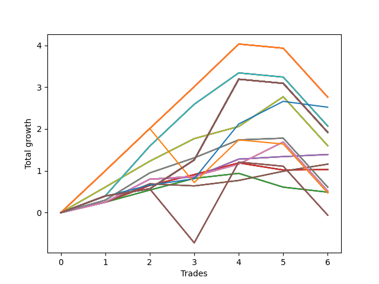

# Short Wallace Betterrerer 020 
- Symbol: AAPL_Unlimited
- Date Range: 03/23/2022 - 07/08/2022
- Trading Period: 7:20-12:30
- Number of Trades: 6



| Name | Win Percent | Profit | Avg Profit / Trade | Avg Time / Trade |      | Name | Win Percent | Profit | Avg Profit / Trade | Avg Time / Trade |
| ---- | ----------- | ------ | ------------------ | ---------------- | ---- | ---- | ----------- | ------ | ------------------ | ---------------- |
| Sorted By <br> Profit | | | | | | Sorted By <br> Win Percentage ||||
| One Hundred Twenty-Six | 66.67 | 1380.00 | 230.00 | 119:04 |     | Sixty-Six | 100.00 | 695.00 | 115.83 | 20:23 |
| One Hundred Twenty-One | 66.67 | 1380.00 | 230.00 | 119:04 |     | Fifty-Eight | 100.00 | 695.00 | 115.83 | 20:23 |
| One Hundred Sixteen | 66.67 | 1380.00 | 230.00 | 119:04 |     | Fifty | 100.00 | 695.00 | 115.83 | 20:23 |
| One Hundred Eleven | 66.67 | 1380.00 | 230.00 | 119:04 |     | Forty-Two | 100.00 | 695.00 | 115.83 | 20:23 |
| One Hundred Six | 66.67 | 1380.00 | 230.00 | 119:04 |     | Two | 100.00 | 695.00 | 115.83 | 20:23 |
| One Hundred One | 66.67 | 1380.00 | 230.00 | 119:04 |     | Seventy-Three | 83.33 | 1260.00 | 210.00 | 19:35 |
| Ninety-One | 66.67 | 1380.00 | 230.00 | 119:04 |     | Seventy | 83.33 | 800.00 | 133.33 | 46:11 |
| Eighty-One | 66.67 | 1380.00 | 230.00 | 119:04 |     | Sixty-Two | 83.33 | 800.00 | 133.33 | 46:11 |
| Seventy-Three | 83.33 | 1260.00 | 210.00 | 19:35 |     | Fifty-Four | 83.33 | 800.00 | 133.33 | 46:11 |
| Seventy-One | 66.67 | 1035.00 | 172.50 | 124:20 |     | Forty-Six | 83.33 | 800.00 | 133.33 | 46:11 |
| Sixty-Three | 66.67 | 1035.00 | 172.50 | 124:20 |     | Six | 83.33 | 800.00 | 133.33 | 46:11 |
| Fifty-Five | 66.67 | 1035.00 | 172.50 | 124:20 |     | Sixty-Seven | 83.33 | 580.00 | 96.67 | 17:08 |
| Forty-Seven | 66.67 | 1035.00 | 172.50 | 124:20 |     | Fifty-Nine | 83.33 | 580.00 | 96.67 | 17:08 |
| Seven | 66.67 | 1035.00 | 172.50 | 124:20 |     | Fifty-One | 83.33 | 580.00 | 96.67 | 17:08 |
| One Hundred Thirty | 66.67 | 960.00 | 160.00 | 161:20 |     | Forty-Three | 83.33 | 580.00 | 96.67 | 17:08 |
| One Hundred Twenty-Nine | 66.67 | 960.00 | 160.00 | 161:20 |     | Three | 83.33 | 580.00 | 96.67 | 17:08 |
| One Hundred Twenty-Eight | 66.67 | 960.00 | 160.00 | 161:20 |     | Sixty-Five | 83.33 | 515.00 | 85.83 | 12:52 |
| One Hundred Twenty-Seven | 66.67 | 960.00 | 160.00 | 161:20 |     | Fifty-Seven | 83.33 | 515.00 | 85.83 | 12:52 |
| One Hundred Twenty-Five | 66.67 | 960.00 | 160.00 | 161:20 |     | Forty-Nine | 83.33 | 515.00 | 85.83 | 12:52 |
| One Hundred Twenty-Four | 66.67 | 960.00 | 160.00 | 161:20 |     | Forty-One | 83.33 | 515.00 | 85.83 | 12:52 |
| One Hundred Twenty-Three | 66.67 | 960.00 | 160.00 | 161:20 |     | One | 83.33 | 515.00 | 85.83 | 12:52 |
| One Hundred Twenty-Two | 66.67 | 960.00 | 160.00 | 161:20 |     | Sixty-Nine | 83.33 | 305.00 | 50.83 | 60:08 |
| One Hundred Twenty | 66.67 | 960.00 | 160.00 | 161:20 |     | Sixty-One | 83.33 | 305.00 | 50.83 | 60:08 |
| One Hundred Ninteen | 66.67 | 960.00 | 160.00 | 161:20 |     | Fifty-Three | 83.33 | 305.00 | 50.83 | 60:08 |
| One Hundred Eighteen | 66.67 | 960.00 | 160.00 | 161:20 |     | Forty-Five | 83.33 | 305.00 | 50.83 | 60:08 |
| One Hundred Seventeen | 66.67 | 960.00 | 160.00 | 161:20 |     | Five | 83.33 | 305.00 | 50.83 | 60:08 |
| One Hundred Fifteen | 66.67 | 960.00 | 160.00 | 161:20 |     | Sixty-Eight | 83.33 | 260.00 | 43.33 | 37:55 |
| One Hundred Fourteen | 66.67 | 960.00 | 160.00 | 161:20 |     | Sixty | 83.33 | 260.00 | 43.33 | 37:55 |
| One Hundred Thirteen | 66.67 | 960.00 | 160.00 | 161:20 |     | Fifty-Two | 83.33 | 260.00 | 43.33 | 37:55 |
| One Hundred Twelve | 66.67 | 960.00 | 160.00 | 161:20 |     | Forty-Four | 83.33 | 260.00 | 43.33 | 37:55 |
| One Hundred Ten | 66.67 | 960.00 | 160.00 | 161:20 |     | Four | 83.33 | 260.00 | 43.33 | 37:55 |
| One Hundred Nine | 66.67 | 960.00 | 160.00 | 161:20 |     | One Hundred Twenty-Six | 66.67 | 1380.00 | 230.00 | 119:04 |
| One Hundred Eight | 66.67 | 960.00 | 160.00 | 161:20 |     | One Hundred Twenty-One | 66.67 | 1380.00 | 230.00 | 119:04 |
| One Hundred Seven | 66.67 | 960.00 | 160.00 | 161:20 |     | One Hundred Sixteen | 66.67 | 1380.00 | 230.00 | 119:04 |
| One Hundred Five | 66.67 | 960.00 | 160.00 | 161:20 |     | One Hundred Eleven | 66.67 | 1380.00 | 230.00 | 119:04 |
| One Hundred Four | 66.67 | 960.00 | 160.00 | 161:20 |     | One Hundred Six | 66.67 | 1380.00 | 230.00 | 119:04 |
| One Hundred Three | 66.67 | 960.00 | 160.00 | 161:20 |     | One Hundred One | 66.67 | 1380.00 | 230.00 | 119:04 |
| One Hundred Two | 66.67 | 960.00 | 160.00 | 161:20 |     | Ninety-One | 66.67 | 1380.00 | 230.00 | 119:04 |
| Ninety-Five | 66.67 | 960.00 | 160.00 | 161:20 |     | Eighty-One | 66.67 | 1380.00 | 230.00 | 119:04 |
| Ninety-Four | 66.67 | 960.00 | 160.00 | 161:20 |     | Seventy-One | 66.67 | 1035.00 | 172.50 | 124:20 |
| Ninety-Three | 66.67 | 960.00 | 160.00 | 161:20 |     | Sixty-Three | 66.67 | 1035.00 | 172.50 | 124:20 |
| Ninety-Two | 66.67 | 960.00 | 160.00 | 161:20 |     | Fifty-Five | 66.67 | 1035.00 | 172.50 | 124:20 |
| Eighty-Five | 66.67 | 960.00 | 160.00 | 161:20 |     | Forty-Seven | 66.67 | 1035.00 | 172.50 | 124:20 |
| Eighty-Four | 66.67 | 960.00 | 160.00 | 161:20 |     | Seven | 66.67 | 1035.00 | 172.50 | 124:20 |
| Eighty-Three | 66.67 | 960.00 | 160.00 | 161:20 |     | One Hundred Thirty | 66.67 | 960.00 | 160.00 | 161:20 |
| Eighty-Two | 66.67 | 960.00 | 160.00 | 161:20 |     | One Hundred Twenty-Nine | 66.67 | 960.00 | 160.00 | 161:20 |
| Seventy | 83.33 | 800.00 | 133.33 | 46:11 |     | One Hundred Twenty-Eight | 66.67 | 960.00 | 160.00 | 161:20 |
| Sixty-Two | 83.33 | 800.00 | 133.33 | 46:11 |     | One Hundred Twenty-Seven | 66.67 | 960.00 | 160.00 | 161:20 |
| Fifty-Four | 83.33 | 800.00 | 133.33 | 46:11 |     | One Hundred Twenty-Five | 66.67 | 960.00 | 160.00 | 161:20 |
| Forty-Six | 83.33 | 800.00 | 133.33 | 46:11 |     | One Hundred Twenty-Four | 66.67 | 960.00 | 160.00 | 161:20 |
| Six | 83.33 | 800.00 | 133.33 | 46:11 |     | One Hundred Twenty-Three | 66.67 | 960.00 | 160.00 | 161:20 |
| Sixty-Six | 100.00 | 695.00 | 115.83 | 20:23 |     | One Hundred Twenty-Two | 66.67 | 960.00 | 160.00 | 161:20 |
| Fifty-Eight | 100.00 | 695.00 | 115.83 | 20:23 |     | One Hundred Twenty | 66.67 | 960.00 | 160.00 | 161:20 |
| Fifty | 100.00 | 695.00 | 115.83 | 20:23 |     | One Hundred Ninteen | 66.67 | 960.00 | 160.00 | 161:20 |
| Forty-Two | 100.00 | 695.00 | 115.83 | 20:23 |     | One Hundred Eighteen | 66.67 | 960.00 | 160.00 | 161:20 |
| Two | 100.00 | 695.00 | 115.83 | 20:23 |     | One Hundred Seventeen | 66.67 | 960.00 | 160.00 | 161:20 |
| Sixty-Seven | 83.33 | 580.00 | 96.67 | 17:08 |     | One Hundred Fifteen | 66.67 | 960.00 | 160.00 | 161:20 |
| Fifty-Nine | 83.33 | 580.00 | 96.67 | 17:08 |     | One Hundred Fourteen | 66.67 | 960.00 | 160.00 | 161:20 |
| Fifty-One | 83.33 | 580.00 | 96.67 | 17:08 |     | One Hundred Thirteen | 66.67 | 960.00 | 160.00 | 161:20 |
| Forty-Three | 83.33 | 580.00 | 96.67 | 17:08 |     | One Hundred Twelve | 66.67 | 960.00 | 160.00 | 161:20 |
| Three | 83.33 | 580.00 | 96.67 | 17:08 |     | One Hundred Ten | 66.67 | 960.00 | 160.00 | 161:20 |
| Sixty-Five | 83.33 | 515.00 | 85.83 | 12:52 |     | One Hundred Nine | 66.67 | 960.00 | 160.00 | 161:20 |
| Fifty-Seven | 83.33 | 515.00 | 85.83 | 12:52 |     | One Hundred Eight | 66.67 | 960.00 | 160.00 | 161:20 |
| Forty-Nine | 83.33 | 515.00 | 85.83 | 12:52 |     | One Hundred Seven | 66.67 | 960.00 | 160.00 | 161:20 |
| Forty-One | 83.33 | 515.00 | 85.83 | 12:52 |     | One Hundred Five | 66.67 | 960.00 | 160.00 | 161:20 |
| One | 83.33 | 515.00 | 85.83 | 12:52 |     | One Hundred Four | 66.67 | 960.00 | 160.00 | 161:20 |
| Sixty-Nine | 83.33 | 305.00 | 50.83 | 60:08 |     | One Hundred Three | 66.67 | 960.00 | 160.00 | 161:20 |
| Sixty-One | 83.33 | 305.00 | 50.83 | 60:08 |     | One Hundred Two | 66.67 | 960.00 | 160.00 | 161:20 |
| Fifty-Three | 83.33 | 305.00 | 50.83 | 60:08 |     | Ninety-Five | 66.67 | 960.00 | 160.00 | 161:20 |
| Forty-Five | 83.33 | 305.00 | 50.83 | 60:08 |     | Ninety-Four | 66.67 | 960.00 | 160.00 | 161:20 |
| Five | 83.33 | 305.00 | 50.83 | 60:08 |     | Ninety-Three | 66.67 | 960.00 | 160.00 | 161:20 |
| Sixty-Eight | 83.33 | 260.00 | 43.33 | 37:55 |     | Ninety-Two | 66.67 | 960.00 | 160.00 | 161:20 |
| Sixty | 83.33 | 260.00 | 43.33 | 37:55 |     | Eighty-Five | 66.67 | 960.00 | 160.00 | 161:20 |
| Fifty-Two | 83.33 | 260.00 | 43.33 | 37:55 |     | Eighty-Four | 66.67 | 960.00 | 160.00 | 161:20 |
| Forty-Four | 83.33 | 260.00 | 43.33 | 37:55 |     | Eighty-Three | 66.67 | 960.00 | 160.00 | 161:20 |
| Four | 83.33 | 260.00 | 43.33 | 37:55 |     | Eighty-Two | 66.67 | 960.00 | 160.00 | 161:20 |
| Sixty-Four | 66.67 | 245.00 | 40.83 | 08:05 |     | Sixty-Four | 66.67 | 245.00 | 40.83 | 08:05 |
| Fifty-Six | 66.67 | 245.00 | 40.83 | 08:05 |     | Fifty-Six | 66.67 | 245.00 | 40.83 | 08:05 |
| Forty-Eight | 66.67 | 245.00 | 40.83 | 08:05 |     | Forty-Eight | 66.67 | 245.00 | 40.83 | 08:05 |
| Forty | 66.67 | 245.00 | 40.83 | 08:05 |     | Forty | 66.67 | 245.00 | 40.83 | 08:05 |
| Zero | 66.67 | 245.00 | 40.83 | 08:05 |     | Zero | 66.67 | 245.00 | 40.83 | 08:05 |
| Ninety-Six | 50.00 | 235.00 | 39.17 | 93:40 |     | Ninety-Six | 50.00 | 235.00 | 39.17 | 93:40 |
| One Hundred | 50.00 | -30.00 | -5.00 | 127:30 |     | One Hundred | 50.00 | -30.00 | -5.00 | 127:30 |
| Ninety-Nine | 50.00 | -30.00 | -5.00 | 127:30 |     | Ninety-Nine | 50.00 | -30.00 | -5.00 | 127:30 |
| Ninety-Eight | 50.00 | -30.00 | -5.00 | 127:30 |     | Ninety-Eight | 50.00 | -30.00 | -5.00 | 127:30 |
| Ninety-Seven | 50.00 | -30.00 | -5.00 | 127:30 |     | Ninety-Seven | 50.00 | -30.00 | -5.00 | 127:30 |

## NO STOPLOSS

### Test Zero
* Sell when price hits the middle line of the 20p bollinger
* No Stoploss
* Results:
```
Total Trades: 6
Percent Up: 33.33
Percent Down: 66.67
Total Points Moved Down: 0.49
Potential Profit: 245.00
Total Points Ups: 0.45 Count Ups: 2
Total Points Downs: 0.94 Count Downs: 4
```

<details><summary>Trades</summary>

<code>In: 2022-03-25 12:01:00		Out: 2022-03-25 12:02:10		Total Position Time: 01:10		Total Move Down: 0.25		Total to Date: 0.25</code> <br />
<code>In: 2022-04-20 10:49:00		Out: 2022-04-20 10:50:10		Total Position Time: 01:10		Total Move Down: 0.29		Total to Date: 0.54</code> <br />
<code>In: 2022-04-27 08:04:00		Out: 2022-04-27 08:10:10		Total Position Time: 06:10		Total Move Down: 0.28		Total to Date: 0.82</code> <br />
<code>In: 2022-06-16 10:32:00		Out: 2022-06-16 10:37:00		Total Position Time: 05:00		Total Move Down: 0.12		Total to Date: 0.94</code> <br />
<code>In: 2022-06-17 08:21:00		Out: 2022-06-17 08:38:40		Total Position Time: 17:40		Total Move Down: -0.33		Total to Date: 0.61</code> <br />
<code>In: 2022-07-01 10:47:00		Out: 2022-07-01 11:04:25		Total Position Time: 17:25		Total Move Down: -0.12		Total to Date: 0.49</code> <br />


</details>

### Test One
* Sell when the price hits the upper line of the 20p 1std bollinger
* No Stoploss
* Results:
```
Total Trades: 6
Percent Up: 16.67
Percent Down: 83.33
Total Points Moved Down: 1.03
Potential Profit: 515.00
Total Points Ups: 0.17 Count Ups: 1
Total Points Downs: 1.20 Count Downs: 5
```

<details><summary>Trades</summary>

<code>In: 2022-03-25 12:01:00		Out: 2022-03-25 12:02:10		Total Position Time: 01:10		Total Move Down: 0.25		Total to Date: 0.25</code> <br />
<code>In: 2022-04-20 10:49:00		Out: 2022-04-20 10:54:05		Total Position Time: 05:05		Total Move Down: 0.40		Total to Date: 0.65</code> <br />
<code>In: 2022-04-27 08:04:00		Out: 2022-04-27 08:20:25		Total Position Time: 16:25		Total Move Down: 0.26		Total to Date: 0.91</code> <br />
<code>In: 2022-06-16 10:32:00		Out: 2022-06-16 10:43:50		Total Position Time: 11:50		Total Move Down: 0.28		Total to Date: 1.19</code> <br />
<code>In: 2022-06-17 08:21:00		Out: 2022-06-17 08:42:50		Total Position Time: 21:50		Total Move Down: -0.17		Total to Date: 1.02</code> <br />
<code>In: 2022-07-01 10:47:00		Out: 2022-07-01 11:07:55		Total Position Time: 20:55		Total Move Down: 0.01		Total to Date: 1.03</code> <br />


</details>

### Test Two
* Sell when the price hits the upper line of the 20p 2std bollinger
* No Stoploss
* Results:
```
Total Trades: 6
Percent Up: 0.00
Percent Down: 100.00
Total Points Moved Down: 1.39
Potential Profit: 695.00
Total Points Ups: 0.00 Count Ups: 0
Total Points Downs: 1.39 Count Downs: 6
```

<details><summary>Trades</summary>

<code>In: 2022-03-25 12:01:00		Out: 2022-03-25 12:02:10		Total Position Time: 01:10		Total Move Down: 0.25		Total to Date: 0.25</code> <br />
<code>In: 2022-04-20 10:49:00		Out: 2022-04-20 11:03:15		Total Position Time: 14:15		Total Move Down: 0.55		Total to Date: 0.80</code> <br />
<code>In: 2022-04-27 08:04:00		Out: 2022-04-27 08:52:25		Total Position Time: 48:25		Total Move Down: 0.05		Total to Date: 0.85</code> <br />
<code>In: 2022-06-16 10:32:00		Out: 2022-06-16 10:45:10		Total Position Time: 13:10		Total Move Down: 0.43		Total to Date: 1.28</code> <br />
<code>In: 2022-06-17 08:21:00		Out: 2022-06-17 08:44:55		Total Position Time: 23:55		Total Move Down: 0.06		Total to Date: 1.34</code> <br />
<code>In: 2022-07-01 10:47:00		Out: 2022-07-01 11:08:25		Total Position Time: 21:25		Total Move Down: 0.05		Total to Date: 1.39</code> <br />


</details>

### Test Three
* Sell when price hits the middle line of the 50p bollinger
* No Stoploss
* Results:
```
Total Trades: 6
Percent Up: 16.67
Percent Down: 83.33
Total Points Moved Down: 1.16
Potential Profit: 580.00
Total Points Ups: 0.05 Count Ups: 1
Total Points Downs: 1.21 Count Downs: 5
```

<details><summary>Trades</summary>

<code>In: 2022-03-25 12:01:00		Out: 2022-03-25 12:02:10		Total Position Time: 01:10		Total Move Down: 0.25		Total to Date: 0.25</code> <br />
<code>In: 2022-04-20 10:49:00		Out: 2022-04-20 10:55:30		Total Position Time: 06:30		Total Move Down: 0.44		Total to Date: 0.69</code> <br />
<code>In: 2022-04-27 08:04:00		Out: 2022-04-27 08:45:20		Total Position Time: 41:20		Total Move Down: -0.05		Total to Date: 0.64</code> <br />
<code>In: 2022-06-16 10:32:00		Out: 2022-06-16 10:37:30		Total Position Time: 05:30		Total Move Down: 0.13		Total to Date: 0.77</code> <br />
<code>In: 2022-06-17 08:21:00		Out: 2022-06-17 08:45:15		Total Position Time: 24:15		Total Move Down: 0.22		Total to Date: 0.99</code> <br />
<code>In: 2022-07-01 10:47:00		Out: 2022-07-01 11:11:05		Total Position Time: 24:05		Total Move Down: 0.17		Total to Date: 1.16</code> <br />


</details>

### Test Four
* Sell when the price hits the upper line of the 50p 1std bollinger
* No Stoploss
* Results:
```
Total Trades: 6
Percent Up: 16.67
Percent Down: 83.33
Total Points Moved Down: 0.52
Potential Profit: 260.00
Total Points Ups: 1.17 Count Ups: 1
Total Points Downs: 1.69 Count Downs: 5
```

<details><summary>Trades</summary>

<code>In: 2022-03-25 12:01:00		Out: 2022-03-25 12:02:10		Total Position Time: 01:10		Total Move Down: 0.25		Total to Date: 0.25</code> <br />
<code>In: 2022-04-20 10:49:00		Out: 2022-04-20 11:03:15		Total Position Time: 14:15		Total Move Down: 0.55		Total to Date: 0.80</code> <br />
<code>In: 2022-04-27 08:04:00		Out: 2022-04-27 08:52:55		Total Position Time: 48:55		Total Move Down: 0.07		Total to Date: 0.87</code> <br />
<code>In: 2022-06-16 10:32:00		Out: 2022-06-16 10:44:00		Total Position Time: 12:00		Total Move Down: 0.29		Total to Date: 1.16</code> <br />
<code>In: 2022-06-17 08:21:00		Out: 2022-06-17 08:52:10		Total Position Time: 31:10		Total Move Down: 0.53		Total to Date: 1.69</code> <br />
<code>In: 2022-07-01 10:47:00		Out: 2022-07-01 12:47:00		Total Position Time: 120:00		Total Move Down: -1.17		Total to Date: 0.52</code> <br />


</details>

### Test Five
* Sell when the price hits the upper line of the 50p 2std bollinger
* No Stoploss
* Results:
```
Total Trades: 6
Percent Up: 16.67
Percent Down: 83.33
Total Points Moved Down: 0.61
Potential Profit: 305.00
Total Points Ups: 1.17 Count Ups: 1
Total Points Downs: 1.78 Count Downs: 5
```

<details><summary>Trades</summary>

<code>In: 2022-03-25 12:01:00		Out: 2022-03-25 12:02:20		Total Position Time: 01:20		Total Move Down: 0.30		Total to Date: 0.30</code> <br />
<code>In: 2022-04-20 10:49:00		Out: 2022-04-20 11:19:30		Total Position Time: 30:30		Total Move Down: 0.65		Total to Date: 0.95</code> <br />
<code>In: 2022-04-27 08:04:00		Out: 2022-04-27 08:54:15		Total Position Time: 50:15		Total Move Down: 0.36		Total to Date: 1.31</code> <br />
<code>In: 2022-06-16 10:32:00		Out: 2022-06-16 10:45:10		Total Position Time: 13:10		Total Move Down: 0.43		Total to Date: 1.74</code> <br />
<code>In: 2022-06-17 08:21:00		Out: 2022-06-17 10:46:35		Total Position Time: 145:35		Total Move Down: 0.04		Total to Date: 1.78</code> <br />
<code>In: 2022-07-01 10:47:00		Out: 2022-07-01 12:47:00		Total Position Time: 120:00		Total Move Down: -1.17		Total to Date: 0.61</code> <br />


</details>

### Test Six
* Sell when the price hits the middle line of the 1std VWAP
* No Stoploss
* Results:
```
Total Trades: 6
Percent Up: 16.67
Percent Down: 83.33
Total Points Moved Down: 1.60
Potential Profit: 800.00
Total Points Ups: 1.17 Count Ups: 1
Total Points Downs: 2.77 Count Downs: 5
```

<details><summary>Trades</summary>

<code>In: 2022-03-25 12:01:00		Out: 2022-03-25 12:17:45		Total Position Time: 16:45		Total Move Down: 0.61		Total to Date: 0.61</code> <br />
<code>In: 2022-04-20 10:49:00		Out: 2022-04-20 11:19:25		Total Position Time: 30:25		Total Move Down: 0.62		Total to Date: 1.23</code> <br />
<code>In: 2022-04-27 08:04:00		Out: 2022-04-27 09:01:30		Total Position Time: 57:30		Total Move Down: 0.54		Total to Date: 1.77</code> <br />
<code>In: 2022-06-16 10:32:00		Out: 2022-06-16 10:44:00		Total Position Time: 12:00		Total Move Down: 0.29		Total to Date: 2.06</code> <br />
<code>In: 2022-06-17 08:21:00		Out: 2022-06-17 09:01:30		Total Position Time: 40:30		Total Move Down: 0.71		Total to Date: 2.77</code> <br />
<code>In: 2022-07-01 10:47:00		Out: 2022-07-01 12:47:00		Total Position Time: 120:00		Total Move Down: -1.17		Total to Date: 1.60</code> <br />


</details>

### Test Seven
* Sell when the price hits the upper line of the 1std VWAP
* No Stoploss
* Results:
```
Total Trades: 6
Percent Up: 33.33
Percent Down: 66.67
Total Points Moved Down: 2.07
Potential Profit: 1035.00
Total Points Ups: 1.27 Count Ups: 2
Total Points Downs: 3.34 Count Downs: 4
```

<details><summary>Trades</summary>

<code>In: 2022-03-25 12:01:00		Out: 2022-03-25 12:47:00		Total Position Time: 46:00		Total Move Down: 0.40		Total to Date: 0.40</code> <br />
<code>In: 2022-04-20 10:49:00		Out: 2022-04-20 11:52:05		Total Position Time: 63:05		Total Move Down: 1.19		Total to Date: 1.59</code> <br />
<code>In: 2022-04-27 08:04:00		Out: 2022-04-27 11:56:25		Total Position Time: 232:25		Total Move Down: 1.00		Total to Date: 2.59</code> <br />
<code>In: 2022-06-16 10:32:00		Out: 2022-06-16 10:50:30		Total Position Time: 18:30		Total Move Down: 0.75		Total to Date: 3.34</code> <br />
<code>In: 2022-06-17 08:21:00		Out: 2022-06-17 12:47:00		Total Position Time: 266:00		Total Move Down: -0.10		Total to Date: 3.24</code> <br />
<code>In: 2022-07-01 10:47:00		Out: 2022-07-01 12:47:00		Total Position Time: 120:00		Total Move Down: -1.17		Total to Date: 2.07</code> <br />


</details>

## STOPLOSS OF 5

### Test Forty
* Sell when price hits the middle line of the 20p bollinger
* Stoploss is -5 points
* Results:
```
Total Trades: 6
Percent Up: 33.33
Percent Down: 66.67
Total Points Moved Down: 0.49
Potential Profit: 245.00
Total Points Ups: 0.45 Count Ups: 2
Total Points Downs: 0.94 Count Downs: 4
```

<details><summary>Trades</summary>

<code>In: 2022-03-25 12:01:00		Out: 2022-03-25 12:02:10		Total Position Time: 01:10		Total Move Down: 0.25		Total to Date: 0.25</code> <br />
<code>In: 2022-04-20 10:49:00		Out: 2022-04-20 10:50:10		Total Position Time: 01:10		Total Move Down: 0.29		Total to Date: 0.54</code> <br />
<code>In: 2022-04-27 08:04:00		Out: 2022-04-27 08:10:10		Total Position Time: 06:10		Total Move Down: 0.28		Total to Date: 0.82</code> <br />
<code>In: 2022-06-16 10:32:00		Out: 2022-06-16 10:37:00		Total Position Time: 05:00		Total Move Down: 0.12		Total to Date: 0.94</code> <br />
<code>In: 2022-06-17 08:21:00		Out: 2022-06-17 08:38:40		Total Position Time: 17:40		Total Move Down: -0.33		Total to Date: 0.61</code> <br />
<code>In: 2022-07-01 10:47:00		Out: 2022-07-01 11:04:25		Total Position Time: 17:25		Total Move Down: -0.12		Total to Date: 0.49</code> <br />


</details>

### Test Forty-One
* Sell when the price hits the upper line of the 20p 1std bollinger
* Stoploss is -5 points
* Results:
```
Total Trades: 6
Percent Up: 16.67
Percent Down: 83.33
Total Points Moved Down: 1.03
Potential Profit: 515.00
Total Points Ups: 0.17 Count Ups: 1
Total Points Downs: 1.20 Count Downs: 5
```

<details><summary>Trades</summary>

<code>In: 2022-03-25 12:01:00		Out: 2022-03-25 12:02:10		Total Position Time: 01:10		Total Move Down: 0.25		Total to Date: 0.25</code> <br />
<code>In: 2022-04-20 10:49:00		Out: 2022-04-20 10:54:05		Total Position Time: 05:05		Total Move Down: 0.40		Total to Date: 0.65</code> <br />
<code>In: 2022-04-27 08:04:00		Out: 2022-04-27 08:20:25		Total Position Time: 16:25		Total Move Down: 0.26		Total to Date: 0.91</code> <br />
<code>In: 2022-06-16 10:32:00		Out: 2022-06-16 10:43:50		Total Position Time: 11:50		Total Move Down: 0.28		Total to Date: 1.19</code> <br />
<code>In: 2022-06-17 08:21:00		Out: 2022-06-17 08:42:50		Total Position Time: 21:50		Total Move Down: -0.17		Total to Date: 1.02</code> <br />
<code>In: 2022-07-01 10:47:00		Out: 2022-07-01 11:07:55		Total Position Time: 20:55		Total Move Down: 0.01		Total to Date: 1.03</code> <br />


</details>

### Test Forty-Two
* Sell when the price hits the upper line of the 20p 2std bollinger
* Stoploss is -5 points
* Results:
```
Total Trades: 6
Percent Up: 0.00
Percent Down: 100.00
Total Points Moved Down: 1.39
Potential Profit: 695.00
Total Points Ups: 0.00 Count Ups: 0
Total Points Downs: 1.39 Count Downs: 6
```

<details><summary>Trades</summary>

<code>In: 2022-03-25 12:01:00		Out: 2022-03-25 12:02:10		Total Position Time: 01:10		Total Move Down: 0.25		Total to Date: 0.25</code> <br />
<code>In: 2022-04-20 10:49:00		Out: 2022-04-20 11:03:15		Total Position Time: 14:15		Total Move Down: 0.55		Total to Date: 0.80</code> <br />
<code>In: 2022-04-27 08:04:00		Out: 2022-04-27 08:52:25		Total Position Time: 48:25		Total Move Down: 0.05		Total to Date: 0.85</code> <br />
<code>In: 2022-06-16 10:32:00		Out: 2022-06-16 10:45:10		Total Position Time: 13:10		Total Move Down: 0.43		Total to Date: 1.28</code> <br />
<code>In: 2022-06-17 08:21:00		Out: 2022-06-17 08:44:55		Total Position Time: 23:55		Total Move Down: 0.06		Total to Date: 1.34</code> <br />
<code>In: 2022-07-01 10:47:00		Out: 2022-07-01 11:08:25		Total Position Time: 21:25		Total Move Down: 0.05		Total to Date: 1.39</code> <br />


</details>

### Test Forty-Three
* Sell when price hits the middle line of the 50p bollinger
* Stoploss is -5 points
* Results:
```
Total Trades: 6
Percent Up: 16.67
Percent Down: 83.33
Total Points Moved Down: 1.16
Potential Profit: 580.00
Total Points Ups: 0.05 Count Ups: 1
Total Points Downs: 1.21 Count Downs: 5
```

<details><summary>Trades</summary>

<code>In: 2022-03-25 12:01:00		Out: 2022-03-25 12:02:10		Total Position Time: 01:10		Total Move Down: 0.25		Total to Date: 0.25</code> <br />
<code>In: 2022-04-20 10:49:00		Out: 2022-04-20 10:55:30		Total Position Time: 06:30		Total Move Down: 0.44		Total to Date: 0.69</code> <br />
<code>In: 2022-04-27 08:04:00		Out: 2022-04-27 08:45:20		Total Position Time: 41:20		Total Move Down: -0.05		Total to Date: 0.64</code> <br />
<code>In: 2022-06-16 10:32:00		Out: 2022-06-16 10:37:30		Total Position Time: 05:30		Total Move Down: 0.13		Total to Date: 0.77</code> <br />
<code>In: 2022-06-17 08:21:00		Out: 2022-06-17 08:45:15		Total Position Time: 24:15		Total Move Down: 0.22		Total to Date: 0.99</code> <br />
<code>In: 2022-07-01 10:47:00		Out: 2022-07-01 11:11:05		Total Position Time: 24:05		Total Move Down: 0.17		Total to Date: 1.16</code> <br />


</details>

### Test Forty-Four
* Sell when the price hits the upper line of the 50p 1std bollinger
* Stoploss is -5 points
* Results:
```
Total Trades: 6
Percent Up: 16.67
Percent Down: 83.33
Total Points Moved Down: 0.52
Potential Profit: 260.00
Total Points Ups: 1.17 Count Ups: 1
Total Points Downs: 1.69 Count Downs: 5
```

<details><summary>Trades</summary>

<code>In: 2022-03-25 12:01:00		Out: 2022-03-25 12:02:10		Total Position Time: 01:10		Total Move Down: 0.25		Total to Date: 0.25</code> <br />
<code>In: 2022-04-20 10:49:00		Out: 2022-04-20 11:03:15		Total Position Time: 14:15		Total Move Down: 0.55		Total to Date: 0.80</code> <br />
<code>In: 2022-04-27 08:04:00		Out: 2022-04-27 08:52:55		Total Position Time: 48:55		Total Move Down: 0.07		Total to Date: 0.87</code> <br />
<code>In: 2022-06-16 10:32:00		Out: 2022-06-16 10:44:00		Total Position Time: 12:00		Total Move Down: 0.29		Total to Date: 1.16</code> <br />
<code>In: 2022-06-17 08:21:00		Out: 2022-06-17 08:52:10		Total Position Time: 31:10		Total Move Down: 0.53		Total to Date: 1.69</code> <br />
<code>In: 2022-07-01 10:47:00		Out: 2022-07-01 12:47:00		Total Position Time: 120:00		Total Move Down: -1.17		Total to Date: 0.52</code> <br />


</details>

### Test Forty-Five
* Sell when the price hits the upper line of the 50p 2std bollinger
* Stoploss is -5 points
* Results:
```
Total Trades: 6
Percent Up: 16.67
Percent Down: 83.33
Total Points Moved Down: 0.61
Potential Profit: 305.00
Total Points Ups: 1.17 Count Ups: 1
Total Points Downs: 1.78 Count Downs: 5
```

<details><summary>Trades</summary>

<code>In: 2022-03-25 12:01:00		Out: 2022-03-25 12:02:20		Total Position Time: 01:20		Total Move Down: 0.30		Total to Date: 0.30</code> <br />
<code>In: 2022-04-20 10:49:00		Out: 2022-04-20 11:19:30		Total Position Time: 30:30		Total Move Down: 0.65		Total to Date: 0.95</code> <br />
<code>In: 2022-04-27 08:04:00		Out: 2022-04-27 08:54:15		Total Position Time: 50:15		Total Move Down: 0.36		Total to Date: 1.31</code> <br />
<code>In: 2022-06-16 10:32:00		Out: 2022-06-16 10:45:10		Total Position Time: 13:10		Total Move Down: 0.43		Total to Date: 1.74</code> <br />
<code>In: 2022-06-17 08:21:00		Out: 2022-06-17 10:46:35		Total Position Time: 145:35		Total Move Down: 0.04		Total to Date: 1.78</code> <br />
<code>In: 2022-07-01 10:47:00		Out: 2022-07-01 12:47:00		Total Position Time: 120:00		Total Move Down: -1.17		Total to Date: 0.61</code> <br />


</details>

### Test Forty-Six
* Sell when the price hits the middle line of the 1std VWAP
* Stoploss is -5 points
* Results:
```
Total Trades: 6
Percent Up: 16.67
Percent Down: 83.33
Total Points Moved Down: 1.60
Potential Profit: 800.00
Total Points Ups: 1.17 Count Ups: 1
Total Points Downs: 2.77 Count Downs: 5
```

<details><summary>Trades</summary>

<code>In: 2022-03-25 12:01:00		Out: 2022-03-25 12:17:45		Total Position Time: 16:45		Total Move Down: 0.61		Total to Date: 0.61</code> <br />
<code>In: 2022-04-20 10:49:00		Out: 2022-04-20 11:19:25		Total Position Time: 30:25		Total Move Down: 0.62		Total to Date: 1.23</code> <br />
<code>In: 2022-04-27 08:04:00		Out: 2022-04-27 09:01:30		Total Position Time: 57:30		Total Move Down: 0.54		Total to Date: 1.77</code> <br />
<code>In: 2022-06-16 10:32:00		Out: 2022-06-16 10:44:00		Total Position Time: 12:00		Total Move Down: 0.29		Total to Date: 2.06</code> <br />
<code>In: 2022-06-17 08:21:00		Out: 2022-06-17 09:01:30		Total Position Time: 40:30		Total Move Down: 0.71		Total to Date: 2.77</code> <br />
<code>In: 2022-07-01 10:47:00		Out: 2022-07-01 12:47:00		Total Position Time: 120:00		Total Move Down: -1.17		Total to Date: 1.60</code> <br />


</details>

### Test Forty-Seven
* Sell when the price hits the upper line of the 1std VWAP
* Stoploss is -5 points
* Results:
```
Total Trades: 6
Percent Up: 33.33
Percent Down: 66.67
Total Points Moved Down: 2.07
Potential Profit: 1035.00
Total Points Ups: 1.27 Count Ups: 2
Total Points Downs: 3.34 Count Downs: 4
```

<details><summary>Trades</summary>

<code>In: 2022-03-25 12:01:00		Out: 2022-03-25 12:47:00		Total Position Time: 46:00		Total Move Down: 0.40		Total to Date: 0.40</code> <br />
<code>In: 2022-04-20 10:49:00		Out: 2022-04-20 11:52:05		Total Position Time: 63:05		Total Move Down: 1.19		Total to Date: 1.59</code> <br />
<code>In: 2022-04-27 08:04:00		Out: 2022-04-27 11:56:25		Total Position Time: 232:25		Total Move Down: 1.00		Total to Date: 2.59</code> <br />
<code>In: 2022-06-16 10:32:00		Out: 2022-06-16 10:50:30		Total Position Time: 18:30		Total Move Down: 0.75		Total to Date: 3.34</code> <br />
<code>In: 2022-06-17 08:21:00		Out: 2022-06-17 12:47:00		Total Position Time: 266:00		Total Move Down: -0.10		Total to Date: 3.24</code> <br />
<code>In: 2022-07-01 10:47:00		Out: 2022-07-01 12:47:00		Total Position Time: 120:00		Total Move Down: -1.17		Total to Date: 2.07</code> <br />


</details>

## TRAIL STOP OF 5

### Test Forty-Eight
* Sell when price hits the middle line of the 20p bollinger
* Trailing Stop is -5 points
* Results:
```
Total Trades: 6
Percent Up: 33.33
Percent Down: 66.67
Total Points Moved Down: 0.49
Potential Profit: 245.00
Total Points Ups: 0.45 Count Ups: 2
Total Points Downs: 0.94 Count Downs: 4
```

<details><summary>Trades</summary>

<code>In: 2022-03-25 12:01:00		Out: 2022-03-25 12:02:10		Total Position Time: 01:10		Total Move Down: 0.25		Total to Date: 0.25</code> <br />
<code>In: 2022-04-20 10:49:00		Out: 2022-04-20 10:50:10		Total Position Time: 01:10		Total Move Down: 0.29		Total to Date: 0.54</code> <br />
<code>In: 2022-04-27 08:04:00		Out: 2022-04-27 08:10:10		Total Position Time: 06:10		Total Move Down: 0.28		Total to Date: 0.82</code> <br />
<code>In: 2022-06-16 10:32:00		Out: 2022-06-16 10:37:00		Total Position Time: 05:00		Total Move Down: 0.12		Total to Date: 0.94</code> <br />
<code>In: 2022-06-17 08:21:00		Out: 2022-06-17 08:38:40		Total Position Time: 17:40		Total Move Down: -0.33		Total to Date: 0.61</code> <br />
<code>In: 2022-07-01 10:47:00		Out: 2022-07-01 11:04:25		Total Position Time: 17:25		Total Move Down: -0.12		Total to Date: 0.49</code> <br />


</details>

### Test Forty-Nine
* Sell when the price hits the upper line of the 20p 1std bollinger
* Trailing Stop is -5 points
* Results:
```
Total Trades: 6
Percent Up: 16.67
Percent Down: 83.33
Total Points Moved Down: 1.03
Potential Profit: 515.00
Total Points Ups: 0.17 Count Ups: 1
Total Points Downs: 1.20 Count Downs: 5
```

<details><summary>Trades</summary>

<code>In: 2022-03-25 12:01:00		Out: 2022-03-25 12:02:10		Total Position Time: 01:10		Total Move Down: 0.25		Total to Date: 0.25</code> <br />
<code>In: 2022-04-20 10:49:00		Out: 2022-04-20 10:54:05		Total Position Time: 05:05		Total Move Down: 0.40		Total to Date: 0.65</code> <br />
<code>In: 2022-04-27 08:04:00		Out: 2022-04-27 08:20:25		Total Position Time: 16:25		Total Move Down: 0.26		Total to Date: 0.91</code> <br />
<code>In: 2022-06-16 10:32:00		Out: 2022-06-16 10:43:50		Total Position Time: 11:50		Total Move Down: 0.28		Total to Date: 1.19</code> <br />
<code>In: 2022-06-17 08:21:00		Out: 2022-06-17 08:42:50		Total Position Time: 21:50		Total Move Down: -0.17		Total to Date: 1.02</code> <br />
<code>In: 2022-07-01 10:47:00		Out: 2022-07-01 11:07:55		Total Position Time: 20:55		Total Move Down: 0.01		Total to Date: 1.03</code> <br />


</details>

### Test Fifty
* Sell when the price hits the upper line of the 20p 2std bollinger
* Trailing Stop is -5 points
* Results:
```
Total Trades: 6
Percent Up: 0.00
Percent Down: 100.00
Total Points Moved Down: 1.39
Potential Profit: 695.00
Total Points Ups: 0.00 Count Ups: 0
Total Points Downs: 1.39 Count Downs: 6
```

<details><summary>Trades</summary>

<code>In: 2022-03-25 12:01:00		Out: 2022-03-25 12:02:10		Total Position Time: 01:10		Total Move Down: 0.25		Total to Date: 0.25</code> <br />
<code>In: 2022-04-20 10:49:00		Out: 2022-04-20 11:03:15		Total Position Time: 14:15		Total Move Down: 0.55		Total to Date: 0.80</code> <br />
<code>In: 2022-04-27 08:04:00		Out: 2022-04-27 08:52:25		Total Position Time: 48:25		Total Move Down: 0.05		Total to Date: 0.85</code> <br />
<code>In: 2022-06-16 10:32:00		Out: 2022-06-16 10:45:10		Total Position Time: 13:10		Total Move Down: 0.43		Total to Date: 1.28</code> <br />
<code>In: 2022-06-17 08:21:00		Out: 2022-06-17 08:44:55		Total Position Time: 23:55		Total Move Down: 0.06		Total to Date: 1.34</code> <br />
<code>In: 2022-07-01 10:47:00		Out: 2022-07-01 11:08:25		Total Position Time: 21:25		Total Move Down: 0.05		Total to Date: 1.39</code> <br />


</details>

### Test Fifty-One
* Sell when price hits the middle line of the 50p bollinger
* Trailing Stop is -5 points
* Results:
```
Total Trades: 6
Percent Up: 16.67
Percent Down: 83.33
Total Points Moved Down: 1.16
Potential Profit: 580.00
Total Points Ups: 0.05 Count Ups: 1
Total Points Downs: 1.21 Count Downs: 5
```

<details><summary>Trades</summary>

<code>In: 2022-03-25 12:01:00		Out: 2022-03-25 12:02:10		Total Position Time: 01:10		Total Move Down: 0.25		Total to Date: 0.25</code> <br />
<code>In: 2022-04-20 10:49:00		Out: 2022-04-20 10:55:30		Total Position Time: 06:30		Total Move Down: 0.44		Total to Date: 0.69</code> <br />
<code>In: 2022-04-27 08:04:00		Out: 2022-04-27 08:45:20		Total Position Time: 41:20		Total Move Down: -0.05		Total to Date: 0.64</code> <br />
<code>In: 2022-06-16 10:32:00		Out: 2022-06-16 10:37:30		Total Position Time: 05:30		Total Move Down: 0.13		Total to Date: 0.77</code> <br />
<code>In: 2022-06-17 08:21:00		Out: 2022-06-17 08:45:15		Total Position Time: 24:15		Total Move Down: 0.22		Total to Date: 0.99</code> <br />
<code>In: 2022-07-01 10:47:00		Out: 2022-07-01 11:11:05		Total Position Time: 24:05		Total Move Down: 0.17		Total to Date: 1.16</code> <br />


</details>

### Test Fifty-Two
* Sell when the price hits the upper line of the 50p 1std bollinger
* Trailing Stop is -5 points
* Results:
```
Total Trades: 6
Percent Up: 16.67
Percent Down: 83.33
Total Points Moved Down: 0.52
Potential Profit: 260.00
Total Points Ups: 1.17 Count Ups: 1
Total Points Downs: 1.69 Count Downs: 5
```

<details><summary>Trades</summary>

<code>In: 2022-03-25 12:01:00		Out: 2022-03-25 12:02:10		Total Position Time: 01:10		Total Move Down: 0.25		Total to Date: 0.25</code> <br />
<code>In: 2022-04-20 10:49:00		Out: 2022-04-20 11:03:15		Total Position Time: 14:15		Total Move Down: 0.55		Total to Date: 0.80</code> <br />
<code>In: 2022-04-27 08:04:00		Out: 2022-04-27 08:52:55		Total Position Time: 48:55		Total Move Down: 0.07		Total to Date: 0.87</code> <br />
<code>In: 2022-06-16 10:32:00		Out: 2022-06-16 10:44:00		Total Position Time: 12:00		Total Move Down: 0.29		Total to Date: 1.16</code> <br />
<code>In: 2022-06-17 08:21:00		Out: 2022-06-17 08:52:10		Total Position Time: 31:10		Total Move Down: 0.53		Total to Date: 1.69</code> <br />
<code>In: 2022-07-01 10:47:00		Out: 2022-07-01 12:47:00		Total Position Time: 120:00		Total Move Down: -1.17		Total to Date: 0.52</code> <br />


</details>

### Test Fifty-Three
* Sell when the price hits the upper line of the 50p 2std bollinger
* Trailing Stop is -5 points
* Results:
```
Total Trades: 6
Percent Up: 16.67
Percent Down: 83.33
Total Points Moved Down: 0.61
Potential Profit: 305.00
Total Points Ups: 1.17 Count Ups: 1
Total Points Downs: 1.78 Count Downs: 5
```

<details><summary>Trades</summary>

<code>In: 2022-03-25 12:01:00		Out: 2022-03-25 12:02:20		Total Position Time: 01:20		Total Move Down: 0.30		Total to Date: 0.30</code> <br />
<code>In: 2022-04-20 10:49:00		Out: 2022-04-20 11:19:30		Total Position Time: 30:30		Total Move Down: 0.65		Total to Date: 0.95</code> <br />
<code>In: 2022-04-27 08:04:00		Out: 2022-04-27 08:54:15		Total Position Time: 50:15		Total Move Down: 0.36		Total to Date: 1.31</code> <br />
<code>In: 2022-06-16 10:32:00		Out: 2022-06-16 10:45:10		Total Position Time: 13:10		Total Move Down: 0.43		Total to Date: 1.74</code> <br />
<code>In: 2022-06-17 08:21:00		Out: 2022-06-17 10:46:35		Total Position Time: 145:35		Total Move Down: 0.04		Total to Date: 1.78</code> <br />
<code>In: 2022-07-01 10:47:00		Out: 2022-07-01 12:47:00		Total Position Time: 120:00		Total Move Down: -1.17		Total to Date: 0.61</code> <br />


</details>

### Test Fifty-Four
* Sell when the price hits the middle line of the 1std VWAP
* Trailing Stop is -5 points
* Results:
```
Total Trades: 6
Percent Up: 16.67
Percent Down: 83.33
Total Points Moved Down: 1.60
Potential Profit: 800.00
Total Points Ups: 1.17 Count Ups: 1
Total Points Downs: 2.77 Count Downs: 5
```

<details><summary>Trades</summary>

<code>In: 2022-03-25 12:01:00		Out: 2022-03-25 12:17:45		Total Position Time: 16:45		Total Move Down: 0.61		Total to Date: 0.61</code> <br />
<code>In: 2022-04-20 10:49:00		Out: 2022-04-20 11:19:25		Total Position Time: 30:25		Total Move Down: 0.62		Total to Date: 1.23</code> <br />
<code>In: 2022-04-27 08:04:00		Out: 2022-04-27 09:01:30		Total Position Time: 57:30		Total Move Down: 0.54		Total to Date: 1.77</code> <br />
<code>In: 2022-06-16 10:32:00		Out: 2022-06-16 10:44:00		Total Position Time: 12:00		Total Move Down: 0.29		Total to Date: 2.06</code> <br />
<code>In: 2022-06-17 08:21:00		Out: 2022-06-17 09:01:30		Total Position Time: 40:30		Total Move Down: 0.71		Total to Date: 2.77</code> <br />
<code>In: 2022-07-01 10:47:00		Out: 2022-07-01 12:47:00		Total Position Time: 120:00		Total Move Down: -1.17		Total to Date: 1.60</code> <br />


</details>

### Test Fifty-Five
* Sell when the price hits the upper line of the 1std VWAP
* Trailing Stop is -5 points
* Results:
```
Total Trades: 6
Percent Up: 33.33
Percent Down: 66.67
Total Points Moved Down: 2.07
Potential Profit: 1035.00
Total Points Ups: 1.27 Count Ups: 2
Total Points Downs: 3.34 Count Downs: 4
```

<details><summary>Trades</summary>

<code>In: 2022-03-25 12:01:00		Out: 2022-03-25 12:47:00		Total Position Time: 46:00		Total Move Down: 0.40		Total to Date: 0.40</code> <br />
<code>In: 2022-04-20 10:49:00		Out: 2022-04-20 11:52:05		Total Position Time: 63:05		Total Move Down: 1.19		Total to Date: 1.59</code> <br />
<code>In: 2022-04-27 08:04:00		Out: 2022-04-27 11:56:25		Total Position Time: 232:25		Total Move Down: 1.00		Total to Date: 2.59</code> <br />
<code>In: 2022-06-16 10:32:00		Out: 2022-06-16 10:50:30		Total Position Time: 18:30		Total Move Down: 0.75		Total to Date: 3.34</code> <br />
<code>In: 2022-06-17 08:21:00		Out: 2022-06-17 12:47:00		Total Position Time: 266:00		Total Move Down: -0.10		Total to Date: 3.24</code> <br />
<code>In: 2022-07-01 10:47:00		Out: 2022-07-01 12:47:00		Total Position Time: 120:00		Total Move Down: -1.17		Total to Date: 2.07</code> <br />


</details>

## STOPLOSS OF 10

### Test Fifty-Six
* Sell when price hits the middle line of the 20p bollinger
* Stoploss is -10 points
* Results:
```
Total Trades: 6
Percent Up: 33.33
Percent Down: 66.67
Total Points Moved Down: 0.49
Potential Profit: 245.00
Total Points Ups: 0.45 Count Ups: 2
Total Points Downs: 0.94 Count Downs: 4
```

<details><summary>Trades</summary>

<code>In: 2022-03-25 12:01:00		Out: 2022-03-25 12:02:10		Total Position Time: 01:10		Total Move Down: 0.25		Total to Date: 0.25</code> <br />
<code>In: 2022-04-20 10:49:00		Out: 2022-04-20 10:50:10		Total Position Time: 01:10		Total Move Down: 0.29		Total to Date: 0.54</code> <br />
<code>In: 2022-04-27 08:04:00		Out: 2022-04-27 08:10:10		Total Position Time: 06:10		Total Move Down: 0.28		Total to Date: 0.82</code> <br />
<code>In: 2022-06-16 10:32:00		Out: 2022-06-16 10:37:00		Total Position Time: 05:00		Total Move Down: 0.12		Total to Date: 0.94</code> <br />
<code>In: 2022-06-17 08:21:00		Out: 2022-06-17 08:38:40		Total Position Time: 17:40		Total Move Down: -0.33		Total to Date: 0.61</code> <br />
<code>In: 2022-07-01 10:47:00		Out: 2022-07-01 11:04:25		Total Position Time: 17:25		Total Move Down: -0.12		Total to Date: 0.49</code> <br />


</details>

### Test Fifty-Seven
* Sell when the price hits the upper line of the 20p 1std bollinger
* Stoploss is -10 points
* Results:
```
Total Trades: 6
Percent Up: 16.67
Percent Down: 83.33
Total Points Moved Down: 1.03
Potential Profit: 515.00
Total Points Ups: 0.17 Count Ups: 1
Total Points Downs: 1.20 Count Downs: 5
```

<details><summary>Trades</summary>

<code>In: 2022-03-25 12:01:00		Out: 2022-03-25 12:02:10		Total Position Time: 01:10		Total Move Down: 0.25		Total to Date: 0.25</code> <br />
<code>In: 2022-04-20 10:49:00		Out: 2022-04-20 10:54:05		Total Position Time: 05:05		Total Move Down: 0.40		Total to Date: 0.65</code> <br />
<code>In: 2022-04-27 08:04:00		Out: 2022-04-27 08:20:25		Total Position Time: 16:25		Total Move Down: 0.26		Total to Date: 0.91</code> <br />
<code>In: 2022-06-16 10:32:00		Out: 2022-06-16 10:43:50		Total Position Time: 11:50		Total Move Down: 0.28		Total to Date: 1.19</code> <br />
<code>In: 2022-06-17 08:21:00		Out: 2022-06-17 08:42:50		Total Position Time: 21:50		Total Move Down: -0.17		Total to Date: 1.02</code> <br />
<code>In: 2022-07-01 10:47:00		Out: 2022-07-01 11:07:55		Total Position Time: 20:55		Total Move Down: 0.01		Total to Date: 1.03</code> <br />


</details>

### Test Fifty-Eight
* Sell when the price hits the upper line of the 20p 2std bollinger
* Stoploss is -10 points
* Results:
```
Total Trades: 6
Percent Up: 0.00
Percent Down: 100.00
Total Points Moved Down: 1.39
Potential Profit: 695.00
Total Points Ups: 0.00 Count Ups: 0
Total Points Downs: 1.39 Count Downs: 6
```

<details><summary>Trades</summary>

<code>In: 2022-03-25 12:01:00		Out: 2022-03-25 12:02:10		Total Position Time: 01:10		Total Move Down: 0.25		Total to Date: 0.25</code> <br />
<code>In: 2022-04-20 10:49:00		Out: 2022-04-20 11:03:15		Total Position Time: 14:15		Total Move Down: 0.55		Total to Date: 0.80</code> <br />
<code>In: 2022-04-27 08:04:00		Out: 2022-04-27 08:52:25		Total Position Time: 48:25		Total Move Down: 0.05		Total to Date: 0.85</code> <br />
<code>In: 2022-06-16 10:32:00		Out: 2022-06-16 10:45:10		Total Position Time: 13:10		Total Move Down: 0.43		Total to Date: 1.28</code> <br />
<code>In: 2022-06-17 08:21:00		Out: 2022-06-17 08:44:55		Total Position Time: 23:55		Total Move Down: 0.06		Total to Date: 1.34</code> <br />
<code>In: 2022-07-01 10:47:00		Out: 2022-07-01 11:08:25		Total Position Time: 21:25		Total Move Down: 0.05		Total to Date: 1.39</code> <br />


</details>

### Test Fifty-Nine
* Sell when price hits the middle line of the 50p bollinger
* Stoploss is -10 points
* Results:
```
Total Trades: 6
Percent Up: 16.67
Percent Down: 83.33
Total Points Moved Down: 1.16
Potential Profit: 580.00
Total Points Ups: 0.05 Count Ups: 1
Total Points Downs: 1.21 Count Downs: 5
```

<details><summary>Trades</summary>

<code>In: 2022-03-25 12:01:00		Out: 2022-03-25 12:02:10		Total Position Time: 01:10		Total Move Down: 0.25		Total to Date: 0.25</code> <br />
<code>In: 2022-04-20 10:49:00		Out: 2022-04-20 10:55:30		Total Position Time: 06:30		Total Move Down: 0.44		Total to Date: 0.69</code> <br />
<code>In: 2022-04-27 08:04:00		Out: 2022-04-27 08:45:20		Total Position Time: 41:20		Total Move Down: -0.05		Total to Date: 0.64</code> <br />
<code>In: 2022-06-16 10:32:00		Out: 2022-06-16 10:37:30		Total Position Time: 05:30		Total Move Down: 0.13		Total to Date: 0.77</code> <br />
<code>In: 2022-06-17 08:21:00		Out: 2022-06-17 08:45:15		Total Position Time: 24:15		Total Move Down: 0.22		Total to Date: 0.99</code> <br />
<code>In: 2022-07-01 10:47:00		Out: 2022-07-01 11:11:05		Total Position Time: 24:05		Total Move Down: 0.17		Total to Date: 1.16</code> <br />


</details>

### Test Sixty
* Sell when the price hits the upper line of the 50p 1std bollinger
* Stoploss is -10 points
* Results:
```
Total Trades: 6
Percent Up: 16.67
Percent Down: 83.33
Total Points Moved Down: 0.52
Potential Profit: 260.00
Total Points Ups: 1.17 Count Ups: 1
Total Points Downs: 1.69 Count Downs: 5
```

<details><summary>Trades</summary>

<code>In: 2022-03-25 12:01:00		Out: 2022-03-25 12:02:10		Total Position Time: 01:10		Total Move Down: 0.25		Total to Date: 0.25</code> <br />
<code>In: 2022-04-20 10:49:00		Out: 2022-04-20 11:03:15		Total Position Time: 14:15		Total Move Down: 0.55		Total to Date: 0.80</code> <br />
<code>In: 2022-04-27 08:04:00		Out: 2022-04-27 08:52:55		Total Position Time: 48:55		Total Move Down: 0.07		Total to Date: 0.87</code> <br />
<code>In: 2022-06-16 10:32:00		Out: 2022-06-16 10:44:00		Total Position Time: 12:00		Total Move Down: 0.29		Total to Date: 1.16</code> <br />
<code>In: 2022-06-17 08:21:00		Out: 2022-06-17 08:52:10		Total Position Time: 31:10		Total Move Down: 0.53		Total to Date: 1.69</code> <br />
<code>In: 2022-07-01 10:47:00		Out: 2022-07-01 12:47:00		Total Position Time: 120:00		Total Move Down: -1.17		Total to Date: 0.52</code> <br />


</details>

### Test Sixty-One
* Sell when the price hits the upper line of the 50p 2std bollinger
* Stoploss is -10 points
* Results:
```
Total Trades: 6
Percent Up: 16.67
Percent Down: 83.33
Total Points Moved Down: 0.61
Potential Profit: 305.00
Total Points Ups: 1.17 Count Ups: 1
Total Points Downs: 1.78 Count Downs: 5
```

<details><summary>Trades</summary>

<code>In: 2022-03-25 12:01:00		Out: 2022-03-25 12:02:20		Total Position Time: 01:20		Total Move Down: 0.30		Total to Date: 0.30</code> <br />
<code>In: 2022-04-20 10:49:00		Out: 2022-04-20 11:19:30		Total Position Time: 30:30		Total Move Down: 0.65		Total to Date: 0.95</code> <br />
<code>In: 2022-04-27 08:04:00		Out: 2022-04-27 08:54:15		Total Position Time: 50:15		Total Move Down: 0.36		Total to Date: 1.31</code> <br />
<code>In: 2022-06-16 10:32:00		Out: 2022-06-16 10:45:10		Total Position Time: 13:10		Total Move Down: 0.43		Total to Date: 1.74</code> <br />
<code>In: 2022-06-17 08:21:00		Out: 2022-06-17 10:46:35		Total Position Time: 145:35		Total Move Down: 0.04		Total to Date: 1.78</code> <br />
<code>In: 2022-07-01 10:47:00		Out: 2022-07-01 12:47:00		Total Position Time: 120:00		Total Move Down: -1.17		Total to Date: 0.61</code> <br />


</details>

### Test Sixty-Two
* Sell when the price hits the middle line of the 1std VWAP
* Stoploss is -10 points
* Results:
```
Total Trades: 6
Percent Up: 16.67
Percent Down: 83.33
Total Points Moved Down: 1.60
Potential Profit: 800.00
Total Points Ups: 1.17 Count Ups: 1
Total Points Downs: 2.77 Count Downs: 5
```

<details><summary>Trades</summary>

<code>In: 2022-03-25 12:01:00		Out: 2022-03-25 12:17:45		Total Position Time: 16:45		Total Move Down: 0.61		Total to Date: 0.61</code> <br />
<code>In: 2022-04-20 10:49:00		Out: 2022-04-20 11:19:25		Total Position Time: 30:25		Total Move Down: 0.62		Total to Date: 1.23</code> <br />
<code>In: 2022-04-27 08:04:00		Out: 2022-04-27 09:01:30		Total Position Time: 57:30		Total Move Down: 0.54		Total to Date: 1.77</code> <br />
<code>In: 2022-06-16 10:32:00		Out: 2022-06-16 10:44:00		Total Position Time: 12:00		Total Move Down: 0.29		Total to Date: 2.06</code> <br />
<code>In: 2022-06-17 08:21:00		Out: 2022-06-17 09:01:30		Total Position Time: 40:30		Total Move Down: 0.71		Total to Date: 2.77</code> <br />
<code>In: 2022-07-01 10:47:00		Out: 2022-07-01 12:47:00		Total Position Time: 120:00		Total Move Down: -1.17		Total to Date: 1.60</code> <br />


</details>

### Test Sixty-Three
* Sell when the price hits the upper line of the 1std VWAP
* Stoploss is -10 points
* Results:
```
Total Trades: 6
Percent Up: 33.33
Percent Down: 66.67
Total Points Moved Down: 2.07
Potential Profit: 1035.00
Total Points Ups: 1.27 Count Ups: 2
Total Points Downs: 3.34 Count Downs: 4
```

<details><summary>Trades</summary>

<code>In: 2022-03-25 12:01:00		Out: 2022-03-25 12:47:00		Total Position Time: 46:00		Total Move Down: 0.40		Total to Date: 0.40</code> <br />
<code>In: 2022-04-20 10:49:00		Out: 2022-04-20 11:52:05		Total Position Time: 63:05		Total Move Down: 1.19		Total to Date: 1.59</code> <br />
<code>In: 2022-04-27 08:04:00		Out: 2022-04-27 11:56:25		Total Position Time: 232:25		Total Move Down: 1.00		Total to Date: 2.59</code> <br />
<code>In: 2022-06-16 10:32:00		Out: 2022-06-16 10:50:30		Total Position Time: 18:30		Total Move Down: 0.75		Total to Date: 3.34</code> <br />
<code>In: 2022-06-17 08:21:00		Out: 2022-06-17 12:47:00		Total Position Time: 266:00		Total Move Down: -0.10		Total to Date: 3.24</code> <br />
<code>In: 2022-07-01 10:47:00		Out: 2022-07-01 12:47:00		Total Position Time: 120:00		Total Move Down: -1.17		Total to Date: 2.07</code> <br />


</details>

## TRAIL STOP OF 10

### Test Sixty-Four
* Sell when price hits the middle line of the 20p bollinger
* Trailing Stop is -10 points
* Results:
```
Total Trades: 6
Percent Up: 33.33
Percent Down: 66.67
Total Points Moved Down: 0.49
Potential Profit: 245.00
Total Points Ups: 0.45 Count Ups: 2
Total Points Downs: 0.94 Count Downs: 4
```

<details><summary>Trades</summary>

<code>In: 2022-03-25 12:01:00		Out: 2022-03-25 12:02:10		Total Position Time: 01:10		Total Move Down: 0.25		Total to Date: 0.25</code> <br />
<code>In: 2022-04-20 10:49:00		Out: 2022-04-20 10:50:10		Total Position Time: 01:10		Total Move Down: 0.29		Total to Date: 0.54</code> <br />
<code>In: 2022-04-27 08:04:00		Out: 2022-04-27 08:10:10		Total Position Time: 06:10		Total Move Down: 0.28		Total to Date: 0.82</code> <br />
<code>In: 2022-06-16 10:32:00		Out: 2022-06-16 10:37:00		Total Position Time: 05:00		Total Move Down: 0.12		Total to Date: 0.94</code> <br />
<code>In: 2022-06-17 08:21:00		Out: 2022-06-17 08:38:40		Total Position Time: 17:40		Total Move Down: -0.33		Total to Date: 0.61</code> <br />
<code>In: 2022-07-01 10:47:00		Out: 2022-07-01 11:04:25		Total Position Time: 17:25		Total Move Down: -0.12		Total to Date: 0.49</code> <br />


</details>

### Test Sixty-Five
* Sell when the price hits the upper line of the 20p 1std bollinger
* Trailing Stop is -10 points
* Results:
```
Total Trades: 6
Percent Up: 16.67
Percent Down: 83.33
Total Points Moved Down: 1.03
Potential Profit: 515.00
Total Points Ups: 0.17 Count Ups: 1
Total Points Downs: 1.20 Count Downs: 5
```

<details><summary>Trades</summary>

<code>In: 2022-03-25 12:01:00		Out: 2022-03-25 12:02:10		Total Position Time: 01:10		Total Move Down: 0.25		Total to Date: 0.25</code> <br />
<code>In: 2022-04-20 10:49:00		Out: 2022-04-20 10:54:05		Total Position Time: 05:05		Total Move Down: 0.40		Total to Date: 0.65</code> <br />
<code>In: 2022-04-27 08:04:00		Out: 2022-04-27 08:20:25		Total Position Time: 16:25		Total Move Down: 0.26		Total to Date: 0.91</code> <br />
<code>In: 2022-06-16 10:32:00		Out: 2022-06-16 10:43:50		Total Position Time: 11:50		Total Move Down: 0.28		Total to Date: 1.19</code> <br />
<code>In: 2022-06-17 08:21:00		Out: 2022-06-17 08:42:50		Total Position Time: 21:50		Total Move Down: -0.17		Total to Date: 1.02</code> <br />
<code>In: 2022-07-01 10:47:00		Out: 2022-07-01 11:07:55		Total Position Time: 20:55		Total Move Down: 0.01		Total to Date: 1.03</code> <br />


</details>

### Test Sixty-Six
* Sell when the price hits the upper line of the 20p 2std bollinger
* Trailing Stop is -10 points
* Results:
```
Total Trades: 6
Percent Up: 0.00
Percent Down: 100.00
Total Points Moved Down: 1.39
Potential Profit: 695.00
Total Points Ups: 0.00 Count Ups: 0
Total Points Downs: 1.39 Count Downs: 6
```

<details><summary>Trades</summary>

<code>In: 2022-03-25 12:01:00		Out: 2022-03-25 12:02:10		Total Position Time: 01:10		Total Move Down: 0.25		Total to Date: 0.25</code> <br />
<code>In: 2022-04-20 10:49:00		Out: 2022-04-20 11:03:15		Total Position Time: 14:15		Total Move Down: 0.55		Total to Date: 0.80</code> <br />
<code>In: 2022-04-27 08:04:00		Out: 2022-04-27 08:52:25		Total Position Time: 48:25		Total Move Down: 0.05		Total to Date: 0.85</code> <br />
<code>In: 2022-06-16 10:32:00		Out: 2022-06-16 10:45:10		Total Position Time: 13:10		Total Move Down: 0.43		Total to Date: 1.28</code> <br />
<code>In: 2022-06-17 08:21:00		Out: 2022-06-17 08:44:55		Total Position Time: 23:55		Total Move Down: 0.06		Total to Date: 1.34</code> <br />
<code>In: 2022-07-01 10:47:00		Out: 2022-07-01 11:08:25		Total Position Time: 21:25		Total Move Down: 0.05		Total to Date: 1.39</code> <br />


</details>

### Test Sixty-Seven
* Sell when price hits the middle line of the 50p bollinger
* Trailing Stop is -10 points
* Results:
```
Total Trades: 6
Percent Up: 16.67
Percent Down: 83.33
Total Points Moved Down: 1.16
Potential Profit: 580.00
Total Points Ups: 0.05 Count Ups: 1
Total Points Downs: 1.21 Count Downs: 5
```

<details><summary>Trades</summary>

<code>In: 2022-03-25 12:01:00		Out: 2022-03-25 12:02:10		Total Position Time: 01:10		Total Move Down: 0.25		Total to Date: 0.25</code> <br />
<code>In: 2022-04-20 10:49:00		Out: 2022-04-20 10:55:30		Total Position Time: 06:30		Total Move Down: 0.44		Total to Date: 0.69</code> <br />
<code>In: 2022-04-27 08:04:00		Out: 2022-04-27 08:45:20		Total Position Time: 41:20		Total Move Down: -0.05		Total to Date: 0.64</code> <br />
<code>In: 2022-06-16 10:32:00		Out: 2022-06-16 10:37:30		Total Position Time: 05:30		Total Move Down: 0.13		Total to Date: 0.77</code> <br />
<code>In: 2022-06-17 08:21:00		Out: 2022-06-17 08:45:15		Total Position Time: 24:15		Total Move Down: 0.22		Total to Date: 0.99</code> <br />
<code>In: 2022-07-01 10:47:00		Out: 2022-07-01 11:11:05		Total Position Time: 24:05		Total Move Down: 0.17		Total to Date: 1.16</code> <br />


</details>

### Test Sixty-Eight
* Sell when the price hits the upper line of the 50p 1std bollinger
* Trailing Stop is -10 points
* Results:
```
Total Trades: 6
Percent Up: 16.67
Percent Down: 83.33
Total Points Moved Down: 0.52
Potential Profit: 260.00
Total Points Ups: 1.17 Count Ups: 1
Total Points Downs: 1.69 Count Downs: 5
```

<details><summary>Trades</summary>

<code>In: 2022-03-25 12:01:00		Out: 2022-03-25 12:02:10		Total Position Time: 01:10		Total Move Down: 0.25		Total to Date: 0.25</code> <br />
<code>In: 2022-04-20 10:49:00		Out: 2022-04-20 11:03:15		Total Position Time: 14:15		Total Move Down: 0.55		Total to Date: 0.80</code> <br />
<code>In: 2022-04-27 08:04:00		Out: 2022-04-27 08:52:55		Total Position Time: 48:55		Total Move Down: 0.07		Total to Date: 0.87</code> <br />
<code>In: 2022-06-16 10:32:00		Out: 2022-06-16 10:44:00		Total Position Time: 12:00		Total Move Down: 0.29		Total to Date: 1.16</code> <br />
<code>In: 2022-06-17 08:21:00		Out: 2022-06-17 08:52:10		Total Position Time: 31:10		Total Move Down: 0.53		Total to Date: 1.69</code> <br />
<code>In: 2022-07-01 10:47:00		Out: 2022-07-01 12:47:00		Total Position Time: 120:00		Total Move Down: -1.17		Total to Date: 0.52</code> <br />


</details>

### Test Sixty-Nine
* Sell when the price hits the upper line of the 50p 2std bollinger
* Trailing Stop is -10 points
* Results:
```
Total Trades: 6
Percent Up: 16.67
Percent Down: 83.33
Total Points Moved Down: 0.61
Potential Profit: 305.00
Total Points Ups: 1.17 Count Ups: 1
Total Points Downs: 1.78 Count Downs: 5
```

<details><summary>Trades</summary>

<code>In: 2022-03-25 12:01:00		Out: 2022-03-25 12:02:20		Total Position Time: 01:20		Total Move Down: 0.30		Total to Date: 0.30</code> <br />
<code>In: 2022-04-20 10:49:00		Out: 2022-04-20 11:19:30		Total Position Time: 30:30		Total Move Down: 0.65		Total to Date: 0.95</code> <br />
<code>In: 2022-04-27 08:04:00		Out: 2022-04-27 08:54:15		Total Position Time: 50:15		Total Move Down: 0.36		Total to Date: 1.31</code> <br />
<code>In: 2022-06-16 10:32:00		Out: 2022-06-16 10:45:10		Total Position Time: 13:10		Total Move Down: 0.43		Total to Date: 1.74</code> <br />
<code>In: 2022-06-17 08:21:00		Out: 2022-06-17 10:46:35		Total Position Time: 145:35		Total Move Down: 0.04		Total to Date: 1.78</code> <br />
<code>In: 2022-07-01 10:47:00		Out: 2022-07-01 12:47:00		Total Position Time: 120:00		Total Move Down: -1.17		Total to Date: 0.61</code> <br />


</details>

### Test Seventy
* Sell when the price hits the middle line of the 1std VWAP
* Trailing Stop is -10 points
* Results:
```
Total Trades: 6
Percent Up: 16.67
Percent Down: 83.33
Total Points Moved Down: 1.60
Potential Profit: 800.00
Total Points Ups: 1.17 Count Ups: 1
Total Points Downs: 2.77 Count Downs: 5
```

<details><summary>Trades</summary>

<code>In: 2022-03-25 12:01:00		Out: 2022-03-25 12:17:45		Total Position Time: 16:45		Total Move Down: 0.61		Total to Date: 0.61</code> <br />
<code>In: 2022-04-20 10:49:00		Out: 2022-04-20 11:19:25		Total Position Time: 30:25		Total Move Down: 0.62		Total to Date: 1.23</code> <br />
<code>In: 2022-04-27 08:04:00		Out: 2022-04-27 09:01:30		Total Position Time: 57:30		Total Move Down: 0.54		Total to Date: 1.77</code> <br />
<code>In: 2022-06-16 10:32:00		Out: 2022-06-16 10:44:00		Total Position Time: 12:00		Total Move Down: 0.29		Total to Date: 2.06</code> <br />
<code>In: 2022-06-17 08:21:00		Out: 2022-06-17 09:01:30		Total Position Time: 40:30		Total Move Down: 0.71		Total to Date: 2.77</code> <br />
<code>In: 2022-07-01 10:47:00		Out: 2022-07-01 12:47:00		Total Position Time: 120:00		Total Move Down: -1.17		Total to Date: 1.60</code> <br />


</details>

### Test Seventy-One
* Sell when the price hits the upper line of the 1std VWAP
* Trailing Stop is -10 points
* Results:
```
Total Trades: 6
Percent Up: 33.33
Percent Down: 66.67
Total Points Moved Down: 2.07
Potential Profit: 1035.00
Total Points Ups: 1.27 Count Ups: 2
Total Points Downs: 3.34 Count Downs: 4
```

<details><summary>Trades</summary>

<code>In: 2022-03-25 12:01:00		Out: 2022-03-25 12:47:00		Total Position Time: 46:00		Total Move Down: 0.40		Total to Date: 0.40</code> <br />
<code>In: 2022-04-20 10:49:00		Out: 2022-04-20 11:52:05		Total Position Time: 63:05		Total Move Down: 1.19		Total to Date: 1.59</code> <br />
<code>In: 2022-04-27 08:04:00		Out: 2022-04-27 11:56:25		Total Position Time: 232:25		Total Move Down: 1.00		Total to Date: 2.59</code> <br />
<code>In: 2022-06-16 10:32:00		Out: 2022-06-16 10:50:30		Total Position Time: 18:30		Total Move Down: 0.75		Total to Date: 3.34</code> <br />
<code>In: 2022-06-17 08:21:00		Out: 2022-06-17 12:47:00		Total Position Time: 266:00		Total Move Down: -0.10		Total to Date: 3.24</code> <br />
<code>In: 2022-07-01 10:47:00		Out: 2022-07-01 12:47:00		Total Position Time: 120:00		Total Move Down: -1.17		Total to Date: 2.07</code> <br />


</details>

## SPECIAL EXIT CONDITIONS 

### Test Seventy-Three
* Sell when the linear regression slope changes to negative
* No Stoploss
* Results:
```
Total Trades: 6
Percent Up: 16.67
Percent Down: 83.33
Total Points Moved Down: 2.52
Potential Profit: 1260.00
Total Points Ups: 0.14 Count Ups: 1
Total Points Downs: 2.66 Count Downs: 5
```

<details><summary>Trades</summary>

<code>In: 2022-03-25 12:01:00		Out: 2022-03-25 12:14:05		Total Position Time: 13:05		Total Move Down: 0.39		Total to Date: 0.39</code> <br />
<code>In: 2022-04-20 10:49:00		Out: 2022-04-20 11:00:05		Total Position Time: 11:05		Total Move Down: 0.27		Total to Date: 0.66</code> <br />
<code>In: 2022-04-27 08:04:00		Out: 2022-04-27 08:10:05		Total Position Time: 06:05		Total Move Down: 0.15		Total to Date: 0.81</code> <br />
<code>In: 2022-06-16 10:32:00		Out: 2022-06-16 11:15:05		Total Position Time: 43:05		Total Move Down: 1.31		Total to Date: 2.12</code> <br />
<code>In: 2022-06-17 08:21:00		Out: 2022-06-17 09:00:05		Total Position Time: 39:05		Total Move Down: 0.54		Total to Date: 2.66</code> <br />
<code>In: 2022-07-01 10:47:00		Out: 2022-07-01 10:52:05		Total Position Time: 05:05		Total Move Down: -0.14		Total to Date: 2.52</code> <br />


</details>

## TAKE PROFIT

### Test Eighty-One
* Take Profit of 1 Point
* No Stoploss
* Results:
```
Total Trades: 6
Percent Up: 33.33
Percent Down: 66.67
Total Points Moved Down: 2.76
Potential Profit: 1380.00
Total Points Ups: 1.27 Count Ups: 2
Total Points Downs: 4.03 Count Downs: 4
```

<details><summary>Trades</summary>

<code>In: 2022-03-25 12:01:00		Out: 2022-03-25 12:23:15		Total Position Time: 22:15		Total Move Down: 1.00		Total to Date: 1.00</code> <br />
<code>In: 2022-04-20 10:49:00		Out: 2022-04-20 11:36:05		Total Position Time: 47:05		Total Move Down: 1.01		Total to Date: 2.01</code> <br />
<code>In: 2022-04-27 08:04:00		Out: 2022-04-27 11:56:25		Total Position Time: 232:25		Total Move Down: 1.00		Total to Date: 3.01</code> <br />
<code>In: 2022-06-16 10:32:00		Out: 2022-06-16 10:58:40		Total Position Time: 26:40		Total Move Down: 1.02		Total to Date: 4.03</code> <br />
<code>In: 2022-06-17 08:21:00		Out: 2022-06-17 12:47:00		Total Position Time: 266:00		Total Move Down: -0.10		Total to Date: 3.93</code> <br />
<code>In: 2022-07-01 10:47:00		Out: 2022-07-01 12:47:00		Total Position Time: 120:00		Total Move Down: -1.17		Total to Date: 2.76</code> <br />


</details>

### Test Eighty-Two
* Take Profit of 2 Point
* No Stoploss
* Results:
```
Total Trades: 6
Percent Up: 33.33
Percent Down: 66.67
Total Points Moved Down: 1.92
Potential Profit: 960.00
Total Points Ups: 1.27 Count Ups: 2
Total Points Downs: 3.19 Count Downs: 4
```

<details><summary>Trades</summary>

<code>In: 2022-03-25 12:01:00		Out: 2022-03-25 12:47:00		Total Position Time: 46:00		Total Move Down: 0.40		Total to Date: 0.40</code> <br />
<code>In: 2022-04-20 10:49:00		Out: 2022-04-20 12:47:00		Total Position Time: 118:00		Total Move Down: 0.17		Total to Date: 0.57</code> <br />
<code>In: 2022-04-27 08:04:00		Out: 2022-04-27 12:47:00		Total Position Time: 283:00		Total Move Down: 0.69		Total to Date: 1.26</code> <br />
<code>In: 2022-06-16 10:32:00		Out: 2022-06-16 12:47:00		Total Position Time: 135:00		Total Move Down: 1.93		Total to Date: 3.19</code> <br />
<code>In: 2022-06-17 08:21:00		Out: 2022-06-17 12:47:00		Total Position Time: 266:00		Total Move Down: -0.10		Total to Date: 3.09</code> <br />
<code>In: 2022-07-01 10:47:00		Out: 2022-07-01 12:47:00		Total Position Time: 120:00		Total Move Down: -1.17		Total to Date: 1.92</code> <br />


</details>

### Test Eighty-Three
* Take Profit of 3 Point
* No Stoploss
* Results:
```
Total Trades: 6
Percent Up: 33.33
Percent Down: 66.67
Total Points Moved Down: 1.92
Potential Profit: 960.00
Total Points Ups: 1.27 Count Ups: 2
Total Points Downs: 3.19 Count Downs: 4
```

<details><summary>Trades</summary>

<code>In: 2022-03-25 12:01:00		Out: 2022-03-25 12:47:00		Total Position Time: 46:00		Total Move Down: 0.40		Total to Date: 0.40</code> <br />
<code>In: 2022-04-20 10:49:00		Out: 2022-04-20 12:47:00		Total Position Time: 118:00		Total Move Down: 0.17		Total to Date: 0.57</code> <br />
<code>In: 2022-04-27 08:04:00		Out: 2022-04-27 12:47:00		Total Position Time: 283:00		Total Move Down: 0.69		Total to Date: 1.26</code> <br />
<code>In: 2022-06-16 10:32:00		Out: 2022-06-16 12:47:00		Total Position Time: 135:00		Total Move Down: 1.93		Total to Date: 3.19</code> <br />
<code>In: 2022-06-17 08:21:00		Out: 2022-06-17 12:47:00		Total Position Time: 266:00		Total Move Down: -0.10		Total to Date: 3.09</code> <br />
<code>In: 2022-07-01 10:47:00		Out: 2022-07-01 12:47:00		Total Position Time: 120:00		Total Move Down: -1.17		Total to Date: 1.92</code> <br />


</details>

### Test Eighty-Four
* Take Profit of 4 Point
* No Stoploss
* Results:
```
Total Trades: 6
Percent Up: 33.33
Percent Down: 66.67
Total Points Moved Down: 1.92
Potential Profit: 960.00
Total Points Ups: 1.27 Count Ups: 2
Total Points Downs: 3.19 Count Downs: 4
```

<details><summary>Trades</summary>

<code>In: 2022-03-25 12:01:00		Out: 2022-03-25 12:47:00		Total Position Time: 46:00		Total Move Down: 0.40		Total to Date: 0.40</code> <br />
<code>In: 2022-04-20 10:49:00		Out: 2022-04-20 12:47:00		Total Position Time: 118:00		Total Move Down: 0.17		Total to Date: 0.57</code> <br />
<code>In: 2022-04-27 08:04:00		Out: 2022-04-27 12:47:00		Total Position Time: 283:00		Total Move Down: 0.69		Total to Date: 1.26</code> <br />
<code>In: 2022-06-16 10:32:00		Out: 2022-06-16 12:47:00		Total Position Time: 135:00		Total Move Down: 1.93		Total to Date: 3.19</code> <br />
<code>In: 2022-06-17 08:21:00		Out: 2022-06-17 12:47:00		Total Position Time: 266:00		Total Move Down: -0.10		Total to Date: 3.09</code> <br />
<code>In: 2022-07-01 10:47:00		Out: 2022-07-01 12:47:00		Total Position Time: 120:00		Total Move Down: -1.17		Total to Date: 1.92</code> <br />


</details>

### Test Eighty-Five
* Take Profit of 5 Point
* No Stoploss
* Results:
```
Total Trades: 6
Percent Up: 33.33
Percent Down: 66.67
Total Points Moved Down: 1.92
Potential Profit: 960.00
Total Points Ups: 1.27 Count Ups: 2
Total Points Downs: 3.19 Count Downs: 4
```

<details><summary>Trades</summary>

<code>In: 2022-03-25 12:01:00		Out: 2022-03-25 12:47:00		Total Position Time: 46:00		Total Move Down: 0.40		Total to Date: 0.40</code> <br />
<code>In: 2022-04-20 10:49:00		Out: 2022-04-20 12:47:00		Total Position Time: 118:00		Total Move Down: 0.17		Total to Date: 0.57</code> <br />
<code>In: 2022-04-27 08:04:00		Out: 2022-04-27 12:47:00		Total Position Time: 283:00		Total Move Down: 0.69		Total to Date: 1.26</code> <br />
<code>In: 2022-06-16 10:32:00		Out: 2022-06-16 12:47:00		Total Position Time: 135:00		Total Move Down: 1.93		Total to Date: 3.19</code> <br />
<code>In: 2022-06-17 08:21:00		Out: 2022-06-17 12:47:00		Total Position Time: 266:00		Total Move Down: -0.10		Total to Date: 3.09</code> <br />
<code>In: 2022-07-01 10:47:00		Out: 2022-07-01 12:47:00		Total Position Time: 120:00		Total Move Down: -1.17		Total to Date: 1.92</code> <br />


</details>

## TAKE PROFIT Stoploss of Two

### Test Ninety-One
* Take Profit of 1 Point
* Stoploss is -2 points
* Results:
```
Total Trades: 6
Percent Up: 33.33
Percent Down: 66.67
Total Points Moved Down: 2.76
Potential Profit: 1380.00
Total Points Ups: 1.27 Count Ups: 2
Total Points Downs: 4.03 Count Downs: 4
```

<details><summary>Trades</summary>

<code>In: 2022-03-25 12:01:00		Out: 2022-03-25 12:23:15		Total Position Time: 22:15		Total Move Down: 1.00		Total to Date: 1.00</code> <br />
<code>In: 2022-04-20 10:49:00		Out: 2022-04-20 11:36:05		Total Position Time: 47:05		Total Move Down: 1.01		Total to Date: 2.01</code> <br />
<code>In: 2022-04-27 08:04:00		Out: 2022-04-27 11:56:25		Total Position Time: 232:25		Total Move Down: 1.00		Total to Date: 3.01</code> <br />
<code>In: 2022-06-16 10:32:00		Out: 2022-06-16 10:58:40		Total Position Time: 26:40		Total Move Down: 1.02		Total to Date: 4.03</code> <br />
<code>In: 2022-06-17 08:21:00		Out: 2022-06-17 12:47:00		Total Position Time: 266:00		Total Move Down: -0.10		Total to Date: 3.93</code> <br />
<code>In: 2022-07-01 10:47:00		Out: 2022-07-01 12:47:00		Total Position Time: 120:00		Total Move Down: -1.17		Total to Date: 2.76</code> <br />


</details>

### Test Ninety-Two
* Take Profit of 2 Point
* Stoploss is -2 points
* Results:
```
Total Trades: 6
Percent Up: 33.33
Percent Down: 66.67
Total Points Moved Down: 1.92
Potential Profit: 960.00
Total Points Ups: 1.27 Count Ups: 2
Total Points Downs: 3.19 Count Downs: 4
```

<details><summary>Trades</summary>

<code>In: 2022-03-25 12:01:00		Out: 2022-03-25 12:47:00		Total Position Time: 46:00		Total Move Down: 0.40		Total to Date: 0.40</code> <br />
<code>In: 2022-04-20 10:49:00		Out: 2022-04-20 12:47:00		Total Position Time: 118:00		Total Move Down: 0.17		Total to Date: 0.57</code> <br />
<code>In: 2022-04-27 08:04:00		Out: 2022-04-27 12:47:00		Total Position Time: 283:00		Total Move Down: 0.69		Total to Date: 1.26</code> <br />
<code>In: 2022-06-16 10:32:00		Out: 2022-06-16 12:47:00		Total Position Time: 135:00		Total Move Down: 1.93		Total to Date: 3.19</code> <br />
<code>In: 2022-06-17 08:21:00		Out: 2022-06-17 12:47:00		Total Position Time: 266:00		Total Move Down: -0.10		Total to Date: 3.09</code> <br />
<code>In: 2022-07-01 10:47:00		Out: 2022-07-01 12:47:00		Total Position Time: 120:00		Total Move Down: -1.17		Total to Date: 1.92</code> <br />


</details>

### Test Ninety-Three
* Take Profit of 3 Point
* Stoploss is -2 points
* Results:
```
Total Trades: 6
Percent Up: 33.33
Percent Down: 66.67
Total Points Moved Down: 1.92
Potential Profit: 960.00
Total Points Ups: 1.27 Count Ups: 2
Total Points Downs: 3.19 Count Downs: 4
```

<details><summary>Trades</summary>

<code>In: 2022-03-25 12:01:00		Out: 2022-03-25 12:47:00		Total Position Time: 46:00		Total Move Down: 0.40		Total to Date: 0.40</code> <br />
<code>In: 2022-04-20 10:49:00		Out: 2022-04-20 12:47:00		Total Position Time: 118:00		Total Move Down: 0.17		Total to Date: 0.57</code> <br />
<code>In: 2022-04-27 08:04:00		Out: 2022-04-27 12:47:00		Total Position Time: 283:00		Total Move Down: 0.69		Total to Date: 1.26</code> <br />
<code>In: 2022-06-16 10:32:00		Out: 2022-06-16 12:47:00		Total Position Time: 135:00		Total Move Down: 1.93		Total to Date: 3.19</code> <br />
<code>In: 2022-06-17 08:21:00		Out: 2022-06-17 12:47:00		Total Position Time: 266:00		Total Move Down: -0.10		Total to Date: 3.09</code> <br />
<code>In: 2022-07-01 10:47:00		Out: 2022-07-01 12:47:00		Total Position Time: 120:00		Total Move Down: -1.17		Total to Date: 1.92</code> <br />


</details>

### Test Ninety-Four
* Take Profit of 4 Point
* Stoploss is -2 points
* Results:
```
Total Trades: 6
Percent Up: 33.33
Percent Down: 66.67
Total Points Moved Down: 1.92
Potential Profit: 960.00
Total Points Ups: 1.27 Count Ups: 2
Total Points Downs: 3.19 Count Downs: 4
```

<details><summary>Trades</summary>

<code>In: 2022-03-25 12:01:00		Out: 2022-03-25 12:47:00		Total Position Time: 46:00		Total Move Down: 0.40		Total to Date: 0.40</code> <br />
<code>In: 2022-04-20 10:49:00		Out: 2022-04-20 12:47:00		Total Position Time: 118:00		Total Move Down: 0.17		Total to Date: 0.57</code> <br />
<code>In: 2022-04-27 08:04:00		Out: 2022-04-27 12:47:00		Total Position Time: 283:00		Total Move Down: 0.69		Total to Date: 1.26</code> <br />
<code>In: 2022-06-16 10:32:00		Out: 2022-06-16 12:47:00		Total Position Time: 135:00		Total Move Down: 1.93		Total to Date: 3.19</code> <br />
<code>In: 2022-06-17 08:21:00		Out: 2022-06-17 12:47:00		Total Position Time: 266:00		Total Move Down: -0.10		Total to Date: 3.09</code> <br />
<code>In: 2022-07-01 10:47:00		Out: 2022-07-01 12:47:00		Total Position Time: 120:00		Total Move Down: -1.17		Total to Date: 1.92</code> <br />


</details>

### Test Ninety-Five
* Take Profit of 5 Point
* Stoploss is -2 points
* Results:
```
Total Trades: 6
Percent Up: 33.33
Percent Down: 66.67
Total Points Moved Down: 1.92
Potential Profit: 960.00
Total Points Ups: 1.27 Count Ups: 2
Total Points Downs: 3.19 Count Downs: 4
```

<details><summary>Trades</summary>

<code>In: 2022-03-25 12:01:00		Out: 2022-03-25 12:47:00		Total Position Time: 46:00		Total Move Down: 0.40		Total to Date: 0.40</code> <br />
<code>In: 2022-04-20 10:49:00		Out: 2022-04-20 12:47:00		Total Position Time: 118:00		Total Move Down: 0.17		Total to Date: 0.57</code> <br />
<code>In: 2022-04-27 08:04:00		Out: 2022-04-27 12:47:00		Total Position Time: 283:00		Total Move Down: 0.69		Total to Date: 1.26</code> <br />
<code>In: 2022-06-16 10:32:00		Out: 2022-06-16 12:47:00		Total Position Time: 135:00		Total Move Down: 1.93		Total to Date: 3.19</code> <br />
<code>In: 2022-06-17 08:21:00		Out: 2022-06-17 12:47:00		Total Position Time: 266:00		Total Move Down: -0.10		Total to Date: 3.09</code> <br />
<code>In: 2022-07-01 10:47:00		Out: 2022-07-01 12:47:00		Total Position Time: 120:00		Total Move Down: -1.17		Total to Date: 1.92</code> <br />


</details>

## TAKE PROFIT Trailstop of Two

### Test Ninety-Six
* Take Profit of 1 Point
* Trailing stop is -2 points
* Results:
```
Total Trades: 6
Percent Up: 50.00
Percent Down: 50.00
Total Points Moved Down: 0.47
Potential Profit: 235.00
Total Points Ups: 2.56 Count Ups: 3
Total Points Downs: 3.03 Count Downs: 3
```

<details><summary>Trades</summary>

<code>In: 2022-03-25 12:01:00		Out: 2022-03-25 12:23:15		Total Position Time: 22:15		Total Move Down: 1.00		Total to Date: 1.00</code> <br />
<code>In: 2022-04-20 10:49:00		Out: 2022-04-20 11:36:05		Total Position Time: 47:05		Total Move Down: 1.01		Total to Date: 2.01</code> <br />
<code>In: 2022-04-27 08:04:00		Out: 2022-04-27 09:24:05		Total Position Time: 80:05		Total Move Down: -1.29		Total to Date: 0.72</code> <br />
<code>In: 2022-06-16 10:32:00		Out: 2022-06-16 10:58:40		Total Position Time: 26:40		Total Move Down: 1.02		Total to Date: 1.74</code> <br />
<code>In: 2022-06-17 08:21:00		Out: 2022-06-17 12:47:00		Total Position Time: 266:00		Total Move Down: -0.10		Total to Date: 1.64</code> <br />
<code>In: 2022-07-01 10:47:00		Out: 2022-07-01 12:47:00		Total Position Time: 120:00		Total Move Down: -1.17		Total to Date: 0.47</code> <br />


</details>

### Test Ninety-Seven
* Take Profit of 2 Point
* Trailing stop is -2 points
* Results:
```
Total Trades: 6
Percent Up: 50.00
Percent Down: 50.00
Total Points Moved Down: -0.06
Potential Profit: -30.00
Total Points Ups: 2.56 Count Ups: 3
Total Points Downs: 2.50 Count Downs: 3
```

<details><summary>Trades</summary>

<code>In: 2022-03-25 12:01:00		Out: 2022-03-25 12:47:00		Total Position Time: 46:00		Total Move Down: 0.40		Total to Date: 0.40</code> <br />
<code>In: 2022-04-20 10:49:00		Out: 2022-04-20 12:47:00		Total Position Time: 118:00		Total Move Down: 0.17		Total to Date: 0.57</code> <br />
<code>In: 2022-04-27 08:04:00		Out: 2022-04-27 09:24:05		Total Position Time: 80:05		Total Move Down: -1.29		Total to Date: -0.72</code> <br />
<code>In: 2022-06-16 10:32:00		Out: 2022-06-16 12:47:00		Total Position Time: 135:00		Total Move Down: 1.93		Total to Date: 1.21</code> <br />
<code>In: 2022-06-17 08:21:00		Out: 2022-06-17 12:47:00		Total Position Time: 266:00		Total Move Down: -0.10		Total to Date: 1.11</code> <br />
<code>In: 2022-07-01 10:47:00		Out: 2022-07-01 12:47:00		Total Position Time: 120:00		Total Move Down: -1.17		Total to Date: -0.06</code> <br />


</details>

### Test Ninety-Eight
* Take Profit of 3 Point
* Trailing stop is -2 points
* Results:
```
Total Trades: 6
Percent Up: 50.00
Percent Down: 50.00
Total Points Moved Down: -0.06
Potential Profit: -30.00
Total Points Ups: 2.56 Count Ups: 3
Total Points Downs: 2.50 Count Downs: 3
```

<details><summary>Trades</summary>

<code>In: 2022-03-25 12:01:00		Out: 2022-03-25 12:47:00		Total Position Time: 46:00		Total Move Down: 0.40		Total to Date: 0.40</code> <br />
<code>In: 2022-04-20 10:49:00		Out: 2022-04-20 12:47:00		Total Position Time: 118:00		Total Move Down: 0.17		Total to Date: 0.57</code> <br />
<code>In: 2022-04-27 08:04:00		Out: 2022-04-27 09:24:05		Total Position Time: 80:05		Total Move Down: -1.29		Total to Date: -0.72</code> <br />
<code>In: 2022-06-16 10:32:00		Out: 2022-06-16 12:47:00		Total Position Time: 135:00		Total Move Down: 1.93		Total to Date: 1.21</code> <br />
<code>In: 2022-06-17 08:21:00		Out: 2022-06-17 12:47:00		Total Position Time: 266:00		Total Move Down: -0.10		Total to Date: 1.11</code> <br />
<code>In: 2022-07-01 10:47:00		Out: 2022-07-01 12:47:00		Total Position Time: 120:00		Total Move Down: -1.17		Total to Date: -0.06</code> <br />


</details>

### Test Ninety-Nine
* Take Profit of 4 Point
* Trailing stop is -2 points
* Results:
```
Total Trades: 6
Percent Up: 50.00
Percent Down: 50.00
Total Points Moved Down: -0.06
Potential Profit: -30.00
Total Points Ups: 2.56 Count Ups: 3
Total Points Downs: 2.50 Count Downs: 3
```

<details><summary>Trades</summary>

<code>In: 2022-03-25 12:01:00		Out: 2022-03-25 12:47:00		Total Position Time: 46:00		Total Move Down: 0.40		Total to Date: 0.40</code> <br />
<code>In: 2022-04-20 10:49:00		Out: 2022-04-20 12:47:00		Total Position Time: 118:00		Total Move Down: 0.17		Total to Date: 0.57</code> <br />
<code>In: 2022-04-27 08:04:00		Out: 2022-04-27 09:24:05		Total Position Time: 80:05		Total Move Down: -1.29		Total to Date: -0.72</code> <br />
<code>In: 2022-06-16 10:32:00		Out: 2022-06-16 12:47:00		Total Position Time: 135:00		Total Move Down: 1.93		Total to Date: 1.21</code> <br />
<code>In: 2022-06-17 08:21:00		Out: 2022-06-17 12:47:00		Total Position Time: 266:00		Total Move Down: -0.10		Total to Date: 1.11</code> <br />
<code>In: 2022-07-01 10:47:00		Out: 2022-07-01 12:47:00		Total Position Time: 120:00		Total Move Down: -1.17		Total to Date: -0.06</code> <br />


</details>

### Test One Hundred
* Take Profit of 5 Point
* Trailing stop is -2 points
* Results:
```
Total Trades: 6
Percent Up: 50.00
Percent Down: 50.00
Total Points Moved Down: -0.06
Potential Profit: -30.00
Total Points Ups: 2.56 Count Ups: 3
Total Points Downs: 2.50 Count Downs: 3
```

<details><summary>Trades</summary>

<code>In: 2022-03-25 12:01:00		Out: 2022-03-25 12:47:00		Total Position Time: 46:00		Total Move Down: 0.40		Total to Date: 0.40</code> <br />
<code>In: 2022-04-20 10:49:00		Out: 2022-04-20 12:47:00		Total Position Time: 118:00		Total Move Down: 0.17		Total to Date: 0.57</code> <br />
<code>In: 2022-04-27 08:04:00		Out: 2022-04-27 09:24:05		Total Position Time: 80:05		Total Move Down: -1.29		Total to Date: -0.72</code> <br />
<code>In: 2022-06-16 10:32:00		Out: 2022-06-16 12:47:00		Total Position Time: 135:00		Total Move Down: 1.93		Total to Date: 1.21</code> <br />
<code>In: 2022-06-17 08:21:00		Out: 2022-06-17 12:47:00		Total Position Time: 266:00		Total Move Down: -0.10		Total to Date: 1.11</code> <br />
<code>In: 2022-07-01 10:47:00		Out: 2022-07-01 12:47:00		Total Position Time: 120:00		Total Move Down: -1.17		Total to Date: -0.06</code> <br />


</details>

## TAKE PROFIT Stoploss of Three

### Test One Hundred One
* Take Profit of 1 Point
* Stoploss is -3 points
* Results:
```
Total Trades: 6
Percent Up: 33.33
Percent Down: 66.67
Total Points Moved Down: 2.76
Potential Profit: 1380.00
Total Points Ups: 1.27 Count Ups: 2
Total Points Downs: 4.03 Count Downs: 4
```

<details><summary>Trades</summary>

<code>In: 2022-03-25 12:01:00		Out: 2022-03-25 12:23:15		Total Position Time: 22:15		Total Move Down: 1.00		Total to Date: 1.00</code> <br />
<code>In: 2022-04-20 10:49:00		Out: 2022-04-20 11:36:05		Total Position Time: 47:05		Total Move Down: 1.01		Total to Date: 2.01</code> <br />
<code>In: 2022-04-27 08:04:00		Out: 2022-04-27 11:56:25		Total Position Time: 232:25		Total Move Down: 1.00		Total to Date: 3.01</code> <br />
<code>In: 2022-06-16 10:32:00		Out: 2022-06-16 10:58:40		Total Position Time: 26:40		Total Move Down: 1.02		Total to Date: 4.03</code> <br />
<code>In: 2022-06-17 08:21:00		Out: 2022-06-17 12:47:00		Total Position Time: 266:00		Total Move Down: -0.10		Total to Date: 3.93</code> <br />
<code>In: 2022-07-01 10:47:00		Out: 2022-07-01 12:47:00		Total Position Time: 120:00		Total Move Down: -1.17		Total to Date: 2.76</code> <br />


</details>

### Test One Hundred Two
* Take Profit of 2 Point
* Stoploss is -3 points
* Results:
```
Total Trades: 6
Percent Up: 33.33
Percent Down: 66.67
Total Points Moved Down: 1.92
Potential Profit: 960.00
Total Points Ups: 1.27 Count Ups: 2
Total Points Downs: 3.19 Count Downs: 4
```

<details><summary>Trades</summary>

<code>In: 2022-03-25 12:01:00		Out: 2022-03-25 12:47:00		Total Position Time: 46:00		Total Move Down: 0.40		Total to Date: 0.40</code> <br />
<code>In: 2022-04-20 10:49:00		Out: 2022-04-20 12:47:00		Total Position Time: 118:00		Total Move Down: 0.17		Total to Date: 0.57</code> <br />
<code>In: 2022-04-27 08:04:00		Out: 2022-04-27 12:47:00		Total Position Time: 283:00		Total Move Down: 0.69		Total to Date: 1.26</code> <br />
<code>In: 2022-06-16 10:32:00		Out: 2022-06-16 12:47:00		Total Position Time: 135:00		Total Move Down: 1.93		Total to Date: 3.19</code> <br />
<code>In: 2022-06-17 08:21:00		Out: 2022-06-17 12:47:00		Total Position Time: 266:00		Total Move Down: -0.10		Total to Date: 3.09</code> <br />
<code>In: 2022-07-01 10:47:00		Out: 2022-07-01 12:47:00		Total Position Time: 120:00		Total Move Down: -1.17		Total to Date: 1.92</code> <br />


</details>

### Test One Hundred Three
* Take Profit of 3 Point
* Stoploss is -3 points
* Results:
```
Total Trades: 6
Percent Up: 33.33
Percent Down: 66.67
Total Points Moved Down: 1.92
Potential Profit: 960.00
Total Points Ups: 1.27 Count Ups: 2
Total Points Downs: 3.19 Count Downs: 4
```

<details><summary>Trades</summary>

<code>In: 2022-03-25 12:01:00		Out: 2022-03-25 12:47:00		Total Position Time: 46:00		Total Move Down: 0.40		Total to Date: 0.40</code> <br />
<code>In: 2022-04-20 10:49:00		Out: 2022-04-20 12:47:00		Total Position Time: 118:00		Total Move Down: 0.17		Total to Date: 0.57</code> <br />
<code>In: 2022-04-27 08:04:00		Out: 2022-04-27 12:47:00		Total Position Time: 283:00		Total Move Down: 0.69		Total to Date: 1.26</code> <br />
<code>In: 2022-06-16 10:32:00		Out: 2022-06-16 12:47:00		Total Position Time: 135:00		Total Move Down: 1.93		Total to Date: 3.19</code> <br />
<code>In: 2022-06-17 08:21:00		Out: 2022-06-17 12:47:00		Total Position Time: 266:00		Total Move Down: -0.10		Total to Date: 3.09</code> <br />
<code>In: 2022-07-01 10:47:00		Out: 2022-07-01 12:47:00		Total Position Time: 120:00		Total Move Down: -1.17		Total to Date: 1.92</code> <br />


</details>

### Test One Hundred Four
* Take Profit of 4 Point
* Stoploss is -3 points
* Results:
```
Total Trades: 6
Percent Up: 33.33
Percent Down: 66.67
Total Points Moved Down: 1.92
Potential Profit: 960.00
Total Points Ups: 1.27 Count Ups: 2
Total Points Downs: 3.19 Count Downs: 4
```

<details><summary>Trades</summary>

<code>In: 2022-03-25 12:01:00		Out: 2022-03-25 12:47:00		Total Position Time: 46:00		Total Move Down: 0.40		Total to Date: 0.40</code> <br />
<code>In: 2022-04-20 10:49:00		Out: 2022-04-20 12:47:00		Total Position Time: 118:00		Total Move Down: 0.17		Total to Date: 0.57</code> <br />
<code>In: 2022-04-27 08:04:00		Out: 2022-04-27 12:47:00		Total Position Time: 283:00		Total Move Down: 0.69		Total to Date: 1.26</code> <br />
<code>In: 2022-06-16 10:32:00		Out: 2022-06-16 12:47:00		Total Position Time: 135:00		Total Move Down: 1.93		Total to Date: 3.19</code> <br />
<code>In: 2022-06-17 08:21:00		Out: 2022-06-17 12:47:00		Total Position Time: 266:00		Total Move Down: -0.10		Total to Date: 3.09</code> <br />
<code>In: 2022-07-01 10:47:00		Out: 2022-07-01 12:47:00		Total Position Time: 120:00		Total Move Down: -1.17		Total to Date: 1.92</code> <br />


</details>

### Test One Hundred Five
* Take Profit of 5 Point
* Stoploss is -3 points
* Results:
```
Total Trades: 6
Percent Up: 33.33
Percent Down: 66.67
Total Points Moved Down: 1.92
Potential Profit: 960.00
Total Points Ups: 1.27 Count Ups: 2
Total Points Downs: 3.19 Count Downs: 4
```

<details><summary>Trades</summary>

<code>In: 2022-03-25 12:01:00		Out: 2022-03-25 12:47:00		Total Position Time: 46:00		Total Move Down: 0.40		Total to Date: 0.40</code> <br />
<code>In: 2022-04-20 10:49:00		Out: 2022-04-20 12:47:00		Total Position Time: 118:00		Total Move Down: 0.17		Total to Date: 0.57</code> <br />
<code>In: 2022-04-27 08:04:00		Out: 2022-04-27 12:47:00		Total Position Time: 283:00		Total Move Down: 0.69		Total to Date: 1.26</code> <br />
<code>In: 2022-06-16 10:32:00		Out: 2022-06-16 12:47:00		Total Position Time: 135:00		Total Move Down: 1.93		Total to Date: 3.19</code> <br />
<code>In: 2022-06-17 08:21:00		Out: 2022-06-17 12:47:00		Total Position Time: 266:00		Total Move Down: -0.10		Total to Date: 3.09</code> <br />
<code>In: 2022-07-01 10:47:00		Out: 2022-07-01 12:47:00		Total Position Time: 120:00		Total Move Down: -1.17		Total to Date: 1.92</code> <br />


</details>

## TAKE PROFIT Trailstop of Three

### Test One Hundred Six
* Take Profit of 1 Point
* Trailing stop is -3 points
* Results:
```
Total Trades: 6
Percent Up: 33.33
Percent Down: 66.67
Total Points Moved Down: 2.76
Potential Profit: 1380.00
Total Points Ups: 1.27 Count Ups: 2
Total Points Downs: 4.03 Count Downs: 4
```

<details><summary>Trades</summary>

<code>In: 2022-03-25 12:01:00		Out: 2022-03-25 12:23:15		Total Position Time: 22:15		Total Move Down: 1.00		Total to Date: 1.00</code> <br />
<code>In: 2022-04-20 10:49:00		Out: 2022-04-20 11:36:05		Total Position Time: 47:05		Total Move Down: 1.01		Total to Date: 2.01</code> <br />
<code>In: 2022-04-27 08:04:00		Out: 2022-04-27 11:56:25		Total Position Time: 232:25		Total Move Down: 1.00		Total to Date: 3.01</code> <br />
<code>In: 2022-06-16 10:32:00		Out: 2022-06-16 10:58:40		Total Position Time: 26:40		Total Move Down: 1.02		Total to Date: 4.03</code> <br />
<code>In: 2022-06-17 08:21:00		Out: 2022-06-17 12:47:00		Total Position Time: 266:00		Total Move Down: -0.10		Total to Date: 3.93</code> <br />
<code>In: 2022-07-01 10:47:00		Out: 2022-07-01 12:47:00		Total Position Time: 120:00		Total Move Down: -1.17		Total to Date: 2.76</code> <br />


</details>

### Test One Hundred Seven
* Take Profit of 2 Point
* Trailing stop is -3 points
* Results:
```
Total Trades: 6
Percent Up: 33.33
Percent Down: 66.67
Total Points Moved Down: 1.92
Potential Profit: 960.00
Total Points Ups: 1.27 Count Ups: 2
Total Points Downs: 3.19 Count Downs: 4
```

<details><summary>Trades</summary>

<code>In: 2022-03-25 12:01:00		Out: 2022-03-25 12:47:00		Total Position Time: 46:00		Total Move Down: 0.40		Total to Date: 0.40</code> <br />
<code>In: 2022-04-20 10:49:00		Out: 2022-04-20 12:47:00		Total Position Time: 118:00		Total Move Down: 0.17		Total to Date: 0.57</code> <br />
<code>In: 2022-04-27 08:04:00		Out: 2022-04-27 12:47:00		Total Position Time: 283:00		Total Move Down: 0.69		Total to Date: 1.26</code> <br />
<code>In: 2022-06-16 10:32:00		Out: 2022-06-16 12:47:00		Total Position Time: 135:00		Total Move Down: 1.93		Total to Date: 3.19</code> <br />
<code>In: 2022-06-17 08:21:00		Out: 2022-06-17 12:47:00		Total Position Time: 266:00		Total Move Down: -0.10		Total to Date: 3.09</code> <br />
<code>In: 2022-07-01 10:47:00		Out: 2022-07-01 12:47:00		Total Position Time: 120:00		Total Move Down: -1.17		Total to Date: 1.92</code> <br />


</details>

### Test One Hundred Eight
* Take Profit of 3 Point
* Trailing stop is -3 points
* Results:
```
Total Trades: 6
Percent Up: 33.33
Percent Down: 66.67
Total Points Moved Down: 1.92
Potential Profit: 960.00
Total Points Ups: 1.27 Count Ups: 2
Total Points Downs: 3.19 Count Downs: 4
```

<details><summary>Trades</summary>

<code>In: 2022-03-25 12:01:00		Out: 2022-03-25 12:47:00		Total Position Time: 46:00		Total Move Down: 0.40		Total to Date: 0.40</code> <br />
<code>In: 2022-04-20 10:49:00		Out: 2022-04-20 12:47:00		Total Position Time: 118:00		Total Move Down: 0.17		Total to Date: 0.57</code> <br />
<code>In: 2022-04-27 08:04:00		Out: 2022-04-27 12:47:00		Total Position Time: 283:00		Total Move Down: 0.69		Total to Date: 1.26</code> <br />
<code>In: 2022-06-16 10:32:00		Out: 2022-06-16 12:47:00		Total Position Time: 135:00		Total Move Down: 1.93		Total to Date: 3.19</code> <br />
<code>In: 2022-06-17 08:21:00		Out: 2022-06-17 12:47:00		Total Position Time: 266:00		Total Move Down: -0.10		Total to Date: 3.09</code> <br />
<code>In: 2022-07-01 10:47:00		Out: 2022-07-01 12:47:00		Total Position Time: 120:00		Total Move Down: -1.17		Total to Date: 1.92</code> <br />


</details>

### Test One Hundred Nine
* Take Profit of 4 Point
* Trailing stop is -3 points
* Results:
```
Total Trades: 6
Percent Up: 33.33
Percent Down: 66.67
Total Points Moved Down: 1.92
Potential Profit: 960.00
Total Points Ups: 1.27 Count Ups: 2
Total Points Downs: 3.19 Count Downs: 4
```

<details><summary>Trades</summary>

<code>In: 2022-03-25 12:01:00		Out: 2022-03-25 12:47:00		Total Position Time: 46:00		Total Move Down: 0.40		Total to Date: 0.40</code> <br />
<code>In: 2022-04-20 10:49:00		Out: 2022-04-20 12:47:00		Total Position Time: 118:00		Total Move Down: 0.17		Total to Date: 0.57</code> <br />
<code>In: 2022-04-27 08:04:00		Out: 2022-04-27 12:47:00		Total Position Time: 283:00		Total Move Down: 0.69		Total to Date: 1.26</code> <br />
<code>In: 2022-06-16 10:32:00		Out: 2022-06-16 12:47:00		Total Position Time: 135:00		Total Move Down: 1.93		Total to Date: 3.19</code> <br />
<code>In: 2022-06-17 08:21:00		Out: 2022-06-17 12:47:00		Total Position Time: 266:00		Total Move Down: -0.10		Total to Date: 3.09</code> <br />
<code>In: 2022-07-01 10:47:00		Out: 2022-07-01 12:47:00		Total Position Time: 120:00		Total Move Down: -1.17		Total to Date: 1.92</code> <br />


</details>

### Test One Hundred Ten
* Take Profit of 5 Point
* Trailing stop is -3 points
* Results:
```
Total Trades: 6
Percent Up: 33.33
Percent Down: 66.67
Total Points Moved Down: 1.92
Potential Profit: 960.00
Total Points Ups: 1.27 Count Ups: 2
Total Points Downs: 3.19 Count Downs: 4
```

<details><summary>Trades</summary>

<code>In: 2022-03-25 12:01:00		Out: 2022-03-25 12:47:00		Total Position Time: 46:00		Total Move Down: 0.40		Total to Date: 0.40</code> <br />
<code>In: 2022-04-20 10:49:00		Out: 2022-04-20 12:47:00		Total Position Time: 118:00		Total Move Down: 0.17		Total to Date: 0.57</code> <br />
<code>In: 2022-04-27 08:04:00		Out: 2022-04-27 12:47:00		Total Position Time: 283:00		Total Move Down: 0.69		Total to Date: 1.26</code> <br />
<code>In: 2022-06-16 10:32:00		Out: 2022-06-16 12:47:00		Total Position Time: 135:00		Total Move Down: 1.93		Total to Date: 3.19</code> <br />
<code>In: 2022-06-17 08:21:00		Out: 2022-06-17 12:47:00		Total Position Time: 266:00		Total Move Down: -0.10		Total to Date: 3.09</code> <br />
<code>In: 2022-07-01 10:47:00		Out: 2022-07-01 12:47:00		Total Position Time: 120:00		Total Move Down: -1.17		Total to Date: 1.92</code> <br />


</details>

## TAKE PROFIT Stoploss of Five

### Test One Hundred Eleven
* Take Profit of 1 Point
* Stoploss is -5 points
* Results:
```
Total Trades: 6
Percent Up: 33.33
Percent Down: 66.67
Total Points Moved Down: 2.76
Potential Profit: 1380.00
Total Points Ups: 1.27 Count Ups: 2
Total Points Downs: 4.03 Count Downs: 4
```

<details><summary>Trades</summary>

<code>In: 2022-03-25 12:01:00		Out: 2022-03-25 12:23:15		Total Position Time: 22:15		Total Move Down: 1.00		Total to Date: 1.00</code> <br />
<code>In: 2022-04-20 10:49:00		Out: 2022-04-20 11:36:05		Total Position Time: 47:05		Total Move Down: 1.01		Total to Date: 2.01</code> <br />
<code>In: 2022-04-27 08:04:00		Out: 2022-04-27 11:56:25		Total Position Time: 232:25		Total Move Down: 1.00		Total to Date: 3.01</code> <br />
<code>In: 2022-06-16 10:32:00		Out: 2022-06-16 10:58:40		Total Position Time: 26:40		Total Move Down: 1.02		Total to Date: 4.03</code> <br />
<code>In: 2022-06-17 08:21:00		Out: 2022-06-17 12:47:00		Total Position Time: 266:00		Total Move Down: -0.10		Total to Date: 3.93</code> <br />
<code>In: 2022-07-01 10:47:00		Out: 2022-07-01 12:47:00		Total Position Time: 120:00		Total Move Down: -1.17		Total to Date: 2.76</code> <br />


</details>

### Test One Hundred Twelve
* Take Profit of 2 Point
* Stoploss is -5 points
* Results:
```
Total Trades: 6
Percent Up: 33.33
Percent Down: 66.67
Total Points Moved Down: 1.92
Potential Profit: 960.00
Total Points Ups: 1.27 Count Ups: 2
Total Points Downs: 3.19 Count Downs: 4
```

<details><summary>Trades</summary>

<code>In: 2022-03-25 12:01:00		Out: 2022-03-25 12:47:00		Total Position Time: 46:00		Total Move Down: 0.40		Total to Date: 0.40</code> <br />
<code>In: 2022-04-20 10:49:00		Out: 2022-04-20 12:47:00		Total Position Time: 118:00		Total Move Down: 0.17		Total to Date: 0.57</code> <br />
<code>In: 2022-04-27 08:04:00		Out: 2022-04-27 12:47:00		Total Position Time: 283:00		Total Move Down: 0.69		Total to Date: 1.26</code> <br />
<code>In: 2022-06-16 10:32:00		Out: 2022-06-16 12:47:00		Total Position Time: 135:00		Total Move Down: 1.93		Total to Date: 3.19</code> <br />
<code>In: 2022-06-17 08:21:00		Out: 2022-06-17 12:47:00		Total Position Time: 266:00		Total Move Down: -0.10		Total to Date: 3.09</code> <br />
<code>In: 2022-07-01 10:47:00		Out: 2022-07-01 12:47:00		Total Position Time: 120:00		Total Move Down: -1.17		Total to Date: 1.92</code> <br />


</details>

### Test One Hundred Thirteen
* Take Profit of 3 Point
* Stoploss is -5 points
* Results:
```
Total Trades: 6
Percent Up: 33.33
Percent Down: 66.67
Total Points Moved Down: 1.92
Potential Profit: 960.00
Total Points Ups: 1.27 Count Ups: 2
Total Points Downs: 3.19 Count Downs: 4
```

<details><summary>Trades</summary>

<code>In: 2022-03-25 12:01:00		Out: 2022-03-25 12:47:00		Total Position Time: 46:00		Total Move Down: 0.40		Total to Date: 0.40</code> <br />
<code>In: 2022-04-20 10:49:00		Out: 2022-04-20 12:47:00		Total Position Time: 118:00		Total Move Down: 0.17		Total to Date: 0.57</code> <br />
<code>In: 2022-04-27 08:04:00		Out: 2022-04-27 12:47:00		Total Position Time: 283:00		Total Move Down: 0.69		Total to Date: 1.26</code> <br />
<code>In: 2022-06-16 10:32:00		Out: 2022-06-16 12:47:00		Total Position Time: 135:00		Total Move Down: 1.93		Total to Date: 3.19</code> <br />
<code>In: 2022-06-17 08:21:00		Out: 2022-06-17 12:47:00		Total Position Time: 266:00		Total Move Down: -0.10		Total to Date: 3.09</code> <br />
<code>In: 2022-07-01 10:47:00		Out: 2022-07-01 12:47:00		Total Position Time: 120:00		Total Move Down: -1.17		Total to Date: 1.92</code> <br />


</details>

### Test One Hundred Fourteen
* Take Profit of 4 Point
* Stoploss is -5 points
* Results:
```
Total Trades: 6
Percent Up: 33.33
Percent Down: 66.67
Total Points Moved Down: 1.92
Potential Profit: 960.00
Total Points Ups: 1.27 Count Ups: 2
Total Points Downs: 3.19 Count Downs: 4
```

<details><summary>Trades</summary>

<code>In: 2022-03-25 12:01:00		Out: 2022-03-25 12:47:00		Total Position Time: 46:00		Total Move Down: 0.40		Total to Date: 0.40</code> <br />
<code>In: 2022-04-20 10:49:00		Out: 2022-04-20 12:47:00		Total Position Time: 118:00		Total Move Down: 0.17		Total to Date: 0.57</code> <br />
<code>In: 2022-04-27 08:04:00		Out: 2022-04-27 12:47:00		Total Position Time: 283:00		Total Move Down: 0.69		Total to Date: 1.26</code> <br />
<code>In: 2022-06-16 10:32:00		Out: 2022-06-16 12:47:00		Total Position Time: 135:00		Total Move Down: 1.93		Total to Date: 3.19</code> <br />
<code>In: 2022-06-17 08:21:00		Out: 2022-06-17 12:47:00		Total Position Time: 266:00		Total Move Down: -0.10		Total to Date: 3.09</code> <br />
<code>In: 2022-07-01 10:47:00		Out: 2022-07-01 12:47:00		Total Position Time: 120:00		Total Move Down: -1.17		Total to Date: 1.92</code> <br />


</details>

### Test One Hundred Fifteen
* Take Profit of 5 Point
* Stoploss is -5 points
* Results:
```
Total Trades: 6
Percent Up: 33.33
Percent Down: 66.67
Total Points Moved Down: 1.92
Potential Profit: 960.00
Total Points Ups: 1.27 Count Ups: 2
Total Points Downs: 3.19 Count Downs: 4
```

<details><summary>Trades</summary>

<code>In: 2022-03-25 12:01:00		Out: 2022-03-25 12:47:00		Total Position Time: 46:00		Total Move Down: 0.40		Total to Date: 0.40</code> <br />
<code>In: 2022-04-20 10:49:00		Out: 2022-04-20 12:47:00		Total Position Time: 118:00		Total Move Down: 0.17		Total to Date: 0.57</code> <br />
<code>In: 2022-04-27 08:04:00		Out: 2022-04-27 12:47:00		Total Position Time: 283:00		Total Move Down: 0.69		Total to Date: 1.26</code> <br />
<code>In: 2022-06-16 10:32:00		Out: 2022-06-16 12:47:00		Total Position Time: 135:00		Total Move Down: 1.93		Total to Date: 3.19</code> <br />
<code>In: 2022-06-17 08:21:00		Out: 2022-06-17 12:47:00		Total Position Time: 266:00		Total Move Down: -0.10		Total to Date: 3.09</code> <br />
<code>In: 2022-07-01 10:47:00		Out: 2022-07-01 12:47:00		Total Position Time: 120:00		Total Move Down: -1.17		Total to Date: 1.92</code> <br />


</details>

## TAKE PROFIT Trailstop of Five

### Test One Hundred Sixteen
* Take Profit of 1 Point
* Trailing stop is -5 points
* Results:
```
Total Trades: 6
Percent Up: 33.33
Percent Down: 66.67
Total Points Moved Down: 2.76
Potential Profit: 1380.00
Total Points Ups: 1.27 Count Ups: 2
Total Points Downs: 4.03 Count Downs: 4
```

<details><summary>Trades</summary>

<code>In: 2022-03-25 12:01:00		Out: 2022-03-25 12:23:15		Total Position Time: 22:15		Total Move Down: 1.00		Total to Date: 1.00</code> <br />
<code>In: 2022-04-20 10:49:00		Out: 2022-04-20 11:36:05		Total Position Time: 47:05		Total Move Down: 1.01		Total to Date: 2.01</code> <br />
<code>In: 2022-04-27 08:04:00		Out: 2022-04-27 11:56:25		Total Position Time: 232:25		Total Move Down: 1.00		Total to Date: 3.01</code> <br />
<code>In: 2022-06-16 10:32:00		Out: 2022-06-16 10:58:40		Total Position Time: 26:40		Total Move Down: 1.02		Total to Date: 4.03</code> <br />
<code>In: 2022-06-17 08:21:00		Out: 2022-06-17 12:47:00		Total Position Time: 266:00		Total Move Down: -0.10		Total to Date: 3.93</code> <br />
<code>In: 2022-07-01 10:47:00		Out: 2022-07-01 12:47:00		Total Position Time: 120:00		Total Move Down: -1.17		Total to Date: 2.76</code> <br />


</details>

### Test One Hundred Seventeen
* Take Profit of 2 Point
* Trailing stop is -5 points
* Results:
```
Total Trades: 6
Percent Up: 33.33
Percent Down: 66.67
Total Points Moved Down: 1.92
Potential Profit: 960.00
Total Points Ups: 1.27 Count Ups: 2
Total Points Downs: 3.19 Count Downs: 4
```

<details><summary>Trades</summary>

<code>In: 2022-03-25 12:01:00		Out: 2022-03-25 12:47:00		Total Position Time: 46:00		Total Move Down: 0.40		Total to Date: 0.40</code> <br />
<code>In: 2022-04-20 10:49:00		Out: 2022-04-20 12:47:00		Total Position Time: 118:00		Total Move Down: 0.17		Total to Date: 0.57</code> <br />
<code>In: 2022-04-27 08:04:00		Out: 2022-04-27 12:47:00		Total Position Time: 283:00		Total Move Down: 0.69		Total to Date: 1.26</code> <br />
<code>In: 2022-06-16 10:32:00		Out: 2022-06-16 12:47:00		Total Position Time: 135:00		Total Move Down: 1.93		Total to Date: 3.19</code> <br />
<code>In: 2022-06-17 08:21:00		Out: 2022-06-17 12:47:00		Total Position Time: 266:00		Total Move Down: -0.10		Total to Date: 3.09</code> <br />
<code>In: 2022-07-01 10:47:00		Out: 2022-07-01 12:47:00		Total Position Time: 120:00		Total Move Down: -1.17		Total to Date: 1.92</code> <br />


</details>

### Test One Hundred Eighteen
* Take Profit of 3 Point
* Trailing stop is -5 points
* Results:
```
Total Trades: 6
Percent Up: 33.33
Percent Down: 66.67
Total Points Moved Down: 1.92
Potential Profit: 960.00
Total Points Ups: 1.27 Count Ups: 2
Total Points Downs: 3.19 Count Downs: 4
```

<details><summary>Trades</summary>

<code>In: 2022-03-25 12:01:00		Out: 2022-03-25 12:47:00		Total Position Time: 46:00		Total Move Down: 0.40		Total to Date: 0.40</code> <br />
<code>In: 2022-04-20 10:49:00		Out: 2022-04-20 12:47:00		Total Position Time: 118:00		Total Move Down: 0.17		Total to Date: 0.57</code> <br />
<code>In: 2022-04-27 08:04:00		Out: 2022-04-27 12:47:00		Total Position Time: 283:00		Total Move Down: 0.69		Total to Date: 1.26</code> <br />
<code>In: 2022-06-16 10:32:00		Out: 2022-06-16 12:47:00		Total Position Time: 135:00		Total Move Down: 1.93		Total to Date: 3.19</code> <br />
<code>In: 2022-06-17 08:21:00		Out: 2022-06-17 12:47:00		Total Position Time: 266:00		Total Move Down: -0.10		Total to Date: 3.09</code> <br />
<code>In: 2022-07-01 10:47:00		Out: 2022-07-01 12:47:00		Total Position Time: 120:00		Total Move Down: -1.17		Total to Date: 1.92</code> <br />


</details>

### Test One Hundred Ninteen
* Take Profit of 4 Point
* Trailing stop is -5 points
* Results:
```
Total Trades: 6
Percent Up: 33.33
Percent Down: 66.67
Total Points Moved Down: 1.92
Potential Profit: 960.00
Total Points Ups: 1.27 Count Ups: 2
Total Points Downs: 3.19 Count Downs: 4
```

<details><summary>Trades</summary>

<code>In: 2022-03-25 12:01:00		Out: 2022-03-25 12:47:00		Total Position Time: 46:00		Total Move Down: 0.40		Total to Date: 0.40</code> <br />
<code>In: 2022-04-20 10:49:00		Out: 2022-04-20 12:47:00		Total Position Time: 118:00		Total Move Down: 0.17		Total to Date: 0.57</code> <br />
<code>In: 2022-04-27 08:04:00		Out: 2022-04-27 12:47:00		Total Position Time: 283:00		Total Move Down: 0.69		Total to Date: 1.26</code> <br />
<code>In: 2022-06-16 10:32:00		Out: 2022-06-16 12:47:00		Total Position Time: 135:00		Total Move Down: 1.93		Total to Date: 3.19</code> <br />
<code>In: 2022-06-17 08:21:00		Out: 2022-06-17 12:47:00		Total Position Time: 266:00		Total Move Down: -0.10		Total to Date: 3.09</code> <br />
<code>In: 2022-07-01 10:47:00		Out: 2022-07-01 12:47:00		Total Position Time: 120:00		Total Move Down: -1.17		Total to Date: 1.92</code> <br />


</details>

### Test One Hundred Twenty
* Take Profit of 5 Point
* Trailing stop is -5 points
* Results:
```
Total Trades: 6
Percent Up: 33.33
Percent Down: 66.67
Total Points Moved Down: 1.92
Potential Profit: 960.00
Total Points Ups: 1.27 Count Ups: 2
Total Points Downs: 3.19 Count Downs: 4
```

<details><summary>Trades</summary>

<code>In: 2022-03-25 12:01:00		Out: 2022-03-25 12:47:00		Total Position Time: 46:00		Total Move Down: 0.40		Total to Date: 0.40</code> <br />
<code>In: 2022-04-20 10:49:00		Out: 2022-04-20 12:47:00		Total Position Time: 118:00		Total Move Down: 0.17		Total to Date: 0.57</code> <br />
<code>In: 2022-04-27 08:04:00		Out: 2022-04-27 12:47:00		Total Position Time: 283:00		Total Move Down: 0.69		Total to Date: 1.26</code> <br />
<code>In: 2022-06-16 10:32:00		Out: 2022-06-16 12:47:00		Total Position Time: 135:00		Total Move Down: 1.93		Total to Date: 3.19</code> <br />
<code>In: 2022-06-17 08:21:00		Out: 2022-06-17 12:47:00		Total Position Time: 266:00		Total Move Down: -0.10		Total to Date: 3.09</code> <br />
<code>In: 2022-07-01 10:47:00		Out: 2022-07-01 12:47:00		Total Position Time: 120:00		Total Move Down: -1.17		Total to Date: 1.92</code> <br />


</details>

## TAKE PROFIT Stoploss of Ten

### Test One Hundred Twenty-One
* Take Profit of 1 Point
* Stoploss is -10 points
* Results:
```
Total Trades: 6
Percent Up: 33.33
Percent Down: 66.67
Total Points Moved Down: 2.76
Potential Profit: 1380.00
Total Points Ups: 1.27 Count Ups: 2
Total Points Downs: 4.03 Count Downs: 4
```

<details><summary>Trades</summary>

<code>In: 2022-03-25 12:01:00		Out: 2022-03-25 12:23:15		Total Position Time: 22:15		Total Move Down: 1.00		Total to Date: 1.00</code> <br />
<code>In: 2022-04-20 10:49:00		Out: 2022-04-20 11:36:05		Total Position Time: 47:05		Total Move Down: 1.01		Total to Date: 2.01</code> <br />
<code>In: 2022-04-27 08:04:00		Out: 2022-04-27 11:56:25		Total Position Time: 232:25		Total Move Down: 1.00		Total to Date: 3.01</code> <br />
<code>In: 2022-06-16 10:32:00		Out: 2022-06-16 10:58:40		Total Position Time: 26:40		Total Move Down: 1.02		Total to Date: 4.03</code> <br />
<code>In: 2022-06-17 08:21:00		Out: 2022-06-17 12:47:00		Total Position Time: 266:00		Total Move Down: -0.10		Total to Date: 3.93</code> <br />
<code>In: 2022-07-01 10:47:00		Out: 2022-07-01 12:47:00		Total Position Time: 120:00		Total Move Down: -1.17		Total to Date: 2.76</code> <br />


</details>

### Test One Hundred Twenty-Two
* Take Profit of 2 Point
* Stoploss is -10 points
* Results:
```
Total Trades: 6
Percent Up: 33.33
Percent Down: 66.67
Total Points Moved Down: 1.92
Potential Profit: 960.00
Total Points Ups: 1.27 Count Ups: 2
Total Points Downs: 3.19 Count Downs: 4
```

<details><summary>Trades</summary>

<code>In: 2022-03-25 12:01:00		Out: 2022-03-25 12:47:00		Total Position Time: 46:00		Total Move Down: 0.40		Total to Date: 0.40</code> <br />
<code>In: 2022-04-20 10:49:00		Out: 2022-04-20 12:47:00		Total Position Time: 118:00		Total Move Down: 0.17		Total to Date: 0.57</code> <br />
<code>In: 2022-04-27 08:04:00		Out: 2022-04-27 12:47:00		Total Position Time: 283:00		Total Move Down: 0.69		Total to Date: 1.26</code> <br />
<code>In: 2022-06-16 10:32:00		Out: 2022-06-16 12:47:00		Total Position Time: 135:00		Total Move Down: 1.93		Total to Date: 3.19</code> <br />
<code>In: 2022-06-17 08:21:00		Out: 2022-06-17 12:47:00		Total Position Time: 266:00		Total Move Down: -0.10		Total to Date: 3.09</code> <br />
<code>In: 2022-07-01 10:47:00		Out: 2022-07-01 12:47:00		Total Position Time: 120:00		Total Move Down: -1.17		Total to Date: 1.92</code> <br />


</details>

### Test One Hundred Twenty-Three
* Take Profit of 3 Point
* Stoploss is -10 points
* Results:
```
Total Trades: 6
Percent Up: 33.33
Percent Down: 66.67
Total Points Moved Down: 1.92
Potential Profit: 960.00
Total Points Ups: 1.27 Count Ups: 2
Total Points Downs: 3.19 Count Downs: 4
```

<details><summary>Trades</summary>

<code>In: 2022-03-25 12:01:00		Out: 2022-03-25 12:47:00		Total Position Time: 46:00		Total Move Down: 0.40		Total to Date: 0.40</code> <br />
<code>In: 2022-04-20 10:49:00		Out: 2022-04-20 12:47:00		Total Position Time: 118:00		Total Move Down: 0.17		Total to Date: 0.57</code> <br />
<code>In: 2022-04-27 08:04:00		Out: 2022-04-27 12:47:00		Total Position Time: 283:00		Total Move Down: 0.69		Total to Date: 1.26</code> <br />
<code>In: 2022-06-16 10:32:00		Out: 2022-06-16 12:47:00		Total Position Time: 135:00		Total Move Down: 1.93		Total to Date: 3.19</code> <br />
<code>In: 2022-06-17 08:21:00		Out: 2022-06-17 12:47:00		Total Position Time: 266:00		Total Move Down: -0.10		Total to Date: 3.09</code> <br />
<code>In: 2022-07-01 10:47:00		Out: 2022-07-01 12:47:00		Total Position Time: 120:00		Total Move Down: -1.17		Total to Date: 1.92</code> <br />


</details>

### Test One Hundred Twenty-Four
* Take Profit of 4 Point
* Stoploss is -10 points
* Results:
```
Total Trades: 6
Percent Up: 33.33
Percent Down: 66.67
Total Points Moved Down: 1.92
Potential Profit: 960.00
Total Points Ups: 1.27 Count Ups: 2
Total Points Downs: 3.19 Count Downs: 4
```

<details><summary>Trades</summary>

<code>In: 2022-03-25 12:01:00		Out: 2022-03-25 12:47:00		Total Position Time: 46:00		Total Move Down: 0.40		Total to Date: 0.40</code> <br />
<code>In: 2022-04-20 10:49:00		Out: 2022-04-20 12:47:00		Total Position Time: 118:00		Total Move Down: 0.17		Total to Date: 0.57</code> <br />
<code>In: 2022-04-27 08:04:00		Out: 2022-04-27 12:47:00		Total Position Time: 283:00		Total Move Down: 0.69		Total to Date: 1.26</code> <br />
<code>In: 2022-06-16 10:32:00		Out: 2022-06-16 12:47:00		Total Position Time: 135:00		Total Move Down: 1.93		Total to Date: 3.19</code> <br />
<code>In: 2022-06-17 08:21:00		Out: 2022-06-17 12:47:00		Total Position Time: 266:00		Total Move Down: -0.10		Total to Date: 3.09</code> <br />
<code>In: 2022-07-01 10:47:00		Out: 2022-07-01 12:47:00		Total Position Time: 120:00		Total Move Down: -1.17		Total to Date: 1.92</code> <br />


</details>

### Test One Hundred Twenty-Five
* Take Profit of 5 Point
* Stoploss is -10 points
* Results:
```
Total Trades: 6
Percent Up: 33.33
Percent Down: 66.67
Total Points Moved Down: 1.92
Potential Profit: 960.00
Total Points Ups: 1.27 Count Ups: 2
Total Points Downs: 3.19 Count Downs: 4
```

<details><summary>Trades</summary>

<code>In: 2022-03-25 12:01:00		Out: 2022-03-25 12:47:00		Total Position Time: 46:00		Total Move Down: 0.40		Total to Date: 0.40</code> <br />
<code>In: 2022-04-20 10:49:00		Out: 2022-04-20 12:47:00		Total Position Time: 118:00		Total Move Down: 0.17		Total to Date: 0.57</code> <br />
<code>In: 2022-04-27 08:04:00		Out: 2022-04-27 12:47:00		Total Position Time: 283:00		Total Move Down: 0.69		Total to Date: 1.26</code> <br />
<code>In: 2022-06-16 10:32:00		Out: 2022-06-16 12:47:00		Total Position Time: 135:00		Total Move Down: 1.93		Total to Date: 3.19</code> <br />
<code>In: 2022-06-17 08:21:00		Out: 2022-06-17 12:47:00		Total Position Time: 266:00		Total Move Down: -0.10		Total to Date: 3.09</code> <br />
<code>In: 2022-07-01 10:47:00		Out: 2022-07-01 12:47:00		Total Position Time: 120:00		Total Move Down: -1.17		Total to Date: 1.92</code> <br />


</details>

## TAKE PROFIT Trailstop of Ten

### Test One Hundred Twenty-Six
* Take Profit of 1 Point
* Trailing stop is -10 points
* Results:
```
Total Trades: 6
Percent Up: 33.33
Percent Down: 66.67
Total Points Moved Down: 2.76
Potential Profit: 1380.00
Total Points Ups: 1.27 Count Ups: 2
Total Points Downs: 4.03 Count Downs: 4
```

<details><summary>Trades</summary>

<code>In: 2022-03-25 12:01:00		Out: 2022-03-25 12:23:15		Total Position Time: 22:15		Total Move Down: 1.00		Total to Date: 1.00</code> <br />
<code>In: 2022-04-20 10:49:00		Out: 2022-04-20 11:36:05		Total Position Time: 47:05		Total Move Down: 1.01		Total to Date: 2.01</code> <br />
<code>In: 2022-04-27 08:04:00		Out: 2022-04-27 11:56:25		Total Position Time: 232:25		Total Move Down: 1.00		Total to Date: 3.01</code> <br />
<code>In: 2022-06-16 10:32:00		Out: 2022-06-16 10:58:40		Total Position Time: 26:40		Total Move Down: 1.02		Total to Date: 4.03</code> <br />
<code>In: 2022-06-17 08:21:00		Out: 2022-06-17 12:47:00		Total Position Time: 266:00		Total Move Down: -0.10		Total to Date: 3.93</code> <br />
<code>In: 2022-07-01 10:47:00		Out: 2022-07-01 12:47:00		Total Position Time: 120:00		Total Move Down: -1.17		Total to Date: 2.76</code> <br />


</details>

### Test One Hundred Twenty-Seven
* Take Profit of 2 Point
* Trailing stop is -10 points
* Results:
```
Total Trades: 6
Percent Up: 33.33
Percent Down: 66.67
Total Points Moved Down: 1.92
Potential Profit: 960.00
Total Points Ups: 1.27 Count Ups: 2
Total Points Downs: 3.19 Count Downs: 4
```

<details><summary>Trades</summary>

<code>In: 2022-03-25 12:01:00		Out: 2022-03-25 12:47:00		Total Position Time: 46:00		Total Move Down: 0.40		Total to Date: 0.40</code> <br />
<code>In: 2022-04-20 10:49:00		Out: 2022-04-20 12:47:00		Total Position Time: 118:00		Total Move Down: 0.17		Total to Date: 0.57</code> <br />
<code>In: 2022-04-27 08:04:00		Out: 2022-04-27 12:47:00		Total Position Time: 283:00		Total Move Down: 0.69		Total to Date: 1.26</code> <br />
<code>In: 2022-06-16 10:32:00		Out: 2022-06-16 12:47:00		Total Position Time: 135:00		Total Move Down: 1.93		Total to Date: 3.19</code> <br />
<code>In: 2022-06-17 08:21:00		Out: 2022-06-17 12:47:00		Total Position Time: 266:00		Total Move Down: -0.10		Total to Date: 3.09</code> <br />
<code>In: 2022-07-01 10:47:00		Out: 2022-07-01 12:47:00		Total Position Time: 120:00		Total Move Down: -1.17		Total to Date: 1.92</code> <br />


</details>

### Test One Hundred Twenty-Eight
* Take Profit of 3 Point
* Trailing stop is -10 points
* Results:
```
Total Trades: 6
Percent Up: 33.33
Percent Down: 66.67
Total Points Moved Down: 1.92
Potential Profit: 960.00
Total Points Ups: 1.27 Count Ups: 2
Total Points Downs: 3.19 Count Downs: 4
```

<details><summary>Trades</summary>

<code>In: 2022-03-25 12:01:00		Out: 2022-03-25 12:47:00		Total Position Time: 46:00		Total Move Down: 0.40		Total to Date: 0.40</code> <br />
<code>In: 2022-04-20 10:49:00		Out: 2022-04-20 12:47:00		Total Position Time: 118:00		Total Move Down: 0.17		Total to Date: 0.57</code> <br />
<code>In: 2022-04-27 08:04:00		Out: 2022-04-27 12:47:00		Total Position Time: 283:00		Total Move Down: 0.69		Total to Date: 1.26</code> <br />
<code>In: 2022-06-16 10:32:00		Out: 2022-06-16 12:47:00		Total Position Time: 135:00		Total Move Down: 1.93		Total to Date: 3.19</code> <br />
<code>In: 2022-06-17 08:21:00		Out: 2022-06-17 12:47:00		Total Position Time: 266:00		Total Move Down: -0.10		Total to Date: 3.09</code> <br />
<code>In: 2022-07-01 10:47:00		Out: 2022-07-01 12:47:00		Total Position Time: 120:00		Total Move Down: -1.17		Total to Date: 1.92</code> <br />


</details>

### Test One Hundred Twenty-Nine
* Take Profit of 4 Point
* Trailing stop is -10 points
* Results:
```
Total Trades: 6
Percent Up: 33.33
Percent Down: 66.67
Total Points Moved Down: 1.92
Potential Profit: 960.00
Total Points Ups: 1.27 Count Ups: 2
Total Points Downs: 3.19 Count Downs: 4
```

<details><summary>Trades</summary>

<code>In: 2022-03-25 12:01:00		Out: 2022-03-25 12:47:00		Total Position Time: 46:00		Total Move Down: 0.40		Total to Date: 0.40</code> <br />
<code>In: 2022-04-20 10:49:00		Out: 2022-04-20 12:47:00		Total Position Time: 118:00		Total Move Down: 0.17		Total to Date: 0.57</code> <br />
<code>In: 2022-04-27 08:04:00		Out: 2022-04-27 12:47:00		Total Position Time: 283:00		Total Move Down: 0.69		Total to Date: 1.26</code> <br />
<code>In: 2022-06-16 10:32:00		Out: 2022-06-16 12:47:00		Total Position Time: 135:00		Total Move Down: 1.93		Total to Date: 3.19</code> <br />
<code>In: 2022-06-17 08:21:00		Out: 2022-06-17 12:47:00		Total Position Time: 266:00		Total Move Down: -0.10		Total to Date: 3.09</code> <br />
<code>In: 2022-07-01 10:47:00		Out: 2022-07-01 12:47:00		Total Position Time: 120:00		Total Move Down: -1.17		Total to Date: 1.92</code> <br />


</details>

### Test One Hundred Thirty
* Take Profit of 5 Point
* Trailing stop is -10 points
* Results:
```
Total Trades: 6
Percent Up: 33.33
Percent Down: 66.67
Total Points Moved Down: 1.92
Potential Profit: 960.00
Total Points Ups: 1.27 Count Ups: 2
Total Points Downs: 3.19 Count Downs: 4
```

<details><summary>Trades</summary>

<code>In: 2022-03-25 12:01:00		Out: 2022-03-25 12:47:00		Total Position Time: 46:00		Total Move Down: 0.40		Total to Date: 0.40</code> <br />
<code>In: 2022-04-20 10:49:00		Out: 2022-04-20 12:47:00		Total Position Time: 118:00		Total Move Down: 0.17		Total to Date: 0.57</code> <br />
<code>In: 2022-04-27 08:04:00		Out: 2022-04-27 12:47:00		Total Position Time: 283:00		Total Move Down: 0.69		Total to Date: 1.26</code> <br />
<code>In: 2022-06-16 10:32:00		Out: 2022-06-16 12:47:00		Total Position Time: 135:00		Total Move Down: 1.93		Total to Date: 3.19</code> <br />
<code>In: 2022-06-17 08:21:00		Out: 2022-06-17 12:47:00		Total Position Time: 266:00		Total Move Down: -0.10		Total to Date: 3.09</code> <br />
<code>In: 2022-07-01 10:47:00		Out: 2022-07-01 12:47:00		Total Position Time: 120:00		Total Move Down: -1.17		Total to Date: 1.92</code> <br />


</details>