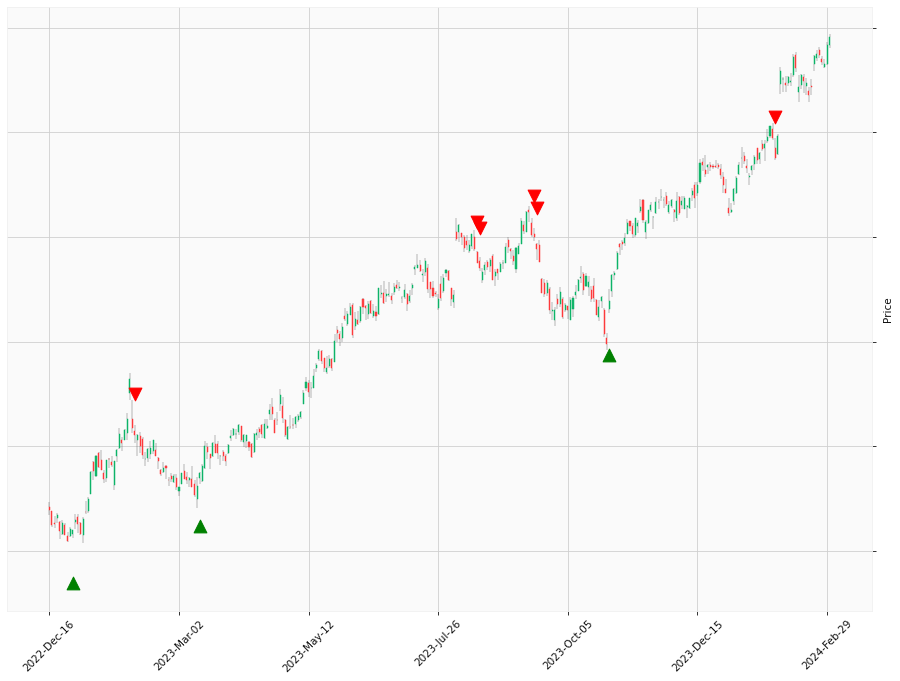

    
# Happy Labz Technologies

<table class="hits">
    <tr>
        <th>Direction</th>
        <th>Date</th>
      </tr>
    <tr>
        <td>Short</td>
        <td>Jun 21 2021 15:00 PST</td>
    </tr>
    <tr>
        <td>Short</td>
        <td>Jun 24 2021 15:00 PST</td>
    </tr>
    <tr>
        <td>Short</td>
        <td>Jul 13 2021 15:00 PST</td>
    </tr>
    <tr>
        <td>Long</td>
        <td>Aug 23 2021 15:00 PST</td>
    </tr>
    <tr>
        <td>Long</td>
        <td>Jan 28 2022 15:00 PST</td>
    </tr>
    <tr>
        <td>Long</td>
        <td>May 04 2022 15:00 PST</td>
    </tr>
    <tr>
        <td>Long</td>
        <td>May 12 2022 15:00 PST</td>
    </tr>
    <tr>
        <td>Long</td>
        <td>May 13 2022 15:00 PST</td>
    </tr>
    <tr>
        <td>Long</td>
        <td>Nov 11 2022 15:00 PST</td>
    </tr>
    
</table>

