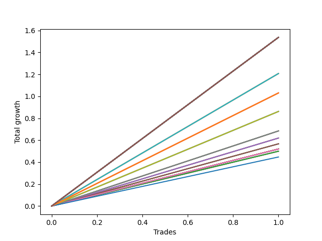

# Long Wallace Doodle 013 
- Symbol: AMZN_Unlimited
- Date Range: 03/23/2022 - 07/08/2022
- Trading Period: 7:20-12:30
- Number of Trades: 1



| Name | Win Percent | Profit | Avg Profit / Trade | Avg Time / Trade |      | Name | Win Percent | Profit | Avg Profit / Trade | Avg Time / Trade |
| ---- | ----------- | ------ | ------------------ | ---------------- | ---- | ---- | ----------- | ------ | ------------------ | ---------------- |
| Sorted By <br> Profit | | | | | | Sorted By <br> Win Percentage ||||
| One Hundred Thirty | 100.00 | 768.50 | 768.50 | 283:00 |     | One Hundred Thirty | 100.00 | 768.50 | 768.50 | 283:00 |
| One Hundred Twenty-Nine | 100.00 | 768.50 | 768.50 | 283:00 |     | One Hundred Twenty-Nine | 100.00 | 768.50 | 768.50 | 283:00 |
| One Hundred Twenty-Eight | 100.00 | 768.50 | 768.50 | 283:00 |     | One Hundred Twenty-Eight | 100.00 | 768.50 | 768.50 | 283:00 |
| One Hundred Twenty-Seven | 100.00 | 768.50 | 768.50 | 283:00 |     | One Hundred Twenty-Seven | 100.00 | 768.50 | 768.50 | 283:00 |
| One Hundred Twenty-Five | 100.00 | 768.50 | 768.50 | 283:00 |     | One Hundred Twenty-Five | 100.00 | 768.50 | 768.50 | 283:00 |
| One Hundred Twenty-Four | 100.00 | 768.50 | 768.50 | 283:00 |     | One Hundred Twenty-Four | 100.00 | 768.50 | 768.50 | 283:00 |
| One Hundred Twenty-Three | 100.00 | 768.50 | 768.50 | 283:00 |     | One Hundred Twenty-Three | 100.00 | 768.50 | 768.50 | 283:00 |
| One Hundred Twenty-Two | 100.00 | 768.50 | 768.50 | 283:00 |     | One Hundred Twenty-Two | 100.00 | 768.50 | 768.50 | 283:00 |
| One Hundred Twenty | 100.00 | 768.50 | 768.50 | 283:00 |     | One Hundred Twenty | 100.00 | 768.50 | 768.50 | 283:00 |
| One Hundred Ninteen | 100.00 | 768.50 | 768.50 | 283:00 |     | One Hundred Ninteen | 100.00 | 768.50 | 768.50 | 283:00 |
| One Hundred Eighteen | 100.00 | 768.50 | 768.50 | 283:00 |     | One Hundred Eighteen | 100.00 | 768.50 | 768.50 | 283:00 |
| One Hundred Seventeen | 100.00 | 768.50 | 768.50 | 283:00 |     | One Hundred Seventeen | 100.00 | 768.50 | 768.50 | 283:00 |
| One Hundred Fifteen | 100.00 | 768.50 | 768.50 | 283:00 |     | One Hundred Fifteen | 100.00 | 768.50 | 768.50 | 283:00 |
| One Hundred Fourteen | 100.00 | 768.50 | 768.50 | 283:00 |     | One Hundred Fourteen | 100.00 | 768.50 | 768.50 | 283:00 |
| One Hundred Thirteen | 100.00 | 768.50 | 768.50 | 283:00 |     | One Hundred Thirteen | 100.00 | 768.50 | 768.50 | 283:00 |
| One Hundred Twelve | 100.00 | 768.50 | 768.50 | 283:00 |     | One Hundred Twelve | 100.00 | 768.50 | 768.50 | 283:00 |
| One Hundred Ten | 100.00 | 768.50 | 768.50 | 283:00 |     | One Hundred Ten | 100.00 | 768.50 | 768.50 | 283:00 |
| One Hundred Nine | 100.00 | 768.50 | 768.50 | 283:00 |     | One Hundred Nine | 100.00 | 768.50 | 768.50 | 283:00 |
| One Hundred Eight | 100.00 | 768.50 | 768.50 | 283:00 |     | One Hundred Eight | 100.00 | 768.50 | 768.50 | 283:00 |
| One Hundred Seven | 100.00 | 768.50 | 768.50 | 283:00 |     | One Hundred Seven | 100.00 | 768.50 | 768.50 | 283:00 |
| One Hundred Five | 100.00 | 768.50 | 768.50 | 283:00 |     | One Hundred Five | 100.00 | 768.50 | 768.50 | 283:00 |
| One Hundred Four | 100.00 | 768.50 | 768.50 | 283:00 |     | One Hundred Four | 100.00 | 768.50 | 768.50 | 283:00 |
| One Hundred Three | 100.00 | 768.50 | 768.50 | 283:00 |     | One Hundred Three | 100.00 | 768.50 | 768.50 | 283:00 |
| One Hundred Two | 100.00 | 768.50 | 768.50 | 283:00 |     | One Hundred Two | 100.00 | 768.50 | 768.50 | 283:00 |
| One Hundred | 100.00 | 768.50 | 768.50 | 283:00 |     | One Hundred | 100.00 | 768.50 | 768.50 | 283:00 |
| Ninety-Nine | 100.00 | 768.50 | 768.50 | 283:00 |     | Ninety-Nine | 100.00 | 768.50 | 768.50 | 283:00 |
| Ninety-Eight | 100.00 | 768.50 | 768.50 | 283:00 |     | Ninety-Eight | 100.00 | 768.50 | 768.50 | 283:00 |
| Ninety-Seven | 100.00 | 768.50 | 768.50 | 283:00 |     | Ninety-Seven | 100.00 | 768.50 | 768.50 | 283:00 |
| Ninety-Five | 100.00 | 768.50 | 768.50 | 283:00 |     | Ninety-Five | 100.00 | 768.50 | 768.50 | 283:00 |
| Ninety-Four | 100.00 | 768.50 | 768.50 | 283:00 |     | Ninety-Four | 100.00 | 768.50 | 768.50 | 283:00 |
| Ninety-Three | 100.00 | 768.50 | 768.50 | 283:00 |     | Ninety-Three | 100.00 | 768.50 | 768.50 | 283:00 |
| Ninety-Two | 100.00 | 768.50 | 768.50 | 283:00 |     | Ninety-Two | 100.00 | 768.50 | 768.50 | 283:00 |
| Eighty-Five | 100.00 | 768.50 | 768.50 | 283:00 |     | Eighty-Five | 100.00 | 768.50 | 768.50 | 283:00 |
| Eighty-Four | 100.00 | 768.50 | 768.50 | 283:00 |     | Eighty-Four | 100.00 | 768.50 | 768.50 | 283:00 |
| Eighty-Three | 100.00 | 768.50 | 768.50 | 283:00 |     | Eighty-Three | 100.00 | 768.50 | 768.50 | 283:00 |
| Eighty-Two | 100.00 | 768.50 | 768.50 | 283:00 |     | Eighty-Two | 100.00 | 768.50 | 768.50 | 283:00 |
| Seventy-One | 100.00 | 603.75 | 603.75 | 233:20 |     | Seventy-One | 100.00 | 603.75 | 603.75 | 233:20 |
| Sixty-Three | 100.00 | 603.75 | 603.75 | 233:20 |     | Sixty-Three | 100.00 | 603.75 | 603.75 | 233:20 |
| Fifty-Five | 100.00 | 603.75 | 603.75 | 233:20 |     | Fifty-Five | 100.00 | 603.75 | 603.75 | 233:20 |
| Forty-Seven | 100.00 | 603.75 | 603.75 | 233:20 |     | Forty-Seven | 100.00 | 603.75 | 603.75 | 233:20 |
| Seven | 100.00 | 603.75 | 603.75 | 233:20 |     | Seven | 100.00 | 603.75 | 603.75 | 233:20 |
| One Hundred Twenty-Six | 100.00 | 515.25 | 515.25 | 216:20 |     | One Hundred Twenty-Six | 100.00 | 515.25 | 515.25 | 216:20 |
| One Hundred Twenty-One | 100.00 | 515.25 | 515.25 | 216:20 |     | One Hundred Twenty-One | 100.00 | 515.25 | 515.25 | 216:20 |
| One Hundred Sixteen | 100.00 | 515.25 | 515.25 | 216:20 |     | One Hundred Sixteen | 100.00 | 515.25 | 515.25 | 216:20 |
| One Hundred Eleven | 100.00 | 515.25 | 515.25 | 216:20 |     | One Hundred Eleven | 100.00 | 515.25 | 515.25 | 216:20 |
| One Hundred Six | 100.00 | 515.25 | 515.25 | 216:20 |     | One Hundred Six | 100.00 | 515.25 | 515.25 | 216:20 |
| One Hundred One | 100.00 | 515.25 | 515.25 | 216:20 |     | One Hundred One | 100.00 | 515.25 | 515.25 | 216:20 |
| Ninety-Six | 100.00 | 515.25 | 515.25 | 216:20 |     | Ninety-Six | 100.00 | 515.25 | 515.25 | 216:20 |
| Ninety-One | 100.00 | 515.25 | 515.25 | 216:20 |     | Ninety-One | 100.00 | 515.25 | 515.25 | 216:20 |
| Eighty-One | 100.00 | 515.25 | 515.25 | 216:20 |     | Eighty-One | 100.00 | 515.25 | 515.25 | 216:20 |
| Seventy | 100.00 | 431.00 | 431.00 | 58:00 |     | Seventy | 100.00 | 431.00 | 431.00 | 58:00 |
| Sixty-Two | 100.00 | 431.00 | 431.00 | 58:00 |     | Sixty-Two | 100.00 | 431.00 | 431.00 | 58:00 |
| Fifty-Four | 100.00 | 431.00 | 431.00 | 58:00 |     | Fifty-Four | 100.00 | 431.00 | 431.00 | 58:00 |
| Forty-Six | 100.00 | 431.00 | 431.00 | 58:00 |     | Forty-Six | 100.00 | 431.00 | 431.00 | 58:00 |
| Six | 100.00 | 431.00 | 431.00 | 58:00 |     | Six | 100.00 | 431.00 | 431.00 | 58:00 |
| Sixty-Nine | 100.00 | 342.25 | 342.25 | 45:50 |     | Sixty-Nine | 100.00 | 342.25 | 342.25 | 45:50 |
| Sixty-One | 100.00 | 342.25 | 342.25 | 45:50 |     | Sixty-One | 100.00 | 342.25 | 342.25 | 45:50 |
| Fifty-Three | 100.00 | 342.25 | 342.25 | 45:50 |     | Fifty-Three | 100.00 | 342.25 | 342.25 | 45:50 |
| Forty-Five | 100.00 | 342.25 | 342.25 | 45:50 |     | Forty-Five | 100.00 | 342.25 | 342.25 | 45:50 |
| Five | 100.00 | 342.25 | 342.25 | 45:50 |     | Five | 100.00 | 342.25 | 342.25 | 45:50 |
| Sixty-Six | 100.00 | 309.75 | 309.75 | 45:40 |     | Sixty-Six | 100.00 | 309.75 | 309.75 | 45:40 |
| Fifty-Eight | 100.00 | 309.75 | 309.75 | 45:40 |     | Fifty-Eight | 100.00 | 309.75 | 309.75 | 45:40 |
| Fifty | 100.00 | 309.75 | 309.75 | 45:40 |     | Fifty | 100.00 | 309.75 | 309.75 | 45:40 |
| Forty-Two | 100.00 | 309.75 | 309.75 | 45:40 |     | Forty-Two | 100.00 | 309.75 | 309.75 | 45:40 |
| Two | 100.00 | 309.75 | 309.75 | 45:40 |     | Two | 100.00 | 309.75 | 309.75 | 45:40 |
| Sixty-Seven | 100.00 | 283.50 | 283.50 | 31:35 |     | Sixty-Seven | 100.00 | 283.50 | 283.50 | 31:35 |
| Fifty-Nine | 100.00 | 283.50 | 283.50 | 31:35 |     | Fifty-Nine | 100.00 | 283.50 | 283.50 | 31:35 |
| Fifty-One | 100.00 | 283.50 | 283.50 | 31:35 |     | Fifty-One | 100.00 | 283.50 | 283.50 | 31:35 |
| Forty-Three | 100.00 | 283.50 | 283.50 | 31:35 |     | Forty-Three | 100.00 | 283.50 | 283.50 | 31:35 |
| Three | 100.00 | 283.50 | 283.50 | 31:35 |     | Three | 100.00 | 283.50 | 283.50 | 31:35 |
| Sixty-Five | 100.00 | 260.00 | 260.00 | 15:20 |     | Sixty-Five | 100.00 | 260.00 | 260.00 | 15:20 |
| Fifty-Seven | 100.00 | 260.00 | 260.00 | 15:20 |     | Fifty-Seven | 100.00 | 260.00 | 260.00 | 15:20 |
| Forty-Nine | 100.00 | 260.00 | 260.00 | 15:20 |     | Forty-Nine | 100.00 | 260.00 | 260.00 | 15:20 |
| Forty-One | 100.00 | 260.00 | 260.00 | 15:20 |     | Forty-One | 100.00 | 260.00 | 260.00 | 15:20 |
| One | 100.00 | 260.00 | 260.00 | 15:20 |     | One | 100.00 | 260.00 | 260.00 | 15:20 |
| Sixty-Eight | 100.00 | 259.50 | 259.50 | 45:00 |     | Sixty-Eight | 100.00 | 259.50 | 259.50 | 45:00 |
| Sixty | 100.00 | 259.50 | 259.50 | 45:00 |     | Sixty | 100.00 | 259.50 | 259.50 | 45:00 |
| Fifty-Two | 100.00 | 259.50 | 259.50 | 45:00 |     | Fifty-Two | 100.00 | 259.50 | 259.50 | 45:00 |
| Forty-Four | 100.00 | 259.50 | 259.50 | 45:00 |     | Forty-Four | 100.00 | 259.50 | 259.50 | 45:00 |
| Four | 100.00 | 259.50 | 259.50 | 45:00 |     | Four | 100.00 | 259.50 | 259.50 | 45:00 |
| Sixty-Four | 100.00 | 249.75 | 249.75 | 10:05 |     | Sixty-Four | 100.00 | 249.75 | 249.75 | 10:05 |
| Fifty-Six | 100.00 | 249.75 | 249.75 | 10:05 |     | Fifty-Six | 100.00 | 249.75 | 249.75 | 10:05 |
| Forty-Eight | 100.00 | 249.75 | 249.75 | 10:05 |     | Forty-Eight | 100.00 | 249.75 | 249.75 | 10:05 |
| Forty | 100.00 | 249.75 | 249.75 | 10:05 |     | Forty | 100.00 | 249.75 | 249.75 | 10:05 |
| Zero | 100.00 | 249.75 | 249.75 | 10:05 |     | Zero | 100.00 | 249.75 | 249.75 | 10:05 |
| Seventy-Three | 100.00 | 223.50 | 223.50 | 15:05 |     | Seventy-Three | 100.00 | 223.50 | 223.50 | 15:05 |

## NO STOPLOSS

### Test Zero
* Sell when price hits the middle line of the 20p bollinger
* No Stoploss
* Results:
```
Total Trades: 1
Percent Up: 100.00
Percent Down: 0.00
Total Points Moved Up: 0.50
Potential Profit: 249.75
Total Points Ups: 0.50 Count Ups: 1
Total Points Downs: 0.00 Count Downs: 0
```

<details><summary>Trades</summary>

<code>In: 2022-05-27 08:04:00		Out: 2022-05-27 08:14:05		Total Position Time: 10:05		Total Move Up: 0.50		Total to Date: 0.50</code> <br />


</details>

### Test One
* Sell when the price hits the upper line of the 20p 1std bollinger
* No Stoploss
* Results:
```
Total Trades: 1
Percent Up: 100.00
Percent Down: 0.00
Total Points Moved Up: 0.52
Potential Profit: 260.00
Total Points Ups: 0.52 Count Ups: 1
Total Points Downs: 0.00 Count Downs: 0
```

<details><summary>Trades</summary>

<code>In: 2022-05-27 08:04:00		Out: 2022-05-27 08:19:20		Total Position Time: 15:20		Total Move Up: 0.52		Total to Date: 0.52</code> <br />


</details>

### Test Two
* Sell when the price hits the upper line of the 20p 2std bollinger
* No Stoploss
* Results:
```
Total Trades: 1
Percent Up: 100.00
Percent Down: 0.00
Total Points Moved Up: 0.62
Potential Profit: 309.75
Total Points Ups: 0.62 Count Ups: 1
Total Points Downs: 0.00 Count Downs: 0
```

<details><summary>Trades</summary>

<code>In: 2022-05-27 08:04:00		Out: 2022-05-27 08:49:40		Total Position Time: 45:40		Total Move Up: 0.62		Total to Date: 0.62</code> <br />


</details>

### Test Three
* Sell when price hits the middle line of the 50p bollinger
* No Stoploss
* Results:
```
Total Trades: 1
Percent Up: 100.00
Percent Down: 0.00
Total Points Moved Up: 0.57
Potential Profit: 283.50
Total Points Ups: 0.57 Count Ups: 1
Total Points Downs: 0.00 Count Downs: 0
```

<details><summary>Trades</summary>

<code>In: 2022-05-27 08:04:00		Out: 2022-05-27 08:35:35		Total Position Time: 31:35		Total Move Up: 0.57		Total to Date: 0.57</code> <br />


</details>

### Test Four
* Sell when the price hits the upper line of the 50p 1std bollinger
* No Stoploss
* Results:
```
Total Trades: 1
Percent Up: 100.00
Percent Down: 0.00
Total Points Moved Up: 0.52
Potential Profit: 259.50
Total Points Ups: 0.52 Count Ups: 1
Total Points Downs: 0.00 Count Downs: 0
```

<details><summary>Trades</summary>

<code>In: 2022-05-27 08:04:00		Out: 2022-05-27 08:49:00		Total Position Time: 45:00		Total Move Up: 0.52		Total to Date: 0.52</code> <br />


</details>

### Test Five
* Sell when the price hits the upper line of the 50p 2std bollinger
* No Stoploss
* Results:
```
Total Trades: 1
Percent Up: 100.00
Percent Down: 0.00
Total Points Moved Up: 0.68
Potential Profit: 342.25
Total Points Ups: 0.68 Count Ups: 1
Total Points Downs: 0.00 Count Downs: 0
```

<details><summary>Trades</summary>

<code>In: 2022-05-27 08:04:00		Out: 2022-05-27 08:49:50		Total Position Time: 45:50		Total Move Up: 0.68		Total to Date: 0.68</code> <br />


</details>

### Test Six
* Sell when the price hits the middle line of the 1std VWAP
* No Stoploss
* Results:
```
Total Trades: 1
Percent Up: 100.00
Percent Down: 0.00
Total Points Moved Up: 0.86
Potential Profit: 431.00
Total Points Ups: 0.86 Count Ups: 1
Total Points Downs: 0.00 Count Downs: 0
```

<details><summary>Trades</summary>

<code>In: 2022-05-27 08:04:00		Out: 2022-05-27 09:02:00		Total Position Time: 58:00		Total Move Up: 0.86		Total to Date: 0.86</code> <br />


</details>

### Test Seven
* Sell when the price hits the upper line of the 1std VWAP
* No Stoploss
* Results:
```
Total Trades: 1
Percent Up: 100.00
Percent Down: 0.00
Total Points Moved Up: 1.21
Potential Profit: 603.75
Total Points Ups: 1.21 Count Ups: 1
Total Points Downs: 0.00 Count Downs: 0
```

<details><summary>Trades</summary>

<code>In: 2022-05-27 08:04:00		Out: 2022-05-27 11:57:20		Total Position Time: 233:20		Total Move Up: 1.21		Total to Date: 1.21</code> <br />


</details>

## STOPLOSS OF 5

### Test Forty
* Sell when price hits the middle line of the 20p bollinger
* Stoploss is 5 points
* Results:
```
Total Trades: 1
Percent Up: 100.00
Percent Down: 0.00
Total Points Moved Up: 0.50
Potential Profit: 249.75
Total Points Ups: 0.50 Count Ups: 1
Total Points Downs: 0.00 Count Downs: 0
```

<details><summary>Trades</summary>

<code>In: 2022-05-27 08:04:00		Out: 2022-05-27 08:14:05		Total Position Time: 10:05		Total Move Up: 0.50		Total to Date: 0.50</code> <br />


</details>

### Test Forty-One
* Sell when the price hits the upper line of the 20p 1std bollinger
* Stoploss is 5 points
* Results:
```
Total Trades: 1
Percent Up: 100.00
Percent Down: 0.00
Total Points Moved Up: 0.52
Potential Profit: 260.00
Total Points Ups: 0.52 Count Ups: 1
Total Points Downs: 0.00 Count Downs: 0
```

<details><summary>Trades</summary>

<code>In: 2022-05-27 08:04:00		Out: 2022-05-27 08:19:20		Total Position Time: 15:20		Total Move Up: 0.52		Total to Date: 0.52</code> <br />


</details>

### Test Forty-Two
* Sell when the price hits the upper line of the 20p 2std bollinger
* Stoploss is 5 points
* Results:
```
Total Trades: 1
Percent Up: 100.00
Percent Down: 0.00
Total Points Moved Up: 0.62
Potential Profit: 309.75
Total Points Ups: 0.62 Count Ups: 1
Total Points Downs: 0.00 Count Downs: 0
```

<details><summary>Trades</summary>

<code>In: 2022-05-27 08:04:00		Out: 2022-05-27 08:49:40		Total Position Time: 45:40		Total Move Up: 0.62		Total to Date: 0.62</code> <br />


</details>

### Test Forty-Three
* Sell when price hits the middle line of the 50p bollinger
* Stoploss is 5 points
* Results:
```
Total Trades: 1
Percent Up: 100.00
Percent Down: 0.00
Total Points Moved Up: 0.57
Potential Profit: 283.50
Total Points Ups: 0.57 Count Ups: 1
Total Points Downs: 0.00 Count Downs: 0
```

<details><summary>Trades</summary>

<code>In: 2022-05-27 08:04:00		Out: 2022-05-27 08:35:35		Total Position Time: 31:35		Total Move Up: 0.57		Total to Date: 0.57</code> <br />


</details>

### Test Forty-Four
* Sell when the price hits the upper line of the 50p 1std bollinger
* Stoploss is 5 points
* Results:
```
Total Trades: 1
Percent Up: 100.00
Percent Down: 0.00
Total Points Moved Up: 0.52
Potential Profit: 259.50
Total Points Ups: 0.52 Count Ups: 1
Total Points Downs: 0.00 Count Downs: 0
```

<details><summary>Trades</summary>

<code>In: 2022-05-27 08:04:00		Out: 2022-05-27 08:49:00		Total Position Time: 45:00		Total Move Up: 0.52		Total to Date: 0.52</code> <br />


</details>

### Test Forty-Five
* Sell when the price hits the upper line of the 50p 2std bollinger
* Stoploss is 5 points
* Results:
```
Total Trades: 1
Percent Up: 100.00
Percent Down: 0.00
Total Points Moved Up: 0.68
Potential Profit: 342.25
Total Points Ups: 0.68 Count Ups: 1
Total Points Downs: 0.00 Count Downs: 0
```

<details><summary>Trades</summary>

<code>In: 2022-05-27 08:04:00		Out: 2022-05-27 08:49:50		Total Position Time: 45:50		Total Move Up: 0.68		Total to Date: 0.68</code> <br />


</details>

### Test Forty-Six
* Sell when the price hits the middle line of the 1std VWAP
* Stoploss is 5 points
* Results:
```
Total Trades: 1
Percent Up: 100.00
Percent Down: 0.00
Total Points Moved Up: 0.86
Potential Profit: 431.00
Total Points Ups: 0.86 Count Ups: 1
Total Points Downs: 0.00 Count Downs: 0
```

<details><summary>Trades</summary>

<code>In: 2022-05-27 08:04:00		Out: 2022-05-27 09:02:00		Total Position Time: 58:00		Total Move Up: 0.86		Total to Date: 0.86</code> <br />


</details>

### Test Forty-Seven
* Sell when the price hits the upper line of the 1std VWAP
* Stoploss is 5 points
* Results:
```
Total Trades: 1
Percent Up: 100.00
Percent Down: 0.00
Total Points Moved Up: 1.21
Potential Profit: 603.75
Total Points Ups: 1.21 Count Ups: 1
Total Points Downs: 0.00 Count Downs: 0
```

<details><summary>Trades</summary>

<code>In: 2022-05-27 08:04:00		Out: 2022-05-27 11:57:20		Total Position Time: 233:20		Total Move Up: 1.21		Total to Date: 1.21</code> <br />


</details>

## TRAIL STOP OF 5

### Test Forty-Eight
* Sell when price hits the middle line of the 20p bollinger
* Trailing Stop is 5 points
* Results:
```
Total Trades: 1
Percent Up: 100.00
Percent Down: 0.00
Total Points Moved Up: 0.50
Potential Profit: 249.75
Total Points Ups: 0.50 Count Ups: 1
Total Points Downs: 0.00 Count Downs: 0
```

<details><summary>Trades</summary>

<code>In: 2022-05-27 08:04:00		Out: 2022-05-27 08:14:05		Total Position Time: 10:05		Total Move Up: 0.50		Total to Date: 0.50</code> <br />


</details>

### Test Forty-Nine
* Sell when the price hits the upper line of the 20p 1std bollinger
* Trailing Stop is 5 points
* Results:
```
Total Trades: 1
Percent Up: 100.00
Percent Down: 0.00
Total Points Moved Up: 0.52
Potential Profit: 260.00
Total Points Ups: 0.52 Count Ups: 1
Total Points Downs: 0.00 Count Downs: 0
```

<details><summary>Trades</summary>

<code>In: 2022-05-27 08:04:00		Out: 2022-05-27 08:19:20		Total Position Time: 15:20		Total Move Up: 0.52		Total to Date: 0.52</code> <br />


</details>

### Test Fifty
* Sell when the price hits the upper line of the 20p 2std bollinger
* Trailing Stop is 5 points
* Results:
```
Total Trades: 1
Percent Up: 100.00
Percent Down: 0.00
Total Points Moved Up: 0.62
Potential Profit: 309.75
Total Points Ups: 0.62 Count Ups: 1
Total Points Downs: 0.00 Count Downs: 0
```

<details><summary>Trades</summary>

<code>In: 2022-05-27 08:04:00		Out: 2022-05-27 08:49:40		Total Position Time: 45:40		Total Move Up: 0.62		Total to Date: 0.62</code> <br />


</details>

### Test Fifty-One
* Sell when price hits the middle line of the 50p bollinger
* Trailing Stop is 5 points
* Results:
```
Total Trades: 1
Percent Up: 100.00
Percent Down: 0.00
Total Points Moved Up: 0.57
Potential Profit: 283.50
Total Points Ups: 0.57 Count Ups: 1
Total Points Downs: 0.00 Count Downs: 0
```

<details><summary>Trades</summary>

<code>In: 2022-05-27 08:04:00		Out: 2022-05-27 08:35:35		Total Position Time: 31:35		Total Move Up: 0.57		Total to Date: 0.57</code> <br />


</details>

### Test Fifty-Two
* Sell when the price hits the upper line of the 50p 1std bollinger
* Trailing Stop is 5 points
* Results:
```
Total Trades: 1
Percent Up: 100.00
Percent Down: 0.00
Total Points Moved Up: 0.52
Potential Profit: 259.50
Total Points Ups: 0.52 Count Ups: 1
Total Points Downs: 0.00 Count Downs: 0
```

<details><summary>Trades</summary>

<code>In: 2022-05-27 08:04:00		Out: 2022-05-27 08:49:00		Total Position Time: 45:00		Total Move Up: 0.52		Total to Date: 0.52</code> <br />


</details>

### Test Fifty-Three
* Sell when the price hits the upper line of the 50p 2std bollinger
* Trailing Stop is 5 points
* Results:
```
Total Trades: 1
Percent Up: 100.00
Percent Down: 0.00
Total Points Moved Up: 0.68
Potential Profit: 342.25
Total Points Ups: 0.68 Count Ups: 1
Total Points Downs: 0.00 Count Downs: 0
```

<details><summary>Trades</summary>

<code>In: 2022-05-27 08:04:00		Out: 2022-05-27 08:49:50		Total Position Time: 45:50		Total Move Up: 0.68		Total to Date: 0.68</code> <br />


</details>

### Test Fifty-Four
* Sell when the price hits the middle line of the 1std VWAP
* Trailing Stop is 5 points
* Results:
```
Total Trades: 1
Percent Up: 100.00
Percent Down: 0.00
Total Points Moved Up: 0.86
Potential Profit: 431.00
Total Points Ups: 0.86 Count Ups: 1
Total Points Downs: 0.00 Count Downs: 0
```

<details><summary>Trades</summary>

<code>In: 2022-05-27 08:04:00		Out: 2022-05-27 09:02:00		Total Position Time: 58:00		Total Move Up: 0.86		Total to Date: 0.86</code> <br />


</details>

### Test Fifty-Five
* Sell when the price hits the upper line of the 1std VWAP
* Trailing Stop is 5 points
* Results:
```
Total Trades: 1
Percent Up: 100.00
Percent Down: 0.00
Total Points Moved Up: 1.21
Potential Profit: 603.75
Total Points Ups: 1.21 Count Ups: 1
Total Points Downs: 0.00 Count Downs: 0
```

<details><summary>Trades</summary>

<code>In: 2022-05-27 08:04:00		Out: 2022-05-27 11:57:20		Total Position Time: 233:20		Total Move Up: 1.21		Total to Date: 1.21</code> <br />


</details>

## STOPLOSS OF 10

### Test Fifty-Six
* Sell when price hits the middle line of the 20p bollinger
* Stoploss is 10 points
* Results:
```
Total Trades: 1
Percent Up: 100.00
Percent Down: 0.00
Total Points Moved Up: 0.50
Potential Profit: 249.75
Total Points Ups: 0.50 Count Ups: 1
Total Points Downs: 0.00 Count Downs: 0
```

<details><summary>Trades</summary>

<code>In: 2022-05-27 08:04:00		Out: 2022-05-27 08:14:05		Total Position Time: 10:05		Total Move Up: 0.50		Total to Date: 0.50</code> <br />


</details>

### Test Fifty-Seven
* Sell when the price hits the upper line of the 20p 1std bollinger
* Stoploss is 10 points
* Results:
```
Total Trades: 1
Percent Up: 100.00
Percent Down: 0.00
Total Points Moved Up: 0.52
Potential Profit: 260.00
Total Points Ups: 0.52 Count Ups: 1
Total Points Downs: 0.00 Count Downs: 0
```

<details><summary>Trades</summary>

<code>In: 2022-05-27 08:04:00		Out: 2022-05-27 08:19:20		Total Position Time: 15:20		Total Move Up: 0.52		Total to Date: 0.52</code> <br />


</details>

### Test Fifty-Eight
* Sell when the price hits the upper line of the 20p 2std bollinger
* Stoploss is 10 points
* Results:
```
Total Trades: 1
Percent Up: 100.00
Percent Down: 0.00
Total Points Moved Up: 0.62
Potential Profit: 309.75
Total Points Ups: 0.62 Count Ups: 1
Total Points Downs: 0.00 Count Downs: 0
```

<details><summary>Trades</summary>

<code>In: 2022-05-27 08:04:00		Out: 2022-05-27 08:49:40		Total Position Time: 45:40		Total Move Up: 0.62		Total to Date: 0.62</code> <br />


</details>

### Test Fifty-Nine
* Sell when price hits the middle line of the 50p bollinger
* Stoploss is 10 points
* Results:
```
Total Trades: 1
Percent Up: 100.00
Percent Down: 0.00
Total Points Moved Up: 0.57
Potential Profit: 283.50
Total Points Ups: 0.57 Count Ups: 1
Total Points Downs: 0.00 Count Downs: 0
```

<details><summary>Trades</summary>

<code>In: 2022-05-27 08:04:00		Out: 2022-05-27 08:35:35		Total Position Time: 31:35		Total Move Up: 0.57		Total to Date: 0.57</code> <br />


</details>

### Test Sixty
* Sell when the price hits the upper line of the 50p 1std bollinger
* Stoploss is 10 points
* Results:
```
Total Trades: 1
Percent Up: 100.00
Percent Down: 0.00
Total Points Moved Up: 0.52
Potential Profit: 259.50
Total Points Ups: 0.52 Count Ups: 1
Total Points Downs: 0.00 Count Downs: 0
```

<details><summary>Trades</summary>

<code>In: 2022-05-27 08:04:00		Out: 2022-05-27 08:49:00		Total Position Time: 45:00		Total Move Up: 0.52		Total to Date: 0.52</code> <br />


</details>

### Test Sixty-One
* Sell when the price hits the upper line of the 50p 2std bollinger
* Stoploss is 10 points
* Results:
```
Total Trades: 1
Percent Up: 100.00
Percent Down: 0.00
Total Points Moved Up: 0.68
Potential Profit: 342.25
Total Points Ups: 0.68 Count Ups: 1
Total Points Downs: 0.00 Count Downs: 0
```

<details><summary>Trades</summary>

<code>In: 2022-05-27 08:04:00		Out: 2022-05-27 08:49:50		Total Position Time: 45:50		Total Move Up: 0.68		Total to Date: 0.68</code> <br />


</details>

### Test Sixty-Two
* Sell when the price hits the middle line of the 1std VWAP
* Stoploss is 10 points
* Results:
```
Total Trades: 1
Percent Up: 100.00
Percent Down: 0.00
Total Points Moved Up: 0.86
Potential Profit: 431.00
Total Points Ups: 0.86 Count Ups: 1
Total Points Downs: 0.00 Count Downs: 0
```

<details><summary>Trades</summary>

<code>In: 2022-05-27 08:04:00		Out: 2022-05-27 09:02:00		Total Position Time: 58:00		Total Move Up: 0.86		Total to Date: 0.86</code> <br />


</details>

### Test Sixty-Three
* Sell when the price hits the upper line of the 1std VWAP
* Stoploss is 10 points
* Results:
```
Total Trades: 1
Percent Up: 100.00
Percent Down: 0.00
Total Points Moved Up: 1.21
Potential Profit: 603.75
Total Points Ups: 1.21 Count Ups: 1
Total Points Downs: 0.00 Count Downs: 0
```

<details><summary>Trades</summary>

<code>In: 2022-05-27 08:04:00		Out: 2022-05-27 11:57:20		Total Position Time: 233:20		Total Move Up: 1.21		Total to Date: 1.21</code> <br />


</details>

## TRAIL STOP OF 10

### Test Sixty-Four
* Sell when price hits the middle line of the 20p bollinger
* Trailing Stop is 10 points
* Results:
```
Total Trades: 1
Percent Up: 100.00
Percent Down: 0.00
Total Points Moved Up: 0.50
Potential Profit: 249.75
Total Points Ups: 0.50 Count Ups: 1
Total Points Downs: 0.00 Count Downs: 0
```

<details><summary>Trades</summary>

<code>In: 2022-05-27 08:04:00		Out: 2022-05-27 08:14:05		Total Position Time: 10:05		Total Move Up: 0.50		Total to Date: 0.50</code> <br />


</details>

### Test Sixty-Five
* Sell when the price hits the upper line of the 20p 1std bollinger
* Trailing Stop is 10 points
* Results:
```
Total Trades: 1
Percent Up: 100.00
Percent Down: 0.00
Total Points Moved Up: 0.52
Potential Profit: 260.00
Total Points Ups: 0.52 Count Ups: 1
Total Points Downs: 0.00 Count Downs: 0
```

<details><summary>Trades</summary>

<code>In: 2022-05-27 08:04:00		Out: 2022-05-27 08:19:20		Total Position Time: 15:20		Total Move Up: 0.52		Total to Date: 0.52</code> <br />


</details>

### Test Sixty-Six
* Sell when the price hits the upper line of the 20p 2std bollinger
* Trailing Stop is 10 points
* Results:
```
Total Trades: 1
Percent Up: 100.00
Percent Down: 0.00
Total Points Moved Up: 0.62
Potential Profit: 309.75
Total Points Ups: 0.62 Count Ups: 1
Total Points Downs: 0.00 Count Downs: 0
```

<details><summary>Trades</summary>

<code>In: 2022-05-27 08:04:00		Out: 2022-05-27 08:49:40		Total Position Time: 45:40		Total Move Up: 0.62		Total to Date: 0.62</code> <br />


</details>

### Test Sixty-Seven
* Sell when price hits the middle line of the 50p bollinger
* Trailing Stop is 10 points
* Results:
```
Total Trades: 1
Percent Up: 100.00
Percent Down: 0.00
Total Points Moved Up: 0.57
Potential Profit: 283.50
Total Points Ups: 0.57 Count Ups: 1
Total Points Downs: 0.00 Count Downs: 0
```

<details><summary>Trades</summary>

<code>In: 2022-05-27 08:04:00		Out: 2022-05-27 08:35:35		Total Position Time: 31:35		Total Move Up: 0.57		Total to Date: 0.57</code> <br />


</details>

### Test Sixty-Eight
* Sell when the price hits the upper line of the 50p 1std bollinger
* Trailing Stop is 10 points
* Results:
```
Total Trades: 1
Percent Up: 100.00
Percent Down: 0.00
Total Points Moved Up: 0.52
Potential Profit: 259.50
Total Points Ups: 0.52 Count Ups: 1
Total Points Downs: 0.00 Count Downs: 0
```

<details><summary>Trades</summary>

<code>In: 2022-05-27 08:04:00		Out: 2022-05-27 08:49:00		Total Position Time: 45:00		Total Move Up: 0.52		Total to Date: 0.52</code> <br />


</details>

### Test Sixty-Nine
* Sell when the price hits the upper line of the 50p 2std bollinger
* Trailing Stop is 10 points
* Results:
```
Total Trades: 1
Percent Up: 100.00
Percent Down: 0.00
Total Points Moved Up: 0.68
Potential Profit: 342.25
Total Points Ups: 0.68 Count Ups: 1
Total Points Downs: 0.00 Count Downs: 0
```

<details><summary>Trades</summary>

<code>In: 2022-05-27 08:04:00		Out: 2022-05-27 08:49:50		Total Position Time: 45:50		Total Move Up: 0.68		Total to Date: 0.68</code> <br />


</details>

### Test Seventy
* Sell when the price hits the middle line of the 1std VWAP
* Trailing Stop is 10 points
* Results:
```
Total Trades: 1
Percent Up: 100.00
Percent Down: 0.00
Total Points Moved Up: 0.86
Potential Profit: 431.00
Total Points Ups: 0.86 Count Ups: 1
Total Points Downs: 0.00 Count Downs: 0
```

<details><summary>Trades</summary>

<code>In: 2022-05-27 08:04:00		Out: 2022-05-27 09:02:00		Total Position Time: 58:00		Total Move Up: 0.86		Total to Date: 0.86</code> <br />


</details>

### Test Seventy-One
* Sell when the price hits the upper line of the 1std VWAP
* Trailing Stop is 10 points
* Results:
```
Total Trades: 1
Percent Up: 100.00
Percent Down: 0.00
Total Points Moved Up: 1.21
Potential Profit: 603.75
Total Points Ups: 1.21 Count Ups: 1
Total Points Downs: 0.00 Count Downs: 0
```

<details><summary>Trades</summary>

<code>In: 2022-05-27 08:04:00		Out: 2022-05-27 11:57:20		Total Position Time: 233:20		Total Move Up: 1.21		Total to Date: 1.21</code> <br />


</details>

## SPECIAL EXIT CONDITIONS 

### Test Seventy-Three
* Sell when the linear regression slope changes to negative
* No Stoploss
* Results:
```
Total Trades: 1
Percent Up: 100.00
Percent Down: 0.00
Total Points Moved Up: 0.45
Potential Profit: 223.50
Total Points Ups: 0.45 Count Ups: 1
Total Points Downs: 0.00 Count Downs: 0
```

<details><summary>Trades</summary>

<code>In: 2022-05-27 08:04:00		Out: 2022-05-27 08:19:05		Total Position Time: 15:05		Total Move Up: 0.45		Total to Date: 0.45</code> <br />


</details>

## TAKE PROFIT

### Test Eighty-One
* Take Profit of 1 Point
* No Stoploss
* Results:
```
Total Trades: 1
Percent Up: 100.00
Percent Down: 0.00
Total Points Moved Up: 1.03
Potential Profit: 515.25
Total Points Ups: 1.03 Count Ups: 1
Total Points Downs: 0.00 Count Downs: 0
```

<details><summary>Trades</summary>

<code>In: 2022-05-27 08:04:00		Out: 2022-05-27 11:40:20		Total Position Time: 216:20		Total Move Up: 1.03		Total to Date: 1.03</code> <br />


</details>

### Test Eighty-Two
* Take Profit of 2 Point
* No Stoploss
* Results:
```
Total Trades: 1
Percent Up: 100.00
Percent Down: 0.00
Total Points Moved Up: 1.54
Potential Profit: 768.50
Total Points Ups: 1.54 Count Ups: 1
Total Points Downs: 0.00 Count Downs: 0
```

<details><summary>Trades</summary>

<code>In: 2022-05-27 08:04:00		Out: 2022-05-27 12:47:00		Total Position Time: 283:00		Total Move Up: 1.54		Total to Date: 1.54</code> <br />


</details>

### Test Eighty-Three
* Take Profit of 3 Point
* No Stoploss
* Results:
```
Total Trades: 1
Percent Up: 100.00
Percent Down: 0.00
Total Points Moved Up: 1.54
Potential Profit: 768.50
Total Points Ups: 1.54 Count Ups: 1
Total Points Downs: 0.00 Count Downs: 0
```

<details><summary>Trades</summary>

<code>In: 2022-05-27 08:04:00		Out: 2022-05-27 12:47:00		Total Position Time: 283:00		Total Move Up: 1.54		Total to Date: 1.54</code> <br />


</details>

### Test Eighty-Four
* Take Profit of 4 Point
* No Stoploss
* Results:
```
Total Trades: 1
Percent Up: 100.00
Percent Down: 0.00
Total Points Moved Up: 1.54
Potential Profit: 768.50
Total Points Ups: 1.54 Count Ups: 1
Total Points Downs: 0.00 Count Downs: 0
```

<details><summary>Trades</summary>

<code>In: 2022-05-27 08:04:00		Out: 2022-05-27 12:47:00		Total Position Time: 283:00		Total Move Up: 1.54		Total to Date: 1.54</code> <br />


</details>

### Test Eighty-Five
* Take Profit of 5 Point
* No Stoploss
* Results:
```
Total Trades: 1
Percent Up: 100.00
Percent Down: 0.00
Total Points Moved Up: 1.54
Potential Profit: 768.50
Total Points Ups: 1.54 Count Ups: 1
Total Points Downs: 0.00 Count Downs: 0
```

<details><summary>Trades</summary>

<code>In: 2022-05-27 08:04:00		Out: 2022-05-27 12:47:00		Total Position Time: 283:00		Total Move Up: 1.54		Total to Date: 1.54</code> <br />


</details>

## TAKE PROFIT Stoploss of Two

### Test Ninety-One
* Take Profit of 1 Point
* Stoploss is 2 points
* Results:
```
Total Trades: 1
Percent Up: 100.00
Percent Down: 0.00
Total Points Moved Up: 1.03
Potential Profit: 515.25
Total Points Ups: 1.03 Count Ups: 1
Total Points Downs: 0.00 Count Downs: 0
```

<details><summary>Trades</summary>

<code>In: 2022-05-27 08:04:00		Out: 2022-05-27 11:40:20		Total Position Time: 216:20		Total Move Up: 1.03		Total to Date: 1.03</code> <br />


</details>

### Test Ninety-Two
* Take Profit of 2 Point
* Stoploss is 2 points
* Results:
```
Total Trades: 1
Percent Up: 100.00
Percent Down: 0.00
Total Points Moved Up: 1.54
Potential Profit: 768.50
Total Points Ups: 1.54 Count Ups: 1
Total Points Downs: 0.00 Count Downs: 0
```

<details><summary>Trades</summary>

<code>In: 2022-05-27 08:04:00		Out: 2022-05-27 12:47:00		Total Position Time: 283:00		Total Move Up: 1.54		Total to Date: 1.54</code> <br />


</details>

### Test Ninety-Three
* Take Profit of 3 Point
* Stoploss is 2 points
* Results:
```
Total Trades: 1
Percent Up: 100.00
Percent Down: 0.00
Total Points Moved Up: 1.54
Potential Profit: 768.50
Total Points Ups: 1.54 Count Ups: 1
Total Points Downs: 0.00 Count Downs: 0
```

<details><summary>Trades</summary>

<code>In: 2022-05-27 08:04:00		Out: 2022-05-27 12:47:00		Total Position Time: 283:00		Total Move Up: 1.54		Total to Date: 1.54</code> <br />


</details>

### Test Ninety-Four
* Take Profit of 4 Point
* Stoploss is 2 points
* Results:
```
Total Trades: 1
Percent Up: 100.00
Percent Down: 0.00
Total Points Moved Up: 1.54
Potential Profit: 768.50
Total Points Ups: 1.54 Count Ups: 1
Total Points Downs: 0.00 Count Downs: 0
```

<details><summary>Trades</summary>

<code>In: 2022-05-27 08:04:00		Out: 2022-05-27 12:47:00		Total Position Time: 283:00		Total Move Up: 1.54		Total to Date: 1.54</code> <br />


</details>

### Test Ninety-Five
* Take Profit of 5 Point
* Stoploss is 2 points
* Results:
```
Total Trades: 1
Percent Up: 100.00
Percent Down: 0.00
Total Points Moved Up: 1.54
Potential Profit: 768.50
Total Points Ups: 1.54 Count Ups: 1
Total Points Downs: 0.00 Count Downs: 0
```

<details><summary>Trades</summary>

<code>In: 2022-05-27 08:04:00		Out: 2022-05-27 12:47:00		Total Position Time: 283:00		Total Move Up: 1.54		Total to Date: 1.54</code> <br />


</details>

## TAKE PROFIT Trailstop of Two

### Test Ninety-Six
* Take Profit of 1 Point
* Trailing stop is 2 points
* Results:
```
Total Trades: 1
Percent Up: 100.00
Percent Down: 0.00
Total Points Moved Up: 1.03
Potential Profit: 515.25
Total Points Ups: 1.03 Count Ups: 1
Total Points Downs: 0.00 Count Downs: 0
```

<details><summary>Trades</summary>

<code>In: 2022-05-27 08:04:00		Out: 2022-05-27 11:40:20		Total Position Time: 216:20		Total Move Up: 1.03		Total to Date: 1.03</code> <br />


</details>

### Test Ninety-Seven
* Take Profit of 2 Point
* Trailing stop is 2 points
* Results:
```
Total Trades: 1
Percent Up: 100.00
Percent Down: 0.00
Total Points Moved Up: 1.54
Potential Profit: 768.50
Total Points Ups: 1.54 Count Ups: 1
Total Points Downs: 0.00 Count Downs: 0
```

<details><summary>Trades</summary>

<code>In: 2022-05-27 08:04:00		Out: 2022-05-27 12:47:00		Total Position Time: 283:00		Total Move Up: 1.54		Total to Date: 1.54</code> <br />


</details>

### Test Ninety-Eight
* Take Profit of 3 Point
* Trailing stop is 2 points
* Results:
```
Total Trades: 1
Percent Up: 100.00
Percent Down: 0.00
Total Points Moved Up: 1.54
Potential Profit: 768.50
Total Points Ups: 1.54 Count Ups: 1
Total Points Downs: 0.00 Count Downs: 0
```

<details><summary>Trades</summary>

<code>In: 2022-05-27 08:04:00		Out: 2022-05-27 12:47:00		Total Position Time: 283:00		Total Move Up: 1.54		Total to Date: 1.54</code> <br />


</details>

### Test Ninety-Nine
* Take Profit of 4 Point
* Trailing stop is 2 points
* Results:
```
Total Trades: 1
Percent Up: 100.00
Percent Down: 0.00
Total Points Moved Up: 1.54
Potential Profit: 768.50
Total Points Ups: 1.54 Count Ups: 1
Total Points Downs: 0.00 Count Downs: 0
```

<details><summary>Trades</summary>

<code>In: 2022-05-27 08:04:00		Out: 2022-05-27 12:47:00		Total Position Time: 283:00		Total Move Up: 1.54		Total to Date: 1.54</code> <br />


</details>

### Test One Hundred
* Take Profit of 5 Point
* Trailing stop is 2 points
* Results:
```
Total Trades: 1
Percent Up: 100.00
Percent Down: 0.00
Total Points Moved Up: 1.54
Potential Profit: 768.50
Total Points Ups: 1.54 Count Ups: 1
Total Points Downs: 0.00 Count Downs: 0
```

<details><summary>Trades</summary>

<code>In: 2022-05-27 08:04:00		Out: 2022-05-27 12:47:00		Total Position Time: 283:00		Total Move Up: 1.54		Total to Date: 1.54</code> <br />


</details>

## TAKE PROFIT Stoploss of Three

### Test One Hundred One
* Take Profit of 1 Point
* Stoploss is 3 points
* Results:
```
Total Trades: 1
Percent Up: 100.00
Percent Down: 0.00
Total Points Moved Up: 1.03
Potential Profit: 515.25
Total Points Ups: 1.03 Count Ups: 1
Total Points Downs: 0.00 Count Downs: 0
```

<details><summary>Trades</summary>

<code>In: 2022-05-27 08:04:00		Out: 2022-05-27 11:40:20		Total Position Time: 216:20		Total Move Up: 1.03		Total to Date: 1.03</code> <br />


</details>

### Test One Hundred Two
* Take Profit of 2 Point
* Stoploss is 3 points
* Results:
```
Total Trades: 1
Percent Up: 100.00
Percent Down: 0.00
Total Points Moved Up: 1.54
Potential Profit: 768.50
Total Points Ups: 1.54 Count Ups: 1
Total Points Downs: 0.00 Count Downs: 0
```

<details><summary>Trades</summary>

<code>In: 2022-05-27 08:04:00		Out: 2022-05-27 12:47:00		Total Position Time: 283:00		Total Move Up: 1.54		Total to Date: 1.54</code> <br />


</details>

### Test One Hundred Three
* Take Profit of 3 Point
* Stoploss is 3 points
* Results:
```
Total Trades: 1
Percent Up: 100.00
Percent Down: 0.00
Total Points Moved Up: 1.54
Potential Profit: 768.50
Total Points Ups: 1.54 Count Ups: 1
Total Points Downs: 0.00 Count Downs: 0
```

<details><summary>Trades</summary>

<code>In: 2022-05-27 08:04:00		Out: 2022-05-27 12:47:00		Total Position Time: 283:00		Total Move Up: 1.54		Total to Date: 1.54</code> <br />


</details>

### Test One Hundred Four
* Take Profit of 4 Point
* Stoploss is 3 points
* Results:
```
Total Trades: 1
Percent Up: 100.00
Percent Down: 0.00
Total Points Moved Up: 1.54
Potential Profit: 768.50
Total Points Ups: 1.54 Count Ups: 1
Total Points Downs: 0.00 Count Downs: 0
```

<details><summary>Trades</summary>

<code>In: 2022-05-27 08:04:00		Out: 2022-05-27 12:47:00		Total Position Time: 283:00		Total Move Up: 1.54		Total to Date: 1.54</code> <br />


</details>

### Test One Hundred Five
* Take Profit of 5 Point
* Stoploss is 3 points
* Results:
```
Total Trades: 1
Percent Up: 100.00
Percent Down: 0.00
Total Points Moved Up: 1.54
Potential Profit: 768.50
Total Points Ups: 1.54 Count Ups: 1
Total Points Downs: 0.00 Count Downs: 0
```

<details><summary>Trades</summary>

<code>In: 2022-05-27 08:04:00		Out: 2022-05-27 12:47:00		Total Position Time: 283:00		Total Move Up: 1.54		Total to Date: 1.54</code> <br />


</details>

## TAKE PROFIT Trailstop of Three

### Test One Hundred Six
* Take Profit of 1 Point
* Trailing stop is 3 points
* Results:
```
Total Trades: 1
Percent Up: 100.00
Percent Down: 0.00
Total Points Moved Up: 1.03
Potential Profit: 515.25
Total Points Ups: 1.03 Count Ups: 1
Total Points Downs: 0.00 Count Downs: 0
```

<details><summary>Trades</summary>

<code>In: 2022-05-27 08:04:00		Out: 2022-05-27 11:40:20		Total Position Time: 216:20		Total Move Up: 1.03		Total to Date: 1.03</code> <br />


</details>

### Test One Hundred Seven
* Take Profit of 2 Point
* Trailing stop is 3 points
* Results:
```
Total Trades: 1
Percent Up: 100.00
Percent Down: 0.00
Total Points Moved Up: 1.54
Potential Profit: 768.50
Total Points Ups: 1.54 Count Ups: 1
Total Points Downs: 0.00 Count Downs: 0
```

<details><summary>Trades</summary>

<code>In: 2022-05-27 08:04:00		Out: 2022-05-27 12:47:00		Total Position Time: 283:00		Total Move Up: 1.54		Total to Date: 1.54</code> <br />


</details>

### Test One Hundred Eight
* Take Profit of 3 Point
* Trailing stop is 3 points
* Results:
```
Total Trades: 1
Percent Up: 100.00
Percent Down: 0.00
Total Points Moved Up: 1.54
Potential Profit: 768.50
Total Points Ups: 1.54 Count Ups: 1
Total Points Downs: 0.00 Count Downs: 0
```

<details><summary>Trades</summary>

<code>In: 2022-05-27 08:04:00		Out: 2022-05-27 12:47:00		Total Position Time: 283:00		Total Move Up: 1.54		Total to Date: 1.54</code> <br />


</details>

### Test One Hundred Nine
* Take Profit of 4 Point
* Trailing stop is 3 points
* Results:
```
Total Trades: 1
Percent Up: 100.00
Percent Down: 0.00
Total Points Moved Up: 1.54
Potential Profit: 768.50
Total Points Ups: 1.54 Count Ups: 1
Total Points Downs: 0.00 Count Downs: 0
```

<details><summary>Trades</summary>

<code>In: 2022-05-27 08:04:00		Out: 2022-05-27 12:47:00		Total Position Time: 283:00		Total Move Up: 1.54		Total to Date: 1.54</code> <br />


</details>

### Test One Hundred Ten
* Take Profit of 5 Point
* Trailing stop is 3 points
* Results:
```
Total Trades: 1
Percent Up: 100.00
Percent Down: 0.00
Total Points Moved Up: 1.54
Potential Profit: 768.50
Total Points Ups: 1.54 Count Ups: 1
Total Points Downs: 0.00 Count Downs: 0
```

<details><summary>Trades</summary>

<code>In: 2022-05-27 08:04:00		Out: 2022-05-27 12:47:00		Total Position Time: 283:00		Total Move Up: 1.54		Total to Date: 1.54</code> <br />


</details>

## TAKE PROFIT Stoploss of Five

### Test One Hundred Eleven
* Take Profit of 1 Point
* Stoploss is 5 points
* Results:
```
Total Trades: 1
Percent Up: 100.00
Percent Down: 0.00
Total Points Moved Up: 1.03
Potential Profit: 515.25
Total Points Ups: 1.03 Count Ups: 1
Total Points Downs: 0.00 Count Downs: 0
```

<details><summary>Trades</summary>

<code>In: 2022-05-27 08:04:00		Out: 2022-05-27 11:40:20		Total Position Time: 216:20		Total Move Up: 1.03		Total to Date: 1.03</code> <br />


</details>

### Test One Hundred Twelve
* Take Profit of 2 Point
* Stoploss is 5 points
* Results:
```
Total Trades: 1
Percent Up: 100.00
Percent Down: 0.00
Total Points Moved Up: 1.54
Potential Profit: 768.50
Total Points Ups: 1.54 Count Ups: 1
Total Points Downs: 0.00 Count Downs: 0
```

<details><summary>Trades</summary>

<code>In: 2022-05-27 08:04:00		Out: 2022-05-27 12:47:00		Total Position Time: 283:00		Total Move Up: 1.54		Total to Date: 1.54</code> <br />


</details>

### Test One Hundred Thirteen
* Take Profit of 3 Point
* Stoploss is 5 points
* Results:
```
Total Trades: 1
Percent Up: 100.00
Percent Down: 0.00
Total Points Moved Up: 1.54
Potential Profit: 768.50
Total Points Ups: 1.54 Count Ups: 1
Total Points Downs: 0.00 Count Downs: 0
```

<details><summary>Trades</summary>

<code>In: 2022-05-27 08:04:00		Out: 2022-05-27 12:47:00		Total Position Time: 283:00		Total Move Up: 1.54		Total to Date: 1.54</code> <br />


</details>

### Test One Hundred Fourteen
* Take Profit of 4 Point
* Stoploss is 5 points
* Results:
```
Total Trades: 1
Percent Up: 100.00
Percent Down: 0.00
Total Points Moved Up: 1.54
Potential Profit: 768.50
Total Points Ups: 1.54 Count Ups: 1
Total Points Downs: 0.00 Count Downs: 0
```

<details><summary>Trades</summary>

<code>In: 2022-05-27 08:04:00		Out: 2022-05-27 12:47:00		Total Position Time: 283:00		Total Move Up: 1.54		Total to Date: 1.54</code> <br />


</details>

### Test One Hundred Fifteen
* Take Profit of 5 Point
* Stoploss is 5 points
* Results:
```
Total Trades: 1
Percent Up: 100.00
Percent Down: 0.00
Total Points Moved Up: 1.54
Potential Profit: 768.50
Total Points Ups: 1.54 Count Ups: 1
Total Points Downs: 0.00 Count Downs: 0
```

<details><summary>Trades</summary>

<code>In: 2022-05-27 08:04:00		Out: 2022-05-27 12:47:00		Total Position Time: 283:00		Total Move Up: 1.54		Total to Date: 1.54</code> <br />


</details>

## TAKE PROFIT Trailstop of Five

### Test One Hundred Sixteen
* Take Profit of 1 Point
* Trailing stop is 5 points
* Results:
```
Total Trades: 1
Percent Up: 100.00
Percent Down: 0.00
Total Points Moved Up: 1.03
Potential Profit: 515.25
Total Points Ups: 1.03 Count Ups: 1
Total Points Downs: 0.00 Count Downs: 0
```

<details><summary>Trades</summary>

<code>In: 2022-05-27 08:04:00		Out: 2022-05-27 11:40:20		Total Position Time: 216:20		Total Move Up: 1.03		Total to Date: 1.03</code> <br />


</details>

### Test One Hundred Seventeen
* Take Profit of 2 Point
* Trailing stop is 5 points
* Results:
```
Total Trades: 1
Percent Up: 100.00
Percent Down: 0.00
Total Points Moved Up: 1.54
Potential Profit: 768.50
Total Points Ups: 1.54 Count Ups: 1
Total Points Downs: 0.00 Count Downs: 0
```

<details><summary>Trades</summary>

<code>In: 2022-05-27 08:04:00		Out: 2022-05-27 12:47:00		Total Position Time: 283:00		Total Move Up: 1.54		Total to Date: 1.54</code> <br />


</details>

### Test One Hundred Eighteen
* Take Profit of 3 Point
* Trailing stop is 5 points
* Results:
```
Total Trades: 1
Percent Up: 100.00
Percent Down: 0.00
Total Points Moved Up: 1.54
Potential Profit: 768.50
Total Points Ups: 1.54 Count Ups: 1
Total Points Downs: 0.00 Count Downs: 0
```

<details><summary>Trades</summary>

<code>In: 2022-05-27 08:04:00		Out: 2022-05-27 12:47:00		Total Position Time: 283:00		Total Move Up: 1.54		Total to Date: 1.54</code> <br />


</details>

### Test One Hundred Ninteen
* Take Profit of 4 Point
* Trailing stop is 5 points
* Results:
```
Total Trades: 1
Percent Up: 100.00
Percent Down: 0.00
Total Points Moved Up: 1.54
Potential Profit: 768.50
Total Points Ups: 1.54 Count Ups: 1
Total Points Downs: 0.00 Count Downs: 0
```

<details><summary>Trades</summary>

<code>In: 2022-05-27 08:04:00		Out: 2022-05-27 12:47:00		Total Position Time: 283:00		Total Move Up: 1.54		Total to Date: 1.54</code> <br />


</details>

### Test One Hundred Twenty
* Take Profit of 5 Point
* Trailing stop is 5 points
* Results:
```
Total Trades: 1
Percent Up: 100.00
Percent Down: 0.00
Total Points Moved Up: 1.54
Potential Profit: 768.50
Total Points Ups: 1.54 Count Ups: 1
Total Points Downs: 0.00 Count Downs: 0
```

<details><summary>Trades</summary>

<code>In: 2022-05-27 08:04:00		Out: 2022-05-27 12:47:00		Total Position Time: 283:00		Total Move Up: 1.54		Total to Date: 1.54</code> <br />


</details>

## TAKE PROFIT Stoploss of Ten

### Test One Hundred Twenty-One
* Take Profit of 1 Point
* Stoploss is 10 points
* Results:
```
Total Trades: 1
Percent Up: 100.00
Percent Down: 0.00
Total Points Moved Up: 1.03
Potential Profit: 515.25
Total Points Ups: 1.03 Count Ups: 1
Total Points Downs: 0.00 Count Downs: 0
```

<details><summary>Trades</summary>

<code>In: 2022-05-27 08:04:00		Out: 2022-05-27 11:40:20		Total Position Time: 216:20		Total Move Up: 1.03		Total to Date: 1.03</code> <br />


</details>

### Test One Hundred Twenty-Two
* Take Profit of 2 Point
* Stoploss is 10 points
* Results:
```
Total Trades: 1
Percent Up: 100.00
Percent Down: 0.00
Total Points Moved Up: 1.54
Potential Profit: 768.50
Total Points Ups: 1.54 Count Ups: 1
Total Points Downs: 0.00 Count Downs: 0
```

<details><summary>Trades</summary>

<code>In: 2022-05-27 08:04:00		Out: 2022-05-27 12:47:00		Total Position Time: 283:00		Total Move Up: 1.54		Total to Date: 1.54</code> <br />


</details>

### Test One Hundred Twenty-Three
* Take Profit of 3 Point
* Stoploss is 10 points
* Results:
```
Total Trades: 1
Percent Up: 100.00
Percent Down: 0.00
Total Points Moved Up: 1.54
Potential Profit: 768.50
Total Points Ups: 1.54 Count Ups: 1
Total Points Downs: 0.00 Count Downs: 0
```

<details><summary>Trades</summary>

<code>In: 2022-05-27 08:04:00		Out: 2022-05-27 12:47:00		Total Position Time: 283:00		Total Move Up: 1.54		Total to Date: 1.54</code> <br />


</details>

### Test One Hundred Twenty-Four
* Take Profit of 4 Point
* Stoploss is 10 points
* Results:
```
Total Trades: 1
Percent Up: 100.00
Percent Down: 0.00
Total Points Moved Up: 1.54
Potential Profit: 768.50
Total Points Ups: 1.54 Count Ups: 1
Total Points Downs: 0.00 Count Downs: 0
```

<details><summary>Trades</summary>

<code>In: 2022-05-27 08:04:00		Out: 2022-05-27 12:47:00		Total Position Time: 283:00		Total Move Up: 1.54		Total to Date: 1.54</code> <br />


</details>

### Test One Hundred Twenty-Five
* Take Profit of 5 Point
* Stoploss is 10 points
* Results:
```
Total Trades: 1
Percent Up: 100.00
Percent Down: 0.00
Total Points Moved Up: 1.54
Potential Profit: 768.50
Total Points Ups: 1.54 Count Ups: 1
Total Points Downs: 0.00 Count Downs: 0
```

<details><summary>Trades</summary>

<code>In: 2022-05-27 08:04:00		Out: 2022-05-27 12:47:00		Total Position Time: 283:00		Total Move Up: 1.54		Total to Date: 1.54</code> <br />


</details>

## TAKE PROFIT Trailstop of Ten

### Test One Hundred Twenty-Six
* Take Profit of 1 Point
* Trailing stop is 10 points
* Results:
```
Total Trades: 1
Percent Up: 100.00
Percent Down: 0.00
Total Points Moved Up: 1.03
Potential Profit: 515.25
Total Points Ups: 1.03 Count Ups: 1
Total Points Downs: 0.00 Count Downs: 0
```

<details><summary>Trades</summary>

<code>In: 2022-05-27 08:04:00		Out: 2022-05-27 11:40:20		Total Position Time: 216:20		Total Move Up: 1.03		Total to Date: 1.03</code> <br />


</details>

### Test One Hundred Twenty-Seven
* Take Profit of 2 Point
* Trailing stop is 10 points
* Results:
```
Total Trades: 1
Percent Up: 100.00
Percent Down: 0.00
Total Points Moved Up: 1.54
Potential Profit: 768.50
Total Points Ups: 1.54 Count Ups: 1
Total Points Downs: 0.00 Count Downs: 0
```

<details><summary>Trades</summary>

<code>In: 2022-05-27 08:04:00		Out: 2022-05-27 12:47:00		Total Position Time: 283:00		Total Move Up: 1.54		Total to Date: 1.54</code> <br />


</details>

### Test One Hundred Twenty-Eight
* Take Profit of 3 Point
* Trailing stop is 10 points
* Results:
```
Total Trades: 1
Percent Up: 100.00
Percent Down: 0.00
Total Points Moved Up: 1.54
Potential Profit: 768.50
Total Points Ups: 1.54 Count Ups: 1
Total Points Downs: 0.00 Count Downs: 0
```

<details><summary>Trades</summary>

<code>In: 2022-05-27 08:04:00		Out: 2022-05-27 12:47:00		Total Position Time: 283:00		Total Move Up: 1.54		Total to Date: 1.54</code> <br />


</details>

### Test One Hundred Twenty-Nine
* Take Profit of 4 Point
* Trailing stop is 10 points
* Results:
```
Total Trades: 1
Percent Up: 100.00
Percent Down: 0.00
Total Points Moved Up: 1.54
Potential Profit: 768.50
Total Points Ups: 1.54 Count Ups: 1
Total Points Downs: 0.00 Count Downs: 0
```

<details><summary>Trades</summary>

<code>In: 2022-05-27 08:04:00		Out: 2022-05-27 12:47:00		Total Position Time: 283:00		Total Move Up: 1.54		Total to Date: 1.54</code> <br />


</details>

### Test One Hundred Thirty
* Take Profit of 5 Point
* Trailing stop is 10 points
* Results:
```
Total Trades: 1
Percent Up: 100.00
Percent Down: 0.00
Total Points Moved Up: 1.54
Potential Profit: 768.50
Total Points Ups: 1.54 Count Ups: 1
Total Points Downs: 0.00 Count Downs: 0
```

<details><summary>Trades</summary>

<code>In: 2022-05-27 08:04:00		Out: 2022-05-27 12:47:00		Total Position Time: 283:00		Total Move Up: 1.54		Total to Date: 1.54</code> <br />


</details>