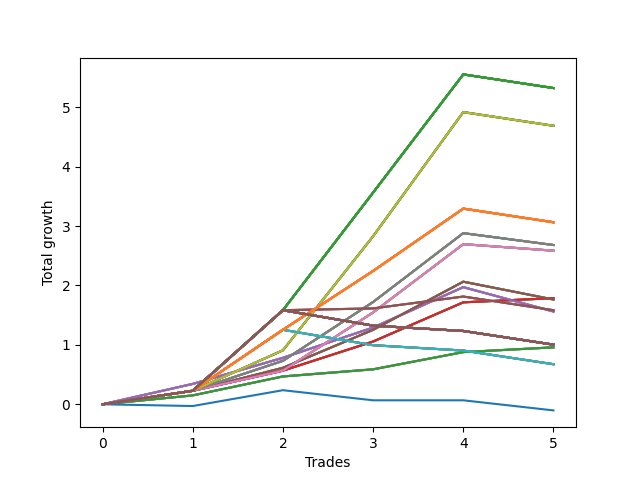

# Long Wallace Doodle 016 
- Symbol: AMZN_Unlimited
- Date Range: 03/23/2022 - 07/08/2022
- Trading Period: 7:20-12:30
- Number of Trades: 5



| Name | Win Percent | Profit | Avg Profit / Trade | Avg Time / Trade |      | Name | Win Percent | Profit | Avg Profit / Trade | Avg Time / Trade |
| ---- | ----------- | ------ | ------------------ | ---------------- | ---- | ---- | ----------- | ------ | ------------------ | ---------------- |
| Sorted By <br> Profit | | | | | | Sorted By <br> Win Percentage ||||
| One Hundred Twenty-Seven | 80.00 | 2662.00 | 532.40 | 145:34 |     | Sixty-Five | 100.00 | 893.25 | 178.65 | 12:52 |
| One Hundred Twenty-Two | 80.00 | 2662.00 | 532.40 | 145:34 |     | Fifty-Seven | 100.00 | 893.25 | 178.65 | 12:52 |
| One Hundred Seventeen | 80.00 | 2662.00 | 532.40 | 145:34 |     | Forty-Nine | 100.00 | 893.25 | 178.65 | 12:52 |
| One Hundred Twelve | 80.00 | 2662.00 | 532.40 | 145:34 |     | Forty-One | 100.00 | 893.25 | 178.65 | 12:52 |
| One Hundred Seven | 80.00 | 2662.00 | 532.40 | 145:34 |     | One | 100.00 | 893.25 | 178.65 | 12:52 |
| One Hundred Two | 80.00 | 2662.00 | 532.40 | 145:34 |     | Sixty-Four | 100.00 | 479.25 | 95.85 | 10:00 |
| Ninety-Seven | 80.00 | 2662.00 | 532.40 | 145:34 |     | Fifty-Six | 100.00 | 479.25 | 95.85 | 10:00 |
| Ninety-Two | 80.00 | 2662.00 | 532.40 | 145:34 |     | Forty-Eight | 100.00 | 479.25 | 95.85 | 10:00 |
| Eighty-Two | 80.00 | 2662.00 | 532.40 | 145:34 |     | Forty | 100.00 | 479.25 | 95.85 | 10:00 |
| Seventy | 80.00 | 2344.50 | 468.90 | 98:02 |     | Zero | 100.00 | 479.25 | 95.85 | 10:00 |
| Sixty-Two | 80.00 | 2344.50 | 468.90 | 98:02 |     | One Hundred Twenty-Seven | 80.00 | 2662.00 | 532.40 | 145:34 |
| Fifty-Four | 80.00 | 2344.50 | 468.90 | 98:02 |     | One Hundred Twenty-Two | 80.00 | 2662.00 | 532.40 | 145:34 |
| Forty-Six | 80.00 | 2344.50 | 468.90 | 98:02 |     | One Hundred Seventeen | 80.00 | 2662.00 | 532.40 | 145:34 |
| Six | 80.00 | 2344.50 | 468.90 | 98:02 |     | One Hundred Twelve | 80.00 | 2662.00 | 532.40 | 145:34 |
| One Hundred Twenty-Six | 80.00 | 1532.25 | 306.45 | 118:45 |     | One Hundred Seven | 80.00 | 2662.00 | 532.40 | 145:34 |
| One Hundred Twenty-One | 80.00 | 1532.25 | 306.45 | 118:45 |     | One Hundred Two | 80.00 | 2662.00 | 532.40 | 145:34 |
| One Hundred Sixteen | 80.00 | 1532.25 | 306.45 | 118:45 |     | Ninety-Seven | 80.00 | 2662.00 | 532.40 | 145:34 |
| One Hundred Eleven | 80.00 | 1532.25 | 306.45 | 118:45 |     | Ninety-Two | 80.00 | 2662.00 | 532.40 | 145:34 |
| One Hundred Six | 80.00 | 1532.25 | 306.45 | 118:45 |     | Eighty-Two | 80.00 | 2662.00 | 532.40 | 145:34 |
| One Hundred One | 80.00 | 1532.25 | 306.45 | 118:45 |     | Seventy | 80.00 | 2344.50 | 468.90 | 98:02 |
| Ninety-Six | 80.00 | 1532.25 | 306.45 | 118:45 |     | Sixty-Two | 80.00 | 2344.50 | 468.90 | 98:02 |
| Ninety-One | 80.00 | 1532.25 | 306.45 | 118:45 |     | Fifty-Four | 80.00 | 2344.50 | 468.90 | 98:02 |
| Eighty-One | 80.00 | 1532.25 | 306.45 | 118:45 |     | Forty-Six | 80.00 | 2344.50 | 468.90 | 98:02 |
| Sixty-Nine | 80.00 | 1340.75 | 268.15 | 78:56 |     | Six | 80.00 | 2344.50 | 468.90 | 98:02 |
| Sixty-One | 80.00 | 1340.75 | 268.15 | 78:56 |     | One Hundred Twenty-Six | 80.00 | 1532.25 | 306.45 | 118:45 |
| Fifty-Three | 80.00 | 1340.75 | 268.15 | 78:56 |     | One Hundred Twenty-One | 80.00 | 1532.25 | 306.45 | 118:45 |
| Forty-Five | 80.00 | 1340.75 | 268.15 | 78:56 |     | One Hundred Sixteen | 80.00 | 1532.25 | 306.45 | 118:45 |
| Five | 80.00 | 1340.75 | 268.15 | 78:56 |     | One Hundred Eleven | 80.00 | 1532.25 | 306.45 | 118:45 |
| Sixty-Eight | 80.00 | 1293.00 | 258.60 | 37:29 |     | One Hundred Six | 80.00 | 1532.25 | 306.45 | 118:45 |
| Sixty | 80.00 | 1293.00 | 258.60 | 37:29 |     | One Hundred One | 80.00 | 1532.25 | 306.45 | 118:45 |
| Fifty-Two | 80.00 | 1293.00 | 258.60 | 37:29 |     | Ninety-Six | 80.00 | 1532.25 | 306.45 | 118:45 |
| Forty-Four | 80.00 | 1293.00 | 258.60 | 37:29 |     | Ninety-One | 80.00 | 1532.25 | 306.45 | 118:45 |
| Four | 80.00 | 1293.00 | 258.60 | 37:29 |     | Eighty-One | 80.00 | 1532.25 | 306.45 | 118:45 |
| Sixty-Five | 100.00 | 893.25 | 178.65 | 12:52 |     | Sixty-Nine | 80.00 | 1340.75 | 268.15 | 78:56 |
| Fifty-Seven | 100.00 | 893.25 | 178.65 | 12:52 |     | Sixty-One | 80.00 | 1340.75 | 268.15 | 78:56 |
| Forty-Nine | 100.00 | 893.25 | 178.65 | 12:52 |     | Fifty-Three | 80.00 | 1340.75 | 268.15 | 78:56 |
| Forty-One | 100.00 | 893.25 | 178.65 | 12:52 |     | Forty-Five | 80.00 | 1340.75 | 268.15 | 78:56 |
| One | 100.00 | 893.25 | 178.65 | 12:52 |     | Five | 80.00 | 1340.75 | 268.15 | 78:56 |
| Sixty-Seven | 80.00 | 882.00 | 176.40 | 30:17 |     | Sixty-Eight | 80.00 | 1293.00 | 258.60 | 37:29 |
| Fifty-Nine | 80.00 | 882.00 | 176.40 | 30:17 |     | Sixty | 80.00 | 1293.00 | 258.60 | 37:29 |
| Fifty-One | 80.00 | 882.00 | 176.40 | 30:17 |     | Fifty-Two | 80.00 | 1293.00 | 258.60 | 37:29 |
| Forty-Three | 80.00 | 882.00 | 176.40 | 30:17 |     | Forty-Four | 80.00 | 1293.00 | 258.60 | 37:29 |
| Three | 80.00 | 882.00 | 176.40 | 30:17 |     | Four | 80.00 | 1293.00 | 258.60 | 37:29 |
| One Hundred | 80.00 | 792.00 | 158.40 | 183:40 |     | Sixty-Seven | 80.00 | 882.00 | 176.40 | 30:17 |
| Ninety-Nine | 80.00 | 792.00 | 158.40 | 183:40 |     | Fifty-Nine | 80.00 | 882.00 | 176.40 | 30:17 |
| Ninety-Eight | 80.00 | 792.00 | 158.40 | 183:40 |     | Fifty-One | 80.00 | 882.00 | 176.40 | 30:17 |
| Sixty-Six | 80.00 | 781.00 | 156.20 | 31:22 |     | Forty-Three | 80.00 | 882.00 | 176.40 | 30:17 |
| Fifty-Eight | 80.00 | 781.00 | 156.20 | 31:22 |     | Three | 80.00 | 882.00 | 176.40 | 30:17 |
| Fifty | 80.00 | 781.00 | 156.20 | 31:22 |     | One Hundred | 80.00 | 792.00 | 158.40 | 183:40 |
| Forty-Two | 80.00 | 781.00 | 156.20 | 31:22 |     | Ninety-Nine | 80.00 | 792.00 | 158.40 | 183:40 |
| Two | 80.00 | 781.00 | 156.20 | 31:22 |     | Ninety-Eight | 80.00 | 792.00 | 158.40 | 183:40 |
| One Hundred Thirty | 40.00 | 502.00 | 100.40 | 194:12 |     | Sixty-Six | 80.00 | 781.00 | 156.20 | 31:22 |
| One Hundred Twenty-Nine | 40.00 | 502.00 | 100.40 | 194:12 |     | Fifty-Eight | 80.00 | 781.00 | 156.20 | 31:22 |
| One Hundred Twenty-Eight | 40.00 | 502.00 | 100.40 | 194:12 |     | Fifty | 80.00 | 781.00 | 156.20 | 31:22 |
| One Hundred Twenty-Five | 40.00 | 502.00 | 100.40 | 194:12 |     | Forty-Two | 80.00 | 781.00 | 156.20 | 31:22 |
| One Hundred Twenty-Four | 40.00 | 502.00 | 100.40 | 194:12 |     | Two | 80.00 | 781.00 | 156.20 | 31:22 |
| One Hundred Twenty-Three | 40.00 | 502.00 | 100.40 | 194:12 |     | One Hundred Thirty | 40.00 | 502.00 | 100.40 | 194:12 |
| One Hundred Twenty | 40.00 | 502.00 | 100.40 | 194:12 |     | One Hundred Twenty-Nine | 40.00 | 502.00 | 100.40 | 194:12 |
| One Hundred Ninteen | 40.00 | 502.00 | 100.40 | 194:12 |     | One Hundred Twenty-Eight | 40.00 | 502.00 | 100.40 | 194:12 |
| One Hundred Eighteen | 40.00 | 502.00 | 100.40 | 194:12 |     | One Hundred Twenty-Five | 40.00 | 502.00 | 100.40 | 194:12 |
| One Hundred Fifteen | 40.00 | 502.00 | 100.40 | 194:12 |     | One Hundred Twenty-Four | 40.00 | 502.00 | 100.40 | 194:12 |
| One Hundred Fourteen | 40.00 | 502.00 | 100.40 | 194:12 |     | One Hundred Twenty-Three | 40.00 | 502.00 | 100.40 | 194:12 |
| One Hundred Thirteen | 40.00 | 502.00 | 100.40 | 194:12 |     | One Hundred Twenty | 40.00 | 502.00 | 100.40 | 194:12 |
| One Hundred Ten | 40.00 | 502.00 | 100.40 | 194:12 |     | One Hundred Ninteen | 40.00 | 502.00 | 100.40 | 194:12 |
| One Hundred Nine | 40.00 | 502.00 | 100.40 | 194:12 |     | One Hundred Eighteen | 40.00 | 502.00 | 100.40 | 194:12 |
| One Hundred Eight | 40.00 | 502.00 | 100.40 | 194:12 |     | One Hundred Fifteen | 40.00 | 502.00 | 100.40 | 194:12 |
| One Hundred Five | 40.00 | 502.00 | 100.40 | 194:12 |     | One Hundred Fourteen | 40.00 | 502.00 | 100.40 | 194:12 |
| One Hundred Four | 40.00 | 502.00 | 100.40 | 194:12 |     | One Hundred Thirteen | 40.00 | 502.00 | 100.40 | 194:12 |
| One Hundred Three | 40.00 | 502.00 | 100.40 | 194:12 |     | One Hundred Ten | 40.00 | 502.00 | 100.40 | 194:12 |
| Ninety-Five | 40.00 | 502.00 | 100.40 | 194:12 |     | One Hundred Nine | 40.00 | 502.00 | 100.40 | 194:12 |
| Ninety-Four | 40.00 | 502.00 | 100.40 | 194:12 |     | One Hundred Eight | 40.00 | 502.00 | 100.40 | 194:12 |
| Ninety-Three | 40.00 | 502.00 | 100.40 | 194:12 |     | One Hundred Five | 40.00 | 502.00 | 100.40 | 194:12 |
| Eighty-Five | 40.00 | 502.00 | 100.40 | 194:12 |     | One Hundred Four | 40.00 | 502.00 | 100.40 | 194:12 |
| Eighty-Four | 40.00 | 502.00 | 100.40 | 194:12 |     | One Hundred Three | 40.00 | 502.00 | 100.40 | 194:12 |
| Eighty-Three | 40.00 | 502.00 | 100.40 | 194:12 |     | Ninety-Five | 40.00 | 502.00 | 100.40 | 194:12 |
| Sixty-Four | 100.00 | 479.25 | 95.85 | 10:00 |     | Ninety-Four | 40.00 | 502.00 | 100.40 | 194:12 |
| Fifty-Six | 100.00 | 479.25 | 95.85 | 10:00 |     | Ninety-Three | 40.00 | 502.00 | 100.40 | 194:12 |
| Forty-Eight | 100.00 | 479.25 | 95.85 | 10:00 |     | Eighty-Five | 40.00 | 502.00 | 100.40 | 194:12 |
| Forty | 100.00 | 479.25 | 95.85 | 10:00 |     | Eighty-Four | 40.00 | 502.00 | 100.40 | 194:12 |
| Zero | 100.00 | 479.25 | 95.85 | 10:00 |     | Eighty-Three | 40.00 | 502.00 | 100.40 | 194:12 |
| Seventy-One | 40.00 | 337.25 | 67.45 | 184:16 |     | Seventy-One | 40.00 | 337.25 | 67.45 | 184:16 |
| Sixty-Three | 40.00 | 337.25 | 67.45 | 184:16 |     | Sixty-Three | 40.00 | 337.25 | 67.45 | 184:16 |
| Fifty-Five | 40.00 | 337.25 | 67.45 | 184:16 |     | Fifty-Five | 40.00 | 337.25 | 67.45 | 184:16 |
| Forty-Seven | 40.00 | 337.25 | 67.45 | 184:16 |     | Forty-Seven | 40.00 | 337.25 | 67.45 | 184:16 |
| Seven | 40.00 | 337.25 | 67.45 | 184:16 |     | Seven | 40.00 | 337.25 | 67.45 | 184:16 |
| Seventy-Three | 40.00 | -51.50 | -10.30 | 12:17 |     | Seventy-Three | 40.00 | -51.50 | -10.30 | 12:17 |

## NO STOPLOSS

### Test Zero
* Sell when price hits the middle line of the 20p bollinger
* No Stoploss
* Results:
```
Total Trades: 5
Percent Up: 100.00
Percent Down: 0.00
Total Points Moved Up: 0.96
Potential Profit: 479.25
Total Points Ups: 0.96 Count Ups: 5
Total Points Downs: 0.00 Count Downs: 0
```

<details><summary>Trades</summary>

<code>In: 2022-05-19 12:30:00		Out: 2022-05-19 12:43:05		Total Position Time: 13:05		Total Move Up: 0.15		Total to Date: 0.15</code> <br />
<code>In: 2022-05-27 08:06:00		Out: 2022-05-27 08:14:05		Total Position Time: 08:05		Total Move Up: 0.32		Total to Date: 0.47</code> <br />
<code>In: 2022-06-06 09:12:00		Out: 2022-06-06 09:23:25		Total Position Time: 11:25		Total Move Up: 0.12		Total to Date: 0.59</code> <br />
<code>In: 2022-06-06 09:14:00		Out: 2022-06-06 09:23:25		Total Position Time: 09:25		Total Move Up: 0.29		Total to Date: 0.88</code> <br />
<code>In: 2022-06-21 08:42:00		Out: 2022-06-21 08:50:00		Total Position Time: 08:00		Total Move Up: 0.08		Total to Date: 0.96</code> <br />


</details>

### Test One
* Sell when the price hits the upper line of the 20p 1std bollinger
* No Stoploss
* Results:
```
Total Trades: 5
Percent Up: 100.00
Percent Down: 0.00
Total Points Moved Up: 1.79
Potential Profit: 893.25
Total Points Ups: 1.79 Count Ups: 5
Total Points Downs: 0.00 Count Downs: 0
```

<details><summary>Trades</summary>

<code>In: 2022-05-19 12:30:00		Out: 2022-05-19 12:43:15		Total Position Time: 13:15		Total Move Up: 0.23		Total to Date: 0.23</code> <br />
<code>In: 2022-05-27 08:06:00		Out: 2022-05-27 08:19:20		Total Position Time: 13:20		Total Move Up: 0.34		Total to Date: 0.57</code> <br />
<code>In: 2022-06-06 09:12:00		Out: 2022-06-06 09:24:00		Total Position Time: 12:00		Total Move Up: 0.49		Total to Date: 1.06</code> <br />
<code>In: 2022-06-06 09:14:00		Out: 2022-06-06 09:24:00		Total Position Time: 10:00		Total Move Up: 0.66		Total to Date: 1.72</code> <br />
<code>In: 2022-06-21 08:42:00		Out: 2022-06-21 08:57:45		Total Position Time: 15:45		Total Move Up: 0.07		Total to Date: 1.79</code> <br />


</details>

### Test Two
* Sell when the price hits the upper line of the 20p 2std bollinger
* No Stoploss
* Results:
```
Total Trades: 5
Percent Up: 80.00
Percent Down: 20.00
Total Points Moved Up: 1.56
Potential Profit: 781.00
Total Points Ups: 1.97 Count Ups: 4
Total Points Downs: -0.41 Count Downs: 1
```

<details><summary>Trades</summary>

<code>In: 2022-05-19 12:30:00		Out: 2022-05-19 12:43:25		Total Position Time: 13:25		Total Move Up: 0.34		Total to Date: 0.34</code> <br />
<code>In: 2022-05-27 08:06:00		Out: 2022-05-27 08:49:40		Total Position Time: 43:40		Total Move Up: 0.44		Total to Date: 0.78</code> <br />
<code>In: 2022-06-06 09:12:00		Out: 2022-06-06 09:37:20		Total Position Time: 25:20		Total Move Up: 0.51		Total to Date: 1.29</code> <br />
<code>In: 2022-06-06 09:14:00		Out: 2022-06-06 09:37:20		Total Position Time: 23:20		Total Move Up: 0.68		Total to Date: 1.97</code> <br />
<code>In: 2022-06-21 08:42:00		Out: 2022-06-21 09:33:05		Total Position Time: 51:05		Total Move Up: -0.41		Total to Date: 1.56</code> <br />


</details>

### Test Three
* Sell when price hits the middle line of the 50p bollinger
* No Stoploss
* Results:
```
Total Trades: 5
Percent Up: 80.00
Percent Down: 20.00
Total Points Moved Up: 1.76
Potential Profit: 882.00
Total Points Ups: 2.06 Count Ups: 4
Total Points Downs: -0.30 Count Downs: 1
```

<details><summary>Trades</summary>

<code>In: 2022-05-19 12:30:00		Out: 2022-05-19 12:47:00		Total Position Time: 17:00		Total Move Up: 0.23		Total to Date: 0.23</code> <br />
<code>In: 2022-05-27 08:06:00		Out: 2022-05-27 08:35:35		Total Position Time: 29:35		Total Move Up: 0.39		Total to Date: 0.61</code> <br />
<code>In: 2022-06-06 09:12:00		Out: 2022-06-06 09:38:25		Total Position Time: 26:25		Total Move Up: 0.64		Total to Date: 1.25</code> <br />
<code>In: 2022-06-06 09:14:00		Out: 2022-06-06 09:38:25		Total Position Time: 24:25		Total Move Up: 0.81		Total to Date: 2.06</code> <br />
<code>In: 2022-06-21 08:42:00		Out: 2022-06-21 09:36:00		Total Position Time: 54:00		Total Move Up: -0.30		Total to Date: 1.76</code> <br />


</details>

### Test Four
* Sell when the price hits the upper line of the 50p 1std bollinger
* No Stoploss
* Results:
```
Total Trades: 5
Percent Up: 80.00
Percent Down: 20.00
Total Points Moved Up: 2.59
Potential Profit: 1293.00
Total Points Ups: 2.70 Count Ups: 4
Total Points Downs: -0.11 Count Downs: 1
```

<details><summary>Trades</summary>

<code>In: 2022-05-19 12:30:00		Out: 2022-05-19 12:47:00		Total Position Time: 17:00		Total Move Up: 0.23		Total to Date: 0.23</code> <br />
<code>In: 2022-05-27 08:06:00		Out: 2022-05-27 08:49:00		Total Position Time: 43:00		Total Move Up: 0.34		Total to Date: 0.57</code> <br />
<code>In: 2022-06-06 09:12:00		Out: 2022-06-06 09:48:10		Total Position Time: 36:10		Total Move Up: 0.98		Total to Date: 1.55</code> <br />
<code>In: 2022-06-06 09:14:00		Out: 2022-06-06 09:48:10		Total Position Time: 34:10		Total Move Up: 1.15		Total to Date: 2.70</code> <br />
<code>In: 2022-06-21 08:42:00		Out: 2022-06-21 09:39:05		Total Position Time: 57:05		Total Move Up: -0.11		Total to Date: 2.59</code> <br />


</details>

### Test Five
* Sell when the price hits the upper line of the 50p 2std bollinger
* No Stoploss
* Results:
```
Total Trades: 5
Percent Up: 80.00
Percent Down: 20.00
Total Points Moved Up: 2.68
Potential Profit: 1340.75
Total Points Ups: 2.88 Count Ups: 4
Total Points Downs: -0.20 Count Downs: 1
```

<details><summary>Trades</summary>

<code>In: 2022-05-19 12:30:00		Out: 2022-05-19 12:47:00		Total Position Time: 17:00		Total Move Up: 0.23		Total to Date: 0.23</code> <br />
<code>In: 2022-05-27 08:06:00		Out: 2022-05-27 08:49:50		Total Position Time: 43:50		Total Move Up: 0.50		Total to Date: 0.73</code> <br />
<code>In: 2022-06-06 09:12:00		Out: 2022-06-06 10:23:10		Total Position Time: 71:10		Total Move Up: 0.99		Total to Date: 1.72</code> <br />
<code>In: 2022-06-06 09:14:00		Out: 2022-06-06 10:23:10		Total Position Time: 69:10		Total Move Up: 1.16		Total to Date: 2.88</code> <br />
<code>In: 2022-06-21 08:42:00		Out: 2022-06-21 11:55:30		Total Position Time: 193:30		Total Move Up: -0.20		Total to Date: 2.68</code> <br />


</details>

### Test Six
* Sell when the price hits the middle line of the 1std VWAP
* No Stoploss
* Results:
```
Total Trades: 5
Percent Up: 80.00
Percent Down: 20.00
Total Points Moved Up: 4.69
Potential Profit: 2344.50
Total Points Ups: 4.92 Count Ups: 4
Total Points Downs: -0.23 Count Downs: 1
```

<details><summary>Trades</summary>

<code>In: 2022-05-19 12:30:00		Out: 2022-05-19 12:47:00		Total Position Time: 17:00		Total Move Up: 0.23		Total to Date: 0.23</code> <br />
<code>In: 2022-05-27 08:06:00		Out: 2022-05-27 09:02:00		Total Position Time: 56:00		Total Move Up: 0.68		Total to Date: 0.91</code> <br />
<code>In: 2022-06-06 09:12:00		Out: 2022-06-06 10:39:05		Total Position Time: 87:05		Total Move Up: 1.92		Total to Date: 2.83</code> <br />
<code>In: 2022-06-06 09:14:00		Out: 2022-06-06 10:39:05		Total Position Time: 85:05		Total Move Up: 2.09		Total to Date: 4.92</code> <br />
<code>In: 2022-06-21 08:42:00		Out: 2022-06-21 12:47:00		Total Position Time: 245:00		Total Move Up: -0.23		Total to Date: 4.69</code> <br />


</details>

### Test Seven
* Sell when the price hits the upper line of the 1std VWAP
* No Stoploss
* Results:
```
Total Trades: 5
Percent Up: 40.00
Percent Down: 60.00
Total Points Moved Up: 0.67
Potential Profit: 337.25
Total Points Ups: 1.25 Count Ups: 2
Total Points Downs: -0.58 Count Downs: 3
```

<details><summary>Trades</summary>

<code>In: 2022-05-19 12:30:00		Out: 2022-05-19 12:47:00		Total Position Time: 17:00		Total Move Up: 0.23		Total to Date: 0.23</code> <br />
<code>In: 2022-05-27 08:06:00		Out: 2022-05-27 11:57:20		Total Position Time: 231:20		Total Move Up: 1.03		Total to Date: 1.25</code> <br />
<code>In: 2022-06-06 09:12:00		Out: 2022-06-06 12:47:00		Total Position Time: 215:00		Total Move Up: -0.26		Total to Date: 0.99</code> <br />
<code>In: 2022-06-06 09:14:00		Out: 2022-06-06 12:47:00		Total Position Time: 213:00		Total Move Up: -0.09		Total to Date: 0.90</code> <br />
<code>In: 2022-06-21 08:42:00		Out: 2022-06-21 12:47:00		Total Position Time: 245:00		Total Move Up: -0.23		Total to Date: 0.67</code> <br />


</details>

## STOPLOSS OF 5

### Test Forty
* Sell when price hits the middle line of the 20p bollinger
* Stoploss is 5 points
* Results:
```
Total Trades: 5
Percent Up: 100.00
Percent Down: 0.00
Total Points Moved Up: 0.96
Potential Profit: 479.25
Total Points Ups: 0.96 Count Ups: 5
Total Points Downs: 0.00 Count Downs: 0
```

<details><summary>Trades</summary>

<code>In: 2022-05-19 12:30:00		Out: 2022-05-19 12:43:05		Total Position Time: 13:05		Total Move Up: 0.15		Total to Date: 0.15</code> <br />
<code>In: 2022-05-27 08:06:00		Out: 2022-05-27 08:14:05		Total Position Time: 08:05		Total Move Up: 0.32		Total to Date: 0.47</code> <br />
<code>In: 2022-06-06 09:12:00		Out: 2022-06-06 09:23:25		Total Position Time: 11:25		Total Move Up: 0.12		Total to Date: 0.59</code> <br />
<code>In: 2022-06-06 09:14:00		Out: 2022-06-06 09:23:25		Total Position Time: 09:25		Total Move Up: 0.29		Total to Date: 0.88</code> <br />
<code>In: 2022-06-21 08:42:00		Out: 2022-06-21 08:50:00		Total Position Time: 08:00		Total Move Up: 0.08		Total to Date: 0.96</code> <br />


</details>

### Test Forty-One
* Sell when the price hits the upper line of the 20p 1std bollinger
* Stoploss is 5 points
* Results:
```
Total Trades: 5
Percent Up: 100.00
Percent Down: 0.00
Total Points Moved Up: 1.79
Potential Profit: 893.25
Total Points Ups: 1.79 Count Ups: 5
Total Points Downs: 0.00 Count Downs: 0
```

<details><summary>Trades</summary>

<code>In: 2022-05-19 12:30:00		Out: 2022-05-19 12:43:15		Total Position Time: 13:15		Total Move Up: 0.23		Total to Date: 0.23</code> <br />
<code>In: 2022-05-27 08:06:00		Out: 2022-05-27 08:19:20		Total Position Time: 13:20		Total Move Up: 0.34		Total to Date: 0.57</code> <br />
<code>In: 2022-06-06 09:12:00		Out: 2022-06-06 09:24:00		Total Position Time: 12:00		Total Move Up: 0.49		Total to Date: 1.06</code> <br />
<code>In: 2022-06-06 09:14:00		Out: 2022-06-06 09:24:00		Total Position Time: 10:00		Total Move Up: 0.66		Total to Date: 1.72</code> <br />
<code>In: 2022-06-21 08:42:00		Out: 2022-06-21 08:57:45		Total Position Time: 15:45		Total Move Up: 0.07		Total to Date: 1.79</code> <br />


</details>

### Test Forty-Two
* Sell when the price hits the upper line of the 20p 2std bollinger
* Stoploss is 5 points
* Results:
```
Total Trades: 5
Percent Up: 80.00
Percent Down: 20.00
Total Points Moved Up: 1.56
Potential Profit: 781.00
Total Points Ups: 1.97 Count Ups: 4
Total Points Downs: -0.41 Count Downs: 1
```

<details><summary>Trades</summary>

<code>In: 2022-05-19 12:30:00		Out: 2022-05-19 12:43:25		Total Position Time: 13:25		Total Move Up: 0.34		Total to Date: 0.34</code> <br />
<code>In: 2022-05-27 08:06:00		Out: 2022-05-27 08:49:40		Total Position Time: 43:40		Total Move Up: 0.44		Total to Date: 0.78</code> <br />
<code>In: 2022-06-06 09:12:00		Out: 2022-06-06 09:37:20		Total Position Time: 25:20		Total Move Up: 0.51		Total to Date: 1.29</code> <br />
<code>In: 2022-06-06 09:14:00		Out: 2022-06-06 09:37:20		Total Position Time: 23:20		Total Move Up: 0.68		Total to Date: 1.97</code> <br />
<code>In: 2022-06-21 08:42:00		Out: 2022-06-21 09:33:05		Total Position Time: 51:05		Total Move Up: -0.41		Total to Date: 1.56</code> <br />


</details>

### Test Forty-Three
* Sell when price hits the middle line of the 50p bollinger
* Stoploss is 5 points
* Results:
```
Total Trades: 5
Percent Up: 80.00
Percent Down: 20.00
Total Points Moved Up: 1.76
Potential Profit: 882.00
Total Points Ups: 2.06 Count Ups: 4
Total Points Downs: -0.30 Count Downs: 1
```

<details><summary>Trades</summary>

<code>In: 2022-05-19 12:30:00		Out: 2022-05-19 12:47:00		Total Position Time: 17:00		Total Move Up: 0.23		Total to Date: 0.23</code> <br />
<code>In: 2022-05-27 08:06:00		Out: 2022-05-27 08:35:35		Total Position Time: 29:35		Total Move Up: 0.39		Total to Date: 0.61</code> <br />
<code>In: 2022-06-06 09:12:00		Out: 2022-06-06 09:38:25		Total Position Time: 26:25		Total Move Up: 0.64		Total to Date: 1.25</code> <br />
<code>In: 2022-06-06 09:14:00		Out: 2022-06-06 09:38:25		Total Position Time: 24:25		Total Move Up: 0.81		Total to Date: 2.06</code> <br />
<code>In: 2022-06-21 08:42:00		Out: 2022-06-21 09:36:00		Total Position Time: 54:00		Total Move Up: -0.30		Total to Date: 1.76</code> <br />


</details>

### Test Forty-Four
* Sell when the price hits the upper line of the 50p 1std bollinger
* Stoploss is 5 points
* Results:
```
Total Trades: 5
Percent Up: 80.00
Percent Down: 20.00
Total Points Moved Up: 2.59
Potential Profit: 1293.00
Total Points Ups: 2.70 Count Ups: 4
Total Points Downs: -0.11 Count Downs: 1
```

<details><summary>Trades</summary>

<code>In: 2022-05-19 12:30:00		Out: 2022-05-19 12:47:00		Total Position Time: 17:00		Total Move Up: 0.23		Total to Date: 0.23</code> <br />
<code>In: 2022-05-27 08:06:00		Out: 2022-05-27 08:49:00		Total Position Time: 43:00		Total Move Up: 0.34		Total to Date: 0.57</code> <br />
<code>In: 2022-06-06 09:12:00		Out: 2022-06-06 09:48:10		Total Position Time: 36:10		Total Move Up: 0.98		Total to Date: 1.55</code> <br />
<code>In: 2022-06-06 09:14:00		Out: 2022-06-06 09:48:10		Total Position Time: 34:10		Total Move Up: 1.15		Total to Date: 2.70</code> <br />
<code>In: 2022-06-21 08:42:00		Out: 2022-06-21 09:39:05		Total Position Time: 57:05		Total Move Up: -0.11		Total to Date: 2.59</code> <br />


</details>

### Test Forty-Five
* Sell when the price hits the upper line of the 50p 2std bollinger
* Stoploss is 5 points
* Results:
```
Total Trades: 5
Percent Up: 80.00
Percent Down: 20.00
Total Points Moved Up: 2.68
Potential Profit: 1340.75
Total Points Ups: 2.88 Count Ups: 4
Total Points Downs: -0.20 Count Downs: 1
```

<details><summary>Trades</summary>

<code>In: 2022-05-19 12:30:00		Out: 2022-05-19 12:47:00		Total Position Time: 17:00		Total Move Up: 0.23		Total to Date: 0.23</code> <br />
<code>In: 2022-05-27 08:06:00		Out: 2022-05-27 08:49:50		Total Position Time: 43:50		Total Move Up: 0.50		Total to Date: 0.73</code> <br />
<code>In: 2022-06-06 09:12:00		Out: 2022-06-06 10:23:10		Total Position Time: 71:10		Total Move Up: 0.99		Total to Date: 1.72</code> <br />
<code>In: 2022-06-06 09:14:00		Out: 2022-06-06 10:23:10		Total Position Time: 69:10		Total Move Up: 1.16		Total to Date: 2.88</code> <br />
<code>In: 2022-06-21 08:42:00		Out: 2022-06-21 11:55:30		Total Position Time: 193:30		Total Move Up: -0.20		Total to Date: 2.68</code> <br />


</details>

### Test Forty-Six
* Sell when the price hits the middle line of the 1std VWAP
* Stoploss is 5 points
* Results:
```
Total Trades: 5
Percent Up: 80.00
Percent Down: 20.00
Total Points Moved Up: 4.69
Potential Profit: 2344.50
Total Points Ups: 4.92 Count Ups: 4
Total Points Downs: -0.23 Count Downs: 1
```

<details><summary>Trades</summary>

<code>In: 2022-05-19 12:30:00		Out: 2022-05-19 12:47:00		Total Position Time: 17:00		Total Move Up: 0.23		Total to Date: 0.23</code> <br />
<code>In: 2022-05-27 08:06:00		Out: 2022-05-27 09:02:00		Total Position Time: 56:00		Total Move Up: 0.68		Total to Date: 0.91</code> <br />
<code>In: 2022-06-06 09:12:00		Out: 2022-06-06 10:39:05		Total Position Time: 87:05		Total Move Up: 1.92		Total to Date: 2.83</code> <br />
<code>In: 2022-06-06 09:14:00		Out: 2022-06-06 10:39:05		Total Position Time: 85:05		Total Move Up: 2.09		Total to Date: 4.92</code> <br />
<code>In: 2022-06-21 08:42:00		Out: 2022-06-21 12:47:00		Total Position Time: 245:00		Total Move Up: -0.23		Total to Date: 4.69</code> <br />


</details>

### Test Forty-Seven
* Sell when the price hits the upper line of the 1std VWAP
* Stoploss is 5 points
* Results:
```
Total Trades: 5
Percent Up: 40.00
Percent Down: 60.00
Total Points Moved Up: 0.67
Potential Profit: 337.25
Total Points Ups: 1.25 Count Ups: 2
Total Points Downs: -0.58 Count Downs: 3
```

<details><summary>Trades</summary>

<code>In: 2022-05-19 12:30:00		Out: 2022-05-19 12:47:00		Total Position Time: 17:00		Total Move Up: 0.23		Total to Date: 0.23</code> <br />
<code>In: 2022-05-27 08:06:00		Out: 2022-05-27 11:57:20		Total Position Time: 231:20		Total Move Up: 1.03		Total to Date: 1.25</code> <br />
<code>In: 2022-06-06 09:12:00		Out: 2022-06-06 12:47:00		Total Position Time: 215:00		Total Move Up: -0.26		Total to Date: 0.99</code> <br />
<code>In: 2022-06-06 09:14:00		Out: 2022-06-06 12:47:00		Total Position Time: 213:00		Total Move Up: -0.09		Total to Date: 0.90</code> <br />
<code>In: 2022-06-21 08:42:00		Out: 2022-06-21 12:47:00		Total Position Time: 245:00		Total Move Up: -0.23		Total to Date: 0.67</code> <br />


</details>

## TRAIL STOP OF 5

### Test Forty-Eight
* Sell when price hits the middle line of the 20p bollinger
* Trailing Stop is 5 points
* Results:
```
Total Trades: 5
Percent Up: 100.00
Percent Down: 0.00
Total Points Moved Up: 0.96
Potential Profit: 479.25
Total Points Ups: 0.96 Count Ups: 5
Total Points Downs: 0.00 Count Downs: 0
```

<details><summary>Trades</summary>

<code>In: 2022-05-19 12:30:00		Out: 2022-05-19 12:43:05		Total Position Time: 13:05		Total Move Up: 0.15		Total to Date: 0.15</code> <br />
<code>In: 2022-05-27 08:06:00		Out: 2022-05-27 08:14:05		Total Position Time: 08:05		Total Move Up: 0.32		Total to Date: 0.47</code> <br />
<code>In: 2022-06-06 09:12:00		Out: 2022-06-06 09:23:25		Total Position Time: 11:25		Total Move Up: 0.12		Total to Date: 0.59</code> <br />
<code>In: 2022-06-06 09:14:00		Out: 2022-06-06 09:23:25		Total Position Time: 09:25		Total Move Up: 0.29		Total to Date: 0.88</code> <br />
<code>In: 2022-06-21 08:42:00		Out: 2022-06-21 08:50:00		Total Position Time: 08:00		Total Move Up: 0.08		Total to Date: 0.96</code> <br />


</details>

### Test Forty-Nine
* Sell when the price hits the upper line of the 20p 1std bollinger
* Trailing Stop is 5 points
* Results:
```
Total Trades: 5
Percent Up: 100.00
Percent Down: 0.00
Total Points Moved Up: 1.79
Potential Profit: 893.25
Total Points Ups: 1.79 Count Ups: 5
Total Points Downs: 0.00 Count Downs: 0
```

<details><summary>Trades</summary>

<code>In: 2022-05-19 12:30:00		Out: 2022-05-19 12:43:15		Total Position Time: 13:15		Total Move Up: 0.23		Total to Date: 0.23</code> <br />
<code>In: 2022-05-27 08:06:00		Out: 2022-05-27 08:19:20		Total Position Time: 13:20		Total Move Up: 0.34		Total to Date: 0.57</code> <br />
<code>In: 2022-06-06 09:12:00		Out: 2022-06-06 09:24:00		Total Position Time: 12:00		Total Move Up: 0.49		Total to Date: 1.06</code> <br />
<code>In: 2022-06-06 09:14:00		Out: 2022-06-06 09:24:00		Total Position Time: 10:00		Total Move Up: 0.66		Total to Date: 1.72</code> <br />
<code>In: 2022-06-21 08:42:00		Out: 2022-06-21 08:57:45		Total Position Time: 15:45		Total Move Up: 0.07		Total to Date: 1.79</code> <br />


</details>

### Test Fifty
* Sell when the price hits the upper line of the 20p 2std bollinger
* Trailing Stop is 5 points
* Results:
```
Total Trades: 5
Percent Up: 80.00
Percent Down: 20.00
Total Points Moved Up: 1.56
Potential Profit: 781.00
Total Points Ups: 1.97 Count Ups: 4
Total Points Downs: -0.41 Count Downs: 1
```

<details><summary>Trades</summary>

<code>In: 2022-05-19 12:30:00		Out: 2022-05-19 12:43:25		Total Position Time: 13:25		Total Move Up: 0.34		Total to Date: 0.34</code> <br />
<code>In: 2022-05-27 08:06:00		Out: 2022-05-27 08:49:40		Total Position Time: 43:40		Total Move Up: 0.44		Total to Date: 0.78</code> <br />
<code>In: 2022-06-06 09:12:00		Out: 2022-06-06 09:37:20		Total Position Time: 25:20		Total Move Up: 0.51		Total to Date: 1.29</code> <br />
<code>In: 2022-06-06 09:14:00		Out: 2022-06-06 09:37:20		Total Position Time: 23:20		Total Move Up: 0.68		Total to Date: 1.97</code> <br />
<code>In: 2022-06-21 08:42:00		Out: 2022-06-21 09:33:05		Total Position Time: 51:05		Total Move Up: -0.41		Total to Date: 1.56</code> <br />


</details>

### Test Fifty-One
* Sell when price hits the middle line of the 50p bollinger
* Trailing Stop is 5 points
* Results:
```
Total Trades: 5
Percent Up: 80.00
Percent Down: 20.00
Total Points Moved Up: 1.76
Potential Profit: 882.00
Total Points Ups: 2.06 Count Ups: 4
Total Points Downs: -0.30 Count Downs: 1
```

<details><summary>Trades</summary>

<code>In: 2022-05-19 12:30:00		Out: 2022-05-19 12:47:00		Total Position Time: 17:00		Total Move Up: 0.23		Total to Date: 0.23</code> <br />
<code>In: 2022-05-27 08:06:00		Out: 2022-05-27 08:35:35		Total Position Time: 29:35		Total Move Up: 0.39		Total to Date: 0.61</code> <br />
<code>In: 2022-06-06 09:12:00		Out: 2022-06-06 09:38:25		Total Position Time: 26:25		Total Move Up: 0.64		Total to Date: 1.25</code> <br />
<code>In: 2022-06-06 09:14:00		Out: 2022-06-06 09:38:25		Total Position Time: 24:25		Total Move Up: 0.81		Total to Date: 2.06</code> <br />
<code>In: 2022-06-21 08:42:00		Out: 2022-06-21 09:36:00		Total Position Time: 54:00		Total Move Up: -0.30		Total to Date: 1.76</code> <br />


</details>

### Test Fifty-Two
* Sell when the price hits the upper line of the 50p 1std bollinger
* Trailing Stop is 5 points
* Results:
```
Total Trades: 5
Percent Up: 80.00
Percent Down: 20.00
Total Points Moved Up: 2.59
Potential Profit: 1293.00
Total Points Ups: 2.70 Count Ups: 4
Total Points Downs: -0.11 Count Downs: 1
```

<details><summary>Trades</summary>

<code>In: 2022-05-19 12:30:00		Out: 2022-05-19 12:47:00		Total Position Time: 17:00		Total Move Up: 0.23		Total to Date: 0.23</code> <br />
<code>In: 2022-05-27 08:06:00		Out: 2022-05-27 08:49:00		Total Position Time: 43:00		Total Move Up: 0.34		Total to Date: 0.57</code> <br />
<code>In: 2022-06-06 09:12:00		Out: 2022-06-06 09:48:10		Total Position Time: 36:10		Total Move Up: 0.98		Total to Date: 1.55</code> <br />
<code>In: 2022-06-06 09:14:00		Out: 2022-06-06 09:48:10		Total Position Time: 34:10		Total Move Up: 1.15		Total to Date: 2.70</code> <br />
<code>In: 2022-06-21 08:42:00		Out: 2022-06-21 09:39:05		Total Position Time: 57:05		Total Move Up: -0.11		Total to Date: 2.59</code> <br />


</details>

### Test Fifty-Three
* Sell when the price hits the upper line of the 50p 2std bollinger
* Trailing Stop is 5 points
* Results:
```
Total Trades: 5
Percent Up: 80.00
Percent Down: 20.00
Total Points Moved Up: 2.68
Potential Profit: 1340.75
Total Points Ups: 2.88 Count Ups: 4
Total Points Downs: -0.20 Count Downs: 1
```

<details><summary>Trades</summary>

<code>In: 2022-05-19 12:30:00		Out: 2022-05-19 12:47:00		Total Position Time: 17:00		Total Move Up: 0.23		Total to Date: 0.23</code> <br />
<code>In: 2022-05-27 08:06:00		Out: 2022-05-27 08:49:50		Total Position Time: 43:50		Total Move Up: 0.50		Total to Date: 0.73</code> <br />
<code>In: 2022-06-06 09:12:00		Out: 2022-06-06 10:23:10		Total Position Time: 71:10		Total Move Up: 0.99		Total to Date: 1.72</code> <br />
<code>In: 2022-06-06 09:14:00		Out: 2022-06-06 10:23:10		Total Position Time: 69:10		Total Move Up: 1.16		Total to Date: 2.88</code> <br />
<code>In: 2022-06-21 08:42:00		Out: 2022-06-21 11:55:30		Total Position Time: 193:30		Total Move Up: -0.20		Total to Date: 2.68</code> <br />


</details>

### Test Fifty-Four
* Sell when the price hits the middle line of the 1std VWAP
* Trailing Stop is 5 points
* Results:
```
Total Trades: 5
Percent Up: 80.00
Percent Down: 20.00
Total Points Moved Up: 4.69
Potential Profit: 2344.50
Total Points Ups: 4.92 Count Ups: 4
Total Points Downs: -0.23 Count Downs: 1
```

<details><summary>Trades</summary>

<code>In: 2022-05-19 12:30:00		Out: 2022-05-19 12:47:00		Total Position Time: 17:00		Total Move Up: 0.23		Total to Date: 0.23</code> <br />
<code>In: 2022-05-27 08:06:00		Out: 2022-05-27 09:02:00		Total Position Time: 56:00		Total Move Up: 0.68		Total to Date: 0.91</code> <br />
<code>In: 2022-06-06 09:12:00		Out: 2022-06-06 10:39:05		Total Position Time: 87:05		Total Move Up: 1.92		Total to Date: 2.83</code> <br />
<code>In: 2022-06-06 09:14:00		Out: 2022-06-06 10:39:05		Total Position Time: 85:05		Total Move Up: 2.09		Total to Date: 4.92</code> <br />
<code>In: 2022-06-21 08:42:00		Out: 2022-06-21 12:47:00		Total Position Time: 245:00		Total Move Up: -0.23		Total to Date: 4.69</code> <br />


</details>

### Test Fifty-Five
* Sell when the price hits the upper line of the 1std VWAP
* Trailing Stop is 5 points
* Results:
```
Total Trades: 5
Percent Up: 40.00
Percent Down: 60.00
Total Points Moved Up: 0.67
Potential Profit: 337.25
Total Points Ups: 1.25 Count Ups: 2
Total Points Downs: -0.58 Count Downs: 3
```

<details><summary>Trades</summary>

<code>In: 2022-05-19 12:30:00		Out: 2022-05-19 12:47:00		Total Position Time: 17:00		Total Move Up: 0.23		Total to Date: 0.23</code> <br />
<code>In: 2022-05-27 08:06:00		Out: 2022-05-27 11:57:20		Total Position Time: 231:20		Total Move Up: 1.03		Total to Date: 1.25</code> <br />
<code>In: 2022-06-06 09:12:00		Out: 2022-06-06 12:47:00		Total Position Time: 215:00		Total Move Up: -0.26		Total to Date: 0.99</code> <br />
<code>In: 2022-06-06 09:14:00		Out: 2022-06-06 12:47:00		Total Position Time: 213:00		Total Move Up: -0.09		Total to Date: 0.90</code> <br />
<code>In: 2022-06-21 08:42:00		Out: 2022-06-21 12:47:00		Total Position Time: 245:00		Total Move Up: -0.23		Total to Date: 0.67</code> <br />


</details>

## STOPLOSS OF 10

### Test Fifty-Six
* Sell when price hits the middle line of the 20p bollinger
* Stoploss is 10 points
* Results:
```
Total Trades: 5
Percent Up: 100.00
Percent Down: 0.00
Total Points Moved Up: 0.96
Potential Profit: 479.25
Total Points Ups: 0.96 Count Ups: 5
Total Points Downs: 0.00 Count Downs: 0
```

<details><summary>Trades</summary>

<code>In: 2022-05-19 12:30:00		Out: 2022-05-19 12:43:05		Total Position Time: 13:05		Total Move Up: 0.15		Total to Date: 0.15</code> <br />
<code>In: 2022-05-27 08:06:00		Out: 2022-05-27 08:14:05		Total Position Time: 08:05		Total Move Up: 0.32		Total to Date: 0.47</code> <br />
<code>In: 2022-06-06 09:12:00		Out: 2022-06-06 09:23:25		Total Position Time: 11:25		Total Move Up: 0.12		Total to Date: 0.59</code> <br />
<code>In: 2022-06-06 09:14:00		Out: 2022-06-06 09:23:25		Total Position Time: 09:25		Total Move Up: 0.29		Total to Date: 0.88</code> <br />
<code>In: 2022-06-21 08:42:00		Out: 2022-06-21 08:50:00		Total Position Time: 08:00		Total Move Up: 0.08		Total to Date: 0.96</code> <br />


</details>

### Test Fifty-Seven
* Sell when the price hits the upper line of the 20p 1std bollinger
* Stoploss is 10 points
* Results:
```
Total Trades: 5
Percent Up: 100.00
Percent Down: 0.00
Total Points Moved Up: 1.79
Potential Profit: 893.25
Total Points Ups: 1.79 Count Ups: 5
Total Points Downs: 0.00 Count Downs: 0
```

<details><summary>Trades</summary>

<code>In: 2022-05-19 12:30:00		Out: 2022-05-19 12:43:15		Total Position Time: 13:15		Total Move Up: 0.23		Total to Date: 0.23</code> <br />
<code>In: 2022-05-27 08:06:00		Out: 2022-05-27 08:19:20		Total Position Time: 13:20		Total Move Up: 0.34		Total to Date: 0.57</code> <br />
<code>In: 2022-06-06 09:12:00		Out: 2022-06-06 09:24:00		Total Position Time: 12:00		Total Move Up: 0.49		Total to Date: 1.06</code> <br />
<code>In: 2022-06-06 09:14:00		Out: 2022-06-06 09:24:00		Total Position Time: 10:00		Total Move Up: 0.66		Total to Date: 1.72</code> <br />
<code>In: 2022-06-21 08:42:00		Out: 2022-06-21 08:57:45		Total Position Time: 15:45		Total Move Up: 0.07		Total to Date: 1.79</code> <br />


</details>

### Test Fifty-Eight
* Sell when the price hits the upper line of the 20p 2std bollinger
* Stoploss is 10 points
* Results:
```
Total Trades: 5
Percent Up: 80.00
Percent Down: 20.00
Total Points Moved Up: 1.56
Potential Profit: 781.00
Total Points Ups: 1.97 Count Ups: 4
Total Points Downs: -0.41 Count Downs: 1
```

<details><summary>Trades</summary>

<code>In: 2022-05-19 12:30:00		Out: 2022-05-19 12:43:25		Total Position Time: 13:25		Total Move Up: 0.34		Total to Date: 0.34</code> <br />
<code>In: 2022-05-27 08:06:00		Out: 2022-05-27 08:49:40		Total Position Time: 43:40		Total Move Up: 0.44		Total to Date: 0.78</code> <br />
<code>In: 2022-06-06 09:12:00		Out: 2022-06-06 09:37:20		Total Position Time: 25:20		Total Move Up: 0.51		Total to Date: 1.29</code> <br />
<code>In: 2022-06-06 09:14:00		Out: 2022-06-06 09:37:20		Total Position Time: 23:20		Total Move Up: 0.68		Total to Date: 1.97</code> <br />
<code>In: 2022-06-21 08:42:00		Out: 2022-06-21 09:33:05		Total Position Time: 51:05		Total Move Up: -0.41		Total to Date: 1.56</code> <br />


</details>

### Test Fifty-Nine
* Sell when price hits the middle line of the 50p bollinger
* Stoploss is 10 points
* Results:
```
Total Trades: 5
Percent Up: 80.00
Percent Down: 20.00
Total Points Moved Up: 1.76
Potential Profit: 882.00
Total Points Ups: 2.06 Count Ups: 4
Total Points Downs: -0.30 Count Downs: 1
```

<details><summary>Trades</summary>

<code>In: 2022-05-19 12:30:00		Out: 2022-05-19 12:47:00		Total Position Time: 17:00		Total Move Up: 0.23		Total to Date: 0.23</code> <br />
<code>In: 2022-05-27 08:06:00		Out: 2022-05-27 08:35:35		Total Position Time: 29:35		Total Move Up: 0.39		Total to Date: 0.61</code> <br />
<code>In: 2022-06-06 09:12:00		Out: 2022-06-06 09:38:25		Total Position Time: 26:25		Total Move Up: 0.64		Total to Date: 1.25</code> <br />
<code>In: 2022-06-06 09:14:00		Out: 2022-06-06 09:38:25		Total Position Time: 24:25		Total Move Up: 0.81		Total to Date: 2.06</code> <br />
<code>In: 2022-06-21 08:42:00		Out: 2022-06-21 09:36:00		Total Position Time: 54:00		Total Move Up: -0.30		Total to Date: 1.76</code> <br />


</details>

### Test Sixty
* Sell when the price hits the upper line of the 50p 1std bollinger
* Stoploss is 10 points
* Results:
```
Total Trades: 5
Percent Up: 80.00
Percent Down: 20.00
Total Points Moved Up: 2.59
Potential Profit: 1293.00
Total Points Ups: 2.70 Count Ups: 4
Total Points Downs: -0.11 Count Downs: 1
```

<details><summary>Trades</summary>

<code>In: 2022-05-19 12:30:00		Out: 2022-05-19 12:47:00		Total Position Time: 17:00		Total Move Up: 0.23		Total to Date: 0.23</code> <br />
<code>In: 2022-05-27 08:06:00		Out: 2022-05-27 08:49:00		Total Position Time: 43:00		Total Move Up: 0.34		Total to Date: 0.57</code> <br />
<code>In: 2022-06-06 09:12:00		Out: 2022-06-06 09:48:10		Total Position Time: 36:10		Total Move Up: 0.98		Total to Date: 1.55</code> <br />
<code>In: 2022-06-06 09:14:00		Out: 2022-06-06 09:48:10		Total Position Time: 34:10		Total Move Up: 1.15		Total to Date: 2.70</code> <br />
<code>In: 2022-06-21 08:42:00		Out: 2022-06-21 09:39:05		Total Position Time: 57:05		Total Move Up: -0.11		Total to Date: 2.59</code> <br />


</details>

### Test Sixty-One
* Sell when the price hits the upper line of the 50p 2std bollinger
* Stoploss is 10 points
* Results:
```
Total Trades: 5
Percent Up: 80.00
Percent Down: 20.00
Total Points Moved Up: 2.68
Potential Profit: 1340.75
Total Points Ups: 2.88 Count Ups: 4
Total Points Downs: -0.20 Count Downs: 1
```

<details><summary>Trades</summary>

<code>In: 2022-05-19 12:30:00		Out: 2022-05-19 12:47:00		Total Position Time: 17:00		Total Move Up: 0.23		Total to Date: 0.23</code> <br />
<code>In: 2022-05-27 08:06:00		Out: 2022-05-27 08:49:50		Total Position Time: 43:50		Total Move Up: 0.50		Total to Date: 0.73</code> <br />
<code>In: 2022-06-06 09:12:00		Out: 2022-06-06 10:23:10		Total Position Time: 71:10		Total Move Up: 0.99		Total to Date: 1.72</code> <br />
<code>In: 2022-06-06 09:14:00		Out: 2022-06-06 10:23:10		Total Position Time: 69:10		Total Move Up: 1.16		Total to Date: 2.88</code> <br />
<code>In: 2022-06-21 08:42:00		Out: 2022-06-21 11:55:30		Total Position Time: 193:30		Total Move Up: -0.20		Total to Date: 2.68</code> <br />


</details>

### Test Sixty-Two
* Sell when the price hits the middle line of the 1std VWAP
* Stoploss is 10 points
* Results:
```
Total Trades: 5
Percent Up: 80.00
Percent Down: 20.00
Total Points Moved Up: 4.69
Potential Profit: 2344.50
Total Points Ups: 4.92 Count Ups: 4
Total Points Downs: -0.23 Count Downs: 1
```

<details><summary>Trades</summary>

<code>In: 2022-05-19 12:30:00		Out: 2022-05-19 12:47:00		Total Position Time: 17:00		Total Move Up: 0.23		Total to Date: 0.23</code> <br />
<code>In: 2022-05-27 08:06:00		Out: 2022-05-27 09:02:00		Total Position Time: 56:00		Total Move Up: 0.68		Total to Date: 0.91</code> <br />
<code>In: 2022-06-06 09:12:00		Out: 2022-06-06 10:39:05		Total Position Time: 87:05		Total Move Up: 1.92		Total to Date: 2.83</code> <br />
<code>In: 2022-06-06 09:14:00		Out: 2022-06-06 10:39:05		Total Position Time: 85:05		Total Move Up: 2.09		Total to Date: 4.92</code> <br />
<code>In: 2022-06-21 08:42:00		Out: 2022-06-21 12:47:00		Total Position Time: 245:00		Total Move Up: -0.23		Total to Date: 4.69</code> <br />


</details>

### Test Sixty-Three
* Sell when the price hits the upper line of the 1std VWAP
* Stoploss is 10 points
* Results:
```
Total Trades: 5
Percent Up: 40.00
Percent Down: 60.00
Total Points Moved Up: 0.67
Potential Profit: 337.25
Total Points Ups: 1.25 Count Ups: 2
Total Points Downs: -0.58 Count Downs: 3
```

<details><summary>Trades</summary>

<code>In: 2022-05-19 12:30:00		Out: 2022-05-19 12:47:00		Total Position Time: 17:00		Total Move Up: 0.23		Total to Date: 0.23</code> <br />
<code>In: 2022-05-27 08:06:00		Out: 2022-05-27 11:57:20		Total Position Time: 231:20		Total Move Up: 1.03		Total to Date: 1.25</code> <br />
<code>In: 2022-06-06 09:12:00		Out: 2022-06-06 12:47:00		Total Position Time: 215:00		Total Move Up: -0.26		Total to Date: 0.99</code> <br />
<code>In: 2022-06-06 09:14:00		Out: 2022-06-06 12:47:00		Total Position Time: 213:00		Total Move Up: -0.09		Total to Date: 0.90</code> <br />
<code>In: 2022-06-21 08:42:00		Out: 2022-06-21 12:47:00		Total Position Time: 245:00		Total Move Up: -0.23		Total to Date: 0.67</code> <br />


</details>

## TRAIL STOP OF 10

### Test Sixty-Four
* Sell when price hits the middle line of the 20p bollinger
* Trailing Stop is 10 points
* Results:
```
Total Trades: 5
Percent Up: 100.00
Percent Down: 0.00
Total Points Moved Up: 0.96
Potential Profit: 479.25
Total Points Ups: 0.96 Count Ups: 5
Total Points Downs: 0.00 Count Downs: 0
```

<details><summary>Trades</summary>

<code>In: 2022-05-19 12:30:00		Out: 2022-05-19 12:43:05		Total Position Time: 13:05		Total Move Up: 0.15		Total to Date: 0.15</code> <br />
<code>In: 2022-05-27 08:06:00		Out: 2022-05-27 08:14:05		Total Position Time: 08:05		Total Move Up: 0.32		Total to Date: 0.47</code> <br />
<code>In: 2022-06-06 09:12:00		Out: 2022-06-06 09:23:25		Total Position Time: 11:25		Total Move Up: 0.12		Total to Date: 0.59</code> <br />
<code>In: 2022-06-06 09:14:00		Out: 2022-06-06 09:23:25		Total Position Time: 09:25		Total Move Up: 0.29		Total to Date: 0.88</code> <br />
<code>In: 2022-06-21 08:42:00		Out: 2022-06-21 08:50:00		Total Position Time: 08:00		Total Move Up: 0.08		Total to Date: 0.96</code> <br />


</details>

### Test Sixty-Five
* Sell when the price hits the upper line of the 20p 1std bollinger
* Trailing Stop is 10 points
* Results:
```
Total Trades: 5
Percent Up: 100.00
Percent Down: 0.00
Total Points Moved Up: 1.79
Potential Profit: 893.25
Total Points Ups: 1.79 Count Ups: 5
Total Points Downs: 0.00 Count Downs: 0
```

<details><summary>Trades</summary>

<code>In: 2022-05-19 12:30:00		Out: 2022-05-19 12:43:15		Total Position Time: 13:15		Total Move Up: 0.23		Total to Date: 0.23</code> <br />
<code>In: 2022-05-27 08:06:00		Out: 2022-05-27 08:19:20		Total Position Time: 13:20		Total Move Up: 0.34		Total to Date: 0.57</code> <br />
<code>In: 2022-06-06 09:12:00		Out: 2022-06-06 09:24:00		Total Position Time: 12:00		Total Move Up: 0.49		Total to Date: 1.06</code> <br />
<code>In: 2022-06-06 09:14:00		Out: 2022-06-06 09:24:00		Total Position Time: 10:00		Total Move Up: 0.66		Total to Date: 1.72</code> <br />
<code>In: 2022-06-21 08:42:00		Out: 2022-06-21 08:57:45		Total Position Time: 15:45		Total Move Up: 0.07		Total to Date: 1.79</code> <br />


</details>

### Test Sixty-Six
* Sell when the price hits the upper line of the 20p 2std bollinger
* Trailing Stop is 10 points
* Results:
```
Total Trades: 5
Percent Up: 80.00
Percent Down: 20.00
Total Points Moved Up: 1.56
Potential Profit: 781.00
Total Points Ups: 1.97 Count Ups: 4
Total Points Downs: -0.41 Count Downs: 1
```

<details><summary>Trades</summary>

<code>In: 2022-05-19 12:30:00		Out: 2022-05-19 12:43:25		Total Position Time: 13:25		Total Move Up: 0.34		Total to Date: 0.34</code> <br />
<code>In: 2022-05-27 08:06:00		Out: 2022-05-27 08:49:40		Total Position Time: 43:40		Total Move Up: 0.44		Total to Date: 0.78</code> <br />
<code>In: 2022-06-06 09:12:00		Out: 2022-06-06 09:37:20		Total Position Time: 25:20		Total Move Up: 0.51		Total to Date: 1.29</code> <br />
<code>In: 2022-06-06 09:14:00		Out: 2022-06-06 09:37:20		Total Position Time: 23:20		Total Move Up: 0.68		Total to Date: 1.97</code> <br />
<code>In: 2022-06-21 08:42:00		Out: 2022-06-21 09:33:05		Total Position Time: 51:05		Total Move Up: -0.41		Total to Date: 1.56</code> <br />


</details>

### Test Sixty-Seven
* Sell when price hits the middle line of the 50p bollinger
* Trailing Stop is 10 points
* Results:
```
Total Trades: 5
Percent Up: 80.00
Percent Down: 20.00
Total Points Moved Up: 1.76
Potential Profit: 882.00
Total Points Ups: 2.06 Count Ups: 4
Total Points Downs: -0.30 Count Downs: 1
```

<details><summary>Trades</summary>

<code>In: 2022-05-19 12:30:00		Out: 2022-05-19 12:47:00		Total Position Time: 17:00		Total Move Up: 0.23		Total to Date: 0.23</code> <br />
<code>In: 2022-05-27 08:06:00		Out: 2022-05-27 08:35:35		Total Position Time: 29:35		Total Move Up: 0.39		Total to Date: 0.61</code> <br />
<code>In: 2022-06-06 09:12:00		Out: 2022-06-06 09:38:25		Total Position Time: 26:25		Total Move Up: 0.64		Total to Date: 1.25</code> <br />
<code>In: 2022-06-06 09:14:00		Out: 2022-06-06 09:38:25		Total Position Time: 24:25		Total Move Up: 0.81		Total to Date: 2.06</code> <br />
<code>In: 2022-06-21 08:42:00		Out: 2022-06-21 09:36:00		Total Position Time: 54:00		Total Move Up: -0.30		Total to Date: 1.76</code> <br />


</details>

### Test Sixty-Eight
* Sell when the price hits the upper line of the 50p 1std bollinger
* Trailing Stop is 10 points
* Results:
```
Total Trades: 5
Percent Up: 80.00
Percent Down: 20.00
Total Points Moved Up: 2.59
Potential Profit: 1293.00
Total Points Ups: 2.70 Count Ups: 4
Total Points Downs: -0.11 Count Downs: 1
```

<details><summary>Trades</summary>

<code>In: 2022-05-19 12:30:00		Out: 2022-05-19 12:47:00		Total Position Time: 17:00		Total Move Up: 0.23		Total to Date: 0.23</code> <br />
<code>In: 2022-05-27 08:06:00		Out: 2022-05-27 08:49:00		Total Position Time: 43:00		Total Move Up: 0.34		Total to Date: 0.57</code> <br />
<code>In: 2022-06-06 09:12:00		Out: 2022-06-06 09:48:10		Total Position Time: 36:10		Total Move Up: 0.98		Total to Date: 1.55</code> <br />
<code>In: 2022-06-06 09:14:00		Out: 2022-06-06 09:48:10		Total Position Time: 34:10		Total Move Up: 1.15		Total to Date: 2.70</code> <br />
<code>In: 2022-06-21 08:42:00		Out: 2022-06-21 09:39:05		Total Position Time: 57:05		Total Move Up: -0.11		Total to Date: 2.59</code> <br />


</details>

### Test Sixty-Nine
* Sell when the price hits the upper line of the 50p 2std bollinger
* Trailing Stop is 10 points
* Results:
```
Total Trades: 5
Percent Up: 80.00
Percent Down: 20.00
Total Points Moved Up: 2.68
Potential Profit: 1340.75
Total Points Ups: 2.88 Count Ups: 4
Total Points Downs: -0.20 Count Downs: 1
```

<details><summary>Trades</summary>

<code>In: 2022-05-19 12:30:00		Out: 2022-05-19 12:47:00		Total Position Time: 17:00		Total Move Up: 0.23		Total to Date: 0.23</code> <br />
<code>In: 2022-05-27 08:06:00		Out: 2022-05-27 08:49:50		Total Position Time: 43:50		Total Move Up: 0.50		Total to Date: 0.73</code> <br />
<code>In: 2022-06-06 09:12:00		Out: 2022-06-06 10:23:10		Total Position Time: 71:10		Total Move Up: 0.99		Total to Date: 1.72</code> <br />
<code>In: 2022-06-06 09:14:00		Out: 2022-06-06 10:23:10		Total Position Time: 69:10		Total Move Up: 1.16		Total to Date: 2.88</code> <br />
<code>In: 2022-06-21 08:42:00		Out: 2022-06-21 11:55:30		Total Position Time: 193:30		Total Move Up: -0.20		Total to Date: 2.68</code> <br />


</details>

### Test Seventy
* Sell when the price hits the middle line of the 1std VWAP
* Trailing Stop is 10 points
* Results:
```
Total Trades: 5
Percent Up: 80.00
Percent Down: 20.00
Total Points Moved Up: 4.69
Potential Profit: 2344.50
Total Points Ups: 4.92 Count Ups: 4
Total Points Downs: -0.23 Count Downs: 1
```

<details><summary>Trades</summary>

<code>In: 2022-05-19 12:30:00		Out: 2022-05-19 12:47:00		Total Position Time: 17:00		Total Move Up: 0.23		Total to Date: 0.23</code> <br />
<code>In: 2022-05-27 08:06:00		Out: 2022-05-27 09:02:00		Total Position Time: 56:00		Total Move Up: 0.68		Total to Date: 0.91</code> <br />
<code>In: 2022-06-06 09:12:00		Out: 2022-06-06 10:39:05		Total Position Time: 87:05		Total Move Up: 1.92		Total to Date: 2.83</code> <br />
<code>In: 2022-06-06 09:14:00		Out: 2022-06-06 10:39:05		Total Position Time: 85:05		Total Move Up: 2.09		Total to Date: 4.92</code> <br />
<code>In: 2022-06-21 08:42:00		Out: 2022-06-21 12:47:00		Total Position Time: 245:00		Total Move Up: -0.23		Total to Date: 4.69</code> <br />


</details>

### Test Seventy-One
* Sell when the price hits the upper line of the 1std VWAP
* Trailing Stop is 10 points
* Results:
```
Total Trades: 5
Percent Up: 40.00
Percent Down: 60.00
Total Points Moved Up: 0.67
Potential Profit: 337.25
Total Points Ups: 1.25 Count Ups: 2
Total Points Downs: -0.58 Count Downs: 3
```

<details><summary>Trades</summary>

<code>In: 2022-05-19 12:30:00		Out: 2022-05-19 12:47:00		Total Position Time: 17:00		Total Move Up: 0.23		Total to Date: 0.23</code> <br />
<code>In: 2022-05-27 08:06:00		Out: 2022-05-27 11:57:20		Total Position Time: 231:20		Total Move Up: 1.03		Total to Date: 1.25</code> <br />
<code>In: 2022-06-06 09:12:00		Out: 2022-06-06 12:47:00		Total Position Time: 215:00		Total Move Up: -0.26		Total to Date: 0.99</code> <br />
<code>In: 2022-06-06 09:14:00		Out: 2022-06-06 12:47:00		Total Position Time: 213:00		Total Move Up: -0.09		Total to Date: 0.90</code> <br />
<code>In: 2022-06-21 08:42:00		Out: 2022-06-21 12:47:00		Total Position Time: 245:00		Total Move Up: -0.23		Total to Date: 0.67</code> <br />


</details>

## SPECIAL EXIT CONDITIONS 

### Test Seventy-Three
* Sell when the linear regression slope changes to negative
* No Stoploss
* Results:
```
Total Trades: 5
Percent Up: 40.00
Percent Down: 60.00
Total Points Moved Up: -0.10
Potential Profit: -51.50
Total Points Ups: 0.27 Count Ups: 2
Total Points Downs: -0.37 Count Downs: 3
```

<details><summary>Trades</summary>

<code>In: 2022-05-19 12:30:00		Out: 2022-05-19 12:37:05		Total Position Time: 07:05		Total Move Up: -0.03		Total to Date: -0.03</code> <br />
<code>In: 2022-05-27 08:06:00		Out: 2022-05-27 08:19:05		Total Position Time: 13:05		Total Move Up: 0.27		Total to Date: 0.24</code> <br />
<code>In: 2022-06-06 09:12:00		Out: 2022-06-06 09:31:05		Total Position Time: 19:05		Total Move Up: -0.17		Total to Date: 0.07</code> <br />
<code>In: 2022-06-06 09:14:00		Out: 2022-06-06 09:31:05		Total Position Time: 17:05		Total Move Up: 0.00		Total to Date: 0.07</code> <br />
<code>In: 2022-06-21 08:42:00		Out: 2022-06-21 08:47:05		Total Position Time: 05:05		Total Move Up: -0.17		Total to Date: -0.10</code> <br />


</details>

## TAKE PROFIT

### Test Eighty-One
* Take Profit of 1 Point
* No Stoploss
* Results:
```
Total Trades: 5
Percent Up: 80.00
Percent Down: 20.00
Total Points Moved Up: 3.06
Potential Profit: 1532.25
Total Points Ups: 3.29 Count Ups: 4
Total Points Downs: -0.23 Count Downs: 1
```

<details><summary>Trades</summary>

<code>In: 2022-05-19 12:30:00		Out: 2022-05-19 12:47:00		Total Position Time: 17:00		Total Move Up: 0.23		Total to Date: 0.23</code> <br />
<code>In: 2022-05-27 08:06:00		Out: 2022-05-27 11:57:20		Total Position Time: 231:20		Total Move Up: 1.03		Total to Date: 1.25</code> <br />
<code>In: 2022-06-06 09:12:00		Out: 2022-06-06 10:23:10		Total Position Time: 71:10		Total Move Up: 0.99		Total to Date: 2.24</code> <br />
<code>In: 2022-06-06 09:14:00		Out: 2022-06-06 09:43:15		Total Position Time: 29:15		Total Move Up: 1.05		Total to Date: 3.29</code> <br />
<code>In: 2022-06-21 08:42:00		Out: 2022-06-21 12:47:00		Total Position Time: 245:00		Total Move Up: -0.23		Total to Date: 3.06</code> <br />


</details>

### Test Eighty-Two
* Take Profit of 2 Point
* No Stoploss
* Results:
```
Total Trades: 5
Percent Up: 80.00
Percent Down: 20.00
Total Points Moved Up: 5.32
Potential Profit: 2662.00
Total Points Ups: 5.55 Count Ups: 4
Total Points Downs: -0.23 Count Downs: 1
```

<details><summary>Trades</summary>

<code>In: 2022-05-19 12:30:00		Out: 2022-05-19 12:47:00		Total Position Time: 17:00		Total Move Up: 0.23		Total to Date: 0.23</code> <br />
<code>In: 2022-05-27 08:06:00		Out: 2022-05-27 12:47:00		Total Position Time: 281:00		Total Move Up: 1.36		Total to Date: 1.58</code> <br />
<code>In: 2022-06-06 09:12:00		Out: 2022-06-06 10:51:50		Total Position Time: 99:50		Total Move Up: 1.98		Total to Date: 3.56</code> <br />
<code>In: 2022-06-06 09:14:00		Out: 2022-06-06 10:39:00		Total Position Time: 85:00		Total Move Up: 1.99		Total to Date: 5.55</code> <br />
<code>In: 2022-06-21 08:42:00		Out: 2022-06-21 12:47:00		Total Position Time: 245:00		Total Move Up: -0.23		Total to Date: 5.32</code> <br />


</details>

### Test Eighty-Three
* Take Profit of 3 Point
* No Stoploss
* Results:
```
Total Trades: 5
Percent Up: 40.00
Percent Down: 60.00
Total Points Moved Up: 1.00
Potential Profit: 502.00
Total Points Ups: 1.58 Count Ups: 2
Total Points Downs: -0.58 Count Downs: 3
```

<details><summary>Trades</summary>

<code>In: 2022-05-19 12:30:00		Out: 2022-05-19 12:47:00		Total Position Time: 17:00		Total Move Up: 0.23		Total to Date: 0.23</code> <br />
<code>In: 2022-05-27 08:06:00		Out: 2022-05-27 12:47:00		Total Position Time: 281:00		Total Move Up: 1.36		Total to Date: 1.58</code> <br />
<code>In: 2022-06-06 09:12:00		Out: 2022-06-06 12:47:00		Total Position Time: 215:00		Total Move Up: -0.26		Total to Date: 1.32</code> <br />
<code>In: 2022-06-06 09:14:00		Out: 2022-06-06 12:47:00		Total Position Time: 213:00		Total Move Up: -0.09		Total to Date: 1.23</code> <br />
<code>In: 2022-06-21 08:42:00		Out: 2022-06-21 12:47:00		Total Position Time: 245:00		Total Move Up: -0.23		Total to Date: 1.00</code> <br />


</details>

### Test Eighty-Four
* Take Profit of 4 Point
* No Stoploss
* Results:
```
Total Trades: 5
Percent Up: 40.00
Percent Down: 60.00
Total Points Moved Up: 1.00
Potential Profit: 502.00
Total Points Ups: 1.58 Count Ups: 2
Total Points Downs: -0.58 Count Downs: 3
```

<details><summary>Trades</summary>

<code>In: 2022-05-19 12:30:00		Out: 2022-05-19 12:47:00		Total Position Time: 17:00		Total Move Up: 0.23		Total to Date: 0.23</code> <br />
<code>In: 2022-05-27 08:06:00		Out: 2022-05-27 12:47:00		Total Position Time: 281:00		Total Move Up: 1.36		Total to Date: 1.58</code> <br />
<code>In: 2022-06-06 09:12:00		Out: 2022-06-06 12:47:00		Total Position Time: 215:00		Total Move Up: -0.26		Total to Date: 1.32</code> <br />
<code>In: 2022-06-06 09:14:00		Out: 2022-06-06 12:47:00		Total Position Time: 213:00		Total Move Up: -0.09		Total to Date: 1.23</code> <br />
<code>In: 2022-06-21 08:42:00		Out: 2022-06-21 12:47:00		Total Position Time: 245:00		Total Move Up: -0.23		Total to Date: 1.00</code> <br />


</details>

### Test Eighty-Five
* Take Profit of 5 Point
* No Stoploss
* Results:
```
Total Trades: 5
Percent Up: 40.00
Percent Down: 60.00
Total Points Moved Up: 1.00
Potential Profit: 502.00
Total Points Ups: 1.58 Count Ups: 2
Total Points Downs: -0.58 Count Downs: 3
```

<details><summary>Trades</summary>

<code>In: 2022-05-19 12:30:00		Out: 2022-05-19 12:47:00		Total Position Time: 17:00		Total Move Up: 0.23		Total to Date: 0.23</code> <br />
<code>In: 2022-05-27 08:06:00		Out: 2022-05-27 12:47:00		Total Position Time: 281:00		Total Move Up: 1.36		Total to Date: 1.58</code> <br />
<code>In: 2022-06-06 09:12:00		Out: 2022-06-06 12:47:00		Total Position Time: 215:00		Total Move Up: -0.26		Total to Date: 1.32</code> <br />
<code>In: 2022-06-06 09:14:00		Out: 2022-06-06 12:47:00		Total Position Time: 213:00		Total Move Up: -0.09		Total to Date: 1.23</code> <br />
<code>In: 2022-06-21 08:42:00		Out: 2022-06-21 12:47:00		Total Position Time: 245:00		Total Move Up: -0.23		Total to Date: 1.00</code> <br />


</details>

## TAKE PROFIT Stoploss of Two

### Test Ninety-One
* Take Profit of 1 Point
* Stoploss is 2 points
* Results:
```
Total Trades: 5
Percent Up: 80.00
Percent Down: 20.00
Total Points Moved Up: 3.06
Potential Profit: 1532.25
Total Points Ups: 3.29 Count Ups: 4
Total Points Downs: -0.23 Count Downs: 1
```

<details><summary>Trades</summary>

<code>In: 2022-05-19 12:30:00		Out: 2022-05-19 12:47:00		Total Position Time: 17:00		Total Move Up: 0.23		Total to Date: 0.23</code> <br />
<code>In: 2022-05-27 08:06:00		Out: 2022-05-27 11:57:20		Total Position Time: 231:20		Total Move Up: 1.03		Total to Date: 1.25</code> <br />
<code>In: 2022-06-06 09:12:00		Out: 2022-06-06 10:23:10		Total Position Time: 71:10		Total Move Up: 0.99		Total to Date: 2.24</code> <br />
<code>In: 2022-06-06 09:14:00		Out: 2022-06-06 09:43:15		Total Position Time: 29:15		Total Move Up: 1.05		Total to Date: 3.29</code> <br />
<code>In: 2022-06-21 08:42:00		Out: 2022-06-21 12:47:00		Total Position Time: 245:00		Total Move Up: -0.23		Total to Date: 3.06</code> <br />


</details>

### Test Ninety-Two
* Take Profit of 2 Point
* Stoploss is 2 points
* Results:
```
Total Trades: 5
Percent Up: 80.00
Percent Down: 20.00
Total Points Moved Up: 5.32
Potential Profit: 2662.00
Total Points Ups: 5.55 Count Ups: 4
Total Points Downs: -0.23 Count Downs: 1
```

<details><summary>Trades</summary>

<code>In: 2022-05-19 12:30:00		Out: 2022-05-19 12:47:00		Total Position Time: 17:00		Total Move Up: 0.23		Total to Date: 0.23</code> <br />
<code>In: 2022-05-27 08:06:00		Out: 2022-05-27 12:47:00		Total Position Time: 281:00		Total Move Up: 1.36		Total to Date: 1.58</code> <br />
<code>In: 2022-06-06 09:12:00		Out: 2022-06-06 10:51:50		Total Position Time: 99:50		Total Move Up: 1.98		Total to Date: 3.56</code> <br />
<code>In: 2022-06-06 09:14:00		Out: 2022-06-06 10:39:00		Total Position Time: 85:00		Total Move Up: 1.99		Total to Date: 5.55</code> <br />
<code>In: 2022-06-21 08:42:00		Out: 2022-06-21 12:47:00		Total Position Time: 245:00		Total Move Up: -0.23		Total to Date: 5.32</code> <br />


</details>

### Test Ninety-Three
* Take Profit of 3 Point
* Stoploss is 2 points
* Results:
```
Total Trades: 5
Percent Up: 40.00
Percent Down: 60.00
Total Points Moved Up: 1.00
Potential Profit: 502.00
Total Points Ups: 1.58 Count Ups: 2
Total Points Downs: -0.58 Count Downs: 3
```

<details><summary>Trades</summary>

<code>In: 2022-05-19 12:30:00		Out: 2022-05-19 12:47:00		Total Position Time: 17:00		Total Move Up: 0.23		Total to Date: 0.23</code> <br />
<code>In: 2022-05-27 08:06:00		Out: 2022-05-27 12:47:00		Total Position Time: 281:00		Total Move Up: 1.36		Total to Date: 1.58</code> <br />
<code>In: 2022-06-06 09:12:00		Out: 2022-06-06 12:47:00		Total Position Time: 215:00		Total Move Up: -0.26		Total to Date: 1.32</code> <br />
<code>In: 2022-06-06 09:14:00		Out: 2022-06-06 12:47:00		Total Position Time: 213:00		Total Move Up: -0.09		Total to Date: 1.23</code> <br />
<code>In: 2022-06-21 08:42:00		Out: 2022-06-21 12:47:00		Total Position Time: 245:00		Total Move Up: -0.23		Total to Date: 1.00</code> <br />


</details>

### Test Ninety-Four
* Take Profit of 4 Point
* Stoploss is 2 points
* Results:
```
Total Trades: 5
Percent Up: 40.00
Percent Down: 60.00
Total Points Moved Up: 1.00
Potential Profit: 502.00
Total Points Ups: 1.58 Count Ups: 2
Total Points Downs: -0.58 Count Downs: 3
```

<details><summary>Trades</summary>

<code>In: 2022-05-19 12:30:00		Out: 2022-05-19 12:47:00		Total Position Time: 17:00		Total Move Up: 0.23		Total to Date: 0.23</code> <br />
<code>In: 2022-05-27 08:06:00		Out: 2022-05-27 12:47:00		Total Position Time: 281:00		Total Move Up: 1.36		Total to Date: 1.58</code> <br />
<code>In: 2022-06-06 09:12:00		Out: 2022-06-06 12:47:00		Total Position Time: 215:00		Total Move Up: -0.26		Total to Date: 1.32</code> <br />
<code>In: 2022-06-06 09:14:00		Out: 2022-06-06 12:47:00		Total Position Time: 213:00		Total Move Up: -0.09		Total to Date: 1.23</code> <br />
<code>In: 2022-06-21 08:42:00		Out: 2022-06-21 12:47:00		Total Position Time: 245:00		Total Move Up: -0.23		Total to Date: 1.00</code> <br />


</details>

### Test Ninety-Five
* Take Profit of 5 Point
* Stoploss is 2 points
* Results:
```
Total Trades: 5
Percent Up: 40.00
Percent Down: 60.00
Total Points Moved Up: 1.00
Potential Profit: 502.00
Total Points Ups: 1.58 Count Ups: 2
Total Points Downs: -0.58 Count Downs: 3
```

<details><summary>Trades</summary>

<code>In: 2022-05-19 12:30:00		Out: 2022-05-19 12:47:00		Total Position Time: 17:00		Total Move Up: 0.23		Total to Date: 0.23</code> <br />
<code>In: 2022-05-27 08:06:00		Out: 2022-05-27 12:47:00		Total Position Time: 281:00		Total Move Up: 1.36		Total to Date: 1.58</code> <br />
<code>In: 2022-06-06 09:12:00		Out: 2022-06-06 12:47:00		Total Position Time: 215:00		Total Move Up: -0.26		Total to Date: 1.32</code> <br />
<code>In: 2022-06-06 09:14:00		Out: 2022-06-06 12:47:00		Total Position Time: 213:00		Total Move Up: -0.09		Total to Date: 1.23</code> <br />
<code>In: 2022-06-21 08:42:00		Out: 2022-06-21 12:47:00		Total Position Time: 245:00		Total Move Up: -0.23		Total to Date: 1.00</code> <br />


</details>

## TAKE PROFIT Trailstop of Two

### Test Ninety-Six
* Take Profit of 1 Point
* Trailing stop is 2 points
* Results:
```
Total Trades: 5
Percent Up: 80.00
Percent Down: 20.00
Total Points Moved Up: 3.06
Potential Profit: 1532.25
Total Points Ups: 3.29 Count Ups: 4
Total Points Downs: -0.23 Count Downs: 1
```

<details><summary>Trades</summary>

<code>In: 2022-05-19 12:30:00		Out: 2022-05-19 12:47:00		Total Position Time: 17:00		Total Move Up: 0.23		Total to Date: 0.23</code> <br />
<code>In: 2022-05-27 08:06:00		Out: 2022-05-27 11:57:20		Total Position Time: 231:20		Total Move Up: 1.03		Total to Date: 1.25</code> <br />
<code>In: 2022-06-06 09:12:00		Out: 2022-06-06 10:23:10		Total Position Time: 71:10		Total Move Up: 0.99		Total to Date: 2.24</code> <br />
<code>In: 2022-06-06 09:14:00		Out: 2022-06-06 09:43:15		Total Position Time: 29:15		Total Move Up: 1.05		Total to Date: 3.29</code> <br />
<code>In: 2022-06-21 08:42:00		Out: 2022-06-21 12:47:00		Total Position Time: 245:00		Total Move Up: -0.23		Total to Date: 3.06</code> <br />


</details>

### Test Ninety-Seven
* Take Profit of 2 Point
* Trailing stop is 2 points
* Results:
```
Total Trades: 5
Percent Up: 80.00
Percent Down: 20.00
Total Points Moved Up: 5.32
Potential Profit: 2662.00
Total Points Ups: 5.55 Count Ups: 4
Total Points Downs: -0.23 Count Downs: 1
```

<details><summary>Trades</summary>

<code>In: 2022-05-19 12:30:00		Out: 2022-05-19 12:47:00		Total Position Time: 17:00		Total Move Up: 0.23		Total to Date: 0.23</code> <br />
<code>In: 2022-05-27 08:06:00		Out: 2022-05-27 12:47:00		Total Position Time: 281:00		Total Move Up: 1.36		Total to Date: 1.58</code> <br />
<code>In: 2022-06-06 09:12:00		Out: 2022-06-06 10:51:50		Total Position Time: 99:50		Total Move Up: 1.98		Total to Date: 3.56</code> <br />
<code>In: 2022-06-06 09:14:00		Out: 2022-06-06 10:39:00		Total Position Time: 85:00		Total Move Up: 1.99		Total to Date: 5.55</code> <br />
<code>In: 2022-06-21 08:42:00		Out: 2022-06-21 12:47:00		Total Position Time: 245:00		Total Move Up: -0.23		Total to Date: 5.32</code> <br />


</details>

### Test Ninety-Eight
* Take Profit of 3 Point
* Trailing stop is 2 points
* Results:
```
Total Trades: 5
Percent Up: 80.00
Percent Down: 20.00
Total Points Moved Up: 1.58
Potential Profit: 792.00
Total Points Ups: 1.81 Count Ups: 4
Total Points Downs: -0.23 Count Downs: 1
```

<details><summary>Trades</summary>

<code>In: 2022-05-19 12:30:00		Out: 2022-05-19 12:47:00		Total Position Time: 17:00		Total Move Up: 0.23		Total to Date: 0.23</code> <br />
<code>In: 2022-05-27 08:06:00		Out: 2022-05-27 12:47:00		Total Position Time: 281:00		Total Move Up: 1.36		Total to Date: 1.58</code> <br />
<code>In: 2022-06-06 09:12:00		Out: 2022-06-06 12:20:40		Total Position Time: 188:40		Total Move Up: 0.03		Total to Date: 1.61</code> <br />
<code>In: 2022-06-06 09:14:00		Out: 2022-06-06 12:20:40		Total Position Time: 186:40		Total Move Up: 0.20		Total to Date: 1.81</code> <br />
<code>In: 2022-06-21 08:42:00		Out: 2022-06-21 12:47:00		Total Position Time: 245:00		Total Move Up: -0.23		Total to Date: 1.58</code> <br />


</details>

### Test Ninety-Nine
* Take Profit of 4 Point
* Trailing stop is 2 points
* Results:
```
Total Trades: 5
Percent Up: 80.00
Percent Down: 20.00
Total Points Moved Up: 1.58
Potential Profit: 792.00
Total Points Ups: 1.81 Count Ups: 4
Total Points Downs: -0.23 Count Downs: 1
```

<details><summary>Trades</summary>

<code>In: 2022-05-19 12:30:00		Out: 2022-05-19 12:47:00		Total Position Time: 17:00		Total Move Up: 0.23		Total to Date: 0.23</code> <br />
<code>In: 2022-05-27 08:06:00		Out: 2022-05-27 12:47:00		Total Position Time: 281:00		Total Move Up: 1.36		Total to Date: 1.58</code> <br />
<code>In: 2022-06-06 09:12:00		Out: 2022-06-06 12:20:40		Total Position Time: 188:40		Total Move Up: 0.03		Total to Date: 1.61</code> <br />
<code>In: 2022-06-06 09:14:00		Out: 2022-06-06 12:20:40		Total Position Time: 186:40		Total Move Up: 0.20		Total to Date: 1.81</code> <br />
<code>In: 2022-06-21 08:42:00		Out: 2022-06-21 12:47:00		Total Position Time: 245:00		Total Move Up: -0.23		Total to Date: 1.58</code> <br />


</details>

### Test One Hundred
* Take Profit of 5 Point
* Trailing stop is 2 points
* Results:
```
Total Trades: 5
Percent Up: 80.00
Percent Down: 20.00
Total Points Moved Up: 1.58
Potential Profit: 792.00
Total Points Ups: 1.81 Count Ups: 4
Total Points Downs: -0.23 Count Downs: 1
```

<details><summary>Trades</summary>

<code>In: 2022-05-19 12:30:00		Out: 2022-05-19 12:47:00		Total Position Time: 17:00		Total Move Up: 0.23		Total to Date: 0.23</code> <br />
<code>In: 2022-05-27 08:06:00		Out: 2022-05-27 12:47:00		Total Position Time: 281:00		Total Move Up: 1.36		Total to Date: 1.58</code> <br />
<code>In: 2022-06-06 09:12:00		Out: 2022-06-06 12:20:40		Total Position Time: 188:40		Total Move Up: 0.03		Total to Date: 1.61</code> <br />
<code>In: 2022-06-06 09:14:00		Out: 2022-06-06 12:20:40		Total Position Time: 186:40		Total Move Up: 0.20		Total to Date: 1.81</code> <br />
<code>In: 2022-06-21 08:42:00		Out: 2022-06-21 12:47:00		Total Position Time: 245:00		Total Move Up: -0.23		Total to Date: 1.58</code> <br />


</details>

## TAKE PROFIT Stoploss of Three

### Test One Hundred One
* Take Profit of 1 Point
* Stoploss is 3 points
* Results:
```
Total Trades: 5
Percent Up: 80.00
Percent Down: 20.00
Total Points Moved Up: 3.06
Potential Profit: 1532.25
Total Points Ups: 3.29 Count Ups: 4
Total Points Downs: -0.23 Count Downs: 1
```

<details><summary>Trades</summary>

<code>In: 2022-05-19 12:30:00		Out: 2022-05-19 12:47:00		Total Position Time: 17:00		Total Move Up: 0.23		Total to Date: 0.23</code> <br />
<code>In: 2022-05-27 08:06:00		Out: 2022-05-27 11:57:20		Total Position Time: 231:20		Total Move Up: 1.03		Total to Date: 1.25</code> <br />
<code>In: 2022-06-06 09:12:00		Out: 2022-06-06 10:23:10		Total Position Time: 71:10		Total Move Up: 0.99		Total to Date: 2.24</code> <br />
<code>In: 2022-06-06 09:14:00		Out: 2022-06-06 09:43:15		Total Position Time: 29:15		Total Move Up: 1.05		Total to Date: 3.29</code> <br />
<code>In: 2022-06-21 08:42:00		Out: 2022-06-21 12:47:00		Total Position Time: 245:00		Total Move Up: -0.23		Total to Date: 3.06</code> <br />


</details>

### Test One Hundred Two
* Take Profit of 2 Point
* Stoploss is 3 points
* Results:
```
Total Trades: 5
Percent Up: 80.00
Percent Down: 20.00
Total Points Moved Up: 5.32
Potential Profit: 2662.00
Total Points Ups: 5.55 Count Ups: 4
Total Points Downs: -0.23 Count Downs: 1
```

<details><summary>Trades</summary>

<code>In: 2022-05-19 12:30:00		Out: 2022-05-19 12:47:00		Total Position Time: 17:00		Total Move Up: 0.23		Total to Date: 0.23</code> <br />
<code>In: 2022-05-27 08:06:00		Out: 2022-05-27 12:47:00		Total Position Time: 281:00		Total Move Up: 1.36		Total to Date: 1.58</code> <br />
<code>In: 2022-06-06 09:12:00		Out: 2022-06-06 10:51:50		Total Position Time: 99:50		Total Move Up: 1.98		Total to Date: 3.56</code> <br />
<code>In: 2022-06-06 09:14:00		Out: 2022-06-06 10:39:00		Total Position Time: 85:00		Total Move Up: 1.99		Total to Date: 5.55</code> <br />
<code>In: 2022-06-21 08:42:00		Out: 2022-06-21 12:47:00		Total Position Time: 245:00		Total Move Up: -0.23		Total to Date: 5.32</code> <br />


</details>

### Test One Hundred Three
* Take Profit of 3 Point
* Stoploss is 3 points
* Results:
```
Total Trades: 5
Percent Up: 40.00
Percent Down: 60.00
Total Points Moved Up: 1.00
Potential Profit: 502.00
Total Points Ups: 1.58 Count Ups: 2
Total Points Downs: -0.58 Count Downs: 3
```

<details><summary>Trades</summary>

<code>In: 2022-05-19 12:30:00		Out: 2022-05-19 12:47:00		Total Position Time: 17:00		Total Move Up: 0.23		Total to Date: 0.23</code> <br />
<code>In: 2022-05-27 08:06:00		Out: 2022-05-27 12:47:00		Total Position Time: 281:00		Total Move Up: 1.36		Total to Date: 1.58</code> <br />
<code>In: 2022-06-06 09:12:00		Out: 2022-06-06 12:47:00		Total Position Time: 215:00		Total Move Up: -0.26		Total to Date: 1.32</code> <br />
<code>In: 2022-06-06 09:14:00		Out: 2022-06-06 12:47:00		Total Position Time: 213:00		Total Move Up: -0.09		Total to Date: 1.23</code> <br />
<code>In: 2022-06-21 08:42:00		Out: 2022-06-21 12:47:00		Total Position Time: 245:00		Total Move Up: -0.23		Total to Date: 1.00</code> <br />


</details>

### Test One Hundred Four
* Take Profit of 4 Point
* Stoploss is 3 points
* Results:
```
Total Trades: 5
Percent Up: 40.00
Percent Down: 60.00
Total Points Moved Up: 1.00
Potential Profit: 502.00
Total Points Ups: 1.58 Count Ups: 2
Total Points Downs: -0.58 Count Downs: 3
```

<details><summary>Trades</summary>

<code>In: 2022-05-19 12:30:00		Out: 2022-05-19 12:47:00		Total Position Time: 17:00		Total Move Up: 0.23		Total to Date: 0.23</code> <br />
<code>In: 2022-05-27 08:06:00		Out: 2022-05-27 12:47:00		Total Position Time: 281:00		Total Move Up: 1.36		Total to Date: 1.58</code> <br />
<code>In: 2022-06-06 09:12:00		Out: 2022-06-06 12:47:00		Total Position Time: 215:00		Total Move Up: -0.26		Total to Date: 1.32</code> <br />
<code>In: 2022-06-06 09:14:00		Out: 2022-06-06 12:47:00		Total Position Time: 213:00		Total Move Up: -0.09		Total to Date: 1.23</code> <br />
<code>In: 2022-06-21 08:42:00		Out: 2022-06-21 12:47:00		Total Position Time: 245:00		Total Move Up: -0.23		Total to Date: 1.00</code> <br />


</details>

### Test One Hundred Five
* Take Profit of 5 Point
* Stoploss is 3 points
* Results:
```
Total Trades: 5
Percent Up: 40.00
Percent Down: 60.00
Total Points Moved Up: 1.00
Potential Profit: 502.00
Total Points Ups: 1.58 Count Ups: 2
Total Points Downs: -0.58 Count Downs: 3
```

<details><summary>Trades</summary>

<code>In: 2022-05-19 12:30:00		Out: 2022-05-19 12:47:00		Total Position Time: 17:00		Total Move Up: 0.23		Total to Date: 0.23</code> <br />
<code>In: 2022-05-27 08:06:00		Out: 2022-05-27 12:47:00		Total Position Time: 281:00		Total Move Up: 1.36		Total to Date: 1.58</code> <br />
<code>In: 2022-06-06 09:12:00		Out: 2022-06-06 12:47:00		Total Position Time: 215:00		Total Move Up: -0.26		Total to Date: 1.32</code> <br />
<code>In: 2022-06-06 09:14:00		Out: 2022-06-06 12:47:00		Total Position Time: 213:00		Total Move Up: -0.09		Total to Date: 1.23</code> <br />
<code>In: 2022-06-21 08:42:00		Out: 2022-06-21 12:47:00		Total Position Time: 245:00		Total Move Up: -0.23		Total to Date: 1.00</code> <br />


</details>

## TAKE PROFIT Trailstop of Three

### Test One Hundred Six
* Take Profit of 1 Point
* Trailing stop is 3 points
* Results:
```
Total Trades: 5
Percent Up: 80.00
Percent Down: 20.00
Total Points Moved Up: 3.06
Potential Profit: 1532.25
Total Points Ups: 3.29 Count Ups: 4
Total Points Downs: -0.23 Count Downs: 1
```

<details><summary>Trades</summary>

<code>In: 2022-05-19 12:30:00		Out: 2022-05-19 12:47:00		Total Position Time: 17:00		Total Move Up: 0.23		Total to Date: 0.23</code> <br />
<code>In: 2022-05-27 08:06:00		Out: 2022-05-27 11:57:20		Total Position Time: 231:20		Total Move Up: 1.03		Total to Date: 1.25</code> <br />
<code>In: 2022-06-06 09:12:00		Out: 2022-06-06 10:23:10		Total Position Time: 71:10		Total Move Up: 0.99		Total to Date: 2.24</code> <br />
<code>In: 2022-06-06 09:14:00		Out: 2022-06-06 09:43:15		Total Position Time: 29:15		Total Move Up: 1.05		Total to Date: 3.29</code> <br />
<code>In: 2022-06-21 08:42:00		Out: 2022-06-21 12:47:00		Total Position Time: 245:00		Total Move Up: -0.23		Total to Date: 3.06</code> <br />


</details>

### Test One Hundred Seven
* Take Profit of 2 Point
* Trailing stop is 3 points
* Results:
```
Total Trades: 5
Percent Up: 80.00
Percent Down: 20.00
Total Points Moved Up: 5.32
Potential Profit: 2662.00
Total Points Ups: 5.55 Count Ups: 4
Total Points Downs: -0.23 Count Downs: 1
```

<details><summary>Trades</summary>

<code>In: 2022-05-19 12:30:00		Out: 2022-05-19 12:47:00		Total Position Time: 17:00		Total Move Up: 0.23		Total to Date: 0.23</code> <br />
<code>In: 2022-05-27 08:06:00		Out: 2022-05-27 12:47:00		Total Position Time: 281:00		Total Move Up: 1.36		Total to Date: 1.58</code> <br />
<code>In: 2022-06-06 09:12:00		Out: 2022-06-06 10:51:50		Total Position Time: 99:50		Total Move Up: 1.98		Total to Date: 3.56</code> <br />
<code>In: 2022-06-06 09:14:00		Out: 2022-06-06 10:39:00		Total Position Time: 85:00		Total Move Up: 1.99		Total to Date: 5.55</code> <br />
<code>In: 2022-06-21 08:42:00		Out: 2022-06-21 12:47:00		Total Position Time: 245:00		Total Move Up: -0.23		Total to Date: 5.32</code> <br />


</details>

### Test One Hundred Eight
* Take Profit of 3 Point
* Trailing stop is 3 points
* Results:
```
Total Trades: 5
Percent Up: 40.00
Percent Down: 60.00
Total Points Moved Up: 1.00
Potential Profit: 502.00
Total Points Ups: 1.58 Count Ups: 2
Total Points Downs: -0.58 Count Downs: 3
```

<details><summary>Trades</summary>

<code>In: 2022-05-19 12:30:00		Out: 2022-05-19 12:47:00		Total Position Time: 17:00		Total Move Up: 0.23		Total to Date: 0.23</code> <br />
<code>In: 2022-05-27 08:06:00		Out: 2022-05-27 12:47:00		Total Position Time: 281:00		Total Move Up: 1.36		Total to Date: 1.58</code> <br />
<code>In: 2022-06-06 09:12:00		Out: 2022-06-06 12:47:00		Total Position Time: 215:00		Total Move Up: -0.26		Total to Date: 1.32</code> <br />
<code>In: 2022-06-06 09:14:00		Out: 2022-06-06 12:47:00		Total Position Time: 213:00		Total Move Up: -0.09		Total to Date: 1.23</code> <br />
<code>In: 2022-06-21 08:42:00		Out: 2022-06-21 12:47:00		Total Position Time: 245:00		Total Move Up: -0.23		Total to Date: 1.00</code> <br />


</details>

### Test One Hundred Nine
* Take Profit of 4 Point
* Trailing stop is 3 points
* Results:
```
Total Trades: 5
Percent Up: 40.00
Percent Down: 60.00
Total Points Moved Up: 1.00
Potential Profit: 502.00
Total Points Ups: 1.58 Count Ups: 2
Total Points Downs: -0.58 Count Downs: 3
```

<details><summary>Trades</summary>

<code>In: 2022-05-19 12:30:00		Out: 2022-05-19 12:47:00		Total Position Time: 17:00		Total Move Up: 0.23		Total to Date: 0.23</code> <br />
<code>In: 2022-05-27 08:06:00		Out: 2022-05-27 12:47:00		Total Position Time: 281:00		Total Move Up: 1.36		Total to Date: 1.58</code> <br />
<code>In: 2022-06-06 09:12:00		Out: 2022-06-06 12:47:00		Total Position Time: 215:00		Total Move Up: -0.26		Total to Date: 1.32</code> <br />
<code>In: 2022-06-06 09:14:00		Out: 2022-06-06 12:47:00		Total Position Time: 213:00		Total Move Up: -0.09		Total to Date: 1.23</code> <br />
<code>In: 2022-06-21 08:42:00		Out: 2022-06-21 12:47:00		Total Position Time: 245:00		Total Move Up: -0.23		Total to Date: 1.00</code> <br />


</details>

### Test One Hundred Ten
* Take Profit of 5 Point
* Trailing stop is 3 points
* Results:
```
Total Trades: 5
Percent Up: 40.00
Percent Down: 60.00
Total Points Moved Up: 1.00
Potential Profit: 502.00
Total Points Ups: 1.58 Count Ups: 2
Total Points Downs: -0.58 Count Downs: 3
```

<details><summary>Trades</summary>

<code>In: 2022-05-19 12:30:00		Out: 2022-05-19 12:47:00		Total Position Time: 17:00		Total Move Up: 0.23		Total to Date: 0.23</code> <br />
<code>In: 2022-05-27 08:06:00		Out: 2022-05-27 12:47:00		Total Position Time: 281:00		Total Move Up: 1.36		Total to Date: 1.58</code> <br />
<code>In: 2022-06-06 09:12:00		Out: 2022-06-06 12:47:00		Total Position Time: 215:00		Total Move Up: -0.26		Total to Date: 1.32</code> <br />
<code>In: 2022-06-06 09:14:00		Out: 2022-06-06 12:47:00		Total Position Time: 213:00		Total Move Up: -0.09		Total to Date: 1.23</code> <br />
<code>In: 2022-06-21 08:42:00		Out: 2022-06-21 12:47:00		Total Position Time: 245:00		Total Move Up: -0.23		Total to Date: 1.00</code> <br />


</details>

## TAKE PROFIT Stoploss of Five

### Test One Hundred Eleven
* Take Profit of 1 Point
* Stoploss is 5 points
* Results:
```
Total Trades: 5
Percent Up: 80.00
Percent Down: 20.00
Total Points Moved Up: 3.06
Potential Profit: 1532.25
Total Points Ups: 3.29 Count Ups: 4
Total Points Downs: -0.23 Count Downs: 1
```

<details><summary>Trades</summary>

<code>In: 2022-05-19 12:30:00		Out: 2022-05-19 12:47:00		Total Position Time: 17:00		Total Move Up: 0.23		Total to Date: 0.23</code> <br />
<code>In: 2022-05-27 08:06:00		Out: 2022-05-27 11:57:20		Total Position Time: 231:20		Total Move Up: 1.03		Total to Date: 1.25</code> <br />
<code>In: 2022-06-06 09:12:00		Out: 2022-06-06 10:23:10		Total Position Time: 71:10		Total Move Up: 0.99		Total to Date: 2.24</code> <br />
<code>In: 2022-06-06 09:14:00		Out: 2022-06-06 09:43:15		Total Position Time: 29:15		Total Move Up: 1.05		Total to Date: 3.29</code> <br />
<code>In: 2022-06-21 08:42:00		Out: 2022-06-21 12:47:00		Total Position Time: 245:00		Total Move Up: -0.23		Total to Date: 3.06</code> <br />


</details>

### Test One Hundred Twelve
* Take Profit of 2 Point
* Stoploss is 5 points
* Results:
```
Total Trades: 5
Percent Up: 80.00
Percent Down: 20.00
Total Points Moved Up: 5.32
Potential Profit: 2662.00
Total Points Ups: 5.55 Count Ups: 4
Total Points Downs: -0.23 Count Downs: 1
```

<details><summary>Trades</summary>

<code>In: 2022-05-19 12:30:00		Out: 2022-05-19 12:47:00		Total Position Time: 17:00		Total Move Up: 0.23		Total to Date: 0.23</code> <br />
<code>In: 2022-05-27 08:06:00		Out: 2022-05-27 12:47:00		Total Position Time: 281:00		Total Move Up: 1.36		Total to Date: 1.58</code> <br />
<code>In: 2022-06-06 09:12:00		Out: 2022-06-06 10:51:50		Total Position Time: 99:50		Total Move Up: 1.98		Total to Date: 3.56</code> <br />
<code>In: 2022-06-06 09:14:00		Out: 2022-06-06 10:39:00		Total Position Time: 85:00		Total Move Up: 1.99		Total to Date: 5.55</code> <br />
<code>In: 2022-06-21 08:42:00		Out: 2022-06-21 12:47:00		Total Position Time: 245:00		Total Move Up: -0.23		Total to Date: 5.32</code> <br />


</details>

### Test One Hundred Thirteen
* Take Profit of 3 Point
* Stoploss is 5 points
* Results:
```
Total Trades: 5
Percent Up: 40.00
Percent Down: 60.00
Total Points Moved Up: 1.00
Potential Profit: 502.00
Total Points Ups: 1.58 Count Ups: 2
Total Points Downs: -0.58 Count Downs: 3
```

<details><summary>Trades</summary>

<code>In: 2022-05-19 12:30:00		Out: 2022-05-19 12:47:00		Total Position Time: 17:00		Total Move Up: 0.23		Total to Date: 0.23</code> <br />
<code>In: 2022-05-27 08:06:00		Out: 2022-05-27 12:47:00		Total Position Time: 281:00		Total Move Up: 1.36		Total to Date: 1.58</code> <br />
<code>In: 2022-06-06 09:12:00		Out: 2022-06-06 12:47:00		Total Position Time: 215:00		Total Move Up: -0.26		Total to Date: 1.32</code> <br />
<code>In: 2022-06-06 09:14:00		Out: 2022-06-06 12:47:00		Total Position Time: 213:00		Total Move Up: -0.09		Total to Date: 1.23</code> <br />
<code>In: 2022-06-21 08:42:00		Out: 2022-06-21 12:47:00		Total Position Time: 245:00		Total Move Up: -0.23		Total to Date: 1.00</code> <br />


</details>

### Test One Hundred Fourteen
* Take Profit of 4 Point
* Stoploss is 5 points
* Results:
```
Total Trades: 5
Percent Up: 40.00
Percent Down: 60.00
Total Points Moved Up: 1.00
Potential Profit: 502.00
Total Points Ups: 1.58 Count Ups: 2
Total Points Downs: -0.58 Count Downs: 3
```

<details><summary>Trades</summary>

<code>In: 2022-05-19 12:30:00		Out: 2022-05-19 12:47:00		Total Position Time: 17:00		Total Move Up: 0.23		Total to Date: 0.23</code> <br />
<code>In: 2022-05-27 08:06:00		Out: 2022-05-27 12:47:00		Total Position Time: 281:00		Total Move Up: 1.36		Total to Date: 1.58</code> <br />
<code>In: 2022-06-06 09:12:00		Out: 2022-06-06 12:47:00		Total Position Time: 215:00		Total Move Up: -0.26		Total to Date: 1.32</code> <br />
<code>In: 2022-06-06 09:14:00		Out: 2022-06-06 12:47:00		Total Position Time: 213:00		Total Move Up: -0.09		Total to Date: 1.23</code> <br />
<code>In: 2022-06-21 08:42:00		Out: 2022-06-21 12:47:00		Total Position Time: 245:00		Total Move Up: -0.23		Total to Date: 1.00</code> <br />


</details>

### Test One Hundred Fifteen
* Take Profit of 5 Point
* Stoploss is 5 points
* Results:
```
Total Trades: 5
Percent Up: 40.00
Percent Down: 60.00
Total Points Moved Up: 1.00
Potential Profit: 502.00
Total Points Ups: 1.58 Count Ups: 2
Total Points Downs: -0.58 Count Downs: 3
```

<details><summary>Trades</summary>

<code>In: 2022-05-19 12:30:00		Out: 2022-05-19 12:47:00		Total Position Time: 17:00		Total Move Up: 0.23		Total to Date: 0.23</code> <br />
<code>In: 2022-05-27 08:06:00		Out: 2022-05-27 12:47:00		Total Position Time: 281:00		Total Move Up: 1.36		Total to Date: 1.58</code> <br />
<code>In: 2022-06-06 09:12:00		Out: 2022-06-06 12:47:00		Total Position Time: 215:00		Total Move Up: -0.26		Total to Date: 1.32</code> <br />
<code>In: 2022-06-06 09:14:00		Out: 2022-06-06 12:47:00		Total Position Time: 213:00		Total Move Up: -0.09		Total to Date: 1.23</code> <br />
<code>In: 2022-06-21 08:42:00		Out: 2022-06-21 12:47:00		Total Position Time: 245:00		Total Move Up: -0.23		Total to Date: 1.00</code> <br />


</details>

## TAKE PROFIT Trailstop of Five

### Test One Hundred Sixteen
* Take Profit of 1 Point
* Trailing stop is 5 points
* Results:
```
Total Trades: 5
Percent Up: 80.00
Percent Down: 20.00
Total Points Moved Up: 3.06
Potential Profit: 1532.25
Total Points Ups: 3.29 Count Ups: 4
Total Points Downs: -0.23 Count Downs: 1
```

<details><summary>Trades</summary>

<code>In: 2022-05-19 12:30:00		Out: 2022-05-19 12:47:00		Total Position Time: 17:00		Total Move Up: 0.23		Total to Date: 0.23</code> <br />
<code>In: 2022-05-27 08:06:00		Out: 2022-05-27 11:57:20		Total Position Time: 231:20		Total Move Up: 1.03		Total to Date: 1.25</code> <br />
<code>In: 2022-06-06 09:12:00		Out: 2022-06-06 10:23:10		Total Position Time: 71:10		Total Move Up: 0.99		Total to Date: 2.24</code> <br />
<code>In: 2022-06-06 09:14:00		Out: 2022-06-06 09:43:15		Total Position Time: 29:15		Total Move Up: 1.05		Total to Date: 3.29</code> <br />
<code>In: 2022-06-21 08:42:00		Out: 2022-06-21 12:47:00		Total Position Time: 245:00		Total Move Up: -0.23		Total to Date: 3.06</code> <br />


</details>

### Test One Hundred Seventeen
* Take Profit of 2 Point
* Trailing stop is 5 points
* Results:
```
Total Trades: 5
Percent Up: 80.00
Percent Down: 20.00
Total Points Moved Up: 5.32
Potential Profit: 2662.00
Total Points Ups: 5.55 Count Ups: 4
Total Points Downs: -0.23 Count Downs: 1
```

<details><summary>Trades</summary>

<code>In: 2022-05-19 12:30:00		Out: 2022-05-19 12:47:00		Total Position Time: 17:00		Total Move Up: 0.23		Total to Date: 0.23</code> <br />
<code>In: 2022-05-27 08:06:00		Out: 2022-05-27 12:47:00		Total Position Time: 281:00		Total Move Up: 1.36		Total to Date: 1.58</code> <br />
<code>In: 2022-06-06 09:12:00		Out: 2022-06-06 10:51:50		Total Position Time: 99:50		Total Move Up: 1.98		Total to Date: 3.56</code> <br />
<code>In: 2022-06-06 09:14:00		Out: 2022-06-06 10:39:00		Total Position Time: 85:00		Total Move Up: 1.99		Total to Date: 5.55</code> <br />
<code>In: 2022-06-21 08:42:00		Out: 2022-06-21 12:47:00		Total Position Time: 245:00		Total Move Up: -0.23		Total to Date: 5.32</code> <br />


</details>

### Test One Hundred Eighteen
* Take Profit of 3 Point
* Trailing stop is 5 points
* Results:
```
Total Trades: 5
Percent Up: 40.00
Percent Down: 60.00
Total Points Moved Up: 1.00
Potential Profit: 502.00
Total Points Ups: 1.58 Count Ups: 2
Total Points Downs: -0.58 Count Downs: 3
```

<details><summary>Trades</summary>

<code>In: 2022-05-19 12:30:00		Out: 2022-05-19 12:47:00		Total Position Time: 17:00		Total Move Up: 0.23		Total to Date: 0.23</code> <br />
<code>In: 2022-05-27 08:06:00		Out: 2022-05-27 12:47:00		Total Position Time: 281:00		Total Move Up: 1.36		Total to Date: 1.58</code> <br />
<code>In: 2022-06-06 09:12:00		Out: 2022-06-06 12:47:00		Total Position Time: 215:00		Total Move Up: -0.26		Total to Date: 1.32</code> <br />
<code>In: 2022-06-06 09:14:00		Out: 2022-06-06 12:47:00		Total Position Time: 213:00		Total Move Up: -0.09		Total to Date: 1.23</code> <br />
<code>In: 2022-06-21 08:42:00		Out: 2022-06-21 12:47:00		Total Position Time: 245:00		Total Move Up: -0.23		Total to Date: 1.00</code> <br />


</details>

### Test One Hundred Ninteen
* Take Profit of 4 Point
* Trailing stop is 5 points
* Results:
```
Total Trades: 5
Percent Up: 40.00
Percent Down: 60.00
Total Points Moved Up: 1.00
Potential Profit: 502.00
Total Points Ups: 1.58 Count Ups: 2
Total Points Downs: -0.58 Count Downs: 3
```

<details><summary>Trades</summary>

<code>In: 2022-05-19 12:30:00		Out: 2022-05-19 12:47:00		Total Position Time: 17:00		Total Move Up: 0.23		Total to Date: 0.23</code> <br />
<code>In: 2022-05-27 08:06:00		Out: 2022-05-27 12:47:00		Total Position Time: 281:00		Total Move Up: 1.36		Total to Date: 1.58</code> <br />
<code>In: 2022-06-06 09:12:00		Out: 2022-06-06 12:47:00		Total Position Time: 215:00		Total Move Up: -0.26		Total to Date: 1.32</code> <br />
<code>In: 2022-06-06 09:14:00		Out: 2022-06-06 12:47:00		Total Position Time: 213:00		Total Move Up: -0.09		Total to Date: 1.23</code> <br />
<code>In: 2022-06-21 08:42:00		Out: 2022-06-21 12:47:00		Total Position Time: 245:00		Total Move Up: -0.23		Total to Date: 1.00</code> <br />


</details>

### Test One Hundred Twenty
* Take Profit of 5 Point
* Trailing stop is 5 points
* Results:
```
Total Trades: 5
Percent Up: 40.00
Percent Down: 60.00
Total Points Moved Up: 1.00
Potential Profit: 502.00
Total Points Ups: 1.58 Count Ups: 2
Total Points Downs: -0.58 Count Downs: 3
```

<details><summary>Trades</summary>

<code>In: 2022-05-19 12:30:00		Out: 2022-05-19 12:47:00		Total Position Time: 17:00		Total Move Up: 0.23		Total to Date: 0.23</code> <br />
<code>In: 2022-05-27 08:06:00		Out: 2022-05-27 12:47:00		Total Position Time: 281:00		Total Move Up: 1.36		Total to Date: 1.58</code> <br />
<code>In: 2022-06-06 09:12:00		Out: 2022-06-06 12:47:00		Total Position Time: 215:00		Total Move Up: -0.26		Total to Date: 1.32</code> <br />
<code>In: 2022-06-06 09:14:00		Out: 2022-06-06 12:47:00		Total Position Time: 213:00		Total Move Up: -0.09		Total to Date: 1.23</code> <br />
<code>In: 2022-06-21 08:42:00		Out: 2022-06-21 12:47:00		Total Position Time: 245:00		Total Move Up: -0.23		Total to Date: 1.00</code> <br />


</details>

## TAKE PROFIT Stoploss of Ten

### Test One Hundred Twenty-One
* Take Profit of 1 Point
* Stoploss is 10 points
* Results:
```
Total Trades: 5
Percent Up: 80.00
Percent Down: 20.00
Total Points Moved Up: 3.06
Potential Profit: 1532.25
Total Points Ups: 3.29 Count Ups: 4
Total Points Downs: -0.23 Count Downs: 1
```

<details><summary>Trades</summary>

<code>In: 2022-05-19 12:30:00		Out: 2022-05-19 12:47:00		Total Position Time: 17:00		Total Move Up: 0.23		Total to Date: 0.23</code> <br />
<code>In: 2022-05-27 08:06:00		Out: 2022-05-27 11:57:20		Total Position Time: 231:20		Total Move Up: 1.03		Total to Date: 1.25</code> <br />
<code>In: 2022-06-06 09:12:00		Out: 2022-06-06 10:23:10		Total Position Time: 71:10		Total Move Up: 0.99		Total to Date: 2.24</code> <br />
<code>In: 2022-06-06 09:14:00		Out: 2022-06-06 09:43:15		Total Position Time: 29:15		Total Move Up: 1.05		Total to Date: 3.29</code> <br />
<code>In: 2022-06-21 08:42:00		Out: 2022-06-21 12:47:00		Total Position Time: 245:00		Total Move Up: -0.23		Total to Date: 3.06</code> <br />


</details>

### Test One Hundred Twenty-Two
* Take Profit of 2 Point
* Stoploss is 10 points
* Results:
```
Total Trades: 5
Percent Up: 80.00
Percent Down: 20.00
Total Points Moved Up: 5.32
Potential Profit: 2662.00
Total Points Ups: 5.55 Count Ups: 4
Total Points Downs: -0.23 Count Downs: 1
```

<details><summary>Trades</summary>

<code>In: 2022-05-19 12:30:00		Out: 2022-05-19 12:47:00		Total Position Time: 17:00		Total Move Up: 0.23		Total to Date: 0.23</code> <br />
<code>In: 2022-05-27 08:06:00		Out: 2022-05-27 12:47:00		Total Position Time: 281:00		Total Move Up: 1.36		Total to Date: 1.58</code> <br />
<code>In: 2022-06-06 09:12:00		Out: 2022-06-06 10:51:50		Total Position Time: 99:50		Total Move Up: 1.98		Total to Date: 3.56</code> <br />
<code>In: 2022-06-06 09:14:00		Out: 2022-06-06 10:39:00		Total Position Time: 85:00		Total Move Up: 1.99		Total to Date: 5.55</code> <br />
<code>In: 2022-06-21 08:42:00		Out: 2022-06-21 12:47:00		Total Position Time: 245:00		Total Move Up: -0.23		Total to Date: 5.32</code> <br />


</details>

### Test One Hundred Twenty-Three
* Take Profit of 3 Point
* Stoploss is 10 points
* Results:
```
Total Trades: 5
Percent Up: 40.00
Percent Down: 60.00
Total Points Moved Up: 1.00
Potential Profit: 502.00
Total Points Ups: 1.58 Count Ups: 2
Total Points Downs: -0.58 Count Downs: 3
```

<details><summary>Trades</summary>

<code>In: 2022-05-19 12:30:00		Out: 2022-05-19 12:47:00		Total Position Time: 17:00		Total Move Up: 0.23		Total to Date: 0.23</code> <br />
<code>In: 2022-05-27 08:06:00		Out: 2022-05-27 12:47:00		Total Position Time: 281:00		Total Move Up: 1.36		Total to Date: 1.58</code> <br />
<code>In: 2022-06-06 09:12:00		Out: 2022-06-06 12:47:00		Total Position Time: 215:00		Total Move Up: -0.26		Total to Date: 1.32</code> <br />
<code>In: 2022-06-06 09:14:00		Out: 2022-06-06 12:47:00		Total Position Time: 213:00		Total Move Up: -0.09		Total to Date: 1.23</code> <br />
<code>In: 2022-06-21 08:42:00		Out: 2022-06-21 12:47:00		Total Position Time: 245:00		Total Move Up: -0.23		Total to Date: 1.00</code> <br />


</details>

### Test One Hundred Twenty-Four
* Take Profit of 4 Point
* Stoploss is 10 points
* Results:
```
Total Trades: 5
Percent Up: 40.00
Percent Down: 60.00
Total Points Moved Up: 1.00
Potential Profit: 502.00
Total Points Ups: 1.58 Count Ups: 2
Total Points Downs: -0.58 Count Downs: 3
```

<details><summary>Trades</summary>

<code>In: 2022-05-19 12:30:00		Out: 2022-05-19 12:47:00		Total Position Time: 17:00		Total Move Up: 0.23		Total to Date: 0.23</code> <br />
<code>In: 2022-05-27 08:06:00		Out: 2022-05-27 12:47:00		Total Position Time: 281:00		Total Move Up: 1.36		Total to Date: 1.58</code> <br />
<code>In: 2022-06-06 09:12:00		Out: 2022-06-06 12:47:00		Total Position Time: 215:00		Total Move Up: -0.26		Total to Date: 1.32</code> <br />
<code>In: 2022-06-06 09:14:00		Out: 2022-06-06 12:47:00		Total Position Time: 213:00		Total Move Up: -0.09		Total to Date: 1.23</code> <br />
<code>In: 2022-06-21 08:42:00		Out: 2022-06-21 12:47:00		Total Position Time: 245:00		Total Move Up: -0.23		Total to Date: 1.00</code> <br />


</details>

### Test One Hundred Twenty-Five
* Take Profit of 5 Point
* Stoploss is 10 points
* Results:
```
Total Trades: 5
Percent Up: 40.00
Percent Down: 60.00
Total Points Moved Up: 1.00
Potential Profit: 502.00
Total Points Ups: 1.58 Count Ups: 2
Total Points Downs: -0.58 Count Downs: 3
```

<details><summary>Trades</summary>

<code>In: 2022-05-19 12:30:00		Out: 2022-05-19 12:47:00		Total Position Time: 17:00		Total Move Up: 0.23		Total to Date: 0.23</code> <br />
<code>In: 2022-05-27 08:06:00		Out: 2022-05-27 12:47:00		Total Position Time: 281:00		Total Move Up: 1.36		Total to Date: 1.58</code> <br />
<code>In: 2022-06-06 09:12:00		Out: 2022-06-06 12:47:00		Total Position Time: 215:00		Total Move Up: -0.26		Total to Date: 1.32</code> <br />
<code>In: 2022-06-06 09:14:00		Out: 2022-06-06 12:47:00		Total Position Time: 213:00		Total Move Up: -0.09		Total to Date: 1.23</code> <br />
<code>In: 2022-06-21 08:42:00		Out: 2022-06-21 12:47:00		Total Position Time: 245:00		Total Move Up: -0.23		Total to Date: 1.00</code> <br />


</details>

## TAKE PROFIT Trailstop of Ten

### Test One Hundred Twenty-Six
* Take Profit of 1 Point
* Trailing stop is 10 points
* Results:
```
Total Trades: 5
Percent Up: 80.00
Percent Down: 20.00
Total Points Moved Up: 3.06
Potential Profit: 1532.25
Total Points Ups: 3.29 Count Ups: 4
Total Points Downs: -0.23 Count Downs: 1
```

<details><summary>Trades</summary>

<code>In: 2022-05-19 12:30:00		Out: 2022-05-19 12:47:00		Total Position Time: 17:00		Total Move Up: 0.23		Total to Date: 0.23</code> <br />
<code>In: 2022-05-27 08:06:00		Out: 2022-05-27 11:57:20		Total Position Time: 231:20		Total Move Up: 1.03		Total to Date: 1.25</code> <br />
<code>In: 2022-06-06 09:12:00		Out: 2022-06-06 10:23:10		Total Position Time: 71:10		Total Move Up: 0.99		Total to Date: 2.24</code> <br />
<code>In: 2022-06-06 09:14:00		Out: 2022-06-06 09:43:15		Total Position Time: 29:15		Total Move Up: 1.05		Total to Date: 3.29</code> <br />
<code>In: 2022-06-21 08:42:00		Out: 2022-06-21 12:47:00		Total Position Time: 245:00		Total Move Up: -0.23		Total to Date: 3.06</code> <br />


</details>

### Test One Hundred Twenty-Seven
* Take Profit of 2 Point
* Trailing stop is 10 points
* Results:
```
Total Trades: 5
Percent Up: 80.00
Percent Down: 20.00
Total Points Moved Up: 5.32
Potential Profit: 2662.00
Total Points Ups: 5.55 Count Ups: 4
Total Points Downs: -0.23 Count Downs: 1
```

<details><summary>Trades</summary>

<code>In: 2022-05-19 12:30:00		Out: 2022-05-19 12:47:00		Total Position Time: 17:00		Total Move Up: 0.23		Total to Date: 0.23</code> <br />
<code>In: 2022-05-27 08:06:00		Out: 2022-05-27 12:47:00		Total Position Time: 281:00		Total Move Up: 1.36		Total to Date: 1.58</code> <br />
<code>In: 2022-06-06 09:12:00		Out: 2022-06-06 10:51:50		Total Position Time: 99:50		Total Move Up: 1.98		Total to Date: 3.56</code> <br />
<code>In: 2022-06-06 09:14:00		Out: 2022-06-06 10:39:00		Total Position Time: 85:00		Total Move Up: 1.99		Total to Date: 5.55</code> <br />
<code>In: 2022-06-21 08:42:00		Out: 2022-06-21 12:47:00		Total Position Time: 245:00		Total Move Up: -0.23		Total to Date: 5.32</code> <br />


</details>

### Test One Hundred Twenty-Eight
* Take Profit of 3 Point
* Trailing stop is 10 points
* Results:
```
Total Trades: 5
Percent Up: 40.00
Percent Down: 60.00
Total Points Moved Up: 1.00
Potential Profit: 502.00
Total Points Ups: 1.58 Count Ups: 2
Total Points Downs: -0.58 Count Downs: 3
```

<details><summary>Trades</summary>

<code>In: 2022-05-19 12:30:00		Out: 2022-05-19 12:47:00		Total Position Time: 17:00		Total Move Up: 0.23		Total to Date: 0.23</code> <br />
<code>In: 2022-05-27 08:06:00		Out: 2022-05-27 12:47:00		Total Position Time: 281:00		Total Move Up: 1.36		Total to Date: 1.58</code> <br />
<code>In: 2022-06-06 09:12:00		Out: 2022-06-06 12:47:00		Total Position Time: 215:00		Total Move Up: -0.26		Total to Date: 1.32</code> <br />
<code>In: 2022-06-06 09:14:00		Out: 2022-06-06 12:47:00		Total Position Time: 213:00		Total Move Up: -0.09		Total to Date: 1.23</code> <br />
<code>In: 2022-06-21 08:42:00		Out: 2022-06-21 12:47:00		Total Position Time: 245:00		Total Move Up: -0.23		Total to Date: 1.00</code> <br />


</details>

### Test One Hundred Twenty-Nine
* Take Profit of 4 Point
* Trailing stop is 10 points
* Results:
```
Total Trades: 5
Percent Up: 40.00
Percent Down: 60.00
Total Points Moved Up: 1.00
Potential Profit: 502.00
Total Points Ups: 1.58 Count Ups: 2
Total Points Downs: -0.58 Count Downs: 3
```

<details><summary>Trades</summary>

<code>In: 2022-05-19 12:30:00		Out: 2022-05-19 12:47:00		Total Position Time: 17:00		Total Move Up: 0.23		Total to Date: 0.23</code> <br />
<code>In: 2022-05-27 08:06:00		Out: 2022-05-27 12:47:00		Total Position Time: 281:00		Total Move Up: 1.36		Total to Date: 1.58</code> <br />
<code>In: 2022-06-06 09:12:00		Out: 2022-06-06 12:47:00		Total Position Time: 215:00		Total Move Up: -0.26		Total to Date: 1.32</code> <br />
<code>In: 2022-06-06 09:14:00		Out: 2022-06-06 12:47:00		Total Position Time: 213:00		Total Move Up: -0.09		Total to Date: 1.23</code> <br />
<code>In: 2022-06-21 08:42:00		Out: 2022-06-21 12:47:00		Total Position Time: 245:00		Total Move Up: -0.23		Total to Date: 1.00</code> <br />


</details>

### Test One Hundred Thirty
* Take Profit of 5 Point
* Trailing stop is 10 points
* Results:
```
Total Trades: 5
Percent Up: 40.00
Percent Down: 60.00
Total Points Moved Up: 1.00
Potential Profit: 502.00
Total Points Ups: 1.58 Count Ups: 2
Total Points Downs: -0.58 Count Downs: 3
```

<details><summary>Trades</summary>

<code>In: 2022-05-19 12:30:00		Out: 2022-05-19 12:47:00		Total Position Time: 17:00		Total Move Up: 0.23		Total to Date: 0.23</code> <br />
<code>In: 2022-05-27 08:06:00		Out: 2022-05-27 12:47:00		Total Position Time: 281:00		Total Move Up: 1.36		Total to Date: 1.58</code> <br />
<code>In: 2022-06-06 09:12:00		Out: 2022-06-06 12:47:00		Total Position Time: 215:00		Total Move Up: -0.26		Total to Date: 1.32</code> <br />
<code>In: 2022-06-06 09:14:00		Out: 2022-06-06 12:47:00		Total Position Time: 213:00		Total Move Up: -0.09		Total to Date: 1.23</code> <br />
<code>In: 2022-06-21 08:42:00		Out: 2022-06-21 12:47:00		Total Position Time: 245:00		Total Move Up: -0.23		Total to Date: 1.00</code> <br />


</details>