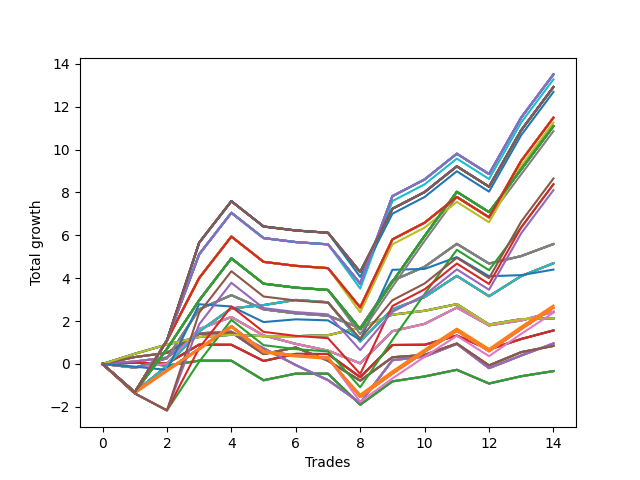

# Long Wallace Doodle 0225_009 
- Symbol: AMZN_Unlimited
- Date Range: 03/23/2022 - 07/08/2022
- Trading Period: 7:20-12:30
- Number of Trades: 14



| Name | Win Percent | Profit | Avg Profit / Trade | Avg Time / Trade |      | Name | Win Percent | Profit | Avg Profit / Trade | Avg Time / Trade |
| ---- | ----------- | ------ | ------------------ | ---------------- | ---- | ---- | ----------- | ------ | ------------------ | ---------------- |
| Sorted By <br> Profit | | | | | | Sorted By <br> Win Percentage ||||
| One Hundred Twenty-Nine | 57.14 | 6754.50 | 482.46 | 179:57 |     | Seventy | 78.57 | 1065.50 | 76.11 | 31:42 |
| One Hundred Twenty-Four | 57.14 | 6754.50 | 482.46 | 179:57 |     | Sixty-Two | 78.57 | 1065.50 | 76.11 | 31:42 |
| One Hundred Ninteen | 57.14 | 6754.50 | 482.46 | 179:57 |     | Fifty-Four | 78.57 | 1065.50 | 76.11 | 31:42 |
| One Hundred Fourteen | 57.14 | 6754.50 | 482.46 | 179:57 |     | Forty-Six | 78.57 | 1065.50 | 76.11 | 31:42 |
| One Hundred Nine | 57.14 | 6754.50 | 482.46 | 179:57 |     | Six | 78.57 | 1065.50 | 76.11 | 31:42 |
| One Hundred Four | 57.14 | 6754.50 | 482.46 | 179:57 |     | Seventy-One | 71.43 | 2350.00 | 167.86 | 94:08 |
| Eighty-Four | 57.14 | 6754.50 | 482.46 | 179:57 |     | Sixty-Three | 71.43 | 2350.00 | 167.86 | 94:08 |
| Ninety-Four | 57.14 | 6639.50 | 474.25 | 179:15 |     | Fifty-Five | 71.43 | 2350.00 | 167.86 | 94:08 |
| One Hundred Thirty | 57.14 | 6460.00 | 461.43 | 183:42 |     | Forty-Seven | 71.43 | 2350.00 | 167.86 | 94:08 |
| One Hundred Twenty-Five | 57.14 | 6460.00 | 461.43 | 183:42 |     | Seven | 71.43 | 2350.00 | 167.86 | 94:08 |
| One Hundred Twenty | 57.14 | 6460.00 | 461.43 | 183:42 |     | Sixty-Seven | 71.43 | 421.25 | 30.09 | 24:56 |
| One Hundred Fifteen | 57.14 | 6460.00 | 461.43 | 183:42 |     | Fifty-Nine | 71.43 | 421.25 | 30.09 | 24:56 |
| One Hundred Ten | 57.14 | 6460.00 | 461.43 | 183:42 |     | Fifty-One | 71.43 | 421.25 | 30.09 | 24:56 |
| One Hundred Five | 57.14 | 6460.00 | 461.43 | 183:42 |     | Forty-Three | 71.43 | 421.25 | 30.09 | 24:56 |
| Eighty-Five | 57.14 | 6460.00 | 461.43 | 183:42 |     | Three | 71.43 | 421.25 | 30.09 | 24:56 |
| Ninety-Five | 57.14 | 6345.00 | 453.21 | 183:01 |     | Sixty-Six | 64.29 | 477.75 | 34.13 | 29:28 |
| One Hundred Twenty-Eight | 57.14 | 5745.00 | 410.36 | 174:51 |     | Fifty-Eight | 64.29 | 477.75 | 34.13 | 29:28 |
| One Hundred Twenty-Three | 57.14 | 5745.00 | 410.36 | 174:51 |     | Fifty | 64.29 | 477.75 | 34.13 | 29:28 |
| One Hundred Eighteen | 57.14 | 5745.00 | 410.36 | 174:51 |     | Forty-Two | 64.29 | 477.75 | 34.13 | 29:28 |
| One Hundred Thirteen | 57.14 | 5745.00 | 410.36 | 174:51 |     | Two | 64.29 | 477.75 | 34.13 | 29:28 |
| One Hundred Eight | 57.14 | 5745.00 | 410.36 | 174:51 |     | One Hundred Twenty-Nine | 57.14 | 6754.50 | 482.46 | 179:57 |
| One Hundred Three | 57.14 | 5745.00 | 410.36 | 174:51 |     | One Hundred Twenty-Four | 57.14 | 6754.50 | 482.46 | 179:57 |
| Eighty-Three | 57.14 | 5745.00 | 410.36 | 174:51 |     | One Hundred Ninteen | 57.14 | 6754.50 | 482.46 | 179:57 |
| Ninety-Three | 57.14 | 5630.00 | 402.14 | 174:09 |     | One Hundred Fourteen | 57.14 | 6754.50 | 482.46 | 179:57 |
| One Hundred Twenty-Seven | 57.14 | 5546.25 | 396.16 | 146:30 |     | One Hundred Nine | 57.14 | 6754.50 | 482.46 | 179:57 |
| One Hundred Twenty-Two | 57.14 | 5546.25 | 396.16 | 146:30 |     | One Hundred Four | 57.14 | 6754.50 | 482.46 | 179:57 |
| One Hundred Seventeen | 57.14 | 5546.25 | 396.16 | 146:30 |     | Eighty-Four | 57.14 | 6754.50 | 482.46 | 179:57 |
| One Hundred Twelve | 57.14 | 5546.25 | 396.16 | 146:30 |     | Ninety-Four | 57.14 | 6639.50 | 474.25 | 179:15 |
| One Hundred Seven | 57.14 | 5546.25 | 396.16 | 146:30 |     | One Hundred Thirty | 57.14 | 6460.00 | 461.43 | 183:42 |
| One Hundred Two | 57.14 | 5546.25 | 396.16 | 146:30 |     | One Hundred Twenty-Five | 57.14 | 6460.00 | 461.43 | 183:42 |
| Eighty-Two | 57.14 | 5546.25 | 396.16 | 146:30 |     | One Hundred Twenty | 57.14 | 6460.00 | 461.43 | 183:42 |
| Ninety-Two | 57.14 | 5431.25 | 387.95 | 145:48 |     | One Hundred Fifteen | 57.14 | 6460.00 | 461.43 | 183:42 |
| One Hundred | 50.00 | 4326.75 | 309.05 | 151:19 |     | One Hundred Ten | 57.14 | 6460.00 | 461.43 | 183:42 |
| Ninety-Seven | 50.00 | 4192.25 | 299.45 | 118:49 |     | One Hundred Five | 57.14 | 6460.00 | 461.43 | 183:42 |
| Ninety-Eight | 50.00 | 4191.75 | 299.41 | 145:59 |     | Eighty-Five | 57.14 | 6460.00 | 461.43 | 183:42 |
| Ninety-Nine | 50.00 | 4056.25 | 289.73 | 148:33 |     | Ninety-Five | 57.14 | 6345.00 | 453.21 | 183:01 |
| Sixty-Nine | 57.14 | 2797.00 | 199.79 | 65:59 |     | One Hundred Twenty-Eight | 57.14 | 5745.00 | 410.36 | 174:51 |
| Sixty-One | 57.14 | 2797.00 | 199.79 | 65:59 |     | One Hundred Twenty-Three | 57.14 | 5745.00 | 410.36 | 174:51 |
| Fifty-Three | 57.14 | 2797.00 | 199.79 | 65:59 |     | One Hundred Eighteen | 57.14 | 5745.00 | 410.36 | 174:51 |
| Forty-Five | 57.14 | 2797.00 | 199.79 | 65:59 |     | One Hundred Thirteen | 57.14 | 5745.00 | 410.36 | 174:51 |
| Five | 57.14 | 2797.00 | 199.79 | 65:59 |     | One Hundred Eight | 57.14 | 5745.00 | 410.36 | 174:51 |
| Seventy-One | 71.43 | 2350.00 | 167.86 | 94:08 |     | One Hundred Three | 57.14 | 5745.00 | 410.36 | 174:51 |
| Sixty-Three | 71.43 | 2350.00 | 167.86 | 94:08 |     | Eighty-Three | 57.14 | 5745.00 | 410.36 | 174:51 |
| Fifty-Five | 71.43 | 2350.00 | 167.86 | 94:08 |     | Ninety-Three | 57.14 | 5630.00 | 402.14 | 174:09 |
| Forty-Seven | 71.43 | 2350.00 | 167.86 | 94:08 |     | One Hundred Twenty-Seven | 57.14 | 5546.25 | 396.16 | 146:30 |
| Seven | 71.43 | 2350.00 | 167.86 | 94:08 |     | One Hundred Twenty-Two | 57.14 | 5546.25 | 396.16 | 146:30 |
| Seventy-Three | 50.00 | 2201.75 | 157.27 | 12:39 |     | One Hundred Seventeen | 57.14 | 5546.25 | 396.16 | 146:30 |
| Ninety-Six | 57.14 | 1364.75 | 97.48 | 90:21 |     | One Hundred Twelve | 57.14 | 5546.25 | 396.16 | 146:30 |
| One Hundred Twenty-Six | 57.14 | 1311.75 | 93.70 | 107:36 |     | One Hundred Seven | 57.14 | 5546.25 | 396.16 | 146:30 |
| One Hundred Twenty-One | 57.14 | 1311.75 | 93.70 | 107:36 |     | One Hundred Two | 57.14 | 5546.25 | 396.16 | 146:30 |
| One Hundred Sixteen | 57.14 | 1311.75 | 93.70 | 107:36 |     | Eighty-Two | 57.14 | 5546.25 | 396.16 | 146:30 |
| One Hundred Eleven | 57.14 | 1311.75 | 93.70 | 107:36 |     | Ninety-Two | 57.14 | 5431.25 | 387.95 | 145:48 |
| One Hundred Six | 57.14 | 1311.75 | 93.70 | 107:36 |     | Sixty-Nine | 57.14 | 2797.00 | 199.79 | 65:59 |
| One Hundred One | 57.14 | 1311.75 | 93.70 | 107:36 |     | Sixty-One | 57.14 | 2797.00 | 199.79 | 65:59 |
| Eighty-One | 57.14 | 1311.75 | 93.70 | 107:36 |     | Fifty-Three | 57.14 | 2797.00 | 199.79 | 65:59 |
| Sixty-Eight | 57.14 | 1215.25 | 86.80 | 45:33 |     | Forty-Five | 57.14 | 2797.00 | 199.79 | 65:59 |
| Sixty | 57.14 | 1215.25 | 86.80 | 45:33 |     | Five | 57.14 | 2797.00 | 199.79 | 65:59 |
| Fifty-Two | 57.14 | 1215.25 | 86.80 | 45:33 |     | Ninety-Six | 57.14 | 1364.75 | 97.48 | 90:21 |
| Forty-Four | 57.14 | 1215.25 | 86.80 | 45:33 |     | One Hundred Twenty-Six | 57.14 | 1311.75 | 93.70 | 107:36 |
| Four | 57.14 | 1215.25 | 86.80 | 45:33 |     | One Hundred Twenty-One | 57.14 | 1311.75 | 93.70 | 107:36 |
| Ninety-One | 57.14 | 1196.75 | 85.48 | 106:55 |     | One Hundred Sixteen | 57.14 | 1311.75 | 93.70 | 107:36 |
| Seventy | 78.57 | 1065.50 | 76.11 | 31:42 |     | One Hundred Eleven | 57.14 | 1311.75 | 93.70 | 107:36 |
| Sixty-Two | 78.57 | 1065.50 | 76.11 | 31:42 |     | One Hundred Six | 57.14 | 1311.75 | 93.70 | 107:36 |
| Fifty-Four | 78.57 | 1065.50 | 76.11 | 31:42 |     | One Hundred One | 57.14 | 1311.75 | 93.70 | 107:36 |
| Forty-Six | 78.57 | 1065.50 | 76.11 | 31:42 |     | Eighty-One | 57.14 | 1311.75 | 93.70 | 107:36 |
| Six | 78.57 | 1065.50 | 76.11 | 31:42 |     | Sixty-Eight | 57.14 | 1215.25 | 86.80 | 45:33 |
| Sixty-Five | 57.14 | 782.25 | 55.87 | 16:56 |     | Sixty | 57.14 | 1215.25 | 86.80 | 45:33 |
| Fifty-Seven | 57.14 | 782.25 | 55.87 | 16:56 |     | Fifty-Two | 57.14 | 1215.25 | 86.80 | 45:33 |
| Forty-Nine | 57.14 | 782.25 | 55.87 | 16:56 |     | Forty-Four | 57.14 | 1215.25 | 86.80 | 45:33 |
| Forty-One | 57.14 | 782.25 | 55.87 | 16:56 |     | Four | 57.14 | 1215.25 | 86.80 | 45:33 |
| One | 57.14 | 782.25 | 55.87 | 16:56 |     | Ninety-One | 57.14 | 1196.75 | 85.48 | 106:55 |
| Sixty-Six | 64.29 | 477.75 | 34.13 | 29:28 |     | Sixty-Five | 57.14 | 782.25 | 55.87 | 16:56 |
| Fifty-Eight | 64.29 | 477.75 | 34.13 | 29:28 |     | Fifty-Seven | 57.14 | 782.25 | 55.87 | 16:56 |
| Fifty | 64.29 | 477.75 | 34.13 | 29:28 |     | Forty-Nine | 57.14 | 782.25 | 55.87 | 16:56 |
| Forty-Two | 64.29 | 477.75 | 34.13 | 29:28 |     | Forty-One | 57.14 | 782.25 | 55.87 | 16:56 |
| Two | 64.29 | 477.75 | 34.13 | 29:28 |     | One | 57.14 | 782.25 | 55.87 | 16:56 |
| Sixty-Seven | 71.43 | 421.25 | 30.09 | 24:56 |     | Sixty-Four | 57.14 | -166.25 | -11.88 | 11:24 |
| Fifty-Nine | 71.43 | 421.25 | 30.09 | 24:56 |     | Fifty-Six | 57.14 | -166.25 | -11.88 | 11:24 |
| Fifty-One | 71.43 | 421.25 | 30.09 | 24:56 |     | Forty-Eight | 57.14 | -166.25 | -11.88 | 11:24 |
| Forty-Three | 71.43 | 421.25 | 30.09 | 24:56 |     | Forty | 57.14 | -166.25 | -11.88 | 11:24 |
| Three | 71.43 | 421.25 | 30.09 | 24:56 |     | Zero | 57.14 | -166.25 | -11.88 | 11:24 |
| Sixty-Four | 57.14 | -166.25 | -11.88 | 11:24 |     | One Hundred | 50.00 | 4326.75 | 309.05 | 151:19 |
| Fifty-Six | 57.14 | -166.25 | -11.88 | 11:24 |     | Ninety-Seven | 50.00 | 4192.25 | 299.45 | 118:49 |
| Forty-Eight | 57.14 | -166.25 | -11.88 | 11:24 |     | Ninety-Eight | 50.00 | 4191.75 | 299.41 | 145:59 |
| Forty | 57.14 | -166.25 | -11.88 | 11:24 |     | Ninety-Nine | 50.00 | 4056.25 | 289.73 | 148:33 |
| Zero | 57.14 | -166.25 | -11.88 | 11:24 |     | Seventy-Three | 50.00 | 2201.75 | 157.27 | 12:39 |

## NO STOPLOSS

### Test Zero
* Sell when price hits the middle line of the 20p bollinger
* No Stoploss
* Results:
```
Total Trades: 14
Percent Up: 57.14
Percent Down: 42.86
Total Points Moved Up: -0.33
Potential Profit: -166.25
Total Points Ups: 2.83 Count Ups: 8
Total Points Downs: -3.16 Count Downs: 6
```

<details><summary>Trades</summary>

<code>In: 2022-04-01 09:00:00		Out: 2022-04-01 09:13:50		Total Position Time: 13:50		Total Move Up: 0.07		Total to Date: 0.07</code> <br />
<code>In: 2022-05-02 08:44:00		Out: 2022-05-02 08:52:40		Total Position Time: 08:40		Total Move Up: -0.15		Total to Date: -0.08</code> <br />
<code>In: 2022-05-04 11:36:00		Out: 2022-05-04 11:41:15		Total Position Time: 05:15		Total Move Up: 0.24		Total to Date: 0.15</code> <br />
<code>In: 2022-05-13 11:07:00		Out: 2022-05-13 11:19:25		Total Position Time: 12:25		Total Move Up: -0.00		Total to Date: 0.15</code> <br />
<code>In: 2022-05-19 09:23:00		Out: 2022-05-19 09:57:45		Total Position Time: 34:45		Total Move Up: -0.91		Total to Date: -0.76</code> <br />
<code>In: 2022-05-26 11:12:00		Out: 2022-05-26 11:14:40		Total Position Time: 02:40		Total Move Up: 0.31		Total to Date: -0.45</code> <br />
<code>In: 2022-05-26 11:38:00		Out: 2022-05-26 11:49:40		Total Position Time: 11:40		Total Move Up: -0.00		Total to Date: -0.45</code> <br />
<code>In: 2022-06-06 08:58:00		Out: 2022-06-06 09:23:25		Total Position Time: 25:25		Total Move Up: -1.45		Total to Date: -1.90</code> <br />
<code>In: 2022-06-15 11:34:00		Out: 2022-06-15 11:38:05		Total Position Time: 04:05		Total Move Up: 1.09		Total to Date: -0.81</code> <br />
<code>In: 2022-06-17 07:38:00		Out: 2022-06-17 07:39:15		Total Position Time: 01:15		Total Move Up: 0.23		Total to Date: -0.58</code> <br />
<code>In: 2022-06-17 08:02:00		Out: 2022-06-17 08:03:10		Total Position Time: 01:10		Total Move Up: 0.31		Total to Date: -0.27</code> <br />
<code>In: 2022-06-21 08:27:00		Out: 2022-06-21 08:50:00		Total Position Time: 23:00		Total Move Up: -0.64		Total to Date: -0.91</code> <br />
<code>In: 2022-06-23 09:06:00		Out: 2022-06-23 09:13:30		Total Position Time: 07:30		Total Move Up: 0.34		Total to Date: -0.57</code> <br />
<code>In: 2022-07-01 09:41:00		Out: 2022-07-01 09:49:05		Total Position Time: 08:05		Total Move Up: 0.24		Total to Date: -0.33</code> <br />


</details>

### Test One
* Sell when the price hits the upper line of the 20p 1std bollinger
* No Stoploss
* Results:
```
Total Trades: 14
Percent Up: 57.14
Percent Down: 42.86
Total Points Moved Up: 1.56
Potential Profit: 782.25
Total Points Ups: 4.10 Count Ups: 8
Total Points Downs: -2.53 Count Downs: 6
```

<details><summary>Trades</summary>

<code>In: 2022-04-01 09:00:00		Out: 2022-04-01 09:21:10		Total Position Time: 21:10		Total Move Up: 0.06		Total to Date: 0.06</code> <br />
<code>In: 2022-05-02 08:44:00		Out: 2022-05-02 08:56:05		Total Position Time: 12:05		Total Move Up: -0.04		Total to Date: 0.02</code> <br />
<code>In: 2022-05-04 11:36:00		Out: 2022-05-04 11:43:40		Total Position Time: 07:40		Total Move Up: 0.88		Total to Date: 0.90</code> <br />
<code>In: 2022-05-13 11:07:00		Out: 2022-05-13 11:30:15		Total Position Time: 23:15		Total Move Up: -0.01		Total to Date: 0.89</code> <br />
<code>In: 2022-05-19 09:23:00		Out: 2022-05-19 09:58:05		Total Position Time: 35:05		Total Move Up: -0.75		Total to Date: 0.14</code> <br />
<code>In: 2022-05-26 11:12:00		Out: 2022-05-26 11:22:05		Total Position Time: 10:05		Total Move Up: 0.33		Total to Date: 0.47</code> <br />
<code>In: 2022-05-26 11:38:00		Out: 2022-05-26 11:57:45		Total Position Time: 19:45		Total Move Up: -0.00		Total to Date: 0.46</code> <br />
<code>In: 2022-06-06 08:58:00		Out: 2022-06-06 09:24:00		Total Position Time: 26:00		Total Move Up: -1.08		Total to Date: -0.62</code> <br />
<code>In: 2022-06-15 11:34:00		Out: 2022-06-15 11:38:10		Total Position Time: 04:10		Total Move Up: 1.50		Total to Date: 0.88</code> <br />
<code>In: 2022-06-17 07:38:00		Out: 2022-06-17 08:03:30		Total Position Time: 25:30		Total Move Up: 0.01		Total to Date: 0.89</code> <br />
<code>In: 2022-06-17 08:02:00		Out: 2022-06-17 08:03:30		Total Position Time: 01:30		Total Move Up: 0.43		Total to Date: 1.32</code> <br />
<code>In: 2022-06-21 08:27:00		Out: 2022-06-21 08:57:45		Total Position Time: 30:45		Total Move Up: -0.65		Total to Date: 0.67</code> <br />
<code>In: 2022-06-23 09:06:00		Out: 2022-06-23 09:17:10		Total Position Time: 11:10		Total Move Up: 0.49		Total to Date: 1.16</code> <br />
<code>In: 2022-07-01 09:41:00		Out: 2022-07-01 09:50:00		Total Position Time: 09:00		Total Move Up: 0.40		Total to Date: 1.56</code> <br />


</details>

### Test Two
* Sell when the price hits the upper line of the 20p 2std bollinger
* No Stoploss
* Results:
```
Total Trades: 14
Percent Up: 64.29
Percent Down: 35.71
Total Points Moved Up: 0.96
Potential Profit: 477.75
Total Points Ups: 5.40 Count Ups: 9
Total Points Downs: -4.45 Count Downs: 5
```

<details><summary>Trades</summary>

<code>In: 2022-04-01 09:00:00		Out: 2022-04-01 09:21:25		Total Position Time: 21:25		Total Move Up: 0.12		Total to Date: 0.12</code> <br />
<code>In: 2022-05-02 08:44:00		Out: 2022-05-02 08:57:30		Total Position Time: 13:30		Total Move Up: 0.18		Total to Date: 0.30</code> <br />
<code>In: 2022-05-04 11:36:00		Out: 2022-05-04 11:44:25		Total Position Time: 08:25		Total Move Up: 1.14		Total to Date: 1.43</code> <br />
<code>In: 2022-05-13 11:07:00		Out: 2022-05-13 11:30:30		Total Position Time: 23:30		Total Move Up: 0.07		Total to Date: 1.50</code> <br />
<code>In: 2022-05-19 09:23:00		Out: 2022-05-19 10:06:20		Total Position Time: 43:20		Total Move Up: -0.77		Total to Date: 0.73</code> <br />
<code>In: 2022-05-26 11:12:00		Out: 2022-05-26 12:31:55		Total Position Time: 79:55		Total Move Up: -0.78		Total to Date: -0.05</code> <br />
<code>In: 2022-05-26 11:38:00		Out: 2022-05-26 12:31:55		Total Position Time: 53:55		Total Move Up: -0.70		Total to Date: -0.75</code> <br />
<code>In: 2022-06-06 08:58:00		Out: 2022-06-06 09:37:20		Total Position Time: 39:20		Total Move Up: -1.06		Total to Date: -1.81</code> <br />
<code>In: 2022-06-15 11:34:00		Out: 2022-06-15 11:38:55		Total Position Time: 04:55		Total Move Up: 1.99		Total to Date: 0.18</code> <br />
<code>In: 2022-06-17 07:38:00		Out: 2022-06-17 08:06:05		Total Position Time: 28:05		Total Move Up: 0.17		Total to Date: 0.35</code> <br />
<code>In: 2022-06-17 08:02:00		Out: 2022-06-17 08:06:05		Total Position Time: 04:05		Total Move Up: 0.59		Total to Date: 0.94</code> <br />
<code>In: 2022-06-21 08:27:00		Out: 2022-06-21 09:33:05		Total Position Time: 66:05		Total Move Up: -1.13		Total to Date: -0.19</code> <br />
<code>In: 2022-06-23 09:06:00		Out: 2022-06-23 09:18:05		Total Position Time: 12:05		Total Move Up: 0.59		Total to Date: 0.40</code> <br />
<code>In: 2022-07-01 09:41:00		Out: 2022-07-01 09:55:10		Total Position Time: 14:10		Total Move Up: 0.56		Total to Date: 0.96</code> <br />


</details>

### Test Three
* Sell when price hits the middle line of the 50p bollinger
* No Stoploss
* Results:
```
Total Trades: 14
Percent Up: 71.43
Percent Down: 28.57
Total Points Moved Up: 0.84
Potential Profit: 421.25
Total Points Ups: 4.42 Count Ups: 10
Total Points Downs: -3.58 Count Downs: 4
```

<details><summary>Trades</summary>

<code>In: 2022-04-01 09:00:00		Out: 2022-04-01 09:22:55		Total Position Time: 22:55		Total Move Up: 0.32		Total to Date: 0.32</code> <br />
<code>In: 2022-05-02 08:44:00		Out: 2022-05-02 08:57:20		Total Position Time: 13:20		Total Move Up: 0.20		Total to Date: 0.52</code> <br />
<code>In: 2022-05-04 11:36:00		Out: 2022-05-04 11:43:40		Total Position Time: 07:40		Total Move Up: 0.88		Total to Date: 1.40</code> <br />
<code>In: 2022-05-13 11:07:00		Out: 2022-05-13 11:31:05		Total Position Time: 24:05		Total Move Up: 0.07		Total to Date: 1.47</code> <br />
<code>In: 2022-05-19 09:23:00		Out: 2022-05-19 10:22:50		Total Position Time: 59:50		Total Move Up: -1.01		Total to Date: 0.46</code> <br />
<code>In: 2022-05-26 11:12:00		Out: 2022-05-26 11:14:40		Total Position Time: 02:40		Total Move Up: 0.31		Total to Date: 0.77</code> <br />
<code>In: 2022-05-26 11:38:00		Out: 2022-05-26 12:34:30		Total Position Time: 56:30		Total Move Up: -0.62		Total to Date: 0.15</code> <br />
<code>In: 2022-06-06 08:58:00		Out: 2022-06-06 09:38:25		Total Position Time: 40:25		Total Move Up: -0.93		Total to Date: -0.78</code> <br />
<code>In: 2022-06-15 11:34:00		Out: 2022-06-15 11:38:05		Total Position Time: 04:05		Total Move Up: 1.09		Total to Date: 0.31</code> <br />
<code>In: 2022-06-17 07:38:00		Out: 2022-06-17 08:04:10		Total Position Time: 26:10		Total Move Up: 0.11		Total to Date: 0.42</code> <br />
<code>In: 2022-06-17 08:02:00		Out: 2022-06-17 08:04:10		Total Position Time: 02:10		Total Move Up: 0.53		Total to Date: 0.95</code> <br />
<code>In: 2022-06-21 08:27:00		Out: 2022-06-21 09:36:00		Total Position Time: 69:00		Total Move Up: -1.02		Total to Date: -0.07</code> <br />
<code>In: 2022-06-23 09:06:00		Out: 2022-06-23 09:18:00		Total Position Time: 12:00		Total Move Up: 0.62		Total to Date: 0.55</code> <br />
<code>In: 2022-07-01 09:41:00		Out: 2022-07-01 09:49:15		Total Position Time: 08:15		Total Move Up: 0.29		Total to Date: 0.84</code> <br />


</details>

### Test Four
* Sell when the price hits the upper line of the 50p 1std bollinger
* No Stoploss
* Results:
```
Total Trades: 14
Percent Up: 57.14
Percent Down: 42.86
Total Points Moved Up: 2.43
Potential Profit: 1215.25
Total Points Ups: 5.58 Count Ups: 8
Total Points Downs: -3.15 Count Downs: 6
```

<details><summary>Trades</summary>

<code>In: 2022-04-01 09:00:00		Out: 2022-04-01 10:42:00		Total Position Time: 102:00		Total Move Up: -0.16		Total to Date: -0.16</code> <br />
<code>In: 2022-05-02 08:44:00		Out: 2022-05-02 09:14:50		Total Position Time: 30:50		Total Move Up: 0.17		Total to Date: 0.01</code> <br />
<code>In: 2022-05-04 11:36:00		Out: 2022-05-04 11:45:30		Total Position Time: 09:30		Total Move Up: 1.62		Total to Date: 1.63</code> <br />
<code>In: 2022-05-13 11:07:00		Out: 2022-05-13 11:32:00		Total Position Time: 25:00		Total Move Up: 0.56		Total to Date: 2.19</code> <br />
<code>In: 2022-05-19 09:23:00		Out: 2022-05-19 10:31:50		Total Position Time: 68:50		Total Move Up: -0.86		Total to Date: 1.33</code> <br />
<code>In: 2022-05-26 11:12:00		Out: 2022-05-26 12:42:05		Total Position Time: 90:05		Total Move Up: -0.39		Total to Date: 0.94</code> <br />
<code>In: 2022-05-26 11:38:00		Out: 2022-05-26 12:42:05		Total Position Time: 64:05		Total Move Up: -0.32		Total to Date: 0.62</code> <br />
<code>In: 2022-06-06 08:58:00		Out: 2022-06-06 09:48:10		Total Position Time: 50:10		Total Move Up: -0.59		Total to Date: 0.03</code> <br />
<code>In: 2022-06-15 11:34:00		Out: 2022-06-15 11:38:10		Total Position Time: 04:10		Total Move Up: 1.50		Total to Date: 1.53</code> <br />
<code>In: 2022-06-17 07:38:00		Out: 2022-06-17 08:07:20		Total Position Time: 29:20		Total Move Up: 0.34		Total to Date: 1.87</code> <br />
<code>In: 2022-06-17 08:02:00		Out: 2022-06-17 08:07:20		Total Position Time: 05:20		Total Move Up: 0.76		Total to Date: 2.63</code> <br />
<code>In: 2022-06-21 08:27:00		Out: 2022-06-21 09:39:05		Total Position Time: 72:05		Total Move Up: -0.83		Total to Date: 1.80</code> <br />
<code>In: 2022-06-23 09:06:00		Out: 2022-06-23 10:23:25		Total Position Time: 77:25		Total Move Up: 0.23		Total to Date: 2.03</code> <br />
<code>In: 2022-07-01 09:41:00		Out: 2022-07-01 09:50:00		Total Position Time: 09:00		Total Move Up: 0.40		Total to Date: 2.43</code> <br />


</details>

### Test Five
* Sell when the price hits the upper line of the 50p 2std bollinger
* No Stoploss
* Results:
```
Total Trades: 14
Percent Up: 57.14
Percent Down: 42.86
Total Points Moved Up: 5.59
Potential Profit: 2797.00
Total Points Ups: 8.22 Count Ups: 8
Total Points Downs: -2.63 Count Downs: 6
```

<details><summary>Trades</summary>

<code>In: 2022-04-01 09:00:00		Out: 2022-04-01 11:05:15		Total Position Time: 125:15		Total Move Up: -0.17		Total to Date: -0.17</code> <br />
<code>In: 2022-05-02 08:44:00		Out: 2022-05-02 09:19:50		Total Position Time: 35:50		Total Move Up: 0.44		Total to Date: 0.27</code> <br />
<code>In: 2022-05-04 11:36:00		Out: 2022-05-04 11:46:55		Total Position Time: 10:55		Total Move Up: 2.28		Total to Date: 2.55</code> <br />
<code>In: 2022-05-13 11:07:00		Out: 2022-05-13 11:51:15		Total Position Time: 44:15		Total Move Up: 0.66		Total to Date: 3.21</code> <br />
<code>In: 2022-05-19 09:23:00		Out: 2022-05-19 10:33:35		Total Position Time: 70:35		Total Move Up: -0.66		Total to Date: 2.55</code> <br />
<code>In: 2022-05-26 11:12:00		Out: 2022-05-26 12:47:00		Total Position Time: 95:00		Total Move Up: -0.19		Total to Date: 2.36</code> <br />
<code>In: 2022-05-26 11:38:00		Out: 2022-05-26 12:47:00		Total Position Time: 69:00		Total Move Up: -0.11		Total to Date: 2.25</code> <br />
<code>In: 2022-06-06 08:58:00		Out: 2022-06-06 10:23:10		Total Position Time: 85:10		Total Move Up: -0.58		Total to Date: 1.67</code> <br />
<code>In: 2022-06-15 11:34:00		Out: 2022-06-15 11:39:00		Total Position Time: 05:00		Total Move Up: 2.21		Total to Date: 3.88</code> <br />
<code>In: 2022-06-17 07:38:00		Out: 2022-06-17 08:10:05		Total Position Time: 32:05		Total Move Up: 0.65		Total to Date: 4.53</code> <br />
<code>In: 2022-06-17 08:02:00		Out: 2022-06-17 08:10:05		Total Position Time: 08:05		Total Move Up: 1.07		Total to Date: 5.60</code> <br />
<code>In: 2022-06-21 08:27:00		Out: 2022-06-21 11:55:30		Total Position Time: 208:30		Total Move Up: -0.92		Total to Date: 4.68</code> <br />
<code>In: 2022-06-23 09:06:00		Out: 2022-06-23 10:33:10		Total Position Time: 87:10		Total Move Up: 0.35		Total to Date: 5.03</code> <br />
<code>In: 2022-07-01 09:41:00		Out: 2022-07-01 10:28:05		Total Position Time: 47:05		Total Move Up: 0.56		Total to Date: 5.59</code> <br />


</details>

### Test Six
* Sell when the price hits the middle line of the 1std VWAP
* No Stoploss
* Results:
```
Total Trades: 14
Percent Up: 78.57
Percent Down: 21.43
Total Points Moved Up: 2.13
Potential Profit: 1065.50
Total Points Ups: 3.14 Count Ups: 11
Total Points Downs: -1.01 Count Downs: 3
```

<details><summary>Trades</summary>

<code>In: 2022-04-01 09:00:00		Out: 2022-04-01 09:25:00		Total Position Time: 25:00		Total Move Up: 0.48		Total to Date: 0.48</code> <br />
<code>In: 2022-05-02 08:44:00		Out: 2022-05-02 09:20:15		Total Position Time: 36:15		Total Move Up: 0.43		Total to Date: 0.91</code> <br />
<code>In: 2022-05-04 11:36:00		Out: 2022-05-04 11:42:15		Total Position Time: 06:15		Total Move Up: 0.35		Total to Date: 1.26</code> <br />
<code>In: 2022-05-13 11:07:00		Out: 2022-05-13 11:10:55		Total Position Time: 03:55		Total Move Up: 0.10		Total to Date: 1.36</code> <br />
<code>In: 2022-05-19 09:23:00		Out: 2022-05-19 09:24:10		Total Position Time: 01:10		Total Move Up: -0.06		Total to Date: 1.30</code> <br />
<code>In: 2022-05-26 11:12:00		Out: 2022-05-26 11:13:10		Total Position Time: 01:10		Total Move Up: -0.00		Total to Date: 1.30</code> <br />
<code>In: 2022-05-26 11:38:00		Out: 2022-05-26 11:39:10		Total Position Time: 01:10		Total Move Up: 0.04		Total to Date: 1.34</code> <br />
<code>In: 2022-06-06 08:58:00		Out: 2022-06-06 10:39:05		Total Position Time: 101:05		Total Move Up: 0.35		Total to Date: 1.69</code> <br />
<code>In: 2022-06-15 11:34:00		Out: 2022-06-15 11:37:10		Total Position Time: 03:10		Total Move Up: 0.61		Total to Date: 2.30</code> <br />
<code>In: 2022-06-17 07:38:00		Out: 2022-06-17 07:39:10		Total Position Time: 01:10		Total Move Up: 0.18		Total to Date: 2.48</code> <br />
<code>In: 2022-06-17 08:02:00		Out: 2022-06-17 08:03:10		Total Position Time: 01:10		Total Move Up: 0.31		Total to Date: 2.79</code> <br />
<code>In: 2022-06-21 08:27:00		Out: 2022-06-21 12:47:00		Total Position Time: 260:00		Total Move Up: -0.95		Total to Date: 1.84</code> <br />
<code>In: 2022-06-23 09:06:00		Out: 2022-06-23 09:07:10		Total Position Time: 01:10		Total Move Up: 0.25		Total to Date: 2.09</code> <br />
<code>In: 2022-07-01 09:41:00		Out: 2022-07-01 09:42:10		Total Position Time: 01:10		Total Move Up: 0.04		Total to Date: 2.13</code> <br />


</details>

### Test Seven
* Sell when the price hits the upper line of the 1std VWAP
* No Stoploss
* Results:
```
Total Trades: 14
Percent Up: 71.43
Percent Down: 28.57
Total Points Moved Up: 4.70
Potential Profit: 2350.00
Total Points Ups: 8.91 Count Ups: 10
Total Points Downs: -4.21 Count Downs: 4
```

<details><summary>Trades</summary>

<code>In: 2022-04-01 09:00:00		Out: 2022-04-01 12:47:00		Total Position Time: 227:00		Total Move Up: -1.32		Total to Date: -1.32</code> <br />
<code>In: 2022-05-02 08:44:00		Out: 2022-05-02 11:05:00		Total Position Time: 141:00		Total Move Up: 1.24		Total to Date: -0.08</code> <br />
<code>In: 2022-05-04 11:36:00		Out: 2022-05-04 11:45:40		Total Position Time: 09:40		Total Move Up: 1.60		Total to Date: 1.52</code> <br />
<code>In: 2022-05-13 11:07:00		Out: 2022-05-13 11:54:55		Total Position Time: 47:55		Total Move Up: 1.07		Total to Date: 2.59</code> <br />
<code>In: 2022-05-19 09:23:00		Out: 2022-05-19 11:38:40		Total Position Time: 135:40		Total Move Up: 0.15		Total to Date: 2.75</code> <br />
<code>In: 2022-05-26 11:12:00		Out: 2022-05-26 11:14:10		Total Position Time: 02:10		Total Move Up: 0.24		Total to Date: 2.99</code> <br />
<code>In: 2022-05-26 11:38:00		Out: 2022-05-26 12:47:00		Total Position Time: 69:00		Total Move Up: -0.11		Total to Date: 2.88</code> <br />
<code>In: 2022-06-06 08:58:00		Out: 2022-06-06 12:47:00		Total Position Time: 229:00		Total Move Up: -1.83		Total to Date: 1.05</code> <br />
<code>In: 2022-06-15 11:34:00		Out: 2022-06-15 11:38:10		Total Position Time: 04:10		Total Move Up: 1.50		Total to Date: 2.55</code> <br />
<code>In: 2022-06-17 07:38:00		Out: 2022-06-17 08:08:05		Total Position Time: 30:05		Total Move Up: 0.57		Total to Date: 3.12</code> <br />
<code>In: 2022-06-17 08:02:00		Out: 2022-06-17 08:08:05		Total Position Time: 06:05		Total Move Up: 0.99		Total to Date: 4.11</code> <br />
<code>In: 2022-06-21 08:27:00		Out: 2022-06-21 12:47:00		Total Position Time: 260:00		Total Move Up: -0.95		Total to Date: 3.16</code> <br />
<code>In: 2022-06-23 09:06:00		Out: 2022-06-23 11:28:00		Total Position Time: 142:00		Total Move Up: 0.94		Total to Date: 4.10</code> <br />
<code>In: 2022-07-01 09:41:00		Out: 2022-07-01 09:55:15		Total Position Time: 14:15		Total Move Up: 0.60		Total to Date: 4.70</code> <br />


</details>

## STOPLOSS OF 5

### Test Forty
* Sell when price hits the middle line of the 20p bollinger
* Stoploss is 5 points
* Results:
```
Total Trades: 14
Percent Up: 57.14
Percent Down: 42.86
Total Points Moved Up: -0.33
Potential Profit: -166.25
Total Points Ups: 2.83 Count Ups: 8
Total Points Downs: -3.16 Count Downs: 6
```

<details><summary>Trades</summary>

<code>In: 2022-04-01 09:00:00		Out: 2022-04-01 09:13:50		Total Position Time: 13:50		Total Move Up: 0.07		Total to Date: 0.07</code> <br />
<code>In: 2022-05-02 08:44:00		Out: 2022-05-02 08:52:40		Total Position Time: 08:40		Total Move Up: -0.15		Total to Date: -0.08</code> <br />
<code>In: 2022-05-04 11:36:00		Out: 2022-05-04 11:41:15		Total Position Time: 05:15		Total Move Up: 0.24		Total to Date: 0.15</code> <br />
<code>In: 2022-05-13 11:07:00		Out: 2022-05-13 11:19:25		Total Position Time: 12:25		Total Move Up: -0.00		Total to Date: 0.15</code> <br />
<code>In: 2022-05-19 09:23:00		Out: 2022-05-19 09:57:45		Total Position Time: 34:45		Total Move Up: -0.91		Total to Date: -0.76</code> <br />
<code>In: 2022-05-26 11:12:00		Out: 2022-05-26 11:14:40		Total Position Time: 02:40		Total Move Up: 0.31		Total to Date: -0.45</code> <br />
<code>In: 2022-05-26 11:38:00		Out: 2022-05-26 11:49:40		Total Position Time: 11:40		Total Move Up: -0.00		Total to Date: -0.45</code> <br />
<code>In: 2022-06-06 08:58:00		Out: 2022-06-06 09:23:25		Total Position Time: 25:25		Total Move Up: -1.45		Total to Date: -1.90</code> <br />
<code>In: 2022-06-15 11:34:00		Out: 2022-06-15 11:38:05		Total Position Time: 04:05		Total Move Up: 1.09		Total to Date: -0.81</code> <br />
<code>In: 2022-06-17 07:38:00		Out: 2022-06-17 07:39:15		Total Position Time: 01:15		Total Move Up: 0.23		Total to Date: -0.58</code> <br />
<code>In: 2022-06-17 08:02:00		Out: 2022-06-17 08:03:10		Total Position Time: 01:10		Total Move Up: 0.31		Total to Date: -0.27</code> <br />
<code>In: 2022-06-21 08:27:00		Out: 2022-06-21 08:50:00		Total Position Time: 23:00		Total Move Up: -0.64		Total to Date: -0.91</code> <br />
<code>In: 2022-06-23 09:06:00		Out: 2022-06-23 09:13:30		Total Position Time: 07:30		Total Move Up: 0.34		Total to Date: -0.57</code> <br />
<code>In: 2022-07-01 09:41:00		Out: 2022-07-01 09:49:05		Total Position Time: 08:05		Total Move Up: 0.24		Total to Date: -0.33</code> <br />


</details>

### Test Forty-One
* Sell when the price hits the upper line of the 20p 1std bollinger
* Stoploss is 5 points
* Results:
```
Total Trades: 14
Percent Up: 57.14
Percent Down: 42.86
Total Points Moved Up: 1.56
Potential Profit: 782.25
Total Points Ups: 4.10 Count Ups: 8
Total Points Downs: -2.53 Count Downs: 6
```

<details><summary>Trades</summary>

<code>In: 2022-04-01 09:00:00		Out: 2022-04-01 09:21:10		Total Position Time: 21:10		Total Move Up: 0.06		Total to Date: 0.06</code> <br />
<code>In: 2022-05-02 08:44:00		Out: 2022-05-02 08:56:05		Total Position Time: 12:05		Total Move Up: -0.04		Total to Date: 0.02</code> <br />
<code>In: 2022-05-04 11:36:00		Out: 2022-05-04 11:43:40		Total Position Time: 07:40		Total Move Up: 0.88		Total to Date: 0.90</code> <br />
<code>In: 2022-05-13 11:07:00		Out: 2022-05-13 11:30:15		Total Position Time: 23:15		Total Move Up: -0.01		Total to Date: 0.89</code> <br />
<code>In: 2022-05-19 09:23:00		Out: 2022-05-19 09:58:05		Total Position Time: 35:05		Total Move Up: -0.75		Total to Date: 0.14</code> <br />
<code>In: 2022-05-26 11:12:00		Out: 2022-05-26 11:22:05		Total Position Time: 10:05		Total Move Up: 0.33		Total to Date: 0.47</code> <br />
<code>In: 2022-05-26 11:38:00		Out: 2022-05-26 11:57:45		Total Position Time: 19:45		Total Move Up: -0.00		Total to Date: 0.46</code> <br />
<code>In: 2022-06-06 08:58:00		Out: 2022-06-06 09:24:00		Total Position Time: 26:00		Total Move Up: -1.08		Total to Date: -0.62</code> <br />
<code>In: 2022-06-15 11:34:00		Out: 2022-06-15 11:38:10		Total Position Time: 04:10		Total Move Up: 1.50		Total to Date: 0.88</code> <br />
<code>In: 2022-06-17 07:38:00		Out: 2022-06-17 08:03:30		Total Position Time: 25:30		Total Move Up: 0.01		Total to Date: 0.89</code> <br />
<code>In: 2022-06-17 08:02:00		Out: 2022-06-17 08:03:30		Total Position Time: 01:30		Total Move Up: 0.43		Total to Date: 1.32</code> <br />
<code>In: 2022-06-21 08:27:00		Out: 2022-06-21 08:57:45		Total Position Time: 30:45		Total Move Up: -0.65		Total to Date: 0.67</code> <br />
<code>In: 2022-06-23 09:06:00		Out: 2022-06-23 09:17:10		Total Position Time: 11:10		Total Move Up: 0.49		Total to Date: 1.16</code> <br />
<code>In: 2022-07-01 09:41:00		Out: 2022-07-01 09:50:00		Total Position Time: 09:00		Total Move Up: 0.40		Total to Date: 1.56</code> <br />


</details>

### Test Forty-Two
* Sell when the price hits the upper line of the 20p 2std bollinger
* Stoploss is 5 points
* Results:
```
Total Trades: 14
Percent Up: 64.29
Percent Down: 35.71
Total Points Moved Up: 0.96
Potential Profit: 477.75
Total Points Ups: 5.40 Count Ups: 9
Total Points Downs: -4.45 Count Downs: 5
```

<details><summary>Trades</summary>

<code>In: 2022-04-01 09:00:00		Out: 2022-04-01 09:21:25		Total Position Time: 21:25		Total Move Up: 0.12		Total to Date: 0.12</code> <br />
<code>In: 2022-05-02 08:44:00		Out: 2022-05-02 08:57:30		Total Position Time: 13:30		Total Move Up: 0.18		Total to Date: 0.30</code> <br />
<code>In: 2022-05-04 11:36:00		Out: 2022-05-04 11:44:25		Total Position Time: 08:25		Total Move Up: 1.14		Total to Date: 1.43</code> <br />
<code>In: 2022-05-13 11:07:00		Out: 2022-05-13 11:30:30		Total Position Time: 23:30		Total Move Up: 0.07		Total to Date: 1.50</code> <br />
<code>In: 2022-05-19 09:23:00		Out: 2022-05-19 10:06:20		Total Position Time: 43:20		Total Move Up: -0.77		Total to Date: 0.73</code> <br />
<code>In: 2022-05-26 11:12:00		Out: 2022-05-26 12:31:55		Total Position Time: 79:55		Total Move Up: -0.78		Total to Date: -0.05</code> <br />
<code>In: 2022-05-26 11:38:00		Out: 2022-05-26 12:31:55		Total Position Time: 53:55		Total Move Up: -0.70		Total to Date: -0.75</code> <br />
<code>In: 2022-06-06 08:58:00		Out: 2022-06-06 09:37:20		Total Position Time: 39:20		Total Move Up: -1.06		Total to Date: -1.81</code> <br />
<code>In: 2022-06-15 11:34:00		Out: 2022-06-15 11:38:55		Total Position Time: 04:55		Total Move Up: 1.99		Total to Date: 0.18</code> <br />
<code>In: 2022-06-17 07:38:00		Out: 2022-06-17 08:06:05		Total Position Time: 28:05		Total Move Up: 0.17		Total to Date: 0.35</code> <br />
<code>In: 2022-06-17 08:02:00		Out: 2022-06-17 08:06:05		Total Position Time: 04:05		Total Move Up: 0.59		Total to Date: 0.94</code> <br />
<code>In: 2022-06-21 08:27:00		Out: 2022-06-21 09:33:05		Total Position Time: 66:05		Total Move Up: -1.13		Total to Date: -0.19</code> <br />
<code>In: 2022-06-23 09:06:00		Out: 2022-06-23 09:18:05		Total Position Time: 12:05		Total Move Up: 0.59		Total to Date: 0.40</code> <br />
<code>In: 2022-07-01 09:41:00		Out: 2022-07-01 09:55:10		Total Position Time: 14:10		Total Move Up: 0.56		Total to Date: 0.96</code> <br />


</details>

### Test Forty-Three
* Sell when price hits the middle line of the 50p bollinger
* Stoploss is 5 points
* Results:
```
Total Trades: 14
Percent Up: 71.43
Percent Down: 28.57
Total Points Moved Up: 0.84
Potential Profit: 421.25
Total Points Ups: 4.42 Count Ups: 10
Total Points Downs: -3.58 Count Downs: 4
```

<details><summary>Trades</summary>

<code>In: 2022-04-01 09:00:00		Out: 2022-04-01 09:22:55		Total Position Time: 22:55		Total Move Up: 0.32		Total to Date: 0.32</code> <br />
<code>In: 2022-05-02 08:44:00		Out: 2022-05-02 08:57:20		Total Position Time: 13:20		Total Move Up: 0.20		Total to Date: 0.52</code> <br />
<code>In: 2022-05-04 11:36:00		Out: 2022-05-04 11:43:40		Total Position Time: 07:40		Total Move Up: 0.88		Total to Date: 1.40</code> <br />
<code>In: 2022-05-13 11:07:00		Out: 2022-05-13 11:31:05		Total Position Time: 24:05		Total Move Up: 0.07		Total to Date: 1.47</code> <br />
<code>In: 2022-05-19 09:23:00		Out: 2022-05-19 10:22:50		Total Position Time: 59:50		Total Move Up: -1.01		Total to Date: 0.46</code> <br />
<code>In: 2022-05-26 11:12:00		Out: 2022-05-26 11:14:40		Total Position Time: 02:40		Total Move Up: 0.31		Total to Date: 0.77</code> <br />
<code>In: 2022-05-26 11:38:00		Out: 2022-05-26 12:34:30		Total Position Time: 56:30		Total Move Up: -0.62		Total to Date: 0.15</code> <br />
<code>In: 2022-06-06 08:58:00		Out: 2022-06-06 09:38:25		Total Position Time: 40:25		Total Move Up: -0.93		Total to Date: -0.78</code> <br />
<code>In: 2022-06-15 11:34:00		Out: 2022-06-15 11:38:05		Total Position Time: 04:05		Total Move Up: 1.09		Total to Date: 0.31</code> <br />
<code>In: 2022-06-17 07:38:00		Out: 2022-06-17 08:04:10		Total Position Time: 26:10		Total Move Up: 0.11		Total to Date: 0.42</code> <br />
<code>In: 2022-06-17 08:02:00		Out: 2022-06-17 08:04:10		Total Position Time: 02:10		Total Move Up: 0.53		Total to Date: 0.95</code> <br />
<code>In: 2022-06-21 08:27:00		Out: 2022-06-21 09:36:00		Total Position Time: 69:00		Total Move Up: -1.02		Total to Date: -0.07</code> <br />
<code>In: 2022-06-23 09:06:00		Out: 2022-06-23 09:18:00		Total Position Time: 12:00		Total Move Up: 0.62		Total to Date: 0.55</code> <br />
<code>In: 2022-07-01 09:41:00		Out: 2022-07-01 09:49:15		Total Position Time: 08:15		Total Move Up: 0.29		Total to Date: 0.84</code> <br />


</details>

### Test Forty-Four
* Sell when the price hits the upper line of the 50p 1std bollinger
* Stoploss is 5 points
* Results:
```
Total Trades: 14
Percent Up: 57.14
Percent Down: 42.86
Total Points Moved Up: 2.43
Potential Profit: 1215.25
Total Points Ups: 5.58 Count Ups: 8
Total Points Downs: -3.15 Count Downs: 6
```

<details><summary>Trades</summary>

<code>In: 2022-04-01 09:00:00		Out: 2022-04-01 10:42:00		Total Position Time: 102:00		Total Move Up: -0.16		Total to Date: -0.16</code> <br />
<code>In: 2022-05-02 08:44:00		Out: 2022-05-02 09:14:50		Total Position Time: 30:50		Total Move Up: 0.17		Total to Date: 0.01</code> <br />
<code>In: 2022-05-04 11:36:00		Out: 2022-05-04 11:45:30		Total Position Time: 09:30		Total Move Up: 1.62		Total to Date: 1.63</code> <br />
<code>In: 2022-05-13 11:07:00		Out: 2022-05-13 11:32:00		Total Position Time: 25:00		Total Move Up: 0.56		Total to Date: 2.19</code> <br />
<code>In: 2022-05-19 09:23:00		Out: 2022-05-19 10:31:50		Total Position Time: 68:50		Total Move Up: -0.86		Total to Date: 1.33</code> <br />
<code>In: 2022-05-26 11:12:00		Out: 2022-05-26 12:42:05		Total Position Time: 90:05		Total Move Up: -0.39		Total to Date: 0.94</code> <br />
<code>In: 2022-05-26 11:38:00		Out: 2022-05-26 12:42:05		Total Position Time: 64:05		Total Move Up: -0.32		Total to Date: 0.62</code> <br />
<code>In: 2022-06-06 08:58:00		Out: 2022-06-06 09:48:10		Total Position Time: 50:10		Total Move Up: -0.59		Total to Date: 0.03</code> <br />
<code>In: 2022-06-15 11:34:00		Out: 2022-06-15 11:38:10		Total Position Time: 04:10		Total Move Up: 1.50		Total to Date: 1.53</code> <br />
<code>In: 2022-06-17 07:38:00		Out: 2022-06-17 08:07:20		Total Position Time: 29:20		Total Move Up: 0.34		Total to Date: 1.87</code> <br />
<code>In: 2022-06-17 08:02:00		Out: 2022-06-17 08:07:20		Total Position Time: 05:20		Total Move Up: 0.76		Total to Date: 2.63</code> <br />
<code>In: 2022-06-21 08:27:00		Out: 2022-06-21 09:39:05		Total Position Time: 72:05		Total Move Up: -0.83		Total to Date: 1.80</code> <br />
<code>In: 2022-06-23 09:06:00		Out: 2022-06-23 10:23:25		Total Position Time: 77:25		Total Move Up: 0.23		Total to Date: 2.03</code> <br />
<code>In: 2022-07-01 09:41:00		Out: 2022-07-01 09:50:00		Total Position Time: 09:00		Total Move Up: 0.40		Total to Date: 2.43</code> <br />


</details>

### Test Forty-Five
* Sell when the price hits the upper line of the 50p 2std bollinger
* Stoploss is 5 points
* Results:
```
Total Trades: 14
Percent Up: 57.14
Percent Down: 42.86
Total Points Moved Up: 5.59
Potential Profit: 2797.00
Total Points Ups: 8.22 Count Ups: 8
Total Points Downs: -2.63 Count Downs: 6
```

<details><summary>Trades</summary>

<code>In: 2022-04-01 09:00:00		Out: 2022-04-01 11:05:15		Total Position Time: 125:15		Total Move Up: -0.17		Total to Date: -0.17</code> <br />
<code>In: 2022-05-02 08:44:00		Out: 2022-05-02 09:19:50		Total Position Time: 35:50		Total Move Up: 0.44		Total to Date: 0.27</code> <br />
<code>In: 2022-05-04 11:36:00		Out: 2022-05-04 11:46:55		Total Position Time: 10:55		Total Move Up: 2.28		Total to Date: 2.55</code> <br />
<code>In: 2022-05-13 11:07:00		Out: 2022-05-13 11:51:15		Total Position Time: 44:15		Total Move Up: 0.66		Total to Date: 3.21</code> <br />
<code>In: 2022-05-19 09:23:00		Out: 2022-05-19 10:33:35		Total Position Time: 70:35		Total Move Up: -0.66		Total to Date: 2.55</code> <br />
<code>In: 2022-05-26 11:12:00		Out: 2022-05-26 12:47:00		Total Position Time: 95:00		Total Move Up: -0.19		Total to Date: 2.36</code> <br />
<code>In: 2022-05-26 11:38:00		Out: 2022-05-26 12:47:00		Total Position Time: 69:00		Total Move Up: -0.11		Total to Date: 2.25</code> <br />
<code>In: 2022-06-06 08:58:00		Out: 2022-06-06 10:23:10		Total Position Time: 85:10		Total Move Up: -0.58		Total to Date: 1.67</code> <br />
<code>In: 2022-06-15 11:34:00		Out: 2022-06-15 11:39:00		Total Position Time: 05:00		Total Move Up: 2.21		Total to Date: 3.88</code> <br />
<code>In: 2022-06-17 07:38:00		Out: 2022-06-17 08:10:05		Total Position Time: 32:05		Total Move Up: 0.65		Total to Date: 4.53</code> <br />
<code>In: 2022-06-17 08:02:00		Out: 2022-06-17 08:10:05		Total Position Time: 08:05		Total Move Up: 1.07		Total to Date: 5.60</code> <br />
<code>In: 2022-06-21 08:27:00		Out: 2022-06-21 11:55:30		Total Position Time: 208:30		Total Move Up: -0.92		Total to Date: 4.68</code> <br />
<code>In: 2022-06-23 09:06:00		Out: 2022-06-23 10:33:10		Total Position Time: 87:10		Total Move Up: 0.35		Total to Date: 5.03</code> <br />
<code>In: 2022-07-01 09:41:00		Out: 2022-07-01 10:28:05		Total Position Time: 47:05		Total Move Up: 0.56		Total to Date: 5.59</code> <br />


</details>

### Test Forty-Six
* Sell when the price hits the middle line of the 1std VWAP
* Stoploss is 5 points
* Results:
```
Total Trades: 14
Percent Up: 78.57
Percent Down: 21.43
Total Points Moved Up: 2.13
Potential Profit: 1065.50
Total Points Ups: 3.14 Count Ups: 11
Total Points Downs: -1.01 Count Downs: 3
```

<details><summary>Trades</summary>

<code>In: 2022-04-01 09:00:00		Out: 2022-04-01 09:25:00		Total Position Time: 25:00		Total Move Up: 0.48		Total to Date: 0.48</code> <br />
<code>In: 2022-05-02 08:44:00		Out: 2022-05-02 09:20:15		Total Position Time: 36:15		Total Move Up: 0.43		Total to Date: 0.91</code> <br />
<code>In: 2022-05-04 11:36:00		Out: 2022-05-04 11:42:15		Total Position Time: 06:15		Total Move Up: 0.35		Total to Date: 1.26</code> <br />
<code>In: 2022-05-13 11:07:00		Out: 2022-05-13 11:10:55		Total Position Time: 03:55		Total Move Up: 0.10		Total to Date: 1.36</code> <br />
<code>In: 2022-05-19 09:23:00		Out: 2022-05-19 09:24:10		Total Position Time: 01:10		Total Move Up: -0.06		Total to Date: 1.30</code> <br />
<code>In: 2022-05-26 11:12:00		Out: 2022-05-26 11:13:10		Total Position Time: 01:10		Total Move Up: -0.00		Total to Date: 1.30</code> <br />
<code>In: 2022-05-26 11:38:00		Out: 2022-05-26 11:39:10		Total Position Time: 01:10		Total Move Up: 0.04		Total to Date: 1.34</code> <br />
<code>In: 2022-06-06 08:58:00		Out: 2022-06-06 10:39:05		Total Position Time: 101:05		Total Move Up: 0.35		Total to Date: 1.69</code> <br />
<code>In: 2022-06-15 11:34:00		Out: 2022-06-15 11:37:10		Total Position Time: 03:10		Total Move Up: 0.61		Total to Date: 2.30</code> <br />
<code>In: 2022-06-17 07:38:00		Out: 2022-06-17 07:39:10		Total Position Time: 01:10		Total Move Up: 0.18		Total to Date: 2.48</code> <br />
<code>In: 2022-06-17 08:02:00		Out: 2022-06-17 08:03:10		Total Position Time: 01:10		Total Move Up: 0.31		Total to Date: 2.79</code> <br />
<code>In: 2022-06-21 08:27:00		Out: 2022-06-21 12:47:00		Total Position Time: 260:00		Total Move Up: -0.95		Total to Date: 1.84</code> <br />
<code>In: 2022-06-23 09:06:00		Out: 2022-06-23 09:07:10		Total Position Time: 01:10		Total Move Up: 0.25		Total to Date: 2.09</code> <br />
<code>In: 2022-07-01 09:41:00		Out: 2022-07-01 09:42:10		Total Position Time: 01:10		Total Move Up: 0.04		Total to Date: 2.13</code> <br />


</details>

### Test Forty-Seven
* Sell when the price hits the upper line of the 1std VWAP
* Stoploss is 5 points
* Results:
```
Total Trades: 14
Percent Up: 71.43
Percent Down: 28.57
Total Points Moved Up: 4.70
Potential Profit: 2350.00
Total Points Ups: 8.91 Count Ups: 10
Total Points Downs: -4.21 Count Downs: 4
```

<details><summary>Trades</summary>

<code>In: 2022-04-01 09:00:00		Out: 2022-04-01 12:47:00		Total Position Time: 227:00		Total Move Up: -1.32		Total to Date: -1.32</code> <br />
<code>In: 2022-05-02 08:44:00		Out: 2022-05-02 11:05:00		Total Position Time: 141:00		Total Move Up: 1.24		Total to Date: -0.08</code> <br />
<code>In: 2022-05-04 11:36:00		Out: 2022-05-04 11:45:40		Total Position Time: 09:40		Total Move Up: 1.60		Total to Date: 1.52</code> <br />
<code>In: 2022-05-13 11:07:00		Out: 2022-05-13 11:54:55		Total Position Time: 47:55		Total Move Up: 1.07		Total to Date: 2.59</code> <br />
<code>In: 2022-05-19 09:23:00		Out: 2022-05-19 11:38:40		Total Position Time: 135:40		Total Move Up: 0.15		Total to Date: 2.75</code> <br />
<code>In: 2022-05-26 11:12:00		Out: 2022-05-26 11:14:10		Total Position Time: 02:10		Total Move Up: 0.24		Total to Date: 2.99</code> <br />
<code>In: 2022-05-26 11:38:00		Out: 2022-05-26 12:47:00		Total Position Time: 69:00		Total Move Up: -0.11		Total to Date: 2.88</code> <br />
<code>In: 2022-06-06 08:58:00		Out: 2022-06-06 12:47:00		Total Position Time: 229:00		Total Move Up: -1.83		Total to Date: 1.05</code> <br />
<code>In: 2022-06-15 11:34:00		Out: 2022-06-15 11:38:10		Total Position Time: 04:10		Total Move Up: 1.50		Total to Date: 2.55</code> <br />
<code>In: 2022-06-17 07:38:00		Out: 2022-06-17 08:08:05		Total Position Time: 30:05		Total Move Up: 0.57		Total to Date: 3.12</code> <br />
<code>In: 2022-06-17 08:02:00		Out: 2022-06-17 08:08:05		Total Position Time: 06:05		Total Move Up: 0.99		Total to Date: 4.11</code> <br />
<code>In: 2022-06-21 08:27:00		Out: 2022-06-21 12:47:00		Total Position Time: 260:00		Total Move Up: -0.95		Total to Date: 3.16</code> <br />
<code>In: 2022-06-23 09:06:00		Out: 2022-06-23 11:28:00		Total Position Time: 142:00		Total Move Up: 0.94		Total to Date: 4.10</code> <br />
<code>In: 2022-07-01 09:41:00		Out: 2022-07-01 09:55:15		Total Position Time: 14:15		Total Move Up: 0.60		Total to Date: 4.70</code> <br />


</details>

## TRAIL STOP OF 5

### Test Forty-Eight
* Sell when price hits the middle line of the 20p bollinger
* Trailing Stop is 5 points
* Results:
```
Total Trades: 14
Percent Up: 57.14
Percent Down: 42.86
Total Points Moved Up: -0.33
Potential Profit: -166.25
Total Points Ups: 2.83 Count Ups: 8
Total Points Downs: -3.16 Count Downs: 6
```

<details><summary>Trades</summary>

<code>In: 2022-04-01 09:00:00		Out: 2022-04-01 09:13:50		Total Position Time: 13:50		Total Move Up: 0.07		Total to Date: 0.07</code> <br />
<code>In: 2022-05-02 08:44:00		Out: 2022-05-02 08:52:40		Total Position Time: 08:40		Total Move Up: -0.15		Total to Date: -0.08</code> <br />
<code>In: 2022-05-04 11:36:00		Out: 2022-05-04 11:41:15		Total Position Time: 05:15		Total Move Up: 0.24		Total to Date: 0.15</code> <br />
<code>In: 2022-05-13 11:07:00		Out: 2022-05-13 11:19:25		Total Position Time: 12:25		Total Move Up: -0.00		Total to Date: 0.15</code> <br />
<code>In: 2022-05-19 09:23:00		Out: 2022-05-19 09:57:45		Total Position Time: 34:45		Total Move Up: -0.91		Total to Date: -0.76</code> <br />
<code>In: 2022-05-26 11:12:00		Out: 2022-05-26 11:14:40		Total Position Time: 02:40		Total Move Up: 0.31		Total to Date: -0.45</code> <br />
<code>In: 2022-05-26 11:38:00		Out: 2022-05-26 11:49:40		Total Position Time: 11:40		Total Move Up: -0.00		Total to Date: -0.45</code> <br />
<code>In: 2022-06-06 08:58:00		Out: 2022-06-06 09:23:25		Total Position Time: 25:25		Total Move Up: -1.45		Total to Date: -1.90</code> <br />
<code>In: 2022-06-15 11:34:00		Out: 2022-06-15 11:38:05		Total Position Time: 04:05		Total Move Up: 1.09		Total to Date: -0.81</code> <br />
<code>In: 2022-06-17 07:38:00		Out: 2022-06-17 07:39:15		Total Position Time: 01:15		Total Move Up: 0.23		Total to Date: -0.58</code> <br />
<code>In: 2022-06-17 08:02:00		Out: 2022-06-17 08:03:10		Total Position Time: 01:10		Total Move Up: 0.31		Total to Date: -0.27</code> <br />
<code>In: 2022-06-21 08:27:00		Out: 2022-06-21 08:50:00		Total Position Time: 23:00		Total Move Up: -0.64		Total to Date: -0.91</code> <br />
<code>In: 2022-06-23 09:06:00		Out: 2022-06-23 09:13:30		Total Position Time: 07:30		Total Move Up: 0.34		Total to Date: -0.57</code> <br />
<code>In: 2022-07-01 09:41:00		Out: 2022-07-01 09:49:05		Total Position Time: 08:05		Total Move Up: 0.24		Total to Date: -0.33</code> <br />


</details>

### Test Forty-Nine
* Sell when the price hits the upper line of the 20p 1std bollinger
* Trailing Stop is 5 points
* Results:
```
Total Trades: 14
Percent Up: 57.14
Percent Down: 42.86
Total Points Moved Up: 1.56
Potential Profit: 782.25
Total Points Ups: 4.10 Count Ups: 8
Total Points Downs: -2.53 Count Downs: 6
```

<details><summary>Trades</summary>

<code>In: 2022-04-01 09:00:00		Out: 2022-04-01 09:21:10		Total Position Time: 21:10		Total Move Up: 0.06		Total to Date: 0.06</code> <br />
<code>In: 2022-05-02 08:44:00		Out: 2022-05-02 08:56:05		Total Position Time: 12:05		Total Move Up: -0.04		Total to Date: 0.02</code> <br />
<code>In: 2022-05-04 11:36:00		Out: 2022-05-04 11:43:40		Total Position Time: 07:40		Total Move Up: 0.88		Total to Date: 0.90</code> <br />
<code>In: 2022-05-13 11:07:00		Out: 2022-05-13 11:30:15		Total Position Time: 23:15		Total Move Up: -0.01		Total to Date: 0.89</code> <br />
<code>In: 2022-05-19 09:23:00		Out: 2022-05-19 09:58:05		Total Position Time: 35:05		Total Move Up: -0.75		Total to Date: 0.14</code> <br />
<code>In: 2022-05-26 11:12:00		Out: 2022-05-26 11:22:05		Total Position Time: 10:05		Total Move Up: 0.33		Total to Date: 0.47</code> <br />
<code>In: 2022-05-26 11:38:00		Out: 2022-05-26 11:57:45		Total Position Time: 19:45		Total Move Up: -0.00		Total to Date: 0.46</code> <br />
<code>In: 2022-06-06 08:58:00		Out: 2022-06-06 09:24:00		Total Position Time: 26:00		Total Move Up: -1.08		Total to Date: -0.62</code> <br />
<code>In: 2022-06-15 11:34:00		Out: 2022-06-15 11:38:10		Total Position Time: 04:10		Total Move Up: 1.50		Total to Date: 0.88</code> <br />
<code>In: 2022-06-17 07:38:00		Out: 2022-06-17 08:03:30		Total Position Time: 25:30		Total Move Up: 0.01		Total to Date: 0.89</code> <br />
<code>In: 2022-06-17 08:02:00		Out: 2022-06-17 08:03:30		Total Position Time: 01:30		Total Move Up: 0.43		Total to Date: 1.32</code> <br />
<code>In: 2022-06-21 08:27:00		Out: 2022-06-21 08:57:45		Total Position Time: 30:45		Total Move Up: -0.65		Total to Date: 0.67</code> <br />
<code>In: 2022-06-23 09:06:00		Out: 2022-06-23 09:17:10		Total Position Time: 11:10		Total Move Up: 0.49		Total to Date: 1.16</code> <br />
<code>In: 2022-07-01 09:41:00		Out: 2022-07-01 09:50:00		Total Position Time: 09:00		Total Move Up: 0.40		Total to Date: 1.56</code> <br />


</details>

### Test Fifty
* Sell when the price hits the upper line of the 20p 2std bollinger
* Trailing Stop is 5 points
* Results:
```
Total Trades: 14
Percent Up: 64.29
Percent Down: 35.71
Total Points Moved Up: 0.96
Potential Profit: 477.75
Total Points Ups: 5.40 Count Ups: 9
Total Points Downs: -4.45 Count Downs: 5
```

<details><summary>Trades</summary>

<code>In: 2022-04-01 09:00:00		Out: 2022-04-01 09:21:25		Total Position Time: 21:25		Total Move Up: 0.12		Total to Date: 0.12</code> <br />
<code>In: 2022-05-02 08:44:00		Out: 2022-05-02 08:57:30		Total Position Time: 13:30		Total Move Up: 0.18		Total to Date: 0.30</code> <br />
<code>In: 2022-05-04 11:36:00		Out: 2022-05-04 11:44:25		Total Position Time: 08:25		Total Move Up: 1.14		Total to Date: 1.43</code> <br />
<code>In: 2022-05-13 11:07:00		Out: 2022-05-13 11:30:30		Total Position Time: 23:30		Total Move Up: 0.07		Total to Date: 1.50</code> <br />
<code>In: 2022-05-19 09:23:00		Out: 2022-05-19 10:06:20		Total Position Time: 43:20		Total Move Up: -0.77		Total to Date: 0.73</code> <br />
<code>In: 2022-05-26 11:12:00		Out: 2022-05-26 12:31:55		Total Position Time: 79:55		Total Move Up: -0.78		Total to Date: -0.05</code> <br />
<code>In: 2022-05-26 11:38:00		Out: 2022-05-26 12:31:55		Total Position Time: 53:55		Total Move Up: -0.70		Total to Date: -0.75</code> <br />
<code>In: 2022-06-06 08:58:00		Out: 2022-06-06 09:37:20		Total Position Time: 39:20		Total Move Up: -1.06		Total to Date: -1.81</code> <br />
<code>In: 2022-06-15 11:34:00		Out: 2022-06-15 11:38:55		Total Position Time: 04:55		Total Move Up: 1.99		Total to Date: 0.18</code> <br />
<code>In: 2022-06-17 07:38:00		Out: 2022-06-17 08:06:05		Total Position Time: 28:05		Total Move Up: 0.17		Total to Date: 0.35</code> <br />
<code>In: 2022-06-17 08:02:00		Out: 2022-06-17 08:06:05		Total Position Time: 04:05		Total Move Up: 0.59		Total to Date: 0.94</code> <br />
<code>In: 2022-06-21 08:27:00		Out: 2022-06-21 09:33:05		Total Position Time: 66:05		Total Move Up: -1.13		Total to Date: -0.19</code> <br />
<code>In: 2022-06-23 09:06:00		Out: 2022-06-23 09:18:05		Total Position Time: 12:05		Total Move Up: 0.59		Total to Date: 0.40</code> <br />
<code>In: 2022-07-01 09:41:00		Out: 2022-07-01 09:55:10		Total Position Time: 14:10		Total Move Up: 0.56		Total to Date: 0.96</code> <br />


</details>

### Test Fifty-One
* Sell when price hits the middle line of the 50p bollinger
* Trailing Stop is 5 points
* Results:
```
Total Trades: 14
Percent Up: 71.43
Percent Down: 28.57
Total Points Moved Up: 0.84
Potential Profit: 421.25
Total Points Ups: 4.42 Count Ups: 10
Total Points Downs: -3.58 Count Downs: 4
```

<details><summary>Trades</summary>

<code>In: 2022-04-01 09:00:00		Out: 2022-04-01 09:22:55		Total Position Time: 22:55		Total Move Up: 0.32		Total to Date: 0.32</code> <br />
<code>In: 2022-05-02 08:44:00		Out: 2022-05-02 08:57:20		Total Position Time: 13:20		Total Move Up: 0.20		Total to Date: 0.52</code> <br />
<code>In: 2022-05-04 11:36:00		Out: 2022-05-04 11:43:40		Total Position Time: 07:40		Total Move Up: 0.88		Total to Date: 1.40</code> <br />
<code>In: 2022-05-13 11:07:00		Out: 2022-05-13 11:31:05		Total Position Time: 24:05		Total Move Up: 0.07		Total to Date: 1.47</code> <br />
<code>In: 2022-05-19 09:23:00		Out: 2022-05-19 10:22:50		Total Position Time: 59:50		Total Move Up: -1.01		Total to Date: 0.46</code> <br />
<code>In: 2022-05-26 11:12:00		Out: 2022-05-26 11:14:40		Total Position Time: 02:40		Total Move Up: 0.31		Total to Date: 0.77</code> <br />
<code>In: 2022-05-26 11:38:00		Out: 2022-05-26 12:34:30		Total Position Time: 56:30		Total Move Up: -0.62		Total to Date: 0.15</code> <br />
<code>In: 2022-06-06 08:58:00		Out: 2022-06-06 09:38:25		Total Position Time: 40:25		Total Move Up: -0.93		Total to Date: -0.78</code> <br />
<code>In: 2022-06-15 11:34:00		Out: 2022-06-15 11:38:05		Total Position Time: 04:05		Total Move Up: 1.09		Total to Date: 0.31</code> <br />
<code>In: 2022-06-17 07:38:00		Out: 2022-06-17 08:04:10		Total Position Time: 26:10		Total Move Up: 0.11		Total to Date: 0.42</code> <br />
<code>In: 2022-06-17 08:02:00		Out: 2022-06-17 08:04:10		Total Position Time: 02:10		Total Move Up: 0.53		Total to Date: 0.95</code> <br />
<code>In: 2022-06-21 08:27:00		Out: 2022-06-21 09:36:00		Total Position Time: 69:00		Total Move Up: -1.02		Total to Date: -0.07</code> <br />
<code>In: 2022-06-23 09:06:00		Out: 2022-06-23 09:18:00		Total Position Time: 12:00		Total Move Up: 0.62		Total to Date: 0.55</code> <br />
<code>In: 2022-07-01 09:41:00		Out: 2022-07-01 09:49:15		Total Position Time: 08:15		Total Move Up: 0.29		Total to Date: 0.84</code> <br />


</details>

### Test Fifty-Two
* Sell when the price hits the upper line of the 50p 1std bollinger
* Trailing Stop is 5 points
* Results:
```
Total Trades: 14
Percent Up: 57.14
Percent Down: 42.86
Total Points Moved Up: 2.43
Potential Profit: 1215.25
Total Points Ups: 5.58 Count Ups: 8
Total Points Downs: -3.15 Count Downs: 6
```

<details><summary>Trades</summary>

<code>In: 2022-04-01 09:00:00		Out: 2022-04-01 10:42:00		Total Position Time: 102:00		Total Move Up: -0.16		Total to Date: -0.16</code> <br />
<code>In: 2022-05-02 08:44:00		Out: 2022-05-02 09:14:50		Total Position Time: 30:50		Total Move Up: 0.17		Total to Date: 0.01</code> <br />
<code>In: 2022-05-04 11:36:00		Out: 2022-05-04 11:45:30		Total Position Time: 09:30		Total Move Up: 1.62		Total to Date: 1.63</code> <br />
<code>In: 2022-05-13 11:07:00		Out: 2022-05-13 11:32:00		Total Position Time: 25:00		Total Move Up: 0.56		Total to Date: 2.19</code> <br />
<code>In: 2022-05-19 09:23:00		Out: 2022-05-19 10:31:50		Total Position Time: 68:50		Total Move Up: -0.86		Total to Date: 1.33</code> <br />
<code>In: 2022-05-26 11:12:00		Out: 2022-05-26 12:42:05		Total Position Time: 90:05		Total Move Up: -0.39		Total to Date: 0.94</code> <br />
<code>In: 2022-05-26 11:38:00		Out: 2022-05-26 12:42:05		Total Position Time: 64:05		Total Move Up: -0.32		Total to Date: 0.62</code> <br />
<code>In: 2022-06-06 08:58:00		Out: 2022-06-06 09:48:10		Total Position Time: 50:10		Total Move Up: -0.59		Total to Date: 0.03</code> <br />
<code>In: 2022-06-15 11:34:00		Out: 2022-06-15 11:38:10		Total Position Time: 04:10		Total Move Up: 1.50		Total to Date: 1.53</code> <br />
<code>In: 2022-06-17 07:38:00		Out: 2022-06-17 08:07:20		Total Position Time: 29:20		Total Move Up: 0.34		Total to Date: 1.87</code> <br />
<code>In: 2022-06-17 08:02:00		Out: 2022-06-17 08:07:20		Total Position Time: 05:20		Total Move Up: 0.76		Total to Date: 2.63</code> <br />
<code>In: 2022-06-21 08:27:00		Out: 2022-06-21 09:39:05		Total Position Time: 72:05		Total Move Up: -0.83		Total to Date: 1.80</code> <br />
<code>In: 2022-06-23 09:06:00		Out: 2022-06-23 10:23:25		Total Position Time: 77:25		Total Move Up: 0.23		Total to Date: 2.03</code> <br />
<code>In: 2022-07-01 09:41:00		Out: 2022-07-01 09:50:00		Total Position Time: 09:00		Total Move Up: 0.40		Total to Date: 2.43</code> <br />


</details>

### Test Fifty-Three
* Sell when the price hits the upper line of the 50p 2std bollinger
* Trailing Stop is 5 points
* Results:
```
Total Trades: 14
Percent Up: 57.14
Percent Down: 42.86
Total Points Moved Up: 5.59
Potential Profit: 2797.00
Total Points Ups: 8.22 Count Ups: 8
Total Points Downs: -2.63 Count Downs: 6
```

<details><summary>Trades</summary>

<code>In: 2022-04-01 09:00:00		Out: 2022-04-01 11:05:15		Total Position Time: 125:15		Total Move Up: -0.17		Total to Date: -0.17</code> <br />
<code>In: 2022-05-02 08:44:00		Out: 2022-05-02 09:19:50		Total Position Time: 35:50		Total Move Up: 0.44		Total to Date: 0.27</code> <br />
<code>In: 2022-05-04 11:36:00		Out: 2022-05-04 11:46:55		Total Position Time: 10:55		Total Move Up: 2.28		Total to Date: 2.55</code> <br />
<code>In: 2022-05-13 11:07:00		Out: 2022-05-13 11:51:15		Total Position Time: 44:15		Total Move Up: 0.66		Total to Date: 3.21</code> <br />
<code>In: 2022-05-19 09:23:00		Out: 2022-05-19 10:33:35		Total Position Time: 70:35		Total Move Up: -0.66		Total to Date: 2.55</code> <br />
<code>In: 2022-05-26 11:12:00		Out: 2022-05-26 12:47:00		Total Position Time: 95:00		Total Move Up: -0.19		Total to Date: 2.36</code> <br />
<code>In: 2022-05-26 11:38:00		Out: 2022-05-26 12:47:00		Total Position Time: 69:00		Total Move Up: -0.11		Total to Date: 2.25</code> <br />
<code>In: 2022-06-06 08:58:00		Out: 2022-06-06 10:23:10		Total Position Time: 85:10		Total Move Up: -0.58		Total to Date: 1.67</code> <br />
<code>In: 2022-06-15 11:34:00		Out: 2022-06-15 11:39:00		Total Position Time: 05:00		Total Move Up: 2.21		Total to Date: 3.88</code> <br />
<code>In: 2022-06-17 07:38:00		Out: 2022-06-17 08:10:05		Total Position Time: 32:05		Total Move Up: 0.65		Total to Date: 4.53</code> <br />
<code>In: 2022-06-17 08:02:00		Out: 2022-06-17 08:10:05		Total Position Time: 08:05		Total Move Up: 1.07		Total to Date: 5.60</code> <br />
<code>In: 2022-06-21 08:27:00		Out: 2022-06-21 11:55:30		Total Position Time: 208:30		Total Move Up: -0.92		Total to Date: 4.68</code> <br />
<code>In: 2022-06-23 09:06:00		Out: 2022-06-23 10:33:10		Total Position Time: 87:10		Total Move Up: 0.35		Total to Date: 5.03</code> <br />
<code>In: 2022-07-01 09:41:00		Out: 2022-07-01 10:28:05		Total Position Time: 47:05		Total Move Up: 0.56		Total to Date: 5.59</code> <br />


</details>

### Test Fifty-Four
* Sell when the price hits the middle line of the 1std VWAP
* Trailing Stop is 5 points
* Results:
```
Total Trades: 14
Percent Up: 78.57
Percent Down: 21.43
Total Points Moved Up: 2.13
Potential Profit: 1065.50
Total Points Ups: 3.14 Count Ups: 11
Total Points Downs: -1.01 Count Downs: 3
```

<details><summary>Trades</summary>

<code>In: 2022-04-01 09:00:00		Out: 2022-04-01 09:25:00		Total Position Time: 25:00		Total Move Up: 0.48		Total to Date: 0.48</code> <br />
<code>In: 2022-05-02 08:44:00		Out: 2022-05-02 09:20:15		Total Position Time: 36:15		Total Move Up: 0.43		Total to Date: 0.91</code> <br />
<code>In: 2022-05-04 11:36:00		Out: 2022-05-04 11:42:15		Total Position Time: 06:15		Total Move Up: 0.35		Total to Date: 1.26</code> <br />
<code>In: 2022-05-13 11:07:00		Out: 2022-05-13 11:10:55		Total Position Time: 03:55		Total Move Up: 0.10		Total to Date: 1.36</code> <br />
<code>In: 2022-05-19 09:23:00		Out: 2022-05-19 09:24:10		Total Position Time: 01:10		Total Move Up: -0.06		Total to Date: 1.30</code> <br />
<code>In: 2022-05-26 11:12:00		Out: 2022-05-26 11:13:10		Total Position Time: 01:10		Total Move Up: -0.00		Total to Date: 1.30</code> <br />
<code>In: 2022-05-26 11:38:00		Out: 2022-05-26 11:39:10		Total Position Time: 01:10		Total Move Up: 0.04		Total to Date: 1.34</code> <br />
<code>In: 2022-06-06 08:58:00		Out: 2022-06-06 10:39:05		Total Position Time: 101:05		Total Move Up: 0.35		Total to Date: 1.69</code> <br />
<code>In: 2022-06-15 11:34:00		Out: 2022-06-15 11:37:10		Total Position Time: 03:10		Total Move Up: 0.61		Total to Date: 2.30</code> <br />
<code>In: 2022-06-17 07:38:00		Out: 2022-06-17 07:39:10		Total Position Time: 01:10		Total Move Up: 0.18		Total to Date: 2.48</code> <br />
<code>In: 2022-06-17 08:02:00		Out: 2022-06-17 08:03:10		Total Position Time: 01:10		Total Move Up: 0.31		Total to Date: 2.79</code> <br />
<code>In: 2022-06-21 08:27:00		Out: 2022-06-21 12:47:00		Total Position Time: 260:00		Total Move Up: -0.95		Total to Date: 1.84</code> <br />
<code>In: 2022-06-23 09:06:00		Out: 2022-06-23 09:07:10		Total Position Time: 01:10		Total Move Up: 0.25		Total to Date: 2.09</code> <br />
<code>In: 2022-07-01 09:41:00		Out: 2022-07-01 09:42:10		Total Position Time: 01:10		Total Move Up: 0.04		Total to Date: 2.13</code> <br />


</details>

### Test Fifty-Five
* Sell when the price hits the upper line of the 1std VWAP
* Trailing Stop is 5 points
* Results:
```
Total Trades: 14
Percent Up: 71.43
Percent Down: 28.57
Total Points Moved Up: 4.70
Potential Profit: 2350.00
Total Points Ups: 8.91 Count Ups: 10
Total Points Downs: -4.21 Count Downs: 4
```

<details><summary>Trades</summary>

<code>In: 2022-04-01 09:00:00		Out: 2022-04-01 12:47:00		Total Position Time: 227:00		Total Move Up: -1.32		Total to Date: -1.32</code> <br />
<code>In: 2022-05-02 08:44:00		Out: 2022-05-02 11:05:00		Total Position Time: 141:00		Total Move Up: 1.24		Total to Date: -0.08</code> <br />
<code>In: 2022-05-04 11:36:00		Out: 2022-05-04 11:45:40		Total Position Time: 09:40		Total Move Up: 1.60		Total to Date: 1.52</code> <br />
<code>In: 2022-05-13 11:07:00		Out: 2022-05-13 11:54:55		Total Position Time: 47:55		Total Move Up: 1.07		Total to Date: 2.59</code> <br />
<code>In: 2022-05-19 09:23:00		Out: 2022-05-19 11:38:40		Total Position Time: 135:40		Total Move Up: 0.15		Total to Date: 2.75</code> <br />
<code>In: 2022-05-26 11:12:00		Out: 2022-05-26 11:14:10		Total Position Time: 02:10		Total Move Up: 0.24		Total to Date: 2.99</code> <br />
<code>In: 2022-05-26 11:38:00		Out: 2022-05-26 12:47:00		Total Position Time: 69:00		Total Move Up: -0.11		Total to Date: 2.88</code> <br />
<code>In: 2022-06-06 08:58:00		Out: 2022-06-06 12:47:00		Total Position Time: 229:00		Total Move Up: -1.83		Total to Date: 1.05</code> <br />
<code>In: 2022-06-15 11:34:00		Out: 2022-06-15 11:38:10		Total Position Time: 04:10		Total Move Up: 1.50		Total to Date: 2.55</code> <br />
<code>In: 2022-06-17 07:38:00		Out: 2022-06-17 08:08:05		Total Position Time: 30:05		Total Move Up: 0.57		Total to Date: 3.12</code> <br />
<code>In: 2022-06-17 08:02:00		Out: 2022-06-17 08:08:05		Total Position Time: 06:05		Total Move Up: 0.99		Total to Date: 4.11</code> <br />
<code>In: 2022-06-21 08:27:00		Out: 2022-06-21 12:47:00		Total Position Time: 260:00		Total Move Up: -0.95		Total to Date: 3.16</code> <br />
<code>In: 2022-06-23 09:06:00		Out: 2022-06-23 11:28:00		Total Position Time: 142:00		Total Move Up: 0.94		Total to Date: 4.10</code> <br />
<code>In: 2022-07-01 09:41:00		Out: 2022-07-01 09:55:15		Total Position Time: 14:15		Total Move Up: 0.60		Total to Date: 4.70</code> <br />


</details>

## STOPLOSS OF 10

### Test Fifty-Six
* Sell when price hits the middle line of the 20p bollinger
* Stoploss is 10 points
* Results:
```
Total Trades: 14
Percent Up: 57.14
Percent Down: 42.86
Total Points Moved Up: -0.33
Potential Profit: -166.25
Total Points Ups: 2.83 Count Ups: 8
Total Points Downs: -3.16 Count Downs: 6
```

<details><summary>Trades</summary>

<code>In: 2022-04-01 09:00:00		Out: 2022-04-01 09:13:50		Total Position Time: 13:50		Total Move Up: 0.07		Total to Date: 0.07</code> <br />
<code>In: 2022-05-02 08:44:00		Out: 2022-05-02 08:52:40		Total Position Time: 08:40		Total Move Up: -0.15		Total to Date: -0.08</code> <br />
<code>In: 2022-05-04 11:36:00		Out: 2022-05-04 11:41:15		Total Position Time: 05:15		Total Move Up: 0.24		Total to Date: 0.15</code> <br />
<code>In: 2022-05-13 11:07:00		Out: 2022-05-13 11:19:25		Total Position Time: 12:25		Total Move Up: -0.00		Total to Date: 0.15</code> <br />
<code>In: 2022-05-19 09:23:00		Out: 2022-05-19 09:57:45		Total Position Time: 34:45		Total Move Up: -0.91		Total to Date: -0.76</code> <br />
<code>In: 2022-05-26 11:12:00		Out: 2022-05-26 11:14:40		Total Position Time: 02:40		Total Move Up: 0.31		Total to Date: -0.45</code> <br />
<code>In: 2022-05-26 11:38:00		Out: 2022-05-26 11:49:40		Total Position Time: 11:40		Total Move Up: -0.00		Total to Date: -0.45</code> <br />
<code>In: 2022-06-06 08:58:00		Out: 2022-06-06 09:23:25		Total Position Time: 25:25		Total Move Up: -1.45		Total to Date: -1.90</code> <br />
<code>In: 2022-06-15 11:34:00		Out: 2022-06-15 11:38:05		Total Position Time: 04:05		Total Move Up: 1.09		Total to Date: -0.81</code> <br />
<code>In: 2022-06-17 07:38:00		Out: 2022-06-17 07:39:15		Total Position Time: 01:15		Total Move Up: 0.23		Total to Date: -0.58</code> <br />
<code>In: 2022-06-17 08:02:00		Out: 2022-06-17 08:03:10		Total Position Time: 01:10		Total Move Up: 0.31		Total to Date: -0.27</code> <br />
<code>In: 2022-06-21 08:27:00		Out: 2022-06-21 08:50:00		Total Position Time: 23:00		Total Move Up: -0.64		Total to Date: -0.91</code> <br />
<code>In: 2022-06-23 09:06:00		Out: 2022-06-23 09:13:30		Total Position Time: 07:30		Total Move Up: 0.34		Total to Date: -0.57</code> <br />
<code>In: 2022-07-01 09:41:00		Out: 2022-07-01 09:49:05		Total Position Time: 08:05		Total Move Up: 0.24		Total to Date: -0.33</code> <br />


</details>

### Test Fifty-Seven
* Sell when the price hits the upper line of the 20p 1std bollinger
* Stoploss is 10 points
* Results:
```
Total Trades: 14
Percent Up: 57.14
Percent Down: 42.86
Total Points Moved Up: 1.56
Potential Profit: 782.25
Total Points Ups: 4.10 Count Ups: 8
Total Points Downs: -2.53 Count Downs: 6
```

<details><summary>Trades</summary>

<code>In: 2022-04-01 09:00:00		Out: 2022-04-01 09:21:10		Total Position Time: 21:10		Total Move Up: 0.06		Total to Date: 0.06</code> <br />
<code>In: 2022-05-02 08:44:00		Out: 2022-05-02 08:56:05		Total Position Time: 12:05		Total Move Up: -0.04		Total to Date: 0.02</code> <br />
<code>In: 2022-05-04 11:36:00		Out: 2022-05-04 11:43:40		Total Position Time: 07:40		Total Move Up: 0.88		Total to Date: 0.90</code> <br />
<code>In: 2022-05-13 11:07:00		Out: 2022-05-13 11:30:15		Total Position Time: 23:15		Total Move Up: -0.01		Total to Date: 0.89</code> <br />
<code>In: 2022-05-19 09:23:00		Out: 2022-05-19 09:58:05		Total Position Time: 35:05		Total Move Up: -0.75		Total to Date: 0.14</code> <br />
<code>In: 2022-05-26 11:12:00		Out: 2022-05-26 11:22:05		Total Position Time: 10:05		Total Move Up: 0.33		Total to Date: 0.47</code> <br />
<code>In: 2022-05-26 11:38:00		Out: 2022-05-26 11:57:45		Total Position Time: 19:45		Total Move Up: -0.00		Total to Date: 0.46</code> <br />
<code>In: 2022-06-06 08:58:00		Out: 2022-06-06 09:24:00		Total Position Time: 26:00		Total Move Up: -1.08		Total to Date: -0.62</code> <br />
<code>In: 2022-06-15 11:34:00		Out: 2022-06-15 11:38:10		Total Position Time: 04:10		Total Move Up: 1.50		Total to Date: 0.88</code> <br />
<code>In: 2022-06-17 07:38:00		Out: 2022-06-17 08:03:30		Total Position Time: 25:30		Total Move Up: 0.01		Total to Date: 0.89</code> <br />
<code>In: 2022-06-17 08:02:00		Out: 2022-06-17 08:03:30		Total Position Time: 01:30		Total Move Up: 0.43		Total to Date: 1.32</code> <br />
<code>In: 2022-06-21 08:27:00		Out: 2022-06-21 08:57:45		Total Position Time: 30:45		Total Move Up: -0.65		Total to Date: 0.67</code> <br />
<code>In: 2022-06-23 09:06:00		Out: 2022-06-23 09:17:10		Total Position Time: 11:10		Total Move Up: 0.49		Total to Date: 1.16</code> <br />
<code>In: 2022-07-01 09:41:00		Out: 2022-07-01 09:50:00		Total Position Time: 09:00		Total Move Up: 0.40		Total to Date: 1.56</code> <br />


</details>

### Test Fifty-Eight
* Sell when the price hits the upper line of the 20p 2std bollinger
* Stoploss is 10 points
* Results:
```
Total Trades: 14
Percent Up: 64.29
Percent Down: 35.71
Total Points Moved Up: 0.96
Potential Profit: 477.75
Total Points Ups: 5.40 Count Ups: 9
Total Points Downs: -4.45 Count Downs: 5
```

<details><summary>Trades</summary>

<code>In: 2022-04-01 09:00:00		Out: 2022-04-01 09:21:25		Total Position Time: 21:25		Total Move Up: 0.12		Total to Date: 0.12</code> <br />
<code>In: 2022-05-02 08:44:00		Out: 2022-05-02 08:57:30		Total Position Time: 13:30		Total Move Up: 0.18		Total to Date: 0.30</code> <br />
<code>In: 2022-05-04 11:36:00		Out: 2022-05-04 11:44:25		Total Position Time: 08:25		Total Move Up: 1.14		Total to Date: 1.43</code> <br />
<code>In: 2022-05-13 11:07:00		Out: 2022-05-13 11:30:30		Total Position Time: 23:30		Total Move Up: 0.07		Total to Date: 1.50</code> <br />
<code>In: 2022-05-19 09:23:00		Out: 2022-05-19 10:06:20		Total Position Time: 43:20		Total Move Up: -0.77		Total to Date: 0.73</code> <br />
<code>In: 2022-05-26 11:12:00		Out: 2022-05-26 12:31:55		Total Position Time: 79:55		Total Move Up: -0.78		Total to Date: -0.05</code> <br />
<code>In: 2022-05-26 11:38:00		Out: 2022-05-26 12:31:55		Total Position Time: 53:55		Total Move Up: -0.70		Total to Date: -0.75</code> <br />
<code>In: 2022-06-06 08:58:00		Out: 2022-06-06 09:37:20		Total Position Time: 39:20		Total Move Up: -1.06		Total to Date: -1.81</code> <br />
<code>In: 2022-06-15 11:34:00		Out: 2022-06-15 11:38:55		Total Position Time: 04:55		Total Move Up: 1.99		Total to Date: 0.18</code> <br />
<code>In: 2022-06-17 07:38:00		Out: 2022-06-17 08:06:05		Total Position Time: 28:05		Total Move Up: 0.17		Total to Date: 0.35</code> <br />
<code>In: 2022-06-17 08:02:00		Out: 2022-06-17 08:06:05		Total Position Time: 04:05		Total Move Up: 0.59		Total to Date: 0.94</code> <br />
<code>In: 2022-06-21 08:27:00		Out: 2022-06-21 09:33:05		Total Position Time: 66:05		Total Move Up: -1.13		Total to Date: -0.19</code> <br />
<code>In: 2022-06-23 09:06:00		Out: 2022-06-23 09:18:05		Total Position Time: 12:05		Total Move Up: 0.59		Total to Date: 0.40</code> <br />
<code>In: 2022-07-01 09:41:00		Out: 2022-07-01 09:55:10		Total Position Time: 14:10		Total Move Up: 0.56		Total to Date: 0.96</code> <br />


</details>

### Test Fifty-Nine
* Sell when price hits the middle line of the 50p bollinger
* Stoploss is 10 points
* Results:
```
Total Trades: 14
Percent Up: 71.43
Percent Down: 28.57
Total Points Moved Up: 0.84
Potential Profit: 421.25
Total Points Ups: 4.42 Count Ups: 10
Total Points Downs: -3.58 Count Downs: 4
```

<details><summary>Trades</summary>

<code>In: 2022-04-01 09:00:00		Out: 2022-04-01 09:22:55		Total Position Time: 22:55		Total Move Up: 0.32		Total to Date: 0.32</code> <br />
<code>In: 2022-05-02 08:44:00		Out: 2022-05-02 08:57:20		Total Position Time: 13:20		Total Move Up: 0.20		Total to Date: 0.52</code> <br />
<code>In: 2022-05-04 11:36:00		Out: 2022-05-04 11:43:40		Total Position Time: 07:40		Total Move Up: 0.88		Total to Date: 1.40</code> <br />
<code>In: 2022-05-13 11:07:00		Out: 2022-05-13 11:31:05		Total Position Time: 24:05		Total Move Up: 0.07		Total to Date: 1.47</code> <br />
<code>In: 2022-05-19 09:23:00		Out: 2022-05-19 10:22:50		Total Position Time: 59:50		Total Move Up: -1.01		Total to Date: 0.46</code> <br />
<code>In: 2022-05-26 11:12:00		Out: 2022-05-26 11:14:40		Total Position Time: 02:40		Total Move Up: 0.31		Total to Date: 0.77</code> <br />
<code>In: 2022-05-26 11:38:00		Out: 2022-05-26 12:34:30		Total Position Time: 56:30		Total Move Up: -0.62		Total to Date: 0.15</code> <br />
<code>In: 2022-06-06 08:58:00		Out: 2022-06-06 09:38:25		Total Position Time: 40:25		Total Move Up: -0.93		Total to Date: -0.78</code> <br />
<code>In: 2022-06-15 11:34:00		Out: 2022-06-15 11:38:05		Total Position Time: 04:05		Total Move Up: 1.09		Total to Date: 0.31</code> <br />
<code>In: 2022-06-17 07:38:00		Out: 2022-06-17 08:04:10		Total Position Time: 26:10		Total Move Up: 0.11		Total to Date: 0.42</code> <br />
<code>In: 2022-06-17 08:02:00		Out: 2022-06-17 08:04:10		Total Position Time: 02:10		Total Move Up: 0.53		Total to Date: 0.95</code> <br />
<code>In: 2022-06-21 08:27:00		Out: 2022-06-21 09:36:00		Total Position Time: 69:00		Total Move Up: -1.02		Total to Date: -0.07</code> <br />
<code>In: 2022-06-23 09:06:00		Out: 2022-06-23 09:18:00		Total Position Time: 12:00		Total Move Up: 0.62		Total to Date: 0.55</code> <br />
<code>In: 2022-07-01 09:41:00		Out: 2022-07-01 09:49:15		Total Position Time: 08:15		Total Move Up: 0.29		Total to Date: 0.84</code> <br />


</details>

### Test Sixty
* Sell when the price hits the upper line of the 50p 1std bollinger
* Stoploss is 10 points
* Results:
```
Total Trades: 14
Percent Up: 57.14
Percent Down: 42.86
Total Points Moved Up: 2.43
Potential Profit: 1215.25
Total Points Ups: 5.58 Count Ups: 8
Total Points Downs: -3.15 Count Downs: 6
```

<details><summary>Trades</summary>

<code>In: 2022-04-01 09:00:00		Out: 2022-04-01 10:42:00		Total Position Time: 102:00		Total Move Up: -0.16		Total to Date: -0.16</code> <br />
<code>In: 2022-05-02 08:44:00		Out: 2022-05-02 09:14:50		Total Position Time: 30:50		Total Move Up: 0.17		Total to Date: 0.01</code> <br />
<code>In: 2022-05-04 11:36:00		Out: 2022-05-04 11:45:30		Total Position Time: 09:30		Total Move Up: 1.62		Total to Date: 1.63</code> <br />
<code>In: 2022-05-13 11:07:00		Out: 2022-05-13 11:32:00		Total Position Time: 25:00		Total Move Up: 0.56		Total to Date: 2.19</code> <br />
<code>In: 2022-05-19 09:23:00		Out: 2022-05-19 10:31:50		Total Position Time: 68:50		Total Move Up: -0.86		Total to Date: 1.33</code> <br />
<code>In: 2022-05-26 11:12:00		Out: 2022-05-26 12:42:05		Total Position Time: 90:05		Total Move Up: -0.39		Total to Date: 0.94</code> <br />
<code>In: 2022-05-26 11:38:00		Out: 2022-05-26 12:42:05		Total Position Time: 64:05		Total Move Up: -0.32		Total to Date: 0.62</code> <br />
<code>In: 2022-06-06 08:58:00		Out: 2022-06-06 09:48:10		Total Position Time: 50:10		Total Move Up: -0.59		Total to Date: 0.03</code> <br />
<code>In: 2022-06-15 11:34:00		Out: 2022-06-15 11:38:10		Total Position Time: 04:10		Total Move Up: 1.50		Total to Date: 1.53</code> <br />
<code>In: 2022-06-17 07:38:00		Out: 2022-06-17 08:07:20		Total Position Time: 29:20		Total Move Up: 0.34		Total to Date: 1.87</code> <br />
<code>In: 2022-06-17 08:02:00		Out: 2022-06-17 08:07:20		Total Position Time: 05:20		Total Move Up: 0.76		Total to Date: 2.63</code> <br />
<code>In: 2022-06-21 08:27:00		Out: 2022-06-21 09:39:05		Total Position Time: 72:05		Total Move Up: -0.83		Total to Date: 1.80</code> <br />
<code>In: 2022-06-23 09:06:00		Out: 2022-06-23 10:23:25		Total Position Time: 77:25		Total Move Up: 0.23		Total to Date: 2.03</code> <br />
<code>In: 2022-07-01 09:41:00		Out: 2022-07-01 09:50:00		Total Position Time: 09:00		Total Move Up: 0.40		Total to Date: 2.43</code> <br />


</details>

### Test Sixty-One
* Sell when the price hits the upper line of the 50p 2std bollinger
* Stoploss is 10 points
* Results:
```
Total Trades: 14
Percent Up: 57.14
Percent Down: 42.86
Total Points Moved Up: 5.59
Potential Profit: 2797.00
Total Points Ups: 8.22 Count Ups: 8
Total Points Downs: -2.63 Count Downs: 6
```

<details><summary>Trades</summary>

<code>In: 2022-04-01 09:00:00		Out: 2022-04-01 11:05:15		Total Position Time: 125:15		Total Move Up: -0.17		Total to Date: -0.17</code> <br />
<code>In: 2022-05-02 08:44:00		Out: 2022-05-02 09:19:50		Total Position Time: 35:50		Total Move Up: 0.44		Total to Date: 0.27</code> <br />
<code>In: 2022-05-04 11:36:00		Out: 2022-05-04 11:46:55		Total Position Time: 10:55		Total Move Up: 2.28		Total to Date: 2.55</code> <br />
<code>In: 2022-05-13 11:07:00		Out: 2022-05-13 11:51:15		Total Position Time: 44:15		Total Move Up: 0.66		Total to Date: 3.21</code> <br />
<code>In: 2022-05-19 09:23:00		Out: 2022-05-19 10:33:35		Total Position Time: 70:35		Total Move Up: -0.66		Total to Date: 2.55</code> <br />
<code>In: 2022-05-26 11:12:00		Out: 2022-05-26 12:47:00		Total Position Time: 95:00		Total Move Up: -0.19		Total to Date: 2.36</code> <br />
<code>In: 2022-05-26 11:38:00		Out: 2022-05-26 12:47:00		Total Position Time: 69:00		Total Move Up: -0.11		Total to Date: 2.25</code> <br />
<code>In: 2022-06-06 08:58:00		Out: 2022-06-06 10:23:10		Total Position Time: 85:10		Total Move Up: -0.58		Total to Date: 1.67</code> <br />
<code>In: 2022-06-15 11:34:00		Out: 2022-06-15 11:39:00		Total Position Time: 05:00		Total Move Up: 2.21		Total to Date: 3.88</code> <br />
<code>In: 2022-06-17 07:38:00		Out: 2022-06-17 08:10:05		Total Position Time: 32:05		Total Move Up: 0.65		Total to Date: 4.53</code> <br />
<code>In: 2022-06-17 08:02:00		Out: 2022-06-17 08:10:05		Total Position Time: 08:05		Total Move Up: 1.07		Total to Date: 5.60</code> <br />
<code>In: 2022-06-21 08:27:00		Out: 2022-06-21 11:55:30		Total Position Time: 208:30		Total Move Up: -0.92		Total to Date: 4.68</code> <br />
<code>In: 2022-06-23 09:06:00		Out: 2022-06-23 10:33:10		Total Position Time: 87:10		Total Move Up: 0.35		Total to Date: 5.03</code> <br />
<code>In: 2022-07-01 09:41:00		Out: 2022-07-01 10:28:05		Total Position Time: 47:05		Total Move Up: 0.56		Total to Date: 5.59</code> <br />


</details>

### Test Sixty-Two
* Sell when the price hits the middle line of the 1std VWAP
* Stoploss is 10 points
* Results:
```
Total Trades: 14
Percent Up: 78.57
Percent Down: 21.43
Total Points Moved Up: 2.13
Potential Profit: 1065.50
Total Points Ups: 3.14 Count Ups: 11
Total Points Downs: -1.01 Count Downs: 3
```

<details><summary>Trades</summary>

<code>In: 2022-04-01 09:00:00		Out: 2022-04-01 09:25:00		Total Position Time: 25:00		Total Move Up: 0.48		Total to Date: 0.48</code> <br />
<code>In: 2022-05-02 08:44:00		Out: 2022-05-02 09:20:15		Total Position Time: 36:15		Total Move Up: 0.43		Total to Date: 0.91</code> <br />
<code>In: 2022-05-04 11:36:00		Out: 2022-05-04 11:42:15		Total Position Time: 06:15		Total Move Up: 0.35		Total to Date: 1.26</code> <br />
<code>In: 2022-05-13 11:07:00		Out: 2022-05-13 11:10:55		Total Position Time: 03:55		Total Move Up: 0.10		Total to Date: 1.36</code> <br />
<code>In: 2022-05-19 09:23:00		Out: 2022-05-19 09:24:10		Total Position Time: 01:10		Total Move Up: -0.06		Total to Date: 1.30</code> <br />
<code>In: 2022-05-26 11:12:00		Out: 2022-05-26 11:13:10		Total Position Time: 01:10		Total Move Up: -0.00		Total to Date: 1.30</code> <br />
<code>In: 2022-05-26 11:38:00		Out: 2022-05-26 11:39:10		Total Position Time: 01:10		Total Move Up: 0.04		Total to Date: 1.34</code> <br />
<code>In: 2022-06-06 08:58:00		Out: 2022-06-06 10:39:05		Total Position Time: 101:05		Total Move Up: 0.35		Total to Date: 1.69</code> <br />
<code>In: 2022-06-15 11:34:00		Out: 2022-06-15 11:37:10		Total Position Time: 03:10		Total Move Up: 0.61		Total to Date: 2.30</code> <br />
<code>In: 2022-06-17 07:38:00		Out: 2022-06-17 07:39:10		Total Position Time: 01:10		Total Move Up: 0.18		Total to Date: 2.48</code> <br />
<code>In: 2022-06-17 08:02:00		Out: 2022-06-17 08:03:10		Total Position Time: 01:10		Total Move Up: 0.31		Total to Date: 2.79</code> <br />
<code>In: 2022-06-21 08:27:00		Out: 2022-06-21 12:47:00		Total Position Time: 260:00		Total Move Up: -0.95		Total to Date: 1.84</code> <br />
<code>In: 2022-06-23 09:06:00		Out: 2022-06-23 09:07:10		Total Position Time: 01:10		Total Move Up: 0.25		Total to Date: 2.09</code> <br />
<code>In: 2022-07-01 09:41:00		Out: 2022-07-01 09:42:10		Total Position Time: 01:10		Total Move Up: 0.04		Total to Date: 2.13</code> <br />


</details>

### Test Sixty-Three
* Sell when the price hits the upper line of the 1std VWAP
* Stoploss is 10 points
* Results:
```
Total Trades: 14
Percent Up: 71.43
Percent Down: 28.57
Total Points Moved Up: 4.70
Potential Profit: 2350.00
Total Points Ups: 8.91 Count Ups: 10
Total Points Downs: -4.21 Count Downs: 4
```

<details><summary>Trades</summary>

<code>In: 2022-04-01 09:00:00		Out: 2022-04-01 12:47:00		Total Position Time: 227:00		Total Move Up: -1.32		Total to Date: -1.32</code> <br />
<code>In: 2022-05-02 08:44:00		Out: 2022-05-02 11:05:00		Total Position Time: 141:00		Total Move Up: 1.24		Total to Date: -0.08</code> <br />
<code>In: 2022-05-04 11:36:00		Out: 2022-05-04 11:45:40		Total Position Time: 09:40		Total Move Up: 1.60		Total to Date: 1.52</code> <br />
<code>In: 2022-05-13 11:07:00		Out: 2022-05-13 11:54:55		Total Position Time: 47:55		Total Move Up: 1.07		Total to Date: 2.59</code> <br />
<code>In: 2022-05-19 09:23:00		Out: 2022-05-19 11:38:40		Total Position Time: 135:40		Total Move Up: 0.15		Total to Date: 2.75</code> <br />
<code>In: 2022-05-26 11:12:00		Out: 2022-05-26 11:14:10		Total Position Time: 02:10		Total Move Up: 0.24		Total to Date: 2.99</code> <br />
<code>In: 2022-05-26 11:38:00		Out: 2022-05-26 12:47:00		Total Position Time: 69:00		Total Move Up: -0.11		Total to Date: 2.88</code> <br />
<code>In: 2022-06-06 08:58:00		Out: 2022-06-06 12:47:00		Total Position Time: 229:00		Total Move Up: -1.83		Total to Date: 1.05</code> <br />
<code>In: 2022-06-15 11:34:00		Out: 2022-06-15 11:38:10		Total Position Time: 04:10		Total Move Up: 1.50		Total to Date: 2.55</code> <br />
<code>In: 2022-06-17 07:38:00		Out: 2022-06-17 08:08:05		Total Position Time: 30:05		Total Move Up: 0.57		Total to Date: 3.12</code> <br />
<code>In: 2022-06-17 08:02:00		Out: 2022-06-17 08:08:05		Total Position Time: 06:05		Total Move Up: 0.99		Total to Date: 4.11</code> <br />
<code>In: 2022-06-21 08:27:00		Out: 2022-06-21 12:47:00		Total Position Time: 260:00		Total Move Up: -0.95		Total to Date: 3.16</code> <br />
<code>In: 2022-06-23 09:06:00		Out: 2022-06-23 11:28:00		Total Position Time: 142:00		Total Move Up: 0.94		Total to Date: 4.10</code> <br />
<code>In: 2022-07-01 09:41:00		Out: 2022-07-01 09:55:15		Total Position Time: 14:15		Total Move Up: 0.60		Total to Date: 4.70</code> <br />


</details>

## TRAIL STOP OF 10

### Test Sixty-Four
* Sell when price hits the middle line of the 20p bollinger
* Trailing Stop is 10 points
* Results:
```
Total Trades: 14
Percent Up: 57.14
Percent Down: 42.86
Total Points Moved Up: -0.33
Potential Profit: -166.25
Total Points Ups: 2.83 Count Ups: 8
Total Points Downs: -3.16 Count Downs: 6
```

<details><summary>Trades</summary>

<code>In: 2022-04-01 09:00:00		Out: 2022-04-01 09:13:50		Total Position Time: 13:50		Total Move Up: 0.07		Total to Date: 0.07</code> <br />
<code>In: 2022-05-02 08:44:00		Out: 2022-05-02 08:52:40		Total Position Time: 08:40		Total Move Up: -0.15		Total to Date: -0.08</code> <br />
<code>In: 2022-05-04 11:36:00		Out: 2022-05-04 11:41:15		Total Position Time: 05:15		Total Move Up: 0.24		Total to Date: 0.15</code> <br />
<code>In: 2022-05-13 11:07:00		Out: 2022-05-13 11:19:25		Total Position Time: 12:25		Total Move Up: -0.00		Total to Date: 0.15</code> <br />
<code>In: 2022-05-19 09:23:00		Out: 2022-05-19 09:57:45		Total Position Time: 34:45		Total Move Up: -0.91		Total to Date: -0.76</code> <br />
<code>In: 2022-05-26 11:12:00		Out: 2022-05-26 11:14:40		Total Position Time: 02:40		Total Move Up: 0.31		Total to Date: -0.45</code> <br />
<code>In: 2022-05-26 11:38:00		Out: 2022-05-26 11:49:40		Total Position Time: 11:40		Total Move Up: -0.00		Total to Date: -0.45</code> <br />
<code>In: 2022-06-06 08:58:00		Out: 2022-06-06 09:23:25		Total Position Time: 25:25		Total Move Up: -1.45		Total to Date: -1.90</code> <br />
<code>In: 2022-06-15 11:34:00		Out: 2022-06-15 11:38:05		Total Position Time: 04:05		Total Move Up: 1.09		Total to Date: -0.81</code> <br />
<code>In: 2022-06-17 07:38:00		Out: 2022-06-17 07:39:15		Total Position Time: 01:15		Total Move Up: 0.23		Total to Date: -0.58</code> <br />
<code>In: 2022-06-17 08:02:00		Out: 2022-06-17 08:03:10		Total Position Time: 01:10		Total Move Up: 0.31		Total to Date: -0.27</code> <br />
<code>In: 2022-06-21 08:27:00		Out: 2022-06-21 08:50:00		Total Position Time: 23:00		Total Move Up: -0.64		Total to Date: -0.91</code> <br />
<code>In: 2022-06-23 09:06:00		Out: 2022-06-23 09:13:30		Total Position Time: 07:30		Total Move Up: 0.34		Total to Date: -0.57</code> <br />
<code>In: 2022-07-01 09:41:00		Out: 2022-07-01 09:49:05		Total Position Time: 08:05		Total Move Up: 0.24		Total to Date: -0.33</code> <br />


</details>

### Test Sixty-Five
* Sell when the price hits the upper line of the 20p 1std bollinger
* Trailing Stop is 10 points
* Results:
```
Total Trades: 14
Percent Up: 57.14
Percent Down: 42.86
Total Points Moved Up: 1.56
Potential Profit: 782.25
Total Points Ups: 4.10 Count Ups: 8
Total Points Downs: -2.53 Count Downs: 6
```

<details><summary>Trades</summary>

<code>In: 2022-04-01 09:00:00		Out: 2022-04-01 09:21:10		Total Position Time: 21:10		Total Move Up: 0.06		Total to Date: 0.06</code> <br />
<code>In: 2022-05-02 08:44:00		Out: 2022-05-02 08:56:05		Total Position Time: 12:05		Total Move Up: -0.04		Total to Date: 0.02</code> <br />
<code>In: 2022-05-04 11:36:00		Out: 2022-05-04 11:43:40		Total Position Time: 07:40		Total Move Up: 0.88		Total to Date: 0.90</code> <br />
<code>In: 2022-05-13 11:07:00		Out: 2022-05-13 11:30:15		Total Position Time: 23:15		Total Move Up: -0.01		Total to Date: 0.89</code> <br />
<code>In: 2022-05-19 09:23:00		Out: 2022-05-19 09:58:05		Total Position Time: 35:05		Total Move Up: -0.75		Total to Date: 0.14</code> <br />
<code>In: 2022-05-26 11:12:00		Out: 2022-05-26 11:22:05		Total Position Time: 10:05		Total Move Up: 0.33		Total to Date: 0.47</code> <br />
<code>In: 2022-05-26 11:38:00		Out: 2022-05-26 11:57:45		Total Position Time: 19:45		Total Move Up: -0.00		Total to Date: 0.46</code> <br />
<code>In: 2022-06-06 08:58:00		Out: 2022-06-06 09:24:00		Total Position Time: 26:00		Total Move Up: -1.08		Total to Date: -0.62</code> <br />
<code>In: 2022-06-15 11:34:00		Out: 2022-06-15 11:38:10		Total Position Time: 04:10		Total Move Up: 1.50		Total to Date: 0.88</code> <br />
<code>In: 2022-06-17 07:38:00		Out: 2022-06-17 08:03:30		Total Position Time: 25:30		Total Move Up: 0.01		Total to Date: 0.89</code> <br />
<code>In: 2022-06-17 08:02:00		Out: 2022-06-17 08:03:30		Total Position Time: 01:30		Total Move Up: 0.43		Total to Date: 1.32</code> <br />
<code>In: 2022-06-21 08:27:00		Out: 2022-06-21 08:57:45		Total Position Time: 30:45		Total Move Up: -0.65		Total to Date: 0.67</code> <br />
<code>In: 2022-06-23 09:06:00		Out: 2022-06-23 09:17:10		Total Position Time: 11:10		Total Move Up: 0.49		Total to Date: 1.16</code> <br />
<code>In: 2022-07-01 09:41:00		Out: 2022-07-01 09:50:00		Total Position Time: 09:00		Total Move Up: 0.40		Total to Date: 1.56</code> <br />


</details>

### Test Sixty-Six
* Sell when the price hits the upper line of the 20p 2std bollinger
* Trailing Stop is 10 points
* Results:
```
Total Trades: 14
Percent Up: 64.29
Percent Down: 35.71
Total Points Moved Up: 0.96
Potential Profit: 477.75
Total Points Ups: 5.40 Count Ups: 9
Total Points Downs: -4.45 Count Downs: 5
```

<details><summary>Trades</summary>

<code>In: 2022-04-01 09:00:00		Out: 2022-04-01 09:21:25		Total Position Time: 21:25		Total Move Up: 0.12		Total to Date: 0.12</code> <br />
<code>In: 2022-05-02 08:44:00		Out: 2022-05-02 08:57:30		Total Position Time: 13:30		Total Move Up: 0.18		Total to Date: 0.30</code> <br />
<code>In: 2022-05-04 11:36:00		Out: 2022-05-04 11:44:25		Total Position Time: 08:25		Total Move Up: 1.14		Total to Date: 1.43</code> <br />
<code>In: 2022-05-13 11:07:00		Out: 2022-05-13 11:30:30		Total Position Time: 23:30		Total Move Up: 0.07		Total to Date: 1.50</code> <br />
<code>In: 2022-05-19 09:23:00		Out: 2022-05-19 10:06:20		Total Position Time: 43:20		Total Move Up: -0.77		Total to Date: 0.73</code> <br />
<code>In: 2022-05-26 11:12:00		Out: 2022-05-26 12:31:55		Total Position Time: 79:55		Total Move Up: -0.78		Total to Date: -0.05</code> <br />
<code>In: 2022-05-26 11:38:00		Out: 2022-05-26 12:31:55		Total Position Time: 53:55		Total Move Up: -0.70		Total to Date: -0.75</code> <br />
<code>In: 2022-06-06 08:58:00		Out: 2022-06-06 09:37:20		Total Position Time: 39:20		Total Move Up: -1.06		Total to Date: -1.81</code> <br />
<code>In: 2022-06-15 11:34:00		Out: 2022-06-15 11:38:55		Total Position Time: 04:55		Total Move Up: 1.99		Total to Date: 0.18</code> <br />
<code>In: 2022-06-17 07:38:00		Out: 2022-06-17 08:06:05		Total Position Time: 28:05		Total Move Up: 0.17		Total to Date: 0.35</code> <br />
<code>In: 2022-06-17 08:02:00		Out: 2022-06-17 08:06:05		Total Position Time: 04:05		Total Move Up: 0.59		Total to Date: 0.94</code> <br />
<code>In: 2022-06-21 08:27:00		Out: 2022-06-21 09:33:05		Total Position Time: 66:05		Total Move Up: -1.13		Total to Date: -0.19</code> <br />
<code>In: 2022-06-23 09:06:00		Out: 2022-06-23 09:18:05		Total Position Time: 12:05		Total Move Up: 0.59		Total to Date: 0.40</code> <br />
<code>In: 2022-07-01 09:41:00		Out: 2022-07-01 09:55:10		Total Position Time: 14:10		Total Move Up: 0.56		Total to Date: 0.96</code> <br />


</details>

### Test Sixty-Seven
* Sell when price hits the middle line of the 50p bollinger
* Trailing Stop is 10 points
* Results:
```
Total Trades: 14
Percent Up: 71.43
Percent Down: 28.57
Total Points Moved Up: 0.84
Potential Profit: 421.25
Total Points Ups: 4.42 Count Ups: 10
Total Points Downs: -3.58 Count Downs: 4
```

<details><summary>Trades</summary>

<code>In: 2022-04-01 09:00:00		Out: 2022-04-01 09:22:55		Total Position Time: 22:55		Total Move Up: 0.32		Total to Date: 0.32</code> <br />
<code>In: 2022-05-02 08:44:00		Out: 2022-05-02 08:57:20		Total Position Time: 13:20		Total Move Up: 0.20		Total to Date: 0.52</code> <br />
<code>In: 2022-05-04 11:36:00		Out: 2022-05-04 11:43:40		Total Position Time: 07:40		Total Move Up: 0.88		Total to Date: 1.40</code> <br />
<code>In: 2022-05-13 11:07:00		Out: 2022-05-13 11:31:05		Total Position Time: 24:05		Total Move Up: 0.07		Total to Date: 1.47</code> <br />
<code>In: 2022-05-19 09:23:00		Out: 2022-05-19 10:22:50		Total Position Time: 59:50		Total Move Up: -1.01		Total to Date: 0.46</code> <br />
<code>In: 2022-05-26 11:12:00		Out: 2022-05-26 11:14:40		Total Position Time: 02:40		Total Move Up: 0.31		Total to Date: 0.77</code> <br />
<code>In: 2022-05-26 11:38:00		Out: 2022-05-26 12:34:30		Total Position Time: 56:30		Total Move Up: -0.62		Total to Date: 0.15</code> <br />
<code>In: 2022-06-06 08:58:00		Out: 2022-06-06 09:38:25		Total Position Time: 40:25		Total Move Up: -0.93		Total to Date: -0.78</code> <br />
<code>In: 2022-06-15 11:34:00		Out: 2022-06-15 11:38:05		Total Position Time: 04:05		Total Move Up: 1.09		Total to Date: 0.31</code> <br />
<code>In: 2022-06-17 07:38:00		Out: 2022-06-17 08:04:10		Total Position Time: 26:10		Total Move Up: 0.11		Total to Date: 0.42</code> <br />
<code>In: 2022-06-17 08:02:00		Out: 2022-06-17 08:04:10		Total Position Time: 02:10		Total Move Up: 0.53		Total to Date: 0.95</code> <br />
<code>In: 2022-06-21 08:27:00		Out: 2022-06-21 09:36:00		Total Position Time: 69:00		Total Move Up: -1.02		Total to Date: -0.07</code> <br />
<code>In: 2022-06-23 09:06:00		Out: 2022-06-23 09:18:00		Total Position Time: 12:00		Total Move Up: 0.62		Total to Date: 0.55</code> <br />
<code>In: 2022-07-01 09:41:00		Out: 2022-07-01 09:49:15		Total Position Time: 08:15		Total Move Up: 0.29		Total to Date: 0.84</code> <br />


</details>

### Test Sixty-Eight
* Sell when the price hits the upper line of the 50p 1std bollinger
* Trailing Stop is 10 points
* Results:
```
Total Trades: 14
Percent Up: 57.14
Percent Down: 42.86
Total Points Moved Up: 2.43
Potential Profit: 1215.25
Total Points Ups: 5.58 Count Ups: 8
Total Points Downs: -3.15 Count Downs: 6
```

<details><summary>Trades</summary>

<code>In: 2022-04-01 09:00:00		Out: 2022-04-01 10:42:00		Total Position Time: 102:00		Total Move Up: -0.16		Total to Date: -0.16</code> <br />
<code>In: 2022-05-02 08:44:00		Out: 2022-05-02 09:14:50		Total Position Time: 30:50		Total Move Up: 0.17		Total to Date: 0.01</code> <br />
<code>In: 2022-05-04 11:36:00		Out: 2022-05-04 11:45:30		Total Position Time: 09:30		Total Move Up: 1.62		Total to Date: 1.63</code> <br />
<code>In: 2022-05-13 11:07:00		Out: 2022-05-13 11:32:00		Total Position Time: 25:00		Total Move Up: 0.56		Total to Date: 2.19</code> <br />
<code>In: 2022-05-19 09:23:00		Out: 2022-05-19 10:31:50		Total Position Time: 68:50		Total Move Up: -0.86		Total to Date: 1.33</code> <br />
<code>In: 2022-05-26 11:12:00		Out: 2022-05-26 12:42:05		Total Position Time: 90:05		Total Move Up: -0.39		Total to Date: 0.94</code> <br />
<code>In: 2022-05-26 11:38:00		Out: 2022-05-26 12:42:05		Total Position Time: 64:05		Total Move Up: -0.32		Total to Date: 0.62</code> <br />
<code>In: 2022-06-06 08:58:00		Out: 2022-06-06 09:48:10		Total Position Time: 50:10		Total Move Up: -0.59		Total to Date: 0.03</code> <br />
<code>In: 2022-06-15 11:34:00		Out: 2022-06-15 11:38:10		Total Position Time: 04:10		Total Move Up: 1.50		Total to Date: 1.53</code> <br />
<code>In: 2022-06-17 07:38:00		Out: 2022-06-17 08:07:20		Total Position Time: 29:20		Total Move Up: 0.34		Total to Date: 1.87</code> <br />
<code>In: 2022-06-17 08:02:00		Out: 2022-06-17 08:07:20		Total Position Time: 05:20		Total Move Up: 0.76		Total to Date: 2.63</code> <br />
<code>In: 2022-06-21 08:27:00		Out: 2022-06-21 09:39:05		Total Position Time: 72:05		Total Move Up: -0.83		Total to Date: 1.80</code> <br />
<code>In: 2022-06-23 09:06:00		Out: 2022-06-23 10:23:25		Total Position Time: 77:25		Total Move Up: 0.23		Total to Date: 2.03</code> <br />
<code>In: 2022-07-01 09:41:00		Out: 2022-07-01 09:50:00		Total Position Time: 09:00		Total Move Up: 0.40		Total to Date: 2.43</code> <br />


</details>

### Test Sixty-Nine
* Sell when the price hits the upper line of the 50p 2std bollinger
* Trailing Stop is 10 points
* Results:
```
Total Trades: 14
Percent Up: 57.14
Percent Down: 42.86
Total Points Moved Up: 5.59
Potential Profit: 2797.00
Total Points Ups: 8.22 Count Ups: 8
Total Points Downs: -2.63 Count Downs: 6
```

<details><summary>Trades</summary>

<code>In: 2022-04-01 09:00:00		Out: 2022-04-01 11:05:15		Total Position Time: 125:15		Total Move Up: -0.17		Total to Date: -0.17</code> <br />
<code>In: 2022-05-02 08:44:00		Out: 2022-05-02 09:19:50		Total Position Time: 35:50		Total Move Up: 0.44		Total to Date: 0.27</code> <br />
<code>In: 2022-05-04 11:36:00		Out: 2022-05-04 11:46:55		Total Position Time: 10:55		Total Move Up: 2.28		Total to Date: 2.55</code> <br />
<code>In: 2022-05-13 11:07:00		Out: 2022-05-13 11:51:15		Total Position Time: 44:15		Total Move Up: 0.66		Total to Date: 3.21</code> <br />
<code>In: 2022-05-19 09:23:00		Out: 2022-05-19 10:33:35		Total Position Time: 70:35		Total Move Up: -0.66		Total to Date: 2.55</code> <br />
<code>In: 2022-05-26 11:12:00		Out: 2022-05-26 12:47:00		Total Position Time: 95:00		Total Move Up: -0.19		Total to Date: 2.36</code> <br />
<code>In: 2022-05-26 11:38:00		Out: 2022-05-26 12:47:00		Total Position Time: 69:00		Total Move Up: -0.11		Total to Date: 2.25</code> <br />
<code>In: 2022-06-06 08:58:00		Out: 2022-06-06 10:23:10		Total Position Time: 85:10		Total Move Up: -0.58		Total to Date: 1.67</code> <br />
<code>In: 2022-06-15 11:34:00		Out: 2022-06-15 11:39:00		Total Position Time: 05:00		Total Move Up: 2.21		Total to Date: 3.88</code> <br />
<code>In: 2022-06-17 07:38:00		Out: 2022-06-17 08:10:05		Total Position Time: 32:05		Total Move Up: 0.65		Total to Date: 4.53</code> <br />
<code>In: 2022-06-17 08:02:00		Out: 2022-06-17 08:10:05		Total Position Time: 08:05		Total Move Up: 1.07		Total to Date: 5.60</code> <br />
<code>In: 2022-06-21 08:27:00		Out: 2022-06-21 11:55:30		Total Position Time: 208:30		Total Move Up: -0.92		Total to Date: 4.68</code> <br />
<code>In: 2022-06-23 09:06:00		Out: 2022-06-23 10:33:10		Total Position Time: 87:10		Total Move Up: 0.35		Total to Date: 5.03</code> <br />
<code>In: 2022-07-01 09:41:00		Out: 2022-07-01 10:28:05		Total Position Time: 47:05		Total Move Up: 0.56		Total to Date: 5.59</code> <br />


</details>

### Test Seventy
* Sell when the price hits the middle line of the 1std VWAP
* Trailing Stop is 10 points
* Results:
```
Total Trades: 14
Percent Up: 78.57
Percent Down: 21.43
Total Points Moved Up: 2.13
Potential Profit: 1065.50
Total Points Ups: 3.14 Count Ups: 11
Total Points Downs: -1.01 Count Downs: 3
```

<details><summary>Trades</summary>

<code>In: 2022-04-01 09:00:00		Out: 2022-04-01 09:25:00		Total Position Time: 25:00		Total Move Up: 0.48		Total to Date: 0.48</code> <br />
<code>In: 2022-05-02 08:44:00		Out: 2022-05-02 09:20:15		Total Position Time: 36:15		Total Move Up: 0.43		Total to Date: 0.91</code> <br />
<code>In: 2022-05-04 11:36:00		Out: 2022-05-04 11:42:15		Total Position Time: 06:15		Total Move Up: 0.35		Total to Date: 1.26</code> <br />
<code>In: 2022-05-13 11:07:00		Out: 2022-05-13 11:10:55		Total Position Time: 03:55		Total Move Up: 0.10		Total to Date: 1.36</code> <br />
<code>In: 2022-05-19 09:23:00		Out: 2022-05-19 09:24:10		Total Position Time: 01:10		Total Move Up: -0.06		Total to Date: 1.30</code> <br />
<code>In: 2022-05-26 11:12:00		Out: 2022-05-26 11:13:10		Total Position Time: 01:10		Total Move Up: -0.00		Total to Date: 1.30</code> <br />
<code>In: 2022-05-26 11:38:00		Out: 2022-05-26 11:39:10		Total Position Time: 01:10		Total Move Up: 0.04		Total to Date: 1.34</code> <br />
<code>In: 2022-06-06 08:58:00		Out: 2022-06-06 10:39:05		Total Position Time: 101:05		Total Move Up: 0.35		Total to Date: 1.69</code> <br />
<code>In: 2022-06-15 11:34:00		Out: 2022-06-15 11:37:10		Total Position Time: 03:10		Total Move Up: 0.61		Total to Date: 2.30</code> <br />
<code>In: 2022-06-17 07:38:00		Out: 2022-06-17 07:39:10		Total Position Time: 01:10		Total Move Up: 0.18		Total to Date: 2.48</code> <br />
<code>In: 2022-06-17 08:02:00		Out: 2022-06-17 08:03:10		Total Position Time: 01:10		Total Move Up: 0.31		Total to Date: 2.79</code> <br />
<code>In: 2022-06-21 08:27:00		Out: 2022-06-21 12:47:00		Total Position Time: 260:00		Total Move Up: -0.95		Total to Date: 1.84</code> <br />
<code>In: 2022-06-23 09:06:00		Out: 2022-06-23 09:07:10		Total Position Time: 01:10		Total Move Up: 0.25		Total to Date: 2.09</code> <br />
<code>In: 2022-07-01 09:41:00		Out: 2022-07-01 09:42:10		Total Position Time: 01:10		Total Move Up: 0.04		Total to Date: 2.13</code> <br />


</details>

### Test Seventy-One
* Sell when the price hits the upper line of the 1std VWAP
* Trailing Stop is 10 points
* Results:
```
Total Trades: 14
Percent Up: 71.43
Percent Down: 28.57
Total Points Moved Up: 4.70
Potential Profit: 2350.00
Total Points Ups: 8.91 Count Ups: 10
Total Points Downs: -4.21 Count Downs: 4
```

<details><summary>Trades</summary>

<code>In: 2022-04-01 09:00:00		Out: 2022-04-01 12:47:00		Total Position Time: 227:00		Total Move Up: -1.32		Total to Date: -1.32</code> <br />
<code>In: 2022-05-02 08:44:00		Out: 2022-05-02 11:05:00		Total Position Time: 141:00		Total Move Up: 1.24		Total to Date: -0.08</code> <br />
<code>In: 2022-05-04 11:36:00		Out: 2022-05-04 11:45:40		Total Position Time: 09:40		Total Move Up: 1.60		Total to Date: 1.52</code> <br />
<code>In: 2022-05-13 11:07:00		Out: 2022-05-13 11:54:55		Total Position Time: 47:55		Total Move Up: 1.07		Total to Date: 2.59</code> <br />
<code>In: 2022-05-19 09:23:00		Out: 2022-05-19 11:38:40		Total Position Time: 135:40		Total Move Up: 0.15		Total to Date: 2.75</code> <br />
<code>In: 2022-05-26 11:12:00		Out: 2022-05-26 11:14:10		Total Position Time: 02:10		Total Move Up: 0.24		Total to Date: 2.99</code> <br />
<code>In: 2022-05-26 11:38:00		Out: 2022-05-26 12:47:00		Total Position Time: 69:00		Total Move Up: -0.11		Total to Date: 2.88</code> <br />
<code>In: 2022-06-06 08:58:00		Out: 2022-06-06 12:47:00		Total Position Time: 229:00		Total Move Up: -1.83		Total to Date: 1.05</code> <br />
<code>In: 2022-06-15 11:34:00		Out: 2022-06-15 11:38:10		Total Position Time: 04:10		Total Move Up: 1.50		Total to Date: 2.55</code> <br />
<code>In: 2022-06-17 07:38:00		Out: 2022-06-17 08:08:05		Total Position Time: 30:05		Total Move Up: 0.57		Total to Date: 3.12</code> <br />
<code>In: 2022-06-17 08:02:00		Out: 2022-06-17 08:08:05		Total Position Time: 06:05		Total Move Up: 0.99		Total to Date: 4.11</code> <br />
<code>In: 2022-06-21 08:27:00		Out: 2022-06-21 12:47:00		Total Position Time: 260:00		Total Move Up: -0.95		Total to Date: 3.16</code> <br />
<code>In: 2022-06-23 09:06:00		Out: 2022-06-23 11:28:00		Total Position Time: 142:00		Total Move Up: 0.94		Total to Date: 4.10</code> <br />
<code>In: 2022-07-01 09:41:00		Out: 2022-07-01 09:55:15		Total Position Time: 14:15		Total Move Up: 0.60		Total to Date: 4.70</code> <br />


</details>

## SPECIAL EXIT CONDITIONS 

### Test Seventy-Three
* Sell when the linear regression slope changes to negative
* No Stoploss
* Results:
```
Total Trades: 14
Percent Up: 50.00
Percent Down: 50.00
Total Points Moved Up: 4.40
Potential Profit: 2201.75
Total Points Ups: 7.36 Count Ups: 7
Total Points Downs: -2.96 Count Downs: 7
```

<details><summary>Trades</summary>

<code>In: 2022-04-01 09:00:00		Out: 2022-04-01 09:20:05		Total Position Time: 20:05		Total Move Up: -0.12		Total to Date: -0.12</code> <br />
<code>In: 2022-05-02 08:44:00		Out: 2022-05-02 08:47:05		Total Position Time: 03:05		Total Move Up: -0.15		Total to Date: -0.28</code> <br />
<code>In: 2022-05-04 11:36:00		Out: 2022-05-04 11:59:05		Total Position Time: 23:05		Total Move Up: 3.06		Total to Date: 2.78</code> <br />
<code>In: 2022-05-13 11:07:00		Out: 2022-05-13 11:17:05		Total Position Time: 10:05		Total Move Up: -0.10		Total to Date: 2.68</code> <br />
<code>In: 2022-05-19 09:23:00		Out: 2022-05-19 09:37:05		Total Position Time: 14:05		Total Move Up: -0.73		Total to Date: 1.95</code> <br />
<code>In: 2022-05-26 11:12:00		Out: 2022-05-26 11:27:05		Total Position Time: 15:05		Total Move Up: 0.13		Total to Date: 2.08</code> <br />
<code>In: 2022-05-26 11:38:00		Out: 2022-05-26 11:43:05		Total Position Time: 05:05		Total Move Up: -0.05		Total to Date: 2.03</code> <br />
<code>In: 2022-06-06 08:58:00		Out: 2022-06-06 09:03:05		Total Position Time: 05:05		Total Move Up: -0.91		Total to Date: 1.12</code> <br />
<code>In: 2022-06-15 11:34:00		Out: 2022-06-15 11:51:05		Total Position Time: 17:05		Total Move Up: 3.27		Total to Date: 4.39</code> <br />
<code>In: 2022-06-17 07:38:00		Out: 2022-06-17 07:43:05		Total Position Time: 05:05		Total Move Up: 0.04		Total to Date: 4.43</code> <br />
<code>In: 2022-06-17 08:02:00		Out: 2022-06-17 08:16:05		Total Position Time: 14:05		Total Move Up: 0.55		Total to Date: 4.98</code> <br />
<code>In: 2022-06-21 08:27:00		Out: 2022-06-21 08:47:05		Total Position Time: 20:05		Total Move Up: -0.89		Total to Date: 4.09</code> <br />
<code>In: 2022-06-23 09:06:00		Out: 2022-06-23 09:11:05		Total Position Time: 05:05		Total Move Up: 0.05		Total to Date: 4.14</code> <br />
<code>In: 2022-07-01 09:41:00		Out: 2022-07-01 10:01:05		Total Position Time: 20:05		Total Move Up: 0.26		Total to Date: 4.40</code> <br />


</details>

## TAKE PROFIT

### Test Eighty-One
* Take Profit of 1 Point
* No Stoploss
* Results:
```
Total Trades: 14
Percent Up: 57.14
Percent Down: 42.86
Total Points Moved Up: 2.62
Potential Profit: 1311.75
Total Points Ups: 8.20 Count Ups: 8
Total Points Downs: -5.57 Count Downs: 6
```

<details><summary>Trades</summary>

<code>In: 2022-04-01 09:00:00		Out: 2022-04-01 12:47:00		Total Position Time: 227:00		Total Move Up: -1.32		Total to Date: -1.32</code> <br />
<code>In: 2022-05-02 08:44:00		Out: 2022-05-02 09:33:10		Total Position Time: 49:10		Total Move Up: 1.03		Total to Date: -0.29</code> <br />
<code>In: 2022-05-04 11:36:00		Out: 2022-05-04 11:44:10		Total Position Time: 08:10		Total Move Up: 1.00		Total to Date: 0.71</code> <br />
<code>In: 2022-05-13 11:07:00		Out: 2022-05-13 11:54:10		Total Position Time: 47:10		Total Move Up: 1.05		Total to Date: 1.77</code> <br />
<code>In: 2022-05-19 09:23:00		Out: 2022-05-19 12:47:00		Total Position Time: 204:00		Total Move Up: -1.18		Total to Date: 0.59</code> <br />
<code>In: 2022-05-26 11:12:00		Out: 2022-05-26 12:47:00		Total Position Time: 95:00		Total Move Up: -0.19		Total to Date: 0.40</code> <br />
<code>In: 2022-05-26 11:38:00		Out: 2022-05-26 12:47:00		Total Position Time: 69:00		Total Move Up: -0.11		Total to Date: 0.29</code> <br />
<code>In: 2022-06-06 08:58:00		Out: 2022-06-06 12:47:00		Total Position Time: 229:00		Total Move Up: -1.83		Total to Date: -1.54</code> <br />
<code>In: 2022-06-15 11:34:00		Out: 2022-06-15 11:38:05		Total Position Time: 04:05		Total Move Up: 1.09		Total to Date: -0.45</code> <br />
<code>In: 2022-06-17 07:38:00		Out: 2022-06-17 09:24:10		Total Position Time: 106:10		Total Move Up: 1.01		Total to Date: 0.56</code> <br />
<code>In: 2022-06-17 08:02:00		Out: 2022-06-17 08:09:35		Total Position Time: 07:35		Total Move Up: 0.98		Total to Date: 1.54</code> <br />
<code>In: 2022-06-21 08:27:00		Out: 2022-06-21 12:47:00		Total Position Time: 260:00		Total Move Up: -0.95		Total to Date: 0.59</code> <br />
<code>In: 2022-06-23 09:06:00		Out: 2022-06-23 11:28:10		Total Position Time: 142:10		Total Move Up: 1.04		Total to Date: 1.63</code> <br />
<code>In: 2022-07-01 09:41:00		Out: 2022-07-01 10:39:05		Total Position Time: 58:05		Total Move Up: 0.99		Total to Date: 2.62</code> <br />


</details>

### Test Eighty-Two
* Take Profit of 2 Point
* No Stoploss
* Results:
```
Total Trades: 14
Percent Up: 57.14
Percent Down: 42.86
Total Points Moved Up: 11.09
Potential Profit: 5546.25
Total Points Ups: 16.67 Count Ups: 8
Total Points Downs: -5.57 Count Downs: 6
```

<details><summary>Trades</summary>

<code>In: 2022-04-01 09:00:00		Out: 2022-04-01 12:47:00		Total Position Time: 227:00		Total Move Up: -1.32		Total to Date: -1.32</code> <br />
<code>In: 2022-05-02 08:44:00		Out: 2022-05-02 12:30:15		Total Position Time: 226:15		Total Move Up: 2.02		Total to Date: 0.70</code> <br />
<code>In: 2022-05-04 11:36:00		Out: 2022-05-04 11:46:50		Total Position Time: 10:50		Total Move Up: 2.27		Total to Date: 2.97</code> <br />
<code>In: 2022-05-13 11:07:00		Out: 2022-05-13 12:15:10		Total Position Time: 68:10		Total Move Up: 1.96		Total to Date: 4.93</code> <br />
<code>In: 2022-05-19 09:23:00		Out: 2022-05-19 12:47:00		Total Position Time: 204:00		Total Move Up: -1.18		Total to Date: 3.75</code> <br />
<code>In: 2022-05-26 11:12:00		Out: 2022-05-26 12:47:00		Total Position Time: 95:00		Total Move Up: -0.19		Total to Date: 3.56</code> <br />
<code>In: 2022-05-26 11:38:00		Out: 2022-05-26 12:47:00		Total Position Time: 69:00		Total Move Up: -0.11		Total to Date: 3.45</code> <br />
<code>In: 2022-06-06 08:58:00		Out: 2022-06-06 12:47:00		Total Position Time: 229:00		Total Move Up: -1.83		Total to Date: 1.62</code> <br />
<code>In: 2022-06-15 11:34:00		Out: 2022-06-15 11:39:00		Total Position Time: 05:00		Total Move Up: 2.21		Total to Date: 3.83</code> <br />
<code>In: 2022-06-17 07:38:00		Out: 2022-06-17 10:12:25		Total Position Time: 154:25		Total Move Up: 2.14		Total to Date: 5.97</code> <br />
<code>In: 2022-06-17 08:02:00		Out: 2022-06-17 10:09:15		Total Position Time: 127:15		Total Move Up: 2.06		Total to Date: 8.03</code> <br />
<code>In: 2022-06-21 08:27:00		Out: 2022-06-21 12:47:00		Total Position Time: 260:00		Total Move Up: -0.95		Total to Date: 7.08</code> <br />
<code>In: 2022-06-23 09:06:00		Out: 2022-06-23 12:28:50		Total Position Time: 202:50		Total Move Up: 2.00		Total to Date: 9.08</code> <br />
<code>In: 2022-07-01 09:41:00		Out: 2022-07-01 12:33:15		Total Position Time: 172:15		Total Move Up: 2.01		Total to Date: 11.09</code> <br />


</details>

### Test Eighty-Three
* Take Profit of 3 Point
* No Stoploss
* Results:
```
Total Trades: 14
Percent Up: 57.14
Percent Down: 42.86
Total Points Moved Up: 11.49
Potential Profit: 5745.00
Total Points Ups: 17.06 Count Ups: 8
Total Points Downs: -5.57 Count Downs: 6
```

<details><summary>Trades</summary>

<code>In: 2022-04-01 09:00:00		Out: 2022-04-01 12:47:00		Total Position Time: 227:00		Total Move Up: -1.32		Total to Date: -1.32</code> <br />
<code>In: 2022-05-02 08:44:00		Out: 2022-05-02 12:47:00		Total Position Time: 243:00		Total Move Up: 2.42		Total to Date: 1.10</code> <br />
<code>In: 2022-05-04 11:36:00		Out: 2022-05-04 11:48:45		Total Position Time: 12:45		Total Move Up: 2.91		Total to Date: 4.01</code> <br />
<code>In: 2022-05-13 11:07:00		Out: 2022-05-13 12:47:00		Total Position Time: 100:00		Total Move Up: 1.94		Total to Date: 5.94</code> <br />
<code>In: 2022-05-19 09:23:00		Out: 2022-05-19 12:47:00		Total Position Time: 204:00		Total Move Up: -1.18		Total to Date: 4.76</code> <br />
<code>In: 2022-05-26 11:12:00		Out: 2022-05-26 12:47:00		Total Position Time: 95:00		Total Move Up: -0.19		Total to Date: 4.58</code> <br />
<code>In: 2022-05-26 11:38:00		Out: 2022-05-26 12:47:00		Total Position Time: 69:00		Total Move Up: -0.11		Total to Date: 4.47</code> <br />
<code>In: 2022-06-06 08:58:00		Out: 2022-06-06 12:47:00		Total Position Time: 229:00		Total Move Up: -1.83		Total to Date: 2.64</code> <br />
<code>In: 2022-06-15 11:34:00		Out: 2022-06-15 11:41:15		Total Position Time: 07:15		Total Move Up: 3.17		Total to Date: 5.81</code> <br />
<code>In: 2022-06-17 07:38:00		Out: 2022-06-17 12:47:00		Total Position Time: 309:00		Total Move Up: 0.78		Total to Date: 6.59</code> <br />
<code>In: 2022-06-17 08:02:00		Out: 2022-06-17 12:47:00		Total Position Time: 285:00		Total Move Up: 1.20		Total to Date: 7.79</code> <br />
<code>In: 2022-06-21 08:27:00		Out: 2022-06-21 12:47:00		Total Position Time: 260:00		Total Move Up: -0.95		Total to Date: 6.84</code> <br />
<code>In: 2022-06-23 09:06:00		Out: 2022-06-23 12:47:00		Total Position Time: 221:00		Total Move Up: 2.64		Total to Date: 9.48</code> <br />
<code>In: 2022-07-01 09:41:00		Out: 2022-07-01 12:47:00		Total Position Time: 186:00		Total Move Up: 2.01		Total to Date: 11.49</code> <br />


</details>

### Test Eighty-Four
* Take Profit of 4 Point
* No Stoploss
* Results:
```
Total Trades: 14
Percent Up: 57.14
Percent Down: 42.86
Total Points Moved Up: 13.51
Potential Profit: 6754.50
Total Points Ups: 19.08 Count Ups: 8
Total Points Downs: -5.57 Count Downs: 6
```

<details><summary>Trades</summary>

<code>In: 2022-04-01 09:00:00		Out: 2022-04-01 12:47:00		Total Position Time: 227:00		Total Move Up: -1.32		Total to Date: -1.32</code> <br />
<code>In: 2022-05-02 08:44:00		Out: 2022-05-02 12:47:00		Total Position Time: 243:00		Total Move Up: 2.42		Total to Date: 1.10</code> <br />
<code>In: 2022-05-04 11:36:00		Out: 2022-05-04 12:08:10		Total Position Time: 32:10		Total Move Up: 4.02		Total to Date: 5.12</code> <br />
<code>In: 2022-05-13 11:07:00		Out: 2022-05-13 12:47:00		Total Position Time: 100:00		Total Move Up: 1.94		Total to Date: 7.05</code> <br />
<code>In: 2022-05-19 09:23:00		Out: 2022-05-19 12:47:00		Total Position Time: 204:00		Total Move Up: -1.18		Total to Date: 5.87</code> <br />
<code>In: 2022-05-26 11:12:00		Out: 2022-05-26 12:47:00		Total Position Time: 95:00		Total Move Up: -0.19		Total to Date: 5.69</code> <br />
<code>In: 2022-05-26 11:38:00		Out: 2022-05-26 12:47:00		Total Position Time: 69:00		Total Move Up: -0.11		Total to Date: 5.58</code> <br />
<code>In: 2022-06-06 08:58:00		Out: 2022-06-06 12:47:00		Total Position Time: 229:00		Total Move Up: -1.83		Total to Date: 3.75</code> <br />
<code>In: 2022-06-15 11:34:00		Out: 2022-06-15 12:33:10		Total Position Time: 59:10		Total Move Up: 4.08		Total to Date: 7.83</code> <br />
<code>In: 2022-06-17 07:38:00		Out: 2022-06-17 12:47:00		Total Position Time: 309:00		Total Move Up: 0.78		Total to Date: 8.61</code> <br />
<code>In: 2022-06-17 08:02:00		Out: 2022-06-17 12:47:00		Total Position Time: 285:00		Total Move Up: 1.20		Total to Date: 9.81</code> <br />
<code>In: 2022-06-21 08:27:00		Out: 2022-06-21 12:47:00		Total Position Time: 260:00		Total Move Up: -0.95		Total to Date: 8.86</code> <br />
<code>In: 2022-06-23 09:06:00		Out: 2022-06-23 12:47:00		Total Position Time: 221:00		Total Move Up: 2.64		Total to Date: 11.50</code> <br />
<code>In: 2022-07-01 09:41:00		Out: 2022-07-01 12:47:00		Total Position Time: 186:00		Total Move Up: 2.01		Total to Date: 13.51</code> <br />


</details>

### Test Eighty-Five
* Take Profit of 5 Point
* No Stoploss
* Results:
```
Total Trades: 14
Percent Up: 57.14
Percent Down: 42.86
Total Points Moved Up: 12.92
Potential Profit: 6460.00
Total Points Ups: 18.49 Count Ups: 8
Total Points Downs: -5.57 Count Downs: 6
```

<details><summary>Trades</summary>

<code>In: 2022-04-01 09:00:00		Out: 2022-04-01 12:47:00		Total Position Time: 227:00		Total Move Up: -1.32		Total to Date: -1.32</code> <br />
<code>In: 2022-05-02 08:44:00		Out: 2022-05-02 12:47:00		Total Position Time: 243:00		Total Move Up: 2.42		Total to Date: 1.10</code> <br />
<code>In: 2022-05-04 11:36:00		Out: 2022-05-04 12:47:00		Total Position Time: 71:00		Total Move Up: 4.56		Total to Date: 5.66</code> <br />
<code>In: 2022-05-13 11:07:00		Out: 2022-05-13 12:47:00		Total Position Time: 100:00		Total Move Up: 1.94		Total to Date: 7.59</code> <br />
<code>In: 2022-05-19 09:23:00		Out: 2022-05-19 12:47:00		Total Position Time: 204:00		Total Move Up: -1.18		Total to Date: 6.41</code> <br />
<code>In: 2022-05-26 11:12:00		Out: 2022-05-26 12:47:00		Total Position Time: 95:00		Total Move Up: -0.19		Total to Date: 6.23</code> <br />
<code>In: 2022-05-26 11:38:00		Out: 2022-05-26 12:47:00		Total Position Time: 69:00		Total Move Up: -0.11		Total to Date: 6.12</code> <br />
<code>In: 2022-06-06 08:58:00		Out: 2022-06-06 12:47:00		Total Position Time: 229:00		Total Move Up: -1.83		Total to Date: 4.29</code> <br />
<code>In: 2022-06-15 11:34:00		Out: 2022-06-15 12:47:00		Total Position Time: 73:00		Total Move Up: 2.95		Total to Date: 7.24</code> <br />
<code>In: 2022-06-17 07:38:00		Out: 2022-06-17 12:47:00		Total Position Time: 309:00		Total Move Up: 0.78		Total to Date: 8.02</code> <br />
<code>In: 2022-06-17 08:02:00		Out: 2022-06-17 12:47:00		Total Position Time: 285:00		Total Move Up: 1.20		Total to Date: 9.22</code> <br />
<code>In: 2022-06-21 08:27:00		Out: 2022-06-21 12:47:00		Total Position Time: 260:00		Total Move Up: -0.95		Total to Date: 8.27</code> <br />
<code>In: 2022-06-23 09:06:00		Out: 2022-06-23 12:47:00		Total Position Time: 221:00		Total Move Up: 2.64		Total to Date: 10.91</code> <br />
<code>In: 2022-07-01 09:41:00		Out: 2022-07-01 12:47:00		Total Position Time: 186:00		Total Move Up: 2.01		Total to Date: 12.92</code> <br />


</details>

## TAKE PROFIT Stoploss of Two

### Test Ninety-One
* Take Profit of 1 Point
* Stoploss is 2 points
* Results:
```
Total Trades: 14
Percent Up: 57.14
Percent Down: 42.86
Total Points Moved Up: 2.39
Potential Profit: 1196.75
Total Points Ups: 8.20 Count Ups: 8
Total Points Downs: -5.80 Count Downs: 6
```

<details><summary>Trades</summary>

<code>In: 2022-04-01 09:00:00		Out: 2022-04-01 12:47:00		Total Position Time: 227:00		Total Move Up: -1.32		Total to Date: -1.32</code> <br />
<code>In: 2022-05-02 08:44:00		Out: 2022-05-02 09:33:10		Total Position Time: 49:10		Total Move Up: 1.03		Total to Date: -0.29</code> <br />
<code>In: 2022-05-04 11:36:00		Out: 2022-05-04 11:44:10		Total Position Time: 08:10		Total Move Up: 1.00		Total to Date: 0.71</code> <br />
<code>In: 2022-05-13 11:07:00		Out: 2022-05-13 11:54:10		Total Position Time: 47:10		Total Move Up: 1.05		Total to Date: 1.77</code> <br />
<code>In: 2022-05-19 09:23:00		Out: 2022-05-19 12:47:00		Total Position Time: 204:00		Total Move Up: -1.18		Total to Date: 0.59</code> <br />
<code>In: 2022-05-26 11:12:00		Out: 2022-05-26 12:47:00		Total Position Time: 95:00		Total Move Up: -0.19		Total to Date: 0.40</code> <br />
<code>In: 2022-05-26 11:38:00		Out: 2022-05-26 12:47:00		Total Position Time: 69:00		Total Move Up: -0.11		Total to Date: 0.29</code> <br />
<code>In: 2022-06-06 08:58:00		Out: 2022-06-06 12:37:15		Total Position Time: 219:15		Total Move Up: -2.06		Total to Date: -1.77</code> <br />
<code>In: 2022-06-15 11:34:00		Out: 2022-06-15 11:38:05		Total Position Time: 04:05		Total Move Up: 1.09		Total to Date: -0.68</code> <br />
<code>In: 2022-06-17 07:38:00		Out: 2022-06-17 09:24:10		Total Position Time: 106:10		Total Move Up: 1.01		Total to Date: 0.33</code> <br />
<code>In: 2022-06-17 08:02:00		Out: 2022-06-17 08:09:35		Total Position Time: 07:35		Total Move Up: 0.98		Total to Date: 1.31</code> <br />
<code>In: 2022-06-21 08:27:00		Out: 2022-06-21 12:47:00		Total Position Time: 260:00		Total Move Up: -0.95		Total to Date: 0.36</code> <br />
<code>In: 2022-06-23 09:06:00		Out: 2022-06-23 11:28:10		Total Position Time: 142:10		Total Move Up: 1.04		Total to Date: 1.40</code> <br />
<code>In: 2022-07-01 09:41:00		Out: 2022-07-01 10:39:05		Total Position Time: 58:05		Total Move Up: 0.99		Total to Date: 2.39</code> <br />


</details>

### Test Ninety-Two
* Take Profit of 2 Point
* Stoploss is 2 points
* Results:
```
Total Trades: 14
Percent Up: 57.14
Percent Down: 42.86
Total Points Moved Up: 10.86
Potential Profit: 5431.25
Total Points Ups: 16.67 Count Ups: 8
Total Points Downs: -5.80 Count Downs: 6
```

<details><summary>Trades</summary>

<code>In: 2022-04-01 09:00:00		Out: 2022-04-01 12:47:00		Total Position Time: 227:00		Total Move Up: -1.32		Total to Date: -1.32</code> <br />
<code>In: 2022-05-02 08:44:00		Out: 2022-05-02 12:30:15		Total Position Time: 226:15		Total Move Up: 2.02		Total to Date: 0.70</code> <br />
<code>In: 2022-05-04 11:36:00		Out: 2022-05-04 11:46:50		Total Position Time: 10:50		Total Move Up: 2.27		Total to Date: 2.97</code> <br />
<code>In: 2022-05-13 11:07:00		Out: 2022-05-13 12:15:10		Total Position Time: 68:10		Total Move Up: 1.96		Total to Date: 4.93</code> <br />
<code>In: 2022-05-19 09:23:00		Out: 2022-05-19 12:47:00		Total Position Time: 204:00		Total Move Up: -1.18		Total to Date: 3.75</code> <br />
<code>In: 2022-05-26 11:12:00		Out: 2022-05-26 12:47:00		Total Position Time: 95:00		Total Move Up: -0.19		Total to Date: 3.56</code> <br />
<code>In: 2022-05-26 11:38:00		Out: 2022-05-26 12:47:00		Total Position Time: 69:00		Total Move Up: -0.11		Total to Date: 3.45</code> <br />
<code>In: 2022-06-06 08:58:00		Out: 2022-06-06 12:37:15		Total Position Time: 219:15		Total Move Up: -2.06		Total to Date: 1.39</code> <br />
<code>In: 2022-06-15 11:34:00		Out: 2022-06-15 11:39:00		Total Position Time: 05:00		Total Move Up: 2.21		Total to Date: 3.60</code> <br />
<code>In: 2022-06-17 07:38:00		Out: 2022-06-17 10:12:25		Total Position Time: 154:25		Total Move Up: 2.14		Total to Date: 5.74</code> <br />
<code>In: 2022-06-17 08:02:00		Out: 2022-06-17 10:09:15		Total Position Time: 127:15		Total Move Up: 2.06		Total to Date: 7.80</code> <br />
<code>In: 2022-06-21 08:27:00		Out: 2022-06-21 12:47:00		Total Position Time: 260:00		Total Move Up: -0.95		Total to Date: 6.85</code> <br />
<code>In: 2022-06-23 09:06:00		Out: 2022-06-23 12:28:50		Total Position Time: 202:50		Total Move Up: 2.00		Total to Date: 8.85</code> <br />
<code>In: 2022-07-01 09:41:00		Out: 2022-07-01 12:33:15		Total Position Time: 172:15		Total Move Up: 2.01		Total to Date: 10.86</code> <br />


</details>

### Test Ninety-Three
* Take Profit of 3 Point
* Stoploss is 2 points
* Results:
```
Total Trades: 14
Percent Up: 57.14
Percent Down: 42.86
Total Points Moved Up: 11.26
Potential Profit: 5630.00
Total Points Ups: 17.06 Count Ups: 8
Total Points Downs: -5.80 Count Downs: 6
```

<details><summary>Trades</summary>

<code>In: 2022-04-01 09:00:00		Out: 2022-04-01 12:47:00		Total Position Time: 227:00		Total Move Up: -1.32		Total to Date: -1.32</code> <br />
<code>In: 2022-05-02 08:44:00		Out: 2022-05-02 12:47:00		Total Position Time: 243:00		Total Move Up: 2.42		Total to Date: 1.10</code> <br />
<code>In: 2022-05-04 11:36:00		Out: 2022-05-04 11:48:45		Total Position Time: 12:45		Total Move Up: 2.91		Total to Date: 4.01</code> <br />
<code>In: 2022-05-13 11:07:00		Out: 2022-05-13 12:47:00		Total Position Time: 100:00		Total Move Up: 1.94		Total to Date: 5.94</code> <br />
<code>In: 2022-05-19 09:23:00		Out: 2022-05-19 12:47:00		Total Position Time: 204:00		Total Move Up: -1.18		Total to Date: 4.76</code> <br />
<code>In: 2022-05-26 11:12:00		Out: 2022-05-26 12:47:00		Total Position Time: 95:00		Total Move Up: -0.19		Total to Date: 4.58</code> <br />
<code>In: 2022-05-26 11:38:00		Out: 2022-05-26 12:47:00		Total Position Time: 69:00		Total Move Up: -0.11		Total to Date: 4.47</code> <br />
<code>In: 2022-06-06 08:58:00		Out: 2022-06-06 12:37:15		Total Position Time: 219:15		Total Move Up: -2.06		Total to Date: 2.41</code> <br />
<code>In: 2022-06-15 11:34:00		Out: 2022-06-15 11:41:15		Total Position Time: 07:15		Total Move Up: 3.17		Total to Date: 5.58</code> <br />
<code>In: 2022-06-17 07:38:00		Out: 2022-06-17 12:47:00		Total Position Time: 309:00		Total Move Up: 0.78		Total to Date: 6.36</code> <br />
<code>In: 2022-06-17 08:02:00		Out: 2022-06-17 12:47:00		Total Position Time: 285:00		Total Move Up: 1.20		Total to Date: 7.56</code> <br />
<code>In: 2022-06-21 08:27:00		Out: 2022-06-21 12:47:00		Total Position Time: 260:00		Total Move Up: -0.95		Total to Date: 6.61</code> <br />
<code>In: 2022-06-23 09:06:00		Out: 2022-06-23 12:47:00		Total Position Time: 221:00		Total Move Up: 2.64		Total to Date: 9.25</code> <br />
<code>In: 2022-07-01 09:41:00		Out: 2022-07-01 12:47:00		Total Position Time: 186:00		Total Move Up: 2.01		Total to Date: 11.26</code> <br />


</details>

### Test Ninety-Four
* Take Profit of 4 Point
* Stoploss is 2 points
* Results:
```
Total Trades: 14
Percent Up: 57.14
Percent Down: 42.86
Total Points Moved Up: 13.28
Potential Profit: 6639.50
Total Points Ups: 19.08 Count Ups: 8
Total Points Downs: -5.80 Count Downs: 6
```

<details><summary>Trades</summary>

<code>In: 2022-04-01 09:00:00		Out: 2022-04-01 12:47:00		Total Position Time: 227:00		Total Move Up: -1.32		Total to Date: -1.32</code> <br />
<code>In: 2022-05-02 08:44:00		Out: 2022-05-02 12:47:00		Total Position Time: 243:00		Total Move Up: 2.42		Total to Date: 1.10</code> <br />
<code>In: 2022-05-04 11:36:00		Out: 2022-05-04 12:08:10		Total Position Time: 32:10		Total Move Up: 4.02		Total to Date: 5.12</code> <br />
<code>In: 2022-05-13 11:07:00		Out: 2022-05-13 12:47:00		Total Position Time: 100:00		Total Move Up: 1.94		Total to Date: 7.05</code> <br />
<code>In: 2022-05-19 09:23:00		Out: 2022-05-19 12:47:00		Total Position Time: 204:00		Total Move Up: -1.18		Total to Date: 5.87</code> <br />
<code>In: 2022-05-26 11:12:00		Out: 2022-05-26 12:47:00		Total Position Time: 95:00		Total Move Up: -0.19		Total to Date: 5.69</code> <br />
<code>In: 2022-05-26 11:38:00		Out: 2022-05-26 12:47:00		Total Position Time: 69:00		Total Move Up: -0.11		Total to Date: 5.58</code> <br />
<code>In: 2022-06-06 08:58:00		Out: 2022-06-06 12:37:15		Total Position Time: 219:15		Total Move Up: -2.06		Total to Date: 3.52</code> <br />
<code>In: 2022-06-15 11:34:00		Out: 2022-06-15 12:33:10		Total Position Time: 59:10		Total Move Up: 4.08		Total to Date: 7.60</code> <br />
<code>In: 2022-06-17 07:38:00		Out: 2022-06-17 12:47:00		Total Position Time: 309:00		Total Move Up: 0.78		Total to Date: 8.38</code> <br />
<code>In: 2022-06-17 08:02:00		Out: 2022-06-17 12:47:00		Total Position Time: 285:00		Total Move Up: 1.20		Total to Date: 9.58</code> <br />
<code>In: 2022-06-21 08:27:00		Out: 2022-06-21 12:47:00		Total Position Time: 260:00		Total Move Up: -0.95		Total to Date: 8.63</code> <br />
<code>In: 2022-06-23 09:06:00		Out: 2022-06-23 12:47:00		Total Position Time: 221:00		Total Move Up: 2.64		Total to Date: 11.27</code> <br />
<code>In: 2022-07-01 09:41:00		Out: 2022-07-01 12:47:00		Total Position Time: 186:00		Total Move Up: 2.01		Total to Date: 13.28</code> <br />


</details>

### Test Ninety-Five
* Take Profit of 5 Point
* Stoploss is 2 points
* Results:
```
Total Trades: 14
Percent Up: 57.14
Percent Down: 42.86
Total Points Moved Up: 12.69
Potential Profit: 6345.00
Total Points Ups: 18.49 Count Ups: 8
Total Points Downs: -5.80 Count Downs: 6
```

<details><summary>Trades</summary>

<code>In: 2022-04-01 09:00:00		Out: 2022-04-01 12:47:00		Total Position Time: 227:00		Total Move Up: -1.32		Total to Date: -1.32</code> <br />
<code>In: 2022-05-02 08:44:00		Out: 2022-05-02 12:47:00		Total Position Time: 243:00		Total Move Up: 2.42		Total to Date: 1.10</code> <br />
<code>In: 2022-05-04 11:36:00		Out: 2022-05-04 12:47:00		Total Position Time: 71:00		Total Move Up: 4.56		Total to Date: 5.66</code> <br />
<code>In: 2022-05-13 11:07:00		Out: 2022-05-13 12:47:00		Total Position Time: 100:00		Total Move Up: 1.94		Total to Date: 7.59</code> <br />
<code>In: 2022-05-19 09:23:00		Out: 2022-05-19 12:47:00		Total Position Time: 204:00		Total Move Up: -1.18		Total to Date: 6.41</code> <br />
<code>In: 2022-05-26 11:12:00		Out: 2022-05-26 12:47:00		Total Position Time: 95:00		Total Move Up: -0.19		Total to Date: 6.23</code> <br />
<code>In: 2022-05-26 11:38:00		Out: 2022-05-26 12:47:00		Total Position Time: 69:00		Total Move Up: -0.11		Total to Date: 6.12</code> <br />
<code>In: 2022-06-06 08:58:00		Out: 2022-06-06 12:37:15		Total Position Time: 219:15		Total Move Up: -2.06		Total to Date: 4.06</code> <br />
<code>In: 2022-06-15 11:34:00		Out: 2022-06-15 12:47:00		Total Position Time: 73:00		Total Move Up: 2.95		Total to Date: 7.01</code> <br />
<code>In: 2022-06-17 07:38:00		Out: 2022-06-17 12:47:00		Total Position Time: 309:00		Total Move Up: 0.78		Total to Date: 7.79</code> <br />
<code>In: 2022-06-17 08:02:00		Out: 2022-06-17 12:47:00		Total Position Time: 285:00		Total Move Up: 1.20		Total to Date: 8.99</code> <br />
<code>In: 2022-06-21 08:27:00		Out: 2022-06-21 12:47:00		Total Position Time: 260:00		Total Move Up: -0.95		Total to Date: 8.04</code> <br />
<code>In: 2022-06-23 09:06:00		Out: 2022-06-23 12:47:00		Total Position Time: 221:00		Total Move Up: 2.64		Total to Date: 10.68</code> <br />
<code>In: 2022-07-01 09:41:00		Out: 2022-07-01 12:47:00		Total Position Time: 186:00		Total Move Up: 2.01		Total to Date: 12.69</code> <br />


</details>

## TAKE PROFIT Trailstop of Two

### Test Ninety-Six
* Take Profit of 1 Point
* Trailing stop is 2 points
* Results:
```
Total Trades: 14
Percent Up: 57.14
Percent Down: 42.86
Total Points Moved Up: 2.73
Potential Profit: 1364.75
Total Points Ups: 8.20 Count Ups: 8
Total Points Downs: -5.47 Count Downs: 6
```

<details><summary>Trades</summary>

<code>In: 2022-04-01 09:00:00		Out: 2022-04-01 12:23:15		Total Position Time: 203:15		Total Move Up: -1.38		Total to Date: -1.38</code> <br />
<code>In: 2022-05-02 08:44:00		Out: 2022-05-02 09:33:10		Total Position Time: 49:10		Total Move Up: 1.03		Total to Date: -0.34</code> <br />
<code>In: 2022-05-04 11:36:00		Out: 2022-05-04 11:44:10		Total Position Time: 08:10		Total Move Up: 1.00		Total to Date: 0.66</code> <br />
<code>In: 2022-05-13 11:07:00		Out: 2022-05-13 11:54:10		Total Position Time: 47:10		Total Move Up: 1.05		Total to Date: 1.71</code> <br />
<code>In: 2022-05-19 09:23:00		Out: 2022-05-19 12:47:00		Total Position Time: 204:00		Total Move Up: -1.18		Total to Date: 0.53</code> <br />
<code>In: 2022-05-26 11:12:00		Out: 2022-05-26 12:47:00		Total Position Time: 95:00		Total Move Up: -0.19		Total to Date: 0.35</code> <br />
<code>In: 2022-05-26 11:38:00		Out: 2022-05-26 12:47:00		Total Position Time: 69:00		Total Move Up: -0.11		Total to Date: 0.24</code> <br />
<code>In: 2022-06-06 08:58:00		Out: 2022-06-06 09:09:05		Total Position Time: 11:05		Total Move Up: -1.67		Total to Date: -1.43</code> <br />
<code>In: 2022-06-15 11:34:00		Out: 2022-06-15 11:38:05		Total Position Time: 04:05		Total Move Up: 1.09		Total to Date: -0.34</code> <br />
<code>In: 2022-06-17 07:38:00		Out: 2022-06-17 09:24:10		Total Position Time: 106:10		Total Move Up: 1.01		Total to Date: 0.67</code> <br />
<code>In: 2022-06-17 08:02:00		Out: 2022-06-17 08:09:35		Total Position Time: 07:35		Total Move Up: 0.98		Total to Date: 1.65</code> <br />
<code>In: 2022-06-21 08:27:00		Out: 2022-06-21 12:47:00		Total Position Time: 260:00		Total Move Up: -0.95		Total to Date: 0.70</code> <br />
<code>In: 2022-06-23 09:06:00		Out: 2022-06-23 11:28:10		Total Position Time: 142:10		Total Move Up: 1.04		Total to Date: 1.74</code> <br />
<code>In: 2022-07-01 09:41:00		Out: 2022-07-01 10:39:05		Total Position Time: 58:05		Total Move Up: 0.99		Total to Date: 2.73</code> <br />


</details>

### Test Ninety-Seven
* Take Profit of 2 Point
* Trailing stop is 2 points
* Results:
```
Total Trades: 14
Percent Up: 50.00
Percent Down: 50.00
Total Points Moved Up: 8.38
Potential Profit: 4192.25
Total Points Ups: 14.64 Count Ups: 7
Total Points Downs: -6.26 Count Downs: 7
```

<details><summary>Trades</summary>

<code>In: 2022-04-01 09:00:00		Out: 2022-04-01 12:23:15		Total Position Time: 203:15		Total Move Up: -1.38		Total to Date: -1.38</code> <br />
<code>In: 2022-05-02 08:44:00		Out: 2022-05-02 10:04:30		Total Position Time: 80:30		Total Move Up: -0.79		Total to Date: -2.17</code> <br />
<code>In: 2022-05-04 11:36:00		Out: 2022-05-04 11:46:50		Total Position Time: 10:50		Total Move Up: 2.27		Total to Date: 0.10</code> <br />
<code>In: 2022-05-13 11:07:00		Out: 2022-05-13 12:15:10		Total Position Time: 68:10		Total Move Up: 1.96		Total to Date: 2.06</code> <br />
<code>In: 2022-05-19 09:23:00		Out: 2022-05-19 12:47:00		Total Position Time: 204:00		Total Move Up: -1.18		Total to Date: 0.88</code> <br />
<code>In: 2022-05-26 11:12:00		Out: 2022-05-26 12:47:00		Total Position Time: 95:00		Total Move Up: -0.19		Total to Date: 0.69</code> <br />
<code>In: 2022-05-26 11:38:00		Out: 2022-05-26 12:47:00		Total Position Time: 69:00		Total Move Up: -0.11		Total to Date: 0.58</code> <br />
<code>In: 2022-06-06 08:58:00		Out: 2022-06-06 09:09:05		Total Position Time: 11:05		Total Move Up: -1.67		Total to Date: -1.09</code> <br />
<code>In: 2022-06-15 11:34:00		Out: 2022-06-15 11:39:00		Total Position Time: 05:00		Total Move Up: 2.21		Total to Date: 1.12</code> <br />
<code>In: 2022-06-17 07:38:00		Out: 2022-06-17 10:12:25		Total Position Time: 154:25		Total Move Up: 2.14		Total to Date: 3.26</code> <br />
<code>In: 2022-06-17 08:02:00		Out: 2022-06-17 10:09:15		Total Position Time: 127:15		Total Move Up: 2.06		Total to Date: 5.32</code> <br />
<code>In: 2022-06-21 08:27:00		Out: 2022-06-21 12:47:00		Total Position Time: 260:00		Total Move Up: -0.95		Total to Date: 4.37</code> <br />
<code>In: 2022-06-23 09:06:00		Out: 2022-06-23 12:28:50		Total Position Time: 202:50		Total Move Up: 2.00		Total to Date: 6.37</code> <br />
<code>In: 2022-07-01 09:41:00		Out: 2022-07-01 12:33:15		Total Position Time: 172:15		Total Move Up: 2.01		Total to Date: 8.38</code> <br />


</details>

### Test Ninety-Eight
* Take Profit of 3 Point
* Trailing stop is 2 points
* Results:
```
Total Trades: 14
Percent Up: 50.00
Percent Down: 50.00
Total Points Moved Up: 8.38
Potential Profit: 4191.75
Total Points Ups: 14.64 Count Ups: 7
Total Points Downs: -6.26 Count Downs: 7
```

<details><summary>Trades</summary>

<code>In: 2022-04-01 09:00:00		Out: 2022-04-01 12:23:15		Total Position Time: 203:15		Total Move Up: -1.38		Total to Date: -1.38</code> <br />
<code>In: 2022-05-02 08:44:00		Out: 2022-05-02 10:04:30		Total Position Time: 80:30		Total Move Up: -0.79		Total to Date: -2.17</code> <br />
<code>In: 2022-05-04 11:36:00		Out: 2022-05-04 11:48:45		Total Position Time: 12:45		Total Move Up: 2.91		Total to Date: 0.74</code> <br />
<code>In: 2022-05-13 11:07:00		Out: 2022-05-13 12:47:00		Total Position Time: 100:00		Total Move Up: 1.94		Total to Date: 2.68</code> <br />
<code>In: 2022-05-19 09:23:00		Out: 2022-05-19 12:47:00		Total Position Time: 204:00		Total Move Up: -1.18		Total to Date: 1.50</code> <br />
<code>In: 2022-05-26 11:12:00		Out: 2022-05-26 12:47:00		Total Position Time: 95:00		Total Move Up: -0.19		Total to Date: 1.31</code> <br />
<code>In: 2022-05-26 11:38:00		Out: 2022-05-26 12:47:00		Total Position Time: 69:00		Total Move Up: -0.11		Total to Date: 1.20</code> <br />
<code>In: 2022-06-06 08:58:00		Out: 2022-06-06 09:09:05		Total Position Time: 11:05		Total Move Up: -1.67		Total to Date: -0.47</code> <br />
<code>In: 2022-06-15 11:34:00		Out: 2022-06-15 11:41:15		Total Position Time: 07:15		Total Move Up: 3.17		Total to Date: 2.70</code> <br />
<code>In: 2022-06-17 07:38:00		Out: 2022-06-17 12:47:00		Total Position Time: 309:00		Total Move Up: 0.78		Total to Date: 3.48</code> <br />
<code>In: 2022-06-17 08:02:00		Out: 2022-06-17 12:47:00		Total Position Time: 285:00		Total Move Up: 1.20		Total to Date: 4.68</code> <br />
<code>In: 2022-06-21 08:27:00		Out: 2022-06-21 12:47:00		Total Position Time: 260:00		Total Move Up: -0.95		Total to Date: 3.73</code> <br />
<code>In: 2022-06-23 09:06:00		Out: 2022-06-23 12:47:00		Total Position Time: 221:00		Total Move Up: 2.64		Total to Date: 6.37</code> <br />
<code>In: 2022-07-01 09:41:00		Out: 2022-07-01 12:47:00		Total Position Time: 186:00		Total Move Up: 2.01		Total to Date: 8.38</code> <br />


</details>

### Test Ninety-Nine
* Take Profit of 4 Point
* Trailing stop is 2 points
* Results:
```
Total Trades: 14
Percent Up: 50.00
Percent Down: 50.00
Total Points Moved Up: 8.11
Potential Profit: 4056.25
Total Points Ups: 14.37 Count Ups: 7
Total Points Downs: -6.26 Count Downs: 7
```

<details><summary>Trades</summary>

<code>In: 2022-04-01 09:00:00		Out: 2022-04-01 12:23:15		Total Position Time: 203:15		Total Move Up: -1.38		Total to Date: -1.38</code> <br />
<code>In: 2022-05-02 08:44:00		Out: 2022-05-02 10:04:30		Total Position Time: 80:30		Total Move Up: -0.79		Total to Date: -2.17</code> <br />
<code>In: 2022-05-04 11:36:00		Out: 2022-05-04 12:08:10		Total Position Time: 32:10		Total Move Up: 4.02		Total to Date: 1.85</code> <br />
<code>In: 2022-05-13 11:07:00		Out: 2022-05-13 12:47:00		Total Position Time: 100:00		Total Move Up: 1.94		Total to Date: 3.79</code> <br />
<code>In: 2022-05-19 09:23:00		Out: 2022-05-19 12:47:00		Total Position Time: 204:00		Total Move Up: -1.18		Total to Date: 2.61</code> <br />
<code>In: 2022-05-26 11:12:00		Out: 2022-05-26 12:47:00		Total Position Time: 95:00		Total Move Up: -0.19		Total to Date: 2.42</code> <br />
<code>In: 2022-05-26 11:38:00		Out: 2022-05-26 12:47:00		Total Position Time: 69:00		Total Move Up: -0.11		Total to Date: 2.31</code> <br />
<code>In: 2022-06-06 08:58:00		Out: 2022-06-06 09:09:05		Total Position Time: 11:05		Total Move Up: -1.67		Total to Date: 0.64</code> <br />
<code>In: 2022-06-15 11:34:00		Out: 2022-06-15 11:57:45		Total Position Time: 23:45		Total Move Up: 1.79		Total to Date: 2.43</code> <br />
<code>In: 2022-06-17 07:38:00		Out: 2022-06-17 12:47:00		Total Position Time: 309:00		Total Move Up: 0.78		Total to Date: 3.21</code> <br />
<code>In: 2022-06-17 08:02:00		Out: 2022-06-17 12:47:00		Total Position Time: 285:00		Total Move Up: 1.20		Total to Date: 4.41</code> <br />
<code>In: 2022-06-21 08:27:00		Out: 2022-06-21 12:47:00		Total Position Time: 260:00		Total Move Up: -0.95		Total to Date: 3.46</code> <br />
<code>In: 2022-06-23 09:06:00		Out: 2022-06-23 12:47:00		Total Position Time: 221:00		Total Move Up: 2.64		Total to Date: 6.10</code> <br />
<code>In: 2022-07-01 09:41:00		Out: 2022-07-01 12:47:00		Total Position Time: 186:00		Total Move Up: 2.01		Total to Date: 8.11</code> <br />


</details>

### Test One Hundred
* Take Profit of 5 Point
* Trailing stop is 2 points
* Results:
```
Total Trades: 14
Percent Up: 50.00
Percent Down: 50.00
Total Points Moved Up: 8.65
Potential Profit: 4326.75
Total Points Ups: 14.91 Count Ups: 7
Total Points Downs: -6.26 Count Downs: 7
```

<details><summary>Trades</summary>

<code>In: 2022-04-01 09:00:00		Out: 2022-04-01 12:23:15		Total Position Time: 203:15		Total Move Up: -1.38		Total to Date: -1.38</code> <br />
<code>In: 2022-05-02 08:44:00		Out: 2022-05-02 10:04:30		Total Position Time: 80:30		Total Move Up: -0.79		Total to Date: -2.17</code> <br />
<code>In: 2022-05-04 11:36:00		Out: 2022-05-04 12:47:00		Total Position Time: 71:00		Total Move Up: 4.56		Total to Date: 2.39</code> <br />
<code>In: 2022-05-13 11:07:00		Out: 2022-05-13 12:47:00		Total Position Time: 100:00		Total Move Up: 1.94		Total to Date: 4.33</code> <br />
<code>In: 2022-05-19 09:23:00		Out: 2022-05-19 12:47:00		Total Position Time: 204:00		Total Move Up: -1.18		Total to Date: 3.15</code> <br />
<code>In: 2022-05-26 11:12:00		Out: 2022-05-26 12:47:00		Total Position Time: 95:00		Total Move Up: -0.19		Total to Date: 2.96</code> <br />
<code>In: 2022-05-26 11:38:00		Out: 2022-05-26 12:47:00		Total Position Time: 69:00		Total Move Up: -0.11		Total to Date: 2.85</code> <br />
<code>In: 2022-06-06 08:58:00		Out: 2022-06-06 09:09:05		Total Position Time: 11:05		Total Move Up: -1.67		Total to Date: 1.18</code> <br />
<code>In: 2022-06-15 11:34:00		Out: 2022-06-15 11:57:45		Total Position Time: 23:45		Total Move Up: 1.79		Total to Date: 2.97</code> <br />
<code>In: 2022-06-17 07:38:00		Out: 2022-06-17 12:47:00		Total Position Time: 309:00		Total Move Up: 0.78		Total to Date: 3.75</code> <br />
<code>In: 2022-06-17 08:02:00		Out: 2022-06-17 12:47:00		Total Position Time: 285:00		Total Move Up: 1.20		Total to Date: 4.95</code> <br />
<code>In: 2022-06-21 08:27:00		Out: 2022-06-21 12:47:00		Total Position Time: 260:00		Total Move Up: -0.95		Total to Date: 4.00</code> <br />
<code>In: 2022-06-23 09:06:00		Out: 2022-06-23 12:47:00		Total Position Time: 221:00		Total Move Up: 2.64		Total to Date: 6.64</code> <br />
<code>In: 2022-07-01 09:41:00		Out: 2022-07-01 12:47:00		Total Position Time: 186:00		Total Move Up: 2.01		Total to Date: 8.65</code> <br />


</details>

## TAKE PROFIT Stoploss of Three

### Test One Hundred One
* Take Profit of 1 Point
* Stoploss is 3 points
* Results:
```
Total Trades: 14
Percent Up: 57.14
Percent Down: 42.86
Total Points Moved Up: 2.62
Potential Profit: 1311.75
Total Points Ups: 8.20 Count Ups: 8
Total Points Downs: -5.57 Count Downs: 6
```

<details><summary>Trades</summary>

<code>In: 2022-04-01 09:00:00		Out: 2022-04-01 12:47:00		Total Position Time: 227:00		Total Move Up: -1.32		Total to Date: -1.32</code> <br />
<code>In: 2022-05-02 08:44:00		Out: 2022-05-02 09:33:10		Total Position Time: 49:10		Total Move Up: 1.03		Total to Date: -0.29</code> <br />
<code>In: 2022-05-04 11:36:00		Out: 2022-05-04 11:44:10		Total Position Time: 08:10		Total Move Up: 1.00		Total to Date: 0.71</code> <br />
<code>In: 2022-05-13 11:07:00		Out: 2022-05-13 11:54:10		Total Position Time: 47:10		Total Move Up: 1.05		Total to Date: 1.77</code> <br />
<code>In: 2022-05-19 09:23:00		Out: 2022-05-19 12:47:00		Total Position Time: 204:00		Total Move Up: -1.18		Total to Date: 0.59</code> <br />
<code>In: 2022-05-26 11:12:00		Out: 2022-05-26 12:47:00		Total Position Time: 95:00		Total Move Up: -0.19		Total to Date: 0.40</code> <br />
<code>In: 2022-05-26 11:38:00		Out: 2022-05-26 12:47:00		Total Position Time: 69:00		Total Move Up: -0.11		Total to Date: 0.29</code> <br />
<code>In: 2022-06-06 08:58:00		Out: 2022-06-06 12:47:00		Total Position Time: 229:00		Total Move Up: -1.83		Total to Date: -1.54</code> <br />
<code>In: 2022-06-15 11:34:00		Out: 2022-06-15 11:38:05		Total Position Time: 04:05		Total Move Up: 1.09		Total to Date: -0.45</code> <br />
<code>In: 2022-06-17 07:38:00		Out: 2022-06-17 09:24:10		Total Position Time: 106:10		Total Move Up: 1.01		Total to Date: 0.56</code> <br />
<code>In: 2022-06-17 08:02:00		Out: 2022-06-17 08:09:35		Total Position Time: 07:35		Total Move Up: 0.98		Total to Date: 1.54</code> <br />
<code>In: 2022-06-21 08:27:00		Out: 2022-06-21 12:47:00		Total Position Time: 260:00		Total Move Up: -0.95		Total to Date: 0.59</code> <br />
<code>In: 2022-06-23 09:06:00		Out: 2022-06-23 11:28:10		Total Position Time: 142:10		Total Move Up: 1.04		Total to Date: 1.63</code> <br />
<code>In: 2022-07-01 09:41:00		Out: 2022-07-01 10:39:05		Total Position Time: 58:05		Total Move Up: 0.99		Total to Date: 2.62</code> <br />


</details>

### Test One Hundred Two
* Take Profit of 2 Point
* Stoploss is 3 points
* Results:
```
Total Trades: 14
Percent Up: 57.14
Percent Down: 42.86
Total Points Moved Up: 11.09
Potential Profit: 5546.25
Total Points Ups: 16.67 Count Ups: 8
Total Points Downs: -5.57 Count Downs: 6
```

<details><summary>Trades</summary>

<code>In: 2022-04-01 09:00:00		Out: 2022-04-01 12:47:00		Total Position Time: 227:00		Total Move Up: -1.32		Total to Date: -1.32</code> <br />
<code>In: 2022-05-02 08:44:00		Out: 2022-05-02 12:30:15		Total Position Time: 226:15		Total Move Up: 2.02		Total to Date: 0.70</code> <br />
<code>In: 2022-05-04 11:36:00		Out: 2022-05-04 11:46:50		Total Position Time: 10:50		Total Move Up: 2.27		Total to Date: 2.97</code> <br />
<code>In: 2022-05-13 11:07:00		Out: 2022-05-13 12:15:10		Total Position Time: 68:10		Total Move Up: 1.96		Total to Date: 4.93</code> <br />
<code>In: 2022-05-19 09:23:00		Out: 2022-05-19 12:47:00		Total Position Time: 204:00		Total Move Up: -1.18		Total to Date: 3.75</code> <br />
<code>In: 2022-05-26 11:12:00		Out: 2022-05-26 12:47:00		Total Position Time: 95:00		Total Move Up: -0.19		Total to Date: 3.56</code> <br />
<code>In: 2022-05-26 11:38:00		Out: 2022-05-26 12:47:00		Total Position Time: 69:00		Total Move Up: -0.11		Total to Date: 3.45</code> <br />
<code>In: 2022-06-06 08:58:00		Out: 2022-06-06 12:47:00		Total Position Time: 229:00		Total Move Up: -1.83		Total to Date: 1.62</code> <br />
<code>In: 2022-06-15 11:34:00		Out: 2022-06-15 11:39:00		Total Position Time: 05:00		Total Move Up: 2.21		Total to Date: 3.83</code> <br />
<code>In: 2022-06-17 07:38:00		Out: 2022-06-17 10:12:25		Total Position Time: 154:25		Total Move Up: 2.14		Total to Date: 5.97</code> <br />
<code>In: 2022-06-17 08:02:00		Out: 2022-06-17 10:09:15		Total Position Time: 127:15		Total Move Up: 2.06		Total to Date: 8.03</code> <br />
<code>In: 2022-06-21 08:27:00		Out: 2022-06-21 12:47:00		Total Position Time: 260:00		Total Move Up: -0.95		Total to Date: 7.08</code> <br />
<code>In: 2022-06-23 09:06:00		Out: 2022-06-23 12:28:50		Total Position Time: 202:50		Total Move Up: 2.00		Total to Date: 9.08</code> <br />
<code>In: 2022-07-01 09:41:00		Out: 2022-07-01 12:33:15		Total Position Time: 172:15		Total Move Up: 2.01		Total to Date: 11.09</code> <br />


</details>

### Test One Hundred Three
* Take Profit of 3 Point
* Stoploss is 3 points
* Results:
```
Total Trades: 14
Percent Up: 57.14
Percent Down: 42.86
Total Points Moved Up: 11.49
Potential Profit: 5745.00
Total Points Ups: 17.06 Count Ups: 8
Total Points Downs: -5.57 Count Downs: 6
```

<details><summary>Trades</summary>

<code>In: 2022-04-01 09:00:00		Out: 2022-04-01 12:47:00		Total Position Time: 227:00		Total Move Up: -1.32		Total to Date: -1.32</code> <br />
<code>In: 2022-05-02 08:44:00		Out: 2022-05-02 12:47:00		Total Position Time: 243:00		Total Move Up: 2.42		Total to Date: 1.10</code> <br />
<code>In: 2022-05-04 11:36:00		Out: 2022-05-04 11:48:45		Total Position Time: 12:45		Total Move Up: 2.91		Total to Date: 4.01</code> <br />
<code>In: 2022-05-13 11:07:00		Out: 2022-05-13 12:47:00		Total Position Time: 100:00		Total Move Up: 1.94		Total to Date: 5.94</code> <br />
<code>In: 2022-05-19 09:23:00		Out: 2022-05-19 12:47:00		Total Position Time: 204:00		Total Move Up: -1.18		Total to Date: 4.76</code> <br />
<code>In: 2022-05-26 11:12:00		Out: 2022-05-26 12:47:00		Total Position Time: 95:00		Total Move Up: -0.19		Total to Date: 4.58</code> <br />
<code>In: 2022-05-26 11:38:00		Out: 2022-05-26 12:47:00		Total Position Time: 69:00		Total Move Up: -0.11		Total to Date: 4.47</code> <br />
<code>In: 2022-06-06 08:58:00		Out: 2022-06-06 12:47:00		Total Position Time: 229:00		Total Move Up: -1.83		Total to Date: 2.64</code> <br />
<code>In: 2022-06-15 11:34:00		Out: 2022-06-15 11:41:15		Total Position Time: 07:15		Total Move Up: 3.17		Total to Date: 5.81</code> <br />
<code>In: 2022-06-17 07:38:00		Out: 2022-06-17 12:47:00		Total Position Time: 309:00		Total Move Up: 0.78		Total to Date: 6.59</code> <br />
<code>In: 2022-06-17 08:02:00		Out: 2022-06-17 12:47:00		Total Position Time: 285:00		Total Move Up: 1.20		Total to Date: 7.79</code> <br />
<code>In: 2022-06-21 08:27:00		Out: 2022-06-21 12:47:00		Total Position Time: 260:00		Total Move Up: -0.95		Total to Date: 6.84</code> <br />
<code>In: 2022-06-23 09:06:00		Out: 2022-06-23 12:47:00		Total Position Time: 221:00		Total Move Up: 2.64		Total to Date: 9.48</code> <br />
<code>In: 2022-07-01 09:41:00		Out: 2022-07-01 12:47:00		Total Position Time: 186:00		Total Move Up: 2.01		Total to Date: 11.49</code> <br />


</details>

### Test One Hundred Four
* Take Profit of 4 Point
* Stoploss is 3 points
* Results:
```
Total Trades: 14
Percent Up: 57.14
Percent Down: 42.86
Total Points Moved Up: 13.51
Potential Profit: 6754.50
Total Points Ups: 19.08 Count Ups: 8
Total Points Downs: -5.57 Count Downs: 6
```

<details><summary>Trades</summary>

<code>In: 2022-04-01 09:00:00		Out: 2022-04-01 12:47:00		Total Position Time: 227:00		Total Move Up: -1.32		Total to Date: -1.32</code> <br />
<code>In: 2022-05-02 08:44:00		Out: 2022-05-02 12:47:00		Total Position Time: 243:00		Total Move Up: 2.42		Total to Date: 1.10</code> <br />
<code>In: 2022-05-04 11:36:00		Out: 2022-05-04 12:08:10		Total Position Time: 32:10		Total Move Up: 4.02		Total to Date: 5.12</code> <br />
<code>In: 2022-05-13 11:07:00		Out: 2022-05-13 12:47:00		Total Position Time: 100:00		Total Move Up: 1.94		Total to Date: 7.05</code> <br />
<code>In: 2022-05-19 09:23:00		Out: 2022-05-19 12:47:00		Total Position Time: 204:00		Total Move Up: -1.18		Total to Date: 5.87</code> <br />
<code>In: 2022-05-26 11:12:00		Out: 2022-05-26 12:47:00		Total Position Time: 95:00		Total Move Up: -0.19		Total to Date: 5.69</code> <br />
<code>In: 2022-05-26 11:38:00		Out: 2022-05-26 12:47:00		Total Position Time: 69:00		Total Move Up: -0.11		Total to Date: 5.58</code> <br />
<code>In: 2022-06-06 08:58:00		Out: 2022-06-06 12:47:00		Total Position Time: 229:00		Total Move Up: -1.83		Total to Date: 3.75</code> <br />
<code>In: 2022-06-15 11:34:00		Out: 2022-06-15 12:33:10		Total Position Time: 59:10		Total Move Up: 4.08		Total to Date: 7.83</code> <br />
<code>In: 2022-06-17 07:38:00		Out: 2022-06-17 12:47:00		Total Position Time: 309:00		Total Move Up: 0.78		Total to Date: 8.61</code> <br />
<code>In: 2022-06-17 08:02:00		Out: 2022-06-17 12:47:00		Total Position Time: 285:00		Total Move Up: 1.20		Total to Date: 9.81</code> <br />
<code>In: 2022-06-21 08:27:00		Out: 2022-06-21 12:47:00		Total Position Time: 260:00		Total Move Up: -0.95		Total to Date: 8.86</code> <br />
<code>In: 2022-06-23 09:06:00		Out: 2022-06-23 12:47:00		Total Position Time: 221:00		Total Move Up: 2.64		Total to Date: 11.50</code> <br />
<code>In: 2022-07-01 09:41:00		Out: 2022-07-01 12:47:00		Total Position Time: 186:00		Total Move Up: 2.01		Total to Date: 13.51</code> <br />


</details>

### Test One Hundred Five
* Take Profit of 5 Point
* Stoploss is 3 points
* Results:
```
Total Trades: 14
Percent Up: 57.14
Percent Down: 42.86
Total Points Moved Up: 12.92
Potential Profit: 6460.00
Total Points Ups: 18.49 Count Ups: 8
Total Points Downs: -5.57 Count Downs: 6
```

<details><summary>Trades</summary>

<code>In: 2022-04-01 09:00:00		Out: 2022-04-01 12:47:00		Total Position Time: 227:00		Total Move Up: -1.32		Total to Date: -1.32</code> <br />
<code>In: 2022-05-02 08:44:00		Out: 2022-05-02 12:47:00		Total Position Time: 243:00		Total Move Up: 2.42		Total to Date: 1.10</code> <br />
<code>In: 2022-05-04 11:36:00		Out: 2022-05-04 12:47:00		Total Position Time: 71:00		Total Move Up: 4.56		Total to Date: 5.66</code> <br />
<code>In: 2022-05-13 11:07:00		Out: 2022-05-13 12:47:00		Total Position Time: 100:00		Total Move Up: 1.94		Total to Date: 7.59</code> <br />
<code>In: 2022-05-19 09:23:00		Out: 2022-05-19 12:47:00		Total Position Time: 204:00		Total Move Up: -1.18		Total to Date: 6.41</code> <br />
<code>In: 2022-05-26 11:12:00		Out: 2022-05-26 12:47:00		Total Position Time: 95:00		Total Move Up: -0.19		Total to Date: 6.23</code> <br />
<code>In: 2022-05-26 11:38:00		Out: 2022-05-26 12:47:00		Total Position Time: 69:00		Total Move Up: -0.11		Total to Date: 6.12</code> <br />
<code>In: 2022-06-06 08:58:00		Out: 2022-06-06 12:47:00		Total Position Time: 229:00		Total Move Up: -1.83		Total to Date: 4.29</code> <br />
<code>In: 2022-06-15 11:34:00		Out: 2022-06-15 12:47:00		Total Position Time: 73:00		Total Move Up: 2.95		Total to Date: 7.24</code> <br />
<code>In: 2022-06-17 07:38:00		Out: 2022-06-17 12:47:00		Total Position Time: 309:00		Total Move Up: 0.78		Total to Date: 8.02</code> <br />
<code>In: 2022-06-17 08:02:00		Out: 2022-06-17 12:47:00		Total Position Time: 285:00		Total Move Up: 1.20		Total to Date: 9.22</code> <br />
<code>In: 2022-06-21 08:27:00		Out: 2022-06-21 12:47:00		Total Position Time: 260:00		Total Move Up: -0.95		Total to Date: 8.27</code> <br />
<code>In: 2022-06-23 09:06:00		Out: 2022-06-23 12:47:00		Total Position Time: 221:00		Total Move Up: 2.64		Total to Date: 10.91</code> <br />
<code>In: 2022-07-01 09:41:00		Out: 2022-07-01 12:47:00		Total Position Time: 186:00		Total Move Up: 2.01		Total to Date: 12.92</code> <br />


</details>

## TAKE PROFIT Trailstop of Three

### Test One Hundred Six
* Take Profit of 1 Point
* Trailing stop is 3 points
* Results:
```
Total Trades: 14
Percent Up: 57.14
Percent Down: 42.86
Total Points Moved Up: 2.62
Potential Profit: 1311.75
Total Points Ups: 8.20 Count Ups: 8
Total Points Downs: -5.57 Count Downs: 6
```

<details><summary>Trades</summary>

<code>In: 2022-04-01 09:00:00		Out: 2022-04-01 12:47:00		Total Position Time: 227:00		Total Move Up: -1.32		Total to Date: -1.32</code> <br />
<code>In: 2022-05-02 08:44:00		Out: 2022-05-02 09:33:10		Total Position Time: 49:10		Total Move Up: 1.03		Total to Date: -0.29</code> <br />
<code>In: 2022-05-04 11:36:00		Out: 2022-05-04 11:44:10		Total Position Time: 08:10		Total Move Up: 1.00		Total to Date: 0.71</code> <br />
<code>In: 2022-05-13 11:07:00		Out: 2022-05-13 11:54:10		Total Position Time: 47:10		Total Move Up: 1.05		Total to Date: 1.77</code> <br />
<code>In: 2022-05-19 09:23:00		Out: 2022-05-19 12:47:00		Total Position Time: 204:00		Total Move Up: -1.18		Total to Date: 0.59</code> <br />
<code>In: 2022-05-26 11:12:00		Out: 2022-05-26 12:47:00		Total Position Time: 95:00		Total Move Up: -0.19		Total to Date: 0.40</code> <br />
<code>In: 2022-05-26 11:38:00		Out: 2022-05-26 12:47:00		Total Position Time: 69:00		Total Move Up: -0.11		Total to Date: 0.29</code> <br />
<code>In: 2022-06-06 08:58:00		Out: 2022-06-06 12:47:00		Total Position Time: 229:00		Total Move Up: -1.83		Total to Date: -1.54</code> <br />
<code>In: 2022-06-15 11:34:00		Out: 2022-06-15 11:38:05		Total Position Time: 04:05		Total Move Up: 1.09		Total to Date: -0.45</code> <br />
<code>In: 2022-06-17 07:38:00		Out: 2022-06-17 09:24:10		Total Position Time: 106:10		Total Move Up: 1.01		Total to Date: 0.56</code> <br />
<code>In: 2022-06-17 08:02:00		Out: 2022-06-17 08:09:35		Total Position Time: 07:35		Total Move Up: 0.98		Total to Date: 1.54</code> <br />
<code>In: 2022-06-21 08:27:00		Out: 2022-06-21 12:47:00		Total Position Time: 260:00		Total Move Up: -0.95		Total to Date: 0.59</code> <br />
<code>In: 2022-06-23 09:06:00		Out: 2022-06-23 11:28:10		Total Position Time: 142:10		Total Move Up: 1.04		Total to Date: 1.63</code> <br />
<code>In: 2022-07-01 09:41:00		Out: 2022-07-01 10:39:05		Total Position Time: 58:05		Total Move Up: 0.99		Total to Date: 2.62</code> <br />


</details>

### Test One Hundred Seven
* Take Profit of 2 Point
* Trailing stop is 3 points
* Results:
```
Total Trades: 14
Percent Up: 57.14
Percent Down: 42.86
Total Points Moved Up: 11.09
Potential Profit: 5546.25
Total Points Ups: 16.67 Count Ups: 8
Total Points Downs: -5.57 Count Downs: 6
```

<details><summary>Trades</summary>

<code>In: 2022-04-01 09:00:00		Out: 2022-04-01 12:47:00		Total Position Time: 227:00		Total Move Up: -1.32		Total to Date: -1.32</code> <br />
<code>In: 2022-05-02 08:44:00		Out: 2022-05-02 12:30:15		Total Position Time: 226:15		Total Move Up: 2.02		Total to Date: 0.70</code> <br />
<code>In: 2022-05-04 11:36:00		Out: 2022-05-04 11:46:50		Total Position Time: 10:50		Total Move Up: 2.27		Total to Date: 2.97</code> <br />
<code>In: 2022-05-13 11:07:00		Out: 2022-05-13 12:15:10		Total Position Time: 68:10		Total Move Up: 1.96		Total to Date: 4.93</code> <br />
<code>In: 2022-05-19 09:23:00		Out: 2022-05-19 12:47:00		Total Position Time: 204:00		Total Move Up: -1.18		Total to Date: 3.75</code> <br />
<code>In: 2022-05-26 11:12:00		Out: 2022-05-26 12:47:00		Total Position Time: 95:00		Total Move Up: -0.19		Total to Date: 3.56</code> <br />
<code>In: 2022-05-26 11:38:00		Out: 2022-05-26 12:47:00		Total Position Time: 69:00		Total Move Up: -0.11		Total to Date: 3.45</code> <br />
<code>In: 2022-06-06 08:58:00		Out: 2022-06-06 12:47:00		Total Position Time: 229:00		Total Move Up: -1.83		Total to Date: 1.62</code> <br />
<code>In: 2022-06-15 11:34:00		Out: 2022-06-15 11:39:00		Total Position Time: 05:00		Total Move Up: 2.21		Total to Date: 3.83</code> <br />
<code>In: 2022-06-17 07:38:00		Out: 2022-06-17 10:12:25		Total Position Time: 154:25		Total Move Up: 2.14		Total to Date: 5.97</code> <br />
<code>In: 2022-06-17 08:02:00		Out: 2022-06-17 10:09:15		Total Position Time: 127:15		Total Move Up: 2.06		Total to Date: 8.03</code> <br />
<code>In: 2022-06-21 08:27:00		Out: 2022-06-21 12:47:00		Total Position Time: 260:00		Total Move Up: -0.95		Total to Date: 7.08</code> <br />
<code>In: 2022-06-23 09:06:00		Out: 2022-06-23 12:28:50		Total Position Time: 202:50		Total Move Up: 2.00		Total to Date: 9.08</code> <br />
<code>In: 2022-07-01 09:41:00		Out: 2022-07-01 12:33:15		Total Position Time: 172:15		Total Move Up: 2.01		Total to Date: 11.09</code> <br />


</details>

### Test One Hundred Eight
* Take Profit of 3 Point
* Trailing stop is 3 points
* Results:
```
Total Trades: 14
Percent Up: 57.14
Percent Down: 42.86
Total Points Moved Up: 11.49
Potential Profit: 5745.00
Total Points Ups: 17.06 Count Ups: 8
Total Points Downs: -5.57 Count Downs: 6
```

<details><summary>Trades</summary>

<code>In: 2022-04-01 09:00:00		Out: 2022-04-01 12:47:00		Total Position Time: 227:00		Total Move Up: -1.32		Total to Date: -1.32</code> <br />
<code>In: 2022-05-02 08:44:00		Out: 2022-05-02 12:47:00		Total Position Time: 243:00		Total Move Up: 2.42		Total to Date: 1.10</code> <br />
<code>In: 2022-05-04 11:36:00		Out: 2022-05-04 11:48:45		Total Position Time: 12:45		Total Move Up: 2.91		Total to Date: 4.01</code> <br />
<code>In: 2022-05-13 11:07:00		Out: 2022-05-13 12:47:00		Total Position Time: 100:00		Total Move Up: 1.94		Total to Date: 5.94</code> <br />
<code>In: 2022-05-19 09:23:00		Out: 2022-05-19 12:47:00		Total Position Time: 204:00		Total Move Up: -1.18		Total to Date: 4.76</code> <br />
<code>In: 2022-05-26 11:12:00		Out: 2022-05-26 12:47:00		Total Position Time: 95:00		Total Move Up: -0.19		Total to Date: 4.58</code> <br />
<code>In: 2022-05-26 11:38:00		Out: 2022-05-26 12:47:00		Total Position Time: 69:00		Total Move Up: -0.11		Total to Date: 4.47</code> <br />
<code>In: 2022-06-06 08:58:00		Out: 2022-06-06 12:47:00		Total Position Time: 229:00		Total Move Up: -1.83		Total to Date: 2.64</code> <br />
<code>In: 2022-06-15 11:34:00		Out: 2022-06-15 11:41:15		Total Position Time: 07:15		Total Move Up: 3.17		Total to Date: 5.81</code> <br />
<code>In: 2022-06-17 07:38:00		Out: 2022-06-17 12:47:00		Total Position Time: 309:00		Total Move Up: 0.78		Total to Date: 6.59</code> <br />
<code>In: 2022-06-17 08:02:00		Out: 2022-06-17 12:47:00		Total Position Time: 285:00		Total Move Up: 1.20		Total to Date: 7.79</code> <br />
<code>In: 2022-06-21 08:27:00		Out: 2022-06-21 12:47:00		Total Position Time: 260:00		Total Move Up: -0.95		Total to Date: 6.84</code> <br />
<code>In: 2022-06-23 09:06:00		Out: 2022-06-23 12:47:00		Total Position Time: 221:00		Total Move Up: 2.64		Total to Date: 9.48</code> <br />
<code>In: 2022-07-01 09:41:00		Out: 2022-07-01 12:47:00		Total Position Time: 186:00		Total Move Up: 2.01		Total to Date: 11.49</code> <br />


</details>

### Test One Hundred Nine
* Take Profit of 4 Point
* Trailing stop is 3 points
* Results:
```
Total Trades: 14
Percent Up: 57.14
Percent Down: 42.86
Total Points Moved Up: 13.51
Potential Profit: 6754.50
Total Points Ups: 19.08 Count Ups: 8
Total Points Downs: -5.57 Count Downs: 6
```

<details><summary>Trades</summary>

<code>In: 2022-04-01 09:00:00		Out: 2022-04-01 12:47:00		Total Position Time: 227:00		Total Move Up: -1.32		Total to Date: -1.32</code> <br />
<code>In: 2022-05-02 08:44:00		Out: 2022-05-02 12:47:00		Total Position Time: 243:00		Total Move Up: 2.42		Total to Date: 1.10</code> <br />
<code>In: 2022-05-04 11:36:00		Out: 2022-05-04 12:08:10		Total Position Time: 32:10		Total Move Up: 4.02		Total to Date: 5.12</code> <br />
<code>In: 2022-05-13 11:07:00		Out: 2022-05-13 12:47:00		Total Position Time: 100:00		Total Move Up: 1.94		Total to Date: 7.05</code> <br />
<code>In: 2022-05-19 09:23:00		Out: 2022-05-19 12:47:00		Total Position Time: 204:00		Total Move Up: -1.18		Total to Date: 5.87</code> <br />
<code>In: 2022-05-26 11:12:00		Out: 2022-05-26 12:47:00		Total Position Time: 95:00		Total Move Up: -0.19		Total to Date: 5.69</code> <br />
<code>In: 2022-05-26 11:38:00		Out: 2022-05-26 12:47:00		Total Position Time: 69:00		Total Move Up: -0.11		Total to Date: 5.58</code> <br />
<code>In: 2022-06-06 08:58:00		Out: 2022-06-06 12:47:00		Total Position Time: 229:00		Total Move Up: -1.83		Total to Date: 3.75</code> <br />
<code>In: 2022-06-15 11:34:00		Out: 2022-06-15 12:33:10		Total Position Time: 59:10		Total Move Up: 4.08		Total to Date: 7.83</code> <br />
<code>In: 2022-06-17 07:38:00		Out: 2022-06-17 12:47:00		Total Position Time: 309:00		Total Move Up: 0.78		Total to Date: 8.61</code> <br />
<code>In: 2022-06-17 08:02:00		Out: 2022-06-17 12:47:00		Total Position Time: 285:00		Total Move Up: 1.20		Total to Date: 9.81</code> <br />
<code>In: 2022-06-21 08:27:00		Out: 2022-06-21 12:47:00		Total Position Time: 260:00		Total Move Up: -0.95		Total to Date: 8.86</code> <br />
<code>In: 2022-06-23 09:06:00		Out: 2022-06-23 12:47:00		Total Position Time: 221:00		Total Move Up: 2.64		Total to Date: 11.50</code> <br />
<code>In: 2022-07-01 09:41:00		Out: 2022-07-01 12:47:00		Total Position Time: 186:00		Total Move Up: 2.01		Total to Date: 13.51</code> <br />


</details>

### Test One Hundred Ten
* Take Profit of 5 Point
* Trailing stop is 3 points
* Results:
```
Total Trades: 14
Percent Up: 57.14
Percent Down: 42.86
Total Points Moved Up: 12.92
Potential Profit: 6460.00
Total Points Ups: 18.49 Count Ups: 8
Total Points Downs: -5.57 Count Downs: 6
```

<details><summary>Trades</summary>

<code>In: 2022-04-01 09:00:00		Out: 2022-04-01 12:47:00		Total Position Time: 227:00		Total Move Up: -1.32		Total to Date: -1.32</code> <br />
<code>In: 2022-05-02 08:44:00		Out: 2022-05-02 12:47:00		Total Position Time: 243:00		Total Move Up: 2.42		Total to Date: 1.10</code> <br />
<code>In: 2022-05-04 11:36:00		Out: 2022-05-04 12:47:00		Total Position Time: 71:00		Total Move Up: 4.56		Total to Date: 5.66</code> <br />
<code>In: 2022-05-13 11:07:00		Out: 2022-05-13 12:47:00		Total Position Time: 100:00		Total Move Up: 1.94		Total to Date: 7.59</code> <br />
<code>In: 2022-05-19 09:23:00		Out: 2022-05-19 12:47:00		Total Position Time: 204:00		Total Move Up: -1.18		Total to Date: 6.41</code> <br />
<code>In: 2022-05-26 11:12:00		Out: 2022-05-26 12:47:00		Total Position Time: 95:00		Total Move Up: -0.19		Total to Date: 6.23</code> <br />
<code>In: 2022-05-26 11:38:00		Out: 2022-05-26 12:47:00		Total Position Time: 69:00		Total Move Up: -0.11		Total to Date: 6.12</code> <br />
<code>In: 2022-06-06 08:58:00		Out: 2022-06-06 12:47:00		Total Position Time: 229:00		Total Move Up: -1.83		Total to Date: 4.29</code> <br />
<code>In: 2022-06-15 11:34:00		Out: 2022-06-15 12:47:00		Total Position Time: 73:00		Total Move Up: 2.95		Total to Date: 7.24</code> <br />
<code>In: 2022-06-17 07:38:00		Out: 2022-06-17 12:47:00		Total Position Time: 309:00		Total Move Up: 0.78		Total to Date: 8.02</code> <br />
<code>In: 2022-06-17 08:02:00		Out: 2022-06-17 12:47:00		Total Position Time: 285:00		Total Move Up: 1.20		Total to Date: 9.22</code> <br />
<code>In: 2022-06-21 08:27:00		Out: 2022-06-21 12:47:00		Total Position Time: 260:00		Total Move Up: -0.95		Total to Date: 8.27</code> <br />
<code>In: 2022-06-23 09:06:00		Out: 2022-06-23 12:47:00		Total Position Time: 221:00		Total Move Up: 2.64		Total to Date: 10.91</code> <br />
<code>In: 2022-07-01 09:41:00		Out: 2022-07-01 12:47:00		Total Position Time: 186:00		Total Move Up: 2.01		Total to Date: 12.92</code> <br />


</details>

## TAKE PROFIT Stoploss of Five

### Test One Hundred Eleven
* Take Profit of 1 Point
* Stoploss is 5 points
* Results:
```
Total Trades: 14
Percent Up: 57.14
Percent Down: 42.86
Total Points Moved Up: 2.62
Potential Profit: 1311.75
Total Points Ups: 8.20 Count Ups: 8
Total Points Downs: -5.57 Count Downs: 6
```

<details><summary>Trades</summary>

<code>In: 2022-04-01 09:00:00		Out: 2022-04-01 12:47:00		Total Position Time: 227:00		Total Move Up: -1.32		Total to Date: -1.32</code> <br />
<code>In: 2022-05-02 08:44:00		Out: 2022-05-02 09:33:10		Total Position Time: 49:10		Total Move Up: 1.03		Total to Date: -0.29</code> <br />
<code>In: 2022-05-04 11:36:00		Out: 2022-05-04 11:44:10		Total Position Time: 08:10		Total Move Up: 1.00		Total to Date: 0.71</code> <br />
<code>In: 2022-05-13 11:07:00		Out: 2022-05-13 11:54:10		Total Position Time: 47:10		Total Move Up: 1.05		Total to Date: 1.77</code> <br />
<code>In: 2022-05-19 09:23:00		Out: 2022-05-19 12:47:00		Total Position Time: 204:00		Total Move Up: -1.18		Total to Date: 0.59</code> <br />
<code>In: 2022-05-26 11:12:00		Out: 2022-05-26 12:47:00		Total Position Time: 95:00		Total Move Up: -0.19		Total to Date: 0.40</code> <br />
<code>In: 2022-05-26 11:38:00		Out: 2022-05-26 12:47:00		Total Position Time: 69:00		Total Move Up: -0.11		Total to Date: 0.29</code> <br />
<code>In: 2022-06-06 08:58:00		Out: 2022-06-06 12:47:00		Total Position Time: 229:00		Total Move Up: -1.83		Total to Date: -1.54</code> <br />
<code>In: 2022-06-15 11:34:00		Out: 2022-06-15 11:38:05		Total Position Time: 04:05		Total Move Up: 1.09		Total to Date: -0.45</code> <br />
<code>In: 2022-06-17 07:38:00		Out: 2022-06-17 09:24:10		Total Position Time: 106:10		Total Move Up: 1.01		Total to Date: 0.56</code> <br />
<code>In: 2022-06-17 08:02:00		Out: 2022-06-17 08:09:35		Total Position Time: 07:35		Total Move Up: 0.98		Total to Date: 1.54</code> <br />
<code>In: 2022-06-21 08:27:00		Out: 2022-06-21 12:47:00		Total Position Time: 260:00		Total Move Up: -0.95		Total to Date: 0.59</code> <br />
<code>In: 2022-06-23 09:06:00		Out: 2022-06-23 11:28:10		Total Position Time: 142:10		Total Move Up: 1.04		Total to Date: 1.63</code> <br />
<code>In: 2022-07-01 09:41:00		Out: 2022-07-01 10:39:05		Total Position Time: 58:05		Total Move Up: 0.99		Total to Date: 2.62</code> <br />


</details>

### Test One Hundred Twelve
* Take Profit of 2 Point
* Stoploss is 5 points
* Results:
```
Total Trades: 14
Percent Up: 57.14
Percent Down: 42.86
Total Points Moved Up: 11.09
Potential Profit: 5546.25
Total Points Ups: 16.67 Count Ups: 8
Total Points Downs: -5.57 Count Downs: 6
```

<details><summary>Trades</summary>

<code>In: 2022-04-01 09:00:00		Out: 2022-04-01 12:47:00		Total Position Time: 227:00		Total Move Up: -1.32		Total to Date: -1.32</code> <br />
<code>In: 2022-05-02 08:44:00		Out: 2022-05-02 12:30:15		Total Position Time: 226:15		Total Move Up: 2.02		Total to Date: 0.70</code> <br />
<code>In: 2022-05-04 11:36:00		Out: 2022-05-04 11:46:50		Total Position Time: 10:50		Total Move Up: 2.27		Total to Date: 2.97</code> <br />
<code>In: 2022-05-13 11:07:00		Out: 2022-05-13 12:15:10		Total Position Time: 68:10		Total Move Up: 1.96		Total to Date: 4.93</code> <br />
<code>In: 2022-05-19 09:23:00		Out: 2022-05-19 12:47:00		Total Position Time: 204:00		Total Move Up: -1.18		Total to Date: 3.75</code> <br />
<code>In: 2022-05-26 11:12:00		Out: 2022-05-26 12:47:00		Total Position Time: 95:00		Total Move Up: -0.19		Total to Date: 3.56</code> <br />
<code>In: 2022-05-26 11:38:00		Out: 2022-05-26 12:47:00		Total Position Time: 69:00		Total Move Up: -0.11		Total to Date: 3.45</code> <br />
<code>In: 2022-06-06 08:58:00		Out: 2022-06-06 12:47:00		Total Position Time: 229:00		Total Move Up: -1.83		Total to Date: 1.62</code> <br />
<code>In: 2022-06-15 11:34:00		Out: 2022-06-15 11:39:00		Total Position Time: 05:00		Total Move Up: 2.21		Total to Date: 3.83</code> <br />
<code>In: 2022-06-17 07:38:00		Out: 2022-06-17 10:12:25		Total Position Time: 154:25		Total Move Up: 2.14		Total to Date: 5.97</code> <br />
<code>In: 2022-06-17 08:02:00		Out: 2022-06-17 10:09:15		Total Position Time: 127:15		Total Move Up: 2.06		Total to Date: 8.03</code> <br />
<code>In: 2022-06-21 08:27:00		Out: 2022-06-21 12:47:00		Total Position Time: 260:00		Total Move Up: -0.95		Total to Date: 7.08</code> <br />
<code>In: 2022-06-23 09:06:00		Out: 2022-06-23 12:28:50		Total Position Time: 202:50		Total Move Up: 2.00		Total to Date: 9.08</code> <br />
<code>In: 2022-07-01 09:41:00		Out: 2022-07-01 12:33:15		Total Position Time: 172:15		Total Move Up: 2.01		Total to Date: 11.09</code> <br />


</details>

### Test One Hundred Thirteen
* Take Profit of 3 Point
* Stoploss is 5 points
* Results:
```
Total Trades: 14
Percent Up: 57.14
Percent Down: 42.86
Total Points Moved Up: 11.49
Potential Profit: 5745.00
Total Points Ups: 17.06 Count Ups: 8
Total Points Downs: -5.57 Count Downs: 6
```

<details><summary>Trades</summary>

<code>In: 2022-04-01 09:00:00		Out: 2022-04-01 12:47:00		Total Position Time: 227:00		Total Move Up: -1.32		Total to Date: -1.32</code> <br />
<code>In: 2022-05-02 08:44:00		Out: 2022-05-02 12:47:00		Total Position Time: 243:00		Total Move Up: 2.42		Total to Date: 1.10</code> <br />
<code>In: 2022-05-04 11:36:00		Out: 2022-05-04 11:48:45		Total Position Time: 12:45		Total Move Up: 2.91		Total to Date: 4.01</code> <br />
<code>In: 2022-05-13 11:07:00		Out: 2022-05-13 12:47:00		Total Position Time: 100:00		Total Move Up: 1.94		Total to Date: 5.94</code> <br />
<code>In: 2022-05-19 09:23:00		Out: 2022-05-19 12:47:00		Total Position Time: 204:00		Total Move Up: -1.18		Total to Date: 4.76</code> <br />
<code>In: 2022-05-26 11:12:00		Out: 2022-05-26 12:47:00		Total Position Time: 95:00		Total Move Up: -0.19		Total to Date: 4.58</code> <br />
<code>In: 2022-05-26 11:38:00		Out: 2022-05-26 12:47:00		Total Position Time: 69:00		Total Move Up: -0.11		Total to Date: 4.47</code> <br />
<code>In: 2022-06-06 08:58:00		Out: 2022-06-06 12:47:00		Total Position Time: 229:00		Total Move Up: -1.83		Total to Date: 2.64</code> <br />
<code>In: 2022-06-15 11:34:00		Out: 2022-06-15 11:41:15		Total Position Time: 07:15		Total Move Up: 3.17		Total to Date: 5.81</code> <br />
<code>In: 2022-06-17 07:38:00		Out: 2022-06-17 12:47:00		Total Position Time: 309:00		Total Move Up: 0.78		Total to Date: 6.59</code> <br />
<code>In: 2022-06-17 08:02:00		Out: 2022-06-17 12:47:00		Total Position Time: 285:00		Total Move Up: 1.20		Total to Date: 7.79</code> <br />
<code>In: 2022-06-21 08:27:00		Out: 2022-06-21 12:47:00		Total Position Time: 260:00		Total Move Up: -0.95		Total to Date: 6.84</code> <br />
<code>In: 2022-06-23 09:06:00		Out: 2022-06-23 12:47:00		Total Position Time: 221:00		Total Move Up: 2.64		Total to Date: 9.48</code> <br />
<code>In: 2022-07-01 09:41:00		Out: 2022-07-01 12:47:00		Total Position Time: 186:00		Total Move Up: 2.01		Total to Date: 11.49</code> <br />


</details>

### Test One Hundred Fourteen
* Take Profit of 4 Point
* Stoploss is 5 points
* Results:
```
Total Trades: 14
Percent Up: 57.14
Percent Down: 42.86
Total Points Moved Up: 13.51
Potential Profit: 6754.50
Total Points Ups: 19.08 Count Ups: 8
Total Points Downs: -5.57 Count Downs: 6
```

<details><summary>Trades</summary>

<code>In: 2022-04-01 09:00:00		Out: 2022-04-01 12:47:00		Total Position Time: 227:00		Total Move Up: -1.32		Total to Date: -1.32</code> <br />
<code>In: 2022-05-02 08:44:00		Out: 2022-05-02 12:47:00		Total Position Time: 243:00		Total Move Up: 2.42		Total to Date: 1.10</code> <br />
<code>In: 2022-05-04 11:36:00		Out: 2022-05-04 12:08:10		Total Position Time: 32:10		Total Move Up: 4.02		Total to Date: 5.12</code> <br />
<code>In: 2022-05-13 11:07:00		Out: 2022-05-13 12:47:00		Total Position Time: 100:00		Total Move Up: 1.94		Total to Date: 7.05</code> <br />
<code>In: 2022-05-19 09:23:00		Out: 2022-05-19 12:47:00		Total Position Time: 204:00		Total Move Up: -1.18		Total to Date: 5.87</code> <br />
<code>In: 2022-05-26 11:12:00		Out: 2022-05-26 12:47:00		Total Position Time: 95:00		Total Move Up: -0.19		Total to Date: 5.69</code> <br />
<code>In: 2022-05-26 11:38:00		Out: 2022-05-26 12:47:00		Total Position Time: 69:00		Total Move Up: -0.11		Total to Date: 5.58</code> <br />
<code>In: 2022-06-06 08:58:00		Out: 2022-06-06 12:47:00		Total Position Time: 229:00		Total Move Up: -1.83		Total to Date: 3.75</code> <br />
<code>In: 2022-06-15 11:34:00		Out: 2022-06-15 12:33:10		Total Position Time: 59:10		Total Move Up: 4.08		Total to Date: 7.83</code> <br />
<code>In: 2022-06-17 07:38:00		Out: 2022-06-17 12:47:00		Total Position Time: 309:00		Total Move Up: 0.78		Total to Date: 8.61</code> <br />
<code>In: 2022-06-17 08:02:00		Out: 2022-06-17 12:47:00		Total Position Time: 285:00		Total Move Up: 1.20		Total to Date: 9.81</code> <br />
<code>In: 2022-06-21 08:27:00		Out: 2022-06-21 12:47:00		Total Position Time: 260:00		Total Move Up: -0.95		Total to Date: 8.86</code> <br />
<code>In: 2022-06-23 09:06:00		Out: 2022-06-23 12:47:00		Total Position Time: 221:00		Total Move Up: 2.64		Total to Date: 11.50</code> <br />
<code>In: 2022-07-01 09:41:00		Out: 2022-07-01 12:47:00		Total Position Time: 186:00		Total Move Up: 2.01		Total to Date: 13.51</code> <br />


</details>

### Test One Hundred Fifteen
* Take Profit of 5 Point
* Stoploss is 5 points
* Results:
```
Total Trades: 14
Percent Up: 57.14
Percent Down: 42.86
Total Points Moved Up: 12.92
Potential Profit: 6460.00
Total Points Ups: 18.49 Count Ups: 8
Total Points Downs: -5.57 Count Downs: 6
```

<details><summary>Trades</summary>

<code>In: 2022-04-01 09:00:00		Out: 2022-04-01 12:47:00		Total Position Time: 227:00		Total Move Up: -1.32		Total to Date: -1.32</code> <br />
<code>In: 2022-05-02 08:44:00		Out: 2022-05-02 12:47:00		Total Position Time: 243:00		Total Move Up: 2.42		Total to Date: 1.10</code> <br />
<code>In: 2022-05-04 11:36:00		Out: 2022-05-04 12:47:00		Total Position Time: 71:00		Total Move Up: 4.56		Total to Date: 5.66</code> <br />
<code>In: 2022-05-13 11:07:00		Out: 2022-05-13 12:47:00		Total Position Time: 100:00		Total Move Up: 1.94		Total to Date: 7.59</code> <br />
<code>In: 2022-05-19 09:23:00		Out: 2022-05-19 12:47:00		Total Position Time: 204:00		Total Move Up: -1.18		Total to Date: 6.41</code> <br />
<code>In: 2022-05-26 11:12:00		Out: 2022-05-26 12:47:00		Total Position Time: 95:00		Total Move Up: -0.19		Total to Date: 6.23</code> <br />
<code>In: 2022-05-26 11:38:00		Out: 2022-05-26 12:47:00		Total Position Time: 69:00		Total Move Up: -0.11		Total to Date: 6.12</code> <br />
<code>In: 2022-06-06 08:58:00		Out: 2022-06-06 12:47:00		Total Position Time: 229:00		Total Move Up: -1.83		Total to Date: 4.29</code> <br />
<code>In: 2022-06-15 11:34:00		Out: 2022-06-15 12:47:00		Total Position Time: 73:00		Total Move Up: 2.95		Total to Date: 7.24</code> <br />
<code>In: 2022-06-17 07:38:00		Out: 2022-06-17 12:47:00		Total Position Time: 309:00		Total Move Up: 0.78		Total to Date: 8.02</code> <br />
<code>In: 2022-06-17 08:02:00		Out: 2022-06-17 12:47:00		Total Position Time: 285:00		Total Move Up: 1.20		Total to Date: 9.22</code> <br />
<code>In: 2022-06-21 08:27:00		Out: 2022-06-21 12:47:00		Total Position Time: 260:00		Total Move Up: -0.95		Total to Date: 8.27</code> <br />
<code>In: 2022-06-23 09:06:00		Out: 2022-06-23 12:47:00		Total Position Time: 221:00		Total Move Up: 2.64		Total to Date: 10.91</code> <br />
<code>In: 2022-07-01 09:41:00		Out: 2022-07-01 12:47:00		Total Position Time: 186:00		Total Move Up: 2.01		Total to Date: 12.92</code> <br />


</details>

## TAKE PROFIT Trailstop of Five

### Test One Hundred Sixteen
* Take Profit of 1 Point
* Trailing stop is 5 points
* Results:
```
Total Trades: 14
Percent Up: 57.14
Percent Down: 42.86
Total Points Moved Up: 2.62
Potential Profit: 1311.75
Total Points Ups: 8.20 Count Ups: 8
Total Points Downs: -5.57 Count Downs: 6
```

<details><summary>Trades</summary>

<code>In: 2022-04-01 09:00:00		Out: 2022-04-01 12:47:00		Total Position Time: 227:00		Total Move Up: -1.32		Total to Date: -1.32</code> <br />
<code>In: 2022-05-02 08:44:00		Out: 2022-05-02 09:33:10		Total Position Time: 49:10		Total Move Up: 1.03		Total to Date: -0.29</code> <br />
<code>In: 2022-05-04 11:36:00		Out: 2022-05-04 11:44:10		Total Position Time: 08:10		Total Move Up: 1.00		Total to Date: 0.71</code> <br />
<code>In: 2022-05-13 11:07:00		Out: 2022-05-13 11:54:10		Total Position Time: 47:10		Total Move Up: 1.05		Total to Date: 1.77</code> <br />
<code>In: 2022-05-19 09:23:00		Out: 2022-05-19 12:47:00		Total Position Time: 204:00		Total Move Up: -1.18		Total to Date: 0.59</code> <br />
<code>In: 2022-05-26 11:12:00		Out: 2022-05-26 12:47:00		Total Position Time: 95:00		Total Move Up: -0.19		Total to Date: 0.40</code> <br />
<code>In: 2022-05-26 11:38:00		Out: 2022-05-26 12:47:00		Total Position Time: 69:00		Total Move Up: -0.11		Total to Date: 0.29</code> <br />
<code>In: 2022-06-06 08:58:00		Out: 2022-06-06 12:47:00		Total Position Time: 229:00		Total Move Up: -1.83		Total to Date: -1.54</code> <br />
<code>In: 2022-06-15 11:34:00		Out: 2022-06-15 11:38:05		Total Position Time: 04:05		Total Move Up: 1.09		Total to Date: -0.45</code> <br />
<code>In: 2022-06-17 07:38:00		Out: 2022-06-17 09:24:10		Total Position Time: 106:10		Total Move Up: 1.01		Total to Date: 0.56</code> <br />
<code>In: 2022-06-17 08:02:00		Out: 2022-06-17 08:09:35		Total Position Time: 07:35		Total Move Up: 0.98		Total to Date: 1.54</code> <br />
<code>In: 2022-06-21 08:27:00		Out: 2022-06-21 12:47:00		Total Position Time: 260:00		Total Move Up: -0.95		Total to Date: 0.59</code> <br />
<code>In: 2022-06-23 09:06:00		Out: 2022-06-23 11:28:10		Total Position Time: 142:10		Total Move Up: 1.04		Total to Date: 1.63</code> <br />
<code>In: 2022-07-01 09:41:00		Out: 2022-07-01 10:39:05		Total Position Time: 58:05		Total Move Up: 0.99		Total to Date: 2.62</code> <br />


</details>

### Test One Hundred Seventeen
* Take Profit of 2 Point
* Trailing stop is 5 points
* Results:
```
Total Trades: 14
Percent Up: 57.14
Percent Down: 42.86
Total Points Moved Up: 11.09
Potential Profit: 5546.25
Total Points Ups: 16.67 Count Ups: 8
Total Points Downs: -5.57 Count Downs: 6
```

<details><summary>Trades</summary>

<code>In: 2022-04-01 09:00:00		Out: 2022-04-01 12:47:00		Total Position Time: 227:00		Total Move Up: -1.32		Total to Date: -1.32</code> <br />
<code>In: 2022-05-02 08:44:00		Out: 2022-05-02 12:30:15		Total Position Time: 226:15		Total Move Up: 2.02		Total to Date: 0.70</code> <br />
<code>In: 2022-05-04 11:36:00		Out: 2022-05-04 11:46:50		Total Position Time: 10:50		Total Move Up: 2.27		Total to Date: 2.97</code> <br />
<code>In: 2022-05-13 11:07:00		Out: 2022-05-13 12:15:10		Total Position Time: 68:10		Total Move Up: 1.96		Total to Date: 4.93</code> <br />
<code>In: 2022-05-19 09:23:00		Out: 2022-05-19 12:47:00		Total Position Time: 204:00		Total Move Up: -1.18		Total to Date: 3.75</code> <br />
<code>In: 2022-05-26 11:12:00		Out: 2022-05-26 12:47:00		Total Position Time: 95:00		Total Move Up: -0.19		Total to Date: 3.56</code> <br />
<code>In: 2022-05-26 11:38:00		Out: 2022-05-26 12:47:00		Total Position Time: 69:00		Total Move Up: -0.11		Total to Date: 3.45</code> <br />
<code>In: 2022-06-06 08:58:00		Out: 2022-06-06 12:47:00		Total Position Time: 229:00		Total Move Up: -1.83		Total to Date: 1.62</code> <br />
<code>In: 2022-06-15 11:34:00		Out: 2022-06-15 11:39:00		Total Position Time: 05:00		Total Move Up: 2.21		Total to Date: 3.83</code> <br />
<code>In: 2022-06-17 07:38:00		Out: 2022-06-17 10:12:25		Total Position Time: 154:25		Total Move Up: 2.14		Total to Date: 5.97</code> <br />
<code>In: 2022-06-17 08:02:00		Out: 2022-06-17 10:09:15		Total Position Time: 127:15		Total Move Up: 2.06		Total to Date: 8.03</code> <br />
<code>In: 2022-06-21 08:27:00		Out: 2022-06-21 12:47:00		Total Position Time: 260:00		Total Move Up: -0.95		Total to Date: 7.08</code> <br />
<code>In: 2022-06-23 09:06:00		Out: 2022-06-23 12:28:50		Total Position Time: 202:50		Total Move Up: 2.00		Total to Date: 9.08</code> <br />
<code>In: 2022-07-01 09:41:00		Out: 2022-07-01 12:33:15		Total Position Time: 172:15		Total Move Up: 2.01		Total to Date: 11.09</code> <br />


</details>

### Test One Hundred Eighteen
* Take Profit of 3 Point
* Trailing stop is 5 points
* Results:
```
Total Trades: 14
Percent Up: 57.14
Percent Down: 42.86
Total Points Moved Up: 11.49
Potential Profit: 5745.00
Total Points Ups: 17.06 Count Ups: 8
Total Points Downs: -5.57 Count Downs: 6
```

<details><summary>Trades</summary>

<code>In: 2022-04-01 09:00:00		Out: 2022-04-01 12:47:00		Total Position Time: 227:00		Total Move Up: -1.32		Total to Date: -1.32</code> <br />
<code>In: 2022-05-02 08:44:00		Out: 2022-05-02 12:47:00		Total Position Time: 243:00		Total Move Up: 2.42		Total to Date: 1.10</code> <br />
<code>In: 2022-05-04 11:36:00		Out: 2022-05-04 11:48:45		Total Position Time: 12:45		Total Move Up: 2.91		Total to Date: 4.01</code> <br />
<code>In: 2022-05-13 11:07:00		Out: 2022-05-13 12:47:00		Total Position Time: 100:00		Total Move Up: 1.94		Total to Date: 5.94</code> <br />
<code>In: 2022-05-19 09:23:00		Out: 2022-05-19 12:47:00		Total Position Time: 204:00		Total Move Up: -1.18		Total to Date: 4.76</code> <br />
<code>In: 2022-05-26 11:12:00		Out: 2022-05-26 12:47:00		Total Position Time: 95:00		Total Move Up: -0.19		Total to Date: 4.58</code> <br />
<code>In: 2022-05-26 11:38:00		Out: 2022-05-26 12:47:00		Total Position Time: 69:00		Total Move Up: -0.11		Total to Date: 4.47</code> <br />
<code>In: 2022-06-06 08:58:00		Out: 2022-06-06 12:47:00		Total Position Time: 229:00		Total Move Up: -1.83		Total to Date: 2.64</code> <br />
<code>In: 2022-06-15 11:34:00		Out: 2022-06-15 11:41:15		Total Position Time: 07:15		Total Move Up: 3.17		Total to Date: 5.81</code> <br />
<code>In: 2022-06-17 07:38:00		Out: 2022-06-17 12:47:00		Total Position Time: 309:00		Total Move Up: 0.78		Total to Date: 6.59</code> <br />
<code>In: 2022-06-17 08:02:00		Out: 2022-06-17 12:47:00		Total Position Time: 285:00		Total Move Up: 1.20		Total to Date: 7.79</code> <br />
<code>In: 2022-06-21 08:27:00		Out: 2022-06-21 12:47:00		Total Position Time: 260:00		Total Move Up: -0.95		Total to Date: 6.84</code> <br />
<code>In: 2022-06-23 09:06:00		Out: 2022-06-23 12:47:00		Total Position Time: 221:00		Total Move Up: 2.64		Total to Date: 9.48</code> <br />
<code>In: 2022-07-01 09:41:00		Out: 2022-07-01 12:47:00		Total Position Time: 186:00		Total Move Up: 2.01		Total to Date: 11.49</code> <br />


</details>

### Test One Hundred Ninteen
* Take Profit of 4 Point
* Trailing stop is 5 points
* Results:
```
Total Trades: 14
Percent Up: 57.14
Percent Down: 42.86
Total Points Moved Up: 13.51
Potential Profit: 6754.50
Total Points Ups: 19.08 Count Ups: 8
Total Points Downs: -5.57 Count Downs: 6
```

<details><summary>Trades</summary>

<code>In: 2022-04-01 09:00:00		Out: 2022-04-01 12:47:00		Total Position Time: 227:00		Total Move Up: -1.32		Total to Date: -1.32</code> <br />
<code>In: 2022-05-02 08:44:00		Out: 2022-05-02 12:47:00		Total Position Time: 243:00		Total Move Up: 2.42		Total to Date: 1.10</code> <br />
<code>In: 2022-05-04 11:36:00		Out: 2022-05-04 12:08:10		Total Position Time: 32:10		Total Move Up: 4.02		Total to Date: 5.12</code> <br />
<code>In: 2022-05-13 11:07:00		Out: 2022-05-13 12:47:00		Total Position Time: 100:00		Total Move Up: 1.94		Total to Date: 7.05</code> <br />
<code>In: 2022-05-19 09:23:00		Out: 2022-05-19 12:47:00		Total Position Time: 204:00		Total Move Up: -1.18		Total to Date: 5.87</code> <br />
<code>In: 2022-05-26 11:12:00		Out: 2022-05-26 12:47:00		Total Position Time: 95:00		Total Move Up: -0.19		Total to Date: 5.69</code> <br />
<code>In: 2022-05-26 11:38:00		Out: 2022-05-26 12:47:00		Total Position Time: 69:00		Total Move Up: -0.11		Total to Date: 5.58</code> <br />
<code>In: 2022-06-06 08:58:00		Out: 2022-06-06 12:47:00		Total Position Time: 229:00		Total Move Up: -1.83		Total to Date: 3.75</code> <br />
<code>In: 2022-06-15 11:34:00		Out: 2022-06-15 12:33:10		Total Position Time: 59:10		Total Move Up: 4.08		Total to Date: 7.83</code> <br />
<code>In: 2022-06-17 07:38:00		Out: 2022-06-17 12:47:00		Total Position Time: 309:00		Total Move Up: 0.78		Total to Date: 8.61</code> <br />
<code>In: 2022-06-17 08:02:00		Out: 2022-06-17 12:47:00		Total Position Time: 285:00		Total Move Up: 1.20		Total to Date: 9.81</code> <br />
<code>In: 2022-06-21 08:27:00		Out: 2022-06-21 12:47:00		Total Position Time: 260:00		Total Move Up: -0.95		Total to Date: 8.86</code> <br />
<code>In: 2022-06-23 09:06:00		Out: 2022-06-23 12:47:00		Total Position Time: 221:00		Total Move Up: 2.64		Total to Date: 11.50</code> <br />
<code>In: 2022-07-01 09:41:00		Out: 2022-07-01 12:47:00		Total Position Time: 186:00		Total Move Up: 2.01		Total to Date: 13.51</code> <br />


</details>

### Test One Hundred Twenty
* Take Profit of 5 Point
* Trailing stop is 5 points
* Results:
```
Total Trades: 14
Percent Up: 57.14
Percent Down: 42.86
Total Points Moved Up: 12.92
Potential Profit: 6460.00
Total Points Ups: 18.49 Count Ups: 8
Total Points Downs: -5.57 Count Downs: 6
```

<details><summary>Trades</summary>

<code>In: 2022-04-01 09:00:00		Out: 2022-04-01 12:47:00		Total Position Time: 227:00		Total Move Up: -1.32		Total to Date: -1.32</code> <br />
<code>In: 2022-05-02 08:44:00		Out: 2022-05-02 12:47:00		Total Position Time: 243:00		Total Move Up: 2.42		Total to Date: 1.10</code> <br />
<code>In: 2022-05-04 11:36:00		Out: 2022-05-04 12:47:00		Total Position Time: 71:00		Total Move Up: 4.56		Total to Date: 5.66</code> <br />
<code>In: 2022-05-13 11:07:00		Out: 2022-05-13 12:47:00		Total Position Time: 100:00		Total Move Up: 1.94		Total to Date: 7.59</code> <br />
<code>In: 2022-05-19 09:23:00		Out: 2022-05-19 12:47:00		Total Position Time: 204:00		Total Move Up: -1.18		Total to Date: 6.41</code> <br />
<code>In: 2022-05-26 11:12:00		Out: 2022-05-26 12:47:00		Total Position Time: 95:00		Total Move Up: -0.19		Total to Date: 6.23</code> <br />
<code>In: 2022-05-26 11:38:00		Out: 2022-05-26 12:47:00		Total Position Time: 69:00		Total Move Up: -0.11		Total to Date: 6.12</code> <br />
<code>In: 2022-06-06 08:58:00		Out: 2022-06-06 12:47:00		Total Position Time: 229:00		Total Move Up: -1.83		Total to Date: 4.29</code> <br />
<code>In: 2022-06-15 11:34:00		Out: 2022-06-15 12:47:00		Total Position Time: 73:00		Total Move Up: 2.95		Total to Date: 7.24</code> <br />
<code>In: 2022-06-17 07:38:00		Out: 2022-06-17 12:47:00		Total Position Time: 309:00		Total Move Up: 0.78		Total to Date: 8.02</code> <br />
<code>In: 2022-06-17 08:02:00		Out: 2022-06-17 12:47:00		Total Position Time: 285:00		Total Move Up: 1.20		Total to Date: 9.22</code> <br />
<code>In: 2022-06-21 08:27:00		Out: 2022-06-21 12:47:00		Total Position Time: 260:00		Total Move Up: -0.95		Total to Date: 8.27</code> <br />
<code>In: 2022-06-23 09:06:00		Out: 2022-06-23 12:47:00		Total Position Time: 221:00		Total Move Up: 2.64		Total to Date: 10.91</code> <br />
<code>In: 2022-07-01 09:41:00		Out: 2022-07-01 12:47:00		Total Position Time: 186:00		Total Move Up: 2.01		Total to Date: 12.92</code> <br />


</details>

## TAKE PROFIT Stoploss of Ten

### Test One Hundred Twenty-One
* Take Profit of 1 Point
* Stoploss is 10 points
* Results:
```
Total Trades: 14
Percent Up: 57.14
Percent Down: 42.86
Total Points Moved Up: 2.62
Potential Profit: 1311.75
Total Points Ups: 8.20 Count Ups: 8
Total Points Downs: -5.57 Count Downs: 6
```

<details><summary>Trades</summary>

<code>In: 2022-04-01 09:00:00		Out: 2022-04-01 12:47:00		Total Position Time: 227:00		Total Move Up: -1.32		Total to Date: -1.32</code> <br />
<code>In: 2022-05-02 08:44:00		Out: 2022-05-02 09:33:10		Total Position Time: 49:10		Total Move Up: 1.03		Total to Date: -0.29</code> <br />
<code>In: 2022-05-04 11:36:00		Out: 2022-05-04 11:44:10		Total Position Time: 08:10		Total Move Up: 1.00		Total to Date: 0.71</code> <br />
<code>In: 2022-05-13 11:07:00		Out: 2022-05-13 11:54:10		Total Position Time: 47:10		Total Move Up: 1.05		Total to Date: 1.77</code> <br />
<code>In: 2022-05-19 09:23:00		Out: 2022-05-19 12:47:00		Total Position Time: 204:00		Total Move Up: -1.18		Total to Date: 0.59</code> <br />
<code>In: 2022-05-26 11:12:00		Out: 2022-05-26 12:47:00		Total Position Time: 95:00		Total Move Up: -0.19		Total to Date: 0.40</code> <br />
<code>In: 2022-05-26 11:38:00		Out: 2022-05-26 12:47:00		Total Position Time: 69:00		Total Move Up: -0.11		Total to Date: 0.29</code> <br />
<code>In: 2022-06-06 08:58:00		Out: 2022-06-06 12:47:00		Total Position Time: 229:00		Total Move Up: -1.83		Total to Date: -1.54</code> <br />
<code>In: 2022-06-15 11:34:00		Out: 2022-06-15 11:38:05		Total Position Time: 04:05		Total Move Up: 1.09		Total to Date: -0.45</code> <br />
<code>In: 2022-06-17 07:38:00		Out: 2022-06-17 09:24:10		Total Position Time: 106:10		Total Move Up: 1.01		Total to Date: 0.56</code> <br />
<code>In: 2022-06-17 08:02:00		Out: 2022-06-17 08:09:35		Total Position Time: 07:35		Total Move Up: 0.98		Total to Date: 1.54</code> <br />
<code>In: 2022-06-21 08:27:00		Out: 2022-06-21 12:47:00		Total Position Time: 260:00		Total Move Up: -0.95		Total to Date: 0.59</code> <br />
<code>In: 2022-06-23 09:06:00		Out: 2022-06-23 11:28:10		Total Position Time: 142:10		Total Move Up: 1.04		Total to Date: 1.63</code> <br />
<code>In: 2022-07-01 09:41:00		Out: 2022-07-01 10:39:05		Total Position Time: 58:05		Total Move Up: 0.99		Total to Date: 2.62</code> <br />


</details>

### Test One Hundred Twenty-Two
* Take Profit of 2 Point
* Stoploss is 10 points
* Results:
```
Total Trades: 14
Percent Up: 57.14
Percent Down: 42.86
Total Points Moved Up: 11.09
Potential Profit: 5546.25
Total Points Ups: 16.67 Count Ups: 8
Total Points Downs: -5.57 Count Downs: 6
```

<details><summary>Trades</summary>

<code>In: 2022-04-01 09:00:00		Out: 2022-04-01 12:47:00		Total Position Time: 227:00		Total Move Up: -1.32		Total to Date: -1.32</code> <br />
<code>In: 2022-05-02 08:44:00		Out: 2022-05-02 12:30:15		Total Position Time: 226:15		Total Move Up: 2.02		Total to Date: 0.70</code> <br />
<code>In: 2022-05-04 11:36:00		Out: 2022-05-04 11:46:50		Total Position Time: 10:50		Total Move Up: 2.27		Total to Date: 2.97</code> <br />
<code>In: 2022-05-13 11:07:00		Out: 2022-05-13 12:15:10		Total Position Time: 68:10		Total Move Up: 1.96		Total to Date: 4.93</code> <br />
<code>In: 2022-05-19 09:23:00		Out: 2022-05-19 12:47:00		Total Position Time: 204:00		Total Move Up: -1.18		Total to Date: 3.75</code> <br />
<code>In: 2022-05-26 11:12:00		Out: 2022-05-26 12:47:00		Total Position Time: 95:00		Total Move Up: -0.19		Total to Date: 3.56</code> <br />
<code>In: 2022-05-26 11:38:00		Out: 2022-05-26 12:47:00		Total Position Time: 69:00		Total Move Up: -0.11		Total to Date: 3.45</code> <br />
<code>In: 2022-06-06 08:58:00		Out: 2022-06-06 12:47:00		Total Position Time: 229:00		Total Move Up: -1.83		Total to Date: 1.62</code> <br />
<code>In: 2022-06-15 11:34:00		Out: 2022-06-15 11:39:00		Total Position Time: 05:00		Total Move Up: 2.21		Total to Date: 3.83</code> <br />
<code>In: 2022-06-17 07:38:00		Out: 2022-06-17 10:12:25		Total Position Time: 154:25		Total Move Up: 2.14		Total to Date: 5.97</code> <br />
<code>In: 2022-06-17 08:02:00		Out: 2022-06-17 10:09:15		Total Position Time: 127:15		Total Move Up: 2.06		Total to Date: 8.03</code> <br />
<code>In: 2022-06-21 08:27:00		Out: 2022-06-21 12:47:00		Total Position Time: 260:00		Total Move Up: -0.95		Total to Date: 7.08</code> <br />
<code>In: 2022-06-23 09:06:00		Out: 2022-06-23 12:28:50		Total Position Time: 202:50		Total Move Up: 2.00		Total to Date: 9.08</code> <br />
<code>In: 2022-07-01 09:41:00		Out: 2022-07-01 12:33:15		Total Position Time: 172:15		Total Move Up: 2.01		Total to Date: 11.09</code> <br />


</details>

### Test One Hundred Twenty-Three
* Take Profit of 3 Point
* Stoploss is 10 points
* Results:
```
Total Trades: 14
Percent Up: 57.14
Percent Down: 42.86
Total Points Moved Up: 11.49
Potential Profit: 5745.00
Total Points Ups: 17.06 Count Ups: 8
Total Points Downs: -5.57 Count Downs: 6
```

<details><summary>Trades</summary>

<code>In: 2022-04-01 09:00:00		Out: 2022-04-01 12:47:00		Total Position Time: 227:00		Total Move Up: -1.32		Total to Date: -1.32</code> <br />
<code>In: 2022-05-02 08:44:00		Out: 2022-05-02 12:47:00		Total Position Time: 243:00		Total Move Up: 2.42		Total to Date: 1.10</code> <br />
<code>In: 2022-05-04 11:36:00		Out: 2022-05-04 11:48:45		Total Position Time: 12:45		Total Move Up: 2.91		Total to Date: 4.01</code> <br />
<code>In: 2022-05-13 11:07:00		Out: 2022-05-13 12:47:00		Total Position Time: 100:00		Total Move Up: 1.94		Total to Date: 5.94</code> <br />
<code>In: 2022-05-19 09:23:00		Out: 2022-05-19 12:47:00		Total Position Time: 204:00		Total Move Up: -1.18		Total to Date: 4.76</code> <br />
<code>In: 2022-05-26 11:12:00		Out: 2022-05-26 12:47:00		Total Position Time: 95:00		Total Move Up: -0.19		Total to Date: 4.58</code> <br />
<code>In: 2022-05-26 11:38:00		Out: 2022-05-26 12:47:00		Total Position Time: 69:00		Total Move Up: -0.11		Total to Date: 4.47</code> <br />
<code>In: 2022-06-06 08:58:00		Out: 2022-06-06 12:47:00		Total Position Time: 229:00		Total Move Up: -1.83		Total to Date: 2.64</code> <br />
<code>In: 2022-06-15 11:34:00		Out: 2022-06-15 11:41:15		Total Position Time: 07:15		Total Move Up: 3.17		Total to Date: 5.81</code> <br />
<code>In: 2022-06-17 07:38:00		Out: 2022-06-17 12:47:00		Total Position Time: 309:00		Total Move Up: 0.78		Total to Date: 6.59</code> <br />
<code>In: 2022-06-17 08:02:00		Out: 2022-06-17 12:47:00		Total Position Time: 285:00		Total Move Up: 1.20		Total to Date: 7.79</code> <br />
<code>In: 2022-06-21 08:27:00		Out: 2022-06-21 12:47:00		Total Position Time: 260:00		Total Move Up: -0.95		Total to Date: 6.84</code> <br />
<code>In: 2022-06-23 09:06:00		Out: 2022-06-23 12:47:00		Total Position Time: 221:00		Total Move Up: 2.64		Total to Date: 9.48</code> <br />
<code>In: 2022-07-01 09:41:00		Out: 2022-07-01 12:47:00		Total Position Time: 186:00		Total Move Up: 2.01		Total to Date: 11.49</code> <br />


</details>

### Test One Hundred Twenty-Four
* Take Profit of 4 Point
* Stoploss is 10 points
* Results:
```
Total Trades: 14
Percent Up: 57.14
Percent Down: 42.86
Total Points Moved Up: 13.51
Potential Profit: 6754.50
Total Points Ups: 19.08 Count Ups: 8
Total Points Downs: -5.57 Count Downs: 6
```

<details><summary>Trades</summary>

<code>In: 2022-04-01 09:00:00		Out: 2022-04-01 12:47:00		Total Position Time: 227:00		Total Move Up: -1.32		Total to Date: -1.32</code> <br />
<code>In: 2022-05-02 08:44:00		Out: 2022-05-02 12:47:00		Total Position Time: 243:00		Total Move Up: 2.42		Total to Date: 1.10</code> <br />
<code>In: 2022-05-04 11:36:00		Out: 2022-05-04 12:08:10		Total Position Time: 32:10		Total Move Up: 4.02		Total to Date: 5.12</code> <br />
<code>In: 2022-05-13 11:07:00		Out: 2022-05-13 12:47:00		Total Position Time: 100:00		Total Move Up: 1.94		Total to Date: 7.05</code> <br />
<code>In: 2022-05-19 09:23:00		Out: 2022-05-19 12:47:00		Total Position Time: 204:00		Total Move Up: -1.18		Total to Date: 5.87</code> <br />
<code>In: 2022-05-26 11:12:00		Out: 2022-05-26 12:47:00		Total Position Time: 95:00		Total Move Up: -0.19		Total to Date: 5.69</code> <br />
<code>In: 2022-05-26 11:38:00		Out: 2022-05-26 12:47:00		Total Position Time: 69:00		Total Move Up: -0.11		Total to Date: 5.58</code> <br />
<code>In: 2022-06-06 08:58:00		Out: 2022-06-06 12:47:00		Total Position Time: 229:00		Total Move Up: -1.83		Total to Date: 3.75</code> <br />
<code>In: 2022-06-15 11:34:00		Out: 2022-06-15 12:33:10		Total Position Time: 59:10		Total Move Up: 4.08		Total to Date: 7.83</code> <br />
<code>In: 2022-06-17 07:38:00		Out: 2022-06-17 12:47:00		Total Position Time: 309:00		Total Move Up: 0.78		Total to Date: 8.61</code> <br />
<code>In: 2022-06-17 08:02:00		Out: 2022-06-17 12:47:00		Total Position Time: 285:00		Total Move Up: 1.20		Total to Date: 9.81</code> <br />
<code>In: 2022-06-21 08:27:00		Out: 2022-06-21 12:47:00		Total Position Time: 260:00		Total Move Up: -0.95		Total to Date: 8.86</code> <br />
<code>In: 2022-06-23 09:06:00		Out: 2022-06-23 12:47:00		Total Position Time: 221:00		Total Move Up: 2.64		Total to Date: 11.50</code> <br />
<code>In: 2022-07-01 09:41:00		Out: 2022-07-01 12:47:00		Total Position Time: 186:00		Total Move Up: 2.01		Total to Date: 13.51</code> <br />


</details>

### Test One Hundred Twenty-Five
* Take Profit of 5 Point
* Stoploss is 10 points
* Results:
```
Total Trades: 14
Percent Up: 57.14
Percent Down: 42.86
Total Points Moved Up: 12.92
Potential Profit: 6460.00
Total Points Ups: 18.49 Count Ups: 8
Total Points Downs: -5.57 Count Downs: 6
```

<details><summary>Trades</summary>

<code>In: 2022-04-01 09:00:00		Out: 2022-04-01 12:47:00		Total Position Time: 227:00		Total Move Up: -1.32		Total to Date: -1.32</code> <br />
<code>In: 2022-05-02 08:44:00		Out: 2022-05-02 12:47:00		Total Position Time: 243:00		Total Move Up: 2.42		Total to Date: 1.10</code> <br />
<code>In: 2022-05-04 11:36:00		Out: 2022-05-04 12:47:00		Total Position Time: 71:00		Total Move Up: 4.56		Total to Date: 5.66</code> <br />
<code>In: 2022-05-13 11:07:00		Out: 2022-05-13 12:47:00		Total Position Time: 100:00		Total Move Up: 1.94		Total to Date: 7.59</code> <br />
<code>In: 2022-05-19 09:23:00		Out: 2022-05-19 12:47:00		Total Position Time: 204:00		Total Move Up: -1.18		Total to Date: 6.41</code> <br />
<code>In: 2022-05-26 11:12:00		Out: 2022-05-26 12:47:00		Total Position Time: 95:00		Total Move Up: -0.19		Total to Date: 6.23</code> <br />
<code>In: 2022-05-26 11:38:00		Out: 2022-05-26 12:47:00		Total Position Time: 69:00		Total Move Up: -0.11		Total to Date: 6.12</code> <br />
<code>In: 2022-06-06 08:58:00		Out: 2022-06-06 12:47:00		Total Position Time: 229:00		Total Move Up: -1.83		Total to Date: 4.29</code> <br />
<code>In: 2022-06-15 11:34:00		Out: 2022-06-15 12:47:00		Total Position Time: 73:00		Total Move Up: 2.95		Total to Date: 7.24</code> <br />
<code>In: 2022-06-17 07:38:00		Out: 2022-06-17 12:47:00		Total Position Time: 309:00		Total Move Up: 0.78		Total to Date: 8.02</code> <br />
<code>In: 2022-06-17 08:02:00		Out: 2022-06-17 12:47:00		Total Position Time: 285:00		Total Move Up: 1.20		Total to Date: 9.22</code> <br />
<code>In: 2022-06-21 08:27:00		Out: 2022-06-21 12:47:00		Total Position Time: 260:00		Total Move Up: -0.95		Total to Date: 8.27</code> <br />
<code>In: 2022-06-23 09:06:00		Out: 2022-06-23 12:47:00		Total Position Time: 221:00		Total Move Up: 2.64		Total to Date: 10.91</code> <br />
<code>In: 2022-07-01 09:41:00		Out: 2022-07-01 12:47:00		Total Position Time: 186:00		Total Move Up: 2.01		Total to Date: 12.92</code> <br />


</details>

## TAKE PROFIT Trailstop of Ten

### Test One Hundred Twenty-Six
* Take Profit of 1 Point
* Trailing stop is 10 points
* Results:
```
Total Trades: 14
Percent Up: 57.14
Percent Down: 42.86
Total Points Moved Up: 2.62
Potential Profit: 1311.75
Total Points Ups: 8.20 Count Ups: 8
Total Points Downs: -5.57 Count Downs: 6
```

<details><summary>Trades</summary>

<code>In: 2022-04-01 09:00:00		Out: 2022-04-01 12:47:00		Total Position Time: 227:00		Total Move Up: -1.32		Total to Date: -1.32</code> <br />
<code>In: 2022-05-02 08:44:00		Out: 2022-05-02 09:33:10		Total Position Time: 49:10		Total Move Up: 1.03		Total to Date: -0.29</code> <br />
<code>In: 2022-05-04 11:36:00		Out: 2022-05-04 11:44:10		Total Position Time: 08:10		Total Move Up: 1.00		Total to Date: 0.71</code> <br />
<code>In: 2022-05-13 11:07:00		Out: 2022-05-13 11:54:10		Total Position Time: 47:10		Total Move Up: 1.05		Total to Date: 1.77</code> <br />
<code>In: 2022-05-19 09:23:00		Out: 2022-05-19 12:47:00		Total Position Time: 204:00		Total Move Up: -1.18		Total to Date: 0.59</code> <br />
<code>In: 2022-05-26 11:12:00		Out: 2022-05-26 12:47:00		Total Position Time: 95:00		Total Move Up: -0.19		Total to Date: 0.40</code> <br />
<code>In: 2022-05-26 11:38:00		Out: 2022-05-26 12:47:00		Total Position Time: 69:00		Total Move Up: -0.11		Total to Date: 0.29</code> <br />
<code>In: 2022-06-06 08:58:00		Out: 2022-06-06 12:47:00		Total Position Time: 229:00		Total Move Up: -1.83		Total to Date: -1.54</code> <br />
<code>In: 2022-06-15 11:34:00		Out: 2022-06-15 11:38:05		Total Position Time: 04:05		Total Move Up: 1.09		Total to Date: -0.45</code> <br />
<code>In: 2022-06-17 07:38:00		Out: 2022-06-17 09:24:10		Total Position Time: 106:10		Total Move Up: 1.01		Total to Date: 0.56</code> <br />
<code>In: 2022-06-17 08:02:00		Out: 2022-06-17 08:09:35		Total Position Time: 07:35		Total Move Up: 0.98		Total to Date: 1.54</code> <br />
<code>In: 2022-06-21 08:27:00		Out: 2022-06-21 12:47:00		Total Position Time: 260:00		Total Move Up: -0.95		Total to Date: 0.59</code> <br />
<code>In: 2022-06-23 09:06:00		Out: 2022-06-23 11:28:10		Total Position Time: 142:10		Total Move Up: 1.04		Total to Date: 1.63</code> <br />
<code>In: 2022-07-01 09:41:00		Out: 2022-07-01 10:39:05		Total Position Time: 58:05		Total Move Up: 0.99		Total to Date: 2.62</code> <br />


</details>

### Test One Hundred Twenty-Seven
* Take Profit of 2 Point
* Trailing stop is 10 points
* Results:
```
Total Trades: 14
Percent Up: 57.14
Percent Down: 42.86
Total Points Moved Up: 11.09
Potential Profit: 5546.25
Total Points Ups: 16.67 Count Ups: 8
Total Points Downs: -5.57 Count Downs: 6
```

<details><summary>Trades</summary>

<code>In: 2022-04-01 09:00:00		Out: 2022-04-01 12:47:00		Total Position Time: 227:00		Total Move Up: -1.32		Total to Date: -1.32</code> <br />
<code>In: 2022-05-02 08:44:00		Out: 2022-05-02 12:30:15		Total Position Time: 226:15		Total Move Up: 2.02		Total to Date: 0.70</code> <br />
<code>In: 2022-05-04 11:36:00		Out: 2022-05-04 11:46:50		Total Position Time: 10:50		Total Move Up: 2.27		Total to Date: 2.97</code> <br />
<code>In: 2022-05-13 11:07:00		Out: 2022-05-13 12:15:10		Total Position Time: 68:10		Total Move Up: 1.96		Total to Date: 4.93</code> <br />
<code>In: 2022-05-19 09:23:00		Out: 2022-05-19 12:47:00		Total Position Time: 204:00		Total Move Up: -1.18		Total to Date: 3.75</code> <br />
<code>In: 2022-05-26 11:12:00		Out: 2022-05-26 12:47:00		Total Position Time: 95:00		Total Move Up: -0.19		Total to Date: 3.56</code> <br />
<code>In: 2022-05-26 11:38:00		Out: 2022-05-26 12:47:00		Total Position Time: 69:00		Total Move Up: -0.11		Total to Date: 3.45</code> <br />
<code>In: 2022-06-06 08:58:00		Out: 2022-06-06 12:47:00		Total Position Time: 229:00		Total Move Up: -1.83		Total to Date: 1.62</code> <br />
<code>In: 2022-06-15 11:34:00		Out: 2022-06-15 11:39:00		Total Position Time: 05:00		Total Move Up: 2.21		Total to Date: 3.83</code> <br />
<code>In: 2022-06-17 07:38:00		Out: 2022-06-17 10:12:25		Total Position Time: 154:25		Total Move Up: 2.14		Total to Date: 5.97</code> <br />
<code>In: 2022-06-17 08:02:00		Out: 2022-06-17 10:09:15		Total Position Time: 127:15		Total Move Up: 2.06		Total to Date: 8.03</code> <br />
<code>In: 2022-06-21 08:27:00		Out: 2022-06-21 12:47:00		Total Position Time: 260:00		Total Move Up: -0.95		Total to Date: 7.08</code> <br />
<code>In: 2022-06-23 09:06:00		Out: 2022-06-23 12:28:50		Total Position Time: 202:50		Total Move Up: 2.00		Total to Date: 9.08</code> <br />
<code>In: 2022-07-01 09:41:00		Out: 2022-07-01 12:33:15		Total Position Time: 172:15		Total Move Up: 2.01		Total to Date: 11.09</code> <br />


</details>

### Test One Hundred Twenty-Eight
* Take Profit of 3 Point
* Trailing stop is 10 points
* Results:
```
Total Trades: 14
Percent Up: 57.14
Percent Down: 42.86
Total Points Moved Up: 11.49
Potential Profit: 5745.00
Total Points Ups: 17.06 Count Ups: 8
Total Points Downs: -5.57 Count Downs: 6
```

<details><summary>Trades</summary>

<code>In: 2022-04-01 09:00:00		Out: 2022-04-01 12:47:00		Total Position Time: 227:00		Total Move Up: -1.32		Total to Date: -1.32</code> <br />
<code>In: 2022-05-02 08:44:00		Out: 2022-05-02 12:47:00		Total Position Time: 243:00		Total Move Up: 2.42		Total to Date: 1.10</code> <br />
<code>In: 2022-05-04 11:36:00		Out: 2022-05-04 11:48:45		Total Position Time: 12:45		Total Move Up: 2.91		Total to Date: 4.01</code> <br />
<code>In: 2022-05-13 11:07:00		Out: 2022-05-13 12:47:00		Total Position Time: 100:00		Total Move Up: 1.94		Total to Date: 5.94</code> <br />
<code>In: 2022-05-19 09:23:00		Out: 2022-05-19 12:47:00		Total Position Time: 204:00		Total Move Up: -1.18		Total to Date: 4.76</code> <br />
<code>In: 2022-05-26 11:12:00		Out: 2022-05-26 12:47:00		Total Position Time: 95:00		Total Move Up: -0.19		Total to Date: 4.58</code> <br />
<code>In: 2022-05-26 11:38:00		Out: 2022-05-26 12:47:00		Total Position Time: 69:00		Total Move Up: -0.11		Total to Date: 4.47</code> <br />
<code>In: 2022-06-06 08:58:00		Out: 2022-06-06 12:47:00		Total Position Time: 229:00		Total Move Up: -1.83		Total to Date: 2.64</code> <br />
<code>In: 2022-06-15 11:34:00		Out: 2022-06-15 11:41:15		Total Position Time: 07:15		Total Move Up: 3.17		Total to Date: 5.81</code> <br />
<code>In: 2022-06-17 07:38:00		Out: 2022-06-17 12:47:00		Total Position Time: 309:00		Total Move Up: 0.78		Total to Date: 6.59</code> <br />
<code>In: 2022-06-17 08:02:00		Out: 2022-06-17 12:47:00		Total Position Time: 285:00		Total Move Up: 1.20		Total to Date: 7.79</code> <br />
<code>In: 2022-06-21 08:27:00		Out: 2022-06-21 12:47:00		Total Position Time: 260:00		Total Move Up: -0.95		Total to Date: 6.84</code> <br />
<code>In: 2022-06-23 09:06:00		Out: 2022-06-23 12:47:00		Total Position Time: 221:00		Total Move Up: 2.64		Total to Date: 9.48</code> <br />
<code>In: 2022-07-01 09:41:00		Out: 2022-07-01 12:47:00		Total Position Time: 186:00		Total Move Up: 2.01		Total to Date: 11.49</code> <br />


</details>

### Test One Hundred Twenty-Nine
* Take Profit of 4 Point
* Trailing stop is 10 points
* Results:
```
Total Trades: 14
Percent Up: 57.14
Percent Down: 42.86
Total Points Moved Up: 13.51
Potential Profit: 6754.50
Total Points Ups: 19.08 Count Ups: 8
Total Points Downs: -5.57 Count Downs: 6
```

<details><summary>Trades</summary>

<code>In: 2022-04-01 09:00:00		Out: 2022-04-01 12:47:00		Total Position Time: 227:00		Total Move Up: -1.32		Total to Date: -1.32</code> <br />
<code>In: 2022-05-02 08:44:00		Out: 2022-05-02 12:47:00		Total Position Time: 243:00		Total Move Up: 2.42		Total to Date: 1.10</code> <br />
<code>In: 2022-05-04 11:36:00		Out: 2022-05-04 12:08:10		Total Position Time: 32:10		Total Move Up: 4.02		Total to Date: 5.12</code> <br />
<code>In: 2022-05-13 11:07:00		Out: 2022-05-13 12:47:00		Total Position Time: 100:00		Total Move Up: 1.94		Total to Date: 7.05</code> <br />
<code>In: 2022-05-19 09:23:00		Out: 2022-05-19 12:47:00		Total Position Time: 204:00		Total Move Up: -1.18		Total to Date: 5.87</code> <br />
<code>In: 2022-05-26 11:12:00		Out: 2022-05-26 12:47:00		Total Position Time: 95:00		Total Move Up: -0.19		Total to Date: 5.69</code> <br />
<code>In: 2022-05-26 11:38:00		Out: 2022-05-26 12:47:00		Total Position Time: 69:00		Total Move Up: -0.11		Total to Date: 5.58</code> <br />
<code>In: 2022-06-06 08:58:00		Out: 2022-06-06 12:47:00		Total Position Time: 229:00		Total Move Up: -1.83		Total to Date: 3.75</code> <br />
<code>In: 2022-06-15 11:34:00		Out: 2022-06-15 12:33:10		Total Position Time: 59:10		Total Move Up: 4.08		Total to Date: 7.83</code> <br />
<code>In: 2022-06-17 07:38:00		Out: 2022-06-17 12:47:00		Total Position Time: 309:00		Total Move Up: 0.78		Total to Date: 8.61</code> <br />
<code>In: 2022-06-17 08:02:00		Out: 2022-06-17 12:47:00		Total Position Time: 285:00		Total Move Up: 1.20		Total to Date: 9.81</code> <br />
<code>In: 2022-06-21 08:27:00		Out: 2022-06-21 12:47:00		Total Position Time: 260:00		Total Move Up: -0.95		Total to Date: 8.86</code> <br />
<code>In: 2022-06-23 09:06:00		Out: 2022-06-23 12:47:00		Total Position Time: 221:00		Total Move Up: 2.64		Total to Date: 11.50</code> <br />
<code>In: 2022-07-01 09:41:00		Out: 2022-07-01 12:47:00		Total Position Time: 186:00		Total Move Up: 2.01		Total to Date: 13.51</code> <br />


</details>

### Test One Hundred Thirty
* Take Profit of 5 Point
* Trailing stop is 10 points
* Results:
```
Total Trades: 14
Percent Up: 57.14
Percent Down: 42.86
Total Points Moved Up: 12.92
Potential Profit: 6460.00
Total Points Ups: 18.49 Count Ups: 8
Total Points Downs: -5.57 Count Downs: 6
```

<details><summary>Trades</summary>

<code>In: 2022-04-01 09:00:00		Out: 2022-04-01 12:47:00		Total Position Time: 227:00		Total Move Up: -1.32		Total to Date: -1.32</code> <br />
<code>In: 2022-05-02 08:44:00		Out: 2022-05-02 12:47:00		Total Position Time: 243:00		Total Move Up: 2.42		Total to Date: 1.10</code> <br />
<code>In: 2022-05-04 11:36:00		Out: 2022-05-04 12:47:00		Total Position Time: 71:00		Total Move Up: 4.56		Total to Date: 5.66</code> <br />
<code>In: 2022-05-13 11:07:00		Out: 2022-05-13 12:47:00		Total Position Time: 100:00		Total Move Up: 1.94		Total to Date: 7.59</code> <br />
<code>In: 2022-05-19 09:23:00		Out: 2022-05-19 12:47:00		Total Position Time: 204:00		Total Move Up: -1.18		Total to Date: 6.41</code> <br />
<code>In: 2022-05-26 11:12:00		Out: 2022-05-26 12:47:00		Total Position Time: 95:00		Total Move Up: -0.19		Total to Date: 6.23</code> <br />
<code>In: 2022-05-26 11:38:00		Out: 2022-05-26 12:47:00		Total Position Time: 69:00		Total Move Up: -0.11		Total to Date: 6.12</code> <br />
<code>In: 2022-06-06 08:58:00		Out: 2022-06-06 12:47:00		Total Position Time: 229:00		Total Move Up: -1.83		Total to Date: 4.29</code> <br />
<code>In: 2022-06-15 11:34:00		Out: 2022-06-15 12:47:00		Total Position Time: 73:00		Total Move Up: 2.95		Total to Date: 7.24</code> <br />
<code>In: 2022-06-17 07:38:00		Out: 2022-06-17 12:47:00		Total Position Time: 309:00		Total Move Up: 0.78		Total to Date: 8.02</code> <br />
<code>In: 2022-06-17 08:02:00		Out: 2022-06-17 12:47:00		Total Position Time: 285:00		Total Move Up: 1.20		Total to Date: 9.22</code> <br />
<code>In: 2022-06-21 08:27:00		Out: 2022-06-21 12:47:00		Total Position Time: 260:00		Total Move Up: -0.95		Total to Date: 8.27</code> <br />
<code>In: 2022-06-23 09:06:00		Out: 2022-06-23 12:47:00		Total Position Time: 221:00		Total Move Up: 2.64		Total to Date: 10.91</code> <br />
<code>In: 2022-07-01 09:41:00		Out: 2022-07-01 12:47:00		Total Position Time: 186:00		Total Move Up: 2.01		Total to Date: 12.92</code> <br />


</details>