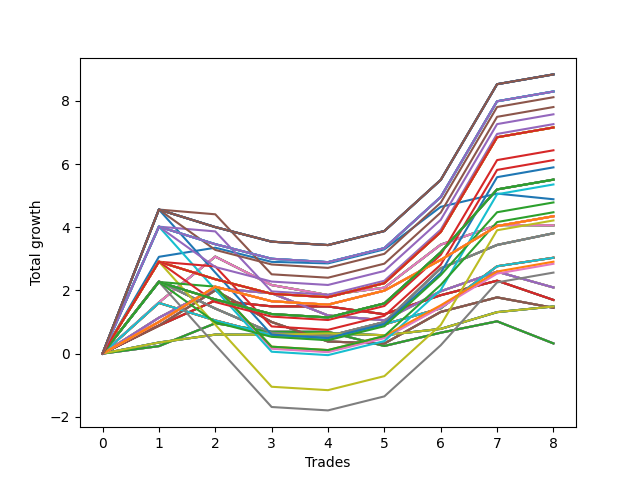

# Long Wallace Doodle 010 
- Symbol: AMZN_Unlimited
- Date Range: 03/23/2022 - 07/08/2022
- Trading Period: 7:20-12:30
- Number of Trades: 8



| Name | Win Percent | Profit | Avg Profit / Trade | Avg Time / Trade |      | Name | Win Percent | Profit | Avg Profit / Trade | Avg Time / Trade |
| ---- | ----------- | ------ | ------------------ | ---------------- | ---- | ---- | ----------- | ------ | ------------------ | ---------------- |
| Sorted By <br> Profit | | | | | | Sorted By <br> Win Percentage ||||
| One Hundred Thirty | 62.50 | 4418.00 | 552.25 | 104:30 |     | One Hundred Twenty-Six | 75.00 | 2173.00 | 271.62 | 52:23 |
| One Hundred Twenty-Five | 62.50 | 4418.00 | 552.25 | 104:30 |     | One Hundred Twenty-One | 75.00 | 2173.00 | 271.62 | 52:23 |
| One Hundred Twenty | 62.50 | 4418.00 | 552.25 | 104:30 |     | One Hundred Sixteen | 75.00 | 2173.00 | 271.62 | 52:23 |
| One Hundred Fifteen | 62.50 | 4418.00 | 552.25 | 104:30 |     | One Hundred Eleven | 75.00 | 2173.00 | 271.62 | 52:23 |
| One Hundred Five | 62.50 | 4418.00 | 552.25 | 104:30 |     | One Hundred Six | 75.00 | 2173.00 | 271.62 | 52:23 |
| Eighty-Five | 62.50 | 4418.00 | 552.25 | 104:30 |     | One Hundred One | 75.00 | 2173.00 | 271.62 | 52:23 |
| One Hundred Twenty-Nine | 62.50 | 4147.50 | 518.44 | 99:38 |     | Eighty-One | 75.00 | 2173.00 | 271.62 | 52:23 |
| One Hundred Twenty-Four | 62.50 | 4147.50 | 518.44 | 99:38 |     | Ninety-Six | 75.00 | 1454.00 | 181.75 | 38:16 |
| One Hundred Ninteen | 62.50 | 4147.50 | 518.44 | 99:38 |     | Ninety-One | 75.00 | 1420.75 | 177.59 | 38:17 |
| One Hundred Fourteen | 62.50 | 4147.50 | 518.44 | 99:38 |     | Seventy | 75.00 | 745.75 | 93.22 | 19:16 |
| One Hundred Four | 62.50 | 4147.50 | 518.44 | 99:38 |     | Sixty-Two | 75.00 | 745.75 | 93.22 | 19:16 |
| Eighty-Four | 62.50 | 4147.50 | 518.44 | 99:38 |     | Fifty-Four | 75.00 | 745.75 | 93.22 | 19:16 |
| One Hundred Ten | 62.50 | 4057.00 | 507.12 | 88:23 |     | Forty-Six | 75.00 | 745.75 | 93.22 | 19:16 |
| One Hundred | 62.50 | 3901.50 | 487.69 | 70:45 |     | Six | 75.00 | 745.75 | 93.22 | 19:16 |
| One Hundred Nine | 62.50 | 3786.50 | 473.31 | 83:32 |     | One Hundred Thirty | 62.50 | 4418.00 | 552.25 | 104:30 |
| Ninety-Nine | 62.50 | 3631.00 | 453.87 | 65:53 |     | One Hundred Twenty-Five | 62.50 | 4418.00 | 552.25 | 104:30 |
| One Hundred Twenty-Eight | 62.50 | 3578.00 | 447.25 | 96:25 |     | One Hundred Twenty | 62.50 | 4418.00 | 552.25 | 104:30 |
| One Hundred Twenty-Three | 62.50 | 3578.00 | 447.25 | 96:25 |     | One Hundred Fifteen | 62.50 | 4418.00 | 552.25 | 104:30 |
| One Hundred Eighteen | 62.50 | 3578.00 | 447.25 | 96:25 |     | One Hundred Five | 62.50 | 4418.00 | 552.25 | 104:30 |
| One Hundred Thirteen | 62.50 | 3578.00 | 447.25 | 96:25 |     | Eighty-Five | 62.50 | 4418.00 | 552.25 | 104:30 |
| One Hundred Three | 62.50 | 3578.00 | 447.25 | 96:25 |     | One Hundred Twenty-Nine | 62.50 | 4147.50 | 518.44 | 99:38 |
| Eighty-Three | 62.50 | 3578.00 | 447.25 | 96:25 |     | One Hundred Twenty-Four | 62.50 | 4147.50 | 518.44 | 99:38 |
| One Hundred Eight | 62.50 | 3217.00 | 402.12 | 80:19 |     | One Hundred Ninteen | 62.50 | 4147.50 | 518.44 | 99:38 |
| Ninety-Eight | 62.50 | 3061.50 | 382.69 | 62:40 |     | One Hundred Fourteen | 62.50 | 4147.50 | 518.44 | 99:38 |
| Ninety-Five | 62.50 | 2946.75 | 368.34 | 76:17 |     | One Hundred Four | 62.50 | 4147.50 | 518.44 | 99:38 |
| One Hundred Twenty-Seven | 62.50 | 2752.75 | 344.09 | 91:26 |     | Eighty-Four | 62.50 | 4147.50 | 518.44 | 99:38 |
| One Hundred Twenty-Two | 62.50 | 2752.75 | 344.09 | 91:26 |     | One Hundred Ten | 62.50 | 4057.00 | 507.12 | 88:23 |
| One Hundred Seventeen | 62.50 | 2752.75 | 344.09 | 91:26 |     | One Hundred | 62.50 | 3901.50 | 487.69 | 70:45 |
| One Hundred Twelve | 62.50 | 2752.75 | 344.09 | 91:26 |     | One Hundred Nine | 62.50 | 3786.50 | 473.31 | 83:32 |
| One Hundred Two | 62.50 | 2752.75 | 344.09 | 91:26 |     | Ninety-Nine | 62.50 | 3631.00 | 453.87 | 65:53 |
| Eighty-Two | 62.50 | 2752.75 | 344.09 | 91:26 |     | One Hundred Twenty-Eight | 62.50 | 3578.00 | 447.25 | 96:25 |
| Ninety-Four | 62.50 | 2676.25 | 334.53 | 71:26 |     | One Hundred Twenty-Three | 62.50 | 3578.00 | 447.25 | 96:25 |
| Seventy-Three | 62.50 | 2442.00 | 305.25 | 17:34 |     | One Hundred Eighteen | 62.50 | 3578.00 | 447.25 | 96:25 |
| One Hundred Seven | 62.50 | 2391.75 | 298.97 | 75:20 |     | One Hundred Thirteen | 62.50 | 3578.00 | 447.25 | 96:25 |
| Ninety-Seven | 62.50 | 2236.25 | 279.53 | 57:41 |     | One Hundred Three | 62.50 | 3578.00 | 447.25 | 96:25 |
| One Hundred Twenty-Six | 75.00 | 2173.00 | 271.62 | 52:23 |     | Eighty-Three | 62.50 | 3578.00 | 447.25 | 96:25 |
| One Hundred Twenty-One | 75.00 | 2173.00 | 271.62 | 52:23 |     | One Hundred Eight | 62.50 | 3217.00 | 402.12 | 80:19 |
| One Hundred Sixteen | 75.00 | 2173.00 | 271.62 | 52:23 |     | Ninety-Eight | 62.50 | 3061.50 | 382.69 | 62:40 |
| One Hundred Eleven | 75.00 | 2173.00 | 271.62 | 52:23 |     | Ninety-Five | 62.50 | 2946.75 | 368.34 | 76:17 |
| One Hundred Six | 75.00 | 2173.00 | 271.62 | 52:23 |     | One Hundred Twenty-Seven | 62.50 | 2752.75 | 344.09 | 91:26 |
| One Hundred One | 75.00 | 2173.00 | 271.62 | 52:23 |     | One Hundred Twenty-Two | 62.50 | 2752.75 | 344.09 | 91:26 |
| Eighty-One | 75.00 | 2173.00 | 271.62 | 52:23 |     | One Hundred Seventeen | 62.50 | 2752.75 | 344.09 | 91:26 |
| Ninety-Three | 62.50 | 2106.75 | 263.34 | 68:13 |     | One Hundred Twelve | 62.50 | 2752.75 | 344.09 | 91:26 |
| Sixty-Eight | 62.50 | 2028.75 | 253.59 | 36:35 |     | One Hundred Two | 62.50 | 2752.75 | 344.09 | 91:26 |
| Sixty | 62.50 | 2028.75 | 253.59 | 36:35 |     | Eighty-Two | 62.50 | 2752.75 | 344.09 | 91:26 |
| Fifty-Two | 62.50 | 2028.75 | 253.59 | 36:35 |     | Ninety-Four | 62.50 | 2676.25 | 334.53 | 71:26 |
| Forty-Four | 62.50 | 2028.75 | 253.59 | 36:35 |     | Seventy-Three | 62.50 | 2442.00 | 305.25 | 17:34 |
| Four | 62.50 | 2028.75 | 253.59 | 36:35 |     | One Hundred Seven | 62.50 | 2391.75 | 298.97 | 75:20 |
| Sixty-Nine | 62.50 | 1904.00 | 238.00 | 56:43 |     | Ninety-Seven | 62.50 | 2236.25 | 279.53 | 57:41 |
| Sixty-One | 62.50 | 1904.00 | 238.00 | 56:43 |     | Ninety-Three | 62.50 | 2106.75 | 263.34 | 68:13 |
| Fifty-Three | 62.50 | 1904.00 | 238.00 | 56:43 |     | Sixty-Eight | 62.50 | 2028.75 | 253.59 | 36:35 |
| Forty-Five | 62.50 | 1904.00 | 238.00 | 56:43 |     | Sixty | 62.50 | 2028.75 | 253.59 | 36:35 |
| Five | 62.50 | 1904.00 | 238.00 | 56:43 |     | Fifty-Two | 62.50 | 2028.75 | 253.59 | 36:35 |
| Seventy-One | 62.50 | 1516.75 | 189.59 | 79:20 |     | Forty-Four | 62.50 | 2028.75 | 253.59 | 36:35 |
| Sixty-Three | 62.50 | 1516.75 | 189.59 | 79:20 |     | Four | 62.50 | 2028.75 | 253.59 | 36:35 |
| Fifty-Five | 62.50 | 1516.75 | 189.59 | 79:20 |     | Sixty-Nine | 62.50 | 1904.00 | 238.00 | 56:43 |
| Forty-Seven | 62.50 | 1516.75 | 189.59 | 79:20 |     | Sixty-One | 62.50 | 1904.00 | 238.00 | 56:43 |
| Seven | 62.50 | 1516.75 | 189.59 | 79:20 |     | Fifty-Three | 62.50 | 1904.00 | 238.00 | 56:43 |
| Ninety-Six | 75.00 | 1454.00 | 181.75 | 38:16 |     | Forty-Five | 62.50 | 1904.00 | 238.00 | 56:43 |
| Ninety-One | 75.00 | 1420.75 | 177.59 | 38:17 |     | Five | 62.50 | 1904.00 | 238.00 | 56:43 |
| Ninety-Two | 62.50 | 1281.50 | 160.19 | 63:14 |     | Seventy-One | 62.50 | 1516.75 | 189.59 | 79:20 |
| Sixty-Six | 50.00 | 1046.00 | 130.75 | 25:08 |     | Sixty-Three | 62.50 | 1516.75 | 189.59 | 79:20 |
| Fifty-Eight | 50.00 | 1046.00 | 130.75 | 25:08 |     | Fifty-Five | 62.50 | 1516.75 | 189.59 | 79:20 |
| Fifty | 50.00 | 1046.00 | 130.75 | 25:08 |     | Forty-Seven | 62.50 | 1516.75 | 189.59 | 79:20 |
| Forty-Two | 50.00 | 1046.00 | 130.75 | 25:08 |     | Seven | 62.50 | 1516.75 | 189.59 | 79:20 |
| Two | 50.00 | 1046.00 | 130.75 | 25:08 |     | Ninety-Two | 62.50 | 1281.50 | 160.19 | 63:14 |
| Sixty-Five | 50.00 | 848.75 | 106.09 | 18:48 |     | Sixty-Six | 50.00 | 1046.00 | 130.75 | 25:08 |
| Fifty-Seven | 50.00 | 848.75 | 106.09 | 18:48 |     | Fifty-Eight | 50.00 | 1046.00 | 130.75 | 25:08 |
| Forty-Nine | 50.00 | 848.75 | 106.09 | 18:48 |     | Fifty | 50.00 | 1046.00 | 130.75 | 25:08 |
| Forty-One | 50.00 | 848.75 | 106.09 | 18:48 |     | Forty-Two | 50.00 | 1046.00 | 130.75 | 25:08 |
| One | 50.00 | 848.75 | 106.09 | 18:48 |     | Two | 50.00 | 1046.00 | 130.75 | 25:08 |
| Seventy | 75.00 | 745.75 | 93.22 | 19:16 |     | Sixty-Five | 50.00 | 848.75 | 106.09 | 18:48 |
| Sixty-Two | 75.00 | 745.75 | 93.22 | 19:16 |     | Fifty-Seven | 50.00 | 848.75 | 106.09 | 18:48 |
| Fifty-Four | 75.00 | 745.75 | 93.22 | 19:16 |     | Forty-Nine | 50.00 | 848.75 | 106.09 | 18:48 |
| Forty-Six | 75.00 | 745.75 | 93.22 | 19:16 |     | Forty-One | 50.00 | 848.75 | 106.09 | 18:48 |
| Six | 75.00 | 745.75 | 93.22 | 19:16 |     | One | 50.00 | 848.75 | 106.09 | 18:48 |
| Sixty-Seven | 50.00 | 724.25 | 90.53 | 29:21 |     | Sixty-Seven | 50.00 | 724.25 | 90.53 | 29:21 |
| Fifty-Nine | 50.00 | 724.25 | 90.53 | 29:21 |     | Fifty-Nine | 50.00 | 724.25 | 90.53 | 29:21 |
| Fifty-One | 50.00 | 724.25 | 90.53 | 29:21 |     | Fifty-One | 50.00 | 724.25 | 90.53 | 29:21 |
| Forty-Three | 50.00 | 724.25 | 90.53 | 29:21 |     | Forty-Three | 50.00 | 724.25 | 90.53 | 29:21 |
| Three | 50.00 | 724.25 | 90.53 | 29:21 |     | Three | 50.00 | 724.25 | 90.53 | 29:21 |
| Sixty-Four | 50.00 | 160.50 | 20.06 | 12:35 |     | Sixty-Four | 50.00 | 160.50 | 20.06 | 12:35 |
| Fifty-Six | 50.00 | 160.50 | 20.06 | 12:35 |     | Fifty-Six | 50.00 | 160.50 | 20.06 | 12:35 |
| Forty-Eight | 50.00 | 160.50 | 20.06 | 12:35 |     | Forty-Eight | 50.00 | 160.50 | 20.06 | 12:35 |
| Forty | 50.00 | 160.50 | 20.06 | 12:35 |     | Forty | 50.00 | 160.50 | 20.06 | 12:35 |
| Zero | 50.00 | 160.50 | 20.06 | 12:35 |     | Zero | 50.00 | 160.50 | 20.06 | 12:35 |

## NO STOPLOSS

### Test Zero
* Sell when price hits the middle line of the 20p bollinger
* No Stoploss
* Results:
```
Total Trades: 8
Percent Up: 50.00
Percent Down: 50.00
Total Points Moved Up: 0.32
Potential Profit: 160.50
Total Points Ups: 1.74 Count Ups: 4
Total Points Downs: -1.42 Count Downs: 4
```

<details><summary>Trades</summary>

<code>In: 2022-05-04 11:36:00		Out: 2022-05-04 11:41:15		Total Position Time: 05:15		Total Move Up: 0.24		Total to Date: 0.24</code> <br />
<code>In: 2022-05-12 09:04:00		Out: 2022-05-12 09:09:30		Total Position Time: 05:30		Total Move Up: 0.72		Total to Date: 0.96</code> <br />
<code>In: 2022-05-12 10:08:00		Out: 2022-05-12 10:26:15		Total Position Time: 18:15		Total Move Up: -0.27		Total to Date: 0.69</code> <br />
<code>In: 2022-05-26 11:38:00		Out: 2022-05-26 11:49:40		Total Position Time: 11:40		Total Move Up: -0.00		Total to Date: 0.69</code> <br />
<code>In: 2022-05-26 12:08:00		Out: 2022-05-26 12:24:50		Total Position Time: 16:50		Total Move Up: -0.45		Total to Date: 0.24</code> <br />
<code>In: 2022-05-31 11:57:00		Out: 2022-05-31 12:01:30		Total Position Time: 04:30		Total Move Up: 0.42		Total to Date: 0.66</code> <br />
<code>In: 2022-06-23 10:03:00		Out: 2022-06-23 10:06:00		Total Position Time: 03:00		Total Move Up: 0.36		Total to Date: 1.02</code> <br />
<code>In: 2022-06-30 11:46:00		Out: 2022-06-30 12:21:45		Total Position Time: 35:45		Total Move Up: -0.70		Total to Date: 0.32</code> <br />


</details>

### Test One
* Sell when the price hits the upper line of the 20p 1std bollinger
* No Stoploss
* Results:
```
Total Trades: 8
Percent Up: 50.00
Percent Down: 50.00
Total Points Moved Up: 1.70
Potential Profit: 848.75
Total Points Ups: 2.74 Count Ups: 4
Total Points Downs: -1.05 Count Downs: 4
```

<details><summary>Trades</summary>

<code>In: 2022-05-04 11:36:00		Out: 2022-05-04 11:43:40		Total Position Time: 07:40		Total Move Up: 0.88		Total to Date: 0.88</code> <br />
<code>In: 2022-05-12 09:04:00		Out: 2022-05-12 09:21:20		Total Position Time: 17:20		Total Move Up: 0.80		Total to Date: 1.68</code> <br />
<code>In: 2022-05-12 10:08:00		Out: 2022-05-12 10:30:55		Total Position Time: 22:55		Total Move Up: -0.19		Total to Date: 1.49</code> <br />
<code>In: 2022-05-26 11:38:00		Out: 2022-05-26 11:57:45		Total Position Time: 19:45		Total Move Up: -0.00		Total to Date: 1.49</code> <br />
<code>In: 2022-05-26 12:08:00		Out: 2022-05-26 12:29:20		Total Position Time: 21:20		Total Move Up: -0.25		Total to Date: 1.24</code> <br />
<code>In: 2022-05-31 11:57:00		Out: 2022-05-31 12:05:05		Total Position Time: 08:05		Total Move Up: 0.60		Total to Date: 1.85</code> <br />
<code>In: 2022-06-23 10:03:00		Out: 2022-06-23 10:17:10		Total Position Time: 14:10		Total Move Up: 0.46		Total to Date: 2.31</code> <br />
<code>In: 2022-06-30 11:46:00		Out: 2022-06-30 12:25:10		Total Position Time: 39:10		Total Move Up: -0.61		Total to Date: 1.70</code> <br />


</details>

### Test Two
* Sell when the price hits the upper line of the 20p 2std bollinger
* No Stoploss
* Results:
```
Total Trades: 8
Percent Up: 50.00
Percent Down: 50.00
Total Points Moved Up: 2.09
Potential Profit: 1046.00
Total Points Ups: 3.60 Count Ups: 4
Total Points Downs: -1.51 Count Downs: 4
```

<details><summary>Trades</summary>

<code>In: 2022-05-04 11:36:00		Out: 2022-05-04 11:44:25		Total Position Time: 08:25		Total Move Up: 1.14		Total to Date: 1.14</code> <br />
<code>In: 2022-05-12 09:04:00		Out: 2022-05-12 09:24:50		Total Position Time: 20:50		Total Move Up: 0.93		Total to Date: 2.07</code> <br />
<code>In: 2022-05-12 10:08:00		Out: 2022-05-12 10:31:05		Total Position Time: 23:05		Total Move Up: -0.16		Total to Date: 1.91</code> <br />
<code>In: 2022-05-26 11:38:00		Out: 2022-05-26 12:31:55		Total Position Time: 53:55		Total Move Up: -0.70		Total to Date: 1.21</code> <br />
<code>In: 2022-05-26 12:08:00		Out: 2022-05-26 12:31:55		Total Position Time: 23:55		Total Move Up: -0.15		Total to Date: 1.05</code> <br />
<code>In: 2022-05-31 11:57:00		Out: 2022-05-31 12:07:25		Total Position Time: 10:25		Total Move Up: 0.92		Total to Date: 1.97</code> <br />
<code>In: 2022-06-23 10:03:00		Out: 2022-06-23 10:23:25		Total Position Time: 20:25		Total Move Up: 0.62		Total to Date: 2.59</code> <br />
<code>In: 2022-06-30 11:46:00		Out: 2022-06-30 12:26:05		Total Position Time: 40:05		Total Move Up: -0.50		Total to Date: 2.09</code> <br />


</details>

### Test Three
* Sell when price hits the middle line of the 50p bollinger
* No Stoploss
* Results:
```
Total Trades: 8
Percent Up: 50.00
Percent Down: 50.00
Total Points Moved Up: 1.45
Potential Profit: 724.25
Total Points Ups: 3.46 Count Ups: 4
Total Points Downs: -2.01 Count Downs: 4
```

<details><summary>Trades</summary>

<code>In: 2022-05-04 11:36:00		Out: 2022-05-04 11:43:40		Total Position Time: 07:40		Total Move Up: 0.88		Total to Date: 0.88</code> <br />
<code>In: 2022-05-12 09:04:00		Out: 2022-05-12 09:25:30		Total Position Time: 21:30		Total Move Up: 1.12		Total to Date: 2.00</code> <br />
<code>In: 2022-05-12 10:08:00		Out: 2022-05-12 11:03:50		Total Position Time: 55:50		Total Move Up: -1.00		Total to Date: 1.00</code> <br />
<code>In: 2022-05-26 11:38:00		Out: 2022-05-26 12:34:30		Total Position Time: 56:30		Total Move Up: -0.62		Total to Date: 0.38</code> <br />
<code>In: 2022-05-26 12:08:00		Out: 2022-05-26 12:34:30		Total Position Time: 26:30		Total Move Up: -0.07		Total to Date: 0.32</code> <br />
<code>In: 2022-05-31 11:57:00		Out: 2022-05-31 12:07:50		Total Position Time: 10:50		Total Move Up: 1.00		Total to Date: 1.32</code> <br />
<code>In: 2022-06-23 10:03:00		Out: 2022-06-23 10:17:10		Total Position Time: 14:10		Total Move Up: 0.46		Total to Date: 1.78</code> <br />
<code>In: 2022-06-30 11:46:00		Out: 2022-06-30 12:27:50		Total Position Time: 41:50		Total Move Up: -0.33		Total to Date: 1.45</code> <br />


</details>

### Test Four
* Sell when the price hits the upper line of the 50p 1std bollinger
* No Stoploss
* Results:
```
Total Trades: 8
Percent Up: 62.50
Percent Down: 37.50
Total Points Moved Up: 4.06
Potential Profit: 2028.75
Total Points Ups: 5.29 Count Ups: 5
Total Points Downs: -1.23 Count Downs: 3
```

<details><summary>Trades</summary>

<code>In: 2022-05-04 11:36:00		Out: 2022-05-04 11:45:30		Total Position Time: 09:30		Total Move Up: 1.62		Total to Date: 1.62</code> <br />
<code>In: 2022-05-12 09:04:00		Out: 2022-05-12 09:32:05		Total Position Time: 28:05		Total Move Up: 1.45		Total to Date: 3.07</code> <br />
<code>In: 2022-05-12 10:08:00		Out: 2022-05-12 11:21:10		Total Position Time: 73:10		Total Move Up: -0.90		Total to Date: 2.17</code> <br />
<code>In: 2022-05-26 11:38:00		Out: 2022-05-26 12:42:05		Total Position Time: 64:05		Total Move Up: -0.32		Total to Date: 1.85</code> <br />
<code>In: 2022-05-26 12:08:00		Out: 2022-05-26 12:42:05		Total Position Time: 34:05		Total Move Up: 0.23		Total to Date: 2.09</code> <br />
<code>In: 2022-05-31 11:57:00		Out: 2022-05-31 12:16:05		Total Position Time: 19:05		Total Move Up: 1.36		Total to Date: 3.45</code> <br />
<code>In: 2022-06-23 10:03:00		Out: 2022-06-23 10:23:25		Total Position Time: 20:25		Total Move Up: 0.62		Total to Date: 4.07</code> <br />
<code>In: 2022-06-30 11:46:00		Out: 2022-06-30 12:30:15		Total Position Time: 44:15		Total Move Up: -0.01		Total to Date: 4.06</code> <br />


</details>

### Test Five
* Sell when the price hits the upper line of the 50p 2std bollinger
* No Stoploss
* Results:
```
Total Trades: 8
Percent Up: 62.50
Percent Down: 37.50
Total Points Moved Up: 3.81
Potential Profit: 1904.00
Total Points Ups: 5.54 Count Ups: 5
Total Points Downs: -1.73 Count Downs: 3
```

<details><summary>Trades</summary>

<code>In: 2022-05-04 11:36:00		Out: 2022-05-04 11:46:55		Total Position Time: 10:55		Total Move Up: 2.28		Total to Date: 2.28</code> <br />
<code>In: 2022-05-12 09:04:00		Out: 2022-05-12 11:27:35		Total Position Time: 143:35		Total Move Up: -0.86		Total to Date: 1.43</code> <br />
<code>In: 2022-05-12 10:08:00		Out: 2022-05-12 11:27:35		Total Position Time: 79:35		Total Move Up: -0.77		Total to Date: 0.66</code> <br />
<code>In: 2022-05-26 11:38:00		Out: 2022-05-26 12:47:00		Total Position Time: 69:00		Total Move Up: -0.11		Total to Date: 0.55</code> <br />
<code>In: 2022-05-26 12:08:00		Out: 2022-05-26 12:47:00		Total Position Time: 39:00		Total Move Up: 0.44		Total to Date: 1.00</code> <br />
<code>In: 2022-05-31 11:57:00		Out: 2022-05-31 12:32:55		Total Position Time: 35:55		Total Move Up: 1.70		Total to Date: 2.70</code> <br />
<code>In: 2022-06-23 10:03:00		Out: 2022-06-23 10:33:10		Total Position Time: 30:10		Total Move Up: 0.74		Total to Date: 3.44</code> <br />
<code>In: 2022-06-30 11:46:00		Out: 2022-06-30 12:31:40		Total Position Time: 45:40		Total Move Up: 0.37		Total to Date: 3.81</code> <br />


</details>

### Test Six
* Sell when the price hits the middle line of the 1std VWAP
* No Stoploss
* Results:
```
Total Trades: 8
Percent Up: 75.00
Percent Down: 25.00
Total Points Moved Up: 1.49
Potential Profit: 745.75
Total Points Ups: 1.55 Count Ups: 6
Total Points Downs: -0.06 Count Downs: 2
```

<details><summary>Trades</summary>

<code>In: 2022-05-04 11:36:00		Out: 2022-05-04 11:42:15		Total Position Time: 06:15		Total Move Up: 0.35		Total to Date: 0.35</code> <br />
<code>In: 2022-05-12 09:04:00		Out: 2022-05-12 09:05:10		Total Position Time: 01:10		Total Move Up: 0.25		Total to Date: 0.60</code> <br />
<code>In: 2022-05-12 10:08:00		Out: 2022-05-12 12:26:25		Total Position Time: 138:25		Total Move Up: -0.01		Total to Date: 0.59</code> <br />
<code>In: 2022-05-26 11:38:00		Out: 2022-05-26 11:39:10		Total Position Time: 01:10		Total Move Up: 0.04		Total to Date: 0.64</code> <br />
<code>In: 2022-05-26 12:08:00		Out: 2022-05-26 12:09:10		Total Position Time: 01:10		Total Move Up: -0.06		Total to Date: 0.58</code> <br />
<code>In: 2022-05-31 11:57:00		Out: 2022-05-31 11:58:10		Total Position Time: 01:10		Total Move Up: 0.20		Total to Date: 0.78</code> <br />
<code>In: 2022-06-23 10:03:00		Out: 2022-06-23 10:06:40		Total Position Time: 03:40		Total Move Up: 0.53		Total to Date: 1.31</code> <br />
<code>In: 2022-06-30 11:46:00		Out: 2022-06-30 11:47:10		Total Position Time: 01:10		Total Move Up: 0.18		Total to Date: 1.49</code> <br />


</details>

### Test Seven
* Sell when the price hits the upper line of the 1std VWAP
* No Stoploss
* Results:
```
Total Trades: 8
Percent Up: 62.50
Percent Down: 37.50
Total Points Moved Up: 3.03
Potential Profit: 1516.75
Total Points Ups: 4.16 Count Ups: 5
Total Points Downs: -1.12 Count Downs: 3
```

<details><summary>Trades</summary>

<code>In: 2022-05-04 11:36:00		Out: 2022-05-04 11:45:40		Total Position Time: 09:40		Total Move Up: 1.60		Total to Date: 1.60</code> <br />
<code>In: 2022-05-12 09:04:00		Out: 2022-05-12 12:47:00		Total Position Time: 223:00		Total Move Up: -0.56		Total to Date: 1.05</code> <br />
<code>In: 2022-05-12 10:08:00		Out: 2022-05-12 12:47:00		Total Position Time: 159:00		Total Move Up: -0.46		Total to Date: 0.59</code> <br />
<code>In: 2022-05-26 11:38:00		Out: 2022-05-26 12:47:00		Total Position Time: 69:00		Total Move Up: -0.11		Total to Date: 0.48</code> <br />
<code>In: 2022-05-26 12:08:00		Out: 2022-05-26 12:47:00		Total Position Time: 39:00		Total Move Up: 0.44		Total to Date: 0.92</code> <br />
<code>In: 2022-05-31 11:57:00		Out: 2022-05-31 12:01:40		Total Position Time: 04:40		Total Move Up: 0.51		Total to Date: 1.43</code> <br />
<code>In: 2022-06-23 10:03:00		Out: 2022-06-23 11:28:00		Total Position Time: 85:00		Total Move Up: 1.33		Total to Date: 2.76</code> <br />
<code>In: 2022-06-30 11:46:00		Out: 2022-06-30 12:31:25		Total Position Time: 45:25		Total Move Up: 0.27		Total to Date: 3.03</code> <br />


</details>

## STOPLOSS OF 5

### Test Forty
* Sell when price hits the middle line of the 20p bollinger
* Stoploss is 5 points
* Results:
```
Total Trades: 8
Percent Up: 50.00
Percent Down: 50.00
Total Points Moved Up: 0.32
Potential Profit: 160.50
Total Points Ups: 1.74 Count Ups: 4
Total Points Downs: -1.42 Count Downs: 4
```

<details><summary>Trades</summary>

<code>In: 2022-05-04 11:36:00		Out: 2022-05-04 11:41:15		Total Position Time: 05:15		Total Move Up: 0.24		Total to Date: 0.24</code> <br />
<code>In: 2022-05-12 09:04:00		Out: 2022-05-12 09:09:30		Total Position Time: 05:30		Total Move Up: 0.72		Total to Date: 0.96</code> <br />
<code>In: 2022-05-12 10:08:00		Out: 2022-05-12 10:26:15		Total Position Time: 18:15		Total Move Up: -0.27		Total to Date: 0.69</code> <br />
<code>In: 2022-05-26 11:38:00		Out: 2022-05-26 11:49:40		Total Position Time: 11:40		Total Move Up: -0.00		Total to Date: 0.69</code> <br />
<code>In: 2022-05-26 12:08:00		Out: 2022-05-26 12:24:50		Total Position Time: 16:50		Total Move Up: -0.45		Total to Date: 0.24</code> <br />
<code>In: 2022-05-31 11:57:00		Out: 2022-05-31 12:01:30		Total Position Time: 04:30		Total Move Up: 0.42		Total to Date: 0.66</code> <br />
<code>In: 2022-06-23 10:03:00		Out: 2022-06-23 10:06:00		Total Position Time: 03:00		Total Move Up: 0.36		Total to Date: 1.02</code> <br />
<code>In: 2022-06-30 11:46:00		Out: 2022-06-30 12:21:45		Total Position Time: 35:45		Total Move Up: -0.70		Total to Date: 0.32</code> <br />


</details>

### Test Forty-One
* Sell when the price hits the upper line of the 20p 1std bollinger
* Stoploss is 5 points
* Results:
```
Total Trades: 8
Percent Up: 50.00
Percent Down: 50.00
Total Points Moved Up: 1.70
Potential Profit: 848.75
Total Points Ups: 2.74 Count Ups: 4
Total Points Downs: -1.05 Count Downs: 4
```

<details><summary>Trades</summary>

<code>In: 2022-05-04 11:36:00		Out: 2022-05-04 11:43:40		Total Position Time: 07:40		Total Move Up: 0.88		Total to Date: 0.88</code> <br />
<code>In: 2022-05-12 09:04:00		Out: 2022-05-12 09:21:20		Total Position Time: 17:20		Total Move Up: 0.80		Total to Date: 1.68</code> <br />
<code>In: 2022-05-12 10:08:00		Out: 2022-05-12 10:30:55		Total Position Time: 22:55		Total Move Up: -0.19		Total to Date: 1.49</code> <br />
<code>In: 2022-05-26 11:38:00		Out: 2022-05-26 11:57:45		Total Position Time: 19:45		Total Move Up: -0.00		Total to Date: 1.49</code> <br />
<code>In: 2022-05-26 12:08:00		Out: 2022-05-26 12:29:20		Total Position Time: 21:20		Total Move Up: -0.25		Total to Date: 1.24</code> <br />
<code>In: 2022-05-31 11:57:00		Out: 2022-05-31 12:05:05		Total Position Time: 08:05		Total Move Up: 0.60		Total to Date: 1.85</code> <br />
<code>In: 2022-06-23 10:03:00		Out: 2022-06-23 10:17:10		Total Position Time: 14:10		Total Move Up: 0.46		Total to Date: 2.31</code> <br />
<code>In: 2022-06-30 11:46:00		Out: 2022-06-30 12:25:10		Total Position Time: 39:10		Total Move Up: -0.61		Total to Date: 1.70</code> <br />


</details>

### Test Forty-Two
* Sell when the price hits the upper line of the 20p 2std bollinger
* Stoploss is 5 points
* Results:
```
Total Trades: 8
Percent Up: 50.00
Percent Down: 50.00
Total Points Moved Up: 2.09
Potential Profit: 1046.00
Total Points Ups: 3.60 Count Ups: 4
Total Points Downs: -1.51 Count Downs: 4
```

<details><summary>Trades</summary>

<code>In: 2022-05-04 11:36:00		Out: 2022-05-04 11:44:25		Total Position Time: 08:25		Total Move Up: 1.14		Total to Date: 1.14</code> <br />
<code>In: 2022-05-12 09:04:00		Out: 2022-05-12 09:24:50		Total Position Time: 20:50		Total Move Up: 0.93		Total to Date: 2.07</code> <br />
<code>In: 2022-05-12 10:08:00		Out: 2022-05-12 10:31:05		Total Position Time: 23:05		Total Move Up: -0.16		Total to Date: 1.91</code> <br />
<code>In: 2022-05-26 11:38:00		Out: 2022-05-26 12:31:55		Total Position Time: 53:55		Total Move Up: -0.70		Total to Date: 1.21</code> <br />
<code>In: 2022-05-26 12:08:00		Out: 2022-05-26 12:31:55		Total Position Time: 23:55		Total Move Up: -0.15		Total to Date: 1.05</code> <br />
<code>In: 2022-05-31 11:57:00		Out: 2022-05-31 12:07:25		Total Position Time: 10:25		Total Move Up: 0.92		Total to Date: 1.97</code> <br />
<code>In: 2022-06-23 10:03:00		Out: 2022-06-23 10:23:25		Total Position Time: 20:25		Total Move Up: 0.62		Total to Date: 2.59</code> <br />
<code>In: 2022-06-30 11:46:00		Out: 2022-06-30 12:26:05		Total Position Time: 40:05		Total Move Up: -0.50		Total to Date: 2.09</code> <br />


</details>

### Test Forty-Three
* Sell when price hits the middle line of the 50p bollinger
* Stoploss is 5 points
* Results:
```
Total Trades: 8
Percent Up: 50.00
Percent Down: 50.00
Total Points Moved Up: 1.45
Potential Profit: 724.25
Total Points Ups: 3.46 Count Ups: 4
Total Points Downs: -2.01 Count Downs: 4
```

<details><summary>Trades</summary>

<code>In: 2022-05-04 11:36:00		Out: 2022-05-04 11:43:40		Total Position Time: 07:40		Total Move Up: 0.88		Total to Date: 0.88</code> <br />
<code>In: 2022-05-12 09:04:00		Out: 2022-05-12 09:25:30		Total Position Time: 21:30		Total Move Up: 1.12		Total to Date: 2.00</code> <br />
<code>In: 2022-05-12 10:08:00		Out: 2022-05-12 11:03:50		Total Position Time: 55:50		Total Move Up: -1.00		Total to Date: 1.00</code> <br />
<code>In: 2022-05-26 11:38:00		Out: 2022-05-26 12:34:30		Total Position Time: 56:30		Total Move Up: -0.62		Total to Date: 0.38</code> <br />
<code>In: 2022-05-26 12:08:00		Out: 2022-05-26 12:34:30		Total Position Time: 26:30		Total Move Up: -0.07		Total to Date: 0.32</code> <br />
<code>In: 2022-05-31 11:57:00		Out: 2022-05-31 12:07:50		Total Position Time: 10:50		Total Move Up: 1.00		Total to Date: 1.32</code> <br />
<code>In: 2022-06-23 10:03:00		Out: 2022-06-23 10:17:10		Total Position Time: 14:10		Total Move Up: 0.46		Total to Date: 1.78</code> <br />
<code>In: 2022-06-30 11:46:00		Out: 2022-06-30 12:27:50		Total Position Time: 41:50		Total Move Up: -0.33		Total to Date: 1.45</code> <br />


</details>

### Test Forty-Four
* Sell when the price hits the upper line of the 50p 1std bollinger
* Stoploss is 5 points
* Results:
```
Total Trades: 8
Percent Up: 62.50
Percent Down: 37.50
Total Points Moved Up: 4.06
Potential Profit: 2028.75
Total Points Ups: 5.29 Count Ups: 5
Total Points Downs: -1.23 Count Downs: 3
```

<details><summary>Trades</summary>

<code>In: 2022-05-04 11:36:00		Out: 2022-05-04 11:45:30		Total Position Time: 09:30		Total Move Up: 1.62		Total to Date: 1.62</code> <br />
<code>In: 2022-05-12 09:04:00		Out: 2022-05-12 09:32:05		Total Position Time: 28:05		Total Move Up: 1.45		Total to Date: 3.07</code> <br />
<code>In: 2022-05-12 10:08:00		Out: 2022-05-12 11:21:10		Total Position Time: 73:10		Total Move Up: -0.90		Total to Date: 2.17</code> <br />
<code>In: 2022-05-26 11:38:00		Out: 2022-05-26 12:42:05		Total Position Time: 64:05		Total Move Up: -0.32		Total to Date: 1.85</code> <br />
<code>In: 2022-05-26 12:08:00		Out: 2022-05-26 12:42:05		Total Position Time: 34:05		Total Move Up: 0.23		Total to Date: 2.09</code> <br />
<code>In: 2022-05-31 11:57:00		Out: 2022-05-31 12:16:05		Total Position Time: 19:05		Total Move Up: 1.36		Total to Date: 3.45</code> <br />
<code>In: 2022-06-23 10:03:00		Out: 2022-06-23 10:23:25		Total Position Time: 20:25		Total Move Up: 0.62		Total to Date: 4.07</code> <br />
<code>In: 2022-06-30 11:46:00		Out: 2022-06-30 12:30:15		Total Position Time: 44:15		Total Move Up: -0.01		Total to Date: 4.06</code> <br />


</details>

### Test Forty-Five
* Sell when the price hits the upper line of the 50p 2std bollinger
* Stoploss is 5 points
* Results:
```
Total Trades: 8
Percent Up: 62.50
Percent Down: 37.50
Total Points Moved Up: 3.81
Potential Profit: 1904.00
Total Points Ups: 5.54 Count Ups: 5
Total Points Downs: -1.73 Count Downs: 3
```

<details><summary>Trades</summary>

<code>In: 2022-05-04 11:36:00		Out: 2022-05-04 11:46:55		Total Position Time: 10:55		Total Move Up: 2.28		Total to Date: 2.28</code> <br />
<code>In: 2022-05-12 09:04:00		Out: 2022-05-12 11:27:35		Total Position Time: 143:35		Total Move Up: -0.86		Total to Date: 1.43</code> <br />
<code>In: 2022-05-12 10:08:00		Out: 2022-05-12 11:27:35		Total Position Time: 79:35		Total Move Up: -0.77		Total to Date: 0.66</code> <br />
<code>In: 2022-05-26 11:38:00		Out: 2022-05-26 12:47:00		Total Position Time: 69:00		Total Move Up: -0.11		Total to Date: 0.55</code> <br />
<code>In: 2022-05-26 12:08:00		Out: 2022-05-26 12:47:00		Total Position Time: 39:00		Total Move Up: 0.44		Total to Date: 1.00</code> <br />
<code>In: 2022-05-31 11:57:00		Out: 2022-05-31 12:32:55		Total Position Time: 35:55		Total Move Up: 1.70		Total to Date: 2.70</code> <br />
<code>In: 2022-06-23 10:03:00		Out: 2022-06-23 10:33:10		Total Position Time: 30:10		Total Move Up: 0.74		Total to Date: 3.44</code> <br />
<code>In: 2022-06-30 11:46:00		Out: 2022-06-30 12:31:40		Total Position Time: 45:40		Total Move Up: 0.37		Total to Date: 3.81</code> <br />


</details>

### Test Forty-Six
* Sell when the price hits the middle line of the 1std VWAP
* Stoploss is 5 points
* Results:
```
Total Trades: 8
Percent Up: 75.00
Percent Down: 25.00
Total Points Moved Up: 1.49
Potential Profit: 745.75
Total Points Ups: 1.55 Count Ups: 6
Total Points Downs: -0.06 Count Downs: 2
```

<details><summary>Trades</summary>

<code>In: 2022-05-04 11:36:00		Out: 2022-05-04 11:42:15		Total Position Time: 06:15		Total Move Up: 0.35		Total to Date: 0.35</code> <br />
<code>In: 2022-05-12 09:04:00		Out: 2022-05-12 09:05:10		Total Position Time: 01:10		Total Move Up: 0.25		Total to Date: 0.60</code> <br />
<code>In: 2022-05-12 10:08:00		Out: 2022-05-12 12:26:25		Total Position Time: 138:25		Total Move Up: -0.01		Total to Date: 0.59</code> <br />
<code>In: 2022-05-26 11:38:00		Out: 2022-05-26 11:39:10		Total Position Time: 01:10		Total Move Up: 0.04		Total to Date: 0.64</code> <br />
<code>In: 2022-05-26 12:08:00		Out: 2022-05-26 12:09:10		Total Position Time: 01:10		Total Move Up: -0.06		Total to Date: 0.58</code> <br />
<code>In: 2022-05-31 11:57:00		Out: 2022-05-31 11:58:10		Total Position Time: 01:10		Total Move Up: 0.20		Total to Date: 0.78</code> <br />
<code>In: 2022-06-23 10:03:00		Out: 2022-06-23 10:06:40		Total Position Time: 03:40		Total Move Up: 0.53		Total to Date: 1.31</code> <br />
<code>In: 2022-06-30 11:46:00		Out: 2022-06-30 11:47:10		Total Position Time: 01:10		Total Move Up: 0.18		Total to Date: 1.49</code> <br />


</details>

### Test Forty-Seven
* Sell when the price hits the upper line of the 1std VWAP
* Stoploss is 5 points
* Results:
```
Total Trades: 8
Percent Up: 62.50
Percent Down: 37.50
Total Points Moved Up: 3.03
Potential Profit: 1516.75
Total Points Ups: 4.16 Count Ups: 5
Total Points Downs: -1.12 Count Downs: 3
```

<details><summary>Trades</summary>

<code>In: 2022-05-04 11:36:00		Out: 2022-05-04 11:45:40		Total Position Time: 09:40		Total Move Up: 1.60		Total to Date: 1.60</code> <br />
<code>In: 2022-05-12 09:04:00		Out: 2022-05-12 12:47:00		Total Position Time: 223:00		Total Move Up: -0.56		Total to Date: 1.05</code> <br />
<code>In: 2022-05-12 10:08:00		Out: 2022-05-12 12:47:00		Total Position Time: 159:00		Total Move Up: -0.46		Total to Date: 0.59</code> <br />
<code>In: 2022-05-26 11:38:00		Out: 2022-05-26 12:47:00		Total Position Time: 69:00		Total Move Up: -0.11		Total to Date: 0.48</code> <br />
<code>In: 2022-05-26 12:08:00		Out: 2022-05-26 12:47:00		Total Position Time: 39:00		Total Move Up: 0.44		Total to Date: 0.92</code> <br />
<code>In: 2022-05-31 11:57:00		Out: 2022-05-31 12:01:40		Total Position Time: 04:40		Total Move Up: 0.51		Total to Date: 1.43</code> <br />
<code>In: 2022-06-23 10:03:00		Out: 2022-06-23 11:28:00		Total Position Time: 85:00		Total Move Up: 1.33		Total to Date: 2.76</code> <br />
<code>In: 2022-06-30 11:46:00		Out: 2022-06-30 12:31:25		Total Position Time: 45:25		Total Move Up: 0.27		Total to Date: 3.03</code> <br />


</details>

## TRAIL STOP OF 5

### Test Forty-Eight
* Sell when price hits the middle line of the 20p bollinger
* Trailing Stop is 5 points
* Results:
```
Total Trades: 8
Percent Up: 50.00
Percent Down: 50.00
Total Points Moved Up: 0.32
Potential Profit: 160.50
Total Points Ups: 1.74 Count Ups: 4
Total Points Downs: -1.42 Count Downs: 4
```

<details><summary>Trades</summary>

<code>In: 2022-05-04 11:36:00		Out: 2022-05-04 11:41:15		Total Position Time: 05:15		Total Move Up: 0.24		Total to Date: 0.24</code> <br />
<code>In: 2022-05-12 09:04:00		Out: 2022-05-12 09:09:30		Total Position Time: 05:30		Total Move Up: 0.72		Total to Date: 0.96</code> <br />
<code>In: 2022-05-12 10:08:00		Out: 2022-05-12 10:26:15		Total Position Time: 18:15		Total Move Up: -0.27		Total to Date: 0.69</code> <br />
<code>In: 2022-05-26 11:38:00		Out: 2022-05-26 11:49:40		Total Position Time: 11:40		Total Move Up: -0.00		Total to Date: 0.69</code> <br />
<code>In: 2022-05-26 12:08:00		Out: 2022-05-26 12:24:50		Total Position Time: 16:50		Total Move Up: -0.45		Total to Date: 0.24</code> <br />
<code>In: 2022-05-31 11:57:00		Out: 2022-05-31 12:01:30		Total Position Time: 04:30		Total Move Up: 0.42		Total to Date: 0.66</code> <br />
<code>In: 2022-06-23 10:03:00		Out: 2022-06-23 10:06:00		Total Position Time: 03:00		Total Move Up: 0.36		Total to Date: 1.02</code> <br />
<code>In: 2022-06-30 11:46:00		Out: 2022-06-30 12:21:45		Total Position Time: 35:45		Total Move Up: -0.70		Total to Date: 0.32</code> <br />


</details>

### Test Forty-Nine
* Sell when the price hits the upper line of the 20p 1std bollinger
* Trailing Stop is 5 points
* Results:
```
Total Trades: 8
Percent Up: 50.00
Percent Down: 50.00
Total Points Moved Up: 1.70
Potential Profit: 848.75
Total Points Ups: 2.74 Count Ups: 4
Total Points Downs: -1.05 Count Downs: 4
```

<details><summary>Trades</summary>

<code>In: 2022-05-04 11:36:00		Out: 2022-05-04 11:43:40		Total Position Time: 07:40		Total Move Up: 0.88		Total to Date: 0.88</code> <br />
<code>In: 2022-05-12 09:04:00		Out: 2022-05-12 09:21:20		Total Position Time: 17:20		Total Move Up: 0.80		Total to Date: 1.68</code> <br />
<code>In: 2022-05-12 10:08:00		Out: 2022-05-12 10:30:55		Total Position Time: 22:55		Total Move Up: -0.19		Total to Date: 1.49</code> <br />
<code>In: 2022-05-26 11:38:00		Out: 2022-05-26 11:57:45		Total Position Time: 19:45		Total Move Up: -0.00		Total to Date: 1.49</code> <br />
<code>In: 2022-05-26 12:08:00		Out: 2022-05-26 12:29:20		Total Position Time: 21:20		Total Move Up: -0.25		Total to Date: 1.24</code> <br />
<code>In: 2022-05-31 11:57:00		Out: 2022-05-31 12:05:05		Total Position Time: 08:05		Total Move Up: 0.60		Total to Date: 1.85</code> <br />
<code>In: 2022-06-23 10:03:00		Out: 2022-06-23 10:17:10		Total Position Time: 14:10		Total Move Up: 0.46		Total to Date: 2.31</code> <br />
<code>In: 2022-06-30 11:46:00		Out: 2022-06-30 12:25:10		Total Position Time: 39:10		Total Move Up: -0.61		Total to Date: 1.70</code> <br />


</details>

### Test Fifty
* Sell when the price hits the upper line of the 20p 2std bollinger
* Trailing Stop is 5 points
* Results:
```
Total Trades: 8
Percent Up: 50.00
Percent Down: 50.00
Total Points Moved Up: 2.09
Potential Profit: 1046.00
Total Points Ups: 3.60 Count Ups: 4
Total Points Downs: -1.51 Count Downs: 4
```

<details><summary>Trades</summary>

<code>In: 2022-05-04 11:36:00		Out: 2022-05-04 11:44:25		Total Position Time: 08:25		Total Move Up: 1.14		Total to Date: 1.14</code> <br />
<code>In: 2022-05-12 09:04:00		Out: 2022-05-12 09:24:50		Total Position Time: 20:50		Total Move Up: 0.93		Total to Date: 2.07</code> <br />
<code>In: 2022-05-12 10:08:00		Out: 2022-05-12 10:31:05		Total Position Time: 23:05		Total Move Up: -0.16		Total to Date: 1.91</code> <br />
<code>In: 2022-05-26 11:38:00		Out: 2022-05-26 12:31:55		Total Position Time: 53:55		Total Move Up: -0.70		Total to Date: 1.21</code> <br />
<code>In: 2022-05-26 12:08:00		Out: 2022-05-26 12:31:55		Total Position Time: 23:55		Total Move Up: -0.15		Total to Date: 1.05</code> <br />
<code>In: 2022-05-31 11:57:00		Out: 2022-05-31 12:07:25		Total Position Time: 10:25		Total Move Up: 0.92		Total to Date: 1.97</code> <br />
<code>In: 2022-06-23 10:03:00		Out: 2022-06-23 10:23:25		Total Position Time: 20:25		Total Move Up: 0.62		Total to Date: 2.59</code> <br />
<code>In: 2022-06-30 11:46:00		Out: 2022-06-30 12:26:05		Total Position Time: 40:05		Total Move Up: -0.50		Total to Date: 2.09</code> <br />


</details>

### Test Fifty-One
* Sell when price hits the middle line of the 50p bollinger
* Trailing Stop is 5 points
* Results:
```
Total Trades: 8
Percent Up: 50.00
Percent Down: 50.00
Total Points Moved Up: 1.45
Potential Profit: 724.25
Total Points Ups: 3.46 Count Ups: 4
Total Points Downs: -2.01 Count Downs: 4
```

<details><summary>Trades</summary>

<code>In: 2022-05-04 11:36:00		Out: 2022-05-04 11:43:40		Total Position Time: 07:40		Total Move Up: 0.88		Total to Date: 0.88</code> <br />
<code>In: 2022-05-12 09:04:00		Out: 2022-05-12 09:25:30		Total Position Time: 21:30		Total Move Up: 1.12		Total to Date: 2.00</code> <br />
<code>In: 2022-05-12 10:08:00		Out: 2022-05-12 11:03:50		Total Position Time: 55:50		Total Move Up: -1.00		Total to Date: 1.00</code> <br />
<code>In: 2022-05-26 11:38:00		Out: 2022-05-26 12:34:30		Total Position Time: 56:30		Total Move Up: -0.62		Total to Date: 0.38</code> <br />
<code>In: 2022-05-26 12:08:00		Out: 2022-05-26 12:34:30		Total Position Time: 26:30		Total Move Up: -0.07		Total to Date: 0.32</code> <br />
<code>In: 2022-05-31 11:57:00		Out: 2022-05-31 12:07:50		Total Position Time: 10:50		Total Move Up: 1.00		Total to Date: 1.32</code> <br />
<code>In: 2022-06-23 10:03:00		Out: 2022-06-23 10:17:10		Total Position Time: 14:10		Total Move Up: 0.46		Total to Date: 1.78</code> <br />
<code>In: 2022-06-30 11:46:00		Out: 2022-06-30 12:27:50		Total Position Time: 41:50		Total Move Up: -0.33		Total to Date: 1.45</code> <br />


</details>

### Test Fifty-Two
* Sell when the price hits the upper line of the 50p 1std bollinger
* Trailing Stop is 5 points
* Results:
```
Total Trades: 8
Percent Up: 62.50
Percent Down: 37.50
Total Points Moved Up: 4.06
Potential Profit: 2028.75
Total Points Ups: 5.29 Count Ups: 5
Total Points Downs: -1.23 Count Downs: 3
```

<details><summary>Trades</summary>

<code>In: 2022-05-04 11:36:00		Out: 2022-05-04 11:45:30		Total Position Time: 09:30		Total Move Up: 1.62		Total to Date: 1.62</code> <br />
<code>In: 2022-05-12 09:04:00		Out: 2022-05-12 09:32:05		Total Position Time: 28:05		Total Move Up: 1.45		Total to Date: 3.07</code> <br />
<code>In: 2022-05-12 10:08:00		Out: 2022-05-12 11:21:10		Total Position Time: 73:10		Total Move Up: -0.90		Total to Date: 2.17</code> <br />
<code>In: 2022-05-26 11:38:00		Out: 2022-05-26 12:42:05		Total Position Time: 64:05		Total Move Up: -0.32		Total to Date: 1.85</code> <br />
<code>In: 2022-05-26 12:08:00		Out: 2022-05-26 12:42:05		Total Position Time: 34:05		Total Move Up: 0.23		Total to Date: 2.09</code> <br />
<code>In: 2022-05-31 11:57:00		Out: 2022-05-31 12:16:05		Total Position Time: 19:05		Total Move Up: 1.36		Total to Date: 3.45</code> <br />
<code>In: 2022-06-23 10:03:00		Out: 2022-06-23 10:23:25		Total Position Time: 20:25		Total Move Up: 0.62		Total to Date: 4.07</code> <br />
<code>In: 2022-06-30 11:46:00		Out: 2022-06-30 12:30:15		Total Position Time: 44:15		Total Move Up: -0.01		Total to Date: 4.06</code> <br />


</details>

### Test Fifty-Three
* Sell when the price hits the upper line of the 50p 2std bollinger
* Trailing Stop is 5 points
* Results:
```
Total Trades: 8
Percent Up: 62.50
Percent Down: 37.50
Total Points Moved Up: 3.81
Potential Profit: 1904.00
Total Points Ups: 5.54 Count Ups: 5
Total Points Downs: -1.73 Count Downs: 3
```

<details><summary>Trades</summary>

<code>In: 2022-05-04 11:36:00		Out: 2022-05-04 11:46:55		Total Position Time: 10:55		Total Move Up: 2.28		Total to Date: 2.28</code> <br />
<code>In: 2022-05-12 09:04:00		Out: 2022-05-12 11:27:35		Total Position Time: 143:35		Total Move Up: -0.86		Total to Date: 1.43</code> <br />
<code>In: 2022-05-12 10:08:00		Out: 2022-05-12 11:27:35		Total Position Time: 79:35		Total Move Up: -0.77		Total to Date: 0.66</code> <br />
<code>In: 2022-05-26 11:38:00		Out: 2022-05-26 12:47:00		Total Position Time: 69:00		Total Move Up: -0.11		Total to Date: 0.55</code> <br />
<code>In: 2022-05-26 12:08:00		Out: 2022-05-26 12:47:00		Total Position Time: 39:00		Total Move Up: 0.44		Total to Date: 1.00</code> <br />
<code>In: 2022-05-31 11:57:00		Out: 2022-05-31 12:32:55		Total Position Time: 35:55		Total Move Up: 1.70		Total to Date: 2.70</code> <br />
<code>In: 2022-06-23 10:03:00		Out: 2022-06-23 10:33:10		Total Position Time: 30:10		Total Move Up: 0.74		Total to Date: 3.44</code> <br />
<code>In: 2022-06-30 11:46:00		Out: 2022-06-30 12:31:40		Total Position Time: 45:40		Total Move Up: 0.37		Total to Date: 3.81</code> <br />


</details>

### Test Fifty-Four
* Sell when the price hits the middle line of the 1std VWAP
* Trailing Stop is 5 points
* Results:
```
Total Trades: 8
Percent Up: 75.00
Percent Down: 25.00
Total Points Moved Up: 1.49
Potential Profit: 745.75
Total Points Ups: 1.55 Count Ups: 6
Total Points Downs: -0.06 Count Downs: 2
```

<details><summary>Trades</summary>

<code>In: 2022-05-04 11:36:00		Out: 2022-05-04 11:42:15		Total Position Time: 06:15		Total Move Up: 0.35		Total to Date: 0.35</code> <br />
<code>In: 2022-05-12 09:04:00		Out: 2022-05-12 09:05:10		Total Position Time: 01:10		Total Move Up: 0.25		Total to Date: 0.60</code> <br />
<code>In: 2022-05-12 10:08:00		Out: 2022-05-12 12:26:25		Total Position Time: 138:25		Total Move Up: -0.01		Total to Date: 0.59</code> <br />
<code>In: 2022-05-26 11:38:00		Out: 2022-05-26 11:39:10		Total Position Time: 01:10		Total Move Up: 0.04		Total to Date: 0.64</code> <br />
<code>In: 2022-05-26 12:08:00		Out: 2022-05-26 12:09:10		Total Position Time: 01:10		Total Move Up: -0.06		Total to Date: 0.58</code> <br />
<code>In: 2022-05-31 11:57:00		Out: 2022-05-31 11:58:10		Total Position Time: 01:10		Total Move Up: 0.20		Total to Date: 0.78</code> <br />
<code>In: 2022-06-23 10:03:00		Out: 2022-06-23 10:06:40		Total Position Time: 03:40		Total Move Up: 0.53		Total to Date: 1.31</code> <br />
<code>In: 2022-06-30 11:46:00		Out: 2022-06-30 11:47:10		Total Position Time: 01:10		Total Move Up: 0.18		Total to Date: 1.49</code> <br />


</details>

### Test Fifty-Five
* Sell when the price hits the upper line of the 1std VWAP
* Trailing Stop is 5 points
* Results:
```
Total Trades: 8
Percent Up: 62.50
Percent Down: 37.50
Total Points Moved Up: 3.03
Potential Profit: 1516.75
Total Points Ups: 4.16 Count Ups: 5
Total Points Downs: -1.12 Count Downs: 3
```

<details><summary>Trades</summary>

<code>In: 2022-05-04 11:36:00		Out: 2022-05-04 11:45:40		Total Position Time: 09:40		Total Move Up: 1.60		Total to Date: 1.60</code> <br />
<code>In: 2022-05-12 09:04:00		Out: 2022-05-12 12:47:00		Total Position Time: 223:00		Total Move Up: -0.56		Total to Date: 1.05</code> <br />
<code>In: 2022-05-12 10:08:00		Out: 2022-05-12 12:47:00		Total Position Time: 159:00		Total Move Up: -0.46		Total to Date: 0.59</code> <br />
<code>In: 2022-05-26 11:38:00		Out: 2022-05-26 12:47:00		Total Position Time: 69:00		Total Move Up: -0.11		Total to Date: 0.48</code> <br />
<code>In: 2022-05-26 12:08:00		Out: 2022-05-26 12:47:00		Total Position Time: 39:00		Total Move Up: 0.44		Total to Date: 0.92</code> <br />
<code>In: 2022-05-31 11:57:00		Out: 2022-05-31 12:01:40		Total Position Time: 04:40		Total Move Up: 0.51		Total to Date: 1.43</code> <br />
<code>In: 2022-06-23 10:03:00		Out: 2022-06-23 11:28:00		Total Position Time: 85:00		Total Move Up: 1.33		Total to Date: 2.76</code> <br />
<code>In: 2022-06-30 11:46:00		Out: 2022-06-30 12:31:25		Total Position Time: 45:25		Total Move Up: 0.27		Total to Date: 3.03</code> <br />


</details>

## STOPLOSS OF 10

### Test Fifty-Six
* Sell when price hits the middle line of the 20p bollinger
* Stoploss is 10 points
* Results:
```
Total Trades: 8
Percent Up: 50.00
Percent Down: 50.00
Total Points Moved Up: 0.32
Potential Profit: 160.50
Total Points Ups: 1.74 Count Ups: 4
Total Points Downs: -1.42 Count Downs: 4
```

<details><summary>Trades</summary>

<code>In: 2022-05-04 11:36:00		Out: 2022-05-04 11:41:15		Total Position Time: 05:15		Total Move Up: 0.24		Total to Date: 0.24</code> <br />
<code>In: 2022-05-12 09:04:00		Out: 2022-05-12 09:09:30		Total Position Time: 05:30		Total Move Up: 0.72		Total to Date: 0.96</code> <br />
<code>In: 2022-05-12 10:08:00		Out: 2022-05-12 10:26:15		Total Position Time: 18:15		Total Move Up: -0.27		Total to Date: 0.69</code> <br />
<code>In: 2022-05-26 11:38:00		Out: 2022-05-26 11:49:40		Total Position Time: 11:40		Total Move Up: -0.00		Total to Date: 0.69</code> <br />
<code>In: 2022-05-26 12:08:00		Out: 2022-05-26 12:24:50		Total Position Time: 16:50		Total Move Up: -0.45		Total to Date: 0.24</code> <br />
<code>In: 2022-05-31 11:57:00		Out: 2022-05-31 12:01:30		Total Position Time: 04:30		Total Move Up: 0.42		Total to Date: 0.66</code> <br />
<code>In: 2022-06-23 10:03:00		Out: 2022-06-23 10:06:00		Total Position Time: 03:00		Total Move Up: 0.36		Total to Date: 1.02</code> <br />
<code>In: 2022-06-30 11:46:00		Out: 2022-06-30 12:21:45		Total Position Time: 35:45		Total Move Up: -0.70		Total to Date: 0.32</code> <br />


</details>

### Test Fifty-Seven
* Sell when the price hits the upper line of the 20p 1std bollinger
* Stoploss is 10 points
* Results:
```
Total Trades: 8
Percent Up: 50.00
Percent Down: 50.00
Total Points Moved Up: 1.70
Potential Profit: 848.75
Total Points Ups: 2.74 Count Ups: 4
Total Points Downs: -1.05 Count Downs: 4
```

<details><summary>Trades</summary>

<code>In: 2022-05-04 11:36:00		Out: 2022-05-04 11:43:40		Total Position Time: 07:40		Total Move Up: 0.88		Total to Date: 0.88</code> <br />
<code>In: 2022-05-12 09:04:00		Out: 2022-05-12 09:21:20		Total Position Time: 17:20		Total Move Up: 0.80		Total to Date: 1.68</code> <br />
<code>In: 2022-05-12 10:08:00		Out: 2022-05-12 10:30:55		Total Position Time: 22:55		Total Move Up: -0.19		Total to Date: 1.49</code> <br />
<code>In: 2022-05-26 11:38:00		Out: 2022-05-26 11:57:45		Total Position Time: 19:45		Total Move Up: -0.00		Total to Date: 1.49</code> <br />
<code>In: 2022-05-26 12:08:00		Out: 2022-05-26 12:29:20		Total Position Time: 21:20		Total Move Up: -0.25		Total to Date: 1.24</code> <br />
<code>In: 2022-05-31 11:57:00		Out: 2022-05-31 12:05:05		Total Position Time: 08:05		Total Move Up: 0.60		Total to Date: 1.85</code> <br />
<code>In: 2022-06-23 10:03:00		Out: 2022-06-23 10:17:10		Total Position Time: 14:10		Total Move Up: 0.46		Total to Date: 2.31</code> <br />
<code>In: 2022-06-30 11:46:00		Out: 2022-06-30 12:25:10		Total Position Time: 39:10		Total Move Up: -0.61		Total to Date: 1.70</code> <br />


</details>

### Test Fifty-Eight
* Sell when the price hits the upper line of the 20p 2std bollinger
* Stoploss is 10 points
* Results:
```
Total Trades: 8
Percent Up: 50.00
Percent Down: 50.00
Total Points Moved Up: 2.09
Potential Profit: 1046.00
Total Points Ups: 3.60 Count Ups: 4
Total Points Downs: -1.51 Count Downs: 4
```

<details><summary>Trades</summary>

<code>In: 2022-05-04 11:36:00		Out: 2022-05-04 11:44:25		Total Position Time: 08:25		Total Move Up: 1.14		Total to Date: 1.14</code> <br />
<code>In: 2022-05-12 09:04:00		Out: 2022-05-12 09:24:50		Total Position Time: 20:50		Total Move Up: 0.93		Total to Date: 2.07</code> <br />
<code>In: 2022-05-12 10:08:00		Out: 2022-05-12 10:31:05		Total Position Time: 23:05		Total Move Up: -0.16		Total to Date: 1.91</code> <br />
<code>In: 2022-05-26 11:38:00		Out: 2022-05-26 12:31:55		Total Position Time: 53:55		Total Move Up: -0.70		Total to Date: 1.21</code> <br />
<code>In: 2022-05-26 12:08:00		Out: 2022-05-26 12:31:55		Total Position Time: 23:55		Total Move Up: -0.15		Total to Date: 1.05</code> <br />
<code>In: 2022-05-31 11:57:00		Out: 2022-05-31 12:07:25		Total Position Time: 10:25		Total Move Up: 0.92		Total to Date: 1.97</code> <br />
<code>In: 2022-06-23 10:03:00		Out: 2022-06-23 10:23:25		Total Position Time: 20:25		Total Move Up: 0.62		Total to Date: 2.59</code> <br />
<code>In: 2022-06-30 11:46:00		Out: 2022-06-30 12:26:05		Total Position Time: 40:05		Total Move Up: -0.50		Total to Date: 2.09</code> <br />


</details>

### Test Fifty-Nine
* Sell when price hits the middle line of the 50p bollinger
* Stoploss is 10 points
* Results:
```
Total Trades: 8
Percent Up: 50.00
Percent Down: 50.00
Total Points Moved Up: 1.45
Potential Profit: 724.25
Total Points Ups: 3.46 Count Ups: 4
Total Points Downs: -2.01 Count Downs: 4
```

<details><summary>Trades</summary>

<code>In: 2022-05-04 11:36:00		Out: 2022-05-04 11:43:40		Total Position Time: 07:40		Total Move Up: 0.88		Total to Date: 0.88</code> <br />
<code>In: 2022-05-12 09:04:00		Out: 2022-05-12 09:25:30		Total Position Time: 21:30		Total Move Up: 1.12		Total to Date: 2.00</code> <br />
<code>In: 2022-05-12 10:08:00		Out: 2022-05-12 11:03:50		Total Position Time: 55:50		Total Move Up: -1.00		Total to Date: 1.00</code> <br />
<code>In: 2022-05-26 11:38:00		Out: 2022-05-26 12:34:30		Total Position Time: 56:30		Total Move Up: -0.62		Total to Date: 0.38</code> <br />
<code>In: 2022-05-26 12:08:00		Out: 2022-05-26 12:34:30		Total Position Time: 26:30		Total Move Up: -0.07		Total to Date: 0.32</code> <br />
<code>In: 2022-05-31 11:57:00		Out: 2022-05-31 12:07:50		Total Position Time: 10:50		Total Move Up: 1.00		Total to Date: 1.32</code> <br />
<code>In: 2022-06-23 10:03:00		Out: 2022-06-23 10:17:10		Total Position Time: 14:10		Total Move Up: 0.46		Total to Date: 1.78</code> <br />
<code>In: 2022-06-30 11:46:00		Out: 2022-06-30 12:27:50		Total Position Time: 41:50		Total Move Up: -0.33		Total to Date: 1.45</code> <br />


</details>

### Test Sixty
* Sell when the price hits the upper line of the 50p 1std bollinger
* Stoploss is 10 points
* Results:
```
Total Trades: 8
Percent Up: 62.50
Percent Down: 37.50
Total Points Moved Up: 4.06
Potential Profit: 2028.75
Total Points Ups: 5.29 Count Ups: 5
Total Points Downs: -1.23 Count Downs: 3
```

<details><summary>Trades</summary>

<code>In: 2022-05-04 11:36:00		Out: 2022-05-04 11:45:30		Total Position Time: 09:30		Total Move Up: 1.62		Total to Date: 1.62</code> <br />
<code>In: 2022-05-12 09:04:00		Out: 2022-05-12 09:32:05		Total Position Time: 28:05		Total Move Up: 1.45		Total to Date: 3.07</code> <br />
<code>In: 2022-05-12 10:08:00		Out: 2022-05-12 11:21:10		Total Position Time: 73:10		Total Move Up: -0.90		Total to Date: 2.17</code> <br />
<code>In: 2022-05-26 11:38:00		Out: 2022-05-26 12:42:05		Total Position Time: 64:05		Total Move Up: -0.32		Total to Date: 1.85</code> <br />
<code>In: 2022-05-26 12:08:00		Out: 2022-05-26 12:42:05		Total Position Time: 34:05		Total Move Up: 0.23		Total to Date: 2.09</code> <br />
<code>In: 2022-05-31 11:57:00		Out: 2022-05-31 12:16:05		Total Position Time: 19:05		Total Move Up: 1.36		Total to Date: 3.45</code> <br />
<code>In: 2022-06-23 10:03:00		Out: 2022-06-23 10:23:25		Total Position Time: 20:25		Total Move Up: 0.62		Total to Date: 4.07</code> <br />
<code>In: 2022-06-30 11:46:00		Out: 2022-06-30 12:30:15		Total Position Time: 44:15		Total Move Up: -0.01		Total to Date: 4.06</code> <br />


</details>

### Test Sixty-One
* Sell when the price hits the upper line of the 50p 2std bollinger
* Stoploss is 10 points
* Results:
```
Total Trades: 8
Percent Up: 62.50
Percent Down: 37.50
Total Points Moved Up: 3.81
Potential Profit: 1904.00
Total Points Ups: 5.54 Count Ups: 5
Total Points Downs: -1.73 Count Downs: 3
```

<details><summary>Trades</summary>

<code>In: 2022-05-04 11:36:00		Out: 2022-05-04 11:46:55		Total Position Time: 10:55		Total Move Up: 2.28		Total to Date: 2.28</code> <br />
<code>In: 2022-05-12 09:04:00		Out: 2022-05-12 11:27:35		Total Position Time: 143:35		Total Move Up: -0.86		Total to Date: 1.43</code> <br />
<code>In: 2022-05-12 10:08:00		Out: 2022-05-12 11:27:35		Total Position Time: 79:35		Total Move Up: -0.77		Total to Date: 0.66</code> <br />
<code>In: 2022-05-26 11:38:00		Out: 2022-05-26 12:47:00		Total Position Time: 69:00		Total Move Up: -0.11		Total to Date: 0.55</code> <br />
<code>In: 2022-05-26 12:08:00		Out: 2022-05-26 12:47:00		Total Position Time: 39:00		Total Move Up: 0.44		Total to Date: 1.00</code> <br />
<code>In: 2022-05-31 11:57:00		Out: 2022-05-31 12:32:55		Total Position Time: 35:55		Total Move Up: 1.70		Total to Date: 2.70</code> <br />
<code>In: 2022-06-23 10:03:00		Out: 2022-06-23 10:33:10		Total Position Time: 30:10		Total Move Up: 0.74		Total to Date: 3.44</code> <br />
<code>In: 2022-06-30 11:46:00		Out: 2022-06-30 12:31:40		Total Position Time: 45:40		Total Move Up: 0.37		Total to Date: 3.81</code> <br />


</details>

### Test Sixty-Two
* Sell when the price hits the middle line of the 1std VWAP
* Stoploss is 10 points
* Results:
```
Total Trades: 8
Percent Up: 75.00
Percent Down: 25.00
Total Points Moved Up: 1.49
Potential Profit: 745.75
Total Points Ups: 1.55 Count Ups: 6
Total Points Downs: -0.06 Count Downs: 2
```

<details><summary>Trades</summary>

<code>In: 2022-05-04 11:36:00		Out: 2022-05-04 11:42:15		Total Position Time: 06:15		Total Move Up: 0.35		Total to Date: 0.35</code> <br />
<code>In: 2022-05-12 09:04:00		Out: 2022-05-12 09:05:10		Total Position Time: 01:10		Total Move Up: 0.25		Total to Date: 0.60</code> <br />
<code>In: 2022-05-12 10:08:00		Out: 2022-05-12 12:26:25		Total Position Time: 138:25		Total Move Up: -0.01		Total to Date: 0.59</code> <br />
<code>In: 2022-05-26 11:38:00		Out: 2022-05-26 11:39:10		Total Position Time: 01:10		Total Move Up: 0.04		Total to Date: 0.64</code> <br />
<code>In: 2022-05-26 12:08:00		Out: 2022-05-26 12:09:10		Total Position Time: 01:10		Total Move Up: -0.06		Total to Date: 0.58</code> <br />
<code>In: 2022-05-31 11:57:00		Out: 2022-05-31 11:58:10		Total Position Time: 01:10		Total Move Up: 0.20		Total to Date: 0.78</code> <br />
<code>In: 2022-06-23 10:03:00		Out: 2022-06-23 10:06:40		Total Position Time: 03:40		Total Move Up: 0.53		Total to Date: 1.31</code> <br />
<code>In: 2022-06-30 11:46:00		Out: 2022-06-30 11:47:10		Total Position Time: 01:10		Total Move Up: 0.18		Total to Date: 1.49</code> <br />


</details>

### Test Sixty-Three
* Sell when the price hits the upper line of the 1std VWAP
* Stoploss is 10 points
* Results:
```
Total Trades: 8
Percent Up: 62.50
Percent Down: 37.50
Total Points Moved Up: 3.03
Potential Profit: 1516.75
Total Points Ups: 4.16 Count Ups: 5
Total Points Downs: -1.12 Count Downs: 3
```

<details><summary>Trades</summary>

<code>In: 2022-05-04 11:36:00		Out: 2022-05-04 11:45:40		Total Position Time: 09:40		Total Move Up: 1.60		Total to Date: 1.60</code> <br />
<code>In: 2022-05-12 09:04:00		Out: 2022-05-12 12:47:00		Total Position Time: 223:00		Total Move Up: -0.56		Total to Date: 1.05</code> <br />
<code>In: 2022-05-12 10:08:00		Out: 2022-05-12 12:47:00		Total Position Time: 159:00		Total Move Up: -0.46		Total to Date: 0.59</code> <br />
<code>In: 2022-05-26 11:38:00		Out: 2022-05-26 12:47:00		Total Position Time: 69:00		Total Move Up: -0.11		Total to Date: 0.48</code> <br />
<code>In: 2022-05-26 12:08:00		Out: 2022-05-26 12:47:00		Total Position Time: 39:00		Total Move Up: 0.44		Total to Date: 0.92</code> <br />
<code>In: 2022-05-31 11:57:00		Out: 2022-05-31 12:01:40		Total Position Time: 04:40		Total Move Up: 0.51		Total to Date: 1.43</code> <br />
<code>In: 2022-06-23 10:03:00		Out: 2022-06-23 11:28:00		Total Position Time: 85:00		Total Move Up: 1.33		Total to Date: 2.76</code> <br />
<code>In: 2022-06-30 11:46:00		Out: 2022-06-30 12:31:25		Total Position Time: 45:25		Total Move Up: 0.27		Total to Date: 3.03</code> <br />


</details>

## TRAIL STOP OF 10

### Test Sixty-Four
* Sell when price hits the middle line of the 20p bollinger
* Trailing Stop is 10 points
* Results:
```
Total Trades: 8
Percent Up: 50.00
Percent Down: 50.00
Total Points Moved Up: 0.32
Potential Profit: 160.50
Total Points Ups: 1.74 Count Ups: 4
Total Points Downs: -1.42 Count Downs: 4
```

<details><summary>Trades</summary>

<code>In: 2022-05-04 11:36:00		Out: 2022-05-04 11:41:15		Total Position Time: 05:15		Total Move Up: 0.24		Total to Date: 0.24</code> <br />
<code>In: 2022-05-12 09:04:00		Out: 2022-05-12 09:09:30		Total Position Time: 05:30		Total Move Up: 0.72		Total to Date: 0.96</code> <br />
<code>In: 2022-05-12 10:08:00		Out: 2022-05-12 10:26:15		Total Position Time: 18:15		Total Move Up: -0.27		Total to Date: 0.69</code> <br />
<code>In: 2022-05-26 11:38:00		Out: 2022-05-26 11:49:40		Total Position Time: 11:40		Total Move Up: -0.00		Total to Date: 0.69</code> <br />
<code>In: 2022-05-26 12:08:00		Out: 2022-05-26 12:24:50		Total Position Time: 16:50		Total Move Up: -0.45		Total to Date: 0.24</code> <br />
<code>In: 2022-05-31 11:57:00		Out: 2022-05-31 12:01:30		Total Position Time: 04:30		Total Move Up: 0.42		Total to Date: 0.66</code> <br />
<code>In: 2022-06-23 10:03:00		Out: 2022-06-23 10:06:00		Total Position Time: 03:00		Total Move Up: 0.36		Total to Date: 1.02</code> <br />
<code>In: 2022-06-30 11:46:00		Out: 2022-06-30 12:21:45		Total Position Time: 35:45		Total Move Up: -0.70		Total to Date: 0.32</code> <br />


</details>

### Test Sixty-Five
* Sell when the price hits the upper line of the 20p 1std bollinger
* Trailing Stop is 10 points
* Results:
```
Total Trades: 8
Percent Up: 50.00
Percent Down: 50.00
Total Points Moved Up: 1.70
Potential Profit: 848.75
Total Points Ups: 2.74 Count Ups: 4
Total Points Downs: -1.05 Count Downs: 4
```

<details><summary>Trades</summary>

<code>In: 2022-05-04 11:36:00		Out: 2022-05-04 11:43:40		Total Position Time: 07:40		Total Move Up: 0.88		Total to Date: 0.88</code> <br />
<code>In: 2022-05-12 09:04:00		Out: 2022-05-12 09:21:20		Total Position Time: 17:20		Total Move Up: 0.80		Total to Date: 1.68</code> <br />
<code>In: 2022-05-12 10:08:00		Out: 2022-05-12 10:30:55		Total Position Time: 22:55		Total Move Up: -0.19		Total to Date: 1.49</code> <br />
<code>In: 2022-05-26 11:38:00		Out: 2022-05-26 11:57:45		Total Position Time: 19:45		Total Move Up: -0.00		Total to Date: 1.49</code> <br />
<code>In: 2022-05-26 12:08:00		Out: 2022-05-26 12:29:20		Total Position Time: 21:20		Total Move Up: -0.25		Total to Date: 1.24</code> <br />
<code>In: 2022-05-31 11:57:00		Out: 2022-05-31 12:05:05		Total Position Time: 08:05		Total Move Up: 0.60		Total to Date: 1.85</code> <br />
<code>In: 2022-06-23 10:03:00		Out: 2022-06-23 10:17:10		Total Position Time: 14:10		Total Move Up: 0.46		Total to Date: 2.31</code> <br />
<code>In: 2022-06-30 11:46:00		Out: 2022-06-30 12:25:10		Total Position Time: 39:10		Total Move Up: -0.61		Total to Date: 1.70</code> <br />


</details>

### Test Sixty-Six
* Sell when the price hits the upper line of the 20p 2std bollinger
* Trailing Stop is 10 points
* Results:
```
Total Trades: 8
Percent Up: 50.00
Percent Down: 50.00
Total Points Moved Up: 2.09
Potential Profit: 1046.00
Total Points Ups: 3.60 Count Ups: 4
Total Points Downs: -1.51 Count Downs: 4
```

<details><summary>Trades</summary>

<code>In: 2022-05-04 11:36:00		Out: 2022-05-04 11:44:25		Total Position Time: 08:25		Total Move Up: 1.14		Total to Date: 1.14</code> <br />
<code>In: 2022-05-12 09:04:00		Out: 2022-05-12 09:24:50		Total Position Time: 20:50		Total Move Up: 0.93		Total to Date: 2.07</code> <br />
<code>In: 2022-05-12 10:08:00		Out: 2022-05-12 10:31:05		Total Position Time: 23:05		Total Move Up: -0.16		Total to Date: 1.91</code> <br />
<code>In: 2022-05-26 11:38:00		Out: 2022-05-26 12:31:55		Total Position Time: 53:55		Total Move Up: -0.70		Total to Date: 1.21</code> <br />
<code>In: 2022-05-26 12:08:00		Out: 2022-05-26 12:31:55		Total Position Time: 23:55		Total Move Up: -0.15		Total to Date: 1.05</code> <br />
<code>In: 2022-05-31 11:57:00		Out: 2022-05-31 12:07:25		Total Position Time: 10:25		Total Move Up: 0.92		Total to Date: 1.97</code> <br />
<code>In: 2022-06-23 10:03:00		Out: 2022-06-23 10:23:25		Total Position Time: 20:25		Total Move Up: 0.62		Total to Date: 2.59</code> <br />
<code>In: 2022-06-30 11:46:00		Out: 2022-06-30 12:26:05		Total Position Time: 40:05		Total Move Up: -0.50		Total to Date: 2.09</code> <br />


</details>

### Test Sixty-Seven
* Sell when price hits the middle line of the 50p bollinger
* Trailing Stop is 10 points
* Results:
```
Total Trades: 8
Percent Up: 50.00
Percent Down: 50.00
Total Points Moved Up: 1.45
Potential Profit: 724.25
Total Points Ups: 3.46 Count Ups: 4
Total Points Downs: -2.01 Count Downs: 4
```

<details><summary>Trades</summary>

<code>In: 2022-05-04 11:36:00		Out: 2022-05-04 11:43:40		Total Position Time: 07:40		Total Move Up: 0.88		Total to Date: 0.88</code> <br />
<code>In: 2022-05-12 09:04:00		Out: 2022-05-12 09:25:30		Total Position Time: 21:30		Total Move Up: 1.12		Total to Date: 2.00</code> <br />
<code>In: 2022-05-12 10:08:00		Out: 2022-05-12 11:03:50		Total Position Time: 55:50		Total Move Up: -1.00		Total to Date: 1.00</code> <br />
<code>In: 2022-05-26 11:38:00		Out: 2022-05-26 12:34:30		Total Position Time: 56:30		Total Move Up: -0.62		Total to Date: 0.38</code> <br />
<code>In: 2022-05-26 12:08:00		Out: 2022-05-26 12:34:30		Total Position Time: 26:30		Total Move Up: -0.07		Total to Date: 0.32</code> <br />
<code>In: 2022-05-31 11:57:00		Out: 2022-05-31 12:07:50		Total Position Time: 10:50		Total Move Up: 1.00		Total to Date: 1.32</code> <br />
<code>In: 2022-06-23 10:03:00		Out: 2022-06-23 10:17:10		Total Position Time: 14:10		Total Move Up: 0.46		Total to Date: 1.78</code> <br />
<code>In: 2022-06-30 11:46:00		Out: 2022-06-30 12:27:50		Total Position Time: 41:50		Total Move Up: -0.33		Total to Date: 1.45</code> <br />


</details>

### Test Sixty-Eight
* Sell when the price hits the upper line of the 50p 1std bollinger
* Trailing Stop is 10 points
* Results:
```
Total Trades: 8
Percent Up: 62.50
Percent Down: 37.50
Total Points Moved Up: 4.06
Potential Profit: 2028.75
Total Points Ups: 5.29 Count Ups: 5
Total Points Downs: -1.23 Count Downs: 3
```

<details><summary>Trades</summary>

<code>In: 2022-05-04 11:36:00		Out: 2022-05-04 11:45:30		Total Position Time: 09:30		Total Move Up: 1.62		Total to Date: 1.62</code> <br />
<code>In: 2022-05-12 09:04:00		Out: 2022-05-12 09:32:05		Total Position Time: 28:05		Total Move Up: 1.45		Total to Date: 3.07</code> <br />
<code>In: 2022-05-12 10:08:00		Out: 2022-05-12 11:21:10		Total Position Time: 73:10		Total Move Up: -0.90		Total to Date: 2.17</code> <br />
<code>In: 2022-05-26 11:38:00		Out: 2022-05-26 12:42:05		Total Position Time: 64:05		Total Move Up: -0.32		Total to Date: 1.85</code> <br />
<code>In: 2022-05-26 12:08:00		Out: 2022-05-26 12:42:05		Total Position Time: 34:05		Total Move Up: 0.23		Total to Date: 2.09</code> <br />
<code>In: 2022-05-31 11:57:00		Out: 2022-05-31 12:16:05		Total Position Time: 19:05		Total Move Up: 1.36		Total to Date: 3.45</code> <br />
<code>In: 2022-06-23 10:03:00		Out: 2022-06-23 10:23:25		Total Position Time: 20:25		Total Move Up: 0.62		Total to Date: 4.07</code> <br />
<code>In: 2022-06-30 11:46:00		Out: 2022-06-30 12:30:15		Total Position Time: 44:15		Total Move Up: -0.01		Total to Date: 4.06</code> <br />


</details>

### Test Sixty-Nine
* Sell when the price hits the upper line of the 50p 2std bollinger
* Trailing Stop is 10 points
* Results:
```
Total Trades: 8
Percent Up: 62.50
Percent Down: 37.50
Total Points Moved Up: 3.81
Potential Profit: 1904.00
Total Points Ups: 5.54 Count Ups: 5
Total Points Downs: -1.73 Count Downs: 3
```

<details><summary>Trades</summary>

<code>In: 2022-05-04 11:36:00		Out: 2022-05-04 11:46:55		Total Position Time: 10:55		Total Move Up: 2.28		Total to Date: 2.28</code> <br />
<code>In: 2022-05-12 09:04:00		Out: 2022-05-12 11:27:35		Total Position Time: 143:35		Total Move Up: -0.86		Total to Date: 1.43</code> <br />
<code>In: 2022-05-12 10:08:00		Out: 2022-05-12 11:27:35		Total Position Time: 79:35		Total Move Up: -0.77		Total to Date: 0.66</code> <br />
<code>In: 2022-05-26 11:38:00		Out: 2022-05-26 12:47:00		Total Position Time: 69:00		Total Move Up: -0.11		Total to Date: 0.55</code> <br />
<code>In: 2022-05-26 12:08:00		Out: 2022-05-26 12:47:00		Total Position Time: 39:00		Total Move Up: 0.44		Total to Date: 1.00</code> <br />
<code>In: 2022-05-31 11:57:00		Out: 2022-05-31 12:32:55		Total Position Time: 35:55		Total Move Up: 1.70		Total to Date: 2.70</code> <br />
<code>In: 2022-06-23 10:03:00		Out: 2022-06-23 10:33:10		Total Position Time: 30:10		Total Move Up: 0.74		Total to Date: 3.44</code> <br />
<code>In: 2022-06-30 11:46:00		Out: 2022-06-30 12:31:40		Total Position Time: 45:40		Total Move Up: 0.37		Total to Date: 3.81</code> <br />


</details>

### Test Seventy
* Sell when the price hits the middle line of the 1std VWAP
* Trailing Stop is 10 points
* Results:
```
Total Trades: 8
Percent Up: 75.00
Percent Down: 25.00
Total Points Moved Up: 1.49
Potential Profit: 745.75
Total Points Ups: 1.55 Count Ups: 6
Total Points Downs: -0.06 Count Downs: 2
```

<details><summary>Trades</summary>

<code>In: 2022-05-04 11:36:00		Out: 2022-05-04 11:42:15		Total Position Time: 06:15		Total Move Up: 0.35		Total to Date: 0.35</code> <br />
<code>In: 2022-05-12 09:04:00		Out: 2022-05-12 09:05:10		Total Position Time: 01:10		Total Move Up: 0.25		Total to Date: 0.60</code> <br />
<code>In: 2022-05-12 10:08:00		Out: 2022-05-12 12:26:25		Total Position Time: 138:25		Total Move Up: -0.01		Total to Date: 0.59</code> <br />
<code>In: 2022-05-26 11:38:00		Out: 2022-05-26 11:39:10		Total Position Time: 01:10		Total Move Up: 0.04		Total to Date: 0.64</code> <br />
<code>In: 2022-05-26 12:08:00		Out: 2022-05-26 12:09:10		Total Position Time: 01:10		Total Move Up: -0.06		Total to Date: 0.58</code> <br />
<code>In: 2022-05-31 11:57:00		Out: 2022-05-31 11:58:10		Total Position Time: 01:10		Total Move Up: 0.20		Total to Date: 0.78</code> <br />
<code>In: 2022-06-23 10:03:00		Out: 2022-06-23 10:06:40		Total Position Time: 03:40		Total Move Up: 0.53		Total to Date: 1.31</code> <br />
<code>In: 2022-06-30 11:46:00		Out: 2022-06-30 11:47:10		Total Position Time: 01:10		Total Move Up: 0.18		Total to Date: 1.49</code> <br />


</details>

### Test Seventy-One
* Sell when the price hits the upper line of the 1std VWAP
* Trailing Stop is 10 points
* Results:
```
Total Trades: 8
Percent Up: 62.50
Percent Down: 37.50
Total Points Moved Up: 3.03
Potential Profit: 1516.75
Total Points Ups: 4.16 Count Ups: 5
Total Points Downs: -1.12 Count Downs: 3
```

<details><summary>Trades</summary>

<code>In: 2022-05-04 11:36:00		Out: 2022-05-04 11:45:40		Total Position Time: 09:40		Total Move Up: 1.60		Total to Date: 1.60</code> <br />
<code>In: 2022-05-12 09:04:00		Out: 2022-05-12 12:47:00		Total Position Time: 223:00		Total Move Up: -0.56		Total to Date: 1.05</code> <br />
<code>In: 2022-05-12 10:08:00		Out: 2022-05-12 12:47:00		Total Position Time: 159:00		Total Move Up: -0.46		Total to Date: 0.59</code> <br />
<code>In: 2022-05-26 11:38:00		Out: 2022-05-26 12:47:00		Total Position Time: 69:00		Total Move Up: -0.11		Total to Date: 0.48</code> <br />
<code>In: 2022-05-26 12:08:00		Out: 2022-05-26 12:47:00		Total Position Time: 39:00		Total Move Up: 0.44		Total to Date: 0.92</code> <br />
<code>In: 2022-05-31 11:57:00		Out: 2022-05-31 12:01:40		Total Position Time: 04:40		Total Move Up: 0.51		Total to Date: 1.43</code> <br />
<code>In: 2022-06-23 10:03:00		Out: 2022-06-23 11:28:00		Total Position Time: 85:00		Total Move Up: 1.33		Total to Date: 2.76</code> <br />
<code>In: 2022-06-30 11:46:00		Out: 2022-06-30 12:31:25		Total Position Time: 45:25		Total Move Up: 0.27		Total to Date: 3.03</code> <br />


</details>

## SPECIAL EXIT CONDITIONS 

### Test Seventy-Three
* Sell when the linear regression slope changes to negative
* No Stoploss
* Results:
```
Total Trades: 8
Percent Up: 62.50
Percent Down: 37.50
Total Points Moved Up: 4.88
Potential Profit: 2442.00
Total Points Ups: 5.56 Count Ups: 5
Total Points Downs: -0.68 Count Downs: 3
```

<details><summary>Trades</summary>

<code>In: 2022-05-04 11:36:00		Out: 2022-05-04 11:59:05		Total Position Time: 23:05		Total Move Up: 3.06		Total to Date: 3.06</code> <br />
<code>In: 2022-05-12 09:04:00		Out: 2022-05-12 09:18:05		Total Position Time: 14:05		Total Move Up: 0.29		Total to Date: 3.35</code> <br />
<code>In: 2022-05-12 10:08:00		Out: 2022-05-12 10:21:05		Total Position Time: 13:05		Total Move Up: -0.45		Total to Date: 2.90</code> <br />
<code>In: 2022-05-26 11:38:00		Out: 2022-05-26 11:43:05		Total Position Time: 05:05		Total Move Up: -0.05		Total to Date: 2.85</code> <br />
<code>In: 2022-05-26 12:08:00		Out: 2022-05-26 12:47:00		Total Position Time: 39:00		Total Move Up: 0.44		Total to Date: 3.30</code> <br />
<code>In: 2022-05-31 11:57:00		Out: 2022-05-31 12:22:05		Total Position Time: 25:05		Total Move Up: 1.35		Total to Date: 4.64</code> <br />
<code>In: 2022-06-23 10:03:00		Out: 2022-06-23 10:17:05		Total Position Time: 14:05		Total Move Up: 0.42		Total to Date: 5.06</code> <br />
<code>In: 2022-06-30 11:46:00		Out: 2022-06-30 11:53:05		Total Position Time: 07:05		Total Move Up: -0.18		Total to Date: 4.88</code> <br />


</details>

## TAKE PROFIT

### Test Eighty-One
* Take Profit of 1 Point
* No Stoploss
* Results:
```
Total Trades: 8
Percent Up: 75.00
Percent Down: 25.00
Total Points Moved Up: 4.35
Potential Profit: 2173.00
Total Points Ups: 4.91 Count Ups: 6
Total Points Downs: -0.57 Count Downs: 2
```

<details><summary>Trades</summary>

<code>In: 2022-05-04 11:36:00		Out: 2022-05-04 11:44:10		Total Position Time: 08:10		Total Move Up: 1.00		Total to Date: 1.00</code> <br />
<code>In: 2022-05-12 09:04:00		Out: 2022-05-12 09:25:30		Total Position Time: 21:30		Total Move Up: 1.12		Total to Date: 2.12</code> <br />
<code>In: 2022-05-12 10:08:00		Out: 2022-05-12 12:47:00		Total Position Time: 159:00		Total Move Up: -0.46		Total to Date: 1.66</code> <br />
<code>In: 2022-05-26 11:38:00		Out: 2022-05-26 12:47:00		Total Position Time: 69:00		Total Move Up: -0.11		Total to Date: 1.55</code> <br />
<code>In: 2022-05-26 12:08:00		Out: 2022-05-26 12:47:00		Total Position Time: 39:00		Total Move Up: 0.44		Total to Date: 1.99</code> <br />
<code>In: 2022-05-31 11:57:00		Out: 2022-05-31 12:07:55		Total Position Time: 10:55		Total Move Up: 0.97		Total to Date: 2.97</code> <br />
<code>In: 2022-06-23 10:03:00		Out: 2022-06-23 10:53:30		Total Position Time: 50:30		Total Move Up: 1.07		Total to Date: 4.04</code> <br />
<code>In: 2022-06-30 11:46:00		Out: 2022-06-30 12:47:00		Total Position Time: 61:00		Total Move Up: 0.31		Total to Date: 4.35</code> <br />


</details>

### Test Eighty-Two
* Take Profit of 2 Point
* No Stoploss
* Results:
```
Total Trades: 8
Percent Up: 62.50
Percent Down: 37.50
Total Points Moved Up: 5.51
Potential Profit: 2752.75
Total Points Ups: 6.63 Count Ups: 5
Total Points Downs: -1.12 Count Downs: 3
```

<details><summary>Trades</summary>

<code>In: 2022-05-04 11:36:00		Out: 2022-05-04 11:46:50		Total Position Time: 10:50		Total Move Up: 2.27		Total to Date: 2.27</code> <br />
<code>In: 2022-05-12 09:04:00		Out: 2022-05-12 12:47:00		Total Position Time: 223:00		Total Move Up: -0.56		Total to Date: 1.71</code> <br />
<code>In: 2022-05-12 10:08:00		Out: 2022-05-12 12:47:00		Total Position Time: 159:00		Total Move Up: -0.46		Total to Date: 1.25</code> <br />
<code>In: 2022-05-26 11:38:00		Out: 2022-05-26 12:47:00		Total Position Time: 69:00		Total Move Up: -0.11		Total to Date: 1.14</code> <br />
<code>In: 2022-05-26 12:08:00		Out: 2022-05-26 12:47:00		Total Position Time: 39:00		Total Move Up: 0.44		Total to Date: 1.59</code> <br />
<code>In: 2022-05-31 11:57:00		Out: 2022-05-31 12:47:00		Total Position Time: 50:00		Total Move Up: 1.62		Total to Date: 3.21</code> <br />
<code>In: 2022-06-23 10:03:00		Out: 2022-06-23 12:02:45		Total Position Time: 119:45		Total Move Up: 1.99		Total to Date: 5.20</code> <br />
<code>In: 2022-06-30 11:46:00		Out: 2022-06-30 12:47:00		Total Position Time: 61:00		Total Move Up: 0.31		Total to Date: 5.51</code> <br />


</details>

### Test Eighty-Three
* Take Profit of 3 Point
* No Stoploss
* Results:
```
Total Trades: 8
Percent Up: 62.50
Percent Down: 37.50
Total Points Moved Up: 7.16
Potential Profit: 3578.00
Total Points Ups: 8.28 Count Ups: 5
Total Points Downs: -1.12 Count Downs: 3
```

<details><summary>Trades</summary>

<code>In: 2022-05-04 11:36:00		Out: 2022-05-04 11:48:45		Total Position Time: 12:45		Total Move Up: 2.91		Total to Date: 2.91</code> <br />
<code>In: 2022-05-12 09:04:00		Out: 2022-05-12 12:47:00		Total Position Time: 223:00		Total Move Up: -0.56		Total to Date: 2.35</code> <br />
<code>In: 2022-05-12 10:08:00		Out: 2022-05-12 12:47:00		Total Position Time: 159:00		Total Move Up: -0.46		Total to Date: 1.89</code> <br />
<code>In: 2022-05-26 11:38:00		Out: 2022-05-26 12:47:00		Total Position Time: 69:00		Total Move Up: -0.11		Total to Date: 1.78</code> <br />
<code>In: 2022-05-26 12:08:00		Out: 2022-05-26 12:47:00		Total Position Time: 39:00		Total Move Up: 0.44		Total to Date: 2.23</code> <br />
<code>In: 2022-05-31 11:57:00		Out: 2022-05-31 12:47:00		Total Position Time: 50:00		Total Move Up: 1.62		Total to Date: 3.85</code> <br />
<code>In: 2022-06-23 10:03:00		Out: 2022-06-23 12:40:40		Total Position Time: 157:40		Total Move Up: 3.00		Total to Date: 6.85</code> <br />
<code>In: 2022-06-30 11:46:00		Out: 2022-06-30 12:47:00		Total Position Time: 61:00		Total Move Up: 0.31		Total to Date: 7.16</code> <br />


</details>

### Test Eighty-Four
* Take Profit of 4 Point
* No Stoploss
* Results:
```
Total Trades: 8
Percent Up: 62.50
Percent Down: 37.50
Total Points Moved Up: 8.29
Potential Profit: 4147.50
Total Points Ups: 9.42 Count Ups: 5
Total Points Downs: -1.12 Count Downs: 3
```

<details><summary>Trades</summary>

<code>In: 2022-05-04 11:36:00		Out: 2022-05-04 12:08:10		Total Position Time: 32:10		Total Move Up: 4.02		Total to Date: 4.02</code> <br />
<code>In: 2022-05-12 09:04:00		Out: 2022-05-12 12:47:00		Total Position Time: 223:00		Total Move Up: -0.56		Total to Date: 3.46</code> <br />
<code>In: 2022-05-12 10:08:00		Out: 2022-05-12 12:47:00		Total Position Time: 159:00		Total Move Up: -0.46		Total to Date: 3.00</code> <br />
<code>In: 2022-05-26 11:38:00		Out: 2022-05-26 12:47:00		Total Position Time: 69:00		Total Move Up: -0.11		Total to Date: 2.89</code> <br />
<code>In: 2022-05-26 12:08:00		Out: 2022-05-26 12:47:00		Total Position Time: 39:00		Total Move Up: 0.44		Total to Date: 3.34</code> <br />
<code>In: 2022-05-31 11:57:00		Out: 2022-05-31 12:47:00		Total Position Time: 50:00		Total Move Up: 1.62		Total to Date: 4.95</code> <br />
<code>In: 2022-06-23 10:03:00		Out: 2022-06-23 12:47:00		Total Position Time: 164:00		Total Move Up: 3.03		Total to Date: 7.98</code> <br />
<code>In: 2022-06-30 11:46:00		Out: 2022-06-30 12:47:00		Total Position Time: 61:00		Total Move Up: 0.31		Total to Date: 8.29</code> <br />


</details>

### Test Eighty-Five
* Take Profit of 5 Point
* No Stoploss
* Results:
```
Total Trades: 8
Percent Up: 62.50
Percent Down: 37.50
Total Points Moved Up: 8.84
Potential Profit: 4418.00
Total Points Ups: 9.96 Count Ups: 5
Total Points Downs: -1.12 Count Downs: 3
```

<details><summary>Trades</summary>

<code>In: 2022-05-04 11:36:00		Out: 2022-05-04 12:47:00		Total Position Time: 71:00		Total Move Up: 4.56		Total to Date: 4.56</code> <br />
<code>In: 2022-05-12 09:04:00		Out: 2022-05-12 12:47:00		Total Position Time: 223:00		Total Move Up: -0.56		Total to Date: 4.00</code> <br />
<code>In: 2022-05-12 10:08:00		Out: 2022-05-12 12:47:00		Total Position Time: 159:00		Total Move Up: -0.46		Total to Date: 3.54</code> <br />
<code>In: 2022-05-26 11:38:00		Out: 2022-05-26 12:47:00		Total Position Time: 69:00		Total Move Up: -0.11		Total to Date: 3.43</code> <br />
<code>In: 2022-05-26 12:08:00		Out: 2022-05-26 12:47:00		Total Position Time: 39:00		Total Move Up: 0.44		Total to Date: 3.88</code> <br />
<code>In: 2022-05-31 11:57:00		Out: 2022-05-31 12:47:00		Total Position Time: 50:00		Total Move Up: 1.62		Total to Date: 5.50</code> <br />
<code>In: 2022-06-23 10:03:00		Out: 2022-06-23 12:47:00		Total Position Time: 164:00		Total Move Up: 3.03		Total to Date: 8.53</code> <br />
<code>In: 2022-06-30 11:46:00		Out: 2022-06-30 12:47:00		Total Position Time: 61:00		Total Move Up: 0.31		Total to Date: 8.84</code> <br />


</details>

## TAKE PROFIT Stoploss of Two

### Test Ninety-One
* Take Profit of 1 Point
* Stoploss is 2 points
* Results:
```
Total Trades: 8
Percent Up: 75.00
Percent Down: 25.00
Total Points Moved Up: 2.84
Potential Profit: 1420.75
Total Points Ups: 4.91 Count Ups: 6
Total Points Downs: -2.07 Count Downs: 2
```

<details><summary>Trades</summary>

<code>In: 2022-05-04 11:36:00		Out: 2022-05-04 11:44:10		Total Position Time: 08:10		Total Move Up: 1.00		Total to Date: 1.00</code> <br />
<code>In: 2022-05-12 09:04:00		Out: 2022-05-12 09:25:30		Total Position Time: 21:30		Total Move Up: 1.12		Total to Date: 2.12</code> <br />
<code>In: 2022-05-12 10:08:00		Out: 2022-05-12 10:54:15		Total Position Time: 46:15		Total Move Up: -1.97		Total to Date: 0.15</code> <br />
<code>In: 2022-05-26 11:38:00		Out: 2022-05-26 12:47:00		Total Position Time: 69:00		Total Move Up: -0.11		Total to Date: 0.04</code> <br />
<code>In: 2022-05-26 12:08:00		Out: 2022-05-26 12:47:00		Total Position Time: 39:00		Total Move Up: 0.44		Total to Date: 0.49</code> <br />
<code>In: 2022-05-31 11:57:00		Out: 2022-05-31 12:07:55		Total Position Time: 10:55		Total Move Up: 0.97		Total to Date: 1.46</code> <br />
<code>In: 2022-06-23 10:03:00		Out: 2022-06-23 10:53:30		Total Position Time: 50:30		Total Move Up: 1.07		Total to Date: 2.53</code> <br />
<code>In: 2022-06-30 11:46:00		Out: 2022-06-30 12:47:00		Total Position Time: 61:00		Total Move Up: 0.31		Total to Date: 2.84</code> <br />


</details>

### Test Ninety-Two
* Take Profit of 2 Point
* Stoploss is 2 points
* Results:
```
Total Trades: 8
Percent Up: 62.50
Percent Down: 37.50
Total Points Moved Up: 2.56
Potential Profit: 1281.50
Total Points Ups: 6.63 Count Ups: 5
Total Points Downs: -4.07 Count Downs: 3
```

<details><summary>Trades</summary>

<code>In: 2022-05-04 11:36:00		Out: 2022-05-04 11:46:50		Total Position Time: 10:50		Total Move Up: 2.27		Total to Date: 2.27</code> <br />
<code>In: 2022-05-12 09:04:00		Out: 2022-05-12 10:54:05		Total Position Time: 110:05		Total Move Up: -1.99		Total to Date: 0.27</code> <br />
<code>In: 2022-05-12 10:08:00		Out: 2022-05-12 10:54:15		Total Position Time: 46:15		Total Move Up: -1.97		Total to Date: -1.69</code> <br />
<code>In: 2022-05-26 11:38:00		Out: 2022-05-26 12:47:00		Total Position Time: 69:00		Total Move Up: -0.11		Total to Date: -1.80</code> <br />
<code>In: 2022-05-26 12:08:00		Out: 2022-05-26 12:47:00		Total Position Time: 39:00		Total Move Up: 0.44		Total to Date: -1.35</code> <br />
<code>In: 2022-05-31 11:57:00		Out: 2022-05-31 12:47:00		Total Position Time: 50:00		Total Move Up: 1.62		Total to Date: 0.26</code> <br />
<code>In: 2022-06-23 10:03:00		Out: 2022-06-23 12:02:45		Total Position Time: 119:45		Total Move Up: 1.99		Total to Date: 2.25</code> <br />
<code>In: 2022-06-30 11:46:00		Out: 2022-06-30 12:47:00		Total Position Time: 61:00		Total Move Up: 0.31		Total to Date: 2.56</code> <br />


</details>

### Test Ninety-Three
* Take Profit of 3 Point
* Stoploss is 2 points
* Results:
```
Total Trades: 8
Percent Up: 62.50
Percent Down: 37.50
Total Points Moved Up: 4.21
Potential Profit: 2106.75
Total Points Ups: 8.28 Count Ups: 5
Total Points Downs: -4.07 Count Downs: 3
```

<details><summary>Trades</summary>

<code>In: 2022-05-04 11:36:00		Out: 2022-05-04 11:48:45		Total Position Time: 12:45		Total Move Up: 2.91		Total to Date: 2.91</code> <br />
<code>In: 2022-05-12 09:04:00		Out: 2022-05-12 10:54:05		Total Position Time: 110:05		Total Move Up: -1.99		Total to Date: 0.92</code> <br />
<code>In: 2022-05-12 10:08:00		Out: 2022-05-12 10:54:15		Total Position Time: 46:15		Total Move Up: -1.97		Total to Date: -1.05</code> <br />
<code>In: 2022-05-26 11:38:00		Out: 2022-05-26 12:47:00		Total Position Time: 69:00		Total Move Up: -0.11		Total to Date: -1.16</code> <br />
<code>In: 2022-05-26 12:08:00		Out: 2022-05-26 12:47:00		Total Position Time: 39:00		Total Move Up: 0.44		Total to Date: -0.71</code> <br />
<code>In: 2022-05-31 11:57:00		Out: 2022-05-31 12:47:00		Total Position Time: 50:00		Total Move Up: 1.62		Total to Date: 0.90</code> <br />
<code>In: 2022-06-23 10:03:00		Out: 2022-06-23 12:40:40		Total Position Time: 157:40		Total Move Up: 3.00		Total to Date: 3.90</code> <br />
<code>In: 2022-06-30 11:46:00		Out: 2022-06-30 12:47:00		Total Position Time: 61:00		Total Move Up: 0.31		Total to Date: 4.21</code> <br />


</details>

### Test Ninety-Four
* Take Profit of 4 Point
* Stoploss is 2 points
* Results:
```
Total Trades: 8
Percent Up: 62.50
Percent Down: 37.50
Total Points Moved Up: 5.35
Potential Profit: 2676.25
Total Points Ups: 9.42 Count Ups: 5
Total Points Downs: -4.07 Count Downs: 3
```

<details><summary>Trades</summary>

<code>In: 2022-05-04 11:36:00		Out: 2022-05-04 12:08:10		Total Position Time: 32:10		Total Move Up: 4.02		Total to Date: 4.02</code> <br />
<code>In: 2022-05-12 09:04:00		Out: 2022-05-12 10:54:05		Total Position Time: 110:05		Total Move Up: -1.99		Total to Date: 2.02</code> <br />
<code>In: 2022-05-12 10:08:00		Out: 2022-05-12 10:54:15		Total Position Time: 46:15		Total Move Up: -1.97		Total to Date: 0.06</code> <br />
<code>In: 2022-05-26 11:38:00		Out: 2022-05-26 12:47:00		Total Position Time: 69:00		Total Move Up: -0.11		Total to Date: -0.05</code> <br />
<code>In: 2022-05-26 12:08:00		Out: 2022-05-26 12:47:00		Total Position Time: 39:00		Total Move Up: 0.44		Total to Date: 0.39</code> <br />
<code>In: 2022-05-31 11:57:00		Out: 2022-05-31 12:47:00		Total Position Time: 50:00		Total Move Up: 1.62		Total to Date: 2.01</code> <br />
<code>In: 2022-06-23 10:03:00		Out: 2022-06-23 12:47:00		Total Position Time: 164:00		Total Move Up: 3.03		Total to Date: 5.04</code> <br />
<code>In: 2022-06-30 11:46:00		Out: 2022-06-30 12:47:00		Total Position Time: 61:00		Total Move Up: 0.31		Total to Date: 5.35</code> <br />


</details>

### Test Ninety-Five
* Take Profit of 5 Point
* Stoploss is 2 points
* Results:
```
Total Trades: 8
Percent Up: 62.50
Percent Down: 37.50
Total Points Moved Up: 5.89
Potential Profit: 2946.75
Total Points Ups: 9.96 Count Ups: 5
Total Points Downs: -4.07 Count Downs: 3
```

<details><summary>Trades</summary>

<code>In: 2022-05-04 11:36:00		Out: 2022-05-04 12:47:00		Total Position Time: 71:00		Total Move Up: 4.56		Total to Date: 4.56</code> <br />
<code>In: 2022-05-12 09:04:00		Out: 2022-05-12 10:54:05		Total Position Time: 110:05		Total Move Up: -1.99		Total to Date: 2.56</code> <br />
<code>In: 2022-05-12 10:08:00		Out: 2022-05-12 10:54:15		Total Position Time: 46:15		Total Move Up: -1.97		Total to Date: 0.60</code> <br />
<code>In: 2022-05-26 11:38:00		Out: 2022-05-26 12:47:00		Total Position Time: 69:00		Total Move Up: -0.11		Total to Date: 0.49</code> <br />
<code>In: 2022-05-26 12:08:00		Out: 2022-05-26 12:47:00		Total Position Time: 39:00		Total Move Up: 0.44		Total to Date: 0.94</code> <br />
<code>In: 2022-05-31 11:57:00		Out: 2022-05-31 12:47:00		Total Position Time: 50:00		Total Move Up: 1.62		Total to Date: 2.55</code> <br />
<code>In: 2022-06-23 10:03:00		Out: 2022-06-23 12:47:00		Total Position Time: 164:00		Total Move Up: 3.03		Total to Date: 5.58</code> <br />
<code>In: 2022-06-30 11:46:00		Out: 2022-06-30 12:47:00		Total Position Time: 61:00		Total Move Up: 0.31		Total to Date: 5.89</code> <br />


</details>

## TAKE PROFIT Trailstop of Two

### Test Ninety-Six
* Take Profit of 1 Point
* Trailing stop is 2 points
* Results:
```
Total Trades: 8
Percent Up: 75.00
Percent Down: 25.00
Total Points Moved Up: 2.91
Potential Profit: 1454.00
Total Points Ups: 4.91 Count Ups: 6
Total Points Downs: -2.01 Count Downs: 2
```

<details><summary>Trades</summary>

<code>In: 2022-05-04 11:36:00		Out: 2022-05-04 11:44:10		Total Position Time: 08:10		Total Move Up: 1.00		Total to Date: 1.00</code> <br />
<code>In: 2022-05-12 09:04:00		Out: 2022-05-12 09:25:30		Total Position Time: 21:30		Total Move Up: 1.12		Total to Date: 2.12</code> <br />
<code>In: 2022-05-12 10:08:00		Out: 2022-05-12 10:54:05		Total Position Time: 46:05		Total Move Up: -1.90		Total to Date: 0.22</code> <br />
<code>In: 2022-05-26 11:38:00		Out: 2022-05-26 12:47:00		Total Position Time: 69:00		Total Move Up: -0.11		Total to Date: 0.11</code> <br />
<code>In: 2022-05-26 12:08:00		Out: 2022-05-26 12:47:00		Total Position Time: 39:00		Total Move Up: 0.44		Total to Date: 0.55</code> <br />
<code>In: 2022-05-31 11:57:00		Out: 2022-05-31 12:07:55		Total Position Time: 10:55		Total Move Up: 0.97		Total to Date: 1.53</code> <br />
<code>In: 2022-06-23 10:03:00		Out: 2022-06-23 10:53:30		Total Position Time: 50:30		Total Move Up: 1.07		Total to Date: 2.60</code> <br />
<code>In: 2022-06-30 11:46:00		Out: 2022-06-30 12:47:00		Total Position Time: 61:00		Total Move Up: 0.31		Total to Date: 2.91</code> <br />


</details>

### Test Ninety-Seven
* Take Profit of 2 Point
* Trailing stop is 2 points
* Results:
```
Total Trades: 8
Percent Up: 62.50
Percent Down: 37.50
Total Points Moved Up: 4.47
Potential Profit: 2236.25
Total Points Ups: 6.63 Count Ups: 5
Total Points Downs: -2.16 Count Downs: 3
```

<details><summary>Trades</summary>

<code>In: 2022-05-04 11:36:00		Out: 2022-05-04 11:46:50		Total Position Time: 10:50		Total Move Up: 2.27		Total to Date: 2.27</code> <br />
<code>In: 2022-05-12 09:04:00		Out: 2022-05-12 10:09:55		Total Position Time: 65:55		Total Move Up: -0.15		Total to Date: 2.12</code> <br />
<code>In: 2022-05-12 10:08:00		Out: 2022-05-12 10:54:05		Total Position Time: 46:05		Total Move Up: -1.90		Total to Date: 0.22</code> <br />
<code>In: 2022-05-26 11:38:00		Out: 2022-05-26 12:47:00		Total Position Time: 69:00		Total Move Up: -0.11		Total to Date: 0.11</code> <br />
<code>In: 2022-05-26 12:08:00		Out: 2022-05-26 12:47:00		Total Position Time: 39:00		Total Move Up: 0.44		Total to Date: 0.55</code> <br />
<code>In: 2022-05-31 11:57:00		Out: 2022-05-31 12:47:00		Total Position Time: 50:00		Total Move Up: 1.62		Total to Date: 2.17</code> <br />
<code>In: 2022-06-23 10:03:00		Out: 2022-06-23 12:02:45		Total Position Time: 119:45		Total Move Up: 1.99		Total to Date: 4.16</code> <br />
<code>In: 2022-06-30 11:46:00		Out: 2022-06-30 12:47:00		Total Position Time: 61:00		Total Move Up: 0.31		Total to Date: 4.47</code> <br />


</details>

### Test Ninety-Eight
* Take Profit of 3 Point
* Trailing stop is 2 points
* Results:
```
Total Trades: 8
Percent Up: 62.50
Percent Down: 37.50
Total Points Moved Up: 6.12
Potential Profit: 3061.50
Total Points Ups: 8.28 Count Ups: 5
Total Points Downs: -2.16 Count Downs: 3
```

<details><summary>Trades</summary>

<code>In: 2022-05-04 11:36:00		Out: 2022-05-04 11:48:45		Total Position Time: 12:45		Total Move Up: 2.91		Total to Date: 2.91</code> <br />
<code>In: 2022-05-12 09:04:00		Out: 2022-05-12 10:09:55		Total Position Time: 65:55		Total Move Up: -0.15		Total to Date: 2.76</code> <br />
<code>In: 2022-05-12 10:08:00		Out: 2022-05-12 10:54:05		Total Position Time: 46:05		Total Move Up: -1.90		Total to Date: 0.86</code> <br />
<code>In: 2022-05-26 11:38:00		Out: 2022-05-26 12:47:00		Total Position Time: 69:00		Total Move Up: -0.11		Total to Date: 0.75</code> <br />
<code>In: 2022-05-26 12:08:00		Out: 2022-05-26 12:47:00		Total Position Time: 39:00		Total Move Up: 0.44		Total to Date: 1.20</code> <br />
<code>In: 2022-05-31 11:57:00		Out: 2022-05-31 12:47:00		Total Position Time: 50:00		Total Move Up: 1.62		Total to Date: 2.81</code> <br />
<code>In: 2022-06-23 10:03:00		Out: 2022-06-23 12:40:40		Total Position Time: 157:40		Total Move Up: 3.00		Total to Date: 5.81</code> <br />
<code>In: 2022-06-30 11:46:00		Out: 2022-06-30 12:47:00		Total Position Time: 61:00		Total Move Up: 0.31		Total to Date: 6.12</code> <br />


</details>

### Test Ninety-Nine
* Take Profit of 4 Point
* Trailing stop is 2 points
* Results:
```
Total Trades: 8
Percent Up: 62.50
Percent Down: 37.50
Total Points Moved Up: 7.26
Potential Profit: 3631.00
Total Points Ups: 9.42 Count Ups: 5
Total Points Downs: -2.16 Count Downs: 3
```

<details><summary>Trades</summary>

<code>In: 2022-05-04 11:36:00		Out: 2022-05-04 12:08:10		Total Position Time: 32:10		Total Move Up: 4.02		Total to Date: 4.02</code> <br />
<code>In: 2022-05-12 09:04:00		Out: 2022-05-12 10:09:55		Total Position Time: 65:55		Total Move Up: -0.15		Total to Date: 3.87</code> <br />
<code>In: 2022-05-12 10:08:00		Out: 2022-05-12 10:54:05		Total Position Time: 46:05		Total Move Up: -1.90		Total to Date: 1.97</code> <br />
<code>In: 2022-05-26 11:38:00		Out: 2022-05-26 12:47:00		Total Position Time: 69:00		Total Move Up: -0.11		Total to Date: 1.86</code> <br />
<code>In: 2022-05-26 12:08:00		Out: 2022-05-26 12:47:00		Total Position Time: 39:00		Total Move Up: 0.44		Total to Date: 2.30</code> <br />
<code>In: 2022-05-31 11:57:00		Out: 2022-05-31 12:47:00		Total Position Time: 50:00		Total Move Up: 1.62		Total to Date: 3.92</code> <br />
<code>In: 2022-06-23 10:03:00		Out: 2022-06-23 12:47:00		Total Position Time: 164:00		Total Move Up: 3.03		Total to Date: 6.95</code> <br />
<code>In: 2022-06-30 11:46:00		Out: 2022-06-30 12:47:00		Total Position Time: 61:00		Total Move Up: 0.31		Total to Date: 7.26</code> <br />


</details>

### Test One Hundred
* Take Profit of 5 Point
* Trailing stop is 2 points
* Results:
```
Total Trades: 8
Percent Up: 62.50
Percent Down: 37.50
Total Points Moved Up: 7.80
Potential Profit: 3901.50
Total Points Ups: 9.96 Count Ups: 5
Total Points Downs: -2.16 Count Downs: 3
```

<details><summary>Trades</summary>

<code>In: 2022-05-04 11:36:00		Out: 2022-05-04 12:47:00		Total Position Time: 71:00		Total Move Up: 4.56		Total to Date: 4.56</code> <br />
<code>In: 2022-05-12 09:04:00		Out: 2022-05-12 10:09:55		Total Position Time: 65:55		Total Move Up: -0.15		Total to Date: 4.41</code> <br />
<code>In: 2022-05-12 10:08:00		Out: 2022-05-12 10:54:05		Total Position Time: 46:05		Total Move Up: -1.90		Total to Date: 2.51</code> <br />
<code>In: 2022-05-26 11:38:00		Out: 2022-05-26 12:47:00		Total Position Time: 69:00		Total Move Up: -0.11		Total to Date: 2.40</code> <br />
<code>In: 2022-05-26 12:08:00		Out: 2022-05-26 12:47:00		Total Position Time: 39:00		Total Move Up: 0.44		Total to Date: 2.85</code> <br />
<code>In: 2022-05-31 11:57:00		Out: 2022-05-31 12:47:00		Total Position Time: 50:00		Total Move Up: 1.62		Total to Date: 4.46</code> <br />
<code>In: 2022-06-23 10:03:00		Out: 2022-06-23 12:47:00		Total Position Time: 164:00		Total Move Up: 3.03		Total to Date: 7.49</code> <br />
<code>In: 2022-06-30 11:46:00		Out: 2022-06-30 12:47:00		Total Position Time: 61:00		Total Move Up: 0.31		Total to Date: 7.80</code> <br />


</details>

## TAKE PROFIT Stoploss of Three

### Test One Hundred One
* Take Profit of 1 Point
* Stoploss is 3 points
* Results:
```
Total Trades: 8
Percent Up: 75.00
Percent Down: 25.00
Total Points Moved Up: 4.35
Potential Profit: 2173.00
Total Points Ups: 4.91 Count Ups: 6
Total Points Downs: -0.57 Count Downs: 2
```

<details><summary>Trades</summary>

<code>In: 2022-05-04 11:36:00		Out: 2022-05-04 11:44:10		Total Position Time: 08:10		Total Move Up: 1.00		Total to Date: 1.00</code> <br />
<code>In: 2022-05-12 09:04:00		Out: 2022-05-12 09:25:30		Total Position Time: 21:30		Total Move Up: 1.12		Total to Date: 2.12</code> <br />
<code>In: 2022-05-12 10:08:00		Out: 2022-05-12 12:47:00		Total Position Time: 159:00		Total Move Up: -0.46		Total to Date: 1.66</code> <br />
<code>In: 2022-05-26 11:38:00		Out: 2022-05-26 12:47:00		Total Position Time: 69:00		Total Move Up: -0.11		Total to Date: 1.55</code> <br />
<code>In: 2022-05-26 12:08:00		Out: 2022-05-26 12:47:00		Total Position Time: 39:00		Total Move Up: 0.44		Total to Date: 1.99</code> <br />
<code>In: 2022-05-31 11:57:00		Out: 2022-05-31 12:07:55		Total Position Time: 10:55		Total Move Up: 0.97		Total to Date: 2.97</code> <br />
<code>In: 2022-06-23 10:03:00		Out: 2022-06-23 10:53:30		Total Position Time: 50:30		Total Move Up: 1.07		Total to Date: 4.04</code> <br />
<code>In: 2022-06-30 11:46:00		Out: 2022-06-30 12:47:00		Total Position Time: 61:00		Total Move Up: 0.31		Total to Date: 4.35</code> <br />


</details>

### Test One Hundred Two
* Take Profit of 2 Point
* Stoploss is 3 points
* Results:
```
Total Trades: 8
Percent Up: 62.50
Percent Down: 37.50
Total Points Moved Up: 5.51
Potential Profit: 2752.75
Total Points Ups: 6.63 Count Ups: 5
Total Points Downs: -1.12 Count Downs: 3
```

<details><summary>Trades</summary>

<code>In: 2022-05-04 11:36:00		Out: 2022-05-04 11:46:50		Total Position Time: 10:50		Total Move Up: 2.27		Total to Date: 2.27</code> <br />
<code>In: 2022-05-12 09:04:00		Out: 2022-05-12 12:47:00		Total Position Time: 223:00		Total Move Up: -0.56		Total to Date: 1.71</code> <br />
<code>In: 2022-05-12 10:08:00		Out: 2022-05-12 12:47:00		Total Position Time: 159:00		Total Move Up: -0.46		Total to Date: 1.25</code> <br />
<code>In: 2022-05-26 11:38:00		Out: 2022-05-26 12:47:00		Total Position Time: 69:00		Total Move Up: -0.11		Total to Date: 1.14</code> <br />
<code>In: 2022-05-26 12:08:00		Out: 2022-05-26 12:47:00		Total Position Time: 39:00		Total Move Up: 0.44		Total to Date: 1.59</code> <br />
<code>In: 2022-05-31 11:57:00		Out: 2022-05-31 12:47:00		Total Position Time: 50:00		Total Move Up: 1.62		Total to Date: 3.21</code> <br />
<code>In: 2022-06-23 10:03:00		Out: 2022-06-23 12:02:45		Total Position Time: 119:45		Total Move Up: 1.99		Total to Date: 5.20</code> <br />
<code>In: 2022-06-30 11:46:00		Out: 2022-06-30 12:47:00		Total Position Time: 61:00		Total Move Up: 0.31		Total to Date: 5.51</code> <br />


</details>

### Test One Hundred Three
* Take Profit of 3 Point
* Stoploss is 3 points
* Results:
```
Total Trades: 8
Percent Up: 62.50
Percent Down: 37.50
Total Points Moved Up: 7.16
Potential Profit: 3578.00
Total Points Ups: 8.28 Count Ups: 5
Total Points Downs: -1.12 Count Downs: 3
```

<details><summary>Trades</summary>

<code>In: 2022-05-04 11:36:00		Out: 2022-05-04 11:48:45		Total Position Time: 12:45		Total Move Up: 2.91		Total to Date: 2.91</code> <br />
<code>In: 2022-05-12 09:04:00		Out: 2022-05-12 12:47:00		Total Position Time: 223:00		Total Move Up: -0.56		Total to Date: 2.35</code> <br />
<code>In: 2022-05-12 10:08:00		Out: 2022-05-12 12:47:00		Total Position Time: 159:00		Total Move Up: -0.46		Total to Date: 1.89</code> <br />
<code>In: 2022-05-26 11:38:00		Out: 2022-05-26 12:47:00		Total Position Time: 69:00		Total Move Up: -0.11		Total to Date: 1.78</code> <br />
<code>In: 2022-05-26 12:08:00		Out: 2022-05-26 12:47:00		Total Position Time: 39:00		Total Move Up: 0.44		Total to Date: 2.23</code> <br />
<code>In: 2022-05-31 11:57:00		Out: 2022-05-31 12:47:00		Total Position Time: 50:00		Total Move Up: 1.62		Total to Date: 3.85</code> <br />
<code>In: 2022-06-23 10:03:00		Out: 2022-06-23 12:40:40		Total Position Time: 157:40		Total Move Up: 3.00		Total to Date: 6.85</code> <br />
<code>In: 2022-06-30 11:46:00		Out: 2022-06-30 12:47:00		Total Position Time: 61:00		Total Move Up: 0.31		Total to Date: 7.16</code> <br />


</details>

### Test One Hundred Four
* Take Profit of 4 Point
* Stoploss is 3 points
* Results:
```
Total Trades: 8
Percent Up: 62.50
Percent Down: 37.50
Total Points Moved Up: 8.29
Potential Profit: 4147.50
Total Points Ups: 9.42 Count Ups: 5
Total Points Downs: -1.12 Count Downs: 3
```

<details><summary>Trades</summary>

<code>In: 2022-05-04 11:36:00		Out: 2022-05-04 12:08:10		Total Position Time: 32:10		Total Move Up: 4.02		Total to Date: 4.02</code> <br />
<code>In: 2022-05-12 09:04:00		Out: 2022-05-12 12:47:00		Total Position Time: 223:00		Total Move Up: -0.56		Total to Date: 3.46</code> <br />
<code>In: 2022-05-12 10:08:00		Out: 2022-05-12 12:47:00		Total Position Time: 159:00		Total Move Up: -0.46		Total to Date: 3.00</code> <br />
<code>In: 2022-05-26 11:38:00		Out: 2022-05-26 12:47:00		Total Position Time: 69:00		Total Move Up: -0.11		Total to Date: 2.89</code> <br />
<code>In: 2022-05-26 12:08:00		Out: 2022-05-26 12:47:00		Total Position Time: 39:00		Total Move Up: 0.44		Total to Date: 3.34</code> <br />
<code>In: 2022-05-31 11:57:00		Out: 2022-05-31 12:47:00		Total Position Time: 50:00		Total Move Up: 1.62		Total to Date: 4.95</code> <br />
<code>In: 2022-06-23 10:03:00		Out: 2022-06-23 12:47:00		Total Position Time: 164:00		Total Move Up: 3.03		Total to Date: 7.98</code> <br />
<code>In: 2022-06-30 11:46:00		Out: 2022-06-30 12:47:00		Total Position Time: 61:00		Total Move Up: 0.31		Total to Date: 8.29</code> <br />


</details>

### Test One Hundred Five
* Take Profit of 5 Point
* Stoploss is 3 points
* Results:
```
Total Trades: 8
Percent Up: 62.50
Percent Down: 37.50
Total Points Moved Up: 8.84
Potential Profit: 4418.00
Total Points Ups: 9.96 Count Ups: 5
Total Points Downs: -1.12 Count Downs: 3
```

<details><summary>Trades</summary>

<code>In: 2022-05-04 11:36:00		Out: 2022-05-04 12:47:00		Total Position Time: 71:00		Total Move Up: 4.56		Total to Date: 4.56</code> <br />
<code>In: 2022-05-12 09:04:00		Out: 2022-05-12 12:47:00		Total Position Time: 223:00		Total Move Up: -0.56		Total to Date: 4.00</code> <br />
<code>In: 2022-05-12 10:08:00		Out: 2022-05-12 12:47:00		Total Position Time: 159:00		Total Move Up: -0.46		Total to Date: 3.54</code> <br />
<code>In: 2022-05-26 11:38:00		Out: 2022-05-26 12:47:00		Total Position Time: 69:00		Total Move Up: -0.11		Total to Date: 3.43</code> <br />
<code>In: 2022-05-26 12:08:00		Out: 2022-05-26 12:47:00		Total Position Time: 39:00		Total Move Up: 0.44		Total to Date: 3.88</code> <br />
<code>In: 2022-05-31 11:57:00		Out: 2022-05-31 12:47:00		Total Position Time: 50:00		Total Move Up: 1.62		Total to Date: 5.50</code> <br />
<code>In: 2022-06-23 10:03:00		Out: 2022-06-23 12:47:00		Total Position Time: 164:00		Total Move Up: 3.03		Total to Date: 8.53</code> <br />
<code>In: 2022-06-30 11:46:00		Out: 2022-06-30 12:47:00		Total Position Time: 61:00		Total Move Up: 0.31		Total to Date: 8.84</code> <br />


</details>

## TAKE PROFIT Trailstop of Three

### Test One Hundred Six
* Take Profit of 1 Point
* Trailing stop is 3 points
* Results:
```
Total Trades: 8
Percent Up: 75.00
Percent Down: 25.00
Total Points Moved Up: 4.35
Potential Profit: 2173.00
Total Points Ups: 4.91 Count Ups: 6
Total Points Downs: -0.57 Count Downs: 2
```

<details><summary>Trades</summary>

<code>In: 2022-05-04 11:36:00		Out: 2022-05-04 11:44:10		Total Position Time: 08:10		Total Move Up: 1.00		Total to Date: 1.00</code> <br />
<code>In: 2022-05-12 09:04:00		Out: 2022-05-12 09:25:30		Total Position Time: 21:30		Total Move Up: 1.12		Total to Date: 2.12</code> <br />
<code>In: 2022-05-12 10:08:00		Out: 2022-05-12 12:47:00		Total Position Time: 159:00		Total Move Up: -0.46		Total to Date: 1.66</code> <br />
<code>In: 2022-05-26 11:38:00		Out: 2022-05-26 12:47:00		Total Position Time: 69:00		Total Move Up: -0.11		Total to Date: 1.55</code> <br />
<code>In: 2022-05-26 12:08:00		Out: 2022-05-26 12:47:00		Total Position Time: 39:00		Total Move Up: 0.44		Total to Date: 1.99</code> <br />
<code>In: 2022-05-31 11:57:00		Out: 2022-05-31 12:07:55		Total Position Time: 10:55		Total Move Up: 0.97		Total to Date: 2.97</code> <br />
<code>In: 2022-06-23 10:03:00		Out: 2022-06-23 10:53:30		Total Position Time: 50:30		Total Move Up: 1.07		Total to Date: 4.04</code> <br />
<code>In: 2022-06-30 11:46:00		Out: 2022-06-30 12:47:00		Total Position Time: 61:00		Total Move Up: 0.31		Total to Date: 4.35</code> <br />


</details>

### Test One Hundred Seven
* Take Profit of 2 Point
* Trailing stop is 3 points
* Results:
```
Total Trades: 8
Percent Up: 62.50
Percent Down: 37.50
Total Points Moved Up: 4.78
Potential Profit: 2391.75
Total Points Ups: 6.63 Count Ups: 5
Total Points Downs: -1.85 Count Downs: 3
```

<details><summary>Trades</summary>

<code>In: 2022-05-04 11:36:00		Out: 2022-05-04 11:46:50		Total Position Time: 10:50		Total Move Up: 2.27		Total to Date: 2.27</code> <br />
<code>In: 2022-05-12 09:04:00		Out: 2022-05-12 10:38:10		Total Position Time: 94:10		Total Move Up: -1.28		Total to Date: 0.99</code> <br />
<code>In: 2022-05-12 10:08:00		Out: 2022-05-12 12:47:00		Total Position Time: 159:00		Total Move Up: -0.46		Total to Date: 0.53</code> <br />
<code>In: 2022-05-26 11:38:00		Out: 2022-05-26 12:47:00		Total Position Time: 69:00		Total Move Up: -0.11		Total to Date: 0.42</code> <br />
<code>In: 2022-05-26 12:08:00		Out: 2022-05-26 12:47:00		Total Position Time: 39:00		Total Move Up: 0.44		Total to Date: 0.87</code> <br />
<code>In: 2022-05-31 11:57:00		Out: 2022-05-31 12:47:00		Total Position Time: 50:00		Total Move Up: 1.62		Total to Date: 2.48</code> <br />
<code>In: 2022-06-23 10:03:00		Out: 2022-06-23 12:02:45		Total Position Time: 119:45		Total Move Up: 1.99		Total to Date: 4.47</code> <br />
<code>In: 2022-06-30 11:46:00		Out: 2022-06-30 12:47:00		Total Position Time: 61:00		Total Move Up: 0.31		Total to Date: 4.78</code> <br />


</details>

### Test One Hundred Eight
* Take Profit of 3 Point
* Trailing stop is 3 points
* Results:
```
Total Trades: 8
Percent Up: 62.50
Percent Down: 37.50
Total Points Moved Up: 6.43
Potential Profit: 3217.00
Total Points Ups: 8.28 Count Ups: 5
Total Points Downs: -1.85 Count Downs: 3
```

<details><summary>Trades</summary>

<code>In: 2022-05-04 11:36:00		Out: 2022-05-04 11:48:45		Total Position Time: 12:45		Total Move Up: 2.91		Total to Date: 2.91</code> <br />
<code>In: 2022-05-12 09:04:00		Out: 2022-05-12 10:38:10		Total Position Time: 94:10		Total Move Up: -1.28		Total to Date: 1.63</code> <br />
<code>In: 2022-05-12 10:08:00		Out: 2022-05-12 12:47:00		Total Position Time: 159:00		Total Move Up: -0.46		Total to Date: 1.17</code> <br />
<code>In: 2022-05-26 11:38:00		Out: 2022-05-26 12:47:00		Total Position Time: 69:00		Total Move Up: -0.11		Total to Date: 1.06</code> <br />
<code>In: 2022-05-26 12:08:00		Out: 2022-05-26 12:47:00		Total Position Time: 39:00		Total Move Up: 0.44		Total to Date: 1.51</code> <br />
<code>In: 2022-05-31 11:57:00		Out: 2022-05-31 12:47:00		Total Position Time: 50:00		Total Move Up: 1.62		Total to Date: 3.12</code> <br />
<code>In: 2022-06-23 10:03:00		Out: 2022-06-23 12:40:40		Total Position Time: 157:40		Total Move Up: 3.00		Total to Date: 6.12</code> <br />
<code>In: 2022-06-30 11:46:00		Out: 2022-06-30 12:47:00		Total Position Time: 61:00		Total Move Up: 0.31		Total to Date: 6.43</code> <br />


</details>

### Test One Hundred Nine
* Take Profit of 4 Point
* Trailing stop is 3 points
* Results:
```
Total Trades: 8
Percent Up: 62.50
Percent Down: 37.50
Total Points Moved Up: 7.57
Potential Profit: 3786.50
Total Points Ups: 9.42 Count Ups: 5
Total Points Downs: -1.85 Count Downs: 3
```

<details><summary>Trades</summary>

<code>In: 2022-05-04 11:36:00		Out: 2022-05-04 12:08:10		Total Position Time: 32:10		Total Move Up: 4.02		Total to Date: 4.02</code> <br />
<code>In: 2022-05-12 09:04:00		Out: 2022-05-12 10:38:10		Total Position Time: 94:10		Total Move Up: -1.28		Total to Date: 2.74</code> <br />
<code>In: 2022-05-12 10:08:00		Out: 2022-05-12 12:47:00		Total Position Time: 159:00		Total Move Up: -0.46		Total to Date: 2.28</code> <br />
<code>In: 2022-05-26 11:38:00		Out: 2022-05-26 12:47:00		Total Position Time: 69:00		Total Move Up: -0.11		Total to Date: 2.17</code> <br />
<code>In: 2022-05-26 12:08:00		Out: 2022-05-26 12:47:00		Total Position Time: 39:00		Total Move Up: 0.44		Total to Date: 2.62</code> <br />
<code>In: 2022-05-31 11:57:00		Out: 2022-05-31 12:47:00		Total Position Time: 50:00		Total Move Up: 1.62		Total to Date: 4.23</code> <br />
<code>In: 2022-06-23 10:03:00		Out: 2022-06-23 12:47:00		Total Position Time: 164:00		Total Move Up: 3.03		Total to Date: 7.26</code> <br />
<code>In: 2022-06-30 11:46:00		Out: 2022-06-30 12:47:00		Total Position Time: 61:00		Total Move Up: 0.31		Total to Date: 7.57</code> <br />


</details>

### Test One Hundred Ten
* Take Profit of 5 Point
* Trailing stop is 3 points
* Results:
```
Total Trades: 8
Percent Up: 62.50
Percent Down: 37.50
Total Points Moved Up: 8.11
Potential Profit: 4057.00
Total Points Ups: 9.96 Count Ups: 5
Total Points Downs: -1.85 Count Downs: 3
```

<details><summary>Trades</summary>

<code>In: 2022-05-04 11:36:00		Out: 2022-05-04 12:47:00		Total Position Time: 71:00		Total Move Up: 4.56		Total to Date: 4.56</code> <br />
<code>In: 2022-05-12 09:04:00		Out: 2022-05-12 10:38:10		Total Position Time: 94:10		Total Move Up: -1.28		Total to Date: 3.28</code> <br />
<code>In: 2022-05-12 10:08:00		Out: 2022-05-12 12:47:00		Total Position Time: 159:00		Total Move Up: -0.46		Total to Date: 2.82</code> <br />
<code>In: 2022-05-26 11:38:00		Out: 2022-05-26 12:47:00		Total Position Time: 69:00		Total Move Up: -0.11		Total to Date: 2.71</code> <br />
<code>In: 2022-05-26 12:08:00		Out: 2022-05-26 12:47:00		Total Position Time: 39:00		Total Move Up: 0.44		Total to Date: 3.16</code> <br />
<code>In: 2022-05-31 11:57:00		Out: 2022-05-31 12:47:00		Total Position Time: 50:00		Total Move Up: 1.62		Total to Date: 4.77</code> <br />
<code>In: 2022-06-23 10:03:00		Out: 2022-06-23 12:47:00		Total Position Time: 164:00		Total Move Up: 3.03		Total to Date: 7.80</code> <br />
<code>In: 2022-06-30 11:46:00		Out: 2022-06-30 12:47:00		Total Position Time: 61:00		Total Move Up: 0.31		Total to Date: 8.11</code> <br />


</details>

## TAKE PROFIT Stoploss of Five

### Test One Hundred Eleven
* Take Profit of 1 Point
* Stoploss is 5 points
* Results:
```
Total Trades: 8
Percent Up: 75.00
Percent Down: 25.00
Total Points Moved Up: 4.35
Potential Profit: 2173.00
Total Points Ups: 4.91 Count Ups: 6
Total Points Downs: -0.57 Count Downs: 2
```

<details><summary>Trades</summary>

<code>In: 2022-05-04 11:36:00		Out: 2022-05-04 11:44:10		Total Position Time: 08:10		Total Move Up: 1.00		Total to Date: 1.00</code> <br />
<code>In: 2022-05-12 09:04:00		Out: 2022-05-12 09:25:30		Total Position Time: 21:30		Total Move Up: 1.12		Total to Date: 2.12</code> <br />
<code>In: 2022-05-12 10:08:00		Out: 2022-05-12 12:47:00		Total Position Time: 159:00		Total Move Up: -0.46		Total to Date: 1.66</code> <br />
<code>In: 2022-05-26 11:38:00		Out: 2022-05-26 12:47:00		Total Position Time: 69:00		Total Move Up: -0.11		Total to Date: 1.55</code> <br />
<code>In: 2022-05-26 12:08:00		Out: 2022-05-26 12:47:00		Total Position Time: 39:00		Total Move Up: 0.44		Total to Date: 1.99</code> <br />
<code>In: 2022-05-31 11:57:00		Out: 2022-05-31 12:07:55		Total Position Time: 10:55		Total Move Up: 0.97		Total to Date: 2.97</code> <br />
<code>In: 2022-06-23 10:03:00		Out: 2022-06-23 10:53:30		Total Position Time: 50:30		Total Move Up: 1.07		Total to Date: 4.04</code> <br />
<code>In: 2022-06-30 11:46:00		Out: 2022-06-30 12:47:00		Total Position Time: 61:00		Total Move Up: 0.31		Total to Date: 4.35</code> <br />


</details>

### Test One Hundred Twelve
* Take Profit of 2 Point
* Stoploss is 5 points
* Results:
```
Total Trades: 8
Percent Up: 62.50
Percent Down: 37.50
Total Points Moved Up: 5.51
Potential Profit: 2752.75
Total Points Ups: 6.63 Count Ups: 5
Total Points Downs: -1.12 Count Downs: 3
```

<details><summary>Trades</summary>

<code>In: 2022-05-04 11:36:00		Out: 2022-05-04 11:46:50		Total Position Time: 10:50		Total Move Up: 2.27		Total to Date: 2.27</code> <br />
<code>In: 2022-05-12 09:04:00		Out: 2022-05-12 12:47:00		Total Position Time: 223:00		Total Move Up: -0.56		Total to Date: 1.71</code> <br />
<code>In: 2022-05-12 10:08:00		Out: 2022-05-12 12:47:00		Total Position Time: 159:00		Total Move Up: -0.46		Total to Date: 1.25</code> <br />
<code>In: 2022-05-26 11:38:00		Out: 2022-05-26 12:47:00		Total Position Time: 69:00		Total Move Up: -0.11		Total to Date: 1.14</code> <br />
<code>In: 2022-05-26 12:08:00		Out: 2022-05-26 12:47:00		Total Position Time: 39:00		Total Move Up: 0.44		Total to Date: 1.59</code> <br />
<code>In: 2022-05-31 11:57:00		Out: 2022-05-31 12:47:00		Total Position Time: 50:00		Total Move Up: 1.62		Total to Date: 3.21</code> <br />
<code>In: 2022-06-23 10:03:00		Out: 2022-06-23 12:02:45		Total Position Time: 119:45		Total Move Up: 1.99		Total to Date: 5.20</code> <br />
<code>In: 2022-06-30 11:46:00		Out: 2022-06-30 12:47:00		Total Position Time: 61:00		Total Move Up: 0.31		Total to Date: 5.51</code> <br />


</details>

### Test One Hundred Thirteen
* Take Profit of 3 Point
* Stoploss is 5 points
* Results:
```
Total Trades: 8
Percent Up: 62.50
Percent Down: 37.50
Total Points Moved Up: 7.16
Potential Profit: 3578.00
Total Points Ups: 8.28 Count Ups: 5
Total Points Downs: -1.12 Count Downs: 3
```

<details><summary>Trades</summary>

<code>In: 2022-05-04 11:36:00		Out: 2022-05-04 11:48:45		Total Position Time: 12:45		Total Move Up: 2.91		Total to Date: 2.91</code> <br />
<code>In: 2022-05-12 09:04:00		Out: 2022-05-12 12:47:00		Total Position Time: 223:00		Total Move Up: -0.56		Total to Date: 2.35</code> <br />
<code>In: 2022-05-12 10:08:00		Out: 2022-05-12 12:47:00		Total Position Time: 159:00		Total Move Up: -0.46		Total to Date: 1.89</code> <br />
<code>In: 2022-05-26 11:38:00		Out: 2022-05-26 12:47:00		Total Position Time: 69:00		Total Move Up: -0.11		Total to Date: 1.78</code> <br />
<code>In: 2022-05-26 12:08:00		Out: 2022-05-26 12:47:00		Total Position Time: 39:00		Total Move Up: 0.44		Total to Date: 2.23</code> <br />
<code>In: 2022-05-31 11:57:00		Out: 2022-05-31 12:47:00		Total Position Time: 50:00		Total Move Up: 1.62		Total to Date: 3.85</code> <br />
<code>In: 2022-06-23 10:03:00		Out: 2022-06-23 12:40:40		Total Position Time: 157:40		Total Move Up: 3.00		Total to Date: 6.85</code> <br />
<code>In: 2022-06-30 11:46:00		Out: 2022-06-30 12:47:00		Total Position Time: 61:00		Total Move Up: 0.31		Total to Date: 7.16</code> <br />


</details>

### Test One Hundred Fourteen
* Take Profit of 4 Point
* Stoploss is 5 points
* Results:
```
Total Trades: 8
Percent Up: 62.50
Percent Down: 37.50
Total Points Moved Up: 8.29
Potential Profit: 4147.50
Total Points Ups: 9.42 Count Ups: 5
Total Points Downs: -1.12 Count Downs: 3
```

<details><summary>Trades</summary>

<code>In: 2022-05-04 11:36:00		Out: 2022-05-04 12:08:10		Total Position Time: 32:10		Total Move Up: 4.02		Total to Date: 4.02</code> <br />
<code>In: 2022-05-12 09:04:00		Out: 2022-05-12 12:47:00		Total Position Time: 223:00		Total Move Up: -0.56		Total to Date: 3.46</code> <br />
<code>In: 2022-05-12 10:08:00		Out: 2022-05-12 12:47:00		Total Position Time: 159:00		Total Move Up: -0.46		Total to Date: 3.00</code> <br />
<code>In: 2022-05-26 11:38:00		Out: 2022-05-26 12:47:00		Total Position Time: 69:00		Total Move Up: -0.11		Total to Date: 2.89</code> <br />
<code>In: 2022-05-26 12:08:00		Out: 2022-05-26 12:47:00		Total Position Time: 39:00		Total Move Up: 0.44		Total to Date: 3.34</code> <br />
<code>In: 2022-05-31 11:57:00		Out: 2022-05-31 12:47:00		Total Position Time: 50:00		Total Move Up: 1.62		Total to Date: 4.95</code> <br />
<code>In: 2022-06-23 10:03:00		Out: 2022-06-23 12:47:00		Total Position Time: 164:00		Total Move Up: 3.03		Total to Date: 7.98</code> <br />
<code>In: 2022-06-30 11:46:00		Out: 2022-06-30 12:47:00		Total Position Time: 61:00		Total Move Up: 0.31		Total to Date: 8.29</code> <br />


</details>

### Test One Hundred Fifteen
* Take Profit of 5 Point
* Stoploss is 5 points
* Results:
```
Total Trades: 8
Percent Up: 62.50
Percent Down: 37.50
Total Points Moved Up: 8.84
Potential Profit: 4418.00
Total Points Ups: 9.96 Count Ups: 5
Total Points Downs: -1.12 Count Downs: 3
```

<details><summary>Trades</summary>

<code>In: 2022-05-04 11:36:00		Out: 2022-05-04 12:47:00		Total Position Time: 71:00		Total Move Up: 4.56		Total to Date: 4.56</code> <br />
<code>In: 2022-05-12 09:04:00		Out: 2022-05-12 12:47:00		Total Position Time: 223:00		Total Move Up: -0.56		Total to Date: 4.00</code> <br />
<code>In: 2022-05-12 10:08:00		Out: 2022-05-12 12:47:00		Total Position Time: 159:00		Total Move Up: -0.46		Total to Date: 3.54</code> <br />
<code>In: 2022-05-26 11:38:00		Out: 2022-05-26 12:47:00		Total Position Time: 69:00		Total Move Up: -0.11		Total to Date: 3.43</code> <br />
<code>In: 2022-05-26 12:08:00		Out: 2022-05-26 12:47:00		Total Position Time: 39:00		Total Move Up: 0.44		Total to Date: 3.88</code> <br />
<code>In: 2022-05-31 11:57:00		Out: 2022-05-31 12:47:00		Total Position Time: 50:00		Total Move Up: 1.62		Total to Date: 5.50</code> <br />
<code>In: 2022-06-23 10:03:00		Out: 2022-06-23 12:47:00		Total Position Time: 164:00		Total Move Up: 3.03		Total to Date: 8.53</code> <br />
<code>In: 2022-06-30 11:46:00		Out: 2022-06-30 12:47:00		Total Position Time: 61:00		Total Move Up: 0.31		Total to Date: 8.84</code> <br />


</details>

## TAKE PROFIT Trailstop of Five

### Test One Hundred Sixteen
* Take Profit of 1 Point
* Trailing stop is 5 points
* Results:
```
Total Trades: 8
Percent Up: 75.00
Percent Down: 25.00
Total Points Moved Up: 4.35
Potential Profit: 2173.00
Total Points Ups: 4.91 Count Ups: 6
Total Points Downs: -0.57 Count Downs: 2
```

<details><summary>Trades</summary>

<code>In: 2022-05-04 11:36:00		Out: 2022-05-04 11:44:10		Total Position Time: 08:10		Total Move Up: 1.00		Total to Date: 1.00</code> <br />
<code>In: 2022-05-12 09:04:00		Out: 2022-05-12 09:25:30		Total Position Time: 21:30		Total Move Up: 1.12		Total to Date: 2.12</code> <br />
<code>In: 2022-05-12 10:08:00		Out: 2022-05-12 12:47:00		Total Position Time: 159:00		Total Move Up: -0.46		Total to Date: 1.66</code> <br />
<code>In: 2022-05-26 11:38:00		Out: 2022-05-26 12:47:00		Total Position Time: 69:00		Total Move Up: -0.11		Total to Date: 1.55</code> <br />
<code>In: 2022-05-26 12:08:00		Out: 2022-05-26 12:47:00		Total Position Time: 39:00		Total Move Up: 0.44		Total to Date: 1.99</code> <br />
<code>In: 2022-05-31 11:57:00		Out: 2022-05-31 12:07:55		Total Position Time: 10:55		Total Move Up: 0.97		Total to Date: 2.97</code> <br />
<code>In: 2022-06-23 10:03:00		Out: 2022-06-23 10:53:30		Total Position Time: 50:30		Total Move Up: 1.07		Total to Date: 4.04</code> <br />
<code>In: 2022-06-30 11:46:00		Out: 2022-06-30 12:47:00		Total Position Time: 61:00		Total Move Up: 0.31		Total to Date: 4.35</code> <br />


</details>

### Test One Hundred Seventeen
* Take Profit of 2 Point
* Trailing stop is 5 points
* Results:
```
Total Trades: 8
Percent Up: 62.50
Percent Down: 37.50
Total Points Moved Up: 5.51
Potential Profit: 2752.75
Total Points Ups: 6.63 Count Ups: 5
Total Points Downs: -1.12 Count Downs: 3
```

<details><summary>Trades</summary>

<code>In: 2022-05-04 11:36:00		Out: 2022-05-04 11:46:50		Total Position Time: 10:50		Total Move Up: 2.27		Total to Date: 2.27</code> <br />
<code>In: 2022-05-12 09:04:00		Out: 2022-05-12 12:47:00		Total Position Time: 223:00		Total Move Up: -0.56		Total to Date: 1.71</code> <br />
<code>In: 2022-05-12 10:08:00		Out: 2022-05-12 12:47:00		Total Position Time: 159:00		Total Move Up: -0.46		Total to Date: 1.25</code> <br />
<code>In: 2022-05-26 11:38:00		Out: 2022-05-26 12:47:00		Total Position Time: 69:00		Total Move Up: -0.11		Total to Date: 1.14</code> <br />
<code>In: 2022-05-26 12:08:00		Out: 2022-05-26 12:47:00		Total Position Time: 39:00		Total Move Up: 0.44		Total to Date: 1.59</code> <br />
<code>In: 2022-05-31 11:57:00		Out: 2022-05-31 12:47:00		Total Position Time: 50:00		Total Move Up: 1.62		Total to Date: 3.21</code> <br />
<code>In: 2022-06-23 10:03:00		Out: 2022-06-23 12:02:45		Total Position Time: 119:45		Total Move Up: 1.99		Total to Date: 5.20</code> <br />
<code>In: 2022-06-30 11:46:00		Out: 2022-06-30 12:47:00		Total Position Time: 61:00		Total Move Up: 0.31		Total to Date: 5.51</code> <br />


</details>

### Test One Hundred Eighteen
* Take Profit of 3 Point
* Trailing stop is 5 points
* Results:
```
Total Trades: 8
Percent Up: 62.50
Percent Down: 37.50
Total Points Moved Up: 7.16
Potential Profit: 3578.00
Total Points Ups: 8.28 Count Ups: 5
Total Points Downs: -1.12 Count Downs: 3
```

<details><summary>Trades</summary>

<code>In: 2022-05-04 11:36:00		Out: 2022-05-04 11:48:45		Total Position Time: 12:45		Total Move Up: 2.91		Total to Date: 2.91</code> <br />
<code>In: 2022-05-12 09:04:00		Out: 2022-05-12 12:47:00		Total Position Time: 223:00		Total Move Up: -0.56		Total to Date: 2.35</code> <br />
<code>In: 2022-05-12 10:08:00		Out: 2022-05-12 12:47:00		Total Position Time: 159:00		Total Move Up: -0.46		Total to Date: 1.89</code> <br />
<code>In: 2022-05-26 11:38:00		Out: 2022-05-26 12:47:00		Total Position Time: 69:00		Total Move Up: -0.11		Total to Date: 1.78</code> <br />
<code>In: 2022-05-26 12:08:00		Out: 2022-05-26 12:47:00		Total Position Time: 39:00		Total Move Up: 0.44		Total to Date: 2.23</code> <br />
<code>In: 2022-05-31 11:57:00		Out: 2022-05-31 12:47:00		Total Position Time: 50:00		Total Move Up: 1.62		Total to Date: 3.85</code> <br />
<code>In: 2022-06-23 10:03:00		Out: 2022-06-23 12:40:40		Total Position Time: 157:40		Total Move Up: 3.00		Total to Date: 6.85</code> <br />
<code>In: 2022-06-30 11:46:00		Out: 2022-06-30 12:47:00		Total Position Time: 61:00		Total Move Up: 0.31		Total to Date: 7.16</code> <br />


</details>

### Test One Hundred Ninteen
* Take Profit of 4 Point
* Trailing stop is 5 points
* Results:
```
Total Trades: 8
Percent Up: 62.50
Percent Down: 37.50
Total Points Moved Up: 8.29
Potential Profit: 4147.50
Total Points Ups: 9.42 Count Ups: 5
Total Points Downs: -1.12 Count Downs: 3
```

<details><summary>Trades</summary>

<code>In: 2022-05-04 11:36:00		Out: 2022-05-04 12:08:10		Total Position Time: 32:10		Total Move Up: 4.02		Total to Date: 4.02</code> <br />
<code>In: 2022-05-12 09:04:00		Out: 2022-05-12 12:47:00		Total Position Time: 223:00		Total Move Up: -0.56		Total to Date: 3.46</code> <br />
<code>In: 2022-05-12 10:08:00		Out: 2022-05-12 12:47:00		Total Position Time: 159:00		Total Move Up: -0.46		Total to Date: 3.00</code> <br />
<code>In: 2022-05-26 11:38:00		Out: 2022-05-26 12:47:00		Total Position Time: 69:00		Total Move Up: -0.11		Total to Date: 2.89</code> <br />
<code>In: 2022-05-26 12:08:00		Out: 2022-05-26 12:47:00		Total Position Time: 39:00		Total Move Up: 0.44		Total to Date: 3.34</code> <br />
<code>In: 2022-05-31 11:57:00		Out: 2022-05-31 12:47:00		Total Position Time: 50:00		Total Move Up: 1.62		Total to Date: 4.95</code> <br />
<code>In: 2022-06-23 10:03:00		Out: 2022-06-23 12:47:00		Total Position Time: 164:00		Total Move Up: 3.03		Total to Date: 7.98</code> <br />
<code>In: 2022-06-30 11:46:00		Out: 2022-06-30 12:47:00		Total Position Time: 61:00		Total Move Up: 0.31		Total to Date: 8.29</code> <br />


</details>

### Test One Hundred Twenty
* Take Profit of 5 Point
* Trailing stop is 5 points
* Results:
```
Total Trades: 8
Percent Up: 62.50
Percent Down: 37.50
Total Points Moved Up: 8.84
Potential Profit: 4418.00
Total Points Ups: 9.96 Count Ups: 5
Total Points Downs: -1.12 Count Downs: 3
```

<details><summary>Trades</summary>

<code>In: 2022-05-04 11:36:00		Out: 2022-05-04 12:47:00		Total Position Time: 71:00		Total Move Up: 4.56		Total to Date: 4.56</code> <br />
<code>In: 2022-05-12 09:04:00		Out: 2022-05-12 12:47:00		Total Position Time: 223:00		Total Move Up: -0.56		Total to Date: 4.00</code> <br />
<code>In: 2022-05-12 10:08:00		Out: 2022-05-12 12:47:00		Total Position Time: 159:00		Total Move Up: -0.46		Total to Date: 3.54</code> <br />
<code>In: 2022-05-26 11:38:00		Out: 2022-05-26 12:47:00		Total Position Time: 69:00		Total Move Up: -0.11		Total to Date: 3.43</code> <br />
<code>In: 2022-05-26 12:08:00		Out: 2022-05-26 12:47:00		Total Position Time: 39:00		Total Move Up: 0.44		Total to Date: 3.88</code> <br />
<code>In: 2022-05-31 11:57:00		Out: 2022-05-31 12:47:00		Total Position Time: 50:00		Total Move Up: 1.62		Total to Date: 5.50</code> <br />
<code>In: 2022-06-23 10:03:00		Out: 2022-06-23 12:47:00		Total Position Time: 164:00		Total Move Up: 3.03		Total to Date: 8.53</code> <br />
<code>In: 2022-06-30 11:46:00		Out: 2022-06-30 12:47:00		Total Position Time: 61:00		Total Move Up: 0.31		Total to Date: 8.84</code> <br />


</details>

## TAKE PROFIT Stoploss of Ten

### Test One Hundred Twenty-One
* Take Profit of 1 Point
* Stoploss is 10 points
* Results:
```
Total Trades: 8
Percent Up: 75.00
Percent Down: 25.00
Total Points Moved Up: 4.35
Potential Profit: 2173.00
Total Points Ups: 4.91 Count Ups: 6
Total Points Downs: -0.57 Count Downs: 2
```

<details><summary>Trades</summary>

<code>In: 2022-05-04 11:36:00		Out: 2022-05-04 11:44:10		Total Position Time: 08:10		Total Move Up: 1.00		Total to Date: 1.00</code> <br />
<code>In: 2022-05-12 09:04:00		Out: 2022-05-12 09:25:30		Total Position Time: 21:30		Total Move Up: 1.12		Total to Date: 2.12</code> <br />
<code>In: 2022-05-12 10:08:00		Out: 2022-05-12 12:47:00		Total Position Time: 159:00		Total Move Up: -0.46		Total to Date: 1.66</code> <br />
<code>In: 2022-05-26 11:38:00		Out: 2022-05-26 12:47:00		Total Position Time: 69:00		Total Move Up: -0.11		Total to Date: 1.55</code> <br />
<code>In: 2022-05-26 12:08:00		Out: 2022-05-26 12:47:00		Total Position Time: 39:00		Total Move Up: 0.44		Total to Date: 1.99</code> <br />
<code>In: 2022-05-31 11:57:00		Out: 2022-05-31 12:07:55		Total Position Time: 10:55		Total Move Up: 0.97		Total to Date: 2.97</code> <br />
<code>In: 2022-06-23 10:03:00		Out: 2022-06-23 10:53:30		Total Position Time: 50:30		Total Move Up: 1.07		Total to Date: 4.04</code> <br />
<code>In: 2022-06-30 11:46:00		Out: 2022-06-30 12:47:00		Total Position Time: 61:00		Total Move Up: 0.31		Total to Date: 4.35</code> <br />


</details>

### Test One Hundred Twenty-Two
* Take Profit of 2 Point
* Stoploss is 10 points
* Results:
```
Total Trades: 8
Percent Up: 62.50
Percent Down: 37.50
Total Points Moved Up: 5.51
Potential Profit: 2752.75
Total Points Ups: 6.63 Count Ups: 5
Total Points Downs: -1.12 Count Downs: 3
```

<details><summary>Trades</summary>

<code>In: 2022-05-04 11:36:00		Out: 2022-05-04 11:46:50		Total Position Time: 10:50		Total Move Up: 2.27		Total to Date: 2.27</code> <br />
<code>In: 2022-05-12 09:04:00		Out: 2022-05-12 12:47:00		Total Position Time: 223:00		Total Move Up: -0.56		Total to Date: 1.71</code> <br />
<code>In: 2022-05-12 10:08:00		Out: 2022-05-12 12:47:00		Total Position Time: 159:00		Total Move Up: -0.46		Total to Date: 1.25</code> <br />
<code>In: 2022-05-26 11:38:00		Out: 2022-05-26 12:47:00		Total Position Time: 69:00		Total Move Up: -0.11		Total to Date: 1.14</code> <br />
<code>In: 2022-05-26 12:08:00		Out: 2022-05-26 12:47:00		Total Position Time: 39:00		Total Move Up: 0.44		Total to Date: 1.59</code> <br />
<code>In: 2022-05-31 11:57:00		Out: 2022-05-31 12:47:00		Total Position Time: 50:00		Total Move Up: 1.62		Total to Date: 3.21</code> <br />
<code>In: 2022-06-23 10:03:00		Out: 2022-06-23 12:02:45		Total Position Time: 119:45		Total Move Up: 1.99		Total to Date: 5.20</code> <br />
<code>In: 2022-06-30 11:46:00		Out: 2022-06-30 12:47:00		Total Position Time: 61:00		Total Move Up: 0.31		Total to Date: 5.51</code> <br />


</details>

### Test One Hundred Twenty-Three
* Take Profit of 3 Point
* Stoploss is 10 points
* Results:
```
Total Trades: 8
Percent Up: 62.50
Percent Down: 37.50
Total Points Moved Up: 7.16
Potential Profit: 3578.00
Total Points Ups: 8.28 Count Ups: 5
Total Points Downs: -1.12 Count Downs: 3
```

<details><summary>Trades</summary>

<code>In: 2022-05-04 11:36:00		Out: 2022-05-04 11:48:45		Total Position Time: 12:45		Total Move Up: 2.91		Total to Date: 2.91</code> <br />
<code>In: 2022-05-12 09:04:00		Out: 2022-05-12 12:47:00		Total Position Time: 223:00		Total Move Up: -0.56		Total to Date: 2.35</code> <br />
<code>In: 2022-05-12 10:08:00		Out: 2022-05-12 12:47:00		Total Position Time: 159:00		Total Move Up: -0.46		Total to Date: 1.89</code> <br />
<code>In: 2022-05-26 11:38:00		Out: 2022-05-26 12:47:00		Total Position Time: 69:00		Total Move Up: -0.11		Total to Date: 1.78</code> <br />
<code>In: 2022-05-26 12:08:00		Out: 2022-05-26 12:47:00		Total Position Time: 39:00		Total Move Up: 0.44		Total to Date: 2.23</code> <br />
<code>In: 2022-05-31 11:57:00		Out: 2022-05-31 12:47:00		Total Position Time: 50:00		Total Move Up: 1.62		Total to Date: 3.85</code> <br />
<code>In: 2022-06-23 10:03:00		Out: 2022-06-23 12:40:40		Total Position Time: 157:40		Total Move Up: 3.00		Total to Date: 6.85</code> <br />
<code>In: 2022-06-30 11:46:00		Out: 2022-06-30 12:47:00		Total Position Time: 61:00		Total Move Up: 0.31		Total to Date: 7.16</code> <br />


</details>

### Test One Hundred Twenty-Four
* Take Profit of 4 Point
* Stoploss is 10 points
* Results:
```
Total Trades: 8
Percent Up: 62.50
Percent Down: 37.50
Total Points Moved Up: 8.29
Potential Profit: 4147.50
Total Points Ups: 9.42 Count Ups: 5
Total Points Downs: -1.12 Count Downs: 3
```

<details><summary>Trades</summary>

<code>In: 2022-05-04 11:36:00		Out: 2022-05-04 12:08:10		Total Position Time: 32:10		Total Move Up: 4.02		Total to Date: 4.02</code> <br />
<code>In: 2022-05-12 09:04:00		Out: 2022-05-12 12:47:00		Total Position Time: 223:00		Total Move Up: -0.56		Total to Date: 3.46</code> <br />
<code>In: 2022-05-12 10:08:00		Out: 2022-05-12 12:47:00		Total Position Time: 159:00		Total Move Up: -0.46		Total to Date: 3.00</code> <br />
<code>In: 2022-05-26 11:38:00		Out: 2022-05-26 12:47:00		Total Position Time: 69:00		Total Move Up: -0.11		Total to Date: 2.89</code> <br />
<code>In: 2022-05-26 12:08:00		Out: 2022-05-26 12:47:00		Total Position Time: 39:00		Total Move Up: 0.44		Total to Date: 3.34</code> <br />
<code>In: 2022-05-31 11:57:00		Out: 2022-05-31 12:47:00		Total Position Time: 50:00		Total Move Up: 1.62		Total to Date: 4.95</code> <br />
<code>In: 2022-06-23 10:03:00		Out: 2022-06-23 12:47:00		Total Position Time: 164:00		Total Move Up: 3.03		Total to Date: 7.98</code> <br />
<code>In: 2022-06-30 11:46:00		Out: 2022-06-30 12:47:00		Total Position Time: 61:00		Total Move Up: 0.31		Total to Date: 8.29</code> <br />


</details>

### Test One Hundred Twenty-Five
* Take Profit of 5 Point
* Stoploss is 10 points
* Results:
```
Total Trades: 8
Percent Up: 62.50
Percent Down: 37.50
Total Points Moved Up: 8.84
Potential Profit: 4418.00
Total Points Ups: 9.96 Count Ups: 5
Total Points Downs: -1.12 Count Downs: 3
```

<details><summary>Trades</summary>

<code>In: 2022-05-04 11:36:00		Out: 2022-05-04 12:47:00		Total Position Time: 71:00		Total Move Up: 4.56		Total to Date: 4.56</code> <br />
<code>In: 2022-05-12 09:04:00		Out: 2022-05-12 12:47:00		Total Position Time: 223:00		Total Move Up: -0.56		Total to Date: 4.00</code> <br />
<code>In: 2022-05-12 10:08:00		Out: 2022-05-12 12:47:00		Total Position Time: 159:00		Total Move Up: -0.46		Total to Date: 3.54</code> <br />
<code>In: 2022-05-26 11:38:00		Out: 2022-05-26 12:47:00		Total Position Time: 69:00		Total Move Up: -0.11		Total to Date: 3.43</code> <br />
<code>In: 2022-05-26 12:08:00		Out: 2022-05-26 12:47:00		Total Position Time: 39:00		Total Move Up: 0.44		Total to Date: 3.88</code> <br />
<code>In: 2022-05-31 11:57:00		Out: 2022-05-31 12:47:00		Total Position Time: 50:00		Total Move Up: 1.62		Total to Date: 5.50</code> <br />
<code>In: 2022-06-23 10:03:00		Out: 2022-06-23 12:47:00		Total Position Time: 164:00		Total Move Up: 3.03		Total to Date: 8.53</code> <br />
<code>In: 2022-06-30 11:46:00		Out: 2022-06-30 12:47:00		Total Position Time: 61:00		Total Move Up: 0.31		Total to Date: 8.84</code> <br />


</details>

## TAKE PROFIT Trailstop of Ten

### Test One Hundred Twenty-Six
* Take Profit of 1 Point
* Trailing stop is 10 points
* Results:
```
Total Trades: 8
Percent Up: 75.00
Percent Down: 25.00
Total Points Moved Up: 4.35
Potential Profit: 2173.00
Total Points Ups: 4.91 Count Ups: 6
Total Points Downs: -0.57 Count Downs: 2
```

<details><summary>Trades</summary>

<code>In: 2022-05-04 11:36:00		Out: 2022-05-04 11:44:10		Total Position Time: 08:10		Total Move Up: 1.00		Total to Date: 1.00</code> <br />
<code>In: 2022-05-12 09:04:00		Out: 2022-05-12 09:25:30		Total Position Time: 21:30		Total Move Up: 1.12		Total to Date: 2.12</code> <br />
<code>In: 2022-05-12 10:08:00		Out: 2022-05-12 12:47:00		Total Position Time: 159:00		Total Move Up: -0.46		Total to Date: 1.66</code> <br />
<code>In: 2022-05-26 11:38:00		Out: 2022-05-26 12:47:00		Total Position Time: 69:00		Total Move Up: -0.11		Total to Date: 1.55</code> <br />
<code>In: 2022-05-26 12:08:00		Out: 2022-05-26 12:47:00		Total Position Time: 39:00		Total Move Up: 0.44		Total to Date: 1.99</code> <br />
<code>In: 2022-05-31 11:57:00		Out: 2022-05-31 12:07:55		Total Position Time: 10:55		Total Move Up: 0.97		Total to Date: 2.97</code> <br />
<code>In: 2022-06-23 10:03:00		Out: 2022-06-23 10:53:30		Total Position Time: 50:30		Total Move Up: 1.07		Total to Date: 4.04</code> <br />
<code>In: 2022-06-30 11:46:00		Out: 2022-06-30 12:47:00		Total Position Time: 61:00		Total Move Up: 0.31		Total to Date: 4.35</code> <br />


</details>

### Test One Hundred Twenty-Seven
* Take Profit of 2 Point
* Trailing stop is 10 points
* Results:
```
Total Trades: 8
Percent Up: 62.50
Percent Down: 37.50
Total Points Moved Up: 5.51
Potential Profit: 2752.75
Total Points Ups: 6.63 Count Ups: 5
Total Points Downs: -1.12 Count Downs: 3
```

<details><summary>Trades</summary>

<code>In: 2022-05-04 11:36:00		Out: 2022-05-04 11:46:50		Total Position Time: 10:50		Total Move Up: 2.27		Total to Date: 2.27</code> <br />
<code>In: 2022-05-12 09:04:00		Out: 2022-05-12 12:47:00		Total Position Time: 223:00		Total Move Up: -0.56		Total to Date: 1.71</code> <br />
<code>In: 2022-05-12 10:08:00		Out: 2022-05-12 12:47:00		Total Position Time: 159:00		Total Move Up: -0.46		Total to Date: 1.25</code> <br />
<code>In: 2022-05-26 11:38:00		Out: 2022-05-26 12:47:00		Total Position Time: 69:00		Total Move Up: -0.11		Total to Date: 1.14</code> <br />
<code>In: 2022-05-26 12:08:00		Out: 2022-05-26 12:47:00		Total Position Time: 39:00		Total Move Up: 0.44		Total to Date: 1.59</code> <br />
<code>In: 2022-05-31 11:57:00		Out: 2022-05-31 12:47:00		Total Position Time: 50:00		Total Move Up: 1.62		Total to Date: 3.21</code> <br />
<code>In: 2022-06-23 10:03:00		Out: 2022-06-23 12:02:45		Total Position Time: 119:45		Total Move Up: 1.99		Total to Date: 5.20</code> <br />
<code>In: 2022-06-30 11:46:00		Out: 2022-06-30 12:47:00		Total Position Time: 61:00		Total Move Up: 0.31		Total to Date: 5.51</code> <br />


</details>

### Test One Hundred Twenty-Eight
* Take Profit of 3 Point
* Trailing stop is 10 points
* Results:
```
Total Trades: 8
Percent Up: 62.50
Percent Down: 37.50
Total Points Moved Up: 7.16
Potential Profit: 3578.00
Total Points Ups: 8.28 Count Ups: 5
Total Points Downs: -1.12 Count Downs: 3
```

<details><summary>Trades</summary>

<code>In: 2022-05-04 11:36:00		Out: 2022-05-04 11:48:45		Total Position Time: 12:45		Total Move Up: 2.91		Total to Date: 2.91</code> <br />
<code>In: 2022-05-12 09:04:00		Out: 2022-05-12 12:47:00		Total Position Time: 223:00		Total Move Up: -0.56		Total to Date: 2.35</code> <br />
<code>In: 2022-05-12 10:08:00		Out: 2022-05-12 12:47:00		Total Position Time: 159:00		Total Move Up: -0.46		Total to Date: 1.89</code> <br />
<code>In: 2022-05-26 11:38:00		Out: 2022-05-26 12:47:00		Total Position Time: 69:00		Total Move Up: -0.11		Total to Date: 1.78</code> <br />
<code>In: 2022-05-26 12:08:00		Out: 2022-05-26 12:47:00		Total Position Time: 39:00		Total Move Up: 0.44		Total to Date: 2.23</code> <br />
<code>In: 2022-05-31 11:57:00		Out: 2022-05-31 12:47:00		Total Position Time: 50:00		Total Move Up: 1.62		Total to Date: 3.85</code> <br />
<code>In: 2022-06-23 10:03:00		Out: 2022-06-23 12:40:40		Total Position Time: 157:40		Total Move Up: 3.00		Total to Date: 6.85</code> <br />
<code>In: 2022-06-30 11:46:00		Out: 2022-06-30 12:47:00		Total Position Time: 61:00		Total Move Up: 0.31		Total to Date: 7.16</code> <br />


</details>

### Test One Hundred Twenty-Nine
* Take Profit of 4 Point
* Trailing stop is 10 points
* Results:
```
Total Trades: 8
Percent Up: 62.50
Percent Down: 37.50
Total Points Moved Up: 8.29
Potential Profit: 4147.50
Total Points Ups: 9.42 Count Ups: 5
Total Points Downs: -1.12 Count Downs: 3
```

<details><summary>Trades</summary>

<code>In: 2022-05-04 11:36:00		Out: 2022-05-04 12:08:10		Total Position Time: 32:10		Total Move Up: 4.02		Total to Date: 4.02</code> <br />
<code>In: 2022-05-12 09:04:00		Out: 2022-05-12 12:47:00		Total Position Time: 223:00		Total Move Up: -0.56		Total to Date: 3.46</code> <br />
<code>In: 2022-05-12 10:08:00		Out: 2022-05-12 12:47:00		Total Position Time: 159:00		Total Move Up: -0.46		Total to Date: 3.00</code> <br />
<code>In: 2022-05-26 11:38:00		Out: 2022-05-26 12:47:00		Total Position Time: 69:00		Total Move Up: -0.11		Total to Date: 2.89</code> <br />
<code>In: 2022-05-26 12:08:00		Out: 2022-05-26 12:47:00		Total Position Time: 39:00		Total Move Up: 0.44		Total to Date: 3.34</code> <br />
<code>In: 2022-05-31 11:57:00		Out: 2022-05-31 12:47:00		Total Position Time: 50:00		Total Move Up: 1.62		Total to Date: 4.95</code> <br />
<code>In: 2022-06-23 10:03:00		Out: 2022-06-23 12:47:00		Total Position Time: 164:00		Total Move Up: 3.03		Total to Date: 7.98</code> <br />
<code>In: 2022-06-30 11:46:00		Out: 2022-06-30 12:47:00		Total Position Time: 61:00		Total Move Up: 0.31		Total to Date: 8.29</code> <br />


</details>

### Test One Hundred Thirty
* Take Profit of 5 Point
* Trailing stop is 10 points
* Results:
```
Total Trades: 8
Percent Up: 62.50
Percent Down: 37.50
Total Points Moved Up: 8.84
Potential Profit: 4418.00
Total Points Ups: 9.96 Count Ups: 5
Total Points Downs: -1.12 Count Downs: 3
```

<details><summary>Trades</summary>

<code>In: 2022-05-04 11:36:00		Out: 2022-05-04 12:47:00		Total Position Time: 71:00		Total Move Up: 4.56		Total to Date: 4.56</code> <br />
<code>In: 2022-05-12 09:04:00		Out: 2022-05-12 12:47:00		Total Position Time: 223:00		Total Move Up: -0.56		Total to Date: 4.00</code> <br />
<code>In: 2022-05-12 10:08:00		Out: 2022-05-12 12:47:00		Total Position Time: 159:00		Total Move Up: -0.46		Total to Date: 3.54</code> <br />
<code>In: 2022-05-26 11:38:00		Out: 2022-05-26 12:47:00		Total Position Time: 69:00		Total Move Up: -0.11		Total to Date: 3.43</code> <br />
<code>In: 2022-05-26 12:08:00		Out: 2022-05-26 12:47:00		Total Position Time: 39:00		Total Move Up: 0.44		Total to Date: 3.88</code> <br />
<code>In: 2022-05-31 11:57:00		Out: 2022-05-31 12:47:00		Total Position Time: 50:00		Total Move Up: 1.62		Total to Date: 5.50</code> <br />
<code>In: 2022-06-23 10:03:00		Out: 2022-06-23 12:47:00		Total Position Time: 164:00		Total Move Up: 3.03		Total to Date: 8.53</code> <br />
<code>In: 2022-06-30 11:46:00		Out: 2022-06-30 12:47:00		Total Position Time: 61:00		Total Move Up: 0.31		Total to Date: 8.84</code> <br />


</details>