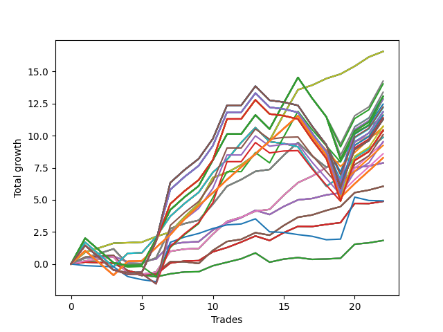

# Long Wallace Doodle 011 
- Symbol: AMZN_Unlimited
- Date Range: 03/23/2022 - 07/08/2022
- Trading Period: 7:20-12:30
- Number of Trades: 22



| Name | Win Percent | Profit | Avg Profit / Trade | Avg Time / Trade |      | Name | Win Percent | Profit | Avg Profit / Trade | Avg Time / Trade |
| ---- | ----------- | ------ | ------------------ | ---------------- | ---- | ---- | ----------- | ------ | ------------------ | ---------------- |
| Sorted By <br> Profit | | | | | | Sorted By <br> Win Percentage ||||
| Seventy | 100.00 | 8281.00 | 376.41 | 59:40 |     | Seventy | 100.00 | 8281.00 | 376.41 | 59:40 |
| Sixty-Two | 100.00 | 8281.00 | 376.41 | 59:40 |     | Sixty-Two | 100.00 | 8281.00 | 376.41 | 59:40 |
| Fifty-Four | 100.00 | 8281.00 | 376.41 | 59:40 |     | Fifty-Four | 100.00 | 8281.00 | 376.41 | 59:40 |
| Forty-Six | 100.00 | 8281.00 | 376.41 | 59:40 |     | Forty-Six | 100.00 | 8281.00 | 376.41 | 59:40 |
| Six | 100.00 | 8281.00 | 376.41 | 59:40 |     | Six | 100.00 | 8281.00 | 376.41 | 59:40 |
| Ninety-Two | 68.18 | 7127.50 | 323.98 | 155:02 |     | Sixty-Eight | 90.91 | 5168.75 | 234.94 | 37:31 |
| One Hundred Seven | 68.18 | 7017.50 | 318.98 | 155:07 |     | Sixty | 90.91 | 5168.75 | 234.94 | 37:31 |
| One Hundred Two | 68.18 | 6692.50 | 304.20 | 156:23 |     | Fifty-Two | 90.91 | 5168.75 | 234.94 | 37:31 |
| One Hundred Twenty-Seven | 68.18 | 6532.50 | 296.93 | 157:12 |     | Forty-Four | 90.91 | 5168.75 | 234.94 | 37:31 |
| One Hundred Twenty-Two | 68.18 | 6532.50 | 296.93 | 157:12 |     | Four | 90.91 | 5168.75 | 234.94 | 37:31 |
| One Hundred Seventeen | 68.18 | 6532.50 | 296.93 | 157:12 |     | Sixty-Six | 90.91 | 3937.50 | 178.98 | 25:03 |
| One Hundred Twelve | 68.18 | 6532.50 | 296.93 | 157:12 |     | Fifty-Eight | 90.91 | 3937.50 | 178.98 | 25:03 |
| Eighty-Two | 68.18 | 6532.50 | 296.93 | 157:12 |     | Fifty | 90.91 | 3937.50 | 178.98 | 25:03 |
| Ninety-Four | 59.09 | 6522.25 | 296.47 | 180:45 |     | Forty-Two | 90.91 | 3937.50 | 178.98 | 25:03 |
| Ninety-Seven | 63.64 | 6428.50 | 292.20 | 127:04 |     | Two | 90.91 | 3937.50 | 178.98 | 25:03 |
| One Hundred Nine | 59.09 | 6412.25 | 291.47 | 180:50 |     | Sixty-Nine | 86.36 | 5668.50 | 257.66 | 58:59 |
| Ninety-Five | 59.09 | 6227.75 | 283.08 | 183:09 |     | Sixty-One | 86.36 | 5668.50 | 257.66 | 58:59 |
| One Hundred Ten | 59.09 | 6117.75 | 278.08 | 183:14 |     | Fifty-Three | 86.36 | 5668.50 | 257.66 | 58:59 |
| One Hundred Four | 59.09 | 6087.25 | 276.69 | 182:06 |     | Forty-Five | 86.36 | 5668.50 | 257.66 | 58:59 |
| One Hundred Twenty-Nine | 59.09 | 5927.25 | 269.42 | 182:55 |     | Five | 86.36 | 5668.50 | 257.66 | 58:59 |
| One Hundred Twenty-Four | 59.09 | 5927.25 | 269.42 | 182:55 |     | Ninety-Six | 77.27 | 5350.00 | 243.18 | 88:32 |
| One Hundred Ninteen | 59.09 | 5927.25 | 269.42 | 182:55 |     | Ninety-One | 77.27 | 4730.00 | 215.00 | 108:39 |
| One Hundred Fourteen | 59.09 | 5927.25 | 269.42 | 182:55 |     | One Hundred Six | 77.27 | 4620.00 | 210.00 | 108:44 |
| Eighty-Four | 59.09 | 5927.25 | 269.42 | 182:55 |     | One Hundred One | 77.27 | 4295.00 | 195.23 | 110:00 |
| Ninety-Three | 59.09 | 5806.25 | 263.92 | 175:32 |     | One Hundred Twenty-Six | 77.27 | 4135.00 | 187.95 | 110:49 |
| One Hundred Five | 59.09 | 5792.75 | 263.31 | 184:29 |     | One Hundred Twenty-One | 77.27 | 4135.00 | 187.95 | 110:49 |
| One Hundred Eight | 59.09 | 5696.25 | 258.92 | 175:37 |     | One Hundred Sixteen | 77.27 | 4135.00 | 187.95 | 110:49 |
| Sixty-Nine | 86.36 | 5668.50 | 257.66 | 58:59 |     | One Hundred Eleven | 77.27 | 4135.00 | 187.95 | 110:49 |
| Sixty-One | 86.36 | 5668.50 | 257.66 | 58:59 |     | Eighty-One | 77.27 | 4135.00 | 187.95 | 110:49 |
| Fifty-Three | 86.36 | 5668.50 | 257.66 | 58:59 |     | Sixty-Seven | 77.27 | 3026.25 | 137.56 | 28:46 |
| Forty-Five | 86.36 | 5668.50 | 257.66 | 58:59 |     | Fifty-Nine | 77.27 | 3026.25 | 137.56 | 28:46 |
| Five | 86.36 | 5668.50 | 257.66 | 58:59 |     | Fifty-One | 77.27 | 3026.25 | 137.56 | 28:46 |
| One Hundred Thirty | 59.09 | 5632.75 | 256.03 | 185:19 |     | Forty-Three | 77.27 | 3026.25 | 137.56 | 28:46 |
| One Hundred Twenty-Five | 59.09 | 5632.75 | 256.03 | 185:19 |     | Three | 77.27 | 3026.25 | 137.56 | 28:46 |
| One Hundred Twenty | 59.09 | 5632.75 | 256.03 | 185:19 |     | Ninety-Two | 68.18 | 7127.50 | 323.98 | 155:02 |
| One Hundred Fifteen | 59.09 | 5632.75 | 256.03 | 185:19 |     | One Hundred Seven | 68.18 | 7017.50 | 318.98 | 155:07 |
| Eighty-Five | 59.09 | 5632.75 | 256.03 | 185:19 |     | One Hundred Two | 68.18 | 6692.50 | 304.20 | 156:23 |
| One Hundred Three | 59.09 | 5371.25 | 244.15 | 176:53 |     | One Hundred Twenty-Seven | 68.18 | 6532.50 | 296.93 | 157:12 |
| Ninety-Six | 77.27 | 5350.00 | 243.18 | 88:32 |     | One Hundred Twenty-Two | 68.18 | 6532.50 | 296.93 | 157:12 |
| One Hundred Twenty-Eight | 59.09 | 5211.25 | 236.88 | 177:42 |     | One Hundred Seventeen | 68.18 | 6532.50 | 296.93 | 157:12 |
| One Hundred Twenty-Three | 59.09 | 5211.25 | 236.88 | 177:42 |     | One Hundred Twelve | 68.18 | 6532.50 | 296.93 | 157:12 |
| One Hundred Eighteen | 59.09 | 5211.25 | 236.88 | 177:42 |     | Eighty-Two | 68.18 | 6532.50 | 296.93 | 157:12 |
| One Hundred Thirteen | 59.09 | 5211.25 | 236.88 | 177:42 |     | Seventy-One | 68.18 | 4935.25 | 224.33 | 140:25 |
| Eighty-Three | 59.09 | 5211.25 | 236.88 | 177:42 |     | Sixty-Three | 68.18 | 4935.25 | 224.33 | 140:25 |
| Ninety-Eight | 63.64 | 5198.00 | 236.27 | 144:25 |     | Fifty-Five | 68.18 | 4935.25 | 224.33 | 140:25 |
| Sixty-Eight | 90.91 | 5168.75 | 234.94 | 37:31 |     | Forty-Seven | 68.18 | 4935.25 | 224.33 | 140:25 |
| Sixty | 90.91 | 5168.75 | 234.94 | 37:31 |     | Seven | 68.18 | 4935.25 | 224.33 | 140:25 |
| Fifty-Two | 90.91 | 5168.75 | 234.94 | 37:31 |     | Sixty-Four | 68.18 | 915.25 | 41.60 | 12:50 |
| Forty-Four | 90.91 | 5168.75 | 234.94 | 37:31 |     | Fifty-Six | 68.18 | 915.25 | 41.60 | 12:50 |
| Four | 90.91 | 5168.75 | 234.94 | 37:31 |     | Forty-Eight | 68.18 | 915.25 | 41.60 | 12:50 |
| One Hundred | 63.64 | 5039.50 | 229.07 | 149:47 |     | Forty | 68.18 | 915.25 | 41.60 | 12:50 |
| Seventy-One | 68.18 | 4935.25 | 224.33 | 140:25 |     | Zero | 68.18 | 915.25 | 41.60 | 12:50 |
| Sixty-Three | 68.18 | 4935.25 | 224.33 | 140:25 |     | Ninety-Seven | 63.64 | 6428.50 | 292.20 | 127:04 |
| Fifty-Five | 68.18 | 4935.25 | 224.33 | 140:25 |     | Ninety-Eight | 63.64 | 5198.00 | 236.27 | 144:25 |
| Forty-Seven | 68.18 | 4935.25 | 224.33 | 140:25 |     | One Hundred | 63.64 | 5039.50 | 229.07 | 149:47 |
| Seven | 68.18 | 4935.25 | 224.33 | 140:25 |     | Ninety-Nine | 63.64 | 4769.00 | 216.77 | 148:01 |
| Ninety-Nine | 63.64 | 4769.00 | 216.77 | 148:01 |     | Sixty-Five | 63.64 | 2441.00 | 110.95 | 16:09 |
| Ninety-One | 77.27 | 4730.00 | 215.00 | 108:39 |     | Fifty-Seven | 63.64 | 2441.00 | 110.95 | 16:09 |
| One Hundred Six | 77.27 | 4620.00 | 210.00 | 108:44 |     | Forty-Nine | 63.64 | 2441.00 | 110.95 | 16:09 |
| One Hundred One | 77.27 | 4295.00 | 195.23 | 110:00 |     | Forty-One | 63.64 | 2441.00 | 110.95 | 16:09 |
| One Hundred Twenty-Six | 77.27 | 4135.00 | 187.95 | 110:49 |     | One | 63.64 | 2441.00 | 110.95 | 16:09 |
| One Hundred Twenty-One | 77.27 | 4135.00 | 187.95 | 110:49 |     | Ninety-Four | 59.09 | 6522.25 | 296.47 | 180:45 |
| One Hundred Sixteen | 77.27 | 4135.00 | 187.95 | 110:49 |     | One Hundred Nine | 59.09 | 6412.25 | 291.47 | 180:50 |
| One Hundred Eleven | 77.27 | 4135.00 | 187.95 | 110:49 |     | Ninety-Five | 59.09 | 6227.75 | 283.08 | 183:09 |
| Eighty-One | 77.27 | 4135.00 | 187.95 | 110:49 |     | One Hundred Ten | 59.09 | 6117.75 | 278.08 | 183:14 |
| Sixty-Six | 90.91 | 3937.50 | 178.98 | 25:03 |     | One Hundred Four | 59.09 | 6087.25 | 276.69 | 182:06 |
| Fifty-Eight | 90.91 | 3937.50 | 178.98 | 25:03 |     | One Hundred Twenty-Nine | 59.09 | 5927.25 | 269.42 | 182:55 |
| Fifty | 90.91 | 3937.50 | 178.98 | 25:03 |     | One Hundred Twenty-Four | 59.09 | 5927.25 | 269.42 | 182:55 |
| Forty-Two | 90.91 | 3937.50 | 178.98 | 25:03 |     | One Hundred Ninteen | 59.09 | 5927.25 | 269.42 | 182:55 |
| Two | 90.91 | 3937.50 | 178.98 | 25:03 |     | One Hundred Fourteen | 59.09 | 5927.25 | 269.42 | 182:55 |
| Sixty-Seven | 77.27 | 3026.25 | 137.56 | 28:46 |     | Eighty-Four | 59.09 | 5927.25 | 269.42 | 182:55 |
| Fifty-Nine | 77.27 | 3026.25 | 137.56 | 28:46 |     | Ninety-Three | 59.09 | 5806.25 | 263.92 | 175:32 |
| Fifty-One | 77.27 | 3026.25 | 137.56 | 28:46 |     | One Hundred Five | 59.09 | 5792.75 | 263.31 | 184:29 |
| Forty-Three | 77.27 | 3026.25 | 137.56 | 28:46 |     | One Hundred Eight | 59.09 | 5696.25 | 258.92 | 175:37 |
| Three | 77.27 | 3026.25 | 137.56 | 28:46 |     | One Hundred Thirty | 59.09 | 5632.75 | 256.03 | 185:19 |
| Seventy-Three | 40.91 | 2459.75 | 111.81 | 12:05 |     | One Hundred Twenty-Five | 59.09 | 5632.75 | 256.03 | 185:19 |
| Sixty-Five | 63.64 | 2441.00 | 110.95 | 16:09 |     | One Hundred Twenty | 59.09 | 5632.75 | 256.03 | 185:19 |
| Fifty-Seven | 63.64 | 2441.00 | 110.95 | 16:09 |     | One Hundred Fifteen | 59.09 | 5632.75 | 256.03 | 185:19 |
| Forty-Nine | 63.64 | 2441.00 | 110.95 | 16:09 |     | Eighty-Five | 59.09 | 5632.75 | 256.03 | 185:19 |
| Forty-One | 63.64 | 2441.00 | 110.95 | 16:09 |     | One Hundred Three | 59.09 | 5371.25 | 244.15 | 176:53 |
| One | 63.64 | 2441.00 | 110.95 | 16:09 |     | One Hundred Twenty-Eight | 59.09 | 5211.25 | 236.88 | 177:42 |
| Sixty-Four | 68.18 | 915.25 | 41.60 | 12:50 |     | One Hundred Twenty-Three | 59.09 | 5211.25 | 236.88 | 177:42 |
| Fifty-Six | 68.18 | 915.25 | 41.60 | 12:50 |     | One Hundred Eighteen | 59.09 | 5211.25 | 236.88 | 177:42 |
| Forty-Eight | 68.18 | 915.25 | 41.60 | 12:50 |     | One Hundred Thirteen | 59.09 | 5211.25 | 236.88 | 177:42 |
| Forty | 68.18 | 915.25 | 41.60 | 12:50 |     | Eighty-Three | 59.09 | 5211.25 | 236.88 | 177:42 |
| Zero | 68.18 | 915.25 | 41.60 | 12:50 |     | Seventy-Three | 40.91 | 2459.75 | 111.81 | 12:05 |

## NO STOPLOSS

### Test Zero
* Sell when price hits the middle line of the 20p bollinger
* No Stoploss
* Results:
```
Total Trades: 22
Percent Up: 68.18
Percent Down: 31.82
Total Points Moved Up: 1.83
Potential Profit: 915.25
Total Points Ups: 3.90 Count Ups: 15
Total Points Downs: -2.07 Count Downs: 7
```

<details><summary>Trades</summary>

<code>In: 2022-03-25 08:14:00		Out: 2022-03-25 08:30:35		Total Position Time: 16:35		Total Move Up: 0.21		Total to Date: 0.21</code> <br />
<code>In: 2022-04-08 10:32:00		Out: 2022-04-08 10:52:10		Total Position Time: 20:10		Total Move Up: -0.08		Total to Date: 0.13</code> <br />
<code>In: 2022-04-08 10:32:00		Out: 2022-04-08 10:52:10		Total Position Time: 20:10		Total Move Up: -0.08		Total to Date: 0.06</code> <br />
<code>In: 2022-04-18 08:21:00		Out: 2022-04-18 08:43:45		Total Position Time: 22:45		Total Move Up: -0.56		Total to Date: -0.50</code> <br />
<code>In: 2022-04-27 12:01:00		Out: 2022-04-27 12:23:45		Total Position Time: 22:45		Total Move Up: -0.34		Total to Date: -0.85</code> <br />
<code>In: 2022-05-02 08:44:00		Out: 2022-05-02 08:52:40		Total Position Time: 08:40		Total Move Up: -0.15		Total to Date: -1.00</code> <br />
<code>In: 2022-05-04 11:36:00		Out: 2022-05-04 11:41:15		Total Position Time: 05:15		Total Move Up: 0.24		Total to Date: -0.76</code> <br />
<code>In: 2022-05-06 10:58:00		Out: 2022-05-06 11:12:20		Total Position Time: 14:20		Total Move Up: 0.14		Total to Date: -0.62</code> <br />
<code>In: 2022-05-06 10:59:00		Out: 2022-05-06 11:12:20		Total Position Time: 13:20		Total Move Up: 0.02		Total to Date: -0.60</code> <br />
<code>In: 2022-05-12 10:57:00		Out: 2022-05-12 10:59:30		Total Position Time: 02:30		Total Move Up: 0.46		Total to Date: -0.14</code> <br />
<code>In: 2022-05-17 11:24:00		Out: 2022-05-17 11:37:15		Total Position Time: 13:15		Total Move Up: 0.27		Total to Date: 0.14</code> <br />
<code>In: 2022-05-19 09:47:00		Out: 2022-05-19 09:57:45		Total Position Time: 10:45		Total Move Up: 0.27		Total to Date: 0.41</code> <br />
<code>In: 2022-05-27 08:05:00		Out: 2022-05-27 08:14:05		Total Position Time: 09:05		Total Move Up: 0.45		Total to Date: 0.86</code> <br />
<code>In: 2022-06-06 09:06:00		Out: 2022-06-06 09:23:25		Total Position Time: 17:25		Total Move Up: -0.72		Total to Date: 0.14</code> <br />
<code>In: 2022-06-06 09:11:00		Out: 2022-06-06 09:23:25		Total Position Time: 12:25		Total Move Up: 0.24		Total to Date: 0.38</code> <br />
<code>In: 2022-06-06 09:12:00		Out: 2022-06-06 09:23:25		Total Position Time: 11:25		Total Move Up: 0.12		Total to Date: 0.50</code> <br />
<code>In: 2022-06-08 07:53:00		Out: 2022-06-08 08:08:15		Total Position Time: 15:15		Total Move Up: -0.14		Total to Date: 0.36</code> <br />
<code>In: 2022-06-08 07:58:00		Out: 2022-06-08 08:08:15		Total Position Time: 10:15		Total Move Up: 0.03		Total to Date: 0.39</code> <br />
<code>In: 2022-06-09 08:10:00		Out: 2022-06-09 08:21:05		Total Position Time: 11:05		Total Move Up: 0.06		Total to Date: 0.45</code> <br />
<code>In: 2022-06-15 11:34:00		Out: 2022-06-15 11:38:05		Total Position Time: 04:05		Total Move Up: 1.09		Total to Date: 1.54</code> <br />
<code>In: 2022-06-29 09:29:00		Out: 2022-06-29 09:37:20		Total Position Time: 08:20		Total Move Up: 0.11		Total to Date: 1.65</code> <br />
<code>In: 2022-07-06 08:34:00		Out: 2022-07-06 08:46:40		Total Position Time: 12:40		Total Move Up: 0.18		Total to Date: 1.83</code> <br />


</details>

### Test One
* Sell when the price hits the upper line of the 20p 1std bollinger
* No Stoploss
* Results:
```
Total Trades: 22
Percent Up: 63.64
Percent Down: 36.36
Total Points Moved Up: 4.88
Potential Profit: 2441.00
Total Points Ups: 6.21 Count Ups: 14
Total Points Downs: -1.33 Count Downs: 8
```

<details><summary>Trades</summary>

<code>In: 2022-03-25 08:14:00		Out: 2022-03-25 08:40:30		Total Position Time: 26:30		Total Move Up: 0.15		Total to Date: 0.15</code> <br />
<code>In: 2022-04-08 10:32:00		Out: 2022-04-08 10:57:05		Total Position Time: 25:05		Total Move Up: -0.04		Total to Date: 0.11</code> <br />
<code>In: 2022-04-08 10:32:00		Out: 2022-04-08 10:57:05		Total Position Time: 25:05		Total Move Up: -0.04		Total to Date: 0.07</code> <br />
<code>In: 2022-04-18 08:21:00		Out: 2022-04-18 08:46:40		Total Position Time: 25:40		Total Move Up: -0.59		Total to Date: -0.52</code> <br />
<code>In: 2022-04-27 12:01:00		Out: 2022-04-27 12:28:05		Total Position Time: 27:05		Total Move Up: -0.25		Total to Date: -0.77</code> <br />
<code>In: 2022-05-02 08:44:00		Out: 2022-05-02 08:56:05		Total Position Time: 12:05		Total Move Up: -0.04		Total to Date: -0.81</code> <br />
<code>In: 2022-05-04 11:36:00		Out: 2022-05-04 11:43:40		Total Position Time: 07:40		Total Move Up: 0.88		Total to Date: 0.07</code> <br />
<code>In: 2022-05-06 10:58:00		Out: 2022-05-06 11:16:05		Total Position Time: 18:05		Total Move Up: 0.16		Total to Date: 0.23</code> <br />
<code>In: 2022-05-06 10:59:00		Out: 2022-05-06 11:16:05		Total Position Time: 17:05		Total Move Up: 0.03		Total to Date: 0.26</code> <br />
<code>In: 2022-05-12 10:57:00		Out: 2022-05-12 11:01:20		Total Position Time: 04:20		Total Move Up: 0.69		Total to Date: 0.95</code> <br />
<code>In: 2022-05-17 11:24:00		Out: 2022-05-17 11:39:45		Total Position Time: 15:45		Total Move Up: 0.33		Total to Date: 1.28</code> <br />
<code>In: 2022-05-19 09:47:00		Out: 2022-05-19 09:58:05		Total Position Time: 11:05		Total Move Up: 0.43		Total to Date: 1.71</code> <br />
<code>In: 2022-05-27 08:05:00		Out: 2022-05-27 08:19:20		Total Position Time: 14:20		Total Move Up: 0.47		Total to Date: 2.18</code> <br />
<code>In: 2022-06-06 09:06:00		Out: 2022-06-06 09:24:00		Total Position Time: 18:00		Total Move Up: -0.35		Total to Date: 1.83</code> <br />
<code>In: 2022-06-06 09:11:00		Out: 2022-06-06 09:24:00		Total Position Time: 13:00		Total Move Up: 0.61		Total to Date: 2.44</code> <br />
<code>In: 2022-06-06 09:12:00		Out: 2022-06-06 09:24:00		Total Position Time: 12:00		Total Move Up: 0.49		Total to Date: 2.93</code> <br />
<code>In: 2022-06-08 07:53:00		Out: 2022-06-08 08:11:10		Total Position Time: 18:10		Total Move Up: -0.01		Total to Date: 2.92</code> <br />
<code>In: 2022-06-08 07:58:00		Out: 2022-06-08 08:11:10		Total Position Time: 13:10		Total Move Up: 0.16		Total to Date: 3.08</code> <br />
<code>In: 2022-06-09 08:10:00		Out: 2022-06-09 08:22:40		Total Position Time: 12:40		Total Move Up: 0.14		Total to Date: 3.22</code> <br />
<code>In: 2022-06-15 11:34:00		Out: 2022-06-15 11:38:10		Total Position Time: 04:10		Total Move Up: 1.50		Total to Date: 4.72</code> <br />
<code>In: 2022-06-29 09:29:00		Out: 2022-06-29 09:46:05		Total Position Time: 17:05		Total Move Up: -0.01		Total to Date: 4.71</code> <br />
<code>In: 2022-07-06 08:34:00		Out: 2022-07-06 08:51:20		Total Position Time: 17:20		Total Move Up: 0.17		Total to Date: 4.88</code> <br />


</details>

### Test Two
* Sell when the price hits the upper line of the 20p 2std bollinger
* No Stoploss
* Results:
```
Total Trades: 22
Percent Up: 90.91
Percent Down: 9.09
Total Points Moved Up: 7.87
Potential Profit: 3937.50
Total Points Ups: 8.65 Count Ups: 20
Total Points Downs: -0.77 Count Downs: 2
```

<details><summary>Trades</summary>

<code>In: 2022-03-25 08:14:00		Out: 2022-03-25 08:41:35		Total Position Time: 27:35		Total Move Up: 0.46		Total to Date: 0.46</code> <br />
<code>In: 2022-04-08 10:32:00		Out: 2022-04-08 10:59:30		Total Position Time: 27:30		Total Move Up: 0.07		Total to Date: 0.54</code> <br />
<code>In: 2022-04-08 10:32:00		Out: 2022-04-08 10:59:30		Total Position Time: 27:30		Total Move Up: 0.07		Total to Date: 0.61</code> <br />
<code>In: 2022-04-18 08:21:00		Out: 2022-04-18 08:53:45		Total Position Time: 32:45		Total Move Up: -0.44		Total to Date: 0.17</code> <br />
<code>In: 2022-04-27 12:01:00		Out: 2022-04-27 12:44:20		Total Position Time: 43:20		Total Move Up: 0.04		Total to Date: 0.20</code> <br />
<code>In: 2022-05-02 08:44:00		Out: 2022-05-02 08:57:30		Total Position Time: 13:30		Total Move Up: 0.18		Total to Date: 0.38</code> <br />
<code>In: 2022-05-04 11:36:00		Out: 2022-05-04 11:44:25		Total Position Time: 08:25		Total Move Up: 1.14		Total to Date: 1.52</code> <br />
<code>In: 2022-05-06 10:58:00		Out: 2022-05-06 11:49:25		Total Position Time: 51:25		Total Move Up: 0.17		Total to Date: 1.69</code> <br />
<code>In: 2022-05-06 10:59:00		Out: 2022-05-06 11:49:25		Total Position Time: 50:25		Total Move Up: 0.04		Total to Date: 1.74</code> <br />
<code>In: 2022-05-12 10:57:00		Out: 2022-05-12 11:03:40		Total Position Time: 06:40		Total Move Up: 0.90		Total to Date: 2.64</code> <br />
<code>In: 2022-05-17 11:24:00		Out: 2022-05-17 11:40:05		Total Position Time: 16:05		Total Move Up: 0.57		Total to Date: 3.21</code> <br />
<code>In: 2022-05-19 09:47:00		Out: 2022-05-19 10:06:20		Total Position Time: 19:20		Total Move Up: 0.41		Total to Date: 3.61</code> <br />
<code>In: 2022-05-27 08:05:00		Out: 2022-05-27 08:49:40		Total Position Time: 44:40		Total Move Up: 0.57		Total to Date: 4.19</code> <br />
<code>In: 2022-06-06 09:06:00		Out: 2022-06-06 09:37:20		Total Position Time: 31:20		Total Move Up: -0.33		Total to Date: 3.86</code> <br />
<code>In: 2022-06-06 09:11:00		Out: 2022-06-06 09:37:20		Total Position Time: 26:20		Total Move Up: 0.63		Total to Date: 4.48</code> <br />
<code>In: 2022-06-06 09:12:00		Out: 2022-06-06 09:37:20		Total Position Time: 25:20		Total Move Up: 0.51		Total to Date: 4.99</code> <br />
<code>In: 2022-06-08 07:53:00		Out: 2022-06-08 08:13:45		Total Position Time: 20:45		Total Move Up: 0.11		Total to Date: 5.10</code> <br />
<code>In: 2022-06-08 07:58:00		Out: 2022-06-08 08:13:45		Total Position Time: 15:45		Total Move Up: 0.28		Total to Date: 5.38</code> <br />
<code>In: 2022-06-09 08:10:00		Out: 2022-06-09 08:24:15		Total Position Time: 14:15		Total Move Up: 0.15		Total to Date: 5.53</code> <br />
<code>In: 2022-06-15 11:34:00		Out: 2022-06-15 11:38:55		Total Position Time: 04:55		Total Move Up: 1.99		Total to Date: 7.52</code> <br />
<code>In: 2022-06-29 09:29:00		Out: 2022-06-29 09:48:15		Total Position Time: 19:15		Total Move Up: 0.11		Total to Date: 7.63</code> <br />
<code>In: 2022-07-06 08:34:00		Out: 2022-07-06 08:58:15		Total Position Time: 24:15		Total Move Up: 0.24		Total to Date: 7.87</code> <br />


</details>

### Test Three
* Sell when price hits the middle line of the 50p bollinger
* No Stoploss
* Results:
```
Total Trades: 22
Percent Up: 77.27
Percent Down: 22.73
Total Points Moved Up: 6.05
Potential Profit: 3026.25
Total Points Ups: 7.97 Count Ups: 17
Total Points Downs: -1.92 Count Downs: 5
```

<details><summary>Trades</summary>

<code>In: 2022-03-25 08:14:00		Out: 2022-03-25 08:45:00		Total Position Time: 31:00		Total Move Up: 0.53		Total to Date: 0.53</code> <br />
<code>In: 2022-04-08 10:32:00		Out: 2022-04-08 10:59:30		Total Position Time: 27:30		Total Move Up: 0.07		Total to Date: 0.60</code> <br />
<code>In: 2022-04-08 10:32:00		Out: 2022-04-08 10:59:30		Total Position Time: 27:30		Total Move Up: 0.07		Total to Date: 0.68</code> <br />
<code>In: 2022-04-18 08:21:00		Out: 2022-04-18 09:50:55		Total Position Time: 89:55		Total Move Up: -1.29		Total to Date: -0.61</code> <br />
<code>In: 2022-04-27 12:01:00		Out: 2022-04-27 12:44:10		Total Position Time: 43:10		Total Move Up: -0.29		Total to Date: -0.90</code> <br />
<code>In: 2022-05-02 08:44:00		Out: 2022-05-02 08:57:20		Total Position Time: 13:20		Total Move Up: 0.20		Total to Date: -0.70</code> <br />
<code>In: 2022-05-04 11:36:00		Out: 2022-05-04 11:43:40		Total Position Time: 07:40		Total Move Up: 0.88		Total to Date: 0.18</code> <br />
<code>In: 2022-05-06 10:58:00		Out: 2022-05-06 11:49:10		Total Position Time: 51:10		Total Move Up: -0.01		Total to Date: 0.17</code> <br />
<code>In: 2022-05-06 10:59:00		Out: 2022-05-06 11:49:10		Total Position Time: 50:10		Total Move Up: -0.14		Total to Date: 0.04</code> <br />
<code>In: 2022-05-12 10:57:00		Out: 2022-05-12 11:03:50		Total Position Time: 06:50		Total Move Up: 1.02		Total to Date: 1.06</code> <br />
<code>In: 2022-05-17 11:24:00		Out: 2022-05-17 11:40:10		Total Position Time: 16:10		Total Move Up: 0.70		Total to Date: 1.75</code> <br />
<code>In: 2022-05-19 09:47:00		Out: 2022-05-19 10:22:50		Total Position Time: 35:50		Total Move Up: 0.17		Total to Date: 1.92</code> <br />
<code>In: 2022-05-27 08:05:00		Out: 2022-05-27 08:35:35		Total Position Time: 30:35		Total Move Up: 0.52		Total to Date: 2.44</code> <br />
<code>In: 2022-06-06 09:06:00		Out: 2022-06-06 09:38:25		Total Position Time: 32:25		Total Move Up: -0.20		Total to Date: 2.24</code> <br />
<code>In: 2022-06-06 09:11:00		Out: 2022-06-06 09:38:25		Total Position Time: 27:25		Total Move Up: 0.76		Total to Date: 3.00</code> <br />
<code>In: 2022-06-06 09:12:00		Out: 2022-06-06 09:38:25		Total Position Time: 26:25		Total Move Up: 0.64		Total to Date: 3.64</code> <br />
<code>In: 2022-06-08 07:53:00		Out: 2022-06-08 08:15:05		Total Position Time: 22:05		Total Move Up: 0.18		Total to Date: 3.82</code> <br />
<code>In: 2022-06-08 07:58:00		Out: 2022-06-08 08:15:05		Total Position Time: 17:05		Total Move Up: 0.35		Total to Date: 4.17</code> <br />
<code>In: 2022-06-09 08:10:00		Out: 2022-06-09 08:24:55		Total Position Time: 14:55		Total Move Up: 0.30		Total to Date: 4.47</code> <br />
<code>In: 2022-06-15 11:34:00		Out: 2022-06-15 11:38:05		Total Position Time: 04:05		Total Move Up: 1.09		Total to Date: 5.56</code> <br />
<code>In: 2022-06-29 09:29:00		Out: 2022-06-29 09:53:35		Total Position Time: 24:35		Total Move Up: 0.20		Total to Date: 5.76</code> <br />
<code>In: 2022-07-06 08:34:00		Out: 2022-07-06 09:07:10		Total Position Time: 33:10		Total Move Up: 0.29		Total to Date: 6.05</code> <br />


</details>

### Test Four
* Sell when the price hits the upper line of the 50p 1std bollinger
* No Stoploss
* Results:
```
Total Trades: 22
Percent Up: 90.91
Percent Down: 9.09
Total Points Moved Up: 10.34
Potential Profit: 5168.75
Total Points Ups: 11.70 Count Ups: 20
Total Points Downs: -1.36 Count Downs: 2
```

<details><summary>Trades</summary>

<code>In: 2022-03-25 08:14:00		Out: 2022-03-25 09:09:40		Total Position Time: 55:40		Total Move Up: 0.24		Total to Date: 0.24</code> <br />
<code>In: 2022-04-08 10:32:00		Out: 2022-04-08 11:08:05		Total Position Time: 36:05		Total Move Up: 0.16		Total to Date: 0.40</code> <br />
<code>In: 2022-04-08 10:32:00		Out: 2022-04-08 11:08:05		Total Position Time: 36:05		Total Move Up: 0.16		Total to Date: 0.56</code> <br />
<code>In: 2022-04-18 08:21:00		Out: 2022-04-18 10:03:45		Total Position Time: 102:45		Total Move Up: -1.34		Total to Date: -0.78</code> <br />
<code>In: 2022-04-27 12:01:00		Out: 2022-04-27 12:44:35		Total Position Time: 43:35		Total Move Up: -0.02		Total to Date: -0.80</code> <br />
<code>In: 2022-05-02 08:44:00		Out: 2022-05-02 09:14:50		Total Position Time: 30:50		Total Move Up: 0.17		Total to Date: -0.63</code> <br />
<code>In: 2022-05-04 11:36:00		Out: 2022-05-04 11:45:30		Total Position Time: 09:30		Total Move Up: 1.62		Total to Date: 0.99</code> <br />
<code>In: 2022-05-06 10:58:00		Out: 2022-05-06 11:49:25		Total Position Time: 51:25		Total Move Up: 0.17		Total to Date: 1.16</code> <br />
<code>In: 2022-05-06 10:59:00		Out: 2022-05-06 11:49:25		Total Position Time: 50:25		Total Move Up: 0.04		Total to Date: 1.21</code> <br />
<code>In: 2022-05-12 10:57:00		Out: 2022-05-12 11:21:10		Total Position Time: 24:10		Total Move Up: 1.12		Total to Date: 2.33</code> <br />
<code>In: 2022-05-17 11:24:00		Out: 2022-05-17 11:45:45		Total Position Time: 21:45		Total Move Up: 1.00		Total to Date: 3.32</code> <br />
<code>In: 2022-05-19 09:47:00		Out: 2022-05-19 10:31:50		Total Position Time: 44:50		Total Move Up: 0.32		Total to Date: 3.65</code> <br />
<code>In: 2022-05-27 08:05:00		Out: 2022-05-27 08:49:00		Total Position Time: 44:00		Total Move Up: 0.47		Total to Date: 4.12</code> <br />
<code>In: 2022-06-06 09:06:00		Out: 2022-06-06 09:48:10		Total Position Time: 42:10		Total Move Up: 0.14		Total to Date: 4.26</code> <br />
<code>In: 2022-06-06 09:11:00		Out: 2022-06-06 09:48:10		Total Position Time: 37:10		Total Move Up: 1.10		Total to Date: 5.36</code> <br />
<code>In: 2022-06-06 09:12:00		Out: 2022-06-06 09:48:10		Total Position Time: 36:10		Total Move Up: 0.98		Total to Date: 6.34</code> <br />
<code>In: 2022-06-08 07:53:00		Out: 2022-06-08 08:26:05		Total Position Time: 33:05		Total Move Up: 0.51		Total to Date: 6.85</code> <br />
<code>In: 2022-06-08 07:58:00		Out: 2022-06-08 08:26:05		Total Position Time: 28:05		Total Move Up: 0.68		Total to Date: 7.53</code> <br />
<code>In: 2022-06-09 08:10:00		Out: 2022-06-09 08:33:05		Total Position Time: 23:05		Total Move Up: 0.53		Total to Date: 8.06</code> <br />
<code>In: 2022-06-15 11:34:00		Out: 2022-06-15 11:38:10		Total Position Time: 04:10		Total Move Up: 1.50		Total to Date: 9.56</code> <br />
<code>In: 2022-06-29 09:29:00		Out: 2022-06-29 10:00:30		Total Position Time: 31:30		Total Move Up: 0.38		Total to Date: 9.94</code> <br />
<code>In: 2022-07-06 08:34:00		Out: 2022-07-06 09:13:10		Total Position Time: 39:10		Total Move Up: 0.40		Total to Date: 10.34</code> <br />


</details>

### Test Five
* Sell when the price hits the upper line of the 50p 2std bollinger
* No Stoploss
* Results:
```
Total Trades: 22
Percent Up: 86.36
Percent Down: 13.64
Total Points Moved Up: 11.34
Potential Profit: 5668.50
Total Points Ups: 14.45 Count Ups: 19
Total Points Downs: -3.11 Count Downs: 3
```

<details><summary>Trades</summary>

<code>In: 2022-03-25 08:14:00		Out: 2022-03-25 09:11:20		Total Position Time: 57:20		Total Move Up: 0.47		Total to Date: 0.47</code> <br />
<code>In: 2022-04-08 10:32:00		Out: 2022-04-08 11:11:10		Total Position Time: 39:10		Total Move Up: 0.35		Total to Date: 0.82</code> <br />
<code>In: 2022-04-08 10:32:00		Out: 2022-04-08 11:11:10		Total Position Time: 39:10		Total Move Up: 0.35		Total to Date: 1.18</code> <br />
<code>In: 2022-04-18 08:21:00		Out: 2022-04-18 10:05:35		Total Position Time: 104:35		Total Move Up: -1.18		Total to Date: -0.00</code> <br />
<code>In: 2022-04-27 12:01:00		Out: 2022-04-27 12:47:00		Total Position Time: 46:00		Total Move Up: 0.05		Total to Date: 0.04</code> <br />
<code>In: 2022-05-02 08:44:00		Out: 2022-05-02 09:19:50		Total Position Time: 35:50		Total Move Up: 0.44		Total to Date: 0.48</code> <br />
<code>In: 2022-05-04 11:36:00		Out: 2022-05-04 11:46:55		Total Position Time: 10:55		Total Move Up: 2.28		Total to Date: 2.77</code> <br />
<code>In: 2022-05-06 10:58:00		Out: 2022-05-06 11:50:15		Total Position Time: 52:15		Total Move Up: 0.38		Total to Date: 3.15</code> <br />
<code>In: 2022-05-06 10:59:00		Out: 2022-05-06 11:50:15		Total Position Time: 51:15		Total Move Up: 0.25		Total to Date: 3.40</code> <br />
<code>In: 2022-05-12 10:57:00		Out: 2022-05-12 11:27:35		Total Position Time: 30:35		Total Move Up: 1.26		Total to Date: 4.66</code> <br />
<code>In: 2022-05-17 11:24:00		Out: 2022-05-17 11:47:50		Total Position Time: 23:50		Total Move Up: 1.40		Total to Date: 6.06</code> <br />
<code>In: 2022-05-19 09:47:00		Out: 2022-05-19 10:33:35		Total Position Time: 46:35		Total Move Up: 0.52		Total to Date: 6.58</code> <br />
<code>In: 2022-05-27 08:05:00		Out: 2022-05-27 08:49:50		Total Position Time: 44:50		Total Move Up: 0.64		Total to Date: 7.22</code> <br />
<code>In: 2022-06-06 09:06:00		Out: 2022-06-06 10:23:10		Total Position Time: 77:10		Total Move Up: 0.15		Total to Date: 7.37</code> <br />
<code>In: 2022-06-06 09:11:00		Out: 2022-06-06 10:23:10		Total Position Time: 72:10		Total Move Up: 1.11		Total to Date: 8.48</code> <br />
<code>In: 2022-06-06 09:12:00		Out: 2022-06-06 10:23:10		Total Position Time: 71:10		Total Move Up: 0.99		Total to Date: 9.47</code> <br />
<code>In: 2022-06-08 07:53:00		Out: 2022-06-08 11:03:40		Total Position Time: 190:40		Total Move Up: -1.05		Total to Date: 8.42</code> <br />
<code>In: 2022-06-08 07:58:00		Out: 2022-06-08 11:03:40		Total Position Time: 185:40		Total Move Up: -0.88		Total to Date: 7.54</code> <br />
<code>In: 2022-06-09 08:10:00		Out: 2022-06-09 08:41:35		Total Position Time: 31:35		Total Move Up: 0.50		Total to Date: 8.04</code> <br />
<code>In: 2022-06-15 11:34:00		Out: 2022-06-15 11:39:00		Total Position Time: 05:00		Total Move Up: 2.21		Total to Date: 10.25</code> <br />
<code>In: 2022-06-29 09:29:00		Out: 2022-06-29 10:10:05		Total Position Time: 41:05		Total Move Up: 0.53		Total to Date: 10.78</code> <br />
<code>In: 2022-07-06 08:34:00		Out: 2022-07-06 09:15:00		Total Position Time: 41:00		Total Move Up: 0.56		Total to Date: 11.34</code> <br />


</details>

### Test Six
* Sell when the price hits the middle line of the 1std VWAP
* No Stoploss
* Results:
```
Total Trades: 22
Percent Up: 100.00
Percent Down: 0.00
Total Points Moved Up: 16.56
Potential Profit: 8281.00
Total Points Ups: 16.56 Count Ups: 22
Total Points Downs: 0.00 Count Downs: 0
```

<details><summary>Trades</summary>

<code>In: 2022-03-25 08:14:00		Out: 2022-03-25 10:19:15		Total Position Time: 125:15		Total Move Up: 0.91		Total to Date: 0.91</code> <br />
<code>In: 2022-04-08 10:32:00		Out: 2022-04-08 11:11:10		Total Position Time: 39:10		Total Move Up: 0.35		Total to Date: 1.26</code> <br />
<code>In: 2022-04-08 10:32:00		Out: 2022-04-08 11:11:10		Total Position Time: 39:10		Total Move Up: 0.35		Total to Date: 1.62</code> <br />
<code>In: 2022-04-18 08:21:00		Out: 2022-04-18 10:34:40		Total Position Time: 133:40		Total Move Up: 0.04		Total to Date: 1.66</code> <br />
<code>In: 2022-04-27 12:01:00		Out: 2022-04-27 12:47:00		Total Position Time: 46:00		Total Move Up: 0.05		Total to Date: 1.71</code> <br />
<code>In: 2022-05-02 08:44:00		Out: 2022-05-02 09:20:15		Total Position Time: 36:15		Total Move Up: 0.43		Total to Date: 2.14</code> <br />
<code>In: 2022-05-04 11:36:00		Out: 2022-05-04 11:42:15		Total Position Time: 06:15		Total Move Up: 0.35		Total to Date: 2.49</code> <br />
<code>In: 2022-05-06 10:58:00		Out: 2022-05-06 12:46:35		Total Position Time: 108:35		Total Move Up: 1.18		Total to Date: 3.66</code> <br />
<code>In: 2022-05-06 10:59:00		Out: 2022-05-06 12:46:35		Total Position Time: 107:35		Total Move Up: 1.05		Total to Date: 4.71</code> <br />
<code>In: 2022-05-12 10:57:00		Out: 2022-05-12 12:26:25		Total Position Time: 89:25		Total Move Up: 2.02		Total to Date: 6.73</code> <br />
<code>In: 2022-05-17 11:24:00		Out: 2022-05-17 11:27:15		Total Position Time: 03:15		Total Move Up: 0.39		Total to Date: 7.12</code> <br />
<code>In: 2022-05-19 09:47:00		Out: 2022-05-19 10:55:25		Total Position Time: 68:25		Total Move Up: 0.61		Total to Date: 7.73</code> <br />
<code>In: 2022-05-27 08:05:00		Out: 2022-05-27 09:02:00		Total Position Time: 57:00		Total Move Up: 0.81		Total to Date: 8.54</code> <br />
<code>In: 2022-06-06 09:06:00		Out: 2022-06-06 10:39:05		Total Position Time: 93:05		Total Move Up: 1.08		Total to Date: 9.62</code> <br />
<code>In: 2022-06-06 09:11:00		Out: 2022-06-06 10:39:05		Total Position Time: 88:05		Total Move Up: 2.04		Total to Date: 11.66</code> <br />
<code>In: 2022-06-06 09:12:00		Out: 2022-06-06 10:39:05		Total Position Time: 87:05		Total Move Up: 1.92		Total to Date: 13.58</code> <br />
<code>In: 2022-06-08 07:53:00		Out: 2022-06-08 08:16:50		Total Position Time: 23:50		Total Move Up: 0.35		Total to Date: 13.93</code> <br />
<code>In: 2022-06-08 07:58:00		Out: 2022-06-08 08:16:50		Total Position Time: 18:50		Total Move Up: 0.52		Total to Date: 14.45</code> <br />
<code>In: 2022-06-09 08:10:00		Out: 2022-06-09 08:32:55		Total Position Time: 22:55		Total Move Up: 0.35		Total to Date: 14.80</code> <br />
<code>In: 2022-06-15 11:34:00		Out: 2022-06-15 11:37:10		Total Position Time: 03:10		Total Move Up: 0.61		Total to Date: 15.41</code> <br />
<code>In: 2022-06-29 09:29:00		Out: 2022-06-29 10:45:25		Total Position Time: 76:25		Total Move Up: 0.72		Total to Date: 16.13</code> <br />
<code>In: 2022-07-06 08:34:00		Out: 2022-07-06 09:13:20		Total Position Time: 39:20		Total Move Up: 0.43		Total to Date: 16.56</code> <br />


</details>

### Test Seven
* Sell when the price hits the upper line of the 1std VWAP
* No Stoploss
* Results:
```
Total Trades: 22
Percent Up: 68.18
Percent Down: 31.82
Total Points Moved Up: 9.87
Potential Profit: 4935.25
Total Points Ups: 16.36 Count Ups: 15
Total Points Downs: -6.49 Count Downs: 7
```

<details><summary>Trades</summary>

<code>In: 2022-03-25 08:14:00		Out: 2022-03-25 11:52:15		Total Position Time: 218:15		Total Move Up: 1.69		Total to Date: 1.69</code> <br />
<code>In: 2022-04-08 10:32:00		Out: 2022-04-08 12:47:00		Total Position Time: 135:00		Total Move Up: -0.96		Total to Date: 0.73</code> <br />
<code>In: 2022-04-08 10:32:00		Out: 2022-04-08 12:47:00		Total Position Time: 135:00		Total Move Up: -0.96		Total to Date: -0.22</code> <br />
<code>In: 2022-04-18 08:21:00		Out: 2022-04-18 10:56:35		Total Position Time: 155:35		Total Move Up: 1.05		Total to Date: 0.83</code> <br />
<code>In: 2022-04-27 12:01:00		Out: 2022-04-27 12:47:00		Total Position Time: 46:00		Total Move Up: 0.05		Total to Date: 0.88</code> <br />
<code>In: 2022-05-02 08:44:00		Out: 2022-05-02 11:05:00		Total Position Time: 141:00		Total Move Up: 1.24		Total to Date: 2.11</code> <br />
<code>In: 2022-05-04 11:36:00		Out: 2022-05-04 11:45:40		Total Position Time: 09:40		Total Move Up: 1.60		Total to Date: 3.72</code> <br />
<code>In: 2022-05-06 10:58:00		Out: 2022-05-06 12:47:00		Total Position Time: 109:00		Total Move Up: 1.00		Total to Date: 4.71</code> <br />
<code>In: 2022-05-06 10:59:00		Out: 2022-05-06 12:47:00		Total Position Time: 108:00		Total Move Up: 0.87		Total to Date: 5.58</code> <br />
<code>In: 2022-05-12 10:57:00		Out: 2022-05-12 12:47:00		Total Position Time: 110:00		Total Move Up: 1.56		Total to Date: 7.14</code> <br />
<code>In: 2022-05-17 11:24:00		Out: 2022-05-17 11:45:45		Total Position Time: 21:45		Total Move Up: 1.00		Total to Date: 8.13</code> <br />
<code>In: 2022-05-19 09:47:00		Out: 2022-05-19 11:38:40		Total Position Time: 111:40		Total Move Up: 1.34		Total to Date: 9.47</code> <br />
<code>In: 2022-05-27 08:05:00		Out: 2022-05-27 11:57:20		Total Position Time: 232:20		Total Move Up: 1.16		Total to Date: 10.63</code> <br />
<code>In: 2022-06-06 09:06:00		Out: 2022-06-06 12:47:00		Total Position Time: 221:00		Total Move Up: -1.10		Total to Date: 9.53</code> <br />
<code>In: 2022-06-06 09:11:00		Out: 2022-06-06 12:47:00		Total Position Time: 216:00		Total Move Up: -0.14		Total to Date: 9.39</code> <br />
<code>In: 2022-06-06 09:12:00		Out: 2022-06-06 12:47:00		Total Position Time: 215:00		Total Move Up: -0.26		Total to Date: 9.13</code> <br />
<code>In: 2022-06-08 07:53:00		Out: 2022-06-08 12:47:00		Total Position Time: 294:00		Total Move Up: -1.62		Total to Date: 7.51</code> <br />
<code>In: 2022-06-08 07:58:00		Out: 2022-06-08 12:47:00		Total Position Time: 289:00		Total Move Up: -1.45		Total to Date: 6.06</code> <br />
<code>In: 2022-06-09 08:10:00		Out: 2022-06-09 08:43:50		Total Position Time: 33:50		Total Move Up: 0.72		Total to Date: 6.78</code> <br />
<code>In: 2022-06-15 11:34:00		Out: 2022-06-15 11:38:10		Total Position Time: 04:10		Total Move Up: 1.50		Total to Date: 8.28</code> <br />
<code>In: 2022-06-29 09:29:00		Out: 2022-06-29 12:47:00		Total Position Time: 198:00		Total Move Up: 0.69		Total to Date: 8.97</code> <br />
<code>In: 2022-07-06 08:34:00		Out: 2022-07-06 09:58:55		Total Position Time: 84:55		Total Move Up: 0.90		Total to Date: 9.87</code> <br />


</details>

## STOPLOSS OF 5

### Test Forty
* Sell when price hits the middle line of the 20p bollinger
* Stoploss is 5 points
* Results:
```
Total Trades: 22
Percent Up: 68.18
Percent Down: 31.82
Total Points Moved Up: 1.83
Potential Profit: 915.25
Total Points Ups: 3.90 Count Ups: 15
Total Points Downs: -2.07 Count Downs: 7
```

<details><summary>Trades</summary>

<code>In: 2022-03-25 08:14:00		Out: 2022-03-25 08:30:35		Total Position Time: 16:35		Total Move Up: 0.21		Total to Date: 0.21</code> <br />
<code>In: 2022-04-08 10:32:00		Out: 2022-04-08 10:52:10		Total Position Time: 20:10		Total Move Up: -0.08		Total to Date: 0.13</code> <br />
<code>In: 2022-04-08 10:32:00		Out: 2022-04-08 10:52:10		Total Position Time: 20:10		Total Move Up: -0.08		Total to Date: 0.06</code> <br />
<code>In: 2022-04-18 08:21:00		Out: 2022-04-18 08:43:45		Total Position Time: 22:45		Total Move Up: -0.56		Total to Date: -0.50</code> <br />
<code>In: 2022-04-27 12:01:00		Out: 2022-04-27 12:23:45		Total Position Time: 22:45		Total Move Up: -0.34		Total to Date: -0.85</code> <br />
<code>In: 2022-05-02 08:44:00		Out: 2022-05-02 08:52:40		Total Position Time: 08:40		Total Move Up: -0.15		Total to Date: -1.00</code> <br />
<code>In: 2022-05-04 11:36:00		Out: 2022-05-04 11:41:15		Total Position Time: 05:15		Total Move Up: 0.24		Total to Date: -0.76</code> <br />
<code>In: 2022-05-06 10:58:00		Out: 2022-05-06 11:12:20		Total Position Time: 14:20		Total Move Up: 0.14		Total to Date: -0.62</code> <br />
<code>In: 2022-05-06 10:59:00		Out: 2022-05-06 11:12:20		Total Position Time: 13:20		Total Move Up: 0.02		Total to Date: -0.60</code> <br />
<code>In: 2022-05-12 10:57:00		Out: 2022-05-12 10:59:30		Total Position Time: 02:30		Total Move Up: 0.46		Total to Date: -0.14</code> <br />
<code>In: 2022-05-17 11:24:00		Out: 2022-05-17 11:37:15		Total Position Time: 13:15		Total Move Up: 0.27		Total to Date: 0.14</code> <br />
<code>In: 2022-05-19 09:47:00		Out: 2022-05-19 09:57:45		Total Position Time: 10:45		Total Move Up: 0.27		Total to Date: 0.41</code> <br />
<code>In: 2022-05-27 08:05:00		Out: 2022-05-27 08:14:05		Total Position Time: 09:05		Total Move Up: 0.45		Total to Date: 0.86</code> <br />
<code>In: 2022-06-06 09:06:00		Out: 2022-06-06 09:23:25		Total Position Time: 17:25		Total Move Up: -0.72		Total to Date: 0.14</code> <br />
<code>In: 2022-06-06 09:11:00		Out: 2022-06-06 09:23:25		Total Position Time: 12:25		Total Move Up: 0.24		Total to Date: 0.38</code> <br />
<code>In: 2022-06-06 09:12:00		Out: 2022-06-06 09:23:25		Total Position Time: 11:25		Total Move Up: 0.12		Total to Date: 0.50</code> <br />
<code>In: 2022-06-08 07:53:00		Out: 2022-06-08 08:08:15		Total Position Time: 15:15		Total Move Up: -0.14		Total to Date: 0.36</code> <br />
<code>In: 2022-06-08 07:58:00		Out: 2022-06-08 08:08:15		Total Position Time: 10:15		Total Move Up: 0.03		Total to Date: 0.39</code> <br />
<code>In: 2022-06-09 08:10:00		Out: 2022-06-09 08:21:05		Total Position Time: 11:05		Total Move Up: 0.06		Total to Date: 0.45</code> <br />
<code>In: 2022-06-15 11:34:00		Out: 2022-06-15 11:38:05		Total Position Time: 04:05		Total Move Up: 1.09		Total to Date: 1.54</code> <br />
<code>In: 2022-06-29 09:29:00		Out: 2022-06-29 09:37:20		Total Position Time: 08:20		Total Move Up: 0.11		Total to Date: 1.65</code> <br />
<code>In: 2022-07-06 08:34:00		Out: 2022-07-06 08:46:40		Total Position Time: 12:40		Total Move Up: 0.18		Total to Date: 1.83</code> <br />


</details>

### Test Forty-One
* Sell when the price hits the upper line of the 20p 1std bollinger
* Stoploss is 5 points
* Results:
```
Total Trades: 22
Percent Up: 63.64
Percent Down: 36.36
Total Points Moved Up: 4.88
Potential Profit: 2441.00
Total Points Ups: 6.21 Count Ups: 14
Total Points Downs: -1.33 Count Downs: 8
```

<details><summary>Trades</summary>

<code>In: 2022-03-25 08:14:00		Out: 2022-03-25 08:40:30		Total Position Time: 26:30		Total Move Up: 0.15		Total to Date: 0.15</code> <br />
<code>In: 2022-04-08 10:32:00		Out: 2022-04-08 10:57:05		Total Position Time: 25:05		Total Move Up: -0.04		Total to Date: 0.11</code> <br />
<code>In: 2022-04-08 10:32:00		Out: 2022-04-08 10:57:05		Total Position Time: 25:05		Total Move Up: -0.04		Total to Date: 0.07</code> <br />
<code>In: 2022-04-18 08:21:00		Out: 2022-04-18 08:46:40		Total Position Time: 25:40		Total Move Up: -0.59		Total to Date: -0.52</code> <br />
<code>In: 2022-04-27 12:01:00		Out: 2022-04-27 12:28:05		Total Position Time: 27:05		Total Move Up: -0.25		Total to Date: -0.77</code> <br />
<code>In: 2022-05-02 08:44:00		Out: 2022-05-02 08:56:05		Total Position Time: 12:05		Total Move Up: -0.04		Total to Date: -0.81</code> <br />
<code>In: 2022-05-04 11:36:00		Out: 2022-05-04 11:43:40		Total Position Time: 07:40		Total Move Up: 0.88		Total to Date: 0.07</code> <br />
<code>In: 2022-05-06 10:58:00		Out: 2022-05-06 11:16:05		Total Position Time: 18:05		Total Move Up: 0.16		Total to Date: 0.23</code> <br />
<code>In: 2022-05-06 10:59:00		Out: 2022-05-06 11:16:05		Total Position Time: 17:05		Total Move Up: 0.03		Total to Date: 0.26</code> <br />
<code>In: 2022-05-12 10:57:00		Out: 2022-05-12 11:01:20		Total Position Time: 04:20		Total Move Up: 0.69		Total to Date: 0.95</code> <br />
<code>In: 2022-05-17 11:24:00		Out: 2022-05-17 11:39:45		Total Position Time: 15:45		Total Move Up: 0.33		Total to Date: 1.28</code> <br />
<code>In: 2022-05-19 09:47:00		Out: 2022-05-19 09:58:05		Total Position Time: 11:05		Total Move Up: 0.43		Total to Date: 1.71</code> <br />
<code>In: 2022-05-27 08:05:00		Out: 2022-05-27 08:19:20		Total Position Time: 14:20		Total Move Up: 0.47		Total to Date: 2.18</code> <br />
<code>In: 2022-06-06 09:06:00		Out: 2022-06-06 09:24:00		Total Position Time: 18:00		Total Move Up: -0.35		Total to Date: 1.83</code> <br />
<code>In: 2022-06-06 09:11:00		Out: 2022-06-06 09:24:00		Total Position Time: 13:00		Total Move Up: 0.61		Total to Date: 2.44</code> <br />
<code>In: 2022-06-06 09:12:00		Out: 2022-06-06 09:24:00		Total Position Time: 12:00		Total Move Up: 0.49		Total to Date: 2.93</code> <br />
<code>In: 2022-06-08 07:53:00		Out: 2022-06-08 08:11:10		Total Position Time: 18:10		Total Move Up: -0.01		Total to Date: 2.92</code> <br />
<code>In: 2022-06-08 07:58:00		Out: 2022-06-08 08:11:10		Total Position Time: 13:10		Total Move Up: 0.16		Total to Date: 3.08</code> <br />
<code>In: 2022-06-09 08:10:00		Out: 2022-06-09 08:22:40		Total Position Time: 12:40		Total Move Up: 0.14		Total to Date: 3.22</code> <br />
<code>In: 2022-06-15 11:34:00		Out: 2022-06-15 11:38:10		Total Position Time: 04:10		Total Move Up: 1.50		Total to Date: 4.72</code> <br />
<code>In: 2022-06-29 09:29:00		Out: 2022-06-29 09:46:05		Total Position Time: 17:05		Total Move Up: -0.01		Total to Date: 4.71</code> <br />
<code>In: 2022-07-06 08:34:00		Out: 2022-07-06 08:51:20		Total Position Time: 17:20		Total Move Up: 0.17		Total to Date: 4.88</code> <br />


</details>

### Test Forty-Two
* Sell when the price hits the upper line of the 20p 2std bollinger
* Stoploss is 5 points
* Results:
```
Total Trades: 22
Percent Up: 90.91
Percent Down: 9.09
Total Points Moved Up: 7.87
Potential Profit: 3937.50
Total Points Ups: 8.65 Count Ups: 20
Total Points Downs: -0.77 Count Downs: 2
```

<details><summary>Trades</summary>

<code>In: 2022-03-25 08:14:00		Out: 2022-03-25 08:41:35		Total Position Time: 27:35		Total Move Up: 0.46		Total to Date: 0.46</code> <br />
<code>In: 2022-04-08 10:32:00		Out: 2022-04-08 10:59:30		Total Position Time: 27:30		Total Move Up: 0.07		Total to Date: 0.54</code> <br />
<code>In: 2022-04-08 10:32:00		Out: 2022-04-08 10:59:30		Total Position Time: 27:30		Total Move Up: 0.07		Total to Date: 0.61</code> <br />
<code>In: 2022-04-18 08:21:00		Out: 2022-04-18 08:53:45		Total Position Time: 32:45		Total Move Up: -0.44		Total to Date: 0.17</code> <br />
<code>In: 2022-04-27 12:01:00		Out: 2022-04-27 12:44:20		Total Position Time: 43:20		Total Move Up: 0.04		Total to Date: 0.20</code> <br />
<code>In: 2022-05-02 08:44:00		Out: 2022-05-02 08:57:30		Total Position Time: 13:30		Total Move Up: 0.18		Total to Date: 0.38</code> <br />
<code>In: 2022-05-04 11:36:00		Out: 2022-05-04 11:44:25		Total Position Time: 08:25		Total Move Up: 1.14		Total to Date: 1.52</code> <br />
<code>In: 2022-05-06 10:58:00		Out: 2022-05-06 11:49:25		Total Position Time: 51:25		Total Move Up: 0.17		Total to Date: 1.69</code> <br />
<code>In: 2022-05-06 10:59:00		Out: 2022-05-06 11:49:25		Total Position Time: 50:25		Total Move Up: 0.04		Total to Date: 1.74</code> <br />
<code>In: 2022-05-12 10:57:00		Out: 2022-05-12 11:03:40		Total Position Time: 06:40		Total Move Up: 0.90		Total to Date: 2.64</code> <br />
<code>In: 2022-05-17 11:24:00		Out: 2022-05-17 11:40:05		Total Position Time: 16:05		Total Move Up: 0.57		Total to Date: 3.21</code> <br />
<code>In: 2022-05-19 09:47:00		Out: 2022-05-19 10:06:20		Total Position Time: 19:20		Total Move Up: 0.41		Total to Date: 3.61</code> <br />
<code>In: 2022-05-27 08:05:00		Out: 2022-05-27 08:49:40		Total Position Time: 44:40		Total Move Up: 0.57		Total to Date: 4.19</code> <br />
<code>In: 2022-06-06 09:06:00		Out: 2022-06-06 09:37:20		Total Position Time: 31:20		Total Move Up: -0.33		Total to Date: 3.86</code> <br />
<code>In: 2022-06-06 09:11:00		Out: 2022-06-06 09:37:20		Total Position Time: 26:20		Total Move Up: 0.63		Total to Date: 4.48</code> <br />
<code>In: 2022-06-06 09:12:00		Out: 2022-06-06 09:37:20		Total Position Time: 25:20		Total Move Up: 0.51		Total to Date: 4.99</code> <br />
<code>In: 2022-06-08 07:53:00		Out: 2022-06-08 08:13:45		Total Position Time: 20:45		Total Move Up: 0.11		Total to Date: 5.10</code> <br />
<code>In: 2022-06-08 07:58:00		Out: 2022-06-08 08:13:45		Total Position Time: 15:45		Total Move Up: 0.28		Total to Date: 5.38</code> <br />
<code>In: 2022-06-09 08:10:00		Out: 2022-06-09 08:24:15		Total Position Time: 14:15		Total Move Up: 0.15		Total to Date: 5.53</code> <br />
<code>In: 2022-06-15 11:34:00		Out: 2022-06-15 11:38:55		Total Position Time: 04:55		Total Move Up: 1.99		Total to Date: 7.52</code> <br />
<code>In: 2022-06-29 09:29:00		Out: 2022-06-29 09:48:15		Total Position Time: 19:15		Total Move Up: 0.11		Total to Date: 7.63</code> <br />
<code>In: 2022-07-06 08:34:00		Out: 2022-07-06 08:58:15		Total Position Time: 24:15		Total Move Up: 0.24		Total to Date: 7.87</code> <br />


</details>

### Test Forty-Three
* Sell when price hits the middle line of the 50p bollinger
* Stoploss is 5 points
* Results:
```
Total Trades: 22
Percent Up: 77.27
Percent Down: 22.73
Total Points Moved Up: 6.05
Potential Profit: 3026.25
Total Points Ups: 7.97 Count Ups: 17
Total Points Downs: -1.92 Count Downs: 5
```

<details><summary>Trades</summary>

<code>In: 2022-03-25 08:14:00		Out: 2022-03-25 08:45:00		Total Position Time: 31:00		Total Move Up: 0.53		Total to Date: 0.53</code> <br />
<code>In: 2022-04-08 10:32:00		Out: 2022-04-08 10:59:30		Total Position Time: 27:30		Total Move Up: 0.07		Total to Date: 0.60</code> <br />
<code>In: 2022-04-08 10:32:00		Out: 2022-04-08 10:59:30		Total Position Time: 27:30		Total Move Up: 0.07		Total to Date: 0.68</code> <br />
<code>In: 2022-04-18 08:21:00		Out: 2022-04-18 09:50:55		Total Position Time: 89:55		Total Move Up: -1.29		Total to Date: -0.61</code> <br />
<code>In: 2022-04-27 12:01:00		Out: 2022-04-27 12:44:10		Total Position Time: 43:10		Total Move Up: -0.29		Total to Date: -0.90</code> <br />
<code>In: 2022-05-02 08:44:00		Out: 2022-05-02 08:57:20		Total Position Time: 13:20		Total Move Up: 0.20		Total to Date: -0.70</code> <br />
<code>In: 2022-05-04 11:36:00		Out: 2022-05-04 11:43:40		Total Position Time: 07:40		Total Move Up: 0.88		Total to Date: 0.18</code> <br />
<code>In: 2022-05-06 10:58:00		Out: 2022-05-06 11:49:10		Total Position Time: 51:10		Total Move Up: -0.01		Total to Date: 0.17</code> <br />
<code>In: 2022-05-06 10:59:00		Out: 2022-05-06 11:49:10		Total Position Time: 50:10		Total Move Up: -0.14		Total to Date: 0.04</code> <br />
<code>In: 2022-05-12 10:57:00		Out: 2022-05-12 11:03:50		Total Position Time: 06:50		Total Move Up: 1.02		Total to Date: 1.06</code> <br />
<code>In: 2022-05-17 11:24:00		Out: 2022-05-17 11:40:10		Total Position Time: 16:10		Total Move Up: 0.70		Total to Date: 1.75</code> <br />
<code>In: 2022-05-19 09:47:00		Out: 2022-05-19 10:22:50		Total Position Time: 35:50		Total Move Up: 0.17		Total to Date: 1.92</code> <br />
<code>In: 2022-05-27 08:05:00		Out: 2022-05-27 08:35:35		Total Position Time: 30:35		Total Move Up: 0.52		Total to Date: 2.44</code> <br />
<code>In: 2022-06-06 09:06:00		Out: 2022-06-06 09:38:25		Total Position Time: 32:25		Total Move Up: -0.20		Total to Date: 2.24</code> <br />
<code>In: 2022-06-06 09:11:00		Out: 2022-06-06 09:38:25		Total Position Time: 27:25		Total Move Up: 0.76		Total to Date: 3.00</code> <br />
<code>In: 2022-06-06 09:12:00		Out: 2022-06-06 09:38:25		Total Position Time: 26:25		Total Move Up: 0.64		Total to Date: 3.64</code> <br />
<code>In: 2022-06-08 07:53:00		Out: 2022-06-08 08:15:05		Total Position Time: 22:05		Total Move Up: 0.18		Total to Date: 3.82</code> <br />
<code>In: 2022-06-08 07:58:00		Out: 2022-06-08 08:15:05		Total Position Time: 17:05		Total Move Up: 0.35		Total to Date: 4.17</code> <br />
<code>In: 2022-06-09 08:10:00		Out: 2022-06-09 08:24:55		Total Position Time: 14:55		Total Move Up: 0.30		Total to Date: 4.47</code> <br />
<code>In: 2022-06-15 11:34:00		Out: 2022-06-15 11:38:05		Total Position Time: 04:05		Total Move Up: 1.09		Total to Date: 5.56</code> <br />
<code>In: 2022-06-29 09:29:00		Out: 2022-06-29 09:53:35		Total Position Time: 24:35		Total Move Up: 0.20		Total to Date: 5.76</code> <br />
<code>In: 2022-07-06 08:34:00		Out: 2022-07-06 09:07:10		Total Position Time: 33:10		Total Move Up: 0.29		Total to Date: 6.05</code> <br />


</details>

### Test Forty-Four
* Sell when the price hits the upper line of the 50p 1std bollinger
* Stoploss is 5 points
* Results:
```
Total Trades: 22
Percent Up: 90.91
Percent Down: 9.09
Total Points Moved Up: 10.34
Potential Profit: 5168.75
Total Points Ups: 11.70 Count Ups: 20
Total Points Downs: -1.36 Count Downs: 2
```

<details><summary>Trades</summary>

<code>In: 2022-03-25 08:14:00		Out: 2022-03-25 09:09:40		Total Position Time: 55:40		Total Move Up: 0.24		Total to Date: 0.24</code> <br />
<code>In: 2022-04-08 10:32:00		Out: 2022-04-08 11:08:05		Total Position Time: 36:05		Total Move Up: 0.16		Total to Date: 0.40</code> <br />
<code>In: 2022-04-08 10:32:00		Out: 2022-04-08 11:08:05		Total Position Time: 36:05		Total Move Up: 0.16		Total to Date: 0.56</code> <br />
<code>In: 2022-04-18 08:21:00		Out: 2022-04-18 10:03:45		Total Position Time: 102:45		Total Move Up: -1.34		Total to Date: -0.78</code> <br />
<code>In: 2022-04-27 12:01:00		Out: 2022-04-27 12:44:35		Total Position Time: 43:35		Total Move Up: -0.02		Total to Date: -0.80</code> <br />
<code>In: 2022-05-02 08:44:00		Out: 2022-05-02 09:14:50		Total Position Time: 30:50		Total Move Up: 0.17		Total to Date: -0.63</code> <br />
<code>In: 2022-05-04 11:36:00		Out: 2022-05-04 11:45:30		Total Position Time: 09:30		Total Move Up: 1.62		Total to Date: 0.99</code> <br />
<code>In: 2022-05-06 10:58:00		Out: 2022-05-06 11:49:25		Total Position Time: 51:25		Total Move Up: 0.17		Total to Date: 1.16</code> <br />
<code>In: 2022-05-06 10:59:00		Out: 2022-05-06 11:49:25		Total Position Time: 50:25		Total Move Up: 0.04		Total to Date: 1.21</code> <br />
<code>In: 2022-05-12 10:57:00		Out: 2022-05-12 11:21:10		Total Position Time: 24:10		Total Move Up: 1.12		Total to Date: 2.33</code> <br />
<code>In: 2022-05-17 11:24:00		Out: 2022-05-17 11:45:45		Total Position Time: 21:45		Total Move Up: 1.00		Total to Date: 3.32</code> <br />
<code>In: 2022-05-19 09:47:00		Out: 2022-05-19 10:31:50		Total Position Time: 44:50		Total Move Up: 0.32		Total to Date: 3.65</code> <br />
<code>In: 2022-05-27 08:05:00		Out: 2022-05-27 08:49:00		Total Position Time: 44:00		Total Move Up: 0.47		Total to Date: 4.12</code> <br />
<code>In: 2022-06-06 09:06:00		Out: 2022-06-06 09:48:10		Total Position Time: 42:10		Total Move Up: 0.14		Total to Date: 4.26</code> <br />
<code>In: 2022-06-06 09:11:00		Out: 2022-06-06 09:48:10		Total Position Time: 37:10		Total Move Up: 1.10		Total to Date: 5.36</code> <br />
<code>In: 2022-06-06 09:12:00		Out: 2022-06-06 09:48:10		Total Position Time: 36:10		Total Move Up: 0.98		Total to Date: 6.34</code> <br />
<code>In: 2022-06-08 07:53:00		Out: 2022-06-08 08:26:05		Total Position Time: 33:05		Total Move Up: 0.51		Total to Date: 6.85</code> <br />
<code>In: 2022-06-08 07:58:00		Out: 2022-06-08 08:26:05		Total Position Time: 28:05		Total Move Up: 0.68		Total to Date: 7.53</code> <br />
<code>In: 2022-06-09 08:10:00		Out: 2022-06-09 08:33:05		Total Position Time: 23:05		Total Move Up: 0.53		Total to Date: 8.06</code> <br />
<code>In: 2022-06-15 11:34:00		Out: 2022-06-15 11:38:10		Total Position Time: 04:10		Total Move Up: 1.50		Total to Date: 9.56</code> <br />
<code>In: 2022-06-29 09:29:00		Out: 2022-06-29 10:00:30		Total Position Time: 31:30		Total Move Up: 0.38		Total to Date: 9.94</code> <br />
<code>In: 2022-07-06 08:34:00		Out: 2022-07-06 09:13:10		Total Position Time: 39:10		Total Move Up: 0.40		Total to Date: 10.34</code> <br />


</details>

### Test Forty-Five
* Sell when the price hits the upper line of the 50p 2std bollinger
* Stoploss is 5 points
* Results:
```
Total Trades: 22
Percent Up: 86.36
Percent Down: 13.64
Total Points Moved Up: 11.34
Potential Profit: 5668.50
Total Points Ups: 14.45 Count Ups: 19
Total Points Downs: -3.11 Count Downs: 3
```

<details><summary>Trades</summary>

<code>In: 2022-03-25 08:14:00		Out: 2022-03-25 09:11:20		Total Position Time: 57:20		Total Move Up: 0.47		Total to Date: 0.47</code> <br />
<code>In: 2022-04-08 10:32:00		Out: 2022-04-08 11:11:10		Total Position Time: 39:10		Total Move Up: 0.35		Total to Date: 0.82</code> <br />
<code>In: 2022-04-08 10:32:00		Out: 2022-04-08 11:11:10		Total Position Time: 39:10		Total Move Up: 0.35		Total to Date: 1.18</code> <br />
<code>In: 2022-04-18 08:21:00		Out: 2022-04-18 10:05:35		Total Position Time: 104:35		Total Move Up: -1.18		Total to Date: -0.00</code> <br />
<code>In: 2022-04-27 12:01:00		Out: 2022-04-27 12:47:00		Total Position Time: 46:00		Total Move Up: 0.05		Total to Date: 0.04</code> <br />
<code>In: 2022-05-02 08:44:00		Out: 2022-05-02 09:19:50		Total Position Time: 35:50		Total Move Up: 0.44		Total to Date: 0.48</code> <br />
<code>In: 2022-05-04 11:36:00		Out: 2022-05-04 11:46:55		Total Position Time: 10:55		Total Move Up: 2.28		Total to Date: 2.77</code> <br />
<code>In: 2022-05-06 10:58:00		Out: 2022-05-06 11:50:15		Total Position Time: 52:15		Total Move Up: 0.38		Total to Date: 3.15</code> <br />
<code>In: 2022-05-06 10:59:00		Out: 2022-05-06 11:50:15		Total Position Time: 51:15		Total Move Up: 0.25		Total to Date: 3.40</code> <br />
<code>In: 2022-05-12 10:57:00		Out: 2022-05-12 11:27:35		Total Position Time: 30:35		Total Move Up: 1.26		Total to Date: 4.66</code> <br />
<code>In: 2022-05-17 11:24:00		Out: 2022-05-17 11:47:50		Total Position Time: 23:50		Total Move Up: 1.40		Total to Date: 6.06</code> <br />
<code>In: 2022-05-19 09:47:00		Out: 2022-05-19 10:33:35		Total Position Time: 46:35		Total Move Up: 0.52		Total to Date: 6.58</code> <br />
<code>In: 2022-05-27 08:05:00		Out: 2022-05-27 08:49:50		Total Position Time: 44:50		Total Move Up: 0.64		Total to Date: 7.22</code> <br />
<code>In: 2022-06-06 09:06:00		Out: 2022-06-06 10:23:10		Total Position Time: 77:10		Total Move Up: 0.15		Total to Date: 7.37</code> <br />
<code>In: 2022-06-06 09:11:00		Out: 2022-06-06 10:23:10		Total Position Time: 72:10		Total Move Up: 1.11		Total to Date: 8.48</code> <br />
<code>In: 2022-06-06 09:12:00		Out: 2022-06-06 10:23:10		Total Position Time: 71:10		Total Move Up: 0.99		Total to Date: 9.47</code> <br />
<code>In: 2022-06-08 07:53:00		Out: 2022-06-08 11:03:40		Total Position Time: 190:40		Total Move Up: -1.05		Total to Date: 8.42</code> <br />
<code>In: 2022-06-08 07:58:00		Out: 2022-06-08 11:03:40		Total Position Time: 185:40		Total Move Up: -0.88		Total to Date: 7.54</code> <br />
<code>In: 2022-06-09 08:10:00		Out: 2022-06-09 08:41:35		Total Position Time: 31:35		Total Move Up: 0.50		Total to Date: 8.04</code> <br />
<code>In: 2022-06-15 11:34:00		Out: 2022-06-15 11:39:00		Total Position Time: 05:00		Total Move Up: 2.21		Total to Date: 10.25</code> <br />
<code>In: 2022-06-29 09:29:00		Out: 2022-06-29 10:10:05		Total Position Time: 41:05		Total Move Up: 0.53		Total to Date: 10.78</code> <br />
<code>In: 2022-07-06 08:34:00		Out: 2022-07-06 09:15:00		Total Position Time: 41:00		Total Move Up: 0.56		Total to Date: 11.34</code> <br />


</details>

### Test Forty-Six
* Sell when the price hits the middle line of the 1std VWAP
* Stoploss is 5 points
* Results:
```
Total Trades: 22
Percent Up: 100.00
Percent Down: 0.00
Total Points Moved Up: 16.56
Potential Profit: 8281.00
Total Points Ups: 16.56 Count Ups: 22
Total Points Downs: 0.00 Count Downs: 0
```

<details><summary>Trades</summary>

<code>In: 2022-03-25 08:14:00		Out: 2022-03-25 10:19:15		Total Position Time: 125:15		Total Move Up: 0.91		Total to Date: 0.91</code> <br />
<code>In: 2022-04-08 10:32:00		Out: 2022-04-08 11:11:10		Total Position Time: 39:10		Total Move Up: 0.35		Total to Date: 1.26</code> <br />
<code>In: 2022-04-08 10:32:00		Out: 2022-04-08 11:11:10		Total Position Time: 39:10		Total Move Up: 0.35		Total to Date: 1.62</code> <br />
<code>In: 2022-04-18 08:21:00		Out: 2022-04-18 10:34:40		Total Position Time: 133:40		Total Move Up: 0.04		Total to Date: 1.66</code> <br />
<code>In: 2022-04-27 12:01:00		Out: 2022-04-27 12:47:00		Total Position Time: 46:00		Total Move Up: 0.05		Total to Date: 1.71</code> <br />
<code>In: 2022-05-02 08:44:00		Out: 2022-05-02 09:20:15		Total Position Time: 36:15		Total Move Up: 0.43		Total to Date: 2.14</code> <br />
<code>In: 2022-05-04 11:36:00		Out: 2022-05-04 11:42:15		Total Position Time: 06:15		Total Move Up: 0.35		Total to Date: 2.49</code> <br />
<code>In: 2022-05-06 10:58:00		Out: 2022-05-06 12:46:35		Total Position Time: 108:35		Total Move Up: 1.18		Total to Date: 3.66</code> <br />
<code>In: 2022-05-06 10:59:00		Out: 2022-05-06 12:46:35		Total Position Time: 107:35		Total Move Up: 1.05		Total to Date: 4.71</code> <br />
<code>In: 2022-05-12 10:57:00		Out: 2022-05-12 12:26:25		Total Position Time: 89:25		Total Move Up: 2.02		Total to Date: 6.73</code> <br />
<code>In: 2022-05-17 11:24:00		Out: 2022-05-17 11:27:15		Total Position Time: 03:15		Total Move Up: 0.39		Total to Date: 7.12</code> <br />
<code>In: 2022-05-19 09:47:00		Out: 2022-05-19 10:55:25		Total Position Time: 68:25		Total Move Up: 0.61		Total to Date: 7.73</code> <br />
<code>In: 2022-05-27 08:05:00		Out: 2022-05-27 09:02:00		Total Position Time: 57:00		Total Move Up: 0.81		Total to Date: 8.54</code> <br />
<code>In: 2022-06-06 09:06:00		Out: 2022-06-06 10:39:05		Total Position Time: 93:05		Total Move Up: 1.08		Total to Date: 9.62</code> <br />
<code>In: 2022-06-06 09:11:00		Out: 2022-06-06 10:39:05		Total Position Time: 88:05		Total Move Up: 2.04		Total to Date: 11.66</code> <br />
<code>In: 2022-06-06 09:12:00		Out: 2022-06-06 10:39:05		Total Position Time: 87:05		Total Move Up: 1.92		Total to Date: 13.58</code> <br />
<code>In: 2022-06-08 07:53:00		Out: 2022-06-08 08:16:50		Total Position Time: 23:50		Total Move Up: 0.35		Total to Date: 13.93</code> <br />
<code>In: 2022-06-08 07:58:00		Out: 2022-06-08 08:16:50		Total Position Time: 18:50		Total Move Up: 0.52		Total to Date: 14.45</code> <br />
<code>In: 2022-06-09 08:10:00		Out: 2022-06-09 08:32:55		Total Position Time: 22:55		Total Move Up: 0.35		Total to Date: 14.80</code> <br />
<code>In: 2022-06-15 11:34:00		Out: 2022-06-15 11:37:10		Total Position Time: 03:10		Total Move Up: 0.61		Total to Date: 15.41</code> <br />
<code>In: 2022-06-29 09:29:00		Out: 2022-06-29 10:45:25		Total Position Time: 76:25		Total Move Up: 0.72		Total to Date: 16.13</code> <br />
<code>In: 2022-07-06 08:34:00		Out: 2022-07-06 09:13:20		Total Position Time: 39:20		Total Move Up: 0.43		Total to Date: 16.56</code> <br />


</details>

### Test Forty-Seven
* Sell when the price hits the upper line of the 1std VWAP
* Stoploss is 5 points
* Results:
```
Total Trades: 22
Percent Up: 68.18
Percent Down: 31.82
Total Points Moved Up: 9.87
Potential Profit: 4935.25
Total Points Ups: 16.36 Count Ups: 15
Total Points Downs: -6.49 Count Downs: 7
```

<details><summary>Trades</summary>

<code>In: 2022-03-25 08:14:00		Out: 2022-03-25 11:52:15		Total Position Time: 218:15		Total Move Up: 1.69		Total to Date: 1.69</code> <br />
<code>In: 2022-04-08 10:32:00		Out: 2022-04-08 12:47:00		Total Position Time: 135:00		Total Move Up: -0.96		Total to Date: 0.73</code> <br />
<code>In: 2022-04-08 10:32:00		Out: 2022-04-08 12:47:00		Total Position Time: 135:00		Total Move Up: -0.96		Total to Date: -0.22</code> <br />
<code>In: 2022-04-18 08:21:00		Out: 2022-04-18 10:56:35		Total Position Time: 155:35		Total Move Up: 1.05		Total to Date: 0.83</code> <br />
<code>In: 2022-04-27 12:01:00		Out: 2022-04-27 12:47:00		Total Position Time: 46:00		Total Move Up: 0.05		Total to Date: 0.88</code> <br />
<code>In: 2022-05-02 08:44:00		Out: 2022-05-02 11:05:00		Total Position Time: 141:00		Total Move Up: 1.24		Total to Date: 2.11</code> <br />
<code>In: 2022-05-04 11:36:00		Out: 2022-05-04 11:45:40		Total Position Time: 09:40		Total Move Up: 1.60		Total to Date: 3.72</code> <br />
<code>In: 2022-05-06 10:58:00		Out: 2022-05-06 12:47:00		Total Position Time: 109:00		Total Move Up: 1.00		Total to Date: 4.71</code> <br />
<code>In: 2022-05-06 10:59:00		Out: 2022-05-06 12:47:00		Total Position Time: 108:00		Total Move Up: 0.87		Total to Date: 5.58</code> <br />
<code>In: 2022-05-12 10:57:00		Out: 2022-05-12 12:47:00		Total Position Time: 110:00		Total Move Up: 1.56		Total to Date: 7.14</code> <br />
<code>In: 2022-05-17 11:24:00		Out: 2022-05-17 11:45:45		Total Position Time: 21:45		Total Move Up: 1.00		Total to Date: 8.13</code> <br />
<code>In: 2022-05-19 09:47:00		Out: 2022-05-19 11:38:40		Total Position Time: 111:40		Total Move Up: 1.34		Total to Date: 9.47</code> <br />
<code>In: 2022-05-27 08:05:00		Out: 2022-05-27 11:57:20		Total Position Time: 232:20		Total Move Up: 1.16		Total to Date: 10.63</code> <br />
<code>In: 2022-06-06 09:06:00		Out: 2022-06-06 12:47:00		Total Position Time: 221:00		Total Move Up: -1.10		Total to Date: 9.53</code> <br />
<code>In: 2022-06-06 09:11:00		Out: 2022-06-06 12:47:00		Total Position Time: 216:00		Total Move Up: -0.14		Total to Date: 9.39</code> <br />
<code>In: 2022-06-06 09:12:00		Out: 2022-06-06 12:47:00		Total Position Time: 215:00		Total Move Up: -0.26		Total to Date: 9.13</code> <br />
<code>In: 2022-06-08 07:53:00		Out: 2022-06-08 12:47:00		Total Position Time: 294:00		Total Move Up: -1.62		Total to Date: 7.51</code> <br />
<code>In: 2022-06-08 07:58:00		Out: 2022-06-08 12:47:00		Total Position Time: 289:00		Total Move Up: -1.45		Total to Date: 6.06</code> <br />
<code>In: 2022-06-09 08:10:00		Out: 2022-06-09 08:43:50		Total Position Time: 33:50		Total Move Up: 0.72		Total to Date: 6.78</code> <br />
<code>In: 2022-06-15 11:34:00		Out: 2022-06-15 11:38:10		Total Position Time: 04:10		Total Move Up: 1.50		Total to Date: 8.28</code> <br />
<code>In: 2022-06-29 09:29:00		Out: 2022-06-29 12:47:00		Total Position Time: 198:00		Total Move Up: 0.69		Total to Date: 8.97</code> <br />
<code>In: 2022-07-06 08:34:00		Out: 2022-07-06 09:58:55		Total Position Time: 84:55		Total Move Up: 0.90		Total to Date: 9.87</code> <br />


</details>

## TRAIL STOP OF 5

### Test Forty-Eight
* Sell when price hits the middle line of the 20p bollinger
* Trailing Stop is 5 points
* Results:
```
Total Trades: 22
Percent Up: 68.18
Percent Down: 31.82
Total Points Moved Up: 1.83
Potential Profit: 915.25
Total Points Ups: 3.90 Count Ups: 15
Total Points Downs: -2.07 Count Downs: 7
```

<details><summary>Trades</summary>

<code>In: 2022-03-25 08:14:00		Out: 2022-03-25 08:30:35		Total Position Time: 16:35		Total Move Up: 0.21		Total to Date: 0.21</code> <br />
<code>In: 2022-04-08 10:32:00		Out: 2022-04-08 10:52:10		Total Position Time: 20:10		Total Move Up: -0.08		Total to Date: 0.13</code> <br />
<code>In: 2022-04-08 10:32:00		Out: 2022-04-08 10:52:10		Total Position Time: 20:10		Total Move Up: -0.08		Total to Date: 0.06</code> <br />
<code>In: 2022-04-18 08:21:00		Out: 2022-04-18 08:43:45		Total Position Time: 22:45		Total Move Up: -0.56		Total to Date: -0.50</code> <br />
<code>In: 2022-04-27 12:01:00		Out: 2022-04-27 12:23:45		Total Position Time: 22:45		Total Move Up: -0.34		Total to Date: -0.85</code> <br />
<code>In: 2022-05-02 08:44:00		Out: 2022-05-02 08:52:40		Total Position Time: 08:40		Total Move Up: -0.15		Total to Date: -1.00</code> <br />
<code>In: 2022-05-04 11:36:00		Out: 2022-05-04 11:41:15		Total Position Time: 05:15		Total Move Up: 0.24		Total to Date: -0.76</code> <br />
<code>In: 2022-05-06 10:58:00		Out: 2022-05-06 11:12:20		Total Position Time: 14:20		Total Move Up: 0.14		Total to Date: -0.62</code> <br />
<code>In: 2022-05-06 10:59:00		Out: 2022-05-06 11:12:20		Total Position Time: 13:20		Total Move Up: 0.02		Total to Date: -0.60</code> <br />
<code>In: 2022-05-12 10:57:00		Out: 2022-05-12 10:59:30		Total Position Time: 02:30		Total Move Up: 0.46		Total to Date: -0.14</code> <br />
<code>In: 2022-05-17 11:24:00		Out: 2022-05-17 11:37:15		Total Position Time: 13:15		Total Move Up: 0.27		Total to Date: 0.14</code> <br />
<code>In: 2022-05-19 09:47:00		Out: 2022-05-19 09:57:45		Total Position Time: 10:45		Total Move Up: 0.27		Total to Date: 0.41</code> <br />
<code>In: 2022-05-27 08:05:00		Out: 2022-05-27 08:14:05		Total Position Time: 09:05		Total Move Up: 0.45		Total to Date: 0.86</code> <br />
<code>In: 2022-06-06 09:06:00		Out: 2022-06-06 09:23:25		Total Position Time: 17:25		Total Move Up: -0.72		Total to Date: 0.14</code> <br />
<code>In: 2022-06-06 09:11:00		Out: 2022-06-06 09:23:25		Total Position Time: 12:25		Total Move Up: 0.24		Total to Date: 0.38</code> <br />
<code>In: 2022-06-06 09:12:00		Out: 2022-06-06 09:23:25		Total Position Time: 11:25		Total Move Up: 0.12		Total to Date: 0.50</code> <br />
<code>In: 2022-06-08 07:53:00		Out: 2022-06-08 08:08:15		Total Position Time: 15:15		Total Move Up: -0.14		Total to Date: 0.36</code> <br />
<code>In: 2022-06-08 07:58:00		Out: 2022-06-08 08:08:15		Total Position Time: 10:15		Total Move Up: 0.03		Total to Date: 0.39</code> <br />
<code>In: 2022-06-09 08:10:00		Out: 2022-06-09 08:21:05		Total Position Time: 11:05		Total Move Up: 0.06		Total to Date: 0.45</code> <br />
<code>In: 2022-06-15 11:34:00		Out: 2022-06-15 11:38:05		Total Position Time: 04:05		Total Move Up: 1.09		Total to Date: 1.54</code> <br />
<code>In: 2022-06-29 09:29:00		Out: 2022-06-29 09:37:20		Total Position Time: 08:20		Total Move Up: 0.11		Total to Date: 1.65</code> <br />
<code>In: 2022-07-06 08:34:00		Out: 2022-07-06 08:46:40		Total Position Time: 12:40		Total Move Up: 0.18		Total to Date: 1.83</code> <br />


</details>

### Test Forty-Nine
* Sell when the price hits the upper line of the 20p 1std bollinger
* Trailing Stop is 5 points
* Results:
```
Total Trades: 22
Percent Up: 63.64
Percent Down: 36.36
Total Points Moved Up: 4.88
Potential Profit: 2441.00
Total Points Ups: 6.21 Count Ups: 14
Total Points Downs: -1.33 Count Downs: 8
```

<details><summary>Trades</summary>

<code>In: 2022-03-25 08:14:00		Out: 2022-03-25 08:40:30		Total Position Time: 26:30		Total Move Up: 0.15		Total to Date: 0.15</code> <br />
<code>In: 2022-04-08 10:32:00		Out: 2022-04-08 10:57:05		Total Position Time: 25:05		Total Move Up: -0.04		Total to Date: 0.11</code> <br />
<code>In: 2022-04-08 10:32:00		Out: 2022-04-08 10:57:05		Total Position Time: 25:05		Total Move Up: -0.04		Total to Date: 0.07</code> <br />
<code>In: 2022-04-18 08:21:00		Out: 2022-04-18 08:46:40		Total Position Time: 25:40		Total Move Up: -0.59		Total to Date: -0.52</code> <br />
<code>In: 2022-04-27 12:01:00		Out: 2022-04-27 12:28:05		Total Position Time: 27:05		Total Move Up: -0.25		Total to Date: -0.77</code> <br />
<code>In: 2022-05-02 08:44:00		Out: 2022-05-02 08:56:05		Total Position Time: 12:05		Total Move Up: -0.04		Total to Date: -0.81</code> <br />
<code>In: 2022-05-04 11:36:00		Out: 2022-05-04 11:43:40		Total Position Time: 07:40		Total Move Up: 0.88		Total to Date: 0.07</code> <br />
<code>In: 2022-05-06 10:58:00		Out: 2022-05-06 11:16:05		Total Position Time: 18:05		Total Move Up: 0.16		Total to Date: 0.23</code> <br />
<code>In: 2022-05-06 10:59:00		Out: 2022-05-06 11:16:05		Total Position Time: 17:05		Total Move Up: 0.03		Total to Date: 0.26</code> <br />
<code>In: 2022-05-12 10:57:00		Out: 2022-05-12 11:01:20		Total Position Time: 04:20		Total Move Up: 0.69		Total to Date: 0.95</code> <br />
<code>In: 2022-05-17 11:24:00		Out: 2022-05-17 11:39:45		Total Position Time: 15:45		Total Move Up: 0.33		Total to Date: 1.28</code> <br />
<code>In: 2022-05-19 09:47:00		Out: 2022-05-19 09:58:05		Total Position Time: 11:05		Total Move Up: 0.43		Total to Date: 1.71</code> <br />
<code>In: 2022-05-27 08:05:00		Out: 2022-05-27 08:19:20		Total Position Time: 14:20		Total Move Up: 0.47		Total to Date: 2.18</code> <br />
<code>In: 2022-06-06 09:06:00		Out: 2022-06-06 09:24:00		Total Position Time: 18:00		Total Move Up: -0.35		Total to Date: 1.83</code> <br />
<code>In: 2022-06-06 09:11:00		Out: 2022-06-06 09:24:00		Total Position Time: 13:00		Total Move Up: 0.61		Total to Date: 2.44</code> <br />
<code>In: 2022-06-06 09:12:00		Out: 2022-06-06 09:24:00		Total Position Time: 12:00		Total Move Up: 0.49		Total to Date: 2.93</code> <br />
<code>In: 2022-06-08 07:53:00		Out: 2022-06-08 08:11:10		Total Position Time: 18:10		Total Move Up: -0.01		Total to Date: 2.92</code> <br />
<code>In: 2022-06-08 07:58:00		Out: 2022-06-08 08:11:10		Total Position Time: 13:10		Total Move Up: 0.16		Total to Date: 3.08</code> <br />
<code>In: 2022-06-09 08:10:00		Out: 2022-06-09 08:22:40		Total Position Time: 12:40		Total Move Up: 0.14		Total to Date: 3.22</code> <br />
<code>In: 2022-06-15 11:34:00		Out: 2022-06-15 11:38:10		Total Position Time: 04:10		Total Move Up: 1.50		Total to Date: 4.72</code> <br />
<code>In: 2022-06-29 09:29:00		Out: 2022-06-29 09:46:05		Total Position Time: 17:05		Total Move Up: -0.01		Total to Date: 4.71</code> <br />
<code>In: 2022-07-06 08:34:00		Out: 2022-07-06 08:51:20		Total Position Time: 17:20		Total Move Up: 0.17		Total to Date: 4.88</code> <br />


</details>

### Test Fifty
* Sell when the price hits the upper line of the 20p 2std bollinger
* Trailing Stop is 5 points
* Results:
```
Total Trades: 22
Percent Up: 90.91
Percent Down: 9.09
Total Points Moved Up: 7.87
Potential Profit: 3937.50
Total Points Ups: 8.65 Count Ups: 20
Total Points Downs: -0.77 Count Downs: 2
```

<details><summary>Trades</summary>

<code>In: 2022-03-25 08:14:00		Out: 2022-03-25 08:41:35		Total Position Time: 27:35		Total Move Up: 0.46		Total to Date: 0.46</code> <br />
<code>In: 2022-04-08 10:32:00		Out: 2022-04-08 10:59:30		Total Position Time: 27:30		Total Move Up: 0.07		Total to Date: 0.54</code> <br />
<code>In: 2022-04-08 10:32:00		Out: 2022-04-08 10:59:30		Total Position Time: 27:30		Total Move Up: 0.07		Total to Date: 0.61</code> <br />
<code>In: 2022-04-18 08:21:00		Out: 2022-04-18 08:53:45		Total Position Time: 32:45		Total Move Up: -0.44		Total to Date: 0.17</code> <br />
<code>In: 2022-04-27 12:01:00		Out: 2022-04-27 12:44:20		Total Position Time: 43:20		Total Move Up: 0.04		Total to Date: 0.20</code> <br />
<code>In: 2022-05-02 08:44:00		Out: 2022-05-02 08:57:30		Total Position Time: 13:30		Total Move Up: 0.18		Total to Date: 0.38</code> <br />
<code>In: 2022-05-04 11:36:00		Out: 2022-05-04 11:44:25		Total Position Time: 08:25		Total Move Up: 1.14		Total to Date: 1.52</code> <br />
<code>In: 2022-05-06 10:58:00		Out: 2022-05-06 11:49:25		Total Position Time: 51:25		Total Move Up: 0.17		Total to Date: 1.69</code> <br />
<code>In: 2022-05-06 10:59:00		Out: 2022-05-06 11:49:25		Total Position Time: 50:25		Total Move Up: 0.04		Total to Date: 1.74</code> <br />
<code>In: 2022-05-12 10:57:00		Out: 2022-05-12 11:03:40		Total Position Time: 06:40		Total Move Up: 0.90		Total to Date: 2.64</code> <br />
<code>In: 2022-05-17 11:24:00		Out: 2022-05-17 11:40:05		Total Position Time: 16:05		Total Move Up: 0.57		Total to Date: 3.21</code> <br />
<code>In: 2022-05-19 09:47:00		Out: 2022-05-19 10:06:20		Total Position Time: 19:20		Total Move Up: 0.41		Total to Date: 3.61</code> <br />
<code>In: 2022-05-27 08:05:00		Out: 2022-05-27 08:49:40		Total Position Time: 44:40		Total Move Up: 0.57		Total to Date: 4.19</code> <br />
<code>In: 2022-06-06 09:06:00		Out: 2022-06-06 09:37:20		Total Position Time: 31:20		Total Move Up: -0.33		Total to Date: 3.86</code> <br />
<code>In: 2022-06-06 09:11:00		Out: 2022-06-06 09:37:20		Total Position Time: 26:20		Total Move Up: 0.63		Total to Date: 4.48</code> <br />
<code>In: 2022-06-06 09:12:00		Out: 2022-06-06 09:37:20		Total Position Time: 25:20		Total Move Up: 0.51		Total to Date: 4.99</code> <br />
<code>In: 2022-06-08 07:53:00		Out: 2022-06-08 08:13:45		Total Position Time: 20:45		Total Move Up: 0.11		Total to Date: 5.10</code> <br />
<code>In: 2022-06-08 07:58:00		Out: 2022-06-08 08:13:45		Total Position Time: 15:45		Total Move Up: 0.28		Total to Date: 5.38</code> <br />
<code>In: 2022-06-09 08:10:00		Out: 2022-06-09 08:24:15		Total Position Time: 14:15		Total Move Up: 0.15		Total to Date: 5.53</code> <br />
<code>In: 2022-06-15 11:34:00		Out: 2022-06-15 11:38:55		Total Position Time: 04:55		Total Move Up: 1.99		Total to Date: 7.52</code> <br />
<code>In: 2022-06-29 09:29:00		Out: 2022-06-29 09:48:15		Total Position Time: 19:15		Total Move Up: 0.11		Total to Date: 7.63</code> <br />
<code>In: 2022-07-06 08:34:00		Out: 2022-07-06 08:58:15		Total Position Time: 24:15		Total Move Up: 0.24		Total to Date: 7.87</code> <br />


</details>

### Test Fifty-One
* Sell when price hits the middle line of the 50p bollinger
* Trailing Stop is 5 points
* Results:
```
Total Trades: 22
Percent Up: 77.27
Percent Down: 22.73
Total Points Moved Up: 6.05
Potential Profit: 3026.25
Total Points Ups: 7.97 Count Ups: 17
Total Points Downs: -1.92 Count Downs: 5
```

<details><summary>Trades</summary>

<code>In: 2022-03-25 08:14:00		Out: 2022-03-25 08:45:00		Total Position Time: 31:00		Total Move Up: 0.53		Total to Date: 0.53</code> <br />
<code>In: 2022-04-08 10:32:00		Out: 2022-04-08 10:59:30		Total Position Time: 27:30		Total Move Up: 0.07		Total to Date: 0.60</code> <br />
<code>In: 2022-04-08 10:32:00		Out: 2022-04-08 10:59:30		Total Position Time: 27:30		Total Move Up: 0.07		Total to Date: 0.68</code> <br />
<code>In: 2022-04-18 08:21:00		Out: 2022-04-18 09:50:55		Total Position Time: 89:55		Total Move Up: -1.29		Total to Date: -0.61</code> <br />
<code>In: 2022-04-27 12:01:00		Out: 2022-04-27 12:44:10		Total Position Time: 43:10		Total Move Up: -0.29		Total to Date: -0.90</code> <br />
<code>In: 2022-05-02 08:44:00		Out: 2022-05-02 08:57:20		Total Position Time: 13:20		Total Move Up: 0.20		Total to Date: -0.70</code> <br />
<code>In: 2022-05-04 11:36:00		Out: 2022-05-04 11:43:40		Total Position Time: 07:40		Total Move Up: 0.88		Total to Date: 0.18</code> <br />
<code>In: 2022-05-06 10:58:00		Out: 2022-05-06 11:49:10		Total Position Time: 51:10		Total Move Up: -0.01		Total to Date: 0.17</code> <br />
<code>In: 2022-05-06 10:59:00		Out: 2022-05-06 11:49:10		Total Position Time: 50:10		Total Move Up: -0.14		Total to Date: 0.04</code> <br />
<code>In: 2022-05-12 10:57:00		Out: 2022-05-12 11:03:50		Total Position Time: 06:50		Total Move Up: 1.02		Total to Date: 1.06</code> <br />
<code>In: 2022-05-17 11:24:00		Out: 2022-05-17 11:40:10		Total Position Time: 16:10		Total Move Up: 0.70		Total to Date: 1.75</code> <br />
<code>In: 2022-05-19 09:47:00		Out: 2022-05-19 10:22:50		Total Position Time: 35:50		Total Move Up: 0.17		Total to Date: 1.92</code> <br />
<code>In: 2022-05-27 08:05:00		Out: 2022-05-27 08:35:35		Total Position Time: 30:35		Total Move Up: 0.52		Total to Date: 2.44</code> <br />
<code>In: 2022-06-06 09:06:00		Out: 2022-06-06 09:38:25		Total Position Time: 32:25		Total Move Up: -0.20		Total to Date: 2.24</code> <br />
<code>In: 2022-06-06 09:11:00		Out: 2022-06-06 09:38:25		Total Position Time: 27:25		Total Move Up: 0.76		Total to Date: 3.00</code> <br />
<code>In: 2022-06-06 09:12:00		Out: 2022-06-06 09:38:25		Total Position Time: 26:25		Total Move Up: 0.64		Total to Date: 3.64</code> <br />
<code>In: 2022-06-08 07:53:00		Out: 2022-06-08 08:15:05		Total Position Time: 22:05		Total Move Up: 0.18		Total to Date: 3.82</code> <br />
<code>In: 2022-06-08 07:58:00		Out: 2022-06-08 08:15:05		Total Position Time: 17:05		Total Move Up: 0.35		Total to Date: 4.17</code> <br />
<code>In: 2022-06-09 08:10:00		Out: 2022-06-09 08:24:55		Total Position Time: 14:55		Total Move Up: 0.30		Total to Date: 4.47</code> <br />
<code>In: 2022-06-15 11:34:00		Out: 2022-06-15 11:38:05		Total Position Time: 04:05		Total Move Up: 1.09		Total to Date: 5.56</code> <br />
<code>In: 2022-06-29 09:29:00		Out: 2022-06-29 09:53:35		Total Position Time: 24:35		Total Move Up: 0.20		Total to Date: 5.76</code> <br />
<code>In: 2022-07-06 08:34:00		Out: 2022-07-06 09:07:10		Total Position Time: 33:10		Total Move Up: 0.29		Total to Date: 6.05</code> <br />


</details>

### Test Fifty-Two
* Sell when the price hits the upper line of the 50p 1std bollinger
* Trailing Stop is 5 points
* Results:
```
Total Trades: 22
Percent Up: 90.91
Percent Down: 9.09
Total Points Moved Up: 10.34
Potential Profit: 5168.75
Total Points Ups: 11.70 Count Ups: 20
Total Points Downs: -1.36 Count Downs: 2
```

<details><summary>Trades</summary>

<code>In: 2022-03-25 08:14:00		Out: 2022-03-25 09:09:40		Total Position Time: 55:40		Total Move Up: 0.24		Total to Date: 0.24</code> <br />
<code>In: 2022-04-08 10:32:00		Out: 2022-04-08 11:08:05		Total Position Time: 36:05		Total Move Up: 0.16		Total to Date: 0.40</code> <br />
<code>In: 2022-04-08 10:32:00		Out: 2022-04-08 11:08:05		Total Position Time: 36:05		Total Move Up: 0.16		Total to Date: 0.56</code> <br />
<code>In: 2022-04-18 08:21:00		Out: 2022-04-18 10:03:45		Total Position Time: 102:45		Total Move Up: -1.34		Total to Date: -0.78</code> <br />
<code>In: 2022-04-27 12:01:00		Out: 2022-04-27 12:44:35		Total Position Time: 43:35		Total Move Up: -0.02		Total to Date: -0.80</code> <br />
<code>In: 2022-05-02 08:44:00		Out: 2022-05-02 09:14:50		Total Position Time: 30:50		Total Move Up: 0.17		Total to Date: -0.63</code> <br />
<code>In: 2022-05-04 11:36:00		Out: 2022-05-04 11:45:30		Total Position Time: 09:30		Total Move Up: 1.62		Total to Date: 0.99</code> <br />
<code>In: 2022-05-06 10:58:00		Out: 2022-05-06 11:49:25		Total Position Time: 51:25		Total Move Up: 0.17		Total to Date: 1.16</code> <br />
<code>In: 2022-05-06 10:59:00		Out: 2022-05-06 11:49:25		Total Position Time: 50:25		Total Move Up: 0.04		Total to Date: 1.21</code> <br />
<code>In: 2022-05-12 10:57:00		Out: 2022-05-12 11:21:10		Total Position Time: 24:10		Total Move Up: 1.12		Total to Date: 2.33</code> <br />
<code>In: 2022-05-17 11:24:00		Out: 2022-05-17 11:45:45		Total Position Time: 21:45		Total Move Up: 1.00		Total to Date: 3.32</code> <br />
<code>In: 2022-05-19 09:47:00		Out: 2022-05-19 10:31:50		Total Position Time: 44:50		Total Move Up: 0.32		Total to Date: 3.65</code> <br />
<code>In: 2022-05-27 08:05:00		Out: 2022-05-27 08:49:00		Total Position Time: 44:00		Total Move Up: 0.47		Total to Date: 4.12</code> <br />
<code>In: 2022-06-06 09:06:00		Out: 2022-06-06 09:48:10		Total Position Time: 42:10		Total Move Up: 0.14		Total to Date: 4.26</code> <br />
<code>In: 2022-06-06 09:11:00		Out: 2022-06-06 09:48:10		Total Position Time: 37:10		Total Move Up: 1.10		Total to Date: 5.36</code> <br />
<code>In: 2022-06-06 09:12:00		Out: 2022-06-06 09:48:10		Total Position Time: 36:10		Total Move Up: 0.98		Total to Date: 6.34</code> <br />
<code>In: 2022-06-08 07:53:00		Out: 2022-06-08 08:26:05		Total Position Time: 33:05		Total Move Up: 0.51		Total to Date: 6.85</code> <br />
<code>In: 2022-06-08 07:58:00		Out: 2022-06-08 08:26:05		Total Position Time: 28:05		Total Move Up: 0.68		Total to Date: 7.53</code> <br />
<code>In: 2022-06-09 08:10:00		Out: 2022-06-09 08:33:05		Total Position Time: 23:05		Total Move Up: 0.53		Total to Date: 8.06</code> <br />
<code>In: 2022-06-15 11:34:00		Out: 2022-06-15 11:38:10		Total Position Time: 04:10		Total Move Up: 1.50		Total to Date: 9.56</code> <br />
<code>In: 2022-06-29 09:29:00		Out: 2022-06-29 10:00:30		Total Position Time: 31:30		Total Move Up: 0.38		Total to Date: 9.94</code> <br />
<code>In: 2022-07-06 08:34:00		Out: 2022-07-06 09:13:10		Total Position Time: 39:10		Total Move Up: 0.40		Total to Date: 10.34</code> <br />


</details>

### Test Fifty-Three
* Sell when the price hits the upper line of the 50p 2std bollinger
* Trailing Stop is 5 points
* Results:
```
Total Trades: 22
Percent Up: 86.36
Percent Down: 13.64
Total Points Moved Up: 11.34
Potential Profit: 5668.50
Total Points Ups: 14.45 Count Ups: 19
Total Points Downs: -3.11 Count Downs: 3
```

<details><summary>Trades</summary>

<code>In: 2022-03-25 08:14:00		Out: 2022-03-25 09:11:20		Total Position Time: 57:20		Total Move Up: 0.47		Total to Date: 0.47</code> <br />
<code>In: 2022-04-08 10:32:00		Out: 2022-04-08 11:11:10		Total Position Time: 39:10		Total Move Up: 0.35		Total to Date: 0.82</code> <br />
<code>In: 2022-04-08 10:32:00		Out: 2022-04-08 11:11:10		Total Position Time: 39:10		Total Move Up: 0.35		Total to Date: 1.18</code> <br />
<code>In: 2022-04-18 08:21:00		Out: 2022-04-18 10:05:35		Total Position Time: 104:35		Total Move Up: -1.18		Total to Date: -0.00</code> <br />
<code>In: 2022-04-27 12:01:00		Out: 2022-04-27 12:47:00		Total Position Time: 46:00		Total Move Up: 0.05		Total to Date: 0.04</code> <br />
<code>In: 2022-05-02 08:44:00		Out: 2022-05-02 09:19:50		Total Position Time: 35:50		Total Move Up: 0.44		Total to Date: 0.48</code> <br />
<code>In: 2022-05-04 11:36:00		Out: 2022-05-04 11:46:55		Total Position Time: 10:55		Total Move Up: 2.28		Total to Date: 2.77</code> <br />
<code>In: 2022-05-06 10:58:00		Out: 2022-05-06 11:50:15		Total Position Time: 52:15		Total Move Up: 0.38		Total to Date: 3.15</code> <br />
<code>In: 2022-05-06 10:59:00		Out: 2022-05-06 11:50:15		Total Position Time: 51:15		Total Move Up: 0.25		Total to Date: 3.40</code> <br />
<code>In: 2022-05-12 10:57:00		Out: 2022-05-12 11:27:35		Total Position Time: 30:35		Total Move Up: 1.26		Total to Date: 4.66</code> <br />
<code>In: 2022-05-17 11:24:00		Out: 2022-05-17 11:47:50		Total Position Time: 23:50		Total Move Up: 1.40		Total to Date: 6.06</code> <br />
<code>In: 2022-05-19 09:47:00		Out: 2022-05-19 10:33:35		Total Position Time: 46:35		Total Move Up: 0.52		Total to Date: 6.58</code> <br />
<code>In: 2022-05-27 08:05:00		Out: 2022-05-27 08:49:50		Total Position Time: 44:50		Total Move Up: 0.64		Total to Date: 7.22</code> <br />
<code>In: 2022-06-06 09:06:00		Out: 2022-06-06 10:23:10		Total Position Time: 77:10		Total Move Up: 0.15		Total to Date: 7.37</code> <br />
<code>In: 2022-06-06 09:11:00		Out: 2022-06-06 10:23:10		Total Position Time: 72:10		Total Move Up: 1.11		Total to Date: 8.48</code> <br />
<code>In: 2022-06-06 09:12:00		Out: 2022-06-06 10:23:10		Total Position Time: 71:10		Total Move Up: 0.99		Total to Date: 9.47</code> <br />
<code>In: 2022-06-08 07:53:00		Out: 2022-06-08 11:03:40		Total Position Time: 190:40		Total Move Up: -1.05		Total to Date: 8.42</code> <br />
<code>In: 2022-06-08 07:58:00		Out: 2022-06-08 11:03:40		Total Position Time: 185:40		Total Move Up: -0.88		Total to Date: 7.54</code> <br />
<code>In: 2022-06-09 08:10:00		Out: 2022-06-09 08:41:35		Total Position Time: 31:35		Total Move Up: 0.50		Total to Date: 8.04</code> <br />
<code>In: 2022-06-15 11:34:00		Out: 2022-06-15 11:39:00		Total Position Time: 05:00		Total Move Up: 2.21		Total to Date: 10.25</code> <br />
<code>In: 2022-06-29 09:29:00		Out: 2022-06-29 10:10:05		Total Position Time: 41:05		Total Move Up: 0.53		Total to Date: 10.78</code> <br />
<code>In: 2022-07-06 08:34:00		Out: 2022-07-06 09:15:00		Total Position Time: 41:00		Total Move Up: 0.56		Total to Date: 11.34</code> <br />


</details>

### Test Fifty-Four
* Sell when the price hits the middle line of the 1std VWAP
* Trailing Stop is 5 points
* Results:
```
Total Trades: 22
Percent Up: 100.00
Percent Down: 0.00
Total Points Moved Up: 16.56
Potential Profit: 8281.00
Total Points Ups: 16.56 Count Ups: 22
Total Points Downs: 0.00 Count Downs: 0
```

<details><summary>Trades</summary>

<code>In: 2022-03-25 08:14:00		Out: 2022-03-25 10:19:15		Total Position Time: 125:15		Total Move Up: 0.91		Total to Date: 0.91</code> <br />
<code>In: 2022-04-08 10:32:00		Out: 2022-04-08 11:11:10		Total Position Time: 39:10		Total Move Up: 0.35		Total to Date: 1.26</code> <br />
<code>In: 2022-04-08 10:32:00		Out: 2022-04-08 11:11:10		Total Position Time: 39:10		Total Move Up: 0.35		Total to Date: 1.62</code> <br />
<code>In: 2022-04-18 08:21:00		Out: 2022-04-18 10:34:40		Total Position Time: 133:40		Total Move Up: 0.04		Total to Date: 1.66</code> <br />
<code>In: 2022-04-27 12:01:00		Out: 2022-04-27 12:47:00		Total Position Time: 46:00		Total Move Up: 0.05		Total to Date: 1.71</code> <br />
<code>In: 2022-05-02 08:44:00		Out: 2022-05-02 09:20:15		Total Position Time: 36:15		Total Move Up: 0.43		Total to Date: 2.14</code> <br />
<code>In: 2022-05-04 11:36:00		Out: 2022-05-04 11:42:15		Total Position Time: 06:15		Total Move Up: 0.35		Total to Date: 2.49</code> <br />
<code>In: 2022-05-06 10:58:00		Out: 2022-05-06 12:46:35		Total Position Time: 108:35		Total Move Up: 1.18		Total to Date: 3.66</code> <br />
<code>In: 2022-05-06 10:59:00		Out: 2022-05-06 12:46:35		Total Position Time: 107:35		Total Move Up: 1.05		Total to Date: 4.71</code> <br />
<code>In: 2022-05-12 10:57:00		Out: 2022-05-12 12:26:25		Total Position Time: 89:25		Total Move Up: 2.02		Total to Date: 6.73</code> <br />
<code>In: 2022-05-17 11:24:00		Out: 2022-05-17 11:27:15		Total Position Time: 03:15		Total Move Up: 0.39		Total to Date: 7.12</code> <br />
<code>In: 2022-05-19 09:47:00		Out: 2022-05-19 10:55:25		Total Position Time: 68:25		Total Move Up: 0.61		Total to Date: 7.73</code> <br />
<code>In: 2022-05-27 08:05:00		Out: 2022-05-27 09:02:00		Total Position Time: 57:00		Total Move Up: 0.81		Total to Date: 8.54</code> <br />
<code>In: 2022-06-06 09:06:00		Out: 2022-06-06 10:39:05		Total Position Time: 93:05		Total Move Up: 1.08		Total to Date: 9.62</code> <br />
<code>In: 2022-06-06 09:11:00		Out: 2022-06-06 10:39:05		Total Position Time: 88:05		Total Move Up: 2.04		Total to Date: 11.66</code> <br />
<code>In: 2022-06-06 09:12:00		Out: 2022-06-06 10:39:05		Total Position Time: 87:05		Total Move Up: 1.92		Total to Date: 13.58</code> <br />
<code>In: 2022-06-08 07:53:00		Out: 2022-06-08 08:16:50		Total Position Time: 23:50		Total Move Up: 0.35		Total to Date: 13.93</code> <br />
<code>In: 2022-06-08 07:58:00		Out: 2022-06-08 08:16:50		Total Position Time: 18:50		Total Move Up: 0.52		Total to Date: 14.45</code> <br />
<code>In: 2022-06-09 08:10:00		Out: 2022-06-09 08:32:55		Total Position Time: 22:55		Total Move Up: 0.35		Total to Date: 14.80</code> <br />
<code>In: 2022-06-15 11:34:00		Out: 2022-06-15 11:37:10		Total Position Time: 03:10		Total Move Up: 0.61		Total to Date: 15.41</code> <br />
<code>In: 2022-06-29 09:29:00		Out: 2022-06-29 10:45:25		Total Position Time: 76:25		Total Move Up: 0.72		Total to Date: 16.13</code> <br />
<code>In: 2022-07-06 08:34:00		Out: 2022-07-06 09:13:20		Total Position Time: 39:20		Total Move Up: 0.43		Total to Date: 16.56</code> <br />


</details>

### Test Fifty-Five
* Sell when the price hits the upper line of the 1std VWAP
* Trailing Stop is 5 points
* Results:
```
Total Trades: 22
Percent Up: 68.18
Percent Down: 31.82
Total Points Moved Up: 9.87
Potential Profit: 4935.25
Total Points Ups: 16.36 Count Ups: 15
Total Points Downs: -6.49 Count Downs: 7
```

<details><summary>Trades</summary>

<code>In: 2022-03-25 08:14:00		Out: 2022-03-25 11:52:15		Total Position Time: 218:15		Total Move Up: 1.69		Total to Date: 1.69</code> <br />
<code>In: 2022-04-08 10:32:00		Out: 2022-04-08 12:47:00		Total Position Time: 135:00		Total Move Up: -0.96		Total to Date: 0.73</code> <br />
<code>In: 2022-04-08 10:32:00		Out: 2022-04-08 12:47:00		Total Position Time: 135:00		Total Move Up: -0.96		Total to Date: -0.22</code> <br />
<code>In: 2022-04-18 08:21:00		Out: 2022-04-18 10:56:35		Total Position Time: 155:35		Total Move Up: 1.05		Total to Date: 0.83</code> <br />
<code>In: 2022-04-27 12:01:00		Out: 2022-04-27 12:47:00		Total Position Time: 46:00		Total Move Up: 0.05		Total to Date: 0.88</code> <br />
<code>In: 2022-05-02 08:44:00		Out: 2022-05-02 11:05:00		Total Position Time: 141:00		Total Move Up: 1.24		Total to Date: 2.11</code> <br />
<code>In: 2022-05-04 11:36:00		Out: 2022-05-04 11:45:40		Total Position Time: 09:40		Total Move Up: 1.60		Total to Date: 3.72</code> <br />
<code>In: 2022-05-06 10:58:00		Out: 2022-05-06 12:47:00		Total Position Time: 109:00		Total Move Up: 1.00		Total to Date: 4.71</code> <br />
<code>In: 2022-05-06 10:59:00		Out: 2022-05-06 12:47:00		Total Position Time: 108:00		Total Move Up: 0.87		Total to Date: 5.58</code> <br />
<code>In: 2022-05-12 10:57:00		Out: 2022-05-12 12:47:00		Total Position Time: 110:00		Total Move Up: 1.56		Total to Date: 7.14</code> <br />
<code>In: 2022-05-17 11:24:00		Out: 2022-05-17 11:45:45		Total Position Time: 21:45		Total Move Up: 1.00		Total to Date: 8.13</code> <br />
<code>In: 2022-05-19 09:47:00		Out: 2022-05-19 11:38:40		Total Position Time: 111:40		Total Move Up: 1.34		Total to Date: 9.47</code> <br />
<code>In: 2022-05-27 08:05:00		Out: 2022-05-27 11:57:20		Total Position Time: 232:20		Total Move Up: 1.16		Total to Date: 10.63</code> <br />
<code>In: 2022-06-06 09:06:00		Out: 2022-06-06 12:47:00		Total Position Time: 221:00		Total Move Up: -1.10		Total to Date: 9.53</code> <br />
<code>In: 2022-06-06 09:11:00		Out: 2022-06-06 12:47:00		Total Position Time: 216:00		Total Move Up: -0.14		Total to Date: 9.39</code> <br />
<code>In: 2022-06-06 09:12:00		Out: 2022-06-06 12:47:00		Total Position Time: 215:00		Total Move Up: -0.26		Total to Date: 9.13</code> <br />
<code>In: 2022-06-08 07:53:00		Out: 2022-06-08 12:47:00		Total Position Time: 294:00		Total Move Up: -1.62		Total to Date: 7.51</code> <br />
<code>In: 2022-06-08 07:58:00		Out: 2022-06-08 12:47:00		Total Position Time: 289:00		Total Move Up: -1.45		Total to Date: 6.06</code> <br />
<code>In: 2022-06-09 08:10:00		Out: 2022-06-09 08:43:50		Total Position Time: 33:50		Total Move Up: 0.72		Total to Date: 6.78</code> <br />
<code>In: 2022-06-15 11:34:00		Out: 2022-06-15 11:38:10		Total Position Time: 04:10		Total Move Up: 1.50		Total to Date: 8.28</code> <br />
<code>In: 2022-06-29 09:29:00		Out: 2022-06-29 12:47:00		Total Position Time: 198:00		Total Move Up: 0.69		Total to Date: 8.97</code> <br />
<code>In: 2022-07-06 08:34:00		Out: 2022-07-06 09:58:55		Total Position Time: 84:55		Total Move Up: 0.90		Total to Date: 9.87</code> <br />


</details>

## STOPLOSS OF 10

### Test Fifty-Six
* Sell when price hits the middle line of the 20p bollinger
* Stoploss is 10 points
* Results:
```
Total Trades: 22
Percent Up: 68.18
Percent Down: 31.82
Total Points Moved Up: 1.83
Potential Profit: 915.25
Total Points Ups: 3.90 Count Ups: 15
Total Points Downs: -2.07 Count Downs: 7
```

<details><summary>Trades</summary>

<code>In: 2022-03-25 08:14:00		Out: 2022-03-25 08:30:35		Total Position Time: 16:35		Total Move Up: 0.21		Total to Date: 0.21</code> <br />
<code>In: 2022-04-08 10:32:00		Out: 2022-04-08 10:52:10		Total Position Time: 20:10		Total Move Up: -0.08		Total to Date: 0.13</code> <br />
<code>In: 2022-04-08 10:32:00		Out: 2022-04-08 10:52:10		Total Position Time: 20:10		Total Move Up: -0.08		Total to Date: 0.06</code> <br />
<code>In: 2022-04-18 08:21:00		Out: 2022-04-18 08:43:45		Total Position Time: 22:45		Total Move Up: -0.56		Total to Date: -0.50</code> <br />
<code>In: 2022-04-27 12:01:00		Out: 2022-04-27 12:23:45		Total Position Time: 22:45		Total Move Up: -0.34		Total to Date: -0.85</code> <br />
<code>In: 2022-05-02 08:44:00		Out: 2022-05-02 08:52:40		Total Position Time: 08:40		Total Move Up: -0.15		Total to Date: -1.00</code> <br />
<code>In: 2022-05-04 11:36:00		Out: 2022-05-04 11:41:15		Total Position Time: 05:15		Total Move Up: 0.24		Total to Date: -0.76</code> <br />
<code>In: 2022-05-06 10:58:00		Out: 2022-05-06 11:12:20		Total Position Time: 14:20		Total Move Up: 0.14		Total to Date: -0.62</code> <br />
<code>In: 2022-05-06 10:59:00		Out: 2022-05-06 11:12:20		Total Position Time: 13:20		Total Move Up: 0.02		Total to Date: -0.60</code> <br />
<code>In: 2022-05-12 10:57:00		Out: 2022-05-12 10:59:30		Total Position Time: 02:30		Total Move Up: 0.46		Total to Date: -0.14</code> <br />
<code>In: 2022-05-17 11:24:00		Out: 2022-05-17 11:37:15		Total Position Time: 13:15		Total Move Up: 0.27		Total to Date: 0.14</code> <br />
<code>In: 2022-05-19 09:47:00		Out: 2022-05-19 09:57:45		Total Position Time: 10:45		Total Move Up: 0.27		Total to Date: 0.41</code> <br />
<code>In: 2022-05-27 08:05:00		Out: 2022-05-27 08:14:05		Total Position Time: 09:05		Total Move Up: 0.45		Total to Date: 0.86</code> <br />
<code>In: 2022-06-06 09:06:00		Out: 2022-06-06 09:23:25		Total Position Time: 17:25		Total Move Up: -0.72		Total to Date: 0.14</code> <br />
<code>In: 2022-06-06 09:11:00		Out: 2022-06-06 09:23:25		Total Position Time: 12:25		Total Move Up: 0.24		Total to Date: 0.38</code> <br />
<code>In: 2022-06-06 09:12:00		Out: 2022-06-06 09:23:25		Total Position Time: 11:25		Total Move Up: 0.12		Total to Date: 0.50</code> <br />
<code>In: 2022-06-08 07:53:00		Out: 2022-06-08 08:08:15		Total Position Time: 15:15		Total Move Up: -0.14		Total to Date: 0.36</code> <br />
<code>In: 2022-06-08 07:58:00		Out: 2022-06-08 08:08:15		Total Position Time: 10:15		Total Move Up: 0.03		Total to Date: 0.39</code> <br />
<code>In: 2022-06-09 08:10:00		Out: 2022-06-09 08:21:05		Total Position Time: 11:05		Total Move Up: 0.06		Total to Date: 0.45</code> <br />
<code>In: 2022-06-15 11:34:00		Out: 2022-06-15 11:38:05		Total Position Time: 04:05		Total Move Up: 1.09		Total to Date: 1.54</code> <br />
<code>In: 2022-06-29 09:29:00		Out: 2022-06-29 09:37:20		Total Position Time: 08:20		Total Move Up: 0.11		Total to Date: 1.65</code> <br />
<code>In: 2022-07-06 08:34:00		Out: 2022-07-06 08:46:40		Total Position Time: 12:40		Total Move Up: 0.18		Total to Date: 1.83</code> <br />


</details>

### Test Fifty-Seven
* Sell when the price hits the upper line of the 20p 1std bollinger
* Stoploss is 10 points
* Results:
```
Total Trades: 22
Percent Up: 63.64
Percent Down: 36.36
Total Points Moved Up: 4.88
Potential Profit: 2441.00
Total Points Ups: 6.21 Count Ups: 14
Total Points Downs: -1.33 Count Downs: 8
```

<details><summary>Trades</summary>

<code>In: 2022-03-25 08:14:00		Out: 2022-03-25 08:40:30		Total Position Time: 26:30		Total Move Up: 0.15		Total to Date: 0.15</code> <br />
<code>In: 2022-04-08 10:32:00		Out: 2022-04-08 10:57:05		Total Position Time: 25:05		Total Move Up: -0.04		Total to Date: 0.11</code> <br />
<code>In: 2022-04-08 10:32:00		Out: 2022-04-08 10:57:05		Total Position Time: 25:05		Total Move Up: -0.04		Total to Date: 0.07</code> <br />
<code>In: 2022-04-18 08:21:00		Out: 2022-04-18 08:46:40		Total Position Time: 25:40		Total Move Up: -0.59		Total to Date: -0.52</code> <br />
<code>In: 2022-04-27 12:01:00		Out: 2022-04-27 12:28:05		Total Position Time: 27:05		Total Move Up: -0.25		Total to Date: -0.77</code> <br />
<code>In: 2022-05-02 08:44:00		Out: 2022-05-02 08:56:05		Total Position Time: 12:05		Total Move Up: -0.04		Total to Date: -0.81</code> <br />
<code>In: 2022-05-04 11:36:00		Out: 2022-05-04 11:43:40		Total Position Time: 07:40		Total Move Up: 0.88		Total to Date: 0.07</code> <br />
<code>In: 2022-05-06 10:58:00		Out: 2022-05-06 11:16:05		Total Position Time: 18:05		Total Move Up: 0.16		Total to Date: 0.23</code> <br />
<code>In: 2022-05-06 10:59:00		Out: 2022-05-06 11:16:05		Total Position Time: 17:05		Total Move Up: 0.03		Total to Date: 0.26</code> <br />
<code>In: 2022-05-12 10:57:00		Out: 2022-05-12 11:01:20		Total Position Time: 04:20		Total Move Up: 0.69		Total to Date: 0.95</code> <br />
<code>In: 2022-05-17 11:24:00		Out: 2022-05-17 11:39:45		Total Position Time: 15:45		Total Move Up: 0.33		Total to Date: 1.28</code> <br />
<code>In: 2022-05-19 09:47:00		Out: 2022-05-19 09:58:05		Total Position Time: 11:05		Total Move Up: 0.43		Total to Date: 1.71</code> <br />
<code>In: 2022-05-27 08:05:00		Out: 2022-05-27 08:19:20		Total Position Time: 14:20		Total Move Up: 0.47		Total to Date: 2.18</code> <br />
<code>In: 2022-06-06 09:06:00		Out: 2022-06-06 09:24:00		Total Position Time: 18:00		Total Move Up: -0.35		Total to Date: 1.83</code> <br />
<code>In: 2022-06-06 09:11:00		Out: 2022-06-06 09:24:00		Total Position Time: 13:00		Total Move Up: 0.61		Total to Date: 2.44</code> <br />
<code>In: 2022-06-06 09:12:00		Out: 2022-06-06 09:24:00		Total Position Time: 12:00		Total Move Up: 0.49		Total to Date: 2.93</code> <br />
<code>In: 2022-06-08 07:53:00		Out: 2022-06-08 08:11:10		Total Position Time: 18:10		Total Move Up: -0.01		Total to Date: 2.92</code> <br />
<code>In: 2022-06-08 07:58:00		Out: 2022-06-08 08:11:10		Total Position Time: 13:10		Total Move Up: 0.16		Total to Date: 3.08</code> <br />
<code>In: 2022-06-09 08:10:00		Out: 2022-06-09 08:22:40		Total Position Time: 12:40		Total Move Up: 0.14		Total to Date: 3.22</code> <br />
<code>In: 2022-06-15 11:34:00		Out: 2022-06-15 11:38:10		Total Position Time: 04:10		Total Move Up: 1.50		Total to Date: 4.72</code> <br />
<code>In: 2022-06-29 09:29:00		Out: 2022-06-29 09:46:05		Total Position Time: 17:05		Total Move Up: -0.01		Total to Date: 4.71</code> <br />
<code>In: 2022-07-06 08:34:00		Out: 2022-07-06 08:51:20		Total Position Time: 17:20		Total Move Up: 0.17		Total to Date: 4.88</code> <br />


</details>

### Test Fifty-Eight
* Sell when the price hits the upper line of the 20p 2std bollinger
* Stoploss is 10 points
* Results:
```
Total Trades: 22
Percent Up: 90.91
Percent Down: 9.09
Total Points Moved Up: 7.87
Potential Profit: 3937.50
Total Points Ups: 8.65 Count Ups: 20
Total Points Downs: -0.77 Count Downs: 2
```

<details><summary>Trades</summary>

<code>In: 2022-03-25 08:14:00		Out: 2022-03-25 08:41:35		Total Position Time: 27:35		Total Move Up: 0.46		Total to Date: 0.46</code> <br />
<code>In: 2022-04-08 10:32:00		Out: 2022-04-08 10:59:30		Total Position Time: 27:30		Total Move Up: 0.07		Total to Date: 0.54</code> <br />
<code>In: 2022-04-08 10:32:00		Out: 2022-04-08 10:59:30		Total Position Time: 27:30		Total Move Up: 0.07		Total to Date: 0.61</code> <br />
<code>In: 2022-04-18 08:21:00		Out: 2022-04-18 08:53:45		Total Position Time: 32:45		Total Move Up: -0.44		Total to Date: 0.17</code> <br />
<code>In: 2022-04-27 12:01:00		Out: 2022-04-27 12:44:20		Total Position Time: 43:20		Total Move Up: 0.04		Total to Date: 0.20</code> <br />
<code>In: 2022-05-02 08:44:00		Out: 2022-05-02 08:57:30		Total Position Time: 13:30		Total Move Up: 0.18		Total to Date: 0.38</code> <br />
<code>In: 2022-05-04 11:36:00		Out: 2022-05-04 11:44:25		Total Position Time: 08:25		Total Move Up: 1.14		Total to Date: 1.52</code> <br />
<code>In: 2022-05-06 10:58:00		Out: 2022-05-06 11:49:25		Total Position Time: 51:25		Total Move Up: 0.17		Total to Date: 1.69</code> <br />
<code>In: 2022-05-06 10:59:00		Out: 2022-05-06 11:49:25		Total Position Time: 50:25		Total Move Up: 0.04		Total to Date: 1.74</code> <br />
<code>In: 2022-05-12 10:57:00		Out: 2022-05-12 11:03:40		Total Position Time: 06:40		Total Move Up: 0.90		Total to Date: 2.64</code> <br />
<code>In: 2022-05-17 11:24:00		Out: 2022-05-17 11:40:05		Total Position Time: 16:05		Total Move Up: 0.57		Total to Date: 3.21</code> <br />
<code>In: 2022-05-19 09:47:00		Out: 2022-05-19 10:06:20		Total Position Time: 19:20		Total Move Up: 0.41		Total to Date: 3.61</code> <br />
<code>In: 2022-05-27 08:05:00		Out: 2022-05-27 08:49:40		Total Position Time: 44:40		Total Move Up: 0.57		Total to Date: 4.19</code> <br />
<code>In: 2022-06-06 09:06:00		Out: 2022-06-06 09:37:20		Total Position Time: 31:20		Total Move Up: -0.33		Total to Date: 3.86</code> <br />
<code>In: 2022-06-06 09:11:00		Out: 2022-06-06 09:37:20		Total Position Time: 26:20		Total Move Up: 0.63		Total to Date: 4.48</code> <br />
<code>In: 2022-06-06 09:12:00		Out: 2022-06-06 09:37:20		Total Position Time: 25:20		Total Move Up: 0.51		Total to Date: 4.99</code> <br />
<code>In: 2022-06-08 07:53:00		Out: 2022-06-08 08:13:45		Total Position Time: 20:45		Total Move Up: 0.11		Total to Date: 5.10</code> <br />
<code>In: 2022-06-08 07:58:00		Out: 2022-06-08 08:13:45		Total Position Time: 15:45		Total Move Up: 0.28		Total to Date: 5.38</code> <br />
<code>In: 2022-06-09 08:10:00		Out: 2022-06-09 08:24:15		Total Position Time: 14:15		Total Move Up: 0.15		Total to Date: 5.53</code> <br />
<code>In: 2022-06-15 11:34:00		Out: 2022-06-15 11:38:55		Total Position Time: 04:55		Total Move Up: 1.99		Total to Date: 7.52</code> <br />
<code>In: 2022-06-29 09:29:00		Out: 2022-06-29 09:48:15		Total Position Time: 19:15		Total Move Up: 0.11		Total to Date: 7.63</code> <br />
<code>In: 2022-07-06 08:34:00		Out: 2022-07-06 08:58:15		Total Position Time: 24:15		Total Move Up: 0.24		Total to Date: 7.87</code> <br />


</details>

### Test Fifty-Nine
* Sell when price hits the middle line of the 50p bollinger
* Stoploss is 10 points
* Results:
```
Total Trades: 22
Percent Up: 77.27
Percent Down: 22.73
Total Points Moved Up: 6.05
Potential Profit: 3026.25
Total Points Ups: 7.97 Count Ups: 17
Total Points Downs: -1.92 Count Downs: 5
```

<details><summary>Trades</summary>

<code>In: 2022-03-25 08:14:00		Out: 2022-03-25 08:45:00		Total Position Time: 31:00		Total Move Up: 0.53		Total to Date: 0.53</code> <br />
<code>In: 2022-04-08 10:32:00		Out: 2022-04-08 10:59:30		Total Position Time: 27:30		Total Move Up: 0.07		Total to Date: 0.60</code> <br />
<code>In: 2022-04-08 10:32:00		Out: 2022-04-08 10:59:30		Total Position Time: 27:30		Total Move Up: 0.07		Total to Date: 0.68</code> <br />
<code>In: 2022-04-18 08:21:00		Out: 2022-04-18 09:50:55		Total Position Time: 89:55		Total Move Up: -1.29		Total to Date: -0.61</code> <br />
<code>In: 2022-04-27 12:01:00		Out: 2022-04-27 12:44:10		Total Position Time: 43:10		Total Move Up: -0.29		Total to Date: -0.90</code> <br />
<code>In: 2022-05-02 08:44:00		Out: 2022-05-02 08:57:20		Total Position Time: 13:20		Total Move Up: 0.20		Total to Date: -0.70</code> <br />
<code>In: 2022-05-04 11:36:00		Out: 2022-05-04 11:43:40		Total Position Time: 07:40		Total Move Up: 0.88		Total to Date: 0.18</code> <br />
<code>In: 2022-05-06 10:58:00		Out: 2022-05-06 11:49:10		Total Position Time: 51:10		Total Move Up: -0.01		Total to Date: 0.17</code> <br />
<code>In: 2022-05-06 10:59:00		Out: 2022-05-06 11:49:10		Total Position Time: 50:10		Total Move Up: -0.14		Total to Date: 0.04</code> <br />
<code>In: 2022-05-12 10:57:00		Out: 2022-05-12 11:03:50		Total Position Time: 06:50		Total Move Up: 1.02		Total to Date: 1.06</code> <br />
<code>In: 2022-05-17 11:24:00		Out: 2022-05-17 11:40:10		Total Position Time: 16:10		Total Move Up: 0.70		Total to Date: 1.75</code> <br />
<code>In: 2022-05-19 09:47:00		Out: 2022-05-19 10:22:50		Total Position Time: 35:50		Total Move Up: 0.17		Total to Date: 1.92</code> <br />
<code>In: 2022-05-27 08:05:00		Out: 2022-05-27 08:35:35		Total Position Time: 30:35		Total Move Up: 0.52		Total to Date: 2.44</code> <br />
<code>In: 2022-06-06 09:06:00		Out: 2022-06-06 09:38:25		Total Position Time: 32:25		Total Move Up: -0.20		Total to Date: 2.24</code> <br />
<code>In: 2022-06-06 09:11:00		Out: 2022-06-06 09:38:25		Total Position Time: 27:25		Total Move Up: 0.76		Total to Date: 3.00</code> <br />
<code>In: 2022-06-06 09:12:00		Out: 2022-06-06 09:38:25		Total Position Time: 26:25		Total Move Up: 0.64		Total to Date: 3.64</code> <br />
<code>In: 2022-06-08 07:53:00		Out: 2022-06-08 08:15:05		Total Position Time: 22:05		Total Move Up: 0.18		Total to Date: 3.82</code> <br />
<code>In: 2022-06-08 07:58:00		Out: 2022-06-08 08:15:05		Total Position Time: 17:05		Total Move Up: 0.35		Total to Date: 4.17</code> <br />
<code>In: 2022-06-09 08:10:00		Out: 2022-06-09 08:24:55		Total Position Time: 14:55		Total Move Up: 0.30		Total to Date: 4.47</code> <br />
<code>In: 2022-06-15 11:34:00		Out: 2022-06-15 11:38:05		Total Position Time: 04:05		Total Move Up: 1.09		Total to Date: 5.56</code> <br />
<code>In: 2022-06-29 09:29:00		Out: 2022-06-29 09:53:35		Total Position Time: 24:35		Total Move Up: 0.20		Total to Date: 5.76</code> <br />
<code>In: 2022-07-06 08:34:00		Out: 2022-07-06 09:07:10		Total Position Time: 33:10		Total Move Up: 0.29		Total to Date: 6.05</code> <br />


</details>

### Test Sixty
* Sell when the price hits the upper line of the 50p 1std bollinger
* Stoploss is 10 points
* Results:
```
Total Trades: 22
Percent Up: 90.91
Percent Down: 9.09
Total Points Moved Up: 10.34
Potential Profit: 5168.75
Total Points Ups: 11.70 Count Ups: 20
Total Points Downs: -1.36 Count Downs: 2
```

<details><summary>Trades</summary>

<code>In: 2022-03-25 08:14:00		Out: 2022-03-25 09:09:40		Total Position Time: 55:40		Total Move Up: 0.24		Total to Date: 0.24</code> <br />
<code>In: 2022-04-08 10:32:00		Out: 2022-04-08 11:08:05		Total Position Time: 36:05		Total Move Up: 0.16		Total to Date: 0.40</code> <br />
<code>In: 2022-04-08 10:32:00		Out: 2022-04-08 11:08:05		Total Position Time: 36:05		Total Move Up: 0.16		Total to Date: 0.56</code> <br />
<code>In: 2022-04-18 08:21:00		Out: 2022-04-18 10:03:45		Total Position Time: 102:45		Total Move Up: -1.34		Total to Date: -0.78</code> <br />
<code>In: 2022-04-27 12:01:00		Out: 2022-04-27 12:44:35		Total Position Time: 43:35		Total Move Up: -0.02		Total to Date: -0.80</code> <br />
<code>In: 2022-05-02 08:44:00		Out: 2022-05-02 09:14:50		Total Position Time: 30:50		Total Move Up: 0.17		Total to Date: -0.63</code> <br />
<code>In: 2022-05-04 11:36:00		Out: 2022-05-04 11:45:30		Total Position Time: 09:30		Total Move Up: 1.62		Total to Date: 0.99</code> <br />
<code>In: 2022-05-06 10:58:00		Out: 2022-05-06 11:49:25		Total Position Time: 51:25		Total Move Up: 0.17		Total to Date: 1.16</code> <br />
<code>In: 2022-05-06 10:59:00		Out: 2022-05-06 11:49:25		Total Position Time: 50:25		Total Move Up: 0.04		Total to Date: 1.21</code> <br />
<code>In: 2022-05-12 10:57:00		Out: 2022-05-12 11:21:10		Total Position Time: 24:10		Total Move Up: 1.12		Total to Date: 2.33</code> <br />
<code>In: 2022-05-17 11:24:00		Out: 2022-05-17 11:45:45		Total Position Time: 21:45		Total Move Up: 1.00		Total to Date: 3.32</code> <br />
<code>In: 2022-05-19 09:47:00		Out: 2022-05-19 10:31:50		Total Position Time: 44:50		Total Move Up: 0.32		Total to Date: 3.65</code> <br />
<code>In: 2022-05-27 08:05:00		Out: 2022-05-27 08:49:00		Total Position Time: 44:00		Total Move Up: 0.47		Total to Date: 4.12</code> <br />
<code>In: 2022-06-06 09:06:00		Out: 2022-06-06 09:48:10		Total Position Time: 42:10		Total Move Up: 0.14		Total to Date: 4.26</code> <br />
<code>In: 2022-06-06 09:11:00		Out: 2022-06-06 09:48:10		Total Position Time: 37:10		Total Move Up: 1.10		Total to Date: 5.36</code> <br />
<code>In: 2022-06-06 09:12:00		Out: 2022-06-06 09:48:10		Total Position Time: 36:10		Total Move Up: 0.98		Total to Date: 6.34</code> <br />
<code>In: 2022-06-08 07:53:00		Out: 2022-06-08 08:26:05		Total Position Time: 33:05		Total Move Up: 0.51		Total to Date: 6.85</code> <br />
<code>In: 2022-06-08 07:58:00		Out: 2022-06-08 08:26:05		Total Position Time: 28:05		Total Move Up: 0.68		Total to Date: 7.53</code> <br />
<code>In: 2022-06-09 08:10:00		Out: 2022-06-09 08:33:05		Total Position Time: 23:05		Total Move Up: 0.53		Total to Date: 8.06</code> <br />
<code>In: 2022-06-15 11:34:00		Out: 2022-06-15 11:38:10		Total Position Time: 04:10		Total Move Up: 1.50		Total to Date: 9.56</code> <br />
<code>In: 2022-06-29 09:29:00		Out: 2022-06-29 10:00:30		Total Position Time: 31:30		Total Move Up: 0.38		Total to Date: 9.94</code> <br />
<code>In: 2022-07-06 08:34:00		Out: 2022-07-06 09:13:10		Total Position Time: 39:10		Total Move Up: 0.40		Total to Date: 10.34</code> <br />


</details>

### Test Sixty-One
* Sell when the price hits the upper line of the 50p 2std bollinger
* Stoploss is 10 points
* Results:
```
Total Trades: 22
Percent Up: 86.36
Percent Down: 13.64
Total Points Moved Up: 11.34
Potential Profit: 5668.50
Total Points Ups: 14.45 Count Ups: 19
Total Points Downs: -3.11 Count Downs: 3
```

<details><summary>Trades</summary>

<code>In: 2022-03-25 08:14:00		Out: 2022-03-25 09:11:20		Total Position Time: 57:20		Total Move Up: 0.47		Total to Date: 0.47</code> <br />
<code>In: 2022-04-08 10:32:00		Out: 2022-04-08 11:11:10		Total Position Time: 39:10		Total Move Up: 0.35		Total to Date: 0.82</code> <br />
<code>In: 2022-04-08 10:32:00		Out: 2022-04-08 11:11:10		Total Position Time: 39:10		Total Move Up: 0.35		Total to Date: 1.18</code> <br />
<code>In: 2022-04-18 08:21:00		Out: 2022-04-18 10:05:35		Total Position Time: 104:35		Total Move Up: -1.18		Total to Date: -0.00</code> <br />
<code>In: 2022-04-27 12:01:00		Out: 2022-04-27 12:47:00		Total Position Time: 46:00		Total Move Up: 0.05		Total to Date: 0.04</code> <br />
<code>In: 2022-05-02 08:44:00		Out: 2022-05-02 09:19:50		Total Position Time: 35:50		Total Move Up: 0.44		Total to Date: 0.48</code> <br />
<code>In: 2022-05-04 11:36:00		Out: 2022-05-04 11:46:55		Total Position Time: 10:55		Total Move Up: 2.28		Total to Date: 2.77</code> <br />
<code>In: 2022-05-06 10:58:00		Out: 2022-05-06 11:50:15		Total Position Time: 52:15		Total Move Up: 0.38		Total to Date: 3.15</code> <br />
<code>In: 2022-05-06 10:59:00		Out: 2022-05-06 11:50:15		Total Position Time: 51:15		Total Move Up: 0.25		Total to Date: 3.40</code> <br />
<code>In: 2022-05-12 10:57:00		Out: 2022-05-12 11:27:35		Total Position Time: 30:35		Total Move Up: 1.26		Total to Date: 4.66</code> <br />
<code>In: 2022-05-17 11:24:00		Out: 2022-05-17 11:47:50		Total Position Time: 23:50		Total Move Up: 1.40		Total to Date: 6.06</code> <br />
<code>In: 2022-05-19 09:47:00		Out: 2022-05-19 10:33:35		Total Position Time: 46:35		Total Move Up: 0.52		Total to Date: 6.58</code> <br />
<code>In: 2022-05-27 08:05:00		Out: 2022-05-27 08:49:50		Total Position Time: 44:50		Total Move Up: 0.64		Total to Date: 7.22</code> <br />
<code>In: 2022-06-06 09:06:00		Out: 2022-06-06 10:23:10		Total Position Time: 77:10		Total Move Up: 0.15		Total to Date: 7.37</code> <br />
<code>In: 2022-06-06 09:11:00		Out: 2022-06-06 10:23:10		Total Position Time: 72:10		Total Move Up: 1.11		Total to Date: 8.48</code> <br />
<code>In: 2022-06-06 09:12:00		Out: 2022-06-06 10:23:10		Total Position Time: 71:10		Total Move Up: 0.99		Total to Date: 9.47</code> <br />
<code>In: 2022-06-08 07:53:00		Out: 2022-06-08 11:03:40		Total Position Time: 190:40		Total Move Up: -1.05		Total to Date: 8.42</code> <br />
<code>In: 2022-06-08 07:58:00		Out: 2022-06-08 11:03:40		Total Position Time: 185:40		Total Move Up: -0.88		Total to Date: 7.54</code> <br />
<code>In: 2022-06-09 08:10:00		Out: 2022-06-09 08:41:35		Total Position Time: 31:35		Total Move Up: 0.50		Total to Date: 8.04</code> <br />
<code>In: 2022-06-15 11:34:00		Out: 2022-06-15 11:39:00		Total Position Time: 05:00		Total Move Up: 2.21		Total to Date: 10.25</code> <br />
<code>In: 2022-06-29 09:29:00		Out: 2022-06-29 10:10:05		Total Position Time: 41:05		Total Move Up: 0.53		Total to Date: 10.78</code> <br />
<code>In: 2022-07-06 08:34:00		Out: 2022-07-06 09:15:00		Total Position Time: 41:00		Total Move Up: 0.56		Total to Date: 11.34</code> <br />


</details>

### Test Sixty-Two
* Sell when the price hits the middle line of the 1std VWAP
* Stoploss is 10 points
* Results:
```
Total Trades: 22
Percent Up: 100.00
Percent Down: 0.00
Total Points Moved Up: 16.56
Potential Profit: 8281.00
Total Points Ups: 16.56 Count Ups: 22
Total Points Downs: 0.00 Count Downs: 0
```

<details><summary>Trades</summary>

<code>In: 2022-03-25 08:14:00		Out: 2022-03-25 10:19:15		Total Position Time: 125:15		Total Move Up: 0.91		Total to Date: 0.91</code> <br />
<code>In: 2022-04-08 10:32:00		Out: 2022-04-08 11:11:10		Total Position Time: 39:10		Total Move Up: 0.35		Total to Date: 1.26</code> <br />
<code>In: 2022-04-08 10:32:00		Out: 2022-04-08 11:11:10		Total Position Time: 39:10		Total Move Up: 0.35		Total to Date: 1.62</code> <br />
<code>In: 2022-04-18 08:21:00		Out: 2022-04-18 10:34:40		Total Position Time: 133:40		Total Move Up: 0.04		Total to Date: 1.66</code> <br />
<code>In: 2022-04-27 12:01:00		Out: 2022-04-27 12:47:00		Total Position Time: 46:00		Total Move Up: 0.05		Total to Date: 1.71</code> <br />
<code>In: 2022-05-02 08:44:00		Out: 2022-05-02 09:20:15		Total Position Time: 36:15		Total Move Up: 0.43		Total to Date: 2.14</code> <br />
<code>In: 2022-05-04 11:36:00		Out: 2022-05-04 11:42:15		Total Position Time: 06:15		Total Move Up: 0.35		Total to Date: 2.49</code> <br />
<code>In: 2022-05-06 10:58:00		Out: 2022-05-06 12:46:35		Total Position Time: 108:35		Total Move Up: 1.18		Total to Date: 3.66</code> <br />
<code>In: 2022-05-06 10:59:00		Out: 2022-05-06 12:46:35		Total Position Time: 107:35		Total Move Up: 1.05		Total to Date: 4.71</code> <br />
<code>In: 2022-05-12 10:57:00		Out: 2022-05-12 12:26:25		Total Position Time: 89:25		Total Move Up: 2.02		Total to Date: 6.73</code> <br />
<code>In: 2022-05-17 11:24:00		Out: 2022-05-17 11:27:15		Total Position Time: 03:15		Total Move Up: 0.39		Total to Date: 7.12</code> <br />
<code>In: 2022-05-19 09:47:00		Out: 2022-05-19 10:55:25		Total Position Time: 68:25		Total Move Up: 0.61		Total to Date: 7.73</code> <br />
<code>In: 2022-05-27 08:05:00		Out: 2022-05-27 09:02:00		Total Position Time: 57:00		Total Move Up: 0.81		Total to Date: 8.54</code> <br />
<code>In: 2022-06-06 09:06:00		Out: 2022-06-06 10:39:05		Total Position Time: 93:05		Total Move Up: 1.08		Total to Date: 9.62</code> <br />
<code>In: 2022-06-06 09:11:00		Out: 2022-06-06 10:39:05		Total Position Time: 88:05		Total Move Up: 2.04		Total to Date: 11.66</code> <br />
<code>In: 2022-06-06 09:12:00		Out: 2022-06-06 10:39:05		Total Position Time: 87:05		Total Move Up: 1.92		Total to Date: 13.58</code> <br />
<code>In: 2022-06-08 07:53:00		Out: 2022-06-08 08:16:50		Total Position Time: 23:50		Total Move Up: 0.35		Total to Date: 13.93</code> <br />
<code>In: 2022-06-08 07:58:00		Out: 2022-06-08 08:16:50		Total Position Time: 18:50		Total Move Up: 0.52		Total to Date: 14.45</code> <br />
<code>In: 2022-06-09 08:10:00		Out: 2022-06-09 08:32:55		Total Position Time: 22:55		Total Move Up: 0.35		Total to Date: 14.80</code> <br />
<code>In: 2022-06-15 11:34:00		Out: 2022-06-15 11:37:10		Total Position Time: 03:10		Total Move Up: 0.61		Total to Date: 15.41</code> <br />
<code>In: 2022-06-29 09:29:00		Out: 2022-06-29 10:45:25		Total Position Time: 76:25		Total Move Up: 0.72		Total to Date: 16.13</code> <br />
<code>In: 2022-07-06 08:34:00		Out: 2022-07-06 09:13:20		Total Position Time: 39:20		Total Move Up: 0.43		Total to Date: 16.56</code> <br />


</details>

### Test Sixty-Three
* Sell when the price hits the upper line of the 1std VWAP
* Stoploss is 10 points
* Results:
```
Total Trades: 22
Percent Up: 68.18
Percent Down: 31.82
Total Points Moved Up: 9.87
Potential Profit: 4935.25
Total Points Ups: 16.36 Count Ups: 15
Total Points Downs: -6.49 Count Downs: 7
```

<details><summary>Trades</summary>

<code>In: 2022-03-25 08:14:00		Out: 2022-03-25 11:52:15		Total Position Time: 218:15		Total Move Up: 1.69		Total to Date: 1.69</code> <br />
<code>In: 2022-04-08 10:32:00		Out: 2022-04-08 12:47:00		Total Position Time: 135:00		Total Move Up: -0.96		Total to Date: 0.73</code> <br />
<code>In: 2022-04-08 10:32:00		Out: 2022-04-08 12:47:00		Total Position Time: 135:00		Total Move Up: -0.96		Total to Date: -0.22</code> <br />
<code>In: 2022-04-18 08:21:00		Out: 2022-04-18 10:56:35		Total Position Time: 155:35		Total Move Up: 1.05		Total to Date: 0.83</code> <br />
<code>In: 2022-04-27 12:01:00		Out: 2022-04-27 12:47:00		Total Position Time: 46:00		Total Move Up: 0.05		Total to Date: 0.88</code> <br />
<code>In: 2022-05-02 08:44:00		Out: 2022-05-02 11:05:00		Total Position Time: 141:00		Total Move Up: 1.24		Total to Date: 2.11</code> <br />
<code>In: 2022-05-04 11:36:00		Out: 2022-05-04 11:45:40		Total Position Time: 09:40		Total Move Up: 1.60		Total to Date: 3.72</code> <br />
<code>In: 2022-05-06 10:58:00		Out: 2022-05-06 12:47:00		Total Position Time: 109:00		Total Move Up: 1.00		Total to Date: 4.71</code> <br />
<code>In: 2022-05-06 10:59:00		Out: 2022-05-06 12:47:00		Total Position Time: 108:00		Total Move Up: 0.87		Total to Date: 5.58</code> <br />
<code>In: 2022-05-12 10:57:00		Out: 2022-05-12 12:47:00		Total Position Time: 110:00		Total Move Up: 1.56		Total to Date: 7.14</code> <br />
<code>In: 2022-05-17 11:24:00		Out: 2022-05-17 11:45:45		Total Position Time: 21:45		Total Move Up: 1.00		Total to Date: 8.13</code> <br />
<code>In: 2022-05-19 09:47:00		Out: 2022-05-19 11:38:40		Total Position Time: 111:40		Total Move Up: 1.34		Total to Date: 9.47</code> <br />
<code>In: 2022-05-27 08:05:00		Out: 2022-05-27 11:57:20		Total Position Time: 232:20		Total Move Up: 1.16		Total to Date: 10.63</code> <br />
<code>In: 2022-06-06 09:06:00		Out: 2022-06-06 12:47:00		Total Position Time: 221:00		Total Move Up: -1.10		Total to Date: 9.53</code> <br />
<code>In: 2022-06-06 09:11:00		Out: 2022-06-06 12:47:00		Total Position Time: 216:00		Total Move Up: -0.14		Total to Date: 9.39</code> <br />
<code>In: 2022-06-06 09:12:00		Out: 2022-06-06 12:47:00		Total Position Time: 215:00		Total Move Up: -0.26		Total to Date: 9.13</code> <br />
<code>In: 2022-06-08 07:53:00		Out: 2022-06-08 12:47:00		Total Position Time: 294:00		Total Move Up: -1.62		Total to Date: 7.51</code> <br />
<code>In: 2022-06-08 07:58:00		Out: 2022-06-08 12:47:00		Total Position Time: 289:00		Total Move Up: -1.45		Total to Date: 6.06</code> <br />
<code>In: 2022-06-09 08:10:00		Out: 2022-06-09 08:43:50		Total Position Time: 33:50		Total Move Up: 0.72		Total to Date: 6.78</code> <br />
<code>In: 2022-06-15 11:34:00		Out: 2022-06-15 11:38:10		Total Position Time: 04:10		Total Move Up: 1.50		Total to Date: 8.28</code> <br />
<code>In: 2022-06-29 09:29:00		Out: 2022-06-29 12:47:00		Total Position Time: 198:00		Total Move Up: 0.69		Total to Date: 8.97</code> <br />
<code>In: 2022-07-06 08:34:00		Out: 2022-07-06 09:58:55		Total Position Time: 84:55		Total Move Up: 0.90		Total to Date: 9.87</code> <br />


</details>

## TRAIL STOP OF 10

### Test Sixty-Four
* Sell when price hits the middle line of the 20p bollinger
* Trailing Stop is 10 points
* Results:
```
Total Trades: 22
Percent Up: 68.18
Percent Down: 31.82
Total Points Moved Up: 1.83
Potential Profit: 915.25
Total Points Ups: 3.90 Count Ups: 15
Total Points Downs: -2.07 Count Downs: 7
```

<details><summary>Trades</summary>

<code>In: 2022-03-25 08:14:00		Out: 2022-03-25 08:30:35		Total Position Time: 16:35		Total Move Up: 0.21		Total to Date: 0.21</code> <br />
<code>In: 2022-04-08 10:32:00		Out: 2022-04-08 10:52:10		Total Position Time: 20:10		Total Move Up: -0.08		Total to Date: 0.13</code> <br />
<code>In: 2022-04-08 10:32:00		Out: 2022-04-08 10:52:10		Total Position Time: 20:10		Total Move Up: -0.08		Total to Date: 0.06</code> <br />
<code>In: 2022-04-18 08:21:00		Out: 2022-04-18 08:43:45		Total Position Time: 22:45		Total Move Up: -0.56		Total to Date: -0.50</code> <br />
<code>In: 2022-04-27 12:01:00		Out: 2022-04-27 12:23:45		Total Position Time: 22:45		Total Move Up: -0.34		Total to Date: -0.85</code> <br />
<code>In: 2022-05-02 08:44:00		Out: 2022-05-02 08:52:40		Total Position Time: 08:40		Total Move Up: -0.15		Total to Date: -1.00</code> <br />
<code>In: 2022-05-04 11:36:00		Out: 2022-05-04 11:41:15		Total Position Time: 05:15		Total Move Up: 0.24		Total to Date: -0.76</code> <br />
<code>In: 2022-05-06 10:58:00		Out: 2022-05-06 11:12:20		Total Position Time: 14:20		Total Move Up: 0.14		Total to Date: -0.62</code> <br />
<code>In: 2022-05-06 10:59:00		Out: 2022-05-06 11:12:20		Total Position Time: 13:20		Total Move Up: 0.02		Total to Date: -0.60</code> <br />
<code>In: 2022-05-12 10:57:00		Out: 2022-05-12 10:59:30		Total Position Time: 02:30		Total Move Up: 0.46		Total to Date: -0.14</code> <br />
<code>In: 2022-05-17 11:24:00		Out: 2022-05-17 11:37:15		Total Position Time: 13:15		Total Move Up: 0.27		Total to Date: 0.14</code> <br />
<code>In: 2022-05-19 09:47:00		Out: 2022-05-19 09:57:45		Total Position Time: 10:45		Total Move Up: 0.27		Total to Date: 0.41</code> <br />
<code>In: 2022-05-27 08:05:00		Out: 2022-05-27 08:14:05		Total Position Time: 09:05		Total Move Up: 0.45		Total to Date: 0.86</code> <br />
<code>In: 2022-06-06 09:06:00		Out: 2022-06-06 09:23:25		Total Position Time: 17:25		Total Move Up: -0.72		Total to Date: 0.14</code> <br />
<code>In: 2022-06-06 09:11:00		Out: 2022-06-06 09:23:25		Total Position Time: 12:25		Total Move Up: 0.24		Total to Date: 0.38</code> <br />
<code>In: 2022-06-06 09:12:00		Out: 2022-06-06 09:23:25		Total Position Time: 11:25		Total Move Up: 0.12		Total to Date: 0.50</code> <br />
<code>In: 2022-06-08 07:53:00		Out: 2022-06-08 08:08:15		Total Position Time: 15:15		Total Move Up: -0.14		Total to Date: 0.36</code> <br />
<code>In: 2022-06-08 07:58:00		Out: 2022-06-08 08:08:15		Total Position Time: 10:15		Total Move Up: 0.03		Total to Date: 0.39</code> <br />
<code>In: 2022-06-09 08:10:00		Out: 2022-06-09 08:21:05		Total Position Time: 11:05		Total Move Up: 0.06		Total to Date: 0.45</code> <br />
<code>In: 2022-06-15 11:34:00		Out: 2022-06-15 11:38:05		Total Position Time: 04:05		Total Move Up: 1.09		Total to Date: 1.54</code> <br />
<code>In: 2022-06-29 09:29:00		Out: 2022-06-29 09:37:20		Total Position Time: 08:20		Total Move Up: 0.11		Total to Date: 1.65</code> <br />
<code>In: 2022-07-06 08:34:00		Out: 2022-07-06 08:46:40		Total Position Time: 12:40		Total Move Up: 0.18		Total to Date: 1.83</code> <br />


</details>

### Test Sixty-Five
* Sell when the price hits the upper line of the 20p 1std bollinger
* Trailing Stop is 10 points
* Results:
```
Total Trades: 22
Percent Up: 63.64
Percent Down: 36.36
Total Points Moved Up: 4.88
Potential Profit: 2441.00
Total Points Ups: 6.21 Count Ups: 14
Total Points Downs: -1.33 Count Downs: 8
```

<details><summary>Trades</summary>

<code>In: 2022-03-25 08:14:00		Out: 2022-03-25 08:40:30		Total Position Time: 26:30		Total Move Up: 0.15		Total to Date: 0.15</code> <br />
<code>In: 2022-04-08 10:32:00		Out: 2022-04-08 10:57:05		Total Position Time: 25:05		Total Move Up: -0.04		Total to Date: 0.11</code> <br />
<code>In: 2022-04-08 10:32:00		Out: 2022-04-08 10:57:05		Total Position Time: 25:05		Total Move Up: -0.04		Total to Date: 0.07</code> <br />
<code>In: 2022-04-18 08:21:00		Out: 2022-04-18 08:46:40		Total Position Time: 25:40		Total Move Up: -0.59		Total to Date: -0.52</code> <br />
<code>In: 2022-04-27 12:01:00		Out: 2022-04-27 12:28:05		Total Position Time: 27:05		Total Move Up: -0.25		Total to Date: -0.77</code> <br />
<code>In: 2022-05-02 08:44:00		Out: 2022-05-02 08:56:05		Total Position Time: 12:05		Total Move Up: -0.04		Total to Date: -0.81</code> <br />
<code>In: 2022-05-04 11:36:00		Out: 2022-05-04 11:43:40		Total Position Time: 07:40		Total Move Up: 0.88		Total to Date: 0.07</code> <br />
<code>In: 2022-05-06 10:58:00		Out: 2022-05-06 11:16:05		Total Position Time: 18:05		Total Move Up: 0.16		Total to Date: 0.23</code> <br />
<code>In: 2022-05-06 10:59:00		Out: 2022-05-06 11:16:05		Total Position Time: 17:05		Total Move Up: 0.03		Total to Date: 0.26</code> <br />
<code>In: 2022-05-12 10:57:00		Out: 2022-05-12 11:01:20		Total Position Time: 04:20		Total Move Up: 0.69		Total to Date: 0.95</code> <br />
<code>In: 2022-05-17 11:24:00		Out: 2022-05-17 11:39:45		Total Position Time: 15:45		Total Move Up: 0.33		Total to Date: 1.28</code> <br />
<code>In: 2022-05-19 09:47:00		Out: 2022-05-19 09:58:05		Total Position Time: 11:05		Total Move Up: 0.43		Total to Date: 1.71</code> <br />
<code>In: 2022-05-27 08:05:00		Out: 2022-05-27 08:19:20		Total Position Time: 14:20		Total Move Up: 0.47		Total to Date: 2.18</code> <br />
<code>In: 2022-06-06 09:06:00		Out: 2022-06-06 09:24:00		Total Position Time: 18:00		Total Move Up: -0.35		Total to Date: 1.83</code> <br />
<code>In: 2022-06-06 09:11:00		Out: 2022-06-06 09:24:00		Total Position Time: 13:00		Total Move Up: 0.61		Total to Date: 2.44</code> <br />
<code>In: 2022-06-06 09:12:00		Out: 2022-06-06 09:24:00		Total Position Time: 12:00		Total Move Up: 0.49		Total to Date: 2.93</code> <br />
<code>In: 2022-06-08 07:53:00		Out: 2022-06-08 08:11:10		Total Position Time: 18:10		Total Move Up: -0.01		Total to Date: 2.92</code> <br />
<code>In: 2022-06-08 07:58:00		Out: 2022-06-08 08:11:10		Total Position Time: 13:10		Total Move Up: 0.16		Total to Date: 3.08</code> <br />
<code>In: 2022-06-09 08:10:00		Out: 2022-06-09 08:22:40		Total Position Time: 12:40		Total Move Up: 0.14		Total to Date: 3.22</code> <br />
<code>In: 2022-06-15 11:34:00		Out: 2022-06-15 11:38:10		Total Position Time: 04:10		Total Move Up: 1.50		Total to Date: 4.72</code> <br />
<code>In: 2022-06-29 09:29:00		Out: 2022-06-29 09:46:05		Total Position Time: 17:05		Total Move Up: -0.01		Total to Date: 4.71</code> <br />
<code>In: 2022-07-06 08:34:00		Out: 2022-07-06 08:51:20		Total Position Time: 17:20		Total Move Up: 0.17		Total to Date: 4.88</code> <br />


</details>

### Test Sixty-Six
* Sell when the price hits the upper line of the 20p 2std bollinger
* Trailing Stop is 10 points
* Results:
```
Total Trades: 22
Percent Up: 90.91
Percent Down: 9.09
Total Points Moved Up: 7.87
Potential Profit: 3937.50
Total Points Ups: 8.65 Count Ups: 20
Total Points Downs: -0.77 Count Downs: 2
```

<details><summary>Trades</summary>

<code>In: 2022-03-25 08:14:00		Out: 2022-03-25 08:41:35		Total Position Time: 27:35		Total Move Up: 0.46		Total to Date: 0.46</code> <br />
<code>In: 2022-04-08 10:32:00		Out: 2022-04-08 10:59:30		Total Position Time: 27:30		Total Move Up: 0.07		Total to Date: 0.54</code> <br />
<code>In: 2022-04-08 10:32:00		Out: 2022-04-08 10:59:30		Total Position Time: 27:30		Total Move Up: 0.07		Total to Date: 0.61</code> <br />
<code>In: 2022-04-18 08:21:00		Out: 2022-04-18 08:53:45		Total Position Time: 32:45		Total Move Up: -0.44		Total to Date: 0.17</code> <br />
<code>In: 2022-04-27 12:01:00		Out: 2022-04-27 12:44:20		Total Position Time: 43:20		Total Move Up: 0.04		Total to Date: 0.20</code> <br />
<code>In: 2022-05-02 08:44:00		Out: 2022-05-02 08:57:30		Total Position Time: 13:30		Total Move Up: 0.18		Total to Date: 0.38</code> <br />
<code>In: 2022-05-04 11:36:00		Out: 2022-05-04 11:44:25		Total Position Time: 08:25		Total Move Up: 1.14		Total to Date: 1.52</code> <br />
<code>In: 2022-05-06 10:58:00		Out: 2022-05-06 11:49:25		Total Position Time: 51:25		Total Move Up: 0.17		Total to Date: 1.69</code> <br />
<code>In: 2022-05-06 10:59:00		Out: 2022-05-06 11:49:25		Total Position Time: 50:25		Total Move Up: 0.04		Total to Date: 1.74</code> <br />
<code>In: 2022-05-12 10:57:00		Out: 2022-05-12 11:03:40		Total Position Time: 06:40		Total Move Up: 0.90		Total to Date: 2.64</code> <br />
<code>In: 2022-05-17 11:24:00		Out: 2022-05-17 11:40:05		Total Position Time: 16:05		Total Move Up: 0.57		Total to Date: 3.21</code> <br />
<code>In: 2022-05-19 09:47:00		Out: 2022-05-19 10:06:20		Total Position Time: 19:20		Total Move Up: 0.41		Total to Date: 3.61</code> <br />
<code>In: 2022-05-27 08:05:00		Out: 2022-05-27 08:49:40		Total Position Time: 44:40		Total Move Up: 0.57		Total to Date: 4.19</code> <br />
<code>In: 2022-06-06 09:06:00		Out: 2022-06-06 09:37:20		Total Position Time: 31:20		Total Move Up: -0.33		Total to Date: 3.86</code> <br />
<code>In: 2022-06-06 09:11:00		Out: 2022-06-06 09:37:20		Total Position Time: 26:20		Total Move Up: 0.63		Total to Date: 4.48</code> <br />
<code>In: 2022-06-06 09:12:00		Out: 2022-06-06 09:37:20		Total Position Time: 25:20		Total Move Up: 0.51		Total to Date: 4.99</code> <br />
<code>In: 2022-06-08 07:53:00		Out: 2022-06-08 08:13:45		Total Position Time: 20:45		Total Move Up: 0.11		Total to Date: 5.10</code> <br />
<code>In: 2022-06-08 07:58:00		Out: 2022-06-08 08:13:45		Total Position Time: 15:45		Total Move Up: 0.28		Total to Date: 5.38</code> <br />
<code>In: 2022-06-09 08:10:00		Out: 2022-06-09 08:24:15		Total Position Time: 14:15		Total Move Up: 0.15		Total to Date: 5.53</code> <br />
<code>In: 2022-06-15 11:34:00		Out: 2022-06-15 11:38:55		Total Position Time: 04:55		Total Move Up: 1.99		Total to Date: 7.52</code> <br />
<code>In: 2022-06-29 09:29:00		Out: 2022-06-29 09:48:15		Total Position Time: 19:15		Total Move Up: 0.11		Total to Date: 7.63</code> <br />
<code>In: 2022-07-06 08:34:00		Out: 2022-07-06 08:58:15		Total Position Time: 24:15		Total Move Up: 0.24		Total to Date: 7.87</code> <br />


</details>

### Test Sixty-Seven
* Sell when price hits the middle line of the 50p bollinger
* Trailing Stop is 10 points
* Results:
```
Total Trades: 22
Percent Up: 77.27
Percent Down: 22.73
Total Points Moved Up: 6.05
Potential Profit: 3026.25
Total Points Ups: 7.97 Count Ups: 17
Total Points Downs: -1.92 Count Downs: 5
```

<details><summary>Trades</summary>

<code>In: 2022-03-25 08:14:00		Out: 2022-03-25 08:45:00		Total Position Time: 31:00		Total Move Up: 0.53		Total to Date: 0.53</code> <br />
<code>In: 2022-04-08 10:32:00		Out: 2022-04-08 10:59:30		Total Position Time: 27:30		Total Move Up: 0.07		Total to Date: 0.60</code> <br />
<code>In: 2022-04-08 10:32:00		Out: 2022-04-08 10:59:30		Total Position Time: 27:30		Total Move Up: 0.07		Total to Date: 0.68</code> <br />
<code>In: 2022-04-18 08:21:00		Out: 2022-04-18 09:50:55		Total Position Time: 89:55		Total Move Up: -1.29		Total to Date: -0.61</code> <br />
<code>In: 2022-04-27 12:01:00		Out: 2022-04-27 12:44:10		Total Position Time: 43:10		Total Move Up: -0.29		Total to Date: -0.90</code> <br />
<code>In: 2022-05-02 08:44:00		Out: 2022-05-02 08:57:20		Total Position Time: 13:20		Total Move Up: 0.20		Total to Date: -0.70</code> <br />
<code>In: 2022-05-04 11:36:00		Out: 2022-05-04 11:43:40		Total Position Time: 07:40		Total Move Up: 0.88		Total to Date: 0.18</code> <br />
<code>In: 2022-05-06 10:58:00		Out: 2022-05-06 11:49:10		Total Position Time: 51:10		Total Move Up: -0.01		Total to Date: 0.17</code> <br />
<code>In: 2022-05-06 10:59:00		Out: 2022-05-06 11:49:10		Total Position Time: 50:10		Total Move Up: -0.14		Total to Date: 0.04</code> <br />
<code>In: 2022-05-12 10:57:00		Out: 2022-05-12 11:03:50		Total Position Time: 06:50		Total Move Up: 1.02		Total to Date: 1.06</code> <br />
<code>In: 2022-05-17 11:24:00		Out: 2022-05-17 11:40:10		Total Position Time: 16:10		Total Move Up: 0.70		Total to Date: 1.75</code> <br />
<code>In: 2022-05-19 09:47:00		Out: 2022-05-19 10:22:50		Total Position Time: 35:50		Total Move Up: 0.17		Total to Date: 1.92</code> <br />
<code>In: 2022-05-27 08:05:00		Out: 2022-05-27 08:35:35		Total Position Time: 30:35		Total Move Up: 0.52		Total to Date: 2.44</code> <br />
<code>In: 2022-06-06 09:06:00		Out: 2022-06-06 09:38:25		Total Position Time: 32:25		Total Move Up: -0.20		Total to Date: 2.24</code> <br />
<code>In: 2022-06-06 09:11:00		Out: 2022-06-06 09:38:25		Total Position Time: 27:25		Total Move Up: 0.76		Total to Date: 3.00</code> <br />
<code>In: 2022-06-06 09:12:00		Out: 2022-06-06 09:38:25		Total Position Time: 26:25		Total Move Up: 0.64		Total to Date: 3.64</code> <br />
<code>In: 2022-06-08 07:53:00		Out: 2022-06-08 08:15:05		Total Position Time: 22:05		Total Move Up: 0.18		Total to Date: 3.82</code> <br />
<code>In: 2022-06-08 07:58:00		Out: 2022-06-08 08:15:05		Total Position Time: 17:05		Total Move Up: 0.35		Total to Date: 4.17</code> <br />
<code>In: 2022-06-09 08:10:00		Out: 2022-06-09 08:24:55		Total Position Time: 14:55		Total Move Up: 0.30		Total to Date: 4.47</code> <br />
<code>In: 2022-06-15 11:34:00		Out: 2022-06-15 11:38:05		Total Position Time: 04:05		Total Move Up: 1.09		Total to Date: 5.56</code> <br />
<code>In: 2022-06-29 09:29:00		Out: 2022-06-29 09:53:35		Total Position Time: 24:35		Total Move Up: 0.20		Total to Date: 5.76</code> <br />
<code>In: 2022-07-06 08:34:00		Out: 2022-07-06 09:07:10		Total Position Time: 33:10		Total Move Up: 0.29		Total to Date: 6.05</code> <br />


</details>

### Test Sixty-Eight
* Sell when the price hits the upper line of the 50p 1std bollinger
* Trailing Stop is 10 points
* Results:
```
Total Trades: 22
Percent Up: 90.91
Percent Down: 9.09
Total Points Moved Up: 10.34
Potential Profit: 5168.75
Total Points Ups: 11.70 Count Ups: 20
Total Points Downs: -1.36 Count Downs: 2
```

<details><summary>Trades</summary>

<code>In: 2022-03-25 08:14:00		Out: 2022-03-25 09:09:40		Total Position Time: 55:40		Total Move Up: 0.24		Total to Date: 0.24</code> <br />
<code>In: 2022-04-08 10:32:00		Out: 2022-04-08 11:08:05		Total Position Time: 36:05		Total Move Up: 0.16		Total to Date: 0.40</code> <br />
<code>In: 2022-04-08 10:32:00		Out: 2022-04-08 11:08:05		Total Position Time: 36:05		Total Move Up: 0.16		Total to Date: 0.56</code> <br />
<code>In: 2022-04-18 08:21:00		Out: 2022-04-18 10:03:45		Total Position Time: 102:45		Total Move Up: -1.34		Total to Date: -0.78</code> <br />
<code>In: 2022-04-27 12:01:00		Out: 2022-04-27 12:44:35		Total Position Time: 43:35		Total Move Up: -0.02		Total to Date: -0.80</code> <br />
<code>In: 2022-05-02 08:44:00		Out: 2022-05-02 09:14:50		Total Position Time: 30:50		Total Move Up: 0.17		Total to Date: -0.63</code> <br />
<code>In: 2022-05-04 11:36:00		Out: 2022-05-04 11:45:30		Total Position Time: 09:30		Total Move Up: 1.62		Total to Date: 0.99</code> <br />
<code>In: 2022-05-06 10:58:00		Out: 2022-05-06 11:49:25		Total Position Time: 51:25		Total Move Up: 0.17		Total to Date: 1.16</code> <br />
<code>In: 2022-05-06 10:59:00		Out: 2022-05-06 11:49:25		Total Position Time: 50:25		Total Move Up: 0.04		Total to Date: 1.21</code> <br />
<code>In: 2022-05-12 10:57:00		Out: 2022-05-12 11:21:10		Total Position Time: 24:10		Total Move Up: 1.12		Total to Date: 2.33</code> <br />
<code>In: 2022-05-17 11:24:00		Out: 2022-05-17 11:45:45		Total Position Time: 21:45		Total Move Up: 1.00		Total to Date: 3.32</code> <br />
<code>In: 2022-05-19 09:47:00		Out: 2022-05-19 10:31:50		Total Position Time: 44:50		Total Move Up: 0.32		Total to Date: 3.65</code> <br />
<code>In: 2022-05-27 08:05:00		Out: 2022-05-27 08:49:00		Total Position Time: 44:00		Total Move Up: 0.47		Total to Date: 4.12</code> <br />
<code>In: 2022-06-06 09:06:00		Out: 2022-06-06 09:48:10		Total Position Time: 42:10		Total Move Up: 0.14		Total to Date: 4.26</code> <br />
<code>In: 2022-06-06 09:11:00		Out: 2022-06-06 09:48:10		Total Position Time: 37:10		Total Move Up: 1.10		Total to Date: 5.36</code> <br />
<code>In: 2022-06-06 09:12:00		Out: 2022-06-06 09:48:10		Total Position Time: 36:10		Total Move Up: 0.98		Total to Date: 6.34</code> <br />
<code>In: 2022-06-08 07:53:00		Out: 2022-06-08 08:26:05		Total Position Time: 33:05		Total Move Up: 0.51		Total to Date: 6.85</code> <br />
<code>In: 2022-06-08 07:58:00		Out: 2022-06-08 08:26:05		Total Position Time: 28:05		Total Move Up: 0.68		Total to Date: 7.53</code> <br />
<code>In: 2022-06-09 08:10:00		Out: 2022-06-09 08:33:05		Total Position Time: 23:05		Total Move Up: 0.53		Total to Date: 8.06</code> <br />
<code>In: 2022-06-15 11:34:00		Out: 2022-06-15 11:38:10		Total Position Time: 04:10		Total Move Up: 1.50		Total to Date: 9.56</code> <br />
<code>In: 2022-06-29 09:29:00		Out: 2022-06-29 10:00:30		Total Position Time: 31:30		Total Move Up: 0.38		Total to Date: 9.94</code> <br />
<code>In: 2022-07-06 08:34:00		Out: 2022-07-06 09:13:10		Total Position Time: 39:10		Total Move Up: 0.40		Total to Date: 10.34</code> <br />


</details>

### Test Sixty-Nine
* Sell when the price hits the upper line of the 50p 2std bollinger
* Trailing Stop is 10 points
* Results:
```
Total Trades: 22
Percent Up: 86.36
Percent Down: 13.64
Total Points Moved Up: 11.34
Potential Profit: 5668.50
Total Points Ups: 14.45 Count Ups: 19
Total Points Downs: -3.11 Count Downs: 3
```

<details><summary>Trades</summary>

<code>In: 2022-03-25 08:14:00		Out: 2022-03-25 09:11:20		Total Position Time: 57:20		Total Move Up: 0.47		Total to Date: 0.47</code> <br />
<code>In: 2022-04-08 10:32:00		Out: 2022-04-08 11:11:10		Total Position Time: 39:10		Total Move Up: 0.35		Total to Date: 0.82</code> <br />
<code>In: 2022-04-08 10:32:00		Out: 2022-04-08 11:11:10		Total Position Time: 39:10		Total Move Up: 0.35		Total to Date: 1.18</code> <br />
<code>In: 2022-04-18 08:21:00		Out: 2022-04-18 10:05:35		Total Position Time: 104:35		Total Move Up: -1.18		Total to Date: -0.00</code> <br />
<code>In: 2022-04-27 12:01:00		Out: 2022-04-27 12:47:00		Total Position Time: 46:00		Total Move Up: 0.05		Total to Date: 0.04</code> <br />
<code>In: 2022-05-02 08:44:00		Out: 2022-05-02 09:19:50		Total Position Time: 35:50		Total Move Up: 0.44		Total to Date: 0.48</code> <br />
<code>In: 2022-05-04 11:36:00		Out: 2022-05-04 11:46:55		Total Position Time: 10:55		Total Move Up: 2.28		Total to Date: 2.77</code> <br />
<code>In: 2022-05-06 10:58:00		Out: 2022-05-06 11:50:15		Total Position Time: 52:15		Total Move Up: 0.38		Total to Date: 3.15</code> <br />
<code>In: 2022-05-06 10:59:00		Out: 2022-05-06 11:50:15		Total Position Time: 51:15		Total Move Up: 0.25		Total to Date: 3.40</code> <br />
<code>In: 2022-05-12 10:57:00		Out: 2022-05-12 11:27:35		Total Position Time: 30:35		Total Move Up: 1.26		Total to Date: 4.66</code> <br />
<code>In: 2022-05-17 11:24:00		Out: 2022-05-17 11:47:50		Total Position Time: 23:50		Total Move Up: 1.40		Total to Date: 6.06</code> <br />
<code>In: 2022-05-19 09:47:00		Out: 2022-05-19 10:33:35		Total Position Time: 46:35		Total Move Up: 0.52		Total to Date: 6.58</code> <br />
<code>In: 2022-05-27 08:05:00		Out: 2022-05-27 08:49:50		Total Position Time: 44:50		Total Move Up: 0.64		Total to Date: 7.22</code> <br />
<code>In: 2022-06-06 09:06:00		Out: 2022-06-06 10:23:10		Total Position Time: 77:10		Total Move Up: 0.15		Total to Date: 7.37</code> <br />
<code>In: 2022-06-06 09:11:00		Out: 2022-06-06 10:23:10		Total Position Time: 72:10		Total Move Up: 1.11		Total to Date: 8.48</code> <br />
<code>In: 2022-06-06 09:12:00		Out: 2022-06-06 10:23:10		Total Position Time: 71:10		Total Move Up: 0.99		Total to Date: 9.47</code> <br />
<code>In: 2022-06-08 07:53:00		Out: 2022-06-08 11:03:40		Total Position Time: 190:40		Total Move Up: -1.05		Total to Date: 8.42</code> <br />
<code>In: 2022-06-08 07:58:00		Out: 2022-06-08 11:03:40		Total Position Time: 185:40		Total Move Up: -0.88		Total to Date: 7.54</code> <br />
<code>In: 2022-06-09 08:10:00		Out: 2022-06-09 08:41:35		Total Position Time: 31:35		Total Move Up: 0.50		Total to Date: 8.04</code> <br />
<code>In: 2022-06-15 11:34:00		Out: 2022-06-15 11:39:00		Total Position Time: 05:00		Total Move Up: 2.21		Total to Date: 10.25</code> <br />
<code>In: 2022-06-29 09:29:00		Out: 2022-06-29 10:10:05		Total Position Time: 41:05		Total Move Up: 0.53		Total to Date: 10.78</code> <br />
<code>In: 2022-07-06 08:34:00		Out: 2022-07-06 09:15:00		Total Position Time: 41:00		Total Move Up: 0.56		Total to Date: 11.34</code> <br />


</details>

### Test Seventy
* Sell when the price hits the middle line of the 1std VWAP
* Trailing Stop is 10 points
* Results:
```
Total Trades: 22
Percent Up: 100.00
Percent Down: 0.00
Total Points Moved Up: 16.56
Potential Profit: 8281.00
Total Points Ups: 16.56 Count Ups: 22
Total Points Downs: 0.00 Count Downs: 0
```

<details><summary>Trades</summary>

<code>In: 2022-03-25 08:14:00		Out: 2022-03-25 10:19:15		Total Position Time: 125:15		Total Move Up: 0.91		Total to Date: 0.91</code> <br />
<code>In: 2022-04-08 10:32:00		Out: 2022-04-08 11:11:10		Total Position Time: 39:10		Total Move Up: 0.35		Total to Date: 1.26</code> <br />
<code>In: 2022-04-08 10:32:00		Out: 2022-04-08 11:11:10		Total Position Time: 39:10		Total Move Up: 0.35		Total to Date: 1.62</code> <br />
<code>In: 2022-04-18 08:21:00		Out: 2022-04-18 10:34:40		Total Position Time: 133:40		Total Move Up: 0.04		Total to Date: 1.66</code> <br />
<code>In: 2022-04-27 12:01:00		Out: 2022-04-27 12:47:00		Total Position Time: 46:00		Total Move Up: 0.05		Total to Date: 1.71</code> <br />
<code>In: 2022-05-02 08:44:00		Out: 2022-05-02 09:20:15		Total Position Time: 36:15		Total Move Up: 0.43		Total to Date: 2.14</code> <br />
<code>In: 2022-05-04 11:36:00		Out: 2022-05-04 11:42:15		Total Position Time: 06:15		Total Move Up: 0.35		Total to Date: 2.49</code> <br />
<code>In: 2022-05-06 10:58:00		Out: 2022-05-06 12:46:35		Total Position Time: 108:35		Total Move Up: 1.18		Total to Date: 3.66</code> <br />
<code>In: 2022-05-06 10:59:00		Out: 2022-05-06 12:46:35		Total Position Time: 107:35		Total Move Up: 1.05		Total to Date: 4.71</code> <br />
<code>In: 2022-05-12 10:57:00		Out: 2022-05-12 12:26:25		Total Position Time: 89:25		Total Move Up: 2.02		Total to Date: 6.73</code> <br />
<code>In: 2022-05-17 11:24:00		Out: 2022-05-17 11:27:15		Total Position Time: 03:15		Total Move Up: 0.39		Total to Date: 7.12</code> <br />
<code>In: 2022-05-19 09:47:00		Out: 2022-05-19 10:55:25		Total Position Time: 68:25		Total Move Up: 0.61		Total to Date: 7.73</code> <br />
<code>In: 2022-05-27 08:05:00		Out: 2022-05-27 09:02:00		Total Position Time: 57:00		Total Move Up: 0.81		Total to Date: 8.54</code> <br />
<code>In: 2022-06-06 09:06:00		Out: 2022-06-06 10:39:05		Total Position Time: 93:05		Total Move Up: 1.08		Total to Date: 9.62</code> <br />
<code>In: 2022-06-06 09:11:00		Out: 2022-06-06 10:39:05		Total Position Time: 88:05		Total Move Up: 2.04		Total to Date: 11.66</code> <br />
<code>In: 2022-06-06 09:12:00		Out: 2022-06-06 10:39:05		Total Position Time: 87:05		Total Move Up: 1.92		Total to Date: 13.58</code> <br />
<code>In: 2022-06-08 07:53:00		Out: 2022-06-08 08:16:50		Total Position Time: 23:50		Total Move Up: 0.35		Total to Date: 13.93</code> <br />
<code>In: 2022-06-08 07:58:00		Out: 2022-06-08 08:16:50		Total Position Time: 18:50		Total Move Up: 0.52		Total to Date: 14.45</code> <br />
<code>In: 2022-06-09 08:10:00		Out: 2022-06-09 08:32:55		Total Position Time: 22:55		Total Move Up: 0.35		Total to Date: 14.80</code> <br />
<code>In: 2022-06-15 11:34:00		Out: 2022-06-15 11:37:10		Total Position Time: 03:10		Total Move Up: 0.61		Total to Date: 15.41</code> <br />
<code>In: 2022-06-29 09:29:00		Out: 2022-06-29 10:45:25		Total Position Time: 76:25		Total Move Up: 0.72		Total to Date: 16.13</code> <br />
<code>In: 2022-07-06 08:34:00		Out: 2022-07-06 09:13:20		Total Position Time: 39:20		Total Move Up: 0.43		Total to Date: 16.56</code> <br />


</details>

### Test Seventy-One
* Sell when the price hits the upper line of the 1std VWAP
* Trailing Stop is 10 points
* Results:
```
Total Trades: 22
Percent Up: 68.18
Percent Down: 31.82
Total Points Moved Up: 9.87
Potential Profit: 4935.25
Total Points Ups: 16.36 Count Ups: 15
Total Points Downs: -6.49 Count Downs: 7
```

<details><summary>Trades</summary>

<code>In: 2022-03-25 08:14:00		Out: 2022-03-25 11:52:15		Total Position Time: 218:15		Total Move Up: 1.69		Total to Date: 1.69</code> <br />
<code>In: 2022-04-08 10:32:00		Out: 2022-04-08 12:47:00		Total Position Time: 135:00		Total Move Up: -0.96		Total to Date: 0.73</code> <br />
<code>In: 2022-04-08 10:32:00		Out: 2022-04-08 12:47:00		Total Position Time: 135:00		Total Move Up: -0.96		Total to Date: -0.22</code> <br />
<code>In: 2022-04-18 08:21:00		Out: 2022-04-18 10:56:35		Total Position Time: 155:35		Total Move Up: 1.05		Total to Date: 0.83</code> <br />
<code>In: 2022-04-27 12:01:00		Out: 2022-04-27 12:47:00		Total Position Time: 46:00		Total Move Up: 0.05		Total to Date: 0.88</code> <br />
<code>In: 2022-05-02 08:44:00		Out: 2022-05-02 11:05:00		Total Position Time: 141:00		Total Move Up: 1.24		Total to Date: 2.11</code> <br />
<code>In: 2022-05-04 11:36:00		Out: 2022-05-04 11:45:40		Total Position Time: 09:40		Total Move Up: 1.60		Total to Date: 3.72</code> <br />
<code>In: 2022-05-06 10:58:00		Out: 2022-05-06 12:47:00		Total Position Time: 109:00		Total Move Up: 1.00		Total to Date: 4.71</code> <br />
<code>In: 2022-05-06 10:59:00		Out: 2022-05-06 12:47:00		Total Position Time: 108:00		Total Move Up: 0.87		Total to Date: 5.58</code> <br />
<code>In: 2022-05-12 10:57:00		Out: 2022-05-12 12:47:00		Total Position Time: 110:00		Total Move Up: 1.56		Total to Date: 7.14</code> <br />
<code>In: 2022-05-17 11:24:00		Out: 2022-05-17 11:45:45		Total Position Time: 21:45		Total Move Up: 1.00		Total to Date: 8.13</code> <br />
<code>In: 2022-05-19 09:47:00		Out: 2022-05-19 11:38:40		Total Position Time: 111:40		Total Move Up: 1.34		Total to Date: 9.47</code> <br />
<code>In: 2022-05-27 08:05:00		Out: 2022-05-27 11:57:20		Total Position Time: 232:20		Total Move Up: 1.16		Total to Date: 10.63</code> <br />
<code>In: 2022-06-06 09:06:00		Out: 2022-06-06 12:47:00		Total Position Time: 221:00		Total Move Up: -1.10		Total to Date: 9.53</code> <br />
<code>In: 2022-06-06 09:11:00		Out: 2022-06-06 12:47:00		Total Position Time: 216:00		Total Move Up: -0.14		Total to Date: 9.39</code> <br />
<code>In: 2022-06-06 09:12:00		Out: 2022-06-06 12:47:00		Total Position Time: 215:00		Total Move Up: -0.26		Total to Date: 9.13</code> <br />
<code>In: 2022-06-08 07:53:00		Out: 2022-06-08 12:47:00		Total Position Time: 294:00		Total Move Up: -1.62		Total to Date: 7.51</code> <br />
<code>In: 2022-06-08 07:58:00		Out: 2022-06-08 12:47:00		Total Position Time: 289:00		Total Move Up: -1.45		Total to Date: 6.06</code> <br />
<code>In: 2022-06-09 08:10:00		Out: 2022-06-09 08:43:50		Total Position Time: 33:50		Total Move Up: 0.72		Total to Date: 6.78</code> <br />
<code>In: 2022-06-15 11:34:00		Out: 2022-06-15 11:38:10		Total Position Time: 04:10		Total Move Up: 1.50		Total to Date: 8.28</code> <br />
<code>In: 2022-06-29 09:29:00		Out: 2022-06-29 12:47:00		Total Position Time: 198:00		Total Move Up: 0.69		Total to Date: 8.97</code> <br />
<code>In: 2022-07-06 08:34:00		Out: 2022-07-06 09:58:55		Total Position Time: 84:55		Total Move Up: 0.90		Total to Date: 9.87</code> <br />


</details>

## SPECIAL EXIT CONDITIONS 

### Test Seventy-Three
* Sell when the linear regression slope changes to negative
* No Stoploss
* Results:
```
Total Trades: 22
Percent Up: 40.91
Percent Down: 59.09
Total Points Moved Up: 4.92
Potential Profit: 2459.75
Total Points Ups: 8.21 Count Ups: 9
Total Points Downs: -3.29 Count Downs: 13
```

<details><summary>Trades</summary>

<code>In: 2022-03-25 08:14:00		Out: 2022-03-25 08:27:05		Total Position Time: 13:05		Total Move Up: -0.13		Total to Date: -0.13</code> <br />
<code>In: 2022-04-08 10:32:00		Out: 2022-04-08 10:42:05		Total Position Time: 10:05		Total Move Up: -0.05		Total to Date: -0.17</code> <br />
<code>In: 2022-04-08 10:32:00		Out: 2022-04-08 10:42:05		Total Position Time: 10:05		Total Move Up: -0.05		Total to Date: -0.22</code> <br />
<code>In: 2022-04-18 08:21:00		Out: 2022-04-18 08:41:05		Total Position Time: 20:05		Total Move Up: -0.76		Total to Date: -0.98</code> <br />
<code>In: 2022-04-27 12:01:00		Out: 2022-04-27 12:11:05		Total Position Time: 10:05		Total Move Up: -0.24		Total to Date: -1.22</code> <br />
<code>In: 2022-05-02 08:44:00		Out: 2022-05-02 08:47:05		Total Position Time: 03:05		Total Move Up: -0.15		Total to Date: -1.37</code> <br />
<code>In: 2022-05-04 11:36:00		Out: 2022-05-04 11:59:05		Total Position Time: 23:05		Total Move Up: 3.06		Total to Date: 1.69</code> <br />
<code>In: 2022-05-06 10:58:00		Out: 2022-05-06 11:03:05		Total Position Time: 05:05		Total Move Up: 0.41		Total to Date: 2.10</code> <br />
<code>In: 2022-05-06 10:59:00		Out: 2022-05-06 11:03:05		Total Position Time: 04:05		Total Move Up: 0.28		Total to Date: 2.38</code> <br />
<code>In: 2022-05-12 10:57:00		Out: 2022-05-12 11:11:05		Total Position Time: 14:05		Total Move Up: 0.39		Total to Date: 2.77</code> <br />
<code>In: 2022-05-17 11:24:00		Out: 2022-05-17 11:32:05		Total Position Time: 08:05		Total Move Up: 0.28		Total to Date: 3.05</code> <br />
<code>In: 2022-05-19 09:47:00		Out: 2022-05-19 10:05:05		Total Position Time: 18:05		Total Move Up: 0.07		Total to Date: 3.12</code> <br />
<code>In: 2022-05-27 08:05:00		Out: 2022-05-27 08:19:05		Total Position Time: 14:05		Total Move Up: 0.40		Total to Date: 3.52</code> <br />
<code>In: 2022-06-06 09:06:00		Out: 2022-06-06 09:31:05		Total Position Time: 25:05		Total Move Up: -1.01		Total to Date: 2.51</code> <br />
<code>In: 2022-06-06 09:11:00		Out: 2022-06-06 09:31:05		Total Position Time: 20:05		Total Move Up: -0.05		Total to Date: 2.46</code> <br />
<code>In: 2022-06-06 09:12:00		Out: 2022-06-06 09:31:05		Total Position Time: 19:05		Total Move Up: -0.17		Total to Date: 2.29</code> <br />
<code>In: 2022-06-08 07:53:00		Out: 2022-06-08 07:58:05		Total Position Time: 05:05		Total Move Up: -0.13		Total to Date: 2.16</code> <br />
<code>In: 2022-06-08 07:58:00		Out: 2022-06-08 08:03:05		Total Position Time: 05:05		Total Move Up: -0.27		Total to Date: 1.89</code> <br />
<code>In: 2022-06-09 08:10:00		Out: 2022-06-09 08:15:05		Total Position Time: 05:05		Total Move Up: 0.05		Total to Date: 1.94</code> <br />
<code>In: 2022-06-15 11:34:00		Out: 2022-06-15 11:51:05		Total Position Time: 17:05		Total Move Up: 3.27		Total to Date: 5.21</code> <br />
<code>In: 2022-06-29 09:29:00		Out: 2022-06-29 09:35:05		Total Position Time: 06:05		Total Move Up: -0.26		Total to Date: 4.95</code> <br />
<code>In: 2022-07-06 08:34:00		Out: 2022-07-06 08:44:05		Total Position Time: 10:05		Total Move Up: -0.03		Total to Date: 4.92</code> <br />


</details>

## TAKE PROFIT

### Test Eighty-One
* Take Profit of 1 Point
* No Stoploss
* Results:
```
Total Trades: 22
Percent Up: 77.27
Percent Down: 22.73
Total Points Moved Up: 8.27
Potential Profit: 4135.00
Total Points Ups: 16.57 Count Ups: 17
Total Points Downs: -8.30 Count Downs: 5
```

<details><summary>Trades</summary>

<code>In: 2022-03-25 08:14:00		Out: 2022-03-25 10:19:30		Total Position Time: 125:30		Total Move Up: 1.04		Total to Date: 1.04</code> <br />
<code>In: 2022-04-08 10:32:00		Out: 2022-04-08 12:47:00		Total Position Time: 135:00		Total Move Up: -0.96		Total to Date: 0.08</code> <br />
<code>In: 2022-04-08 10:32:00		Out: 2022-04-08 12:47:00		Total Position Time: 135:00		Total Move Up: -0.96		Total to Date: -0.87</code> <br />
<code>In: 2022-04-18 08:21:00		Out: 2022-04-18 10:55:15		Total Position Time: 154:15		Total Move Up: 1.08		Total to Date: 0.20</code> <br />
<code>In: 2022-04-27 12:01:00		Out: 2022-04-27 12:47:00		Total Position Time: 46:00		Total Move Up: 0.05		Total to Date: 0.25</code> <br />
<code>In: 2022-05-02 08:44:00		Out: 2022-05-02 09:33:10		Total Position Time: 49:10		Total Move Up: 1.03		Total to Date: 1.29</code> <br />
<code>In: 2022-05-04 11:36:00		Out: 2022-05-04 11:44:10		Total Position Time: 08:10		Total Move Up: 1.00		Total to Date: 2.29</code> <br />
<code>In: 2022-05-06 10:58:00		Out: 2022-05-06 12:46:30		Total Position Time: 108:30		Total Move Up: 1.20		Total to Date: 3.48</code> <br />
<code>In: 2022-05-06 10:59:00		Out: 2022-05-06 12:46:35		Total Position Time: 107:35		Total Move Up: 1.05		Total to Date: 4.53</code> <br />
<code>In: 2022-05-12 10:57:00		Out: 2022-05-12 11:03:50		Total Position Time: 06:50		Total Move Up: 1.02		Total to Date: 5.55</code> <br />
<code>In: 2022-05-17 11:24:00		Out: 2022-05-17 11:45:55		Total Position Time: 21:55		Total Move Up: 1.02		Total to Date: 6.57</code> <br />
<code>In: 2022-05-19 09:47:00		Out: 2022-05-19 10:57:35		Total Position Time: 70:35		Total Move Up: 0.99		Total to Date: 7.56</code> <br />
<code>In: 2022-05-27 08:05:00		Out: 2022-05-27 11:53:35		Total Position Time: 228:35		Total Move Up: 1.03		Total to Date: 8.59</code> <br />
<code>In: 2022-06-06 09:06:00		Out: 2022-06-06 10:39:00		Total Position Time: 93:00		Total Move Up: 0.98		Total to Date: 9.57</code> <br />
<code>In: 2022-06-06 09:11:00		Out: 2022-06-06 09:43:20		Total Position Time: 32:20		Total Move Up: 0.99		Total to Date: 10.56</code> <br />
<code>In: 2022-06-06 09:12:00		Out: 2022-06-06 10:23:10		Total Position Time: 71:10		Total Move Up: 0.99		Total to Date: 11.55</code> <br />
<code>In: 2022-06-08 07:53:00		Out: 2022-06-08 12:47:00		Total Position Time: 294:00		Total Move Up: -1.62		Total to Date: 9.93</code> <br />
<code>In: 2022-06-08 07:58:00		Out: 2022-06-08 12:47:00		Total Position Time: 289:00		Total Move Up: -1.45		Total to Date: 8.48</code> <br />
<code>In: 2022-06-09 08:10:00		Out: 2022-06-09 12:47:00		Total Position Time: 277:00		Total Move Up: -3.31		Total to Date: 5.17</code> <br />
<code>In: 2022-06-15 11:34:00		Out: 2022-06-15 11:38:05		Total Position Time: 04:05		Total Move Up: 1.09		Total to Date: 6.26</code> <br />
<code>In: 2022-06-29 09:29:00		Out: 2022-06-29 11:02:40		Total Position Time: 93:40		Total Move Up: 1.00		Total to Date: 7.26</code> <br />
<code>In: 2022-07-06 08:34:00		Out: 2022-07-06 10:00:50		Total Position Time: 86:50		Total Move Up: 1.01		Total to Date: 8.27</code> <br />


</details>

### Test Eighty-Two
* Take Profit of 2 Point
* No Stoploss
* Results:
```
Total Trades: 22
Percent Up: 68.18
Percent Down: 31.82
Total Points Moved Up: 13.07
Potential Profit: 6532.50
Total Points Ups: 22.68 Count Ups: 15
Total Points Downs: -9.61 Count Downs: 7
```

<details><summary>Trades</summary>

<code>In: 2022-03-25 08:14:00		Out: 2022-03-25 11:55:10		Total Position Time: 221:10		Total Move Up: 2.01		Total to Date: 2.01</code> <br />
<code>In: 2022-04-08 10:32:00		Out: 2022-04-08 12:47:00		Total Position Time: 135:00		Total Move Up: -0.96		Total to Date: 1.06</code> <br />
<code>In: 2022-04-08 10:32:00		Out: 2022-04-08 12:47:00		Total Position Time: 135:00		Total Move Up: -0.96		Total to Date: 0.10</code> <br />
<code>In: 2022-04-18 08:21:00		Out: 2022-04-18 12:47:00		Total Position Time: 266:00		Total Move Up: -0.22		Total to Date: -0.12</code> <br />
<code>In: 2022-04-27 12:01:00		Out: 2022-04-27 12:47:00		Total Position Time: 46:00		Total Move Up: 0.05		Total to Date: -0.07</code> <br />
<code>In: 2022-05-02 08:44:00		Out: 2022-05-02 12:30:15		Total Position Time: 226:15		Total Move Up: 2.02		Total to Date: 1.95</code> <br />
<code>In: 2022-05-04 11:36:00		Out: 2022-05-04 11:46:50		Total Position Time: 10:50		Total Move Up: 2.27		Total to Date: 4.22</code> <br />
<code>In: 2022-05-06 10:58:00		Out: 2022-05-06 12:47:00		Total Position Time: 109:00		Total Move Up: 1.00		Total to Date: 5.21</code> <br />
<code>In: 2022-05-06 10:59:00		Out: 2022-05-06 12:47:00		Total Position Time: 108:00		Total Move Up: 0.87		Total to Date: 6.08</code> <br />
<code>In: 2022-05-12 10:57:00		Out: 2022-05-12 12:26:25		Total Position Time: 89:25		Total Move Up: 2.02		Total to Date: 8.09</code> <br />
<code>In: 2022-05-17 11:24:00		Out: 2022-05-17 11:49:15		Total Position Time: 25:15		Total Move Up: 2.03		Total to Date: 10.12</code> <br />
<code>In: 2022-05-19 09:47:00		Out: 2022-05-19 12:47:00		Total Position Time: 180:00		Total Move Up: 0.00		Total to Date: 10.13</code> <br />
<code>In: 2022-05-27 08:05:00		Out: 2022-05-27 12:47:00		Total Position Time: 282:00		Total Move Up: 1.49		Total to Date: 11.62</code> <br />
<code>In: 2022-06-06 09:06:00		Out: 2022-06-06 12:47:00		Total Position Time: 221:00		Total Move Up: -1.10		Total to Date: 10.52</code> <br />
<code>In: 2022-06-06 09:11:00		Out: 2022-06-06 10:39:05		Total Position Time: 88:05		Total Move Up: 2.04		Total to Date: 12.56</code> <br />
<code>In: 2022-06-06 09:12:00		Out: 2022-06-06 10:51:50		Total Position Time: 99:50		Total Move Up: 1.98		Total to Date: 14.54</code> <br />
<code>In: 2022-06-08 07:53:00		Out: 2022-06-08 12:47:00		Total Position Time: 294:00		Total Move Up: -1.62		Total to Date: 12.92</code> <br />
<code>In: 2022-06-08 07:58:00		Out: 2022-06-08 12:47:00		Total Position Time: 289:00		Total Move Up: -1.45		Total to Date: 11.47</code> <br />
<code>In: 2022-06-09 08:10:00		Out: 2022-06-09 12:47:00		Total Position Time: 277:00		Total Move Up: -3.31		Total to Date: 8.16</code> <br />
<code>In: 2022-06-15 11:34:00		Out: 2022-06-15 11:39:00		Total Position Time: 05:00		Total Move Up: 2.21		Total to Date: 10.37</code> <br />
<code>In: 2022-06-29 09:29:00		Out: 2022-06-29 12:47:00		Total Position Time: 198:00		Total Move Up: 0.69		Total to Date: 11.06</code> <br />
<code>In: 2022-07-06 08:34:00		Out: 2022-07-06 11:06:50		Total Position Time: 152:50		Total Move Up: 2.01		Total to Date: 13.07</code> <br />


</details>

### Test Eighty-Three
* Take Profit of 3 Point
* No Stoploss
* Results:
```
Total Trades: 22
Percent Up: 59.09
Percent Down: 40.91
Total Points Moved Up: 10.42
Potential Profit: 5211.25
Total Points Ups: 20.44 Count Ups: 13
Total Points Downs: -10.01 Count Downs: 9
```

<details><summary>Trades</summary>

<code>In: 2022-03-25 08:14:00		Out: 2022-03-25 12:47:00		Total Position Time: 273:00		Total Move Up: 1.45		Total to Date: 1.45</code> <br />
<code>In: 2022-04-08 10:32:00		Out: 2022-04-08 12:47:00		Total Position Time: 135:00		Total Move Up: -0.96		Total to Date: 0.49</code> <br />
<code>In: 2022-04-08 10:32:00		Out: 2022-04-08 12:47:00		Total Position Time: 135:00		Total Move Up: -0.96		Total to Date: -0.47</code> <br />
<code>In: 2022-04-18 08:21:00		Out: 2022-04-18 12:47:00		Total Position Time: 266:00		Total Move Up: -0.22		Total to Date: -0.69</code> <br />
<code>In: 2022-04-27 12:01:00		Out: 2022-04-27 12:47:00		Total Position Time: 46:00		Total Move Up: 0.05		Total to Date: -0.64</code> <br />
<code>In: 2022-05-02 08:44:00		Out: 2022-05-02 12:47:00		Total Position Time: 243:00		Total Move Up: 2.42		Total to Date: 1.78</code> <br />
<code>In: 2022-05-04 11:36:00		Out: 2022-05-04 11:48:45		Total Position Time: 12:45		Total Move Up: 2.91		Total to Date: 4.69</code> <br />
<code>In: 2022-05-06 10:58:00		Out: 2022-05-06 12:47:00		Total Position Time: 109:00		Total Move Up: 1.00		Total to Date: 5.68</code> <br />
<code>In: 2022-05-06 10:59:00		Out: 2022-05-06 12:47:00		Total Position Time: 108:00		Total Move Up: 0.87		Total to Date: 6.55</code> <br />
<code>In: 2022-05-12 10:57:00		Out: 2022-05-12 12:47:00		Total Position Time: 110:00		Total Move Up: 1.56		Total to Date: 8.11</code> <br />
<code>In: 2022-05-17 11:24:00		Out: 2022-05-17 12:03:45		Total Position Time: 39:45		Total Move Up: 3.19		Total to Date: 11.30</code> <br />
<code>In: 2022-05-19 09:47:00		Out: 2022-05-19 12:47:00		Total Position Time: 180:00		Total Move Up: 0.00		Total to Date: 11.30</code> <br />
<code>In: 2022-05-27 08:05:00		Out: 2022-05-27 12:47:00		Total Position Time: 282:00		Total Move Up: 1.49		Total to Date: 12.79</code> <br />
<code>In: 2022-06-06 09:06:00		Out: 2022-06-06 12:47:00		Total Position Time: 221:00		Total Move Up: -1.10		Total to Date: 11.69</code> <br />
<code>In: 2022-06-06 09:11:00		Out: 2022-06-06 12:47:00		Total Position Time: 216:00		Total Move Up: -0.14		Total to Date: 11.55</code> <br />
<code>In: 2022-06-06 09:12:00		Out: 2022-06-06 12:47:00		Total Position Time: 215:00		Total Move Up: -0.26		Total to Date: 11.29</code> <br />
<code>In: 2022-06-08 07:53:00		Out: 2022-06-08 12:47:00		Total Position Time: 294:00		Total Move Up: -1.62		Total to Date: 9.67</code> <br />
<code>In: 2022-06-08 07:58:00		Out: 2022-06-08 12:47:00		Total Position Time: 289:00		Total Move Up: -1.45		Total to Date: 8.22</code> <br />
<code>In: 2022-06-09 08:10:00		Out: 2022-06-09 12:47:00		Total Position Time: 277:00		Total Move Up: -3.31		Total to Date: 4.91</code> <br />
<code>In: 2022-06-15 11:34:00		Out: 2022-06-15 11:41:15		Total Position Time: 07:15		Total Move Up: 3.17		Total to Date: 8.08</code> <br />
<code>In: 2022-06-29 09:29:00		Out: 2022-06-29 12:47:00		Total Position Time: 198:00		Total Move Up: 0.69		Total to Date: 8.77</code> <br />
<code>In: 2022-07-06 08:34:00		Out: 2022-07-06 12:47:00		Total Position Time: 253:00		Total Move Up: 1.65		Total to Date: 10.42</code> <br />


</details>

### Test Eighty-Four
* Take Profit of 4 Point
* No Stoploss
* Results:
```
Total Trades: 22
Percent Up: 59.09
Percent Down: 40.91
Total Points Moved Up: 11.85
Potential Profit: 5927.25
Total Points Ups: 21.87 Count Ups: 13
Total Points Downs: -10.01 Count Downs: 9
```

<details><summary>Trades</summary>

<code>In: 2022-03-25 08:14:00		Out: 2022-03-25 12:47:00		Total Position Time: 273:00		Total Move Up: 1.45		Total to Date: 1.45</code> <br />
<code>In: 2022-04-08 10:32:00		Out: 2022-04-08 12:47:00		Total Position Time: 135:00		Total Move Up: -0.96		Total to Date: 0.49</code> <br />
<code>In: 2022-04-08 10:32:00		Out: 2022-04-08 12:47:00		Total Position Time: 135:00		Total Move Up: -0.96		Total to Date: -0.47</code> <br />
<code>In: 2022-04-18 08:21:00		Out: 2022-04-18 12:47:00		Total Position Time: 266:00		Total Move Up: -0.22		Total to Date: -0.69</code> <br />
<code>In: 2022-04-27 12:01:00		Out: 2022-04-27 12:47:00		Total Position Time: 46:00		Total Move Up: 0.05		Total to Date: -0.64</code> <br />
<code>In: 2022-05-02 08:44:00		Out: 2022-05-02 12:47:00		Total Position Time: 243:00		Total Move Up: 2.42		Total to Date: 1.78</code> <br />
<code>In: 2022-05-04 11:36:00		Out: 2022-05-04 12:08:10		Total Position Time: 32:10		Total Move Up: 4.02		Total to Date: 5.80</code> <br />
<code>In: 2022-05-06 10:58:00		Out: 2022-05-06 12:47:00		Total Position Time: 109:00		Total Move Up: 1.00		Total to Date: 6.79</code> <br />
<code>In: 2022-05-06 10:59:00		Out: 2022-05-06 12:47:00		Total Position Time: 108:00		Total Move Up: 0.87		Total to Date: 7.66</code> <br />
<code>In: 2022-05-12 10:57:00		Out: 2022-05-12 12:47:00		Total Position Time: 110:00		Total Move Up: 1.56		Total to Date: 9.22</code> <br />
<code>In: 2022-05-17 11:24:00		Out: 2022-05-17 12:47:00		Total Position Time: 83:00		Total Move Up: 2.61		Total to Date: 11.82</code> <br />
<code>In: 2022-05-19 09:47:00		Out: 2022-05-19 12:47:00		Total Position Time: 180:00		Total Move Up: 0.00		Total to Date: 11.83</code> <br />
<code>In: 2022-05-27 08:05:00		Out: 2022-05-27 12:47:00		Total Position Time: 282:00		Total Move Up: 1.49		Total to Date: 13.31</code> <br />
<code>In: 2022-06-06 09:06:00		Out: 2022-06-06 12:47:00		Total Position Time: 221:00		Total Move Up: -1.10		Total to Date: 12.21</code> <br />
<code>In: 2022-06-06 09:11:00		Out: 2022-06-06 12:47:00		Total Position Time: 216:00		Total Move Up: -0.14		Total to Date: 12.07</code> <br />
<code>In: 2022-06-06 09:12:00		Out: 2022-06-06 12:47:00		Total Position Time: 215:00		Total Move Up: -0.26		Total to Date: 11.81</code> <br />
<code>In: 2022-06-08 07:53:00		Out: 2022-06-08 12:47:00		Total Position Time: 294:00		Total Move Up: -1.62		Total to Date: 10.19</code> <br />
<code>In: 2022-06-08 07:58:00		Out: 2022-06-08 12:47:00		Total Position Time: 289:00		Total Move Up: -1.45		Total to Date: 8.74</code> <br />
<code>In: 2022-06-09 08:10:00		Out: 2022-06-09 12:47:00		Total Position Time: 277:00		Total Move Up: -3.31		Total to Date: 5.43</code> <br />
<code>In: 2022-06-15 11:34:00		Out: 2022-06-15 12:33:10		Total Position Time: 59:10		Total Move Up: 4.08		Total to Date: 9.51</code> <br />
<code>In: 2022-06-29 09:29:00		Out: 2022-06-29 12:47:00		Total Position Time: 198:00		Total Move Up: 0.69		Total to Date: 10.20</code> <br />
<code>In: 2022-07-06 08:34:00		Out: 2022-07-06 12:47:00		Total Position Time: 253:00		Total Move Up: 1.65		Total to Date: 11.85</code> <br />


</details>

### Test Eighty-Five
* Take Profit of 5 Point
* No Stoploss
* Results:
```
Total Trades: 22
Percent Up: 59.09
Percent Down: 40.91
Total Points Moved Up: 11.27
Potential Profit: 5632.75
Total Points Ups: 21.28 Count Ups: 13
Total Points Downs: -10.01 Count Downs: 9
```

<details><summary>Trades</summary>

<code>In: 2022-03-25 08:14:00		Out: 2022-03-25 12:47:00		Total Position Time: 273:00		Total Move Up: 1.45		Total to Date: 1.45</code> <br />
<code>In: 2022-04-08 10:32:00		Out: 2022-04-08 12:47:00		Total Position Time: 135:00		Total Move Up: -0.96		Total to Date: 0.49</code> <br />
<code>In: 2022-04-08 10:32:00		Out: 2022-04-08 12:47:00		Total Position Time: 135:00		Total Move Up: -0.96		Total to Date: -0.47</code> <br />
<code>In: 2022-04-18 08:21:00		Out: 2022-04-18 12:47:00		Total Position Time: 266:00		Total Move Up: -0.22		Total to Date: -0.69</code> <br />
<code>In: 2022-04-27 12:01:00		Out: 2022-04-27 12:47:00		Total Position Time: 46:00		Total Move Up: 0.05		Total to Date: -0.64</code> <br />
<code>In: 2022-05-02 08:44:00		Out: 2022-05-02 12:47:00		Total Position Time: 243:00		Total Move Up: 2.42		Total to Date: 1.78</code> <br />
<code>In: 2022-05-04 11:36:00		Out: 2022-05-04 12:47:00		Total Position Time: 71:00		Total Move Up: 4.56		Total to Date: 6.34</code> <br />
<code>In: 2022-05-06 10:58:00		Out: 2022-05-06 12:47:00		Total Position Time: 109:00		Total Move Up: 1.00		Total to Date: 7.33</code> <br />
<code>In: 2022-05-06 10:59:00		Out: 2022-05-06 12:47:00		Total Position Time: 108:00		Total Move Up: 0.87		Total to Date: 8.20</code> <br />
<code>In: 2022-05-12 10:57:00		Out: 2022-05-12 12:47:00		Total Position Time: 110:00		Total Move Up: 1.56		Total to Date: 9.76</code> <br />
<code>In: 2022-05-17 11:24:00		Out: 2022-05-17 12:47:00		Total Position Time: 83:00		Total Move Up: 2.61		Total to Date: 12.36</code> <br />
<code>In: 2022-05-19 09:47:00		Out: 2022-05-19 12:47:00		Total Position Time: 180:00		Total Move Up: 0.00		Total to Date: 12.37</code> <br />
<code>In: 2022-05-27 08:05:00		Out: 2022-05-27 12:47:00		Total Position Time: 282:00		Total Move Up: 1.49		Total to Date: 13.86</code> <br />
<code>In: 2022-06-06 09:06:00		Out: 2022-06-06 12:47:00		Total Position Time: 221:00		Total Move Up: -1.10		Total to Date: 12.76</code> <br />
<code>In: 2022-06-06 09:11:00		Out: 2022-06-06 12:47:00		Total Position Time: 216:00		Total Move Up: -0.14		Total to Date: 12.62</code> <br />
<code>In: 2022-06-06 09:12:00		Out: 2022-06-06 12:47:00		Total Position Time: 215:00		Total Move Up: -0.26		Total to Date: 12.36</code> <br />
<code>In: 2022-06-08 07:53:00		Out: 2022-06-08 12:47:00		Total Position Time: 294:00		Total Move Up: -1.62		Total to Date: 10.74</code> <br />
<code>In: 2022-06-08 07:58:00		Out: 2022-06-08 12:47:00		Total Position Time: 289:00		Total Move Up: -1.45		Total to Date: 9.29</code> <br />
<code>In: 2022-06-09 08:10:00		Out: 2022-06-09 12:47:00		Total Position Time: 277:00		Total Move Up: -3.31		Total to Date: 5.98</code> <br />
<code>In: 2022-06-15 11:34:00		Out: 2022-06-15 12:47:00		Total Position Time: 73:00		Total Move Up: 2.95		Total to Date: 8.93</code> <br />
<code>In: 2022-06-29 09:29:00		Out: 2022-06-29 12:47:00		Total Position Time: 198:00		Total Move Up: 0.69		Total to Date: 9.62</code> <br />
<code>In: 2022-07-06 08:34:00		Out: 2022-07-06 12:47:00		Total Position Time: 253:00		Total Move Up: 1.65		Total to Date: 11.27</code> <br />


</details>

## TAKE PROFIT Stoploss of Two

### Test Ninety-One
* Take Profit of 1 Point
* Stoploss is 2 points
* Results:
```
Total Trades: 22
Percent Up: 77.27
Percent Down: 22.73
Total Points Moved Up: 9.46
Potential Profit: 4730.00
Total Points Ups: 16.57 Count Ups: 17
Total Points Downs: -7.11 Count Downs: 5
```

<details><summary>Trades</summary>

<code>In: 2022-03-25 08:14:00		Out: 2022-03-25 10:19:30		Total Position Time: 125:30		Total Move Up: 1.04		Total to Date: 1.04</code> <br />
<code>In: 2022-04-08 10:32:00		Out: 2022-04-08 12:47:00		Total Position Time: 135:00		Total Move Up: -0.96		Total to Date: 0.08</code> <br />
<code>In: 2022-04-08 10:32:00		Out: 2022-04-08 12:47:00		Total Position Time: 135:00		Total Move Up: -0.96		Total to Date: -0.87</code> <br />
<code>In: 2022-04-18 08:21:00		Out: 2022-04-18 10:55:15		Total Position Time: 154:15		Total Move Up: 1.08		Total to Date: 0.20</code> <br />
<code>In: 2022-04-27 12:01:00		Out: 2022-04-27 12:47:00		Total Position Time: 46:00		Total Move Up: 0.05		Total to Date: 0.25</code> <br />
<code>In: 2022-05-02 08:44:00		Out: 2022-05-02 09:33:10		Total Position Time: 49:10		Total Move Up: 1.03		Total to Date: 1.29</code> <br />
<code>In: 2022-05-04 11:36:00		Out: 2022-05-04 11:44:10		Total Position Time: 08:10		Total Move Up: 1.00		Total to Date: 2.29</code> <br />
<code>In: 2022-05-06 10:58:00		Out: 2022-05-06 12:46:30		Total Position Time: 108:30		Total Move Up: 1.20		Total to Date: 3.48</code> <br />
<code>In: 2022-05-06 10:59:00		Out: 2022-05-06 12:46:35		Total Position Time: 107:35		Total Move Up: 1.05		Total to Date: 4.53</code> <br />
<code>In: 2022-05-12 10:57:00		Out: 2022-05-12 11:03:50		Total Position Time: 06:50		Total Move Up: 1.02		Total to Date: 5.55</code> <br />
<code>In: 2022-05-17 11:24:00		Out: 2022-05-17 11:45:55		Total Position Time: 21:55		Total Move Up: 1.02		Total to Date: 6.57</code> <br />
<code>In: 2022-05-19 09:47:00		Out: 2022-05-19 10:57:35		Total Position Time: 70:35		Total Move Up: 0.99		Total to Date: 7.56</code> <br />
<code>In: 2022-05-27 08:05:00		Out: 2022-05-27 11:53:35		Total Position Time: 228:35		Total Move Up: 1.03		Total to Date: 8.59</code> <br />
<code>In: 2022-06-06 09:06:00		Out: 2022-06-06 10:39:00		Total Position Time: 93:00		Total Move Up: 0.98		Total to Date: 9.57</code> <br />
<code>In: 2022-06-06 09:11:00		Out: 2022-06-06 09:43:20		Total Position Time: 32:20		Total Move Up: 0.99		Total to Date: 10.56</code> <br />
<code>In: 2022-06-06 09:12:00		Out: 2022-06-06 10:23:10		Total Position Time: 71:10		Total Move Up: 0.99		Total to Date: 11.55</code> <br />
<code>In: 2022-06-08 07:53:00		Out: 2022-06-08 12:47:00		Total Position Time: 294:00		Total Move Up: -1.62		Total to Date: 9.93</code> <br />
<code>In: 2022-06-08 07:58:00		Out: 2022-06-08 12:47:00		Total Position Time: 289:00		Total Move Up: -1.45		Total to Date: 8.48</code> <br />
<code>In: 2022-06-09 08:10:00		Out: 2022-06-09 11:59:20		Total Position Time: 229:20		Total Move Up: -2.12		Total to Date: 6.36</code> <br />
<code>In: 2022-06-15 11:34:00		Out: 2022-06-15 11:38:05		Total Position Time: 04:05		Total Move Up: 1.09		Total to Date: 7.45</code> <br />
<code>In: 2022-06-29 09:29:00		Out: 2022-06-29 11:02:40		Total Position Time: 93:40		Total Move Up: 1.00		Total to Date: 8.45</code> <br />
<code>In: 2022-07-06 08:34:00		Out: 2022-07-06 10:00:50		Total Position Time: 86:50		Total Move Up: 1.01		Total to Date: 9.46</code> <br />


</details>

### Test Ninety-Two
* Take Profit of 2 Point
* Stoploss is 2 points
* Results:
```
Total Trades: 22
Percent Up: 68.18
Percent Down: 31.82
Total Points Moved Up: 14.26
Potential Profit: 7127.50
Total Points Ups: 22.68 Count Ups: 15
Total Points Downs: -8.42 Count Downs: 7
```

<details><summary>Trades</summary>

<code>In: 2022-03-25 08:14:00		Out: 2022-03-25 11:55:10		Total Position Time: 221:10		Total Move Up: 2.01		Total to Date: 2.01</code> <br />
<code>In: 2022-04-08 10:32:00		Out: 2022-04-08 12:47:00		Total Position Time: 135:00		Total Move Up: -0.96		Total to Date: 1.06</code> <br />
<code>In: 2022-04-08 10:32:00		Out: 2022-04-08 12:47:00		Total Position Time: 135:00		Total Move Up: -0.96		Total to Date: 0.10</code> <br />
<code>In: 2022-04-18 08:21:00		Out: 2022-04-18 12:47:00		Total Position Time: 266:00		Total Move Up: -0.22		Total to Date: -0.12</code> <br />
<code>In: 2022-04-27 12:01:00		Out: 2022-04-27 12:47:00		Total Position Time: 46:00		Total Move Up: 0.05		Total to Date: -0.07</code> <br />
<code>In: 2022-05-02 08:44:00		Out: 2022-05-02 12:30:15		Total Position Time: 226:15		Total Move Up: 2.02		Total to Date: 1.95</code> <br />
<code>In: 2022-05-04 11:36:00		Out: 2022-05-04 11:46:50		Total Position Time: 10:50		Total Move Up: 2.27		Total to Date: 4.22</code> <br />
<code>In: 2022-05-06 10:58:00		Out: 2022-05-06 12:47:00		Total Position Time: 109:00		Total Move Up: 1.00		Total to Date: 5.21</code> <br />
<code>In: 2022-05-06 10:59:00		Out: 2022-05-06 12:47:00		Total Position Time: 108:00		Total Move Up: 0.87		Total to Date: 6.08</code> <br />
<code>In: 2022-05-12 10:57:00		Out: 2022-05-12 12:26:25		Total Position Time: 89:25		Total Move Up: 2.02		Total to Date: 8.09</code> <br />
<code>In: 2022-05-17 11:24:00		Out: 2022-05-17 11:49:15		Total Position Time: 25:15		Total Move Up: 2.03		Total to Date: 10.12</code> <br />
<code>In: 2022-05-19 09:47:00		Out: 2022-05-19 12:47:00		Total Position Time: 180:00		Total Move Up: 0.00		Total to Date: 10.13</code> <br />
<code>In: 2022-05-27 08:05:00		Out: 2022-05-27 12:47:00		Total Position Time: 282:00		Total Move Up: 1.49		Total to Date: 11.62</code> <br />
<code>In: 2022-06-06 09:06:00		Out: 2022-06-06 12:47:00		Total Position Time: 221:00		Total Move Up: -1.10		Total to Date: 10.52</code> <br />
<code>In: 2022-06-06 09:11:00		Out: 2022-06-06 10:39:05		Total Position Time: 88:05		Total Move Up: 2.04		Total to Date: 12.56</code> <br />
<code>In: 2022-06-06 09:12:00		Out: 2022-06-06 10:51:50		Total Position Time: 99:50		Total Move Up: 1.98		Total to Date: 14.54</code> <br />
<code>In: 2022-06-08 07:53:00		Out: 2022-06-08 12:47:00		Total Position Time: 294:00		Total Move Up: -1.62		Total to Date: 12.92</code> <br />
<code>In: 2022-06-08 07:58:00		Out: 2022-06-08 12:47:00		Total Position Time: 289:00		Total Move Up: -1.45		Total to Date: 11.47</code> <br />
<code>In: 2022-06-09 08:10:00		Out: 2022-06-09 11:59:20		Total Position Time: 229:20		Total Move Up: -2.12		Total to Date: 9.35</code> <br />
<code>In: 2022-06-15 11:34:00		Out: 2022-06-15 11:39:00		Total Position Time: 05:00		Total Move Up: 2.21		Total to Date: 11.56</code> <br />
<code>In: 2022-06-29 09:29:00		Out: 2022-06-29 12:47:00		Total Position Time: 198:00		Total Move Up: 0.69		Total to Date: 12.25</code> <br />
<code>In: 2022-07-06 08:34:00		Out: 2022-07-06 11:06:50		Total Position Time: 152:50		Total Move Up: 2.01		Total to Date: 14.26</code> <br />


</details>

### Test Ninety-Three
* Take Profit of 3 Point
* Stoploss is 2 points
* Results:
```
Total Trades: 22
Percent Up: 59.09
Percent Down: 40.91
Total Points Moved Up: 11.61
Potential Profit: 5806.25
Total Points Ups: 20.44 Count Ups: 13
Total Points Downs: -8.82 Count Downs: 9
```

<details><summary>Trades</summary>

<code>In: 2022-03-25 08:14:00		Out: 2022-03-25 12:47:00		Total Position Time: 273:00		Total Move Up: 1.45		Total to Date: 1.45</code> <br />
<code>In: 2022-04-08 10:32:00		Out: 2022-04-08 12:47:00		Total Position Time: 135:00		Total Move Up: -0.96		Total to Date: 0.49</code> <br />
<code>In: 2022-04-08 10:32:00		Out: 2022-04-08 12:47:00		Total Position Time: 135:00		Total Move Up: -0.96		Total to Date: -0.47</code> <br />
<code>In: 2022-04-18 08:21:00		Out: 2022-04-18 12:47:00		Total Position Time: 266:00		Total Move Up: -0.22		Total to Date: -0.69</code> <br />
<code>In: 2022-04-27 12:01:00		Out: 2022-04-27 12:47:00		Total Position Time: 46:00		Total Move Up: 0.05		Total to Date: -0.64</code> <br />
<code>In: 2022-05-02 08:44:00		Out: 2022-05-02 12:47:00		Total Position Time: 243:00		Total Move Up: 2.42		Total to Date: 1.78</code> <br />
<code>In: 2022-05-04 11:36:00		Out: 2022-05-04 11:48:45		Total Position Time: 12:45		Total Move Up: 2.91		Total to Date: 4.69</code> <br />
<code>In: 2022-05-06 10:58:00		Out: 2022-05-06 12:47:00		Total Position Time: 109:00		Total Move Up: 1.00		Total to Date: 5.68</code> <br />
<code>In: 2022-05-06 10:59:00		Out: 2022-05-06 12:47:00		Total Position Time: 108:00		Total Move Up: 0.87		Total to Date: 6.55</code> <br />
<code>In: 2022-05-12 10:57:00		Out: 2022-05-12 12:47:00		Total Position Time: 110:00		Total Move Up: 1.56		Total to Date: 8.11</code> <br />
<code>In: 2022-05-17 11:24:00		Out: 2022-05-17 12:03:45		Total Position Time: 39:45		Total Move Up: 3.19		Total to Date: 11.30</code> <br />
<code>In: 2022-05-19 09:47:00		Out: 2022-05-19 12:47:00		Total Position Time: 180:00		Total Move Up: 0.00		Total to Date: 11.30</code> <br />
<code>In: 2022-05-27 08:05:00		Out: 2022-05-27 12:47:00		Total Position Time: 282:00		Total Move Up: 1.49		Total to Date: 12.79</code> <br />
<code>In: 2022-06-06 09:06:00		Out: 2022-06-06 12:47:00		Total Position Time: 221:00		Total Move Up: -1.10		Total to Date: 11.69</code> <br />
<code>In: 2022-06-06 09:11:00		Out: 2022-06-06 12:47:00		Total Position Time: 216:00		Total Move Up: -0.14		Total to Date: 11.55</code> <br />
<code>In: 2022-06-06 09:12:00		Out: 2022-06-06 12:47:00		Total Position Time: 215:00		Total Move Up: -0.26		Total to Date: 11.29</code> <br />
<code>In: 2022-06-08 07:53:00		Out: 2022-06-08 12:47:00		Total Position Time: 294:00		Total Move Up: -1.62		Total to Date: 9.67</code> <br />
<code>In: 2022-06-08 07:58:00		Out: 2022-06-08 12:47:00		Total Position Time: 289:00		Total Move Up: -1.45		Total to Date: 8.22</code> <br />
<code>In: 2022-06-09 08:10:00		Out: 2022-06-09 11:59:20		Total Position Time: 229:20		Total Move Up: -2.12		Total to Date: 6.10</code> <br />
<code>In: 2022-06-15 11:34:00		Out: 2022-06-15 11:41:15		Total Position Time: 07:15		Total Move Up: 3.17		Total to Date: 9.27</code> <br />
<code>In: 2022-06-29 09:29:00		Out: 2022-06-29 12:47:00		Total Position Time: 198:00		Total Move Up: 0.69		Total to Date: 9.96</code> <br />
<code>In: 2022-07-06 08:34:00		Out: 2022-07-06 12:47:00		Total Position Time: 253:00		Total Move Up: 1.65		Total to Date: 11.61</code> <br />


</details>

### Test Ninety-Four
* Take Profit of 4 Point
* Stoploss is 2 points
* Results:
```
Total Trades: 22
Percent Up: 59.09
Percent Down: 40.91
Total Points Moved Up: 13.04
Potential Profit: 6522.25
Total Points Ups: 21.87 Count Ups: 13
Total Points Downs: -8.82 Count Downs: 9
```

<details><summary>Trades</summary>

<code>In: 2022-03-25 08:14:00		Out: 2022-03-25 12:47:00		Total Position Time: 273:00		Total Move Up: 1.45		Total to Date: 1.45</code> <br />
<code>In: 2022-04-08 10:32:00		Out: 2022-04-08 12:47:00		Total Position Time: 135:00		Total Move Up: -0.96		Total to Date: 0.49</code> <br />
<code>In: 2022-04-08 10:32:00		Out: 2022-04-08 12:47:00		Total Position Time: 135:00		Total Move Up: -0.96		Total to Date: -0.47</code> <br />
<code>In: 2022-04-18 08:21:00		Out: 2022-04-18 12:47:00		Total Position Time: 266:00		Total Move Up: -0.22		Total to Date: -0.69</code> <br />
<code>In: 2022-04-27 12:01:00		Out: 2022-04-27 12:47:00		Total Position Time: 46:00		Total Move Up: 0.05		Total to Date: -0.64</code> <br />
<code>In: 2022-05-02 08:44:00		Out: 2022-05-02 12:47:00		Total Position Time: 243:00		Total Move Up: 2.42		Total to Date: 1.78</code> <br />
<code>In: 2022-05-04 11:36:00		Out: 2022-05-04 12:08:10		Total Position Time: 32:10		Total Move Up: 4.02		Total to Date: 5.80</code> <br />
<code>In: 2022-05-06 10:58:00		Out: 2022-05-06 12:47:00		Total Position Time: 109:00		Total Move Up: 1.00		Total to Date: 6.79</code> <br />
<code>In: 2022-05-06 10:59:00		Out: 2022-05-06 12:47:00		Total Position Time: 108:00		Total Move Up: 0.87		Total to Date: 7.66</code> <br />
<code>In: 2022-05-12 10:57:00		Out: 2022-05-12 12:47:00		Total Position Time: 110:00		Total Move Up: 1.56		Total to Date: 9.22</code> <br />
<code>In: 2022-05-17 11:24:00		Out: 2022-05-17 12:47:00		Total Position Time: 83:00		Total Move Up: 2.61		Total to Date: 11.82</code> <br />
<code>In: 2022-05-19 09:47:00		Out: 2022-05-19 12:47:00		Total Position Time: 180:00		Total Move Up: 0.00		Total to Date: 11.83</code> <br />
<code>In: 2022-05-27 08:05:00		Out: 2022-05-27 12:47:00		Total Position Time: 282:00		Total Move Up: 1.49		Total to Date: 13.31</code> <br />
<code>In: 2022-06-06 09:06:00		Out: 2022-06-06 12:47:00		Total Position Time: 221:00		Total Move Up: -1.10		Total to Date: 12.21</code> <br />
<code>In: 2022-06-06 09:11:00		Out: 2022-06-06 12:47:00		Total Position Time: 216:00		Total Move Up: -0.14		Total to Date: 12.07</code> <br />
<code>In: 2022-06-06 09:12:00		Out: 2022-06-06 12:47:00		Total Position Time: 215:00		Total Move Up: -0.26		Total to Date: 11.81</code> <br />
<code>In: 2022-06-08 07:53:00		Out: 2022-06-08 12:47:00		Total Position Time: 294:00		Total Move Up: -1.62		Total to Date: 10.19</code> <br />
<code>In: 2022-06-08 07:58:00		Out: 2022-06-08 12:47:00		Total Position Time: 289:00		Total Move Up: -1.45		Total to Date: 8.74</code> <br />
<code>In: 2022-06-09 08:10:00		Out: 2022-06-09 11:59:20		Total Position Time: 229:20		Total Move Up: -2.12		Total to Date: 6.62</code> <br />
<code>In: 2022-06-15 11:34:00		Out: 2022-06-15 12:33:10		Total Position Time: 59:10		Total Move Up: 4.08		Total to Date: 10.70</code> <br />
<code>In: 2022-06-29 09:29:00		Out: 2022-06-29 12:47:00		Total Position Time: 198:00		Total Move Up: 0.69		Total to Date: 11.39</code> <br />
<code>In: 2022-07-06 08:34:00		Out: 2022-07-06 12:47:00		Total Position Time: 253:00		Total Move Up: 1.65		Total to Date: 13.04</code> <br />


</details>

### Test Ninety-Five
* Take Profit of 5 Point
* Stoploss is 2 points
* Results:
```
Total Trades: 22
Percent Up: 59.09
Percent Down: 40.91
Total Points Moved Up: 12.46
Potential Profit: 6227.75
Total Points Ups: 21.28 Count Ups: 13
Total Points Downs: -8.82 Count Downs: 9
```

<details><summary>Trades</summary>

<code>In: 2022-03-25 08:14:00		Out: 2022-03-25 12:47:00		Total Position Time: 273:00		Total Move Up: 1.45		Total to Date: 1.45</code> <br />
<code>In: 2022-04-08 10:32:00		Out: 2022-04-08 12:47:00		Total Position Time: 135:00		Total Move Up: -0.96		Total to Date: 0.49</code> <br />
<code>In: 2022-04-08 10:32:00		Out: 2022-04-08 12:47:00		Total Position Time: 135:00		Total Move Up: -0.96		Total to Date: -0.47</code> <br />
<code>In: 2022-04-18 08:21:00		Out: 2022-04-18 12:47:00		Total Position Time: 266:00		Total Move Up: -0.22		Total to Date: -0.69</code> <br />
<code>In: 2022-04-27 12:01:00		Out: 2022-04-27 12:47:00		Total Position Time: 46:00		Total Move Up: 0.05		Total to Date: -0.64</code> <br />
<code>In: 2022-05-02 08:44:00		Out: 2022-05-02 12:47:00		Total Position Time: 243:00		Total Move Up: 2.42		Total to Date: 1.78</code> <br />
<code>In: 2022-05-04 11:36:00		Out: 2022-05-04 12:47:00		Total Position Time: 71:00		Total Move Up: 4.56		Total to Date: 6.34</code> <br />
<code>In: 2022-05-06 10:58:00		Out: 2022-05-06 12:47:00		Total Position Time: 109:00		Total Move Up: 1.00		Total to Date: 7.33</code> <br />
<code>In: 2022-05-06 10:59:00		Out: 2022-05-06 12:47:00		Total Position Time: 108:00		Total Move Up: 0.87		Total to Date: 8.20</code> <br />
<code>In: 2022-05-12 10:57:00		Out: 2022-05-12 12:47:00		Total Position Time: 110:00		Total Move Up: 1.56		Total to Date: 9.76</code> <br />
<code>In: 2022-05-17 11:24:00		Out: 2022-05-17 12:47:00		Total Position Time: 83:00		Total Move Up: 2.61		Total to Date: 12.36</code> <br />
<code>In: 2022-05-19 09:47:00		Out: 2022-05-19 12:47:00		Total Position Time: 180:00		Total Move Up: 0.00		Total to Date: 12.37</code> <br />
<code>In: 2022-05-27 08:05:00		Out: 2022-05-27 12:47:00		Total Position Time: 282:00		Total Move Up: 1.49		Total to Date: 13.86</code> <br />
<code>In: 2022-06-06 09:06:00		Out: 2022-06-06 12:47:00		Total Position Time: 221:00		Total Move Up: -1.10		Total to Date: 12.76</code> <br />
<code>In: 2022-06-06 09:11:00		Out: 2022-06-06 12:47:00		Total Position Time: 216:00		Total Move Up: -0.14		Total to Date: 12.62</code> <br />
<code>In: 2022-06-06 09:12:00		Out: 2022-06-06 12:47:00		Total Position Time: 215:00		Total Move Up: -0.26		Total to Date: 12.36</code> <br />
<code>In: 2022-06-08 07:53:00		Out: 2022-06-08 12:47:00		Total Position Time: 294:00		Total Move Up: -1.62		Total to Date: 10.74</code> <br />
<code>In: 2022-06-08 07:58:00		Out: 2022-06-08 12:47:00		Total Position Time: 289:00		Total Move Up: -1.45		Total to Date: 9.29</code> <br />
<code>In: 2022-06-09 08:10:00		Out: 2022-06-09 11:59:20		Total Position Time: 229:20		Total Move Up: -2.12		Total to Date: 7.17</code> <br />
<code>In: 2022-06-15 11:34:00		Out: 2022-06-15 12:47:00		Total Position Time: 73:00		Total Move Up: 2.95		Total to Date: 10.12</code> <br />
<code>In: 2022-06-29 09:29:00		Out: 2022-06-29 12:47:00		Total Position Time: 198:00		Total Move Up: 0.69		Total to Date: 10.81</code> <br />
<code>In: 2022-07-06 08:34:00		Out: 2022-07-06 12:47:00		Total Position Time: 253:00		Total Move Up: 1.65		Total to Date: 12.46</code> <br />


</details>

## TAKE PROFIT Trailstop of Two

### Test Ninety-Six
* Take Profit of 1 Point
* Trailing stop is 2 points
* Results:
```
Total Trades: 22
Percent Up: 77.27
Percent Down: 22.73
Total Points Moved Up: 10.70
Potential Profit: 5350.00
Total Points Ups: 16.57 Count Ups: 17
Total Points Downs: -5.87 Count Downs: 5
```

<details><summary>Trades</summary>

<code>In: 2022-03-25 08:14:00		Out: 2022-03-25 10:19:30		Total Position Time: 125:30		Total Move Up: 1.04		Total to Date: 1.04</code> <br />
<code>In: 2022-04-08 10:32:00		Out: 2022-04-08 12:47:00		Total Position Time: 135:00		Total Move Up: -0.96		Total to Date: 0.08</code> <br />
<code>In: 2022-04-08 10:32:00		Out: 2022-04-08 12:47:00		Total Position Time: 135:00		Total Move Up: -0.96		Total to Date: -0.87</code> <br />
<code>In: 2022-04-18 08:21:00		Out: 2022-04-18 10:55:15		Total Position Time: 154:15		Total Move Up: 1.08		Total to Date: 0.20</code> <br />
<code>In: 2022-04-27 12:01:00		Out: 2022-04-27 12:47:00		Total Position Time: 46:00		Total Move Up: 0.05		Total to Date: 0.25</code> <br />
<code>In: 2022-05-02 08:44:00		Out: 2022-05-02 09:33:10		Total Position Time: 49:10		Total Move Up: 1.03		Total to Date: 1.29</code> <br />
<code>In: 2022-05-04 11:36:00		Out: 2022-05-04 11:44:10		Total Position Time: 08:10		Total Move Up: 1.00		Total to Date: 2.29</code> <br />
<code>In: 2022-05-06 10:58:00		Out: 2022-05-06 12:46:30		Total Position Time: 108:30		Total Move Up: 1.20		Total to Date: 3.48</code> <br />
<code>In: 2022-05-06 10:59:00		Out: 2022-05-06 12:46:35		Total Position Time: 107:35		Total Move Up: 1.05		Total to Date: 4.53</code> <br />
<code>In: 2022-05-12 10:57:00		Out: 2022-05-12 11:03:50		Total Position Time: 06:50		Total Move Up: 1.02		Total to Date: 5.55</code> <br />
<code>In: 2022-05-17 11:24:00		Out: 2022-05-17 11:45:55		Total Position Time: 21:55		Total Move Up: 1.02		Total to Date: 6.57</code> <br />
<code>In: 2022-05-19 09:47:00		Out: 2022-05-19 10:57:35		Total Position Time: 70:35		Total Move Up: 0.99		Total to Date: 7.56</code> <br />
<code>In: 2022-05-27 08:05:00		Out: 2022-05-27 11:53:35		Total Position Time: 228:35		Total Move Up: 1.03		Total to Date: 8.59</code> <br />
<code>In: 2022-06-06 09:06:00		Out: 2022-06-06 10:39:00		Total Position Time: 93:00		Total Move Up: 0.98		Total to Date: 9.57</code> <br />
<code>In: 2022-06-06 09:11:00		Out: 2022-06-06 09:43:20		Total Position Time: 32:20		Total Move Up: 0.99		Total to Date: 10.56</code> <br />
<code>In: 2022-06-06 09:12:00		Out: 2022-06-06 10:23:10		Total Position Time: 71:10		Total Move Up: 0.99		Total to Date: 11.55</code> <br />
<code>In: 2022-06-08 07:53:00		Out: 2022-06-08 09:42:40		Total Position Time: 109:40		Total Move Up: -1.43		Total to Date: 10.12</code> <br />
<code>In: 2022-06-08 07:58:00		Out: 2022-06-08 09:42:40		Total Position Time: 104:40		Total Move Up: -1.26		Total to Date: 8.86</code> <br />
<code>In: 2022-06-09 08:10:00		Out: 2022-06-09 10:45:15		Total Position Time: 155:15		Total Move Up: -1.26		Total to Date: 7.60</code> <br />
<code>In: 2022-06-15 11:34:00		Out: 2022-06-15 11:38:05		Total Position Time: 04:05		Total Move Up: 1.09		Total to Date: 8.69</code> <br />
<code>In: 2022-06-29 09:29:00		Out: 2022-06-29 11:02:40		Total Position Time: 93:40		Total Move Up: 1.00		Total to Date: 9.69</code> <br />
<code>In: 2022-07-06 08:34:00		Out: 2022-07-06 10:00:50		Total Position Time: 86:50		Total Move Up: 1.01		Total to Date: 10.70</code> <br />


</details>

### Test Ninety-Seven
* Take Profit of 2 Point
* Trailing stop is 2 points
* Results:
```
Total Trades: 22
Percent Up: 63.64
Percent Down: 36.36
Total Points Moved Up: 12.86
Potential Profit: 6428.50
Total Points Ups: 20.66 Count Ups: 14
Total Points Downs: -7.80 Count Downs: 8
```

<details><summary>Trades</summary>

<code>In: 2022-03-25 08:14:00		Out: 2022-03-25 11:55:10		Total Position Time: 221:10		Total Move Up: 2.01		Total to Date: 2.01</code> <br />
<code>In: 2022-04-08 10:32:00		Out: 2022-04-08 12:47:00		Total Position Time: 135:00		Total Move Up: -0.96		Total to Date: 1.06</code> <br />
<code>In: 2022-04-08 10:32:00		Out: 2022-04-08 12:47:00		Total Position Time: 135:00		Total Move Up: -0.96		Total to Date: 0.10</code> <br />
<code>In: 2022-04-18 08:21:00		Out: 2022-04-18 12:46:25		Total Position Time: 265:25		Total Move Up: -0.33		Total to Date: -0.23</code> <br />
<code>In: 2022-04-27 12:01:00		Out: 2022-04-27 12:47:00		Total Position Time: 46:00		Total Move Up: 0.05		Total to Date: -0.19</code> <br />
<code>In: 2022-05-02 08:44:00		Out: 2022-05-02 10:04:30		Total Position Time: 80:30		Total Move Up: -0.79		Total to Date: -0.98</code> <br />
<code>In: 2022-05-04 11:36:00		Out: 2022-05-04 11:46:50		Total Position Time: 10:50		Total Move Up: 2.27		Total to Date: 1.29</code> <br />
<code>In: 2022-05-06 10:58:00		Out: 2022-05-06 12:47:00		Total Position Time: 109:00		Total Move Up: 1.00		Total to Date: 2.28</code> <br />
<code>In: 2022-05-06 10:59:00		Out: 2022-05-06 12:47:00		Total Position Time: 108:00		Total Move Up: 0.87		Total to Date: 3.15</code> <br />
<code>In: 2022-05-12 10:57:00		Out: 2022-05-12 12:26:25		Total Position Time: 89:25		Total Move Up: 2.02		Total to Date: 5.17</code> <br />
<code>In: 2022-05-17 11:24:00		Out: 2022-05-17 11:49:15		Total Position Time: 25:15		Total Move Up: 2.03		Total to Date: 7.20</code> <br />
<code>In: 2022-05-19 09:47:00		Out: 2022-05-19 12:47:00		Total Position Time: 180:00		Total Move Up: 0.00		Total to Date: 7.20</code> <br />
<code>In: 2022-05-27 08:05:00		Out: 2022-05-27 12:47:00		Total Position Time: 282:00		Total Move Up: 1.49		Total to Date: 8.69</code> <br />
<code>In: 2022-06-06 09:06:00		Out: 2022-06-06 12:20:40		Total Position Time: 194:40		Total Move Up: -0.81		Total to Date: 7.88</code> <br />
<code>In: 2022-06-06 09:11:00		Out: 2022-06-06 10:39:05		Total Position Time: 88:05		Total Move Up: 2.04		Total to Date: 9.92</code> <br />
<code>In: 2022-06-06 09:12:00		Out: 2022-06-06 10:51:50		Total Position Time: 99:50		Total Move Up: 1.98		Total to Date: 11.90</code> <br />
<code>In: 2022-06-08 07:53:00		Out: 2022-06-08 09:42:40		Total Position Time: 109:40		Total Move Up: -1.43		Total to Date: 10.47</code> <br />
<code>In: 2022-06-08 07:58:00		Out: 2022-06-08 09:42:40		Total Position Time: 104:40		Total Move Up: -1.26		Total to Date: 9.21</code> <br />
<code>In: 2022-06-09 08:10:00		Out: 2022-06-09 10:45:15		Total Position Time: 155:15		Total Move Up: -1.26		Total to Date: 7.95</code> <br />
<code>In: 2022-06-15 11:34:00		Out: 2022-06-15 11:39:00		Total Position Time: 05:00		Total Move Up: 2.21		Total to Date: 10.16</code> <br />
<code>In: 2022-06-29 09:29:00		Out: 2022-06-29 12:47:00		Total Position Time: 198:00		Total Move Up: 0.69		Total to Date: 10.85</code> <br />
<code>In: 2022-07-06 08:34:00		Out: 2022-07-06 11:06:50		Total Position Time: 152:50		Total Move Up: 2.01		Total to Date: 12.86</code> <br />


</details>

### Test Ninety-Eight
* Take Profit of 3 Point
* Trailing stop is 2 points
* Results:
```
Total Trades: 22
Percent Up: 63.64
Percent Down: 36.36
Total Points Moved Up: 10.40
Potential Profit: 5198.00
Total Points Ups: 18.20 Count Ups: 14
Total Points Downs: -7.80 Count Downs: 8
```

<details><summary>Trades</summary>

<code>In: 2022-03-25 08:14:00		Out: 2022-03-25 12:47:00		Total Position Time: 273:00		Total Move Up: 1.45		Total to Date: 1.45</code> <br />
<code>In: 2022-04-08 10:32:00		Out: 2022-04-08 12:47:00		Total Position Time: 135:00		Total Move Up: -0.96		Total to Date: 0.49</code> <br />
<code>In: 2022-04-08 10:32:00		Out: 2022-04-08 12:47:00		Total Position Time: 135:00		Total Move Up: -0.96		Total to Date: -0.47</code> <br />
<code>In: 2022-04-18 08:21:00		Out: 2022-04-18 12:46:25		Total Position Time: 265:25		Total Move Up: -0.33		Total to Date: -0.80</code> <br />
<code>In: 2022-04-27 12:01:00		Out: 2022-04-27 12:47:00		Total Position Time: 46:00		Total Move Up: 0.05		Total to Date: -0.76</code> <br />
<code>In: 2022-05-02 08:44:00		Out: 2022-05-02 10:04:30		Total Position Time: 80:30		Total Move Up: -0.79		Total to Date: -1.55</code> <br />
<code>In: 2022-05-04 11:36:00		Out: 2022-05-04 11:48:45		Total Position Time: 12:45		Total Move Up: 2.91		Total to Date: 1.36</code> <br />
<code>In: 2022-05-06 10:58:00		Out: 2022-05-06 12:47:00		Total Position Time: 109:00		Total Move Up: 1.00		Total to Date: 2.36</code> <br />
<code>In: 2022-05-06 10:59:00		Out: 2022-05-06 12:47:00		Total Position Time: 108:00		Total Move Up: 0.87		Total to Date: 3.22</code> <br />
<code>In: 2022-05-12 10:57:00		Out: 2022-05-12 12:47:00		Total Position Time: 110:00		Total Move Up: 1.56		Total to Date: 4.78</code> <br />
<code>In: 2022-05-17 11:24:00		Out: 2022-05-17 12:03:45		Total Position Time: 39:45		Total Move Up: 3.19		Total to Date: 7.98</code> <br />
<code>In: 2022-05-19 09:47:00		Out: 2022-05-19 12:47:00		Total Position Time: 180:00		Total Move Up: 0.00		Total to Date: 7.98</code> <br />
<code>In: 2022-05-27 08:05:00		Out: 2022-05-27 12:47:00		Total Position Time: 282:00		Total Move Up: 1.49		Total to Date: 9.47</code> <br />
<code>In: 2022-06-06 09:06:00		Out: 2022-06-06 12:20:40		Total Position Time: 194:40		Total Move Up: -0.81		Total to Date: 8.66</code> <br />
<code>In: 2022-06-06 09:11:00		Out: 2022-06-06 12:20:40		Total Position Time: 189:40		Total Move Up: 0.15		Total to Date: 8.81</code> <br />
<code>In: 2022-06-06 09:12:00		Out: 2022-06-06 12:20:40		Total Position Time: 188:40		Total Move Up: 0.03		Total to Date: 8.84</code> <br />
<code>In: 2022-06-08 07:53:00		Out: 2022-06-08 09:42:40		Total Position Time: 109:40		Total Move Up: -1.43		Total to Date: 7.41</code> <br />
<code>In: 2022-06-08 07:58:00		Out: 2022-06-08 09:42:40		Total Position Time: 104:40		Total Move Up: -1.26		Total to Date: 6.15</code> <br />
<code>In: 2022-06-09 08:10:00		Out: 2022-06-09 10:45:15		Total Position Time: 155:15		Total Move Up: -1.26		Total to Date: 4.89</code> <br />
<code>In: 2022-06-15 11:34:00		Out: 2022-06-15 11:41:15		Total Position Time: 07:15		Total Move Up: 3.17		Total to Date: 8.06</code> <br />
<code>In: 2022-06-29 09:29:00		Out: 2022-06-29 12:47:00		Total Position Time: 198:00		Total Move Up: 0.69		Total to Date: 8.75</code> <br />
<code>In: 2022-07-06 08:34:00		Out: 2022-07-06 12:47:00		Total Position Time: 253:00		Total Move Up: 1.65		Total to Date: 10.40</code> <br />


</details>

### Test Ninety-Nine
* Take Profit of 4 Point
* Trailing stop is 2 points
* Results:
```
Total Trades: 22
Percent Up: 63.64
Percent Down: 36.36
Total Points Moved Up: 9.54
Potential Profit: 4769.00
Total Points Ups: 17.34 Count Ups: 14
Total Points Downs: -7.80 Count Downs: 8
```

<details><summary>Trades</summary>

<code>In: 2022-03-25 08:14:00		Out: 2022-03-25 12:47:00		Total Position Time: 273:00		Total Move Up: 1.45		Total to Date: 1.45</code> <br />
<code>In: 2022-04-08 10:32:00		Out: 2022-04-08 12:47:00		Total Position Time: 135:00		Total Move Up: -0.96		Total to Date: 0.49</code> <br />
<code>In: 2022-04-08 10:32:00		Out: 2022-04-08 12:47:00		Total Position Time: 135:00		Total Move Up: -0.96		Total to Date: -0.47</code> <br />
<code>In: 2022-04-18 08:21:00		Out: 2022-04-18 12:46:25		Total Position Time: 265:25		Total Move Up: -0.33		Total to Date: -0.80</code> <br />
<code>In: 2022-04-27 12:01:00		Out: 2022-04-27 12:47:00		Total Position Time: 46:00		Total Move Up: 0.05		Total to Date: -0.76</code> <br />
<code>In: 2022-05-02 08:44:00		Out: 2022-05-02 10:04:30		Total Position Time: 80:30		Total Move Up: -0.79		Total to Date: -1.55</code> <br />
<code>In: 2022-05-04 11:36:00		Out: 2022-05-04 12:08:10		Total Position Time: 32:10		Total Move Up: 4.02		Total to Date: 2.47</code> <br />
<code>In: 2022-05-06 10:58:00		Out: 2022-05-06 12:47:00		Total Position Time: 109:00		Total Move Up: 1.00		Total to Date: 3.46</code> <br />
<code>In: 2022-05-06 10:59:00		Out: 2022-05-06 12:47:00		Total Position Time: 108:00		Total Move Up: 0.87		Total to Date: 4.33</code> <br />
<code>In: 2022-05-12 10:57:00		Out: 2022-05-12 12:47:00		Total Position Time: 110:00		Total Move Up: 1.56		Total to Date: 5.89</code> <br />
<code>In: 2022-05-17 11:24:00		Out: 2022-05-17 12:47:00		Total Position Time: 83:00		Total Move Up: 2.61		Total to Date: 8.50</code> <br />
<code>In: 2022-05-19 09:47:00		Out: 2022-05-19 12:47:00		Total Position Time: 180:00		Total Move Up: 0.00		Total to Date: 8.50</code> <br />
<code>In: 2022-05-27 08:05:00		Out: 2022-05-27 12:47:00		Total Position Time: 282:00		Total Move Up: 1.49		Total to Date: 9.99</code> <br />
<code>In: 2022-06-06 09:06:00		Out: 2022-06-06 12:20:40		Total Position Time: 194:40		Total Move Up: -0.81		Total to Date: 9.18</code> <br />
<code>In: 2022-06-06 09:11:00		Out: 2022-06-06 12:20:40		Total Position Time: 189:40		Total Move Up: 0.15		Total to Date: 9.33</code> <br />
<code>In: 2022-06-06 09:12:00		Out: 2022-06-06 12:20:40		Total Position Time: 188:40		Total Move Up: 0.03		Total to Date: 9.36</code> <br />
<code>In: 2022-06-08 07:53:00		Out: 2022-06-08 09:42:40		Total Position Time: 109:40		Total Move Up: -1.43		Total to Date: 7.93</code> <br />
<code>In: 2022-06-08 07:58:00		Out: 2022-06-08 09:42:40		Total Position Time: 104:40		Total Move Up: -1.26		Total to Date: 6.67</code> <br />
<code>In: 2022-06-09 08:10:00		Out: 2022-06-09 10:45:15		Total Position Time: 155:15		Total Move Up: -1.26		Total to Date: 5.41</code> <br />
<code>In: 2022-06-15 11:34:00		Out: 2022-06-15 11:57:45		Total Position Time: 23:45		Total Move Up: 1.79		Total to Date: 7.20</code> <br />
<code>In: 2022-06-29 09:29:00		Out: 2022-06-29 12:47:00		Total Position Time: 198:00		Total Move Up: 0.69		Total to Date: 7.89</code> <br />
<code>In: 2022-07-06 08:34:00		Out: 2022-07-06 12:47:00		Total Position Time: 253:00		Total Move Up: 1.65		Total to Date: 9.54</code> <br />


</details>

### Test One Hundred
* Take Profit of 5 Point
* Trailing stop is 2 points
* Results:
```
Total Trades: 22
Percent Up: 63.64
Percent Down: 36.36
Total Points Moved Up: 10.08
Potential Profit: 5039.50
Total Points Ups: 17.88 Count Ups: 14
Total Points Downs: -7.80 Count Downs: 8
```

<details><summary>Trades</summary>

<code>In: 2022-03-25 08:14:00		Out: 2022-03-25 12:47:00		Total Position Time: 273:00		Total Move Up: 1.45		Total to Date: 1.45</code> <br />
<code>In: 2022-04-08 10:32:00		Out: 2022-04-08 12:47:00		Total Position Time: 135:00		Total Move Up: -0.96		Total to Date: 0.49</code> <br />
<code>In: 2022-04-08 10:32:00		Out: 2022-04-08 12:47:00		Total Position Time: 135:00		Total Move Up: -0.96		Total to Date: -0.47</code> <br />
<code>In: 2022-04-18 08:21:00		Out: 2022-04-18 12:46:25		Total Position Time: 265:25		Total Move Up: -0.33		Total to Date: -0.80</code> <br />
<code>In: 2022-04-27 12:01:00		Out: 2022-04-27 12:47:00		Total Position Time: 46:00		Total Move Up: 0.05		Total to Date: -0.76</code> <br />
<code>In: 2022-05-02 08:44:00		Out: 2022-05-02 10:04:30		Total Position Time: 80:30		Total Move Up: -0.79		Total to Date: -1.55</code> <br />
<code>In: 2022-05-04 11:36:00		Out: 2022-05-04 12:47:00		Total Position Time: 71:00		Total Move Up: 4.56		Total to Date: 3.01</code> <br />
<code>In: 2022-05-06 10:58:00		Out: 2022-05-06 12:47:00		Total Position Time: 109:00		Total Move Up: 1.00		Total to Date: 4.01</code> <br />
<code>In: 2022-05-06 10:59:00		Out: 2022-05-06 12:47:00		Total Position Time: 108:00		Total Move Up: 0.87		Total to Date: 4.87</code> <br />
<code>In: 2022-05-12 10:57:00		Out: 2022-05-12 12:47:00		Total Position Time: 110:00		Total Move Up: 1.56		Total to Date: 6.43</code> <br />
<code>In: 2022-05-17 11:24:00		Out: 2022-05-17 12:47:00		Total Position Time: 83:00		Total Move Up: 2.61		Total to Date: 9.04</code> <br />
<code>In: 2022-05-19 09:47:00		Out: 2022-05-19 12:47:00		Total Position Time: 180:00		Total Move Up: 0.00		Total to Date: 9.04</code> <br />
<code>In: 2022-05-27 08:05:00		Out: 2022-05-27 12:47:00		Total Position Time: 282:00		Total Move Up: 1.49		Total to Date: 10.53</code> <br />
<code>In: 2022-06-06 09:06:00		Out: 2022-06-06 12:20:40		Total Position Time: 194:40		Total Move Up: -0.81		Total to Date: 9.72</code> <br />
<code>In: 2022-06-06 09:11:00		Out: 2022-06-06 12:20:40		Total Position Time: 189:40		Total Move Up: 0.15		Total to Date: 9.87</code> <br />
<code>In: 2022-06-06 09:12:00		Out: 2022-06-06 12:20:40		Total Position Time: 188:40		Total Move Up: 0.03		Total to Date: 9.90</code> <br />
<code>In: 2022-06-08 07:53:00		Out: 2022-06-08 09:42:40		Total Position Time: 109:40		Total Move Up: -1.43		Total to Date: 8.47</code> <br />
<code>In: 2022-06-08 07:58:00		Out: 2022-06-08 09:42:40		Total Position Time: 104:40		Total Move Up: -1.26		Total to Date: 7.21</code> <br />
<code>In: 2022-06-09 08:10:00		Out: 2022-06-09 10:45:15		Total Position Time: 155:15		Total Move Up: -1.26		Total to Date: 5.95</code> <br />
<code>In: 2022-06-15 11:34:00		Out: 2022-06-15 11:57:45		Total Position Time: 23:45		Total Move Up: 1.79		Total to Date: 7.74</code> <br />
<code>In: 2022-06-29 09:29:00		Out: 2022-06-29 12:47:00		Total Position Time: 198:00		Total Move Up: 0.69		Total to Date: 8.43</code> <br />
<code>In: 2022-07-06 08:34:00		Out: 2022-07-06 12:47:00		Total Position Time: 253:00		Total Move Up: 1.65		Total to Date: 10.08</code> <br />


</details>

## TAKE PROFIT Stoploss of Three

### Test One Hundred One
* Take Profit of 1 Point
* Stoploss is 3 points
* Results:
```
Total Trades: 22
Percent Up: 77.27
Percent Down: 22.73
Total Points Moved Up: 8.59
Potential Profit: 4295.00
Total Points Ups: 16.57 Count Ups: 17
Total Points Downs: -7.98 Count Downs: 5
```

<details><summary>Trades</summary>

<code>In: 2022-03-25 08:14:00		Out: 2022-03-25 10:19:30		Total Position Time: 125:30		Total Move Up: 1.04		Total to Date: 1.04</code> <br />
<code>In: 2022-04-08 10:32:00		Out: 2022-04-08 12:47:00		Total Position Time: 135:00		Total Move Up: -0.96		Total to Date: 0.08</code> <br />
<code>In: 2022-04-08 10:32:00		Out: 2022-04-08 12:47:00		Total Position Time: 135:00		Total Move Up: -0.96		Total to Date: -0.87</code> <br />
<code>In: 2022-04-18 08:21:00		Out: 2022-04-18 10:55:15		Total Position Time: 154:15		Total Move Up: 1.08		Total to Date: 0.20</code> <br />
<code>In: 2022-04-27 12:01:00		Out: 2022-04-27 12:47:00		Total Position Time: 46:00		Total Move Up: 0.05		Total to Date: 0.25</code> <br />
<code>In: 2022-05-02 08:44:00		Out: 2022-05-02 09:33:10		Total Position Time: 49:10		Total Move Up: 1.03		Total to Date: 1.29</code> <br />
<code>In: 2022-05-04 11:36:00		Out: 2022-05-04 11:44:10		Total Position Time: 08:10		Total Move Up: 1.00		Total to Date: 2.29</code> <br />
<code>In: 2022-05-06 10:58:00		Out: 2022-05-06 12:46:30		Total Position Time: 108:30		Total Move Up: 1.20		Total to Date: 3.48</code> <br />
<code>In: 2022-05-06 10:59:00		Out: 2022-05-06 12:46:35		Total Position Time: 107:35		Total Move Up: 1.05		Total to Date: 4.53</code> <br />
<code>In: 2022-05-12 10:57:00		Out: 2022-05-12 11:03:50		Total Position Time: 06:50		Total Move Up: 1.02		Total to Date: 5.55</code> <br />
<code>In: 2022-05-17 11:24:00		Out: 2022-05-17 11:45:55		Total Position Time: 21:55		Total Move Up: 1.02		Total to Date: 6.57</code> <br />
<code>In: 2022-05-19 09:47:00		Out: 2022-05-19 10:57:35		Total Position Time: 70:35		Total Move Up: 0.99		Total to Date: 7.56</code> <br />
<code>In: 2022-05-27 08:05:00		Out: 2022-05-27 11:53:35		Total Position Time: 228:35		Total Move Up: 1.03		Total to Date: 8.59</code> <br />
<code>In: 2022-06-06 09:06:00		Out: 2022-06-06 10:39:00		Total Position Time: 93:00		Total Move Up: 0.98		Total to Date: 9.57</code> <br />
<code>In: 2022-06-06 09:11:00		Out: 2022-06-06 09:43:20		Total Position Time: 32:20		Total Move Up: 0.99		Total to Date: 10.56</code> <br />
<code>In: 2022-06-06 09:12:00		Out: 2022-06-06 10:23:10		Total Position Time: 71:10		Total Move Up: 0.99		Total to Date: 11.55</code> <br />
<code>In: 2022-06-08 07:53:00		Out: 2022-06-08 12:47:00		Total Position Time: 294:00		Total Move Up: -1.62		Total to Date: 9.93</code> <br />
<code>In: 2022-06-08 07:58:00		Out: 2022-06-08 12:47:00		Total Position Time: 289:00		Total Move Up: -1.45		Total to Date: 8.48</code> <br />
<code>In: 2022-06-09 08:10:00		Out: 2022-06-09 12:28:55		Total Position Time: 258:55		Total Move Up: -2.99		Total to Date: 5.49</code> <br />
<code>In: 2022-06-15 11:34:00		Out: 2022-06-15 11:38:05		Total Position Time: 04:05		Total Move Up: 1.09		Total to Date: 6.58</code> <br />
<code>In: 2022-06-29 09:29:00		Out: 2022-06-29 11:02:40		Total Position Time: 93:40		Total Move Up: 1.00		Total to Date: 7.58</code> <br />
<code>In: 2022-07-06 08:34:00		Out: 2022-07-06 10:00:50		Total Position Time: 86:50		Total Move Up: 1.01		Total to Date: 8.59</code> <br />


</details>

### Test One Hundred Two
* Take Profit of 2 Point
* Stoploss is 3 points
* Results:
```
Total Trades: 22
Percent Up: 68.18
Percent Down: 31.82
Total Points Moved Up: 13.39
Potential Profit: 6692.50
Total Points Ups: 22.68 Count Ups: 15
Total Points Downs: -9.29 Count Downs: 7
```

<details><summary>Trades</summary>

<code>In: 2022-03-25 08:14:00		Out: 2022-03-25 11:55:10		Total Position Time: 221:10		Total Move Up: 2.01		Total to Date: 2.01</code> <br />
<code>In: 2022-04-08 10:32:00		Out: 2022-04-08 12:47:00		Total Position Time: 135:00		Total Move Up: -0.96		Total to Date: 1.06</code> <br />
<code>In: 2022-04-08 10:32:00		Out: 2022-04-08 12:47:00		Total Position Time: 135:00		Total Move Up: -0.96		Total to Date: 0.10</code> <br />
<code>In: 2022-04-18 08:21:00		Out: 2022-04-18 12:47:00		Total Position Time: 266:00		Total Move Up: -0.22		Total to Date: -0.12</code> <br />
<code>In: 2022-04-27 12:01:00		Out: 2022-04-27 12:47:00		Total Position Time: 46:00		Total Move Up: 0.05		Total to Date: -0.07</code> <br />
<code>In: 2022-05-02 08:44:00		Out: 2022-05-02 12:30:15		Total Position Time: 226:15		Total Move Up: 2.02		Total to Date: 1.95</code> <br />
<code>In: 2022-05-04 11:36:00		Out: 2022-05-04 11:46:50		Total Position Time: 10:50		Total Move Up: 2.27		Total to Date: 4.22</code> <br />
<code>In: 2022-05-06 10:58:00		Out: 2022-05-06 12:47:00		Total Position Time: 109:00		Total Move Up: 1.00		Total to Date: 5.21</code> <br />
<code>In: 2022-05-06 10:59:00		Out: 2022-05-06 12:47:00		Total Position Time: 108:00		Total Move Up: 0.87		Total to Date: 6.08</code> <br />
<code>In: 2022-05-12 10:57:00		Out: 2022-05-12 12:26:25		Total Position Time: 89:25		Total Move Up: 2.02		Total to Date: 8.09</code> <br />
<code>In: 2022-05-17 11:24:00		Out: 2022-05-17 11:49:15		Total Position Time: 25:15		Total Move Up: 2.03		Total to Date: 10.12</code> <br />
<code>In: 2022-05-19 09:47:00		Out: 2022-05-19 12:47:00		Total Position Time: 180:00		Total Move Up: 0.00		Total to Date: 10.13</code> <br />
<code>In: 2022-05-27 08:05:00		Out: 2022-05-27 12:47:00		Total Position Time: 282:00		Total Move Up: 1.49		Total to Date: 11.62</code> <br />
<code>In: 2022-06-06 09:06:00		Out: 2022-06-06 12:47:00		Total Position Time: 221:00		Total Move Up: -1.10		Total to Date: 10.52</code> <br />
<code>In: 2022-06-06 09:11:00		Out: 2022-06-06 10:39:05		Total Position Time: 88:05		Total Move Up: 2.04		Total to Date: 12.56</code> <br />
<code>In: 2022-06-06 09:12:00		Out: 2022-06-06 10:51:50		Total Position Time: 99:50		Total Move Up: 1.98		Total to Date: 14.54</code> <br />
<code>In: 2022-06-08 07:53:00		Out: 2022-06-08 12:47:00		Total Position Time: 294:00		Total Move Up: -1.62		Total to Date: 12.92</code> <br />
<code>In: 2022-06-08 07:58:00		Out: 2022-06-08 12:47:00		Total Position Time: 289:00		Total Move Up: -1.45		Total to Date: 11.47</code> <br />
<code>In: 2022-06-09 08:10:00		Out: 2022-06-09 12:28:55		Total Position Time: 258:55		Total Move Up: -2.99		Total to Date: 8.48</code> <br />
<code>In: 2022-06-15 11:34:00		Out: 2022-06-15 11:39:00		Total Position Time: 05:00		Total Move Up: 2.21		Total to Date: 10.69</code> <br />
<code>In: 2022-06-29 09:29:00		Out: 2022-06-29 12:47:00		Total Position Time: 198:00		Total Move Up: 0.69		Total to Date: 11.38</code> <br />
<code>In: 2022-07-06 08:34:00		Out: 2022-07-06 11:06:50		Total Position Time: 152:50		Total Move Up: 2.01		Total to Date: 13.39</code> <br />


</details>

### Test One Hundred Three
* Take Profit of 3 Point
* Stoploss is 3 points
* Results:
```
Total Trades: 22
Percent Up: 59.09
Percent Down: 40.91
Total Points Moved Up: 10.74
Potential Profit: 5371.25
Total Points Ups: 20.44 Count Ups: 13
Total Points Downs: -9.69 Count Downs: 9
```

<details><summary>Trades</summary>

<code>In: 2022-03-25 08:14:00		Out: 2022-03-25 12:47:00		Total Position Time: 273:00		Total Move Up: 1.45		Total to Date: 1.45</code> <br />
<code>In: 2022-04-08 10:32:00		Out: 2022-04-08 12:47:00		Total Position Time: 135:00		Total Move Up: -0.96		Total to Date: 0.49</code> <br />
<code>In: 2022-04-08 10:32:00		Out: 2022-04-08 12:47:00		Total Position Time: 135:00		Total Move Up: -0.96		Total to Date: -0.47</code> <br />
<code>In: 2022-04-18 08:21:00		Out: 2022-04-18 12:47:00		Total Position Time: 266:00		Total Move Up: -0.22		Total to Date: -0.69</code> <br />
<code>In: 2022-04-27 12:01:00		Out: 2022-04-27 12:47:00		Total Position Time: 46:00		Total Move Up: 0.05		Total to Date: -0.64</code> <br />
<code>In: 2022-05-02 08:44:00		Out: 2022-05-02 12:47:00		Total Position Time: 243:00		Total Move Up: 2.42		Total to Date: 1.78</code> <br />
<code>In: 2022-05-04 11:36:00		Out: 2022-05-04 11:48:45		Total Position Time: 12:45		Total Move Up: 2.91		Total to Date: 4.69</code> <br />
<code>In: 2022-05-06 10:58:00		Out: 2022-05-06 12:47:00		Total Position Time: 109:00		Total Move Up: 1.00		Total to Date: 5.68</code> <br />
<code>In: 2022-05-06 10:59:00		Out: 2022-05-06 12:47:00		Total Position Time: 108:00		Total Move Up: 0.87		Total to Date: 6.55</code> <br />
<code>In: 2022-05-12 10:57:00		Out: 2022-05-12 12:47:00		Total Position Time: 110:00		Total Move Up: 1.56		Total to Date: 8.11</code> <br />
<code>In: 2022-05-17 11:24:00		Out: 2022-05-17 12:03:45		Total Position Time: 39:45		Total Move Up: 3.19		Total to Date: 11.30</code> <br />
<code>In: 2022-05-19 09:47:00		Out: 2022-05-19 12:47:00		Total Position Time: 180:00		Total Move Up: 0.00		Total to Date: 11.30</code> <br />
<code>In: 2022-05-27 08:05:00		Out: 2022-05-27 12:47:00		Total Position Time: 282:00		Total Move Up: 1.49		Total to Date: 12.79</code> <br />
<code>In: 2022-06-06 09:06:00		Out: 2022-06-06 12:47:00		Total Position Time: 221:00		Total Move Up: -1.10		Total to Date: 11.69</code> <br />
<code>In: 2022-06-06 09:11:00		Out: 2022-06-06 12:47:00		Total Position Time: 216:00		Total Move Up: -0.14		Total to Date: 11.55</code> <br />
<code>In: 2022-06-06 09:12:00		Out: 2022-06-06 12:47:00		Total Position Time: 215:00		Total Move Up: -0.26		Total to Date: 11.29</code> <br />
<code>In: 2022-06-08 07:53:00		Out: 2022-06-08 12:47:00		Total Position Time: 294:00		Total Move Up: -1.62		Total to Date: 9.67</code> <br />
<code>In: 2022-06-08 07:58:00		Out: 2022-06-08 12:47:00		Total Position Time: 289:00		Total Move Up: -1.45		Total to Date: 8.22</code> <br />
<code>In: 2022-06-09 08:10:00		Out: 2022-06-09 12:28:55		Total Position Time: 258:55		Total Move Up: -2.99		Total to Date: 5.23</code> <br />
<code>In: 2022-06-15 11:34:00		Out: 2022-06-15 11:41:15		Total Position Time: 07:15		Total Move Up: 3.17		Total to Date: 8.40</code> <br />
<code>In: 2022-06-29 09:29:00		Out: 2022-06-29 12:47:00		Total Position Time: 198:00		Total Move Up: 0.69		Total to Date: 9.09</code> <br />
<code>In: 2022-07-06 08:34:00		Out: 2022-07-06 12:47:00		Total Position Time: 253:00		Total Move Up: 1.65		Total to Date: 10.74</code> <br />


</details>

### Test One Hundred Four
* Take Profit of 4 Point
* Stoploss is 3 points
* Results:
```
Total Trades: 22
Percent Up: 59.09
Percent Down: 40.91
Total Points Moved Up: 12.17
Potential Profit: 6087.25
Total Points Ups: 21.87 Count Ups: 13
Total Points Downs: -9.69 Count Downs: 9
```

<details><summary>Trades</summary>

<code>In: 2022-03-25 08:14:00		Out: 2022-03-25 12:47:00		Total Position Time: 273:00		Total Move Up: 1.45		Total to Date: 1.45</code> <br />
<code>In: 2022-04-08 10:32:00		Out: 2022-04-08 12:47:00		Total Position Time: 135:00		Total Move Up: -0.96		Total to Date: 0.49</code> <br />
<code>In: 2022-04-08 10:32:00		Out: 2022-04-08 12:47:00		Total Position Time: 135:00		Total Move Up: -0.96		Total to Date: -0.47</code> <br />
<code>In: 2022-04-18 08:21:00		Out: 2022-04-18 12:47:00		Total Position Time: 266:00		Total Move Up: -0.22		Total to Date: -0.69</code> <br />
<code>In: 2022-04-27 12:01:00		Out: 2022-04-27 12:47:00		Total Position Time: 46:00		Total Move Up: 0.05		Total to Date: -0.64</code> <br />
<code>In: 2022-05-02 08:44:00		Out: 2022-05-02 12:47:00		Total Position Time: 243:00		Total Move Up: 2.42		Total to Date: 1.78</code> <br />
<code>In: 2022-05-04 11:36:00		Out: 2022-05-04 12:08:10		Total Position Time: 32:10		Total Move Up: 4.02		Total to Date: 5.80</code> <br />
<code>In: 2022-05-06 10:58:00		Out: 2022-05-06 12:47:00		Total Position Time: 109:00		Total Move Up: 1.00		Total to Date: 6.79</code> <br />
<code>In: 2022-05-06 10:59:00		Out: 2022-05-06 12:47:00		Total Position Time: 108:00		Total Move Up: 0.87		Total to Date: 7.66</code> <br />
<code>In: 2022-05-12 10:57:00		Out: 2022-05-12 12:47:00		Total Position Time: 110:00		Total Move Up: 1.56		Total to Date: 9.22</code> <br />
<code>In: 2022-05-17 11:24:00		Out: 2022-05-17 12:47:00		Total Position Time: 83:00		Total Move Up: 2.61		Total to Date: 11.82</code> <br />
<code>In: 2022-05-19 09:47:00		Out: 2022-05-19 12:47:00		Total Position Time: 180:00		Total Move Up: 0.00		Total to Date: 11.83</code> <br />
<code>In: 2022-05-27 08:05:00		Out: 2022-05-27 12:47:00		Total Position Time: 282:00		Total Move Up: 1.49		Total to Date: 13.31</code> <br />
<code>In: 2022-06-06 09:06:00		Out: 2022-06-06 12:47:00		Total Position Time: 221:00		Total Move Up: -1.10		Total to Date: 12.21</code> <br />
<code>In: 2022-06-06 09:11:00		Out: 2022-06-06 12:47:00		Total Position Time: 216:00		Total Move Up: -0.14		Total to Date: 12.07</code> <br />
<code>In: 2022-06-06 09:12:00		Out: 2022-06-06 12:47:00		Total Position Time: 215:00		Total Move Up: -0.26		Total to Date: 11.81</code> <br />
<code>In: 2022-06-08 07:53:00		Out: 2022-06-08 12:47:00		Total Position Time: 294:00		Total Move Up: -1.62		Total to Date: 10.19</code> <br />
<code>In: 2022-06-08 07:58:00		Out: 2022-06-08 12:47:00		Total Position Time: 289:00		Total Move Up: -1.45		Total to Date: 8.74</code> <br />
<code>In: 2022-06-09 08:10:00		Out: 2022-06-09 12:28:55		Total Position Time: 258:55		Total Move Up: -2.99		Total to Date: 5.75</code> <br />
<code>In: 2022-06-15 11:34:00		Out: 2022-06-15 12:33:10		Total Position Time: 59:10		Total Move Up: 4.08		Total to Date: 9.83</code> <br />
<code>In: 2022-06-29 09:29:00		Out: 2022-06-29 12:47:00		Total Position Time: 198:00		Total Move Up: 0.69		Total to Date: 10.52</code> <br />
<code>In: 2022-07-06 08:34:00		Out: 2022-07-06 12:47:00		Total Position Time: 253:00		Total Move Up: 1.65		Total to Date: 12.17</code> <br />


</details>

### Test One Hundred Five
* Take Profit of 5 Point
* Stoploss is 3 points
* Results:
```
Total Trades: 22
Percent Up: 59.09
Percent Down: 40.91
Total Points Moved Up: 11.59
Potential Profit: 5792.75
Total Points Ups: 21.28 Count Ups: 13
Total Points Downs: -9.69 Count Downs: 9
```

<details><summary>Trades</summary>

<code>In: 2022-03-25 08:14:00		Out: 2022-03-25 12:47:00		Total Position Time: 273:00		Total Move Up: 1.45		Total to Date: 1.45</code> <br />
<code>In: 2022-04-08 10:32:00		Out: 2022-04-08 12:47:00		Total Position Time: 135:00		Total Move Up: -0.96		Total to Date: 0.49</code> <br />
<code>In: 2022-04-08 10:32:00		Out: 2022-04-08 12:47:00		Total Position Time: 135:00		Total Move Up: -0.96		Total to Date: -0.47</code> <br />
<code>In: 2022-04-18 08:21:00		Out: 2022-04-18 12:47:00		Total Position Time: 266:00		Total Move Up: -0.22		Total to Date: -0.69</code> <br />
<code>In: 2022-04-27 12:01:00		Out: 2022-04-27 12:47:00		Total Position Time: 46:00		Total Move Up: 0.05		Total to Date: -0.64</code> <br />
<code>In: 2022-05-02 08:44:00		Out: 2022-05-02 12:47:00		Total Position Time: 243:00		Total Move Up: 2.42		Total to Date: 1.78</code> <br />
<code>In: 2022-05-04 11:36:00		Out: 2022-05-04 12:47:00		Total Position Time: 71:00		Total Move Up: 4.56		Total to Date: 6.34</code> <br />
<code>In: 2022-05-06 10:58:00		Out: 2022-05-06 12:47:00		Total Position Time: 109:00		Total Move Up: 1.00		Total to Date: 7.33</code> <br />
<code>In: 2022-05-06 10:59:00		Out: 2022-05-06 12:47:00		Total Position Time: 108:00		Total Move Up: 0.87		Total to Date: 8.20</code> <br />
<code>In: 2022-05-12 10:57:00		Out: 2022-05-12 12:47:00		Total Position Time: 110:00		Total Move Up: 1.56		Total to Date: 9.76</code> <br />
<code>In: 2022-05-17 11:24:00		Out: 2022-05-17 12:47:00		Total Position Time: 83:00		Total Move Up: 2.61		Total to Date: 12.36</code> <br />
<code>In: 2022-05-19 09:47:00		Out: 2022-05-19 12:47:00		Total Position Time: 180:00		Total Move Up: 0.00		Total to Date: 12.37</code> <br />
<code>In: 2022-05-27 08:05:00		Out: 2022-05-27 12:47:00		Total Position Time: 282:00		Total Move Up: 1.49		Total to Date: 13.86</code> <br />
<code>In: 2022-06-06 09:06:00		Out: 2022-06-06 12:47:00		Total Position Time: 221:00		Total Move Up: -1.10		Total to Date: 12.76</code> <br />
<code>In: 2022-06-06 09:11:00		Out: 2022-06-06 12:47:00		Total Position Time: 216:00		Total Move Up: -0.14		Total to Date: 12.62</code> <br />
<code>In: 2022-06-06 09:12:00		Out: 2022-06-06 12:47:00		Total Position Time: 215:00		Total Move Up: -0.26		Total to Date: 12.36</code> <br />
<code>In: 2022-06-08 07:53:00		Out: 2022-06-08 12:47:00		Total Position Time: 294:00		Total Move Up: -1.62		Total to Date: 10.74</code> <br />
<code>In: 2022-06-08 07:58:00		Out: 2022-06-08 12:47:00		Total Position Time: 289:00		Total Move Up: -1.45		Total to Date: 9.29</code> <br />
<code>In: 2022-06-09 08:10:00		Out: 2022-06-09 12:28:55		Total Position Time: 258:55		Total Move Up: -2.99		Total to Date: 6.30</code> <br />
<code>In: 2022-06-15 11:34:00		Out: 2022-06-15 12:47:00		Total Position Time: 73:00		Total Move Up: 2.95		Total to Date: 9.25</code> <br />
<code>In: 2022-06-29 09:29:00		Out: 2022-06-29 12:47:00		Total Position Time: 198:00		Total Move Up: 0.69		Total to Date: 9.94</code> <br />
<code>In: 2022-07-06 08:34:00		Out: 2022-07-06 12:47:00		Total Position Time: 253:00		Total Move Up: 1.65		Total to Date: 11.59</code> <br />


</details>

## TAKE PROFIT Trailstop of Three

### Test One Hundred Six
* Take Profit of 1 Point
* Trailing stop is 3 points
* Results:
```
Total Trades: 22
Percent Up: 77.27
Percent Down: 22.73
Total Points Moved Up: 9.24
Potential Profit: 4620.00
Total Points Ups: 16.57 Count Ups: 17
Total Points Downs: -7.33 Count Downs: 5
```

<details><summary>Trades</summary>

<code>In: 2022-03-25 08:14:00		Out: 2022-03-25 10:19:30		Total Position Time: 125:30		Total Move Up: 1.04		Total to Date: 1.04</code> <br />
<code>In: 2022-04-08 10:32:00		Out: 2022-04-08 12:47:00		Total Position Time: 135:00		Total Move Up: -0.96		Total to Date: 0.08</code> <br />
<code>In: 2022-04-08 10:32:00		Out: 2022-04-08 12:47:00		Total Position Time: 135:00		Total Move Up: -0.96		Total to Date: -0.87</code> <br />
<code>In: 2022-04-18 08:21:00		Out: 2022-04-18 10:55:15		Total Position Time: 154:15		Total Move Up: 1.08		Total to Date: 0.20</code> <br />
<code>In: 2022-04-27 12:01:00		Out: 2022-04-27 12:47:00		Total Position Time: 46:00		Total Move Up: 0.05		Total to Date: 0.25</code> <br />
<code>In: 2022-05-02 08:44:00		Out: 2022-05-02 09:33:10		Total Position Time: 49:10		Total Move Up: 1.03		Total to Date: 1.29</code> <br />
<code>In: 2022-05-04 11:36:00		Out: 2022-05-04 11:44:10		Total Position Time: 08:10		Total Move Up: 1.00		Total to Date: 2.29</code> <br />
<code>In: 2022-05-06 10:58:00		Out: 2022-05-06 12:46:30		Total Position Time: 108:30		Total Move Up: 1.20		Total to Date: 3.48</code> <br />
<code>In: 2022-05-06 10:59:00		Out: 2022-05-06 12:46:35		Total Position Time: 107:35		Total Move Up: 1.05		Total to Date: 4.53</code> <br />
<code>In: 2022-05-12 10:57:00		Out: 2022-05-12 11:03:50		Total Position Time: 06:50		Total Move Up: 1.02		Total to Date: 5.55</code> <br />
<code>In: 2022-05-17 11:24:00		Out: 2022-05-17 11:45:55		Total Position Time: 21:55		Total Move Up: 1.02		Total to Date: 6.57</code> <br />
<code>In: 2022-05-19 09:47:00		Out: 2022-05-19 10:57:35		Total Position Time: 70:35		Total Move Up: 0.99		Total to Date: 7.56</code> <br />
<code>In: 2022-05-27 08:05:00		Out: 2022-05-27 11:53:35		Total Position Time: 228:35		Total Move Up: 1.03		Total to Date: 8.59</code> <br />
<code>In: 2022-06-06 09:06:00		Out: 2022-06-06 10:39:00		Total Position Time: 93:00		Total Move Up: 0.98		Total to Date: 9.57</code> <br />
<code>In: 2022-06-06 09:11:00		Out: 2022-06-06 09:43:20		Total Position Time: 32:20		Total Move Up: 0.99		Total to Date: 10.56</code> <br />
<code>In: 2022-06-06 09:12:00		Out: 2022-06-06 10:23:10		Total Position Time: 71:10		Total Move Up: 0.99		Total to Date: 11.55</code> <br />
<code>In: 2022-06-08 07:53:00		Out: 2022-06-08 12:47:00		Total Position Time: 294:00		Total Move Up: -1.62		Total to Date: 9.93</code> <br />
<code>In: 2022-06-08 07:58:00		Out: 2022-06-08 12:47:00		Total Position Time: 289:00		Total Move Up: -1.45		Total to Date: 8.48</code> <br />
<code>In: 2022-06-09 08:10:00		Out: 2022-06-09 12:01:10		Total Position Time: 231:10		Total Move Up: -2.34		Total to Date: 6.14</code> <br />
<code>In: 2022-06-15 11:34:00		Out: 2022-06-15 11:38:05		Total Position Time: 04:05		Total Move Up: 1.09		Total to Date: 7.23</code> <br />
<code>In: 2022-06-29 09:29:00		Out: 2022-06-29 11:02:40		Total Position Time: 93:40		Total Move Up: 1.00		Total to Date: 8.23</code> <br />
<code>In: 2022-07-06 08:34:00		Out: 2022-07-06 10:00:50		Total Position Time: 86:50		Total Move Up: 1.01		Total to Date: 9.24</code> <br />


</details>

### Test One Hundred Seven
* Take Profit of 2 Point
* Trailing stop is 3 points
* Results:
```
Total Trades: 22
Percent Up: 68.18
Percent Down: 31.82
Total Points Moved Up: 14.04
Potential Profit: 7017.50
Total Points Ups: 22.68 Count Ups: 15
Total Points Downs: -8.64 Count Downs: 7
```

<details><summary>Trades</summary>

<code>In: 2022-03-25 08:14:00		Out: 2022-03-25 11:55:10		Total Position Time: 221:10		Total Move Up: 2.01		Total to Date: 2.01</code> <br />
<code>In: 2022-04-08 10:32:00		Out: 2022-04-08 12:47:00		Total Position Time: 135:00		Total Move Up: -0.96		Total to Date: 1.06</code> <br />
<code>In: 2022-04-08 10:32:00		Out: 2022-04-08 12:47:00		Total Position Time: 135:00		Total Move Up: -0.96		Total to Date: 0.10</code> <br />
<code>In: 2022-04-18 08:21:00		Out: 2022-04-18 12:47:00		Total Position Time: 266:00		Total Move Up: -0.22		Total to Date: -0.12</code> <br />
<code>In: 2022-04-27 12:01:00		Out: 2022-04-27 12:47:00		Total Position Time: 46:00		Total Move Up: 0.05		Total to Date: -0.07</code> <br />
<code>In: 2022-05-02 08:44:00		Out: 2022-05-02 12:30:15		Total Position Time: 226:15		Total Move Up: 2.02		Total to Date: 1.95</code> <br />
<code>In: 2022-05-04 11:36:00		Out: 2022-05-04 11:46:50		Total Position Time: 10:50		Total Move Up: 2.27		Total to Date: 4.22</code> <br />
<code>In: 2022-05-06 10:58:00		Out: 2022-05-06 12:47:00		Total Position Time: 109:00		Total Move Up: 1.00		Total to Date: 5.21</code> <br />
<code>In: 2022-05-06 10:59:00		Out: 2022-05-06 12:47:00		Total Position Time: 108:00		Total Move Up: 0.87		Total to Date: 6.08</code> <br />
<code>In: 2022-05-12 10:57:00		Out: 2022-05-12 12:26:25		Total Position Time: 89:25		Total Move Up: 2.02		Total to Date: 8.09</code> <br />
<code>In: 2022-05-17 11:24:00		Out: 2022-05-17 11:49:15		Total Position Time: 25:15		Total Move Up: 2.03		Total to Date: 10.12</code> <br />
<code>In: 2022-05-19 09:47:00		Out: 2022-05-19 12:47:00		Total Position Time: 180:00		Total Move Up: 0.00		Total to Date: 10.13</code> <br />
<code>In: 2022-05-27 08:05:00		Out: 2022-05-27 12:47:00		Total Position Time: 282:00		Total Move Up: 1.49		Total to Date: 11.62</code> <br />
<code>In: 2022-06-06 09:06:00		Out: 2022-06-06 12:47:00		Total Position Time: 221:00		Total Move Up: -1.10		Total to Date: 10.52</code> <br />
<code>In: 2022-06-06 09:11:00		Out: 2022-06-06 10:39:05		Total Position Time: 88:05		Total Move Up: 2.04		Total to Date: 12.56</code> <br />
<code>In: 2022-06-06 09:12:00		Out: 2022-06-06 10:51:50		Total Position Time: 99:50		Total Move Up: 1.98		Total to Date: 14.54</code> <br />
<code>In: 2022-06-08 07:53:00		Out: 2022-06-08 12:47:00		Total Position Time: 294:00		Total Move Up: -1.62		Total to Date: 12.92</code> <br />
<code>In: 2022-06-08 07:58:00		Out: 2022-06-08 12:47:00		Total Position Time: 289:00		Total Move Up: -1.45		Total to Date: 11.47</code> <br />
<code>In: 2022-06-09 08:10:00		Out: 2022-06-09 12:01:10		Total Position Time: 231:10		Total Move Up: -2.34		Total to Date: 9.13</code> <br />
<code>In: 2022-06-15 11:34:00		Out: 2022-06-15 11:39:00		Total Position Time: 05:00		Total Move Up: 2.21		Total to Date: 11.34</code> <br />
<code>In: 2022-06-29 09:29:00		Out: 2022-06-29 12:47:00		Total Position Time: 198:00		Total Move Up: 0.69		Total to Date: 12.03</code> <br />
<code>In: 2022-07-06 08:34:00		Out: 2022-07-06 11:06:50		Total Position Time: 152:50		Total Move Up: 2.01		Total to Date: 14.04</code> <br />


</details>

### Test One Hundred Eight
* Take Profit of 3 Point
* Trailing stop is 3 points
* Results:
```
Total Trades: 22
Percent Up: 59.09
Percent Down: 40.91
Total Points Moved Up: 11.39
Potential Profit: 5696.25
Total Points Ups: 20.44 Count Ups: 13
Total Points Downs: -9.04 Count Downs: 9
```

<details><summary>Trades</summary>

<code>In: 2022-03-25 08:14:00		Out: 2022-03-25 12:47:00		Total Position Time: 273:00		Total Move Up: 1.45		Total to Date: 1.45</code> <br />
<code>In: 2022-04-08 10:32:00		Out: 2022-04-08 12:47:00		Total Position Time: 135:00		Total Move Up: -0.96		Total to Date: 0.49</code> <br />
<code>In: 2022-04-08 10:32:00		Out: 2022-04-08 12:47:00		Total Position Time: 135:00		Total Move Up: -0.96		Total to Date: -0.47</code> <br />
<code>In: 2022-04-18 08:21:00		Out: 2022-04-18 12:47:00		Total Position Time: 266:00		Total Move Up: -0.22		Total to Date: -0.69</code> <br />
<code>In: 2022-04-27 12:01:00		Out: 2022-04-27 12:47:00		Total Position Time: 46:00		Total Move Up: 0.05		Total to Date: -0.64</code> <br />
<code>In: 2022-05-02 08:44:00		Out: 2022-05-02 12:47:00		Total Position Time: 243:00		Total Move Up: 2.42		Total to Date: 1.78</code> <br />
<code>In: 2022-05-04 11:36:00		Out: 2022-05-04 11:48:45		Total Position Time: 12:45		Total Move Up: 2.91		Total to Date: 4.69</code> <br />
<code>In: 2022-05-06 10:58:00		Out: 2022-05-06 12:47:00		Total Position Time: 109:00		Total Move Up: 1.00		Total to Date: 5.68</code> <br />
<code>In: 2022-05-06 10:59:00		Out: 2022-05-06 12:47:00		Total Position Time: 108:00		Total Move Up: 0.87		Total to Date: 6.55</code> <br />
<code>In: 2022-05-12 10:57:00		Out: 2022-05-12 12:47:00		Total Position Time: 110:00		Total Move Up: 1.56		Total to Date: 8.11</code> <br />
<code>In: 2022-05-17 11:24:00		Out: 2022-05-17 12:03:45		Total Position Time: 39:45		Total Move Up: 3.19		Total to Date: 11.30</code> <br />
<code>In: 2022-05-19 09:47:00		Out: 2022-05-19 12:47:00		Total Position Time: 180:00		Total Move Up: 0.00		Total to Date: 11.30</code> <br />
<code>In: 2022-05-27 08:05:00		Out: 2022-05-27 12:47:00		Total Position Time: 282:00		Total Move Up: 1.49		Total to Date: 12.79</code> <br />
<code>In: 2022-06-06 09:06:00		Out: 2022-06-06 12:47:00		Total Position Time: 221:00		Total Move Up: -1.10		Total to Date: 11.69</code> <br />
<code>In: 2022-06-06 09:11:00		Out: 2022-06-06 12:47:00		Total Position Time: 216:00		Total Move Up: -0.14		Total to Date: 11.55</code> <br />
<code>In: 2022-06-06 09:12:00		Out: 2022-06-06 12:47:00		Total Position Time: 215:00		Total Move Up: -0.26		Total to Date: 11.29</code> <br />
<code>In: 2022-06-08 07:53:00		Out: 2022-06-08 12:47:00		Total Position Time: 294:00		Total Move Up: -1.62		Total to Date: 9.67</code> <br />
<code>In: 2022-06-08 07:58:00		Out: 2022-06-08 12:47:00		Total Position Time: 289:00		Total Move Up: -1.45		Total to Date: 8.22</code> <br />
<code>In: 2022-06-09 08:10:00		Out: 2022-06-09 12:01:10		Total Position Time: 231:10		Total Move Up: -2.34		Total to Date: 5.88</code> <br />
<code>In: 2022-06-15 11:34:00		Out: 2022-06-15 11:41:15		Total Position Time: 07:15		Total Move Up: 3.17		Total to Date: 9.05</code> <br />
<code>In: 2022-06-29 09:29:00		Out: 2022-06-29 12:47:00		Total Position Time: 198:00		Total Move Up: 0.69		Total to Date: 9.74</code> <br />
<code>In: 2022-07-06 08:34:00		Out: 2022-07-06 12:47:00		Total Position Time: 253:00		Total Move Up: 1.65		Total to Date: 11.39</code> <br />


</details>

### Test One Hundred Nine
* Take Profit of 4 Point
* Trailing stop is 3 points
* Results:
```
Total Trades: 22
Percent Up: 59.09
Percent Down: 40.91
Total Points Moved Up: 12.82
Potential Profit: 6412.25
Total Points Ups: 21.87 Count Ups: 13
Total Points Downs: -9.04 Count Downs: 9
```

<details><summary>Trades</summary>

<code>In: 2022-03-25 08:14:00		Out: 2022-03-25 12:47:00		Total Position Time: 273:00		Total Move Up: 1.45		Total to Date: 1.45</code> <br />
<code>In: 2022-04-08 10:32:00		Out: 2022-04-08 12:47:00		Total Position Time: 135:00		Total Move Up: -0.96		Total to Date: 0.49</code> <br />
<code>In: 2022-04-08 10:32:00		Out: 2022-04-08 12:47:00		Total Position Time: 135:00		Total Move Up: -0.96		Total to Date: -0.47</code> <br />
<code>In: 2022-04-18 08:21:00		Out: 2022-04-18 12:47:00		Total Position Time: 266:00		Total Move Up: -0.22		Total to Date: -0.69</code> <br />
<code>In: 2022-04-27 12:01:00		Out: 2022-04-27 12:47:00		Total Position Time: 46:00		Total Move Up: 0.05		Total to Date: -0.64</code> <br />
<code>In: 2022-05-02 08:44:00		Out: 2022-05-02 12:47:00		Total Position Time: 243:00		Total Move Up: 2.42		Total to Date: 1.78</code> <br />
<code>In: 2022-05-04 11:36:00		Out: 2022-05-04 12:08:10		Total Position Time: 32:10		Total Move Up: 4.02		Total to Date: 5.80</code> <br />
<code>In: 2022-05-06 10:58:00		Out: 2022-05-06 12:47:00		Total Position Time: 109:00		Total Move Up: 1.00		Total to Date: 6.79</code> <br />
<code>In: 2022-05-06 10:59:00		Out: 2022-05-06 12:47:00		Total Position Time: 108:00		Total Move Up: 0.87		Total to Date: 7.66</code> <br />
<code>In: 2022-05-12 10:57:00		Out: 2022-05-12 12:47:00		Total Position Time: 110:00		Total Move Up: 1.56		Total to Date: 9.22</code> <br />
<code>In: 2022-05-17 11:24:00		Out: 2022-05-17 12:47:00		Total Position Time: 83:00		Total Move Up: 2.61		Total to Date: 11.82</code> <br />
<code>In: 2022-05-19 09:47:00		Out: 2022-05-19 12:47:00		Total Position Time: 180:00		Total Move Up: 0.00		Total to Date: 11.83</code> <br />
<code>In: 2022-05-27 08:05:00		Out: 2022-05-27 12:47:00		Total Position Time: 282:00		Total Move Up: 1.49		Total to Date: 13.31</code> <br />
<code>In: 2022-06-06 09:06:00		Out: 2022-06-06 12:47:00		Total Position Time: 221:00		Total Move Up: -1.10		Total to Date: 12.21</code> <br />
<code>In: 2022-06-06 09:11:00		Out: 2022-06-06 12:47:00		Total Position Time: 216:00		Total Move Up: -0.14		Total to Date: 12.07</code> <br />
<code>In: 2022-06-06 09:12:00		Out: 2022-06-06 12:47:00		Total Position Time: 215:00		Total Move Up: -0.26		Total to Date: 11.81</code> <br />
<code>In: 2022-06-08 07:53:00		Out: 2022-06-08 12:47:00		Total Position Time: 294:00		Total Move Up: -1.62		Total to Date: 10.19</code> <br />
<code>In: 2022-06-08 07:58:00		Out: 2022-06-08 12:47:00		Total Position Time: 289:00		Total Move Up: -1.45		Total to Date: 8.74</code> <br />
<code>In: 2022-06-09 08:10:00		Out: 2022-06-09 12:01:10		Total Position Time: 231:10		Total Move Up: -2.34		Total to Date: 6.40</code> <br />
<code>In: 2022-06-15 11:34:00		Out: 2022-06-15 12:33:10		Total Position Time: 59:10		Total Move Up: 4.08		Total to Date: 10.48</code> <br />
<code>In: 2022-06-29 09:29:00		Out: 2022-06-29 12:47:00		Total Position Time: 198:00		Total Move Up: 0.69		Total to Date: 11.17</code> <br />
<code>In: 2022-07-06 08:34:00		Out: 2022-07-06 12:47:00		Total Position Time: 253:00		Total Move Up: 1.65		Total to Date: 12.82</code> <br />


</details>

### Test One Hundred Ten
* Take Profit of 5 Point
* Trailing stop is 3 points
* Results:
```
Total Trades: 22
Percent Up: 59.09
Percent Down: 40.91
Total Points Moved Up: 12.24
Potential Profit: 6117.75
Total Points Ups: 21.28 Count Ups: 13
Total Points Downs: -9.04 Count Downs: 9
```

<details><summary>Trades</summary>

<code>In: 2022-03-25 08:14:00		Out: 2022-03-25 12:47:00		Total Position Time: 273:00		Total Move Up: 1.45		Total to Date: 1.45</code> <br />
<code>In: 2022-04-08 10:32:00		Out: 2022-04-08 12:47:00		Total Position Time: 135:00		Total Move Up: -0.96		Total to Date: 0.49</code> <br />
<code>In: 2022-04-08 10:32:00		Out: 2022-04-08 12:47:00		Total Position Time: 135:00		Total Move Up: -0.96		Total to Date: -0.47</code> <br />
<code>In: 2022-04-18 08:21:00		Out: 2022-04-18 12:47:00		Total Position Time: 266:00		Total Move Up: -0.22		Total to Date: -0.69</code> <br />
<code>In: 2022-04-27 12:01:00		Out: 2022-04-27 12:47:00		Total Position Time: 46:00		Total Move Up: 0.05		Total to Date: -0.64</code> <br />
<code>In: 2022-05-02 08:44:00		Out: 2022-05-02 12:47:00		Total Position Time: 243:00		Total Move Up: 2.42		Total to Date: 1.78</code> <br />
<code>In: 2022-05-04 11:36:00		Out: 2022-05-04 12:47:00		Total Position Time: 71:00		Total Move Up: 4.56		Total to Date: 6.34</code> <br />
<code>In: 2022-05-06 10:58:00		Out: 2022-05-06 12:47:00		Total Position Time: 109:00		Total Move Up: 1.00		Total to Date: 7.33</code> <br />
<code>In: 2022-05-06 10:59:00		Out: 2022-05-06 12:47:00		Total Position Time: 108:00		Total Move Up: 0.87		Total to Date: 8.20</code> <br />
<code>In: 2022-05-12 10:57:00		Out: 2022-05-12 12:47:00		Total Position Time: 110:00		Total Move Up: 1.56		Total to Date: 9.76</code> <br />
<code>In: 2022-05-17 11:24:00		Out: 2022-05-17 12:47:00		Total Position Time: 83:00		Total Move Up: 2.61		Total to Date: 12.36</code> <br />
<code>In: 2022-05-19 09:47:00		Out: 2022-05-19 12:47:00		Total Position Time: 180:00		Total Move Up: 0.00		Total to Date: 12.37</code> <br />
<code>In: 2022-05-27 08:05:00		Out: 2022-05-27 12:47:00		Total Position Time: 282:00		Total Move Up: 1.49		Total to Date: 13.86</code> <br />
<code>In: 2022-06-06 09:06:00		Out: 2022-06-06 12:47:00		Total Position Time: 221:00		Total Move Up: -1.10		Total to Date: 12.76</code> <br />
<code>In: 2022-06-06 09:11:00		Out: 2022-06-06 12:47:00		Total Position Time: 216:00		Total Move Up: -0.14		Total to Date: 12.62</code> <br />
<code>In: 2022-06-06 09:12:00		Out: 2022-06-06 12:47:00		Total Position Time: 215:00		Total Move Up: -0.26		Total to Date: 12.36</code> <br />
<code>In: 2022-06-08 07:53:00		Out: 2022-06-08 12:47:00		Total Position Time: 294:00		Total Move Up: -1.62		Total to Date: 10.74</code> <br />
<code>In: 2022-06-08 07:58:00		Out: 2022-06-08 12:47:00		Total Position Time: 289:00		Total Move Up: -1.45		Total to Date: 9.29</code> <br />
<code>In: 2022-06-09 08:10:00		Out: 2022-06-09 12:01:10		Total Position Time: 231:10		Total Move Up: -2.34		Total to Date: 6.95</code> <br />
<code>In: 2022-06-15 11:34:00		Out: 2022-06-15 12:47:00		Total Position Time: 73:00		Total Move Up: 2.95		Total to Date: 9.90</code> <br />
<code>In: 2022-06-29 09:29:00		Out: 2022-06-29 12:47:00		Total Position Time: 198:00		Total Move Up: 0.69		Total to Date: 10.59</code> <br />
<code>In: 2022-07-06 08:34:00		Out: 2022-07-06 12:47:00		Total Position Time: 253:00		Total Move Up: 1.65		Total to Date: 12.24</code> <br />


</details>

## TAKE PROFIT Stoploss of Five

### Test One Hundred Eleven
* Take Profit of 1 Point
* Stoploss is 5 points
* Results:
```
Total Trades: 22
Percent Up: 77.27
Percent Down: 22.73
Total Points Moved Up: 8.27
Potential Profit: 4135.00
Total Points Ups: 16.57 Count Ups: 17
Total Points Downs: -8.30 Count Downs: 5
```

<details><summary>Trades</summary>

<code>In: 2022-03-25 08:14:00		Out: 2022-03-25 10:19:30		Total Position Time: 125:30		Total Move Up: 1.04		Total to Date: 1.04</code> <br />
<code>In: 2022-04-08 10:32:00		Out: 2022-04-08 12:47:00		Total Position Time: 135:00		Total Move Up: -0.96		Total to Date: 0.08</code> <br />
<code>In: 2022-04-08 10:32:00		Out: 2022-04-08 12:47:00		Total Position Time: 135:00		Total Move Up: -0.96		Total to Date: -0.87</code> <br />
<code>In: 2022-04-18 08:21:00		Out: 2022-04-18 10:55:15		Total Position Time: 154:15		Total Move Up: 1.08		Total to Date: 0.20</code> <br />
<code>In: 2022-04-27 12:01:00		Out: 2022-04-27 12:47:00		Total Position Time: 46:00		Total Move Up: 0.05		Total to Date: 0.25</code> <br />
<code>In: 2022-05-02 08:44:00		Out: 2022-05-02 09:33:10		Total Position Time: 49:10		Total Move Up: 1.03		Total to Date: 1.29</code> <br />
<code>In: 2022-05-04 11:36:00		Out: 2022-05-04 11:44:10		Total Position Time: 08:10		Total Move Up: 1.00		Total to Date: 2.29</code> <br />
<code>In: 2022-05-06 10:58:00		Out: 2022-05-06 12:46:30		Total Position Time: 108:30		Total Move Up: 1.20		Total to Date: 3.48</code> <br />
<code>In: 2022-05-06 10:59:00		Out: 2022-05-06 12:46:35		Total Position Time: 107:35		Total Move Up: 1.05		Total to Date: 4.53</code> <br />
<code>In: 2022-05-12 10:57:00		Out: 2022-05-12 11:03:50		Total Position Time: 06:50		Total Move Up: 1.02		Total to Date: 5.55</code> <br />
<code>In: 2022-05-17 11:24:00		Out: 2022-05-17 11:45:55		Total Position Time: 21:55		Total Move Up: 1.02		Total to Date: 6.57</code> <br />
<code>In: 2022-05-19 09:47:00		Out: 2022-05-19 10:57:35		Total Position Time: 70:35		Total Move Up: 0.99		Total to Date: 7.56</code> <br />
<code>In: 2022-05-27 08:05:00		Out: 2022-05-27 11:53:35		Total Position Time: 228:35		Total Move Up: 1.03		Total to Date: 8.59</code> <br />
<code>In: 2022-06-06 09:06:00		Out: 2022-06-06 10:39:00		Total Position Time: 93:00		Total Move Up: 0.98		Total to Date: 9.57</code> <br />
<code>In: 2022-06-06 09:11:00		Out: 2022-06-06 09:43:20		Total Position Time: 32:20		Total Move Up: 0.99		Total to Date: 10.56</code> <br />
<code>In: 2022-06-06 09:12:00		Out: 2022-06-06 10:23:10		Total Position Time: 71:10		Total Move Up: 0.99		Total to Date: 11.55</code> <br />
<code>In: 2022-06-08 07:53:00		Out: 2022-06-08 12:47:00		Total Position Time: 294:00		Total Move Up: -1.62		Total to Date: 9.93</code> <br />
<code>In: 2022-06-08 07:58:00		Out: 2022-06-08 12:47:00		Total Position Time: 289:00		Total Move Up: -1.45		Total to Date: 8.48</code> <br />
<code>In: 2022-06-09 08:10:00		Out: 2022-06-09 12:47:00		Total Position Time: 277:00		Total Move Up: -3.31		Total to Date: 5.17</code> <br />
<code>In: 2022-06-15 11:34:00		Out: 2022-06-15 11:38:05		Total Position Time: 04:05		Total Move Up: 1.09		Total to Date: 6.26</code> <br />
<code>In: 2022-06-29 09:29:00		Out: 2022-06-29 11:02:40		Total Position Time: 93:40		Total Move Up: 1.00		Total to Date: 7.26</code> <br />
<code>In: 2022-07-06 08:34:00		Out: 2022-07-06 10:00:50		Total Position Time: 86:50		Total Move Up: 1.01		Total to Date: 8.27</code> <br />


</details>

### Test One Hundred Twelve
* Take Profit of 2 Point
* Stoploss is 5 points
* Results:
```
Total Trades: 22
Percent Up: 68.18
Percent Down: 31.82
Total Points Moved Up: 13.07
Potential Profit: 6532.50
Total Points Ups: 22.68 Count Ups: 15
Total Points Downs: -9.61 Count Downs: 7
```

<details><summary>Trades</summary>

<code>In: 2022-03-25 08:14:00		Out: 2022-03-25 11:55:10		Total Position Time: 221:10		Total Move Up: 2.01		Total to Date: 2.01</code> <br />
<code>In: 2022-04-08 10:32:00		Out: 2022-04-08 12:47:00		Total Position Time: 135:00		Total Move Up: -0.96		Total to Date: 1.06</code> <br />
<code>In: 2022-04-08 10:32:00		Out: 2022-04-08 12:47:00		Total Position Time: 135:00		Total Move Up: -0.96		Total to Date: 0.10</code> <br />
<code>In: 2022-04-18 08:21:00		Out: 2022-04-18 12:47:00		Total Position Time: 266:00		Total Move Up: -0.22		Total to Date: -0.12</code> <br />
<code>In: 2022-04-27 12:01:00		Out: 2022-04-27 12:47:00		Total Position Time: 46:00		Total Move Up: 0.05		Total to Date: -0.07</code> <br />
<code>In: 2022-05-02 08:44:00		Out: 2022-05-02 12:30:15		Total Position Time: 226:15		Total Move Up: 2.02		Total to Date: 1.95</code> <br />
<code>In: 2022-05-04 11:36:00		Out: 2022-05-04 11:46:50		Total Position Time: 10:50		Total Move Up: 2.27		Total to Date: 4.22</code> <br />
<code>In: 2022-05-06 10:58:00		Out: 2022-05-06 12:47:00		Total Position Time: 109:00		Total Move Up: 1.00		Total to Date: 5.21</code> <br />
<code>In: 2022-05-06 10:59:00		Out: 2022-05-06 12:47:00		Total Position Time: 108:00		Total Move Up: 0.87		Total to Date: 6.08</code> <br />
<code>In: 2022-05-12 10:57:00		Out: 2022-05-12 12:26:25		Total Position Time: 89:25		Total Move Up: 2.02		Total to Date: 8.09</code> <br />
<code>In: 2022-05-17 11:24:00		Out: 2022-05-17 11:49:15		Total Position Time: 25:15		Total Move Up: 2.03		Total to Date: 10.12</code> <br />
<code>In: 2022-05-19 09:47:00		Out: 2022-05-19 12:47:00		Total Position Time: 180:00		Total Move Up: 0.00		Total to Date: 10.13</code> <br />
<code>In: 2022-05-27 08:05:00		Out: 2022-05-27 12:47:00		Total Position Time: 282:00		Total Move Up: 1.49		Total to Date: 11.62</code> <br />
<code>In: 2022-06-06 09:06:00		Out: 2022-06-06 12:47:00		Total Position Time: 221:00		Total Move Up: -1.10		Total to Date: 10.52</code> <br />
<code>In: 2022-06-06 09:11:00		Out: 2022-06-06 10:39:05		Total Position Time: 88:05		Total Move Up: 2.04		Total to Date: 12.56</code> <br />
<code>In: 2022-06-06 09:12:00		Out: 2022-06-06 10:51:50		Total Position Time: 99:50		Total Move Up: 1.98		Total to Date: 14.54</code> <br />
<code>In: 2022-06-08 07:53:00		Out: 2022-06-08 12:47:00		Total Position Time: 294:00		Total Move Up: -1.62		Total to Date: 12.92</code> <br />
<code>In: 2022-06-08 07:58:00		Out: 2022-06-08 12:47:00		Total Position Time: 289:00		Total Move Up: -1.45		Total to Date: 11.47</code> <br />
<code>In: 2022-06-09 08:10:00		Out: 2022-06-09 12:47:00		Total Position Time: 277:00		Total Move Up: -3.31		Total to Date: 8.16</code> <br />
<code>In: 2022-06-15 11:34:00		Out: 2022-06-15 11:39:00		Total Position Time: 05:00		Total Move Up: 2.21		Total to Date: 10.37</code> <br />
<code>In: 2022-06-29 09:29:00		Out: 2022-06-29 12:47:00		Total Position Time: 198:00		Total Move Up: 0.69		Total to Date: 11.06</code> <br />
<code>In: 2022-07-06 08:34:00		Out: 2022-07-06 11:06:50		Total Position Time: 152:50		Total Move Up: 2.01		Total to Date: 13.07</code> <br />


</details>

### Test One Hundred Thirteen
* Take Profit of 3 Point
* Stoploss is 5 points
* Results:
```
Total Trades: 22
Percent Up: 59.09
Percent Down: 40.91
Total Points Moved Up: 10.42
Potential Profit: 5211.25
Total Points Ups: 20.44 Count Ups: 13
Total Points Downs: -10.01 Count Downs: 9
```

<details><summary>Trades</summary>

<code>In: 2022-03-25 08:14:00		Out: 2022-03-25 12:47:00		Total Position Time: 273:00		Total Move Up: 1.45		Total to Date: 1.45</code> <br />
<code>In: 2022-04-08 10:32:00		Out: 2022-04-08 12:47:00		Total Position Time: 135:00		Total Move Up: -0.96		Total to Date: 0.49</code> <br />
<code>In: 2022-04-08 10:32:00		Out: 2022-04-08 12:47:00		Total Position Time: 135:00		Total Move Up: -0.96		Total to Date: -0.47</code> <br />
<code>In: 2022-04-18 08:21:00		Out: 2022-04-18 12:47:00		Total Position Time: 266:00		Total Move Up: -0.22		Total to Date: -0.69</code> <br />
<code>In: 2022-04-27 12:01:00		Out: 2022-04-27 12:47:00		Total Position Time: 46:00		Total Move Up: 0.05		Total to Date: -0.64</code> <br />
<code>In: 2022-05-02 08:44:00		Out: 2022-05-02 12:47:00		Total Position Time: 243:00		Total Move Up: 2.42		Total to Date: 1.78</code> <br />
<code>In: 2022-05-04 11:36:00		Out: 2022-05-04 11:48:45		Total Position Time: 12:45		Total Move Up: 2.91		Total to Date: 4.69</code> <br />
<code>In: 2022-05-06 10:58:00		Out: 2022-05-06 12:47:00		Total Position Time: 109:00		Total Move Up: 1.00		Total to Date: 5.68</code> <br />
<code>In: 2022-05-06 10:59:00		Out: 2022-05-06 12:47:00		Total Position Time: 108:00		Total Move Up: 0.87		Total to Date: 6.55</code> <br />
<code>In: 2022-05-12 10:57:00		Out: 2022-05-12 12:47:00		Total Position Time: 110:00		Total Move Up: 1.56		Total to Date: 8.11</code> <br />
<code>In: 2022-05-17 11:24:00		Out: 2022-05-17 12:03:45		Total Position Time: 39:45		Total Move Up: 3.19		Total to Date: 11.30</code> <br />
<code>In: 2022-05-19 09:47:00		Out: 2022-05-19 12:47:00		Total Position Time: 180:00		Total Move Up: 0.00		Total to Date: 11.30</code> <br />
<code>In: 2022-05-27 08:05:00		Out: 2022-05-27 12:47:00		Total Position Time: 282:00		Total Move Up: 1.49		Total to Date: 12.79</code> <br />
<code>In: 2022-06-06 09:06:00		Out: 2022-06-06 12:47:00		Total Position Time: 221:00		Total Move Up: -1.10		Total to Date: 11.69</code> <br />
<code>In: 2022-06-06 09:11:00		Out: 2022-06-06 12:47:00		Total Position Time: 216:00		Total Move Up: -0.14		Total to Date: 11.55</code> <br />
<code>In: 2022-06-06 09:12:00		Out: 2022-06-06 12:47:00		Total Position Time: 215:00		Total Move Up: -0.26		Total to Date: 11.29</code> <br />
<code>In: 2022-06-08 07:53:00		Out: 2022-06-08 12:47:00		Total Position Time: 294:00		Total Move Up: -1.62		Total to Date: 9.67</code> <br />
<code>In: 2022-06-08 07:58:00		Out: 2022-06-08 12:47:00		Total Position Time: 289:00		Total Move Up: -1.45		Total to Date: 8.22</code> <br />
<code>In: 2022-06-09 08:10:00		Out: 2022-06-09 12:47:00		Total Position Time: 277:00		Total Move Up: -3.31		Total to Date: 4.91</code> <br />
<code>In: 2022-06-15 11:34:00		Out: 2022-06-15 11:41:15		Total Position Time: 07:15		Total Move Up: 3.17		Total to Date: 8.08</code> <br />
<code>In: 2022-06-29 09:29:00		Out: 2022-06-29 12:47:00		Total Position Time: 198:00		Total Move Up: 0.69		Total to Date: 8.77</code> <br />
<code>In: 2022-07-06 08:34:00		Out: 2022-07-06 12:47:00		Total Position Time: 253:00		Total Move Up: 1.65		Total to Date: 10.42</code> <br />


</details>

### Test One Hundred Fourteen
* Take Profit of 4 Point
* Stoploss is 5 points
* Results:
```
Total Trades: 22
Percent Up: 59.09
Percent Down: 40.91
Total Points Moved Up: 11.85
Potential Profit: 5927.25
Total Points Ups: 21.87 Count Ups: 13
Total Points Downs: -10.01 Count Downs: 9
```

<details><summary>Trades</summary>

<code>In: 2022-03-25 08:14:00		Out: 2022-03-25 12:47:00		Total Position Time: 273:00		Total Move Up: 1.45		Total to Date: 1.45</code> <br />
<code>In: 2022-04-08 10:32:00		Out: 2022-04-08 12:47:00		Total Position Time: 135:00		Total Move Up: -0.96		Total to Date: 0.49</code> <br />
<code>In: 2022-04-08 10:32:00		Out: 2022-04-08 12:47:00		Total Position Time: 135:00		Total Move Up: -0.96		Total to Date: -0.47</code> <br />
<code>In: 2022-04-18 08:21:00		Out: 2022-04-18 12:47:00		Total Position Time: 266:00		Total Move Up: -0.22		Total to Date: -0.69</code> <br />
<code>In: 2022-04-27 12:01:00		Out: 2022-04-27 12:47:00		Total Position Time: 46:00		Total Move Up: 0.05		Total to Date: -0.64</code> <br />
<code>In: 2022-05-02 08:44:00		Out: 2022-05-02 12:47:00		Total Position Time: 243:00		Total Move Up: 2.42		Total to Date: 1.78</code> <br />
<code>In: 2022-05-04 11:36:00		Out: 2022-05-04 12:08:10		Total Position Time: 32:10		Total Move Up: 4.02		Total to Date: 5.80</code> <br />
<code>In: 2022-05-06 10:58:00		Out: 2022-05-06 12:47:00		Total Position Time: 109:00		Total Move Up: 1.00		Total to Date: 6.79</code> <br />
<code>In: 2022-05-06 10:59:00		Out: 2022-05-06 12:47:00		Total Position Time: 108:00		Total Move Up: 0.87		Total to Date: 7.66</code> <br />
<code>In: 2022-05-12 10:57:00		Out: 2022-05-12 12:47:00		Total Position Time: 110:00		Total Move Up: 1.56		Total to Date: 9.22</code> <br />
<code>In: 2022-05-17 11:24:00		Out: 2022-05-17 12:47:00		Total Position Time: 83:00		Total Move Up: 2.61		Total to Date: 11.82</code> <br />
<code>In: 2022-05-19 09:47:00		Out: 2022-05-19 12:47:00		Total Position Time: 180:00		Total Move Up: 0.00		Total to Date: 11.83</code> <br />
<code>In: 2022-05-27 08:05:00		Out: 2022-05-27 12:47:00		Total Position Time: 282:00		Total Move Up: 1.49		Total to Date: 13.31</code> <br />
<code>In: 2022-06-06 09:06:00		Out: 2022-06-06 12:47:00		Total Position Time: 221:00		Total Move Up: -1.10		Total to Date: 12.21</code> <br />
<code>In: 2022-06-06 09:11:00		Out: 2022-06-06 12:47:00		Total Position Time: 216:00		Total Move Up: -0.14		Total to Date: 12.07</code> <br />
<code>In: 2022-06-06 09:12:00		Out: 2022-06-06 12:47:00		Total Position Time: 215:00		Total Move Up: -0.26		Total to Date: 11.81</code> <br />
<code>In: 2022-06-08 07:53:00		Out: 2022-06-08 12:47:00		Total Position Time: 294:00		Total Move Up: -1.62		Total to Date: 10.19</code> <br />
<code>In: 2022-06-08 07:58:00		Out: 2022-06-08 12:47:00		Total Position Time: 289:00		Total Move Up: -1.45		Total to Date: 8.74</code> <br />
<code>In: 2022-06-09 08:10:00		Out: 2022-06-09 12:47:00		Total Position Time: 277:00		Total Move Up: -3.31		Total to Date: 5.43</code> <br />
<code>In: 2022-06-15 11:34:00		Out: 2022-06-15 12:33:10		Total Position Time: 59:10		Total Move Up: 4.08		Total to Date: 9.51</code> <br />
<code>In: 2022-06-29 09:29:00		Out: 2022-06-29 12:47:00		Total Position Time: 198:00		Total Move Up: 0.69		Total to Date: 10.20</code> <br />
<code>In: 2022-07-06 08:34:00		Out: 2022-07-06 12:47:00		Total Position Time: 253:00		Total Move Up: 1.65		Total to Date: 11.85</code> <br />


</details>

### Test One Hundred Fifteen
* Take Profit of 5 Point
* Stoploss is 5 points
* Results:
```
Total Trades: 22
Percent Up: 59.09
Percent Down: 40.91
Total Points Moved Up: 11.27
Potential Profit: 5632.75
Total Points Ups: 21.28 Count Ups: 13
Total Points Downs: -10.01 Count Downs: 9
```

<details><summary>Trades</summary>

<code>In: 2022-03-25 08:14:00		Out: 2022-03-25 12:47:00		Total Position Time: 273:00		Total Move Up: 1.45		Total to Date: 1.45</code> <br />
<code>In: 2022-04-08 10:32:00		Out: 2022-04-08 12:47:00		Total Position Time: 135:00		Total Move Up: -0.96		Total to Date: 0.49</code> <br />
<code>In: 2022-04-08 10:32:00		Out: 2022-04-08 12:47:00		Total Position Time: 135:00		Total Move Up: -0.96		Total to Date: -0.47</code> <br />
<code>In: 2022-04-18 08:21:00		Out: 2022-04-18 12:47:00		Total Position Time: 266:00		Total Move Up: -0.22		Total to Date: -0.69</code> <br />
<code>In: 2022-04-27 12:01:00		Out: 2022-04-27 12:47:00		Total Position Time: 46:00		Total Move Up: 0.05		Total to Date: -0.64</code> <br />
<code>In: 2022-05-02 08:44:00		Out: 2022-05-02 12:47:00		Total Position Time: 243:00		Total Move Up: 2.42		Total to Date: 1.78</code> <br />
<code>In: 2022-05-04 11:36:00		Out: 2022-05-04 12:47:00		Total Position Time: 71:00		Total Move Up: 4.56		Total to Date: 6.34</code> <br />
<code>In: 2022-05-06 10:58:00		Out: 2022-05-06 12:47:00		Total Position Time: 109:00		Total Move Up: 1.00		Total to Date: 7.33</code> <br />
<code>In: 2022-05-06 10:59:00		Out: 2022-05-06 12:47:00		Total Position Time: 108:00		Total Move Up: 0.87		Total to Date: 8.20</code> <br />
<code>In: 2022-05-12 10:57:00		Out: 2022-05-12 12:47:00		Total Position Time: 110:00		Total Move Up: 1.56		Total to Date: 9.76</code> <br />
<code>In: 2022-05-17 11:24:00		Out: 2022-05-17 12:47:00		Total Position Time: 83:00		Total Move Up: 2.61		Total to Date: 12.36</code> <br />
<code>In: 2022-05-19 09:47:00		Out: 2022-05-19 12:47:00		Total Position Time: 180:00		Total Move Up: 0.00		Total to Date: 12.37</code> <br />
<code>In: 2022-05-27 08:05:00		Out: 2022-05-27 12:47:00		Total Position Time: 282:00		Total Move Up: 1.49		Total to Date: 13.86</code> <br />
<code>In: 2022-06-06 09:06:00		Out: 2022-06-06 12:47:00		Total Position Time: 221:00		Total Move Up: -1.10		Total to Date: 12.76</code> <br />
<code>In: 2022-06-06 09:11:00		Out: 2022-06-06 12:47:00		Total Position Time: 216:00		Total Move Up: -0.14		Total to Date: 12.62</code> <br />
<code>In: 2022-06-06 09:12:00		Out: 2022-06-06 12:47:00		Total Position Time: 215:00		Total Move Up: -0.26		Total to Date: 12.36</code> <br />
<code>In: 2022-06-08 07:53:00		Out: 2022-06-08 12:47:00		Total Position Time: 294:00		Total Move Up: -1.62		Total to Date: 10.74</code> <br />
<code>In: 2022-06-08 07:58:00		Out: 2022-06-08 12:47:00		Total Position Time: 289:00		Total Move Up: -1.45		Total to Date: 9.29</code> <br />
<code>In: 2022-06-09 08:10:00		Out: 2022-06-09 12:47:00		Total Position Time: 277:00		Total Move Up: -3.31		Total to Date: 5.98</code> <br />
<code>In: 2022-06-15 11:34:00		Out: 2022-06-15 12:47:00		Total Position Time: 73:00		Total Move Up: 2.95		Total to Date: 8.93</code> <br />
<code>In: 2022-06-29 09:29:00		Out: 2022-06-29 12:47:00		Total Position Time: 198:00		Total Move Up: 0.69		Total to Date: 9.62</code> <br />
<code>In: 2022-07-06 08:34:00		Out: 2022-07-06 12:47:00		Total Position Time: 253:00		Total Move Up: 1.65		Total to Date: 11.27</code> <br />


</details>

## TAKE PROFIT Trailstop of Five

### Test One Hundred Sixteen
* Take Profit of 1 Point
* Trailing stop is 5 points
* Results:
```
Total Trades: 22
Percent Up: 77.27
Percent Down: 22.73
Total Points Moved Up: 8.27
Potential Profit: 4135.00
Total Points Ups: 16.57 Count Ups: 17
Total Points Downs: -8.30 Count Downs: 5
```

<details><summary>Trades</summary>

<code>In: 2022-03-25 08:14:00		Out: 2022-03-25 10:19:30		Total Position Time: 125:30		Total Move Up: 1.04		Total to Date: 1.04</code> <br />
<code>In: 2022-04-08 10:32:00		Out: 2022-04-08 12:47:00		Total Position Time: 135:00		Total Move Up: -0.96		Total to Date: 0.08</code> <br />
<code>In: 2022-04-08 10:32:00		Out: 2022-04-08 12:47:00		Total Position Time: 135:00		Total Move Up: -0.96		Total to Date: -0.87</code> <br />
<code>In: 2022-04-18 08:21:00		Out: 2022-04-18 10:55:15		Total Position Time: 154:15		Total Move Up: 1.08		Total to Date: 0.20</code> <br />
<code>In: 2022-04-27 12:01:00		Out: 2022-04-27 12:47:00		Total Position Time: 46:00		Total Move Up: 0.05		Total to Date: 0.25</code> <br />
<code>In: 2022-05-02 08:44:00		Out: 2022-05-02 09:33:10		Total Position Time: 49:10		Total Move Up: 1.03		Total to Date: 1.29</code> <br />
<code>In: 2022-05-04 11:36:00		Out: 2022-05-04 11:44:10		Total Position Time: 08:10		Total Move Up: 1.00		Total to Date: 2.29</code> <br />
<code>In: 2022-05-06 10:58:00		Out: 2022-05-06 12:46:30		Total Position Time: 108:30		Total Move Up: 1.20		Total to Date: 3.48</code> <br />
<code>In: 2022-05-06 10:59:00		Out: 2022-05-06 12:46:35		Total Position Time: 107:35		Total Move Up: 1.05		Total to Date: 4.53</code> <br />
<code>In: 2022-05-12 10:57:00		Out: 2022-05-12 11:03:50		Total Position Time: 06:50		Total Move Up: 1.02		Total to Date: 5.55</code> <br />
<code>In: 2022-05-17 11:24:00		Out: 2022-05-17 11:45:55		Total Position Time: 21:55		Total Move Up: 1.02		Total to Date: 6.57</code> <br />
<code>In: 2022-05-19 09:47:00		Out: 2022-05-19 10:57:35		Total Position Time: 70:35		Total Move Up: 0.99		Total to Date: 7.56</code> <br />
<code>In: 2022-05-27 08:05:00		Out: 2022-05-27 11:53:35		Total Position Time: 228:35		Total Move Up: 1.03		Total to Date: 8.59</code> <br />
<code>In: 2022-06-06 09:06:00		Out: 2022-06-06 10:39:00		Total Position Time: 93:00		Total Move Up: 0.98		Total to Date: 9.57</code> <br />
<code>In: 2022-06-06 09:11:00		Out: 2022-06-06 09:43:20		Total Position Time: 32:20		Total Move Up: 0.99		Total to Date: 10.56</code> <br />
<code>In: 2022-06-06 09:12:00		Out: 2022-06-06 10:23:10		Total Position Time: 71:10		Total Move Up: 0.99		Total to Date: 11.55</code> <br />
<code>In: 2022-06-08 07:53:00		Out: 2022-06-08 12:47:00		Total Position Time: 294:00		Total Move Up: -1.62		Total to Date: 9.93</code> <br />
<code>In: 2022-06-08 07:58:00		Out: 2022-06-08 12:47:00		Total Position Time: 289:00		Total Move Up: -1.45		Total to Date: 8.48</code> <br />
<code>In: 2022-06-09 08:10:00		Out: 2022-06-09 12:47:00		Total Position Time: 277:00		Total Move Up: -3.31		Total to Date: 5.17</code> <br />
<code>In: 2022-06-15 11:34:00		Out: 2022-06-15 11:38:05		Total Position Time: 04:05		Total Move Up: 1.09		Total to Date: 6.26</code> <br />
<code>In: 2022-06-29 09:29:00		Out: 2022-06-29 11:02:40		Total Position Time: 93:40		Total Move Up: 1.00		Total to Date: 7.26</code> <br />
<code>In: 2022-07-06 08:34:00		Out: 2022-07-06 10:00:50		Total Position Time: 86:50		Total Move Up: 1.01		Total to Date: 8.27</code> <br />


</details>

### Test One Hundred Seventeen
* Take Profit of 2 Point
* Trailing stop is 5 points
* Results:
```
Total Trades: 22
Percent Up: 68.18
Percent Down: 31.82
Total Points Moved Up: 13.07
Potential Profit: 6532.50
Total Points Ups: 22.68 Count Ups: 15
Total Points Downs: -9.61 Count Downs: 7
```

<details><summary>Trades</summary>

<code>In: 2022-03-25 08:14:00		Out: 2022-03-25 11:55:10		Total Position Time: 221:10		Total Move Up: 2.01		Total to Date: 2.01</code> <br />
<code>In: 2022-04-08 10:32:00		Out: 2022-04-08 12:47:00		Total Position Time: 135:00		Total Move Up: -0.96		Total to Date: 1.06</code> <br />
<code>In: 2022-04-08 10:32:00		Out: 2022-04-08 12:47:00		Total Position Time: 135:00		Total Move Up: -0.96		Total to Date: 0.10</code> <br />
<code>In: 2022-04-18 08:21:00		Out: 2022-04-18 12:47:00		Total Position Time: 266:00		Total Move Up: -0.22		Total to Date: -0.12</code> <br />
<code>In: 2022-04-27 12:01:00		Out: 2022-04-27 12:47:00		Total Position Time: 46:00		Total Move Up: 0.05		Total to Date: -0.07</code> <br />
<code>In: 2022-05-02 08:44:00		Out: 2022-05-02 12:30:15		Total Position Time: 226:15		Total Move Up: 2.02		Total to Date: 1.95</code> <br />
<code>In: 2022-05-04 11:36:00		Out: 2022-05-04 11:46:50		Total Position Time: 10:50		Total Move Up: 2.27		Total to Date: 4.22</code> <br />
<code>In: 2022-05-06 10:58:00		Out: 2022-05-06 12:47:00		Total Position Time: 109:00		Total Move Up: 1.00		Total to Date: 5.21</code> <br />
<code>In: 2022-05-06 10:59:00		Out: 2022-05-06 12:47:00		Total Position Time: 108:00		Total Move Up: 0.87		Total to Date: 6.08</code> <br />
<code>In: 2022-05-12 10:57:00		Out: 2022-05-12 12:26:25		Total Position Time: 89:25		Total Move Up: 2.02		Total to Date: 8.09</code> <br />
<code>In: 2022-05-17 11:24:00		Out: 2022-05-17 11:49:15		Total Position Time: 25:15		Total Move Up: 2.03		Total to Date: 10.12</code> <br />
<code>In: 2022-05-19 09:47:00		Out: 2022-05-19 12:47:00		Total Position Time: 180:00		Total Move Up: 0.00		Total to Date: 10.13</code> <br />
<code>In: 2022-05-27 08:05:00		Out: 2022-05-27 12:47:00		Total Position Time: 282:00		Total Move Up: 1.49		Total to Date: 11.62</code> <br />
<code>In: 2022-06-06 09:06:00		Out: 2022-06-06 12:47:00		Total Position Time: 221:00		Total Move Up: -1.10		Total to Date: 10.52</code> <br />
<code>In: 2022-06-06 09:11:00		Out: 2022-06-06 10:39:05		Total Position Time: 88:05		Total Move Up: 2.04		Total to Date: 12.56</code> <br />
<code>In: 2022-06-06 09:12:00		Out: 2022-06-06 10:51:50		Total Position Time: 99:50		Total Move Up: 1.98		Total to Date: 14.54</code> <br />
<code>In: 2022-06-08 07:53:00		Out: 2022-06-08 12:47:00		Total Position Time: 294:00		Total Move Up: -1.62		Total to Date: 12.92</code> <br />
<code>In: 2022-06-08 07:58:00		Out: 2022-06-08 12:47:00		Total Position Time: 289:00		Total Move Up: -1.45		Total to Date: 11.47</code> <br />
<code>In: 2022-06-09 08:10:00		Out: 2022-06-09 12:47:00		Total Position Time: 277:00		Total Move Up: -3.31		Total to Date: 8.16</code> <br />
<code>In: 2022-06-15 11:34:00		Out: 2022-06-15 11:39:00		Total Position Time: 05:00		Total Move Up: 2.21		Total to Date: 10.37</code> <br />
<code>In: 2022-06-29 09:29:00		Out: 2022-06-29 12:47:00		Total Position Time: 198:00		Total Move Up: 0.69		Total to Date: 11.06</code> <br />
<code>In: 2022-07-06 08:34:00		Out: 2022-07-06 11:06:50		Total Position Time: 152:50		Total Move Up: 2.01		Total to Date: 13.07</code> <br />


</details>

### Test One Hundred Eighteen
* Take Profit of 3 Point
* Trailing stop is 5 points
* Results:
```
Total Trades: 22
Percent Up: 59.09
Percent Down: 40.91
Total Points Moved Up: 10.42
Potential Profit: 5211.25
Total Points Ups: 20.44 Count Ups: 13
Total Points Downs: -10.01 Count Downs: 9
```

<details><summary>Trades</summary>

<code>In: 2022-03-25 08:14:00		Out: 2022-03-25 12:47:00		Total Position Time: 273:00		Total Move Up: 1.45		Total to Date: 1.45</code> <br />
<code>In: 2022-04-08 10:32:00		Out: 2022-04-08 12:47:00		Total Position Time: 135:00		Total Move Up: -0.96		Total to Date: 0.49</code> <br />
<code>In: 2022-04-08 10:32:00		Out: 2022-04-08 12:47:00		Total Position Time: 135:00		Total Move Up: -0.96		Total to Date: -0.47</code> <br />
<code>In: 2022-04-18 08:21:00		Out: 2022-04-18 12:47:00		Total Position Time: 266:00		Total Move Up: -0.22		Total to Date: -0.69</code> <br />
<code>In: 2022-04-27 12:01:00		Out: 2022-04-27 12:47:00		Total Position Time: 46:00		Total Move Up: 0.05		Total to Date: -0.64</code> <br />
<code>In: 2022-05-02 08:44:00		Out: 2022-05-02 12:47:00		Total Position Time: 243:00		Total Move Up: 2.42		Total to Date: 1.78</code> <br />
<code>In: 2022-05-04 11:36:00		Out: 2022-05-04 11:48:45		Total Position Time: 12:45		Total Move Up: 2.91		Total to Date: 4.69</code> <br />
<code>In: 2022-05-06 10:58:00		Out: 2022-05-06 12:47:00		Total Position Time: 109:00		Total Move Up: 1.00		Total to Date: 5.68</code> <br />
<code>In: 2022-05-06 10:59:00		Out: 2022-05-06 12:47:00		Total Position Time: 108:00		Total Move Up: 0.87		Total to Date: 6.55</code> <br />
<code>In: 2022-05-12 10:57:00		Out: 2022-05-12 12:47:00		Total Position Time: 110:00		Total Move Up: 1.56		Total to Date: 8.11</code> <br />
<code>In: 2022-05-17 11:24:00		Out: 2022-05-17 12:03:45		Total Position Time: 39:45		Total Move Up: 3.19		Total to Date: 11.30</code> <br />
<code>In: 2022-05-19 09:47:00		Out: 2022-05-19 12:47:00		Total Position Time: 180:00		Total Move Up: 0.00		Total to Date: 11.30</code> <br />
<code>In: 2022-05-27 08:05:00		Out: 2022-05-27 12:47:00		Total Position Time: 282:00		Total Move Up: 1.49		Total to Date: 12.79</code> <br />
<code>In: 2022-06-06 09:06:00		Out: 2022-06-06 12:47:00		Total Position Time: 221:00		Total Move Up: -1.10		Total to Date: 11.69</code> <br />
<code>In: 2022-06-06 09:11:00		Out: 2022-06-06 12:47:00		Total Position Time: 216:00		Total Move Up: -0.14		Total to Date: 11.55</code> <br />
<code>In: 2022-06-06 09:12:00		Out: 2022-06-06 12:47:00		Total Position Time: 215:00		Total Move Up: -0.26		Total to Date: 11.29</code> <br />
<code>In: 2022-06-08 07:53:00		Out: 2022-06-08 12:47:00		Total Position Time: 294:00		Total Move Up: -1.62		Total to Date: 9.67</code> <br />
<code>In: 2022-06-08 07:58:00		Out: 2022-06-08 12:47:00		Total Position Time: 289:00		Total Move Up: -1.45		Total to Date: 8.22</code> <br />
<code>In: 2022-06-09 08:10:00		Out: 2022-06-09 12:47:00		Total Position Time: 277:00		Total Move Up: -3.31		Total to Date: 4.91</code> <br />
<code>In: 2022-06-15 11:34:00		Out: 2022-06-15 11:41:15		Total Position Time: 07:15		Total Move Up: 3.17		Total to Date: 8.08</code> <br />
<code>In: 2022-06-29 09:29:00		Out: 2022-06-29 12:47:00		Total Position Time: 198:00		Total Move Up: 0.69		Total to Date: 8.77</code> <br />
<code>In: 2022-07-06 08:34:00		Out: 2022-07-06 12:47:00		Total Position Time: 253:00		Total Move Up: 1.65		Total to Date: 10.42</code> <br />


</details>

### Test One Hundred Ninteen
* Take Profit of 4 Point
* Trailing stop is 5 points
* Results:
```
Total Trades: 22
Percent Up: 59.09
Percent Down: 40.91
Total Points Moved Up: 11.85
Potential Profit: 5927.25
Total Points Ups: 21.87 Count Ups: 13
Total Points Downs: -10.01 Count Downs: 9
```

<details><summary>Trades</summary>

<code>In: 2022-03-25 08:14:00		Out: 2022-03-25 12:47:00		Total Position Time: 273:00		Total Move Up: 1.45		Total to Date: 1.45</code> <br />
<code>In: 2022-04-08 10:32:00		Out: 2022-04-08 12:47:00		Total Position Time: 135:00		Total Move Up: -0.96		Total to Date: 0.49</code> <br />
<code>In: 2022-04-08 10:32:00		Out: 2022-04-08 12:47:00		Total Position Time: 135:00		Total Move Up: -0.96		Total to Date: -0.47</code> <br />
<code>In: 2022-04-18 08:21:00		Out: 2022-04-18 12:47:00		Total Position Time: 266:00		Total Move Up: -0.22		Total to Date: -0.69</code> <br />
<code>In: 2022-04-27 12:01:00		Out: 2022-04-27 12:47:00		Total Position Time: 46:00		Total Move Up: 0.05		Total to Date: -0.64</code> <br />
<code>In: 2022-05-02 08:44:00		Out: 2022-05-02 12:47:00		Total Position Time: 243:00		Total Move Up: 2.42		Total to Date: 1.78</code> <br />
<code>In: 2022-05-04 11:36:00		Out: 2022-05-04 12:08:10		Total Position Time: 32:10		Total Move Up: 4.02		Total to Date: 5.80</code> <br />
<code>In: 2022-05-06 10:58:00		Out: 2022-05-06 12:47:00		Total Position Time: 109:00		Total Move Up: 1.00		Total to Date: 6.79</code> <br />
<code>In: 2022-05-06 10:59:00		Out: 2022-05-06 12:47:00		Total Position Time: 108:00		Total Move Up: 0.87		Total to Date: 7.66</code> <br />
<code>In: 2022-05-12 10:57:00		Out: 2022-05-12 12:47:00		Total Position Time: 110:00		Total Move Up: 1.56		Total to Date: 9.22</code> <br />
<code>In: 2022-05-17 11:24:00		Out: 2022-05-17 12:47:00		Total Position Time: 83:00		Total Move Up: 2.61		Total to Date: 11.82</code> <br />
<code>In: 2022-05-19 09:47:00		Out: 2022-05-19 12:47:00		Total Position Time: 180:00		Total Move Up: 0.00		Total to Date: 11.83</code> <br />
<code>In: 2022-05-27 08:05:00		Out: 2022-05-27 12:47:00		Total Position Time: 282:00		Total Move Up: 1.49		Total to Date: 13.31</code> <br />
<code>In: 2022-06-06 09:06:00		Out: 2022-06-06 12:47:00		Total Position Time: 221:00		Total Move Up: -1.10		Total to Date: 12.21</code> <br />
<code>In: 2022-06-06 09:11:00		Out: 2022-06-06 12:47:00		Total Position Time: 216:00		Total Move Up: -0.14		Total to Date: 12.07</code> <br />
<code>In: 2022-06-06 09:12:00		Out: 2022-06-06 12:47:00		Total Position Time: 215:00		Total Move Up: -0.26		Total to Date: 11.81</code> <br />
<code>In: 2022-06-08 07:53:00		Out: 2022-06-08 12:47:00		Total Position Time: 294:00		Total Move Up: -1.62		Total to Date: 10.19</code> <br />
<code>In: 2022-06-08 07:58:00		Out: 2022-06-08 12:47:00		Total Position Time: 289:00		Total Move Up: -1.45		Total to Date: 8.74</code> <br />
<code>In: 2022-06-09 08:10:00		Out: 2022-06-09 12:47:00		Total Position Time: 277:00		Total Move Up: -3.31		Total to Date: 5.43</code> <br />
<code>In: 2022-06-15 11:34:00		Out: 2022-06-15 12:33:10		Total Position Time: 59:10		Total Move Up: 4.08		Total to Date: 9.51</code> <br />
<code>In: 2022-06-29 09:29:00		Out: 2022-06-29 12:47:00		Total Position Time: 198:00		Total Move Up: 0.69		Total to Date: 10.20</code> <br />
<code>In: 2022-07-06 08:34:00		Out: 2022-07-06 12:47:00		Total Position Time: 253:00		Total Move Up: 1.65		Total to Date: 11.85</code> <br />


</details>

### Test One Hundred Twenty
* Take Profit of 5 Point
* Trailing stop is 5 points
* Results:
```
Total Trades: 22
Percent Up: 59.09
Percent Down: 40.91
Total Points Moved Up: 11.27
Potential Profit: 5632.75
Total Points Ups: 21.28 Count Ups: 13
Total Points Downs: -10.01 Count Downs: 9
```

<details><summary>Trades</summary>

<code>In: 2022-03-25 08:14:00		Out: 2022-03-25 12:47:00		Total Position Time: 273:00		Total Move Up: 1.45		Total to Date: 1.45</code> <br />
<code>In: 2022-04-08 10:32:00		Out: 2022-04-08 12:47:00		Total Position Time: 135:00		Total Move Up: -0.96		Total to Date: 0.49</code> <br />
<code>In: 2022-04-08 10:32:00		Out: 2022-04-08 12:47:00		Total Position Time: 135:00		Total Move Up: -0.96		Total to Date: -0.47</code> <br />
<code>In: 2022-04-18 08:21:00		Out: 2022-04-18 12:47:00		Total Position Time: 266:00		Total Move Up: -0.22		Total to Date: -0.69</code> <br />
<code>In: 2022-04-27 12:01:00		Out: 2022-04-27 12:47:00		Total Position Time: 46:00		Total Move Up: 0.05		Total to Date: -0.64</code> <br />
<code>In: 2022-05-02 08:44:00		Out: 2022-05-02 12:47:00		Total Position Time: 243:00		Total Move Up: 2.42		Total to Date: 1.78</code> <br />
<code>In: 2022-05-04 11:36:00		Out: 2022-05-04 12:47:00		Total Position Time: 71:00		Total Move Up: 4.56		Total to Date: 6.34</code> <br />
<code>In: 2022-05-06 10:58:00		Out: 2022-05-06 12:47:00		Total Position Time: 109:00		Total Move Up: 1.00		Total to Date: 7.33</code> <br />
<code>In: 2022-05-06 10:59:00		Out: 2022-05-06 12:47:00		Total Position Time: 108:00		Total Move Up: 0.87		Total to Date: 8.20</code> <br />
<code>In: 2022-05-12 10:57:00		Out: 2022-05-12 12:47:00		Total Position Time: 110:00		Total Move Up: 1.56		Total to Date: 9.76</code> <br />
<code>In: 2022-05-17 11:24:00		Out: 2022-05-17 12:47:00		Total Position Time: 83:00		Total Move Up: 2.61		Total to Date: 12.36</code> <br />
<code>In: 2022-05-19 09:47:00		Out: 2022-05-19 12:47:00		Total Position Time: 180:00		Total Move Up: 0.00		Total to Date: 12.37</code> <br />
<code>In: 2022-05-27 08:05:00		Out: 2022-05-27 12:47:00		Total Position Time: 282:00		Total Move Up: 1.49		Total to Date: 13.86</code> <br />
<code>In: 2022-06-06 09:06:00		Out: 2022-06-06 12:47:00		Total Position Time: 221:00		Total Move Up: -1.10		Total to Date: 12.76</code> <br />
<code>In: 2022-06-06 09:11:00		Out: 2022-06-06 12:47:00		Total Position Time: 216:00		Total Move Up: -0.14		Total to Date: 12.62</code> <br />
<code>In: 2022-06-06 09:12:00		Out: 2022-06-06 12:47:00		Total Position Time: 215:00		Total Move Up: -0.26		Total to Date: 12.36</code> <br />
<code>In: 2022-06-08 07:53:00		Out: 2022-06-08 12:47:00		Total Position Time: 294:00		Total Move Up: -1.62		Total to Date: 10.74</code> <br />
<code>In: 2022-06-08 07:58:00		Out: 2022-06-08 12:47:00		Total Position Time: 289:00		Total Move Up: -1.45		Total to Date: 9.29</code> <br />
<code>In: 2022-06-09 08:10:00		Out: 2022-06-09 12:47:00		Total Position Time: 277:00		Total Move Up: -3.31		Total to Date: 5.98</code> <br />
<code>In: 2022-06-15 11:34:00		Out: 2022-06-15 12:47:00		Total Position Time: 73:00		Total Move Up: 2.95		Total to Date: 8.93</code> <br />
<code>In: 2022-06-29 09:29:00		Out: 2022-06-29 12:47:00		Total Position Time: 198:00		Total Move Up: 0.69		Total to Date: 9.62</code> <br />
<code>In: 2022-07-06 08:34:00		Out: 2022-07-06 12:47:00		Total Position Time: 253:00		Total Move Up: 1.65		Total to Date: 11.27</code> <br />


</details>

## TAKE PROFIT Stoploss of Ten

### Test One Hundred Twenty-One
* Take Profit of 1 Point
* Stoploss is 10 points
* Results:
```
Total Trades: 22
Percent Up: 77.27
Percent Down: 22.73
Total Points Moved Up: 8.27
Potential Profit: 4135.00
Total Points Ups: 16.57 Count Ups: 17
Total Points Downs: -8.30 Count Downs: 5
```

<details><summary>Trades</summary>

<code>In: 2022-03-25 08:14:00		Out: 2022-03-25 10:19:30		Total Position Time: 125:30		Total Move Up: 1.04		Total to Date: 1.04</code> <br />
<code>In: 2022-04-08 10:32:00		Out: 2022-04-08 12:47:00		Total Position Time: 135:00		Total Move Up: -0.96		Total to Date: 0.08</code> <br />
<code>In: 2022-04-08 10:32:00		Out: 2022-04-08 12:47:00		Total Position Time: 135:00		Total Move Up: -0.96		Total to Date: -0.87</code> <br />
<code>In: 2022-04-18 08:21:00		Out: 2022-04-18 10:55:15		Total Position Time: 154:15		Total Move Up: 1.08		Total to Date: 0.20</code> <br />
<code>In: 2022-04-27 12:01:00		Out: 2022-04-27 12:47:00		Total Position Time: 46:00		Total Move Up: 0.05		Total to Date: 0.25</code> <br />
<code>In: 2022-05-02 08:44:00		Out: 2022-05-02 09:33:10		Total Position Time: 49:10		Total Move Up: 1.03		Total to Date: 1.29</code> <br />
<code>In: 2022-05-04 11:36:00		Out: 2022-05-04 11:44:10		Total Position Time: 08:10		Total Move Up: 1.00		Total to Date: 2.29</code> <br />
<code>In: 2022-05-06 10:58:00		Out: 2022-05-06 12:46:30		Total Position Time: 108:30		Total Move Up: 1.20		Total to Date: 3.48</code> <br />
<code>In: 2022-05-06 10:59:00		Out: 2022-05-06 12:46:35		Total Position Time: 107:35		Total Move Up: 1.05		Total to Date: 4.53</code> <br />
<code>In: 2022-05-12 10:57:00		Out: 2022-05-12 11:03:50		Total Position Time: 06:50		Total Move Up: 1.02		Total to Date: 5.55</code> <br />
<code>In: 2022-05-17 11:24:00		Out: 2022-05-17 11:45:55		Total Position Time: 21:55		Total Move Up: 1.02		Total to Date: 6.57</code> <br />
<code>In: 2022-05-19 09:47:00		Out: 2022-05-19 10:57:35		Total Position Time: 70:35		Total Move Up: 0.99		Total to Date: 7.56</code> <br />
<code>In: 2022-05-27 08:05:00		Out: 2022-05-27 11:53:35		Total Position Time: 228:35		Total Move Up: 1.03		Total to Date: 8.59</code> <br />
<code>In: 2022-06-06 09:06:00		Out: 2022-06-06 10:39:00		Total Position Time: 93:00		Total Move Up: 0.98		Total to Date: 9.57</code> <br />
<code>In: 2022-06-06 09:11:00		Out: 2022-06-06 09:43:20		Total Position Time: 32:20		Total Move Up: 0.99		Total to Date: 10.56</code> <br />
<code>In: 2022-06-06 09:12:00		Out: 2022-06-06 10:23:10		Total Position Time: 71:10		Total Move Up: 0.99		Total to Date: 11.55</code> <br />
<code>In: 2022-06-08 07:53:00		Out: 2022-06-08 12:47:00		Total Position Time: 294:00		Total Move Up: -1.62		Total to Date: 9.93</code> <br />
<code>In: 2022-06-08 07:58:00		Out: 2022-06-08 12:47:00		Total Position Time: 289:00		Total Move Up: -1.45		Total to Date: 8.48</code> <br />
<code>In: 2022-06-09 08:10:00		Out: 2022-06-09 12:47:00		Total Position Time: 277:00		Total Move Up: -3.31		Total to Date: 5.17</code> <br />
<code>In: 2022-06-15 11:34:00		Out: 2022-06-15 11:38:05		Total Position Time: 04:05		Total Move Up: 1.09		Total to Date: 6.26</code> <br />
<code>In: 2022-06-29 09:29:00		Out: 2022-06-29 11:02:40		Total Position Time: 93:40		Total Move Up: 1.00		Total to Date: 7.26</code> <br />
<code>In: 2022-07-06 08:34:00		Out: 2022-07-06 10:00:50		Total Position Time: 86:50		Total Move Up: 1.01		Total to Date: 8.27</code> <br />


</details>

### Test One Hundred Twenty-Two
* Take Profit of 2 Point
* Stoploss is 10 points
* Results:
```
Total Trades: 22
Percent Up: 68.18
Percent Down: 31.82
Total Points Moved Up: 13.07
Potential Profit: 6532.50
Total Points Ups: 22.68 Count Ups: 15
Total Points Downs: -9.61 Count Downs: 7
```

<details><summary>Trades</summary>

<code>In: 2022-03-25 08:14:00		Out: 2022-03-25 11:55:10		Total Position Time: 221:10		Total Move Up: 2.01		Total to Date: 2.01</code> <br />
<code>In: 2022-04-08 10:32:00		Out: 2022-04-08 12:47:00		Total Position Time: 135:00		Total Move Up: -0.96		Total to Date: 1.06</code> <br />
<code>In: 2022-04-08 10:32:00		Out: 2022-04-08 12:47:00		Total Position Time: 135:00		Total Move Up: -0.96		Total to Date: 0.10</code> <br />
<code>In: 2022-04-18 08:21:00		Out: 2022-04-18 12:47:00		Total Position Time: 266:00		Total Move Up: -0.22		Total to Date: -0.12</code> <br />
<code>In: 2022-04-27 12:01:00		Out: 2022-04-27 12:47:00		Total Position Time: 46:00		Total Move Up: 0.05		Total to Date: -0.07</code> <br />
<code>In: 2022-05-02 08:44:00		Out: 2022-05-02 12:30:15		Total Position Time: 226:15		Total Move Up: 2.02		Total to Date: 1.95</code> <br />
<code>In: 2022-05-04 11:36:00		Out: 2022-05-04 11:46:50		Total Position Time: 10:50		Total Move Up: 2.27		Total to Date: 4.22</code> <br />
<code>In: 2022-05-06 10:58:00		Out: 2022-05-06 12:47:00		Total Position Time: 109:00		Total Move Up: 1.00		Total to Date: 5.21</code> <br />
<code>In: 2022-05-06 10:59:00		Out: 2022-05-06 12:47:00		Total Position Time: 108:00		Total Move Up: 0.87		Total to Date: 6.08</code> <br />
<code>In: 2022-05-12 10:57:00		Out: 2022-05-12 12:26:25		Total Position Time: 89:25		Total Move Up: 2.02		Total to Date: 8.09</code> <br />
<code>In: 2022-05-17 11:24:00		Out: 2022-05-17 11:49:15		Total Position Time: 25:15		Total Move Up: 2.03		Total to Date: 10.12</code> <br />
<code>In: 2022-05-19 09:47:00		Out: 2022-05-19 12:47:00		Total Position Time: 180:00		Total Move Up: 0.00		Total to Date: 10.13</code> <br />
<code>In: 2022-05-27 08:05:00		Out: 2022-05-27 12:47:00		Total Position Time: 282:00		Total Move Up: 1.49		Total to Date: 11.62</code> <br />
<code>In: 2022-06-06 09:06:00		Out: 2022-06-06 12:47:00		Total Position Time: 221:00		Total Move Up: -1.10		Total to Date: 10.52</code> <br />
<code>In: 2022-06-06 09:11:00		Out: 2022-06-06 10:39:05		Total Position Time: 88:05		Total Move Up: 2.04		Total to Date: 12.56</code> <br />
<code>In: 2022-06-06 09:12:00		Out: 2022-06-06 10:51:50		Total Position Time: 99:50		Total Move Up: 1.98		Total to Date: 14.54</code> <br />
<code>In: 2022-06-08 07:53:00		Out: 2022-06-08 12:47:00		Total Position Time: 294:00		Total Move Up: -1.62		Total to Date: 12.92</code> <br />
<code>In: 2022-06-08 07:58:00		Out: 2022-06-08 12:47:00		Total Position Time: 289:00		Total Move Up: -1.45		Total to Date: 11.47</code> <br />
<code>In: 2022-06-09 08:10:00		Out: 2022-06-09 12:47:00		Total Position Time: 277:00		Total Move Up: -3.31		Total to Date: 8.16</code> <br />
<code>In: 2022-06-15 11:34:00		Out: 2022-06-15 11:39:00		Total Position Time: 05:00		Total Move Up: 2.21		Total to Date: 10.37</code> <br />
<code>In: 2022-06-29 09:29:00		Out: 2022-06-29 12:47:00		Total Position Time: 198:00		Total Move Up: 0.69		Total to Date: 11.06</code> <br />
<code>In: 2022-07-06 08:34:00		Out: 2022-07-06 11:06:50		Total Position Time: 152:50		Total Move Up: 2.01		Total to Date: 13.07</code> <br />


</details>

### Test One Hundred Twenty-Three
* Take Profit of 3 Point
* Stoploss is 10 points
* Results:
```
Total Trades: 22
Percent Up: 59.09
Percent Down: 40.91
Total Points Moved Up: 10.42
Potential Profit: 5211.25
Total Points Ups: 20.44 Count Ups: 13
Total Points Downs: -10.01 Count Downs: 9
```

<details><summary>Trades</summary>

<code>In: 2022-03-25 08:14:00		Out: 2022-03-25 12:47:00		Total Position Time: 273:00		Total Move Up: 1.45		Total to Date: 1.45</code> <br />
<code>In: 2022-04-08 10:32:00		Out: 2022-04-08 12:47:00		Total Position Time: 135:00		Total Move Up: -0.96		Total to Date: 0.49</code> <br />
<code>In: 2022-04-08 10:32:00		Out: 2022-04-08 12:47:00		Total Position Time: 135:00		Total Move Up: -0.96		Total to Date: -0.47</code> <br />
<code>In: 2022-04-18 08:21:00		Out: 2022-04-18 12:47:00		Total Position Time: 266:00		Total Move Up: -0.22		Total to Date: -0.69</code> <br />
<code>In: 2022-04-27 12:01:00		Out: 2022-04-27 12:47:00		Total Position Time: 46:00		Total Move Up: 0.05		Total to Date: -0.64</code> <br />
<code>In: 2022-05-02 08:44:00		Out: 2022-05-02 12:47:00		Total Position Time: 243:00		Total Move Up: 2.42		Total to Date: 1.78</code> <br />
<code>In: 2022-05-04 11:36:00		Out: 2022-05-04 11:48:45		Total Position Time: 12:45		Total Move Up: 2.91		Total to Date: 4.69</code> <br />
<code>In: 2022-05-06 10:58:00		Out: 2022-05-06 12:47:00		Total Position Time: 109:00		Total Move Up: 1.00		Total to Date: 5.68</code> <br />
<code>In: 2022-05-06 10:59:00		Out: 2022-05-06 12:47:00		Total Position Time: 108:00		Total Move Up: 0.87		Total to Date: 6.55</code> <br />
<code>In: 2022-05-12 10:57:00		Out: 2022-05-12 12:47:00		Total Position Time: 110:00		Total Move Up: 1.56		Total to Date: 8.11</code> <br />
<code>In: 2022-05-17 11:24:00		Out: 2022-05-17 12:03:45		Total Position Time: 39:45		Total Move Up: 3.19		Total to Date: 11.30</code> <br />
<code>In: 2022-05-19 09:47:00		Out: 2022-05-19 12:47:00		Total Position Time: 180:00		Total Move Up: 0.00		Total to Date: 11.30</code> <br />
<code>In: 2022-05-27 08:05:00		Out: 2022-05-27 12:47:00		Total Position Time: 282:00		Total Move Up: 1.49		Total to Date: 12.79</code> <br />
<code>In: 2022-06-06 09:06:00		Out: 2022-06-06 12:47:00		Total Position Time: 221:00		Total Move Up: -1.10		Total to Date: 11.69</code> <br />
<code>In: 2022-06-06 09:11:00		Out: 2022-06-06 12:47:00		Total Position Time: 216:00		Total Move Up: -0.14		Total to Date: 11.55</code> <br />
<code>In: 2022-06-06 09:12:00		Out: 2022-06-06 12:47:00		Total Position Time: 215:00		Total Move Up: -0.26		Total to Date: 11.29</code> <br />
<code>In: 2022-06-08 07:53:00		Out: 2022-06-08 12:47:00		Total Position Time: 294:00		Total Move Up: -1.62		Total to Date: 9.67</code> <br />
<code>In: 2022-06-08 07:58:00		Out: 2022-06-08 12:47:00		Total Position Time: 289:00		Total Move Up: -1.45		Total to Date: 8.22</code> <br />
<code>In: 2022-06-09 08:10:00		Out: 2022-06-09 12:47:00		Total Position Time: 277:00		Total Move Up: -3.31		Total to Date: 4.91</code> <br />
<code>In: 2022-06-15 11:34:00		Out: 2022-06-15 11:41:15		Total Position Time: 07:15		Total Move Up: 3.17		Total to Date: 8.08</code> <br />
<code>In: 2022-06-29 09:29:00		Out: 2022-06-29 12:47:00		Total Position Time: 198:00		Total Move Up: 0.69		Total to Date: 8.77</code> <br />
<code>In: 2022-07-06 08:34:00		Out: 2022-07-06 12:47:00		Total Position Time: 253:00		Total Move Up: 1.65		Total to Date: 10.42</code> <br />


</details>

### Test One Hundred Twenty-Four
* Take Profit of 4 Point
* Stoploss is 10 points
* Results:
```
Total Trades: 22
Percent Up: 59.09
Percent Down: 40.91
Total Points Moved Up: 11.85
Potential Profit: 5927.25
Total Points Ups: 21.87 Count Ups: 13
Total Points Downs: -10.01 Count Downs: 9
```

<details><summary>Trades</summary>

<code>In: 2022-03-25 08:14:00		Out: 2022-03-25 12:47:00		Total Position Time: 273:00		Total Move Up: 1.45		Total to Date: 1.45</code> <br />
<code>In: 2022-04-08 10:32:00		Out: 2022-04-08 12:47:00		Total Position Time: 135:00		Total Move Up: -0.96		Total to Date: 0.49</code> <br />
<code>In: 2022-04-08 10:32:00		Out: 2022-04-08 12:47:00		Total Position Time: 135:00		Total Move Up: -0.96		Total to Date: -0.47</code> <br />
<code>In: 2022-04-18 08:21:00		Out: 2022-04-18 12:47:00		Total Position Time: 266:00		Total Move Up: -0.22		Total to Date: -0.69</code> <br />
<code>In: 2022-04-27 12:01:00		Out: 2022-04-27 12:47:00		Total Position Time: 46:00		Total Move Up: 0.05		Total to Date: -0.64</code> <br />
<code>In: 2022-05-02 08:44:00		Out: 2022-05-02 12:47:00		Total Position Time: 243:00		Total Move Up: 2.42		Total to Date: 1.78</code> <br />
<code>In: 2022-05-04 11:36:00		Out: 2022-05-04 12:08:10		Total Position Time: 32:10		Total Move Up: 4.02		Total to Date: 5.80</code> <br />
<code>In: 2022-05-06 10:58:00		Out: 2022-05-06 12:47:00		Total Position Time: 109:00		Total Move Up: 1.00		Total to Date: 6.79</code> <br />
<code>In: 2022-05-06 10:59:00		Out: 2022-05-06 12:47:00		Total Position Time: 108:00		Total Move Up: 0.87		Total to Date: 7.66</code> <br />
<code>In: 2022-05-12 10:57:00		Out: 2022-05-12 12:47:00		Total Position Time: 110:00		Total Move Up: 1.56		Total to Date: 9.22</code> <br />
<code>In: 2022-05-17 11:24:00		Out: 2022-05-17 12:47:00		Total Position Time: 83:00		Total Move Up: 2.61		Total to Date: 11.82</code> <br />
<code>In: 2022-05-19 09:47:00		Out: 2022-05-19 12:47:00		Total Position Time: 180:00		Total Move Up: 0.00		Total to Date: 11.83</code> <br />
<code>In: 2022-05-27 08:05:00		Out: 2022-05-27 12:47:00		Total Position Time: 282:00		Total Move Up: 1.49		Total to Date: 13.31</code> <br />
<code>In: 2022-06-06 09:06:00		Out: 2022-06-06 12:47:00		Total Position Time: 221:00		Total Move Up: -1.10		Total to Date: 12.21</code> <br />
<code>In: 2022-06-06 09:11:00		Out: 2022-06-06 12:47:00		Total Position Time: 216:00		Total Move Up: -0.14		Total to Date: 12.07</code> <br />
<code>In: 2022-06-06 09:12:00		Out: 2022-06-06 12:47:00		Total Position Time: 215:00		Total Move Up: -0.26		Total to Date: 11.81</code> <br />
<code>In: 2022-06-08 07:53:00		Out: 2022-06-08 12:47:00		Total Position Time: 294:00		Total Move Up: -1.62		Total to Date: 10.19</code> <br />
<code>In: 2022-06-08 07:58:00		Out: 2022-06-08 12:47:00		Total Position Time: 289:00		Total Move Up: -1.45		Total to Date: 8.74</code> <br />
<code>In: 2022-06-09 08:10:00		Out: 2022-06-09 12:47:00		Total Position Time: 277:00		Total Move Up: -3.31		Total to Date: 5.43</code> <br />
<code>In: 2022-06-15 11:34:00		Out: 2022-06-15 12:33:10		Total Position Time: 59:10		Total Move Up: 4.08		Total to Date: 9.51</code> <br />
<code>In: 2022-06-29 09:29:00		Out: 2022-06-29 12:47:00		Total Position Time: 198:00		Total Move Up: 0.69		Total to Date: 10.20</code> <br />
<code>In: 2022-07-06 08:34:00		Out: 2022-07-06 12:47:00		Total Position Time: 253:00		Total Move Up: 1.65		Total to Date: 11.85</code> <br />


</details>

### Test One Hundred Twenty-Five
* Take Profit of 5 Point
* Stoploss is 10 points
* Results:
```
Total Trades: 22
Percent Up: 59.09
Percent Down: 40.91
Total Points Moved Up: 11.27
Potential Profit: 5632.75
Total Points Ups: 21.28 Count Ups: 13
Total Points Downs: -10.01 Count Downs: 9
```

<details><summary>Trades</summary>

<code>In: 2022-03-25 08:14:00		Out: 2022-03-25 12:47:00		Total Position Time: 273:00		Total Move Up: 1.45		Total to Date: 1.45</code> <br />
<code>In: 2022-04-08 10:32:00		Out: 2022-04-08 12:47:00		Total Position Time: 135:00		Total Move Up: -0.96		Total to Date: 0.49</code> <br />
<code>In: 2022-04-08 10:32:00		Out: 2022-04-08 12:47:00		Total Position Time: 135:00		Total Move Up: -0.96		Total to Date: -0.47</code> <br />
<code>In: 2022-04-18 08:21:00		Out: 2022-04-18 12:47:00		Total Position Time: 266:00		Total Move Up: -0.22		Total to Date: -0.69</code> <br />
<code>In: 2022-04-27 12:01:00		Out: 2022-04-27 12:47:00		Total Position Time: 46:00		Total Move Up: 0.05		Total to Date: -0.64</code> <br />
<code>In: 2022-05-02 08:44:00		Out: 2022-05-02 12:47:00		Total Position Time: 243:00		Total Move Up: 2.42		Total to Date: 1.78</code> <br />
<code>In: 2022-05-04 11:36:00		Out: 2022-05-04 12:47:00		Total Position Time: 71:00		Total Move Up: 4.56		Total to Date: 6.34</code> <br />
<code>In: 2022-05-06 10:58:00		Out: 2022-05-06 12:47:00		Total Position Time: 109:00		Total Move Up: 1.00		Total to Date: 7.33</code> <br />
<code>In: 2022-05-06 10:59:00		Out: 2022-05-06 12:47:00		Total Position Time: 108:00		Total Move Up: 0.87		Total to Date: 8.20</code> <br />
<code>In: 2022-05-12 10:57:00		Out: 2022-05-12 12:47:00		Total Position Time: 110:00		Total Move Up: 1.56		Total to Date: 9.76</code> <br />
<code>In: 2022-05-17 11:24:00		Out: 2022-05-17 12:47:00		Total Position Time: 83:00		Total Move Up: 2.61		Total to Date: 12.36</code> <br />
<code>In: 2022-05-19 09:47:00		Out: 2022-05-19 12:47:00		Total Position Time: 180:00		Total Move Up: 0.00		Total to Date: 12.37</code> <br />
<code>In: 2022-05-27 08:05:00		Out: 2022-05-27 12:47:00		Total Position Time: 282:00		Total Move Up: 1.49		Total to Date: 13.86</code> <br />
<code>In: 2022-06-06 09:06:00		Out: 2022-06-06 12:47:00		Total Position Time: 221:00		Total Move Up: -1.10		Total to Date: 12.76</code> <br />
<code>In: 2022-06-06 09:11:00		Out: 2022-06-06 12:47:00		Total Position Time: 216:00		Total Move Up: -0.14		Total to Date: 12.62</code> <br />
<code>In: 2022-06-06 09:12:00		Out: 2022-06-06 12:47:00		Total Position Time: 215:00		Total Move Up: -0.26		Total to Date: 12.36</code> <br />
<code>In: 2022-06-08 07:53:00		Out: 2022-06-08 12:47:00		Total Position Time: 294:00		Total Move Up: -1.62		Total to Date: 10.74</code> <br />
<code>In: 2022-06-08 07:58:00		Out: 2022-06-08 12:47:00		Total Position Time: 289:00		Total Move Up: -1.45		Total to Date: 9.29</code> <br />
<code>In: 2022-06-09 08:10:00		Out: 2022-06-09 12:47:00		Total Position Time: 277:00		Total Move Up: -3.31		Total to Date: 5.98</code> <br />
<code>In: 2022-06-15 11:34:00		Out: 2022-06-15 12:47:00		Total Position Time: 73:00		Total Move Up: 2.95		Total to Date: 8.93</code> <br />
<code>In: 2022-06-29 09:29:00		Out: 2022-06-29 12:47:00		Total Position Time: 198:00		Total Move Up: 0.69		Total to Date: 9.62</code> <br />
<code>In: 2022-07-06 08:34:00		Out: 2022-07-06 12:47:00		Total Position Time: 253:00		Total Move Up: 1.65		Total to Date: 11.27</code> <br />


</details>

## TAKE PROFIT Trailstop of Ten

### Test One Hundred Twenty-Six
* Take Profit of 1 Point
* Trailing stop is 10 points
* Results:
```
Total Trades: 22
Percent Up: 77.27
Percent Down: 22.73
Total Points Moved Up: 8.27
Potential Profit: 4135.00
Total Points Ups: 16.57 Count Ups: 17
Total Points Downs: -8.30 Count Downs: 5
```

<details><summary>Trades</summary>

<code>In: 2022-03-25 08:14:00		Out: 2022-03-25 10:19:30		Total Position Time: 125:30		Total Move Up: 1.04		Total to Date: 1.04</code> <br />
<code>In: 2022-04-08 10:32:00		Out: 2022-04-08 12:47:00		Total Position Time: 135:00		Total Move Up: -0.96		Total to Date: 0.08</code> <br />
<code>In: 2022-04-08 10:32:00		Out: 2022-04-08 12:47:00		Total Position Time: 135:00		Total Move Up: -0.96		Total to Date: -0.87</code> <br />
<code>In: 2022-04-18 08:21:00		Out: 2022-04-18 10:55:15		Total Position Time: 154:15		Total Move Up: 1.08		Total to Date: 0.20</code> <br />
<code>In: 2022-04-27 12:01:00		Out: 2022-04-27 12:47:00		Total Position Time: 46:00		Total Move Up: 0.05		Total to Date: 0.25</code> <br />
<code>In: 2022-05-02 08:44:00		Out: 2022-05-02 09:33:10		Total Position Time: 49:10		Total Move Up: 1.03		Total to Date: 1.29</code> <br />
<code>In: 2022-05-04 11:36:00		Out: 2022-05-04 11:44:10		Total Position Time: 08:10		Total Move Up: 1.00		Total to Date: 2.29</code> <br />
<code>In: 2022-05-06 10:58:00		Out: 2022-05-06 12:46:30		Total Position Time: 108:30		Total Move Up: 1.20		Total to Date: 3.48</code> <br />
<code>In: 2022-05-06 10:59:00		Out: 2022-05-06 12:46:35		Total Position Time: 107:35		Total Move Up: 1.05		Total to Date: 4.53</code> <br />
<code>In: 2022-05-12 10:57:00		Out: 2022-05-12 11:03:50		Total Position Time: 06:50		Total Move Up: 1.02		Total to Date: 5.55</code> <br />
<code>In: 2022-05-17 11:24:00		Out: 2022-05-17 11:45:55		Total Position Time: 21:55		Total Move Up: 1.02		Total to Date: 6.57</code> <br />
<code>In: 2022-05-19 09:47:00		Out: 2022-05-19 10:57:35		Total Position Time: 70:35		Total Move Up: 0.99		Total to Date: 7.56</code> <br />
<code>In: 2022-05-27 08:05:00		Out: 2022-05-27 11:53:35		Total Position Time: 228:35		Total Move Up: 1.03		Total to Date: 8.59</code> <br />
<code>In: 2022-06-06 09:06:00		Out: 2022-06-06 10:39:00		Total Position Time: 93:00		Total Move Up: 0.98		Total to Date: 9.57</code> <br />
<code>In: 2022-06-06 09:11:00		Out: 2022-06-06 09:43:20		Total Position Time: 32:20		Total Move Up: 0.99		Total to Date: 10.56</code> <br />
<code>In: 2022-06-06 09:12:00		Out: 2022-06-06 10:23:10		Total Position Time: 71:10		Total Move Up: 0.99		Total to Date: 11.55</code> <br />
<code>In: 2022-06-08 07:53:00		Out: 2022-06-08 12:47:00		Total Position Time: 294:00		Total Move Up: -1.62		Total to Date: 9.93</code> <br />
<code>In: 2022-06-08 07:58:00		Out: 2022-06-08 12:47:00		Total Position Time: 289:00		Total Move Up: -1.45		Total to Date: 8.48</code> <br />
<code>In: 2022-06-09 08:10:00		Out: 2022-06-09 12:47:00		Total Position Time: 277:00		Total Move Up: -3.31		Total to Date: 5.17</code> <br />
<code>In: 2022-06-15 11:34:00		Out: 2022-06-15 11:38:05		Total Position Time: 04:05		Total Move Up: 1.09		Total to Date: 6.26</code> <br />
<code>In: 2022-06-29 09:29:00		Out: 2022-06-29 11:02:40		Total Position Time: 93:40		Total Move Up: 1.00		Total to Date: 7.26</code> <br />
<code>In: 2022-07-06 08:34:00		Out: 2022-07-06 10:00:50		Total Position Time: 86:50		Total Move Up: 1.01		Total to Date: 8.27</code> <br />


</details>

### Test One Hundred Twenty-Seven
* Take Profit of 2 Point
* Trailing stop is 10 points
* Results:
```
Total Trades: 22
Percent Up: 68.18
Percent Down: 31.82
Total Points Moved Up: 13.07
Potential Profit: 6532.50
Total Points Ups: 22.68 Count Ups: 15
Total Points Downs: -9.61 Count Downs: 7
```

<details><summary>Trades</summary>

<code>In: 2022-03-25 08:14:00		Out: 2022-03-25 11:55:10		Total Position Time: 221:10		Total Move Up: 2.01		Total to Date: 2.01</code> <br />
<code>In: 2022-04-08 10:32:00		Out: 2022-04-08 12:47:00		Total Position Time: 135:00		Total Move Up: -0.96		Total to Date: 1.06</code> <br />
<code>In: 2022-04-08 10:32:00		Out: 2022-04-08 12:47:00		Total Position Time: 135:00		Total Move Up: -0.96		Total to Date: 0.10</code> <br />
<code>In: 2022-04-18 08:21:00		Out: 2022-04-18 12:47:00		Total Position Time: 266:00		Total Move Up: -0.22		Total to Date: -0.12</code> <br />
<code>In: 2022-04-27 12:01:00		Out: 2022-04-27 12:47:00		Total Position Time: 46:00		Total Move Up: 0.05		Total to Date: -0.07</code> <br />
<code>In: 2022-05-02 08:44:00		Out: 2022-05-02 12:30:15		Total Position Time: 226:15		Total Move Up: 2.02		Total to Date: 1.95</code> <br />
<code>In: 2022-05-04 11:36:00		Out: 2022-05-04 11:46:50		Total Position Time: 10:50		Total Move Up: 2.27		Total to Date: 4.22</code> <br />
<code>In: 2022-05-06 10:58:00		Out: 2022-05-06 12:47:00		Total Position Time: 109:00		Total Move Up: 1.00		Total to Date: 5.21</code> <br />
<code>In: 2022-05-06 10:59:00		Out: 2022-05-06 12:47:00		Total Position Time: 108:00		Total Move Up: 0.87		Total to Date: 6.08</code> <br />
<code>In: 2022-05-12 10:57:00		Out: 2022-05-12 12:26:25		Total Position Time: 89:25		Total Move Up: 2.02		Total to Date: 8.09</code> <br />
<code>In: 2022-05-17 11:24:00		Out: 2022-05-17 11:49:15		Total Position Time: 25:15		Total Move Up: 2.03		Total to Date: 10.12</code> <br />
<code>In: 2022-05-19 09:47:00		Out: 2022-05-19 12:47:00		Total Position Time: 180:00		Total Move Up: 0.00		Total to Date: 10.13</code> <br />
<code>In: 2022-05-27 08:05:00		Out: 2022-05-27 12:47:00		Total Position Time: 282:00		Total Move Up: 1.49		Total to Date: 11.62</code> <br />
<code>In: 2022-06-06 09:06:00		Out: 2022-06-06 12:47:00		Total Position Time: 221:00		Total Move Up: -1.10		Total to Date: 10.52</code> <br />
<code>In: 2022-06-06 09:11:00		Out: 2022-06-06 10:39:05		Total Position Time: 88:05		Total Move Up: 2.04		Total to Date: 12.56</code> <br />
<code>In: 2022-06-06 09:12:00		Out: 2022-06-06 10:51:50		Total Position Time: 99:50		Total Move Up: 1.98		Total to Date: 14.54</code> <br />
<code>In: 2022-06-08 07:53:00		Out: 2022-06-08 12:47:00		Total Position Time: 294:00		Total Move Up: -1.62		Total to Date: 12.92</code> <br />
<code>In: 2022-06-08 07:58:00		Out: 2022-06-08 12:47:00		Total Position Time: 289:00		Total Move Up: -1.45		Total to Date: 11.47</code> <br />
<code>In: 2022-06-09 08:10:00		Out: 2022-06-09 12:47:00		Total Position Time: 277:00		Total Move Up: -3.31		Total to Date: 8.16</code> <br />
<code>In: 2022-06-15 11:34:00		Out: 2022-06-15 11:39:00		Total Position Time: 05:00		Total Move Up: 2.21		Total to Date: 10.37</code> <br />
<code>In: 2022-06-29 09:29:00		Out: 2022-06-29 12:47:00		Total Position Time: 198:00		Total Move Up: 0.69		Total to Date: 11.06</code> <br />
<code>In: 2022-07-06 08:34:00		Out: 2022-07-06 11:06:50		Total Position Time: 152:50		Total Move Up: 2.01		Total to Date: 13.07</code> <br />


</details>

### Test One Hundred Twenty-Eight
* Take Profit of 3 Point
* Trailing stop is 10 points
* Results:
```
Total Trades: 22
Percent Up: 59.09
Percent Down: 40.91
Total Points Moved Up: 10.42
Potential Profit: 5211.25
Total Points Ups: 20.44 Count Ups: 13
Total Points Downs: -10.01 Count Downs: 9
```

<details><summary>Trades</summary>

<code>In: 2022-03-25 08:14:00		Out: 2022-03-25 12:47:00		Total Position Time: 273:00		Total Move Up: 1.45		Total to Date: 1.45</code> <br />
<code>In: 2022-04-08 10:32:00		Out: 2022-04-08 12:47:00		Total Position Time: 135:00		Total Move Up: -0.96		Total to Date: 0.49</code> <br />
<code>In: 2022-04-08 10:32:00		Out: 2022-04-08 12:47:00		Total Position Time: 135:00		Total Move Up: -0.96		Total to Date: -0.47</code> <br />
<code>In: 2022-04-18 08:21:00		Out: 2022-04-18 12:47:00		Total Position Time: 266:00		Total Move Up: -0.22		Total to Date: -0.69</code> <br />
<code>In: 2022-04-27 12:01:00		Out: 2022-04-27 12:47:00		Total Position Time: 46:00		Total Move Up: 0.05		Total to Date: -0.64</code> <br />
<code>In: 2022-05-02 08:44:00		Out: 2022-05-02 12:47:00		Total Position Time: 243:00		Total Move Up: 2.42		Total to Date: 1.78</code> <br />
<code>In: 2022-05-04 11:36:00		Out: 2022-05-04 11:48:45		Total Position Time: 12:45		Total Move Up: 2.91		Total to Date: 4.69</code> <br />
<code>In: 2022-05-06 10:58:00		Out: 2022-05-06 12:47:00		Total Position Time: 109:00		Total Move Up: 1.00		Total to Date: 5.68</code> <br />
<code>In: 2022-05-06 10:59:00		Out: 2022-05-06 12:47:00		Total Position Time: 108:00		Total Move Up: 0.87		Total to Date: 6.55</code> <br />
<code>In: 2022-05-12 10:57:00		Out: 2022-05-12 12:47:00		Total Position Time: 110:00		Total Move Up: 1.56		Total to Date: 8.11</code> <br />
<code>In: 2022-05-17 11:24:00		Out: 2022-05-17 12:03:45		Total Position Time: 39:45		Total Move Up: 3.19		Total to Date: 11.30</code> <br />
<code>In: 2022-05-19 09:47:00		Out: 2022-05-19 12:47:00		Total Position Time: 180:00		Total Move Up: 0.00		Total to Date: 11.30</code> <br />
<code>In: 2022-05-27 08:05:00		Out: 2022-05-27 12:47:00		Total Position Time: 282:00		Total Move Up: 1.49		Total to Date: 12.79</code> <br />
<code>In: 2022-06-06 09:06:00		Out: 2022-06-06 12:47:00		Total Position Time: 221:00		Total Move Up: -1.10		Total to Date: 11.69</code> <br />
<code>In: 2022-06-06 09:11:00		Out: 2022-06-06 12:47:00		Total Position Time: 216:00		Total Move Up: -0.14		Total to Date: 11.55</code> <br />
<code>In: 2022-06-06 09:12:00		Out: 2022-06-06 12:47:00		Total Position Time: 215:00		Total Move Up: -0.26		Total to Date: 11.29</code> <br />
<code>In: 2022-06-08 07:53:00		Out: 2022-06-08 12:47:00		Total Position Time: 294:00		Total Move Up: -1.62		Total to Date: 9.67</code> <br />
<code>In: 2022-06-08 07:58:00		Out: 2022-06-08 12:47:00		Total Position Time: 289:00		Total Move Up: -1.45		Total to Date: 8.22</code> <br />
<code>In: 2022-06-09 08:10:00		Out: 2022-06-09 12:47:00		Total Position Time: 277:00		Total Move Up: -3.31		Total to Date: 4.91</code> <br />
<code>In: 2022-06-15 11:34:00		Out: 2022-06-15 11:41:15		Total Position Time: 07:15		Total Move Up: 3.17		Total to Date: 8.08</code> <br />
<code>In: 2022-06-29 09:29:00		Out: 2022-06-29 12:47:00		Total Position Time: 198:00		Total Move Up: 0.69		Total to Date: 8.77</code> <br />
<code>In: 2022-07-06 08:34:00		Out: 2022-07-06 12:47:00		Total Position Time: 253:00		Total Move Up: 1.65		Total to Date: 10.42</code> <br />


</details>

### Test One Hundred Twenty-Nine
* Take Profit of 4 Point
* Trailing stop is 10 points
* Results:
```
Total Trades: 22
Percent Up: 59.09
Percent Down: 40.91
Total Points Moved Up: 11.85
Potential Profit: 5927.25
Total Points Ups: 21.87 Count Ups: 13
Total Points Downs: -10.01 Count Downs: 9
```

<details><summary>Trades</summary>

<code>In: 2022-03-25 08:14:00		Out: 2022-03-25 12:47:00		Total Position Time: 273:00		Total Move Up: 1.45		Total to Date: 1.45</code> <br />
<code>In: 2022-04-08 10:32:00		Out: 2022-04-08 12:47:00		Total Position Time: 135:00		Total Move Up: -0.96		Total to Date: 0.49</code> <br />
<code>In: 2022-04-08 10:32:00		Out: 2022-04-08 12:47:00		Total Position Time: 135:00		Total Move Up: -0.96		Total to Date: -0.47</code> <br />
<code>In: 2022-04-18 08:21:00		Out: 2022-04-18 12:47:00		Total Position Time: 266:00		Total Move Up: -0.22		Total to Date: -0.69</code> <br />
<code>In: 2022-04-27 12:01:00		Out: 2022-04-27 12:47:00		Total Position Time: 46:00		Total Move Up: 0.05		Total to Date: -0.64</code> <br />
<code>In: 2022-05-02 08:44:00		Out: 2022-05-02 12:47:00		Total Position Time: 243:00		Total Move Up: 2.42		Total to Date: 1.78</code> <br />
<code>In: 2022-05-04 11:36:00		Out: 2022-05-04 12:08:10		Total Position Time: 32:10		Total Move Up: 4.02		Total to Date: 5.80</code> <br />
<code>In: 2022-05-06 10:58:00		Out: 2022-05-06 12:47:00		Total Position Time: 109:00		Total Move Up: 1.00		Total to Date: 6.79</code> <br />
<code>In: 2022-05-06 10:59:00		Out: 2022-05-06 12:47:00		Total Position Time: 108:00		Total Move Up: 0.87		Total to Date: 7.66</code> <br />
<code>In: 2022-05-12 10:57:00		Out: 2022-05-12 12:47:00		Total Position Time: 110:00		Total Move Up: 1.56		Total to Date: 9.22</code> <br />
<code>In: 2022-05-17 11:24:00		Out: 2022-05-17 12:47:00		Total Position Time: 83:00		Total Move Up: 2.61		Total to Date: 11.82</code> <br />
<code>In: 2022-05-19 09:47:00		Out: 2022-05-19 12:47:00		Total Position Time: 180:00		Total Move Up: 0.00		Total to Date: 11.83</code> <br />
<code>In: 2022-05-27 08:05:00		Out: 2022-05-27 12:47:00		Total Position Time: 282:00		Total Move Up: 1.49		Total to Date: 13.31</code> <br />
<code>In: 2022-06-06 09:06:00		Out: 2022-06-06 12:47:00		Total Position Time: 221:00		Total Move Up: -1.10		Total to Date: 12.21</code> <br />
<code>In: 2022-06-06 09:11:00		Out: 2022-06-06 12:47:00		Total Position Time: 216:00		Total Move Up: -0.14		Total to Date: 12.07</code> <br />
<code>In: 2022-06-06 09:12:00		Out: 2022-06-06 12:47:00		Total Position Time: 215:00		Total Move Up: -0.26		Total to Date: 11.81</code> <br />
<code>In: 2022-06-08 07:53:00		Out: 2022-06-08 12:47:00		Total Position Time: 294:00		Total Move Up: -1.62		Total to Date: 10.19</code> <br />
<code>In: 2022-06-08 07:58:00		Out: 2022-06-08 12:47:00		Total Position Time: 289:00		Total Move Up: -1.45		Total to Date: 8.74</code> <br />
<code>In: 2022-06-09 08:10:00		Out: 2022-06-09 12:47:00		Total Position Time: 277:00		Total Move Up: -3.31		Total to Date: 5.43</code> <br />
<code>In: 2022-06-15 11:34:00		Out: 2022-06-15 12:33:10		Total Position Time: 59:10		Total Move Up: 4.08		Total to Date: 9.51</code> <br />
<code>In: 2022-06-29 09:29:00		Out: 2022-06-29 12:47:00		Total Position Time: 198:00		Total Move Up: 0.69		Total to Date: 10.20</code> <br />
<code>In: 2022-07-06 08:34:00		Out: 2022-07-06 12:47:00		Total Position Time: 253:00		Total Move Up: 1.65		Total to Date: 11.85</code> <br />


</details>

### Test One Hundred Thirty
* Take Profit of 5 Point
* Trailing stop is 10 points
* Results:
```
Total Trades: 22
Percent Up: 59.09
Percent Down: 40.91
Total Points Moved Up: 11.27
Potential Profit: 5632.75
Total Points Ups: 21.28 Count Ups: 13
Total Points Downs: -10.01 Count Downs: 9
```

<details><summary>Trades</summary>

<code>In: 2022-03-25 08:14:00		Out: 2022-03-25 12:47:00		Total Position Time: 273:00		Total Move Up: 1.45		Total to Date: 1.45</code> <br />
<code>In: 2022-04-08 10:32:00		Out: 2022-04-08 12:47:00		Total Position Time: 135:00		Total Move Up: -0.96		Total to Date: 0.49</code> <br />
<code>In: 2022-04-08 10:32:00		Out: 2022-04-08 12:47:00		Total Position Time: 135:00		Total Move Up: -0.96		Total to Date: -0.47</code> <br />
<code>In: 2022-04-18 08:21:00		Out: 2022-04-18 12:47:00		Total Position Time: 266:00		Total Move Up: -0.22		Total to Date: -0.69</code> <br />
<code>In: 2022-04-27 12:01:00		Out: 2022-04-27 12:47:00		Total Position Time: 46:00		Total Move Up: 0.05		Total to Date: -0.64</code> <br />
<code>In: 2022-05-02 08:44:00		Out: 2022-05-02 12:47:00		Total Position Time: 243:00		Total Move Up: 2.42		Total to Date: 1.78</code> <br />
<code>In: 2022-05-04 11:36:00		Out: 2022-05-04 12:47:00		Total Position Time: 71:00		Total Move Up: 4.56		Total to Date: 6.34</code> <br />
<code>In: 2022-05-06 10:58:00		Out: 2022-05-06 12:47:00		Total Position Time: 109:00		Total Move Up: 1.00		Total to Date: 7.33</code> <br />
<code>In: 2022-05-06 10:59:00		Out: 2022-05-06 12:47:00		Total Position Time: 108:00		Total Move Up: 0.87		Total to Date: 8.20</code> <br />
<code>In: 2022-05-12 10:57:00		Out: 2022-05-12 12:47:00		Total Position Time: 110:00		Total Move Up: 1.56		Total to Date: 9.76</code> <br />
<code>In: 2022-05-17 11:24:00		Out: 2022-05-17 12:47:00		Total Position Time: 83:00		Total Move Up: 2.61		Total to Date: 12.36</code> <br />
<code>In: 2022-05-19 09:47:00		Out: 2022-05-19 12:47:00		Total Position Time: 180:00		Total Move Up: 0.00		Total to Date: 12.37</code> <br />
<code>In: 2022-05-27 08:05:00		Out: 2022-05-27 12:47:00		Total Position Time: 282:00		Total Move Up: 1.49		Total to Date: 13.86</code> <br />
<code>In: 2022-06-06 09:06:00		Out: 2022-06-06 12:47:00		Total Position Time: 221:00		Total Move Up: -1.10		Total to Date: 12.76</code> <br />
<code>In: 2022-06-06 09:11:00		Out: 2022-06-06 12:47:00		Total Position Time: 216:00		Total Move Up: -0.14		Total to Date: 12.62</code> <br />
<code>In: 2022-06-06 09:12:00		Out: 2022-06-06 12:47:00		Total Position Time: 215:00		Total Move Up: -0.26		Total to Date: 12.36</code> <br />
<code>In: 2022-06-08 07:53:00		Out: 2022-06-08 12:47:00		Total Position Time: 294:00		Total Move Up: -1.62		Total to Date: 10.74</code> <br />
<code>In: 2022-06-08 07:58:00		Out: 2022-06-08 12:47:00		Total Position Time: 289:00		Total Move Up: -1.45		Total to Date: 9.29</code> <br />
<code>In: 2022-06-09 08:10:00		Out: 2022-06-09 12:47:00		Total Position Time: 277:00		Total Move Up: -3.31		Total to Date: 5.98</code> <br />
<code>In: 2022-06-15 11:34:00		Out: 2022-06-15 12:47:00		Total Position Time: 73:00		Total Move Up: 2.95		Total to Date: 8.93</code> <br />
<code>In: 2022-06-29 09:29:00		Out: 2022-06-29 12:47:00		Total Position Time: 198:00		Total Move Up: 0.69		Total to Date: 9.62</code> <br />
<code>In: 2022-07-06 08:34:00		Out: 2022-07-06 12:47:00		Total Position Time: 253:00		Total Move Up: 1.65		Total to Date: 11.27</code> <br />


</details>