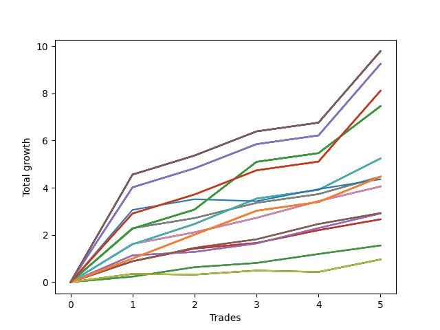

# Long Wallace Doodle 012 
- Symbol: AMZN_Unlimited
- Date Range: 03/23/2022 - 07/08/2022
- Trading Period: 7:20-12:30
- Number of Trades: 5



| Name | Win Percent | Profit | Avg Profit / Trade | Avg Time / Trade |      | Name | Win Percent | Profit | Avg Profit / Trade | Avg Time / Trade |
| ---- | ----------- | ------ | ------------------ | ---------------- | ---- | ---- | ----------- | ------ | ------------------ | ---------------- |
| Sorted By <br> Profit | | | | | | Sorted By <br> Win Percentage ||||
| One Hundred Thirty | 100.00 | 4894.25 | 978.85 | 143:00 |     | One Hundred Thirty | 100.00 | 4894.25 | 978.85 | 143:00 |
| One Hundred Twenty-Five | 100.00 | 4894.25 | 978.85 | 143:00 |     | One Hundred Twenty-Five | 100.00 | 4894.25 | 978.85 | 143:00 |
| One Hundred Twenty | 100.00 | 4894.25 | 978.85 | 143:00 |     | One Hundred Twenty | 100.00 | 4894.25 | 978.85 | 143:00 |
| One Hundred Fifteen | 100.00 | 4894.25 | 978.85 | 143:00 |     | One Hundred Fifteen | 100.00 | 4894.25 | 978.85 | 143:00 |
| One Hundred Ten | 100.00 | 4894.25 | 978.85 | 143:00 |     | One Hundred Ten | 100.00 | 4894.25 | 978.85 | 143:00 |
| One Hundred Five | 100.00 | 4894.25 | 978.85 | 143:00 |     | One Hundred Five | 100.00 | 4894.25 | 978.85 | 143:00 |
| One Hundred | 100.00 | 4894.25 | 978.85 | 143:00 |     | One Hundred | 100.00 | 4894.25 | 978.85 | 143:00 |
| Ninety-Five | 100.00 | 4894.25 | 978.85 | 143:00 |     | Ninety-Five | 100.00 | 4894.25 | 978.85 | 143:00 |
| Eighty-Five | 100.00 | 4894.25 | 978.85 | 143:00 |     | Eighty-Five | 100.00 | 4894.25 | 978.85 | 143:00 |
| One Hundred Twenty-Nine | 100.00 | 4623.75 | 924.75 | 135:14 |     | One Hundred Twenty-Nine | 100.00 | 4623.75 | 924.75 | 135:14 |
| One Hundred Twenty-Four | 100.00 | 4623.75 | 924.75 | 135:14 |     | One Hundred Twenty-Four | 100.00 | 4623.75 | 924.75 | 135:14 |
| One Hundred Ninteen | 100.00 | 4623.75 | 924.75 | 135:14 |     | One Hundred Ninteen | 100.00 | 4623.75 | 924.75 | 135:14 |
| One Hundred Fourteen | 100.00 | 4623.75 | 924.75 | 135:14 |     | One Hundred Fourteen | 100.00 | 4623.75 | 924.75 | 135:14 |
| One Hundred Nine | 100.00 | 4623.75 | 924.75 | 135:14 |     | One Hundred Nine | 100.00 | 4623.75 | 924.75 | 135:14 |
| One Hundred Four | 100.00 | 4623.75 | 924.75 | 135:14 |     | One Hundred Four | 100.00 | 4623.75 | 924.75 | 135:14 |
| Ninety-Nine | 100.00 | 4623.75 | 924.75 | 135:14 |     | Ninety-Nine | 100.00 | 4623.75 | 924.75 | 135:14 |
| Ninety-Four | 100.00 | 4623.75 | 924.75 | 135:14 |     | Ninety-Four | 100.00 | 4623.75 | 924.75 | 135:14 |
| Eighty-Four | 100.00 | 4623.75 | 924.75 | 135:14 |     | Eighty-Four | 100.00 | 4623.75 | 924.75 | 135:14 |
| One Hundred Twenty-Eight | 100.00 | 4054.25 | 810.85 | 130:05 |     | One Hundred Twenty-Eight | 100.00 | 4054.25 | 810.85 | 130:05 |
| One Hundred Twenty-Three | 100.00 | 4054.25 | 810.85 | 130:05 |     | One Hundred Twenty-Three | 100.00 | 4054.25 | 810.85 | 130:05 |
| One Hundred Eighteen | 100.00 | 4054.25 | 810.85 | 130:05 |     | One Hundred Eighteen | 100.00 | 4054.25 | 810.85 | 130:05 |
| One Hundred Thirteen | 100.00 | 4054.25 | 810.85 | 130:05 |     | One Hundred Thirteen | 100.00 | 4054.25 | 810.85 | 130:05 |
| One Hundred Eight | 100.00 | 4054.25 | 810.85 | 130:05 |     | One Hundred Eight | 100.00 | 4054.25 | 810.85 | 130:05 |
| One Hundred Three | 100.00 | 4054.25 | 810.85 | 130:05 |     | One Hundred Three | 100.00 | 4054.25 | 810.85 | 130:05 |
| Ninety-Eight | 100.00 | 4054.25 | 810.85 | 130:05 |     | Ninety-Eight | 100.00 | 4054.25 | 810.85 | 130:05 |
| Ninety-Three | 100.00 | 4054.25 | 810.85 | 130:05 |     | Ninety-Three | 100.00 | 4054.25 | 810.85 | 130:05 |
| Eighty-Three | 100.00 | 4054.25 | 810.85 | 130:05 |     | Eighty-Three | 100.00 | 4054.25 | 810.85 | 130:05 |
| One Hundred Twenty-Seven | 100.00 | 3728.75 | 745.75 | 114:19 |     | One Hundred Twenty-Seven | 100.00 | 3728.75 | 745.75 | 114:19 |
| One Hundred Twenty-Two | 100.00 | 3728.75 | 745.75 | 114:19 |     | One Hundred Twenty-Two | 100.00 | 3728.75 | 745.75 | 114:19 |
| One Hundred Seventeen | 100.00 | 3728.75 | 745.75 | 114:19 |     | One Hundred Seventeen | 100.00 | 3728.75 | 745.75 | 114:19 |
| One Hundred Twelve | 100.00 | 3728.75 | 745.75 | 114:19 |     | One Hundred Twelve | 100.00 | 3728.75 | 745.75 | 114:19 |
| One Hundred Seven | 100.00 | 3728.75 | 745.75 | 114:19 |     | One Hundred Seven | 100.00 | 3728.75 | 745.75 | 114:19 |
| One Hundred Two | 100.00 | 3728.75 | 745.75 | 114:19 |     | One Hundred Two | 100.00 | 3728.75 | 745.75 | 114:19 |
| Ninety-Seven | 100.00 | 3728.75 | 745.75 | 114:19 |     | Ninety-Seven | 100.00 | 3728.75 | 745.75 | 114:19 |
| Ninety-Two | 100.00 | 3728.75 | 745.75 | 114:19 |     | Ninety-Two | 100.00 | 3728.75 | 745.75 | 114:19 |
| Eighty-Two | 100.00 | 3728.75 | 745.75 | 114:19 |     | Eighty-Two | 100.00 | 3728.75 | 745.75 | 114:19 |
| Seventy-One | 100.00 | 2620.75 | 524.15 | 80:38 |     | Seventy-One | 100.00 | 2620.75 | 524.15 | 80:38 |
| Sixty-Three | 100.00 | 2620.75 | 524.15 | 80:38 |     | Sixty-Three | 100.00 | 2620.75 | 524.15 | 80:38 |
| Fifty-Five | 100.00 | 2620.75 | 524.15 | 80:38 |     | Fifty-Five | 100.00 | 2620.75 | 524.15 | 80:38 |
| Forty-Seven | 100.00 | 2620.75 | 524.15 | 80:38 |     | Forty-Seven | 100.00 | 2620.75 | 524.15 | 80:38 |
| Seven | 100.00 | 2620.75 | 524.15 | 80:38 |     | Seven | 100.00 | 2620.75 | 524.15 | 80:38 |
| Sixty-Nine | 100.00 | 2235.50 | 447.10 | 51:43 |     | Sixty-Nine | 100.00 | 2235.50 | 447.10 | 51:43 |
| Sixty-One | 100.00 | 2235.50 | 447.10 | 51:43 |     | Sixty-One | 100.00 | 2235.50 | 447.10 | 51:43 |
| Fifty-Three | 100.00 | 2235.50 | 447.10 | 51:43 |     | Fifty-Three | 100.00 | 2235.50 | 447.10 | 51:43 |
| Forty-Five | 100.00 | 2235.50 | 447.10 | 51:43 |     | Forty-Five | 100.00 | 2235.50 | 447.10 | 51:43 |
| Five | 100.00 | 2235.50 | 447.10 | 51:43 |     | Five | 100.00 | 2235.50 | 447.10 | 51:43 |
| One Hundred Twenty-Six | 100.00 | 2232.75 | 446.55 | 71:31 |     | One Hundred Twenty-Six | 100.00 | 2232.75 | 446.55 | 71:31 |
| One Hundred Twenty-One | 100.00 | 2232.75 | 446.55 | 71:31 |     | One Hundred Twenty-One | 100.00 | 2232.75 | 446.55 | 71:31 |
| One Hundred Sixteen | 100.00 | 2232.75 | 446.55 | 71:31 |     | One Hundred Sixteen | 100.00 | 2232.75 | 446.55 | 71:31 |
| One Hundred Eleven | 100.00 | 2232.75 | 446.55 | 71:31 |     | One Hundred Eleven | 100.00 | 2232.75 | 446.55 | 71:31 |
| One Hundred Six | 100.00 | 2232.75 | 446.55 | 71:31 |     | One Hundred Six | 100.00 | 2232.75 | 446.55 | 71:31 |
| One Hundred One | 100.00 | 2232.75 | 446.55 | 71:31 |     | One Hundred One | 100.00 | 2232.75 | 446.55 | 71:31 |
| Ninety-Six | 100.00 | 2232.75 | 446.55 | 71:31 |     | Ninety-Six | 100.00 | 2232.75 | 446.55 | 71:31 |
| Ninety-One | 100.00 | 2232.75 | 446.55 | 71:31 |     | Ninety-One | 100.00 | 2232.75 | 446.55 | 71:31 |
| Eighty-One | 100.00 | 2232.75 | 446.55 | 71:31 |     | Eighty-One | 100.00 | 2232.75 | 446.55 | 71:31 |
| Seventy-Three | 80.00 | 2180.50 | 436.10 | 14:05 |     | Sixty-Eight | 100.00 | 2027.00 | 405.40 | 22:47 |
| Sixty-Eight | 100.00 | 2027.00 | 405.40 | 22:47 |     | Sixty | 100.00 | 2027.00 | 405.40 | 22:47 |
| Sixty | 100.00 | 2027.00 | 405.40 | 22:47 |     | Fifty-Two | 100.00 | 2027.00 | 405.40 | 22:47 |
| Fifty-Two | 100.00 | 2027.00 | 405.40 | 22:47 |     | Forty-Four | 100.00 | 2027.00 | 405.40 | 22:47 |
| Forty-Four | 100.00 | 2027.00 | 405.40 | 22:47 |     | Four | 100.00 | 2027.00 | 405.40 | 22:47 |
| Four | 100.00 | 2027.00 | 405.40 | 22:47 |     | Sixty-Seven | 100.00 | 1462.75 | 292.55 | 14:54 |
| Sixty-Seven | 100.00 | 1462.75 | 292.55 | 14:54 |     | Fifty-Nine | 100.00 | 1462.75 | 292.55 | 14:54 |
| Fifty-Nine | 100.00 | 1462.75 | 292.55 | 14:54 |     | Fifty-One | 100.00 | 1462.75 | 292.55 | 14:54 |
| Fifty-One | 100.00 | 1462.75 | 292.55 | 14:54 |     | Forty-Three | 100.00 | 1462.75 | 292.55 | 14:54 |
| Forty-Three | 100.00 | 1462.75 | 292.55 | 14:54 |     | Three | 100.00 | 1462.75 | 292.55 | 14:54 |
| Three | 100.00 | 1462.75 | 292.55 | 14:54 |     | Sixty-Six | 100.00 | 1455.50 | 291.10 | 26:22 |
| Sixty-Six | 100.00 | 1455.50 | 291.10 | 26:22 |     | Fifty-Eight | 100.00 | 1455.50 | 291.10 | 26:22 |
| Fifty-Eight | 100.00 | 1455.50 | 291.10 | 26:22 |     | Fifty | 100.00 | 1455.50 | 291.10 | 26:22 |
| Fifty | 100.00 | 1455.50 | 291.10 | 26:22 |     | Forty-Two | 100.00 | 1455.50 | 291.10 | 26:22 |
| Forty-Two | 100.00 | 1455.50 | 291.10 | 26:22 |     | Two | 100.00 | 1455.50 | 291.10 | 26:22 |
| Two | 100.00 | 1455.50 | 291.10 | 26:22 |     | Sixty-Five | 100.00 | 1331.00 | 266.20 | 10:28 |
| Sixty-Five | 100.00 | 1331.00 | 266.20 | 10:28 |     | Fifty-Seven | 100.00 | 1331.00 | 266.20 | 10:28 |
| Fifty-Seven | 100.00 | 1331.00 | 266.20 | 10:28 |     | Forty-Nine | 100.00 | 1331.00 | 266.20 | 10:28 |
| Forty-Nine | 100.00 | 1331.00 | 266.20 | 10:28 |     | Forty-One | 100.00 | 1331.00 | 266.20 | 10:28 |
| Forty-One | 100.00 | 1331.00 | 266.20 | 10:28 |     | One | 100.00 | 1331.00 | 266.20 | 10:28 |
| One | 100.00 | 1331.00 | 266.20 | 10:28 |     | Sixty-Four | 100.00 | 776.50 | 155.30 | 06:53 |
| Sixty-Four | 100.00 | 776.50 | 155.30 | 06:53 |     | Fifty-Six | 100.00 | 776.50 | 155.30 | 06:53 |
| Fifty-Six | 100.00 | 776.50 | 155.30 | 06:53 |     | Forty-Eight | 100.00 | 776.50 | 155.30 | 06:53 |
| Forty-Eight | 100.00 | 776.50 | 155.30 | 06:53 |     | Forty | 100.00 | 776.50 | 155.30 | 06:53 |
| Forty | 100.00 | 776.50 | 155.30 | 06:53 |     | Zero | 100.00 | 776.50 | 155.30 | 06:53 |
| Zero | 100.00 | 776.50 | 155.30 | 06:53 |     | Seventy-Three | 80.00 | 2180.50 | 436.10 | 14:05 |
| Seventy | 60.00 | 480.75 | 96.15 | 02:41 |     | Seventy | 60.00 | 480.75 | 96.15 | 02:41 |
| Sixty-Two | 60.00 | 480.75 | 96.15 | 02:41 |     | Sixty-Two | 60.00 | 480.75 | 96.15 | 02:41 |
| Fifty-Four | 60.00 | 480.75 | 96.15 | 02:41 |     | Fifty-Four | 60.00 | 480.75 | 96.15 | 02:41 |
| Forty-Six | 60.00 | 480.75 | 96.15 | 02:41 |     | Forty-Six | 60.00 | 480.75 | 96.15 | 02:41 |
| Six | 60.00 | 480.75 | 96.15 | 02:41 |     | Six | 60.00 | 480.75 | 96.15 | 02:41 |

## NO STOPLOSS

### Test Zero
* Sell when price hits the middle line of the 20p bollinger
* No Stoploss
* Results:
```
Total Trades: 5
Percent Up: 100.00
Percent Down: 0.00
Total Points Moved Up: 1.55
Potential Profit: 776.50
Total Points Ups: 1.55 Count Ups: 5
Total Points Downs: 0.00 Count Downs: 0
```

<details><summary>Trades</summary>

<code>In: 2022-05-04 11:36:00		Out: 2022-05-04 11:41:15		Total Position Time: 05:15		Total Move Up: 0.24		Total to Date: 0.24</code> <br />
<code>In: 2022-05-25 08:37:00		Out: 2022-05-25 08:43:55		Total Position Time: 06:55		Total Move Up: 0.40		Total to Date: 0.63</code> <br />
<code>In: 2022-05-25 09:29:00		Out: 2022-05-25 09:42:05		Total Position Time: 13:05		Total Move Up: 0.18		Total to Date: 0.81</code> <br />
<code>In: 2022-06-17 12:15:00		Out: 2022-06-17 12:21:10		Total Position Time: 06:10		Total Move Up: 0.38		Total to Date: 1.19</code> <br />
<code>In: 2022-06-23 10:03:00		Out: 2022-06-23 10:06:00		Total Position Time: 03:00		Total Move Up: 0.36		Total to Date: 1.55</code> <br />


</details>

### Test One
* Sell when the price hits the upper line of the 20p 1std bollinger
* No Stoploss
* Results:
```
Total Trades: 5
Percent Up: 100.00
Percent Down: 0.00
Total Points Moved Up: 2.66
Potential Profit: 1331.00
Total Points Ups: 2.66 Count Ups: 5
Total Points Downs: 0.00 Count Downs: 0
```

<details><summary>Trades</summary>

<code>In: 2022-05-04 11:36:00		Out: 2022-05-04 11:43:40		Total Position Time: 07:40		Total Move Up: 0.88		Total to Date: 0.88</code> <br />
<code>In: 2022-05-25 08:37:00		Out: 2022-05-25 08:44:10		Total Position Time: 07:10		Total Move Up: 0.54		Total to Date: 1.42</code> <br />
<code>In: 2022-05-25 09:29:00		Out: 2022-05-25 09:44:30		Total Position Time: 15:30		Total Move Up: 0.24		Total to Date: 1.66</code> <br />
<code>In: 2022-06-17 12:15:00		Out: 2022-06-17 12:22:50		Total Position Time: 07:50		Total Move Up: 0.54		Total to Date: 2.20</code> <br />
<code>In: 2022-06-23 10:03:00		Out: 2022-06-23 10:17:10		Total Position Time: 14:10		Total Move Up: 0.46		Total to Date: 2.66</code> <br />


</details>

### Test Two
* Sell when the price hits the upper line of the 20p 2std bollinger
* No Stoploss
* Results:
```
Total Trades: 5
Percent Up: 100.00
Percent Down: 0.00
Total Points Moved Up: 2.91
Potential Profit: 1455.50
Total Points Ups: 2.91 Count Ups: 5
Total Points Downs: 0.00 Count Downs: 0
```

<details><summary>Trades</summary>

<code>In: 2022-05-04 11:36:00		Out: 2022-05-04 11:44:25		Total Position Time: 08:25		Total Move Up: 1.14		Total to Date: 1.14</code> <br />
<code>In: 2022-05-25 08:37:00		Out: 2022-05-25 09:48:45		Total Position Time: 71:45		Total Move Up: 0.14		Total to Date: 1.28</code> <br />
<code>In: 2022-05-25 09:29:00		Out: 2022-05-25 09:48:45		Total Position Time: 19:45		Total Move Up: 0.36		Total to Date: 1.64</code> <br />
<code>In: 2022-06-17 12:15:00		Out: 2022-06-17 12:26:30		Total Position Time: 11:30		Total Move Up: 0.65		Total to Date: 2.29</code> <br />
<code>In: 2022-06-23 10:03:00		Out: 2022-06-23 10:23:25		Total Position Time: 20:25		Total Move Up: 0.62		Total to Date: 2.91</code> <br />


</details>

### Test Three
* Sell when price hits the middle line of the 50p bollinger
* No Stoploss
* Results:
```
Total Trades: 5
Percent Up: 100.00
Percent Down: 0.00
Total Points Moved Up: 2.93
Potential Profit: 1462.75
Total Points Ups: 2.93 Count Ups: 5
Total Points Downs: 0.00 Count Downs: 0
```

<details><summary>Trades</summary>

<code>In: 2022-05-04 11:36:00		Out: 2022-05-04 11:43:40		Total Position Time: 07:40		Total Move Up: 0.88		Total to Date: 0.88</code> <br />
<code>In: 2022-05-25 08:37:00		Out: 2022-05-25 08:58:25		Total Position Time: 21:25		Total Move Up: 0.57		Total to Date: 1.45</code> <br />
<code>In: 2022-05-25 09:29:00		Out: 2022-05-25 09:48:45		Total Position Time: 19:45		Total Move Up: 0.36		Total to Date: 1.82</code> <br />
<code>In: 2022-06-17 12:15:00		Out: 2022-06-17 12:26:30		Total Position Time: 11:30		Total Move Up: 0.65		Total to Date: 2.47</code> <br />
<code>In: 2022-06-23 10:03:00		Out: 2022-06-23 10:17:10		Total Position Time: 14:10		Total Move Up: 0.46		Total to Date: 2.93</code> <br />


</details>

### Test Four
* Sell when the price hits the upper line of the 50p 1std bollinger
* No Stoploss
* Results:
```
Total Trades: 5
Percent Up: 100.00
Percent Down: 0.00
Total Points Moved Up: 4.05
Potential Profit: 2027.00
Total Points Ups: 4.05 Count Ups: 5
Total Points Downs: 0.00 Count Downs: 0
```

<details><summary>Trades</summary>

<code>In: 2022-05-04 11:36:00		Out: 2022-05-04 11:45:30		Total Position Time: 09:30		Total Move Up: 1.62		Total to Date: 1.62</code> <br />
<code>In: 2022-05-25 08:37:00		Out: 2022-05-25 09:15:30		Total Position Time: 38:30		Total Move Up: 0.49		Total to Date: 2.11</code> <br />
<code>In: 2022-05-25 09:29:00		Out: 2022-05-25 09:50:10		Total Position Time: 21:10		Total Move Up: 0.61		Total to Date: 2.72</code> <br />
<code>In: 2022-06-17 12:15:00		Out: 2022-06-17 12:39:20		Total Position Time: 24:20		Total Move Up: 0.71		Total to Date: 3.43</code> <br />
<code>In: 2022-06-23 10:03:00		Out: 2022-06-23 10:23:25		Total Position Time: 20:25		Total Move Up: 0.62		Total to Date: 4.05</code> <br />


</details>

### Test Five
* Sell when the price hits the upper line of the 50p 2std bollinger
* No Stoploss
* Results:
```
Total Trades: 5
Percent Up: 100.00
Percent Down: 0.00
Total Points Moved Up: 4.47
Potential Profit: 2235.50
Total Points Ups: 4.47 Count Ups: 5
Total Points Downs: 0.00 Count Downs: 0
```

<details><summary>Trades</summary>

<code>In: 2022-05-04 11:36:00		Out: 2022-05-04 11:46:55		Total Position Time: 10:55		Total Move Up: 2.28		Total to Date: 2.28</code> <br />
<code>In: 2022-05-25 08:37:00		Out: 2022-05-25 10:35:45		Total Position Time: 118:45		Total Move Up: 0.43		Total to Date: 2.71</code> <br />
<code>In: 2022-05-25 09:29:00		Out: 2022-05-25 10:35:45		Total Position Time: 66:45		Total Move Up: 0.65		Total to Date: 3.36</code> <br />
<code>In: 2022-06-17 12:15:00		Out: 2022-06-17 12:47:00		Total Position Time: 32:00		Total Move Up: 0.37		Total to Date: 3.73</code> <br />
<code>In: 2022-06-23 10:03:00		Out: 2022-06-23 10:33:10		Total Position Time: 30:10		Total Move Up: 0.74		Total to Date: 4.47</code> <br />


</details>

### Test Six
* Sell when the price hits the middle line of the 1std VWAP
* No Stoploss
* Results:
```
Total Trades: 5
Percent Up: 60.00
Percent Down: 40.00
Total Points Moved Up: 0.96
Potential Profit: 480.75
Total Points Ups: 1.05 Count Ups: 3
Total Points Downs: -0.09 Count Downs: 2
```

<details><summary>Trades</summary>

<code>In: 2022-05-04 11:36:00		Out: 2022-05-04 11:42:15		Total Position Time: 06:15		Total Move Up: 0.35		Total to Date: 0.35</code> <br />
<code>In: 2022-05-25 08:37:00		Out: 2022-05-25 08:38:10		Total Position Time: 01:10		Total Move Up: -0.03		Total to Date: 0.32</code> <br />
<code>In: 2022-05-25 09:29:00		Out: 2022-05-25 09:30:10		Total Position Time: 01:10		Total Move Up: 0.17		Total to Date: 0.49</code> <br />
<code>In: 2022-06-17 12:15:00		Out: 2022-06-17 12:16:10		Total Position Time: 01:10		Total Move Up: -0.06		Total to Date: 0.43</code> <br />
<code>In: 2022-06-23 10:03:00		Out: 2022-06-23 10:06:40		Total Position Time: 03:40		Total Move Up: 0.53		Total to Date: 0.96</code> <br />


</details>

### Test Seven
* Sell when the price hits the upper line of the 1std VWAP
* No Stoploss
* Results:
```
Total Trades: 5
Percent Up: 100.00
Percent Down: 0.00
Total Points Moved Up: 5.24
Potential Profit: 2620.75
Total Points Ups: 5.24 Count Ups: 5
Total Points Downs: 0.00 Count Downs: 0
```

<details><summary>Trades</summary>

<code>In: 2022-05-04 11:36:00		Out: 2022-05-04 11:45:40		Total Position Time: 09:40		Total Move Up: 1.60		Total to Date: 1.60</code> <br />
<code>In: 2022-05-25 08:37:00		Out: 2022-05-25 11:21:15		Total Position Time: 164:15		Total Move Up: 0.86		Total to Date: 2.46</code> <br />
<code>In: 2022-05-25 09:29:00		Out: 2022-05-25 11:21:15		Total Position Time: 112:15		Total Move Up: 1.08		Total to Date: 3.54</code> <br />
<code>In: 2022-06-17 12:15:00		Out: 2022-06-17 12:47:00		Total Position Time: 32:00		Total Move Up: 0.37		Total to Date: 3.91</code> <br />
<code>In: 2022-06-23 10:03:00		Out: 2022-06-23 11:28:00		Total Position Time: 85:00		Total Move Up: 1.33		Total to Date: 5.24</code> <br />


</details>

## STOPLOSS OF 5

### Test Forty
* Sell when price hits the middle line of the 20p bollinger
* Stoploss is 5 points
* Results:
```
Total Trades: 5
Percent Up: 100.00
Percent Down: 0.00
Total Points Moved Up: 1.55
Potential Profit: 776.50
Total Points Ups: 1.55 Count Ups: 5
Total Points Downs: 0.00 Count Downs: 0
```

<details><summary>Trades</summary>

<code>In: 2022-05-04 11:36:00		Out: 2022-05-04 11:41:15		Total Position Time: 05:15		Total Move Up: 0.24		Total to Date: 0.24</code> <br />
<code>In: 2022-05-25 08:37:00		Out: 2022-05-25 08:43:55		Total Position Time: 06:55		Total Move Up: 0.40		Total to Date: 0.63</code> <br />
<code>In: 2022-05-25 09:29:00		Out: 2022-05-25 09:42:05		Total Position Time: 13:05		Total Move Up: 0.18		Total to Date: 0.81</code> <br />
<code>In: 2022-06-17 12:15:00		Out: 2022-06-17 12:21:10		Total Position Time: 06:10		Total Move Up: 0.38		Total to Date: 1.19</code> <br />
<code>In: 2022-06-23 10:03:00		Out: 2022-06-23 10:06:00		Total Position Time: 03:00		Total Move Up: 0.36		Total to Date: 1.55</code> <br />


</details>

### Test Forty-One
* Sell when the price hits the upper line of the 20p 1std bollinger
* Stoploss is 5 points
* Results:
```
Total Trades: 5
Percent Up: 100.00
Percent Down: 0.00
Total Points Moved Up: 2.66
Potential Profit: 1331.00
Total Points Ups: 2.66 Count Ups: 5
Total Points Downs: 0.00 Count Downs: 0
```

<details><summary>Trades</summary>

<code>In: 2022-05-04 11:36:00		Out: 2022-05-04 11:43:40		Total Position Time: 07:40		Total Move Up: 0.88		Total to Date: 0.88</code> <br />
<code>In: 2022-05-25 08:37:00		Out: 2022-05-25 08:44:10		Total Position Time: 07:10		Total Move Up: 0.54		Total to Date: 1.42</code> <br />
<code>In: 2022-05-25 09:29:00		Out: 2022-05-25 09:44:30		Total Position Time: 15:30		Total Move Up: 0.24		Total to Date: 1.66</code> <br />
<code>In: 2022-06-17 12:15:00		Out: 2022-06-17 12:22:50		Total Position Time: 07:50		Total Move Up: 0.54		Total to Date: 2.20</code> <br />
<code>In: 2022-06-23 10:03:00		Out: 2022-06-23 10:17:10		Total Position Time: 14:10		Total Move Up: 0.46		Total to Date: 2.66</code> <br />


</details>

### Test Forty-Two
* Sell when the price hits the upper line of the 20p 2std bollinger
* Stoploss is 5 points
* Results:
```
Total Trades: 5
Percent Up: 100.00
Percent Down: 0.00
Total Points Moved Up: 2.91
Potential Profit: 1455.50
Total Points Ups: 2.91 Count Ups: 5
Total Points Downs: 0.00 Count Downs: 0
```

<details><summary>Trades</summary>

<code>In: 2022-05-04 11:36:00		Out: 2022-05-04 11:44:25		Total Position Time: 08:25		Total Move Up: 1.14		Total to Date: 1.14</code> <br />
<code>In: 2022-05-25 08:37:00		Out: 2022-05-25 09:48:45		Total Position Time: 71:45		Total Move Up: 0.14		Total to Date: 1.28</code> <br />
<code>In: 2022-05-25 09:29:00		Out: 2022-05-25 09:48:45		Total Position Time: 19:45		Total Move Up: 0.36		Total to Date: 1.64</code> <br />
<code>In: 2022-06-17 12:15:00		Out: 2022-06-17 12:26:30		Total Position Time: 11:30		Total Move Up: 0.65		Total to Date: 2.29</code> <br />
<code>In: 2022-06-23 10:03:00		Out: 2022-06-23 10:23:25		Total Position Time: 20:25		Total Move Up: 0.62		Total to Date: 2.91</code> <br />


</details>

### Test Forty-Three
* Sell when price hits the middle line of the 50p bollinger
* Stoploss is 5 points
* Results:
```
Total Trades: 5
Percent Up: 100.00
Percent Down: 0.00
Total Points Moved Up: 2.93
Potential Profit: 1462.75
Total Points Ups: 2.93 Count Ups: 5
Total Points Downs: 0.00 Count Downs: 0
```

<details><summary>Trades</summary>

<code>In: 2022-05-04 11:36:00		Out: 2022-05-04 11:43:40		Total Position Time: 07:40		Total Move Up: 0.88		Total to Date: 0.88</code> <br />
<code>In: 2022-05-25 08:37:00		Out: 2022-05-25 08:58:25		Total Position Time: 21:25		Total Move Up: 0.57		Total to Date: 1.45</code> <br />
<code>In: 2022-05-25 09:29:00		Out: 2022-05-25 09:48:45		Total Position Time: 19:45		Total Move Up: 0.36		Total to Date: 1.82</code> <br />
<code>In: 2022-06-17 12:15:00		Out: 2022-06-17 12:26:30		Total Position Time: 11:30		Total Move Up: 0.65		Total to Date: 2.47</code> <br />
<code>In: 2022-06-23 10:03:00		Out: 2022-06-23 10:17:10		Total Position Time: 14:10		Total Move Up: 0.46		Total to Date: 2.93</code> <br />


</details>

### Test Forty-Four
* Sell when the price hits the upper line of the 50p 1std bollinger
* Stoploss is 5 points
* Results:
```
Total Trades: 5
Percent Up: 100.00
Percent Down: 0.00
Total Points Moved Up: 4.05
Potential Profit: 2027.00
Total Points Ups: 4.05 Count Ups: 5
Total Points Downs: 0.00 Count Downs: 0
```

<details><summary>Trades</summary>

<code>In: 2022-05-04 11:36:00		Out: 2022-05-04 11:45:30		Total Position Time: 09:30		Total Move Up: 1.62		Total to Date: 1.62</code> <br />
<code>In: 2022-05-25 08:37:00		Out: 2022-05-25 09:15:30		Total Position Time: 38:30		Total Move Up: 0.49		Total to Date: 2.11</code> <br />
<code>In: 2022-05-25 09:29:00		Out: 2022-05-25 09:50:10		Total Position Time: 21:10		Total Move Up: 0.61		Total to Date: 2.72</code> <br />
<code>In: 2022-06-17 12:15:00		Out: 2022-06-17 12:39:20		Total Position Time: 24:20		Total Move Up: 0.71		Total to Date: 3.43</code> <br />
<code>In: 2022-06-23 10:03:00		Out: 2022-06-23 10:23:25		Total Position Time: 20:25		Total Move Up: 0.62		Total to Date: 4.05</code> <br />


</details>

### Test Forty-Five
* Sell when the price hits the upper line of the 50p 2std bollinger
* Stoploss is 5 points
* Results:
```
Total Trades: 5
Percent Up: 100.00
Percent Down: 0.00
Total Points Moved Up: 4.47
Potential Profit: 2235.50
Total Points Ups: 4.47 Count Ups: 5
Total Points Downs: 0.00 Count Downs: 0
```

<details><summary>Trades</summary>

<code>In: 2022-05-04 11:36:00		Out: 2022-05-04 11:46:55		Total Position Time: 10:55		Total Move Up: 2.28		Total to Date: 2.28</code> <br />
<code>In: 2022-05-25 08:37:00		Out: 2022-05-25 10:35:45		Total Position Time: 118:45		Total Move Up: 0.43		Total to Date: 2.71</code> <br />
<code>In: 2022-05-25 09:29:00		Out: 2022-05-25 10:35:45		Total Position Time: 66:45		Total Move Up: 0.65		Total to Date: 3.36</code> <br />
<code>In: 2022-06-17 12:15:00		Out: 2022-06-17 12:47:00		Total Position Time: 32:00		Total Move Up: 0.37		Total to Date: 3.73</code> <br />
<code>In: 2022-06-23 10:03:00		Out: 2022-06-23 10:33:10		Total Position Time: 30:10		Total Move Up: 0.74		Total to Date: 4.47</code> <br />


</details>

### Test Forty-Six
* Sell when the price hits the middle line of the 1std VWAP
* Stoploss is 5 points
* Results:
```
Total Trades: 5
Percent Up: 60.00
Percent Down: 40.00
Total Points Moved Up: 0.96
Potential Profit: 480.75
Total Points Ups: 1.05 Count Ups: 3
Total Points Downs: -0.09 Count Downs: 2
```

<details><summary>Trades</summary>

<code>In: 2022-05-04 11:36:00		Out: 2022-05-04 11:42:15		Total Position Time: 06:15		Total Move Up: 0.35		Total to Date: 0.35</code> <br />
<code>In: 2022-05-25 08:37:00		Out: 2022-05-25 08:38:10		Total Position Time: 01:10		Total Move Up: -0.03		Total to Date: 0.32</code> <br />
<code>In: 2022-05-25 09:29:00		Out: 2022-05-25 09:30:10		Total Position Time: 01:10		Total Move Up: 0.17		Total to Date: 0.49</code> <br />
<code>In: 2022-06-17 12:15:00		Out: 2022-06-17 12:16:10		Total Position Time: 01:10		Total Move Up: -0.06		Total to Date: 0.43</code> <br />
<code>In: 2022-06-23 10:03:00		Out: 2022-06-23 10:06:40		Total Position Time: 03:40		Total Move Up: 0.53		Total to Date: 0.96</code> <br />


</details>

### Test Forty-Seven
* Sell when the price hits the upper line of the 1std VWAP
* Stoploss is 5 points
* Results:
```
Total Trades: 5
Percent Up: 100.00
Percent Down: 0.00
Total Points Moved Up: 5.24
Potential Profit: 2620.75
Total Points Ups: 5.24 Count Ups: 5
Total Points Downs: 0.00 Count Downs: 0
```

<details><summary>Trades</summary>

<code>In: 2022-05-04 11:36:00		Out: 2022-05-04 11:45:40		Total Position Time: 09:40		Total Move Up: 1.60		Total to Date: 1.60</code> <br />
<code>In: 2022-05-25 08:37:00		Out: 2022-05-25 11:21:15		Total Position Time: 164:15		Total Move Up: 0.86		Total to Date: 2.46</code> <br />
<code>In: 2022-05-25 09:29:00		Out: 2022-05-25 11:21:15		Total Position Time: 112:15		Total Move Up: 1.08		Total to Date: 3.54</code> <br />
<code>In: 2022-06-17 12:15:00		Out: 2022-06-17 12:47:00		Total Position Time: 32:00		Total Move Up: 0.37		Total to Date: 3.91</code> <br />
<code>In: 2022-06-23 10:03:00		Out: 2022-06-23 11:28:00		Total Position Time: 85:00		Total Move Up: 1.33		Total to Date: 5.24</code> <br />


</details>

## TRAIL STOP OF 5

### Test Forty-Eight
* Sell when price hits the middle line of the 20p bollinger
* Trailing Stop is 5 points
* Results:
```
Total Trades: 5
Percent Up: 100.00
Percent Down: 0.00
Total Points Moved Up: 1.55
Potential Profit: 776.50
Total Points Ups: 1.55 Count Ups: 5
Total Points Downs: 0.00 Count Downs: 0
```

<details><summary>Trades</summary>

<code>In: 2022-05-04 11:36:00		Out: 2022-05-04 11:41:15		Total Position Time: 05:15		Total Move Up: 0.24		Total to Date: 0.24</code> <br />
<code>In: 2022-05-25 08:37:00		Out: 2022-05-25 08:43:55		Total Position Time: 06:55		Total Move Up: 0.40		Total to Date: 0.63</code> <br />
<code>In: 2022-05-25 09:29:00		Out: 2022-05-25 09:42:05		Total Position Time: 13:05		Total Move Up: 0.18		Total to Date: 0.81</code> <br />
<code>In: 2022-06-17 12:15:00		Out: 2022-06-17 12:21:10		Total Position Time: 06:10		Total Move Up: 0.38		Total to Date: 1.19</code> <br />
<code>In: 2022-06-23 10:03:00		Out: 2022-06-23 10:06:00		Total Position Time: 03:00		Total Move Up: 0.36		Total to Date: 1.55</code> <br />


</details>

### Test Forty-Nine
* Sell when the price hits the upper line of the 20p 1std bollinger
* Trailing Stop is 5 points
* Results:
```
Total Trades: 5
Percent Up: 100.00
Percent Down: 0.00
Total Points Moved Up: 2.66
Potential Profit: 1331.00
Total Points Ups: 2.66 Count Ups: 5
Total Points Downs: 0.00 Count Downs: 0
```

<details><summary>Trades</summary>

<code>In: 2022-05-04 11:36:00		Out: 2022-05-04 11:43:40		Total Position Time: 07:40		Total Move Up: 0.88		Total to Date: 0.88</code> <br />
<code>In: 2022-05-25 08:37:00		Out: 2022-05-25 08:44:10		Total Position Time: 07:10		Total Move Up: 0.54		Total to Date: 1.42</code> <br />
<code>In: 2022-05-25 09:29:00		Out: 2022-05-25 09:44:30		Total Position Time: 15:30		Total Move Up: 0.24		Total to Date: 1.66</code> <br />
<code>In: 2022-06-17 12:15:00		Out: 2022-06-17 12:22:50		Total Position Time: 07:50		Total Move Up: 0.54		Total to Date: 2.20</code> <br />
<code>In: 2022-06-23 10:03:00		Out: 2022-06-23 10:17:10		Total Position Time: 14:10		Total Move Up: 0.46		Total to Date: 2.66</code> <br />


</details>

### Test Fifty
* Sell when the price hits the upper line of the 20p 2std bollinger
* Trailing Stop is 5 points
* Results:
```
Total Trades: 5
Percent Up: 100.00
Percent Down: 0.00
Total Points Moved Up: 2.91
Potential Profit: 1455.50
Total Points Ups: 2.91 Count Ups: 5
Total Points Downs: 0.00 Count Downs: 0
```

<details><summary>Trades</summary>

<code>In: 2022-05-04 11:36:00		Out: 2022-05-04 11:44:25		Total Position Time: 08:25		Total Move Up: 1.14		Total to Date: 1.14</code> <br />
<code>In: 2022-05-25 08:37:00		Out: 2022-05-25 09:48:45		Total Position Time: 71:45		Total Move Up: 0.14		Total to Date: 1.28</code> <br />
<code>In: 2022-05-25 09:29:00		Out: 2022-05-25 09:48:45		Total Position Time: 19:45		Total Move Up: 0.36		Total to Date: 1.64</code> <br />
<code>In: 2022-06-17 12:15:00		Out: 2022-06-17 12:26:30		Total Position Time: 11:30		Total Move Up: 0.65		Total to Date: 2.29</code> <br />
<code>In: 2022-06-23 10:03:00		Out: 2022-06-23 10:23:25		Total Position Time: 20:25		Total Move Up: 0.62		Total to Date: 2.91</code> <br />


</details>

### Test Fifty-One
* Sell when price hits the middle line of the 50p bollinger
* Trailing Stop is 5 points
* Results:
```
Total Trades: 5
Percent Up: 100.00
Percent Down: 0.00
Total Points Moved Up: 2.93
Potential Profit: 1462.75
Total Points Ups: 2.93 Count Ups: 5
Total Points Downs: 0.00 Count Downs: 0
```

<details><summary>Trades</summary>

<code>In: 2022-05-04 11:36:00		Out: 2022-05-04 11:43:40		Total Position Time: 07:40		Total Move Up: 0.88		Total to Date: 0.88</code> <br />
<code>In: 2022-05-25 08:37:00		Out: 2022-05-25 08:58:25		Total Position Time: 21:25		Total Move Up: 0.57		Total to Date: 1.45</code> <br />
<code>In: 2022-05-25 09:29:00		Out: 2022-05-25 09:48:45		Total Position Time: 19:45		Total Move Up: 0.36		Total to Date: 1.82</code> <br />
<code>In: 2022-06-17 12:15:00		Out: 2022-06-17 12:26:30		Total Position Time: 11:30		Total Move Up: 0.65		Total to Date: 2.47</code> <br />
<code>In: 2022-06-23 10:03:00		Out: 2022-06-23 10:17:10		Total Position Time: 14:10		Total Move Up: 0.46		Total to Date: 2.93</code> <br />


</details>

### Test Fifty-Two
* Sell when the price hits the upper line of the 50p 1std bollinger
* Trailing Stop is 5 points
* Results:
```
Total Trades: 5
Percent Up: 100.00
Percent Down: 0.00
Total Points Moved Up: 4.05
Potential Profit: 2027.00
Total Points Ups: 4.05 Count Ups: 5
Total Points Downs: 0.00 Count Downs: 0
```

<details><summary>Trades</summary>

<code>In: 2022-05-04 11:36:00		Out: 2022-05-04 11:45:30		Total Position Time: 09:30		Total Move Up: 1.62		Total to Date: 1.62</code> <br />
<code>In: 2022-05-25 08:37:00		Out: 2022-05-25 09:15:30		Total Position Time: 38:30		Total Move Up: 0.49		Total to Date: 2.11</code> <br />
<code>In: 2022-05-25 09:29:00		Out: 2022-05-25 09:50:10		Total Position Time: 21:10		Total Move Up: 0.61		Total to Date: 2.72</code> <br />
<code>In: 2022-06-17 12:15:00		Out: 2022-06-17 12:39:20		Total Position Time: 24:20		Total Move Up: 0.71		Total to Date: 3.43</code> <br />
<code>In: 2022-06-23 10:03:00		Out: 2022-06-23 10:23:25		Total Position Time: 20:25		Total Move Up: 0.62		Total to Date: 4.05</code> <br />


</details>

### Test Fifty-Three
* Sell when the price hits the upper line of the 50p 2std bollinger
* Trailing Stop is 5 points
* Results:
```
Total Trades: 5
Percent Up: 100.00
Percent Down: 0.00
Total Points Moved Up: 4.47
Potential Profit: 2235.50
Total Points Ups: 4.47 Count Ups: 5
Total Points Downs: 0.00 Count Downs: 0
```

<details><summary>Trades</summary>

<code>In: 2022-05-04 11:36:00		Out: 2022-05-04 11:46:55		Total Position Time: 10:55		Total Move Up: 2.28		Total to Date: 2.28</code> <br />
<code>In: 2022-05-25 08:37:00		Out: 2022-05-25 10:35:45		Total Position Time: 118:45		Total Move Up: 0.43		Total to Date: 2.71</code> <br />
<code>In: 2022-05-25 09:29:00		Out: 2022-05-25 10:35:45		Total Position Time: 66:45		Total Move Up: 0.65		Total to Date: 3.36</code> <br />
<code>In: 2022-06-17 12:15:00		Out: 2022-06-17 12:47:00		Total Position Time: 32:00		Total Move Up: 0.37		Total to Date: 3.73</code> <br />
<code>In: 2022-06-23 10:03:00		Out: 2022-06-23 10:33:10		Total Position Time: 30:10		Total Move Up: 0.74		Total to Date: 4.47</code> <br />


</details>

### Test Fifty-Four
* Sell when the price hits the middle line of the 1std VWAP
* Trailing Stop is 5 points
* Results:
```
Total Trades: 5
Percent Up: 60.00
Percent Down: 40.00
Total Points Moved Up: 0.96
Potential Profit: 480.75
Total Points Ups: 1.05 Count Ups: 3
Total Points Downs: -0.09 Count Downs: 2
```

<details><summary>Trades</summary>

<code>In: 2022-05-04 11:36:00		Out: 2022-05-04 11:42:15		Total Position Time: 06:15		Total Move Up: 0.35		Total to Date: 0.35</code> <br />
<code>In: 2022-05-25 08:37:00		Out: 2022-05-25 08:38:10		Total Position Time: 01:10		Total Move Up: -0.03		Total to Date: 0.32</code> <br />
<code>In: 2022-05-25 09:29:00		Out: 2022-05-25 09:30:10		Total Position Time: 01:10		Total Move Up: 0.17		Total to Date: 0.49</code> <br />
<code>In: 2022-06-17 12:15:00		Out: 2022-06-17 12:16:10		Total Position Time: 01:10		Total Move Up: -0.06		Total to Date: 0.43</code> <br />
<code>In: 2022-06-23 10:03:00		Out: 2022-06-23 10:06:40		Total Position Time: 03:40		Total Move Up: 0.53		Total to Date: 0.96</code> <br />


</details>

### Test Fifty-Five
* Sell when the price hits the upper line of the 1std VWAP
* Trailing Stop is 5 points
* Results:
```
Total Trades: 5
Percent Up: 100.00
Percent Down: 0.00
Total Points Moved Up: 5.24
Potential Profit: 2620.75
Total Points Ups: 5.24 Count Ups: 5
Total Points Downs: 0.00 Count Downs: 0
```

<details><summary>Trades</summary>

<code>In: 2022-05-04 11:36:00		Out: 2022-05-04 11:45:40		Total Position Time: 09:40		Total Move Up: 1.60		Total to Date: 1.60</code> <br />
<code>In: 2022-05-25 08:37:00		Out: 2022-05-25 11:21:15		Total Position Time: 164:15		Total Move Up: 0.86		Total to Date: 2.46</code> <br />
<code>In: 2022-05-25 09:29:00		Out: 2022-05-25 11:21:15		Total Position Time: 112:15		Total Move Up: 1.08		Total to Date: 3.54</code> <br />
<code>In: 2022-06-17 12:15:00		Out: 2022-06-17 12:47:00		Total Position Time: 32:00		Total Move Up: 0.37		Total to Date: 3.91</code> <br />
<code>In: 2022-06-23 10:03:00		Out: 2022-06-23 11:28:00		Total Position Time: 85:00		Total Move Up: 1.33		Total to Date: 5.24</code> <br />


</details>

## STOPLOSS OF 10

### Test Fifty-Six
* Sell when price hits the middle line of the 20p bollinger
* Stoploss is 10 points
* Results:
```
Total Trades: 5
Percent Up: 100.00
Percent Down: 0.00
Total Points Moved Up: 1.55
Potential Profit: 776.50
Total Points Ups: 1.55 Count Ups: 5
Total Points Downs: 0.00 Count Downs: 0
```

<details><summary>Trades</summary>

<code>In: 2022-05-04 11:36:00		Out: 2022-05-04 11:41:15		Total Position Time: 05:15		Total Move Up: 0.24		Total to Date: 0.24</code> <br />
<code>In: 2022-05-25 08:37:00		Out: 2022-05-25 08:43:55		Total Position Time: 06:55		Total Move Up: 0.40		Total to Date: 0.63</code> <br />
<code>In: 2022-05-25 09:29:00		Out: 2022-05-25 09:42:05		Total Position Time: 13:05		Total Move Up: 0.18		Total to Date: 0.81</code> <br />
<code>In: 2022-06-17 12:15:00		Out: 2022-06-17 12:21:10		Total Position Time: 06:10		Total Move Up: 0.38		Total to Date: 1.19</code> <br />
<code>In: 2022-06-23 10:03:00		Out: 2022-06-23 10:06:00		Total Position Time: 03:00		Total Move Up: 0.36		Total to Date: 1.55</code> <br />


</details>

### Test Fifty-Seven
* Sell when the price hits the upper line of the 20p 1std bollinger
* Stoploss is 10 points
* Results:
```
Total Trades: 5
Percent Up: 100.00
Percent Down: 0.00
Total Points Moved Up: 2.66
Potential Profit: 1331.00
Total Points Ups: 2.66 Count Ups: 5
Total Points Downs: 0.00 Count Downs: 0
```

<details><summary>Trades</summary>

<code>In: 2022-05-04 11:36:00		Out: 2022-05-04 11:43:40		Total Position Time: 07:40		Total Move Up: 0.88		Total to Date: 0.88</code> <br />
<code>In: 2022-05-25 08:37:00		Out: 2022-05-25 08:44:10		Total Position Time: 07:10		Total Move Up: 0.54		Total to Date: 1.42</code> <br />
<code>In: 2022-05-25 09:29:00		Out: 2022-05-25 09:44:30		Total Position Time: 15:30		Total Move Up: 0.24		Total to Date: 1.66</code> <br />
<code>In: 2022-06-17 12:15:00		Out: 2022-06-17 12:22:50		Total Position Time: 07:50		Total Move Up: 0.54		Total to Date: 2.20</code> <br />
<code>In: 2022-06-23 10:03:00		Out: 2022-06-23 10:17:10		Total Position Time: 14:10		Total Move Up: 0.46		Total to Date: 2.66</code> <br />


</details>

### Test Fifty-Eight
* Sell when the price hits the upper line of the 20p 2std bollinger
* Stoploss is 10 points
* Results:
```
Total Trades: 5
Percent Up: 100.00
Percent Down: 0.00
Total Points Moved Up: 2.91
Potential Profit: 1455.50
Total Points Ups: 2.91 Count Ups: 5
Total Points Downs: 0.00 Count Downs: 0
```

<details><summary>Trades</summary>

<code>In: 2022-05-04 11:36:00		Out: 2022-05-04 11:44:25		Total Position Time: 08:25		Total Move Up: 1.14		Total to Date: 1.14</code> <br />
<code>In: 2022-05-25 08:37:00		Out: 2022-05-25 09:48:45		Total Position Time: 71:45		Total Move Up: 0.14		Total to Date: 1.28</code> <br />
<code>In: 2022-05-25 09:29:00		Out: 2022-05-25 09:48:45		Total Position Time: 19:45		Total Move Up: 0.36		Total to Date: 1.64</code> <br />
<code>In: 2022-06-17 12:15:00		Out: 2022-06-17 12:26:30		Total Position Time: 11:30		Total Move Up: 0.65		Total to Date: 2.29</code> <br />
<code>In: 2022-06-23 10:03:00		Out: 2022-06-23 10:23:25		Total Position Time: 20:25		Total Move Up: 0.62		Total to Date: 2.91</code> <br />


</details>

### Test Fifty-Nine
* Sell when price hits the middle line of the 50p bollinger
* Stoploss is 10 points
* Results:
```
Total Trades: 5
Percent Up: 100.00
Percent Down: 0.00
Total Points Moved Up: 2.93
Potential Profit: 1462.75
Total Points Ups: 2.93 Count Ups: 5
Total Points Downs: 0.00 Count Downs: 0
```

<details><summary>Trades</summary>

<code>In: 2022-05-04 11:36:00		Out: 2022-05-04 11:43:40		Total Position Time: 07:40		Total Move Up: 0.88		Total to Date: 0.88</code> <br />
<code>In: 2022-05-25 08:37:00		Out: 2022-05-25 08:58:25		Total Position Time: 21:25		Total Move Up: 0.57		Total to Date: 1.45</code> <br />
<code>In: 2022-05-25 09:29:00		Out: 2022-05-25 09:48:45		Total Position Time: 19:45		Total Move Up: 0.36		Total to Date: 1.82</code> <br />
<code>In: 2022-06-17 12:15:00		Out: 2022-06-17 12:26:30		Total Position Time: 11:30		Total Move Up: 0.65		Total to Date: 2.47</code> <br />
<code>In: 2022-06-23 10:03:00		Out: 2022-06-23 10:17:10		Total Position Time: 14:10		Total Move Up: 0.46		Total to Date: 2.93</code> <br />


</details>

### Test Sixty
* Sell when the price hits the upper line of the 50p 1std bollinger
* Stoploss is 10 points
* Results:
```
Total Trades: 5
Percent Up: 100.00
Percent Down: 0.00
Total Points Moved Up: 4.05
Potential Profit: 2027.00
Total Points Ups: 4.05 Count Ups: 5
Total Points Downs: 0.00 Count Downs: 0
```

<details><summary>Trades</summary>

<code>In: 2022-05-04 11:36:00		Out: 2022-05-04 11:45:30		Total Position Time: 09:30		Total Move Up: 1.62		Total to Date: 1.62</code> <br />
<code>In: 2022-05-25 08:37:00		Out: 2022-05-25 09:15:30		Total Position Time: 38:30		Total Move Up: 0.49		Total to Date: 2.11</code> <br />
<code>In: 2022-05-25 09:29:00		Out: 2022-05-25 09:50:10		Total Position Time: 21:10		Total Move Up: 0.61		Total to Date: 2.72</code> <br />
<code>In: 2022-06-17 12:15:00		Out: 2022-06-17 12:39:20		Total Position Time: 24:20		Total Move Up: 0.71		Total to Date: 3.43</code> <br />
<code>In: 2022-06-23 10:03:00		Out: 2022-06-23 10:23:25		Total Position Time: 20:25		Total Move Up: 0.62		Total to Date: 4.05</code> <br />


</details>

### Test Sixty-One
* Sell when the price hits the upper line of the 50p 2std bollinger
* Stoploss is 10 points
* Results:
```
Total Trades: 5
Percent Up: 100.00
Percent Down: 0.00
Total Points Moved Up: 4.47
Potential Profit: 2235.50
Total Points Ups: 4.47 Count Ups: 5
Total Points Downs: 0.00 Count Downs: 0
```

<details><summary>Trades</summary>

<code>In: 2022-05-04 11:36:00		Out: 2022-05-04 11:46:55		Total Position Time: 10:55		Total Move Up: 2.28		Total to Date: 2.28</code> <br />
<code>In: 2022-05-25 08:37:00		Out: 2022-05-25 10:35:45		Total Position Time: 118:45		Total Move Up: 0.43		Total to Date: 2.71</code> <br />
<code>In: 2022-05-25 09:29:00		Out: 2022-05-25 10:35:45		Total Position Time: 66:45		Total Move Up: 0.65		Total to Date: 3.36</code> <br />
<code>In: 2022-06-17 12:15:00		Out: 2022-06-17 12:47:00		Total Position Time: 32:00		Total Move Up: 0.37		Total to Date: 3.73</code> <br />
<code>In: 2022-06-23 10:03:00		Out: 2022-06-23 10:33:10		Total Position Time: 30:10		Total Move Up: 0.74		Total to Date: 4.47</code> <br />


</details>

### Test Sixty-Two
* Sell when the price hits the middle line of the 1std VWAP
* Stoploss is 10 points
* Results:
```
Total Trades: 5
Percent Up: 60.00
Percent Down: 40.00
Total Points Moved Up: 0.96
Potential Profit: 480.75
Total Points Ups: 1.05 Count Ups: 3
Total Points Downs: -0.09 Count Downs: 2
```

<details><summary>Trades</summary>

<code>In: 2022-05-04 11:36:00		Out: 2022-05-04 11:42:15		Total Position Time: 06:15		Total Move Up: 0.35		Total to Date: 0.35</code> <br />
<code>In: 2022-05-25 08:37:00		Out: 2022-05-25 08:38:10		Total Position Time: 01:10		Total Move Up: -0.03		Total to Date: 0.32</code> <br />
<code>In: 2022-05-25 09:29:00		Out: 2022-05-25 09:30:10		Total Position Time: 01:10		Total Move Up: 0.17		Total to Date: 0.49</code> <br />
<code>In: 2022-06-17 12:15:00		Out: 2022-06-17 12:16:10		Total Position Time: 01:10		Total Move Up: -0.06		Total to Date: 0.43</code> <br />
<code>In: 2022-06-23 10:03:00		Out: 2022-06-23 10:06:40		Total Position Time: 03:40		Total Move Up: 0.53		Total to Date: 0.96</code> <br />


</details>

### Test Sixty-Three
* Sell when the price hits the upper line of the 1std VWAP
* Stoploss is 10 points
* Results:
```
Total Trades: 5
Percent Up: 100.00
Percent Down: 0.00
Total Points Moved Up: 5.24
Potential Profit: 2620.75
Total Points Ups: 5.24 Count Ups: 5
Total Points Downs: 0.00 Count Downs: 0
```

<details><summary>Trades</summary>

<code>In: 2022-05-04 11:36:00		Out: 2022-05-04 11:45:40		Total Position Time: 09:40		Total Move Up: 1.60		Total to Date: 1.60</code> <br />
<code>In: 2022-05-25 08:37:00		Out: 2022-05-25 11:21:15		Total Position Time: 164:15		Total Move Up: 0.86		Total to Date: 2.46</code> <br />
<code>In: 2022-05-25 09:29:00		Out: 2022-05-25 11:21:15		Total Position Time: 112:15		Total Move Up: 1.08		Total to Date: 3.54</code> <br />
<code>In: 2022-06-17 12:15:00		Out: 2022-06-17 12:47:00		Total Position Time: 32:00		Total Move Up: 0.37		Total to Date: 3.91</code> <br />
<code>In: 2022-06-23 10:03:00		Out: 2022-06-23 11:28:00		Total Position Time: 85:00		Total Move Up: 1.33		Total to Date: 5.24</code> <br />


</details>

## TRAIL STOP OF 10

### Test Sixty-Four
* Sell when price hits the middle line of the 20p bollinger
* Trailing Stop is 10 points
* Results:
```
Total Trades: 5
Percent Up: 100.00
Percent Down: 0.00
Total Points Moved Up: 1.55
Potential Profit: 776.50
Total Points Ups: 1.55 Count Ups: 5
Total Points Downs: 0.00 Count Downs: 0
```

<details><summary>Trades</summary>

<code>In: 2022-05-04 11:36:00		Out: 2022-05-04 11:41:15		Total Position Time: 05:15		Total Move Up: 0.24		Total to Date: 0.24</code> <br />
<code>In: 2022-05-25 08:37:00		Out: 2022-05-25 08:43:55		Total Position Time: 06:55		Total Move Up: 0.40		Total to Date: 0.63</code> <br />
<code>In: 2022-05-25 09:29:00		Out: 2022-05-25 09:42:05		Total Position Time: 13:05		Total Move Up: 0.18		Total to Date: 0.81</code> <br />
<code>In: 2022-06-17 12:15:00		Out: 2022-06-17 12:21:10		Total Position Time: 06:10		Total Move Up: 0.38		Total to Date: 1.19</code> <br />
<code>In: 2022-06-23 10:03:00		Out: 2022-06-23 10:06:00		Total Position Time: 03:00		Total Move Up: 0.36		Total to Date: 1.55</code> <br />


</details>

### Test Sixty-Five
* Sell when the price hits the upper line of the 20p 1std bollinger
* Trailing Stop is 10 points
* Results:
```
Total Trades: 5
Percent Up: 100.00
Percent Down: 0.00
Total Points Moved Up: 2.66
Potential Profit: 1331.00
Total Points Ups: 2.66 Count Ups: 5
Total Points Downs: 0.00 Count Downs: 0
```

<details><summary>Trades</summary>

<code>In: 2022-05-04 11:36:00		Out: 2022-05-04 11:43:40		Total Position Time: 07:40		Total Move Up: 0.88		Total to Date: 0.88</code> <br />
<code>In: 2022-05-25 08:37:00		Out: 2022-05-25 08:44:10		Total Position Time: 07:10		Total Move Up: 0.54		Total to Date: 1.42</code> <br />
<code>In: 2022-05-25 09:29:00		Out: 2022-05-25 09:44:30		Total Position Time: 15:30		Total Move Up: 0.24		Total to Date: 1.66</code> <br />
<code>In: 2022-06-17 12:15:00		Out: 2022-06-17 12:22:50		Total Position Time: 07:50		Total Move Up: 0.54		Total to Date: 2.20</code> <br />
<code>In: 2022-06-23 10:03:00		Out: 2022-06-23 10:17:10		Total Position Time: 14:10		Total Move Up: 0.46		Total to Date: 2.66</code> <br />


</details>

### Test Sixty-Six
* Sell when the price hits the upper line of the 20p 2std bollinger
* Trailing Stop is 10 points
* Results:
```
Total Trades: 5
Percent Up: 100.00
Percent Down: 0.00
Total Points Moved Up: 2.91
Potential Profit: 1455.50
Total Points Ups: 2.91 Count Ups: 5
Total Points Downs: 0.00 Count Downs: 0
```

<details><summary>Trades</summary>

<code>In: 2022-05-04 11:36:00		Out: 2022-05-04 11:44:25		Total Position Time: 08:25		Total Move Up: 1.14		Total to Date: 1.14</code> <br />
<code>In: 2022-05-25 08:37:00		Out: 2022-05-25 09:48:45		Total Position Time: 71:45		Total Move Up: 0.14		Total to Date: 1.28</code> <br />
<code>In: 2022-05-25 09:29:00		Out: 2022-05-25 09:48:45		Total Position Time: 19:45		Total Move Up: 0.36		Total to Date: 1.64</code> <br />
<code>In: 2022-06-17 12:15:00		Out: 2022-06-17 12:26:30		Total Position Time: 11:30		Total Move Up: 0.65		Total to Date: 2.29</code> <br />
<code>In: 2022-06-23 10:03:00		Out: 2022-06-23 10:23:25		Total Position Time: 20:25		Total Move Up: 0.62		Total to Date: 2.91</code> <br />


</details>

### Test Sixty-Seven
* Sell when price hits the middle line of the 50p bollinger
* Trailing Stop is 10 points
* Results:
```
Total Trades: 5
Percent Up: 100.00
Percent Down: 0.00
Total Points Moved Up: 2.93
Potential Profit: 1462.75
Total Points Ups: 2.93 Count Ups: 5
Total Points Downs: 0.00 Count Downs: 0
```

<details><summary>Trades</summary>

<code>In: 2022-05-04 11:36:00		Out: 2022-05-04 11:43:40		Total Position Time: 07:40		Total Move Up: 0.88		Total to Date: 0.88</code> <br />
<code>In: 2022-05-25 08:37:00		Out: 2022-05-25 08:58:25		Total Position Time: 21:25		Total Move Up: 0.57		Total to Date: 1.45</code> <br />
<code>In: 2022-05-25 09:29:00		Out: 2022-05-25 09:48:45		Total Position Time: 19:45		Total Move Up: 0.36		Total to Date: 1.82</code> <br />
<code>In: 2022-06-17 12:15:00		Out: 2022-06-17 12:26:30		Total Position Time: 11:30		Total Move Up: 0.65		Total to Date: 2.47</code> <br />
<code>In: 2022-06-23 10:03:00		Out: 2022-06-23 10:17:10		Total Position Time: 14:10		Total Move Up: 0.46		Total to Date: 2.93</code> <br />


</details>

### Test Sixty-Eight
* Sell when the price hits the upper line of the 50p 1std bollinger
* Trailing Stop is 10 points
* Results:
```
Total Trades: 5
Percent Up: 100.00
Percent Down: 0.00
Total Points Moved Up: 4.05
Potential Profit: 2027.00
Total Points Ups: 4.05 Count Ups: 5
Total Points Downs: 0.00 Count Downs: 0
```

<details><summary>Trades</summary>

<code>In: 2022-05-04 11:36:00		Out: 2022-05-04 11:45:30		Total Position Time: 09:30		Total Move Up: 1.62		Total to Date: 1.62</code> <br />
<code>In: 2022-05-25 08:37:00		Out: 2022-05-25 09:15:30		Total Position Time: 38:30		Total Move Up: 0.49		Total to Date: 2.11</code> <br />
<code>In: 2022-05-25 09:29:00		Out: 2022-05-25 09:50:10		Total Position Time: 21:10		Total Move Up: 0.61		Total to Date: 2.72</code> <br />
<code>In: 2022-06-17 12:15:00		Out: 2022-06-17 12:39:20		Total Position Time: 24:20		Total Move Up: 0.71		Total to Date: 3.43</code> <br />
<code>In: 2022-06-23 10:03:00		Out: 2022-06-23 10:23:25		Total Position Time: 20:25		Total Move Up: 0.62		Total to Date: 4.05</code> <br />


</details>

### Test Sixty-Nine
* Sell when the price hits the upper line of the 50p 2std bollinger
* Trailing Stop is 10 points
* Results:
```
Total Trades: 5
Percent Up: 100.00
Percent Down: 0.00
Total Points Moved Up: 4.47
Potential Profit: 2235.50
Total Points Ups: 4.47 Count Ups: 5
Total Points Downs: 0.00 Count Downs: 0
```

<details><summary>Trades</summary>

<code>In: 2022-05-04 11:36:00		Out: 2022-05-04 11:46:55		Total Position Time: 10:55		Total Move Up: 2.28		Total to Date: 2.28</code> <br />
<code>In: 2022-05-25 08:37:00		Out: 2022-05-25 10:35:45		Total Position Time: 118:45		Total Move Up: 0.43		Total to Date: 2.71</code> <br />
<code>In: 2022-05-25 09:29:00		Out: 2022-05-25 10:35:45		Total Position Time: 66:45		Total Move Up: 0.65		Total to Date: 3.36</code> <br />
<code>In: 2022-06-17 12:15:00		Out: 2022-06-17 12:47:00		Total Position Time: 32:00		Total Move Up: 0.37		Total to Date: 3.73</code> <br />
<code>In: 2022-06-23 10:03:00		Out: 2022-06-23 10:33:10		Total Position Time: 30:10		Total Move Up: 0.74		Total to Date: 4.47</code> <br />


</details>

### Test Seventy
* Sell when the price hits the middle line of the 1std VWAP
* Trailing Stop is 10 points
* Results:
```
Total Trades: 5
Percent Up: 60.00
Percent Down: 40.00
Total Points Moved Up: 0.96
Potential Profit: 480.75
Total Points Ups: 1.05 Count Ups: 3
Total Points Downs: -0.09 Count Downs: 2
```

<details><summary>Trades</summary>

<code>In: 2022-05-04 11:36:00		Out: 2022-05-04 11:42:15		Total Position Time: 06:15		Total Move Up: 0.35		Total to Date: 0.35</code> <br />
<code>In: 2022-05-25 08:37:00		Out: 2022-05-25 08:38:10		Total Position Time: 01:10		Total Move Up: -0.03		Total to Date: 0.32</code> <br />
<code>In: 2022-05-25 09:29:00		Out: 2022-05-25 09:30:10		Total Position Time: 01:10		Total Move Up: 0.17		Total to Date: 0.49</code> <br />
<code>In: 2022-06-17 12:15:00		Out: 2022-06-17 12:16:10		Total Position Time: 01:10		Total Move Up: -0.06		Total to Date: 0.43</code> <br />
<code>In: 2022-06-23 10:03:00		Out: 2022-06-23 10:06:40		Total Position Time: 03:40		Total Move Up: 0.53		Total to Date: 0.96</code> <br />


</details>

### Test Seventy-One
* Sell when the price hits the upper line of the 1std VWAP
* Trailing Stop is 10 points
* Results:
```
Total Trades: 5
Percent Up: 100.00
Percent Down: 0.00
Total Points Moved Up: 5.24
Potential Profit: 2620.75
Total Points Ups: 5.24 Count Ups: 5
Total Points Downs: 0.00 Count Downs: 0
```

<details><summary>Trades</summary>

<code>In: 2022-05-04 11:36:00		Out: 2022-05-04 11:45:40		Total Position Time: 09:40		Total Move Up: 1.60		Total to Date: 1.60</code> <br />
<code>In: 2022-05-25 08:37:00		Out: 2022-05-25 11:21:15		Total Position Time: 164:15		Total Move Up: 0.86		Total to Date: 2.46</code> <br />
<code>In: 2022-05-25 09:29:00		Out: 2022-05-25 11:21:15		Total Position Time: 112:15		Total Move Up: 1.08		Total to Date: 3.54</code> <br />
<code>In: 2022-06-17 12:15:00		Out: 2022-06-17 12:47:00		Total Position Time: 32:00		Total Move Up: 0.37		Total to Date: 3.91</code> <br />
<code>In: 2022-06-23 10:03:00		Out: 2022-06-23 11:28:00		Total Position Time: 85:00		Total Move Up: 1.33		Total to Date: 5.24</code> <br />


</details>

## SPECIAL EXIT CONDITIONS 

### Test Seventy-Three
* Sell when the linear regression slope changes to negative
* No Stoploss
* Results:
```
Total Trades: 5
Percent Up: 80.00
Percent Down: 20.00
Total Points Moved Up: 4.36
Potential Profit: 2180.50
Total Points Ups: 4.45 Count Ups: 4
Total Points Downs: -0.08 Count Downs: 1
```

<details><summary>Trades</summary>

<code>In: 2022-05-04 11:36:00		Out: 2022-05-04 11:59:05		Total Position Time: 23:05		Total Move Up: 3.06		Total to Date: 3.06</code> <br />
<code>In: 2022-05-25 08:37:00		Out: 2022-05-25 08:45:05		Total Position Time: 08:05		Total Move Up: 0.45		Total to Date: 3.52</code> <br />
<code>In: 2022-05-25 09:29:00		Out: 2022-05-25 09:36:05		Total Position Time: 07:05		Total Move Up: -0.08		Total to Date: 3.43</code> <br />
<code>In: 2022-06-17 12:15:00		Out: 2022-06-17 12:33:05		Total Position Time: 18:05		Total Move Up: 0.51		Total to Date: 3.94</code> <br />
<code>In: 2022-06-23 10:03:00		Out: 2022-06-23 10:17:05		Total Position Time: 14:05		Total Move Up: 0.42		Total to Date: 4.36</code> <br />


</details>

## TAKE PROFIT

### Test Eighty-One
* Take Profit of 1 Point
* No Stoploss
* Results:
```
Total Trades: 5
Percent Up: 100.00
Percent Down: 0.00
Total Points Moved Up: 4.47
Potential Profit: 2232.75
Total Points Ups: 4.47 Count Ups: 5
Total Points Downs: 0.00 Count Downs: 0
```

<details><summary>Trades</summary>

<code>In: 2022-05-04 11:36:00		Out: 2022-05-04 11:44:10		Total Position Time: 08:10		Total Move Up: 1.00		Total to Date: 1.00</code> <br />
<code>In: 2022-05-25 08:37:00		Out: 2022-05-25 11:30:25		Total Position Time: 173:25		Total Move Up: 1.01		Total to Date: 2.01</code> <br />
<code>In: 2022-05-25 09:29:00		Out: 2022-05-25 11:02:30		Total Position Time: 93:30		Total Move Up: 1.01		Total to Date: 3.03</code> <br />
<code>In: 2022-06-17 12:15:00		Out: 2022-06-17 12:47:00		Total Position Time: 32:00		Total Move Up: 0.37		Total to Date: 3.40</code> <br />
<code>In: 2022-06-23 10:03:00		Out: 2022-06-23 10:53:30		Total Position Time: 50:30		Total Move Up: 1.07		Total to Date: 4.47</code> <br />


</details>

### Test Eighty-Two
* Take Profit of 2 Point
* No Stoploss
* Results:
```
Total Trades: 5
Percent Up: 100.00
Percent Down: 0.00
Total Points Moved Up: 7.46
Potential Profit: 3728.75
Total Points Ups: 7.46 Count Ups: 5
Total Points Downs: 0.00 Count Downs: 0
```

<details><summary>Trades</summary>

<code>In: 2022-05-04 11:36:00		Out: 2022-05-04 11:46:50		Total Position Time: 10:50		Total Move Up: 2.27		Total to Date: 2.27</code> <br />
<code>In: 2022-05-25 08:37:00		Out: 2022-05-25 12:47:00		Total Position Time: 250:00		Total Move Up: 0.81		Total to Date: 3.07</code> <br />
<code>In: 2022-05-25 09:29:00		Out: 2022-05-25 12:08:00		Total Position Time: 159:00		Total Move Up: 2.02		Total to Date: 5.10</code> <br />
<code>In: 2022-06-17 12:15:00		Out: 2022-06-17 12:47:00		Total Position Time: 32:00		Total Move Up: 0.37		Total to Date: 5.47</code> <br />
<code>In: 2022-06-23 10:03:00		Out: 2022-06-23 12:02:45		Total Position Time: 119:45		Total Move Up: 1.99		Total to Date: 7.46</code> <br />


</details>

### Test Eighty-Three
* Take Profit of 3 Point
* No Stoploss
* Results:
```
Total Trades: 5
Percent Up: 100.00
Percent Down: 0.00
Total Points Moved Up: 8.11
Potential Profit: 4054.25
Total Points Ups: 8.11 Count Ups: 5
Total Points Downs: 0.00 Count Downs: 0
```

<details><summary>Trades</summary>

<code>In: 2022-05-04 11:36:00		Out: 2022-05-04 11:48:45		Total Position Time: 12:45		Total Move Up: 2.91		Total to Date: 2.91</code> <br />
<code>In: 2022-05-25 08:37:00		Out: 2022-05-25 12:47:00		Total Position Time: 250:00		Total Move Up: 0.81		Total to Date: 3.71</code> <br />
<code>In: 2022-05-25 09:29:00		Out: 2022-05-25 12:47:00		Total Position Time: 198:00		Total Move Up: 1.02		Total to Date: 4.74</code> <br />
<code>In: 2022-06-17 12:15:00		Out: 2022-06-17 12:47:00		Total Position Time: 32:00		Total Move Up: 0.37		Total to Date: 5.11</code> <br />
<code>In: 2022-06-23 10:03:00		Out: 2022-06-23 12:40:40		Total Position Time: 157:40		Total Move Up: 3.00		Total to Date: 8.11</code> <br />


</details>

### Test Eighty-Four
* Take Profit of 4 Point
* No Stoploss
* Results:
```
Total Trades: 5
Percent Up: 100.00
Percent Down: 0.00
Total Points Moved Up: 9.25
Potential Profit: 4623.75
Total Points Ups: 9.25 Count Ups: 5
Total Points Downs: 0.00 Count Downs: 0
```

<details><summary>Trades</summary>

<code>In: 2022-05-04 11:36:00		Out: 2022-05-04 12:08:10		Total Position Time: 32:10		Total Move Up: 4.02		Total to Date: 4.02</code> <br />
<code>In: 2022-05-25 08:37:00		Out: 2022-05-25 12:47:00		Total Position Time: 250:00		Total Move Up: 0.81		Total to Date: 4.82</code> <br />
<code>In: 2022-05-25 09:29:00		Out: 2022-05-25 12:47:00		Total Position Time: 198:00		Total Move Up: 1.02		Total to Date: 5.85</code> <br />
<code>In: 2022-06-17 12:15:00		Out: 2022-06-17 12:47:00		Total Position Time: 32:00		Total Move Up: 0.37		Total to Date: 6.22</code> <br />
<code>In: 2022-06-23 10:03:00		Out: 2022-06-23 12:47:00		Total Position Time: 164:00		Total Move Up: 3.03		Total to Date: 9.25</code> <br />


</details>

### Test Eighty-Five
* Take Profit of 5 Point
* No Stoploss
* Results:
```
Total Trades: 5
Percent Up: 100.00
Percent Down: 0.00
Total Points Moved Up: 9.79
Potential Profit: 4894.25
Total Points Ups: 9.79 Count Ups: 5
Total Points Downs: 0.00 Count Downs: 0
```

<details><summary>Trades</summary>

<code>In: 2022-05-04 11:36:00		Out: 2022-05-04 12:47:00		Total Position Time: 71:00		Total Move Up: 4.56		Total to Date: 4.56</code> <br />
<code>In: 2022-05-25 08:37:00		Out: 2022-05-25 12:47:00		Total Position Time: 250:00		Total Move Up: 0.81		Total to Date: 5.36</code> <br />
<code>In: 2022-05-25 09:29:00		Out: 2022-05-25 12:47:00		Total Position Time: 198:00		Total Move Up: 1.02		Total to Date: 6.39</code> <br />
<code>In: 2022-06-17 12:15:00		Out: 2022-06-17 12:47:00		Total Position Time: 32:00		Total Move Up: 0.37		Total to Date: 6.76</code> <br />
<code>In: 2022-06-23 10:03:00		Out: 2022-06-23 12:47:00		Total Position Time: 164:00		Total Move Up: 3.03		Total to Date: 9.79</code> <br />


</details>

## TAKE PROFIT Stoploss of Two

### Test Ninety-One
* Take Profit of 1 Point
* Stoploss is 2 points
* Results:
```
Total Trades: 5
Percent Up: 100.00
Percent Down: 0.00
Total Points Moved Up: 4.47
Potential Profit: 2232.75
Total Points Ups: 4.47 Count Ups: 5
Total Points Downs: 0.00 Count Downs: 0
```

<details><summary>Trades</summary>

<code>In: 2022-05-04 11:36:00		Out: 2022-05-04 11:44:10		Total Position Time: 08:10		Total Move Up: 1.00		Total to Date: 1.00</code> <br />
<code>In: 2022-05-25 08:37:00		Out: 2022-05-25 11:30:25		Total Position Time: 173:25		Total Move Up: 1.01		Total to Date: 2.01</code> <br />
<code>In: 2022-05-25 09:29:00		Out: 2022-05-25 11:02:30		Total Position Time: 93:30		Total Move Up: 1.01		Total to Date: 3.03</code> <br />
<code>In: 2022-06-17 12:15:00		Out: 2022-06-17 12:47:00		Total Position Time: 32:00		Total Move Up: 0.37		Total to Date: 3.40</code> <br />
<code>In: 2022-06-23 10:03:00		Out: 2022-06-23 10:53:30		Total Position Time: 50:30		Total Move Up: 1.07		Total to Date: 4.47</code> <br />


</details>

### Test Ninety-Two
* Take Profit of 2 Point
* Stoploss is 2 points
* Results:
```
Total Trades: 5
Percent Up: 100.00
Percent Down: 0.00
Total Points Moved Up: 7.46
Potential Profit: 3728.75
Total Points Ups: 7.46 Count Ups: 5
Total Points Downs: 0.00 Count Downs: 0
```

<details><summary>Trades</summary>

<code>In: 2022-05-04 11:36:00		Out: 2022-05-04 11:46:50		Total Position Time: 10:50		Total Move Up: 2.27		Total to Date: 2.27</code> <br />
<code>In: 2022-05-25 08:37:00		Out: 2022-05-25 12:47:00		Total Position Time: 250:00		Total Move Up: 0.81		Total to Date: 3.07</code> <br />
<code>In: 2022-05-25 09:29:00		Out: 2022-05-25 12:08:00		Total Position Time: 159:00		Total Move Up: 2.02		Total to Date: 5.10</code> <br />
<code>In: 2022-06-17 12:15:00		Out: 2022-06-17 12:47:00		Total Position Time: 32:00		Total Move Up: 0.37		Total to Date: 5.47</code> <br />
<code>In: 2022-06-23 10:03:00		Out: 2022-06-23 12:02:45		Total Position Time: 119:45		Total Move Up: 1.99		Total to Date: 7.46</code> <br />


</details>

### Test Ninety-Three
* Take Profit of 3 Point
* Stoploss is 2 points
* Results:
```
Total Trades: 5
Percent Up: 100.00
Percent Down: 0.00
Total Points Moved Up: 8.11
Potential Profit: 4054.25
Total Points Ups: 8.11 Count Ups: 5
Total Points Downs: 0.00 Count Downs: 0
```

<details><summary>Trades</summary>

<code>In: 2022-05-04 11:36:00		Out: 2022-05-04 11:48:45		Total Position Time: 12:45		Total Move Up: 2.91		Total to Date: 2.91</code> <br />
<code>In: 2022-05-25 08:37:00		Out: 2022-05-25 12:47:00		Total Position Time: 250:00		Total Move Up: 0.81		Total to Date: 3.71</code> <br />
<code>In: 2022-05-25 09:29:00		Out: 2022-05-25 12:47:00		Total Position Time: 198:00		Total Move Up: 1.02		Total to Date: 4.74</code> <br />
<code>In: 2022-06-17 12:15:00		Out: 2022-06-17 12:47:00		Total Position Time: 32:00		Total Move Up: 0.37		Total to Date: 5.11</code> <br />
<code>In: 2022-06-23 10:03:00		Out: 2022-06-23 12:40:40		Total Position Time: 157:40		Total Move Up: 3.00		Total to Date: 8.11</code> <br />


</details>

### Test Ninety-Four
* Take Profit of 4 Point
* Stoploss is 2 points
* Results:
```
Total Trades: 5
Percent Up: 100.00
Percent Down: 0.00
Total Points Moved Up: 9.25
Potential Profit: 4623.75
Total Points Ups: 9.25 Count Ups: 5
Total Points Downs: 0.00 Count Downs: 0
```

<details><summary>Trades</summary>

<code>In: 2022-05-04 11:36:00		Out: 2022-05-04 12:08:10		Total Position Time: 32:10		Total Move Up: 4.02		Total to Date: 4.02</code> <br />
<code>In: 2022-05-25 08:37:00		Out: 2022-05-25 12:47:00		Total Position Time: 250:00		Total Move Up: 0.81		Total to Date: 4.82</code> <br />
<code>In: 2022-05-25 09:29:00		Out: 2022-05-25 12:47:00		Total Position Time: 198:00		Total Move Up: 1.02		Total to Date: 5.85</code> <br />
<code>In: 2022-06-17 12:15:00		Out: 2022-06-17 12:47:00		Total Position Time: 32:00		Total Move Up: 0.37		Total to Date: 6.22</code> <br />
<code>In: 2022-06-23 10:03:00		Out: 2022-06-23 12:47:00		Total Position Time: 164:00		Total Move Up: 3.03		Total to Date: 9.25</code> <br />


</details>

### Test Ninety-Five
* Take Profit of 5 Point
* Stoploss is 2 points
* Results:
```
Total Trades: 5
Percent Up: 100.00
Percent Down: 0.00
Total Points Moved Up: 9.79
Potential Profit: 4894.25
Total Points Ups: 9.79 Count Ups: 5
Total Points Downs: 0.00 Count Downs: 0
```

<details><summary>Trades</summary>

<code>In: 2022-05-04 11:36:00		Out: 2022-05-04 12:47:00		Total Position Time: 71:00		Total Move Up: 4.56		Total to Date: 4.56</code> <br />
<code>In: 2022-05-25 08:37:00		Out: 2022-05-25 12:47:00		Total Position Time: 250:00		Total Move Up: 0.81		Total to Date: 5.36</code> <br />
<code>In: 2022-05-25 09:29:00		Out: 2022-05-25 12:47:00		Total Position Time: 198:00		Total Move Up: 1.02		Total to Date: 6.39</code> <br />
<code>In: 2022-06-17 12:15:00		Out: 2022-06-17 12:47:00		Total Position Time: 32:00		Total Move Up: 0.37		Total to Date: 6.76</code> <br />
<code>In: 2022-06-23 10:03:00		Out: 2022-06-23 12:47:00		Total Position Time: 164:00		Total Move Up: 3.03		Total to Date: 9.79</code> <br />


</details>

## TAKE PROFIT Trailstop of Two

### Test Ninety-Six
* Take Profit of 1 Point
* Trailing stop is 2 points
* Results:
```
Total Trades: 5
Percent Up: 100.00
Percent Down: 0.00
Total Points Moved Up: 4.47
Potential Profit: 2232.75
Total Points Ups: 4.47 Count Ups: 5
Total Points Downs: 0.00 Count Downs: 0
```

<details><summary>Trades</summary>

<code>In: 2022-05-04 11:36:00		Out: 2022-05-04 11:44:10		Total Position Time: 08:10		Total Move Up: 1.00		Total to Date: 1.00</code> <br />
<code>In: 2022-05-25 08:37:00		Out: 2022-05-25 11:30:25		Total Position Time: 173:25		Total Move Up: 1.01		Total to Date: 2.01</code> <br />
<code>In: 2022-05-25 09:29:00		Out: 2022-05-25 11:02:30		Total Position Time: 93:30		Total Move Up: 1.01		Total to Date: 3.03</code> <br />
<code>In: 2022-06-17 12:15:00		Out: 2022-06-17 12:47:00		Total Position Time: 32:00		Total Move Up: 0.37		Total to Date: 3.40</code> <br />
<code>In: 2022-06-23 10:03:00		Out: 2022-06-23 10:53:30		Total Position Time: 50:30		Total Move Up: 1.07		Total to Date: 4.47</code> <br />


</details>

### Test Ninety-Seven
* Take Profit of 2 Point
* Trailing stop is 2 points
* Results:
```
Total Trades: 5
Percent Up: 100.00
Percent Down: 0.00
Total Points Moved Up: 7.46
Potential Profit: 3728.75
Total Points Ups: 7.46 Count Ups: 5
Total Points Downs: 0.00 Count Downs: 0
```

<details><summary>Trades</summary>

<code>In: 2022-05-04 11:36:00		Out: 2022-05-04 11:46:50		Total Position Time: 10:50		Total Move Up: 2.27		Total to Date: 2.27</code> <br />
<code>In: 2022-05-25 08:37:00		Out: 2022-05-25 12:47:00		Total Position Time: 250:00		Total Move Up: 0.81		Total to Date: 3.07</code> <br />
<code>In: 2022-05-25 09:29:00		Out: 2022-05-25 12:08:00		Total Position Time: 159:00		Total Move Up: 2.02		Total to Date: 5.10</code> <br />
<code>In: 2022-06-17 12:15:00		Out: 2022-06-17 12:47:00		Total Position Time: 32:00		Total Move Up: 0.37		Total to Date: 5.47</code> <br />
<code>In: 2022-06-23 10:03:00		Out: 2022-06-23 12:02:45		Total Position Time: 119:45		Total Move Up: 1.99		Total to Date: 7.46</code> <br />


</details>

### Test Ninety-Eight
* Take Profit of 3 Point
* Trailing stop is 2 points
* Results:
```
Total Trades: 5
Percent Up: 100.00
Percent Down: 0.00
Total Points Moved Up: 8.11
Potential Profit: 4054.25
Total Points Ups: 8.11 Count Ups: 5
Total Points Downs: 0.00 Count Downs: 0
```

<details><summary>Trades</summary>

<code>In: 2022-05-04 11:36:00		Out: 2022-05-04 11:48:45		Total Position Time: 12:45		Total Move Up: 2.91		Total to Date: 2.91</code> <br />
<code>In: 2022-05-25 08:37:00		Out: 2022-05-25 12:47:00		Total Position Time: 250:00		Total Move Up: 0.81		Total to Date: 3.71</code> <br />
<code>In: 2022-05-25 09:29:00		Out: 2022-05-25 12:47:00		Total Position Time: 198:00		Total Move Up: 1.02		Total to Date: 4.74</code> <br />
<code>In: 2022-06-17 12:15:00		Out: 2022-06-17 12:47:00		Total Position Time: 32:00		Total Move Up: 0.37		Total to Date: 5.11</code> <br />
<code>In: 2022-06-23 10:03:00		Out: 2022-06-23 12:40:40		Total Position Time: 157:40		Total Move Up: 3.00		Total to Date: 8.11</code> <br />


</details>

### Test Ninety-Nine
* Take Profit of 4 Point
* Trailing stop is 2 points
* Results:
```
Total Trades: 5
Percent Up: 100.00
Percent Down: 0.00
Total Points Moved Up: 9.25
Potential Profit: 4623.75
Total Points Ups: 9.25 Count Ups: 5
Total Points Downs: 0.00 Count Downs: 0
```

<details><summary>Trades</summary>

<code>In: 2022-05-04 11:36:00		Out: 2022-05-04 12:08:10		Total Position Time: 32:10		Total Move Up: 4.02		Total to Date: 4.02</code> <br />
<code>In: 2022-05-25 08:37:00		Out: 2022-05-25 12:47:00		Total Position Time: 250:00		Total Move Up: 0.81		Total to Date: 4.82</code> <br />
<code>In: 2022-05-25 09:29:00		Out: 2022-05-25 12:47:00		Total Position Time: 198:00		Total Move Up: 1.02		Total to Date: 5.85</code> <br />
<code>In: 2022-06-17 12:15:00		Out: 2022-06-17 12:47:00		Total Position Time: 32:00		Total Move Up: 0.37		Total to Date: 6.22</code> <br />
<code>In: 2022-06-23 10:03:00		Out: 2022-06-23 12:47:00		Total Position Time: 164:00		Total Move Up: 3.03		Total to Date: 9.25</code> <br />


</details>

### Test One Hundred
* Take Profit of 5 Point
* Trailing stop is 2 points
* Results:
```
Total Trades: 5
Percent Up: 100.00
Percent Down: 0.00
Total Points Moved Up: 9.79
Potential Profit: 4894.25
Total Points Ups: 9.79 Count Ups: 5
Total Points Downs: 0.00 Count Downs: 0
```

<details><summary>Trades</summary>

<code>In: 2022-05-04 11:36:00		Out: 2022-05-04 12:47:00		Total Position Time: 71:00		Total Move Up: 4.56		Total to Date: 4.56</code> <br />
<code>In: 2022-05-25 08:37:00		Out: 2022-05-25 12:47:00		Total Position Time: 250:00		Total Move Up: 0.81		Total to Date: 5.36</code> <br />
<code>In: 2022-05-25 09:29:00		Out: 2022-05-25 12:47:00		Total Position Time: 198:00		Total Move Up: 1.02		Total to Date: 6.39</code> <br />
<code>In: 2022-06-17 12:15:00		Out: 2022-06-17 12:47:00		Total Position Time: 32:00		Total Move Up: 0.37		Total to Date: 6.76</code> <br />
<code>In: 2022-06-23 10:03:00		Out: 2022-06-23 12:47:00		Total Position Time: 164:00		Total Move Up: 3.03		Total to Date: 9.79</code> <br />


</details>

## TAKE PROFIT Stoploss of Three

### Test One Hundred One
* Take Profit of 1 Point
* Stoploss is 3 points
* Results:
```
Total Trades: 5
Percent Up: 100.00
Percent Down: 0.00
Total Points Moved Up: 4.47
Potential Profit: 2232.75
Total Points Ups: 4.47 Count Ups: 5
Total Points Downs: 0.00 Count Downs: 0
```

<details><summary>Trades</summary>

<code>In: 2022-05-04 11:36:00		Out: 2022-05-04 11:44:10		Total Position Time: 08:10		Total Move Up: 1.00		Total to Date: 1.00</code> <br />
<code>In: 2022-05-25 08:37:00		Out: 2022-05-25 11:30:25		Total Position Time: 173:25		Total Move Up: 1.01		Total to Date: 2.01</code> <br />
<code>In: 2022-05-25 09:29:00		Out: 2022-05-25 11:02:30		Total Position Time: 93:30		Total Move Up: 1.01		Total to Date: 3.03</code> <br />
<code>In: 2022-06-17 12:15:00		Out: 2022-06-17 12:47:00		Total Position Time: 32:00		Total Move Up: 0.37		Total to Date: 3.40</code> <br />
<code>In: 2022-06-23 10:03:00		Out: 2022-06-23 10:53:30		Total Position Time: 50:30		Total Move Up: 1.07		Total to Date: 4.47</code> <br />


</details>

### Test One Hundred Two
* Take Profit of 2 Point
* Stoploss is 3 points
* Results:
```
Total Trades: 5
Percent Up: 100.00
Percent Down: 0.00
Total Points Moved Up: 7.46
Potential Profit: 3728.75
Total Points Ups: 7.46 Count Ups: 5
Total Points Downs: 0.00 Count Downs: 0
```

<details><summary>Trades</summary>

<code>In: 2022-05-04 11:36:00		Out: 2022-05-04 11:46:50		Total Position Time: 10:50		Total Move Up: 2.27		Total to Date: 2.27</code> <br />
<code>In: 2022-05-25 08:37:00		Out: 2022-05-25 12:47:00		Total Position Time: 250:00		Total Move Up: 0.81		Total to Date: 3.07</code> <br />
<code>In: 2022-05-25 09:29:00		Out: 2022-05-25 12:08:00		Total Position Time: 159:00		Total Move Up: 2.02		Total to Date: 5.10</code> <br />
<code>In: 2022-06-17 12:15:00		Out: 2022-06-17 12:47:00		Total Position Time: 32:00		Total Move Up: 0.37		Total to Date: 5.47</code> <br />
<code>In: 2022-06-23 10:03:00		Out: 2022-06-23 12:02:45		Total Position Time: 119:45		Total Move Up: 1.99		Total to Date: 7.46</code> <br />


</details>

### Test One Hundred Three
* Take Profit of 3 Point
* Stoploss is 3 points
* Results:
```
Total Trades: 5
Percent Up: 100.00
Percent Down: 0.00
Total Points Moved Up: 8.11
Potential Profit: 4054.25
Total Points Ups: 8.11 Count Ups: 5
Total Points Downs: 0.00 Count Downs: 0
```

<details><summary>Trades</summary>

<code>In: 2022-05-04 11:36:00		Out: 2022-05-04 11:48:45		Total Position Time: 12:45		Total Move Up: 2.91		Total to Date: 2.91</code> <br />
<code>In: 2022-05-25 08:37:00		Out: 2022-05-25 12:47:00		Total Position Time: 250:00		Total Move Up: 0.81		Total to Date: 3.71</code> <br />
<code>In: 2022-05-25 09:29:00		Out: 2022-05-25 12:47:00		Total Position Time: 198:00		Total Move Up: 1.02		Total to Date: 4.74</code> <br />
<code>In: 2022-06-17 12:15:00		Out: 2022-06-17 12:47:00		Total Position Time: 32:00		Total Move Up: 0.37		Total to Date: 5.11</code> <br />
<code>In: 2022-06-23 10:03:00		Out: 2022-06-23 12:40:40		Total Position Time: 157:40		Total Move Up: 3.00		Total to Date: 8.11</code> <br />


</details>

### Test One Hundred Four
* Take Profit of 4 Point
* Stoploss is 3 points
* Results:
```
Total Trades: 5
Percent Up: 100.00
Percent Down: 0.00
Total Points Moved Up: 9.25
Potential Profit: 4623.75
Total Points Ups: 9.25 Count Ups: 5
Total Points Downs: 0.00 Count Downs: 0
```

<details><summary>Trades</summary>

<code>In: 2022-05-04 11:36:00		Out: 2022-05-04 12:08:10		Total Position Time: 32:10		Total Move Up: 4.02		Total to Date: 4.02</code> <br />
<code>In: 2022-05-25 08:37:00		Out: 2022-05-25 12:47:00		Total Position Time: 250:00		Total Move Up: 0.81		Total to Date: 4.82</code> <br />
<code>In: 2022-05-25 09:29:00		Out: 2022-05-25 12:47:00		Total Position Time: 198:00		Total Move Up: 1.02		Total to Date: 5.85</code> <br />
<code>In: 2022-06-17 12:15:00		Out: 2022-06-17 12:47:00		Total Position Time: 32:00		Total Move Up: 0.37		Total to Date: 6.22</code> <br />
<code>In: 2022-06-23 10:03:00		Out: 2022-06-23 12:47:00		Total Position Time: 164:00		Total Move Up: 3.03		Total to Date: 9.25</code> <br />


</details>

### Test One Hundred Five
* Take Profit of 5 Point
* Stoploss is 3 points
* Results:
```
Total Trades: 5
Percent Up: 100.00
Percent Down: 0.00
Total Points Moved Up: 9.79
Potential Profit: 4894.25
Total Points Ups: 9.79 Count Ups: 5
Total Points Downs: 0.00 Count Downs: 0
```

<details><summary>Trades</summary>

<code>In: 2022-05-04 11:36:00		Out: 2022-05-04 12:47:00		Total Position Time: 71:00		Total Move Up: 4.56		Total to Date: 4.56</code> <br />
<code>In: 2022-05-25 08:37:00		Out: 2022-05-25 12:47:00		Total Position Time: 250:00		Total Move Up: 0.81		Total to Date: 5.36</code> <br />
<code>In: 2022-05-25 09:29:00		Out: 2022-05-25 12:47:00		Total Position Time: 198:00		Total Move Up: 1.02		Total to Date: 6.39</code> <br />
<code>In: 2022-06-17 12:15:00		Out: 2022-06-17 12:47:00		Total Position Time: 32:00		Total Move Up: 0.37		Total to Date: 6.76</code> <br />
<code>In: 2022-06-23 10:03:00		Out: 2022-06-23 12:47:00		Total Position Time: 164:00		Total Move Up: 3.03		Total to Date: 9.79</code> <br />


</details>

## TAKE PROFIT Trailstop of Three

### Test One Hundred Six
* Take Profit of 1 Point
* Trailing stop is 3 points
* Results:
```
Total Trades: 5
Percent Up: 100.00
Percent Down: 0.00
Total Points Moved Up: 4.47
Potential Profit: 2232.75
Total Points Ups: 4.47 Count Ups: 5
Total Points Downs: 0.00 Count Downs: 0
```

<details><summary>Trades</summary>

<code>In: 2022-05-04 11:36:00		Out: 2022-05-04 11:44:10		Total Position Time: 08:10		Total Move Up: 1.00		Total to Date: 1.00</code> <br />
<code>In: 2022-05-25 08:37:00		Out: 2022-05-25 11:30:25		Total Position Time: 173:25		Total Move Up: 1.01		Total to Date: 2.01</code> <br />
<code>In: 2022-05-25 09:29:00		Out: 2022-05-25 11:02:30		Total Position Time: 93:30		Total Move Up: 1.01		Total to Date: 3.03</code> <br />
<code>In: 2022-06-17 12:15:00		Out: 2022-06-17 12:47:00		Total Position Time: 32:00		Total Move Up: 0.37		Total to Date: 3.40</code> <br />
<code>In: 2022-06-23 10:03:00		Out: 2022-06-23 10:53:30		Total Position Time: 50:30		Total Move Up: 1.07		Total to Date: 4.47</code> <br />


</details>

### Test One Hundred Seven
* Take Profit of 2 Point
* Trailing stop is 3 points
* Results:
```
Total Trades: 5
Percent Up: 100.00
Percent Down: 0.00
Total Points Moved Up: 7.46
Potential Profit: 3728.75
Total Points Ups: 7.46 Count Ups: 5
Total Points Downs: 0.00 Count Downs: 0
```

<details><summary>Trades</summary>

<code>In: 2022-05-04 11:36:00		Out: 2022-05-04 11:46:50		Total Position Time: 10:50		Total Move Up: 2.27		Total to Date: 2.27</code> <br />
<code>In: 2022-05-25 08:37:00		Out: 2022-05-25 12:47:00		Total Position Time: 250:00		Total Move Up: 0.81		Total to Date: 3.07</code> <br />
<code>In: 2022-05-25 09:29:00		Out: 2022-05-25 12:08:00		Total Position Time: 159:00		Total Move Up: 2.02		Total to Date: 5.10</code> <br />
<code>In: 2022-06-17 12:15:00		Out: 2022-06-17 12:47:00		Total Position Time: 32:00		Total Move Up: 0.37		Total to Date: 5.47</code> <br />
<code>In: 2022-06-23 10:03:00		Out: 2022-06-23 12:02:45		Total Position Time: 119:45		Total Move Up: 1.99		Total to Date: 7.46</code> <br />


</details>

### Test One Hundred Eight
* Take Profit of 3 Point
* Trailing stop is 3 points
* Results:
```
Total Trades: 5
Percent Up: 100.00
Percent Down: 0.00
Total Points Moved Up: 8.11
Potential Profit: 4054.25
Total Points Ups: 8.11 Count Ups: 5
Total Points Downs: 0.00 Count Downs: 0
```

<details><summary>Trades</summary>

<code>In: 2022-05-04 11:36:00		Out: 2022-05-04 11:48:45		Total Position Time: 12:45		Total Move Up: 2.91		Total to Date: 2.91</code> <br />
<code>In: 2022-05-25 08:37:00		Out: 2022-05-25 12:47:00		Total Position Time: 250:00		Total Move Up: 0.81		Total to Date: 3.71</code> <br />
<code>In: 2022-05-25 09:29:00		Out: 2022-05-25 12:47:00		Total Position Time: 198:00		Total Move Up: 1.02		Total to Date: 4.74</code> <br />
<code>In: 2022-06-17 12:15:00		Out: 2022-06-17 12:47:00		Total Position Time: 32:00		Total Move Up: 0.37		Total to Date: 5.11</code> <br />
<code>In: 2022-06-23 10:03:00		Out: 2022-06-23 12:40:40		Total Position Time: 157:40		Total Move Up: 3.00		Total to Date: 8.11</code> <br />


</details>

### Test One Hundred Nine
* Take Profit of 4 Point
* Trailing stop is 3 points
* Results:
```
Total Trades: 5
Percent Up: 100.00
Percent Down: 0.00
Total Points Moved Up: 9.25
Potential Profit: 4623.75
Total Points Ups: 9.25 Count Ups: 5
Total Points Downs: 0.00 Count Downs: 0
```

<details><summary>Trades</summary>

<code>In: 2022-05-04 11:36:00		Out: 2022-05-04 12:08:10		Total Position Time: 32:10		Total Move Up: 4.02		Total to Date: 4.02</code> <br />
<code>In: 2022-05-25 08:37:00		Out: 2022-05-25 12:47:00		Total Position Time: 250:00		Total Move Up: 0.81		Total to Date: 4.82</code> <br />
<code>In: 2022-05-25 09:29:00		Out: 2022-05-25 12:47:00		Total Position Time: 198:00		Total Move Up: 1.02		Total to Date: 5.85</code> <br />
<code>In: 2022-06-17 12:15:00		Out: 2022-06-17 12:47:00		Total Position Time: 32:00		Total Move Up: 0.37		Total to Date: 6.22</code> <br />
<code>In: 2022-06-23 10:03:00		Out: 2022-06-23 12:47:00		Total Position Time: 164:00		Total Move Up: 3.03		Total to Date: 9.25</code> <br />


</details>

### Test One Hundred Ten
* Take Profit of 5 Point
* Trailing stop is 3 points
* Results:
```
Total Trades: 5
Percent Up: 100.00
Percent Down: 0.00
Total Points Moved Up: 9.79
Potential Profit: 4894.25
Total Points Ups: 9.79 Count Ups: 5
Total Points Downs: 0.00 Count Downs: 0
```

<details><summary>Trades</summary>

<code>In: 2022-05-04 11:36:00		Out: 2022-05-04 12:47:00		Total Position Time: 71:00		Total Move Up: 4.56		Total to Date: 4.56</code> <br />
<code>In: 2022-05-25 08:37:00		Out: 2022-05-25 12:47:00		Total Position Time: 250:00		Total Move Up: 0.81		Total to Date: 5.36</code> <br />
<code>In: 2022-05-25 09:29:00		Out: 2022-05-25 12:47:00		Total Position Time: 198:00		Total Move Up: 1.02		Total to Date: 6.39</code> <br />
<code>In: 2022-06-17 12:15:00		Out: 2022-06-17 12:47:00		Total Position Time: 32:00		Total Move Up: 0.37		Total to Date: 6.76</code> <br />
<code>In: 2022-06-23 10:03:00		Out: 2022-06-23 12:47:00		Total Position Time: 164:00		Total Move Up: 3.03		Total to Date: 9.79</code> <br />


</details>

## TAKE PROFIT Stoploss of Five

### Test One Hundred Eleven
* Take Profit of 1 Point
* Stoploss is 5 points
* Results:
```
Total Trades: 5
Percent Up: 100.00
Percent Down: 0.00
Total Points Moved Up: 4.47
Potential Profit: 2232.75
Total Points Ups: 4.47 Count Ups: 5
Total Points Downs: 0.00 Count Downs: 0
```

<details><summary>Trades</summary>

<code>In: 2022-05-04 11:36:00		Out: 2022-05-04 11:44:10		Total Position Time: 08:10		Total Move Up: 1.00		Total to Date: 1.00</code> <br />
<code>In: 2022-05-25 08:37:00		Out: 2022-05-25 11:30:25		Total Position Time: 173:25		Total Move Up: 1.01		Total to Date: 2.01</code> <br />
<code>In: 2022-05-25 09:29:00		Out: 2022-05-25 11:02:30		Total Position Time: 93:30		Total Move Up: 1.01		Total to Date: 3.03</code> <br />
<code>In: 2022-06-17 12:15:00		Out: 2022-06-17 12:47:00		Total Position Time: 32:00		Total Move Up: 0.37		Total to Date: 3.40</code> <br />
<code>In: 2022-06-23 10:03:00		Out: 2022-06-23 10:53:30		Total Position Time: 50:30		Total Move Up: 1.07		Total to Date: 4.47</code> <br />


</details>

### Test One Hundred Twelve
* Take Profit of 2 Point
* Stoploss is 5 points
* Results:
```
Total Trades: 5
Percent Up: 100.00
Percent Down: 0.00
Total Points Moved Up: 7.46
Potential Profit: 3728.75
Total Points Ups: 7.46 Count Ups: 5
Total Points Downs: 0.00 Count Downs: 0
```

<details><summary>Trades</summary>

<code>In: 2022-05-04 11:36:00		Out: 2022-05-04 11:46:50		Total Position Time: 10:50		Total Move Up: 2.27		Total to Date: 2.27</code> <br />
<code>In: 2022-05-25 08:37:00		Out: 2022-05-25 12:47:00		Total Position Time: 250:00		Total Move Up: 0.81		Total to Date: 3.07</code> <br />
<code>In: 2022-05-25 09:29:00		Out: 2022-05-25 12:08:00		Total Position Time: 159:00		Total Move Up: 2.02		Total to Date: 5.10</code> <br />
<code>In: 2022-06-17 12:15:00		Out: 2022-06-17 12:47:00		Total Position Time: 32:00		Total Move Up: 0.37		Total to Date: 5.47</code> <br />
<code>In: 2022-06-23 10:03:00		Out: 2022-06-23 12:02:45		Total Position Time: 119:45		Total Move Up: 1.99		Total to Date: 7.46</code> <br />


</details>

### Test One Hundred Thirteen
* Take Profit of 3 Point
* Stoploss is 5 points
* Results:
```
Total Trades: 5
Percent Up: 100.00
Percent Down: 0.00
Total Points Moved Up: 8.11
Potential Profit: 4054.25
Total Points Ups: 8.11 Count Ups: 5
Total Points Downs: 0.00 Count Downs: 0
```

<details><summary>Trades</summary>

<code>In: 2022-05-04 11:36:00		Out: 2022-05-04 11:48:45		Total Position Time: 12:45		Total Move Up: 2.91		Total to Date: 2.91</code> <br />
<code>In: 2022-05-25 08:37:00		Out: 2022-05-25 12:47:00		Total Position Time: 250:00		Total Move Up: 0.81		Total to Date: 3.71</code> <br />
<code>In: 2022-05-25 09:29:00		Out: 2022-05-25 12:47:00		Total Position Time: 198:00		Total Move Up: 1.02		Total to Date: 4.74</code> <br />
<code>In: 2022-06-17 12:15:00		Out: 2022-06-17 12:47:00		Total Position Time: 32:00		Total Move Up: 0.37		Total to Date: 5.11</code> <br />
<code>In: 2022-06-23 10:03:00		Out: 2022-06-23 12:40:40		Total Position Time: 157:40		Total Move Up: 3.00		Total to Date: 8.11</code> <br />


</details>

### Test One Hundred Fourteen
* Take Profit of 4 Point
* Stoploss is 5 points
* Results:
```
Total Trades: 5
Percent Up: 100.00
Percent Down: 0.00
Total Points Moved Up: 9.25
Potential Profit: 4623.75
Total Points Ups: 9.25 Count Ups: 5
Total Points Downs: 0.00 Count Downs: 0
```

<details><summary>Trades</summary>

<code>In: 2022-05-04 11:36:00		Out: 2022-05-04 12:08:10		Total Position Time: 32:10		Total Move Up: 4.02		Total to Date: 4.02</code> <br />
<code>In: 2022-05-25 08:37:00		Out: 2022-05-25 12:47:00		Total Position Time: 250:00		Total Move Up: 0.81		Total to Date: 4.82</code> <br />
<code>In: 2022-05-25 09:29:00		Out: 2022-05-25 12:47:00		Total Position Time: 198:00		Total Move Up: 1.02		Total to Date: 5.85</code> <br />
<code>In: 2022-06-17 12:15:00		Out: 2022-06-17 12:47:00		Total Position Time: 32:00		Total Move Up: 0.37		Total to Date: 6.22</code> <br />
<code>In: 2022-06-23 10:03:00		Out: 2022-06-23 12:47:00		Total Position Time: 164:00		Total Move Up: 3.03		Total to Date: 9.25</code> <br />


</details>

### Test One Hundred Fifteen
* Take Profit of 5 Point
* Stoploss is 5 points
* Results:
```
Total Trades: 5
Percent Up: 100.00
Percent Down: 0.00
Total Points Moved Up: 9.79
Potential Profit: 4894.25
Total Points Ups: 9.79 Count Ups: 5
Total Points Downs: 0.00 Count Downs: 0
```

<details><summary>Trades</summary>

<code>In: 2022-05-04 11:36:00		Out: 2022-05-04 12:47:00		Total Position Time: 71:00		Total Move Up: 4.56		Total to Date: 4.56</code> <br />
<code>In: 2022-05-25 08:37:00		Out: 2022-05-25 12:47:00		Total Position Time: 250:00		Total Move Up: 0.81		Total to Date: 5.36</code> <br />
<code>In: 2022-05-25 09:29:00		Out: 2022-05-25 12:47:00		Total Position Time: 198:00		Total Move Up: 1.02		Total to Date: 6.39</code> <br />
<code>In: 2022-06-17 12:15:00		Out: 2022-06-17 12:47:00		Total Position Time: 32:00		Total Move Up: 0.37		Total to Date: 6.76</code> <br />
<code>In: 2022-06-23 10:03:00		Out: 2022-06-23 12:47:00		Total Position Time: 164:00		Total Move Up: 3.03		Total to Date: 9.79</code> <br />


</details>

## TAKE PROFIT Trailstop of Five

### Test One Hundred Sixteen
* Take Profit of 1 Point
* Trailing stop is 5 points
* Results:
```
Total Trades: 5
Percent Up: 100.00
Percent Down: 0.00
Total Points Moved Up: 4.47
Potential Profit: 2232.75
Total Points Ups: 4.47 Count Ups: 5
Total Points Downs: 0.00 Count Downs: 0
```

<details><summary>Trades</summary>

<code>In: 2022-05-04 11:36:00		Out: 2022-05-04 11:44:10		Total Position Time: 08:10		Total Move Up: 1.00		Total to Date: 1.00</code> <br />
<code>In: 2022-05-25 08:37:00		Out: 2022-05-25 11:30:25		Total Position Time: 173:25		Total Move Up: 1.01		Total to Date: 2.01</code> <br />
<code>In: 2022-05-25 09:29:00		Out: 2022-05-25 11:02:30		Total Position Time: 93:30		Total Move Up: 1.01		Total to Date: 3.03</code> <br />
<code>In: 2022-06-17 12:15:00		Out: 2022-06-17 12:47:00		Total Position Time: 32:00		Total Move Up: 0.37		Total to Date: 3.40</code> <br />
<code>In: 2022-06-23 10:03:00		Out: 2022-06-23 10:53:30		Total Position Time: 50:30		Total Move Up: 1.07		Total to Date: 4.47</code> <br />


</details>

### Test One Hundred Seventeen
* Take Profit of 2 Point
* Trailing stop is 5 points
* Results:
```
Total Trades: 5
Percent Up: 100.00
Percent Down: 0.00
Total Points Moved Up: 7.46
Potential Profit: 3728.75
Total Points Ups: 7.46 Count Ups: 5
Total Points Downs: 0.00 Count Downs: 0
```

<details><summary>Trades</summary>

<code>In: 2022-05-04 11:36:00		Out: 2022-05-04 11:46:50		Total Position Time: 10:50		Total Move Up: 2.27		Total to Date: 2.27</code> <br />
<code>In: 2022-05-25 08:37:00		Out: 2022-05-25 12:47:00		Total Position Time: 250:00		Total Move Up: 0.81		Total to Date: 3.07</code> <br />
<code>In: 2022-05-25 09:29:00		Out: 2022-05-25 12:08:00		Total Position Time: 159:00		Total Move Up: 2.02		Total to Date: 5.10</code> <br />
<code>In: 2022-06-17 12:15:00		Out: 2022-06-17 12:47:00		Total Position Time: 32:00		Total Move Up: 0.37		Total to Date: 5.47</code> <br />
<code>In: 2022-06-23 10:03:00		Out: 2022-06-23 12:02:45		Total Position Time: 119:45		Total Move Up: 1.99		Total to Date: 7.46</code> <br />


</details>

### Test One Hundred Eighteen
* Take Profit of 3 Point
* Trailing stop is 5 points
* Results:
```
Total Trades: 5
Percent Up: 100.00
Percent Down: 0.00
Total Points Moved Up: 8.11
Potential Profit: 4054.25
Total Points Ups: 8.11 Count Ups: 5
Total Points Downs: 0.00 Count Downs: 0
```

<details><summary>Trades</summary>

<code>In: 2022-05-04 11:36:00		Out: 2022-05-04 11:48:45		Total Position Time: 12:45		Total Move Up: 2.91		Total to Date: 2.91</code> <br />
<code>In: 2022-05-25 08:37:00		Out: 2022-05-25 12:47:00		Total Position Time: 250:00		Total Move Up: 0.81		Total to Date: 3.71</code> <br />
<code>In: 2022-05-25 09:29:00		Out: 2022-05-25 12:47:00		Total Position Time: 198:00		Total Move Up: 1.02		Total to Date: 4.74</code> <br />
<code>In: 2022-06-17 12:15:00		Out: 2022-06-17 12:47:00		Total Position Time: 32:00		Total Move Up: 0.37		Total to Date: 5.11</code> <br />
<code>In: 2022-06-23 10:03:00		Out: 2022-06-23 12:40:40		Total Position Time: 157:40		Total Move Up: 3.00		Total to Date: 8.11</code> <br />


</details>

### Test One Hundred Ninteen
* Take Profit of 4 Point
* Trailing stop is 5 points
* Results:
```
Total Trades: 5
Percent Up: 100.00
Percent Down: 0.00
Total Points Moved Up: 9.25
Potential Profit: 4623.75
Total Points Ups: 9.25 Count Ups: 5
Total Points Downs: 0.00 Count Downs: 0
```

<details><summary>Trades</summary>

<code>In: 2022-05-04 11:36:00		Out: 2022-05-04 12:08:10		Total Position Time: 32:10		Total Move Up: 4.02		Total to Date: 4.02</code> <br />
<code>In: 2022-05-25 08:37:00		Out: 2022-05-25 12:47:00		Total Position Time: 250:00		Total Move Up: 0.81		Total to Date: 4.82</code> <br />
<code>In: 2022-05-25 09:29:00		Out: 2022-05-25 12:47:00		Total Position Time: 198:00		Total Move Up: 1.02		Total to Date: 5.85</code> <br />
<code>In: 2022-06-17 12:15:00		Out: 2022-06-17 12:47:00		Total Position Time: 32:00		Total Move Up: 0.37		Total to Date: 6.22</code> <br />
<code>In: 2022-06-23 10:03:00		Out: 2022-06-23 12:47:00		Total Position Time: 164:00		Total Move Up: 3.03		Total to Date: 9.25</code> <br />


</details>

### Test One Hundred Twenty
* Take Profit of 5 Point
* Trailing stop is 5 points
* Results:
```
Total Trades: 5
Percent Up: 100.00
Percent Down: 0.00
Total Points Moved Up: 9.79
Potential Profit: 4894.25
Total Points Ups: 9.79 Count Ups: 5
Total Points Downs: 0.00 Count Downs: 0
```

<details><summary>Trades</summary>

<code>In: 2022-05-04 11:36:00		Out: 2022-05-04 12:47:00		Total Position Time: 71:00		Total Move Up: 4.56		Total to Date: 4.56</code> <br />
<code>In: 2022-05-25 08:37:00		Out: 2022-05-25 12:47:00		Total Position Time: 250:00		Total Move Up: 0.81		Total to Date: 5.36</code> <br />
<code>In: 2022-05-25 09:29:00		Out: 2022-05-25 12:47:00		Total Position Time: 198:00		Total Move Up: 1.02		Total to Date: 6.39</code> <br />
<code>In: 2022-06-17 12:15:00		Out: 2022-06-17 12:47:00		Total Position Time: 32:00		Total Move Up: 0.37		Total to Date: 6.76</code> <br />
<code>In: 2022-06-23 10:03:00		Out: 2022-06-23 12:47:00		Total Position Time: 164:00		Total Move Up: 3.03		Total to Date: 9.79</code> <br />


</details>

## TAKE PROFIT Stoploss of Ten

### Test One Hundred Twenty-One
* Take Profit of 1 Point
* Stoploss is 10 points
* Results:
```
Total Trades: 5
Percent Up: 100.00
Percent Down: 0.00
Total Points Moved Up: 4.47
Potential Profit: 2232.75
Total Points Ups: 4.47 Count Ups: 5
Total Points Downs: 0.00 Count Downs: 0
```

<details><summary>Trades</summary>

<code>In: 2022-05-04 11:36:00		Out: 2022-05-04 11:44:10		Total Position Time: 08:10		Total Move Up: 1.00		Total to Date: 1.00</code> <br />
<code>In: 2022-05-25 08:37:00		Out: 2022-05-25 11:30:25		Total Position Time: 173:25		Total Move Up: 1.01		Total to Date: 2.01</code> <br />
<code>In: 2022-05-25 09:29:00		Out: 2022-05-25 11:02:30		Total Position Time: 93:30		Total Move Up: 1.01		Total to Date: 3.03</code> <br />
<code>In: 2022-06-17 12:15:00		Out: 2022-06-17 12:47:00		Total Position Time: 32:00		Total Move Up: 0.37		Total to Date: 3.40</code> <br />
<code>In: 2022-06-23 10:03:00		Out: 2022-06-23 10:53:30		Total Position Time: 50:30		Total Move Up: 1.07		Total to Date: 4.47</code> <br />


</details>

### Test One Hundred Twenty-Two
* Take Profit of 2 Point
* Stoploss is 10 points
* Results:
```
Total Trades: 5
Percent Up: 100.00
Percent Down: 0.00
Total Points Moved Up: 7.46
Potential Profit: 3728.75
Total Points Ups: 7.46 Count Ups: 5
Total Points Downs: 0.00 Count Downs: 0
```

<details><summary>Trades</summary>

<code>In: 2022-05-04 11:36:00		Out: 2022-05-04 11:46:50		Total Position Time: 10:50		Total Move Up: 2.27		Total to Date: 2.27</code> <br />
<code>In: 2022-05-25 08:37:00		Out: 2022-05-25 12:47:00		Total Position Time: 250:00		Total Move Up: 0.81		Total to Date: 3.07</code> <br />
<code>In: 2022-05-25 09:29:00		Out: 2022-05-25 12:08:00		Total Position Time: 159:00		Total Move Up: 2.02		Total to Date: 5.10</code> <br />
<code>In: 2022-06-17 12:15:00		Out: 2022-06-17 12:47:00		Total Position Time: 32:00		Total Move Up: 0.37		Total to Date: 5.47</code> <br />
<code>In: 2022-06-23 10:03:00		Out: 2022-06-23 12:02:45		Total Position Time: 119:45		Total Move Up: 1.99		Total to Date: 7.46</code> <br />


</details>

### Test One Hundred Twenty-Three
* Take Profit of 3 Point
* Stoploss is 10 points
* Results:
```
Total Trades: 5
Percent Up: 100.00
Percent Down: 0.00
Total Points Moved Up: 8.11
Potential Profit: 4054.25
Total Points Ups: 8.11 Count Ups: 5
Total Points Downs: 0.00 Count Downs: 0
```

<details><summary>Trades</summary>

<code>In: 2022-05-04 11:36:00		Out: 2022-05-04 11:48:45		Total Position Time: 12:45		Total Move Up: 2.91		Total to Date: 2.91</code> <br />
<code>In: 2022-05-25 08:37:00		Out: 2022-05-25 12:47:00		Total Position Time: 250:00		Total Move Up: 0.81		Total to Date: 3.71</code> <br />
<code>In: 2022-05-25 09:29:00		Out: 2022-05-25 12:47:00		Total Position Time: 198:00		Total Move Up: 1.02		Total to Date: 4.74</code> <br />
<code>In: 2022-06-17 12:15:00		Out: 2022-06-17 12:47:00		Total Position Time: 32:00		Total Move Up: 0.37		Total to Date: 5.11</code> <br />
<code>In: 2022-06-23 10:03:00		Out: 2022-06-23 12:40:40		Total Position Time: 157:40		Total Move Up: 3.00		Total to Date: 8.11</code> <br />


</details>

### Test One Hundred Twenty-Four
* Take Profit of 4 Point
* Stoploss is 10 points
* Results:
```
Total Trades: 5
Percent Up: 100.00
Percent Down: 0.00
Total Points Moved Up: 9.25
Potential Profit: 4623.75
Total Points Ups: 9.25 Count Ups: 5
Total Points Downs: 0.00 Count Downs: 0
```

<details><summary>Trades</summary>

<code>In: 2022-05-04 11:36:00		Out: 2022-05-04 12:08:10		Total Position Time: 32:10		Total Move Up: 4.02		Total to Date: 4.02</code> <br />
<code>In: 2022-05-25 08:37:00		Out: 2022-05-25 12:47:00		Total Position Time: 250:00		Total Move Up: 0.81		Total to Date: 4.82</code> <br />
<code>In: 2022-05-25 09:29:00		Out: 2022-05-25 12:47:00		Total Position Time: 198:00		Total Move Up: 1.02		Total to Date: 5.85</code> <br />
<code>In: 2022-06-17 12:15:00		Out: 2022-06-17 12:47:00		Total Position Time: 32:00		Total Move Up: 0.37		Total to Date: 6.22</code> <br />
<code>In: 2022-06-23 10:03:00		Out: 2022-06-23 12:47:00		Total Position Time: 164:00		Total Move Up: 3.03		Total to Date: 9.25</code> <br />


</details>

### Test One Hundred Twenty-Five
* Take Profit of 5 Point
* Stoploss is 10 points
* Results:
```
Total Trades: 5
Percent Up: 100.00
Percent Down: 0.00
Total Points Moved Up: 9.79
Potential Profit: 4894.25
Total Points Ups: 9.79 Count Ups: 5
Total Points Downs: 0.00 Count Downs: 0
```

<details><summary>Trades</summary>

<code>In: 2022-05-04 11:36:00		Out: 2022-05-04 12:47:00		Total Position Time: 71:00		Total Move Up: 4.56		Total to Date: 4.56</code> <br />
<code>In: 2022-05-25 08:37:00		Out: 2022-05-25 12:47:00		Total Position Time: 250:00		Total Move Up: 0.81		Total to Date: 5.36</code> <br />
<code>In: 2022-05-25 09:29:00		Out: 2022-05-25 12:47:00		Total Position Time: 198:00		Total Move Up: 1.02		Total to Date: 6.39</code> <br />
<code>In: 2022-06-17 12:15:00		Out: 2022-06-17 12:47:00		Total Position Time: 32:00		Total Move Up: 0.37		Total to Date: 6.76</code> <br />
<code>In: 2022-06-23 10:03:00		Out: 2022-06-23 12:47:00		Total Position Time: 164:00		Total Move Up: 3.03		Total to Date: 9.79</code> <br />


</details>

## TAKE PROFIT Trailstop of Ten

### Test One Hundred Twenty-Six
* Take Profit of 1 Point
* Trailing stop is 10 points
* Results:
```
Total Trades: 5
Percent Up: 100.00
Percent Down: 0.00
Total Points Moved Up: 4.47
Potential Profit: 2232.75
Total Points Ups: 4.47 Count Ups: 5
Total Points Downs: 0.00 Count Downs: 0
```

<details><summary>Trades</summary>

<code>In: 2022-05-04 11:36:00		Out: 2022-05-04 11:44:10		Total Position Time: 08:10		Total Move Up: 1.00		Total to Date: 1.00</code> <br />
<code>In: 2022-05-25 08:37:00		Out: 2022-05-25 11:30:25		Total Position Time: 173:25		Total Move Up: 1.01		Total to Date: 2.01</code> <br />
<code>In: 2022-05-25 09:29:00		Out: 2022-05-25 11:02:30		Total Position Time: 93:30		Total Move Up: 1.01		Total to Date: 3.03</code> <br />
<code>In: 2022-06-17 12:15:00		Out: 2022-06-17 12:47:00		Total Position Time: 32:00		Total Move Up: 0.37		Total to Date: 3.40</code> <br />
<code>In: 2022-06-23 10:03:00		Out: 2022-06-23 10:53:30		Total Position Time: 50:30		Total Move Up: 1.07		Total to Date: 4.47</code> <br />


</details>

### Test One Hundred Twenty-Seven
* Take Profit of 2 Point
* Trailing stop is 10 points
* Results:
```
Total Trades: 5
Percent Up: 100.00
Percent Down: 0.00
Total Points Moved Up: 7.46
Potential Profit: 3728.75
Total Points Ups: 7.46 Count Ups: 5
Total Points Downs: 0.00 Count Downs: 0
```

<details><summary>Trades</summary>

<code>In: 2022-05-04 11:36:00		Out: 2022-05-04 11:46:50		Total Position Time: 10:50		Total Move Up: 2.27		Total to Date: 2.27</code> <br />
<code>In: 2022-05-25 08:37:00		Out: 2022-05-25 12:47:00		Total Position Time: 250:00		Total Move Up: 0.81		Total to Date: 3.07</code> <br />
<code>In: 2022-05-25 09:29:00		Out: 2022-05-25 12:08:00		Total Position Time: 159:00		Total Move Up: 2.02		Total to Date: 5.10</code> <br />
<code>In: 2022-06-17 12:15:00		Out: 2022-06-17 12:47:00		Total Position Time: 32:00		Total Move Up: 0.37		Total to Date: 5.47</code> <br />
<code>In: 2022-06-23 10:03:00		Out: 2022-06-23 12:02:45		Total Position Time: 119:45		Total Move Up: 1.99		Total to Date: 7.46</code> <br />


</details>

### Test One Hundred Twenty-Eight
* Take Profit of 3 Point
* Trailing stop is 10 points
* Results:
```
Total Trades: 5
Percent Up: 100.00
Percent Down: 0.00
Total Points Moved Up: 8.11
Potential Profit: 4054.25
Total Points Ups: 8.11 Count Ups: 5
Total Points Downs: 0.00 Count Downs: 0
```

<details><summary>Trades</summary>

<code>In: 2022-05-04 11:36:00		Out: 2022-05-04 11:48:45		Total Position Time: 12:45		Total Move Up: 2.91		Total to Date: 2.91</code> <br />
<code>In: 2022-05-25 08:37:00		Out: 2022-05-25 12:47:00		Total Position Time: 250:00		Total Move Up: 0.81		Total to Date: 3.71</code> <br />
<code>In: 2022-05-25 09:29:00		Out: 2022-05-25 12:47:00		Total Position Time: 198:00		Total Move Up: 1.02		Total to Date: 4.74</code> <br />
<code>In: 2022-06-17 12:15:00		Out: 2022-06-17 12:47:00		Total Position Time: 32:00		Total Move Up: 0.37		Total to Date: 5.11</code> <br />
<code>In: 2022-06-23 10:03:00		Out: 2022-06-23 12:40:40		Total Position Time: 157:40		Total Move Up: 3.00		Total to Date: 8.11</code> <br />


</details>

### Test One Hundred Twenty-Nine
* Take Profit of 4 Point
* Trailing stop is 10 points
* Results:
```
Total Trades: 5
Percent Up: 100.00
Percent Down: 0.00
Total Points Moved Up: 9.25
Potential Profit: 4623.75
Total Points Ups: 9.25 Count Ups: 5
Total Points Downs: 0.00 Count Downs: 0
```

<details><summary>Trades</summary>

<code>In: 2022-05-04 11:36:00		Out: 2022-05-04 12:08:10		Total Position Time: 32:10		Total Move Up: 4.02		Total to Date: 4.02</code> <br />
<code>In: 2022-05-25 08:37:00		Out: 2022-05-25 12:47:00		Total Position Time: 250:00		Total Move Up: 0.81		Total to Date: 4.82</code> <br />
<code>In: 2022-05-25 09:29:00		Out: 2022-05-25 12:47:00		Total Position Time: 198:00		Total Move Up: 1.02		Total to Date: 5.85</code> <br />
<code>In: 2022-06-17 12:15:00		Out: 2022-06-17 12:47:00		Total Position Time: 32:00		Total Move Up: 0.37		Total to Date: 6.22</code> <br />
<code>In: 2022-06-23 10:03:00		Out: 2022-06-23 12:47:00		Total Position Time: 164:00		Total Move Up: 3.03		Total to Date: 9.25</code> <br />


</details>

### Test One Hundred Thirty
* Take Profit of 5 Point
* Trailing stop is 10 points
* Results:
```
Total Trades: 5
Percent Up: 100.00
Percent Down: 0.00
Total Points Moved Up: 9.79
Potential Profit: 4894.25
Total Points Ups: 9.79 Count Ups: 5
Total Points Downs: 0.00 Count Downs: 0
```

<details><summary>Trades</summary>

<code>In: 2022-05-04 11:36:00		Out: 2022-05-04 12:47:00		Total Position Time: 71:00		Total Move Up: 4.56		Total to Date: 4.56</code> <br />
<code>In: 2022-05-25 08:37:00		Out: 2022-05-25 12:47:00		Total Position Time: 250:00		Total Move Up: 0.81		Total to Date: 5.36</code> <br />
<code>In: 2022-05-25 09:29:00		Out: 2022-05-25 12:47:00		Total Position Time: 198:00		Total Move Up: 1.02		Total to Date: 6.39</code> <br />
<code>In: 2022-06-17 12:15:00		Out: 2022-06-17 12:47:00		Total Position Time: 32:00		Total Move Up: 0.37		Total to Date: 6.76</code> <br />
<code>In: 2022-06-23 10:03:00		Out: 2022-06-23 12:47:00		Total Position Time: 164:00		Total Move Up: 3.03		Total to Date: 9.79</code> <br />


</details>