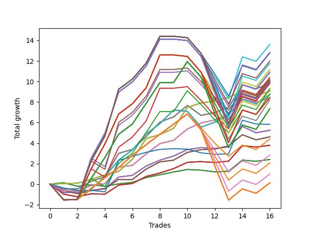

# Long Wallace Doodle 014 
- Symbol: AMZN_Unlimited
- Date Range: 03/23/2022 - 07/08/2022
- Trading Period: 7:20-12:30
- Number of Trades: 16



| Name | Win Percent | Profit | Avg Profit / Trade | Avg Time / Trade |      | Name | Win Percent | Profit | Avg Profit / Trade | Avg Time / Trade |
| ---- | ----------- | ------ | ------------------ | ---------------- | ---- | ---- | ----------- | ------ | ------------------ | ---------------- |
| Sorted By <br> Profit | | | | | | Sorted By <br> Win Percentage ||||
| Ninety-Four | 62.50 | 6809.75 | 425.61 | 172:53 |     | Seventy | 93.75 | 4529.50 | 283.09 | 60:09 |
| One Hundred Nine | 62.50 | 6419.75 | 401.23 | 176:03 |     | Sixty-Two | 93.75 | 4529.50 | 283.09 | 60:09 |
| Ninety-Five | 62.50 | 6383.75 | 398.98 | 181:17 |     | Fifty-Four | 93.75 | 4529.50 | 283.09 | 60:09 |
| One Hundred Ten | 62.50 | 5993.75 | 374.61 | 184:27 |     | Forty-Six | 93.75 | 4529.50 | 283.09 | 60:09 |
| One Hundred Four | 62.50 | 5879.75 | 367.48 | 178:25 |     | Six | 93.75 | 4529.50 | 283.09 | 60:09 |
| Ninety-Three | 62.50 | 5582.25 | 348.89 | 160:51 |     | Sixty-Nine | 81.25 | 4920.75 | 307.55 | 57:26 |
| One Hundred Five | 62.50 | 5453.75 | 340.86 | 186:49 |     | Sixty-One | 81.25 | 4920.75 | 307.55 | 57:26 |
| One Hundred Twenty-Nine | 62.50 | 5449.75 | 340.61 | 181:47 |     | Fifty-Three | 81.25 | 4920.75 | 307.55 | 57:26 |
| One Hundred Twenty-Four | 62.50 | 5449.75 | 340.61 | 181:47 |     | Forty-Five | 81.25 | 4920.75 | 307.55 | 57:26 |
| One Hundred Ninteen | 62.50 | 5449.75 | 340.61 | 181:47 |     | Five | 81.25 | 4920.75 | 307.55 | 57:26 |
| One Hundred Fourteen | 62.50 | 5449.75 | 340.61 | 181:47 |     | Sixty-Eight | 81.25 | 4190.75 | 261.92 | 33:58 |
| Eighty-Four | 62.50 | 5449.75 | 340.61 | 181:47 |     | Sixty | 81.25 | 4190.75 | 261.92 | 33:58 |
| One Hundred Eight | 62.50 | 5192.25 | 324.52 | 164:01 |     | Fifty-Two | 81.25 | 4190.75 | 261.92 | 33:58 |
| One Hundred | 62.50 | 5115.75 | 319.73 | 147:55 |     | Forty-Four | 81.25 | 4190.75 | 261.92 | 33:58 |
| Ninety-Two | 68.75 | 5032.75 | 314.55 | 141:43 |     | Four | 81.25 | 4190.75 | 261.92 | 33:58 |
| One Hundred Thirty | 62.50 | 5023.75 | 313.98 | 190:11 |     | Sixty-Six | 81.25 | 2624.25 | 164.02 | 24:31 |
| One Hundred Twenty-Five | 62.50 | 5023.75 | 313.98 | 190:11 |     | Fifty-Eight | 81.25 | 2624.25 | 164.02 | 24:31 |
| One Hundred Twenty | 62.50 | 5023.75 | 313.98 | 190:11 |     | Fifty | 81.25 | 2624.25 | 164.02 | 24:31 |
| One Hundred Fifteen | 62.50 | 5023.75 | 313.98 | 190:11 |     | Forty-Two | 81.25 | 2624.25 | 164.02 | 24:31 |
| Eighty-Five | 62.50 | 5023.75 | 313.98 | 190:11 |     | Two | 81.25 | 2624.25 | 164.02 | 24:31 |
| Ninety-Nine | 62.50 | 4976.75 | 311.05 | 140:23 |     | Seventy-One | 75.00 | 4364.75 | 272.80 | 114:05 |
| Sixty-Nine | 81.25 | 4920.75 | 307.55 | 57:26 |     | Sixty-Three | 75.00 | 4364.75 | 272.80 | 114:05 |
| Sixty-One | 81.25 | 4920.75 | 307.55 | 57:26 |     | Fifty-Five | 75.00 | 4364.75 | 272.80 | 114:05 |
| Fifty-Three | 81.25 | 4920.75 | 307.55 | 57:26 |     | Forty-Seven | 75.00 | 4364.75 | 272.80 | 114:05 |
| Forty-Five | 81.25 | 4920.75 | 307.55 | 57:26 |     | Seven | 75.00 | 4364.75 | 272.80 | 114:05 |
| Five | 81.25 | 4920.75 | 307.55 | 57:26 |     | Sixty-Seven | 75.00 | 2303.00 | 143.94 | 26:38 |
| Ninety-Eight | 62.50 | 4894.25 | 305.89 | 130:33 |     | Fifty-Nine | 75.00 | 2303.00 | 143.94 | 26:38 |
| One Hundred Three | 62.50 | 4652.25 | 290.77 | 166:23 |     | Fifty-One | 75.00 | 2303.00 | 143.94 | 26:38 |
| One Hundred Seven | 68.75 | 4642.75 | 290.17 | 144:53 |     | Forty-Three | 75.00 | 2303.00 | 143.94 | 26:38 |
| Seventy | 93.75 | 4529.50 | 283.09 | 60:09 |     | Three | 75.00 | 2303.00 | 143.94 | 26:38 |
| Sixty-Two | 93.75 | 4529.50 | 283.09 | 60:09 |     | Ninety-Two | 68.75 | 5032.75 | 314.55 | 141:43 |
| Fifty-Four | 93.75 | 4529.50 | 283.09 | 60:09 |     | One Hundred Seven | 68.75 | 4642.75 | 290.17 | 144:53 |
| Forty-Six | 93.75 | 4529.50 | 283.09 | 60:09 |     | One Hundred Two | 68.75 | 4102.75 | 256.42 | 147:15 |
| Six | 93.75 | 4529.50 | 283.09 | 60:09 |     | One Hundred Twenty-Seven | 68.75 | 3672.75 | 229.55 | 150:37 |
| Ninety-Seven | 62.50 | 4399.00 | 274.94 | 114:07 |     | One Hundred Twenty-Two | 68.75 | 3672.75 | 229.55 | 150:37 |
| Seventy-One | 75.00 | 4364.75 | 272.80 | 114:05 |     | One Hundred Seventeen | 68.75 | 3672.75 | 229.55 | 150:37 |
| Sixty-Three | 75.00 | 4364.75 | 272.80 | 114:05 |     | One Hundred Twelve | 68.75 | 3672.75 | 229.55 | 150:37 |
| Fifty-Five | 75.00 | 4364.75 | 272.80 | 114:05 |     | Eighty-Two | 68.75 | 3672.75 | 229.55 | 150:37 |
| Forty-Seven | 75.00 | 4364.75 | 272.80 | 114:05 |     | Ninety-Six | 68.75 | 2193.00 | 137.06 | 90:51 |
| Seven | 75.00 | 4364.75 | 272.80 | 114:05 |     | Sixty-Five | 68.75 | 1891.75 | 118.23 | 15:30 |
| One Hundred Twenty-Eight | 62.50 | 4222.25 | 263.89 | 169:45 |     | Fifty-Seven | 68.75 | 1891.75 | 118.23 | 15:30 |
| One Hundred Twenty-Three | 62.50 | 4222.25 | 263.89 | 169:45 |     | Forty-Nine | 68.75 | 1891.75 | 118.23 | 15:30 |
| One Hundred Eighteen | 62.50 | 4222.25 | 263.89 | 169:45 |     | Forty-One | 68.75 | 1891.75 | 118.23 | 15:30 |
| One Hundred Thirteen | 62.50 | 4222.25 | 263.89 | 169:45 |     | One | 68.75 | 1891.75 | 118.23 | 15:30 |
| Eighty-Three | 62.50 | 4222.25 | 263.89 | 169:45 |     | Ninety-One | 68.75 | 1419.75 | 88.73 | 109:21 |
| Sixty-Eight | 81.25 | 4190.75 | 261.92 | 33:58 |     | Sixty-Four | 68.75 | 1202.25 | 75.14 | 11:06 |
| Sixty | 81.25 | 4190.75 | 261.92 | 33:58 |     | Fifty-Six | 68.75 | 1202.25 | 75.14 | 11:06 |
| Fifty-Two | 81.25 | 4190.75 | 261.92 | 33:58 |     | Forty-Eight | 68.75 | 1202.25 | 75.14 | 11:06 |
| Forty-Four | 81.25 | 4190.75 | 261.92 | 33:58 |     | Forty | 68.75 | 1202.25 | 75.14 | 11:06 |
| Four | 81.25 | 4190.75 | 261.92 | 33:58 |     | Zero | 68.75 | 1202.25 | 75.14 | 11:06 |
| One Hundred Two | 68.75 | 4102.75 | 256.42 | 147:15 |     | One Hundred Six | 68.75 | 1029.75 | 64.36 | 112:31 |
| One Hundred Twenty-Seven | 68.75 | 3672.75 | 229.55 | 150:37 |     | One Hundred One | 68.75 | 489.75 | 30.61 | 114:53 |
| One Hundred Twenty-Two | 68.75 | 3672.75 | 229.55 | 150:37 |     | One Hundred Twenty-Six | 68.75 | 59.75 | 3.73 | 118:15 |
| One Hundred Seventeen | 68.75 | 3672.75 | 229.55 | 150:37 |     | One Hundred Twenty-One | 68.75 | 59.75 | 3.73 | 118:15 |
| One Hundred Twelve | 68.75 | 3672.75 | 229.55 | 150:37 |     | One Hundred Sixteen | 68.75 | 59.75 | 3.73 | 118:15 |
| Eighty-Two | 68.75 | 3672.75 | 229.55 | 150:37 |     | One Hundred Eleven | 68.75 | 59.75 | 3.73 | 118:15 |
| Seventy-Three | 50.00 | 2913.75 | 182.11 | 11:05 |     | Eighty-One | 68.75 | 59.75 | 3.73 | 118:15 |
| Sixty-Six | 81.25 | 2624.25 | 164.02 | 24:31 |     | Ninety-Four | 62.50 | 6809.75 | 425.61 | 172:53 |
| Fifty-Eight | 81.25 | 2624.25 | 164.02 | 24:31 |     | One Hundred Nine | 62.50 | 6419.75 | 401.23 | 176:03 |
| Fifty | 81.25 | 2624.25 | 164.02 | 24:31 |     | Ninety-Five | 62.50 | 6383.75 | 398.98 | 181:17 |
| Forty-Two | 81.25 | 2624.25 | 164.02 | 24:31 |     | One Hundred Ten | 62.50 | 5993.75 | 374.61 | 184:27 |
| Two | 81.25 | 2624.25 | 164.02 | 24:31 |     | One Hundred Four | 62.50 | 5879.75 | 367.48 | 178:25 |
| Sixty-Seven | 75.00 | 2303.00 | 143.94 | 26:38 |     | Ninety-Three | 62.50 | 5582.25 | 348.89 | 160:51 |
| Fifty-Nine | 75.00 | 2303.00 | 143.94 | 26:38 |     | One Hundred Five | 62.50 | 5453.75 | 340.86 | 186:49 |
| Fifty-One | 75.00 | 2303.00 | 143.94 | 26:38 |     | One Hundred Twenty-Nine | 62.50 | 5449.75 | 340.61 | 181:47 |
| Forty-Three | 75.00 | 2303.00 | 143.94 | 26:38 |     | One Hundred Twenty-Four | 62.50 | 5449.75 | 340.61 | 181:47 |
| Three | 75.00 | 2303.00 | 143.94 | 26:38 |     | One Hundred Ninteen | 62.50 | 5449.75 | 340.61 | 181:47 |
| Ninety-Six | 68.75 | 2193.00 | 137.06 | 90:51 |     | One Hundred Fourteen | 62.50 | 5449.75 | 340.61 | 181:47 |
| Sixty-Five | 68.75 | 1891.75 | 118.23 | 15:30 |     | Eighty-Four | 62.50 | 5449.75 | 340.61 | 181:47 |
| Fifty-Seven | 68.75 | 1891.75 | 118.23 | 15:30 |     | One Hundred Eight | 62.50 | 5192.25 | 324.52 | 164:01 |
| Forty-Nine | 68.75 | 1891.75 | 118.23 | 15:30 |     | One Hundred | 62.50 | 5115.75 | 319.73 | 147:55 |
| Forty-One | 68.75 | 1891.75 | 118.23 | 15:30 |     | One Hundred Thirty | 62.50 | 5023.75 | 313.98 | 190:11 |
| One | 68.75 | 1891.75 | 118.23 | 15:30 |     | One Hundred Twenty-Five | 62.50 | 5023.75 | 313.98 | 190:11 |
| Ninety-One | 68.75 | 1419.75 | 88.73 | 109:21 |     | One Hundred Twenty | 62.50 | 5023.75 | 313.98 | 190:11 |
| Sixty-Four | 68.75 | 1202.25 | 75.14 | 11:06 |     | One Hundred Fifteen | 62.50 | 5023.75 | 313.98 | 190:11 |
| Fifty-Six | 68.75 | 1202.25 | 75.14 | 11:06 |     | Eighty-Five | 62.50 | 5023.75 | 313.98 | 190:11 |
| Forty-Eight | 68.75 | 1202.25 | 75.14 | 11:06 |     | Ninety-Nine | 62.50 | 4976.75 | 311.05 | 140:23 |
| Forty | 68.75 | 1202.25 | 75.14 | 11:06 |     | Ninety-Eight | 62.50 | 4894.25 | 305.89 | 130:33 |
| Zero | 68.75 | 1202.25 | 75.14 | 11:06 |     | One Hundred Three | 62.50 | 4652.25 | 290.77 | 166:23 |
| One Hundred Six | 68.75 | 1029.75 | 64.36 | 112:31 |     | Ninety-Seven | 62.50 | 4399.00 | 274.94 | 114:07 |
| One Hundred One | 68.75 | 489.75 | 30.61 | 114:53 |     | One Hundred Twenty-Eight | 62.50 | 4222.25 | 263.89 | 169:45 |
| One Hundred Twenty-Six | 68.75 | 59.75 | 3.73 | 118:15 |     | One Hundred Twenty-Three | 62.50 | 4222.25 | 263.89 | 169:45 |
| One Hundred Twenty-One | 68.75 | 59.75 | 3.73 | 118:15 |     | One Hundred Eighteen | 62.50 | 4222.25 | 263.89 | 169:45 |
| One Hundred Sixteen | 68.75 | 59.75 | 3.73 | 118:15 |     | One Hundred Thirteen | 62.50 | 4222.25 | 263.89 | 169:45 |
| One Hundred Eleven | 68.75 | 59.75 | 3.73 | 118:15 |     | Eighty-Three | 62.50 | 4222.25 | 263.89 | 169:45 |
| Eighty-One | 68.75 | 59.75 | 3.73 | 118:15 |     | Seventy-Three | 50.00 | 2913.75 | 182.11 | 11:05 |

## NO STOPLOSS

### Test Zero
* Sell when price hits the middle line of the 20p bollinger
* No Stoploss
* Results:
```
Total Trades: 16
Percent Up: 68.75
Percent Down: 31.25
Total Points Moved Up: 2.40
Potential Profit: 1202.25
Total Points Ups: 3.25 Count Ups: 11
Total Points Downs: -0.85 Count Downs: 5
```

<details><summary>Trades</summary>

<code>In: 2022-04-11 07:23:00		Out: 2022-04-11 07:34:05		Total Position Time: 11:05		Total Move Up: 0.14		Total to Date: 0.14</code> <br />
<code>In: 2022-04-27 12:01:00		Out: 2022-04-27 12:23:45		Total Position Time: 22:45		Total Move Up: -0.34		Total to Date: -0.21</code> <br />
<code>In: 2022-04-28 08:58:00		Out: 2022-04-28 08:59:40		Total Position Time: 01:40		Total Move Up: 0.15		Total to Date: -0.05</code> <br />
<code>In: 2022-05-02 08:44:00		Out: 2022-05-02 08:52:40		Total Position Time: 08:40		Total Move Up: -0.15		Total to Date: -0.21</code> <br />
<code>In: 2022-05-04 11:36:00		Out: 2022-05-04 11:41:15		Total Position Time: 05:15		Total Move Up: 0.24		Total to Date: 0.03</code> <br />
<code>In: 2022-05-06 10:58:00		Out: 2022-05-06 11:12:20		Total Position Time: 14:20		Total Move Up: 0.14		Total to Date: 0.17</code> <br />
<code>In: 2022-05-12 10:57:00		Out: 2022-05-12 10:59:30		Total Position Time: 02:30		Total Move Up: 0.46		Total to Date: 0.64</code> <br />
<code>In: 2022-05-17 11:24:00		Out: 2022-05-17 11:37:15		Total Position Time: 13:15		Total Move Up: 0.27		Total to Date: 0.91</code> <br />
<code>In: 2022-05-19 09:47:00		Out: 2022-05-19 09:57:45		Total Position Time: 10:45		Total Move Up: 0.27		Total to Date: 1.18</code> <br />
<code>In: 2022-06-06 09:11:00		Out: 2022-06-06 09:23:25		Total Position Time: 12:25		Total Move Up: 0.24		Total to Date: 1.42</code> <br />
<code>In: 2022-06-08 08:00:00		Out: 2022-06-08 08:08:15		Total Position Time: 08:15		Total Move Up: -0.06		Total to Date: 1.36</code> <br />
<code>In: 2022-06-09 07:56:00		Out: 2022-06-09 08:21:05		Total Position Time: 25:05		Total Move Up: -0.17		Total to Date: 1.19</code> <br />
<code>In: 2022-06-09 08:10:00		Out: 2022-06-09 08:21:05		Total Position Time: 11:05		Total Move Up: 0.06		Total to Date: 1.25</code> <br />
<code>In: 2022-06-15 11:34:00		Out: 2022-06-15 11:38:05		Total Position Time: 04:05		Total Move Up: 1.09		Total to Date: 2.34</code> <br />
<code>In: 2022-06-21 08:36:00		Out: 2022-06-21 08:50:00		Total Position Time: 14:00		Total Move Up: -0.12		Total to Date: 2.22</code> <br />
<code>In: 2022-07-06 08:34:00		Out: 2022-07-06 08:46:40		Total Position Time: 12:40		Total Move Up: 0.18		Total to Date: 2.40</code> <br />


</details>

### Test One
* Sell when the price hits the upper line of the 20p 1std bollinger
* No Stoploss
* Results:
```
Total Trades: 16
Percent Up: 68.75
Percent Down: 31.25
Total Points Moved Up: 3.78
Potential Profit: 1891.75
Total Points Ups: 5.27 Count Ups: 11
Total Points Downs: -1.49 Count Downs: 5
```

<details><summary>Trades</summary>

<code>In: 2022-04-11 07:23:00		Out: 2022-04-11 08:02:15		Total Position Time: 39:15		Total Move Up: -0.98		Total to Date: -0.98</code> <br />
<code>In: 2022-04-27 12:01:00		Out: 2022-04-27 12:28:05		Total Position Time: 27:05		Total Move Up: -0.25		Total to Date: -1.23</code> <br />
<code>In: 2022-04-28 08:58:00		Out: 2022-04-28 09:04:10		Total Position Time: 06:10		Total Move Up: 0.29		Total to Date: -0.94</code> <br />
<code>In: 2022-05-02 08:44:00		Out: 2022-05-02 08:56:05		Total Position Time: 12:05		Total Move Up: -0.04		Total to Date: -0.98</code> <br />
<code>In: 2022-05-04 11:36:00		Out: 2022-05-04 11:43:40		Total Position Time: 07:40		Total Move Up: 0.88		Total to Date: -0.09</code> <br />
<code>In: 2022-05-06 10:58:00		Out: 2022-05-06 11:16:05		Total Position Time: 18:05		Total Move Up: 0.16		Total to Date: 0.06</code> <br />
<code>In: 2022-05-12 10:57:00		Out: 2022-05-12 11:01:20		Total Position Time: 04:20		Total Move Up: 0.69		Total to Date: 0.75</code> <br />
<code>In: 2022-05-17 11:24:00		Out: 2022-05-17 11:39:45		Total Position Time: 15:45		Total Move Up: 0.33		Total to Date: 1.09</code> <br />
<code>In: 2022-05-19 09:47:00		Out: 2022-05-19 09:58:05		Total Position Time: 11:05		Total Move Up: 0.43		Total to Date: 1.51</code> <br />
<code>In: 2022-06-06 09:11:00		Out: 2022-06-06 09:24:00		Total Position Time: 13:00		Total Move Up: 0.61		Total to Date: 2.12</code> <br />
<code>In: 2022-06-08 08:00:00		Out: 2022-06-08 08:11:10		Total Position Time: 11:10		Total Move Up: 0.07		Total to Date: 2.19</code> <br />
<code>In: 2022-06-09 07:56:00		Out: 2022-06-09 08:22:40		Total Position Time: 26:40		Total Move Up: -0.09		Total to Date: 2.10</code> <br />
<code>In: 2022-06-09 08:10:00		Out: 2022-06-09 08:22:40		Total Position Time: 12:40		Total Move Up: 0.14		Total to Date: 2.24</code> <br />
<code>In: 2022-06-15 11:34:00		Out: 2022-06-15 11:38:10		Total Position Time: 04:10		Total Move Up: 1.50		Total to Date: 3.74</code> <br />
<code>In: 2022-06-21 08:36:00		Out: 2022-06-21 08:57:45		Total Position Time: 21:45		Total Move Up: -0.13		Total to Date: 3.61</code> <br />
<code>In: 2022-07-06 08:34:00		Out: 2022-07-06 08:51:20		Total Position Time: 17:20		Total Move Up: 0.17		Total to Date: 3.78</code> <br />


</details>

### Test Two
* Sell when the price hits the upper line of the 20p 2std bollinger
* No Stoploss
* Results:
```
Total Trades: 16
Percent Up: 81.25
Percent Down: 18.75
Total Points Moved Up: 5.25
Potential Profit: 2624.25
Total Points Ups: 6.77 Count Ups: 13
Total Points Downs: -1.52 Count Downs: 3
```

<details><summary>Trades</summary>

<code>In: 2022-04-11 07:23:00		Out: 2022-04-11 08:07:20		Total Position Time: 44:20		Total Move Up: -0.83		Total to Date: -0.83</code> <br />
<code>In: 2022-04-27 12:01:00		Out: 2022-04-27 12:44:20		Total Position Time: 43:20		Total Move Up: 0.04		Total to Date: -0.79</code> <br />
<code>In: 2022-04-28 08:58:00		Out: 2022-04-28 09:18:35		Total Position Time: 20:35		Total Move Up: 0.17		Total to Date: -0.63</code> <br />
<code>In: 2022-05-02 08:44:00		Out: 2022-05-02 08:57:30		Total Position Time: 13:30		Total Move Up: 0.18		Total to Date: -0.45</code> <br />
<code>In: 2022-05-04 11:36:00		Out: 2022-05-04 11:44:25		Total Position Time: 08:25		Total Move Up: 1.14		Total to Date: 0.69</code> <br />
<code>In: 2022-05-06 10:58:00		Out: 2022-05-06 11:49:25		Total Position Time: 51:25		Total Move Up: 0.17		Total to Date: 0.86</code> <br />
<code>In: 2022-05-12 10:57:00		Out: 2022-05-12 11:03:40		Total Position Time: 06:40		Total Move Up: 0.90		Total to Date: 1.77</code> <br />
<code>In: 2022-05-17 11:24:00		Out: 2022-05-17 11:40:05		Total Position Time: 16:05		Total Move Up: 0.57		Total to Date: 2.33</code> <br />
<code>In: 2022-05-19 09:47:00		Out: 2022-05-19 10:06:20		Total Position Time: 19:20		Total Move Up: 0.41		Total to Date: 2.74</code> <br />
<code>In: 2022-06-06 09:11:00		Out: 2022-06-06 09:37:20		Total Position Time: 26:20		Total Move Up: 0.63		Total to Date: 3.37</code> <br />
<code>In: 2022-06-08 08:00:00		Out: 2022-06-08 08:13:45		Total Position Time: 13:45		Total Move Up: 0.19		Total to Date: 3.56</code> <br />
<code>In: 2022-06-09 07:56:00		Out: 2022-06-09 08:24:15		Total Position Time: 28:15		Total Move Up: -0.08		Total to Date: 3.48</code> <br />
<code>In: 2022-06-09 08:10:00		Out: 2022-06-09 08:24:15		Total Position Time: 14:15		Total Move Up: 0.15		Total to Date: 3.63</code> <br />
<code>In: 2022-06-15 11:34:00		Out: 2022-06-15 11:38:55		Total Position Time: 04:55		Total Move Up: 1.99		Total to Date: 5.62</code> <br />
<code>In: 2022-06-21 08:36:00		Out: 2022-06-21 09:33:05		Total Position Time: 57:05		Total Move Up: -0.61		Total to Date: 5.01</code> <br />
<code>In: 2022-07-06 08:34:00		Out: 2022-07-06 08:58:15		Total Position Time: 24:15		Total Move Up: 0.24		Total to Date: 5.25</code> <br />


</details>

### Test Three
* Sell when price hits the middle line of the 50p bollinger
* No Stoploss
* Results:
```
Total Trades: 16
Percent Up: 75.00
Percent Down: 25.00
Total Points Moved Up: 4.61
Potential Profit: 2303.00
Total Points Ups: 6.04 Count Ups: 12
Total Points Downs: -1.43 Count Downs: 4
```

<details><summary>Trades</summary>

<code>In: 2022-04-11 07:23:00		Out: 2022-04-11 08:10:50		Total Position Time: 47:50		Total Move Up: -0.64		Total to Date: -0.64</code> <br />
<code>In: 2022-04-27 12:01:00		Out: 2022-04-27 12:44:10		Total Position Time: 43:10		Total Move Up: -0.29		Total to Date: -0.93</code> <br />
<code>In: 2022-04-28 08:58:00		Out: 2022-04-28 09:18:40		Total Position Time: 20:40		Total Move Up: 0.30		Total to Date: -0.62</code> <br />
<code>In: 2022-05-02 08:44:00		Out: 2022-05-02 08:57:20		Total Position Time: 13:20		Total Move Up: 0.20		Total to Date: -0.43</code> <br />
<code>In: 2022-05-04 11:36:00		Out: 2022-05-04 11:43:40		Total Position Time: 07:40		Total Move Up: 0.88		Total to Date: 0.46</code> <br />
<code>In: 2022-05-06 10:58:00		Out: 2022-05-06 11:49:10		Total Position Time: 51:10		Total Move Up: -0.01		Total to Date: 0.45</code> <br />
<code>In: 2022-05-12 10:57:00		Out: 2022-05-12 11:03:50		Total Position Time: 06:50		Total Move Up: 1.02		Total to Date: 1.47</code> <br />
<code>In: 2022-05-17 11:24:00		Out: 2022-05-17 11:40:10		Total Position Time: 16:10		Total Move Up: 0.70		Total to Date: 2.17</code> <br />
<code>In: 2022-05-19 09:47:00		Out: 2022-05-19 10:22:50		Total Position Time: 35:50		Total Move Up: 0.17		Total to Date: 2.34</code> <br />
<code>In: 2022-06-06 09:11:00		Out: 2022-06-06 09:38:25		Total Position Time: 27:25		Total Move Up: 0.76		Total to Date: 3.10</code> <br />
<code>In: 2022-06-08 08:00:00		Out: 2022-06-08 08:15:05		Total Position Time: 15:05		Total Move Up: 0.26		Total to Date: 3.36</code> <br />
<code>In: 2022-06-09 07:56:00		Out: 2022-06-09 08:24:55		Total Position Time: 28:55		Total Move Up: 0.07		Total to Date: 3.43</code> <br />
<code>In: 2022-06-09 08:10:00		Out: 2022-06-09 08:24:55		Total Position Time: 14:55		Total Move Up: 0.30		Total to Date: 3.73</code> <br />
<code>In: 2022-06-15 11:34:00		Out: 2022-06-15 11:38:05		Total Position Time: 04:05		Total Move Up: 1.09		Total to Date: 4.82</code> <br />
<code>In: 2022-06-21 08:36:00		Out: 2022-06-21 09:36:00		Total Position Time: 60:00		Total Move Up: -0.50		Total to Date: 4.32</code> <br />
<code>In: 2022-07-06 08:34:00		Out: 2022-07-06 09:07:10		Total Position Time: 33:10		Total Move Up: 0.29		Total to Date: 4.61</code> <br />


</details>

### Test Four
* Sell when the price hits the upper line of the 50p 1std bollinger
* No Stoploss
* Results:
```
Total Trades: 16
Percent Up: 81.25
Percent Down: 18.75
Total Points Moved Up: 8.38
Potential Profit: 4190.75
Total Points Ups: 9.35 Count Ups: 13
Total Points Downs: -0.97 Count Downs: 3
```

<details><summary>Trades</summary>

<code>In: 2022-04-11 07:23:00		Out: 2022-04-11 08:27:05		Total Position Time: 64:05		Total Move Up: -0.64		Total to Date: -0.64</code> <br />
<code>In: 2022-04-27 12:01:00		Out: 2022-04-27 12:44:35		Total Position Time: 43:35		Total Move Up: -0.02		Total to Date: -0.66</code> <br />
<code>In: 2022-04-28 08:58:00		Out: 2022-04-28 09:21:40		Total Position Time: 23:40		Total Move Up: 0.53		Total to Date: -0.13</code> <br />
<code>In: 2022-05-02 08:44:00		Out: 2022-05-02 09:14:50		Total Position Time: 30:50		Total Move Up: 0.17		Total to Date: 0.04</code> <br />
<code>In: 2022-05-04 11:36:00		Out: 2022-05-04 11:45:30		Total Position Time: 09:30		Total Move Up: 1.62		Total to Date: 1.66</code> <br />
<code>In: 2022-05-06 10:58:00		Out: 2022-05-06 11:49:25		Total Position Time: 51:25		Total Move Up: 0.17		Total to Date: 1.83</code> <br />
<code>In: 2022-05-12 10:57:00		Out: 2022-05-12 11:21:10		Total Position Time: 24:10		Total Move Up: 1.12		Total to Date: 2.95</code> <br />
<code>In: 2022-05-17 11:24:00		Out: 2022-05-17 11:45:45		Total Position Time: 21:45		Total Move Up: 1.00		Total to Date: 3.95</code> <br />
<code>In: 2022-05-19 09:47:00		Out: 2022-05-19 10:31:50		Total Position Time: 44:50		Total Move Up: 0.32		Total to Date: 4.27</code> <br />
<code>In: 2022-06-06 09:11:00		Out: 2022-06-06 09:48:10		Total Position Time: 37:10		Total Move Up: 1.10		Total to Date: 5.37</code> <br />
<code>In: 2022-06-08 08:00:00		Out: 2022-06-08 08:26:05		Total Position Time: 26:05		Total Move Up: 0.59		Total to Date: 5.96</code> <br />
<code>In: 2022-06-09 07:56:00		Out: 2022-06-09 08:33:05		Total Position Time: 37:05		Total Move Up: 0.30		Total to Date: 6.26</code> <br />
<code>In: 2022-06-09 08:10:00		Out: 2022-06-09 08:33:05		Total Position Time: 23:05		Total Move Up: 0.53		Total to Date: 6.79</code> <br />
<code>In: 2022-06-15 11:34:00		Out: 2022-06-15 11:38:10		Total Position Time: 04:10		Total Move Up: 1.50		Total to Date: 8.29</code> <br />
<code>In: 2022-06-21 08:36:00		Out: 2022-06-21 09:39:05		Total Position Time: 63:05		Total Move Up: -0.31		Total to Date: 7.98</code> <br />
<code>In: 2022-07-06 08:34:00		Out: 2022-07-06 09:13:10		Total Position Time: 39:10		Total Move Up: 0.40		Total to Date: 8.38</code> <br />


</details>

### Test Five
* Sell when the price hits the upper line of the 50p 2std bollinger
* No Stoploss
* Results:
```
Total Trades: 16
Percent Up: 81.25
Percent Down: 18.75
Total Points Moved Up: 9.84
Potential Profit: 4920.75
Total Points Ups: 11.71 Count Ups: 13
Total Points Downs: -1.87 Count Downs: 3
```

<details><summary>Trades</summary>

<code>In: 2022-04-11 07:23:00		Out: 2022-04-11 08:31:05		Total Position Time: 68:05		Total Move Up: -0.50		Total to Date: -0.50</code> <br />
<code>In: 2022-04-27 12:01:00		Out: 2022-04-27 12:47:00		Total Position Time: 46:00		Total Move Up: 0.05		Total to Date: -0.45</code> <br />
<code>In: 2022-04-28 08:58:00		Out: 2022-04-28 09:24:30		Total Position Time: 26:30		Total Move Up: 0.73		Total to Date: 0.28</code> <br />
<code>In: 2022-05-02 08:44:00		Out: 2022-05-02 09:19:50		Total Position Time: 35:50		Total Move Up: 0.44		Total to Date: 0.72</code> <br />
<code>In: 2022-05-04 11:36:00		Out: 2022-05-04 11:46:55		Total Position Time: 10:55		Total Move Up: 2.28		Total to Date: 3.00</code> <br />
<code>In: 2022-05-06 10:58:00		Out: 2022-05-06 11:50:15		Total Position Time: 52:15		Total Move Up: 0.38		Total to Date: 3.39</code> <br />
<code>In: 2022-05-12 10:57:00		Out: 2022-05-12 11:27:35		Total Position Time: 30:35		Total Move Up: 1.26		Total to Date: 4.64</code> <br />
<code>In: 2022-05-17 11:24:00		Out: 2022-05-17 11:47:50		Total Position Time: 23:50		Total Move Up: 1.40		Total to Date: 6.04</code> <br />
<code>In: 2022-05-19 09:47:00		Out: 2022-05-19 10:33:35		Total Position Time: 46:35		Total Move Up: 0.52		Total to Date: 6.56</code> <br />
<code>In: 2022-06-06 09:11:00		Out: 2022-06-06 10:23:10		Total Position Time: 72:10		Total Move Up: 1.11		Total to Date: 7.67</code> <br />
<code>In: 2022-06-08 08:00:00		Out: 2022-06-08 11:03:40		Total Position Time: 183:40		Total Move Up: -0.97		Total to Date: 6.70</code> <br />
<code>In: 2022-06-09 07:56:00		Out: 2022-06-09 08:41:35		Total Position Time: 45:35		Total Move Up: 0.27		Total to Date: 6.97</code> <br />
<code>In: 2022-06-09 08:10:00		Out: 2022-06-09 08:41:35		Total Position Time: 31:35		Total Move Up: 0.50		Total to Date: 7.47</code> <br />
<code>In: 2022-06-15 11:34:00		Out: 2022-06-15 11:39:00		Total Position Time: 05:00		Total Move Up: 2.21		Total to Date: 9.68</code> <br />
<code>In: 2022-06-21 08:36:00		Out: 2022-06-21 11:55:30		Total Position Time: 199:30		Total Move Up: -0.40		Total to Date: 9.28</code> <br />
<code>In: 2022-07-06 08:34:00		Out: 2022-07-06 09:15:00		Total Position Time: 41:00		Total Move Up: 0.56		Total to Date: 9.84</code> <br />


</details>

### Test Six
* Sell when the price hits the middle line of the 1std VWAP
* No Stoploss
* Results:
```
Total Trades: 16
Percent Up: 93.75
Percent Down: 6.25
Total Points Moved Up: 9.06
Potential Profit: 4529.50
Total Points Ups: 9.49 Count Ups: 15
Total Points Downs: -0.43 Count Downs: 1
```

<details><summary>Trades</summary>

<code>In: 2022-04-11 07:23:00		Out: 2022-04-11 10:01:25		Total Position Time: 158:25		Total Move Up: 0.05		Total to Date: 0.05</code> <br />
<code>In: 2022-04-27 12:01:00		Out: 2022-04-27 12:47:00		Total Position Time: 46:00		Total Move Up: 0.05		Total to Date: 0.10</code> <br />
<code>In: 2022-04-28 08:58:00		Out: 2022-04-28 09:21:00		Total Position Time: 23:00		Total Move Up: 0.37		Total to Date: 0.47</code> <br />
<code>In: 2022-05-02 08:44:00		Out: 2022-05-02 09:20:15		Total Position Time: 36:15		Total Move Up: 0.43		Total to Date: 0.90</code> <br />
<code>In: 2022-05-04 11:36:00		Out: 2022-05-04 11:42:15		Total Position Time: 06:15		Total Move Up: 0.35		Total to Date: 1.25</code> <br />
<code>In: 2022-05-06 10:58:00		Out: 2022-05-06 12:46:35		Total Position Time: 108:35		Total Move Up: 1.18		Total to Date: 2.43</code> <br />
<code>In: 2022-05-12 10:57:00		Out: 2022-05-12 12:26:25		Total Position Time: 89:25		Total Move Up: 2.02		Total to Date: 4.44</code> <br />
<code>In: 2022-05-17 11:24:00		Out: 2022-05-17 11:27:15		Total Position Time: 03:15		Total Move Up: 0.39		Total to Date: 4.83</code> <br />
<code>In: 2022-05-19 09:47:00		Out: 2022-05-19 10:55:25		Total Position Time: 68:25		Total Move Up: 0.61		Total to Date: 5.44</code> <br />
<code>In: 2022-06-06 09:11:00		Out: 2022-06-06 10:39:05		Total Position Time: 88:05		Total Move Up: 2.04		Total to Date: 7.48</code> <br />
<code>In: 2022-06-08 08:00:00		Out: 2022-06-08 08:16:50		Total Position Time: 16:50		Total Move Up: 0.43		Total to Date: 7.91</code> <br />
<code>In: 2022-06-09 07:56:00		Out: 2022-06-09 07:57:30		Total Position Time: 01:30		Total Move Up: 0.19		Total to Date: 8.10</code> <br />
<code>In: 2022-06-09 08:10:00		Out: 2022-06-09 08:32:55		Total Position Time: 22:55		Total Move Up: 0.35		Total to Date: 8.45</code> <br />
<code>In: 2022-06-15 11:34:00		Out: 2022-06-15 11:37:10		Total Position Time: 03:10		Total Move Up: 0.61		Total to Date: 9.06</code> <br />
<code>In: 2022-06-21 08:36:00		Out: 2022-06-21 12:47:00		Total Position Time: 251:00		Total Move Up: -0.43		Total to Date: 8.63</code> <br />
<code>In: 2022-07-06 08:34:00		Out: 2022-07-06 09:13:20		Total Position Time: 39:20		Total Move Up: 0.43		Total to Date: 9.06</code> <br />


</details>

### Test Seven
* Sell when the price hits the upper line of the 1std VWAP
* No Stoploss
* Results:
```
Total Trades: 16
Percent Up: 75.00
Percent Down: 25.00
Total Points Moved Up: 8.73
Potential Profit: 4364.75
Total Points Ups: 12.37 Count Ups: 12
Total Points Downs: -3.64 Count Downs: 4
```

<details><summary>Trades</summary>

<code>In: 2022-04-11 07:23:00		Out: 2022-04-11 12:47:00		Total Position Time: 324:00		Total Move Up: -1.53		Total to Date: -1.53</code> <br />
<code>In: 2022-04-27 12:01:00		Out: 2022-04-27 12:47:00		Total Position Time: 46:00		Total Move Up: 0.05		Total to Date: -1.48</code> <br />
<code>In: 2022-04-28 08:58:00		Out: 2022-04-28 09:25:30		Total Position Time: 27:30		Total Move Up: 0.98		Total to Date: -0.50</code> <br />
<code>In: 2022-05-02 08:44:00		Out: 2022-05-02 11:05:00		Total Position Time: 141:00		Total Move Up: 1.24		Total to Date: 0.74</code> <br />
<code>In: 2022-05-04 11:36:00		Out: 2022-05-04 11:45:40		Total Position Time: 09:40		Total Move Up: 1.60		Total to Date: 2.34</code> <br />
<code>In: 2022-05-06 10:58:00		Out: 2022-05-06 12:47:00		Total Position Time: 109:00		Total Move Up: 1.00		Total to Date: 3.34</code> <br />
<code>In: 2022-05-12 10:57:00		Out: 2022-05-12 12:47:00		Total Position Time: 110:00		Total Move Up: 1.56		Total to Date: 4.90</code> <br />
<code>In: 2022-05-17 11:24:00		Out: 2022-05-17 11:45:45		Total Position Time: 21:45		Total Move Up: 1.00		Total to Date: 5.89</code> <br />
<code>In: 2022-05-19 09:47:00		Out: 2022-05-19 11:38:40		Total Position Time: 111:40		Total Move Up: 1.34		Total to Date: 7.23</code> <br />
<code>In: 2022-06-06 09:11:00		Out: 2022-06-06 12:47:00		Total Position Time: 216:00		Total Move Up: -0.14		Total to Date: 7.09</code> <br />
<code>In: 2022-06-08 08:00:00		Out: 2022-06-08 12:47:00		Total Position Time: 287:00		Total Move Up: -1.54		Total to Date: 5.55</code> <br />
<code>In: 2022-06-09 07:56:00		Out: 2022-06-09 08:43:50		Total Position Time: 47:50		Total Move Up: 0.49		Total to Date: 6.04</code> <br />
<code>In: 2022-06-09 08:10:00		Out: 2022-06-09 08:43:50		Total Position Time: 33:50		Total Move Up: 0.72		Total to Date: 6.76</code> <br />
<code>In: 2022-06-15 11:34:00		Out: 2022-06-15 11:38:10		Total Position Time: 04:10		Total Move Up: 1.50		Total to Date: 8.26</code> <br />
<code>In: 2022-06-21 08:36:00		Out: 2022-06-21 12:47:00		Total Position Time: 251:00		Total Move Up: -0.43		Total to Date: 7.83</code> <br />
<code>In: 2022-07-06 08:34:00		Out: 2022-07-06 09:58:55		Total Position Time: 84:55		Total Move Up: 0.90		Total to Date: 8.73</code> <br />


</details>

## STOPLOSS OF 5

### Test Forty
* Sell when price hits the middle line of the 20p bollinger
* Stoploss is 5 points
* Results:
```
Total Trades: 16
Percent Up: 68.75
Percent Down: 31.25
Total Points Moved Up: 2.40
Potential Profit: 1202.25
Total Points Ups: 3.25 Count Ups: 11
Total Points Downs: -0.85 Count Downs: 5
```

<details><summary>Trades</summary>

<code>In: 2022-04-11 07:23:00		Out: 2022-04-11 07:34:05		Total Position Time: 11:05		Total Move Up: 0.14		Total to Date: 0.14</code> <br />
<code>In: 2022-04-27 12:01:00		Out: 2022-04-27 12:23:45		Total Position Time: 22:45		Total Move Up: -0.34		Total to Date: -0.21</code> <br />
<code>In: 2022-04-28 08:58:00		Out: 2022-04-28 08:59:40		Total Position Time: 01:40		Total Move Up: 0.15		Total to Date: -0.05</code> <br />
<code>In: 2022-05-02 08:44:00		Out: 2022-05-02 08:52:40		Total Position Time: 08:40		Total Move Up: -0.15		Total to Date: -0.21</code> <br />
<code>In: 2022-05-04 11:36:00		Out: 2022-05-04 11:41:15		Total Position Time: 05:15		Total Move Up: 0.24		Total to Date: 0.03</code> <br />
<code>In: 2022-05-06 10:58:00		Out: 2022-05-06 11:12:20		Total Position Time: 14:20		Total Move Up: 0.14		Total to Date: 0.17</code> <br />
<code>In: 2022-05-12 10:57:00		Out: 2022-05-12 10:59:30		Total Position Time: 02:30		Total Move Up: 0.46		Total to Date: 0.64</code> <br />
<code>In: 2022-05-17 11:24:00		Out: 2022-05-17 11:37:15		Total Position Time: 13:15		Total Move Up: 0.27		Total to Date: 0.91</code> <br />
<code>In: 2022-05-19 09:47:00		Out: 2022-05-19 09:57:45		Total Position Time: 10:45		Total Move Up: 0.27		Total to Date: 1.18</code> <br />
<code>In: 2022-06-06 09:11:00		Out: 2022-06-06 09:23:25		Total Position Time: 12:25		Total Move Up: 0.24		Total to Date: 1.42</code> <br />
<code>In: 2022-06-08 08:00:00		Out: 2022-06-08 08:08:15		Total Position Time: 08:15		Total Move Up: -0.06		Total to Date: 1.36</code> <br />
<code>In: 2022-06-09 07:56:00		Out: 2022-06-09 08:21:05		Total Position Time: 25:05		Total Move Up: -0.17		Total to Date: 1.19</code> <br />
<code>In: 2022-06-09 08:10:00		Out: 2022-06-09 08:21:05		Total Position Time: 11:05		Total Move Up: 0.06		Total to Date: 1.25</code> <br />
<code>In: 2022-06-15 11:34:00		Out: 2022-06-15 11:38:05		Total Position Time: 04:05		Total Move Up: 1.09		Total to Date: 2.34</code> <br />
<code>In: 2022-06-21 08:36:00		Out: 2022-06-21 08:50:00		Total Position Time: 14:00		Total Move Up: -0.12		Total to Date: 2.22</code> <br />
<code>In: 2022-07-06 08:34:00		Out: 2022-07-06 08:46:40		Total Position Time: 12:40		Total Move Up: 0.18		Total to Date: 2.40</code> <br />


</details>

### Test Forty-One
* Sell when the price hits the upper line of the 20p 1std bollinger
* Stoploss is 5 points
* Results:
```
Total Trades: 16
Percent Up: 68.75
Percent Down: 31.25
Total Points Moved Up: 3.78
Potential Profit: 1891.75
Total Points Ups: 5.27 Count Ups: 11
Total Points Downs: -1.49 Count Downs: 5
```

<details><summary>Trades</summary>

<code>In: 2022-04-11 07:23:00		Out: 2022-04-11 08:02:15		Total Position Time: 39:15		Total Move Up: -0.98		Total to Date: -0.98</code> <br />
<code>In: 2022-04-27 12:01:00		Out: 2022-04-27 12:28:05		Total Position Time: 27:05		Total Move Up: -0.25		Total to Date: -1.23</code> <br />
<code>In: 2022-04-28 08:58:00		Out: 2022-04-28 09:04:10		Total Position Time: 06:10		Total Move Up: 0.29		Total to Date: -0.94</code> <br />
<code>In: 2022-05-02 08:44:00		Out: 2022-05-02 08:56:05		Total Position Time: 12:05		Total Move Up: -0.04		Total to Date: -0.98</code> <br />
<code>In: 2022-05-04 11:36:00		Out: 2022-05-04 11:43:40		Total Position Time: 07:40		Total Move Up: 0.88		Total to Date: -0.09</code> <br />
<code>In: 2022-05-06 10:58:00		Out: 2022-05-06 11:16:05		Total Position Time: 18:05		Total Move Up: 0.16		Total to Date: 0.06</code> <br />
<code>In: 2022-05-12 10:57:00		Out: 2022-05-12 11:01:20		Total Position Time: 04:20		Total Move Up: 0.69		Total to Date: 0.75</code> <br />
<code>In: 2022-05-17 11:24:00		Out: 2022-05-17 11:39:45		Total Position Time: 15:45		Total Move Up: 0.33		Total to Date: 1.09</code> <br />
<code>In: 2022-05-19 09:47:00		Out: 2022-05-19 09:58:05		Total Position Time: 11:05		Total Move Up: 0.43		Total to Date: 1.51</code> <br />
<code>In: 2022-06-06 09:11:00		Out: 2022-06-06 09:24:00		Total Position Time: 13:00		Total Move Up: 0.61		Total to Date: 2.12</code> <br />
<code>In: 2022-06-08 08:00:00		Out: 2022-06-08 08:11:10		Total Position Time: 11:10		Total Move Up: 0.07		Total to Date: 2.19</code> <br />
<code>In: 2022-06-09 07:56:00		Out: 2022-06-09 08:22:40		Total Position Time: 26:40		Total Move Up: -0.09		Total to Date: 2.10</code> <br />
<code>In: 2022-06-09 08:10:00		Out: 2022-06-09 08:22:40		Total Position Time: 12:40		Total Move Up: 0.14		Total to Date: 2.24</code> <br />
<code>In: 2022-06-15 11:34:00		Out: 2022-06-15 11:38:10		Total Position Time: 04:10		Total Move Up: 1.50		Total to Date: 3.74</code> <br />
<code>In: 2022-06-21 08:36:00		Out: 2022-06-21 08:57:45		Total Position Time: 21:45		Total Move Up: -0.13		Total to Date: 3.61</code> <br />
<code>In: 2022-07-06 08:34:00		Out: 2022-07-06 08:51:20		Total Position Time: 17:20		Total Move Up: 0.17		Total to Date: 3.78</code> <br />


</details>

### Test Forty-Two
* Sell when the price hits the upper line of the 20p 2std bollinger
* Stoploss is 5 points
* Results:
```
Total Trades: 16
Percent Up: 81.25
Percent Down: 18.75
Total Points Moved Up: 5.25
Potential Profit: 2624.25
Total Points Ups: 6.77 Count Ups: 13
Total Points Downs: -1.52 Count Downs: 3
```

<details><summary>Trades</summary>

<code>In: 2022-04-11 07:23:00		Out: 2022-04-11 08:07:20		Total Position Time: 44:20		Total Move Up: -0.83		Total to Date: -0.83</code> <br />
<code>In: 2022-04-27 12:01:00		Out: 2022-04-27 12:44:20		Total Position Time: 43:20		Total Move Up: 0.04		Total to Date: -0.79</code> <br />
<code>In: 2022-04-28 08:58:00		Out: 2022-04-28 09:18:35		Total Position Time: 20:35		Total Move Up: 0.17		Total to Date: -0.63</code> <br />
<code>In: 2022-05-02 08:44:00		Out: 2022-05-02 08:57:30		Total Position Time: 13:30		Total Move Up: 0.18		Total to Date: -0.45</code> <br />
<code>In: 2022-05-04 11:36:00		Out: 2022-05-04 11:44:25		Total Position Time: 08:25		Total Move Up: 1.14		Total to Date: 0.69</code> <br />
<code>In: 2022-05-06 10:58:00		Out: 2022-05-06 11:49:25		Total Position Time: 51:25		Total Move Up: 0.17		Total to Date: 0.86</code> <br />
<code>In: 2022-05-12 10:57:00		Out: 2022-05-12 11:03:40		Total Position Time: 06:40		Total Move Up: 0.90		Total to Date: 1.77</code> <br />
<code>In: 2022-05-17 11:24:00		Out: 2022-05-17 11:40:05		Total Position Time: 16:05		Total Move Up: 0.57		Total to Date: 2.33</code> <br />
<code>In: 2022-05-19 09:47:00		Out: 2022-05-19 10:06:20		Total Position Time: 19:20		Total Move Up: 0.41		Total to Date: 2.74</code> <br />
<code>In: 2022-06-06 09:11:00		Out: 2022-06-06 09:37:20		Total Position Time: 26:20		Total Move Up: 0.63		Total to Date: 3.37</code> <br />
<code>In: 2022-06-08 08:00:00		Out: 2022-06-08 08:13:45		Total Position Time: 13:45		Total Move Up: 0.19		Total to Date: 3.56</code> <br />
<code>In: 2022-06-09 07:56:00		Out: 2022-06-09 08:24:15		Total Position Time: 28:15		Total Move Up: -0.08		Total to Date: 3.48</code> <br />
<code>In: 2022-06-09 08:10:00		Out: 2022-06-09 08:24:15		Total Position Time: 14:15		Total Move Up: 0.15		Total to Date: 3.63</code> <br />
<code>In: 2022-06-15 11:34:00		Out: 2022-06-15 11:38:55		Total Position Time: 04:55		Total Move Up: 1.99		Total to Date: 5.62</code> <br />
<code>In: 2022-06-21 08:36:00		Out: 2022-06-21 09:33:05		Total Position Time: 57:05		Total Move Up: -0.61		Total to Date: 5.01</code> <br />
<code>In: 2022-07-06 08:34:00		Out: 2022-07-06 08:58:15		Total Position Time: 24:15		Total Move Up: 0.24		Total to Date: 5.25</code> <br />


</details>

### Test Forty-Three
* Sell when price hits the middle line of the 50p bollinger
* Stoploss is 5 points
* Results:
```
Total Trades: 16
Percent Up: 75.00
Percent Down: 25.00
Total Points Moved Up: 4.61
Potential Profit: 2303.00
Total Points Ups: 6.04 Count Ups: 12
Total Points Downs: -1.43 Count Downs: 4
```

<details><summary>Trades</summary>

<code>In: 2022-04-11 07:23:00		Out: 2022-04-11 08:10:50		Total Position Time: 47:50		Total Move Up: -0.64		Total to Date: -0.64</code> <br />
<code>In: 2022-04-27 12:01:00		Out: 2022-04-27 12:44:10		Total Position Time: 43:10		Total Move Up: -0.29		Total to Date: -0.93</code> <br />
<code>In: 2022-04-28 08:58:00		Out: 2022-04-28 09:18:40		Total Position Time: 20:40		Total Move Up: 0.30		Total to Date: -0.62</code> <br />
<code>In: 2022-05-02 08:44:00		Out: 2022-05-02 08:57:20		Total Position Time: 13:20		Total Move Up: 0.20		Total to Date: -0.43</code> <br />
<code>In: 2022-05-04 11:36:00		Out: 2022-05-04 11:43:40		Total Position Time: 07:40		Total Move Up: 0.88		Total to Date: 0.46</code> <br />
<code>In: 2022-05-06 10:58:00		Out: 2022-05-06 11:49:10		Total Position Time: 51:10		Total Move Up: -0.01		Total to Date: 0.45</code> <br />
<code>In: 2022-05-12 10:57:00		Out: 2022-05-12 11:03:50		Total Position Time: 06:50		Total Move Up: 1.02		Total to Date: 1.47</code> <br />
<code>In: 2022-05-17 11:24:00		Out: 2022-05-17 11:40:10		Total Position Time: 16:10		Total Move Up: 0.70		Total to Date: 2.17</code> <br />
<code>In: 2022-05-19 09:47:00		Out: 2022-05-19 10:22:50		Total Position Time: 35:50		Total Move Up: 0.17		Total to Date: 2.34</code> <br />
<code>In: 2022-06-06 09:11:00		Out: 2022-06-06 09:38:25		Total Position Time: 27:25		Total Move Up: 0.76		Total to Date: 3.10</code> <br />
<code>In: 2022-06-08 08:00:00		Out: 2022-06-08 08:15:05		Total Position Time: 15:05		Total Move Up: 0.26		Total to Date: 3.36</code> <br />
<code>In: 2022-06-09 07:56:00		Out: 2022-06-09 08:24:55		Total Position Time: 28:55		Total Move Up: 0.07		Total to Date: 3.43</code> <br />
<code>In: 2022-06-09 08:10:00		Out: 2022-06-09 08:24:55		Total Position Time: 14:55		Total Move Up: 0.30		Total to Date: 3.73</code> <br />
<code>In: 2022-06-15 11:34:00		Out: 2022-06-15 11:38:05		Total Position Time: 04:05		Total Move Up: 1.09		Total to Date: 4.82</code> <br />
<code>In: 2022-06-21 08:36:00		Out: 2022-06-21 09:36:00		Total Position Time: 60:00		Total Move Up: -0.50		Total to Date: 4.32</code> <br />
<code>In: 2022-07-06 08:34:00		Out: 2022-07-06 09:07:10		Total Position Time: 33:10		Total Move Up: 0.29		Total to Date: 4.61</code> <br />


</details>

### Test Forty-Four
* Sell when the price hits the upper line of the 50p 1std bollinger
* Stoploss is 5 points
* Results:
```
Total Trades: 16
Percent Up: 81.25
Percent Down: 18.75
Total Points Moved Up: 8.38
Potential Profit: 4190.75
Total Points Ups: 9.35 Count Ups: 13
Total Points Downs: -0.97 Count Downs: 3
```

<details><summary>Trades</summary>

<code>In: 2022-04-11 07:23:00		Out: 2022-04-11 08:27:05		Total Position Time: 64:05		Total Move Up: -0.64		Total to Date: -0.64</code> <br />
<code>In: 2022-04-27 12:01:00		Out: 2022-04-27 12:44:35		Total Position Time: 43:35		Total Move Up: -0.02		Total to Date: -0.66</code> <br />
<code>In: 2022-04-28 08:58:00		Out: 2022-04-28 09:21:40		Total Position Time: 23:40		Total Move Up: 0.53		Total to Date: -0.13</code> <br />
<code>In: 2022-05-02 08:44:00		Out: 2022-05-02 09:14:50		Total Position Time: 30:50		Total Move Up: 0.17		Total to Date: 0.04</code> <br />
<code>In: 2022-05-04 11:36:00		Out: 2022-05-04 11:45:30		Total Position Time: 09:30		Total Move Up: 1.62		Total to Date: 1.66</code> <br />
<code>In: 2022-05-06 10:58:00		Out: 2022-05-06 11:49:25		Total Position Time: 51:25		Total Move Up: 0.17		Total to Date: 1.83</code> <br />
<code>In: 2022-05-12 10:57:00		Out: 2022-05-12 11:21:10		Total Position Time: 24:10		Total Move Up: 1.12		Total to Date: 2.95</code> <br />
<code>In: 2022-05-17 11:24:00		Out: 2022-05-17 11:45:45		Total Position Time: 21:45		Total Move Up: 1.00		Total to Date: 3.95</code> <br />
<code>In: 2022-05-19 09:47:00		Out: 2022-05-19 10:31:50		Total Position Time: 44:50		Total Move Up: 0.32		Total to Date: 4.27</code> <br />
<code>In: 2022-06-06 09:11:00		Out: 2022-06-06 09:48:10		Total Position Time: 37:10		Total Move Up: 1.10		Total to Date: 5.37</code> <br />
<code>In: 2022-06-08 08:00:00		Out: 2022-06-08 08:26:05		Total Position Time: 26:05		Total Move Up: 0.59		Total to Date: 5.96</code> <br />
<code>In: 2022-06-09 07:56:00		Out: 2022-06-09 08:33:05		Total Position Time: 37:05		Total Move Up: 0.30		Total to Date: 6.26</code> <br />
<code>In: 2022-06-09 08:10:00		Out: 2022-06-09 08:33:05		Total Position Time: 23:05		Total Move Up: 0.53		Total to Date: 6.79</code> <br />
<code>In: 2022-06-15 11:34:00		Out: 2022-06-15 11:38:10		Total Position Time: 04:10		Total Move Up: 1.50		Total to Date: 8.29</code> <br />
<code>In: 2022-06-21 08:36:00		Out: 2022-06-21 09:39:05		Total Position Time: 63:05		Total Move Up: -0.31		Total to Date: 7.98</code> <br />
<code>In: 2022-07-06 08:34:00		Out: 2022-07-06 09:13:10		Total Position Time: 39:10		Total Move Up: 0.40		Total to Date: 8.38</code> <br />


</details>

### Test Forty-Five
* Sell when the price hits the upper line of the 50p 2std bollinger
* Stoploss is 5 points
* Results:
```
Total Trades: 16
Percent Up: 81.25
Percent Down: 18.75
Total Points Moved Up: 9.84
Potential Profit: 4920.75
Total Points Ups: 11.71 Count Ups: 13
Total Points Downs: -1.87 Count Downs: 3
```

<details><summary>Trades</summary>

<code>In: 2022-04-11 07:23:00		Out: 2022-04-11 08:31:05		Total Position Time: 68:05		Total Move Up: -0.50		Total to Date: -0.50</code> <br />
<code>In: 2022-04-27 12:01:00		Out: 2022-04-27 12:47:00		Total Position Time: 46:00		Total Move Up: 0.05		Total to Date: -0.45</code> <br />
<code>In: 2022-04-28 08:58:00		Out: 2022-04-28 09:24:30		Total Position Time: 26:30		Total Move Up: 0.73		Total to Date: 0.28</code> <br />
<code>In: 2022-05-02 08:44:00		Out: 2022-05-02 09:19:50		Total Position Time: 35:50		Total Move Up: 0.44		Total to Date: 0.72</code> <br />
<code>In: 2022-05-04 11:36:00		Out: 2022-05-04 11:46:55		Total Position Time: 10:55		Total Move Up: 2.28		Total to Date: 3.00</code> <br />
<code>In: 2022-05-06 10:58:00		Out: 2022-05-06 11:50:15		Total Position Time: 52:15		Total Move Up: 0.38		Total to Date: 3.39</code> <br />
<code>In: 2022-05-12 10:57:00		Out: 2022-05-12 11:27:35		Total Position Time: 30:35		Total Move Up: 1.26		Total to Date: 4.64</code> <br />
<code>In: 2022-05-17 11:24:00		Out: 2022-05-17 11:47:50		Total Position Time: 23:50		Total Move Up: 1.40		Total to Date: 6.04</code> <br />
<code>In: 2022-05-19 09:47:00		Out: 2022-05-19 10:33:35		Total Position Time: 46:35		Total Move Up: 0.52		Total to Date: 6.56</code> <br />
<code>In: 2022-06-06 09:11:00		Out: 2022-06-06 10:23:10		Total Position Time: 72:10		Total Move Up: 1.11		Total to Date: 7.67</code> <br />
<code>In: 2022-06-08 08:00:00		Out: 2022-06-08 11:03:40		Total Position Time: 183:40		Total Move Up: -0.97		Total to Date: 6.70</code> <br />
<code>In: 2022-06-09 07:56:00		Out: 2022-06-09 08:41:35		Total Position Time: 45:35		Total Move Up: 0.27		Total to Date: 6.97</code> <br />
<code>In: 2022-06-09 08:10:00		Out: 2022-06-09 08:41:35		Total Position Time: 31:35		Total Move Up: 0.50		Total to Date: 7.47</code> <br />
<code>In: 2022-06-15 11:34:00		Out: 2022-06-15 11:39:00		Total Position Time: 05:00		Total Move Up: 2.21		Total to Date: 9.68</code> <br />
<code>In: 2022-06-21 08:36:00		Out: 2022-06-21 11:55:30		Total Position Time: 199:30		Total Move Up: -0.40		Total to Date: 9.28</code> <br />
<code>In: 2022-07-06 08:34:00		Out: 2022-07-06 09:15:00		Total Position Time: 41:00		Total Move Up: 0.56		Total to Date: 9.84</code> <br />


</details>

### Test Forty-Six
* Sell when the price hits the middle line of the 1std VWAP
* Stoploss is 5 points
* Results:
```
Total Trades: 16
Percent Up: 93.75
Percent Down: 6.25
Total Points Moved Up: 9.06
Potential Profit: 4529.50
Total Points Ups: 9.49 Count Ups: 15
Total Points Downs: -0.43 Count Downs: 1
```

<details><summary>Trades</summary>

<code>In: 2022-04-11 07:23:00		Out: 2022-04-11 10:01:25		Total Position Time: 158:25		Total Move Up: 0.05		Total to Date: 0.05</code> <br />
<code>In: 2022-04-27 12:01:00		Out: 2022-04-27 12:47:00		Total Position Time: 46:00		Total Move Up: 0.05		Total to Date: 0.10</code> <br />
<code>In: 2022-04-28 08:58:00		Out: 2022-04-28 09:21:00		Total Position Time: 23:00		Total Move Up: 0.37		Total to Date: 0.47</code> <br />
<code>In: 2022-05-02 08:44:00		Out: 2022-05-02 09:20:15		Total Position Time: 36:15		Total Move Up: 0.43		Total to Date: 0.90</code> <br />
<code>In: 2022-05-04 11:36:00		Out: 2022-05-04 11:42:15		Total Position Time: 06:15		Total Move Up: 0.35		Total to Date: 1.25</code> <br />
<code>In: 2022-05-06 10:58:00		Out: 2022-05-06 12:46:35		Total Position Time: 108:35		Total Move Up: 1.18		Total to Date: 2.43</code> <br />
<code>In: 2022-05-12 10:57:00		Out: 2022-05-12 12:26:25		Total Position Time: 89:25		Total Move Up: 2.02		Total to Date: 4.44</code> <br />
<code>In: 2022-05-17 11:24:00		Out: 2022-05-17 11:27:15		Total Position Time: 03:15		Total Move Up: 0.39		Total to Date: 4.83</code> <br />
<code>In: 2022-05-19 09:47:00		Out: 2022-05-19 10:55:25		Total Position Time: 68:25		Total Move Up: 0.61		Total to Date: 5.44</code> <br />
<code>In: 2022-06-06 09:11:00		Out: 2022-06-06 10:39:05		Total Position Time: 88:05		Total Move Up: 2.04		Total to Date: 7.48</code> <br />
<code>In: 2022-06-08 08:00:00		Out: 2022-06-08 08:16:50		Total Position Time: 16:50		Total Move Up: 0.43		Total to Date: 7.91</code> <br />
<code>In: 2022-06-09 07:56:00		Out: 2022-06-09 07:57:30		Total Position Time: 01:30		Total Move Up: 0.19		Total to Date: 8.10</code> <br />
<code>In: 2022-06-09 08:10:00		Out: 2022-06-09 08:32:55		Total Position Time: 22:55		Total Move Up: 0.35		Total to Date: 8.45</code> <br />
<code>In: 2022-06-15 11:34:00		Out: 2022-06-15 11:37:10		Total Position Time: 03:10		Total Move Up: 0.61		Total to Date: 9.06</code> <br />
<code>In: 2022-06-21 08:36:00		Out: 2022-06-21 12:47:00		Total Position Time: 251:00		Total Move Up: -0.43		Total to Date: 8.63</code> <br />
<code>In: 2022-07-06 08:34:00		Out: 2022-07-06 09:13:20		Total Position Time: 39:20		Total Move Up: 0.43		Total to Date: 9.06</code> <br />


</details>

### Test Forty-Seven
* Sell when the price hits the upper line of the 1std VWAP
* Stoploss is 5 points
* Results:
```
Total Trades: 16
Percent Up: 75.00
Percent Down: 25.00
Total Points Moved Up: 8.73
Potential Profit: 4364.75
Total Points Ups: 12.37 Count Ups: 12
Total Points Downs: -3.64 Count Downs: 4
```

<details><summary>Trades</summary>

<code>In: 2022-04-11 07:23:00		Out: 2022-04-11 12:47:00		Total Position Time: 324:00		Total Move Up: -1.53		Total to Date: -1.53</code> <br />
<code>In: 2022-04-27 12:01:00		Out: 2022-04-27 12:47:00		Total Position Time: 46:00		Total Move Up: 0.05		Total to Date: -1.48</code> <br />
<code>In: 2022-04-28 08:58:00		Out: 2022-04-28 09:25:30		Total Position Time: 27:30		Total Move Up: 0.98		Total to Date: -0.50</code> <br />
<code>In: 2022-05-02 08:44:00		Out: 2022-05-02 11:05:00		Total Position Time: 141:00		Total Move Up: 1.24		Total to Date: 0.74</code> <br />
<code>In: 2022-05-04 11:36:00		Out: 2022-05-04 11:45:40		Total Position Time: 09:40		Total Move Up: 1.60		Total to Date: 2.34</code> <br />
<code>In: 2022-05-06 10:58:00		Out: 2022-05-06 12:47:00		Total Position Time: 109:00		Total Move Up: 1.00		Total to Date: 3.34</code> <br />
<code>In: 2022-05-12 10:57:00		Out: 2022-05-12 12:47:00		Total Position Time: 110:00		Total Move Up: 1.56		Total to Date: 4.90</code> <br />
<code>In: 2022-05-17 11:24:00		Out: 2022-05-17 11:45:45		Total Position Time: 21:45		Total Move Up: 1.00		Total to Date: 5.89</code> <br />
<code>In: 2022-05-19 09:47:00		Out: 2022-05-19 11:38:40		Total Position Time: 111:40		Total Move Up: 1.34		Total to Date: 7.23</code> <br />
<code>In: 2022-06-06 09:11:00		Out: 2022-06-06 12:47:00		Total Position Time: 216:00		Total Move Up: -0.14		Total to Date: 7.09</code> <br />
<code>In: 2022-06-08 08:00:00		Out: 2022-06-08 12:47:00		Total Position Time: 287:00		Total Move Up: -1.54		Total to Date: 5.55</code> <br />
<code>In: 2022-06-09 07:56:00		Out: 2022-06-09 08:43:50		Total Position Time: 47:50		Total Move Up: 0.49		Total to Date: 6.04</code> <br />
<code>In: 2022-06-09 08:10:00		Out: 2022-06-09 08:43:50		Total Position Time: 33:50		Total Move Up: 0.72		Total to Date: 6.76</code> <br />
<code>In: 2022-06-15 11:34:00		Out: 2022-06-15 11:38:10		Total Position Time: 04:10		Total Move Up: 1.50		Total to Date: 8.26</code> <br />
<code>In: 2022-06-21 08:36:00		Out: 2022-06-21 12:47:00		Total Position Time: 251:00		Total Move Up: -0.43		Total to Date: 7.83</code> <br />
<code>In: 2022-07-06 08:34:00		Out: 2022-07-06 09:58:55		Total Position Time: 84:55		Total Move Up: 0.90		Total to Date: 8.73</code> <br />


</details>

## TRAIL STOP OF 5

### Test Forty-Eight
* Sell when price hits the middle line of the 20p bollinger
* Trailing Stop is 5 points
* Results:
```
Total Trades: 16
Percent Up: 68.75
Percent Down: 31.25
Total Points Moved Up: 2.40
Potential Profit: 1202.25
Total Points Ups: 3.25 Count Ups: 11
Total Points Downs: -0.85 Count Downs: 5
```

<details><summary>Trades</summary>

<code>In: 2022-04-11 07:23:00		Out: 2022-04-11 07:34:05		Total Position Time: 11:05		Total Move Up: 0.14		Total to Date: 0.14</code> <br />
<code>In: 2022-04-27 12:01:00		Out: 2022-04-27 12:23:45		Total Position Time: 22:45		Total Move Up: -0.34		Total to Date: -0.21</code> <br />
<code>In: 2022-04-28 08:58:00		Out: 2022-04-28 08:59:40		Total Position Time: 01:40		Total Move Up: 0.15		Total to Date: -0.05</code> <br />
<code>In: 2022-05-02 08:44:00		Out: 2022-05-02 08:52:40		Total Position Time: 08:40		Total Move Up: -0.15		Total to Date: -0.21</code> <br />
<code>In: 2022-05-04 11:36:00		Out: 2022-05-04 11:41:15		Total Position Time: 05:15		Total Move Up: 0.24		Total to Date: 0.03</code> <br />
<code>In: 2022-05-06 10:58:00		Out: 2022-05-06 11:12:20		Total Position Time: 14:20		Total Move Up: 0.14		Total to Date: 0.17</code> <br />
<code>In: 2022-05-12 10:57:00		Out: 2022-05-12 10:59:30		Total Position Time: 02:30		Total Move Up: 0.46		Total to Date: 0.64</code> <br />
<code>In: 2022-05-17 11:24:00		Out: 2022-05-17 11:37:15		Total Position Time: 13:15		Total Move Up: 0.27		Total to Date: 0.91</code> <br />
<code>In: 2022-05-19 09:47:00		Out: 2022-05-19 09:57:45		Total Position Time: 10:45		Total Move Up: 0.27		Total to Date: 1.18</code> <br />
<code>In: 2022-06-06 09:11:00		Out: 2022-06-06 09:23:25		Total Position Time: 12:25		Total Move Up: 0.24		Total to Date: 1.42</code> <br />
<code>In: 2022-06-08 08:00:00		Out: 2022-06-08 08:08:15		Total Position Time: 08:15		Total Move Up: -0.06		Total to Date: 1.36</code> <br />
<code>In: 2022-06-09 07:56:00		Out: 2022-06-09 08:21:05		Total Position Time: 25:05		Total Move Up: -0.17		Total to Date: 1.19</code> <br />
<code>In: 2022-06-09 08:10:00		Out: 2022-06-09 08:21:05		Total Position Time: 11:05		Total Move Up: 0.06		Total to Date: 1.25</code> <br />
<code>In: 2022-06-15 11:34:00		Out: 2022-06-15 11:38:05		Total Position Time: 04:05		Total Move Up: 1.09		Total to Date: 2.34</code> <br />
<code>In: 2022-06-21 08:36:00		Out: 2022-06-21 08:50:00		Total Position Time: 14:00		Total Move Up: -0.12		Total to Date: 2.22</code> <br />
<code>In: 2022-07-06 08:34:00		Out: 2022-07-06 08:46:40		Total Position Time: 12:40		Total Move Up: 0.18		Total to Date: 2.40</code> <br />


</details>

### Test Forty-Nine
* Sell when the price hits the upper line of the 20p 1std bollinger
* Trailing Stop is 5 points
* Results:
```
Total Trades: 16
Percent Up: 68.75
Percent Down: 31.25
Total Points Moved Up: 3.78
Potential Profit: 1891.75
Total Points Ups: 5.27 Count Ups: 11
Total Points Downs: -1.49 Count Downs: 5
```

<details><summary>Trades</summary>

<code>In: 2022-04-11 07:23:00		Out: 2022-04-11 08:02:15		Total Position Time: 39:15		Total Move Up: -0.98		Total to Date: -0.98</code> <br />
<code>In: 2022-04-27 12:01:00		Out: 2022-04-27 12:28:05		Total Position Time: 27:05		Total Move Up: -0.25		Total to Date: -1.23</code> <br />
<code>In: 2022-04-28 08:58:00		Out: 2022-04-28 09:04:10		Total Position Time: 06:10		Total Move Up: 0.29		Total to Date: -0.94</code> <br />
<code>In: 2022-05-02 08:44:00		Out: 2022-05-02 08:56:05		Total Position Time: 12:05		Total Move Up: -0.04		Total to Date: -0.98</code> <br />
<code>In: 2022-05-04 11:36:00		Out: 2022-05-04 11:43:40		Total Position Time: 07:40		Total Move Up: 0.88		Total to Date: -0.09</code> <br />
<code>In: 2022-05-06 10:58:00		Out: 2022-05-06 11:16:05		Total Position Time: 18:05		Total Move Up: 0.16		Total to Date: 0.06</code> <br />
<code>In: 2022-05-12 10:57:00		Out: 2022-05-12 11:01:20		Total Position Time: 04:20		Total Move Up: 0.69		Total to Date: 0.75</code> <br />
<code>In: 2022-05-17 11:24:00		Out: 2022-05-17 11:39:45		Total Position Time: 15:45		Total Move Up: 0.33		Total to Date: 1.09</code> <br />
<code>In: 2022-05-19 09:47:00		Out: 2022-05-19 09:58:05		Total Position Time: 11:05		Total Move Up: 0.43		Total to Date: 1.51</code> <br />
<code>In: 2022-06-06 09:11:00		Out: 2022-06-06 09:24:00		Total Position Time: 13:00		Total Move Up: 0.61		Total to Date: 2.12</code> <br />
<code>In: 2022-06-08 08:00:00		Out: 2022-06-08 08:11:10		Total Position Time: 11:10		Total Move Up: 0.07		Total to Date: 2.19</code> <br />
<code>In: 2022-06-09 07:56:00		Out: 2022-06-09 08:22:40		Total Position Time: 26:40		Total Move Up: -0.09		Total to Date: 2.10</code> <br />
<code>In: 2022-06-09 08:10:00		Out: 2022-06-09 08:22:40		Total Position Time: 12:40		Total Move Up: 0.14		Total to Date: 2.24</code> <br />
<code>In: 2022-06-15 11:34:00		Out: 2022-06-15 11:38:10		Total Position Time: 04:10		Total Move Up: 1.50		Total to Date: 3.74</code> <br />
<code>In: 2022-06-21 08:36:00		Out: 2022-06-21 08:57:45		Total Position Time: 21:45		Total Move Up: -0.13		Total to Date: 3.61</code> <br />
<code>In: 2022-07-06 08:34:00		Out: 2022-07-06 08:51:20		Total Position Time: 17:20		Total Move Up: 0.17		Total to Date: 3.78</code> <br />


</details>

### Test Fifty
* Sell when the price hits the upper line of the 20p 2std bollinger
* Trailing Stop is 5 points
* Results:
```
Total Trades: 16
Percent Up: 81.25
Percent Down: 18.75
Total Points Moved Up: 5.25
Potential Profit: 2624.25
Total Points Ups: 6.77 Count Ups: 13
Total Points Downs: -1.52 Count Downs: 3
```

<details><summary>Trades</summary>

<code>In: 2022-04-11 07:23:00		Out: 2022-04-11 08:07:20		Total Position Time: 44:20		Total Move Up: -0.83		Total to Date: -0.83</code> <br />
<code>In: 2022-04-27 12:01:00		Out: 2022-04-27 12:44:20		Total Position Time: 43:20		Total Move Up: 0.04		Total to Date: -0.79</code> <br />
<code>In: 2022-04-28 08:58:00		Out: 2022-04-28 09:18:35		Total Position Time: 20:35		Total Move Up: 0.17		Total to Date: -0.63</code> <br />
<code>In: 2022-05-02 08:44:00		Out: 2022-05-02 08:57:30		Total Position Time: 13:30		Total Move Up: 0.18		Total to Date: -0.45</code> <br />
<code>In: 2022-05-04 11:36:00		Out: 2022-05-04 11:44:25		Total Position Time: 08:25		Total Move Up: 1.14		Total to Date: 0.69</code> <br />
<code>In: 2022-05-06 10:58:00		Out: 2022-05-06 11:49:25		Total Position Time: 51:25		Total Move Up: 0.17		Total to Date: 0.86</code> <br />
<code>In: 2022-05-12 10:57:00		Out: 2022-05-12 11:03:40		Total Position Time: 06:40		Total Move Up: 0.90		Total to Date: 1.77</code> <br />
<code>In: 2022-05-17 11:24:00		Out: 2022-05-17 11:40:05		Total Position Time: 16:05		Total Move Up: 0.57		Total to Date: 2.33</code> <br />
<code>In: 2022-05-19 09:47:00		Out: 2022-05-19 10:06:20		Total Position Time: 19:20		Total Move Up: 0.41		Total to Date: 2.74</code> <br />
<code>In: 2022-06-06 09:11:00		Out: 2022-06-06 09:37:20		Total Position Time: 26:20		Total Move Up: 0.63		Total to Date: 3.37</code> <br />
<code>In: 2022-06-08 08:00:00		Out: 2022-06-08 08:13:45		Total Position Time: 13:45		Total Move Up: 0.19		Total to Date: 3.56</code> <br />
<code>In: 2022-06-09 07:56:00		Out: 2022-06-09 08:24:15		Total Position Time: 28:15		Total Move Up: -0.08		Total to Date: 3.48</code> <br />
<code>In: 2022-06-09 08:10:00		Out: 2022-06-09 08:24:15		Total Position Time: 14:15		Total Move Up: 0.15		Total to Date: 3.63</code> <br />
<code>In: 2022-06-15 11:34:00		Out: 2022-06-15 11:38:55		Total Position Time: 04:55		Total Move Up: 1.99		Total to Date: 5.62</code> <br />
<code>In: 2022-06-21 08:36:00		Out: 2022-06-21 09:33:05		Total Position Time: 57:05		Total Move Up: -0.61		Total to Date: 5.01</code> <br />
<code>In: 2022-07-06 08:34:00		Out: 2022-07-06 08:58:15		Total Position Time: 24:15		Total Move Up: 0.24		Total to Date: 5.25</code> <br />


</details>

### Test Fifty-One
* Sell when price hits the middle line of the 50p bollinger
* Trailing Stop is 5 points
* Results:
```
Total Trades: 16
Percent Up: 75.00
Percent Down: 25.00
Total Points Moved Up: 4.61
Potential Profit: 2303.00
Total Points Ups: 6.04 Count Ups: 12
Total Points Downs: -1.43 Count Downs: 4
```

<details><summary>Trades</summary>

<code>In: 2022-04-11 07:23:00		Out: 2022-04-11 08:10:50		Total Position Time: 47:50		Total Move Up: -0.64		Total to Date: -0.64</code> <br />
<code>In: 2022-04-27 12:01:00		Out: 2022-04-27 12:44:10		Total Position Time: 43:10		Total Move Up: -0.29		Total to Date: -0.93</code> <br />
<code>In: 2022-04-28 08:58:00		Out: 2022-04-28 09:18:40		Total Position Time: 20:40		Total Move Up: 0.30		Total to Date: -0.62</code> <br />
<code>In: 2022-05-02 08:44:00		Out: 2022-05-02 08:57:20		Total Position Time: 13:20		Total Move Up: 0.20		Total to Date: -0.43</code> <br />
<code>In: 2022-05-04 11:36:00		Out: 2022-05-04 11:43:40		Total Position Time: 07:40		Total Move Up: 0.88		Total to Date: 0.46</code> <br />
<code>In: 2022-05-06 10:58:00		Out: 2022-05-06 11:49:10		Total Position Time: 51:10		Total Move Up: -0.01		Total to Date: 0.45</code> <br />
<code>In: 2022-05-12 10:57:00		Out: 2022-05-12 11:03:50		Total Position Time: 06:50		Total Move Up: 1.02		Total to Date: 1.47</code> <br />
<code>In: 2022-05-17 11:24:00		Out: 2022-05-17 11:40:10		Total Position Time: 16:10		Total Move Up: 0.70		Total to Date: 2.17</code> <br />
<code>In: 2022-05-19 09:47:00		Out: 2022-05-19 10:22:50		Total Position Time: 35:50		Total Move Up: 0.17		Total to Date: 2.34</code> <br />
<code>In: 2022-06-06 09:11:00		Out: 2022-06-06 09:38:25		Total Position Time: 27:25		Total Move Up: 0.76		Total to Date: 3.10</code> <br />
<code>In: 2022-06-08 08:00:00		Out: 2022-06-08 08:15:05		Total Position Time: 15:05		Total Move Up: 0.26		Total to Date: 3.36</code> <br />
<code>In: 2022-06-09 07:56:00		Out: 2022-06-09 08:24:55		Total Position Time: 28:55		Total Move Up: 0.07		Total to Date: 3.43</code> <br />
<code>In: 2022-06-09 08:10:00		Out: 2022-06-09 08:24:55		Total Position Time: 14:55		Total Move Up: 0.30		Total to Date: 3.73</code> <br />
<code>In: 2022-06-15 11:34:00		Out: 2022-06-15 11:38:05		Total Position Time: 04:05		Total Move Up: 1.09		Total to Date: 4.82</code> <br />
<code>In: 2022-06-21 08:36:00		Out: 2022-06-21 09:36:00		Total Position Time: 60:00		Total Move Up: -0.50		Total to Date: 4.32</code> <br />
<code>In: 2022-07-06 08:34:00		Out: 2022-07-06 09:07:10		Total Position Time: 33:10		Total Move Up: 0.29		Total to Date: 4.61</code> <br />


</details>

### Test Fifty-Two
* Sell when the price hits the upper line of the 50p 1std bollinger
* Trailing Stop is 5 points
* Results:
```
Total Trades: 16
Percent Up: 81.25
Percent Down: 18.75
Total Points Moved Up: 8.38
Potential Profit: 4190.75
Total Points Ups: 9.35 Count Ups: 13
Total Points Downs: -0.97 Count Downs: 3
```

<details><summary>Trades</summary>

<code>In: 2022-04-11 07:23:00		Out: 2022-04-11 08:27:05		Total Position Time: 64:05		Total Move Up: -0.64		Total to Date: -0.64</code> <br />
<code>In: 2022-04-27 12:01:00		Out: 2022-04-27 12:44:35		Total Position Time: 43:35		Total Move Up: -0.02		Total to Date: -0.66</code> <br />
<code>In: 2022-04-28 08:58:00		Out: 2022-04-28 09:21:40		Total Position Time: 23:40		Total Move Up: 0.53		Total to Date: -0.13</code> <br />
<code>In: 2022-05-02 08:44:00		Out: 2022-05-02 09:14:50		Total Position Time: 30:50		Total Move Up: 0.17		Total to Date: 0.04</code> <br />
<code>In: 2022-05-04 11:36:00		Out: 2022-05-04 11:45:30		Total Position Time: 09:30		Total Move Up: 1.62		Total to Date: 1.66</code> <br />
<code>In: 2022-05-06 10:58:00		Out: 2022-05-06 11:49:25		Total Position Time: 51:25		Total Move Up: 0.17		Total to Date: 1.83</code> <br />
<code>In: 2022-05-12 10:57:00		Out: 2022-05-12 11:21:10		Total Position Time: 24:10		Total Move Up: 1.12		Total to Date: 2.95</code> <br />
<code>In: 2022-05-17 11:24:00		Out: 2022-05-17 11:45:45		Total Position Time: 21:45		Total Move Up: 1.00		Total to Date: 3.95</code> <br />
<code>In: 2022-05-19 09:47:00		Out: 2022-05-19 10:31:50		Total Position Time: 44:50		Total Move Up: 0.32		Total to Date: 4.27</code> <br />
<code>In: 2022-06-06 09:11:00		Out: 2022-06-06 09:48:10		Total Position Time: 37:10		Total Move Up: 1.10		Total to Date: 5.37</code> <br />
<code>In: 2022-06-08 08:00:00		Out: 2022-06-08 08:26:05		Total Position Time: 26:05		Total Move Up: 0.59		Total to Date: 5.96</code> <br />
<code>In: 2022-06-09 07:56:00		Out: 2022-06-09 08:33:05		Total Position Time: 37:05		Total Move Up: 0.30		Total to Date: 6.26</code> <br />
<code>In: 2022-06-09 08:10:00		Out: 2022-06-09 08:33:05		Total Position Time: 23:05		Total Move Up: 0.53		Total to Date: 6.79</code> <br />
<code>In: 2022-06-15 11:34:00		Out: 2022-06-15 11:38:10		Total Position Time: 04:10		Total Move Up: 1.50		Total to Date: 8.29</code> <br />
<code>In: 2022-06-21 08:36:00		Out: 2022-06-21 09:39:05		Total Position Time: 63:05		Total Move Up: -0.31		Total to Date: 7.98</code> <br />
<code>In: 2022-07-06 08:34:00		Out: 2022-07-06 09:13:10		Total Position Time: 39:10		Total Move Up: 0.40		Total to Date: 8.38</code> <br />


</details>

### Test Fifty-Three
* Sell when the price hits the upper line of the 50p 2std bollinger
* Trailing Stop is 5 points
* Results:
```
Total Trades: 16
Percent Up: 81.25
Percent Down: 18.75
Total Points Moved Up: 9.84
Potential Profit: 4920.75
Total Points Ups: 11.71 Count Ups: 13
Total Points Downs: -1.87 Count Downs: 3
```

<details><summary>Trades</summary>

<code>In: 2022-04-11 07:23:00		Out: 2022-04-11 08:31:05		Total Position Time: 68:05		Total Move Up: -0.50		Total to Date: -0.50</code> <br />
<code>In: 2022-04-27 12:01:00		Out: 2022-04-27 12:47:00		Total Position Time: 46:00		Total Move Up: 0.05		Total to Date: -0.45</code> <br />
<code>In: 2022-04-28 08:58:00		Out: 2022-04-28 09:24:30		Total Position Time: 26:30		Total Move Up: 0.73		Total to Date: 0.28</code> <br />
<code>In: 2022-05-02 08:44:00		Out: 2022-05-02 09:19:50		Total Position Time: 35:50		Total Move Up: 0.44		Total to Date: 0.72</code> <br />
<code>In: 2022-05-04 11:36:00		Out: 2022-05-04 11:46:55		Total Position Time: 10:55		Total Move Up: 2.28		Total to Date: 3.00</code> <br />
<code>In: 2022-05-06 10:58:00		Out: 2022-05-06 11:50:15		Total Position Time: 52:15		Total Move Up: 0.38		Total to Date: 3.39</code> <br />
<code>In: 2022-05-12 10:57:00		Out: 2022-05-12 11:27:35		Total Position Time: 30:35		Total Move Up: 1.26		Total to Date: 4.64</code> <br />
<code>In: 2022-05-17 11:24:00		Out: 2022-05-17 11:47:50		Total Position Time: 23:50		Total Move Up: 1.40		Total to Date: 6.04</code> <br />
<code>In: 2022-05-19 09:47:00		Out: 2022-05-19 10:33:35		Total Position Time: 46:35		Total Move Up: 0.52		Total to Date: 6.56</code> <br />
<code>In: 2022-06-06 09:11:00		Out: 2022-06-06 10:23:10		Total Position Time: 72:10		Total Move Up: 1.11		Total to Date: 7.67</code> <br />
<code>In: 2022-06-08 08:00:00		Out: 2022-06-08 11:03:40		Total Position Time: 183:40		Total Move Up: -0.97		Total to Date: 6.70</code> <br />
<code>In: 2022-06-09 07:56:00		Out: 2022-06-09 08:41:35		Total Position Time: 45:35		Total Move Up: 0.27		Total to Date: 6.97</code> <br />
<code>In: 2022-06-09 08:10:00		Out: 2022-06-09 08:41:35		Total Position Time: 31:35		Total Move Up: 0.50		Total to Date: 7.47</code> <br />
<code>In: 2022-06-15 11:34:00		Out: 2022-06-15 11:39:00		Total Position Time: 05:00		Total Move Up: 2.21		Total to Date: 9.68</code> <br />
<code>In: 2022-06-21 08:36:00		Out: 2022-06-21 11:55:30		Total Position Time: 199:30		Total Move Up: -0.40		Total to Date: 9.28</code> <br />
<code>In: 2022-07-06 08:34:00		Out: 2022-07-06 09:15:00		Total Position Time: 41:00		Total Move Up: 0.56		Total to Date: 9.84</code> <br />


</details>

### Test Fifty-Four
* Sell when the price hits the middle line of the 1std VWAP
* Trailing Stop is 5 points
* Results:
```
Total Trades: 16
Percent Up: 93.75
Percent Down: 6.25
Total Points Moved Up: 9.06
Potential Profit: 4529.50
Total Points Ups: 9.49 Count Ups: 15
Total Points Downs: -0.43 Count Downs: 1
```

<details><summary>Trades</summary>

<code>In: 2022-04-11 07:23:00		Out: 2022-04-11 10:01:25		Total Position Time: 158:25		Total Move Up: 0.05		Total to Date: 0.05</code> <br />
<code>In: 2022-04-27 12:01:00		Out: 2022-04-27 12:47:00		Total Position Time: 46:00		Total Move Up: 0.05		Total to Date: 0.10</code> <br />
<code>In: 2022-04-28 08:58:00		Out: 2022-04-28 09:21:00		Total Position Time: 23:00		Total Move Up: 0.37		Total to Date: 0.47</code> <br />
<code>In: 2022-05-02 08:44:00		Out: 2022-05-02 09:20:15		Total Position Time: 36:15		Total Move Up: 0.43		Total to Date: 0.90</code> <br />
<code>In: 2022-05-04 11:36:00		Out: 2022-05-04 11:42:15		Total Position Time: 06:15		Total Move Up: 0.35		Total to Date: 1.25</code> <br />
<code>In: 2022-05-06 10:58:00		Out: 2022-05-06 12:46:35		Total Position Time: 108:35		Total Move Up: 1.18		Total to Date: 2.43</code> <br />
<code>In: 2022-05-12 10:57:00		Out: 2022-05-12 12:26:25		Total Position Time: 89:25		Total Move Up: 2.02		Total to Date: 4.44</code> <br />
<code>In: 2022-05-17 11:24:00		Out: 2022-05-17 11:27:15		Total Position Time: 03:15		Total Move Up: 0.39		Total to Date: 4.83</code> <br />
<code>In: 2022-05-19 09:47:00		Out: 2022-05-19 10:55:25		Total Position Time: 68:25		Total Move Up: 0.61		Total to Date: 5.44</code> <br />
<code>In: 2022-06-06 09:11:00		Out: 2022-06-06 10:39:05		Total Position Time: 88:05		Total Move Up: 2.04		Total to Date: 7.48</code> <br />
<code>In: 2022-06-08 08:00:00		Out: 2022-06-08 08:16:50		Total Position Time: 16:50		Total Move Up: 0.43		Total to Date: 7.91</code> <br />
<code>In: 2022-06-09 07:56:00		Out: 2022-06-09 07:57:30		Total Position Time: 01:30		Total Move Up: 0.19		Total to Date: 8.10</code> <br />
<code>In: 2022-06-09 08:10:00		Out: 2022-06-09 08:32:55		Total Position Time: 22:55		Total Move Up: 0.35		Total to Date: 8.45</code> <br />
<code>In: 2022-06-15 11:34:00		Out: 2022-06-15 11:37:10		Total Position Time: 03:10		Total Move Up: 0.61		Total to Date: 9.06</code> <br />
<code>In: 2022-06-21 08:36:00		Out: 2022-06-21 12:47:00		Total Position Time: 251:00		Total Move Up: -0.43		Total to Date: 8.63</code> <br />
<code>In: 2022-07-06 08:34:00		Out: 2022-07-06 09:13:20		Total Position Time: 39:20		Total Move Up: 0.43		Total to Date: 9.06</code> <br />


</details>

### Test Fifty-Five
* Sell when the price hits the upper line of the 1std VWAP
* Trailing Stop is 5 points
* Results:
```
Total Trades: 16
Percent Up: 75.00
Percent Down: 25.00
Total Points Moved Up: 8.73
Potential Profit: 4364.75
Total Points Ups: 12.37 Count Ups: 12
Total Points Downs: -3.64 Count Downs: 4
```

<details><summary>Trades</summary>

<code>In: 2022-04-11 07:23:00		Out: 2022-04-11 12:47:00		Total Position Time: 324:00		Total Move Up: -1.53		Total to Date: -1.53</code> <br />
<code>In: 2022-04-27 12:01:00		Out: 2022-04-27 12:47:00		Total Position Time: 46:00		Total Move Up: 0.05		Total to Date: -1.48</code> <br />
<code>In: 2022-04-28 08:58:00		Out: 2022-04-28 09:25:30		Total Position Time: 27:30		Total Move Up: 0.98		Total to Date: -0.50</code> <br />
<code>In: 2022-05-02 08:44:00		Out: 2022-05-02 11:05:00		Total Position Time: 141:00		Total Move Up: 1.24		Total to Date: 0.74</code> <br />
<code>In: 2022-05-04 11:36:00		Out: 2022-05-04 11:45:40		Total Position Time: 09:40		Total Move Up: 1.60		Total to Date: 2.34</code> <br />
<code>In: 2022-05-06 10:58:00		Out: 2022-05-06 12:47:00		Total Position Time: 109:00		Total Move Up: 1.00		Total to Date: 3.34</code> <br />
<code>In: 2022-05-12 10:57:00		Out: 2022-05-12 12:47:00		Total Position Time: 110:00		Total Move Up: 1.56		Total to Date: 4.90</code> <br />
<code>In: 2022-05-17 11:24:00		Out: 2022-05-17 11:45:45		Total Position Time: 21:45		Total Move Up: 1.00		Total to Date: 5.89</code> <br />
<code>In: 2022-05-19 09:47:00		Out: 2022-05-19 11:38:40		Total Position Time: 111:40		Total Move Up: 1.34		Total to Date: 7.23</code> <br />
<code>In: 2022-06-06 09:11:00		Out: 2022-06-06 12:47:00		Total Position Time: 216:00		Total Move Up: -0.14		Total to Date: 7.09</code> <br />
<code>In: 2022-06-08 08:00:00		Out: 2022-06-08 12:47:00		Total Position Time: 287:00		Total Move Up: -1.54		Total to Date: 5.55</code> <br />
<code>In: 2022-06-09 07:56:00		Out: 2022-06-09 08:43:50		Total Position Time: 47:50		Total Move Up: 0.49		Total to Date: 6.04</code> <br />
<code>In: 2022-06-09 08:10:00		Out: 2022-06-09 08:43:50		Total Position Time: 33:50		Total Move Up: 0.72		Total to Date: 6.76</code> <br />
<code>In: 2022-06-15 11:34:00		Out: 2022-06-15 11:38:10		Total Position Time: 04:10		Total Move Up: 1.50		Total to Date: 8.26</code> <br />
<code>In: 2022-06-21 08:36:00		Out: 2022-06-21 12:47:00		Total Position Time: 251:00		Total Move Up: -0.43		Total to Date: 7.83</code> <br />
<code>In: 2022-07-06 08:34:00		Out: 2022-07-06 09:58:55		Total Position Time: 84:55		Total Move Up: 0.90		Total to Date: 8.73</code> <br />


</details>

## STOPLOSS OF 10

### Test Fifty-Six
* Sell when price hits the middle line of the 20p bollinger
* Stoploss is 10 points
* Results:
```
Total Trades: 16
Percent Up: 68.75
Percent Down: 31.25
Total Points Moved Up: 2.40
Potential Profit: 1202.25
Total Points Ups: 3.25 Count Ups: 11
Total Points Downs: -0.85 Count Downs: 5
```

<details><summary>Trades</summary>

<code>In: 2022-04-11 07:23:00		Out: 2022-04-11 07:34:05		Total Position Time: 11:05		Total Move Up: 0.14		Total to Date: 0.14</code> <br />
<code>In: 2022-04-27 12:01:00		Out: 2022-04-27 12:23:45		Total Position Time: 22:45		Total Move Up: -0.34		Total to Date: -0.21</code> <br />
<code>In: 2022-04-28 08:58:00		Out: 2022-04-28 08:59:40		Total Position Time: 01:40		Total Move Up: 0.15		Total to Date: -0.05</code> <br />
<code>In: 2022-05-02 08:44:00		Out: 2022-05-02 08:52:40		Total Position Time: 08:40		Total Move Up: -0.15		Total to Date: -0.21</code> <br />
<code>In: 2022-05-04 11:36:00		Out: 2022-05-04 11:41:15		Total Position Time: 05:15		Total Move Up: 0.24		Total to Date: 0.03</code> <br />
<code>In: 2022-05-06 10:58:00		Out: 2022-05-06 11:12:20		Total Position Time: 14:20		Total Move Up: 0.14		Total to Date: 0.17</code> <br />
<code>In: 2022-05-12 10:57:00		Out: 2022-05-12 10:59:30		Total Position Time: 02:30		Total Move Up: 0.46		Total to Date: 0.64</code> <br />
<code>In: 2022-05-17 11:24:00		Out: 2022-05-17 11:37:15		Total Position Time: 13:15		Total Move Up: 0.27		Total to Date: 0.91</code> <br />
<code>In: 2022-05-19 09:47:00		Out: 2022-05-19 09:57:45		Total Position Time: 10:45		Total Move Up: 0.27		Total to Date: 1.18</code> <br />
<code>In: 2022-06-06 09:11:00		Out: 2022-06-06 09:23:25		Total Position Time: 12:25		Total Move Up: 0.24		Total to Date: 1.42</code> <br />
<code>In: 2022-06-08 08:00:00		Out: 2022-06-08 08:08:15		Total Position Time: 08:15		Total Move Up: -0.06		Total to Date: 1.36</code> <br />
<code>In: 2022-06-09 07:56:00		Out: 2022-06-09 08:21:05		Total Position Time: 25:05		Total Move Up: -0.17		Total to Date: 1.19</code> <br />
<code>In: 2022-06-09 08:10:00		Out: 2022-06-09 08:21:05		Total Position Time: 11:05		Total Move Up: 0.06		Total to Date: 1.25</code> <br />
<code>In: 2022-06-15 11:34:00		Out: 2022-06-15 11:38:05		Total Position Time: 04:05		Total Move Up: 1.09		Total to Date: 2.34</code> <br />
<code>In: 2022-06-21 08:36:00		Out: 2022-06-21 08:50:00		Total Position Time: 14:00		Total Move Up: -0.12		Total to Date: 2.22</code> <br />
<code>In: 2022-07-06 08:34:00		Out: 2022-07-06 08:46:40		Total Position Time: 12:40		Total Move Up: 0.18		Total to Date: 2.40</code> <br />


</details>

### Test Fifty-Seven
* Sell when the price hits the upper line of the 20p 1std bollinger
* Stoploss is 10 points
* Results:
```
Total Trades: 16
Percent Up: 68.75
Percent Down: 31.25
Total Points Moved Up: 3.78
Potential Profit: 1891.75
Total Points Ups: 5.27 Count Ups: 11
Total Points Downs: -1.49 Count Downs: 5
```

<details><summary>Trades</summary>

<code>In: 2022-04-11 07:23:00		Out: 2022-04-11 08:02:15		Total Position Time: 39:15		Total Move Up: -0.98		Total to Date: -0.98</code> <br />
<code>In: 2022-04-27 12:01:00		Out: 2022-04-27 12:28:05		Total Position Time: 27:05		Total Move Up: -0.25		Total to Date: -1.23</code> <br />
<code>In: 2022-04-28 08:58:00		Out: 2022-04-28 09:04:10		Total Position Time: 06:10		Total Move Up: 0.29		Total to Date: -0.94</code> <br />
<code>In: 2022-05-02 08:44:00		Out: 2022-05-02 08:56:05		Total Position Time: 12:05		Total Move Up: -0.04		Total to Date: -0.98</code> <br />
<code>In: 2022-05-04 11:36:00		Out: 2022-05-04 11:43:40		Total Position Time: 07:40		Total Move Up: 0.88		Total to Date: -0.09</code> <br />
<code>In: 2022-05-06 10:58:00		Out: 2022-05-06 11:16:05		Total Position Time: 18:05		Total Move Up: 0.16		Total to Date: 0.06</code> <br />
<code>In: 2022-05-12 10:57:00		Out: 2022-05-12 11:01:20		Total Position Time: 04:20		Total Move Up: 0.69		Total to Date: 0.75</code> <br />
<code>In: 2022-05-17 11:24:00		Out: 2022-05-17 11:39:45		Total Position Time: 15:45		Total Move Up: 0.33		Total to Date: 1.09</code> <br />
<code>In: 2022-05-19 09:47:00		Out: 2022-05-19 09:58:05		Total Position Time: 11:05		Total Move Up: 0.43		Total to Date: 1.51</code> <br />
<code>In: 2022-06-06 09:11:00		Out: 2022-06-06 09:24:00		Total Position Time: 13:00		Total Move Up: 0.61		Total to Date: 2.12</code> <br />
<code>In: 2022-06-08 08:00:00		Out: 2022-06-08 08:11:10		Total Position Time: 11:10		Total Move Up: 0.07		Total to Date: 2.19</code> <br />
<code>In: 2022-06-09 07:56:00		Out: 2022-06-09 08:22:40		Total Position Time: 26:40		Total Move Up: -0.09		Total to Date: 2.10</code> <br />
<code>In: 2022-06-09 08:10:00		Out: 2022-06-09 08:22:40		Total Position Time: 12:40		Total Move Up: 0.14		Total to Date: 2.24</code> <br />
<code>In: 2022-06-15 11:34:00		Out: 2022-06-15 11:38:10		Total Position Time: 04:10		Total Move Up: 1.50		Total to Date: 3.74</code> <br />
<code>In: 2022-06-21 08:36:00		Out: 2022-06-21 08:57:45		Total Position Time: 21:45		Total Move Up: -0.13		Total to Date: 3.61</code> <br />
<code>In: 2022-07-06 08:34:00		Out: 2022-07-06 08:51:20		Total Position Time: 17:20		Total Move Up: 0.17		Total to Date: 3.78</code> <br />


</details>

### Test Fifty-Eight
* Sell when the price hits the upper line of the 20p 2std bollinger
* Stoploss is 10 points
* Results:
```
Total Trades: 16
Percent Up: 81.25
Percent Down: 18.75
Total Points Moved Up: 5.25
Potential Profit: 2624.25
Total Points Ups: 6.77 Count Ups: 13
Total Points Downs: -1.52 Count Downs: 3
```

<details><summary>Trades</summary>

<code>In: 2022-04-11 07:23:00		Out: 2022-04-11 08:07:20		Total Position Time: 44:20		Total Move Up: -0.83		Total to Date: -0.83</code> <br />
<code>In: 2022-04-27 12:01:00		Out: 2022-04-27 12:44:20		Total Position Time: 43:20		Total Move Up: 0.04		Total to Date: -0.79</code> <br />
<code>In: 2022-04-28 08:58:00		Out: 2022-04-28 09:18:35		Total Position Time: 20:35		Total Move Up: 0.17		Total to Date: -0.63</code> <br />
<code>In: 2022-05-02 08:44:00		Out: 2022-05-02 08:57:30		Total Position Time: 13:30		Total Move Up: 0.18		Total to Date: -0.45</code> <br />
<code>In: 2022-05-04 11:36:00		Out: 2022-05-04 11:44:25		Total Position Time: 08:25		Total Move Up: 1.14		Total to Date: 0.69</code> <br />
<code>In: 2022-05-06 10:58:00		Out: 2022-05-06 11:49:25		Total Position Time: 51:25		Total Move Up: 0.17		Total to Date: 0.86</code> <br />
<code>In: 2022-05-12 10:57:00		Out: 2022-05-12 11:03:40		Total Position Time: 06:40		Total Move Up: 0.90		Total to Date: 1.77</code> <br />
<code>In: 2022-05-17 11:24:00		Out: 2022-05-17 11:40:05		Total Position Time: 16:05		Total Move Up: 0.57		Total to Date: 2.33</code> <br />
<code>In: 2022-05-19 09:47:00		Out: 2022-05-19 10:06:20		Total Position Time: 19:20		Total Move Up: 0.41		Total to Date: 2.74</code> <br />
<code>In: 2022-06-06 09:11:00		Out: 2022-06-06 09:37:20		Total Position Time: 26:20		Total Move Up: 0.63		Total to Date: 3.37</code> <br />
<code>In: 2022-06-08 08:00:00		Out: 2022-06-08 08:13:45		Total Position Time: 13:45		Total Move Up: 0.19		Total to Date: 3.56</code> <br />
<code>In: 2022-06-09 07:56:00		Out: 2022-06-09 08:24:15		Total Position Time: 28:15		Total Move Up: -0.08		Total to Date: 3.48</code> <br />
<code>In: 2022-06-09 08:10:00		Out: 2022-06-09 08:24:15		Total Position Time: 14:15		Total Move Up: 0.15		Total to Date: 3.63</code> <br />
<code>In: 2022-06-15 11:34:00		Out: 2022-06-15 11:38:55		Total Position Time: 04:55		Total Move Up: 1.99		Total to Date: 5.62</code> <br />
<code>In: 2022-06-21 08:36:00		Out: 2022-06-21 09:33:05		Total Position Time: 57:05		Total Move Up: -0.61		Total to Date: 5.01</code> <br />
<code>In: 2022-07-06 08:34:00		Out: 2022-07-06 08:58:15		Total Position Time: 24:15		Total Move Up: 0.24		Total to Date: 5.25</code> <br />


</details>

### Test Fifty-Nine
* Sell when price hits the middle line of the 50p bollinger
* Stoploss is 10 points
* Results:
```
Total Trades: 16
Percent Up: 75.00
Percent Down: 25.00
Total Points Moved Up: 4.61
Potential Profit: 2303.00
Total Points Ups: 6.04 Count Ups: 12
Total Points Downs: -1.43 Count Downs: 4
```

<details><summary>Trades</summary>

<code>In: 2022-04-11 07:23:00		Out: 2022-04-11 08:10:50		Total Position Time: 47:50		Total Move Up: -0.64		Total to Date: -0.64</code> <br />
<code>In: 2022-04-27 12:01:00		Out: 2022-04-27 12:44:10		Total Position Time: 43:10		Total Move Up: -0.29		Total to Date: -0.93</code> <br />
<code>In: 2022-04-28 08:58:00		Out: 2022-04-28 09:18:40		Total Position Time: 20:40		Total Move Up: 0.30		Total to Date: -0.62</code> <br />
<code>In: 2022-05-02 08:44:00		Out: 2022-05-02 08:57:20		Total Position Time: 13:20		Total Move Up: 0.20		Total to Date: -0.43</code> <br />
<code>In: 2022-05-04 11:36:00		Out: 2022-05-04 11:43:40		Total Position Time: 07:40		Total Move Up: 0.88		Total to Date: 0.46</code> <br />
<code>In: 2022-05-06 10:58:00		Out: 2022-05-06 11:49:10		Total Position Time: 51:10		Total Move Up: -0.01		Total to Date: 0.45</code> <br />
<code>In: 2022-05-12 10:57:00		Out: 2022-05-12 11:03:50		Total Position Time: 06:50		Total Move Up: 1.02		Total to Date: 1.47</code> <br />
<code>In: 2022-05-17 11:24:00		Out: 2022-05-17 11:40:10		Total Position Time: 16:10		Total Move Up: 0.70		Total to Date: 2.17</code> <br />
<code>In: 2022-05-19 09:47:00		Out: 2022-05-19 10:22:50		Total Position Time: 35:50		Total Move Up: 0.17		Total to Date: 2.34</code> <br />
<code>In: 2022-06-06 09:11:00		Out: 2022-06-06 09:38:25		Total Position Time: 27:25		Total Move Up: 0.76		Total to Date: 3.10</code> <br />
<code>In: 2022-06-08 08:00:00		Out: 2022-06-08 08:15:05		Total Position Time: 15:05		Total Move Up: 0.26		Total to Date: 3.36</code> <br />
<code>In: 2022-06-09 07:56:00		Out: 2022-06-09 08:24:55		Total Position Time: 28:55		Total Move Up: 0.07		Total to Date: 3.43</code> <br />
<code>In: 2022-06-09 08:10:00		Out: 2022-06-09 08:24:55		Total Position Time: 14:55		Total Move Up: 0.30		Total to Date: 3.73</code> <br />
<code>In: 2022-06-15 11:34:00		Out: 2022-06-15 11:38:05		Total Position Time: 04:05		Total Move Up: 1.09		Total to Date: 4.82</code> <br />
<code>In: 2022-06-21 08:36:00		Out: 2022-06-21 09:36:00		Total Position Time: 60:00		Total Move Up: -0.50		Total to Date: 4.32</code> <br />
<code>In: 2022-07-06 08:34:00		Out: 2022-07-06 09:07:10		Total Position Time: 33:10		Total Move Up: 0.29		Total to Date: 4.61</code> <br />


</details>

### Test Sixty
* Sell when the price hits the upper line of the 50p 1std bollinger
* Stoploss is 10 points
* Results:
```
Total Trades: 16
Percent Up: 81.25
Percent Down: 18.75
Total Points Moved Up: 8.38
Potential Profit: 4190.75
Total Points Ups: 9.35 Count Ups: 13
Total Points Downs: -0.97 Count Downs: 3
```

<details><summary>Trades</summary>

<code>In: 2022-04-11 07:23:00		Out: 2022-04-11 08:27:05		Total Position Time: 64:05		Total Move Up: -0.64		Total to Date: -0.64</code> <br />
<code>In: 2022-04-27 12:01:00		Out: 2022-04-27 12:44:35		Total Position Time: 43:35		Total Move Up: -0.02		Total to Date: -0.66</code> <br />
<code>In: 2022-04-28 08:58:00		Out: 2022-04-28 09:21:40		Total Position Time: 23:40		Total Move Up: 0.53		Total to Date: -0.13</code> <br />
<code>In: 2022-05-02 08:44:00		Out: 2022-05-02 09:14:50		Total Position Time: 30:50		Total Move Up: 0.17		Total to Date: 0.04</code> <br />
<code>In: 2022-05-04 11:36:00		Out: 2022-05-04 11:45:30		Total Position Time: 09:30		Total Move Up: 1.62		Total to Date: 1.66</code> <br />
<code>In: 2022-05-06 10:58:00		Out: 2022-05-06 11:49:25		Total Position Time: 51:25		Total Move Up: 0.17		Total to Date: 1.83</code> <br />
<code>In: 2022-05-12 10:57:00		Out: 2022-05-12 11:21:10		Total Position Time: 24:10		Total Move Up: 1.12		Total to Date: 2.95</code> <br />
<code>In: 2022-05-17 11:24:00		Out: 2022-05-17 11:45:45		Total Position Time: 21:45		Total Move Up: 1.00		Total to Date: 3.95</code> <br />
<code>In: 2022-05-19 09:47:00		Out: 2022-05-19 10:31:50		Total Position Time: 44:50		Total Move Up: 0.32		Total to Date: 4.27</code> <br />
<code>In: 2022-06-06 09:11:00		Out: 2022-06-06 09:48:10		Total Position Time: 37:10		Total Move Up: 1.10		Total to Date: 5.37</code> <br />
<code>In: 2022-06-08 08:00:00		Out: 2022-06-08 08:26:05		Total Position Time: 26:05		Total Move Up: 0.59		Total to Date: 5.96</code> <br />
<code>In: 2022-06-09 07:56:00		Out: 2022-06-09 08:33:05		Total Position Time: 37:05		Total Move Up: 0.30		Total to Date: 6.26</code> <br />
<code>In: 2022-06-09 08:10:00		Out: 2022-06-09 08:33:05		Total Position Time: 23:05		Total Move Up: 0.53		Total to Date: 6.79</code> <br />
<code>In: 2022-06-15 11:34:00		Out: 2022-06-15 11:38:10		Total Position Time: 04:10		Total Move Up: 1.50		Total to Date: 8.29</code> <br />
<code>In: 2022-06-21 08:36:00		Out: 2022-06-21 09:39:05		Total Position Time: 63:05		Total Move Up: -0.31		Total to Date: 7.98</code> <br />
<code>In: 2022-07-06 08:34:00		Out: 2022-07-06 09:13:10		Total Position Time: 39:10		Total Move Up: 0.40		Total to Date: 8.38</code> <br />


</details>

### Test Sixty-One
* Sell when the price hits the upper line of the 50p 2std bollinger
* Stoploss is 10 points
* Results:
```
Total Trades: 16
Percent Up: 81.25
Percent Down: 18.75
Total Points Moved Up: 9.84
Potential Profit: 4920.75
Total Points Ups: 11.71 Count Ups: 13
Total Points Downs: -1.87 Count Downs: 3
```

<details><summary>Trades</summary>

<code>In: 2022-04-11 07:23:00		Out: 2022-04-11 08:31:05		Total Position Time: 68:05		Total Move Up: -0.50		Total to Date: -0.50</code> <br />
<code>In: 2022-04-27 12:01:00		Out: 2022-04-27 12:47:00		Total Position Time: 46:00		Total Move Up: 0.05		Total to Date: -0.45</code> <br />
<code>In: 2022-04-28 08:58:00		Out: 2022-04-28 09:24:30		Total Position Time: 26:30		Total Move Up: 0.73		Total to Date: 0.28</code> <br />
<code>In: 2022-05-02 08:44:00		Out: 2022-05-02 09:19:50		Total Position Time: 35:50		Total Move Up: 0.44		Total to Date: 0.72</code> <br />
<code>In: 2022-05-04 11:36:00		Out: 2022-05-04 11:46:55		Total Position Time: 10:55		Total Move Up: 2.28		Total to Date: 3.00</code> <br />
<code>In: 2022-05-06 10:58:00		Out: 2022-05-06 11:50:15		Total Position Time: 52:15		Total Move Up: 0.38		Total to Date: 3.39</code> <br />
<code>In: 2022-05-12 10:57:00		Out: 2022-05-12 11:27:35		Total Position Time: 30:35		Total Move Up: 1.26		Total to Date: 4.64</code> <br />
<code>In: 2022-05-17 11:24:00		Out: 2022-05-17 11:47:50		Total Position Time: 23:50		Total Move Up: 1.40		Total to Date: 6.04</code> <br />
<code>In: 2022-05-19 09:47:00		Out: 2022-05-19 10:33:35		Total Position Time: 46:35		Total Move Up: 0.52		Total to Date: 6.56</code> <br />
<code>In: 2022-06-06 09:11:00		Out: 2022-06-06 10:23:10		Total Position Time: 72:10		Total Move Up: 1.11		Total to Date: 7.67</code> <br />
<code>In: 2022-06-08 08:00:00		Out: 2022-06-08 11:03:40		Total Position Time: 183:40		Total Move Up: -0.97		Total to Date: 6.70</code> <br />
<code>In: 2022-06-09 07:56:00		Out: 2022-06-09 08:41:35		Total Position Time: 45:35		Total Move Up: 0.27		Total to Date: 6.97</code> <br />
<code>In: 2022-06-09 08:10:00		Out: 2022-06-09 08:41:35		Total Position Time: 31:35		Total Move Up: 0.50		Total to Date: 7.47</code> <br />
<code>In: 2022-06-15 11:34:00		Out: 2022-06-15 11:39:00		Total Position Time: 05:00		Total Move Up: 2.21		Total to Date: 9.68</code> <br />
<code>In: 2022-06-21 08:36:00		Out: 2022-06-21 11:55:30		Total Position Time: 199:30		Total Move Up: -0.40		Total to Date: 9.28</code> <br />
<code>In: 2022-07-06 08:34:00		Out: 2022-07-06 09:15:00		Total Position Time: 41:00		Total Move Up: 0.56		Total to Date: 9.84</code> <br />


</details>

### Test Sixty-Two
* Sell when the price hits the middle line of the 1std VWAP
* Stoploss is 10 points
* Results:
```
Total Trades: 16
Percent Up: 93.75
Percent Down: 6.25
Total Points Moved Up: 9.06
Potential Profit: 4529.50
Total Points Ups: 9.49 Count Ups: 15
Total Points Downs: -0.43 Count Downs: 1
```

<details><summary>Trades</summary>

<code>In: 2022-04-11 07:23:00		Out: 2022-04-11 10:01:25		Total Position Time: 158:25		Total Move Up: 0.05		Total to Date: 0.05</code> <br />
<code>In: 2022-04-27 12:01:00		Out: 2022-04-27 12:47:00		Total Position Time: 46:00		Total Move Up: 0.05		Total to Date: 0.10</code> <br />
<code>In: 2022-04-28 08:58:00		Out: 2022-04-28 09:21:00		Total Position Time: 23:00		Total Move Up: 0.37		Total to Date: 0.47</code> <br />
<code>In: 2022-05-02 08:44:00		Out: 2022-05-02 09:20:15		Total Position Time: 36:15		Total Move Up: 0.43		Total to Date: 0.90</code> <br />
<code>In: 2022-05-04 11:36:00		Out: 2022-05-04 11:42:15		Total Position Time: 06:15		Total Move Up: 0.35		Total to Date: 1.25</code> <br />
<code>In: 2022-05-06 10:58:00		Out: 2022-05-06 12:46:35		Total Position Time: 108:35		Total Move Up: 1.18		Total to Date: 2.43</code> <br />
<code>In: 2022-05-12 10:57:00		Out: 2022-05-12 12:26:25		Total Position Time: 89:25		Total Move Up: 2.02		Total to Date: 4.44</code> <br />
<code>In: 2022-05-17 11:24:00		Out: 2022-05-17 11:27:15		Total Position Time: 03:15		Total Move Up: 0.39		Total to Date: 4.83</code> <br />
<code>In: 2022-05-19 09:47:00		Out: 2022-05-19 10:55:25		Total Position Time: 68:25		Total Move Up: 0.61		Total to Date: 5.44</code> <br />
<code>In: 2022-06-06 09:11:00		Out: 2022-06-06 10:39:05		Total Position Time: 88:05		Total Move Up: 2.04		Total to Date: 7.48</code> <br />
<code>In: 2022-06-08 08:00:00		Out: 2022-06-08 08:16:50		Total Position Time: 16:50		Total Move Up: 0.43		Total to Date: 7.91</code> <br />
<code>In: 2022-06-09 07:56:00		Out: 2022-06-09 07:57:30		Total Position Time: 01:30		Total Move Up: 0.19		Total to Date: 8.10</code> <br />
<code>In: 2022-06-09 08:10:00		Out: 2022-06-09 08:32:55		Total Position Time: 22:55		Total Move Up: 0.35		Total to Date: 8.45</code> <br />
<code>In: 2022-06-15 11:34:00		Out: 2022-06-15 11:37:10		Total Position Time: 03:10		Total Move Up: 0.61		Total to Date: 9.06</code> <br />
<code>In: 2022-06-21 08:36:00		Out: 2022-06-21 12:47:00		Total Position Time: 251:00		Total Move Up: -0.43		Total to Date: 8.63</code> <br />
<code>In: 2022-07-06 08:34:00		Out: 2022-07-06 09:13:20		Total Position Time: 39:20		Total Move Up: 0.43		Total to Date: 9.06</code> <br />


</details>

### Test Sixty-Three
* Sell when the price hits the upper line of the 1std VWAP
* Stoploss is 10 points
* Results:
```
Total Trades: 16
Percent Up: 75.00
Percent Down: 25.00
Total Points Moved Up: 8.73
Potential Profit: 4364.75
Total Points Ups: 12.37 Count Ups: 12
Total Points Downs: -3.64 Count Downs: 4
```

<details><summary>Trades</summary>

<code>In: 2022-04-11 07:23:00		Out: 2022-04-11 12:47:00		Total Position Time: 324:00		Total Move Up: -1.53		Total to Date: -1.53</code> <br />
<code>In: 2022-04-27 12:01:00		Out: 2022-04-27 12:47:00		Total Position Time: 46:00		Total Move Up: 0.05		Total to Date: -1.48</code> <br />
<code>In: 2022-04-28 08:58:00		Out: 2022-04-28 09:25:30		Total Position Time: 27:30		Total Move Up: 0.98		Total to Date: -0.50</code> <br />
<code>In: 2022-05-02 08:44:00		Out: 2022-05-02 11:05:00		Total Position Time: 141:00		Total Move Up: 1.24		Total to Date: 0.74</code> <br />
<code>In: 2022-05-04 11:36:00		Out: 2022-05-04 11:45:40		Total Position Time: 09:40		Total Move Up: 1.60		Total to Date: 2.34</code> <br />
<code>In: 2022-05-06 10:58:00		Out: 2022-05-06 12:47:00		Total Position Time: 109:00		Total Move Up: 1.00		Total to Date: 3.34</code> <br />
<code>In: 2022-05-12 10:57:00		Out: 2022-05-12 12:47:00		Total Position Time: 110:00		Total Move Up: 1.56		Total to Date: 4.90</code> <br />
<code>In: 2022-05-17 11:24:00		Out: 2022-05-17 11:45:45		Total Position Time: 21:45		Total Move Up: 1.00		Total to Date: 5.89</code> <br />
<code>In: 2022-05-19 09:47:00		Out: 2022-05-19 11:38:40		Total Position Time: 111:40		Total Move Up: 1.34		Total to Date: 7.23</code> <br />
<code>In: 2022-06-06 09:11:00		Out: 2022-06-06 12:47:00		Total Position Time: 216:00		Total Move Up: -0.14		Total to Date: 7.09</code> <br />
<code>In: 2022-06-08 08:00:00		Out: 2022-06-08 12:47:00		Total Position Time: 287:00		Total Move Up: -1.54		Total to Date: 5.55</code> <br />
<code>In: 2022-06-09 07:56:00		Out: 2022-06-09 08:43:50		Total Position Time: 47:50		Total Move Up: 0.49		Total to Date: 6.04</code> <br />
<code>In: 2022-06-09 08:10:00		Out: 2022-06-09 08:43:50		Total Position Time: 33:50		Total Move Up: 0.72		Total to Date: 6.76</code> <br />
<code>In: 2022-06-15 11:34:00		Out: 2022-06-15 11:38:10		Total Position Time: 04:10		Total Move Up: 1.50		Total to Date: 8.26</code> <br />
<code>In: 2022-06-21 08:36:00		Out: 2022-06-21 12:47:00		Total Position Time: 251:00		Total Move Up: -0.43		Total to Date: 7.83</code> <br />
<code>In: 2022-07-06 08:34:00		Out: 2022-07-06 09:58:55		Total Position Time: 84:55		Total Move Up: 0.90		Total to Date: 8.73</code> <br />


</details>

## TRAIL STOP OF 10

### Test Sixty-Four
* Sell when price hits the middle line of the 20p bollinger
* Trailing Stop is 10 points
* Results:
```
Total Trades: 16
Percent Up: 68.75
Percent Down: 31.25
Total Points Moved Up: 2.40
Potential Profit: 1202.25
Total Points Ups: 3.25 Count Ups: 11
Total Points Downs: -0.85 Count Downs: 5
```

<details><summary>Trades</summary>

<code>In: 2022-04-11 07:23:00		Out: 2022-04-11 07:34:05		Total Position Time: 11:05		Total Move Up: 0.14		Total to Date: 0.14</code> <br />
<code>In: 2022-04-27 12:01:00		Out: 2022-04-27 12:23:45		Total Position Time: 22:45		Total Move Up: -0.34		Total to Date: -0.21</code> <br />
<code>In: 2022-04-28 08:58:00		Out: 2022-04-28 08:59:40		Total Position Time: 01:40		Total Move Up: 0.15		Total to Date: -0.05</code> <br />
<code>In: 2022-05-02 08:44:00		Out: 2022-05-02 08:52:40		Total Position Time: 08:40		Total Move Up: -0.15		Total to Date: -0.21</code> <br />
<code>In: 2022-05-04 11:36:00		Out: 2022-05-04 11:41:15		Total Position Time: 05:15		Total Move Up: 0.24		Total to Date: 0.03</code> <br />
<code>In: 2022-05-06 10:58:00		Out: 2022-05-06 11:12:20		Total Position Time: 14:20		Total Move Up: 0.14		Total to Date: 0.17</code> <br />
<code>In: 2022-05-12 10:57:00		Out: 2022-05-12 10:59:30		Total Position Time: 02:30		Total Move Up: 0.46		Total to Date: 0.64</code> <br />
<code>In: 2022-05-17 11:24:00		Out: 2022-05-17 11:37:15		Total Position Time: 13:15		Total Move Up: 0.27		Total to Date: 0.91</code> <br />
<code>In: 2022-05-19 09:47:00		Out: 2022-05-19 09:57:45		Total Position Time: 10:45		Total Move Up: 0.27		Total to Date: 1.18</code> <br />
<code>In: 2022-06-06 09:11:00		Out: 2022-06-06 09:23:25		Total Position Time: 12:25		Total Move Up: 0.24		Total to Date: 1.42</code> <br />
<code>In: 2022-06-08 08:00:00		Out: 2022-06-08 08:08:15		Total Position Time: 08:15		Total Move Up: -0.06		Total to Date: 1.36</code> <br />
<code>In: 2022-06-09 07:56:00		Out: 2022-06-09 08:21:05		Total Position Time: 25:05		Total Move Up: -0.17		Total to Date: 1.19</code> <br />
<code>In: 2022-06-09 08:10:00		Out: 2022-06-09 08:21:05		Total Position Time: 11:05		Total Move Up: 0.06		Total to Date: 1.25</code> <br />
<code>In: 2022-06-15 11:34:00		Out: 2022-06-15 11:38:05		Total Position Time: 04:05		Total Move Up: 1.09		Total to Date: 2.34</code> <br />
<code>In: 2022-06-21 08:36:00		Out: 2022-06-21 08:50:00		Total Position Time: 14:00		Total Move Up: -0.12		Total to Date: 2.22</code> <br />
<code>In: 2022-07-06 08:34:00		Out: 2022-07-06 08:46:40		Total Position Time: 12:40		Total Move Up: 0.18		Total to Date: 2.40</code> <br />


</details>

### Test Sixty-Five
* Sell when the price hits the upper line of the 20p 1std bollinger
* Trailing Stop is 10 points
* Results:
```
Total Trades: 16
Percent Up: 68.75
Percent Down: 31.25
Total Points Moved Up: 3.78
Potential Profit: 1891.75
Total Points Ups: 5.27 Count Ups: 11
Total Points Downs: -1.49 Count Downs: 5
```

<details><summary>Trades</summary>

<code>In: 2022-04-11 07:23:00		Out: 2022-04-11 08:02:15		Total Position Time: 39:15		Total Move Up: -0.98		Total to Date: -0.98</code> <br />
<code>In: 2022-04-27 12:01:00		Out: 2022-04-27 12:28:05		Total Position Time: 27:05		Total Move Up: -0.25		Total to Date: -1.23</code> <br />
<code>In: 2022-04-28 08:58:00		Out: 2022-04-28 09:04:10		Total Position Time: 06:10		Total Move Up: 0.29		Total to Date: -0.94</code> <br />
<code>In: 2022-05-02 08:44:00		Out: 2022-05-02 08:56:05		Total Position Time: 12:05		Total Move Up: -0.04		Total to Date: -0.98</code> <br />
<code>In: 2022-05-04 11:36:00		Out: 2022-05-04 11:43:40		Total Position Time: 07:40		Total Move Up: 0.88		Total to Date: -0.09</code> <br />
<code>In: 2022-05-06 10:58:00		Out: 2022-05-06 11:16:05		Total Position Time: 18:05		Total Move Up: 0.16		Total to Date: 0.06</code> <br />
<code>In: 2022-05-12 10:57:00		Out: 2022-05-12 11:01:20		Total Position Time: 04:20		Total Move Up: 0.69		Total to Date: 0.75</code> <br />
<code>In: 2022-05-17 11:24:00		Out: 2022-05-17 11:39:45		Total Position Time: 15:45		Total Move Up: 0.33		Total to Date: 1.09</code> <br />
<code>In: 2022-05-19 09:47:00		Out: 2022-05-19 09:58:05		Total Position Time: 11:05		Total Move Up: 0.43		Total to Date: 1.51</code> <br />
<code>In: 2022-06-06 09:11:00		Out: 2022-06-06 09:24:00		Total Position Time: 13:00		Total Move Up: 0.61		Total to Date: 2.12</code> <br />
<code>In: 2022-06-08 08:00:00		Out: 2022-06-08 08:11:10		Total Position Time: 11:10		Total Move Up: 0.07		Total to Date: 2.19</code> <br />
<code>In: 2022-06-09 07:56:00		Out: 2022-06-09 08:22:40		Total Position Time: 26:40		Total Move Up: -0.09		Total to Date: 2.10</code> <br />
<code>In: 2022-06-09 08:10:00		Out: 2022-06-09 08:22:40		Total Position Time: 12:40		Total Move Up: 0.14		Total to Date: 2.24</code> <br />
<code>In: 2022-06-15 11:34:00		Out: 2022-06-15 11:38:10		Total Position Time: 04:10		Total Move Up: 1.50		Total to Date: 3.74</code> <br />
<code>In: 2022-06-21 08:36:00		Out: 2022-06-21 08:57:45		Total Position Time: 21:45		Total Move Up: -0.13		Total to Date: 3.61</code> <br />
<code>In: 2022-07-06 08:34:00		Out: 2022-07-06 08:51:20		Total Position Time: 17:20		Total Move Up: 0.17		Total to Date: 3.78</code> <br />


</details>

### Test Sixty-Six
* Sell when the price hits the upper line of the 20p 2std bollinger
* Trailing Stop is 10 points
* Results:
```
Total Trades: 16
Percent Up: 81.25
Percent Down: 18.75
Total Points Moved Up: 5.25
Potential Profit: 2624.25
Total Points Ups: 6.77 Count Ups: 13
Total Points Downs: -1.52 Count Downs: 3
```

<details><summary>Trades</summary>

<code>In: 2022-04-11 07:23:00		Out: 2022-04-11 08:07:20		Total Position Time: 44:20		Total Move Up: -0.83		Total to Date: -0.83</code> <br />
<code>In: 2022-04-27 12:01:00		Out: 2022-04-27 12:44:20		Total Position Time: 43:20		Total Move Up: 0.04		Total to Date: -0.79</code> <br />
<code>In: 2022-04-28 08:58:00		Out: 2022-04-28 09:18:35		Total Position Time: 20:35		Total Move Up: 0.17		Total to Date: -0.63</code> <br />
<code>In: 2022-05-02 08:44:00		Out: 2022-05-02 08:57:30		Total Position Time: 13:30		Total Move Up: 0.18		Total to Date: -0.45</code> <br />
<code>In: 2022-05-04 11:36:00		Out: 2022-05-04 11:44:25		Total Position Time: 08:25		Total Move Up: 1.14		Total to Date: 0.69</code> <br />
<code>In: 2022-05-06 10:58:00		Out: 2022-05-06 11:49:25		Total Position Time: 51:25		Total Move Up: 0.17		Total to Date: 0.86</code> <br />
<code>In: 2022-05-12 10:57:00		Out: 2022-05-12 11:03:40		Total Position Time: 06:40		Total Move Up: 0.90		Total to Date: 1.77</code> <br />
<code>In: 2022-05-17 11:24:00		Out: 2022-05-17 11:40:05		Total Position Time: 16:05		Total Move Up: 0.57		Total to Date: 2.33</code> <br />
<code>In: 2022-05-19 09:47:00		Out: 2022-05-19 10:06:20		Total Position Time: 19:20		Total Move Up: 0.41		Total to Date: 2.74</code> <br />
<code>In: 2022-06-06 09:11:00		Out: 2022-06-06 09:37:20		Total Position Time: 26:20		Total Move Up: 0.63		Total to Date: 3.37</code> <br />
<code>In: 2022-06-08 08:00:00		Out: 2022-06-08 08:13:45		Total Position Time: 13:45		Total Move Up: 0.19		Total to Date: 3.56</code> <br />
<code>In: 2022-06-09 07:56:00		Out: 2022-06-09 08:24:15		Total Position Time: 28:15		Total Move Up: -0.08		Total to Date: 3.48</code> <br />
<code>In: 2022-06-09 08:10:00		Out: 2022-06-09 08:24:15		Total Position Time: 14:15		Total Move Up: 0.15		Total to Date: 3.63</code> <br />
<code>In: 2022-06-15 11:34:00		Out: 2022-06-15 11:38:55		Total Position Time: 04:55		Total Move Up: 1.99		Total to Date: 5.62</code> <br />
<code>In: 2022-06-21 08:36:00		Out: 2022-06-21 09:33:05		Total Position Time: 57:05		Total Move Up: -0.61		Total to Date: 5.01</code> <br />
<code>In: 2022-07-06 08:34:00		Out: 2022-07-06 08:58:15		Total Position Time: 24:15		Total Move Up: 0.24		Total to Date: 5.25</code> <br />


</details>

### Test Sixty-Seven
* Sell when price hits the middle line of the 50p bollinger
* Trailing Stop is 10 points
* Results:
```
Total Trades: 16
Percent Up: 75.00
Percent Down: 25.00
Total Points Moved Up: 4.61
Potential Profit: 2303.00
Total Points Ups: 6.04 Count Ups: 12
Total Points Downs: -1.43 Count Downs: 4
```

<details><summary>Trades</summary>

<code>In: 2022-04-11 07:23:00		Out: 2022-04-11 08:10:50		Total Position Time: 47:50		Total Move Up: -0.64		Total to Date: -0.64</code> <br />
<code>In: 2022-04-27 12:01:00		Out: 2022-04-27 12:44:10		Total Position Time: 43:10		Total Move Up: -0.29		Total to Date: -0.93</code> <br />
<code>In: 2022-04-28 08:58:00		Out: 2022-04-28 09:18:40		Total Position Time: 20:40		Total Move Up: 0.30		Total to Date: -0.62</code> <br />
<code>In: 2022-05-02 08:44:00		Out: 2022-05-02 08:57:20		Total Position Time: 13:20		Total Move Up: 0.20		Total to Date: -0.43</code> <br />
<code>In: 2022-05-04 11:36:00		Out: 2022-05-04 11:43:40		Total Position Time: 07:40		Total Move Up: 0.88		Total to Date: 0.46</code> <br />
<code>In: 2022-05-06 10:58:00		Out: 2022-05-06 11:49:10		Total Position Time: 51:10		Total Move Up: -0.01		Total to Date: 0.45</code> <br />
<code>In: 2022-05-12 10:57:00		Out: 2022-05-12 11:03:50		Total Position Time: 06:50		Total Move Up: 1.02		Total to Date: 1.47</code> <br />
<code>In: 2022-05-17 11:24:00		Out: 2022-05-17 11:40:10		Total Position Time: 16:10		Total Move Up: 0.70		Total to Date: 2.17</code> <br />
<code>In: 2022-05-19 09:47:00		Out: 2022-05-19 10:22:50		Total Position Time: 35:50		Total Move Up: 0.17		Total to Date: 2.34</code> <br />
<code>In: 2022-06-06 09:11:00		Out: 2022-06-06 09:38:25		Total Position Time: 27:25		Total Move Up: 0.76		Total to Date: 3.10</code> <br />
<code>In: 2022-06-08 08:00:00		Out: 2022-06-08 08:15:05		Total Position Time: 15:05		Total Move Up: 0.26		Total to Date: 3.36</code> <br />
<code>In: 2022-06-09 07:56:00		Out: 2022-06-09 08:24:55		Total Position Time: 28:55		Total Move Up: 0.07		Total to Date: 3.43</code> <br />
<code>In: 2022-06-09 08:10:00		Out: 2022-06-09 08:24:55		Total Position Time: 14:55		Total Move Up: 0.30		Total to Date: 3.73</code> <br />
<code>In: 2022-06-15 11:34:00		Out: 2022-06-15 11:38:05		Total Position Time: 04:05		Total Move Up: 1.09		Total to Date: 4.82</code> <br />
<code>In: 2022-06-21 08:36:00		Out: 2022-06-21 09:36:00		Total Position Time: 60:00		Total Move Up: -0.50		Total to Date: 4.32</code> <br />
<code>In: 2022-07-06 08:34:00		Out: 2022-07-06 09:07:10		Total Position Time: 33:10		Total Move Up: 0.29		Total to Date: 4.61</code> <br />


</details>

### Test Sixty-Eight
* Sell when the price hits the upper line of the 50p 1std bollinger
* Trailing Stop is 10 points
* Results:
```
Total Trades: 16
Percent Up: 81.25
Percent Down: 18.75
Total Points Moved Up: 8.38
Potential Profit: 4190.75
Total Points Ups: 9.35 Count Ups: 13
Total Points Downs: -0.97 Count Downs: 3
```

<details><summary>Trades</summary>

<code>In: 2022-04-11 07:23:00		Out: 2022-04-11 08:27:05		Total Position Time: 64:05		Total Move Up: -0.64		Total to Date: -0.64</code> <br />
<code>In: 2022-04-27 12:01:00		Out: 2022-04-27 12:44:35		Total Position Time: 43:35		Total Move Up: -0.02		Total to Date: -0.66</code> <br />
<code>In: 2022-04-28 08:58:00		Out: 2022-04-28 09:21:40		Total Position Time: 23:40		Total Move Up: 0.53		Total to Date: -0.13</code> <br />
<code>In: 2022-05-02 08:44:00		Out: 2022-05-02 09:14:50		Total Position Time: 30:50		Total Move Up: 0.17		Total to Date: 0.04</code> <br />
<code>In: 2022-05-04 11:36:00		Out: 2022-05-04 11:45:30		Total Position Time: 09:30		Total Move Up: 1.62		Total to Date: 1.66</code> <br />
<code>In: 2022-05-06 10:58:00		Out: 2022-05-06 11:49:25		Total Position Time: 51:25		Total Move Up: 0.17		Total to Date: 1.83</code> <br />
<code>In: 2022-05-12 10:57:00		Out: 2022-05-12 11:21:10		Total Position Time: 24:10		Total Move Up: 1.12		Total to Date: 2.95</code> <br />
<code>In: 2022-05-17 11:24:00		Out: 2022-05-17 11:45:45		Total Position Time: 21:45		Total Move Up: 1.00		Total to Date: 3.95</code> <br />
<code>In: 2022-05-19 09:47:00		Out: 2022-05-19 10:31:50		Total Position Time: 44:50		Total Move Up: 0.32		Total to Date: 4.27</code> <br />
<code>In: 2022-06-06 09:11:00		Out: 2022-06-06 09:48:10		Total Position Time: 37:10		Total Move Up: 1.10		Total to Date: 5.37</code> <br />
<code>In: 2022-06-08 08:00:00		Out: 2022-06-08 08:26:05		Total Position Time: 26:05		Total Move Up: 0.59		Total to Date: 5.96</code> <br />
<code>In: 2022-06-09 07:56:00		Out: 2022-06-09 08:33:05		Total Position Time: 37:05		Total Move Up: 0.30		Total to Date: 6.26</code> <br />
<code>In: 2022-06-09 08:10:00		Out: 2022-06-09 08:33:05		Total Position Time: 23:05		Total Move Up: 0.53		Total to Date: 6.79</code> <br />
<code>In: 2022-06-15 11:34:00		Out: 2022-06-15 11:38:10		Total Position Time: 04:10		Total Move Up: 1.50		Total to Date: 8.29</code> <br />
<code>In: 2022-06-21 08:36:00		Out: 2022-06-21 09:39:05		Total Position Time: 63:05		Total Move Up: -0.31		Total to Date: 7.98</code> <br />
<code>In: 2022-07-06 08:34:00		Out: 2022-07-06 09:13:10		Total Position Time: 39:10		Total Move Up: 0.40		Total to Date: 8.38</code> <br />


</details>

### Test Sixty-Nine
* Sell when the price hits the upper line of the 50p 2std bollinger
* Trailing Stop is 10 points
* Results:
```
Total Trades: 16
Percent Up: 81.25
Percent Down: 18.75
Total Points Moved Up: 9.84
Potential Profit: 4920.75
Total Points Ups: 11.71 Count Ups: 13
Total Points Downs: -1.87 Count Downs: 3
```

<details><summary>Trades</summary>

<code>In: 2022-04-11 07:23:00		Out: 2022-04-11 08:31:05		Total Position Time: 68:05		Total Move Up: -0.50		Total to Date: -0.50</code> <br />
<code>In: 2022-04-27 12:01:00		Out: 2022-04-27 12:47:00		Total Position Time: 46:00		Total Move Up: 0.05		Total to Date: -0.45</code> <br />
<code>In: 2022-04-28 08:58:00		Out: 2022-04-28 09:24:30		Total Position Time: 26:30		Total Move Up: 0.73		Total to Date: 0.28</code> <br />
<code>In: 2022-05-02 08:44:00		Out: 2022-05-02 09:19:50		Total Position Time: 35:50		Total Move Up: 0.44		Total to Date: 0.72</code> <br />
<code>In: 2022-05-04 11:36:00		Out: 2022-05-04 11:46:55		Total Position Time: 10:55		Total Move Up: 2.28		Total to Date: 3.00</code> <br />
<code>In: 2022-05-06 10:58:00		Out: 2022-05-06 11:50:15		Total Position Time: 52:15		Total Move Up: 0.38		Total to Date: 3.39</code> <br />
<code>In: 2022-05-12 10:57:00		Out: 2022-05-12 11:27:35		Total Position Time: 30:35		Total Move Up: 1.26		Total to Date: 4.64</code> <br />
<code>In: 2022-05-17 11:24:00		Out: 2022-05-17 11:47:50		Total Position Time: 23:50		Total Move Up: 1.40		Total to Date: 6.04</code> <br />
<code>In: 2022-05-19 09:47:00		Out: 2022-05-19 10:33:35		Total Position Time: 46:35		Total Move Up: 0.52		Total to Date: 6.56</code> <br />
<code>In: 2022-06-06 09:11:00		Out: 2022-06-06 10:23:10		Total Position Time: 72:10		Total Move Up: 1.11		Total to Date: 7.67</code> <br />
<code>In: 2022-06-08 08:00:00		Out: 2022-06-08 11:03:40		Total Position Time: 183:40		Total Move Up: -0.97		Total to Date: 6.70</code> <br />
<code>In: 2022-06-09 07:56:00		Out: 2022-06-09 08:41:35		Total Position Time: 45:35		Total Move Up: 0.27		Total to Date: 6.97</code> <br />
<code>In: 2022-06-09 08:10:00		Out: 2022-06-09 08:41:35		Total Position Time: 31:35		Total Move Up: 0.50		Total to Date: 7.47</code> <br />
<code>In: 2022-06-15 11:34:00		Out: 2022-06-15 11:39:00		Total Position Time: 05:00		Total Move Up: 2.21		Total to Date: 9.68</code> <br />
<code>In: 2022-06-21 08:36:00		Out: 2022-06-21 11:55:30		Total Position Time: 199:30		Total Move Up: -0.40		Total to Date: 9.28</code> <br />
<code>In: 2022-07-06 08:34:00		Out: 2022-07-06 09:15:00		Total Position Time: 41:00		Total Move Up: 0.56		Total to Date: 9.84</code> <br />


</details>

### Test Seventy
* Sell when the price hits the middle line of the 1std VWAP
* Trailing Stop is 10 points
* Results:
```
Total Trades: 16
Percent Up: 93.75
Percent Down: 6.25
Total Points Moved Up: 9.06
Potential Profit: 4529.50
Total Points Ups: 9.49 Count Ups: 15
Total Points Downs: -0.43 Count Downs: 1
```

<details><summary>Trades</summary>

<code>In: 2022-04-11 07:23:00		Out: 2022-04-11 10:01:25		Total Position Time: 158:25		Total Move Up: 0.05		Total to Date: 0.05</code> <br />
<code>In: 2022-04-27 12:01:00		Out: 2022-04-27 12:47:00		Total Position Time: 46:00		Total Move Up: 0.05		Total to Date: 0.10</code> <br />
<code>In: 2022-04-28 08:58:00		Out: 2022-04-28 09:21:00		Total Position Time: 23:00		Total Move Up: 0.37		Total to Date: 0.47</code> <br />
<code>In: 2022-05-02 08:44:00		Out: 2022-05-02 09:20:15		Total Position Time: 36:15		Total Move Up: 0.43		Total to Date: 0.90</code> <br />
<code>In: 2022-05-04 11:36:00		Out: 2022-05-04 11:42:15		Total Position Time: 06:15		Total Move Up: 0.35		Total to Date: 1.25</code> <br />
<code>In: 2022-05-06 10:58:00		Out: 2022-05-06 12:46:35		Total Position Time: 108:35		Total Move Up: 1.18		Total to Date: 2.43</code> <br />
<code>In: 2022-05-12 10:57:00		Out: 2022-05-12 12:26:25		Total Position Time: 89:25		Total Move Up: 2.02		Total to Date: 4.44</code> <br />
<code>In: 2022-05-17 11:24:00		Out: 2022-05-17 11:27:15		Total Position Time: 03:15		Total Move Up: 0.39		Total to Date: 4.83</code> <br />
<code>In: 2022-05-19 09:47:00		Out: 2022-05-19 10:55:25		Total Position Time: 68:25		Total Move Up: 0.61		Total to Date: 5.44</code> <br />
<code>In: 2022-06-06 09:11:00		Out: 2022-06-06 10:39:05		Total Position Time: 88:05		Total Move Up: 2.04		Total to Date: 7.48</code> <br />
<code>In: 2022-06-08 08:00:00		Out: 2022-06-08 08:16:50		Total Position Time: 16:50		Total Move Up: 0.43		Total to Date: 7.91</code> <br />
<code>In: 2022-06-09 07:56:00		Out: 2022-06-09 07:57:30		Total Position Time: 01:30		Total Move Up: 0.19		Total to Date: 8.10</code> <br />
<code>In: 2022-06-09 08:10:00		Out: 2022-06-09 08:32:55		Total Position Time: 22:55		Total Move Up: 0.35		Total to Date: 8.45</code> <br />
<code>In: 2022-06-15 11:34:00		Out: 2022-06-15 11:37:10		Total Position Time: 03:10		Total Move Up: 0.61		Total to Date: 9.06</code> <br />
<code>In: 2022-06-21 08:36:00		Out: 2022-06-21 12:47:00		Total Position Time: 251:00		Total Move Up: -0.43		Total to Date: 8.63</code> <br />
<code>In: 2022-07-06 08:34:00		Out: 2022-07-06 09:13:20		Total Position Time: 39:20		Total Move Up: 0.43		Total to Date: 9.06</code> <br />


</details>

### Test Seventy-One
* Sell when the price hits the upper line of the 1std VWAP
* Trailing Stop is 10 points
* Results:
```
Total Trades: 16
Percent Up: 75.00
Percent Down: 25.00
Total Points Moved Up: 8.73
Potential Profit: 4364.75
Total Points Ups: 12.37 Count Ups: 12
Total Points Downs: -3.64 Count Downs: 4
```

<details><summary>Trades</summary>

<code>In: 2022-04-11 07:23:00		Out: 2022-04-11 12:47:00		Total Position Time: 324:00		Total Move Up: -1.53		Total to Date: -1.53</code> <br />
<code>In: 2022-04-27 12:01:00		Out: 2022-04-27 12:47:00		Total Position Time: 46:00		Total Move Up: 0.05		Total to Date: -1.48</code> <br />
<code>In: 2022-04-28 08:58:00		Out: 2022-04-28 09:25:30		Total Position Time: 27:30		Total Move Up: 0.98		Total to Date: -0.50</code> <br />
<code>In: 2022-05-02 08:44:00		Out: 2022-05-02 11:05:00		Total Position Time: 141:00		Total Move Up: 1.24		Total to Date: 0.74</code> <br />
<code>In: 2022-05-04 11:36:00		Out: 2022-05-04 11:45:40		Total Position Time: 09:40		Total Move Up: 1.60		Total to Date: 2.34</code> <br />
<code>In: 2022-05-06 10:58:00		Out: 2022-05-06 12:47:00		Total Position Time: 109:00		Total Move Up: 1.00		Total to Date: 3.34</code> <br />
<code>In: 2022-05-12 10:57:00		Out: 2022-05-12 12:47:00		Total Position Time: 110:00		Total Move Up: 1.56		Total to Date: 4.90</code> <br />
<code>In: 2022-05-17 11:24:00		Out: 2022-05-17 11:45:45		Total Position Time: 21:45		Total Move Up: 1.00		Total to Date: 5.89</code> <br />
<code>In: 2022-05-19 09:47:00		Out: 2022-05-19 11:38:40		Total Position Time: 111:40		Total Move Up: 1.34		Total to Date: 7.23</code> <br />
<code>In: 2022-06-06 09:11:00		Out: 2022-06-06 12:47:00		Total Position Time: 216:00		Total Move Up: -0.14		Total to Date: 7.09</code> <br />
<code>In: 2022-06-08 08:00:00		Out: 2022-06-08 12:47:00		Total Position Time: 287:00		Total Move Up: -1.54		Total to Date: 5.55</code> <br />
<code>In: 2022-06-09 07:56:00		Out: 2022-06-09 08:43:50		Total Position Time: 47:50		Total Move Up: 0.49		Total to Date: 6.04</code> <br />
<code>In: 2022-06-09 08:10:00		Out: 2022-06-09 08:43:50		Total Position Time: 33:50		Total Move Up: 0.72		Total to Date: 6.76</code> <br />
<code>In: 2022-06-15 11:34:00		Out: 2022-06-15 11:38:10		Total Position Time: 04:10		Total Move Up: 1.50		Total to Date: 8.26</code> <br />
<code>In: 2022-06-21 08:36:00		Out: 2022-06-21 12:47:00		Total Position Time: 251:00		Total Move Up: -0.43		Total to Date: 7.83</code> <br />
<code>In: 2022-07-06 08:34:00		Out: 2022-07-06 09:58:55		Total Position Time: 84:55		Total Move Up: 0.90		Total to Date: 8.73</code> <br />


</details>

## SPECIAL EXIT CONDITIONS 

### Test Seventy-Three
* Sell when the linear regression slope changes to negative
* No Stoploss
* Results:
```
Total Trades: 16
Percent Up: 50.00
Percent Down: 50.00
Total Points Moved Up: 5.83
Potential Profit: 2913.75
Total Points Ups: 7.54 Count Ups: 8
Total Points Downs: -1.71 Count Downs: 8
```

<details><summary>Trades</summary>

<code>In: 2022-04-11 07:23:00		Out: 2022-04-11 07:39:05		Total Position Time: 16:05		Total Move Up: -0.37		Total to Date: -0.37</code> <br />
<code>In: 2022-04-27 12:01:00		Out: 2022-04-27 12:11:05		Total Position Time: 10:05		Total Move Up: -0.24		Total to Date: -0.61</code> <br />
<code>In: 2022-04-28 08:58:00		Out: 2022-04-28 09:03:05		Total Position Time: 05:05		Total Move Up: 0.01		Total to Date: -0.60</code> <br />
<code>In: 2022-05-02 08:44:00		Out: 2022-05-02 08:47:05		Total Position Time: 03:05		Total Move Up: -0.15		Total to Date: -0.75</code> <br />
<code>In: 2022-05-04 11:36:00		Out: 2022-05-04 11:59:05		Total Position Time: 23:05		Total Move Up: 3.06		Total to Date: 2.31</code> <br />
<code>In: 2022-05-06 10:58:00		Out: 2022-05-06 11:03:05		Total Position Time: 05:05		Total Move Up: 0.41		Total to Date: 2.72</code> <br />
<code>In: 2022-05-12 10:57:00		Out: 2022-05-12 11:11:05		Total Position Time: 14:05		Total Move Up: 0.39		Total to Date: 3.10</code> <br />
<code>In: 2022-05-17 11:24:00		Out: 2022-05-17 11:32:05		Total Position Time: 08:05		Total Move Up: 0.28		Total to Date: 3.39</code> <br />
<code>In: 2022-05-19 09:47:00		Out: 2022-05-19 10:05:05		Total Position Time: 18:05		Total Move Up: 0.07		Total to Date: 3.46</code> <br />
<code>In: 2022-06-06 09:11:00		Out: 2022-06-06 09:31:05		Total Position Time: 20:05		Total Move Up: -0.05		Total to Date: 3.41</code> <br />
<code>In: 2022-06-08 08:00:00		Out: 2022-06-08 08:03:05		Total Position Time: 03:05		Total Move Up: -0.36		Total to Date: 3.05</code> <br />
<code>In: 2022-06-09 07:56:00		Out: 2022-06-09 08:04:05		Total Position Time: 08:05		Total Move Up: -0.14		Total to Date: 2.91</code> <br />
<code>In: 2022-06-09 08:10:00		Out: 2022-06-09 08:15:05		Total Position Time: 05:05		Total Move Up: 0.05		Total to Date: 2.96</code> <br />
<code>In: 2022-06-15 11:34:00		Out: 2022-06-15 11:51:05		Total Position Time: 17:05		Total Move Up: 3.27		Total to Date: 6.23</code> <br />
<code>In: 2022-06-21 08:36:00		Out: 2022-06-21 08:47:05		Total Position Time: 11:05		Total Move Up: -0.37		Total to Date: 5.86</code> <br />
<code>In: 2022-07-06 08:34:00		Out: 2022-07-06 08:44:05		Total Position Time: 10:05		Total Move Up: -0.03		Total to Date: 5.83</code> <br />


</details>

## TAKE PROFIT

### Test Eighty-One
* Take Profit of 1 Point
* No Stoploss
* Results:
```
Total Trades: 16
Percent Up: 68.75
Percent Down: 31.25
Total Points Moved Up: 0.12
Potential Profit: 59.75
Total Points Ups: 10.47 Count Ups: 11
Total Points Downs: -10.35 Count Downs: 5
```

<details><summary>Trades</summary>

<code>In: 2022-04-11 07:23:00		Out: 2022-04-11 12:47:00		Total Position Time: 324:00		Total Move Up: -1.53		Total to Date: -1.53</code> <br />
<code>In: 2022-04-27 12:01:00		Out: 2022-04-27 12:47:00		Total Position Time: 46:00		Total Move Up: 0.05		Total to Date: -1.48</code> <br />
<code>In: 2022-04-28 08:58:00		Out: 2022-04-28 09:25:40		Total Position Time: 27:40		Total Move Up: 1.07		Total to Date: -0.41</code> <br />
<code>In: 2022-05-02 08:44:00		Out: 2022-05-02 09:33:10		Total Position Time: 49:10		Total Move Up: 1.03		Total to Date: 0.63</code> <br />
<code>In: 2022-05-04 11:36:00		Out: 2022-05-04 11:44:10		Total Position Time: 08:10		Total Move Up: 1.00		Total to Date: 1.63</code> <br />
<code>In: 2022-05-06 10:58:00		Out: 2022-05-06 12:46:30		Total Position Time: 108:30		Total Move Up: 1.20		Total to Date: 2.83</code> <br />
<code>In: 2022-05-12 10:57:00		Out: 2022-05-12 11:03:50		Total Position Time: 06:50		Total Move Up: 1.02		Total to Date: 3.84</code> <br />
<code>In: 2022-05-17 11:24:00		Out: 2022-05-17 11:45:55		Total Position Time: 21:55		Total Move Up: 1.02		Total to Date: 4.86</code> <br />
<code>In: 2022-05-19 09:47:00		Out: 2022-05-19 10:57:35		Total Position Time: 70:35		Total Move Up: 0.99		Total to Date: 5.85</code> <br />
<code>In: 2022-06-06 09:11:00		Out: 2022-06-06 09:43:20		Total Position Time: 32:20		Total Move Up: 0.99		Total to Date: 6.84</code> <br />
<code>In: 2022-06-08 08:00:00		Out: 2022-06-08 12:47:00		Total Position Time: 287:00		Total Move Up: -1.54		Total to Date: 5.30</code> <br />
<code>In: 2022-06-09 07:56:00		Out: 2022-06-09 12:47:00		Total Position Time: 291:00		Total Move Up: -3.54		Total to Date: 1.76</code> <br />
<code>In: 2022-06-09 08:10:00		Out: 2022-06-09 12:47:00		Total Position Time: 277:00		Total Move Up: -3.31		Total to Date: -1.55</code> <br />
<code>In: 2022-06-15 11:34:00		Out: 2022-06-15 11:38:05		Total Position Time: 04:05		Total Move Up: 1.09		Total to Date: -0.46</code> <br />
<code>In: 2022-06-21 08:36:00		Out: 2022-06-21 12:47:00		Total Position Time: 251:00		Total Move Up: -0.43		Total to Date: -0.89</code> <br />
<code>In: 2022-07-06 08:34:00		Out: 2022-07-06 10:00:50		Total Position Time: 86:50		Total Move Up: 1.01		Total to Date: 0.12</code> <br />


</details>

### Test Eighty-Two
* Take Profit of 2 Point
* No Stoploss
* Results:
```
Total Trades: 16
Percent Up: 68.75
Percent Down: 31.25
Total Points Moved Up: 7.35
Potential Profit: 3672.75
Total Points Ups: 17.69 Count Ups: 11
Total Points Downs: -10.35 Count Downs: 5
```

<details><summary>Trades</summary>

<code>In: 2022-04-11 07:23:00		Out: 2022-04-11 12:47:00		Total Position Time: 324:00		Total Move Up: -1.53		Total to Date: -1.53</code> <br />
<code>In: 2022-04-27 12:01:00		Out: 2022-04-27 12:47:00		Total Position Time: 46:00		Total Move Up: 0.05		Total to Date: -1.48</code> <br />
<code>In: 2022-04-28 08:58:00		Out: 2022-04-28 09:45:20		Total Position Time: 47:20		Total Move Up: 2.05		Total to Date: 0.57</code> <br />
<code>In: 2022-05-02 08:44:00		Out: 2022-05-02 12:30:15		Total Position Time: 226:15		Total Move Up: 2.02		Total to Date: 2.60</code> <br />
<code>In: 2022-05-04 11:36:00		Out: 2022-05-04 11:46:50		Total Position Time: 10:50		Total Move Up: 2.27		Total to Date: 4.86</code> <br />
<code>In: 2022-05-06 10:58:00		Out: 2022-05-06 12:47:00		Total Position Time: 109:00		Total Move Up: 1.00		Total to Date: 5.86</code> <br />
<code>In: 2022-05-12 10:57:00		Out: 2022-05-12 12:26:25		Total Position Time: 89:25		Total Move Up: 2.02		Total to Date: 7.87</code> <br />
<code>In: 2022-05-17 11:24:00		Out: 2022-05-17 11:49:15		Total Position Time: 25:15		Total Move Up: 2.03		Total to Date: 9.90</code> <br />
<code>In: 2022-05-19 09:47:00		Out: 2022-05-19 12:47:00		Total Position Time: 180:00		Total Move Up: 0.00		Total to Date: 9.91</code> <br />
<code>In: 2022-06-06 09:11:00		Out: 2022-06-06 10:39:05		Total Position Time: 88:05		Total Move Up: 2.04		Total to Date: 11.95</code> <br />
<code>In: 2022-06-08 08:00:00		Out: 2022-06-08 12:47:00		Total Position Time: 287:00		Total Move Up: -1.54		Total to Date: 10.41</code> <br />
<code>In: 2022-06-09 07:56:00		Out: 2022-06-09 12:47:00		Total Position Time: 291:00		Total Move Up: -3.54		Total to Date: 6.87</code> <br />
<code>In: 2022-06-09 08:10:00		Out: 2022-06-09 12:47:00		Total Position Time: 277:00		Total Move Up: -3.31		Total to Date: 3.56</code> <br />
<code>In: 2022-06-15 11:34:00		Out: 2022-06-15 11:39:00		Total Position Time: 05:00		Total Move Up: 2.21		Total to Date: 5.77</code> <br />
<code>In: 2022-06-21 08:36:00		Out: 2022-06-21 12:47:00		Total Position Time: 251:00		Total Move Up: -0.43		Total to Date: 5.34</code> <br />
<code>In: 2022-07-06 08:34:00		Out: 2022-07-06 11:06:50		Total Position Time: 152:50		Total Move Up: 2.01		Total to Date: 7.35</code> <br />


</details>

### Test Eighty-Three
* Take Profit of 3 Point
* No Stoploss
* Results:
```
Total Trades: 16
Percent Up: 62.50
Percent Down: 37.50
Total Points Moved Up: 8.44
Potential Profit: 4222.25
Total Points Ups: 18.93 Count Ups: 10
Total Points Downs: -10.49 Count Downs: 6
```

<details><summary>Trades</summary>

<code>In: 2022-04-11 07:23:00		Out: 2022-04-11 12:47:00		Total Position Time: 324:00		Total Move Up: -1.53		Total to Date: -1.53</code> <br />
<code>In: 2022-04-27 12:01:00		Out: 2022-04-27 12:47:00		Total Position Time: 46:00		Total Move Up: 0.05		Total to Date: -1.48</code> <br />
<code>In: 2022-04-28 08:58:00		Out: 2022-04-28 10:07:20		Total Position Time: 69:20		Total Move Up: 2.99		Total to Date: 1.51</code> <br />
<code>In: 2022-05-02 08:44:00		Out: 2022-05-02 12:47:00		Total Position Time: 243:00		Total Move Up: 2.42		Total to Date: 3.93</code> <br />
<code>In: 2022-05-04 11:36:00		Out: 2022-05-04 11:48:45		Total Position Time: 12:45		Total Move Up: 2.91		Total to Date: 6.84</code> <br />
<code>In: 2022-05-06 10:58:00		Out: 2022-05-06 12:47:00		Total Position Time: 109:00		Total Move Up: 1.00		Total to Date: 7.83</code> <br />
<code>In: 2022-05-12 10:57:00		Out: 2022-05-12 12:47:00		Total Position Time: 110:00		Total Move Up: 1.56		Total to Date: 9.39</code> <br />
<code>In: 2022-05-17 11:24:00		Out: 2022-05-17 12:03:45		Total Position Time: 39:45		Total Move Up: 3.19		Total to Date: 12.58</code> <br />
<code>In: 2022-05-19 09:47:00		Out: 2022-05-19 12:47:00		Total Position Time: 180:00		Total Move Up: 0.00		Total to Date: 12.58</code> <br />
<code>In: 2022-06-06 09:11:00		Out: 2022-06-06 12:47:00		Total Position Time: 216:00		Total Move Up: -0.14		Total to Date: 12.44</code> <br />
<code>In: 2022-06-08 08:00:00		Out: 2022-06-08 12:47:00		Total Position Time: 287:00		Total Move Up: -1.54		Total to Date: 10.90</code> <br />
<code>In: 2022-06-09 07:56:00		Out: 2022-06-09 12:47:00		Total Position Time: 291:00		Total Move Up: -3.54		Total to Date: 7.36</code> <br />
<code>In: 2022-06-09 08:10:00		Out: 2022-06-09 12:47:00		Total Position Time: 277:00		Total Move Up: -3.31		Total to Date: 4.05</code> <br />
<code>In: 2022-06-15 11:34:00		Out: 2022-06-15 11:41:15		Total Position Time: 07:15		Total Move Up: 3.17		Total to Date: 7.22</code> <br />
<code>In: 2022-06-21 08:36:00		Out: 2022-06-21 12:47:00		Total Position Time: 251:00		Total Move Up: -0.43		Total to Date: 6.79</code> <br />
<code>In: 2022-07-06 08:34:00		Out: 2022-07-06 12:47:00		Total Position Time: 253:00		Total Move Up: 1.65		Total to Date: 8.44</code> <br />


</details>

### Test Eighty-Four
* Take Profit of 4 Point
* No Stoploss
* Results:
```
Total Trades: 16
Percent Up: 62.50
Percent Down: 37.50
Total Points Moved Up: 10.90
Potential Profit: 5449.75
Total Points Ups: 21.39 Count Ups: 10
Total Points Downs: -10.49 Count Downs: 6
```

<details><summary>Trades</summary>

<code>In: 2022-04-11 07:23:00		Out: 2022-04-11 12:47:00		Total Position Time: 324:00		Total Move Up: -1.53		Total to Date: -1.53</code> <br />
<code>In: 2022-04-27 12:01:00		Out: 2022-04-27 12:47:00		Total Position Time: 46:00		Total Move Up: 0.05		Total to Date: -1.48</code> <br />
<code>In: 2022-04-28 08:58:00		Out: 2022-04-28 11:25:20		Total Position Time: 147:20		Total Move Up: 4.01		Total to Date: 2.53</code> <br />
<code>In: 2022-05-02 08:44:00		Out: 2022-05-02 12:47:00		Total Position Time: 243:00		Total Move Up: 2.42		Total to Date: 4.95</code> <br />
<code>In: 2022-05-04 11:36:00		Out: 2022-05-04 12:08:10		Total Position Time: 32:10		Total Move Up: 4.02		Total to Date: 8.97</code> <br />
<code>In: 2022-05-06 10:58:00		Out: 2022-05-06 12:47:00		Total Position Time: 109:00		Total Move Up: 1.00		Total to Date: 9.96</code> <br />
<code>In: 2022-05-12 10:57:00		Out: 2022-05-12 12:47:00		Total Position Time: 110:00		Total Move Up: 1.56		Total to Date: 11.52</code> <br />
<code>In: 2022-05-17 11:24:00		Out: 2022-05-17 12:47:00		Total Position Time: 83:00		Total Move Up: 2.61		Total to Date: 14.13</code> <br />
<code>In: 2022-05-19 09:47:00		Out: 2022-05-19 12:47:00		Total Position Time: 180:00		Total Move Up: 0.00		Total to Date: 14.13</code> <br />
<code>In: 2022-06-06 09:11:00		Out: 2022-06-06 12:47:00		Total Position Time: 216:00		Total Move Up: -0.14		Total to Date: 13.99</code> <br />
<code>In: 2022-06-08 08:00:00		Out: 2022-06-08 12:47:00		Total Position Time: 287:00		Total Move Up: -1.54		Total to Date: 12.45</code> <br />
<code>In: 2022-06-09 07:56:00		Out: 2022-06-09 12:47:00		Total Position Time: 291:00		Total Move Up: -3.54		Total to Date: 8.91</code> <br />
<code>In: 2022-06-09 08:10:00		Out: 2022-06-09 12:47:00		Total Position Time: 277:00		Total Move Up: -3.31		Total to Date: 5.60</code> <br />
<code>In: 2022-06-15 11:34:00		Out: 2022-06-15 12:33:10		Total Position Time: 59:10		Total Move Up: 4.08		Total to Date: 9.68</code> <br />
<code>In: 2022-06-21 08:36:00		Out: 2022-06-21 12:47:00		Total Position Time: 251:00		Total Move Up: -0.43		Total to Date: 9.25</code> <br />
<code>In: 2022-07-06 08:34:00		Out: 2022-07-06 12:47:00		Total Position Time: 253:00		Total Move Up: 1.65		Total to Date: 10.90</code> <br />


</details>

### Test Eighty-Five
* Take Profit of 5 Point
* No Stoploss
* Results:
```
Total Trades: 16
Percent Up: 62.50
Percent Down: 37.50
Total Points Moved Up: 10.05
Potential Profit: 5023.75
Total Points Ups: 20.54 Count Ups: 10
Total Points Downs: -10.49 Count Downs: 6
```

<details><summary>Trades</summary>

<code>In: 2022-04-11 07:23:00		Out: 2022-04-11 12:47:00		Total Position Time: 324:00		Total Move Up: -1.53		Total to Date: -1.53</code> <br />
<code>In: 2022-04-27 12:01:00		Out: 2022-04-27 12:47:00		Total Position Time: 46:00		Total Move Up: 0.05		Total to Date: -1.48</code> <br />
<code>In: 2022-04-28 08:58:00		Out: 2022-04-28 12:47:00		Total Position Time: 229:00		Total Move Up: 3.75		Total to Date: 2.27</code> <br />
<code>In: 2022-05-02 08:44:00		Out: 2022-05-02 12:47:00		Total Position Time: 243:00		Total Move Up: 2.42		Total to Date: 4.69</code> <br />
<code>In: 2022-05-04 11:36:00		Out: 2022-05-04 12:47:00		Total Position Time: 71:00		Total Move Up: 4.56		Total to Date: 9.24</code> <br />
<code>In: 2022-05-06 10:58:00		Out: 2022-05-06 12:47:00		Total Position Time: 109:00		Total Move Up: 1.00		Total to Date: 10.24</code> <br />
<code>In: 2022-05-12 10:57:00		Out: 2022-05-12 12:47:00		Total Position Time: 110:00		Total Move Up: 1.56		Total to Date: 11.80</code> <br />
<code>In: 2022-05-17 11:24:00		Out: 2022-05-17 12:47:00		Total Position Time: 83:00		Total Move Up: 2.61		Total to Date: 14.41</code> <br />
<code>In: 2022-05-19 09:47:00		Out: 2022-05-19 12:47:00		Total Position Time: 180:00		Total Move Up: 0.00		Total to Date: 14.41</code> <br />
<code>In: 2022-06-06 09:11:00		Out: 2022-06-06 12:47:00		Total Position Time: 216:00		Total Move Up: -0.14		Total to Date: 14.27</code> <br />
<code>In: 2022-06-08 08:00:00		Out: 2022-06-08 12:47:00		Total Position Time: 287:00		Total Move Up: -1.54		Total to Date: 12.73</code> <br />
<code>In: 2022-06-09 07:56:00		Out: 2022-06-09 12:47:00		Total Position Time: 291:00		Total Move Up: -3.54		Total to Date: 9.19</code> <br />
<code>In: 2022-06-09 08:10:00		Out: 2022-06-09 12:47:00		Total Position Time: 277:00		Total Move Up: -3.31		Total to Date: 5.88</code> <br />
<code>In: 2022-06-15 11:34:00		Out: 2022-06-15 12:47:00		Total Position Time: 73:00		Total Move Up: 2.95		Total to Date: 8.83</code> <br />
<code>In: 2022-06-21 08:36:00		Out: 2022-06-21 12:47:00		Total Position Time: 251:00		Total Move Up: -0.43		Total to Date: 8.40</code> <br />
<code>In: 2022-07-06 08:34:00		Out: 2022-07-06 12:47:00		Total Position Time: 253:00		Total Move Up: 1.65		Total to Date: 10.05</code> <br />


</details>

## TAKE PROFIT Stoploss of Two

### Test Ninety-One
* Take Profit of 1 Point
* Stoploss is 2 points
* Results:
```
Total Trades: 16
Percent Up: 68.75
Percent Down: 31.25
Total Points Moved Up: 2.84
Potential Profit: 1419.75
Total Points Ups: 10.47 Count Ups: 11
Total Points Downs: -7.63 Count Downs: 5
```

<details><summary>Trades</summary>

<code>In: 2022-04-11 07:23:00		Out: 2022-04-11 12:47:00		Total Position Time: 324:00		Total Move Up: -1.53		Total to Date: -1.53</code> <br />
<code>In: 2022-04-27 12:01:00		Out: 2022-04-27 12:47:00		Total Position Time: 46:00		Total Move Up: 0.05		Total to Date: -1.48</code> <br />
<code>In: 2022-04-28 08:58:00		Out: 2022-04-28 09:25:40		Total Position Time: 27:40		Total Move Up: 1.07		Total to Date: -0.41</code> <br />
<code>In: 2022-05-02 08:44:00		Out: 2022-05-02 09:33:10		Total Position Time: 49:10		Total Move Up: 1.03		Total to Date: 0.63</code> <br />
<code>In: 2022-05-04 11:36:00		Out: 2022-05-04 11:44:10		Total Position Time: 08:10		Total Move Up: 1.00		Total to Date: 1.63</code> <br />
<code>In: 2022-05-06 10:58:00		Out: 2022-05-06 12:46:30		Total Position Time: 108:30		Total Move Up: 1.20		Total to Date: 2.83</code> <br />
<code>In: 2022-05-12 10:57:00		Out: 2022-05-12 11:03:50		Total Position Time: 06:50		Total Move Up: 1.02		Total to Date: 3.84</code> <br />
<code>In: 2022-05-17 11:24:00		Out: 2022-05-17 11:45:55		Total Position Time: 21:55		Total Move Up: 1.02		Total to Date: 4.86</code> <br />
<code>In: 2022-05-19 09:47:00		Out: 2022-05-19 10:57:35		Total Position Time: 70:35		Total Move Up: 0.99		Total to Date: 5.85</code> <br />
<code>In: 2022-06-06 09:11:00		Out: 2022-06-06 09:43:20		Total Position Time: 32:20		Total Move Up: 0.99		Total to Date: 6.84</code> <br />
<code>In: 2022-06-08 08:00:00		Out: 2022-06-08 12:47:00		Total Position Time: 287:00		Total Move Up: -1.54		Total to Date: 5.30</code> <br />
<code>In: 2022-06-09 07:56:00		Out: 2022-06-09 11:12:15		Total Position Time: 196:15		Total Move Up: -2.01		Total to Date: 3.29</code> <br />
<code>In: 2022-06-09 08:10:00		Out: 2022-06-09 11:59:20		Total Position Time: 229:20		Total Move Up: -2.12		Total to Date: 1.17</code> <br />
<code>In: 2022-06-15 11:34:00		Out: 2022-06-15 11:38:05		Total Position Time: 04:05		Total Move Up: 1.09		Total to Date: 2.26</code> <br />
<code>In: 2022-06-21 08:36:00		Out: 2022-06-21 12:47:00		Total Position Time: 251:00		Total Move Up: -0.43		Total to Date: 1.83</code> <br />
<code>In: 2022-07-06 08:34:00		Out: 2022-07-06 10:00:50		Total Position Time: 86:50		Total Move Up: 1.01		Total to Date: 2.84</code> <br />


</details>

### Test Ninety-Two
* Take Profit of 2 Point
* Stoploss is 2 points
* Results:
```
Total Trades: 16
Percent Up: 68.75
Percent Down: 31.25
Total Points Moved Up: 10.07
Potential Profit: 5032.75
Total Points Ups: 17.69 Count Ups: 11
Total Points Downs: -7.63 Count Downs: 5
```

<details><summary>Trades</summary>

<code>In: 2022-04-11 07:23:00		Out: 2022-04-11 12:47:00		Total Position Time: 324:00		Total Move Up: -1.53		Total to Date: -1.53</code> <br />
<code>In: 2022-04-27 12:01:00		Out: 2022-04-27 12:47:00		Total Position Time: 46:00		Total Move Up: 0.05		Total to Date: -1.48</code> <br />
<code>In: 2022-04-28 08:58:00		Out: 2022-04-28 09:45:20		Total Position Time: 47:20		Total Move Up: 2.05		Total to Date: 0.57</code> <br />
<code>In: 2022-05-02 08:44:00		Out: 2022-05-02 12:30:15		Total Position Time: 226:15		Total Move Up: 2.02		Total to Date: 2.60</code> <br />
<code>In: 2022-05-04 11:36:00		Out: 2022-05-04 11:46:50		Total Position Time: 10:50		Total Move Up: 2.27		Total to Date: 4.86</code> <br />
<code>In: 2022-05-06 10:58:00		Out: 2022-05-06 12:47:00		Total Position Time: 109:00		Total Move Up: 1.00		Total to Date: 5.86</code> <br />
<code>In: 2022-05-12 10:57:00		Out: 2022-05-12 12:26:25		Total Position Time: 89:25		Total Move Up: 2.02		Total to Date: 7.87</code> <br />
<code>In: 2022-05-17 11:24:00		Out: 2022-05-17 11:49:15		Total Position Time: 25:15		Total Move Up: 2.03		Total to Date: 9.90</code> <br />
<code>In: 2022-05-19 09:47:00		Out: 2022-05-19 12:47:00		Total Position Time: 180:00		Total Move Up: 0.00		Total to Date: 9.91</code> <br />
<code>In: 2022-06-06 09:11:00		Out: 2022-06-06 10:39:05		Total Position Time: 88:05		Total Move Up: 2.04		Total to Date: 11.95</code> <br />
<code>In: 2022-06-08 08:00:00		Out: 2022-06-08 12:47:00		Total Position Time: 287:00		Total Move Up: -1.54		Total to Date: 10.41</code> <br />
<code>In: 2022-06-09 07:56:00		Out: 2022-06-09 11:12:15		Total Position Time: 196:15		Total Move Up: -2.01		Total to Date: 8.40</code> <br />
<code>In: 2022-06-09 08:10:00		Out: 2022-06-09 11:59:20		Total Position Time: 229:20		Total Move Up: -2.12		Total to Date: 6.28</code> <br />
<code>In: 2022-06-15 11:34:00		Out: 2022-06-15 11:39:00		Total Position Time: 05:00		Total Move Up: 2.21		Total to Date: 8.49</code> <br />
<code>In: 2022-06-21 08:36:00		Out: 2022-06-21 12:47:00		Total Position Time: 251:00		Total Move Up: -0.43		Total to Date: 8.06</code> <br />
<code>In: 2022-07-06 08:34:00		Out: 2022-07-06 11:06:50		Total Position Time: 152:50		Total Move Up: 2.01		Total to Date: 10.07</code> <br />


</details>

### Test Ninety-Three
* Take Profit of 3 Point
* Stoploss is 2 points
* Results:
```
Total Trades: 16
Percent Up: 62.50
Percent Down: 37.50
Total Points Moved Up: 11.16
Potential Profit: 5582.25
Total Points Ups: 18.93 Count Ups: 10
Total Points Downs: -7.77 Count Downs: 6
```

<details><summary>Trades</summary>

<code>In: 2022-04-11 07:23:00		Out: 2022-04-11 12:47:00		Total Position Time: 324:00		Total Move Up: -1.53		Total to Date: -1.53</code> <br />
<code>In: 2022-04-27 12:01:00		Out: 2022-04-27 12:47:00		Total Position Time: 46:00		Total Move Up: 0.05		Total to Date: -1.48</code> <br />
<code>In: 2022-04-28 08:58:00		Out: 2022-04-28 10:07:20		Total Position Time: 69:20		Total Move Up: 2.99		Total to Date: 1.51</code> <br />
<code>In: 2022-05-02 08:44:00		Out: 2022-05-02 12:47:00		Total Position Time: 243:00		Total Move Up: 2.42		Total to Date: 3.93</code> <br />
<code>In: 2022-05-04 11:36:00		Out: 2022-05-04 11:48:45		Total Position Time: 12:45		Total Move Up: 2.91		Total to Date: 6.84</code> <br />
<code>In: 2022-05-06 10:58:00		Out: 2022-05-06 12:47:00		Total Position Time: 109:00		Total Move Up: 1.00		Total to Date: 7.83</code> <br />
<code>In: 2022-05-12 10:57:00		Out: 2022-05-12 12:47:00		Total Position Time: 110:00		Total Move Up: 1.56		Total to Date: 9.39</code> <br />
<code>In: 2022-05-17 11:24:00		Out: 2022-05-17 12:03:45		Total Position Time: 39:45		Total Move Up: 3.19		Total to Date: 12.58</code> <br />
<code>In: 2022-05-19 09:47:00		Out: 2022-05-19 12:47:00		Total Position Time: 180:00		Total Move Up: 0.00		Total to Date: 12.58</code> <br />
<code>In: 2022-06-06 09:11:00		Out: 2022-06-06 12:47:00		Total Position Time: 216:00		Total Move Up: -0.14		Total to Date: 12.44</code> <br />
<code>In: 2022-06-08 08:00:00		Out: 2022-06-08 12:47:00		Total Position Time: 287:00		Total Move Up: -1.54		Total to Date: 10.90</code> <br />
<code>In: 2022-06-09 07:56:00		Out: 2022-06-09 11:12:15		Total Position Time: 196:15		Total Move Up: -2.01		Total to Date: 8.89</code> <br />
<code>In: 2022-06-09 08:10:00		Out: 2022-06-09 11:59:20		Total Position Time: 229:20		Total Move Up: -2.12		Total to Date: 6.77</code> <br />
<code>In: 2022-06-15 11:34:00		Out: 2022-06-15 11:41:15		Total Position Time: 07:15		Total Move Up: 3.17		Total to Date: 9.94</code> <br />
<code>In: 2022-06-21 08:36:00		Out: 2022-06-21 12:47:00		Total Position Time: 251:00		Total Move Up: -0.43		Total to Date: 9.51</code> <br />
<code>In: 2022-07-06 08:34:00		Out: 2022-07-06 12:47:00		Total Position Time: 253:00		Total Move Up: 1.65		Total to Date: 11.16</code> <br />


</details>

### Test Ninety-Four
* Take Profit of 4 Point
* Stoploss is 2 points
* Results:
```
Total Trades: 16
Percent Up: 62.50
Percent Down: 37.50
Total Points Moved Up: 13.62
Potential Profit: 6809.75
Total Points Ups: 21.39 Count Ups: 10
Total Points Downs: -7.77 Count Downs: 6
```

<details><summary>Trades</summary>

<code>In: 2022-04-11 07:23:00		Out: 2022-04-11 12:47:00		Total Position Time: 324:00		Total Move Up: -1.53		Total to Date: -1.53</code> <br />
<code>In: 2022-04-27 12:01:00		Out: 2022-04-27 12:47:00		Total Position Time: 46:00		Total Move Up: 0.05		Total to Date: -1.48</code> <br />
<code>In: 2022-04-28 08:58:00		Out: 2022-04-28 11:25:20		Total Position Time: 147:20		Total Move Up: 4.01		Total to Date: 2.53</code> <br />
<code>In: 2022-05-02 08:44:00		Out: 2022-05-02 12:47:00		Total Position Time: 243:00		Total Move Up: 2.42		Total to Date: 4.95</code> <br />
<code>In: 2022-05-04 11:36:00		Out: 2022-05-04 12:08:10		Total Position Time: 32:10		Total Move Up: 4.02		Total to Date: 8.97</code> <br />
<code>In: 2022-05-06 10:58:00		Out: 2022-05-06 12:47:00		Total Position Time: 109:00		Total Move Up: 1.00		Total to Date: 9.96</code> <br />
<code>In: 2022-05-12 10:57:00		Out: 2022-05-12 12:47:00		Total Position Time: 110:00		Total Move Up: 1.56		Total to Date: 11.52</code> <br />
<code>In: 2022-05-17 11:24:00		Out: 2022-05-17 12:47:00		Total Position Time: 83:00		Total Move Up: 2.61		Total to Date: 14.13</code> <br />
<code>In: 2022-05-19 09:47:00		Out: 2022-05-19 12:47:00		Total Position Time: 180:00		Total Move Up: 0.00		Total to Date: 14.13</code> <br />
<code>In: 2022-06-06 09:11:00		Out: 2022-06-06 12:47:00		Total Position Time: 216:00		Total Move Up: -0.14		Total to Date: 13.99</code> <br />
<code>In: 2022-06-08 08:00:00		Out: 2022-06-08 12:47:00		Total Position Time: 287:00		Total Move Up: -1.54		Total to Date: 12.45</code> <br />
<code>In: 2022-06-09 07:56:00		Out: 2022-06-09 11:12:15		Total Position Time: 196:15		Total Move Up: -2.01		Total to Date: 10.44</code> <br />
<code>In: 2022-06-09 08:10:00		Out: 2022-06-09 11:59:20		Total Position Time: 229:20		Total Move Up: -2.12		Total to Date: 8.32</code> <br />
<code>In: 2022-06-15 11:34:00		Out: 2022-06-15 12:33:10		Total Position Time: 59:10		Total Move Up: 4.08		Total to Date: 12.40</code> <br />
<code>In: 2022-06-21 08:36:00		Out: 2022-06-21 12:47:00		Total Position Time: 251:00		Total Move Up: -0.43		Total to Date: 11.97</code> <br />
<code>In: 2022-07-06 08:34:00		Out: 2022-07-06 12:47:00		Total Position Time: 253:00		Total Move Up: 1.65		Total to Date: 13.62</code> <br />


</details>

### Test Ninety-Five
* Take Profit of 5 Point
* Stoploss is 2 points
* Results:
```
Total Trades: 16
Percent Up: 62.50
Percent Down: 37.50
Total Points Moved Up: 12.77
Potential Profit: 6383.75
Total Points Ups: 20.54 Count Ups: 10
Total Points Downs: -7.77 Count Downs: 6
```

<details><summary>Trades</summary>

<code>In: 2022-04-11 07:23:00		Out: 2022-04-11 12:47:00		Total Position Time: 324:00		Total Move Up: -1.53		Total to Date: -1.53</code> <br />
<code>In: 2022-04-27 12:01:00		Out: 2022-04-27 12:47:00		Total Position Time: 46:00		Total Move Up: 0.05		Total to Date: -1.48</code> <br />
<code>In: 2022-04-28 08:58:00		Out: 2022-04-28 12:47:00		Total Position Time: 229:00		Total Move Up: 3.75		Total to Date: 2.27</code> <br />
<code>In: 2022-05-02 08:44:00		Out: 2022-05-02 12:47:00		Total Position Time: 243:00		Total Move Up: 2.42		Total to Date: 4.69</code> <br />
<code>In: 2022-05-04 11:36:00		Out: 2022-05-04 12:47:00		Total Position Time: 71:00		Total Move Up: 4.56		Total to Date: 9.24</code> <br />
<code>In: 2022-05-06 10:58:00		Out: 2022-05-06 12:47:00		Total Position Time: 109:00		Total Move Up: 1.00		Total to Date: 10.24</code> <br />
<code>In: 2022-05-12 10:57:00		Out: 2022-05-12 12:47:00		Total Position Time: 110:00		Total Move Up: 1.56		Total to Date: 11.80</code> <br />
<code>In: 2022-05-17 11:24:00		Out: 2022-05-17 12:47:00		Total Position Time: 83:00		Total Move Up: 2.61		Total to Date: 14.41</code> <br />
<code>In: 2022-05-19 09:47:00		Out: 2022-05-19 12:47:00		Total Position Time: 180:00		Total Move Up: 0.00		Total to Date: 14.41</code> <br />
<code>In: 2022-06-06 09:11:00		Out: 2022-06-06 12:47:00		Total Position Time: 216:00		Total Move Up: -0.14		Total to Date: 14.27</code> <br />
<code>In: 2022-06-08 08:00:00		Out: 2022-06-08 12:47:00		Total Position Time: 287:00		Total Move Up: -1.54		Total to Date: 12.73</code> <br />
<code>In: 2022-06-09 07:56:00		Out: 2022-06-09 11:12:15		Total Position Time: 196:15		Total Move Up: -2.01		Total to Date: 10.72</code> <br />
<code>In: 2022-06-09 08:10:00		Out: 2022-06-09 11:59:20		Total Position Time: 229:20		Total Move Up: -2.12		Total to Date: 8.60</code> <br />
<code>In: 2022-06-15 11:34:00		Out: 2022-06-15 12:47:00		Total Position Time: 73:00		Total Move Up: 2.95		Total to Date: 11.55</code> <br />
<code>In: 2022-06-21 08:36:00		Out: 2022-06-21 12:47:00		Total Position Time: 251:00		Total Move Up: -0.43		Total to Date: 11.12</code> <br />
<code>In: 2022-07-06 08:34:00		Out: 2022-07-06 12:47:00		Total Position Time: 253:00		Total Move Up: 1.65		Total to Date: 12.77</code> <br />


</details>

## TAKE PROFIT Trailstop of Two

### Test Ninety-Six
* Take Profit of 1 Point
* Trailing stop is 2 points
* Results:
```
Total Trades: 16
Percent Up: 68.75
Percent Down: 31.25
Total Points Moved Up: 4.39
Potential Profit: 2193.00
Total Points Ups: 10.47 Count Ups: 11
Total Points Downs: -6.08 Count Downs: 5
```

<details><summary>Trades</summary>

<code>In: 2022-04-11 07:23:00		Out: 2022-04-11 12:36:35		Total Position Time: 313:35		Total Move Up: -1.55		Total to Date: -1.55</code> <br />
<code>In: 2022-04-27 12:01:00		Out: 2022-04-27 12:47:00		Total Position Time: 46:00		Total Move Up: 0.05		Total to Date: -1.50</code> <br />
<code>In: 2022-04-28 08:58:00		Out: 2022-04-28 09:25:40		Total Position Time: 27:40		Total Move Up: 1.07		Total to Date: -0.43</code> <br />
<code>In: 2022-05-02 08:44:00		Out: 2022-05-02 09:33:10		Total Position Time: 49:10		Total Move Up: 1.03		Total to Date: 0.60</code> <br />
<code>In: 2022-05-04 11:36:00		Out: 2022-05-04 11:44:10		Total Position Time: 08:10		Total Move Up: 1.00		Total to Date: 1.60</code> <br />
<code>In: 2022-05-06 10:58:00		Out: 2022-05-06 12:46:30		Total Position Time: 108:30		Total Move Up: 1.20		Total to Date: 2.80</code> <br />
<code>In: 2022-05-12 10:57:00		Out: 2022-05-12 11:03:50		Total Position Time: 06:50		Total Move Up: 1.02		Total to Date: 3.82</code> <br />
<code>In: 2022-05-17 11:24:00		Out: 2022-05-17 11:45:55		Total Position Time: 21:55		Total Move Up: 1.02		Total to Date: 4.84</code> <br />
<code>In: 2022-05-19 09:47:00		Out: 2022-05-19 10:57:35		Total Position Time: 70:35		Total Move Up: 0.99		Total to Date: 5.83</code> <br />
<code>In: 2022-06-06 09:11:00		Out: 2022-06-06 09:43:20		Total Position Time: 32:20		Total Move Up: 0.99		Total to Date: 6.82</code> <br />
<code>In: 2022-06-08 08:00:00		Out: 2022-06-08 09:42:40		Total Position Time: 102:40		Total Move Up: -1.35		Total to Date: 5.47</code> <br />
<code>In: 2022-06-09 07:56:00		Out: 2022-06-09 10:45:15		Total Position Time: 169:15		Total Move Up: -1.49		Total to Date: 3.98</code> <br />
<code>In: 2022-06-09 08:10:00		Out: 2022-06-09 10:45:15		Total Position Time: 155:15		Total Move Up: -1.26		Total to Date: 2.72</code> <br />
<code>In: 2022-06-15 11:34:00		Out: 2022-06-15 11:38:05		Total Position Time: 04:05		Total Move Up: 1.09		Total to Date: 3.81</code> <br />
<code>In: 2022-06-21 08:36:00		Out: 2022-06-21 12:47:00		Total Position Time: 251:00		Total Move Up: -0.43		Total to Date: 3.38</code> <br />
<code>In: 2022-07-06 08:34:00		Out: 2022-07-06 10:00:50		Total Position Time: 86:50		Total Move Up: 1.01		Total to Date: 4.39</code> <br />


</details>

### Test Ninety-Seven
* Take Profit of 2 Point
* Trailing stop is 2 points
* Results:
```
Total Trades: 16
Percent Up: 62.50
Percent Down: 37.50
Total Points Moved Up: 8.80
Potential Profit: 4399.00
Total Points Ups: 15.67 Count Ups: 10
Total Points Downs: -6.87 Count Downs: 6
```

<details><summary>Trades</summary>

<code>In: 2022-04-11 07:23:00		Out: 2022-04-11 12:36:35		Total Position Time: 313:35		Total Move Up: -1.55		Total to Date: -1.55</code> <br />
<code>In: 2022-04-27 12:01:00		Out: 2022-04-27 12:47:00		Total Position Time: 46:00		Total Move Up: 0.05		Total to Date: -1.50</code> <br />
<code>In: 2022-04-28 08:58:00		Out: 2022-04-28 09:45:20		Total Position Time: 47:20		Total Move Up: 2.05		Total to Date: 0.55</code> <br />
<code>In: 2022-05-02 08:44:00		Out: 2022-05-02 10:04:30		Total Position Time: 80:30		Total Move Up: -0.79		Total to Date: -0.24</code> <br />
<code>In: 2022-05-04 11:36:00		Out: 2022-05-04 11:46:50		Total Position Time: 10:50		Total Move Up: 2.27		Total to Date: 2.03</code> <br />
<code>In: 2022-05-06 10:58:00		Out: 2022-05-06 12:47:00		Total Position Time: 109:00		Total Move Up: 1.00		Total to Date: 3.02</code> <br />
<code>In: 2022-05-12 10:57:00		Out: 2022-05-12 12:26:25		Total Position Time: 89:25		Total Move Up: 2.02		Total to Date: 5.04</code> <br />
<code>In: 2022-05-17 11:24:00		Out: 2022-05-17 11:49:15		Total Position Time: 25:15		Total Move Up: 2.03		Total to Date: 7.07</code> <br />
<code>In: 2022-05-19 09:47:00		Out: 2022-05-19 12:47:00		Total Position Time: 180:00		Total Move Up: 0.00		Total to Date: 7.07</code> <br />
<code>In: 2022-06-06 09:11:00		Out: 2022-06-06 10:39:05		Total Position Time: 88:05		Total Move Up: 2.04		Total to Date: 9.11</code> <br />
<code>In: 2022-06-08 08:00:00		Out: 2022-06-08 09:42:40		Total Position Time: 102:40		Total Move Up: -1.35		Total to Date: 7.76</code> <br />
<code>In: 2022-06-09 07:56:00		Out: 2022-06-09 10:45:15		Total Position Time: 169:15		Total Move Up: -1.49		Total to Date: 6.27</code> <br />
<code>In: 2022-06-09 08:10:00		Out: 2022-06-09 10:45:15		Total Position Time: 155:15		Total Move Up: -1.26		Total to Date: 5.01</code> <br />
<code>In: 2022-06-15 11:34:00		Out: 2022-06-15 11:39:00		Total Position Time: 05:00		Total Move Up: 2.21		Total to Date: 7.22</code> <br />
<code>In: 2022-06-21 08:36:00		Out: 2022-06-21 12:47:00		Total Position Time: 251:00		Total Move Up: -0.43		Total to Date: 6.79</code> <br />
<code>In: 2022-07-06 08:34:00		Out: 2022-07-06 11:06:50		Total Position Time: 152:50		Total Move Up: 2.01		Total to Date: 8.80</code> <br />


</details>

### Test Ninety-Eight
* Take Profit of 3 Point
* Trailing stop is 2 points
* Results:
```
Total Trades: 16
Percent Up: 62.50
Percent Down: 37.50
Total Points Moved Up: 9.79
Potential Profit: 4894.25
Total Points Ups: 16.66 Count Ups: 10
Total Points Downs: -6.87 Count Downs: 6
```

<details><summary>Trades</summary>

<code>In: 2022-04-11 07:23:00		Out: 2022-04-11 12:36:35		Total Position Time: 313:35		Total Move Up: -1.55		Total to Date: -1.55</code> <br />
<code>In: 2022-04-27 12:01:00		Out: 2022-04-27 12:47:00		Total Position Time: 46:00		Total Move Up: 0.05		Total to Date: -1.50</code> <br />
<code>In: 2022-04-28 08:58:00		Out: 2022-04-28 10:07:20		Total Position Time: 69:20		Total Move Up: 2.99		Total to Date: 1.48</code> <br />
<code>In: 2022-05-02 08:44:00		Out: 2022-05-02 10:04:30		Total Position Time: 80:30		Total Move Up: -0.79		Total to Date: 0.69</code> <br />
<code>In: 2022-05-04 11:36:00		Out: 2022-05-04 11:48:45		Total Position Time: 12:45		Total Move Up: 2.91		Total to Date: 3.60</code> <br />
<code>In: 2022-05-06 10:58:00		Out: 2022-05-06 12:47:00		Total Position Time: 109:00		Total Move Up: 1.00		Total to Date: 4.59</code> <br />
<code>In: 2022-05-12 10:57:00		Out: 2022-05-12 12:47:00		Total Position Time: 110:00		Total Move Up: 1.56		Total to Date: 6.15</code> <br />
<code>In: 2022-05-17 11:24:00		Out: 2022-05-17 12:03:45		Total Position Time: 39:45		Total Move Up: 3.19		Total to Date: 9.35</code> <br />
<code>In: 2022-05-19 09:47:00		Out: 2022-05-19 12:47:00		Total Position Time: 180:00		Total Move Up: 0.00		Total to Date: 9.35</code> <br />
<code>In: 2022-06-06 09:11:00		Out: 2022-06-06 12:20:40		Total Position Time: 189:40		Total Move Up: 0.15		Total to Date: 9.50</code> <br />
<code>In: 2022-06-08 08:00:00		Out: 2022-06-08 09:42:40		Total Position Time: 102:40		Total Move Up: -1.35		Total to Date: 8.15</code> <br />
<code>In: 2022-06-09 07:56:00		Out: 2022-06-09 10:45:15		Total Position Time: 169:15		Total Move Up: -1.49		Total to Date: 6.66</code> <br />
<code>In: 2022-06-09 08:10:00		Out: 2022-06-09 10:45:15		Total Position Time: 155:15		Total Move Up: -1.26		Total to Date: 5.40</code> <br />
<code>In: 2022-06-15 11:34:00		Out: 2022-06-15 11:41:15		Total Position Time: 07:15		Total Move Up: 3.17		Total to Date: 8.57</code> <br />
<code>In: 2022-06-21 08:36:00		Out: 2022-06-21 12:47:00		Total Position Time: 251:00		Total Move Up: -0.43		Total to Date: 8.14</code> <br />
<code>In: 2022-07-06 08:34:00		Out: 2022-07-06 12:47:00		Total Position Time: 253:00		Total Move Up: 1.65		Total to Date: 9.79</code> <br />


</details>

### Test Ninety-Nine
* Take Profit of 4 Point
* Trailing stop is 2 points
* Results:
```
Total Trades: 16
Percent Up: 62.50
Percent Down: 37.50
Total Points Moved Up: 9.95
Potential Profit: 4976.75
Total Points Ups: 16.83 Count Ups: 10
Total Points Downs: -6.87 Count Downs: 6
```

<details><summary>Trades</summary>

<code>In: 2022-04-11 07:23:00		Out: 2022-04-11 12:36:35		Total Position Time: 313:35		Total Move Up: -1.55		Total to Date: -1.55</code> <br />
<code>In: 2022-04-27 12:01:00		Out: 2022-04-27 12:47:00		Total Position Time: 46:00		Total Move Up: 0.05		Total to Date: -1.50</code> <br />
<code>In: 2022-04-28 08:58:00		Out: 2022-04-28 11:25:20		Total Position Time: 147:20		Total Move Up: 4.01		Total to Date: 2.51</code> <br />
<code>In: 2022-05-02 08:44:00		Out: 2022-05-02 10:04:30		Total Position Time: 80:30		Total Move Up: -0.79		Total to Date: 1.71</code> <br />
<code>In: 2022-05-04 11:36:00		Out: 2022-05-04 12:08:10		Total Position Time: 32:10		Total Move Up: 4.02		Total to Date: 5.73</code> <br />
<code>In: 2022-05-06 10:58:00		Out: 2022-05-06 12:47:00		Total Position Time: 109:00		Total Move Up: 1.00		Total to Date: 6.73</code> <br />
<code>In: 2022-05-12 10:57:00		Out: 2022-05-12 12:47:00		Total Position Time: 110:00		Total Move Up: 1.56		Total to Date: 8.29</code> <br />
<code>In: 2022-05-17 11:24:00		Out: 2022-05-17 12:47:00		Total Position Time: 83:00		Total Move Up: 2.61		Total to Date: 10.89</code> <br />
<code>In: 2022-05-19 09:47:00		Out: 2022-05-19 12:47:00		Total Position Time: 180:00		Total Move Up: 0.00		Total to Date: 10.89</code> <br />
<code>In: 2022-06-06 09:11:00		Out: 2022-06-06 12:20:40		Total Position Time: 189:40		Total Move Up: 0.15		Total to Date: 11.04</code> <br />
<code>In: 2022-06-08 08:00:00		Out: 2022-06-08 09:42:40		Total Position Time: 102:40		Total Move Up: -1.35		Total to Date: 9.69</code> <br />
<code>In: 2022-06-09 07:56:00		Out: 2022-06-09 10:45:15		Total Position Time: 169:15		Total Move Up: -1.49		Total to Date: 8.20</code> <br />
<code>In: 2022-06-09 08:10:00		Out: 2022-06-09 10:45:15		Total Position Time: 155:15		Total Move Up: -1.26		Total to Date: 6.94</code> <br />
<code>In: 2022-06-15 11:34:00		Out: 2022-06-15 11:57:45		Total Position Time: 23:45		Total Move Up: 1.79		Total to Date: 8.73</code> <br />
<code>In: 2022-06-21 08:36:00		Out: 2022-06-21 12:47:00		Total Position Time: 251:00		Total Move Up: -0.43		Total to Date: 8.30</code> <br />
<code>In: 2022-07-06 08:34:00		Out: 2022-07-06 12:47:00		Total Position Time: 253:00		Total Move Up: 1.65		Total to Date: 9.95</code> <br />


</details>

### Test One Hundred
* Take Profit of 5 Point
* Trailing stop is 2 points
* Results:
```
Total Trades: 16
Percent Up: 62.50
Percent Down: 37.50
Total Points Moved Up: 10.23
Potential Profit: 5115.75
Total Points Ups: 17.10 Count Ups: 10
Total Points Downs: -6.87 Count Downs: 6
```

<details><summary>Trades</summary>

<code>In: 2022-04-11 07:23:00		Out: 2022-04-11 12:36:35		Total Position Time: 313:35		Total Move Up: -1.55		Total to Date: -1.55</code> <br />
<code>In: 2022-04-27 12:01:00		Out: 2022-04-27 12:47:00		Total Position Time: 46:00		Total Move Up: 0.05		Total to Date: -1.50</code> <br />
<code>In: 2022-04-28 08:58:00		Out: 2022-04-28 12:47:00		Total Position Time: 229:00		Total Move Up: 3.75		Total to Date: 2.24</code> <br />
<code>In: 2022-05-02 08:44:00		Out: 2022-05-02 10:04:30		Total Position Time: 80:30		Total Move Up: -0.79		Total to Date: 1.45</code> <br />
<code>In: 2022-05-04 11:36:00		Out: 2022-05-04 12:47:00		Total Position Time: 71:00		Total Move Up: 4.56		Total to Date: 6.01</code> <br />
<code>In: 2022-05-06 10:58:00		Out: 2022-05-06 12:47:00		Total Position Time: 109:00		Total Move Up: 1.00		Total to Date: 7.00</code> <br />
<code>In: 2022-05-12 10:57:00		Out: 2022-05-12 12:47:00		Total Position Time: 110:00		Total Move Up: 1.56		Total to Date: 8.56</code> <br />
<code>In: 2022-05-17 11:24:00		Out: 2022-05-17 12:47:00		Total Position Time: 83:00		Total Move Up: 2.61		Total to Date: 11.17</code> <br />
<code>In: 2022-05-19 09:47:00		Out: 2022-05-19 12:47:00		Total Position Time: 180:00		Total Move Up: 0.00		Total to Date: 11.17</code> <br />
<code>In: 2022-06-06 09:11:00		Out: 2022-06-06 12:20:40		Total Position Time: 189:40		Total Move Up: 0.15		Total to Date: 11.32</code> <br />
<code>In: 2022-06-08 08:00:00		Out: 2022-06-08 09:42:40		Total Position Time: 102:40		Total Move Up: -1.35		Total to Date: 9.97</code> <br />
<code>In: 2022-06-09 07:56:00		Out: 2022-06-09 10:45:15		Total Position Time: 169:15		Total Move Up: -1.49		Total to Date: 8.48</code> <br />
<code>In: 2022-06-09 08:10:00		Out: 2022-06-09 10:45:15		Total Position Time: 155:15		Total Move Up: -1.26		Total to Date: 7.22</code> <br />
<code>In: 2022-06-15 11:34:00		Out: 2022-06-15 11:57:45		Total Position Time: 23:45		Total Move Up: 1.79		Total to Date: 9.01</code> <br />
<code>In: 2022-06-21 08:36:00		Out: 2022-06-21 12:47:00		Total Position Time: 251:00		Total Move Up: -0.43		Total to Date: 8.58</code> <br />
<code>In: 2022-07-06 08:34:00		Out: 2022-07-06 12:47:00		Total Position Time: 253:00		Total Move Up: 1.65		Total to Date: 10.23</code> <br />


</details>

## TAKE PROFIT Stoploss of Three

### Test One Hundred One
* Take Profit of 1 Point
* Stoploss is 3 points
* Results:
```
Total Trades: 16
Percent Up: 68.75
Percent Down: 31.25
Total Points Moved Up: 0.98
Potential Profit: 489.75
Total Points Ups: 10.47 Count Ups: 11
Total Points Downs: -9.49 Count Downs: 5
```

<details><summary>Trades</summary>

<code>In: 2022-04-11 07:23:00		Out: 2022-04-11 12:47:00		Total Position Time: 324:00		Total Move Up: -1.53		Total to Date: -1.53</code> <br />
<code>In: 2022-04-27 12:01:00		Out: 2022-04-27 12:47:00		Total Position Time: 46:00		Total Move Up: 0.05		Total to Date: -1.48</code> <br />
<code>In: 2022-04-28 08:58:00		Out: 2022-04-28 09:25:40		Total Position Time: 27:40		Total Move Up: 1.07		Total to Date: -0.41</code> <br />
<code>In: 2022-05-02 08:44:00		Out: 2022-05-02 09:33:10		Total Position Time: 49:10		Total Move Up: 1.03		Total to Date: 0.63</code> <br />
<code>In: 2022-05-04 11:36:00		Out: 2022-05-04 11:44:10		Total Position Time: 08:10		Total Move Up: 1.00		Total to Date: 1.63</code> <br />
<code>In: 2022-05-06 10:58:00		Out: 2022-05-06 12:46:30		Total Position Time: 108:30		Total Move Up: 1.20		Total to Date: 2.83</code> <br />
<code>In: 2022-05-12 10:57:00		Out: 2022-05-12 11:03:50		Total Position Time: 06:50		Total Move Up: 1.02		Total to Date: 3.84</code> <br />
<code>In: 2022-05-17 11:24:00		Out: 2022-05-17 11:45:55		Total Position Time: 21:55		Total Move Up: 1.02		Total to Date: 4.86</code> <br />
<code>In: 2022-05-19 09:47:00		Out: 2022-05-19 10:57:35		Total Position Time: 70:35		Total Move Up: 0.99		Total to Date: 5.85</code> <br />
<code>In: 2022-06-06 09:11:00		Out: 2022-06-06 09:43:20		Total Position Time: 32:20		Total Move Up: 0.99		Total to Date: 6.84</code> <br />
<code>In: 2022-06-08 08:00:00		Out: 2022-06-08 12:47:00		Total Position Time: 287:00		Total Move Up: -1.54		Total to Date: 5.30</code> <br />
<code>In: 2022-06-09 07:56:00		Out: 2022-06-09 12:11:15		Total Position Time: 255:15		Total Move Up: -3.00		Total to Date: 2.30</code> <br />
<code>In: 2022-06-09 08:10:00		Out: 2022-06-09 12:28:55		Total Position Time: 258:55		Total Move Up: -2.99		Total to Date: -0.69</code> <br />
<code>In: 2022-06-15 11:34:00		Out: 2022-06-15 11:38:05		Total Position Time: 04:05		Total Move Up: 1.09		Total to Date: 0.40</code> <br />
<code>In: 2022-06-21 08:36:00		Out: 2022-06-21 12:47:00		Total Position Time: 251:00		Total Move Up: -0.43		Total to Date: -0.03</code> <br />
<code>In: 2022-07-06 08:34:00		Out: 2022-07-06 10:00:50		Total Position Time: 86:50		Total Move Up: 1.01		Total to Date: 0.98</code> <br />


</details>

### Test One Hundred Two
* Take Profit of 2 Point
* Stoploss is 3 points
* Results:
```
Total Trades: 16
Percent Up: 68.75
Percent Down: 31.25
Total Points Moved Up: 8.21
Potential Profit: 4102.75
Total Points Ups: 17.69 Count Ups: 11
Total Points Downs: -9.49 Count Downs: 5
```

<details><summary>Trades</summary>

<code>In: 2022-04-11 07:23:00		Out: 2022-04-11 12:47:00		Total Position Time: 324:00		Total Move Up: -1.53		Total to Date: -1.53</code> <br />
<code>In: 2022-04-27 12:01:00		Out: 2022-04-27 12:47:00		Total Position Time: 46:00		Total Move Up: 0.05		Total to Date: -1.48</code> <br />
<code>In: 2022-04-28 08:58:00		Out: 2022-04-28 09:45:20		Total Position Time: 47:20		Total Move Up: 2.05		Total to Date: 0.57</code> <br />
<code>In: 2022-05-02 08:44:00		Out: 2022-05-02 12:30:15		Total Position Time: 226:15		Total Move Up: 2.02		Total to Date: 2.60</code> <br />
<code>In: 2022-05-04 11:36:00		Out: 2022-05-04 11:46:50		Total Position Time: 10:50		Total Move Up: 2.27		Total to Date: 4.86</code> <br />
<code>In: 2022-05-06 10:58:00		Out: 2022-05-06 12:47:00		Total Position Time: 109:00		Total Move Up: 1.00		Total to Date: 5.86</code> <br />
<code>In: 2022-05-12 10:57:00		Out: 2022-05-12 12:26:25		Total Position Time: 89:25		Total Move Up: 2.02		Total to Date: 7.87</code> <br />
<code>In: 2022-05-17 11:24:00		Out: 2022-05-17 11:49:15		Total Position Time: 25:15		Total Move Up: 2.03		Total to Date: 9.90</code> <br />
<code>In: 2022-05-19 09:47:00		Out: 2022-05-19 12:47:00		Total Position Time: 180:00		Total Move Up: 0.00		Total to Date: 9.91</code> <br />
<code>In: 2022-06-06 09:11:00		Out: 2022-06-06 10:39:05		Total Position Time: 88:05		Total Move Up: 2.04		Total to Date: 11.95</code> <br />
<code>In: 2022-06-08 08:00:00		Out: 2022-06-08 12:47:00		Total Position Time: 287:00		Total Move Up: -1.54		Total to Date: 10.41</code> <br />
<code>In: 2022-06-09 07:56:00		Out: 2022-06-09 12:11:15		Total Position Time: 255:15		Total Move Up: -3.00		Total to Date: 7.41</code> <br />
<code>In: 2022-06-09 08:10:00		Out: 2022-06-09 12:28:55		Total Position Time: 258:55		Total Move Up: -2.99		Total to Date: 4.42</code> <br />
<code>In: 2022-06-15 11:34:00		Out: 2022-06-15 11:39:00		Total Position Time: 05:00		Total Move Up: 2.21		Total to Date: 6.63</code> <br />
<code>In: 2022-06-21 08:36:00		Out: 2022-06-21 12:47:00		Total Position Time: 251:00		Total Move Up: -0.43		Total to Date: 6.20</code> <br />
<code>In: 2022-07-06 08:34:00		Out: 2022-07-06 11:06:50		Total Position Time: 152:50		Total Move Up: 2.01		Total to Date: 8.21</code> <br />


</details>

### Test One Hundred Three
* Take Profit of 3 Point
* Stoploss is 3 points
* Results:
```
Total Trades: 16
Percent Up: 62.50
Percent Down: 37.50
Total Points Moved Up: 9.30
Potential Profit: 4652.25
Total Points Ups: 18.93 Count Ups: 10
Total Points Downs: -9.63 Count Downs: 6
```

<details><summary>Trades</summary>

<code>In: 2022-04-11 07:23:00		Out: 2022-04-11 12:47:00		Total Position Time: 324:00		Total Move Up: -1.53		Total to Date: -1.53</code> <br />
<code>In: 2022-04-27 12:01:00		Out: 2022-04-27 12:47:00		Total Position Time: 46:00		Total Move Up: 0.05		Total to Date: -1.48</code> <br />
<code>In: 2022-04-28 08:58:00		Out: 2022-04-28 10:07:20		Total Position Time: 69:20		Total Move Up: 2.99		Total to Date: 1.51</code> <br />
<code>In: 2022-05-02 08:44:00		Out: 2022-05-02 12:47:00		Total Position Time: 243:00		Total Move Up: 2.42		Total to Date: 3.93</code> <br />
<code>In: 2022-05-04 11:36:00		Out: 2022-05-04 11:48:45		Total Position Time: 12:45		Total Move Up: 2.91		Total to Date: 6.84</code> <br />
<code>In: 2022-05-06 10:58:00		Out: 2022-05-06 12:47:00		Total Position Time: 109:00		Total Move Up: 1.00		Total to Date: 7.83</code> <br />
<code>In: 2022-05-12 10:57:00		Out: 2022-05-12 12:47:00		Total Position Time: 110:00		Total Move Up: 1.56		Total to Date: 9.39</code> <br />
<code>In: 2022-05-17 11:24:00		Out: 2022-05-17 12:03:45		Total Position Time: 39:45		Total Move Up: 3.19		Total to Date: 12.58</code> <br />
<code>In: 2022-05-19 09:47:00		Out: 2022-05-19 12:47:00		Total Position Time: 180:00		Total Move Up: 0.00		Total to Date: 12.58</code> <br />
<code>In: 2022-06-06 09:11:00		Out: 2022-06-06 12:47:00		Total Position Time: 216:00		Total Move Up: -0.14		Total to Date: 12.44</code> <br />
<code>In: 2022-06-08 08:00:00		Out: 2022-06-08 12:47:00		Total Position Time: 287:00		Total Move Up: -1.54		Total to Date: 10.90</code> <br />
<code>In: 2022-06-09 07:56:00		Out: 2022-06-09 12:11:15		Total Position Time: 255:15		Total Move Up: -3.00		Total to Date: 7.90</code> <br />
<code>In: 2022-06-09 08:10:00		Out: 2022-06-09 12:28:55		Total Position Time: 258:55		Total Move Up: -2.99		Total to Date: 4.91</code> <br />
<code>In: 2022-06-15 11:34:00		Out: 2022-06-15 11:41:15		Total Position Time: 07:15		Total Move Up: 3.17		Total to Date: 8.08</code> <br />
<code>In: 2022-06-21 08:36:00		Out: 2022-06-21 12:47:00		Total Position Time: 251:00		Total Move Up: -0.43		Total to Date: 7.65</code> <br />
<code>In: 2022-07-06 08:34:00		Out: 2022-07-06 12:47:00		Total Position Time: 253:00		Total Move Up: 1.65		Total to Date: 9.30</code> <br />


</details>

### Test One Hundred Four
* Take Profit of 4 Point
* Stoploss is 3 points
* Results:
```
Total Trades: 16
Percent Up: 62.50
Percent Down: 37.50
Total Points Moved Up: 11.76
Potential Profit: 5879.75
Total Points Ups: 21.39 Count Ups: 10
Total Points Downs: -9.63 Count Downs: 6
```

<details><summary>Trades</summary>

<code>In: 2022-04-11 07:23:00		Out: 2022-04-11 12:47:00		Total Position Time: 324:00		Total Move Up: -1.53		Total to Date: -1.53</code> <br />
<code>In: 2022-04-27 12:01:00		Out: 2022-04-27 12:47:00		Total Position Time: 46:00		Total Move Up: 0.05		Total to Date: -1.48</code> <br />
<code>In: 2022-04-28 08:58:00		Out: 2022-04-28 11:25:20		Total Position Time: 147:20		Total Move Up: 4.01		Total to Date: 2.53</code> <br />
<code>In: 2022-05-02 08:44:00		Out: 2022-05-02 12:47:00		Total Position Time: 243:00		Total Move Up: 2.42		Total to Date: 4.95</code> <br />
<code>In: 2022-05-04 11:36:00		Out: 2022-05-04 12:08:10		Total Position Time: 32:10		Total Move Up: 4.02		Total to Date: 8.97</code> <br />
<code>In: 2022-05-06 10:58:00		Out: 2022-05-06 12:47:00		Total Position Time: 109:00		Total Move Up: 1.00		Total to Date: 9.96</code> <br />
<code>In: 2022-05-12 10:57:00		Out: 2022-05-12 12:47:00		Total Position Time: 110:00		Total Move Up: 1.56		Total to Date: 11.52</code> <br />
<code>In: 2022-05-17 11:24:00		Out: 2022-05-17 12:47:00		Total Position Time: 83:00		Total Move Up: 2.61		Total to Date: 14.13</code> <br />
<code>In: 2022-05-19 09:47:00		Out: 2022-05-19 12:47:00		Total Position Time: 180:00		Total Move Up: 0.00		Total to Date: 14.13</code> <br />
<code>In: 2022-06-06 09:11:00		Out: 2022-06-06 12:47:00		Total Position Time: 216:00		Total Move Up: -0.14		Total to Date: 13.99</code> <br />
<code>In: 2022-06-08 08:00:00		Out: 2022-06-08 12:47:00		Total Position Time: 287:00		Total Move Up: -1.54		Total to Date: 12.45</code> <br />
<code>In: 2022-06-09 07:56:00		Out: 2022-06-09 12:11:15		Total Position Time: 255:15		Total Move Up: -3.00		Total to Date: 9.45</code> <br />
<code>In: 2022-06-09 08:10:00		Out: 2022-06-09 12:28:55		Total Position Time: 258:55		Total Move Up: -2.99		Total to Date: 6.46</code> <br />
<code>In: 2022-06-15 11:34:00		Out: 2022-06-15 12:33:10		Total Position Time: 59:10		Total Move Up: 4.08		Total to Date: 10.54</code> <br />
<code>In: 2022-06-21 08:36:00		Out: 2022-06-21 12:47:00		Total Position Time: 251:00		Total Move Up: -0.43		Total to Date: 10.11</code> <br />
<code>In: 2022-07-06 08:34:00		Out: 2022-07-06 12:47:00		Total Position Time: 253:00		Total Move Up: 1.65		Total to Date: 11.76</code> <br />


</details>

### Test One Hundred Five
* Take Profit of 5 Point
* Stoploss is 3 points
* Results:
```
Total Trades: 16
Percent Up: 62.50
Percent Down: 37.50
Total Points Moved Up: 10.91
Potential Profit: 5453.75
Total Points Ups: 20.54 Count Ups: 10
Total Points Downs: -9.63 Count Downs: 6
```

<details><summary>Trades</summary>

<code>In: 2022-04-11 07:23:00		Out: 2022-04-11 12:47:00		Total Position Time: 324:00		Total Move Up: -1.53		Total to Date: -1.53</code> <br />
<code>In: 2022-04-27 12:01:00		Out: 2022-04-27 12:47:00		Total Position Time: 46:00		Total Move Up: 0.05		Total to Date: -1.48</code> <br />
<code>In: 2022-04-28 08:58:00		Out: 2022-04-28 12:47:00		Total Position Time: 229:00		Total Move Up: 3.75		Total to Date: 2.27</code> <br />
<code>In: 2022-05-02 08:44:00		Out: 2022-05-02 12:47:00		Total Position Time: 243:00		Total Move Up: 2.42		Total to Date: 4.69</code> <br />
<code>In: 2022-05-04 11:36:00		Out: 2022-05-04 12:47:00		Total Position Time: 71:00		Total Move Up: 4.56		Total to Date: 9.24</code> <br />
<code>In: 2022-05-06 10:58:00		Out: 2022-05-06 12:47:00		Total Position Time: 109:00		Total Move Up: 1.00		Total to Date: 10.24</code> <br />
<code>In: 2022-05-12 10:57:00		Out: 2022-05-12 12:47:00		Total Position Time: 110:00		Total Move Up: 1.56		Total to Date: 11.80</code> <br />
<code>In: 2022-05-17 11:24:00		Out: 2022-05-17 12:47:00		Total Position Time: 83:00		Total Move Up: 2.61		Total to Date: 14.41</code> <br />
<code>In: 2022-05-19 09:47:00		Out: 2022-05-19 12:47:00		Total Position Time: 180:00		Total Move Up: 0.00		Total to Date: 14.41</code> <br />
<code>In: 2022-06-06 09:11:00		Out: 2022-06-06 12:47:00		Total Position Time: 216:00		Total Move Up: -0.14		Total to Date: 14.27</code> <br />
<code>In: 2022-06-08 08:00:00		Out: 2022-06-08 12:47:00		Total Position Time: 287:00		Total Move Up: -1.54		Total to Date: 12.73</code> <br />
<code>In: 2022-06-09 07:56:00		Out: 2022-06-09 12:11:15		Total Position Time: 255:15		Total Move Up: -3.00		Total to Date: 9.73</code> <br />
<code>In: 2022-06-09 08:10:00		Out: 2022-06-09 12:28:55		Total Position Time: 258:55		Total Move Up: -2.99		Total to Date: 6.74</code> <br />
<code>In: 2022-06-15 11:34:00		Out: 2022-06-15 12:47:00		Total Position Time: 73:00		Total Move Up: 2.95		Total to Date: 9.69</code> <br />
<code>In: 2022-06-21 08:36:00		Out: 2022-06-21 12:47:00		Total Position Time: 251:00		Total Move Up: -0.43		Total to Date: 9.26</code> <br />
<code>In: 2022-07-06 08:34:00		Out: 2022-07-06 12:47:00		Total Position Time: 253:00		Total Move Up: 1.65		Total to Date: 10.91</code> <br />


</details>

## TAKE PROFIT Trailstop of Three

### Test One Hundred Six
* Take Profit of 1 Point
* Trailing stop is 3 points
* Results:
```
Total Trades: 16
Percent Up: 68.75
Percent Down: 31.25
Total Points Moved Up: 2.06
Potential Profit: 1029.75
Total Points Ups: 10.47 Count Ups: 11
Total Points Downs: -8.41 Count Downs: 5
```

<details><summary>Trades</summary>

<code>In: 2022-04-11 07:23:00		Out: 2022-04-11 12:47:00		Total Position Time: 324:00		Total Move Up: -1.53		Total to Date: -1.53</code> <br />
<code>In: 2022-04-27 12:01:00		Out: 2022-04-27 12:47:00		Total Position Time: 46:00		Total Move Up: 0.05		Total to Date: -1.48</code> <br />
<code>In: 2022-04-28 08:58:00		Out: 2022-04-28 09:25:40		Total Position Time: 27:40		Total Move Up: 1.07		Total to Date: -0.41</code> <br />
<code>In: 2022-05-02 08:44:00		Out: 2022-05-02 09:33:10		Total Position Time: 49:10		Total Move Up: 1.03		Total to Date: 0.63</code> <br />
<code>In: 2022-05-04 11:36:00		Out: 2022-05-04 11:44:10		Total Position Time: 08:10		Total Move Up: 1.00		Total to Date: 1.63</code> <br />
<code>In: 2022-05-06 10:58:00		Out: 2022-05-06 12:46:30		Total Position Time: 108:30		Total Move Up: 1.20		Total to Date: 2.83</code> <br />
<code>In: 2022-05-12 10:57:00		Out: 2022-05-12 11:03:50		Total Position Time: 06:50		Total Move Up: 1.02		Total to Date: 3.84</code> <br />
<code>In: 2022-05-17 11:24:00		Out: 2022-05-17 11:45:55		Total Position Time: 21:55		Total Move Up: 1.02		Total to Date: 4.86</code> <br />
<code>In: 2022-05-19 09:47:00		Out: 2022-05-19 10:57:35		Total Position Time: 70:35		Total Move Up: 0.99		Total to Date: 5.85</code> <br />
<code>In: 2022-06-06 09:11:00		Out: 2022-06-06 09:43:20		Total Position Time: 32:20		Total Move Up: 0.99		Total to Date: 6.84</code> <br />
<code>In: 2022-06-08 08:00:00		Out: 2022-06-08 12:47:00		Total Position Time: 287:00		Total Move Up: -1.54		Total to Date: 5.30</code> <br />
<code>In: 2022-06-09 07:56:00		Out: 2022-06-09 12:01:10		Total Position Time: 245:10		Total Move Up: -2.57		Total to Date: 2.73</code> <br />
<code>In: 2022-06-09 08:10:00		Out: 2022-06-09 12:01:10		Total Position Time: 231:10		Total Move Up: -2.34		Total to Date: 0.39</code> <br />
<code>In: 2022-06-15 11:34:00		Out: 2022-06-15 11:38:05		Total Position Time: 04:05		Total Move Up: 1.09		Total to Date: 1.48</code> <br />
<code>In: 2022-06-21 08:36:00		Out: 2022-06-21 12:47:00		Total Position Time: 251:00		Total Move Up: -0.43		Total to Date: 1.05</code> <br />
<code>In: 2022-07-06 08:34:00		Out: 2022-07-06 10:00:50		Total Position Time: 86:50		Total Move Up: 1.01		Total to Date: 2.06</code> <br />


</details>

### Test One Hundred Seven
* Take Profit of 2 Point
* Trailing stop is 3 points
* Results:
```
Total Trades: 16
Percent Up: 68.75
Percent Down: 31.25
Total Points Moved Up: 9.29
Potential Profit: 4642.75
Total Points Ups: 17.69 Count Ups: 11
Total Points Downs: -8.41 Count Downs: 5
```

<details><summary>Trades</summary>

<code>In: 2022-04-11 07:23:00		Out: 2022-04-11 12:47:00		Total Position Time: 324:00		Total Move Up: -1.53		Total to Date: -1.53</code> <br />
<code>In: 2022-04-27 12:01:00		Out: 2022-04-27 12:47:00		Total Position Time: 46:00		Total Move Up: 0.05		Total to Date: -1.48</code> <br />
<code>In: 2022-04-28 08:58:00		Out: 2022-04-28 09:45:20		Total Position Time: 47:20		Total Move Up: 2.05		Total to Date: 0.57</code> <br />
<code>In: 2022-05-02 08:44:00		Out: 2022-05-02 12:30:15		Total Position Time: 226:15		Total Move Up: 2.02		Total to Date: 2.60</code> <br />
<code>In: 2022-05-04 11:36:00		Out: 2022-05-04 11:46:50		Total Position Time: 10:50		Total Move Up: 2.27		Total to Date: 4.86</code> <br />
<code>In: 2022-05-06 10:58:00		Out: 2022-05-06 12:47:00		Total Position Time: 109:00		Total Move Up: 1.00		Total to Date: 5.86</code> <br />
<code>In: 2022-05-12 10:57:00		Out: 2022-05-12 12:26:25		Total Position Time: 89:25		Total Move Up: 2.02		Total to Date: 7.87</code> <br />
<code>In: 2022-05-17 11:24:00		Out: 2022-05-17 11:49:15		Total Position Time: 25:15		Total Move Up: 2.03		Total to Date: 9.90</code> <br />
<code>In: 2022-05-19 09:47:00		Out: 2022-05-19 12:47:00		Total Position Time: 180:00		Total Move Up: 0.00		Total to Date: 9.91</code> <br />
<code>In: 2022-06-06 09:11:00		Out: 2022-06-06 10:39:05		Total Position Time: 88:05		Total Move Up: 2.04		Total to Date: 11.95</code> <br />
<code>In: 2022-06-08 08:00:00		Out: 2022-06-08 12:47:00		Total Position Time: 287:00		Total Move Up: -1.54		Total to Date: 10.41</code> <br />
<code>In: 2022-06-09 07:56:00		Out: 2022-06-09 12:01:10		Total Position Time: 245:10		Total Move Up: -2.57		Total to Date: 7.84</code> <br />
<code>In: 2022-06-09 08:10:00		Out: 2022-06-09 12:01:10		Total Position Time: 231:10		Total Move Up: -2.34		Total to Date: 5.50</code> <br />
<code>In: 2022-06-15 11:34:00		Out: 2022-06-15 11:39:00		Total Position Time: 05:00		Total Move Up: 2.21		Total to Date: 7.71</code> <br />
<code>In: 2022-06-21 08:36:00		Out: 2022-06-21 12:47:00		Total Position Time: 251:00		Total Move Up: -0.43		Total to Date: 7.28</code> <br />
<code>In: 2022-07-06 08:34:00		Out: 2022-07-06 11:06:50		Total Position Time: 152:50		Total Move Up: 2.01		Total to Date: 9.29</code> <br />


</details>

### Test One Hundred Eight
* Take Profit of 3 Point
* Trailing stop is 3 points
* Results:
```
Total Trades: 16
Percent Up: 62.50
Percent Down: 37.50
Total Points Moved Up: 10.38
Potential Profit: 5192.25
Total Points Ups: 18.93 Count Ups: 10
Total Points Downs: -8.55 Count Downs: 6
```

<details><summary>Trades</summary>

<code>In: 2022-04-11 07:23:00		Out: 2022-04-11 12:47:00		Total Position Time: 324:00		Total Move Up: -1.53		Total to Date: -1.53</code> <br />
<code>In: 2022-04-27 12:01:00		Out: 2022-04-27 12:47:00		Total Position Time: 46:00		Total Move Up: 0.05		Total to Date: -1.48</code> <br />
<code>In: 2022-04-28 08:58:00		Out: 2022-04-28 10:07:20		Total Position Time: 69:20		Total Move Up: 2.99		Total to Date: 1.51</code> <br />
<code>In: 2022-05-02 08:44:00		Out: 2022-05-02 12:47:00		Total Position Time: 243:00		Total Move Up: 2.42		Total to Date: 3.93</code> <br />
<code>In: 2022-05-04 11:36:00		Out: 2022-05-04 11:48:45		Total Position Time: 12:45		Total Move Up: 2.91		Total to Date: 6.84</code> <br />
<code>In: 2022-05-06 10:58:00		Out: 2022-05-06 12:47:00		Total Position Time: 109:00		Total Move Up: 1.00		Total to Date: 7.83</code> <br />
<code>In: 2022-05-12 10:57:00		Out: 2022-05-12 12:47:00		Total Position Time: 110:00		Total Move Up: 1.56		Total to Date: 9.39</code> <br />
<code>In: 2022-05-17 11:24:00		Out: 2022-05-17 12:03:45		Total Position Time: 39:45		Total Move Up: 3.19		Total to Date: 12.58</code> <br />
<code>In: 2022-05-19 09:47:00		Out: 2022-05-19 12:47:00		Total Position Time: 180:00		Total Move Up: 0.00		Total to Date: 12.58</code> <br />
<code>In: 2022-06-06 09:11:00		Out: 2022-06-06 12:47:00		Total Position Time: 216:00		Total Move Up: -0.14		Total to Date: 12.44</code> <br />
<code>In: 2022-06-08 08:00:00		Out: 2022-06-08 12:47:00		Total Position Time: 287:00		Total Move Up: -1.54		Total to Date: 10.90</code> <br />
<code>In: 2022-06-09 07:56:00		Out: 2022-06-09 12:01:10		Total Position Time: 245:10		Total Move Up: -2.57		Total to Date: 8.33</code> <br />
<code>In: 2022-06-09 08:10:00		Out: 2022-06-09 12:01:10		Total Position Time: 231:10		Total Move Up: -2.34		Total to Date: 5.99</code> <br />
<code>In: 2022-06-15 11:34:00		Out: 2022-06-15 11:41:15		Total Position Time: 07:15		Total Move Up: 3.17		Total to Date: 9.16</code> <br />
<code>In: 2022-06-21 08:36:00		Out: 2022-06-21 12:47:00		Total Position Time: 251:00		Total Move Up: -0.43		Total to Date: 8.73</code> <br />
<code>In: 2022-07-06 08:34:00		Out: 2022-07-06 12:47:00		Total Position Time: 253:00		Total Move Up: 1.65		Total to Date: 10.38</code> <br />


</details>

### Test One Hundred Nine
* Take Profit of 4 Point
* Trailing stop is 3 points
* Results:
```
Total Trades: 16
Percent Up: 62.50
Percent Down: 37.50
Total Points Moved Up: 12.84
Potential Profit: 6419.75
Total Points Ups: 21.39 Count Ups: 10
Total Points Downs: -8.55 Count Downs: 6
```

<details><summary>Trades</summary>

<code>In: 2022-04-11 07:23:00		Out: 2022-04-11 12:47:00		Total Position Time: 324:00		Total Move Up: -1.53		Total to Date: -1.53</code> <br />
<code>In: 2022-04-27 12:01:00		Out: 2022-04-27 12:47:00		Total Position Time: 46:00		Total Move Up: 0.05		Total to Date: -1.48</code> <br />
<code>In: 2022-04-28 08:58:00		Out: 2022-04-28 11:25:20		Total Position Time: 147:20		Total Move Up: 4.01		Total to Date: 2.53</code> <br />
<code>In: 2022-05-02 08:44:00		Out: 2022-05-02 12:47:00		Total Position Time: 243:00		Total Move Up: 2.42		Total to Date: 4.95</code> <br />
<code>In: 2022-05-04 11:36:00		Out: 2022-05-04 12:08:10		Total Position Time: 32:10		Total Move Up: 4.02		Total to Date: 8.97</code> <br />
<code>In: 2022-05-06 10:58:00		Out: 2022-05-06 12:47:00		Total Position Time: 109:00		Total Move Up: 1.00		Total to Date: 9.96</code> <br />
<code>In: 2022-05-12 10:57:00		Out: 2022-05-12 12:47:00		Total Position Time: 110:00		Total Move Up: 1.56		Total to Date: 11.52</code> <br />
<code>In: 2022-05-17 11:24:00		Out: 2022-05-17 12:47:00		Total Position Time: 83:00		Total Move Up: 2.61		Total to Date: 14.13</code> <br />
<code>In: 2022-05-19 09:47:00		Out: 2022-05-19 12:47:00		Total Position Time: 180:00		Total Move Up: 0.00		Total to Date: 14.13</code> <br />
<code>In: 2022-06-06 09:11:00		Out: 2022-06-06 12:47:00		Total Position Time: 216:00		Total Move Up: -0.14		Total to Date: 13.99</code> <br />
<code>In: 2022-06-08 08:00:00		Out: 2022-06-08 12:47:00		Total Position Time: 287:00		Total Move Up: -1.54		Total to Date: 12.45</code> <br />
<code>In: 2022-06-09 07:56:00		Out: 2022-06-09 12:01:10		Total Position Time: 245:10		Total Move Up: -2.57		Total to Date: 9.88</code> <br />
<code>In: 2022-06-09 08:10:00		Out: 2022-06-09 12:01:10		Total Position Time: 231:10		Total Move Up: -2.34		Total to Date: 7.54</code> <br />
<code>In: 2022-06-15 11:34:00		Out: 2022-06-15 12:33:10		Total Position Time: 59:10		Total Move Up: 4.08		Total to Date: 11.62</code> <br />
<code>In: 2022-06-21 08:36:00		Out: 2022-06-21 12:47:00		Total Position Time: 251:00		Total Move Up: -0.43		Total to Date: 11.19</code> <br />
<code>In: 2022-07-06 08:34:00		Out: 2022-07-06 12:47:00		Total Position Time: 253:00		Total Move Up: 1.65		Total to Date: 12.84</code> <br />


</details>

### Test One Hundred Ten
* Take Profit of 5 Point
* Trailing stop is 3 points
* Results:
```
Total Trades: 16
Percent Up: 62.50
Percent Down: 37.50
Total Points Moved Up: 11.99
Potential Profit: 5993.75
Total Points Ups: 20.54 Count Ups: 10
Total Points Downs: -8.55 Count Downs: 6
```

<details><summary>Trades</summary>

<code>In: 2022-04-11 07:23:00		Out: 2022-04-11 12:47:00		Total Position Time: 324:00		Total Move Up: -1.53		Total to Date: -1.53</code> <br />
<code>In: 2022-04-27 12:01:00		Out: 2022-04-27 12:47:00		Total Position Time: 46:00		Total Move Up: 0.05		Total to Date: -1.48</code> <br />
<code>In: 2022-04-28 08:58:00		Out: 2022-04-28 12:47:00		Total Position Time: 229:00		Total Move Up: 3.75		Total to Date: 2.27</code> <br />
<code>In: 2022-05-02 08:44:00		Out: 2022-05-02 12:47:00		Total Position Time: 243:00		Total Move Up: 2.42		Total to Date: 4.69</code> <br />
<code>In: 2022-05-04 11:36:00		Out: 2022-05-04 12:47:00		Total Position Time: 71:00		Total Move Up: 4.56		Total to Date: 9.24</code> <br />
<code>In: 2022-05-06 10:58:00		Out: 2022-05-06 12:47:00		Total Position Time: 109:00		Total Move Up: 1.00		Total to Date: 10.24</code> <br />
<code>In: 2022-05-12 10:57:00		Out: 2022-05-12 12:47:00		Total Position Time: 110:00		Total Move Up: 1.56		Total to Date: 11.80</code> <br />
<code>In: 2022-05-17 11:24:00		Out: 2022-05-17 12:47:00		Total Position Time: 83:00		Total Move Up: 2.61		Total to Date: 14.41</code> <br />
<code>In: 2022-05-19 09:47:00		Out: 2022-05-19 12:47:00		Total Position Time: 180:00		Total Move Up: 0.00		Total to Date: 14.41</code> <br />
<code>In: 2022-06-06 09:11:00		Out: 2022-06-06 12:47:00		Total Position Time: 216:00		Total Move Up: -0.14		Total to Date: 14.27</code> <br />
<code>In: 2022-06-08 08:00:00		Out: 2022-06-08 12:47:00		Total Position Time: 287:00		Total Move Up: -1.54		Total to Date: 12.73</code> <br />
<code>In: 2022-06-09 07:56:00		Out: 2022-06-09 12:01:10		Total Position Time: 245:10		Total Move Up: -2.57		Total to Date: 10.16</code> <br />
<code>In: 2022-06-09 08:10:00		Out: 2022-06-09 12:01:10		Total Position Time: 231:10		Total Move Up: -2.34		Total to Date: 7.82</code> <br />
<code>In: 2022-06-15 11:34:00		Out: 2022-06-15 12:47:00		Total Position Time: 73:00		Total Move Up: 2.95		Total to Date: 10.77</code> <br />
<code>In: 2022-06-21 08:36:00		Out: 2022-06-21 12:47:00		Total Position Time: 251:00		Total Move Up: -0.43		Total to Date: 10.34</code> <br />
<code>In: 2022-07-06 08:34:00		Out: 2022-07-06 12:47:00		Total Position Time: 253:00		Total Move Up: 1.65		Total to Date: 11.99</code> <br />


</details>

## TAKE PROFIT Stoploss of Five

### Test One Hundred Eleven
* Take Profit of 1 Point
* Stoploss is 5 points
* Results:
```
Total Trades: 16
Percent Up: 68.75
Percent Down: 31.25
Total Points Moved Up: 0.12
Potential Profit: 59.75
Total Points Ups: 10.47 Count Ups: 11
Total Points Downs: -10.35 Count Downs: 5
```

<details><summary>Trades</summary>

<code>In: 2022-04-11 07:23:00		Out: 2022-04-11 12:47:00		Total Position Time: 324:00		Total Move Up: -1.53		Total to Date: -1.53</code> <br />
<code>In: 2022-04-27 12:01:00		Out: 2022-04-27 12:47:00		Total Position Time: 46:00		Total Move Up: 0.05		Total to Date: -1.48</code> <br />
<code>In: 2022-04-28 08:58:00		Out: 2022-04-28 09:25:40		Total Position Time: 27:40		Total Move Up: 1.07		Total to Date: -0.41</code> <br />
<code>In: 2022-05-02 08:44:00		Out: 2022-05-02 09:33:10		Total Position Time: 49:10		Total Move Up: 1.03		Total to Date: 0.63</code> <br />
<code>In: 2022-05-04 11:36:00		Out: 2022-05-04 11:44:10		Total Position Time: 08:10		Total Move Up: 1.00		Total to Date: 1.63</code> <br />
<code>In: 2022-05-06 10:58:00		Out: 2022-05-06 12:46:30		Total Position Time: 108:30		Total Move Up: 1.20		Total to Date: 2.83</code> <br />
<code>In: 2022-05-12 10:57:00		Out: 2022-05-12 11:03:50		Total Position Time: 06:50		Total Move Up: 1.02		Total to Date: 3.84</code> <br />
<code>In: 2022-05-17 11:24:00		Out: 2022-05-17 11:45:55		Total Position Time: 21:55		Total Move Up: 1.02		Total to Date: 4.86</code> <br />
<code>In: 2022-05-19 09:47:00		Out: 2022-05-19 10:57:35		Total Position Time: 70:35		Total Move Up: 0.99		Total to Date: 5.85</code> <br />
<code>In: 2022-06-06 09:11:00		Out: 2022-06-06 09:43:20		Total Position Time: 32:20		Total Move Up: 0.99		Total to Date: 6.84</code> <br />
<code>In: 2022-06-08 08:00:00		Out: 2022-06-08 12:47:00		Total Position Time: 287:00		Total Move Up: -1.54		Total to Date: 5.30</code> <br />
<code>In: 2022-06-09 07:56:00		Out: 2022-06-09 12:47:00		Total Position Time: 291:00		Total Move Up: -3.54		Total to Date: 1.76</code> <br />
<code>In: 2022-06-09 08:10:00		Out: 2022-06-09 12:47:00		Total Position Time: 277:00		Total Move Up: -3.31		Total to Date: -1.55</code> <br />
<code>In: 2022-06-15 11:34:00		Out: 2022-06-15 11:38:05		Total Position Time: 04:05		Total Move Up: 1.09		Total to Date: -0.46</code> <br />
<code>In: 2022-06-21 08:36:00		Out: 2022-06-21 12:47:00		Total Position Time: 251:00		Total Move Up: -0.43		Total to Date: -0.89</code> <br />
<code>In: 2022-07-06 08:34:00		Out: 2022-07-06 10:00:50		Total Position Time: 86:50		Total Move Up: 1.01		Total to Date: 0.12</code> <br />


</details>

### Test One Hundred Twelve
* Take Profit of 2 Point
* Stoploss is 5 points
* Results:
```
Total Trades: 16
Percent Up: 68.75
Percent Down: 31.25
Total Points Moved Up: 7.35
Potential Profit: 3672.75
Total Points Ups: 17.69 Count Ups: 11
Total Points Downs: -10.35 Count Downs: 5
```

<details><summary>Trades</summary>

<code>In: 2022-04-11 07:23:00		Out: 2022-04-11 12:47:00		Total Position Time: 324:00		Total Move Up: -1.53		Total to Date: -1.53</code> <br />
<code>In: 2022-04-27 12:01:00		Out: 2022-04-27 12:47:00		Total Position Time: 46:00		Total Move Up: 0.05		Total to Date: -1.48</code> <br />
<code>In: 2022-04-28 08:58:00		Out: 2022-04-28 09:45:20		Total Position Time: 47:20		Total Move Up: 2.05		Total to Date: 0.57</code> <br />
<code>In: 2022-05-02 08:44:00		Out: 2022-05-02 12:30:15		Total Position Time: 226:15		Total Move Up: 2.02		Total to Date: 2.60</code> <br />
<code>In: 2022-05-04 11:36:00		Out: 2022-05-04 11:46:50		Total Position Time: 10:50		Total Move Up: 2.27		Total to Date: 4.86</code> <br />
<code>In: 2022-05-06 10:58:00		Out: 2022-05-06 12:47:00		Total Position Time: 109:00		Total Move Up: 1.00		Total to Date: 5.86</code> <br />
<code>In: 2022-05-12 10:57:00		Out: 2022-05-12 12:26:25		Total Position Time: 89:25		Total Move Up: 2.02		Total to Date: 7.87</code> <br />
<code>In: 2022-05-17 11:24:00		Out: 2022-05-17 11:49:15		Total Position Time: 25:15		Total Move Up: 2.03		Total to Date: 9.90</code> <br />
<code>In: 2022-05-19 09:47:00		Out: 2022-05-19 12:47:00		Total Position Time: 180:00		Total Move Up: 0.00		Total to Date: 9.91</code> <br />
<code>In: 2022-06-06 09:11:00		Out: 2022-06-06 10:39:05		Total Position Time: 88:05		Total Move Up: 2.04		Total to Date: 11.95</code> <br />
<code>In: 2022-06-08 08:00:00		Out: 2022-06-08 12:47:00		Total Position Time: 287:00		Total Move Up: -1.54		Total to Date: 10.41</code> <br />
<code>In: 2022-06-09 07:56:00		Out: 2022-06-09 12:47:00		Total Position Time: 291:00		Total Move Up: -3.54		Total to Date: 6.87</code> <br />
<code>In: 2022-06-09 08:10:00		Out: 2022-06-09 12:47:00		Total Position Time: 277:00		Total Move Up: -3.31		Total to Date: 3.56</code> <br />
<code>In: 2022-06-15 11:34:00		Out: 2022-06-15 11:39:00		Total Position Time: 05:00		Total Move Up: 2.21		Total to Date: 5.77</code> <br />
<code>In: 2022-06-21 08:36:00		Out: 2022-06-21 12:47:00		Total Position Time: 251:00		Total Move Up: -0.43		Total to Date: 5.34</code> <br />
<code>In: 2022-07-06 08:34:00		Out: 2022-07-06 11:06:50		Total Position Time: 152:50		Total Move Up: 2.01		Total to Date: 7.35</code> <br />


</details>

### Test One Hundred Thirteen
* Take Profit of 3 Point
* Stoploss is 5 points
* Results:
```
Total Trades: 16
Percent Up: 62.50
Percent Down: 37.50
Total Points Moved Up: 8.44
Potential Profit: 4222.25
Total Points Ups: 18.93 Count Ups: 10
Total Points Downs: -10.49 Count Downs: 6
```

<details><summary>Trades</summary>

<code>In: 2022-04-11 07:23:00		Out: 2022-04-11 12:47:00		Total Position Time: 324:00		Total Move Up: -1.53		Total to Date: -1.53</code> <br />
<code>In: 2022-04-27 12:01:00		Out: 2022-04-27 12:47:00		Total Position Time: 46:00		Total Move Up: 0.05		Total to Date: -1.48</code> <br />
<code>In: 2022-04-28 08:58:00		Out: 2022-04-28 10:07:20		Total Position Time: 69:20		Total Move Up: 2.99		Total to Date: 1.51</code> <br />
<code>In: 2022-05-02 08:44:00		Out: 2022-05-02 12:47:00		Total Position Time: 243:00		Total Move Up: 2.42		Total to Date: 3.93</code> <br />
<code>In: 2022-05-04 11:36:00		Out: 2022-05-04 11:48:45		Total Position Time: 12:45		Total Move Up: 2.91		Total to Date: 6.84</code> <br />
<code>In: 2022-05-06 10:58:00		Out: 2022-05-06 12:47:00		Total Position Time: 109:00		Total Move Up: 1.00		Total to Date: 7.83</code> <br />
<code>In: 2022-05-12 10:57:00		Out: 2022-05-12 12:47:00		Total Position Time: 110:00		Total Move Up: 1.56		Total to Date: 9.39</code> <br />
<code>In: 2022-05-17 11:24:00		Out: 2022-05-17 12:03:45		Total Position Time: 39:45		Total Move Up: 3.19		Total to Date: 12.58</code> <br />
<code>In: 2022-05-19 09:47:00		Out: 2022-05-19 12:47:00		Total Position Time: 180:00		Total Move Up: 0.00		Total to Date: 12.58</code> <br />
<code>In: 2022-06-06 09:11:00		Out: 2022-06-06 12:47:00		Total Position Time: 216:00		Total Move Up: -0.14		Total to Date: 12.44</code> <br />
<code>In: 2022-06-08 08:00:00		Out: 2022-06-08 12:47:00		Total Position Time: 287:00		Total Move Up: -1.54		Total to Date: 10.90</code> <br />
<code>In: 2022-06-09 07:56:00		Out: 2022-06-09 12:47:00		Total Position Time: 291:00		Total Move Up: -3.54		Total to Date: 7.36</code> <br />
<code>In: 2022-06-09 08:10:00		Out: 2022-06-09 12:47:00		Total Position Time: 277:00		Total Move Up: -3.31		Total to Date: 4.05</code> <br />
<code>In: 2022-06-15 11:34:00		Out: 2022-06-15 11:41:15		Total Position Time: 07:15		Total Move Up: 3.17		Total to Date: 7.22</code> <br />
<code>In: 2022-06-21 08:36:00		Out: 2022-06-21 12:47:00		Total Position Time: 251:00		Total Move Up: -0.43		Total to Date: 6.79</code> <br />
<code>In: 2022-07-06 08:34:00		Out: 2022-07-06 12:47:00		Total Position Time: 253:00		Total Move Up: 1.65		Total to Date: 8.44</code> <br />


</details>

### Test One Hundred Fourteen
* Take Profit of 4 Point
* Stoploss is 5 points
* Results:
```
Total Trades: 16
Percent Up: 62.50
Percent Down: 37.50
Total Points Moved Up: 10.90
Potential Profit: 5449.75
Total Points Ups: 21.39 Count Ups: 10
Total Points Downs: -10.49 Count Downs: 6
```

<details><summary>Trades</summary>

<code>In: 2022-04-11 07:23:00		Out: 2022-04-11 12:47:00		Total Position Time: 324:00		Total Move Up: -1.53		Total to Date: -1.53</code> <br />
<code>In: 2022-04-27 12:01:00		Out: 2022-04-27 12:47:00		Total Position Time: 46:00		Total Move Up: 0.05		Total to Date: -1.48</code> <br />
<code>In: 2022-04-28 08:58:00		Out: 2022-04-28 11:25:20		Total Position Time: 147:20		Total Move Up: 4.01		Total to Date: 2.53</code> <br />
<code>In: 2022-05-02 08:44:00		Out: 2022-05-02 12:47:00		Total Position Time: 243:00		Total Move Up: 2.42		Total to Date: 4.95</code> <br />
<code>In: 2022-05-04 11:36:00		Out: 2022-05-04 12:08:10		Total Position Time: 32:10		Total Move Up: 4.02		Total to Date: 8.97</code> <br />
<code>In: 2022-05-06 10:58:00		Out: 2022-05-06 12:47:00		Total Position Time: 109:00		Total Move Up: 1.00		Total to Date: 9.96</code> <br />
<code>In: 2022-05-12 10:57:00		Out: 2022-05-12 12:47:00		Total Position Time: 110:00		Total Move Up: 1.56		Total to Date: 11.52</code> <br />
<code>In: 2022-05-17 11:24:00		Out: 2022-05-17 12:47:00		Total Position Time: 83:00		Total Move Up: 2.61		Total to Date: 14.13</code> <br />
<code>In: 2022-05-19 09:47:00		Out: 2022-05-19 12:47:00		Total Position Time: 180:00		Total Move Up: 0.00		Total to Date: 14.13</code> <br />
<code>In: 2022-06-06 09:11:00		Out: 2022-06-06 12:47:00		Total Position Time: 216:00		Total Move Up: -0.14		Total to Date: 13.99</code> <br />
<code>In: 2022-06-08 08:00:00		Out: 2022-06-08 12:47:00		Total Position Time: 287:00		Total Move Up: -1.54		Total to Date: 12.45</code> <br />
<code>In: 2022-06-09 07:56:00		Out: 2022-06-09 12:47:00		Total Position Time: 291:00		Total Move Up: -3.54		Total to Date: 8.91</code> <br />
<code>In: 2022-06-09 08:10:00		Out: 2022-06-09 12:47:00		Total Position Time: 277:00		Total Move Up: -3.31		Total to Date: 5.60</code> <br />
<code>In: 2022-06-15 11:34:00		Out: 2022-06-15 12:33:10		Total Position Time: 59:10		Total Move Up: 4.08		Total to Date: 9.68</code> <br />
<code>In: 2022-06-21 08:36:00		Out: 2022-06-21 12:47:00		Total Position Time: 251:00		Total Move Up: -0.43		Total to Date: 9.25</code> <br />
<code>In: 2022-07-06 08:34:00		Out: 2022-07-06 12:47:00		Total Position Time: 253:00		Total Move Up: 1.65		Total to Date: 10.90</code> <br />


</details>

### Test One Hundred Fifteen
* Take Profit of 5 Point
* Stoploss is 5 points
* Results:
```
Total Trades: 16
Percent Up: 62.50
Percent Down: 37.50
Total Points Moved Up: 10.05
Potential Profit: 5023.75
Total Points Ups: 20.54 Count Ups: 10
Total Points Downs: -10.49 Count Downs: 6
```

<details><summary>Trades</summary>

<code>In: 2022-04-11 07:23:00		Out: 2022-04-11 12:47:00		Total Position Time: 324:00		Total Move Up: -1.53		Total to Date: -1.53</code> <br />
<code>In: 2022-04-27 12:01:00		Out: 2022-04-27 12:47:00		Total Position Time: 46:00		Total Move Up: 0.05		Total to Date: -1.48</code> <br />
<code>In: 2022-04-28 08:58:00		Out: 2022-04-28 12:47:00		Total Position Time: 229:00		Total Move Up: 3.75		Total to Date: 2.27</code> <br />
<code>In: 2022-05-02 08:44:00		Out: 2022-05-02 12:47:00		Total Position Time: 243:00		Total Move Up: 2.42		Total to Date: 4.69</code> <br />
<code>In: 2022-05-04 11:36:00		Out: 2022-05-04 12:47:00		Total Position Time: 71:00		Total Move Up: 4.56		Total to Date: 9.24</code> <br />
<code>In: 2022-05-06 10:58:00		Out: 2022-05-06 12:47:00		Total Position Time: 109:00		Total Move Up: 1.00		Total to Date: 10.24</code> <br />
<code>In: 2022-05-12 10:57:00		Out: 2022-05-12 12:47:00		Total Position Time: 110:00		Total Move Up: 1.56		Total to Date: 11.80</code> <br />
<code>In: 2022-05-17 11:24:00		Out: 2022-05-17 12:47:00		Total Position Time: 83:00		Total Move Up: 2.61		Total to Date: 14.41</code> <br />
<code>In: 2022-05-19 09:47:00		Out: 2022-05-19 12:47:00		Total Position Time: 180:00		Total Move Up: 0.00		Total to Date: 14.41</code> <br />
<code>In: 2022-06-06 09:11:00		Out: 2022-06-06 12:47:00		Total Position Time: 216:00		Total Move Up: -0.14		Total to Date: 14.27</code> <br />
<code>In: 2022-06-08 08:00:00		Out: 2022-06-08 12:47:00		Total Position Time: 287:00		Total Move Up: -1.54		Total to Date: 12.73</code> <br />
<code>In: 2022-06-09 07:56:00		Out: 2022-06-09 12:47:00		Total Position Time: 291:00		Total Move Up: -3.54		Total to Date: 9.19</code> <br />
<code>In: 2022-06-09 08:10:00		Out: 2022-06-09 12:47:00		Total Position Time: 277:00		Total Move Up: -3.31		Total to Date: 5.88</code> <br />
<code>In: 2022-06-15 11:34:00		Out: 2022-06-15 12:47:00		Total Position Time: 73:00		Total Move Up: 2.95		Total to Date: 8.83</code> <br />
<code>In: 2022-06-21 08:36:00		Out: 2022-06-21 12:47:00		Total Position Time: 251:00		Total Move Up: -0.43		Total to Date: 8.40</code> <br />
<code>In: 2022-07-06 08:34:00		Out: 2022-07-06 12:47:00		Total Position Time: 253:00		Total Move Up: 1.65		Total to Date: 10.05</code> <br />


</details>

## TAKE PROFIT Trailstop of Five

### Test One Hundred Sixteen
* Take Profit of 1 Point
* Trailing stop is 5 points
* Results:
```
Total Trades: 16
Percent Up: 68.75
Percent Down: 31.25
Total Points Moved Up: 0.12
Potential Profit: 59.75
Total Points Ups: 10.47 Count Ups: 11
Total Points Downs: -10.35 Count Downs: 5
```

<details><summary>Trades</summary>

<code>In: 2022-04-11 07:23:00		Out: 2022-04-11 12:47:00		Total Position Time: 324:00		Total Move Up: -1.53		Total to Date: -1.53</code> <br />
<code>In: 2022-04-27 12:01:00		Out: 2022-04-27 12:47:00		Total Position Time: 46:00		Total Move Up: 0.05		Total to Date: -1.48</code> <br />
<code>In: 2022-04-28 08:58:00		Out: 2022-04-28 09:25:40		Total Position Time: 27:40		Total Move Up: 1.07		Total to Date: -0.41</code> <br />
<code>In: 2022-05-02 08:44:00		Out: 2022-05-02 09:33:10		Total Position Time: 49:10		Total Move Up: 1.03		Total to Date: 0.63</code> <br />
<code>In: 2022-05-04 11:36:00		Out: 2022-05-04 11:44:10		Total Position Time: 08:10		Total Move Up: 1.00		Total to Date: 1.63</code> <br />
<code>In: 2022-05-06 10:58:00		Out: 2022-05-06 12:46:30		Total Position Time: 108:30		Total Move Up: 1.20		Total to Date: 2.83</code> <br />
<code>In: 2022-05-12 10:57:00		Out: 2022-05-12 11:03:50		Total Position Time: 06:50		Total Move Up: 1.02		Total to Date: 3.84</code> <br />
<code>In: 2022-05-17 11:24:00		Out: 2022-05-17 11:45:55		Total Position Time: 21:55		Total Move Up: 1.02		Total to Date: 4.86</code> <br />
<code>In: 2022-05-19 09:47:00		Out: 2022-05-19 10:57:35		Total Position Time: 70:35		Total Move Up: 0.99		Total to Date: 5.85</code> <br />
<code>In: 2022-06-06 09:11:00		Out: 2022-06-06 09:43:20		Total Position Time: 32:20		Total Move Up: 0.99		Total to Date: 6.84</code> <br />
<code>In: 2022-06-08 08:00:00		Out: 2022-06-08 12:47:00		Total Position Time: 287:00		Total Move Up: -1.54		Total to Date: 5.30</code> <br />
<code>In: 2022-06-09 07:56:00		Out: 2022-06-09 12:47:00		Total Position Time: 291:00		Total Move Up: -3.54		Total to Date: 1.76</code> <br />
<code>In: 2022-06-09 08:10:00		Out: 2022-06-09 12:47:00		Total Position Time: 277:00		Total Move Up: -3.31		Total to Date: -1.55</code> <br />
<code>In: 2022-06-15 11:34:00		Out: 2022-06-15 11:38:05		Total Position Time: 04:05		Total Move Up: 1.09		Total to Date: -0.46</code> <br />
<code>In: 2022-06-21 08:36:00		Out: 2022-06-21 12:47:00		Total Position Time: 251:00		Total Move Up: -0.43		Total to Date: -0.89</code> <br />
<code>In: 2022-07-06 08:34:00		Out: 2022-07-06 10:00:50		Total Position Time: 86:50		Total Move Up: 1.01		Total to Date: 0.12</code> <br />


</details>

### Test One Hundred Seventeen
* Take Profit of 2 Point
* Trailing stop is 5 points
* Results:
```
Total Trades: 16
Percent Up: 68.75
Percent Down: 31.25
Total Points Moved Up: 7.35
Potential Profit: 3672.75
Total Points Ups: 17.69 Count Ups: 11
Total Points Downs: -10.35 Count Downs: 5
```

<details><summary>Trades</summary>

<code>In: 2022-04-11 07:23:00		Out: 2022-04-11 12:47:00		Total Position Time: 324:00		Total Move Up: -1.53		Total to Date: -1.53</code> <br />
<code>In: 2022-04-27 12:01:00		Out: 2022-04-27 12:47:00		Total Position Time: 46:00		Total Move Up: 0.05		Total to Date: -1.48</code> <br />
<code>In: 2022-04-28 08:58:00		Out: 2022-04-28 09:45:20		Total Position Time: 47:20		Total Move Up: 2.05		Total to Date: 0.57</code> <br />
<code>In: 2022-05-02 08:44:00		Out: 2022-05-02 12:30:15		Total Position Time: 226:15		Total Move Up: 2.02		Total to Date: 2.60</code> <br />
<code>In: 2022-05-04 11:36:00		Out: 2022-05-04 11:46:50		Total Position Time: 10:50		Total Move Up: 2.27		Total to Date: 4.86</code> <br />
<code>In: 2022-05-06 10:58:00		Out: 2022-05-06 12:47:00		Total Position Time: 109:00		Total Move Up: 1.00		Total to Date: 5.86</code> <br />
<code>In: 2022-05-12 10:57:00		Out: 2022-05-12 12:26:25		Total Position Time: 89:25		Total Move Up: 2.02		Total to Date: 7.87</code> <br />
<code>In: 2022-05-17 11:24:00		Out: 2022-05-17 11:49:15		Total Position Time: 25:15		Total Move Up: 2.03		Total to Date: 9.90</code> <br />
<code>In: 2022-05-19 09:47:00		Out: 2022-05-19 12:47:00		Total Position Time: 180:00		Total Move Up: 0.00		Total to Date: 9.91</code> <br />
<code>In: 2022-06-06 09:11:00		Out: 2022-06-06 10:39:05		Total Position Time: 88:05		Total Move Up: 2.04		Total to Date: 11.95</code> <br />
<code>In: 2022-06-08 08:00:00		Out: 2022-06-08 12:47:00		Total Position Time: 287:00		Total Move Up: -1.54		Total to Date: 10.41</code> <br />
<code>In: 2022-06-09 07:56:00		Out: 2022-06-09 12:47:00		Total Position Time: 291:00		Total Move Up: -3.54		Total to Date: 6.87</code> <br />
<code>In: 2022-06-09 08:10:00		Out: 2022-06-09 12:47:00		Total Position Time: 277:00		Total Move Up: -3.31		Total to Date: 3.56</code> <br />
<code>In: 2022-06-15 11:34:00		Out: 2022-06-15 11:39:00		Total Position Time: 05:00		Total Move Up: 2.21		Total to Date: 5.77</code> <br />
<code>In: 2022-06-21 08:36:00		Out: 2022-06-21 12:47:00		Total Position Time: 251:00		Total Move Up: -0.43		Total to Date: 5.34</code> <br />
<code>In: 2022-07-06 08:34:00		Out: 2022-07-06 11:06:50		Total Position Time: 152:50		Total Move Up: 2.01		Total to Date: 7.35</code> <br />


</details>

### Test One Hundred Eighteen
* Take Profit of 3 Point
* Trailing stop is 5 points
* Results:
```
Total Trades: 16
Percent Up: 62.50
Percent Down: 37.50
Total Points Moved Up: 8.44
Potential Profit: 4222.25
Total Points Ups: 18.93 Count Ups: 10
Total Points Downs: -10.49 Count Downs: 6
```

<details><summary>Trades</summary>

<code>In: 2022-04-11 07:23:00		Out: 2022-04-11 12:47:00		Total Position Time: 324:00		Total Move Up: -1.53		Total to Date: -1.53</code> <br />
<code>In: 2022-04-27 12:01:00		Out: 2022-04-27 12:47:00		Total Position Time: 46:00		Total Move Up: 0.05		Total to Date: -1.48</code> <br />
<code>In: 2022-04-28 08:58:00		Out: 2022-04-28 10:07:20		Total Position Time: 69:20		Total Move Up: 2.99		Total to Date: 1.51</code> <br />
<code>In: 2022-05-02 08:44:00		Out: 2022-05-02 12:47:00		Total Position Time: 243:00		Total Move Up: 2.42		Total to Date: 3.93</code> <br />
<code>In: 2022-05-04 11:36:00		Out: 2022-05-04 11:48:45		Total Position Time: 12:45		Total Move Up: 2.91		Total to Date: 6.84</code> <br />
<code>In: 2022-05-06 10:58:00		Out: 2022-05-06 12:47:00		Total Position Time: 109:00		Total Move Up: 1.00		Total to Date: 7.83</code> <br />
<code>In: 2022-05-12 10:57:00		Out: 2022-05-12 12:47:00		Total Position Time: 110:00		Total Move Up: 1.56		Total to Date: 9.39</code> <br />
<code>In: 2022-05-17 11:24:00		Out: 2022-05-17 12:03:45		Total Position Time: 39:45		Total Move Up: 3.19		Total to Date: 12.58</code> <br />
<code>In: 2022-05-19 09:47:00		Out: 2022-05-19 12:47:00		Total Position Time: 180:00		Total Move Up: 0.00		Total to Date: 12.58</code> <br />
<code>In: 2022-06-06 09:11:00		Out: 2022-06-06 12:47:00		Total Position Time: 216:00		Total Move Up: -0.14		Total to Date: 12.44</code> <br />
<code>In: 2022-06-08 08:00:00		Out: 2022-06-08 12:47:00		Total Position Time: 287:00		Total Move Up: -1.54		Total to Date: 10.90</code> <br />
<code>In: 2022-06-09 07:56:00		Out: 2022-06-09 12:47:00		Total Position Time: 291:00		Total Move Up: -3.54		Total to Date: 7.36</code> <br />
<code>In: 2022-06-09 08:10:00		Out: 2022-06-09 12:47:00		Total Position Time: 277:00		Total Move Up: -3.31		Total to Date: 4.05</code> <br />
<code>In: 2022-06-15 11:34:00		Out: 2022-06-15 11:41:15		Total Position Time: 07:15		Total Move Up: 3.17		Total to Date: 7.22</code> <br />
<code>In: 2022-06-21 08:36:00		Out: 2022-06-21 12:47:00		Total Position Time: 251:00		Total Move Up: -0.43		Total to Date: 6.79</code> <br />
<code>In: 2022-07-06 08:34:00		Out: 2022-07-06 12:47:00		Total Position Time: 253:00		Total Move Up: 1.65		Total to Date: 8.44</code> <br />


</details>

### Test One Hundred Ninteen
* Take Profit of 4 Point
* Trailing stop is 5 points
* Results:
```
Total Trades: 16
Percent Up: 62.50
Percent Down: 37.50
Total Points Moved Up: 10.90
Potential Profit: 5449.75
Total Points Ups: 21.39 Count Ups: 10
Total Points Downs: -10.49 Count Downs: 6
```

<details><summary>Trades</summary>

<code>In: 2022-04-11 07:23:00		Out: 2022-04-11 12:47:00		Total Position Time: 324:00		Total Move Up: -1.53		Total to Date: -1.53</code> <br />
<code>In: 2022-04-27 12:01:00		Out: 2022-04-27 12:47:00		Total Position Time: 46:00		Total Move Up: 0.05		Total to Date: -1.48</code> <br />
<code>In: 2022-04-28 08:58:00		Out: 2022-04-28 11:25:20		Total Position Time: 147:20		Total Move Up: 4.01		Total to Date: 2.53</code> <br />
<code>In: 2022-05-02 08:44:00		Out: 2022-05-02 12:47:00		Total Position Time: 243:00		Total Move Up: 2.42		Total to Date: 4.95</code> <br />
<code>In: 2022-05-04 11:36:00		Out: 2022-05-04 12:08:10		Total Position Time: 32:10		Total Move Up: 4.02		Total to Date: 8.97</code> <br />
<code>In: 2022-05-06 10:58:00		Out: 2022-05-06 12:47:00		Total Position Time: 109:00		Total Move Up: 1.00		Total to Date: 9.96</code> <br />
<code>In: 2022-05-12 10:57:00		Out: 2022-05-12 12:47:00		Total Position Time: 110:00		Total Move Up: 1.56		Total to Date: 11.52</code> <br />
<code>In: 2022-05-17 11:24:00		Out: 2022-05-17 12:47:00		Total Position Time: 83:00		Total Move Up: 2.61		Total to Date: 14.13</code> <br />
<code>In: 2022-05-19 09:47:00		Out: 2022-05-19 12:47:00		Total Position Time: 180:00		Total Move Up: 0.00		Total to Date: 14.13</code> <br />
<code>In: 2022-06-06 09:11:00		Out: 2022-06-06 12:47:00		Total Position Time: 216:00		Total Move Up: -0.14		Total to Date: 13.99</code> <br />
<code>In: 2022-06-08 08:00:00		Out: 2022-06-08 12:47:00		Total Position Time: 287:00		Total Move Up: -1.54		Total to Date: 12.45</code> <br />
<code>In: 2022-06-09 07:56:00		Out: 2022-06-09 12:47:00		Total Position Time: 291:00		Total Move Up: -3.54		Total to Date: 8.91</code> <br />
<code>In: 2022-06-09 08:10:00		Out: 2022-06-09 12:47:00		Total Position Time: 277:00		Total Move Up: -3.31		Total to Date: 5.60</code> <br />
<code>In: 2022-06-15 11:34:00		Out: 2022-06-15 12:33:10		Total Position Time: 59:10		Total Move Up: 4.08		Total to Date: 9.68</code> <br />
<code>In: 2022-06-21 08:36:00		Out: 2022-06-21 12:47:00		Total Position Time: 251:00		Total Move Up: -0.43		Total to Date: 9.25</code> <br />
<code>In: 2022-07-06 08:34:00		Out: 2022-07-06 12:47:00		Total Position Time: 253:00		Total Move Up: 1.65		Total to Date: 10.90</code> <br />


</details>

### Test One Hundred Twenty
* Take Profit of 5 Point
* Trailing stop is 5 points
* Results:
```
Total Trades: 16
Percent Up: 62.50
Percent Down: 37.50
Total Points Moved Up: 10.05
Potential Profit: 5023.75
Total Points Ups: 20.54 Count Ups: 10
Total Points Downs: -10.49 Count Downs: 6
```

<details><summary>Trades</summary>

<code>In: 2022-04-11 07:23:00		Out: 2022-04-11 12:47:00		Total Position Time: 324:00		Total Move Up: -1.53		Total to Date: -1.53</code> <br />
<code>In: 2022-04-27 12:01:00		Out: 2022-04-27 12:47:00		Total Position Time: 46:00		Total Move Up: 0.05		Total to Date: -1.48</code> <br />
<code>In: 2022-04-28 08:58:00		Out: 2022-04-28 12:47:00		Total Position Time: 229:00		Total Move Up: 3.75		Total to Date: 2.27</code> <br />
<code>In: 2022-05-02 08:44:00		Out: 2022-05-02 12:47:00		Total Position Time: 243:00		Total Move Up: 2.42		Total to Date: 4.69</code> <br />
<code>In: 2022-05-04 11:36:00		Out: 2022-05-04 12:47:00		Total Position Time: 71:00		Total Move Up: 4.56		Total to Date: 9.24</code> <br />
<code>In: 2022-05-06 10:58:00		Out: 2022-05-06 12:47:00		Total Position Time: 109:00		Total Move Up: 1.00		Total to Date: 10.24</code> <br />
<code>In: 2022-05-12 10:57:00		Out: 2022-05-12 12:47:00		Total Position Time: 110:00		Total Move Up: 1.56		Total to Date: 11.80</code> <br />
<code>In: 2022-05-17 11:24:00		Out: 2022-05-17 12:47:00		Total Position Time: 83:00		Total Move Up: 2.61		Total to Date: 14.41</code> <br />
<code>In: 2022-05-19 09:47:00		Out: 2022-05-19 12:47:00		Total Position Time: 180:00		Total Move Up: 0.00		Total to Date: 14.41</code> <br />
<code>In: 2022-06-06 09:11:00		Out: 2022-06-06 12:47:00		Total Position Time: 216:00		Total Move Up: -0.14		Total to Date: 14.27</code> <br />
<code>In: 2022-06-08 08:00:00		Out: 2022-06-08 12:47:00		Total Position Time: 287:00		Total Move Up: -1.54		Total to Date: 12.73</code> <br />
<code>In: 2022-06-09 07:56:00		Out: 2022-06-09 12:47:00		Total Position Time: 291:00		Total Move Up: -3.54		Total to Date: 9.19</code> <br />
<code>In: 2022-06-09 08:10:00		Out: 2022-06-09 12:47:00		Total Position Time: 277:00		Total Move Up: -3.31		Total to Date: 5.88</code> <br />
<code>In: 2022-06-15 11:34:00		Out: 2022-06-15 12:47:00		Total Position Time: 73:00		Total Move Up: 2.95		Total to Date: 8.83</code> <br />
<code>In: 2022-06-21 08:36:00		Out: 2022-06-21 12:47:00		Total Position Time: 251:00		Total Move Up: -0.43		Total to Date: 8.40</code> <br />
<code>In: 2022-07-06 08:34:00		Out: 2022-07-06 12:47:00		Total Position Time: 253:00		Total Move Up: 1.65		Total to Date: 10.05</code> <br />


</details>

## TAKE PROFIT Stoploss of Ten

### Test One Hundred Twenty-One
* Take Profit of 1 Point
* Stoploss is 10 points
* Results:
```
Total Trades: 16
Percent Up: 68.75
Percent Down: 31.25
Total Points Moved Up: 0.12
Potential Profit: 59.75
Total Points Ups: 10.47 Count Ups: 11
Total Points Downs: -10.35 Count Downs: 5
```

<details><summary>Trades</summary>

<code>In: 2022-04-11 07:23:00		Out: 2022-04-11 12:47:00		Total Position Time: 324:00		Total Move Up: -1.53		Total to Date: -1.53</code> <br />
<code>In: 2022-04-27 12:01:00		Out: 2022-04-27 12:47:00		Total Position Time: 46:00		Total Move Up: 0.05		Total to Date: -1.48</code> <br />
<code>In: 2022-04-28 08:58:00		Out: 2022-04-28 09:25:40		Total Position Time: 27:40		Total Move Up: 1.07		Total to Date: -0.41</code> <br />
<code>In: 2022-05-02 08:44:00		Out: 2022-05-02 09:33:10		Total Position Time: 49:10		Total Move Up: 1.03		Total to Date: 0.63</code> <br />
<code>In: 2022-05-04 11:36:00		Out: 2022-05-04 11:44:10		Total Position Time: 08:10		Total Move Up: 1.00		Total to Date: 1.63</code> <br />
<code>In: 2022-05-06 10:58:00		Out: 2022-05-06 12:46:30		Total Position Time: 108:30		Total Move Up: 1.20		Total to Date: 2.83</code> <br />
<code>In: 2022-05-12 10:57:00		Out: 2022-05-12 11:03:50		Total Position Time: 06:50		Total Move Up: 1.02		Total to Date: 3.84</code> <br />
<code>In: 2022-05-17 11:24:00		Out: 2022-05-17 11:45:55		Total Position Time: 21:55		Total Move Up: 1.02		Total to Date: 4.86</code> <br />
<code>In: 2022-05-19 09:47:00		Out: 2022-05-19 10:57:35		Total Position Time: 70:35		Total Move Up: 0.99		Total to Date: 5.85</code> <br />
<code>In: 2022-06-06 09:11:00		Out: 2022-06-06 09:43:20		Total Position Time: 32:20		Total Move Up: 0.99		Total to Date: 6.84</code> <br />
<code>In: 2022-06-08 08:00:00		Out: 2022-06-08 12:47:00		Total Position Time: 287:00		Total Move Up: -1.54		Total to Date: 5.30</code> <br />
<code>In: 2022-06-09 07:56:00		Out: 2022-06-09 12:47:00		Total Position Time: 291:00		Total Move Up: -3.54		Total to Date: 1.76</code> <br />
<code>In: 2022-06-09 08:10:00		Out: 2022-06-09 12:47:00		Total Position Time: 277:00		Total Move Up: -3.31		Total to Date: -1.55</code> <br />
<code>In: 2022-06-15 11:34:00		Out: 2022-06-15 11:38:05		Total Position Time: 04:05		Total Move Up: 1.09		Total to Date: -0.46</code> <br />
<code>In: 2022-06-21 08:36:00		Out: 2022-06-21 12:47:00		Total Position Time: 251:00		Total Move Up: -0.43		Total to Date: -0.89</code> <br />
<code>In: 2022-07-06 08:34:00		Out: 2022-07-06 10:00:50		Total Position Time: 86:50		Total Move Up: 1.01		Total to Date: 0.12</code> <br />


</details>

### Test One Hundred Twenty-Two
* Take Profit of 2 Point
* Stoploss is 10 points
* Results:
```
Total Trades: 16
Percent Up: 68.75
Percent Down: 31.25
Total Points Moved Up: 7.35
Potential Profit: 3672.75
Total Points Ups: 17.69 Count Ups: 11
Total Points Downs: -10.35 Count Downs: 5
```

<details><summary>Trades</summary>

<code>In: 2022-04-11 07:23:00		Out: 2022-04-11 12:47:00		Total Position Time: 324:00		Total Move Up: -1.53		Total to Date: -1.53</code> <br />
<code>In: 2022-04-27 12:01:00		Out: 2022-04-27 12:47:00		Total Position Time: 46:00		Total Move Up: 0.05		Total to Date: -1.48</code> <br />
<code>In: 2022-04-28 08:58:00		Out: 2022-04-28 09:45:20		Total Position Time: 47:20		Total Move Up: 2.05		Total to Date: 0.57</code> <br />
<code>In: 2022-05-02 08:44:00		Out: 2022-05-02 12:30:15		Total Position Time: 226:15		Total Move Up: 2.02		Total to Date: 2.60</code> <br />
<code>In: 2022-05-04 11:36:00		Out: 2022-05-04 11:46:50		Total Position Time: 10:50		Total Move Up: 2.27		Total to Date: 4.86</code> <br />
<code>In: 2022-05-06 10:58:00		Out: 2022-05-06 12:47:00		Total Position Time: 109:00		Total Move Up: 1.00		Total to Date: 5.86</code> <br />
<code>In: 2022-05-12 10:57:00		Out: 2022-05-12 12:26:25		Total Position Time: 89:25		Total Move Up: 2.02		Total to Date: 7.87</code> <br />
<code>In: 2022-05-17 11:24:00		Out: 2022-05-17 11:49:15		Total Position Time: 25:15		Total Move Up: 2.03		Total to Date: 9.90</code> <br />
<code>In: 2022-05-19 09:47:00		Out: 2022-05-19 12:47:00		Total Position Time: 180:00		Total Move Up: 0.00		Total to Date: 9.91</code> <br />
<code>In: 2022-06-06 09:11:00		Out: 2022-06-06 10:39:05		Total Position Time: 88:05		Total Move Up: 2.04		Total to Date: 11.95</code> <br />
<code>In: 2022-06-08 08:00:00		Out: 2022-06-08 12:47:00		Total Position Time: 287:00		Total Move Up: -1.54		Total to Date: 10.41</code> <br />
<code>In: 2022-06-09 07:56:00		Out: 2022-06-09 12:47:00		Total Position Time: 291:00		Total Move Up: -3.54		Total to Date: 6.87</code> <br />
<code>In: 2022-06-09 08:10:00		Out: 2022-06-09 12:47:00		Total Position Time: 277:00		Total Move Up: -3.31		Total to Date: 3.56</code> <br />
<code>In: 2022-06-15 11:34:00		Out: 2022-06-15 11:39:00		Total Position Time: 05:00		Total Move Up: 2.21		Total to Date: 5.77</code> <br />
<code>In: 2022-06-21 08:36:00		Out: 2022-06-21 12:47:00		Total Position Time: 251:00		Total Move Up: -0.43		Total to Date: 5.34</code> <br />
<code>In: 2022-07-06 08:34:00		Out: 2022-07-06 11:06:50		Total Position Time: 152:50		Total Move Up: 2.01		Total to Date: 7.35</code> <br />


</details>

### Test One Hundred Twenty-Three
* Take Profit of 3 Point
* Stoploss is 10 points
* Results:
```
Total Trades: 16
Percent Up: 62.50
Percent Down: 37.50
Total Points Moved Up: 8.44
Potential Profit: 4222.25
Total Points Ups: 18.93 Count Ups: 10
Total Points Downs: -10.49 Count Downs: 6
```

<details><summary>Trades</summary>

<code>In: 2022-04-11 07:23:00		Out: 2022-04-11 12:47:00		Total Position Time: 324:00		Total Move Up: -1.53		Total to Date: -1.53</code> <br />
<code>In: 2022-04-27 12:01:00		Out: 2022-04-27 12:47:00		Total Position Time: 46:00		Total Move Up: 0.05		Total to Date: -1.48</code> <br />
<code>In: 2022-04-28 08:58:00		Out: 2022-04-28 10:07:20		Total Position Time: 69:20		Total Move Up: 2.99		Total to Date: 1.51</code> <br />
<code>In: 2022-05-02 08:44:00		Out: 2022-05-02 12:47:00		Total Position Time: 243:00		Total Move Up: 2.42		Total to Date: 3.93</code> <br />
<code>In: 2022-05-04 11:36:00		Out: 2022-05-04 11:48:45		Total Position Time: 12:45		Total Move Up: 2.91		Total to Date: 6.84</code> <br />
<code>In: 2022-05-06 10:58:00		Out: 2022-05-06 12:47:00		Total Position Time: 109:00		Total Move Up: 1.00		Total to Date: 7.83</code> <br />
<code>In: 2022-05-12 10:57:00		Out: 2022-05-12 12:47:00		Total Position Time: 110:00		Total Move Up: 1.56		Total to Date: 9.39</code> <br />
<code>In: 2022-05-17 11:24:00		Out: 2022-05-17 12:03:45		Total Position Time: 39:45		Total Move Up: 3.19		Total to Date: 12.58</code> <br />
<code>In: 2022-05-19 09:47:00		Out: 2022-05-19 12:47:00		Total Position Time: 180:00		Total Move Up: 0.00		Total to Date: 12.58</code> <br />
<code>In: 2022-06-06 09:11:00		Out: 2022-06-06 12:47:00		Total Position Time: 216:00		Total Move Up: -0.14		Total to Date: 12.44</code> <br />
<code>In: 2022-06-08 08:00:00		Out: 2022-06-08 12:47:00		Total Position Time: 287:00		Total Move Up: -1.54		Total to Date: 10.90</code> <br />
<code>In: 2022-06-09 07:56:00		Out: 2022-06-09 12:47:00		Total Position Time: 291:00		Total Move Up: -3.54		Total to Date: 7.36</code> <br />
<code>In: 2022-06-09 08:10:00		Out: 2022-06-09 12:47:00		Total Position Time: 277:00		Total Move Up: -3.31		Total to Date: 4.05</code> <br />
<code>In: 2022-06-15 11:34:00		Out: 2022-06-15 11:41:15		Total Position Time: 07:15		Total Move Up: 3.17		Total to Date: 7.22</code> <br />
<code>In: 2022-06-21 08:36:00		Out: 2022-06-21 12:47:00		Total Position Time: 251:00		Total Move Up: -0.43		Total to Date: 6.79</code> <br />
<code>In: 2022-07-06 08:34:00		Out: 2022-07-06 12:47:00		Total Position Time: 253:00		Total Move Up: 1.65		Total to Date: 8.44</code> <br />


</details>

### Test One Hundred Twenty-Four
* Take Profit of 4 Point
* Stoploss is 10 points
* Results:
```
Total Trades: 16
Percent Up: 62.50
Percent Down: 37.50
Total Points Moved Up: 10.90
Potential Profit: 5449.75
Total Points Ups: 21.39 Count Ups: 10
Total Points Downs: -10.49 Count Downs: 6
```

<details><summary>Trades</summary>

<code>In: 2022-04-11 07:23:00		Out: 2022-04-11 12:47:00		Total Position Time: 324:00		Total Move Up: -1.53		Total to Date: -1.53</code> <br />
<code>In: 2022-04-27 12:01:00		Out: 2022-04-27 12:47:00		Total Position Time: 46:00		Total Move Up: 0.05		Total to Date: -1.48</code> <br />
<code>In: 2022-04-28 08:58:00		Out: 2022-04-28 11:25:20		Total Position Time: 147:20		Total Move Up: 4.01		Total to Date: 2.53</code> <br />
<code>In: 2022-05-02 08:44:00		Out: 2022-05-02 12:47:00		Total Position Time: 243:00		Total Move Up: 2.42		Total to Date: 4.95</code> <br />
<code>In: 2022-05-04 11:36:00		Out: 2022-05-04 12:08:10		Total Position Time: 32:10		Total Move Up: 4.02		Total to Date: 8.97</code> <br />
<code>In: 2022-05-06 10:58:00		Out: 2022-05-06 12:47:00		Total Position Time: 109:00		Total Move Up: 1.00		Total to Date: 9.96</code> <br />
<code>In: 2022-05-12 10:57:00		Out: 2022-05-12 12:47:00		Total Position Time: 110:00		Total Move Up: 1.56		Total to Date: 11.52</code> <br />
<code>In: 2022-05-17 11:24:00		Out: 2022-05-17 12:47:00		Total Position Time: 83:00		Total Move Up: 2.61		Total to Date: 14.13</code> <br />
<code>In: 2022-05-19 09:47:00		Out: 2022-05-19 12:47:00		Total Position Time: 180:00		Total Move Up: 0.00		Total to Date: 14.13</code> <br />
<code>In: 2022-06-06 09:11:00		Out: 2022-06-06 12:47:00		Total Position Time: 216:00		Total Move Up: -0.14		Total to Date: 13.99</code> <br />
<code>In: 2022-06-08 08:00:00		Out: 2022-06-08 12:47:00		Total Position Time: 287:00		Total Move Up: -1.54		Total to Date: 12.45</code> <br />
<code>In: 2022-06-09 07:56:00		Out: 2022-06-09 12:47:00		Total Position Time: 291:00		Total Move Up: -3.54		Total to Date: 8.91</code> <br />
<code>In: 2022-06-09 08:10:00		Out: 2022-06-09 12:47:00		Total Position Time: 277:00		Total Move Up: -3.31		Total to Date: 5.60</code> <br />
<code>In: 2022-06-15 11:34:00		Out: 2022-06-15 12:33:10		Total Position Time: 59:10		Total Move Up: 4.08		Total to Date: 9.68</code> <br />
<code>In: 2022-06-21 08:36:00		Out: 2022-06-21 12:47:00		Total Position Time: 251:00		Total Move Up: -0.43		Total to Date: 9.25</code> <br />
<code>In: 2022-07-06 08:34:00		Out: 2022-07-06 12:47:00		Total Position Time: 253:00		Total Move Up: 1.65		Total to Date: 10.90</code> <br />


</details>

### Test One Hundred Twenty-Five
* Take Profit of 5 Point
* Stoploss is 10 points
* Results:
```
Total Trades: 16
Percent Up: 62.50
Percent Down: 37.50
Total Points Moved Up: 10.05
Potential Profit: 5023.75
Total Points Ups: 20.54 Count Ups: 10
Total Points Downs: -10.49 Count Downs: 6
```

<details><summary>Trades</summary>

<code>In: 2022-04-11 07:23:00		Out: 2022-04-11 12:47:00		Total Position Time: 324:00		Total Move Up: -1.53		Total to Date: -1.53</code> <br />
<code>In: 2022-04-27 12:01:00		Out: 2022-04-27 12:47:00		Total Position Time: 46:00		Total Move Up: 0.05		Total to Date: -1.48</code> <br />
<code>In: 2022-04-28 08:58:00		Out: 2022-04-28 12:47:00		Total Position Time: 229:00		Total Move Up: 3.75		Total to Date: 2.27</code> <br />
<code>In: 2022-05-02 08:44:00		Out: 2022-05-02 12:47:00		Total Position Time: 243:00		Total Move Up: 2.42		Total to Date: 4.69</code> <br />
<code>In: 2022-05-04 11:36:00		Out: 2022-05-04 12:47:00		Total Position Time: 71:00		Total Move Up: 4.56		Total to Date: 9.24</code> <br />
<code>In: 2022-05-06 10:58:00		Out: 2022-05-06 12:47:00		Total Position Time: 109:00		Total Move Up: 1.00		Total to Date: 10.24</code> <br />
<code>In: 2022-05-12 10:57:00		Out: 2022-05-12 12:47:00		Total Position Time: 110:00		Total Move Up: 1.56		Total to Date: 11.80</code> <br />
<code>In: 2022-05-17 11:24:00		Out: 2022-05-17 12:47:00		Total Position Time: 83:00		Total Move Up: 2.61		Total to Date: 14.41</code> <br />
<code>In: 2022-05-19 09:47:00		Out: 2022-05-19 12:47:00		Total Position Time: 180:00		Total Move Up: 0.00		Total to Date: 14.41</code> <br />
<code>In: 2022-06-06 09:11:00		Out: 2022-06-06 12:47:00		Total Position Time: 216:00		Total Move Up: -0.14		Total to Date: 14.27</code> <br />
<code>In: 2022-06-08 08:00:00		Out: 2022-06-08 12:47:00		Total Position Time: 287:00		Total Move Up: -1.54		Total to Date: 12.73</code> <br />
<code>In: 2022-06-09 07:56:00		Out: 2022-06-09 12:47:00		Total Position Time: 291:00		Total Move Up: -3.54		Total to Date: 9.19</code> <br />
<code>In: 2022-06-09 08:10:00		Out: 2022-06-09 12:47:00		Total Position Time: 277:00		Total Move Up: -3.31		Total to Date: 5.88</code> <br />
<code>In: 2022-06-15 11:34:00		Out: 2022-06-15 12:47:00		Total Position Time: 73:00		Total Move Up: 2.95		Total to Date: 8.83</code> <br />
<code>In: 2022-06-21 08:36:00		Out: 2022-06-21 12:47:00		Total Position Time: 251:00		Total Move Up: -0.43		Total to Date: 8.40</code> <br />
<code>In: 2022-07-06 08:34:00		Out: 2022-07-06 12:47:00		Total Position Time: 253:00		Total Move Up: 1.65		Total to Date: 10.05</code> <br />


</details>

## TAKE PROFIT Trailstop of Ten

### Test One Hundred Twenty-Six
* Take Profit of 1 Point
* Trailing stop is 10 points
* Results:
```
Total Trades: 16
Percent Up: 68.75
Percent Down: 31.25
Total Points Moved Up: 0.12
Potential Profit: 59.75
Total Points Ups: 10.47 Count Ups: 11
Total Points Downs: -10.35 Count Downs: 5
```

<details><summary>Trades</summary>

<code>In: 2022-04-11 07:23:00		Out: 2022-04-11 12:47:00		Total Position Time: 324:00		Total Move Up: -1.53		Total to Date: -1.53</code> <br />
<code>In: 2022-04-27 12:01:00		Out: 2022-04-27 12:47:00		Total Position Time: 46:00		Total Move Up: 0.05		Total to Date: -1.48</code> <br />
<code>In: 2022-04-28 08:58:00		Out: 2022-04-28 09:25:40		Total Position Time: 27:40		Total Move Up: 1.07		Total to Date: -0.41</code> <br />
<code>In: 2022-05-02 08:44:00		Out: 2022-05-02 09:33:10		Total Position Time: 49:10		Total Move Up: 1.03		Total to Date: 0.63</code> <br />
<code>In: 2022-05-04 11:36:00		Out: 2022-05-04 11:44:10		Total Position Time: 08:10		Total Move Up: 1.00		Total to Date: 1.63</code> <br />
<code>In: 2022-05-06 10:58:00		Out: 2022-05-06 12:46:30		Total Position Time: 108:30		Total Move Up: 1.20		Total to Date: 2.83</code> <br />
<code>In: 2022-05-12 10:57:00		Out: 2022-05-12 11:03:50		Total Position Time: 06:50		Total Move Up: 1.02		Total to Date: 3.84</code> <br />
<code>In: 2022-05-17 11:24:00		Out: 2022-05-17 11:45:55		Total Position Time: 21:55		Total Move Up: 1.02		Total to Date: 4.86</code> <br />
<code>In: 2022-05-19 09:47:00		Out: 2022-05-19 10:57:35		Total Position Time: 70:35		Total Move Up: 0.99		Total to Date: 5.85</code> <br />
<code>In: 2022-06-06 09:11:00		Out: 2022-06-06 09:43:20		Total Position Time: 32:20		Total Move Up: 0.99		Total to Date: 6.84</code> <br />
<code>In: 2022-06-08 08:00:00		Out: 2022-06-08 12:47:00		Total Position Time: 287:00		Total Move Up: -1.54		Total to Date: 5.30</code> <br />
<code>In: 2022-06-09 07:56:00		Out: 2022-06-09 12:47:00		Total Position Time: 291:00		Total Move Up: -3.54		Total to Date: 1.76</code> <br />
<code>In: 2022-06-09 08:10:00		Out: 2022-06-09 12:47:00		Total Position Time: 277:00		Total Move Up: -3.31		Total to Date: -1.55</code> <br />
<code>In: 2022-06-15 11:34:00		Out: 2022-06-15 11:38:05		Total Position Time: 04:05		Total Move Up: 1.09		Total to Date: -0.46</code> <br />
<code>In: 2022-06-21 08:36:00		Out: 2022-06-21 12:47:00		Total Position Time: 251:00		Total Move Up: -0.43		Total to Date: -0.89</code> <br />
<code>In: 2022-07-06 08:34:00		Out: 2022-07-06 10:00:50		Total Position Time: 86:50		Total Move Up: 1.01		Total to Date: 0.12</code> <br />


</details>

### Test One Hundred Twenty-Seven
* Take Profit of 2 Point
* Trailing stop is 10 points
* Results:
```
Total Trades: 16
Percent Up: 68.75
Percent Down: 31.25
Total Points Moved Up: 7.35
Potential Profit: 3672.75
Total Points Ups: 17.69 Count Ups: 11
Total Points Downs: -10.35 Count Downs: 5
```

<details><summary>Trades</summary>

<code>In: 2022-04-11 07:23:00		Out: 2022-04-11 12:47:00		Total Position Time: 324:00		Total Move Up: -1.53		Total to Date: -1.53</code> <br />
<code>In: 2022-04-27 12:01:00		Out: 2022-04-27 12:47:00		Total Position Time: 46:00		Total Move Up: 0.05		Total to Date: -1.48</code> <br />
<code>In: 2022-04-28 08:58:00		Out: 2022-04-28 09:45:20		Total Position Time: 47:20		Total Move Up: 2.05		Total to Date: 0.57</code> <br />
<code>In: 2022-05-02 08:44:00		Out: 2022-05-02 12:30:15		Total Position Time: 226:15		Total Move Up: 2.02		Total to Date: 2.60</code> <br />
<code>In: 2022-05-04 11:36:00		Out: 2022-05-04 11:46:50		Total Position Time: 10:50		Total Move Up: 2.27		Total to Date: 4.86</code> <br />
<code>In: 2022-05-06 10:58:00		Out: 2022-05-06 12:47:00		Total Position Time: 109:00		Total Move Up: 1.00		Total to Date: 5.86</code> <br />
<code>In: 2022-05-12 10:57:00		Out: 2022-05-12 12:26:25		Total Position Time: 89:25		Total Move Up: 2.02		Total to Date: 7.87</code> <br />
<code>In: 2022-05-17 11:24:00		Out: 2022-05-17 11:49:15		Total Position Time: 25:15		Total Move Up: 2.03		Total to Date: 9.90</code> <br />
<code>In: 2022-05-19 09:47:00		Out: 2022-05-19 12:47:00		Total Position Time: 180:00		Total Move Up: 0.00		Total to Date: 9.91</code> <br />
<code>In: 2022-06-06 09:11:00		Out: 2022-06-06 10:39:05		Total Position Time: 88:05		Total Move Up: 2.04		Total to Date: 11.95</code> <br />
<code>In: 2022-06-08 08:00:00		Out: 2022-06-08 12:47:00		Total Position Time: 287:00		Total Move Up: -1.54		Total to Date: 10.41</code> <br />
<code>In: 2022-06-09 07:56:00		Out: 2022-06-09 12:47:00		Total Position Time: 291:00		Total Move Up: -3.54		Total to Date: 6.87</code> <br />
<code>In: 2022-06-09 08:10:00		Out: 2022-06-09 12:47:00		Total Position Time: 277:00		Total Move Up: -3.31		Total to Date: 3.56</code> <br />
<code>In: 2022-06-15 11:34:00		Out: 2022-06-15 11:39:00		Total Position Time: 05:00		Total Move Up: 2.21		Total to Date: 5.77</code> <br />
<code>In: 2022-06-21 08:36:00		Out: 2022-06-21 12:47:00		Total Position Time: 251:00		Total Move Up: -0.43		Total to Date: 5.34</code> <br />
<code>In: 2022-07-06 08:34:00		Out: 2022-07-06 11:06:50		Total Position Time: 152:50		Total Move Up: 2.01		Total to Date: 7.35</code> <br />


</details>

### Test One Hundred Twenty-Eight
* Take Profit of 3 Point
* Trailing stop is 10 points
* Results:
```
Total Trades: 16
Percent Up: 62.50
Percent Down: 37.50
Total Points Moved Up: 8.44
Potential Profit: 4222.25
Total Points Ups: 18.93 Count Ups: 10
Total Points Downs: -10.49 Count Downs: 6
```

<details><summary>Trades</summary>

<code>In: 2022-04-11 07:23:00		Out: 2022-04-11 12:47:00		Total Position Time: 324:00		Total Move Up: -1.53		Total to Date: -1.53</code> <br />
<code>In: 2022-04-27 12:01:00		Out: 2022-04-27 12:47:00		Total Position Time: 46:00		Total Move Up: 0.05		Total to Date: -1.48</code> <br />
<code>In: 2022-04-28 08:58:00		Out: 2022-04-28 10:07:20		Total Position Time: 69:20		Total Move Up: 2.99		Total to Date: 1.51</code> <br />
<code>In: 2022-05-02 08:44:00		Out: 2022-05-02 12:47:00		Total Position Time: 243:00		Total Move Up: 2.42		Total to Date: 3.93</code> <br />
<code>In: 2022-05-04 11:36:00		Out: 2022-05-04 11:48:45		Total Position Time: 12:45		Total Move Up: 2.91		Total to Date: 6.84</code> <br />
<code>In: 2022-05-06 10:58:00		Out: 2022-05-06 12:47:00		Total Position Time: 109:00		Total Move Up: 1.00		Total to Date: 7.83</code> <br />
<code>In: 2022-05-12 10:57:00		Out: 2022-05-12 12:47:00		Total Position Time: 110:00		Total Move Up: 1.56		Total to Date: 9.39</code> <br />
<code>In: 2022-05-17 11:24:00		Out: 2022-05-17 12:03:45		Total Position Time: 39:45		Total Move Up: 3.19		Total to Date: 12.58</code> <br />
<code>In: 2022-05-19 09:47:00		Out: 2022-05-19 12:47:00		Total Position Time: 180:00		Total Move Up: 0.00		Total to Date: 12.58</code> <br />
<code>In: 2022-06-06 09:11:00		Out: 2022-06-06 12:47:00		Total Position Time: 216:00		Total Move Up: -0.14		Total to Date: 12.44</code> <br />
<code>In: 2022-06-08 08:00:00		Out: 2022-06-08 12:47:00		Total Position Time: 287:00		Total Move Up: -1.54		Total to Date: 10.90</code> <br />
<code>In: 2022-06-09 07:56:00		Out: 2022-06-09 12:47:00		Total Position Time: 291:00		Total Move Up: -3.54		Total to Date: 7.36</code> <br />
<code>In: 2022-06-09 08:10:00		Out: 2022-06-09 12:47:00		Total Position Time: 277:00		Total Move Up: -3.31		Total to Date: 4.05</code> <br />
<code>In: 2022-06-15 11:34:00		Out: 2022-06-15 11:41:15		Total Position Time: 07:15		Total Move Up: 3.17		Total to Date: 7.22</code> <br />
<code>In: 2022-06-21 08:36:00		Out: 2022-06-21 12:47:00		Total Position Time: 251:00		Total Move Up: -0.43		Total to Date: 6.79</code> <br />
<code>In: 2022-07-06 08:34:00		Out: 2022-07-06 12:47:00		Total Position Time: 253:00		Total Move Up: 1.65		Total to Date: 8.44</code> <br />


</details>

### Test One Hundred Twenty-Nine
* Take Profit of 4 Point
* Trailing stop is 10 points
* Results:
```
Total Trades: 16
Percent Up: 62.50
Percent Down: 37.50
Total Points Moved Up: 10.90
Potential Profit: 5449.75
Total Points Ups: 21.39 Count Ups: 10
Total Points Downs: -10.49 Count Downs: 6
```

<details><summary>Trades</summary>

<code>In: 2022-04-11 07:23:00		Out: 2022-04-11 12:47:00		Total Position Time: 324:00		Total Move Up: -1.53		Total to Date: -1.53</code> <br />
<code>In: 2022-04-27 12:01:00		Out: 2022-04-27 12:47:00		Total Position Time: 46:00		Total Move Up: 0.05		Total to Date: -1.48</code> <br />
<code>In: 2022-04-28 08:58:00		Out: 2022-04-28 11:25:20		Total Position Time: 147:20		Total Move Up: 4.01		Total to Date: 2.53</code> <br />
<code>In: 2022-05-02 08:44:00		Out: 2022-05-02 12:47:00		Total Position Time: 243:00		Total Move Up: 2.42		Total to Date: 4.95</code> <br />
<code>In: 2022-05-04 11:36:00		Out: 2022-05-04 12:08:10		Total Position Time: 32:10		Total Move Up: 4.02		Total to Date: 8.97</code> <br />
<code>In: 2022-05-06 10:58:00		Out: 2022-05-06 12:47:00		Total Position Time: 109:00		Total Move Up: 1.00		Total to Date: 9.96</code> <br />
<code>In: 2022-05-12 10:57:00		Out: 2022-05-12 12:47:00		Total Position Time: 110:00		Total Move Up: 1.56		Total to Date: 11.52</code> <br />
<code>In: 2022-05-17 11:24:00		Out: 2022-05-17 12:47:00		Total Position Time: 83:00		Total Move Up: 2.61		Total to Date: 14.13</code> <br />
<code>In: 2022-05-19 09:47:00		Out: 2022-05-19 12:47:00		Total Position Time: 180:00		Total Move Up: 0.00		Total to Date: 14.13</code> <br />
<code>In: 2022-06-06 09:11:00		Out: 2022-06-06 12:47:00		Total Position Time: 216:00		Total Move Up: -0.14		Total to Date: 13.99</code> <br />
<code>In: 2022-06-08 08:00:00		Out: 2022-06-08 12:47:00		Total Position Time: 287:00		Total Move Up: -1.54		Total to Date: 12.45</code> <br />
<code>In: 2022-06-09 07:56:00		Out: 2022-06-09 12:47:00		Total Position Time: 291:00		Total Move Up: -3.54		Total to Date: 8.91</code> <br />
<code>In: 2022-06-09 08:10:00		Out: 2022-06-09 12:47:00		Total Position Time: 277:00		Total Move Up: -3.31		Total to Date: 5.60</code> <br />
<code>In: 2022-06-15 11:34:00		Out: 2022-06-15 12:33:10		Total Position Time: 59:10		Total Move Up: 4.08		Total to Date: 9.68</code> <br />
<code>In: 2022-06-21 08:36:00		Out: 2022-06-21 12:47:00		Total Position Time: 251:00		Total Move Up: -0.43		Total to Date: 9.25</code> <br />
<code>In: 2022-07-06 08:34:00		Out: 2022-07-06 12:47:00		Total Position Time: 253:00		Total Move Up: 1.65		Total to Date: 10.90</code> <br />


</details>

### Test One Hundred Thirty
* Take Profit of 5 Point
* Trailing stop is 10 points
* Results:
```
Total Trades: 16
Percent Up: 62.50
Percent Down: 37.50
Total Points Moved Up: 10.05
Potential Profit: 5023.75
Total Points Ups: 20.54 Count Ups: 10
Total Points Downs: -10.49 Count Downs: 6
```

<details><summary>Trades</summary>

<code>In: 2022-04-11 07:23:00		Out: 2022-04-11 12:47:00		Total Position Time: 324:00		Total Move Up: -1.53		Total to Date: -1.53</code> <br />
<code>In: 2022-04-27 12:01:00		Out: 2022-04-27 12:47:00		Total Position Time: 46:00		Total Move Up: 0.05		Total to Date: -1.48</code> <br />
<code>In: 2022-04-28 08:58:00		Out: 2022-04-28 12:47:00		Total Position Time: 229:00		Total Move Up: 3.75		Total to Date: 2.27</code> <br />
<code>In: 2022-05-02 08:44:00		Out: 2022-05-02 12:47:00		Total Position Time: 243:00		Total Move Up: 2.42		Total to Date: 4.69</code> <br />
<code>In: 2022-05-04 11:36:00		Out: 2022-05-04 12:47:00		Total Position Time: 71:00		Total Move Up: 4.56		Total to Date: 9.24</code> <br />
<code>In: 2022-05-06 10:58:00		Out: 2022-05-06 12:47:00		Total Position Time: 109:00		Total Move Up: 1.00		Total to Date: 10.24</code> <br />
<code>In: 2022-05-12 10:57:00		Out: 2022-05-12 12:47:00		Total Position Time: 110:00		Total Move Up: 1.56		Total to Date: 11.80</code> <br />
<code>In: 2022-05-17 11:24:00		Out: 2022-05-17 12:47:00		Total Position Time: 83:00		Total Move Up: 2.61		Total to Date: 14.41</code> <br />
<code>In: 2022-05-19 09:47:00		Out: 2022-05-19 12:47:00		Total Position Time: 180:00		Total Move Up: 0.00		Total to Date: 14.41</code> <br />
<code>In: 2022-06-06 09:11:00		Out: 2022-06-06 12:47:00		Total Position Time: 216:00		Total Move Up: -0.14		Total to Date: 14.27</code> <br />
<code>In: 2022-06-08 08:00:00		Out: 2022-06-08 12:47:00		Total Position Time: 287:00		Total Move Up: -1.54		Total to Date: 12.73</code> <br />
<code>In: 2022-06-09 07:56:00		Out: 2022-06-09 12:47:00		Total Position Time: 291:00		Total Move Up: -3.54		Total to Date: 9.19</code> <br />
<code>In: 2022-06-09 08:10:00		Out: 2022-06-09 12:47:00		Total Position Time: 277:00		Total Move Up: -3.31		Total to Date: 5.88</code> <br />
<code>In: 2022-06-15 11:34:00		Out: 2022-06-15 12:47:00		Total Position Time: 73:00		Total Move Up: 2.95		Total to Date: 8.83</code> <br />
<code>In: 2022-06-21 08:36:00		Out: 2022-06-21 12:47:00		Total Position Time: 251:00		Total Move Up: -0.43		Total to Date: 8.40</code> <br />
<code>In: 2022-07-06 08:34:00		Out: 2022-07-06 12:47:00		Total Position Time: 253:00		Total Move Up: 1.65		Total to Date: 10.05</code> <br />


</details>