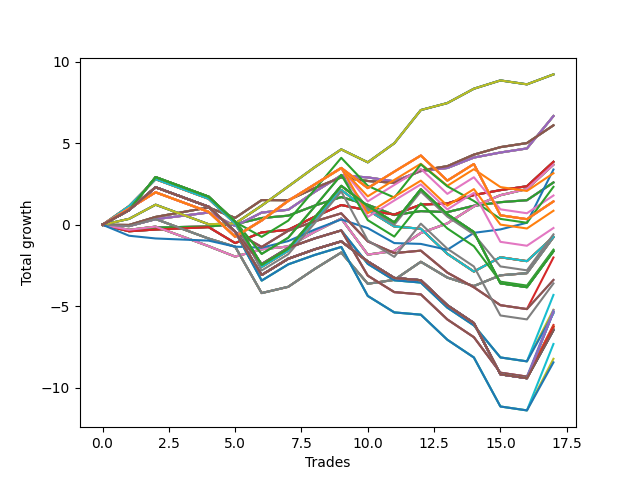

# Long Wallace Doodle 019 
- Symbol: AMZN_Unlimited
- Date Range: 03/23/2022 - 07/08/2022
- Trading Period: 7:20-12:30
- Number of Trades: 17



| Name | Win Percent | Profit | Avg Profit / Trade | Avg Time / Trade |      | Name | Win Percent | Profit | Avg Profit / Trade | Avg Time / Trade |
| ---- | ----------- | ------ | ------------------ | ---------------- | ---- | ---- | ----------- | ------ | ------------------ | ---------------- |
| Sorted By <br> Profit | | | | | | Sorted By <br> Win Percentage ||||
| Seventy | 76.47 | 4618.50 | 271.68 | 82:48 |     | Seventy | 76.47 | 4618.50 | 271.68 | 82:48 |
| Sixty-Two | 76.47 | 4618.50 | 271.68 | 82:48 |     | Sixty-Two | 76.47 | 4618.50 | 271.68 | 82:48 |
| Fifty-Four | 76.47 | 4618.50 | 271.68 | 82:48 |     | Fifty-Four | 76.47 | 4618.50 | 271.68 | 82:48 |
| Forty-Six | 76.47 | 4618.50 | 271.68 | 82:48 |     | Forty-Six | 76.47 | 4618.50 | 271.68 | 82:48 |
| Six | 76.47 | 4618.50 | 271.68 | 82:48 |     | Six | 76.47 | 4618.50 | 271.68 | 82:48 |
| Sixty-Six | 76.47 | 3339.50 | 196.44 | 23:45 |     | Sixty-Six | 76.47 | 3339.50 | 196.44 | 23:45 |
| Fifty-Eight | 76.47 | 3339.50 | 196.44 | 23:45 |     | Fifty-Eight | 76.47 | 3339.50 | 196.44 | 23:45 |
| Fifty | 76.47 | 3339.50 | 196.44 | 23:45 |     | Fifty | 76.47 | 3339.50 | 196.44 | 23:45 |
| Forty-Two | 76.47 | 3339.50 | 196.44 | 23:45 |     | Forty-Two | 76.47 | 3339.50 | 196.44 | 23:45 |
| Two | 76.47 | 3339.50 | 196.44 | 23:45 |     | Two | 76.47 | 3339.50 | 196.44 | 23:45 |
| Sixty-Seven | 70.59 | 3054.50 | 179.68 | 24:58 |     | Sixty-Five | 76.47 | 1933.75 | 113.75 | 17:33 |
| Fifty-Nine | 70.59 | 3054.50 | 179.68 | 24:58 |     | Fifty-Seven | 76.47 | 1933.75 | 113.75 | 17:33 |
| Fifty-One | 70.59 | 3054.50 | 179.68 | 24:58 |     | Forty-Nine | 76.47 | 1933.75 | 113.75 | 17:33 |
| Forty-Three | 70.59 | 3054.50 | 179.68 | 24:58 |     | Forty-One | 76.47 | 1933.75 | 113.75 | 17:33 |
| Three | 70.59 | 3054.50 | 179.68 | 24:58 |     | One | 76.47 | 1933.75 | 113.75 | 17:33 |
| Sixty-Five | 76.47 | 1933.75 | 113.75 | 17:33 |     | Sixty-Four | 76.47 | 1299.00 | 76.41 | 12:45 |
| Fifty-Seven | 76.47 | 1933.75 | 113.75 | 17:33 |     | Fifty-Six | 76.47 | 1299.00 | 76.41 | 12:45 |
| Forty-Nine | 76.47 | 1933.75 | 113.75 | 17:33 |     | Forty-Eight | 76.47 | 1299.00 | 76.41 | 12:45 |
| Forty-One | 76.47 | 1933.75 | 113.75 | 17:33 |     | Forty | 76.47 | 1299.00 | 76.41 | 12:45 |
| One | 76.47 | 1933.75 | 113.75 | 17:33 |     | Zero | 76.47 | 1299.00 | 76.41 | 12:45 |
| Sixty-Eight | 70.59 | 1848.00 | 108.71 | 47:55 |     | Sixty-Seven | 70.59 | 3054.50 | 179.68 | 24:58 |
| Sixty | 70.59 | 1848.00 | 108.71 | 47:55 |     | Fifty-Nine | 70.59 | 3054.50 | 179.68 | 24:58 |
| Fifty-Two | 70.59 | 1848.00 | 108.71 | 47:55 |     | Fifty-One | 70.59 | 3054.50 | 179.68 | 24:58 |
| Forty-Four | 70.59 | 1848.00 | 108.71 | 47:55 |     | Forty-Three | 70.59 | 3054.50 | 179.68 | 24:58 |
| Four | 70.59 | 1848.00 | 108.71 | 47:55 |     | Three | 70.59 | 3054.50 | 179.68 | 24:58 |
| Seventy-Three | 41.18 | 1697.25 | 99.84 | 14:40 |     | Sixty-Eight | 70.59 | 1848.00 | 108.71 | 47:55 |
| Ninety-Six | 58.82 | 1583.25 | 93.13 | 92:06 |     | Sixty | 70.59 | 1848.00 | 108.71 | 47:55 |
| Sixty-Four | 76.47 | 1299.00 | 76.41 | 12:45 |     | Fifty-Two | 70.59 | 1848.00 | 108.71 | 47:55 |
| Fifty-Six | 76.47 | 1299.00 | 76.41 | 12:45 |     | Forty-Four | 70.59 | 1848.00 | 108.71 | 47:55 |
| Forty-Eight | 76.47 | 1299.00 | 76.41 | 12:45 |     | Four | 70.59 | 1848.00 | 108.71 | 47:55 |
| Forty | 76.47 | 1299.00 | 76.41 | 12:45 |     | Ninety-Six | 58.82 | 1583.25 | 93.13 | 92:06 |
| Zero | 76.47 | 1299.00 | 76.41 | 12:45 |     | Ninety-One | 58.82 | 899.00 | 52.88 | 109:24 |
| Ninety-Seven | 41.18 | 1165.50 | 68.56 | 128:13 |     | One Hundred Twenty-Six | 58.82 | 717.00 | 42.18 | 123:27 |
| Ninety-One | 58.82 | 899.00 | 52.88 | 109:24 |     | One Hundred Twenty-One | 58.82 | 717.00 | 42.18 | 123:27 |
| One Hundred Twenty-Six | 58.82 | 717.00 | 42.18 | 123:27 |     | One Hundred Sixteen | 58.82 | 717.00 | 42.18 | 123:27 |
| One Hundred Twenty-One | 58.82 | 717.00 | 42.18 | 123:27 |     | One Hundred Eleven | 58.82 | 717.00 | 42.18 | 123:27 |
| One Hundred Sixteen | 58.82 | 717.00 | 42.18 | 123:27 |     | Eighty-One | 58.82 | 717.00 | 42.18 | 123:27 |
| One Hundred Eleven | 58.82 | 717.00 | 42.18 | 123:27 |     | One Hundred Six | 58.82 | 430.50 | 25.32 | 112:10 |
| Eighty-One | 58.82 | 717.00 | 42.18 | 123:27 |     | One Hundred One | 58.82 | -99.25 | -5.84 | 117:56 |
| One Hundred Six | 58.82 | 430.50 | 25.32 | 112:10 |     | Sixty-Nine | 52.94 | -382.00 | -22.47 | 91:31 |
| One Hundred One | 58.82 | -99.25 | -5.84 | 117:56 |     | Sixty-One | 52.94 | -382.00 | -22.47 | 91:31 |
| Ninety-Two | 41.18 | -294.75 | -17.34 | 159:26 |     | Fifty-Three | 52.94 | -382.00 | -22.47 | 91:31 |
| Seventy-One | 41.18 | -367.50 | -21.62 | 174:59 |     | Forty-Five | 52.94 | -382.00 | -22.47 | 91:31 |
| Sixty-Three | 41.18 | -367.50 | -21.62 | 174:59 |     | Five | 52.94 | -382.00 | -22.47 | 91:31 |
| Fifty-Five | 41.18 | -367.50 | -21.62 | 174:59 |     | Seventy-Three | 41.18 | 1697.25 | 99.84 | 14:40 |
| Forty-Seven | 41.18 | -367.50 | -21.62 | 174:59 |     | Ninety-Seven | 41.18 | 1165.50 | 68.56 | 128:13 |
| Seven | 41.18 | -367.50 | -21.62 | 174:59 |     | Ninety-Two | 41.18 | -294.75 | -17.34 | 159:26 |
| Sixty-Nine | 52.94 | -382.00 | -22.47 | 91:31 |     | Seventy-One | 41.18 | -367.50 | -21.62 | 174:59 |
| Sixty-One | 52.94 | -382.00 | -22.47 | 91:31 |     | Sixty-Three | 41.18 | -367.50 | -21.62 | 174:59 |
| Fifty-Three | 52.94 | -382.00 | -22.47 | 91:31 |     | Fifty-Five | 41.18 | -367.50 | -21.62 | 174:59 |
| Forty-Five | 52.94 | -382.00 | -22.47 | 91:31 |     | Forty-Seven | 41.18 | -367.50 | -21.62 | 174:59 |
| Five | 52.94 | -382.00 | -22.47 | 91:31 |     | Seven | 41.18 | -367.50 | -21.62 | 174:59 |
| One Hundred Seven | 41.18 | -763.25 | -44.90 | 162:12 |     | One Hundred Seven | 41.18 | -763.25 | -44.90 | 162:12 |
| One Hundred Twenty-Seven | 41.18 | -812.75 | -47.81 | 186:19 |     | One Hundred Twenty-Seven | 41.18 | -812.75 | -47.81 | 186:19 |
| One Hundred Twenty-Two | 41.18 | -812.75 | -47.81 | 186:19 |     | One Hundred Twenty-Two | 41.18 | -812.75 | -47.81 | 186:19 |
| One Hundred Seventeen | 41.18 | -812.75 | -47.81 | 186:19 |     | One Hundred Seventeen | 41.18 | -812.75 | -47.81 | 186:19 |
| One Hundred Twelve | 41.18 | -812.75 | -47.81 | 186:19 |     | One Hundred Twelve | 41.18 | -812.75 | -47.81 | 186:19 |
| Eighty-Two | 41.18 | -812.75 | -47.81 | 186:19 |     | Eighty-Two | 41.18 | -812.75 | -47.81 | 186:19 |
| Ninety-Eight | 41.18 | -1004.75 | -59.10 | 144:18 |     | Ninety-Eight | 41.18 | -1004.75 | -59.10 | 144:18 |
| One Hundred | 41.18 | -1694.75 | -99.69 | 145:16 |     | One Hundred | 41.18 | -1694.75 | -99.69 | 145:16 |
| Ninety-Nine | 41.18 | -1694.75 | -99.69 | 145:16 |     | Ninety-Nine | 41.18 | -1694.75 | -99.69 | 145:16 |
| One Hundred Two | 41.18 | -1801.25 | -105.96 | 173:26 |     | One Hundred Two | 41.18 | -1801.25 | -105.96 | 173:26 |
| Ninety-Four | 35.29 | -2155.00 | -126.76 | 180:07 |     | Ninety-Four | 35.29 | -2155.00 | -126.76 | 180:07 |
| Ninety-Three | 35.29 | -2610.00 | -153.53 | 177:03 |     | Ninety-Three | 35.29 | -2610.00 | -153.53 | 177:03 |
| One Hundred Nine | 35.29 | -2623.50 | -154.32 | 182:53 |     | One Hundred Nine | 35.29 | -2623.50 | -154.32 | 182:53 |
| One Hundred Twenty-Nine | 35.29 | -2673.00 | -157.24 | 207:00 |     | One Hundred Twenty-Nine | 35.29 | -2673.00 | -157.24 | 207:00 |
| One Hundred Twenty-Four | 35.29 | -2673.00 | -157.24 | 207:00 |     | One Hundred Twenty-Four | 35.29 | -2673.00 | -157.24 | 207:00 |
| One Hundred Ninteen | 35.29 | -2673.00 | -157.24 | 207:00 |     | One Hundred Ninteen | 35.29 | -2673.00 | -157.24 | 207:00 |
| One Hundred Fourteen | 35.29 | -2673.00 | -157.24 | 207:00 |     | One Hundred Fourteen | 35.29 | -2673.00 | -157.24 | 207:00 |
| Eighty-Four | 35.29 | -2673.00 | -157.24 | 207:00 |     | Eighty-Four | 35.29 | -2673.00 | -157.24 | 207:00 |
| Ninety-Five | 35.29 | -2720.00 | -160.00 | 180:55 |     | Ninety-Five | 35.29 | -2720.00 | -160.00 | 180:55 |
| One Hundred Eight | 35.29 | -3078.50 | -181.09 | 179:50 |     | One Hundred Eight | 35.29 | -3078.50 | -181.09 | 179:50 |
| One Hundred Twenty-Eight | 35.29 | -3128.00 | -184.00 | 203:57 |     | One Hundred Twenty-Eight | 35.29 | -3128.00 | -184.00 | 203:57 |
| One Hundred Twenty-Three | 35.29 | -3128.00 | -184.00 | 203:57 |     | One Hundred Twenty-Three | 35.29 | -3128.00 | -184.00 | 203:57 |
| One Hundred Eighteen | 35.29 | -3128.00 | -184.00 | 203:57 |     | One Hundred Eighteen | 35.29 | -3128.00 | -184.00 | 203:57 |
| One Hundred Thirteen | 35.29 | -3128.00 | -184.00 | 203:57 |     | One Hundred Thirteen | 35.29 | -3128.00 | -184.00 | 203:57 |
| Eighty-Three | 35.29 | -3128.00 | -184.00 | 203:57 |     | Eighty-Three | 35.29 | -3128.00 | -184.00 | 203:57 |
| One Hundred Ten | 35.29 | -3188.50 | -187.56 | 183:42 |     | One Hundred Ten | 35.29 | -3188.50 | -187.56 | 183:42 |
| One Hundred Thirty | 35.29 | -3238.00 | -190.47 | 207:49 |     | One Hundred Thirty | 35.29 | -3238.00 | -190.47 | 207:49 |
| One Hundred Twenty-Five | 35.29 | -3238.00 | -190.47 | 207:49 |     | One Hundred Twenty-Five | 35.29 | -3238.00 | -190.47 | 207:49 |
| One Hundred Twenty | 35.29 | -3238.00 | -190.47 | 207:49 |     | One Hundred Twenty | 35.29 | -3238.00 | -190.47 | 207:49 |
| One Hundred Fifteen | 35.29 | -3238.00 | -190.47 | 207:49 |     | One Hundred Fifteen | 35.29 | -3238.00 | -190.47 | 207:49 |
| Eighty-Five | 35.29 | -3238.00 | -190.47 | 207:49 |     | Eighty-Five | 35.29 | -3238.00 | -190.47 | 207:49 |
| One Hundred Four | 35.29 | -3661.50 | -215.38 | 194:07 |     | One Hundred Four | 35.29 | -3661.50 | -215.38 | 194:07 |
| One Hundred Three | 35.29 | -4116.50 | -242.15 | 191:04 |     | One Hundred Three | 35.29 | -4116.50 | -242.15 | 191:04 |
| One Hundred Five | 35.29 | -4226.50 | -248.62 | 194:56 |     | One Hundred Five | 35.29 | -4226.50 | -248.62 | 194:56 |

## NO STOPLOSS

### Test Zero
* Sell when price hits the middle line of the 20p bollinger
* No Stoploss
* Results:
```
Total Trades: 17
Percent Up: 76.47
Percent Down: 23.53
Total Points Moved Up: 2.60
Potential Profit: 1299.00
Total Points Ups: 4.10 Count Ups: 13
Total Points Downs: -1.50 Count Downs: 4
```

<details><summary>Trades</summary>

<code>In: 2022-03-25 08:09:00		Out: 2022-03-25 08:30:35		Total Position Time: 21:35		Total Move Up: -0.34		Total to Date: -0.34</code> <br />
<code>In: 2022-03-25 08:13:00		Out: 2022-03-25 08:30:35		Total Position Time: 17:35		Total Move Up: 0.17		Total to Date: -0.17</code> <br />
<code>In: 2022-04-08 11:29:00		Out: 2022-04-08 11:47:50		Total Position Time: 18:50		Total Move Up: 0.03		Total to Date: -0.14</code> <br />
<code>In: 2022-04-08 11:29:00		Out: 2022-04-08 11:47:50		Total Position Time: 18:50		Total Move Up: 0.03		Total to Date: -0.10</code> <br />
<code>In: 2022-04-11 07:23:00		Out: 2022-04-11 07:34:05		Total Position Time: 11:05		Total Move Up: 0.14		Total to Date: 0.03</code> <br />
<code>In: 2022-04-22 07:22:00		Out: 2022-04-22 07:34:05		Total Position Time: 12:05		Total Move Up: 0.38		Total to Date: 0.41</code> <br />
<code>In: 2022-05-06 10:58:00		Out: 2022-05-06 11:12:20		Total Position Time: 14:20		Total Move Up: 0.14		Total to Date: 0.56</code> <br />
<code>In: 2022-05-19 10:15:00		Out: 2022-05-19 10:19:20		Total Position Time: 04:20		Total Move Up: 0.62		Total to Date: 1.18</code> <br />
<code>In: 2022-05-19 10:16:00		Out: 2022-05-19 10:19:20		Total Position Time: 03:20		Total Move Up: 0.53		Total to Date: 1.70</code> <br />
<code>In: 2022-05-20 08:00:00		Out: 2022-05-20 08:26:15		Total Position Time: 26:15		Total Move Up: -0.48		Total to Date: 1.23</code> <br />
<code>In: 2022-06-06 09:05:00		Out: 2022-06-06 09:23:25		Total Position Time: 18:25		Total Move Up: -0.63		Total to Date: 0.60</code> <br />
<code>In: 2022-06-06 09:11:00		Out: 2022-06-06 09:23:25		Total Position Time: 12:25		Total Move Up: 0.24		Total to Date: 0.84</code> <br />
<code>In: 2022-06-08 08:00:00		Out: 2022-06-08 08:08:15		Total Position Time: 08:15		Total Move Up: -0.06		Total to Date: 0.78</code> <br />
<code>In: 2022-06-08 08:04:00		Out: 2022-06-08 08:08:15		Total Position Time: 04:15		Total Move Up: 0.39		Total to Date: 1.17</code> <br />
<code>In: 2022-06-09 08:09:00		Out: 2022-06-09 08:21:05		Total Position Time: 12:05		Total Move Up: 0.22		Total to Date: 1.39</code> <br />
<code>In: 2022-06-14 10:49:00		Out: 2022-06-14 10:58:05		Total Position Time: 09:05		Total Move Up: 0.12		Total to Date: 1.51</code> <br />
<code>In: 2022-06-15 11:34:00		Out: 2022-06-15 11:38:05		Total Position Time: 04:05		Total Move Up: 1.09		Total to Date: 2.60</code> <br />


</details>

### Test One
* Sell when the price hits the upper line of the 20p 1std bollinger
* No Stoploss
* Results:
```
Total Trades: 17
Percent Up: 76.47
Percent Down: 23.53
Total Points Moved Up: 3.87
Potential Profit: 1933.75
Total Points Ups: 5.83 Count Ups: 13
Total Points Downs: -1.96 Count Downs: 4
```

<details><summary>Trades</summary>

<code>In: 2022-03-25 08:09:00		Out: 2022-03-25 08:40:30		Total Position Time: 31:30		Total Move Up: -0.40		Total to Date: -0.40</code> <br />
<code>In: 2022-03-25 08:13:00		Out: 2022-03-25 08:40:30		Total Position Time: 27:30		Total Move Up: 0.11		Total to Date: -0.29</code> <br />
<code>In: 2022-04-08 11:29:00		Out: 2022-04-08 11:50:50		Total Position Time: 21:50		Total Move Up: 0.07		Total to Date: -0.22</code> <br />
<code>In: 2022-04-08 11:29:00		Out: 2022-04-08 11:50:50		Total Position Time: 21:50		Total Move Up: 0.07		Total to Date: -0.15</code> <br />
<code>In: 2022-04-11 07:23:00		Out: 2022-04-11 08:02:15		Total Position Time: 39:15		Total Move Up: -0.98		Total to Date: -1.12</code> <br />
<code>In: 2022-04-22 07:22:00		Out: 2022-04-22 07:36:25		Total Position Time: 14:25		Total Move Up: 0.66		Total to Date: -0.47</code> <br />
<code>In: 2022-05-06 10:58:00		Out: 2022-05-06 11:16:05		Total Position Time: 18:05		Total Move Up: 0.16		Total to Date: -0.31</code> <br />
<code>In: 2022-05-19 10:15:00		Out: 2022-05-19 10:23:20		Total Position Time: 08:20		Total Move Up: 0.81		Total to Date: 0.49</code> <br />
<code>In: 2022-05-19 10:16:00		Out: 2022-05-19 10:23:20		Total Position Time: 07:20		Total Move Up: 0.72		Total to Date: 1.21</code> <br />
<code>In: 2022-05-20 08:00:00		Out: 2022-05-20 08:27:20		Total Position Time: 27:20		Total Move Up: -0.32		Total to Date: 0.89</code> <br />
<code>In: 2022-06-06 09:05:00		Out: 2022-06-06 09:24:00		Total Position Time: 19:00		Total Move Up: -0.26		Total to Date: 0.63</code> <br />
<code>In: 2022-06-06 09:11:00		Out: 2022-06-06 09:24:00		Total Position Time: 13:00		Total Move Up: 0.61		Total to Date: 1.24</code> <br />
<code>In: 2022-06-08 08:00:00		Out: 2022-06-08 08:11:10		Total Position Time: 11:10		Total Move Up: 0.07		Total to Date: 1.31</code> <br />
<code>In: 2022-06-08 08:04:00		Out: 2022-06-08 08:11:10		Total Position Time: 07:10		Total Move Up: 0.52		Total to Date: 1.83</code> <br />
<code>In: 2022-06-09 08:09:00		Out: 2022-06-09 08:22:40		Total Position Time: 13:40		Total Move Up: 0.30		Total to Date: 2.13</code> <br />
<code>In: 2022-06-14 10:49:00		Out: 2022-06-14 11:01:50		Total Position Time: 12:50		Total Move Up: 0.24		Total to Date: 2.37</code> <br />
<code>In: 2022-06-15 11:34:00		Out: 2022-06-15 11:38:10		Total Position Time: 04:10		Total Move Up: 1.50		Total to Date: 3.87</code> <br />


</details>

### Test Two
* Sell when the price hits the upper line of the 20p 2std bollinger
* No Stoploss
* Results:
```
Total Trades: 17
Percent Up: 76.47
Percent Down: 23.53
Total Points Moved Up: 6.68
Potential Profit: 3339.50
Total Points Ups: 7.95 Count Ups: 13
Total Points Downs: -1.28 Count Downs: 4
```

<details><summary>Trades</summary>

<code>In: 2022-03-25 08:09:00		Out: 2022-03-25 08:41:35		Total Position Time: 32:35		Total Move Up: -0.08		Total to Date: -0.08</code> <br />
<code>In: 2022-03-25 08:13:00		Out: 2022-03-25 08:41:35		Total Position Time: 28:35		Total Move Up: 0.43		Total to Date: 0.34</code> <br />
<code>In: 2022-04-08 11:29:00		Out: 2022-04-08 11:52:15		Total Position Time: 23:15		Total Move Up: 0.20		Total to Date: 0.55</code> <br />
<code>In: 2022-04-08 11:29:00		Out: 2022-04-08 11:52:15		Total Position Time: 23:15		Total Move Up: 0.20		Total to Date: 0.75</code> <br />
<code>In: 2022-04-11 07:23:00		Out: 2022-04-11 08:07:20		Total Position Time: 44:20		Total Move Up: -0.83		Total to Date: -0.08</code> <br />
<code>In: 2022-04-22 07:22:00		Out: 2022-04-22 07:36:35		Total Position Time: 14:35		Total Move Up: 0.83		Total to Date: 0.75</code> <br />
<code>In: 2022-05-06 10:58:00		Out: 2022-05-06 11:49:25		Total Position Time: 51:25		Total Move Up: 0.17		Total to Date: 0.92</code> <br />
<code>In: 2022-05-19 10:15:00		Out: 2022-05-19 10:33:50		Total Position Time: 18:50		Total Move Up: 1.10		Total to Date: 2.02</code> <br />
<code>In: 2022-05-19 10:16:00		Out: 2022-05-19 10:33:50		Total Position Time: 17:50		Total Move Up: 1.01		Total to Date: 3.03</code> <br />
<code>In: 2022-05-20 08:00:00		Out: 2022-05-20 08:31:40		Total Position Time: 31:40		Total Move Up: -0.12		Total to Date: 2.91</code> <br />
<code>In: 2022-06-06 09:05:00		Out: 2022-06-06 09:37:20		Total Position Time: 32:20		Total Move Up: -0.24		Total to Date: 2.67</code> <br />
<code>In: 2022-06-06 09:11:00		Out: 2022-06-06 09:37:20		Total Position Time: 26:20		Total Move Up: 0.63		Total to Date: 3.30</code> <br />
<code>In: 2022-06-08 08:00:00		Out: 2022-06-08 08:13:45		Total Position Time: 13:45		Total Move Up: 0.19		Total to Date: 3.49</code> <br />
<code>In: 2022-06-08 08:04:00		Out: 2022-06-08 08:13:45		Total Position Time: 09:45		Total Move Up: 0.64		Total to Date: 4.13</code> <br />
<code>In: 2022-06-09 08:09:00		Out: 2022-06-09 08:24:15		Total Position Time: 15:15		Total Move Up: 0.31		Total to Date: 4.44</code> <br />
<code>In: 2022-06-14 10:49:00		Out: 2022-06-14 11:04:05		Total Position Time: 15:05		Total Move Up: 0.25		Total to Date: 4.69</code> <br />
<code>In: 2022-06-15 11:34:00		Out: 2022-06-15 11:38:55		Total Position Time: 04:55		Total Move Up: 1.99		Total to Date: 6.68</code> <br />


</details>

### Test Three
* Sell when price hits the middle line of the 50p bollinger
* No Stoploss
* Results:
```
Total Trades: 17
Percent Up: 70.59
Percent Down: 29.41
Total Points Moved Up: 6.11
Potential Profit: 3054.50
Total Points Ups: 7.10 Count Ups: 12
Total Points Downs: -0.99 Count Downs: 5
```

<details><summary>Trades</summary>

<code>In: 2022-03-25 08:09:00		Out: 2022-03-25 08:45:00		Total Position Time: 36:00		Total Move Up: -0.01		Total to Date: -0.01</code> <br />
<code>In: 2022-03-25 08:13:00		Out: 2022-03-25 08:45:00		Total Position Time: 32:00		Total Move Up: 0.49		Total to Date: 0.48</code> <br />
<code>In: 2022-04-08 11:29:00		Out: 2022-04-08 11:53:20		Total Position Time: 24:20		Total Move Up: 0.29		Total to Date: 0.77</code> <br />
<code>In: 2022-04-08 11:29:00		Out: 2022-04-08 11:53:20		Total Position Time: 24:20		Total Move Up: 0.29		Total to Date: 1.06</code> <br />
<code>In: 2022-04-11 07:23:00		Out: 2022-04-11 08:10:50		Total Position Time: 47:50		Total Move Up: -0.64		Total to Date: 0.42</code> <br />
<code>In: 2022-04-22 07:22:00		Out: 2022-04-22 07:36:50		Total Position Time: 14:50		Total Move Up: 1.09		Total to Date: 1.52</code> <br />
<code>In: 2022-05-06 10:58:00		Out: 2022-05-06 11:49:10		Total Position Time: 51:10		Total Move Up: -0.01		Total to Date: 1.51</code> <br />
<code>In: 2022-05-19 10:15:00		Out: 2022-05-19 10:22:50		Total Position Time: 07:50		Total Move Up: 0.75		Total to Date: 2.26</code> <br />
<code>In: 2022-05-19 10:16:00		Out: 2022-05-19 10:22:50		Total Position Time: 06:50		Total Move Up: 0.66		Total to Date: 2.91</code> <br />
<code>In: 2022-05-20 08:00:00		Out: 2022-05-20 08:41:05		Total Position Time: 41:05		Total Move Up: -0.22		Total to Date: 2.69</code> <br />
<code>In: 2022-06-06 09:05:00		Out: 2022-06-06 09:38:25		Total Position Time: 33:25		Total Move Up: -0.11		Total to Date: 2.58</code> <br />
<code>In: 2022-06-06 09:11:00		Out: 2022-06-06 09:38:25		Total Position Time: 27:25		Total Move Up: 0.76		Total to Date: 3.34</code> <br />
<code>In: 2022-06-08 08:00:00		Out: 2022-06-08 08:15:05		Total Position Time: 15:05		Total Move Up: 0.26		Total to Date: 3.60</code> <br />
<code>In: 2022-06-08 08:04:00		Out: 2022-06-08 08:15:05		Total Position Time: 11:05		Total Move Up: 0.71		Total to Date: 4.31</code> <br />
<code>In: 2022-06-09 08:09:00		Out: 2022-06-09 08:24:55		Total Position Time: 15:55		Total Move Up: 0.46		Total to Date: 4.77</code> <br />
<code>In: 2022-06-14 10:49:00		Out: 2022-06-14 11:20:20		Total Position Time: 31:20		Total Move Up: 0.25		Total to Date: 5.02</code> <br />
<code>In: 2022-06-15 11:34:00		Out: 2022-06-15 11:38:05		Total Position Time: 04:05		Total Move Up: 1.09		Total to Date: 6.11</code> <br />


</details>

### Test Four
* Sell when the price hits the upper line of the 50p 1std bollinger
* No Stoploss
* Results:
```
Total Trades: 17
Percent Up: 70.59
Percent Down: 29.41
Total Points Moved Up: 3.70
Potential Profit: 1848.00
Total Points Ups: 8.07 Count Ups: 12
Total Points Downs: -4.37 Count Downs: 5
```

<details><summary>Trades</summary>

<code>In: 2022-03-25 08:09:00		Out: 2022-03-25 09:09:40		Total Position Time: 60:40		Total Move Up: -0.31		Total to Date: -0.31</code> <br />
<code>In: 2022-03-25 08:13:00		Out: 2022-03-25 09:09:40		Total Position Time: 56:40		Total Move Up: 0.20		Total to Date: -0.11</code> <br />
<code>In: 2022-04-08 11:29:00		Out: 2022-04-08 12:47:00		Total Position Time: 78:00		Total Move Up: -0.60		Total to Date: -0.71</code> <br />
<code>In: 2022-04-08 11:29:00		Out: 2022-04-08 12:47:00		Total Position Time: 78:00		Total Move Up: -0.60		Total to Date: -1.31</code> <br />
<code>In: 2022-04-11 07:23:00		Out: 2022-04-11 08:27:05		Total Position Time: 64:05		Total Move Up: -0.64		Total to Date: -1.96</code> <br />
<code>In: 2022-04-22 07:22:00		Out: 2022-04-22 08:09:25		Total Position Time: 47:25		Total Move Up: 0.45		Total to Date: -1.51</code> <br />
<code>In: 2022-05-06 10:58:00		Out: 2022-05-06 11:49:25		Total Position Time: 51:25		Total Move Up: 0.17		Total to Date: -1.33</code> <br />
<code>In: 2022-05-19 10:15:00		Out: 2022-05-19 10:31:50		Total Position Time: 16:50		Total Move Up: 0.90		Total to Date: -0.43</code> <br />
<code>In: 2022-05-19 10:16:00		Out: 2022-05-19 10:31:50		Total Position Time: 15:50		Total Move Up: 0.81		Total to Date: 0.38</code> <br />
<code>In: 2022-05-20 08:00:00		Out: 2022-05-20 10:33:55		Total Position Time: 153:55		Total Move Up: -2.22		Total to Date: -1.83</code> <br />
<code>In: 2022-06-06 09:05:00		Out: 2022-06-06 09:48:10		Total Position Time: 43:10		Total Move Up: 0.23		Total to Date: -1.60</code> <br />
<code>In: 2022-06-06 09:11:00		Out: 2022-06-06 09:48:10		Total Position Time: 37:10		Total Move Up: 1.10		Total to Date: -0.50</code> <br />
<code>In: 2022-06-08 08:00:00		Out: 2022-06-08 08:26:05		Total Position Time: 26:05		Total Move Up: 0.59		Total to Date: 0.09</code> <br />
<code>In: 2022-06-08 08:04:00		Out: 2022-06-08 08:26:05		Total Position Time: 22:05		Total Move Up: 1.04		Total to Date: 1.13</code> <br />
<code>In: 2022-06-09 08:09:00		Out: 2022-06-09 08:33:05		Total Position Time: 24:05		Total Move Up: 0.69		Total to Date: 1.82</code> <br />
<code>In: 2022-06-14 10:49:00		Out: 2022-06-14 11:24:10		Total Position Time: 35:10		Total Move Up: 0.38		Total to Date: 2.20</code> <br />
<code>In: 2022-06-15 11:34:00		Out: 2022-06-15 11:38:10		Total Position Time: 04:10		Total Move Up: 1.50		Total to Date: 3.70</code> <br />


</details>

### Test Five
* Sell when the price hits the upper line of the 50p 2std bollinger
* No Stoploss
* Results:
```
Total Trades: 17
Percent Up: 52.94
Percent Down: 47.06
Total Points Moved Up: -0.76
Potential Profit: -382.00
Total Points Ups: 7.27 Count Ups: 9
Total Points Downs: -8.03 Count Downs: 8
```

<details><summary>Trades</summary>

<code>In: 2022-03-25 08:09:00		Out: 2022-03-25 09:11:20		Total Position Time: 62:20		Total Move Up: -0.08		Total to Date: -0.08</code> <br />
<code>In: 2022-03-25 08:13:00		Out: 2022-03-25 09:11:20		Total Position Time: 58:20		Total Move Up: 0.43		Total to Date: 0.35</code> <br />
<code>In: 2022-04-08 11:29:00		Out: 2022-04-08 12:47:00		Total Position Time: 78:00		Total Move Up: -0.60		Total to Date: -0.25</code> <br />
<code>In: 2022-04-08 11:29:00		Out: 2022-04-08 12:47:00		Total Position Time: 78:00		Total Move Up: -0.60		Total to Date: -0.85</code> <br />
<code>In: 2022-04-11 07:23:00		Out: 2022-04-11 08:31:05		Total Position Time: 68:05		Total Move Up: -0.50		Total to Date: -1.35</code> <br />
<code>In: 2022-04-22 07:22:00		Out: 2022-04-22 12:14:00		Total Position Time: 292:00		Total Move Up: -2.85		Total to Date: -4.20</code> <br />
<code>In: 2022-05-06 10:58:00		Out: 2022-05-06 11:50:15		Total Position Time: 52:15		Total Move Up: 0.38		Total to Date: -3.81</code> <br />
<code>In: 2022-05-19 10:15:00		Out: 2022-05-19 10:33:35		Total Position Time: 18:35		Total Move Up: 1.10		Total to Date: -2.71</code> <br />
<code>In: 2022-05-19 10:16:00		Out: 2022-05-19 10:33:35		Total Position Time: 17:35		Total Move Up: 1.01		Total to Date: -1.71</code> <br />
<code>In: 2022-05-20 08:00:00		Out: 2022-05-20 10:46:15		Total Position Time: 166:15		Total Move Up: -1.92		Total to Date: -3.62</code> <br />
<code>In: 2022-06-06 09:05:00		Out: 2022-06-06 10:23:10		Total Position Time: 78:10		Total Move Up: 0.24		Total to Date: -3.38</code> <br />
<code>In: 2022-06-06 09:11:00		Out: 2022-06-06 10:23:10		Total Position Time: 72:10		Total Move Up: 1.11		Total to Date: -2.27</code> <br />
<code>In: 2022-06-08 08:00:00		Out: 2022-06-08 11:03:40		Total Position Time: 183:40		Total Move Up: -0.97		Total to Date: -3.24</code> <br />
<code>In: 2022-06-08 08:04:00		Out: 2022-06-08 11:03:40		Total Position Time: 179:40		Total Move Up: -0.52		Total to Date: -3.76</code> <br />
<code>In: 2022-06-09 08:09:00		Out: 2022-06-09 08:41:35		Total Position Time: 32:35		Total Move Up: 0.66		Total to Date: -3.10</code> <br />
<code>In: 2022-06-14 10:49:00		Out: 2022-06-14 12:42:10		Total Position Time: 113:10		Total Move Up: 0.13		Total to Date: -2.97</code> <br />
<code>In: 2022-06-15 11:34:00		Out: 2022-06-15 11:39:00		Total Position Time: 05:00		Total Move Up: 2.21		Total to Date: -0.76</code> <br />


</details>

### Test Six
* Sell when the price hits the middle line of the 1std VWAP
* No Stoploss
* Results:
```
Total Trades: 17
Percent Up: 76.47
Percent Down: 23.53
Total Points Moved Up: 9.24
Potential Profit: 4618.50
Total Points Ups: 11.47 Count Ups: 13
Total Points Downs: -2.23 Count Downs: 4
```

<details><summary>Trades</summary>

<code>In: 2022-03-25 08:09:00		Out: 2022-03-25 10:19:15		Total Position Time: 130:15		Total Move Up: 0.36		Total to Date: 0.36</code> <br />
<code>In: 2022-03-25 08:13:00		Out: 2022-03-25 10:19:15		Total Position Time: 126:15		Total Move Up: 0.87		Total to Date: 1.23</code> <br />
<code>In: 2022-04-08 11:29:00		Out: 2022-04-08 12:47:00		Total Position Time: 78:00		Total Move Up: -0.60		Total to Date: 0.63</code> <br />
<code>In: 2022-04-08 11:29:00		Out: 2022-04-08 12:47:00		Total Position Time: 78:00		Total Move Up: -0.60		Total to Date: 0.03</code> <br />
<code>In: 2022-04-11 07:23:00		Out: 2022-04-11 10:01:25		Total Position Time: 158:25		Total Move Up: 0.05		Total to Date: 0.08</code> <br />
<code>In: 2022-04-22 07:22:00		Out: 2022-04-22 07:36:50		Total Position Time: 14:50		Total Move Up: 1.09		Total to Date: 1.18</code> <br />
<code>In: 2022-05-06 10:58:00		Out: 2022-05-06 12:46:35		Total Position Time: 108:35		Total Move Up: 1.18		Total to Date: 2.35</code> <br />
<code>In: 2022-05-19 10:15:00		Out: 2022-05-19 10:55:25		Total Position Time: 40:25		Total Move Up: 1.18		Total to Date: 3.54</code> <br />
<code>In: 2022-05-19 10:16:00		Out: 2022-05-19 10:55:25		Total Position Time: 39:25		Total Move Up: 1.09		Total to Date: 4.63</code> <br />
<code>In: 2022-05-20 08:00:00		Out: 2022-05-20 12:36:40		Total Position Time: 276:40		Total Move Up: -0.79		Total to Date: 3.84</code> <br />
<code>In: 2022-06-06 09:05:00		Out: 2022-06-06 10:39:05		Total Position Time: 94:05		Total Move Up: 1.17		Total to Date: 5.01</code> <br />
<code>In: 2022-06-06 09:11:00		Out: 2022-06-06 10:39:05		Total Position Time: 88:05		Total Move Up: 2.04		Total to Date: 7.05</code> <br />
<code>In: 2022-06-08 08:00:00		Out: 2022-06-08 08:16:50		Total Position Time: 16:50		Total Move Up: 0.43		Total to Date: 7.48</code> <br />
<code>In: 2022-06-08 08:04:00		Out: 2022-06-08 08:16:50		Total Position Time: 12:50		Total Move Up: 0.88		Total to Date: 8.36</code> <br />
<code>In: 2022-06-09 08:09:00		Out: 2022-06-09 08:32:55		Total Position Time: 23:55		Total Move Up: 0.51		Total to Date: 8.87</code> <br />
<code>In: 2022-06-14 10:49:00		Out: 2022-06-14 12:47:00		Total Position Time: 118:00		Total Move Up: -0.24		Total to Date: 8.63</code> <br />
<code>In: 2022-06-15 11:34:00		Out: 2022-06-15 11:37:10		Total Position Time: 03:10		Total Move Up: 0.61		Total to Date: 9.24</code> <br />


</details>

### Test Seven
* Sell when the price hits the upper line of the 1std VWAP
* No Stoploss
* Results:
```
Total Trades: 17
Percent Up: 41.18
Percent Down: 58.82
Total Points Moved Up: -0.73
Potential Profit: -367.50
Total Points Ups: 9.91 Count Ups: 7
Total Points Downs: -10.65 Count Downs: 10
```

<details><summary>Trades</summary>

<code>In: 2022-03-25 08:09:00		Out: 2022-03-25 11:52:15		Total Position Time: 223:15		Total Move Up: 1.15		Total to Date: 1.15</code> <br />
<code>In: 2022-03-25 08:13:00		Out: 2022-03-25 11:52:15		Total Position Time: 219:15		Total Move Up: 1.65		Total to Date: 2.80</code> <br />
<code>In: 2022-04-08 11:29:00		Out: 2022-04-08 12:47:00		Total Position Time: 78:00		Total Move Up: -0.60		Total to Date: 2.20</code> <br />
<code>In: 2022-04-08 11:29:00		Out: 2022-04-08 12:47:00		Total Position Time: 78:00		Total Move Up: -0.60		Total to Date: 1.60</code> <br />
<code>In: 2022-04-11 07:23:00		Out: 2022-04-11 12:47:00		Total Position Time: 324:00		Total Move Up: -1.53		Total to Date: 0.07</code> <br />
<code>In: 2022-04-22 07:22:00		Out: 2022-04-22 12:47:00		Total Position Time: 325:00		Total Move Up: -2.66		Total to Date: -2.59</code> <br />
<code>In: 2022-05-06 10:58:00		Out: 2022-05-06 12:47:00		Total Position Time: 109:00		Total Move Up: 1.00		Total to Date: -1.60</code> <br />
<code>In: 2022-05-19 10:15:00		Out: 2022-05-19 11:38:40		Total Position Time: 83:40		Total Move Up: 1.91		Total to Date: 0.32</code> <br />
<code>In: 2022-05-19 10:16:00		Out: 2022-05-19 11:38:40		Total Position Time: 82:40		Total Move Up: 1.83		Total to Date: 2.14</code> <br />
<code>In: 2022-05-20 08:00:00		Out: 2022-05-20 12:47:00		Total Position Time: 287:00		Total Move Up: -1.24		Total to Date: 0.91</code> <br />
<code>In: 2022-06-06 09:05:00		Out: 2022-06-06 12:47:00		Total Position Time: 222:00		Total Move Up: -1.01		Total to Date: -0.11</code> <br />
<code>In: 2022-06-06 09:11:00		Out: 2022-06-06 12:47:00		Total Position Time: 216:00		Total Move Up: -0.14		Total to Date: -0.25</code> <br />
<code>In: 2022-06-08 08:00:00		Out: 2022-06-08 12:47:00		Total Position Time: 287:00		Total Move Up: -1.54		Total to Date: -1.78</code> <br />
<code>In: 2022-06-08 08:04:00		Out: 2022-06-08 12:47:00		Total Position Time: 283:00		Total Move Up: -1.09		Total to Date: -2.87</code> <br />
<code>In: 2022-06-09 08:09:00		Out: 2022-06-09 08:43:50		Total Position Time: 34:50		Total Move Up: 0.88		Total to Date: -1.99</code> <br />
<code>In: 2022-06-14 10:49:00		Out: 2022-06-14 12:47:00		Total Position Time: 118:00		Total Move Up: -0.24		Total to Date: -2.23</code> <br />
<code>In: 2022-06-15 11:34:00		Out: 2022-06-15 11:38:10		Total Position Time: 04:10		Total Move Up: 1.50		Total to Date: -0.73</code> <br />


</details>

## STOPLOSS OF 5

### Test Forty
* Sell when price hits the middle line of the 20p bollinger
* Stoploss is 5 points
* Results:
```
Total Trades: 17
Percent Up: 76.47
Percent Down: 23.53
Total Points Moved Up: 2.60
Potential Profit: 1299.00
Total Points Ups: 4.10 Count Ups: 13
Total Points Downs: -1.50 Count Downs: 4
```

<details><summary>Trades</summary>

<code>In: 2022-03-25 08:09:00		Out: 2022-03-25 08:30:35		Total Position Time: 21:35		Total Move Up: -0.34		Total to Date: -0.34</code> <br />
<code>In: 2022-03-25 08:13:00		Out: 2022-03-25 08:30:35		Total Position Time: 17:35		Total Move Up: 0.17		Total to Date: -0.17</code> <br />
<code>In: 2022-04-08 11:29:00		Out: 2022-04-08 11:47:50		Total Position Time: 18:50		Total Move Up: 0.03		Total to Date: -0.14</code> <br />
<code>In: 2022-04-08 11:29:00		Out: 2022-04-08 11:47:50		Total Position Time: 18:50		Total Move Up: 0.03		Total to Date: -0.10</code> <br />
<code>In: 2022-04-11 07:23:00		Out: 2022-04-11 07:34:05		Total Position Time: 11:05		Total Move Up: 0.14		Total to Date: 0.03</code> <br />
<code>In: 2022-04-22 07:22:00		Out: 2022-04-22 07:34:05		Total Position Time: 12:05		Total Move Up: 0.38		Total to Date: 0.41</code> <br />
<code>In: 2022-05-06 10:58:00		Out: 2022-05-06 11:12:20		Total Position Time: 14:20		Total Move Up: 0.14		Total to Date: 0.56</code> <br />
<code>In: 2022-05-19 10:15:00		Out: 2022-05-19 10:19:20		Total Position Time: 04:20		Total Move Up: 0.62		Total to Date: 1.18</code> <br />
<code>In: 2022-05-19 10:16:00		Out: 2022-05-19 10:19:20		Total Position Time: 03:20		Total Move Up: 0.53		Total to Date: 1.70</code> <br />
<code>In: 2022-05-20 08:00:00		Out: 2022-05-20 08:26:15		Total Position Time: 26:15		Total Move Up: -0.48		Total to Date: 1.23</code> <br />
<code>In: 2022-06-06 09:05:00		Out: 2022-06-06 09:23:25		Total Position Time: 18:25		Total Move Up: -0.63		Total to Date: 0.60</code> <br />
<code>In: 2022-06-06 09:11:00		Out: 2022-06-06 09:23:25		Total Position Time: 12:25		Total Move Up: 0.24		Total to Date: 0.84</code> <br />
<code>In: 2022-06-08 08:00:00		Out: 2022-06-08 08:08:15		Total Position Time: 08:15		Total Move Up: -0.06		Total to Date: 0.78</code> <br />
<code>In: 2022-06-08 08:04:00		Out: 2022-06-08 08:08:15		Total Position Time: 04:15		Total Move Up: 0.39		Total to Date: 1.17</code> <br />
<code>In: 2022-06-09 08:09:00		Out: 2022-06-09 08:21:05		Total Position Time: 12:05		Total Move Up: 0.22		Total to Date: 1.39</code> <br />
<code>In: 2022-06-14 10:49:00		Out: 2022-06-14 10:58:05		Total Position Time: 09:05		Total Move Up: 0.12		Total to Date: 1.51</code> <br />
<code>In: 2022-06-15 11:34:00		Out: 2022-06-15 11:38:05		Total Position Time: 04:05		Total Move Up: 1.09		Total to Date: 2.60</code> <br />


</details>

### Test Forty-One
* Sell when the price hits the upper line of the 20p 1std bollinger
* Stoploss is 5 points
* Results:
```
Total Trades: 17
Percent Up: 76.47
Percent Down: 23.53
Total Points Moved Up: 3.87
Potential Profit: 1933.75
Total Points Ups: 5.83 Count Ups: 13
Total Points Downs: -1.96 Count Downs: 4
```

<details><summary>Trades</summary>

<code>In: 2022-03-25 08:09:00		Out: 2022-03-25 08:40:30		Total Position Time: 31:30		Total Move Up: -0.40		Total to Date: -0.40</code> <br />
<code>In: 2022-03-25 08:13:00		Out: 2022-03-25 08:40:30		Total Position Time: 27:30		Total Move Up: 0.11		Total to Date: -0.29</code> <br />
<code>In: 2022-04-08 11:29:00		Out: 2022-04-08 11:50:50		Total Position Time: 21:50		Total Move Up: 0.07		Total to Date: -0.22</code> <br />
<code>In: 2022-04-08 11:29:00		Out: 2022-04-08 11:50:50		Total Position Time: 21:50		Total Move Up: 0.07		Total to Date: -0.15</code> <br />
<code>In: 2022-04-11 07:23:00		Out: 2022-04-11 08:02:15		Total Position Time: 39:15		Total Move Up: -0.98		Total to Date: -1.12</code> <br />
<code>In: 2022-04-22 07:22:00		Out: 2022-04-22 07:36:25		Total Position Time: 14:25		Total Move Up: 0.66		Total to Date: -0.47</code> <br />
<code>In: 2022-05-06 10:58:00		Out: 2022-05-06 11:16:05		Total Position Time: 18:05		Total Move Up: 0.16		Total to Date: -0.31</code> <br />
<code>In: 2022-05-19 10:15:00		Out: 2022-05-19 10:23:20		Total Position Time: 08:20		Total Move Up: 0.81		Total to Date: 0.49</code> <br />
<code>In: 2022-05-19 10:16:00		Out: 2022-05-19 10:23:20		Total Position Time: 07:20		Total Move Up: 0.72		Total to Date: 1.21</code> <br />
<code>In: 2022-05-20 08:00:00		Out: 2022-05-20 08:27:20		Total Position Time: 27:20		Total Move Up: -0.32		Total to Date: 0.89</code> <br />
<code>In: 2022-06-06 09:05:00		Out: 2022-06-06 09:24:00		Total Position Time: 19:00		Total Move Up: -0.26		Total to Date: 0.63</code> <br />
<code>In: 2022-06-06 09:11:00		Out: 2022-06-06 09:24:00		Total Position Time: 13:00		Total Move Up: 0.61		Total to Date: 1.24</code> <br />
<code>In: 2022-06-08 08:00:00		Out: 2022-06-08 08:11:10		Total Position Time: 11:10		Total Move Up: 0.07		Total to Date: 1.31</code> <br />
<code>In: 2022-06-08 08:04:00		Out: 2022-06-08 08:11:10		Total Position Time: 07:10		Total Move Up: 0.52		Total to Date: 1.83</code> <br />
<code>In: 2022-06-09 08:09:00		Out: 2022-06-09 08:22:40		Total Position Time: 13:40		Total Move Up: 0.30		Total to Date: 2.13</code> <br />
<code>In: 2022-06-14 10:49:00		Out: 2022-06-14 11:01:50		Total Position Time: 12:50		Total Move Up: 0.24		Total to Date: 2.37</code> <br />
<code>In: 2022-06-15 11:34:00		Out: 2022-06-15 11:38:10		Total Position Time: 04:10		Total Move Up: 1.50		Total to Date: 3.87</code> <br />


</details>

### Test Forty-Two
* Sell when the price hits the upper line of the 20p 2std bollinger
* Stoploss is 5 points
* Results:
```
Total Trades: 17
Percent Up: 76.47
Percent Down: 23.53
Total Points Moved Up: 6.68
Potential Profit: 3339.50
Total Points Ups: 7.95 Count Ups: 13
Total Points Downs: -1.28 Count Downs: 4
```

<details><summary>Trades</summary>

<code>In: 2022-03-25 08:09:00		Out: 2022-03-25 08:41:35		Total Position Time: 32:35		Total Move Up: -0.08		Total to Date: -0.08</code> <br />
<code>In: 2022-03-25 08:13:00		Out: 2022-03-25 08:41:35		Total Position Time: 28:35		Total Move Up: 0.43		Total to Date: 0.34</code> <br />
<code>In: 2022-04-08 11:29:00		Out: 2022-04-08 11:52:15		Total Position Time: 23:15		Total Move Up: 0.20		Total to Date: 0.55</code> <br />
<code>In: 2022-04-08 11:29:00		Out: 2022-04-08 11:52:15		Total Position Time: 23:15		Total Move Up: 0.20		Total to Date: 0.75</code> <br />
<code>In: 2022-04-11 07:23:00		Out: 2022-04-11 08:07:20		Total Position Time: 44:20		Total Move Up: -0.83		Total to Date: -0.08</code> <br />
<code>In: 2022-04-22 07:22:00		Out: 2022-04-22 07:36:35		Total Position Time: 14:35		Total Move Up: 0.83		Total to Date: 0.75</code> <br />
<code>In: 2022-05-06 10:58:00		Out: 2022-05-06 11:49:25		Total Position Time: 51:25		Total Move Up: 0.17		Total to Date: 0.92</code> <br />
<code>In: 2022-05-19 10:15:00		Out: 2022-05-19 10:33:50		Total Position Time: 18:50		Total Move Up: 1.10		Total to Date: 2.02</code> <br />
<code>In: 2022-05-19 10:16:00		Out: 2022-05-19 10:33:50		Total Position Time: 17:50		Total Move Up: 1.01		Total to Date: 3.03</code> <br />
<code>In: 2022-05-20 08:00:00		Out: 2022-05-20 08:31:40		Total Position Time: 31:40		Total Move Up: -0.12		Total to Date: 2.91</code> <br />
<code>In: 2022-06-06 09:05:00		Out: 2022-06-06 09:37:20		Total Position Time: 32:20		Total Move Up: -0.24		Total to Date: 2.67</code> <br />
<code>In: 2022-06-06 09:11:00		Out: 2022-06-06 09:37:20		Total Position Time: 26:20		Total Move Up: 0.63		Total to Date: 3.30</code> <br />
<code>In: 2022-06-08 08:00:00		Out: 2022-06-08 08:13:45		Total Position Time: 13:45		Total Move Up: 0.19		Total to Date: 3.49</code> <br />
<code>In: 2022-06-08 08:04:00		Out: 2022-06-08 08:13:45		Total Position Time: 09:45		Total Move Up: 0.64		Total to Date: 4.13</code> <br />
<code>In: 2022-06-09 08:09:00		Out: 2022-06-09 08:24:15		Total Position Time: 15:15		Total Move Up: 0.31		Total to Date: 4.44</code> <br />
<code>In: 2022-06-14 10:49:00		Out: 2022-06-14 11:04:05		Total Position Time: 15:05		Total Move Up: 0.25		Total to Date: 4.69</code> <br />
<code>In: 2022-06-15 11:34:00		Out: 2022-06-15 11:38:55		Total Position Time: 04:55		Total Move Up: 1.99		Total to Date: 6.68</code> <br />


</details>

### Test Forty-Three
* Sell when price hits the middle line of the 50p bollinger
* Stoploss is 5 points
* Results:
```
Total Trades: 17
Percent Up: 70.59
Percent Down: 29.41
Total Points Moved Up: 6.11
Potential Profit: 3054.50
Total Points Ups: 7.10 Count Ups: 12
Total Points Downs: -0.99 Count Downs: 5
```

<details><summary>Trades</summary>

<code>In: 2022-03-25 08:09:00		Out: 2022-03-25 08:45:00		Total Position Time: 36:00		Total Move Up: -0.01		Total to Date: -0.01</code> <br />
<code>In: 2022-03-25 08:13:00		Out: 2022-03-25 08:45:00		Total Position Time: 32:00		Total Move Up: 0.49		Total to Date: 0.48</code> <br />
<code>In: 2022-04-08 11:29:00		Out: 2022-04-08 11:53:20		Total Position Time: 24:20		Total Move Up: 0.29		Total to Date: 0.77</code> <br />
<code>In: 2022-04-08 11:29:00		Out: 2022-04-08 11:53:20		Total Position Time: 24:20		Total Move Up: 0.29		Total to Date: 1.06</code> <br />
<code>In: 2022-04-11 07:23:00		Out: 2022-04-11 08:10:50		Total Position Time: 47:50		Total Move Up: -0.64		Total to Date: 0.42</code> <br />
<code>In: 2022-04-22 07:22:00		Out: 2022-04-22 07:36:50		Total Position Time: 14:50		Total Move Up: 1.09		Total to Date: 1.52</code> <br />
<code>In: 2022-05-06 10:58:00		Out: 2022-05-06 11:49:10		Total Position Time: 51:10		Total Move Up: -0.01		Total to Date: 1.51</code> <br />
<code>In: 2022-05-19 10:15:00		Out: 2022-05-19 10:22:50		Total Position Time: 07:50		Total Move Up: 0.75		Total to Date: 2.26</code> <br />
<code>In: 2022-05-19 10:16:00		Out: 2022-05-19 10:22:50		Total Position Time: 06:50		Total Move Up: 0.66		Total to Date: 2.91</code> <br />
<code>In: 2022-05-20 08:00:00		Out: 2022-05-20 08:41:05		Total Position Time: 41:05		Total Move Up: -0.22		Total to Date: 2.69</code> <br />
<code>In: 2022-06-06 09:05:00		Out: 2022-06-06 09:38:25		Total Position Time: 33:25		Total Move Up: -0.11		Total to Date: 2.58</code> <br />
<code>In: 2022-06-06 09:11:00		Out: 2022-06-06 09:38:25		Total Position Time: 27:25		Total Move Up: 0.76		Total to Date: 3.34</code> <br />
<code>In: 2022-06-08 08:00:00		Out: 2022-06-08 08:15:05		Total Position Time: 15:05		Total Move Up: 0.26		Total to Date: 3.60</code> <br />
<code>In: 2022-06-08 08:04:00		Out: 2022-06-08 08:15:05		Total Position Time: 11:05		Total Move Up: 0.71		Total to Date: 4.31</code> <br />
<code>In: 2022-06-09 08:09:00		Out: 2022-06-09 08:24:55		Total Position Time: 15:55		Total Move Up: 0.46		Total to Date: 4.77</code> <br />
<code>In: 2022-06-14 10:49:00		Out: 2022-06-14 11:20:20		Total Position Time: 31:20		Total Move Up: 0.25		Total to Date: 5.02</code> <br />
<code>In: 2022-06-15 11:34:00		Out: 2022-06-15 11:38:05		Total Position Time: 04:05		Total Move Up: 1.09		Total to Date: 6.11</code> <br />


</details>

### Test Forty-Four
* Sell when the price hits the upper line of the 50p 1std bollinger
* Stoploss is 5 points
* Results:
```
Total Trades: 17
Percent Up: 70.59
Percent Down: 29.41
Total Points Moved Up: 3.70
Potential Profit: 1848.00
Total Points Ups: 8.07 Count Ups: 12
Total Points Downs: -4.37 Count Downs: 5
```

<details><summary>Trades</summary>

<code>In: 2022-03-25 08:09:00		Out: 2022-03-25 09:09:40		Total Position Time: 60:40		Total Move Up: -0.31		Total to Date: -0.31</code> <br />
<code>In: 2022-03-25 08:13:00		Out: 2022-03-25 09:09:40		Total Position Time: 56:40		Total Move Up: 0.20		Total to Date: -0.11</code> <br />
<code>In: 2022-04-08 11:29:00		Out: 2022-04-08 12:47:00		Total Position Time: 78:00		Total Move Up: -0.60		Total to Date: -0.71</code> <br />
<code>In: 2022-04-08 11:29:00		Out: 2022-04-08 12:47:00		Total Position Time: 78:00		Total Move Up: -0.60		Total to Date: -1.31</code> <br />
<code>In: 2022-04-11 07:23:00		Out: 2022-04-11 08:27:05		Total Position Time: 64:05		Total Move Up: -0.64		Total to Date: -1.96</code> <br />
<code>In: 2022-04-22 07:22:00		Out: 2022-04-22 08:09:25		Total Position Time: 47:25		Total Move Up: 0.45		Total to Date: -1.51</code> <br />
<code>In: 2022-05-06 10:58:00		Out: 2022-05-06 11:49:25		Total Position Time: 51:25		Total Move Up: 0.17		Total to Date: -1.33</code> <br />
<code>In: 2022-05-19 10:15:00		Out: 2022-05-19 10:31:50		Total Position Time: 16:50		Total Move Up: 0.90		Total to Date: -0.43</code> <br />
<code>In: 2022-05-19 10:16:00		Out: 2022-05-19 10:31:50		Total Position Time: 15:50		Total Move Up: 0.81		Total to Date: 0.38</code> <br />
<code>In: 2022-05-20 08:00:00		Out: 2022-05-20 10:33:55		Total Position Time: 153:55		Total Move Up: -2.22		Total to Date: -1.83</code> <br />
<code>In: 2022-06-06 09:05:00		Out: 2022-06-06 09:48:10		Total Position Time: 43:10		Total Move Up: 0.23		Total to Date: -1.60</code> <br />
<code>In: 2022-06-06 09:11:00		Out: 2022-06-06 09:48:10		Total Position Time: 37:10		Total Move Up: 1.10		Total to Date: -0.50</code> <br />
<code>In: 2022-06-08 08:00:00		Out: 2022-06-08 08:26:05		Total Position Time: 26:05		Total Move Up: 0.59		Total to Date: 0.09</code> <br />
<code>In: 2022-06-08 08:04:00		Out: 2022-06-08 08:26:05		Total Position Time: 22:05		Total Move Up: 1.04		Total to Date: 1.13</code> <br />
<code>In: 2022-06-09 08:09:00		Out: 2022-06-09 08:33:05		Total Position Time: 24:05		Total Move Up: 0.69		Total to Date: 1.82</code> <br />
<code>In: 2022-06-14 10:49:00		Out: 2022-06-14 11:24:10		Total Position Time: 35:10		Total Move Up: 0.38		Total to Date: 2.20</code> <br />
<code>In: 2022-06-15 11:34:00		Out: 2022-06-15 11:38:10		Total Position Time: 04:10		Total Move Up: 1.50		Total to Date: 3.70</code> <br />


</details>

### Test Forty-Five
* Sell when the price hits the upper line of the 50p 2std bollinger
* Stoploss is 5 points
* Results:
```
Total Trades: 17
Percent Up: 52.94
Percent Down: 47.06
Total Points Moved Up: -0.76
Potential Profit: -382.00
Total Points Ups: 7.27 Count Ups: 9
Total Points Downs: -8.03 Count Downs: 8
```

<details><summary>Trades</summary>

<code>In: 2022-03-25 08:09:00		Out: 2022-03-25 09:11:20		Total Position Time: 62:20		Total Move Up: -0.08		Total to Date: -0.08</code> <br />
<code>In: 2022-03-25 08:13:00		Out: 2022-03-25 09:11:20		Total Position Time: 58:20		Total Move Up: 0.43		Total to Date: 0.35</code> <br />
<code>In: 2022-04-08 11:29:00		Out: 2022-04-08 12:47:00		Total Position Time: 78:00		Total Move Up: -0.60		Total to Date: -0.25</code> <br />
<code>In: 2022-04-08 11:29:00		Out: 2022-04-08 12:47:00		Total Position Time: 78:00		Total Move Up: -0.60		Total to Date: -0.85</code> <br />
<code>In: 2022-04-11 07:23:00		Out: 2022-04-11 08:31:05		Total Position Time: 68:05		Total Move Up: -0.50		Total to Date: -1.35</code> <br />
<code>In: 2022-04-22 07:22:00		Out: 2022-04-22 12:14:00		Total Position Time: 292:00		Total Move Up: -2.85		Total to Date: -4.20</code> <br />
<code>In: 2022-05-06 10:58:00		Out: 2022-05-06 11:50:15		Total Position Time: 52:15		Total Move Up: 0.38		Total to Date: -3.81</code> <br />
<code>In: 2022-05-19 10:15:00		Out: 2022-05-19 10:33:35		Total Position Time: 18:35		Total Move Up: 1.10		Total to Date: -2.71</code> <br />
<code>In: 2022-05-19 10:16:00		Out: 2022-05-19 10:33:35		Total Position Time: 17:35		Total Move Up: 1.01		Total to Date: -1.71</code> <br />
<code>In: 2022-05-20 08:00:00		Out: 2022-05-20 10:46:15		Total Position Time: 166:15		Total Move Up: -1.92		Total to Date: -3.62</code> <br />
<code>In: 2022-06-06 09:05:00		Out: 2022-06-06 10:23:10		Total Position Time: 78:10		Total Move Up: 0.24		Total to Date: -3.38</code> <br />
<code>In: 2022-06-06 09:11:00		Out: 2022-06-06 10:23:10		Total Position Time: 72:10		Total Move Up: 1.11		Total to Date: -2.27</code> <br />
<code>In: 2022-06-08 08:00:00		Out: 2022-06-08 11:03:40		Total Position Time: 183:40		Total Move Up: -0.97		Total to Date: -3.24</code> <br />
<code>In: 2022-06-08 08:04:00		Out: 2022-06-08 11:03:40		Total Position Time: 179:40		Total Move Up: -0.52		Total to Date: -3.76</code> <br />
<code>In: 2022-06-09 08:09:00		Out: 2022-06-09 08:41:35		Total Position Time: 32:35		Total Move Up: 0.66		Total to Date: -3.10</code> <br />
<code>In: 2022-06-14 10:49:00		Out: 2022-06-14 12:42:10		Total Position Time: 113:10		Total Move Up: 0.13		Total to Date: -2.97</code> <br />
<code>In: 2022-06-15 11:34:00		Out: 2022-06-15 11:39:00		Total Position Time: 05:00		Total Move Up: 2.21		Total to Date: -0.76</code> <br />


</details>

### Test Forty-Six
* Sell when the price hits the middle line of the 1std VWAP
* Stoploss is 5 points
* Results:
```
Total Trades: 17
Percent Up: 76.47
Percent Down: 23.53
Total Points Moved Up: 9.24
Potential Profit: 4618.50
Total Points Ups: 11.47 Count Ups: 13
Total Points Downs: -2.23 Count Downs: 4
```

<details><summary>Trades</summary>

<code>In: 2022-03-25 08:09:00		Out: 2022-03-25 10:19:15		Total Position Time: 130:15		Total Move Up: 0.36		Total to Date: 0.36</code> <br />
<code>In: 2022-03-25 08:13:00		Out: 2022-03-25 10:19:15		Total Position Time: 126:15		Total Move Up: 0.87		Total to Date: 1.23</code> <br />
<code>In: 2022-04-08 11:29:00		Out: 2022-04-08 12:47:00		Total Position Time: 78:00		Total Move Up: -0.60		Total to Date: 0.63</code> <br />
<code>In: 2022-04-08 11:29:00		Out: 2022-04-08 12:47:00		Total Position Time: 78:00		Total Move Up: -0.60		Total to Date: 0.03</code> <br />
<code>In: 2022-04-11 07:23:00		Out: 2022-04-11 10:01:25		Total Position Time: 158:25		Total Move Up: 0.05		Total to Date: 0.08</code> <br />
<code>In: 2022-04-22 07:22:00		Out: 2022-04-22 07:36:50		Total Position Time: 14:50		Total Move Up: 1.09		Total to Date: 1.18</code> <br />
<code>In: 2022-05-06 10:58:00		Out: 2022-05-06 12:46:35		Total Position Time: 108:35		Total Move Up: 1.18		Total to Date: 2.35</code> <br />
<code>In: 2022-05-19 10:15:00		Out: 2022-05-19 10:55:25		Total Position Time: 40:25		Total Move Up: 1.18		Total to Date: 3.54</code> <br />
<code>In: 2022-05-19 10:16:00		Out: 2022-05-19 10:55:25		Total Position Time: 39:25		Total Move Up: 1.09		Total to Date: 4.63</code> <br />
<code>In: 2022-05-20 08:00:00		Out: 2022-05-20 12:36:40		Total Position Time: 276:40		Total Move Up: -0.79		Total to Date: 3.84</code> <br />
<code>In: 2022-06-06 09:05:00		Out: 2022-06-06 10:39:05		Total Position Time: 94:05		Total Move Up: 1.17		Total to Date: 5.01</code> <br />
<code>In: 2022-06-06 09:11:00		Out: 2022-06-06 10:39:05		Total Position Time: 88:05		Total Move Up: 2.04		Total to Date: 7.05</code> <br />
<code>In: 2022-06-08 08:00:00		Out: 2022-06-08 08:16:50		Total Position Time: 16:50		Total Move Up: 0.43		Total to Date: 7.48</code> <br />
<code>In: 2022-06-08 08:04:00		Out: 2022-06-08 08:16:50		Total Position Time: 12:50		Total Move Up: 0.88		Total to Date: 8.36</code> <br />
<code>In: 2022-06-09 08:09:00		Out: 2022-06-09 08:32:55		Total Position Time: 23:55		Total Move Up: 0.51		Total to Date: 8.87</code> <br />
<code>In: 2022-06-14 10:49:00		Out: 2022-06-14 12:47:00		Total Position Time: 118:00		Total Move Up: -0.24		Total to Date: 8.63</code> <br />
<code>In: 2022-06-15 11:34:00		Out: 2022-06-15 11:37:10		Total Position Time: 03:10		Total Move Up: 0.61		Total to Date: 9.24</code> <br />


</details>

### Test Forty-Seven
* Sell when the price hits the upper line of the 1std VWAP
* Stoploss is 5 points
* Results:
```
Total Trades: 17
Percent Up: 41.18
Percent Down: 58.82
Total Points Moved Up: -0.73
Potential Profit: -367.50
Total Points Ups: 9.91 Count Ups: 7
Total Points Downs: -10.65 Count Downs: 10
```

<details><summary>Trades</summary>

<code>In: 2022-03-25 08:09:00		Out: 2022-03-25 11:52:15		Total Position Time: 223:15		Total Move Up: 1.15		Total to Date: 1.15</code> <br />
<code>In: 2022-03-25 08:13:00		Out: 2022-03-25 11:52:15		Total Position Time: 219:15		Total Move Up: 1.65		Total to Date: 2.80</code> <br />
<code>In: 2022-04-08 11:29:00		Out: 2022-04-08 12:47:00		Total Position Time: 78:00		Total Move Up: -0.60		Total to Date: 2.20</code> <br />
<code>In: 2022-04-08 11:29:00		Out: 2022-04-08 12:47:00		Total Position Time: 78:00		Total Move Up: -0.60		Total to Date: 1.60</code> <br />
<code>In: 2022-04-11 07:23:00		Out: 2022-04-11 12:47:00		Total Position Time: 324:00		Total Move Up: -1.53		Total to Date: 0.07</code> <br />
<code>In: 2022-04-22 07:22:00		Out: 2022-04-22 12:47:00		Total Position Time: 325:00		Total Move Up: -2.66		Total to Date: -2.59</code> <br />
<code>In: 2022-05-06 10:58:00		Out: 2022-05-06 12:47:00		Total Position Time: 109:00		Total Move Up: 1.00		Total to Date: -1.60</code> <br />
<code>In: 2022-05-19 10:15:00		Out: 2022-05-19 11:38:40		Total Position Time: 83:40		Total Move Up: 1.91		Total to Date: 0.32</code> <br />
<code>In: 2022-05-19 10:16:00		Out: 2022-05-19 11:38:40		Total Position Time: 82:40		Total Move Up: 1.83		Total to Date: 2.14</code> <br />
<code>In: 2022-05-20 08:00:00		Out: 2022-05-20 12:47:00		Total Position Time: 287:00		Total Move Up: -1.24		Total to Date: 0.91</code> <br />
<code>In: 2022-06-06 09:05:00		Out: 2022-06-06 12:47:00		Total Position Time: 222:00		Total Move Up: -1.01		Total to Date: -0.11</code> <br />
<code>In: 2022-06-06 09:11:00		Out: 2022-06-06 12:47:00		Total Position Time: 216:00		Total Move Up: -0.14		Total to Date: -0.25</code> <br />
<code>In: 2022-06-08 08:00:00		Out: 2022-06-08 12:47:00		Total Position Time: 287:00		Total Move Up: -1.54		Total to Date: -1.78</code> <br />
<code>In: 2022-06-08 08:04:00		Out: 2022-06-08 12:47:00		Total Position Time: 283:00		Total Move Up: -1.09		Total to Date: -2.87</code> <br />
<code>In: 2022-06-09 08:09:00		Out: 2022-06-09 08:43:50		Total Position Time: 34:50		Total Move Up: 0.88		Total to Date: -1.99</code> <br />
<code>In: 2022-06-14 10:49:00		Out: 2022-06-14 12:47:00		Total Position Time: 118:00		Total Move Up: -0.24		Total to Date: -2.23</code> <br />
<code>In: 2022-06-15 11:34:00		Out: 2022-06-15 11:38:10		Total Position Time: 04:10		Total Move Up: 1.50		Total to Date: -0.73</code> <br />


</details>

## TRAIL STOP OF 5

### Test Forty-Eight
* Sell when price hits the middle line of the 20p bollinger
* Trailing Stop is 5 points
* Results:
```
Total Trades: 17
Percent Up: 76.47
Percent Down: 23.53
Total Points Moved Up: 2.60
Potential Profit: 1299.00
Total Points Ups: 4.10 Count Ups: 13
Total Points Downs: -1.50 Count Downs: 4
```

<details><summary>Trades</summary>

<code>In: 2022-03-25 08:09:00		Out: 2022-03-25 08:30:35		Total Position Time: 21:35		Total Move Up: -0.34		Total to Date: -0.34</code> <br />
<code>In: 2022-03-25 08:13:00		Out: 2022-03-25 08:30:35		Total Position Time: 17:35		Total Move Up: 0.17		Total to Date: -0.17</code> <br />
<code>In: 2022-04-08 11:29:00		Out: 2022-04-08 11:47:50		Total Position Time: 18:50		Total Move Up: 0.03		Total to Date: -0.14</code> <br />
<code>In: 2022-04-08 11:29:00		Out: 2022-04-08 11:47:50		Total Position Time: 18:50		Total Move Up: 0.03		Total to Date: -0.10</code> <br />
<code>In: 2022-04-11 07:23:00		Out: 2022-04-11 07:34:05		Total Position Time: 11:05		Total Move Up: 0.14		Total to Date: 0.03</code> <br />
<code>In: 2022-04-22 07:22:00		Out: 2022-04-22 07:34:05		Total Position Time: 12:05		Total Move Up: 0.38		Total to Date: 0.41</code> <br />
<code>In: 2022-05-06 10:58:00		Out: 2022-05-06 11:12:20		Total Position Time: 14:20		Total Move Up: 0.14		Total to Date: 0.56</code> <br />
<code>In: 2022-05-19 10:15:00		Out: 2022-05-19 10:19:20		Total Position Time: 04:20		Total Move Up: 0.62		Total to Date: 1.18</code> <br />
<code>In: 2022-05-19 10:16:00		Out: 2022-05-19 10:19:20		Total Position Time: 03:20		Total Move Up: 0.53		Total to Date: 1.70</code> <br />
<code>In: 2022-05-20 08:00:00		Out: 2022-05-20 08:26:15		Total Position Time: 26:15		Total Move Up: -0.48		Total to Date: 1.23</code> <br />
<code>In: 2022-06-06 09:05:00		Out: 2022-06-06 09:23:25		Total Position Time: 18:25		Total Move Up: -0.63		Total to Date: 0.60</code> <br />
<code>In: 2022-06-06 09:11:00		Out: 2022-06-06 09:23:25		Total Position Time: 12:25		Total Move Up: 0.24		Total to Date: 0.84</code> <br />
<code>In: 2022-06-08 08:00:00		Out: 2022-06-08 08:08:15		Total Position Time: 08:15		Total Move Up: -0.06		Total to Date: 0.78</code> <br />
<code>In: 2022-06-08 08:04:00		Out: 2022-06-08 08:08:15		Total Position Time: 04:15		Total Move Up: 0.39		Total to Date: 1.17</code> <br />
<code>In: 2022-06-09 08:09:00		Out: 2022-06-09 08:21:05		Total Position Time: 12:05		Total Move Up: 0.22		Total to Date: 1.39</code> <br />
<code>In: 2022-06-14 10:49:00		Out: 2022-06-14 10:58:05		Total Position Time: 09:05		Total Move Up: 0.12		Total to Date: 1.51</code> <br />
<code>In: 2022-06-15 11:34:00		Out: 2022-06-15 11:38:05		Total Position Time: 04:05		Total Move Up: 1.09		Total to Date: 2.60</code> <br />


</details>

### Test Forty-Nine
* Sell when the price hits the upper line of the 20p 1std bollinger
* Trailing Stop is 5 points
* Results:
```
Total Trades: 17
Percent Up: 76.47
Percent Down: 23.53
Total Points Moved Up: 3.87
Potential Profit: 1933.75
Total Points Ups: 5.83 Count Ups: 13
Total Points Downs: -1.96 Count Downs: 4
```

<details><summary>Trades</summary>

<code>In: 2022-03-25 08:09:00		Out: 2022-03-25 08:40:30		Total Position Time: 31:30		Total Move Up: -0.40		Total to Date: -0.40</code> <br />
<code>In: 2022-03-25 08:13:00		Out: 2022-03-25 08:40:30		Total Position Time: 27:30		Total Move Up: 0.11		Total to Date: -0.29</code> <br />
<code>In: 2022-04-08 11:29:00		Out: 2022-04-08 11:50:50		Total Position Time: 21:50		Total Move Up: 0.07		Total to Date: -0.22</code> <br />
<code>In: 2022-04-08 11:29:00		Out: 2022-04-08 11:50:50		Total Position Time: 21:50		Total Move Up: 0.07		Total to Date: -0.15</code> <br />
<code>In: 2022-04-11 07:23:00		Out: 2022-04-11 08:02:15		Total Position Time: 39:15		Total Move Up: -0.98		Total to Date: -1.12</code> <br />
<code>In: 2022-04-22 07:22:00		Out: 2022-04-22 07:36:25		Total Position Time: 14:25		Total Move Up: 0.66		Total to Date: -0.47</code> <br />
<code>In: 2022-05-06 10:58:00		Out: 2022-05-06 11:16:05		Total Position Time: 18:05		Total Move Up: 0.16		Total to Date: -0.31</code> <br />
<code>In: 2022-05-19 10:15:00		Out: 2022-05-19 10:23:20		Total Position Time: 08:20		Total Move Up: 0.81		Total to Date: 0.49</code> <br />
<code>In: 2022-05-19 10:16:00		Out: 2022-05-19 10:23:20		Total Position Time: 07:20		Total Move Up: 0.72		Total to Date: 1.21</code> <br />
<code>In: 2022-05-20 08:00:00		Out: 2022-05-20 08:27:20		Total Position Time: 27:20		Total Move Up: -0.32		Total to Date: 0.89</code> <br />
<code>In: 2022-06-06 09:05:00		Out: 2022-06-06 09:24:00		Total Position Time: 19:00		Total Move Up: -0.26		Total to Date: 0.63</code> <br />
<code>In: 2022-06-06 09:11:00		Out: 2022-06-06 09:24:00		Total Position Time: 13:00		Total Move Up: 0.61		Total to Date: 1.24</code> <br />
<code>In: 2022-06-08 08:00:00		Out: 2022-06-08 08:11:10		Total Position Time: 11:10		Total Move Up: 0.07		Total to Date: 1.31</code> <br />
<code>In: 2022-06-08 08:04:00		Out: 2022-06-08 08:11:10		Total Position Time: 07:10		Total Move Up: 0.52		Total to Date: 1.83</code> <br />
<code>In: 2022-06-09 08:09:00		Out: 2022-06-09 08:22:40		Total Position Time: 13:40		Total Move Up: 0.30		Total to Date: 2.13</code> <br />
<code>In: 2022-06-14 10:49:00		Out: 2022-06-14 11:01:50		Total Position Time: 12:50		Total Move Up: 0.24		Total to Date: 2.37</code> <br />
<code>In: 2022-06-15 11:34:00		Out: 2022-06-15 11:38:10		Total Position Time: 04:10		Total Move Up: 1.50		Total to Date: 3.87</code> <br />


</details>

### Test Fifty
* Sell when the price hits the upper line of the 20p 2std bollinger
* Trailing Stop is 5 points
* Results:
```
Total Trades: 17
Percent Up: 76.47
Percent Down: 23.53
Total Points Moved Up: 6.68
Potential Profit: 3339.50
Total Points Ups: 7.95 Count Ups: 13
Total Points Downs: -1.28 Count Downs: 4
```

<details><summary>Trades</summary>

<code>In: 2022-03-25 08:09:00		Out: 2022-03-25 08:41:35		Total Position Time: 32:35		Total Move Up: -0.08		Total to Date: -0.08</code> <br />
<code>In: 2022-03-25 08:13:00		Out: 2022-03-25 08:41:35		Total Position Time: 28:35		Total Move Up: 0.43		Total to Date: 0.34</code> <br />
<code>In: 2022-04-08 11:29:00		Out: 2022-04-08 11:52:15		Total Position Time: 23:15		Total Move Up: 0.20		Total to Date: 0.55</code> <br />
<code>In: 2022-04-08 11:29:00		Out: 2022-04-08 11:52:15		Total Position Time: 23:15		Total Move Up: 0.20		Total to Date: 0.75</code> <br />
<code>In: 2022-04-11 07:23:00		Out: 2022-04-11 08:07:20		Total Position Time: 44:20		Total Move Up: -0.83		Total to Date: -0.08</code> <br />
<code>In: 2022-04-22 07:22:00		Out: 2022-04-22 07:36:35		Total Position Time: 14:35		Total Move Up: 0.83		Total to Date: 0.75</code> <br />
<code>In: 2022-05-06 10:58:00		Out: 2022-05-06 11:49:25		Total Position Time: 51:25		Total Move Up: 0.17		Total to Date: 0.92</code> <br />
<code>In: 2022-05-19 10:15:00		Out: 2022-05-19 10:33:50		Total Position Time: 18:50		Total Move Up: 1.10		Total to Date: 2.02</code> <br />
<code>In: 2022-05-19 10:16:00		Out: 2022-05-19 10:33:50		Total Position Time: 17:50		Total Move Up: 1.01		Total to Date: 3.03</code> <br />
<code>In: 2022-05-20 08:00:00		Out: 2022-05-20 08:31:40		Total Position Time: 31:40		Total Move Up: -0.12		Total to Date: 2.91</code> <br />
<code>In: 2022-06-06 09:05:00		Out: 2022-06-06 09:37:20		Total Position Time: 32:20		Total Move Up: -0.24		Total to Date: 2.67</code> <br />
<code>In: 2022-06-06 09:11:00		Out: 2022-06-06 09:37:20		Total Position Time: 26:20		Total Move Up: 0.63		Total to Date: 3.30</code> <br />
<code>In: 2022-06-08 08:00:00		Out: 2022-06-08 08:13:45		Total Position Time: 13:45		Total Move Up: 0.19		Total to Date: 3.49</code> <br />
<code>In: 2022-06-08 08:04:00		Out: 2022-06-08 08:13:45		Total Position Time: 09:45		Total Move Up: 0.64		Total to Date: 4.13</code> <br />
<code>In: 2022-06-09 08:09:00		Out: 2022-06-09 08:24:15		Total Position Time: 15:15		Total Move Up: 0.31		Total to Date: 4.44</code> <br />
<code>In: 2022-06-14 10:49:00		Out: 2022-06-14 11:04:05		Total Position Time: 15:05		Total Move Up: 0.25		Total to Date: 4.69</code> <br />
<code>In: 2022-06-15 11:34:00		Out: 2022-06-15 11:38:55		Total Position Time: 04:55		Total Move Up: 1.99		Total to Date: 6.68</code> <br />


</details>

### Test Fifty-One
* Sell when price hits the middle line of the 50p bollinger
* Trailing Stop is 5 points
* Results:
```
Total Trades: 17
Percent Up: 70.59
Percent Down: 29.41
Total Points Moved Up: 6.11
Potential Profit: 3054.50
Total Points Ups: 7.10 Count Ups: 12
Total Points Downs: -0.99 Count Downs: 5
```

<details><summary>Trades</summary>

<code>In: 2022-03-25 08:09:00		Out: 2022-03-25 08:45:00		Total Position Time: 36:00		Total Move Up: -0.01		Total to Date: -0.01</code> <br />
<code>In: 2022-03-25 08:13:00		Out: 2022-03-25 08:45:00		Total Position Time: 32:00		Total Move Up: 0.49		Total to Date: 0.48</code> <br />
<code>In: 2022-04-08 11:29:00		Out: 2022-04-08 11:53:20		Total Position Time: 24:20		Total Move Up: 0.29		Total to Date: 0.77</code> <br />
<code>In: 2022-04-08 11:29:00		Out: 2022-04-08 11:53:20		Total Position Time: 24:20		Total Move Up: 0.29		Total to Date: 1.06</code> <br />
<code>In: 2022-04-11 07:23:00		Out: 2022-04-11 08:10:50		Total Position Time: 47:50		Total Move Up: -0.64		Total to Date: 0.42</code> <br />
<code>In: 2022-04-22 07:22:00		Out: 2022-04-22 07:36:50		Total Position Time: 14:50		Total Move Up: 1.09		Total to Date: 1.52</code> <br />
<code>In: 2022-05-06 10:58:00		Out: 2022-05-06 11:49:10		Total Position Time: 51:10		Total Move Up: -0.01		Total to Date: 1.51</code> <br />
<code>In: 2022-05-19 10:15:00		Out: 2022-05-19 10:22:50		Total Position Time: 07:50		Total Move Up: 0.75		Total to Date: 2.26</code> <br />
<code>In: 2022-05-19 10:16:00		Out: 2022-05-19 10:22:50		Total Position Time: 06:50		Total Move Up: 0.66		Total to Date: 2.91</code> <br />
<code>In: 2022-05-20 08:00:00		Out: 2022-05-20 08:41:05		Total Position Time: 41:05		Total Move Up: -0.22		Total to Date: 2.69</code> <br />
<code>In: 2022-06-06 09:05:00		Out: 2022-06-06 09:38:25		Total Position Time: 33:25		Total Move Up: -0.11		Total to Date: 2.58</code> <br />
<code>In: 2022-06-06 09:11:00		Out: 2022-06-06 09:38:25		Total Position Time: 27:25		Total Move Up: 0.76		Total to Date: 3.34</code> <br />
<code>In: 2022-06-08 08:00:00		Out: 2022-06-08 08:15:05		Total Position Time: 15:05		Total Move Up: 0.26		Total to Date: 3.60</code> <br />
<code>In: 2022-06-08 08:04:00		Out: 2022-06-08 08:15:05		Total Position Time: 11:05		Total Move Up: 0.71		Total to Date: 4.31</code> <br />
<code>In: 2022-06-09 08:09:00		Out: 2022-06-09 08:24:55		Total Position Time: 15:55		Total Move Up: 0.46		Total to Date: 4.77</code> <br />
<code>In: 2022-06-14 10:49:00		Out: 2022-06-14 11:20:20		Total Position Time: 31:20		Total Move Up: 0.25		Total to Date: 5.02</code> <br />
<code>In: 2022-06-15 11:34:00		Out: 2022-06-15 11:38:05		Total Position Time: 04:05		Total Move Up: 1.09		Total to Date: 6.11</code> <br />


</details>

### Test Fifty-Two
* Sell when the price hits the upper line of the 50p 1std bollinger
* Trailing Stop is 5 points
* Results:
```
Total Trades: 17
Percent Up: 70.59
Percent Down: 29.41
Total Points Moved Up: 3.70
Potential Profit: 1848.00
Total Points Ups: 8.07 Count Ups: 12
Total Points Downs: -4.37 Count Downs: 5
```

<details><summary>Trades</summary>

<code>In: 2022-03-25 08:09:00		Out: 2022-03-25 09:09:40		Total Position Time: 60:40		Total Move Up: -0.31		Total to Date: -0.31</code> <br />
<code>In: 2022-03-25 08:13:00		Out: 2022-03-25 09:09:40		Total Position Time: 56:40		Total Move Up: 0.20		Total to Date: -0.11</code> <br />
<code>In: 2022-04-08 11:29:00		Out: 2022-04-08 12:47:00		Total Position Time: 78:00		Total Move Up: -0.60		Total to Date: -0.71</code> <br />
<code>In: 2022-04-08 11:29:00		Out: 2022-04-08 12:47:00		Total Position Time: 78:00		Total Move Up: -0.60		Total to Date: -1.31</code> <br />
<code>In: 2022-04-11 07:23:00		Out: 2022-04-11 08:27:05		Total Position Time: 64:05		Total Move Up: -0.64		Total to Date: -1.96</code> <br />
<code>In: 2022-04-22 07:22:00		Out: 2022-04-22 08:09:25		Total Position Time: 47:25		Total Move Up: 0.45		Total to Date: -1.51</code> <br />
<code>In: 2022-05-06 10:58:00		Out: 2022-05-06 11:49:25		Total Position Time: 51:25		Total Move Up: 0.17		Total to Date: -1.33</code> <br />
<code>In: 2022-05-19 10:15:00		Out: 2022-05-19 10:31:50		Total Position Time: 16:50		Total Move Up: 0.90		Total to Date: -0.43</code> <br />
<code>In: 2022-05-19 10:16:00		Out: 2022-05-19 10:31:50		Total Position Time: 15:50		Total Move Up: 0.81		Total to Date: 0.38</code> <br />
<code>In: 2022-05-20 08:00:00		Out: 2022-05-20 10:33:55		Total Position Time: 153:55		Total Move Up: -2.22		Total to Date: -1.83</code> <br />
<code>In: 2022-06-06 09:05:00		Out: 2022-06-06 09:48:10		Total Position Time: 43:10		Total Move Up: 0.23		Total to Date: -1.60</code> <br />
<code>In: 2022-06-06 09:11:00		Out: 2022-06-06 09:48:10		Total Position Time: 37:10		Total Move Up: 1.10		Total to Date: -0.50</code> <br />
<code>In: 2022-06-08 08:00:00		Out: 2022-06-08 08:26:05		Total Position Time: 26:05		Total Move Up: 0.59		Total to Date: 0.09</code> <br />
<code>In: 2022-06-08 08:04:00		Out: 2022-06-08 08:26:05		Total Position Time: 22:05		Total Move Up: 1.04		Total to Date: 1.13</code> <br />
<code>In: 2022-06-09 08:09:00		Out: 2022-06-09 08:33:05		Total Position Time: 24:05		Total Move Up: 0.69		Total to Date: 1.82</code> <br />
<code>In: 2022-06-14 10:49:00		Out: 2022-06-14 11:24:10		Total Position Time: 35:10		Total Move Up: 0.38		Total to Date: 2.20</code> <br />
<code>In: 2022-06-15 11:34:00		Out: 2022-06-15 11:38:10		Total Position Time: 04:10		Total Move Up: 1.50		Total to Date: 3.70</code> <br />


</details>

### Test Fifty-Three
* Sell when the price hits the upper line of the 50p 2std bollinger
* Trailing Stop is 5 points
* Results:
```
Total Trades: 17
Percent Up: 52.94
Percent Down: 47.06
Total Points Moved Up: -0.76
Potential Profit: -382.00
Total Points Ups: 7.27 Count Ups: 9
Total Points Downs: -8.03 Count Downs: 8
```

<details><summary>Trades</summary>

<code>In: 2022-03-25 08:09:00		Out: 2022-03-25 09:11:20		Total Position Time: 62:20		Total Move Up: -0.08		Total to Date: -0.08</code> <br />
<code>In: 2022-03-25 08:13:00		Out: 2022-03-25 09:11:20		Total Position Time: 58:20		Total Move Up: 0.43		Total to Date: 0.35</code> <br />
<code>In: 2022-04-08 11:29:00		Out: 2022-04-08 12:47:00		Total Position Time: 78:00		Total Move Up: -0.60		Total to Date: -0.25</code> <br />
<code>In: 2022-04-08 11:29:00		Out: 2022-04-08 12:47:00		Total Position Time: 78:00		Total Move Up: -0.60		Total to Date: -0.85</code> <br />
<code>In: 2022-04-11 07:23:00		Out: 2022-04-11 08:31:05		Total Position Time: 68:05		Total Move Up: -0.50		Total to Date: -1.35</code> <br />
<code>In: 2022-04-22 07:22:00		Out: 2022-04-22 12:14:00		Total Position Time: 292:00		Total Move Up: -2.85		Total to Date: -4.20</code> <br />
<code>In: 2022-05-06 10:58:00		Out: 2022-05-06 11:50:15		Total Position Time: 52:15		Total Move Up: 0.38		Total to Date: -3.81</code> <br />
<code>In: 2022-05-19 10:15:00		Out: 2022-05-19 10:33:35		Total Position Time: 18:35		Total Move Up: 1.10		Total to Date: -2.71</code> <br />
<code>In: 2022-05-19 10:16:00		Out: 2022-05-19 10:33:35		Total Position Time: 17:35		Total Move Up: 1.01		Total to Date: -1.71</code> <br />
<code>In: 2022-05-20 08:00:00		Out: 2022-05-20 10:46:15		Total Position Time: 166:15		Total Move Up: -1.92		Total to Date: -3.62</code> <br />
<code>In: 2022-06-06 09:05:00		Out: 2022-06-06 10:23:10		Total Position Time: 78:10		Total Move Up: 0.24		Total to Date: -3.38</code> <br />
<code>In: 2022-06-06 09:11:00		Out: 2022-06-06 10:23:10		Total Position Time: 72:10		Total Move Up: 1.11		Total to Date: -2.27</code> <br />
<code>In: 2022-06-08 08:00:00		Out: 2022-06-08 11:03:40		Total Position Time: 183:40		Total Move Up: -0.97		Total to Date: -3.24</code> <br />
<code>In: 2022-06-08 08:04:00		Out: 2022-06-08 11:03:40		Total Position Time: 179:40		Total Move Up: -0.52		Total to Date: -3.76</code> <br />
<code>In: 2022-06-09 08:09:00		Out: 2022-06-09 08:41:35		Total Position Time: 32:35		Total Move Up: 0.66		Total to Date: -3.10</code> <br />
<code>In: 2022-06-14 10:49:00		Out: 2022-06-14 12:42:10		Total Position Time: 113:10		Total Move Up: 0.13		Total to Date: -2.97</code> <br />
<code>In: 2022-06-15 11:34:00		Out: 2022-06-15 11:39:00		Total Position Time: 05:00		Total Move Up: 2.21		Total to Date: -0.76</code> <br />


</details>

### Test Fifty-Four
* Sell when the price hits the middle line of the 1std VWAP
* Trailing Stop is 5 points
* Results:
```
Total Trades: 17
Percent Up: 76.47
Percent Down: 23.53
Total Points Moved Up: 9.24
Potential Profit: 4618.50
Total Points Ups: 11.47 Count Ups: 13
Total Points Downs: -2.23 Count Downs: 4
```

<details><summary>Trades</summary>

<code>In: 2022-03-25 08:09:00		Out: 2022-03-25 10:19:15		Total Position Time: 130:15		Total Move Up: 0.36		Total to Date: 0.36</code> <br />
<code>In: 2022-03-25 08:13:00		Out: 2022-03-25 10:19:15		Total Position Time: 126:15		Total Move Up: 0.87		Total to Date: 1.23</code> <br />
<code>In: 2022-04-08 11:29:00		Out: 2022-04-08 12:47:00		Total Position Time: 78:00		Total Move Up: -0.60		Total to Date: 0.63</code> <br />
<code>In: 2022-04-08 11:29:00		Out: 2022-04-08 12:47:00		Total Position Time: 78:00		Total Move Up: -0.60		Total to Date: 0.03</code> <br />
<code>In: 2022-04-11 07:23:00		Out: 2022-04-11 10:01:25		Total Position Time: 158:25		Total Move Up: 0.05		Total to Date: 0.08</code> <br />
<code>In: 2022-04-22 07:22:00		Out: 2022-04-22 07:36:50		Total Position Time: 14:50		Total Move Up: 1.09		Total to Date: 1.18</code> <br />
<code>In: 2022-05-06 10:58:00		Out: 2022-05-06 12:46:35		Total Position Time: 108:35		Total Move Up: 1.18		Total to Date: 2.35</code> <br />
<code>In: 2022-05-19 10:15:00		Out: 2022-05-19 10:55:25		Total Position Time: 40:25		Total Move Up: 1.18		Total to Date: 3.54</code> <br />
<code>In: 2022-05-19 10:16:00		Out: 2022-05-19 10:55:25		Total Position Time: 39:25		Total Move Up: 1.09		Total to Date: 4.63</code> <br />
<code>In: 2022-05-20 08:00:00		Out: 2022-05-20 12:36:40		Total Position Time: 276:40		Total Move Up: -0.79		Total to Date: 3.84</code> <br />
<code>In: 2022-06-06 09:05:00		Out: 2022-06-06 10:39:05		Total Position Time: 94:05		Total Move Up: 1.17		Total to Date: 5.01</code> <br />
<code>In: 2022-06-06 09:11:00		Out: 2022-06-06 10:39:05		Total Position Time: 88:05		Total Move Up: 2.04		Total to Date: 7.05</code> <br />
<code>In: 2022-06-08 08:00:00		Out: 2022-06-08 08:16:50		Total Position Time: 16:50		Total Move Up: 0.43		Total to Date: 7.48</code> <br />
<code>In: 2022-06-08 08:04:00		Out: 2022-06-08 08:16:50		Total Position Time: 12:50		Total Move Up: 0.88		Total to Date: 8.36</code> <br />
<code>In: 2022-06-09 08:09:00		Out: 2022-06-09 08:32:55		Total Position Time: 23:55		Total Move Up: 0.51		Total to Date: 8.87</code> <br />
<code>In: 2022-06-14 10:49:00		Out: 2022-06-14 12:47:00		Total Position Time: 118:00		Total Move Up: -0.24		Total to Date: 8.63</code> <br />
<code>In: 2022-06-15 11:34:00		Out: 2022-06-15 11:37:10		Total Position Time: 03:10		Total Move Up: 0.61		Total to Date: 9.24</code> <br />


</details>

### Test Fifty-Five
* Sell when the price hits the upper line of the 1std VWAP
* Trailing Stop is 5 points
* Results:
```
Total Trades: 17
Percent Up: 41.18
Percent Down: 58.82
Total Points Moved Up: -0.73
Potential Profit: -367.50
Total Points Ups: 9.91 Count Ups: 7
Total Points Downs: -10.65 Count Downs: 10
```

<details><summary>Trades</summary>

<code>In: 2022-03-25 08:09:00		Out: 2022-03-25 11:52:15		Total Position Time: 223:15		Total Move Up: 1.15		Total to Date: 1.15</code> <br />
<code>In: 2022-03-25 08:13:00		Out: 2022-03-25 11:52:15		Total Position Time: 219:15		Total Move Up: 1.65		Total to Date: 2.80</code> <br />
<code>In: 2022-04-08 11:29:00		Out: 2022-04-08 12:47:00		Total Position Time: 78:00		Total Move Up: -0.60		Total to Date: 2.20</code> <br />
<code>In: 2022-04-08 11:29:00		Out: 2022-04-08 12:47:00		Total Position Time: 78:00		Total Move Up: -0.60		Total to Date: 1.60</code> <br />
<code>In: 2022-04-11 07:23:00		Out: 2022-04-11 12:47:00		Total Position Time: 324:00		Total Move Up: -1.53		Total to Date: 0.07</code> <br />
<code>In: 2022-04-22 07:22:00		Out: 2022-04-22 12:47:00		Total Position Time: 325:00		Total Move Up: -2.66		Total to Date: -2.59</code> <br />
<code>In: 2022-05-06 10:58:00		Out: 2022-05-06 12:47:00		Total Position Time: 109:00		Total Move Up: 1.00		Total to Date: -1.60</code> <br />
<code>In: 2022-05-19 10:15:00		Out: 2022-05-19 11:38:40		Total Position Time: 83:40		Total Move Up: 1.91		Total to Date: 0.32</code> <br />
<code>In: 2022-05-19 10:16:00		Out: 2022-05-19 11:38:40		Total Position Time: 82:40		Total Move Up: 1.83		Total to Date: 2.14</code> <br />
<code>In: 2022-05-20 08:00:00		Out: 2022-05-20 12:47:00		Total Position Time: 287:00		Total Move Up: -1.24		Total to Date: 0.91</code> <br />
<code>In: 2022-06-06 09:05:00		Out: 2022-06-06 12:47:00		Total Position Time: 222:00		Total Move Up: -1.01		Total to Date: -0.11</code> <br />
<code>In: 2022-06-06 09:11:00		Out: 2022-06-06 12:47:00		Total Position Time: 216:00		Total Move Up: -0.14		Total to Date: -0.25</code> <br />
<code>In: 2022-06-08 08:00:00		Out: 2022-06-08 12:47:00		Total Position Time: 287:00		Total Move Up: -1.54		Total to Date: -1.78</code> <br />
<code>In: 2022-06-08 08:04:00		Out: 2022-06-08 12:47:00		Total Position Time: 283:00		Total Move Up: -1.09		Total to Date: -2.87</code> <br />
<code>In: 2022-06-09 08:09:00		Out: 2022-06-09 08:43:50		Total Position Time: 34:50		Total Move Up: 0.88		Total to Date: -1.99</code> <br />
<code>In: 2022-06-14 10:49:00		Out: 2022-06-14 12:47:00		Total Position Time: 118:00		Total Move Up: -0.24		Total to Date: -2.23</code> <br />
<code>In: 2022-06-15 11:34:00		Out: 2022-06-15 11:38:10		Total Position Time: 04:10		Total Move Up: 1.50		Total to Date: -0.73</code> <br />


</details>

## STOPLOSS OF 10

### Test Fifty-Six
* Sell when price hits the middle line of the 20p bollinger
* Stoploss is 10 points
* Results:
```
Total Trades: 17
Percent Up: 76.47
Percent Down: 23.53
Total Points Moved Up: 2.60
Potential Profit: 1299.00
Total Points Ups: 4.10 Count Ups: 13
Total Points Downs: -1.50 Count Downs: 4
```

<details><summary>Trades</summary>

<code>In: 2022-03-25 08:09:00		Out: 2022-03-25 08:30:35		Total Position Time: 21:35		Total Move Up: -0.34		Total to Date: -0.34</code> <br />
<code>In: 2022-03-25 08:13:00		Out: 2022-03-25 08:30:35		Total Position Time: 17:35		Total Move Up: 0.17		Total to Date: -0.17</code> <br />
<code>In: 2022-04-08 11:29:00		Out: 2022-04-08 11:47:50		Total Position Time: 18:50		Total Move Up: 0.03		Total to Date: -0.14</code> <br />
<code>In: 2022-04-08 11:29:00		Out: 2022-04-08 11:47:50		Total Position Time: 18:50		Total Move Up: 0.03		Total to Date: -0.10</code> <br />
<code>In: 2022-04-11 07:23:00		Out: 2022-04-11 07:34:05		Total Position Time: 11:05		Total Move Up: 0.14		Total to Date: 0.03</code> <br />
<code>In: 2022-04-22 07:22:00		Out: 2022-04-22 07:34:05		Total Position Time: 12:05		Total Move Up: 0.38		Total to Date: 0.41</code> <br />
<code>In: 2022-05-06 10:58:00		Out: 2022-05-06 11:12:20		Total Position Time: 14:20		Total Move Up: 0.14		Total to Date: 0.56</code> <br />
<code>In: 2022-05-19 10:15:00		Out: 2022-05-19 10:19:20		Total Position Time: 04:20		Total Move Up: 0.62		Total to Date: 1.18</code> <br />
<code>In: 2022-05-19 10:16:00		Out: 2022-05-19 10:19:20		Total Position Time: 03:20		Total Move Up: 0.53		Total to Date: 1.70</code> <br />
<code>In: 2022-05-20 08:00:00		Out: 2022-05-20 08:26:15		Total Position Time: 26:15		Total Move Up: -0.48		Total to Date: 1.23</code> <br />
<code>In: 2022-06-06 09:05:00		Out: 2022-06-06 09:23:25		Total Position Time: 18:25		Total Move Up: -0.63		Total to Date: 0.60</code> <br />
<code>In: 2022-06-06 09:11:00		Out: 2022-06-06 09:23:25		Total Position Time: 12:25		Total Move Up: 0.24		Total to Date: 0.84</code> <br />
<code>In: 2022-06-08 08:00:00		Out: 2022-06-08 08:08:15		Total Position Time: 08:15		Total Move Up: -0.06		Total to Date: 0.78</code> <br />
<code>In: 2022-06-08 08:04:00		Out: 2022-06-08 08:08:15		Total Position Time: 04:15		Total Move Up: 0.39		Total to Date: 1.17</code> <br />
<code>In: 2022-06-09 08:09:00		Out: 2022-06-09 08:21:05		Total Position Time: 12:05		Total Move Up: 0.22		Total to Date: 1.39</code> <br />
<code>In: 2022-06-14 10:49:00		Out: 2022-06-14 10:58:05		Total Position Time: 09:05		Total Move Up: 0.12		Total to Date: 1.51</code> <br />
<code>In: 2022-06-15 11:34:00		Out: 2022-06-15 11:38:05		Total Position Time: 04:05		Total Move Up: 1.09		Total to Date: 2.60</code> <br />


</details>

### Test Fifty-Seven
* Sell when the price hits the upper line of the 20p 1std bollinger
* Stoploss is 10 points
* Results:
```
Total Trades: 17
Percent Up: 76.47
Percent Down: 23.53
Total Points Moved Up: 3.87
Potential Profit: 1933.75
Total Points Ups: 5.83 Count Ups: 13
Total Points Downs: -1.96 Count Downs: 4
```

<details><summary>Trades</summary>

<code>In: 2022-03-25 08:09:00		Out: 2022-03-25 08:40:30		Total Position Time: 31:30		Total Move Up: -0.40		Total to Date: -0.40</code> <br />
<code>In: 2022-03-25 08:13:00		Out: 2022-03-25 08:40:30		Total Position Time: 27:30		Total Move Up: 0.11		Total to Date: -0.29</code> <br />
<code>In: 2022-04-08 11:29:00		Out: 2022-04-08 11:50:50		Total Position Time: 21:50		Total Move Up: 0.07		Total to Date: -0.22</code> <br />
<code>In: 2022-04-08 11:29:00		Out: 2022-04-08 11:50:50		Total Position Time: 21:50		Total Move Up: 0.07		Total to Date: -0.15</code> <br />
<code>In: 2022-04-11 07:23:00		Out: 2022-04-11 08:02:15		Total Position Time: 39:15		Total Move Up: -0.98		Total to Date: -1.12</code> <br />
<code>In: 2022-04-22 07:22:00		Out: 2022-04-22 07:36:25		Total Position Time: 14:25		Total Move Up: 0.66		Total to Date: -0.47</code> <br />
<code>In: 2022-05-06 10:58:00		Out: 2022-05-06 11:16:05		Total Position Time: 18:05		Total Move Up: 0.16		Total to Date: -0.31</code> <br />
<code>In: 2022-05-19 10:15:00		Out: 2022-05-19 10:23:20		Total Position Time: 08:20		Total Move Up: 0.81		Total to Date: 0.49</code> <br />
<code>In: 2022-05-19 10:16:00		Out: 2022-05-19 10:23:20		Total Position Time: 07:20		Total Move Up: 0.72		Total to Date: 1.21</code> <br />
<code>In: 2022-05-20 08:00:00		Out: 2022-05-20 08:27:20		Total Position Time: 27:20		Total Move Up: -0.32		Total to Date: 0.89</code> <br />
<code>In: 2022-06-06 09:05:00		Out: 2022-06-06 09:24:00		Total Position Time: 19:00		Total Move Up: -0.26		Total to Date: 0.63</code> <br />
<code>In: 2022-06-06 09:11:00		Out: 2022-06-06 09:24:00		Total Position Time: 13:00		Total Move Up: 0.61		Total to Date: 1.24</code> <br />
<code>In: 2022-06-08 08:00:00		Out: 2022-06-08 08:11:10		Total Position Time: 11:10		Total Move Up: 0.07		Total to Date: 1.31</code> <br />
<code>In: 2022-06-08 08:04:00		Out: 2022-06-08 08:11:10		Total Position Time: 07:10		Total Move Up: 0.52		Total to Date: 1.83</code> <br />
<code>In: 2022-06-09 08:09:00		Out: 2022-06-09 08:22:40		Total Position Time: 13:40		Total Move Up: 0.30		Total to Date: 2.13</code> <br />
<code>In: 2022-06-14 10:49:00		Out: 2022-06-14 11:01:50		Total Position Time: 12:50		Total Move Up: 0.24		Total to Date: 2.37</code> <br />
<code>In: 2022-06-15 11:34:00		Out: 2022-06-15 11:38:10		Total Position Time: 04:10		Total Move Up: 1.50		Total to Date: 3.87</code> <br />


</details>

### Test Fifty-Eight
* Sell when the price hits the upper line of the 20p 2std bollinger
* Stoploss is 10 points
* Results:
```
Total Trades: 17
Percent Up: 76.47
Percent Down: 23.53
Total Points Moved Up: 6.68
Potential Profit: 3339.50
Total Points Ups: 7.95 Count Ups: 13
Total Points Downs: -1.28 Count Downs: 4
```

<details><summary>Trades</summary>

<code>In: 2022-03-25 08:09:00		Out: 2022-03-25 08:41:35		Total Position Time: 32:35		Total Move Up: -0.08		Total to Date: -0.08</code> <br />
<code>In: 2022-03-25 08:13:00		Out: 2022-03-25 08:41:35		Total Position Time: 28:35		Total Move Up: 0.43		Total to Date: 0.34</code> <br />
<code>In: 2022-04-08 11:29:00		Out: 2022-04-08 11:52:15		Total Position Time: 23:15		Total Move Up: 0.20		Total to Date: 0.55</code> <br />
<code>In: 2022-04-08 11:29:00		Out: 2022-04-08 11:52:15		Total Position Time: 23:15		Total Move Up: 0.20		Total to Date: 0.75</code> <br />
<code>In: 2022-04-11 07:23:00		Out: 2022-04-11 08:07:20		Total Position Time: 44:20		Total Move Up: -0.83		Total to Date: -0.08</code> <br />
<code>In: 2022-04-22 07:22:00		Out: 2022-04-22 07:36:35		Total Position Time: 14:35		Total Move Up: 0.83		Total to Date: 0.75</code> <br />
<code>In: 2022-05-06 10:58:00		Out: 2022-05-06 11:49:25		Total Position Time: 51:25		Total Move Up: 0.17		Total to Date: 0.92</code> <br />
<code>In: 2022-05-19 10:15:00		Out: 2022-05-19 10:33:50		Total Position Time: 18:50		Total Move Up: 1.10		Total to Date: 2.02</code> <br />
<code>In: 2022-05-19 10:16:00		Out: 2022-05-19 10:33:50		Total Position Time: 17:50		Total Move Up: 1.01		Total to Date: 3.03</code> <br />
<code>In: 2022-05-20 08:00:00		Out: 2022-05-20 08:31:40		Total Position Time: 31:40		Total Move Up: -0.12		Total to Date: 2.91</code> <br />
<code>In: 2022-06-06 09:05:00		Out: 2022-06-06 09:37:20		Total Position Time: 32:20		Total Move Up: -0.24		Total to Date: 2.67</code> <br />
<code>In: 2022-06-06 09:11:00		Out: 2022-06-06 09:37:20		Total Position Time: 26:20		Total Move Up: 0.63		Total to Date: 3.30</code> <br />
<code>In: 2022-06-08 08:00:00		Out: 2022-06-08 08:13:45		Total Position Time: 13:45		Total Move Up: 0.19		Total to Date: 3.49</code> <br />
<code>In: 2022-06-08 08:04:00		Out: 2022-06-08 08:13:45		Total Position Time: 09:45		Total Move Up: 0.64		Total to Date: 4.13</code> <br />
<code>In: 2022-06-09 08:09:00		Out: 2022-06-09 08:24:15		Total Position Time: 15:15		Total Move Up: 0.31		Total to Date: 4.44</code> <br />
<code>In: 2022-06-14 10:49:00		Out: 2022-06-14 11:04:05		Total Position Time: 15:05		Total Move Up: 0.25		Total to Date: 4.69</code> <br />
<code>In: 2022-06-15 11:34:00		Out: 2022-06-15 11:38:55		Total Position Time: 04:55		Total Move Up: 1.99		Total to Date: 6.68</code> <br />


</details>

### Test Fifty-Nine
* Sell when price hits the middle line of the 50p bollinger
* Stoploss is 10 points
* Results:
```
Total Trades: 17
Percent Up: 70.59
Percent Down: 29.41
Total Points Moved Up: 6.11
Potential Profit: 3054.50
Total Points Ups: 7.10 Count Ups: 12
Total Points Downs: -0.99 Count Downs: 5
```

<details><summary>Trades</summary>

<code>In: 2022-03-25 08:09:00		Out: 2022-03-25 08:45:00		Total Position Time: 36:00		Total Move Up: -0.01		Total to Date: -0.01</code> <br />
<code>In: 2022-03-25 08:13:00		Out: 2022-03-25 08:45:00		Total Position Time: 32:00		Total Move Up: 0.49		Total to Date: 0.48</code> <br />
<code>In: 2022-04-08 11:29:00		Out: 2022-04-08 11:53:20		Total Position Time: 24:20		Total Move Up: 0.29		Total to Date: 0.77</code> <br />
<code>In: 2022-04-08 11:29:00		Out: 2022-04-08 11:53:20		Total Position Time: 24:20		Total Move Up: 0.29		Total to Date: 1.06</code> <br />
<code>In: 2022-04-11 07:23:00		Out: 2022-04-11 08:10:50		Total Position Time: 47:50		Total Move Up: -0.64		Total to Date: 0.42</code> <br />
<code>In: 2022-04-22 07:22:00		Out: 2022-04-22 07:36:50		Total Position Time: 14:50		Total Move Up: 1.09		Total to Date: 1.52</code> <br />
<code>In: 2022-05-06 10:58:00		Out: 2022-05-06 11:49:10		Total Position Time: 51:10		Total Move Up: -0.01		Total to Date: 1.51</code> <br />
<code>In: 2022-05-19 10:15:00		Out: 2022-05-19 10:22:50		Total Position Time: 07:50		Total Move Up: 0.75		Total to Date: 2.26</code> <br />
<code>In: 2022-05-19 10:16:00		Out: 2022-05-19 10:22:50		Total Position Time: 06:50		Total Move Up: 0.66		Total to Date: 2.91</code> <br />
<code>In: 2022-05-20 08:00:00		Out: 2022-05-20 08:41:05		Total Position Time: 41:05		Total Move Up: -0.22		Total to Date: 2.69</code> <br />
<code>In: 2022-06-06 09:05:00		Out: 2022-06-06 09:38:25		Total Position Time: 33:25		Total Move Up: -0.11		Total to Date: 2.58</code> <br />
<code>In: 2022-06-06 09:11:00		Out: 2022-06-06 09:38:25		Total Position Time: 27:25		Total Move Up: 0.76		Total to Date: 3.34</code> <br />
<code>In: 2022-06-08 08:00:00		Out: 2022-06-08 08:15:05		Total Position Time: 15:05		Total Move Up: 0.26		Total to Date: 3.60</code> <br />
<code>In: 2022-06-08 08:04:00		Out: 2022-06-08 08:15:05		Total Position Time: 11:05		Total Move Up: 0.71		Total to Date: 4.31</code> <br />
<code>In: 2022-06-09 08:09:00		Out: 2022-06-09 08:24:55		Total Position Time: 15:55		Total Move Up: 0.46		Total to Date: 4.77</code> <br />
<code>In: 2022-06-14 10:49:00		Out: 2022-06-14 11:20:20		Total Position Time: 31:20		Total Move Up: 0.25		Total to Date: 5.02</code> <br />
<code>In: 2022-06-15 11:34:00		Out: 2022-06-15 11:38:05		Total Position Time: 04:05		Total Move Up: 1.09		Total to Date: 6.11</code> <br />


</details>

### Test Sixty
* Sell when the price hits the upper line of the 50p 1std bollinger
* Stoploss is 10 points
* Results:
```
Total Trades: 17
Percent Up: 70.59
Percent Down: 29.41
Total Points Moved Up: 3.70
Potential Profit: 1848.00
Total Points Ups: 8.07 Count Ups: 12
Total Points Downs: -4.37 Count Downs: 5
```

<details><summary>Trades</summary>

<code>In: 2022-03-25 08:09:00		Out: 2022-03-25 09:09:40		Total Position Time: 60:40		Total Move Up: -0.31		Total to Date: -0.31</code> <br />
<code>In: 2022-03-25 08:13:00		Out: 2022-03-25 09:09:40		Total Position Time: 56:40		Total Move Up: 0.20		Total to Date: -0.11</code> <br />
<code>In: 2022-04-08 11:29:00		Out: 2022-04-08 12:47:00		Total Position Time: 78:00		Total Move Up: -0.60		Total to Date: -0.71</code> <br />
<code>In: 2022-04-08 11:29:00		Out: 2022-04-08 12:47:00		Total Position Time: 78:00		Total Move Up: -0.60		Total to Date: -1.31</code> <br />
<code>In: 2022-04-11 07:23:00		Out: 2022-04-11 08:27:05		Total Position Time: 64:05		Total Move Up: -0.64		Total to Date: -1.96</code> <br />
<code>In: 2022-04-22 07:22:00		Out: 2022-04-22 08:09:25		Total Position Time: 47:25		Total Move Up: 0.45		Total to Date: -1.51</code> <br />
<code>In: 2022-05-06 10:58:00		Out: 2022-05-06 11:49:25		Total Position Time: 51:25		Total Move Up: 0.17		Total to Date: -1.33</code> <br />
<code>In: 2022-05-19 10:15:00		Out: 2022-05-19 10:31:50		Total Position Time: 16:50		Total Move Up: 0.90		Total to Date: -0.43</code> <br />
<code>In: 2022-05-19 10:16:00		Out: 2022-05-19 10:31:50		Total Position Time: 15:50		Total Move Up: 0.81		Total to Date: 0.38</code> <br />
<code>In: 2022-05-20 08:00:00		Out: 2022-05-20 10:33:55		Total Position Time: 153:55		Total Move Up: -2.22		Total to Date: -1.83</code> <br />
<code>In: 2022-06-06 09:05:00		Out: 2022-06-06 09:48:10		Total Position Time: 43:10		Total Move Up: 0.23		Total to Date: -1.60</code> <br />
<code>In: 2022-06-06 09:11:00		Out: 2022-06-06 09:48:10		Total Position Time: 37:10		Total Move Up: 1.10		Total to Date: -0.50</code> <br />
<code>In: 2022-06-08 08:00:00		Out: 2022-06-08 08:26:05		Total Position Time: 26:05		Total Move Up: 0.59		Total to Date: 0.09</code> <br />
<code>In: 2022-06-08 08:04:00		Out: 2022-06-08 08:26:05		Total Position Time: 22:05		Total Move Up: 1.04		Total to Date: 1.13</code> <br />
<code>In: 2022-06-09 08:09:00		Out: 2022-06-09 08:33:05		Total Position Time: 24:05		Total Move Up: 0.69		Total to Date: 1.82</code> <br />
<code>In: 2022-06-14 10:49:00		Out: 2022-06-14 11:24:10		Total Position Time: 35:10		Total Move Up: 0.38		Total to Date: 2.20</code> <br />
<code>In: 2022-06-15 11:34:00		Out: 2022-06-15 11:38:10		Total Position Time: 04:10		Total Move Up: 1.50		Total to Date: 3.70</code> <br />


</details>

### Test Sixty-One
* Sell when the price hits the upper line of the 50p 2std bollinger
* Stoploss is 10 points
* Results:
```
Total Trades: 17
Percent Up: 52.94
Percent Down: 47.06
Total Points Moved Up: -0.76
Potential Profit: -382.00
Total Points Ups: 7.27 Count Ups: 9
Total Points Downs: -8.03 Count Downs: 8
```

<details><summary>Trades</summary>

<code>In: 2022-03-25 08:09:00		Out: 2022-03-25 09:11:20		Total Position Time: 62:20		Total Move Up: -0.08		Total to Date: -0.08</code> <br />
<code>In: 2022-03-25 08:13:00		Out: 2022-03-25 09:11:20		Total Position Time: 58:20		Total Move Up: 0.43		Total to Date: 0.35</code> <br />
<code>In: 2022-04-08 11:29:00		Out: 2022-04-08 12:47:00		Total Position Time: 78:00		Total Move Up: -0.60		Total to Date: -0.25</code> <br />
<code>In: 2022-04-08 11:29:00		Out: 2022-04-08 12:47:00		Total Position Time: 78:00		Total Move Up: -0.60		Total to Date: -0.85</code> <br />
<code>In: 2022-04-11 07:23:00		Out: 2022-04-11 08:31:05		Total Position Time: 68:05		Total Move Up: -0.50		Total to Date: -1.35</code> <br />
<code>In: 2022-04-22 07:22:00		Out: 2022-04-22 12:14:00		Total Position Time: 292:00		Total Move Up: -2.85		Total to Date: -4.20</code> <br />
<code>In: 2022-05-06 10:58:00		Out: 2022-05-06 11:50:15		Total Position Time: 52:15		Total Move Up: 0.38		Total to Date: -3.81</code> <br />
<code>In: 2022-05-19 10:15:00		Out: 2022-05-19 10:33:35		Total Position Time: 18:35		Total Move Up: 1.10		Total to Date: -2.71</code> <br />
<code>In: 2022-05-19 10:16:00		Out: 2022-05-19 10:33:35		Total Position Time: 17:35		Total Move Up: 1.01		Total to Date: -1.71</code> <br />
<code>In: 2022-05-20 08:00:00		Out: 2022-05-20 10:46:15		Total Position Time: 166:15		Total Move Up: -1.92		Total to Date: -3.62</code> <br />
<code>In: 2022-06-06 09:05:00		Out: 2022-06-06 10:23:10		Total Position Time: 78:10		Total Move Up: 0.24		Total to Date: -3.38</code> <br />
<code>In: 2022-06-06 09:11:00		Out: 2022-06-06 10:23:10		Total Position Time: 72:10		Total Move Up: 1.11		Total to Date: -2.27</code> <br />
<code>In: 2022-06-08 08:00:00		Out: 2022-06-08 11:03:40		Total Position Time: 183:40		Total Move Up: -0.97		Total to Date: -3.24</code> <br />
<code>In: 2022-06-08 08:04:00		Out: 2022-06-08 11:03:40		Total Position Time: 179:40		Total Move Up: -0.52		Total to Date: -3.76</code> <br />
<code>In: 2022-06-09 08:09:00		Out: 2022-06-09 08:41:35		Total Position Time: 32:35		Total Move Up: 0.66		Total to Date: -3.10</code> <br />
<code>In: 2022-06-14 10:49:00		Out: 2022-06-14 12:42:10		Total Position Time: 113:10		Total Move Up: 0.13		Total to Date: -2.97</code> <br />
<code>In: 2022-06-15 11:34:00		Out: 2022-06-15 11:39:00		Total Position Time: 05:00		Total Move Up: 2.21		Total to Date: -0.76</code> <br />


</details>

### Test Sixty-Two
* Sell when the price hits the middle line of the 1std VWAP
* Stoploss is 10 points
* Results:
```
Total Trades: 17
Percent Up: 76.47
Percent Down: 23.53
Total Points Moved Up: 9.24
Potential Profit: 4618.50
Total Points Ups: 11.47 Count Ups: 13
Total Points Downs: -2.23 Count Downs: 4
```

<details><summary>Trades</summary>

<code>In: 2022-03-25 08:09:00		Out: 2022-03-25 10:19:15		Total Position Time: 130:15		Total Move Up: 0.36		Total to Date: 0.36</code> <br />
<code>In: 2022-03-25 08:13:00		Out: 2022-03-25 10:19:15		Total Position Time: 126:15		Total Move Up: 0.87		Total to Date: 1.23</code> <br />
<code>In: 2022-04-08 11:29:00		Out: 2022-04-08 12:47:00		Total Position Time: 78:00		Total Move Up: -0.60		Total to Date: 0.63</code> <br />
<code>In: 2022-04-08 11:29:00		Out: 2022-04-08 12:47:00		Total Position Time: 78:00		Total Move Up: -0.60		Total to Date: 0.03</code> <br />
<code>In: 2022-04-11 07:23:00		Out: 2022-04-11 10:01:25		Total Position Time: 158:25		Total Move Up: 0.05		Total to Date: 0.08</code> <br />
<code>In: 2022-04-22 07:22:00		Out: 2022-04-22 07:36:50		Total Position Time: 14:50		Total Move Up: 1.09		Total to Date: 1.18</code> <br />
<code>In: 2022-05-06 10:58:00		Out: 2022-05-06 12:46:35		Total Position Time: 108:35		Total Move Up: 1.18		Total to Date: 2.35</code> <br />
<code>In: 2022-05-19 10:15:00		Out: 2022-05-19 10:55:25		Total Position Time: 40:25		Total Move Up: 1.18		Total to Date: 3.54</code> <br />
<code>In: 2022-05-19 10:16:00		Out: 2022-05-19 10:55:25		Total Position Time: 39:25		Total Move Up: 1.09		Total to Date: 4.63</code> <br />
<code>In: 2022-05-20 08:00:00		Out: 2022-05-20 12:36:40		Total Position Time: 276:40		Total Move Up: -0.79		Total to Date: 3.84</code> <br />
<code>In: 2022-06-06 09:05:00		Out: 2022-06-06 10:39:05		Total Position Time: 94:05		Total Move Up: 1.17		Total to Date: 5.01</code> <br />
<code>In: 2022-06-06 09:11:00		Out: 2022-06-06 10:39:05		Total Position Time: 88:05		Total Move Up: 2.04		Total to Date: 7.05</code> <br />
<code>In: 2022-06-08 08:00:00		Out: 2022-06-08 08:16:50		Total Position Time: 16:50		Total Move Up: 0.43		Total to Date: 7.48</code> <br />
<code>In: 2022-06-08 08:04:00		Out: 2022-06-08 08:16:50		Total Position Time: 12:50		Total Move Up: 0.88		Total to Date: 8.36</code> <br />
<code>In: 2022-06-09 08:09:00		Out: 2022-06-09 08:32:55		Total Position Time: 23:55		Total Move Up: 0.51		Total to Date: 8.87</code> <br />
<code>In: 2022-06-14 10:49:00		Out: 2022-06-14 12:47:00		Total Position Time: 118:00		Total Move Up: -0.24		Total to Date: 8.63</code> <br />
<code>In: 2022-06-15 11:34:00		Out: 2022-06-15 11:37:10		Total Position Time: 03:10		Total Move Up: 0.61		Total to Date: 9.24</code> <br />


</details>

### Test Sixty-Three
* Sell when the price hits the upper line of the 1std VWAP
* Stoploss is 10 points
* Results:
```
Total Trades: 17
Percent Up: 41.18
Percent Down: 58.82
Total Points Moved Up: -0.73
Potential Profit: -367.50
Total Points Ups: 9.91 Count Ups: 7
Total Points Downs: -10.65 Count Downs: 10
```

<details><summary>Trades</summary>

<code>In: 2022-03-25 08:09:00		Out: 2022-03-25 11:52:15		Total Position Time: 223:15		Total Move Up: 1.15		Total to Date: 1.15</code> <br />
<code>In: 2022-03-25 08:13:00		Out: 2022-03-25 11:52:15		Total Position Time: 219:15		Total Move Up: 1.65		Total to Date: 2.80</code> <br />
<code>In: 2022-04-08 11:29:00		Out: 2022-04-08 12:47:00		Total Position Time: 78:00		Total Move Up: -0.60		Total to Date: 2.20</code> <br />
<code>In: 2022-04-08 11:29:00		Out: 2022-04-08 12:47:00		Total Position Time: 78:00		Total Move Up: -0.60		Total to Date: 1.60</code> <br />
<code>In: 2022-04-11 07:23:00		Out: 2022-04-11 12:47:00		Total Position Time: 324:00		Total Move Up: -1.53		Total to Date: 0.07</code> <br />
<code>In: 2022-04-22 07:22:00		Out: 2022-04-22 12:47:00		Total Position Time: 325:00		Total Move Up: -2.66		Total to Date: -2.59</code> <br />
<code>In: 2022-05-06 10:58:00		Out: 2022-05-06 12:47:00		Total Position Time: 109:00		Total Move Up: 1.00		Total to Date: -1.60</code> <br />
<code>In: 2022-05-19 10:15:00		Out: 2022-05-19 11:38:40		Total Position Time: 83:40		Total Move Up: 1.91		Total to Date: 0.32</code> <br />
<code>In: 2022-05-19 10:16:00		Out: 2022-05-19 11:38:40		Total Position Time: 82:40		Total Move Up: 1.83		Total to Date: 2.14</code> <br />
<code>In: 2022-05-20 08:00:00		Out: 2022-05-20 12:47:00		Total Position Time: 287:00		Total Move Up: -1.24		Total to Date: 0.91</code> <br />
<code>In: 2022-06-06 09:05:00		Out: 2022-06-06 12:47:00		Total Position Time: 222:00		Total Move Up: -1.01		Total to Date: -0.11</code> <br />
<code>In: 2022-06-06 09:11:00		Out: 2022-06-06 12:47:00		Total Position Time: 216:00		Total Move Up: -0.14		Total to Date: -0.25</code> <br />
<code>In: 2022-06-08 08:00:00		Out: 2022-06-08 12:47:00		Total Position Time: 287:00		Total Move Up: -1.54		Total to Date: -1.78</code> <br />
<code>In: 2022-06-08 08:04:00		Out: 2022-06-08 12:47:00		Total Position Time: 283:00		Total Move Up: -1.09		Total to Date: -2.87</code> <br />
<code>In: 2022-06-09 08:09:00		Out: 2022-06-09 08:43:50		Total Position Time: 34:50		Total Move Up: 0.88		Total to Date: -1.99</code> <br />
<code>In: 2022-06-14 10:49:00		Out: 2022-06-14 12:47:00		Total Position Time: 118:00		Total Move Up: -0.24		Total to Date: -2.23</code> <br />
<code>In: 2022-06-15 11:34:00		Out: 2022-06-15 11:38:10		Total Position Time: 04:10		Total Move Up: 1.50		Total to Date: -0.73</code> <br />


</details>

## TRAIL STOP OF 10

### Test Sixty-Four
* Sell when price hits the middle line of the 20p bollinger
* Trailing Stop is 10 points
* Results:
```
Total Trades: 17
Percent Up: 76.47
Percent Down: 23.53
Total Points Moved Up: 2.60
Potential Profit: 1299.00
Total Points Ups: 4.10 Count Ups: 13
Total Points Downs: -1.50 Count Downs: 4
```

<details><summary>Trades</summary>

<code>In: 2022-03-25 08:09:00		Out: 2022-03-25 08:30:35		Total Position Time: 21:35		Total Move Up: -0.34		Total to Date: -0.34</code> <br />
<code>In: 2022-03-25 08:13:00		Out: 2022-03-25 08:30:35		Total Position Time: 17:35		Total Move Up: 0.17		Total to Date: -0.17</code> <br />
<code>In: 2022-04-08 11:29:00		Out: 2022-04-08 11:47:50		Total Position Time: 18:50		Total Move Up: 0.03		Total to Date: -0.14</code> <br />
<code>In: 2022-04-08 11:29:00		Out: 2022-04-08 11:47:50		Total Position Time: 18:50		Total Move Up: 0.03		Total to Date: -0.10</code> <br />
<code>In: 2022-04-11 07:23:00		Out: 2022-04-11 07:34:05		Total Position Time: 11:05		Total Move Up: 0.14		Total to Date: 0.03</code> <br />
<code>In: 2022-04-22 07:22:00		Out: 2022-04-22 07:34:05		Total Position Time: 12:05		Total Move Up: 0.38		Total to Date: 0.41</code> <br />
<code>In: 2022-05-06 10:58:00		Out: 2022-05-06 11:12:20		Total Position Time: 14:20		Total Move Up: 0.14		Total to Date: 0.56</code> <br />
<code>In: 2022-05-19 10:15:00		Out: 2022-05-19 10:19:20		Total Position Time: 04:20		Total Move Up: 0.62		Total to Date: 1.18</code> <br />
<code>In: 2022-05-19 10:16:00		Out: 2022-05-19 10:19:20		Total Position Time: 03:20		Total Move Up: 0.53		Total to Date: 1.70</code> <br />
<code>In: 2022-05-20 08:00:00		Out: 2022-05-20 08:26:15		Total Position Time: 26:15		Total Move Up: -0.48		Total to Date: 1.23</code> <br />
<code>In: 2022-06-06 09:05:00		Out: 2022-06-06 09:23:25		Total Position Time: 18:25		Total Move Up: -0.63		Total to Date: 0.60</code> <br />
<code>In: 2022-06-06 09:11:00		Out: 2022-06-06 09:23:25		Total Position Time: 12:25		Total Move Up: 0.24		Total to Date: 0.84</code> <br />
<code>In: 2022-06-08 08:00:00		Out: 2022-06-08 08:08:15		Total Position Time: 08:15		Total Move Up: -0.06		Total to Date: 0.78</code> <br />
<code>In: 2022-06-08 08:04:00		Out: 2022-06-08 08:08:15		Total Position Time: 04:15		Total Move Up: 0.39		Total to Date: 1.17</code> <br />
<code>In: 2022-06-09 08:09:00		Out: 2022-06-09 08:21:05		Total Position Time: 12:05		Total Move Up: 0.22		Total to Date: 1.39</code> <br />
<code>In: 2022-06-14 10:49:00		Out: 2022-06-14 10:58:05		Total Position Time: 09:05		Total Move Up: 0.12		Total to Date: 1.51</code> <br />
<code>In: 2022-06-15 11:34:00		Out: 2022-06-15 11:38:05		Total Position Time: 04:05		Total Move Up: 1.09		Total to Date: 2.60</code> <br />


</details>

### Test Sixty-Five
* Sell when the price hits the upper line of the 20p 1std bollinger
* Trailing Stop is 10 points
* Results:
```
Total Trades: 17
Percent Up: 76.47
Percent Down: 23.53
Total Points Moved Up: 3.87
Potential Profit: 1933.75
Total Points Ups: 5.83 Count Ups: 13
Total Points Downs: -1.96 Count Downs: 4
```

<details><summary>Trades</summary>

<code>In: 2022-03-25 08:09:00		Out: 2022-03-25 08:40:30		Total Position Time: 31:30		Total Move Up: -0.40		Total to Date: -0.40</code> <br />
<code>In: 2022-03-25 08:13:00		Out: 2022-03-25 08:40:30		Total Position Time: 27:30		Total Move Up: 0.11		Total to Date: -0.29</code> <br />
<code>In: 2022-04-08 11:29:00		Out: 2022-04-08 11:50:50		Total Position Time: 21:50		Total Move Up: 0.07		Total to Date: -0.22</code> <br />
<code>In: 2022-04-08 11:29:00		Out: 2022-04-08 11:50:50		Total Position Time: 21:50		Total Move Up: 0.07		Total to Date: -0.15</code> <br />
<code>In: 2022-04-11 07:23:00		Out: 2022-04-11 08:02:15		Total Position Time: 39:15		Total Move Up: -0.98		Total to Date: -1.12</code> <br />
<code>In: 2022-04-22 07:22:00		Out: 2022-04-22 07:36:25		Total Position Time: 14:25		Total Move Up: 0.66		Total to Date: -0.47</code> <br />
<code>In: 2022-05-06 10:58:00		Out: 2022-05-06 11:16:05		Total Position Time: 18:05		Total Move Up: 0.16		Total to Date: -0.31</code> <br />
<code>In: 2022-05-19 10:15:00		Out: 2022-05-19 10:23:20		Total Position Time: 08:20		Total Move Up: 0.81		Total to Date: 0.49</code> <br />
<code>In: 2022-05-19 10:16:00		Out: 2022-05-19 10:23:20		Total Position Time: 07:20		Total Move Up: 0.72		Total to Date: 1.21</code> <br />
<code>In: 2022-05-20 08:00:00		Out: 2022-05-20 08:27:20		Total Position Time: 27:20		Total Move Up: -0.32		Total to Date: 0.89</code> <br />
<code>In: 2022-06-06 09:05:00		Out: 2022-06-06 09:24:00		Total Position Time: 19:00		Total Move Up: -0.26		Total to Date: 0.63</code> <br />
<code>In: 2022-06-06 09:11:00		Out: 2022-06-06 09:24:00		Total Position Time: 13:00		Total Move Up: 0.61		Total to Date: 1.24</code> <br />
<code>In: 2022-06-08 08:00:00		Out: 2022-06-08 08:11:10		Total Position Time: 11:10		Total Move Up: 0.07		Total to Date: 1.31</code> <br />
<code>In: 2022-06-08 08:04:00		Out: 2022-06-08 08:11:10		Total Position Time: 07:10		Total Move Up: 0.52		Total to Date: 1.83</code> <br />
<code>In: 2022-06-09 08:09:00		Out: 2022-06-09 08:22:40		Total Position Time: 13:40		Total Move Up: 0.30		Total to Date: 2.13</code> <br />
<code>In: 2022-06-14 10:49:00		Out: 2022-06-14 11:01:50		Total Position Time: 12:50		Total Move Up: 0.24		Total to Date: 2.37</code> <br />
<code>In: 2022-06-15 11:34:00		Out: 2022-06-15 11:38:10		Total Position Time: 04:10		Total Move Up: 1.50		Total to Date: 3.87</code> <br />


</details>

### Test Sixty-Six
* Sell when the price hits the upper line of the 20p 2std bollinger
* Trailing Stop is 10 points
* Results:
```
Total Trades: 17
Percent Up: 76.47
Percent Down: 23.53
Total Points Moved Up: 6.68
Potential Profit: 3339.50
Total Points Ups: 7.95 Count Ups: 13
Total Points Downs: -1.28 Count Downs: 4
```

<details><summary>Trades</summary>

<code>In: 2022-03-25 08:09:00		Out: 2022-03-25 08:41:35		Total Position Time: 32:35		Total Move Up: -0.08		Total to Date: -0.08</code> <br />
<code>In: 2022-03-25 08:13:00		Out: 2022-03-25 08:41:35		Total Position Time: 28:35		Total Move Up: 0.43		Total to Date: 0.34</code> <br />
<code>In: 2022-04-08 11:29:00		Out: 2022-04-08 11:52:15		Total Position Time: 23:15		Total Move Up: 0.20		Total to Date: 0.55</code> <br />
<code>In: 2022-04-08 11:29:00		Out: 2022-04-08 11:52:15		Total Position Time: 23:15		Total Move Up: 0.20		Total to Date: 0.75</code> <br />
<code>In: 2022-04-11 07:23:00		Out: 2022-04-11 08:07:20		Total Position Time: 44:20		Total Move Up: -0.83		Total to Date: -0.08</code> <br />
<code>In: 2022-04-22 07:22:00		Out: 2022-04-22 07:36:35		Total Position Time: 14:35		Total Move Up: 0.83		Total to Date: 0.75</code> <br />
<code>In: 2022-05-06 10:58:00		Out: 2022-05-06 11:49:25		Total Position Time: 51:25		Total Move Up: 0.17		Total to Date: 0.92</code> <br />
<code>In: 2022-05-19 10:15:00		Out: 2022-05-19 10:33:50		Total Position Time: 18:50		Total Move Up: 1.10		Total to Date: 2.02</code> <br />
<code>In: 2022-05-19 10:16:00		Out: 2022-05-19 10:33:50		Total Position Time: 17:50		Total Move Up: 1.01		Total to Date: 3.03</code> <br />
<code>In: 2022-05-20 08:00:00		Out: 2022-05-20 08:31:40		Total Position Time: 31:40		Total Move Up: -0.12		Total to Date: 2.91</code> <br />
<code>In: 2022-06-06 09:05:00		Out: 2022-06-06 09:37:20		Total Position Time: 32:20		Total Move Up: -0.24		Total to Date: 2.67</code> <br />
<code>In: 2022-06-06 09:11:00		Out: 2022-06-06 09:37:20		Total Position Time: 26:20		Total Move Up: 0.63		Total to Date: 3.30</code> <br />
<code>In: 2022-06-08 08:00:00		Out: 2022-06-08 08:13:45		Total Position Time: 13:45		Total Move Up: 0.19		Total to Date: 3.49</code> <br />
<code>In: 2022-06-08 08:04:00		Out: 2022-06-08 08:13:45		Total Position Time: 09:45		Total Move Up: 0.64		Total to Date: 4.13</code> <br />
<code>In: 2022-06-09 08:09:00		Out: 2022-06-09 08:24:15		Total Position Time: 15:15		Total Move Up: 0.31		Total to Date: 4.44</code> <br />
<code>In: 2022-06-14 10:49:00		Out: 2022-06-14 11:04:05		Total Position Time: 15:05		Total Move Up: 0.25		Total to Date: 4.69</code> <br />
<code>In: 2022-06-15 11:34:00		Out: 2022-06-15 11:38:55		Total Position Time: 04:55		Total Move Up: 1.99		Total to Date: 6.68</code> <br />


</details>

### Test Sixty-Seven
* Sell when price hits the middle line of the 50p bollinger
* Trailing Stop is 10 points
* Results:
```
Total Trades: 17
Percent Up: 70.59
Percent Down: 29.41
Total Points Moved Up: 6.11
Potential Profit: 3054.50
Total Points Ups: 7.10 Count Ups: 12
Total Points Downs: -0.99 Count Downs: 5
```

<details><summary>Trades</summary>

<code>In: 2022-03-25 08:09:00		Out: 2022-03-25 08:45:00		Total Position Time: 36:00		Total Move Up: -0.01		Total to Date: -0.01</code> <br />
<code>In: 2022-03-25 08:13:00		Out: 2022-03-25 08:45:00		Total Position Time: 32:00		Total Move Up: 0.49		Total to Date: 0.48</code> <br />
<code>In: 2022-04-08 11:29:00		Out: 2022-04-08 11:53:20		Total Position Time: 24:20		Total Move Up: 0.29		Total to Date: 0.77</code> <br />
<code>In: 2022-04-08 11:29:00		Out: 2022-04-08 11:53:20		Total Position Time: 24:20		Total Move Up: 0.29		Total to Date: 1.06</code> <br />
<code>In: 2022-04-11 07:23:00		Out: 2022-04-11 08:10:50		Total Position Time: 47:50		Total Move Up: -0.64		Total to Date: 0.42</code> <br />
<code>In: 2022-04-22 07:22:00		Out: 2022-04-22 07:36:50		Total Position Time: 14:50		Total Move Up: 1.09		Total to Date: 1.52</code> <br />
<code>In: 2022-05-06 10:58:00		Out: 2022-05-06 11:49:10		Total Position Time: 51:10		Total Move Up: -0.01		Total to Date: 1.51</code> <br />
<code>In: 2022-05-19 10:15:00		Out: 2022-05-19 10:22:50		Total Position Time: 07:50		Total Move Up: 0.75		Total to Date: 2.26</code> <br />
<code>In: 2022-05-19 10:16:00		Out: 2022-05-19 10:22:50		Total Position Time: 06:50		Total Move Up: 0.66		Total to Date: 2.91</code> <br />
<code>In: 2022-05-20 08:00:00		Out: 2022-05-20 08:41:05		Total Position Time: 41:05		Total Move Up: -0.22		Total to Date: 2.69</code> <br />
<code>In: 2022-06-06 09:05:00		Out: 2022-06-06 09:38:25		Total Position Time: 33:25		Total Move Up: -0.11		Total to Date: 2.58</code> <br />
<code>In: 2022-06-06 09:11:00		Out: 2022-06-06 09:38:25		Total Position Time: 27:25		Total Move Up: 0.76		Total to Date: 3.34</code> <br />
<code>In: 2022-06-08 08:00:00		Out: 2022-06-08 08:15:05		Total Position Time: 15:05		Total Move Up: 0.26		Total to Date: 3.60</code> <br />
<code>In: 2022-06-08 08:04:00		Out: 2022-06-08 08:15:05		Total Position Time: 11:05		Total Move Up: 0.71		Total to Date: 4.31</code> <br />
<code>In: 2022-06-09 08:09:00		Out: 2022-06-09 08:24:55		Total Position Time: 15:55		Total Move Up: 0.46		Total to Date: 4.77</code> <br />
<code>In: 2022-06-14 10:49:00		Out: 2022-06-14 11:20:20		Total Position Time: 31:20		Total Move Up: 0.25		Total to Date: 5.02</code> <br />
<code>In: 2022-06-15 11:34:00		Out: 2022-06-15 11:38:05		Total Position Time: 04:05		Total Move Up: 1.09		Total to Date: 6.11</code> <br />


</details>

### Test Sixty-Eight
* Sell when the price hits the upper line of the 50p 1std bollinger
* Trailing Stop is 10 points
* Results:
```
Total Trades: 17
Percent Up: 70.59
Percent Down: 29.41
Total Points Moved Up: 3.70
Potential Profit: 1848.00
Total Points Ups: 8.07 Count Ups: 12
Total Points Downs: -4.37 Count Downs: 5
```

<details><summary>Trades</summary>

<code>In: 2022-03-25 08:09:00		Out: 2022-03-25 09:09:40		Total Position Time: 60:40		Total Move Up: -0.31		Total to Date: -0.31</code> <br />
<code>In: 2022-03-25 08:13:00		Out: 2022-03-25 09:09:40		Total Position Time: 56:40		Total Move Up: 0.20		Total to Date: -0.11</code> <br />
<code>In: 2022-04-08 11:29:00		Out: 2022-04-08 12:47:00		Total Position Time: 78:00		Total Move Up: -0.60		Total to Date: -0.71</code> <br />
<code>In: 2022-04-08 11:29:00		Out: 2022-04-08 12:47:00		Total Position Time: 78:00		Total Move Up: -0.60		Total to Date: -1.31</code> <br />
<code>In: 2022-04-11 07:23:00		Out: 2022-04-11 08:27:05		Total Position Time: 64:05		Total Move Up: -0.64		Total to Date: -1.96</code> <br />
<code>In: 2022-04-22 07:22:00		Out: 2022-04-22 08:09:25		Total Position Time: 47:25		Total Move Up: 0.45		Total to Date: -1.51</code> <br />
<code>In: 2022-05-06 10:58:00		Out: 2022-05-06 11:49:25		Total Position Time: 51:25		Total Move Up: 0.17		Total to Date: -1.33</code> <br />
<code>In: 2022-05-19 10:15:00		Out: 2022-05-19 10:31:50		Total Position Time: 16:50		Total Move Up: 0.90		Total to Date: -0.43</code> <br />
<code>In: 2022-05-19 10:16:00		Out: 2022-05-19 10:31:50		Total Position Time: 15:50		Total Move Up: 0.81		Total to Date: 0.38</code> <br />
<code>In: 2022-05-20 08:00:00		Out: 2022-05-20 10:33:55		Total Position Time: 153:55		Total Move Up: -2.22		Total to Date: -1.83</code> <br />
<code>In: 2022-06-06 09:05:00		Out: 2022-06-06 09:48:10		Total Position Time: 43:10		Total Move Up: 0.23		Total to Date: -1.60</code> <br />
<code>In: 2022-06-06 09:11:00		Out: 2022-06-06 09:48:10		Total Position Time: 37:10		Total Move Up: 1.10		Total to Date: -0.50</code> <br />
<code>In: 2022-06-08 08:00:00		Out: 2022-06-08 08:26:05		Total Position Time: 26:05		Total Move Up: 0.59		Total to Date: 0.09</code> <br />
<code>In: 2022-06-08 08:04:00		Out: 2022-06-08 08:26:05		Total Position Time: 22:05		Total Move Up: 1.04		Total to Date: 1.13</code> <br />
<code>In: 2022-06-09 08:09:00		Out: 2022-06-09 08:33:05		Total Position Time: 24:05		Total Move Up: 0.69		Total to Date: 1.82</code> <br />
<code>In: 2022-06-14 10:49:00		Out: 2022-06-14 11:24:10		Total Position Time: 35:10		Total Move Up: 0.38		Total to Date: 2.20</code> <br />
<code>In: 2022-06-15 11:34:00		Out: 2022-06-15 11:38:10		Total Position Time: 04:10		Total Move Up: 1.50		Total to Date: 3.70</code> <br />


</details>

### Test Sixty-Nine
* Sell when the price hits the upper line of the 50p 2std bollinger
* Trailing Stop is 10 points
* Results:
```
Total Trades: 17
Percent Up: 52.94
Percent Down: 47.06
Total Points Moved Up: -0.76
Potential Profit: -382.00
Total Points Ups: 7.27 Count Ups: 9
Total Points Downs: -8.03 Count Downs: 8
```

<details><summary>Trades</summary>

<code>In: 2022-03-25 08:09:00		Out: 2022-03-25 09:11:20		Total Position Time: 62:20		Total Move Up: -0.08		Total to Date: -0.08</code> <br />
<code>In: 2022-03-25 08:13:00		Out: 2022-03-25 09:11:20		Total Position Time: 58:20		Total Move Up: 0.43		Total to Date: 0.35</code> <br />
<code>In: 2022-04-08 11:29:00		Out: 2022-04-08 12:47:00		Total Position Time: 78:00		Total Move Up: -0.60		Total to Date: -0.25</code> <br />
<code>In: 2022-04-08 11:29:00		Out: 2022-04-08 12:47:00		Total Position Time: 78:00		Total Move Up: -0.60		Total to Date: -0.85</code> <br />
<code>In: 2022-04-11 07:23:00		Out: 2022-04-11 08:31:05		Total Position Time: 68:05		Total Move Up: -0.50		Total to Date: -1.35</code> <br />
<code>In: 2022-04-22 07:22:00		Out: 2022-04-22 12:14:00		Total Position Time: 292:00		Total Move Up: -2.85		Total to Date: -4.20</code> <br />
<code>In: 2022-05-06 10:58:00		Out: 2022-05-06 11:50:15		Total Position Time: 52:15		Total Move Up: 0.38		Total to Date: -3.81</code> <br />
<code>In: 2022-05-19 10:15:00		Out: 2022-05-19 10:33:35		Total Position Time: 18:35		Total Move Up: 1.10		Total to Date: -2.71</code> <br />
<code>In: 2022-05-19 10:16:00		Out: 2022-05-19 10:33:35		Total Position Time: 17:35		Total Move Up: 1.01		Total to Date: -1.71</code> <br />
<code>In: 2022-05-20 08:00:00		Out: 2022-05-20 10:46:15		Total Position Time: 166:15		Total Move Up: -1.92		Total to Date: -3.62</code> <br />
<code>In: 2022-06-06 09:05:00		Out: 2022-06-06 10:23:10		Total Position Time: 78:10		Total Move Up: 0.24		Total to Date: -3.38</code> <br />
<code>In: 2022-06-06 09:11:00		Out: 2022-06-06 10:23:10		Total Position Time: 72:10		Total Move Up: 1.11		Total to Date: -2.27</code> <br />
<code>In: 2022-06-08 08:00:00		Out: 2022-06-08 11:03:40		Total Position Time: 183:40		Total Move Up: -0.97		Total to Date: -3.24</code> <br />
<code>In: 2022-06-08 08:04:00		Out: 2022-06-08 11:03:40		Total Position Time: 179:40		Total Move Up: -0.52		Total to Date: -3.76</code> <br />
<code>In: 2022-06-09 08:09:00		Out: 2022-06-09 08:41:35		Total Position Time: 32:35		Total Move Up: 0.66		Total to Date: -3.10</code> <br />
<code>In: 2022-06-14 10:49:00		Out: 2022-06-14 12:42:10		Total Position Time: 113:10		Total Move Up: 0.13		Total to Date: -2.97</code> <br />
<code>In: 2022-06-15 11:34:00		Out: 2022-06-15 11:39:00		Total Position Time: 05:00		Total Move Up: 2.21		Total to Date: -0.76</code> <br />


</details>

### Test Seventy
* Sell when the price hits the middle line of the 1std VWAP
* Trailing Stop is 10 points
* Results:
```
Total Trades: 17
Percent Up: 76.47
Percent Down: 23.53
Total Points Moved Up: 9.24
Potential Profit: 4618.50
Total Points Ups: 11.47 Count Ups: 13
Total Points Downs: -2.23 Count Downs: 4
```

<details><summary>Trades</summary>

<code>In: 2022-03-25 08:09:00		Out: 2022-03-25 10:19:15		Total Position Time: 130:15		Total Move Up: 0.36		Total to Date: 0.36</code> <br />
<code>In: 2022-03-25 08:13:00		Out: 2022-03-25 10:19:15		Total Position Time: 126:15		Total Move Up: 0.87		Total to Date: 1.23</code> <br />
<code>In: 2022-04-08 11:29:00		Out: 2022-04-08 12:47:00		Total Position Time: 78:00		Total Move Up: -0.60		Total to Date: 0.63</code> <br />
<code>In: 2022-04-08 11:29:00		Out: 2022-04-08 12:47:00		Total Position Time: 78:00		Total Move Up: -0.60		Total to Date: 0.03</code> <br />
<code>In: 2022-04-11 07:23:00		Out: 2022-04-11 10:01:25		Total Position Time: 158:25		Total Move Up: 0.05		Total to Date: 0.08</code> <br />
<code>In: 2022-04-22 07:22:00		Out: 2022-04-22 07:36:50		Total Position Time: 14:50		Total Move Up: 1.09		Total to Date: 1.18</code> <br />
<code>In: 2022-05-06 10:58:00		Out: 2022-05-06 12:46:35		Total Position Time: 108:35		Total Move Up: 1.18		Total to Date: 2.35</code> <br />
<code>In: 2022-05-19 10:15:00		Out: 2022-05-19 10:55:25		Total Position Time: 40:25		Total Move Up: 1.18		Total to Date: 3.54</code> <br />
<code>In: 2022-05-19 10:16:00		Out: 2022-05-19 10:55:25		Total Position Time: 39:25		Total Move Up: 1.09		Total to Date: 4.63</code> <br />
<code>In: 2022-05-20 08:00:00		Out: 2022-05-20 12:36:40		Total Position Time: 276:40		Total Move Up: -0.79		Total to Date: 3.84</code> <br />
<code>In: 2022-06-06 09:05:00		Out: 2022-06-06 10:39:05		Total Position Time: 94:05		Total Move Up: 1.17		Total to Date: 5.01</code> <br />
<code>In: 2022-06-06 09:11:00		Out: 2022-06-06 10:39:05		Total Position Time: 88:05		Total Move Up: 2.04		Total to Date: 7.05</code> <br />
<code>In: 2022-06-08 08:00:00		Out: 2022-06-08 08:16:50		Total Position Time: 16:50		Total Move Up: 0.43		Total to Date: 7.48</code> <br />
<code>In: 2022-06-08 08:04:00		Out: 2022-06-08 08:16:50		Total Position Time: 12:50		Total Move Up: 0.88		Total to Date: 8.36</code> <br />
<code>In: 2022-06-09 08:09:00		Out: 2022-06-09 08:32:55		Total Position Time: 23:55		Total Move Up: 0.51		Total to Date: 8.87</code> <br />
<code>In: 2022-06-14 10:49:00		Out: 2022-06-14 12:47:00		Total Position Time: 118:00		Total Move Up: -0.24		Total to Date: 8.63</code> <br />
<code>In: 2022-06-15 11:34:00		Out: 2022-06-15 11:37:10		Total Position Time: 03:10		Total Move Up: 0.61		Total to Date: 9.24</code> <br />


</details>

### Test Seventy-One
* Sell when the price hits the upper line of the 1std VWAP
* Trailing Stop is 10 points
* Results:
```
Total Trades: 17
Percent Up: 41.18
Percent Down: 58.82
Total Points Moved Up: -0.73
Potential Profit: -367.50
Total Points Ups: 9.91 Count Ups: 7
Total Points Downs: -10.65 Count Downs: 10
```

<details><summary>Trades</summary>

<code>In: 2022-03-25 08:09:00		Out: 2022-03-25 11:52:15		Total Position Time: 223:15		Total Move Up: 1.15		Total to Date: 1.15</code> <br />
<code>In: 2022-03-25 08:13:00		Out: 2022-03-25 11:52:15		Total Position Time: 219:15		Total Move Up: 1.65		Total to Date: 2.80</code> <br />
<code>In: 2022-04-08 11:29:00		Out: 2022-04-08 12:47:00		Total Position Time: 78:00		Total Move Up: -0.60		Total to Date: 2.20</code> <br />
<code>In: 2022-04-08 11:29:00		Out: 2022-04-08 12:47:00		Total Position Time: 78:00		Total Move Up: -0.60		Total to Date: 1.60</code> <br />
<code>In: 2022-04-11 07:23:00		Out: 2022-04-11 12:47:00		Total Position Time: 324:00		Total Move Up: -1.53		Total to Date: 0.07</code> <br />
<code>In: 2022-04-22 07:22:00		Out: 2022-04-22 12:47:00		Total Position Time: 325:00		Total Move Up: -2.66		Total to Date: -2.59</code> <br />
<code>In: 2022-05-06 10:58:00		Out: 2022-05-06 12:47:00		Total Position Time: 109:00		Total Move Up: 1.00		Total to Date: -1.60</code> <br />
<code>In: 2022-05-19 10:15:00		Out: 2022-05-19 11:38:40		Total Position Time: 83:40		Total Move Up: 1.91		Total to Date: 0.32</code> <br />
<code>In: 2022-05-19 10:16:00		Out: 2022-05-19 11:38:40		Total Position Time: 82:40		Total Move Up: 1.83		Total to Date: 2.14</code> <br />
<code>In: 2022-05-20 08:00:00		Out: 2022-05-20 12:47:00		Total Position Time: 287:00		Total Move Up: -1.24		Total to Date: 0.91</code> <br />
<code>In: 2022-06-06 09:05:00		Out: 2022-06-06 12:47:00		Total Position Time: 222:00		Total Move Up: -1.01		Total to Date: -0.11</code> <br />
<code>In: 2022-06-06 09:11:00		Out: 2022-06-06 12:47:00		Total Position Time: 216:00		Total Move Up: -0.14		Total to Date: -0.25</code> <br />
<code>In: 2022-06-08 08:00:00		Out: 2022-06-08 12:47:00		Total Position Time: 287:00		Total Move Up: -1.54		Total to Date: -1.78</code> <br />
<code>In: 2022-06-08 08:04:00		Out: 2022-06-08 12:47:00		Total Position Time: 283:00		Total Move Up: -1.09		Total to Date: -2.87</code> <br />
<code>In: 2022-06-09 08:09:00		Out: 2022-06-09 08:43:50		Total Position Time: 34:50		Total Move Up: 0.88		Total to Date: -1.99</code> <br />
<code>In: 2022-06-14 10:49:00		Out: 2022-06-14 12:47:00		Total Position Time: 118:00		Total Move Up: -0.24		Total to Date: -2.23</code> <br />
<code>In: 2022-06-15 11:34:00		Out: 2022-06-15 11:38:10		Total Position Time: 04:10		Total Move Up: 1.50		Total to Date: -0.73</code> <br />


</details>

## SPECIAL EXIT CONDITIONS 

### Test Seventy-Three
* Sell when the linear regression slope changes to negative
* No Stoploss
* Results:
```
Total Trades: 17
Percent Up: 41.18
Percent Down: 58.82
Total Points Moved Up: 3.39
Potential Profit: 1697.25
Total Points Ups: 6.67 Count Ups: 7
Total Points Downs: -3.27 Count Downs: 10
```

<details><summary>Trades</summary>

<code>In: 2022-03-25 08:09:00		Out: 2022-03-25 08:27:05		Total Position Time: 18:05		Total Move Up: -0.67		Total to Date: -0.67</code> <br />
<code>In: 2022-03-25 08:13:00		Out: 2022-03-25 08:27:05		Total Position Time: 14:05		Total Move Up: -0.17		Total to Date: -0.84</code> <br />
<code>In: 2022-04-08 11:29:00		Out: 2022-04-08 11:45:05		Total Position Time: 16:05		Total Move Up: -0.07		Total to Date: -0.91</code> <br />
<code>In: 2022-04-08 11:29:00		Out: 2022-04-08 11:45:05		Total Position Time: 16:05		Total Move Up: -0.07		Total to Date: -0.97</code> <br />
<code>In: 2022-04-11 07:23:00		Out: 2022-04-11 07:39:05		Total Position Time: 16:05		Total Move Up: -0.37		Total to Date: -1.34</code> <br />
<code>In: 2022-04-22 07:22:00		Out: 2022-04-22 07:30:05		Total Position Time: 08:05		Total Move Up: -0.07		Total to Date: -1.41</code> <br />
<code>In: 2022-05-06 10:58:00		Out: 2022-05-06 11:03:05		Total Position Time: 05:05		Total Move Up: 0.41		Total to Date: -1.00</code> <br />
<code>In: 2022-05-19 10:15:00		Out: 2022-05-19 10:30:05		Total Position Time: 15:05		Total Move Up: 0.71		Total to Date: -0.29</code> <br />
<code>In: 2022-05-19 10:16:00		Out: 2022-05-19 10:30:05		Total Position Time: 14:05		Total Move Up: 0.62		Total to Date: 0.33</code> <br />
<code>In: 2022-05-20 08:00:00		Out: 2022-05-20 08:13:05		Total Position Time: 13:05		Total Move Up: -0.53		Total to Date: -0.21</code> <br />
<code>In: 2022-06-06 09:05:00		Out: 2022-06-06 09:31:05		Total Position Time: 26:05		Total Move Up: -0.92		Total to Date: -1.13</code> <br />
<code>In: 2022-06-06 09:11:00		Out: 2022-06-06 09:31:05		Total Position Time: 20:05		Total Move Up: -0.05		Total to Date: -1.18</code> <br />
<code>In: 2022-06-08 08:00:00		Out: 2022-06-08 08:03:05		Total Position Time: 03:05		Total Move Up: -0.36		Total to Date: -1.54</code> <br />
<code>In: 2022-06-08 08:04:00		Out: 2022-06-08 08:26:05		Total Position Time: 22:05		Total Move Up: 1.04		Total to Date: -0.50</code> <br />
<code>In: 2022-06-09 08:09:00		Out: 2022-06-09 08:15:05		Total Position Time: 06:05		Total Move Up: 0.21		Total to Date: -0.29</code> <br />
<code>In: 2022-06-14 10:49:00		Out: 2022-06-14 11:08:05		Total Position Time: 19:05		Total Move Up: 0.41		Total to Date: 0.12</code> <br />
<code>In: 2022-06-15 11:34:00		Out: 2022-06-15 11:51:05		Total Position Time: 17:05		Total Move Up: 3.27		Total to Date: 3.39</code> <br />


</details>

## TAKE PROFIT

### Test Eighty-One
* Take Profit of 1 Point
* No Stoploss
* Results:
```
Total Trades: 17
Percent Up: 58.82
Percent Down: 41.18
Total Points Moved Up: 1.43
Potential Profit: 717.00
Total Points Ups: 10.33 Count Ups: 10
Total Points Downs: -8.90 Count Downs: 7
```

<details><summary>Trades</summary>

<code>In: 2022-03-25 08:09:00		Out: 2022-03-25 11:47:30		Total Position Time: 218:30		Total Move Up: 0.99		Total to Date: 0.99</code> <br />
<code>In: 2022-03-25 08:13:00		Out: 2022-03-25 10:19:35		Total Position Time: 126:35		Total Move Up: 1.00		Total to Date: 2.00</code> <br />
<code>In: 2022-04-08 11:29:00		Out: 2022-04-08 12:47:00		Total Position Time: 78:00		Total Move Up: -0.60		Total to Date: 1.39</code> <br />
<code>In: 2022-04-08 11:29:00		Out: 2022-04-08 12:47:00		Total Position Time: 78:00		Total Move Up: -0.60		Total to Date: 0.79</code> <br />
<code>In: 2022-04-11 07:23:00		Out: 2022-04-11 12:47:00		Total Position Time: 324:00		Total Move Up: -1.53		Total to Date: -0.73</code> <br />
<code>In: 2022-04-22 07:22:00		Out: 2022-04-22 07:36:55		Total Position Time: 14:55		Total Move Up: 1.01		Total to Date: 0.27</code> <br />
<code>In: 2022-05-06 10:58:00		Out: 2022-05-06 12:46:30		Total Position Time: 108:30		Total Move Up: 1.20		Total to Date: 1.47</code> <br />
<code>In: 2022-05-19 10:15:00		Out: 2022-05-19 10:33:05		Total Position Time: 18:05		Total Move Up: 1.01		Total to Date: 2.48</code> <br />
<code>In: 2022-05-19 10:16:00		Out: 2022-05-19 10:33:35		Total Position Time: 17:35		Total Move Up: 1.01		Total to Date: 3.49</code> <br />
<code>In: 2022-05-20 08:00:00		Out: 2022-05-20 12:47:00		Total Position Time: 287:00		Total Move Up: -1.24		Total to Date: 2.25</code> <br />
<code>In: 2022-06-06 09:05:00		Out: 2022-06-06 10:38:50		Total Position Time: 93:50		Total Move Up: 1.01		Total to Date: 3.26</code> <br />
<code>In: 2022-06-06 09:11:00		Out: 2022-06-06 09:43:20		Total Position Time: 32:20		Total Move Up: 0.99		Total to Date: 4.25</code> <br />
<code>In: 2022-06-08 08:00:00		Out: 2022-06-08 12:47:00		Total Position Time: 287:00		Total Move Up: -1.54		Total to Date: 2.71</code> <br />
<code>In: 2022-06-08 08:04:00		Out: 2022-06-08 08:18:15		Total Position Time: 14:15		Total Move Up: 1.02		Total to Date: 3.73</code> <br />
<code>In: 2022-06-09 08:09:00		Out: 2022-06-09 12:47:00		Total Position Time: 278:00		Total Move Up: -3.15		Total to Date: 0.58</code> <br />
<code>In: 2022-06-14 10:49:00		Out: 2022-06-14 12:47:00		Total Position Time: 118:00		Total Move Up: -0.24		Total to Date: 0.34</code> <br />
<code>In: 2022-06-15 11:34:00		Out: 2022-06-15 11:38:05		Total Position Time: 04:05		Total Move Up: 1.09		Total to Date: 1.43</code> <br />


</details>

### Test Eighty-Two
* Take Profit of 2 Point
* No Stoploss
* Results:
```
Total Trades: 17
Percent Up: 41.18
Percent Down: 58.82
Total Points Moved Up: -1.63
Potential Profit: -812.75
Total Points Ups: 12.03 Count Ups: 7
Total Points Downs: -13.66 Count Downs: 10
```

<details><summary>Trades</summary>

<code>In: 2022-03-25 08:09:00		Out: 2022-03-25 12:47:00		Total Position Time: 278:00		Total Move Up: 0.90		Total to Date: 0.90</code> <br />
<code>In: 2022-03-25 08:13:00		Out: 2022-03-25 11:58:15		Total Position Time: 225:15		Total Move Up: 2.03		Total to Date: 2.93</code> <br />
<code>In: 2022-04-08 11:29:00		Out: 2022-04-08 12:47:00		Total Position Time: 78:00		Total Move Up: -0.60		Total to Date: 2.33</code> <br />
<code>In: 2022-04-08 11:29:00		Out: 2022-04-08 12:47:00		Total Position Time: 78:00		Total Move Up: -0.60		Total to Date: 1.73</code> <br />
<code>In: 2022-04-11 07:23:00		Out: 2022-04-11 12:47:00		Total Position Time: 324:00		Total Move Up: -1.53		Total to Date: 0.20</code> <br />
<code>In: 2022-04-22 07:22:00		Out: 2022-04-22 12:47:00		Total Position Time: 325:00		Total Move Up: -2.66		Total to Date: -2.46</code> <br />
<code>In: 2022-05-06 10:58:00		Out: 2022-05-06 12:47:00		Total Position Time: 109:00		Total Move Up: 1.00		Total to Date: -1.47</code> <br />
<code>In: 2022-05-19 10:15:00		Out: 2022-05-19 11:38:40		Total Position Time: 83:40		Total Move Up: 1.91		Total to Date: 0.45</code> <br />
<code>In: 2022-05-19 10:16:00		Out: 2022-05-19 11:54:35		Total Position Time: 98:35		Total Move Up: 1.94		Total to Date: 2.39</code> <br />
<code>In: 2022-05-20 08:00:00		Out: 2022-05-20 12:47:00		Total Position Time: 287:00		Total Move Up: -1.24		Total to Date: 1.15</code> <br />
<code>In: 2022-06-06 09:05:00		Out: 2022-06-06 12:47:00		Total Position Time: 222:00		Total Move Up: -1.01		Total to Date: 0.14</code> <br />
<code>In: 2022-06-06 09:11:00		Out: 2022-06-06 10:39:05		Total Position Time: 88:05		Total Move Up: 2.04		Total to Date: 2.18</code> <br />
<code>In: 2022-06-08 08:00:00		Out: 2022-06-08 12:47:00		Total Position Time: 287:00		Total Move Up: -1.54		Total to Date: 0.64</code> <br />
<code>In: 2022-06-08 08:04:00		Out: 2022-06-08 12:47:00		Total Position Time: 283:00		Total Move Up: -1.09		Total to Date: -0.45</code> <br />
<code>In: 2022-06-09 08:09:00		Out: 2022-06-09 12:47:00		Total Position Time: 278:00		Total Move Up: -3.15		Total to Date: -3.60</code> <br />
<code>In: 2022-06-14 10:49:00		Out: 2022-06-14 12:47:00		Total Position Time: 118:00		Total Move Up: -0.24		Total to Date: -3.84</code> <br />
<code>In: 2022-06-15 11:34:00		Out: 2022-06-15 11:39:00		Total Position Time: 05:00		Total Move Up: 2.21		Total to Date: -1.63</code> <br />


</details>

### Test Eighty-Three
* Take Profit of 3 Point
* No Stoploss
* Results:
```
Total Trades: 17
Percent Up: 35.29
Percent Down: 64.71
Total Points Moved Up: -6.26
Potential Profit: -3128.00
Total Points Ups: 7.54 Count Ups: 6
Total Points Downs: -13.80 Count Downs: 11
```

<details><summary>Trades</summary>

<code>In: 2022-03-25 08:09:00		Out: 2022-03-25 12:47:00		Total Position Time: 278:00		Total Move Up: 0.90		Total to Date: 0.90</code> <br />
<code>In: 2022-03-25 08:13:00		Out: 2022-03-25 12:47:00		Total Position Time: 274:00		Total Move Up: 1.41		Total to Date: 2.31</code> <br />
<code>In: 2022-04-08 11:29:00		Out: 2022-04-08 12:47:00		Total Position Time: 78:00		Total Move Up: -0.60		Total to Date: 1.71</code> <br />
<code>In: 2022-04-08 11:29:00		Out: 2022-04-08 12:47:00		Total Position Time: 78:00		Total Move Up: -0.60		Total to Date: 1.11</code> <br />
<code>In: 2022-04-11 07:23:00		Out: 2022-04-11 12:47:00		Total Position Time: 324:00		Total Move Up: -1.53		Total to Date: -0.42</code> <br />
<code>In: 2022-04-22 07:22:00		Out: 2022-04-22 12:47:00		Total Position Time: 325:00		Total Move Up: -2.66		Total to Date: -3.08</code> <br />
<code>In: 2022-05-06 10:58:00		Out: 2022-05-06 12:47:00		Total Position Time: 109:00		Total Move Up: 1.00		Total to Date: -2.09</code> <br />
<code>In: 2022-05-19 10:15:00		Out: 2022-05-19 12:47:00		Total Position Time: 152:00		Total Move Up: 0.58		Total to Date: -1.51</code> <br />
<code>In: 2022-05-19 10:16:00		Out: 2022-05-19 12:47:00		Total Position Time: 151:00		Total Move Up: 0.49		Total to Date: -1.02</code> <br />
<code>In: 2022-05-20 08:00:00		Out: 2022-05-20 12:47:00		Total Position Time: 287:00		Total Move Up: -1.24		Total to Date: -2.26</code> <br />
<code>In: 2022-06-06 09:05:00		Out: 2022-06-06 12:47:00		Total Position Time: 222:00		Total Move Up: -1.01		Total to Date: -3.27</code> <br />
<code>In: 2022-06-06 09:11:00		Out: 2022-06-06 12:47:00		Total Position Time: 216:00		Total Move Up: -0.14		Total to Date: -3.41</code> <br />
<code>In: 2022-06-08 08:00:00		Out: 2022-06-08 12:47:00		Total Position Time: 287:00		Total Move Up: -1.54		Total to Date: -4.95</code> <br />
<code>In: 2022-06-08 08:04:00		Out: 2022-06-08 12:47:00		Total Position Time: 283:00		Total Move Up: -1.09		Total to Date: -6.04</code> <br />
<code>In: 2022-06-09 08:09:00		Out: 2022-06-09 12:47:00		Total Position Time: 278:00		Total Move Up: -3.15		Total to Date: -9.19</code> <br />
<code>In: 2022-06-14 10:49:00		Out: 2022-06-14 12:47:00		Total Position Time: 118:00		Total Move Up: -0.24		Total to Date: -9.43</code> <br />
<code>In: 2022-06-15 11:34:00		Out: 2022-06-15 11:41:15		Total Position Time: 07:15		Total Move Up: 3.17		Total to Date: -6.26</code> <br />


</details>

### Test Eighty-Four
* Take Profit of 4 Point
* No Stoploss
* Results:
```
Total Trades: 17
Percent Up: 35.29
Percent Down: 64.71
Total Points Moved Up: -5.35
Potential Profit: -2673.00
Total Points Ups: 8.45 Count Ups: 6
Total Points Downs: -13.80 Count Downs: 11
```

<details><summary>Trades</summary>

<code>In: 2022-03-25 08:09:00		Out: 2022-03-25 12:47:00		Total Position Time: 278:00		Total Move Up: 0.90		Total to Date: 0.90</code> <br />
<code>In: 2022-03-25 08:13:00		Out: 2022-03-25 12:47:00		Total Position Time: 274:00		Total Move Up: 1.41		Total to Date: 2.31</code> <br />
<code>In: 2022-04-08 11:29:00		Out: 2022-04-08 12:47:00		Total Position Time: 78:00		Total Move Up: -0.60		Total to Date: 1.71</code> <br />
<code>In: 2022-04-08 11:29:00		Out: 2022-04-08 12:47:00		Total Position Time: 78:00		Total Move Up: -0.60		Total to Date: 1.11</code> <br />
<code>In: 2022-04-11 07:23:00		Out: 2022-04-11 12:47:00		Total Position Time: 324:00		Total Move Up: -1.53		Total to Date: -0.42</code> <br />
<code>In: 2022-04-22 07:22:00		Out: 2022-04-22 12:47:00		Total Position Time: 325:00		Total Move Up: -2.66		Total to Date: -3.08</code> <br />
<code>In: 2022-05-06 10:58:00		Out: 2022-05-06 12:47:00		Total Position Time: 109:00		Total Move Up: 1.00		Total to Date: -2.09</code> <br />
<code>In: 2022-05-19 10:15:00		Out: 2022-05-19 12:47:00		Total Position Time: 152:00		Total Move Up: 0.58		Total to Date: -1.51</code> <br />
<code>In: 2022-05-19 10:16:00		Out: 2022-05-19 12:47:00		Total Position Time: 151:00		Total Move Up: 0.49		Total to Date: -1.02</code> <br />
<code>In: 2022-05-20 08:00:00		Out: 2022-05-20 12:47:00		Total Position Time: 287:00		Total Move Up: -1.24		Total to Date: -2.26</code> <br />
<code>In: 2022-06-06 09:05:00		Out: 2022-06-06 12:47:00		Total Position Time: 222:00		Total Move Up: -1.01		Total to Date: -3.27</code> <br />
<code>In: 2022-06-06 09:11:00		Out: 2022-06-06 12:47:00		Total Position Time: 216:00		Total Move Up: -0.14		Total to Date: -3.41</code> <br />
<code>In: 2022-06-08 08:00:00		Out: 2022-06-08 12:47:00		Total Position Time: 287:00		Total Move Up: -1.54		Total to Date: -4.95</code> <br />
<code>In: 2022-06-08 08:04:00		Out: 2022-06-08 12:47:00		Total Position Time: 283:00		Total Move Up: -1.09		Total to Date: -6.04</code> <br />
<code>In: 2022-06-09 08:09:00		Out: 2022-06-09 12:47:00		Total Position Time: 278:00		Total Move Up: -3.15		Total to Date: -9.19</code> <br />
<code>In: 2022-06-14 10:49:00		Out: 2022-06-14 12:47:00		Total Position Time: 118:00		Total Move Up: -0.24		Total to Date: -9.43</code> <br />
<code>In: 2022-06-15 11:34:00		Out: 2022-06-15 12:33:10		Total Position Time: 59:10		Total Move Up: 4.08		Total to Date: -5.35</code> <br />


</details>

### Test Eighty-Five
* Take Profit of 5 Point
* No Stoploss
* Results:
```
Total Trades: 17
Percent Up: 35.29
Percent Down: 64.71
Total Points Moved Up: -6.48
Potential Profit: -3238.00
Total Points Ups: 7.32 Count Ups: 6
Total Points Downs: -13.80 Count Downs: 11
```

<details><summary>Trades</summary>

<code>In: 2022-03-25 08:09:00		Out: 2022-03-25 12:47:00		Total Position Time: 278:00		Total Move Up: 0.90		Total to Date: 0.90</code> <br />
<code>In: 2022-03-25 08:13:00		Out: 2022-03-25 12:47:00		Total Position Time: 274:00		Total Move Up: 1.41		Total to Date: 2.31</code> <br />
<code>In: 2022-04-08 11:29:00		Out: 2022-04-08 12:47:00		Total Position Time: 78:00		Total Move Up: -0.60		Total to Date: 1.71</code> <br />
<code>In: 2022-04-08 11:29:00		Out: 2022-04-08 12:47:00		Total Position Time: 78:00		Total Move Up: -0.60		Total to Date: 1.11</code> <br />
<code>In: 2022-04-11 07:23:00		Out: 2022-04-11 12:47:00		Total Position Time: 324:00		Total Move Up: -1.53		Total to Date: -0.42</code> <br />
<code>In: 2022-04-22 07:22:00		Out: 2022-04-22 12:47:00		Total Position Time: 325:00		Total Move Up: -2.66		Total to Date: -3.08</code> <br />
<code>In: 2022-05-06 10:58:00		Out: 2022-05-06 12:47:00		Total Position Time: 109:00		Total Move Up: 1.00		Total to Date: -2.09</code> <br />
<code>In: 2022-05-19 10:15:00		Out: 2022-05-19 12:47:00		Total Position Time: 152:00		Total Move Up: 0.58		Total to Date: -1.51</code> <br />
<code>In: 2022-05-19 10:16:00		Out: 2022-05-19 12:47:00		Total Position Time: 151:00		Total Move Up: 0.49		Total to Date: -1.02</code> <br />
<code>In: 2022-05-20 08:00:00		Out: 2022-05-20 12:47:00		Total Position Time: 287:00		Total Move Up: -1.24		Total to Date: -2.26</code> <br />
<code>In: 2022-06-06 09:05:00		Out: 2022-06-06 12:47:00		Total Position Time: 222:00		Total Move Up: -1.01		Total to Date: -3.27</code> <br />
<code>In: 2022-06-06 09:11:00		Out: 2022-06-06 12:47:00		Total Position Time: 216:00		Total Move Up: -0.14		Total to Date: -3.41</code> <br />
<code>In: 2022-06-08 08:00:00		Out: 2022-06-08 12:47:00		Total Position Time: 287:00		Total Move Up: -1.54		Total to Date: -4.95</code> <br />
<code>In: 2022-06-08 08:04:00		Out: 2022-06-08 12:47:00		Total Position Time: 283:00		Total Move Up: -1.09		Total to Date: -6.04</code> <br />
<code>In: 2022-06-09 08:09:00		Out: 2022-06-09 12:47:00		Total Position Time: 278:00		Total Move Up: -3.15		Total to Date: -9.19</code> <br />
<code>In: 2022-06-14 10:49:00		Out: 2022-06-14 12:47:00		Total Position Time: 118:00		Total Move Up: -0.24		Total to Date: -9.43</code> <br />
<code>In: 2022-06-15 11:34:00		Out: 2022-06-15 12:47:00		Total Position Time: 73:00		Total Move Up: 2.95		Total to Date: -6.48</code> <br />


</details>

## TAKE PROFIT Stoploss of Two

### Test Ninety-One
* Take Profit of 1 Point
* Stoploss is 2 points
* Results:
```
Total Trades: 17
Percent Up: 58.82
Percent Down: 41.18
Total Points Moved Up: 1.80
Potential Profit: 899.00
Total Points Ups: 10.33 Count Ups: 10
Total Points Downs: -8.53 Count Downs: 7
```

<details><summary>Trades</summary>

<code>In: 2022-03-25 08:09:00		Out: 2022-03-25 11:47:30		Total Position Time: 218:30		Total Move Up: 0.99		Total to Date: 0.99</code> <br />
<code>In: 2022-03-25 08:13:00		Out: 2022-03-25 10:19:35		Total Position Time: 126:35		Total Move Up: 1.00		Total to Date: 2.00</code> <br />
<code>In: 2022-04-08 11:29:00		Out: 2022-04-08 12:47:00		Total Position Time: 78:00		Total Move Up: -0.60		Total to Date: 1.39</code> <br />
<code>In: 2022-04-08 11:29:00		Out: 2022-04-08 12:47:00		Total Position Time: 78:00		Total Move Up: -0.60		Total to Date: 0.79</code> <br />
<code>In: 2022-04-11 07:23:00		Out: 2022-04-11 12:47:00		Total Position Time: 324:00		Total Move Up: -1.53		Total to Date: -0.73</code> <br />
<code>In: 2022-04-22 07:22:00		Out: 2022-04-22 07:36:55		Total Position Time: 14:55		Total Move Up: 1.01		Total to Date: 0.27</code> <br />
<code>In: 2022-05-06 10:58:00		Out: 2022-05-06 12:46:30		Total Position Time: 108:30		Total Move Up: 1.20		Total to Date: 1.47</code> <br />
<code>In: 2022-05-19 10:15:00		Out: 2022-05-19 10:33:05		Total Position Time: 18:05		Total Move Up: 1.01		Total to Date: 2.48</code> <br />
<code>In: 2022-05-19 10:16:00		Out: 2022-05-19 10:33:35		Total Position Time: 17:35		Total Move Up: 1.01		Total to Date: 3.49</code> <br />
<code>In: 2022-05-20 08:00:00		Out: 2022-05-20 09:35:45		Total Position Time: 95:45		Total Move Up: -2.05		Total to Date: 1.44</code> <br />
<code>In: 2022-06-06 09:05:00		Out: 2022-06-06 10:38:50		Total Position Time: 93:50		Total Move Up: 1.01		Total to Date: 2.45</code> <br />
<code>In: 2022-06-06 09:11:00		Out: 2022-06-06 09:43:20		Total Position Time: 32:20		Total Move Up: 0.99		Total to Date: 3.44</code> <br />
<code>In: 2022-06-08 08:00:00		Out: 2022-06-08 12:47:00		Total Position Time: 287:00		Total Move Up: -1.54		Total to Date: 1.90</code> <br />
<code>In: 2022-06-08 08:04:00		Out: 2022-06-08 08:18:15		Total Position Time: 14:15		Total Move Up: 1.02		Total to Date: 2.92</code> <br />
<code>In: 2022-06-09 08:09:00		Out: 2022-06-09 11:59:25		Total Position Time: 230:25		Total Move Up: -1.97		Total to Date: 0.95</code> <br />
<code>In: 2022-06-14 10:49:00		Out: 2022-06-14 12:47:00		Total Position Time: 118:00		Total Move Up: -0.24		Total to Date: 0.71</code> <br />
<code>In: 2022-06-15 11:34:00		Out: 2022-06-15 11:38:05		Total Position Time: 04:05		Total Move Up: 1.09		Total to Date: 1.80</code> <br />


</details>

### Test Ninety-Two
* Take Profit of 2 Point
* Stoploss is 2 points
* Results:
```
Total Trades: 17
Percent Up: 41.18
Percent Down: 58.82
Total Points Moved Up: -0.59
Potential Profit: -294.75
Total Points Ups: 12.03 Count Ups: 7
Total Points Downs: -12.62 Count Downs: 10
```

<details><summary>Trades</summary>

<code>In: 2022-03-25 08:09:00		Out: 2022-03-25 12:47:00		Total Position Time: 278:00		Total Move Up: 0.90		Total to Date: 0.90</code> <br />
<code>In: 2022-03-25 08:13:00		Out: 2022-03-25 11:58:15		Total Position Time: 225:15		Total Move Up: 2.03		Total to Date: 2.93</code> <br />
<code>In: 2022-04-08 11:29:00		Out: 2022-04-08 12:47:00		Total Position Time: 78:00		Total Move Up: -0.60		Total to Date: 2.33</code> <br />
<code>In: 2022-04-08 11:29:00		Out: 2022-04-08 12:47:00		Total Position Time: 78:00		Total Move Up: -0.60		Total to Date: 1.73</code> <br />
<code>In: 2022-04-11 07:23:00		Out: 2022-04-11 12:47:00		Total Position Time: 324:00		Total Move Up: -1.53		Total to Date: 0.20</code> <br />
<code>In: 2022-04-22 07:22:00		Out: 2022-04-22 09:08:40		Total Position Time: 106:40		Total Move Up: -1.99		Total to Date: -1.79</code> <br />
<code>In: 2022-05-06 10:58:00		Out: 2022-05-06 12:47:00		Total Position Time: 109:00		Total Move Up: 1.00		Total to Date: -0.79</code> <br />
<code>In: 2022-05-19 10:15:00		Out: 2022-05-19 11:38:40		Total Position Time: 83:40		Total Move Up: 1.91		Total to Date: 1.12</code> <br />
<code>In: 2022-05-19 10:16:00		Out: 2022-05-19 11:54:35		Total Position Time: 98:35		Total Move Up: 1.94		Total to Date: 3.06</code> <br />
<code>In: 2022-05-20 08:00:00		Out: 2022-05-20 09:35:45		Total Position Time: 95:45		Total Move Up: -2.05		Total to Date: 1.01</code> <br />
<code>In: 2022-06-06 09:05:00		Out: 2022-06-06 12:47:00		Total Position Time: 222:00		Total Move Up: -1.01		Total to Date: 0.00</code> <br />
<code>In: 2022-06-06 09:11:00		Out: 2022-06-06 10:39:05		Total Position Time: 88:05		Total Move Up: 2.04		Total to Date: 2.04</code> <br />
<code>In: 2022-06-08 08:00:00		Out: 2022-06-08 12:47:00		Total Position Time: 287:00		Total Move Up: -1.54		Total to Date: 0.50</code> <br />
<code>In: 2022-06-08 08:04:00		Out: 2022-06-08 12:47:00		Total Position Time: 283:00		Total Move Up: -1.09		Total to Date: -0.59</code> <br />
<code>In: 2022-06-09 08:09:00		Out: 2022-06-09 11:59:25		Total Position Time: 230:25		Total Move Up: -1.97		Total to Date: -2.56</code> <br />
<code>In: 2022-06-14 10:49:00		Out: 2022-06-14 12:47:00		Total Position Time: 118:00		Total Move Up: -0.24		Total to Date: -2.80</code> <br />
<code>In: 2022-06-15 11:34:00		Out: 2022-06-15 11:39:00		Total Position Time: 05:00		Total Move Up: 2.21		Total to Date: -0.59</code> <br />


</details>

### Test Ninety-Three
* Take Profit of 3 Point
* Stoploss is 2 points
* Results:
```
Total Trades: 17
Percent Up: 35.29
Percent Down: 64.71
Total Points Moved Up: -5.22
Potential Profit: -2610.00
Total Points Ups: 7.54 Count Ups: 6
Total Points Downs: -12.76 Count Downs: 11
```

<details><summary>Trades</summary>

<code>In: 2022-03-25 08:09:00		Out: 2022-03-25 12:47:00		Total Position Time: 278:00		Total Move Up: 0.90		Total to Date: 0.90</code> <br />
<code>In: 2022-03-25 08:13:00		Out: 2022-03-25 12:47:00		Total Position Time: 274:00		Total Move Up: 1.41		Total to Date: 2.31</code> <br />
<code>In: 2022-04-08 11:29:00		Out: 2022-04-08 12:47:00		Total Position Time: 78:00		Total Move Up: -0.60		Total to Date: 1.71</code> <br />
<code>In: 2022-04-08 11:29:00		Out: 2022-04-08 12:47:00		Total Position Time: 78:00		Total Move Up: -0.60		Total to Date: 1.11</code> <br />
<code>In: 2022-04-11 07:23:00		Out: 2022-04-11 12:47:00		Total Position Time: 324:00		Total Move Up: -1.53		Total to Date: -0.42</code> <br />
<code>In: 2022-04-22 07:22:00		Out: 2022-04-22 09:08:40		Total Position Time: 106:40		Total Move Up: -1.99		Total to Date: -2.41</code> <br />
<code>In: 2022-05-06 10:58:00		Out: 2022-05-06 12:47:00		Total Position Time: 109:00		Total Move Up: 1.00		Total to Date: -1.42</code> <br />
<code>In: 2022-05-19 10:15:00		Out: 2022-05-19 12:47:00		Total Position Time: 152:00		Total Move Up: 0.58		Total to Date: -0.84</code> <br />
<code>In: 2022-05-19 10:16:00		Out: 2022-05-19 12:47:00		Total Position Time: 151:00		Total Move Up: 0.49		Total to Date: -0.35</code> <br />
<code>In: 2022-05-20 08:00:00		Out: 2022-05-20 09:35:45		Total Position Time: 95:45		Total Move Up: -2.05		Total to Date: -2.40</code> <br />
<code>In: 2022-06-06 09:05:00		Out: 2022-06-06 12:47:00		Total Position Time: 222:00		Total Move Up: -1.01		Total to Date: -3.41</code> <br />
<code>In: 2022-06-06 09:11:00		Out: 2022-06-06 12:47:00		Total Position Time: 216:00		Total Move Up: -0.14		Total to Date: -3.55</code> <br />
<code>In: 2022-06-08 08:00:00		Out: 2022-06-08 12:47:00		Total Position Time: 287:00		Total Move Up: -1.54		Total to Date: -5.09</code> <br />
<code>In: 2022-06-08 08:04:00		Out: 2022-06-08 12:47:00		Total Position Time: 283:00		Total Move Up: -1.09		Total to Date: -6.18</code> <br />
<code>In: 2022-06-09 08:09:00		Out: 2022-06-09 11:59:25		Total Position Time: 230:25		Total Move Up: -1.97		Total to Date: -8.15</code> <br />
<code>In: 2022-06-14 10:49:00		Out: 2022-06-14 12:47:00		Total Position Time: 118:00		Total Move Up: -0.24		Total to Date: -8.39</code> <br />
<code>In: 2022-06-15 11:34:00		Out: 2022-06-15 11:41:15		Total Position Time: 07:15		Total Move Up: 3.17		Total to Date: -5.22</code> <br />


</details>

### Test Ninety-Four
* Take Profit of 4 Point
* Stoploss is 2 points
* Results:
```
Total Trades: 17
Percent Up: 35.29
Percent Down: 64.71
Total Points Moved Up: -4.31
Potential Profit: -2155.00
Total Points Ups: 8.45 Count Ups: 6
Total Points Downs: -12.76 Count Downs: 11
```

<details><summary>Trades</summary>

<code>In: 2022-03-25 08:09:00		Out: 2022-03-25 12:47:00		Total Position Time: 278:00		Total Move Up: 0.90		Total to Date: 0.90</code> <br />
<code>In: 2022-03-25 08:13:00		Out: 2022-03-25 12:47:00		Total Position Time: 274:00		Total Move Up: 1.41		Total to Date: 2.31</code> <br />
<code>In: 2022-04-08 11:29:00		Out: 2022-04-08 12:47:00		Total Position Time: 78:00		Total Move Up: -0.60		Total to Date: 1.71</code> <br />
<code>In: 2022-04-08 11:29:00		Out: 2022-04-08 12:47:00		Total Position Time: 78:00		Total Move Up: -0.60		Total to Date: 1.11</code> <br />
<code>In: 2022-04-11 07:23:00		Out: 2022-04-11 12:47:00		Total Position Time: 324:00		Total Move Up: -1.53		Total to Date: -0.42</code> <br />
<code>In: 2022-04-22 07:22:00		Out: 2022-04-22 09:08:40		Total Position Time: 106:40		Total Move Up: -1.99		Total to Date: -2.41</code> <br />
<code>In: 2022-05-06 10:58:00		Out: 2022-05-06 12:47:00		Total Position Time: 109:00		Total Move Up: 1.00		Total to Date: -1.42</code> <br />
<code>In: 2022-05-19 10:15:00		Out: 2022-05-19 12:47:00		Total Position Time: 152:00		Total Move Up: 0.58		Total to Date: -0.84</code> <br />
<code>In: 2022-05-19 10:16:00		Out: 2022-05-19 12:47:00		Total Position Time: 151:00		Total Move Up: 0.49		Total to Date: -0.35</code> <br />
<code>In: 2022-05-20 08:00:00		Out: 2022-05-20 09:35:45		Total Position Time: 95:45		Total Move Up: -2.05		Total to Date: -2.40</code> <br />
<code>In: 2022-06-06 09:05:00		Out: 2022-06-06 12:47:00		Total Position Time: 222:00		Total Move Up: -1.01		Total to Date: -3.41</code> <br />
<code>In: 2022-06-06 09:11:00		Out: 2022-06-06 12:47:00		Total Position Time: 216:00		Total Move Up: -0.14		Total to Date: -3.55</code> <br />
<code>In: 2022-06-08 08:00:00		Out: 2022-06-08 12:47:00		Total Position Time: 287:00		Total Move Up: -1.54		Total to Date: -5.09</code> <br />
<code>In: 2022-06-08 08:04:00		Out: 2022-06-08 12:47:00		Total Position Time: 283:00		Total Move Up: -1.09		Total to Date: -6.18</code> <br />
<code>In: 2022-06-09 08:09:00		Out: 2022-06-09 11:59:25		Total Position Time: 230:25		Total Move Up: -1.97		Total to Date: -8.15</code> <br />
<code>In: 2022-06-14 10:49:00		Out: 2022-06-14 12:47:00		Total Position Time: 118:00		Total Move Up: -0.24		Total to Date: -8.39</code> <br />
<code>In: 2022-06-15 11:34:00		Out: 2022-06-15 12:33:10		Total Position Time: 59:10		Total Move Up: 4.08		Total to Date: -4.31</code> <br />


</details>

### Test Ninety-Five
* Take Profit of 5 Point
* Stoploss is 2 points
* Results:
```
Total Trades: 17
Percent Up: 35.29
Percent Down: 64.71
Total Points Moved Up: -5.44
Potential Profit: -2720.00
Total Points Ups: 7.32 Count Ups: 6
Total Points Downs: -12.76 Count Downs: 11
```

<details><summary>Trades</summary>

<code>In: 2022-03-25 08:09:00		Out: 2022-03-25 12:47:00		Total Position Time: 278:00		Total Move Up: 0.90		Total to Date: 0.90</code> <br />
<code>In: 2022-03-25 08:13:00		Out: 2022-03-25 12:47:00		Total Position Time: 274:00		Total Move Up: 1.41		Total to Date: 2.31</code> <br />
<code>In: 2022-04-08 11:29:00		Out: 2022-04-08 12:47:00		Total Position Time: 78:00		Total Move Up: -0.60		Total to Date: 1.71</code> <br />
<code>In: 2022-04-08 11:29:00		Out: 2022-04-08 12:47:00		Total Position Time: 78:00		Total Move Up: -0.60		Total to Date: 1.11</code> <br />
<code>In: 2022-04-11 07:23:00		Out: 2022-04-11 12:47:00		Total Position Time: 324:00		Total Move Up: -1.53		Total to Date: -0.42</code> <br />
<code>In: 2022-04-22 07:22:00		Out: 2022-04-22 09:08:40		Total Position Time: 106:40		Total Move Up: -1.99		Total to Date: -2.41</code> <br />
<code>In: 2022-05-06 10:58:00		Out: 2022-05-06 12:47:00		Total Position Time: 109:00		Total Move Up: 1.00		Total to Date: -1.42</code> <br />
<code>In: 2022-05-19 10:15:00		Out: 2022-05-19 12:47:00		Total Position Time: 152:00		Total Move Up: 0.58		Total to Date: -0.84</code> <br />
<code>In: 2022-05-19 10:16:00		Out: 2022-05-19 12:47:00		Total Position Time: 151:00		Total Move Up: 0.49		Total to Date: -0.35</code> <br />
<code>In: 2022-05-20 08:00:00		Out: 2022-05-20 09:35:45		Total Position Time: 95:45		Total Move Up: -2.05		Total to Date: -2.40</code> <br />
<code>In: 2022-06-06 09:05:00		Out: 2022-06-06 12:47:00		Total Position Time: 222:00		Total Move Up: -1.01		Total to Date: -3.41</code> <br />
<code>In: 2022-06-06 09:11:00		Out: 2022-06-06 12:47:00		Total Position Time: 216:00		Total Move Up: -0.14		Total to Date: -3.55</code> <br />
<code>In: 2022-06-08 08:00:00		Out: 2022-06-08 12:47:00		Total Position Time: 287:00		Total Move Up: -1.54		Total to Date: -5.09</code> <br />
<code>In: 2022-06-08 08:04:00		Out: 2022-06-08 12:47:00		Total Position Time: 283:00		Total Move Up: -1.09		Total to Date: -6.18</code> <br />
<code>In: 2022-06-09 08:09:00		Out: 2022-06-09 11:59:25		Total Position Time: 230:25		Total Move Up: -1.97		Total to Date: -8.15</code> <br />
<code>In: 2022-06-14 10:49:00		Out: 2022-06-14 12:47:00		Total Position Time: 118:00		Total Move Up: -0.24		Total to Date: -8.39</code> <br />
<code>In: 2022-06-15 11:34:00		Out: 2022-06-15 12:47:00		Total Position Time: 73:00		Total Move Up: 2.95		Total to Date: -5.44</code> <br />


</details>

## TAKE PROFIT Trailstop of Two

### Test Ninety-Six
* Take Profit of 1 Point
* Trailing stop is 2 points
* Results:
```
Total Trades: 17
Percent Up: 58.82
Percent Down: 41.18
Total Points Moved Up: 3.17
Potential Profit: 1583.25
Total Points Ups: 10.33 Count Ups: 10
Total Points Downs: -7.16 Count Downs: 7
```

<details><summary>Trades</summary>

<code>In: 2022-03-25 08:09:00		Out: 2022-03-25 11:47:30		Total Position Time: 218:30		Total Move Up: 0.99		Total to Date: 0.99</code> <br />
<code>In: 2022-03-25 08:13:00		Out: 2022-03-25 10:19:35		Total Position Time: 126:35		Total Move Up: 1.00		Total to Date: 2.00</code> <br />
<code>In: 2022-04-08 11:29:00		Out: 2022-04-08 12:47:00		Total Position Time: 78:00		Total Move Up: -0.60		Total to Date: 1.39</code> <br />
<code>In: 2022-04-08 11:29:00		Out: 2022-04-08 12:47:00		Total Position Time: 78:00		Total Move Up: -0.60		Total to Date: 0.79</code> <br />
<code>In: 2022-04-11 07:23:00		Out: 2022-04-11 12:36:35		Total Position Time: 313:35		Total Move Up: -1.55		Total to Date: -0.76</code> <br />
<code>In: 2022-04-22 07:22:00		Out: 2022-04-22 07:36:55		Total Position Time: 14:55		Total Move Up: 1.01		Total to Date: 0.25</code> <br />
<code>In: 2022-05-06 10:58:00		Out: 2022-05-06 12:46:30		Total Position Time: 108:30		Total Move Up: 1.20		Total to Date: 1.45</code> <br />
<code>In: 2022-05-19 10:15:00		Out: 2022-05-19 10:33:05		Total Position Time: 18:05		Total Move Up: 1.01		Total to Date: 2.46</code> <br />
<code>In: 2022-05-19 10:16:00		Out: 2022-05-19 10:33:35		Total Position Time: 17:35		Total Move Up: 1.01		Total to Date: 3.47</code> <br />
<code>In: 2022-05-20 08:00:00		Out: 2022-05-20 09:10:45		Total Position Time: 70:45		Total Move Up: -1.72		Total to Date: 1.75</code> <br />
<code>In: 2022-06-06 09:05:00		Out: 2022-06-06 10:38:50		Total Position Time: 93:50		Total Move Up: 1.01		Total to Date: 2.76</code> <br />
<code>In: 2022-06-06 09:11:00		Out: 2022-06-06 09:43:20		Total Position Time: 32:20		Total Move Up: 0.99		Total to Date: 3.75</code> <br />
<code>In: 2022-06-08 08:00:00		Out: 2022-06-08 09:42:40		Total Position Time: 102:40		Total Move Up: -1.35		Total to Date: 2.40</code> <br />
<code>In: 2022-06-08 08:04:00		Out: 2022-06-08 08:18:15		Total Position Time: 14:15		Total Move Up: 1.02		Total to Date: 3.42</code> <br />
<code>In: 2022-06-09 08:09:00		Out: 2022-06-09 10:45:15		Total Position Time: 156:15		Total Move Up: -1.10		Total to Date: 2.32</code> <br />
<code>In: 2022-06-14 10:49:00		Out: 2022-06-14 12:47:00		Total Position Time: 118:00		Total Move Up: -0.24		Total to Date: 2.08</code> <br />
<code>In: 2022-06-15 11:34:00		Out: 2022-06-15 11:38:05		Total Position Time: 04:05		Total Move Up: 1.09		Total to Date: 3.17</code> <br />


</details>

### Test Ninety-Seven
* Take Profit of 2 Point
* Trailing stop is 2 points
* Results:
```
Total Trades: 17
Percent Up: 41.18
Percent Down: 58.82
Total Points Moved Up: 2.33
Potential Profit: 1165.50
Total Points Ups: 12.03 Count Ups: 7
Total Points Downs: -9.70 Count Downs: 10
```

<details><summary>Trades</summary>

<code>In: 2022-03-25 08:09:00		Out: 2022-03-25 12:47:00		Total Position Time: 278:00		Total Move Up: 0.90		Total to Date: 0.90</code> <br />
<code>In: 2022-03-25 08:13:00		Out: 2022-03-25 11:58:15		Total Position Time: 225:15		Total Move Up: 2.03		Total to Date: 2.93</code> <br />
<code>In: 2022-04-08 11:29:00		Out: 2022-04-08 12:47:00		Total Position Time: 78:00		Total Move Up: -0.60		Total to Date: 2.33</code> <br />
<code>In: 2022-04-08 11:29:00		Out: 2022-04-08 12:47:00		Total Position Time: 78:00		Total Move Up: -0.60		Total to Date: 1.73</code> <br />
<code>In: 2022-04-11 07:23:00		Out: 2022-04-11 12:36:35		Total Position Time: 313:35		Total Move Up: -1.55		Total to Date: 0.18</code> <br />
<code>In: 2022-04-22 07:22:00		Out: 2022-04-22 08:42:45		Total Position Time: 80:45		Total Move Up: -0.92		Total to Date: -0.74</code> <br />
<code>In: 2022-05-06 10:58:00		Out: 2022-05-06 12:47:00		Total Position Time: 109:00		Total Move Up: 1.00		Total to Date: 0.25</code> <br />
<code>In: 2022-05-19 10:15:00		Out: 2022-05-19 11:38:40		Total Position Time: 83:40		Total Move Up: 1.91		Total to Date: 2.17</code> <br />
<code>In: 2022-05-19 10:16:00		Out: 2022-05-19 11:54:35		Total Position Time: 98:35		Total Move Up: 1.94		Total to Date: 4.11</code> <br />
<code>In: 2022-05-20 08:00:00		Out: 2022-05-20 09:10:45		Total Position Time: 70:45		Total Move Up: -1.72		Total to Date: 2.39</code> <br />
<code>In: 2022-06-06 09:05:00		Out: 2022-06-06 12:20:40		Total Position Time: 195:40		Total Move Up: -0.72		Total to Date: 1.67</code> <br />
<code>In: 2022-06-06 09:11:00		Out: 2022-06-06 10:39:05		Total Position Time: 88:05		Total Move Up: 2.04		Total to Date: 3.71</code> <br />
<code>In: 2022-06-08 08:00:00		Out: 2022-06-08 09:42:40		Total Position Time: 102:40		Total Move Up: -1.35		Total to Date: 2.36</code> <br />
<code>In: 2022-06-08 08:04:00		Out: 2022-06-08 09:42:40		Total Position Time: 98:40		Total Move Up: -0.90		Total to Date: 1.46</code> <br />
<code>In: 2022-06-09 08:09:00		Out: 2022-06-09 10:45:15		Total Position Time: 156:15		Total Move Up: -1.10		Total to Date: 0.36</code> <br />
<code>In: 2022-06-14 10:49:00		Out: 2022-06-14 12:47:00		Total Position Time: 118:00		Total Move Up: -0.24		Total to Date: 0.12</code> <br />
<code>In: 2022-06-15 11:34:00		Out: 2022-06-15 11:39:00		Total Position Time: 05:00		Total Move Up: 2.21		Total to Date: 2.33</code> <br />


</details>

### Test Ninety-Eight
* Take Profit of 3 Point
* Trailing stop is 2 points
* Results:
```
Total Trades: 17
Percent Up: 41.18
Percent Down: 58.82
Total Points Moved Up: -2.01
Potential Profit: -1004.75
Total Points Ups: 7.69 Count Ups: 7
Total Points Downs: -9.70 Count Downs: 10
```

<details><summary>Trades</summary>

<code>In: 2022-03-25 08:09:00		Out: 2022-03-25 12:47:00		Total Position Time: 278:00		Total Move Up: 0.90		Total to Date: 0.90</code> <br />
<code>In: 2022-03-25 08:13:00		Out: 2022-03-25 12:47:00		Total Position Time: 274:00		Total Move Up: 1.41		Total to Date: 2.31</code> <br />
<code>In: 2022-04-08 11:29:00		Out: 2022-04-08 12:47:00		Total Position Time: 78:00		Total Move Up: -0.60		Total to Date: 1.71</code> <br />
<code>In: 2022-04-08 11:29:00		Out: 2022-04-08 12:47:00		Total Position Time: 78:00		Total Move Up: -0.60		Total to Date: 1.11</code> <br />
<code>In: 2022-04-11 07:23:00		Out: 2022-04-11 12:36:35		Total Position Time: 313:35		Total Move Up: -1.55		Total to Date: -0.45</code> <br />
<code>In: 2022-04-22 07:22:00		Out: 2022-04-22 08:42:45		Total Position Time: 80:45		Total Move Up: -0.92		Total to Date: -1.36</code> <br />
<code>In: 2022-05-06 10:58:00		Out: 2022-05-06 12:47:00		Total Position Time: 109:00		Total Move Up: 1.00		Total to Date: -0.37</code> <br />
<code>In: 2022-05-19 10:15:00		Out: 2022-05-19 12:47:00		Total Position Time: 152:00		Total Move Up: 0.58		Total to Date: 0.21</code> <br />
<code>In: 2022-05-19 10:16:00		Out: 2022-05-19 12:47:00		Total Position Time: 151:00		Total Move Up: 0.49		Total to Date: 0.70</code> <br />
<code>In: 2022-05-20 08:00:00		Out: 2022-05-20 09:10:45		Total Position Time: 70:45		Total Move Up: -1.72		Total to Date: -1.02</code> <br />
<code>In: 2022-06-06 09:05:00		Out: 2022-06-06 12:20:40		Total Position Time: 195:40		Total Move Up: -0.72		Total to Date: -1.74</code> <br />
<code>In: 2022-06-06 09:11:00		Out: 2022-06-06 12:20:40		Total Position Time: 189:40		Total Move Up: 0.15		Total to Date: -1.59</code> <br />
<code>In: 2022-06-08 08:00:00		Out: 2022-06-08 09:42:40		Total Position Time: 102:40		Total Move Up: -1.35		Total to Date: -2.94</code> <br />
<code>In: 2022-06-08 08:04:00		Out: 2022-06-08 09:42:40		Total Position Time: 98:40		Total Move Up: -0.90		Total to Date: -3.84</code> <br />
<code>In: 2022-06-09 08:09:00		Out: 2022-06-09 10:45:15		Total Position Time: 156:15		Total Move Up: -1.10		Total to Date: -4.94</code> <br />
<code>In: 2022-06-14 10:49:00		Out: 2022-06-14 12:47:00		Total Position Time: 118:00		Total Move Up: -0.24		Total to Date: -5.18</code> <br />
<code>In: 2022-06-15 11:34:00		Out: 2022-06-15 11:41:15		Total Position Time: 07:15		Total Move Up: 3.17		Total to Date: -2.01</code> <br />


</details>

### Test Ninety-Nine
* Take Profit of 4 Point
* Trailing stop is 2 points
* Results:
```
Total Trades: 17
Percent Up: 41.18
Percent Down: 58.82
Total Points Moved Up: -3.39
Potential Profit: -1694.75
Total Points Ups: 6.31 Count Ups: 7
Total Points Downs: -9.70 Count Downs: 10
```

<details><summary>Trades</summary>

<code>In: 2022-03-25 08:09:00		Out: 2022-03-25 12:47:00		Total Position Time: 278:00		Total Move Up: 0.90		Total to Date: 0.90</code> <br />
<code>In: 2022-03-25 08:13:00		Out: 2022-03-25 12:47:00		Total Position Time: 274:00		Total Move Up: 1.41		Total to Date: 2.31</code> <br />
<code>In: 2022-04-08 11:29:00		Out: 2022-04-08 12:47:00		Total Position Time: 78:00		Total Move Up: -0.60		Total to Date: 1.71</code> <br />
<code>In: 2022-04-08 11:29:00		Out: 2022-04-08 12:47:00		Total Position Time: 78:00		Total Move Up: -0.60		Total to Date: 1.11</code> <br />
<code>In: 2022-04-11 07:23:00		Out: 2022-04-11 12:36:35		Total Position Time: 313:35		Total Move Up: -1.55		Total to Date: -0.45</code> <br />
<code>In: 2022-04-22 07:22:00		Out: 2022-04-22 08:42:45		Total Position Time: 80:45		Total Move Up: -0.92		Total to Date: -1.36</code> <br />
<code>In: 2022-05-06 10:58:00		Out: 2022-05-06 12:47:00		Total Position Time: 109:00		Total Move Up: 1.00		Total to Date: -0.37</code> <br />
<code>In: 2022-05-19 10:15:00		Out: 2022-05-19 12:47:00		Total Position Time: 152:00		Total Move Up: 0.58		Total to Date: 0.21</code> <br />
<code>In: 2022-05-19 10:16:00		Out: 2022-05-19 12:47:00		Total Position Time: 151:00		Total Move Up: 0.49		Total to Date: 0.70</code> <br />
<code>In: 2022-05-20 08:00:00		Out: 2022-05-20 09:10:45		Total Position Time: 70:45		Total Move Up: -1.72		Total to Date: -1.02</code> <br />
<code>In: 2022-06-06 09:05:00		Out: 2022-06-06 12:20:40		Total Position Time: 195:40		Total Move Up: -0.72		Total to Date: -1.74</code> <br />
<code>In: 2022-06-06 09:11:00		Out: 2022-06-06 12:20:40		Total Position Time: 189:40		Total Move Up: 0.15		Total to Date: -1.59</code> <br />
<code>In: 2022-06-08 08:00:00		Out: 2022-06-08 09:42:40		Total Position Time: 102:40		Total Move Up: -1.35		Total to Date: -2.94</code> <br />
<code>In: 2022-06-08 08:04:00		Out: 2022-06-08 09:42:40		Total Position Time: 98:40		Total Move Up: -0.90		Total to Date: -3.84</code> <br />
<code>In: 2022-06-09 08:09:00		Out: 2022-06-09 10:45:15		Total Position Time: 156:15		Total Move Up: -1.10		Total to Date: -4.94</code> <br />
<code>In: 2022-06-14 10:49:00		Out: 2022-06-14 12:47:00		Total Position Time: 118:00		Total Move Up: -0.24		Total to Date: -5.18</code> <br />
<code>In: 2022-06-15 11:34:00		Out: 2022-06-15 11:57:45		Total Position Time: 23:45		Total Move Up: 1.79		Total to Date: -3.39</code> <br />


</details>

### Test One Hundred
* Take Profit of 5 Point
* Trailing stop is 2 points
* Results:
```
Total Trades: 17
Percent Up: 41.18
Percent Down: 58.82
Total Points Moved Up: -3.39
Potential Profit: -1694.75
Total Points Ups: 6.31 Count Ups: 7
Total Points Downs: -9.70 Count Downs: 10
```

<details><summary>Trades</summary>

<code>In: 2022-03-25 08:09:00		Out: 2022-03-25 12:47:00		Total Position Time: 278:00		Total Move Up: 0.90		Total to Date: 0.90</code> <br />
<code>In: 2022-03-25 08:13:00		Out: 2022-03-25 12:47:00		Total Position Time: 274:00		Total Move Up: 1.41		Total to Date: 2.31</code> <br />
<code>In: 2022-04-08 11:29:00		Out: 2022-04-08 12:47:00		Total Position Time: 78:00		Total Move Up: -0.60		Total to Date: 1.71</code> <br />
<code>In: 2022-04-08 11:29:00		Out: 2022-04-08 12:47:00		Total Position Time: 78:00		Total Move Up: -0.60		Total to Date: 1.11</code> <br />
<code>In: 2022-04-11 07:23:00		Out: 2022-04-11 12:36:35		Total Position Time: 313:35		Total Move Up: -1.55		Total to Date: -0.45</code> <br />
<code>In: 2022-04-22 07:22:00		Out: 2022-04-22 08:42:45		Total Position Time: 80:45		Total Move Up: -0.92		Total to Date: -1.36</code> <br />
<code>In: 2022-05-06 10:58:00		Out: 2022-05-06 12:47:00		Total Position Time: 109:00		Total Move Up: 1.00		Total to Date: -0.37</code> <br />
<code>In: 2022-05-19 10:15:00		Out: 2022-05-19 12:47:00		Total Position Time: 152:00		Total Move Up: 0.58		Total to Date: 0.21</code> <br />
<code>In: 2022-05-19 10:16:00		Out: 2022-05-19 12:47:00		Total Position Time: 151:00		Total Move Up: 0.49		Total to Date: 0.70</code> <br />
<code>In: 2022-05-20 08:00:00		Out: 2022-05-20 09:10:45		Total Position Time: 70:45		Total Move Up: -1.72		Total to Date: -1.02</code> <br />
<code>In: 2022-06-06 09:05:00		Out: 2022-06-06 12:20:40		Total Position Time: 195:40		Total Move Up: -0.72		Total to Date: -1.74</code> <br />
<code>In: 2022-06-06 09:11:00		Out: 2022-06-06 12:20:40		Total Position Time: 189:40		Total Move Up: 0.15		Total to Date: -1.59</code> <br />
<code>In: 2022-06-08 08:00:00		Out: 2022-06-08 09:42:40		Total Position Time: 102:40		Total Move Up: -1.35		Total to Date: -2.94</code> <br />
<code>In: 2022-06-08 08:04:00		Out: 2022-06-08 09:42:40		Total Position Time: 98:40		Total Move Up: -0.90		Total to Date: -3.84</code> <br />
<code>In: 2022-06-09 08:09:00		Out: 2022-06-09 10:45:15		Total Position Time: 156:15		Total Move Up: -1.10		Total to Date: -4.94</code> <br />
<code>In: 2022-06-14 10:49:00		Out: 2022-06-14 12:47:00		Total Position Time: 118:00		Total Move Up: -0.24		Total to Date: -5.18</code> <br />
<code>In: 2022-06-15 11:34:00		Out: 2022-06-15 11:57:45		Total Position Time: 23:45		Total Move Up: 1.79		Total to Date: -3.39</code> <br />


</details>

## TAKE PROFIT Stoploss of Three

### Test One Hundred One
* Take Profit of 1 Point
* Stoploss is 3 points
* Results:
```
Total Trades: 17
Percent Up: 58.82
Percent Down: 41.18
Total Points Moved Up: -0.20
Potential Profit: -99.25
Total Points Ups: 10.33 Count Ups: 10
Total Points Downs: -10.53 Count Downs: 7
```

<details><summary>Trades</summary>

<code>In: 2022-03-25 08:09:00		Out: 2022-03-25 11:47:30		Total Position Time: 218:30		Total Move Up: 0.99		Total to Date: 0.99</code> <br />
<code>In: 2022-03-25 08:13:00		Out: 2022-03-25 10:19:35		Total Position Time: 126:35		Total Move Up: 1.00		Total to Date: 2.00</code> <br />
<code>In: 2022-04-08 11:29:00		Out: 2022-04-08 12:47:00		Total Position Time: 78:00		Total Move Up: -0.60		Total to Date: 1.39</code> <br />
<code>In: 2022-04-08 11:29:00		Out: 2022-04-08 12:47:00		Total Position Time: 78:00		Total Move Up: -0.60		Total to Date: 0.79</code> <br />
<code>In: 2022-04-11 07:23:00		Out: 2022-04-11 12:47:00		Total Position Time: 324:00		Total Move Up: -1.53		Total to Date: -0.73</code> <br />
<code>In: 2022-04-22 07:22:00		Out: 2022-04-22 07:36:55		Total Position Time: 14:55		Total Move Up: 1.01		Total to Date: 0.27</code> <br />
<code>In: 2022-05-06 10:58:00		Out: 2022-05-06 12:46:30		Total Position Time: 108:30		Total Move Up: 1.20		Total to Date: 1.47</code> <br />
<code>In: 2022-05-19 10:15:00		Out: 2022-05-19 10:33:05		Total Position Time: 18:05		Total Move Up: 1.01		Total to Date: 2.48</code> <br />
<code>In: 2022-05-19 10:16:00		Out: 2022-05-19 10:33:35		Total Position Time: 17:35		Total Move Up: 1.01		Total to Date: 3.49</code> <br />
<code>In: 2022-05-20 08:00:00		Out: 2022-05-20 11:22:05		Total Position Time: 202:05		Total Move Up: -3.01		Total to Date: 0.48</code> <br />
<code>In: 2022-06-06 09:05:00		Out: 2022-06-06 10:38:50		Total Position Time: 93:50		Total Move Up: 1.01		Total to Date: 1.49</code> <br />
<code>In: 2022-06-06 09:11:00		Out: 2022-06-06 09:43:20		Total Position Time: 32:20		Total Move Up: 0.99		Total to Date: 2.48</code> <br />
<code>In: 2022-06-08 08:00:00		Out: 2022-06-08 12:47:00		Total Position Time: 287:00		Total Move Up: -1.54		Total to Date: 0.94</code> <br />
<code>In: 2022-06-08 08:04:00		Out: 2022-06-08 08:18:15		Total Position Time: 14:15		Total Move Up: 1.02		Total to Date: 1.96</code> <br />
<code>In: 2022-06-09 08:09:00		Out: 2022-06-09 12:38:20		Total Position Time: 269:20		Total Move Up: -3.01		Total to Date: -1.05</code> <br />
<code>In: 2022-06-14 10:49:00		Out: 2022-06-14 12:47:00		Total Position Time: 118:00		Total Move Up: -0.24		Total to Date: -1.29</code> <br />
<code>In: 2022-06-15 11:34:00		Out: 2022-06-15 11:38:05		Total Position Time: 04:05		Total Move Up: 1.09		Total to Date: -0.20</code> <br />


</details>

### Test One Hundred Two
* Take Profit of 2 Point
* Stoploss is 3 points
* Results:
```
Total Trades: 17
Percent Up: 41.18
Percent Down: 58.82
Total Points Moved Up: -3.60
Potential Profit: -1801.25
Total Points Ups: 12.03 Count Ups: 7
Total Points Downs: -15.63 Count Downs: 10
```

<details><summary>Trades</summary>

<code>In: 2022-03-25 08:09:00		Out: 2022-03-25 12:47:00		Total Position Time: 278:00		Total Move Up: 0.90		Total to Date: 0.90</code> <br />
<code>In: 2022-03-25 08:13:00		Out: 2022-03-25 11:58:15		Total Position Time: 225:15		Total Move Up: 2.03		Total to Date: 2.93</code> <br />
<code>In: 2022-04-08 11:29:00		Out: 2022-04-08 12:47:00		Total Position Time: 78:00		Total Move Up: -0.60		Total to Date: 2.33</code> <br />
<code>In: 2022-04-08 11:29:00		Out: 2022-04-08 12:47:00		Total Position Time: 78:00		Total Move Up: -0.60		Total to Date: 1.73</code> <br />
<code>In: 2022-04-11 07:23:00		Out: 2022-04-11 12:47:00		Total Position Time: 324:00		Total Move Up: -1.53		Total to Date: 0.20</code> <br />
<code>In: 2022-04-22 07:22:00		Out: 2022-04-22 10:41:35		Total Position Time: 199:35		Total Move Up: -3.00		Total to Date: -2.81</code> <br />
<code>In: 2022-05-06 10:58:00		Out: 2022-05-06 12:47:00		Total Position Time: 109:00		Total Move Up: 1.00		Total to Date: -1.81</code> <br />
<code>In: 2022-05-19 10:15:00		Out: 2022-05-19 11:38:40		Total Position Time: 83:40		Total Move Up: 1.91		Total to Date: 0.10</code> <br />
<code>In: 2022-05-19 10:16:00		Out: 2022-05-19 11:54:35		Total Position Time: 98:35		Total Move Up: 1.94		Total to Date: 2.05</code> <br />
<code>In: 2022-05-20 08:00:00		Out: 2022-05-20 11:22:05		Total Position Time: 202:05		Total Move Up: -3.01		Total to Date: -0.96</code> <br />
<code>In: 2022-06-06 09:05:00		Out: 2022-06-06 12:47:00		Total Position Time: 222:00		Total Move Up: -1.01		Total to Date: -1.97</code> <br />
<code>In: 2022-06-06 09:11:00		Out: 2022-06-06 10:39:05		Total Position Time: 88:05		Total Move Up: 2.04		Total to Date: 0.07</code> <br />
<code>In: 2022-06-08 08:00:00		Out: 2022-06-08 12:47:00		Total Position Time: 287:00		Total Move Up: -1.54		Total to Date: -1.47</code> <br />
<code>In: 2022-06-08 08:04:00		Out: 2022-06-08 12:47:00		Total Position Time: 283:00		Total Move Up: -1.09		Total to Date: -2.56</code> <br />
<code>In: 2022-06-09 08:09:00		Out: 2022-06-09 12:38:20		Total Position Time: 269:20		Total Move Up: -3.01		Total to Date: -5.57</code> <br />
<code>In: 2022-06-14 10:49:00		Out: 2022-06-14 12:47:00		Total Position Time: 118:00		Total Move Up: -0.24		Total to Date: -5.81</code> <br />
<code>In: 2022-06-15 11:34:00		Out: 2022-06-15 11:39:00		Total Position Time: 05:00		Total Move Up: 2.21		Total to Date: -3.60</code> <br />


</details>

### Test One Hundred Three
* Take Profit of 3 Point
* Stoploss is 3 points
* Results:
```
Total Trades: 17
Percent Up: 35.29
Percent Down: 64.71
Total Points Moved Up: -8.23
Potential Profit: -4116.50
Total Points Ups: 7.54 Count Ups: 6
Total Points Downs: -15.77 Count Downs: 11
```

<details><summary>Trades</summary>

<code>In: 2022-03-25 08:09:00		Out: 2022-03-25 12:47:00		Total Position Time: 278:00		Total Move Up: 0.90		Total to Date: 0.90</code> <br />
<code>In: 2022-03-25 08:13:00		Out: 2022-03-25 12:47:00		Total Position Time: 274:00		Total Move Up: 1.41		Total to Date: 2.31</code> <br />
<code>In: 2022-04-08 11:29:00		Out: 2022-04-08 12:47:00		Total Position Time: 78:00		Total Move Up: -0.60		Total to Date: 1.71</code> <br />
<code>In: 2022-04-08 11:29:00		Out: 2022-04-08 12:47:00		Total Position Time: 78:00		Total Move Up: -0.60		Total to Date: 1.11</code> <br />
<code>In: 2022-04-11 07:23:00		Out: 2022-04-11 12:47:00		Total Position Time: 324:00		Total Move Up: -1.53		Total to Date: -0.42</code> <br />
<code>In: 2022-04-22 07:22:00		Out: 2022-04-22 10:41:35		Total Position Time: 199:35		Total Move Up: -3.00		Total to Date: -3.43</code> <br />
<code>In: 2022-05-06 10:58:00		Out: 2022-05-06 12:47:00		Total Position Time: 109:00		Total Move Up: 1.00		Total to Date: -2.43</code> <br />
<code>In: 2022-05-19 10:15:00		Out: 2022-05-19 12:47:00		Total Position Time: 152:00		Total Move Up: 0.58		Total to Date: -1.85</code> <br />
<code>In: 2022-05-19 10:16:00		Out: 2022-05-19 12:47:00		Total Position Time: 151:00		Total Move Up: 0.49		Total to Date: -1.36</code> <br />
<code>In: 2022-05-20 08:00:00		Out: 2022-05-20 11:22:05		Total Position Time: 202:05		Total Move Up: -3.01		Total to Date: -4.37</code> <br />
<code>In: 2022-06-06 09:05:00		Out: 2022-06-06 12:47:00		Total Position Time: 222:00		Total Move Up: -1.01		Total to Date: -5.38</code> <br />
<code>In: 2022-06-06 09:11:00		Out: 2022-06-06 12:47:00		Total Position Time: 216:00		Total Move Up: -0.14		Total to Date: -5.52</code> <br />
<code>In: 2022-06-08 08:00:00		Out: 2022-06-08 12:47:00		Total Position Time: 287:00		Total Move Up: -1.54		Total to Date: -7.06</code> <br />
<code>In: 2022-06-08 08:04:00		Out: 2022-06-08 12:47:00		Total Position Time: 283:00		Total Move Up: -1.09		Total to Date: -8.15</code> <br />
<code>In: 2022-06-09 08:09:00		Out: 2022-06-09 12:38:20		Total Position Time: 269:20		Total Move Up: -3.01		Total to Date: -11.16</code> <br />
<code>In: 2022-06-14 10:49:00		Out: 2022-06-14 12:47:00		Total Position Time: 118:00		Total Move Up: -0.24		Total to Date: -11.40</code> <br />
<code>In: 2022-06-15 11:34:00		Out: 2022-06-15 11:41:15		Total Position Time: 07:15		Total Move Up: 3.17		Total to Date: -8.23</code> <br />


</details>

### Test One Hundred Four
* Take Profit of 4 Point
* Stoploss is 3 points
* Results:
```
Total Trades: 17
Percent Up: 35.29
Percent Down: 64.71
Total Points Moved Up: -7.32
Potential Profit: -3661.50
Total Points Ups: 8.45 Count Ups: 6
Total Points Downs: -15.77 Count Downs: 11
```

<details><summary>Trades</summary>

<code>In: 2022-03-25 08:09:00		Out: 2022-03-25 12:47:00		Total Position Time: 278:00		Total Move Up: 0.90		Total to Date: 0.90</code> <br />
<code>In: 2022-03-25 08:13:00		Out: 2022-03-25 12:47:00		Total Position Time: 274:00		Total Move Up: 1.41		Total to Date: 2.31</code> <br />
<code>In: 2022-04-08 11:29:00		Out: 2022-04-08 12:47:00		Total Position Time: 78:00		Total Move Up: -0.60		Total to Date: 1.71</code> <br />
<code>In: 2022-04-08 11:29:00		Out: 2022-04-08 12:47:00		Total Position Time: 78:00		Total Move Up: -0.60		Total to Date: 1.11</code> <br />
<code>In: 2022-04-11 07:23:00		Out: 2022-04-11 12:47:00		Total Position Time: 324:00		Total Move Up: -1.53		Total to Date: -0.42</code> <br />
<code>In: 2022-04-22 07:22:00		Out: 2022-04-22 10:41:35		Total Position Time: 199:35		Total Move Up: -3.00		Total to Date: -3.43</code> <br />
<code>In: 2022-05-06 10:58:00		Out: 2022-05-06 12:47:00		Total Position Time: 109:00		Total Move Up: 1.00		Total to Date: -2.43</code> <br />
<code>In: 2022-05-19 10:15:00		Out: 2022-05-19 12:47:00		Total Position Time: 152:00		Total Move Up: 0.58		Total to Date: -1.85</code> <br />
<code>In: 2022-05-19 10:16:00		Out: 2022-05-19 12:47:00		Total Position Time: 151:00		Total Move Up: 0.49		Total to Date: -1.36</code> <br />
<code>In: 2022-05-20 08:00:00		Out: 2022-05-20 11:22:05		Total Position Time: 202:05		Total Move Up: -3.01		Total to Date: -4.37</code> <br />
<code>In: 2022-06-06 09:05:00		Out: 2022-06-06 12:47:00		Total Position Time: 222:00		Total Move Up: -1.01		Total to Date: -5.38</code> <br />
<code>In: 2022-06-06 09:11:00		Out: 2022-06-06 12:47:00		Total Position Time: 216:00		Total Move Up: -0.14		Total to Date: -5.52</code> <br />
<code>In: 2022-06-08 08:00:00		Out: 2022-06-08 12:47:00		Total Position Time: 287:00		Total Move Up: -1.54		Total to Date: -7.06</code> <br />
<code>In: 2022-06-08 08:04:00		Out: 2022-06-08 12:47:00		Total Position Time: 283:00		Total Move Up: -1.09		Total to Date: -8.15</code> <br />
<code>In: 2022-06-09 08:09:00		Out: 2022-06-09 12:38:20		Total Position Time: 269:20		Total Move Up: -3.01		Total to Date: -11.16</code> <br />
<code>In: 2022-06-14 10:49:00		Out: 2022-06-14 12:47:00		Total Position Time: 118:00		Total Move Up: -0.24		Total to Date: -11.40</code> <br />
<code>In: 2022-06-15 11:34:00		Out: 2022-06-15 12:33:10		Total Position Time: 59:10		Total Move Up: 4.08		Total to Date: -7.32</code> <br />


</details>

### Test One Hundred Five
* Take Profit of 5 Point
* Stoploss is 3 points
* Results:
```
Total Trades: 17
Percent Up: 35.29
Percent Down: 64.71
Total Points Moved Up: -8.45
Potential Profit: -4226.50
Total Points Ups: 7.32 Count Ups: 6
Total Points Downs: -15.77 Count Downs: 11
```

<details><summary>Trades</summary>

<code>In: 2022-03-25 08:09:00		Out: 2022-03-25 12:47:00		Total Position Time: 278:00		Total Move Up: 0.90		Total to Date: 0.90</code> <br />
<code>In: 2022-03-25 08:13:00		Out: 2022-03-25 12:47:00		Total Position Time: 274:00		Total Move Up: 1.41		Total to Date: 2.31</code> <br />
<code>In: 2022-04-08 11:29:00		Out: 2022-04-08 12:47:00		Total Position Time: 78:00		Total Move Up: -0.60		Total to Date: 1.71</code> <br />
<code>In: 2022-04-08 11:29:00		Out: 2022-04-08 12:47:00		Total Position Time: 78:00		Total Move Up: -0.60		Total to Date: 1.11</code> <br />
<code>In: 2022-04-11 07:23:00		Out: 2022-04-11 12:47:00		Total Position Time: 324:00		Total Move Up: -1.53		Total to Date: -0.42</code> <br />
<code>In: 2022-04-22 07:22:00		Out: 2022-04-22 10:41:35		Total Position Time: 199:35		Total Move Up: -3.00		Total to Date: -3.43</code> <br />
<code>In: 2022-05-06 10:58:00		Out: 2022-05-06 12:47:00		Total Position Time: 109:00		Total Move Up: 1.00		Total to Date: -2.43</code> <br />
<code>In: 2022-05-19 10:15:00		Out: 2022-05-19 12:47:00		Total Position Time: 152:00		Total Move Up: 0.58		Total to Date: -1.85</code> <br />
<code>In: 2022-05-19 10:16:00		Out: 2022-05-19 12:47:00		Total Position Time: 151:00		Total Move Up: 0.49		Total to Date: -1.36</code> <br />
<code>In: 2022-05-20 08:00:00		Out: 2022-05-20 11:22:05		Total Position Time: 202:05		Total Move Up: -3.01		Total to Date: -4.37</code> <br />
<code>In: 2022-06-06 09:05:00		Out: 2022-06-06 12:47:00		Total Position Time: 222:00		Total Move Up: -1.01		Total to Date: -5.38</code> <br />
<code>In: 2022-06-06 09:11:00		Out: 2022-06-06 12:47:00		Total Position Time: 216:00		Total Move Up: -0.14		Total to Date: -5.52</code> <br />
<code>In: 2022-06-08 08:00:00		Out: 2022-06-08 12:47:00		Total Position Time: 287:00		Total Move Up: -1.54		Total to Date: -7.06</code> <br />
<code>In: 2022-06-08 08:04:00		Out: 2022-06-08 12:47:00		Total Position Time: 283:00		Total Move Up: -1.09		Total to Date: -8.15</code> <br />
<code>In: 2022-06-09 08:09:00		Out: 2022-06-09 12:38:20		Total Position Time: 269:20		Total Move Up: -3.01		Total to Date: -11.16</code> <br />
<code>In: 2022-06-14 10:49:00		Out: 2022-06-14 12:47:00		Total Position Time: 118:00		Total Move Up: -0.24		Total to Date: -11.40</code> <br />
<code>In: 2022-06-15 11:34:00		Out: 2022-06-15 12:47:00		Total Position Time: 73:00		Total Move Up: 2.95		Total to Date: -8.45</code> <br />


</details>

## TAKE PROFIT Trailstop of Three

### Test One Hundred Six
* Take Profit of 1 Point
* Trailing stop is 3 points
* Results:
```
Total Trades: 17
Percent Up: 58.82
Percent Down: 41.18
Total Points Moved Up: 0.86
Potential Profit: 430.50
Total Points Ups: 10.33 Count Ups: 10
Total Points Downs: -9.47 Count Downs: 7
```

<details><summary>Trades</summary>

<code>In: 2022-03-25 08:09:00		Out: 2022-03-25 11:47:30		Total Position Time: 218:30		Total Move Up: 0.99		Total to Date: 0.99</code> <br />
<code>In: 2022-03-25 08:13:00		Out: 2022-03-25 10:19:35		Total Position Time: 126:35		Total Move Up: 1.00		Total to Date: 2.00</code> <br />
<code>In: 2022-04-08 11:29:00		Out: 2022-04-08 12:47:00		Total Position Time: 78:00		Total Move Up: -0.60		Total to Date: 1.39</code> <br />
<code>In: 2022-04-08 11:29:00		Out: 2022-04-08 12:47:00		Total Position Time: 78:00		Total Move Up: -0.60		Total to Date: 0.79</code> <br />
<code>In: 2022-04-11 07:23:00		Out: 2022-04-11 12:47:00		Total Position Time: 324:00		Total Move Up: -1.53		Total to Date: -0.73</code> <br />
<code>In: 2022-04-22 07:22:00		Out: 2022-04-22 07:36:55		Total Position Time: 14:55		Total Move Up: 1.01		Total to Date: 0.27</code> <br />
<code>In: 2022-05-06 10:58:00		Out: 2022-05-06 12:46:30		Total Position Time: 108:30		Total Move Up: 1.20		Total to Date: 1.47</code> <br />
<code>In: 2022-05-19 10:15:00		Out: 2022-05-19 10:33:05		Total Position Time: 18:05		Total Move Up: 1.01		Total to Date: 2.48</code> <br />
<code>In: 2022-05-19 10:16:00		Out: 2022-05-19 10:33:35		Total Position Time: 17:35		Total Move Up: 1.01		Total to Date: 3.49</code> <br />
<code>In: 2022-05-20 08:00:00		Out: 2022-05-20 10:21:15		Total Position Time: 141:15		Total Move Up: -2.78		Total to Date: 0.71</code> <br />
<code>In: 2022-06-06 09:05:00		Out: 2022-06-06 10:38:50		Total Position Time: 93:50		Total Move Up: 1.01		Total to Date: 1.72</code> <br />
<code>In: 2022-06-06 09:11:00		Out: 2022-06-06 09:43:20		Total Position Time: 32:20		Total Move Up: 0.99		Total to Date: 2.71</code> <br />
<code>In: 2022-06-08 08:00:00		Out: 2022-06-08 12:47:00		Total Position Time: 287:00		Total Move Up: -1.54		Total to Date: 1.17</code> <br />
<code>In: 2022-06-08 08:04:00		Out: 2022-06-08 08:18:15		Total Position Time: 14:15		Total Move Up: 1.02		Total to Date: 2.19</code> <br />
<code>In: 2022-06-09 08:09:00		Out: 2022-06-09 12:01:10		Total Position Time: 232:10		Total Move Up: -2.18		Total to Date: 0.01</code> <br />
<code>In: 2022-06-14 10:49:00		Out: 2022-06-14 12:47:00		Total Position Time: 118:00		Total Move Up: -0.24		Total to Date: -0.23</code> <br />
<code>In: 2022-06-15 11:34:00		Out: 2022-06-15 11:38:05		Total Position Time: 04:05		Total Move Up: 1.09		Total to Date: 0.86</code> <br />


</details>

### Test One Hundred Seven
* Take Profit of 2 Point
* Trailing stop is 3 points
* Results:
```
Total Trades: 17
Percent Up: 41.18
Percent Down: 58.82
Total Points Moved Up: -1.53
Potential Profit: -763.25
Total Points Ups: 12.03 Count Ups: 7
Total Points Downs: -13.56 Count Downs: 10
```

<details><summary>Trades</summary>

<code>In: 2022-03-25 08:09:00		Out: 2022-03-25 12:47:00		Total Position Time: 278:00		Total Move Up: 0.90		Total to Date: 0.90</code> <br />
<code>In: 2022-03-25 08:13:00		Out: 2022-03-25 11:58:15		Total Position Time: 225:15		Total Move Up: 2.03		Total to Date: 2.93</code> <br />
<code>In: 2022-04-08 11:29:00		Out: 2022-04-08 12:47:00		Total Position Time: 78:00		Total Move Up: -0.60		Total to Date: 2.33</code> <br />
<code>In: 2022-04-08 11:29:00		Out: 2022-04-08 12:47:00		Total Position Time: 78:00		Total Move Up: -0.60		Total to Date: 1.73</code> <br />
<code>In: 2022-04-11 07:23:00		Out: 2022-04-11 12:47:00		Total Position Time: 324:00		Total Move Up: -1.53		Total to Date: 0.20</code> <br />
<code>In: 2022-04-22 07:22:00		Out: 2022-04-22 09:08:40		Total Position Time: 106:40		Total Move Up: -1.99		Total to Date: -1.79</code> <br />
<code>In: 2022-05-06 10:58:00		Out: 2022-05-06 12:47:00		Total Position Time: 109:00		Total Move Up: 1.00		Total to Date: -0.79</code> <br />
<code>In: 2022-05-19 10:15:00		Out: 2022-05-19 11:38:40		Total Position Time: 83:40		Total Move Up: 1.91		Total to Date: 1.12</code> <br />
<code>In: 2022-05-19 10:16:00		Out: 2022-05-19 11:54:35		Total Position Time: 98:35		Total Move Up: 1.94		Total to Date: 3.06</code> <br />
<code>In: 2022-05-20 08:00:00		Out: 2022-05-20 10:21:15		Total Position Time: 141:15		Total Move Up: -2.78		Total to Date: 0.28</code> <br />
<code>In: 2022-06-06 09:05:00		Out: 2022-06-06 12:47:00		Total Position Time: 222:00		Total Move Up: -1.01		Total to Date: -0.73</code> <br />
<code>In: 2022-06-06 09:11:00		Out: 2022-06-06 10:39:05		Total Position Time: 88:05		Total Move Up: 2.04		Total to Date: 1.31</code> <br />
<code>In: 2022-06-08 08:00:00		Out: 2022-06-08 12:47:00		Total Position Time: 287:00		Total Move Up: -1.54		Total to Date: -0.23</code> <br />
<code>In: 2022-06-08 08:04:00		Out: 2022-06-08 12:47:00		Total Position Time: 283:00		Total Move Up: -1.09		Total to Date: -1.32</code> <br />
<code>In: 2022-06-09 08:09:00		Out: 2022-06-09 12:01:10		Total Position Time: 232:10		Total Move Up: -2.18		Total to Date: -3.50</code> <br />
<code>In: 2022-06-14 10:49:00		Out: 2022-06-14 12:47:00		Total Position Time: 118:00		Total Move Up: -0.24		Total to Date: -3.74</code> <br />
<code>In: 2022-06-15 11:34:00		Out: 2022-06-15 11:39:00		Total Position Time: 05:00		Total Move Up: 2.21		Total to Date: -1.53</code> <br />


</details>

### Test One Hundred Eight
* Take Profit of 3 Point
* Trailing stop is 3 points
* Results:
```
Total Trades: 17
Percent Up: 35.29
Percent Down: 64.71
Total Points Moved Up: -6.16
Potential Profit: -3078.50
Total Points Ups: 7.54 Count Ups: 6
Total Points Downs: -13.70 Count Downs: 11
```

<details><summary>Trades</summary>

<code>In: 2022-03-25 08:09:00		Out: 2022-03-25 12:47:00		Total Position Time: 278:00		Total Move Up: 0.90		Total to Date: 0.90</code> <br />
<code>In: 2022-03-25 08:13:00		Out: 2022-03-25 12:47:00		Total Position Time: 274:00		Total Move Up: 1.41		Total to Date: 2.31</code> <br />
<code>In: 2022-04-08 11:29:00		Out: 2022-04-08 12:47:00		Total Position Time: 78:00		Total Move Up: -0.60		Total to Date: 1.71</code> <br />
<code>In: 2022-04-08 11:29:00		Out: 2022-04-08 12:47:00		Total Position Time: 78:00		Total Move Up: -0.60		Total to Date: 1.11</code> <br />
<code>In: 2022-04-11 07:23:00		Out: 2022-04-11 12:47:00		Total Position Time: 324:00		Total Move Up: -1.53		Total to Date: -0.42</code> <br />
<code>In: 2022-04-22 07:22:00		Out: 2022-04-22 09:08:40		Total Position Time: 106:40		Total Move Up: -1.99		Total to Date: -2.41</code> <br />
<code>In: 2022-05-06 10:58:00		Out: 2022-05-06 12:47:00		Total Position Time: 109:00		Total Move Up: 1.00		Total to Date: -1.42</code> <br />
<code>In: 2022-05-19 10:15:00		Out: 2022-05-19 12:47:00		Total Position Time: 152:00		Total Move Up: 0.58		Total to Date: -0.84</code> <br />
<code>In: 2022-05-19 10:16:00		Out: 2022-05-19 12:47:00		Total Position Time: 151:00		Total Move Up: 0.49		Total to Date: -0.35</code> <br />
<code>In: 2022-05-20 08:00:00		Out: 2022-05-20 10:21:15		Total Position Time: 141:15		Total Move Up: -2.78		Total to Date: -3.13</code> <br />
<code>In: 2022-06-06 09:05:00		Out: 2022-06-06 12:47:00		Total Position Time: 222:00		Total Move Up: -1.01		Total to Date: -4.14</code> <br />
<code>In: 2022-06-06 09:11:00		Out: 2022-06-06 12:47:00		Total Position Time: 216:00		Total Move Up: -0.14		Total to Date: -4.28</code> <br />
<code>In: 2022-06-08 08:00:00		Out: 2022-06-08 12:47:00		Total Position Time: 287:00		Total Move Up: -1.54		Total to Date: -5.82</code> <br />
<code>In: 2022-06-08 08:04:00		Out: 2022-06-08 12:47:00		Total Position Time: 283:00		Total Move Up: -1.09		Total to Date: -6.91</code> <br />
<code>In: 2022-06-09 08:09:00		Out: 2022-06-09 12:01:10		Total Position Time: 232:10		Total Move Up: -2.18		Total to Date: -9.09</code> <br />
<code>In: 2022-06-14 10:49:00		Out: 2022-06-14 12:47:00		Total Position Time: 118:00		Total Move Up: -0.24		Total to Date: -9.33</code> <br />
<code>In: 2022-06-15 11:34:00		Out: 2022-06-15 11:41:15		Total Position Time: 07:15		Total Move Up: 3.17		Total to Date: -6.16</code> <br />


</details>

### Test One Hundred Nine
* Take Profit of 4 Point
* Trailing stop is 3 points
* Results:
```
Total Trades: 17
Percent Up: 35.29
Percent Down: 64.71
Total Points Moved Up: -5.25
Potential Profit: -2623.50
Total Points Ups: 8.45 Count Ups: 6
Total Points Downs: -13.70 Count Downs: 11
```

<details><summary>Trades</summary>

<code>In: 2022-03-25 08:09:00		Out: 2022-03-25 12:47:00		Total Position Time: 278:00		Total Move Up: 0.90		Total to Date: 0.90</code> <br />
<code>In: 2022-03-25 08:13:00		Out: 2022-03-25 12:47:00		Total Position Time: 274:00		Total Move Up: 1.41		Total to Date: 2.31</code> <br />
<code>In: 2022-04-08 11:29:00		Out: 2022-04-08 12:47:00		Total Position Time: 78:00		Total Move Up: -0.60		Total to Date: 1.71</code> <br />
<code>In: 2022-04-08 11:29:00		Out: 2022-04-08 12:47:00		Total Position Time: 78:00		Total Move Up: -0.60		Total to Date: 1.11</code> <br />
<code>In: 2022-04-11 07:23:00		Out: 2022-04-11 12:47:00		Total Position Time: 324:00		Total Move Up: -1.53		Total to Date: -0.42</code> <br />
<code>In: 2022-04-22 07:22:00		Out: 2022-04-22 09:08:40		Total Position Time: 106:40		Total Move Up: -1.99		Total to Date: -2.41</code> <br />
<code>In: 2022-05-06 10:58:00		Out: 2022-05-06 12:47:00		Total Position Time: 109:00		Total Move Up: 1.00		Total to Date: -1.42</code> <br />
<code>In: 2022-05-19 10:15:00		Out: 2022-05-19 12:47:00		Total Position Time: 152:00		Total Move Up: 0.58		Total to Date: -0.84</code> <br />
<code>In: 2022-05-19 10:16:00		Out: 2022-05-19 12:47:00		Total Position Time: 151:00		Total Move Up: 0.49		Total to Date: -0.35</code> <br />
<code>In: 2022-05-20 08:00:00		Out: 2022-05-20 10:21:15		Total Position Time: 141:15		Total Move Up: -2.78		Total to Date: -3.13</code> <br />
<code>In: 2022-06-06 09:05:00		Out: 2022-06-06 12:47:00		Total Position Time: 222:00		Total Move Up: -1.01		Total to Date: -4.14</code> <br />
<code>In: 2022-06-06 09:11:00		Out: 2022-06-06 12:47:00		Total Position Time: 216:00		Total Move Up: -0.14		Total to Date: -4.28</code> <br />
<code>In: 2022-06-08 08:00:00		Out: 2022-06-08 12:47:00		Total Position Time: 287:00		Total Move Up: -1.54		Total to Date: -5.82</code> <br />
<code>In: 2022-06-08 08:04:00		Out: 2022-06-08 12:47:00		Total Position Time: 283:00		Total Move Up: -1.09		Total to Date: -6.91</code> <br />
<code>In: 2022-06-09 08:09:00		Out: 2022-06-09 12:01:10		Total Position Time: 232:10		Total Move Up: -2.18		Total to Date: -9.09</code> <br />
<code>In: 2022-06-14 10:49:00		Out: 2022-06-14 12:47:00		Total Position Time: 118:00		Total Move Up: -0.24		Total to Date: -9.33</code> <br />
<code>In: 2022-06-15 11:34:00		Out: 2022-06-15 12:33:10		Total Position Time: 59:10		Total Move Up: 4.08		Total to Date: -5.25</code> <br />


</details>

### Test One Hundred Ten
* Take Profit of 5 Point
* Trailing stop is 3 points
* Results:
```
Total Trades: 17
Percent Up: 35.29
Percent Down: 64.71
Total Points Moved Up: -6.38
Potential Profit: -3188.50
Total Points Ups: 7.32 Count Ups: 6
Total Points Downs: -13.70 Count Downs: 11
```

<details><summary>Trades</summary>

<code>In: 2022-03-25 08:09:00		Out: 2022-03-25 12:47:00		Total Position Time: 278:00		Total Move Up: 0.90		Total to Date: 0.90</code> <br />
<code>In: 2022-03-25 08:13:00		Out: 2022-03-25 12:47:00		Total Position Time: 274:00		Total Move Up: 1.41		Total to Date: 2.31</code> <br />
<code>In: 2022-04-08 11:29:00		Out: 2022-04-08 12:47:00		Total Position Time: 78:00		Total Move Up: -0.60		Total to Date: 1.71</code> <br />
<code>In: 2022-04-08 11:29:00		Out: 2022-04-08 12:47:00		Total Position Time: 78:00		Total Move Up: -0.60		Total to Date: 1.11</code> <br />
<code>In: 2022-04-11 07:23:00		Out: 2022-04-11 12:47:00		Total Position Time: 324:00		Total Move Up: -1.53		Total to Date: -0.42</code> <br />
<code>In: 2022-04-22 07:22:00		Out: 2022-04-22 09:08:40		Total Position Time: 106:40		Total Move Up: -1.99		Total to Date: -2.41</code> <br />
<code>In: 2022-05-06 10:58:00		Out: 2022-05-06 12:47:00		Total Position Time: 109:00		Total Move Up: 1.00		Total to Date: -1.42</code> <br />
<code>In: 2022-05-19 10:15:00		Out: 2022-05-19 12:47:00		Total Position Time: 152:00		Total Move Up: 0.58		Total to Date: -0.84</code> <br />
<code>In: 2022-05-19 10:16:00		Out: 2022-05-19 12:47:00		Total Position Time: 151:00		Total Move Up: 0.49		Total to Date: -0.35</code> <br />
<code>In: 2022-05-20 08:00:00		Out: 2022-05-20 10:21:15		Total Position Time: 141:15		Total Move Up: -2.78		Total to Date: -3.13</code> <br />
<code>In: 2022-06-06 09:05:00		Out: 2022-06-06 12:47:00		Total Position Time: 222:00		Total Move Up: -1.01		Total to Date: -4.14</code> <br />
<code>In: 2022-06-06 09:11:00		Out: 2022-06-06 12:47:00		Total Position Time: 216:00		Total Move Up: -0.14		Total to Date: -4.28</code> <br />
<code>In: 2022-06-08 08:00:00		Out: 2022-06-08 12:47:00		Total Position Time: 287:00		Total Move Up: -1.54		Total to Date: -5.82</code> <br />
<code>In: 2022-06-08 08:04:00		Out: 2022-06-08 12:47:00		Total Position Time: 283:00		Total Move Up: -1.09		Total to Date: -6.91</code> <br />
<code>In: 2022-06-09 08:09:00		Out: 2022-06-09 12:01:10		Total Position Time: 232:10		Total Move Up: -2.18		Total to Date: -9.09</code> <br />
<code>In: 2022-06-14 10:49:00		Out: 2022-06-14 12:47:00		Total Position Time: 118:00		Total Move Up: -0.24		Total to Date: -9.33</code> <br />
<code>In: 2022-06-15 11:34:00		Out: 2022-06-15 12:47:00		Total Position Time: 73:00		Total Move Up: 2.95		Total to Date: -6.38</code> <br />


</details>

## TAKE PROFIT Stoploss of Five

### Test One Hundred Eleven
* Take Profit of 1 Point
* Stoploss is 5 points
* Results:
```
Total Trades: 17
Percent Up: 58.82
Percent Down: 41.18
Total Points Moved Up: 1.43
Potential Profit: 717.00
Total Points Ups: 10.33 Count Ups: 10
Total Points Downs: -8.90 Count Downs: 7
```

<details><summary>Trades</summary>

<code>In: 2022-03-25 08:09:00		Out: 2022-03-25 11:47:30		Total Position Time: 218:30		Total Move Up: 0.99		Total to Date: 0.99</code> <br />
<code>In: 2022-03-25 08:13:00		Out: 2022-03-25 10:19:35		Total Position Time: 126:35		Total Move Up: 1.00		Total to Date: 2.00</code> <br />
<code>In: 2022-04-08 11:29:00		Out: 2022-04-08 12:47:00		Total Position Time: 78:00		Total Move Up: -0.60		Total to Date: 1.39</code> <br />
<code>In: 2022-04-08 11:29:00		Out: 2022-04-08 12:47:00		Total Position Time: 78:00		Total Move Up: -0.60		Total to Date: 0.79</code> <br />
<code>In: 2022-04-11 07:23:00		Out: 2022-04-11 12:47:00		Total Position Time: 324:00		Total Move Up: -1.53		Total to Date: -0.73</code> <br />
<code>In: 2022-04-22 07:22:00		Out: 2022-04-22 07:36:55		Total Position Time: 14:55		Total Move Up: 1.01		Total to Date: 0.27</code> <br />
<code>In: 2022-05-06 10:58:00		Out: 2022-05-06 12:46:30		Total Position Time: 108:30		Total Move Up: 1.20		Total to Date: 1.47</code> <br />
<code>In: 2022-05-19 10:15:00		Out: 2022-05-19 10:33:05		Total Position Time: 18:05		Total Move Up: 1.01		Total to Date: 2.48</code> <br />
<code>In: 2022-05-19 10:16:00		Out: 2022-05-19 10:33:35		Total Position Time: 17:35		Total Move Up: 1.01		Total to Date: 3.49</code> <br />
<code>In: 2022-05-20 08:00:00		Out: 2022-05-20 12:47:00		Total Position Time: 287:00		Total Move Up: -1.24		Total to Date: 2.25</code> <br />
<code>In: 2022-06-06 09:05:00		Out: 2022-06-06 10:38:50		Total Position Time: 93:50		Total Move Up: 1.01		Total to Date: 3.26</code> <br />
<code>In: 2022-06-06 09:11:00		Out: 2022-06-06 09:43:20		Total Position Time: 32:20		Total Move Up: 0.99		Total to Date: 4.25</code> <br />
<code>In: 2022-06-08 08:00:00		Out: 2022-06-08 12:47:00		Total Position Time: 287:00		Total Move Up: -1.54		Total to Date: 2.71</code> <br />
<code>In: 2022-06-08 08:04:00		Out: 2022-06-08 08:18:15		Total Position Time: 14:15		Total Move Up: 1.02		Total to Date: 3.73</code> <br />
<code>In: 2022-06-09 08:09:00		Out: 2022-06-09 12:47:00		Total Position Time: 278:00		Total Move Up: -3.15		Total to Date: 0.58</code> <br />
<code>In: 2022-06-14 10:49:00		Out: 2022-06-14 12:47:00		Total Position Time: 118:00		Total Move Up: -0.24		Total to Date: 0.34</code> <br />
<code>In: 2022-06-15 11:34:00		Out: 2022-06-15 11:38:05		Total Position Time: 04:05		Total Move Up: 1.09		Total to Date: 1.43</code> <br />


</details>

### Test One Hundred Twelve
* Take Profit of 2 Point
* Stoploss is 5 points
* Results:
```
Total Trades: 17
Percent Up: 41.18
Percent Down: 58.82
Total Points Moved Up: -1.63
Potential Profit: -812.75
Total Points Ups: 12.03 Count Ups: 7
Total Points Downs: -13.66 Count Downs: 10
```

<details><summary>Trades</summary>

<code>In: 2022-03-25 08:09:00		Out: 2022-03-25 12:47:00		Total Position Time: 278:00		Total Move Up: 0.90		Total to Date: 0.90</code> <br />
<code>In: 2022-03-25 08:13:00		Out: 2022-03-25 11:58:15		Total Position Time: 225:15		Total Move Up: 2.03		Total to Date: 2.93</code> <br />
<code>In: 2022-04-08 11:29:00		Out: 2022-04-08 12:47:00		Total Position Time: 78:00		Total Move Up: -0.60		Total to Date: 2.33</code> <br />
<code>In: 2022-04-08 11:29:00		Out: 2022-04-08 12:47:00		Total Position Time: 78:00		Total Move Up: -0.60		Total to Date: 1.73</code> <br />
<code>In: 2022-04-11 07:23:00		Out: 2022-04-11 12:47:00		Total Position Time: 324:00		Total Move Up: -1.53		Total to Date: 0.20</code> <br />
<code>In: 2022-04-22 07:22:00		Out: 2022-04-22 12:47:00		Total Position Time: 325:00		Total Move Up: -2.66		Total to Date: -2.46</code> <br />
<code>In: 2022-05-06 10:58:00		Out: 2022-05-06 12:47:00		Total Position Time: 109:00		Total Move Up: 1.00		Total to Date: -1.47</code> <br />
<code>In: 2022-05-19 10:15:00		Out: 2022-05-19 11:38:40		Total Position Time: 83:40		Total Move Up: 1.91		Total to Date: 0.45</code> <br />
<code>In: 2022-05-19 10:16:00		Out: 2022-05-19 11:54:35		Total Position Time: 98:35		Total Move Up: 1.94		Total to Date: 2.39</code> <br />
<code>In: 2022-05-20 08:00:00		Out: 2022-05-20 12:47:00		Total Position Time: 287:00		Total Move Up: -1.24		Total to Date: 1.15</code> <br />
<code>In: 2022-06-06 09:05:00		Out: 2022-06-06 12:47:00		Total Position Time: 222:00		Total Move Up: -1.01		Total to Date: 0.14</code> <br />
<code>In: 2022-06-06 09:11:00		Out: 2022-06-06 10:39:05		Total Position Time: 88:05		Total Move Up: 2.04		Total to Date: 2.18</code> <br />
<code>In: 2022-06-08 08:00:00		Out: 2022-06-08 12:47:00		Total Position Time: 287:00		Total Move Up: -1.54		Total to Date: 0.64</code> <br />
<code>In: 2022-06-08 08:04:00		Out: 2022-06-08 12:47:00		Total Position Time: 283:00		Total Move Up: -1.09		Total to Date: -0.45</code> <br />
<code>In: 2022-06-09 08:09:00		Out: 2022-06-09 12:47:00		Total Position Time: 278:00		Total Move Up: -3.15		Total to Date: -3.60</code> <br />
<code>In: 2022-06-14 10:49:00		Out: 2022-06-14 12:47:00		Total Position Time: 118:00		Total Move Up: -0.24		Total to Date: -3.84</code> <br />
<code>In: 2022-06-15 11:34:00		Out: 2022-06-15 11:39:00		Total Position Time: 05:00		Total Move Up: 2.21		Total to Date: -1.63</code> <br />


</details>

### Test One Hundred Thirteen
* Take Profit of 3 Point
* Stoploss is 5 points
* Results:
```
Total Trades: 17
Percent Up: 35.29
Percent Down: 64.71
Total Points Moved Up: -6.26
Potential Profit: -3128.00
Total Points Ups: 7.54 Count Ups: 6
Total Points Downs: -13.80 Count Downs: 11
```

<details><summary>Trades</summary>

<code>In: 2022-03-25 08:09:00		Out: 2022-03-25 12:47:00		Total Position Time: 278:00		Total Move Up: 0.90		Total to Date: 0.90</code> <br />
<code>In: 2022-03-25 08:13:00		Out: 2022-03-25 12:47:00		Total Position Time: 274:00		Total Move Up: 1.41		Total to Date: 2.31</code> <br />
<code>In: 2022-04-08 11:29:00		Out: 2022-04-08 12:47:00		Total Position Time: 78:00		Total Move Up: -0.60		Total to Date: 1.71</code> <br />
<code>In: 2022-04-08 11:29:00		Out: 2022-04-08 12:47:00		Total Position Time: 78:00		Total Move Up: -0.60		Total to Date: 1.11</code> <br />
<code>In: 2022-04-11 07:23:00		Out: 2022-04-11 12:47:00		Total Position Time: 324:00		Total Move Up: -1.53		Total to Date: -0.42</code> <br />
<code>In: 2022-04-22 07:22:00		Out: 2022-04-22 12:47:00		Total Position Time: 325:00		Total Move Up: -2.66		Total to Date: -3.08</code> <br />
<code>In: 2022-05-06 10:58:00		Out: 2022-05-06 12:47:00		Total Position Time: 109:00		Total Move Up: 1.00		Total to Date: -2.09</code> <br />
<code>In: 2022-05-19 10:15:00		Out: 2022-05-19 12:47:00		Total Position Time: 152:00		Total Move Up: 0.58		Total to Date: -1.51</code> <br />
<code>In: 2022-05-19 10:16:00		Out: 2022-05-19 12:47:00		Total Position Time: 151:00		Total Move Up: 0.49		Total to Date: -1.02</code> <br />
<code>In: 2022-05-20 08:00:00		Out: 2022-05-20 12:47:00		Total Position Time: 287:00		Total Move Up: -1.24		Total to Date: -2.26</code> <br />
<code>In: 2022-06-06 09:05:00		Out: 2022-06-06 12:47:00		Total Position Time: 222:00		Total Move Up: -1.01		Total to Date: -3.27</code> <br />
<code>In: 2022-06-06 09:11:00		Out: 2022-06-06 12:47:00		Total Position Time: 216:00		Total Move Up: -0.14		Total to Date: -3.41</code> <br />
<code>In: 2022-06-08 08:00:00		Out: 2022-06-08 12:47:00		Total Position Time: 287:00		Total Move Up: -1.54		Total to Date: -4.95</code> <br />
<code>In: 2022-06-08 08:04:00		Out: 2022-06-08 12:47:00		Total Position Time: 283:00		Total Move Up: -1.09		Total to Date: -6.04</code> <br />
<code>In: 2022-06-09 08:09:00		Out: 2022-06-09 12:47:00		Total Position Time: 278:00		Total Move Up: -3.15		Total to Date: -9.19</code> <br />
<code>In: 2022-06-14 10:49:00		Out: 2022-06-14 12:47:00		Total Position Time: 118:00		Total Move Up: -0.24		Total to Date: -9.43</code> <br />
<code>In: 2022-06-15 11:34:00		Out: 2022-06-15 11:41:15		Total Position Time: 07:15		Total Move Up: 3.17		Total to Date: -6.26</code> <br />


</details>

### Test One Hundred Fourteen
* Take Profit of 4 Point
* Stoploss is 5 points
* Results:
```
Total Trades: 17
Percent Up: 35.29
Percent Down: 64.71
Total Points Moved Up: -5.35
Potential Profit: -2673.00
Total Points Ups: 8.45 Count Ups: 6
Total Points Downs: -13.80 Count Downs: 11
```

<details><summary>Trades</summary>

<code>In: 2022-03-25 08:09:00		Out: 2022-03-25 12:47:00		Total Position Time: 278:00		Total Move Up: 0.90		Total to Date: 0.90</code> <br />
<code>In: 2022-03-25 08:13:00		Out: 2022-03-25 12:47:00		Total Position Time: 274:00		Total Move Up: 1.41		Total to Date: 2.31</code> <br />
<code>In: 2022-04-08 11:29:00		Out: 2022-04-08 12:47:00		Total Position Time: 78:00		Total Move Up: -0.60		Total to Date: 1.71</code> <br />
<code>In: 2022-04-08 11:29:00		Out: 2022-04-08 12:47:00		Total Position Time: 78:00		Total Move Up: -0.60		Total to Date: 1.11</code> <br />
<code>In: 2022-04-11 07:23:00		Out: 2022-04-11 12:47:00		Total Position Time: 324:00		Total Move Up: -1.53		Total to Date: -0.42</code> <br />
<code>In: 2022-04-22 07:22:00		Out: 2022-04-22 12:47:00		Total Position Time: 325:00		Total Move Up: -2.66		Total to Date: -3.08</code> <br />
<code>In: 2022-05-06 10:58:00		Out: 2022-05-06 12:47:00		Total Position Time: 109:00		Total Move Up: 1.00		Total to Date: -2.09</code> <br />
<code>In: 2022-05-19 10:15:00		Out: 2022-05-19 12:47:00		Total Position Time: 152:00		Total Move Up: 0.58		Total to Date: -1.51</code> <br />
<code>In: 2022-05-19 10:16:00		Out: 2022-05-19 12:47:00		Total Position Time: 151:00		Total Move Up: 0.49		Total to Date: -1.02</code> <br />
<code>In: 2022-05-20 08:00:00		Out: 2022-05-20 12:47:00		Total Position Time: 287:00		Total Move Up: -1.24		Total to Date: -2.26</code> <br />
<code>In: 2022-06-06 09:05:00		Out: 2022-06-06 12:47:00		Total Position Time: 222:00		Total Move Up: -1.01		Total to Date: -3.27</code> <br />
<code>In: 2022-06-06 09:11:00		Out: 2022-06-06 12:47:00		Total Position Time: 216:00		Total Move Up: -0.14		Total to Date: -3.41</code> <br />
<code>In: 2022-06-08 08:00:00		Out: 2022-06-08 12:47:00		Total Position Time: 287:00		Total Move Up: -1.54		Total to Date: -4.95</code> <br />
<code>In: 2022-06-08 08:04:00		Out: 2022-06-08 12:47:00		Total Position Time: 283:00		Total Move Up: -1.09		Total to Date: -6.04</code> <br />
<code>In: 2022-06-09 08:09:00		Out: 2022-06-09 12:47:00		Total Position Time: 278:00		Total Move Up: -3.15		Total to Date: -9.19</code> <br />
<code>In: 2022-06-14 10:49:00		Out: 2022-06-14 12:47:00		Total Position Time: 118:00		Total Move Up: -0.24		Total to Date: -9.43</code> <br />
<code>In: 2022-06-15 11:34:00		Out: 2022-06-15 12:33:10		Total Position Time: 59:10		Total Move Up: 4.08		Total to Date: -5.35</code> <br />


</details>

### Test One Hundred Fifteen
* Take Profit of 5 Point
* Stoploss is 5 points
* Results:
```
Total Trades: 17
Percent Up: 35.29
Percent Down: 64.71
Total Points Moved Up: -6.48
Potential Profit: -3238.00
Total Points Ups: 7.32 Count Ups: 6
Total Points Downs: -13.80 Count Downs: 11
```

<details><summary>Trades</summary>

<code>In: 2022-03-25 08:09:00		Out: 2022-03-25 12:47:00		Total Position Time: 278:00		Total Move Up: 0.90		Total to Date: 0.90</code> <br />
<code>In: 2022-03-25 08:13:00		Out: 2022-03-25 12:47:00		Total Position Time: 274:00		Total Move Up: 1.41		Total to Date: 2.31</code> <br />
<code>In: 2022-04-08 11:29:00		Out: 2022-04-08 12:47:00		Total Position Time: 78:00		Total Move Up: -0.60		Total to Date: 1.71</code> <br />
<code>In: 2022-04-08 11:29:00		Out: 2022-04-08 12:47:00		Total Position Time: 78:00		Total Move Up: -0.60		Total to Date: 1.11</code> <br />
<code>In: 2022-04-11 07:23:00		Out: 2022-04-11 12:47:00		Total Position Time: 324:00		Total Move Up: -1.53		Total to Date: -0.42</code> <br />
<code>In: 2022-04-22 07:22:00		Out: 2022-04-22 12:47:00		Total Position Time: 325:00		Total Move Up: -2.66		Total to Date: -3.08</code> <br />
<code>In: 2022-05-06 10:58:00		Out: 2022-05-06 12:47:00		Total Position Time: 109:00		Total Move Up: 1.00		Total to Date: -2.09</code> <br />
<code>In: 2022-05-19 10:15:00		Out: 2022-05-19 12:47:00		Total Position Time: 152:00		Total Move Up: 0.58		Total to Date: -1.51</code> <br />
<code>In: 2022-05-19 10:16:00		Out: 2022-05-19 12:47:00		Total Position Time: 151:00		Total Move Up: 0.49		Total to Date: -1.02</code> <br />
<code>In: 2022-05-20 08:00:00		Out: 2022-05-20 12:47:00		Total Position Time: 287:00		Total Move Up: -1.24		Total to Date: -2.26</code> <br />
<code>In: 2022-06-06 09:05:00		Out: 2022-06-06 12:47:00		Total Position Time: 222:00		Total Move Up: -1.01		Total to Date: -3.27</code> <br />
<code>In: 2022-06-06 09:11:00		Out: 2022-06-06 12:47:00		Total Position Time: 216:00		Total Move Up: -0.14		Total to Date: -3.41</code> <br />
<code>In: 2022-06-08 08:00:00		Out: 2022-06-08 12:47:00		Total Position Time: 287:00		Total Move Up: -1.54		Total to Date: -4.95</code> <br />
<code>In: 2022-06-08 08:04:00		Out: 2022-06-08 12:47:00		Total Position Time: 283:00		Total Move Up: -1.09		Total to Date: -6.04</code> <br />
<code>In: 2022-06-09 08:09:00		Out: 2022-06-09 12:47:00		Total Position Time: 278:00		Total Move Up: -3.15		Total to Date: -9.19</code> <br />
<code>In: 2022-06-14 10:49:00		Out: 2022-06-14 12:47:00		Total Position Time: 118:00		Total Move Up: -0.24		Total to Date: -9.43</code> <br />
<code>In: 2022-06-15 11:34:00		Out: 2022-06-15 12:47:00		Total Position Time: 73:00		Total Move Up: 2.95		Total to Date: -6.48</code> <br />


</details>

## TAKE PROFIT Trailstop of Five

### Test One Hundred Sixteen
* Take Profit of 1 Point
* Trailing stop is 5 points
* Results:
```
Total Trades: 17
Percent Up: 58.82
Percent Down: 41.18
Total Points Moved Up: 1.43
Potential Profit: 717.00
Total Points Ups: 10.33 Count Ups: 10
Total Points Downs: -8.90 Count Downs: 7
```

<details><summary>Trades</summary>

<code>In: 2022-03-25 08:09:00		Out: 2022-03-25 11:47:30		Total Position Time: 218:30		Total Move Up: 0.99		Total to Date: 0.99</code> <br />
<code>In: 2022-03-25 08:13:00		Out: 2022-03-25 10:19:35		Total Position Time: 126:35		Total Move Up: 1.00		Total to Date: 2.00</code> <br />
<code>In: 2022-04-08 11:29:00		Out: 2022-04-08 12:47:00		Total Position Time: 78:00		Total Move Up: -0.60		Total to Date: 1.39</code> <br />
<code>In: 2022-04-08 11:29:00		Out: 2022-04-08 12:47:00		Total Position Time: 78:00		Total Move Up: -0.60		Total to Date: 0.79</code> <br />
<code>In: 2022-04-11 07:23:00		Out: 2022-04-11 12:47:00		Total Position Time: 324:00		Total Move Up: -1.53		Total to Date: -0.73</code> <br />
<code>In: 2022-04-22 07:22:00		Out: 2022-04-22 07:36:55		Total Position Time: 14:55		Total Move Up: 1.01		Total to Date: 0.27</code> <br />
<code>In: 2022-05-06 10:58:00		Out: 2022-05-06 12:46:30		Total Position Time: 108:30		Total Move Up: 1.20		Total to Date: 1.47</code> <br />
<code>In: 2022-05-19 10:15:00		Out: 2022-05-19 10:33:05		Total Position Time: 18:05		Total Move Up: 1.01		Total to Date: 2.48</code> <br />
<code>In: 2022-05-19 10:16:00		Out: 2022-05-19 10:33:35		Total Position Time: 17:35		Total Move Up: 1.01		Total to Date: 3.49</code> <br />
<code>In: 2022-05-20 08:00:00		Out: 2022-05-20 12:47:00		Total Position Time: 287:00		Total Move Up: -1.24		Total to Date: 2.25</code> <br />
<code>In: 2022-06-06 09:05:00		Out: 2022-06-06 10:38:50		Total Position Time: 93:50		Total Move Up: 1.01		Total to Date: 3.26</code> <br />
<code>In: 2022-06-06 09:11:00		Out: 2022-06-06 09:43:20		Total Position Time: 32:20		Total Move Up: 0.99		Total to Date: 4.25</code> <br />
<code>In: 2022-06-08 08:00:00		Out: 2022-06-08 12:47:00		Total Position Time: 287:00		Total Move Up: -1.54		Total to Date: 2.71</code> <br />
<code>In: 2022-06-08 08:04:00		Out: 2022-06-08 08:18:15		Total Position Time: 14:15		Total Move Up: 1.02		Total to Date: 3.73</code> <br />
<code>In: 2022-06-09 08:09:00		Out: 2022-06-09 12:47:00		Total Position Time: 278:00		Total Move Up: -3.15		Total to Date: 0.58</code> <br />
<code>In: 2022-06-14 10:49:00		Out: 2022-06-14 12:47:00		Total Position Time: 118:00		Total Move Up: -0.24		Total to Date: 0.34</code> <br />
<code>In: 2022-06-15 11:34:00		Out: 2022-06-15 11:38:05		Total Position Time: 04:05		Total Move Up: 1.09		Total to Date: 1.43</code> <br />


</details>

### Test One Hundred Seventeen
* Take Profit of 2 Point
* Trailing stop is 5 points
* Results:
```
Total Trades: 17
Percent Up: 41.18
Percent Down: 58.82
Total Points Moved Up: -1.63
Potential Profit: -812.75
Total Points Ups: 12.03 Count Ups: 7
Total Points Downs: -13.66 Count Downs: 10
```

<details><summary>Trades</summary>

<code>In: 2022-03-25 08:09:00		Out: 2022-03-25 12:47:00		Total Position Time: 278:00		Total Move Up: 0.90		Total to Date: 0.90</code> <br />
<code>In: 2022-03-25 08:13:00		Out: 2022-03-25 11:58:15		Total Position Time: 225:15		Total Move Up: 2.03		Total to Date: 2.93</code> <br />
<code>In: 2022-04-08 11:29:00		Out: 2022-04-08 12:47:00		Total Position Time: 78:00		Total Move Up: -0.60		Total to Date: 2.33</code> <br />
<code>In: 2022-04-08 11:29:00		Out: 2022-04-08 12:47:00		Total Position Time: 78:00		Total Move Up: -0.60		Total to Date: 1.73</code> <br />
<code>In: 2022-04-11 07:23:00		Out: 2022-04-11 12:47:00		Total Position Time: 324:00		Total Move Up: -1.53		Total to Date: 0.20</code> <br />
<code>In: 2022-04-22 07:22:00		Out: 2022-04-22 12:47:00		Total Position Time: 325:00		Total Move Up: -2.66		Total to Date: -2.46</code> <br />
<code>In: 2022-05-06 10:58:00		Out: 2022-05-06 12:47:00		Total Position Time: 109:00		Total Move Up: 1.00		Total to Date: -1.47</code> <br />
<code>In: 2022-05-19 10:15:00		Out: 2022-05-19 11:38:40		Total Position Time: 83:40		Total Move Up: 1.91		Total to Date: 0.45</code> <br />
<code>In: 2022-05-19 10:16:00		Out: 2022-05-19 11:54:35		Total Position Time: 98:35		Total Move Up: 1.94		Total to Date: 2.39</code> <br />
<code>In: 2022-05-20 08:00:00		Out: 2022-05-20 12:47:00		Total Position Time: 287:00		Total Move Up: -1.24		Total to Date: 1.15</code> <br />
<code>In: 2022-06-06 09:05:00		Out: 2022-06-06 12:47:00		Total Position Time: 222:00		Total Move Up: -1.01		Total to Date: 0.14</code> <br />
<code>In: 2022-06-06 09:11:00		Out: 2022-06-06 10:39:05		Total Position Time: 88:05		Total Move Up: 2.04		Total to Date: 2.18</code> <br />
<code>In: 2022-06-08 08:00:00		Out: 2022-06-08 12:47:00		Total Position Time: 287:00		Total Move Up: -1.54		Total to Date: 0.64</code> <br />
<code>In: 2022-06-08 08:04:00		Out: 2022-06-08 12:47:00		Total Position Time: 283:00		Total Move Up: -1.09		Total to Date: -0.45</code> <br />
<code>In: 2022-06-09 08:09:00		Out: 2022-06-09 12:47:00		Total Position Time: 278:00		Total Move Up: -3.15		Total to Date: -3.60</code> <br />
<code>In: 2022-06-14 10:49:00		Out: 2022-06-14 12:47:00		Total Position Time: 118:00		Total Move Up: -0.24		Total to Date: -3.84</code> <br />
<code>In: 2022-06-15 11:34:00		Out: 2022-06-15 11:39:00		Total Position Time: 05:00		Total Move Up: 2.21		Total to Date: -1.63</code> <br />


</details>

### Test One Hundred Eighteen
* Take Profit of 3 Point
* Trailing stop is 5 points
* Results:
```
Total Trades: 17
Percent Up: 35.29
Percent Down: 64.71
Total Points Moved Up: -6.26
Potential Profit: -3128.00
Total Points Ups: 7.54 Count Ups: 6
Total Points Downs: -13.80 Count Downs: 11
```

<details><summary>Trades</summary>

<code>In: 2022-03-25 08:09:00		Out: 2022-03-25 12:47:00		Total Position Time: 278:00		Total Move Up: 0.90		Total to Date: 0.90</code> <br />
<code>In: 2022-03-25 08:13:00		Out: 2022-03-25 12:47:00		Total Position Time: 274:00		Total Move Up: 1.41		Total to Date: 2.31</code> <br />
<code>In: 2022-04-08 11:29:00		Out: 2022-04-08 12:47:00		Total Position Time: 78:00		Total Move Up: -0.60		Total to Date: 1.71</code> <br />
<code>In: 2022-04-08 11:29:00		Out: 2022-04-08 12:47:00		Total Position Time: 78:00		Total Move Up: -0.60		Total to Date: 1.11</code> <br />
<code>In: 2022-04-11 07:23:00		Out: 2022-04-11 12:47:00		Total Position Time: 324:00		Total Move Up: -1.53		Total to Date: -0.42</code> <br />
<code>In: 2022-04-22 07:22:00		Out: 2022-04-22 12:47:00		Total Position Time: 325:00		Total Move Up: -2.66		Total to Date: -3.08</code> <br />
<code>In: 2022-05-06 10:58:00		Out: 2022-05-06 12:47:00		Total Position Time: 109:00		Total Move Up: 1.00		Total to Date: -2.09</code> <br />
<code>In: 2022-05-19 10:15:00		Out: 2022-05-19 12:47:00		Total Position Time: 152:00		Total Move Up: 0.58		Total to Date: -1.51</code> <br />
<code>In: 2022-05-19 10:16:00		Out: 2022-05-19 12:47:00		Total Position Time: 151:00		Total Move Up: 0.49		Total to Date: -1.02</code> <br />
<code>In: 2022-05-20 08:00:00		Out: 2022-05-20 12:47:00		Total Position Time: 287:00		Total Move Up: -1.24		Total to Date: -2.26</code> <br />
<code>In: 2022-06-06 09:05:00		Out: 2022-06-06 12:47:00		Total Position Time: 222:00		Total Move Up: -1.01		Total to Date: -3.27</code> <br />
<code>In: 2022-06-06 09:11:00		Out: 2022-06-06 12:47:00		Total Position Time: 216:00		Total Move Up: -0.14		Total to Date: -3.41</code> <br />
<code>In: 2022-06-08 08:00:00		Out: 2022-06-08 12:47:00		Total Position Time: 287:00		Total Move Up: -1.54		Total to Date: -4.95</code> <br />
<code>In: 2022-06-08 08:04:00		Out: 2022-06-08 12:47:00		Total Position Time: 283:00		Total Move Up: -1.09		Total to Date: -6.04</code> <br />
<code>In: 2022-06-09 08:09:00		Out: 2022-06-09 12:47:00		Total Position Time: 278:00		Total Move Up: -3.15		Total to Date: -9.19</code> <br />
<code>In: 2022-06-14 10:49:00		Out: 2022-06-14 12:47:00		Total Position Time: 118:00		Total Move Up: -0.24		Total to Date: -9.43</code> <br />
<code>In: 2022-06-15 11:34:00		Out: 2022-06-15 11:41:15		Total Position Time: 07:15		Total Move Up: 3.17		Total to Date: -6.26</code> <br />


</details>

### Test One Hundred Ninteen
* Take Profit of 4 Point
* Trailing stop is 5 points
* Results:
```
Total Trades: 17
Percent Up: 35.29
Percent Down: 64.71
Total Points Moved Up: -5.35
Potential Profit: -2673.00
Total Points Ups: 8.45 Count Ups: 6
Total Points Downs: -13.80 Count Downs: 11
```

<details><summary>Trades</summary>

<code>In: 2022-03-25 08:09:00		Out: 2022-03-25 12:47:00		Total Position Time: 278:00		Total Move Up: 0.90		Total to Date: 0.90</code> <br />
<code>In: 2022-03-25 08:13:00		Out: 2022-03-25 12:47:00		Total Position Time: 274:00		Total Move Up: 1.41		Total to Date: 2.31</code> <br />
<code>In: 2022-04-08 11:29:00		Out: 2022-04-08 12:47:00		Total Position Time: 78:00		Total Move Up: -0.60		Total to Date: 1.71</code> <br />
<code>In: 2022-04-08 11:29:00		Out: 2022-04-08 12:47:00		Total Position Time: 78:00		Total Move Up: -0.60		Total to Date: 1.11</code> <br />
<code>In: 2022-04-11 07:23:00		Out: 2022-04-11 12:47:00		Total Position Time: 324:00		Total Move Up: -1.53		Total to Date: -0.42</code> <br />
<code>In: 2022-04-22 07:22:00		Out: 2022-04-22 12:47:00		Total Position Time: 325:00		Total Move Up: -2.66		Total to Date: -3.08</code> <br />
<code>In: 2022-05-06 10:58:00		Out: 2022-05-06 12:47:00		Total Position Time: 109:00		Total Move Up: 1.00		Total to Date: -2.09</code> <br />
<code>In: 2022-05-19 10:15:00		Out: 2022-05-19 12:47:00		Total Position Time: 152:00		Total Move Up: 0.58		Total to Date: -1.51</code> <br />
<code>In: 2022-05-19 10:16:00		Out: 2022-05-19 12:47:00		Total Position Time: 151:00		Total Move Up: 0.49		Total to Date: -1.02</code> <br />
<code>In: 2022-05-20 08:00:00		Out: 2022-05-20 12:47:00		Total Position Time: 287:00		Total Move Up: -1.24		Total to Date: -2.26</code> <br />
<code>In: 2022-06-06 09:05:00		Out: 2022-06-06 12:47:00		Total Position Time: 222:00		Total Move Up: -1.01		Total to Date: -3.27</code> <br />
<code>In: 2022-06-06 09:11:00		Out: 2022-06-06 12:47:00		Total Position Time: 216:00		Total Move Up: -0.14		Total to Date: -3.41</code> <br />
<code>In: 2022-06-08 08:00:00		Out: 2022-06-08 12:47:00		Total Position Time: 287:00		Total Move Up: -1.54		Total to Date: -4.95</code> <br />
<code>In: 2022-06-08 08:04:00		Out: 2022-06-08 12:47:00		Total Position Time: 283:00		Total Move Up: -1.09		Total to Date: -6.04</code> <br />
<code>In: 2022-06-09 08:09:00		Out: 2022-06-09 12:47:00		Total Position Time: 278:00		Total Move Up: -3.15		Total to Date: -9.19</code> <br />
<code>In: 2022-06-14 10:49:00		Out: 2022-06-14 12:47:00		Total Position Time: 118:00		Total Move Up: -0.24		Total to Date: -9.43</code> <br />
<code>In: 2022-06-15 11:34:00		Out: 2022-06-15 12:33:10		Total Position Time: 59:10		Total Move Up: 4.08		Total to Date: -5.35</code> <br />


</details>

### Test One Hundred Twenty
* Take Profit of 5 Point
* Trailing stop is 5 points
* Results:
```
Total Trades: 17
Percent Up: 35.29
Percent Down: 64.71
Total Points Moved Up: -6.48
Potential Profit: -3238.00
Total Points Ups: 7.32 Count Ups: 6
Total Points Downs: -13.80 Count Downs: 11
```

<details><summary>Trades</summary>

<code>In: 2022-03-25 08:09:00		Out: 2022-03-25 12:47:00		Total Position Time: 278:00		Total Move Up: 0.90		Total to Date: 0.90</code> <br />
<code>In: 2022-03-25 08:13:00		Out: 2022-03-25 12:47:00		Total Position Time: 274:00		Total Move Up: 1.41		Total to Date: 2.31</code> <br />
<code>In: 2022-04-08 11:29:00		Out: 2022-04-08 12:47:00		Total Position Time: 78:00		Total Move Up: -0.60		Total to Date: 1.71</code> <br />
<code>In: 2022-04-08 11:29:00		Out: 2022-04-08 12:47:00		Total Position Time: 78:00		Total Move Up: -0.60		Total to Date: 1.11</code> <br />
<code>In: 2022-04-11 07:23:00		Out: 2022-04-11 12:47:00		Total Position Time: 324:00		Total Move Up: -1.53		Total to Date: -0.42</code> <br />
<code>In: 2022-04-22 07:22:00		Out: 2022-04-22 12:47:00		Total Position Time: 325:00		Total Move Up: -2.66		Total to Date: -3.08</code> <br />
<code>In: 2022-05-06 10:58:00		Out: 2022-05-06 12:47:00		Total Position Time: 109:00		Total Move Up: 1.00		Total to Date: -2.09</code> <br />
<code>In: 2022-05-19 10:15:00		Out: 2022-05-19 12:47:00		Total Position Time: 152:00		Total Move Up: 0.58		Total to Date: -1.51</code> <br />
<code>In: 2022-05-19 10:16:00		Out: 2022-05-19 12:47:00		Total Position Time: 151:00		Total Move Up: 0.49		Total to Date: -1.02</code> <br />
<code>In: 2022-05-20 08:00:00		Out: 2022-05-20 12:47:00		Total Position Time: 287:00		Total Move Up: -1.24		Total to Date: -2.26</code> <br />
<code>In: 2022-06-06 09:05:00		Out: 2022-06-06 12:47:00		Total Position Time: 222:00		Total Move Up: -1.01		Total to Date: -3.27</code> <br />
<code>In: 2022-06-06 09:11:00		Out: 2022-06-06 12:47:00		Total Position Time: 216:00		Total Move Up: -0.14		Total to Date: -3.41</code> <br />
<code>In: 2022-06-08 08:00:00		Out: 2022-06-08 12:47:00		Total Position Time: 287:00		Total Move Up: -1.54		Total to Date: -4.95</code> <br />
<code>In: 2022-06-08 08:04:00		Out: 2022-06-08 12:47:00		Total Position Time: 283:00		Total Move Up: -1.09		Total to Date: -6.04</code> <br />
<code>In: 2022-06-09 08:09:00		Out: 2022-06-09 12:47:00		Total Position Time: 278:00		Total Move Up: -3.15		Total to Date: -9.19</code> <br />
<code>In: 2022-06-14 10:49:00		Out: 2022-06-14 12:47:00		Total Position Time: 118:00		Total Move Up: -0.24		Total to Date: -9.43</code> <br />
<code>In: 2022-06-15 11:34:00		Out: 2022-06-15 12:47:00		Total Position Time: 73:00		Total Move Up: 2.95		Total to Date: -6.48</code> <br />


</details>

## TAKE PROFIT Stoploss of Ten

### Test One Hundred Twenty-One
* Take Profit of 1 Point
* Stoploss is 10 points
* Results:
```
Total Trades: 17
Percent Up: 58.82
Percent Down: 41.18
Total Points Moved Up: 1.43
Potential Profit: 717.00
Total Points Ups: 10.33 Count Ups: 10
Total Points Downs: -8.90 Count Downs: 7
```

<details><summary>Trades</summary>

<code>In: 2022-03-25 08:09:00		Out: 2022-03-25 11:47:30		Total Position Time: 218:30		Total Move Up: 0.99		Total to Date: 0.99</code> <br />
<code>In: 2022-03-25 08:13:00		Out: 2022-03-25 10:19:35		Total Position Time: 126:35		Total Move Up: 1.00		Total to Date: 2.00</code> <br />
<code>In: 2022-04-08 11:29:00		Out: 2022-04-08 12:47:00		Total Position Time: 78:00		Total Move Up: -0.60		Total to Date: 1.39</code> <br />
<code>In: 2022-04-08 11:29:00		Out: 2022-04-08 12:47:00		Total Position Time: 78:00		Total Move Up: -0.60		Total to Date: 0.79</code> <br />
<code>In: 2022-04-11 07:23:00		Out: 2022-04-11 12:47:00		Total Position Time: 324:00		Total Move Up: -1.53		Total to Date: -0.73</code> <br />
<code>In: 2022-04-22 07:22:00		Out: 2022-04-22 07:36:55		Total Position Time: 14:55		Total Move Up: 1.01		Total to Date: 0.27</code> <br />
<code>In: 2022-05-06 10:58:00		Out: 2022-05-06 12:46:30		Total Position Time: 108:30		Total Move Up: 1.20		Total to Date: 1.47</code> <br />
<code>In: 2022-05-19 10:15:00		Out: 2022-05-19 10:33:05		Total Position Time: 18:05		Total Move Up: 1.01		Total to Date: 2.48</code> <br />
<code>In: 2022-05-19 10:16:00		Out: 2022-05-19 10:33:35		Total Position Time: 17:35		Total Move Up: 1.01		Total to Date: 3.49</code> <br />
<code>In: 2022-05-20 08:00:00		Out: 2022-05-20 12:47:00		Total Position Time: 287:00		Total Move Up: -1.24		Total to Date: 2.25</code> <br />
<code>In: 2022-06-06 09:05:00		Out: 2022-06-06 10:38:50		Total Position Time: 93:50		Total Move Up: 1.01		Total to Date: 3.26</code> <br />
<code>In: 2022-06-06 09:11:00		Out: 2022-06-06 09:43:20		Total Position Time: 32:20		Total Move Up: 0.99		Total to Date: 4.25</code> <br />
<code>In: 2022-06-08 08:00:00		Out: 2022-06-08 12:47:00		Total Position Time: 287:00		Total Move Up: -1.54		Total to Date: 2.71</code> <br />
<code>In: 2022-06-08 08:04:00		Out: 2022-06-08 08:18:15		Total Position Time: 14:15		Total Move Up: 1.02		Total to Date: 3.73</code> <br />
<code>In: 2022-06-09 08:09:00		Out: 2022-06-09 12:47:00		Total Position Time: 278:00		Total Move Up: -3.15		Total to Date: 0.58</code> <br />
<code>In: 2022-06-14 10:49:00		Out: 2022-06-14 12:47:00		Total Position Time: 118:00		Total Move Up: -0.24		Total to Date: 0.34</code> <br />
<code>In: 2022-06-15 11:34:00		Out: 2022-06-15 11:38:05		Total Position Time: 04:05		Total Move Up: 1.09		Total to Date: 1.43</code> <br />


</details>

### Test One Hundred Twenty-Two
* Take Profit of 2 Point
* Stoploss is 10 points
* Results:
```
Total Trades: 17
Percent Up: 41.18
Percent Down: 58.82
Total Points Moved Up: -1.63
Potential Profit: -812.75
Total Points Ups: 12.03 Count Ups: 7
Total Points Downs: -13.66 Count Downs: 10
```

<details><summary>Trades</summary>

<code>In: 2022-03-25 08:09:00		Out: 2022-03-25 12:47:00		Total Position Time: 278:00		Total Move Up: 0.90		Total to Date: 0.90</code> <br />
<code>In: 2022-03-25 08:13:00		Out: 2022-03-25 11:58:15		Total Position Time: 225:15		Total Move Up: 2.03		Total to Date: 2.93</code> <br />
<code>In: 2022-04-08 11:29:00		Out: 2022-04-08 12:47:00		Total Position Time: 78:00		Total Move Up: -0.60		Total to Date: 2.33</code> <br />
<code>In: 2022-04-08 11:29:00		Out: 2022-04-08 12:47:00		Total Position Time: 78:00		Total Move Up: -0.60		Total to Date: 1.73</code> <br />
<code>In: 2022-04-11 07:23:00		Out: 2022-04-11 12:47:00		Total Position Time: 324:00		Total Move Up: -1.53		Total to Date: 0.20</code> <br />
<code>In: 2022-04-22 07:22:00		Out: 2022-04-22 12:47:00		Total Position Time: 325:00		Total Move Up: -2.66		Total to Date: -2.46</code> <br />
<code>In: 2022-05-06 10:58:00		Out: 2022-05-06 12:47:00		Total Position Time: 109:00		Total Move Up: 1.00		Total to Date: -1.47</code> <br />
<code>In: 2022-05-19 10:15:00		Out: 2022-05-19 11:38:40		Total Position Time: 83:40		Total Move Up: 1.91		Total to Date: 0.45</code> <br />
<code>In: 2022-05-19 10:16:00		Out: 2022-05-19 11:54:35		Total Position Time: 98:35		Total Move Up: 1.94		Total to Date: 2.39</code> <br />
<code>In: 2022-05-20 08:00:00		Out: 2022-05-20 12:47:00		Total Position Time: 287:00		Total Move Up: -1.24		Total to Date: 1.15</code> <br />
<code>In: 2022-06-06 09:05:00		Out: 2022-06-06 12:47:00		Total Position Time: 222:00		Total Move Up: -1.01		Total to Date: 0.14</code> <br />
<code>In: 2022-06-06 09:11:00		Out: 2022-06-06 10:39:05		Total Position Time: 88:05		Total Move Up: 2.04		Total to Date: 2.18</code> <br />
<code>In: 2022-06-08 08:00:00		Out: 2022-06-08 12:47:00		Total Position Time: 287:00		Total Move Up: -1.54		Total to Date: 0.64</code> <br />
<code>In: 2022-06-08 08:04:00		Out: 2022-06-08 12:47:00		Total Position Time: 283:00		Total Move Up: -1.09		Total to Date: -0.45</code> <br />
<code>In: 2022-06-09 08:09:00		Out: 2022-06-09 12:47:00		Total Position Time: 278:00		Total Move Up: -3.15		Total to Date: -3.60</code> <br />
<code>In: 2022-06-14 10:49:00		Out: 2022-06-14 12:47:00		Total Position Time: 118:00		Total Move Up: -0.24		Total to Date: -3.84</code> <br />
<code>In: 2022-06-15 11:34:00		Out: 2022-06-15 11:39:00		Total Position Time: 05:00		Total Move Up: 2.21		Total to Date: -1.63</code> <br />


</details>

### Test One Hundred Twenty-Three
* Take Profit of 3 Point
* Stoploss is 10 points
* Results:
```
Total Trades: 17
Percent Up: 35.29
Percent Down: 64.71
Total Points Moved Up: -6.26
Potential Profit: -3128.00
Total Points Ups: 7.54 Count Ups: 6
Total Points Downs: -13.80 Count Downs: 11
```

<details><summary>Trades</summary>

<code>In: 2022-03-25 08:09:00		Out: 2022-03-25 12:47:00		Total Position Time: 278:00		Total Move Up: 0.90		Total to Date: 0.90</code> <br />
<code>In: 2022-03-25 08:13:00		Out: 2022-03-25 12:47:00		Total Position Time: 274:00		Total Move Up: 1.41		Total to Date: 2.31</code> <br />
<code>In: 2022-04-08 11:29:00		Out: 2022-04-08 12:47:00		Total Position Time: 78:00		Total Move Up: -0.60		Total to Date: 1.71</code> <br />
<code>In: 2022-04-08 11:29:00		Out: 2022-04-08 12:47:00		Total Position Time: 78:00		Total Move Up: -0.60		Total to Date: 1.11</code> <br />
<code>In: 2022-04-11 07:23:00		Out: 2022-04-11 12:47:00		Total Position Time: 324:00		Total Move Up: -1.53		Total to Date: -0.42</code> <br />
<code>In: 2022-04-22 07:22:00		Out: 2022-04-22 12:47:00		Total Position Time: 325:00		Total Move Up: -2.66		Total to Date: -3.08</code> <br />
<code>In: 2022-05-06 10:58:00		Out: 2022-05-06 12:47:00		Total Position Time: 109:00		Total Move Up: 1.00		Total to Date: -2.09</code> <br />
<code>In: 2022-05-19 10:15:00		Out: 2022-05-19 12:47:00		Total Position Time: 152:00		Total Move Up: 0.58		Total to Date: -1.51</code> <br />
<code>In: 2022-05-19 10:16:00		Out: 2022-05-19 12:47:00		Total Position Time: 151:00		Total Move Up: 0.49		Total to Date: -1.02</code> <br />
<code>In: 2022-05-20 08:00:00		Out: 2022-05-20 12:47:00		Total Position Time: 287:00		Total Move Up: -1.24		Total to Date: -2.26</code> <br />
<code>In: 2022-06-06 09:05:00		Out: 2022-06-06 12:47:00		Total Position Time: 222:00		Total Move Up: -1.01		Total to Date: -3.27</code> <br />
<code>In: 2022-06-06 09:11:00		Out: 2022-06-06 12:47:00		Total Position Time: 216:00		Total Move Up: -0.14		Total to Date: -3.41</code> <br />
<code>In: 2022-06-08 08:00:00		Out: 2022-06-08 12:47:00		Total Position Time: 287:00		Total Move Up: -1.54		Total to Date: -4.95</code> <br />
<code>In: 2022-06-08 08:04:00		Out: 2022-06-08 12:47:00		Total Position Time: 283:00		Total Move Up: -1.09		Total to Date: -6.04</code> <br />
<code>In: 2022-06-09 08:09:00		Out: 2022-06-09 12:47:00		Total Position Time: 278:00		Total Move Up: -3.15		Total to Date: -9.19</code> <br />
<code>In: 2022-06-14 10:49:00		Out: 2022-06-14 12:47:00		Total Position Time: 118:00		Total Move Up: -0.24		Total to Date: -9.43</code> <br />
<code>In: 2022-06-15 11:34:00		Out: 2022-06-15 11:41:15		Total Position Time: 07:15		Total Move Up: 3.17		Total to Date: -6.26</code> <br />


</details>

### Test One Hundred Twenty-Four
* Take Profit of 4 Point
* Stoploss is 10 points
* Results:
```
Total Trades: 17
Percent Up: 35.29
Percent Down: 64.71
Total Points Moved Up: -5.35
Potential Profit: -2673.00
Total Points Ups: 8.45 Count Ups: 6
Total Points Downs: -13.80 Count Downs: 11
```

<details><summary>Trades</summary>

<code>In: 2022-03-25 08:09:00		Out: 2022-03-25 12:47:00		Total Position Time: 278:00		Total Move Up: 0.90		Total to Date: 0.90</code> <br />
<code>In: 2022-03-25 08:13:00		Out: 2022-03-25 12:47:00		Total Position Time: 274:00		Total Move Up: 1.41		Total to Date: 2.31</code> <br />
<code>In: 2022-04-08 11:29:00		Out: 2022-04-08 12:47:00		Total Position Time: 78:00		Total Move Up: -0.60		Total to Date: 1.71</code> <br />
<code>In: 2022-04-08 11:29:00		Out: 2022-04-08 12:47:00		Total Position Time: 78:00		Total Move Up: -0.60		Total to Date: 1.11</code> <br />
<code>In: 2022-04-11 07:23:00		Out: 2022-04-11 12:47:00		Total Position Time: 324:00		Total Move Up: -1.53		Total to Date: -0.42</code> <br />
<code>In: 2022-04-22 07:22:00		Out: 2022-04-22 12:47:00		Total Position Time: 325:00		Total Move Up: -2.66		Total to Date: -3.08</code> <br />
<code>In: 2022-05-06 10:58:00		Out: 2022-05-06 12:47:00		Total Position Time: 109:00		Total Move Up: 1.00		Total to Date: -2.09</code> <br />
<code>In: 2022-05-19 10:15:00		Out: 2022-05-19 12:47:00		Total Position Time: 152:00		Total Move Up: 0.58		Total to Date: -1.51</code> <br />
<code>In: 2022-05-19 10:16:00		Out: 2022-05-19 12:47:00		Total Position Time: 151:00		Total Move Up: 0.49		Total to Date: -1.02</code> <br />
<code>In: 2022-05-20 08:00:00		Out: 2022-05-20 12:47:00		Total Position Time: 287:00		Total Move Up: -1.24		Total to Date: -2.26</code> <br />
<code>In: 2022-06-06 09:05:00		Out: 2022-06-06 12:47:00		Total Position Time: 222:00		Total Move Up: -1.01		Total to Date: -3.27</code> <br />
<code>In: 2022-06-06 09:11:00		Out: 2022-06-06 12:47:00		Total Position Time: 216:00		Total Move Up: -0.14		Total to Date: -3.41</code> <br />
<code>In: 2022-06-08 08:00:00		Out: 2022-06-08 12:47:00		Total Position Time: 287:00		Total Move Up: -1.54		Total to Date: -4.95</code> <br />
<code>In: 2022-06-08 08:04:00		Out: 2022-06-08 12:47:00		Total Position Time: 283:00		Total Move Up: -1.09		Total to Date: -6.04</code> <br />
<code>In: 2022-06-09 08:09:00		Out: 2022-06-09 12:47:00		Total Position Time: 278:00		Total Move Up: -3.15		Total to Date: -9.19</code> <br />
<code>In: 2022-06-14 10:49:00		Out: 2022-06-14 12:47:00		Total Position Time: 118:00		Total Move Up: -0.24		Total to Date: -9.43</code> <br />
<code>In: 2022-06-15 11:34:00		Out: 2022-06-15 12:33:10		Total Position Time: 59:10		Total Move Up: 4.08		Total to Date: -5.35</code> <br />


</details>

### Test One Hundred Twenty-Five
* Take Profit of 5 Point
* Stoploss is 10 points
* Results:
```
Total Trades: 17
Percent Up: 35.29
Percent Down: 64.71
Total Points Moved Up: -6.48
Potential Profit: -3238.00
Total Points Ups: 7.32 Count Ups: 6
Total Points Downs: -13.80 Count Downs: 11
```

<details><summary>Trades</summary>

<code>In: 2022-03-25 08:09:00		Out: 2022-03-25 12:47:00		Total Position Time: 278:00		Total Move Up: 0.90		Total to Date: 0.90</code> <br />
<code>In: 2022-03-25 08:13:00		Out: 2022-03-25 12:47:00		Total Position Time: 274:00		Total Move Up: 1.41		Total to Date: 2.31</code> <br />
<code>In: 2022-04-08 11:29:00		Out: 2022-04-08 12:47:00		Total Position Time: 78:00		Total Move Up: -0.60		Total to Date: 1.71</code> <br />
<code>In: 2022-04-08 11:29:00		Out: 2022-04-08 12:47:00		Total Position Time: 78:00		Total Move Up: -0.60		Total to Date: 1.11</code> <br />
<code>In: 2022-04-11 07:23:00		Out: 2022-04-11 12:47:00		Total Position Time: 324:00		Total Move Up: -1.53		Total to Date: -0.42</code> <br />
<code>In: 2022-04-22 07:22:00		Out: 2022-04-22 12:47:00		Total Position Time: 325:00		Total Move Up: -2.66		Total to Date: -3.08</code> <br />
<code>In: 2022-05-06 10:58:00		Out: 2022-05-06 12:47:00		Total Position Time: 109:00		Total Move Up: 1.00		Total to Date: -2.09</code> <br />
<code>In: 2022-05-19 10:15:00		Out: 2022-05-19 12:47:00		Total Position Time: 152:00		Total Move Up: 0.58		Total to Date: -1.51</code> <br />
<code>In: 2022-05-19 10:16:00		Out: 2022-05-19 12:47:00		Total Position Time: 151:00		Total Move Up: 0.49		Total to Date: -1.02</code> <br />
<code>In: 2022-05-20 08:00:00		Out: 2022-05-20 12:47:00		Total Position Time: 287:00		Total Move Up: -1.24		Total to Date: -2.26</code> <br />
<code>In: 2022-06-06 09:05:00		Out: 2022-06-06 12:47:00		Total Position Time: 222:00		Total Move Up: -1.01		Total to Date: -3.27</code> <br />
<code>In: 2022-06-06 09:11:00		Out: 2022-06-06 12:47:00		Total Position Time: 216:00		Total Move Up: -0.14		Total to Date: -3.41</code> <br />
<code>In: 2022-06-08 08:00:00		Out: 2022-06-08 12:47:00		Total Position Time: 287:00		Total Move Up: -1.54		Total to Date: -4.95</code> <br />
<code>In: 2022-06-08 08:04:00		Out: 2022-06-08 12:47:00		Total Position Time: 283:00		Total Move Up: -1.09		Total to Date: -6.04</code> <br />
<code>In: 2022-06-09 08:09:00		Out: 2022-06-09 12:47:00		Total Position Time: 278:00		Total Move Up: -3.15		Total to Date: -9.19</code> <br />
<code>In: 2022-06-14 10:49:00		Out: 2022-06-14 12:47:00		Total Position Time: 118:00		Total Move Up: -0.24		Total to Date: -9.43</code> <br />
<code>In: 2022-06-15 11:34:00		Out: 2022-06-15 12:47:00		Total Position Time: 73:00		Total Move Up: 2.95		Total to Date: -6.48</code> <br />


</details>

## TAKE PROFIT Trailstop of Ten

### Test One Hundred Twenty-Six
* Take Profit of 1 Point
* Trailing stop is 10 points
* Results:
```
Total Trades: 17
Percent Up: 58.82
Percent Down: 41.18
Total Points Moved Up: 1.43
Potential Profit: 717.00
Total Points Ups: 10.33 Count Ups: 10
Total Points Downs: -8.90 Count Downs: 7
```

<details><summary>Trades</summary>

<code>In: 2022-03-25 08:09:00		Out: 2022-03-25 11:47:30		Total Position Time: 218:30		Total Move Up: 0.99		Total to Date: 0.99</code> <br />
<code>In: 2022-03-25 08:13:00		Out: 2022-03-25 10:19:35		Total Position Time: 126:35		Total Move Up: 1.00		Total to Date: 2.00</code> <br />
<code>In: 2022-04-08 11:29:00		Out: 2022-04-08 12:47:00		Total Position Time: 78:00		Total Move Up: -0.60		Total to Date: 1.39</code> <br />
<code>In: 2022-04-08 11:29:00		Out: 2022-04-08 12:47:00		Total Position Time: 78:00		Total Move Up: -0.60		Total to Date: 0.79</code> <br />
<code>In: 2022-04-11 07:23:00		Out: 2022-04-11 12:47:00		Total Position Time: 324:00		Total Move Up: -1.53		Total to Date: -0.73</code> <br />
<code>In: 2022-04-22 07:22:00		Out: 2022-04-22 07:36:55		Total Position Time: 14:55		Total Move Up: 1.01		Total to Date: 0.27</code> <br />
<code>In: 2022-05-06 10:58:00		Out: 2022-05-06 12:46:30		Total Position Time: 108:30		Total Move Up: 1.20		Total to Date: 1.47</code> <br />
<code>In: 2022-05-19 10:15:00		Out: 2022-05-19 10:33:05		Total Position Time: 18:05		Total Move Up: 1.01		Total to Date: 2.48</code> <br />
<code>In: 2022-05-19 10:16:00		Out: 2022-05-19 10:33:35		Total Position Time: 17:35		Total Move Up: 1.01		Total to Date: 3.49</code> <br />
<code>In: 2022-05-20 08:00:00		Out: 2022-05-20 12:47:00		Total Position Time: 287:00		Total Move Up: -1.24		Total to Date: 2.25</code> <br />
<code>In: 2022-06-06 09:05:00		Out: 2022-06-06 10:38:50		Total Position Time: 93:50		Total Move Up: 1.01		Total to Date: 3.26</code> <br />
<code>In: 2022-06-06 09:11:00		Out: 2022-06-06 09:43:20		Total Position Time: 32:20		Total Move Up: 0.99		Total to Date: 4.25</code> <br />
<code>In: 2022-06-08 08:00:00		Out: 2022-06-08 12:47:00		Total Position Time: 287:00		Total Move Up: -1.54		Total to Date: 2.71</code> <br />
<code>In: 2022-06-08 08:04:00		Out: 2022-06-08 08:18:15		Total Position Time: 14:15		Total Move Up: 1.02		Total to Date: 3.73</code> <br />
<code>In: 2022-06-09 08:09:00		Out: 2022-06-09 12:47:00		Total Position Time: 278:00		Total Move Up: -3.15		Total to Date: 0.58</code> <br />
<code>In: 2022-06-14 10:49:00		Out: 2022-06-14 12:47:00		Total Position Time: 118:00		Total Move Up: -0.24		Total to Date: 0.34</code> <br />
<code>In: 2022-06-15 11:34:00		Out: 2022-06-15 11:38:05		Total Position Time: 04:05		Total Move Up: 1.09		Total to Date: 1.43</code> <br />


</details>

### Test One Hundred Twenty-Seven
* Take Profit of 2 Point
* Trailing stop is 10 points
* Results:
```
Total Trades: 17
Percent Up: 41.18
Percent Down: 58.82
Total Points Moved Up: -1.63
Potential Profit: -812.75
Total Points Ups: 12.03 Count Ups: 7
Total Points Downs: -13.66 Count Downs: 10
```

<details><summary>Trades</summary>

<code>In: 2022-03-25 08:09:00		Out: 2022-03-25 12:47:00		Total Position Time: 278:00		Total Move Up: 0.90		Total to Date: 0.90</code> <br />
<code>In: 2022-03-25 08:13:00		Out: 2022-03-25 11:58:15		Total Position Time: 225:15		Total Move Up: 2.03		Total to Date: 2.93</code> <br />
<code>In: 2022-04-08 11:29:00		Out: 2022-04-08 12:47:00		Total Position Time: 78:00		Total Move Up: -0.60		Total to Date: 2.33</code> <br />
<code>In: 2022-04-08 11:29:00		Out: 2022-04-08 12:47:00		Total Position Time: 78:00		Total Move Up: -0.60		Total to Date: 1.73</code> <br />
<code>In: 2022-04-11 07:23:00		Out: 2022-04-11 12:47:00		Total Position Time: 324:00		Total Move Up: -1.53		Total to Date: 0.20</code> <br />
<code>In: 2022-04-22 07:22:00		Out: 2022-04-22 12:47:00		Total Position Time: 325:00		Total Move Up: -2.66		Total to Date: -2.46</code> <br />
<code>In: 2022-05-06 10:58:00		Out: 2022-05-06 12:47:00		Total Position Time: 109:00		Total Move Up: 1.00		Total to Date: -1.47</code> <br />
<code>In: 2022-05-19 10:15:00		Out: 2022-05-19 11:38:40		Total Position Time: 83:40		Total Move Up: 1.91		Total to Date: 0.45</code> <br />
<code>In: 2022-05-19 10:16:00		Out: 2022-05-19 11:54:35		Total Position Time: 98:35		Total Move Up: 1.94		Total to Date: 2.39</code> <br />
<code>In: 2022-05-20 08:00:00		Out: 2022-05-20 12:47:00		Total Position Time: 287:00		Total Move Up: -1.24		Total to Date: 1.15</code> <br />
<code>In: 2022-06-06 09:05:00		Out: 2022-06-06 12:47:00		Total Position Time: 222:00		Total Move Up: -1.01		Total to Date: 0.14</code> <br />
<code>In: 2022-06-06 09:11:00		Out: 2022-06-06 10:39:05		Total Position Time: 88:05		Total Move Up: 2.04		Total to Date: 2.18</code> <br />
<code>In: 2022-06-08 08:00:00		Out: 2022-06-08 12:47:00		Total Position Time: 287:00		Total Move Up: -1.54		Total to Date: 0.64</code> <br />
<code>In: 2022-06-08 08:04:00		Out: 2022-06-08 12:47:00		Total Position Time: 283:00		Total Move Up: -1.09		Total to Date: -0.45</code> <br />
<code>In: 2022-06-09 08:09:00		Out: 2022-06-09 12:47:00		Total Position Time: 278:00		Total Move Up: -3.15		Total to Date: -3.60</code> <br />
<code>In: 2022-06-14 10:49:00		Out: 2022-06-14 12:47:00		Total Position Time: 118:00		Total Move Up: -0.24		Total to Date: -3.84</code> <br />
<code>In: 2022-06-15 11:34:00		Out: 2022-06-15 11:39:00		Total Position Time: 05:00		Total Move Up: 2.21		Total to Date: -1.63</code> <br />


</details>

### Test One Hundred Twenty-Eight
* Take Profit of 3 Point
* Trailing stop is 10 points
* Results:
```
Total Trades: 17
Percent Up: 35.29
Percent Down: 64.71
Total Points Moved Up: -6.26
Potential Profit: -3128.00
Total Points Ups: 7.54 Count Ups: 6
Total Points Downs: -13.80 Count Downs: 11
```

<details><summary>Trades</summary>

<code>In: 2022-03-25 08:09:00		Out: 2022-03-25 12:47:00		Total Position Time: 278:00		Total Move Up: 0.90		Total to Date: 0.90</code> <br />
<code>In: 2022-03-25 08:13:00		Out: 2022-03-25 12:47:00		Total Position Time: 274:00		Total Move Up: 1.41		Total to Date: 2.31</code> <br />
<code>In: 2022-04-08 11:29:00		Out: 2022-04-08 12:47:00		Total Position Time: 78:00		Total Move Up: -0.60		Total to Date: 1.71</code> <br />
<code>In: 2022-04-08 11:29:00		Out: 2022-04-08 12:47:00		Total Position Time: 78:00		Total Move Up: -0.60		Total to Date: 1.11</code> <br />
<code>In: 2022-04-11 07:23:00		Out: 2022-04-11 12:47:00		Total Position Time: 324:00		Total Move Up: -1.53		Total to Date: -0.42</code> <br />
<code>In: 2022-04-22 07:22:00		Out: 2022-04-22 12:47:00		Total Position Time: 325:00		Total Move Up: -2.66		Total to Date: -3.08</code> <br />
<code>In: 2022-05-06 10:58:00		Out: 2022-05-06 12:47:00		Total Position Time: 109:00		Total Move Up: 1.00		Total to Date: -2.09</code> <br />
<code>In: 2022-05-19 10:15:00		Out: 2022-05-19 12:47:00		Total Position Time: 152:00		Total Move Up: 0.58		Total to Date: -1.51</code> <br />
<code>In: 2022-05-19 10:16:00		Out: 2022-05-19 12:47:00		Total Position Time: 151:00		Total Move Up: 0.49		Total to Date: -1.02</code> <br />
<code>In: 2022-05-20 08:00:00		Out: 2022-05-20 12:47:00		Total Position Time: 287:00		Total Move Up: -1.24		Total to Date: -2.26</code> <br />
<code>In: 2022-06-06 09:05:00		Out: 2022-06-06 12:47:00		Total Position Time: 222:00		Total Move Up: -1.01		Total to Date: -3.27</code> <br />
<code>In: 2022-06-06 09:11:00		Out: 2022-06-06 12:47:00		Total Position Time: 216:00		Total Move Up: -0.14		Total to Date: -3.41</code> <br />
<code>In: 2022-06-08 08:00:00		Out: 2022-06-08 12:47:00		Total Position Time: 287:00		Total Move Up: -1.54		Total to Date: -4.95</code> <br />
<code>In: 2022-06-08 08:04:00		Out: 2022-06-08 12:47:00		Total Position Time: 283:00		Total Move Up: -1.09		Total to Date: -6.04</code> <br />
<code>In: 2022-06-09 08:09:00		Out: 2022-06-09 12:47:00		Total Position Time: 278:00		Total Move Up: -3.15		Total to Date: -9.19</code> <br />
<code>In: 2022-06-14 10:49:00		Out: 2022-06-14 12:47:00		Total Position Time: 118:00		Total Move Up: -0.24		Total to Date: -9.43</code> <br />
<code>In: 2022-06-15 11:34:00		Out: 2022-06-15 11:41:15		Total Position Time: 07:15		Total Move Up: 3.17		Total to Date: -6.26</code> <br />


</details>

### Test One Hundred Twenty-Nine
* Take Profit of 4 Point
* Trailing stop is 10 points
* Results:
```
Total Trades: 17
Percent Up: 35.29
Percent Down: 64.71
Total Points Moved Up: -5.35
Potential Profit: -2673.00
Total Points Ups: 8.45 Count Ups: 6
Total Points Downs: -13.80 Count Downs: 11
```

<details><summary>Trades</summary>

<code>In: 2022-03-25 08:09:00		Out: 2022-03-25 12:47:00		Total Position Time: 278:00		Total Move Up: 0.90		Total to Date: 0.90</code> <br />
<code>In: 2022-03-25 08:13:00		Out: 2022-03-25 12:47:00		Total Position Time: 274:00		Total Move Up: 1.41		Total to Date: 2.31</code> <br />
<code>In: 2022-04-08 11:29:00		Out: 2022-04-08 12:47:00		Total Position Time: 78:00		Total Move Up: -0.60		Total to Date: 1.71</code> <br />
<code>In: 2022-04-08 11:29:00		Out: 2022-04-08 12:47:00		Total Position Time: 78:00		Total Move Up: -0.60		Total to Date: 1.11</code> <br />
<code>In: 2022-04-11 07:23:00		Out: 2022-04-11 12:47:00		Total Position Time: 324:00		Total Move Up: -1.53		Total to Date: -0.42</code> <br />
<code>In: 2022-04-22 07:22:00		Out: 2022-04-22 12:47:00		Total Position Time: 325:00		Total Move Up: -2.66		Total to Date: -3.08</code> <br />
<code>In: 2022-05-06 10:58:00		Out: 2022-05-06 12:47:00		Total Position Time: 109:00		Total Move Up: 1.00		Total to Date: -2.09</code> <br />
<code>In: 2022-05-19 10:15:00		Out: 2022-05-19 12:47:00		Total Position Time: 152:00		Total Move Up: 0.58		Total to Date: -1.51</code> <br />
<code>In: 2022-05-19 10:16:00		Out: 2022-05-19 12:47:00		Total Position Time: 151:00		Total Move Up: 0.49		Total to Date: -1.02</code> <br />
<code>In: 2022-05-20 08:00:00		Out: 2022-05-20 12:47:00		Total Position Time: 287:00		Total Move Up: -1.24		Total to Date: -2.26</code> <br />
<code>In: 2022-06-06 09:05:00		Out: 2022-06-06 12:47:00		Total Position Time: 222:00		Total Move Up: -1.01		Total to Date: -3.27</code> <br />
<code>In: 2022-06-06 09:11:00		Out: 2022-06-06 12:47:00		Total Position Time: 216:00		Total Move Up: -0.14		Total to Date: -3.41</code> <br />
<code>In: 2022-06-08 08:00:00		Out: 2022-06-08 12:47:00		Total Position Time: 287:00		Total Move Up: -1.54		Total to Date: -4.95</code> <br />
<code>In: 2022-06-08 08:04:00		Out: 2022-06-08 12:47:00		Total Position Time: 283:00		Total Move Up: -1.09		Total to Date: -6.04</code> <br />
<code>In: 2022-06-09 08:09:00		Out: 2022-06-09 12:47:00		Total Position Time: 278:00		Total Move Up: -3.15		Total to Date: -9.19</code> <br />
<code>In: 2022-06-14 10:49:00		Out: 2022-06-14 12:47:00		Total Position Time: 118:00		Total Move Up: -0.24		Total to Date: -9.43</code> <br />
<code>In: 2022-06-15 11:34:00		Out: 2022-06-15 12:33:10		Total Position Time: 59:10		Total Move Up: 4.08		Total to Date: -5.35</code> <br />


</details>

### Test One Hundred Thirty
* Take Profit of 5 Point
* Trailing stop is 10 points
* Results:
```
Total Trades: 17
Percent Up: 35.29
Percent Down: 64.71
Total Points Moved Up: -6.48
Potential Profit: -3238.00
Total Points Ups: 7.32 Count Ups: 6
Total Points Downs: -13.80 Count Downs: 11
```

<details><summary>Trades</summary>

<code>In: 2022-03-25 08:09:00		Out: 2022-03-25 12:47:00		Total Position Time: 278:00		Total Move Up: 0.90		Total to Date: 0.90</code> <br />
<code>In: 2022-03-25 08:13:00		Out: 2022-03-25 12:47:00		Total Position Time: 274:00		Total Move Up: 1.41		Total to Date: 2.31</code> <br />
<code>In: 2022-04-08 11:29:00		Out: 2022-04-08 12:47:00		Total Position Time: 78:00		Total Move Up: -0.60		Total to Date: 1.71</code> <br />
<code>In: 2022-04-08 11:29:00		Out: 2022-04-08 12:47:00		Total Position Time: 78:00		Total Move Up: -0.60		Total to Date: 1.11</code> <br />
<code>In: 2022-04-11 07:23:00		Out: 2022-04-11 12:47:00		Total Position Time: 324:00		Total Move Up: -1.53		Total to Date: -0.42</code> <br />
<code>In: 2022-04-22 07:22:00		Out: 2022-04-22 12:47:00		Total Position Time: 325:00		Total Move Up: -2.66		Total to Date: -3.08</code> <br />
<code>In: 2022-05-06 10:58:00		Out: 2022-05-06 12:47:00		Total Position Time: 109:00		Total Move Up: 1.00		Total to Date: -2.09</code> <br />
<code>In: 2022-05-19 10:15:00		Out: 2022-05-19 12:47:00		Total Position Time: 152:00		Total Move Up: 0.58		Total to Date: -1.51</code> <br />
<code>In: 2022-05-19 10:16:00		Out: 2022-05-19 12:47:00		Total Position Time: 151:00		Total Move Up: 0.49		Total to Date: -1.02</code> <br />
<code>In: 2022-05-20 08:00:00		Out: 2022-05-20 12:47:00		Total Position Time: 287:00		Total Move Up: -1.24		Total to Date: -2.26</code> <br />
<code>In: 2022-06-06 09:05:00		Out: 2022-06-06 12:47:00		Total Position Time: 222:00		Total Move Up: -1.01		Total to Date: -3.27</code> <br />
<code>In: 2022-06-06 09:11:00		Out: 2022-06-06 12:47:00		Total Position Time: 216:00		Total Move Up: -0.14		Total to Date: -3.41</code> <br />
<code>In: 2022-06-08 08:00:00		Out: 2022-06-08 12:47:00		Total Position Time: 287:00		Total Move Up: -1.54		Total to Date: -4.95</code> <br />
<code>In: 2022-06-08 08:04:00		Out: 2022-06-08 12:47:00		Total Position Time: 283:00		Total Move Up: -1.09		Total to Date: -6.04</code> <br />
<code>In: 2022-06-09 08:09:00		Out: 2022-06-09 12:47:00		Total Position Time: 278:00		Total Move Up: -3.15		Total to Date: -9.19</code> <br />
<code>In: 2022-06-14 10:49:00		Out: 2022-06-14 12:47:00		Total Position Time: 118:00		Total Move Up: -0.24		Total to Date: -9.43</code> <br />
<code>In: 2022-06-15 11:34:00		Out: 2022-06-15 12:47:00		Total Position Time: 73:00		Total Move Up: 2.95		Total to Date: -6.48</code> <br />


</details>